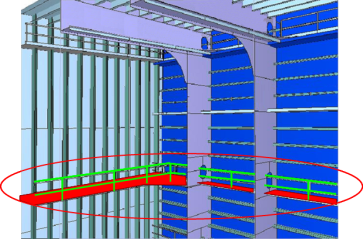

# 제4편 선체의장

> 선급 및 강선규칙/적용지침 / RA-04-K / 2025 / KO / Guidance

## 부록 4-1 유조선의 평형수탱크 및 화물탱크로의 접근설비

### 1. 2항에 규정된 탱크를 제외한 평형수탱크 및 화물유 탱크

#### 1.1

- **(1)** 소항목 .1, .2 및 .3항은 갑판하 부재, 트랜스버스 웨브 상단부 및 이들의 연결부에 대한 접근설비를 정의한다.
- **(2)** 소항목 .4, .5 및 .6항은 단지 수직부재에 대한 접근설비를 정의하며 종격벽 상의 트랜스버스 웨브와 관련된다.
- **(3)** 갑판하 부재(갑판 종통재 및 갑판 트랜스버스)는 없으나 횡격벽 및 종격벽을 지지하는 화물탱크내 수직부재가 있는 경우, 횡격벽 및 종격벽의 수직 부재 상부를 검사하기 위하여 소항목 .1항에서 .6항에 따른 접근설비가 제공되어야 한다.
- **(4)** 화물 탱크에 부재가 없을 경우 표1의 1.1항은 적용되지 않는다.
- **(5)** **규칙 표 4.11.1**의 1항은 2항에 포함되지 않는 구역으로 협약 제II-1장 제3-6규칙에 포함되는 구역에 상당하는 화물지역의 공소(void space)에도 적용되어야 한다.
- **(6)** 상부 구조 하방으로의 수직거리는 주어진 위치에서 갑판 판 하부로부터 접근설비 플랫폼의 상당까지 측정하여야 한다.
- **(7)** 탱크의 높이는 각 탱크마다 측정해야 한다. 각 구획(bay)마다 다른 높이를 갖는 탱크의 경우 1.1항은 6 m 이상의 구획(bay)에 적용되어야 한다.

#### 1.1.1

#### 1.1.2 갑판 종늑골 및 갑판 트랜스버스가 갑판 상부에 위치하나 지지하는 브래킷(supporting bracket)이 갑판하부에 설치될 경우에 종방향 영구 접근설비가 제공될 필요가 있다.

#### 1.1.3 탱크의 접근설비는 검사용 영구 접근설비에 대한 접근로로 사용될 수 있다.

#### 1.1.4 영구 고정 장치는 검사를 위하여 선원이나 검사원이 사용할 수 있고 상기 항에 언급된 영구 접근설비과 적어도 같은 정도의 안전성을 제공하는 와이어 리프트 플랫폼과 같은 대체수단을 사용하기 위한 것이어야 한다. 이들 접근설비는 본선에 비치하여야 하고 탱크 내에 물을 채우지 않고 쉽게 이용될 수 있어야 한다. 그러므로 래프팅(rafting)은 본 규정에서 인정할 수 없다. 기국(flag state)을 대신하여 승인될 선체 구조 접근 매뉴얼은 대체 접근설비를 포함하여야 한다. 광석운반선처럼 폭이 5 m 이상인 평형수 탱크에 대하여, 측면 외판은 “종격벽”과 같은 방법으로 간주할 수 있다.

#### 1.1.5

### 2. 이중선측구조를 형성하는 폭 5 m 미만인 선측 평형수탱크 및 빌지호퍼부

#### 2.1 규칙 표 4.11.1의 2항은 빈 공간(void space)으로 설계된 윙탱크에도 적용하여야 한다. 2.1.1항은 갑판하부 부재에 대한 접근설비 요건을 나타낸다. 반면 2.1.2항은 종격벽(트랜스버스 웨브)상의 수직부재의 검사 및 점검을 위한 접근설비 요건이다.

#### 2.1.1

- **(1)** 상부 수평 스트링거와 갑판과의 수직거리가 단면(section)에 따라 달라지는 탱크의 경우, 2.1.1항은 규정에 해당되는 구획에 적용되어야 한다.
- **(2)** 웨브프레임(web frame)에 필요상 설치된 플랫폼에 의해 반대편 취약 상세부에 접근가능하다면 넓은 폭 종늑골(wide longitudinal)은 연속된 영구 접근설비가 될 수 있다. 웨브면의 수직 개구가 넓은 폭 종늑골과 반대편 종늑골 사이의 개방된 부분에 있는 경우, 웨브를 안전하게 통과하기 위하여 웨브 양쪽에 플랫폼이 제공되어야 한다.
- **(3)** 협약 제II-1장 제3-6.3.2규칙에서 요구하는 두 개의 접근 창구가 요구되는 경우, 탱크 양단의 접근 사다리는 갑판까지 연결되어야 한다.
  

#### 2.1.2 웨브프레임(webframe)에 필요상 설치된 플랫폼에 의해 반대편 주요 상세부로 접근가능하다면 넓은 폭 종늑골(wide longitudinal)은 연속된 영구 접근설비가 될 수 있다. 웨브면의 수직 개구가 넓은 폭 종늑골과 반대편 종늑골 사이의 개방된 부분에 있는 경우, 웨브를 안전하게 통과하기 위하여 웨브 양쪽에 플랫폼이 제공되어야 한다. 기술규정 1.4항에 언급된 10 % 이내의 적절한 편차(reasonable deviation)는 영구접근설비가 구조와 일체화 된 경우에 적용될 수 있다.

#### 2.2

- **(1)** 종방향 연속된 영구 접근설비과 구역의 바닥 사이에는 영구 접근설비가 제공되어야 한다.
- **(2)** 선박의 평행부를 벗어난 곳에 위치한 빌지 호퍼 탱크의 높이는 바닥판으로부터 탱크의 호퍼판(hopper plating)까지 측정한 수직 거리 중 최대치로 잡아야 한다.
- **(3)** 높이 6 m를 넘는 경사진 바닥을 갖는 최전방 또는 최후방의 빌지 호퍼 평형수탱크에 대하여, 각 트랜스버스 웨브의 상부 너클 포인트에 대한 접근을 위하여 횡방향 및 수직방향 접근설비를 결합한 수단을 종방향 영구 접근설비를 대신하여 사용할 수 있다.
  

#### 2.2.1 2.2.2

 

#### 2.3

