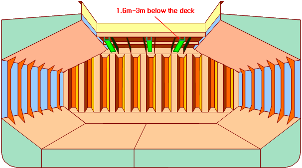

# 제4편 선체의장

> 선급 및 강선규칙/적용지침 / RA-04-K / 2025 / KO / Guidance

## 부록 4-2 산적화물선의 접근설비

### 1. 화물창

#### 1.1

- **(1)** 접근설비는 각 화물창에서 최전방 및 최후방 부분의 크로스데크 구조에 제공되어야 한다.
- **(2)** 크로스데크 하방 중앙 및 양쪽, 3개 위치로의 접근을 위해 상호 연결된 접근설비는 3개의 접근설비으로 인정할 수 있다.
- **(3)** 각 측면에 1개 및 중앙부 근처에 1개인 각각 독립적으로 접근할 수 있는 떨어진 세 위치에 대한 영구 접근설비는 인정할 수 있다.
- **(4)** 접근 개구가 주갑판 및 크로스데크에 제공될 경우에 구조적 강도를 유념해야 한다.
- **(5)** 산적화물선 크로스데크 구조에 대한 요건은 광석운반선에서도 적용할 수 있다.
  

#### 1.2

#### 1.3 접근 개구가 주갑판 및 크로스데크에 제공될 경우에 구조적 강도를 유념해야 한다.

#### 1.4 전통상부스툴(full upper stool)은 톱사이드 탱크 사이 및 창구단보(hatch end beams) 사이 전체에 걸친 스툴로 이해된다.

#### 1.5

- **(1)** 크로스데크 하부 구조에 대한 이동식 접근설비는 반드시 본선에 비치할 필요는 없다. 필요시 이용할 수 있으면 충분하다.
- **(2)** 산적화물선 크로스데크 구조에 대한 요건은 광석운반선에서도 적용할 수 있다고 해석된다.

#### 1.6

- **(1)** 화물창 늑골 접근용 수직사다리의 최대 수직 발판 간격은 350 mm이다.
- **(2)** 안전띠(safety harness)가 사용되는 경우, 실용적인 방법으로 적당한 위치에 안전띠를 연결하기 위한 수단이 제공되어야 한다.
  

#### 1.7 휴대식, 이동식 및 대체 접근설비는 파형격벽에도 적용될 수 있다.

#### 1.8 “항상 사용 가능”이란 화물창 내부에 이동될 수 있고 선원에 의해서 안전하게 설치될 수 있음을 의미한다.

#### 1.10

### 2. 평형수탱크

#### 2.1 2.2

 

#### 2.3 경사판의 종부재가 탱크의 외부에 설치된 경우 접근설비는 제공되어야 한다.

#### 2.5

- **(1)** 선박의 평행부를 벗어난 곳에 위치한 빌지 호퍼 탱크의 높이는 바닥판으로부터 탱크의 호퍼판(hopper plating)까지 측정한 수직 거리 중 최대치로 잡아야 한다.
- **(2)** 검사용 이동식 수단은 전개될 수 있으며 필요한 장소에서 쉽게 이용할 수 있음이 입증되어야 한다.
  

#### 2.5.2 최소폭 600 mm의 넓은 폭 종늑골은 종방향 연속적인 영구 접근설비로 사용될 수 있다. 높이 6 m 이상인 경사진 바닥을 갖는 최전방 및 최후방의 빌지 호퍼 평형수 탱크에 대하여, 각 트랜스버스 웨브에 대한 측면 외판과 연결된 호퍼 탱크의 경사진 판의 접근을 위하여 횡방향 및 수직방향 접근설비를 결합한 수단을 종방향 영구 접근설비를 대신하여 사용할 수 있다.

#### 2.5.3

#### 2.6 웨브프레임 링의 높이는 선측판 및 탱크 바닥에서 측정한다. #imgID-84_s2
