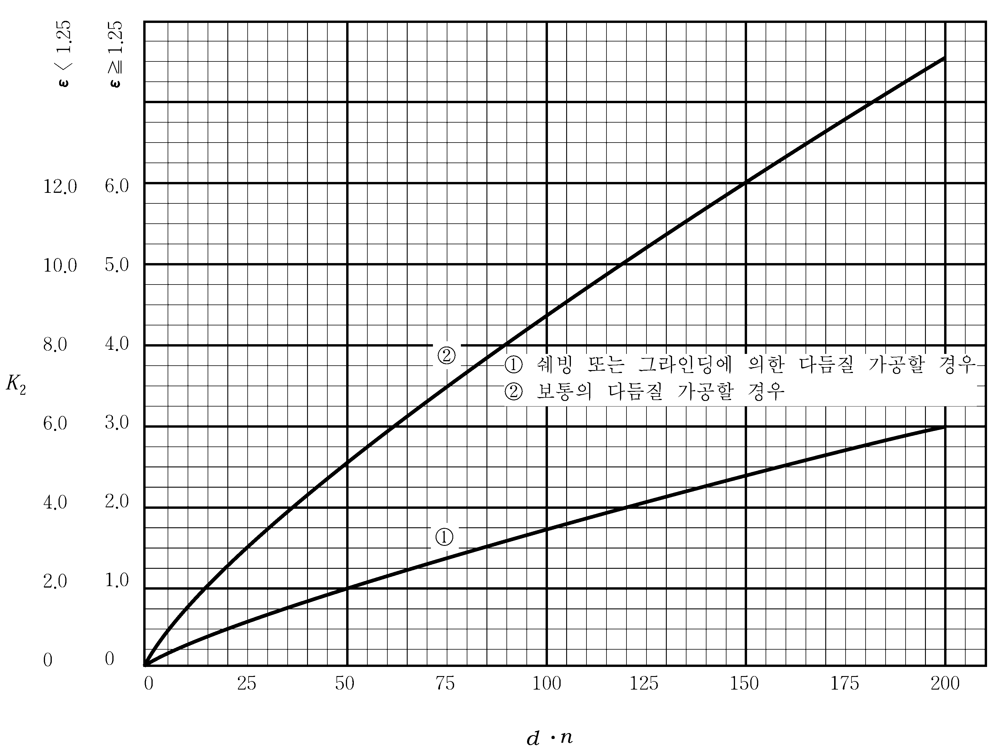

# 제5편 기관장치

> 선급 및 강선규칙/적용지침 / RA-05-K / 2025 / KO / Rules

## 제 3 장 추진축계 및 동력전달장치

### 제 1 절 일반사항

#### 101. 용접구조의 부품

주요부품을 용접구조로 할 경우, 우리 선급이 특별히 필요하다고 인정하는 경우에는 공사에 앞서 예비시험 또는 공사에 관한 시험을 요구할 수 있다. 또한, 용접방법 등은 우리 선급의 승인을 받은 것이어야 한다. 이는 주요부품의 용접보수 또는 수리의 경우에도 적용한다. **【지침 참조】**

#### 102. 기타의 추진장치

이 장에 규정하지 않은 추진장치의 요건에 대하여는 우리 선급이 별도로 정하는 바에 따른다. **【지침 참조】**

#### 103. 추진축계장치의 거치

- **1.** 동력전달장치, 선미관, 축베어링 등을 수지촉(resin chock)을 사용하여 거치할 경우 수지촉은 우리 선급의 형식승인을 받아야 하며 계산된 최대 축력에서 수지촉의 면압은 형식승인 시 승인된 값 이내이어야 한다. 배치 및 설치 절차는 수지촉 제조자의 권고에 따라야 한다. *(2018)*
- **2.** 프로펠러축 또는 선미관축을 스트럿으로 지지할 경우, 이 스트럿은 충분한 강도를 갖는 구조의 것이어야 한다.
- **3.** 추진축계장치는 축계에 과도한 굽힘응력 및 전단응력이 발생하지 않고 베어링에는 적절한 반력이 작용하도록 거치하여야 한다.

### 제 2 절 축계

#### 201. 적용

- **1.** 이 절의 규정은 왕복동 내연기관, 증기터빈 및 가스터빈을 주기관으로 하는 선박과 전기추진 선박의 축계에 적용한다.
- **2.** 축의 크기 계산시 이 절에서 규정하는 방법 이외에 다른 대체계산법을 사용할 경우에는 우리 선급이 적절하다고 인정하는 바에 따른다. **【지침 참조】**

#### 202. 재료

- **1.** 중간축, 추력축, 선미관축, 프로펠러축, 축커플링 및 커플링 볼트의 재료는 **2편 1장**의 규정에 적합한 단강품이어야 한다. 다만, 축커플링을 조립형으로 할 경우에는 **2편 1장**의 규정에 적합한 주강품으로 할 수 있다.
- **2.** **1**항에서 규정하는 재료의 연신율(L방향)은 우리 선급이 특별히 승인한 것 이외에는 16 % 이상이어야 한다.
  **【지침 참조】**
- **3.** 과도운전으로 인해 축이 허용응력에 근접한 진동응력을 접할 수 있는 경우, 재료의 규격최소인장강도는 500 $\mathrm{N}/mm ^{2}$ 이상이어야 한다. 그 외의 경우에는 규격최소인장강도가 400 $\mathrm{N}/mm ^{2}$ 이상인 재료를 사용할 수 있다.

#### 203. 중간축 및 추력축

선박의 중간축 및 추력축 지름 $d_0$ 는 다음 식에 의한 것 이상이어야 한다. **【지침 참조】**

#### 204. 프로펠러축 및 선미관축

- **1.** 프로펠러축 및 선미관축의 지름 $d_p$ 는 다음 식에 의한 것 이상이어야 한다.
  $d _{p} =100 \times K _{2} root {3} of {\frac{P}{n} \times \frac{560}{(T+160)}} ( \mathrm{mm})$
  $P$ 및 $n$ : **203.**의 규정에 따른다.
  $K_2$ : 축 설계특성에 관한 계수로서 **표 5.3.2**에 따른다.
  $T$ : 재료의 규격최소인장강도($\mathrm{N}/mm ^{2}$)로서 600 $\mathrm{N}/mm ^{2}$를 넘을 경우에는 600 $\mathrm{N}/mm ^{2}$ 로 한다.

  **표 5.3.2 계수** $K_2$

  | 구간(1) | 프로펠러 부착방법(2) | $K_2$(4) |
  | --- | --- | --- |
  | **1.** 프로펠러보스(또는 프로펠러부착 플랜지)의 선수단으로부터 축의 최후부 베어링의 선수단 또는 2.5 $d_p$ (해수윤활의 경우 4.0 $d_p$)까지의 구간 중 길이가 긴 부분 | 키 | 1.26 |
  | **1.** 프로펠러보스(또는 프로펠러부착 플랜지)의 선수단으로부터 축의 최후부 베어링의 선수단 또는 2.5 $d_p$ (해수윤활의 경우 4.0 $d_p$)까지의 구간 중 길이가 긴 부분 | 키 없이 압입 | 1.22 |
  | **1.** 프로펠러보스(또는 프로펠러부착 플랜지)의 선수단으로부터 축의 최후부 베어링의 선수단 또는 2.5 $d_p$ (해수윤활의 경우 4.0 $d_p$)까지의 구간 중 길이가 긴 부분 | 플랜지(3) | 1.22 |
  | **2.** 상기 **1.**에 해당되는 부분을 제외하고, 선내측 선미관 밀봉장치의 전단부까지의 구간 |   | 1.15 |
  | (비고) (1) 구간 사이의 경계에서 축지름은 점차적으로 감소되어야 한다. (2) 기타의 프로펠러 부착방법은 우리 선급이 적절하다고 인정하는 바에 따른다. (3) 플랜지의 밑면 필릿부에는 0.125$d_p$ 보다 큰 곡률반지름을 주어야 한다. (4) 해수에 대하여 승인된 방식조치(슬리브 또는 형식승인된 방식코팅)를 한 것에 적용한다. 다만, 승인된 내식성 재료로 제조되는 제1종 프로펠러축 또는 선미관축과 제2종 프로펠러 또는 선미관축의 지름에 대하여는 우리 선급이 적절하다고 인정하는 바에 따른다. *(2020)* **【지침 참조】** |   |   |
- **2.** **경감** 내측 선미관 밀봉장치보다 전방에 위치한 구간의 축 지름은 1항의 식에서 $K_2$ 계수 대신에 표 5.3.1의 중간축의 계수 $K_1$ 을 사용하여 계산한 값까지 점차적으로 경감할 수 있다. **【지침 참조】**
- **3.** **슬리브**
  - **(1)** 프로펠러축 또는 선미관축이 해수에 대하여 내식성을 갖지 않는 재료로 제작될 경우에는 슬리브로 해수에 대하여 방식조치를 하여야 한다.
  - **(2)** 슬리브의 제작 : 슬리브의 재료는 고급 청동제, 스테인리스강 또는 이와 동등 이상의 것으로서 기포나 기타의 결함이 없어야 한다.
  - **(3)** 슬리브의 두께
    $t _{1 } = 0.03d _{p} +7.5 (\mathrm{mm})$
    $t _{2} = 0.75t _{1} (\mathrm{mm})$
    $t _{1}$ : 선미관베어링 또는 스트럿베어링에 접촉하는 부분의 슬리브 두께 ($\mathrm{mm}$)
    $t _{2}$ : 기타 부분에서의 슬리브 두께 ($\mathrm{mm}$)
    $d _{p}$ : 프로펠러축의 계산상 소요지름 ($\mathrm{mm}$)
    - **(가)** 청동제의 경우에는 다음 식에 의한 것 이상이어야 한다.
    - **(나)** 스테인리스강제의 경우에는 청동제에 요구되는 두께의 1/2 또는 6.5 $\mathrm{mm}$ 중 큰 것 이상이어야 한다.
  - **(4)** 슬리브의 고정
    - **(가)** 슬리브는 축에 수축 끼워맞춤으로 고정하여야 하며, 핀 또는 볼트 등으로 고정하여서는 아니 된다.
    - **(나)** 슬리브는 일체형으로 시공함을 원칙으로 한다. 슬리브를 분할하여 시공할 경우, 슬리브로 보호되지 않는 축 부분을 고무, 합성수지 등과 같은 방식재료로 보호하여야 한다. 방식재료는 우리 선급이 형식승인한 것이어야 하며 승인한 방법으로 시공하여야 한다. *(2021)*
- **4.** **프로펠러축의 테이퍼** 테이퍼부를 갖는 프로펠러축의 선미단에서의 테이퍼는 1/10(키가 없는 경우에는 1/15) 이하이어야 한다.
- **5.** **프로펠러 부착부의 프로펠러축 키 【지침 참조】**
  - **(1)** 키 및 키홈 : 프로펠러축의 테이퍼 부분에 키를 설치하는 경우에는 키는 키홈에 단단히 들어 맞도록 하여야 하며, 고정볼트로 고정하여야 한다. 또한, 키홈 밑면 필릿부의 곡률반지름은 실제 프로펠러축 콘의 대단부 지름의 1.25 % 이상이어야 한다. 키홈의 선수측 끝부분은 스픈형으로 하는 것을 원칙으로 하며 키홈 선수측 끝단과 콘의 대단부 사이의 거리는 실제 프로펠러축 콘의 대단부 지름의 20 % 이상이어야 한다.
  - **(2)** 키 고정볼트 : 키는 2개의 고정볼트로 키홈에 고정하여야 하며, 선수측 고정볼트는 적어도 키 선수단에서 키 길이의 1/3 이상의 위치에 고정하여야 한다. 또한, 고정볼트의 구멍깊이는 고정볼트의 지름을 넘지 않아야 하고, 키홈 구멍의 모서리는 모떼기를 하여야 한다.
  - **(3)** 키 면적 : 일반적으로 키의 재료는 축 재료와 동등하거나 높은 강도를 가진다. 전단에 대한 키의 유효 면적 $A$는 다음 식에 의한 값 이상이어야 한다.
    $A= \frac{d _{0} ^{3}}{2.55d _{m}} \cdot \frac{Y _{S}}{Y _{K}}$ (mm^2)
    $d _{0}$ : **203.**의 식에 의한 중간축 지름 (mm)
    $d _{m}$ : 키 중간 위치에서의 축지름 (mm)
    $Y _{S}$ : 축 재료의 규격최소항복강도 (N/mm^2)
    $Y _{K}$ : 키 재료의 규격최소항복강도 (N/mm^2)

#### 205. 중공축

중공축의 바깥지름은 **203.** 및 **204.**에서 규정하는 각각의 식에 의한 지름에 다음의 계수 $K_h$ 를 곱한 것 이상이어야 한다. 다만, $R$ 이 0.4 이하일 경우에는 $K_h$=1 로 한다.

#### 206. 선미관 베어링 및 선미관 밀봉장치

- **1.** 프로펠러의 중량을 지지하는 선미관의 선미측 베어링 또는 스트럿 베어링은 다음 규정에 적합하여야 한다.
  - **(1)** 베어링에 고무, 합성수지 등을 사용할 경우에는 미리 그 재료, 구조 및 윤활장치 등에 대하여 우리 선급의 형식승인을 받아야 한다.
  - **(2)** 해수윤활을 하는 경우, 베어링의 길이는 프로펠러축의 계산상 소요지름의 4배 이상이어야 한다. 다만, 고무 또는 합성수지 등을 사용할 경우에는 베어링에 대한 실험자료 또는 사용실적 등이 양호할 경우, 우리 선급의 승인을 받아 베어링의 허용면압을 증가시키거나 또는 베어링의 길이를 적절하게 감소시킬 수 있다. 이러한 경우에 베어링 길이는 최소한 프로펠러축의 계산상 소요지름의 2배 이상이어야 한다.
  - **(3)** 화이트메탈, 합성수지 등을 사용하고 기름윤활을 하는 경우, 베어링 길이는 프로펠러축의 계산상 소요지름의 2배 이상이어야 한다. 다만, 프로펠러축과 프로펠러의 하중을 고려한 베어링의 정적반력에 의하여 계산된 베어링 호칭면압이 0.8 $\mathrm{MPa}$ 이하, 합성수지인 경우 0.6 $\mathrm{MPa}$ 이하이면 베어링의 길이를 감소시킬 수 있으나, 어떤 경우에도 베어링의 길이는 실제지름의 1.5배 이상이어야 한다. **【지침 참조】**
  - **(4)** 기름윤활 방식의 선미관 내에는 항상 기름이 충만되어 있도록 하여야 하며, 선미관을 선미탱크 내의 물속에 잠기도록 하든가 또는 적절한 방법에 의해 냉각될 수 있어야 하며, 선미관 내의 윤활유 온도를 확인할 수 있는 적절한 장치를 하여야 한다. 중력탱크 윤활유 공급방식의 경우에는 만재흘수선보다 높은 곳에 저액면 경보장치를 갖춘 탱크를 설치하여야 한다. 해수윤활방식의 선미관 내에는 냉각 및 윤활을 위하여 충분한 해수를 공급하여야 한다.
  - **(5)** 그리스윤활을 하는 경우, 베어링의 길이는 프로펠러축의 계산상 소요지름의 4배 이상이어야 한다. *(2021)*
- **2.** 선미관 밀봉장치는 그 형식, 구조 및 재료 등에 대하여 미리 우리 선급의 형식승인을 받아야 한다. 다만, 글랜드패킹 방식의 해수용 밀봉장치는 제외한다. **【지침 참조】**

#### 207. 축커플링 및 커플링 볼트

- **1.** **커플링 볼트** 축커플링 연결면에서의 커플링 볼트의 지름 $d_b$ 는 다음 식에 의한 것 이상이어야 한다.
  $d _{b} =0.65 \sqrt {\frac{d _{0} ^{3} (T+160)}{n \times D \times T _{b}}} (\mathrm{mm})$
  $d_0$ : $K _{1}$=1.0으로 계산한 중간축의 계산상 소요지름 ($\mathrm{mm}$)
  $n$ : 커플링 볼트의 수
  $D$ : 피치원 지름 ($\mathrm{mm}$)
  $T$ : 중간축 재료의 규격최소인장강도 ($\mathrm{N}/mm ^{2}$)
  $T_b$ : 커플링 볼트 재료의 규격최소인장강도로서 일반적으로 $T \leq T_b \leq 1.7T$ 이어야 하며, 1,000 $\mathrm{N}/mm ^{2}$을 넘는 경우에는 1,000 $\mathrm{N}/mm ^{2}$로 한다. *(2025)*
- **2.** **축커플링**
  - **(1)** 피치원 상에서의 축커플링의 플랜지의 두께 $t$ 는 다음 2개의 식 중 큰 것 이상이어야 한다.
    $t 1 =d b (\mathrm{mm})\#
    t 2 =0.2d (\mathrm{mm})$
    $d_b$ : 해당 축과 동일한 인장강도를 갖는 재료로 계산한 커플링 볼트의 계산상 소요지름 ($\mathrm{mm}$)
    $d$ : 해당 축의 계산상 소요지름 ($\mathrm{mm}$)
  - **(2)** 축커플링의 필릿부 반지름은 축지름의 0.08배 이상이어야 한다. 다만, 축커플링의 볼트 또는 너트의 자리파기 부분이 그 필릿부에 걸리는 경우에는 필릿부의 반지름을 축지름의 0.125배 이상으로 하여야 한다.
- **3.** **조립형 커플링** 축커플링이 조립형일 때에는 축의 회전력에 대하여 충분한 강도를 가지며 또한 후진력에도 견딜 수 있는 구조의 것이어야 한다. 이 경우, 축에 과도한 응력집중이 생기지 아니하도록 하여야 한다. **【지침 참조】**

#### 208. 시험 및 검사

- **1.** **선미관의 수압시험** 선미관은 제조후 0.2 $\mathrm{MPa}$ 의 압력으로 수압시험을 하여야 한다.
- **2.** **누설시험** 선미관의 유밀장치는 선내에 설치후 급유압력으로 누설시험을 하여야 한다.
- **3.** **슬리브의 수압시험** 프로펠러축 및 선미관축의 슬리브는 축에 수축 끼워맞춤을 하기 전에 0.1 $\mathrm{MPa}$ 의 압력으로 수압시험을 하여야 한다.

### 제 3 절 프로펠러

#### 301. 적용

이 절의 규정은 스크류형의 프로펠러에 적용한다. 특수한 설계의 프로펠러 구조 및 강도에 대하여는 우리 선급이 적절하다고 인정하는 바에 따른다. **【지침 참조】**

#### 302. 재료

프로펠러의 재료 및 조립형 프로펠러의 날개(blade) 부착용 볼트의 재료는 **2편 1장**의 규정에 적합한 것이어야 한다. **【지침 참조】**

#### 303. 날개(blade)의 두께 【지침 참조】

- **1.** 일체형 및 가변피치 프로펠러의 날개(blade) 두께(날개(blade) 루트부의 반지름으로 생긴 두께를 제외한다)는 각각 **표 5.3.3**의 식에 의한 것 이상이어야 한다. 다만, 고속선인 경우에는 더 큰 값을 요구할 수 있다.
- **2.** 예인선, 트롤선 또는 이와 유사한 특수한 목적을 갖는 선박 등의 가변피치 프로펠러는 최대볼러드당김 (maximal bollard pull)에 대한 지름/피치비를 계산식에 적용하여야 한다. 그 외 선박의 가변피치 프로펠러는 기관최대출력(MCR)에서 대양항해에 적용 가능한 지름/피치비를 계산식에 적용할 수 있다.
- **3.** **참 작규정 표 5.3.3** 이외의 재료를 사용하는 프로펠러에 대하여 **2**항에서 규정하는 재료에 따른 정수 $K _{m}$ 의 값은 우리 선급이 정하는 바에 따른다. 또한, 프로펠러의 지름이 2.5 $\mathrm{m}$ 이하인 소형 프로펠러에 있어서는 $K _{m}$ 의 값에 다음의 계수를 곱한 것으로 할 수 있다.
  $D$ ≤ 2.0 $\mathrm{m}$인 경우 : 1.2
  $D$ ＞ 2.0 $\mathrm{m}$인 경우 : 2.0 - 0.4$D$
  $D$ : 프로펠러 지름

#### 304. 조립형 또는 가변피치 프로펠러의 날개(blade) 부착

- **1.** 날개는 보스(또는 변절기구의 부재)에 볼트로 튼튼하게 부착될 수 있도록 하고, 볼트는 적당한 방법으로 풀리지 아니하도록 하여야 한다. 날개 부착용 볼트는 우리 선급이 적절하다고 인정하는 강도를 가져야 하며, 내식성 재료를 사용하거나 해수에 직접 접촉하지 아니하도록 하여야 한다. **【지침 참조】**
- **2.** 날개 플랜지의 볼트 부착부 및 보스의 날개 플랜지 부착부에는 자리파기 또는 동등한 조치를 하여야 하며, 플랜지의 볼트 부착부 자리파기는 날개 루트부의 강도에 크게 영향을 주지 아니하도록 시공하여야 한다. **【지침 참조】**
- **3.** 날개의 플랜지는 보스(또는 변절기구의 부재)의 접합면에 충분히 밀착시키고, 플랜지 측면의 틈새는 가능한 한 작게 하여야 한다. **【지침 참조】**

#### 305. 프로펠러의 부착

- **1.** 프로펠러는 테이퍼를 갖는 프로펠러축에 압입하거나 기타의 적절한 방법으로 축에 견고히 부착하여야 하며, 프로펠러를 압입하거나 떼어내기 위하여 고온으로 국부적인 가열을 하는 것은 가능한 한 피하여야 한다. **【지침 참조】**
- **2.** 프로펠러를 키없는 프로펠러축에 압입하여 부착시키는 경우에는 압입량 계산서를 우리 선급에 제출하여 승인을 받아야 한다. 또한, 볼트로 부착할 경우에는 충분한 강도를 갖는 것이어야 한다. **【지침 참조】**
- **3.** **방식조치** 프로펠러와 프로펠러축 또는 프로펠러 캡의 부착부분은 해수의 침입을 확실히 막을 수 있는 구조의 것이어야 한다.

#### 306. 가변피치 프로펠러 유압장치

가변피치 프로펠러의 조작에 유압펌프를 사용할 경우에는 예비 유압펌프를 설치하든가 기타 다른 장치를 사용하여 유압장치가 고장나더라도 통상 항해에 지장이 없도록 하여야 한다.

#### 307. 시험 및 검사

- **1.** **평형시험** 프로펠러는 정적평형시험을 하여야 한다. 500 $\mathrm{rpm}$을 넘는 회전수를 가지는 프로펠러의 경우 동적평형시험을 실시하여야 한다. *(2020)* **【지침 참조】**
- **2.** **맞비빔 맞춤시험** 테이퍼를 갖는 프로펠러축에 프로펠러를 압입하여 부착시키는 경우에는 부착부의 결합상태를 확인하기 위하여 맞비빔 맞춤시험 또는 적절한 방법으로 시험을 하여야 한다.
- **3.** **압입량 확인** 프로펠러를 키없는 프로펠러축에 압입하여 부착시키는 경우에는 압입량을 확인하여 기록하여야 한다. **【지침 참조】**

  **표 5.3.3 날개(blade) 의 두께**

  | 날개(blade)의 두께 ($\mathrm{mm}$) | $t _{x} = \sqrt {\frac{0.1K _{1} ․P}{C _{x} K _{2} ․Z ․N ․l _{x}}}$ |   |
  | --- | --- | --- |
  | $P$ : 주기관의 연속최대출력 ($\mathrm{kW}$) $Z$ : 날개(blade)의 수 $N$ : 프로펠러 연속최대회전수의 1/100 ($\mathrm{rpm}$/100) $C _{x}$: 날개(blade) $x$ 에서의 단면계수비(실제 단면계수÷ $l_x t_ax ^2$). 0.1 보다 클 경우, 0.1 로 한다. | $l_x$ : 반지름 $xR$ 에 있어서의 날개(blade) 너비 ($\mathrm{m}$) (여기서 $x$ 는 0.25, 0.35, 0.6 을 고려한다.) $R$ : 프로펠러의 반지름 ($\mathrm{m}$) $x$ : $R$ 로써 무차원화한 반지름 방향의 위치 $t_ax$ : 날개(blade)의 실제 두께 ($\mathrm{m}$) $K_1$, $K_2$ : 계수로서 다음 표에 따른다. |   |
  | **표 5.3.5** $\mathrm{rpm}$ **의 값** 기어의 최종다듬질 방법 ; $k_2$ $k_2$≥1.25 ; $k_2$＜1.25 쉐빙 또는 그라인딩에 의한 다듬질가공을 할 경우 ; 0.044 ; 0.088 보통의 다듬질가공을 할 경우 ; 0.11 ; 0.22 $\varepsilon$ $\varepsilon$ : 톱니의 너비로서 더블헬리컬 기어에서는 한쪽의 톱니너비 ($\varepsilon = \frac{10b_e \sin \beta_0}{piM}$)로 한다. $b_e$ : 나선각도 $\mathrm{cm}$ : 치직각 모듈 계수 *x* 일체형 가변피치형 0.25 $K 1 = \frac{61}{\sqrt {1+1.62 \left( \frac{P 0.25}{D} \right) 2}} \left[ 0.092+0.329 \left( \frac{D}{P 0.7} \right) +0.238 \left( \frac{P 0.25}{D} \right) \right]\# K 2 =K m - \frac{D 3 ․ N 2 ․ \xi}{1,000 l 0.25 ․ Z} \left[ 2.02+ \frac{1.17 \left( \frac{100E}{D} \right) +2.39}{\sqrt {1+1.62 \left( \frac{P 0.25}{D} \right) 2}} \right]$ 0.35 $K 1 = \frac{61}{\sqrt {1+0.827 \left( \frac{P 0.35}{D} \right) 2}} \left[ 0.074+0.264 \left( \frac{D}{P 0.7} \right) +0.131 \left( \frac{P 0.35}{D} \right) \right]\# K 2 =K m - \frac{D 3 ․ N 2 ․ \xi}{1,000 l 0.35 ․ Z} \left[ 2.29+ \frac{1.23 \left( \frac{100E}{D} \right) +2.51}{\sqrt {1+0.827 \left( \frac{P 0.35}{D} \right) 2}} \right]$ 0.6 $K 1 = \frac{61}{\sqrt {1+0.281 \left( \frac{P 0.6}{D} \right) 2}} \left[ 0.028+0.096 \left( \frac{D}{P 0.7} \right) +0.026 \left( \frac{P 0.6}{D} \right) \right]\# K 2 =K m - \frac{D 3 ․ N 2 ․ \xi}{1,000 l 0.6 ․ Z} \left[ 1.48+ \frac{0.68 \left( \frac{100E}{D} \right) +1.38}{\sqrt {1+0.281 \left( \frac{P 0.6}{D} \right) 2}} \right]$ $K 1 = \frac{61}{\sqrt {1+0.281 \left( \frac{P 0.6}{D} \right) 2}} \left[ 0.028+0.100 \left( \frac{D}{P 0.7} \right) +0.026 \left( \frac{P 0.6}{D} \right) \right]\# K 2 =K m - \frac{D 3 ․ N 2 ․ \xi}{1,000 l 0.6 ․ Z} \left[ 1.70+ \frac{0.78 \left( \frac{100E}{D} \right) +1.59}{\sqrt {1+0.281 \left( \frac{P 0.6}{D} \right) 2}} \right]$ |   |   |
  | **표 5.3.5** $\mathrm{rpm}$ **의 값** |   |   |
  | 기어의 최종다듬질 방법 | $k_2$ |   |
  | 기어의 최종다듬질 방법 | $k_2$≥1.25 | $k_2$＜1.25 |
  | 쉐빙 또는 그라인딩에 의한 다듬질가공을 할 경우 | 0.044 | 0.088 |
  | 보통의 다듬질가공을 할 경우 | 0.11 | 0.22 |
  | $\varepsilon$ $\varepsilon$ : 톱니의 너비로서 더블헬리컬 기어에서는 한쪽의 톱니너비 ($\varepsilon = \frac{10b_e \sin \beta_0}{piM}$)로 한다. $b_e$ : 나선각도 $\mathrm{cm}$ : 치직각 모듈 |   |   |
  | $D$ : 프로펠러의 지름 ($\mathrm{m}$) $E$ : 축 중심선상에 있어서의 날개(blade)의 레이크($\mathrm{m}$)로서 날개(blade)의 최대두께 단면의 투영도에서 날개(blade) 끝단 수선점과 뒷면의 연장 교차점과의 거리($\mathrm{m}$) $P_x$ : 반지름 $xR$ 에 있어서의 피치 ($\mathrm{m}$) (여기서 $x$ 는 0.25, 0.35, 0.6 및 0.7 을 고려한다.) $\xi = A_\frac{E}{\frac{\pi}{4} D^2}$ : 전개면적비 $A _{E}$ : 프로펠러전개면적 $K_m$ : 계수로서 다음 표에 따른다. | **표 5.3.6** $\mathrm{cm}$ *의 값* $k_3$ 한 개의 피니언에 한 개의 기어 휠이 물려있는 경우 ; 0.01 한 개의 피니언의 지름방향에 두 개의 기어휠이 물려있는 경우 ; 0.003 재료 $K_m$ 회주철품 0.6 주강품 *RSC* 42 0.9 *RSC* 46 *RSC* 49 1.0 동합금주물 *CU* 1 1.15 **CU** 2 *CU* 3 1.3 *CU* 4 1.15 |   |
  | **표 5.3.6** $\mathrm{cm}$ *의 값* |   |   |
  |   | $k_3$ |   |
  | 한 개의 피니언에 한 개의 기어 휠이 물려있는 경우 | 0.01 |   |
  | 한 개의 피니언의 지름방향에 두 개의 기어휠이 물려있는 경우 | 0.003 |   |

### 제 4 절 동력전달장치

#### 401. 일반사항

- **1.** **적용** 이 절의 규정은 선박의 추진장치, 발전기(비상전원용은 제외한다) 또는 선박의 추진 및 안전에 필요한 보기에 연속최대출력 100 kW 이상의 동력을 전달하는 동력전달장치에 적용한다. *(2017)*
- **2.** **특별규정** 이 절에 규정되어 있지 아니한 다른 동력전달장치는 우리 선급이 적절하다고 인정하는 구조의 것으로서 안전하고 확실하게 작용하여야 하며, 전달동력에 대하여 충분한 강도를 갖는 것이어야 한다.
- **3.** **유압 또는 공기압** 추진용 동력전달장치의 클러치장치를 유압 또는 공기압 등으로 작동시킬 경우에는 언제든지 사용될 수 있는 예비의 유압펌프 또는 공기압축기 등을 설치하든가 기타 다른 적절한 장치에 의하여 통상항해에 지장이 없도록 하여야 한다. 다만, 소형선에 대하여 우리 선급이 지장이 없다고 인정하는 경우에는 예비장치를 생략할 수 있다. **【지침 참조】**
- **4.** **전자식 슬립형 커플링** 전자식 슬립형 커플링의 구조에 대하여는 **6편 1장 1603.**의 **6**항에도 적합하여야 한다.
- **5.** **재료** 동력전달장치의 주요부품에 사용하는 재료는 **2편 1장**의 해당 규정에 적합한 것이어야 한다. *(2017)*
  **【지침 참조】**

#### 402. 기어장치의 일반구조 【지침 참조】

- **1.** **조립형 기어** 기어가 조립형 구조일 경우에는 림은 충분한 강도를 갖는 두께로 하고, 전달동력에 충분히 견딜 수 있도록 열박음을 하여야 한다. 톱니가공을 완료한 후 열박음을 할 경우에는 기어의 정밀도를 충분히 보장할 수 있는 구조의 것으로 하든가 또는 열박음을 한 후 톱니의 최종다듬질 가공을 하도록 하여야 한다. 기어가 용접구조일 경우에는 충분한 강성을 갖도록 하여야 하며, 톱니를 가공하기 전에 응력제거를 하여야 한다.
- **2.** **케이싱** 기어의 케이싱은 충분한 강성을 가지고 가능한 한 검사 및 보수가 용이한 구조이어야 한다. 케이싱을 용접구조로 하는 경우에는 사용재료 및 구조에 대하여 우리 선급의 승인을 받아야 한다.
- **3.** **가공** 톱니는 정밀도가 높은 호빙기계로 가공하여야 하며, 최종다듬질 가공은 가능한 한 온도가 조절될 수 있는 실내에서 하여야 한다. 또한, 톱니의 최종 다듬질가공을 완료한 후 예리한 부분이나 톱니의 양끝을 적당히 손질하여야 하며, 표면경화 처리공정은 열변형의 영향을 충분히 고려하고 필요한 표면경도와 경화층의 두께를 갖도록 실시하여야 한다.
- **4.** **부속품** 기타 사용 부속품은 신뢰성이 있는 것이어야 하며, 부속품 부착으로 인하여 기어 축의 축중심에 영향을 주어서는 아니 된다.
- **5.** **소음** 기어장치는 사용회전범위 내에서 가능한 한 소음이 발생하지 아니하도록 하여야 한다.
- **6.** **윤활유 장치**
  - **(1)** 윤활유 장치는 **6장 8절**의 규정에 적합하여야 한다. 특히, 기어장치에 사용하는 윤활유 여과기는 가능한 한 자석이 들어있는 것으로 하여야 한다.
  - **(2)** 구동기의 출력이 37 $\mathrm{kW}$ 를 넘는 강제윤활방식의 기어장치에는 윤활유의 공급이 중지되거나 급유압력이 운전에 지장을 줄 정도로 저하되었을 때 보고 들을 수 있는 윤활유 저압경보장치를 설치하여야 한다. 다만, 강제윤활방식이 아닌 경우에는 윤활유 액면을 확인할 수 있는 장치를 하여야 한다.

#### 403. 기어의 접선하중

- **1.** **적용** 이 규정은 인벌류트 이모양을 갖는 바깥톱니 원통형 기어에 적용한다. 인벌류트 이모양 이외의 기어에 대하여는 우리 선급이 적절하다고 인정하는 바에 따른다. **【지침 참조】**
- **2.** **굽힘강도에 대한 접선하중** 기어의 접선하중은 톱니의 굽힘강도에 대한 다음 조건에 적합하여야 한다. **【지침 참조】**
  $P_MCR \leq P_b$
  $P_MCR$ : 연속최대출력시의 기어의 접선하중으로 다음 식에 의하여 산출되는 값.
  $P _{MCR} = \frac{1.91P}{nd _{1} b} \times 10 ^{6} (\mathrm{N}/cm)$
  $P$ : 피니언이 연속최대출력시에 분담하는 출력 $\mathrm{kW}$
  $n$ : 피니언의 연속최대출력시의 회전수 ($\mathrm{rpm}$)
  $d_1$ : 피니언의 피치원 지름 ($\mathrm{cm}$)
  $b$ : 축에 평행한 단면의 피치원상에서 맞물고 있는 톱니의 너비 ($\mathrm{cm}$)
  $P_b$ : 굽힘강도에 대한 허용접선하중으로 다음 식에 의하여 산출되는 값
  $P _{b} =9.81(K _{1} ․S _{b} -K _{2} ) \times K _{3} (4.85- \frac{30.6}{Z} )M (\mathrm{N}/cm)$
  $K_1$ : 외적하중 배가계수로서 기어에 작용하는 변동하중의 크고 작음에 따라 정하여지며, 다음 식에 의하여 산출되는 값. 다만, $K_1$ 의 값을 계산할 수 없을 경우에는 **표 5.3.4**에 의한 값을 사용한다.

  **표 5.3.4** $K_1$ **의 값**

  | 구동기관 | 구조 또는 연결방법 | $K_1$ |   |
  | --- | --- | --- | --- |
  | 구동기관 | 구조 또는 연결방법 | 추진장치용 기어 | 보기구동용 기어 |
  | 증기터빈, 전동기 | 1단감속 기어 | 1.00 | 1.15 |
  | 증기터빈, 전동기 | 다단감속 기어 | 1.00(1), 1.10(2) | 1.15 |
  | 왕복동 내연기관 | 유체 또는 전자식 커플링 | 1.00 | 1.15 |
  | 왕복동 내연기관 | 고탄성 커플링 | 0.90 | 1.05 |
  | 왕복동 내연기관 | 탄성 커플링 | 0.80 | 0.95 |
  | 왕복동 내연기관 | 직결 | 0.50 | 0.60 |
  | (비고) (1) 추진축계에 직결된 기어장치에 적용한다. (2) 추진축계와 유효한 플렉시블커플링 등을 통하여 연결된 기어장치에 적용한다. (3) 한 개의 피니언에 2개 이상의 기어휠이 물려있을 경우의 $K_1$ 의 값은 표의 값의 0.9배로 한다. |   |   |   |

  $K_1 = 1.10P_\frac{MCR}{P_M}AX$
  $P_\max$ : 사용 회전범위 내에 생기는 순간 최대접선하중 ($\mathrm{N}/cm$)
  $K_2$ : 내적하중 부가계수로서 기어의 가공정밀도 등에 따라 정하여지며, 다음 식 또는 **그림 5.3.1**에 의하여 산출한 값
  
  **그림 5.3.1** *K***_2의 값**
  $K_2 = k_2 (d timesn )^0.8$
  $d$ : 기어의 피치원의 지름 ($\mathrm{cm}$)
  $n$ : 기어의 매분 회전수의 1/1,000 ($\mathrm{rpm}$/1,000)
  $k_2$ : **표 5.3.5**에 따른다.

  **표 5.3.5** $k_2$ **의 값**

  | 기어의 최종다듬질 방법 | $k_2$ |   |
  | --- | --- | --- |
  | 기어의 최종다듬질 방법 | $\varepsilon$≥1.25 | $\varepsilon$＜1.25 |
  | 쉐빙 또는 그라인딩에 의한 다듬질가공을 할 경우 | 0.044 | 0.088 |
  | 보통의 다듬질가공을 할 경우 | 0.11 | 0.22 |
  | $\varepsilon = \frac{10b_e \sin \beta_0}{piM}$ $b_e$ : 톱니의 너비로서 더블헬리컬 기어에서는 한쪽의 톱니너비 ($\mathrm{cm}$)로 한다. $\beta_0$ : 나선각도 $M$ : 치직각 모듈 |   |   |

  $K_3$ : 처짐에 의한 하중 배가계수로서 톱니의 너비 및 피치원 지름에 따라 정하여지며, 다음 식 또는 **그림 5.3.2**에 의하여 산출하는 값.
  $K_3 = 1 - k_3 left(b_\frac{t}{d_1} right)^3$
  $b_t$ : 피니언 톱니의 전체너비($\mathrm{cm}$)로서 더블헬리컬기어에서는 중간의 홈을 포함한다.
  $d_1$ : 피니언의 피치원 지름 ($\mathrm{cm}$)
  $k_3$ : **표 5.3.6**에 따른다.

  **표 5.3.6** $k_3$ *의 값*

  |   | $k_3$ |
  | --- | --- |
  | 한 개의 피니언에 한 개의 기어 휠이 물려있는 경우 | 0.01 |
  | 한 개의 피니언의 지름방향에 두 개의 기어휠이 물려있는 경우 | 0.003 |

  $Z$ : 톱니의 수
  $S_b$ : 주로 기어의 재료에 따라 정하여지며, 다음 식에 따라서 산출되는 값. 다만, 전진용 중간 기어 또는 후진용 기어의 $S_b$ 의 값은 각각의 0.7 배 또는 1.2 배로 한다. 또한, 어떠한 경우에도 $S_b$ 의 값은 25 를 넘어서는 아니 된다.
  톱니 밑부분을 포함하여 표면경화한 기어 : $S _{b} =0.83 \sqrt {S}$
  기타의 기어 : $S _{b} = \frac{S+Y}{49} \times \frac{1}{F}$
  $F=1+(0.0096S-2.4) \left( \frac{0.04}{\gamma _{0}} +0.02 \right) \times (0.023M+0.75)$
  $S$ : 기어재료의 규격최소인장강도 ($\mathrm{N}/mm ^{2}$)
  $Y$ : 기어재료의 항복강도 ($\mathrm{N}/mm ^{2}$)
  $\gamma_0$ : 커터의 톱니끝 곡률반지름의 모듈에 대한 비
  $M$ : 치직각 모듈
- **3.** **면압강도에 대한 접선하중** 기어의 접선하중은 톱니면의 면압강도에 대한 다음 조건에 적합하여야 한다. 다만, 후진용 기어에는 적용하지 아니한다.
  $P_MCR \leq P_S$
  $P_MCR$ : **2**항의 규정에 따른다.
  $P_S$ : 면압강도에 대한 허용 접선하중으로서 다음 식에 따라 산출되는 값
  $P _{S} =9.81(K _{1} \times S _{S} -K _{2} )K _{3} \times K _{4} \frac{i}{1+i} \times d _{1} (\mathrm{N}/cm)$
  $K_1$*,* $K_2$ 및 $K_3$ : **2**항의 규정에 따른다.
  $S_S$ : 기어의 재료에 따라 정하여지며 다음 식에 따라 산출되는 값
  톱니면을 경화시킨 기어끼리 맞물릴 경우 : $S _{S} =2.236 \sqrt {S _{W}}$
  기타의 경우 : $S _{S} = \left( 0.005 \frac{H _{BWP}}{H _{BWW}} +0.007 \right) S _{W} +7.5$
  $S_W$ : 기어휠 재료의 규격최소인장강도 ($\mathrm{N}/mm ^{2}$)
  $H _{BWP}$ : 피니언 톱니면의 브리넬 경도 ($\mathrm{H} _{BW}$)
  $H _{BWW}$ : 기어휠 톱니면의 브리넬 경도 ($\mathrm{H} _{BW}$)
  $K_4$ : 윤활계수로서 피치원의 지름 및 회전수에 따라 정하여지며, 다음 식 또는 **그림 5.3.3**에 따라 산출되는 값.
  $K_4 = 0.3(d ․ n) ^{\frac{1}{6}}$
  $d$ : 기어의 피치원 지름 ($\mathrm{cm}$)
  $n$ : 기어의 매분 회전수의 1/1,000 ($\mathrm{rpm}$/1,000)
  $i$ : 톱니수의 비(기어휠의 톱니수/피니언의 톱니수)
  $d_1$ : 피니언의 피치원 지름 ($\mathrm{cm}$)
- **4.** **참작규정** 우리 선급은 설계, 공작, 용도 등에 대한 상세한 자료 및 강도 계산서가 제출되었을 경우에 이를 검토하고, 적절하다고 인정할 때에는 **2**항 및 **3**항의 규정에 적합하지 아니하는 기어장치라도 이를 승인할 수 있다. **【지침 참조】**

#### 404. 기어축

- **1.** **기어축** 동력을 전달하는 기어축의 지름은 **203.**의 식에 의한 것 이상이어야 한다. 이 경우, $P$ 및 $n$ 은 각각 연속최대출력시에 각 기어축이 분담하는 출력 및 회전수로 하며, 피니언축에 있어서 $T$ *의* 값은 사용재료의 규격최소인장강도로서 1,000 $\mathrm{N}/mm ^{2}$ 을 넘는 경우에는 1,000 $\mathrm{N}/mm ^{2}$ 로 한다. 다만, 기어휠축의 베어링 사이에 있어서의 지름은 상기의 값에 **표 5.3.7**에 의한 계수 $C$ 를 곱한 것 이상이어야 한다.

  **표 5.3.7 계수** $C$

  | 피니언의 배치방법 | $C$ |
  | --- | --- |
  | 1개 피니언이 물려있거나 또는 중심각도가 120° 미만의 각도로 배치된 2개의 피니언이 물려있을 경우 | 1.16 |
  | 중심각도가 120° 이상의 각도로 배치된 2개의 피니언이 물려있을 경우 | 1.10 |
- **2.** **피니언축** 피니언축의 지름은 톱니가 물림으로써 생기는 굽힘에 따른 힘에 충분히 견딜 수 있는 강성을 갖는 것이어야 한다.

#### 405. 플렉시블축

플렉시블축의 지름 $d_f$ 는 다음 식에 의한 것 이상이어야 한다.

#### 406. 축 커플링

- **1.** **축커플링 및 커플링 볼트** 축커플링 및 커플링 볼트에 대하여는 **207.**의 해당 규정을 적용하며, 이들이 내다지보식으로 중량물을 지지하는 경우에는 그의 중량에 대하여도 충분한 강도를 가지도록 설계하여야 한다.
- **2.** **플렉시블 커플링** 플렉시블 커플링은 동력전달에 대하여 충분한 강도를 가져야 한다. *(2019)* **【지침 참조】**

#### 407. 시험 및 검사

- **1.** **가공검사** 표면경화처리를 한 부품은 원칙적으로 시험편을 사용하여 경화층의 두께를 측정하여야 하며, 경도측정시험 및 균열 유무에 대한 적절한 비파괴시험을 하여야 한다. 또한, 기어의 최종 다듬질가공에 대한 정밀도를 정확히 측정하여야 한다.
- **2.** **동적평형시험** 다음 식에 의하여 산출한 값이 50 을 넘는 기어에 대하여는 동적평형시험을 하여야 한다. 다만, 우리 선급이 지장이 없다고 인정하는 경우에는 시험을 생략할 수 있다. **【지침 참조】**
  $\frac{D n}{1},000$
  $D$ : 기어의 피치원 지름 ($\mathrm{cm}$)
  $n$ : 기어의 회전수 ($\mathrm{rpm}$)
- **3.** **톱니면의 접촉상태** 모든 기어장치는 적당한 도료를 톱니면에 엷고 균일하게 칠하고, 적절한 하중 아래 톱니면의 접촉상태를 시험하여야 한다. 이 경우, 톱니의 너비(더블헬리컬 기어의 경우에는 중간홈을 포함)가 300 $\mathrm{mm}$ 를 넘는 추진용 기어 또는 톱니의 너비와 피니언의 피치원의 지름과의 비가 2 를 넘는 추진용 기어에서는 접촉상태를 확인할 수 있는 도료를 기어면에 얇고 균일하게 칠하고, 해상시운전시에 톱니면의 접촉상태를 확인하여야 한다.
- **4.** **플렉시블 커플링** ***(2019)***
  - **(1)** 플렉시블 커플링의 증서는 **표 5.3.8**에 따라 발행되어야 한다.

    **표 5.3.8 플렉시블 커플링의 증서**

    | 항목 | 증서 | 발행처 | 비고 |
    | --- | --- | --- | --- |
    | 비금속 형태의 플렉시블 커플링(고무, 실리콘 등) $\geq 100$ kW | 기자재 | 선급 |   |
    | 비금속 형태의 플렉시블 커플링(고무, 실리콘 등) $\geq 100$ kW | 형식승인 | 선급 |   |
    | 비금속 형태의 플렉시블 커플링(고무, 실리콘 등) $\geq 100$ kW | 재료 | 제조자 | 토크 전달부 |
    | 비금속 형태의 플렉시블 커플링(고무, 실리콘 등) $\geq 100$ kW | 비파괴 | 제조자 | 토크 전달부 |
    | 금속 형태의 플렉시블 커플링(스프링 형 등) $\geq 100$ kW | 기자재 | 선급 |   |
    | 금속 형태의 플렉시블 커플링(스프링 형 등) $\geq 100$ kW | 형식승인 | 선급 | 추진용인 경우에만 |
    | 금속 형태의 플렉시블 커플링(스프링 형 등) $\geq 100$ kW | 재료 | 제조자 | 토크 전달부 |
    | 금속 형태의 플렉시블 커플링(스프링 형 등) $\geq 100$ kW | 비파괴 | 제조자 | 토크 전달부 |
    | (비고) 발행처가 선급이라 함은 선급기자재증서(KRC)를 말한다. 발행처가 제조자라 함은 제조자증서(W)를 말한다. |   |   |   |
  - **(2)** 고무, 실리콘 등의 비금속 형태의 플렉시블 커플링은 토크시험을 실시하여야 한다. 시험은 플렉시블 커플링을 비틀거나 플렉시블 커플링을 비트는 것과 동일한 하중을 탄성체에 가함으로써 수행될 수 있다. 시험 토크는 허용 공칭토크 $T _{KN}$의 1.5배 이상이어야 한다. 시험 결과에 따른 변위는 제조자가 제시한 오차 이내이어야 한다. 왕복동 내연기관과 함께 사용되는 것이 아닌 플렉시블 커플링은 검사원의 재량에 따라 토크시험의 범위를 조정할 수 있다.
  - **(3)** 고무 및 실리콘 등을 접착하여 사용하는 플렉시블 커플링의 경우, 접착시험이 적어도 한 방향 허용 공칭토크 $T _{KN}$의 1.5배의 하중으로 수행되어야 한다. 이 하중에서 탄성체는 접착면 미끄러짐의 징후에 대하여 검사되어야 한다.

### 제 5 절 워터제트 추진장치 (2023)

#### 501. 일반사항

- **1.** **적용**
  - **(1)** 이 절의 규정은 고속기관으로 구동되는 주추진 및 조타용 워터제트 추진장치(이하 추진장치라 한다.)에 적용한다.
  - **(2)** 이 절에서 규정하지 아니한 사항에 대하여는 **5편** 및 **6편**의 관련 규정에 따른다.
  - **(3)** 동등효력
    이 절의 규정에 적합하지 아니한 추진장치라도 **1편 1장 105.**에 따라 우리 선급이 동등의 효력이 있다고 인정하는 경우에는 규정에 적합한 것으로 간주한다.
- **2.** **용어의 정의**
  이 절에서 사용하는 용어의 정의는 다음과 같다.
  - **(1)** **워터제트 추진장치**라 함은 선외에서 흡입된 물을 임펠러로 가속하여 후방으로 분출시키고 이때 발생하는 추력으로 선박을 추진 및 조종하는 장치를 말한다. 다음의 구성품을 포함한다.
    - **(가)** 축계 (주축, 베어링, 축 커플링, 커플링 볼트 및 밀봉장치)
    - **(나)** 물 흡입관로부
    - **(다)** 워터제트 펌프장치
    - **(라)** 조타장치 및 역전장치
  - **(2)** **임펠러**라 함은 물에 에너지를 주기 위한 날개를 갖는 회전체를 말한다.
  - **(3)** **주축**이라 함은 임펠러에 동력을 전달하는 축을 말한다.
  - **(4)** **물 흡입관로부**라 함은 흡입구에서 흡입한 물을 임펠러 입구까지 유도하는 부분을 말한다.
  - **(5)** **노즐**이라 함은 임펠러에 의하여 가속된 물을 분출시키는 부분을 말한다.
  - **(6)** **디플렉터**라 함은 노즐에서 분출된 수류의 방향를 좌우로 전향시킴으로서 타의 기능을 하는 장치를 말한다.
  - **(7)** **리버서**라 함은 노즐에서 분출된 수류의 방향을 전진과 반대방향으로 전향시킴으로서 배를 후진시키는 장치를 말한다.
  - **(8)** **고속기관**이라 함은 가스터빈 또는 **지침 1편 2장 303.**의 **3항**에 따른 고속 왕복동 내연기관을 말한다.
  - **(9)** **워터제트 펌프장치**라 함은 임펠러, 임펠러 케이싱, 고정자(stators), 고정자 케이싱, 노즐, 베어링, 베어링 하우징, 밀봉장치로 구성되는 장치를 말한다.
  - **(10)** **고정자(stators)**라 함은 임펠러에 의하여 발생한 와류를 감소시키기 위하여 고정날개 열을 구성하는 조립품을 말한다.
  - **(11)** **조타장치 및 역전장치**라 함은 디플렉터, 리버서, 디플렉터 또는 리버서 구동용 조타구동장치로 구성되는 장치를 말한다.
  - **(12)** **조타구동장치라** 함은 조타장치의 동력장치, 조타 조작기 그리고 유압식 또는 전동유압식 조타장치에서의 유압관장치를 말한다.
  - **(13)** **조타시스템**이라 함은 조타장치, 조타장치 제어시스템 및 타(타두재 포함)를 포함하는 선박의 방향제어시스템 또는 선체에 힘을 가하여 선수방향 또는 침로를 변경하기 위한 동등한 시스템을 말한다.
  - **(14)** **조타각 한계**는 선박의 속도 또는 프로펠러 토크/속도 또는 기타 제한을 고려하여, 안전한 작동을 위한 제조업체의 지침에 따라 최대 조타각 또는 이에 상응하는 작동 제한을 말한다. "조타각 한계"는 각 선박 고유의 비전통적인 조타 수단에 대하여 조타시스템 제조업체에 의해 선언되어야 한다. 선박 조종성에 대한 표준(IMO Res. MSC.137(76))에 따른 선박 조종성 시험은 조타각 한계를 초과하지 않는 조타각으로 수행되어야 한다.
- **3.** **제출도면 및 자료**
  조선소 또는 추진장치 제조자는 공사착수 전에 다음의 도면 3부 및 자료 1부를 우리 선급에 제출하여야 한다.
  - **(1)** 제출도면
    - **(가)** 주요 요목표, 사양서, 재료 사양서, 용접절차의 상세
    - **(나)** 전체장치도 및 조립단면도(물 흡입관로부 등 각 부분의 재료 및 치수를 기재한 것)
    - **(다)** 축계장치도(주기관, 변속장치, 클러치, 커플링, 주축, 주축 베어링 및 추력베어링, 밀봉장치, 임펠러 등의 배치, 형상 및 구조를 기재한 것)
    - **(라)** 물 흡입관로부 상세도
    - **(마)** 임펠러의 구조도(날개(blade) 단면상세, 주축중심으로부터 날개(blade)의 최대지름, 날개(blade) 수 및 재료사양을 표시한 것)
    - **(바)** 베어링 상세도(롤러 베어링의 경우 롤러 베어링의 수명계산서 및 상세도) 및 밀봉장치 상세도
    - **(사)** 디플렉터 및 리버서 상세도
    - **(아)** 관 장치도(유압, 윤활유 및 냉각수 장치 등)
    - **(자)** 제어장치의 배치도, 유압 및 전기계통도(안전, 경보 및 자동조타 장치)
    - **(차)** 대체 동력원의 배치도 및 계통도
    - **(카)** 디플렉터 위치 지시기의 계통도
    - **(타)** 유압구동기의 상세도
  - **(2)** 자료
    - **(가)** 주축계의 비틀림진동 계산서 및 자중에 의해 굽힘진동이 예상된 경우의 굽힘 고유진동 계산서
    - **(나)** 디플렉터 및 리버서 등의 강도계산서
    - **(다)** 기타 우리 선급이 필요하다고 인정하는 것

#### 502. 재료, 구조 및 강도

- **1.** **재료**
  각 부분의 재료는 사용조건에 적합한 것이어야 하며, 다음의 주요부품은 **2편 1장**의 규정에 적합한 것이어야 한다. 다만, 우리 선급은 한국산업규격 또는 이와 동등하다고 인정되는 규격에 적합한 재료의 사용을 인정할 수 있다.
  - **(1)** 주축, 축 커플링, 커플링 볼트
  - **(2)** 노즐 및 임펠러
  - **(3)** 임펠러 케이싱, 고정자 케이싱 및 베어링 하우징
  - **(4)** 선체외판을 구성하는 물 흡입관로부(축 커버 포함)
  - **(5)** 워터제트 펌프장치에 장착된 플랜지 및 볼트
  - **(6)** 디플렉터 및 리버서
- **2.** **구조 및 강도**
  - **(1)** 주축
    주축의 최소지름은 다음 식에 의한 값 이상이어야 한다.
    $d _{s} =k root {3} of {\frac{P}{N}}$
    $d_s$ : 축의 소요지름 ($\mathrm{mm}$)
    $P$ : 기관의 연속최대출력 ($\mathrm{kW}$)
    $N$ : 축의 연속최대출력시의 회전수 ($\mathrm{rpm}$)
    $k$ : **표 5.3.9**에 따른다.

    | 위치 부착방법 축재료 |   | 임펠러 및 축커플링 부착부분 |   |   |   | 기타 부분 |
    | --- | --- | --- | --- | --- | --- | --- |
    | 위치 부착방법 축재료 |   | 키 | 스플라인 | 플랜지 | 압입 | 기타 부분 |
    | 탄소강 또는 저합금강 | 제2종축 | 105 | 108 | 102 | 102 | 105 |
    | 탄소강 또는 저합금강 | 제1종축 | (비고)에서 $a_1$=100, $a_2$=80으로 한 값 | (비고)에서 $a_1$=102, $a_2$=82 으로 한 값 | (비고)에서 $a_1$=98, $a_2$=78 으로 한 값 |   | (비고)에서 $a_1$=100, $a_2$=80으로 한 값 |
    | 오스테나이트계 스테인리스강 |   | (비고)에서 $a_1$=100, $a_2$=80으로 한 값 | (비고)에서 $a_1$=102, $a_2$=82 으로 한 값 | (비고)에서 $a_1$=98, $a_2$=78 으로 한 값 |   | (비고)에서 $a_1$=100, $a_2$=80으로 한 값 |
    | 석출경화계 스테인리스강 |   | 80 | 82 | 78 | 78 | 80 |
    | (비고) $200 \leq \sigma_y \leq 400$ 의 경우 $k=a _{1} -0.1( \sigma _{y} -200)$ $\sigma_y > 400$ 의 경우 $k =a_2$ $\sigma_y$ : 축재료의 규격최소항복점 또는 0.2 $\%$ 내력 ($\mathrm{N}/mm ^{2}$) |   |   |   |   |   |   |
  - **(2)** 축 커플링 및 커플링 볼트
    $d _{b} =15,300 \sqrt {\frac{P}{N} \times \frac{1}{n D T _{b}}}$
    $d_b$ : 축 커플링 볼트의 소요지름 ($\mathrm{mm}$)
    $P$ : 기관의 연속최대출력 ($\mathrm{kW}$)
    $N$ : 축의 연속최대출력시의 회전수 ($\mathrm{rpm}$)
    $n$ : 볼트 수
    $D$ : 피치원의 지름 ($\mathrm{mm}$)
    $T_b$ : 볼트재료의 규격최소인장강도 ($\mathrm{N}/mm ^{2}$)
    - **(가)** 축 커플링 볼트의 지름은 다음 식에 의한 값 이상이어야 한다.
    - **(나)** 축 커플링의 피치원 상에서의 두께는 전 (가)의 식에서 산출된 커플링 볼트의 소요지름 이상이어야 한다. 다만, 해당 축의 소요지름의 0.2배 보다 작아서는 아니 된다.
    - **(다)** 축커플링의 필릿부 반지름은 축지름의 0.08배 이상이어야 한다. 다만, 축커플링의 볼트 또는 너트의 자리파기 부분이 그 필릿부에 걸리는 경우에는 필릿부의 반지름을 축지름의 0.125배 이상으로 하여야 한다.
  - **(3)** 물 흡입관로부 등
    물 흡입관로부, 임펠러 케이싱 및 노즐은 설계압력에 따른 강도를 가져야 하며, 부식에 대한 고려를 하여야 한다.
  - **(4)** 임펠러 날개(blade)
    임펠러 날개(blade)의 필릿부의 강도는 다음의 조건에 적합하여야 한다. 이 경우, 재료의 허용응력은 원칙적으로 규격최소항복점(또는 0.2 $\%$ 내력)의 1/1.8로 한다.
    $S \geq \frac{5.8 \times 10 ^{5} P}{L t ^{2} Z N _{i}} +2.2 \times 10 ^{-7} D ^{2} N _{i} ^{2}$
    $S$ : 임펠러 재료의 허용응력 ($\mathrm{N}/mm ^{2}$)
    $P$ : 주기관의 연속최대출력 ($\mathrm{kW}$)
    $N _{i}$ : 임펠러 연속최대 회전수의 1/100 ($\mathrm{rpm}$/100)
    $Z$ : 임펠러의 날개(blade) 수
    $L$ : 임펠러 날개(blade) 필릿부의 폭 ($\mathrm{mm}$)
    $t$ : 임펠러 날개(blade) 필릿부의 최대두께 ($\mathrm{mm}$)
    $D$ : 임펠러의 지름 ($\mathrm{mm}$)
- **3.** **축계의 비틀림진동 및 굽힘진동**
  - **(1)** 일반
    - **(가)** 주축계의 비틀림진동계산서의 제출에 관한 전 **501.**의 **3**항 (2)호 (가)의 규정에도 불구하고 이미 승인된 주축계와 동형인 주축계의 경우 또는 명백히 과도한 비틀림 진동응력이 생기지 않는다고 인정되는 경우에는 우리 선급의 승인을 얻어 비틀림 진동계산서의 제출을 생략할 수 있다.
    - **(나)** 계산결과의 추정치를 확인하기 위하여 비틀림진동 계측을 실시하여야 한다. 다만, 전 (가)에 의하여 비틀림 진동계산서의 제출을 생략한 경우 또는 사용회전수 범위 내에 위험한 진동이 없다고 우리 선급이 인정하는 경우에는 비틀림진동 계측을 생략할 수 있다.
  - **(2)** 비틀림진동 응력의 허용한도
    주축계의 비틀림진동 응력은 해당 축계의 사용회전수 범위에서 다음에 따라야 한다.
    $\tau _{1} =A - B \times \lambda ^{2} ( \lambda \leq 0.9)$
    $\tau _{1} =C (0.9< \lambda \leq 1.05)$
    $\tau_1$ : 비틀림진동 응력의 허용한도 ($\mathrm{N}/mm ^{2}$)
    $\lambda$ : 기관의 사용회전수와 연속최대회전수의 비
    $A$, $B$ 및 $C$ : **표 5.3.10**에 따른다.

    |   | 탄소강 또는 저합금강 |   | 오스테나이트계 스테인리스강 | 마르텐사이트계 석출 경화형 스테인리스강 |
    | --- | --- | --- | --- | --- |
    |   | 제1종 축 | 제2종 축 | 오스테나이트계 스테인리스강 | 마르텐사이트계 석출 경화형 스테인리스강 |
    | $A$ | 24.3 | 9.0 | 26.4 | 39.6 |
    | $B$ | 24.1 | 6.2 | 26.4 | 37.1 |
    | $C$ | 4.8 | 4.0 | 5.0 | 9.6 |

    다만, 탄소강 또는 저합금강의 제1종축에서 해당 주축재료의 규격최소인장강도가 400 $\mathrm{N}/mm ^{2}$ 를 넘는 것은 $\tau_1$ 에 다음 식에 의한 값을 곱한 것으로 할 수 있다.
    $k_m = ( T_s + 160 ) /560$
    $k_m$ : 수정계수
    $T_s$ : 주축 재료의 규격최소인장강도 ($\mathrm{N}/mm ^{2}$)
    $\tau_2 = 2.3 \tau_1$
    $\tau_2$ : $\lambda \leq 0.8$ 에서 신속하게 연속사용 금지범위를 통과하는 것을 조건으로 하는 경우의 비틀림진동 응력의 허용한도($\mathrm{N}/mm ^{2}$)
    - **(가)** 연속최대회전수의 80 $\%$를 넘고 105 $\%$ 이하의 회전수 범위에서 주축의 비틀림진동 응력은 다음의 $\tau_1$ 값을 초과하여서는 아니 된다.
    - **(나)** 연속최대회전수의 80 % 이하에서는 주축의 비틀림진동 응력이 다음의 $\tau_2$ 값을 초과하지 않아야 한다. 비틀림진동 응력이 (가)에서 산출된 $\tau_1$ 값을 초과하는 경우 연속사용 금지범위를 설정하고 이를 신속히 통과하는 것을 조건으로 승인할 수 있다.
  - **(3)** 굽힘진동
    추진장치의 주축계는 축계의 굽힘에 의한 고유진동에 대하여도 고려하여야 한다.

#### 503. 시스템 설계

- **1.** **추진장치의 수**
  - **(1)** 통상 적어도 2대의 추진장치를 선박에 설치하여야 한다. 1대의 추진장치의 고장이 다른 추진장치의 성능에 영향이 미치지 않도록 추진장치는 설계되어야 한다.
  - **(2)** 국제항해에 종사하지 않는 선박의 경우, (1)호의 요건에도 불구하고 단일 추진장치를 설치할 수 있다. 이 경우, 추진, 조타 및 역전 기능은 다음 배치에 따라 이중화되어야 한다.
    - **(가)** 적어도 2대의 원동기
    - **(나)** 적어도 2대의 조타 및 역전용 조타구동장치
    - **(다)** 운전 중인 어느 1대의 발전기가 전력손실이 발생한 경우, 적어도 1대의 원동기 및 조타구동장치가 작동할 수 있도록 **504.**의 **1**항의 요건에 따라 전기공급이 유지되거나 또는 즉시 복구되어야 한다.
- **2.** **조타장치 및 역전장치의 일반사항**
  - **(1)** 워터제트 추진장치의 조타시스템는 비전통 조타시스템의 성능 및 배치에 대한 **지침 부록 5-1**의 요건에 적합하여야 한다.
  - **(2)** 리버서는 통상의 운항조건에서 충분한 조선이 가능하도록 선박을 후진시킬 수 있어야 하고, 전진에서 후진으로 전환할 때 선박에 유효한 제동을 줄 수 있는 후진력을 가져야 한다.
  - **(3)** 리버서는 최대후진출력시의 추력에 대하여 충분한 강도를 가져야 한다.
  - **(4)** 내압을 받는 조타장치의 배관 및 기타 부품의 치수 계산을 위한 설계압력은 저압측의 압력을 고려하여 가장 가혹한 허용작동조건하에서 예상되는 최고사용압력의 1.25배 이상이어야 한다. 이 설계압력은 압력도출밸브의 조정압력 미만이어서는 아니 된다.
- **3.** **조타구동장치**
  - **(1)** 조타구동장치에 어큐뮬레이터 등의 압력용기가 사용되는 경우, 이들의 강도는 **5장**의 규정에 적합하여야 한다.
  - **(2)** 조타구동장치에 사용되는 유압관장치는 이 항의 요건 이외에 **6장**의 규정에도 적합하여야 한다.
  - **(3)** 조타 조작기의 강도는 **7장 404.**의 규정에 따른다.
  - **(4)** 조타 조작기에서 오일 실의 구조는 **7장 405.**의 규정에 따른다.
  - **(5)** 조타구동장치의 형식 및 설계를 고려하여 작동유의 청정상태를 유지하기 위한 적절한 장치를 설치하여야 한다.
  - **(6)** 조타구동장치는 필요에 따라 장치 내의 공기를 뺄 수 있는 장치를 비치하여야 한다.
  - **(7)** 외부에서 밸브에 의하여 차단되고 동력원 또는 외력에 의하여 과압이 생길 가능성이 있는 유압관장치의 모든 부분에는 압력도출밸브를 설치하여야 한다. 이 도출밸브의 조정압력은 유압장치의 최고사용압력의 1.25배 이상이어야 하며 설계압력을 초과하여서는 아니 된다. 최소도출능력은 펌프의 총 토출용량의 110% 이상이어야 하며 조정압력의 110%를 초과하는 압력상승이 발생하지 아니하는 것이어야 한다. 이 경우, 사용온도에 대한 기름 점도의 영향을 고려하여야 한다.
  - **(8)** 조타구동장치로부터 기름이 누설된 경우, 즉시 누설을 검지하기 위하여 유탱크에 저액면 경보장치를 설치하여야 하며 이 경보장치는 가시가청인 것으로 선교 및 주기관을 통상 제어하는 장소에 설치하여야 한다. **【지침 참조】**
  - **(9)** 플렉시블관이 조타구동장치에 사용되는 경우, 플랙시블관은 **6장 102. 5**항의 요건에 따른다.
- **4.** **정지장치**
  - **(1)** 추진장치에는 기계적으로 타의 운동을 제한할 수 있는 디플렉터용 정지장치를 설치하여야 한다.
  - **(2)** 추진장치에는 스토퍼에 도달하기 이전에 디플렉터를 멈출 수 있는 리미트 스위치와 같은 능동형 배치가 제공되어야 한다. 이 장치는 조타용 제어장치에 의하여 작동되는 것이 아니고, 디플렉터의 실제 운동에 의하여 작동되는 것이어야 한다. 다만, 플로팅 레버 등의 기계적 기구를 사용하여 이 장치를 작동시킬 수 있다.
- **5.** **윤활유장치**
  - **(1)** 추진장치의 윤활유장치는 **6장 8절**의 관련 요건에 따른다.
  - **(2)** 추진장치의 윤활유장치로의 윤활유 공급이 중지되거나 급유압력이 운전에 지장을 줄 정도로 저하되었을 경우, 선교 및 주기관을 통상 제어하는 장소에 가시가청의 경보를 줄 수 있는 경보장치가 제공되어야 한다.
- **6.** **밀봉장치**
  글랜드패킹 방식의 해수용 밀봉장치를 제외한, 축 및 워터제트 펌프장치용 밀봉장치의 재료, 구조 및 배치는 우리 선급에 의하여 승인받아야 한다.

#### 504. 전기 설비

- **1.** **주전원 【지침 참조】**
  - **(1)** 선박의 추진, 조타 및 역전을 위하여 주전원을 필요로 하는 경우, 사용 중인 어느 하나의 발전기에 고장이 발생한 때에도 적어도 1대의 추진장치의 추진, 조타 및 역전, 그리고 관련 제어장치 및 디플렉터 위치용 지시기의 기능을 확보하기 위하여 필요한 장치에 대한 전원공급이 유지되거나 즉시 복구되도록 시스템을 다음 요건과 같이 배치하여야 한다.
    - **(가)** 통상 1대의 발전기에 의하여 전력을 공급하는 경우, 운전 중인 발전기의 전력이 손실된 경우에 중요보기를 자동 시동(필요한 경우, 순차 시동 포함)하기에 충분한 용량의 예비 발전기를 자동적으로 시동하고 주배전반에 자동으로 접속하도록 하는 장치를 설치하여야 한다.
    - **(나)** 통상 2대 이상의 발전기를 병렬운전하여 전력을 공급하는 경우, 그 발전기 중 1대의 발전기의 전력이 손실된 경우, 선박의 추진 및 조타, 역전, 안전을 확보하기 위하여 나머지 발전기가 계속적으로 운전할 수 있도록 보호장치(필수용도가 아닌 부하를 충분히 차단하고, 필요한 경우, 2차 필수용도에 사용되는 부하 및 거주편의용도에 사용되는 부하를 자동 제거하는 장치 포함)를 설치하여야 한다.
- **2.** 추진장치당 추진출력이 2,500 kW를 초과하는 경우에는, 다음의 요건에 따라 대체 동력원을 설치하여야 한다.
  **【지침 참조】**
  - **(1)** 대체 동력원은 아래 요건에 적합한 디플렉터, 해당 디플렉터와 연관된 제어장치와 디플렉터 위치용 지시장치에 자동적으로 45초 이내에 대체 동력을 공급할 수 있어야 한다.
    - **(가)** 선박이 최대전진속력의 1/2 또는 7 knot 중 큰 쪽의 속력으로 전진 중 조타각 한계에서 한쪽 현에서 반대 현 쪽까지 0.5 °/s 이상의 평균 회전 속도로 선박 방향 제어장치의 방향을 변경할 수 있어야 한다.
  - **(2)** 이 대체 동력원은 총톤수 10,000톤 이상인 선박에서는 적어도 30분간, 기타 선박에 있어서는 적어도 10분간 조타장치를 연속 작동하는데 충분한 용량인 것이어야 한다.
  - **(3)** 대체 동력원은 다음 중 하나이어야 한다.
    - **(가)** 비상 전원
    - **(나)** 조타장치에만 사용되고 또한 조타기 구획 내에 설치된 독립 동력원
  - **(4)** 상기 (3) (나)에서 정한 독립 동력원으로 사용하는 발전기 또는 펌프를 구동하는 원동기의 자동시동장치는 **6편 1장 203.**의 **6**항의 규정에 따라야 한다.
- **3.** **조타장치 및 역전장치의 전기설비 【지침 참조】**
  조타구동장치용 유압펌프가 전동기에 의하여 구동되는 경우, 다음의 요건을 따른다.
  - **(1)** 각 추진장치의 조타시스템은 주배전반으로부터 2조 이상의 전용 회로에 의하여 직접 급전되도록 하여야 한다. 다만, 그 중 1회로는 비상배전반을 경유할 수 있다. 주조타장치 및 보조조타장치가 전동 또는 전동유압식인 경우, 보조조타장치에의 급전은 주조타장치의 급전 회로중 1회로로부터 할 수 있다. 급전회로는 해당 회로에 동시에 접속되고 동시에 운전되는 모든 전동기에 급전할 수 있는 충분한 용량이어야 한다.
  - **(2)** (1)호에서 요구된 전용회로에 사용하는 케이블은 전장에 걸쳐 가능한 한 서로 떨어지게 하여야 한다.
  - **(3)** 유압펌프용 전동기에서 전력손실이 발생한 경우에, 가시가청의 경보장치를 선교에 설치하여야 한다.
  - **(4)** 유압펌프용 전동기의 운전표시장치는 선교 및 주기관을 통상 제어하는 장소에 설치하여야 한다.
  - **(5)** 회로에는 단락보호장치를, 전동기에는 과부하 경보장치를 각각 설치하여야 한다. 과부하 경보는 가시가청의 것으로 주기관을 통상 제어하는 장소의 보기 쉬운 곳에 설치하여야 한다.
  - **(6)** 시동전류를 포함하는 과전류에 대한 보호장치가 설치된 경우, 이 보호장치는 전부하 전류의 2배 이상인 전류에 대하여 전동기 또는 회로를 보호하여야 하며 적절한 시동전류의 통과는 허용하여야 한다.
  - **(7)** 3상 교류식인 경우, 단상이 되면 경보를 발하는 장치를 설치하여야 한다. 경보장치는 가시가청인 것으로 주기관을 통상 제어하는 장소의 보기 쉬운 곳에 설치하여야 한다.

#### 505. 제어장치

- **1.** **일반**
  - **(1)** 이 절에서 규정하지 않은 제어장치에 대한 요건은 **7장 3절**에 따른다.
  - **(2)** 역전장치는 주추진용 기계측제어장소 또는 조타기실에서 제어되어야 한다. 기계측 제어장소에는 선교에서 조작할 수 있는 역전장치의 모든 제어계통을 차단할 수 있는 장치를 설치하여야 한다.
  - **(3)** 역전장치용 원격제어장치가 고장이 발생한 경우, 주추진용 기계측 제어장소 또는 조타기실에서 역전장치를 제어할 수 있을 때까지 리버서는 미리 설정된 위치에 유지되어야 한다.
  - **(4)** 추진장치에는 독립적인 제어장치를 설치하여야 한다. 복수 추진장치가 동시에 작동하도록 설계된 경우, 복수 추진장치는 조이스틱과 같은 단일장치에 의하여 제어될 수 있다.
  - **(5)** 상기 (4)호에서 규정한 제어장치는 그 중 1개의 고장이 다른 제어장치의 고장에 영향을 주지 않도록 설계되어야 한다.
  - **(6)** 이 절에서 규정하지 않은 추진장치에 대한 안전, 경보 및 제어장치에 관한 요건들의 경우, **9편 3장**의 관련 요건을 적용하여야 한다.
- **2.** **감시**
  - **(1)** 디플렉터 위치용 지시장치
    - **(가)** 선교 및 조타기실에서 디플렉터 위치를 지시하여야 한다.
    - **(나)** 디플렉터 위치용 지시기는 제어장치와 독립된 것이어야 한다.
  - **(2)** 리버서 위치용 지시장치
    선교, 조타기실을 포함하는 제어장소 및 추진장치 감시장소에 리버서 위치를 지시하여야 한다.
  - **(3)** 임펠러 속도 지시장치
    선교, 조타기실을 포함하는 제어장소 및 추진장치 감시장소에 임펠러 속도를 지시하여야 한다.

#### 506. 시험 및 검사

- **1.** **공장시험**
  - **(1)** 임펠러 케이싱, 고정자 케이싱 및 베어링 하우징은 설계압력의 1.5배의 압력으로 수압시험을 하여야 한다.
  - **(2)** 주축 선수측 베어링관 및 밀봉장치는 0.2 $\mathrm{MPa}$ 또는 설계압력의 1.5배의 압력 중 큰 쪽의 압력으로 수압시험을 하여야 한다.
  - **(3)** 조타구동장치는 **7장 501.**에서 규정한 시험을 하여야 한다.
  - **(4)** 제어, 안전 및 경보장치의 작동시험을 하여야 한다.
  - **(5)** 워터제트 펌프장치의 임펠러는 동적평형시험을 하여야 한다.
- **2.** **선내시험**
  - **(1)** 유압관장치는 최고사용압력에서 누설시험을 하여야 한다.
  - **(2)** 워터제트 펌프장치의 밀봉장치는 급유압력으로 누설시험을 하여야 한다.
  - **(3)** 실행 가능한 추진장치의 작동시험을 하여야 한다.
- **3.** **해상시운전**
  해상시운전시 다음의 시험을 실시하여야 한다. 다만, 다음의 (2)호 및 (3)호를 제외한 시험들은 계선시 또는 입거시에 시험할 수 있다.
  - **(1)** 축계비틀림진동의 실측은 **4장 103.**을 적용한다.
  - **(2)** **503.**의 **2**항 (1)호에서에서 규정한 조타능력 시험
  - **(3)** 선교와 조타기실 간 제어장치의 전환시험, 자동조타가 제공된 경우 수동조타와 자동조타 간 전환시험을 포함하는 조타 및 역전장치 제어의 작동시험
  - **(4)** **504.**의 **1**항 및 **2**항에서 규정하는 전원공급 유지 대책에 대한 시험 및 대체동력원 시험
  - **(5)** 선교와 조타기실 간 및 기관실과 조타기실 간 통신수단의 시험
  - **(6)** 과압을 방지하기 위한 도출밸브의 작동시험
  - **(7)** 디플렉터 위치, 리버서 위치, 임펠러 속도 및 조타구동장치용 전동기의 운전 지시기에 대한 안전, 경보 및 지시장치의 작동시험
  - **(8)** 정지장치의 작동시험
  - **(9)** 선박 조종성에 대한 표준(IMO Res. MSC.137(76))에 따른 선박 조종성 시험은 조타각 한계를 초과하지 않는 조타각으로 수행되어야 한다.

### 제 6 절 선회식 추진장치 (2023)

#### 601. 일반사항

- **1.** **적용**
  - **(1)** 이 절의 규정은 주추진 및 조타를 위한 선회식 추진장치(포드 추진장치 포함)를 설치하는 선박에 적용한다.
  - **(2)** 이 절에서 규정하지 아니한 사항에 대하여는 **규칙 5편** 및 **6편**의 관련 규정을 따른다.
  - **(3)** 동등효력
    이 절의 규정에 적합하지 아니한 추진장치라도 **1편 1장 105.**에 따라 우리 선급이 동등한 효력이 있다고 인정하는 경우에는 규정에 적합한 것으로 간주한다.
- **2.** **용어의 정의**
  이 절에서 사용하는 용어의 정의는 다음과 같다.
  - **(1)** **스러스터**라 함은 추진력을 발생시키기 위하여 프로펠러(임펠러)가 장착된 장치를 말한다.
  - **(2)** **선회식 추진장치**라 함은 수직축을 중심으로 회전하여 전방향 추진력 및 조타기능을 가지는 추진장치를 말한다. 선회식 추진장치는 다음의 구성품을 포함한다.
    - **(가)** 프로펠러 및 프로펠러 축
    - **(나)** 기어, 클러치 및 추진토크를 전달하는 기어 축(스러스터와 일체형인 경우)
    - **(다)** 선회식 추진장치 케이싱
    - **(라)** 조타장치
  - **(3)** **회전식 포드 전기 추진장치**(이하 **포드 추진장치**라 한다.)라 함은 프로펠러가 전기 원동기에 의해 직접 구동되는 선회식 추진장치를 말한다.
  - **(4)** **선회식 추진장치 케이싱**이라 함은 컬럼(또는 스트럿), 포드, 프로펠러 노즐 등을 포함하는 수밀구조를 말한다.
  - **(5)** **조타시스템**이라 함은 조타장치, 조타장치 제어시스템 및 타(타두재 포함)를 포함하는 선박의 방향제어시스템 또는 선체에 힘을 가하여 선수방향 또는 침로를 변경하기 위한 동등한 시스템을 말한다.
  - **(6)** **조타추진장치**라 함은 함은 선박의 추진 및 조종 둘 다 포함하는 장치를 말한다. (예를 들면, 선회식 추진장치 또는 포드 추진장치)
  - **(7)** **조타장치**라 함은 선박을 조종할 목적으로 타 또는 스러스터 또는 이와 동등한 것을 회전축 중심으로 양방향 회전시키기 위하여 적용되는 기계, 조작기, 동력장치 및 보조기기를 말한다.
  - **(8)** **조타구동장치라** 함은 조타장치의 동력장치, 조타 조작기 그리고 유압식 또는 전동유압식 조타장치에서의 유압관장치를 말한다.
  - **(9)** **조타 조작기**라 함은 타 또는 스러스터 또는 이와 등등한 장치의 회전을 제어하기 위하여 동력을 기계적 작용으로 변환하는 조타장치 구성품을 말한다.
    - **(가)** 전동식 조타의 경우: 전동기 및 구동피니언
    - **(나)** 전동유압식 조타의 경우: 유압전동기 및 구동피니언
  - **(10)** **조타각 한계**는 선박의 속도 또는 프로펠러 토크/속도 또는 기타 제한을 고려하여, 안전한 작동을 위한 제조업체의 지침에 따라 최대 조타각 또는 이에 상응하는 작동 제한을 말한다. "조타각 한계"는 각 선박 고유의 비전통적인 조타 수단에 대하여 조타시스템 제조업체에 의해 선언되어야 한다. 선박 조종성에 대한 표준(IMO Res. MSC.137(76))에 따른 선박 조종성 시험은 조타각 한계를 초과하지 않는 조타각으로 수행되어야 한다.
- **3.** **제출도면 및 자료**
  조선소 또는 스러스터의 제조자는 공사착수 전에 다음의 도면 3부 및 자료 1부를 우리 선급에 제출하여야 한다.
  - **(1)** 제출도면
    - **(가)** 주요 요목표, 사양서, 재료 사양서, 용접절차의 상세
    - **(나)** 전체장치도 및 조립단면도(노즐을 포함한 각 부분의 재료 및 치수를 기재한 것)
    - **(다)** 고정 피치/가변 피치 프로펠러, 축계, 기어, 축 커플링, 커플링 볼트, 클러치 및 기어 축의 상세도
    - **(라)** 조타장치의 상세도(조타구동장치, 기어, 베어링 등)
    - **(마)** 해수와 접하는 밀봉장치의 배치도
    - **(바)** 관장치도(유압장치, 윤활유장치, 냉각수장치 등)
    - **(사)** 선회식 추진장치 케이싱 상세도
    - **(아)** 제어장치의 배치도, 유압 및 전기장치 계통도(안전, 경보 및 자동조타 장치 포함)
    - **(자)** 대체동력원의 배치도 및 계통도
    - **(차)** 선회각 지시기 계통도
  - **(2)** 자료
    - **(가)** 축계 비틀림진동 계산에 관한 자료
    - **(나)** 고정 피치/가변 피치 프로펠러 날개 두께, 피치 제어 메커니즘, 축, 축 커플링, 기어, 선회식 추진장치 케이싱, 조타장치의 하중 전달 구성품의 강도계산서
    - **(다)** 작동지침서
    - **(라)** 롤러베어링의 사용수명 계산서, 프로펠러 압입량 계산서 등
    - **(마)** 기타 우리 선급이 필요하다고 인정하는 것

#### 602. 재료, 구조 및 강도

- **1.** 선회식 추진장치 케이싱, 스러스터를 지지하기 위한 베드플레이트, 스러스터의 토크전달 구성품에 사용되는 재료는 **규칙 2편 1장**의 규정에 적합한 것이어야 한다.
- **2.** 축계, 프로펠러, 기어장치 및 조타장치의 재료 구조 및 강도는 **3장**, **4장** 및 **7장**의 관련 규정을 준용한다.
- **3.** 부속 관장치 및 보기의 재료, 구조 및 강도는 **6장**의 관련 규정을 준용한다.

#### 603. 시스템 설계

- **1.** **스러스터의 수**
  - **(1)** 통상 적어도 2대의 스러스터를 선박에 설치하여야 한다. 1대의 스러스터의 고장이 다른 스러스터의 성능에 영향을 미치지 않도록 스러스터는 설계되어야 한다.
  - **(2)** 국제항해에 종사하지 않는 선박의 경우, 상기 (1)호의 요건에도 불구하고 1대의 스러스터를 설치할 수 있다. 이 경우, 추진, 조타 및 역전장치는 다음 배치에 따라 이중화되어야 한다.
    - **(가)** 적어도 2대의 원동기
    - **(나)** 적어도 2대의 독립적인 조타구동장치(다만, 동일한 조타구동장치는 1개의 기어 휠을 가질 수 있다.)
    - **(다)** 운전 중인 어느 1대의 발전기가 전력손실이 발생한 경우, 적어도 1대의 원동기 및 조타구동장치가 작동할 수 있도록 **604.**의 **1**항의 요건에 따라 전기공급이 유지되거나 또는 즉시 복구되어야 한다.
- **2.** **조타장치의 일반사항**
  - **(1)** 선회식 추진장치의 조타장치는 비전통 조타시스템의 성능 및 배치에 대한 **지침 부록 5-1**의 요건에 적합하여야 한다.
  - **(2)** 내압을 받는 조타장치의 배관 및 기타 부품의 치수 계산을 위한 설계압력은 저압측의 압력을 고려하여 가장 가혹한 허용작동조건하에서 예상되는 최고사용압력의 1.25배 이상이어야 한다. 이 설계압력은 압력도출밸브의 조정압력 미만이어서는 아니 된다.
  - **(3)** 조타추진장치를 회전시켜 후진력을 얻는 경우 선박의 정지상태에서 조타장치의 회전속도는 1.0 rpm 이상이어야 한다.
- **3.** **조타구동장치**
  조타구동장치가 유압식 또는 전동유압식인 경우 다음 요건에 따라 유압 동력으로 구동되는 조타구동장치를 설치하여야 한다.
  - **(1)** 조타구동장치에 어큐뮬레이터 등의 압력용기가 사용되는 경우, 이들의 강도는 **5장**의 규정에 적합하여야 한다.
  - **(2)** 조타구동장치에 사용되는 유압관장치는 이 항의 요건 이외에 **6장**의 규정에도 적합하여야 한다.
  - **(3)** 유압장치의 형식 및 설계를 고려하여 작동유의 청정상태를 유지하기 위한 적절한 장치를 설치하여야 한다.
  - **(4)** 유압장치는 필요에 따라 장치 내의 공기를 뺄 수 있는 장치를 비치하여야 한다.
  - **(5)** 외부에서 밸브에 의하여 차단되고 동력원 또는 외력에 의하여 과압이 생길 가능성이 있는 유압관장치의 모든 부분에는 압력도출밸브를 설치하여야 한다. 이 도출밸브의 조정압력은 유압장치의 최고사용압력의 1.25배 이상이어야 하며 설계압력을 초과하여서는 아니 된다. 최소도출능력은 펌프의 총토출용량의 110% 이상이어야 하며 조정압력의 110%를 초과하는 압력상승이 발생하지 아니하는 것이어야 한다. 이 경우, 사용온도에 대한 기름 점도의 영향을 고려하여야 한다.
  - **(6)** 유압장치로부터 기름이 누설된 경우, 즉시 누설을 검지하기 위하여 유탱크에 저액면 경보장치를 설치하여야 하며 이 경보장치는 가시가청인 것으로 선교 및 주기관을 통상 제어하는 장소에 설치하여야 한다. **【지침 참조】**
  - **(7)** 플렉시블관이 유압장치에 사용되는 경우, 플랙시블관은 **6장 102. 5**항의 요건에 따른다.
- **4.** **윤활유장치**
  - **(1)** 조타추진장치의 윤활유장치는 **6장 8절**의 요건에 따른다.
  - **(2)** 윤활유 공급이 중지되거나 급유압력이 조타추진장치의 운전에 지장을 줄 정도로 저하되었을 경우, 선교 및 주기관을 통상 제어하는 장소에 가시가청의 경보를 줄 수 있는 경보장치가 제공되어야 한다.
- **5.** **냉각장치**
  - **(1)** 조타추진장치의 냉각장치는 **6장 7절**의 요건에 따른다.
  - **(2)** 통풍 및 냉각장치는 조타추진장치의 기계 및 장비를 설계 운전온도 내로 유지하여야 한다.
  - **(3)** 수냉식을 사용하는 경우 냉각기는 조타추진장치 내부로의 누수를 방지할 수 있도록 배치되어야 한다.
- **6.** **밀봉장치**
  프로펠러축 및 조타장치의 회전부에 대한 밀봉장치는 형식, 구조 및 재료 등에 대하여 우리 선급의 승인을 받아야 한다.
- **7.** **조타장치의 설치장소**
  - **(1)** 조타추진장치의 조타장치는 사람의 출입이 용이하고 가능한 한 기관구역과 분리된 둘러싸인 구역에 설치하여야 한다.
  - **(2)** 조타추진장치의 조타장치로 접근하기 위한 통로 및 작업용 공간을 설치하여야 한다. 이 경우, 기름이 누설된 경우에도 적절한 작업 환경을 확보하기 위하여 통로에는 손잡이 및 미끄럼방지 조치를 강구하여야 한다.

#### 604. 전기설비

- **1.** **주전원 【지침 참조】**
  - **(1)** 선박의 추진 및 조타를 위하여 주전원을 필요로 하는 경우, 사용 중인 어느 하나의 발전기에 고장이 발생한 경우에도 적어도 1대의 스러스터의 추진 및 조타장치, 그리고 관련 제어장치 및 선회각 지시기의 기능을 확보하기 위하여 필요한 장치에 대한 전원공급이 유지되거나 즉시 복구되도록 시스템을 다음 요건과 같이 배치하여야 한다.
    - **(가)** 통상 1대의 발전기에 의하여 전력을 공급하는 경우, 운전 중인 발전기의 전력이 손실된 경우에 중요보기를 자동 시동(필요한 경우, 순차 시동 포함)하기에 충분한 용량의 예비 발전기를 자동적으로 시동하고 주배전반에 자동으로 접속하도록 하는 장치를 설치하여야 한다.
    - **(나)** 통상 2대 이상의 발전기를 병렬운전하여 전력을 공급하는 경우, 그 발전기 중 1대의 발전기의 전력이 손실된 경우, 선박의 추진 및 조타, 안전을 확보하기 위하여 나머지 발전기가 계속적으로 운전할 수 있도록 보호장치(필수용도가 아닌 부하를 충분히 차단하고, 필요한 경우, 2차 필수용도에 사용되는 부하 및 거주편의용도에 사용되는 부하를 자동 제거하는 장치 포함)를 설치하여야 한다.
- **2.** 스러스터 당 추진 출력이 2,500 kW를 초과하는 경우에, 다음 요건에 따라 대체 동력원을 설치하여야 한다.
  **【지침 참조】**
  - **(1)** 대체 동력원은 아래 요건에 적합한 조타장치, 해당 조타장치와 연관된 제어장치와 선회각 지시기에 자동적으로 45초 이내에 대체 동력을 공급할 수 있어야 한다.
    - **(가)** 선박이 최대전진속력의 1/2 또는 7 knot 중 큰 쪽의 속력으로 전진 중 조타각 한계에서 한쪽 현에서 반대 현 쪽까지 0.5 °/s 이상의 평균 회전 속도로 선박 방향 제어장치의 방향을 변경할 수 있어야 한다.
  - **(2)** 이 대체 동력원은 총톤수 10,000톤 이상인 선박에서는 적어도 30분간, 기타 선박에 있어서는 적어도 10분간 조타장치를 연속 작동하는데 충분한 용량인 것이어야 한다.
  - **(3)** 대체 동력원은 다음 중 하나이어야 한다.
    - **(가)** 비상 전원
    - **(나)** 조타장치에만 사용되고 또한 조타장치 구획 내에 설치된 독립 동력원
  - **(4)** 상기 (3) (나)에서 정한 독립 동력원으로 사용하는 발전기 또는 펌프를 구동하는 원동기의 자동시동장치는 6편 1장 203.의 6항의 규정에 따라야 한다.
- **3.** 조타추진장치의 전기설비 **【지침 참조】**
  조타추진장치의 전기설비는 다음의 요건을 따라야 한다.
  - **(1)** 각 스러스터의 조타시스템은 주배전반으로부터 2조 이상의 전용 회로에 의하여 직접 급전되도록 하여야 한다. 다만, 그 중 1회로는 비상배전반을 경유할 수 있다. 주조타장치 및 보조조타장치가 전동 또는 전동유압식인 경우, 보조조타장치에의 급전은 주조타장치의 급전 회로중 1회로로부터 할 수 있다. 급전회로는 해당 회로에 동시에 접속되고 동시에 운전되는 모든 전동기에 급전할 수 있는 충분한 용량이어야 한다.
  - **(2)** (1)호에서 요구하는 전용회로에서 사용되는 케이블은 전장에 걸쳐 가능한 한 서로 떨어지게 하여야 한다.
  - **(3)** 추진 및 조타용 전동기로의 전력손실이 발생한 경우, 가시가청의 경보장치를 선교 및 주기관을 통상 제어하는 장소에 설치하여야 한다.
  - **(4)** 조타용 전동기의 운전표시장치는 선교 및 주기관을 통상 제어하는 장소에 설치하여야 한다.
  - **(5)** 회로에는 단락보호장치를, 전동기에는 과부하 경보장치를 각각 설치하여야 한다. 과부하 경보는 가시가청인 것으로 주기관을 통상 제어하는 장소의 보기 쉬운 곳에 설치하여야 한다.
  - **(6)** 시동전류 및 기타의 과전류에 대한 보호장치가 설치된 경우, 이 보호장치는 전부하 전류의 2배 이상인 전류에 대하여 전동기 또는 회로를 보호하여야 하며 적절한 시동전류의 통과는 허용하여야 한다.
  - **(7)** 3상 교류식인 경우, 단상이 되면 경보를 발하는 장치를 비치하여야 한다. 경보장치는 가시가청인 것으로 주기관을 통상 제어하는 장소의 보기 쉬운 곳에 설치하여야 한다.

#### 605. 제어장치

- **1.** **일반**
  - **(1)** 이 절에서 규정하지 않은 제어장치에 대한 요건은 **7장 3절**에 따른다.
  - **(2)** 스러스터는 독립된 제어계통으로 구성되어야 한다. 복수의 스러스터가 동시에 작동하도록 설계된 경우, 스러스터는 조이스틱과 같은 단일장치에 의하여 작동될 수 있다.
  - **(3)** (2)호에서 규정한 제어계통과 구성요소는 어느 한쪽의 고장으로 인하여 다른 쪽이 작동불능 되지 않도록 설계되고 배치되어야 한다.
  - **(4)** 비상조종이 필요한 경우, 선교로부터 스러스터를 원격제어 함으로써 장비보호전용의 작동제한(예를 들면 조타각 제한)을 오버라이드할 수 있어야 한다. 오버라이드 절차는 스러스터의 작동설명서에 문서화되어 있고 스러스터의 제어 위치에 게시되어야 한다.
- **2.** **감시**
  - **(1)** 감시장치는 최소한 다음 사항을 제공하여야 하며 선교에 개별 표시가 제공되어야 한다.
    - **(가)** 원동기 및 조타장치의 동력장치의 과부하
    - **(나)** 프로펠러 회전수
    - **(다)** 가변피치 프로펠러에 대한 프로펠러 피치
    - **(라)** 고정식 프로펠러의 회전 방향 및/또는 추력 방향
    - **(마)** 조타추진장치의 선회각
    - **(바)** 경보 및 감시 시스템으로의 이용가능한 전원 공급
    - **(사)** 조타장치로의 이용가능한 전원 공급
  - **(2)** 조타추진장치의 선회각 표시는 제어장치와 독립적이어야 하며 또한 조타추진장치 구획에 표시되어야 한다.
- **3.** **경보**
  **7장 302.**의 **1**항 및 아래의 고장 상황을 나타내기 위하여 가시가청의 경보가 제공되어야 한다.
  - **(1)** 조타구동장치의 작동유 누설로 인한 유탱크의 저액면
  - **(2)** 추진 및 조타용 전동기로의 전력 손실
  - **(3)** 원동기 및 조타장치의 동력장치의 과부하
  - **(4)** 윤활유 압력의 저하
  - **(5)** 전동기 냉각 매체의 온도 상승
  - **(6)** 프로펠러 포드로의 해수의 유입(포드 추진장치의 경우)
  - **(7)** 조기에 발견 및 표시되는 조타구동장치에서의 잠재적인 작동유 누설(적용 가능한 경우)
  - **(8)** 작동유 압력의 저하(적용 가능한 경우)
  - **(9)** 윤활유 온도의 상승(적용 가능한 경우)

#### 606. 포드 추진장치에 대한 추가요건

- **1.** 프로펠러 포드에 해수의 유입을 감지하는 수단을 설치하여야 한다. 포드에 해수의 유입이 감지되는 경우, 선교 및 주기관 제어장소에 가시가청의 경보장치를 설치하여야 한다.
- **2.** 포드로부터 해수를 배출하기 위한 수단을 설치하여야 한다.
- **3.** 추진 전동기에 냉각 송풍기가 설치되는 경우, 추진 전동기의 최대출력에 충분한 용량을 가지는 주 냉각 송풍기 및 통상출력에 충분한 용량을 가지는 보조 냉각 송풍기를 설치하여야 한다. 이 냉각 송풍기는 쉽게 전환할 수 있도록 설치되어야 한다. 다만, 스러스터에 전용의 냉각 송풍기를 설치하는 경우, 보조 냉각 송풍기는 생략할 수 있다. 【지침 참조】
- **4.** 추진 전동기에 냉각 송풍기를 설치하는 경우, 화재 발생시 안전한 장소에서 송풍기를 정지하고 송풍기에 대한 공기 입출구를 폐쇄할 수 있는 제어수단을 설치하여야 한다.
- **5.** 정비 및 점검를 위해 내부 공간에 직접 접근할 수 있는 포드의 경우 장비와 인원 모두를 보호할 수 있도록 배치되어야 한다.

#### 607. 시험 및 검사

- **1.** **공장시험**
  - **(1)** 축계, 프로펠러, 기어장치 및 조타장치의 시험 및 검사는 **3장** 및 **7장**의 관련규정을 준용한다.
  - **(2)** 유압장치, 윤활유장치 및 냉각장치 등과 같은 부속 관장치 및 보기는 **6장**의 규정을 준용한다.
  - **(3)** 선회식 추진장치 케이싱은 조립 후 1.5 D 또는 2.0 d와 동등한 수두압력 중 작은 값과 0.2 MPa 중 큰 값으로 압력시험을 실시한다. 다만, 프로펠러 노즐은 0.05 MPa의 압력에서 기밀시험을 인정할 수 있다.
    - **(가)** D : 선박의 깊이 (m)
    - **(나)** d : 최대만재설계흘수 (m)
- **2.** **선내 시험**
  - **(1)** 프로펠러 축 및 조타장치용 밀봉장치는 사용압력으로 누설시험을 하여야 한다.
  - **(2)** 조타장치용 유압장치는 적어도 최고사용압력으로 누설시험을 하여야 한다. 다만, 선내 설치 후 누설시험이 불가능한 경우, 공장시험시 실시할 수 있다.
  - **(3)** 다음을 포함하는 스러스터의 작동시험을 실시한다.
    - **(가)** 수동제어 회전 메커니즘의 원활한 작동
    - **(나)** 감속기어 및 밀봉장치의 작동
    - **(다)** 선회시간, 설치된 장치의 압력 및 온도의 확인
  - **(4)** 해당하는 경우 **606.**에서 규정한 배치에 대한 성능시험(배출장치 제외)을 실시한다.
- **3.** **해상시운전**
  해상시운전시 다음의 시험을 실시하여야 한다. 다만, (1)호 및 (2)호를 제외한 시험은 계선시 또는 입거시에 실시할 수 있다. 또한, 선내 설치 후 도출밸브의 작동시험이 불가능한 경우에, 공장시험으로 대체할 수 있다.
  - **(1)** 축계비틀림진동의 실측은 **규칙 4장 103.**을 적용한다.
  - **(2)** **603.**의 **2**항 (1)호 및 (3)호에서 규정한 조타능력에 대한 시험
  - **(3)** 선교와 선회식 추진장치 구획 간 제어장치의 전환시험, 자동조타가 제공된 경우 자동조타와 수동조타 간의 전환시험을 포함하는 조타장치 제어의 작동시험
  - **(4)** **604.**의 **1**항 및 **2**항에서 규정하는 전원공급 유지 대책에 대한 시험 및 대체동력원 시험
  - **(5)** 선교와 선회식 추진장치 구획 간 및 기관실과 선회식 추진장치 구획 간 통신수단의 시험
  - **(6)** 과압 방지용 도출밸브의 작동시험
  - **(7)** 감시, 경보 및 안전장치의 작동시험
  - **(8)** 선박 조종성에 대한 표준(IMO Res. MSC.137(76))에 따른 선박 조종성 시험은 조타각 한계를 초과하지 않는 조타각으로 수행되어야 한다. 
