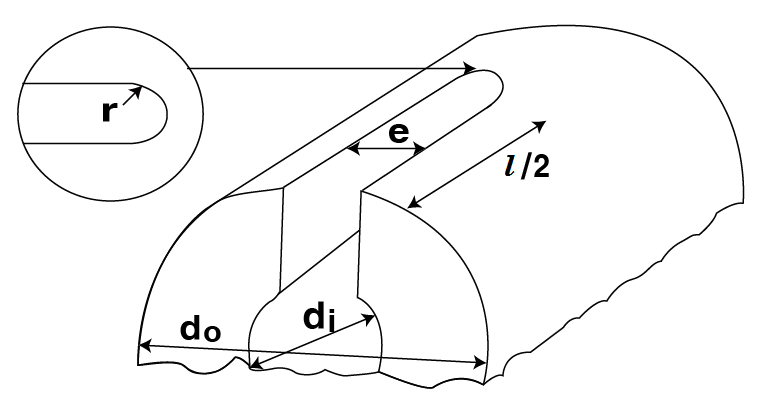

# 제5편 기관장치

> 선급 및 강선규칙/적용지침 / RA-05-K / 2025 / KO / Rules

## 제 4 장 축계비틀림진동

### 제 1 절 일반사항

#### 101. 적용

- **1.** 이 장의 규정은 추진용 동력전달장치 및 추진축계, 주기관으로 구동되는 발전기의 축계, 주기관용 왕복동 내연기관의 크랭크축 및 왕복동 내연기관으로 구동되는 발전기의 축계에 적용한다. 또한 왕복동 내연기관으로 구동되는 중요보기의 축계에도 이 장의 규정을 준용한다. *(2022)*
- **2.** 허용 비틀림진동 응력의 크기 계산시 이 장에서 규정하는 방법 이외에 다른 대체계산법을 사용할 경우에는 **3장 201.**의 **2**항의 요건에 따른다.

#### 102. 제출자료

- **1.** 신조선의 경우, 현존선의 주기관을 바꾸어 탑재하는 경우, 축계, 프로펠러(또는 보기의 축계) 등 진동에 영향을 미치는 부분을 개조 또는 새 것으로 교환할 경우에는 다음 사항을 포함하는 비틀림진동계산서를 제출하여야 한다.
  - **(1)** 1절, 2절 및 필요하다고 인정될 경우에는 3절 이상의 진동모드 및 고유진동수
  - **(2)** 연속최대 회전수의 120 % 내에 발생하는 공진 비틀림진동에 의하여 축계장치에 발생하는 응력의 추정치 및 연속최대회전수의 120 % 밖에서 발생하는 공진점의 영향에 의하여 사용회전수 안의 비공진점에서 발생하는 비틀림 진동응력의 추정치
  - **(3)** 축계, 기어장치 및 플렉시블 커플링에 작용하는 비틀림진동 토크의 추정치
  - **(4)** 추진축계에 대하여는 임의의 1실린더 착화실패(예를 들어, 분사는 하지 않고 압축만 행함)를 한 채 운전할 경우의 진동응력의 추정치
- **2.** **1**항의 규정에 관계없이 다음의 경우에는 우리 선급의 승인을 얻어 비틀림진동계산서의 제출을 생략할 수 있다.
  - **(1)** 기관 및 축계가 이미 승인된 것과 동형인 경우
  - **(2)** 진동계에 약간의 변경이 있는 경우로 종래의 진동계산서 또는 진동실측 결과에 의하여 진동수 및 응력을 추정할 수 있는 경우
  - **(3)** 기관의 연속최대출력이 100 $\mathrm{kW}$ 이하일 때

#### 103. 실측

- **1.** 변동 비틀림응력의 진폭은 반복되는 사이클 전체에 걸쳐 해당 조건에 따라 축에서 계측할 수 있는 값으로서 ($\tau_\max - \tau_\min$)/2로 한다.
- **2.** 축계 비틀림진동계산서의 제출이 요구되는 경우에는 추정치의 확인을 위하여 비틀림진동을 계측하여야 한다. 다만, **102.**의 **2**항에 의하여 계산서의 제출이 생략되거나 사용회전수 내에 위험한 진동이 없다고 인정되는 경우에는 계측을 생략할 수 있다.

### 제 2 절 응력의 허용한도

#### 201. 크랭크축

주기관용 왕복동 내연기관의 크랭크축에 작용하는 비틀림진동 응력은 다음 규정에 따른다. 다만, 우리 선급이 별도로 정하는 바에 따라 크랭크축의 강도계산을 시행한 경우에는 별도로 정하는 바에 따른다. **【지침 참조】**

- **1.** 연속최대회전수 이하에서 기관을 연속 사용하는 경우, 비틀림진동 응력은 다음의 $\tau_1$ 값을 초과하여서는 아니 된다.
  - **(1)** 4사이클 직렬 및 열간 착화간격이 45° 또는 60° 인 V형 기관일 경우 :
    $\tau _{1} =45-24 \lambda ^{2}$ (단, $0 \leq \lambda \leq 1$)
  - **(2)** 2사이클기관 및 (1)호 이외의 4사이클 V형 기관인 경우 :
    $\tau _{1} =45-29 \lambda ^{2}$ (단, $0 \leq \lambda \leq 1$)
    $\tau_1$ : 기관을 연속 사용하는 경우의 비틀림진동 응력의 허용한도 ($\mathrm{N}/mm ^{2}$)
    $\lambda$ : 사용회전수와 연속최대회전수와의 비
- **2.** 연속최대회전수의 80 % 이하에서는 비틀림진동 응력이 다음의 $\tau_2$ 를 초과하지 않는 경우에 한하여 **1**항에서 산출된 $\tau_1$ 값을 초과하는 회전수 범위를 신속히 통과하는 조건으로 그 비틀림진동 응력을 승인할 수 있다.
  $\tau_2 = 2 \tau_1$ (단, $0 \leq \lambda \leq 0.8$)
  $\tau_2$ : 신속하게 회전수 범위를 통과하는 것을 조건으로 하는 경우의 비틀림진동 응력의 허용한도 ($\mathrm{N}/mm ^{2}$)
  $\lambda$ : **1**항의 규정에 따른다.
- **3.** 연속최대회전수를 초과하여 연속최대회전수의 115 % 이하의 범위에서는 비틀림진동 응력이 다음의 $\tau_3$ 값을 초과하여서는 아니 된다.
  - **(1)** 4사이클 직렬 및 열간 착화간격이 45° 또는 60° 인 4사이클 V형 기관인 경우 :
    $\tau _{3} =21+237( \lambda -0.8) \sqrt {\lambda -1}$ (단, $1.0 \leq \lambda \leq 1.15$)
  - **(2)** 2사이클기관 및 (1)호 이외의 4 사이클 V형 기관인 경우 :
    $\tau _{3} =16+237( \lambda -0.8) \sqrt {\lambda -1}$ (단, $1.0 \leq \lambda \leq 1.15$)
    $\tau_3$ : 과회전구역에서의 비틀림진동 응력의 허용한도 ($\mathrm{N}/mm ^{2}$)
    $\lambda$ : **1**항의 규정에 따른다.
- **4.** 축 재료의 규격최소인장강도가 440 $\mathrm{N}/mm ^{2}$보다 크거나 규격최소항복강도가 225 $\mathrm{N}/mm ^{2}$보다 큰 경우, 비틀림진동 응력의 허용한도는 전 각항에서 규정하는 $\tau_1$, $\tau_2$ 및 $\tau_3$ 값에 다음의 계수 $f_m$ 을 곱하는 값까지 증가시킬 수 있다. **【지침 참조】**
  - **(1)** $\tau_1$ 및 $\tau_3$ 에 대한 계수 $f_m$ : $f _{m} =1+ \frac{2}{3} \left( \frac{T _{s}}{440} -1 \right)$
  - **(2)** $\tau_2$ 에 대한 계수 $f_m$ : $f _{m} = \frac{Y}{225}$
    $f_m$ : 비틀림진동 응력의 허용한도에 대한 재료보정 계수
    $T_s$ : 축 재료의 규격최소인장강도 ($\mathrm{N}/mm ^{2}$)
    다만, 탄소강 단강품으로 590 $\mathrm{N}/mm ^{2}$, 저합금강 단강품으로 835 $\mathrm{N}/mm ^{2}$를 각각 초과하는 경우에는 우리 선급이 적절하다고 인정하는 값
    $Y$ : 축 재료의 규격최소항복강도 ($\mathrm{N}/mm ^{2}$)

#### 202. 중간축, 추력축, 프로펠러축 및 선미관축

- **1.** 왕복동 내연기관을 주기관으로 하는 선박의 중간축, 추력축, 프로펠러축 및 선미관축에 작용하는 비틀림진동응력은 다음의 규정에 따른다.
  - **(1)** 연속 최대회전수의 105 % 이하에서 기관을 연속 사용하는 경우의 비틀림진동 응력은 다음의 $\tau_1$ 값을 초과하여서는 아니 된다. 프로펠러축 및 선미관축을 승인받은 내식성 재료로 제작하는 경우에는 우리 선급이 적절하다고 인정하는 값으로 할 수 있다. *(2017)* **【지침 참조】**
    $\tau _{1} = \frac{T _{s} +160}{18} C _{k} C _{d} (3-2 \lambda ^{2} )$ (단, $0 \leq \lambda \leq 0.9$)
    $\tau _{1} =1.38 \frac{T _{s} +160}{18} C _{k} C _{d}$ (단, $0.9 \leq \lambda \leq 1.05$)
    $\tau_1$ : 기관을 연속사용하는 경우의 비틀림진동 응력의 허용한도 ($\mathrm{N}/mm ^{2}$)
    $\lambda$ : **201.**의 **1**항에 따른다.
    $T_s$ : 축 재료의 규격최소인장강도 ($\mathrm{N}/mm ^{2}$)
    다만, $T_s$의 값은 중간축 및 추력축에 있어서 탄소강이 600 $\mathrm{N}/mm ^{2}$을 넘는 경우 600 $\mathrm{N}/mm ^{2}$으로 하고 합금강이 800 $\mathrm{N}/mm ^{2}$을 넘을 경우 우리 선급이 특별히 승인하는 경우를 제외하고 800 $\mathrm{N}/mm ^{2}$로 한다. 프로펠러축 및 선미관축에 있어서는 600 $\mathrm{N}/mm ^{2}$을 넘을 경우 600 $\mathrm{N}/mm ^{2}$으로 한다. *(2017)* **【지침 참조】**
    $C_k$ : 축의 종류 및 모양에 관한 계수로서 **표 5.4.1**에 따른다.
    $C_d$ : 축 지름 크기에 관한 계수로서 다음 식에 따른다.
    $C_d = 0.35 + 0.93 d^-0.2$
    $d$ : 축의 지름($\mathrm{mm}$)

    **표 5.4.1 계수** $C_k$

    | 중간축 |   |   |   |   |   | 추력축 |   | 프로펠러축 | 선미관축 |
    | --- | --- | --- | --- | --- | --- | --- | --- | --- | --- |
    | 일체식 커플링 플랜지 | 수축 끼워맞춤 커플링 플랜지 | 키 홈이 있을 경우 (경사지게 연결) | 키홈이 있을 경우 (원통형으로 연결) | 반지름방향 구멍이 있을 경우 | 축방향으로 슬롯이 있을 경우 | 추력 칼라의 양측 | 롤러베어링을 추력베어링으로 사용하는 축 | - |   |
    | 1.0 | 1.0(1) | 0.6(2) | 0.45(2) | 0.50(3) | 0.30(4)(5) | 0.85 | 0.85 | 0.55(6) | 0.8 |
    | (비고) (1) $C_k$은 평탄한 축단면을 기준으로 한 것임. 연속운전을 하는 동안 축이 허용응력에 근접한 진동응력을 접할 수 있는 경우, 수축끼워맞춤 지름에 대한 1 내지 2 %의 지름 증가 및 지름의 변화율과 거의 동등한 혼합반지름(blending radius)이 제공되어야 한다. (2) 연속사용 금지범위가 설정되어 있는 장치에 키홈을 사용하여서는 아니 된다. (3) 반지름방향 구멍의 지름은 0.3 $d _{0}$ 이하일 것. 횡방향 구멍이 중심을 벗어난 축방향 구멍과 교차하는 경우(아래 그림 참조)에는 각 사안별로 제출된 자료를 근거하여 결정되어야 한다.  (4) 슬롯의 길이($l$)는 0.8 $d _{0}$ 미만이고, 중공축 안지름($d _{i}$)은 0.7 $d _{0}$ 미만이어야 하며 슬롯의 너비(e)는 0.15 $d _{0}$보다 커야 한다. 또한, 슬롯의 끝단 라운드($r$)는 e/2 이상이어야 하며, 가능한 한 이를 크게 하여 응력집중이 생기지 않도록 하여야 한다. 슬롯의 수는 1, 2 또는 3개이어야 하며, 서로 각각 360도, 180도 또는 120도가 되도록 배치하여야 한다. (5) $C_k$= 0.3은 전 (4)의 사용제한 내에 있는 안전한 근사치이다. 보다 상세한 $C_k$값을 사용하고자 할 경우, 응력집중계수(scf)는 유한요소해석에 의한 직접계산을 하거나 우리 선급이 별도로 정하는 바에 따른다. (6) 선미 베어링의 선수단과 프로펠러 보스(또는 프로펠러부착 플랜지) 사이에 있는 프로펠러축에 적용하지만 2.5 $d_s$보다 작아서는 아니 된다. 여기서, $d_s$ : 요구되는 프로펠러축 또는 선미관축의 지름 |   |   |   |   |   |   |   |   |   |
  - **(2)** 연속최대회전수 80 $\%$ 이하에서는 비틀림진동 응력이 다음의 $\tau_2$ 값을 초과하지 않는 경우, (1)호에서 산출된 $\tau_1$ 값을 초과하는 회전수 범위를 신속히 통과하는 것을 조건으로 승인할 수 있다.
    $\tau_2 = \frac{1.7 \tau_1}{sqrtC_k}$
    $\tau_2$ : 신속하게 회전수 범위를 통과하는 것을 조건으로 하는 경우의 비틀림진동 응력의 허용한도 ($\mathrm{N}/mm ^{2}$)
    $\tau_1$ 및 $C_k$ : (1)호의 규정에 따른다.
- **2.** 증기터빈, 가스터빈, 전자식 및 유체커플링과 같은 슬립형 커플링을 갖는 왕복동 내연기관 또는 전기추진장치를 주추진장치로 하는 선박의 경우, 중간축, 추력축, 프로펠러축 및 선미관축의 비틀림진동응력의 허용한도는 우리 선급이 적절하다고 인정하는 값으로 할 수 있다. **【지침 참조】**

#### 203. 발전기의 축계

- **1.** 발전기를 구동하는 왕복동 내연기관의 크랭크축에 작용하는 비틀림진동 응력은 다음의 규정에 따른다. 다만, 우리 선급이 별도로 정하는 바에 따라 크랭크축의 강도계산을 시행한 경우에는 별도로 정하는 바에 따른다. **【지침 참조】**
  - **(1)** 연속최대회전수의 90~110 % 회전수 범위에서는 비틀림진동 응력이 다음의 $\tau_1$ 값을 초과하여서는 아니 된다.
    $\tau _{1} =21 \mathrm{N}/mm ^{2}$
    $\tau _{1} =16 \mathrm{N}/mm ^{2}$
    - **(가)** 4사이클 직렬 및 열간착화간격 45° 또는 60°인 4사이클 V형 기관인 경우 :
    - **(나)** 2사이클 기관 및 (가) 이외의 4사이클 V형 기관인 경우 :
  - **(2)** 연속최대회전수의 90 % 이하에서 비틀림진동 응력이 다음의 $\tau_2$ 값을 초과하지 않는 경우, (1)호에서 산출된 $\tau_1$ 값을 초과하는 회전수 범위를 신속히 통과하는 것을 조건으로 그 비틀림진동 응력을 승인할 수 있다.
    $\tau _{2} =90 \mathrm{N}/mm ^{2}$
- **2.** 왕복동 내연기관으로 구동되는 발전기축에 작용하는 비틀림진동 응력은 다음의 규정에 따라야 한다.
  - **(1)** 연속최대회전수의 90~110 % 회전수 범위에서는 비틀림진동 응력이 다음의 $\tau_1$ 값을 초과하여서는 아니 된다.
    $\tau _{1} =31 \mathrm{N}/mm ^{2}$
  - **(2)** 연속최대회전수의 90 % 이하에서는 비틀림진동 응력이 다음의 $\tau_2$ 값을 넘지 않는 경우, (1)호에서 산출된 $\tau_1$ 값을 초과하는 회전수 범위를 신속히 통과하는 것을 조건으로 그 비틀림진동 응력을 승인할 수 있다.
    $\tau _{2} =118 \mathrm{N}/mm ^{2}$
- **3.** 축 재료의 규격최소인장강도가 440 $\mathrm{N}/mm ^{2}$보다 크거나 규격최소항복강도가 225 $\mathrm{N}/mm ^{2}$보다 높은 경우에는 $\tau_1$ 및 $\tau_2$ 는 **201.**의 **4**항의 $f_m$ 을 곱한 값까지 증가시킬 수 있다.

#### 204. 공진점의 회피

4 사이클 직렬기관과 연결된 축계의 1절 $n$/2 차, $n$ 차 및 2 사이클 직렬기관과 연결된 축계의 1절 $n$ 차($n$ 는 실린더 수)의 공진점은 특히 우리 선급이 승인하는 경우를 제외하고 다음의 회전수 범위 내에 존재하여서는 아니 된다.

#### 205. 상세검토

비틀림진동 응력의 허용한도는 축계의 강도를 고려한 상세한 검토 자료를 우리 선급에 제출하여 적절하다고 인정하는 경우에는 **201.**부터 **203.**의 규정에 관계없이 그의 허용한도를 승인할 수 있다. **【지침 참조】**

#### 206. 연속사용 금지범위

- **1.** 비틀림진동 응력이 **201.**부터 **203.**의 규정에서 정하는 허용한도 $\tau_1$ 값을 넘을 경우, 연속사용 금지범위는 다음의 요건에 따라 설정하여야 한다. 또한, 회전수의 연속사용 금지범위를 가능한 한 신속하게 통과하도록 회전계에 적색으로 표시하여야 한다.
  - **(1)** 연속사용 금지범위는 다음의 속도제한치 내에 있어야 한다.
    $16N_\frac{c}{18}-\lambda \leq N \leq \frac{(18-\lambda)N_c}{16}$
    $N$ : 연속사용 금지의 회전수 ($\mathrm{rpm}$)
    $N_c$ : 공진시의 회전수 ($\mathrm{rpm}$)
    $\lambda$ : 공진시의 회전수와 연속최대회전수와의 비
  - **(2)** 가변피치프로펠러의 경우에는 최대피치상태 및 제로피치상태 모두를 고려하여야 한다.
  - **(3)** 1대의 추진기관이 설치된 선박의 경우에는 1실린더 착화실패 상태로 제한된 속도범위에서 안전한 항해가 가능하여야 한다.
- **2.** 기어 및 플렉시블 커플링 등에 비틀림진동에 의한 과대한 변동토크가 발생하여 채터링, 발열 등의 문제가 생기는 경우에는 그 회전수 범위에 대하여 **1**항의 규정에 따른다. 다만, **204.**에서 정하는 회전수 범위 내에서는 과대한 변동토크가 발생하여서는 아니 된다.
- **3.** **2 01.**부터 **203.**에서 정해지는 허용한도 $\tau_1$ 값을 초과하는 응력이 발생하는 회전수 범위가 계측에 의하여 확인되는 경우에는 **1**항에서 규정하는 범위에 관계없이 그 회전수 범위를 연속사용 금지범위로 할 수 있다. 다만, 회전계의 오차를 고려하여야 한다. 
