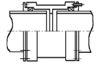

# 제5편 기관장치

> 선급 및 강선규칙/적용지침 / RA-05-K / 2025 / KO / Rules

## 제 6 장 보기 및 관장치

### 제 1 절 일반사항

#### 101. 일반

- **1.** **적용 【지침 참조】**
  - **(1)** 이 장의 규정은 보기 및 관장치의 재료, 설계, 공작, 시험 및 배관에 대하여 적용한다.
  - **(2)** 항로 또는 용도에 특별한 제한이 있는 선박 및 소형선에 대하여는 이 장의 규정을 적절히 참작할 수 있다.
- **2.** **관련규정**
  이 장에서 규정한 요건에 추가하여 다음의 관련 규정에도 적합하여야 한다.
  - **(1)** 대빙구조 선박의 관장치에 대하여는 **빙해운항선박지침 1장**, 극지운항 선박의 관장치에 대하여는 **빙해운항선박지침 2장**, 극지운항 및 쇄빙기능을 갖는 선박의 관장치에 대하여는 **빙해운항선박지침 3장**
  - **(2)** 조타장치에 대하여는 **5편 7장**, 윈들러스 및 무어링 윈치에 대하여는 **5편 8장**
  - **(3)** 자동제어 및 원격제어에 대하여는 **6편 2장**
  - **(4)** 유조선의 관장치에 대하여는 **7편 1장 10절**, 광석운반선겸 유조선의 관장치에 대하여는 **7편 2장 2절**, 산적화물선 및 단일화물창의 화물선의 수위 감지 경보장치 및 배수 펌핑장치에 대하여는 **7편 3장 14절,** 산적화물선 및 탱커선 이외의 여러 개의 화물창을 가진 화물선의 수위 감지 경보장치에 대하여서는 **7편 부록 7-6-1,** 액화가스 산적운반선 및 위험화학품 산적운반선의 화물취급설비 및 관장치에 대하여는 각각 **7편 5장** 및 **6장***,* 저인화점 연료를 사용하는 선박에 대하여는 **저인화점연료 선박 규칙** *(2024)*
- **3.** **정의 【지침 참조】**
  - **(1)** **설계압력**이라 함은 관내 유체의 최고사용압력을 말하며, 다음에 정하는 압력보다 작아서는 아니 된다.
    - **(가)** 압력도출밸브 또는 이에 대신하는 과압방지장치가 붙어 있는 관장치에 있어서는 해당 도출밸브 또는 과압방지장치의 조정압력과 같은 압력. 다만, 보일러에 직접 접속된 증기관장치 또는 압력용기에 직접 접속된 관장치에 있어서는 보일러 또는 압력용기의 설계압력.
    - **(나)** 펌프의 토출측 관에 있어서는 정격회전시 펌프의 토출측 밸브를 완전히 폐쇄하였을 때의 펌프의 토출압력. 다만, 펌프에 도출밸브를 설치한 경우에는 그 조정압력을 기준으로 한 압력.
    - **(다)** 보일러 급수펌프와 보일러 급수 체크밸브 사이의 급수관에 있어서는 보일러의 설계압력의 1.25 배와 같은 압력 또는 급수펌프의 토출측 밸브를 완전히 폐쇄하였을 때의 펌프의 토출압력 중 큰 쪽의 압력.
    - **(라)** 감압밸브가 장비된 관의 저압측에 있어서 도출밸브가 붙어 있지 아니한 경우에는 고압측의 설계 압력과 같은 압력.
    - **(마)** 보일러물 방출관에 있어서는 보일러의 설계압력의 1.25 배의 압력.
    - **(바)** 냉동기기의 냉매관에 있어서는 **9편 1장 102.**의 **5**항에 정하는 압력을 말한다.
    - **(사)** 연료유를 포함하는 관에 있어서는 다음과 같다.
      - **(a)** 사용압력이 0.7 $\mathrm{MPa}$ 이하이고, 사용온도가 60 °C 이하인 경우, 0.3 $\mathrm{MPa}$ 또는 최고사용압력 중 큰 값을 설계압력으로 한다.
      - **(b)** 사용압력이 0.7 $\mathrm{MPa}$ 이하이고, 사용온도가 60 °C를 초과하는 경우, 0.3 $\mathrm{MPa}$ 또는 최고사용압력 중 큰 값을 설계압력으로 한다.
      - **(c)** 사용압력이 0.7 $\mathrm{MPa}$ 을 초과하고, 사용온도가 60 °C 이하인 경우, 최고사용압력을 설계압력으로 한다.
      - **(d)** 사용압력이 0.7 $\mathrm{MPa}$ 을 초과하고, 사용온도가 60 °C를 초과하는 경우, 1.4 $\mathrm{MPa}$ 또는 최고사용압력 중 큰 값을 설계압력으로 한다.
    - **(아)** 이 항에 따르기 곤란한 경우에는 우리 선급이 적절하다고 인정하는 압력.
  - **(2)** **설계온도**라 함은 관내 유체의 최고사용온도를 말한다. 다만, 상온보다 낮은 온도의 관장치에 있어서는 관내 유체의 최저사용온도를 말한다.
- **4.** **관장치의 분류**
  - **(1)** 관장치는 시험, 이음형식, 열처리 및 용접시공방법 등을 위하여 유체의 종류, 설계압력 및 설계온도에 따라 **표 5.6.1**과 같이 분류한다.
  - **(2)** 이 항에 규정되어 있지 아니한 유체의 관장치의 분류에 대하여는 사용유체의 특성 및 사용조건에 따라서 정한다.

    **표 5.6.1 관장치의 분류** ***(2024)***

    | 관장치의 분류 사용목적 | 제1급 | 제2급 | 제3급 |
    | --- | --- | --- | --- |
    | 독성 매체(7) | O | - | - |
    | 부식성 매체(7) | O | O(안전장치(6)) | - |
    | 인화점을 초과하여 가열되거나 인화점 60℃ 미만인 가연성 매체(7) | O | O(안전장치(6)) | - |
    | 증기 | $P$＞1.6 또는 $T$＞300 | 제1 및 3급에 속하지 않는 것 | $P$≤0.7 및 $T$≤170 |
    | 열매체유 | $P$＞1.6 또는 $T$＞300 | 제1 및 3급에 속하지 않는 것 | $P$≤0.7 및 $T$≤150 |
    | 연료유, 윤활유, 가연성 작동유 | $P$＞1.6 또는 $T$＞150 | 제1 및 3급에 속하지 않는 것 | $P$≤0.7 및 $T$≤60 |
    | 기타 매체 (1) | $P$＞4.0 또는 $T$＞300 | 제1 및 3급에 속하지 않는 것 | $P$≤1.6 및 $T$≤200 |
    | (비고) (1) 기타매체 : 물, 공기, 가스(비독성, 비가연성), 비가연성 작동유 및 선택적 촉매환원 장치(SCR)용 우레아(SCR용 우레아의 배관 재료가 ISO 18611-3:2014에 따라 선정된 경우)를 포함한다. (2) $P$ : 설계압력 ($\mathrm{MPa}$), $T$ : 설계 온도(°C) (3) 화물유관은 제3급관에 속한다. (4) 개구단관(드레인관, 넘침관, 공기관, 보일러의 대기방출관, 배기가스관 등)은 설계 온도($T$)와 관계없이 제3급에 속한다. (5) 냉동기기의 1차 냉매에 있어서 *R*717(NH_3)의 경우에는 제1급, *R*22, *R* 134*a*, *R* 404*A*, *R* 407*C*, *R* 410*A* 및 *R* 507*A*의 경우에는 제3급에 속한다. (6) 누출 가능성을 줄이고 그 결과를 제한하기 위한 안전장치(예, 이중관장치, 파이프 덕트 등) (7) 상기의 규정은 다음의 관장치에는 적용하지 않으며 해당 규칙에 따른다. - **7편 6장**의 적용을 받는 위험화학품 산적운반선의 화물관장치 및 선상 탄화수소/위험화학품 처리 관장치 - **7편 5장**의 적용을 받는 액화가스 산적운반선의 가스화물/연료 및 처리 관장치, **저인화점연료선박 규칙**의 적용을 받는 선박의 가스 연료 관장치 - **SOLAS II-1/2.29**에 따른 저인화점 연료용 관장치 |   |   |   |
- **5.** **보기의 구조, 재료 및 강도**
  - **(1)** 보기의 재료 **【지침 참조】**
    - **(가)** 구동에 필요한 원동기 출력이 100 $\mathrm{kW}$ 이상인 중요보기의 축 재료는 **규칙 2편 1장**의 규정에 적합한 것이어야 한다.
    - **(나)** 보기의 주요부분에 사용하는 재료는 우리 선급의 승인을 받은 제조자에 의하여 제조된 것으로서, 우리 선급이 특별히 지정하는 경우를 제외하고 한국산업규격 또는 이와 동등한 규격에 적합한 것이어야 한다.
  - **(2)** 보기의 축 강도
    크랭크축을 제외하고, 중요보기의 축 지름은 원칙적으로 **3장 203.**에 규정된 식에 의한 것 이상이어야 하며, 전동기 또는 유압 구동의 경우 이 산식에서 P 및 F는 다음에 의한다.
    P : 중요보기를 구동하는 원동기의 정격출력 (kW)
    F : 계수로서 95
  - **(3)** 선박의 추진 및 안전에 필요한 보기에 동력을 전달하는 동력전달장치는 **3장 4절**의 규정에 적합하여야 한다.
- **6.** 폐유 또는 폐기물을 소각처리하는 소각설비, 용접기기의 가스용기 및 관장치의 취급에 대하여는 우리 선급이 적절하다고 인정하는 바에 따른다.

#### 102. 관

- **1.** **재료** 관의 재료는 사용하고자 하는 용도 및 매체에 적합한 것으로서 다음의 규정에 적합한 재질의 것이어야 한다.
  - **(1)** 제1급 및 제2급 관장치에 사용하는 관의 재료는 원칙적으로 **2편 1장**의 규정에 적합한 것이어야 한다.
  - **(2)** 제3급 관장치에 사용하는 관의 재료는 한국산업규격 또는 이와 동등한 규격에 적합한 것이어야 한다.
- **2.** **탄소강관 및 저합금강관의 사용제한**
  - **(1)** **2편 1장 402.**의 제1종관 및 제2종관은 설계온도가 350 °C를 초과하는 관계통에 사용하여서는 아니 된다. 다만, 허용응력의 값이 보증된 것은 400 °C까지 사용할 수 있다.
  - **(2)** 제3종 *RST* 338 및 *RST* 342는 설계온도가 450 °C를, *RST* 349는 425 °C를 초과하는 관에 사용하여서는 아니 된다.
  - **(3)** 제4종 *RST* 412는 설계온도가 500 °C를, *RST* 422, *RST* 423 및 *RST* 424는 550 °C를 초과하는 관에 사용하여서는 아니 된다.
  - **(4)** 배관용탄소강관(KS D 3507, *SPP*)은 설계압력이 1 $\mathrm{MPa}$ 이하로서 설계온도가 230 °C 이하인 제2급 또는 제3급 관장치에만 사용할 수 있다. **【지침 참조】**
- **3.** **동관 및 동합금관의 사용제한 【지침 참조】**
  - **(1)** 동관 및 동합금관은 이음매 없는 인발관 또는 우리 선급이 승인한 기타의 제조법에 따른 것이어야 한다.
  - **(2)** 제1급 및 제2급 관장치에 사용하는 동관은 이음매가 없는 것이어야 한다.
  - **(3)** **표 5.6.7**의 인탈산동관 및 복수기용 황동관은 설계온도가 200 °C를 넘는 관장치에, 복수기용 백동관은 설계온도가 300 °C를 넘는 관장치에 각각 사용하여서는 아니 된다.
  - **(4)** 동관 및 동합금관은 우리 선급이 부적절하다고 인정하는 용도에 사용하여서는 아니 된다.
- **4.** **주철제 관의 사용**
  **2편 1장**의 규정에 적합한 구상흑연주철은 빌지관, 평형수관 및 화물유관에 사용할 수 있다.
- **5.** **특수한 재료의 관, 신축관 및 플렉시블관 【지침 참조】**
  - **(1)** 관의 용도와 화재 및 침수에 대한 안전을 고려하여 우리 선급이 승인한 경우, 전 **2**항, **3**항 및 **4**항에서 규정하지 않은 고무, 비닐, 플라스틱, 알루미늄합금 등과 같은 특수한 재료를 사용할 수 있다.
  - **(2)** 금속 또는 비금속재료의 신축관 및 플렉시블관은 기기의 원활한 작동을 위하여 유연성을 요하는 장소에 사용할 수 있으며, 우리 선급이 적절하다고 인정하는 바에 따른다.
- **6.** **관의 소요두께**
  - **(1)** 강관의 최소두께는 **7**항의 규정에 의한 계산상 최소두께 또는 **표 5.6.2** 및 **표 5.6.3**에 따른 최소두께 중 큰 것 이상이어야 한다.

    **표 5.6.2 강관의 최소두께 (단위 :** $\mathrm{mm}$**) 【지침 참조】**

    | 호칭지름 ($A$) | 일반관 | 1. 선체의 일부를 형성하는 탱크의 공기관, 넘침관 및 측심관 2. 선외배수관 | 1. 빌지관 2. 평형수관 3. 해수관 | 1. 평형수탱크 또는 연료유탱크를 통과하는 빌지관, 넘침관, 공기관, 측심관 및 청수관 2. 연료유탱크를 통과하는 평형수관 3. 평형수탱크를 통과하는 연료유관 4. 노출갑판(제1위치 또는 제2위치)상의 공기관 | 자동 체크 밸브를 생략하는 경우의 선외 배수관 | 1. 화물탱크를 관통하는 평형수관 2. 분리평형수 탱크를 관통하는 화물유 관 |
    | --- | --- | --- | --- | --- | --- | --- |
    | 6 | 1.6 |   |   |   |   |   |
    | 8 | 1.8 |   |   |   |   |   |
    | 10 | 1.8 |   |   |   |   |   |
    | 15 | 2.0 |   | 3.2 |   |   |   |
    | 20 | 2.0 |   | 3.2 |   |   |   |
    | 25 | 2.0 |   | 3.2 |   |   |   |
    | 32 | 2.0 | 4.5 | 3.6 | 6.3 |   |   |
    | 40 | 2.3 | 4.5 | 3.6 | 6.3 |   |   |
    | 50 | 2.3 | 4.5 | 4.0 | 6.3 |   | 6.3 |
    | 65 | 2.6 | 4.5 | 4.5 | 6.3 | 7.0 | 6.3 |
    | 80 | 2.9 | 4.5 | 4.5 | 7.1 | 7.6 | 7.1 |
    | 90 | 2.9 | 4.5 | 4.5 | 7.1 | 8.0 | 7.1 |
    | 100 | 3.2 | 4.5 | 4.5 | 8.0 | 8.6 | 8.6 |
    | 125 | 3.6 | 4.5 | 4.5 | 8.0 | 8.8 | 9.5 |
    | 150 | 4.0 | 4.5 | 4.5 | 8.8 | 10.0 | 11.0 |
    | 175 | 4.5 | 5.3 | 5.3 | 8.8 | 10.0 | 11.8 |
    | 200 | 4.5 | 5.8 | 5.8 | 8.8 | 12.5 | 12.5 |
    | 225 | 5.0 | 6.2 | 6.2 | 8.8 | 12.5 | 12.5 |
    | 250 | 5.0 | 6.3 | 6.3 | 8.8 | 12.5 | 12.5 |
    | 300 | 5.6 | 6.3 | 6.3 | 8.8 | 12.5 | 12.5 |
    | 350 | 5.6 | 6.3 | 6.3 | 8.8 |   | 12.5 |
    | 400 | 6.3 | 6.3 | 6.3 | 8.8 |   | 12.5 |
    | 450 | 6.3 | 6.3 | 6.3 | 8.8 |   | 12.5 |
    | (비고) 1. 우리 선급이 인정하는 기타의 국가 규격 또는 국제 규격에 따른 관의 호칭지름 및 최소두께의 것을 사용할 수 있다. 2. 코팅, 라이닝 등의 방법으로 부식에 대하여 보호되는 관 및 관과 일체를 이루는 조인트는 최소두께를 1 $\mathrm{mm}$ 이내의 범위에서 감소시킬 수 있다. 3. 선체의 일부를 형성하는 탱크의 측심관(단, 인화성 화물용으로 사용하는 측심관은 제외)의 경우, 이 표의 최소두께는 탱크의 바깥쪽 부분에만 적용한다. 4. 이 표의 최소두께는 호칭두께로서 굽힘가공에 의한 두께의 감소 또는 마이너스의 제작공차에 대한 예비두께는 고려하지 않아도 좋다. 5. 나사를 낸 관의 최소두께는 나사의 골짜기에서 측정한 것으로 한다. 6. 호칭지름이 450 $A$ 를 초과하는 관의 최소두께는 우리 선급이 인정하는 국가규격 또는 국제규격에 따라야 하며, 어떠한 경우에도 관의 최소두께는 호칭지름 450 $A$ 인 해당 관의 최소두께보다 작아서는 아니 된다. 7. 공기관이 선수부 0.25 $L$ 내에 설치되는 경우에는 **4편 9장 303.의 1**항의 요건에도 적합하여야 한다. |   |   |   |   |   |   |

    **표 5.6.3 소화용 CO2관의 최소두께 (단위 :** $\mathrm{mm}$**)**

    | 호칭지름 ($A$) | 소화용 CO_2 관 |   |
    | --- | --- | --- |
    | 호칭지름 ($A$) | CO_2 용기로부터 분배기까지의 관 | 분배기로부터 노즐까지의 관 |
    | 15 | 3.2 | 2.6 |
    | 20 | 3.2 | 2.6 |
    | 25 | 4.0 | 3.2 |
    | 32 | 4.0 | 3.2 |
    | 40 | 4.0 | 3.2 |
    | 50 | 4.5 | 3.6 |
    | 65 | 5.0 | 3.6 |
    | 80 | 5.6 | 4.0 |
    | 90 | 6.3 | 4.0 |
    | 100 | 7.1 | 4.5 |
    | 125 | 8.0 | 5.0 |
    | 150 | 8.8 | 5.6 |
    | (비고) 1. 관은 내면에 아연도금을 시공한 것이어야 한다. 다만, 기관실 내에 설치되는 관으로서 아연도금이 필요하지 않다고 우리 선급이 인정하는 경우에는 예외로 한다. 2. 나사를 낸 관의 최소두께는 나사의 골짜기에서 측정한 것으로 한다. **【지침 참조】** 3. 관의 바깥지름 및 두께는 ISO Recommendations R336 for smooth welded and seamless steel pipes에서 발췌한 것으로서, 기타의 국가 규격 또는 국제 규격에 따른 관의 지름 및 두께의 것을 사용할 수 있다. 4. 이 표에 규정되어 있는 관보다 큰 지름의 관의 최소두께는 우리 선급이 적절하다고 인정하는 바에 따른다. 5. 이 표의 최소두께는 호칭두께로서 굽힘가공에 의한 두께의 감소 또는 마이너스의 제작공차에 대한 예비두께는 고려하지 않아도 좋다. |   |   |
  - **(2)** 동 및 동합금관의 최소두께는 **7**항의 규정에 의한 계산상 최소두께 또는 **표 5.6.4**에 의한 최소두께 중 큰 것 이상이어야 한다.
  - **(3)** 오스테나이트계 스테인리스 강관의 최소두께는 **7**항의 규정에 의한 계산상 최소두께 또는 **표 5.6.5**에 의한 최소두께 중 큰 것 이상이어야 한다.

    **표 5.6.4 동관 및 동합금관의 최소두께(단위 :** $\mathrm{mm}$**)**

    | 바깥지름 | 동관 | 동합금관 |
    | --- | --- | --- |
    | 8 ～ 10 | 1.0 | 0.8 |
    | 12 ～ 22 | 1.2 | 1.0 |
    | 25 ～ 44.5 | 1.5 | 1.2 |
    | 50 ～ 76.1 | 2.0 | 1.5 |
    | 88.9 ～ 108 | 2.5 | 2.0 |
    | 133 ～ 159 | 3.0 | 2.5 |
    | 193.7 ～ 267 | 3.5 | 3.0 |
    | 273 ～ 457.2 | 4.0 | 3.5 |
    | (470) | 4.0 | 3.5 |
    | 508 | 4.5 | 4.0 |
    | (비고) 우리 선급이 인정하는 국가규격 또는 국제규격에 따른 바깥지름 및 최소두께의 관을 사용할 수 있다 |   |   |

    **표 5.6.5 오스테나이트계 스테인리스 강관의 최소두께(단위 :** $\mathrm{mm}$**)**

    | 바깥지름 | 최소두께 |
    | --- | --- |
    | 10.2 ～ 17.2 | 1.0 |
    | 21.3 ～ 48.3 | 1.6 |
    | 60.3 ～ 88.9 | 2.0 |
    | 114.3 ～ 168.3 | 2.3 |
    | 219.1 | 2.6 |
    | 273.0 | 2.9 |
    | 323.9 ～ 406.4 | 3.6 |
    | 406.4 초과 | 4.0 |
    | (비고) 우리 선급이 인정하는 국가규격 또는 국제규격에 따른 바깥지름 및 최소두께의 관을 사용할 수 있다. |   |
- **7.** **관의 계산상 최소두께**
  - **(1)** 내압을 받는 곧은 관의 계산상 최소두께 $t$ 는 다음 식에 따른다.
    $t=(t _{0} +c) \frac{100}{100-a} (\mathrm{mm})$
    $t_0$ : 강도두께($\mathrm{mm}$)로서 (3)호의 규정에 의한다.
    $c$ : 부식 예비두께($\mathrm{mm}$)로서 **표 5.6.6** 및 **표 5.6.7**에 따른다.
    $a$ : 마이너스 제작 공차 ($\%$)

    **표 5.6.6 강관의 부식 예비두께 (단위 :** $\mathrm{mm}$**)**

    | 관의 사용 목적 | $c$ |
    | --- | --- |
    | 과열 증기관 | 0.3 |
    | 포화 증기관 | 0.8 |
    | 화물탱크 내의 증기가열관 | 2.0 |
    | 연료유탱크의 증기가열관 | 1.0 |
    | 개방식 급수계통의 보일러 급수관 | 1.5 |
    | 밀폐식 급수계통의 보일러 급수관 | 0.5 |
    | 보일러 물 방출관 | 1.5 |
    | 압축 공기관 | 1.0 |
    | 윤활유관 및 작동유관 | 0.3 |
    | 연료유관 | 1.0 |
    | 화물유관 | 2.0 |
    | 냉동기용 관 | 0.3 |
    | 청수관 | 0.8 |
    | 해수관 | 3.0 |
    | (비고) 1. 탱크 내를 통과하는 관의 부식 예비두께는 관 내부의 부식 예비두께에 관 외부의 매체에 따라 이 표에서 얻은 외부의 부식 예비두께를 더한 것으로 한다. 2. 코팅, 라이닝 등의 방법으로 부식에 대하여 보호되는 관 및 관과 일체를 이루는 이음장치는 부식 예비두께를 50 %까지 감소할 수 있다. 3. 적절한 내식성 특수합금강관을 사용하는 경우에는 부식 예비두께를 0 으로 할 수 있다. 4. 이 표에 따르기 곤란한 경우에는 부식조건을 고려하여 한국산업표준 또는 이와 동등한 표준에 따른다. 5. 해수관으로 호칭지름 25$A$ 이하의 강관에 대하여 부식 예비두께는 1.5 $\mathrm{mm}$ 로 할 수 있다. |   |

    **표 5.6.7 동관 및 동합금관의 부식 예비두께 (단위 :** $\mathrm{mm}$**)**

    | 관 의 재 료 | $c$ |
    | --- | --- |
    | **표 5.6.9**의 인탈산 동관 및 복수기용 황동관 | 0.8 |
    | **표 5.6.9**의 복수기용 백동관 | 0.5 |
    | (비고) 유체가 관의 재료에 대하여 비부식성인 경우에는 부식 예비두께를 0 으로 할 수 있다. |   |
  - **(2)** 관을 굽힘가공할 경우에는 가공 전의 관의 계산상 최소두께 $t_b$ 는 다음 식에 따른다.
    $t _{b} =(t _{0} +c+b) \frac{100}{100-a} (\mathrm{mm})$
    $b$ : 굽힘가공 예비두께($\mathrm{mm}$)로서 (4)호의 규정에 따른다.
    $t_0$, $c$ 및 $a$ : (1)호에 따른다.
  - **(3)** 관의 강도두께 $t_0$ 는 다음 식에 따른다.
    $t _{0} = \frac{PD}{2fJ+P} (\mathrm{mm})$
    $P$ : 설계압력 ($\mathrm{MPa}$)
    $D$ : 관의 바깥지름 ($\mathrm{mm}$)
    $f$ : 허용응력 ($\mathrm{N}/mm ^{2}$)으로서 (5)호의 규정에 따른다.
    $J$ : 이음효율로서 다음에 따른다.
    ∙이음매 없는 관 ----- 1.00
    ∙전기저항용접관 ----- 0.85 (다만, 이음매 없는 관과 동등하다고 인정하는 경우는 1.00 으로 한다.)
    ∙기타의 용접관 및 단접관은 그때마다 정하는 바에 따른다.
  - **(4)** 굽힘가공 예비두께 $b$ 는 가공 후 관의 굽힘가공 부분의 최소두께가 곧은 관의 계산상 최소두께 $t$ 보다 작지 아니하다는 것이 실제로 증명되지 아니하는 한 다음 식에 의한 것 이상이어야 한다.
    $b= \frac{1}{2.5} \times \frac{D}{R} t _{0} (\mathrm{mm})$
    $D$ : 관의 바깥지름($\mathrm{mm}$)
    $R$ : 중심선의 곡률반지름($\mathrm{mm}$). 다만, $R \geq 2D$ 이어야 한다.
    $t_0$ : 강도두께($\mathrm{mm}$)로서 (3)호의 규정에 따른다.
  - **(5)** 허용응력
    $f = E_\frac{T}{1.6} , f = R_\frac{20}{2.7} , f = f_\frac{R}{1.6}$
    $E_T$ : 설계온도에 있어서 규격최소항복강도 또는 0.2 % 의 내력 ($\mathrm{N}/mm ^{2}$)
    $R_20$ : 상온에 있어서 규격최소인장강도 ($\mathrm{N}/mm ^{2}$)
    $f_R$ : 설계온도에 있어서 100,000 시간후의 평균 파단강도 ($\mathrm{N}/mm ^{2}$)

    **표 5.6.8 강관의 허용응력 (단위 :** $\mathrm{N}/mm ^{2}$ **)**

    | 설계온도°C 종류 기호 |   | 100 이하 | 150 | 200 | 250 | 300 | 350 | 375 | 400 | 425 | 450 | 475 | 500 | 525 | 550 |
    | --- | --- | --- | --- | --- | --- | --- | --- | --- | --- | --- | --- | --- | --- | --- | --- |
    | 제1종 | *RST* 138 | 123 | 114 | 105 | 96 | 87 | 78 |   |   |   |   |   |   |   |   |
    | 제1종 | *RST* 142 | 138 | 129 | 118 | 107 | 96 | 90 |   |   |   |   |   |   |   |   |
    | 제2종 | *RST* 238 | 123 | 114 | 105 | 96 | 87 | 78 |   |   |   |   |   |   |   |   |
    | 제2종 | *RST* 242 | 138 | 129 | 118 | 107 | 96 | 90 |   |   |   |   |   |   |   |   |
    | 제2종 | *RST* 249 | 156 | 145 | 133 | 122 | 117 | 113 |   |   |   |   |   |   |   |   |
    | 제3종 | *RST* 338 | 123 | 114 | 105 | 96 | 87 | 78 | 75 | 70 | 63 | 56 |   |   |   |   |
    | 제3종 | *RST* 342 | 138 | 129 | 118 | 107 | 96 | 90 | 87 | 84 | 71 | 57 |   |   |   |   |
    | 제3종 | *RST* 349 | 156 | 145 | 133 | 122 | 117 | 113 | 105 | 96 | 77 |   |   |   |   |   |
    | 제4종 | *RST* 412 | 119 | 112 | 105 | 97 | 89 | 85 | 83 | 80 | 77 | 73 | 70 | 65 |   |   |
    | 제4종 | *RST* 422 | 121 | 116 | 111 | 105 | 99 | 93 | 91 | 89 | 85 | 80 | 76 | 71 | 55 | 38 |
    | 제4종 | *RST* 423 | 121 | 116 | 111 | 105 | 99 | 93 | 91 | 89 | 85 | 80 | 76 | 71 | 57 | 40 |
    | 제4종 | *RST* 424 | 121 | 116 | 111 | 105 | 99 | 93 | 91 | 89 | 85 | 80 | 76 | 71 | 57 | 41 |
    | (비고) 설계온도가 표의 중간에 있을 경우에는 보간법에 의한다. |   |   |   |   |   |   |   |   |   |   |   |   |   |   |   |

    **표 5.6.9 동관 및 동합금관의 허용응력 (단위 :** $\mathrm{N}/mm ^{2}$**)**

    | 설계온도°C 재료의 종류 |   | 50 이하 | 75 | 100 | 125 | 150 | 175 | 200 | 225 | 250 | 275 | 300 |
    | --- | --- | --- | --- | --- | --- | --- | --- | --- | --- | --- | --- | --- |
    | 이음매 없는 인탈산 동관 | *C* 1201 *C* 1220 | 41 | 41 | 40 | 40 | 34 | 27.5 | 18.5 |   |   |   |   |
    | 이음매 없는 복수기 및 열교환기용 황동관 | *C* 4430 | 68 | 68 | 68 | 68 | 68 | 67 | 24 |   |   |   |   |
    | 이음매 없는 복수기 및 열교환기용 황동관 | *C* 6870 *C* 6871 *C* 6872 | 78 | 78 | 78 | 78 | 78 | 51 | 24.5 |   |   |   |   |
    | 이음매 없는 복수기 및 열교환기용 백동관 | *C* 7060 | 68 | 68 | 67 | 65.5 | 65 | 62 | 59 | 56 | 52 | 48 | 44 |
    | 이음매 없는 복수기 및 열교환기용 백동관 | *C* 7100 | 73 | 72 | 72 | 71 | 70 | 70 | 67 | 65 | 63 | 60 | 57 |
    | 이음매 없는 복수기 및 열교환기용 백동관 | *C* 7150 | 81 | 79 | 77 | 75 | 73 | 71 | 69 | 67 | 65.5 | 64 | 62 |
    | (비고) 1. 설계온도가 표의 중간에 있을 경우에는 보간법에 의한다. 2. 재료의 종류는 KS D 5301 의 규격에 따른다. 3. 이 표 이외에 재료의 허용응력에 대하여는 한국산업표준 또는 이와 동등한 표준에 따른다. |   |   |   |   |   |   |   |   |   |   |   |   |
    - **(가)** 탄소강관 또는 합금강관의 허용응력 $f$ 는 원칙적으로 다음 값 중 최소의 것으로 한다.
    - **(나)** **2편 1장**에 규정하는 압력배관용 탄소강관의 허용응력에 대하여는 **표 5.6.8**에 따라도 좋다.
    - **(다)** 동관 및 동합금관의 허용응력은 **표 5.6.9**에 따른다.

#### 103. 밸브 및 관부착품 【지침 참조】

- **1.** **재료** 밸브 및 관부착품의 재료는 사용하고자 하는 용도 및 매체에 적합한 것으로서 다음의 규정에 적합한 재질의 것이어야 한다.
  - **(1)** 제1급 및 제2급 관장치에 사용되는 밸브 및 관부착품, 선체붙이 밸브 및 부착품과 선수격벽에 부착되는 밸브의 재료는 원칙적으로 **2편 1장**의 규정에 적합한 것이어야 한다. 다만, 우리 선급이 지장이 없다고 인정하는 경우에는 한국산업규격 또는 이와 동등의 규격에 적합한 재료를 사용할 수 있다.
  - **(2)** 제3급 관장치에 사용하는 밸브 및 관부착품의 재료는 한국산업규격 또는 이와 동등한 규격에 적합한 것이어야 한다.
- **2.** **강제의 밸브 및 관부착품의 사용제한** 탄소강 주강품 및 탄소강 단강품은 설계온도가 425 °C를, 저합금강 주강품 및 저합금강 단강품은 550 °C를 넘는 관장치의 밸브 및 관부착품에 사용하여서는 아니 된다.
- **3.** **동합금제의 밸브 및 관부착품의 사용제한** 동합금 주물제의 밸브 및 관부착품은 설계온도가 200 °C를 넘는 관장치에 사용하여서는 아니 된다. 다만, 고온에 적합한 청동을 사용하는 경우에 설계온도가 260 °C이하의 관장치에 사용할 수 있다.
- **4.** **주철제의 밸브 및 관부착품의 사용제한**
  - **(1)** 연신율이 12 $\%$ 이상인 주철제의 밸브 및 관부착품은 설계온도가 350 °C 이하인 관장치에 사용할 수 있다, *(2021)*
  - **(2)** 연신율이 12 $\%$ 미만인 주철제의 밸브 및 관부착품은 다음의 관장치에 사용하여서는 아니 된다.
    - **(가)** 선체붙이밸브 및 부착품
    - **(나)** 선수격벽에 부착하는 밸브
    - **(다)** 연료유탱크, 윤활유탱크 및 기타 가연성유 탱크 벽의 바깥쪽에 부착하고, 정압을 받는 밸브 *(2024)*
    - **(라)** 보일러 물 방출관의 밸브 및 관부착품
    - **(마)** 인화성 액체화물의 하역용 육상 관과의 연결 개소에 설치된 밸브
    - **(바)** 워터해머, 과도한 변형 또는 진동을 받기 쉬운 관장치의 밸브 및 관부착품
    - **(사)** 설계온도가 220 °C를 넘는 밸브 및 관부착품
    - **(아)** 제2급 관장치에 사용되는 밸브 및 관부착품
    - **(자)** 화물유탱크를 관통하여 선수탱크로 통하는 크린평형수 관장치의 밸브 및 관부착품
    - **(차)** 설계압력이 1.6 $\mathrm{MPa}$ 를 초과하는 화물유 관장치에 사용되는 밸브 및 관부착품
  - **(3)** 주철제의 밸브 및 관부착품은 우리 선급이 승인한 경우를 제외하고는 제1급 관장치에 사용하여서는 아니 된다.
- **5.** **밸브 및 관부착품의 구조**
  밸브, 관부착품, 개스킷 및 패킹은 사용조건에 적합한 것으로서 한국산업규격 또는 이와 동등 이상의 규격에 정하는 구조의 것이거나 이에 상당하는 것이어야 한다. 플랜지 및 플랜지에 사용되는 볼트의 치수는 한국산업규격 또는 이와 동등 이상의 규격에 적합한 것을 선택하여야 한다. 다만, 플랜지의 사용온도, 압력 및 크기가 정해진 것보다 큰 값을 가지는 경우로서 볼트 및 플랜지에 대한 완전한 계산을 수행한 경우에는 그러한 플랜지 및 볼트를 사용할 수 있다.

#### 104. 이음의 형식

- **1.** **관 상호의 직접연결** 관과 관의 직접연결은 용접, 플랜지, 삽입 나사박이 이음 또는 기계식 이음으로 하여야 한다. 이들 연결은 우리 선급이 인정하는 규격에 따르거나, 사용 목적에 적합한 것으로 증명된 설계의 것으로서 우리 선급이 승인한 것이어야 한다. **【지침 참조】**
- **2.** **용접 연결**
  - **(1)** 맞대기용접 이음
    - **(가)** 맞대기용접 이음은 고품질의 루트부를 얻기 위한 특별한 조치의 유무에 관계없이 완전 용입한 것이어야 한다. "고품질의 루트부를 얻기 위한 특별한 조치"라 함은 양면용접 또는 첫 번째 패스 용접시 뒷댐판을 대거나 뒷댐판 대신 불활성가스를 사용하여 맞대기용접을 하는 것 또는 우리 선급이 승인하는 유사한 방법으로 맞대기용접을 하는 것을 말한다.
    - **(나)** 고품질의 루트부를 얻기 위한 특별한 조치를 취한 맞대기용접 이음은 모든 관장치에 사용할 수 있다.
    - **(다)** 고품질의 루트부를 얻기 위한 특별한 조치를 취하지 않은 맞대기용접 이음은 바깥지름에 관계없이 제2급 및 제3급 관장치에 사용할 수 있다.
  - **(2)** 삽입 슬리브 및 소켓 용접 이음 **【지침 참조】**
    - **(가)** 삽입 슬리브 및 소켓 용접 이음은 우리 선급이 인정하는 규격에 따라 적절한 치수의 슬리브, 소켓 및 용접물을 가지는 것이어야 한다.
    - **(나)** 삽입 슬리브 및 소켓 용접 이음은 제3급 관장치에 사용할 수 있다.
    - **(다)** 삽입 슬리브 및 소켓 용접 이음은 호칭지름 80$A$ 이하의 제1급 및 제2급 관장치에 사용할 수 있다. 다만, 유독성 유체를 운송하는 관장치 혹은 피로, 심한 침식 또는 균일부식이 발생하기 쉬운 장소에 사용하여서는 아니 된다.
- **3.** **플랜지 연결 【지침 참조】**
  - **(1)** 플랜지 및 볼트의 치수 및 형상은 우리 선급이 인정하는 규격에 따라야 한다.
  - **(2)** 개스킷은 설계압력 및 설계온도 조건하에서 접촉하는 유체에 적합한 것이어야 하며, 개스킷의 치수 및 형상은 우리 선급이 인정하는 규격에 따라야 한다.
  - **(3)** 규격에 따르지 않는 플랜지의 경우, 플랜지 및 볼트의 치수에 대하여 특별히 고려하여야 한다.
  - **(4)** 플랜지의 부착 예가 **그림 5.6.1**에 나타나 있다. 그러나 특별한 경우 선급은 다른 형식의 플랜지 부착물을 고려할 수 있다.
  - **(5)** 플랜지는 관장치에 적용되는 한국산업규격 또는 이와 동등한 규격에 따라야 하며, 접촉 유체, 설계압력 및 온도 조건, 외부 또는 반복 하중 및 설치 장소를 고려하여야 한다.
- **4.** **삽입 나사박이 이음 【지침 참조】**
  - **(1)** 평행 나사 또는 테이퍼 나사로 기밀 이음을 하기 위하여 관에 나사를 낸 삽입 나사박이 이음은 우리 선급이 인정하는 국가 및/또는 국제 규격에 적합하여야 한다. (ASME B31.1 및 ASME B31.3과 같은 표준을 참조할 수 있다.) *(2024)*
  - **(2)** 아래에서 언급하고 있는 관의 바깥지름에는 삽입 나사박이 이음을 사용할 수 있다. 다만, 유독성 또는 가연성 유체를 운송하는 관장치 혹은 피로, 심한 침식 또는 균열부식이 발생하기 쉬운 장소에 사용하여서는 아니 된다.
    - **(가)** CO_2 장치의 경우, 보호된 구역 내부 및 CO_2 실린더 저장실에서만 나사박이 이음을 사용할 수 있다.
    - **(나)** 관과 관을 직접 연결하기 위한 테이퍼 나사박이 이음은 다음의 관장치에 사용할 수 있다.
      - **(a)** 호칭지름 25$\mathrm{A}$ (바깥지름 33.7 $\mathrm{mm}$) 미만의 제1급 관장치
      - **(b)** 호칭지름 50$\mathrm{A}$ (바깥지름 60.3 $\mathrm{mm}$) 미만의 제2급 및 제3급 관장치
    - **(다)** 평행 나사박이 이음은 호칭지름 50$\mathrm{A}$ (바깥지름 60.3 $\mathrm{mm}$) 미만의 제3급 관장치에 사용할 수 있다.
    - **(라)** 특별한 경우로서 한국산업규격 또는 이와 동등한 규격에 적합하다고 우리 선급이 인정하는 경우, 상기 치수를 초과하는 크기의 관장치에 사용할 수 있다.
- **5.** **기계식 이음** ***(2017)***
  다음 요건은 **그림 5.6.2**에 나타나 있는 관 유니언, 압축 커플링, 삽입 이음에 적용할 수 있다. 또한, 이들 요건에 적합한 유사한 형식의 이음도 사용할 수 있다.
  - **(1)** 기계식 이음(관 유니언, 압축 커플링, 삽입 이음 및 유사한 형식의 이음을 포함)은 사용조건 및 용도에 대하여 형식승인을 받아야 한다.
  - **(2)** 기계식 이음을 사용함으로 인하여 관의 두께가 감소하는 결과를 초래하는 경우, 관의 최소 두께는 설계압력을 견딜 수 있는 것이어야 한다.
  - **(3)** 기계식 이음의 재료는 관장치의 재료 및 내ㆍ외부 유체에 적합한 것이어야 한다.
  - **(4)** 기계식 이음은 가능한 한 설계압력의 4 배의 파열압력으로 시험을 하여야 한다. 설계압력이 20 $\mathrm{MPa}$ 를 초과하는 경우, 우리 선급이 적절하다고 인정하는 바에 따른다.
  - **(5)** 기계식 이음은 **표 5.6.10**에서 요구하는 것과 같이 내화성의 것이어야 한다.
  - **(6)** 손상에 의하여 화재 및 침수의 위험이 있는 장소(여객선의 격벽갑판 하방 및 화물선의 건현갑판 하방의 선측 또는 인화성 유체를 적재하는 탱크에 직접 연결되는 관)에는 기계식 이음을 사용하여서는 아니 된다.
  - **(7)** 가연성 유체 관장치(flammable fluid systems)에서는 기계식 이음의 수를 최소화하여야 한다.
  - **(8)** 기계식 이음이 부착된 관장치는 중심선을 적절히 조정하여 정렬하고 지지하여야 한다. 연결부의 중심선 정렬을 위하여 지지 및 행거를 사용하여서는 아니 된다.
  - **(9)** 관 내부의 유체와 탱크 내의 유체가 동일한 경우를 제외하고는 화물창, 탱크 및 쉽게 접근할 수 없는 구역(MSC/Circ.734 참조)내 의 관장치에는 삽입 이음을 사용하여서는 아니 된다. 관의 주된 연결 수단으로 미끄럼 형식의 삽입 이음(slip type slip-on joint)을 사용하여서는 아니 된다. 다만, 관의 축방향(axial pipe) 변형에 대한 보상이 필요한 경우에 한하여 미끄럼 형식의 삽입 이음을 사용할 수 있다.
  - **(10)** 기계식 이음의 용도별 적용 예는 **표 5.6.10**에 따른다. 관장치의 분류 및 관의 치수는 **표 5.6.11**에 따른다. 특별한 경우로서 국가 및/또는 국제 규격에 적합하다고 우리 선급이 인정하는 경우, 상기 **표 5.6.11**의 치수를 초과하는 크기의 관장치를 사용할 수 있다.

    | 플랜지의 형식 | 부착 예 |   |   |   |
    | --- | --- | --- | --- | --- |
    | 형식 A |  |   |  |   |
    | 형식 A | 맞대기용접 플랜지 |   | 맞대기용접을 한 루스플랜지 |   |
    | 형식 B |  |  |   |  |
    | 형식 B | 삽입용접 플랜지-완전용접 |   |   |   |
    | 형식 C |  |  |   |  |
    | 형식 C | 삽입용접 플랜지 |   |   |   |
    | 형식 D |  |   |   |   |
    | 형식 D | 삽입 나사박이 플랜지-원추형 나사 |   |   |   |
    | 형식 E |  |   |   |   |
    | 형식 E | 겹치기이음 플랜지-플랜지관 위에 겹침 |   |   |   |
    | (비고) D 형식의 경우, 관 및 플랜지는 테이퍼 나사로 체결하여야 하며, 나사를 낸 부분의 나사산 정부에서의 관의 바깥지름은 나사가 없는 부분에서의 관의 바깥지름보다 현저하게 작아서는 아니 된다. 나사를 내는 경우(어떤 형식의 나사에서는), 플랜지를 관의 나사산이 끝나는 지점까지 확실하게 조은 후 관이 플랜지에 밀착되도록 확관하여야 한다. |   |   |   |   |

    | 기계식 이음 형식 | 이음의 예 | 기계식 이음 형식 | 이음의 예 |
    | --- | --- | --- | --- |
    | 관 유니언(pipe union) |   | 삽입 이음(slip-on joints) |   |
    | 용접 및 경납땜 형식 (welded and brazed types) |  | 그립 형식 (grip type) |  |
    | 압축 커플링(compression couplings) |   | 기계식 홈 형식 (machine grooved type) |  |
    | 스웨이지 형식 (swage type) |  | 기계식 홈 형식 (machine grooved type) |   |
    | 압착 형식 (press type) |  | 기계식 홈 형식 (machine grooved type) |   |
    | 일반적인 압축 형식 (typical compression type) |  | 미끄럼 형식 (slip type) |  |
    | 물림 형식 (bite type) |  | 미끄럼 형식 (slip type) |   |
    | 물림 형식 (bite type) |   | 미끄럼 형식 (slip type) |  |
    | 플레어 형식 (flared type) |  | 미끄럼 형식 (slip type) |   |
    | 플레어 형식 (flared type) |   | 미끄럼 형식 (slip type) |  |

    **표 5.6.10 기계식 이음의 적용** 아래 표는 관장치에 사용할 수 있는 이음의 종류를 나타낸 것이다. 그러나, 어떠한 경우에도 사용조건 및 용도에 대하여 형식승인을 받아야 한다. 또한 관련 정부요건을 고려하여야 한다. 노출 시간 (t_T)이 30 분을 초과하는 경우 건식-습식 관장치의 내화성 시험 조건은 건조상태에서 8분간 시험하여야 하며 습식상태에서 t_T-8분간 시험하여야 한다.

    | 관장치 |   |   | 이음의 종류 |   |   |   |   |   |   |
    | --- | --- | --- | --- | --- | --- | --- | --- | --- | --- |
    | 관장치 |   |   | 관 유니언 | 압축 커플링 |   | 삽입 이음 | 관장치의 분류 |   | 내열 시험 조건(7) |
    | 인화점이 60 °C 이하인 인화성 액체 |   |   |   |   |   |   |   |   |   |
    | 1 |   | 화물유관(1) | ○ | ○ |   | ○ | 건식 |   | 건식 30분(*) |
    | 2 |   | 원유세정관(1) | ○ | ○ |   | ○ | 건식 |   | 건식 30분(*) |
    | 3 |   | 벤트관(3) | ○ | ○ |   | ○ | 건식 |   | 건식 30분(*) |
    | 불활성 가스 |   |   |   |   |   |   |   |   |   |
    | 4 |   | 불활성 가스 워터 실 배출관 | ○ | ○ |   | ○ | 습식 |   | 습식 30분(*) |
    | 5 |   | 불활성 가스 스크러버 배출관 | ○ | ○ |   | ○ | 습식 |   | 습식 30분(*) |
    | 6 |   | 불활성 가스 주관(1)(2) | ○ | ○ |   | ○ | 건식 |   | 건식 30분(*) |
    | 7 |   | 불활성 가스 공급관(1) | ○ | ○ |   | ○ | 건식 |   | 건식 30분(*) |
    | 인화점이 60 °C를 초과하는 인화성 액체 |   |   |   |   |   |   |   |   |   |
    | 8 |   | 화물유관(1) | ○ | ○ |   | ○ | 건식 |   | 건식 30분(*) |
    | 9 |   | 연료유관(2)(3) | ○ | ○ |   | ○ | 습식 |   | 습식 30분(*) |
    | 10 |   | 윤활유관(2)(3) | ○ | ○ |   | ○ | 습식 |   | 습식 30분(*) |
    | 11 |   | 작동유(2)(3) | ○ | ○ |   | ○ | 습식 |   | 습식 30분(*) |
    | 12 |   | 열매체유(2)(3) | ○ | ○ |   | ○ | 습식 |   | 습식 30분(*) |
    | 해수 |   |   |   |   |   |   |   |   |   |
    | 13 |   | 빌지관(4) | ○ | ○ |   | ○ | 건식/습식 |   | 건식 8분 + 습식 22분(*) |
    | 14 |   | 영구적 습식 소화장치(예를 들면, 소화주관, 스프링클러 장치)(3) | ○ | ○ |   | ○ | 습식 |   | 습식 30분(*) |
    | 15 |   | 비 영구적 습식 소화장치(예를 들면, 포말, 분무 장치 및 소화주관)(3) | ○ | ○ |   | ○ | 건식/습식 |   | 건식 8분 + 습식 22분(*) 포말 장치에 대해서는 FSS Code 6장에 따름 |
    | 16 |   | 평형수 계통(4) | ○ | ○ |   | ○ | 습식 |   | 습식 30분(*) |
    | 17 |   | 냉각수 계통(4) | ○ | ○ |   | ○ | 습식 |   | 습식 30분(*) |
    | 18 |   | 탱크세정용 | ○ | ○ |   | ○ | 건식 |   | 내열 시험이 요구되지 않음 |
    | 19 |   | 중요용도가 아닌 장치 | ○ | ○ |   | ○ | 건식 건식/습식 건식 |   | 내열 시험이 요구되지 않음 |
    | 청수 |   |   |   |   |   |   |   |   |   |
    | 20 | 냉각수 계통(4) |   | ○ | ○ | ○ |   |   | 습식 | 습식 30분(*) |
    | 21 | 복수 회송관(4) |   | ○ | ○ | ○ |   |   | 습식 | 습식 30분(*) |
    | 22 | 중요용도가 아닌 장치 |   | ○ | ○ | ○ |   |   | 건식 건식/습식 습식 | 내열 시험이 요구되지 않음 |

    **표 5.6.10 기계식 이음의 적용 (계속)**

    | 관장치 |   | 이음의 종류 |   |   |   |   |   |   |
    | --- | --- | --- | --- | --- | --- | --- | --- | --- |
    | 관장치 |   | 관 유니언 |   | 압축 커플링 | 삽입 이음 |   | 관장치의 분류 | 내열 시험 조건(7) |
    | 위생수/드레인/배수구 |   |   |   |   |   |   |   |   |
    | 23 | 갑판 드레인(선내)(5) |   | ○ | ○ | ○ | 건식 |   | 내열 시험이 요구되지 않음 |
    | 24 | 위생수 |   | ○ | ○ | ○ | 건식 |   | 내열 시험이 요구되지 않음 |
    | 25 | 선외 배수구 및 선외배출관 |   | ○ | ○ | - | 건식 |   | 내열 시험이 요구되지 않음 |
    | 측심관/공기관 |   |   |   |   |   |   |   |   |
    | 26 | 물탱크/드라이 스페이스 | ○ |   | ○ | ○ |   | 건식, 습식 | 내열 시험이 요구되지 않음 |
    | 27 | 인화점이 60 °C를 초과하는 기름탱크(2)(3) | ○ |   | ○ | ○ |   | 건식 | 내열 시험이 요구되지 않음 |
    | 기타 |   |   |   |   |   |   |   |   |
    | 28 | 시동용/제어용 공기관(4) | ○ |   | ○ | - |   | 건식 | 건식 30분(*) |
    | 29 | 중요용도가 아닌 잡용 공기관 | ○ |   | ○ | ○ |   | 건식 | 내열 시험이 요구되지 않음 |
    | 30 | 브라인관 | ○ |   | ○ | ○ |   | 습식 | 내열 시험이 요구되지 않음 |
    | 31 | CO_2 계통 (보호되는 구역의 외부) | ○ |   | ○ | - |   | 건식 | 건식 30분(*) |
    | 32 | CO_2 계통 (보호되는 구역의 내부) | ○ |   | ○ | - |   | 건식 | 기계식 이음은 FSS Code 5장에 따라 용융점이 925℃를 초과하는 재료로 제작되어야 한다. |
    | 33 | 증기관 | ○ |   | ○ | ○(6) |   | 습식 | 내열 시험이 요구되지 않음 |
    | 약어 ○ : 적용함. - : 적용하지 않음. * : 제조법 및 형식승인 등에 관한 지침 3장 18절 표 3.18.2의 6.에서 규정하는 내열 시험 (비고-내화 성능) 기계식 이음이 화재로 인하여 쉽게 손상되는 부품을 포함하는 경우, 아래의 사항에 만족하여야 한다. (1) 펌프실 및 개방갑판에 설치된 기계식 이음은 내열 시험이 적용되어야 한다. (2) 삽입 이음은 A류 기관구역 내부 또는 거주 구역에는 허용되지 않는다. 이음이 쉽게 볼 수 있고 접근할 수 있는 장소에 위치(MSC/Circ.734 참조)하는 경우, 기타 기관구역에 사용할 수 있다. (3) 내화성의 승인된 것이어야 한다.(연료유관으로 사용되지 않는 관으로서, **SOLAS II-2/Reg9.2.3.3.2.2(10)**에서 정의하는 노출된 개방 갑판 상에 설치되는 것은 제외) (4) A류 기관구역 내부에 설치된 기계식 이음은 내열 시험이 적용되어야 한다. (비고-일반) (5) 여객선의 격벽 갑판 및 화물선의 건현 갑판 상부에 한한다. (6) **그림 5.6.2**의 미끄럼형식 삽입 이음(slip type slip-on joint)은 설계압력 10 bar 이하인 갑판 상의 관에 사용할 수 있다. (7) 연결부가 30분 건식시험을 통과하면 8분 건식 + 22분 습식 및/또는 30분 습식 시험의 적용에도 적합한 것으로 고려된다. 또한 연결부가 8분 건식 + 22분 습식시험을 통과하면 30분 습식 시험의 적용에도 적합한 것으로 고려된다. |   |   |   |   |   |   |   |   |

    **표 5.6.11 관장치의 분류에 따른 기계식 이음의 적용** ***(2024)***

    | 이음의 형식 | 관장치의 분류 |   |   |
    | --- | --- | --- | --- |
    |   | 제 1 급 | 제 2 급 | 제 3 급 |
    | 관 유니언 |   |   |   |
    | 용접 및 경납땜 형식 | ○(바깥지름≤60.3 $\mathrm{mm}$) | ○(바깥지름≤60.3 $\mathrm{mm}$) | ○ |
    | 압축 커플링 |   |   |   |
    | 스웨이지 형식 | ○ | ○ | ○ |
    | 물림 형식 | ○ | ○ | ○ |
    | 일반적인 압축 형식 | ○ | ○ | ○ |
    | 플레어 형식 | ○ | ○ | ○ |
    | 압착 형식 | - | - | ○ |
    | 삽입 이음 |   |   |   |
    | 기계식 홈 형식 | ○ | ○ | ○ |
    | 그립 형식 | - | ○ | ○ |
    | 미끄럼 형식 | - | ○ | ○ |
    | 약어 ○ : 적용함. - : 적용하지 않음. |   |   |   |

#### 105. 관 및 관부착품의 용접

- **1.** **적용 및 승인**
  - **(1)** 이 규정은 주위온도 이상의 온도에서 사용하는 제1급 및 제2급 관장치의 관, 밸브 및 관부착품을 다음의 강으로 용접 제작하는 경우에 적용한다. 이 규정은 필요시, 제3급 관장치 및 용접한 관의 수리에도 적용할 수 있다.
    - **(가)** 규격최소인장강도가 320, 360, 410, 460 및 490 $\mathrm{N}/mm ^{2}$ 인 탄소강 및 탄소-망간강
    - **(나)** 0.3 $\%$ 몰리브덴강, 1 $\%$ 크롬-0.5 $\%$ 몰리브덴강, 2.25 $\%$ 크롬-1$\%$ 몰리브덴강, 0.5 $\%$ 크롬-0.5 $\%$ 몰리브덴-0.25 $\%$ 바나듐강
  - **(2)** 시공자는 공사착수 전에 용접구조물의 상세도 및 용접시공요령서(구조부재의 재질, 용접방법, 용접봉 및 용접재료의 명칭, 심선의 지름, V 아웃 모양, 열처리, 시험방법 등을 기재한 것)를 제출하여 우리 선급의 승인을 받아야 한다.
- **2.** **공사 일반**
  - **(1)** 용접은 사전에 승인받은 용접법에 따라 시행하고, 우리 선급이 승인한 용접봉 및 용접재료 또는 이와 동등하다고 인정하는 것을 사용하여야 한다. 가용접은 모재에 적합한 용접봉으로 하여야 한다. 본용접의 일부가 되는 가용접은 승인된 용접절차에 따라야 한다. 예열이 요구되는 재료일 경우, 가용접 시에도 본용접과 동일하게 예열하여야 한다.
  - **(2)** 용접은 공장 내에서 하는 것을 원칙으로 하며, **2편 2장 5절**의 규정에 정한 기량자격을 가진 용접공이 하여야 한다.
  - **(3)** 용접부의 모재는 특히 승인받은 경우를 제외하고는 **2편 1장**의 규정에 적합한 것으로서 탄소함유량이 0.35 %를 넘어서는 아니 된다.
  - **(4)** 용접 이음부의 홈가공은 우리 선급이 인정하는 규격 및/또는 승인된 도면에 적합하여야 한다. 홈가공은 적절한 기계적인 방법으로 실시하여야 한다. 가스 절단을 하는 경우, 그라인딩 또는 치핑 등의 방법으로 건전부에 이르기까지 불규칙한 절단에 의한 산화 스케일 및 모든 노치를 제거하여야 한다.
- **3.** **용접이음**
  - **(1)** 맞대기이음 용접은 완전 용입한 것이어야 하며, 특히 제1급 관장치에 있어서는 고품질의 루트부를 얻기 위한 특별한 조치가 취하여진 것이어야 한다.
  - **(2)** 두께가 다른 관을 맞대기이음 용접할 경우에는 두꺼운 쪽에 1/4 이하의 기울기를 주어 얇은 쪽의 두께에 일치시켜야 한다.
  - **(3)** 용접이음매의 어긋남 : 맞대기 용접이음매의 어긋남은 다음의 값을 넘어서는 아니 된다.
    - **(가)** 뒷댐판을 사용하는 경우에는 0.5 $\mathrm{mm}$
    - **(나)** 뒷댐판을 사용하지 아니하는 경우
      - **(a)** 안지름이 150 $\mathrm{mm}$ 미만이고 두께가 6 $\mathrm{mm}$ 이하일 때에는 1 $\mathrm{mm}$ 또는 두께의 25 $\%$ 중 작은 값.
      - **(b)** 안지름이 300 $\mathrm{mm}$ 미만이고 두께가 9.5 $\mathrm{mm}$ 이하일 때에는 1.5 $\mathrm{mm}$ 또는 두께의 25 $\%$ 중 작은 값.
      - **(c)** 안지름이 300 $\mathrm{mm}$ 이상이거나 두께가 9.5 $\mathrm{mm}$ 를 넘을 때에는 2 $\mathrm{mm}$ 또는 두께의 25 $\%$ 중 작은 값.
  - **(4)** 지관을 보강판, 칼라 또는 다른 승인된 방법에 따라 보강하거나 또는 관의 강도를 유지하기 위하여 주관과 지관의 두께를 증가시킨 경우 지관은 압력을 받는 주관에 용접으로 연결할 수 있다. **【지침 참조】**
- **4.** **용접부의 예열** 관을 용접하는 경우에는 재료의 종류, 두께에 따라서 **표 5.6.12**에 정한 최저예열온도로 예열하여야 한다.
- **5.** **용접후 열처리**
  - **(1)** 열처리는 재료의 규정된 물성치를 저하시켜서는 아니 되며, 필요한 경우에는 열처리의 효과를 검증하여야 한다. 열처리는 온도기록장치가 구비되어 있는 적절한 열처리로 내에서 실시하여야 한다. 그러나, 승인된 절차에 따르는 경우에는 용접부 길이방향의 충분한 부분에 대한 국부열처리를 인정할 수 있다.
  - **(2)** 관은 용접 완료 후(산소-아세틸렌 용접은 제외) **표 5.6.13**에 따라 잔류응력 제거를 위하여 용접 후 열처리를 하여야 한다. 잔류응력 제거 열처리는 관을 천천히 그리고 균일하게 **표 5.6.13**에 나타낸 온도범위까지 가열하고, 이 온도에서 적당한 시간(일반적으로 두께 25 $\mathrm{mm}$ 마다 1시간(최소 30분))을 유지한다. 그리고, 열처리로 내에서 천천히 그리고 균일하게 400 °C를 초과하지 않는 온도까지 냉각한 후 공기 중에서 대기 온도로 냉각한다. 어떤 경우에도 열처리 온도는 $t _{r} -20$ °C 보다 높을 필요는 없다. 다만, $t_r$ 는 재료의 최종 템퍼링 온도이다.
  - **(3)** 산소-아세틸렌 용접을 한 경우, **표 5.6.14**에 따라 열처리를 하여야 한다.
  - **(4)** 전 (1)호, (2)호 및 (3)호에 규정한 재료 이외의 관은 모재 및 용접재의 종류, 용접법 등에 따라 우리 선급이 적절하다고 인정하는 바에 따른다.

    **표 5.6.12 용접부의 예열**

    | 재료의 종류 |   | 용접부의 두께 $t$ ($\mathrm{mm}$) | 최저예열온도(°C) |
    | --- | --- | --- | --- |
    | 제1종 제2종 제3종 | $C + \frac{Mn}{6} \leq 0.4$ | $t$ ≥ 20(1) | 50 |
    | 제1종 제2종 제3종 | $C + \frac{Mn}{6} > 0.4$ | $t$ ≥ 20(1) | 100 |
    | 제4종 | *RST* 412 | $t$ ＞ 13(1) | 100 |
    | 제4종 | *RST* 422 *RST* 423 | $t$ ＜ 13(2) | 100 |
    | 제4종 | *RST* 422 *RST* 423 | $t$ ≥ 13 | 150 |
    | 제4종 | *RST* 424(2) | $t$ ＜ 13 | 150 |
    | 제4종 | *RST* 424(2) | $t$ ≥ 13 | 200 |
    | (비고) 1. 재료의 종류는 **2편 1장 402.**에 따른다. 2. 표의 (1) 및 (2)는 아래의 조건에 따른다. (1) 0 °C 미만의 주위온도에서 용접하는 경우에는 우리 선급이 특별히 승인한 경우를 제외하고 두께에 관계없이 해당재료의 최저예열온도까지 예열하여야 한다. (2) 우리 선급이 특별히 승인한 경우에는 경도시험의 결과에 따라 두께 6$\mathrm{mm}$ 이하의 것은 예열을 생략할 수 있다. |   |   |   |

    **표 5.6.13 용접후 열처리를 필요로 하는 관**

    | 재료의 종류 |   | 용접부의 두께 $t$ ($\mathrm{mm}$) | 열처리 온도(°C) |
    | --- | --- | --- | --- |
    | 제1종 제2종 제3종 |   | $t$ ≥ 15(2)(3) | 550～620 |
    | 제4종 | *RST* 412 | $t$ ≥ 15(2) | 550*～*620 |
    | 제4종 | *RST* 422 *RST* 423 | $t$ ＞ 8 | 620*～*680 |
    | 제4종 | *RST* 424 | 모든 것(1) | 650*～*720 |
    | (비고) 1. 재료의 종류는 **2편 1장 402.**에 따른다. 2. 표의 (1)*～*(3)은 다음에 따른다. (1) 두께가 8 $\mathrm{mm}$ 이하, 바깥지름이 100 $\mathrm{mm}$ 이하로서 설계온도가 450 °C 이하의 관에 대하여는 열처리를 생략할 수 있다. (2) 저온에서 샤르피 V-노치 충격 특성이 요구되는 재료로 사용되는 경우로서 우리 선급이 인정하는 경우, 용접 후 열처리에 적용되는 상기의 두께를 증가시킬 수 있다. (3) 우리 선급이 인정하는 경우, 탄소강 및 탄소-망간강은 30 $\mathrm{mm}$ 두께까지 잔류응력 제거 열처리를 생략할 수 있다. |   |   |   |

    **표 5.6.14 관의 가공 및 용접 후의 열처리 및 온도**

    | 재료의 종류 |   | 열처리 및 온도(°C) |
    | --- | --- | --- |
    | 제1종, 제2종, 제3종 |   | 노멀라이징 880~940 |
    | 제4종 | *RST* 412 | 노멀라이징 900~940 |
    | 제4종 | *RST* 422, *RST* 423 | 노멀라이징 900~960 템퍼링 640~720 |
    | 제4종 | *RST* 424 (2.25Cr-1Mo) | 노멀라이징 900~960 템퍼링 650~780 |
    | 제4종 | *RST* 424 (0.5Cr-0.5Mo-0.25V) | 노멀라이징 930~980 템퍼링 670~720 |

#### 106. 관의 가공 및 가공후 열처리

- **1.** 제1급관 및 제2급관을 열간가공하는 경우에 관의 가열온도는 원칙적으로 1,000 °C에서 850 °C 범위 내로 하고, 가공과정에서 온도는 750 °C까지 낮출 수 있다. **【지침 참조】**
  - **(1)** 이 온도 범위 내에서 열간가공을 하는 경우 *RST* 422, *RST* 423 및 *RST* 424는 **표 5.6.13**에 따라 응력제거를 위한 열처리를 하여야 한다. 제1종～제3종 및 *RST* 412는 열처리를 요구하지 않는다.
  - **(2)** 이 온도 범위를 벗어나서 열간가공을 하는 경우, **표 5.6.14**에 따라 별도의 새로운 열처리를 하여야 한다.
- **2.** 제1급관 및 제2급관을 냉간가공하는 경우에는 **표 5.6.13**에 따라 응력제거를 위한 열처리를 하여야 한다. 다만, 규격최소인장강도가 320, 360 및 410 $\mathrm{N}/mm ^{2}$ 인 탄소강 및 탄소-망간강은 예외로 한다. $r \leq 4D$ ($r$ : 굽힘가공에 의한 평균 반지름, $D$ : 관의 바깥지름)인 경우, **표 5.6.14**에 따른 열처리를 고려하여야 한다.

#### 107. 배관에 관한 일반사항

- **1.** **관의 배열**
  - **(1)** 관은 떼어내기 및 기기의 보수가 용이하도록 가능한 한 정연하게 배관하여야 한다.
  - **(2)** 관은 온도의 변화나 선체의 변형에 따른 팽창, 수축 또는 구조적 응력을 고려하여 배관하여야 한다.
  - **(3)** 관은 공기 및 드레인의 체류, 유체의 압력손실 등에 따른 기기의 성능에 나쁜 영향을 주지 아니하도록 배관하여야 한다.
  - **(4)** 관은 유해한 진동이 발생하지 아니하도록 확실히 부착하여야 한다.
  - **(5)** 무거운 관, 밸브 및 관부착품은 그 무게에 의하여 인접한 관이나 관장치의 기기에 심한 부가응력이 발생하지 아니하도록 지지하여야 한다.
  - **(6)** 발전기, 전동기, 배전반, 제어기 등의 전기기기 근처에는 되도록 관을 배치하지 않아야 한다. 다만, 부득이 배관하는 경우에는 누설에 대한 특별한 고려가 없는 한 관의 이음부는 전기기기로부터 안전한 거리를 두어야 한다.
    **【지침 참조】**
  - **(7)** 윤활유, 연료유, 화물유 및 기타 유관의 장치는 보일러, 증기관, 배기가스관, 소음기, 기타의 고열부의 직상부에 설치하여서는 아니되며, 가능한 한 고열로부터 격리시켜 배치하여야 한다.
  - **(8)** 유출된 기름이 고온부, 전기장치 또는 기타 발화원에 접촉할 우려가 있는 유압장치로서 사용압력이 1.5 $\mathrm{MPa}$ 를 초과하는 경우에는 가능한 한 분리된 구역 내에 위치하여야 한다. 이것이 불가능할 경우, 적절한 차폐물을 설치하여야 한다.
- **2.** **관 및 관부착품의 보호**
  - **(1)** 화물창, 체인로커 및 기타 손상받기 쉬운 구역에 설치한 관, 관부착품, 밸브 및 밸브조작장치 등은 유효하게 고정하고 적절히 보호되어야 하며, 만일 덮개를 씌워서 보호하는 경우에는 검사를 위하여 덮개를 용이하게 벗길 수 있도록 하여야 한다.
  - **(2)** 냉동구획의 빌지관, 공기관, 측심관 등 내부가 동결할 우려가 있는 관은 적절히 보온장치를 하여야 한다. **【지침 참조】**
  - **(3)** 보수점검을 위하여 접근이 어려운 장소에 배관하는 관은 방식조치를 하고 부식에 대하여 특별히 고려하여야 한다.
  - **(4)** 로로선 및 컨테이너선의 화물구역을 포함하여 건화물용 화물창내의 해수관은 손상될 수 있는 곳에서는 화물의 충격으로 부터 보호되어야 한다. *(2022)*
- **3.** **도출밸브** 설계압력을 넘을 가능성이 있는 모든 관계통에는 도출밸브 또는 이에 대신하는 안전장치를 설치하여야 한다.
- **4.** **압력계 및 온도계 【지침 참조】**
  - **(1)** 관장치에서 필요하다고 인정되는 곳에는 압력계 및 온도계를 설치하여야 한다.
  - **(2)** 압력이 작용하는 주관으로부터 계측장치를 분리하기 위하여 주관에 근접하여 콕 또는 밸브를 설치하여야 한다.
  - **(3)** 연료유, 윤활유 및 기타 가연성 기름을 포함하는 관장치 또는 기기에 온도계를 설치하는 경우, 파손 또는 분해되었을 때 기름이 비산하는 것을 방지하기 위하여 안전한 포켓 안에 설치하여야 한다.
- **5.** **개스킷 및 패킹** 관장치의 관플랜지, 관이음, 밸브덮개, 밸브대 등에 사용하는 개스킷 및 패킹은 유체의 종류, 사용상태 및 접촉면의 상태 등에 적합한 것이어야 한다. **【지침 참조】**
- **6.** **삽입이음** 화물창, 디프탱크, 기타 접근하기 어려운 구획의 배관에는 별도로 정하는 경우를 제외하고 삽입이음을 사용하여서는 아니 된다. **【지침 참조】**
- **7.** **관의 관통부** 관이 수밀격벽, 갑판, 내저판 또는 디프탱크의 정판, 저판 및 격벽을 관통하는 경우에는 수밀이 확실히 유지되도록 장치하여야 한다. **【지침 참조】**
- **8.** **수밀격벽 【지침 참조】**
  - **(1)** 선수격벽에는 관장치를 구성하지 아니하는 독립의 밸브 또는 콕을 부착하여서는 아니 된다.
  - **(2)** (3)호의 규정이 적용되는 경우를 제외하고, 관에 화물선의 건현갑판 및 여객선의 격벽갑판 상부에서 조작가능한 원격 제어 밸브가 설치되어 있다면, 선수 탱크의 액체를 처리하기 위한 1개의 관만이 화물선의 건현갑판 및 여객선의 격벽갑판 하방에서 충돌격벽을 관통할 수 있다. 해당 밸브는 통상 잠긴 상태를 유지하여야 한다. 만약, 해당 밸브의 조작 중 원격 제어 시스템이 고장난다면, 해당 밸브는 자동으로 닫히거나 화물선의 건현갑판 및 여객선의 격벽갑판 상부에서 수동으로 닫을 수 있어야 한다. 해당 밸브는 충돌격벽 전방 또는 후방에 위치하여야 하며, 밸브가 충돌격벽 후방에 위치하는 경우에는 화물구역이 아닌 구역이어야 한다. 해당 밸브는 강, 청동 기타 승인된 연성재료의 것이어야 한다. 통상의 주철 또는 이와 유사한 재료의 밸브는 인정되지 아니 한다. *(2024)*
  - **(3)** 선수탱크가 다른 2종류의 액체를 적재하도록 분리된 경우에는 (2)호의 요건에 적합한 2개의 관이 격벽갑판 하부의 선수격벽을 관통하는 것을 인정할 수 있다. 다만, 그러한 두 번째 관의 설치에 대체하는 실제적인 방안이 없고 선수탱크의 구획분할에 의하여 선박의 안전이 유지되는 것을 우리 선급이 인정하는 경우에 한한다.
  - **(4)** 선수격벽을 제외한 다른 수밀격벽에는 부득이한 경우, 관장치를 형성하지 않는 드레인 밸브 또는 콕을 붙일 수 있다. 다만, 이 경우에는 쉽게 접근하여 검사할 수 있는 곳에 설치하여야 하며, 그 밸브 또는 콕이 기관실 전후단격벽의 기관실 내측에 설치되어 있는 경우 이외에는 격벽갑판상에서 조작할 수 있고 개폐 여부를 항상 명확히 알 수 있는 것으로서 그의 조작봉의 중량이 밸브 또는 콕으로 지지되지 아니하는 구조의 것이어야 한다.
- **9.** **선수격벽전방의 기름 적재금지** 총톤수 400 톤 이상의 선박에 있어서는 충돌격벽의 전방에 기름 또는 기타 인화성물질을 적재하여서는 아니 된다.
- **10.** **표시**
  - **(1)** 선내의 안전상 필요하다고 인정되는 장소에 있는 관장치의 관에는 식별할 수 있는 색으로 표시하여야 한다.
    **【지침 참조】**
  - **(2)** 선내의 소화용으로 사용할 수 있는 관장치의 밸브체스트에는 빨간색으로 도장하여야 한다.
- **11.** **관의 세척** 관장치는 필요에 따라 가공 후 또는 선내 배관 후 내부를 세척하여야 한다.
- **12.** **해수관과 청수관의 겸용** 해수관과 청수관은 가능한 한 별도로 배관하여야 한다. 만일 부득이한 경우에는 해수와 청수가 섞이지 아니하도록 적절한 장치를 하여야 한다. **【지침 참조】**

### 제 2 절 공기관, 넘침관 및 측심장치

#### 201. 공기관

- **1.** **일반**
  - **(1)** 모든 탱크, 코퍼댐, 터널 및 폐위된 구조의 보이드 구역에는 공기관을 설치하여야 한다. *(2019)* **【지침 참조】**
  - **(2)** 탱크에는 2개 이상의 공기관을 가능한 한 떨어지게 설치하여야 한다. 다만, 정판의 길이와 너비 양쪽이 7 $\mathrm{m}$ 미만의 탱크 또는 정판이 경사진 탱크의 공기관은 가장 높은 곳에 1 개만 설치할 수 있다.
  - **(3)** 탱크의 정부가 불규칙한 모양의 것일 경우에는 공기관의 위치 및 수에 대하여 특별히 고려하여야 한다.
  - **(4)** 공기관은 액체가 고이지 아니하도록 배치하고, 상단에는 명판을 붙여야 한다.
  - **(5)** 연료유 서비스탱크, 연료유 세틀링탱크 및 윤활유탱크의 공기관은 손상된 경우에도 해수 또는 빗물이 직접 유입되지 아니하는 구조이어야 한다. **【지침 참조】**
- **2.** **공기관 개구의 위치** 이중저, 디프탱크, 코퍼댐 또는 해수와 통할 가능성이 있는 탱크에 설치한 공기관은 격벽갑판보다 위로 유도하여야 하며, 탱크의 용도에 따라 개구의 위치는 다음 각 호에 적합하여야 한다.
  - **(1)** 연료유탱크, 화물유탱크, 이들 탱크에 인접하는 코퍼댐 및 펌프로 액체를 적재할 수 있는 탱크의 공기관은 개방된 곳에 개구를 가져야 한다. **【지침 참조】**
  - **(2)** 연료유탱크 및 화물유탱크의 공기관은 탱크에 기름을 실을 때 개구로부터 넘침이나 가스의 방출로 발화할 우려가 없는 안전한 곳에 개구하여야 한다.
  - **(3)** 윤활유탱크의 공기관은 기관실 내에 개구하여도 좋으나 개구로부터 넘쳐 나오는 기름이나 가스가 전기장치나 고온부에 접촉할 우려가 없는 곳에 설치하여야 한다. 다만, 탱크 내에 설치된 가열기에 의해 가열되는 윤활유탱크의 공기관은 개방된 곳에 개구하여야 한다.
  - **(4)** 청수탱크의 공기관은 기관실에 개구할 수 있다.
- **3.** **공기관 개구의 보호**
  - **(1)** 노출갑판상에 개구된 공기관의 개구단에는 자동식 공기관 폐쇄장치를 설치하여야 한다. 모든 자동식 공기관 폐쇄장치는 우리 선급의 형식승인을 받아야 한다.
  - **(2)** 연료유 및 화물유 탱크의 공기관의 개구단에는 소제하거나 교환하기 위하여 쉽게 떼어낼 수 있고 우리 선급이 적당하다고 인정하는 플레임스크린(flame-screen)을 설치하여야 한다. 또한, 이 스크린의 총유통단면적은 공기관의 소요단면적 보다 작아서는 아니 된다. **【지침 참조】**
- **4.** **공기관의 치수**
  - **(1)** 펌프로 액체를 주입하는 탱크에 설치하는 공기관은 주입관 합계단면적의 1.25배 이상의 합계 단면적을 가져야 한다. 다만, 넘침관이 설치되어 있는 탱크의 공기관에 대하여는 우리 선급이 적절하다고 인정하는 바에 따른다. **【지침 참조】**
  - **(2)** 코퍼댐 또는 선체의 일부를 형성하는 탱크의 공기관 안지름은 50 $\mathrm{mm}$ 이상이어야 한다.
- **5.** **공기관의 높이** 공기관을 노출된 건현갑판, 또는 선루갑판으로 유도하는 경우에는 그 노출부분은 견고한 구조로 하고, 갑판상면상의 공기관의 높이는 다음 표에 의한 것 이상이어야 한다. 다만, 선박의 작업에 방해가 되는 경우에는 폐쇄장치, 기타의 조건 등을 고려하여 그 높이를 적절히 경감할 수 있다. **【지침 참조】**

  | 위치 | 코밍의 높이 |
  | --- | --- |
  | 건현갑판상 | 760 $\mathrm{mm}$ |
  | 선루갑판상 | 450 $\mathrm{mm}$ |

#### 202. 넘침관

- **1.** **일반**
  - **(1)** 펌프로 액체를 싣는 탱크가 다음의 하나에 해당될 경우에는 넘침관을 설치하여야 한다.
    - **(가)** 공기관의 단면적이 **201.**의 **4**항 (1)호의 규정에 적합하지 아니할 때
    - **(나)** 탱크에 설치한 공기관의 개구단보다 아래에 개구를 가지고 있을 때 **【지침 참조】**
    - **(다)** 연료유 세틀링탱크 및 연료유 서비스탱크
  - **(2)** 넘침관은 액체가 고이지 않고 쉽게 볼 수 있도록 배치하고, 대기개구단에는 명판을 붙여야 한다.
- **2.** **넘침관의 유도**
  - **(1)** 연료유탱크 및 윤활유탱크의 넘침관은 적절한 용량의 넘침탱크 또는 넘쳐나오는 양을 충분히 처리할 수 있는 다른 탱크에 유도하여야 한다.
  - **(2)** 연료유탱크 및 윤활유탱크의 넘침관에는 잘 보이는 위치에 사이트글라스를 설치하든가 또는 기름이 정하여진 액면에 도달한 것을 나타내는 경보장치를 설치하여야 한다. **【지침 참조】**
  - **(3)** 연료유탱크, 화물유탱크 및 윤활유탱크 이외의 탱크의 넘침관은 대기로 개구하든가 또는 넘쳐나오는 양을 처리할 수 있는 적절한 탱크로 유도하여야 한다.
- **3.** **넘침관의 치수** 넘침관의 합계단면적은 주입관의 합계단면적의 1.25 배 이상이어야 하며, 어떠한 경우에도 안지름은 50 $\mathrm{mm}$ 이상이어야 한다.
- **4.** **넘침관의 역류방지 및 상호유통방지**
  - **(1)** 넘침관이 연결된 탱크가 손상받은 경우에도 넘침관을 통하여 해수가 다른 수밀구획에 위치한 탱크로 역류할 수 없도록 장치하여야 한다.
  - **(2)** 기름, 평형수 또는 일반화물 등을 교대로 싣는데 사용하는 탱크의 넘침관이 다른 탱크의 넘침관과 공통으로 연결되었을 경우에는 탱크에 일반화물을 싣고 있을 때에 다른 탱크로부터 액체 또는 증기가 들어오지 아니하도록 하고, 기름을 싣고 있을 때에는 다른 탱크로부터 평형수 또는 다른 종류의 기름이 들어오지 아니하도록 장치하여야 한다.
  - **(3)** 선측으로 방출되는 넘침관은 만재흘수선 상방에 개구하여야 하며, 선측에 체크밸브를 설치하여야 한다. 또한, 넘침관이 건현갑판 상방에 있지 아니한 경우에는 선내로 물이 역류하는 것을 방지하기 위하여 선측 개구는 **303.**의 **4**항에 명시된 수밀구역으로부터 중력에 의한 선외배출에 대하여 적용하는 것과 동일한 규정에 따라 보호되어야 한다. 여기서, 하기만재흘수선으로부터 ‘선내 개구단’의 수직거리는 하기만재흘수선으로부터 선외 배출관의 최고 위치까지의 높이로 할 수 있다.

#### 303.의 4항의 규정에 따라 폐쇄장치가 있는 체크밸브가 요구될 경우, 이 밸브의 오조작을 방지하기 위한 수단을 갖추어야 한다. 이 수단은 그 밸브를 허가된 사람에 의해서만 폐쇄할 수 있다는 취지의 경고판을 밸브 조작장치에 부착하는 것으로 대신할 수 있다.

#### 203. 측심장치

- **1.** **일반**
  - **(1)** 모든 탱크, 코퍼댐 및 항상 접근하기 곤란한 구획에는 측심관을 설치하여야 한다. **【지침 참조】**
  - **(2)** 화물창의 측심관은 가능한 한 양쪽 끝단에 있는 빌지흡입관 근처에 설치하여야 한다.
  - **(3)** 측심관의 상단에는 명판을 부착하여야 한다.
  - **(4)** 이 규정에 추가하여 **8편 2장 1절**의 해당 규정에도 만족하여야 한다.
- **2.** **측심관의 상단**
  - **(1)** 측심관은 격벽갑판상의 항상 접근하기 쉬운 장소에 유도하고, 그 상단에는 확실히 폐쇄할 수 있는 장치를 하여야 한다.
  - **(2)** 측심관을 격벽갑판상으로 유도하기 곤란한 기관실 및 축로에 있어서 짧은 측심관은 바닥판상의 접근하기 쉬운 장소에 유도할 수 있다. 이 경우에 측심관의 상단에는 탱크의 종류에 따라 다음의 요건에 적합한 폐쇄장치를 설치하여야 한다. **【지침 참조】**
    - **(가)** 연료유탱크, 윤활유탱크, 기타의 가연성 기름을 저장하는 탱크의 측심관은 **8편 2장 1절**의 해당 규정에 적합하여야 한다.
    - **(나)** (가)에서 언급한 기름탱크 이외의 탱크 및 코퍼댐의 측심관은 슬루스밸브, 콕 또는 떼어낼 수 없는 나사박이로 된 덮개를 설치하여야 한다.
- **3.** **측심관의 구조 【지침 참조】**
  - **(1)** 측심관은 가능한 한 곧고 바르게 설치하여야 하며, 부득이 굽힐 필요가 있을 경우에는 측심봉 또는 체인이 쉽게 들어갈 수 있도록 곡률이 완만하여야 한다.
  - **(2)** 측심관의 하단에는 충분한 두께의 이중판 또는 타격판을 설치하여야 한다. 측심관에 폐쇄식 끝단을 적용한 경우, 폐쇄플러그는 충분한 강도를 갖는 것이어야 한다.
  - **(3)** 측심관의 안지름은 32 $\mathrm{mm}$ 이상이어야 한다. 다만, 0 °C 이하로 냉각되는 구획을 통과하는 측심관의 안지름은 65 $\mathrm{mm}$ 이상이어야 한다.
- **4.** **기타의 측심장치**
  - **(1)** 형식승인을 받은 액면지시장치는 탱크의 측심을 위하여 측심관 대신 사용할 수 있다. 측심관 대신에 원격 액면지시장치를 설치할 경우, 그 장치의 고장 시에도 액면을 확인하기 위한 비상수단 (예: 항상 접근하여 액면을 확인할 수 있는 맨홀 또는 제2의 측심수단)을 갖추어야 한다.
  - **(2)** 이 액면지시장치는 선박에 장비한 후 효력시험을 하여야 한다.
  - **(3)** 연료유, 윤활유 및 기타의 가연성 기름을 저장하는 탱크에 유리로 만든 유면계를 사용하는 경우에는 **8편 2장 102.**의 **3**항 (5)호 (나) 및 (다)의 요건에 적합하여야 한다.

### 제 3 절 해수흡입 및 선외배출

#### 301. 선체붙이밸브 및 부착품

- **1.** **거치**
  - **(1)** 선외로부터 해수를 흡입하거나 선외로 배출하는 모든 관은 외판 또는 선체의 일부를 형성하는 시체스트에 붙은 밸브 또는 콕에 연결하여야 한다.
  - **(2)** (1)호의 밸브 및 콕은 외판 또는 선체의 일부를 형성하는 시체스트에 용접한 이중판에 외판을 관통하지 아니하는 스터드 볼트로 부착하거나 또는 선체붙이 디스턴스 피스에 볼트로 부착하여야 한다. 이 경우, 선체붙이 디스턴스 피스는 외판을 관통하도록 설치하여야 하며 선외배출 밸브 및 콕을 부착하는 이중판은 스피것(spigot)을 갖는 것이어야 한다.
  - **(3)** 보일러 및 증기발생장치의 방출밸브 또는 콕이 붙은 외판의 외면에는 보호링을 붙여야 하며 선체붙이 디스턴스 피스 또는 스피것(spigot)은 이 보호링을 관통하도록 설치하여야 한다.
- **2.** **디스턴스 피스의 구조** 디스턴스 피스는 견고한 구조로서 가능한 한 짧은 것이어야 한다. **【지침 참조】**
- **3.** **해수흡입밸브 및 선외배출 밸브**
  - **(1)** 해수흡입 또는 선외배출 밸브 및 콕은 쉽게 접근할 수 있는 장소에 설치하여야 하며, 개폐상태를 알 수 있는 개폐표시기를 갖는 것이어야 한다.
  - **(2)** 해수흡입밸브는 해수흡입에 지장을 주지 아니하는 장소에 설치하여야 하며, 그 밸브의 조작핸들은 바닥판상의 조작하기 쉬운 장소에 배치하여야 한다. 또한, 동력으로 개폐되는 해수흡입밸브는 수동으로도 조작할 수 있는 구조이어야 한다.
  - **(3)** 보일러 및 증발기의 방출밸브 및 콕은 접근하기 쉬운 장소의 선체외판에 붙여야 하며, 개폐상태를 알 수 있도록 개폐표시기를 갖는 것이어야 한다. 또한, 콕의 핸들은 콕이 닫혀있지 아니한 한 떼어낼 수 없는 구조이어야 하며, 밸브의 경우에는 밸브핸들이 밸브대에 적절히 고정되어 있는 것이어야 한다.
- **4.** **선외 배출구의 위치** 선외 배출구의 개구는 해면에 내린 구명정에 배수가 들어가지 아니하는 장소에 설치하여야 한다. 만일 부득이 그와 같은 곳에 배치할 경우에는 배수가 들어가지 아니하도록 특별히 고려하여야 한다. **【지침 참조】**

#### 302. 시체스트의 구조

- **1.** **1**. 선체의 일부를 구성하는 시체스트는 가능한 한 작은 것으로 공기의 체류가 없고, 견고한 구조이어야 한다.
- **2.** 해수흡입밸브 또는 시체스트의 선외 흡입구에는 그레이팅(grating)을 부착하여야 하며, 그 총유통단면적은 해수흡입밸브 입구면적의 2 배 이상이어야 한다. 또한, 그레이팅(grating)은 저압증기, 압축공기 또는 적절한 수단으로 소제할 수 있는 장치가 되어 있어야 한다. *(2023)*

#### 303. 배수구 및 위생수의 배출

- **1.** **일반** 선외의 배수구, 위생수 배출구 또는 기타 이와 유사한 개구는 한 개의 개구를 가능한 한 공용하든가 또는 다른 적절한 방법에 의하여 그 수를 최소로 할 것을 권장한다. 다만, 종류가 다른 선외 배출구는 특별히 승인받은 경우 이외에는 서로 연결하여서는 아니 된다.
- **2.** **배수구**
  - **(1)** 모든 갑판에는 유효하게 배수할 수 있는 충분한 수 및 단면적을 갖는 배수구를 설치하여야 한다.
  - **(2)** 배수구가 선체외판이나 선루구조의 측판을 관통할 경우에는 관통부를 적절히 보강하여야 한다.
- **3.** **노출갑판의 배수구** 갑판의 노출부분 및 유효한 수밀문이 설치되어 있지 아니하는 선루 또는 갑판실 내의 배수관은 선외로 유도하여야 한다.
- **4.** **배수관 및 위생수관의 역류방지 장치** 건현갑판하의 각 갑판 및 둘러싸인 선루 또는 건현갑판상의 둘러싸인 갑판실 내의 배수관 및 위생수 배출관은 선내 빌지탱크 또는 적당한 위생수탱크로 유도하여야 한다. 다만, 다음 각호의 규정에 따른 밸브를 설치하는 경우에는 선외로 유도할 수 있다. **【지침 참조】**
  - **(1)** 건현갑판상의 장소에서 확실히 폐쇄시킬 수 있는 자동체크밸브 1 개 또는 폐쇄장치가 없는 자동체크밸브와 건현갑판상의 장소에서 폐쇄시킬 수 있는 스톱밸브를 설치하여야 한다. 밸브의 조작장치는 개폐표시기를 가지고 쉽게 접근할 수 있는 장소에 설치하여야 한다. 다만, 기관실 내의 외판을 관통하여 배수관을 선외로 배출하는 경우에는 그 장소에서 확실히 폐쇄할 수 있는 밸브를 외판에 직접 부착하고, 선내측에 1 개의 체크밸브를 설치하는 것을 인정할 수 있다. 밸브의 조작장치는 쉽게 접근할 수 있는 장소에 설치하여야 한다. *(2021)*
  - **(2)** 만재흘수선으로부터 배수관의 선내 개구단까지의 수직 거리가 0.01 $L_f$ ($L_f$ : **규칙 3편 1장**에서 규정하는 건현용 길이)를 초과하는 경우는 (1)호의 밸브 대신 폐쇄장치가 없는 자동체크밸브 2 개로 할 수 있다. 이러한 경우, 선내측의 밸브는 열대 하기 만재흘수선 상방에 위치하여야 하며, 운항상태하에서 항상 검사를 위한 접근이 가능하여야 한다. 이것이 실행 불가능한 경우, 밸브위치에서 조작 가능한 스톱밸브를 2개의 자동체크밸브 사이에 설치하는 조건으로 선내측의 밸브가 열대 만재 흘수선 상방에 위치하지 않아도 된다.
  - **(3)** 선외 배출관의 선내 개구단과 하기 만재흘수선 사이의 수직거리가 0.02 $L_f$ 을 초과할 경우에는 (1)호의 나사조임 체크밸브 대신에 폐쇄장치가 없는 1 개의 자동체크밸브를 설치할 수 있다.
- **5.** **건현갑판상 폐위된 화물구역의 배수관**
  **4**항의 규정에도 불구하고, 건현갑판상 폐위된 화물구역의 배수관은 다음 규정에 적합하여야 한다.
  - **(1)** 횡경사 5°를 초과하는 경우에 건현갑판 끝단이 잠기는 경우, 배수관은 **4**항의 규정에 적합하게 선외로 직접 유도되어야 한다. **【지침 참조】**
  - **(2)** 횡경사 5° 이하인 경우에 건현갑판 끝단이 잠기는 경우, 배수관은 다음 요건에 만족하여야 한다.
    - **(가)** 배수관은 선내 빌지웰에 직접 유도되어야 한다.
    - **(나)** 배수관이 유도되는 빌지웰에는 고액면 경보장치를 갖추어야 한다.
    - **(다)** 해당 화물구역에 고정식 탄산가스 소화장치가 설치되어 있는 경우 탄산가스의 누설을 방지할 수 있는 수단을 갖추어야 한다.
- **6.** **선외 배출관** 모든 배수관 및 위생수 배출관이 건현갑판하 450 $\mathrm{mm}$ 보다 하방에서 외판을 관통하던가 하기만재흘수선 상방 600 $\mathrm{mm}$ 보다 하방에서 외판을 관통하는 경우에는 이 선외배출구에는 외판에 직접 부착된 자동체크밸브를 설치하여야 한다. 다만, 이 밸브는 **4**항의 규정에서 요구하는 것을 제외하고 **표 5.6.2**에 따라 두꺼운 관을 사용할 경우에는 생략할 수 있다.
- **7.** **갑판 청소용 해수관 및 위생수관** 갑판 청소용 해수관 및 펌프로부터 선내 위생수탱크로의 토출관은 화물창을 통과하여서는 아니 된다. 다만, 부득이 배관할 경우에는 우리 선급의 승인을 받아야 한다.
- **8.** **쓰레기 배출구**
  - **(1)** 쓰레기 배출구에는, 건현갑판상의 장소에서 확실히 폐쇄시킬 수 있는 자동체크밸브 대신 다음 규정에 적합한 2개의 게이트 밸브로 할 수 있다.
    - **(가)** 2개의 게이트밸브는 배출구의 작업갑판에서 조작 할 수 있어야 한다.
    - **(나)** 낮은 위치의 밸브는 건현갑판 상부의 장소에서 조작할 수 있어야 하며 2개의 밸브 사이에 상호 인터록장치를 설치하여야 한다.
    - **(다)** 선내 개구단은 지정된 하기건현에 대응하는 흘수에서 좌현 또는 우현으로 8.5° 횡경사된 상태에서 형성된 수선의 상부에 위치하여야 한다. 다만, 하기만재흘수선으로부터 최소한 1000 $\mathrm{mm}$ 상방의 장소이어야 한다. 선내 개구단이 하기만재흘수선으로부터 0.01 $L_f$을 초과하며 또한 선내 게이트밸브가 항상 접근이 가능한 경우, 그 게이트밸브는 건현갑판 상방의 위치에서 조작할 필요는 없다.
  - **(2)** (1)호의 규정에 만족하는 2개의 게이트밸브를 설치하는 대신, 배출구의 선내 개구단에 배출플랩(discharge flap)을 갖는 힌지식 풍우밀 덮개를 설치할 수 있다. 이 덮개 및 플랩은 호퍼(hopper) 덮개가 닫히지 않는 한 배출 플랩이 작동될 수 없도록 인터록을 설치하여야 한다.
  - **(3)** 덮개를 포함한 배출구 전체는 충분한 두께를 가져야 한다.
  - **(4)** 게이트밸브 및/또는 힌지식 덮개의 제어장치에는 **“사용하지 않을 때는 폐쇄할 것”**을 명확히 표시하여야 한다.
  - **(5)** 손상복원성 요건을 적용받는 선박에 있어서는, 배출구의 선내 개구단이 건현갑판보다 아래쪽에 있는 경우 다음 규정을 만족하여야 한다.
    - **(가)** 선내 개구단의 힌지식 덮개/밸브는 수밀이어야 한다.
    - **(나)** 나사조임식 체크밸브를 최고만재흘수선보다 상부의 접근하기 쉬운 위치에 설치하고 격벽갑판 위쪽에서 조작할 수 있어야 하며 개․폐 지시기를 갖추어야 한다. 그 밸브 제어장치에는 **“사용하지 않을 때는 폐쇄할 것”**을 명확히 표시하여야 한다.

### 제 4 절 빌지 및 평형수장치

#### 401. 일반

- **1.** **적용 【지침 참조】**
  - **(1)** 이 절의 규정은 길이 50 $\mathrm{m}$ 이상인 선박의 빌지 및 평형수 장치에 적용한다.
  - **(2)** 여객선, 특수한 선박 및 길이 50 $\mathrm{m}$ 미만인 선박의 빌지 및 평형수 장치에 대하여는 우리 선급이 적절하다고 인정하는 바에 따른다.
- **2.** **관장치 【지침 참조】**
  - **(1)** 액체를 전용으로 싣는 탱크 및 유효한 배수장치를 가지는 구획을 제외한 모든 수밀구획에는 통상의 조건하에서 빌지를 흡입 또는 배출할 수 있는 빌지관장치를 설치하여야 하며, 빌지 흡입구는 특별히 규정한 경우를 제외하고 빌지주관에 연결하여야 한다.
  - **(2)** 평형수를 싣는 탱크에는 통상의 조건하에서 유효하게 평형수를 적재 또는 배출할 수 있는 관장치를 설치하여야 한다.
  - **(3)** 이 장의 요건에 추가하여, 다음에 규정하는 배수장치 요건에도 적합하여야 한다.
    - **(가)** 위험물을 적재하는 갑판하의 화물구역을 냉각하기 위한 고정식 살수장치 등을 설치하는 경우에는 **8편 12장 201.**의 **1**항 (3)호
    - **(나)** 위험물을 적재하는 로로구역에 고정식 가압수분무장치를 설치하는 경우에는 **8편 12장 201.**의 **9**항
    - **(다)** 차량구역, 특수분류구역, 로로구역에 고정식 가압수분무장치를 설치하는 경우에는 **8편 13장 501.**의 **4**항 및 **5**항

#### 402. 기관실 이외 구획의 배수설비 【지침 참조】

- **1.** **화물창**
  - **(1)** 화물창이 1 개인 선박으로서 화물창의 길이가 33 $\mathrm{m}$ 를 넘는 경우에는 화물창의 전부 및 후부의 적절한 곳에 빌지 흡입구를 설치하여야 한다.
  - **(2)** 이중저 내저판이 선박 양쪽까지 연장된 경우에는 빌지 흡입구를 선박의 양쪽에 위치한 빌지웰(bilge well)에 배치하여야 한다. 다만, 이중저 상면이 오목한 모양(오목형)으로 되어 있을 경우에는 중앙부에도 빌지웰을 설치하고, 빌지 흡입구를 배치하여야 한다. 그러나, 어선의 경우에는 1 개의 빌지웰을 배치하여도 인정할 수 있다.
  - **(3)** 빌지 통로상에 내장판이나 연속거싯판이 설치된 경우에는 창내의 빌지가 자유롭게 빌지 흡입구에 도달할 수 있도록 하여야 한다.
  - **(4)** 냉장창의 빌지관 장치에 대하여는 **9편 1장 5절**의 규정에 만족하여야 한다.
- **2.** **탱크**
  - **(1)** 이중저탱크를 포함한 모든 탱크에는 탱크의 후부로부터 적절한 동력펌프에 연결된 흡입관을 설치하여야 한다. 다만, 선수미탱크가 청수탱크로서 작은 용량의 경우에는 수동펌프를 사용할 수 있다.
  - **(2)** 모든 평형수탱크는 적어도 2개의 동력구동 평형수펌프에 연결되어야 한다. 그 중 한 대는 주기관에 의하여 구동되는 것으로 할 수 있다. 독립동력으로 구동되는 빌지, 위생수, 잡용수 펌프가 적절히 연결된 경우에는 이들 펌프도 독립동력 평형수펌프로 간주할 수 있다. 다만, 톱사이드탱크로부터 중력으로 배수하는 경우는 **지침 303.**의 **2**항 (1)호 (나)에 따른다. 또한, **7편 1장 1003.**의 **2**항 (2)호와 같이 비상용으로 화물유펌프로 평형수를 흡입할 수 있도록 설치된 경우에는 화물유펌프를 1대의 독립 동력 평형수펌프로 간주할 수 있다.
- **3.** **화물창 이외의 구획**
  - **(1)** 체인로커, 탱크로서 사용되지 아니하는 선수미구획 및 그 정판상의 구획의 빌지는 하기 만재흘수선 상방의 장소에서 항상 조작할 수 있는 이덕터 또는 수동펌프에 의하여 배수할 수 있다.
  - **(2)** 선미 구획 상부에 위치하는 조타기실 또는 그 외의 폐위된 구획이 인접한 갑판 사이와 적절히 분리되어 있고 중력에 의한 배수가 가능하다면 배수구에 의하여 기관실 또는 축로에 배수할 수 있다. 이 경우, 관은 호칭지름 65 $A$ 이하인 것으로 하고, 신속하게 작동하는 자동폐쇄밸브를 접근하기 쉬운 장소에 설치 하여야 한다. *(2023)*
- **4.** **격벽의 수밀유지**
  - **(1)** 수밀구조가 요구되는 기관실격벽 및 축로는 격벽갑판하의 인접한 구획으로부터 기관실 또는 축로로 배출하는 배수구의 설치로 인하여 수밀에 영향을 주어서는 아니 된다. 다만, 이 배수구는 기관실 또는 축로 내에 설치된 것으로 나사조임 체크밸브를 통하여 빌지주관에 연결한 적절한 크기의 흡입구에 의하여 배수되는 견고한 구조의 배수탱크에 유도할 수 있다.
  - **(2)** 이 배수탱크의 공기관은 격벽갑판상으로 유도하여야 하며, 탱크 내의 액면을 알 수 있는 장치를 하여야 한다.
  - **(3)** 이 배수탱크가 여러 수밀구획의 배수에 사용될 경우에는 배수관에 나사조임 체크밸브를 설치하여야 한다.

#### 403. 기관실의 배수설비 【지침 참조】

- **1.** **이중저구조의 기관실**
  - **(1)** 이중저가 기관실의 전길이에 걸쳐 연장되고, 선박의 양쪽에 각각 빌지통로를 갖는 경우에는 각 빌지통로에 1 개의 빌지지관 흡입구와 1 개의 직접빌지 흡입구를 각각 설치하여야 한다.
  - **(2)** 이중저 내저판이 기관실의 전길이 및 전너비에 결쳐 연장되었을 경우에는 양쪽에 각각 빌지웰을 설치하고, 1 개의 빌지지관 흡입구와 1 개의 직접빌지 흡입구를 각 빌지웰에 설치하여야 한다.
- **2.** **이중저가 없는 기관실**
  - **(1)** 기관실이 이중저를 가지지 아니하고, 외판의 기울기가 5° 이상일 경우에는 가능한 한 선체의 중심선 부근의 접근할 수 있는 곳에 1 개의 빌지지관 흡입구와 1 개의 직접빌지 흡입구를 설치하여야 한다.
  - **(2)** 선저외판의 기울기가 5° 미만인 선박에 있어서는 양쪽에 각각 빌지지관 흡입구를 증설하여야 한다.
- **3.** **빌지 흡입구의 증설** 선저구조 또는 기기의 배치 등에 따라 필요하다고 인정되는 장소에는 빌지 흡입구를 적절히 증설하여야 한다.
- **4.** **분리된 기관실** 기관실이 수밀격벽에 의하여 주기관실로부터 보일러실 또는 보기실이 분리되어 있을 경우에는 보일러실 또는 보기실의 빌지 흡입구는 각 구획의 구조에 따라 **1**항 또는 **2**항의 규정에 따른다. 다만, 이중저를 갖는 구조의 경우에는 직접빌지 흡입구를 1 개만 설치할 수 있다.
- **5.** **직접빌지 흡입구**
  - **(1)** 기관실의 직접빌지 흡입구는 **405.**의 **1**항에 규정하는 독립동력에 의하여 구동하는 빌지펌프에 유도하여야 하며, 다른 관장치와는 독립적으로 사용할 수 있도록 배관하여야 한다.
  - **(2)** 직접빌지 흡입관의 안지름은 빌지주관의 소요안지름 보다 작아서는 아니 된다. 다만, 이중저 구조의 기관실에 있어서 비상빌지 흡입구가 설치된 쪽의 직접빌지 흡입관의 안지름은 빌지 흡입지관의 소요안지름까지 감소할 수 있다.
  - **(3)** 분리된 기관실이 좁은 경우에는 직접빌지 흡입관의 안지름은 적절히 감소할 수 있다.
- **6.** **비상빌지 흡입구** ***(2017)***
  - **(1)** 선박의 각 주기관실에는 빌지지관 흡입구 및 직접빌지 흡입구 이외의 비상용으로 1 개의 비상빌지 흡입구를 설치하여야 한다.
  - **(2)** 이 흡입구는 기관실 바닥판 위의 조작하기 쉬운 장소에 밸브조작핸들을 갖는 나사조임 체크밸브를 통하여 기관실의 적절한 저면으로부터 주냉각수 펌프 또는 주순환수 펌프에 유도하여야 한다. 다만, 주냉각수 펌프보다 큰 용량의 펌프들이 설치된 경우, 비상빌지 흡입구는 **405.**의 **1**항에 규정하는 빌지펌프 이외의 것으로 기관실 내에서 이용할 수 있는 최대 용량의 펌프에 유도할 수 있다.
  - **(3)** 상기 (2)호에서 규정하는 펌프는 **405.**의 **2**항에 규정하는 빌지펌프의 소요용량 이상이어야 하며 독립동력으로 구동되어야 한다.
  - **(4)** 2대 이상의 주냉각수 펌프가 설치되어 있는 경우, 그 중 큰 용량의 주냉각수 펌프에 비상빌지 흡입구를 연결하여야 한다.
  - **(5)** 증기기관을 주기관으로 하는 선박에서의 비상빌지 흡입구의 지름은 주순환수 펌프의 흡입구 지름의 2/3 이상이어야 하며, 그 외의 선박에서는 비상빌지 흡입구가 연결된 펌프의 흡입구 지름과 같아야 한다.
  - **(6)** 비상빌지 흡입구에 사용되는 펌프가 자기 흡수형일 경우에는 비상빌지 흡입구와 같은 쪽의 직접빌지 흡입구는 생략할 수 있다.

#### 404. 빌지흡입관의 치수 【지침 참조】

- **1.** **빌지주관** 빌지주관의 안지름은 다음 식에 의한 안지름 $d_m$ 에 가장 가까운 표준관으로서 우리 선급이 적절하다고 인정하는 것보다 작아서는 아니 된다. 다만, 어떠한 경우에도 빌지흡입지관의 소요안지름 이상이어야 한다.
  $d _{m} =1.68 \sqrt {L(B+D)} +25 (\mathrm{mm})$
  $L$, $B$ 및 $D$ : 각각 **3편 1장**에서 규정하는 선박의 길이, 너비 및 깊이 ($\mathrm{m}$)
- **2.** **빌지흡입지관** 빌지흡입지관의 안지름은 다음 식에 의하여 산출한 안지름 $d_b$ 에 가장 가까운 표준관으로서 우리 선급이 적절하다고 인정하는 것보다 작아서는 아니 된다. 다만, 소구획의 빌지흡입관에 대하여 40 $\mathrm{mm}$ 까지 감소할 수 있도록 우리 선급이 인정한 경우를 제외하고는 어떠한 경우에도 50 $\mathrm{mm}$ 이상이어야 한다.
  $d _{b} =2.15 \sqrt {l(B+D)} +25 (\mathrm{mm})$
  $l$ : 빌지흡입지관에 따라서 배출되는 구획의 길이($\mathrm{m}$)
  $B$ 및 $D$ : 각각 **3편 1장**에서 규정하는 선박의 너비 및 깊이($\mathrm{m}$)
- **3.** **유조선 및 이와 유사한 선박의 빌지주관** 유조선에서와 같이 기관실의 빌지펌프가 기관실 내의 빌지흡입에만 전용되는 경우에는 빌지흡입주관의 안지름 $d_m0$ 는 다음 식에 의한 것까지로 감소할 수 있다.
  $d _{m0} = \sqrt {2} (2.15 \sqrt {l _{m} (B+D)} +25) (\mathrm{mm})$
  $l_m$ : 기관실의 길이($m$)
  $B$ 및 $D$ : 각각 **3편 1장**에서 규정하는 선박의 너비 및 깊이($\mathrm{m}$)
- **4.** **공통빌지흡입관**
  - **(1)** 빌지흡입주관과 2 개 이상의 빌지흡입지관을 연결하는 공통빌지흡입관의 단면적은 연결된 빌지흡입지관중 가장 큰 2 개의 빌지흡입지관의 단면적의 합보다 작아서는 아니 된다. 다만, 빌지주관의 소요단면적보다 클 필요는 없다.
  - **(2)** 공통빌지주관은 부득이한 경우를 제외하고 선측으로부터 횡방향으로 너비의 20 $\%$ 이내에 설치하여서는 아니 되며, 선박의 종방향으로 관을 설치하여야 한다. 빌지지관과 주관 사이의 조정밸브는 항상 접근할 수 있어야 하며, 원격조작장치는 승인된 스톱-체크 형식의 것이어야 한다. 원격조작장치는 유인기관구역에 위치하거나 건현갑판상의 접근할 수 있는 위치 또는 갑판하의 통로에 위치할 수 있다. 원격조작장치는 유압식, 공기식 또는 수동조작식으로 할 수 있다.
- **5.** **선수미탱크 및 축로의 빌지흡입관** 선수미탱크 및 축로로부터의 빌지흡입관의 안지름은 65 $\mathrm{mm}$ 보다 작아서는 아니 된다. 다만, 길이가 60 $\mathrm{m}$ 이하의 선박에서는 50 $\mathrm{mm}$ 까지 감소할 수 있다. *(2023)*
- **6.** **4 02.**의 **1**항 (1)호에 따라 화물창 전부 및 후부에 빌지흡입구를 설치하는 경우에는 전부에 설치한 빌지흡입지관의 안지름은 **2**항에서 규정하는 값의 70 $\%$까지 감소시킬 수 있다.

#### 405. 빌지펌프 【지침 참조】

- **1.** **펌프의 수**
  - **(1)** 모든 선박은 독립동력에 의하여 구동되는 빌지펌프를 2 대 또는 2 군(群)을 기관실에 설치하여야 한다. 다만, 길이가 90 $\mathrm{m}$ 이하의 선박에는 1 대를 주기관에 의하여 구동되는 것으로 할 수 있다.
  - **(2)** 독립동력으로 구동되는 평형수 펌프, 위생수 펌프, 잡용수 펌프가 빌지주관에 적절히 연결된 경우에는 이들 펌프도 (1)호의 독립동력 펌프로 간주할 수 있다.
  - **(3)** (1)호에 정하여진 독립동력 펌프 중 1 대는 우리 선급이 적절하다고 인정하는 경우, 빌지펌프 이외의 해수펌프에 연결된 이덕터로 대신할 수 있다. 이 경우, 이덕터의 흡입능력은 **2**항의 규정에 따라야 한다.
- **2.** **펌프의 용량**
  - **(1)** **1**항에 규정하는 각 펌프 또는 각 펌프군의 용량 $Q$ 는 다음 식에 의한 것 이상이어야 한다.
    $Q=5.66d _{m} ^{2} 10 ^{-3} (\mathrm{m} ^{3} /hr)$
    $d_m$ : 빌지흡입주관의 소요안지름 ($\mathrm{mm}$)
  - **(2)** 이들 빌지펌프 중 1대의 펌프 또는 1조의 펌프군의 흡입능력이 규정의 용량보다 약간 부족할 경우, 다른 펌프 또는 펌프군의 여유용량으로 이를 보충할 수 있다. 그러나 어떠한 경우에도 부족한 빌지펌프의 용량은 규정용량의 70 % 이상이어야 한다.
- **3.** **펌프의 형식 1**항에 규정하는 독립동력 빌지펌프는 자기흡수형의 것이거나 이와 동등한 형식을 장비하여 즉시 사용할 수 있는 것이어야 한다.
- **4.** **펌프의 흡입개소 1**항에서 규정한 동력펌프는 모든 화물창, 기관실 및 축로에서 빌지를 흡입할 수 있도록 배치하여야 한다. 다만, 화물창의 빌지를 해당 화물창 전용의 이덕터로 배출하는 경우에 그 화물창의 빌지흡입관은 **1**항에 규정한 빌지펌프에 연결하지 않아도 된다. 이 경우, 이덕터는 2 대 이상의 펌프로 구동하도록 하여야 한다. 또한, 이덕터 구동용 해수펌프의 용량, 이덕터의 흡입능력, 흡입관의 안지름 등은 우리 선급이 적절하다고 인정하는 바에 따른다.
- **5.** **펌프의 연결**
  - **(1)** 빌지펌프는 간헐적인 목적의 평형수, 잡용수 또는 소화용으로도 사용할 수 있다.
  - **(2)** 빌지펌프는 1 대의 펌프가 개방중에 있을 때에도 다른 1 대의 펌프는 지장없이 사용할 수 있도록 장치하여야 한다.
  - **(3)** 중요한 용도에 사용하는 펌프가 흡입측이나 토출측에서 공통으로 연결된 경우에는 각 펌프가 동시에 작동하여도 지장이 없도록 장치하여야 한다.

#### 406. 배관 및 부착품 【지침 참조】

- **1.** **빌지관의 분리** 화물창, 기관실 및 축로의 배수를 위한 빌지흡입관은 빌지흡입 이외의 모든 관과는 완전히 별도로 배관하여야 한다.
- **2.** **유통방지** 빌지관에는 예기치 못한 사이에 물 또는 기름이 선외 또는 탱크 등으로부터 기관실, 화물창 또는 이와 유사한 구획에 유입되거나 한쪽의 수밀구획에서 다른 수밀구획으로 유입되는 일이 없도록 체크밸브 또는 콕을 다음과 같이 설치하여야 한다.
  - **(1)** 물 또는 기름을 흡입할 수 있는 펌프에 연결된 빌지관에는 물 또는 기름과 빌지가 동시에 통과할 수 없는 콕 또는 나사조임 체크밸브를 설치하여야 한다.
  - **(2)** 각 빌지지관 흡입구와 공통 빌지흡입관 사이에는 나사조임 체크밸브를 설치하여야 한다.
- **3.** **이중저를 통과하는 빌지관** 이중저 탱크를 통과하는 빌지관은 유밀 또는 수밀의 관 터널속에 넣어 배관하든가 또는 **표 5.6.2**에 따라 두께가 두꺼운 강관을 사용하여야 한다.
- **4.** **디프탱크를 통과하는 빌지관 및 평형수관** 디프탱크를 통과하는 빌지관 및 평형수탱크 이외의 디프탱크를 통과하는 평형수관은 유밀 또는 수밀의 관터널속에 넣어 배관하던가 **표 5.6.2**에 따라 두께가 두꺼운 강관을 사용하고, 모든 관이음을 용접구조로 하여야 한다. 또한, 관은 누설, 팽창 및 수축 등을 충분히 고려하여 배관하여야 한다.
- **5.** **빌지관 계통의 밸브**
  - **(1)** 빌지관 계통의 밸브 또는 콕은 선박의 모든 상태하에서도 쉽게 접근할 수 있는 장소에 설치하여야 한다.
  - **(2)** 선박의 좌초 또는 충돌시에 파손될 우려가 있는 이중저, 현측탱크, 빌지호퍼탱크 또는 공소 내를 통과하는 빌지관은 빌지흡입구 근처에 체크밸브를 설치하거나 또는 항상 쉽게 접근할 수 있는 장소로부터 폐쇄할 수 있는 스톱밸브를 설치하여야 한다.
- **6.** **여러 용도의 화물창**
  - **(1)** 평형수 및 화물을 교대로 적재하는 화물창에는 부주의로 화물적재시에 평형수관을 통하여 해수가 유입하지 아니하도록 평형수 관장치에, 또한 평형수 적재시 빌지관을 통하여 평형수가 배출되지 아니하도록 빌지 관장치에 맹판 또는 스풀피스를 설치하는 등 적절한 조치를 하여야 한다.
  - **(2)** 연료유탱크와 평형수탱크를 겸용하는 경우에는 연료유와 평형수가 혼합하는 것을 방지하도록 연료유 적재시에는 평형수관에, 평형수 적재시에는 연료유관에 맹판 또는 스풀피스를 설치하는 등 적절한 조치를 하여야 한다.
- **7.** **평형수 관장치**
  - **(1)** 평형수탱크는 부주의로 선외에서 평형수탱크로 해수가 역류하거나 평형수탱크 사이를 평형수용 물이 이동하지 아니하도록 주입 및 배수시 이외에는 항상 폐쇄상태를 유지하도록 개폐지시장치를 갖는 체크밸브 또는 스톱밸브를 설치하는 등 적절한 조치를 하여야 한다. 버터플라이밸브(원격제어밸브 제외)를 사용할 경우, 진동 또는 유체의 흐름에 의하여 밸브디스크가 움직이는 것을 방지하기 위하여 홀딩(holding)장치 또는 동등한 수단을 갖는 것이어야 한다.
  - **(2)** 원격제어밸브가 설치된 경우, 제어를 위한 동력원이 상실된 경우에도 밸브가 닫히고 또한 폐쇄 상태로 유지할 수 있도록 배치되어야 한다. 대체수단으로, 동력 상실시 그 밸브를 잠그기 위하여 쉽게 접근할 수 있는 수동의 수단이 있는 경우, 원격제어밸브가 동력상실 시의 위치에 남아있게 할 수 있다.
    원격제어밸브는 사용되는 탱크별로 명확히 식별되어야 하고 평형수 제어장소에 개폐지시장치를 설치하여야 한다.
- **8.** **머드박스** 기관실 내의 모든 빌지흡입관에는 기관실 바닥판 상부에서 쉽게 접근할 수 있는 장소에서 쉽게 열고 닫을 수 있는 덮개를 갖는 머드박스를 설치하여야 하며, 이 머드박스로부터 빌지웰에 곧바로 통하는 수직빌지흡입관을 연결시켜야 한다. 다만, 비상빌지흡입관에는 이 규정을 적용하지 아니한다.
- **9.** **로즈박스** 기관실 이외의 구획과 화물창에 설치한 모든 빌지흡입지관의 개구단에는 흡입관의 플랜지를 풀지 아니하고도 소제할 수 있는 로즈박스를 설치하여야 한다. 이 로즈박스의 흡입구멍의 지름은 10 $\mathrm{mm}$ 이하로 하고 그의 총유통단면적은 흡입관 단면적의 3배 이상이어야 한다.
- **10.** **빌지웰**
  - **(1)** 빌지웰은 강재로 만들어야 하며, 그 용적은 0.17 $\mathrm{m} ^{3}$ 이상이어야 한다. 다만, 빌지를 흡입하는 구획이 특히 좁은 경우에는 적절한 용적의 강재 빌지해트(bilge hat)으로 대치할 수 있다.
  - **(2)** 이중저에 설치한 빌지웰의 깊이 및 선저외판으로부터 빌지웰의 저판까지의 높이에 대하여는 **3편 7장 103.**의 규정에 따른다.
- **11.** **맨홀** 화물창의 빌지웰에 접근하기 위하여 맨홀이 필요한 경우에는 맨홀은 가능한 한 빌지흡입구에 가까운 곳에 설치하여야 한다. 이 맨홀은 기관실 전후단 격벽 또는 기관실 내의 이중저 내저판에 설치하여서는 아니 된다. 다만, 부득이한 경우에는 맨홀 덮개를 힌지식 구조로 하고, 그 부근의 보이기 쉬운 곳에**󰡒필요시 이외에는 열지 말 것󰡓**이라고 적은 주의판을 걸어 두어야 한다.

### 제 5 절 보일러의 급수 및 복수장치

#### 501. 급수펌프 【지침 참조】

- **1.** 주보일러 및 중요보조 보일러에는 적어도 2대의 급수펌프를 설치하여야 한다. 다만, 중요보조 보일러 이외의 보조보일러는 1 대의 급수펌프로 할 수 있다.
- **2.** 각 급수펌프의 용량은 보일러의 계획최대부하시에 필요한 급수를 단독으로 공급할 수 있는 것이어야 한다.
- **3.** 급수펌프는 독립동력에 의하여 구동되는 것이어야 한다.
- **4.** 급수펌프는 보일러 급수 이외의 용도에 사용하여서는 아니 된다.

#### 502. 급수관 【지침 참조】

- **1.** 주보일러 및 중요보조 보일러에는 급수펌프와 각 보일러 사이에 적어도 2 계통의 서로 독립된 급수관을 설치하여야 한다. 다만, 동체부착용 개구는 1개로 할 수 있다. 이 경우, **5장 127.**에 규정된 나사조임체크밸브를 2개의 공급관에 각각 설치하여야 한다.
- **2.** 중요보조 보일러 이외의 보조보일러에는 1 계통의 급수관으로 할 수 있다. 이 경우, 급수펌프 출구측 관에 위치한 급수조절기, 급수가열기, 디오일러(de-oiler) 등에는 바이패스밸브를 설치하여야 한다.
- **3.** 주보일러 및 중요보조 보일러의 급수관에는 자동적으로 급수량을 조절할 수 있는 급수제어장치를 설치하여야 한다.
- **4.** 중요보조보일러 이외의 보조보일러가 자동제어되는 경우에는 급수관에 자동적으로 급수량을 조절할 수 있는 급수제어장치를 설치하여야 한다.

#### 503. 복수펌프

- **1.** 주복수기에는 독립동력에 의하여 구동되는 복수펌프를 적어도 2 대 설치하여야 한다.
- **2.** 각 복수펌프의 용량은 주복수기의 계획최대복수량을 흡입할 수 있는 것이어야 한다.

#### 504. 배관

- **1.** 2대의 급수펌프 또는 복수펌프가 설치되어 있는 경우에는 1 대의 펌프가 개방중에 있을 때에도 다른 1대의 펌프는 지장없이 사용할 수 있도록 장치하여야 한다.
- **2.** 보일러 또는 음료에 사용하는 청수를 저장하는 탱크에 연결한 관은 기름 또는 기름을 함유한 물에 사용하는 관과는 별도로 배관하여야 한다.
- **3.** 급수관은 기름탱크 속을, 기름관은 급수탱크 속을 각각 통과하여서는 아니 된다.

#### 505. 조수장치 및 급수탱크

- **1.** 주보일러를 설치하는 선박에는 충분한 용량의 조수장치를 적어도 1 대 설치하여야 한다.
- **2.** 보일러를 장비한 모든 선박에는 충분한 용량의 급수탱크를 설치하여야 한다.

### 제 6 절 증기관장치 및 배기관장치

#### 601. 증기관장치 【지침 참조】

- **1.** **배관**
  - **(1)** 모든 증기관은 팽창 및 수축의 영향으로 관에 부당한 응력이 발생하지 아니하도록 배관하여야 한다.
  - **(2)** 모든 증기관은 워터해머를 방지하기 위하여 가능한 한 워터 포켓이 생기지 아니하도록 하고, 부득이한 경우에는 적절한 위치에 응결수 배출장치를 설치하여야 한다.
  - **(3)** 증기관은 특히 승인된 경우를 제외하고 화물창으로 통과시켜서는 아니 된다.
  - **(4)** 증기관 또는 그의 관부착품이 그 설계압력보다 높은 압력의 증기관으로부터 증기공급을 받을 가능성이 있는 경우에는 적당한 감압밸브, 도출밸브 및 압력계를 설치하여야 한다.
- **2.** **보기의 증기공급** 2 대 이상의 보일러를 설치한 선박에서는 적어도 2 대의 보일러로부터 중요보기와 이를 구동하는 원동기 및 기적에 증기를 공급할 수 있어야 한다.
- **3.** **기름 가열관** 연료유 및 윤활유를 가열하는 증기의 응결수관은 기관실 내의 밝고 접근하기 쉬운 장소에 설치한 검유탱크로 유도하여야 한다.

#### 602. 배기관장치

- **1.** **내연기관의 배기관 【지침 참조】**
  - **(1)** 배기관 및 소음기는 냉각수로 냉각시키든가 유효한 방열장치를 시공하여야 하며, 소음기는 용이하게 소제할 수 있는 구조의 것이어야 한다.
  - **(2)** 2 대 이상의 내연기관의 배기관은 원칙적으로 서로 연결시켜서는 아니 된다. 부득이 이들을 1 개의 소음기에 연결시키고자 할 때에는 정지하고 있는 내연기관의 실린더에 배기가스가 침입하지 아니하도록 장치하여야 한다.
  - **(3)** 내연기관의 배기가스를 보일러에 이용하는 경우 이외에는 보일러의 연로와 기관의 배기관을 서로 연결시켜서는 아니 된다.
  - **(4)** 배기관의 끝을 선체외판의 흘수선 부근에 개방할 때에는 실린더에 해수가 침입하지 아니하도록 고려하여야 한다.
- **2.** **보일러의 배기관** 보일러의 배기관에 대하여는 **5장 134.**의 **4**항에 따른다.

### 제 7 절 냉각장치

#### 701. 주냉각펌프

- **1.** 주기관, 중요보조기관 및 이들에 부속된 냉각기 등의 냉각장치에는 기관의 연속최대출력시에 충분히 냉각할 수 있는 용량의 주냉각수 펌프를 설치하여야 한다.
- **2.** 증기터빈을 주기관으로 하는 선박에서 적절한 스쿠프장치가 되어 있을 경우에는 이를 주냉각펌프로 인정할 수 있다.
- **3.** 주냉각펌프는 기관에 직결된 것 또는 독립동력에 의하여 구동되는 것 중 어느 것으로 하여도 좋다.

#### 702. 예비냉각펌프 【지침 참조】

- **1.** 주기관, 중요보조기관 및 이들에 부속된 냉각기 등의 냉각장치에는 주냉각펌프 이외에 통상 항해에 지장을 주지 아니하는 용량의 예비냉각펌프를 설치하여야 한다.
- **2.** 예비냉각펌프는 독립동력에 의하여 구동되는 것이어야 한다.
- **3.** 증기터빈을 주기관으로 하는 선박에서 스쿠프장치를 주냉각펌프 대신으로 장치한 경우에는 주복수기는 독립동력에 의하여 구동되는 예비냉각펌프에 의한 냉각계통 이외에도 다른 냉각계통으로부터 선박의 저속시에 충분한 용량의 냉각수를 공급할 수 있어야 한다.
- **4.** 2대의 중요보조기관이 설치되고 각각 전용의 주냉각펌프가 설치되어 있는 경우에는 예비냉각펌프를 생략할 수 있다.
- **5.** 다른 목적에 사용되는 것으로서 독립동력에 의하여 구동되는 적절한 펌프를 예비냉각펌프로 이용할 수 있는 경우에는 이 펌프를 예비냉각펌프로 볼 수 있다.
- **6.** 기관, 냉각기 등을 청수로서 냉각하는 경우에 해수로도 냉각할 수 있도록 적절히 배관되어 있으면 예비냉각청수펌프는 생략할 수 있다.
- **7.** 2 대 이상의 주기관을 갖는 선박으로 각각 주기관의 주냉각펌프가 내장되어 있는 경우에 있어서 이 중 1 대가 정지하여도 항해 가능한 속력을 얻을 수 있는 경우에는 공용의 것으로 펌프완비품 1 대를 비치하는 것으로 예비냉각수 펌프는 생략할 수 있다.
- **8.** 소형선의 기관으로서 주냉각펌프가 기관에 붙어 있는 경우에는 예비냉각수펌프를 생략할 수 있다.

#### 703. 해수 흡입구

주기관 및 선박의 추진상 필요한 보기를 구동하는 원동기와 이들에 부속된 냉각기 등의 해수냉각장치는 적어도 서로 다른 쪽의 선저 가까운 부근에 설치된 2 개의 해수 흡입구에 연결되어야 한다. **【지침 참조】**

#### 704. 여과기

주기관 및 중요보기를 구동하는 내연기관을 해수로 직접 냉각하는 경우에는 냉각수펌프와 해수흡입밸브 사이에 여과된 냉각수의 공급을 중지하지 아니하고도 개방하여 청소할 수 있는 여과기를 설치하여야 한다. 다만, 소형선박에 있어서 우리 선급이 승인한 경우에는 이 여과기를 생략할 수 있다. **【지침 참조】**

#### 705. 윤활유 및 연료유의 사용

윤활유 및 연료유를 냉각에 사용하는 경우의 윤활유장치 또는 연료유장치에 대하여는 각각 **8절** 또는 **9절**의 규정에도 적합하여야 한다.

### 제 8 절 윤활유장치

#### 801. 일반사항

이 절의 규정에 추가하여 **8편 2장 1절**의 해당 규정에도 만족하여야 한다.

#### 802. 윤활유 펌프 【지침 참조】

- **1.** 주기관, 추진축계 및 그의 동력전달장치, 선박의 추진상 필요한 보기와 그 보기를 구동하는 원동기에는 기관의 연속최대출력시에 있어서 충분한 용량의 주윤활유 펌프와 통상항해에 지장을 주지 아니하는 용량의 예비윤활유 펌프를 설치하여야 한다.
- **2.** 주윤활유 펌프는 기관 또는 독립동력에 의하여 구동되는 것으로 할 수 있으나 예비윤활유 펌프는 독립동력에 의하여 구동되는 것이어야 한다.
- **3.** 주기관을 2 대 이상 설치한 선박 및 추진축계 또는 그 동력전달장치를 2 축 이상 설치한 선박에 있어서 이들 각각의 설비에 주윤활유 펌프가 내장되어 있는 경우, 이들 중 어느 1 대가 정지되어도 항해 가능한 속력을 얻을 수 있는 경우에는 펌프 완비품 1 대를 비치하는 것으로서 예비윤활유 펌프는 생략할 수 있다.
- **4.** 2대의 중요보조기관이 설치되고 각각 전용의 윤활유 펌프가 설치되어 있는 경우에는 예비윤활유 펌프를 생략할 수 있다.
- **5.** 다른 목적에 사용되는 것으로서 독립동력에 의하여 구동되는 적절한 윤활유펌프를 예비윤활유 펌프로서 이용할 수 있는 경우에는 이 펌프를 예비윤활유 펌프로 볼 수 있다.
- **6.** 연속최대출력이 257 $\mathrm{kW}$ 이하의 기관으로서 주윤활유 펌프가 기관에 부착되어 있는 경우에는 선급의 승인을 받은 후 예비윤활유 펌프를 생략할 수 있다.
- **7.** 주윤활유 펌프와 예비윤활유 펌프는 용이하게 교대할 수 있어야 한다.

#### 803. 배관 【지침 참조】

- **1.** 윤활유관은 우리 선급이 특별히 승인한 경우 이외에는 다른 모든 관과 별도로 배관하여야 한다.
- **2.** 길이가 100 $\mathrm{m}$ 이상의 선박으로 이중저탱크를 윤활유 섬프탱크로 사용하는 경우에는 기관실 바닥판상으로 쉽게 접근할 수 있는 장소에서 조작할 수 있는 차단밸브를 기관과 윤활유 섬프탱크 사이의 드레인관에 설치하여야 한다.

#### 804. 윤활유 여과기 및 청정기 【지침 참조】

- **1.** 기관의 윤활이 강제윤활방식(중력탱크방식 포함)인 경우에는 여과기를 설치하여야 한다.
- **2.** 주기관, 추진축계의 동력전달장치 및 가변피치 프로펠러장치에 사용되는 윤활유 여과기는 청소 중에도 여과된 기름을 각각의 기관에 계속 공급할 수 있어야 한다.
- **3.** 선박의 연료로서 ISO 8217에서 정의한 잔사유를 사용하는 추진용 내연기관의 경우, **1**항의 규정에 추가하여 윤활유 청정기를 설치하여야 한다.

#### 805. 윤활유 드레인

윤활유장치의 펌프, 여과기, 탱크 및 기타 자주 개방할 필요가 있는 기기의 하부에는 충분한 깊이의 코밍을 갖는 금속제의 기름받이를 설치하고, 고이는 드레인이 윤활유 드레인 탱크에 유도되도록 하여야 한다. 다만, 부득이 기름받이의 드레인을 윤활유 드레인탱크에 유도할 수 없는 경우에는 기름받이의 코밍을 깊게 하고 드레인이 항상 고여있는 일이 없도록 하여야 한다.

### 제 9 절 연료유장치

#### 901. 일반사항

- **1.** 이 절의 규정에 추가하여 **8편 2장 1절**의 해당 규정에도 만족하여야 한다.
- **2.** **연료유 장치의 설치장소 【지침 참조】**
  - **(1)** 연료유의 분연장치, 청정장치, 세틀링탱크 및 서비스탱크 등이 설치된 장소는 접근이 쉽고 통풍을 양호하게 하여야 한다.
  - **(2)** 연료유탱크, 연료유펌프, 연료유 여과기 등은 보일러, 증기관, 배기관 등 고열부의 바로 위 또는 인접하여 설치하여서는 아니 된다.
  - **(3)** 연료유 탱크와 보일러와의 거리에 대하여는 **5장 134.**의 **2**항에 따른다.
  - **(4)** 연료유관은 고열부 및 전기기기 가까이 배관하여서는 아니 되며, 부득이한 경우에는 관의 이음부가 이들의 근처에 없도록 하고 관은 밝고 잘 보이는 곳에 배관하여야 한다.
  - **(5)** 연료유탱크의 밸브, 콕 및 기타의 부착품은 외부로부터 손상을 받을 염려가 없는 안전한 곳에 붙여야 한다.
  - **(6)** 기관실 또는 보일러실 내의 연료유장치의 밸브 및 콕은 바닥판 상의 쉽게 접근할 수 있는 곳에서 조작할 수 있어야 한다.
- **3.** **연료유관 및 관부착품**
  - **(1)** 연료유관은 강재이어야 하며, 설계압력이 1 $\mathrm{MPa}$ 를 넘고 설계온도가 60 °C를 넘는 연료유관은 이음매 없는 강관 또는 승인된 제조법에 따라 제조된 강관이어야 한다.
  - **(2)** 설계압력이 1 $\mathrm{MPa}$ 를 넘고 설계온도가 60 °C를 넘는 연료유관에 사용하는 밸브 및 관부착품은 한국산업규격의 사용기준에 따라서 호칭압력이 1.6$\mathrm{MPa}$ 이상의 것 또는 이와 동등 이상의 것을 사용하여야 하며, 이송관, 흡입관 및 기타의 저압 연료유관에는 호칭압력 0.5 $\mathrm{MPa}$ 이상의 것 또는 이와 동등 이상의 것을 사용하여야 한다.
  - **(3)** 관 플랜지의 이음에 사용되는 패킹은 내유성 및 내열성의 것으로 가능한 한 얇은 것을 사용하여야 한다.
  - **(4)** 내연기관의 연료유 고압분사관 또는 보일러의 버너를 연결하는 짧은 관의 접속이 유니온 이음일 경우에는 원추형 또는 구면형의 금속접촉 구조인 견고한 구조로 하여야 한다.
  - **(5)** 연료유관은 실행가능한 한 고온부, 기기의 공기흡입구 또는 기타의 발화원으로 기름이 누설되어 비산되거나 흘러가지 않도록 스크린 등을 부착하여 적절하게 차단하여야 하며, 이러한 배관장치 상의 이음매의 수는 최소한으로 하여야 한다. **【지침 참조】**
- **4.** **기름받이 및 드레인 설비 【지침 참조】**
  - **(1)** 세틀링탱크 및 서비스탱크 등의 연료유탱크, 보일러 분연장치, 연료유 펌프, 연료유 여과기 및 기타의 개방할 필요가 있는 연료유장치의 기기 밑에는 충분한 깊이의 금속제 기름받이를 설치하여야 한다.
  - **(2)** 연료유 세틀링탱크 및 서비스탱크에는 탱크의 가장 낮은 곳에 드레인 밸브 또는 콕을 설치하여야 한다.
  - **(3)** 연료유탱크에 설치된 드레인 밸브 또는 콕은 모두 자동폐쇄식이어야 한다.
  - **(4)** (1)호의 기름받이에 누설된 기름 및 (2)호의 드레인 밸브에서 배출되는 드레인은 넘침관 장치의 일부를 구성하지 않는 적절한 기름 드레인탱크에 유도되어야 한다.
  - **(5)** (4)호의 드레인탱크의 연료유 드레인은 적절한 방법으로 처리될 수 있도록 장치하여야 한다.
- **5.** **연료유탱크의 구조** 선체의 일부를 구성하지 아니하는 모든 연료유탱크는 내부를 검사하거나 소제하기 쉬운 구조로 하고, 사용하는 강판의 두께는 5 $\mathrm{mm}$ 이상이어야 한다. 다만, 소형탱크에 있어서는 3 $\mathrm{mm}$ 까지 감소할 수 있다. **【지침 참조】**
- **6.** **연료유탱크의 주입관**
  - **(1)** 연료유탱크의 선외로부터의 주입관은 전용의 것으로서 가능한 한 갑판상에 유도하여야 하며, 그 개구단에는 견고한 덮개로써 밀폐되도록 장치하여야 한다.
  - **(2)** 연료유탱크의 주입관이 연료유탱크의 정부 또는 이와 근접하여 설치되어 있지 아니한 경우에는 연료유탱크에 직접 부착되는 체크밸브를 설치하거나 **8편 2장 102. 3**항 (4)호에 규정한 원격폐쇄장치를 갖는 밸브 또는 콕을 설치하여야 한다.
  - **(3)** (1)호의 규정에도 불구하고, 연료유 주입관이 흡입관에 연결되어 있는 경우, 주입관측에 스톱밸브를 설치하여야 한다. 또한, 이중저보다 상부에 위치한 탱크로서 당해 탱크의 주입관을 통하여 연료유가 다른 연료유탱크로 흘러가서 측심관 등과 같은 개구단으로 넘칠 우려가 있을 경우에는 체크밸브를 추가로 설치하여야 한다.
- **7.** **연료유탱크로부터의 흡입관**
  - **(1)** 이중저탱크로부터 연료유를 흡입하는 모든 관에는 기관실 내에서 조작할 수 있는 밸브 또는 콕을 설치하여야 한다.
  - **(2)** **8편 2장 102. 3**항 (4)호의 규정에도 적합하여야 한다.
- **8.** **연료유 펌프**
  - **(1)** 연료유 펌프의 흡입측 및 토출측에는 각각 밸브 또는 콕을 설치하여 어느 펌프도 개방을 위하여 차단될 수 있어야 한다.
  - **(2)** 설계압력을 넘을 가능성이 있는 모든 연료유 펌프의 토출측에는 도출밸브를 설치하고, 도출된 기름이 펌프의 흡입측에 유도되도록 장치하여야 한다. 다만, 관장치가 설계압력을 초과하지 않도록 설계된 경우, 원심펌프에 대하여는 도출밸브를 생략할 수 있다.
  - **(3)** 연료유 이송펌프, 연료유 분연펌프, 연료밸브 냉각유 펌프 등의 연료유 펌프 및 연료유 청정기를 구동하는 원동기는 화재발생시 설치된 장소 및 그 이외의 구획의 항상 접근할 수 있는 장소로부터 정지시킬 수 있어야 한다.
- **9.** **연료유 이송펌프 【지침 참조】**
  - **(1)** 동력펌프로서 연료유 세틀링탱크 및 서비스탱크에 연료유를 이송할 필요가 있는 선박에는 적어도 2대의 독립동력에 의하여 구동되는 연료유 펌프를 설치하고, 즉시 사용할 수 있도록 장치하여야 한다. 다만, 소형선박에서는 2대 중 1대를 적절한 용량의 수동펌프로써 대용할 수 있다.
  - **(2)** 다른 목적에 사용되는 독립동력에 의하여 구동되는 연료유 펌프를 연료유 이송에 이용할 수 있는 경우에는 이 펌프를 연료유 이송펌프로 볼 수 있다.
- **10.** **배관 【지침 참조】**
  - **(1)** 연료유관은 가능한 한 다른 관과 별도로 배관하여야 한다. 만일 부득이 겸용할 경우에는 예기치 못한 사이에 서로 섞이는 일이 없도록 장치하여야 한다.
  - **(2)** 연료유와 평형수를 겸용으로 싣는 구획을 갖는 선박에서는 한 구획에서 평형수를 배출하는 중에는 다른 구획의 기름을 흡입할 수 있도록 배관하여야 한다. 다만, 보통의 항해상태에서 각 탱크로 12시간을 항해할 수 있는 양의 연료유 서비스탱크 또는 세틀링탱크를 갖는 선박에서는 그러하지 아니한다.
  - **(3)** 연료유관은 화물유탱크 또는 슬롭탱크를 통과할 수 없으며, 이들 탱크용의 관과 연결하여서도 아니 된다.
- **11.** **연료유 가열기**
  - **(1)** 연료유탱크 내의 가열장치
    서비스탱크, 세틀링탱크 및 연료유 공급장치에 있는 모든 기타 탱크의 연료유를 가열하는 경우에는 다음의 배치에 적합하여야 한다. 다만, 다음 요건을 만족하지 않는 경우에는, 저장탱크에 있는 연료유는 인화점보다 10 °C 낮은 온도(인화점 - 10 °C) 이상으로 가열하여서는 아니 된다.
    기관구역 내에 위치하는 것으로서 가열되는 모든 연료유탱크에는 온도표시장치를 설치하여야 한다. (가)의 요건에 따라 연료유가 과열되는 것을 방지하기 위하여 온도제어장치를 갖추어야 한다. 다만, 전기가열장치의 경우에는 자동으로 제어할 수 있어야 한다.
    가열매체(증기, 열매체유, 기름 등)를 이용하여 가열을 하는 경우, 모든 매체의 고온을 알리는 고온경보장치를 설치하여야 한다. 가열매체의 최대온도가 220 °C를 초과하지 않는 경우에는 이 경보장치를 생략할 수 있다.
    증기를 이용한 가열코일로 연료유탱크를 가열하는 경우, 보일러급수의 오염을 방지하기 위하여 증기 응축수 회송관은 검유탱크 또는 증기관장치로 기름이 누설된 것을 탐지할 수 있는 기타 승인된 장치로 유도하여야 한다.
    가열장치가 설치되어 있는 연료유탱크는 집중제어실에 다음의 경보장치를 설치하여야 한다.
    - **(가)** 인화점
      - **(a)** 이러한 탱크의 공기관 길이 및/또는 냉각장치가 공기 개구단에서의 온도를 60°C 이하로 충분히 냉각하거나 공기관의 출구를 점화원으로부터 적어도 3 m 이상 떨어진 위치에 설치하여야 한다.
      - **(b)** 공기관에는 플레임스크린을 설치하여야 한다.
      - **(c)** 기관구역으로 유도되는 연료유탱크의 유증기구역에는 볼트로 체결된 맨홀을 제외한 개구가 있어서는 아니 된다.
      - **(d)** 공작실, 거주구역 등의 밀폐된 구역은 연료유탱크의 바로 위에 위치하여서는 아니 된다. 다만, 통풍이 이루어지는 코퍼댐은 예외로 한다.
      - **(e)** 그 탱크의 증기가 있는 구역에는 승인된 본질안전형이 아닌 전기설비를 설치하여서는 아니 된다.
    - **(나)** 연료유 온도제어
    - **(다)** 가열매체의 온도
    - **(라)** 증기가열장치
    - **(마)** 전기가열장치
      - **(a)** 전기가열장치를 설치한 경우, 가열 엘리먼트는 운전 중에 항상 연료유 속에 잠겨있도록 배치하여야 하며 가열 엘리먼트 표면의 온도가 220 °C를 초과하는 것을 방지하기 위하여 안전스위치를 설치하여야 한다. 이 안전스위치는 (나)에서 규정하고 있는 온도제어장치와는 별개의 것이어야 한다. 또한, 이 안전스위치는 과도한 온도 상승시 급전을 차단하고 수동으로 복귀하는 것이어야 한다.
      - **(b)** 우리 선급이 승인한 경우를 제외하고 이중저 및 디프탱크에는 전기가열장치를 설치하여서는 아니 된다.
    - **(바)** UMA선 및 CMA선
      - **(a)** 서비스탱크 및 세틀링탱크 내의 가열된 연료유에 대한 고온경보장치 및 온도표시기
      - **(b)** 가열매체의 최대온도가 220 °C를 초과하는 경우, 연료유탱크의 가열매체(증기, 열매체유, 기름 등)에 대한 고온경보장치
  - **(2)** 가열기
    모든 가열기에는 연료유 온도표시기 및 온도제어장치를 설치하여야 한다.
    연료유 가열기에는 (1)호 (다), (라) 및 (마) (a)의 요건을 적용한다.
    가열기의 연료유측에는 도출밸브를 설치하여야 하며, 도출밸브에서 분출된 연료유는 안전한 장소로 유도하여야 한다.
    집중제어실에는 연료유 가열기에 대한 다음의 경보장치를 설치하여야 한다.
    - **(가)** 연료유 온도제어
    - **(나)** 가열매체 및 전기가열장치
    - **(다)** 도출밸브
    - **(라)** UMA선 및 CMA선
      - **(a)** 연료유 고온(또는 저점도) 경보장치
      - **(b)** 가열매체의 최대온도가 220 °C를 초과하는 경우, 연료유 가열기의 가열매체(증기, 열매체유, 기름 등)에 대한 고온경보
- **12.** 연료유 냉각장치(예: Chiller Unit 등)가 설치되는 경우, 적어도 2대의 독립동력에 의하여 구동되는 냉각펌프가 설치되어야 한다.
- **13.** **조리실의 기름탱크** 조리실에 사용되는 기름탱크는 조리실 구역 내에 설치하여서는 아니 되며, 승인된 주입관 및 공기관을 장치하여야 한다. 또한, 탱크로부터 버너로 연결된 연료유 공급관에는 조리실 구역에 화재가 발생하여도 쉽게 접근하여 폐쇄할 수 있는 장소에 차단밸브를 설치하여야 한다.
- **14.** **연료유 서비스탱크** 추진장치 및 중요보기를 위한 연료유 서비스탱크는 연료유 종류별로 2 개 이상 설치하거나 동등의 배치이어야 한다. 이 연료유 서비스탱크 각각의 용량은 주추진장치의 연속최대출력 및 해상에서의 발전장치, 보일러의 정상운전부하에서 8 시간 이상동안 작동시킬 수 있어야 한다. **【지침 참조】**

#### 902. 보일러의 분연장치 【지침 참조】

- **1.** **분연장치**
  - **(1)** 주 보일러에서 연료유를 압력분사할 경우에는 연료유 가열기, 분연펌프 및 흡입측과 토출측의 여과기로 구성된 분연장치를 적어도 2조 설치하고, 이들 중 1조가 고장이 난 경우에도 소요증기량을 얻는데 충분한 연료유를 공급할 수 있도록 하여야 한다.
  - **(2)** 중요보조 보일러 및 주기관의 운전에 필요한 연료유 가열기 또는 상시 가열을 필요로하는 화물의 가열기에 증기를 공급하는 보조 보일러는 전 (1)호에 따라 분연장치를 설치하여야 한다. 다만, 당해장치가 고장난 경우에도 통상항해 및 화물의 가열에 지장이 없도록 배기가스 이코노마이저, 가열설비, 보조기기 등 대체설비를 설치한 경우 또는 우리 선급이 지장이 없다고 인정하는 경우에는 분연장치를 1조로 할 수 있다.
- **2.** **중력에 의한 분연장치** 주 보일러 및 중요 보조 보일러에서 연료유가 중력에 따라 분유버너에 공급되는 경우에 연료유 여과기는 여과기를 소제하는 동안에도 여과된 기름을 계속 급유할 수 있도록 장치하여야 한다.
- **3.** **냉시동 장치** 주 보일러 및 중요보조 보일러에는 적절한 냉시동 장치를 설치하여야 하며, 이 장치에 필요한 동력은 선외로부터 공급되는 것이어서는 아니 된다.
- **4.** **분유 버너**
  - **(1)** 보일러의 버너는 연료유의 공급을 차단하지 아니하면 떼어낼 수 없어야 하며, 정확히 부착하지 아니하면 연료유를 공급할 수 없도록 장치하여야 한다.
  - **(2)** 보일러의 연소실에 배기가스와 연료유를 교대로 사용할 경우에는 배기가스를 차단하지 아니하면 연료유를 공급할 수 없는 장치를 배기가스 입구관에 설치하여야 한다.
- **5.** **분연펌프의 배관** 분연펌프의 연료유관 계통은 연료유 이외의 관계통과 연결하여서는 아니 된다.
- **6.** **자동연소장치** 자동제어되는 연소장치에 대하여는 **6편 2장**의 규정에도 적합하여야 한다.

#### 903. 내연기관의 연료유 공급장치 【지침 참조】

- **1.** **연료유 공급펌프**
  - **(1)** 주기관 및 중요보조기관에는 기관의 연속 최대출력시에 있어서 충분한 양을 공급할 수 있는 주연료유 공급펌프 이외에 통상 항해에 지장을 주지 아니하는 양을 공급할 수 있는 독립구동의 예비연료유 공급펌프를 설치하여야 한다.
  - **(2)** 다른 목적에 사용되는 것으로서 독립동력에 의하여 구동되는 적절한 연료유 펌프를 예비연료유 공급펌프로서 이용할 수 있는 경우에는 이 펌프를 예비연료유 공급펌프로 볼 수 있다.
  - **(3)** 2대의 중요보조기관이 설치되고 각각 전용의 연료유 공급펌프가 각각 설치되어 있는 경우에는 예비연료유 공급펌프를 생략할 수 있다.
  - **(4)** 연속 최대출력이 368 $\mathrm{kW}$ 이하의 기관으로서 주연료유 공급펌프가 기관에 부착되어 있는 경우에는 예비연료유 공급펌프를 생략할 수 있다.
  - **(5)** 주연료유 공급펌프는 기관 또는 독립동력에 의하여 구동되는 것으로 할 수 있으나, 예비연료유 공급펌프는 독립동력에 의하여 구동되는 것이어야 한다.
  - **(6)** 주기관을 2 대 이상 가지며 각각의 주기관에 주연료유 공급펌프가 내장되어 있는 경우, 1 대의 기관이 정지하여도 항해 가능한 속력을 얻을 수 있는 경우에는 공용의 것으로 펌프완비품 1 대를 비치하는 것으로 예비연료유 공급펌프를 생략할 수 있다.
- **2.** **연료유 여과기**
  - **(1)** 내연기관의 연료유 공급관에는 연료유 여과기를 설치하여야 한다. 이 여과기는 연료유가 누설하였을 때 연료유가 배기 매니폴드에 비산하지 않는 위치에 설치하여야 한다.
  - **(2)** 주기관의 여과기는 청소 중에도 여과된 기름을 계속하여 공급할 수 있도록 장치하여야 한다.
- **3.** **연료유 가열장치 및 연료유 청정장치** 연료에 저질유를 사용하는 경우에는 적절한 연료유 가열장치 및 연료유 청정장치를 설치하여야 한다.

### 제 10 절 열매체유장치

#### 1001. 적용

- **1.** 열매체유 관장치는 **201.**, **901**.의 **2**항, **4**항, **6**항 (2)호, **7**항 및 **8**항 (1)호의 규정에 적합하여야 한다.
- **2.** 이절의 규정에 추가하여, **8편 2장 104.**의 규정에도 적합하여야 한다.

#### 1002. 열매체유 관장치

- **1.** 팽창탱크에는 승인된 액면 지시장치를 설치하여야 한다.
- **2.** 순환펌프는 토출측 및 흡입측의 적절한 장소에 압력계를 설치하여야 한다.
- **3.** 열매체유 가열기의 입구 및 출구 밸브는 가열기가 설치된 구역 밖에서 제어할 수 있어야 한다. 다만, 계통 내에 포함되어 있는 열매체유를 수집탱크로 신속하게 중력배출하는 설비로 대체할 수 있다.

#### 1003. 열매체유장치의 펌프 【지침 참조】

- **1.** 중요한 용도에 사용되는 열매체유장치의 순환펌프 및 분연펌프는 각각 2대 이상 설치하여야 한다. 다만, 분연펌프가 고장난 경우에도 화물의 가열 및 통상항해에 지장을 주지 않는 다른 설비가 설치된 경우에는 분연펌프를 1대로 할 수 있다.
- **2.** 순환펌프는 열매체유 가열기를 설치한 장소 이외의 적절한 장소에서도 정지시킬 수 있는 것이어야 한다.

#### 1004. 인화점 60 °C 미만의 액체 화물 가열

- **1.** 인화점 60 °C 미만의 액체 화물 가열은 전적으로 화물지역 내에만 위치하는 독립된 2차 계통에 의하여 이루어지도록 배치하여야 한다. 다만, 다음의 조건을 모두 만족하는 경우, 단일 순환 계통을 허용할 수 있다.
  - **(1)** 순환펌프가 작동하지 않을 때 코일 내의 정압은 화물의 정적 수두보다 최소한 3 $\mathrm{m}$ 를 초과하는 수두가 되도록 시스템을 배치하여야 한다.
  - **(2)** 열매체유장치의 팽창탱크에는 고액면 및 저액면 경보장치를 부착하여야 한다.
  - **(3)** 열매체유장치의 팽창탱크에는 가연성 화물증기의 탐지 수단을 마련하여야 한다. 휴대식 장비도 허용된다.
  - **(4)** 각각의 가열 코일에 대한 밸브에는 코일이 항상 열매체유의 정적 압력을 받도록 잠금장치를 설치하여야 한다.

### 제 11 절 압축공기장치

#### 1101. 시동장치 【지침 참조】

- **1.** **주 공기탱크의 수 및 용량** ***(2023)***
  - **(1)** 주기관의 시동에 압축공기를 필요로 하는 선박에는 적어도 2 개의 주 공기탱크를 설치하고 쉽게 교대하여 사용할 수 있어야 하며, 이들의 용량은 가능한 한 같은 것이어야 한다.
  - **(2)** 주 공기탱크의 합계용량은 도중에 보충하는 일이 없이 기관을 주기관이 역전식인 경우에는 전․후진 방향을 교대로 시동하여 12 회 이상, 비역전식인 경우에는 6 회 이상을 연속 시동할 수 있어야 한다.
  - **(3)** 보조기관의 시동에 압축공기를 필요로 하는 선박에는 각 보조기관을 3회 시동하는데 충분한 용량의 독립된 보조공기탱크 2 개를 설치하거나 주 공기탱크의 압축공기를 독립된 배관에 의하여 공급하여야 한다. 보조공기탱크를 1 개만 설치하는 경우에는 시동공기관은 주 공기탱크와 연결하여야 한다.
  - **(4)** 보조기관의 시동에 주 공기탱크의 압축공기를 이용하는 경우, 주 공기탱크의 합계용량은 전 (2)호 및 (3)호에서 규정하는 회수만큼 시동할 수 있는 용량과 기관의 제어, 기적, 저압 압축공기 시스템 (**1101. 5.** 참조) 등의 용도로 소모되는 양을 합한 것 이상이어야 한다. *(2025)*
  - **(5)** 주기관의 수가 2대 이상일 경우, 각 기관의 시동횟수는 우리 선급이 특별히 정하는 바에 따른다.
- **2.** **공기압축기의 수 및 용량** ***(2024)***
  - **(1)** 주기관의 시동에 압축공기를 필요로 하는 선박에는 적어도 2 대의 공기압축기를 비치하고 어느 공기탱크에도 충기할 수 있도록 장치하여야 한다.
  - **(2)** 이 공기압축기중 적어도 1 대는 주기관 이외의 독립동력에 의하여 구동되는 것이어야 한다. 독립동력으로 구동되는 공기압축기들 중 하나의 용량 또는 독립동력으로 구동되는 공기압축기들의 합계용량은 규정에서 요구되는 용량의 50% 이상이어야 한다. 다만, 소형기관으로 실린더에 충기밸브를 장비하였을 경우에는 이 충기밸브를 주기관 구동의 압축기로 볼 수 있다.
  - **(3)** 공기압축기의 합계용량은 대기압 상태로부터 적어도 1 시간 이내에 **1**항에서 규정하는 용량의 압축공기를 공기탱크에 충기할 수 있어야 한다.
- **3.** **비상공기압축기**
  - **(1)** **2**항에서 규정하는 공기압축기를 구동하는 원동기가 시동에 압축공기를 필요로 하는 경우에는 별도로 독립동력에 의하여 구동되는 비상용 공기압축기를 장비하여야 한다.
  - **(2)** 비상용 공기압축기의 원동기는 시동에 압축공기를 필요로 하는 것이어서는 아니 된다.
  - **(3)** 비상용 공기압축기의 용량은 **2**항에서 규정하는 공기압축기의 원동기를 시동하는데 충분한 공기량을 탱크에 충기할 수 있어야 한다. 이 경우, 원동기의 시동을 위하여 별도로 비상용의 공기탱크를 장비할 수도 있다.
  - **(4)** 공기압축기를 구동하는 원동기가 소형일 경우에는 비상용 공기압축기는 수동의 압축기로 대신할 수 있다.
- **4.** **시동 공기관 장치**
  - **(1)** 시동용 공기압축기로부터의 공기토출관은 시동용공기탱크에 직접 유도되어야 한다.
  - **(2)** 공기탱크로부터 주기관 또는 보조기관까지의 시동공기관은 시동 공기탱크의 충기관과는 완전히 분리되어야 한다.
- **5.** **중요용도에 사용되는 압축공기의 용량 및 가용성** ***(2025)***
  기관의 시동을 위한 압축공기 이외의 선내의 중요용도(**규칙 6편 1장 101. 4**항 참고)에 필요한 압축공기는 다음을 따른다.
  - **(1)** 중요용도에 공급되는 압축공기는 정상 작동 중, 유지보수 중 및 압축공기 시스템의 고장 시에도 중요용도에서 요구되는 압축공기의 총량을 항상 공급할 수 있어야 한다.
  - **(2)** 압축공기가 기관 시동용 공기 시스템에서 공급되는 경우, 정상 작동 중 지속적으로 공급되거나 유지보수 또는 압축공기 시스템 고장 시 주기적으로 공급되는 경우에도 **1101**.에서 요구되는 기관의 시동을 위한 공기의 용량과 가용성을 저해하지 않아야 한다.

#### 1102. 구조 및 안전장치

- **1.** **공기압축기의 구조, 재료, 강도 및 안전장치**
  - **(1)** 공기압축기의 공기흡입구는 가능한 한 압축공기에 유분이 적게 혼입되도록 배치하여야 한다.
  - **(2)** 공기압축기의 공기 냉각기는 쉽게 개방하여 검사할 수 있는 구조의 것이어야 한다.
  - **(3)** 공기압축기의 축 및 주요부분의 재료는 **101.**의 **5**항 (1)호에 따른다.
  - **(4)** 공기압축기의 크랭크축 강도는 **지침 1102.**에 따르고 크랭크축 이외의 축 강도는 **101.**의 **5**항 (2)호에 따른다.
    **【지침 참조】**
  - **(5)** 공기압축기의 실린더에는 실린더 내의 압력이 설계압력을 넘지 않도록 도출밸브를 설치하여야 한다.
- **2.** **공기탱크의 안전장치 및 배치**
  - **(1)** 공기탱크의 압력도출장치 및 기타 부착품에 대하여는 **5장 317.**의 규정에 적합하여야 한다.
  - **(2)** 공기탱크는 내부를 검사하거나 청소하는데 적당한 구조 및 배치의 것으로서 선박이 경사하여도 유효하게 응결수를 배출할 수 있는 장치를 적절한 위치에 설치하여야 한다.
  - **(3)** 공기탱크에는 취급자가 보기 쉬운 위치에 압력계를 설치하여야 한다.

### 제 12 절 냉동장치

#### 1201. 일반사항 【지침 참조】

- **1.** **적용**
  - **(1)** 이 절의 규정은 아래의 냉매를 1차냉매로 사용하고 냉동 등에 사용되는 냉동사이클을 형성하는 화물을 싣는 냉장창의 냉동장치에 적용한다. 다만, 압축기가 7.5 $\mathrm{kW}$ 이하인 냉동장치 및 아래의 냉매 외에 다른 1차냉매를 사용하는 냉동장치는 우리 선급이 적절하다고 인정하는 바에 따른다.
    *R* 22 *: CHClF*2
    *R* 134*a : CH*2*FCF*3
    *R* 404*A : R* 125*/R* 143*a/R* 134*a* (44/52/4 *wt%*) *CHF*2*CF*3*/CH*3*CF*3*/CH*2*FCF*3
    *R* 407*C : R* 32*/R* 125*/R* 134*a*(23/25/52 *wt%*) *CH*2*F*2*/CHF*2*CF*3*/CH*2*FCF*3
    *R* 410*A : R* 32*/R* 125 (50/50 *wt%) CH*2*F*2*/CHF*2*CF*3
    *R* 507*A : R* 125*/R* 143*a(*50/50 *wt%) CHF*2*CF*3*/CH*3*CF*3
  - **(2)** 이 절에서 특별히 정하는 사항에 대하여는 **5장** 및 **6장**의 규정에 관계없이 이 절의 규정을 적용한다.

#### 1202. 냉동장치의 설계

- **1.** **일 반사항** 냉동장치에 사용하는 압력용기 및 관장치의 설계압력과 관의 분류는 다음과 같다.
  - **(1)** 냉동장치에 사용하고 냉매의 압력을 받는 압력용기 및 관장치의 설계압력은 냉매의 종류에 따른 **표 5.6.15**에 있는 압력보다 커야 한다.
  - **(2)** **표 5.6.15**에 규정된 냉매에 사용하는 관은 3급관으로 한다.

    | 냉매의 종류 | 고압측($\mathrm{MPa}$)${} ^{\left( 1 \right)}$ | 저압측($\mathrm{MPa}$)${} ^{\left( 2 \right)}$ |
    | --- | --- | --- |
    | *R* 22 | 1.9 | 1.5 |
    | *R* 134*a* | 1.4 | 1.1 |
    | *R* 404*A* | 2.5 | 2.0 |
    | *R* 407*C* | 2.4 | 1.9 |
    | *R* 410*A* | 3.3 | 2.6 |
    | *R* 507*A* | 2.5 | 2.0 |
    | (비고) (1) 고압측 : 압축기의 토출측으로부터 팽창밸브까지의 압력부 (2) 저압측 : 팽창밸브 다음에서 압축기의 흡입밸브까지의 압력부. 다단압축시스템을 채용하는 경우에는 저단토출측에서 고단흡입측까지의 압력부를 포함한다. |   |   |
- **2.** **설 치장소** 냉동장치가 있는 구획에는 유효한 배수 및 통풍장치를 설치하여야 하며, 인접하고 있는 냉장창과는 기밀격벽으로 분리시켜야 한다.
- **3.** **재료**
  - **(1)** 냉동장치에 사용하는 재료는 냉매의 종류, 설계압력, 최저사용온도 등의 조건에 따라 적당한 것으로 하여야 한다.
  - **(2)** 1차냉매관, 밸브 및 관부착품에 사용하는 재료는 **1202.**의 **1**항 (2)호에 규정되어 있는 관장치의 분류에 따르고 **102.**의 **1**항 내지 **5**항 및 **103.**의 **1항** 내지 **5**항의 요건을 준수하여야 한다.
  - **(3)** 냉매의 압력(응축기, 리시버 및 기타 압력용기)을 받는 압력용기에 사용하는 재료는 **5장 302.**에 규정 하는 압력용기의 분류에 따르고 **5장 3절**의 **303.** 내지 **307.**의 요건을 준수하여야 한다.
  - **(4)** 냉매압축기의 주요부분에 사용하는 재료는 **101.**의 **5**항 (1)호에 따른다.
  - **(5)** 냉동장치에 있어서 다음의 재료를 사용하여서는 아니 된다.
    - **(가)** 1차냉매와 직접 접촉하는 부분에 있어서는 마그네슘을 2 % 넘게 함유한 알루미늄합금
    - **(나)** 일상적으로 물에 접촉하는 부분에 있어서는 순도가 99.7 % 미만의 알루미늄(다만, 방식처리를 시행한 경우는 제외한다.)
  - **(6)** 주철제 밸브류의 사용제한은 **표 5.6.16**에 따라야 한다. **표 5.6.16**에 따라 사용할 수 있는 경우에 있어서도 설계온도가 0 °C 미만 또는 220 °C를 넘는 경우에는 이 밸브를 사용하여서는 아니 된다. 다만, 관의 정상적인 사용압력이 설계압력의 1/2.5 이하인 경우에는 -50 °C까지 사용할 수 있다.

    | 용도 | 재료 | 적용 |
    | --- | --- | --- |
    | 스톱밸브 | *KS D* 4301의 *GC* 100, *GC* 150*,* *GC 200* 또는 상당재료 | 사용하여서는 아니 된다. |
    | 스톱밸브 | *KS D* 4301의 *GC* 250*, GC* 300*,* *GC* 350 *KS D* 4302 또는 상당재료 | 1) 설계압력이 1.6 $\mathrm{MPa}$ 이하의 것으로 사용할 수 있다. 2) 설계압력이 1.6 $\mathrm{MPa}$을 넘고 2.6 $\mathrm{MPa}$ 이하의 것으로, 호칭지름이 100 $A$이하이고 설계온도가 150 °C 이하의 것에 한하여 사용할 수 있다. |
    | 도출밸브 | *KS D* 4301, *D* 4302 또는 상당재료 | 사용하여서는 아니 된다. |
    | 자동제어 밸브 | *KS D* 4301의 *GC* 100, *GC* 150, *GC* 200 또는 상당재료 | 사용하여서는 아니 된다. |
    | 자동제어 밸브 | *KS D* 4301의 *GC* 250*, GC* 300, *GC* 350 또는 상당재료 | 1) 설계압력이 1.6 $\mathrm{MPa}$ 이하의 것으로 사용할 수 있다. 2) 설계압력이 1.6 $\mathrm{MPa}$ 을 넘고 2.6 $\mathrm{MPa}$ 이하의 것으로, 호칭지름이 100 $A$ 이하이고 설계온도가 150 °C 이하의 것에 한하여 사용할 수 있다. |
    | 자동제어 밸브 | *KS D* 4302 또는 상당재료 | 설계압력이 3.2 $\mathrm{MPa}$을 넘는 것에는 사용할 수 없다. |
- **4.** **압력도출장치**
  - **(1)** 압축기에는 실린더와 가스 토출측 스톱밸브의 사이에 도출밸브를 설치하여 도출된 가스를 압축기의 흡입측으로 유도하는 설비를 갖추어야 한다. 다만, 냉동기기에 사용하는 동력이 11 $\mathrm{kW}$ 이하인 압축기에는 상기의 안전장치 대신에 압력제어스위치를 설치할 수 있다.
  - **(2)** 1차냉매를 저장하며 외부에서 차단할 수 있는 압력용기에는 도출밸브를 갖추어 도출된 가스를 갑판상의 안전한 장소에서 대기로 방출하거나 냉매계통의 저압측으로 유도하여야 한다.
  - **(3)** 1차냉매의 고압부에 설치된 도출밸브로부터 도출된 가스를 대기로 방출하기 전에 저압부로 유도하는 경우, 배압에 의해 도출밸브의 작동이 저해되지 않도록 하여야 한다.
  - **(4)** 응축기의 냉각수측과 증발기의 브라인측에는 도출밸브를 설치하여야 한다. 다만, 이들에 사용하는 펌프의 압력이 설계압력을 초과하지 않는 구조인 경우에는 도출밸브를 설치하지 않을 수 있다.

#### 1203. 시험

- **1.** **공장시험** 냉동장치는 다음의 시험을 실시하여야 한다.
  - **(1)** 1차냉매의 압력을 받는 압력용기는 설계압력의 1.5배의 압력으로 수압시험을 실시하고 설계압력과 동등한 압력으로 기밀시험을 실시하여야 한다.
  - **(2)** 냉동기 압축기의 실린더 및 크랭크실은 설계압력의 1.5배의 압력으로 수압시험을 실시하고 설계압력과 동등한 압력으로 기밀시험을 실시하여야 한다.
- **2.** **설치후 선내시험** 선내 설치후 1차냉매의 압력에 노출되는 관장치는 설계압력의 90 % 압력으로 누설시험을 실시하여야 한다.

### 제 13 절 유압장치 (2017)

#### 1301. 일반사항

- **1.** **적용**
  - **(1)** 이 절의 규정은 윈들러스, 윈치, 갑판 크레인, 선수 또는 선측 스러스터, 스태빌라이저, 밸브(밸러스트, 화물유 관계) 등 개폐장치, 수밀문 개폐장치, 창구 덮개 개폐장치, 현문 개폐장치 및 우리 선급이 중요하다고 인정하는 기기에 사용하는 유압장치에 대하여 적용한다.
  - **(2)** 이 절의 규정에 추가하여 규칙 **8편 2장 1절**의 해당 규정에도 만족하여야 한다.
  - **(3)** 동력구동의 조타장치용 유압관장치는 **7**장의 해당 규정에 따른다.

#### 1302. 유압 관장치의 설계

#### 1303. 유압유 저장탱크

#### 1304. 유압실린더 (2018)

- **1.** **재료**
  - **(1)** 유압실린더의 실린더 튜브, 피스톤 로드, 엔드 커버의 재료는 **2편 1장**의 규정에 적합한 것이어야 한다.
  - **(2)** 조타장치(워터제트 추진장치 포함)에 사용되는 유압실린더의 재료(실린더 튜브, 피스톤 로드, 엔드 커버)는 **7장 401.**에 따라 선급기자재증서(KRC)를 발급 받아야 한다.
  - **(3)** 창구덮개, 수밀문, 크레인, 램프 등과 같이 조타장치 이외에 사용되는 유압실린더의 재료(실린더 튜브, 피스톤 로드, 엔드 커버)는 제조자증서(W)를 제출하여야 한다.
  - **(4)** 유압실린더의 재료(실린더 튜브, 피스톤 로드, 엔드커버)는 설계온도에서 샤르피 V-노치 충격시험의 가로방향 평균흡수에너지가 27J 이상이어야 한다.
  - **(5)** 엔드 커버를 압연강재로 제작할 경우 **2편 1장 310.**에 따라 Z25 또는 그 이상의 두께방향 특성을 가져야 한다.
- **2.** **설계**
  - **(1)** 실린더 튜브의 두께는 **5장 309.**의 **표 5.5.15**에서 원통형 동판의 식에 의한 소요두께 이상이어야 한다.
  - **(2)** 엔드 커버의 두께는 **5장 110.**에 따른다.
  - **(3)** (1)호 및 (2)호의 적용에서 부식 예비두께는 1이 아닌 0.3으로 할 수 있으며 조타장치(워터제트 추진장치 포함) 타조작기의 유압실린더의 경우 허용응력 $f$는 **7장**에 따라야 한다.
  - **(4)** 다음 식에 해당되는 미는 힘을 가진 유압실린더는 우리 선급이 별도로 정하는 바에 따라 좌굴에 대하여 검토되어야 한다. 다만 수밀문 및 창구덮개의 작동용 및 클리트용의 경우 또는 우리 선급이 필요하다고 인정하는 경우 아래 식에 상관없이 좌굴에 대하여 검토되어야 한다. **【지침 참조】**
    $P \cdot D _{i} > 2,000$
    $P$ : 설계압력 (MPa)
    $D _{i}$ : 실린더 튜브의 안지름 (mm)

#### 1305. 유압식 축압기 (2018)

- **1.** 유압식 축압기의 재료, 설계, 시험에 관한 요건은 **5장 3절** 압력용기의 규정에 따른다.
- **2.** 시스템으로부터 격리된 각각의 축압기는 과열로 인한 과도한 압력을 방지하기 위하여 자체 도출밸브, 퓨즈플러그 또는 파열판으로 보호되어야 한다. 가스충전 시스템이 사용된 경우 축압기의 가스측에는 도출밸브로 보호되어야 한다.

#### 1306. 시험 및 검사

- **1.** **밸브 및 관장치의 시험 및 검사**
  - **(1)** 제1급 및 2급 관장치에 사용되는 밸브, 관 및 관부착품은 도출밸브 조정압력의 1.5배 또는 도출밸브의 조정압력에 7 MPa을 더한 압력 중 작은 압력으로 수압시험을 실시하여야 한다.
- **2.** **유압펌프, 유압모터 및 유압실린더의 시험 및 검사**
  - **(1)** 유압펌프, 유압모터 및 유압실린더의 압력부분은 도출밸브 조정압력의 1.5배 또는 도출밸브의 조정압력에 7 MPa를 더한 압력 중 작은 압력으로 수압시험을 실시하여야 한다. **【지침 참조】**
- **3.** **선내 설치후의 시험 및 검사**
  - **(1)** 선내에 설치한 후 장치의 작동상태, 각종 안전장치의 작동 및 관장치의 사용상태에 있어서 누설이 없음을 확인하여야 한다.

### 제 14 절 시험 및 검사

#### 1401. 보기의 시험

- **1.** **수압시험**
  - **(1)** 중요보기의 수압부는 가공 후 설계압력의 1.5 배의 압력으로 수압시험을 하여야 한다. 다만, 어떠한 경우에도 시험압력은 0.2 $\mathrm{MPa}$ 미만으로 하여서는 아니 된다.
  - **(2)** **12절**의 적용을 받는 냉동기 압축기의 실린더 및 크랭크 케이스는 **9편 1장 102.**의 **5**항에 규정하는 압력의 1.5 배의 압력으로 수압시험을 하여야 하며, **9편 1장 102.**의 **5**항에 규정하는 압력으로 기밀시험을 하여야 한다.
- **2.** **용량시험**
  - **(1)** 펌프, 공기압축기, 송풍기, 팬(fan) 등과 같이 용량 확인이 필요한 보기는 설계조건(정격속도, 압력수두 및 점도 등)으로 용량시험을 제조자의 공장에서 실시하여야 한다. 다만, 우리 선급에 의하여 승인되고 만족스러운 사용실적이 있는 기기와 동일하게 설계된 경우에는 용량시험을 면제할 수 있다. **【지침 참조】**

#### 1402. 밸브 및 관부착품의 수압시험 【지침 참조】

- **1.** 제1급 및 제2급 관장치에 사용하는 밸브 및 관부착품은 제조 후 설계압력의 1.5배의 압력으로 수압시험을 하여야 한다. 다만, 우리 선급이 지장이 없다고 인정하는 경우에는 수압시험을 생략할 수 있다.
- **2.** 만재흘수선 하부의 선체붙이밸브 및 콕은 제조후 0.5 $\mathrm{MPa}$의 압력으로 수압시험을 하여야 한다.

#### 1403. 연료유탱크의 수압시험

선체의 일부를 구성하지 아니하는 연료유탱크는 제조후 부착품과 함께 탱크 정판상 2.5 $\mathrm{m}$ 의 수두압력으로 수압시험을 하여야 한다. **【지침 참조】**

#### 1404. 관의 가공에 대한 시험 【지침 참조】

- **1.** **용접절차 인정시험** 공장에서 처음으로 제1급 및 제2급 관장치에 속하는 관 상호간, 관과 밸브, 관과 관부착품 등을 용접으로 연결하는 경우, 새로운 용접법을 채용할 경우 및 모재의 재질, 용접재료의 종류 또는 이음의 형식을 변경할 경우에는 공사에 관련하여 상세한 자료를 제출하여 승인을 받는 것 이외에 우리 선급이 요구하는 용접절차 인정시험을 하여 이에 합격하여야 한다. 다만, 검사원이 좋다고 인정하는 정도의 용접방법의 변경에 대하여는 규칙 **2편 2장 407.**에 따라 이 시험을 생략할 수 있다.
- **2.** **비파괴시험**
  - **(1)** 제1급에 속하는 호칭지름 65 $A$ 를 넘는 관의 맞대기이음 용접부에 대하여는 전방사선시험을 하여야 한다.
  - **(2)** 제1급에 속하는 호칭지름 65 $A$ 이하의 관 및 제2급에 속하는 호칭지름 90 $A$ 를 넘는 관의 맞대기이음 용접부에 대하여는 10 $\%$ 이상의 용접 길이에 대하여 부분 방사선 시험을 하여야 한다.
  - **(3)** 우리 선급이 적절하다고 인정하는 경우에는 재료의 종류, 용접절차, 제조 중의 관리 방법에 따라 보다 엄격한 요건을 적용할 수 있다. 동등한 용접 품질을 보증할 수 있는 조건으로 용접하는 경우로서 우리 선급이 적절하다고 인정하는 경우 방사선검사 대신에 승인된 초음파 검사를 실시할 수 있다.
  - **(4)** 제1급에 속하는 관의 플랜지 필릿용접에 대하여는 자분 탐상시험 또는 그 외의 적절한 비파괴시험으로 시험을 하여야 한다. 기타의 경우, 우리 선급이 적절하다고 인정하는 바에 따라 자분탐상시험 또는 이와 동등한 비파괴시험을 요구할 수 있다.
  - **(5)** 우리 선급은 용접재료 또는 용접방법 등을 고려하여 특별한 시험을 요구할 수 있다.
  - **(6)** 방사선 시험에 대하여는 **5장 404.**의 **3**항 내지 **5**항에 따른다.
  - **(7)** 방사선 및 초음파검사는 자격을 갖는 시험자에 의하여 적절한 방법으로 실시하여야 한다. 우리 선급이 필요하다고 인정하는 경우, 방사선 및 초음파 검사 방법에 대한 상세를 승인용으로 제출하여야 한다.
  - **(8)** 자분탐상시험은 결함을 검출하기에 충분한 능력을 가진 적절한 장비 및 절차를 가지고 실시하여야 한다. 장비의 성능은 표준시험편(또는 자장지시계)을 이용하여 확인하여야 한다.
- **3.** **수압시험**
  - **(1)** 제1급/제2급에 속하는 모든 관과 증기관, 급수관, 압축공기관 및 연료유관으로서 설계압력이 0.35 $MPa$ 을 넘는 것은 용접 접합된 부착품과 함께 도장이나 방열하기 전의 완전한 가공상태에서 설계압력의 1.5배의 압력으로 수압시험을 하여야 한다. 다만, 관과 관 또는 관과 밸브와의 용접이음을 선내에서 행하는 경우에는 우리 선급이 적절하다고 인정하는 비파괴시험으로 대신할 수 있다.
  - **(2)** 설계온도가 300 °C를 넘는 강관 및 용접 접합된 관부착품은 다음 식에 의하여 산출한 압력($P _{h}$)으로 수압시험을 하여야 한다. 다만, 설계압력의 2 배를 넘을 필요는 없다.
    $P _{h} =1.5 \frac{\sigma _{100}}{\sigma} P (\mathrm{MPa})$
    $P$ : 설계압력 ($\mathrm{MPa}$)
    $\sigma_100$: 100 °C에서의 관 재료의 허용응력 ($\mathrm{N}/mm ^{2}$)
    $\sigma$ : 설계온도에서의 관 재료의 허용응력 ($\mathrm{N}/mm ^{2}$)
    수압시험압력은 관의 굽힘부, T피스 등에 있어서 과대한 응력이 생길 염려가 있는 경우에는 설계압력의 1.5 배까지 감소할 수 있다.
  - **(3)** 어떠한 경우에도 수압시험에 의하여 관벽에 생기는 막응력이 시험온도에 있어서 관재료의 규격항복강도의 90 %를 넘어서는 아니 된다.
  - **(4)** 기술적인 이유로 인하여 선내에 조립하기 전에 모든 대상 부위에 대하여 수압시험을 수행하는 것이 불가능할 경우, 관장치의 모든 구간에 대하여 시험되지 않은 현장 마무리 조정관, 특히 마무리 용접부의 시험에 대한 제안서를 승인용으로 제출하여야 한다.
  - **(5)** (1)호의 관장치에 대한 수압시험을 선내 설치 후에 실시할 수도 있다. 이 경우, 용접 접합된 부착품과 함께 도장이나 방열하기 전의 완전한 가공상태에서 (1)호 또는 (2)호에 정해진 압력으로 시험하여야 하며 또한 **1405.**에서 요구하는 시험과 연계하여 실시할 수 있다.
  - **(6)** 용도에 따라 우리 선급이 인정하는 경우, 바깥지름이 작은 (15 $\mathrm{mm}$ 미만) 관의 압력시험은 면제될 수 있다.

#### 1405. 선내 설치후의 시험

- **1.** 관장치는 선내에 설치한 후 다음의 시험을 하여야 한다.
  - **(1)** 이 장에 규정한 모든 관장치는 사용상태에서 기기와 함께 효력시험을 실시하고 누설여부를 검사하여야 한다.
  - **(2)** 연료유 관장치 및 탱크 내의 가열관은 설계압력의 1.5 배 이상의 압력으로 압력시험을 하여야 한다. 다만, 어떠한 경우에도 0.4 $\mathrm{MPa}$ 이상이어야 한다. **【지침 참조】** 
