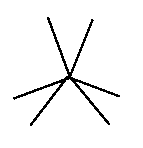
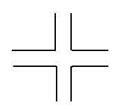
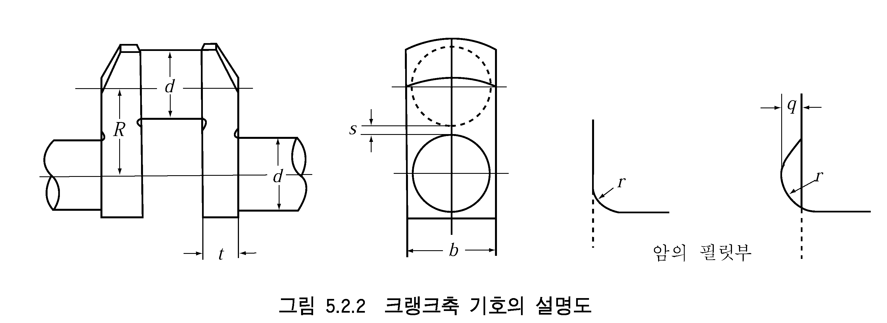

# 제5편 기관장치

> 선급 및 강선규칙/적용지침 / RA-05-K / 2025 / KO / Guidance

## 제 2 장 주기관 및 보조기관

### 제 1 절 일반사항

#### 101. 적용

- **1.** **규 칙 101.**의 **1**항을 적용함에 있어서 “우리 선급이 지장이 없다고 인정하는 소형의 보조기관”의 취급은 다음에 따를 수 있다. *(2017)* **【규칙 참조】**
  - **(1)** 발전기(비상전원용 포함) 또는 중요보기를 구동하는 출력 100 $\mathrm{kW}$ 미만의 보조기관
    - **(가)** 도면의 제출을 생략할 수 있다. 다만, **규칙 1장 103**.의 **1**항 및 **규칙 2장 203.**의 **9**항의 요건에 적합한지를 확인하기 위한 도면 또는 자료를 입회 검사원에게 제출하여야 한다.
    - **(나)** 주요부품의 재료는 한국산업규격 또는 이와 동등 이상의 규격에 적합한 것을 사용할 수 있다.
    - **(다)** 기관 완성품의 육안검사 및 공장시운전 이외의 시험은 제조자가 자체 시험을 실시하고 그 결과를 우리 선급에 제출할 경우 검사원의 입회를 생략할 수 있다.
  - **(2)** 하역장치를 구동하는 보조기관의 출력에 따른 도면, 재료 및 시험에 대한 요건은 **9편 2장**을 따른다.
- **2.** **용접구조 규칙 101.**의 **5**항을 적용함에 있어서 기관의 주요부를 용접구조로 할 경우의 일반적인 요건은 **규칙 5장 4절**에 따른다. **【규칙 참조】**
- **3.** **전 자제어 왕복동 내연기관 규칙 101.**의 **7**항을 적용함에 있어서 우리 선급이 별도로 규정한 추가요건은 **부록 5-8**에 따른다. **【규칙 참조】**

### 제 2 절 왕복동 내연기관

#### 202. 일반구조 및 장치 【규칙 참조】

- **1.** **규 칙 202.**의 **1**항 (2)호를 적용함에 있어서, 각 거치 볼트의 강도는 다음 식에 만족하여야 한다.
  - **(1)** 토크 제어 체결 방식을 적용할 경우에는 다음 식에 따른다. *(2023)*
    $F _{a} = \frac{T}{k _{a} \cdot d} \times 1000$
    $F _{a} /A _{bolt}$ 값(즉 pre-tension 값)이 $\sigma _{BY}$의 70 % 내외가 되도록 함이 권장된다.
    여기서,
    $F_{ a}$ : 볼트의 축력으로서, 토크를 가하여 조인 볼트에서 볼트 축방향에 작용하는 인장력 (N)
    $T$ : 기관 제조자가 권고하는 토크로서, 너트를 조이는 모멘트 (N·m)
    $k _{ a}$ : 기관 제조자가 제시하는 토크 계수값
    $d$ : 볼트 나사 바깥지름의 기준 치수 (mm)
    $A _{bolt}$ : 볼트 나사 부분의 최소 단면적 (mm2)
    $\sigma _{BY}$ : 볼트 재료의 규격최소항복강도 (N/mm2)
  - **(2)** 유압 체결 방식을 적용할 경우에는 다음 식에 따른다. *(2023)*
    $F _{b} = k _{ b} \times P \times A _{ p}$
    $F _{a} /A _{bolt}$ 값(즉 pre-tension 값)이 $\sigma _{BY}$의 70 % 내외가 되도록 함이 권장된다.
    여기서,
    $F_{ b}$ : 볼트의 축력으로서, 체결 유압에서 산출된 볼트의 축 방향에 작용하는 인장력 (N)
    $P$ : 유압체결장치의 압력(N/mm2)
    $A _{p}$ : 유압체결장치의 유효 피스톤 면적(mm2)
    $k_{ b}$ : 유압체결계수(Hydraulic coefficient for setting and resilience behaviour)로서 0.85로 한다. 단, $k_{ b}$의 값이 규칙에서 제시된 것과 상이한 경우, 이를 증명하는 상세한 검토자료를 제출하여 우리 선급에서 적절하다고 인정하는 경우에는 이를 허용할 수 있다.
    $A _{bolt}$, $\sigma _{BY}$ : (1)호에 따른다.
- **2.** **규 칙 202.**의 **5**항 (5)호를 적용함에 있어서, 엔진에 부착된 충전용 발전기를 통해 시동용 축전지를 충전하는 것을 인정할 수 있다. 다만, 비상발전기용 시동 장치는 **규칙 6편 1장 203.**의 **6**항을 만족하여야 한다. *(2019)* **【규칙 참조】**

#### 203. 안전장치

- **1.** **규칙 203.**의 **2**항을 적용함에 있어서, 다음과 같은 인정할 수 있는 수단이 고려될 수 있다. *(2021)* **【규칙 참조】**
  - **(1)** 실린더 헤드볼트 인장에 의한 과압 방지 수단
  - **(2)** 지속적으로 모니터링 가능한 실린더 압력 센서를 설치하여 실린더 과압 발생시 경보를 발하고 자동으로 엔진을 정지 또는 감속할 수 있는 장치
  - **(3)** 기타 우리선급이 적절하다고 인정하는 장치
- **2.** **규 칙 203.**의 **4**항을 적용함에 있어서 기관에 설치되는 크랭크실 도출밸브용 매뉴얼 및 명판은 다음에 따른다.
  **【규칙 참조】**
  - **(1)** 각 기관에 설치하기 위해 공급되는 도출밸브의 크기 및 형식에 적합한 제조자의 설치 및 정비 매뉴얼 1부를 선내에 비치하여야 하며, 매뉴얼에는 다음을 포함하고 있어야 한다.
    - **(가)** 기능 및 설계 제한을 포함한 밸브에 대한 상세설명
    - **(나)** 설치 지침서
    - **(다)** 정비 지침서(모든 밀봉장치의 시험 및 교체 포함)
    - **(라)** 크랭크실의 폭발 후 필요한 조치사항
  - **(2)** 도출밸브에는 다음의 정보를 포함하는 적절한 표시를 하여야 한다.
    - **(가)** 제조자명 및 주소
    - **(나)** 명칭 및 크기
    - **(다)** 제조년월
    - **(라)** 승인된 설치방향
- **3.** **규 칙 203.**의 **10**항 (1)호를 적용함에 있어서, 베어링 온도 감시장치 또는 동등한 장치는 다음에 따른다. **【규칙 참조】**
  - **(1)** 저속 왕복동 내연기관의 베어링 온도감시장치는 주베어링, 크랭크베어링 및 크로스헤드 베어링의 온도(또는 윤활유 출구온도)를 감시할 수 있어야 한다.
  - **(2)** 중속 및 고속 왕복동 내연기관의 베어링 온도감시장치는 주베어링과 크랭크베어링의 온도(또는 윤활유 출구온도)를 감시할 수 있어야 한다.
  - **(3)** 동등한 장치란 크랭크케이스 내의 폭발 위험을 방지하기 위하여 특수하게 설계된 고속기관에 적용되는 조치를 말한다.
- **4.** **규 칙 203.**의 **10**항 (1)호를 적용함에 있어서, 자동긴급정지 장치에 대한 오버라이딩을 설치할 경우에는 그 결과에 대한 자료를 우리 선급에 제출하여 승인을 받아야 한다.
- **5.** **규 칙 203.**의 **10**항 (2)호를 적용함에 있어서 기관설계자 및 오일미스트 탐지장치 제조자의 지침서에는 다음을 포함하고 있어야 한다. **【규칙 참조】**
  - **(1)** 크랭크실의 샘플링 위치 및 탐지용 관의 크기를 포함한 관 또는 케이블의 배치를 보여주는 오일미스트 탐지장치와 경보시스템에 대한 배치도
  - **(2)** 오일미스트 축적시 예상되는 크랭크실 분위기와 크랭크실 배치 및 형상을 고려한 샘플링 포인트의 위치 및 샘플 추출율(적용시)을 확인하기 위한 연구자료
  - **(3)** 제조자의 정비 및 시험 매뉴얼 (매뉴얼 1부는 선내에 비치할 것)
  - **(4)** 승인된 형식의 오일미스트 탐지장치를 포함한 기관보호시스템의 시험장치를 갖춘 기관의 형식시험 또는 사용중 시험과 관련된 정보
- **6.** **규 칙 203.**의 **10**항 (8)호를 적용함에 있어서 우리 선급이 적절하다고 인정하는 상세한 자료라 함은 다음에 따른다. **【규칙 참조】**
  - **(1)** 기관 요목표 (형식, 출력, 속도, 행정, 안지름 및 크랭크실 용적 등)
  - **(2)** 크랭크실 내에 잠재적인 폭발조건의 생성을 방지하는 장치에 대한 상세 (예를 들어, 베어링의 온도감시, 윤활유의 튀는 온도, 크랭크실의 압력감시, 순환장치 등)
  - **(3)** 상세한 사용실적과 함께 그러한 장치가 잠재적인 폭발조건의 생성을 방지하는데 효과가 있다고 증명할 수 있는 증거자료
  - **(4)** 운전, 정비 및 시험 지침서

#### 204. 크랭크축 【규칙 참조】

- **1.** **최소지름 규칙 표 5.2.3**을 적용함에 있어서 부등간격 착화기관의 크랭크축에 대한 정수 $A$ 및 $B$ 의 값은 다음에 따른다.
  - **(1)** 4사이클 직렬기관

    | 실린더 수 | 크링크 배치 | $A$ | $B$ |
    | --- | --- | --- | --- |
    | 4 |  | 1.25 | 4.7 |
  - **(2)** 2사이클 V형 기관

    | 실린더 수 | 동일한 크랭크 스로우에 속한 실린더의 최소착화간격 | *크랭크 배치* | $A$ | $B$ |
    | --- | --- | --- | --- | --- |
    | 12 | 60˚ |  | 1.00 | 21.6 |
    | 12 | 60˚ |  | 1.00 | 15.0 |
    | 16 | 60˚ |  | 1.00 | 26.3 |

#### 205. 크랭크암의 치수

크랭크암의 너비 $b$, 두께 $t$, 필릿부 반지름 $r$ 을 취하는 방법은 다음에 따른다.

- **1.** **일체형 크랭크축 【 규칙 참조】**
  - **(1)** **규칙 205.**의 **1**항을 적용함에 있어서 $b$ 는 핀 중심과 저널 중심의 수직이등분선상의 너비로 하고, 각이 일부 곡연되어 있는 경우에도 끝에서 끝까지 측정한 치수로 한다. $t$ 는 $b$ 와 동일한 위치의 두께로 하고, 들어간 부분이 있어도 이것이 없는 것으로 취급한다. $r$ 이 2단일 경우에는 핀 또는 저널에 연속되는 부분의 $r$ 을 가리키는 것으로 한다.
  - **(2)** 핀과 저널의 실제지름이 다를 때에는 그 어느 것에 대하여도 $t/d$ 와 $b/d$ 와의 관계는 **규칙 205.**의 **1**항의 식 또는 **규칙 그림 5.2.1**에 만족하여야 한다.
- **2.** **반조립형 크랭크축 규칙 205.**의 **3**항을 적용함에 있어서 *b*는 핀 중심과 저널 중심을 연결하는 선과 직교하고 핀의 하단에 접하는 선상의 크랭크암의 너비로 한다. *t*는 $b$ 와 동일한 위치의 두께로 하고 들어간 부분이 있어도 이것이 없는 것으로 취급한다. 암의 외측에 열박음부분의 자리가 있는 경우, $t$ 에는 이 자리의 두께를 포함하지 않는 것으로 한다. $r$ 은 **1**항과 동일하다. $b$ 및 $t$ 를 취하는 방법에 대하여는 **지침 그림 5.2.1**에 따른다.
- **3.** **규 칙 205.**의 **3**항 및 **4**항에 있어서 **지침 그림 5.2.1** (d)와 같은 열박음부 모양을 갖는 경우에는 **규칙 205.**의 **3**항의 식 대신에 다음 식을 사용한다. **【규칙 참조】**
  $t _{2} \left( { 1 - \frac{1}{A_x1} \right) + t_2 \left( { 1 - \frac{1}{A_x2 ^2} \right) +　 \cdots \cdots 　\geq \frac{C_1 T D^2}{C_2 d_h ^2}$
  $t_2 \geq 0.525 d_c$

  | . |
  | --- |
  | (비고) 암을 분할하여 두께 $t_1$, $t_2$, ...로 나누고 암의 바깥지름을 열박음부분의 구멍지름으로 나눈 값을 $A_s1 ^2 = d_01 /d$, $A_s2 ^2 = d_02 /d$*, ...*로 하여 **지침 205.**의 **3**항에 적용한다. |

#### 206. 재료보정 【규칙 참조】

**규칙 206.**에 있어서 주강제 반조립형 크랭크축을 규격최소인장강도가 440 $\mathrm{N}/mm ^{2}$ 미만의 재료로 제조하는 경우의 $K _{m }$의 값은 1로 할 수 있다.

#### 208. 특별고려 【규칙 참조】

- **1.** **규 칙 208.**의 취급은 다음에 따른다.
  - **(1)** 󰡒통상의 제조법과 다른 방법으로 제조한 크랭크축󰡓의 정의 및 그 제조방법의 승인에 관한 시험에 대하여는 **제조법 및 형식승인 등에 관한 지침 제2장 5절**에 따른다.
  - **(2)** 전 호에 따른 특수한 제조방법으로 제조된 크랭크축의 지름은 다음의 $k_r$ 및 $k_ \rho$ 의 값 중 작은 값을 크랭크축의 소요지름 $d_c$ 에 곱해도 좋다.
    $k _{r} = root {3} of {\frac{1}{1.15}}$
    $k _{\rho } = root {3} of {\frac{1}{1+ \rho /100}}$
    $\rho$ : 표면처리에 관련하여 우리 선급이 결정한 강도 상승률
    - **(가)** 단조플로우가 연속되고, 품질의 안정이 인정되며, 피로강도가 자유단조의 것과 비교하여 20 % 이상 향상된다고 인정되는 경우
    - **(나)** 표면처리를 하고 품질의 안정 및 피로강도 향상의 우월성이 인정되는 경우
  - **(3)** 전호의 규정을 **규칙 205.**의 **3**항 및 **210.**의 **1**항의 경우에는 적용하지 아니한다.
- **2.** 크랭크축의 지름, 암의 치수 및 필릿부 반지름이 **규칙 204.** 및 **205.**의 규정에 부족할 경우, **규칙 208.**의 취급은 다음에 따른다.(**지침 그림 5.2.2** 참조)
  
  - **(1)** **규칙 204.**의 **2**항의 규정에 적합하지 않을 때
    일체형 크랭크축에 있어서, 핀 또는 저널 지름이 **규칙 204.**의 **2**항 $d_c$ (**규칙 206., 207.** 및 **지침 208.**의 **1**항 (2)호에 따라 재료보정을 한 것)에 부족할 때는 필릿부의 응력 외에 평행부의 비틀림응력, 열박음부분의 마찰력, 재료 등을 고려하여 그때마다 적합여부를 정한다. 이 중에서 필릿부의 응력에 대하여는 다음 (가) 및 (나)에 따른다.
    $\sigma = \sigma _{a} \times f _{m} \times f _{s} + \alpha (\mathrm{N}/mm ^{2} )$
    $Q \geq 1.15$

    | $\sigma_a$ *(*$\mathrm{N}/mm ^{2}$) | 사이클 |   | 2사이클 |   | 4사이클 |
    | --- | --- | --- | --- | --- | --- |
    | $\sigma_a$ *(*$\mathrm{N}/mm ^{2}$) | 크랭크축 형식 |   | 반조립형 | 일체형 | 일체형 |
    | $\sigma_a$ *(*$\mathrm{N}/mm ^{2}$) | 축지름 $d$ | $d \geq 200$ | 53.9 | 53.9(※) | 83.3 |
    | $\sigma_a$ *(*$\mathrm{N}/mm ^{2}$) | 축지름 $d$ | $200 > d \geq 100$ | ─ | 132.3 - $d$/4 |   |
    | $\sigma_a$ *(*$\mathrm{N}/mm ^{2}$) | 축지름 $d$ | $100>d$ | ─ | 107.8 |   |
    | $\sigma_a$ *(*$\mathrm{N}/mm ^{2}$) | (주) $d$ : 크랭크핀 또는 저널의 실제지름 중 큰 쪽의 값($\mathrm{mm}$) (※) 베드가 용접구조가 아닌 경우, 83.3으로 할 수 있다. |   |   |   |   |
    | $f_m$ | $1 + \frac{2}{3} \left( { \frac{T_s}{440} -1} \right)$ |   |   |   |   |
    | $f_m$ | (주) $T_s$ : 재료의 규격최소인장강도($\mathrm{N}/mm ^{2}$) |   |   |   |   |
    | $f_s$ | 제조방법 |   |   |   |   |
    | $f_s$ | 통상의 방법 | **지침 208.**의 **1**항 (2)호 (가)에 관련되어 승인된 방법 |   | **지침 208.**의 **1**항 (2)호 (나)에 관련되어 승인된 방법 |   |
    | $f_s$ | 1 | 1.15 |   | 1 + $\rho$/100 |   |
    | $f_s$ | (주) $\rho$ : 표면처리에 관련하여 우리 선급이 결정한 강도의 향상률($\%$) |   |   |   |   |
    | $\alpha$ *(*$\mathrm{N}/mm ^{2}$) | 주베어링의 재료 |   |   |   |   |
    | $\alpha$ *(*$\mathrm{N}/mm ^{2}$) | 화이트 메탈 |   | 트리메탈 또는 켈밋 |   |   |
    | $\alpha$ *(*$\mathrm{N}/mm ^{2}$) | 0 |   | 9.8 |   |   |
    - **(가)** 선미축계를 포함한 진동응답계산을 행하지 않고 평행부의 비틀림응력을 산정하는 경우, **부록 5-2** (크랭크축 응력의 계산법 (1))에 의해 계산된 등가응력 편진폭 $\sigma_e$ 의 값이 **지침 표 5.2.1**에 표시한 계수 등을 대입하여 얻어지는 다음식의 허용응력 $\sigma$ 이하일 경우에는 규칙에 적합한 것으로 한다.
    - **(나)** 선미축계를 포함한 진동응답계산을 행하여 평행부의 비틀림응력을 산정하는 경우, **부록 5-3** (크랭크축 응력의 계산법 (2))에 의해 계산된 허용계수 $Q$ 의 값이 다음 식을 만족하는 경우에는 규칙에 적합한 것으로 한다.
  - **(2)** **규칙 205.**의 규정에 적합하지 않을 때
    $M= 10^ -2 APL \times \frac{\alpha_KB}{5}$
    $T = 10^-2 BP_i S \times \frac{\alpha_KT}{1.8}$
    적용범위 :
    $0 \leq \frac{q}{r} \leq 1, -0.3 \leq \frac{s}{d} \leq 0.4, 8 \leq \frac{d}{r} \leq 27$
    $1.1 \leq \frac{b}{d} \leq 2.1, 0.2 \leq \frac{t}{d} \leq 0.56$
    $\alpha _{KB} =4.84 \times f _{1} \times f _{2} \times f _{3} \times f _{4} \times f _{5}$ (굽힘에 관한 형상계수)
    $f_1 = 0.42 + 0.16 \sqrt { \frac{d}{r} - 6.864}$
    $f_2 = 1 + 81 \left\{ { 0.769 - \left( { 0.407 - \frac{s}{d}} \right)^2 } \right\} \left( { \frac{q}{r}} \right) \left( { \frac{r}{d}} \right)^2$
    $f_3 = 0.285 \left( { 2.2 - \frac{b}{d}} \right)^2 + 0.785$
    $f _{4} =0.444 \left( \frac{d}{t} \right) ^{1.4}$
    $f _{5} =1- \left\{ \left( \frac{s}{d} +0.1 \right) ^{2} \left( 4 \frac{t}{d} -0.7 \right) \right\} \cdots \cdots \cdots ( \frac{t}{d} \geq 0.36 일때) \right.$
    =$1 - 1.35 \left( { \frac{s}{d} + 0.1} \right)^2 \cdots \cdots \cdots (\frac{t}{d} < 0.36$ 이고 또한 $\frac{s}{d} > -0.1$ 일때)
    =$1 \cdots \cdots \cdots (\frac{t}{d} < 0.36$ 이고 또한 $\frac{s}{d} \leq -0.1$ 일때)
    $\alpha _{KT} =1.75 \times g _{1} \times g _{2} \times g _{3}$ (비틀림에 관한 형상계수)
    $g _{1} =31.6 \left( 0.152- \frac{r}{d} \right) ^{2} +0.67$
    $g_2 = 1.04 + 0.317 \frac{s}{d}$
    $g_3 = 1.31 - 0.233 \frac{b}{d}$
    $d$ : 핀 또는 저널의 실제지름 ($\mathrm{mm}$)
    $r$ : 필릿부의 반지름 ($\mathrm{mm}$)
    $q$ : 들어간 부분 ($\mathrm{mm}$)
    $s$ : 핀과 저널의 오버랩량($\mathrm{mm}$)
    $s= \frac{핀의지름+저널지름-행정}{2}$
    $d^2 \times t \times p_m \geq C T D^2$
    $C$ : 정수로 2사이클 직렬기관인 경우 : 103
    4사이클 직렬기관인 경우 : 165
    $d$ : 열박음부의 지름 ($\mathrm{mm}$)
    $t$ : 암의 축방향의 두께 ($\mathrm{mm}$)
    $T$ : **규칙 204.**에 따른다.
    $D$ : 실린더의 지름 ($\mathrm{mm}$)
    $p_m$ : 열박음부의 면압(面壓)($\mathrm{N}/mm ^{2}$)으로서 다음 식에 따른다.
    $p _{m} =Y \left[ \log _{e} K+ \frac{1}{2} \left\{ 1- \frac{K ^{2}}{A _{s} ^{2}} \right\} \right] \times (1-R ^{2} ) \right. \right.$
    $Y$ : 암 재료의 규격최소항복강도($\mathrm{N}/mm ^{2}$)
    $A_s$ : 암의 바깥지름을 열박음부 구멍의 지름으로 나눈 값
    $K=0.9 \sqrt {\frac{206 \alpha}{Y} +0.25}$
    $\alpha$ : 크랭크저널의 열박음 여유를 열박음부의 지름으로 나눈 값에 10^3을 곱한 값
    $R$ : 중공축의 안지름을 바깥지름으로 나눈 값
    - **(가)** **규칙 204.**의 식 중의 $M$ 및 $T$ 를 다음과 같이 보정하여 $d_c$ 를 구하고, 실제지름 $d$ 가 $d_c$ 보다 클 때는 규칙에 적합한 것으로 한다. 다만, 적용범위는 다음과 같다. 또한, 치수 $b$, $t$ 및 $r$ 을 취하는 방법에 대하여는 **지침 205.**를 참조한다.
    - **(나)** 전 (가)에 의해서도 암의 치수가 적합하지 않는 경우의 취급은 **지침 208.**의 **2**항 (1)호 (가) 및 (나)에 따른다.
    - **(다)** 조립형 크랭크축의 암의 두께 또는 암의 바깥지름이 규정치수에 부족한 경우에도 다음 조건을 만족하면 규칙에 적합한 것으로 한다.

#### 211. 시험 및 검사

- **1.** **규칙 표 5.2.4**를 적용함에 있어서 자분탐상시험을 프로드(prod)법으로 실시할 경우에는 아크 스트라이크(arc strike)가 생기지 않도록 한다.
- **2.** **규 칙 211.**의 **3**항에서 별도로 정하는 규정이라 함은 우리 선급의 **제조법 및 형식승인 등에 관한 지침 3장 8절**의 규정을 말한다. 발전기(비상전원용 포함) 또는 중요보기를 구동하는 출력 100 $\mathrm{kW}$ 미만의 보조기관, 그리고 하역장치를 구동하는 보조기관(출력에 상관없이)은 형식승인을 생략할 수 있다. *(2017)* **【규칙 참조】**
- **3.** **규 칙 211.**의 **4**항 및 **5**항을 적용함에 있어서 안전예방조치 및 일반사항으로 다음을 따라야 한다.
  - **(1)** 시운전이 실시되기 전에 입회하는 작업자의 안전을 위한 모든 관련 장비가 제조자 및 조선소에 의해 준비되어야 하며, 원활하게 작동되어야 한다. 특히 크랭크실 폭발보호, 과속도방지 및 기타 긴급정지 기능이 확인되어야 한다. 과속도방지장치의 설정값은 기관 형식시험 동안 확인된 과속도 값 이하이어야 하며 검사원에 의해 검증되어야 한다.
  - **(2)** 공식적인 시험에 앞서 기관 제조자에 의해 정해진 방법으로 길들이기 운전이 실시되어야 한다. 다양한 부하점에 적합한 시험 설비가 갖춰져야 한다. 연료, 윤활유 및 냉각수와 같은 시험 목적의 모든 유체는 사용목적에 적합하여야 한다. 즉, 청결하고 필요한 경우 예열이 되어야 하며 기관 부품에 손상을 일으키지 않아야 한다. 이는 시험 목적의 임시 또는 반복적으로 사용되는 모든 유체에 적용한다.
  - **(3)** 기관 성능조정을 위하여 무부하운전을 하는 경우, 기관제조자는 연료공급장치, 조정장치 및 각종 안전장치를 충분히 조정하여 두어야 한다.
  - **(4)** 기관은 다음의 사항이 검사되어야 한다.
    - **(가)** 누설탐지장치를 포함하여 고압연료유관 피복의 검사
    - **(나)** 가연성 유체를 이송하는 관장치의 관 이음부 스크린의 검사
    - **(다)** 형식승인시험 시 계측한 값과 상응하는 고온 방열부에 대한 온도 계측값의 비교. 이는 기관의 정격출력 운전상태에서 시행해야 한다. 접촉 온도계의 사용은 입회하는 검사원의 판단 하에 사용될 수 있다. 형식승인시험 이후에 방열재가 수정된 경우 적외선 온도측정기 또는 동등하다고 인정되는 측정기를 사용하여 측정 및 검사가 이루어져야 하며 측정값은 임의 발췌하여 접촉 온도계로 검증되어야 한다.
    - **(라)** 상기 검사는 통상 제조자의 공장시험 동안 검사원의 입회하에 이루어지며 우리 선급이 인정하는 경우 일부분을 선내시험 시에 실시할 수 있다.
- **4.** **규 칙 211.**의 **4**항에서 우리 선급이 적절하다고 인정하는 공장시운전이라 함은 다음에 따른다. **【규칙 참조】**
  - **(1)** 시험 및 검사는 **지침 표 5.2.2**에 따른 방법을 표준으로 한다. 시험의 전반적인 범위가 동등하다고 인정되는 경우, 세부시험에 대한 대체방안이 제조자와 우리 선급 간에 합의될 수 있다. 또한 우리 선급이 필요하다고 인정하는 경우, 추가의 시험 또는 검사를 요구할 수 있다. *(2023)*
  - **(2)** 기록
    - **(가)** 다음의 환경조건이 기록되어야 한다.
      - **(a)** 대기온도
      - **(b)** 대기압
      - **(c)** 상대습도
    - **(나)** 각 부하점에서 다음의 파라미터가 기록되어야 한다.
      - **(a)** 출력 및 회전수
      - **(b)** 연료지수(또는 동등한 측정치)
      - **(c)** 최고연소압력(실린더헤드가 측정에 용의하도록 설계된 경우에 한함)
      - **(d)** 과급기 입구 또는 각 실린더 출구의 배기가스온도
      - **(e)** 급기온도
      - **(f)** 급기압력
      - **(g)** 과급기의 회전수
    - **(다)** 계측장비의 검교정 기록은 요청이 있을 경우 입회하는 검사원에게 제시하여야 한다.
    - **(라)** 기관의 시험이 실시되는 동안의 모든 단계의 운전 값은 기관 제조자에 의해 계측되고 기록되어야 한다. 모든 기록은 기관 제조자에 의해 발행될 성적서에 수록되어야 한다. 기관 설계자에 의해 요구되는 경우 크랭크축 디플렉션 계측이 포함되어야 한다.
    - **(마)** 다양한 부하점에서 이루어지는 모든 측정은 운전상태가 안정화된 상태에서 수행되어야 한다. 모든 부하점에서 검사원이 육안검사를 수행할 수 있는 충분한 시간이 주어져야 한다.
  - **(3)** 기관과 과급기의 조합
    과급기는 기관이 모든 운전상태 및 이후 사용기간 동안 서징(surging) 없이 운전할 수 있는 압축기 특성을 가져야 한다. 허용되는 비정상적인 운전상태 즉, 착화실패 및 갑작스런 부하감소, 불연속 서징은 발생할 수 있다. (“서징”이라 함은 기관의 소기로부터의 청취할 수 있는 수준의 고음 진동 또는 폭발과 같은 소음이 발생하는 현상을 말한다. “연속 서징”이라 함은 한번이 아닌 반복적으로 발생하는 서징을 말한다.)
    추진용 기관에 설치되는 카테고리 C 과급기는 기관의 공장시험 동안 서지 마진이 확인되어야 한다. 이 시험은 동일한 형상의 기관과 과급기(동일한 노즐링 포함)가 이미 성공적으로 시험되었을 경우 생략될 수 있다.
    다음의 시험이 서징 없이 수행되어야 한다.
    서지마진이 적어도 다음 중의 한 가지 방법으로 입증되어야 한다.
    한 개의 실린더 착화실패에 대해 허용된 최대출력
    약 0.06 $\mathrm{MPa}$(보조송풍기 운전 없이)의 급기 압력에 상응하는 기관 부하
    - **(가)** 압축기의 특성도
    - **(나)** 서지 마진(surge margin) 검증
      - **(a)** 4행정 기관
      - **(i)** 연속최대출력 및 회전수(100 %), 회전수는 일정한 토크(연료지수)로 90 % 출력까지 감소되어야 한다.
        - **(ii)** 80 % 회전수에서 50 % 출력(고정피치프로펠러의 특성곡선), 회전수는 일정한 토크(연료지수)를 유지하는 동안 72 %로 감소되어야 한다.
      - **(b)** 2행정 기관
      - **(i)** 공장시험에서 정해진 기관의 운전특성은 과급기(시험 설비에서 입증된)의 압축기 선도에 표기되어야 한다. 전부하 범위에서 적어도 10 %의 서지 마진이 있어야 한다. 즉, 운전 유량은 서지 한계(압력 동요가 없는)에서 이론적(질량) 유량보다 10 % 이상이어야 한다.
        - **(ii)** 적어도 하나의 실린더에서의 갑작스런 연료차단으로 연속적인 서징이 발생되어서는 아니 되며 20초 이내에 새로운 부하로 안정화되어야 한다. 두 개 이상의 과급기가 설치된 경우 각 과급기에 근접한 실린더의 연료를 차단하여야 한다. 이 시험은 다음의 두 가지 기관 부하에 대해 수행되어야 한다.
        - **(iii)** 연속최대출력의 100 %에서 50 %로 갑작스럽게 출력이 감소된 경우 연속적인 서징이 발생해서는 안 되며 과급기는 20초 이내에 새로운 부하에서 안정화되어야 한다.
  - **(4)** 통합시험
    전자제어기관의 경우, 모든 의도된 운전모드에 대하여 전체 기계, 유압 및 전자시스템이 정해진 대로 작동되는지를 통합시험으로 확인하여야 하며 시스템적인 시험이 공장에서 실시되어야 한다. 이러한 시험이 공장에서 기술적으로 실행 불가능한 경우 해상시운전 동안 수행될 수 있다. 시험의 범위는 고장모드 및 영향분석(FMEA) 결과를 기초로 정해져야 하며 우리 선급의 확인을 받아야 한다.
- **5.** **규 칙 211.**의 **5**항에서 우리 선급이 적절하다고 인정하는 선내시험이라 함은 다음에 따른다. **【규칙 참조】**
  - **(1)** 왕복동 내연기관의 해상 또는 선내에서의 시운전시험은 **지침 표 5.2.3**에 따른 방법을 표준으로 한다. 이 경우, 우리 선급은 *KS V* 0811(해상시운전 기관부 시험방법) 중 필요하다고 인정하는 시험을 요구할 수 있다. 또한, 각 항목에 대한 시험의 상세는 *KS V* 0811 또는 이와 동등한 시험방법을 참고로 하고, 우리 선급이 필요하다고 인정하는 경우, 실린더 각 부분의 개방을 요구할 수 있다.
  - **(2)** 연속사용 금지범위
    연속사용 금지범위가 요구되는 경우 연속사용 금지범위의 통과(가속, 감속 둘 다)가 아래와 같이 실증되어야 한다. 소요시간이 기록되어야 하며 승인된 문서가 있는 경우 명기된 시간 이하이어야 한다. 이는 역전운전 시(주로 정지시험 동안)의 경우도 포함한다.

    | 기관용도 시험항목 |   | 주기관용 왕복동 내연기관(2) | 전기추진선박 및 주전원의 발전용 왕복동 내연기관(3) | PTO(power take off) 발전기를 가지는 주기관용 왕복동 내연기관(4) | 중요보기용 왕복동 내연기관(2) |
    | --- | --- | --- | --- | --- | --- |
    | 110 $\%$ 출력 |   | 정격회전수×1.032에서 15분 또는 안정화 상태까지, 둘 중 짧은 시간(1) | 정격회전수에서 15분 | 정격회전수에서 15분 | 정격회전수에서 15분 |
    | 승인된 순간 과부하 (해당하는 경우) |   | 시험시간은 제조자와 협의 | - | 시험시간은 제조자와 협의 | 시험시간은 제조자와 협의 |
    | 부하시험 | 100 $\%$ 출력(5) | 정격회전수에서 60분 | 정격회전수에서 60분 | 정격회전수에서 60분 | 정격회전수에서 30분 |
    | 부하시험 | 90 $\%$ 또는 상용 출력(6) | 프로펠러 특성에 따른 회전수에서 20분 | - | 프로펠러 특성에 따른 회전수 또는 정격회전수에서 20분 | - |
    | 부하시험 | 75 $\%$ 출력(6) | 프로펠러 특성에 따른 회전수에서 20분 | 정격회전수에서 20분 | 프로펠러 특성에 따른 회전수 또는 정격회전수에서 20분 | 출력특성에 따른 회전수에서 20분 |
    | 부하시험 | 50 $\%$ 출력(6) | 프로펠러 특성에 따른 회전수에서 20분 | 정격회전수에서 20분 | 프로펠러 특성에 따른 회전수 또는 정격회전수에서 20분 | 출력특성에 따른 회전수에서 20분 |
    | 부하시험 | 25 $\%$ 출력(6) | 프로펠러 특성에 따른 회전수에서 20분 | 정격회전수에서 20분 | 프로펠러 특성에 따른 회전수 또는 정격회전수에서 20분 | 출력특성에 따른 회전수에서 20분 |
    | 역전시험(7) |   | ○ | - | ○ | - |
    | 조속기시험 |   | ○ | ○ | ○ | ○ |
    | 경보 및 안전장치의 작동시험 |   | ○ | ○ | ○ | ○ |
    | 개방검사(8) |   | ○ | ○ | ○ | ○ |
    | (비고) 1. 전자제어 왕복동 내연기관은 **지침 211.**의 **4**항 (4)호에 따른 통합시험을 실시하여야 한다. 2. 표의 (1)부터 (8)은 다음의 조건에 따른다. (1) 과부하 운전에 대한 호환성을 입증하는 동일한 기관과 과급기 조합의 시험보고서가 제출된 경우, 110 % 출력시험은 생략될 수 있다. *(2019)* (2) 우리 선급에 의하여 승인된 순간 과부하 출력이 없는 경우, 시험 종료 후 기관의 연료유 공급장치는 선내 거치 후의 운전에서 100 % 출력을 초과하여 운전되지 않도록 조정하여 두어야 한다. (3) 시험 종료 후, 연료유 공급장치는 선내 설치 후 운전을 위해 최대출력에서 일시적인 변동에 대한 10 %의 여유를 더하여 조정되어야 한다. 이러한 일시적인 과부하에 대한 용량은 기관의 100 % 출력에서 필요한 조속 특성 달성 및 기관 실속 전에 배전 계통의 보호장치 작동을 위하여 필요하다. (4) 시험 종료 후, 연료유 공급장치는 선내 설치 후의 운전을 위해 최대출력에서 여유를 더하여 조정되어야 한다. 이 일시적 과부하는 하부장치 구성품의 전기적 보호가 기관 실속 전에 이루어질 수 있도록 하기 위하여 필요하다. 이 여유는 기관 출력의 10 % 이거나 적어도 PTO(power take off) 출력의 10 % 이어야 한다. (5) 계측은 최소한 30분 간격으로 2회 실시하여야 한다. (6) 시험 순서는 제조자가 정한다. *(2021)* (7) 자기 역전식의 기관에 한한다. (8) 공장시운전 후 개방검사의 정도는 검사원이 적절하다고 인정하는 바에 따를 수 있다. *(2018)* |   |   |   |   |   |

    | 기관용도 시험항목 | 주기관용 왕복동 내연기관(1) | 전기추진선박 및 주전원의 발전용 왕복동 내연기관(2) | PTO(power take off) 발전기를 가지는 주기관용 왕복동 내연기관 | 중요보기용 왕복동 내연기관 |
    | --- | --- | --- | --- | --- |
    | 110 $\%$ 출력(3) | 정격회전수×1.032에서 30분 | 110 $\%$ 출력(발전기의 정격출력)에서 10분 | 정격회전수×1.032에서 30분 | - |
    | 승인된 순간 과부하 (해당하는 경우) | 시험시간은 제조자와 협의 | - | 시험시간은 제조자와 협의 | 시험시간은 제조자와 협의 |
    | 100 $\%$ 출력 | 정격회전수에서 4시간 | 100 $\%$ 출력(발전기의 정격출력)에서 1시간 | 정격회전수에서 4시간(4) | 정격회전수에서 30분 |
    | 최저회전수시험 | ○ | - | ○ | - |
    | 시동시험(5) | ○ | ○ | ○ | ○ |
    | 후진시험(6) | ○ | - | ○ | - |
    | 기관구역 무인운전시험(7) | ○ | ○ | ○ | ○ |
    | 경보 및 안전장치의 작동시험(8) | ○ | ○ | ○ | ○ |
    | 연료적합성시험(9) | ○ | ○ | ○ | ○ |
    | (비고) 표의 (1)부터 (9)는 다음의 조건에 따른다. (1) 가변피치 프로펠러를 갖춘 경우에는 100 % 출력 부하시험에서 100 % 출력에 도달이 불가능한 경우 최대가능출력에서 부하시험이 실시되어야 하며 각종 피치각에서의 운전을 포함한다. 가변피치 프로펠러를 갖춘 경우에는 정격회전수×1.032 시험을 요구하지 않는다. *(2021)* (2) 각각의 기관은 100 % 출력에서 1시간 동안, 110 % 출력에서 10분 동안 시험되어야 한다. 100 %의 추진 출력(즉, 추진용 전동기의 총 출력)에서 가능한 적은 수의 발전기 출력을 분배함으로써 시험되어야 하며, 전기추진설비 시험 동안 시행될 수 있다. 이 시험은 4시간 이상 또는 모든 회전기계의 작동온도가 안정된 상태에 도달할 때까지 지속되어야 한다. 전기추진설비 시험 동안 상기의 시험이 실시되지 못한 기관의 경우 별도의 시험이 실시되어야 한다. **규칙 6편 1장 202.**의 **2**항에 따라 원동기 및 조속기의 스텝부하 조정능력이 실증되어야 한다. (3) 기관의 조정이 허용되는 경우 실시한다( **표 5.2.2** 비고 2항의 (2) 참조). 다만, 공장시험시의 성적 등을 고려하여 지장이 없다고 인정하는 경우에는 시험을 생략할 수 있다. *(2021)* (4) 정격회전수에서 100 % 프로펠러분기출력으로 2시간 시험이 실시되어야 한다(100 % 출력 시험에 포함되지 않은 경우). 추가로 정격회전수에서 100 % PTO분기출력으로 1시간 시험이 실시되어야 한다. *(2021)* (5) 도중에 보충 없이 시동할 수 없게 될 때까지, 역전식 기관에서는 전진 및 후진을 교대로 하고, 비역전식 기관에서는 시동 및 정지를 반복하여 실시한다. (6) 가변피치 프로펠러를 갖춘 경우 역피치 시, 역전식 기관의 경우 정지시험 동안 역전운전 시 **지침 211.**의 **6**항 (2)호에 따라 연속사용 금지범위의 통과가 실증되어야 한다. (7) 기관구역의 무인화설비(UMA)를 갖춘 선박으로 등록하고자 하는 선박의 경우에 한한다. (8) 공장시운전 시에 검증된 사항을 제외한 경보 및 안전장치의 작동시험을 실시하여야 한다. (9) 잔사유 등의 특별한 연료를 사용하는 경우에 한한다. 다만, 공장시험 시에 이미 그 적합성이 확인된 경우 또는 우리 선급이 적절하다고 인정하는 경우에는 생략할 수 있다. |   |   |   |   |
    - **(가)** 수동 및 자동 통과시스템 둘 다 적용한다.
    - **(나)** 시험 동안 선박의 흘수 및 속도는 기록되어야 하며 가변피치프로펠러의 경우 피치도 기록되어야 한다.
    - **(다)** 기관은 연속사용 금지범위의 상하부 경계에서 안정된 운전(일정한 연료지수)이 확인되어야 한다. 일정한 연료지수란 유효행정(무부하에서 전부하지수)의 5% 미만의 변동 범위를 의미한다.

### 제 3 절 증기터빈

#### 304. 안전장치

추진용 터빈에는 **규칙 304.**의 **2**항 및 **3**항에 정하는 트립(trip) 조건 외에 터빈 로터의 축방향의 이상변위에 의하여 자동적으로 전진 터빈에 증기공급을 차단하는 장치를 설치할 것을 권장한다. **【규칙 참조】**

#### 306. 터빈 날개의 강도 및 소요단면적

터빈날개의 진동응력계산서 또는 날개 재료의 0.01 $\%$ 내력의 규격이 제출되면, 우리 선급이 적절하다고 인정하는 경우, **규칙 306.**의 식 중 $S$ 대신에 0.01 $\%$ 내력 규격 최저치의 2 배의 값을 사용하여 산출된 값까지 $A$ 의 값을 경감할 수 있다. **【규칙 참조】**

#### 307. 시험 및 검사

- **1.** **규 칙 307.**의 **3**항을 적용함에 있어서 우리 선급이 적절하다고 인정하는 시험방법이라 함은 *KS V* 4211(선박용 증기터빈 주기 육상시험방법) 또는 이와 동등하다고 인정되는 시험방법에 따라서 실시하는 것을 표준으로 함을 말한다. **【규칙 참조】**
- **2.** **규 칙 307.**의 **4**항 (2)호를 적용함에 있어서 우리 선급이 적절하다고 인정하는 시험방법이라 함은 *KS V* 0811(해상시운전 기관부 시험방법) 또는 이와 동등하다고 인정하는 시험방법에 따라서 실시하는 것을 표준으로 함을 말한다.
  **【규칙 참조】** 
