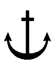
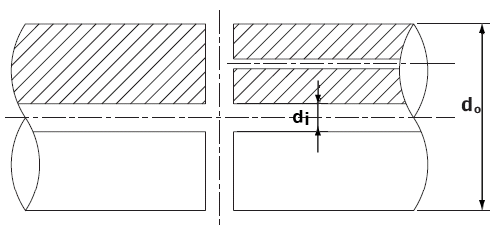

# 제5편 기관장치

> 선급 및 강선규칙/적용지침 / RA-05-K / 2025 / KO / Guidance

## 제 3 장 추진축계 및 동력전달장치

### 제 1 절 일반사항

#### 101. 용접구조의 부품 【규칙 참조】

**규칙 101.**을 적용함에 있어서 주요부품을 용접구조로 할 경우의 일반적인 요건은 **규칙 5장 4절**을 준용한다.

#### 102. 기타의 추진장치

**규칙 102.**를 적용함에 있어서 다음에 따를 수 있다. **【규칙 참조】**

- **1.** 선수 또는 선측 스러스터 장치 및 그 제어기구 등 (이하󰡒**스러스터󰡓**라 한다.)에 대하여는 다음에 따른다. 다만, 구동 동력 100 kW 미만의 소형 스러스터의 경우, 아래 (1)호, (2)호, (3)호, (4)호의 (가) 요건의 적용을 생략할 수 있다. *(2019) (2022)*
  - **(1)** 승인도면 및 자료
    제조자는 공사착수 전에 다음의 도면 및 자료 3부를 우리 선급에 제출하여 승인을 받아야 한다.
    - **(가)** 스러스터의 전체장치도
    - **(나)** 조립단면도(주요부품의 재료를 기재한 것)
    - **(다)** 제어기구 계통도
    - **(라)** 축계 및 밀봉장치도
    - **(마)** 프로펠러
    - **(바)** 기어장치도
    - **(사)** 부속관 장치도
    - **(아)** 주요 요목표(구동 원동기의 종류, 출력 및 회전수, 용량 등을 기재한 것)
    - **(자)** 기타 우리 선급이 필요하다고 인정하는 것
  - **(2)** 재료
    주요부품의 재료는 원칙적으로 **규칙 2편 1장**의 규정에 적합한 것이어야 한다. 다만, 우리 선급이 인정하는 경우, 한국산업규격 또는 이와 동등 이상의 규격에 적합한 것을 사용할 수 있다.
  - **(3)** 설계 *(2020)*
    프로펠러 날개(blade)의 구조 및 강도는 **규칙 3장 303.**의 규정에 따른다. 다만 제조자가 상세계산서를 제출하고 우리 선급이 적절하다고 인정하는 경우 이에 따를 수 있다.
  - **(4)** 제조공장에서의 시험 및 검사
    - **(가)** 축계, 프로펠러 및 기어장치의 시험은 각각 **규칙 3장 2절, 3절** 및 **4절**의 규정을 준용한다.
    - **(나)** 기기 및 관장치의 수압부의 압력시험은 **규칙 6장**의 규정에 따른다. 이 시험은 제조자가 행한 시험으로 대신할 수 있다.
    - **(다)** 관장치의 시험은 **규칙 6장**의 규정을 준용한다.
    - **(라)** 전기설비에 대하여는 **규칙 6편 1장**을 준용한다.
  - **(5)** 선내설치 후의 검사
    스러스터의 작동 확인시험 및 각종 안전장치의 시험을 한다.

### 제 2 절 축계

#### 201. 적용

- **1.** **규칙 201**.의 **2**항을 적용함에 있어서 우리 선급이 적절하다고 인정하는 대체 계산법은 다음에 따른다. **【규칙 참조】**
  - **(1)** 대체 계산법에는 모든 허용운전조건 하에서 동적축계 전체에 존재하는 모든 관련하중이 포함되어 있어야 한다.
  - **(2)** 계산시 모든 축연결장치의 크기 및 배치를 고려하여야 한다.
  - **(3)** 대체 계산법은 연속운전하중 및 과도(transient)운전하중(피로강도에 대한 크기)과 최대운전하중(항복강도에 대한 크기)에 대한 설계기준을 고려하여야 한다.
  - **(4)** 피로강도해석은 다음 하중조건별로 별도로 수행할 수 있어야 있다.
    - **(가)** 저사이클 피로기준 (대략 < $10 ^{4}$)
    - **(나)** 고사이클 피로기준 (대략 >> $10 ^{7}$)
    - **(다)** 연속사용 금지범위 또는 기타의 과도진동을 통과할 때 비틀림진동으로 인해 축적된 피로

#### 202. 재료

- **1.** **규 칙 202**.의 **2**항을 적용함에 있어서 우리 선급이 특별히 승인한 것이라 함은 **규칙 2편 1장 601.**의 **18**항에 따라 승인된 경우를 포함한다. *(2017)* **【규칙 참조】**

#### 203. 중간축 및 추력축 【규칙 참조】

- **1.** 평수구역을 항해구역으로 하는 선박의 중간축 또는 추력축의 지름은 **규칙 203.**의 식 중 $F$ 값을 95로 할 수 있다.
- **2.** **2 04.**의 **2**항을 적용하여 경감할 수 있다.
- **3.** **규 칙 203**.을 적용함에 있어서 우리 선급이 특별히 승인하는 경우라 함은 **규칙 2편 1장 601.**의 **18**항에 따라 승인된 경우를 말하며 승인된 합금강의 규격최소인장강도 $T$를 계산식에 사용할 수 있다. *(2017)*

#### 204. 프로펠러축 및 선미관축

- **1.** **규 칙 표 5.3.2** (비고) (4)의 적용에 있어서 승인받은 내식성 재료로 제조되는 제1종 및 제2종 프로펠러축 또는 선미관축의 지름 $d_p$ 는 다음 식에 의한 것 이상이어야 한다. **【규칙 참조】**
  $d _{p} =K _{4} \times root {3} of {\frac{P}{n}} (\mathrm{mm})$
  $P$ : 기관의 연속최대출력($\mathrm{kW}$)
  $n$ : 축의 연속최대출력시의 회전수($\mathrm{rpm}$)
  $K_4$ : 축의 종류에 따른 계수로 **지침 표 5.3.1**에 따른 값
- **2.** **경감 【 규칙 참조】**
  축의 지름이 **규칙 203.** 및 **204.**에 만족하지 않을 경우에는 다음에 따른다.
  - **(1)** 평수수역을 항해구역으로 하는 선박의 프로펠러축 또는 선미관축의 지름은 **규칙 204.**의 **1**항 또는 **1**항의 식에 따라 계산한 값의 92 $\%$ 이상으로 할 수 있다.

    | 축재료 적용범위 |   | 제1종 축 |   | 제2종 축 |
    | --- | --- | --- | --- | --- |
    | 축재료 적용범위 |   | 석출경화계 스테인리스강(KS STS 630 계열)으로 우리 선급의 승인을 받은 것 | 지름이 200 $\mathrm{mm}$ 이하의 오스테나이트계 스테인리스강(KS STS 316 계열) | 오스테나이트계 스테인리스강(KS STS 304 상당 계열) |
    | 1 | 프로펠러축의 프러펠러 취부 테이퍼부 대단부(프로펠러의 설치가 플랜지 구조의 경우에는 플랜지 **전면부**)에서 최후부의 선미관 베어링의 선수끝단까지의 사이 또는 2.5 $d_p$(해수윤활인 경우는 4.0 $d_p$)의 범위 중 넓은 범위 | 105 | 128 | 128 |
    | 2 | 상기 1의 범위를 제외하고 선수측에 향하여 선수측 선미관 밀봉장치의 선수끝단까지의 범위 | 94(1) | 116(1) | 116(1) |
    | 3 | 선수측 선미관 밀봉장치의 선수끝단부터 중간축 커플링까지의 범위 | 94(2) | 116(2) | 116(2) |
    | 4 | 선미관축 | 94 | 116 | 116 |
    | (비고) 표의 (1) 및 (2)는 다음 조건을 따른다. (1) 축 지름이 변하는 곳은 테이퍼를 주고 축지름을 완만하게 변화시켜야 한다. (2) **규칙 203.**의 식 중 $T$ 를 410 $\mathrm{N}/mm ^{2}$ 로 계산한 지름까지 테이퍼로 하여 감소할 수 있다. |   |   |   |   |
  - **(2)** 축에 작용하는 비틀림응력이 다음 조건을 만족하는 값까지 축의 지름을 경감할 수 있다.
    $\beta _{m} \times \tau _{m} + \beta _{t} \times \tau _{D} \leq \frac{\tau _{y}}{S _{y}}$
    $\beta_t \times \tau_D \leq \frac{\tau_f}{S_f}$
    $\tau_m$ : 축에 작용하는 평균비틀림응력. 다만, 평균굽힘응력이 작용하는 경우에는 다음 식에 따른다.
    $\tau _{me} = \sqrt {\tau _{m} ^{2} + \frac{1}{3} \sigma _{m} ^{2}}$
    $\tau_me$ : 등가평균비틀림응력 ($\mathrm{N}/mm ^{2}$)
    $\sigma_m$ : 평균굽힘응력 ($\mathrm{N}/mm ^{2}$)
    $\beta_m$ : 정적응력에 대한 노치계수
    $\tau_D$ : 축에 작용하는 변동비틀림응력. 다만, 변동굽힘응력이 작용하는 경우에는 다음 식에 따른다.
    $\tau_De = \sqrt {\tau_D^2 + \frac{1}{3} \left( { \frac{\beta_b}{\beta_t} \times \sigma_D} \right)^2$
    $\tau_De$ : 등가변동비틀림응력 ($\mathrm{N}/mm ^{2}$)
    $\sigma_D$ : 변동굽힘응력 ($\mathrm{N}/mm ^{2}$)
    $\beta_b$ : 굽힘응력에 대한 노치계수
    $\beta_t$ : 비틀림응력에 대한 노치계수
    $\tau_y$ : 축재료의 비틀림 항복강도 ($\mathrm{N}/mm ^{2}$)
    $S_y$ : 항복강도에 대한 안전율
    $\tau_f$ : 평균응력 $\tau_m$(또는 $\tau_me$)이 작용할 경우 축재료의 비틀림 피로강도 ($\mathrm{N}/mm ^{2}$)
    $S_f$ : 피로강도에 대한 안전율
  - **(3)** 전호에서의 축의 비틀림 피로강도 및 비틀림 항복강도는 제출된 자료를 기초로 하여 축의 재료, 열처리, 표면처리 등을 고려하여 우리 선급이 정한다. 피로에 대한 안전율 및 항복에 대한 안전율은 축의 사용목적, 사용조건 등을 고려하여 우리 선급이 정한다.
- **3.** **규칙 204.**의 **5**항을 적용함에 있어서 프로펠러 축지름이 200 ㎜ 이하인 프로펠러의 부착부는 우리 선급이 적절하다고 인정하는 표준을 따를 수 있다. **【규칙 참조】** *(2025)*

#### 206. 선미관 베어링 및 선미관 밀봉장치

- **1.** **규칙 206.**의 **1**항 (3)호를 적용함에 있어서 기름윤활을 하는 경우에 베어링의 길이를 프로펠러축 계산상 소요지름의 2배 이하로 할 경우에는 다음의 조건을 만족하여야 한다. **【규칙 참조】**
  - **(1)** 베어링 하중조건의 개선
    베어링 전체의 슬로프 얼라인먼트(slope alignment)(선미관 베어링만의 슬로프 보링(slope boring)도 포함)를 채용하여 프로펠러축과 선미관 베어링과의 축방향의 상대적인 접촉을 개선하고 선미관 베어링의 하중의 분산 균일화를 도모할 것. 다만, 슬로프 얼라인먼트의 계산서(굽힘모멘트, 굽힘응력, 베어링반력, 베어링하중, 휨량, 휨각 등) 및 설치요령서의 제출을 요한다. 또한, 이 계산에 있어서는 다음 조건이 만족되어야 한다.
    - **(가)** 슬로프 얼라인먼트의 설계는 정적 외력을 대상으로 한다(동적 외력에 의한 축계 얼라인먼트의 변동, 즉 굽힘모멘트, 굽힘응력 기타 여러 값의 변동량의 검토는 규정 이외로 한다).
    - **(나)** 프로펠러축의 임의 단면에 작용하는 정적 모멘트의 절대치도, 선미관 베어링 선미단에 작용하는 정적 모멘트의 절대치를 초과하지 않을 것.
  - **(2)** 윤활유 및 윤활조건의 개선
    선미관 베어링면의 윤활조건을 개선하기 위하여 다음의 대책을 강구할 것.
    소손의 조기발견과 확대방지를 위하여 선미관 베어링 최대하중점을 포함한 1점 이상에 대하여 베어링 쉘(shell)의 내부에 온도계측 장치를 설치하고 또한 60 °C 이하로 설정된 고온 경보장치를 설치할 것.
    - **(가)** 윤활유의 입구는 선미관의 선미측으로 하고, 냉각유를 완만하게 강제 순환시킬 것.
    - **(나)** 윤활유는 베어링의 내소착성이 우수하고, 또 해수의 침입에 대하여 유화하기 쉬운(분리하기 어려운) 성질의 것을 채용할 것. 그리고 기름의 첨가제에 대하여는 선미관 유밀장치의 밀봉재료(예를 들면 고무)와의 적합성도 검토할 것.
    - **(다)** 베어링 손상의 조기발견
    - **(라)** 윤활유탱크에는 저액면 경보장치를 설치할 것.
- **2.** **규칙 206.**의 **2**항을 적용함에 있어서 기름윤활방식의 선미관 밀봉장치는 미네랄 오일 및 바이오 오일 각각의 유종 계열에 대하여 형식승인을 득하여야 한다. **【규칙 참조】**

#### 207. 축커플링 및 커플링 볼트

- **1.** **규 칙 207.**의 **3**항을 적용함에 있어 다음 식에 따를 수 있다. 다만 제조자 또는 설계자가 별도의 계산식을 제출하여 우리 선급에 의해 승인을 받을 경우 이에 따를 수 있다. **【규칙 참조】**
  - **(1)** 키 없는 수축끼워맞춤일 경우, 공차 여유치를 없앤 후 결합부 표면사이 접촉 면적이 확인되면 축 또는 중간 슬리브에 관련된 축커플링 허브(이하 “허브”)의 축방향 압입량 $\Delta h$은 다음 식에 따를 수 있다. (**그림 5.3.1**을 참조)
    $\Delta h= \left[ \frac{8000B}{hz} \sqrt {( \frac{19100P}{nD _{w}} ) ^{2} +T ^{2}} + \frac{D _{w} ( \alpha _{y} - \alpha _{w} )(t _{e} -t _{m)}}{z} \right] k$ (mm)
    $B$ : 조립체의 재료 및 형상계수로서 다음 식에 따른다.
    $B= \frac{1}{E _{y}} ( \frac{y ^{2} +1}{y ^{2} -1} + \nu _{y} )+ \frac{1}{E _{w}} ( \frac{1+w ^{2}}{1-w ^{2}} - \nu _{w} )$
    축방향의 구멍을 갖지 않는 축 조립체의 경우, 계수 $B$는 **표 5.3.2**에 따라 필요한 경우 선형보간법으로 구할 수도 있다.
    $E _{y}$ : 허브 재료의 종탄성계수 ($\mathrm{N}/mm ^{2}$)
    $E _{w}$ : 축 재료의 종탄성계수 ($\mathrm{N}/mm ^{2}$)
    $\nu _{y}$ : 허브 재료의 프아송비
    $\nu _{w}$ : 축 재료의 프아송비 (강의 경우, $\nu _{w}$ = 0.3)
    $y$ : 허브 내외경의 평균비로 다음 식에 의한 값
    $y= \frac{D _{z1} +D _{z2} +D _{z3}}{D _{y1} +D _{y2} +D _{y3}}$
    $w$ : 축 내외경의 평균비로 다음 식에 의한 값
    $w= \frac{D _{o1} +D _{o2} +D _{o3}}{D _{w1} +D _{w2} +D _{w3}}$
    $D _{y}$ : 축 또는 중간 슬리브와 접촉하는 허브의 평균 내경으로 다음 식에 의한 값
    $D _{y} =(D _{y1} +D _{y2} +D _{y3} )/3$ (mm)
    $D _{w}$ : 허브 또는 중간 슬리브와 접촉하는 축의 평균 외경으로 다음 식에 의한 값
    $D _{w} =(D _{w1} +D _{w2} +D _{w3} )/3$ (mm)
    중간 슬리브가 없는 경우,
    $D _{w1} =D _{y1}$, $D _{w2} =D _{y2}$, $D _{w3} =D _{y3}$ 따라서 $D _{w} =D _{y}$
    중간 슬리브가 있는 경우,
    $D _{w1} != D _{y1}$, $D _{w2} != D _{y2}$, $D _{w3} != D _{y3}$ 따라서 $D _{w} != D _{y}$
    $h$ : 축 원추형 선미단부 또는 허브와 접촉하는 슬리브의 유효길이 (mm)
    $z$ : 허브의 테이퍼
    $P$ : 조립체에 의해 전달되는 출력 (kW)
    $n$ : 회전수 (rpm)
    $T$ : 전진속도에서 프로펠러 추력 (kN) (단, 추력이 커플링에 직접 전달될 경우에 한함.)
    $\alpha _{y}$ : 허브 재료의 선팽창계수 ($1/ {}^{\circ}\mathrm{C}$)
    $\alpha _{w}$ : 축 재료의 선팽창계수 ($1/ {}^{\circ}\mathrm{C}$)
    $t _{e}$ : 사용조건에서 조립체의 온도 (${}^{\circ}\mathrm{C}$)
    $t _{m}$ : 부착 중 조립체의 온도 (${}^{\circ}\mathrm{C}$)
    중간 슬리브가 없는 조립체인 경우, $k$ = 1
    중간 슬리브가 있는 조립체인 경우, $k$ = 1.1

    **표 5.3.2 계수** $B$ **값**

    | 계수 $B \times 10 ^{5}$, 강 축 $w=0$, $E _{w} = 2.059 \times 10 ^{5}$ ($\mathrm{N}/mm ^{2}$), $\nu _{w} =0.3$ |   |   |   |   |   |   |   |   |
    | --- | --- | --- | --- | --- | --- | --- | --- | --- |
    | 계수 $y$ | 동합금 허브 $\nu _{y} = 0.34$, $E _{y}$ ($\mathrm{N}/mm ^{2}$) |   |   |   |   |   |   | 강 허브 $\nu _{y} = 0.3$, $E _{y} =2.059 \times 10 ^{5}$($\mathrm{N}/mm ^{2}$) |
    | 계수 $y$ | $0.98 \times 10 ^{5}$ | $1.078 \times 10 ^{5}$ | $1.176 \times 10 ^{5}$ | $1.274 \times 10 ^{5}$ | $1.373 \times 10 ^{5}$ | $1.471 \times 10 ^{5}$ | $1.569 \times 10 ^{5}$ | 강 허브 $\nu _{y} = 0.3$, $E _{y} =2.059 \times 10 ^{5}$($\mathrm{N}/mm ^{2}$) |
    | 1.2 1.3 1.4 1.5 1.6 1.7 1.8 1.9 2.0 2.1 2.2 2.3 2.4 | 6.34 4.66 3.83 3.33 3.01 2.78 2.62 2.49 2.39 2.30 2.23 2.18 2.13 | 5.79 4.26 3.52 3.07 2.77 2.48 2.38 2.29 2.20 2.13 2.06 2.01 1.97 | 5.34 3.95 3.25 2.83 2.57 2.38 2.23 2.13 2.05 1.98 1.92 1.88 1.84 | 4.96 3.66 3.03 2.64 2.40 2.22 2.09 1.99 1.92 1.86 1.79 1.75 1.72 | 4.63 3.43 2.83 2.48 2.24 2.09 1.97 1.88 1.80 1.74 1.69 1.65 1.62 | 4.34 3.22 2.67 2.34 2.12 1.97 1.86 1.77 1.70 1.65 1.60 1.57 1.54 | 4.09 3.04 2.52 2.21 2.01 1.87 1.76 1.68 1.62 1.57 1.53 1.49 1.46 | 3.18 2.38 1.98 1.74 1.59 1.49 1.41 1.35 1.29 1.25 1.22 1.19 1.17 |

    |  |
    | --- |
    | **그림 5.3.1 축커플링 치수** |
  - **(2)** 원통형의 부착부를 가지는 강 커플링과 축을 조립할 경우, 간섭량 $\Delta D$은 다음 식에 따를 수 있다.
    $\Delta D= \frac{8000B}{h} \sqrt {\left( \frac{19100P}{nD _{w}} \right) ^{2} +T ^{2}}$ (mm)
    용어의 정의는 (1)호를 참조한다.
  - **(3)** 축과 결합하는 키 없는 커플링 조립체에서 허브는 다음의 상태를 만족하여야 한다.
    $\frac{A}{B} \left[ \frac{C}{D _{y}} +( \alpha _{y} - \alpha _{w} )t _{m} \right] \leq 0.75R _{e}$
    $A$ : 다음 식에 의해 정해진 허브의 형상계수
    $A= \frac{1}{y ^{2} -1} \sqrt {1+3y ^{4}}$
    형상계수 $A$는 **표 5.3.3**에 따라 필요한 경우 선형보간법으로 구할 수 있다.
    $C= \Delta h _{r} z$ (원추형 부착부를 가지는 조립체의 경우)
    $\Delta h _{r}$ : 온도 $t _{m}$에서 결합된 허브의 실제 압입량, $\Delta h _{r} \geq \Delta h$ (mm)
    $C= \Delta D _{r}$ (원통형 부착부를 가지는 조립체의 경우)
    $\Delta D _{r}$ : 원통형 부착부와 결합된 조립체의 실제 간섭량, $\Delta D _{r} \geq \Delta D$ (mm)
    $R _{e}$ : 허브 재료의 항복응력 ($\mathrm{N}/mm ^{2}$)
    나머지 용어의 정의는 (1)호를 참조한다.

    **표 5.3.3 형상계수** $A$ **값**

    | $y$ | $A$ | $y$ |   | $A$ |   |
    | --- | --- | --- | --- | --- | --- |
    | 1.2 1.3 1.4 1.5 1.6 1.7 1.8 | 6.11 4.48 3.69 3.22 2.92 2.70 2.54 | 1.9 2.0 2.1 2.2 2.3 2.4 |   | 2.42 2.33 2.26 2.20 2.15 2.11 |   |

### 제 3 절 프로펠러

#### 301. 적용 【규칙 참조】

- **1.** 프로펠러 날개(blade)의 상세계산이 수행된 경우, 제조자가 제출한 상세계산을 바탕으로 **규칙 303.**에서 요구하는 날개(blade)의 두께를 경감할 수 있다. 상세계산에는 다음을 포함하여야 한다. *(2019)*
  - **(1)** 하중조건 및 날개(blade)의 동유체 하중
  - **(2)** 유한요소 모델 및 경계조건(우리 선급이 요구할 경우 모델 데이터가 제공되어야 함)
  - **(3)** 항복 및 피로 평가
  - **(4)** 항복 및 피로에 대한 제안된 안전계수 및 이에 대한 근거 자료
  - **(5)** 기타 우리 선급이 필요하다고 인정하는 문서
- **2.** 아래 항목에 해당하는 프로펠러에 대하여는 참고로 날개(blade)의 응력계산 자료의 제출을 요구할 수 있다.
  - **(1)** 노즐 프로펠러, 자켓 프로펠러 등 특수한 날개(blade) 형상의 것
  - **(2)** 예인선, 저인망어선, 푸셔(pusher) 등 운항상태가 특수한 선박용의 것
  - **(3)** 반지름 0.25$R$ 에 있어서 피치비가 0.8을 초과하는 것
  - **(4)** 추진성능 향상을 위해 특수하게 설계한 것

#### 302. 재료 【규칙 참조】

주추진용이 아닌 조립형 프로펠러의 허브 및 날개 부착용 볼트 또는 가변피치프로펠러의 크랭크디스크(crank disc), 푸시풀로드(push pull rod), 작동실린더, 크로스헤드(cross head) 등과 같이 추진 토크를 전달하지 아니하는 부품에 대해 제조자가 자체 시험을 실시하고 그 결과를 우리 선급에 제출할 경우 검사원의 입회를 생략할 수 있다. *(2017)*

#### 303. 날개(blade)의 두께 【규칙 참조】

- **1.** 프로펠러 스큐 각(프로펠러 투영도에 프로펠러축 중심과 날개너비 중심선의 프로펠러 선단과의 교점을 연결하는 직선과 프로펠러축 중심에서 날개너비 중심선에 그은 접선과의 이루는 각(**지침 그림 5.3.2** 참조)을 말한다)이 25°를 넘는 스큐드 프로펠러(skewed propeller)의 날개(blade) 두께는 스큐 각의 크기에 따라 다음에 정하는 기준을 적용한다.
  - **(1)** 스큐 각이 25°를 넘고 60° 이하인 경우
    $A= \left( 1+B \frac{\theta -25 {}^{\circ}}{60 {}^{\circ}} \right)$
    $\theta$ : 스큐 각(°)
    $B$ *:* 반지름 위치 0.25$R$ (가변피치 프로펠러에 있어서는 0.35$R$) --------- 0.2
    반지름 위치 0.6$R$ ----------- 0.6
    $t _{x} =0.003 D+ \frac{(1-x)(t _{0.6} -0.003 D)}{0.4} (\mathrm{mm})$
    $D$ : 프로펠러 지름($\mathrm{mm}$)
    $x$ : *R*로써 무차원화한 반지름방향의 위치
    $t_0.6$ : 전 (가)에 따른 0.6$R$ 에 있어서의 날개(blade)의 두께($\mathrm{mm}$)
    - **(가)** 반지름 위치 0.25$R$ (가변피치 프로펠러에 있어서는 0.35$R$) 및 0.6$R$ 에 있어서 날개(blade)의 두께는 **규칙 303.**의 $t_x$ 에 다음의 값을 곱한 것 이상이어야 한다.
    - **(나)** 반지름 위치 0.6$R$ 에서 0.9$R$ 사이의 임의의 반지름 위치에 있어서 날개(blade) 두께 $t_x$ 는 다음 식에 의한 것 이상이어야 한다.
  - **(2)** 스큐 각이 60°를 넘는 경우
    제조자 또는 설계자가 제출한 프로펠러 강도에 관한 상세계산서에 따라 우리 선급이 정한다.

#### 304. 조립형 또는 가변피치 프로펠러의 날개(blade) 부착

- **1.** **규칙 304.**의 **1**항에서 날개(blade) 부착용 볼트의 지름은 다음 식에 의하여 계산한 값 이상이어야 한다. 이 경우, $K_3$ 에 대하여는 그림에 정한 값으로 할 수 있다. **【규칙 참조】**
  $d = 0.55 \sqrt {\frac{1}{\sigma _{a}} \cdot \frac{1}{n} \left( \frac{A \cdot K _{3}}{L} +F _{c} \right)}$
  $d$ : 날개(blade) 부착용 볼트의 소요지름($\mathrm{mm}$) (**지침 그림 5.3.3** 참조)
  $A$ : 다음 식에 의한 값
  $A = 3.0 \times 10^4 \frac{H}{NZ}$
  $H$ : 주기관 연속최대출력($\mathrm{kW}$)
  $Z$ : 날개(blade)의 수
  $N$ : 프로펠러의 연속최대회전수를 100으로 나눈 값($\mathrm{rpm}$/100)
  $K_3$ : 다음 식에 의한 값
  $K_3 = \sqrt { (D/P)^2 (0.622 - 0.9 x_0 )^2 + (0.318 - 0.499 x_0 )^2} }$
  $x_0$ : 날개(blade) 플랜지와 보스(또는 변절기구)와의 경계면과 프로펠러 반지름과의 비 (**지침 그림 5.3.3** 참조). 다만, 0.3을 초과하는 경우에는 0.3으로 한다.
  $D$ : 프로펠러 지름($\mathrm{m}$)
  $P$ : 반지름 위치 0.7$R$ 에서의 정격피치($\mathrm{m}$)
  $L$ : 반지름 위치 0.7$R$ 에서 날개(blade) 단면의 피치각 $\beta$ 를 가지고 플랜지의 회전중심을 통하는 직선과 전진면 측의 전연측 볼트의 중심 및 후연측 볼트의 중심과의 평균 거리 (**지침 그림 5.3.4** 참조)($\mathrm{cm}$)
  $F_C$ : 프로펠러 날개(blade)의 원심력으로 다음 식에 의한 값 ($\mathrm{N}$)
  $F_C = 1.10 \times mR ' N^2$
  $m$ : 날개(blade) 1개의 질량(kg)
  $R '$ : 날개(blade)의 무게중심과 프로펠러축 중심과의 거리($\mathrm{cm}$)
  $n$ : 날개(blade)의 전진면측의 볼트 수
  $\sigma_a$ : 볼트재료의 허용응력($\mathrm{N}/mm ^{2}$)
  $\sigma_a = 34.7 \times \left( { \frac{\sigma_B + 160}{600}} \right)$
  $\sigma_B$ : 볼트재료의 규격최소인장강도($\mathrm{N}/mm ^{2}$). 다만, $\sigma_B$ 가 800 $\mathrm{N}/mm ^{2}$ 를 넘는 경우에는 800 $\mathrm{N}/mm ^{2}$ 로 한다.
- **2.** **규칙 304.**의 **2**항에서 볼트 부착부의 플랜지의 두께(부착볼트 또는 너트의 자리에서 플랜지와 보스(또는 변절기구) 경계면까지의 두께를 말한다)는 다음 식에 의하여 계산한 값 이상이어야 한다. **【규칙 참조】**
  $t_f = 0.9 d$
  $t_f$ : 플랜지의 두께($\mathrm{mm}$) (**그림 5.3.3** 참조)
  $d$ : (1)의 식에 의하여 계산한 볼트의 지름($\mathrm{mm}$)

  |  **그림 5.3.3** #eqnID-351**를 취하는 방법그림** **그림 5.3.3** $x _{o}$**를 취하는 방법그림** |  **5.3.4** #eqnID-353**을 취하는 방법** **5.3.4** $L$**을 취하는 방법** |
  | --- | --- |
- **3.** **규칙 304.**의 **3**항에서 날개(blade)는 부착용 볼트에 적당한 초기체결력을 주고 견고하게 보스(또는 변절기구)에 부착되어 있을 것. 또한, 초기체결력은 다음 조건식의 범위 내에 있는 것을 표준으로 한다. **【규칙 참조】**
  $\frac{1.3}{n} \left( { \frac{A \times K_3}{L}} + F_C \right) < T_0 < 0.55 \sigma_0 \times d^2$
  $T_0$ : 초기체결력($\mathrm{N}$)
  $\sigma_0$ : 볼트의 재료의 항복점 또는 0.2 % 내력($\mathrm{N}/mm ^{2}$)
  기타 기호는 전 **1**항과 같다.

#### 305. 프로펠러의 부착

- **1.** **규 칙 305.**의 **1**항에서 프로펠러 보스를 프로펠러 축에서 떼어낼 경우의 가열온도는 100 °C를 초과하지 않아야 한다. **【규칙 참조】**
- **2.** **규 칙 305.**의 **2**항을 적용함에 있어서 키를 사용하지 않고 압입에 의하여 프로펠러를 프로펠러축에 부착하는 경우는 다음에 따른다. **【규칙 참조】**
  각 재료에 대한 종탄성계수, 프아송비 및 선팽창계수는 **표 5.3.4**에 따른다.

  | 재료의 종류 | 종탄성계수($\mathrm{N}/mm ^{2}$) | 프아송비 | 선팽창계수($\mathrm{mm}/mm$ °C) |
  | --- | --- | --- | --- |
  | 주강 및 단강 | 20.6×10^4 | 0.29 | 12.0×10^-6 |
  | 주철 | 9.8×10^4 | 0.26 | 12.0×10^-6 |
  | 고강도 황동주물 CU1, CU2 | 10.8×10^4 | 0.33 | 17.5×10^-6 |
  | 알루미늄 청동주물 CU3, CU4 | 11.8×10^4 | 0.33 | 17.5×10^-6 |

  $P_35$ : 35 °C에서의 맞비빔 표면간의 최소면압($\mathrm{N}/mm ^{2}$)으로 다음의 계산식에 따른 값
  $P_35 = \frac{ST}{AB} \left[ { -S \theta + \sqrt { \mu^2 + B \left( { \frac{F_V}{T}} \right)^2 } } \right]$
  $S$ : 35 °C에서의 미끄럼마찰에 대한 안전율
  $T$ : 프로펠러 추력 ($\mathrm{N}$)(단, 값이 주어지지 않은 경우에는 다음의 계산식에 의한 값으로 계산한 결과로 $P _{35}$를 계산하여 $P_35$가 크게 계산되는 값으로 한다.)
  $T = 1,762 \frac{H}{V_s}$ 또는 $T = 57.4 \times 10^6 \frac{H}{PN}$
  $H$ : 주기관의 연속최대출력 ($\mathrm{kW}$)
  $V_s$ : 선박의 최대속도 ($\mathrm{Knots}$)
  $P$ : 평균 프로펠러 피치 ($\mathrm{mm}$)
  $N$ : 프로펠러의 연속최대 회전수 ($\mathrm{rpm}$)
  $A$ : 축과 보스사이의 도면상 이론적 총접촉면적 ($\mathrm{mm} ^{2}$)(단, 오일홈의 면적은 총접촉면적에 포함되는 것으로 간주한다.)
  $B$ : 다음의 계산식에 따른 값
  $B= \mu ^{2} -S ^{2} \theta ^{2}$
  $\mu$ : 맞비빔 접촉면간의 마찰계수
  $\theta$ : 프로펠러축 선미단에서 테이퍼의 1/2(예 : 테이퍼 = 1/15, $\theta$ = 1/30)
  $F_V$ : 접촉면에서의 전단력($\mathrm{N}$)으로 다음의 계산식에 의한 값
  $F_V = \frac{2 cQ}{D_s}$
  $c$ : 정수로 다음에 따른 값
  1 : 터빈기관 구동시, 전동기 구동시 또는 기어를 갖는 왕복동 내연기관 구동시 그리고 유압식, 전자식 또는 고탄성의 커플링을 갖는 왕복동 내연기관 구동시
- **1.** 2 : 왕복동 내연기관 직결시
  $Q$ : 주기관의 연속최대출력시의 프로펠러 토크 ($\mathrm{N} ․mm$)
  $D _{s}$ : 테이퍼부 축방향 중간지점에서 축의 지름 ($\mathrm{mm}$)
  $K$ : 계수로 다음에 따른 값
  $K = \frac{D_b}{D_s}$
  $D_b$ : $D_s$ 에 상응하는 축방향 위치에서 보스의 평균 바깥지름 ($\mathrm{mm}$)
  $E_b$ : 보스재료의 종탄성계수 ($\mathrm{N}/mm ^{2}$)
  $\nu _{b}$ : 보스재료의 프아송비
  $E_s$ : 축재료의 종탄성계수 ($\mathrm{N}/mm ^{2}$)
  $\nu _{s}$ : 축재료의 프아송비
  $\alpha_b$ : 보스재료의 선팽창계수 ($\mathrm{mm}/mm$ °C)
  $\alpha_s$ : 축재료의 선팽창계수 ($\mathrm{mm}/mm$ °C)
  $P_\max$ : 0 °C에서의 최대허용면압($\mathrm{N}/mm ^{2}$)으로 다음 식에 따른 값
  $P_\max = 0.7 {\sigma_y (K^2 - 1 ) } OVER {\sqrt {3K^4 +1 }$
  $\sigma_y$ : 보스 재료의 규격최소항복강도 또는 0.2 % 내력(0.2 % 오프셋 규격최소항복강도) ($\mathrm{N}/mm ^{2}$)
  $W_t = AP_t (\mu + \theta)$
  $P_t$ : $t$ °C에서의 맞비빔 표면간의 최소면압($\mathrm{N}/mm ^{2}$)으로 다음 식에 의한 값
  $P _{t} =P _{35} \frac{\delta _{t}}{\delta _{35}}$
- **3.** **규 칙 307.**의 **3**항에 규정하는 프로펠러의 압입량의 확인은 유압으로 압입한 경우, 압입량과 압입하중과의 관계직선에 대하여 압입하중이 영으로 되는 점은 압입량의 참영점으로 하여 압입량을 계산한다. 제2회 이후의 압입 때에는 그 계산서 및 제1회 이후의 기록과 대비하여 압입상태를 확인한다. **【규칙 참조】**

#### 307. 시험 및 검사

- **1.** **프로펠러의 정적평형시험** 제조시의 프로펠러의 정적평형시험에 관한 불평형 중량은 다음 식에 의한 값 중 작은 값을 초과하지 않아야 한다. **【규칙 참조】**
  $P=C \frac{\mathrm{m}}{R \times n ^{2}}$ 또는 $P=K \times \mathrm{m}$
  $P$ : 프로펠러 외주원상에 환산한 불평형 질량 ($\mathrm{kg}$)
  $m$ : 프로펠러 질량 ($\mathrm{kg}$)
  $R$ : 프로펠러의 반지름 ($\mathrm{m}$)
  $n$ : 연속 최대출력시의 프로펠러 회전수 ($\mathrm{rpm}$)
  $C$ 및 $K$ : 다음 표에 따른다.

  | Class* | $S$ | $I$ | II | III |
  | --- | --- | --- | --- | --- |
  | $C$ $K$ | 15 0.0005 | 25 0.001 | 40 0.001 | 75 0.001 |
  | (비고) * ISO 484/1-1981 참조 |   |   |   |   |
- **2.** **프로펠러의 동적평형시험** 프로펠러의 동적평형시험의 잔류불평형은 (KS B) ISO 1940-1에 따라 다음에 의한 허용잔류불평형 $U _{per}$ 값 이하이어야 한다. *(2020)* **【규칙 참조】**
  $U _{per} =1000 \times \frac{(e _{per} \cdot \Omega ) \cdot m}{\Omega }$ ($\mathrm{g} \cdot mm$)
  ($e _{per} \cdot \Omega$) : 평형품질등급의 수치 값($\mathrm{mm}/s$)
  별도로 주어진 값이 없다면 40으로 한다.
  $m$ : 회전체 질량 ($\mathrm{kg}$)
  $\Omega$ : 운전 속도에서 각속도 ($\mathrm{rad}/s$)

### 제 4 절 동력전달장치

#### 401. 일반사항

- **1.** **규 칙 401.**의 **3**항에서 규정하는 소형선은 길이 50 $\mathrm{m}$ 이하인 선박을 말한다. **【규칙 참조】**
- **2.** **규 칙 401.**의 **5**항에서 “주요부품”이라 함은 다음을 말한다. *(2017)* **【규칙 참조】**
  - **(1)** 동력전달장치의 축 및 기어
  - **(2)** 동력전달장치의 커플링 및 커플링 볼트
  - **(3)** 동력전달장치의 클러치

#### 402. 기어장치의 일반구조

주요부를 용접구조로 할 경우의 일반적인 요건은 **규칙 2편 2장**에 따라야 한다. **【규칙 참조】**

#### 403. 기어의 접선하중

- **1.** **규칙 403.**의 **1**항에서 “우리 선급이 적절하다고 인정하는 바”라 함은 AGMA, ISO 또는 이와 동등한 규격에 적합함을 말한다. **【규칙 참조】**
- **2.** 연속최대출력이 257 $\mathrm{kW}$ 이하이고 또한, 연속 최대회전수가 1,300 $\mathrm{rpm}$ 이상인 추진용 왕복동 내연기관에 사용하는 기어장치에 있어서는 기관과 기어장치의 사이에 다음 중 어느 하나에 적합한 커플링을 비치하여야 하며, 해당 기어장치 및 커플링이 충분한 실적이 있는 형식의 경우는 **규칙 403.**의 **2**항에 정하는 $K_1$ 의 값을 1.0으로 할 수 있다.
  **【규칙 참조】**
  - **(1)** 커플링이 고탄성 커플링의 경우
  - **(2)** 커플링이 탄성커플링으로 회전비가 0.4부터 1.15의 범위에 위험한 변동토크를 생기게 하는 공진회전수가 존재하지 않는 경우
- **3.** **규 칙 403.**의 **4**항을 적용함에 있어서 동력전달장치의 치차 강도계산식은 **부록 5-4**를 따를 수 있다. **【규칙 참조】**

#### 406. 축 커플링

- **1.** **규칙 406.**의 **2**항을 적용함에 있어서 “동력전달에 대하여 충분한 강도를 가져야 한다.”라 함은 다음 요건에 따르는 것을 말한다. *(2019)* **【규칙 참조】**
  - **(1)** 주추진축계에 사용되는 플렉시블 커플링의 허용토크 $T$는 다음 식에 따라야 한다. *(2021)*
    $T \geq 2.933 \times 10 ^{4} \left( \frac{P}{n} \right)$ ($\mathrm{N} \cdot m$)
    $P$ = 연속 사용시 최대출력 (kW)
    $n$ = 연속 사용시 최대출력에서의 회전수 (rpm)
  - **(2)** 설계수명 동안의 환경 및 사용상태에서의 최대토크, 최대토크 범위, 진동토크, 회전수 및 동력손실(열분산) 등과 같은 플렉시블 커플링의 실제 사용 값은 제조자에 의하여 제시된 허용치 이하이어야 한다.

#### 407. 시험 및 검사

- **1.** **규 칙 407.**의 **2항**을 적용함에 있어서 기어의 동적평형시험의 잔류불평형은 (KS B) ISO 1940-1에 따라 다음에 의한 허용잔류불평형 $U _{per}$ 값 이하이어야 한다. **【규칙 참조】**
  $U _{per} =1000 \times \frac{(e _{per} \cdot \Omega ) \cdot m}{\Omega }$ ($\mathrm{g} \cdot mm$)
  ($e _{per} \cdot \Omega$) : 평형품질등급의 수치 값 ($\mathrm{mm}/s$)으로서 다음에 의한 값으로 한다.
  $n \leq 3000$일 경우 : ($e _{per} \cdot \Omega$) = 6.3
  $n>3000$일 경우 : ($e _{per} \cdot \Omega$) = 2.5
  $n$ : 기어의 회전수 ($\mathrm{rpm}$)
  $m$ : 회전체 질량 ($\mathrm{kg}$)
  $\Omega$ : 운전 속도에서 각속도 ($\mathrm{rad}/s$)

### 제 5 절 워터제트 추진장치 (2023)

#### 503. 시스템 설계

- **1.** 다음 각 호 중 하나에 해당되는 선박은 **규칙 503.**의 **3**항 (8)호의 규정을 적용하지 아니할 수 있다. **【규칙 참조】**
  - **(1)** 총톤수 500톤 미만의 선박
  - **(2)** 국제항해에 종사하지 않는 선박으로서 항해구역이 연해구역 이하의 선박

#### 504. 전기 설비

- **1.** 다음 각 호 중 하나에 해당되는 선박은 **규칙 504.**의 **1**항, **2**항, 그리고 **3**항의 (2)호, (5)호(회로의 단락보호장치는 제외), (7)호의 규정을 적용하지 아니할 수 있다. 【규칙 참조】
  - **(1)** 총톤수 500톤 미만의 선박
  - **(2)** 국제항해에 종사하지 않는 선박으로서 항해구역이 연해구역 이하의 선박
- **2.** 다음 각 호 중 하나에 해당되는 선박의 경우 **규칙 504.**의 **3**항 (1)호에도 불구하고 각 추진장치의 조타시스템은 주배전반으로부터 1조의 전용회로에 의하여 별도로 직접 급전되도록 할 수 있다. 또한 3대 이상의 추진장치가 설치되는 경우, 이 전용회로는 적어도 2조의 전용회로로 구성될 수 있다. 다만, 그 중 1회로는 비상배전반을 경유할 수 있다. 【규칙 참조】
  - **(1)** 총톤수 500톤 미만의 선박
  - **(2)** 국제항해에 종사하지 않는 선박으로서 항해구역이 연해구역 이하의 선박

### 제 6 절 선회식 추진장치 (2023)

#### 603. 시스템 설계

- **1.** 다음 각 호 중 하나에 해당되는 선박은 **규칙 603.**의 **3**항 (6)호의 규정을 적용하지 아니할 수 있다. **【규칙 참조】**
  - **(1)** 총톤수 500톤 미만의 선박
  - **(2)** 국제항해에 종사하지 않는 선박으로서 항해구역이 연해구역 이하의 선박

#### 604. 전기 설비

- **1.** 다음 각 호 중 하나에 해당되는 선박은 **규칙 604.**의 **1**항, **2**항, 그리고 **3**항의 (2)호, (5)호(회로의 단락보호장치는 제외), (7)호의 규정을 적용하지 아니할 수 있다. 【규칙 참조】
  - **(1)** 총톤수 500톤 미만의 선박
  - **(2)** 국제항해에 종사하지 않는 선박으로서 항해구역이 연해구역 이하의 선박
- **2.** 다음 각 호 중 하나에 해당되는 선박의 경우 **규칙 604.**의 **3**항 (1)호에도 불구하고 각 스러스터의 조타시스템은 주배전반으로부터 1조의 전용회로에 의하여 별도로 직접 급전되도록 할 수 있다. 3대 이상의 추진장치가 설치되는 경우, 이 전용회로는 적어도 2조의 전용 회로로 구성될 수 있다. 다만, 그 중 1회로는 비상배전반을 경유할 수 있다. 【규칙 참조】
  - **(1)** 총톤수 500톤 미만의 선박
  - **(2)** 국제항해에 종사하지 않는 선박으로서 항해구역이 연해구역 이하의 선박

#### 606. 포드 추진장치에 대한 추가요건

- **1.** 다음 각 호 중 하나에 해당되는 선박은 **규칙 606.**의 **3**항의 규정을 적용하지 아니할 수 있다. 【규칙 참조】
  - **(1)** 총톤수 500톤 미만의 선박
  - **(2)** 국제항해에 종사하지 않는 선박으로서 항해구역이 연해구역 이하의 선박 
