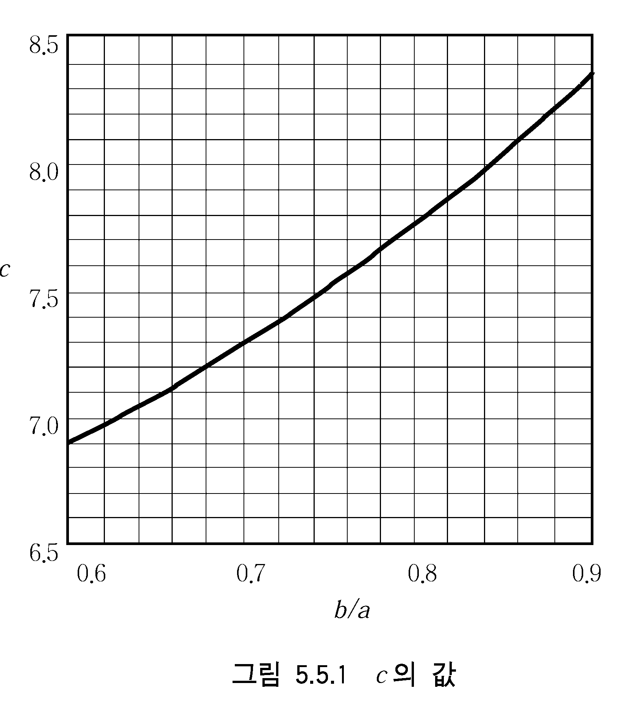
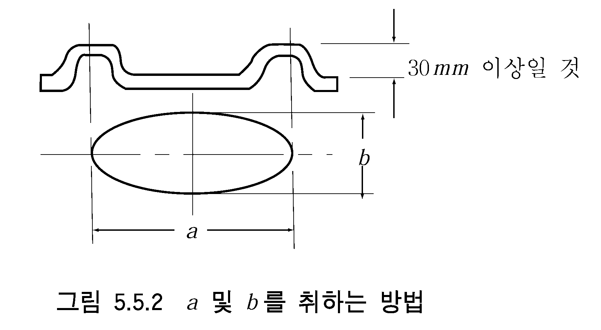
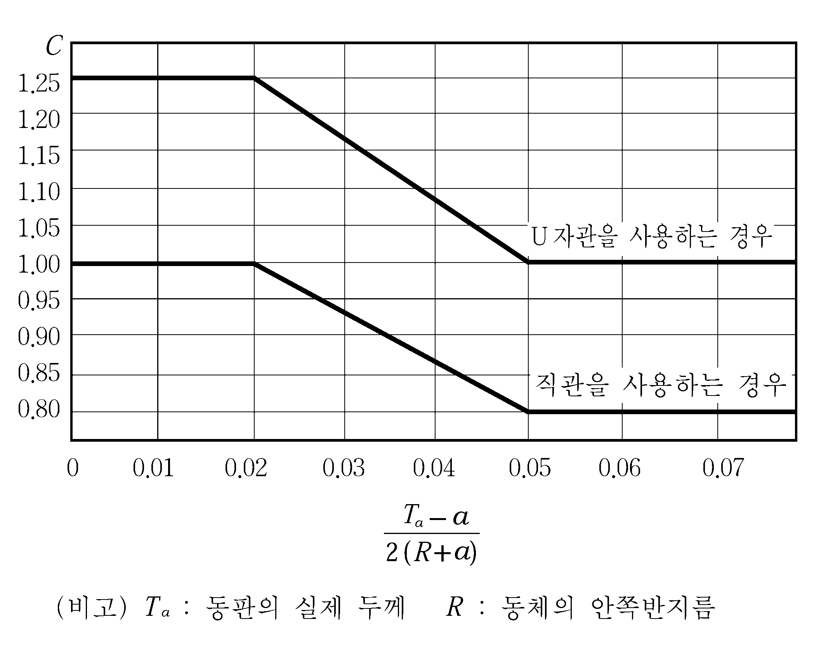
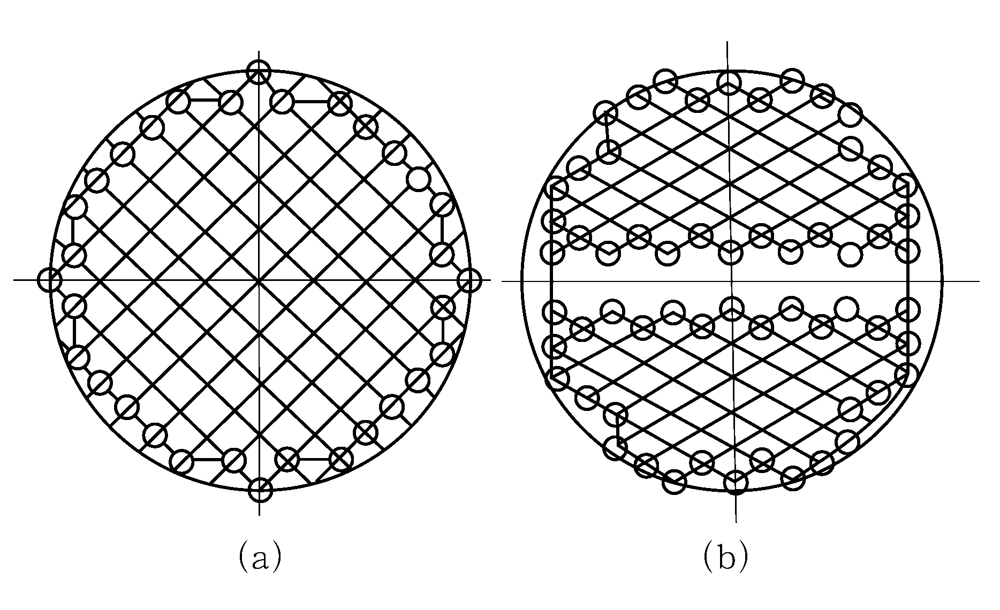

# 제5편 기관장치

> 선급 및 강선규칙/적용지침 / RA-05-K / 2025 / KO / Guidance

## 제 5 장 보일러 및 압력용기

### 제 1 절 보일러

#### 101. 적용

- **1.** **규 칙 101.**의 **2**항을 적용함에 있어서 설계압력이 0.35 $\mathrm{MPa}$ 이하인 소형보일러(이하 “**소형보일러”**라 한다)에 대하여는 **규칙 5장 1절**의 규정에 관계없이 다음에 따른다. **【규칙 참조】**
  - **(1)** 소형보일러의 재료, 구조, 강도 및 부속설비
    - **(가)** 소형보일러의 재료, 구조, 강도 및 부속설비는 한국산업규격 또는 이와 동등한 규격에 따른다.
    - **(나)** 충분한 용량을 갖는 안전밸브 또는 압력도출관을 설치하여야 한다.
    - **(다)** 다음의 안전장치를 설치하여야 한다.
      - **(a)** 노내 가스폭발방지를 위한 사전 환기장치
      - **(b)** 화염소실, 자동점화 실패 또는 송풍기가 정지한 경우의 연료차단장치
      - **(c)** 연료공급압력이 저하된 경우에 작동되는 연료차단장치
      - **(d)** 급수부족인 경우, 보일러에 과열부가 생기지 않도록 배려된 연료차단장치
  - **(2)** 시험
    - **(가)** 수압부는 설계압력의 2배 또는 0.2 $\mathrm{MPa}$ 중 큰 쪽의 압력으로 수압시험을 행한다.
    - **(나)** 전호에 의한 안전장치의 작동시험을 행한다.

#### 102. 재료

- **1.** **규 칙 102.**의 **1**항 (2)호에서 "우리 선급이 지장이 없다고 인정하는 경우"라 함은 설계압력이 3 $\mathrm{MPa}$ 미만이고 호칭지름이 100$A$ 미만의 것을 말한다. **【규칙 참조】**
- **2.** **규 칙 102.**의 **2**항을 적용함에 있어서 내압을 받는 보일러의 본체로 사용되는 주강품은 방사선 투과시험 및 자분탐상시험을 행하고, 유해한 결함이 없다고 확인된 것이어야 한다. 시험방법 및 판정기준은 다음에 따른다. **【규칙 참조】**
  - **(1)** 방사선 투과시험은 KS D 0227(주강품의 방사선투과검사 방법), (KS B) ISO 5579 또는 이와 동등한 규격에 따라 수행하고, 균열이 있는 경우에는 불합격으로 한다. 또한, 기공(blowholes), 모래흠, 개재물 및 수축공(shrinkage)과 같은 결함의 등급분류는 “1류”를 합격으로 한다. *(2019)*
  - **(2)** 자분탐상시험은 KS D 0213(철강 재료의 자분탐상시험 방법 및 자분 모양의 분류) 또는 이와 동등한 규격에 따라 수행한다. 결함의 판정기준은 **지침 2편 부록 2-2**의 **6**항 또는 기타 우리 선급이 인정하는 국제표준을 따를 수 있다. *(2019)*
  - **(3)** 각호에 의해 불합격으로 판정된 것은 결함을 보수할 수가 있다. 결함의 보수를 용접으로 행한 경우에는 **규칙 2편 1장 501.**의 **11**항을 따른다.

#### 111. 지주 또는 기타의 지지를 갖는 평판 또는 관판

- **1.** 건연식 원통형 보일러 관판의 수관구멍부를 포함하는 부분의 소요두께를 **규칙 111.**의 **3**항을 이용하여 산출하는 경우, 식의 수관구멍열에 근접해 있는 지점에 대한 $C$ 의 값은 다음 식으로 구한 강도저하율의 평방근으로 나누어서 계산한다. **【규칙 참조】**
  $\eta = \frac{p - 0.5 d}{p}$
  $\eta$ : 강도저하율
  $p$ : 수관구멍의 피치 ($\mathrm{mm}$)
  $d$ : 수관구멍의 지름 ($\mathrm{mm}$)

#### 114. 맨홀, 청소구멍 또는 검사구멍 【규칙 참조】

- **1.** 맨홀 덮개의 소요두께는 다음 식에 따른다. 다만, 중앙부의 두께는 14 $\mathrm{mm}$ 이하이어서는 아니 된다. 덮개의 주변부에 홈을 설치한 경우에 이 부분의 두께는 중앙부 두께의 2/3까지 얇게 할 수 있다.
  $T = \frac{b}{2c} \sqrt { \frac{100p}{f}}$
  $T$ : 맨홀 덮개의 소요두께 ($\mathrm{mm}$)
  $p$ : 설계압력 ($\mathrm{M} P a$)
  $f$ : 규칙에 정한 허용응력 ($\mathrm{N}/mm ^{2}$)
  $b$ : 맨홀의 짧은 지름 ($\mathrm{mm}$)
  $c$ : **지침 그림 5.5.1**에 따른 값. 다만, $a$ 는 맨홀의 긴지름 ($\mathrm{mm}$)으로 $b/a$ 가 1일 경우 $c$ 는 9로 한다. 파형(波形) 맨홀 덮개의 경우 $a$ 및 $b$ 는 **지침 그림 5.5.2**에 따른다.
   

#### 116. 노통, 화로판, 오지링 및 크로스튜브

- **1.** 지주 또는 기타에 의하여 지지되는 원통형 노통의 소요두께는 **규칙 116.**의 **3**항의 식 중 $L$ 을 지주간의 실효길이로 하여 동식을 이용하여 산출한다. **【규칙 참조】**

#### 117. 지주, 지주관 및 거더

- **1.** **규 칙 117.**의 **1**항에 따라 지주 또는 지주관의 소요지름 $d$ 를 구하는 경우에는 다음 각 호에 따른다. **【규칙 참조】**
  - **(1)** 지주 또는 지주관의 지지점간에 인접하는 지지가 지주 또는 지주관인 경우에는 양쪽 지지점간을 연결한 선의 수직 2등분선을 갖는 지지면의 경계로 한다.
  - **(2)** 지주 또는 지주관의 지지점에 인접하는 지지가 곡연부 또는 용접접합부에 있는 경우에는 **규칙 111.**의 **5**항에 규정된 곡연의 기점을 연결한 선, 또는 동판, 화로 등과의 용접 접합내면과 지주의 지지점에 접하는 원의 중심의 궤적을 지지면의 경계로 한다.
  - **(3)** 연관부 관군이 구분되어 관밀집부를 이루는 경우, 이들의 경계부의 모서리부에 있어서는 인접하는 2개의 지주를 일체로 간주하여 강도계산을 할 수 있다.
  - **(4)** 전 각호의 경우에는 구획된 면적으로부터 당해 면적 중에 포함되는 지주, 지주관 및 연관의 면적을 제외한다.

#### 124. 안전밸브의 구조 및 시험

- **1.** **규 칙 124.**를 적용함에 있어서 축기시험의 지속시간은 다음에 따른다. **【규칙 참조】**
  - **(1)** 수관보일러의 경우 : 7분
  - **(2)** 연관보일러의 경우 : 15분

#### 129. 수면지시장치 및 구조

**규칙 129.**의 **2**항에서 배기가스 보일러에는 유리수면계 1개 이외에 원격수면계 또는 고저수위 경보장치 1개를 설치하여야 한다. **【규칙 참조】**

#### 136. 시험 및 검사 【규칙 참조】

- **1.** **수압시험**
  - **(1)** 보일러의 물드럼 내 또는 증기드럼 내에 설치된 완열기는 완열기 입구에 증기스톱 밸브를 갖는 경우에는 보일러 설계압력의 1.5배 이상의 압력, 완열기 출구에만 스톱밸브가 있는 것에는 예상되는 차압력의 1.5배 이상의 압력으로 수압시험을 한다. 다만, 어느 경우라도 2 $\mathrm{M} P a$ 을 최소치로 한다.
  - **(2)** 보일러의 수압시험에 있어서 드럼, 헤더 등의 부품 및 부재가 설계압력의 1.5배로 단독시험을 받는 경우에는 보일러관, 연결관 등의 조립용접 완료 후의 수압시험은 설계압력의 1.25배로 시험할 수 있다.

### 제 2 절 열매체유 가열기

#### 203. 기관의 배기가스에 의해 가열되는 열매체유 가열기의 안전장치 【규칙 참조】

**규칙 203.**의 **7**항을 적용함에 있어서 “우리 선급이 적절하다고 인정하는 고정식 소화ㆍ냉각장치”라 함은 고정식 가스 소화장치와 가열코일, 헤더, 케이싱 등과 같은 가열기 자체를 냉각하기 위한 가압수 분무 등과 같은 냉각장치의 조합을 말한다. 다만, 고정식 소화ㆍ냉각장치는 다량의 물을 방출할 수 있는 주수장치로 할 수 있다. 이 경우, 방출되는 물이 왕복동 내연기관으로 흘러들어가지 않도록 하기 위하여 가열기 하방의 배기 덕트에 수집 및 배출하기 위한 적절한 수단을 갖추어야 하며 이 드레인은 적당한 장소로 유도되어야 한다.

### 제 3 절 압력용기

#### 302. 분류

- **1.** 저압증기발생기(*PV*-1에 속하는 것)의 부착품은 다음과 같이 한다. **【규칙 참조】**
  - **(1)** 수면지시장치 : 유리수면계 1개
  - **(2)** 안전밸브 : 보일러에 준한다.
  - **(3)** 검사구멍 : 보일러에 준한다.
  - **(4)** 보일러물 방출밸브 : 보일러에 준한다.
  - **(5)** 방출밸브 : 보일러에 준한다.
  - **(6)** 압력계측장치 : 보일러에 준한다.
  - **(7)** 온도계측장치 : 보일러에 준한다.

#### 303. 재료 【규칙 참조】

- **1.** **규 칙 303.**의 **2**항을 적용함에 있어서 유독성의 물질을 비축하거나 취급하는 압력용기의 본체에는 특수주철품을 사용하여서는 아니 된다.
- **2.** 제1급 또는 제2급 압력용기의 본체에 주강품을 사용하는 경우의 비파괴시험의 방법 및 판정기준은 다음에 따른다.
  - **(1)** 방사선 투과시험은 KS D 0227(주강품의 방사선투과검사 방법), (KS B) ISO 5579 또는 이와 동등한 규격에 따라 수행하고, 균열이 있는 경우에는 불합격으로 한다. 또한, 기공(blowholes), 모래흠, 개재물 및 수축공(shrinkage)과 같은 결함의 등급분류는 “1류”를 합격으로 한다. 다만, 제2급 압력용기의 시험부의 두께가 25 $\mathrm{mm}$ 를 초과하는 것의 기공(blowholes), 모래흠 및 개재물에 대하여는 2급도 합격으로 할 수 있다. *(2019)*
  - **(2)** 자분탐상시험은 KS D 0213(철강 재료의 자분탐상시험 방법 및 자분 모양의 분류) 또는 이와 동등한 규격에 따라 수행한다. 결함의 판정기준은 **지침 2편 부록 2-2**의 **6**항 또는 기타 우리 선급이 인정하는 국제표준을 따를 수 있다. *(2019)*
  - **(3)** 침투탐상시험은 KS B 0816(침투탐상 시험방법 및 결함지시 모양의 등급분류)에 따른다. 판정기준은 전호에 준한다.
  - **(4)** 전 각호에 의해 불합격으로 판정된 것은 결함을 보수할 수 있다. 결함의 보수를 하는 경우에는 **규칙 2편 1장 501.**의 **11**항을 따른다.
- **3.** 부착품에 사용하는 재료의 사용제한에는 다음에 따른다.
  - **(1)** 인화성 또는 유독성의 물질을 비축 또는 취급하는 압력용기의 부착품에는 회주철을 사용할 수 없다.
  - **(2)** 유독성의 물질을 비축 또는 취급하는 압력용기의 부착품에는 특수주철품을 사용할 수 없다.
- **4.** **규 칙 303.**의 **1**항 (3)호에서󰡒우리 선급이 지장이 없다고 인정하는 경우󰡓라 함은 원칙적으로 설계압력이 3$\mathrm{M} P a$ 미만이고 호칭지름이 100$A$ 미만의 것을 말한다.

#### 307. 재료의 허용응력 【규칙 참조】

- **1.** **규칙 307.**의 **3**항 (1)호에서 “우리 선급이 적절하다고 인정하는 규격”이라 함은 한국산업규격 또는 이와 동등한 규격을 말한다.

#### 308. 구조 및 강도일반 【규칙 참조】

- **1.** 부착품의 구조에 대하여는 다음에 따른다.
  - **(1)** 밸브, 플랜지 등의 부착품과 볼트, 너트, 개스킷 등은 우리 선급이 적절하다고 인정하는 규격에서 정한 구조 및 치수를 가지고 동 규격에서 정한 사용조건에 적합한 것이어야 한다.
  - **(2)** 제1급 및 제2급 압력용기의 동체에 부착하는 부착품은 용접 또는 플랜지 이음으로 부착하여야 한다. 다만, 동체의 두께가 12 $\mathrm{mm}$ 를 초과하는 경우 또는 동체에 관용나사 니플을 설치하는 경우에는 호칭지름이 32$A$ 이하인 경우에 한하여 나사식 이음으로 할 수 있다.

#### 311. 평판 또는 관판 【규칙 참조】

- **1.** 지주관에 의해 지지되지 않는 열교환기의 관판은 다음에 따른다.
  - **(1)** 열교환기 및 이와 유사한 것으로서 지주관에 의해 지지되지 않는 평평한 관판(floating head의 것은 제외)의 소요두께는 다음 2개의 식 중 큰 것 이상으로 한다.
    $T_1 = \frac{CD}{2} \sqrt { \frac{P}{f}} + a$
    $T_2 = \frac{PA}{\tau L} +a$
    $P$ : 설계압력($\mathrm{M} P a$)
    $f$ : 재료의 허용굽힘응력($\mathrm{N}/mm ^{2}$)
    $\tau$ : 재료의 허용전단응력($\mathrm{N}/mm ^{2}$)
    $C$ : 관 및 관판의 지지방법에 따른 계수로서 관판이 동체와 일체로 되지 않고 관에 직관을 사용하는 경우에는 1.0, U자관을 사용하는 경우에는 1.25, 관판이 동체와 일체로 된 경우에는 **지침 그림 5.5.3**에 따른다.
    $D$ : 관판 외주의 고정원의 지름($\mathrm{mm}$)으로서 관판을 볼트로 플랜지에 부착하는 경우에는 가스킷 반력이 걸리는 위치를 통과하는 원의 지름을 나타내며, 관판을 동체에 고정하는 경우에는 동체의 안쪽 지름(부식 예비두께를 뺀 값)
    $A$ : 가장 바깥측의 관구멍의 중심을 차례로 연결하여 얻은 다각형의 면적($\mathrm{mm} ^{2}$)(**지침 그림 5.5.4** 참조)
    $L$ : 상기 다각형의 바깥측 둘레의 길이에서 바깥측에 있는 모든 관구멍의 지름의 합을 뺀 값($\mathrm{mm}$)
    $a$ : 부식 예비두께로서 1.0 $\mathrm{mm}$. 다만, 내식성 재료를 사용한 경우, 유효한 방식조치를 행한 경우 또는 부식의 우려가 없는 경우에는 0으로 한다.
  - **(2)** 전호의 소요두께 계산은 각각 $P$, $C$ 및 $D$ 를 사용하여 양측에 대하여 행한다. 다만, 압력차의 계산을 할 경우에는 우리 선급이 적절하다고 인정하는 바에 따른다.
    
    **그림 5.5.3** #eqnID-583**의 값** 
    **그림 5.5.4 관판의 계산에 이용되는 다각형**

#### 313. 맨홀, 청소구멍 또는 검사구멍 【규칙 참조】

**규칙 313.**의 **1**항을 적용함에 있어서 맨홀, 청소구멍, 검사구멍의 수 및 크기는 우리 선급이 적절하다고 인정하는 경우 한국산업규격 또는 이와 동등한 규격에 따를 수 있다. *(2017)*

#### 319. 시험 및 검사 【규칙 참조】

- **1.** **규 칙 319.**의 **1**항 **표 5.5.17**을 적용함에 있어서 3급 압력용기로 분류됨에도 불구하고 다음의 (1)호 또는 (2)호에 해당하는 압력용기는 수압시험을 실시하여야 한다.
  - **(1)** 설계압력($\mathrm{MPa}$)과 내용적($\mathrm{m} ^{3}$)의 곱이 1.0 이상이 되는 압력용기
  - **(2)** 다음에 나타낸 기기의 운전에 필요한 열교환기(청수, 윤활(조작)유, 연료유용 가열기 및 냉각기, 복수기, 급수가열기, 공기냉각기 등) 및 공기탱크(제어용 공기탱크 등)와 기타 중요한 압력용기 *(2019)*
    - **(가)** 주기관, 중요 보조기관 및 추진축계
    - **(나)** 전기추진용 전동기 및 전력변환장치
    - **(다)** 보일러 및 열매체유 설비(주보일러, 중요한 보조보일러, 주기관의 운전에 필요한 연료의 가열 또는 상시가열을 필요로 하는 화물의 가열에 사용하는 보일러 및 열매체유 설비)

### 제 4 절 보일러 및 압력용기의 용접

#### 401. 용접일반

- **1.** **용접절차 인정시험 규칙 401.**의 **2**항을 적용함에 있어서 "용접절차 인정시험"은 **지침 2편 2장 4절**에 따른다.
  **【규칙 참조】**
- **2.** **규 칙 401.**의 **3**항 (3)호를 적용함에 있어서 용접에 사용하는 모재의 요건은 다음에 따른다. **【규칙 참조】**
  - **(1)** 용접시공에 사용하는 모재는 용접용으로 적합하여야 한다. 탄소함유량은 탄소강 및 저합금강의 주조품, 단강품의 경우에는 0.23 $\%$ 이하, 기타의 경우에는 0.35 $\%$ 이하이어야 한다. 다만, 용접조건을 고려하여 우리 선급이 승인한 경우, 탄소함유량은 우리 선급이 승인한 값까지 증가시킬 수 있다.
  - **(2)** 모재가 고장력강인 경우의 탄소당량의 상한치는 우리 선급이 적절하다고 인정하는 바에 따른다.

#### 403. 열처리

- **1.** **응력제거의 생략** 【**규칙 참조】** *(2025)*
  - **(1)** **규칙 403.의 3**항 (1)호 (다)의 적용에서 다음 모든 요건을 만족하는 경우 응력제거를 생략할 수 있다.
    - **(가)** 보일러의 모재가 **규칙 2편 1장 202.**의 **표 2.1.3**에 주어진 풀사이즈 시험편에 의한 샤르피 V-노치 충격시험(압연방향과 시험편방향이 평행) 규격치가 0 °C에서 47$\mathrm{J}$ 이상인 강판의 경우
    - **(나)** 용접시공시험에서의 용접부 충격시험 규격치가 0 °C에서 (가)의 규격치 이상인 경우
    - **(다)** 보일러의 동판과 경판 또는 관판과의 사이의 접합은 맞대기 용접인 경우
  - **(2)** **규칙 403.**의 **3**항 (3)호의 적용에서 다음 모든 요건을 만족하는 경우 응력제거를 생략할 수 있다.
    - **(가)** 압력용기의 모재가 **규칙 2편 1장 202.**의 **표 2.1.3**에 주어진 풀사이즈 시험편에 의한 샤르피 V-노치 충격시험(압연방향과 시험편방향이 평행) 규격치가 0 °C에서 47$\mathrm{J}$ 이상인 강판의 경우
    - **(나)** 용접시공시험에서의 용접부 충격시험 규격치가 0 °C에서 (가)의 규격치 이상인 경우
    - **(다)** 압력용기 재료의 판두께는 40 $\mathrm{mm}$ 이하인 경우
  - **(3)** 전 각호에 관계없이 보일러 및 압력용기가 특수하게 설계된 경우 또는 특수한 조건에서 사용되는 경우에는 응력제거의 필요여부에 대하여 그때마다 결정한다.

#### 404. 방사선검사 【규칙 참조】

- **1.** **규칙 404.**를 적용함에 있어서 우리 선급이 특별히 승인한 경우에는 방사선투과검사 대신에 초음파탐상검사를 할 수 있다.
- **2.** 방사선투과검사에 요구되는 품질등급 및 합격기준은 아래 표에 따른다. *(2024)*

  **방사선투과검사에 요구되는 품질등급 및 합격기준**

  | 품질등급 (*ISO 5817:2014* 적용)(1) | 검사기술/등급 (*ISO 17636-1:2022* 적용)(1) | 합격기준 (*ISO 10675-1:2021* 적용)(1) |
  | --- | --- | --- |
  | B | B(등급) | 1 |
  | (비고) (1) 또는 우리 선급이 인정하고 수용할 수 있는 표준 |   |   |
- **3.** 초음파탐상검사에 요구되는 품질등급 및 합격기준은 아래 표에 따른다. *(2024)*

  **초음파탐상검사에 요구되는 품질등급 및 합격기준**

  | 품질등급 (*ISO 5817:2014* 적용)(1) | 검사기술/등급 (*ISO 17640:2018* 적용)(1) | 합격기준 (*ISO 11666:2018* 적용)(1) |
  | --- | --- | --- |
  | B | 최소 B | 2 |
  | (비고) (1) 또는 우리 선급이 인정하고 수용할 수 있는 표준 |   |   |

#### 405. 보일러 및 제1급 압력용기의 용접시공시험

- **1.** **규 칙 405.**의 **3**항을 적용함에 있어서 용접시공시험의 용접이음매 인장시험을 시험기 능력이 부족하여 판두께 그대로의 시험편으로는 시험이 불가능한 경우에는 이를 소요두께의 시험편으로 제작하여 시험하도록 한다. 다만, 용접이음매 인장시험에 있어서는 미리 정해진 용접절차 인정시험 등으로서 판두께 방향의 강도분포가 확인되면 대표하는 시험편만으로 시험할 수 있다. **【규칙 참조】**
- **2.** **규 칙 405.**의 **5**항에서 “우리 선급의 승인을 얻은 값“이라 함은 **규칙 2편 2장 표 2.2.7** 및 **2.8**에 규정된 충격시험 규격치로 하고, 표에 규정되어 있지 않은 재료의 경우는 모재의 충격시험 규격치를 말한다. 다만, 모재의 충격시험 규격치가 규정되어 있지 않은 경우에는 우리 선급의 승인을 받아 충격시험을 생략할 수 있다. **【규칙 참조】** 
