# 제5편 기관장치

> 선급 및 강선규칙/적용지침 / RA-05-K / 2025 / KO / Guidance

## 제 6 장 보기 및 관장치

### 제 1 절 일반사항

#### 101. 일반

- **1.** **적용 규칙 101.**의 **1**항을 적용함에 있어서 보조기계의 구조는 다음에 따른다. **【규칙 참조】**
  - **(1)** 충분한 강도와 사용목적에 알맞는 성능을 가지고 보수, 점검이 용이하고, 적절한 재질의 것이어야 한다.
  - **(2)** 보기의 베어링 볼트, 기타 운동부분의 부착 볼트 및 너트는 스플릿 핀 또는 이와 동등한 방법으로 이완되지 아니하도록 하여야 한다.
  - **(3)** 보기 및 관장치는 취급자의 건강에 유해한 가스 또는 화재의 위험이 있는 가스를 가능한 한 누설하지 아니하도록 하여야 한다.
  - **(4)** 보기는 전호의 가스를 신속히 배출할 수 있는 장소에 설치하여야 한다.
  - **(5)** 보기 및 관장치의 회전부분, 왕복운동부분 및 고온 부분에는 이것을 감시하거나, 조작하는 사람 또는 이것에 접근하는 사람이 위험하지 아니하도록 적절한 보호장치를 설치하여야 한다.
- **2.** **정의 규칙 101.**의 **3**항에 대하여는 다음에 따른다. **【규칙 참조】**
  - **(1)** 용적형 펌프의 토출측 관장치의 설계압력은 펌프계획 토출압력의 1.1배를 표준으로 한다.
  - **(2)** 펌프의 토출측 관장치 중에서 **규칙 101.**의 **3**항 (1)호 (가) 및 (나)에서 규정하는 설계압력을 적용하는 범위는 다음에 따른다.
    - **(가)** 평형수 펌프 또는 화물유펌프의 토출측 관장치에 있어서는 평형수탱크 또는 화물유탱크의 주입밸브 및 육상배관과의 접속부까지. 다만, 시체스트를 통하여 평형수를 배출하는 선박에 있어서는 시체스트까지의 관장치를 포함한다.
    - **(나)** 작동유 관장치에 있어서는 유압윈치, 유압조작밸브 등의 기기에 가장 가까운 스톱밸브까지
  - **(3)** 배기가스 이코노마이저용 순환수펌프의 토출측 관장치의 설계압력은 **규칙 101.**의 **3**항 (1)호 (다)의 급수펌프 토출측 관장치에 대한 설계압력의 규정에 준한다.
- **3.** **보기의 구조, 재료 및 강도 규칙 101.**의 **5**항 (1)호에서 “우리 선급이 특별히 지정하는 경우”의 취급은 다음에 따른다. **【규칙 참조】**
  - **(1)** 특수한 보기로서 우리 선급이 특히 필요하다고 인정하는 경우에는 설계에 관련하여 그때마다 정한다.
- **4.** **규 칙 101. 6**항을 적용하면서 “우리 선급이 적절하다고 인정하는 바”라 함은 다음의 사항을 말한다.
  - **(1)** 용접기기의 가스용기 및 관장치의 취급에 대하여는 **부록 5-5**에 따른다.
  - **(2)** 소각설비는 관련 국제협약 또는 기국 요건에 따른다.

#### 102. 관

- **1.** **재료**
  - **(1)** 우리 선급이 인정한 공장의 제품으로 *KS*가 표시된 배관용 탄소강 강관은 **규칙 102.**의 **2**항 (4)호에 정하는 사용제한으로 제2급 관장치에 사용할 수 있다. **【규칙 참조】**
- **2.** **동관 및 동합금관의 사용제한 규칙 102.**의 **3**항을 적용함에 있어서는 다음에 따른다. **【규칙 참조】**
  - **(1)** 동관은 다음에 해당하는 관에 사용하여서는 아니 된다.
    (파) 측심관(측심되는 구획 내에서는 제외)
    - **(가)** 설계온도가 200 °C를 넘는 관(계측용 관은 제외)
    - **(나)** 연료유관(탱크 내에 배치되는 관, 계측용 관, 드레인관, 공기배제관 및 보일러의 분연펌프와 연소장치와의 짧은 관은 제외)
    - **(다)** 윤활유관(탱크 내에 배치되는 관, 계측용 관, 드레인관, 공기배제관 및 기관구역 외에 배치되는 관은 제외)
    - **(라)** 작동유관(탱크 내에 배치되는 관, 계측용 관, 드레인관 및 공기배제관은 제외)
    - **(마)** 열매체유관(탱크 내에 배치되는 관, 계측용 관, 드레인관 및 공기배제관은 제외)
    - **(바)** 화물유관(탱크 내에 배치되는 관, 계측용 관, 드레인관 및 공기배제관은 제외)
    - **(사)** 빌지관(계측용 관, 드레인관 및 공기배제관은 제외)
    - **(아)** 평형수관(계측용 관 및 공기배제관은 제외)
    - **(자)** 선내의 소화용으로 사용되는 관(계측용 관은 제외)
    - **(차)** 화재 발생시 관의 손상에 의하여 침수에 직접 영향을 미치는 관(적용범위는 A류 기관구역의 만재흘수선 하방에 설치된 냉각 해수관으로 하며 계측용 관, 드레인관 및 공기배제관은 제외)
    - **(카)** 공기관(시동공기관 포함)
    - **(타)** 넘침관
    - **(하)** 기타 우리 선급이 필요하다고 인정하는 관
  - **(2)** 동합금관은 다음에 해당하는 관에 사용하여서는 아니 된다.
    - **(가)** 설계온도가 200 °C를 넘는 관(계측용 관은 제외), 백동관은 설계온도가 300 °C를 넘는 관(계측용 관은 제외)
    - **(나)** 연료유관(탱크 내에 배치되는 관, 계측용 관, 드레인관 및 공기배제관은 제외)
    - **(다)** 윤활유관(탱크 내에 배치되는 관, 계측용 관, 드레인관, 공기배제관 및 기관구역 외에 배치되는 관은 제외)
    - **(라)** 작동유관(탱크 내에 배치되는 관, 계측용 관, 드레인관, 공기배제관 및 기관구역 외에 배치되는 관은 제외)
    - **(마)** 제어유관(탱크 내에 배치되는 관, 계측용 관, 드레인관, 공기배제관 및 기관구역 외에 배치되는 관은 제외)
    - **(바)** 열매체유관(탱크 내에 배치되는 관, 계측용 관, 드레인관 및 공기배제관은 제외)
    - **(사)** 화물유관(탱크 내에 배치되는 관, 계측용 관, 드레인관 및 공기배제관은 제외)
    - **(아)** 선내의 소화용으로 사용되는 관(계측용 관 및 액화가스산적운반선의 물분무장치에 사용되는 백동관(Copper-nickel)은 제외) *(2018)*
    - **(자)** 화재발생시 관의 손상에 의하여 침수에 직접 영향을 미치는 관(적용범위는 A류 기관구역의 만재흘수선 하방에 설치된 냉각해수관(다만, 백동관(copper-nickel)은 사용 가능)으로 하며 계측용 관, 드레인관 및 공기배제관은 제외) *(2017)*
    - **(차)** 화재발생시 사용하는 보기, 밸브 등의 제어용 공기관(드레인관은 제외)
    - **(카)** A급 또는 B급 구획을 관통하는 부분의 관
    - **(타)** 전 호의 (사) 및 (아)와 (카)부터 (하)에 속하는 관
  - **(3)** 계측용관에 동 및 동합금을 사용하는 경우에는 짧은 길이에 한한다.
- **3.** **특수한 재료의 관 및 플렉시블관 규칙 102.**의 **5**항을 적용함에 있어서는 다음에 따른다. **【규칙 참조】**
  - **(1)** 플라스틱을 관장치에 사용하는 경우에는 **부록 5-6**에 따른다. *(2017)*
  - **(2)** 알루미늄합금관에 대하여는 다음에 따른다.
    관의 소요두께는 **규칙 102.**의 **6**항에 따른다. 이 경우 허용응력 $f$ 는 다음의 값 중 최소치로 한다. 다만, 설계온도가 재료의 크리프 영역에 있지 아니한 경우에는 $f_3$ 의 값은 고려할 필요가 없다.
    $f_1 = \frac{R_20}{4.0} , f_2 = \frac{E_T}{1.5} , f_3 = \frac{S_R}{1.6}$
    $R_20$ : 상온(50 °C 미만)에서의 재료의 규격최소인장강도 ($\mathrm{N}/mm ^{2}$)
    $E_T$ : 설계온도에서의 재료의 0.2 % 내력 ($\mathrm{N}/mm ^{2}$)
    $S_R$ : 설계온도에서의 재료의 100,000시간 후의 평균파단강도 ($\mathrm{N}/mm ^{2}$)
    - **(가)** 알루미늄합금관은 원칙으로 우리 선급이 적절하다고 인정하는 규격에 정하여진 것으로 이음매 없는 인발관 또는 이음매 없는 압출관이어야 한다.
    - **(나)** 알루미늄합금관은 다음에 해당하는 관에는 사용하여서는 아니 된다.
      - **(a)** 원칙적으로 설계온도가 150 °C를 초과하는 관
      - **(b)** **지침 6장 102.**의 **2**항 (2)호 (나) 내지 (타)에 속하는 관
    - **(다)** 내압을 받는 알루미늄합금관의 소요두께는 다음에 따른다.
  - **(3)** 제1급 또는 제2급 관장치에 사용하거나 손상시 화재 또는 침수에 영향을 미치는 관에 사용하는 금속 또는 비금속재료의 신축관(끝단 이음부 포함) 및 플렉시블관(끝단 이음부 포함)은 우리 선급의 형식승인을 받은 것이어야 하며, 플렉시블관(끝단 이음부 포함)은 **부록 5-9**에 따른다.
- **4.** **관의 소요두께 【 규칙 참조】**
  - **(1)** **규칙 표 5.6.2**에서 “선외 배수관”에 해당하는 란의 적용은 국제항해에 종사하는 선박으로서 길이 24 $\mathrm{m}$이상의 선박에만 적용한다.
  - **(2)** **규칙 표 5.6.3**의 (비고) 2 중 “나사를 낸 관”에 대해서는 소화용 CO_2 관에서 방출밸브로부터 노즐까지의 관에 대해서는 적용하지 않는다. **【규칙 참조】**
  - **(3)** 국제항해에 종사하는 선박으로서 길이 24 $\mathrm{m}$ 이상인 선박의 건현갑판상 또는 선루갑판상에 개구하는 공기관의 노출부분의 최소두께는 다음에 따른다.
    - **(가)** **규칙 4편 2장 102.**에서 정의하는 노출갑판구의 위치 I 또는 위치 II에 설치되고 건현갑판하의 구획 또는 폐위된 선루나 갑판실로 유도되는 공기관에 대하여는 **규칙 표 5.6.2.**의 “노출갑판상의 공기관”을 적용한다.
    - **(나)** (가) 이외의 공기관에 대하여서는 **규칙 표 5.6.2**의 “선체의 일부를 형성하는 탱크의 공기관”을 적용한다.
  - **(4)** 소화용 CO_2관에 사용되는 관은 부식예비두께를 0으로 할 수 있다.

#### 103. 밸브 및 관부착품 【규칙 참조】

- **1.** **규 칙 103.**의 **1**항 (1)호에서 “우리 선급이 지장이 없다고 인정하는 경우“라 함은 다음에 정하는 밸브 및 관부착품을 말한다. *(2021)*

  | 사용 재료 | 설계온도( °C) | 호칭지름($D$) : $A$*,* 설계압력($P$) : $\mathrm{M} P a$ |
  | --- | --- | --- |
  | 탄소강, 저합금강, 스테인리스강, 연신율 12 $\%$ 이상인 주철 | ＜300 이고 | $D$ ≤ 50 또는 $P \times D$ ≤ 250 인 경우 |
  | 동합금 | ＜200 이고 | $D$ ≤ 50 또는 $P \times D$ ≤ 150 인 경우 |
- **2.** **규칙 103.**의 **1**항 (1)호에서 “원칙적으로 2편 1장의 규정에 적합한 것이어야 한다”를 적용함에 있어서 우리 선급이 필요하다고 인정하는 경우, 제조법 승인을 받은 제조자의 증서를 인정할 수 있다. *(2024)*
- **3.** 길이 30 $\mathrm{m}$ 미만인 선박에 장치되는 모든 관창치에 사용하는 관, 밸브, 콕 및 관부착품은 한국산업규격 또는 이와 동등한 규격에 적합한 재료를 사용할 수 있다.
- **4.** **주철제의 밸브 및 관부착품의 사용제한 규칙 103.**의 **4**항 (3)호를 적용함에 있어서는 다음에 따른다.
  - **(1)** 회주철은 유조선의 화물유탱크 내의 화물 관계통에 사용할 수 있다.
  - **(2)** 회주철은 인화성은 있으나 기타의 위험성이 없는 액체화물의 노출갑판상의 관계통에 사용할 수 있다.
- **5.** 고무시트 버터플라이 밸브의 취급은 다음에 따른다.
  - **(1)** 사용범위
    고무시트 버터플라이 밸브(이하 **버터플라이 밸브**라한다)는 다음의 용도에 사용하여서는 아니 된다. 다만, 제조자의 사양을 고려하여 우리 선급이 인정하는 경우에는 사용범위를 참작할 수 있다. *(2021)*
    - **(가)** 가연성 또는 인화성 액체(예를 들면 연료유, 원유 등)를 적재하는 탱크에 부착되고 액체의 정압을 받는 밸브로서 기관실 또는 발화원을 갖는 구획으로 인도되는 밸브(다만, 유조선의 화물탱크 내에 설치되는 밸브 또는 펌프실로 인도되는 밸브에는 사용할 수 있다.)
    - **(나)** 설계압력이 1.6$\mathrm{M} P a$ 를 넘는 관계통의 밸브
    - **(다)** 설계온도가 70 °C를 넘는 관계통의 밸브
    - **(라)** 물, 기름 이외의 특수한 유체를 취급하는 관계통의 밸브
    - **(마)** 내면 라이닝한 고무를 플랜지의 접촉면까지 연장해서 개스킷을 겸하는 구조의 밸브로서 기관실 내의 연료유관 계통의 밸브
  - **(2)** 구조 및 제품의 표시
    버터플라이 밸브의 구조는 다음의 조건에 적합한 것으로 한다.
    제조자는 버터플라이 밸브의 보기 쉬운 위치에 최소한 다음의 것을 표시하여야 한다.
    - **(가)** 계획된 “개” 및 “폐”의 위치에서 고정할 수 있을 것
    - **(나)** 중간위치에서 사용하는 밸브는 밸브개도의 각 위치에서 고정할 수 있고 이 고정장치는 진동, 충격, 유체의 흐름 등에 의해서 이완되지 않을 것
    - **(다)** 한 사람의 힘으로 조작이 가능할 것
    - **(라)** 밸브의 개도위치를 표시하는 장치가 있을 것
    - **(마)** 밸브봉은 충분한 강도를 가지고 밸브디스크는 밸브봉으로부터 이완되지 않는 방법으로 확실히 부착될 것
    - **(바)** 밸브 주요부분의 재료는 내식성 및 내마모성을 고려한 것일 것
    - **(사)** 해수흡입밸브 또는 선외배출밸브로 사용하는 버터플라이 밸브는 원칙으로 플랜지형일 것
    - **(아)** 제품의 표시
      - **(a)** 유체의 종류
      - **(b)** 설계압력
      - **(c)** 밸브의 재질
      - **(d)** 호칭지름
      - **(e)** 제조자명
  - **(3)** 시험 및 검사
    버터플라이 밸브의 시험 및 검사는 다음에 따른다. 다만, 규칙에서 검사원의 입회검사를 규정하고 있는 것에 대하여는 해당 규정에 따른다.
    - **(가)** 재료시험

#### 103.의 1항에 따른다.

설계압력의 1.5배의 압력으로 하여야 한다. 다만, 선체붙이밸브로 사용할 경우에는 0.5 $\mathrm{M} P a$ 의 압력으로 하여야 한다.(고무라이닝을 시공하는 밸브에 대하여는 고무라이닝을 한 후에 하여야 한다.)

- **6.** **관부착품의 구조 및 사용기준**
  - **(1)** 관플랜지 규격의 취급
    관플랜지 규격의 취급은 다음에 따른다.
    - **(가)** **규칙 103.**의 **5**항의 한국산업규격에 정한 관플랜지는 *KS B* 1501-1503, 1506, 1507, 1509-1511, 1519, 1521 및 *KS B*1540에 규정된 것을 말한다.
    - **(나)** *ANSI* 규격 $B$ 16-150～2500 $Lb$ 의 관플랜지를 그 규격에 따라 사용하는 경우에는 재료, 치수 및 용접 이음부 형식은 규칙에 규정한 것과 동등한 것으로 취급한다.
  - **(2)** 관의 호칭지름의 취급(이하 **규칙 5편 6장**에 사용되는 호칭지름에 적용한다)
    관의 호칭지름의 취급은 다음에 따른다.
    - **(가)** KS 규격에 호칭지름이 정하여져 있는 관은 규격의 호칭지름과 동일한 것으로 한다.
    - **(나)** KS 규격에 호칭지름이 정하여져 있지 않는 관은 「호칭지름○○」을 KS 규격에 정하여져 있는 관의 호칭지름에 상당하는 바깥지름을 사용하여 「바깥지름 × $\mathrm{mm}$」로 읽는다.
  - **(3)** 관플랜지
    *KS B* 1503, 1511 및 *KS B* 1521에 정하여진 플랜지는 *KS B* 1501에 정해진 압력에 따라서 사용할 수 있다.
  - **(4)** 선체붙이 관련 관장치에 대한 호칭압력은 최소 5K 이상이어야 한다. *(2019)*

#### 104. 이음의 형식

- **1.** **용접연결 규 칙 104.**의 **2**항 (2)호를 적용함에 있어서 “호칭지름 80A 이하”는 바깥지름 89.1mm 이하를 의미한다. **【규칙 참조】**
- **2.** **플랜지 연결 【 규칙 참조】**
  - **(1)** **지침 그림 5.6.1**과 같이 관 끝을 벨마우스로 한 관이음의 형식은 제3급 관 및 설계압력이 1 $\mathrm{M} P a$ 이하이고 호칭지름 50$A$ 이하인 제1급 또는 제2급에 속하는 관에 사용할 수 있다.
  - **(2)** **지침 그림 5.6.2**에 나타낸 편면용접 플랜지이음은 음료수관, 만재흘수선 상부에 위치한 배수관 및 위생수관과 개구단을 갖는 드레인관, 넘침관, 공기관, 배기가스관, 크랭크실의 통풍관, 증기배기관 및 포말방출관에 사용할 수 있다. 또한, 가연성 기름을 제외하고 호칭지름 40$A$ 이하의 3급관에 사용할 수 있다.
  - **(3)** **규칙 104. 3항** (4)호를 적용할 때, "특별한 경우“라 함은 **그림 5.6.1**에서 규정한 이 외의 형식을 사용하는 경우를 말한다.
  - **(4)** **규칙 104.**의 **3**항 (5)호를 적용할 때, 플랜지이음의 적용은 **지침 표 5.6.1**에 따른다.
- **3.** **삽입 나사박이 이음 규 칙 104.**의 **4**항을 적용함에 있어, 삽입 나사박이 이음은 인화성 유체를 이송하는 관장치에 적용되는 온도/압력 센서와 같은 소구경 계기용 장비의 연결부에 사용될 수 있으며, 해당 연결부는 우리 선급이 인정하는 국가 및/또는 국제 규격(ASME B31.1 및 ASME B31.3과 같은 표준을 참조할 수 있다)에 적합하여야 한다. 다만, 이러한 나사박이 이음의 외경은 최대 25mm로 한정한다. *(2024)* **【규칙 참조】**
- **4.** **경납땜 【규칙 참조】**
  **규칙 104.**의 **1**항을 적용함에 있어서 비철금속제의 밸브 및 관부착품은 경납땜을 사용하여 비철금속관에 부착할 수 있으며 보통의 경납땜은 설계압력이 0.7 $\mathrm{M} P a$ 이하로서 설계온도가 93 ℃ 이하인 관계통에 한하여 사용할 수 있다. 동관을 플랜지에 경납땜할 경우에는 다음 각 호에 따른다.
  - **(1)** 경납땜부에는 적절한 탕유(湯留)를 설치하고, 관끝을 밸마우스로 한다.
  - **(2)** 동관과 관플랜지의 접합에 필릿용접식으로 하는 것은 피한다. 다만, 은납땜 또는 TIG 용접 등 특수한 용접방법을 채택하는 경우는 그러하지 아니하다.
  - **(3)** 경납땜한 동관은 온도 200 °C 이하의 경우에 사용할 수 있다.
    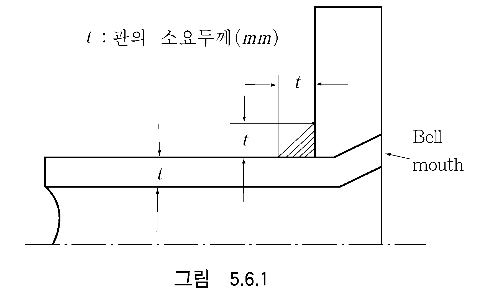 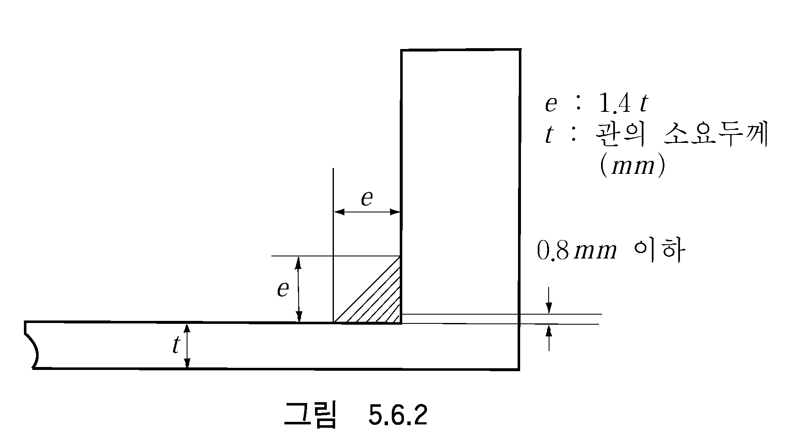

    **표 5.6.1 플랜지이음의 적용 표준**

    | 사용목적 관장치의 분류 | 증기(1) 및 열매체유 | 연료유 및 윤활유 | 공기(1), 물(1), 작동유(1), 가스(1) |
    | --- | --- | --- | --- |
    | 제1급관 | A, B(2) | A, B | A, B |
    | 제2급관 | A, B, C, D(3) | A, B, C | A, B, C, D(3) |
    | 제3급관 | A, B, C, D | A, B, C | A, B, C, D, E(4) |
    | (비고) 1. 표의 (1)~(4)는 아래의 조건에 따른다. (1) 설계온도가 400 °C를 넘는 경우에는 A 형식의 이음만 사용할 수 있다. (2) B 형식의 이음은 외경이 150 $\mathrm{mm}$ 미만에만 사용할 수 있다. (3) D 형식의 이음은 설계온도가 250 °C를 넘는 관장치에 사용하여서는 아니 된다. (4) E 형식의 이음은 수관 및 개구단을 갖는 관에만 사용할 수 있다. 2. 암모니아 냉동기의 냉매관 계통에는 A , B 또는 C 형식의 플랜지 이음을 사용할 수 있다. |   |   |   |
- **5.** **규칙 104. 5항** (5)호를 적용 시, 다음의 파열압력으로 시험할 수 있다. 단, 설계압력이 20 MPa 초과 120 MPa 미만의 경우, 파열압력은 선형 보간법으로 구할 수 있다.
  - **(1)** 설계압력이 20 MPa 이하 : 설계압력의 4배
  - **(2)** 설계압력이 120 MPa 이상 : 설계압력의 2배
- **6.** **CO2 소화장치의 압력등급 규 칙 104.**의 **1**항을 적용함에 있어서 분배기로부터 노즐까지의 배관에서 플랜지와 같은 관이음부의 압력등급은 CO2가 방출될 때 배관의 내부에 발생하는 최대압력 이상이어야 한다. *(2021)* **【규칙 참조】**

#### 105. 관 및 관부착품의 용접 【규칙 참조】

- **1.** **규칙 105**의 **3**항 (4)호를 적용함에 있어서, **규칙 5장 115.**에 따른 구멍의 보강 요건에 만족하는 경우에는 별도의 보강이나 두께의 증가 없이도 지관을 주관에 용접으로 연결할 수 있다.

#### 106. 관의 가공 및 가공 후 열처리 【규칙 참조】

- **1.** **규 칙 106.**의 **1**항의 요건에도 불구하고 제1급 또는 제2급 관에 속하는 관계통에 장비되는 압력계용 관에 대해서는 **규칙 106.**의 **1**항에 관계없이 관 내의 유체 온도를 감안해서 후열처리를 생략할 수 있다.

#### 107. 배관에 관한 일반사항

- **1.** **관의 배열 규 칙 107.**의 **1**항 (6)호를 적용함에 있어서, 부득이하게 전기기기 근처에 배관할 경우에는 **지침 6편 1장 401.**의 **1**항의 요건에도 적합하여야 한다. **【규칙 참조】**
- **2.** **관 및 관부착품의 보호 규칙 107.**의 **2**항 (2)호를 적용함에 있어서 냉동구획의 배수관은 드레인트랩을 설치하여야 한다. **【규칙 참조】**
- **3.** **압력계 및 온도계 규칙 107.**의 **4**항을 적용함에 있어서 압력계 및 온도계의 장비기준은 원칙적으로 각각 *KS V* 7013 및 *KS V* 7014의 규정에 따른다. **【규칙 참조】**
- **4.** **개스킷 및 패킹 규칙 107.**의 **5**항을 적용함에 있어서 관장치의 관플랜지, 관부착품, 밸브덮개, 밸브봉에 사용하는 패킹은 국가표준 또는 이와 동등 이상의 표준에 적합하여야 한다. **【규칙 참조】**
- **5.** **삽입이음 규칙 107.**의 **6**항에 대하여는 다음 각 호에 따른다. **【규칙 참조】**
  - **(1)** 화물창 내로 유도되는 빌지흡입관 및 평형수관의 이음은 플랜지 또는 용접이음으로 한다. 다만, 우리 선급이 인정하는 형식의 삽입이음은 사용할 수 있다.
  - **(2)** 관내의 액체와 동일한 액체를 적재하는 탱크 내의 관에는 삽입이음을 사용할 수 있다.
  - **(3)** 화물유관에는 삽입이음을 사용할 수 있다. 다만, 해당 화물유관이 관통하는 평형수탱크 내에는 사용하여서는 아니 된다.
- **6.** **관의 관통부 규칙 107.**의 **7**항을 적용함에 있어서 각종 밸브의 스핀들은 윙탱크 저판 및 탱크로서 사용하는 이중저 정판 등 액체의 정압을 받는 장소를 관통하여서는 아니 된다. 부득이한 경우, 스핀들의 스터핑 박스에 액체의 정압이 걸리지 아니하도록 보호관을 설치하는 등의 고려를 하여야 한다. SOLAS 제2-1장, 13.2.3규칙에 따라 열에 의해서 급격히 그 기능이 상실될 수 있는 재료의 배관 관통부가 여객선의 수밀격벽 또는 갑판을 통과하는 경우, 우리 선급의 화재시험 및 수밀시험 요건에 따라, 형식승인된 것이어야 한다. *(2024)* **【규칙 참조】**
- **7.** **수밀격벽 【규칙 참조】**
  - **(1)** **규칙 107.**의 **8**항을 적용함에 있어서 선미탱크의 흡입관에는 격벽의 전면에 스톱밸브를 설치하여야 한다.
  - **(2)** **규칙 107.**의 **8항** (2)호를 적용 시, 항해구역이 연해구역 이하로서 총톤수 500톤 미만의 선박의 경우에는 다음과 같이 완화할 수 있다.
    - **(가)** 선수격벽을 통과하는 관의 수에 대한 요건을 적용하지 아니할 수 있다.
    - **(나)** 나사조임식(screw-down)밸브를 설치하기 어려운 경우, 버터플라이밸브를 설치할 수 있다. 이 경우, 진동 또는 유체의 흐름에 의하여 밸브디스크가 움직이는 것을 방지하기 위하여 홀딩(holding)장치 또는 동등한 수단을 갖는 것이어야 한다.
  - **(3)** **규칙 107.**의 **8항** (2)호는 다음 중 하나에 해당하는 선박에 적용한다. *(2024)*
    - **(가)** 2024년 1월 1일 이후 건조 계약되는 선박 (만약 계약일이 없다면, 2024년 7월 1일 이후 용골 거치되거나 또는 이와 유사한 건조 단계에 있는 선박)
    - **(나)** 2028년 1월 1일 이후 인도되는 선박
- **8.** **해수관과 청수관의 겸용 규칙 107.**의 **12**항을 적용함에 있어서 해수관과 청수관을 부득이 겸용하는 경우에는 각 흡입구에 스톱밸브를 설치하고, 오조작을 방지하기 위하여 주의 명판을 붙인다. **【규칙 참조】**
- **9.** 가스용접용 기기를 본선에 설치하는 경우에는 **부록 5-5**에 따라야 한다.
- **10.** **표시 규칙 107.**의 **10**항 (1)호를 적용함에 있어서, 관의 식별 표시는 원칙적으로 *KS V* 7015(선박용 배관의 식별) 또는 KS V ISO 14726-1,2(조선-배관 장치 내용물의 식별 색상)에 따른다. **【규칙 참조】**

### 제 2 절 공기관, 넘침관 및 측심장치

#### 201. 공기관

- **1.** **일반**
  - **(1)** **규칙 201.**의 **1**항 (1)호를 적용함에 있어서, 통상적으로 사람이 들어가지 아니하는 에코사운더 리쎄스 등과 같은 소구획에 대하여는 우리 선급이 인정하는 경우, 공기관을 생략할 수 있다. 다만. 그러한 구역의 맨홀을 열거나 사람이 들어갈 경우 환기에 주의하도록 하는 경고판을 눈에 띄기 쉬운 장소에 부착하여야 한다. **【규칙 참조】**
  - **(2)** **규칙 201.**의 **1**항 (5)호의 해수 또는 빗물의 직접 유입을 방지하는 구조에 대한 적용 예는 **지침 그림 5.6.3**과 같다. 이 규정은 해상인명안전협약(SOLAS)의 적용을 받는 선박에 적용한다. 다만, 상갑판보다 위에 설치되어 있고 비상발전기용 연료유 및 윤활유 탱크의 공기관과 같이 파도 및 기타 외력에 의해 손상될 우려가 없는 경우에는 이를 생략할 수 있다. **【규칙 참조】**
    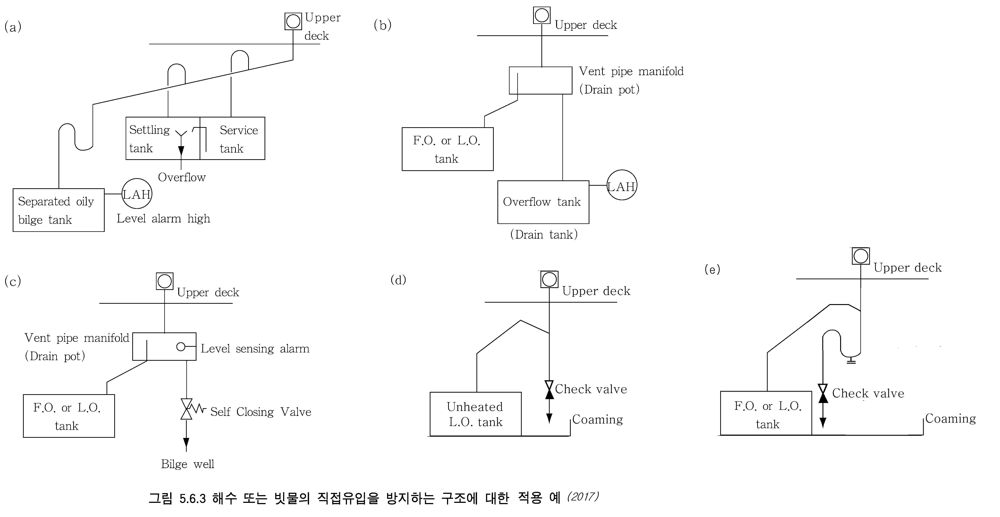
- **2.** **공기관 개구의 위치** ***(2018)***
  - **(1)** **규칙 201.**의 **2**항 (1)호를 적용함에 있어서 다음에 따를 수 있다. **【규칙 참조】**
    - **(가)** 인화점 60℃를 초과하는 연료유탱크 및 화물유탱크에 인접하는 코퍼댐과 펌프로 액체를 적재할 수 있는 탱크의 공기관에 대해서는 SOLAS Reg.II-1/17.3에 적합한지를 증명할 수 있는 자료, 통풍장치 및 배수설비 등에 대한 자료를 제출하여 우리 선급이 인정하는 경우 폐위된 화물구역에 개구할 수 있다.
- **3.** **공기관 개구의 보호**
  - **(1)** **규칙 201.**의 **3**항 (2)호를 적용함에 있어서 “우리 선급이 적당하다고 인정하는 플레임스크린”이라 함은 다음에 따른다. **【규칙 참조】**
    - **(가)** 내식성 재료로 제조된 것일 것.
    - **(나)** 30 × 30 메시의 내식성 와이어로 된 스크린 1매 또는 20 × 20 메시의 내식성 와이어로 된 스크린을 25.4 ± 12.7 $\mathrm{mm}$의 간격으로 2매 부착한 것 혹은 이와 동등 이상의 성능을 갖는 것일 것.
- **4.** **공기관의 치수 【규칙 참조】**
  **규칙 201.**의 **4**항 (1)호를 적용함에 있어서 “넘침관이 설치되어 있는 탱크의 공기관”에 대하여는 다음에 따른다.
  - **(1)** 탱크에 설치된 넘침관의 합계 단면적이 주입관 합계 단면적의 1.25배 이상이고 공기의 흐름을 방해하는 밸브가 설치되어 있지 않은 경우에는 공기관의 설치를 생략할 수 있다. 이 경우, 넘침탱크에 설치된 공기관 단면적은 넘침관의 합계 단면적보다 작아서는 아니 된다.
  - **(2)** 공통 넘침관이 설치된 탱크의 경우, 각 탱크의 넘침관 단면적이 각 탱크 주입관 단면적의 1.25배 이상이고, 공통 넘침관의 단면적과 넘침탱크 공기관의 단면적이, 동시에 적재되는 탱크의 주입관 합계 단면적의 1.25배 이상일 경우에는 각 탱크의 공기관 설치를 생략할 수 있다. 다만, 공통 넘침관의 단면적과 넘침탱크 공기관의 단면적은 공통 주입관 단면적의 1.25배를 초과할 필요는 없다.
  - **(3)** 다만, 전 (1), (2)호를 적용함에 있어서 연료유 서비스 탱크 등과 같이 공기관이 설치된 탱크로 간접적으로 넘침관이 유도되는 경우에는 그 탱크 상부 기상부의 기체가 공기관이 설치된 탱크로 이동할 수 있도록 조치하여야 한다(**지침 그림 5.6.4** 참조).
    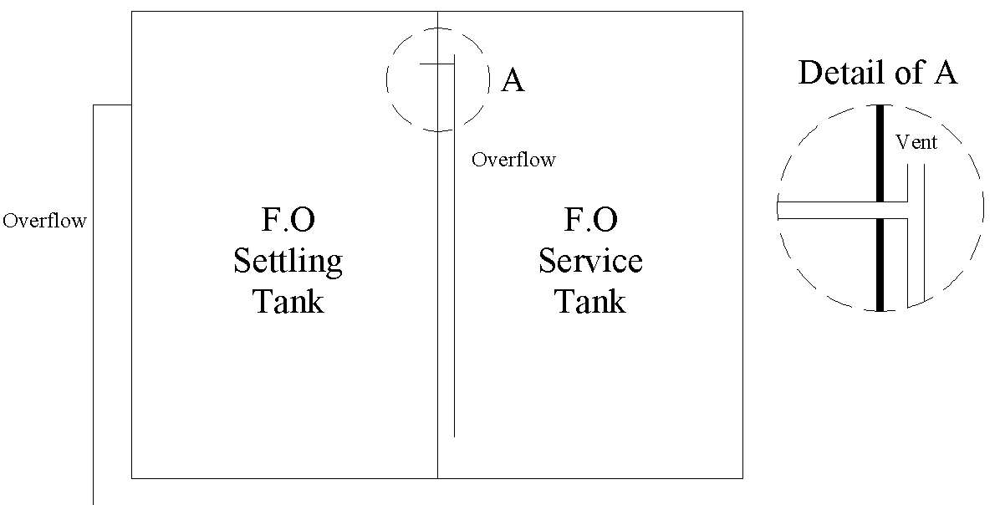
    **그림 5.6.4 넘침관의 상세**
- **5.** **공기관의 높이 【 규칙 참조】**
  - **(1)** **규칙 201.**의 **5**항을 적용함에 있어서 공기관의 갑판상의 높이는 **지침 그림 5.6.5**와 같이 측정한다.
  - **(2)** **규칙 201**.의 **5**항을 적용함에 있어서, 공기관의 높이는 다음과 같이 적용하여야 한다. *(2017)*
    - **(가)** 건현갑판상 또는 선루의 표준 높이보다 낮은 노출 갑판상으로 유도되는 공기관의 높이는 해당 건현갑판 또는 노출갑판으로부터 760mm 이상이어야 한다.
    - **(나)** 선루의 표준 높이 이상이며 그 높이의 2배보다 낮은 위치의 노출갑판상에 설치되는 공기관의 높이는 해당 건현갑판 또는 노출갑판으로부터 450mm 이상으로 할 수 있다.
    - **(다)** (가) 및 (나)에서 언급된 노출갑판은 선루, 갑판실, 승강구 및 다른 유사한 갑판구조물의 최상층 갑판도 포함한다.
    - **(라)** 국제항해에 종사하지 아니하는 선박과 예인선(tug boat), 부선(barge) 등에서와 같이 규칙에서 정한 공기관의 높이가 선박의 작업에 방해가 되는 경우, 우리 선급이 승인한 자동식 공기관 폐쇄장치를 설치하는 것을 조건으로 공기관의 높이를 상기의 (가)에서 규정한 760mm를 450mm, (나)에서 규정한 450mm를 300mm까지 감소할 수 있다.

#### 202. 넘침관

- **1.** **규칙 202.**의 **1**항 (1)호 (나)를 적용함에 있어서, 공기관의 개구단보다 아래에 있는 개구는 플로트 측심장치 등과 같이 항상 에어갭(air gap)을 가지는 개구를 말하며 또한 그러한 개구는 넘침관의 상단보다 위에 설치하여야 한다.
  **【규칙 참조】**
- **2.** **규칙 202.**의 2항 (2)호를 적용함에 있어서, 세틀링탱크로부터 청전된 연료유 또는 윤활유가 서비스탱크의 넘침관을 통해 세틀링탱크로 순환하는 경우, 그 넘침관에 사이트글라스의 설치 또는 서비스탱크의 고액면 경보장치 요건을 생략 할 수 있다. **【규칙 참조】**

#### 203. 측심장치

- **1.** **규 칙 203.**의 **1**항 (1)호를 적용함에 있어서, 다음에 따를 수 있다. **【규칙 참조】**
  - **(1)** 통상적으로 사람이 들어가지 아니하는 에코사운더 리쎄스 등과 같은 소구획에 대하여는 우리 선급이 인정하는 경우, 측심관을 생략할 수 있다. 다만. 맨홀에 샘플링을 위한 플러그 또는 콕을 설치하고 맨홀을 열기 전에 그 구역이 침수되어 있는 지 확인하도록 하는 경고판을 눈에 띄기 쉬운 장소에 부착하여야 한다.
  - **(2)** 측심관 또는 기타의 측심장치를 설치하는 것이 구조적으로 불가능하다고 우리 선급이 인정하는 특이한 형상의 공소 등에는 빌지 경보장치로 대신할 수 있다.
- **2.** **측심관의 상단 규 칙 203.**의 **2**항 (2)호를 적용함에 있어서, 이중저에 위치한 탱크 및 코퍼댐의 측심관에는 자기폐쇄차단장치를 설치하여야 한다. *(2019)* **【규칙 참조】**
- **3.** **측심관의 구조 규칙 203.**의 **3**항에 대하여는 다음 각 호에 따른다. **【규칙 참조】**
  - **(1)** 엘보측심관을 부득이 사용하는 경우에는 측심관의 엘보부분을 충분히 지지하여야 한다.
  - **(2)** 이중판의 두께는 길이 30 $\mathrm{m}$ 미만의 선박은 10 $\mathrm{mm}$, 길이 30 $\mathrm{m}$ 이상의 선박은 12 $\mathrm{mm}$ 를 표준으로 한다.(**지침 그림 5.6.6** 참조)
    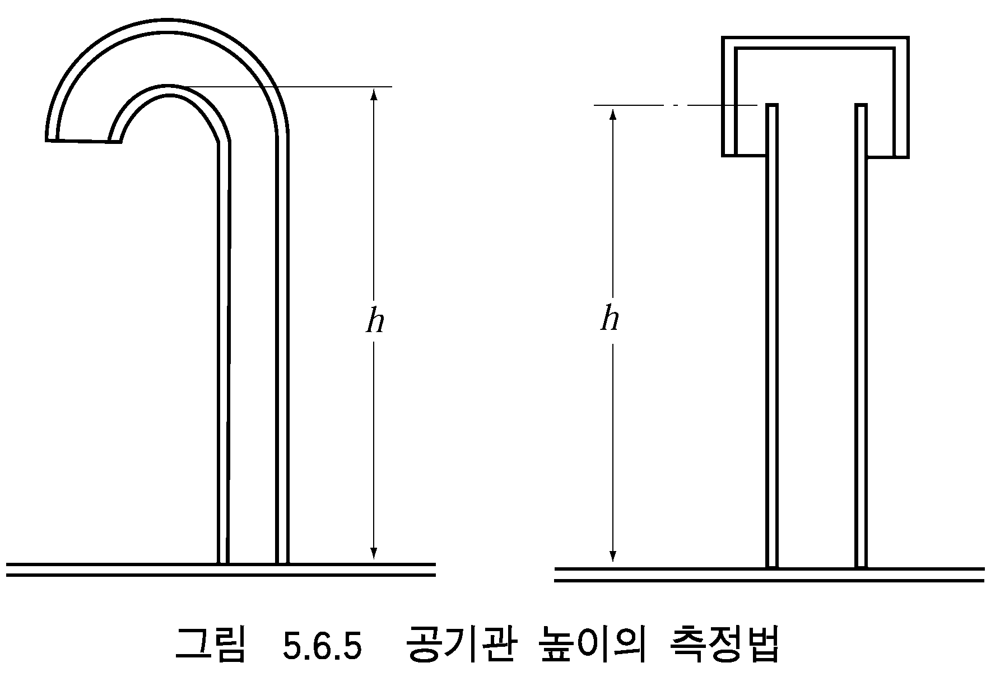 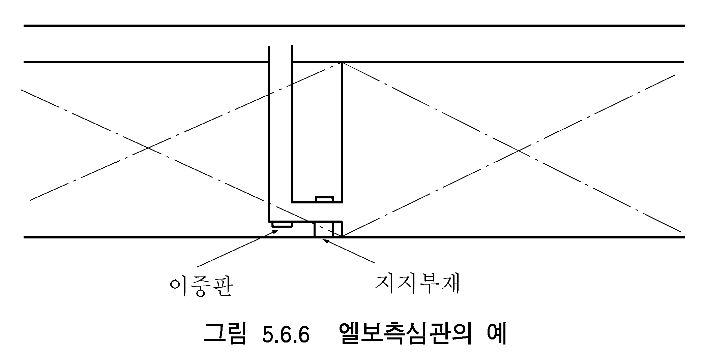

### 제 3 절 해수흡입 및 선외배출

#### 301. 선체붙이밸브 및 부착품

- **1.** **디스턴스 피스의 구조 규칙 301.**의 **2**항을 적용함에 있어서 디스턴스 피스는 한국산업규격 **KS V 7141**(선체붙이 디스턴스 피스) 또는 이와 동등 이상의 표준에 적합한 것이어야 하며, 디스턴스 피스는 맞대기용접이음이어야 한다. 다만, 디스턴스 피스가 아래의 조건에 모두 만족하며, 이를 증명할 수 있는 자료(예, 배치도 및 복원성 자료 등)를 제출하여 우리 선급이 인정하는 경우 플랜지 이음을 인정할 수 있다. *(2023)* **【규칙 참조】**
  - **(1)** 만재흘수선 상방을 통과할 것
  - **(2)** 디스턴스 피스 또는 부착품이 손상되더라도 선박의 안전에 영향을 미치지 않을 것
  - **(3)** 설계압력에 따라 적용되는 호칭압력보다 1등급 위의 호칭압력의 관장치를 사용할 것
- **2.** **선외배출구의 위치 규칙 301.**의 **4**항에 대하여는 다음 각호에 따른다. **【규칙 참조】**
  - **(1)** “선외배출구의 개구”는 펌프에 의하여 압력을 받는 배수의 개구를 말하며, 중력으로 유출되는 것은 포함하지 않는다.
  - **(2)** “그와 같은 곳”이라 함은 **지침 그림 5.6.7**의 사선부의 범위를 말한다.
    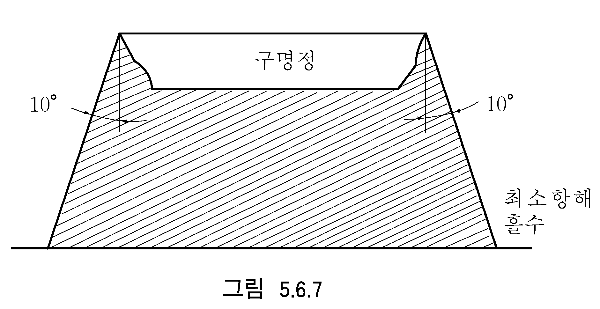
  - **(3)** 배수관의 개구를 해면에 내린 구명정에 배수가 들어갈 우려가 있는 곳에 부득이 배치하지 않으면 아니 될 경우에는 다음의 어느 하나의 장치를 설치하여야 한다.
    - **(가)** 선체외판쪽으로 배수를 유도하는 장치
    - **(나)** 배수를 정지시키는 장치로서 그 장치의 조작이 구명정이 설치된 장소와 가까이 있고 노출갑판상에서 조작할 수 있을 것

#### 303. 배수구 및 위생수의 배출

- **1.** **노출갑판의 배수구 규칙 303.**의 **3**항을 적용함에 있어서 선루 내의 배수관은 노출갑판의 배수관과 연결하여서는 아니 된다.
- **2.** **배수관 및 위생수관의 역류방지장치 규칙 303.**의 **4**항에 대하여는 다음에 따른다. **【규칙 참조】**
  - **(1)** 건현갑판하에서의 배수
    **규칙 303.**의 **4**항의 규정은 통상 선박의 운항 중 항시 열려 있는 배출관에 대하여만 적용하고, 톱사이드탱크로부터 중력으로 배수하는 것처럼 항해 중에는 배수시를 제외하고는 항상 닫혀있는 배수관에 대하여는 건현갑판상의 쉽게 접근할 수 있는 장소에서 조작할 수 있는 개폐지시기가 부착된 1개의 나사조임 스톱밸브를 사용할 수 있다.
    화물창 내를 통과하는 배수관은 SCH.160 또는 두께 16 $\mathrm{mm}$ 이상의 강관으로 하거나 또는 적절한 보호장치를 설치한다.
    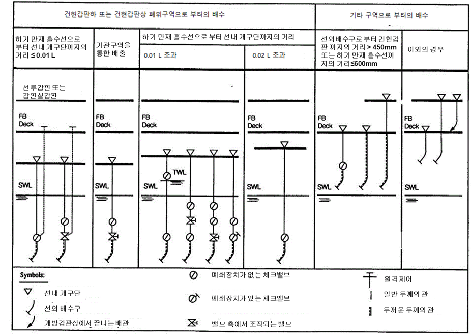
    **표 5.6.2 배수구 및 배출구의 허용가능한 배치**
    - **(가)** 배수관의 선내 개구단
      - **(a)** 선수미부의 소구획(조타기실, 갑판장 창고, 체인로커 등)의 빌지를 수동펌프 또는 이덕터로 배수할 경우, 수직거리를 산정할 때에는 배수관의 선내 개구단이 그 배출관 계통의 최고 위치에 있는 것으로 간주한다.
      - **(b)** 목재만재흘수선을 표시하는 경우의 선내 개구단까지의 거리는 목재 하기만재흘수선에서 측정한다.
    - **(나)** 항해중에는 항상 닫혀있는 선외 배수관
    - **(다)** 선외배출관
    - **(라)** 배수구 및 배출구의 허용 가능한 배치는 **표 5.6.2**에 따른다. *(2021)*
- **3.** **건현갑판상 폐위된 화물구역의 배수관 【규칙 참조】**
  **규칙 303.**의 **5**항 (1)호를 적용함에 있어서, 횡경사 5°를 초과하는 경우에 건현갑판 끝단이 잠기는 경우에도 **규칙 303.**의 **5**항 (2)호의 요건에 적합한 배수설비를 갖출 경우에는 건현갑판상 폐위된 화물 구역으로부터 갑판 하부의 적당한 구역으로 배수하는 것이 허용된다.

### 제 4 절 빌지 및 평형수장치

#### 401. 일반

- **1.** **적용** 선박의 길이가 50 $\mathrm{m}$ 미만인 선박의 빌지관장치는 다음 각호에 따른다. 다만, 여기에 규정되어 있지 않은 장치에 대하여는 규칙에 따른다. **【규칙 참조】**
  - **(1)** 빌지펌프의 수
    **지침 표 5.6.3**에 따른다.
  - **(2)** 빌지펌프의 용량
    **지침 표 5.6.3**에 정해진 독립동력 빌지폄프는 **규칙 405.**의 **2**항에 규정하는 식에 의한 것 이상의 흡입능력을 가지는 것을 말한다. 다만, 전호에 규정된 독립동력 빌지펌프 1대의 능력에 가산할 수 있다.
  - **(3)** 빌지흡입관의 안지름
    빌지흡입주관, 직접빌지 흡입관 및 빌지흡입지관의 안지름은 다음 (가)부터 (다)의 식에 따른다.
    - **(가)** 빌지흡입주관 또는 직접빌지흡입관
      - **(a)** 길이 25 $\mathrm{m}$ 미만의 선박 : $d=1.22 \times (L-10)+10 (\mathrm{mm})$
      - **(b)** 길이 25 $\mathrm{m}$ 이상 35 $\mathrm{m}$ 미만의 선박 : $d=2.67 \times (L-20)+15 (\mathrm{mm})$
      - **(c)** 길이 35 $\mathrm{m}$ 이상의 선박 : $d=1.68 \sqrt {L(B+D)} +25 (\mathrm{mm})$(다만, 50 $\mathrm{mm}$ 미만으로 하여서는 아니 된다.)
    - **(나)** 빌지흡입지관
      - **(a)** 길이 35 $\mathrm{m}$ 이상의 선박 : $d ' = 2.15 \sqrt { l (B+D) } + 25$
      - **(b)** 국제항해에 종사하는 선박에 있어서 빌지흡입지관의 안지름은 50 $\mathrm{mm}$ 미만으로 할 수 없지만 소구획실의 빌지흡입관으로서 우리 선급이 인정한 경우는 40 $\mathrm{mm}$ 로 할 수 있다.
      - **(c)** 선수미탱크 및 축로의 빌지흡입지관의 안지름은 선박의 길이가 35 $\mathrm{m}$ 이상의 선박은 50 $\mathrm{mm}$, 35 $\mathrm{m}$ 미만의 선박은 우리 선급이 승인하는 안지름까지 감소시킬 수 있다.
    - **(다)** 길이 35 $\mathrm{m}$ 이상인 선박의 빌지흡입주관의 안지름은 (나)에 의해 계산한 빌지흡입지관의 안지름 중 최대의 것보다 작아서는 아니 된다.
  - **(4)** 직접빌지흡입관
    특별히 우리 선급의 승인을 받은 경우에, 직접빌지흡입관의 안지름은 전호 (가)에 관계없이 적절히 감소시킬 수 있다.
  - **(5)** 비상빌지흡입관
    비상빌지흡입관에 대하여는 다음에 따른다.
    - **(가)** 증기기관을 주기관으로 하는 선박은 규칙에 적합한 비상빌지흡입관을 설치한다.
    - **(나)** 내연기관을 주기관으로 하는 선박은 특별히 우리 선급이 인정하는 경우, 생략할 수 있다.
  - **(6)** 기관실내의 빌지관
    동관을 사용할 수 있다.

    | 선박의 길이 | 동 력 펌 프 |   | 수동펌프 | 비고 |
    | --- | --- | --- | --- | --- |
    | 선박의 길이 | 주기관 구동펌프 | 독립동력펌프 | 수동펌프 | 비고 |
    | 25 $\mathrm{m}$ 미만 | 1대 | ─ | 1대 | 우리 선급이 승인한 경우, 주기관 구동펌프를 생략할 수 있다. 길이 10 $\mathrm{m}$ 미만의 선박은 물통 1개로서 펌프를 대용할 수 있다.(※) |
    | 25 $\mathrm{m}$ 이상 30 $\mathrm{m}$ 미만 | 1대 | 1대 | ─ | 수동펌프 2대로서 주기관 구동펌프 1대를 대용할 수 있다. 독립동력펌프를 설비하는 것이 곤란하다고 인정될 경우에는 다른 펌프의 능력, 배관 등을 고려해서 독립동력펌프를 생략할 수 있다.(※) |
    | 30 $\mathrm{m}$ 이상 50 $\mathrm{m}$ 미만 | 1대 | 1대 | ─ | 수동펌프 2대로서 주기관 구동펌프 1대를 대용할 수 있다. |
    | (비고) 1. ※ 표시의 경감은 여객선 이외의 선박에 한한다. 2. 이 표에 있어서 동력펌프로서 수동펌프를 또는 독립동력펌프로서 주기관 구동펌프를 각각 대용할 수 있다. 3. 선박의 길이가 25 $\mathrm{m}$ 이상 30 $\mathrm{m}$ 미만일 경우, 독립동력펌프를 생략할 수 있는 요건은 빌지펌프의 설치가 지극히 곤란하다고 인정되고 주기관 구동펌프의 흡입능력이 독립동력펌프가 요구하는 능력 이상으로서 배관이 필요한 전 구획으로부터 지장없이 빌지를 배출할 수 있도록 되어있는 경우를 말한다. 주기관 구동펌프를 수동펌프로 대용할 경우에는 독립동력펌프를 생략할 수 없다. 4. 항해구역이 연해 이하인 선박에서는 유수분리기용 빌지펌프를 1대의 수동빌지 펌프로 인정할 수 있다. 5. 모든 동력펌프 및 수동펌프는 화물창, 기관실, 축로 등으로부터 빌지를 배출할 수 있어야 한다. |   |   |   |   |
- **2.** **관장치 【규칙 참조】**
  - **(1)** **규칙 401.**의 **2**항 (1)호를 적용함에 있어서, 공소(void space) 및 코퍼댐이 선박의 복원성에 영향을 미치지 않으며 흘수선 상방에 위치한 경우에는 빌지주관에 연결된 고정식 빌지관장치를 설치하는 대신에 별도의 빌지펌프(휴대식도 가능)를 설치하거나 또는 중력으로 배수할 수 있다. 다만, 중력으로 배수할 경우에는 신속하게 작동하는 자동폐쇄밸브를 접근하기 쉬운 장소에 설치하여야 한다.
  - **(2)** **규칙 401.**의 **2**항 (2)호의 요건은 영구적인 평형수 탱크에는 적용하지 아니한다. *(2021)*
- **3.** **나사조임 체크밸브** 규칙 4절의 적용상, 나사조임 체크밸브는 차단밸브와 체크밸브의 조합으로 대신할 수 있다. **【규칙 참조】**

#### 402. 기관실 이외 구획의 배수설비 【규칙 참조】

- **1.** **빌지흡입관의 생략** 에코사운더 리쎄스 등 소구획에 대하여는 우리 선급이 인정하는 경우, 빌지흡입관을 생략할 수 있다.
- **2.** **특수한 경우의 빌지배수관 지침 그림 5.6.8**과 같이 수밀격벽에 단이 있는 경우로서 갑판간 화물창, 선창 또는 선실의 빌지를 인접하는 기관실이나 축로 등에 유도하는 경우에는 그 배수관은 상시 승무원이 쉽게 접근할 수 있는 곳으로 유도하고, 자동폐쇄장치가 붙은 밸브 또는 콕을 설치한다. 다만, 수밀의 빌지탱크에 인도할 경우에는 이에 의하지 않으나 화물창이 만재흘수선 하방에 있을 경우에는 체크밸브를 설치한다. 화물창의 빌지를 축로로 유도할 경우는 측심관을 설치할 필요는 없지만 배수관 안지름은 빌지흡입관에 대하여 정하여진 안지름 이상으로 한다.
- **3.** **빌지웰 고수위 경보장치** SOLAS 12장 4.3규칙에 따른 횡수밀 격벽의 수가 충분하지 못하여 4.3규칙을 적용할 수 없는 선박의 화물구획 또는 화물 컨베이어 터널 중 해당되는 곳에는 항해선교에 적절한 가시가청 경보를 발하는 빌지웰 고수위 경보장치를 설치하여야 한다.
- **4.** **어창 등의 빌지 배수설비** 얼음 또는 물과 함께 어획물이 적재되는 어창 또는 탱크에 설치되는 환수관 또는 순환수관 등에 의하여 빌지의 배수가 가능한 경우에는 이를 빌지관 대용으로 할 수 있으며, 이를 빌지관 규정에 적합한 것으로 본다. *(2019)*

#### 403. 기관실의 배수설비 (2019) 【규칙 참조】

- **1.** **비상빌지 흡입구**
  - **(1)** **규칙 403.**의 **6**항 (3)을 적용함에 있어서, 비상빌지흡입구를 주기관으로 구동되는 주냉각수 펌프 또는 주순환수 펌프에 유도할 수 있다.

#### 404. 빌지흡입관의 치수 【규칙 참조】

- **1.** **빌지주관**
  - **(1)** 빌지주관의 안지름은 국제항해에 종사하는 선박의 경우 60 $\mathrm{mm}$ 미만, 그외의 선박으로서 길이 35 $m$ 이상인 경우에는 50 $\mathrm{mm}$ 미만이어서는 아니 된다.
  - **(2)** 실제에 사용되는 관의 안지름은 계산한 것에 가까운 표준관을 사용할 수 있다.
  - **(3)** (2)호의 규정을 적용함에 있어서, 다음의 경우에는 한 단계 큰 표준관을 사용하여야 한다.
    - **(가)** 안지름 계산값이 110 mm 이하 시, 그 표준관의 안지름이 계산값보다 6 mm 이상 작은 경우
    - **(나)** 안지름 계산값이 110 mm 초과 시, 그 표준관의 안지름이 계산값보다 13 mm 이상 작은 경우
- **2.** **빌지흡입지관 규칙 404.**의 **2**항에 대한 지침은 다음 각호에 따른다.
  - **(1)** 화물선의 화물창 빌지흡입관으로서 빌지주관흡입방식(크리스마스 트리 시스템)의 채용은 바람직하지 않으나, 부득이한 경우 1구획 침수를 만족하는 선박에 한해서 채용할 수 있다. 이 경우, 빌지흡입관의 안지름은 다음과 같이 결정한다.(**지침 그림 5.6.9** 참조)
    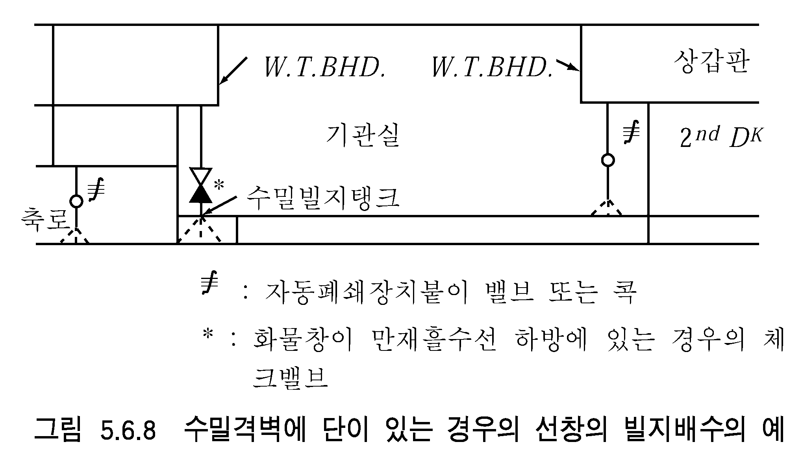 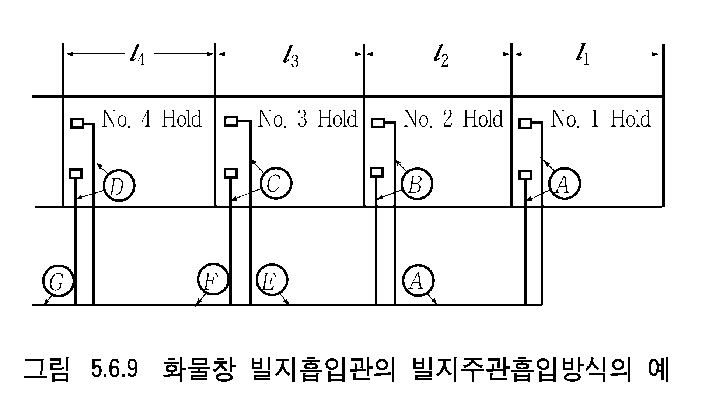
    - **(가)** 관 $A$, $B$, $C$, $D$ 는 $l_1$, $l_2$, $l_3$, $l_4$ 를 각각 $l$ 로 해서 빌지지관으로 계산한다.
    - **(나)** 관 $E$ 는 $l_1 + l_2$ 를 $L$ 로 보고 빌지흡입주관으로서 계산함과 동시에 관 $A$ 및 $B$ 의 합계 단면적 이상의 단면적으로 한다.
    - **(다)** 관 $F$ 는 $l_1 + l_2 + l_3$ 를 $L$ 로 보고 빌지흡입주관으로서 계산함과 동시에 관 $A$, $B$, $C$ 중 가장 큰 2개의 관 합계단면적 이상의 단면적으로 한다.
    - **(라)** 관 $G$ 는 $l_1 + l_2 + l_3 + l_4$ 을 $L$ 로 보고 빌지흡입주관으로서 계산함과 동시에 관 $A$, $B$, $C$, $D$ 중 가장 큰 2개의 관 합계단면적 이상의 단면적으로 한다. 이 경우, 각 지관의 흡입구에는 나사조임 체크밸브를 설치한다. 만약, 이 밸브의 설치장소가 항상 쉽게 접근할 수 없는 경우에는 원격조작장치를 설치하여야 한다.
  - **(2)** 2중선각선의 빌지흡입관의 안지름
    2중선각의 선박에서 선박의 너비 $B$ 대신에 내각간의 거리를 사용하여 빌지흡입관의 안지름을 결정할 수 있다.
  - **(3)** **규칙 401.**의 **2**항 (3)호의 경우에는 빌지흡입지관의 안지름은 살수장치 등에서 요구되는 용량의 125 % 이상의 물을 선외로 배출하기에 충분한 것이어야 한다.
  - **(4)** **규칙 404.**의 **2**항에서 실제로 사용되는 관의 안지름은 계산한 것에 가까운 표준관을 사용할 수 있으며 상기 **404.**의 **1**항 (3)호를 적용하여야 한다.
  - **(5)** **규칙 404.**의 **2**항에서 “40 mm까지 감소할 수 있도록 우리 선급이 인정하는 경우”라 함은 국제항해를 하지 아니하는 선박으로서 **규칙 404.**의 **2**항의 식에 의한 빌지흡입지관의 안지름 값이 40 mm 이하인 경우를 말한다.

#### 405. 빌지펌프 【규칙 참조】

- **1.** **펌프의 수**
  - **(1)** **규칙 405.**의 **1**항에 의하여 요구되는 빌지펌프 2대 중 1대는 여객선 이외의 선박에서는 빌지이덕터로 대체할 수 있다. 이 경우, 빌지이덕터에 해수를 공급하는 펌프는 주냉각수펌프 이외의 것이어야 한다.
  - **(2)** 총톤수 500톤 이상의 선박에서 연속적으로 사용되지 않으나 중요한 용도로 사용되는 소화펌프, 평형수펌프, 빌지펌프 및 보조 가스 세정기펌프를 겸용으로 사용할 경우, 선내에 설치하여야 할 펌프의 최소의 수는 다음과 같다.
    - **(가)** 불활성가스장치가 설치된 탱커는 비상소화펌프를 포함한 겸용의 펌프를 4대이상 설치하여야 한다.
    - **(나)** 불활성가스장치가 설치되어 있지 않은 탱커와 탱커 이외의 선박은 비상소화펌프를 포함한 겸용의 펌프를 3대 이상 설치하여야 한다.
- **2.** **규 칙 405.**의 **4**항에서 “우리 선급이 적절하다고 인정하는 바”라 함은 다음 각호에 따른다.
  - **(1)** 빌지흡입관의 안지름
    빌지흡입관의 안지름 $d$ 는 다음 식에 의한 것 이상이어야 한다.
    $d=1.68 \sqrt {l(B+D)} +25 (\mathrm{mm})$
    $l$ : 화물창의 길이($\mathrm{m}$)
    $B$ : 화물창의 너비($\mathrm{m}$)
    $D$ : 선박의 깊이($\mathrm{m}$)
  - **(2)** 이덕터의 빌지흡입능력
    이덕터의 빌지흡입능력 $Q$ 는 다음 식에 의한 것 이상이어야 한다.
    $Q=5.66 d ^{2} \times 10 ^{-3} (\mathrm{m} ^{3} /h)$
    $Q$ : 이덕터의 빌지흡입량
    $d$ : 전호에 따른다.
  - **(3)** 이덕터의 구동수량(水量)
    이덕터는 2대 이상의 펌프로 구동할 수 있어야 한다. 2개 이상의 화물창의 빌지를 이들 이덕터로 배출하는 경우, 각 펌프가 공급하는 이덕터의 구동수량은 적어도 2개의 화물창에서 전호에 규정된 용량을 동시에 흡입하는데 충분한 것이어야 한다.
  - **(4)** 이덕터의 구동수(水) 스톱밸브 및 빌지 배출밸브
    격벽갑판 상부에서 조작할 수 있는 이덕터 구동수 스톱밸브 및 빌지 배출밸브를 설치하여야 한다. 다만, 이들 밸브가 기관실 내에 있는 경우에는 격벽갑판보다 상부의 장소로부터 조작할 필요는 없다.
  - **(5)** 빌지웰의 고액면 경보장치
    - **(가)** 이덕터 구동수가 빌지웰에 역류되는 경우를 대비하여 각 빌지웰에 고액면 경보장치를 설치하고, 항상 사람이 있는 장소에 가시․가청경보를 발하도록 하여야 한다. 또한, 경보를 발하는 장소에서 고수위가 된 화물창을 식별할 수 있어야 한다. 고액면 경보장치를 대신하여, 화물창 구역 내 빌지 흡입측에 나사조임 체크밸브를 설치하는 것을 인정할 수 있다.
    - **(나)** 경보장치의 회로는 자기감시기능을 가지든가 또는 각 화물창 내에서 적어도 2회로를 분리설치하여야 한다.
    - **(다)** 석탄을 적재한 경우의 고액면 경보장치는 **규칙 7편 3장 1602.**에 따라야 한다.
  - **(6)** 이덕터 구동수관이 현측탱크를 관통하는 경우
    이중저 구조를 조건으로 격벽을 생략한 선박에서 이덕터 구동수관이 현측탱크를 통과하는 경우에는 빌지흡입관의 개구단에 체크밸브를 설치하여야 한다. 또한, 현측탱크 내에 설치한 이덕터 구동수관, 빌지배출관 및 이덕터는 가능한 한 종격벽의 화물창 쪽으로 근접하여 설치하여야 한다.
  - **(7)** 빌지흡입구에 설치된 로즈박스
    빌지흡입구에 설치된 로즈박스는 **규칙 406.**의 **9**항에 따르고, 이덕터의 빌지흡입 능력에 적합한 것이어야 한다.
  - **(8)** 화물창 내의 빌지장치의 보호
    이덕터 구동수관, 빌지배출관 및 이덕터는 화물에 의한 손상을 받지 않도록 고려하여야 한다.
  - **(9)** 이덕터 구동수의 소화용수와의 겸용
    이덕터 구동수를 소화용수관으로부터 연결한 경우에는 소화의 기능에 해를 끼치지 않도록 고려하여야 한다.

#### 406. 배관 및 부착품 【규칙 참조】

- **1.** **디프탱크를 통과하는 빌지관 및 평형수관 규칙 406.**의 **4**항에 대하여는 다음 각호에 따른다.
  - **(1)** 평형수 전용의 디프탱크를 통과하는 빌지흡입관에 한하여 설계압력에 따라 적용되는 호칭압력보다 1등급 위의 호칭압력에 대응하는 플랜지이음을 사용하는 경우에는 용접이음으로 할 필요가 없다.
  - **(2)** 전용 평형수탱크 내에 시체스트를 설치하고 자연주입․배수를 행하는 경우에는 이중으로 스톱밸브를 설치하고 건현갑판상에서 조작할 수 있도록 한다.
  - **(3)** 화물유를 적재한 디프탱크에는 빌지흡입관 및 평형수흡입관 등 다른 탱크흡입관은 통과할 수 없다. 다만, 디프탱크 내에 파이프터널을 설치하여 그 안에 배관하는 경우에는 이에 따르지 아니한다.
  - **(4)** 전 각호의 적용에 있어서 빌지호퍼는 디프탱크로 본다.
- **2.** **평형수 밸브의 제어 규칙 406.**의 **7**항 (2)호의 “대체수단으로, 동력 상실시 그 밸브를 잠그기 위하여 쉽게 접근할 수 있는 장소에 수동의 수단이 있는 경우”의 적용에 있어서, 수동의 수단은 이중저, 현측탱크, 빌지호퍼탱크 또는 공소와 같이 침수로 인해 작동불능이 되는 장소에 위치하지 않아야 한다. *(2021)*
- **3.** **머드박스 규칙 406.**의 **8**항의 적용에 있어서 길이 50 $\mathrm{m}$ 미만인 선박의 빌지흡입관 및 예비로 설치된 빌지흡입관 개구단에 부착되는 머드박스는 우리 선급이 인정한 경우에 로즈박스로 대체할 수 있다.

### 제 5 절 보일러의 급수 및 복수장치

#### 501. 급수펌프 【규칙 참조】

- **1.** 주 보일러의 경우, 급수장치가 그룹시스템(group system)일 경우에는 이 그룹 중 1대의 펌프와 같은 용량의 예비급수펌프 1대를 구비하여야 한다. 또한, 이 예비급수펌프는 급수펌프 그룹 중 어느 한 대가 정지되었을 경우, 용이하게 운전중의 펌프와 교대될 수 있도록 장치되어야 한다.
- **2.** 중요보조 보일러의 경우, 전열면적이 50 $\mathrm{m} ^{2}$ 이하의 보일러에서는 2대의 급수펌프 중 1대를 인젝터로 할 수 있다.

#### 502. 급수관 【규칙 참조】

- **1.** **규 칙 502.**의 **1**항에서 2계통의 독립된 급수관에서 동체부착용 개구를 1개로 설치하는 예는 **지침 그림 5.6.10**과 같다.
  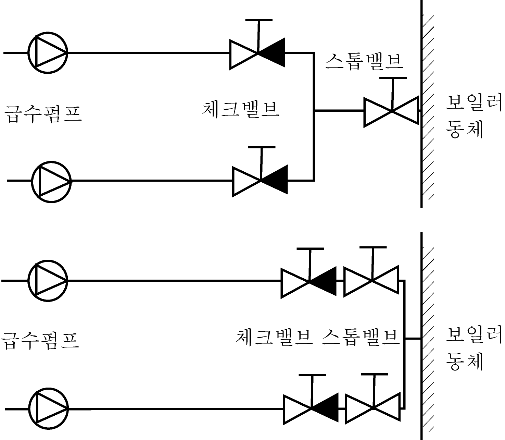
  **그림 5.6.10**
- **2.** **규 칙 502.**의 **1**항을 적용함에 있어서, 적당한 크기의 보일러가 2대 이상 설치되고 이들 각 보일러로 단일 급수관에 의하여 급수될 경우, 이러한 급수장치의 배관에 대한 예비설비 수준은 **규칙 502.**의 **1**항에 적합한 것으로 본다.
- **3.** 중요보조 보일러의 경우, 소형 팩케이지 보일러로서 우리 선급이 특별히 인정하는 경우에는 급수관을 1계통으로 할 수 있다. 이 경우, 예비품으로서 급수펌프의 완비품 1조를 구비하고 상용급수펌프의 고장 시 쉽게 교환하여 사용할 수 있어야 한다.
- **4.** 중요보조 보일러 또는 주기관의 운전에 필요한 연료유가열기나 상시 가열을 필요로 하는 화물의 가열기에 증기를 공급하는 보일러는 **규칙 501.** 및 **규칙 502.**에 따라 급수관장치를 하여야 한다. 다만, 당해장치가 고장난 경우에도 통상 항해 및 화물의 가열에 지장을 주지 않는 대체의 설비가 설치되어 있는 경우에는 **규칙 501**.의 **1**항, **2**항 및 **규칙 502.**의 **1**항의 규정을 적용할 필요는 없다. 주기관의 운전에 필요한 연료유가열기 및 상시가열을 필요로 하는 화물의 가열에만 사용되는 보조보일러에 있어서는 대체설비가 설치되어 있지 않아도 단시간에 교환할 수 있는 급수펌프의 완비품 및 급수체크밸브의 완비품 각 1조를 비치한 경우에는 급수관장치를 1계통으로 할 수 있다.

### 제 6 절 증기관장치 및 배기관장치

#### 601. 증기관장치 【규칙 참조】

- **1.** **배관 규칙 601.**의 **1**항에 대하여는 다음 각호에 따른다.
  - **(1)** 증기가열관은 늑판 등의 선체부재와는 직접 접촉하지 않도록 지지하여야 한다.
  - **(2)** 증기관은 원칙적으로 화물창 내를 관통해서는 아니 된다. 다만, 부득이한 경우, 관의 이음은 전부 용접으로 하고 충분한 방열시공을 하며, 관은 강판으로 보호하여야 한다.
  - **(3)** 증기터빈의 증기관에 대하여는 **규칙 2장**에 따른다.
  - **(4)** 보일러 안전밸브의 배기관은 **규칙 5장**에 따른다.
- **2.** 2개 이상의 보일러의 주증기관을 공통의 증기관에 연결할 경우에는 각 보일러의 주증기 밸브를 나사조임 체크밸브로 하고, 이 밸브와 공통증기관 사이에는 스톱밸브를 설치하여야 한다.
- **3.** **기름 가열관 규칙 601.**의 **3**항을 적용함에 있어서 화물유탱크를 가열하는 가열증기지관과 주관과의 연결부분은 해당지관에 2중의 스톱밸브를 설치하거나 스펙터클 플랜지를 설치하여야 한다.

#### 602. 배기관장치 【규칙 참조】

- **1.** **규 칙 602.**의 **1**항의 요건을 적용함에 있어서, 환원제로서 암모니아 또는 우레아를 사용하는 선택적 촉매 환원장치는 이 장에서 규정한 요건에 추가하여 **선박의 환경보호 설비에 관한 지침 2장**의 요건에도 적합하여야 한다.
- **2.** **규 칙 602.**의 **1**항의 요건을 적용함에 있어서, 배기가스 재순환장치(EGR)가 설치된 선박은 이 장에서 규정한 요건에 추가하여 **선박의 환경보호 설비에 관한 지침 2장**의 요건에도 적합하여야 한다.
- **3.** **규 칙 602.**의 **1**항의 요건을 적용함에 있어서, 배기가스 세정장치(Exhaust Gas Cleaning System)가 설치된 선박은 이 장에서 규정한 요건에 추가하여 **선박의 환경보호 설비에 관한 지침 3장**의 요건에도 적합하여야 한다.

### 제 7 절 냉각장치

#### 702. 예비냉각펌프 【규칙 참조】

- **1.** **규 칙 702.**의 **3**항에서 증기터빈을 주기관으로 하는 선박의 예비 순환수펌프의 용량은 선속을 7노트 이상으로 하고, 유효하게 조타할 수 있는 속력을 확보할 수 있어야 한다.
- **2.** **규 칙 702.**에서 총톤수 500톤 미만의 선박으로서 다음 각호에 해당하는 경우에는 예비 냉각수펌프를 생략할 수 있다
  - **(1)** 평수구역을 항해구역으로 하는 선박
  - **(2)** 연해구역을 항해구역으로 하는 선박으로서 주기관을 2대 장비하고, 각 주기관에 전용의 냉각수펌프를 장비하고 있는 경우
- **3.** **규 칙 702.**의 **7**항을 적용함에 있어서 기관을 들어내어 전부를 개방하지 아니하고는 예비펌프를 교환하기 어려운 특별한 구조의 고속기관의 경우에는 펌프 예비품의 비치를 생략할 수 있다.
- **4.** **규 칙 702.**의 **8**항에서 소형선의 기관이라 함은 길이 30 $\mathrm{m}$ 미만의 선박에 설치된 주기관 또는 보조기관을 말한다. 다만, 주기관의 경우에는 펌프의 완비품 1조를 예비품으로 비치하여야 한다.

#### 703. 해수흡입구 【규칙 참조】

2개의 해수흡입구는 가능한 한 선측으로 서로 떨어져서 선저외판에 설치하여야 한다.

#### 704. 여과기 【규칙 참조】

- **1.** **규 칙 704.**에서 “냉각수의 공급을 중지하지 아니하고도 개방하여 청소할 수 있는 여과기”라 함은 다음의 것을 적합한 장치로 인정할 수 있다.
  - **(1)** 다축선에서 각 축계의 내연기관의 냉각수펌프와 해수흡입밸브 사이에 단식의 여과기를 설치한 경우
  - **(2)** 1축계를 독립적으로 구동할 수 있는 주기관이 2대 이상 설치되어 있고 각 주기관에 단식의 여과기를 설치한 경우
  - **(3)** 중요보기를 구동하는 내연기관이 2대 이상 설치되어 있고 각 내연기관에 단식의 여과기를 설치한 경우
- **2.** **규 칙 704.**에서 “소형선박으로서 우리 선급이 승인한 여과기를 생략할 수 있는 경우”라 함은 다음과 같다.
  - **(1)** 길이 30 $\mathrm{m}$ 미만의 선박으로서 주기관 및 중요보기를 구동하는 내연기관의 경우
  - **(2)** 길이 30 $\mathrm{m}$ 이상 50 $\mathrm{m}$ 미만의 선박으로서 중요보기를 구동하는 내연기관의 경우

### 제 8 절 윤활유장치

#### 802. 윤활유펌프 【규칙 참조】

- **1.** **규 칙 802.**에서 총톤수 500톤 미만인 선박으로서 다음 각호에 해당하는 선박은 예비 윤활유펌프를 생략할 수 있다.
  - **(1)** 평수구역을 항해구역으로 하는 선박
  - **(2)** 연해구역을 항해구역으로 하는 선박으로서 주기관을 2대 이상 설치하고, 각 주기관에 전용의 윤활유펌프가 설치된 선박
- **2.** **규 칙 802.**의 **3**항을 적용함에 있어서 기관을 들어내어 전부를 개방하지 아니하고는 예비펌프를 교환하기 어려운 특별한 구조의 고속기관의 경우에는 펌프 예비품의 비치를 생략할 수 있다.
- **3.** **규 칙 802.**의 **6**항에서 기관이라 함은 주기관 또는 보조기관을 말한다. 다만, 주기관의 경우에는 펌프의 완비품 1조를 예비품으로 비치하여야 한다.

#### 803. 배관

윤활유장치에 가열기가 사용되는 경우, **규칙 5편 6장 901.**의 **11**항 (1)호 및 (2)호에 따른다. **【규칙 참조】**

#### 804. 윤활유여과기 및 청정기 【규칙 참조】

- **1.** **규 칙 804.**의 **2**항에서 "청소 중에도 여과된 기름을 각각의 기관에 계속 공급할 수 있는 여과기"로서는 다음의 것을 적합한 장치로 인정할 수 있다.
  - **(1)** 오토 클리너 또는 자기소제식 여과기(self cleaning filter)를 설치한 경우
  - **(2)** 항해구역이 연해구역 이하인 선박으로서 쉽게 교체 또는 소제 가능한 단식여과기를 설치하고 바이패스를 설치한 경우
  - **(3)** 특수한 구조의 고속내연기관에서 단식여과기에 추가하여 여과기의 차압 경보장치를 갖추고 비상시 여과기를 통하지 않고도 자동적으로 급유되도록 배관되어 있으며, 우리 선급이 적절하다고 인정하는 경우
  - **(4)** 다축선에서 각 축계의 각 기관에 단식의 윤활유여과기를 설치한 경우
  - **(5)** 1축계를 독립적으로 구동할 수 있는 주기관을 2대 이상 설치하고 각 주기관에 단식의 윤활유여과기를 설치한 경우
- **2.** **규 칙 804.**의 **3**항을 적용함에 있어서, 다음 중 어느 하나에 해당될 경우에는 윤활유 청정기 또는 이에 대신하는 유효한 여과기 설치를 생략할 수 있다.
  - **(1)** 항해구역이 연해구역 이하의 선박으로서 적어도 1회의 시스템유를 교환하는데 충분한 용량의 윤활유 저장 탱크를 비치한 경우
  - **(2)** 독립적인 윤활유장치를 가지는 주기관이 2대 이상 설치된 경우, 이들 중 어느 1대가 정지되어도 항해 가능한 속력을 얻을 수 있으며 1대의 주기관에 적어도 1회의 시스템유를 교환하는데 충분한 용량의 윤활유 저장 탱크를 비치한 선박
  - **(3)** 톤수 및 항해구역에 관계없이 1회의 시스템유를 교환하는데 충분한 용량의 윤활유 저장탱크를 비치한 어선

### 제 9 절 연료유장치

#### 901. 일반사항

- **1.** **연료유장치의 설치장소 규칙 901.**의 **2**항을 적용함에 있어서, 연료유탱크는 탱크로부터 누유, 가연성 가스의 축적 등을 고려하여 될 수 있는 한 주기관, 보조보일러 등의 상부에 설치하지 않을 것을 권장한다. 부득이 연료유탱크를 고온부의 직상에 설치하는 경우에는 **규칙 5편 6장 1절** 및 **9절**의 해당 규정에 따르는 이외에 다음에 따른다. 또한, 현존선의 경우에도 상기와 같은 구조에 대하여는 될 수 있는 한 개조하여야 한다. **【규칙 참조】**
  - **(1)** 설치장소의 환기를 양호하게 하기 위하여 기계통풍 덕트를 설치하는 등의 수단을 강구한다.
  - **(2)** 기름받이는 적절한 너비와 깊이로 한다. 또한, 기름받이는 면적을 크게 하여 용량을 증가하는 것 보다 깊이를 깊게 하여 기름의 표면적을 적게 하는 방법을 권장한다.
  - **(3)** 기름받이 드레인은 적절한 지름의 드레인관에 의하여 드레인탱크로 유도한다. 이 경우, 관은 될 수 있는 한 짧고 충분히 경사지게 하여 관내에 기름이 체류하지 않도록 유의한다. 또한, 드레인탱크에는 측심장치를 설치하여 측심할 수 있도록 한다.
  - **(4)** 연료유탱크에 설치하는 넘침관에 대하여는 다음에 따른다.
    - **(가)** 연료유탱크에 내장식의 플로트게이지를 장비하는 경우 등과 같이 기관실 내에 개구를 가지는 연료유탱크에는 해당 탱크 주입관의 합계단면적의 1.25배 이상의 합계단면적을 가지는 넘침관을 설치한다.
    - **(나)** 넘침관의 최고부는 연료유탱크의 개구 위치보다 아래쪽에 개구한다.
    - **(다)** 넘침관은 될 수 있는 대로 짧고 경사지게 배관한다.
    - **(라)** 넘침 기름을 수용하는 탱크에 물 또는 기름이 유입되는 경우에 연료유탱크로 기름 또는 물이 역류하는 것을 방지하기 위하여 넘침관의 적절한 곳에 체크밸브를 설치한다. 또한, 이 체크밸브에는 나사조임 체크밸브의 사용을 피하고 부득이 이것을 사용하는 경우에는 밸브에 적절한 주의 명판을 붙인다.
    - **(마)** 넘침관에는 (라)에 의한 체크밸브 외에는 스톱밸브를 설치하지 않는다.
    - **(바)** 넘침관과 드레인관은 서로 연결하지 않는다.
  - **(5)** 배기집합관 가까이에 연료유탱크를 설치하는 경우, 집합관은 적절한 방열시공을 하고 플랜지부분을 포함하여 유밀성 금속케이싱 또는 내침유성의 콤파운드를 도포한 특수포로 피복한다.
- **2.** **연료유관 및 관 부착품 규칙 901.**의 **3**항 (5)호에서 고온부라 함은 표면온도가 220 °C 이상인 모든 표면을 말한다. **【규칙 참조】**
- **3.** **기름받이 및 드레인설비 규칙 901.**의 **4**항의 연료유 드레인에 대한 취급을 다음 각호에 따른다. **【규칙 참조】**
  - **(1)** 설계압력을 넘을 가능성이 있는 연료유 가열기에는 도출밸브를 설치하고, 도출한 드레인을 드레인탱크로 유도하거나 다른 방법으로 연료유가 비산하지 않도록 하여야 한다.
  - **(2)** 연료유 탱크를 배치하는데 있어서 부득이 고온 부위에 설치하는 경우의 연료유 드레인에 대한 취급은 **1**항 (2)호 및 (3)호에 따른다.
  - **(3)** **규칙 901.**의 **4**항 (4)호를 적용함에 있어, 부득이 기름받이의 드레인을 드레인 탱크로 유도가 불가한 경우, 다른 대체 수단을 고려할 수 있다. *(2025)*
- **4.** **연료유탱크의 구조 규칙 901.**의 **5**항에서 소형탱크라 함은 전용량이 1 $\mathrm{m} ^{3}$ 이하의 연료유탱크를 말한다. **【규칙 참조】**
- **5.** **연료유 이송펌프 규칙 901.**의 **9**항에 대하여는 다음 각호에 따른다. **【규칙 참조】**
  - **(1)** 연료유 이송펌프의 취급은 다음에 따른다.
    - **(가)** 주기관의 출력이 368 $\mathrm{kW}$ 를 넘고 1,471 $\mathrm{kW}$ 미만인 경우 또는 길이 50 $\mathrm{m}$ 미만인 선박의 경우 주펌프는 동력펌프로 하고 예비펌프는 수동펌프로 할 수 있다.
    - **(나)** 주기관의 출력이 368 $\mathrm{kW}$ 이하의 경우 수동펌프로 할 수 있다.
    - **(다)** 주기관 출력의 계산에 있어서 주기관이 2대 이상인 경우에는 그 합계 마력을 말한다.
  - **(2)** 평수구역을 항해구역으로 하는 선박에는 연료유 이송펌프를 1대로 할 수 있다.
- **6.** **배관 규칙 901.**의 **10**항을 적용함에 있어서 연료유탱크와 평형수탱크를 겸용하여 사용하는 탱크에는 연료유 또는 평형수를 어떠한 경우에도 각각 흡입할 수 있도록 **지침 그림 5.6.11**과 같이 배관하여야 한다. **【규칙 참조】**
  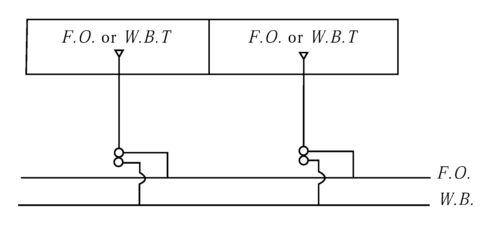
  **그림 5.6.11 연료유 탱크와 평형수탱크를 겸용하는 경우의 배관 예**
- **7.** 연료유관은 음료수 탱크 내를, 음료수를 사용하는 관은 연료유 탱크 내에 배관하여서는 아니 된다.
- **8.** **규 칙 901.**의 **14**항의 연료유 각 종류별로 2개의 연료유 서비스탱크 설치에 대한 적용 예는 **지침 그림 5.6.12**와 같다. 이 규정은 해상인명안전협약(SOLAS)의 적용을 받는 선박에 적용한다. **【규칙 참조】**

  | (1) 적용 예 1 |
  | --- |
  | (가) SOLAS 요건 : 주기관, 보조기관 및 보일러가 HFO로 운전되는 경우(한가지 연료 사용) |
  | HFO 서비스탱크 최소 8시간 용량 주기관+보조기관+보조보일러 HFO 서비스탱크 최소 8시간 용량 주기관+보조기관+보조보일러 MDO 탱크 기관/보일러의 최초 cold starting 또는 수리용도 |
  | (나) 동등한 장치**^3** |
  | HFO 서비스탱크 최소 8시간 용량 주기관+보조기관+보조보일러 MDO 서비스탱크 최소 8시간 용량 주기관+보조기관+보조보일러 |
  | (비고) 1. 주기관(항내 운전시) 및 보조기관이 모든 하중조건 하에서 중유로 운전할 수 있는 경우에만 이러한 장치를 적용한다. 2. 만일, 보조보일러의 파일럿 버너가 필요한 경우에는 추가의 8시간용 MDO 탱크를 요구할 수 있다. 3. 연료소모장치에서 요구되는 연료 분사 점도를 달성하기 위하여 서비스 탱크 이후 가열이 필요한 연료는 MDO로 간주되지 않는다. *(2024)* |
  | (2) 적용 예 2 |
  | (가) SOLAS 요건 : 주기관 및 보조보일러는 HFO로 운전되고 보조기관은 MDO로 운전되는 경우 |
  | HFO 서비스탱크 최소 8시간 용량 주기관+보조보일러 HFO 서비스탱크 최소 8시간 용량 주기관+보조보일러 MDO 서비스탱크 최소 8시간 용량 보조기관 MDO 서비스탱크 최소 8시간 용량 보조기관 |
  | (나) 동등한 장치**^3** |
  | HFO 서비스탱크 최소 8시간 용량 주기관+보조보일러 MDO 서비스탱크 아래의 두가지 중 큰 용량 ․4시간 주기관+보조기관+보조보일러 또는 ․8시간 보조기관+보조보일러 MDO 서비스탱크 아래의 두가지 중 큰 용량 ․4시간 주기관+보조기관+보조보일러 또는 ․8시간 보조기관+보조보일러 |
  | (비고) 1. 두가지 형식의 연료를 사용하는 추진 및 중요장치가 신속한 연료전환이 가능하고 이들 연료로 해상의 모든 통상의 운전조건에서 운전할 수 있는 경우에 상기의 장치를 적용한다. 2. 연료유 서비스탱크란 즉시 사용이 가능한 연료유를 저장하고 있는 연료유탱크를 의미하며, 청정기의 설치유무에 관계없이 세틀링탱크는 연료유 서비스탱크로 간주하지 않는다. 3. 연료소모장치에서 요구되는 연료 분사 점도를 달성하기 위하여 서비스 탱크 이후 가열이 필요한 연료는 MDO로 간주되지 않는다. *(2024)* |

#### 902. 보일러의 분연장치 【규칙 참조】

- **1.** **분연장치 규칙 902.**의 **1**항 (2)호에 의하여 분연장치가 2조 요구되는 보일러에 있어서도 주기관의 운전에 필요한 연료유 가열 및 상시 가열을 필요로 하는 화물의 가열에만 사용되는 보일러는 당해장치의 대체설비가 설치되어 있지 않아도 단시간에 교환 가능한 분연펌프의 완비품을 1대 비치한 경우에는 분연장치를 1조로 할 수 있다.
- **2.** 소형 패키지 보일러로서 분연펌프를 2조 장비하기 위한 관련 배관이 곤란한 경우에는 분연펌프를 1계통으로 할 수 있다. 이 경우, 예비품으로서 분연펌프의 완비품 1조를 구비하고 상용분연펌프의 고장 시 쉽게 교환하여 사용할 수 있어야 한다.

#### 903. 내연기관의 연료유 공급장치 【규칙 참조】

- **1.** **연료유 공급펌프 규칙 903.**의 **1**항에 대하여는 다음 각호에 따른다.
  - **(1)** 총톤수 500톤 미만인 선박으로서 다음에 해당하는 선박은 예비연료유 펌프를 생략할 수 있다.
    - **(가)** 평수구역을 항해구역으로 하는 선박
    - **(나)** 연해구역을 항해구역으로 하는 선박으로서 주기관을 2대 이상 장비하고, 각 주기관에 전용의 연료유 공급펌프가 설치된 선박
  - **(2)** **규칙 903.**의 **1**항 (4)호에서 기관이라 함은 주기관 또는 보조기관을 말한다. 다만, 주기관의 경우에는 펌프의 완비품 1조를 예비품으로 비치하여야 한다.
  - **(3)** 항해구역이 연해 이하인 선박으로서, 사용되는 연료유가 경질유이고, 중력으로 공급할 수 있도록 배관된 경우에는 연료유 공급펌프를 생략할 수 있다.
  - **(4)** **규칙 903.**의 **1**항 (6)호를 적용함에 있어서 기관을 들어내어 전부를 개방하지 아니하고는 예비펌프를 교환하기 어려운 특별한 구조의 고속기관의 경우에는 펌프 예비품의 비치를 생략할 수 있다.
- **2.** **연료유 여과기 규칙 903.**의 **2**항 (2)호에서 “청소 중에도 여과된 기름을 계속하여 공급할 수 있는 여과기”로서는 다음의 것을 적합한 장치로 인정할 수 있다.
  - **(1)** 오토 클리너 또는 자기소제식 여과기를 설치한 경우
  - **(2)** 다축선에서 각 축계의 각 기관에 단식의 연료유여과기를 설치한 경우
  - **(3)** 1축계를 독립적으로 구동할 수 있는 주기관을 2대 이상 설치하고 각 주기관에 단식의 연료유여과기를 설치한 경우
- **3.** **연료유 가열장치 및 청정장치 규칙 903.**의 **3**항에서 "저질유"라 함은 원칙적으로 동점도(50 ℃, cSt) 150을 초과하는 중유를 표준으로 한다.

### 제 10 절 열매체유장치

#### 1003. 열매체유장치의 펌프 【규칙 참조】

- **1.** **규 칙 1003.**의 **1**항에서 “중요한 용도에 사용되는 열매체유장치”라 함은 다음을 위하여 열매체유가 사용되는 것을 말한다.
  - **(1)** 주추진 기관의 작동을 위하여 필요한 연료유 가열
  - **(2)** 연속적으로 가열이 요구되는 화물의 가열
- **2.** **규 칙 1003.**에도 불구하고, 단시간에 교환 가능한 분연펌프의 완비품 1대를 비치한 경우에는 중요한 용도에 사용되는 열매체유장치의 분연펌프를 1대로 할 수 있다.

### 제 11 절 압축공기장치

#### 1101. 시동장치 【규칙 참조】

- **1.** **주공기탱크의 수 및 용량 규칙 1101.**의 **1**항 **(5)호**에서 추진용 주기관의 수가 2대 이상일 경우, 시동용 주 공기탱크의 합계용량은 도중에 충기하지 않고, 각 기관마다 최소 3회 연속 시동하는데 충분한 것이어야 한다. 단, 최소 합계 용량은 12회 시동에 필요한 용량보다 적어서는 안되며, 18회 시동에 필요한 용량을 초과할 필요는 없다. *(2022)*
- **2.** **규 칙 1101.**의 **1**항 (4)호를 적용함에 있어서, “기관의 제어, 기적 등의 용도로 소모되는 양”이라 함은 규정하는 횟수만큼의 시동 중에 제어, 기적 등과 같은 기타 용도로 자연 소모되는 양을 말하며 항해 중의 제한된 시계(restricted visibility)등을 가정한 기적의 작동은 고려되지 않는다.
- **3.** **공기압축기의 수 및 용량 규칙 1101.**의 **2**항 및 **3**항에 대하여는 다음 각호에 따른다.
  - **(1)** 소형기관이라 함은 연속최대출력 368 $\mathrm{kW}$ 이하의 기관을 말한다.
  - **(2)** 공기압축기의 용량이 다를 경우, 작은 용량의 공기 압축기는 자기역전식기관의 경우는 4회의 연속시동에, 비역전식기관의 경우는 2회의 연속시동에 필요한 공기를 1시간 내에 충기할 수 있어야 한다.
  - **(3)** 수동시동이 가능한 기관으로 구동되는 공기압축기는 비상 공기압축기로도 사용할 수 있다.
  - **(4)** 디젤기관으로서 88 $\mathrm{kW}$ 이하의 주기관을 장비한 선박은 1대를 수동 공기압축기로 할 수 있다. 또한, 평수구역을 항해구역으로 하는 선박은 1대만으로 할 수 있다.
- **4.** **비상공기압축기 규 칙 1101.**의 **3**항을 적용함에 있어서 비상발전기에 의하여 공기압축기 구동 모터까지 급전이 이루어지는 경우, 비상용 공기압축기의 설치를 면제할 수 있다.

#### 1102. 구조 및 안전장치 【규칙 참조】

- **1.** **규 칙 1102.**의 **1**항 (4)호를 적용함에 있어 공기압축기의 크랭크축 강도는 다음 (1)호 또는 (2)호에 적합하여야 한다. 다만, 그 외의 경우에도 크랭크축강도에 대한 상세한 계산서가 제출될 경우 이를 검토하고 적절하다고 인정할 경우에는 승인할 수 있다.
  - **(1)** 저널 및 크랭크핀의 소요 지름 $d _{k}$는 다음 식에 의한 것 이상이어야 한다.
    $d _{k} =0.126 \cdot root {3} of {D ^{2} \cdot p _{c} \cdot C _{l} \cdot C _{W} \cdot (2 \cdot H+f \cdot L)}$ ($\mathrm{mm}$)
    $D$ = 일단 압축기의 실린더 지름 ($\mathrm{mm}$)
    = $D _{Hd}$ : 분리된 피스톤을 갖는 2단 압축기에서 2단의 실린더 지름
    = $1.4 \cdot D _{Hd}$ : **지침 그림 5.6.13**과 같이 계단식 피스톤을 갖는 2단 압축기의 경우
    =$\sqrt {(D _{Nd} ^{} ) ^{2} -(D _{Hd} ^{{} ^{}} ) ^{2}}$: **지침 그림 5.6.14**와 같이 차동피스톤을 갖는 2단 압축기의 경우
    $p _{c}$ : 설계압력(40 bar 이하에 적용) (bar)
    $H$ : 피스톤 행정 ($\mathrm{mm}$)
    $L$ : 주베어링 중심간 거리($\mathrm{mm}$)에 다음 계수를 곱한 값
    ① 두 주베어링 사이에 한 크랭크가 위치하는 경우 : 1.0
    ② 두 주베어링 사이에 다른 각도로 두 크랭크가 위치하는 경우 : 0.85
    ③ 한 크랭크에 2 또는 3 개의 연접봉이 설치되어 있는 경우 : 0.95
    $f$ : ① 실린더가 1열로 배치된 경우 : 1.0
    ② V 또는 W 형
    - 실린더가 90°로 배치된 경우 : 1.2
    - 실린더가 60°로 배치된 경우 : 1.5
    - 실린더가 45°로 배치된 경우 : 1.8
    $C _{l}$ : **지침 표 5.6.4**에 따른 계수
    $z$ : 실린더 수
    $C _{w}$ : **지침 표 5.6.5** 또는 **지침 표5.6.6**에 따른 재료 계수
    $R _{m}$ : 규격최소인장강도 ($\mathrm{N}/mm ^{2}$)
    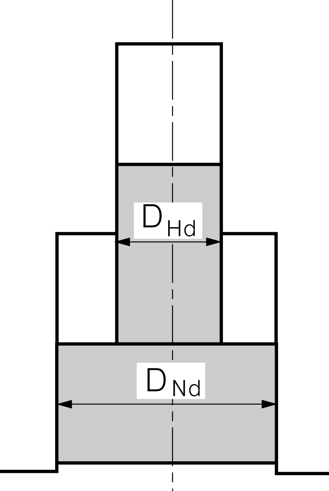
    **그림 5.6.13** 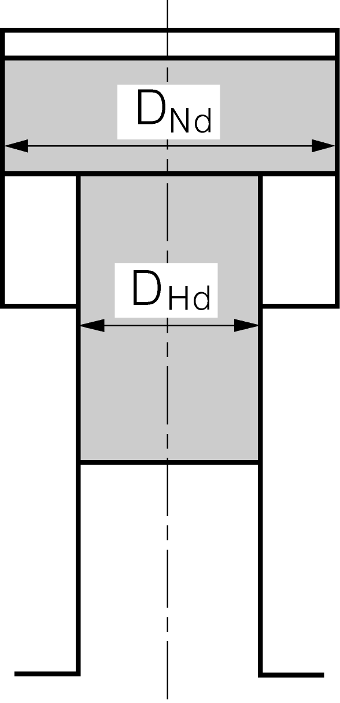
    **그림 5.6.14**

    | $z$ | 1 | 2 | 4 | 6 | ≥ 8 |
    | --- | --- | --- | --- | --- | --- |
    | $C _{l}$ | 1.0 | 1.1 | 1.2 | 1.3 | 1.4 |

    | $R _{m}$ | $C _{w}$ |
    | --- | --- |
    | 400 | 1.03 |
    | 440 | 0.94 |
    | 480 | 0.91 |
    | 520 | 0.85 |
    | 560 | 0.79 |
    | 600 | 0.77 |
    | 640 | 0.74 |
    | ≥ 680 | 0.70 |
    | 720 ^1) | 0.66 |
    | ≥ 760 ^1) | 0.64 |
    | 1) 단조(forged) 크랭크축에만 적용한다. |   |

    | $R _{m}$ | $C _{w}$ |
    | --- | --- |
    | 370 | 1.20 |
    | 400 | 1.10 |
    | 500 | 1.08 |
    | 600 | 0.98 |
    | 700 | 0.94 |
    | ≥ 800 | 0.90 |
  - **(2)** 크랭크축은 피로파괴에 대하여 충분한 안전계수를 가져야 한다. 다양한 계산 방법이 사용될 수 있으며 다음은 암 필릿에서의 피로에 대한 안전 평가를 위한 한 가지 방법이다. 다음 방법은 직렬, V 또는 W형 실린더 배치를 갖는 일단 또는 다단 압축기에 사용되는 단강, 주강 또는 구상흑연주철재의 크랭크축에 적용한다.
    $\sigma _{b} \leq \frac{\sigma _{f}}{S}$
    $\sigma _{b}$ : 필릿에서 굽힘응력 크기($\mathrm{N}/mm ^{2}$)
    $\sigma _{f}$ : 피로강도 ($\mathrm{N}/mm ^{2}$)
    $S$ : 최소안전계수
    피로 기준은 다음의 최소 안전 계수를 적용한다.
    $S$ = 1.4
    이 방법에서는 단순 형상을 갖는 필릿에서 비틀림응력의 영향을 포함하는 안전계수는 무시한다.
    피로강도는 다음과 같이 계산한다.
    $\sigma _{f} = (0.33 \sigma _{B} +40)k _{m}$
    $\sigma _{B}$ : 재료의 규격최소인장강도 ($\mathrm{N}/mm ^{2}$)
    $k _{m}$ : **지침 표 5.6.7**에 따른 재료계수.

    | 재료 | $k _{m}$ |
    | --- | --- |
    | 단강 | 1.0 |
    | 주강 | 0.8 |
    | 구상흑연주철 | 0.9 |

    굽힘응력의 크기는 다음과 같이 평가되어야 한다.
    $\sigma _{b} =0.7 \sigma _{nom} \alpha$
    - **(가)** 크랭크핀 필릿에서의 응력은 다음 기준에 만족되어야 한다.
- **0.** 7 : 편진응력범위를 등가단진폭 반복응력으로 치환하는 상관 계수
  $\alpha$ : 굽힘에 대한 피로노치계수
  $\sigma _{nom} = M _{B} /W _{B}$ ($\mathrm{N}/mm ^{2}$)
  $M _{B}$ : 두 베어링 사이의 중간지점에서 가장 가까운 암의 중앙에서 굽힘모멘트
  $M _{B} = \frac{k _{d} \pi D ^{2} pab}{4L}$
  $D$ : 실린더 지름 (mm), $p$ = 설계압력(MPa). 다만, 두 베어링 사이에 다수의 실린더가 배치되는 경우, 각 $pD ^{2}$의 최대값을 사용한다.
  $L$ : 두 베어링 중심간 거리 (mm) (**지침 그림 5.6.15** 참조)
  $a$ : 한 베어링의 중심으로부터 두 베어링 사이의 중간지점에서 가장 가까운 암의 중심까지의 거리 (mm) (**지침 그림 5.6.15** 참조)
  $b = L-a, (b \geq a)$, (mm)
  $k _{d}$ : **지침 표 5.6.8**에 따른 설계 계수.

  | 설계 | $k _{d}$ |
  | --- | --- |
  | 직렬 | 1.00 |
  | V-90, W-90 | 1.15 |
  | V-60, W-60 | 1.50 |
  | V-45, W-45 | 1.75 |

  $W _{B} =BW ^{ 2} /6$
  $W _{B}$ : 암의 단면계수
  $B$ : 암의 너비(mm), (**지침 그림 5.6.15** 참조)
  $W _{}$ : 암의 두께(mm), (**지침 그림 5.6.15** 참조)
  굽힘에 대한 피로노치계수는 다음과 같이 계산한다.
  $a = 1 + \eta ( \alpha _{th} -1)$
  $\eta$ : 노치감도계수
  $\eta = 0.62 +0.2 logR + \sigma _{y} 10 ^{-4} \log (400/R)$
  (계산 값이 1보다 크면, $\eta$은 1로 한다)
  $\sigma _{y}$ : 재료의 항복강도 ($\mathrm{N}/mm ^{2}$)
  $R$ : 실제 필릿 반지름(mm)
  $\alpha _{th}$ : 이론 응력집중계수(암 굽힘응력 참조)
  $\alpha _{th} = 3.0 f(A/d) f(W/d) f(B/d) f(R/d)$
  $f(A/d) = 1 - 0.8 A/d$
  $f(W/d) = 1 + 2.2 (W/d - 0.35)$
  $f(B/d) = 1 + 0.4 (B/d - 1.45)$
  $f(R/d) = \frac{0.22}{\sqrt {R/d}}$
  $A$ : 핀 오버랩(mm), (**지침 그림 5.6.15** 참조)
  $d$ : 크랭크핀 지름(mm).
  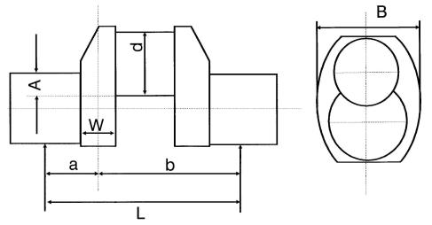
  **그림 5.6.15 공기압축기의 크랭크 스로우**

### 제 12 절 냉동장치

#### 1201. 일반사항 【규칙 참조】

- **1.** **적용**
  - **(1)** **규칙 1201.**의 **1**항 (1)호를 적용함에 있어서 “냉동사이클을 형성하는 냉동장치”는 압축기, 응축기, 리시버, 증발기, 관장치 및 이들의 부속장치 등을 포함한다.
  - **(2)** 압축기의 사용동력이 7.5 $\mathrm{kW}$ 이하이고 *R* 22, *R* 134*a*, *R* 404*A*, *R* 407*C*, *R* 410*A* 또는 *R* 507*A*를 1차냉매로 사용하는 냉동장치는 사용목적, 사용조건 및 선상에서의 주위환경에 적합한 것이어야 한다.
  - **(3)** *R* 717를 1차냉매로 사용하는 냉동장치는 규칙에서 규정하는 요건에 추가하여 아래의 (4)호 내지 (14)호에서 규정하는 요건을 따라야 한다.
  - **(4)** 암모니아 냉동장치의 제출도면 및 자료
    **규칙 5편 1장 209.**에서 정하는 요건에 추가하여 일반적으로 다음과 같은 도면 및 자료를 제출하여야 한다.
    - **(가)** *R* 717 냉매배관계통도
    - **(나)** 가스탐지기 배치도
    - **(다)** 냉동장치 설치구획 기기배치도
  - **(5)** 암모니아 냉동장치에 대한 일반요건
    - **(가)** 냉동장치에 사용하는 압력용기는 **규칙 5편 5장 3절**에서 규정하는 제1급 압력용기로 하고 1차냉매관(이하 **냉매관**이라 한다.)의 분류는 **규칙 5편 6장 1절**에서 규정하는 제1급관으로 한다.
    - **(나)** 냉동장치를 구성하는 압력용기 및 관의 설계압력은 고압측에서 2.3 $\mathrm{MPa}$, 저압측에서 1.8 $\mathrm{MPa}$ 이상이어야 한다.
  - **(6)** 암모니아 냉동장치의 재료
    - **(가)** 암모니아와 접촉하는 개소에는 부식성이 높은 재료(동, 아연, 카드뮴 또는 이들의 합금 등) 및 수은을 함유하고 있는 재료를 사용하여서는 아니 된다.
    - **(나)** 압력용기 및 관장치에는 니켈강을 사용하여서는 아니 된다.
    - **(다)** 냉매관계통에는 주철밸브를 사용하여서는 아니 된다.
    - **(라)** 해수냉각식 응축기에는 해수에 의한 부식을 고려하여 재료를 선택하여야 한다.
    - **(마)** 급속냉동장치(접촉냉동장치)의 플랫탱크(flat tank)를 알루미늄합금의 압출성형재(extrusion mold ing)로 제조하는 경우, 그 재료는 **제조법 및 형식승인 등에 관한 지침 2장 6절**에 따라 승인을 받아야 한다.
  - **(7)** 암모니아 냉동장치의 배관장치
    - **(가)** 냉매관은 거주구역을 통과하여서는 아니 된다.
    - **(나)** 냉매관계통의 관이음은 가능한 한 맞대기용접이음으로 하여야 한다.
    - **(다)** 압력도출밸브에서 방출되는 가스는 저압측으로 유도하는 경우를 제외하고 물에 흡수시켜야 한다.
    - **(라)** 항상 압력이 걸리는 개소에 유리로 만든 액면계를 사용하는 경우에는 다음의 요건을 따라야 한다.
      - **(a)** 액면계에 사용하는 유리는 평면형으로 하고 외부로부터의 충격에 대하여 충분히 보호된 구조이어야 한다.
      - **(b)** 액면계의 스톱밸브는 유리가 파손되었을 때 액의 유출이 자동으로 차단되는 구조이어야 한다.
    - **(마)** 퍼지밸브에서 방출되는 가스는 대기로 직접 방출되지 않고 물에 흡수되도록 하여야 한다.
    - **(바)** 응축기용 냉각해수의 배출관은 독립의 배관으로 하여야 하며, 거주구역을 통과시키지 않고 직접 선외로 유도하여야 한다.
  - **(8)** 암모니아 냉동장치의 제어 및 경보장치
    냉매용 압축기는 냉매관계통의 고압측 압력이 과도하게 높을 경우, 자동으로 정지시키는 장치를 설치하여야 한다. 또한, 이 장치가 작동한 경우에는 설치장소 및 감시장소에 가시가청의 경보를 발생시키는 장치를 설치하여야 한다.
  - **(9)** 암모니아 냉동장치의 설치구획
    - **(가)** 압축기, 리시버 및 응축기가 설치되어 있는 구획(이하 **냉동장치 설치구획**이라 한다.)은 누설된 암모니아가 다른 구획으로 유출되지 않도록 기밀의 격벽 및 갑판으로 격리된 전용의 구획으로 하여야 한다. 또한, 냉동장치 설치구획에는 다음의 요건을 만족시키는 문을 설치하여야 한다.
      - **(a)** 소구획을 제외하고, 냉동장치 설치구획에는 적어도 2개 이상의 출입문을 가능한 한 서로 멀리 떨어지게 설치하여야 한다.
      - **(b)** 노천갑판으로 유도하지 않은 출입문은 밀폐성이 높은 자기폐쇄식(self-closing type)이어야 한다.
      - **(c)** 출입문은 용이하게 조작할 수 있고 밖으로 열리는 구조이어야 한다.
    - **(나)** 케이블, 관장치 등의 기밀격벽 및 갑판의 관통개소는 기밀구조로 하여야 한다.
    - **(다)** 냉동장치 설치구획에 이르는 통로는 거주구역, 병실 및 제어실과 기밀의 격벽 및 갑판으로 격리하여하 한다.
    - **(라)** 냉동장치 설치구획의 배수는 다른 구획의 개방형 빌지웰(open bilge well) 또는 빌지로(bilge way)로 배출되지 않도록 독립의 배수계통으로 구성하여야 한다.
  - **(10)** 암모니아가스제거장치
    냉동장치 설치구획에는 사고로 누설된 가스를 설치구획에서 신속히 제거할 수 있도록 다음 (가) 및 (나)에 따른 통풍장치 및 수막장치로 구성된 가스제거장치를 설치하여야 한다.
    - **(가)** 냉동장치 설치구획에는 상시 환기가 가능하도록 원칙적으로 다음의 요건을 만족시키는 배기식 기계통풍장치를 설치하여야 한다.
      - **(a)** 통풍장치는 냉동장치 설치구획을 적어도 시간당 30회의 환기를 행할 수 있는 충분한 능력을 가져야 한다.
      - **(b)** 통풍장치는 다른 통풍장치와 독립되어야 하며, 냉동장치 설치구획 바깥에서 조작할 수 있어야 한다.
      - **(c)** 배기출구는 배기된 공기가 공기흡입구, 거주구역, 업무구역 및 제어장소 등의 개구로 유입되지 않도록 설치하여야 한다.
      - **(d)** 스파크가 발생하지 않는 통풍장치를 설치하여야 하며 규칙 **8편 3장 104.**의 요건에 따른다.
    - **(나)** 냉동장치 설치구획의 모든 문에는 설치구획 외부에서 조작할 수 있는 수막장치를 설치하여야 한다.
  - **(11)** 암모니아 냉동장치용 가스탐지 및 경보장치
    선원의 안전을 위하여 냉동장치 설치구획의 내부 및 외부에 경보를 발하는 고정식 가스탐지 및 경보장치를 설치하여야 하며, 암모니아 가스농도가 25 ppm을 초과할 경우 작동하여야 한다.
  - **(12)** 암모니아 냉동장치의 전기설비
    - **(가)** 누설사고가 발생한 경우에 작동하여야 하는 냉동장치 설치구획 내의 전기설비, 가스탐지 및 경보장치와 비상등은 암모니아 가스에 대하여 안정성이 증명된 방폭형으로 하여야 한다.
    - **(나)** (11)호의 경보장치에 추가하여, 냉동장치 설치구획 내의 암모니아 가스농도가 4.5%를 넘지 않는 농도에서 누설경보를 발하여야 하며, 일정시간 이상 지속될 경우 방폭형 이외의 전기설비는 냉동장치 설치구획 외부에 있는 차단기에 의하여 자동적으로 차단되도록 하여야 한다.
  - **(13)** 암모니아 냉동장치용 안전 및 보호장구
    원칙적으로 다음과 같은 암모니아 냉동장치용 안전 및 보호장구를 설치하여야 하며, 냉매가 누설하였을 때에도 용이하게 접근할 수 있도록 냉동장치 설치구획 외부의 장소에 보관하도록 하여야 한다. 보관장소에는 용이하게 식별할 수 있도록 표시를 하여야 한다.
    - **(가)** 방호복(헬멧, 안전화, 장갑 등을 포함한다.) × 2
    - **(나)** 자장식 호흡구(30분 이상 기능을 발휘할 수 있는 것) × 2
    - **(다)** 눈보호장구 × 2
    - **(라)** 세안기 × 1
    - **(마)** 붕산
    - **(바)** 비상용 전기토치 × 2
    - **(사)** 전기절연저항계 × 1
  - **(14)** 어선 등에 대한 요건
    - **(가)** 길이가 55 $\mathrm{m}$ 미만인 어선에 설치되는 냉동설비 또는 암모니아 보유량이 25 $\mathrm{kg}$ 이하인 냉동장치는 (9)호 내지 (13)호를 대신하여 다음의 요건을 만족하여야 한다.
      - **(a)** 냉동장치는 기관실에 설치할 수 있다. 이 경우, 냉동장치보다 낮은 위치에 드레인받이를 설치하여야 한다.
      - **(b)** 암모니아 가스제거장치는 다음에 따른다.
      - **(i)** 냉동장치 설치장소의 상부에 암모니아 가스가 체류하지 않도록 환기할 수 있는 배기용 전용후드가 달린 통풍장치를 설치하여야 한다. 이 배기통풍기는 기관실 통풍기와 독립된 것이어야 한다.
        - **(ii)** 냉동장치가 설치되어 있는 구역 근처에는 누설된 암모니아 가스를 충분히 흡수할 있는 살수장치를 설치하여야 한다. 살수호스 및 물분무노즐 등은 누설이 발생한 즉시 물을 분사할 수 있도록 배치하여야 한다.
      - **(c)** 감시실(또는 제어실) 및 기관실 입구에 가시·가청의 경보를 발하는 암모니아 가스탐지 및 경보장치를 설치하여야 하며, 암모니아 가스농도가 25 ppm을 초과할 경우 작동하여야 한다. 이때 탐지기는 냉동장치 상부 근처의 배기구 및 기타 우리 선급이 필요하다고 인정하는 장소에 설치하여야 한다.
      - **(d)** 전기설비는 가능한 한 냉동장치 근처에 배치하여서는 아니 된다.
      - **(e)** 방호복(헬멧, 안전화, 장갑 등을 포함한다) 2조 및 자장식 호흡구(30분 이상 기능을 발휘할 수 있는 것) 2조를 비치하여야 하며, 감시실(또는 제어실)로부터의 탈출경로가 기관실을 통과하는 경우, 자장식 호흡구 중 1개를 감시실(또는 제어실)에 비치하여야 한다.
    - **(나)** 길이 55m 이상의 어선에 설치되는 냉동설비는 특별히 기국이 암모니아 냉동장치의 기관실 설치를 인정하는 경우에 한하여 (가)를 적용할 수 있다.

### 제 13 절 유압장치 (2018)

#### 1304. 유압실린더 (2018)

- **1.** **규칙 1304.**의 **2**항 (4)호에서 ‘우리 선급이 별도로 정하는 바’라 함은 다음에 따라 계산서를 제출하고 승인 받는 것을 말한다. 미는 힘을 가지는 유압실린더의 경우 좌굴하중 $P _{E}$의 판정기준은 다음 식에 따른다. **【규칙 참조】**
  $P _{E} \geq 4 \cdot P _{A}$ (kN)
  여기서 4의 안전계수는 보다 정확한 계산 방법을 제출하여 우리 선급이 적절하다고 인정할 경우 경감할 수 있다. 다만 계산방법에 상관없이 2.7 이상이어야 한다.
  $P _{A}$ : 실제 최대하중 (kN)
  $P _{E}$ : 좌굴하중으로 다음에 따른다.
  $P _{E} = \frac{\pi ^{2} E}{1,000 L Z}$ (kN)
  $E$ : 종탄성계수 ($\mathrm{N}/mm ^{2}$)
  $L$ : 지지점 사이 완전히 펼쳐진 실린더의 총 길이, 즉 $L _{1} +L _{2}$ (mm)
  $L _{1}$ : 지지점에서 실린더 튜브의 길이 (mm)
  $L _{2}$ : 지지점에서 완전히 펼쳐진 피스톤 로드의 길이 (mm)
  여기서 $L$, $L _{1}$, $L _{2}$은 실린더의 지지 형태에 따라 유효길이 계수 $K$를 곱하여 계산하여야 한다. 지지 형태에 따른 유효길이 계수 $K$는 아래와 같다.
  양단 단순지지 : $K=1$
  한쪽 단순지지 및 한쪽 고정지지 : $K= \frac{1}{\sqrt {2}}$
  양단 고정지지 : $K=0.5$
  $Z$ : 형상계수로서 다음 식에 의한 값
  $Z= \frac{L _{1}}{I _{1}} + \frac{L _{2}}{I _{2}} +( \frac{1}{I _{2}} - \frac{1}{I _{1}} ) \times \frac{L}{2 \pi} \mathrm{\sin} it(2 \pi \frac{L _{1}}{L} )$
  $I _{1}$ : 실린더 튜브의 관성모멘트로서 다음 식에 의한 값
  $I _{1} = \frac{\pi (D _{o}^{ 4} -D _{i}^{ 4} )}{64}$ ($\mathrm{mm} ^{4}$)
  $D _{o}$ : 실린더 튜브의 바깥지름 (mm)
  $D _{i}$ : 실린더 튜브의 안지름 (mm)
  $I _{2}$ : 피스톤 로드의 관성모멘트로서 다음 식에 의한 값
  $I _{2} = \frac{\pi (d _{o}^{ 4} -d _{i}^{ 4} )}{64}$ ($\mathrm{mm} ^{4}$)
  $d _{o}$ : 피스톤 로드의 바깥지름 (mm)
  $d _{i}$ : 피스톤 로드의 안지름 (mm)

#### 1306. 시험 및 검사

- **1.** 유압모터의 수압시험에 있어서, 특수한 구조(예, submerged type)로서 선박의 안전 및 추진에 관계되지 않는 펌프용 유압모터에 대해서는 수압시험 성적서를 제출하여 우리 선급이 인정하는 경우 입회 검사를 생략할 수 있다.
  **【규칙 참조】**

### 제 14 절 시험 및 검사

#### 1401. 보기의 시험

- **1.** 용량시험
  **규칙 1401.**의 **2**항 (1)에서 동일하게 설계된 보기에 대하여는 특정 설계 시리즈중 첫 번째 보기를 제외한 나머지 보기에 대해서는 용량시험을 생략할 수 있다. *(2018)* **【규칙 참조】**

#### 1402. 밸브 및 관부착품의 수압시험 【규칙 참조】

- **1.** **규 칙 1402.**의 **1**항에서 "우리 선급이 지장이 없다고 인정하는 경우"에 따라 수압시험을 생략할 수 있는 밸브 및 관부착품은 다음의 것을 말한다.
  - **(1)** 관플랜지 및 관피스(엘보, 리듀서, 티, 벤드, 소켓 등) 등
  - **(2)** 호칭지름 25*A* 이하의 밸브 및 관부착품
- **2.** **규 칙 1402.**의 **2**항에서 "밸브"라 함은 밸브몸체를 말한다.
- **3.** 스쿠프밸브(scoop valve) 디스크의 누설시험은 밸브의 특성 및 목적 등을 고려하여 수압부(pressure side)만의 시험을 인정할 수 있다.
- **4.** 25 *A* 이하의 밸브 및 관부착품은 치수 및 외관검사를 생략할 수 있다.

#### 1403. 연료유탱크의 수압시험 【규칙 참조】

- **1.** 수압시험을 기밀시험으로 대체할 경우, 기밀시험압력은 0.02 $\mathrm{M} P a$ 로 한다.

#### 1404. 관의 가공에 대한 시험 【규칙 참조】

- **1.** **용접절차 인정시험 규칙 1404.**의 **1**항의 "용접절차 인정시험"은 **지침 2편 2장 4절**에 따른다.
- **2.** 제1급 관장치에 속하는 작동유관 중 기관실, 펌프실, 조타기실 및 거주구역을 제외한 구역을 통과하는 관의 용접이음에 대해서는 제2급 관에 속하는 관에 대한 **규칙 1404.**의 **2**항에 규정하는 비파괴시험을 행할 수 있다.
- **3.** **규 칙 2편 1장**에 정한 압력배관용 강관 4종 *RST* 422, 423 또는 424를 사용한 설계온도 550 °C 이상의 관에 대해서는 설계압력의 2배의 압력으로 수압시험을 한다. 다만, 이 시험압력 $P_h$ 는 다음 식의 값을 넘지 않도록 한다. 또한, 관의 굴곡부, $T$ 피스 등에 과대한 응력이 발생할 위험이 있는 경우에는 시험압력을 설계압력의 1.5배까지 감할 수 있다.
  $P _{h} = \frac{378 t}{D-t} (\mathrm{M} P a)$
  $D$ : 관의 바깥지름($\mathrm{mm}$)
  $t$ : 관의 두께($\mathrm{mm}$)
- **4.** 선내에서 용접이음을 행한 관에 대하여 수압시험 후 수분의 잔류가 바람직하지 않는 경우, 용접이음에 대해서 비파괴시험을 행하고 결함이 발견되지 않을 때는 선내공사 완료 후의 수압시험을 생략할 수 있다.
- **5.** **규 칙 1404. 3**항 (6)호를 적용함에 있어서 “용도에 따라 우리 선급이 인정하는 경우”라 함은 다음 사항 등을 말한다.
  - **(1)** 용접 가공이 없는 관장치로서 유독성 유체를 운송하는 관장치 혹은 피로, 심한 침식 또는 균일부식이 발생하기 쉬운 장소 등에 설치되지 않는 관장치에는 수압시험을 생략할 수 있다.

#### 1405. 선내 설치후의 시험 (2024) 【규칙 참조】

- **1.** **규 칙 1405**의 **1**항 (2)호를 적용함에 있어서 압력시험은 다음에 따른다.
  - **(1)** 원칙적으로 압력시험은 물과 같은 액체를 이용한 수압시험으로 실시하여야 한다.
  - **(2)** 일반적으로 수압시험을 대신하여 기밀시험을 행하여서는 아니 된다. 요구하는 수압시험을 수행하기가 불가능한 경우(물에 민감한 관장치 등)에만 기밀시험으로 대체할 수 있다. 기밀시험을 수행함에 있어서, 특정 조건에서는 관장치 내부가 부분적으로 물로 채워지고, 자유표면이 시험 가스(통상 질소나 공기)로 가압된 수압과 공압이 조합된 강도 시험을 적용할 수도 있다. 이러한 시험에서는 IACS Rec.140 Part F와 관련한 안전 조치가 지켜져야 한다.
  - **(3)** 수압시험에 대한 대체방법으로서 기밀시험을 실시하는 경우에는 인명의 안전에 관한 조치사항이 포함된 기밀시험 절차서를 검사원에게 제출하여야 한다. 
