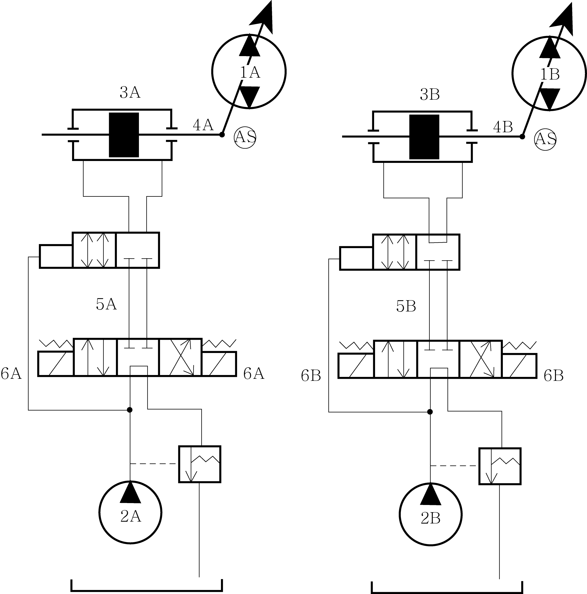
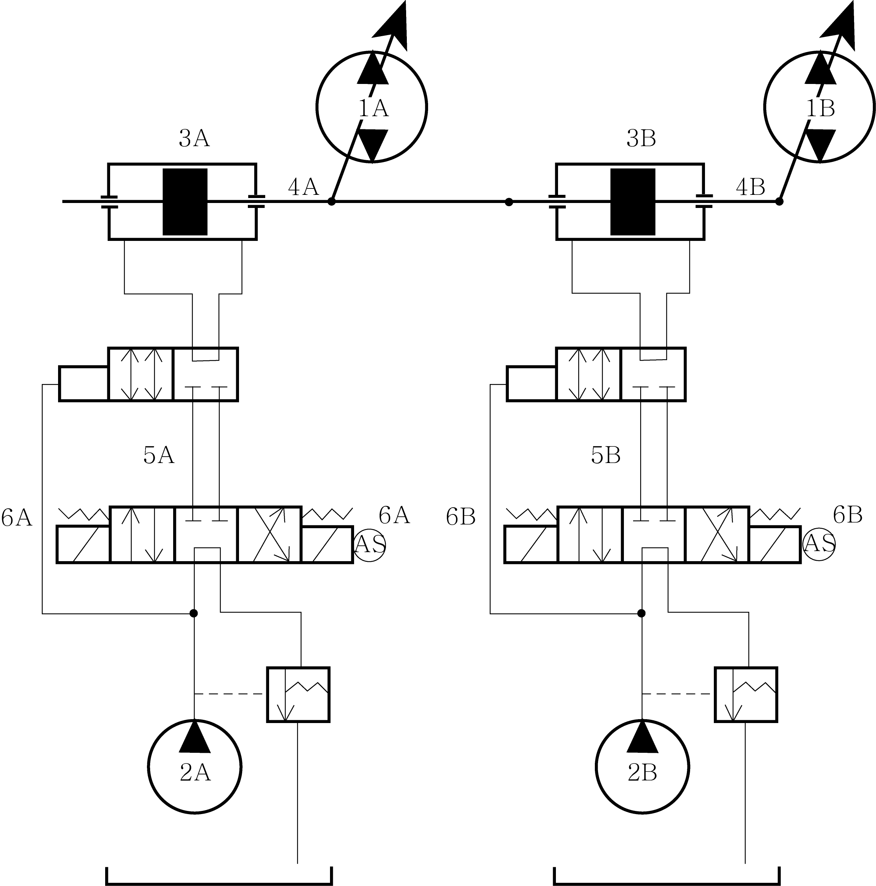
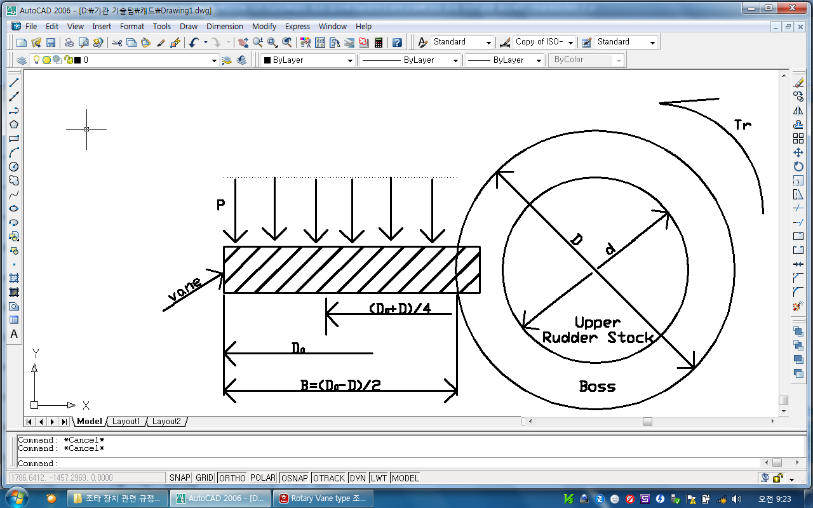

# 제5편 기관장치

> 선급 및 강선규칙/적용지침 / RA-05-K / 2025 / KO / Guidance

## 제 7 장 조타장치

### 제 1 절 일반사항

#### 101. 적용 【규칙 참조】

수동의 조타장치에 대하여는 **규칙 5편 7장 1절, 201.**부터 **203., 208.**부터 **210., 301., 4절**(**409.**의 **2**항을 제외) 및 **5절**과 이 지침의 해당규정을 적용한다.

#### 102. 정의 【규칙 참조】

**규칙 102.**의 **1**항 (3)호 (가)에서 전동조타장치의 전동기는 동력장치 및 조작기의 일부로서 고려되어야 한다.

#### 103. 제출도면 및 자료 【규칙 참조】

유압식 조타장치의 취급설명서에는 사용 유압유의 특수성에 관한 정보와 2개의 동력장치를 동시에 동작시켰을 경우에 발생할 수 있는 유압잠금(hydraulic locking)이 미치는 영향에 관한 정보가 포함되어야 하며, 이 취급설명서는 선박의 선교에 비치하여야 한다.

#### 104. 취급설명서의 게시 【규칙 참조】

**규칙 104.**의 **2**항을 적용함에 있어서, 조타장치의 설계에 대응하는 비상조치(예를 들면, 경보장치에 의하여 표시된 고장계통을 정지하기 위한)를 간단히 표시하는 “비상대응방법에 관한 적당한 설명서”를 선교의 조타 장소 근처의 적당한 장소에 게시하여야 한다.

### 제 2 절 조타장치의 성능 및 배치

#### 201. 조타장치의 수 【규칙 참조】

- **1.** 총톤수 50톤 미만의 선박 및 **규칙 4편 1장**에 의하여 상부타두재의 지름이 120 $\mathrm{mm}$ 이하로서 항해구역이 평수구역이하의 선박에서 동력구동의 주조타장치를 설치하는 경우에는 패킹, 베어링 등 마모하기 쉬운 부품의 예비품을 비치하면 **규칙 201.**에 요구하는 보조조타장치는 생략할 수 있다.
- **2.** **규 칙 201.**의 **1**항에서 요구하는 보조조타장치를 유압구동으로 하는 경우의 타조작기는 주조타장치와 겸용으로 할 수 있다. 또한, 보조조타장치로서 주조타장치의 타조작기 배관의 일부를 겸용할 수 있지만 그 부분의 관은 될 수 있는 한 짧은 것으로 한다.

#### 202. 주조타장치의 능력 【규칙 참조】

- **1.** **규 칙 202.**의 **2**항에서 “**규칙 4편 1장**의 규정에 따른 상부타두재의 소요지름”이라 함은 항복응력이 235 $\mathrm{N}/mm ^{2}$ 인 연강재(재료계수 $K_s$=1)의 타두재로 계산된 지름을 말한다.

#### 203. 보조조타장치의 능력 【규칙 참조】

- **1.** **규 칙 203.**의 **2**항에서 “**규칙 4편 1장**에서 규정한 상부타두재의 소요지름”이라 함은 항복응력이 235 $\mathrm{N}/mm ^{2}$ 인 연강재(재료계수 $K_s$=1)의 타두재로 계산된 지름을 말한다.

#### 204. 배관 【규칙 참조】

- **1.** 다음 각 항에 해당되는 조타장치는 **규칙 204.**의 **5**항 및 **6**항의 규정을 적용하지 아니할 수 있다.
  - **(1)** 총톤수 500톤 미만의 선박에 설치되는 조타장치
  - **(2)** 국제항해에 종사하지 않는 선박으로서 항해구역이 연해구역 이하인 선박의 조타장치(**규칙 201.**의 **2**항에 따라 보조조타장치를 생략한 경우는 제외)

#### 206. 대체동력원 【규칙 참조】

- **1.** 다음 각 호 중 하나에 해당되는 조타장치는 **규칙 206.**의 규정을 적용하지 아니할 수 있다.
  - **(1)** 총톤수 500톤 미만의 선박에 설치되는 조타장치
  - **(2)** 국제항해에 종사하지 않는 선박으로서 항해구역이 연해구역 이하인 선박의 조타장치

#### 207. 전동 또는 전동유압식 조타장치의 전기설비 【규칙 참조】

- **1.** 해상인명안전협약을 적용받지 않는 선박으로서 보조조타장치가 수동인 경우에는 조타장치에 급전하는 회로를 1조로 할 수 있다.
- **2.** 다음 각 호 중 하나에 해당되는 선박은 **규칙 207.**의 **1**항, **5**항(회로의 단락보호장치는 제외) 및 **7**항의 규정을 적용하지 아니할 수 있다.
  - **(1)** 총톤수 500톤 미만의 선박
  - **(2)** 국제항해에 종사하지 않는 선박으로서 항해구역이 연해구역 이하의 선박
- **3.** **규 칙 207.**의 **5**항 및 **6**항을 적용함에 있어서 인버터를 사용하여 전부하전류를 제한하는 조타기용 전동기 회로는 기동전류를 포함한 전동기 전부하전류의 2배 이상의 과전류에 대한 보호장치 요건을 적용하지 않을 수 있다. 이 경우, 요구되는 과부하 경보장치는 전자 컨버트의 정격부하 보다 크지 않는 값으로 설정하여야 한다.
- **4.** 전동조타장치의 전동기는 IEC 60034-1에 따라 주기적 단속 사용 형식을 갖는 “S3 40 %” 급 이상이어야 하며 전동유압조타장치의 전동기는 주기적 연속 운전 사용 형식을 갖는 “S6 25 %” 급 이상이어야 한다. *(2020)*

#### 209. 통신장치 【규칙 참조】

- **1.** 선교와 조타기실간의 통신장치는 선내 일반전화만으로 하여서는 아니 된다.
- **2.** 다음 각 호 중 하나에 해당되는 선박에 대하여는 **규칙 209.** 및 **1**항에 정한 통신장치를 적절한 연락장치로 대체할 수 있다.
  - **(1)** 총톤수 500톤 미만의 선박
  - **(2)** 국제항해에 종사하지 않는 선박으로서 항해구역이 연해구역 이하의 선박

### 제 3 절 제어장치

#### 301. 일반 (2017) 【규칙 참조】

- **1.** 플로팅 레버 또는 이와 유사한 기계적 추종기구는 1조로 할 수 있다.
- **2.** **규 칙 301.**의 **1**항 (2)호에 요구되는 제어계통은 다음의 요건에 적합하여야 한다.
  - **(1)** 제어계통은 원칙적으로 follow-up 방식의 것으로 한다.
  - **(2)** 제어계통과 구성요소는 어느 한쪽의 고장으로 인하여 다른 쪽이 작동불능 되지 않도록 설계되고 배치되어야 한다.
    - **(가)** 조타장치, 제어반, 배전반 및 선교 콘솔에 설치된 이중화된 조타장치 제어계통의 전선, 터미널 및 구성요소는 가능한 한 떨어지게 설치되어야 한다. 만약 공간적 분리가 불가능한 경우에는 난연성판으로 분리 할 수 있다.
    - **(나)** 조타장치 제어계통의 모든 전기 구성요소들은 이중화되어야 한다. 다만, 조타륜과 조타레버는 이중화될 필요가 없다.
    - **(다)** 양쪽 조타장치 제어계통에 대하여 공동조타방식선택스위치(joint steering mode selector switch)가 설치된 경우, 제어계통 회로의 연결은 그에 따라 분배되고 격리판 또는 공극에 의하여 상호 분리되어야 한다.
    - **(라)** 이중의 follow-up 제어의 경우, 증폭기는 전기적 및 기계적으로 분리되도록 설계되고 급전되어야 한다.
    - **(마)** 조타레버 또는 자동조타장치 등과 같은 추가의 제어계통을 위한 제어 회로는 모든 극이 차단될 수 있도록 설계되어야 한다.
    - **(바)** 조타장치 제어계통의 피드백 장치 및 리미트 스위치(설치될 경우)는 다른 회로와 전기적으로 분리되고 타두재 또는 조작기에 각각 독립하여 기계적으로 연결되어야 한다.
    - **(사)** 조타장치의 동력계통을 제어하는 동력 조작 또는 유압 서보 시스템의 유압장치 구성요소들(예; 솔레노이드밸브, 자기 밸브)은 조타장치 제어계통의 일부로 고려되어야 하며 이중화되고 분리되어야 한다. 동력계통의 일부인 조타장치 제어계통의 유압 장치 부품들은 2개 이상의 분리된 동력계통이 제공되고, 각 동력계통에 배관이 격리될 수 있는 경우, 이중화되고 분리된 것으로 간주할 수 있다.
- **3.** 제어장치에 포함되는 증폭기, 계전기 등을 자동조타장치에 겸용할 수 있다.
- **4.** 가변토출량형 펌프에 의해 구동되는 동력장치를 갖는 전동유압식 조타장치에 있어서는 펌프의 토출량을 제어하기 위한 유압 서보실린더 및 이에 부속되는 유압장치(펌프의 구동전동기 및 그 제어기류를 포함) 또는 전기 서보모터를 각각 2조 비치하여야 한다.
- **5.** 다음 각 호 중 하나에 해당되는 선박은 **규칙 301**.의 **3**항의 규정을 적용하지 아니할 수 있다.
  - **(1)** 총톤수 500톤 미만의 선박
  - **(2)** 국제항해에 종사하지 않는 선박으로서 항해구역이 연해구역 이하의 선박
- **6.** **규 칙 301.**의 **4**항을 적용함에 있어서, 원칙적으로 다음 경우에는 “단일 고장에 의하여 발생되는 유압잠금(hydraulic locking)으로 인하여 조타기능이 상실될 우려가 있는 경우”로 보지 않는다.
  - **(1)** 적어도 보조조타장치에 요구되는 것과 동등한 능력을 갖는 예비(stand-by) 시스템을 갖추고 있고 선교로부터 조작할 수 있는 경우. 다만, 예비(stand-by) 시스템은 인터록 등에 의하여 병렬운전을 할 수 없도록 설계되어야 한다.
  - **(2)** 3개 이상의 시스템이 동시에 운전되고 단일 고장의 경우에 보조조타장치에 요구되는 것과 동등한 능력이 유지되는 경우.
  - **(3)** 이중 장치의 밸브 등으로 고장계통을 자동적으로 바이패스 하는 것에 의하여 조타기능 상실을 방지하도록 설계된 조타장치. 이 경우, 시스템의 구성부품의 증가에 따라 신뢰성이 감소되는 것에 대한 특별한 고려를 하여야 한다.
- **7.** **규 칙 301.**의 **4**항을 적용함에 있어서, “고장난 시스템을 식별하는 가시가청 경보“는 원칙적으로 다음 상태에서 발하여야 한다.
  - **(1)** 가변 용량 펌프의 제어장치 위치가 지령에 따라 응답하지 않는 경우
  - **(2)** 정량펌프 장치의 3방향 전량밸브 등의 위치가 부정확한 경우
- **8.** **7**항에 언급된 경보장치의 센서 위치는 가능한 한 엑튜에이터 근처이어야 한다. 2개 이상의 펌프가 플로팅 바(floating bar) 등에 의하여 기계적으로 결합된 경우, 그 부분의 파손은 고려되지 않는다. 경보 센서의 인정할 수 있는 설치 예는 **지침 그림 5.7.1**을 참조한다.

  |  **(a) 분리된 장치** **(a) 분리된 장치** |  : 경보 센서 위치 1. 가변 용적형 주펌프 2. 파일럿 펌프 3. 제어 엑튜에이터 4. 제어 링크 5. 3방향 전자밸브 6. 솔레노이드 |
  | --- | --- |

  |  **(b) 기계적으로 결합된 장치** **(b) 기계적으로 결합된 장치** | (주) (a)에서 1A 및 1B가 병렬 운전 되지 않는 경우 및 (b)에서 2A 및 2B가 병렬 운전 되지 않는 경우 경보 장치는 요구되지 않는다. |
  | --- | --- |

  **그림 5.7.1 유압잠금 경보 센서 위치 예**

#### 303. 전환 【규칙 참조】

- **1.** 자동조타로부터 수동조타로의 전환은 어떠한 타각에서도 1 ~ 2회의 조작으로 3초 이내에 가능하여야 한다.
- **2.** 자동조타장치의 고장을 포함한 어떠한 상태에서도 자동조타로부터 수동조타로의 전환이 될 수 있어야 한다.
- **3.** 자동조타로부터 수동조타로의 전환장치는 통상 조타를 행하는 위치에 근접하여 설치하여야 한다.

### 제 4 절 조타장치의 재료, 구조 및 강도

#### 401. 재료 【규칙 참조】

- **1.** **규칙 401.**의 **2**항에서 실린더를 제외하고 낮은 응력을 받는 부속부품은 회주철품의 사용을 특별히 고려할 수 있다. *(2025)*
- **2.** **규칙 401.**의 **4**항에서 “우리 선급이 적절하다고 인정하는 규격“이라 함은 한국산업규격 또는 이와 동등한 규격을 말한다.

#### 407. 틸러 등

- **1.** **규 칙 407.**의 **2**항 (4)호에 따라 치수를 경감하는 경우, 다음 요건에 따른다. **【규칙 참조】**
  - **(1)** 각 암에 균등한 토크가 작용하도록 설계된 틸러의 경우 : **규칙 407.**의 **2**항 (2)호 및 (3)호에서 요구되는 소요단면계수 $Z$ 및 소요단면적 $A$ 에 암의 수 $n$으로 나눌 수 있다.
  - **(2)** 각 암에 불균등한 토크가 작용하도록 설계된 틸러의 경우 : **규칙 407.**의 **2**항 (2)호 및 (3)호에서 요구되는 소요단면계수 $Z$ 및 소요단면적 $A$ 에 $a$를 곱할 수 있다. 여기서 $a$는 전체 타 토크에 대한 해당 암에 작용하는 분할 토크의 비율이다.
- **2.** 보조조타장치 전용의 틸러의 치수는 **규칙 407.**의 **2**항에 규정하는 값의 1/2 이상의 강도를 갖도록 정하여야 한다. **【규칙 참조】**
- **3.** **규 칙 407.**의 **3**항 (2)호를 적용함에 있어서, 회전날개의 너비 B는 **지침 그림 5.7.2**에 따른다. **【규칙 참조】**
  
  **그림 5.7.2 회전날개식 타조조작기**
- **4.** **규 칙 407.**의 **4**항에서 “우리 선급이 인정하는 부착방법”이라 함은 **규칙 4편 1장 703.**의 **2항**에서 “타두재와 타심재의 콘 커플링“에 적합한 방법을 말한다. **【규칙 참조】**

#### 409. 완충장치

항해구역이 평수구역 이하의 선박 및 총톤수 500톤 미만의 선박에 대하여는 **규칙 409.**에 정한 완충장치를 생략할 수 있다. **【규칙 참조】**

### 제 5 절 시험

#### 503. 해상시운전

- **1.** **1**. **규칙 503.**의 **1**항 (1)호를 적용함에 있어서, 조타능력시험은 ISO 19019의 6.1.5.1의 절차에 따라 실시할 수 있다. **【규칙 참조】**
- **2.** **2**. **규칙 503.**의 **1**항 (1)호 (다)는 아래 방법 중 하나에 따라야 한다. *(2017)* **【규칙 참조】**
  - **(1)** 만재흘수에 상응하는 토크 및 조작기 압력을 예측하는 다음의 방법을 사용하여 시운전 적재상태에서의 타 토크를 만재흘수 상태의 것으로 신뢰할 수 있게 예측(시스템 압력 계측에 기반하여)하고 외삽한다.
    $Q _{F} =Q _{T} \cdot \alpha$
    $\alpha =1.25( \frac{A _{F}}{A _{T}} )( \frac{V _{F}}{V _{T}} ) ^{2}$
    $\alpha$ : 외삽계수
    $Q _{F}$ : 만재흘수 및 최대운항속도 상태에서의 타두재 모멘트
    $Q _{T}$ : 시운전상태에서의 타두재 모멘트
    $A _{F}$ : 만재흘수 상태에서의 물에 잠긴 타의 움직이는 부분의 투영면적
    $A _{T}$ : 시운전상태에서의 물에 잠긴 타의 움직이는 부분의 투영면적
    $V _{F}$ : 만재흘수에서 주기관의 연속최대회전수에 상응하는 선박의 계약 설계속도
    $V _{T}$ : 시운전상태에서 측정된 해류를 감안한 선박의 속도
    타조작기 시스템 압력이 타두재 토크에 선형 비례관계를 보일 경우 위 식은 다음과 같을 수 있다.
    $P _{F} =P _{T} \cdot \alpha$
    $P _{F}$ : 만재흘수 상태에서 예상되는 타조작기유의 압력
    $P _{T}$ : 시운전상태에서 계측된 타조작기유의 최대압력
    일정 유량의 정용량형 펌프가 설치된 경우, 만재흘수에서 예상되는 타조작기유의 압력이 타조작기의 명시된 최고사용압력 보다 작다면 규정을 만족한다고 볼 수 있다. 가변토출 펌프가 설치된 경우, 타 회전시간을 계산하고 요구되는 시간과 비교하기 위하여 만재흘수에 상응하는 토출유량을 예상할 수 있도록 펌프에 대한 자료를 제공하고 설명하여야 한다.
    $A _{T}$가 $0.95A _{F}$ 보다 클 경우 외삽법 적용이 필요 없다.
  - **(2)** 대체방안으로 만재흘수상태 및 운항속도에서 타두재의 모멘트를 예측하기 위하여 설계자 또는 조선소는 전산유체역학 또는 실험적 연구를 이용할 수 있다. 이러한 계산 및 실험적 연구는 우리 선급이 적절하다고 인정하는 바에 따른다.
- **3.** **규칙 503.**의 **1**항 (9)호를 적용함에 있어서, “유압잠금(hydraulic locking)을 방지할 수 있도록 설계된 조타장치”는 인터록 등을 사용하여 병렬운전 되지 않도록 설계된 조타장치 또는 유압회로의 자동절환 등으로 단일손상시에도 조타기능을 유지하거나 자동적으로 회복하도록 설계된 조타장치를 말한다. 플로팅바 (floating bar) 등의 기계적 결합에서 파손되는 것을 고려하지 않기 때문에 유압잠금(hydraulic locking)의 고려에서 제외된 조타장치는 이들 실증 시험을 하지 않을 수 있다. **【규칙 참조】**

### 제 6 절 총톤수 10,000톤 이상인 탱커 및 총톤수 70,000톤 이상인 선박에 대한 추가규정

#### 604. 비파괴시험

**규칙 604.**에서 우리 선급이 적절하다고 인정하는 비파괴시험방법 및 판정기준이라 함은 재료, 형상 및 적용되는 응력조건 등을 감안하여 **지침 2편 부록 2-2** 및 **부록 2-5**의 해당 규정을 준용하는 것을 말한다. **【규칙 참조】** 
