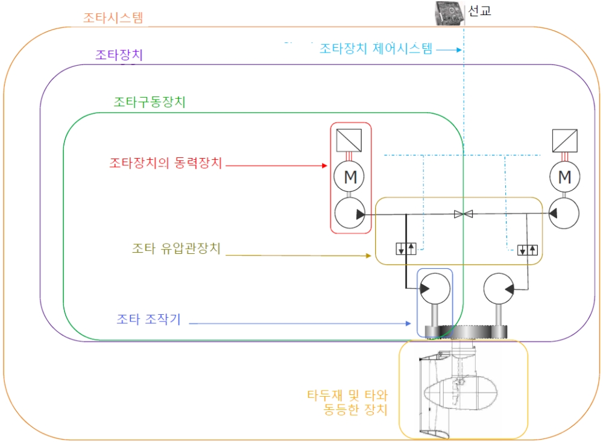

# 제5편 기관장치

> 선급 및 강선규칙/적용지침 / RA-05-K / 2025 / KO / Guidance

## 부록 5-1 비전통 조타시스템의 성능 및 배치에 대한 요건 (2023)

### 2. 정의

선회식 추진장치 또는 워트제트 추진장치 등과 같은 비전통 조타시스템의 정의는 다음에 따른다. (**그림 1** ~ **그림 3**을 참조)

#### (1) 조타시스템이라 함은 조타장치, 조타장치 제어시스템 및 타(타두재 포함)를 포함하는 선박의 방향제어시스템 또는 선체에 힘을 가하여 선수방향 또는 침로를 변경하기 위한 동등한 시스템을 말한다.

#### (2) 조타추진장치라 함은 선박의 추진 및 조종 둘 다 포함하는 장치를 말한다. (예를 들면, 선회식 추진장치 또는 회전식 포드형 전기추진장치)

#### (3) 조타장치라 함은 선박을 조종할 목적으로 타 또는 스러스터 또는 이와 동등한 것을 회전축 중심으로 양방향 회전시키기 위하여 적용되는 기계, 조작기, 동력장치 및 보조기기를 말한다.

#### (4) 조타구동장치이라 함은 조타장치의 동력장치, 조타 조작기 그리고 유압식 또는 전동유압식 조타 유압관장치를 말한다.

#### (5) 조타 조작기라 함은 타 또는 스러스터 또는 이와 등등한 장치의 회전을 제어하기 위하여 동력을 기계적 작용으로 변환하는 조타장치 구성품을 말한다.

- **(가)** 전동식 조타의 경우: 전동기 및 구동피니언
- **(나)** 전동유압식 조타의 경우: 유압모터 및 구동피니언

#### (6) 조타각 한계는 선박의 속도 또는 프로펠러 토크/속도 또는 기타 제한을 고려하여, 안전한 작동을 위한 제조업체의 지침에 따라 최대 조타각 또는 이에 상응하는 작동 제한을 말한다. "조타각 한계"는 각 선박 고유의 비전통적인 조타 수단에 대하여 조타시스템 제조업체에 의해 선언되어야 한다. 선박 조종성에 대한 표준(IMO Res. MSC.137(76))에 따른 선박 조종성 시험은 조타각 한계를 초과하지 않는 조타각으로 수행되어야 한다.

|  |
| --- |
| **그림 1 비전통 조타시스템의 정의 – 동등한 2개의 동등한 조타구동장치를 갖춘 경우** |

### 3. 조타장치의 수

#### (1) 복수의 조타추진장치가 장착된 선박에서 각 조타추진장치는 주조타장치와 보조조타장치가 제공되거나 또는 (4)호에 따른 둘 이상의 동등한 조타구동장치가 제공되어야 한다. 주조타장치와 보조조타장치는 그 중 하나의 고장으로 인하여 다른 하나가 작동불능이 되지 않도록 배치하여야 한다. 국제항해에 종사하지 않는 선박에서는 각 조타추진장치 당 1개의 조타구동장치의 배치를 인정할 수 있다.

#### (2) 단일 조타추진장치가 장착된 선박에서 조타장치에 2개 이상의 조타구동장치가 제공되고 (3)호에 부합하는 경우 규칙 7장 201.의 1항의 요건에 만족하는 것으로 간주한다. 조타장치에 단일 고장이 발생한 경우 제어시스템 및 전원 공급 장치가 선박 조타장치를 유지함을 입증하기 위하여 상세한 위험도 평가를 제출해야 한다.

#### (3) 단일 조타추진장치가 장착된 선박에서 주조타장치가 2개 이상의 동등한 동력장치와 2개 이상의 동동한 조타 조작기로 구성된 경우 조타장치가 다음을 만족한다면 보조조타장치를 설치할 필요가 없다.

- **(가)** 여객선에서는 어느 하나의 동력장치가 작동하고 있지 아니한 경우에도 **4**항의 요건에 만족할 수 있어야 한다. 화물선에서는 모든 동력장치를 작동하여 **4**항의 요건에 만족할 수 있어야 한다.
- **(나)** 관창치 또는 하나의 동력장치에서 단일손상이 발생한 후에도 선박의 조타능력이 유지되거나 신속히 회복될 수 있어야 한다.

#### (4) 복수 조타추진장치가 장착된 선박에서 주조타장치가 2개 이상의 동등한 조타구동장치로 구성된 경우, 각 조타장치가 다음을 만족한다면 보조조타장치를 설치할 필요가 없다.

- **(가)** 여객선에서는 어느 하나의 조타구동장치가 작동하고 있지 아니한 경우에도 **4**항의 요건에 만족할 수 있어야 한다. 화물선에서는 모든 조타구동장치를 작동하여 **4**항의 요건에 만족할 수 있어야 한다.
- **(나)** 관창치 또는 하나의 조타구동장치에서 단일손상이 발생한 후에도 선박의 조타능력이 유지되거나 신속히 회복될 수 있어야 한다.
  상기의 요건은 복수의 조타시스템에서 동력장치가 공용 또는 전용으로 배치됨에 상관없이 적용하여야 한다.

### 4. 주조타장치의 능력

#### (1) 최대전진속력에서 선박을 조타할 수 있어야 하며 적당한 강도를 가져야 한다.

#### (2) 선박이 최대전진속력으로 전진 중 조타각 한계에서 한쪽 현에서 반대 현 쪽까지 2.3 °/s 이상의 평균 회전 속도로 조타추진장치의 방향을 변경할 수 있어야 한다.

#### (3) 모든 선박에 대하여 동력 구동의 것이어야 한다.

#### (4) 최대 후진속력에서 손상되지 않도록 설계되어야 한다. 이러한 설계요건은 최대 후진속력 및 조타각 한계에서 시운전으로 증명될 필요는 없다.

### 5. 보조조타장치의 능력

#### (1) 항해 가능한 속력에서 선박을 조타할 수 있어야 하며 적당한 강도를 가져야 하고 비상시에는 신속히 전환이 이루어질 수 있는 것이어야 한다.

#### (2) 선박이 최대전진속력의 1/2 또는 7 Knots 중 큰 쪽의 속력으로 전진 중 조타각 한계에서 한쪽에서 다른 쪽까지 0.5 °/s 이상의 평균 회전 속도로 조타추진장치의 방향을 변경할 수 있어야 한다.

#### (3) (2)호의 요건에 만족하기 위하여 필요한 경우 및 한 개의 조타추진장치가 2500 kW를 넘는 추진출력을 갖는 경우에는 동력 구동의 것이어야 한다.
