# 제5편 기관장치

> 선급 및 강선규칙/적용지침 / RA-05-K / 2025 / KO / Guidance

## 부록 5-3 크랭크축 응력의 상세 계산법 (2)

### 1. 일반사항

#### (1) 적용

이 계산법은 왕복동 내연기관의 일체형 및 반조립형의 단강제 또는 주강제 크랭크축으로서 주베어링 사이에 1개의 크랭크 스로우를 갖는 것에 적용한다.

#### (2) 계산의 개요

- **(가)** 크랭크축의 치수는 고응력부의 피로에 대한 안전평가에 기초를 두어 정한다.
- **(나)** 다음의 부분이 고응력에 노출된 부분이라는 가정 하에 기초를 두고 계산한다.
  - **(a)** 크랭크핀과 암, 크랭크저널과 암 사이의 필릿부
  - **(b)** 크랭크핀 오일구멍의 출구
- **(다)** 크랭크저널의 지름이 크랭크핀의 지름과 같거나 큰 경우, 주저널 오일구멍의 출구는 크랭크핀 오일구멍과 유사한 방식으로 만들어야 한다. 그렇지 않은 경우, 피로안전에 대한 별도의 자료를 요구할 수 있다.
- **(라)** 크랭크축 강도의 계산시에는 우선 호칭변동굽힘응력 및 호칭변동비틀림응력을 결정한 후 적당한 응력집중계수를 곱하는 것으로서, 등가변동응력을 계산한다. 그런 후에 이 등가변동응력을 선정된 크랭크축 재료의 피로강도와 비교하여 해당 크랭크축이 적절한 치수로 설계되었는지 여부를 판정한다.

### 2. 응력계산

#### (1) 굽힘모멘트 및 반지름방향 힘으로 인한 변동응력의 계산

- **(가)** 가정
  - **(a)** 변동응력의 계산은 인접한 주저널의 중심 사이에서 지지되는 크랭크 스로우 1개만을 고려하여 계산하며, 가스압력 및 관성력이 작용하는 정적인 결정계에 기초를 두고 한다. 크랭크 스로우의 길이는 인접한 2개의 주베어링 중간지점 사이의 길이($L _{3}$)로 한다(**그림 1** 및 **그림 2** 참조).
  - **(b)** 굽힘모멘트($M _{BR}$, $M _{BT}$)는 연접봉에 작용하는 힘의 반지름방향 성분($F _{R}$)과 접선방향 성분($F _{T}$)으로 인한 단순지지보의 굽힘모멘트 선도에 기초를 둔 해당 단면에서 각각 계산한다(**그림 1** 참조).
  - **(c)** 1개의 크랭크핀에 2개의 연접봉을 가지는 크랭크 스로우의 경우, 굽힘모멘트는 해당 실린더 사이의 착화간격을 위상으로 하는 2개의 단순지지보의 굽힘모멘트 선도의 중첩위치(superposition)로 구한다(**그림 2** 참조).
  - **(d)** 암에 작용하는 굽힘모멘트 및 반지름방향 힘
  - **(i)** 굽힘모멘트($M _{BRF}$)와 반지름방향 힘($Q _{RF}$)은 일체형 암의 중심($L _{1}$)에 작용하는 것으로서 연접봉에 작용하는 힘의 반지름방향 성분으로부터 구한다.

    **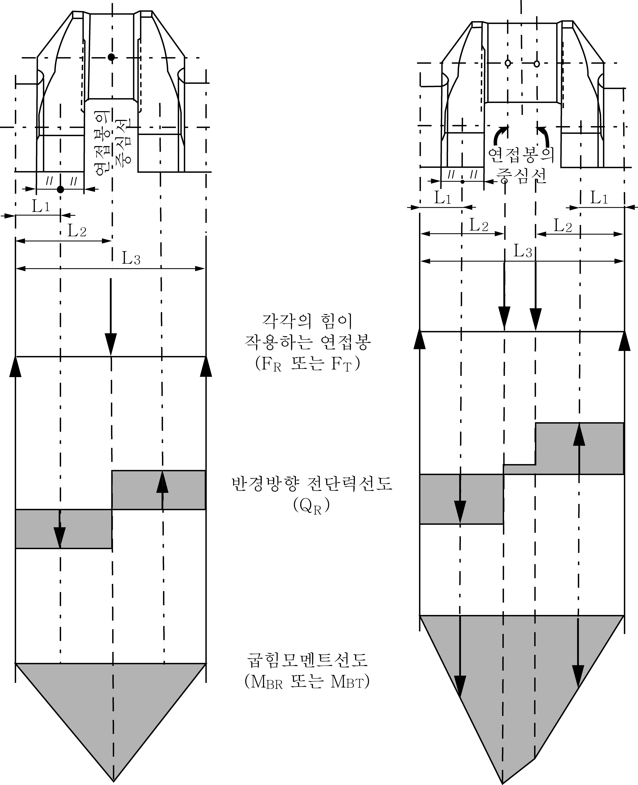**

    | **그림 1 직렬기관의 크랭크 스로우** |   | **그림 2 동일 크랭크핀에 2개의 연접봉을 가진 V형 기관의 크랭크 스로우** |
    | --- | --- | --- |
    | $L _{1}$ : 크랭크저널의 중심선과 크랭크 암의 중심 사이의 거리 (**그림 3** 참조) $L _{2}$ : 크랭크저널의 중심선과 연접봉 중심 사이의 거리 $L _{3}$ : 2개의 인접한 크랭크저널의 중심선 사이의 거리 |   |   |

    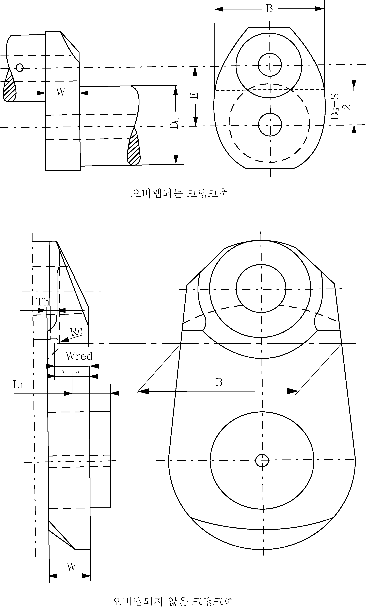
    **그림 3 크랭크암 단면의 기준면**
    - **(ii)** 굽힘모멘트 및 반지름방향 힘에 의한 변동굽힘 및 압축응력은 크랭크암의 단면과 관련되어 있다. 이 기준단면은 암의 두께($W$)와 암의 폭($B$)을 사용하여 구한다(**그림 3** 참조).
    - **(iii)** 계산에 있어서 평균응력은 무시한다.
  - **(e)** 크랭크핀의 오일구멍 출구에 작용하는 굽힘
  - **(i)** 2개의 해당 굽힘모멘트는 오일구멍이 통과하는 크랭크핀 단면에 작용한다.

    | 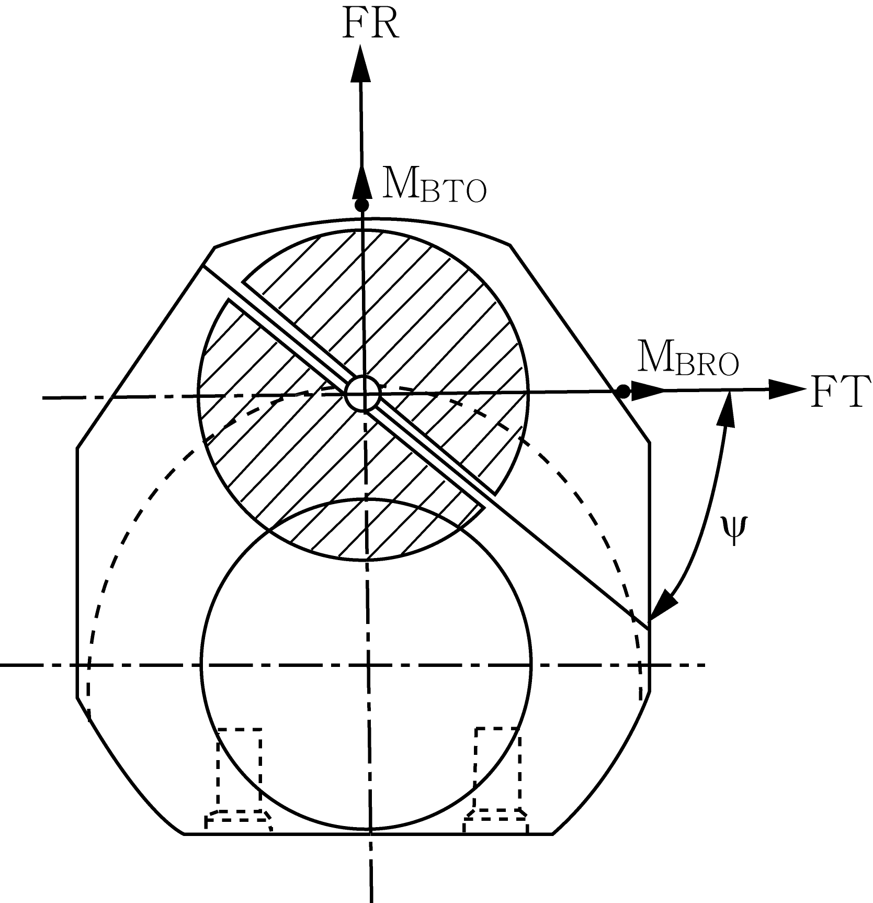 | $M _{BRO}$ : 연접봉에 작용하는 힘의 반지름방향 성분에 대한 굽힘모멘트 $M _{BTO}$ : 연접봉에 작용하는 힘의 접선방향 성분에 대한 굽힘모멘트 **그림 4 오일구멍이 통과하는 크랭크핀 단면** |
    | --- | --- |
    - **(ii)** 이들 굽힘모멘트에 의한 변동응력은 축방향으로 구멍난 크랭크핀의 단면적과 관련이 있다.
    - **(iii)** 계산에 있어서 평균굽힘응력은 무시한다.
- **(나)** 암의 호칭 변동굽힘응력 및 호칭 변동압축응력
  - **(a)** 계산법은 다음과 같다.
  - **(i)** 각 연접봉 위치에서 크랭크핀에 작용하는 가스압력 및 관성력에 의한 반지름방향 및 접선방향 힘은 1사이클 전체에 걸쳐 구한다.
    - **(ii)** 1사이클 전체에 걸쳐 계산된 힘을 이용하고 주베어링 중간지점으로부터의 거리를 고려하여 (1)호 (가) (d) 및 (e)에서 정하여진 굽힘모멘트($M _{BRF}$, $M _{BRO}$, $M _{BTO}$)와 반지름방향 힘($Q _{RF}$)의 시간곡선을 계산한다.
    - **(iii)** V형 기관의 경우, 1개의 크랭크 스로우에 작용하는 2개의 실린더 가스압력 및 관성력으로부터 산출되는 굽힘모멘트는 위상을 고려하여 중첩하여 합성한다. 서로 다른 설계(포오크형 연접봉, 분절형 연접봉 또는 일체형 연접봉)에 대하여 계산하여야 한다.
    - **(iv)** 1개의 크랭크축에서 다른 형상의 크랭크가 있는 경우에는 모든 크랭크 형상에 대하여 계산하여야 한다.
  - **(v)** 변동값은 다음 식으로 계산한다.
    $X _{N } = ± \frac{1}{2} \left[ X _{\max} -X _{\min} \right]$
    $X _{N}$ : 변동력, 변동모멘트 또는 변동응력을 고려한 변동값
    $X _{\max}$ : 1사이클 중의 최대값
    $X _{\min}$ : 1사이클 중의 최소값
  - **(b)** 암의 단면에서 호칭 변동굽힘응력 및 호칭 변동압축응력은 다음 식으로 계산한다.
    $\sigma _{BFN} = ± \frac{M _{BRFN}}{W _{eqw}} \cdot 10 ^{3} \cdot K _{e}$
    $\sigma _{QFN} = ± \frac{Q _{RFN}}{F} \cdot K _{e}$
    $\sigma _{BFN}$ : 암과 관련한 호칭 변동굽힘응력 ($\mathrm{N}/mm ^{2}$)
    $M _{BRFN}$ : 암의 중심과 관련한 변동굽힘모멘트 ($\mathrm{N} \cdot m$) (**그림 1** 및 **그림 2** 참조)
    $M _{BRFN} = ± \frac{1}{2} \left[ M _{BRF _{\max}} -M _{BRF _{\min}} \right]$
    $W _{eqw}$ : 암의 단면과 관련한 단면계수 ($\mathrm{mm} ^{3}$)
    $W _{eqw} = \frac{B \cdot W ^{2}}{6}$
    $K _{e}$ : 베어링 구속조건 및 인접 크랭크의 영향을 고려한 경험적인 계수
    = 0.8 (2행정 기관)
    = 1.0 (4행정 기관)
    $\sigma _{QFN}$ : 암과 관련한 반지름방향 힘에 의한 호칭 변동압축응력 ($\mathrm{N}/mm ^{2}$)
    $Q _{RFN}$ : 암과 관련한 변동 반지름방향 힘 ($\mathrm{N}$) (**그림 1** 및 **그림 2** 참조)
    $Q _{RFN} = ± \frac{1}{2} \left[ Q _{RF _{\max}} -Q _{RF _{\min}} \right]$
    $F$ : 암의 단면과 관련한 면적 ($\mathrm{mm} ^{2}$)
    $F = B \cdot W$
  - **(c)** 크랭크핀의 오일구멍 출구에서 호칭 변동굽힘응력은 다음 식으로 계산한다.
    $\sigma _{BON} = ± \frac{M _{BON}}{W _{e}} \cdot 10 ^{3}$
    $\sigma _{BON}$ : 크랭크핀 지름과 관련한 호칭 변동굽힘응력 ($\mathrm{N}/mm ^{2}$)
    $M _{BON}$ : 크랭크핀 오일구멍의 출구에서 계산된 변동굽힘모멘트 ($\mathrm{N} \cdot m$)
    $M _{BON} = ± \frac{1}{2} \left[ M _{BO _{\max}} -M _{BO _{\min}} \right]$
    $M _{BO} = \left( M _{BTO} \cdot \cos \psi + M _{BRO} \cdot \sin \psi \right)$, $\psi$ (°) (**그림 4** 참조)
    $W _{e}$ : 축방향으로 구멍난 크랭크핀의 단면과 관련한 단면계수 ($\mathrm{mm} ^{3}$)
    $W _{e} = \frac{\pi}{32} \left[ \frac{D ^{4} -D _{BH} ^{4}}{D} \right]$
- **(다)** 필릿부의 변동굽힘응력
  - **(a)** 크랭크핀 필릿부의 변동굽힘응력 $\sigma _{BH}$는 다음 식으로 계산한다.
    $\sigma _{BH} = ± \left( \alpha _{B} \cdot \sigma _{BFN} \right)$
    $\sigma _{BH}$ : 크랭크핀 필릿부의 변동굽힘응력 ($\mathrm{N}/mm ^{2}$)
    $\alpha _{B}$ : 크랭크핀 필릿부의 굽힘에 대한 응력집중계수 (**3**항 (2)호 참조)
  - **(b)** 크랭크저널 필릿부의 변동굽힘응력 $\sigma_BG$는 다음 식으로 계산한다. (반조립형 크랭크축은 적용 하지 않음).
    $\sigma _{BG} = ± \left( ( \beta _{B} \cdot \sigma _{BFN } + \beta _{Q} \cdot \sigma _{QFN} \right)$
    $\sigma _{BG}$ : 저어널 필릿부의 변동굽힘응력 ($\mathrm{N}/mm ^{2}$)
    $\beta _{B}$ : 저어널 필릿부의 굽힘에 대한 응력집중계수 (**3**항 (2)호 참조)
    $\beta _{Q}$ : 저어널 필릿부의 반지름방향 힘으로 인한 압축에 대한 응력집중계수 (**3**항 (2)호 참조)
- **(라)** 크랭크핀의 오일구멍 출구에서 변동굽힘응력 $\sigma _{BO}$는 다음 식으로 계산한다.
  $\sigma _{BO } = ± \left( \gamma _{B} \cdot \sigma _{BON} \right)$
  $\sigma _{BO}$ : 크랭크핀 오일구멍 출구에서의 변동굽힘응력 ($\mathrm{N}/mm ^{2}$)
  $\gamma _{B}$ : 크랭크핀 오일구멍의 굽힘에 대한 응력집중계수 (**3**항 (2)호 참조)

#### (2) 변동비틀림응력의 계산

- **(가)** 호칭 변동비틀림응력
  - **(a)** 최대 및 최소 토크는 2행정기관은 1～15차, 4행정기관은 0.5～12차의 강제진동을 조화 합성함으로서 전체 동적 계의 각 질점과 전속도범위에 대하여 확인되어야 한다.
  - **(b)** 계의 감쇠에 대한 추정오차, 1실린더 착화실패와 같은 불확정 요인에 대하여 여유를 두어야 한다.
  - **(c)** 회전수의 분할은 기관의 운전속도범위에서 발견되는 모든 응답이 탐지될 수 있도록 선정하여야 한다.
  - **(d)** 운전금지범위가 필요한 경우, 그 범위는 존재하더라도 만족스러운 운전이 가능하도록 배치하여야 한다. 정상적인 착화조건에 있어서 λ ≥ 0.8의 속도비 이상의 운전금지범위가 존재하여서는 아니 된다.
  - **(e)** 각 질점에서의 호칭 변동비틀림응력은 크랭크축 평가에 가장 중요하며, 다음 식으로 계산한다.
    $\tau _{N } = ± \frac{M _{TN}}{W _{P}} \cdot 10 ^{3}$
    $\tau _{N}$ : 크랭크핀 또는 저널의 호칭 변동비틀림진동 ($\mathrm{N}/mm ^{2}$)
    $M _{TN}$ : 최대변동토크 ($\mathrm{N} \cdot m$)
    $M _{TN } = ± \frac{1}{2} \left[ M _{T _{\max}} -M _{T _{\min}} \right]$
    $M _{T _{\max}}$ : 최대 토크 ($\mathrm{N} \cdot m$)
    $M _{T _{\min}}$ : 최소 토크 ($\mathrm{N} \cdot m$)
    $W _{P}$ : 축방향으로 구멍난 크랭크핀 또는 구멍난 저널 단면의 극 단면계수 ($\mathrm{mm} ^{3}$)
    $W _{P } = \frac{\pi}{16} \left( \frac{D ^{4} -D _{BH} ^{4}}{D} \right)$ 또는 $W _{P } = \frac{\pi}{16} \left( \frac{D _{G} ^{4} -D _{BG} ^{4}}{D _{G}} \right)$
  - **(f)** 크랭크축 평가를 위한 계산에 사용하는 호칭 변동비틀림진동은 상기 방법에 따라 계산된 가장 큰 값이며, 크랭크축계의 가장 큰 비틀림하중을 받는 질점에서 발생한다. 운전금지범위가 존재하는 경우, 이들 범위 내에 있는 비틀림응력은 크랭크축 평가를 위한 계산에 사용하여서는 아니 된다.
  - **(g)** 크랭크축의 승인은 가장 큰 호칭 변동비틀림응력을 갖는 장치에 기준을 두어야 한다. 다만, 기관 제조자에 의해 규정된 최대값을 초과하여서는 아니 된다.
- **(나)** 필릿부 및 크랭크핀 오일구멍 출구의 변동비틀림응력
  - **(a)** 크랭크핀 필릿부의 변동비틀림응력 $\tau _{H}$는 다음 식으로 계산한다.
    $\tau _{H } = ± \left( \alpha _{T} \cdot \tau _{N} \right)$
    $\tau _{H}$ : 크랭크핀 필릿부의 변동비틀림응력 ($\mathrm{N}/mm ^{2}$)
    $\alpha _{T}$ : 크랭크핀 필릿부의 비틀림에 대한 응력집중계수 (**3**항 (2)호 참조)
    $\tau _{N}$ : 크랭크핀 지름과 관련된 호칭 변동비틀림진동 ($\mathrm{N}/mm ^{2}$)
  - **(b)** 크랭크저널 필릿부의 변동비틀림응력 $\tau _{G}$는 다음 식으로 계산한다(반조립형 크랭크축을 적용하지 않음).
    $\tau _{G} = ± \left( \beta _{T} \cdot \tau _{N} \right)$
    $\tau _{G}$ : 크랭크저널 필릿부의 변동비틀림응력 ($\mathrm{N}/mm ^{2}$)
    $\beta _{T}$ : 크랭크저널 필릿부의 비틀림에 대한 응력집중계수 (**3**항 (2)호 참조)
    $\tau _{N}$ : 크랭크저널 지름과 관련된 호칭 변동비틀림응력 ($\mathrm{N}/mm ^{2}$)
  - **(c)** 크랭크핀 오일구멍 출구의 변동비틀림응력 $\sigma _{T0}$는 다음 식으로 계산한다.
    $\sigma _{T0} =± \left( \gamma _{T} \cdot \tau _{N} \right)$
    $\sigma _{T0}$ : 비틀림에 의한 크랭크핀 오일구멍 출구의 변동응력 ($\mathrm{N}/mm ^{2}$)
    $\gamma _{T}$ : 크랭크핀 오일구멍 출구의 비틀림에 대한 응력집중계수 (**3**항 (2)호 참조)
    $\tau _{N}$ : 크랭크핀 지름과 관련된 호칭 변동비틀림응력 ($\mathrm{N}/mm ^{2}$)

### 3. 응력집중계수

#### (1) 일반사항

- **(가)** 응력집중계수는 일체형 단조 크랭크축의 필릿부 및 크랭크핀 오일구멍과 반조립형 크랭크축의 크랭크핀 필릿부에만 적용하는 **3**항 (2)호, (3)호 및 (4)호의 계산식을 이용하여 구한다. 오일구멍에 관한 응력집중계수의 계산식은 반지름방향으로 뚫린 오일구멍에만 적용된다는 것을 명심하여야 한다. 필릿부에 대한 계산식은 FVV(Forschungsvereinigung Verbrennungskraftmaschinen)의 조사보고서, 오일구멍에 대한 계산식은 ESDU (Engineering Science Data Unit)의 조사보고서에 기초로 둔 것이다(계산 필요한 크랭크의 모든 치수는 **그림 5** 참조).
  분석적 응력집중계수를 적용할 수 없는 크랭크축 형상의 경우, **부속서 III**에 있는 상세 계산방법을 따를 수 있다.
- **(나)** 굽힘에 대한 응력집중계수($\alpha _{B}$, $\beta _{B}$)는 굽힘하중을 받는 필릿부에서 발생하는 최대등가응력과 암의 단면에서의 호칭 굽힘응력과의 비를 말한다(**부속서 I** 참조).
- **(다)** 크랭크저널 필릿부에서의 압축에 대한 응력집중계수($\beta _{Q}$)는 반지름방향 힘으로 인해 필릿부에서 발생하는 최대 등가응력과 암의 단면에서의 호칭 압축응력과의 비를 말한다(**부속서 I** 참조).
- **(라)** 비틀림에 대한 응력집중계수($\alpha _{T}$, $\beta _{T}$)는 비틀림하중을 받는 필릿부에서 발생하는 최대 등가전단응력과 축방향으로 구멍난 크랭크핀 또는 저널의 단면에서의 호칭 비틀림응력과의 비를 말한다(**부속서 I** 참조).
- **(마)** 굽힘($\gamma _{B}$)과 비틀림($\gamma _{T}$)에 대한 응력집중계수는 축방향으로 구멍난 크랭크핀 단면의 해당하는 호칭응력과 굽힘 및 비틀림하중을 받는 크랭크핀의 오일구멍 출구에서 발생하는 최대 주응력과의 비를 말한다(**부속서 II** 참조).
- **(바)** 응력집중계수의 직접평가를 허용할 수 있는 신뢰할만한 계측 및/또는 계산을 이용할 경우, 이들 관련 자료 및 분석방법은 현재의 규칙과 일치한다는 것을 증명하기 위하여 선급에 제출되어야 한다. 이는 치수가 (2)호부터 (3)호까지 제시된 경험식의 유효 범위를 벗어나는 경우 항상 수행해야 한다. **부속서 III**과 **부속서 VI**은 유한요소 해석이 응력집중계수의 계산에 어떻게 사용될 수 있는지 설명한다. 등가(von Mises) 응력과 주응력을 혼합하지 않도록 주의해야 한다. *(2018)*
  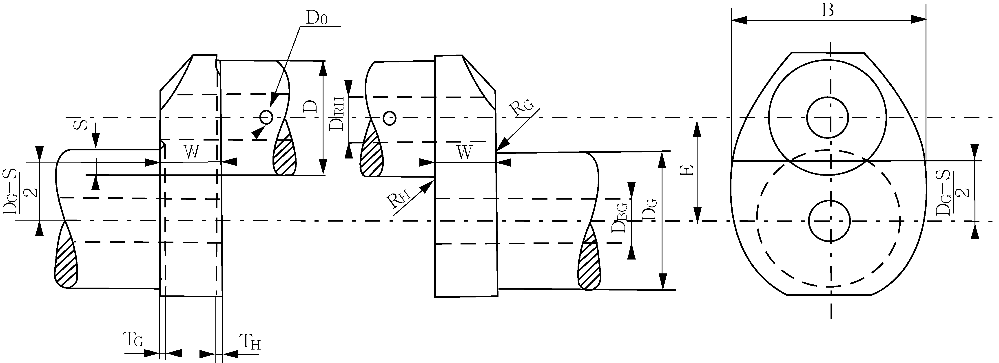
  **그림 5 응력집중계산에 필요한 크랭크 치수**
- **(사)** 기호의 의미는 다음과 같다.
  $D$ : 크랭크핀 지름 ($\mathrm{mm}$)
  $D _{RH}$ : 크랭크핀에 있는 축방향 구멍의 지름 ($\mathrm{mm}$)
  $D _{O}$ : 크랭크핀 오일구멍의 지름 ($\mathrm{mm}$)
  $R _{H}$ : 크랭크핀 필릿부의 반지름 ($\mathrm{mm}$)
  $T _{H}$ : 크랭크핀 필릿부의 리세스 ($\mathrm{mm}$)
  $D _{G}$ : 크랭크저널의 지름 ($\mathrm{mm}$)
  $D _{BG}$ : 크랭크저널에 있는 축방향 구멍의 지름 ($\mathrm{mm}$)
  $R _{G}$ : 크랭크저널 필릿부의 반지름 ($\mathrm{mm}$)
  $T _{G}$ : 크랭크저널 필릿부의 리세스 ($\mathrm{mm}$)
  $E$ : 크랭크핀의 편심 ($\mathrm{mm}$)
  $S$ : 크랭크핀과 저널의 오버랩 ($\mathrm{mm}$)
  $S = \frac{D+D _{G}}{2} -E$
  $W$ : 암의 두께 web thickness ($\mathrm{mm}$)
  $B$ : 암의 폭 web width ($\mathrm{mm}$)
  2행정 반조립형 크랭크축의 경우, 암의 두께와 폭은 다음과 같다.
  - $T _{H}$ > $R _{H}$인 경우, 암의 두께($W$)는 다음과 같아야 한다.
  $W _{red =} W- \left( T _{H} -R _{H} \right)$ (**그림 3** 참조)
  - 암의 폭($B$)은 **그림 3**에 따라 크랭크핀 필릿부의 반지름 중심 근처이어야 한다.
  다음의 상대치수는 응력집중계수의 계산에 적용한다.

  | 크랭크핀 필릿부 | 크랭크저널 필릿부 |
  | --- | --- |
  | $r = R _{H} /D$ (0.03 ≤ $r$ ≤ 0.13) | $r = R _{G} /D$ (0.03 ≤ $r$ ≤ 0.13) |
  | $s = S/D$ ($s$ ≤ 0.5) |   |
  | $w = W/D$ (0.2 ≤ $w$ ≤ 0.8) (오버랩 부분이 있는 크랭크축) $W _{red} /D$ (0.2 ≤ $w$ ≤ 0.8) (오버랩 부분이 없는 크랭크축) |   |
  | $b = B/D$ (1.1 ≤ $b$ ≤ 2.2) |   |
  | $d _{o } = D _{O} /D$ (0 ≤ $d _{O}$ ≤ 0.2) |   |
  | $d _{G } = D _{BG} /D$ (0 ≤ $d _{G}$ ≤ 0.8) |   |
  | $d _{H } = D _{BH} /D$ (0 ≤ $d _{H}$ ≤ 0.8) |   |
  | $t _{H } = T _{H} /D$ |   |
  | $t _{G } = T _{G} /D$ |   |
- **(아)** 다음의 경우, $s$의 저범위는 음(-)의 값을 증가시키기 위해 아래로 연장할 수 있어야 한다.
  - **(a)** 계산된 $f$(recess)값이 1보다 작아서 계수 $f$(recess)를 사용하지 못하는 경우 ($f$(recess)=1)
  - **(b)** $s$값이 -0.5보다 작아서 $f$($s$, $w$) 및 $f$($r$, $s$)는 $s$의 실제 값을 -0.5로 교체하여 구하여야 하는 경우

#### (2) 크랭크핀 필릿부의 응력집중계수

- **(가)** 굽힘에 대한 응력집중계수($\alpha _{B}$)는 다음 식으로 계산한다.
  $\alpha _{B} =2.6914 \cdot f(s,w) \cdot f(w) \cdot f(b) \cdot f(r) \cdot f(d _{G} ) \cdot f(d _{H} ) \cdot f(\mathrm{recess})$
  $f(s,w) = -4.1883+29.2004 \cdot w-77.5925 \cdot w ^{2} +91.9454 \cdot w ^{3} -40.0416 \cdot w ^{4}$
  $+(1-s) \cdot (9.5440-58.3480 \cdot w+159.3415 \cdot w ^{2} -192.5846 \cdot w ^{3} +85.2916 \cdot w ^{4} )$
  $+(1-s) ^{2} \cdot (-3.8399+25.0444 \cdot w-70.5571 \cdot w ^{2} +87.0328 \cdot w ^{3} -39.1832 \cdot w ^{4} )$
  $f(w)=2.1790 \cdot w ^{0.7171}$
  $f(b)=0.6840-0.0077 \cdot b+0.1473 \cdot b ^{2}$
  $f(r)=0.2081 \cdot r ^{-0.5231}$
  $f(d _{G} )=0.9993+0.27 \cdot d _{G} -1.0211 \cdot d _{G} ^{2} +0.5306 \cdot d _{G} ^{3}$
  $f(d _{H} )=0.9978+0.3145 \cdot d _{H} -1.5241 \cdot d _{H} ^{2} +2.4147 \cdot d _{H} ^{3}$
  $f(\mathrm{recess} it)=1+(t _{H} +t _{G} ) \cdot (1.8+3.2 \cdot s)$
- **(나)** 비틀림에 대한 응력집중계수($\alpha _{T}$)는 다음 식으로 계산한다.
  $\alpha _{T} =0.8 \cdot f(r,s) \cdot f(b) \cdot f(w)$
  $f(r,s)=r ^{-0.322+0.1015(1-s)}$
  $f(b)=7.8955-10.654 \cdot b+5.3482 \cdot b ^{2} -0.85 \cdot b ^{3}$
  $f(w)=w ^{-0.145}$

#### (3) 크랭크저널 필릿부의 응력집중계수 (반조립형 크랭크축은 적용하지 않음)

- **(가)** 굽힘에 의한 응력집중계수($\beta _{B}$)는 다음 식으로 계산한다.
  $\beta _{B} =2.7146 \cdot f _{B} (s,w) \cdot f _{B} (w) \cdot f _{B} (b) \cdot f _{B} (r) \cdot f _{B} (d _{G} ) \cdot f _{B} (d _{H} ) \cdot f(\mathrm{recess})$
  $f _{B} (s,w) = -1.7625+2.9821 \cdot w-1.527 \cdot w ^{2} +(1-s) \cdot (5.1169-5.8089 \cdot w+3.1391 \cdot w ^{2} )$
  $+(1-s) ^{2} \cdot (-2.1567+2.3297 \cdot w-1.2952 \cdot w ^{2} )$
  $f _{B} (w)=2.2422 \cdot w ^{0.7548}$
  $f _{B} (b)=0.5616+0.1197 \cdot b+0.1176 \cdot b ^{2}$
  $f _{B} (r)=0.1908 \cdot r ^{-0.5568}$
  $f _{B} (d _{G} )=1.0012-0.6441 \cdot d _{G} +1.2265 \cdot d _{G} ^{2}$
  $f _{B} (d _{H} )=1.0022-0.1903 \cdot d _{H} +0.0073 \cdot d _{H} ^{2}$
  $f(\mathrm{recess}) it=1+(t _{H} +t _{G}) \cdot (1.8+3.2 \cdot s)$
- **(나)** 반지름방향 힘으로 인한 압축에 대한 응력집중계수($\beta _{Q}$)는 다음 식으로 계산한다.
  $\beta _{Q} =3.0128 \cdot f _{Q} (s) \cdot f _{Q} (w) \cdot f _{Q} (b) \cdot f _{Q} (r) \cdot f _{Q} (d _{H} ) \cdot f(\mathrm{recess})$
  $f _{Q} (s)=0.4368+2.1630 \cdot (1-s)-1.5212 \cdot (1-s) ^{2}$
  $f _{Q} (w)= \frac{w}{0.0637+0.9369 \cdot w}$
  $f _{Q} (b) = -0.5+b$
  $f _{Q} (r)=0.5331 \cdot r ^{-0.2038}$
  $f _{Q} (d _{H} )=0.9937-1.1949 \cdot d _{H} +1.7373 \cdot d _{H} ^{2}$
  $f(\mathrm{recess})it=1+(t _{H} +t _{G}) \cdot (1.8+3.2 \cdot s)$
- **(다)** 비틀림에 대한 응력집중계수($\beta _{T}$) 는 다음 식으로 계산한다.
  - **(a)** 크랭크핀과 저널의 지름 및 필릿부 반지름이 동일한 경우
    $\beta _{T} = \alpha _{T}$
  - **(b)** 크랭크핀과 저널의 지름 및 필릿부 반지름이 다른 경우
    $\beta _{T} =0.8 \cdot f(r,s) \cdot f(b) \cdot f(w)$
    $f(r,s)$, $f(b)$ 및 $f(w)$는 3항 (2)호와 같다. 다만, 저널 필릿부의 반지름은 다음 식으로 계산한다.
    $r= \frac{R _{G}}{D _{G}}$
- **(라)** 크랭크핀 오일구멍 출구의 응력집중계수
  - **(a)** 굽힘에 대한 응력집중계수($\gamma _{B}$)는 다음 식으로 계산한다.
    $\gamma _{B} =3-5.88 \cdot d _{O} +34.6 \cdot d _{O} ^{2}$
  - **(b)** 비틀림에 대한 응력집중계수($\gamma_T$)는 다음 식으로 계산한다.
    $\gamma _{T} =4-6 \cdot d _{O} +30 \cdot d _{O} ^{2}$

### 4. 부가굽힘응력

#### (1) 종진동 및 횡진동 뿐만 아니라 베드 플레이트의 변형 및 미스 얼라인먼트로 인한 굽힘응력을 고려하여 필릿부의 변동굽힘응력(_s2, _s2)에 다음의 표에 주어진 부가굽힘응력(_s2)를 가한다.

| 기관 형식 | $\sigma _{add}$ ($\mathrm{N}/mm ^{2}$) |
| --- | --- |
| 크로스헤드 기관 | ± 30 |
| 트렁크피스톤 기관 | ± 10 |
| (비고) (1) ± 30 $\mathrm{N}/mm ^{2}$의 부가응력은 다음 2개의 성분으로 구성된다. 1) 종진동으로 인한 ± 20 $\mathrm{N}/mm ^{2}$의 부가응력 2) 베드 플레이트의 변형 및 미스 얼라인먼트로 인한 ± 10 $\mathrm{N}/mm ^{2}$의 부가응력 |   |

#### (2) 전체 동적 계(기관/축계/동력전달장치/프로펠러)의 종진동 계산결과를 이용할 수 없는 경우에는 평가를 위한 종진동성분으로 ± 20 _s2의 값을 사용하는 것이 바람직하다.

#### (3) 전체 동적 계의 종진동 계산결과를 이용할 수 있는 경우에는 그 결과치를 사용할 수 있다.

### 5. 등가변동응력

#### (1) 일반사항

- **(가)** 필릿부의 경우, 굽힘 및 비틀림 하중은 굽힘 및 비틀림 응력이 시간의 위상을 이루고 해당하는 최대값은 동일한 장소에서 발생한다는 추가 가정 하에 Von Mises 등가응력에 의해 설명될 수 있는 2개의 서로 다른 복수의 축방향 응력장으로 유도된다(**부속서 I** 참조). 결론적으로 등가변동응력은 주응력설(Von Mises criterion)을 이용하여 저널 필릿부 뿐만 아니라 크랭크핀 필릿부용으로 계산되어야 한다.
- **(나)** 오일구멍 출구의 경우, 굽힘 및 비틀림 하중은 굽힘 및 비틀림 응력이 시간의 위상을 이룬다는 가정 하에 이들 두 응력장의 조합으로 인한 최대 주응력과 동등한 등가 주응력에 의해 설명될 수 있는 2개의 서로 다른 응력장으로 유도된다(**부속서 II** 참조).
- **(다)** 등가응력평가에 대한 상기 2개의 서로 다른 방법은 주응력설(Von Mises criterion)에 따라 평가된 크랭크축의 동일한 피로강도값과 비교할 수 있는 응력으로 유도된다.

#### (2) 크랭크핀 필릿부의 등가변동응력은 다음 식으로 계산한다.

$\sigma _{v} = ± \sqrt {( \sigma _{BH} + \sigma _{add} ) ^{2} +3 \cdot \tau _{H} ^{2}}$

#### (3) 크랭크저널 필릿부의 등가변동응력은 다음 식으로 계산한다.

$\sigma _{v} = ± \sqrt {( \sigma _{BG} + \sigma _{add} ) ^{2} +3 \cdot \tau _{G} ^{2}}$

#### (4) 크랭크핀 오일구멍 출구의 등가변동응력은 다음 식으로 계산한다.

$\sigma _{V} =± \frac{1}{3} \sigma _{BO} \cdot \left[ 1+2 \sqrt {1+ \frac{9}{4} \left( \frac{\sigma _{T0}}{\sigma _{BO}} \right) ^{2}} \right]$

### 6. 피로강도

#### (1) 크랭크핀 지름의 피로강도

크랭크핀 지름의 피로강도($\sigma _{DW}$)는 다음 식으로 계산한다.

#### (2) 크랭크저널 지름의 피로강도 (2018)

- **(가)** 크랭크저널 지름의 피로강도($\sigma _{DW}$)는 다음 식으로 계산한다.
  $\sigma _{DW} =±K \cdot (0.42 \cdot \sigma _{B} +39.3) \cdot \left[ 0.264+1.073 \cdot D _{G} ^{-0.2} + \frac{785- \sigma _{B}}{4900} + \frac{196}{\sigma _{B}} \cdot \sqrt {\frac{1}{R _{G}}} \right]$
  $\sigma _{DW}$ : 크랭크축의 허용피로강도 ($\mathrm{N}/mm ^{2}$)
  $K$ : 표면처리를 하지 않은 크랭크축의 제조방법에 따른 계수로서 1보다 큰 값은 필릿부에서의 피로강도에만 적용한다.
  = 1.05 (C.G.F.단조 또는 낙하단조)
  = 1.0 (C.G.F.를 하지 않은 자유단조)
  필릿부 면적에서 냉간압연처리를 한 주강품에 대한 계수
  = 0.93 (우리 선급의 승인된 냉간압연공정을 이용하여 제조된 주강품)
  $\sigma _{B}$ : 크랭크축 재료의 규격최소인장강도 ($\mathrm{N}/mm ^{2}$)
  기타의 파라미터는 **3**항 (1)호를 참조할 것. 다만, $R _{H}$, $R _{G}$ 및 $R _{X}$는 2 $\mathrm{mm}$ 이상으로 한다.
- **(나)** 표면처리공정을 적용할 경우에는 우리 선급의 승인을 받아야 한다. 표면처리된 필릿부 및 오일구멍 출구 계산에 대한 지침은 **부속서 V**에서 제시한다.
- **(다)** 필릿부의 표면, 오일구멍의 출구 및 오일구멍의 내부(최소한 오일구멍 지름의 1.5배에 상당하는 깊이까지)는 매끈하게 마무리해야 한다.

#### (3) 대체방법으로써 크랭크축의 피로강도는 풀사이즈 크랭크 스로우(또는 크랭크축) 또는 풀사이즈 크랭크 스로우로부터 얻은 시험편에 기초를 둔 실험에 의해 구할 수도 있다. 시험 결과의 평가는 부속서 IV를 참조한다.

### 8. 반조립형 크랭크축의 수축끼워맞춤에 대한 계산

#### (1) 일반사항

- **(가)** 수축끼워맞춤에 대한 계산을 위해 필요한 크랭크의 모든 치수는 **그림 6**에서 보여주고 있다.
  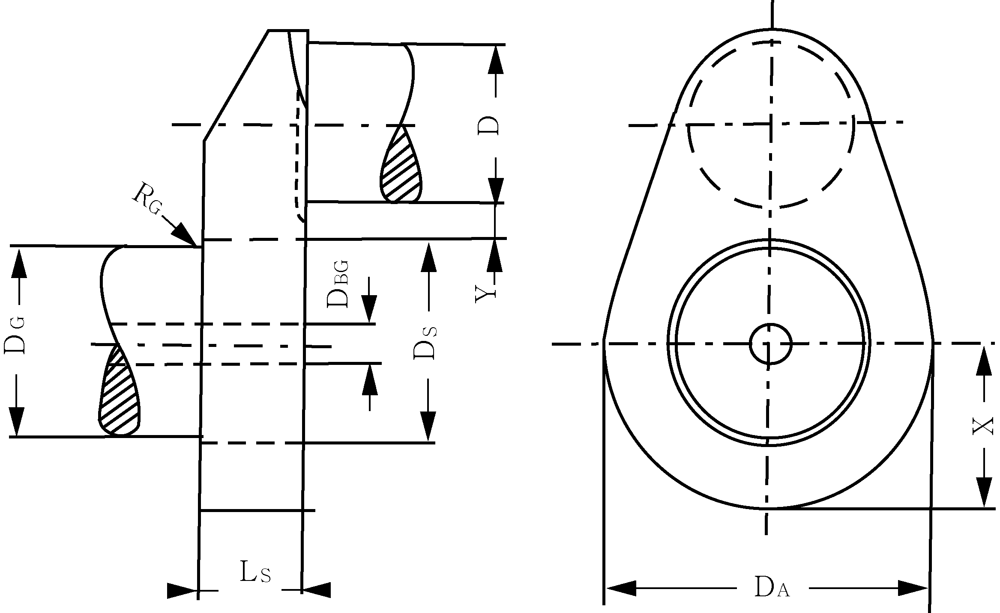
  **그림 6 반조립형 크랭크축의 크랭크 스로우**
- **(나)** 기호 설명은 다음과 같다.
  $D _{A}$ : 암의 바깥지름 또는 저널의 중심선과 암의 바깥선 사이의 최소거리 $X$의 2배 중 작은 것 ($\mathrm{mm}$)
  $D _{S}$ : 수축지름 ($\mathrm{mm}$)
  $D _{G}$ : 저널지름 ($\mathrm{mm}$)
  $D _{BG}$ : 크랭크저널에서 축방향 구멍의 지름 ($\mathrm{mm}$)
  $L _{S}$ : 수축끼워맞춤 길이 ($\mathrm{mm}$)
  $R _{G}$ : 크랭크저널 필릿부의 반지름 ($\mathrm{mm}$)
  $Y$ : 크랭크저널과 핀의 인접하는 선 사이의 거리 ($\mathrm{mm}$)
  - $Y \geq 0.05 \cdot D _{S}$
  - $Y<0.1 \cdot D _{S}$인 경우에는 크랭크핀 필릿부의 피로강도면에서 수축끼워맞춤으로 인한 응력의 영향을 특별히 고려하여야 한다.
- **(다)** 저널부터 수축지름까지 곡면부분의 반지름은 $R _{G} \geq 0.015 \cdot D _{G}$ 과 $R _{G} \geq 0.5 \cdot \left( D _{S} -D _{G} \right)$ 중에서 큰 값을 사용하여야 한다.
- **(라)** 수축끼워맞춤의 실제 오버사이즈($Z$)는 **8**항 (3)호 및 (4)호에 따라 계산된 $Z _{\min}$과 $Z _{\max}$의 제한값 내에 있어야 한다.
- **(마)** **8**항 (2)호의 조건을 이행할 수 없는 경우, $Z _{\min}$과 $Z _{\max}$의 계산 방법(**8**항 (3)호 및 (4)호)은 다중영역-유연성 문제(multizone-plasticity problems)로 인해 적용하지 못한다. 그러한 경우, $Z _{\min}$과 $Z _{\max}$은 FEM 계산에 기초하여 구하여야 한다.

#### (2) 저널핀의 최대허용구멍

- **(가)** 저널핀의 최대허용구멍지름($D _{BG}$)은 다음 식으로 계산한다.
  $D _{BG} =D _{S} \cdot \sqrt {1- \frac{4000 \cdot S _{R} \cdot M _{\max}}{\mu \cdot \pi \cdot D _{S} ^{2} \cdot L _{S} \cdot \sigma _{sp}}}$
  $S _{R}$ : 슬립에 대한 안전계수로서 실험에 의해 자료로 제출되지 않는 한, 2 이상의 값으로 한다.
  $M _{\max}$ : **2**항 (2)호 (가)에 따른 토크의 최대 절대값($M _{T _{\max}}$) ($\mathrm{N} \cdot m$)
  $\mu$ : 정적 마찰계수로서 실험에 의해 자료로 제출되지 않는 한, 0.2 이하의 값으로 한다.
  $\sigma _{SP}$ : 저널핀에 대한 재료의 규격최소항복강도 ($\mathrm{N}/mm ^{2}$)
- **(나)** 이러한 조건은 저널핀의 구멍에서 유연성을 피하는데 사용된다.

#### (3) 수축끼워맞춤에 필요한 최소 오버사이즈

최소 오버사이즈($Z _{\min}$)는 다음 식으로 구한 값 중에서 큰 것으로 한다.

#### (4) 수축끼워맞춤의 최대 허용오버사이즈

- **(가)** 최대허용오버사이즈($Z _{\max}$)는 다음 식으로 계산한다.
  $Z _{\max} \leq D _{S} \cdot \left( \frac{\sigma _{SW}}{E _{m}} + \frac{0.8}{1000} \right)$
- **(나)** 이러한 조건은 필릿부에서 수축을 유발하는 평균응력을 제한하는데 사용된다.

### <부속서 III 유한요소해석법을 사용한 크랭크축 암 필릿부의 응력집중계수 계산>

#### 1. 일반

- **(1)** 이 해석의 목적은 크랭크축 암 필릿부에서 분석적으로(analytically) 계산된 응력집중계수에 대한 대체방법으로서 유한요소해석법(FEM)을 사용하여 계산하기 위한 것이다. 분석적 방법은 다양한 크랭크 형상에 대한 스트레인 게이지 측정으로 개발된 경험식에 기초한 것이다. 따라서 이러한 경험식의 적용은 특정 형상에만 국한된다.
- **(2)** 이 부속서에 따라 계산된 응력집중계수는 저널 및 핀 필릿부의 공칭응력과 유한요소해석법에 의하여 계산된 응력의 비율로 정의한다. 기존의 응력집중계수 계산방법 또는 이 부속서의 유한요소해석법에 의한 계산방법과 연계하여 사용될 경우, 굽힘에 의한 폰미세스 응력(von Mises stresses)이 계산되어야 하고 비틀림에 의한 주응력(principle stress)이 계산되어야 한다.
- **(3)** 이 부속서의 평가지침 및 절차는 일체형 크랭크 및 반조립형 크랭크(저널 필릿부 제외)에 적합하다.
- **(4)** 선형탄성 유한요소해석법에 의하여 해석이 수행되어야 하고 모든 하중조건에서 적당한 크기의 단위 하중이 적용되어야 한다.
- **(5)** 오일구멍에서의 응력집중계수 계산은 이부속서에 포함되지 않는다.
- **(6)** 단순 형상의 모델링에 의한 것과 단순 굽힘 및 비틀림에 대한 해석결과를 갖는 유한요소해석법으로 구해진 응력을 비교하는 것에 따라 유한요소해석법 요소 정확도를 확인하는 것이 필요하다.
- **(7)** 유한요소해석법(FEM) 대신에 경계요소해석법(BEM)을 사용할 수 있다.

#### 2. 모델 요건

- **(1)** 격자 요소에 대한 권고사항
  격자품질 기준을 충족하기 위하여 다음 권고사항에 따라 응력집중계수의 평가를 위한 유한요소 모델을 구성하는 것이 권고된다.
  - **(가)** 주베어링 중심선에서 반대편 주베어링 중심선까지 단일의 완전한 크랭크로 구성된 모델
  - **(나)** 필릿부에 사용된 요소의 형식
    - **(a)** 10 절점 사면체 요소
    - **(b)** 8 절점 육면체 요소
    - **(c)** 20 절점 육면체 요소
  - **(다)** 필릿 반지름에서 격자 특성.
    다음 (라) 및 (마)는 크랭크 평면에서 원주방향으로 ±90°에 적용한다.
  - **(라)** 원주방향 필릿부 전체에 걸쳐서 최대 요소 크기 a는 r/4로 한다. 20 절점 육면체 요소를 사용할 경우, 원주방향에서의 요소 크기는 5a까지 확대될 수 있다. 다중 반지름 필릿인 경우 r은 국부 필릿부 반지름으로 한다(8절점 육면체 요소가 사용된다면, 품질 기준을 만족하기 위하여 훨씬 작은 요소 크기가 요구된다).
  - **(마)** 필릿부 깊이 방향에서의 요소 크기에 대한 권고방법
    - **(a)** 첫 번째 층의 두께 : 요소 크기 a와 동일
    - **(b)** 두 번째 층의 두께 : 요소 크기 2a와 동일
    - **(c)** 세 번째 층의 두께 : 요소 크기 3a와 동일
  - **(바)** 암 두께 방향으로 최소 6개의 요소
  - **(사)** 일반적으로 크랭크 이외의 부분은 해결방법의 수치적 안정성에 대하여 적절하여야 한다.
  - **(아)** 평형추(counter-weights)는 크랭크의 전체 강성에 현저하게 영향을 줄 경우에 한하여 모델링되어야 한다.
  - **(자)** 오일 구멍은 전체적 강성에 미치는 영향이 무시할만 하고 필릿부까지의 근접거리가 2r보다 크면 모델링이 필요하지 않다(**그림 7** 참조).
  - **(차)** 중량 경감를 위한 구멍은 모델링하여야 한다.
  - **(카)** 소프트웨어 요건이 충족될 경우 서브-모델링(sub-modeling)을 사용할 수 있다.
    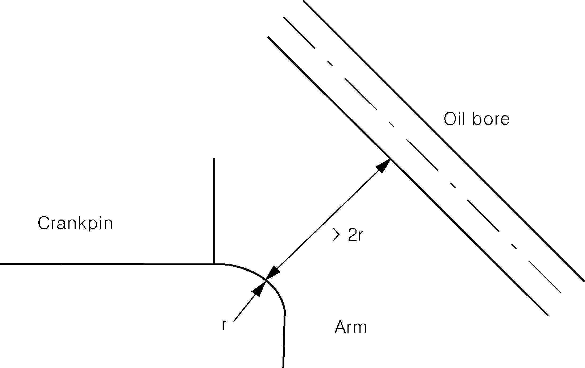
    **그림 7 오일 구멍에서 필릿부까지 근접거리**
- **(2)** 재료
  부록 5-3에서는 영계수($E$) 및 포아송비($v$)와 같은 재료 특성은 고려하지 않는다. 유한요소 해석에서는 변형률이 제일 먼저 계산되고 영계수 및 포아송비를 사용하여 변형률로부터 응력이 유도되기 때문에 이러한 재료계수가 필요하다.
  문헌에서 인용되거나 대표적인 재료 샘플에서 측정된 것과 같은 신뢰할 수 있는 재료계수 값이 사용되어야 한다. 강에 대한 영계수 $E$ = 2.05 × 10^5 MPa, 포아송비 $v$ = 0.3이 권고된다.
- **(3)** 격자 요소 품질 기준
  실제의 격자 요소는 응력집중계수 평가를 위하여 검토된 영역에서 다음 기준의 어느 것에 만족하지 못할 경우, 세분화된 격자로 2차 계산을 수행하여야 한다.
  - **(가)** 주응력 기준
    격자의 품질은 필릿부 반지름 표면의 통상적인 응력 구성요소의 확인에 의하여 보증되어야 한다. 이상적으로는 이 응력은 0이 되어야 한다. 주응력 $\sigma _{1}$, $\sigma _{2}$및 $\sigma _{3}$에 대하여 다음 기준이 요구된다.
    $\min( \left| \sigma _{1} \right| , \left| \sigma _{2} \right| , \left| \sigma _{3} \right| )<0.03 \cdot \max( \left| \sigma _{1} \right| , \left| \sigma _{2} \right| , \left| \sigma _{3} \right| )$
  - **(나)** 평균/비평균(Averaged/unaveraged) 응력 기준
    응력집중계수의 계산을 위한 필릿부에서 요소에 걸쳐 응력의 불연속성을 관찰하는 것을 기초로 한다. 한 절점에 연결된 각 요소로부터 계산된 비평균 절점응력(nodal stress)은 검토되는 위치에서 이 절점에서의 100 % 평균 절점응력과의 차이는 5 % 미만이어야 한다.

#### 3. 하중 조건

부록 5-3에서 분석적으로 결정된 응력집중계수를 대체하기 위하여 다음 하중 조건으로 계산되어야 한다.

- **(1)** 비틀림
  FVV에서 만든 조사용 시험장비와 유사한 조건으로 **그림 8**과 같이 단순 비틀림을 가한다. 모델 한쪽 끝단면에서 면의 뒤틀림을 구속한다. 크랭크축의 중심 절점에 토크를 적용한다. 이 절점은 6 자유도를 갖는 주절점(master node)으로 가정하고 끝단면의 모든 절점에 견고하게 연결한다. 경계 및 하중 조건은 직렬 및 V형 기관에 유효하다.
  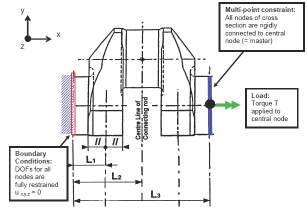
  **그림 8 비틀림 하중에서 경계 및 하중 조건**
  저널 및 크랭크에 있는 모든 절점에 대하여 주응력을 구하고 등가의 비틀림 응력을 계산한다.
  $\tau _{equi v} = \max \left( \frac{\left| \sigma _{1} - \sigma _{2} \right|}{2} , \frac{\left| \sigma _{2} - \sigma _{3} \right|}{2} , \frac{\left| \sigma _{1} - \sigma _{3} \right|}{2} \right)$
  이어서 응력집중계수의 최대값을 다음과 같이 계산한다.
  $\alpha _{T} = \frac{\tau _{equi v, \alpha }}{\tau _{N}}$
  $\beta _{T} = \frac{\tau _{equi v, \beta }}{\tau _{N}}$
  여기서,
  $\tau _{N}$ : 비틀림 토크 $T$가 작용할 때 **부록 5-3**의 **2**항 (2)호에 따른 크랭크핀 및 저널의 공칭 비틀림 응력
  $\tau _{N} = \frac{T}{W _{P}}$
- **(2)** 단순 굽힘(4점 굽힘)
  FVV에서 만든 조사용 시험장비와 유사한 조건으로 **그림 9**와 같이 단순 굽힘을 가한다. 모델 한쪽 끝단면에서 면의 뒤틀림을 구속한다. 크랭크축의 중심 절점에 굽힘모멘트를 적용한다. 이 절점은 6 자유도를 갖는 주절점(master node)으로 가정하고 끝단면의 모든 절점에 견고하게 연결한다. 경계 및 하중 조건은 직렬 및 V형 기관에 유효하다.
  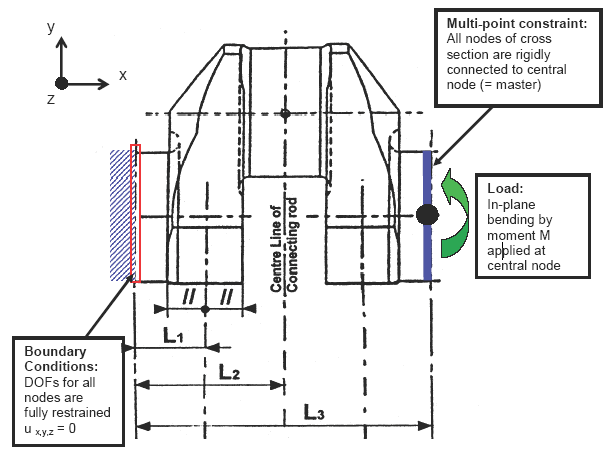
  **그림 9 단순 굽힘 하중에서 경계 및 하중 조건**
  저널과 크랭크핀 필릿부의 모든 절점에서 폰미세스 등가응력 $\sigma _{equi v _{}}$가 구해진다. 다음 식에서 응력집중계수를 구하기 위하여 그 최대값을 사용한다.
  $\alpha _{B} = \frac{\sigma _{ equi v, \alpha }}{\sigma _{N}}$
  $\beta _{B} = \frac{\sigma _{equi v, \beta }}{\sigma _{N}}$
  공칭응력 $\sigma _{N} _{}$는 굽힘응력 M으로 **부록5-3**의 **2**항 (1)호 (나)의 (b)에 따라 계산된다.
  $\sigma _{N} = \frac{M}{Weqw}$
- **(3)** 전단력을 동반한 굽힘(3점 굽힘)
  - **(가)** 이 하중 조건은 저널 필릿부에 대하여 단순 횡방향힘(radial force. $\beta _{Q _{}}$)에 대한 응력집중계수를 결정하기 위하여 계산된다.
  - **(나)** FVV에서 만든 조사용 시험장비와 유사한 조건으로 **그림 10**과 같이 3점 굽힘을 가한다. 모델 양쪽 끝단면에서 면의 뒤틀림을 구속한다. 모든 절점은 중심 절점에 견고하게 연결된다. 경계 조건은 중심 절점에 적용된다. 이 절점은 6 자유도를 갖는 주절점(master node)으로 작용한다.
  - **(다)** 힘은 연접봉의 핀 중심선의 중심 절점에 작용한다. 이 절점은 핀 단면의 모든 절점에 연결된다. 단면의 뒤틀림은 구속하지 않는다.
  - **(라)** 경계 및 하중 조건은 직렬 및 V형 기관에 유효하다. V형 기관은 단일의 연접봉 힘만으로 모델을 만들 수 있다. 2개의 연접봉 힘의 사용은 응력집중계수에 있어서 현저한 변화가 없어야 한다.
  - **(마)** 저널 필릿부에서 최대등가 폰미세스응력(von Mises stress) $\sigma _{3P} _{{} _{{} _{}}}$을 평가한다. 그 저널 필릿부에서 응력집중계수는 다음과 같이 2가지 방법으로 결정할 수 있다.
    이 평가 방법은 FVV와 유사하다. 3점 및 4점 굽힘의 결과는 다음과 같이 조합된다.
    $\sigma _{3P} _{{} _{{} _{}}} = \sigma _{N3P} \cdot \beta _{B} + \sigma _{Q3P} \cdot \beta _{Q}$
    여기서,
    $\sigma _{3P} _{{} _{{} _{}}}$ : 유한요소 계산에 의한다.
    $\sigma _{N3P _{{} _{{} _{}}}}$ : 실제 연접봉의 중심선에 작용하는 힘 $F _{3P _{{} _{{} _{}}}}$[N]에 의한 암 중심에서의 공칭 굽힘 응력 (**그림 11** 참조)
    $\beta _{B}$ : (2)호에 따른다.
    $\sigma _{Q3P} =Q _{3P} /(B.W)$,
    여기서,
    $Q _{3P}$ : 실제 연접봉의 중심선에 작용하는 힘$F _{3P _{{} _{{} _{}}}}$[N]에 의한 암에서의 반지름방향 힘(전단력) (**부록 5-3**의 **그림 1** 및 **그림 2** 참조)
    이 평가 방법은 FVV와 다르다. 2개의 베어링에 의하여 지지되는 단일의 크랭크 스로우를 갖는 정정계에서는 굽힘모멘트와 반지름방향 힘(전단력)은 비례한다. 그러므로 저널 필릿부 응력집중계수는 3점 굽힘 유한요소해석법으로 직접 구할 수 있다. 이어서 응력집중계수는 다음 식에 따라 계산 한다.
    $\beta _{BQ} = \frac{\sigma _{3P}}{\sigma _{N3P}}$
    기호는 (a) 참조.
    이 방법을 사용하면 **부록5-3**에서 반지름방향 힘과 응력 결정은 필요하지 않다. 이어서 저널 필릿부의 교번굽힘응력을 **부록 5-3**의 **2**항 (1)호의 (다)에 따라 평가한다.
    $\sigma _{BG} = ± \left| \beta _{BQ} \cdot \sigma _{BFN} \right|$
    주 : 이 방법은 크랭크핀 필릿부에는 적용하지 않는다. 그리고 이 응력집중계수는 **부록 5-3**에 따른 정정계 이외의 계산 방법과 연계하여 사용하여서는 아니 된다.
    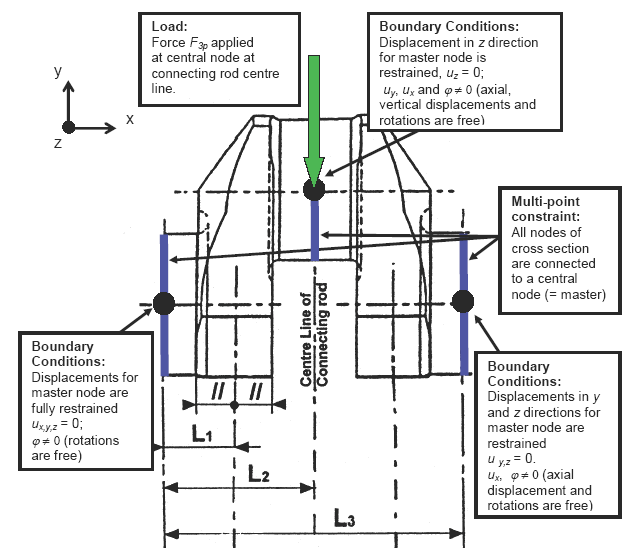
    **그림 10 직렬 기관에서 3점 굽힘 하중의 경계 및 하중 조건**
    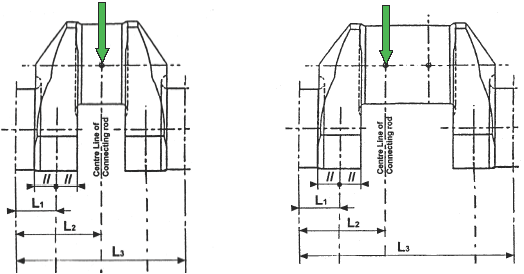
    **그림 11 직렬 및 V형 기관에서 하중 작용**
    - **(a)** 방법 1
    - **(b)** 방법 2

### <부속서 IV 피로시험의 평가> (2018)}

#### 1. 소개

피로시험은 작은 시험편 시험 및 풀사이즈 크랭크 스로우 시험의 두 주요 그룹으로 분류할 수 있다. 시험은 계단식 방법 또는 이 부속서에서 제시된 수정된 버전의 방법으로 실시할 수 있다. 또한 다른 통계적 평가 방법을 적용할 수 있다.

- **(1)** 작은 시험편 시험
  - **(가)** 필릿부에 표면처리가 없는 크랭크축의 경우 피로강도는 풀사이즈 크랭크 스로우로부터 채취된 작은 시험편의 시험으로 결정할 수 있다. 필릿부 부근의 다른 영역이 필릿부에 잔류응력을 발생시키는 표면처리가 된 경우 상기 접근법은 적용할 수 없다.
  - **(나)** 상기 접근법의 한가지 장점은 제작할 수 있는 시험편이 다소 많다는 것이다. 또 다른 장점은 상이한 응력비 및/또는 상이한 모드(예를 들면, 축하중, 굽힘, 비틀림, 노치가 있는, 노치가 없는)로 시험을 할 수 있다는 것이다. 이는 임계면 기준과 함께 사용된 재료 데이터의 평가를 요구한다.
- **(2)** 풀사이즈 크랭크 스로우 시험
  표면처리된 크랭크축의 경우 피로강도는 풀사이즈 크랭크 스로우 시험을 통해서만 결정될 수 있다. 비용상의 이유로 적은 수의 크랭크 스로우가 시험된다. 하중은 3 또는 4점 굽힘 배치에서 유압작동기에 의하여 또는 공진 시험 장비에서 여진기에 의하여 가해질 수 있다. 후자는 응력비를 $R=-1$로 보통 제한하기는 하지만 자주 사용된다.

#### 2. 시험 결과의 평가

- **(1)** 원칙
  - **(가)** 피로시험 이전에 크랭크축은 품질관리절차에 의한 요구(예를 들면, 화학성분, 기계적 성질, 표면경도, 경화 깊이 및 확장, 필릿부 표면처리 등)에 따라 시험되어야 한다.
  - **(나)** 시험 샘플은 허용 범위의 하단을 대표하도록 준비되어야 한다.(예를 들면, 고주파경화된 크랭크축의 경우 낮은 범위의 허용 경화 깊이, 필릿부를 통과하는 최단 확장 등을 의미한다.) 그렇지 않은 경우 테스트 결과 평균값은 신뢰구간으로 보정되어야 한다.(90 % 신뢰구간은 표본평균과 표준편차 모두에 사용될 수 있다.)
  - **(다)** **부록 5-3**이 적용된 경우 시험 결과는 상기 90 % 신뢰구간을 고려하여 또는 고려하지 않고 평균 피로강도를 나타내기 위하여 평가되어야 한다. 표준편차는 90 % 신뢰를 참작하여 고려되어야 한다. 그 후에 피로강도로 사용되는 결과는 평균 피로강도에서 1 표준편차를 뺀 것이 된다.
  - **(라)** 평가가 정적 기계적 성질 및 피로강도 사이의 관계를 찾을 것을 목적으로 하는 경우 관계는 특정 최소 성질이 아니라 측정된 실제 기계적 성질에 근거한 것이어야 한다.
  - **(마)** **2**항 (4)호에 제시된 계산기법은 원래의 계단식 방법을 위하여 개발되었다. 다만 수정된 계단식 방법 전용의 유사한 방법이 없기 때문에 양자에 동일 적용된다.
- **(2)** 계단식 방법(staircase method)
  - **(가)** 원래의 계단식 방법에서 첫 번째 시험편은 예상 평균 피로강도에 해당하는 응력을 받는다. 시험편이 $10 ^{7}$ 사이클에 생존하면 폐기되고 다음 시험편은 이전 시험편 보다 한 단계 증가한 응력을 받게 된다. 즉, 항상 이전 시험편보다 한 단계 증가한 응력을 사용한 다음 시험편이 생존 시험편 뒤를 따른다. 응력 증가량은 표준편차의 예상 수준에 상응하여 선택되어야 한다.
  - **(나)** 시험편이 $10 ^{7}$ 사이클 이전에 파손된 경우 얻어진 사이클수를 기록하고 다음 시험편이 이전 시험편 보다 한 단계 낮은 응력을 받게 한다. 이러한 접근법은 파손 및 런아웃 시험편의 합이 시험편의 수와 같게 된다.
  - **(다)** 원래의 계단식 방법은 많은 수의 시험편을 이용 가능할 경우에만 적합하다. 시뮬레이션을 통해 계단식 시험에서 약 25 개의 시험편을 사용하면 결과에 충분한 정확성이 있음이 밝혀졌다.
- **(3)** 수정된 계단식 방법
  - **(가)** 제한된 수의 시험편을 이용할 수 있는 경우 수정된 계단 방법을 적용하는 것이 타당하다. 여기서 첫 번째 시험편은 평균 피로강도보다 훨씬 낮은 응력 수준을 받는다. 이 표본이 $10 ^{7}$ 사이클을 생존하는 경우, 이 동일한 시험편은 이전의 것보다 한 단계 증가한 응력 수준을 받게 된다. 응력 증가량은 표준편차의 예상 수준에 상응하여 선택되어야 한다. 이것은 파손될 때까지 동일한 시험편으로 계속된다. 그 다음 사이클수가 기록되고 다음 시험편은 이전 시험편 보다 최소한 두 단계 낮은 응력을 받게 한다.
  - **(나)** 이러한 접근에서 파손의 횟수는 보통 시험편의 수와 동일하게 된다. $10 ^{7}$ 사이클에 도달한 가장 높은 수준으로 계산된 런아웃 시험편의 수 또한 시험편의 수와 동일하다.
  - **(다)** 이용 가능한 결과에 따라 더 높은 시험수준, 특히 높은 평균 응력에서의 런아웃을 시험하는 것이 피로 한계를 증가시키는 경향이 있으므로 수정된 계단식 방법의 획득 결과는 신중하게 사용해야 한다. 그러나 이러한 ‘훈련효과(training effect)’는 고장력강에서는 두드러지지 않는다.(예를 들면 인장강도가 800 MPa을 초과하는)
  - **(라)** 만약 신뢰할만한 계산이 요구되거나 필요할 경우 최소 시험편 수는 3개 이상이다.
- **(4)** 표본평균 및 표준편차의 계산
  - **(가)** 5개의 크랭크 스로우 시험에 대한 가상의 예가 후속 본문에 추가로 제시되었다. 수정된 계단식 방법 및 딕슨과 무드의 평가 방법을 사용할 경우, 샘플의 수는 10개가 될 것이고, 이는 5개의 런아웃과 5개의 파손을 의미한다. 즉,
    샘플의 수, $n=10$
    또한 방법은 다음을 구별한다.
    덜 빈번한 쪽이 파손일 경우, $C=1$
    덜 빈번한 쪽이 런아웃일 경우, $C=2$
    이 방법은 시험 결과에서 덜 빈번한 발생만을 사용한다. 즉, 런아웃 보다 많은 파손이 있는 경우, 런아웃의 횟수가 사용되고, 그 반대의 경우도 마찬가지이다.
  - **(나)** 수정된 계단식 방법에서, 런아웃과 파손의 횟수는 보통 동일하다. 그러나 시험 성공적이지 않을 수 있다. 예를 들면, 이전 파손 수준보다 2 단계 낮은 시험편이 바로 파손된다면 런아웃 횟수가 파손 횟수보다 적을 수 있다. 다른 한편으로, 이러한 예상치 못한 조기 파손이 다소 높은 사이클수 후에 발생한 경우 그 이하의 레벨을 런아웃으로 정의할 수 있다.
  - **(다)** 최대가능성이론(maximum likelihood theory)에서 유래된 딕손과 무드의 접근법은 특히 샘플이 거의 없는 시험에서 계단식 시험의 결과로부터 표본평균 및 표준편차를 계산하기 위한 간단한 근사 방정식을 제시한다.
    표본평균 ${\bar{S _{a}}}$은 아래와 같이 계산할 수 있다.
    $C=1$일 경우, ${\bar{S _{a}}} =S _{a0} +d \cdot ( \frac{A}{F} - \frac{1}{2} )$
    $C=2$일 경우, ${\bar{S _{a}}} =S _{a0} +d \cdot ( \frac{A}{F} + \frac{1}{2} )$
    표준편차 $s$는 아래와 같이 구할 수 있다.
    $s=1.62 \cdot d \cdot \left( \frac{F \cdot B-A ^{2}}{F ^{2}} +0.029 \right)$
    여기서,
    $S _{a0}$ : 빈번한 발생에 대한 가장 낮은 응력 수준
    $d$ : 응력 증가량
    $F= \sum _{} ^{} fi$
    $A= \sum _{} ^{} i \cdot fi$
    $B= \sum _{} ^{} i ^{2} \cdot fi$
    $i$ : 응력 수준 번호
    $fi$ : 응력 수준 $i$에서의 샘플의 수
    표준편차의 식은 근사값이며 다음과 같은 경우에 사용할 수 있다.
    $\frac{B \cdot F-A ^{2}}{F ^{2}} >0.3$ 및 \(0.5 \cdot s상기 두 가지 조건 중 하나라도 충족되지 않으면 새로운 계단식 방법을 고려하거나 또는 안전하게 표준편차를 상당히 크게 취하여야 한다.
  - **(라)** 증가량 d 가 표준편차 s 보다 매우 큰 경우, 절차는 증가량과 표준편차 사이의 차이가 비교적 작을 때 계산된 값과 비교하여 더 낮은 표준편차와 약간 더 높은 표본평균을 유도한다. 각각 증가량 d 가 표준편차 s 보다 훨씬 작을 경우 절차는 더 높은 표준편차와 약간 낮은 표본평균을 유도한다.
- **(5)** 평균 피로한계에 대한 신뢰구간
  - **(가)** 계단식 피로시험을 반복하면 표본평균과 표준편차가 이전 시험과 다를 가능성이 크다. 따라서 반복된 시험값이 표본평균에 대한 신뢰구간을 사용하여 선택된 피로한도를 초과할 것이라는 확신을 가지고 보증할 필요가 있다.
  - **(나)** 알려지지 않은 분산을 갖는 표본평균값의 신뢰구간은 평균 주위에 대칭 분포를 갖는 t 분포(스튜던트t 분포라고도 함)에 따라 분산되는 것으로 알려져 있다.

    ****

    |   | 표본평균에 대해 일반적으로 사용되는 신뢰도는 90 % 이다. 즉, 반복되는 검사의 표본평균은 선택한 신뢰수준으로 계산된 값보다 높다. 그림은 표본평균에 대한 $(1- \alpha ) \cdot 100$ % 신뢰구간의 t 값을 보여준다. |
    | --- | --- |
    |   |   |
    | **그림 12 스튜던트 t 분포** |   |
  - **(다)** $S _{a}$가 경험적 평균이고 $s$가 일련의 $n$개 샘플에 대한 경험적 표준편차인 경우, 변수값이 알 수 없는 표본평균 및 알 수 없는 분산으로 정규 분포되어 있는 경우, 평균에 대한 $(1- \alpha ) \cdot 100$ % 신뢰구간은 다음과 같다.
    \(P \left( S _{a} -t _{\alpha ,n-1} \cdot \frac{s}{\sqrt {n}}
  - **(라)** 결과로 생기는 신뢰구간은 표본 값의 경험적 평균을 중심으로 대칭이며 하단 끝 점은 다음과 같이 구할 수 있다.
    $S _{aX \%} =S _{a} -t _{\alpha ,n-1} \cdot \frac{s}{\sqrt {n}}$
    이는 파손확률에 대한 한계가 고려되는 감소된 피로한계를 얻는 데 사용되는 평균 피로한계(모집단 값)를 나타낸다.
- **(6)** 표준편차에 대한 신뢰구간
  - **(가)** 정상 확률변수의 분산에 대한 신뢰구간은 $n-1$ 자유도를 갖는 카이제곱분포(chi-square distribution)를 갖는 것으로 알려져 있다.

    ****

    |   | 표준편차에 대한 신뢰수준은 반복시험에 대한 표준편차가 신뢰수준을 가지는 피로시험 표준편차로 부터 얻은 상한 보다 낮은 지 확인하는 데 사용된다. 그림은 분산에 대한 $(1- \alpha ) \cdot 100$ % 신뢰 구간의 카이제곱을 보여준다. |
    | --- | --- |
    |   |   |
    | **그림 13 카이제곱분포(chi-square distribution)** |   |
  - **(나)** $n$개의 샘플로부터 가정된 피로 시험값은 분산이 $\sigma ^{2}$인 정규 확률변수이고 경험적 분산은 $s ^{2}$이다. 그 다음 분산에 대한 $(1- \alpha ) \cdot 100$ % 신뢰구간은 다음과 같다.
    $P \left( \frac{(n-1)s ^{2}}{\sigma ^{2}} < \chi _{\alpha ,n-1}^{2} \right) =1- \alpha$
  - **(다)** 표준편차에 대한 $(1- \alpha ) \cdot 100$ % 신뢰구간은 분산에 대한 신뢰구간의 상한의 제곱근에 의해 얻어지며 다음과 같다.
    $s _{X \%} = \sqrt {\frac{n-1}{\chi _{\alpha ,n-1}^{2}}} \cdot s$
    이 표준편차(모집단 값)는 피로한도를 얻는 데 사용되며 여기서 파손 확률에 대한 제한이 고려된다.

#### 3. 작은 시험편 시험

이와 관련하여 작은 시험편은 크랭크 스로우에서 채취한 시험편 중 하나라고 간주된다. 시험편은 필릿부 피로 강도를 대표하므로, **그림 14**과 같이 필릿부 가까이에서 채취해야 한다. 시험편 시험에서 주응력 방향은 풀사이즈 크랭크 스로우와 동등함을 확인해야 한다. 검증은 유한요소해석법을 사용하여 수행하는 것이 권고된다. 정적 기계적성질은 품질관리절차에 따라 규정되어야 한다.

- **(1)** 굽힘 피로강도의 결정
  - **(가)** 응력 기울기 영향과 관련된 불확실성을 피하기 위해 노치가 없는 시험편을 사용하는 것이 권고된다. 푸시풀 시험법(응력비 $R=1$)이 바람직하지만, 특히 임계 평면 기준을 위해 다른 응력비와 방법이 추가 될 수 있다.
  - **(나)** 풀사이즈 크랭크 스로우 주응력 방향을 나타내는 푸시 풀 시험에서 주응력 방향을 보장하기 위하여 더 이상의 정보가 없는 경우 시험편은 **그림 14**과 같이 45도 각도로 채취되어야 한다.
  - **(다)** 시험의 목적이 높은 청결도의 영향을 문서화하는 것이라면 원주 방향으로 약 120도 위치에서 채취한 시험편을 사용할 수 있다. (**그림 14** 참조)
  - **(라)** 시험의 목적이 연속단조흐름(CGF) 단조의 영향을 문서화하는 것이라면 시험편은 크랭크 평면 부근으로 제한되어야 한다.
- **(2)** 비틀림 피로강도의 결정
  - **(가)** 시험편이 비틀림 시험을 받는 경우, 샘플의 선택은 상기 굽힘과 동일한 지침을 따라야 한다. 응력 기울기 영향이 평가 시 고려되어야 한다.
  - **(나)** 시험편을 푸시풀로 시험하고 더 이상의 정보가 없다면 샘플은 시험편과 풀사이즈 크랭크 스로우 사이의 주응력 방향이 동일선상에 있음을 보장하기 위해 크랭크 평면에 대해 45도 각도로 채취해야 한다. 시험편 필릿부을 따라 크랭크축의 중간 평면으로부터 멀리 취할 경우 평면은 비틀림으로 인해 파단 방향을 재 샘플링 할 수 있도록 핀 중심점을 중심으로 회전한다. (결과는 적절한 비틀림 값으로 변환되어야 한다.)
- **(3)** 기타 시험 위치
  - **(가)** 시험 목적이 피로 특성을 발견하고 크랭크축이 연속단조흐름으로 이어질 수 있는 방식으로 단조된 경우, 시험편은 기계적 시험을 위한 시험편이 보통 채취되는 연장된 축 조각으로부터 세로 방향으로 채취될 수 있다. 연장된 축 조각은 크랭크축의 일부분으로 열처리되고 크기는 크랭크 스로우와 비슷한 담금질 비 결과를 가지는 것이 조건이다.
  - **(나)** 연장된 축 조각의 시험 결과를 사용하려면 해당 축 조각의 단조흐름이 크랭크 필릿부를 얼마나 잘 대표하는 지를 고려해야 한다.
- **(4)** 시험 결과의 상관 관계
  - **(가)** 시험편 시험으로 얻은 피로강도는 적절한 방법(크기 효과)으로 풀사이즈 크랭크 축 피로강도에 대응하도록 변환되어야 한다.
  - **(나)** 시험에서 굽힘 피로 특성을 사용하는 경우, 성공적인 연속단조흐름(CGF)이 다른(연속단조흐름이 아닌) 단조와 비교하여 상승된 값으로 이어지며 일반적으로 동일한 크기의 비틀림 피로강도 향상으로 이어지지 않을 것이라는 점을 명심해야 한다. 이러한 경우 비틀림 시험을 수행하거나 비틀림 피로 강도를 보수적으로 평가하는 것(예를 들면 연속단조흐름에 대한 크레딧을 사용하지 않음으로써)이 권고된다. 이 접근법은 고흐 폴라드 기준을 사용할 경우 적용 할 수 있다. 다만 폰미세스 또는 핀들리(Findley)와 같은 다축 기준을 사용할 경우 이 접근법은 인정되지 않는다.
  - **(다)** 굽힘 피로와 비틀림 피로의 비율이 $\sqrt {3}$과 크게 다른 경우 폰미세스 기준을 고흐 폴라드 기준으로 대체하는 것을 고려해야 한다. 또한 임계 평면 기준을 사용하는 경우 연속단조흐름 피로강도 측면에서 재료를 균질하지 않게 한다는 점을 명심해야 한다. 즉, 재료 파라미터가 평면의 방향과 다르다.
  - **(라)** 영향 요인의 추가는 신중하게 이루어져야 한다. 예를 들어 깨끗한 강에 특정 첨가물이 문서화되어 있는 경우, 반드시 연속단조흐름에 대한 K 계수와 완전히 결합되지 않을 수도 있다. 깨끗한 연속단조흐름 단조 크랭크의 샘플을 직접 테스트하는 것이 선호된다.

#### 4. 풀사이즈 시험

- **(1)** 유압 맥동(hydraulic pulsation)
  - **(가)** 유압 시험 장비는 비틀림뿐만 아니라 3점 또는 4점 굽힘에서 크랭크축을 시험할 수 있다. 따라서 모든 응력비로 시험할 수 있다.
  - **(나)** 적용된 하중은 시험 개시를 위하여 평평한 축 부분에서 스트레인 게이지 측정에 의해 검증되어야 하지만, 하중 제어 시험 동안 반드시 사용되어야 하는 것은 아니다. 스트레인 게이지 체인으로 필릿부 응력을 확인하는 것 또한 적절하다.
  - **(다)** 또한 시험 장비가 **부속서 III**의 **3**항 (1)호부터 (3)호까지 정의된 경계조건을 제공하는 것이 중요하다.
  - **(라)** 정적 기계적 성질은 품질관리절차에 따라 규정되어야 한다.
- **(2)** 공진 시험기(resonance tester)
  - **(가)** 굽힘 피로에 대한 장비는 일반적으로 응력비 -1로 작동한다. 공진에 가까운 작동으로 인하여 에너지 소비가 적다. 더욱이 빈도는 보통 상대적으로 높기 때문에 하루 안에 $10 ^{7}$ 사이클에 도달 할 수 있다. **그림 15**는 시험기의 배치를 보여준다.

    |  |
    | --- |
    | **그림 15 굽힘 하중 공진 시험기의 시험 배치의 예** |
  - **(나)** 적용된 하중은 평평한 축 단면에서 스트레인 게이지를 측정하여 검증해야 한다. 스트레인 게이지 체인으로 필릿부 응력을 확인하는 것 또한 적절하다.
  - **(다)** 저널 주위의 클램핑은 클램프의 가장자리 아래에서 파손을 일으킬 수 있는 심각한 프레팅을 방지하는 방식으로 배치되어야 한다. 클램프와 저널 필릿부 사이의 거리가 일정한 경우, 하중은 4점 굽힘과 일치하여 저널 필릿부를 대표한다.
  - **(라)** 엔진에서 크랭크 핀 필릿부는 일반적으로 응력비가 -1보다 약간 높고 저널 필릿부의 응력비가 -1보다 약간 아래에서 작동한다. 필요한 경우 스프링 예비하중을 사용하여 평균하중(R = -1에서 벗어남)을 도입 할 수 있다.
  - **(마)** 비틀림 피로에 대한 장비도 **그림 16**와 같이 배치 할 수 있다. 크랭크 스로우가 비틀림을 받을 때, 크랭크 핀의 비틀림은 저널을 횡으로 움직이게 한다. 단일 크랭크 스로우가 비틀림 공진 시험 장비에서 시험되는 경우 클램프된 무게가 있는 저널은 횡으로 크게 진동한다.
  - **(바)** 특히 크랭크가 거의 같은 방향인 경우, 두 개의 크랭크 스로우를 사용하여 클램프된 무게의 횡 방향 이동을 줄일 수 있다. 다만 중간에 있는 저널은 더 많이 움직일 것이다.

    |  |
    | --- |
    | **그림 16 두 개의 크랭크 스로우를 갖는 비틀림 하중 공진 시험기의 시험 배치의 예** |
  - **(사)** 횡 이동으로 인하여 약간의 굽힘 응력이 발생할 수 있기 때문에 크랭크 핀의 평평한 부분에는 시험 결과에 영향을 미칠 수 있는 가능한 모든 굽힘을 측정하기 위하여 배치된 스트레인 게이지가 제공되어야 한다.
  - **(아)** 마찬가지로, 굽힘의 경우에서 적용된 하중은 평평한 축 단면의 스트레인 게이지 측정에 의하여 검증되어야 한다. 또한 스트레인 게이지 체인을 사용하여 필릿부 응력을 확인하는 것 또한 적절하다.
- **(3)** 결과의 사용 및 크랭크축의 판정기준
  - **(가)** 크랭크축 판정기준의 계산에서 시험된 굽힘 및 비틀림 피로강도 결과를 결합하기 위하여 고흐 폴라드 접근법 및 최대 등가 주응력 식을 다음과 같은 경우에 적용할 수 있다.(**부록 5-3**의 **7**항 참조) *(2021) (2024)*
    크랭크핀 필릿부에서:
    $Q= \left( \sqrt {\left( \frac{\sigma _{BH} + \sigma _{add}}{\sigma _{DWCT}} \right) ^{2} + \left( \frac{\tau _{H}}{\tau _{DWCT}} \right) ^{2}} \right) ^{-1}$
    여기서
    $\sigma _{DWCT}$ : 굽힘 시험에 의한 피로강도
    $\tau _{DWCT}$ : 비틀림 시험에 의한 피로강도
    기타의 파라미터에 대하여는 **2**항 (1)호 (다), **2**항 (2)호 (나) 및 **4**항을 참조할 것.
    크랭크핀 오일구멍에 관련된 경우:
    $Q = \frac{\sigma _{DWOT}}{\sigma _{v}}$; $\sigma _{v} = \frac{1}{3} \sigma _{BO} \cdot \left( 1+2 \sqrt {1+ \frac{9}{4} \left( \frac{\sigma _{T O}}{\sigma _{BO}} \right) ^{2}} \right)$
    여기서
    $\sigma _{DWOT}$ : 비틀림 시험에서 가장 큰 주응력에 의한 피로강도
    저널 필릿부에서:
    $Q= \left( \sqrt {\left( \frac{\sigma _{BG} + \sigma _{add}}{\sigma _{DWJT}} \right) ^{2} + \left( \frac{\tau _{G}}{\tau _{DWJT}} \right) ^{2}} \right) ^{-1}$
    여기서
    $\sigma _{DWJT}$ : 굽힘 시험에 의한 피로강도
    $\tau _{DWJT}$ : 비틀림 시험에 의한 피로강도
    기타의 파라미터에 대하여는 **2**항 (1)호 (다), **2**항 (2)호 (나) 및 **4**항을 참조할 것.
  - **(나)** 표면처리로 인한 피로강도의 증가가 상기의 경우와 유사한 것으로 고려되는 경우, 표면처리가 고려되지 않은 계산에 따라 가장 중요한 위치만 시험하는 것으로 충분하다.

#### 5. 유사한 크랭크축에 대한 기존 결과의 사용

- **(1)** 표면처리가 없는 필릿부 또는 오일구멍의 경우 시험으로 발견된 피로 특성은 다음을 제공하는 유사한 크랭크축 설계에 사용될 수 있다.
  - **(가)** 재료
    - **(a)** 유사한 재료 유형
    - **(b)** 동일하거나 더 높은 수준의 청결성
    - **(c)** 동일한 기계적 성질이 부여 될 수 있다.(크기 대 경화능)
  - **(나)** 기하하적 구조
    - **(a)** 응력 기울기의 크기 효과에서의 차이는 중요하지 않거나 고려된다.
    - **(b)** 주응력 방향은 동일하다. (**3**항 참조)
  - **(다)** 제조
    - **(a)** 유사한 제조 공정
- **(2)** 고주파경화되거나 가스 질화된 크랭크축은 표면에서 또는 중심으로의 천이 시 피로를 받는다. 풀사이즈 크랭크의 피로시험에 의하여 결정된 표면 피로강도는 피로의 시작이 표면에서 발생한 경우 시험된 크랭크축과 동일하거나 유사한 설계로 사용될 수 있다. 유사한 설계를 가지며 유사한 재료 유형과 표면 경도가 사용되고 필릿부 반경과 경화 깊이는 시험된 크랭크축의 약 ±30 % 이내인 것을 의미한다.
- **(3)** 천이 영역에서의 피로의 시작은 표면하, 즉 경하층 아래 또는 경화가 끝나는 표면에서 일어날 수 있다. 중심으로의 천이 시 피로강도는 피로의 시작이 중심으로의 천이에서 발생한 경우 상기 설명한 피로시험으로 결정할 수 있다. 중심 재료만으로 이루어진 시험은 천이 시 잔류응력이 부족하기 때문에 대표적인 것은 아니다.
- **(4)** 몇몇 최근 연구에서 주목해야 할 점은 피로한계가 시작점으로 작용하는 내부 결함 주위로의 확산을 통하여 축적된 갇힌 수소로 인한 표면하 균열 발생과 함께 매우 높은 사이클 영역에서 감소 할 수 있다는 것이다. 이러한 경우에 $10 ^{7}$을 넘는 디케이드 당 몇 퍼센트의 피로한계를 줄이는 것이 적절할 것이다. 유키타카 무라카미의 ‘금속피로: 작은 결함 및 비금속 개재물의 영향’에 근거한 감소는 특히 수소 함량이 높은 것으로 간주되는 경우 디케이트 당 5 %로 제안 된다.

### <부속서 V 표면처리된 필릿부 및 오일구멍 출구 계산> (2018)}

#### 1. 소개

본 부속서에서는 표면처리 필릿부 및 오일구멍 출구를 다룬다. 다양한 처리법을 설명하고 계산을 위해 몇 가지 경험적 공식을 제시한다. 계산의 관점으로부터 신중을 기하기 위하여 보수적인 경험주의가 의도적으로 적용된다. 가능하다면 측정이나 보다 구체적인 지식을 사용해야 한다. 그러나 넓은 산포(예를 들면, 잔류응력)의 경우 값은 계산 목적을 위하여 안전한 편에 있는 범위의 끝에서 선택해야 한다.

#### 2. 표면처리의 정의

'표면 처리'는 표면에서 중심까지 경도, 화학 또는 잔류응력과 같은 불균일한 재료 특성을 유도하는 열처리, 화학적 또는 기계적 작업과 같은 처리를 다루는 용어이다.

- **(1)** 표면처리의 방법
  다음의 **표 1**은 가능한 처리 방법과 피로강도에 대한 중대한 특성에 어떻게 영향을 미치는지에 대하여 다룬다.

  **표 1 표면처리 방법 및 영향을 미치는 특성**

  | 표면처리 방법 | 영향을 미치는 특성 |
  | --- | --- |
  | 고주파경화 | 경도 및 잔류응력 |
  | 질화 | 화학적 성질, 경도 및 잔류응력 |
  | 표면경화 | 화학적 성질, 경도 및 잔류응력 |
  | 금형 담금질(템퍼링 없이) | 경도 및 잔류응력 |
  | 냉간압연 | 잔류응력 |
  | 스트로크 피닝 | 잔류응력 |
  | 숏피닝 | 잔류응력 |
  | 레이저 피닝 | 잔류응력 |

  고주파경화, 질화, 냉간압연 및 스트로크 피닝 만이 엔진과 관련이 있다고 간주되기 때문에 이 중 두 가지 이상의 다른 방법과 조합은 이 문서에서 다루지 않는다는 점에 유의해야 한다. 또한 금형 담금질(die quenching)은 고주파경화와 동일한 방식으로 고려될 수 있다.

#### 3. 계산 원칙

기본 원리는 작용 변동응력이 비전파 균열이 발생할 수 있는 국부 피로강도(표면처리의 효과 포함) 이하이어야 하며, 자세한 내용은 **6**항 (1)호를 참조한다. 그런 다음 특정 안전계수로 나눈다. 이것은 전체 필릿부 또는 오일구멍 윤곽뿐만 아니라 표면 아래에서 처리의 영향을 받은 영역 아래의 깊이까지 적용된다. 즉 중심까지의 깊이를 포함한다.

- **(1)** 필릿부 국부 응력의 평가
  - **(가)** 필릿부 윤곽뿐만 아니라 경화층을 약간 벗어난 깊이까지의 표면하 응력에 대한 지식이 필요하다. 일반적으로 이것은 **부속서 III**에 설명된 대로 유한요소해석(FEA)을 통해 발견된다. 그러나 표면하 범위의 요소 크기는 표면과 동일한 크기여야 한다. 크랭크 핀 경화의 경우 작은 요소 크기만이 표면을 따라 경화층까지 계속되어야 한다.
    유한요소해석 없는 경우 간단한 접근법을 사용할 수 있다. 이는 유효 범위 내에 있는 경우 **부록 5-3**의 **3**항에서와 같이 경험적으로 결정된 응력집중계수(SCF)와 필릿부 반경에 반비례하는 상대 응력 기울기를 기반으로 할 수 있다. 굽힘 및 비틀림 응력은 별도로 해결해야 한다. 이들의 조합은 판정기준에 의해 다루어진다.
  - **(나)** 최소 경화 깊이에서 표면하 천이 영역 응력은 필릿부 표면에 수직 인 축을 따른 국부 응력집중계수에 의하여 결정될 수 있다. 이 $\alpha _{B-local}$ 및 $\alpha _{T-local}$ 함수는 서로 다른 응력 기울기로 인하여 다른 모양을 가진다.
  - **(다)** 응력집중계수 $\alpha _{B}$ 및 $\alpha _{T}$는 표면에서 유효하다. 국부 $\alpha _{B-local}$과 $\alpha _{T-local}$은 깊이가 증가함에 따라 낮아진다. 표면의 상대 응력 기울기는 응력 증가의 유형에 따라 다르지만 크랭크핀 필릿부의 경우 굽힘시 $2/R _{H}$로, 비틀림의 경우 $1/R _{H}$로 단순화 할 수 있다. 저널 필릿부는 $R _{G}$ 및 $D _{G}$를 사용하여 유사하게 처리된다. 공칭 응력은 굽힘에 대해서는 표면에서 크랭크 핀 필릿부와 저널 필릿부 사이의 암 중간점까지, 비틀림에 대해서는 표면에서 크랭크핀 또는 저널 중심으로의 중간점까지를 선형으로 가정한다.
  - **(라)** 국부 응력집중계수는 굽힘에 대하여 **그림 18**에서 나타낸 바와 같이 다음 식에 따라 깊이 $t$의 함수가 된다.
    $\alpha _{B-local} =( \alpha _{B} -1) \cdot e ^{\frac{-2t}{R _{H}}} +1- \left( \frac{2t}{\sqrt {W ^{2} +S ^{2}}} \right) ^{\frac{0.6}{\sqrt {\alpha _{B}}}}$
    비틀림에 대하여는 **그림 19**에서 나타낸 바와 같이 다음 식에 따라 깊이 $t$의 함수가 된다.
    $\alpha _{T-local} =( \alpha _{T} -1) \cdot e ^{\frac{-t}{R _{H}}} +1- \left( \frac{2t}{D} \right) ^{\frac{1}{\sqrt {\alpha _{T}}}}$
  - **(마)** 핀이 단단하고 경화된 영역의 끝이 최대 경화 깊이의 3배보다 필릿부에 더 가까운 경우 천이 영역의 실제 응력을 결정하기 위하여 유한요소해석을 사용해야 한다.

    | 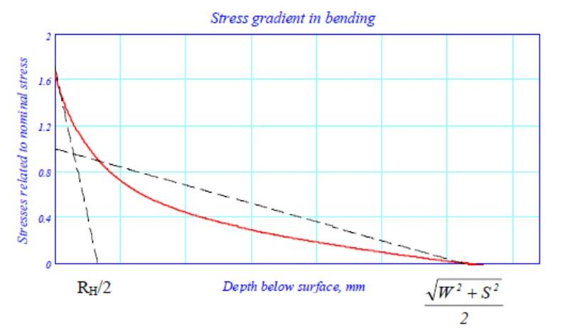 |
    | --- |
    | **그림 18 깊이의 함수로서의 크랭크핀 필릿부의 굽힘 응력집중계수 (저널 필릿부에 해당하는** **응력집중계수는** $R _{H}$**를** $R _{G}$**로 바꾸면 알 수 있다.)** |

    | 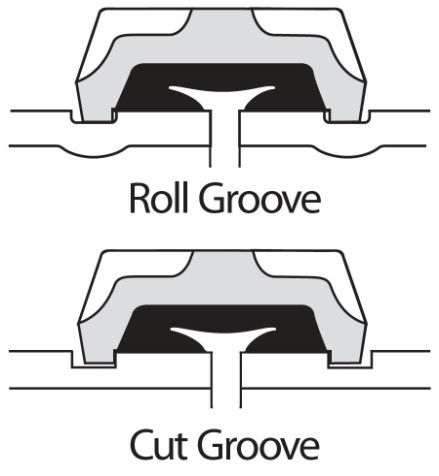 |
    | --- |
    | **그림 19 깊이의 함수로서의 크랭크핀 필릿부의 비틀림 응력집중계수 (저널 필릿부에 해당하는 응력집중계수는** $R _{H}$**를** $R _{G}$**로 바꾸고** $D$**를** $D _{G}$**로 바꾸어 알 수 있다.)** |
- **(2)** 오일구멍 응력의 평가
  - **(가)** 오일구멍의 응력은 유한요소해석에 의해서도 결정될 수 있다. 요소의 크기는 오일구멍 직경 $D _{o}$의 1/8 보다 작아야 하며, 요소의 격자 품질 기준은 **부속서 III**에 규정된 대로 따라야 한다. 미세 요소 격자는 경화 깊이에 상응하는 반경 방향 깊이 이상으로 계속되어야 한다.
  - **(나)** 유한요소해석에 적용되는 하중은 토크(**부속서 III**의 **3**항 (1)호 참조), 그리고 **부속서 III**의 **3**항 (2)호에서와 같이 4점 굽힘을 가지는 굽힘모멘트이다.
  - **(다)** 유한요소해석을 이용하기 힘든 경우 간단한 접근법을 사용할 수 있다. 적용 범위 내에 있을 경우 **부록 5-3**의 **3**항으로부터 경험적으로 결정된 응력집중계수를 기반으로 할 수 있다. 최고 응력 지점에서의 굽힘 및 비틀림 응력은 **부록 5-3**의 **5**항에서와 같이 결합된다.
  - **(라)** **그림 20**는 단단한 재료와 부드러운 재료 사이의 천이 영역에서 경도가 국부적으로 저하하는 것을 나타낸다. 이러한 저하가 발생하는지 여부는 QT(quenching 및 tempering) 공정에서 담금질 후 템퍼링 온도에 따라 달라진다.

    | 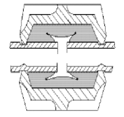 |
    | --- |
    | **그림 20 고주파경화 오일구멍에서의 응력 및 경도** |
  - **(마)** 구멍의 최고 응력은 둥근 모서리 끝에서 발생한다. 이 구역 내에서 응력은 핀의 중심에 거의 선형으로 감소한다. **그림 20**에서 볼 수 있듯이 얕은 경화 A 및 중간 경화 B의 경우 천이점은 실제적으로 최대 응력 지점과 일치한다. 깊은 경화의 경우 천이점이 최고 응력 지점을 벗어나고 국부 응력은 $t _{H}$가 경화 깊이인 최고 응력의 $(1-2t _{H} /D)$ 부분으로 평가할 수 있다.
  - **(바)** 표면하 천이 영역 응력(최소 경화 깊이 사용)은 오일구멍 표면에 수직인 축을 따라 국부 응력집중계수를 사용하여 결정할 수 있다. $\gamma _{B-local}$ 및 $\gamma _{T-local}$ 함수는 서로 다른 응력 기울기로 인하여 다른 모양을 가진다.
  - **(사)** 응력집중계수 $\gamma _{B}$와 $\gamma _{T}$는 표면에서 유효하다. 국부 응력집중계수는 깊이가 증가함에 따라 $\gamma _{B-local}$와 $\gamma _{T-local}$이 감소한다. 표면의 상대 응력 기울기는 응력 상승의 종류에 따라 다르지만 크랭크 핀 오일구멍의 경우 굽힘에서는 $4/D _{o}$, 비틀림에서는 $2/D _{o}$로 단순화 할 수 있다. 국부 응력집중계수는 깊이 $t$의 함수이다.
    $\gamma _{B-local} =( \gamma _{B} -1) \cdot e ^{\frac{-4t}{D _{o}}} +1$
    $\gamma _{T-local} =( \gamma _{T} -1) \cdot e ^{\frac{-2t}{D _{o}}} +1$
- **(3)** 판정기준
  크랭크축의 판정은 피로 고려사항을 기본으로 한다. **부록 5-3**은 오일 구멍 출구, 크랭크핀 필릿부 및 저널 필릿부에 대한 $Q \geq 1.15$의 허용계수에 등가변동응력과 피로강도의 비를 비교한다. 이것은 표면 또는 천이 영역이 검수되는지 여부에 상관없이 표면처리된 영역을 포함하도록 확장되어야 한다.

#### 4. 고주파경화

일반적으로, 경도 사양은 표면 경도 범위, 즉 최소 및 최대값, 필릿부 내부 또는 통과하는 최소 및 최대 확장, 필릿부 형상에 따른 최소 및 최대 깊이를 규정해야 한다. 참조된 비커스 경도는 $HV 0.5$에서 $HV 5$ 사이로 간주된다. 고주파경화 깊이는 경도가 최소 규정된 표면 경도의 80 %인 깊이로 정의된다.

- **(1)** 국부 피로강도
  - **(가)** 고주파경화 크랭크축은 표면에서 또는 중심으로의 천이 시 피로를 받는다. 표면 및 천이 영역 모두에 대한 피로 강도는 **부속서 IV**에 설명된 대로 풀사이즈 크랭크의 피로시험으로 결정할 수 있다. 천이 영역의 경우, 피로의 시작은 표면하(즉, 경화층 아래) 또는 경화가 끝나는 표면에서 이루어질 수 있다. 중심 재료로만 이루어진 시험은 천이에서 인장 잔류응력이 부족하기 때문에 대표적인 것은 아니다.
  - **(나)** 대안으로, 표면 피로강도 $\sigma _{Fsurface}$는 다음과 같이 실험적으로 결정될 수 있다. 여기서 $HV$는 표면 비커스 경도이다. 아래의 식은 피로강도가 잔류응력의 영향을 포함하는 것으로 간주되는 보수적인 값을 제공한다. 결과값은 작용 응력비 $R= -1$에 대하여 유효하다.
    $\sigma _{Fsurface} =400+0.5 \cdot (HV-400)$ (MPa)
  - **(다)** 고주파경화 강의 평균응력 영향은 QT 강의 평균응력 영향보다 상당히 클 수 있음을 주목해야 한다.
  - **(라)** 가능성 있는 어떤 경도 저하도 고려하지 않는 천이 구역에서의 피로강도는 **부록 5-3**의 **6**항에 소개된 식에 따라 결정되어야 한다.
    저널과 크랭크핀 필릿부가 각각 적용되는 경우:
    $\sigma _{Ftransition.cpin} =±K \cdot (0.42 \cdot \sigma _{B} +39.3) \cdot \left( 0.264+1.073 \cdot Y ^{-0.2} + \frac{785- \sigma _{B}}{4900} + \frac{196}{\sigma _{B}} \cdot \sqrt {\frac{1}{X}} \right)$
    여기서,
    저널 필릿부 : $Y=D _{G}$ 및 $X=R _{G}$
    크랭크핀 필릿부 : $Y=D$ 및 $X=R _{H}$
    오일구멍 출구 : $Y=D$ 및 $X=D _{o} /2$
    잔류응력의 영향은 포함되지 않았다.
  - **(마)** 경화층 아래의 표면하 피로를 고려하기 위하여 위에서 결정한 값에서 20 %를 뺀 값으로 인장 잔류응력의 불리한 점을 고려해야 한다. 이 20 %는 300 MPa의 잔류 인장응력을 갖는 담금질 및 템퍼링된 합금강의 평균응력 영향을 기반으로 한다. 잔류응력이 더 낮은 것으로 알려진 경우, 더 작은 빼기 값이 사용되어야 한다. 저장력강의 경우 선택된 백분율이 더 높아야 한다.
  - **(바)** 경화된 영역의 끝 부근에서 표면 피로를 고려하기 위하여 (즉, **그림 22**에 나타난 열 영향을 받은 영역에서), 인장 잔류응력의 영향은 상기 식에 의하여 결정된 값으로부터 **표 2**에 따라 일정 비율을 뺀 것으로 간주할 수 있다.

    **표 2 경화부 끝으로부터 필릿부 방향으로 주어진 거리에서 인장 잔류응력의 영향**

    | 경화부 끝으로부터의 거리 | 인장 잔류응력의 영향 |
    | --- | --- |
    | Ⅰ. 최대 경화 깊이의 0~1 배 | 20 % |
    | Ⅱ. 최대 경화 깊이의 1~2 배 | 12 % |
    | Ⅲ. 최대 경화 깊이의 2~3 배 | 6 % |
    | Ⅳ. 최대 경화 깊이의 3 배 이상 | 0 % |
    | 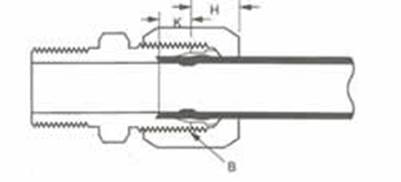 |   |

#### 5. 질화

경도 사양은 표면 경도 범위(최소 및 최대)와 최소 및 최대 깊이를 포함해야 한다. 가스 질화만 고려되며 기준 비커스 경도는 $HV$ 0.5로 간주된다. 경화 깊이는 다양한 표준 및 문헌에서 다양한 방식으로 정의된다. 여기서 사용하는 가장 실용적인 방법은 중심 경도보다 50 $HV$ 높은 경도까지의 질화 깊이 $t _{N}$을 정의하는 것이다. 경화 프로파일은 중심까지 규정해야 한다. 이것이 알려지지 않은 경우 다음 식을 통해 경험적으로 결정될 수 있다.

- **(1)** 국부 피로강도
  - **(가)** 질화된 크랭크축의 경우 피로가 표면 또는 중심으로의 천이에서 발견된다는 점에 유의해야 한다. 이는 피로 강도가 **부속서 IV**에 기술된 시험에 의해 결정될 수 있음을 의미한다.
  - **(나)** 대안으로, 표면 피로강도(주응력) $\sigma _{Fsurface}$는 다음과 같이 경험적으로 그리고 보수적으로 결정될 수 있다. 이것은 표면경도가 600 $HV$ 이상인 경우 유효하다.
    $\sigma _{Fsurface} =450$ (MPa)
    상기 피로강도는 표면 잔류응력의 영향을 포함한다고 가정하고 $R=-1$의 작용 응력비에 적용된다.
  - **(다)** 천이 영역에서의 피로강도는 **부록 5-3**의 **6**항에 소개된 식에 의하여 결정될 수 있다.
    크랭크핀과 저널에 적용되는 경우:
    $\sigma _{Ftransition.cpin} =±K \cdot (0.42 \cdot \sigma _{B} +39.3) \cdot \left( 0.264+1.073 \cdot Y ^{-0.2} + \frac{785- \sigma _{B}}{4900} + \frac{196}{\sigma _{B}} \cdot \sqrt {\frac{1}{X}} \right)$
    여기서,
    저널 필릿부 : $Y=D _{G}$ 및 $X=R _{G}$
    크랭크핀 필릿부 : $Y=D$ 및 $X=R _{H}$
    오일구멍 출구 : $Y=D$ 및 $X=D _{o} /2$
    상기 피로강도는 잔류응력의 영향을 포함하는 것을 가정하지 않는다는 것에 유의한다.
  - **(라)** 고주파경화와 달리 질화된 구성품은 중심으로의 뚜렷한 천이가 없다. 표면의 압축 잔류응력은 높지만 중심 인장응력의 균형은 얕은 깊이로 인해 보통이다. 표면하 피로 분석을 위하여, 천이 영역 내부 및 아래의 인장 잔류응력의 불리한 점은 질화 경도 프로파일의 부드러운 윤곽을 고려하여 무시할 수 있다.
  - **(마)** 원칙적으로 계산은 전체 경도 프로파일을 따라 수행해야 하지만 표면 및 인위적인 천이점을 검토하는 단순화된 접근 방식으로 제한될 수 있다. 이 인위적인 천이점은 국부 경도가 중심 경도보다 약 20 $HV$ 높은 깊이에서 취할 수 있다. 이러한 경우, 중심 재료의 특성이 사용되어야 한다. 이는 $t=1.2t _{N}$을 삽입할 때 앞서 언급한 국부 응력집중계수 수식을 사용하여 중심으로의 천이 시 발생하는 응력을 찾을 수 있음을 의미한다.

    | 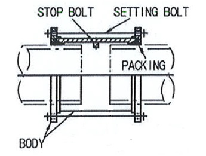 |
    | --- |
    | **그림 23 인위적인 천이점의 깊이 방향 위치** |

#### 6. 냉간가공

필릿부의 스트로크 피닝 또는 냉간압연의 장점은 고하중 영역에 발생하는 압축 잔류응력이다. 표면 잔류응력은 X선 회절 기술로 결정할 수 있고 중성자 회절을 통해 표면하 잔류응력을 결정할 수 있지만 국부 피로강도는 적합하고 신뢰할 수 있는 상관 공식이 거의 알려지지 않았기 때문에 사실상 그러한 기준으로 평가할 수 없다.

- **(1)** 볼에 의한 스트로크 피닝
  얻어진 피로강도는 신중하게 적용할 경우 풀사이즈 크랭크 시험 또는 경험적 방법으로 문서화할 수 있다. 굽힘 피로강도와 비틀림 피로강도가 모두 조사되고 비율이 $\sqrt {3}$과 다른 경우 폰 미세스 기준을 제외해야 한다. 굽힘 피로강도만 조사한 경우 비틀림 피로강도를 보수적으로 평가해야 한다. 굽힘 피로강도가 피닝되지 않은 재료의 피로강도보다 $x$ % 이상 높은 것으로 판단되는 경우 비틀림 피로강도는 피닝되지 않은 재료의 피로강도보다 높은 값이 $x$ %의 2/3 이하로 가정되어야 한다.
  스트로크 피닝 공정의 결과로 압축 잔류응력의 최대치가 표면하 영역에서 발견된다. 따라서 피로시험 하중 및 응력 기울기에 따라 표면의 국부 피로강도와 비교하여 표면에 작용하는 응력이 더 높을 수 있다. 이 현상으로 인해 피로시험 중에 작은 균열이 나타날 수 있으며 이는 압축 잔류응력의 프로파일로 인해 뒤따르는 하중 사이클 및/또는 시험 하중의 근소한 증가로 전파 할 수 없을 것이다. 간단히 말하면, 높은 압축 잔류응력은 표면 아래의 작은 표면 균열을 정지시킨다. 이것은 **그림 24**에서 하중기울기 2로 설명된다.

  |  |
  | --- |
  | **그림 24 스트로크 피닝 표면 아래의 작용 및 잔류응력 (선 1, 2, 3은 다른 하중 응력 기울기를 나타낸다.)** |

  풀사이즈 크랭크축을 사용한 피로시험에서 이 작은"미세 균열"은 파손으로 간주되어서는 아니된다. 시험대를 정지시키고, 기술적으로 파손으로 이어지는 피로균열은 파손 하중 수준을 결정하기 위하여 고려해야 한다. 이는 고주파경화된 필릿부에 스트로크 피닝되는 경우에도 적용된다.
  고주파경화된 필릿부의 피로강도를 향상시키기 위하여, 요구되는 표면경도로 고주파경화 및 템퍼링된 이후 크랭크축의 필릿부에 스트로크 피닝 공정을 적용할 수 있다. 이것이 끝난 경우 스트로크 피닝 힘을 모재의 인장강도가 아닌 표면층의 경도에 적용할 필요가 있다. 필릿부에 대한 고주파경화 및 스트로크 피닝의 피로강도에 미치는 영향은 풀사이즈 크랭크축 시험에 의하여 결정되어야 한다.
  - **(가)** 유사한 크랭크축에 대한 기존 결과 사용
    스트로크 피닝을 적용함으로써 달성되는 피로강도의 증가는 다음의 모든 기준이 충족되면 다른 유사한 크랭크축에 활용될 수 있다.
    - **(a)** 시험된 크랭크축에 비교하여 필릿부 반경 대비 볼사이즈가 ± 10 % 이내
    - **(b)** 적어도 동일한 스트로크 피닝의 원주 방향 확장
    - **(c)** 시험된 크랭크축과 비교하여 필릿부 반경 대비 필릿부 윤곽의 각도 확장이 ± 15 % 이내이고 엔진 작동 중 응력집중을 포함하도록 위치
    - **(d)** 유사한 모재, 예를 들면 합금화된 담금질 및 템퍼링
    - **(e)** 같은 반경 비율의 볼의 포워드 피드
    - **(f)** 모재 경도(다를 경우)에 비례하여 볼에 작용하는 힘
    - **(g)** 볼의 반경의 제곱에 비례하는 볼에 작용하는 힘
- **(2)** 냉간압연
  피로강도는 신중하게 적용할 경우 풀사이즈 크랭크 시험 또는 경험적 방법에 의하여 얻을 수 있다. 굽힘 피로강도와 비틀림 피로강도가 모두 조사되고 비율이 $\sqrt {3}$과 다른 경우 폰 미세스 기준을 제외해야 한다. 굽힘 피로강도만 조사한 경우 비틀림 피로강도를 보수적으로 평가해야 한다. 굽힘 피로강도가 비압연 재료의 피로강도보다 $x$ % 이상 높은 것으로 판단되는 경우 비틀림 피로강도는 비압연 재료의 피로강도 보다 높은 값이 $x$ %의 2/3 이하로 가정되어야 한다.
  - **(가)** 유사한 크랭크축에 대한 기존 결과 사용
    냉간 압연을 적용함으로써 달성되는 피로강도의 증가는 다음의 모든 기준이 충족되면 다른 유사한 크랭크축에 활용될 수 있다.
    - **(a)** 적어도 동일한 냉간 압연의 원주 방향 확장
    - **(b)** 시험된 크랭크축과 비교하여 필릿부 반경에 대비 필릿부 윤곽의 각도 확장이 ± 15 % 이내이고 엔진 작동 중 응력집중을 포함하도록 위치
    - **(c)** 유사한 모재, 예를 들면 담금질 및 템퍼링된 합금강
    - **(d)** 적어도 동일한 상대 (필릿부 반경까지) 가공 깊이를 달성하도록 계산되는 롤러 힘

### <부속서 VI 유한요소해석법 활용을 통한 크랭크축의 오일구멍 출구에서의 응력집중계수 계산> (2018)}

#### 1. 일반

- **(1)** 본 부속서에서 설명하는 해석의 목적은 오일구멍 출구에서 응력집중계수(SCF)의 분석적 계산을 적절한 유한요소해석법(FEM)으로 계산된 수치로 대체하는 것이다. 전자의 방법은 다양한 라운드 바의 스트레인 게이지 판독값 또는 광탄성 측정값을 토대로 개발된 경험식을 기반으로 한다. 이러한 식을 유효 범위를 벗어나 사용하면 어느 방향으로든 잘못된 결과가 발생할 수 있으므로 유한요소해석법 기반 방법을 적극 권장한다.
- **(2)** 본 부속서에 설명된 규칙에 따라 계산된 응력집중계수는 분석적으로 계산된 공칭응력 대 유한요소해석법으로 계산된 응력의 비율로 정의된다. 부록 5-3의 현 방법과 관련하여 사용 시, 주응력이 계산되어야 한다.
- **(3)** 해석은 선형 탄성 유한요소 해석으로 수행되어야 하며, 적절한 규모의 단위 하중이 모든 하중 조건에 대하여 적용되어야 한다.
- **(4)** 사용중인 유한요소 솔버(solver)의 요소 정확도를 확인하는 것이 권장된다. 예를 들면 간단한 형상을 모델링하고 유한요소해석법으로 얻은 응력을 분석 솔루션과 비교한다.
- **(5)** 유한요소해석법 대신에 경계요소해석법(BEM)을 사용할 수 있다.

#### 2. 모델 요건

유한요소 모델을 구축하기 위한 기본 권장 사항 및 가정은 (1)호에 제시되어 있다. 최종 유한요소 모델은(3)호의 기준 중 하나를 충족해야 한다.

- **(1)** 격자 요소에 대한 권고사항
  격자 품질 기준을 충족시키기 위하여 다음 권장사항에 따라 응력집중계수의 평가를 위한 유한요소 모델을 구성하는 것이 권고된다.
  - **(가)** 주베어링 중심선에서 반대편 주베어링 중심선까지 단일의 완전한 크랭크로 구성된 모델
  - **(나)** 다음의 요소 형식이 출구 주위에 사용된다.
    - **(a)** 10 절점 사면체 요소
    - **(b)** 8 절점 육면체 요소
    - **(c)** 20 절점 육면체 요소
  - **(다)** 오일구멍 출구의 다음 격자 특성이 사용된다.
    - **(a)** 전체 출구 필릿부 뿐만 아니라 보어 방향에서 최대 요소 크기 a 는 r/4로 한다. (8 절점 육면체 요소가 사용되는 경우 품질 기준 충족에 더 작은 요소가 요구된다.)
    - **(b)** 필릿부 깊이 방향의 요소 크기에 권장되는 방법
    - **(i)** 첫 번째 층의 두께: 요소 크기 a와 동일
      - **(ii)** 두 번째 층의 두께: 요소 크기 2a와 동일
      - **(iii)** 세 번째 층의 두께: 요소 크기 3a와 동일
  - **(라)** 일반적으로 나머지 크랭크는 솔버의 수치 안정성에 적합해야 한다.
  - **(마)** 경량화를 위한 드릴 및 구멍을 모델링해야 한다.
  - **(바)** 소프트웨어 요구 사항이 충족되는 한 서브모델링을 사용할 수 있다.
- **(2)** 재료
  부록 5-3은 탄성계수 $E$ 및 포아송비 $\nu$와 같은 재료 특성을 고려하지 않는다. 유한요소 해석에서는 우선 변형률을 계산하고 탄성계수 및 포아송비를 사용하여 변형률로부터 응력을 유도하므로 이러한 재료 파라미터가 필요하다. 대표 재료 샘플에서 인용되거나 측정된 것과 같이 재료 파라미터에 대한 신뢰할 수 있는 값이 사용되어야 한다. 강에 대한 탄성계수는 $E=2.05 \cdot 10 ^{5}$ MPa, 포아송비는 $\nu =0.3$이 권고된다.
- **(3)** 격자 요소 품질 기준
  실제 격자 요소가 응력집중계수 평가를 위하여 검사된 영역에서 다음 기준 중 하나를 충족시키지 않는 경우 2차 계산이 더 미세한 격자로 수행되어야 한다.
  - **(가)** 주응력 기준
    격자의 품질은 오일구멍 출구 반경의 표면에 수직응력 성분을 확인하여 보증되어야 한다. 주응력 $\sigma _{1}$, $\sigma _{2}$ 및 $\sigma _{3}$에 대하여 다음 기준을 충족해야 한다.
    $\min( \left| \sigma _{1} \right| , \left| \sigma _{2} \right| , \left| \sigma _{3} \right| )<0.03 \cdot \max( \left| \sigma _{1} \right| , \left| \sigma _{2} \right| , \left| \sigma _{3} \right| )$
  - **(나)** 평균/비평균 응력 기준
    평균/비평균 응력 기준은 응력집중계수의 계산을 위하여 필릿부에서의 요소에 걸친 응력 결과의 불연속성을 관찰하는 것을 기반으로 한다. 절점 $i$에 연결된 각 요소로부터 계산된 비평균 절점응력(nodal stress)은 검토하는 위치에서 절점 $i$에서의 100 % 평균 절점응력 결과와의 차이는 5 % 미만이어야 한다.

#### 3. 하중조건 및 응력평가

부록 5-3에서 분석적으로 결정된 응력집중계수를 대체하기 위하여 다음 하중조건으로 계산되어야 한다.

- **(1)** 비틀림
  구조는 단순 비틀림으로 하중이 부여된다. 모델의 끝단면에서 표면 뒤틀림이 억제된다. 토크는 크랭크축의 중앙 절점에 적용된다. 이 절점은 6 자유도를 갖는 주절점(master node)로 작동하며 끝단면의 모든 절점에 단단히 연결된다. 경계 및 하중조건은 직렬 및 V형 기관에 모두 유효하다.

  | 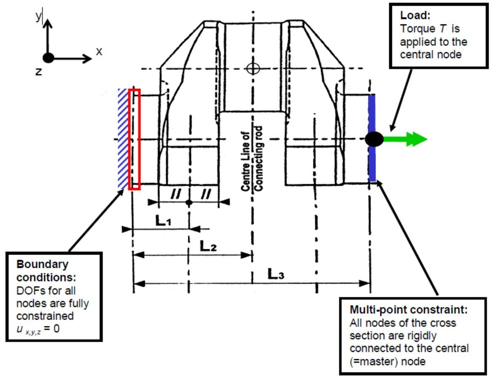 |
  | --- |
  | **그림 25 비틀림 하중에서 경계 및 하중 조건** |

  오일구멍 출구의 모든 절점에 대하여 주응력을 구하고 응력집중계수을 계산한 후에 최대 값을 취한다.
  $\gamma _{T} = \frac{\max( \left| \sigma _{1} \right| , \left| \sigma _{2} \right| , \left| \sigma _{3} \right| )}{\tau _{N}}$
  여기서 토크가 $T$인 **부록 5-3**의 **2**항 (2)호 (가)에 따라 크랭크핀을 기준으로 한 공칭 비틀림응력 $\tau _{N}$이 평가된다.
  $\tau _{N} = \frac{T}{W _{P}}$
- **(2)** 굽힘
  구조는 단순 굽힘으로 하중이 부여된다. 모델의 끝단면에서 표면 뒤틀림이 억제된다. 굽힘 모멘트는 크랭크축의 중앙 절점에 적용된다. 이 절점은 6 자유도를 갖는 주절점(master node)으로 작동하며 끝단면의 모든 절점에 단단히 연결된다. 경계 및 하중조건은 직렬 및 V형 기관에 모두 유효하다.

  | 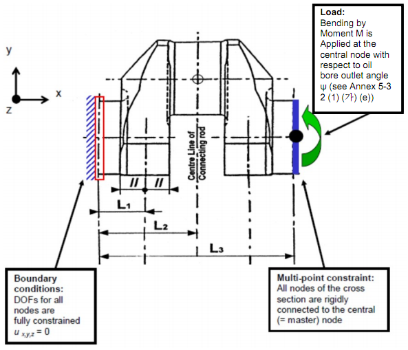 |
  | --- |
  | **그림 26 단순 굽힘 하중에서 경계 및 하중 조건** |

  오일구멍 출구의 모든 절점에 대하여 주응력을 구하고 응력집중계수을 계산한 후에 최대 값을 취한다.
  $\gamma _{B} = \frac{\max( \left| \sigma _{1} \right| , \left| \sigma _{2} \right| , \left| \sigma _{3} \right| )}{\sigma _{N}}$
  여기서 굽힘 모멘트 $M$인 **부록 5-3**의 **2**항 (1) (나) (c)에 따라 크랭크핀을 기준으로 한 공칭 굽힘응력 $\sigma _{N}$이 계산된다.
  $\sigma _{N} = \frac{M}{W _{e}}$
