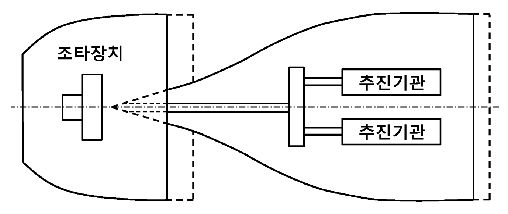
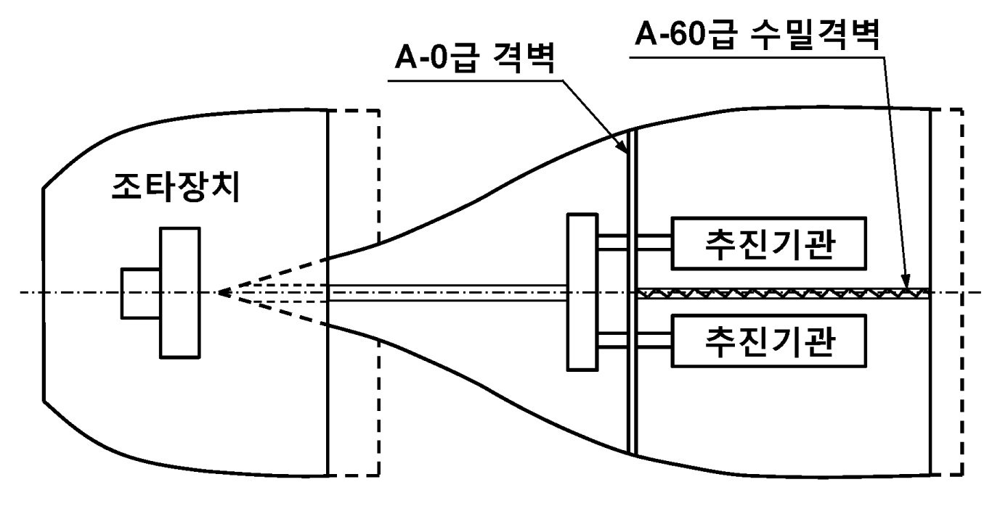
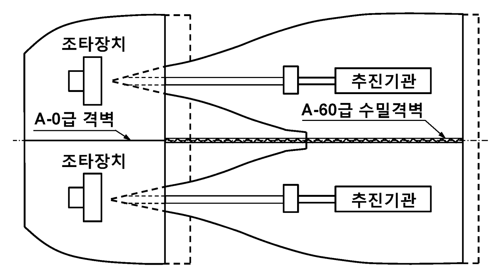

# 제5편 기관장치

> 선급 및 강선규칙/적용지침 / RA-05-K / 2025 / KO / Guidance

## 부록 5-10 복수 추진 및 조타시스템 (2017)

### 1. 일반사항

#### (1) 적용

- **(가)** 이 부록의 요건은 복수 추진 및 조타시스템 및 이들 시스템의 보조시스템에 적용하며, 규칙의 다른 요건에 추가하여 적용한다.
- **(나)** 이 부록의 요건은 선택사항이며, 이 부록의 요건에 만족하는 선박은 추가특기사항으로서 (3)호에 명시된 부호를 부여할 수 있다.

#### (2) 용어의 정의

용어의 정의는 아래에서 정하는 경우를 제외하고는 규칙에 따른다.

- **(가)** **"보조시스템"**이라 함은 연료유, 윤활유, 냉각수, 압축공기, 유압 시스템 등과 같이 추진기관 및 추진기를 운전하는데 요구되는 모든 지원시스템을 말한다.
- **(나)** **"추진기관구역"**이라 함은 추진시스템의 일부를 구성하는 기관 또는 장치들을 포함하는 구역을 말한다.
- **(다)** **"추진기관"**이라 함은 추진기를 구동하기 위한 기계적에너지를 발생하는 기기(디젤기관, 터빈, 전동기 등)를 말한다.
- **(라)** **"추진시스템"**이라 함은 1조 이상의 추진기관, 1조 이상의 추진기 및 모든 필요한 보기와 관련된 제어, 경보 및 안전시스템으로 구성되며, 선박에 추진력을 제공하는 시스템을 의미한다.
- **(마)** **“주추진시스템"**이라 함은 정상 운항 상태에서 선박에 추진력을 제공하는 시스템을 말하며, 다음의 시스템을 포함한다.
  - **(a)** 원동기(일체형 장비, 구동 펌프 등을 포함)
  - **(b)** 토크를 전달하는 장치
  - **(c)** 추진용 전동기(적용되는 경우)
  - **(d)** 토크를 추진력으로 변환하는 장치
  - **(e)** 운항에 필요한 보조시스템
  - **(f)** 제어, 감시 및 안전시스템
- **(바)** **“대체추진시스템"**이라 함은 주추진시스템에 고장이 발생하여 사용이 불가능한 비상상황에서 선박에 추진력을 제공하는 시스템을 말한다. 대체추진시스템은 주기관의 고장시 추진용 전동기로서 쉽게 가역하여 작동하도록 설계된 경우에는 예비의 비상기관이나 전동기 또는 축발전기에 의해서 공급될 수 있다. 대체추진시스템은 다음의 시스템을 포함한다.
  - **(a)** 토크를 추진력으로 변환하는 장치
  - **(b)** 운항에 필요한 보조시스템
  - **(c)** 제어, 감시 및 안전시스템
- **(사)** **"추진기"**라 함은 선박을 추진하기 위해 물줄기에 힘을 전달하는 장치(프로펠러, 워터제트 등)와 추진기관으로부터 그 장치에 동력을 전달하기 위해 필요한 장치(축, 기어 등)를 말한다.
- **(아)** **“조타시스템"**이라 함은 선박의 이동방향을 조종하기 위하여 설계된 시스템을 말하며, 타 및 조타기 등을 포함한다.
- **(자)** **“능동구성품"**이라 함은 기어처럼 기계적 힘을 전송하고, 히터처럼 에너지를 변환 또는 이동시키거나 제어시스템처럼 특정목적으로 전기 신호를 발생시키는 주추진시스템 또는 대체추진시스템의 구성품을 말한다. 관장치, 케이블, 수동조작밸브 및 탱크는 능동구성품으로 고려되지 않는다.
- **(차)** **“시스템 고장"**이라 함은 보조시스템을 포함한 추진시스템 또는 발전설비의 작동에 필요한 능동구성품의 고장을 말한다.

#### (3) 선급부호

이 부록의 요건에 적합한 선박은 다음의 추가특기사항 중 하나를 부여할 수 있다. 복수의 추진기관은 주추진 기관 및 대체추진 기관으로 구성될 수 있다. (**그림 1** 참조)

- **(가)** RP1 : 1조의 추진기 및 조타시스템과 복수의 추진기관이 설치된 선박
- **(나)** RP2 : 복수의 추진기 및 조타시스템과 복수의 추진기관이 설치된 선박
- **(다)** RP1-S : 1조의 추진기 및 조타시스템과 2개 이상의 독립된 장소에 복수의 추진기관이 설치된 선박
- **(라)** RP2-S : 2개 이상의 독립된 장소에 복수의 추진기관, 추진기 및 조타시스템이 설치된 선박

### 2. 승인도면 및 자료

#### (1) 규칙에서 요구되는 것에 추가하여 다음 도면 및 자료를 제출하여야 한다. 또한, 우리 선급이 필요하다고 인정하는 경우에는 아래에 규정된 것 이외의 상세도면, 자료의 제출을 요구할 수 있다.

- **(가)** 추진 및 조타시스템의 단일고장 발생 시, 선박이 **3**항 (1)호에서 명시된 성능요건을 만족하는지를 보여주는 계산결과 및 사용된 계산방법의 상세사항. 대안으로 모형시험의 결과를 증거로서 인정할 수 있다.
- **(나)** 고장모드 및 영향분석(Failure Mode and Effect Analysis) 보고서
  - **(a)** FMEA 또는 동등한 방법에 의하여 추진시스템, 조타시스템 및 보조시스템의 보전성이 검증되어야 하며, 단일고장이 **3**항 (1)호에서 명시된 성능에 영향이 없음을 보여주어야 한다.
  - **(b)** 전기추진설비에 대한 고장모드 영향분석은 관련 보기 및 제어시스템을 포함하여 수행하고 그 결과를 제출하여야 한다.
  - **(c)** FMEA는 발생 가능한 모든 고장모드 및 연속된 고장에 대해 전체 시스템에 미치는 영향을 분석하며, 이러한 고장을 적절히 식별하여 대처할 수 있는 방안을 제시하여야 한다.
  - **(d)** FMEA의 일반적인 절차는 관련 표준 요건을 따라야 한다.
- **(다)** 해상시운전시 복수 추진 및 조타시스템을 검증할 수 있는 시험절차
- **(라)** RP1-S 및 RP2-S 부호를 갖는 선박의 경우, 추진 및 조타시스템의 정상작동을 위하여 필요한 모든 기기 및 장치(관련된 모든 전력, 제어 및 통신용 케이블의 전로를 포함)의 위치를 상세히 나타내는 일반 배치도
- **(마)** 전력조사표(대체추진시스템 운항 상황 포함)
- **(바)** 대체추진시스템의 일반배치도
- **(사)** 연료유시스템, 냉각시스템, 윤활시스템, 시동공기시스템의 계통도
- **(아)** 대체추진시스템 설명 및 주추진시스템과의 인터페이스 설명서
- **(자)** 대체추진모드에서의 비틀림 진동 계산서
- **(차)** 단일고장 시 추진 및 중요용도의 회복에 필요한 작동을 설명하는 사용설명서

### 3. 성능요건

#### (1) 일반사항

- **(가)** 추진시스템 또는 조타시스템의 단일고장이 발생한 경우에도, 선박은 선저가 깨끗한 상태로 평온한 해상에서, 만재흘수 상태로 연속최대출력 시에 7 knots 이상의 속력으로 전진할 수 있어야 하며, **규칙 5편 7장 202.**에 따른 조타성능도 유지할 수 있어야 한다. *(2017)*
- **(나)** 복수 추진 및 조타시스템들은 언제든지 작동 준비가 되어야 하며 필요시 작동 가능하여야 한다.

#### (2) 단일고장

- **(가)** 어느 단일고장의 최종결과는 상기 (1)호의 추진 및 조타 성능에 영향을 미치지 않도록 하여야 한다.
- **(나)** 단일고장 기준
  - **(a)** RP1 부호 : 단일고장 기준은 추진기관과 추진기관의 보조시스템 및 제어시스템에 적용된다. 이 부호는 화재 또는 침수로 인한 추진기 및 타의 고장 또는 추진기관구역 및 조타기실의 전손을 고려하지 아니 한다.
  - **(b)** RP2 부호 : 단일고장 기준은 추진기관, 추진기, 보조시스템, 제어시스템 및 조타시스템에 적용된다. 이 부호는 화재 또는 침수로 인한 추진기관구역 또는 조타기실의 전손을 고려하지 아니 한다.
  - **(c)** RP1-S부호 : (a)의 RP1 부호와 동일하게 적용되지만 어느 하나의 추진기관구역에서 화재 또는 침수가 고려되어야 한다.
  - **(d)** RP2-S부호 : (b)의 RP2 부호와 동일하게 적용되지만 어느 하나의 추진기관구역 또는 조타기실에서 화재 또는 침수가 고려되어야 한다.

    | **RP1**  | **RP2**  |
    | --- | --- |
    | **RP1(대체설계)**  | **RP2(대체설계)**  |
    | **RP1-S**  | **RP2-S**  |

### 4. 시스템 설계

#### (1) RP1 부호를 갖는 선박

- **(가)** 추진기관 및 추진기
  - **(a)** 적어도 2조의 독립된 추진기관이 설치되어야 한다. 어느 1조의 추진기관 또는 보조시스템에서의 단일고장이 상기 **3**항 (1)호에서 요구되는 추진성능에 영향이 미치지 않도록 하여야 한다.
  - **(b)** 추진기관 및 보조시스템은 동일한 추진기관구역에 설치할 수 있으며, 그 추진기관들이 1조의 추진기를 구동할 수 있다.
  - **(c)** 주추진에서 대체추진으로 전환
  - **(i)** 주추진에서 대체추진으로의 전환과정 중에 발생할 수 있는 상해위험으로부터 승무원을 보호하는 수단이 제공되어야 한다. 필요할 경우, 다음 사항이 준비되어야 한다.
    - 의도하지 않은 기관 시동 방지
    - 잠금 위치에 축계 유지
- **(나)** 조타시스템
  - **(a)** 각 추진기마다 독립적인 조타시스템을 설치하여야 한다. 각 조타시스템은 **규칙 5편 7장**의 규정에 따라야 한다.
  - **(b)** 타는 1조의 추진기관 또는 조타시스템이 작동불능이 되더라도 어느 방향으로도 타를 회전할 수 있도록 설계하여야 한다.
- **(다)** 보조시스템
  - **(a)** 일반사항 *(2023)*
  - **(i)** 단일고장이 상기 **3**항 (1)호에서 요구하는 성능에 영향을 미치지 않도록 적어도 2조의 독립된 보조시스템(예: 연료유, 윤활유, 냉각수, 압축공기, 제어용공기, 통풍장치 등)을 배치하여야 한다. 다만, 고정식 관장치의 손상을 제외한 중요보기의 단일고장으로 어느 하나의 추진기관이 정지되는 결과를 초래하여서는 아니 된다. 이를 위하여 2조 이상의 중요보기를 복수의 추진기관에 교차연결하거나 각각의 추진기관에 연결되는 중요보기를 복수화하여야 한다.
    - **(ii)** 대체추진시스템이 적용되는 경우, 주추진시스템의 보조시스템은 **5**편 **6**장의 이중화 요건에 따라야 하며 대체추진시스템의 보조시스템은 주추진시스템의 보조시스템에서 단일고장이 발생하더라도 대체추진시스템만으로 상기 **3**항 (1)호에서 요구하는 성능을 발휘할 수 있도록 배치되어야 한다.
  - **(b)** 연료유
  - **(i)** 적어도 2개의 연료유 서비스탱크가 설치되어야 한다. 복수 추진시스템의 연료유 서비스탱크로부터의 공급관은 연료유 서비스탱크와 각 장치의 펌프들 사이에 교차연결되게 설치할 수 있다. 교차연결은 정상상태에서 폐쇄상태를 유지하는 차단장치를 설치하여야 한다. 차단장치의 개폐상태를 표시하는 지시기를 선교와 집중제어실에 설치하여야 한다.
    - **(ii)** 연료시스템이 가열을 요구하는 경우, 가열시스템은 복수화 요건을 만족하여야 한다.
  - **(c)** 윤활유
  - **(i)** 각 추진시스템에 독립적인 윤활유 순환장치가 설치되어야 한다.
    - **(ii)** 기어박스가 주추진 및 대체추진에 모두 사용될 경우, 그 윤활유시스템은 주기관의 윤활유시스템과는 독립적이어야 한다.
  - **(d)** 냉각수
    복수 추진시스템을 위한 해수공급은 각 추진시스템의 펌프를 사용하여 공통 시체스트에서 공급될 수 있다. 이 장치는 교차연결관에 설치된 차단밸브에 의하여 분리될 수 있어야 한다.
  - **(e)** 압축공기
    제어용공기시스템으로서 압축공기의 사용을 고려할 수 있다. 제어용공기가 추진 및 조타시스템에 필수 기능을 하는 경우, 완전한 복수화 요건들을 적용하여야 한다.
- **(라)** 배전시스템
  - **(a)** 발전 및 배전시스템의 단일고장이 발생한 경우에도, 전원공급은 **3**항 (1)호의 요건에 적합하기 위하여 유지되거나 즉시 복구되도록 발전 및 배전시스템을 설치하여야 한다.
  - **(b)** 선박의 중요보기가 하나의 주 배전반으로부터 공급될 경우, 모선은 적어도 2개 부분으로 분리되어야 한다. 분리된 부분들이 통상적으로 연결되어져 있을 경우, 모선의 단락감지에 의하여 자동으로 분리되어야 한다.
  - **(c)** 추진 및 조타시스템의 작동에 필요한 중요보기에 공급하는 회로는 1회로의 손실이 **3**항 (1)호에 명시된 성능에 영향을 미치지 않도록 각 부분을 균등하게 나누어 배치하여야 한다.
  - **(d)** 배전반의 각 부분이 독립적으로 작동할 수 있도록 완전 이중 전원관리시스템을 설치하여야 한다.
- **(마)** 제어 및 감시시스템
  - **(a)** 제어시스템은 독립적으로 작동할 수 있어야 하며 또한 선교 또는 집중제어실로부터 연계하여 작동할 수 있어야 한다. 2개 이상의 제어장소가 설치되는 경우, 어느 장소에서 제어중인가를 표시하는 표시등을 각 제어장소에 설치하여야 한다. 또한 동시에 상이한 장소에서 제어하지 못하도록 하여야 한다.
  - **(b)** 추진기관 및 추진기는 비상시에 현장조작이 가능하여야 한다.
  - **(c)** 대체추진시스템이 전기적일 경우, 전동기의 자동화시스템은 전기추진설비에 적합하여야 한다.

#### (2) RP2 부호를 갖는 선박

RP2 부호를 갖는 선박으로 등록하고자 하는 선박은 (1)호의 요건에 추가하여 (2)호의 요건을 따라야 한다.

- **(가)** 추진기관 및 추진기
  최소한 2조의 추진기가 설치되어야 한다. 추진기 중 어느 1조의 단일고장이 발생한 경우, 추진성능은 상기 **3**항 (1)호의 요건에 만족하여야 한다. 추진기관 및 보조시스템은 동일한 추진기관구역에 설치할 수 있다.
- **(나)** 조타시스템
  조타시스템의 고장 시 타가 중립에 위치하도록 고정하기 위한 수단을 갖추어야 한다.

#### (3) RP1-S 부호를 갖는 선박

RP1-S 부호를 갖는 선박으로 등록하고자 하는 선박은 (1)호의 요건에 추가하여 (3)호의 요건을 따라야 한다.

- **(가)** 추진기관 및 추진기
  화재 또는 침수로 인하여 어느 1개의 추진기관구역이 전손되더라도 **3**항 (1)호에서 요구되는 추진성능이 유지되도록 추진기관 및 보조시스템은 분리되어야 한다. 2조의 추진기관은 1조의 추진기를 구동할 수 있다. 다만, **5**항의 요건에 만족하는 격벽에 의해 분리된 추진기관구역의 외부에 추진용 기어 또는 동력전달기어가 설치되어야 한다.
- **(나)** 보조시스템
  - **(a)** 일반사항
    분리된 추진기관구역에 독립적인 보조시스템을 설치하여야 한다. 차단 또는 격리수단이 추진기관구역을 분리하는 격벽 양측에 설치되는 경우, 연료유 서비스탱크의 벤트시스템을 제외한 보조시스템의 교차연결은 인정할 수 있다. 선교와 집중제어실에 차단 또는 격리 수단의 개폐상태를 표시하는 지시기를 설치하여야 한다. 추진기관구역과 조타기실을 분리하는 격벽 관통부는 화재와 수밀에 대한 보존성을 위협하여서는 아니 된다.
  - **(b)** 연료유
    각 추진기관구역마다 1개의 연료유 서비스탱크를 설치하여야 한다.
  - **(c)** 냉각수
    시체스트는 각각 독립된 장소에 설치되어야 한다. 교차연결관의 차단밸브는 격벽에 직접 또는 가능한 가깝게 설치되어야 하고 추진기관구역 내부 및 외부에서 조작할 수 있어야 한다.
  - **(d)** 압축공기
    압축기 및 공기탱크는 각 분리된 장소마다 1조씩 설치하여야 한다.
  - **(e)** 통풍
    기관구역에 독립적인 통풍시스템을 설치하여야 한다.
- **(다)** 배전시스템
  - **(a)** A-60급 수밀격벽에 의하여 분리된 적어도 2개의 기관구역에 선박용 발전기, 보조시스템, 배전반 및 전원관리시스템을 설치하여야 한다. 어느 하나의 기관구역에 화재 및 침수가 발생하더라도 **3**항 (1)호에 규정된 성능을 유지할 수 있도록 배전시스템을 배치하여야 한다.
  - **(b)** 분리된 기관구역 사이에 교차연결이 설치되어 있을 경우, 추진기관구역을 분리하는 격벽 양 측에 차단장치를 설치하고 선교와 집중제어실에 차단장치의 개폐상태를 표시하는 지시기를 설치하여야 한다.
  - **(c)** 하나의 추진기관구역에서 발전기로부터 공급되는 전력용 케이블은 다른 구역의 발전기를 포함하는 추진기관구역을 통과하여서는 아니된다.
  - **(d)** 복수화 설비의 배선은 동일한 전로에 포설하여서는 아니되고 가능한 멀리 떨어져 포설하여야 한다. 이것이 불가능할 경우, A-60급 케이블 덕트 또는 동등한 방화재료 내부에 포설하는 것은 인정 된다. 다만, 이 대안은 화재위험이 높은 구역(예, 기관실 및 연료처리실)에서는 인정되지 아니 한다.
- **(라)** 제어 및 감시시스템
  모든 관련 케이블을 포함하여, 추진기(예, 가변피치프로펠러)의 제어 및 감시시스템은 각 구역에서 복수화가 되어야 한다. 어느 하나의 구역에서 화재 또는 침수가 발생하더라도 다른 구역의 추진기 작동에 영향을 미쳐서는 아니 된다.
- **(마)** 통신시스템
  각 제어장소로 공급되는 통신용 케이블은 동일한 추진기관구역에 포설하여서는 아니 된다.

#### (4) RP2-S 부호를 갖는 선박

RP2-S 부호를 갖는 선박으로 등록하고자 하는 선박은 (1)호, (2)호 (나) 및 (3)호 (나)부터 (마)의 요건에 추가하여 (4)호의 요건을 따라야 한다.

- **(가)** 추진기관 및 추진기
  적어도 2조의 추진기가 설치되어야 하고, 추진시스템은 분리된 구역에 설치되어야 한다. 어느 1조의 추진기의 고장 또는 화재나 침수로 인하여 어느 하나의 추진기관구역이 전손되더라도 추진성능은 상기 **3**항 (1)호의 요건에 만족하여야 한다.
- **(나)** 조타시스템
  어느 하나의 조타기실에서의 화재 또는 침수가 다른 조타기실의 조타시스템에 영향을 미쳐서는 아니 된다. 그리고 조타성능은 상기 **3**항 (1)호의 규정에 적합하여야 한다.

### 5. 시스템분리

#### (1) 고장이 화재 또는 침수로 인한 추진기관구역의 전손을 포함하는 것으로 고려된 경우(RP-S부호를 갖는 선박), 복수화 장치는 A-60급 수밀격벽에 의하여 분리되어야 한다.

#### (2) 화재위험이 낮은 구역(코퍼댐, 탱크 등)에 의해 분리되는 경우, 2개의 A-0급 격벽은 A-60급과 동등하게 인정될 수 있다.

#### (3) 분리된 추진기관구역 사이에 수밀문을 설치할 경우에는 강선규칙 3편 14장 4절의 요건에도 적합하여야 한다. 선교와 집중제어실에 문의 개폐상태를 표시하는 지시기를 설치하여야 한다.
