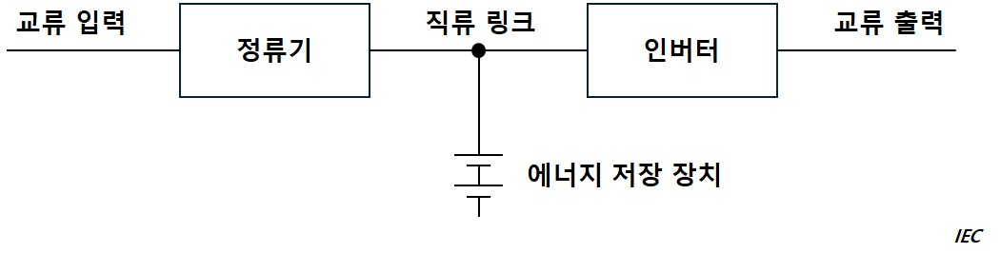
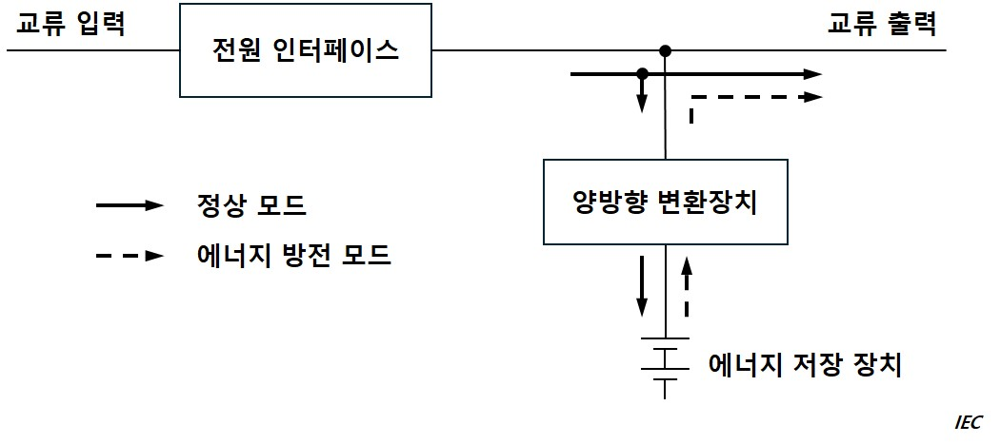
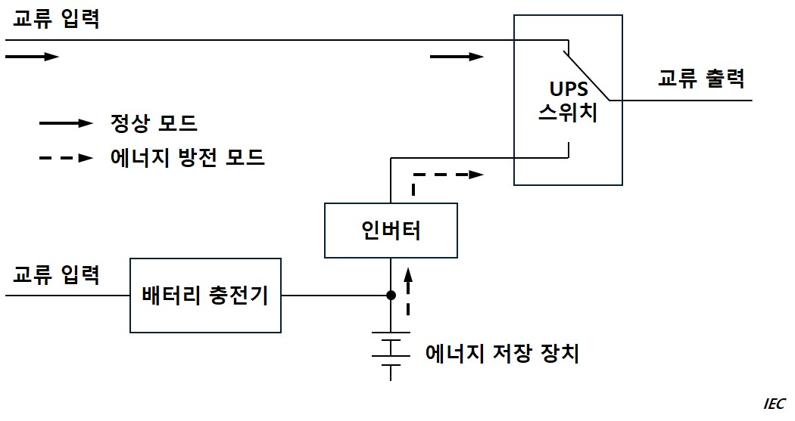
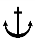

# 제6편 전기설비 및 제어시스템

> 선급 및 강선규칙/적용지침 / RA-06-K / 2025 / KO / Rules

## 제 1 장 전기설비

### 제 1 절 일반사항

#### 101. 일반사항

- **1.** **적용 【지침 참조】**
  - **(1)** 이 장의 규정은 항로 또는 용도에 특별한 제한이 없는 선박의 전기설비 및 전기추진설비에 적용한다. 다만, 항로 또는 용도에 특별한 제한이 있는 선박과 총톤수 500톤 미만인 소형선박의 전기설비 및 전기추진설비에 대하여는 우리 선급이 적절하다고 인정하는 범위로 완화하여 적용할 수 있다.
  - **(2)** 이 장의 규정은 특별히 언급하는 것을 제외하고 교류 및 직류전기설비에 동일하게 적용한다.
  - **(3)** 우리 선급이 적절하다고 인정하는 경우, 국제전기표준규격(IEC)에서 규정하는 요건을 적용할 수 있다.
- **2.** **특수한 전기설비** 이 장에 규정되어 있지 아니한 전기설비 및 전기추진설비는 우리 선급이 적절하다고 인정하는 바에 따른다. **【지침 참조】**
- **3.** **여객선**
  국제항해에 종사하는 여객선의 전기설비는 이 편의 규정에 따르는 이외에 해상에서의 인명안전을 위한 국제협약(이하 SOLAS협약이라 한다)에서 규정하는 여객선의 전기설비에 대한 요건에도 적합하여야 한다.
- **4.** **용어** 이 장에서 사용하는 용어의 정의는 다음에 따른다.
  - **(1)** **위험구역**이라 함은 인화성 또는 폭발성 물질이 있거나, 그 물질로부터 인화성 또는 폭발성 가스 또는 증기를 일으킬 우려가 있는 아래와 같은 구역 또는 장소를 말하며, 이것은 가스 폭발 분위기의 생성 빈도와 지속 시간에 따라 분류한 것이다. **【지침 참조】**
    - **(가)** 구역 “0”(zone 0) : 가스 폭발 분위기가 연속적으로 또는 장기간 존재하는 구역
    - **(나)** 구역 “1”(zone 1) : 가스 폭발 분위기가 정상작동 상태에서 가끔 일어날 수 있는 구역
    - **(다)** 구역 “2”(zone 2) : 가스 폭발 분위기가 정상작동 상태에서는 발생하지 않고, 이상작동 상태에서만 일어날 수 있는 구역 (빈도가 극히 희박하고 아주 짧은 시간 지속)
  - **(2)** **선택차단**이라 함은 배전계통 중 회로에 단락사고가 발생한 경우 그 사고의 영향을 한정시키기 위하여 고장지점에 가장 가까운 보호장치만 작동하도록 하는 것을 말한다.
  - **(3)** **우선차단**이라 함은 발전기가 과부하된 경우 또는 과부하의 우려가 있는 경우 중요부하에 계속 급전되도록 하기 위하여 중요하지 않는 부하를 자동적으로 차단시키는 것을 말한다.
  - **(4)** **정상적인 운항 및 거주상태**라 함은 선박 전체로서 그 추진, 조타능력, 항해의 안전, 화재 및 침수에 대한 안전, 선내 및 선외의 통신과 신호장치, 탈출설비, 구명정 윈치 및 계획된 쾌적한 거주조건을 확보하는 기관, 설비, 수단 및 장치가 유효하면서도 정상적으로 작동하고 있는 상태를 말한다. 선박을 정상적인 운항 및 거주상태로 유지시키기 위하여 필요한 모든 전기적 기능이라 함은 중요용도 및 거주편의용도를 말한다.
  - **(5)** **비상상태**라 함은 정상적인 운항 및 거주상태를 확보하는데 필요한 설비가 주전원장치의 고장 때문에 운전할 수 없는 상태를 말한다.
  - **(6)** **주전원**이라 함은 선박을 정상적인 운항 및 거주상태로 유지시키기 위하여 필요한 모든 설비에 배전하는 주배전반에 전력을 공급하는 전원을 말한다.
  - **(7)** **주발전기**라 함은 주전원의 전력을 발생하는 발전기를 말한다.
  - **(8)** **주발전장소**라 함은 주전원장치가 설치되어 있는 장소를 말한다.
  - **(9)** **주배전반**이라 함은 주전원으로부터 직접 전력을 공급받아 선내의 여러 설비에 전력을 배분하기 위한 배전반을 말한다.
  - **(10)** **비상전원**이라 함은 주전원으로부터 전력공급이 상실된 경우 비상배전반에 급전하기 위한 전원을 말한다.
  - **(11)** **비상배전반**이라 함은 주전력 공급장치가 고장이 난 경우 비상전원장치 또는 임시 비상전원장치에서 직접 급전되어 비상설비에 전력을 분배하는 배전반을 말한다.
  - **(12)** **전기의 용도**(electrical service)는 중요용도 및 거주편의용도로 구분한다.
  - **(13)** **중요용도**라 함은 선박의 추진, 조타 및 안전에 필수적인 용도를 말한다. 중요용도는 일차중요용도와 이차중요용도로 구분되며 정의 및 예는 다음과 같다.
    - **(가)** **일차중요용도**라 함은 추진력 및 조타성능을 유지하기 위하여 연속적인 운전이 필요한 용도를 말하며 일차중요용도로 사용되는 장치는 다음과 같다.
      - **(a)** 조타기
      - **(b)** 가변피치프로펠러용 펌프
      - **(c)** 추진을 위해 필요한 주/보조 기관 및 터빈에 사용되는 소기송풍기, 연료유공급펌프, 연료밸브 냉각펌프, 윤활유펌프 및 냉각수펌프
      - **(d)** 증기터빈선박의 증기설비용 및 일차중요용도의 급전장치에 증기를 사용하는 선박의 보조보일러용 강제통풍팬, 급수펌프, 순환수펌프, 진공펌프 및 복수펌프
      - **(e)** 증기터빈선박의 증기설비용 분연펌프 및 일차중요용도의 급전장치에 증기를 사용하는 선박의 경우에는 보조보일러용 분연장치
      - **(f)** 추진/조타의 유일한 수단으로서의 선회식 추진장치 (윤활유펌프 및 냉각수펌프를 포함)
      - **(g)** 전기추진설비용 전기설비 (윤활유펌프 및 냉각수펌프를 포함)
      - **(h)** 일차중요용도 장치에 전력을 공급하는 발전기 및 관련 전원
      - **(i)** 일차중요용도 장치에 유압을 공급하는 유압펌프
      - **(j)** 중유용 점도제어장치
      - **(k)** 주추진기관 또는 발전기관의 연료로 사용되는 보일오프가스용 저압가스압축기와 그 외에 보일오프가스 처리장치
      - **(l)** 일차중요용도에 사용되는 장치의 제어, 감시 및 안전장치/시스템
    - **(나)** **이차중요용도**라 함은 선박의 안전을 유지하기 위하여 필요하지만 추진력 및 조타성능을 유지하기 위하여 연속적인 운전이 필요하지 않은 용도를 말하며 이차중요용도에 사용되는 장치는 다음과 같다.
      - **(a)** 윈들러스
      - **(b)** 연료유이송펌프 및 연료유처리장치
      - **(c)** 윤활유이송펌프 및 윤활유처리장치
      - **(d)** 중유용 예열기
      - **(e)** 시동 및 제어용 공기압축기
      - **(f)** 빌지, 평형수 및 힐링펌프
      - **(g)** 소화펌프 및 기타 고정식소화제용 펌프
      - **(h)** 기관실 및 보일러실 통풍팬
      - **(i)** 위험구역을 안전한 상태로 유지하기 위하여 필요하다고 인정되는 용도
      - **(j)** 항해등, 항해용구 및 항해신호
      - **(k)** 선내 통신장치
      - **(l)** 화재탐지 및 화재경보장치
      - **(m)** 조명장치
      - **(n)** 수밀폐쇄장치의 전기설비
      - **(o)** 이차중요용도 장치에 급전하는 발전기 및 관련 전원
      - **(p)** 이차중요용도 장치에 유압을 공급하는 유압펌프
      - **(q)** 액화가스운반선에 사용되는 재액화장치
      - **(r)** 위험구역용으로 사용되는 통풍팬
      - **(s)** 주/보조 기관 시동장치
      - **(t)** 불활성 가스 송풍장치 및 스크러버 및 역류방지 펌프
      - **(u)** 수밀문, 현측문 및 기타 전기구동 폐쇄장치
      - **(v)** 승강전동기(Jacking motors)
      - **(w)** 수위감지 경보장치
      - **(x)** 조타 또는 추진용이 아닌 스러스터
      - **(y)** 화물격납설비에 사용되는 제어, 감시 및 안전시스템
      - **(z)** 이차중요용도에 사용되는 장치의 제어, 감시 및 안전장치/시스템
  - **(14)** **거주편의용도**라 함은 선박에서 선원 및 여객을 위한 최소한의 쾌적한 환경을 유지하기 위하여 운전이 필요한 용도를 말한다. 거주편의상태를 유지하기 위한 장치는 다음과 같다.
    - **(가)** 취사
    - **(나)** 난방
    - **(다)** 선내 냉장/냉동
    - **(라)** 기계식 통풍
    - **(마)** 위생수 및 청수
    - **(바)** 상기 장치에 급전하는 발전기 및 관련 전원
  - **(15)** **데드쉽상태**라 함은 다음과 같은 상태를 말한다.
    - **(가)** 주전원의 상실로 인하여 주추진장치, 보일러 및 보기가 작동되지 아니하며,
    - **(나)** 추진력을 회복하기 위하여 추진장치, 주전원장치 및 기타 중요보기를 시동하기 위한 저장된 에너지를 사용할 수 없는 것으로 가정한다. 다만, 비상발전기를 시동하기 위한 수단은 항상 사용할 수 있다고 가정한다.
  - **(16)** **구전반**이라 함은 배전반으로부터 전력 공급을 제어하고 그것을 다른 구전반, 분전반 또는 최종 지회로에 분배하는 스위치 및 제어기 등의 조합을 말한다.
  - **(17)** **분전반**이라 함은 최종 지회로에 전력을 분배하기 위하여 설치된 하나 또는 그 이상의 보호 장치의 조합을 말한다.
  - **(18)** **부등률**이라 함은 개별 전력소비기기 정격의 합에 대한 통상의 작동 조건하에서 전력소비기기 그룹의 추정 총 소비 전력의 비를 말한다. *(2019)*

#### 102. 승인도면 및 자료

공사 착수 전에 다음의 도면 및 자료를 제출하여 승인을 받아야 한다.

- **1.** **조선소가 제출할 승인용 도면 및 자료**
  - **(1)** 전력조사표(주 및 비상전원(축전지 포함))
  - **(2)** 주전력 계통도(비상전원 포함)
  - **(3)** 조명 계통도(비상조명장치 포함)
  - **(4)** 제어 계통도
  - **(5)** 항해통신장치 계통도
  - **(6)** 무선장치 계통도
  - **(7)** 화재탐지장치 및 경보장치 계통도
  - **(8)** 전기 일반배치도(선교, 무선실, 거주구역, 기관실, 각 갑판 등)
  - **(9)** 항해등 배치도
  - **(10)** 위험구역 표시도(필요한 경우)
  - **(11)** 화물탱크용 계측장치 도면(필요한 경우)
  - **(12)** 고전압 전기기기 요목표(필요한 경우)
  - **(13)** 단락전류 계산서(합계출력 500 $\mathrm{kVA}$($\mathrm{kW}$) 이상)
  - **(14)** 기타 특수한 구조를 가진 선박 등의 경우에는 우리 선급이 필요하다고 인정하는 도면 및 자료 **【지침 참조】**
- **2.** **전기기기 제조자가 제출할 승인용 도면 및 자료**
  전기기기 제조자는 **103.**의 **1**항 **표 6.1.1**에 따라 도면 및 자료를 제출하여 승인을 받아야 한다.

#### 103. 시험 및 검사

- **1.** **일반사항**
  - **(1)** **표 6.1.1**의 전기기기 및 케이블은 우리 선급의 승인(도면승인, 형식승인)을 받거나 제조공장 또는 적절한 시험 및 검사설비를 갖춘 다른 장소에서 이 장의 관련 규정에 따라 시험을 하여야 한다.
  - **(2)** 표 6.1.1에 명시된 전기기기 및 케이블은 **「제조법 및 형식승인 등에 관한 지침」**에 따라 형식승인을 받아야 한다. **【지침 참조】**
- **2.** **품질보증제도 등에 의한 검사**
  **「제조법 및 형식승인 등에 관한 지침」**에 따라 우리 선급의 품질보증제도의 승인을 받고 제조한 전기설비에 대하여는 우리 선급 검사원의 입회하에 시행하는 시험 및 검사의 일부 또는 전부를 제조자에게 위임할 수 있다.
- **3.** **선내시험** 전기기기 및 케이블은 선박에 장비한 후 **17절**에 규정하는 선내시험을 하여야 한다.
- **4.** **시험의 추가** 우리 선급이 특히 필요하다고 인정하는 경우 이 장에 규정되어 있지 아니한 시험을 할 수 있다.
  **【지침 참조】**
- **5.** **시험의 생략** 우리 선급이 인정하는 증명서를 가진 전기기기 및 케이블에 대하여는 시험의 일부 또는 전부를 생략할 수 있다.
- **6.** **형식승인된 제품에 대한 시험 및 검사 【지침 참조】**
  형식승인된 제품의 시험 및 검사는 우리 선급이 별도로 정하는 바에 따른다.

  | 번호 | 전기기기 및 케이블 | 도면 승인 | 시험 및 검사 | 형식 승인 |
  | --- | --- | --- | --- | --- |
  | 1 | 발전기(1) | X(2) | X |   |
  | 2 | 전동기(3)(4)(5) | X(6) | X |   |
  | 3 | 전동기 제어장치(3)(4)(5) | X(6) | X |   |
  | 4 | 주배전반 및 비상배전반 | X | X |   |
  | 5 | 비상전원용 충·방전반 | X | X |   |
  | 6 | 전력변환장치 | X(17) | X(16) | X(16) |
  | 7 | 전기추진설비용 제어장치 | X | X | X |
  | 8 | 변압기(7)(8) | X(9) | X |   |
  | 9 | 전력용 반도체 정류기(10) |   | X |   |
  | 10 | 무정전 전원장치(11) |   | X | X |
  | 11 | 케이블(18) |   |   | X |
  | 12 | 퓨즈, 차단기, 보호계전기, 전자접촉기 |   |   | X |
  | 13 | 방폭형 전기기기 **【지침 참조】** |   | X(12) | X |
  | 14 | 케이블 접속장치 |   |   | X |
  | 15 | 항해등 제어반 |   | X |   |
  | 16 | 선외수전 접속상자(9) | X | X |   |
  | 17 | 전기식 연료유 가열기(13) | X | X |   |
  | 18 | LED 조명등(14) |   |   | X |
  | 19 | 플라스틱 재료로 만들어진 케이블 트레이/보호케이싱 |   |   | X |
  | 20 | 부스바 트렁킹 시스템(15) |   | X | X |
  | (비고) (1) 정박용 발전기를 제외한 주발전기 및 비상발전기에 적용한다. (2) 100 $\mathrm{kVA}$ 이상의 발전기에 적용한다. (3) 7.5 $\mathrm{kW}$를 초과하고 **지침 5편 1장 102.**에 언급된 중요 보기용 전동기 및 이의 제어장치에 적용한다. (4) 추진용 전동기에 적용한다. (5) 50 $\mathrm{kW}$ 이하에 대하여 우리선급이 적절하다고 인정하는 경우, 제조자의 자체 시험성적서로 우리 선급 검사원의 입회하에 시행하는 시험 및 검사의 일부 또는 전부를 대신할 수 있다. *(2018)* **【지침 참조】** (6) 표 6.1.10의 비고 (10)에 따른다 *(2018)* (7) 단상 1 $\mathrm{kVA}$ 이상 또는 3상 5 $\mathrm{kVA}$ 이상의 동력 및 조명용 변압기에 적용한다. (8) 운전용량 100 $\mathrm{kVA}$ 미만의 변압기에 대하여 우리 선급이 적절하다고 인정하는 경우, 제조자의 시험성적서로 우리 선급 검사원의 입회하에 시행하는 시험 및 검사의 일부 또는 전부를 대신할 수 있다. *(2018)* **【지침 참조】** (9) 고전압(1 $\mathrm{kV}$ 이상) 전기설비에 적용한다. (10) 5 $\mathrm{kW}$ 이상의 전력용 반도체 정류기에 적용한다. |   |   |   |   |

  | (비고) (11) 제조법 및 형식승인 등에 관한 지침 3장 39절에 따라 형식승인은 5 $\mathrm{kVA}$ 이상의 중요용도용 무정전 전원장치 및 50$\mathrm{kVA}$ 이상의 비상 전원용 무정전 전원장치에 적용하며, 1203.의 6항에 따라 시험 및 검사는 50 kVA 이상의 무정전 전원장치에 적용한다. *(2023)* (12) 회전기기에 적용하며 비고 (5)를 적용할 수 있다. *(2018)* (13) **표 6.1.24**에 따라 시험 및 검사를 받아야 한다. *(2019)* (14) 선교에 설치되는 LED 조명등에만 적용한다. (15) **표 6.1.25**에 따라 시험 및 검사를 받아야 하며 **제조법 및 형식승인 등에 관한 지침 3장 37절**에 따라 형식승인을 받아야 한다. *(2019)* (16) **제조법 및 형식승인 등에 관한 지침 3장 39절**에 따라 아래의 전력변환장치는 형식승인을 받아야 한다. 다만, 형식승인된 전력변환모듈 및 제어모듈(예: IGBT)을 별도의 외함에 설치하는 경우 시험 및 검사로 진행할 수 있다, *(2023)* - 50 kVA 이상의 전원공급용 전력변환장치 - 100 $\mathrm{kW}$이상의 중요 보기의 전동기 제어용 전력변환장치 - 추진용 전력변환장치 (17) 아래의 전력변환장치에 적용한다. *(2023)* - 100 $\mathrm{kW}$이상의 중요 보기의 전동기 제어용 전력변환장치 - 추진용 전력변환장치 (18) 케이블 제조자는 제조법 및 형식승인 등에 관한 지침 6장에 따라 제조자 승인을 받아야 한다. *(2025)* |
  | --- |

### 제 2 절 시스템 설계

#### 201. 일반사항

- **1.** **전기설비의 요건**
  - **(1)** 선박을 정상적인 운항 및 거주상태로 유지시키기 위하여 필요한 모든 전기적인 기능은 비상전원에 의하지 아니하고 확보되어야 한다.
  - **(2)** 안전상 중요한 전기설비의 운전은 각종 비상상태하에서도 확보되어야 한다.
  - **(3)** 전기적 위험으로부터 승무원의 안전이 확보되어야 한다.
- **2.** **구조 및 거치**
  - **(1)** **구조** 전기기기는 조작, 점검 및 분해 손질을 하기 쉬운 구조의 것이어야 한다.
  - **(2)** **방식처리**
    - **(가)** 볼트, 너트, 핀, 나사, 단자, 스터드볼트, 스프링 및 기타의 부품은 내식성재료를 사용하거나 적절한 방식처리를 시공한 것이어야 한다.
    - **(나)** 알루미늄재가 아닌 전기부품을 알루미늄재에 부착하는 경우, 부식을 방지하기 위한 적절한 조치를 하여야 한다.
  - **(3)** **보호조치 【지침 참조】**
    - **(가)** 취급자가 선박의 경사, 진동 등에 의해 충전부에 닿을 염려가 있는 경우에는, 취급자가 감전되지 않도록 전기기기에 적절한 보호조치를 하여야 한다.
    - **(나)** 전기기기의 회전부분, 왕복운동부분, 고온부분 및 충전 부분에는 전기기기를 감시하거나 조작하는 사람 또는 전기기기에 접근하는 사람에게 해를 주지 아니하도록 적절한 보호장치를 설치하여야 한다.
    - **(다)** 상갑판 및 선루의 금속제 손잡이 또는 보호난간 등은 무선송신기에 의하여 유도되는 고주파전압에 의한 감전을 최소화하기 위하여 선체에 전기적으로 잘 접속하여야 한다.
  - **(4)** **추진용 회전기계의 설치** 추진용 회전기계(발전기, 전동발전기, 전동기, 전자 슬립커플링)의 하부에는 빌지가 고이지 아니하도록 하여야 한다.
  - **(5)** **전기기기의 설치장소와 보호외피** 전기기기는 인화성 가스가 축적되지 아니하고, 기계적인 위험성이 없으며, 또한 물, 증기, 기름 등에 의해 손상을 받지 아니하는 충분히 통풍되고 조명된 접근하기 쉬운 장소에 보수가 용이하도록 설치하여야 한다. 부득이 이러한 조건이 만족되지 아니하는 장소에 설치하는 전기기기는 다음 구조의 것이어야 한다. **【지침 참조】**
    - **(가)** 물방울, 기름 등이 낙하할 염려가 있는 장소에 설치하는 것은 적어도 방적구조
    - **(나)** 노출갑판 등에서 해수, 빗물 또는 빌지 등이 침입할 염려가 있는 장소에 설치하는 것은 방수구조
    - **(다)** 물속에서 사용하는 것은 수중형 구조
    - **(라)** 폭발 또는 인화하기 쉬운 물질이 발생, 축적 또는 저장되는 장소에 설치하는 것은 방폭구조
  - **(6)** **절연재료 및 절연권선** 절연재료 및 절연권선은 습기, 소금기, 기름기 등에 견디는 것이어야 한다.
  - **(7)** **전원 스위치** 전기기기는 전원 스위치를 열었을 경우에 제어회로 또는 표시등을 통하여 충전되어서는 아니 된다.
  - **(8)** **이완방지** 통전부분 및 가동부분에 사용하는 너트 및 나사는 유효한 풀림방지장치로써 시공하여야 한다.
  - **(9)** **자기콤파스에 대한 고려** 전기기기 및 케이블은 회로에서 발생하는 자계에 의하여 자기콤파스의 지침각도에 나쁜 영향을 미치지 아니하도록 자기콤파스로부터 떨어져 있는 곳에 설치하여야 한다. **【지침 참조】**
  - **(10)** **전자파 적합성** 선교에 설치되는 전기 및 전자 장비는 전자파 간섭이 항해시스템 및 설비의 적절한 기능에 영향을 미치지 아니하도록 설치되어야 한다.
- **3.** **전기기기의 접지 【지침 참조】**
  - **(1)** **고정된 전기기기** 사람이 접촉할 우려가 있는 고정된 전기기기의 비대전(帶電) 금속부는 유효히 접지하여야 한다. 만약 접지도체를 필요로 하는 경우에는 접지도체의 단면적은 우리 선급이 적절하다고 인정하는 **지침**에 따른다.
  - **(2)** 대전부(帶電部)가 아니라도 고장시에 대전할 우려가 있는 전기기기의 노출금속부는 접지하여야 한다. 다만, 전기기기가 다음의 어느 것에 해당할 경우에는 제외한다.
    - **(가)** 도체간 전압이 직류 50 $\mathrm{V}$, 교류 50 $\mathrm{V}$를 넘지 아니하는 전압으로 급전되는 경우, 다만, 이 전압을 얻기 위하여 단권 변압기를 사용하는 것은 제외.
    - **(나)** 단일의 전력소비기기에 급전하는 안전절연 변압기에 의하여 250 $\mathrm{V}$를 넘지 아니하는 전압으로 급전하는 경우.
    - **(다)** 2중 절연구조로 되어 있는 경우.
  - **(3)** 도전성 때문에 특별히 위험이 발생할 우려가 있는 협소한 장소 또는 습기가 많은 장소에 사용하는 이동식의 전기기기에 대하여는 필요에 따라 추가의 안전조치를 강구하여야 한다.
- **4.** **배전방법**
  배전방법은 다음 각 호의 어느 것으로도 할 수 있다.
  - **(1)** 직류 2선식
  - **(2)** 직류 3선식 (3선 절연식 또는 중성선 접지식)
  - **(3)** 단상 교류 2선식
  - **(4)** 3상 교류 3선식
  - **(5)** 3상 교류 4선식
- **5.** **전압 및 주파수** ***(2017)***
  - **(1)** **공급전압** 공급전압은 다음에 규정하는 값을 넘어서는 아니 된다.
    - **(가)** 고정배선되는 취사기 및 전열기 : 500 $\mathrm{V}$
    - **(나)** 전기 추진설비 : 교류 15,000 $\mathrm{V}$, 직류 3,000 $\mathrm{V}$
    - **(다)** 발전기, 동력장치 : 교류 15,000 $\mathrm{V}$, 직류 500 $\mathrm{V}$
    - **(라)** 전등, 거실 또는 식당 등의 전열기 및 (가), (나) 및 (다) 이외의 것 : 250 $\mathrm{V}$
  - **(2)** **표준 주파수** 표준 주파수는 50 $\mathrm{Hz}$ 또는 60 $\mathrm{Hz}$로 한다.
  - **(3)** **전압 및 주파수의 변동**

    **표 6.1.2 전압 및 주파수 변동**

    | **(c)** **축전지계통 전압 변동** 계통 ; 변동률 충전하는 동안 축전지에 접속된 회로 (비고 참조) ; +30 $\%$, -25 $\%$ 충전하는 동안 축전지에 접속되지 않는 회로 ; +20 $\%$, -25 $\%$ (비고) 충전장치에서의 맥동전압을 포함한 충/방전 특성에 따라 다른 전압변동률을 고려할 수 있다. **(a) 교류 배전계통 전압 및 주파수 변동** 구분 변동률 정상상태 과도상태 주파수 ± 5 $\%$ ± 10 $\%$ (5초) 전압 + 6 $\%$, -10 $\%$ ± 20 $\%$ (1.5초) **표 6.1.3 회전기계의 단자상내 절연거리의 최소****치** 기기의 정격전압($\mathrm{V}$) ; 공간거리($\mathrm{mm}$) ; 연면거리($\mathrm{mm}$) 61 ∼ 250 251 ∼ 380 381 ∼ 500 ; 5 6 8 ; 8 10 12 **(b) 직류 배전계통 전압 변동** 파라미터 변동률 전압 허용한계 (정상상태) ± 10 $\%$ 전압주기 변동 편차 5 $\%$ 전압맥동 (정상직류전압에 대한 교류 실효치) 10 $\%$ **표 6.1.4** $F$ **값** 회전기계축의 베어링 배치 ; 증기기관 또는 가스터빈을 원동기로 하는 발전기의 경우, 디젤기관을 원동기로 하는 것 중 슬립커플링${} ^{(1)}$을 가진 발전기의 경우 및 전동기의 경우 ; 디젤기관을 원동기로 하는 발전기중 좌측에 해당되지 않는 경우 회전기계축의 양단에 베어링을 가진 경우 ; 110 ; 115 회전기계의 원동기측 또는 부하측의 축단에 베어링을 갖지 아니하는 경우 ; 120 ; 125 (비고) (1) 여기서 슬립커플링이라 함은 유체커플링, 전자커플링 또는 이것과 동등한 커플링을 말한다. **(c) 축전지계통 전압 변동** 계통 변동률 충전하는 동안 축전지에 접속된 회로 (비고 참조) +30 $\%$, -25 $\%$ 충전하는 동안 축전지에 접속되지 않는 회로 +20 $\%$, -25 $\%$ (비고) 충전장치에서의 맥동전압을 포함한 충/방전 특성에 따라 다른 전압변동률을 고려할 수 있다. |   |   |
    | --- | --- | --- |
    | **(c)** **축전지계통 전압 변동** |   |   |
    | 계통 | 변동률 |   |
    | 충전하는 동안 축전지에 접속된 회로 (비고 참조) | +30 $\%$, -25 $\%$ |   |
    | 충전하는 동안 축전지에 접속되지 않는 회로 | +20 $\%$, -25 $\%$ |   |
    | (비고) 충전장치에서의 맥동전압을 포함한 충/방전 특성에 따라 다른 전압변동률을 고려할 수 있다. |   |   |
    | **표 6.1.3 회전기계의 단자상내 절연거리의 최소****치** |   |   |
    | 기기의 정격전압($\mathrm{V}$) | 공간거리($\mathrm{mm}$) | 연면거리($\mathrm{mm}$) |
    | 61 ∼ 250 251 ∼ 380 381 ∼ 500 | 5 6 8 | 8 10 12 |
    | **표 6.1.4** $F$ **값** |   |   |
    | 회전기계축의 베어링 배치 | 증기기관 또는 가스터빈을 원동기로 하는 발전기의 경우, 디젤기관을 원동기로 하는 것 중 슬립커플링${} ^{(1)}$을 가진 발전기의 경우 및 전동기의 경우 | 디젤기관을 원동기로 하는 발전기중 좌측에 해당되지 않는 경우 |
    | 회전기계축의 양단에 베어링을 가진 경우 | 110 | 115 |
    | 회전기계의 원동기측 또는 부하측의 축단에 베어링을 갖지 아니하는 경우 | 120 | 125 |
    | (비고) (1) 여기서 슬립커플링이라 함은 유체커플링, 전자커플링 또는 이것과 동등한 커플링을 말한다. |   |   |
    - **(가)** 주 및 비상전원으로부터 급전되는 모든 전기기기는 통상 일어나는 전압 및 주파수 변화에서 지장 없이 동작하는 것이어야 한다.
    - **(나)** 국내 또는 국제기준에서 특별히 규정하지 아니하는 한, 다음 조건에서 모든 전기기기는 정격치로부터 **표 6.1.2**의 변동에서도 지장없이 동작하는 것이어야 한다.
      - **(a)** 교류 회로에 대하여 **표 6.1.2**의 (a)에 표시된 전압 및 주파수변동률
      - **(b)** 직류발전기에서 공급되거나 정류기에서 변환하여 공급되는 직류 회로에 대하여 **표 6.1.2**의 (b)에 표시된 전압변동률
      - **(c)** 축전지에서 공급되는 직류 회로에 대하여 **표 6.1.2**의 (c)에 표시된 전압변동률
    - **(다)** 전자회로와 같은 특수한 계통이 **표 6.1.2**의 제한 범위내에서 정상적으로 동작할 수 없을 경우에는 전원에서 직접 급전하여서는 아니 되고 안정기와 같은 대체방법을 경유하여 급전하여야 한다.
- **6.** **주위조건**
  - **(1)** 전기설비의 적절한 동작을 위하여 그 설계, 선정 및 배치에 적용하는 주위조건은 **5편 1장 표 5.1.2** 및 **표 5.1.3**에 따른다. 다만, 온도가 제어되는 구역 내에 설치되는 전기기기의 주위온도는 우리 선급이 적절하다고 인정하는 바에 따른다. **【지침 참조】**
  - **(2)** 전기기기는 통상 상태의 진동에서 지장 없이 동작하여야 한다.
- **7.** **절연거리 【지침 참조】**
  - **(1)** 전위차가 있는 충전부사이, 충전부와 대지사이의 공간거리 및 연면거리(이하 절연거리라 한다.)는 재료의 성질과 사용상태에 따라 사용 전압에 대하여 충분한 것이어야 한다.
  - **(2)** 회전기계의 단자상 내부, 배전반 모선, 제어용 기기 등의 절연거리는 이 장의 해당규정에 정하여진 값에 따라야 한다.
- **8.** **고조파 왜곡** ***(2020)***
  - **(1)** **일반사항**
    - **(가)** 배전시스템의 전압파형에 대한 전체 고조파 왜곡(THD)은 8 %를 초과하여서는 아니 되며, 단일 고조파는 5 %를 초과하여서는 아니 된다. *(2023)*
    - **(나)** 설치된 모든 장비와 시스템이 더 높은 특정한 제한치로 설계되고 제한치에 대한 여유가 문서화(고조파 왜곡 계산보고서)되어서 각 정기적 검사 시 검사원에게 참고용으로 제출할 경우에는 이 제한치를 초과할 수 있다.
  - **(2)** **고조파필터를 포함하는 선내 배전시스템에 대한 고조파왜곡**
    이 요건은 배전시스템의 주모선에 고조파필터가 설치된 선박에 적용하며, 펌프용 전동기와 같은 단일 용도의 주파수 드라이브에 설치된 것은 제외한다.
    - **(가)** 적용범위
    - **(나)** 고조파필터가 설치된 선박의 고조파 왜곡 수준 감시
      - **(a)** 해당 선박에는 주 모선에 가해지는 고조파 왜곡 수준을 지속적으로 감시하는 장치가 설치되어야 하며, 허용한계치를 초과하는 고조파 왜곡 수준에 대해서 경보를 발하여야 한다. 기관실에 자동화 시스템이 제공될 경우, 고조파 왜곡 측정값이 전기적으로 기록되거나 검사원의 향후 검사를 위해서 기관 로그북에 기록되어야 한다.
    - **(다)** 선박의 운용 시 고조파필터 고장에 따른 영향의 완화
      - **(a)** 선내 배전시스템이 고조파필터를 포함할 경우, 배전시스템의 시스템 통합업체는 가해진 고조파 왜곡 수준에서 고조파필터의 고장에 따른 영향을 계산으로써 보여주어야 한다.
      - **(b)** 배전시스템의 시스템 통합업체는 고조파필터의 복합적인 고장뿐만 아니라 정상 작동 중에 허용 한도 내의 고조파 왜곡 수준을 유지하는 동안 배전시스템의 가능한 운용모드를 기록한 지침을 선주에게 제공하여야 한다.
      - **(c)** 제공된 지침의 계산 결과 및 유효성이 해상시운전 동안 검사원에 의해 입증되어야 한다.
    - **(라)** 고조파필터에 대한 보호조치
      - **(a)** 고조파필터 회로의 보호장치 작동 시 승무원에게 경보를 발하여야 한다.
      - **(b)** 고조파필터는 각 상의 개별 보호기능을 갖춘 3상단일 장치로 배치되어야 한다. 한 상에서 보호장치가 작동하면 전체 필터가 자동 분리되어야 한다. 추가적으로, 전류 불균형 시 승무원에게 경보를 발하는 과전류 보호장치와는 별도로 전류 불균형 감지 시스템이 설치되어야 한다.
      - **(c)** 파열로 인한 손상으로부터 보호하도록 도출밸브 또는 과압단로기와 같은 개별 콘덴서 성분에 대한 추가적인 보호장치가 고려되어야 한다. 이 경우 사용되는 콘덴서 종류를 감안하여야 한다.

#### 202. 주전원 (2019)

- **1.** **발전장치의 용량 및 배치**
  - **(1)** 주전원은 중요용도 및 거주편의용도에 급전하는데 충분한 용량을 갖추어야 한다. 이 주전원은 적어도 2조의 발전장치로 구성되어야 한다.
  - **(2)** 이러한 발전장치의 용량은 어느 1조의 발전장치가 정지된 경우에도 통상의 추진 및 안전성을 유지하는데 필요한 설비에 급전할 수 있어야 한다. 또한, 취사, 난방, 일상용 냉장, 기계식통풍, 위생수 및 청수를 사용하는 것을 포함한 최소한의 쾌적한 거주생활을 유지하도록 급전하여야 한다.
  - **(3)** 선박의 추진 및 조타를 위하여 주전원을 필요로 하는 경우, 사용 중인 어느 하나의 발전기에 고장이 발생한 때에도 추진 및 조타와 선박의 안전을 확보하기 위하여 필요한 장치에 대한 전원공급이 유지되거나 즉시 복구되도록 시스템을 배치하여야 한다. 뿐만 아니라 지속되는 과부하로부터 발전기를 보호하기 위하여 우선차단장치 또는 이와 동등한 다른 장치를 갖추어야 한다. **【지침 참조】**
  - **(4)** 주전원은 추진기관 또는 추진축계의 속도 및 회전방향에 관계없이 중요용도 및 거주편의용도를 유지할 수 있도록 배치하여야 한다. **【지침 참조】**
  - **(5)** 발전장치는 어느 한대의 발전기 또는 발전장치의 일차 동력원을 운전할 수 없는 상태에서도 나머지의 발전장치를 이용하여 데드쉽상태로부터 주추진설비를 시동하는데 필요한 전기의 용도에 급전할 수 있어야 한다. 비상전원 단독으로 또는 다른 전원과 결합하여 **203**.의 **2**항 (2)호 (가)부터 (마)에서 요구하는 모든 설비에 충분한 전력을 동시에 공급할 수 있는 경우, 데드쉽상태로부터 시동을 위한 용도로 비상전원을 사용할 수 있다.
- **2.** **변압기 및 전력변환장치**
  - **(1)** 변압기의 용량과 수 **【지침 참조】**
    급전회로에 사용하는 변압기의 용량과 수는 그 중 어느 1대가 사용할 수 없게 되어도 중요용도에 지장 없이 급전할 수 있는 것이어야 한다.
  - **(2)** 축전지 충전장치용 변압기 및 전력변환장치
    - **(가)** 단일 충전장치에 연결된 축전지가 중요용도용 장비에 직류전원을 공급하는 유일한 수단일 경우, 정상적인 작동 조건에서 이러한 단일 충전장치가 고장 나더라도 축전지가 완전히 소모되자마자 이들 용도의 전체 손실로 이어지지 않아야 한다. 이러한 전원의 연속성을 보장하기 위해 다음 중 하나가 준비되어야 한다.
      - **(a)** 이중의 축전지 충전장치
      - **(b)** 하나의 축전지 충전장치 및 그 축전지 충전장치와는 독립된 전환스위치를 갖춘 변압기/정류기(또는 스위칭 전력변환장치)
      - **(c)** 단일 축전지 충전장치 내에 전환스위치를 갖춘 이중의 변압기/정류기(또는 스위칭 전력변환장치)
    - **(나)** (가)의 요건은 단일 교류전원 공급장치를 갖추고 단일 변압기/정류기를 포함하는 장비에는 적용하지 않는다.

#### 203. 비상전원

- **1.** **적용**
  - **(1)** 비상전원장치는 자기기전식(自己起電式)이어야 한다.
  - **(2)** 비상전원장치, 이와 관련있는 변압장치, 임시 비상전원장치, 비상배전반 및 비상조명용 배전반은 최상층의 전통갑판상방에 설치되고 개방갑판으로부터 쉽게 접근할 수 있어야 한다. 또한 우리 선급이 특별히 승인한 경우를 제외하고 이러한 비상전원장치는 선수격벽 전방에 설치하여서는 아니 된다.
  - **(3)** 비상전원장치, 이와 관련있는 변압장치, 임시 비상전원장치, 비상배전반 및 비상조명배전반의 위치는 주전원장치, 이와 관련있는 변압장치 및 주 배전반을 설치한 장소 또는 $A$류 기관구역의 화재, 기타 사고가 비상전력공급, 제어 및 급전을 방해하지 아니하는 장소에 설치하여야 한다. 이 경우 비상전원장치, 이와 관련있는 변압장치, 임시 비상전원장치 및 비상배전반이 설치된 구역은 가능한 한 $A$류 기관구역 또는 주전원장치, 이와 관련있는 변압장치 및 주 배전반을 설치한 구역의 주위벽에 인접되어 있어서는 아니 된다.
  - **(4)** 어떠한 상황에서도 비상부하에 급전을 하기 위한 적절한 수단이 강구되어 있는 경우, 비상발전기는 예외적으로 또는 단시간동안 비상 이외의 급전회로에 사용할 수 있다. **【지침 참조】**
- **2.** **비상전원장치의 용량 및 급전시간**
  - **(1)** 비상전원장치의 용량은 동시에 운전되어야 할 부하를 고려하여 비상시의 안전상 불가결한 모든 부하에 충분히 급전할 수 있어야 한다.
  - **(2)** 비상전원장치는 특정한 부하의 기동전류와 과도적인 특성을 고려하고 최소한 다음의 부하(전기에 의존하는 것에 한한다.)에 각각 지정된 시간동안 동시에 급전할 수 있는 것이어야 한다. **【지침 참조】**
    SOLAS협약 제4장 제7규칙(7.1.1 및 7.1.2항)에 의해 요구되는 VHF무선설비, 제4장 제9규칙(9.1.1 및 9.1.2항) 및 제10규칙(10.1.2 및 10.1.3항)에 의해 요구되는 MF무선설비, 제4장 제10규칙(10.1.1항)에 의해 요구되는 INMARSAT 선박지구국 및 제4장 제10규칙(10.2.1 및 10.2.2항) 및 제11규칙(11.1항)에 의해 요구되는 MF/HF 무선설비.
    - **(가)** SOLAS협약 제3장 제11규칙 4항에 의하여 요구되는 모든 소집장소 및 승정장소에서의 비상조명장치와 동 제16규칙 7항에 의하여 요구되는 비상조명장치에 대하여는 3시간.
    - **(나)** 다음에 설치된 비상조명장치에 대하여는 18시간.
      - **(a)** 모든 업무용 및 거주용 통로, 계단 및 출구, 승선자용 승강기 및 그 트렁크 내부
      - **(b)** 기관구역 및 주 발전장소와 그 제어장소
      - **(c)** 모든 제어장소 및 기관제어실 내부, 주 배전반 및 비상배전반 설치장소
      - **(d)** 모든 소방원장구의 격납장소
      - **(e)** 조타기 설치장소
      - **(f)** (바)에서 규정하는 소화펌프, 스프링클러 펌프, 비상빌지펌프의 각 설치장소 및 이들 전동기의 기동조작 장소
      - **(g)** 2002년 7월 1일 이후에 건조된 탱커의 모든 화물펌프실 내
    - **(다)** 국제해상충돌예방규칙에서 요구하는 항해등 및 기타 등화에 대하여는 18시간.
    - **(라)** 다음의 장치에 대하여는 18시간.
    - **(마)** 다음의 장치에 대하여는 18시간. 다만, 각 장치가 비상시 사용에 적합한 위치에 설치된 축전지에 의하여 18시간 독립적으로 급전을 받을 수 있도록 된 경우는 제외한다.
      - **(a)** 비상시에 요구되는 모든 선내 통신장치
      - **(b)** SOLAS협약 제5장 제19규칙에서 요구하는 항해설비. 다만, 이와 같은 설비를 설치하는 것이 불합리하거나 불가능한 경우, 총톤수 5,000톤 미만의 선박에 대하여는 이 규정의 적용을 면제시킬 수 있다.
      - **(c)** 화재탐지장치, 수동 및 자동 화재경보장치
      - **(d)** 단속적으로 사용하는 주간신호등, 기적 및 비상시에 요구되는 모든 선내 신호장치
    - **(바)** SOLAS협약 제2-2장 제10규칙에 의해 요구된 소화펌프(동력원을 비상용 발전기에 의존하는 경우에 한한다.) 1대에 대하여는 18시간.
    - **(사)** **5편 7장**에서 조타장치의 공급전원이 비상발전기에 의한 경우에는 동 규정에서 요구하는 시간.
    - **(아)** 단시간 항해에 규칙적으로 종사하는 선박으로서 적절한 안전기준에 만족된다고 인정되는 경우에는 (나)부터 (바)에서 규정하는 18시간을 12시간 이상의 범위로 단축할 수 있다.
- **3.** **비상전원장치의 종류 및 성능**
  비상전원장치는 다음의 성능에 적합한 발전기, 축전지 또는 무정전 전원장치이어야 한다.
  - **(1)** 비상전원장치가 발전기인 경우에는 다음에 적합하여야 한다.
    - **(가)** 발전기는 인화점이 43${}^{\circ}\mathrm{C}$(밀폐용기시험) 이상인 연료의 독립공급장치를 갖춘 적절한 원동기에 의하여 구동되어야 한다.
    - **(나)** (다)에서 규정하는 적합한 임시 비상전원장치가 비치되어 있지 않은 경우 비상발전기는 주전원장치로부터 급전이 정지될 때 자동적으로 기동되고 자동적으로 비상배전반에 접속되어야 한다. 또한 **4**항에 표시한 부하가 자동적으로 비상발전기에 접속되어야 한다.
    - **(다)** 비상발전기가 자동적으로 기동되고 **4**항에 규정하는 부하에 대하여 최대 45초 이내에 가능한 한 신속하고 안전하게 급전할 수 있도록 되어 있지 아니한 경우에는 **4**항에서 규정하는 임시 비상전원장치를 설치하여야 한다.
  - **(2)** 비상전원장치가 축전지인 경우에는 다음에 적합하여야 한다.
    - **(가)** 재충전하지 아니하고 방전하는 동안 전압이 ±12$\%$ 이내로 유지되면서 비상부하에 급전하여야 한다. **【지침 참조】**
    - **(나)** 주 전원이 상실된 경우에는 자동적으로 비상배전반에 접속되어야 한다.
    - **(다)** 최소한 **4**항에 규정된 부하에 즉시 공급하여야 한다.
  - **(3)** 비상전원장치가 무정전전원장치인 경우에는 **1203.**에 따른다. *(2021)*
  - **(4)** 추진력을 회복하기 위하여 전력이 필요한 경우, 비상전원의 용량은 데드쉽상태로부터 30분 이내에 선박의 추진력 및 관련 기기를 회복하기에 충분한 것이어야 한다. **【지침 참조】**
- **4.** **임시 비상전원장치**
  **3**항의 (1)호 (다)에서 요구한 임시 비상전원장치는 비상시 사용에 적절한 위치에 설치되고, 다음의 규정에 적합한 축전지에 의하여 구성된 것이어야 한다.
  - **(1)** 재충전하지 아니하고 방전하는 동안 전압이 ±12 $\%$ 이내의 전압으로 유지되고, 또한 충분한 용량의 것이어야 한다. **【지침 참조】**
  - **(2)** 주전원장치 또는 비상전원장치 중 어느 하나에 고장이 발생하여도 최소한 다음 부하(전기에 의존하는 것에 한함)에 자동적으로 30분간 급전할 수 있는 것이어야 한다.
    - **(가)** **2**항 (2)호 (가)부터 (다)에서 요구하는 조명장치. 이 경우 기관구역, 거주구역 및 업무구역에서 일시적으로 요구되는 비상조명은 영구적으로 설치되고 각각 자동충전되는 릴레이(relay)에 의하여 동작하는 축전지등(lamp)을 사용할 수 있다.
    - **(나)** **2**항 (2)호 (마)의 (a), (c) 및 (d)에서 요구하는 모든 장치. 다만, 이러한 장치가 비상시 사용에 적합한 장소에 설치된 축전지에 의하여 규정된 시간동안 독립적으로 급전되는 경우에는 제외한다.
- **5.** **비상전기설비의 배치 등**
  - **(1)** 비상배전반은 가능한 한 비상전원장치에 근접하여 설치하여야 한다.
  - **(2)** 비상배전반은 조작에 지장이 없는 한 비상발전기와 동일장소에 설치하여야 한다. 또한, 원칙적으로 비상축전지와 동일장소에 설치하여서는 아니 된다.
  - **(3)** 비상전원장치가 축전지인 경우에는 축전지가 방전중임을 표시하는 장치를 주 배전반상 또는 기관제어 실내의 적절한 위치에 설치하여야 한다.
  - **(4)** 비상배전반은 정상적으로 작동시에 과부하 및 단락에 대하여 주 배전반측에서 적절히 보호되고, 또한 주전원의 고장시 비상배전반에서 자동적으로 차단할 수 있는 상호결합용 급전선에 의하여 주배전반으로부터 급전되어야 하며, 비상배전반으로부터 주배전반으로 역급전하도록 구성되어 있는 경우에는 비상배전반에 있어서도 최소한 단락에 대하여 보호되어야 한다.
  - **(5)** 비상전원이 신속한 사용을 위하여 필요하다면 비상회로만을 자동급전할 목적으로 비상회로 이외의 회로를 비상배전반에서 자동적으로 분리시키는 장치를 설치하여야 한다.
  - **(6)** 자동시동장치의 시험을 포함한 모든 비상설비에 대하여는 정기적 시험을 위한 조치가 강구되어야 한다.
- **6.** **비상전원용 원동기의 시동**
  - **(1)** 비상발전기는 0°C까지의 저온에서도 용이하게 시동할 수 있어야 한다. 다만, 이것이 어려울 경우 또는 보다 저온을 고려할 필요가 있을 경우에는 가열설비를 장비하는 등의 조치를 강구하여 언제라도 확실히 시동할 수 있도록 하여야 한다.
  - **(2)** 자동시동방식인 비상발전기에는 적어도 3회의 연속 시동이 가능한 에너지원을 가진 승인된 시동장치를 비치하여야 한다. 비상발전기를 기동하는 제2의 수단이 설치되어 있지 아니한 경우에는 저장된 에너지원이 자동기동 동작에 의해 완전히 소모되지 아니하도록 보호되어야 한다. 또한, 수동에 의한 시동의 유효성이 실증되지 아니한 경우에는 30분 이내에 추가로 3회 시동할 수 있도록 2차 에너지원을 비치하여야 한다. **【지침 참조】**
  - **(3)** 축적된 에너지를 계속 유지하기 위하여 다음의 조치를 강구하여야 한다. *(2025)*
    - **(가)** 전기식 또는 전기유압식 시동장치는 비상배전반으로부터 급전되어야 한다.
    - **(나)** 압축공기식 시동장치의 압축공기는 적절한 체크밸브를 통하여 주 또는 보조 공기탱크로부터 공급받거나 또는 비상배전반으로부터 급전되는 비상공기 압축기에 의하여 공급받을 수 있다.
    - **(다)** 시동장치, 충전 장치(charging device) 및 에너지 저장장치는 모두 비상발전기구역에 비치하여야 한다. 이들 장치는 비상용발전기의 작동이외의 목적에 사용하여서는 아니 된다. 다만, 이는 주 또는 보조압축공기계통에서 비상발전기구역에 설치된 체크밸브를 통하여 비상 발전기용 공기탱크에 급기하는 것을 배제하는 것은 아니다. *(2025)*
  - **(4)** 규칙에서 자동시동이 요구되지 않는 비상발전기는 수동 크랭킹 시동법, 관성시동법, 수동으로 충전되는 축압기에 의한 시동법, 화약 카트리지 시동법 등과 같은 수동조작에 의한 시동법의 유효성이 확인된 경우는 이와 같은 시동법을 사용할 수 있다.
  - **(5)** 수동시동이 곤란한 경우에는 (2)호 및 (3)호의 규정을 적용하여야 한다. 다만, 시동개시를 위한 조작은 인위적으로 할 수 있다.

#### 204. 배전

- **1.** **배전계통**
  - **(1)** **일반사항** 모든 전기기기에는 배전반, 구전반 또는 분전반중 어느 것에 의하여 급전하여야 한다.
  - **(2)** **전등 및 동력에의 급전** 전등 및 동력에의 급전은 배전반에서 각각 별개의 회로로 하여야 한다.
  - **(3)** 절연감시장치 **【지침 참조】**
    - **(가)** 동력, 전열 및 조명용의 비접지식 배전계통의 1차측 및 2차측에는 대지 절연레벨을 연속적으로 감시하고 비정상적으로 낮은 절연값을 나타낼 경우 작동하는 가시 혹은 가청 경보장치를 설치하여야 한다. *(2021)*
    - **(나)** (가)의 절연감시장치에 흐르는 접지전류는 어떠한 경우에도 30 $\mathrm{mA}$를 넘어서는 아니 된다.
  - **(4)** 선체귀선방식
    - **(가)** 탱커 및 총톤수 1600톤 이상의 선박에서는 다음의 경우를 제외하고 동력설비, 전열설비 또는 조명설비 회로에는 선체귀선방식을 사용하여서는 아니 된다.
      - **(a)** 선체외판 보호용의 외부전원식 음극방식 장치
      - **(b)** 지락, 절연감시 또는 이것에 대신하는 장치. 다만, 접지순환전류는 어떠한 경우에도 30 $\mathrm{mA}$를 넘어서는 아니 된다.
      - **(c)** 내연기관의 시동, 점화용 전기계통 등 국부적 회로
      - **(d)** 위험장소에 선체전류를 발생시킬 위험이 없는 전기계통에 있어서 우리 선급이 인정하는 회로
    - **(나)** 선체귀선방식을 사용하는 경우, 최후의 보호장치 후방에 설치하는 모든 부회로는 2선으로 배선하여야 하며 우리 선급이 인정하는 특별한 예방조치를 하여야 한다. **【지침 참조】**
- **2.** **부하의 불평형**
  - **(1)** **직류 3선식** 배전반, 구전반 및 분전반에 있어서 전압선과 중성선 사이의 부하의 불평형은 가급적 전부하전류의 15 %를 넘어서는 아니 된다.
  - **(2)** **교류 3선식** 배전반, 구전반 및 분전반에 있어서 각 상의 부하의 불평형은 가급적 전부하전류의 15 %를 넘어서는 아니 된다.
- **3.** **선외수전회로**
  - **(1)** **접속상자의 설치** 선외전원으로부터 수전하는 회로에는 선외로부터의 급전선을 접속하는 접속상자를 적절한 장소에 설치하여야 한다. 또한 고압(1 $\mathrm{kV}$ 초과) 선외수전 회로에 대하여는 이 장 **15절**의 요건에도 적합하여야 한다.
  - **(2)** **접속상자의 보호장치** 접속상자에는 수전전류에 상당하는 단자 및 차단기 또는 퓨즈 및 단로기를 비치하여야 한다. 또한, 교류인 경우에는 상회전 방향지시장치, 직류인 경우에는 극성검지장치(極性檢知裝置)를 설치하여야 한다.
    **【지침 참조】**
  - **(3)** **접속상자와 주배전반 사이의 케이블** 접속상자와 주배전반 사이의 케이블은 고정 배선으로 하고, 주배전반상에는 전원표시등과 스위치 또는 차단기를 설치하여야 한다.
  - **(4)** **인터록 장치**
    모든 발전기(비상 발전기 포함)와 육전 장치 사이에는 육전이 선내 전원과 부주의하게 병렬운전이 되는 것을 방지하기 위하여 인터록 장치를 설치하여야 한다. 다만, 부하 이송을 위하여 선내 전원과 육전 사이의 단시간 병렬 운전은 허용될 수 있다.
- **4.** **동력장치**
  - **(1)** **중요한 동력회로** 중요용도로 사용되는 전기기기에 급전하는 동력회로에는 원칙적으로 항해중에 사용하지 아니하는 전기기기에 급전하는 회로를 접속하여서는 아니 된다.
  - **(2)** **회로의 용도별 분리** 주기관실 및 보일러실의 보기, 하역기계, 무선통신장치, 아크 탐조등 및 통풍장치 등에의 급전은, 배전반 또는 구전반에서 독립으로 배선하여야 한다.
  - **(3)** **통풍기회로** 화물창의 통풍기회로와 거주구획의 통풍기회로는 동일회로에서 급전하여서는 아니 된다.
- **5.** **조타장치**
  조타장치의 전기설비는 **5편 7장**의 규정에 적합한 것이어야 한다.
- **6.** **항해등 회로**
  - **(1)** **항해등의 급전회로** 항해등에의 급전은 항해등 표시기에서 각 등에 독립하여 배선하여야 한다.
  - **(2)** **항해등의 조작스위치** 항해등은 표시기에 부착한 퓨즈가 붙은 스위치 또는 차단기에 의하여 점멸되어야 한다.
  - **(3)** **항해등 표시기로의 급전회로** 항해등 표시기로의 급전은 주전원 및 비상전원으로부터 각각 별개의 급전선으로 급전되어야 한다.
  - **(4)** **급전회로의 보호장치** 급전회로에는 배전반과 표시기 이외에 스위치나 퓨즈를 설치하여서는 아니 된다.
  - **(5)** **항해등 표시기의 설치장소** 항해등 표시기는 항해선교 상의 보기 쉬운 장소에 설치하여야 한다. **【지침 참조】**
- **7.** **조명회로**
  - **(1)** **기계실, 거주구 등의 조명** 주기관실, 보일러실, 넓은 기계실, 넓은 취사실, 선내통로, 단정 갑판으로 통하는 계단 및 공용실의 조명은 독립된 2회로로 하고 1회로에 고장이 발생하여도 암흑이 되지 아니하도록 전등을 배치하여야 한다. 2회로중 1회로는 비상전등회로로 할 수 있다.
  - **(2)** 주 조명장치는 주전원장치, 이와 관련된 주요변압장치, 주배전반 및 주조명배전반이 설치된 구획내의 화재 또는 기타의 사고에 의해 **203.**의 **2**항 (2)호 (가)부터 (다)에서 요구되는 비상조명장치의 기능이 상실되지 아니하도록 배치하여야 한다.
  - **(3)** 비상조명장치는 비상전원장치, 이와 관련된 변압장치, 비상배전반 및 비상조명배전반이 설치된 구획내의 화재 또는 기타의 사고로 **1**항에서 요구하는 주 조명장치의 기능이 상실되지 아니하도록 배치하여야 한다.
  - **(4)** **화물창, 석탄창고내의 고정전등** 화물창, 석탄창고내의 고정전등은 구획밖에 부착된 다극연결 스위치에 의하여 점멸되어야 한다. 또한 그 스위치 또는 스위치상자에는 자물쇠장치를 하여야 한다. 다만, 발화의 위험이 없는 화물을 적재하는 화물창에 설치하는 경우에는 그러하지 아니한다.
  - **(5)** 선내에서 통상 접근할 수 있고 여객 또는 선원에 의하여 사용되는 장소의 조명에 이용되는 주조명장치는 주전원으로부터 급전되어야 한다.
- **8.** **통신 및 신호계통장치, 기타 등화의 급전회로**
  - **(1)** **무선설비** 무선설비의 급전회로는 관계규칙의 요구에 따라서 설비하여야 한다.
  - **(2)** **선내통신설비** 선내통신설비의 급전회로는 **11절**의 규정에 따라야 한다.
  - **(3)** **주간신호등** 주간신호등의 급전은 전적으로 선박의 동력원에만 의존하여서는 아니 된다. 비상전원으로부터 급전하는 경우에는 **203.**의 **2**항 (2)호에 따라야 한다. **【지침 참조】**
  - **(4)** **비상경보장치** SOLAS협약 제3장 제6규칙 4.2항에 규정하는 선내방송장치 또는 기타 적절한 통신장치와 국제구명설비 코드(LSA Code) 제7장 7.2.1항에 규정하는 비상경보장치는 주전원 이외에 비상전원에 의하여도 급전될 수 있어야 한다.
  - **(5)** **홍등 및 정박등** 전기식의 홍등(not under command lights) 및 정박등(anchor lights)은 주전원 이외에 비상전원에 의하여도 급전될 수 있어야 한다.
- **9.** **최종 지회로**
  - **(1)** **전동기** 중요용도에 사용되는 전동기 및 1 $\mathrm{kW}$ 이상의 전동기에는 원칙적으로 각각 독립한 최종 지회로를 설치하여야 한다.
  - **(2)** **전등**
    50 $\mathrm{V}$ 이하의 회로 : 10개
    51 $\mathrm{V}$ 부터 130 $\mathrm{V}$ 까지의 회로 : 14개
    131 $\mathrm{V}$ 부터 250 $\mathrm{V}$ 까지의 회로 : 24개
    - **(가)** 전등용의 최종 지회로에는 전열기 및 전동기를 접속하여서는 아니 된다.
    - **(나)** 16$\mathrm{A}$ 이하의 최종 지회로에 접속하는 전등의 갯수는 다음에 규정한 수량 이하이어야 한다. 다만, 접속된 기구의 합계 부하전류가 결정되어 있고 그 값이 최종 지회로의 보호장치 정격전류의 80 %를 넘지 아니하는 경우에는 이에 따르지 아니한다. *(2019)*
    - **(다)** 10 $\mathrm{A}$ 이하의 전등 최종 지회로에 소켓이 집합된 장식등, 전기표지 및 기타를 접속한 경우는 전등의 갯수를 제한하지 아니한다.
  - **(3)** **전열기** 전열기는 개별적으로 최종 지회로를 설치하여야 한다. 다만, 16 $\mathrm{A}$ 이하의 최종 지회로에는 10개 이내의 소형전열기를 접속해도 좋다. *(2019)*
  - **(4)** **16 A를 넘는 정격의 최종 지회로** 16 $\mathrm{A}$를 넘는 정격의 최종 지회로에는 1개의 전력소비기기만을 접속하여야 한다. *(2019)*
  - **(5)** **최종 지회로의 보호장치** 최종 지회로의 각 절연극에는 퓨즈 또는 차단기를 설치하여야 한다.
- **10.** **회로의 정격표시**
  각 회로의 통전용량은 과부하 보호장치의 정격 또는 조정치와 같이 표시하여야 한다.

#### 205. 보호장치

- **1.** **일반사항** 선박의 전기설비는 단락을 포함하는 모든 과전류에 대하여 보호하여야 한다. 이들의 보호장치는 고장회로를 차단하고 회로의 손상과 화재의 위험을 제거함과 동시에 가능한 한 다른 회로는 연속하여 사용할 수 있는 것이어야 한다.
- **2.** **회로의 보호**
  - **(1)** 중성선 회로 및 균압선 회로를 제외한 모든 절연회로의 각 극 또는 각 상에는 단락보호장치를 설치하여야 한다.
  - **(2)** 과부하가 될 염려가 있는 회로에는 우리 선급이 예외적으로 허용하는 경우를 제외하고는 다음의 과부하보호장치를 설치하여야 하며, 각 회로의 과부하보호장치의 정격 또는 적정한 설정치를 보호장치의 설치장소에 영구적으로 표시하여야 한다. **【지침 참조】**
    - **(가)** 2선식 직류회로 또는 단상교류회로 : 적어도 어느 한 극에 대하여 1개.
    - **(나)** 3선식 직류회로 : 양 외선에 각 1개.
    - **(다)** 3상 3선식 교류회로 : 적어도 어느 2상에 대하여 각 1개.
    - **(라)** 3상 4선식 교류회로 : 각 상에 대하여 각 1개.
  - **(3)** 접지된 도체 및 중성선에는 퓨즈 및 연결이 안된 차단기 또는 스위치를 설치하여서는 아니 된다.
- **3.** **차단기 및 퓨즈**
  - **(1)** 차단기 및 퓨즈는 **8절**의 규정에 적합한 것이어야 한다.
  - **(2)** 차단기는 그 접속도체를 떼어내거나 또는 전원을 끊는 일이 없이 수리 또는 교환이 가능하도록 고려되어야 한다. 다만, 별도로 단로장치가 설치된 경우에는 이에 따르지 아니한다.
  - **(3)** 발전기용 및 과부하 보호용 차단기의 과전류 계전기는 배선용 차단기를 제외하고 동작 전류치 또는 시한을 조정할 수 있는 것이어야 한다.
- **4.** **과부하보호**
  - **(1)** 차단기의 과전류 트립핑 특성 및 퓨즈의 용단특성은 전기기기 및 케이블의 열용량을 고려하여 적절하게 선정하여야 한다.
  - **(2)** 정격전류가 200 $\mathrm{A}$를 넘는 퓨즈는 과부하 보호용에 사용하여서는 아니 된다.
- **5.** **단락보호 【지침 참조】**
  - **(1)** 단락 보호장치의 정격 차단전류는 그 보호장치로 차단할 단락전류의 최대치 이상이어야 한다.
  - **(2)** 단락 보호장치의 정격 차단전류가 전호에 적합하지 아니할 경우에는 전원측에 단락전류 이상의 정격 차단전류를 가진 퓨즈 또는 차단기를 설치하여 보호하여야 한다. 그러나 발전기용 차단기를 뒷받침 차단기(back-up breaker)로서 사용하여서는 아니 된다. 또 다음의 경우에 부하측 차단기는 과도한 손상을 받는 일이 없이 계속하여 사용할 수 있는 것이어야 한다.
    - **(가)** 뒷받침차단기(back-up breaker)나 퓨즈가 단락전류를 차단할 경우.
    - **(나)** 부하측의 차단기는 단락전류를 투입하고, 차단을 뒷받침차단기 또는 퓨즈로 할 경우.
  - **(3)** 단락 전류를 통하게 할 수 있는 차단기 또는 스위치의 정격 투입 전류는 그 장치로서 투입할 단락전류의 최대치 이상이어야 한다.
  - **(4)** 회전기의 단락전류가 명료치 않을 경우에는 차단단락전류를 다음의 각호에 따라 결정할 수 있다. 그리고 전동기가 부하로 되어 있을 경우에는 발전기의 단락전류에 전동기의 단락전류를 가산하여야 한다.
    접속되는 발전기(예비를 포함)에 대하여 : 정격전류 총합의 10배
    동시에 사용되는 전동기에 대하여 : 정격전류 총합의 6배
    접속되는 발전기(예비를 포함)에 대하여 : 정격전류 총합의 10배
    동시에 사용되는 전동기에 대하여 : 정격전류 총합의 3배
    - **(가)** 직류인 경우
    - **(나)** 교류인 경우
- **6.** **발전기의 보호 【지침 참조】**
  - **(1)** 단락 및 과부하 보호
    발전기는 모든 절연극을 동시에 차단할 수 있는 다극차단기에 의해 단락 및 과부하 보호를 하여야 한다. 다만, 정격출력이 65 kVA 미만인 발전기는 각 절연극에 퓨즈를 가진 다극 연결스위치에 의해 보호할 수 있다. 과부하 보호는 발전기의 열용량에 대하여 적절한 것이어야 한다.
  - **(2)** 역전력 보호
    - **(가)** 병렬운전을 하는 직류발전기에는 전호에 규정하는 것 이외에 발전기의 정격전류의 2∼15 $\%$ 사이의 역전류의 일정치에 대하여 즉시 동작하는 보호장치를 설치하여야 한다. 다만, 윈치용 전동기 등과 같이 부하측에서 발생하는 역전류가 있는 경우는 예외이다.
    - **(나)** 병렬운전을 행하는 교류발전기에는 (1)호에 규정하는 것 이외에 원동기의 특성에 따라 발전기의 정격출력의 2∼15 $\%$ 사이의 일정치를 선택설정할 수 있는 한시부(限時付) 역전력 보호장치를 설치하여야 한다.
  - **(3)** 부족전압 보호
    다른 발전기 또는 육전과 병렬 운전하는 발전기에 대하여 발전기가 발전하지 않고 있을 때는 발전기용 차단기가 닫히지 않도록 하고, 또한 발전기의 전압 저하시에 발전기가 모선에 접속되지 않도록 조치하여야 한다. 이 목적용으로 부족전압 트립장치를 설치하는 경우에는 차단기의 투입 방지에 대하여는 순시로 동작하지만, 차단기를 트립할 때는 선택 차단을 위하여 시한을 마련하도록 하여야 한다.
- **7.** **동력 및 조명용 변압기의 보호**
  - **(1)** 동력 및 조명용 변압기의 1차측은 차단기 또는 퓨즈에 의해서 단락 및 과부하 보호를 하여야 한다.
  - **(2)** 변압기가 병렬운전 될 경우에는 2차측에 단로장치를 설치하여야 한다. 스위치 및 차단기는 서지 전류에 견딜 수 있는 것이어야 한다.
- **8.** **전동기의 보호**
  - **(1)** 정격출력이 0.5 $\mathrm{kW}$를 넘는 전동기 및 중요용도로 사용되는 전동기에는 각각 과부하 보호를 하여야 한다. 다만, 조타전동기는 **5편 7장 207.**의 규정에 따라야 한다.
  - **(2)** 보호장치는 전동기를 기동할 수 있는 한시 특성을 갖는 것이어야 한다.
  - **(3)** 연속적으로 사용하지 아니하는 전동기에 대해서는 사용조건을 고려하여 보호장치를 정하여야 한다.
- **9.** **급전회로의 보호 【지침 참조】**
  - **(1)** 구전반, 분전반, 집합기동기반 등의 급전회로는 다극 차단기 또는 퓨즈에 의하여 단락 및 과부하보호를 하여야 한다. 또한 퓨즈를 사용할 경우는 원칙적으로 그 전원측에 **1004.**의 **3**항의 규정에 적합한 스위치를 설치하여야 한다.
  - **(2)** 과부하 보호장치를 가진 각 전동기에의 공급전류 회로에는 단락 보호장치만을 비치할 수 있다.
  - **(3)** 퓨즈를 3상교류 전동기회로의 보호에 사용하는 경우에는 단상 운전에 대한 보호에 대하여 주의하여야 한다.
- **10.** 축전지의 보호
  - **(1)** 기관 시동용의 축전지를 제외하고 축전지에는 가능한 한 가까운 곳에 단락 및 과부하 보호장치를 설치하여야 한다. 다만, 중요용도에 공급되는 비상용 축전지에는 단락 보호장치만 설치하면 된다.
  - **(2)** 축전지와 충전장치간의 결선은 단락으로부터 보호되어야 하며, 다음 방법 중 하나를 적용할 수 있다. *(2025)*
    - **(가)** 양 끝을 열수축 슬리브로 완전히 절연한 편조가 있는 단심 케이블(절연 및 전체 외피가 있는 도체).
    - **(나)** 이중 절연 전선 또는 도체.
- **11.** **계기, 표시등 및 제어회로 보호**
  - **(1)** 전압계, 계기의 전압코일, 지락검출장치, 표시등 및 이들의 접속선은 각 절연극에 퓨즈를 설치하여 보호하여야 한다. 다만, 다른 장치와 일체로 되어 설치된 표시등은 그 표시등 회로의 사고가 중요한 장치에의 전류공급에 지장이 되지 아니하는 경우에는 단독 보호를 할 필요는 없다. 또한, 자동 전압조정기 등과 같이 전압의 상실로 인하여 중대한 영향을 받는 회로에는 퓨즈의 설치를 생략할 수 있다.
  - **(2)** 모선 및 발전기 주회로에 직결한 조작회로, 계기회로 등의 전선은 접속점에 가능한 한 가깝게 퓨즈를 설치하여 보호하여야 한다. 또한, 접속점으로부터 퓨즈까지의 전선은 다른 회로의 전선과 같이 묶어서 배선하여서는 아니 된다.

### 제 3 절 회전기계

#### 301. 일반사항

- **1.** **고장 전류에 대한 고려** 발전기는 고장전류에 의해서 부하를 선택 차단하는 경우, 트립장치가 한시 동작하기까지 고장 전류에 의한 기계적 및 열적 영향에 견디는 것이어야 한다.
- **2.** **회전기계의 단자상내의 절연거리** 회전기계의 단자상내부의 절연거리는 **표 6.1.3**에 규정하는 값 이상이어야 한다. 다만, 공간거리에 절연물이 있는 것 또는 소형전동기(조작 전동기, 싱크로 전동기 등)에는 적용하지 아니한다.

  **표 6.1.3 회전기계의 단자상내 절연거리의 최소치**

  | 기기의 정격전압($\mathrm{V}$) | 공간거리($\mathrm{mm}$) | 연면거리($\mathrm{mm}$) |
  | --- | --- | --- |
  | 61 ∼ 250 251 ∼ 380 381 ∼ 500 | 5 6 8 | 8 10 12 |
- **3.** **공기냉각기 및 수분응결 방지**
  - **(1)** 회전기계에 공기냉각기를 설치하는 경우에는 열교환기중의 누수 혹은 수분응결로 생긴 물이 회전기계에 침투할 염려가 없도록 하여야 한다.
  - **(2)** 회전기계의 내부에 수분이 응결하여 절연을 손상할 염려가 있을 경우에는 이를 방지하는 스페이스 히터(space heater) 등과 같은 적절한 수단을 강구하여야 하며, 회전기계와 스페이스 히터(space heater)는 동시에 작동되지 않도록 인터록 되어야 한다.

#### 302. 발전기용 원동기

- **1.** **적용** 원동기는 그 종류에 따라 해당 규정에 적합하여야 하며 다음 각 항의 규정에도 만족하여야 한다.
- **2.** **원동기의 조속기** 원동기로 구동되는 주 및 비상발전기의 조속기는 다음의 조건을 만족하여야 한다.
  - **(1)** 주전원 및 비상전원용 발전기를 구동하는 원동기에는 최대전기스텝부하가 투입되거나 차단될 때 전기네트워크의 순간주파수변동이 정격주파수의 ± 10 %를 초과하는 것을 방지하고 안정상태로의 회복시간이 5초를 초과하지 않는 조속기를 설치하여야 한다. 발전기 한 대의 정격출력과 동등한 스텝부하가 차단되는 경우, (5)호에서 요구하고 있는 과속도방지장치의 작동을 야기하지 않는다는 것을 전제로 정격속도의 10 %를 초과하는 순간속도변동은 허용된다.
  - **(2)** 2단계 투입방식으로 전기적 부하를 투입할 수 있어야 하며 무부하에서 운전 중인 원동기에 발전기 정격출력의 50 %까지 갑자기 부하를 가한 다음 속도가 안정상태로 회복할 수 있는 충분한 시간이 경과한 후에 나머지 50 % 부하를 가한다. 안정상태란 속도변동 포락선이 새로운 출력에서 규정된 속도의 1%를 초과하지 않는 상태를 말하며 5초 이내에 안정상태에 도달하여야 한다. **【지침 참조】**
  - **(3)** 무부하와 정격출력 사이의 모든 부하에서 정상상태의 속도변동은 정격속도의 ± 5 % 이하이어야 한다.
  - **(4)** 다음의 경우에도 비상발전기는 (1)호 및 (3)호의 요건에 만족하여야 한다.
    - 주배전반에 전력이 손실된 후 합계부하가 45초 이내에 공급될 것
    - 최대 스텝부하가 표시되고 확인될 것
    - 배전장치는 표시된 최대 스텝부하를 초과한 부하가 투입되지 않도록 설계될 것
    - 상기 조건에 따른 시간지연과 순차적 부하투입이 시운전에서 확인될 것
    - **(가)** 합계소비부하가 갑자기 가해질 경우
    - **(나)** 합계소비부하가 아래의 조건으로 단계적으로 주어질 경우
  - **(5)** 조속기 이외에 발전기를 구동하고 정격 출력이 220 kW 이상인 각 원동기에는 정격속도의 115%를 넘지 않도록 조정된 별도의 과속도방지장치가 설치되어야 한다.
- **3.** **병렬운전하는 교류발전기의 원동기의 조속기** 병렬운전하는 교류발전기를 구동하는 원동기의 조속기는 **306.**의 **4**항에 규정하는 부하분담을 확실히 행하는 것이어야 하고 또한 상용주파수에서 발전기 전부하의 5 $\%$ 이내의 부하이동을 용이하게 할 수 있는 것이어야 한다.
- **4.** **병렬운전하는 터빈 구동의 직류발전기** 병렬운전하는 터빈 구동의 직류발전기는 과속도 조속기가 동작하였을 때 발전기의 차단기를 여는 장치를 설치하여야 한다.

#### 303. 회전기계축

- **1.** **회전기계축** 회전기계축의 회전자가 부착된 부분으로부터 구동측 축끝부분 또는 부하측 축끝부분까지의 지름은 **5편 3장 203.**에 규정된 식에 의한 것 이상이어야 하며, 이 산식에서 $P$, $n$ 및 $F$는 다음에 의한다. **【지침 참조】**
  $P$ : 회전기계의 정격출력($\mathrm{kW}$)
  $n$ : 회전기계의 회전수($\mathrm{rpm}$)
  $F$ : 정수로서 **표 6.1.4**에 따른다.
  다만, 최소 축지름에 응력집중 부위가 있을 경우, 또는 운전중 통상 전달토크보다 현저하게 큰 토크가 발생할 우려가 있는 경우에는 이를 고려하여 이 $F$값을 우리 선급이 인정하는 값까지 증가시켜야 한다.

  **표 6.1.4** $F$ **값**

  | 회전기계축의 베어링 배치 | 증기기관 또는 가스터빈을 원동기로 하는 발전기의 경우, 디젤기관을 원동기로 하는 것 중 슬립커플링${} ^{(1)}$을 가진 발전기의 경우 및 전동기의 경우 | 디젤기관을 원동기로 하는 발전기중 좌측에 해당되지 않는 경우 |
  | --- | --- | --- |
  | 회전기계축의 양단에 베어링을 가진 경우 | 110 | 115 |
  | 회전기계의 원동기측 또는 부하측의 축단에 베어링을 갖지 아니하는 경우 | 120 | 125 |
  | (비고) (1) 여기서 슬립커플링이라 함은 유체커플링, 전자커플링 또는 이것과 동등한 커플링을 말한다. |   |   |
- **2.** **축의 커플링 부근** 회전기계축의 양단에 베어링을 가진 경우 구동측의 커플링 부근 및 축베어링 접촉부분의 최소지름은 급격한 모양의 변화가 없는 것에 한하여 **1**항에 따른 계산상 소요지름의 0.93배로 할 수 있다.
- **3.** **비틀림진동** 발전기 축계는 사용회전수 범위내에서 과대한 진동을 일으키지 아니하도록 설계되어야 한다. 이 경우 디젤기관으로 구동되는 발전기축의 비틀림진동에 대하여는 **5편 4장 203.**의 규정에 따른다.

#### 304. 온도상승 【지침 참조】

- **1.** 정격부하로 연속 운전하는 경우 또는 각각의 시간정격에 대응하여 운전하는 경우, 회전기계의 온도상승은 **표 6.1.5**에 표시하는 값을 넘어서는 아니 된다.
- **2.** 정지형 여자장치의 온도상승은 **406.**의 **2**항에 따른다.
- **3.** 공기냉각기를 설치하여 강제 냉각하는 회전기계의 온도상승은 냉각기 입구의 냉각수 온도가 32 ℃ 이하인 경우에는 **표 6.1.5**의 값보다 13 ℃ 높게 할 수 있다.
- **4.** 기준주위온도가 45 ℃를 초과하는 경우, 온도상승한도는 **표 6.1.5**의 값보다 그 차이만큼 낮게 해야 한다.
- **5.** 기준주위온도가 45 ℃ 이하인 경우, 온도상승한도는 **표 6.1.5**의 값보다 그 차이만큼 높게 할 수 있다. 이 경우, 기준주위온도는 40 ℃ 아래로 설정하여서는 아니 된다.

  **표 6.1.5 회전기계의 온도상승 한도 (°C) (기준주위온도의 한도 45°C)**

  | 항 |   | 회전기계의 부분 | A종절연 |   |   | E종절연 |   |   | B종절연 |   |   | F종절연 |   |   | H종절연 |   |   |
  | --- | --- | --- | --- | --- | --- | --- | --- | --- | --- | --- | --- | --- | --- | --- | --- | --- | --- |
  | 항 |   | 회전기계의 부분 | 온도계법 | 저항법 | 매입온도계법 | 온도계법 | 저항법 | 매입온도계법 | 온도계법 | 저항법 | 매입온도계법 | 온도계법 | 저항법 | 매입온도계법 | 온도계법 | 저항법 | 매입온도계법 |
  | 1 | a) | 출력 5,000$\mathrm{kW}$($\mathrm{kVA}$) 이상인 회전기계의 교류권선 | - | 55 | 60 | - | - | - | - | 75 | 80 | - | 95 | 100 | - | 120 | 125 |
  | 1 | b) | 출력 200$\mathrm{kW}$($\mathrm{kVA}$) 초과 5,000$\mathrm{kW}$($\mathrm{kVA}$) 미만인 회전기계의 교류권선 | - | 55 | 60 | - | 70 | - | - | 75 | 85 | - | 100 | 105 | - | 120 | 125 |
  | 1 | c) | 출력 200$\mathrm{kW}$($\mathrm{kVA}$) 이하인 회전기계 교류권선에서 1d) 또는 1e)의 규정 이외의 것 *1 | - | 55 | - | - | 70 | - | - | 75 | - | - | 100 | - | - | 120 | - |
  | 1 | d) | 출력 600$\mathrm{W}$($\mathrm{VA}$) 미만인 회전기계의 교류권선 *1 | - | 60 | - | - | 70 | - | - | 80 | - | - | 105 | - | - | 125 | - |
  | 1 | e) | 송풍기가 없고(또는) 밀폐된 권선을 가진 자기냉각 방식의 회전기계의 교류권선 *1 | - | 60 | - | - | 70 | - | - | 80 | - | - | 105 | - | - | 125 | - |
  | 2 |   | 정류자를 갖는 전기자 권선 | 45 | 55 | - | 60 | 70 | - | 65 | 75 | - | 80 | 100 | - | 100 | 120 | - |
  | 3 |   | 4항 이외의 직류 여자형 회전기계의 계자권선 | 45 | 55 | - | 60 | 70 | - | 65 | 75 | - | 80 | 100 | - | 100 | 120 | - |
  | 4 | a) | 동기유도 전동기를 제외한 슬롯내에 매입된 직류 여자권선이 있는 원통형 회전자를 갖는 동기기의 계자권선 | - | - | - | - | - | - | - | 85 | - | - | 105 | - | - | 130 | - |
  | 4 | b) | 2층권 이상인 직류 회전기계의 고정계자권선 | 45 | 55 | - | 60 | 70 | - | 65 | 75 | 85 | 80 | 100 | 105 | 100 | 120 | 130 |
  | 4 | c) | 2층권 이상인 교류 및 직류회전기계의 저저항 계자권선 및 직류회전기계의 보상권선 | 55 | 55 | - | 70 | 70 | - | 75 | 75 | - | 95 | 95 | - | 120 | 120 | - |
  | 4 | d) | 교류 및 직류회전기계의 노출된 나 단층권선 또는 바니시 칠이 되어있는 단층권선 및 직류 회전기계의 단층보상권선 *2 | 60 | 60 | - | 75 | 75 | - | 85 | 85 | - | 105 | 105 | - | 130 | 130 | - |
  | 5 |   | 영구적으로 단락된 권선 | 기계적으로 지장이 없고, 또한 부근의 절연물에 손상을 주지 않는 온도 |   |   |   |   |   |   |   |   |   |   |   |   |   |   |
  | 6 |   | 직접 절연물에 접촉되거나 접촉되지 않는 전자철심 및 기타부품 (베어링 제외) | 기계적으로 지장이 없고, 또한 부근의 절연물에 손상을 주지 않는 온도 |   |   |   |   |   |   |   |   |   |   |   |   |   |   |
  | 7 |   | 브러시가 있는 정류자 및 슬립링 | 기계적으로 지장이 없고, 또한 부근의 절연물에 손상을 주지 않는 온도 브러시와 정류자/슬립링의 접촉부분이 충분하게 작동하는 온도 |   |   |   |   |   |   |   |   |   |   |   |   |   |   |
  | (비고) 1. 출력 200 $\mathrm{kW}$($\mathrm{kVA}$) 이하인 회전기계(*1로 표시된 것)의 A, E, B 및 F종절연의 권선에 대해 중첩시험법을 적용하는 경우에는, 저항법에 대한 온도상승 한도를 5 °C 높게 할 수 있다. 2. 하부층 권선이 각각 순환냉매에 접촉하는 경우, 다층의 계자권선도 적용한다. |   |   |   |   |   |   |   |   |   |   |   |   |   |   |   |   |   |

#### 305. 선박용 직류발전기

- **1.** **직류발전기의 종류** 직류 발전기는 **2**항에 규정하는 것을 제외하고 다음 중 어느 것이어야 한다.
  - **(1)** 복권발전기
  - **(2)** 자동전압조정기가 붙은 분권발전기
- **2.** **축전지 충전용 직류발전기의 종류** 조정용 직렬저항을 갖지 않는 축전지 충전용 직류발전기는 다음 중 어느 것이어야 한다.
  - **(1)** 분권발전기
  - **(2)** 충전시에 직권권선을 차단할 수 있는 스위치를 갖는 복권발전기
- **3.** **직류발전기의 계자조정기** 직류발전기의 계자조정기는 동작온도하에서 무부하로부터 전부하까지의 모든 부하에 걸쳐 100 $\mathrm{kW}$를 넘는 발전기에서는 정격 전압의 0.5 $\%$ 이내, 100 $\mathrm{kW}$ 이하인 발전기에서는 정격전압의 1 $\%$ 이내로 각각 조정할 수 있는 것이어야 한다.
- **4.** **직류발전기의 종합 전압변동 특성** 직류발전기의 종합 전압변동 특성은 각 호의 규정에 적합하여야 한다. 다만, 회전속도는 전부하에서 정격속도에 맞추어야 한다.
  - **(1)** 분권발전기 : 온도시험을 한 후 계속하여 전부하에서 정격전압에 맞춘 경우 무부하에서의 안정 전압은 전부하시 전압의 115 $\%$를 넘어서는 아니 된다. 또한 모든 부하에 있어서의 전압은 무부하시의 전압을 넘어서는 아니 된다.
  - **(2)** 복권발전기 : 온도시험을 한 후 계속하여 20 $\%$ 부하에서 전압을 정격전압의 ±1 $\%$ 이내로 맞춘 경우 전부하시의 전압은 정격전압의 ±1.5 $\%$ 이내이어야 한다. 또한 20 $\%$ 부하와 100 $\%$ 부하간을 점차로 증가시키거나 점차로 감소시켰을 때 전압 변동곡선의 각 부하에 있어서의 평균치는 정격전압보다 3 $\%$ 이상 변동하여서는 아니 된다. 다만, 병렬 운전을 행하는 복권발전기는 부하를 20 $\%$로부터 100 $\%$까지 점차로 증가한 경우, 전압강하는 정격전압의 4 $\%$까지 허용한다.
  - **(3)** 3선식 발전기 : 각 호의 규정에 적합한 이외에 양극선이나 음극선에는 정격전류를, 중성선에는 정격전류의 25 $\%$를 통했을 경우 양극선과 중성선에 대한 전압과 음극선과 중성선에 대한 전압의 차이가 양극선과 음극선간의 정격전압의 2 $\%$를 넘어서는 아니 된다.
- **5.** **직류발전기의 부하부담** 직류발전기를 병렬 운전하는 경우 각 발전기 부하의 불평형은 각 발전기 정격 출력 총합의 20 $\%$와 100 $\%$ 사이에 있는 모든 부하에 있어서 각 발전기 정격출력에 비례하여 분담한 부하와 각 발전기 출력과의 차가 각각 최대발전기 정격출력의 ±10 $\%$를 넘어서는 아니 된다. 다만, 이 경우 각 발전기는 75 $\%$ 부하에 있어서 그 정격부하에 비례한 부하를 분담하도록 조정하여야 한다.
- **6.** **직권 계자권선** 2선식 복권발전기의 직권계자권선은 음극측에 접속하여야 한다.
- **7.** **균압선의 단면적** 직류발전기의 균압선의 단면적은 발전기와 배전반 사이의 음극 접속선의 단면적의 50 $\%$ 미만이어서는 아니 된다.

#### 306. 선박용 교류발전기

- **1.** **자동 전압조정기** 각 교류발전기에는 자동 전압조정기를 비치하여야 한다. 다만, 자려식 발전기는 예외로 한다.
- **2.** **교류발전기의 안정 종합 전압변동 특성** 교류발전기에 있어서 안정된 종합 전압변동 특성은 무부하에서 전부하까지의 모든 부하에 있어서 정격역률하에서 정격전압의 ±2.5 $\%$ 이내이어야 한다. 다만, 비상용 발전기의 경우에는 3.5 $\%$ 이내로 할 수 있다.
- **3.** **교류발전기의 여자장치** 교류발전기의 여자장치는 발전기의 정격전류의 3배 이상의 단락전류를 2초간 지속할 수 있어야 한다. 다만, 차단기의 보호협조에 지장이 없는 경우에는 이에 따르지 아니한다.
- **4.** **교류발전기의 부하분담**
  - **(1)** 교류 발전기를 병렬운전할 경우, 일반적으로 총 부하의 20%와 100% 사이에서 운전 중인 발전기의 정격 출력에 비례하여 분담한 부하와 각 발전기에서 실제 분담하는 부하의 불평형은 (가)와 (나)중에 작은 값을 초과하지 않아야 한다. 다만, 이 경우 각 발전기는 75% 부하에서는 그 정격 부하에 비례한 부하를 분담하도록 조정되어야 한다. *(2024)*
    - **(가)** 최대용량의 발전기 정격전력의 15%
    - **(나)** 해당 각 발전기 정격전력의 25%
  - **(2)** 교류발전기를 병렬운전할 경우, 각 발전기의 실제 무효전력과 전체 부하에서 각 발전기의 정격무효전력에 비례하여 분담한 무효부하와의 차이가 다음 (가) 또는 (나)중 낮은 값을 넘지 아니하고 안정적으로 운전할 수 있어야 한다.
    - **(가)** 최대용량의 발전기 정격무효전력의 10%
    - **(나)** 최소용량의 발전기 정격무효전력의 25%

#### 307. 축전류

회전기계의 축과 베어링과의 사이에 순환전류를 발생할 염려가 있을 경우에는 이를 방지하는 적절한 수단을 강구하여야 한다.

#### 308. 용접 【지침 참조】

회전기계의 축 및 동력전달 부분에 용접을 할 경우에는 우리 선급의 승인을 받아야 한다.

#### 309. 시험 및 검사

- **1.** **일반사항** 중요 용도의 회전기계는 그 구조가 규정에 적합한 것을 확인하고 다음의 시험을 하여야 한다. 다만, 우리 선급이 지장이 없다고 인정하는 경우에는 소용량의 회전기계에 대하여 검사원의 입회검사를 생략할 수 있다.
- **2.** **축재료 시험**
  - **(1)** 100 $\mathrm{kW}$($\mathrm{kVA}$) 이상의 회전기계(비상발전기는 제외)의 축재료는 **2편 1장**의 규정에 따라 시험 및 검사를 하여야 한다.
  - **(2)** 100 $\mathrm{kW}$($\mathrm{kVA}$) 미만 또는 비상발전기용 회전기계의 축재료는 한국산업규격에 적합한 것 또는 이와 동등한 것이어야 한다.
- **3.** **온도시험** 회전기계를 전부하 상태에서 온도가 일정하게 될 때까지 연속 운전한 후 각 부분의 온도상승은 **304.**에 규정하는 값을 넘어서는 아니 된다. **【지침 참조】**
- **4.** **과전류 또는 초과 토크 시험** 특수한 경우를 제외하고 회전기계는 온도시험후 전압, 회전수 및 주파수를 가능한 한 정격치로 유지하여 다음에 규정하는 과전류 또는 초과 토크 시험을 하고 여기에 견디어야 한다. 여기에서 특수한 경우라 함은 갑판기(윈치, 윈들러스, 무어링윈치 등)용 전동기 및 단상교류 전동기 등을 말한다. *(2017)* **【지침 참조】**

  | 종류 | 과전류 또는 초과 토크 | 시간(초) |
  | --- | --- | --- |
  | 직류발전기 | 50 $\%$ 과전류 | 15 |
  | 교류발전기 | 50 $\%$ 과전류 | 120 |
  | 직류전동기 | 50 $\%$ 초과 토크 | 15 |
  | 직류전동기 | 또는 50 $\%$ 과전류 | 120 |
  | 동기전동기 | 50 $\%$ 초과 토크 | 15 |
  | 동기전동기 | 또는 50 $\%$ 과전류 | 120 |
  | 유도전동기 | 60 $\%$ 초과 토크 | 15 |
  | 유도전동기 | 또는 50 $\%$ 과전류 | 120 |
- **5.** **과속도 시험** 회전기계는 표 6.1.7에 규정하는 과속도시험을 하고 2분간 견디어야 한다. **【지침 참조】**

  | 종류 |   | 시험속도 |
  | --- | --- | --- |
  | 발전기 | 터빈 구동 내연기관 구동 기타의 것 | 정격속도 × 1.15 정격속도 × 1.20 정격속도 × 1.25 |
  | 전동기 | 분권전동기 직권전동기 복권전동기 동기전동기 유도전동기 | 정격속도 × 1.25 정격속도 × 2.0 무부하속도 × 1.25 동기속도 × 1.25 동기속도 × 1.25 |
- **6.** **절연저항 측정시험**
  - **(1)** 회전기계는 온도시험 및 내전압시험 후 즉시 직류절연저항측정기를 이용하여 다음 부분에 대해 절연저항을 측정하여야 한다.
    - **(가)** 접지와 모든 통전부 간
    - **(나)** 각 극 또는 상의 양끝단이 서로 근접한 경우, 서로 다른 극 또는 상의 통전부 간
  - **(2)** 시험전압 및 절연저항의 최소값은 표 6.1.8과 같다. *(2017)*

    | 정격전압 $Un$ ($\mathrm{V}$) | 최소시험전압 ($\mathrm{V}$) | 시험최소절연저항 ($\mathrm{M} \Omega$) |
    | --- | --- | --- |
    | $Un$ ≤ 250 | 2 × $Un$ | 1 |
    | 250 < $Un$ ≤ 1,000 | 500 | 1 |
    | 1,000＜$Un$ ≤ 7,200 | 1000 | $1+ \frac{U _{n}}{1000}$ |
    | 7,200＜$Un$ ≤ 15,000 | 5000 | $1+ \frac{U _{n}}{1000}$ |
- **7.** **내전압시험** 회전기계는 **표 6.1.9**에 규정하는 상용 주파수의 교류전압으로 충전부분 상호간 및 충전부와 대지사이에 내전압시험을 하고 1분간 이에 견디어야 한다.

  **표 6.1.9 회전기계의 내전압시험**

  | 항 | 시험부분 |   | 시험전압(실효치)($\mathrm{V}$) |
  | --- | --- | --- | --- |
  | 1 | 정격출력이 1 $\mathrm{kW}$(또는 $\mathrm{kVA}$) 미만이고 정격전압이 100$\mathrm{V}$ 미만인 회전기계의 절연권선 (다만, 3항∼6항에 규정한 것은 제외) |   | 2 $E$ + 500 |
  | 2 | 회전기계의 절연권선 (다만, 1항 및 3항∼6항에 규정한 것은 제외) |   | 2 $E$ + 1,000 (최소 1,500 $\mathrm{V}$) |
  | 3 | 직류기의 타려권선(他勵卷線) |   | 2 $E _{f}$ + 1,000 (최소 1,500 $\mathrm{V}$) |
  | 4 | 동기발전기, 동기전동기 및 동기조상기의 계자권선 | $E _{x}$ ≦ 500 $\mathrm{V}$ $E _{x}$ > 500 $\mathrm{V}$ | 10 $E _{x}$ (최소 1,500 $\mathrm{V}$) 2 $E _{x}$ + 4,000 |
  | 4 | 동기발전기, 동기전동기 및 동기조상기의 계자권선 | 계자권선을 단락하여 시동하거나 계자권선저항의 10배 미만의 저항에 접속하여 기동하고자 할 때 | 10 $E _{x}$ (최소 1,500 $\mathrm{V}$, 최대 3,500 $\mathrm{V}$) |
  | 4 | 동기발전기, 동기전동기 및 동기조상기의 계자권선 | 계자권선을 개로하여 시동하거나 계자 권선저항의 10배 이상의 저항에 접속하여 기동하고자 할 때 | 2 $E _{y}$ + 1,000 (최소 1,500 $\mathrm{V}$) |
  | 5 | 영구적으로 단락되지 않는 경우(예, 가변저항기동을 하려는 경우)의 유도전동기 또는 동기유도전동기의 2차 (통상 회전자)권선 | 비역전식 전동기 또는 정지상태에서만 역전시킬 수 있는 전동기 | 2 $E _{s}$ + 1,000 |
  | 5 | 영구적으로 단락되지 않는 경우(예, 가변저항기동을 하려는 경우)의 유도전동기 또는 동기유도전동기의 2차 (통상 회전자)권선 | 운전중에 1차 전원을 바꿈으로써 역전되거나 제동되는 경우 | 4 $E _{s}$ + 1,000 |
  | 6 | 여자기 (다만, 동기전동기 또는 동기유도전동기 기동시에 접지되어 있거나 계자권선으로부터 분리되어지는 여자기 또는 타여자 계자권선의 여자기는 제외) |   | 2 $E _{i}$ + 1,000 (최소 1,500 $\mathrm{V}$) |
  | (비고) 1. $E$ : 정격전압 $E _{f}$ : 계자회로의 최대정격전압 $E _{x}$ : 정격계자전압 $E _{y}$ : 회전자를 정지하고 기동전압을 전기자권선에 가했을 경우의 계자권선 또는 기동용 회전자권선의 단자에서의 유기전압. 다만, 계자권선 또는 기동용 회전자권선에 저항을 접속하여 기동하는 경우에는 그 상태에서의 단자전압. $E _{s}$ : 회전자가 정지된 상태에서 2차권선 단자사이의 정지유도전압 $E _{i}$ : 정격여자전압 2. 하나의 공통단자를 갖는 2상 권선에 있어서 정격전압($E$)는 운전중 어떤 두단자 사이에서 나타나는 최대실효전압을 기준으로 한다. 3. 계층 절연을 갖는 회전기계의 내전압시험은 우리 선급이 적절하다고 인정하는 바에 따른다. **【지침 참조】** 4. 여자장치의 반도체 정류기에 대하여는 **12절**의 규정에 따른다. |   |   |   |
- **8.** **전압변동 특성시험** 발전기는 다음과 같은 전압변동 특성시험을 하고 합격하여야 한다. **【지침 참조】**
  - **(1)** **305.**의 **4**항 또는 **306.**의 **2**항의 요건에 대한 시험
  - **(2)** 정격전압 및 정격속도로 운전중인 교류발전기에 지정된 전류 및 역률 한도내의 급격한 부하변동의 경우에도 전압은 정격전압의 85 $\%$ 미만이 되거나 120 $\%$를 초과하여서는 아니 되며, 주발전기의 경우 1.5초 이내에 정격전압의 ±3 $\%$이내, 비상발전기의 경우 5초 이내에 정격전압의 ±4 $\%$ 이내로 회복되어야 한다.
- **9.** **권선저항 측정시험** 회전기계의 권선저항을 브리지방식 또는 전류 및 전압방식으로 측정하여야 한다.
- **10.** **정류시험** 정류자를 가지는 회전기계는 무부하로부터 50 $\%$ 과부하까지의 모든 부하에 있어서 브러시를 이동하지 않고 정류자면에 유해한 불꽃이 발생하여서는 아니 된다. **【지침 참조】**
- **11.** **정상 단락회로상태의 확인** 전압조정장치를 갖는 발전기는 정상 단락회로상태에서 2초동안(정확한 자료가 있는 경우에는 트립핑장치에 설정된 지연시간동안) 정격전류의 3배 이상의 전류를 기기의 손상없이 유지할 수 있어야 한다. **【지침 참조】**
- **12.** **무부하시험** 전동기는 정격전압 및 정격주파수로 무부하에서 운전하며, 발전기는 정격전압 및 정격속도에서 무부하로 운전하여야 한다. 운전중 회전기계의 진동과 가능하면 베어링의 윤활장치의 작동상태를 검사한다.
- **13.** **병렬운전시험** 병렬운전을 하는 발전기는 병렬운전시험을 하고 **305.**의 **5**항 또는 **306.**의 **4**항의 규정에 합격하여야 한다.
- **14.** **베어링의 확인** 플레인 베어링(plane bearing)을 갖는 회전기계는 검사원이 필요하다고 인정하는 경우 시험이 끝난 후 개방하여 축 및 베어링의 상태를 검사할 수 있다.
- **15.** **보호등급 확인**
  보호등급에 대해서는 **지침 표 6.1.1** ∼ **6.1.6** 또는 IEC 60034-5:2000+AMD1:2006에 따라 확인하여야 한다. *(2022)*
- **16.** **시험**
  회전기계의 시험은 그 종류에 따라 표 6.1.10과 같다.

  | 번호 | 시험 | 교류 발전기 |   | 교류 전동기 |   | 직류기 |   |
  | --- | --- | --- | --- | --- | --- | --- | --- |
  | 번호 | 시험 | 형식 시험 (type test)(1) | 일반 시험 (routine test)(2) | 형식 시험 (type test)(1) | 일반 시험 (routine test)(2) | 형식 시험 (type test)(1) | 일반 시험 (routine test)(2) |
  | 1 | 도면승인(10) | X | X | X | X | X | X |
  | 2 | 육안검사 | X | X | X | X | X | X |
  | 3 | 축재료 시험 | X(3) | X(3) | X(3) | X(3) | X(3) | X(3) |
  | 4 | 온도 시험 | X | X(9) | X | X(9) | X | X(9) |
  | 5 | 과전류 및 초과 토크 시험 | X | X(4) | X | X(4) | X | X(4) |
  | 6 | 과속도 시험 | X | X | X(5) | X(5) | X(5) | X(5) |
  | 7 | 절연저항 측정시험 | X | X | X | X | X | X |
  | 8 | 내전압 시험 | X | X | X | X | X | X |
  | 9 | 전압변동 특성시험 | X(11) | X(6)(11) |   |   |   |   |
  | 10 | 권선저항 측정시험 | X | X | X | X | X | X |
  | 11 | 정류시험 |   |   |   |   | X(7) |   |
  | 12 | 정상 단락회로상태의 확인(8) | X | X(9) |   |   |   |   |
  | 13 | 무부하 시험 | X | X | X | X | X | X |
  | 14 | 베어링 확인 | X | X | X | X | X | X |
  | 15 | 보호등급 확인 | X(9) | X(9) | X(9) | X(9) | X(9) | X(9) |
  | (비고) (1) 프로토타입에 대한 형식 시험 또는 최소한 첫 번째 배치되는 장비에 대한 시험. (2) 시험 및 검사 시 시험 성적서에는 형식 시험을 거친 기계의 제조자 일련번호와 그 시험 결과를 포함하여야 한다. (3) 100 kW(발전기는 100 kVA) 이상의 회전기계(비상발전기는 제외)에만 적용한다. (4) 100 kW(발전기는 100 kVA) 이상의 중요용도에 사용되는 회전기계에만 적용한다. (5) 농형전동기에는 적용되지 않는다. (6) 전압변동장치의 기능시험만 확인한다. (7) 정류자를 가지는 회전기계에만 적용한다. (8) 동기발전기에만 적용한다. (9) 우리 선급이 적합하다고 인정하는 경우, 시험을 생략할 수 있다. **【지침 참조】** (10) 100 kW(발전기는 100 kVA) 이상의 회전기계에만 적용하며 우리 선급이 적합하다고 인정하는 경우 도면승인을 생략할 수 있다. **【지침 참조】** (11) 부득이 한 경우, 축발전기의 경우에는 전력변환장치, 변압기 등을 포함하여 선내에서 시험을 실시할 수 있다. *(2025)* |   |   |   |   |   |   |   |

### 제 4 절 배전반, 구전반 및 분전반

#### 401. 일반사항 【지침 참조】

- **1.** **설치장소**
  - **(1)** 배전반은 증기관, 수관, 유관 등으로부터 가능한 한 떨어진 건조한 장소에 설치하여야 한다.
  - **(2)** 주배전반은 가능한 한 1개소의 화재 또는 기타의 사고 이외에는 통상의 급전상태에 영향을 받지 않는 주발전 장소와 동일한 구역내에 설치하여야 한다. 주발전장소와 동일한 구역 내에 위치한 기관제어실의 내부에 주배전반이 설치된 경우, 주배전반과 발전기가 서로 분리되어 있는 것으로 간주하지 아니한다.
- **2.** **조작 및 보수를 위한 공간** 배전반의 앞면에는 조작하기 위하여 0.9 m 이상의 공간을 두어야 한다. 또 배전반의 후방에 조작 또는 보수를 필요로 하는 단로기, 스위치, 퓨즈 및 기타의 부품을 붙일 경우에는 폭 0.5 m 이상의 통로를 설치하여야 한다.
- **3.** **조작자의 안전** 배전반의 충전부가 통로로 향한 곳에서는 다음의 조치를 하여야 한다.
  - **(1)** 절연성의 손잡이를 설치하여야 한다.
  - **(2)** 통로의 바닥에는 절연성의 발판을 설치하여야 한다.

#### 402. 구조 【지침 참조】

- **1.** **구조**
  - **(1)** 주배전반은 2중으로 장비한 중요용도의 전기설비가 어떠한 사고에 의하여 동시에 사용할 수 없는 경우가 생기지 아니하도록 모선, 차단기 및 기타 기구를 배치하여야 한다.
  - **(2)** 발전기반은 각 발전기마다 설치하고 인접한 발전기반의 사이는 철판 또는 난연성 재료로 된 격벽으로 분리하여야 한다. 또한, 주모선은 적어도 2개의 모선으로 분리하고, 이들은 통상 회로차단기 또는 기타의 승인된 수단에 의하여 연결하여야 한다. 발전장치 및 기타 이중장비가 요구되는 중요용도의 기기는 가능한 한, 분리된 2개의 모선에 균등하게 나누어져야 한다.
  - **(3)** 배전반의 케이블 인입부는 케이블을 따라서 물이 배전반 내부로 침입할 염려가 없는 구조로 하여야 한다.
- **2.** **폐쇄형** 선간 전압 또는 대지에 대한 전압이 직류 55 $\mathrm{V}$, 교류 55 $\mathrm{V}$를 넘는 배전반은 폐쇄형으로 하여야 한다.
- **3.** **배전반에 사용하는 절연재료 및 배선재료**
  - **(1)** 배전반에 사용하는 절연재료는 내구성이 있고 또한 난연성(難燃性), 비흡습성인 것이어야 한다.
  - **(2)** 배전반에 사용하는 절연전선은 난연성, 비흡습성인 것으로서 도체 최고 허용온도가 75${}^{\circ}\mathrm{C}$이상인 것이어야 한다.
  - **(3)** 배선용 덕트, 묶음선의 재료 등은 난연성인 것이어야 한다.
  - **(4)** 조작회로, 계기회로 등의 전선은 주회로의 전선과 같이 묶어서 배선하여서는 아니 된다. 다만, 전선의 정격전압 및 도체 최고 허용온도가 동일한 경우는 그러하지 아니하다.

#### 403. 모선 및 균압선 【지침 참조】

- **1.** **모선**
  - **(1)** 모선은 97 $\%$ 이상의 도전율을 가진 동으로 만들어진 것이어야 한다.
  - **(2)** 모선의 접합부에는 부식 또는 산화를 방지하는 조치를 하여야 한다.
  - **(3)** 모선 및 접속도체는 단락에 의해 생기는 전자력에 견딜 수 있도록 지지하여야 한다.
  - **(4)** 모선 및 접속도체 또는 이들 접속부의 온도상승은 전부하 전류를 통한 경우 기준 주위온도 45${}^{\circ}\mathrm{C}$에서 45${}^{\circ}\mathrm{C}$를 넘어서는 아니 된다.
  - **(5)** 모선의 절연거리는 **표 6.1.11**에 표시하는 값 이상이어야 한다.

    **표 6.1.11 최소절연거리**

    | 정격절연전압($\mathrm{V}$) | 공간거리($\mathrm{mm}$) | 연면거리($\mathrm{mm}$) |
    | --- | --- | --- |
    | 250 이하 | 15 | 20 |
    | 251 ∼ 660 | 20 | 30 |
    | 660 초과 | 25 | 35 |
- **2.** **직류발전기의 균압선**
  - **(1)** 각 직류발전기의 균압선 및 균압선 스위치의 전류정격은 발전기의 정격전류의 50 $\%$ 미만이어서는 아니 된다.
  - **(2)** 균압선용 모선의 전류정격은 병렬운전하는 발전기 중 최대인 것의 정격전류의 50 $\%$ 미만이어서는 아니 된다.

#### 404. 배전반용 계기

- **1.** **선박용 직류발전기의 배전반** 선박용 직류발전기용 배전반에는 적어도 **표 6.1.12**에 표시하는 계기를 비치하여야 한다.

  **표 6.1.12 계기의 수량**

  | 운전상태 | 계기의 종류 | 수량 |   |
  | --- | --- | --- | --- |
  | 운전상태 | 계기의 종류 | 2선식 | 3선식 |
  | 단독운전의 경우 | 전 류 계 | 각 발전기에 1개(양극용) | ※ 각 발전기에 2개(양극 및 음극용) |
  | 단독운전의 경우 | 전 압 계 | 각 발전기에 1개 | 각 발전기에 1개(양, 음의 양극간, 양극 또는 음극과 중성극의 전압측정용) |
  | 병렬운전의 경우 | 전 류 계 | 각 발전기에 1개(양극용) | ※ 각 발전기에 2개(복권의 경우는 균압선과 전기자간, 분권의 경우에는 양극 및 음극용) |
  | 병렬운전의 경우 | 전 압 계 | 2개(모선 및 각 발전기용) | 2개(모선 및 각 발전기의 양, 음의 양극간, 양극 또는 음극과 중성극의 전압측정용) |
  | (비고) 1. 표 중에 ※ 표시는 중성선 접지식의 경우 영점 중심 전류계 1개를 접지선에 추가한다. 2. 전압계의 어느 1개는 선외 급전전압을 측정할 수 있는 것이어야 한다. 3. 발전기의 자동제어를 위한 제어반을 비치한 경우에는 이 표의 계기를 제어반에 부착할 수 있다. 다만, 제어반이 기관실 밖에 설치된 경우에는 발전기측에서 발전기를 단독 또는 병렬운전을 하는데 필요한 최소한의 계기는 배전반에 비치하여야 한다. |   |   |   |
- **2.** **선박용 교류발전기의 배전반** 선박용 교류발전기용 배전반에는 적어도 **표 6.1.13**에 표시하는 계기를 비치하여야 한다.

  **표 6.1.13 계기의 수량**

  | 운전상태 | 계기의 종류 | 수량 |
  | --- | --- | --- |
  | 단독운전의 경우 | 전류계 전압계 전력계 주파수계 전류계* | 각 발전기에 1개(각 상의 전류측정용) 각 발전기에 1개(각 상간의 전압측정용) 각 발전기에 1개(50 $\mathrm{kVA}$ 이하는 생략할 수 있다.) 1개(각 발전기의 주파수 측정용) 여자회로용으로 각 발전기에 1개 |
  | 병렬운전의 경우 | 전류계 전압계 전력계 주파수계 동기검정계 전류계* | 각 발전기에 1개(각 상의 전류측정용) 2개(각 발전기의 각 상간 및 모선의 전압측정용) 각 발전기에 1개 2개(각 발전기 및 모선의 주파수 측정용) 1조 여자회로용으로서 각 발전기에 1개 |
  | (비고) 1. 표 중에 * 표시의 것은 필요한 경우에 한하여 장비할 것. 2. 전압계의 어느 1개는 선외급전의 전압을 측정할 수 있는 것으로 한다. 3. 발전기의 자동제어를 위한 제어반을 비치한 경우에는 이 표의 계기를 제어반에 부착할 수 있다. 다만, 제어반이 기관실 밖에 설치된 경우에는 발전기측에서 발전기를 단독 또는 병렬운전을 하는데 필요한 최소한의 계기는 배전반에 비치하여야 한다. |   |   |
- **3.** **계기의 눈금 【지침 참조】**
  - **(1)** 전류계의 눈금은 회로의 정격전류를 약 130 %까지 읽을 수 있는 것이어야 한다.
  - **(2)** 전압계의 눈금은 회로의 정격전압을 약 120 %까지 읽을 수 있는 것이어야 한다.
  - **(3)** 병렬운전을 하는 직류 발전기의 전류계 또는 교류 발전기의 전력계는 약 15%의 역전류 또는 역전력을 측정할 수 있는 것이어야 한다.

#### 405. 구전반 및 분전반

- **1.** **일반사항** 구전반 및 분전반에 사용하는 절연재료, 모선, 배선재료 및 보호장치는 이 절의 각 규정에 적합한 것이어야 한다.
- **2.** **보호외피** 구전반 및 분전반은 설치할 장소에 따라 적절한 보호외피를 가진 것이어야 한다. 보호외피의 재료는 불연성 및 비흡습성이어야 한다.
- **3.** **기구배치** 전압이 다른 급전회로에 동일한 구전반 또는 분전반을 사용할 경우에는 정격전압이 다른 케이블이 반내에서 접촉하지 아니하게 결선되도록 기구를 배치하여야 한다. 다만, 비상 배전회로용은 원칙적으로 독립하여 설치하여야 한다.

#### 406. 시험 및 검사

- **1.** **일반사항** 배전반은 그 구조가 규정에 적합한 것을 확인하고 다음 각 항의 시험 및 검사를 하여야 한다. 다만, 우리 선급이 지장이 없다고 인정할 경우에는 동일 형식인 2대째 이후의 배전반에 대하여는 **2**항의 시험을 생략할 수 있다. **【지침 참조】**
- **2.** **온도시험** ***(2024)***
  - **(1)** 배전반의 온도상승은 이 장 각 절에 규정된 것을 제외하고 규정 전류 또는 정격전압에서 **표 6.1.14**의 값을 넘어서는 아니 된다.
  - **(2)** 고전압 배전반의 온도시험은 **1506.**의 **4**항에 따른다.

    **표 6.1.14 배전반용 기구의 온도상승한도** (기준주위온도의 한도 45${}^{\circ}\mathrm{C}$)

    | 품명 또는 부분 |   |   | 온도상승한도(${}^{\circ}\mathrm{C}$) |   |
    | --- | --- | --- | --- | --- |
    | 품명 또는 부분 |   |   | 온도계법 | 저항법 |
    | 코일 | A종 절연 |   | 45 | 65 |
    | 코일 | E종 절연 |   | 60 | 80 |
    | 코일 | B종 절연 |   | 75 | 95 |
    | 코일 | 단층권나선 |   | 75 | - |
    | 접촉자 | 괴상(塊狀)의 것 | 동 또는 동합금 | 40 | - |
    | 접촉자 | 괴상(塊狀)의 것 | 은 또는 은합금 | 70 | - |
    | 접촉자 | 성층형 | 동 또는 동합금 | 25 | - |
    | 접촉자 | 칼날형 | 동 또는 동합금 | 25 | - |
    | 외부 케이블 접속용 단자 |   |   | 45 | - |
    | 금속 저항기 | 매입형인 것 |   | 245 | - |
    | 금속 저항기 | 매입형 이외인 것 | 연속 사용의 것 | 295 | - |
    | 금속 저항기 | 매입형 이외인 것 | 단속 사용의 것 | 345 | - |
    | 금속 저항기 | 배기(배기출구에서 약 25 $\mathrm{mm}$ 위에 있는 것) |   | 170 | - |
    | (비고) 기준주위온도의 한도 50${}^{\circ}\mathrm{C}$를 적용하는 발전기에 조립한 여자장치의 온도상승한도는 이 표의 값에서 5°C 감한 것으로 한다. |   |   |   |   |
- **3.** **작동시험** 배전반상의 계기, 차단기, 개폐장치 등의 작동을 확인하여야 한다.
- **4.** **내전압시험** ***(2024)***
  - **(1)** 내전압시험은 모든 개폐장치 및 제어장치의 도전부를 접속한 것과 대지간, 각 극 또는 각상의 도전부간에 상용 주파수의 다음 전압을 1분간 가하여 이에 견디어야 한다. 한편 내전압시험 중에는 계기 및 보조기구를 떼어낼 수 있다. **【지침 참조】**
    정격전압이 60 V 이하인 것 : 500 V
    정격전압이 60 V를 넘는 것 : 1,000 V + 2배의 정격전압(다만, 최소 1,500 V)
  - **(2)** 고전압 배전반의 내전압시험은 **1506.**의 **4**항에 따른다.
- **5.** **절연저항시험** 내전압시험이 끝난후, 모든 도전부를 접속한 것과 대지간 및 각 극 또는 각 상의 도전부간은 직류 500 V 이상인 절연저항계로 절연저항을 측정하고, 그 값은 1 MΩ보다 작아서는 아니 된다.

### 제 5 절 케이블 (2025)

#### 501. 일반사항 【지침 참조】

선내 전기설비에 사용하는 케이블의 적용은 이 절의 규정에 따른다. 이 절에 규정되어 있지 아니한 케이블에 대하여는 우리 선급이 적절하다고 인정하는 바에 따른다.

#### 502. 케이블의 적용

- **1.** **절연물** 케이블 절연물의 적용은 **표 6.1.15**에 따라야 한다.
- **2.** **피복, 외장** 케이블을 포설하는 장소에 따라 다음 각 호에 따른 피복 또는 외장을 가진 것이어야 한다.
  - **(1)** 노출갑판, 욕실, 화물창 또는 물, 기름, 인화성 혹은 폭발성 혼합기체가 축적될 염려가 있는 장소에 포설하는 케이블은 방수성의 피복(비닐, 클로로프렌)을 가져야 한다.
  - **(2)** 기계적 손상을 받기 쉬운 장소에 포설하는 케이블은 외장을 가지는 것이어야 한다. 다만, 금속제 또는 비금속제의 케이싱을 사용하여 보호되거나, 기계적인 손상에 대해 특별히 우리 선급의 승인을 받은 경우에는 그러하지 아니하다. **【지침 참조】**
- **3.** **화재안전성** 케이블은 요구되는 난연성 또는 내연성을 만족하여야 한다. 다만, 무선주파수 케이블 등 특수한 용도의 것은 그러하지 아니한다. **【지침 참조】**

  | 절연재료 | 약자 | 도체 최고 허용온도 (${}^{\circ}\mathrm{C}$) |   |
  | --- | --- | --- | --- |
  | 절연재료 | 약자 | 정상 운전 | 단 락 |
  | 에틸렌 프로필렌 고무 | EPR | 90 | 250 |
  | 고등급 에틸렌 프로필렌 고무 | HEPR | 90 | 250 |
  | 가교폴리에틸렌 | XLPE | 90 | 250 |
  | 무 할로겐 에틸렌 프로필렌 고무 | HF EPR | 90 | 250 |
  | 무 할로겐 고등급 에틸렌 프로필렌 고무 | HF HEPR | 90 | 250 |
  | 무 할로겐 가교폴리에틸렌 | HF XLPE | 90 | 250 |
  | 무 할로겐 케이블용 가교폴리올레핀 | HF 90 | 90 | 250 |
  | 규소 고무 | S 95 | 95 | 350* |
  | 무 할로겐 규소 고무 | HF S 95 | 95 | 350* |
  | * : 이 온도는 전력용 케이블에만 적용하며 주석도금 구리 도체에는 적용하지 않는다. |   |   |   |

#### 503. 케이블의 허용 전류

- **1.** **최대연속부하** 케이블에 작용하는 최대연속부하는 **5**항에 규정하는 케이블의 허용전류를 넘어서는 아니 된다. 최대연속부하를 계산하는 경우에는 각 부하의 부등률을 고려할 수 있다.
- **2.** **전압강하** 배전반 모선과 전기기기 사이의 전압강하는 항해등 회로를 제외하고 케이블에 통상의 사용상태에 있어서의 최대부하전류를 통했을 경우 정격공급전압의 6 $\%$를 넘어서는 아니 된다. 다만, 24 $\mathrm{V}$ 이하의 축전지로부터의 급전회로에 대하여는 전압강하를 10 $\%$까지 허용할 수 있다. **【지침 참조】**
- **3.** **전등회로의 부하전류** 전등회로의 부하전류는 그 회로에 접속되는 모든 전등 및 기구에 최대부하가 작용하는 것으로 하여 계산하여야 한다. 이 경우 한 개의 전등은 60 $\mathrm{W}$보다 적게 계산할 수 없다. 다만, 구조상 최대 적합전구가 60 $\mathrm{W}$ 미만의 전등인 경우에는 예외이다.
- **4.** **단시간 정격의 기기** 윈치, 윈들러스 및 무어링윈치용 전동기 등이 단시간 정격인 경우에는 케이블은 전동기의 시간 정격에 따라서 허용전류를 증가할 수 있다.
- **5.** **케이블의 허용전류**
  케이블의 허용전류는 (1)호부터 (5)호에 따라야 한다.
  - **(1)** 연속사용 허용전류
    케이블의 연속사용 허용전류는 **표 6.1.16**의 값을 넘어서는 아니 된다.
  - **(2)** 주위온도와 허용전류
    주위온도가 (1)호에 규정하는 값과 상이한 경우, 케이블의 허용전류는 **표 6.1.17**의 보정계수를 곱하여 계산한다.
  - **(3)** 단시간 허용전류
    단시간 사용 (30분 또는 60분)을 위한 케이블의 허용전류는 **표 6.1.16**에 다음의 보정계수를 곱하여 계산한다.
    보정계수 : $\sqrt {\frac{1.12}{1-\exp \left( \frac{-t _{s}}{0.245ㆍd ^{1.35}} \right)}}$
    여기서,
    $t _{s}$ : 30 또는 60 (분)
    $d$ : 케이블 완성품의 지름 ($\mathrm{mm}$)
  - **(4)** 단속사용 허용전류
    단속사용 (4분간의 일정부하 및 6분간의 무부하 상태로 10분을 주기로 함)을 위한 케이블의 허용전류는 **표 6.1.16**에 다음의 보정계수를 곱하여 계산한다.
    보정계수 : $\sqrt {\frac{1-\exp \left( - \frac{10}{0.245ㆍd ^{1.35}} \right)}{1-\exp \left( - \frac{4}{0.245ㆍd ^{1.35}} \right)}}$
    여기서,
    $d$ : 케이블 완성품의 지름 ($\mathrm{mm}$)
  - **(5)** 모든 정격용량으로 동시에 통전될 것으로 예상되는 6조를 초과하는 케이블이 그 주위에 공기의 자유로운 유통이 없도록 함께 묶여 밀접하게 포설되는 경우, 케이블의 허용전류는 **표 6.1.16**의 85 %로 한다.

    | 공칭단면적 ($\mathrm{mm} ^{2}$) | 전류정격($\mathrm{A}$) |   |   |   |   |   |
    | --- | --- | --- | --- | --- | --- | --- |
    | 공칭단면적 ($\mathrm{mm} ^{2}$) | 에틸렌 프로필렌 고무, 고등급 에틸렌 프로필렌 고무. 가교폴리에틸렌, 무 할로겐 에틸렌 프로필렌 고무, 무 할로겐 고등급 에틸렌 프로필렌 고무, 무 할로겐 가교폴리에틸렌, 무 할로겐 케이블용 가교폴리올레핀 절연 (90℃) |   |   | 규소 고무, 무 할로겐 규소 고무 절연 (95℃) |   |   |
    | 공칭단면적 ($\mathrm{mm} ^{2}$) | 1심 | 2심 | 3심 | 1심 | 2심 | 3심 |
    | 1 1.5 2.5 4 6 | 18 23 30 40 52 | 15 20 26 34 44 | 13 16 21 28 36 | 20 24 32 42 55 | 17 20 27 36 47 | 14 17 22 29 39 |
    | 10 16 25 35 | 72 96 127 157 | 61 82 108 133 | 50 67 89 110 | 75 100 135 165 | 64 85 115 140 | 53 70 95 116 |
    | 50 70 95 120 | 196 242 293 339 | 167 206 249 288 | 137 169 205 237 | 200 255 310 360 | 170 217 264 306 | 140 179 217 252 |
    | 150 185 240 300 | 389 444 - - | 331 377 - - | 272 311 - - | 410 470 - - | 349 400 - - | 287 329 - - |

    | 절연물의 도체최고허용온도 | 주위공기온도 |   |   |   |   |   |   |   |   |   |   |
    | --- | --- | --- | --- | --- | --- | --- | --- | --- | --- | --- | --- |
    | 절연물의 도체최고허용온도 | 35℃ | 40℃ | 45℃ | 50℃ | 55℃ | 60℃ | 65℃ | 70℃ | 75℃ | 80℃ | 85℃ |
    | 60℃ 65℃ 70℃ 75℃ 80℃ 85℃ 90℃ 95℃ | 1.29 1.22 1.18 1.15 1.13 1.12 1.10 1.10 | 1.15 1.12 1.10 1.08 1.07 1.06 1.05 1.05 | 1.00 1.00 1.00 1.00 1.00 1.00 1.00 1.00 | 0.82 0.87 0.89 0.91 0.93 0.94 0.94 0.95 | - 0.71 0.77 0.82 0.85 0.87 0.88 0.89 | - - 0.63 0.71 0.76 0.79 0.82 0.84 | - - - 0.58 0.65 0.71 0.74 0.77 | - - - - 0.53 0.61 0.67 0.71 | - - - - - 0.50 0.58 0.63 | - - - - - - 0.47 0.55 | - - - - - - - 0.45 |

#### 504. 케이블 공사 【지침 참조】

- **1.** **일반사항** 케이블은 가능한 한 접근하기 쉬운 장소에 직선상으로 포설하여야 한다.
- **2.** **신축부** 케이블은 가능한 한 선체구조물이 신축하는 부분에 포설하는 것을 피하여야 한다. 부득이 포설하는 경우에는 케이블은 신축하는 부분의 길이에 따라 구부려서 여유를 가지게 하고 그 안쪽반지름은 케이블 바깥지름의 12배 이상으로 하여야 한다.
- **3.** **방화에 대한 고려**
  - **(1)** 케이블을 묶어서 수직으로 길게 포설하는 경우 등 화재가 확대될 염려가 있는 경우에는 케이블 공사에 특별한 주의를 하여야 한다.
  - **(2)** 중요용도 또는 비상용의 동력, 조명, 선내통신, 신호 및 항해장치용의 모든 케이블은 A류 기관구역 및 그 주위벽, 취사실, 세탁실과 같은 화재의 위험도가 높은 구역을 가능한 한 통과하지 않아야 한다. 비상배전반과 소화펌프를 접속하는 케이블이 화재의 위험도가 높은 구역을 통과하는 경우 이 케이블은 내연성의 것이어야 한다. 또한, 이러한 케이블은 인접구역의 화재에 의하여 격벽을 따라 전도되는 열이 전력공급에 손상을 주지 아니하도록 포설하여야 한다.
  - **(3)** 급전용 케이블을 포함하여 화재상황에서도 작동되어야 하는 용도에 사용하는 케이블이 화재 위험이 높은 구역 또는 여객선에 있어서는 주수직 화재구역을 통과하는 경우, 이들 장소/지역에서의 화재가 다른 장소/지역의 작동에 영향을 끼치지 아니하도록 배치하여야 한다. 다만, 해당 구역의 용도로 사용되는 케이블은 적용하지 아니한다. *(2021)*
- **4.** **허용온도의 상이** 도체의 최고 허용온도가 상이한 절연케이블은 가능한 한 동일밴드로 묶어서 포설하는 것을 피하여야 한다. 부득이 묶어서 포설할 경우에는 모든 케이블의 도체의 최고 허용온도는 그들 중 최저인 것으로 하여 허용전류를 낮추어야 한다.
- **5.** **보호피복의 손상방지** 다른 케이블의 보호피복에 손상을 주기 쉬운 보호피복을 가진 케이블은 동일밴드에 묶어서 포설하여서는 아니 된다.
- **6.** **케이블의 굽힘반지름** 케이블을 구부려서 포설하는 경우에는 케이블의 굽힘 안쪽반지름은 다음의 값보다 작아서는 아니 된다.
  - **(1)** 외장이 있는 고무 및 비닐 절연의 것 : 케이블 바깥지름의 6배
  - **(2)** 외장이 없는 고무 및 비닐 절연의 것 : 케이블 바깥지름의 4배
  - **(3)** 무기절연의 것 : 케이블 바깥지름의 4배
- **7.** **냉장창 내의 배선** 냉장창 내에는 가능한 한 배선을 피하여야 한다. 부득이 포설하는 경우에는 다음의 각 호에 따라야 한다.
  - **(1)** 비닐절연 케이블을 사용하여서는 아니 된다.
  - **(2)** 케이블은 납피복 또는 방수가 잘 되고 저온에 견디는 재질의 피복을 가지는 것이어야 한다.
  - **(3)** 케이블은 원칙적으로 방열장치의 내부에 매입하여서는 아니 된다.
  - **(4)** 케이블이 방열장치를 관통할 경우에는 이것과 직각으로 포설하고 양단을 밀봉한 관에 넣어야 한다.
  - **(5)** 케이블은 천정, 측벽 또는 풍로(風路)의 표면에서 떨어져서 포설하여야 하며 도관, 행거 또는 누르개로 지지하여야 한다.
  - **(6)** 케이블 지지용의 밴드, 도관, 행거 등은 아연도금 또는 그 외의 적절한 방식처리를 시공하여야 한다.

#### 505. 케이블의 기계적 보호

- **1.** **화물창 등** 화물창 등 기계적 손상을 받기 쉬운 곳에 포설하는 케이블은 외장케이블이라도 이것을 적절히 보호하여야 한다. 다만, 기계적인 손상에 대해 특별히 우리 선급의 승인을 받은 경우에는 그러하지 아니하다.
- **2.** **기계적 보호용 금속외장** 케이블의 기계적 보호에 사용되는 금속 외장은 적절히 방식처리를 한 것이어야 한다.
- **3.** **비금속재인 덕트, 도관** 비금속재인 덕트, 도관 등은 난연성인 것이어야 한다. 냉장창 또는 노출갑판에는 비닐도관을 사용하여서는 아니 된다.

#### 506. 접지

- **1.** **금속피복의 접지** 케이블의 금속피복은 양단에서 유효하게 접지되어야 한다. 다만, 최종 회로는 급전측만을 접지하면 된다. **【지침 참조】**
- **2.** **금속피복의 전기적 연속** 케이블의 금속피복은 전 길이에 걸쳐 전기적으로 연속되어 있어야 한다.
- **3.** **납피복** 납피복 케이블의 납피복은 기기의 비도전 금속부용 접지에 사용하여서는 아니 된다.

#### 507. 케이블의 지지

- **1.** **일반사항** 이동기구의 케이블 및 파이프, 도관 등의 내부에 포설하는 케이블을 제외하고 케이블은 고정되어야 한다.
- **2.** **케이블의 지지 및 고정간격** 케이블의 지지 및 고정간격은 **표 6.1.18**에 표시하는 값을 초과하여서는 아니 된다.

  **표 6.1.18 케이블의 지지 및 고정간격** ***(2018)***

  | 케이블의 포설 | 포설구역 | 지지간격 ($\mathrm{cm}$) | 고정간격 ($\mathrm{cm}$) |
  | --- | --- | --- | --- |
  | 수직포설 | 전구역 | 40 | 40 |
  | 수평포설 | 폭로구역 | 40 | 40 |
  | 수평포설 | 폭로구역 이외 | 40 | *90 |
  | (비고) * 행거 등의 상부에 포설하지 않는 경우, 고정간격은 40 $\mathrm{cm}$를 초과하지 아니하여야 한다. |   |   |   |
- **3.** **밴드, 지지물 및 부속품 【지침 참조】**
  - **(1)** 밴드는 충분한 강도를 가지고 케이블의 피복을 손상하지 아니하고 고정할 수 있는 것이어야 한다.
  - **(2)** 금속성인 밴드, 지지물 및 부속품은 내식재료 또는 적절한 방식처리를 시공한 것이어야 한다.
  - **(3)** 비금속성인 밴드 및 지지물은 난연성인 것이어야 한다.
  - **(4)** 비금속성인 밴드로 고정한 케이블이 지지물 위에 수평으로 설치된 경우를 제외하고 화재로 인한 케이블의 풀림을 고려하여야 한다.
- **4.** **플라스틱재료로 만들어진 케이블트레이/보호케이싱**
  - **(1)** 설치
    플라스틱재료로 만들어진 케이블트레이/보호케이싱은 금속 고정물 및 스트랩으로 고정하여야 하며 화재가 발생한 경우에도 케이블트레이/보호케이싱 및 케이블이 떨어져서 인명에 손상을 야기시키거나 탈출에 방해가 되지 아니하도록 하여야 한다. 플라스틱 케이블트레이/보호케이싱을 개방갑판 상에서 사용하는 경우, 자외선으로부터도 보호되어야 한다.
    플라스틱이라 함은 PVC 및 FRP와 같이 강화되었거나 강화되지 않은 열가소성 및 열경화성 수지 재료를 말한다. 보호케이싱이라 함은 관 형태의 밀폐된 커버 또는 원형이 아닌 기타의 밀폐된 덕트를 말한다.
  - **(2)** 안전사용하중
    케이블트레이/보호케이싱에 작용하는 하중은 안전사용하중($SWL$)을 넘지 않아야 한다. 지지물의 간격은 안전사용하중시험에서의 간격을 초과하여서는 아니 된다. 일반적으로 지지물 사이의 간격은 2 $\mathrm{m}$를 초과하여서는 아니 된다. 케이블트레이/보호케이싱 지지물의 간격 및 선택시에는 다음 사항을 고려하여야 한다.
    - **(가)** 케이블트레이/보호케이싱의 치수
    - **(나)** 사용 재료의 기계적 및 물리적 특성
    - **(다)** 케이블트레이/보호케이싱의 질량
    - **(라)** 케이블, 외력, 추력 및 진동에 기인하는 하중
    - **(마)** 장치(케이블트레이/보호케이싱)에 작용하는 최대가속도
    - **(바)** 조합하중
  - **(3)** 보호케이싱 내 케이블의 점유율
    케이블 외경을 기준으로 한 케이블의 총 단면적은 보호케이싱 내부 단면적의 40 %를 초과하여서는 아니 된다. 다만, 보호케이싱 내에 한 가닥의 케이블이 포설된 경우에는 이 요건을 적용하지 않는다.

#### 508. 격벽 및 갑판의 관통

**1. 수밀 및 기밀유지** 케이블이 격벽 또는 갑판을 관통하는 부분의 구조는 격벽 및 갑판의 강도, 수밀성 및 기밀성을 손상할 우려가 없는 것이어야 한다. **【지침 참조】**

- **2.** **방화벽의 관통** 케이블이 방화벽을 관통하는 부분의 구조는 방화벽의 방화성을 손상할 우려가 없는 것이어야 한다. **【지침 참조】**
- **3.** **부싱** 케이블이 수밀이 아닌 격벽 또는 강재 구조물을 관통하는 경우에는 납(鉛) 또는 적절한 재료로 된 부싱을 사용하여 케이블에 손상을 주지 아니하도록 하여야 한다. 격벽 또는 강제 구조물이 충분한 두께를 가지고 케이블에 손상을 줄 염려가 없을 경우에는 양단 모서리에 곡률을 주면 부싱을 사용할 필요는 없다.

#### 509. 금속관

- **1.** **일반사항** 케이블용 금속관은 접합부를 기계적 및 전기적으로 연속시키고 유효하게 접지시켜야 한다.
- **2.** **관의 굽힘 반지름** 전선도관을 굽히는 경우에는 그 굽힘 안쪽반지름은 **504.**의 **6**항에 따라야 한다. 다만, 바깥지름이 64 $\mathrm{mm}$를 넘는 관의 굽힘 안쪽반지름은 관의 바깥지름의 2배 보다 작아서는 아니 된다.
- **3.** **전선도관 내 케이블의 점유율** 전선도관 내에 포설되는 케이블의 총 단면적은 전선도관 내부 단면적의 40%를 초과하여서는 아니 된다. 다만, 전선도관 내에 한 가닥의 케이블이 포설된 경우에는 이 요건을 적용하지 않는다.
- **4.** **배수장치** 수평으로 배관하는 관에는 적절한 배수장치를 설치하여야 한다.
- **5.** **신축이음** 신축이음부를 설치하는 경우, 팽창·수축 허용치는 고정 위치로부터 적어도 10m 당 최소 ±10mm 이상이어야 한다. *(2022)*
- **6.** **금속관 내의 케이블 보호** 케이블 금속관이 수직으로 설치될 경우, 금속관 내의 케이블 무게로 인한 케이블 손상을 방지하도록 케이블은 적절하게 지지되어야 한다(예: 모래 채우기). 대안으로, 케이블의 기계적 강도가 금속관 내의 케이블 무게로 인한 케이블 손상을 방지하기에 충분하다면 수직 금속관 내의 케이블은 지지 없이 인정될 수 있다. *(2018)*
- **7.** **탱크 내의 케이블 보호** 케이블이 액체 탱크 내에 설치되는 경우, 모든 접합부가 용접되고 효과적인 부식방지가 되어 있는 금속관에 케이블을 설치하여야 한다. *(2018)*

#### 510. 교류회로용 케이블

부하전류가 20 $\mathrm{A}$를 넘는 교류회로에 단심 케이블을 사용할 경우는 케이블은 다음 각호에 따라야 한다.

#### 511. 케이블의 접속 및 분기

- **1.** **케이블 접속장치(splice)**
  케이블 접속장치(splice)는 원래 절연물의 전기적, 열적 특성과 동등한 내연성 절연물로 만들어져야 한다. 대체되는 피복은 원래 임퍼비어스 피복과 동등하여야 하며, 방수성이 유지되어야 한다. 접속장치(splice) 킷트는 다음으로 구성되어야 한다.
  - **(1)** 정확한 크기 및 수량의 커넥터
  - **(2)** 대체 절연물
  - **(3)** 대체 피복
  - **(4)** 사용 설명서
    모든 케이블 접속장치(splice)는 사용전에 형식승인이 되어야 한다.
- **2.** **케이블 접속장치(splice)의 설치 【지침 참조】**
  본질 안전회로용인 경우를 제외하고, 위험 구역에는 케이블 접속장치(splice)가 허용되지 않는다. 또한 추진용 케이블에도 어떠한 접속장치(splice)도 허용되지 않는다. 케이블 접속장치(splice)가 적용되는 경우에는 다음을 만족하여야 한다.
  - **(1)** 모든 접속장치(splice)는 케이블이 포설된 후 설치되어야 하며, 점검이 가능한 곳에 위치하여야 한다.
  - **(2)** 도체 접속장치(splice)는 압착식 도체를 이용하여 접속되어야 한다.
  - **(3)** 외장형 케이블의 경우, 외장이 전기적으로 연속이 되면, 교체할 필요는 없다.
  - **(4)** 기계적 응력을 받지 않도록 설치되어야 한다.
- **3.** **케이블 접속함(cable junction box)**
  케이블 접속함은 난연성이어야 하며, 접속함 내의 도전부는 적절한 연면 거리 및 공간 거리를 확보하거나, 난연성의 절연물로 차폐되어야 한다. 케이블 접속함 내에 서로 다른 전압을 가지는 구획이 있는 경우에는 정격 전압으로 적절히 식별되어야 한다. 케이블 접속함 내의 케이블은 단자에 응력이 발생하지 않도록 지지되어야 한다.
- **4.** **케이블 접속함(cable junction box)의 설치**
  케이블 접속함(cable junction box)은 추진용 케이블에 사용되어서는 아니 된다. 케이블 접속함이 적용되는 경우에는, 다음을 만족하여야 한다.
  - **(1)** 케이블 접속함은 점검이 가능한 곳에 위치하여야 한다.
  - **(2)** 저전압(1 $\mathrm{kV}$ 이하) 시스템에 대해서, 전압이 서로 다른 경우, 별도의 케이블 접속함을 사용하거나, 같은 케이블 접속함을 공유할 경우 접속함 내에 격벽으로 분리하여야 하며, 고전압(1 $\mathrm{kV}$ 초과) 시스템에 대해서는, 서로 다른 케이블 접속함을 사용하여야 한다.
  - **(3)** 비상용 회로와 일반용 회로는 같은 케이블 접속함을 공유할 수 없다.
  - **(4)** 외장형 케이블의 외장은 전기적으로 연속이 되도록 하여야 한다.
  - **(5)** 도체의 접속부위에 응력이 발생하지 않도록 케이블을 잘 고정하여야 한다.
- **5.** **케이블 단자** ***(2024)***
  방수성 절연물이 제거된 케이블은 습기가 유입되지 않도록 밀봉되어야 한다. (예를 들면 절연 콤파운드, 밀봉장치 또는 테이핑 등) 단자에 연결하기 위한 케이블 도체에는 해당 정격 전류 또는 이와 동등한 크림프 러그가 장착되어야 한다. 도체 단면적이 2.5 mm^2 까지는 러그(lug)에 납땜이 허용된다. 단자에 응력이 전해지지 않도록 케이블은 단자함 또는 기타 견고한 구조물에 고정되어야 한다. 적용된 케이블의 난연성, 내연성이 단자함을 포함하여 유지되어야 한다.

### 제 6 절 동력 및 조명용 변압기

#### 601. 일반사항

- **1.** **적용** 단상 1 $\mathrm{kVA}$ 이상 및 3상 5 $\mathrm{kVA}$ 이상의 변압기는 이 절의 규정에 적합하여야 한다.

#### 602. 구조

- **1.** **거주구획의 변압기** 거주구획에 설치한 변압기는 건식 자냉식인 것이어야 한다. 다만, 기계실에 설치하는 변압기는 유입 자냉식으로 할 수 있다. **【지침 참조】**
- **2.** **변압기의 권선** 변압기의 1차 권선과 2차 권선은 완전히 절연하여야 한다. 다만, 전동기 기동용의 변압기는 그러하지 아니하다.
- **3.** **10 kVA 이상인 유입변압기** 10 $\mathrm{kVA}$ 이상인 유입변압기에는 유면계 및 배유(排油)장치를 설치하여야 한다. 또한 75 $\mathrm{kVA}$ 이상인 유입변압기에는 온도계도 설치하여야 한다.
- **4.** **단락 전류에 대한 고려** 변압기는 사용중에 최대 단락전류를 통하여도 2초간 지장없이 이에 견딜 수 있어야 한다.

#### 603. 온도상승

변압기의 온도상승은 정격출력으로 연속 사용하여도 **표 6.1.19**에 정한 값을 넘어서는 아니 된다. 다만, 기준 주위온도가 40°C 이하인 경우에는 표의 값에서 그 차만큼 높게 할 수 있다.

#### 604. 전압 변동률

전 부하, 역률 100$\%$에서의 변압기의 전압변동률은 다음에 정하는 값을 넘어서는 아니 된다.

#### 605. 시험 및 검사

- **1.** **일반사항** 변압기는 그 구조가 규정에 적합한 것인가를 확인하고 다음의 각 항에 따른 시험 및 검사를 하여야 한다. 다만, 우리 선급이 인정하는 경우에는 동일 형식인 2대째 이후의 변압기에 대하여는 **2**항의 시험을 생략할 수 있다. **【지침 참조】**
- **2.** **온도시험** 변압기를 전부하에서 온도가 일정하게 될 때까지 연속 운전한 후의 온도상승은 **603.**에 규정한 값을 넘어서는 아니 된다.
- **3.** **전압변동률 시험** 변압기는 전압변동률 시험을 하고 **604.**의 규정에 합격하여야 한다. 다만, 식에 의하여 전압변동률을 구할 수 있다. **【지침 참조】**
- **4.** **내전압시험** 변압기는 온도시험 직후, 상용 주파수로서 선간 최고전압의 2배에 1,000$\mathrm{V}$를 더한 교류전압을 권선 상호간 및 권선과 대지간에 1분간 가해서 이에 견디어야 한다. 이 경우 시험전압의 최저는 1,500$\mathrm{V}$로 한다.
- **5.** **유도절연시험** 100∼500 $\mathrm{Hz}$의 주파수를 사용하여 권선에 정규 유기전압의 2배인 전압을 유기시켰을 경우 다음 시간동안 이에 견디어야 한다. 다만, 시험시간은 최대 60초, 최소 15초로 한다.
  2 × 정격주파수
  시험시간 = 60 × ------------------------------ (초)
  시험주파수
- **6.** **절연저항시험** 내전압 시험 전․후 모든 도전부에 대해 절연저항을 측정하여 적어도 표 6.1.20 이상이어야 한다.

  | 정격전압 $Un$ ($\mathrm{V}$) | 최소 시험전압 ($\mathrm{V}$) | 최소절연저항 ($\mathrm{M} \Omega$) |
  | --- | --- | --- |
  | $Un$ ≤ 250 | 2 × $Un$ | 1 |
  | 250 < $Un$ ≤ 1,000 | 500 | 1 |
  | 1,000 < $Un$ ≤ 7,200 | 1,000 | $1+ \frac{U _{n}}{1,000}$ |
  | 7,200 < $Un$ ≤ 15,000 | 5,000 | $1+ \frac{U _{n}}{1,000}$ |

### 제 7 절 전동기용 제어기 및 전자브레이크

#### 701. 구조

- **1.** **일반사항**
  - **(1)** 전동기용 제어기는 전동기의 기동, 정지, 역전, 속도제어 등을 할 수 있고 필요한 안전장치를 설치하여야 하며 튼튼한 구조인 것이어야 한다.
  - **(2)** 전동기용 제어기는 설치장소에 적절한 보호외피를 갖추어 취급자가 안전하게 조작할 수 있는 구조인 것이어야 한다.
  - **(3)** 전동기용 제어기에 본질 안전 방폭형기기를 조립할 경우 **902.**의 **3**항 (3)호 규정 이외에 본질 안전회로를 다른 회로로부터 격리시키고 필요에 따라서 차폐시켜야 한다. 또한 본질 안전회로의 배선은 용이하게 식별할 수 있도록 하여야 한다.
- **2.** **집합제어기반**
  - **(1)** 2중으로 장비되고 중요용도로 사용되는 전동기용 제어기를 1개의 집합반 내에 설치할 경우 1개의 기구 또는 회로의 사고에 의해 동일용도인 전동기가 동시에 사용할 수 없는 경우가 생기지 아니하도록 모선, 기구 등을 배치하여야 한다.
  - **(2)** 조작회로의 전원변압기는 전동기마다 또는 1개의 장치에 속하는 전동기군마다 설치하여야 한다.
- **3.** **제어용 기기의 소모부품** 전동기용 제어기의 소모부품은 용이하게 바꾸거나 또는 손질할 수 있도록 하여야 한다.
- **4.** **0.5 kW를 넘는 전동기용 제어기** 0.5 $\mathrm{kW}$를 넘는 전동기에는 다음의 장치를 설치하여야 한다.
  - **(1)** 정전에 의하여 전동기가 정지한 후, 그 상태에서 재기동할 수 없는 수단을 강구하여야 한다. 다만, 선박의 안전운전에 필요한 것 및 자동운전하는 것은 그러하지 아니하다.
  - **(2)** 전동기용 제어기에는 전원을 차단하는 장치를 비치하여야 한다. 다만, 전동기용 제어기의 가까이에 그 기기를 전원에서 차단하는 장치가 있을 경우에는 적용하지 아니한다.(예를 들면 배전반, 급전반, 개폐기 등에 한함)
  - **(3)** 전동기의 과부하 보호로서 급전선에서 자동적으로 전동기 회로를 차단시켜야 한다. 다만, 조타전동기에는 이것을 적용하지 아니한다.
- **5.** **전자접촉기 및 전동기용 과전류계전기 【지침 참조】**
  - **(1)** 전자접촉기는 **8절**의 규정에 적합한 것이어야 한다.
  - **(2)** 전동기용 과전류 계전기는 전동기의 열용량에 대하여 적절한 동작 특성을 갖는 것이어야 한다.
- **6.** **기계측/원격 선택스위치** ***(2017)***
  컴퓨터기반시스템에서 원격제어를 하는 일차중요용도 및 이차중요용도용 전동기 기동장치와 기관실 외부에서 원격제어를 하는 일차중요용도용 전동기 기동장치에는 기계측/원격 선택스위치가 제공되어야 한다.

#### 702. 온도상승

전동기용 제어기의 온도상승은 이 장 각 절에 규정한 것을 제외하고는 규정 전류 또는 정격전압하에서 **표 6.1.21**의 값을 넘어서는 아니 된다.

#### 703. 비상정지장치 【지침 참조】

통풍기, 연료유이송펌프, 연료유장치펌프, 윤활유서비스펌프, 열매체유펌프, 유청정기 및 화물유 펌프용 전동기는 거치장소 및 그 부근에 화재가 났을 때에도 접근할 수 있는 다른 적절한 장소에서 이것을 정지할 수 있어야 한다. 다만, 기관구역의 통풍장치와 기타 구역용의 통풍장치 정지회로는 분리되어야 한다.

#### 704. 조타전동기용 기동기

- **1.** 조타전동기용 기동기는 저전압 해방 방식으로 하고 전원 회복후 조타전동기를 자동적으로 안전하게 재시동 할 수 있어야 한다.
- **2.** 조타전동기의 운전표시장치 및 과부하 경보장치는 **5편 7장**의 해당 규정에 따라 설치하여야 한다.

#### 705. 전자브레이크

- **1.** **방수형 전동기의 전자 브레이크** 방수형 전동기에 사용하는 전자 브레이크의 전기부분은 방수형인 것이어야 한다.
- **2.** **분권 브레이크** 직류 분권브레이크는 사용온도에서 정격전압의 85%를 가했을 경우 확실히 제동을 풀 수 있으며 또한 복권 브레이크는 이것과 같은 조건하에서 직권 코일에 기동전류의 85%를 통했을 경우 확실히 제동을 푸는 것이어야 한다.
- **3.** **직권 브레이크** 직권 브레이크는 전부하 전류의 40$\%$ 이상이 흐를 때와 모든 경우의 기동전류로써 확실히 제동을 풀 수 있고 또한 전부하전류의 10$\%$ 이하가 되면 확실히 제동하는 것이어야 한다.
- **4.** **교류 전자 브레이크** 교류 전자 브레이크는 다음 각 호의 규정에 적합하여야 한다.
  - **(1)** 교류 전자브레이크는 사용온도에서 정격전압의 80%를 가했을 때 확실히 제동을 풀 수 있어야 한다.
  - **(2)** 교류 전자브레이크는 동작상태에서 자기작용에 의한 소음을 발생하여서는 아니 된다.

#### 706. 제어기기의 절연거리 【지침 참조】

제어기기(접촉기, 저항기, 제어용 조작스위치, 리밋 스위치, 전동기 보호용 및 제어용 계전기, 단자대, 반도체가 조립된 기기 및 이들을 조합한 장치를 말한다)의 절연거리는 기기의 보호상태 및 주위조건에 따라 (1)호 및 (2)호의 규정에 따른다.

#### 707. 시험 및 검사

- **1.** **일반사항** 전동기용 제어기기는 그 구조가 규정에 적합한가를 확인하고 **2**항 부터 **5**항에 의한 시험 및 검사를 행하여야 한다. 다만, 우리 선급이 지장이 없다고 인정하는 경우에는 동일형식의 2대째 이후의 전동기용 제어기에 대하여는 **2**항의 시험을 생략할 수 있다. **【지침 참조】**
- **2.** **온도시험** 전동기용 제어기는 정규의 사용상태에서 온도시험을 하고 **702.**에서 규정하는 값을 넘어서는 아니 된다.
- **3.** **동작시험** 전동기용 제어기의 계기, 개폐장치, 보호장치 등의 동작을 확인하여야 한다.
- **4.** **내전압시험** 내전압시험은 모든 개폐장치 및 제어장치의 도전부를 접속한 것과 대지간 및 각 극 또는 각 상의 도전부간에 사용 주파수에서 다음의 전압을 1분간 가하여 행하고 이에 견디어야 한다. 또한 내전압시험중에는 계기 및 보조기구를 떼어 낼 수 있다. **【지침 참조】**
  정격전압이 60 $\mathrm{V}$ 이하인 것 : 500$\mathrm{V}$
  정격전압이 60 $\mathrm{V}$를 넘는 것 : 1,000 $\mathrm{V}$ + 2배의 정격전압(단, 최소1,500$\mathrm{V}$)
- **5.** **절연저항시험** 내전압시험 직후 모든 도전부를 접속한 것과 대지간 및 각극 또는 각상(相) 도전부간의 절연저항을 직류 500 $\mathrm{V}$ 이상의 절연저항계로 측정하여 그 값이 1 $\mathrm{M} \Omega$보다 작아서는 아니 된다.

### 제 8 절 퓨즈, 차단기 및 전자접촉기

#### 801. 일반사항 【지침 참조】

퓨즈, 차단기 및 전자접촉기는 한국산업표준에 적합한 것 또는 이와 동등 이상인 것으로서 이 절의 규정에도 적합하여야 한다.

#### 802. 퓨즈

- **1.** **일반사항**
  - **(1)** 퓨즈에 관한 용어 및 정의는 IEC 60269-1을 적용한다. *(2018)*
- **2.** **구조**
  - **(1)** 퓨즈는 포장형인 것으로서 가용체가 용단될 때 케이스를 파손 또는 연소시키거나 용융금속의 유출 또는 가스의 분출로 절연이 상할 염려가 없는 구조이어야 한다.
  - **(2)** 퓨즈는 취급자가 충전부에 닿거나 화상을 받지 않고 쉽게 예비품을 교환할 수 있는 것이어야 한다.
  - **(3)** 퓨즈에는 정격전압, 정격전류 이외에 그 종류에 따른 정격 차단용량, 용단특성 및 한류(限流) 특성을 수치 또는 기호로써 명백히 표시한 것이어야 한다.
  - **(4)** 퓨즈 소자는 완전히 밀폐된 구조이어야 하며, 퓨즈가 용단된 경우 인접한 부품에 아크(외부로의 아크 배출), 스파크 또는 기타 유해한 영향을 미치지 않아야 한다. *(2018)*
  - **(5)** 퓨즈 소자는 불연성 및 비 흡습성의 절연재료로 제작되어야 한다. *(2018)*
- **3.** **성능**
  - **(1)** 퓨즈는 퓨즈홀더와 더불어 통상의 사용상태로 붙여 정격전류의 100 $\%$의 전류를 통한 경우, 케이블의 접속단자의 온도상승이 45${}^{\circ}\mathrm{C}$를 넘어서는 아니 된다.
  - **(2)** 퓨즈는 그 종류에 따라 용단특성을 갖는 것으로 **801.**에 표시된 규격에서 정한 회로 조건으로 정격차단용량 이하, 용단전류 이상의 어떠한 전류에도 확실히 차단될 수 있는 것이어야 한다.
  - **(3)** 주위온도, 습도, 염분 및 진동 수준과 관련된 형식시험 조건은 적용 가능한 경우 IEC 60269-2, IEC 60068-2 및 IEC 60721-3의 요건을 따라야 한다. 이러한 환경 작동 조건은 더 높은 주위온도, 습도 및 염분의 존재, 퓨즈 링크(fuse link)의 동작에 영향을 미치는 모든 저하 요인을 반영한다. *(2018)*
  - **(4)** 시스템 전압, 통전 및 차단 전류, 교류시스템의 정격주파수 및 역률 또는 직류시스템의 시정수는 IEC 60269-1에 따라야 한다. *(2018)*

#### 803. 차단기

- **1.** **구조**
  - **(1)** 차단기는 트립프리형(trip-free type)으로서 용도에 따라 한시과전류 트립, 순시과전류 트립장치 또는 그의 양측을 구비한 것이어야 한다.
  - **(2)** 차단기의 주접촉자는 소손할 염려가 적은 구조인 것이어야 한다. 또한 그것의 아아크 접촉자는 배선용 차단기를 제외하고 쉽게 교환할 수 있는 것이어야 한다.
  - **(3)** 순시과전류 트립장치는 각 극마다 설치하고 단락전류에 따라 직접차단기를 동작시키는 구조인 것이어야 한다.
  - **(4)** 차단기는 선박의 진동에 의하여 개폐되는 일이 없고 또한 어느 방향으로나 30°경사시켜도 착오동작이 생기지 아니하는 것이어야 한다.
  - **(5)** 퓨즈가 붙은 배선용 차단기는 퓨즈의 용단에 따라 단상운전을 방지할 수 있는 것이어야 한다. 또한 용단된 퓨즈를 충전부에 닿지 아니하고 쉽게 교환할 수 있는 것이어야 한다.
  - **(6)** 차단기는 정격전압, 정격정류 외에 그 종류에 따라서 정격차단전류, 정격투입전류, 단시간 전류용량 등을 명백히 표시하여야 한다. 또 배선용 차단기를 제외하고 차단기의 한시과전류 트립장치에는 동작 특성을 표시하여야 한다.
- **2.** **성능**
  - **(1)** 차단기는 정격전류의 100 %를 통할 경우 케이블의 접속단자의 온도상승이 45${}^{\circ}\mathrm{C}$를 넘어서는 아니 된다.
  - **(2)** 차단기는 그 종류에 따라 **801.**에 표시된 규격에서 정한 회로조건으로써 정격차단 전류이하의 과전류를 확실히 차단할 수 있고 정격투입 전류이하의 전류를 안전하게 투입할 수 있는 것이어야 한다.
  - **(3)** 발전기 회로에 사용하는 차단기의 한시과전류 트립장치는 조정치를 변경시켜도 동작시한에 현저한 차이가 생기지 아니하는 것이어야 한다.
  - **(4)** 한시과전류 트립장치는 주위온도에 따라 동작시한에 현저한 차이가 생기지 아니하는 것이어야 한다.

#### 804. 전자 접촉기

- **1.** **구조**
  - **(1)** 전자접촉기는 선박의 진동에 따라 개폐되는 일이 없고 또한 어느 방향으로나 30°경사시켜도 착오동작이 생기지 아니하는 것이어야 한다.
  - **(2)** 접촉자 및 조작전자 코일은 쉽게 교환될 수 있는 구조인 것이어야 한다.
  - **(3)** 전자접촉기에는 정격전압, 정격전류 외에 조작전자 코일의 전압, 차단기의 전류용량 및 폐로전류 용량을 수치 또는 기호로 명백히 표시하여야 한다.
- **2.** **성능**
  - **(1)** 전자접촉기는 주개폐부에 정격용량에 대응하는 전부하 전류를 통하고 또한 조작전자 코일에 정격전압을 가하여 연속적으로 전류를 통할 경우 각 부의 온도상승이 **702.**에 규정한 값을 넘어서는 아니 된다.
  - **(2)** 전자접촉기는 용도에 따라 적절한 차단전류 용량 및 폐로전류 용량을 가진 것이어야 한다.

#### 805. 시험 및 검사

퓨즈, 차단기 및 전자접촉기의 시험 및 검사는 **103.**의 **1**항부터 **6**항에 따른다.

### 제 9 절 방폭형 전기기기

#### 901. 일반사항

- **1.** **적용규격** 방폭형 전기기기는 IEC 60079 시리즈 (KS C IEC 60079 시리즈) 또는 이와 동등 이상의 규격에 따라야 하며 이 절의 규정에도 적합하여야 한다.
- **2.** **방폭구조의 종류** 선박에 사용하는 방폭형 전기기기는 다음에 열거하는 방폭구조 중에서 선정하여야 한다.
  - **(1)** 내압 방폭구조(Ex-d)
  - **(2)** 본질안전 방폭구조
    - **(가)** a형 본질안전 방폭구조(Ex-ia)
    - **(나)** b형 본질안전 방폭구조(Ex-ib)
  - **(3)** 안전증가 방폭구조(Ex-e)
  - **(4)** 압력 방폭구조(Ex-p)
  - **(5)** 충전 방폭구조(Ex-q)
  - **(6)** 유입 방폭구조(Ex-o)
  - **(7)** 몰드 방폭구조(Ex-m)
  - **(8)** 비점화 방폭구조(Ex-n)
- **3.** **구역별 전기기기의 선정** 위험구역에서 사용되는 전기기기는 다음에 따라 선정하여야 한다.
  - **(1)** 구역 “0”(zone 0)
    - **(가)** a형 본질안전 방폭구조(Ex-ia)
  - **(2)** 구역 “1”(zone 1)
    - **(가)** 구역 “0”에 적합한 방폭구조
    - **(나)** 내압 방폭구조(Ex-d)
    - **(다)** 본질안전 방폭구조(Ex-i)
    - **(라)** 안전증가 방폭구조(Ex-e)
    - **(마)** 압력 방폭구조(Ex-p)
    - **(바)** 충전 방폭구조(Ex-q)
    - **(사)** 유입 방폭구조(Ex-o)
    - **(아)** 몰드 방폭구조(Ex-m)
  - **(3)** 구역 “2”(zone 2)
    - **(가)** 구역 “0” 또는 구역 “1”에 적합한 방폭구조
    - **(나)** 비점화 방폭구조(Ex-n)
- **4.** **최대표면온도에 따른 전기기기의 선정**
  - **(1)** 전기기기는 그 기기의 최대표면온도가 존재하는 가스, 증기 또는 분진의 발화온도에 도달하지 않도록 선정되어야 한다. 전기기기의 온도등급별 최대표면온도는 표 6.1.23과 같다.

    | 온도등급 | 최대표면온도(℃) |
    | --- | --- |
    | T1 | 450 |
    | T2 | 300 |
    | T3 | 200 |
    | T4 | 135 |
    | T5 | 100 |
    | T6 | 85 |
- **5.** **재료**
  - **(1)** 방폭구조의 구성재료는 설치장소의 환경조건 및 폭발성가스 또는 증기(이하 **가스**라 한다.)에 대해서 전기적, 기계적, 열적 및 화학적으로 충분한 저항력을 갖는 것이어야 한다.
  - **(2)** 휴대형 기구의 용기 및 외부부품은 마찰에 의한 불꽃발생의 염려가 적은 재료로 하든가 또는 들 수 있는 끈을 붙인 비금속성인 튼튼한 덮개를 부착한 것이어야 한다. **【지침 참조】**
  - **(3)** 방폭구조의 중요부에 사용하는 절연콤파운드 및 실링콤파운드는 사용중에 유해한 팽창, 수축, 연화 또는 균열 등이 생기지 아니하는 것이어야 한다. 또 나충전부에 충전(充塡)하는 콤파운드는 난연성이어야 한다.
- **6.** **구조 【지침 참조】**
  - **(1)** 내압 방폭구조, 안전증가 방폭구조 및 압력 방폭구조인 전등기구의 투광체 및 기타기기의 엿보기 창에는 원칙적으로 튼튼한 금속제 가드를 설치하여야 한다.
  - **(2)** 노출갑판 등에 설치하는 방폭형 전기기기로서 방수용 패킹류를 사용할 경우에 그것의 노화 및 파손에 의해 방폭성능이 손상될 염려가 없도록 붙여야 한다.
  - **(3)** 케이블 인입부의 구조는 선박용 케이블에 적합한 것으로서 인입부에 케이블이 확실히 고정되도록 하여야 한다. 다만, 케이블을 도관에 배선할 경우에는 이에 따르지 아니한다.
  - **(4)** 본질 안전회로에 접속하는 기기로서 위험장소에 설치하는 것은 원칙적으로 전폐형 구조인 것이어야 한다.
  - **(5)** 방폭형 전기기기에는 방폭구조의 종류 및 대상가스의 종류를 명백히 표시하여야 한다. 또한 전등기구에는 적합한 전구의 종류 및 와트숫자를 표시하여야 한다.
- **7.** **단순 기기(simple apparatus)** 수동형 스위치 등 에너지를 저장하지 않는 형태의 단순 기기가 본질안전 회로에 사용이 될 경우 방폭 구조로 인정할 수 있다. 다만, 이 경우 단순 기기는 IEC 60079-11 또는 60079-14의 관련 요건을 만족하여야 한다. **【지침 참조】**

#### 902. 개별요건 【지침 참조】

#### 901.의 2항 방폭구조의 종류에 대한 방폭형 전기기기는 우리 선급이 적절하다고 인정하는 바에 따른다.

#### 903. 시험 및 검사

방폭형 전기기기의 시험 및 검사는 **103.**의 **1**항부터 **6**항에 따른다.

### 제 10 절 조명기구, 전열기구, 배선기구 및 기타 설비 (2019)

#### 1001. 일반사항 【지침 참조】

조명기구, 전열기구 및 배선기구는 한국산업표준에 적합한 것 또는 이것과 동등 이상의 것이어야 하며 이절의 규정에도 적합하여야 한다.

#### 1002. 조명기구

- **1.** **구조 및 거치**
  - **(1)** 외피는 금속, 유리 또는 기계적, 열적 및 화학적으로 충분한 저항력을 갖는 합성수지로 구성하고 설치장소에 따른 보호형식을 가진 것이어야 한다. 또한 합성수지의 외피가 충전부의 지지를 겸하게 된 것은 난연성이어야 한다.
  - **(2)** 단자상 및 케이블의 연결부는 선박용 케이블에 적합한 구조이어야 한다. 또한 단자 및 기타 부분의 온도상승에 따라 케이블의 절연물이 조기에 열화되는 염려가 없도록 고려하여야 한다.
  - **(3)** 기관구역 등 기계적 손상을 받을 염려가 있는 장소에 부착하는 전등기구에는 석쇠형의 보호망을 설치하여 전구 및 글로브를 보호하여야 한다. **【지침 참조】**
  - **(4)** 케이블의 절연물이 자외선(UV light)에 노출될 수 있는 구조의 경우에는 케이블의 절연물이 손상되는 것을 방지하도록 적절한 보호조치를 취해야 한다.
  - **(5)** 비상조명기구는 쉽게 식별할 수 있도록 표시되어야 한다. *(2019)*
- **2.** **형광등**
  - **(1)** 안정기, 콘덴서 및 기타 부속품은 등몸체의 고온장소에 부착하여서는 아니 된다.
  - **(2)** 0.5 $\mathrm{\mu} F$ 이상의 콘덴서에는 전원을 끊은 후 1분 이내에 콘덴서의 전압을 50 $\mathrm{V}$ 이하로 낮추는 장치를 설치하여야 한다.
  - **(3)** 안정기는 가능한 한 방전관에 근접하여 설치하여야 한다.
  - **(4)** 선교에 설치되는 전자식 안정기 방식의 형광등은 우리 선급의 형식 승인을 받은 것을 원칙으로 한다. **【지침 참조】**
- **3.** **LED 조명등 【지침 참조】**
  선교에 설치되는 LED 조명등은 우리 선급의 형식 승인을 받은 것을 원칙으로 한다.

#### 1003. 전열기구 【지침 참조】

- **1.** **구조 및 거치**
  - **(1)** 나(裸) 전열소자는 원칙적으로 사용하여서는 아니 된다.
  - **(2)** 액중에 잠기는 전열소자는 내식성의 금속피복으로 보호한 것이어야 한다.
  - **(3)** 전열기의 고열부분은 통상 사용상태에서 가연물이 접촉할 우려가 없도록 보호되어야 한다.
  - **(4)** 전기 난방기는 갑판, 격벽 및 기타 주위의 물품을 과열할 염려가 없도록 설치하여야 한다.
- **2.** **조작스위치**
  전열기구 회로의 개폐는 고정스위치에 의하여야 한다. 또한 플러그를 사용할 경우에는 리셉터클측에 스위치를 설치하여야 한다.

#### 1004. 배선기구

- **1.** **재료**
  - **(1)** 외피는 금속 또는 난연성의 재료이어야 한다.
  - **(2)** 충전부에 사용하는 절연재료는 난연성, 비흡습성의 재료이어야 한다.
- **2.** **온도상승**
  충전부의 온도상승은 30°C를 넘어서는 아니 된다.
- **3.** **스위치**
  스위치는 정격전압에서 정격전류의 150% 전류를 안전하게 개폐할 수 있는 것이어야 한다.
- **4.** **리셉터클 및 플러그**
  - **(1)** 정격전류가 15 $\mathrm{A}$를 넘는 리셉터클에는 스위치를 설치하고 스위치가 닫혀 있을 때 플러그를 뽑거나 꽂을 수 없는 구조로 하여야 한다.
  - **(2)** 전압이 상이한 배전계통에 사용되는 리셉터클 및 플러그는 상호 접속할 수 없는 구조로 하여야 한다.
  - **(3)** 정격전압이 직류 55 $\mathrm{V}$, 교류 55 $\mathrm{V}$ 이상인 리셉터클 및 플러그의 노출금속부분은 접지극을 가져야 한다. 또한 플러그는 연결시 도전부 전극이 접촉하기 전에 접지극이 먼저 접촉될 수 있는 구조이어야 한다. 다만, 2중 절연구조 기기용의 것 및 접지를 필요로 하는 비도전 금속부를 가지고 있지 아니한 소형전기 기구용의 것은 이에 따르지 아니한다.

#### 1005. 전기식 연료유 가열기 (2019)

- **1.** 전기식 연료유 가열기의 시험 및 검사는 **표 6.1.24**에 따른다.

  | 항 | 시험명 | 시험방법 |   | 비고 |
  | --- | --- | --- | --- | --- |
  | 1 | 육안검사 |   |   | - |
  | 2 | 기능시험 | **406.**의 **3**항 |   | - |
  | 3 | 절연저항시험 | **406.**의 **5**항 |   | - |
  | 4 | 내전압시험 | **406.**의 **4**항 |   | - |
  | 5 | 압력시험 | **5편 6장 1404.**의 **3**항 |   | 적용되는 경우 |

#### 1006. 부스바 트렁킹 시스템 (2019)

- **1.** 부스바 트렁킹 시스템의 시험 및 검사는 **표 6.1.25**에 따른다.

  | 항 | 시험명 | 시험방법 |   | 비고 |
  | --- | --- | --- | --- | --- |
  | 1 | 육안검사 |   |   | - |
  | 2 | 절연저항시험 | No. 10 | **제조법 및 형식승인 등에 관한 지침 표 3.23.1** | - |
  | 3 | 내전압시험 | No. 11 | **제조법 및 형식승인 등에 관한 지침 표 3.23.1** | 고전압의 경우, **규칙 1506.**의 **4**항 적용 |

### 제 11 절 선내 통신장치

#### 1101. 적용규격

선내 통신용 기기는 한국산업표준에 적합한 것 또는 이것과 동등 이상인 것이어야 한다.

#### 1102. 중요한 선내통신 장치 【지침 참조】

선박의 운항과 중요한 관계가 있는 전기통신 및 신호 장치는 될 수 있는 한 독립된 회로를 가지고 그 장치 자체로서 완전히 기능을 유지할 수 있는 것이어야 한다.

#### 1103. 유도장애방지

통신용 케이블은 유도장애가 발생할 염려가 없도록 포설하여야 한다.

#### 1104. 보호장치

많은 통신회로가 공통의 급전선에서 분기(分岐)하여 급전되어 있을 경우에는 각 회로 및 급전선은 모두 퓨즈 등에 의하여 보호하고 급전선 퓨즈의 정격은 접속부하의 합계에 상응하는 것이어야 한다.

#### 1105. 총비상 경보장치

- **1.** **일반사항** 총비상 경보장치는 선박의 기적 또는 사이렌 그리고 이에 추가하여 선박의 주전원 및 SOLAS II-1/42 또는 II-1/43 규칙에 규정한 비상전원으로부터 급전되는 전기작동 벨 또는 크락숀 또는 다른 동등한 경고장치에 의한 7회 이상의 단음에 이어 1회의 장음으로 구성된 총비상 경보신호를 발할 수 있어야 한다. 그 장치는 항해선교에서 운용할 수 있어야 하며, 선박의 기적을 제외하고는 다른 중요 위치로부터 작동할 수 있어야 한다. 이 경보는 작동이 된 후 수동으로 정지시킬 때까지 또는 선내방송으로 인하여 일시 중단될 때까지 계속 작동하여야 한다.
- **2.** **회로** 일반 경보장치에의 급전회로는 조작스위치 이외의 스위치를 설치하여서는 아니 된다. 또한 과전류보호에 차단기를 사용할 경우에는**󰡒오프󰡓**위치에 놓인 상태로 방치되는 일이 없도록 적절한 방법을 강구하여야 한다.**【지침 참조】**
- **3.** **음압수준**
  - **(1)** 내부 및 외부 구역에서 비상경보음에 대한 최소 음압수준은 80 dB(A) 이상이어야 하며, 평온한 기상 상태에서 선박을 운항할 때 정상적인 설비 운용동안 존재하는 주위 소음수준보다 10 dB(A) 이상이어야 한다.
  - **(2)** 선실 내 수면장소 및 선실 내 욕실에서의 음압수준은 75 dB(A) 이상이어야 하며 주위 소음수준보다 10 dB(A) 이상이어야 한다.
  - **(3)** 어떠한 경우에도 가청경보는 120 dB(A)을 초과하여서는 아니 되며, 기관구역과 같은 고소음 구역에서는 가시경보장치를 보조장치로 사용할 수 있다.
  - **(4)** 일반적으로 음압수준은 선실 내 수면장소 및 가청경보가 울리는 경보원으로부터 1 m 거리에서 계측하여야 한다.

#### 1106. 선내 방송장치 【지침 참조】

- **1.** 선원, 승객 또는 선원과 승객이 통상적으로 거주하는 모든 장소와 소집 장소에 메시지를 방송할 수 있는 확성기 시스템이어야 한다.
- **2.** 총비상 경보장치를 보완하기 위해서 사용되는 경우, 전원은 주전원 및 비상전원으로부터 공급되어져야 한다.
- **3.** 선교 및 우리 선급이 필요하다고 간주하는 적어도 1개의 선내 다른 장소 (화물제어실, 화재제어실, 기관제어실 등)에서부터 방송할 수 있어야 한다.
- **4.** 무단으로 사용할 수 없도록 보호되어야 한다.
- **5.** 방송시스템은 음향학적 한계상태를 고려하여 설치되어야 하며 방송을 듣기 위하여 수신인이 어떤 동작을 취하는 것을 요구하지 않아야 한다.
- **6.** 선박이 정상적으로 항해중일 때, 비상 방송을 위한 최소 음압수준은 다음과 같아야 한다.
  - **(1)** 내부구역에서는 75 dB(A)이고 담화로 인한 방해 수준보다 20 dB(A)이상일 것
  - **(2)** 외부구역에서는 80 dB(A)이고 담화로 인한 방해 수준보다 15 dB(A)이상일 것
  - **(3)** 일반적으로 음압수준은 선실 내 수면장소 및 가청경보가 울리는 경보원으로부터 1 m 거리에서 계측하여야 한다.
- **7.** 총비상 경보장치를 보완하기 위해서 사용되는 경우, 어떤 단일 고장의 영향을 최소화하도록 배치하여야 한다.

### 제 12 절 반도체 전력변환장치 (2023)

#### 1201. 일반사항

- **1.** 이 절의 규정은 반도체 전력변환장치(이하 ‘전력변환장치’라 한다), 무정전전원장치 및 5 $\mathrm{kW}$ 이상의 반도체 정류기(이하 **정류기**라 한다.)에 적용한다. *(2023)*
- **2.** 정류기의 부속장치는 이 장의 관련 규정에도 적합하여야 한다.

#### 1202. 전력변환장치 (2023)

- **1.** **설계 요건**
  - **(1)** 지정된 용량은 적어도 100 %의 연속부하와 최대 지속시간의 전류에 의해 주어진 지정된 과부하 용량을 포함하여야 한다.
  - **(2)** 전동기 구동(소프트 스타터 포함)용 전력변환장치는 적어도 정지 직후에 두 번의 연속 시동 시도 또는 냉간 상태에서 과열되지 않고 시동을 견뎌야 한다.
  - **(3)** 전원공급용 전력변환장치는 개별 제어 및 감시시스템을 갖추어야 한다.
  - **(4)** **선급 및 강선규칙 6편 1장 201.**의 **8**항 고조파 요건을 만족해야 한다.
  - **(5)** 전원공급용 전력변환장치 고장 시, 고장의 영향을 전력계통에 파급시키지 않도록 즉시 계통에서 분리되어야 한다.
  - **(6)** 전원공급용 전력변환장치는 비상시 분리를 위한 비상정지 장치가 설치되어야 한다.
  - **(7)** 전원공급용 전력변환장치의 전력 반도체 소자 혹은 기타 열원에 대한 온도 감시가 이루어져야 한다. 다만, 발생한 열원이 전력변환장치의 구동에 영향을 미치지 않는다면 제외할 수 있다.
  - **(8)** 내부의 커패시터는 전원제거 후 5초 이내에 60V 미만의 전압으로 방전되어야 한다. 단, 잔류 충전전하량이 50μC 이하인 경우는 예외로 하며, 이를 충족시키지 못할 경우 외함을 개방하기 전에 일정시간 대기할 수 있도록 경고문을 취급자가 쉽게 볼 수 있는 위치에 표시하여야 한다.
- **2.** **연면거리 및 공간거리**
  - **(1)** 연면거리 및 공간거리는 관련 제품 표준에 따라야 한다. 관련 IEC 표준에 따른 연면거리 및 공간거리를 **표 6.1.26**부터 표 **6.1.28**에 나타내었다.

    **표 6.1.26 저전압용 전력변환장치의 공간거리**

    | 정격전압 ($\mathrm{V}$) | 공간거리(mm) |
    | --- | --- |
    | 120 | 0.80 |
    | 220, 230, 240 | 1.5 |
    | 380, 400, 415, 440, 480 | 3.0 |
    | 600, 630, 660, 690 | 5.5 |

    **표 6.1.27 고전압용 전력변환장치의 공간거리**

    | 정격전압 ($\mathrm{V}$) | 공간거리(mm) |   |
    | --- | --- | --- |
    | 1732 | 8.0 |   |
    | 6235 | 25 |   |
    | 12470 | 60 |   |
    | 20785 | 90 |   |

    **표 6.1.28 전력변환장치의 연면거리**

    | 정격전압 ($\mathrm{V}$) | 연면거리(mm) |
    | --- | --- |
    | 100 | 2.2 |
    | 160 | 2.5 |
    | 200 | 3.2 |
    | 250 | 4.0 |
    | 320 | 5.0 |
    | 400 | 6.3 |
    | 500 | 8.0 |
    | 630 | 10.0 |
    | 800 | 12.5 |
    | 1000 | 16 |
    | 1250 | 20 |
    | 1600 | 25 |
    | 2000 | 32 |
    | 2500 | 40 |
    | 3200 | 50 |
    | 4000 | 63 |
    | 5000 | 80 |
    | 6300 | 100 |
    | 8000 | 125 |
    | 10000 | 160 |
- **3.** **냉각**
  - **(1)** 전력변환장치 어셈블리는 공기 순환이 원활이 이루어지고 공랭식 전력변환장치로 유입되는 공기 온도가 변환장치의 설계 온도를 초과하지 않는 위치에 설치되어야 하며 복사 에너지원으로부터 떨어진 곳에 설치되어야 한다.
  - **(2)** 강제 냉각방식의 경우, 특별히 요구되지 않는 한 장비는 효과적인 냉각이 유지되는 경우 외에는 반도체 회로에 전력을 인가하거나 유지할 수 없도록 설계되어야 한다. 구동 부하 감소와 같은 장비 과열에 대한 다른 효과적인 보호 수단도 허용될 수 있다.
  - **(3)** 강제 냉각방식의 반도체 어셈블리에는 냉각 매체의 온도를 모니터링하는 수단이 제공되어야 한다. 냉각 매체 과열 시 경보를 발하여야 하며 온도가 제조업체가 지정한 값을 초과하면 장비는 차단되어야 한다.
  - **(4)** 액체냉각식의 반도체 어셈블리에는 냉각매체의 누출을 감지할 수 있는 수단이 제공되어야 한다. 누출이 발생하는 경우 가시가청경보를 발하여야 한다. 냉각액이 반도체 어셈블리 또는 컨버터 근처에 위치한 다른 전기기기의 고장을 일으키지 않도록 누출을 방지하는 수단이 제공되어야 한다. 비전도성 냉각액이 요구되는 경우, 냉각액의 전도도를 모니터링하고 전도도가 제조업체가 지정한 값을 초과하는 경우 경보를 발하여야 한다.
  - **(5)** 냉각시스템이 고장난 경우 경보를 발하여야 하며 출력 전류를 자동으로 감소시켜야 한다. 어셈블리의 비접지 충전부와 접촉하는 냉각액은 비전도성 및 불연성이어야 한다.
- **4.** **비상정지**
  필요한 경우, 전력변환장치 어셈블리에는 비상정지 기능이 제공되어야 한다. 비상정지 회로는 하드와이어를 사용한 별도의 배선이어야 하며 모든 제어 시스템 신호로부터 독립되어야 한다.
- **5.** **설치**
  - **(1)** 전력변환장치는 증기관, 수관, 유관 등으로부터 가능한 한 떨어진 장소에 설치하여야 한다.
  - **(2)** 작업자의 접근이 용이한 장소에 설치하여야 한다.
  - **(3)** 엔진 배기 매니폴드 등 열원으로부터 떨어진 곳에 설치하여야 한다.
  - **(4)** 전력변환장치는 조작 및 보수를 위한 공간이 확보되어야 한다.
  - **(5)** 진동 등에 견딜 수 있도록 단단히 고정시킬 수 있는 장소에 설치하여야 한다.
  - **(6)** 공랭식인 경우, 인입구의 공기 온도가 제조 사양서의 허용치를 넘지 아니하는 장소에 설치하여야 한다.
- **6.** **보호시스템**
  - **(1)** 전력변환장치는 회로 개폐에 의한 서지전압, 회생제동에 의한 전압상승과 같은 순간적인 과전압에 의한 손상으로부터 보호되어야 한다.
  - **(2)** 정상작동 상태에서 반도체 소자는 허용 전류를 초과하지 않도록 제어되어야 한다.
- **7.** **시험 및 검사**
  - **(1)** 우리 선급으로부터 제조공장에서 시험 및 검사를 받아야 하며, 전원공급용 전력변환장치는 최소한 **표 6.1.29**의 시험항목이 포함되어야 한다.
  - **(2)** 전동기 구동용 전력변환장치는 해당되는 경우 **707.**의 시험 및 검사를 받아야 한다.

    | 번호 | 시험명 | 시험 규격 |
    | --- | --- | --- |
    | 1 | 육안 검사(1) | - |
    | 2 | 기능 시험 | a) 기본적으로 사양서에 언급된 기능이 확인되어야 한다. b) 비상정지 및 재시동 기능이 확인되어야 한다. c) 기타 선급이 요구하는 기능이 확인되어야 한다. |
    | 3 | 내전압 시험 | IEC 60146-1-1, 7.2 |
    | 4 | 절연저항 시험 | IEC 60146-1-1, 7.2.3.1 |
    | 5 | 냉각 실패 시험(2) | IEC 61800-5-1, 5.2.4.5 |
    | 6 | 냉각배관/호스 수압 시험(3) | a) 수압 시험은 배관/호스의 정격압력의 최소 1.5배 이상의 압력으로 최소 1시간 동안 진행되어야 한다. b) 판정기준 : 누수 혹은 연결부위의 손상이 발생되어서는 안 됨 |
    | (비고) (1) 보호등급, 공간거리 및 연면거리와 사양서에 제시된 항목(명판 등) 확인 (2) 강제 냉각식일 경우에만 적용 (3) 수냉식일 경우에만 적용 |   |   |

#### 1203. 무정전전원장치(UPS) (2025)

- **1.** **적용**
  - **(1)** 다음과 같은 경우, 1203.의 요건을 에너지저장장치에 적용한다.
    - **(가)** SOLAS II-1/42.2.3 또는 SOLAS II-1/43.2.4에 정의된 비상 용도를 위한 독립된 전원 공급장치로서 축전지로 대체 전원을 공급하는 경우.
    - **(나)** SOLAS II-1/42 및 SOLAS II-1/43에 정의된 기타 비상 용도에 대체 전원 또는 임시 전원을 공급하는 경우.
    - **(다)** 101.의 4항 (13)호에 정의된 중요용도에 대하여 지속적이고 무정전 전원 공급 수단을 구성하는 경우. (요구되는 경우)
    - **(라)** FSS Code 9장, 2.2.2부터 2.2.4에 지정 및 규정된 조건에 따라 전원을 공급하는 경우.
  - **(2)** 1203.의 요건은 (1)호 이외의 UPS 장치에 참조될 수 있으며 요건의 적용은 우리 선급이 적절히 참작할 수 있다.
- **2.** 정의
  - **(1)** UPS
    교류 입력 전원이 정전되었을 때 교류 전력공급의 연속성을 유지하기 위하여 구성되는 전력변환장치, 스위치 및 에너지저장장치(예: 배터리)의 조합. (IEC 62040-3:2021)
  - **(2)** 이중 변환 토폴로지(double convertion topology)
    이 UPS 토폴로지는 일반적으로 정류기인 교류-직류 변환장치와 일반적으로 인버터인 직류-교류 변환장치로 구성된다. 교류 입력 전원이 UPS의 미리 설정된 한계치를 벗어나면 UPS는 에너지 방전 모드(stored energy mode)로 실행된다. (IEC 62040-3:2021의 부록 B 참조)
    
  - **(3)** 라인인터랙티브 토폴로지(line interactive topology)
    이 UPS 토폴로지는 일반적으로 양방향 변환장치와 교류 전력 인터페이스를 통해 이루어지는 양방향 교류-직류 전력 변환으로 구성된다. 교류 입력 전원의 전압 또는 주파수가 UPS의 미리 설정된 한계치를 벗어나면 UPS는 에너지 방전 모드로 실행된다. (IEC 62040-3:2021의 부록 B 참조)
    
  - **(4)** 스탠바이 토폴로지(standby topology)
    이 UPS 토폴로지는 배터리 충전기, 일반적으로 단방향 인버터인 직류-교류 변환장치 및 UPS 스위치로 구성된다. 교류 입력 전원이 UPS의 미리 설정된 한계치를 벗어나면 UPS는 에너지 방전 모드로 실행된다. (IEC 62040-3:2021의 부록 B 참조)
    
  - **(5)** 에너지저장장치(energy storage device)
    UPS 인버터/컨버터에 전원을 공급하도록 설계된 단일 또는 다중 장치로 구성된 시스템. (IEC 62040-3:2021)
  - **(6)** 교류 입력 정전(AC input power failure)
    UPS의 에너지 방전 모드를 유발하는 교류 입력 전력의 변동. (IEC 62040-3:2021)
  - **(7)** 양방향 변환장치(bidirectional converter)
    교류에서 직류로, 그리고 그 반대로도 전력 흐름을 바꿀 수 있는 정류기와 인버터 기능을 모두 갖춘 변환장치. (IEC 62040-3:2021)
- **3.** 설계 및 구조
  - **(1)** UPS의 구조는 적용 가능한 IEC 62040-1:2017+AMD1:2021+AMD2: 2022, IEC 62040-2:2016, IEC 62040-3:2021, IEC 62040-4:2013 및/또는 IEC 62040-5-3:2016 또는 이와 동등한 국제표준 및 적절한 국내표준에 따른다.
  - **(2)** UPS는 외부전원에 의존하지 않고 작동되어야 한다.
  - **(3)** 사용되는 UPS 장치의 구성 및 토폴로지는 접속된 부하설비의 전원요건에 적합하도록 선정되어야 한다.
  - **(4)** 외부 바이패스가 제공되는 경우, 바이패스 전환 스위치는 돌입 전류 또는 고장 전류로 인해 발생하는 전력 교란 또는 중단으로부터 부하를 보호하도록 배치되어야 한다. (IEC 62040-3:2021의 부록 C 참조)
  - **(5)** UPS 장치는 모니터링되어야 하며 지속적으로 인원이 배치되는 스테이션에 가시가청 경보를 발하여야 한다.
    - **(가)** 연결된 부하에 대한 전원상실 (전압 및 주파수)
    - **(나)** 지락
    - **(다)** 배터리 보호장치의 작동
    - **(라)** 배터리가 방전되는 경우
    - **(마)** 외부 바이패스가 제공되는 경우, 바이패스가 작동될 때
    - **(바)** UPS 장치의 기타 결함 및 비정상적인 상태 (해당하는 경우)
- **4.** 배치
  - **(1)** 1항 (1)호 (가)및 (나)의 비상용도용 UPS 장치는 비상시에 사용하기에 적합한 위치에 설치하여야 한다.
  - **(2)** 밸브조절식 밀폐형 축전지를 사용하는 UPS는 환기장치가 적용 가능한 IEC 62040-1:2017+AMD1 :2021+AMD2:2022, IEC 62040-2:2016, IEC 62040-3:2021, IEC 62040-4:2013 및/또는 IEC 62040-5-3:2016 또는 이와 동등한 국제표준 및 적절한 국내표준에 적합할 경우 일반전기설비가 배치된 구획에 설치할 수 있다.
- **5.** **성능**
  - **(1)** UPS는 **규칙 203.**의 **2**항에 열거한 부하에 대하여 지정된 시간동안 출력이 유지되어야 한다.
  - **(2)** UPS가 충분한 용량임을 검증하지 아니하고 UPS에 추가의 회로를 접속하여서는 아니 된다. UPS 축전지 용량은 항상 지정된 부하를 정해진 시간내에 공급할 수 있어야 한다.
  - **(3)** UPS의 입력전원 복구에 있어서는 부하로의 급전을 유지하는 동시에 축전지에 재충전할 수 있도록 충전기의 정격을 충분한 것으로 하여야 한다.
- **6.** 시험 및 검사
  - **(1)** 50 $\mathrm{kVA}$ 이상의 UPS는 (2)호에 따라 우리 선급으로부터 제조공장에서 시험 및 검사를 받아야 한다.
  - **(2)** UPS는 해당 장치가 설치된 환경에서 적합함을 증명하기 위해서 적절한 시험을 수행해야 한다. 여기에는 최소한 다음의 시험항목이 포함되어야 한다.
    - **(가)** 육안검사
    - **(나)** 3항 (5)호의 경보작동을 포함한 기능확인
    - **(다)** 온도상승시험
    - **(라)** 환기율 확인
    - **(마)** 배터리 용량 확인
  - **(3)** 입력 전원 상실 후에도 전원공급이 중단 없이 유지되어야 하는 경우, 이는 설치 후 실제 시험을 통해 검증되어야 한다.

#### 1204. 정류기

- **1.** **구조**
  - **(1)** 정류밸브 유니트, 정류스태크 또는 정류소자는 정류기로부터 용이하게 떼어낼 수 있는 구조의 것이어야 한다.
  - **(2)** 자냉식 및 풍냉식의 정류기는 염분을 포함한 공기 또는 습기로 인하여 지장이 생기지 아니하도록 장치하거나 또는 보호하여야 한다.
  - **(3)** 수은증기를 발생할 염려가 있는 장소에서는 자냉식 및 풍냉식의 다결정 반도체 정류기(多結晶 半導體 整流器)를 사용하여서는 아니 된다.
  - **(4)** 정류소자를 직렬 또는 병렬로 접속해서 사용할 경우에는 각각의 소자에 가하는 전압 또는 전류는 가능한 한 균등하도록 하여야 한다.
- **2.** **배치**
  - **(1)** 정류기는 냉각공기의 순환에 방해가 되지 아니하도록 또한 풍냉식에 있어서는 입구 공기온도가 그 허용치를 넘지 아니하도록 설치하여야 한다.
  - **(2)** 정류기는 저항기, 증기관 및 기타의 복사열원으로부터 될 수 있는 한 떨어져서 설치하여야 한다.
- **3.** **보호장치**
  - **(1)** 강제냉각을 하는 정류기는 냉각계통에 이상이 있을 때 동작하는 보호장치를 갖추어야 한다.
  - **(2)** 정류기는 회로개폐에 따른 서지전압, 발전제동(發電制動)에 따른 전압상승 등 과도적 과전압에 의하여 손상되지 아니하도록 보호하여야 한다.
- **4.** **정류소자의 온도** 정류소자의 접합부 최고 허용온도는 제조자의 지정에 따른 것으로 하고 지정이 없을 경우에는 다음에 따라야 한다.
  셀렌 : 70${}^{\circ}\mathrm{C}$
  실리콘 : 150${}^{\circ}\mathrm{C}$ (다이리스터 : 125${}^{\circ}\mathrm{C}$)
- **5.** **정류기용 변압기** 정류기용 변압기는 단권이어서는 아니 된다.
- **6.** **다이리스터 제어**
  - **(1)** 게이트 제어회로
    - **(가)** 다이리스터의 게이트 제어회로는 게이트의 정격을 넘는 일이 없고 점호(點弧)시키는데 충분한 폭의 펄스를 발생시키고 정전유도 및 전자유도에 의해 잘못 점호를 일으킬 염려가 없는 것이어야 한다.
    - **(나)** 다이리스터를 직렬 또는 병렬로 접속하여 사용할 경우에는 게이트 제어회로는 각 다이리스터의 점호의 시기가 불규칙적으로 되지 아니하도록 하여야 한다.
  - **(2)** 다이리스터에 의한 직류전동기의 제어
    - **(가)** 다이리스터 출력의 맥동이 전동기의 정류에 유해한 영향을 미칠 염려가 있을 경우에는 맥동을 저감하는 방법을 강구하여야 한다.
    - **(나)** 다이리스터의 위상제어에 따른 역률의 저하가 전원에 유해한 영향을 미칠 우려가 있을 경우에는 이것을 적절히 보상하는 장치를 구비하여야 한다.
    - **(다)** 계자극성 절환방식에 따라 전동기의 정역(正逆)운전을 할 경우는 전기자 전류가 영(零)이 된 후 계자의 극성이 전환되도록 인터록을 장치하여야 한다. 또한 전기자의 무구속 상태를 제한하기 위하여 적절한 장치를 구비하여야 한다.
- **7.** **시험 및 검사**
  - **(1)** 일반사항
    정류기 및 부속장치는 다음 각 항에 규정하는 시험을 하여야 한다. 다만, 우리 선급이 인정할 경우는 동일형식의 2대째 이후의 것에 대해서는 (2)호의 시험을 생략할 수 있다. **【지침 참조】**
  - **(2)** 온도시험
    정류기 및 부속장치는 정상 사용 상태에서 온도시험을 하여 **4**항에 적합하고 또한 **702.**에 규정하는 값을 넘지 아니하는가를 확인하여야 한다. **【지침 참조】**
  - **(3)** 동작시험
    계기, 개폐장치, 보호장치 등의 동작을 확인하여야 한다. **【지침 참조】**
  - **(4)** 내전압시험
    정류소자 또는 주회로의 전위를 가진 부속장치의 충전부와 대지 사이에 **표 6.1.30**의 전압을 1분간 가하여 이에 견디어야 한다. *(2018)*

    **표 6.1.30 주회로에 연결된 기기의 시험 전압** ***(2018)***

    | 정격 절연 전압 ($\mathrm{V}$) | 시험전압 (V) |   |
    | --- | --- | --- |
    | 정격 절연 전압 ($\mathrm{V}$) | 교류 (r.m.s) | 직류 |
    | ≤ 50 | 1250 | 1770 |
    | ≤ 100 | 1300 | 1840 |
    | ≤ 150 | 1350 | 1910 |
    | ≤ 300 | 1500 | 2120 |
    | ≤ 600 | 1800 | 2550 |
    | ≤ 1000 | 2200 | 3110 |
  - **(5)** 절연저항시험
    정류기 및 부속장치의 충전부분과 대지사이의 절연저항은 내전압시험 완료 후 직류 500 $\mathrm{V}$이상의 절연저항계로 측정하여 1 $\mathrm{M} \Omega$ 보다 작아서는 아니 된다.

### 제 13 절 축전지

#### 1301. 일반사항 【지침 참조】

- **1.** 이 절의 규정은 납축전지 및 알칼리(니켈-카드뮴)축전지에 적용한다.
- **2.** 축전지는 국가표준, 공인된 국제기준 또는 이와 동등하다고 인정하는 것이어야 한다.
- **3.** 벤트형 축전지라 함은 전해액의 교환이 가능한 것으로 충전 및 과충전시에 가스를 방출하는 것을 말한다.
- **4.** 밸브조절형 밀폐식 축전지라 함은 일반적으로 전해액의 교환이 불가능한 것으로 정상 상태에서는 닫혀있지만 내부 압력이 미리 정해 놓은 값을 넘어서면 가스를 방출시키는 장치를 갖춘 것을 말한다.

#### 1302. 구조

축전지는 선박의 진동, 경사 등에 따라 전해액이 넘치거나 산 또는 알칼리성의 분무(噴霧)를 방출하지 아니하는 구조이어야 한다.

#### 1303. 설치장소

- **1.** 축전지는 고온 또는 저온인 장소와 증기, 물 또는 유증기 등에 닿는 장소에 설치하여서는 아니 된다.
- **2.** 알칼리축전지와 납축전지는 동일 구획에 설치하여서는 아니 된다.
- **3.** 축전지는 거주구역내에 설치하여서는 아니 된다.
- **4.** 용량이 큰 축전지는 전용의 축전지실에 설치하여야 한다. 다만, 밸브조절형 밀폐식 축전지는 적절한 장소에 설치할 수 있다. **【지침 참조】**
- **5.** 기관시동용 축전지는 기관에 가능한 한 가까이 설치해야 한다. 만약, 이 축전지가 축전지실 내에 설치되어 있지 않은 경우에는 통풍이 양호한 곳에 설치해야 한다. *(2025)*

#### 1304. 축전지실의 전기장치

- **1.** 축전지실에 붙인 전등기구는 방폭형인 것이어야 한다. **【지침 참조】**
- **2.** 불꽃을 발생할 우려가 있는 퓨즈, 스위치 등은 축전지실에 설치하여서는 아니 된다.
- **3.** 축전지실에는 원칙적으로 축전지용 케이블 및 실내 전등용 케이블 이외의 케이블을 포설하여서는 아니 된다.

#### 1305. 방식보호

납(鉛)축전지실내는 다음의 각 호에 의하여 두께 1.6 $\mathrm{mm}$ 이상의 납판을 깔든가 또는 내산도장(耐酸塗裝)에 의하여 보호하여야 한다.

#### 1306. 환기 【지침 참조】

- **1.** 축전지실, 록커 및 축전지 상자는 인화성 가스가 고이지 아니하도록 하여야 한다. 축전지를 2단 이상으로 배열할 경우에는 시렁의 전후부에는 원칙으로 50 $\mathrm{mm}$ 이상의 빈자리를 설치하여야 한다.
- **2.** 축전지실의 환기는 자연환기 또는 환기통풍기 중 어느 것으로든 할 수 있다.
- **3.** 축전지실에는 유효한 흡기구멍을 바닥부근에 설치하여야 한다.
- **4.** 환기통풍기는 날개가 케이싱에 접촉하여도 불꽃이 생기지 아니하는 것이어야 한다.
- **5.** 축전지실의 배기 통풍기용 전동기는 원칙적으로 통풍도관 밖에 설치하여야 한다.
- **6.** 축전지 상자에는 정부(頂部)에 배기용도관을 설치하고 그 선단을 구즈넥형 등으로 하며 상자의 정부(頂部)로부터 구즈넥까지의 거리는 1.25 $\mathrm{m}$ 미만이어서는 아니 된다. 또한 흡기구멍은 적어도 상자의 맞은 면에 2개 설치하여야 한다.

#### 1307. 충전장치

- **1.** 부동충전(浮動充電) 하는 축전지의 최대 전지전압은 그 부하의 허용 최고전압을 넘어서는 아니 된다. 이를 위하여 전압조정기 또는 전압제어장치를 설치할 수 있다. *(2025)*
- **2.** 축전지를 직류발전기로 직렬저항을 통하여 충전할 경우 충전전압이 선간전압의 20% 이상이 될 때에는 충전과 방전 전반에 역류보호장치를 설치하여야 한다.
- **3.** 충전장치는 유지 보수가 용이하도록 제조해야 한다. 또한 충전장치의 동작여부 및 경보를 시각화할 수 있도록 표시기를 제공해야 한다. *(2025)*

#### 1308. 축전지 보수 기록서

### 제 14 절 피뢰침

#### 1401. 일반사항

목재로 된 마스트를 설치한 선박에는 각 마스트에 피뢰침을 설치하여야 한다.

#### 1402. 피뢰도선

- **1.** 피뢰도선은 단면적 75 $\mathrm{mm} ^{2}$ 이상인 구리줄 또는 구리띠로 하여야 한다. 피뢰도선을 포설할 경우에는 가능한 한 직선상으로 부착하고 예각으로 굽혀서는 아니 된다.
- **2.** 피뢰침의 첨두와 선체 또는 전극과의 사이의 저항은 0.02 $\mathrm{\Omega }$를 넘어서는 아니 된다.

### 제 15 절 고전압 전기설비

#### 1501. 일반사항

- **1.** **적용 【지침 참조】**
  - **(1)** 이 절의 규정은 공칭전압이 1 $\mathrm{kV}$를 넘고 15 $\mathrm{kV}$를 넘지 아니하는 3상 교류 배전계통에 적용한다. 공칭전압은 상간전압을 말한다.
  - **(2)** 고전압전기설비의 구조 및 설치에 대하여는 이 절의 규정에 따르는 외에 IEC 60092-503:2007 및 이 장의 관련 규정에도 적합하여야 한다. *(2022)*
- **2.** **격리** 1 $\mathrm{kV}$를 넘는 고전압전기설비와 저전압전기설비는 서로 격리하여 설치하여야 한다. 다만, 안전하게 저전압전기설비에 접근할 수 있도록 격리하거나 다른 적절한 수단을 갖춘 경우에는 예외로 한다.

#### 1502. 시스템 설계 【지침 참조】

- **1.** **배전**
  - **(1)** 선내 전력공급의 연속성
    주배전반은 적어도 하나의 회로차단기 또는 다른 적절한 분리장치를 사용하여 최소한 2개의 독립된 부분으로 나눌 수 있어야 하며, 배전반의 독립된 각 부분에는 적어도 1대의 발전기에 의하여 급전되어야 한다. 2개의 분리된 배전반으로 되어 있고 케이블로 상호 연결되어 있는 경우, 케이블의 각 말단에는 회로차단기를 설치하여야 한다. 2중장비가 요구되는 기기의 부하는 분리된 각 부분의 배전반에 균등하게 분담되어야 한다.
  - **(2)** 중성점 접지방식
    지락사고의 경우, 지락전류는 배전반 또는 관련 배전반에 연결된 최대 용량의 발전기의 전부하를 초과하여서는 아니 되며, 지락보호장치를 작동시키는데 필요한 최소전류의 3배 이상이어야 한다. 계통에 전원이 공급되고 있을 때에는 적어도 1개의 전원중성점이 항상 접지되어 있어야 한다. 직접중성점 접지방식 또는 다른 중성점 접지방식의 전기설비는 단상의 지락사고의 경우, 트립에 필요한 시간 동안 지락전류에 견딜 수 있어야 한다.
  - **(3)** 중성점 접지선의 단로
    각 발전기의 접지선에는 발전기의 정비 및 절연저항 측정을 위한 단로장치를 설치하여야 한다.
  - **(4)** 접지 임피던스의 선체 연결
    모든 접지 임피던스는 선체에 접속되어야 한다. 이로 인한 순환전류에 의하여 무선설비, 레이다, 통신 및 제어회로에 간섭이 일어나지 않도록 하여야 한다.
  - **(5)** 분할된 계통
    중성점 접지계통에서 선체에 중성점을 연결할 때에는 분할된 각 부분마다 연결하여야 한다.
- **2.** **보호등급**
  - **(1)** 일반사항
    고전압전기설비의 각 부분은 설치장소에 적절한 보호 등급의 것이어야 하고 IEC 60092-201:2019를 최소요건으로 한다. *(2022)*
  - **(2)** 회전기계
    회전기계의 외피에 대한 보호등급은 적어도 $\mathrm{IP} 23$ 이상이어야 하며, 단자의 보호등급은 적어도 IP44 이상이어야 한다. 취급자격이 없는 인원이 접근할 수 있는 구역에 설치되는 전동기의 경우, 충전부 및 회전부에 접촉하거나 접근하는 부분에 대한 보호등급은 $\mathrm{IP} 4X$ 이상이어야 한다.
  - **(3)** 변압기
    변압기 외피의 보호등급은 적어도 $\mathrm{IP} 23$ 이상이어야 한다. 취급자격이 없는 인원이 접근할 수 있는 구역에 설치되는 변압기에 대한 보호등급은 적어도 $\mathrm{IP} 4X$ 이상이어야 한다. 외피로 보호되지 않은 변압기에 대하여는 **1507.**의 **1**항에 따른다.
  - **(4)** 스위치, 제어기 및 변환장치
    금속외피형 스위치, 제어기 및 정지형변환장치의 보호등급은 적어도 $\mathrm{IP} 32$ 이상이어야 한다. 취급자격이 없는 인원이 접근 할 수 있는 구역에 설치되는 스위치, 제어기 및 정지형변환장치의 보호등급은 적어도 $\mathrm{IP} 4X$ 이상이어야 한다.
- **3.** **절연**
  - **(1)** 공간거리
    고전압전기설비의 공칭전압에 따른 공간거리는 표 6.1.31에서 표시하는 값 이상이어야 한다. 다만, 우리 선급이 적절하다고 인정하는 경우에는 공간거리를 감소할 수 있다.

    | 공칭전압($\mathrm{kV}$) | 공간거리($\mathrm{mm}$) |
    | --- | --- |
    | 3(3.3) | 55 |
    | 6(6.6) | 90 |
    | 10(11) | 120 |
    | 15 | 160 |
  - **(2)** 연면거리
    충전부 사이 및 충전부와 접지된 금속부 사이의 연면거리는 계통의 공칭전압, 절연재료의 특성과 스위칭 및 고장으로 인하여 발생하는 과도 과전압에 관한 IEC 60092-503:2007의 요건에 따라야 한다. *(2022)*
- **4.** **보호**
  - **(1)** 회로차단기의 발전기측 고장
    발전기와 주배전반 사이를 연결하는 케이블에서의 상간사고 및 발전기 내부의 권선사고에 대한 보호장치를 설치하여야 한다. 이 보호장치는 발전기 회로차단기를 트립시키고 자동적으로 발전기의 여자계통을 차단하여야 한다. 중성점 접지방식의 배전계통에서 상과 접지간의 사고에 대해서도 위와 같이 보호하여야 한다.
  - **(2)** 지락사고
    계통의 모든 지락사고는 가시가청의 경보로 표시하여야 한다. 저임피던스 또는 직접접지계통에는 고장회로를 자동적으로 차단하는 수단을 갖추어야 한다. 고임피던스 접지계통에 있어서 지락사고가 일어남에도 불구하고 급전반이 분리되지 않을 경우, 설비의 절연은 상간전압을 기준으로 설계하여야 한다.
  - **(3)** 전력변압기
    전력변압기에는 과부하 및 단락회로 보호장치를 갖추어야 한다. 변압기가 병렬로 연결되는 경우, 1차측의 보호장치는 2차측에 연결된 스위치가 자동적으로 트립되도록 하여야 한다.
  - **(4)** 제어 및 계기용 변압기
    변압기의 2차측에는 과부하 및 단락회로 보호장치를 갖추어야 한다.
  - **(5)** 퓨즈
    퓨즈는 과부하보호에 사용하여서는 아니 된다.
  - **(6)** 저전압계통
    고전압계통으로부터 변압기를 통하여 전력이 공급되는 저전압계통은 다음과 같은 방법으로 과전압으로부터 보호되어야 한다.
    - 저전압회로의 직접접지
    - 적절한 중성전압제한기
    - 변압기의 1차 및 2차 권선 사이의 접지차폐

#### 1503. 회전기계

- **1.** **발전기 고정자권선** 발전기의 고정자권선은 차동보호장치를 위하여 모든 상의 말단을 단자상(box)에 인출하여 두어야 한다.
- **2.** **온도감지기** 회전기계의 온도가 허용한도를 넘는 경우, 가시가청의 경보를 작동할 수 있도록 고정자권선 내에 온도감지기를 설치하여야 한다. 내장형 온도감지기를 사용하는 경우, 과전압으로부터 회로를 보호하는 수단을 갖추어야 한다.
- **3.** **시험** 회전기계에 일반적으로 요구되는 시험에 추가하여 급격한 스위칭서지에 대한 내부권선-턴간의 내절연성을 확인하기 위하여 각 코일마다 IEC 60034-15:2009에 따른 내전압시험을 하여야 한다**.** *(2022)*

#### 1504. 전력변압기

- **1.** 건식변압기는 IEC 60076-11:2018의 요건에 적합하여야 하며, 액체냉각식 변압기(liquid cooled transformers)는 IEC 60076에 적합하여야 한다. 유입식변압기는 다음과 같은 경보 및 보호장치를 갖추어야 한다. *(2022)*
  - 액면이 저하하였을 때 : 경보/트립 또는 부하감소
  - 액온이 상승하였을 때 : 경보/트립 또는 부하감소
  - 가스압력이 상승하였을 때 : 트립
- **2.** 내전압시험의 시험전압은 표 6.1.32와 같다.

  | 공칭전압(kV) | 교류시험전압(kV), 1분 상용주파수(50Hz 또는 60Hz) |
  | --- | --- |
  | ≤ 1.1 | 3 |
  | 3.6 | 10 |
  | 7.2 | 20 |
  | 12 | 28 |
  | 15 | 38 |

#### 1505. 케이블 【지침 참조】

- **1.** 고전압전기설비에 사용하는 케이블은 IEC 60092-353:2016과 IEC 60092-354:2020 또는 동등 이상의 규격에 적합한 것이어야 한다. *(2022)*
- **2.** 내전압시험의 시험전압은 표 6.1.33과 같다.

  | 공칭전압(kV) | 교류시험전압(kV), 5분 상용주파수(50Hz 또는 60Hz) |
  | --- | --- |
  | 1 ∼ 1.1 | 3.5 |
  | 3 ∼ 3.3 | 6.5 |
  | 6 ∼ 6.6 | 11 |
  | 10 ∼ 11 | 15 |
  | 15 | 22 |

#### 1506. 개폐장치 및 제어장치

- **1.** **일반사항** ***(2024)***
  개폐장치 및 제어장치는 IEC 62271-200:2011과 **2항**, **3항, 4항** 및 **6항**의 해당 요건에 적합한 것이어야 한다.
- **2.** **구조**
  - **(1)** 구조
    스위치는 IEC 62271-200:2011에 따른 금속외피형이거나 IEC 62271-201:2014에 따른 절연외피형이어야 한다. *(2022)*
  - **(2)** 잠금장치
    인출형 회로차단기 및 스위치에는 사용위치 및 인출위치에 기계적인 잠금장치를 갖추어야 한다. 또한, 정비시에 안전하게 작업하기 위하여 인출형 회로차단기 및 스위치의 키(key)에 의한 잠금과 고정식 차단이 가능하여야 한다. 인출형 회로차단기는 고정부 및 가동부 사이에 상대적인 움직임이 없도록 설치하여야 한다.
  - **(3)** 셔터(shutters)
    인출형 회로차단기 및 스위치의 고정접점은 인출위치에서 충전접점을 자동적으로 덮도록 하여야 한다. 셔터는 입·출력 회로가 명확히 표시되어야 하며, 색상이나 라벨을 사용하여 표시할 수 있다.
  - **(4)** 접지 및 단락
    정비시에 안전하게 작업하게 하기 위하여 적절한 수의 접지 및 단락장치를 갖추어야 한다.
  - **(5)** 내부아크분류(Internal Arc Classification : IAC)
    개폐장치 및 제어장치는 내부아크에 따라 분류되어야 한다(IEC 62271-200:2011, Annex AA 참조). 허가받은 인원만 개폐장치 및 제어장치에 접근할 경우 접근유형 A가 요구되며, 비인가자의 접근에 대해서는 접근유형 B가 요구된다. 개폐장치 및 제어장치는 내부아크분류 및 분류면(F. L 및 R)에 적합하도록 설치되고 위치하여야 한다. *(2022)*
- **3.** **보조계통**
  - **(1)** 동력원 및 그 용량
    차단기 또는 스위치 등의 조작에 전기적 또는 물리적인 보조동력원이 필요한 경우, 저장된 형태의 동력원은 모든 구성품을 최소 2회 조작할 수 있어야 한다. 이러한 에너지원은 과부하 또는 단락 과 및 저전압으로 인한 트립과는 별개의 것이어야 한다. 다만, 트립회로(release circuits)의 연속성 결여 및 전력공급상실에 따라 경보를 발하는 경우에는 분로 트립(shunt tripping)을 허용할 수 있다.
  - **(2)** 외부전원의 수
    보조회로용으로 외부전원이 필요한 경우, 적어도 2개의 외부전원을 설치하여야 하며 이들 외부전원 중의 하나가 고장이 나거나 상실되더라도 두 대 이상의 발전기 및/또는 2개 그룹 이상의 중요용도에 사용되는 장치들의 전원이 상실되지 않도록 배치하여야 한다. 필요한 경우, 데드쉽상태에서 시동을 위하여 그 중 하나는 비상전원으로부터 전원이 공급되어야 한다.
- **4.** **시험 및 검사** ***(2024)*** **【지침 참조】**
  - **(1)** 온도시험
    우리 선급이 적합하다고 인정하는 경우, 시험을 생략할 수 있다.
  - **(2)** 내전압시험
    모든 개폐장치 및 제어장치는 조립된 상태에서 내전압시험을 하여야 한다. 시험전압은 **표 6.1.34**에 따르며 시험절차는 IEC 62271-200:2011의 7절 일반시험(routine tests)에 따른다.

    | 시스템 공칭전압(kV) | 교류시험전압[(kV), 1분] 상용주파수(50Hz 또는 60Hz) |
    | --- | --- |
    | 1 ∼ 1.1 | 2.8 |
    | 3 ∼ 3.3 | 10 |
    | 6 ∼ 6.6 | 20 |
    | 10 ∼ 11 | 28 |
    | 15 | 38 |

#### 1507. 설치

- **1.** **전기설비**
  - **(1)** 고전압전기설비가 외피 내에 설치되지 않고 외피를 대신하는 실내에 설치되는 경우, 전원공급이 차단되고 설비가 접지되지 않으면 출입문이 열리지 않도록 인터록하여야 한다.
  - **(2)** 고전압전기설비가 설치되어 있는 장소에 출입하는 경우, 고전압의 위험을 표시해주는 적절한 표시를 부착하여야 한다. 위에서 언급하고 있는 장소의 바깥에 설치되는 고전압전기설비에 대하여도 이와 유사한 표시를 하여야 한다.
  - **(3)** 배전반에는 고장시 발생할 수 있는 아크가스를 안전하고 유효하게 배출할 수 있는 설비를 갖추어야 한다.
    **【지침 참조】**
  - **(4)** 유지보수작업을 수행하는 인원의 심각한 부상을 예방하기 위하여 고전압 장비 근처에는 막힘없는 적절한 작업 공간이 확보되어야 한다. 추가로, 배전반과 천정 및 상부갑판(ceiling/deckhead) 사이의 거리는 내부아크분류 요건에 적합하여야 한다(**1506.**의 **2**항 (5)호 참조).
- **2.** **케이블**
  - **(1)** 케이블의 포설
    고전압 케이블이 거주구역에 설치되는 경우에는 밀폐된 케이블포설장치(cable transit system) 안에 설치하여야 한다.
  - **(2)** 격리
    고전압 케이블은 정격이 다른 경우 서로 격리하여야 한다. 특히, 동일한 케이블 묶음으로 이들을 포설하여서는 아니 되며, 동일한 덕트 또는 파이프 혹은 상자에도 함께 포설하여서는 아니 된다. 동일한 케이블 트레이 상에 다른 정격의 고전압 케이블을 설치하는 경우, 공간거리는 1502.의 3항 (1)호에서 규정하고 있는 더 높은 전압측의 최소 공간거리 이상이어야 한다. 또한, 1 $\mathrm{kV}$ 이하의 공칭계통전압에서 사용되는 케이블과 고전압 케이블은 동일한 케이블 트레이에 포설하여서는 아니 된다.
  - **(3)** 설치방법 *(2023)*
    일반적으로 접지 가능한 연속적인 금속 시스 또는 외장을 가진 고전압 케이블의 경우 케이블 트레이에 포설할 수 있다. 그렇지 않은 경우, 접지가능한 금속함내에 전체 고전압 케이블을 포설하여야 한다.
  - **(4)** 말단처리 *(2024)*
    고전압 케이블의 모든 도체단자는 가능한 한 적절한 절연재를 사용하여 효과적으로 피복되어야 한다. 단자함 내에서 도체가 절연되지 않는 경우, 각 상은 적절한 절연재로 된 차폐물에 의해 상간 및 접지와 분리되어야 한다. 절연체에 전계를 제어하기 위한 도전층을 갖는 방사계 형식(radial field type)의 고전압 케이블은 전기응력을 효과적으로 제어할 수 있어야 한다. 말단처리는 케이블의 절연체 및 피복재에 적합한 형식이어야 하며, 모든 금속성 차폐 요소를 접지시킬 수 있는 수단이 제공되어야 한다(예: 테이프, 와이어 등).
  - **(5)** 표시
    고전압 케이블은 적절한 표시를 사용하여 쉽게 식별할 수 있어야 한다.
  - **(6)** 설치 후 시험
    여기서,
    *Uo* : 설계된 케이블의 도체와 접지 또는 금속 차폐 사이의 정격전압
    *U* : 설계된 케이블의 도체 사이에 가해지는 정격전압
    *Um* : 장비가 사용될 수 있는 “가장 높은 계통 전압”의 최대값
    - **(가)** 새로운 고전압 케이블을 설치하거나 기존에 설치된 것에 추가하여 고전압 케이블을 설치하는 경우, 사용하기 전에 모든 케이블과 부속품이 조립된 상태에서 내전압시험을 하여야 한다. 내전압시험은 절연저항시험 후에 실시하여야 한다.
    - **(나)** 정격전압(U_0/U)이 1.8/3 kV(Um=3.6 kV)를 초과하는 케이블의 경우, 교류 내전압시험은 고전압 케이블 제조업자의 권고에 따라 시행될 수 있으며 다음 시험방법 중 하나가 사용되어야 한다.
      - **(a)** 도체와 금속성 차폐/시스 간에 상간전압으로 5분 동안 시험
      - **(b)** 시스템의 정상 작동 전압으로 24 시간 동안 시험
    - **(다)** 전 (나)의 규정에도 불구하고, 교류 내전압시험의 대안으로 4 U_0와 동일한 직류 시험 전압으로 15분간 시험할 수 있다.
    - **(라)** 정격전압(U_0/U)이 1.8/3 kV(Um=3.6 kV) 이하인 케이블의 경우, 4 U_0와 동일한 직류 전압으로 15분간 시험하여야 한다.
    - **(마)** 시험을 종료한 후에는 도체 내에 충전되어 있는 전하를 방전하기 위하여 충분한 시간 동안 접지한 다음 절연저항시험을 반복하여 실시한다.

### 제 16 절 전기추진설비

#### 1601. 일반사항

- **1.** **적용** *(2023)*
  - **(1)** 이 절의 요건은 2절부터 15절의 해당 요건에 추가하여 주추진이 전동기에 의해 수행되는 추진시스템에 적용한다.
  - **(2)** 보조 조타를 위한 선수 및 선미 스러스터, 축발전기의 PTI(Power Take-In), PTH(Power Take-Home) 모드는 이 절의 요건을 적용하지 않는다.
- **2.** **비틀림 진동방지** 원동기, 발전기, 전동기 축계 및 프로펠러는 통상 사용회전수의 범위내에서 해로운 비틀림진동, 교류인 경우에는 특히 과도한 진동이 발생하지 아니하는 것이어야 한다.
- **3.** **통합 전기추진설비**
  - **(1)** 통합 전기추진설비라 함은 추진 부하뿐만 아니라 선용 부하에 전원을 공급하는 설비를 말한다.
  - **(2)** 통합 전기추진설비의 발전 용량은 다음과 같다.
    정상 운항 상태 하에서, 1대의 발전기가 부하에 전원을 공급하지 못할 경우, 나머지 발전기의 용량은 선용(중요용도 및 거주편의용도)부하의 100 %를 만족하여야 하며, 또한 7 knots 또는 설계 속도의 50 % 중 낮은 값에 해당하는 추진부하에 전력을 공급하기에 충분한 것이어야 한다.
- **4.** **습기 및 응결 방지** 발전기, 추진용 전동기, 전력변환장치, 변압기 및 배전반은 습기가 생기거나 응결되지 아니하도록 스페이스히터(space heater) 또는 공기건조기(air dryer) 등과 같은 적절한 방법을 강구하여야 한다.

#### 1602. 전기추진장치용 원동기

- **1.** **일반사항** 원동기는 **5편 2장 2절** 또는 **3절**의 규정에 적합한 것으로서 그 정격출력은 과부하 특성 및 부하확립 특성과 같이 전기장치의 운전상태가 과도적으로 변화되는 사이에 필요한 동력을 공급하기에 충분한 것이어야 한다.
- **2.** **조속기**
  - **(1)** 원동기는 미리 설정된 정상속도를 유지하도록 조속기를 설치하여야 한다. 이 정상속도는 전부하로부터 무부하까지의 부하변화에 대하여 정격 전부하 속도의 5 $\%$를 넘지 아니하여야 한다.
  - **(2)** 전 (1)호에서 규정하는 조속기는 발전기의 정격출력을 급격히 차단한 경우 순시 속도변동을 정격속도의 10 $\%$ 이내로 유지할 수 있는 것이어야 한다.
  - **(3)** 병렬운전하는 발전기에 사용하는 조속장치는 원동기의 전운전 속도범위에 걸쳐 안정된 운전을 확보할 수 있는 것이어야 한다.
  - **(4)** 원동기의 조속기 특성은 병렬운전에서 개별 발전기에 대한 부하가 가능한 각 발전기 출력에 비례하여 분배되도록 해야 한다.
  - **(5)** 프로펠러의 속도조정을 위해서 원동기의 속도를 변화시킬 필요가 있을 경우 조속기는 필요한 속도 범위내에서 미세한 속도조정이 가능한 것으로 하고 원격조정 및 기계쪽 수동조정이 가능하도록 해 두어야 한다.
  - **(6)** 과속도 조속기는 동력이 다시 살아나는 중에 발생하는 최고속도 이상으로 조정되어야 한다. 또한 원동기 및 발전기는 그 조정속도에 대하여 손상될 염려가 없는 구조이어야 한다.

#### 1603. 회전기계 (2025)

- **1.** **일반사항**
  - **(1)** 자기통풍식인 가변속도 회전기계는 정격속도 이하로 운전하고 또한 그 속도에서 전부하 토크, 전부하 전류, 전부하 여자 등의 상황에서도 각부의 온도상승이 **표 6.1.5**에 표시한 값을 넘어서는 아니 된다.
  - **(2)** 회전자는 표 6.1.7에 규정한 과속도에 2분간 견디는 구조이어야 한다. 다만, 터빈 구동발전기 및 전자 슬립 커플링의 과속도는 정격속도의 120 $\%$로 한다.
  - **(3)** 슬립링 및 정류자는 쉽게 보수할 수 있도록 배치하여야 한다. 또한 각종 권선 및 베어링은 점검 및 수리를 위해 쉽게 접근할 수 있고 또한 계자권선의 떼어내기 및 교환을 할 수 있도록 고려하여야 한다.
  - **(4)** 500 kVA를 넘는 발전기의 고정자 권선, 500 kW를 넘는 교류 전동기의 고정자 권선 및 500 kW를 넘는 직류 전동기의 보극, 주극 및 보상권선의 온도를 계측하는 장치를 비치하여 가능한 한 제어반의 편리한 위치에서 온도를 읽을 수 있도록 하여야 한다.
  - **(5)** 1 500 kVA를 넘는 발전기는 차동전류 보호장치를 갖추어야 한다.
  - **(6)** 직류전동기가 과속도로 될 염려가 있으면 과속도 보호장치를 설치하고 또 전기자는 일시적인 과속도에 대해 손상되지 아니하는 구조인 것이어야 한다.
- **2.** **전동기 토크**
  - **(1)** 전동기의 토크는 선박이 연속 최대출력으로 항해하고 있을 때 선박을 신속하게 정지시키고 후진시킬 수 있어야 한다.
  - **(2)** 교류인 경우 전동기는 황천중 및 다축선(多軸船)에 있어서 선회시 난조가 야기되지 아니하도록 토크에 충분한 여유가 있어야 한다.
- **3.** **베어링 및 윤활**
  - **(1)** 전동기축의 베어링의 윤활은 기동시를 포함한 모든 사용 상태에 대하여 유효한 것이어야 한다.
  - **(2)** 회전기계 및 원동기의 베어링의 윤활에 강제 윤활을 할 경우에는 유압저하 경보장치 및 과도한 베어링 온도 상승에 대한 경보장치가 설치되어야 한다.
  - **(3)** 윤활유가 베어링 외부로 유출되어 회전기계 내부로 침투되어서는 아니 된다.
  - **(4)** 모든 베어링은 온도감시장치를 갖추거나 온도계를 설치하여야 한다.
  - **(5)** 경사진 위치에서도 적절한 윤활이 되어야 하며, 베어링 윤활을 확인할 수 있는 장비가 준비되어야 한다.
  - **(6)** 슬리브 베어링은 쉽게 교체할 수 있어야 한다.
  - **(7)** 롤러 베어링은 충분히 예압(preload)되어야 한다.
- **4.** **여자장치**
  - **(1)** 타려식인 회전기계에는 적어도 2개의 여자장치를 설치하여야 한다.
  - **(2)** 여자기의 축 및 커플링의 강도는 조종(操縱)중의 최대출력 및 돌발 단락시의 출력증가에 대하여 충분한 것이어야 한다.
- **5.** **전자 슬립커플링**
  - **(1)** 전자 슬립커플링은 자기회로의 간극을 정기적으로 점검할 수 있는 구조로 하고 점검시 필요한 눈금있는 계기를 설치하여야 한다.
  - **(2)** 전자 슬립커플링은 적어도 방적형으로 하고, 폐쇄형이 아닌 경우에는 회전부에 사람이 접촉하거나 이물질이 들어가지 못하도록 보호하여야 한다.
- **6.** **냉각**
  - **(1)** 풍냉식 장비, 공기덕트, 공기필터 또는 워터쿨러(water cooler)의 냉각 공기 온도는 기기 외부에서 읽을 수 있는 온도계를 통해 지속적으로 감시되어야 하며, 경보를 발하도록 온도 센서가 제공되어야 한다.
  - **(2)** 수냉식 열교환기를 갖춘 기기의 경우, 누설이 감시되어야 한다.

#### 1604. 제어장치 【지침 참조】

- **1.** **일반사항**
  - **(1)** 추진설비에 대한 제어장치는 적절한 전압의 것으로서 계기, 안전장치를 포함한 전동기의 기동, 정지, 역전 및 속도제어용의 기구를 설비한 것이어야 한다.
  - **(2)** 프로펠러를 정지 또는 역전할 때, 전동기에 의해 전달되는 회생에너지가 원동기에 위험한 속도증가를 발생시킬 경우, 이 에너지를 적절히 흡수하거나 또는 제한하는 장치(예: 제동저항기)를 갖추어야 한다. *(2017)*
  - **(3)** 스위치 및 접촉기의 조작용 레버, 핸들 및 그 부속품은 원활하게 수동조작 할 수 있는 것이어야 한다.
  - **(4)** 접촉기, 주회로스위치, 계자스위치 및 유사한 기구류의 조작레버는 잘못 동작이 되지 아니하도록 인터록을 설치하여야 한다. 인터록은 가능한 한 기계적 방식이어야 한다.
  - **(5)** 증기 및 기름에 사용되는 계기를 집합제어반에 설치하였을 경우에는 증기 또는 기름이 누설되어도 대전부에 접촉하지 아니하도록 하여야 한다.
  - **(6)** 조종장치에 동력을 사용할 경우에는 동력에 고장이 생겼을 때 다른 적절한 방법으로 단시간에 조작을 회복할 수 있도록 하여야 한다.
  - **(7)** 조종제어장치는 기관실이외의 장치에 손상이 일어났을 경우에 기관실의 조종 장소로 부터 제어할 수 있도록 배치하여야 한다.
  - **(8)** 조종제어장치가 고장나거나 조종제어장치에 전력공급이 상실된 경우에도 프로펠러의 속도가 과도하게 상승하지 않도록 하여야 한다.
- **2.** **조종장치의 배치**
  - **(1)** 추진용 회전기계의 제어는 선교 또는 갑판에서 하여도 좋으나 이런 경우 주기관실에도 제어장치를 설치하여야 한다. 비상시에 있어서 주기관실에의 제어전환은 가능한 한 신속히 할 수 있는 것이어야 한다.
  - **(2)** 2개 이상의 제어장소를 설비할 경우는 그 어느 장소에서 제어중인가를 표시하는 표시등을 각 제어장소에 설치하여야 한다. 또한 동시에 상이한 장소에서 제어하지 못하도록 하여야 한다.
  - **(3)** 기계측제어장소는 추진의 제어 변화를 인지할 수 있도록 구동기나 전력변환장치 근처에 위치하여야 한다.
  - **(4)** 각 제어장소에는 구동기의 제어와 독립적으로 비상정지장치를 비치하여야 한다.
- **3.** **주회로 및 제어회로**
  - **(1)** 2대 이상의 발전기 또는 2대 이상의 전동기로 1개의 프로펠러축을 구동하는 장치에는 어느 한쪽의 회전기가 다른쪽의 회전기의 운전을 방해하는 일이 없이 전기적으로 차단될 수 있도록 배치하여야 한다.
  - **(2)** 계자회로에는 계자스위치를 열때 전압상승을 억제할 수 있는 수단을 강구하여야 한다.
- **4.** **보호장치**
  - **(1)** 주회로에 과전류 보호장치가 설치된 경우에는 황천시의 조선(操船) 또는 통상운전시에 생기는 과전류로 작동하는 일이 없도록 충분히 높게 조정하여야 한다.
  - **(2)** 개별로 구동되는 직류발전기가 전기적으로 직렬로 접속된 경우 1대의 원동기가 구동력 상실에 따라 그 발전기가 역회전 하는 것을 방지하는 수단을 강구하여야 한다.
  - **(3)** 여자회로는 회로의 개방원인이 되는 과부하 보호를 하여서는 아니 된다.
  - **(4)** 주회로에는 돌발 단락전류를 검출하는 장치 및 상간의 불평형을 검출하는 장치를 설치하고 전기적 사고에 따라 전기장치에 일어나는 손상이 추진력의 상실에 따라 생기는 결과보다 중대할 경우에는 발전기 또는 전동기의 자속을 급속히 감소시킬 수 있도록 하여야 한다.
  - **(5)** 주회로에는 지락검출장치를 설치하고 지락이 생길 경우 경보가 울리도록 하여야 한다.
  - **(6)** 절연된 여자회로에는 지락검출장치를 비치하여야 한다. 그 장치는 전압계 또는 표시등으로 구성할 수 있다.
  - **(7)** 부하 저감
    다음과 같은 경우, 수동 부하 저감에 대한 요청이 선교에 가시가청 되거나 자동 부하 저감 장치가 작동되어야 한다.
    - **(가)** 추진 발전기 및 전동기의 베어링 윤활유 압력 저하
    - **(나)** 추진 발전기 및 전동기의 권선온도 상승
    - **(다)** 기기 및 전력변환장치의 냉각수 부족 *(2017)*
    - **(라)** 기기 및 전력변환장치에 사용되는 강제 통풍식 송풍기의 고장 또는 냉각 설비의 고장 *(2017)*
    - **(마)** 발전기의 부하 제한 또는 불충분한 가용 전력
- **5.** **전자 슬립커플링용 제어장치** 전자슬립커플링용 제어장치에는 2극스위치, 단락보호장치 및 커플링 여자회로용 전류계를 설치하여야 한다. 주기계의 조종레버가 부적절한 위치에 있을 때 커플링이 여자되지 아니하도록 인터록을 하여야 한다. 또한 이 제어장치는 구동하는 원동기의 속도제어장치 및 역전제어장치와 조합으로 할 수 있다.
- **6.** **계측, 지시, 제어 및 감시 장치** ***(2017)***
  - **(1)** 주요 추진설비들은 제어장소에 적어도 다음의 계측장치, 제어장치 및 지시기들이 공급되어야 한다.
    ․ 속도 설정
    ․ 기계측 원격 스위치
    ․ 각 부하구성품의 전원공급측 전류에 대한 전류계
    ․ 여자 상태 표시
    ․ 각 축의 회전지시기
    ․ 가변 피치 제어를 하는 경우 피치 표시
    ․ 설비의 운용 대기 표시
    ․ 전력변환장치 온/오프 표시
    ․ 설비 장애 표시
    ․ 전력 제한 표시
    ․ 기관제어실에서 제어됨을 표시
    ․ 선교에서 제어됨을 표시
    ․ 기계측에서 제어됨을 표시
    ․ 제어 레버
    ․ 각 축의 회전지시기
    ․ 축 전력계
    ․ 설비의 전원공급 대기 표시
    ․ 설비의 운용 대기 표시
    ․ 설비 장애 표시
    ․ 전력 제한 표시
    ․ 전력 감소 요청 표시 (자동으로 제어되지 않거나 오버라이드 누름단추가 설치될 경우)
    ․ 기관제어실에서 제어됨을 표시
    ․ 기계측제어장소에서 제어됨을 표시
    ․ 추진용으로 사용되는 발전기 표시
    ․ 제어 레버
    ․ 각 축의 회전지시기
    ․ 축 전력계
    ․ 설비의 전원공급 대기 표시
    ․ 설비의 운용 대기 표시
    ․ 설비 장애 표시
    ․ 전력 제한 표시
    ․ 전력 감소 요청 표시 (자동으로 제어되지 않거나 오버라이드 누름단추가 설치될 경우)
    ․ 기계측제어장소에서 제어됨을 표시
    ․ 선교에서 제어됨을 표시
    ․ 추진용으로 사용되는 발전기 표시
    - **(가)** 기계측제어장소
    - **(나)** 선교의 (주)제어장소
    - **(다)** 기관제어실의 (주)제어장소
- **7.** **시동 차단** ***(2017)***
  - **(1)** 추진설비의 시동 프로세스는 기존의 고장으로 비상차단된 경우 또는 시동 프로세스 자체가 추진설비에 손상을 일으킬 경우에는 시동이 되지 않도록 인터록 되어야 한다. 다음 사항에 대한 인터록이 고려되어야 한다(적용될 경우).
    ․ 축 잠금 장치가 해제되지 않음
    ․ 전력변환장치가 냉각되지 않음 (오버라이드 가능)
    ․ 추진용 전동기가 냉각되지 않음 (오버라이드 가능)
    ․ 추진용 변압기가 냉각되지 않음 (오버라이드 가능)
    ․ 여자장치 고장
    ․ 전력변환장치 고장
    ․ 전력변환장치 제어 : 차단 기능 작동
    ․ 추진용 배전반 전원 차단
    ․ 비상 정지 작동
    ․ 설정치가 “0”으로 맞춰지지 않음
    ․ 베어링: 윤활유 압력 저하
    ․ 냉각 매체의 높은 전도율
    ․ 보호장치 작동
    ․ 개폐장치의 차단기 고장
    ․ 가변피치 프로펠러로부터 작동가능 신호 누락
  - **(2)** 시동을 위한 모든 전제 조건이 충족될 때만 “설비의 전원 공급 대기” 표시등이 작동되어야 한다.
  - **(3)** 추진설비가 설정값에 맞게 운용 가능한 경우에만 “설비의 운용 대기” 표시등이 작동되어야 한다.

#### 1605. 추진용 변압기

- **1.** **일반사항** ***(2023)***
  - **(1)** 변압기의 1차 권선과 2차 권선은 완전히 절연되어야 한다. 다만, 단권변압기는 전동기 기동용으로 허용된다.
  - **(2)** 고전압으로부터 저전압을 생산하는 변압기에는 고전압권선과 저전압권선 사이에 차폐용 접지선이 설치되어야 한다.
  - **(3)** 추진용 변압기의 권선 온도를 감시할 수 있는 수단이 제공되어야 한다.
  - **(4)** 보호 등급
    기관구역에 설치되는 변압기는 적어도 IP 23 이상이어야 하며, 고전압 변압기는 적어도 IP44 이상이어야 한다. 다만, 잠금장치를 이용하는 지정된 전기구역 또는 기관구역과 같이 취급자격이 있는 인원만이 출입할 수 있는 구역에 설치되는 모든 변압기는 최소 IP 2X의 보호등급을 가질 수 있다.
- **2.** **냉각장치**
  - **(1)** 액체냉각식 변압기
    - **(가)** 화재감지기 및 적절한 화재 소화장치가 변압기 근처에 설치되어야 한다.
    - **(나)** 가스 작동식 보호장치가 제공되어야 한다.
    - **(다)** 액체 온도를 감시할 수 있는 수단이 제공되어야 한다. 최대허용온도에 도달하기 전에 예비경보가 동작되어야 하고, 최대허용온도의 한계에 도달했을 경우 변압기의 작동을 멈추어야 한다
    - **(라)** 액체 수위는 두 개의 개별 센서를 통해 감시되어야 한다. 감시시스템은 허용치를 초과하는 첫 번째 단계에서는 경보를 울려야 하고, 두 번째 단계에서는 변압기의 작동을 멈추어야 한다.
  - **(2)** 공기냉각식 변압기의 경우, 환풍기 및 강제 풍냉식 변압기에 대한 냉각공기의 온도를 감시할 수 있는 수단이 제공되어야 한다.
  - **(3)** 열 교환기를 가지는 폐회로 냉각방식 변압기의 경우, 1차측과 2차측 냉각수의 흐름을 감시할 수 있는 수단이 제공되어야 한다. 누수 및 응결수는 권선으로부터 멀리 떨어져야 하고 누설감시가 요구된다.
- **3.** **계기** 추진용 변압기는 1차측에 3상 전류계가 설치되어야 한다.
- **4.** **보호장치**
  - **(1)** 각 추진용 변압기는 1차측과 2차측에 과전류 및 단락에 대해서 보호되어야 한다.
  - **(2)** 2차측의 보호는 전력변환장치에 의하여 이루어질 수 있다.

#### 1606. 전력변환장치

- **1.** **일반사항** ***(2023)***
  전력변환장치가 영구자석 동기 전동기에 전원을 공급하는 경우, 전력변환장치 고장시 자동적으로 개방되는 단로장치를 전동기-전력변환장치간의 선상에 설치하여야 한다. 즉, 고장 진단을 지원하는 장치를 설치하여야 한다.
- **2.** **반도체 전력변환장치의 설계**
  - **(1)** 추진용 전력변환장치는 구동기의 공칭토크에 맞추어 설계되어야 한다. 단기적인 과부하 및 과부하로 인한 속도변화에 의해 시스템의 정지를 유발해서는 아니 된다.
  - **(2)** 반도체 전력변환장치 외함은 주배전반의 관련 요건을 만족해야 한다.
  - **(3)** 반도체 전력변환장치의 전력 구성품은 쉽게 교환할 수 있어야 한다.
- **3.** **반도체 전력변환장치의 냉각**
  - **(1)** 반도체 전력변환장치가 강제 냉각방식인 경우, 냉각시스템을 감시할 수 있는 수단이 제공되어야 한다.
  - **(2)** 냉각시스템이 고장날 경우, 전력변환장치의 손상을 방지하도록 경보장치를 설치하여야 한다. 경보신호는 냉각수의 흐름 또는 반도체 소자의 온도감지 방식을 적용할 수 있다.
  - **(3)** 전력변환장치 냉각시스템의 단일 고장으로 인해 선박 추진용 전체 전력변환장치의 고장을 초래해서는 아니 된다.
- **4.** **보호장치**
  - **(1)** 전력변환장치가 접속되는 급전 시스템에는 손상을 방지할 수 있도록 적절한 과전압 제한장치를 설치하여야 한다. 이들 장치용으로 보호 퓨즈를 사용할 경우 보호 퓨즈의 고장을 감시할 수 있는 수단이 제공되어야 한다.
  - **(2)** 정상작동 상태에서 반도체 소자는 허용전류를 초과하지 않도록 적절히 제어되어야 한다.
  - **(3)** 반도체 소자는 단자에서 직접적으로 단락에 의한 손상을 받아서는 아니 된다. 퓨즈에 의한 보호는 허용된다. 전력변환장치가 구속된 전동기로 전환될 때 어떤 구성품도 손상을 받지 않도록 전력변환장치의 전류가 제어되어야 한다.

#### 1607. 케이블

케이블 및 배선용 전선의 도체는 7가닥 이상의 연선으로 하고 단면적은 1.5 $\mathrm{mm} ^{2}$ 이상인 것으로 하여야 한다. 다만, 자동화기기 등에 사용하는 케이블 혹은 전선으로서 주회로에 직접 접속되지 않는 것은 이에 따르지 아니한다.

#### 1608. 시험 및 검사

전기추진설비는 선내에 설치한 후 시운전을 하여야 한다.

### 제 17 절 선내시험

#### 1701. 절연저항시험

- **1.** **전기추진회로, 동력회로 및 전등회로** 모든 전기추진회로, 동력회로 및 전등회로의 도체 상호사이 및 도체와 대지사이의 절연저항은 **표 6.1.35**의 값보다 작아서는 아니 된다.

  **표 6.1.35 절연저항** ***(2025)***

  | 정격전압 *U_n* (V) | 최소 시험전압 (V) | 최소절연저항 (MΩ) |
  | --- | --- | --- |
  | *U_n* ≤ 250 | 2 × *U_n* | 1 |
  | 250 < *U_n* ≤ 1,000 | 500 | 1 |
  | 1,000 < *U_n* ≤ 7,200 | 1,000 | 1 + (*U_n* /1,000) |
  | 7,200 < *U_n* ≤ 15,000 | 5,000 | 1 + (*U_n* /1,000) |
- **2.** **선내통신장치** 선내통신회로의 절연저항은 다음 각 호의 규정에 따라야 한다.
  - **(1)** 100 $\mathrm{V}$ 이상의 회로에서는 도체 상호사이 및 각 도체와 대지사이의 절연저항이 1 $\mathrm{M} \Omega$ 이상이어야 한다.
  - **(2)** 100 $\mathrm{V}$ 미만의 회로에서는 절연저항이 1/3 $\mathrm{M} \Omega$ 이상이어야 한다.
  - **(3)** **2**항에서 규정하는 시험에서는 회로내의 모든 전기기구를 떼어내고 할 수 있다.
- **3.** **발전기 및 전동기** 모든 발전기 및 전동기의 절연저항은 동작온도 하에서 표 6.1.8의 값을 유지하여야 한다.
- **4.** **배전반** 배전반의 절연저항은 사용온도 하에서 **406.**의 **5**항에 규정하는 값을 유지하여야 한다.

#### 1702. 성능시험 (2025)

- **1.** **선박용 발전기** 선박용 발전기는 다음 각 호의 규정에 따른 시험을 하여야 한다.
  - **(1)** 과속도 트립핑 및 기타의 안전장치의 동작을 확인하여야 한다.
  - **(2)** 전압 변동률을 확인하고, 여러가지로 조합한 병렬운전을 지장없이 할 수 있는 것을 확인하여야 한다.
  - **(3)** 전부하에서 운전하고 온도상승, 정류, 진동 기타 모든 점에 대하여 이상이 없는 것을 확인하여야 한다.
- **2.** **배전반** 배전반상의 모든 스위치, 차단기 및 이와 관련된 장치는 실제로 동작시켜서 그 동작에 이상이 없는 것을 확인하여야 한다. 또한 구전반, 분전반에 대하여도 이에 따른다.
- **3.** **전동기** 전동기는 다음 각 호의 규정에 따른 시험을 하여야 한다.
  - **(1)** 각종 전동기 및 그 제어장치가 사용상태에서 배선, 용량, 속도 및 동작 등에 이상이 없는 것을 확인하여야 한다.
  - **(2)** 각 종의 보기, 펌프 등을 구동하는 전동기를 운전하여 이상이 없는 것을 확인하여야 한다.
  - **(3)** 윈치 및 양묘기용 전동기는 그 사양에 의한 부하를 감아올리고, 감아내리는 시험을 하여야 한다.
- **4.** **조명설비** 조명설비는 다음 각 호에 의한 시험을 하여야 한다.
  - **(1)** 각 회로마다 시험을 하고 등부속품, 분기상자, 스위치, 플러그, 리셉터클 등의 접속 또는 접촉이 완전한 상태에 있는 것을 확인하여야 한다.
  - **(2)** 비상등 회로에 대하여도 (1)호와 같은 시험을 할 것.
- **5.** **전 열기, 전기 취사기류** 전열기, 전기취사기 등은 그 전열선, 접속부 등에 이상이 없고 소요의 발열을 하는 것을 확인하여야 한다.
- **6.** **선내통신장치** 모든 선내 통신장치는 만족한 동작을 하는 것을 충분히 확인하여야 한다. 특히 텔레그라프, 타각지시기, 화재경보, 응급신호, 모스 신호, 항해등 표시기 및 전화 등의 선박의 중요한 통신장치는 신중히 시험을 해야 한다.
- **7.** **전압강하** 전 각 조의 시험중 급전회로의 전압강하가 **503.**의 **2**항에 규정하는 값을 넘지 않는가를 확인하여야 한다.

### 제 18 절 예비품 및 일반 비품

#### 1801. 예비품

- **1.** **일반사항 【지침 참조】**
  - **(1)** 전기추진용의 회전기계 및 제어장치에는 **표 6.1.36**, **표 6.1.38** 및 **표 6.1.40**에 규정하는 예비품을 설치하여야 한다.
  - **(2)** 선박용 발전기, 중요용도의 전동기 및 그 제어장치와 배전반 등의 예비품의 공급 표준은 **표 6.1.36**부터 **표 6.1.40**에 의한다.

    **표 6.1.36 발전기, 여자기 및 전동기에 대한 예비품**

    | 예비품 | 수량 | 비고 |
    | --- | --- | --- |
    | 베어링 또는 베어링 라이닝 | 4개 또는 그 단수마다 1개 | 오일 링을 포함함. |
    | 브러시 홀더 | 10개 또는 그 단수마다 1개 |   |
    | 스프링 | 4개 또는 그 단수마다 1개 | 브러시 홀더용 |
    | 브러시 | 상용수와 동수(同數) |   |
    | 계자코일 | 10개 또는 그 단수마다 1개 | 직류기의 경우만으로 한다. 다만, 나보극(裸補極) 코일은 제외함. |
    | 계자조정기 저항 및 방전저항 | **표 6.1.38** 참조 | 발전기 및 여자기용 |
    | 윈치용 전기자 | 6대 이상의 경우 1개 | 농형유도전동기의 경우에는 고정자, 권선형유도전동기의 경우에는 회전자로 한다. |
    | 슬립링 | 각종 1개 | 전기추진용 회전기에만 필요 |
  - **(3)** (1)호 및 (2)호의 예비품의 수량은 1선박분의 동종, 동형의 기기에 대한 것을 표시한다.
  - **(4)** 예비의 조타용 전동기 또는 전동 발전기를 장비하지 아니하는 전동조타장치에 대하여는 **표 6.1.36**부터 **표 6.1.37**에 규정하는 예비품을 공급하여야 한다.

    **표 6.1.37 예비의 조타용 전동기 또는 전동발전기를 장비하지 아니하는 전동 조타장치에 대한 예비품**

    | 예비품 |   | 수량 |
    | --- | --- | --- |
    | 직류 | 전동기 및 전동발전기의 전기자 | 각 형식의 1개(축 및 커플링 포함) |
    | 교류 | 농형전동기의 고정자 | 1개 |
    | 교류 | 권선형전동기의 회전자 | 1개 (축 및 커플링 포함) |

    **표 6.1.38 제어장치에 대한 예비품**

    | 예비품 | 수량 | 비고 |
    | --- | --- | --- |
    | 접촉편 | 2대 또는 그 단수마다 1대분 | 소모 또는 마모되는 것에 한함. |
    | 스프링 | 4개 또는 그 단수마다 1개 |   |
    | 동작 및 분권 코일 | 10개 또는 그 단수마다 1개 |   |
    | 저항자 | 10개 또는 그 단수마다 1개 | 각 종류 및 형식마다 |
    | 퓨즈 및 소자 | **표 6.1.40** 참조 |   |
    | 표시등의 렌즈 및 전구 | **표 6.1.40** 참조 |   |

    **표 6.1.39 브레이크에 대한 예비품**

    | 예비품 | 수량 | 비고 |
    | --- | --- | --- |
    | 슈라이너 및 리벳 | 4대 또는 그 단수마다 1대분 |   |
    | 스프링 | 4개 또는 그 단수마다 1개 |   |
    | 코일 | 10개 또는 그 단수마다 1개 |   |

    **표 6.1.40 배전반, 제어반 및 구분전반 등에 대한 예비품**

    | 예비품 | 수량 | 비고 |
    | --- | --- | --- |
    | 퓨즈(다시 사용할 수 없는 형) | 상용수와 동수 | 각종 20개를 넘을 필요 없음. |
    | 퓨즈(다시 사용할 수 있는 형) | 10개마다 1개 | 각종 10개를 넘을 필요 없음. |
    | 퓨즈용 소자 | 상용수와 동수 |   |
    | 접촉편(불꽃이 나는 것) | 상용수와 동수 | 각종 10개를 넘을 필요 없음. |
    | 스프링 | 상용수 | 각종 10개를 넘을 필요 없음. |
    | 열동식 배선용 차단기(트립장치가 교환가능한 경우는 트립장치에 한함) | 동종(同種) 10개 또는 그 단수마다 1개 |   |
    | 열동식 배선용 차단기(트립장치가 교환불가능한 경우는 완비된 차단기) | 동종(同種) 10개 또는 그 단수마다 1개 |   |
    | 전압코일 | 각종 1개 |   |
    | 저항자 | 각종 1개 |   |
    | 표시등 및 신호등의 렌즈 | 동종(同種) 10개 또는 그 단수마다 1개 |   |
    | 표시등 및 신호등의 전구 | 상용수와 동수 |   |
- **2.** **비상등** 비상등 회로에 일반 전등회로와 전압이 상이한 전구를 사용할 경우에는 그 장비수의 반을 예비품으로 비치하여야 한다.

#### 1802. 시험용계기

50 $\mathrm{kW}$ 이상의 전기설비를 가진 선박에서는 정기적으로 회로의 절연저항을 측정하기 위하여 직류 500 $\mathrm{V}$의 절연저항계 1개를 비치하여야 하며 다음의 휴대용 계기도 비치할 것을 권장한다.

#### 1803. 분해도구

전기기기의 분해 손질을 위하여 특수한 도구를 필요로 할 경우에는 각종의 것 1개를 비치하여야 한다.

#### 1804. 격납방법

상기 예비품, 계기 및 도구 등은 이것을 적절한 나무상자 또는 방식처리를 한 철판상자에 넣고 사용상의 편리를 도모하여 그 표면에 용도를 명기하여 선내의 적당한 장소에 비치하여야 한다. 다만, 예비품 등을 격납하기 위한 로커를 설치할 경우에는 각각의 상자는 생략할 수 있다. 
