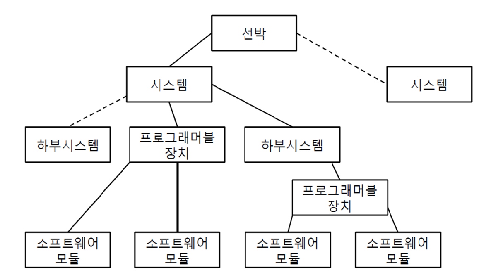

# 제6편 전기설비 및 제어시스템

> 선급 및 강선규칙/적용지침 / RA-06-K / 2025 / KO / Rules

## 제 2 장 제어설비

### 제 1 절 일반사항

#### 101. 일반사항

- **1.** **적용 【지침 참조】**
  - **(1)** 이 장의 규정은 규칙에서 요구되는 모든 기기 및 장치의 제어, 경보 및 안전시스템에 대하여 적용한다.
  - **(2)** 기타 우리 선급이 필요하다고 인정하는 기기 및 장치의 제어, 경보 및 안전시스템에 대하여도 본 규정을 준용할 수 있다.
- **2.** **용어** 이 장에서 사용하는 용어의 정의는 다음에 따른다.
  - **(1)** **감시장소**(제어장소를 제외한다.)라 함은 기기 및 장치의 계기 등을 1개소에 모아, 이러한 기기 및 장치의 운전상태를 파악하는 데 필요한 정보를 얻을 수 있는 장소를 말한다. 다만, 선박에 (2)호에서 정하는 제어장소에 추가하여 감시장소가 있는 경우에는 이 장의 감시장소에 관련한 규정은 해당 감시장소에 적용하지 아니 한다.
  - **(2)** **제어장소**라 함은 감시장소의 기능에 추가하여 해당 기기 및 장치의 제어를 할 수 있는 장소를 말한다.
  - **(3)** **주제어장소**라 함은 주추진기관의 제어를 행하기 위해 필요충분한 설비(이하, (3)호 및 (4)호에서는 **주제어설비**라 한다.)를 선교 이외에 갖춘 선박 중, 주제어설비를 갖춘 장소에 있어서 통상 주추진기관을 제어하는 장소를 말한다.
  - **(4)** **선교주제어장소**라 함은 주제어설비를 선교에 갖추고 통상 주추진기관을 선교에서 제어하는 선박의 선교를 말한다.
  - **(5)** **보조제어장소**라 함은 주제어설비를 선교에 갖춘 선박의 제어장소 중 기관실 내의 제어장소에 있어서 주추진기관을 제어할 수 있는 장소(주추진기관의 기계측제어장소를 제외한다.)를 말한다.
  - **(6)** **선교제어장치**라 함은 선교 또는 선교주제어장소에 설치된 주추진기관 또는 가변피치프로펠러의 원격제어장치를 말한다.
  - **(7)** **순차제어**라 함은 미리 정해진 순서에 따라서 제어의 각 단계를 순차 진행시키는 제어를 말한다.
  - **(8)** **프로그램제어**라 함은 목표치가 미리 정해진 계획에 따라 변화하는 제어유형을 말한다.
  - **(9)** **기계측제어**라 함은 기기 및 장치를 이들의 설치장소 또는 그 근방에서 필요한 감시계기에 따라 직접 제어하는 것을 말한다.
  - **(10)** **원격제어시스템**은 운영자가 조치 결과를 직접 관찰할 수 없는 제어위치에서 장치를 구동시키는 데 필요한 모든 기기를 포함한다. *(2017)*
  - **(11)** **안전시스템**이라 함은 운전 중의 기기 및 장치에 중대한 기능장애가 발생한 때, 기기 및 장치의 손상을 방지하기 위하여 자동적으로 다음의 어느 동작을 행하는 시스템을 말한다.
    - **(가)** 예비장치의 시동
    - **(나)** 기기 및 장치의 출력저감
    - **(다)** 기기 및 장치의 정지 또는 연료공급의 차단
  - **(12)** **컴퓨터기반시스템**이라 함은 하나 또는 그 이상의 컴퓨터(programmable electronic device 포함), 관련 소프트웨어, 주변장치 및 인터페이스와 컴퓨터네트워크 및 그 프로토콜을 말한다.
  - **(13)** **통합시스템**이라 함은 2개 이상의 부 시스템으로 구성된 것으로서, 데이터전송 네트워크로 연결되고 독립의 기능이 있으며 하나 이상의 워크스테이션에서 운전되는 시스템을 말한다.
  - **(14)** **전문가시스템**이라 함은 인간의 전문적 기술 또는 지식의 어떤 형태를 이용하여 수집된 정보를 통해 문제를 해결하도록 설계된 지능화한 지식기반시스템을 말한다.
  - **(15)** **소프트웨어**라 함은 컴퓨터시스템의 운전에 관한 프로그램, 절차 및 관련 문서를 말한다.
  - **(16)** **기본소프트웨어**라 함은 응용소프트웨어를 지원하는데 필요한 최소한의 소프트웨어로서 펌웨어 및 미들웨어를 포함한다.
  - **(17)** **응용소프트웨어**라 함은 컴퓨터기반시스템의 실제 구성에 대하여 특정의 임무를 수행하는 소프트웨어를 말하며 기본소프트웨어의 지원을 받는다.
  - **(18)** **인터페이스**라 함은 정보교환이 이루어지는 이송점을 말한다.(예: 입출력인터페이스, 통신인터페이스)
  - **(19)** **주변장치**라 함은 컴퓨터기반시스템에서 보조기능을 수행하는 것을 말한다.(예: 프린터, 데이터 저장장치)
  - **(20)** **고장모드 및 영향분석(FMEA)**이라 함은 설계에 있어서 모든 고장모드 및 이와 관련된 효과 또는 결과를 가정하는데 사용하는 고장분석의 방법론을 말한다.
  - **(21)** 컴비네이터 커브(combinator curve)라함은 프로펠러 피치 설정과 프로펠러 속도 간의 관계를 말한다. *(2025)*
- **3.** **제출도면 및 자료** ***(2017)***
  - **(1)** 자동화에 관한 도면 및 자료
    - **(가)** 측정점 일람표
    - **(나)** 경보점 일람표
    - **(다)** 제어장치 및 안전장치
      - **(a)** 제어대상 및 제어량의 일람표
      - **(b)** 제어에너지원의 종류(자력식, 공기식, 전기식 등)
      - **(c)** 비상정지, 감속(자동감속 또는 감속요구) 등의 조건일람표
  - **(2)** 주추진기관 또는 가변피치프로펠러의 자동제어 및 원격제어장치에 관한 도면 및 자료
    - **(가)** 주추진기관의 시동 및 정지, 전후진 전환, 출력증감 등의 동작설명서
    - **(나)** 안전장치(기관부속의 것도 포함한다.) 및 표시등의 배치도
    - **(다)** 제어계통도
  - **(3)** 보일러의 자동제어 및 원격제어장치에 관한 다음의 도면 및 자료
    - **(가)** 순차제어, 급수제어, 압력제어 및 연소제어와 안전장치의 동작설명서
    - **(나)** 자동연소제어장치 및 자동급수장치의 계통도
  - **(4)** 발전장치의 자동제어장치(자동부하분담장치, 우선차단장치, 자동시동장치, 자동동기투입장치, 순차시동장치 등)의 계통도 및 동작설명서
  - **(5)** 선교제어반 도면
  - **(6)** 기관실제어반 도면
  - **(7)** 원격제어 장치도면(주추진기관, 발전기 및 보일러용)
  - **(8)** 경보 및 제어장치용 제작도면(경보점 일람표 포함)
  - **(9)** 각 제어장소에 설치되는 감시반, 경보반 및 제어콘솔의 배치도
  - **(10)** 선내시험방안 및 해상시운전방안

### 제 2 절 시스템 및 제어

#### 201. 시스템 설계 (2017)

- **1.** **시스템 설계의 요건**
  - **(1)** 제어시스템, 경보시스템 및 안전시스템은 가능한 한 하나의 고장이 다른 고장으로 확대되지 않도록 하여야 하며, 그 기능을 저해하는 범위가 최소한으로 되도록 설계하여야 한다.
  - **(2)** 제어시스템, 경보시스템 및 안전시스템은 페일세이프의 원칙으로 설계하여야 한다. 또한, 페일세이프의 특성은 각각의 시스템 자체 및 이들에 관련된 기기 및 장치뿐만 아니라 선박의 종합적인 안전을 고려하여야 한다.
  - **(3)** 자동제어 및 원격제어를 행하기 위한 설비는 사용조건하에서 충분한 신뢰성이 있는 것이어야 한다.
  - **(4)** 신호전송용 케이블은 유해한 유도장해를 받을 위험이 없도록 포설하여야 한다.
- **2.** **동력의 공급**
  - **(1)** 전력의 공급
    전력의 공급에 대하여는 다음에 따라야 한다.
    - **(가)** 제어시스템, 경보시스템 및 안전시스템으로의 급전회로는 동력회로 및 전등회로와 분리하여야 한다. 다만, 동력기기에 있어서 그 제어전원이 각각의 동력회로에서 급전되는 경우에는 이에 따르지 않는다.
    - **(나)** 발전장치의 경보시스템 및 안전시스템으로의 급전은 축전지전원에서도 가능하여야 한다.
  - **(2)** 유압의 공급
    제어용 유압의 공급에 대하여는 다음에 따라야 한다.
    - **(가)** 유압원은 필요한 유압 및 유량의 청정한 기름을 안정하게 공급할 수 있어야 한다.
    - **(나)** 유압펌프의 토출 측에는 과압방지장치를 설치하여야 한다.
    - **(다)** 주추진기관 및 추진축계의 제어에 사용되는 유압펌프는 2대 이상 설치하여 어느 1대가 고장 난 경우에 예비펌프가 자동시동하거나 신속히 예비펌프를 원격시동할 수 있도록 하여야 한다. 이 경우, 유압펌프는 다른 기기 및 장치의 제어용으로 사용하여서는 아니 된다.
  - **(3)** 공기압의 공급
    제어용공기의 공급에 관하여는 다음에 따라야 한다.
    - **(가)** 제어시스템에는 제어용공기압축기가 고장 난 경우에 적어도 5분간 제어장치에 공기를 공급할 수 있는 용량의 공기탱크를 설치하여야 한다.
    - **(나)** 추진용 디젤기관의 시동용 공기탱크가 제어용 공기탱크를 겸용하는 경우에는 감압장치를 2중으로 설치하여야 한다.
    - **(다)** 제어용 공기원으로 사용하는 압축기는 2대 이상 설치하여야 한다. 이들 압축기의 용량은 어느 1대의 압축기가 고장 난 경우에도 충분한 여유가 있는 것이어야 한다.
    - **(라)** 제어용 공기는 필터 및 필요한 경우 제습기를 통하여 고형분, 유분, 수분 등을 가능한 한 제거하여야 한다.
    - **(마)** 제어용 공기관은 잡용 공기관 및 시동용 공기관과는 별도로 배관하여야 한다.
- **3.** **주위조건**
  자동제어 및 원격제어에 관련된 설비는 설치장소의 주위조건에 견디는 것이어야 한다.
- **4.** **제어시스템**
  - **(1)** 시스템의 독립성
    주추진기관 또는 가변피치프로펠러, 보일러, 발전장치 및 추진상 필요한 보기(이하, 이 장에 있어서 **추진보기**라 한다.)의 제어시스템은 각각의 독립 시스템으로 하거나, 시스템이 고장난 경우에도 다른 시스템의 성능을 저해하지 아니하는 것이어야 한다.
  - **(2)** 제어장치의 연계장치
    복수의 주추진기관 또는 가변피치프로펠러, 발전장치 또는 중요보기가 동시에 동일조건하에서 복수로 운전하도록 설계되어 있는 경우에는 이들 설비의 제어장치 사이에 연계장치를 설치할 수 있다.
  - **(3)** 제어특성
    원격제어장치 및 자동제어장치는 제어하고자 하는 장치의 동적특성에 적합한 제어특성을 가지는 것으로 하고, 외란에 의한 오동작이나 헌팅이 일어나지 않도록 고려한 것이어야 한다.
  - **(4)** 인터록
    원격제어장치에는 예상되는 오동작 및 오조작에 의한 기기 또는 장치의 손상을 방지하기 위하여 적당한 인터록을 설치하여야 한다.
  - **(5)** 수동운전 전환
    수동운전에의 전환에 대하여는 다음에 따라야 한다.
    - **(가)** 주추진기관 또는 가변피치프로펠러, 보일러, 발전장치 및 추진보기는 자동제어장치가 고장 난 경우에 있어서도 수동으로 시동, 운전 및 제어할 수 있도록 하여야 한다.
    - **(나)** 자동제어장치에는 일반적으로 수동으로 이들 장치의 자동기능을 정지시키기 위한 수단을 갖추어야 한다.
    - **(다)** (나)의 수단은 자동제어장치의 어느 부분이 고장 난 경우에도 이들 장치의 자동기능을 정지시킬 수 있는 것이어야 한다.
  - **(6)** 원격제어기능의 해제
    원격제어장치는 원격제어기능을 수동으로 해제할 수 있는 것이어야 한다.
  - **(7)** 제어장소의 명시 등 **【지침 참조】**
    두 곳 이상에서 기기 및 장치의 운전이 가능한 경우, 그 제어장치는 다음에 따라야 한다. 다만, 우리 선급이 적당하다고 인정하는 다른 방법으로 기기 및 장치의 안전과 보안상의 안전을 얻을 수 있는 경우에는 이에 따르지 아니 한다.
    - **(가)** 각 제어장소에는 현재 어느 장소에서 운전을 행하고 있는지 식별할 수 있는 장치를 갖추어야 한다.
    - **(나)** 동시에 두 곳 이상의 제어장소에서 운전할 수 없도록 하여야 한다.
- **5.** **경보시스템**
  - **(1)** 경보시스템은 다음의 기능을 갖추어야 한다.
    - **(가)** 이상상태를 검지한 경우에는 가시가청경보를 발하는 장치(이하, 이 장에 있어서 **경보장치**라 한다.)가 작동하여야 한다.
    - **(나)** 가청경보를 정지시키는 장치가 갖추어진 경우에는 가청경보를 정지시켜도 가시경보는 동시에 소멸되지 않아야 한다.
    - **(다)** 2개 이상의 이상 상태를 동시에 경보할 수 있어야 한다.
    - **(라)** 기기 및 장치에 대한 가청경보는 일반경보, 화재경보, 탄산가스방출경보 등의 가청경보와는 용이하게 구별할 수 있어야 한다.
  - **(2)** 주추진기관 또는 가변피치프로펠러의 감시장소에 설치되는 경보시스템은 전 호에서 정하는 기능에 추가하여 다음의 기능을 가진 것이어야 한다.
    - **(가)** 가시경보는 그 원인이 완전히 제거될 때까지 표시되어야 한다.
    - **(나)** 어떤 경보의 확인동작에 의해 다른 경보의 작동이 방해받지 않아야 한다.
    - **(다)** 최초의 경보가 확인되어 고장이 회복되기 이전에 제2의 고장이 발생한 경우, 경보장치는 다시 작동하여야 한다.
    - **(라)** 경보시스템의 일부를 수동으로 정지시키는 경우에는 정지의 내용을 명확하게 표시하여야 한다.
  - **(3)** 가시경보는 기기 및 장치의 이상상태의 종류를 용이하게 식별할 수 있도록 하여야 한다.
- **6.** **안전시스템**
  - **(1)** 안전시스템의 구성
    안전시스템의 구성에 대하여는 다음에 따라야 한다.
    - **(가)** 안전시스템은 가능한 한 제어시스템 및 경보시스템에 독립하여 작동하도록 설치하여야 한다.
    - **(나)** 주추진기관, 보일러, 발전장치 및 추진보기의 안전시스템은 각각 독립된 시스템으로 하여야 한다.
  - **(2)** 안전시스템의 기능
    안전시스템은 다음의 기능을 갖춘 것이어야 한다.
    - **(가)** 안전시스템이 동작한 때에는 **201**.의 **5**항에서 규정하는 기능을 가진 경보시스템이 작동하여야 한다.
    - **(나)** 안전시스템이 작동하여 기기 및 장치의 운전이 정지된 경우, 그 기기 및 장치는 수동으로 리세트 조작하기 전에 자동적으로 재시동하지 않아야 한다.
  - **(3)** 오버라이드장치
    안전시스템의 일부 또는 전부의 기능을 일시적으로 정지하기 위한 장치(이하 오버라이드장치라 한다.)를 설치하는 경우에는 다음에 따라야 한다.
    - **(가)** 기기 및 장치의 제어장소에는 오버라이드장치의 작동상태를 명확하게 표시하여야 한다.
    - **(나)** 오버라이드장치는 부주의한 조작에 의해 작동상태로 되지 않도록 하여야 한다.

#### 202. 주추진기관 또는 가변피치프로펠러의 자동제어 및 원격제어 【지침 참조】

- **1.** **일반사항**
  주추진기관 또는 가변피치프로펠러의 자동제어 및 원격제어를 행하기 위한 장치는 이 **202.**의 규정에 따라야 한다.
- **2.** **주추진기관 또는 가변피치프로펠러의 원격제어장치**
  - **(1)** 일반사항
    주추진기관 또는 가변피치프로펠러의 원격제어장치에 대하여는 다음에 따라야 한다.
    - **(가)** 주추진기관 또는 가변피치프로펠러의 원격제어장치는 단순한 조작으로 프로펠러회전 및 추력의 방향 (가변피치프로펠러에 있어서는 프로펠러의 날개각)을 제어할 수 있어야 한다.
    - **(나)** 주추진기관 또는 가변피치프로펠러의 원격제어장치는 프로펠러마다 설치하여야 한다. 또한, 복수의 프로펠러를 동시에 조작하도록 설계되어 있는 경우에는 해당 프로펠러는 하나의 제어핸들로 조작하여도 무방하다. *(2025)*
    - **(다)** 디젤주기관의 회전수가 조속기로 제어되는 경우, 조속기는 연속최대회전수의 103 %에 상당하는 회전수를 넘지 않도록 조정되어야 한다. 또한, 조속기는 원활한 최저회전수를 확보할 수 있어야 한다.
    - **(라)** 프로그램제어를 채용한 경우, 출력증감 프로그램은 기관 각부에 위험한 기계적응력 및 열응력이 생기지 않도록 조정되어야 한다.
    - **(마)** 주추진기관 또는 가변피치프로펠러의 모든 제어장소 및 감시장소에는 다음의 계기를 갖추어야 한다.
      - **(a)** 고정피치프로펠러의 경우에는 프로펠러 회전수 및 회전방향의 지시기
      - **(b)** 가변피치프로펠러의 경우에는 프로펠러 회전수 및 프로펠러 날개각의 지시기
    - **(바)** 주추진기관 또는 가변피치프로펠러의 원격제어장소에는 주추진기관의 제어에 필요한 경보장치를 갖추어야 한다.
  - **(2)** 제어장소의 전환
    주추진기관 또는 가변피치프로펠러의 원격제어장치는 제어장소의 전환에 대하여 다음의 요건에 적합한 것이어야 한다.
    - **(가)** 주추진기관 또는 가변피치프로펠러 각각의 제어장소에는 현재 어느 장소에서 제어를 행하고 있는지를 명시할 수 있어야 한다.
    - **(나)** 주추진기관 또는 가변피치프로펠러를 동시에 2개소 이상의 제어장소에서 제어할 수 없도록 하여야 한다.
    - **(다)** 제어계통은 제어권을 양보하는 쪽의 지령조작과 받는 쪽의 확보조작을 행하는 것으로 전환하는 것이어야 한다. 다만, 다음 어느 것에 해당하는 경우에 있어서는 이에 따르지 않는다.
      - **(a)** 주추진기관 또는 가변피치프로펠러의 기계측제어장소와 주제어장소 또는 보조제어장소의 제어계통의 전환.
      - **(b)** 주추진기관이 정지하고 있는 동안 제어계통의 전환.
    - **(라)** 선교 또는 선교제어장소에서 주추진기관 또는 가변피치프로펠러의 제어를 행하는 경우, 선교 또는 선교주제어장소에서의 전환지령이 없어도 주추진기관 또는 가변피치프로펠러의 기계측제어장소, 주제어장소 또는 보조제어장소에서 제어계통의 전환을 할 수 있어야 한다.
    - **(마)** 제어장소의 전환으로 추력이 현저하게 변화하는 것을 방지하는 조치를 강구하여야 한다. 다만, (다)의 (a) 또는 (라)에 해당하는 경우에 있어서는 이에 따르지 않는다.
  - **(3)** 주추진기관 또는 가변피치프로펠러의 원격제어장치의 고장
    주추진기관 또는 가변피치프로펠러의 원격제어장치는 고장 난 경우에 대비하여 다음에 따라야 한다.
    - **(가)** 주추진기관 또는 가변피치프로펠러의 원격제어장소에는 주추진기관 또는 가변피치프로펠러의 원격제어장치가 고장 난 경우에 작동하는 경보장치를 설치하여야 한다.
    - **(나)** 주추진기관 또는 가변피치프로펠러의 원격제어장치가 고장 난 경우에도 주추진기관 또는 가변피치프로펠러는 기계측제어장치로 원활한 운전이 가능하여야 한다.
    - **(다)** 주추진기관 또는 가변피치프로펠러의 원격제어장치가 고장 난 경우에 있어서, 주제어장소, 보조제어장소 또는 기계측제어장소에서 제어가 이루어지기까지 주추진기관 또는 가변피치프로펠러의 회전수 및 추력의 방향은 고장 전과 같은 상태로 유지되어야 한다. 다만, 우리 선급이 시행하기 어렵다고 인정하는 경우에는 이에 따르지 않는다. 특히, 동력(전기, 공압, 유압)이 부족해도 추진력이나 프로펠러 회전 방향에 크고 급격한 변화가 발생하지 않아야 한다. *(2025)*
    - **(라)** 주추진기관 또는 가변피치프로펠러의 원격제어장치가 고장 난 경우에도 주제어장소, 보조제어장소 또는 기계측제어장소로의 전환이 간단한 조작으로 가능하도록 설비하여야 한다.
    - **(마)** 주추진기관 또는 가변피치프로펠러의 원격제어장소에는 주추진기관 또는 가변피치프로펠러의 원격제어장치가 고장 난 경우에도 사용할 수 있는 독립의 주추진기관 비상정지장치를 설치하여야 한다.
  - **(4)** 주추진기관의 원격시동
    주추진기관의 원격제어장치에 의한 시동에 대하여는 다음에 따라야 한다.
    - **(가)** 주추진기관의 시동회수는 **5편 6장 1101**.의 회수를 만족하는 것이어야 한다.
    - **(나)** 자동 시동방식을 채용한 주추진기관의 원격제어장치는 자동시동 연속 시도 횟수가 3회로 제한되도록 하여야 한다. 또한, 시동에 실패한 경우에는 해당 제어장소 및 선교주제어장소 또는 주제어장소 또는 주추진기관의 감시장소(선교주제어장소 및 주제어장소가 설치되어 있지 않은 경우에 한한다.)에 가시가청경보를 발하여야 한다.
    - **(다)** 주추진기관의 시동에 압축공기를 사용하는 선박에서는 시동공기압의 저하를 알리는 경보장치를 주추진기관의 원격제어장소 및 주추진기관의 감시장소에 설치하여야 한다.
    - **(라)** 앞 (다)에서 정하는 경보의 설정압력은 주추진기관의 시동이 가능한 압력이어야 한다.
- **3.** **선교제어장치** ***(2025)***
  선교제어장치는 **202**.의 **2**항에 따르는 이외에 다음에 따라야 한다.
  - **(1)** 선교 또는 선교주제어장소에서 주추진기관 또는 가변피치프로펠러를 제어하는 경우에도 선교 또는 선교주제어장소에 있어서 텔레그라프 명령은 주추진기관 또는 가변피치프로펠러를 제어하는 장소에 표시되어야 한다.
  - **(2)** 추진기관(propulsion machinery)의 원격제어장치에는 추진기관(propelling machinery)의 과부하 및 임계속도 범위에서의 장시간 운전을 방지하는 수단이 제공되어야 한다.
  - **(3)** 선교제어시스템은 다른 제어시스템(the other transmission system)으로부터 독립되어야 한다. 다만, 두 시스템 모두에 대해 하나의 제어 레버가 허용될 수 있다.
  - **(4)** 비상시 최대 전방 운항 속도로부터 후진을 포함한 선교 제어장치의 설정에 따른 작동은 자동 순서로서 기관이 허용할 수 있는 시간 간격으로 이루어져야 한다.
  - **(5)** 자동화시스템은 추진시스템의 긴박한 감속이나 정지등에 대한 조기경보를 적시에 항해당직 사관에게 주어, 비상시에 항해에 관련된 상황을 판단할 수 있도록 설계되어야 한다. 특히, 동 시스템은 추진기관에 대한 제어, 감시, 보고, 경고 및 추진기의 감속 또는 정지 등의 안전조치를 행할 수 있어야 하며, 이러한 기능들은 과속도의 경우와 같이 단시간 내에 기관 및/또는 추진장치 전체의 고장을 초래할 수 있는 경우를 제외하고는, 항해 당직 사관이 수동으로 오버라이드할 수 있도록 하여야 한다.
- **4.** **안전조치**
  - **(1)** 주추진기관 또는 가변피치프로펠러의 안전조치
    주추진기관 또는 가변피치프로펠러의 안전조치에 대하여는 다음에 따라야 한다.
    - **(가)** 주추진기관 또는 가변피치프로펠러의 원격제어장치에는 다음의 안전조치를 강구하여야 한다.
      - **(a)** 착오조작으로 인해 중대한 사고가 발생하는 것을 방지하기 위하여 필요한 인터록을 갖추어야 한다.
      - **(b)** 추진에 필요한 보기가 전동기로 구동되는 경우, 주전원이 상실되면 주추진기관이 자동적으로 정지하거나 주추진기관을 정지할 수 있어야 한다.
      - **(c)** 주전원의 상실로 인하여 주추진기관이 정지한 경우, 주전원이 복귀할 때 주추진기관이 자동적으로 재시동하지 않도록 하여야 한다.
      - **(d)** 주추진기관 또는 가변피치프로펠러의 원격제어장치에 고장이 발생하여도 주추진기관이 이상 과부하로 되지 않도록 하여야 한다.
    - **(나)** 주추진기관 또는 가변피치프로펠러의 감시장소에는 주추진기관의 정지장치를 갖추어야 한다.
  - **(2)** 주추진기관 또는 가변피치프로펠러의 안전시스템
    주추진기관 또는 가변피치프로펠러의 안전시스템은 다음에 따라야 한다.
    - **(가)** 안전시스템 중 연료 또는 증기의 공급을 자동적으로 차단하는 장치에 있어서, 주추진기관에 사용되는 것은 완전한 파괴, 중대한 손상 또는 폭발에 이르는 경우를 제외하고 자동적으로 동작하지 않아야 한다.
    - **(나)** 주추진기관 또는 가변피치프로펠러의 안전시스템은 주전원 및 공기원의 상실 등이 발생한 경우에 있어서도 그 기능이 상실되지 않도록 하거나 안전한 방향으로 작동하도록 하여야 한다.
  - **(3)** 자기역전식 디젤기관
    자기역전식 디젤기관의 원격제어장치에는 적어도 다음과 같은 안전조치를 강구하여야 한다.
    - **(가)** 캠축이 전진 또는 후진의 위치에 확실히 있는 경우에만 시동조작이 이루어져야 한다.
    - **(나)** 역전조작을 할 때 연료분사가 이루어지지 않아야 한다.
    - **(다)** 전진회전수가 미리 정해진 값 이하로 저하한 다음에만 후진운전으로 이행하여야 한다.
  - **(4)** 다기1축선의 주추진기관
    다기1축선의 주추진기관의 원격제어장치에는 적어도 다음의 안전조치를 강구하여야 한다.
    - **(가)** 각 주추진기관에는 과부하방지장치를 설치하여야 한다.
    - **(나)** 각 주추진기관에 비정상적인 불평형부하가 생기지 않도록 하여야 한다.
  - **(5)** 클러치붙이의 주추진기관
    클러치붙이 주추진기관의 원격제어장치에는 적어도 다음의 안전조치를 강구하여야 한다.
    - **(가)** 다기1축선의 주추진기관에 있어서 비상정지된 주추진기관은 클러치가 떨어지도록 하여야 한다. 또한, 회전방향이 다른 여러 개의 주추진기관을 운전하는 경우, 이들 클러치가 동시에 붙지 않도록 하여야 한다.
    - **(나)** 주추진기관의 회전수가 미리 정해진 값 이하에서 클러치의 탈착이 이루어져야 한다.
    - **(다)** **5편 2장 203**.의 **1**항 또는 **304**.의 **1**항에서 규정하는 과속도방지장치를 갖추어야 한다.
    - **(라)** 클러치를 뗄 때 추진용전동기가 정격회전수의 125 %를 넘지 않도록 우리 선급이 적당하다고 인정하는 과속도방지장치를 갖추어야 한다.
  - **(6)** 가변피치프로펠러를 구동하는 주추진기관
    가변피치프로펠러를 구동하는 주추진기관의 원격제어장치에는 적어도 다음과 같은 안전조치를 강구하여야 한다.
    - **(가)** 과부하방지장치를 갖추어야 한다.
    - **(나)** 기관의 시동 또는 클러치의 물림은 프로펠러 블레이드가 중립위치에 있을 때만 이루어져야 한다.
    - **(다)** **5편 2장 203**.의 **1**항 또는 **304**.의 **1**항의 과속도방지장치를 갖추어야 한다.
    - **(라)** 프로펠러피치를 변화시킬 때 추진용전동기가 정격회전수의 125 %를 넘지 않도록 우리 선급이 적당하다고 인정하는 과속도방지장치를 갖추어야 한다.
  - **(7)** 기관에 위험을 초래할 수 있는 조건이 있는 경우 추진기관의 원격 시동이 자동으로 금지되어야 한다(예: 샤프트 터닝기어가 체결되어 있는 경우, 윤활유 압력이 저하된 경우). *(2025)*
  - **(8)** 증기터빈의 경우 터빈이 허용 가능한 시간보다 오랫동안 정지하면 자동으로 작동하는 저속회전장치가 제공되어야 하며, 선교에서 자동 회전을 중단할 수 있어야 한다. 인원이 배치되는 기관구역의 경우, 저속회전장치를 수동으로 작동하도록 배치할 수 있다. *(2025)*

#### 203. 보일러의 자동제어 및 원격제어

- **1.** **일반사항**
  - **(1)** 기름보일러의 연소 및 급수에 대하여 자동제어를 행하는 경우, 사용되는 장치는 각각 **203**.의 **2**항 내지 **4**항의 규정에 적합한 것이어야 한다.
  - **(2)** 기름보일러의 연소 또는 급수의 어느 것에 대하여 자동제어를 행하는 경우, 사용되는 장치는 **203**.의 **2**항 또는 **3**항의 해당 규정과 **203**.의 **4**항의 규정에 적합한 것이어야 한다.
  - **(3)** 기름보일러 이외의 보일러 또는 특수한 구조의 보일러제어를 자동으로 행하는 경우에는 우리 선급이 적당하다고 인정하는 바에 따른다. **【지침 참조】**
  - **(4)** 원격수면계에 대하여는 **5편 5장 129**.의 규정에 따른다.
- **2.** **자동연소제어장치**
  - **(1)** 일반사항
    자동연소제어장치에 대하여는 다음에 따라야 한다.
    - **(가)** 자동연소제어장치는 보일러의 계획된 증기량, 압력 및 온도를 얻을 수 있도록 제어되고 안정한 연소를 확보할 수 있는 것이어야 한다.
    - **(나)** 부하에 따라 연료공급량을 가감하는 장치는, 연료공급량을 조정 가능한 범위에 있어서, 안정한 화염을 유지할 수 있는 것이어야 한다.
    - **(다)** 압력을 검출하여 연소제어를 행하는 보일러에 있어서 조정압력의 상한은 안전밸브의 조정압력보다 낮은 압력으로 행하여야 한다.
  - **(2)** 단속 운전용 연소제어장치
    단속 운전용 연소제어장치는 다음의 규정에 적합하여야 하며, 계획된 순서에 따라 작동하는 것이어야 한다.
    - **(가)** 점화용버너에 착화전 또는 점화용버너가 없는 것에 있어서는 주버너 점화전에, 연소실 및 보일러출구까지의 연로용적의 4배 이상의 공기로 연소실 및 연로를 환기하여야 한다. 다만, 버너가 1개인 소형보일러에 있어서는 30초 이상의 환기로 그쳐도 무방하다.
    - **(나)** 직접점화(점화용불꽃을 사용하여 주버너에 점화하는 방식)의 경우, 연료밸브의 ‘개방’은 점화용 불꽃에 선행되지 않아야 한다.
    - **(다)** 간접점화(점화용버너를 사용하여 주버너에 점화하는 방식)의 경우에는 점화용버너의 연료밸브(이하, ‘점화용밸브’라 한다.)의 ‘개방’은 착화용불꽃에, 또한 주버너의 연료밸브(이하, ‘주연료밸브’라 한다.)의 ‘개방’은 점화용연료밸브의 ‘개방’에 각각 선행하지 않아야 한다.
    - **(라)** 점화동작은 계획된 시간 내에 확실하게 행하여지는 것으로 하고, 점화시간(주연료밸브가 열리고부터 점화에 실패하여 닫히기까지의 시간)은 직접점화의 경우에는 10초, 간접점화의 경우에는 15초를 넘지 않아야 한다.
    - **(마)** 주버너의 점화는 저연소 상태에서 행하여야 한다.
    - **(바)** 주연료밸브가 닫힌 후, 연료밸브와 버너노즐과의 사이에 있는 연료를 연소시키기 위해 20초 이상 환기하여야 한다. 다만, 보조보일러에 있어서 우리 선급이 적당하다고 인정한 것에 대하여는 이 환기를 생략하여도 무방하다. **【지침 참조】**
  - **(3)** 버너의 갯수제어에 의한 연소제어장치
    버너의 갯수제어에 의한 연소제어장치는 다음의 규정에 적합한 것이어야 한다.
    - **(가)** 각 버너는 계획된 순서에 따라 점화 및 소화되는 것이어야 한다. 또한, 기본버너의 점화는 수동조작에 의하고 기본버너 이외의 버너의 점화는 이미 점화된 버너의 불꽃으로 하여도 무방하다.
    - **(나)** 소화된 버너의 잔유는 재점화에 지장이 없도록 자동적으로 연소되게 하여야 한다. 다만, 기본버너에 대하여는 점화용버너가 착화하여 있지 않는 경우, 보일러에 장비된 채로 증기 또는 공기로 잔유의 제거를 행하지 않아야 한다.
    - **(다)** 주보일러의 버너는 주제어장소 또는 선교제어장소에서 점화 및 소화가 가능한 것으로 하여야 한다. 다만, 기본버너의 점화에 대하여는 이에 따르지 아니 한다.
  - **(4)** 기타 연소제어장치 **【지침 참조】**
    기타의 연소제어장치는 (2)호 및 (3)호의 해당 규정 외에 우리 선급이 적절하다고 인정하는 바에 따른다.
- **3.** **자동 급수제어장치**
  - **(1)** 자동 급수제어장치는 보일러 수면을 미리 정한 범위내에 유지하기 위하여 자동적으로 급수량을 조정하는 것이어야 한다.
  - **(2)** 주보일러는 급수제어장치, 원격수면계, 저수면안전장치 및 저수면경보장치에 사용되는 수면검출기를 3개 이상 설치하여야 한다.
- **4.** **안전조치**
  - **(1)** 안전장치
    안전장치에 대해서는 **5편 5장 133.**의 **1**항의 규정에 따른다.
  - **(2)** 연료유 가열
    연료유를 가열하여 사용하는 경우는 가열기에 자동온도조절기를 비치하고 온도가 미리 정해진 온도 이하로 떨어진 경우에는 자동적으로 버너의 연료공급을 차단하는 장치 또는 경보장치를 설치하여야 한다.
- **5.** **경보** 경보장치에 대해서는 **5편 5장 133.**의 **2**항의 규정에 따라야 한다.

#### 204. 발전장치의 제어설비

- **1.** **일반사항**
  - **(1)** 자동시동 또는 원격시동되는 발전장치에는 안전운전에 필요한 인터록을 설치하여야 한다.
  - **(2)** 자동 시동방식을 채용한 발전장치에 있어서는 자동시동 연속 시도 횟수가 2회로 제한되도록 하여야 하고 시동실패의 경우에 작동하는 경보장치를 설치하여야 한다.
  - **(3)** 추진용 발전기를 구동하는 디젤기관을 원격시동하는 경우의 시동회수는 **5편 2장 202**.의 **5**항에 따른 회수를 만족하여야 한다.
  - **(4)** 예비 발전장치가 자동시동한 후, 자동적으로 배전반 모선에 접속되는 것에 있어서는 선행 발전장치의 전력상실의 원인이 단락사고에 기인하는 경우, 발전기용차단기의 투입동작이 2회 이상 행하여지지 않도록 하여야 한다.
  - **(5)** **1장 201**.의 **1**항 (1)호에 관련한 전기설비에 전력을 공급하는 발전기에 있어서, 주추진기관에 의하여 구동되는 발전기를 장비하고 이것을 사용하는 중에 주추진기관을 선교제어하는 경우의 자동제어 및 원격제어에 대하여는 이 **204**.의 규정에 따르는 이외에 **1장 202**.에 따라야 한다.
- **2.** **비상용 왕복동 내연기관의 경보 및 안전장치** ***(2024)***
  이 요건은 ISO 8217:2017에 따른 증류된 해양 연료를 사용하고 비상시 즉시 사용할 수 있으며, 원격제어 또는 자동 작동할 수 있는 왕복동 내연기관에 적용한다.
  - **(1)** 경보 및 안전장치는 **표 6.2.1**에 따라야 한다.
  - **(2)** (1)호에 열거한 장치의 경보는 기계측 및 제어장소에 발하여야 한다. 이 경우 제어장소에 설치된 가시경보는 그룹으로 표시하여도 무방하다.
  - **(3)** 연속최대출력이 220 $\mathrm{kW}$ 이상의 경우에는 **5편 2장 203.**의 **1**항 (2)호에서 규정하는 과속도 방지장치를 갖추어야 한다.
  - **(4)** **표 6.2.1**에 표시된 것에 추가하여 긴급 정지가 제공되는 경우에는, 항해중에 엔진이 자동 또는 원격 제어 모드일 때, 과속도로 인한 긴급 정지이외의 긴급 정지는 자동으로 오버라이딩될 수 있어야 한다.
  - **(5)** 해당 구역 외부에서의 연료유 제어에 추가하여, 기계측에 엔진 긴급정지를 위한 수단이 제공되어야 한다.
  - **(6)** 제어장소에 대한 가청경보를 정지하여도 기계측에 대한 가청경보가 정지되어서는 아니 된다.

    | **파라미터** |   |   | **경보 발생** | **자동긴급정지** |
    | --- | --- | --- | --- | --- |
    | 고압관 연료 누설 (연료 분사 파이프 및 커먼 레일) |   |   | O |   |
    | 윤활유 온도(1) | High |   | O |   |
    | 윤활유 압력 | Low |   | O |   |
    | 오일미스트 감지장치 작동 (또는 다음과 같은 온도 모니터링 시스템 또는 동등한 장치의 활성화: - 기관 주베어링 및 크랭크베어링 오일 배출구; 또는 - 기관 주베어링 및 크랭크베어링)(2)(3) |   |   | O |   |
    | 냉각수 압력 또는 유량(1) |   | Low | O |   |
    | 냉각수 온도(또는 냉각 공기) |   | High | O |   |
    | 과속도 발생(1) |   |   | O | O |
    | (비고) (1) 연속최대출력이 220 kW 이상인 기관에 적용 (2) 연속최대출력이 2,250 kW 초과 또는 실린더 지름이 300 mm를 초과하는 기관에 적용 (3) 오일미스트 감지장치는 우리 선급에 의해 승인된 형식이어야 하며, **제조법 및 형식승인 등에 관한 지침 3장 10절**에 의해 시험되고, **규칙 5편 2장 203.**에 따라야 한다. |   |   |   |   |

#### 205. 보기 등의 자동제어 및 원격제어

- **1.** **공기압축기의 자동운전** 시동용 공기압축기 및 제어용 공기압축기가 자동운전되는 경우는 공기탱크내의 압력저하 경보장치를 설치하여야 한다.
- **2.** **빌지장치의 자동시동 및 정지** 빌지장치가 자동시동 및 정지되는 경우는 빌지고액면 및 펌프의 장시간 운전경보장치를 설치하여야 한다.
- **3.** **열매체유설비**
  자동제어되는 열매체유설비는 다음에 따라야 한다.
  - **(1)** 예비펌프
    열매체유설비의 중요한 용도에 사용되는 다음의 펌프는 2대 이상 설치하고 운전중의 펌프토출압력 혹은 유량이 미리 설정된 값보다 저하된 경우에 또는 펌프가 정지된 경우에 예비펌프가 자동적으로 시동하거나 또는 해당 설비의 감시장소 등으로부터 직접 시동이 가능하도록 설비하여야 한다.
    - **(가)** 열매체유 순환펌프
    - **(나)** 연료유 공급펌프
  - **(2)** 제어장치
    제어장치는 **203.**의 **2**항 (1)호 및 (2)호 규정에 의한 것 외에 **5편 5장 202.**의 **1**항 및 **2**항에도 적합하여야 한다.
  - **(3)** 안전장치
    안전장치에 대해서는 **5편 5장 201.** 및 **202.**의 **5**항에 적합하여야 한다.
  - **(4)** 경보장치
    열매체유설비에는 다음의 경우에 동작하는 경보장치를 설치하여야 한다.
    - **(가)** 전 호에 규정하는 안전장치가 동작한 경우
    - **(나)** 버너입구의 연료온도가 저하된 경우
- **4.** **기름가열기의 고온경보장치** 연료유 및 윤활유의 가열온도가 자동제어되는 경우는 높은 기름온도에 의하여 동작하는 경보장치를 설치하여야 한다. 다만, 인화점 이상으로 가열될 염려가 없는 경우는 이에 따르지 아니한다.
- **5.** **선저밸브 등의 개폐장치** 만재흘수선보다 아래의 외판에 부착된 선저밸브 및 선외밸브가 원격제어 또는 자동제어 되는 경우에는 이들 제어장치가 고장난 경우에도 용이하게 조작할 수 있는 별개의 개폐장치를 설치하여야 한다.
- **6.** **연료유 탱크의 고저액면 경보장치** 연료유 탱크로의 연료이송이 자동제어되는 경우는 연료유를 공급받는 쪽 탱크의 고저유면에 의해 동작하는 경보장치를 설치하여야 한다.
- **7.** **계선장치** 계선장치에 원격제어장치를 설치하는 경우에는 기계측에서도 조작할 수 있어야 한다.
- **8.** **연료유 수급장치** 각 연료유 탱크에 선외로부터 연료유를 수급하기 위한 장치(이하 **연료유 수급장치**라 한다)에 원격제어장치를 비치할 경우, 연료유 수급장치는 원격제어장치가 고장난 경우에도 연료의 수급에 지장이 없도록 하여야 한다.
- **9.** **비상용 디젤기관 2 04.**의 **2**항 이외의 비상용도로 사용하는 디젤기관을 비상용도이외의 목적으로 자동제어 또는 원격제어하기 위한 설비에 있어서는 **204.**의 **2**항의 규정을 준용한다.

#### 206. 전기추진장치의 제어설비

이 장의 규정 외에 **1장 16절**의 규정을 적용한다.

### 제 3 절 시험 (2017)

#### 301. 공장시험 【지침 참조】

- **1.** **형식승인**
  이 장에서 규정하는 기기 및 장치의 자동제어 및 원격제어용 설비 중 자동화기기(장치, 유니트 및 감지기 등) 및 기본소프트웨어는(해당되는 경우) 사용에 앞서 우리 선급이 별도로 정하는 규정에 따라 원칙적으로 형식승인을 받아야 한다.
- **2.** **자동화시스템의 완성시험**
  **1**항에 의한 형식승인을 받은 자동화기기로 구성되는 자동화시스템은 조립완료 후 다음 시험을 하여야 한다.
  - **(1)** 하드웨어
    - **(가)** 외관시험
    - **(나)** 작동시험 및 성능시험
    - **(다)** 절연저항시험 및 내전압시험(전기기기, 전자기기 등에 적용)
    - **(라)** 내압력시험(유압기기, 공기압기기 등에 적용)
    - **(마)** 기타 우리 선급이 필요하다고 인정하는 시험
  - **(2)** 소프트웨어 *(2017)*
    컴퓨터기반시스템의 소프트웨어 시험은 **4**절에 따른다.

#### 302. 선내시험 【지침 참조】

기기 및 장치를 자동제어 및 원격제어하기 위한 설비에 대하여는 선내설치 후 가능한 한 실제에 가까운 상태로 유효하게 작동하는 것을 각각 확인하여야 한다. 또한, 제어장치 중 우리 선급이 필요하다고 인정하는 것에 대하여는 제어장치가 고장 난 경우의 제어대상기기의 작동에 대하여도 함께 확인하여야 한다. 다만, 이러한 시험의 일부를 해상시운전에서 행하여도 무방하다. 또한, 시험방법, 경보설정치, 안전시스템의 작동설정점 등을 기재한 자료를 본선에 보관하여야 한다.

#### 303. 해상시험 【지침 참조】

- **1.** **주추진기관** ***(2025)***
  주추진기관의 제어시스템은 다음에 규정하는 시험을 하여야 한다. 또한, (3)의 전환시험 종료 후 각각 주추진기관의 제어장소로부터 주추진기관의 원활한 운전이 가능하여야 한다.
  - **(1)** 주추진기관은 주제어장소로부터 원격제어장치로써 시동시험, 전후진시험 및 모든 출력범위에 걸쳐 운전시험.
  - **(2)** 출력증감 이외에 우리 선급이 적당하다고 인정하는 바에 따라 선교제어장치에 의한 주추진기관의 운전시험.
  - **(3)** 선교 등, 다른 주추진기관 제어장소가 있는 경우에는 주추진기관의 전진 및 후진 운전 중에 주추진기관 제어장소의 전환시험. 다만, 우리 선급이 적절하다고 인정하는 경우는 주추진기관의 기계측 제어장소와의 전환시험은 주추진기관의 정지 중에 할 수 있다.
- **2.** **가변피치프로펠러** ***(2025)***
  - **(1)** 시험의 범위
    피치 명령과 제어 또는 피드백 신호의 실패에 대해 경보를 발하고 추력이 변경되지 않도록 프로펠러 피치 제어 시스템의 페일세이프 특성을 시험해야 한다. 이러한 실패는 명확히 식별되고 시험 절차에 포함되어야 한다.
    시험 절차는 피치 제어 시스템 제조자 또는 통합자에 의해 준비되고 우리 선급에 제출하여 승인되어야 한다.
    - **(가)** 피치 응답시험
      - **(a)** 피치 응답을 확인하고 프로펠러의 컴비네이터 커브와 일치하는지 확인하기 위해 전체 범위의 시험을 수행해야 한다. 시험은 제어 레버의 앞뒤 방향 (예: 미속 전진/후진, 반속 전진/후진, 전속 전진/후진)에서 최소 세 가지 위치에 대해 수행되어야 한다.
      - **(b)** 시험은 정상 및 비상 운항 조건에서 수행해야 한다.
      - **(c)** 제어 위치에 영향을 받지 않는 시험은 제어 위치 한 곳에서만 수행하는 것을 허용할 수 있다.
    - **(나)** 페일세이프 특성 시험
    - **(다)** 시험 절차
  - **(2)** 파라미터의 기록
    - **(가)** 이 규정 내 피치 응답 시험 중 기록해야 할 파라미터 목록은 피치 제어 시스템 제조자 또는 통합자에 의해 작성되고 우리 선급에 제출하여 승인되어야 한다. 최소한 다음과 같은 파라미터가 포함되어야 한다.
      - **(a)** 제어 핸들의 위치
      - **(b)** 실제 피치위치 표시 (기계측 표시, 원격 표시)
      - **(c)** 프로펠러의 회전 속도
      - **(d)** 피치 변경 명령(레버 위치 변경)과 피치 및 프로펠러 속도가 최종 위치에 도달하는 순간 사이의 응답 시간
      - **(e)** 한 위치에서 다른 위치로 제어를 전환하는 동안의 추진 추력 변화
  - **(3)** 시험 결과
    시험은 다음을 입증해야 한다.
    - **(가)** 한 위치에서 다른 위치로 제어를 전환할 때나 피치 명령과 제어 또는 피드백 신호에서 실패가 발생할 경우에도 추진 추력이 크게 변하지 않음을 입증해야 한다.
    - **(나)** 시험 중 측정된 피치 응답 시간이 피치 제어 시스템 제조자 또는 통합자에 의해 정의된 최대 값을 초과하지 않음을 입증해야 한다.
- **3.** **보일러**
  보일러제어시스템은 다음에 규정하는 시험을 하여야 한다.
  - **(1)** 주보일러는 기계측에서 수동조작을 하지 않고 급수제어장치, 연소제어장치 등이 주보일러의 부하변동에 따라서 안정된 동작을 하고 주추진기관, 발전장치 및 추진보기 등에 안정되게 증기를 공급할 수 있는 것을 확인한다.
  - **(2)** 중요 보조보일러는 수동조작을 하지 않고 추진보기 등에 안정된 증기를 공급할 수 있음을 확인하는 시험.
  - **(3)** 이코노마이저가 발전원동기의 증기공급원으로써 사용되고 주추진기관의 출력저하의 경우에 보일러의 점화가 자동적으로 행하여지는 경우에는 이들 자동제어장치의 작동시험.
- **4.** **발전장치**
  선박의 추진에 필요한 전력을 공급하는 발전기에서 선박의 추진장치에 의하여 구동되는 발전기를 장비하는 경우에는 여기에 관련된 발전장치의 자동제어 및 원격제어를 행하기 위한 설비의 작동시험.
- **5.** **전기추진설비**
  선내에 설치한 후 시운전절차에 따라 해상시운전을 하여야 한다.

### 제 4 절 컴퓨터기반시스템 (2024)

#### 401. 개요

- **1.** **적용**
  - **(1)** 이 절의 규정은 시스템의 기능을 적절히 구현시키기 위해 소프트웨어에 의해 결정되는 컴퓨터기반시스템의 설계, 구성, 시운전 및 유지보수에 적용된다.
  - **(2)** 이 절의 규정은 선급기술규칙의 대상이 되는 제어, 경보, 감시, 안전 또는 내부통신 기능을 제공하는 시스템에 적용된다.
- **2.** **제외**
  - **(1)** 법적 규정(statutory regulations)을 적용받는 컴퓨터기반시스템은 이 절의 요건에서 제외된다. 이러한 시스템의 예로는 해상인명안전협약(SOLAS) 제5장 및 제4장에서 요구하는 항해시스템 및 무선통신시스템, 선박의 적하지침기기/복원성 컴퓨터가 있다.
  - **(2)** 적하지침기기/복원성 컴퓨터의 경우, IACS Rec. 48을 고려할 수 있다.
- **3.** **참고자료**
  - **(1)** 적용 규정
    - **(가)** 제조법 및 형식승인 등에 관한 지침 3장 23절
    - **(나)** IACS UR E26, 선박의 사이버 복원력
    - **(다)** IACS UR E27, 선내 시스템 및 장비의 사이버 복원력
  - **(2)** 참고 자료
    이 절의 규정을 적용하기 위해서 컴퓨터기반시스템의 하드웨어 및 소프트웨어 개발용으로 다음의 표준이 사용될 수 있다.
    또한, 다른 산업 표준을 고려할 수 있다.
    - **(가)** IEC 61508:2010, Functional safety of electrical/electronic/programmable electronic safety-related systems
    - **(나)** ISO/IEC 12207:2017, Systems and software engineering – Software life cycle processes
    - **(다)** ISO 9001:2015, Quality Management Systems – Requirements
    - **(라)** ISO/IEC 90003:2018, Software engineering - Guidelines for the application of ISO 9001:2015 to computer software
    - **(마)** IEC 60092-504:2016, Electrical installations in ships - Part 504: Special features - Control and instrumentation
    - **(바)** ISO/IEC 25000:2014, Systems and software engineering - Systems and software Quality Requirements and Evaluation (SQuaRE) - Guide to SQuaRE
    - **(사)** ISO/IEC 25041:2012, Systems and software engineering - Systems and software Quality Requirements and Evaluation (SQuaRE) - Evaluation guide for developers, acquirers and independent evaluators
    - **(아)** IEC 61511:2016, Functional safety - Safety instrumented systems for the process industry sector
    - **(자)** ISO/IEC 15288:2015, Systems and software engineering - System life cycle process
    - **(차)** ISO 90007:2017, Quality management – Guidelines for configuration management
    - **(카)** ISO 24060:2021, Ships and marine technology - Ship software logging system for operational technology
- **4.** **구성**
  - **(1)** 컴퓨터기반시스템에 대한 일반적인 인증 요건과 형식승인과의 관계는 402.에 기술되어 있다. 컴퓨터기반시스템의 요구사항과 검증 범위는 세 가지 범주 중 하나로 분류하는 것에 따라 달라진다. 범주는 403.에 기술되어 있다.
  - **(2)** 이 절의 요건은 설계부터 운영까지 컴퓨터기반시스템의 수명주기를 다룬다. 요건은 수명주기의 여러 단계와 요건 이행을 담당하는 역할을 나타내는 그룹으로 나뉜다. 컴퓨터기반시스템의 개발 및 제공과 관련된 활동은 404.에 기술되어 있으며, 운영단계의 유지보수와 관련된 활동은 405.에 기술되어 있다.
  - **(3)** 소프트웨어 및 시스템 변경 관리는 이 절에서 특별한 주의를 기울이고 있으며, 변경 관리 프로세스의 주요 측면은 406.에 기술되어 있다.
  - **(4)** 이 절의 요건 대부분은 작업 방식과 관련이 있으므로 수행해야 할 활동에 중점을 두지만, 일부 기술적 요건도 포함되어 있다. 컴퓨터기반시스템에 대한 기술적 요건은 407.에 기술되어 있다.
  - **(5)** 각 활동에는 해당 역할에 대한 최소 요건을 설명하는 요건 부분과 해당 활동에 대한 우리 선급의 검증을 설명하는 부분이 포함되어 있다.
- **5.** **약어 및 용어의 정의**
  - **(1)** 약어

    | 약어 | 확장 |
    | --- | --- |
    | Cat I | 403.의 1항에 정의된 카테고리 1 시스템 (Category one systems as defined in 403. 1) |
    | Cat Ⅱ | 403.의 1항에 정의된 카테고리 2 시스템 (Category two systems as defined in 403. 1) |
    | Cat Ⅲ | 403.의 1항에 정의된 카테고리 3 시스템 (Category three systems as defined in 403. 1) |
    | COTS | 상용제품 (Commercial off-the-shelf) |
    | FAT | 공장승인시험 (Factory acceptance test) |
    | FMEA | 고장 모드 및 영향 분석 (Failure mode and effect analysis) |
    | IT | 정보 기술 (Information technology) |
    | OT | 운영 기술 (Operational technology) |
    | PMS | 예방정비제도 (Planned maintenance system) |
    | SAT | 시스템승인시험 (System acceptance test) |
    | SOST | 복합시스템시험 (System of systems test) |
    | SSLS | 선박 소프트웨어 로깅 시스템 (Ship software logging system) |
    | UR | 통합 요건 (Unified requirement) |
  - **(2)** 용어

    | 용어 | 정의 |
    | --- | --- |
    | 블랙박스 설명 | 해당 시스템의 외부에서 관찰한 시스템의 기능과 동작 및 성능에 대한 설명이다. |
    | 블랙박스 시험 방법 | 입력을 조작하고 출력을 관찰하는 것만으로 시스템, 하위 시스템 또는 구성요소의 기능, 성능 및 견고성을 검증한다. 이 방법은 시스템의 내부 작동에 대한 지식이 필요하지 않으며 원하는 수준의 검증을 달성하기 위해 시험 대상 시스템/구성요소의 관찰 가능한 동작에만 초점을 맞춘다. |
    | 컴퓨터기반시스템 (CBS) | 정보의 수집, 처리, 유지보수, 사용, 공유, 배포 또는 폐기 등 하나 이상의 지정된 목적을 달성하기 위해 구성된 프로그래머블 전자 장치 또는 상호 운용 가능한 프로그래머블 전자 장치 집합이다. 선내 CBS에는 IT 및 OT 시스템이 포함된다. CBS는 네트워크를 통해 연결된 하위 시스템의 조합일 수 있다. 선내 CBS는 직접 연결하거나 공용 통신 수단(예: 인터넷)을 통해 육상 CBS, 다른 선박의 CBS 및/또는 기타 시설에 연결될 수 있다. |
    | 고장 모드 설명 | 시스템에서 지원하는 장비의 고장이 아닌 시스템의 고장으로 인한 영향을 설명하는 문서이며, 평가 대상인 고장 목록과 함께 다음을 포함한다. - 위의 각 고장에 대한 시스템 대응 설명 - 이러한 각 고장의 결과에 대한 설명 |
    | 선주 | 건조 단계에서 선박을 발주한 조직이나 개인 또는 운항 중인 선박을 소유하거나 관리하는 조직이다. 이 절의 맥락에서 이는 특정한 책임을 지는 정의된 역할이다. |
    | 매개변수화 | 매개변수를 변경하여 시스템 및 소프트웨어 기능을 구성하고 조정하는 작업이다. 일반적으로 컴퓨터 프로그래밍이 필요하지 않으며 일반적으로 운영자나 최종 사용자가 아닌 시스템 공급자 또는 서비스 제공업체가 수행한다. |

    | 용어 | 정의 |
    | --- | --- |
    | 프로그래머블 장치 | 소프트웨어가 설치된 물리적 구성요소 |
    | 견고성 | 비정상적인 입력 및 조건에 대응할 수 있는 능력 |
    | 전문 공급자 | IACS 회원에 고용되지 아니한 개인 또는 회사로서 장비제조자, 조선소, 선박소유자 또는 기타 고객의 요청에 의하여 점검업무와 관련되어 일을 하고, 계측, 시험 또는 안전시스템과 장비에 대한 정비와 같이 그 결과가 검사원이 선급 또는 정부대행 증서발급 및 업무수행에 영향을 미치는 의사결정을 하는데 사용되는 서비스를 선박 또는 이동식 해양구조물에 대하여 제공하는 개인 또는 회사 |
    | 시뮬레이션 시험 | 제어 대상 장비를 시뮬레이션 도구로 부분적으로 또는 전체적으로 교체하거나 통신 네트워크 및 회선의 일부를 시뮬레이션 도구로 교체하는 감시, 제어 또는 안전 시스템 시험 |
    | 증서 | 우리 선급이 발행하는 증서로서 다음을 증명함. - 해당 선급 기술 규칙 및 요건 준수 - 완성품 자체 또는 해당하는 경우 생산 초기 단계의 샘플에 시험 및 검사 실시 - 검사원 입회하에 또는 특별한 합의에 따라 시험 및 검사 실시 |
    | 소프트웨어 구성요소 | 특정하고 밀접하게 결합된 기능을 제공하는 독립형 코드의 일부분 |
    | 소프트웨어 마스터 파일 | 소프트웨어의 원본 소스를 구성하는 컴퓨터 파일이다. 맞춤형 소프트웨어의 경우 읽을 수 있는 소스 코드 파일일 수 있으며, 상용 소프트웨어의 경우 다양한 형태의 2진수 파일일 수 있다. |
    | 소프트웨어 구조 | 서로 다른 소프트웨어 구성요소가 상호 작용하는 방식에 대한 개요로, 일반적으로 소프트웨어 아키텍처 또는 소프트웨어 계층 구조라고 한다. |
    | 하위 시스템 | 특정 기능 또는 기능 집합을 수행할 수 있는 식별 가능한 시스템의 일부 |
    | 공급자 | 서비스, 시스템 구성 요소 또는 소프트웨어의 계약 또는 하도급 제공업체인 모든 조직 또는 개인을 지칭하는 일반적인 용어 |
    | 시스템 | 정의된 목적, 기능 및 성능을 가진 구성요소, 장비 및 로직의 조합이다. 이 절의 맥락에서 특정 시스템은 한 시스템 공급자로부터 제공된다. |
    | 복합시스템(System of Systems) | 여러 시스템으로 구성된 시스템. 이 절의 맥락에서 복합시스템이란 조선소에서 선박의 일부로 납품되는 모든 감시, 제어 및 안전 시스템을 포함한다. |
    | 시스템 공급자 | 시스템 통합자의 조율 하에 시스템 구성요소 또는 소프트웨어를 계약 또는 하도급으로 제공하는 조직 또는 개인. 이 절의 맥락에서 이는 특정한 책임을 지는 정의된 역할이다. |
    | 시스템 통합자 | 컴퓨터기반시스템을 검증된 선박 전체 복합시스템에 통합하고 컴퓨터기반시스템의 적절한 운영 및 유지보수를 제공하기 위해 컴퓨터기반시스템의 모든 수명주기 단계에서 시스템 및 하위 시스템 공급자 간의 상호작용을 조정하는 단일 조직 또는 개인. 이 절의 맥락에서 이는 특정한 책임이 지는 정의된 역할이다. 설계 및 인도 단계에서는 조선소가 기본 시스템 통합자이며, 운영단계에서는 선주가 기본 시스템 통합자다. |
    | 형식승인 증서 | 우리 선급에서 발행하는 규정 준수 문서로서, 제품 설계가 최소한의 기술 요건을 충족한다고 선언하는 것이다. |
    | 선박 | 컴퓨터기반시스템이 설치될 선박 또는 해양구조물 |

    
    비고: 점선은 도형에서 개발되지 않은 분기를 나타낸다.**그림 6.2.1 시스템 체계의 예시**

#### 402. 시스템 및 구성요소의 승인

- **1.** **시스템 인증**
  - **(1)** 카테고리 II 또는 카테고리 III(아래 403.의 1항에서 정의됨)의 선박 기능을 수행하는 데 필요한 컴퓨터기반시스템은 선박별 선급 증서와 함께 제공되어야 한다. 선박별 시스템 인증의 목적은 시스템의 설계 및 제조가 완료되었으며 시스템이 우리 선급의 해당 규칙을 준수함을 확인하는 것이다.
  - **(2)** 선박별 시스템 인증은 두 가지 주요 검증 활동으로 구성된다.
    - **(가)** 선박별 문서 평가 (404.의 2항 및 406. 참조)
    - **(나)** 선박에 인도될 시스템에 대한 검사 및 시험 (404.의 2항 (7)호 참조).
  - **(3)** 우리 선급은 요건이 충족되고 시스템이 선박별 증서와 함께 제공되는 경우 대체인증제도(ACS)를 승인할 수 있다.
- **2.** **컴퓨터기반시스템의 형식승인**
  - **(1)** 일상적으로 제조되고 표준화된 소프트웨어 기능을 포함하는 컴퓨터기반시스템은 우리 선급의 지정된 규칙에 따라 형식승인을 받을 수 있다. 하드웨어는 404.의 2항 (4)호의 요건에 따라 문서화되어야 한다.
  - **(2)** 형식승인은 두 가지 주요 검증 활동으로 구성된다.
    - **(가)** 형식별 문서 평가
    - **(나)** 표준화된 기능에 대한 검사 및 시험
  - **(3)** 선박별 기능, 파라미터 구성 및 설치 요소는 선박별 검증이 필요하기 때문에 형식승인은 일반적으로 선박별 시스템 인증을 면제하지 않는다.

#### 403. 시스템 카테고리

- **1.** **시스템 카테고리 정의**
  - **(1)** 이 절에서의 시스템 카테고리는 해당 기능을 제공하는 시스템이 장애를 일으키는 경우 발생할 수 있는 결과의 잠재적 심각성을 기준으로 한다. 표 6.2.2에는 카테고리의 정의이다.

    | 카테고리 | 고장 영향 | 일반적인 시스템의 기능 |
    | --- | --- | --- |
    | I | 고장이 인명안전, 선박안전 및/또는 환경에 위협이 되는 위험한 상황으로 귀결되지 않는 시스템 | - 감시, 정보제공 및 관리 기능 |
    | Ⅱ | 고장이 인명안전, 선박안전 및/또는 환경에 위협이 되는 위험한 상황으로 궁극적으로 귀결될 수 있는 시스템 | - 선박을 정상적인 운항 및 거주 가능한 상태로 유지하는 데 필요한 선박 경보, 감시 및 제어 기능 |
    | Ⅲ | 고장이 인명안전, 선박안전 및/또는 환경에 위협이 되는 위험하거나 치명적인 상황으로 즉시 귀결될 수 있는 시스템 | - 선박의 추진 및 조타를 유지하기 위한 제어기능 - 선박의 안전기능 |
- **2.** **선급의 범위**
  - **(1)** 카테고리 I 시스템은 일반적으로 이러한 시스템의 고장이 위험한 상황으로 이어지지 않으므로 우리 선급의 검증 대상이 아니다. 다만, 카테고리 I 시스템과 관련된 정보는 올바른 카테고리를 결정하거나 카테고리 II 및 카테고리 III의 시스템 운영에 영향을 미치지 않게 하도록 요청 시 제공되어야 한다.
- **3.** **시스템 카테고리 예시**
  - **(1)** 시스템 카테고리는 항상 해당 특정 선박의 맥락에서 평가되어야 하며, 따라서 시스템 카테고리는 선박마다 다를 수 있다. 이에 따라 아래의 카테고리 예시는 참고용으로만 제공된다. 특정 선박에 대한 시스템 카테고리를 결정하려면 404.의 3항 (3)호를 참조할 것.
  - **(2)** 카테고리 I 시스템의 예: 연료 감시 시스템, 유지보수 지원 시스템, 진단 및 문제 해결 시스템, CCTV, 선실보안, 엔터테인먼트 시스템, 물고기 탐지 시스템
  - **(3)** 카테고리 II 시스템의 예: 연료유 처리 시스템, 추진 및 보조 기계용 경보 감시 및 안전 시스템, 불활성 가스 시스템, 화물격납시스템용 제어, 감시 및 안전 시스템.
  - **(4)** 카테고리 III 시스템의 예: 추진 제어시스템, 조타기 제어시스템, 전력시스템(전력관리시스템 포함), DP 시스템(IMO 등급 2 및 3).
  - **(5)** 예시 시스템 목록이 전부는 아니다.

#### 404. 컴퓨터기반시스템의 개발 및 인증에 대한 요건

- **1.** **일반 요건**
  - **(1)** 적절한 표준에 따른 수명주기 접근법
    하드웨어 및 소프트웨어의 설계 및 개발과 전체 시스템 수명 주기에 걸친 하위 시스템, 시스템 및 복합시스템에서의 통합에 대해 전반적인 하향식 접근법을 시행해야 한다. 이 접근법은 여기에 나열된 표준 또는 우리 선급이 인정하는 기타 표준을 기반으로 한다.
    - **(가)** 요건
    - **(나)** 선급의 검증
  - **(2)** 호에 설명된 품질관리시스템 검증의 일부로서 우리 선급에 의해 검증된다.
  - **(2)** 품질관리시스템

    | 영역 |   | 역할 |   |
    | --- | --- | --- | --- |
    | # | 항목 | 시스템 공급자 | 시스템 통합자 |
    | 1 | 직원의 책임과 역량 | O | O |
    | 2 | 제공된 소프트웨어 및 관련 하드웨어의 전체 수명주기 | O | O |
    | 3 | 컴퓨터기반시스템, 구성요소 및 버전의 고유 식별을 위한 구체적인 절차 | O |   |
    | 4 | 선박의 시스템 아키텍처 생성 및 업데이트 |   | O |
    | 5 | 공급자로부터 소프트웨어 및 관련 하드웨어를 획득하기 위한 조직 구성 | O | O |
    | 6 | 소프트웨어 코드 작성 및 검증을 위한 조직 구성 | O |   |
    | 7 | 선박에 통합하기 전에 시스템 검증을 위한 조직 구성 | O |   |
    | 8 | FAT 및 SAT에서 시스템 수행 및 승인을 위한 구체적인 절차 | O | O |
    | 9 | 시스템 문서 작성 및 업데이트 | O |   |
    | 10 | 조선소 및 선주와의 상호 작용을 포함한 선내 소프트웨어 수정 및 설치에 대한 구체적인 절차 | O | O |
    | 11 | 소프트웨어 코드 검증을 위한 구체적인 절차 | O |   |
    | 12 | 시스템을 다른 시스템과 통합하고 선박용 복합시스템을 시험하는 절차 | O | O |
    | 13 | FAT 이전 소프트웨어 및 구성 변경 관리 절차 | O |   |
    | 14 | FAT 이후 소프트웨어 및 구성 변경 관리 및 문서화 절차 | O | O |
    | 15 | 품질관리시스템 준수에 대한 조직 자체의 후속 조치를 위한 체크포인트 | O | O |

    품질관리시스템은 두 가지 다른 방법으로 검증할 수 있다.
    - **(가)** 시스템 통합자와 시스템 공급자는 카테고리 II 및 카테고리 III용 컴퓨터기반시스템을 개발할 때 IEC/ISO 90003의 원칙을 포함한 ISO 9001과 같은 공인된 품질 표준을 준수해야 한다.
    - **(나)** 품질관리시스템에는 최소한 카테고리 II 및 카테고리 III 시스템 모두에 적용되는 **표 6.2.3**가 포함되어야 한다:
    - **(다)** 선급의 검증
      - **(a)** 국가 인증 제도에 따라 인증을 받은 기관으로부터 품질관리시스템이 공인 표준을 준수하는 것으로 인증되었음을 우리 선급이 확인함.
      - **(b)** 품질관리시스템에 대한 특정 평가를 통해 표준을 준수함을 우리 선급이 확인하며, 문서 요건은 사례별로 정의됨.
- **2.** **시스템 공급자에 대한 요건**
  - **(1)** 품질 계획 정의 및 준수
    - **(가)** 요건
      - **(a)** 시스템 공급자는 납품할 특정 시스템의 설계, 시공, 납품 및 유지보수를 위해 품질관리시스템이 적용되었음을 문서화해야 한다.
      - **(b)** 1항 (2)호(시스템 공급자 역할)에 설명된 모든 해당 항목이 존재하고 준수되고 있음을 입증해야 한다(해당되는 경우).
    - **(나)** 선급의 검증
      - **(a)** 카테고리 I: 문서화를 요구하지 않음
      - **(b)** 카테고리 II 및 III: 품질 계획이 검사 기간 동안 제공되거나(FAT) 요청 시 정보용(FI)으로 제출되어야 한다.
  - **(2)** 시스템 및 소프트웨어의 고유 식별
    - **(가)** 요건
      - **(a)** 시스템, 시스템의 여러 소프트웨어 구성요소 및 동일한 소프트웨어 구성요소의 여러 개정판을 고유하게 식별하는 방법을 적용해야 한다. 이 방법은 시스템과 소프트웨어의 수명주기 내내 적용되어야 한다.
      - **(b)** 해당 시스템에 대한 관련 기술 요건은 407.의 1항을 참조할 것. 이 방법에 대한 문서는 일반적으로 품질관리시스템의 일부임(1항 (2)호 참조).
    - **(나)** 선급의 검증
      - **(a)** 카테고리 I: 요구하지 않음
      - **(b)** 카테고리 II 및 III: 식별 시스템의 적용은 FAT(2항 (7)호) 및 SAT(3항 (6)호)의 일부로 검증됨
  - **(3)** 시스템 설명서
    (ⅰ) 안전 측면을 포함한 목적 및 주요 기능
    (ⅱ) 정의된 시스템 카테고리
    (ⅲ) 주요 성능 특성
    (ⅳ) 기술 요건 및 선급 규칙 준수 여부
    (ⅴ) 사용자 인터페이스/미믹(mimics)
    (ⅵ) 통신 및 인터페이스 측면
    다른 선박 시스템에 대한 인터페이스 식별 및 설명
    (ⅶ) 하드웨어 배치 관련 측면
    스위치, 라우터, 게이트웨이, 방화벽 등과 같은 모든 네트워크 구성요소를 포함한 네트워크 아키텍처/토폴로지
    시스템의 모든 인터페이스 및 하드웨어 노드와 관련한 내부 구조 (예: 운영자 스테이션, 디스플레이, 컴퓨터, 프로그래머블 장치, 센서, 액추에이터, I/O 모듈 등)
    I/O 할당 (채널, 통신 링크, 하드웨어 장치, 로직 기능에 대한 필드 장치 매핑)
    전원 공급장치 배치
    고장 모드 설명
    - **(가)** 요건
      - **(a)** 시스템의 사양 및 설계를 결정하여 시스템 설명서에 문서화해야 한다. 시스템 설명서의 목적은 세부 설계 및 구현을 위한 사양의 역할을 하는 것 외에도 전체 시스템 제공이 사양에 따르고 관련 규칙 및 규정을 준수한다는 것을 문서화하는 것이다.
      - **(b)** 시스템 설명서에는 다음 정보가 포함되어야 한다.
      - **(c)** 위에 나열된 정보는 이 절에서 통칭하여 시스템 설명서라고 한다. 그러나 이는 여러 문서와 모델로 나누어질 수 있다.
    - **(나)** 선급의 검증
      - **(a)** 카테고리 I: 요청 시 시스템 설명 문서를 정보용(FI)으로 제출해야 한다.
      - **(b)** 카테고리 II 및 III: 시스템 설명 문서를 승인용(AP)으로 제출해야 한다.
  - **(4)** 하드웨어 구성요소의 환경 규정 준수
    - **(가)** 요건
      - **(a)** 시스템 및 하위 시스템에 포함된 하드웨어 요소에 대하여 제조법 및 형식승인 등에 관한 지침 3장 23절에 따른 환경시험의 증빙자료를 우리 선급에 제출해야 한다.
    - **(나)** 선급의 검증
      - **(a)** 카테고리 I: 카테고리 I의 요건은 강제사항이 아니며, 요청 시 형식승인 인증 또는 기타 형식시험 증빙자료를 정보용(FI)으로 제출해야 한다(403.의 2항 참조).
      - **(b)** 카테고리 II 및 III: 형식승인 증서 또는 기타 형식시험의 증빙자료를 정보용(FI)으로 제출해야 한다.
  - **(5)** 소프트웨어 코드 생성, 매개변수화 및 시험
    (ⅰ) 소프트웨어 구성요소의 매개변수화 및 구성의 정확성, 완전성 및 일관성
    (ⅱ) 의도된 기능
    (ⅲ) 의도된 견고성
    - **(가)** 요건
      - **(a)** 프로젝트 납품을 위해 생성, 변경 또는 구성된 소프트웨어는 품질 계획에 설명된 대로 선택한 표준에 따라 개발되고 품질보증활동을 평가받아야 한다.
      - **(b)** 품질보증활동은 소프트웨어 구조의 여러 수준에서 수행될 수 있으며, 사용자 지정 소프트웨어와 구성된 구성요소(예: 소프트웨어 라이브러리)를 적절히 모두 포함해야 한다.
      - **(c)** 소프트웨어 검증은 최소한 블랙박스 방식에 따라 다음 측면을 검증해야 한다.
      - **(d)** 카테고리 II 및 III에 해당하는 시스템 구성요소의 경우, 수행된 모든 검토, 분석, 테스트 및 기타 검증 활동의 범위, 목적 및 결과를 시험보고서에 문서화해야 한다.
      - **(e)** 이 활동에 사용되는 방법 중 일부는 "소프트웨어 단위 시험" 또는 "개발자 시험"이라고도 하며 코드 검토, 정적 또는 동적 코드 분석과 같은 검증 방법도 포함될 수 있다.
    - **(나)** 선급의 검증
      - **(a)** 카테고리 I: 문서화를 요구하지 않음
      - **(b)** 카테고리 II 및 III: 요청 시 소프트웨어 시험보고서를 정보용(FI)으로 제출해야 한다.
  - **(6)** FAT 전 내부 시스템 시험
    (ⅰ) 기능
    (ⅱ) 결함 및 고장의 영향(진단 기능, 탐지, 경고 대응 포함)
    (ⅲ) 성능
    (ⅳ) 소프트웨어와 하드웨어 구성요소 간의 통합
    (ⅴ) 인간-기계 인터페이스
    (ⅵ) 여러 시스템 간의 인터페이스
    - **(가)** 요건
      - **(a)** 시스템은 가능한 한 FAT 전에 시험되어야 한다. 시스템 시험의 주요 목적은 시스템 공급자가 전체 시스템 납품이 사양, 승인된 문서에 따르고 관련 규칙 및 규정을 준수하는지, 나아가 시스템이 완성되어 FAT를 위한 준비가 되어 있는지 확인하는 것이다.
      - **(b)** 시험은 최소한 시스템의 다음 측면을 확인해야 한다.
      - **(c)** 결함은 가능한 한 현실적으로 시뮬레이션하여 적절한 시스템 결함 감지 및 시스템 응답을 입증해야 한다.
      - **(d)** 일부 시험은 시뮬레이터 및 복제 하드웨어를 활용하여 수행할 수 있다.
      - **(e)** 시험 환경에 영향을 미치는 시뮬레이터, 에뮬레이터(emulators), 시험 스터브(test-stubs), 시험 관리 도구 또는 기타 도구에 대한 설명과 그 한계를 포함하여 시험 환경을 문서화해야 한다.
      - **(f)** 시험 사례와 시험 결과는 각각 시험 프로그램과 시험보고서에 문서화해야 한다.
    - **(나)** 선급의 검증
      - **(a)** 카테고리 I: 문서화를 요구하지 않음
      - **(b)** 카테고리 II 및 III: 내부 시스템 시험보고서를 FAT 기간 동안 제공하거나 요청 시 제출해야 한다(FI).
  - **(7)** 선내 설치 전 공장승인시험(FAT)
    (ⅰ) FAT 시행은 우리 선급의 검사원 입회하에 이루어져야 한다.
    (ⅱ) FAT 보고서를 정보용(FI)으로 제출해야 한다.
    (ⅲ) 사용자 매뉴얼 및 내부 시스템 시험보고서를 포함한 추가 FAT 문서는 FAT 중에 제공되거나 요청 시 정보용(FI)으로 제출해야 한다.
    - **(가)** 요건
      - **(a)** 해당 시스템에 대해 공장승인시험(FAT)을 실시해야 한다. FAT의 주요 목적은 시스템이 완성되고 선급 규칙을 준수한다는 것을 우리 선급에 입증하여 해당 시스템에 대한 선급 증서를 발급하는 것이다.
      - **(b)** FAT 시험 프로그램은 정상적인 시스템 기능 및 고장에 대한 대응을 포함하여 내부 시스템 시험((6)호에 설명된)의 시험 항목 중 대표적으로 선택된 항목을 다루어야 한다.
      - **(c)** 카테고리 II 및 III 시스템의 경우, 407.의 2항 (1)호의 네트워크 복원력 요건을 확인하기 위한 네트워크 시험을 시행해야 한다. 모든 당사자가 동의하는 경우, 네트워크 시험은 선내에서 시스템 시험의 일부로 시행될 수 있다.
      - **(d)** FAT는 원칙적으로 선상에 설치될 실제 하드웨어 구성요소에서 작동하는 프로젝트별 소프트웨어와 기능 및 장애 대응 시뮬레이션에 필요한 수단을 사용하여 수행되어야 하지만, 복제 하드웨어 또는 시뮬레이션 하드웨어(에뮬레이터)와 같은 다른 솔루션은 우리 선급과 합의할 수 있다.
      - **(e)** 각 시험 사례에 대해 시험 합격 또는 불합격 여부를 기록하고 시험 결과를 시험보고서에 문서화해야 한다. 시험보고서에는 시험을 시행할 때 시스템에 설치된 소프트웨어(소프트웨어 버전 포함) 목록도 포함되어야 한다.
      - **(f)** 복잡한 시스템(complex systems)의 경우 “FAT 전 내부 시스템 시험” 활동과 FAT 사이에 큰 범위의 차이가 있을 수 있으며, 일부 시스템의 경우 범위가 동일할 수도 있다.
    - **(나)** 선급의 검증
      - **(a)** 카테고리 I: FAT를 요구하지 않음.
      - **(b)** 카테고리 II 및 III: FAT 프로그램은 시험 시행 전에 승인(AP)을 받아야 한다.
  - **(8)** 선박에 안전하고 통제된 소프트웨어 설치
    - **(가)** 요건
      - **(a)** 시스템의 소프트웨어 구성요소의 초기 설치 및 후속 업데이트는 시스템 공급자와 시스템 통합자 간에 합의된 변경 관리 절차에 따라 수행되어야 한다.
      - **(b)** 변경 절차 관리는 406.의 요건을 준수해야 한다.
      - **(c)** 사이버 보안 조치는 선박 및 시스템의 사이버복원력 지침에 따라야 한다.
    - **(나)** 선급의 검증
      - **(a)** 카테고리 I: 요구되지 않음
      - **(b)** 카테고리 II 및 III: 요청 시 변경 절차 관리를 정보용(FI)으로 제출해야 한다.
- **3.** **시스템 통합자에 대한 요건**
  - **(1)** 책임
    이 절의 목적상, 조선소가 명시적으로 다른 조직이나 개인을 지정하지 않는 한 조선소는 개발 및 납품 단계에서 시스템 통합자로 간주된다.
  - **(2)** 품질 계획 정의 및 준수
    - **(가)** 요건
      - **(a)** 시스템 통합자는 선상에 설치될 시스템의 설치, 통합, 완료 및 유지보수를 위해 품질관리시스템이 적용되었음을 문서화해야 한다. 1항 (2)호(시스템 통합자 역할에 대한)에 설명된 모든 해당 항목이 존재하고 준수되고 있음을 입증해야 한다(해당되는 경우).
    - **(나)** 선급의 검증
      - **(a)** 카테고리 I: 문서화를 요구하지 않음
      - **(b)** 카테고리 II 및 III: 품질 계획을 검사 동안(SAT/SOST) 제공해야 하며 요청시 정보용(FI)으로 제출해야 한다.
  - **(3)** 해당 시스템의 카테고리 결정
    - **(가)** 요건
      - **(a)** 특정 선박에 시스템을 납품할 때마다 시스템의 고장 영향(403.에 정의된 바와 같이)에 따라 해당 시스템이 어느 카테고리에 속하는지 결정해야 한다. 특정 시스템에 대한 카테고리는 관련 시스템 공급자에 전달되어야 한다. 우리 선급은 적절한 시스템 카테고리를 검증하기 위해 위험도 평가가 필요하다고 결정할 수 있다.
    - **(나)** 선급의 검증
      - **(a)** 카테고리 I, II 및 III: 요청 시 여러 시스템에 대한 카테고리를 문서화하여 승인용(AP)으로 제출해야 한다.
  - **(4)** 시스템의 위험도 평가
    - **(가)** 요건
      - **(a)** 우리 선급이 요청할 경우, 해당 시스템에 적용 가능한 카테고리를 결정하기 위해 해당 선박과 관련된 특정 시스템에 대한 위험도 평가를 수행하여 문서화해야 한다.
      - **(b)** 위험도 평가 방법을 결정하기 위해 IEC/ISO 31010 "Risk management – Risk assessment techniques"를 지침으로 사용할 수 있다.
    - **(나)** 선급의 검증
      - **(a)** 카테고리 I, II 및 III: 요청 시 위험도 평가 보고서를 승인용(AP)으로 제출해야 한다.
  - **(5)** 선박의 시스템 아키텍처 정의
    (ⅰ) 전체 시스템 아키텍처의 개요(복합시스템)
    (ⅱ) 각 시스템의 목적 및 주요 기능
    (ⅲ) 여러 시스템 간의 통신 및 인터페이스 측면
    - **(가)** 요건
      - **(a)** 복합시스템(SoS)을 지정하고 문서화해야 한다. 이 아키텍처 사양은 개별 시스템에 기능을 할당하고 시스템 간의 주요 인터페이스를 식별하여 다양한 통합시스템의 카테고리 결정 및 개발을 위한 기초를 제공한다. 또한 선박 수준에서 통합시스템을 시험하기 위한 기초로도 사용된다(3항 (7)호 참조).
      - **(b)** 선박의 시스템 아키텍처에는 최소한 다음 설명이 포함되어야 한다:
      - **(c)** 보안 구역 및 경로에 대한 다이어그램은 **선박 및 시스템의 사이버복원력 지침 1장**을 참조한다.
    - **(나)** 선급의 검증
      - **(a)** 카테고리 I, II 및 III: 요청 시 선박의 시스템 아키텍처를 정보용(FI)으로 제출해야 한다.
  - **(6)** 선상에서 시스템승인시험(SAT) 실시
    (ⅰ) SAT 시행은 우리 선급의 검사원 입회하에 이루어져야 한다.
    (ⅱ) SAT 보고서를 정보용(FI)으로 제출해야 한다.
    - **(가)** 요건
      - **(a)** 시스템승인시험은 선상에서 실시되어야 한다. 시스템승인시험의 주요 목적은 다른 제어 및 감시 시스템과의 가능한 인터페이스를 포함하여 선상에 있는 해당 기관/전기/프로세스 시스템과 설치 및 통합 후 시스템 기능을 검증하는 것이다.
      - **(b)** 각 시험 사례에 대해 시험 합격 또는 불합격 여부를 기록하고 시험 결과를 시험보고서에 문서화해야 한다. 시험보고서에는 시험을 시행할 때 시스템에 설치된 소프트웨어(소프트웨어 버전 포함) 목록도 포함되어야 한다.
    - **(나)** 선급의 검증
      - **(a)** 카테고리 I: 요구되지 않음
      - **(b)** 카테고리 II 및 III: 시험 시행 전 SAT 프로그램을 승인용(AP)으로 제출해야 한다.
  - **(7)** 선박 수준에서의 통합시스템 시험(SOST)
    (ⅰ) 상호 작용하는 시스템 전체의 전반적인 기능
    (ⅱ) 시스템 간의 고장 대응
    (ⅲ) 성능
    (ⅳ) 인간-기계 인터페이스
    (ⅴ) 여러 시스템 간의 인터페이스
    (ⅰ) SOST 시행은 우리 선급의 검사원 입회하에 이루어져야 한다.
    (ⅱ) SOST 보고서를 정보용(FI)으로 제출해야 한다.
    - **(가)** 요건
      - **(a)** 통합 시험은 선상 최종 환경에서 여러 시스템을 설치 및 통합한 후 시행되어야 한다. 시험의 목적은 요건 및 사양에 따라 모든 인터페이스 및 상호 의존성을 포함한 전체 설비(복합시스템)의 기능을 검증하는 것이다.
      - **(b)** 시험은 최소한 복합시스템의 다음 측면을 검증해야 한다.
      - **(c)** 복잡한 시스템(complex systems)의 경우 “선내 시스템승인시험(SAT)” 활동과 SOST 사이에 큰 범위 차이가 있을 수 있으며, 일부 시스템의 경우 범위가 겹치거나 동일할 수도 있다. 시험 범위가 유사한 경우 두 활동을 하나로 통합할 수 있다.
    - **(나)** 선급의 검증
      - **(a)** 카테고리 I: 요구하지 않음
      - **(b)** 카테고리 II 및 III: 시험 시행 전 SOST 프로그램을 승인용(AP)으로 제출해야 한다.
  - **(8)** 변경 관리
    - **(가)** 요건
      - **(a)** 시스템 통합자는 406.에 설명된 대로 시스템 변경 관리 절차를 따라야 한다.
    - **(나)** 선급의 검증
      - **(a)** 카테고리 I: 문서화를 요구하지 않음
      - **(b)** 카테고리 II 및 III: 요청 시 변경 관리 절차를 정보용(FI)으로 제출해야 한다.

#### 405. 컴퓨터기반시스템의 유지보수에 대한 요건

- **1.** **선주에 대한 요건**
  - **(1)** 책임
    - **(가)** 이 절의 목적상, 선주가 다른 조직이나 개인을 명시하지 않는 한, 선주는 운영단계에서 시스템 통합자로 간주된다.
    - **(나)** 따라서, 선주는 시스템 공급자와 함께 시스템에 대한 변경사항을 이행할 책임이 있는 지정된 시스템 통합자에 대해 우리 선급에 적시에 통보해야 한다.
- **2.** **시스템 통합자에 대한 요건**
  - **(1)** 변경 관리
    - **(가)** 요건
      - **(a)** 시스템 통합자는 소프트웨어 및 하드웨어 변경 관리에 필요한 절차가 선내에 존재하고 소프트웨어 수정/업그레이드가 절차에 따라 수행되는지 확인해야 한다. 변경 관리에 대한 자세한 내용은 406.을 참조할 것.
      - **(b)** 운영단계의 컴퓨터기반시스템에 대한 변경사항을 기록해야 한다.
      - **(c)** 기록에는 관련 소프트웨어 버전에 대한 정보 및 406.의 11항에 설명된 기타 관련 정보가 포함되어야 한다.
    - **(나)** 선급의 검증
      - **(a)** 카테고리 I: 문서화를 요구하지 않음
      - **(b)** 카테고리 II 및 III: 406.의 12항 참조.
- **3.** **시스템 공급자에 대한 요건**
  - **(1)** 변경 관리
    - **(가)** 요건
      - **(a)** 시스템 공급자는 406.에 설명된 변경 관리 절차를 포함한 시스템 유지보수 절차를 따라야 한다.
    - **(나)** 선급의 검증
      - **(a)** 카테고리 I: 문서화를 요구하지 않음
      - **(b)** 카테고리 II 및 III: 406.의 12항 참조.
  - **(2)** 선상 설치 전 변경 사항 시험
    - **(가)** 요건
      - **(a)** 시스템 공급자는 계획된 시스템 변경이 선내 시스템에 적용되기 전에 관련 내부 시험을 통과했는지 확인해야 한다.
    - **(나)** 선급의 검증
      - **(a)** 카테고리 I: 문서화를 요구하지 않음
      - **(b)** 카테고리 II 및 III: 406.의 12항 참조.

#### 406. 변경 관리

- **1.** **일반사항**
  - **(1)** 이 조는 컴퓨터기반시스템의 수명주기 전반에 걸친 변경 관리에 대한 요건을 제공한다.
  - **(2)** 시스템 수명주기의 특정 단계마다 일반적으로 다양한 이해관계자가 관여하기 때문에 변경 관리를 위한 여러 절차가 정의될 수 있다.
  - **(3)** 선급의 검증은 12항에 설명되어 있다.
- **2.** **변경 관리 절차 문서화**
  - **(1)** 요건
    - **(가)** 조직은 하드웨어와 소프트웨어를 모두 포함하는 해당 컴퓨터기반시스템에 적용 가능한 변경 관리 절차를 정의하고 문서화해야 한다.
    - **(나)** FAT 이후 시스템 공급자는 절차에 따라 시스템에 대한 모든 변경사항을 관리해야 한다. 예를 들어 획득한 소프트웨어의 새 버전, 새 하드웨어, 수정된 제어 로직, 구성가능한 매개변수 변경에 대한 인증 등이 있다.
    - **(다)** 절차는 최소한 3항부터 11항에 나열된 활동을 설명해야 한다.
    - **(라)** 406.의 8항의 영향 분석 결과에 따라 3항부터 12항의 활동을 어느 정도 수행해야 하는지가 결정된다.
    - **(마)** 변경 기록(11항에서 설명)을 항상 작성해야 한다.
- **3.** **관련 이해관계자 간의 합의**
  - **(1)** 요건
    - **(가)** 변경 관리 프로세스는 컴퓨터기반시스템의 수명주기의 여러 단계에 따라 관련 이해관계자 간에 조율되고 합의되어야 한다.
    - **(나)** 일반적으로 변경 관리는 최소 세 가지 단계를 거친다.
      - **(a)** FAT 전 개발 및 내부 검증; 시스템 공급자와 하위 공급자가 참여함.
      - **(b)** FAT부터 선박을 선주에게 인도할 때까지; 시스템 공급자, 시스템 통합자, 선급 및 선주가 참여함.
      - **(c)** 운항 중; 시스템 공급자, 서비스 공급자, 선주 및 선급이 참여함.
- **4.** **승인된 소프트웨어의 변경 관리**
  - **(1)** 요건: 해당 이해관계자(일반적으로 시스템 통합자 및 FAT의 선급)의 승인을 받은 후 시스템에 변경이 필요한 경우, 정의된 변경 관리 절차에 따라 수정해야 한다.
- **5.** **시스템 및 소프트웨어 버전 고유 식별**
  - **(1)** 요건: 시스템 공급자는 각 시스템 및 소프트웨어 버전을 고유하게 식별할 수 있도록 해야 한다(404.의 2항 (2)호 참조).
- **6.** **소프트웨어 마스터 파일의 취급**
  - **(1)** 요건: 소프트웨어 구성요소의 마스터 파일을 구성하는 파일을 처리하기 위한 정의된 메커니즘이 있어야 한다. 마스터 파일의 무결성을 보장하기 위해 사용되는 도구 및 메커니즘과 함께 인사 권한이 명확하게 정의되어야 한다.
- **7.** **선내 소프트웨어의 백업 및 복원**
  - **(1)** 요건: 선박에 탑재된 컴퓨터기반시스템의 소프트웨어 구성요소의 백업 및 복원 수행 방법을 명확하게 정의해야 한다.
- **8.** **변경 전 영향 분석**
  - **(1)** 요건: 시스템을 변경하기 전에 다음을 위해 영향 분석을 수행해야 한다.
    - **(가)** 변경의 중요도 결정
    - **(나)** 기존 문서에 미치는 영향 결정
    - **(다)** 필요한 검증 및 시험 활동 결정
    - **(라)** 다른 이해관계자에게 변경 사항을 알릴 필요성 결정
    - **(마)** 변경 전 다른 이해관계자(예: 선급 및/또는 선주)의 승인을 받아야 할 필요성 결정
- **9.** **소프트웨어 변경 실패 시 롤백(Roll-back)**
  - **(1)** 요건
    - **(가)** 시스템에 새 버전의 소프트웨어를 설치하는 것이 유지보수에 포함된 경우, 시스템을 알려진 안정적인 상태로 되돌리기 위해 소프트웨어를 이전에 설치된 버전으로 롤백할 수 있어야 한다.
    - **(나)** 롤백은 근본 원인을 찾아 제거하기 위해 문서화 및 분석되어야 한다.
- **10.** **시스템 변경 사항의 검증 및 확인**
  - **(1)** 요건
    - **(가)** 변경 사항은 선내에 설치하기 전에 현실적으로 가능한 최대한의 수준으로 검증되어야 한다.
    - **(나)** 설치 후에는 다음 사항이 포함된 문서화된 검증 프로그램에 따라 선내에서 검증해야 한다.
      - **(a)** 새로운 기능 및/또는 개선사항이 의도한 효과를 가져왔는지 검증함
      - **(b)** 복귀 시험을 통해 수정사항이 영향을 받을 것으로 예상되지 않았던 기능이나 성능에 부정적인 영향을 미치지 않았는지 확인함
- **11.** **변경 기록**
  - **(1)** 시스템 및 소프트웨어에 대한 변경사항을 변경 기록에 문서화하여 가시화하고 변경 사항을 추적할 수 있도록 해야 한다. 변경 기록에는 최소한 다음 항목이 포함되어야 한다.
    - **(가)** 변경 목적
    - **(나)** 변경 및 수정에 대한 설명
    - **(다)** 영향 분석의 주요 결론 (8항 참조)
    - **(라)** 새로운 시스템 또는 소프트웨어 버전의 식별 및 버전 (5항 참조)
    - **(마)** 시험보고서 또는 시험 요약 (10항 참조)
  - **(2)** 소프트웨어 변경에 대한 문서는 예방정비제도(PMS), 소프트웨어 레지스트리 또는 이에 상응하는 문서에 기록될 수 있다.
- **12.** **선급의 변경 관리 검증**
  - **(1)** 운항 중 단계 (현존선)
    - **(가)** 운항 중인 선박의 변경 관리와 관련된 우리 선급의 검증은 일반적으로 선박의 연차검사 중에 수행된다. 변경 관리 절차 및 관련 변경 기록(11항 참조)은 검사 시점에 제공되어야 한다.
    - **(나)** 우리 선급의 사전 승인이 필요한 변경사항인 경우, 해당 변경에 대한 관련 절차 및 문서는 검사 시 확인될 수 있다.
  - **(2)** 건조 중 단계 (신조선)
    - **(가)** 건조 증 단계에서의 변경 관리 검증은 품질관리시스템 검증(404.의 1항 (2)호)의 일부로 절차를 검증하고, 프로젝트별 절차 이행은 FAT(404.의 2항 (7)호) 동안 및 FAT 이후((1)호)에 검증되는 두 가지로 나뉜다.

#### 407. 컴퓨터기반시스템에 대한 기술 요건

아래에서 설명하는 컴퓨터기반시스템에 대한 기술 요건의 준수 여부는 설계 문서에 문서화되어야 하며(404.의 2항 (3)호 참조), 이 절에 설명된 검증 활동을 통해 검증되어야 한다.

- **1.** **시스템 및 소프트웨어 식별 및 버전 기록**
  - **(1)** 시스템 식별
    - **(가)** 시스템은 이름, 버전, 식별자 및 제조업체를 식별할 수 있는 수단을 제공해야 한다. 시스템이 국제 표준 ISO 24060에 명시된 대로 선박 소프트웨어 로깅 시스템(SSLS)에 소프트웨어의 상태를 자동으로 기록할 수 있도록 하는 것이 권고된다.
- **2.** **데이터링크**
  - **(1)** 카테고리 II 및 III 시스템에 대한 일반 요건
    데이터링크의 손실은 위험도 평가 분석/FMEA에서 구체적으로 다루어 져야 한다. 404.의 2항 (3)호를 참조할 것.
    - **(가)** 데이터링크의 단일고장으로 인해 카테고리 III의 선박 기능이 손실되지 않아야 한다. 이러한 고장의 영향은 서비스 중인 선박 기능에 대한 페일세이프 원칙을 충족해야 한다.
    - **(나)** 카테고리 II 및 III의 선박 기능의 경우, 원격제어시스템의 기능 손실은 기계측/수동 수단으로 보상되어야 한다.
    - **(다)** 데이터링크에는 과도한 통신 속도를 방지하거나 대처할 수 있는 수단이 있어야 한다.
    - **(라)** 데이터링크는 자체 점검이 가능하여 링크 자체의 고장 또는 성능 문제와 링크에 연결된 노드의 데이터 통신 고장을 감지할 수 있어야 한다.
    - **(마)** 고장이 감지되면 경보를 발생해야 한다.
  - **(2)** 무선 데이터링크에 대한 특별 요건
    (ⅰ) 메시지 무결성: 전송된 메시지와 비교했을 때 수신된 메시지가 손상되거나 변경되지 않도록 결함 예방, 탐지, 진단 및 수정.
    (ⅱ) 구성 및 장치 인증: 시스템 설계에 포함된 장치만 연결할 수 있도록 허용해야 함.
    (ⅲ) 메시지 암호화: 데이터 콘텐츠의 기밀성 및/또는 중요성 보호.
    (ⅳ) 보안 관리: 네트워크 자산 보호, 네트워크 자산에 대한 무단 접근 방지.
    - **(가)** 카테고리 III 시스템은 우리 선급이 인정하는 국제표준 또는 국가표준에 따라 수행된 엔지니어링 분석에 근거하여 우리 선급이 특별히 고려하지 않는 한 무선 데이터링크를 사용해서는 아니 된다.
    - **(나)** 카테고리 I, II 시스템은 다음 요건을 충족하는 무선 데이터링크를 사용할 수 있다.
      - **(a)** 공인된 국제 무선 통신 시스템 프로토콜을 사용해야 하며, 다음 사항을 통합해야 한다.
      - **(b)** 선박 내부 무선 시스템은 국제전기통신연합(ITU)의 무선 주파수 및 전력 레벨 요건과 기국 요건을 준수해야 한다.
      - **(c)** 주파수 및 전력 레벨 제한으로 인해 무선 데이터 통신 링크의 작동을 금지하는 무선 주파수 전송 사용과 관련된 항만국 및 현지 규정을 고려하여 시스템을 운영해야 한다.
      - **(d)** 무선 데이터 통신 장비의 경우, 예상 운영 조건에서 무선 주파수 전송이 장비의 고장을 일으키지 않으며 전자기 간섭으로 인해 자체 고장이 발생하지 않음을 입증하기 위해 정박 중 및 해상시운전 중에 시험을 수행헤야 한다.
- **3.** **선급의 기술 요건 검증**
  - **(1)** 이 조에 제공된 기술 요건의 이행은 위에서 설명한 시스템 설명(404.의 2항 (3)호), FAT(404.의 2항 (7)호) 및 SAT(404.의 3항 (6)호)의 일부로서 우리 선급에 의해 검증된다.

#### 408. 제출 문서 요약

아래 표 6.2.4와 표 6.2.5에는 우리 선급에 제출해야 할 문서가 요약되어 있다.

#### 409. 시험 입회 및 검사 요약

아래 표 6.2.6에는 우리 선급 검사원이 입회하거나 검사해야 하는 활동이 요약되어 있다. 담당 역할은 검사원의 활동을 가능하게 해야 한다.
