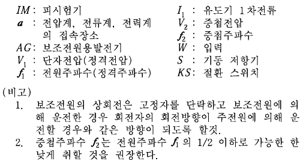
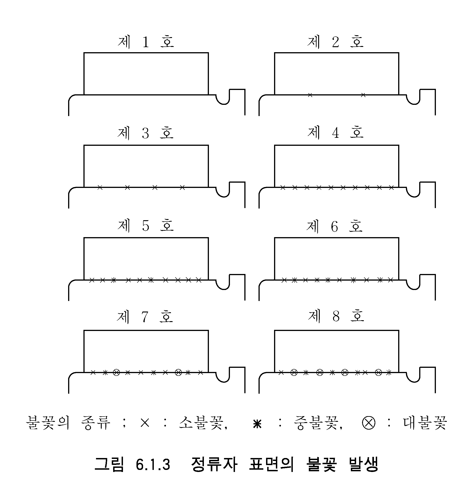
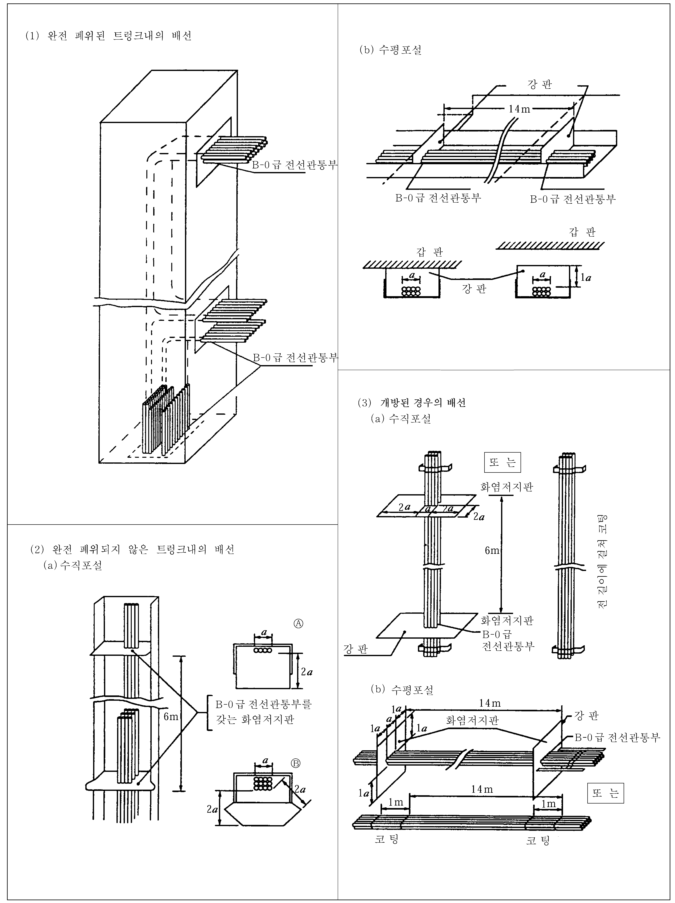
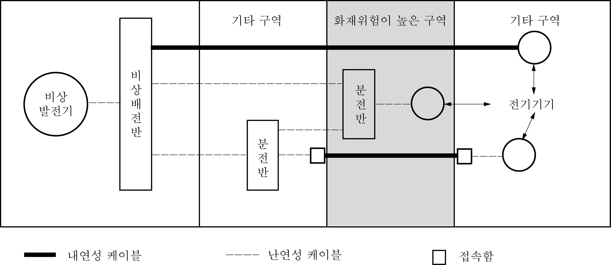
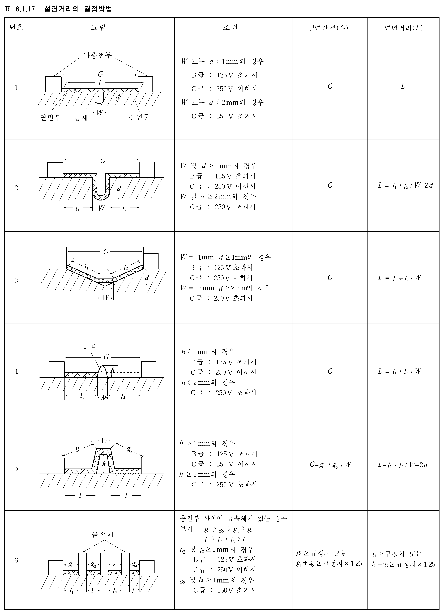
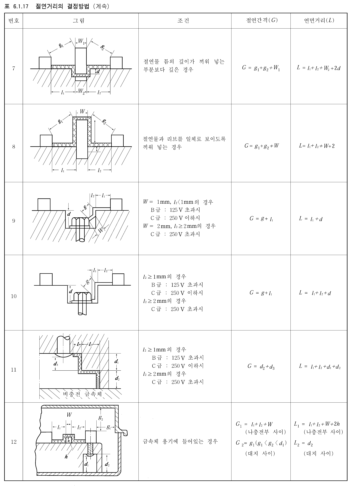

# 제6편 전기설비 및 제어시스템

> 선급 및 강선규칙/적용지침 / RA-06-K / 2025 / KO / Guidance

## 제 1 장 전기설비

### 제 1 절 일반사항

#### 101. 일반사항

- **1.** **적용 【규칙 참조】**
  - **(1)** **규칙 6편 1장**의 규정은 방폭구조를 필요로 하는 경우를 제외하고는 다음의 전기장치에는 적용하지 아니 한다.
    - **(가)** 국제법 또는 선적국의 국내법에 따라 설치되는 무선전신(전화)장치
    - **(나)** 국제법 또는 선적국의 국내법에 따라 설치되는 항해장치(「74 SOLAS의 2009년 개정」 제5장 19규칙에서 정하는 것)
  - **(2)** 작업용, 하역용 및 화물용 전기기기와 텔레비젼, 라디오 등 전자제품에 대해서는 전기로 인한 감전 및 화재, 기타 재해의 방호(방폭대책을 포함)에 관한 규정을 제외하고 **규칙 6편 1장**을 적용하지 아니한다. 규칙이 적용되지 아니하는 전기기기에 대해서도 가능한 한 KS규격에 적합한 것이어야 한다.
  - **(3)** (1)호 및 (2)호에 해당하는 전기장치 또는 전기기기에 접속되는 케이블 및 보호장치(차단기 및 퓨즈)는 **규칙 6편 1장**의 규정에 따라야 한다.
  - **(4)** **규칙 101.**의 **1**항에서 소형선박(500톤 미만), 항로에 제한을 받는 선박은 다음의 어느 것에 해당하는 선박을 말한다.
    - **(가)** 총톤수 500톤 미만으로 KRM 0의 기관부호를 갖는 선박 *(2017)*
    - **(나)** 총톤수 500톤 미만으로 (가)에 표시된 부호를 갖지 아니하는 선박
    - **(다)** 총톤수 500톤 이상으로 (가)에 표시된 부호를 갖는 선박 및 **지침 8편 부록 8-3**의 **1**항 (1)호 및 (2)호, **3**항 (12)호에 적합한 선박
    - **(라)** 총톤수 500톤 이상으로 (가)에 표시된 부호를 갖는 선박으로서 **지침 8편 부록 8-3**의 **1**항 (1)호 및 (2)호, **3**항 (12)호에 적합하지 아니 하는 선박
  - **(5)** (4)호에 해당하는 선박의 전기설비에 대한 규정의 경감 정도는 (1)호 부터 (3)호에 따르는 이외에 다음에 정하는 바에 따른다.

    |   | 관련 규정^1) (완화 규정) |   | (가) | (나) | (다) | (라) |
    | --- | --- | --- | --- | --- | --- | --- |
    | (a) | 규칙 201. 6항 | 주위조건 | O |   | O |   |
    | (b) | 규칙 402. 1항 (1)호 | 주배전반의 구조 | O | O | O |   |
    | (b) | 규칙 402. 1항 (2)호 | 발전기반의 구조 | O | O | O |   |
    | (c) | 규칙 404. 1항 | 선박용 직류발전기의 배전반 | O |   | O |   |
    | (d) | 규칙 404. 2항 | 선박용 교류발전기의 배전반 | O |   | O |   |
    | (e) | 규칙 701. 2항 | 집합제어기반 | O | O |   |   |
    | (f) | 규칙 504. 3항 (2)호 | 케이블의 방화에 대한 고려 | O | O | O |   |
    | (g) | 규칙 1203. | 보호장치 등 | O | O | O |   |
    | (h) | 규칙 202. 및 1601. 3항 | 주전원 | O | O^2) | O |   |
    | (i) | 규칙 601. | 변압기의 일반사항 | O |   | O |   |
    | (j) | 규칙 203. | 비상전원 | O | O | O |   |
    | (k) | 규칙 204. 6항 (3)호 | 항해등 표시기로의 급전회로 | O | O | O^3) |   |
    | (l) | 규칙 1801. | 예비품 | O |   | O | O |
    | (m) | 규칙 204. 1항 (3)호 | 절연감시장치 | O |   |   |   |
    | (n) | 규칙205. [3항 (2)호] | 보호장치 [차단기 및 퓨즈] | O |   | O^4) |   |
    | (o) | 규칙 202. 5항 | 선박의 추진 및 조타를 위하여 주전원을 필요로 하는 경우 | O | O | O | O |
    | (p) | 규칙 1106. | 선내방송장치 | O | O | O | O |
    | (q) | 규칙 401. 1항 (2)호 | 주배전반의 설치장소 | O |   | O | O |
    | 비고) 1) : 상세 내용은 (가)에 따른다. 2) : 상세 내용은 (나)의 (b)에 따른다. 3) : 상세 내용은 (다)의 (c)에 따른다. 4) : 상세 내용은 (다)의 (b)에 따른다. |   |   |   |   |   |   |

    ① 구명정, 구명뗏목 등의 진수장소 및 그 현외 부근
    ② 모든 통로, 계단 및 출구
    ③ 기관구역 및 비상전원 설치구역
    ④ 주기관 제어장소
    - **(가)** (4)호의 (가)에 해당하는 선박
      - **(a)** **규칙 201.**의 **6**항의 공기온도 45${}^{\circ}\mathrm{C}$를 40${}^{\circ}\mathrm{C}$로, 해수온도 32${}^{\circ}\mathrm{C}$를 27${}^{\circ}\mathrm{C}$로 할 수 있다. 다만, 열대권을 항해할 때에는 표를 그대로 적용하여야 한다.(**규칙 5편 표 5.1.3** 참조)
      - **(b)** **규칙 402.**의 **1**항 (1)호 및 (2)호의 규정은 적용하지 아니한다.
      - **(c)** **규칙 404.**의 **1**항에 있어서, 단독운전만을 행하는 직류발전기가 2대 이상인 경우는, 전류계 및 전압계를 1개씩 설치하고 각 발전기에 공용하는 것으로 한다. 다만 계기의 수를 감할 경우는, **규칙 1802.**에 규정하는 휴대용 전류계 및 전압계를 비치하여야 한다.
      - **(d)** **규칙 404.**의 **2**항의 규정에 있어서 단독운전만을 행하는 교류발전기가 2대 이상인 경우는 전류계, 전압계 및 전력계를 1대씩 비치하고 각 발전기에 공용하는 것으로 한다. 다만, 계기의 수를 감하고자 하는 경우는 **규칙 1802.**에 규정하는 휴대용 전류계 및 전압계를 비치하여야 한다.
      - **(e)** **규칙 701.**의 **2**항의 규정은 적용하지 아니한다.
      - **(f)** **규칙 504.**의 **3**항 (2)호의 규정은 적용하지 아니한다.
      - **(g)** **규칙 1203.**의 규정은 적용하지 아니한다.
      - **(h)** **규칙 202.**의 규정 및 **규칙 1601.**의 **3**항의 규정을 적용함에 있어서 발전장치, 변압기 및 전력변환장치는 1조 만으로 할 수 있다. 다만, 선급부호에 UMA를 부가하는 선박 및 연해 이상의 구역을 항해하는 여객선은 그러하지 아니한다. *(2024)*
      - **(i)** **규칙 601.**의 규정에 있어서 비상전원 또는 예비전원(축전지)을 비치하여, 안전확보에 필요한 조명장치, 신호장치, 통신장치 등에 급전하는데 충분한 경우, 예비변압기를 생략할 수 있다.
      - **(j)** **규칙 203.**의 규정은 적용하지 아니한다. 다만, 다음의 부하에 최소한 6시간(아래 (iv), (v)의 설비에 있어서는 연속 사용으로 30분간) 급전할 수 있는 비상전원을 설비하여야 한다. *(2024)*
      - **(i)** 비상시 필요한 통신장치
        - **(ii)** 항해등 및 신호등 (홍등, 정박등)
        - **(iii)** 다음의 장소에 설치되는 비상조명장치
        - **(iv)** 단속적으로 사용하는 주간신호등, 기적 및 비상시에 요구되는 모든 선내신호장치
      - **(v)** 화재탐지장치 및 수동화재경보장치
      - **(k)** **규칙 204.**의 **6**항 (3)호에 대하여 항해등 표시기로의 급전은 비상전원으로부터 1개의 급전선으로부터 급전될 수 있다. 다만, 다음에 정하는 전원을 비상전원으로 볼 수 있다.
      - **(i)** 발전기로 공급하는 경우에는 상용전원이 고장난 경우에 즉시 전환하여 구동될 수 있는 2대의 발전기 중 1대
        - **(ii)** 축전지로 공급하는 경우에는 충전장치
      - **(l)** **규칙 1801.**의 규정은 유효한 수동의 보조조타장치를 설비하는 경우는 적용하지 아니한다.
      - **(m)** **규칙 204.**의 **1**항 (3)호의 규정에 대하여 절연감시장치 대신에 지락표시기로 할 수 있다. 이 지락표시기는 등(燈)식일 경우 2등식 또는 3등식으로 30 $\mathrm{W}$ 이하의 금속 필라멘트를 갖는 전구를 사용하고 전구 사이의 거리는 150 $\mathrm{mm}$ 미만으로 하여야 한다.
      - **(n)** **규칙 205.**의 **3**항 (2)호의 규정은 적용하지 아니한다. 다만, 여객선, 유조선 및 위험화학품 산적운박선 등에 대하여는 주배전반 및 집합기동기반용 차단기에 한하여 plug-in type을 적용하여야 한다.
      - **(o)** **규 칙 202.**의 **1**항 (3)호의 규정은 적용하지 아니한다. 다만, 선급부호에 UMA를 부기하는 선박 및 국제항해에 종사하는 여객선은 그러하지 아니한다.
      - **(p)** **규칙 1106.**의 규정은 적용하지 아니한다.
      - **(q)** **규칙 401.**의 **1.**항 (2)호의 규정은 적용하지 아니한다. *(2019)*
    - **(나)** (4)호의 (나)에 해당하는 선박
      - **(a)** (가)의 (b), (e), (f), (g), (j), (k), (o) 및 (p)를 적용한다.
      - **(b)** **규칙 202.**의 **1**항 (2)호를 적용함에 있어서 발전장치의 용량은, 각각 1조의 발전장치가 정지하였을 경우에도 정상가동에 관계되는 추진 및 안전을 유지하기 위해 필요한 전기설비에 급전되는 것이어야 한다. 또한, **규칙 2 02.**의 **1**항 (3)호 및 (5)호의 규정은 적용하지 아니 한다. *(2025)*
    - **(다)** (4)호의 (다)에 해당하는 선박
      - **(a)** (가)의 (a), (b), (c), (d), (f), (g), (i), (j), (l), (o), (p) 및 (q)를 적용한다. *(2020)*
      - **(b)** **규칙 202.**의 **1**항 (2)호를 적용함에 있어서 발전장치의 용량은, 각각 1조의 발전장치가 정지하였을 경우에도 정상가동에 관계되는 추진 및 안전을 유지하기 위해 필요한 전기설비에 급전되는 것이어야 한다. 또한, **규칙 2 02.**의 **1**항 (3)호 및 (5)호의 규정은 적용하지 아니 한다. *(2025)*
      - **(c)** **규 칙 204.**의 **6**항 (3)호의 규정에서, 항해등 표시기에의 급전은 주배전반 및 예비전원 또는 선교에 설치된 조명용 분전반으로부터 할 수 있다.
      - **(d)** **규칙 202.**의 규정 및 **규칙 1601.**의 **3**항의 규정을 적용함에 있어서 독립적인 보조엔진으로 구동되는 발전장치는 1조 만으로 할 수 있다. 다만, 선급부호에 UMA를 부가하는 선박 및 연해 이상의 구역을 항해하는 여객선은 그러하지 아니한다. *(2019)*
    - **(라)** (4)호의 (라)에 해당하는 선박
      - **(a)** (가)의 (l), (o), (p) 및 (q)를 적용한다. *(2020)*
  - **(6)** (4)호 및 (5)호에 의해 전기설비에 대한 규정의 경감을 하고 있는 선박이 항로, 용도 등을 변경하고자 하는 경우에는 규정대로 설비를 갖추어야 한다.
  - **(7)** 국내항해에 종사하는 여객선의 비상전원은 다음에 따른다.
    - **(가)** 국내 항해에 종사하는 여객선에는 다음 (a)의 요건에 적합한 독립된 비상전원을 설치하여야 한다. 다만, 주전원용으로 축전지가 설치된 평수구역이하를 항해구역으로 하는 여객선은 주전원용 축전지가 다음 (a)의 요건으로 (7)호를 만족하는 경우는 예외로 한다.
      - **(a)** 항상 필요한 전력이 충전되어 있는 축전지(방전지시기가 설치되어 있는 것)로서 과도하게 전압이 강하되는 일이 없이 급전할 수 있는 것
      - **(b)** 독립된 급유장치 및 우리 선급이 적당하다고 인정하는 기동장치를 가지는 유효한 원동기(인화점이 섭씨 43도 이상의 연료유를 사용하고 있는 것에 한한다)에 의하여 구동되는 발전의 경우 비상배전반은 비상전원에 가능한 한 근접한 장소에 설치하여야 한다.
    - **(나)** 상기 (가)의 규정에 의한 비상전원은 주전원이 고장 등으로 상실될 경우 자동적으로 급전할 수 있는 것이어야 한다.
    - **(다)** 상기 (가)의 규정에 의하여 설치되는 비상전원은 다음 각 설비에 대하여 적어도 12시간 이상 급전할 수 있는 것이어야 한다. 다만, 항해 예정시간이 6시간 미만인 선박에 대하여는 6시간동안 급전할 수 있어야 한다.
      - **(a)** 항해등
      - **(b)** 주전원으로부터 급전되는 신호등
      - **(c)** 다음의 장소에 설치되는 비상조명장치
      - **(i)** 복도, 계단, 사다리 및 출입구
        - **(ii)** 주기관실, 주발전장치실 및 기관제어실
        - **(iii)** 항해선교, 해도실 및 무전실
        - **(iv)** 구명정, 구명뗏목 또는 구명부기의 적재장소 및 승정장소
      - **(v)** 기타 우리 선급이 필요하다고 인정하는 장소
      - **(d)** 전기식 경보장치 및 지시기
      - **(e)** 화재탐지장치 및 수동화재경보장치
      - **(f)** 기타 통신장비 등
    - **(라)** 상기 (가)의 규정에 의하여 설치되는 비상전원은 다음의 요건에 적합하게 설치되어야 한다.
      - **(a)** 최상층 전통갑판의 상방에 있을 것
      - **(b)** 기관구역 둘레벽의 외부에 있을 것
      - **(c)** 선수격벽의 후방에 있을 것
      - **(d)** 기관실 구역의 화재, 기타 재해에 의하여 비상급전에 영향을 받지 아니할 것
      - **(e)** 화재나 전기스파크로부터 격리되고 환풍이 잘 될 것
  - **(8)** 규칙 **402.**의 **1**항 (2)호를 적용함에 있어서, 주배전반의 모선 분리는 어선에 대하여는 적용하지 아니한다.
  - **(9)** 어선의 비상전원은 다음에 따른다.
    - **(가)** 기관구역외부의 장소에 자기기전식비상전원이 설치되어야 하며 또한, 주전원설비에 화재 또는 기타 사고가 발생한 경우에도 그 기능이 확보될 수 있도록 배치되어야 한다.
    - **(나)** 어선에는 다음 각 호의 어느 하나에 해당하는 독립된 비상전원이 설치되어야 한다.
      - **(a)** 항상 필요한 전력이 충전되어 있고 부하에 충분히 급전할 수 있는 축전지
      - **(b)** 인화점이 43${}^{\circ}\mathrm{C}$ 이상인 연료의 독립공급장치를 갖춘 적절한 원동기에 의하여 구동되는 발전기
      - **(i)** 비상발전기는 0°C까지의 저온에서도 용이하게 시동할 수 있어야 한다. 다만, 이것이 어려울 경우 또는 보다 저온을 고려할 필요가 있을 경우에는 가열설비를 장비하는 등의 조치를 강구하여 언제라도 확실히 시동할 수 있도록 하여야 한다.
        - **(ii)** 자동시동방식인 비상발전기에는 적어도 3회의 연속 시동이 가능한 에너지원을 가진 승인된 시동장치를 비치하여야 한다. 또한, 수동에 의한 시동의 유효성이 실증되지 아니한 경우에는 30분 이내에 추가로 3회 시동할 수 있도록 2차 에너지원을 비치하여야 한다.
        - **(iii)** 전기식 또는 전기유압식 시동장치는 비상배전반으로부터 급전되어야 한다.
      - **(c)** 전기식 또는 전기유압식 시동장치는 비상배전반으로부터 급전되어야 한다.
      - **(d)** 압축공기식 시동장치의 압축공기는 적절한 체크밸브를 통하여 주 또는 보조 공기탱크로부터 공급받거나 또는 비상배전반으로부터 급전되는 비상공기 압축기에 의하여 공급받을 수 있다.
      - **(e)** 시동장치, 충전 또는 충기장치 및 에너지 축적장치는 모두 비상발전기구역에 비치하여야 한다. 이들 장치는 비상발전기의 작동이외의 목적에 사용하여서는 아니 된다. 다만, 이들은 주 또는 보조압축공기장치로부터 비상발전기구역에 설치된 체크밸브를 통하여 비상발전기 공기탱크에 급기할 수 있다.
    - **(다)** 상기 (가)에 따라 설치되는 비상전원은 다음의 설비에 3시간((a)부터 (c)까지의 설비는 6시간) 이상 동시에 급전할 수 있는 것이어야 한다. *(2020)*
      - **(a)** 무선통신장치
      - **(b)** 비상시 요구되는 모든 선내 통신장치 및 신호장치, 화재탐지장치 및 화재경보장치
      - **(c)** 항해등
      - **(d)** 주전원으로부터 급전되는 신호등
      - **(e)** 다음의 장소에 설치되는 비상조명장치
      - **(i)** 구명정, 구명뗏목 등의 진수장소 및 그 현외 부근
        - **(ii)** 모든 통로, 계단 및 출구
        - **(iii)** 기관구역 및 비상전원 설치구역
        - **(iv)** 주기관 제어장소
      - **(v)** 어획물처리 및 가공장소
        - **(vi)** 비상소화펌프, 스프링클러 펌프, 비상빌지펌프의 각 설치장소 및 이들 전동기의 기동조작 장소
    - **(라)** 어선에 비상전원을 공급하는 비상배전반은 다음에 적합하여야 한다.
      - **(a)** 비상배전반은 가능한 한 비상전원장치에 근접하여 설치하여야 한다.
      - **(b)** 비상전원이 발전기인 경우, 비상배전반은 조작에 지장이 없는 한 비상발전기와 동일장소에 설치하여야 한다.
      - **(c)** 주 전원이 상실된 경우에는 자동적으로 비상배전반에 접속되어야 한다.
      - **(d)** 비상전원이 축전지인 경우, 축전지가 방전되고 있음을 나타내는 지시기가 설치되어야 한다.
      - **(e)** 비상배전반은 정상적으로 작동시에 과부하 및 단락에 대하여 주 배전반측에서 적절히 보호되고, 또한 주전원의 고장시 비상배전반에서 자동적으로 차단할 수 있는 상호결합용 급전선에 의하여 주배전반으로부터 급전되어야 하며, 비상배전반으로부터 주배전반으로 역급전하도록 구성되어 있는 경우에는 비상배전반에 있어서도 최소한 단락에 대하여 보호되어야 한다.
  - **(10)** **규칙 202.**의 **1**항 (3)호의 적용함에 있어서, 어선에 대하여는 선급부호에 UMA를 부여하는 경우에 적용한다.
    **2. 규칙 101. 의 2 항**을 적용함에 있어서 “우리 선급이 적절하다고 인정하는 바”라 함은 **규칙 1편 1장 104.**에 따라 인정하는 것을 말한다. *(2020)* **【규칙 참조】**
- **3.** **규칙 101. 의 4 항**을 적용함에 있어서 가스 폭발 분위기라 함은 대기상태에서 발화, 소비되지 않아 연소가 계속될 수 있는 가스와 증기 상태의 가연성 물질이 혼합되어 있는 상태를 말한다. 혼합물의 농도가 폭발 상한을 넘을 경우에는 가스 폭발 분위기는 아니지만 폭발 위험 장소가 되기 쉬우므로 가스 폭발 분위기로 간주한다. **【규칙 참조】**

#### 102. 승인도면 및 자료 【규칙 참조】

- **1.** **규 칙 102. 의 1 항 (14)호**를 적용함에 있어서 “우리 선급이 필요하다고 인정하는 도면 및 자료”라 함은 **규칙 1편 1장 104.**에 따라 인정하는 도면 및 자료를 말한다. *(2020)*

#### 103. 시험 및 검사

- **1.** **규 칙 9편**에서 규정하고 있는 냉장설비 및 하역장치를 위하여 사용되는 발전기, 배전반 및 변압기는 **규칙 103.**의 요건에 따라 시험 및 검사를 받아야 한다.
- **2.** **규칙 103.**의 **1**항 **(2)**호에 규정된 형식시험을 필요로 하는 케이블은 다음에 따른다. **【규칙 참조】**
  - **(1)** 동력, 조명 및 선내통신장치의 급전 및 배전회로에 사용되는 케이블
  - **(2)** 동력장치의 급전 및 배전회로에 사용되는 캡타이어 코드
  - **(3)** 150 $\mathrm{V}$ 전자기기용 다심 비닐 절연케이블
  - **(4)** 제어용 케이블(배전반용 및 제어기기용 절연전선)
  - **(5)** 광케이블, 동축케이블 등 통신용 케이블
- **3.** 전항에 표시된 케이블 이외의 캡타이어 코드, 비닐시스 코드 등에 대해서도 제조자의 요구가 있으면 형식시험을 행한다.
- **4.** **형식승인된 제품에 대한 시험 및 검사 규칙 103.**의 **6**항의 적용은 다음에 따른다. **【규칙 참조】**
  - **(1)** 형식승인을 받은 전기기기중 다음의 것은 개개 제품에 대한 우리 선급 검사원의 입회검사를 전부 생략할 수 있다.
    - **(가)** 퓨즈
    - **(나)** 차단기
    - **(다)** 전자 접촉기
    - **(라)** 플라스틱재료로 만들어진 케이블트레이/보호케이싱
    - **(마)** 보호계전기(protection relay)
  - **(2)** 형식승인을 받은 다음의 전기기기는 사용전 개개 제품에 대하여 우리 선급 검사원 입회하에 다음의 시험을 하여야 한다. *(2025)*
    방폭형 회전기기의 시험 및 검사는 **규칙 309.**에 따른다. *(2018)*
    - **(가)** 방폭형 전기기기(회전기기에 한함)
- **5.** **규칙 103.**의 **1**항 **표 6.1.1**의 비고 (5) 및 비고 (8)에 규정된 우리 선급이 적절하다고 인정하는 경우라 함은 QA승인을 받은 경우 등을 말한다. **【규칙 참조】**
- **6.** **규칙 103.**의 **4**항을 적용함에 있어서 “우리 선급이 특히 필요하다고 인정하는 경우”라 함은 **규칙 1편 1장 104.**에 따라 인정하는 것을 말한다. *(2020)* **【규칙 참조】**
- **7.** **규칙 103.**의 **1**항 **표 6.1.1**의 항목 13을 적용함에 있어서, IECEx, ATEX, KC 또는 이와 동등하다고 인정되는 방폭증서가 있는 경우 형식승인을 면제할 수 있다. *(2023)* **【규칙 참조】**

### 제 2 절 시스템 설계

#### 201. 일반사항

- **1.** **구조 및 거치**
  - **(1)** **보호장치 규칙 201.**의 **2**항 (3)호를 적용함에 있어서 전기기기의 전원스위치는󰡒오프󰡓위치에 있을 때 전기기기가 제어회로나 표시등 회로를 통하여 충전되지 아니하도록 부착하여야 한다. **【규칙 참조】**
  - **(2)** **전기기기의 설치장소와 보호외피 【규칙 참조】**
    보호외피의 종류는 **지침 표 6.1.1**에 따른다. 보호외피는 기호 IP와 위험한 부분으로의 접근 및 외래고형물에 대한 보호등급을 표시하는 제1특성숫자, 물에 대한 보호등급을 표시하는 제2특성숫자, 위험한 부분으로의 접근에 대한 보호등급을 표시하는 부가특성문자 및 보조적인 정보를 표시하는 보조문자기호의 조합으로 표시하며 제품 외관에 각인하거나 다른 적절한 방법으로 표시하여야 한다.
    보호외피의 구조 및 시험방법은 **지침 표 6.1.2, 지침 표 6.1.3, 지침 표 6.1.4** 및 **지침 표 6.1.5**에 따른다. 제조자는 최초의 제품에 대하여 적어도 그에 해당되는 시험을 행하여, 제품에 표시한 보호형식의 유효성을 확인하여야 한다. 또한, 우리 선급 검사원이 필요하다고 인정하는 경우에도 제품의 시험을 행할 수 있다.
    설치장소의 상황을 근거로 전기기기를 선정하는 경우는 적용기준으로 **지침 표 6.1.6**을 고려할 수 있다.
    - **(가)** 전기기기의 보호외피에 있어서 IEC 60529에 따라 외피구조의 보호형식을 나타내는 표시기호 IP를 갖는 것을 사용하는 경우는 다음에 따른다.
      - **(a)** 보호외피의 종류 및 표시
      - **(b)** 보호외피의 구조 및 시험방법
      - **(c)** 보호형식의 적용
    - **(나)** 도료창고, 축전지실, 아세틸렌 창고 및 관련 통풍 덕트는 구역 “1”(zone 1)로 분류하며, 방폭 등급은 IEC 60079의 규정에 따라 아래와 같은 등급 이상이어야 한다.
      - **(a)** 도료창고 : 가스증기 그룹 IIB, 온도 등급 T3
      - **(b)** 축전지실 : 가스증기 그룹 IIC, 온도 등급 T1
      - **(c)** 아세틸렌 창고 : 가스증기 그룹 IIC, 온도 등급 T2
    - **(다)** 도료창고, 축전지실, 아세틸렌 창고의 통풍구로 부터 1 $\mathrm{m}$ 이내 또는 기계식 통풍장치의 출구측으로 부터 3 $\mathrm{m}$ 이내의 개방갑판 구역은 구역 “2”(zone 2)로 분류한다.
    - **(라)** 도료창고, 축전지실, 아세틸렌 창고 및 그 장소로 통하는 폐위된 장소에 설치되는 전기기기는 다음의 요건에 따른다.
      - **(a)** 도료창고, 축전지실, 아세틸렌 창고 및 그 장소의 통풍용 덕트에 설치하는 전기기기는 방폭형구조이어야 하며, 케이블은 외장을 갖는 케이블을 사용하거나 또는 금속제 관내에 포설하여야 한다.
      - **(b)** 통풍구로부터 1 $\mathrm{m}$ 이내 또는 기계식 통풍장치의 출구측으로부터 3 $\mathrm{m}$ 이내의 개방갑판 구역에 설치하는 전기기기는 다음중 어느 하나에 적합하여야 한다.
      - **(i)** 해당 폐위구역(zone 1)에 허용되는 것과 동일한 방폭구조의 전기기기
        - **(ii)** 방폭등급이 $\mathrm{Exn}$인 전기기기
        - **(iii)** 사용중 불꽃이 발생하지 않고, 표면온도가 허용한도를 넘지 아니하는 전기기기
        - **(iv)** 표면온도가 허용한도를 넘지 아니하는 단순압축 외피(simplified pressurised enclosures) 또는 내증기 외피구조(vapour-proof enclosures)(보호등급이 IP55 이상인 것)로 되어 있는 전기기기. *(2021)*
      - **(c)** 도료창고, 축전지실, 아세틸렌 창고로 통하는 폐위구역은 다음의 조건을 모두 만족하는 경우 비위험구역으로 간주하여 방폭형 전기기기의 설치를 생략할 수 있다. *(2022)*
      - **(i)** 도료창고, 축전지실, 아세틸렌 창고의 문은 기밀 또는 수밀 구조의 개방 고정용 장치가 없는 자동폐쇄형 문으로 설치
        - **(ii)** 도료창고, 축전지실, 아세틸렌 창고에는 안전구역으로 부터 유도되는 독립된 자연 통풍장치를 설치
        - **(iii)** 도료창고, 축전지실, 아세틸렌 창고 내에 가연성 액체가 저장되어 있음을 표시하는 경고판을 창고 입구측에 부착
      - **(d)** 도료창고, 축전지실, 아세틸렌 창고 내에 설치되는 전기기기의 스위치, 보호장치 및 전동기 제어기는 모든 극 또는 상을 차단하여야 하며, 위험장소 이외의 장소에 설치하여야 한다.
  - **(3)** **자기콤파스에 대한 고려 규칙 201.**의 **2**항 (9)호에서 전기기기 및 케이블에 정격치 이하의 전기가 흐를 때, 자기콤파스 지침의 변화가 ±0.5° 이하이면 악영향을 미치지 않는 것으로 본다. 또한 항상 빈번히 개폐되는 회로인 경우를 제외하고, 회로개폐의 순간에만 발생하는 과도적인 영향은 고려하지 아니할 수 있다. **【규칙 참조】**
- **2.** **전기기기의 접지 【규칙 참조】**
  - **(1)** **규칙 201.**의 **3**항 (2)호를 적용함에 있어서 다음의 노출 금속부는 특별히 접지할 필요는 없다.
    - **(가)** 전기기기의 비도전 금속부로서 사용중에 인체에 접촉할 염려가 없는 경우
    - **(나)** 램프 캡
    - **(다)** 절연재료로 만들어지든가 또는 피복된 램프홀더 또는 조명기구에 부착된 셰이드, 반사판 및 가드
    - **(라)** 통전부 또는 접지된 비도전부로부터 절연물에 의해 분리된 금속부 또는 나사로서 통상의 사용상태에서 충전되거나 접지되지 않는 경우
    - **(마)** 순환전류를 방지하기 위하여 절연된 축베어링 하우징
    - **(바)** 형광 방전관의 클립(Clip)
    - **(사)** 안전 전압으로 급전되는 기기
    - **(아)** 케이블 클립
  - **(2)** 접지공사는 다음과 같이 할 수 있다.
    - **(가)** 모든 접지접속은 동 또는 다른 내식재료의 접지용 도체를 사용하여 선체구조물에 확실히 접속하여야 한다. 또 접지용 도체에는 필요에 따라서 외상 및 전기부식에 대하여 보호조치를 하여야 한다.
    - **(나)** 기기의 금속테 또는 외피가 선체구조물에 직접 부착되고, 부착부분의 접촉면이 청결하고, 녹, 스케일, 페인트를 충분히 제거하여 견고하게 볼트로 조여진 경우는 접지용 도체를 사용하지 않아도 좋다.
    - **(다)** 어떠한 상황에서도 케이블의 연피를 유일한 접지수단으로 사용할 수 없다.
    - **(라)** 모든 동제 접지접속도체의 공칭 단면적은 **지침 표 6.1.7**에 따른다. 동 이외의 접지도체를 사용할 경우는 **지침 표 6.1.7**에 표시한 동제 접지접속도체보다 큰 콘덕턴스를 갖는 것으로 하여야 한다.
    - **(마)** 접지접속도체와 선체구조물과의 접속은 부착하기 쉬운 장소에 직경 4 $\mathrm{mm}$ 이상의 황동 또는 내식성 재료인 접지 전용의 나사를 사용하여 행한다. 어떠한 경우에도 나사 조임시 접촉면은 광택이 나는 금속면으로 하여야 한다.
  - **(3)** 계통의 한 극이 접지된 접지 배전방식에 있어서 통상 접지극에 전류가 흐르지 않는 경우는 접지 접속은 (2)호에 따른다. 다만, **지침 표 6.1.7**의 접지접속도체 단면적의 상한치 64 $\mathrm{mm} ^{2}$는 적용하지 아니한다.
  - **(4)** **규칙 201.**의 **3**항 (3)호를 대해서는 다음에 따른다.
    - **(가)** 이동용 전기기기의 비도전 금속부는 이동용 케이블 또는 이동용 코드내의 접지용 도체를 이용하여 플러그 및 리셉터클 등을 통하여 접지하여야 한다.
    - **(나)** 2중 절연된 이동용 전기기기는 접지하지 않아도 좋다.
  - **(5)** **알루미늄재 선루** 강재로 된 선체에 알루미늄재 선루를 고착시킬 경우 재질간의 전기분해로 인한 부식을 방지하기 위한 절연재를 삽입할 수 있다. 이 경우 선루와 선체간에는 전기분해로 인한 부식을 방지하고 접속점을 손쉽게 검사할 수 있도록 별도로 본딩되어야 한다. *(2023)*

    **표 6.1.1 보호외피의 종류 및 표시**

    | 보호형식의 기호 | 제1특성숫자 | 제2특성숫자 | 부가특성문자 (선택사항) | 보조문자(선택사항) |
    | --- | --- | --- | --- | --- |
    | 보호형식의 기호 | 위험한 부분으로의 접근 및 외래고형물에 대한 보호등급 | 물에 대한 보호등급 | 위험한 부분으로의 접근에 대한 보호등급 | 보조적인 정보 |
    | IP | 0 1 2 3 4 5 6 | 0 1 2 3 4 5 6 7 8 | A B C D | H M S W |
    | (비고) 표시중 제1특성숫자 또는 제2특성숫자의 어느 한쪽만 표시할 경우에는 불필요한 보호등급은 X로 표시한다. 예) IPX8 - 물만에 대한 보호형식 IP5X - 위험한 부분으로의 접근 및 외래고형물만에 대한 보호등급 |   |   |   |   |

    **표 6.1.2 제1특성숫자에 표시된 위험한 부분으로의 접근 및 외래고형물에 대한 보호등급**

    | 제1특성숫자 | 외피의 구조 | 시험방법 및 판정기준 |
    | --- | --- | --- |
    | 0 | 무보호 | - |
    | 1 | 손등이 위험한 부분으로 접근하지 않도록 보호되어 있고 또한 지름 50 $\mathrm{mm}$ 이상의 외래고형물에 대해 보호되는 것 | 외피의 개구부에 지름 50(+0.05, -0) $\mathrm{mm}$의 강구로 50 $\mathrm{N}$±10 %의 누르는 압력을 가하였을 때, 강구가 침입하지 않고, 또한, 충전부, 가동부등의 위험부분과의 사이에 적정 공간거리가 확보되어 있어야 한다. |
    | 2 | 손가락이 위험한 부분으로의 접근에 대해 보호되고 지름 12.5 $\mathrm{mm}$ 이상의 외래고형물에 대해 보호되는 것 | 외피의 개구부에 지름 12 $\mathrm{mm}$, 길이 80 $\mathrm{mm}$의 관절부 시험손가락으로 10$\mathrm{N}$±10 %의 힘을 가하였을 때, 시험손가락의 선단 80 $\mathrm{mm}$까지의 침입은 지장이 없지만 시험손가락이 충전부, 가동부 등의 위험부분과의 사이에 적정 공간거리가 확보된 것. 또한, 외피의 개구부에 지름 12.5(+0.05, -0) $\mathrm{mm}$의 강구로 30 $\mathrm{N}$±10 %의 누르는 압력을 가하였을 때, 강구 전체가 통과하지 않아야 한다. |
    | 3 | 공구가 위험한 부분으로의 접근에 대해 보호되고 지름 2.5 $\mathrm{mm}$ 이상의 외래고형물에 대해 보호되는 것 | 외피의 개구부에 지름 2.5(+0.05, -0) $\mathrm{mm}$의 강봉으로 3 $\mathrm{N}$±10 %의 힘을 가하였을 때, 강봉이 통과하지 않아야 한다. |
    | 4 | 철사등이 위험한 부분으로의 접근에 대해 보호되고 지름 1.0$\mathrm{mm}$ 이상의 외래고형물에 대해 보호되는 것 | 외피의 개구부에 지름 1.0(+0.05, -0) $\mathrm{mm}$의 강선으로 1 $\mathrm{N}$±10 %의 힘을 가하였을 때, 강선이 통과하지 않아야 한다. |
    | 5 | 철사등이 위험한 부분의 접근에 대해 보호되고 분진 등의 외래물 침입에 의하여 유해한 영향이 없는 것 | (1) 제1특성숫자 4에 대한 시험방법 및 판정기준을 따라야 한다. (2) 열싸이클 효과 등에 의해서, 외피내부가 외기에 대하여 부압이 되는 것(Category 1의 기기)에 있어서는 (a) 및 (b)의 시험을 한다. 시험 종료후에 기기의 소정 동작 및 안전성을 저해할 정도의 분말이 침입하여서는 아니 된다. (a) 대분(對粉)시험장치를 이용하여 시험장치내부 용적 1 $\mathrm{m} ^{3}$당 2 $\mathrm{kg}$의 활석가루를 사용하여, 이것을 순환펌프에 의하여 시험장치내부를 계속하여 순환하는 공기중에 균등하게 부유시킨다. 활석가루의 크기는 지름 50 $\mathrm{\mu} m$ 선간 75 $\mathrm{mm}$의 사각 메쉬의 금속망을 통과하는 것으로서, 20회 이상 사용하여서는 아니된다. 또한, 피시험체는 시험장치내부에 정규의 부착상태와 같은 모양으로 부착하든가 또는 비슷한 모양으로 매달고 피시험체내부는 진공펌프로 대기압이하로 한다. 이 경우, 흡인율이 2 $\mathrm{kPa}$이하이어서는 아니 된다. (b) 시간당 40∼60용적의 흡인율을 얻을 수 있는 경우, 시험시간을 2시간으로 한다. 최대 2 $\mathrm{kPa}$의 감압하에서 흡인율이 시간당 40용적으로 차지 않는 경우, 시험은 80용적을 흡인할 때까지 또는 8시간 경과할 때까지 계속한다. (3) 외기에 대하여 기압차가 없도록 할 수 있는 것(Category 2의 기기)에 있어서는 피시험체를 통상의 사용상태와 같게 설치한다. 또한, 진공펌프에 접속하지 않고서 (2)의 시험을 한다. 시험은 8시간을 경과할 때까지 계속한다. 시험의 종료후에, 기기의 소정 동작 및 안전성을 저해할 정도의 분진이 침입하여서는 아니된다. |
    | 6 | 철사에 의한 위험한 부분의 접근에 대해 보호되고 분진 등의 외래물 침입이 없는 것 | (1) 제1특성숫자 4에 대한 시험방법 및 판정기준을 만족하여야 한다. (2) 제1특성숫자 5에 대한 (2)의 시험을 하여, 외피내부에 분말이 관찰되지 않아야 한다. |
    | (비고) 시험방법 및 판정기준의 상세한 사항은 IEC 60529에 따른다. |   |   |

    **표 6.1.3 제2특성숫자에 표시된 물에 대한 보호등급**

    | 제2특성숫자 | 외피의 구조(보호성능) | 시험방법 및 판정기준 |
    | --- | --- | --- |
    | 0 | 무보호 | - |
    | 1 | 수직으로 떨어지는 물에 대해 보호되는 것 | 기기를 정규의 부착상태와 같은 모양으로 장치하고 그 위쪽 200 $\mathrm{mm}$의 높이에서 1(+0.5, -0) $\mathrm{mm}$*/*$\mathrm{\min}$의 강수량으로 10분간 물을 떨어뜨린다. 시험결과, 기기의 정상적인 동작을 저해할 정도로 침수되어서는 아니 된다. |
    | 2 | 15° 이내의 범위로 경사하여도 연직으로 떨어지는 물에 대해 보호되는 것 | 기기를 정규의 부착상태와 같은 모양으로 장치하고 4방향(전후좌우)에 연직으로 15°기울여, 그 위쪽 200 $\mathrm{mm}$ 이상의 높이에서 3(+0.5, -0) $\mathrm{mm}$*/*$\mathrm{\min}$의 강수량으로 물을 떨어뜨린다. 시험시간은 각 방향에 대하여 2.5분간, 합계 10분간으로 한다. 시험결과, 떨어뜨린 물이 유해한 영향을 미쳐서는 아니 된다. |
    | 3 | 살수(撒水 : spraying water)에 대해 보호되는 것 | 기기를 정규의 부착상태와 같은 모양으로 장치한다. 그 위쪽 300 $\mathrm{mm}$∼500 $\mathrm{mm}$의 높이에서, 연직으로 양측 60°까지의 전범위에 걸쳐 살수장치를 사용하여 살수한다. 살수량은 10(+0.5, -0.5)$\mathrm{l}/\min$, 수압은 50∼150 $\mathrm{kPa}$, 시험시간은 기기의 외곽표면적(부착부의 면적은 제외한다.) 1 $it \mathrm{\min}/m ^{2}$으로 최저 5분 이상으로 한다. 시험결과, 기기의 정상적인 동작을 저해할 정도로 침수되어서는 아니 된다. |
    | 4 | 물의 비말(飛沫 : splashing water)에 대해 보호되는 것 | 기기를 정규의 부착상태와 같은 모양으로 장치한다. 그 위쪽 300 $\mathrm{mm}$∼500 $\mathrm{mm}$의 높이에서 연직으로 양측 180°까지의 전범위에 걸쳐 살수장치를 사용하여 살수한다. 살수량은 10(+0.5, -0.5) $\mathrm{l}/ \min$, 수압은 50∼150 $\mathrm{kPa}$, 시험시간은 기기의 외곽표면적(부착부의 면적은 제외한다.) 1 $it \mathrm{\min}/m ^{2}$으로 최저 5분 이상으로 한다. 시험결과, 기기의 정상적인 동작을 저해할 정도로 침수되어서는 아니 된다. |
    | 5 | 분류(噴流 : water jet)에 대해 보호되는 것 | 기기를 정규의 부착상태와 같은 모양으로 장치한다. 안지름 6.3 $\mathrm{mm}$의 노즐을 사용하여 모든 방향에서 주수한다. 노즐과 기기 사이의 거리는 2.5∼3 $\mathrm{m}$, 분수량은 12.5 $l$ ±0.5%/$it \mathrm{\min}$, 수류의 크기는 노즐의 첨단 2.5 $\mathrm{m}$의 위치에서 약 40 $\mathrm{mm}$의 원형이며, 시험시간은 기기의 외곽표면적 1 $it \mathrm{\min}/m ^{2}$으로 최저 3분 이상으로 한다. 시험결과, 기기의 정상적인 동작을 저해할 정도로 침수되어서는 아니 된다. |
    | 6 | 강한 분류(powerful jet)에 대해 보호되는 것 | 기기를 정규의 부착상태와 같은 모양으로 장치한다. 안지름 12.5 $\mathrm{mm}$의 노즐을 사용하여 모든 방향에서 주수한다. 노즐과 기기 사이의 거리는 2.5∼3 $\mathrm{m}$, 분수량은 100 *l* ± 0.5%/$it \mathrm{\min}$, 수류의 크기는 노즐의 첨단 2.5 $\mathrm{m}$의 위치에서 약 120 $\mathrm{mm}$의 원형이며, 시험시간은 기기의 외곽표면적 1 $it \mathrm{\min}/m ^{2}$으로 최저 3분 이상으로 한다. 시험결과 기기의 내부에 침수의 흔적이 없어야 한다. |
    | 7 | 물이 침입하여도 유해한 영향이 없게 보호되는 것 | 기기의 최상부가 수면하 150 $\mathrm{mm}$ 보다 깊고, 최하부가 수면하 1$\mathrm{m}$ 보다 깊은 위치가 되도록 하여 30분간 수중에 방치한다. 이 경우, 수온과 기기의 온도차는 5${}^{\circ}\mathrm{C}$ 이하로 한다. 단지, 충전상태 또는 동작상태로 시험하는 경우는 보류할 수 있다. 시험결과 기기의 내부에 침수의 흔적이 없어야 한다. |
    | 8 | 잠수상태로의 사용에 대해 보호되는 것 | 시험방법은 사용자와 제조자사이의 협정에 의한다. 단지, 시험조건은 제2특성숫자 7의 조건보다 엄한 것이어야 하고 또한, 외피가 계속해서 잠수상태로 사용되는 것을 고려하여야 한다. 시험결과, 기기의 내부에 침수의 흔적이 없어야 한다. |
    | (비고) 시험방법 및 판정기준의 상세한 사항은 IEC 60529에 따른다. |   |   |

    **표 6.1.4 부가특성문자에 표시된 위험한 부분으로의 접근에 대한 보호등급**

    | 부가특성 문자 | 외피의 구조 | 시험방법 및 판정기준 |
    | --- | --- | --- |
    | A | 손등이 위험한 부분에 접근하지 않도록 보호된 것. | 지름 50 $\mathrm{mm}$의 접근도 검사용 탐촉자로 시험했을때 위험부분과의 사이에 적정 공간거리가 확보되어 있어야 한다. |
    | B | 손가락이 위험한 부분으로의 접근에 대하여 보호된 것 | 지름 12 $\mathrm{mm}$, 길이 80 $\mathrm{mm}$의 관절부 시험손가락으로 시험했을 때 위험부분과의 사이에 적정 공간거리가 확보되어 있어야 한다. |
    | C | 공구가 위험한 부분으로의 접근에 대하여 보호된 것 | 지름 2.5 $\mathrm{mm}$, 길이 100 $\mathrm{mm}$의 접근도 검사용 탐촉자로 시험했을 때 위험부분과의 사이에 적정 공간거리가 확보되어 있어야 한다. |
    | D | 철사등이 위험한 부분으로의 접근에 대하여 보호된 것 | 지름 1.0 $\mathrm{mm}$, 길이 100 $\mathrm{mm}$의 접근도 검사용 탐촉자로 시험했을 때 위험부분과의 사이에 적정 공간거리가 확보되어 있어야 한다. |
    | (비고) 시험방법 및 판정기준의 상세한 사항은 IEC 60529에 따른다. |   |   |

    **표 6.1.5 보조문자 기호로 표시된 보조적인 정보**

    | 보조문자기호 | 적용 |
    | --- | --- |
    | H | 고전압용 기기 |
    | M | 회전기계의 로터 등과 같은 기구를 동작시킨 상태에서 물의 침입에 의한 유해한 영향에 관하여 시험한 것. |
    | S | 회전기계의 로터 등과 같은 기구를 정지시킨 상태에서 물의 침입에 의한 유해한 영향에 관하여 시험한 것. |
    | W | 소정의 기상조건하에서 사용이 가능하고, 부가적인 보호구조 또는 처리가 갖추어진 것 |

    **표 6.1.6 보호등급의 적용** ***(2024)***

    | 설치장소의 구체적 예 | 설치장소의 상황 | 배전반 및 기타(1) | 발전기 | 전동기 | 변압기(7), 컨버터 | 조명 기구 | 전열 기구 | 부속품(2) |
    | --- | --- | --- | --- | --- | --- | --- | --- | --- |
    | 건조한 거주구역 | 충전부분과의 접촉위험 | IP 20 | - | IP 20 | IP 20 | IP 20 | IP 20 | IP 20 |
    | 건조한 제어실(4) | 충전부분과의 접촉위험 | IP 20 | - | IP 20 | IP 20 | IP 20 | IP 20 | IP 20 |
    | 제어실 | 떨어지는 물방울의 위험 및(또는) 보통의 기계적 손상의 위험 | IP 22 | - | IP 22 | IP 22 | IP 22 | IP 22 | IP 22 |
    | 기관실 및 보일러실의 바닥판 상부(5) | 떨어지는 물방울의 위험 및(또는) 보통의 기계적 손상의 위험 | IP 22 | IP 22 | IP 22 | IP 22 | IP 22 | IP 22 | IP 44 |
    | 조타기실 | 떨어지는 물방울의 위험 및(또는) 보통의 기계적 손상의 위험 | IP 22 | IP 22 | IP 22 | IP 22 | IP 22 | IP 22 | IP 44 |
    | 냉동기계실 | 떨어지는 물방울의 위험 및(또는) 보통의 기계적 손상의 위험 | IP 22 | - | IP 22 | IP 22 | IP 22 | IP 22 | IP 44 |
    | 비상용 기계실 | 떨어지는 물방울의 위험 및(또는) 보통의 기계적 손상의 위험 | IP 22 | IP 22 | IP 22 | IP 22 | IP 22 | IP 22 | IP 44 |
    | 일반창고 | 떨어지는 물방울의 위험 및(또는) 보통의 기계적 손상의 위험 | IP 22 | - | IP 22 | IP 22 | IP 22 | IP 22 | IP 22 |
    | 조리기구실 | 떨어지는 물방울의 위험 및(또는) 보통의 기계적 손상의 위험 | IP 22 | - | IP 22 | IP 22 | IP 22 | IP 22 | IP 44 |
    | 양식고 | 떨어지는 물방울의 위험 및(또는) 보통의 기계적 손상의 위험 | IP 22 | - | IP 22 | IP 22 | IP 22 | IP 22 | IP 22 |
    | 욕실 및 샤워실 | 분무수의 위험 및 (또는) 기계적 손상의 증대된 위험 | - | - | - | - | IP 34 | IP 44 | IP 55 |
    | 기관실 및 보일러실의 바닥판 하부 | 분무수의 위험 및 (또는) 기계적 손상의 증대된 위험 | - | - | IP 44 | - | IP 34 | IP 44 | IP 55(3) |
    | 폐쇄된 연료유 또는 윤활유 분리기실 | 분무수의 위험 및 (또는) 기계적 손상의 증대된 위험 | IP 44 | - | IP 44 | - | IP 34 | IP 44 | IP 55(3) |
    | 평형수 펌프실, 선수스러스터실 및 만재흘수선 하방의 유사한 장소 | 분무수의 위험 및 (또는) 기계적 손상의 증대된 위험 | IP 44 | - | IP 44(6) | IP 44 | IP 34 | IP 44 | IP 55 |
    | 냉동실 | 분무수의 위험 및 (또는) 기계적 손상의 증대된 위험 | - | - | IP 44 | - | IP 34 | IP 44 | IP 55 |
    | 조리실 및 세탁실 | 분무수의 위험 및 (또는) 기계적 손상의 증대된 위험 | IP 44 | - | IP 44 | IP 44 | IP 34 | IP 44 | IP 44 |
    | 이중저의 샤프트 또는 파이프터널 | 방사수(噴流)의 위험, 중대한 기계적 손상의 위험, 화물 먼지 존재의 위험, 자극성 연무의 위험 | IP 55 | - | IP 55 | IP 55 | IP 55 | IP 55 | IP 56 |
    | 일반화물창 | 방사수(噴流)의 위험, 중대한 기계적 손상의 위험, 화물 먼지 존재의 위험, 자극성 연무의 위험 | - | - | - | - | IP 55 | - | IP 55 |
    | 개방갑판 | 파랑에 노출됨 | IP 56 | - | IP 56 | - | IP 56 | IP 56 | IP 56 |
    | 빌지웰 | 수중(잠수) 상태에 노출됨 | - | - | - | - | IP X8 | - | IP X8 |
    | (비고) (1) 분전반, 전동기 제어장치를 포함한다. (2) 부속품은 스위치, 감지기, 접속함 등을 포함한다. (3) 콘센트는 기관실, 보일러실의 바닥판 하부, 폐쇄된 연료유/윤활유 분리기실 또는 공인된 안전장비를 요구하는 구역에 설치되지 않아야 한다. (4) 항해선교는 건조한 제어실로 분류될 수 있다. 따라서 IP 20 장치는 만약 그 장치를 증기 또는 파이프 플랜지, 밸브, 통풍덕트 등에서 방출되는 떨어지는 물방울/분무수에 노출 및 그 주위에 설치되지 않도록 배치하고 해수 또는 빗물에 노출될 가능성을 배제하도록 배치한다면 항해선교에 설치할 수 있다. (5) 장치가 고정식 국부 가압수분무소화장치 또는 미분무수소화장치에 의해 보호되는 지역 및 그 인접지역에 설치되는 경우, 지침 8편 8장 406.의 3항에 따른다. (6) 선수스러스터용 전동기 및 시동용 변압기는 발열체(스페이스 히터 등)를 내장하여야 한다. 만약 그 구역이 평형수, 연료유 등의 펌프실로 사용되지 않을 경우, 선수스러스터 전동기는 IP 22를 인정할 수 있다. (7) 전기추진설비에 적용되는 경우, **규칙 1장 1605.**에 따른다. * “-” 표시는 전기장치의 설치가 해당 장소에 추천되지 않는 것을 의미하며, 방폭구조의 선정은 **규칙 6편 1장**의 관련규정에 따른다. |   |   |   |   |   |   |   |   |

    **표 6.1.7 접지접속 도체의 크기**

    | 접지접속도체의 종류 |   | 도전부 도체단면적 | 동제 접지접속도체의 최소단면적 |
    | --- | --- | --- | --- |
    | 1. 이동용 케이블 및 이동용 코드내의 접지용 도체 |   | 16 $\mathrm{mm} ^{2}$ 이하 | 도전부 도체 단면적의 100 $\%$ |
    | 1. 이동용 케이블 및 이동용 코드내의 접지용 도체 |   | 16 $\mathrm{mm} ^{2}$ 초과 | 도전부 도체 단면적의 50 $\%$ (다만, 최소 16 $\mathrm{mm} ^{2}$) |
    | 2. 고정 포설된 케이블 내의 접지용 도체 | 절연된 접지용 도체 | 16 $\mathrm{mm} ^{2}$ 이하 | 도전부 도체 단면적의 100 $\%$ (다만, 최소 1.5 $\mathrm{mm} ^{2}$) |
    | 2. 고정 포설된 케이블 내의 접지용 도체 | 절연된 접지용 도체 | 16 $\mathrm{mm} ^{2}$ 초과 | 도전부 도체 단면적의 50 $\%$ (다만, 최소 16 $\mathrm{mm} ^{2}$) |
    | 2. 고정 포설된 케이블 내의 접지용 도체 | 납피복에 직접 접속하는 나 (bare)접지도체 | 2.5 $\mathrm{mm} ^{2}$ 이하 | 1 $\mathrm{mm} ^{2}$ |
    | 2. 고정 포설된 케이블 내의 접지용 도체 | 납피복에 직접 접속하는 나 (bare)접지도체 | 2.5 $\mathrm{mm} ^{2}$ 초과 6 $\mathrm{mm} ^{2}$ 이하 | 1.5 $\mathrm{mm} ^{2}$ |
    | 3. 단독 접지선 |   | (a) 3 $\mathrm{mm} ^{2}$ 이하 | 도전부 도체단면적의 100$\%$. (다만, 최소치는 연선일 경우 1.5 $\mathrm{mm} ^{2}$, 기타선은 3 $\mathrm{mm} ^{2}$) |
    | 3. 단독 접지선 |   | (b) 3 $\mathrm{mm} ^{2}$ 초과 125 $\mathrm{mm} ^{2}$ 이하 | 도전부 도체단면적의 50 $\%$ (다만, 최소 3 $\mathrm{mm} ^{2}$) |
    | 3. 단독 접지선 |   | (c) 125 $\mathrm{mm} ^{2}$ 초과 | 64 $\mathrm{mm} ^{2}$ |
- **3.** **주위조건 【규칙 참조】**
  - **(1)** **규칙 201.**의 **6**항 (1)호를 적용함에 있어서 “온도가 제어되는 구역 내에 설치되는 전기기기의 주위온도”에 대하여는 다음에 따른다.
    - **(가)** 온도가 제어되는 구역 내에 전기기기를 설치하는 경우, 전기기기의 주위온도는 35℃ 이상, 45℃ 미만의 온도로 할 수 있다. 다만, 다음 조건에 만족하여야 한다.
      - **(a)** 비상용으로 사용하지 아니하는 전기기기일 것
      - **(b)** 최소한 두 대의 냉각장치를 이용하여 온도를 제어하고 어떤 이유로 한대의 냉각장치가 고장인 경우에도 나머지 냉각장치로 설계온도를 만족스럽게 유지할 수 있을 것
      - **(c)** 전기기기의 온도가 주위온도보다 낮은 온도에 도달할 때까지는 45℃ 이내의 주위온도에서 전기기기를 안전하게 작동할 수 있도록 전기기기를 초기에 설정할 수 있을 것. 다만, 냉각설비는 주위온도 45℃에서 정상적으로 작동할 수 있는 정격의 것이어야 한다.
      - **(d)** 냉각장치의 모든 이상상태를 표시하기 위하여 계속적으로 인원이 배치되는 제어장소에 가시가청의 경보를 갖추고 있을 것
    - **(나)** 45℃보다 낮은 주위온도를 인정하는 경우, 전기케이블은 전 길이에 걸쳐 노출되는 최대주위온도에 적절한 정격이라는 것을 보장하여야 한다.
    - **(다)** 냉각 및 주위온도보다 낮은 온도를 유지하기 위하여 사용되는 장치는 이차필수용도로 간주한다.
- **4.** **절연거리 【규칙 참조】**
  - **(1)** 절연거리의 결정방법은 **지침 706.**의 **2**항에 따른다.

#### 202. 주전원 (2019)

- **1.** **발전장치의 용량 및 배치**
  - **(1)** **규칙 202.**의 **1**항을 적용함에 있어서, 발전기 용량은 부등률을 고려하여 산정할 수 있다.
  - **(2)** **규칙 202.**의 **1**항 (4)호를 적용함에 있어서 추진장치에 의하여 구동되는 발전기는 다음에 따른다. **【규칙 참조】**
    다음 조건을 만족하는 경우, 선박이 해상에 있는 동안에 정상적인 운항 및 거주상태를 확보하기 위하여 요구되는 전기의 용도에 전력을 공급하기 위하여 주전원을 일부를 형성하지 아니하는 것으로서 추진장치에 의하여 구동되는 발전기를 사용할 수 있다.
    - **(가)** 주전원의 일부를 형성하는 경우
      - **(a)** 항해 또는 조선(操船) 중의 모든 기상상태 하에서 뿐만 아니라 선박이 정지한 경우에도 **규칙 305.**의 **4**항 및 **규칙 306.**의 **2**항에서 규정하고 있는 전압변동 범위와 **규칙 201.**의 **5**항 (3)호 **표 6.1.2**에서 규정하고 있는 주파수변동 범위 내에서 추진장치에 의하여 구동되는 발전기를 운전할 수 있어야 한다.
      - **(b)** (a)에서 규정하고 있는 모든 운전상태에서 정격용량을 확보할 수 있어야 하며 어느 하나의 발전기가 고장인 경우에도 필수용도 및 거주편의용도에 급전할 수 있어야 한다.
      - **(c)** 배전계통에 사용되는 보호장치의 선택을 고려하여 발전기/발전기 계통의 단락전류는 발전기/발전기 계통의 차단기를 트립시키기에 충분하여야 한다. 주모선에서 단락이 발생한 경우에도 발전기/발전기 계통을 보호할 수 있도록 보호장치를 배치하여야 한다.
      - **(d)** 스탠바이 발전기는 자동으로 시동되어야 한다.
    - **(나)** 주전원의 일부를 형성하지 않는 경우
      - **(a)** **규칙 202.**의 **1**항 (1)호, (2)호 및 (3)호의 요건에 적합한 주전원을 구성하는 것으로서 충분한 용량 및 적절한 정격의 발전기를 별도로 설치하여야 한다. *(2025)*
      - **(b)** **규칙 202**의 **1**항 (1)호, (2)호 및 (3)호의 요건에 적합한 주전원을 구성하는 하나 또는 그 이상의 발전기를 자동으로 시동할 수 있는 장치를 설치해야 하며, 아래 (c)에서 명시된 제한범위의 ±10%를 초과하는 주파수 변동 시에도 적용한다. *(2025)*
      - **(c)** 발전기/발전기 계통은 **규칙 305.**의 **4**항 및 **규칙 306.**의 **2**항에서 규정하고 있는 전압변동 범위와 **규칙 201.**의 **5**항 (3)호 **표 6.1.2**에서 규정하고 있는 주파수변동 범위 내에 있어야 한다.
      - **(d)** 배전계통에 사용되는 보호장치의 선택을 고려하여 발전기/발전기 계통의 단락전류는 발전기/발전기 계통의 차단기를 트립시키기에 충분하여야 한다.
      - **(e)** 적절하다고 인정되는 경우, 부하차단장치를 설치하여야 한다.
      - **(f)** 항해선교에서 추진장치를 원격제어할 수 있는 선박의 경우, 조선(操船) 중에 블랙아웃이 발생하는 것을 방지하기 위하여 필수용도에 급전이 유지된다는 것을 보장할 수 있는 수단을 갖추거나 적절한 절차를 마련하여야 한다.
  - **(3)** **규칙 202.**의 **1**항 (3)호에 규정된 추진 및 조타에 필요한 기기에 급전을 유지하거나 긴급히 전원을 복구하기 위한 설비는 다음에 따른다. **【규칙 참조】**
    - **(가)** 통상 2대 이상의 발전기를 병렬운전하여 전력을 공급하는 선박에 있어서는 그 발전기 중 1대의 발전기의 전력이 손실된 경우, 선박의 추진 및 조타, 안전을 확보하기 위하여 나머지 발전기가 계속적으로 운전할 수 있도록 보호 장치(필수용도가 아닌 부하를 충분히 차단하고, 필요한 경우, 2차 필수용도에 사용되는 부하 및 거주편의용도에 사용되는 부하를 자동 제거하는 장치 포함)를 설치할 것.
    - **(나)** 통상 1대의 발전기에 의해 전력을 공급하는 선박에 있어서는 다음에 따른다.
      - **(a)** 운전중인 발전기의 전력이 손실된 경우, 중요보기를 자동 시동(필요한 경우, 순차 시동 포함)하기에 충분한 용량의 예비 발전기를 자동적으로 시동하고 주배전반에 자동으로 접속하도록 하는 장치를 설치할 것.
      - **(b)** (a)에 있어 대기 중인 발전기가 자동적으로 재시동하여 주배전반에 자동으로 접속하기까지 요구되는 시간은 전력손실 후 30초 이내이어야 한다. 다만, 실행불가능한 경우, 45초 이내로 할 수 있다.
  - **(4)** **규칙 202.**의 **1**항 (3)호를 적용함에 있어서, 우선차단은 2단 이상으로 구성할 수 있으며 다음의 용도에 대해서는 우선차단을 적용하지 않는다.
    - 항해등, 항해용구 및 항해신호, 선내 통신장치 및 조명장치 등
    - 소화펌프 및 기타 고정식소화제용 펌프, 빌지펌프, 기관실 및 보일러실 통풍팬 등
    - **(가)** **규칙 203.**에 따른 비상용도
    - **(나)** 일차중요용도
    - **(다)** 다음의 이차중요용도
      - **(a)** 차단될 경우 선박의 안전 및 운항에 즉각적인 영향을 미치는 용도
      - **(b)** 우선 차단 후 전원공급이 정상 작동 상태로 복원될 때, 안전을 위해 즉시 이용 가능하여야 하는 용도
- **2.** **변압기 및 전력변환장치**
  - **(1)** 변압기의 용량과 수 **【규칙 참조】**
    
    **그림 6.1.1 변압기의 구성**
    - **(가)** **규칙 202.**의 **2**항 (1)호를 적용함에 있어서 단상 변압기 3대를 1차측, 2차측에 각각 *D*결선으로 하여 사용할 경우는 그 중 어느 1대가 고장으로 V결선으로 사용하여도 필수용도에 충분한 급전의 용량이 되면 특별히 예비변압기를 설치할 필요는 없다. 그러나 Y-*D*결선의 3상 변압기를 사용하는 경우에는 별도로 1개의 3상 변압기를 설치하여야 한다.
    - **(나)** 변압기는 다음과 같이 구성되어야 한다. (**지침 그림 6.1.1** 참조)
      - **(a)** 각 변압기는 각각 독립외함 내에 보관되거나 동등의 조치를 할 것
      - **(b)** 각 변압기는 각각 독립회로에 의해 1차측 및 2차측으로 배선할 것
      - **(c)** 각 변압기의 1차측에는 각 상에 개폐장치 및 보호 장치를 설치할 것
      - **(d)** 각 변압기의 2차측에는 각각의 다극 구분개폐기를 구비할 것
      - **(e)** Bow thruster용 변압기에 대해서는 적용하지 아니한다.

#### 203. 비상전원

- **1.** **적용 【규칙 참조】**
  - **(1)** **규칙 203.**의 **1**항 (4)호에서 󰡒예외적으로󰡓라 함은 선박이 해상에 있는 동안 다음의 경우를 말한다.
    - **(가)** 블랙아웃 상태
    - **(나)** 데드쉽(dead-ship) 상태
    - **(다)** 시험을 위한 일상적인 사용
    - **(라)** 부하이송을 위한 짧은 시간 주전원과의 병렬운전
  - **(2)** 비상발전기는 정박기간 중에 (가) 및 (나)의 요건을 만족하면 선박의 주전원 공급용으로 사용할 수 있다.
    - **(가)** 요건
      - **(a)** 발전기와 원동기는 항내에서 사용할 때 과부하가 발생하지 않도록 연속적인 안전동작을 확보하기 위한 비상용 이외의 부하를 충분히 탈락시킬 수 있는 설비를 갖추어야 한다.
      - **(b)** 원동기는 주전원 발생장치용 원동기 및 무인작동용 원동기에 필수적인 연료 및 윤활유여과기, 감시장치 및 보호장치를 갖추어야 한다.
      - **(c)** 원동기의 연료공급탱크는 저위경보장치가 제공되어야 하고 SOLAS협약에서 요구하는 기간동안의 비상작동을 위해 충분한 용량의 연료유를 확보할 수 있는 연료레벨이 되도록 배치하여야 한다.
      - **(d)** 원동기는 연속적으로 작동할 수 있도록 설계되고 제작되어야 한다. 또한 해상에서의 비상사태시 그 역할을 이행할 수 있고 항시 사용가능토록 예방정비계획을 수립하여야 한다.
      - **(e)** 비상발전기와 비상배전반이 설치된 위치에 화재탐지장치를 설치하여야 한다.
      - **(f)** 비상작동으로의 변경이 쉽도록 하기 위한 수단이 제공되어야 한다.
      - **(g)** 항내에서 비상발전기를 사용하기 위하여 제어, 감시 및 급전회로는 어떠한 전기적인 결함이 주 및 비상급전에 영향이 없도록 보호되고 배치되어야 한다. 안전작동을 위해 필요한 경우, 비상배전반은 회로를 격리하기 위하여 스위치를 부착하여야 한다.
    - **(나)** 선박이 항해중일 때, 모든 제어장치(밸브, 스위치)는 비상발전기 및 비상배전반의 독립된 비상작동을 위해 정확한 위치에 있는 것을 확보하기 위하여 지침이 선내에 제공되어야 한다. 또한 이 지침은 필요한 연료유탱크레벨, 항내/해상 모드 스위치 위치, 통풍개구 등을 포함하여야 한다.
- **2.** **비상전원 장치의 용량 및 급전시간 【규칙 참조】**
  - **(1)** **규칙 203.**의 **2**항 (2)호 (다)에 규정한 등화 항해등(마스트등, 현등 및 선미등)으로 급전시간은 선적국의 국내법에 의해 허용된 경우에 한하여 3시간까지 감소할 수 있다.
  - **(2)** **규칙 203.**의 **2**항 (2)호 (마) (a)의 󰡒선내 통신장치󰡓라 함은, 일반적으로 다음의 것을 말한다.
    - **(가)** 엔진 텔레그래프
    - **(나)** 선교와 주제어장소 이외의 주기관 제어장소 사이의 통신장치
    - **(다)** 기관사 호출장치
    - **(라)** 선교와 조타기 구획 사이의 통신장치(선내의 일반 전화가 아니어야 한다.)
    - **(마)** 기타 우리 선급이 필요하다고 인정하는 선내 통신장치
      - **(a)** 여객선의 경우 다음에 따른다.
      - **(i)** 당직사관과 어떤 수밀문(중앙제어장소에서는 폐쇄할 수 없음)을 폐쇄해야 하는 책임사관 사이에 제공되는 통신 수단
        - **(ii)** 거주구역, 공공장소에 제공되는 선내 방송장치 또는 다른 유효한 통신수단
        - **(iii)** 항해선교와 주소화 제어장소 사이에 제공되는 통신 수단
  - **(3)** **규칙 203.**의 **2**항 (2)호 (마) (b)의 규정에 있어서, 선적국의 국내법에 의해 허용된 경우에 한하여 다음과 같이 취급할 수 있다.
    - **(가)** 총톤수 5,000톤 이상의 선박에 있어서 타각지시기에의 급전시간은 **규칙 5편 7장 206.**의 (2)호에 규정하는 시간까지 저감한다.
    - **(나)** 총톤수 5,000톤 미만의 선박에 있어서는 다음에 따른다.
      - **(a)** 다음의 항해장치에의 급전을 요하지 않는다.
      - **(i)** 자이로 콤파스
        - **(ii)** 음향 측심기
        - **(iii)** 선속 거리계
        - **(iv)** 타각지시기, 프로펠러 회전계와 CPP 및 스러스트 프로펠러의 피치각과 추력방향표시기
      - **(b)** 항해용 레이더에 대한 급전시간은 선적국의 국내법에 따라 지정된 시간(한국 국적을 갖는 선박은 3시간)까지 저감한다.
  - **(4)** **규칙 203.**의 **2**항 (2)호 (마) (c)의 화재경보장치 및 (d)에 표시된 부하에의 급전시간은 선적국의 국내법에 따라 허용되는 경우에 한하여, 연속사용 30분간에 용량계산을 하여도 지장 없다.
- **3.** **비상전원장치의 종류 및 성능**
  - **(1)** **규칙 203.**의 **3**항 (2)호 (가)를 적용함에 있어 축전지의 출력측 회로에 인버터 또는 컨버터를 설치하여 전력변환하는 경우에는, 축전지의 전압강하에 관계없이 해당회로의 출력측 전압허용변동률을 **규칙 201.**의 **5**항의 **표 6.1.2** (a) 또는 (b)에 만족하여야 한다. **【규칙 참조】**
  - **(2)** 데드쉽상태로부터의 시동 **【규칙 참조】**
    **규칙 203.**의 **3**항 (4)호를 적용함에 있어서는 다음에 따른다.
    - **(가)** 추진력을 회복하는데 필요한 비상발전기 및 기타 수단은 데드쉽상태로부터 30분 이내에 추진장치를 시동하는데 필요한 에너지를 이용할 수 있는 용량의 것이어야 한다. 추진장치, 주전원 및/또는 기타 중요보기(비상발전기는 제외)를 시동하기 위하여 비상발전기용 시동에너지를 직접적으로 사용하여서는 아니 된다.
    - **(나)** 증기추진 선박의 경우, 30분의 시간제한은 블랙아웃/데드쉽상태로부터 보일러에 처음으로 점화할 때까지의 시간을 말한다.
- **4.** **임시 비상전원장치 【규칙 참조】**
  **규칙 203.**의 **4**항 (1)호를 적용함에 있어서. 축전지의 출력측 회로에 인버터 또는 컨버터를 설치하여 전력변환하는 경우에는 **지침 203.**의 **3**항 (1)호를 적용할 수 있다.
- **5.** **비상전원용 원동기의 시동 【규칙 참조】**
  - **(1)** **규칙 203.**의 **6**항 (2)호의 시동장치는 다음에 따른다.
    - **(가)** 시동원은 원동기를 적어도 6회 시동할 수 있는 용량의 것이어야 한다.
    - **(나)** 자동 시동장치가 연속 재시동 방식일 경우에는 시동회수를 3회 이하로 하여야 한다.
    - **(다)** 자동 시동장치에는, 최초의 연속 재시동 후에 원동기를 거듭 3회 시동할 수 있는 시동원의 잔량을 확보할 수 있도록 하는 수단을 강구하여야 한다.
  - **(2)** **규칙 203.**의 **6**항 (3)호의 충전 장치가 전기방식을 이용하는 경우에는 다음에 따른다. *(2025)*
    - **(가)** 과도한 가스 발생을 방지하기 위해 제조자의 설계 허용치를 초과하지 않도록 충전장치는 과전압 보호와 같은 독립적인 수단을 포함해야 한다. 필요하다면, 제조자의 권장 사항에 따라 온도 보상형 충장치를 제공해야 한다.
    - **(나)** 제조사의 권장 사항에 따라 적절한 공기 흐름을 위한 간격을 제공해야 하며, 이러한 권장 사항이 없을 경우 배터리 사이에 적절한 공기 흐름을 위한 충분한 간격을 제공해야 한다.
    - **(다)** VRLA 유형의 축전지를 사용하는 시동 축전지의 부동 충전의 경우 충전장치 전압은 제조사의 권장 사항을 바탕으로 축전지 보수 기록서에 명시해야 한다.
    - **(라)** 급속 충전 장치(제공하는 경우)는 축전지 외함 또는 각 축전지의 온도가 제조업체 권장 사항을 초과할 때 자동으로 분리되도록 설치해야 한다. 자동분리 해제를 알리는 가시가청경보는 항해 선교와 기관 제어실 등에 제공해야 한다. 자동분리 시 부동충전으로 돌아가는 것을 허용하지 않는다.
    - **(마)** 부동 충전과 급속 충전 전류의 권장 값은 IEC 62485-2:2010 표1을 참조할 수 있다.

#### 204. 배전

- **1.** **배전계통**
  - **(1)** **절연감시장치 【규칙 참조】**
    - **(가)** 배전계통이란 일반적으로 다음의 회로를 말한다.
      - **(a)** 발전기 회로와 직접 접속되는 1차 배전회로
      - **(b)** (a)의 1차 배전회로에 절연변압기를 거쳐 접속되는 2차 배전회로. 다만, 별도로 규정하지 아니하는 한 특정기기전용(예를 들면 수웨즈 탐조등, 특정 크레인용에 장비되는 전열기 및 조명회로 등)의 2차회로는 제외한다.
      - **(c)** 축전지를 전원으로 하는 조명회로 또는 그 회로가 접속되는 급전반의 모선.
    - **(나)** 절연감시장치의 경보설정치는 우리 선급이 인정하는 국제표준(예: IEC 61439-1)을 적용할 수 있다. *(2025)*
    - **(다)** 절연감시장치를 지락등과 같이 사용할 경우는 상호간에 인터록을 설치하여야 한다.
  - **(2)** **선체귀선방식 【규칙 참조】**
    - **(가)** **규칙 204.**의 **1**항 (4)호 (가)의 (d)에서󰡒우리 선급이 인정하는 회로󰡓라 함은 본질안전회로를 말한다.
    - **(나)** **규칙 204.**의 **1**항 (4)호 (나)에서󰡒우리 선급이 인정하는 특별한 예방조치󰡓라 함은 다음의 것을 말한다.
      - **(a)** 모든 지회로의 분배반에서 급전되는 모선은 2개의 절연된 선으로 구성하되 이들 중 1개의 모선은 선체에 직접 연결하여 선체로 귀선되도록 구성하여야 한다.
      - **(b)** 접지선은 검사 및 접지시험을 위해 접근이 용이한 장소에 설치하여야 한다.
- **2.** **선외수전 회로 【규칙 참조】**
  - **(1)** **접속상자의 보호장치 규칙 204.**의 **3**항 (2)호를 적용함에 있어서 휴대식 상회전 방향지시장치 또는 극성검지장치가 선박에 비치된 경우는 선외급전장치에 설치할 상회전 방향지시장치 또는 극성검지장치를 생략할 수 있다.
- **3.** **항해등 회로 【규칙 참조】**
  - **(1)** **항해등 표시기의 설치장소 규칙 204.**의 **6**항 (5)호를 적용함에 있어서 항해등 표시기는 항해선교상의 보기 쉬운 장소 및 조작자로 하여금 접근하기 쉬운 장소에 설치하고, 항해등에 급전중단 및 단락 등으로 항해등이 소등되었을 때 이를 알리는 경보장치를 설치하여야 한다.
- **4.** **통신 및 신호계통장치, 기타 등화의 급전회로 【규칙 참조】**
  - **(1)** 주간신호등
    **규칙 204.**의 **8**항 (3)호를 적용함에 있어서 주간신호등의 급전은 다음에 따른다.
    - **(가)** 주간신호등은 선박의 주전원 및 비상전원에 전적으로 의존하여서는 아니 된다.
    - **(나)** 주간신호등은 내장형 축전지를 갖추어야 하며 축전지를 포함한 주간신호등의 무게는 7.5 kg 이하이어야 한다. *(2022)*
    - **(다)** 내장형 축전지는 주간신호등을 2시간 이상 작동시킬 수 있는 충분한 용량의 것이어야 한다.
    - **(라)** 내장형 축전지는 선박의 주전원 및 비상전원에 의하여 충전되어야 한다.

#### 205. 보호장치

- **1.** **단락보호 【규칙 참조】**
  - **(1)** **규칙 205.**의 **5**항을 적용함에 있어서 우리 선급이 인정한 차단기는 **규칙 205.**의 **5**항 (3)호의 경우를 제외하고, 다음의 정격투입 전류를 갖는 것으로 간주한다.

    **표 6.1.8 교류차단기의 정격투입전류**

    | 종류 | 정격대칭 차단전류 $I _{sy}$ (*A*) | 정격투입 전류 $I _{making}$ (*A*) | $n (I _{making}$ */*$I _{sy} )$ | 단락시험 회로의 역률 $it \cos \phi$ |
    | --- | --- | --- | --- | --- |
    | 배선용차단기 | 2,500 5,000 7,500 10,000 14,000 18,000 | 4,250 8,500 12,750 17,000 23,800 30,600 | 1.7 | 0.5 |
    | 배선용차단기 | 22,000 25,000 30,000 35,000 42,000 50,000 65,000 85,000 100,000 | 48,400 55,000 66,000 77,000 92,400 110,000 143,000 187,000 220,000 | 2.2 | 0.2 |
    | 기중차단기 | 10,000 20,000 40,000 70,000 90,000 | 20,000 44,000 92,000 161,000 207,000 | 2.0 2.2 2.3 2.3 2.3 | 0.3 0.2 0.15 0.15 0.15 |
    - **(가)** 직류차단기 : 정격차단전류와 같은 값
    - **(나)** 교류차단기 : **지침 표 6.1.8**에 표시한 값
  - **(2)** 교류차단기에 있어서 단락시험을 **지침 표 6.1.8**에 표시한 값과 다른 역률의 시험회로에서 행하고, 그에 합격한 차단기의 정격투입전류는, 신청에 따라 다음 식으로 계산한 값을 표준으로 한다.
    $I _{making } =I _{sy} \times n(A)$, $n= \sqrt {2} \left\{ 1+\sin \phi \times e ^{- \frac{\frac{\pi}{2} + \phi}{\tan \phi}} \right\}$
    $I _{making}$ : 정격투입전류
    $I _{sy}$ : 정격차단전류(단락발생후 1/2 *cycle*에 대한 대칭 차단전류의 실효치)
  - **(3)** **규칙 205.**의 **5**항 (2)호의 단락보호방식을 채용할 경우에 필요한 배선용 차단기에 있어서 케스케이드 차단용량을 결정할 경우의 시험방법 및 판정기준은 다음에 따른다.
    (주) 열동트립시의 복귀시간 및 퓨즈의 교환시간이 2분을 초과할 경우에는, *표 시간은 우리 선급이 적절하다고 인정하는 것으로 한다.
    부하측 차단기는 다음 사항을 만족하여야 한다.
    - **(가)** 시험방법 : 뒷받침 차단기 또는 퓨즈와 부하측 차단기를 직렬로 접속하고, 부하측 차단기 1대에 대해, O - 2분*- CO 1회의 동작책무에 따른 단락시험을 행한다.
    - **(나)** 시험후의 판정기준
      - **(a)** 전원에 접속되어 있는 상태로 뒷받침 차단기를 재투입하여도 단락을 발생치 않고, 또한 부하측 차단기의 부하단자에는 전압이 걸리지 않아야 한다.
      - **(b)** 차단기는 안전하고 쉽게 예비품과 교환할 수 있어야 한다.
      - **(c)** 케이스본체 및 커버에 파손이 생기지 않을 것.
      - **(d)** 회로의 개폐가 가능하여야 한다.
      - **(e)** 정격전압의 2배의 전압으로 내전압시험을 행하고 그에 견디어야 한다.
      - **(f)** 절연저항치는 0.5 $\mathrm{M} \Omega$ 이상이어야 한다.
- **2.** **발전기의 보호 규칙 205.**의 **6**항을 적용함에 있어서는 다음에 따른다. **【규칙 참조】**
  - **(1)** 발전기의 한시과전류 트립장치의 트립전류 눈금 조정값은 발전기 열용량 및 한시과전류 트립장치의 트립특성에 따라서 발전기를 안전한 과전류에서 보호할 수 있는 값을 선정하여야 한다. 또한 단락보호장치의 한시(장한시 및 단한시) 과전류 트립장치의 종류 및 조정치의 선정에 있어서는 보호장치간의 협조를 고려하여야 한다.
  - **(2)** 2대 이상의 발전기를 병렬운전할 때 발전기회로에 선택차단장치를 설치할 경우는 우선 차단장치가 동작할 때 발전기의 과전류 트립장치가 동시에 동작하지 아니하도록 그 조정값 및 한시특성을 선정하여야 한다. 또한, 필수용도에 사용되는 전동기가 기동시 선택차단장치가 동작하는 위험이 있을 경우는 그 장치를 전동기의 기동기간중 동작하지 아니하도록 인터록해도 좋다.
  - **(3)** 역전력 보호장치의 조정값은 다음의 값을 표준으로 한다.
    - **(가)** 터빈 구동발전기 : 2 ～ 6 $\%$
    - **(나)** 디젤 구동발전기 : 6 ～ 15 $\%$
- **3.** **급전회로의 보호 규칙 205.**의 **9**항을 적용함에 있어서 조타전동기회로 및 정격전류가 6 *A* 이하인 소형전동기를 제외하고, 단일전동기 회로에 사용하는 보호장치의 정격전류 또는 트립전류치는 가능한 한 **지침 표 6.1.9**에 정하는 값 이하이어야 한다. **【규칙 참조】**

  **표 6.1.9 급전회로의 보호**

  | 전동기 종류 (기동방식) |   | 퓨즈 또는 배선용 차단기의 정격전류 [전동기의 전부하 전류에 대한 백분율($\%$)] |
  | --- | --- | --- |
  | 직류전동기 |   | 150 |
  | 권선형 유도전동기 |   | 150 |
  | 단상, 보통농형 및 동기전동기(전전압, 리액터 및 저항기동) |   | 300 |
  | 보통농형 및 동기전동기(단권변압기 기동) 특수농형 전동기 | 30 $\mathrm{A}$ 미만 | 250 |
  | 보통농형 및 동기전동기(단권변압기 기동) 특수농형 전동기 | 30 $\mathrm{A}$ 이상 | 200 |
- **4.** **회로의 보호 【규칙 참조】**
  - **(1)** **규칙 205.**의 **2**항 (2)호를 적용함에 있어 “우리 선급이 예외적으로 허용하는 경우”라 함은 다음의 경우를 말한다.
    - **(가)** 기관 시동용 축전지회로와 같이 과부하 보호장치의 설치가 불가능한 경우
    - **(나)** 스러스터용 전동기 및 이중으로 설치된 중요용도의 전동기에서 과부하보호회로를 과부하경보장치로 대체한 경우
    - **(다)** **규칙 5편 7장 207.**의 **5**항 및 **301.**의 **2**항 (5)호에서 인정하는 경우

### 제 3 절 회전기계

#### 302. 발전기용 원동기 (2020) 【규칙 참조】

**규칙 302.**의 **2**항 (2)호를 적용함에 있어서, 선박의 주전원 조건이 3단계 이상의 투입방식에서만 부하를 투입할 수 있는 원동기의 사용을 허용하고 이것이 설계 단계에서 이미 허용되었다면 3단계 이상의 투입방식에서 전기부하의 투입이 허용될 수 있다.

#### 303. 회전기계축

- **1.** **회전기계축 【규칙 참조】**
  - **(1)** **규칙 303.**의 **1**항을 적용함에 있어서 응력집중을 방지하기위한 조치로 단면변화부의 필릿 반지름은 축 실제지름의 0.08배 이상이어야 하며 이보다 작은 필릿 반지름을 갖는 경우에는 응력집중계수에 따라 비례적으로 축지름을 증가시켜야 한다.
  - **(2)** 통상 토크보다 현저하게 큰 토크가 발생할 우려가 있는 경우라 함은 자동동기투입장치(auto synchronizing device) 설비가 없는 경우 등을 말하며 이 경우 F값은 **규칙 표 6.1.4**에 표시된 값의 120 %로 한다.

#### 304. 온도상승 【규칙 참조】

- **1.** **규 칙 304.**의 **1**항을 적용함에 있어서 베어링의 온도상승은 다음에 따른다.
  - **(1)** 베어링(자냉식)의 온도상승한도는 표면에서 측정할 때 35${}^{\circ}\mathrm{C}$, 메탈에 온도소자를 매입하여 측정할 때는 40${}^{\circ}\mathrm{C}$로 한다. 다만, 내열윤활재(예를 들면, 리치움비누를 주로 한 윤활그리스)를 사용할 경우에는 표면에서 측정하여 50${}^{\circ}\mathrm{C}$로 한다.
  - **(2)** F종 이상의 내열절연재료를 사용하는 회전기계에서 (1)호에 따르기가 곤란한 경우에는 채용하려고 하는 온도상승한도에 대해 축베어링 및 윤활제의 내열성에 관한 자료를 첨부하여 우리 선급의 승인을 받아야 한다.
- **2.** 공기냉각기를 설치하여 강제 냉각하는 회전기계 권선의 온도계측방법은 매입온도계법이나 저항법에 의한다.
- **3.** 공기냉각기를 설치하여 강제 냉각하는 회전기계의 냉각수온이 32${}^{\circ}\mathrm{C}$를 넘는 경우의 온도상승한도는 별도로 정한다.

#### 308. 용접 【규칙 참조】

- **1.** 발전기축의 축커플링에 플랜지를 용접하는 방법을 처음으로 채용하려고 하는 경우에는, 용접시공기준에 관한 자료 및 용접법 승인시험방안을 제출하여 우리 선급의 승인을 받아야 한다. 또한 용접법 승인시험 항목에는 피로강도에 관한 시험을 포함하는 것으로 한다.
- **2.** 발전기축에 리브(Rib) 등을 용접하고자 할 경우에는, 용접방법에 대하여 미리 다음의 자료를 제출하여 우리 선급의 승인을 받아야 한다.
  - **(1)** 축에 용접하여 부착한 리브 등 토크 전달부분의 기준설계응력 및 강도계산서
  - **(2)** 용접시공기준 및 관리기준의 상세
  - **(3)** 용접법 시험성적서. 이 성적서에는 (2)호의 용접시공기준을 근거로 제작한 공시품에 대하여 행해진 시험성적을 기입하고 시험의 종류는 용접부의 매크로검사, 마이크로검사 및 경도분포측정으로 한다.
- **3.** 스파이더(로터 중심) 등, 주 토크 전달부분을 용접구조로 할 경우에는 **2**항에 따른다.
- **4.** 전동기축의 용접은 다음과 같이 한다.
  - **(1)** 중요보기를 구동하는 100 $\mathrm{kW}$ 이상의 전동기축을 용접하는 경우에는 **1**항 및 **2**항에 따른다.
  - **(2)** 100 $\mathrm{kW}$ 미만의 전동기축에 용접을 하는 경우의 취급은 다음에 따른다.
    - **(가)** 축커플링 플랜지를 용접하는 경우는 전호에 준한다.
    - **(나)** 리브 기타를 용접할 경우에는 용접시공기준만 제출할 수 있다.

#### 309. 시험 및 검사

- **1.** **온도시험 규칙 309.**의 **3**항을 적용함에 있어 회전기계의 온도시험을 위한 부하적용방법은 실부하법을 원칙으로 한다. 그러나 부득이한 경우는 다음에 제시한 바와 같이 동기기에서는 영역률법 또는 온도추정법으로, 유도기에서는 등가부하법을 사용하여 이것에 대신할 수 있다. **【규칙 참조】**
  - **(1)** 동기기
    회전기계를 무부하로 발전기 또는 전동기로서 과여자하고, 정격전압, 정격주파수에서 대략 영역률의 정격전류를 통해 시험을 행한다. 이 영역률법은 동기 진상기에 대해서는 그대로 적용 가능하지만, 동기발전기 또는 동기전동기에 적용할 경우에는 계자전류의 부족에 의해서 정격출력에 대한 $\mathrm{kVA}$를 얻기 어려운 경우가 있으므로 이때에는 가능한 한 정격출력에 대한 $\mathrm{kVA}$에 가까운 값을 얻기 위해 충분히 큰 계자전류를 통해 시험하고 그 결과는 다음에 따라 수정한다.
    $t '$ = 전압 $V '$, 전류 $I '$일 때 권선온도상승
    $t ' _c$ = 전압 $V '$, 전류 $I '$일 때 철심온도상승
    $t ' _f$ = 계자전류 $I ' _{f}$일 때 계자권선 온도상승으로 한다.
    전기자 권선 : $T=t _{0} +(t ' -t _{0} ) \times \left( \frac{I}{T} \right)^2$
    전기자 철심 : $T _{c} =t _{c 0} +(t _{c} ' -t _{c 0} ) \times \left( \frac{I}{T} \right) ^{2}$
    계자 권선 : $I _{f} =t ' _{f} \times \left( \frac{I _{f}}{T _{f}} \right) ^{2}$
    시험전압 $V '$는 가능한 한 정격전압에 가깝게 하고 최소한 90 % 이하로 내려가지 않도록 할 것.
    다음의 어느 것이든 가능하다.
    - **(가)** 영역률법
      - **(a)** 각 정격전압, 무부하(전기자 개로)에 대하여 온도시험을 행하고, 전기자 권선의 온도상승 $t _{0}$ 및 전기자 철심의 온도상승 $t _{c 0}$를 구한다.
      - **(b)** 영역률 시험에 있어서
      - **(c)** 정격전압을 $V$, 정격전류를 $I$, 정격계자전류를 $I _{f}$라 하면, 정격시에 수정한 온도상승은 다음 식에서 구할 수 있다.
    - **(나)** 온도추정법
      - **(a)** 정격전압의 110 %에 상당하는 단자전압에서 무부하 운전하여 얻은 철심온도상승을 정격출력에서의 철심 온도상승으로 하고 또한 정격출력의 125 %에 상당하는 전기자 전류에서 모든 단자를 단락하여 운전하고 얻은 전기자권선 온도상승을 정격출력에서 전기자 권선 온도상승으로 한다.
      - **(b)** 정격전압에서 무부하 운전한 경우 및 정격전류를 통한 모든 단자를 단락하여 운전한 경우의 철심 및 전기자 권선의 최종온도상승을 측정하여, 각각의 경우에 있어서 철심의 온도상승합계 및 전기자 권선의 온도상승합계를 정격출력에 대한 각각의 온도상승으로 한다.
      - **(c)** 전기자 권선을 환상 결선(3각결선)으로 하고 그 한편(쪽)을 열어 직류 또는 단상전원에서 이것에 정격전류와 같은 순환전류를 통하고 정격전압과 같은 단자전압을 발생시키도록 여자하여 정격속도로 운전하면 전기자철심 및 권선의 온도상승은 거의 정격출력에서와 같다. 계자전류에 대해서는 영역률법에 의해서 수정을 한다.
  - **(2)** 유도기
    **지침 그림 6.1.3**과 같이 접속하고 피시험 유도기를 무부하로 운전할 때 주전원 전압에 이것과 주파수가 다른 저전압을 중첩한 후 그 전압의 크기 및 주파수를 가감하여 행하는 시험방법으로 일반적으로 일차전류를 전부하 전류에 합하는 방법(전류기준법)을 이용한다.
    특수농형, 2극기 및 대출력의 유도기에 대해서는 입력을 원선도법으로부터 산출한 정격부하에서 손실과 같게 하는 방법(손실기준법)을 이용한다.
    **지침 그림 6.1.4**와 같이 접속하고 피시험 유도기를 무부하로 운전하여 그 2차에 저주파 전압을 중첩하고 그 전압의 크기 및 주파수를 가감하여 1차측에 전부하 전류에 가까운 전류를 통하여 행하는 온도시험법을 말한다.

    |  |  |
    | --- | --- |
    |  |  |
    - **(가)** 1차 중첩등가 부하법
    - **(나)** 2차 중첩 부하법
- **2.** **과전류 또는 초과 회전력 시험 규칙 309.**의 **4**항을 적용함에 있어서 특수전동기의 초과 회전력 시험은 특별히 지정한 경우 외에는 다음과 같이 할 수 있다. **【규칙 참조】**
  단상전동기 ----------- 33 $\%$ 초과 회전력 15초간
  갑판 기계용 전동기 ---- 50 $\%$ 초과 회전력 15초간
  유도동기 전동기 ------ 35 $\%$ 초과 회전력 15초간
- **3.** **과속도 시험 규칙 309.**의 **5**항에서 500 $\mathrm{kW}$ 이상의 2극 유도전동기의 과속도 시험은 동기속도의 120 $\%$로 한다. **【규칙 참조】**
- **4.** **내전압 시험 규칙 309.**의 **7**항을 적용함에 있어서 **표 6.1.9**의 비고 3에서 “우리 선급이 적절하다고 인정하는 바”라 함은 제조자와 구매자간에 합의한 경우를 말한다. **【규칙 참조】**
- **5.** **전압변동특성시험 【규칙 참조】**
  - **(1)** **규칙 309.**의 **8**항에서 발전기의 전압변동특성시험은 원동기와 직결하여 하는 것을 원칙으로 한다. 부득이 발전기만으로 시험을 할 경우는, 원동기의 속도변화를 모를 경우는 3.5 $\%$로 가정하고 무부하와 전부하간의 속도변화는 직선적으로 변화하는 것으로 한다.
  - **(2)** **규칙 309.**의 **8**항 (2)호를 적용함에 있어 지정된 전류 및 역률 한도내의 과도한 부하에 대한 정확한 자료가 없을 경우, 무부하로 운전하는 발전기에 정격전류(뒤짐역률 0 부터 0.4일 것)의 60 $\%$를 갑작스럽게 가하고 안정상태가 된 후에 이 부하를 제거한다. 우리 선급의 승인을 조건으로, 이러한 과도상태의 전압변동률은 이전의 시험기록을 근거로 하여 계산할 수 있으며 발전기의 공장시험 동안 시험하지 않아도 된다. *(2017)*
- **6.** **정류시험 【규칙 참조】**
  - **(1)** **규칙 309.**의 **10**항을 적용함에 있어서 직류기의 정류자편과 브러시간에 발생하는 불꽃의 정도는 **지침 그림 6.1.5**에 표기하는 8종류로 분류하고, 이중 제5호부터 8호의 불꽃은 유해한 불꽃으로 간주한다.
    
    **그림 6.1.5 정류자 표면의 불꽃 발생**
  - **(2)** (1)호에 관계없이 온도시험 및 과부하시험후 불꽃에 따라 정류자 표면이 검게 되거나 손상이 발생할 경우 또는 브러시 마모 및 파손이 생길 경우 그 불꽃은 유해한 불꽃으로 간주한다.
  - **(3)** 정격출력 이하의 부하에 있어서 불꽃 정도는 제2호 이내에 있을 것을 권장한다.
- **7.** **규칙 309.**의 **11**항을 적용함에 있어서, 발전기가 사용되는 배전시스템의 선택차단 설정값(discrimination settings)을 결정할 책임이 있는 주체에게 충분한 정보를 제공하기 위하여, 발전기 제조자는 여자가 된 상태에서 공칭속도로 운전할 때 발생하는 갑작스런 단락시의 과도 단락전류 특성을 나타내는 문서를 제공하여야 한다. 자동전압조정기의 영향이 고려되어야 하며, 전압조정기의 설정변수가 감쇠곡선(decrement curve)에 함께 나타나야 한다. 배전시스템의 단락보호 설정치가 계산될 경우에 이러한 감쇠곡선을 이용할 수 있어야 한다. 감쇠곡선은 실제 시험을 근거로 할 필요는 없다. 동일 모델에 대한 이전 시험으로 검증된 경우, 발전기 및 전압조정기에 대한 제조자의 시뮬레이션 모델이 사용될 수 있다. *(2017)* **【규칙 참조】**
- **8.** **규칙 309.**의 **16**항을 적용함에 있어서, 규칙 표 6.1.10의 비고 (9)에서 “우리 선급이 적합하다고 인정하는 경우”라 함은 형식승인, 시험 성적서 확인 등을 말한다. **【규칙 참조】**
- **9.** **규칙 309.**의 **16**항을 적용함에 있어서, 규칙 표 6.1.10의 비고 (10)에서 “우리 선급이 적합하다고 인정하는 경우”라 함은 형식승인, 설계승인 등을 받은 경우를 말한다. **【규칙 참조】**

### 제 4 절 배전반, 구전반 및 분전반

#### 401. 일반사항 【규칙 참조】

- **1.** **설치장소 규칙 401.**의 **1**항 (1)호를 적용함에 있어서 배전반 부근에 증기관, 수관, 유관을 부득이 부착할 때는 이들관의 이음은 용접으로 하든가 또는 누설하여도 배전반에 영향이 없도록 보호하여야 한다.
- **2.** **규 칙 401.**의 **1**항 (2)호를 적용함에 있어서는 다음에 따른다.
  - **(1)** 주발전기는 기관구역내에 위치하여야 한다. 즉 주횡수밀격벽내에 위치하여야 한다.
  - **(2)** 주횡수밀격벽 사이에 있는 어떠한 격벽도 구역사이를 접근할 수 있는 주발전장소에 있는 장비를 분리하는 것으로 간주하지 않는다.
  - **(3)** 주배전반은 가능한 한 주발전장소 가까이, 동일 기관구역이내 및 A-60의 동일한 수평/수직구역내에 위치하여야 한다.
  - **(4)** 일차필수용도의 기기가 구전반에서 급전되는 경우, 구전반, 변압기, 컨버터 및 전기공급장치의 중요부분을 구성하는 유사한 기기들은 상기의 사항을 만족하여야 한다.
- **3.** **조작 및 보수를 위한 공간 규칙 401.**의 **2**항을 적용함에 있어서 전면에서 필요한 조작 및 보수를 할 수 있는 구조일 때는 후방통로를 생략할 수 있다. *(2018)*
- **4.** **조작자의 안전 규칙 401.**의 **3**항을 적용함에 있어서 절연성의 발판은 IEC 61111 또는 동등 이상의 표준에 따른 절연내력시험을 만족하는 것이어야 한다. *(2019)*

#### 402. 구조 【규칙 참조】

- **1.** 절연재료의 난연성능을 판정하기 위한 난연성시험은 무풍상태의 상온에서 하며 시험편은 최소길이 120 $\mathrm{mm}$, 폭 10 $\mathrm{mm}$, 두께 3 $\mathrm{mm}$의 봉이나 엷은 판을 표준으로 한다. 시험편은 가는 금속선에 가로를 약 45° 경사지게, 세로를 수평으로 묶어서 부착한다.
  시험은 도시가스를 사용하며 버너로서 불꽃이 정지한 공기중에서 수직으로 한 후 그 높이를 약 125 $\mathrm{mm}$로 하여 불꽃의 청색부분이 약 35 $\mathrm{mm}$가 되도록 한다. 불꽃의 축을 수직으로 하여 청색불꽃 선단이 시험편 하부에 닿도록 하여 15초 간격으로 15초씩 불꽃을 5회 가한다. 최종시험 후에는 시험편이 타버려도 좋다. 시험편이 타서(연소) 손상을 받은 부분의 길이가 60 $\mathrm{mm}$ 이하이면 난연성 재료로 본다.
- **2.** 전 항의 난연성 시험방법은 방화구조벽에 대한 전선관통부의 실링 콤파운드의 난연성에도 준용한다. 시험편이 타서 손상을 받은 부분의 길이가 60 $\mathrm{mm}$ 이하이면 난연성 콤파운드(불연성 재료를 원료로 한 콤파운드와 동등재료)로 본다.
- **3.** **규 칙 402.**의 **1**항 (2)호에 규정한󰡒기타의 승인된 수단”이라 함은 모선을 쉽고 안전하게 분리할 수 있는 다음과 같은 장치를 말한다. 다만, 볼트로 연결된 링크(예: 볼트로 연결된 모선부)는 인정되지 않는다. *(2018)*
  - **(1)** 트립장치가 없는 회로차단기
  - **(2)** 떼어낼 수 있는 링크 *(2018)*
  - **(3)** 스위치 *(2018)*

#### 403. 모선 및 균압선 【규칙 참조】

- **1.** 모선 및 모선과 접속용 도체와의 접촉면은, 은도금 또는 납땜을 하여 부식이나 산화를 방지하도록 한다.
- **2.** 모선의 정격전류는 일반적으로 **지침 표 6.1.10**과 같이 결정한다.

  **표 6.1.10 모선의 정격전류**

  | 종류 |   |   | 정격전류 |
  | --- | --- | --- | --- |
  | 발전기용 | 1대의 발전기로서 모선에 급전할 경우 |   | 발전기 정격전류의 100 $\%$ 이상 |
  | 발전기용 | 2대 이상의 발전기가 그 전체의 용량을 모선에 급전할 경우 | 분리된 모선배치 (다수의 모선으로 구성된 배전계통) | 각 모선(예비회로 포함)에 대하여, [(대용량의 정격전류 (예: 선수 스러스터)의 100 $\%$) + (잔여 급전회로의 정격전류 합계의 75 $\%$)] 이상 |
  | 발전기용 | 2대 이상의 발전기가 그 전체의 용량을 모선에 급전할 경우 | 단일 모선배치 (단일 모선으로 구성된 배전계통) | [(최대용량의 발전기 1대의 정격전류의 100 $\%$) + (잔여발전기 정격전류 합계의 80 $\%$)] 이상 |
  | 급전용 | 일반 급전회로일 경우 |   | 급전회로(예비회로 포함)의 정격전류 합계의 75 $\%$ 이상. 다만, 발전기 모선의 용량을 초과할 필요는 없다. |
  | 급전용 | 급전회로가 단일부하 1회로일 경우 또는 연속사용하는 1개군에 급전할 경우 |   | 전부하 전류 이상 |

#### 404. 배전반용 계기 【규칙 참조】

- **1.** **계기의 눈금 규칙 404.**의 **3**항을 적용함에 있어서 계기의 눈금은 유효측정범위를 말한다. 또한 전동기용 전류계에서 기동전류에 대하여 눈금을 연장할 필요가 있을 때 그 연장부분에 대하여는 이 항을 적용할 필요는 없다.

#### 406. 시험 및 검사

- **1.** 동일형식의 배전반이라 함은 동일공장에서 동일한 방법에 의하여 제조된 것으로서 다음 조건에 적합한 것을 말한다. 【규칙 참조】
  - **(1)** 동기검정반을 갖는 발전기반의 외형치수, 내용적 및 통풍방법이 거의 같아야 한다.
  - **(2)** 발전기용 차단기, 단로기의 형식 및 정격이 같고, 또 모선 및 접속도체의 치수, 배치 및 접속부의 구조가 거의 같아야 한다.
  - **(3)** 모선 및 접속도체의 부하전류가 거의 같거나 그 이하이어야 한다.
  - **(4)** 변성기, 계전기, 퓨즈, 저항기 등 발열원과 접해있는 각종 반내 부착기구의 배치가 거의 같고 그것들의 소비전력 합계가 거의 같거나 그 이하이어야 한다.
  - **(5)** 조작회로, 계기회로 등을 제외한 단자구조 및 배치가 거의 같아야 한다.
    **2. 온도시험 규칙 406.**의 **2**항을 적용함에 있어서 F종 또는 H종 절연이 코일에 사용되어 있는 경우 코일의 온도상승 한도는 **지침 표 6.1.11**에 따른다. **【규칙 참조】**

    **표 6.1.11 코일의 온도상승한도(**${}^{\circ}\mathrm{C}$**) (기준주위온도 45**${}^{\circ}\mathrm{C}$**)**

    | 시험법 절연종류 | 온도계법 | 저항법 |
    | --- | --- | --- |
    | F종 절연 H종 절연 | 95 120 | 115 140 |
- **3.** **내전압시험 【규칙 참조】**
  - **(1)** **규칙 406.**의 **4**항에서 보조기구로는 이극간 또는 각 상간에 접속된 표시등, 소형변압기, 계전기 등을 말한다.
  - **(2)** **규칙 406.**의 **4**항에 따라서 배전반의 내전압시험을 할 경우는 계기 및 보조기구를 제거하여야 한다. 다만, 이런 기구는 각각 단체로서 내전압시험을 하여 **규칙 406.**의 **4**항에 적합하여야 한다.
  - **(3)** 배전반에 조립된 전자기기 또는 장치로서 배전반 주요회로 및 선내급배전 주회로에 직접 접속되어 있지 않은 것은 별도로 정해진 경우를 제외하고 규칙에 적용하지 아니한다.

### 제 5 절 케이블 (2025)

#### 501. 일반사항 【규칙 참조】

- **1.** **규칙 501.**에서 “적절하다고 인정하는 바”라 함은 아래의 IEC 60092시리즈 및 그와 동등하다고 인정되는 것을 말한다. *(2022)*
  - **(1)** IEC 60092-350:2020
  - **(2)** IEC 60092-352:2005
  - **(3)** IEC 60092-353:2016
  - **(4)** IEC 60092-354:2020
  - **(5)** IEC 60092-360:2014
  - **(6)** IEC 60092-370:2019
  - **(7)** IEC 60092-376:2017
- **2.** **규 칙 501.** 및 전 **1**항에 명시된 것 이외의 표준에 따라 제작 및 시험된 케이블이 관련 국제표준이나 국가표준에 따르고 전 **1**항에 명시된 것 이상의 안전도를 갖는 경우 인정될 수 있다. 다만, 가요성케이블, 광케이블 등과 같이 특수 목적으로 사용되는 케이블은 우리 선급이 인정하는 관련 표준에 따라 제작되고 시험될 경우 인정될 수 있다. *(2017)*

#### 502. 케이블의 적용

- **1.** **규칙 502.**의 **2**항 (2)호를 적용함에 있어서 “기계적인 손상에 대해 특별히 우리 선급의 승인을 받은 경우에는 그러하지 아니한다” 라 함은 다음과 같은 시험에 만족할 경우 외장이 없는 케이블을 사용할 수 있음을 말한다. **【규칙 참조】**
  - **(1)** **인장시험**은 다음 중 하나에 만족하여야 한다.
    - **(가)** 인장강도가 내피복은 20 $\mathrm{N}/mm ^{ 2}$ 이상, 외피복은 13 $\mathrm{N}/mm ^{ 2}$ 이상이고 내ㆍ외피복의 파단신장률이 250 %이상일 것
    - **(나)** 내ㆍ외피복의 인장강도가 17 $\mathrm{N}/mm ^{ 2}$ 이상이고 내ㆍ외피복의 파단신장률이 400 % 이상일 것
  - **(2)** **충격시험 및 내마모성시험**
    시험방안 및 내용을 우리 선급에 제출하고 승인 받은 것이어야 한다.
  - **(3)** **압축시험**
    1 ton의 힘을 가해서 절연성이 파괴되지 않는 것이어야 한다.
- **2.** **규칙 502.**의 **3**항의 난연성과 내연성 케이블은 다음의 규정을 만족하는 케이블을 의미한다. **【규칙 참조】**
  - **(1)** 난연성 케이블 : IEC 60332 시리즈
  - **(2)** 내연성 케이블 : IEC 60331 시리즈

#### 503. 케이블의 허용전류 【규칙 참조】

- **1.** **전압강하 규칙 503.**의 **2**항을 적용함에 있어서 전압강하의 계산은 다음의 식에 따르는 것을 표준으로 한다.
  - **(1)** 직류회로의 경우 : 전압강하 = $\frac{R _{20} \times K \times 2L \times I \times 100}{V}$
  - **(2)** 교류회로의 경우
    ․단상교류회로 : 전압강하 = $\left( \frac{R _{20} \times K \times 2L \times I \times 100}{V} \right) \times \delta (\%)$
    ․삼상교류회로 : 전압강하 = $\left( \frac{R _{20} \times K \times 2L \times I \times 100}{V} \right) \times \frac{1.73}{2} \times \delta (\%)$
    $L$ : 편도의 케이블 길이($\mathrm{m}$).
    $I$ : 최대부하전류($\mathrm{A}$).
    $V$ : 회로전압($\mathrm{V}$).
    $R _{20}$ : 20°C에 있어서 직류저항($\mathrm{\Omega } /m$).
    $K$ : 도체 최고허용온도에서의 온도계수.
    (60${}^{\circ}\mathrm{C}$ : 1.16, 75${}^{\circ}\mathrm{C}$ : 1.22, 80${}^{\circ}\mathrm{C}$ : 1.24, 85${}^{\circ}\mathrm{C}$ : 1.26)
    $\delta$ : 전압강하계수(**지침 표 6.1.12** 및 **6.1.13** 참조)

    **표 6.1.12 고무절연 케이블의 전압강하계수 (**$\delta$**)**

    | 도체단면적 ($\mathrm{mm} ^{2}$) | 역률 ($\%$) |   |   |   |   |   |   | 인덕턴스($\mathrm{mH}/km$) |   |
    | --- | --- | --- | --- | --- | --- | --- | --- | --- | --- |
    | 도체단면적 ($\mathrm{mm} ^{2}$) | 100 | 95 | 90 | 85 | 80 | 75 | 70 | 660 $V$ | 250 $V$ |
    | 325 250 200 150 125 | 1.15 1.10 1.06 1.04 1.03 | 1.51 1.37 1.26 1.19 1.13 | 1.61 1.45 1.31 1.22 1.14 | 1.68 1.49 1.34 1.22 1.14 | 1.72 1.51 1.34 1.22 1.12 | 1.74 1.52 1.34 1.21 1.10 | 1.75 1.52 1.33 1.18 1.07 | 0.244 0.246 0.248 0.249 0.254 |   |
    | 100 80 60 50 38 | 1.02 1.01 1.01 1.00 1.00 | 1.10 1.06 1.04 1.02 1.00 | 1.09 1.05 1.02 1.00 0.98 | 1.08 1.03 1.00 0.96 0.94 | 1.06 1.00 0.97 0.93 0.90 | 1.03 0.99 0.93 0.89 0.87 | 1.00 0.94 0.90 0.86 0.82 | 0.254 0.258 0.262 0.268 0.272 | 0.217 |
    | 30 22 | 1.00 1.00 | 0.99 0.98 | 0.96 0.94 | 0.92 0.90 | 0.88 0.86 | 0.84 0.82 | 0.80 0.77 | 0.276 0.280 | 0.221 0.227 |
    | 14 8 5.5 3.5 2.0 1.25 | 1.00 1.00 1.00 1.00 1.00 1.00 | 0.97 0.96 0.96 0.96 0.95 0.95 | 0.93 0.92 0.91 0.91 0.91 0.90 | 0.89 0.87 0.87 0.86 0.86 0.85 | 0.84 0.83 0.82 0.81 0.81 0.81 | 0.80 0.78 0.77 0.76 0.76 0.76 | 0.75 0.73 0.72 0.72 0.71 0.71 | 0.294 0.312 0.330 0.354 0.388 0.428 | 0.239 0.255 0.265 0.279 0.309 0.343 |

    **표 6.1.13 무기절연 케이블의 전압강하계수 (**$\delta$**)**

    | 도체단면적 ($\mathrm{mm} ^{2}$) | 역률 ($\%$) |   |   |   |   |   |   | 인덕턴스($\mathrm{mH}/km$) |
    | --- | --- | --- | --- | --- | --- | --- | --- | --- |
    | 도체단면적 ($\mathrm{mm} ^{2}$) | 100 | 95 | 90 | 85 | 80 | 75 | 70 | 인덕턴스($\mathrm{mH}/km$) |
    | 1.0 1.5 2.5 4 6 10 16 25 35 50 70 95 120 150 | 1.000 1.000 1.000 1.000 1.000 1.001 1.001 1.002 1.005 1.009 1.016 1.026 1.040 1.046 | 0.953 0.954 0.956 0.959 0.962 0.969 0.980 0.994 1.011 1.034 1.071 1.106 1.150 1.204 | 0.904 0.905 0.908 0.912 0.917 0.927 0.941 0.961 0.983 1.016 1.059 1.110 1.168 1.237 | 0.855 0.857 0.860 0.865 0.871 0.882 0.899 0.923 0.950 0.988 1.040 1.101 1.168 1.248 | 0.805 0.807 0.811 0.817 0.821 0.837 0.856 0.883 0.913 0.956 1.014 1.088 1.157 1.246 | 0.756 0.758 0.763 0.769 0.776 0.791 0.811 0.841 0.874 0.922 0.984 1.060 1.140 1.150 | 0.706 0.709 0.714 0.720 0.728 0.744 0.766 0.799 0.834 0.885 0.952 1.033 1.119 1.221 | 0.428 0.401 0.368 0.344 0.321 0.298 0.279 0.265 0.254 0.245 0.237 0.231 0.226 0.223 |
- **2.** 전동기군(群)회로에 대해서는 최대용량 전동기의 기동전류를 고려하여 전압강하를 산정하여야 한다. 또, 발전기회로는 정격전류의 약 115 $\%$를 최대부하로 보고 가능한 한 전압강하를 1 % 이하로 할 것을 권장한다. 또한, 축전지 회로, 선외급전회로 등의 전원회로 전압강하는 가능한 한 2 % 이하로 하여야 한다.

#### 504. 케이블 공사 【규칙 참조】

- **1.** **방화에 대한 고려**
  - **(1)** **규칙 504.**의 **3**항 (1)호를 적용함에 있어서 󰡒케이블 공사에 특별한 주의󰡓라 함은 선내의 폐위장소 및 반폐위장소의 케이블공사가 다음 중 어느 하나인 것을 말한다. 다만, (나)의 (c)에 대해서는 **제조법 및 형식승인 등에 관한 지침 3장 22절**의 규정에 따라 우리 선급의 승인을 득한 것이어야 한다.
    - 주배전반 및 비상배전반의 케이블 출입구
    - 케이블이 기관제어실로 들어가는 장소
    - 추진장치 및 중요보기용 집중제어반의 케이블 출입구
    - 완전히 폐위된 케이블 트렁크의 양 끝단(완전히 폐위된 케이블 트렁크 내부에는 추가적인 화염저지판을 설치할 필요가 없다.)
    - 수평포설의 경우에는 14 $\mathrm{m}$마다 최소한 1 $\mathrm{m}$, 수직포설의 경우에는 케이블의 전 길이에 걸쳐 방화코팅을 할 것
    - 수직포설의 경우에는 2개의 갑판마다 또는 대략 6 $\mathrm{m}$ 간격으로, 수평포설의 경우에는 14 $\mathrm{m}$ 간격으로 최소한 B-0급의 전선관통부를 가지는 화염저지판을 설치할 것
    - **(가)** 1조의 케이블 단독으로 포설한다. 또한 1조의 케이블 상호간의 간격은 큰쪽 지름의 5배 이상, 1조의 케이블과 묶여진 케이블의 상호간격은 해당 케이블 중 최대케이블 지름의 5배 이상(최소치 : 묶여진 케이블의 폭 이상) 떨어지게 포설한 경우 또는 1조의 케이블과 다른 케이블간에 적절한 칸막이가 설치되어 있는 경우에는 단독으로 포설된 것으로 간주한다.
    - **(나)** 다수의 케이블을 묶어서 포설하는 경우에는 다음중의 어느 하나이어야 한다.
      - **(a)** 제조법 및 형식승인 등에 관한 지침 3장 21절 2108.에 따라서, IEC 60332-3-22:2018 Category A의 시험에 합격한 난연성 케이블을 사용한다. *(2022)*
      - **(b)** (a)에 규정한 케이블 이외의 것을 사용할 경우, 다음의 조치를 강구하여야 한다. (**지침 그림 6.1.6** 참조)
      - **(i)** 다음과 같은 장소에는 최소한 B-0급의 전선관통부를 가지는 화염저지판(fire stop)을 설치할 것
        - **(ii)** 완전 폐위되지 않은 트렁크내의 배선 및 개방된 구역의 배선은 다음에 따른다.
        - **(iii)** 전선관통부는 두께가 3 $\mathrm{mm}$의 강판에 설치하여야 한다. 강판의 크기는 **지침 그림 6.1.6**의 (3)호에 따른다. 다만, 강판을 천장, 갑판, 격벽 또는 트렁크의 견고한 면에까지 연장할 필요는 없다. 화물지역 내에서는 구역의 경계면에만 화염저지판을 설치하면 된다.
      - **(c)** 케이블의 화염전파를 방지하는 방법이 (b)에 규정한 방법과 동등 이상의 효력을 갖는다고 인정되는 경우에는 그 화염전파 방지공법에 따를 수 있다.
  - **(2)** 전호에 있어서 케이블에 대한 추가의 조치를 강구한 경우, 그 추가의 조치는 케이블에 악영향을 주지 않는 것으로, 또한 케이블과 동등 이상의 내열성을 갖는 것이어야 한다.
    
    **그림 6.1.6 화염전파 방지조치**
  - **(3)** **규칙 504.**의 **3**항 (3)호를 적용함에 있어서는 다음에 따른다.
    자기 감시기능을 갖는 장치, 페일세이프 장치 또는 가능한 한 멀리 떨어지도록 케이블을 이중으로 포설한 장치는 예외로 한다.
    
    **그림 6.1.7 내연성 케이블의 적용범위 예**
    - **(가)** 화재상황에서도 작동되어야 하는 전기의 용도는 다음과 같다.
      - **(a)** 동력구동의 방화문 및 모든 방화문의 상태표시기에 대한 제어 및 급전장치
      - **(b)** 동력구동의 수밀문 및 이들 수밀문의 상태표시기에 대한 제어 및 급전장치
      - **(c)** 비상소화펌프
      - **(d)** 비상조명장치
      - **(e)** 화재 및 일반경보(general alarm)장치
      - **(f)** 화재탐지장치
      - **(g)** 소화장치 및 소화제 방출 경보장치
      - **(h)** 탈출유도표시장치(low-location lighting)
      - **(i)** 선내방송장치
      - **(j)** 화재 및/또는 폭발을 확산시킬 수 있는 장치의 원격 비상정지/긴급정지 장치
    - **(나)** **규칙 504.**의 **3**항 (3)호를 적용함에 있어서는 다음을 만족하여야 한다.
      - **(a)** 화재방열을 유지하기 위해 전체 지름이 20$\mathrm{mm}$을 초과하는 케이블에 대해서는 IEC 60331-1:2018, 20$\mathrm{mm}$ 이하인 케이블에 대해서는 IEC 60331-21:1999+AMD1:2009 또는 IEC 60331-2:2018를 만족하는 내연성의 케이블을 화재의 위험이 높은 구역에 설치하여야 한다. (**지침 그림 6.1.7** 참조) *(2022)*
      - **(b)** 적어도 2개의 회로/방사상의 배전을 가능한 한 멀리 떨어지도록 설치하여 화재에 의한 손상을 받더라도 적어도 1개의 회로/방사상의 배전은 운전되어야 한다.
    - **(다)** 비상소화펌프용 케이블은 주소화펌프와 그 동력원 및 원동기가 있는 기관구역을 통과하지 아니하여야 한다. 기타 화재 위험성이 높은 지역을 통과하는 케이블은 (나)의 (a)에 따른 내연성이어야 한다.
    - **(라)** 화재의 위험이 높은 구역은 다음과 같다.
      - **(a)** **규칙 8편 1장 103.**의 **30**항에서 규정하고 있는 기관구역. 다만, **규칙 8편 7장 102.**의 **3**항 (2)호 (나) ⑩에서 규정하고 있는 구역은 적용하지 아니한다.
      - **(b)** 연료처리장치 및 기타 인화성이 높은 물질을 포함하는 구역
      - **(c)** 조리실 및 조리설비를 갖춘 배식실
      - **(d)** 건조설비를 갖춘 세탁실
      - **(e)** 36인을 넘는 여객을 운송하는 선박의 경우, **규칙 8편 7장 102.**의 **3**항 (2)호 (나) ⑧, ⑫, ⑭에서 규정하고 있는 구역
    - **(마)** 내연성 케이블은 쉽게 식별할 수 있어야 한다.
    - **(바)** 특수케이블의 경우, 다음 규격의 요건을 사용할 수 있다.
      - **(a)** 전기데이터 케이블 : IEC 60331-23:1999 *(2022)*
      - **(b)** 광섬유 케이블 : IEC 60331-25:1999 *(2022)*
  - **(4)** 발전기와 주배전반을 접속하는 케이블은 (가) 부터 (다)의 경우를 제외하고 다른 발전기용 원동기 및 연료유 청정기의 윗쪽 및 연료유청정기실을 통과하여서는 아니 된다.
    - **(가)** 복수의 발전기와 주배전반을 접속하는 케이블을 적어도 2계통으로 분리하여 부설하는 경우
    - **(나)** IEC 60331의 시험에 합격한 내연성 케이블을 사용한 경우
    - **(다)** 우리 선급이 적절하다고 인정하는 방화조치를 한 경우
- **2.** **규 칙 504.**의 **3**항 (2)호의 규정중 󰡒인접구역의 화재󰡓란, 일반적으로**「**SOLAS협약 II-2장 3규칙 47항**」**에 정의된 표준화재시험에서 표준시간-온도곡선이 얻어진 화재를 말한다.
- **3.** **냉 장창내의 배선 규칙 504.**의 **7**항을 적용함에 있어서 냉장창내에 포설하는 케이블에 비닐, 클로로플랜 등의 비금속 피복을 사용하는 경우는 냉장창의 최저창내온도에서 변화되지 않는 것을 선정하고, 기계적인 외력을 받을 염려가 없도록 포설하여야 한다.
- **4.** **규 칙 504.**의 **3**항에 규정한 구역에 **지침 501.**의 **1**항에 언급한 장치의 케이블을 부득이 포설하는 경우 IEC 60331의 시험에 합격한 내연성 케이블을 사용하거나 또는 이 케이블은 A-60 상당 이상의 방열을 시공한 강관 또는 강제 덕트내에 포설하여야 한다.
- **5.** **위험구역내의 케이블**
  위험구역내에 포설되는 케이블이 그 장소에서의 전기적 사고로 인해 화재 또는 폭발을 일으킬 우려가 있는 경우에는 적절히 방호하여야 한다.
  - **(1)** 여기에서 언급하는 위험구역은 일반적으로 다음의 장소를 말한다.
    - **(가)** **규칙 7편 1장 11절,** 액화가스 산적운반선 규칙(**규칙 7편 5장**) 및 위험화학품 산적운반선 규칙(**규칙 7편 6장**)에 규정하는 위험구역
    - **(나)** **규칙 7편 3장 9절**에 규정한 화물창
    - **(다)** 축전지실, 도료실, 아세틸렌 격납고 등의 인화성 가스용기의 저장실
  - **(2)** (1)호에 표시한 위험구역내에 포설하는 케이블에 대한 방호는 다음에 따른다.
    - **(가)** (1)호 (가)의 위험구역내에 포설하는 케이블은 **규칙 7편 1장 11절**, 액화가스 산적운반선 규칙(**규칙 7편 5장**) 및 위험화학품 산적운반선 규칙(**규칙 7편 6장**)의 해당 규정에 따르면 이 규정에 의한 방호로 간주한다.
    - **(나)** (1)호 (나)의 화물창내에 포설하는 케이블은 각각 **규칙 7편 3장 9절**의 해당 규정에 따르면 이 규정에 의한 방호로 간주한다.
    - **(다)** (1)호 (다)에 표시한 각 구획내에 포설하는 케이블에 대한 방호는 다음에 따른다.
      - **(i)** 케이블은 원칙적으로 금속외장의 것으로 한다.
        - **(ii)** 필요에 따라 기계적 손상을 받지 않도록 보호한다.

#### 506. 접지

- **1.** **금속피복의 접지 규칙 506.**의 **1**항을 적용함에 있어서 케이블의 금속피복 접지는 다음에 의한다. **【규칙 참조】**
  - **(1)** 케이블의 피복과 외장을 유효하게 접지하기 위하여 설계된 접지용 글랜드로 접지할 수가 있다. 글랜드는 접지할 금속구조물에 확실히 또한 전기적으로 양호한 접촉을 갖도록 부착하여야 한다.
  - **(2)** 접촉면이 깨끗하게 되도록 녹, 페인트를 잘 제거하고 또한 금속외피가 확실히 접지된 경우 콘센트는 금속외피에 나사로 조립하든지 외피 양측에 볼트로 조여서 접지할 수 있다. 금속외피와 콘센트의 접속부분은 부식을 방지하기 위해 접속후에 즉시 페인트로 도장하여야 한다.
  - **(3)** 케이블의 피복, 외장 및 도관은 (1)호 및 (2)호에 표시한 방법 대신에 내식재료의 클램프 또는 클립으로 피복 또는 외장과 접지된 금속과 유효하게 접촉시켜 접지할 수가 있다.
  - **(4)** 접지연속용에 사용되는 금속도관, 덕트 및 금속피복의 모든 접속점은 견고한 것으로서 필요한 경우는 방식처리를 하여야 한다.

#### 507. 케이블의 지지 【규칙 참조】

- **1.** **밴드, 지지물 및 부속품**
  - **(1)** **규칙 507.**의 **3**항을 적용함에 있어서 비금속재의 밴드 및 지지물을 사용할 경우는 재료의 명칭, 치수, 특성, 사용방법 등에 대한 자료를 우리 선급에 제출하여 승인을 받아야 한다. 다만, 배전반 등의 내부에 사용하는 것은 제외한다.
  - **(2)** **규칙 507.**의 **3**항 (4)호의 케이블의 느슨함에 대한 고려로서는 금속재 밴드에 의한 보강을 말하며 보강용 금속재 밴드는 케이블 외경을 고려하여 1～2 $\mathrm{m}$마다 설치하여야 한다.

#### 508. 격벽 및 갑판의 관통

- **1.** **수밀 및 기밀유지 규칙 508.**의 **1**항을 적용함에 있어서 케이블 관통부의 수밀성 및 기밀성을 확인할 때에는 사용된 케이블의 구조 및 사용재료의 성질을 고려하여야 한다. **【규칙 참조】**
- **2.** **방화벽의 관통 규칙 508.**의 **2**항을 적용함에 있어서는 다음 각호의 규정에 따른다. **【규칙 참조】**
  - **(1)** A급 방화벽 또 갑판의 케이블 관통부는, 콤파운드를 충진시킨 상자, 코밍 등으로 구성하고, 또한 **「제조법 및 형식승인 등에 관한 지침」 3장**의 규정에 따라 우리 선급의 승인을 받은 것이어야 한다.
  - **(2)** A급 방화벽 또는 갑판의 케이블 관통부에 케이블 글랜드(cable gland)를 사용할 경우에 관통부는 전호에 불구하고 케이블 글랜드에 적어도 25 $\mathrm{mm}$ 이상의 두께로 우리 선급이 승인한 불연성 콤파운드로 충전하여야 한다. 이 경우 A-0급의 경우를 제외한 케이블관통부에는 각각의 방화등급에 해당하는 방열재를 시공하여야 한다.
  - **(3)** B급 방화벽 또는 갑판 및 천정의 케이블 관통부에 사용하는 콤파운드는 우리 선급의 승인된 불연성 콤파운드이어야 한다. 이 콤파운드를 충전상자 또는 코밍에 충전하는 경우, 충전부의 길이는 적어도 50 $\mathrm{mm}$ 이상이어야 한다.
  - **(4)** (1)호에 따라 A급 방화벽 또는 갑판의 케이블 관통부에 사용하는 승인된 콤파운드는 (2)호 및 (3)호의 규정에 적합한 불연성 콤파운드로 볼 수 있다.

#### 510. 교류회로용 케이블

- **1.** **규칙 510.**의 (5)호를 적용함에 있어서 케이블과 강재격벽과의 간격은 가능한 한 50 $\mathrm{mm}$ 이상이어야 한다. **【규칙 참조】**
- **2.** **규칙 510.**의 (6)호중 󰡒큰 단면적󰡓이라 함은 도체 단면적 185 $\mathrm{mm} ^{2}$ 이상을 의미한다. **【규칙 참조】**

#### 511. 케이블의 접속 및 분기 【규칙 참조】

- **1.** **규 칙 511.**의 **2**항의 추진용 케이블이라 함은 전기 추진 선박에 있어서, 발전기에서 전기 추진용 전동기에 이르는 전 길이의 케이블을 의미한다.

### 제 6 절 동력 및 조명용 변압기

#### 602. 구조

- **1.** **거주구획의 변압기 규칙 602.**의 **1**항을 적용함에 있어서 적절한 외피구조의 배전반, 제어반내에 설치된 변압기를 제외하고 건식 변압기의 상자 및 덮개는 철재로 하여 적어도 방적(防滴)구조의 것으로 하여야 한다. 또한 개구는 직경 12 $\mathrm{mm}$를 넘는 환봉이 들어가지 못하도록 금망(金網) 또는 12 $\mathrm{mm}$ 이하의 틈새로 하여, 쥐 등이 침입하지 못하는 구조로 하여야 한다. **【규칙 참조】**

#### 605. 시험 및 검사

- **1.** **일반사항 규칙 605.**의 **1**항에 규정하는󰡒동일형식󰡓이라 함은 용량, 전압, 전류, 주요치수, 냉각방법 및 절연종별이 동일하고, 동일한 제조공장에서 동일한 방법에 의해 제조된 것을 말한다. **【규칙 참조】**
- **2.** **전압변동률 시험 규칙 605.**의 **3**항을 적용함에 있어서 계산식에 의한 전압변동률 산정을 다음 식에 따른다.
  **【규칙 참조】**
  전압변동률 = $q _{r } + \frac{q _{x} ^{2}}{200} (\%)$
  $q _{r}$ : 저항에 의한 전압강하($\%$).
  ․단상인 경우 $q _{r} = \frac{P _{75}}{EI} \times 100$ 또는 $q _{r} = \frac{P _{115}}{EI} \times 100$
  ․3상인 경우 $q _{r} = \frac{P _{75}}{\sqrt { 3} EI} \times 100$ 또는 $q _{r} = \frac{P _{115}}{\sqrt { 3} EI} \times 100$
  $q _{x}$ : 리액턴스에 의한 전압강하 $= \frac{E _{x}}{E} \times 100(\%)$
  $P _{t}$ : *t* ${}^{\circ}\mathrm{C}$일 때 정격용량에 대한 부하손($\mathrm{W}$)
  $P _{75}$ : 75 ${}^{\circ}\mathrm{C}$로 환산한 정격용량에 대한 부하손($\mathrm{W}$)
  $P _{115}$ : 115 ${}^{\circ}\mathrm{C}$로 환산한 정격용량에 대한 부하손($\mathrm{W}$)
  $E _{z}$ : 임피던스 전압($\mathrm{V}$) 즉 $P _{t}$를 측정할 때의 1차 단자간 전압
  $E _{x}$ : 리액턴스 전압($\mathrm{V}$)
  ․단상인 경우 $E _{x} = \sqrt {E _{z} ^{2} - \left( \frac{P _{t}}{I} \right) ^{2}}$
  ․3상인 경우 $E _{x} = \sqrt {E _{z} ^{2} - \left( \frac{P _{t}}{\sqrt { 3} I} \right) ^{2}}$
  $E$ : 정격 1차전압($\mathrm{V}$).
  $I$ : 정격 1차전류($\mathrm{A}$).
  또한 상기 식에 있어서 $P _{75}$는 $A$, $E$ 및 $B$종 절연에 적용하며 $P _{115}$는 $F$ 및 $H$종 절연에 적용한다.

### 제 7 절 전동기용 제어기 및 전자브레이크

#### 701. 구조

- **1.** **전자접촉기 및 전동기용 과전류 계전기 규칙 701.**의 **5**항을 적용함에 있어서 전동기용 열동형 또는 전자형 과전류 계전기는 주위온도 45${}^{\circ}\mathrm{C}$에서 다음 각 호의 특성을 갖는 것을 표준으로 한다. **【규칙 참조】**
  - **(1)** 전부하전류 600 $\%$를 통하여 2～30초 이내에 동작하여야 한다.
  - **(2)** 전동기의 전부하 전류를 통하여 온도가 일정하게 된 후 그 전류값의 200 $\%$를 통하여 4분 이내에 동작하여야 한다.
  - **(3)** 전동기 전부하 전류의 100 $\%$를 통해도 동작하지 않고 온도가 일정하게 된 후 그 전류값의 125 $\%$를 통했을 때 2시간 이내에 동작하여야 한다.

#### 703. 비상정지장치 【규칙 참조】

**규칙 703.**을 적용함에 있어서 기관구역에 설치되는 기기의 비상정지장치는 기관구역 외부에 설치되어야 한다.

#### 706. 제어기기의 절연거리 【규칙 참조】

- **1.** 정격 절연전압이라 함은 제어기기의 절연설계 기준이 되는 전압으로서 실용상 지장없이 사용할 수 있도록 고려한 전압을 말하며, 정격 사용전압 이상의 값으로 한다.
- **2.** **규 칙 706.**의 (2)호에서 절연거리의 최소치는 **지침 표 6.1.14**의 급별에 따라 정한 **지침 표 6.1.15** 및 **6.1.16**에 따른다.
- **3.** 제어기기의 절연거리는 다음에 따라 결정한다(**지침 표 6.1.17** 참조). 다음에서 C급은 **규칙 706.**의 (1)호에 나타낸 보호상태 및 주위조건을 의미한다.

  **표 6.1.14 보호상태 및 주위조건에 따른 급별**

  | 급별 | 최소치 | 보호상태 | 주위조건 |
  | --- | --- | --- | --- |
  | A | **표 6.1.15** | 습기와 먼지 등의 주위조건에 따라 기능을 해칠 영향을 거의 고려할 필요가 없을 정도로 보호된 제어기기의 내부. **보기** : 방진 구조의 계전기의 내부, 도금된 인쇄 배선판 등. | 매우 양호하고, 거의 오손될 염려가 없는 환경에서 사용되는 제어기기. **보기** : 공기 조화된 맑은 실내. |
  | B | **표 6.1.16** | 습기와 먼지 등의 영향을 별로 받지 않는 정도로 보호된 제어기기. **보기** : 제어용 소형 전자 계전기, 전용 소켓, 도금하지 않은 인쇄 배선판 등. | 양호한 환경에서 사용되는 제어기기. **보기** : 청결한 전기실. |

  **표 6.1.15 A급 제어기기의 최소 절연거리**

  | 정격 절연전압 $\mathrm{V}$ | A급 |   |   |   |
  | --- | --- | --- | --- | --- |
  | 정격 절연전압 $\mathrm{V}$ | 공간 거리 $\mathrm{mm}$ |   | 연면 거리${} ^{(3)(4)}$ $\mathrm{mm}$ |   |
  | (직류·교류) | $L-L ^{(1)}$ | $L-A ^{(2)}$ | $a$ | $b$ |
  | 12이하 12초과 30이하 30초과 60이하 60초과 125이하 125초과 250이하 250초과 380이하 380초과 500이하 | 0.2 0.4 0.5 0.5 1 1.5 2 | 0.2 0.4 0.5 0.5 1 1.5 2 | 0.2 0.4 0.5 0.5 1 1.5 2 | 0.2 0.4 0.5 1 1.5 2 3 |

  **표 6.1.16 B급 제어기기의 최소 절연거리**

  | 정격 절연전압 $\mathrm{V}$ | B급 |   |   |   |
  | --- | --- | --- | --- | --- |
  | 정격 절연전압 $\mathrm{V}$ | 공간 거리 $\mathrm{mm}$ |   | 연면 거리${} ^{(3)(4)}$ $\mathrm{mm}$ |   |
  | (직류·교류) | $L-L ^{(1)}$ | $L-A ^{(2)}$ | $a$ | $b$ |
  | 12이하 12초과 30이하 30초과 60이하 60초과 125이하 125초과 250이하 250초과 380이하 380초과 500이하 | 0.4 1 1 1.5 2 3 4 | 0.4 1 1 1.5 3 3 4 | 0.4 1 1 1.5 2 3 4 | 0.4 1.5 2 2.5 3 4 6 |
  | (비고) (1) 공간거리 *L-L*은 나충전부 사이 및 충전부와 접지 접속체와의 사이에 적용한다. (2) 공간거리 *L-A*는 충전부와 우발적으로 위험하게 되는 금속체와의 사이에 적용한다. (3) 연면 거리는 절연물의 종별과 형상에 따라서 결정한다. "$a$"는 세라믹(스테아타이트(steatite)와 자기) 및 기타 절연 재료에도, 특히 누설 전류에 대하여 안전한 리브 또는 수직면을 가진 절연물로서 실험적으로 세라믹을 사용한 것과 같은 것으로 인정되는 트래킹 지수 140 이상의 재료(예를 들면 페놀수지 성형품 등)에 적용한다. "$b$"는 기타의 절연 재료의 경우에 적용한다. (4) 공간거리 *L-A*가 그것에 대응한 연면 거리 "$a$" 또는 "$b$"보다 큰 경우에는, 조작자가 나충전부에 쉽게 닿을 수가 있고, 각 절연이 열화되어 충전부가 되는 절연 금속체와의 사이의 연면 거리는 *L-A* 이상이어야 한다. (5) 전류치는 정격 통전 전류의 값으로 나타낸다. |   |   |   |   |

  
  **표 6.1.17 절연거리의 결정방법**
  **표 6.1.17 절연거리의 결정방법 (계속)** 
  - **(1)** 공간거리는 나충전부 사이의 최단 거리로 결정하고, C급은 **규칙 표 6.1.22**, A급 및 B급은 각각 **지침 표 6.1.15** 및 **6.1.16**에 규정한 값을 최소로 한다.
  - **(2)** 연면거리는 나충전부 사이에 있는 절연물의 표면에 연한 최단거리로 결정하여, C급은 **규칙 표 6.1.22**, A급 및 B급은 각각 **지침 표 6.1.15** 및 **6.1.16**에 규정한 값을 최소로 한다. 그러나 절연물의 표면에 다음과 같이 틈이 있는 것은 그 틈이 없는 것으로 결정한다.
    - **(가)** B급 정격 절연전압 125 $\mathrm{V}$ 초과 및 C급 정격 절연전압 250 $\mathrm{V}$ 이하에서, 틈의 너비 또는 깊이가 1 $\mathrm{mm}$ 미만인 경우.
    - **(나)** C급 정격 절연전압 250 $\mathrm{V}$ 초과에서, 틈의 너비 또는 깊이가 2 $\mathrm{mm}$ 미만인 경우.
  - **(3)** (1)호 및 (2)호에 있어서 나충전부 사이에 금속체가 있어 절연물이 분할되는 경우에는, 다음 중 어느 한 가지에 의하여야 한다.
    - **(가)** 분할된 절연물 중에서 최대의 것이 C급은 **규칙 표 6.1.22**, A급 및 B급은 각각 **지침 표 6.1.15** 및 **6.1.16**에 규정한 값 이상으로 하여야 한다.
    - **(나)** 분할된 절연물 중에서 큰 것 두 개를 합한 것이 C급은 **규칙 표 6.1.22**, A급 및 B급은 각각 **지침 표 6.1.15** 및 **6.1.16**에 규정한 값의 1.25배 이상이어야 한다. 그러나, 분할된 절연물이 B급 정격 절연전압 125 $\mathrm{V}$ 초과 및 C급 정격 절연전압 250 $\mathrm{V}$ 이하에서 1 $\mathrm{mm}$ 미만의 것, 또한 C급 정격 절연전압 250 $\mathrm{V}$ 초과에서 2 $\mathrm{mm}$ 미만의 것은 제외한다.
  - **(4)** (1)호 및 (2)호에 있어서 나충전부 사이의 절연물의 면에 리브가 있는 경우, 그 높이가 다음 관계에 있으면 그 연면 거리 및 공간 거리는 이를 제외하고 결정한다.
    - **(가)** B급 정격 절연전압 125 $\mathrm{V}$ 초과 및 C급 정격 절연전압 250 $\mathrm{V}$ 이하에서 리브의 높이가 1 $\mathrm{mm}$ 미만인 경우.
    - **(나)** C급 정격 절연전압 250 $\mathrm{V}$ 이하에서 리브의 높이가 1 $\mathrm{mm}$ 미만인 경우.
  - **(5)** (1)호 및 (2)호에 있어서 충전부 사이에 있는 절연물에 다른 리브를 삽입하는 경우, 그 삽입부분의 길이가 절연물의 틈의 깊이보다 작으면, 리브의 삽입 부분을 따라 최단 거리로 연면 거리를 결정한다.
  - **(6)** (5)호에서 리브를 같은 절연물로 보이도록 삽입한 경우에는, 리브의 표면을 따라 최단거리로서 연면거리 및 공간거리를 결정한다.
  - **(7)** 대지 공간 거리 및 대지 연면거리는 각각 (1)호와 (2)호에 따라서 최단거리로 결정한다.
  - **(8)** 절연이 열화됨으로서 충전부가 되는 절연 금속체를 가진 것의 절연거리는 (3)호에 따라 결정한다.

#### 707. 시험 및 검사

- **1.** **일반사항 규칙 707.**의 **1**항을 적용함에 있어서 “우리 선급이 지장이 없다고 인정하는 경우”라 함은 형식승인, 시험 성적서 확인 등을 말하며, “동일형식의 제어용기기”라 함은 동일 제조공장에서 동일한 방법으로 제조된 것으로 다음의 조건에 적합한 것을 말한다. **【규칙 참조】**
  - **(1)** 반, 상 등의 외형치수, 내용적 및 통풍방법이 거의 같아야 한다.
  - **(2)** 주회로의 차단기, 단로기, 전자접촉기의 형식 및 정격이 같고, 또 주회로 도체의 치수, 배치 및 접속부에 따른 단자의 구조가 거의 같아야 한다.
  - **(3)** 주회로의 부하전류가 거의 같거나 또는 그 이하이어야 한다.
  - **(4)** 변성기, 계전기, 퓨즈, 저항기 등의 발열원과 접해 있는 각종 반내 부착기구의 배치가 거의 같고 그들 소비전력의 합계가 거의 같거나 혹은 그 이하이어야 한다.
- **2.** **내전압시험 규칙 707.**의 **4**항에서 내전압시험은 **규칙 406.**의 **4**항에 의한다. **【규칙 참조】**

### 제 8 절 퓨즈, 차단기 및 전자접촉기

#### 801. 일반사항 【규칙 참조】

- **1.** 한국산업규격 및 우리 선급이 동등하다고 인정하는 규격에는 다음의 것이 있다. 또한 한국 이외의 국적을 가진 제조자의 제품은 그 나라에서 정한 표준규격으로서 우리 선급이 적절하다고 인정하면 그 규격에 따를 수 있다. 다만 이 규격은 최신판에 의한 것으로 한다. 또한 이들 규격은 선박용으로 규정되어 있지 않은 것은 선박의 환경조건(**규칙 6편 1장 2절**에 적합할 것)을 고려할 필요가 있다.
  - **(1)** 퓨즈 : IEC 60269
  - **(2)** 차단기 : IEC 60947-2
  - **(3)** 전자접촉기 : IEC 60947-4-1

### 제 9 절 방폭형 전기기기

#### 901. 일반사항

**1. 재료 규칙 901.**의 **5**항 (2)호 󰡒마찰에 의한 불꽃 발생의 염려가 적은 재료󰡓로는 강재간에 마찰 또는 충격이 있을 시 발생하는 불꽃이 폭발성가스에 점화 폭발을 일으키지 않는 재료를 말하며 KS E 3903에 정해진 낙하시험장치를 이용하여 시험하고 비착화성이 확인된 재료를 말한다. **【규칙 참조】**

- **2.** **구조** 내압방폭 및 본질안전 방폭구조의 전기기기는 **규칙 901.**의 **6**항 (5)호에 규정한 표시이외에 다음 사항을 기기의 볼 수 있는 위치에 표시해야 한다. **【규칙 참조】**
  - **(1)** 내압 방폭구조의 전기기기
    통풍식 및 봉입식일 경우 다음을 표시한다.
    - **(가)** 기기의 내용적
    - **(나)** 기기의 보호기체 주입구에서 소요풍압 및 소요풍량
    - **(다)** 기기의 보호기체 배기구에서 소요풍압(통풍식만)
    - **(라)** 용기의 허용최고풍압
  - **(2)** 본질 안전 방폭구조의 전기기기
    기기의 뚜껑 내면에는 기기의 회로도를 부착하여 볼 수 있도록 할 것.
    - **(가)** 다음 각 사항을 표시한다. 다만, 검출기등의 각 기기에는 (a) 부터 (c)는 생략할 수 있다.
      - **(a)** 본질안전회로의 정격치
      - **(b)** 비본질안전회로의 정격치
      - **(c)** 사용조건이 있는 경우는 그 요점
    - **(나)** 조합된 기기에 있어 비본질안전회로 부분이 방폭구조가 아닌 때는 위 표시 이외에 다음 각 사항을 명시한다.
      - **(a)** 위험구역에는 설치를 금지하는 주의사항
      - **(b)** 기기의 구성부품, 배선등의 변경, 개조등을 금지하는 주의사항
    - **(다)** 조합된 기기의 본질 안전회로 접속단자에는 그 취지를 명확히 표시할 것.
- **3.** **단순기기(simple apparatus) 규칙 901.**의 **7**항을 적용함에 있어서 단순기기는 다음에 해당하는 기기를 말한다. **【규칙 참조】**
  - **(1)** 스위치, 접속함, 저항기 및 단순 반도체 장치 등의 수동 부품
  - **(2)** 1.5 V, 100 mA 및 25 mW 이상을 발생시키지 않는 에너지원

#### 902. 개별요건 【규칙 참조】

**규칙 902.**에서 “우리 선급이 적절하다고 인정하는 바󰡓라 함은 다음을 말한다.

- **1.** **내압방폭형 전기기기**
  - **(1)** 격벽을 관통해서 부착하는 내압방폭형 전등기구는 격벽의 완전성을 해칠 염려가 없는 것이어야 한다.
  - **(2)** 방폭구조인 외피에 드레인 배출장치를 설치할 경우에는 이것이 열려도 방폭성능을 해칠 염려가 없어야 한다.
  - **(3)** 내압방폭구조의 기기에 방수성을 갖도록 패킹을 사용할 때는 방폭성능을 유지하기 위하여 지정된 틈새 깊이에 물의 영향이 없도록 하여야 한다.
  - **(4)** 내압방폭구조의 단자함에 전선관 결합방식을 이용하여 케이블을 내부로 넣을 경우에는 단자함에 근접하여 실링피팅을 설치하여야 한다.
  - **(5)** 기기를 설치할 경우, 기기의 내압접합면은 격벽이나 고형물 등에 대하여 지침 표 6.1.18에 명시된 거리 이내로 설치되어서는 아니 된다.

    | 가스그룹 | 최소 거리 mm |
    | --- | --- |
    | IIA | 10 |
    | IIB | 30 |
    | IIC | 40 |
  - **(6)** 내압접합면은 적합한 비응고 그리스를 사용하여 부식으로부터 보호되어야 한다.
- **2.** **본질안전방폭형 전기기기**
  - **(1)** 본질안전 방폭형 전기기기는 일반 전기기기로부터 독립하여 설치하여야 한다. 부득이 일반기기와 조합해서 설치할 경우에는 이들 사이에 금속성의 격리판을 설치하여 접지하여야 한다.
  - **(2)** 본질안전회로의 배선은 기타회로의 배선과는 쉽게 식별할 수 있는 조치가 강구되어야 하며 외부 전기장이나 자기장에 의한 악영향을 받지 않도록 차폐케이블을 사용하거나 기타회로에서 50 $\mathrm{mm}$이상 이격되어야 한다. *(2018)*
  - **(3)** 조합된 기기에 있어서 비본질 안전회로와 본질 안전회로의 접속단자는 다음 중 어느 것에 적합하여야 한다.
    - **(가)** 양회로의 접속단자는 상호간 50 $\mathrm{mm}$ 이상의 이격거리를 갖는 별개 단자판으로 할 것.
    - **(나)** 양회로의 접속단자간에 충분한 기계적 강도와 절연성을 갖는 격벽 또는 접지된 금속제 격벽을 설치하여 양회로가 서로 접촉하지 않는 구조로 할 것.
  - **(4)** 본질안전방폭형 전기기기의 급전회로는 그이외의 전기회로 고장으로 인하여 안전유지기의 성능이 손상되어서는 아니 된다.
  - **(5)** 안전유지기는 안전장소에 설치하여야 한다.
  - **(6)** 안전유지기의 구성부품은 다음 중 어느 부품이 사용되지 않는다면 동일부품을 2개 이상 사용하여야 한다. 이런 부품중의 1개가 고장이 나도 방폭성능은 유지되어야 한다.
    동제의 접지된 절연격리판에 의해 일차권선과 이차권선 사이의 절연이 확실하게 이루어지고 각각의 권선은 충분한 절연성능을 갖출 것.
    합성수지 등에 의하여 표면이 피복되어 있든지 또는 성형수지안에 매입되어 있을 것.
    고신뢰성의 고체 유전형의 것을 2개 직렬로 접속한 집성체일 것. 전해식 또는 탄탈(tantalum)식 콘덴서는 사용하지 말 것.
    - **(가)** 전원변압기
    - **(나)** 전류제한 저항기
    - **(다)** 블로킹 콘덴서
  - **(7)** 다심케이블의 사용하지 않는 전선은 적합한 단자를 사용하여 양쪽 끝단을 접지로부터 절연시키고 또한 서로 적절히 절연시켜야 한다.
- **3.** **안전증가방폭형 전기기기**
  - **(1)** 안전증가 방폭형 전등기구의 보호외피는 비흡습성인 난연성 또는 불연성 재료를 사용한 튼튼한 구조인 것으로 방수형 또는 이것과 동등 이상인 것이어야 한다.
  - **(2)** 안전증가 방폭구조의 전동기, 변압기 등을 사용할 경우에는 과부하 또는 과열에 대하여 충분히 보호하여야 한다. 또한 농형유도 전동기일 경우에는 미리 허용구속시간을 초과하여 사용하는 일이 없도록 보호하여야 하고 구속상태에서도 해당기기의 이상온도 상승이 발생하여서는 아니 된다.
  - **(3)** 방폭성능을 유지하기 위하여 기기에 사용조건이 있는 경우, 해당기기의 사용에 대한 우리 선급의 승인을 받아야 한다.
  - **(4)** 단자내의 인접도체간에 단락사고의 위험을 방지하기 위하여, 각 도체의 절연은 단자의 금속부까지 유지하여야 한다.
- **4.** **압력방폭형 전기기기**
  - **(1)** 가압매체로 공기를 사용할 때에는 흡기구와 배기구를 충분히 분리하여야 하며 그 입구를 안전장소에 설치하여야 한다.
  - **(2)** 가압매체로서 공기 또는 불활성 가스를 사용할 경우는 기기내의 공기를 10회 이상 교환하고 필요한 압력을 얻은 후가 아니면 전류가 흐르지 않도록 인터록 장치를 하여야 한다.
  - **(3)** 압력방폭형 전기기기는 내압이 상실될 때 자동적으로 전원을 차단하여야 한다. 다만, 그 기기의 정지가 선박의 위험을 가져올 염려가 있는 경우는 경보를 울리는 것만으로도 가능하다.
- **5.** **충전방폭형 전기기기**
  - **(1)** 용기의 보호외피는 IP54이상이어야 한다. 만일, IP55이상으로 할 경우에는 통기구를 설치하여야 한다.
  - **(2)** 내부에 충전하는 분말재료는 석영 또는 유리편이어야 하며 충분한 절연성능을 갖추어야 한다.
  - **(3)** 에너지를 저장하는 부품의 총에너지양은 20 $\mathrm{J}$을 초과하여서는 아니 된다.
  - **(4)** 방폭성능을 유지하기 위하여 기기에 사용조건이 있는 경우, 해당기기의 사용에 대한 우리 선급의 승인을 받아야 한다.
- **6.** **유입방폭형 전기기기**
  - **(1)** 운전중에 유위를 쉽게 점검할 수 있도록 유면계를 구비하여야 한다.
  - **(2)** 운전중에 전기불꽃을 발생하는 부분은 25 $\mathrm{mm}$이상 깊이의 절연유속에 담가야 한다.
  - **(3)** 용기에 연결된 전선이 기름에 접촉하는 경우, 전선은 내유성의 것이어야 한다.
  - **(4)** 방폭성능을 유지하기 위하여 기기에 사용조건이 있는 경우, 해당기기의 사용에 대한 우리 선급의 승인을 받아야 한다.
- **7.** **몰드방폭형 전기기기**
  - **(1)** 온도상승을 제한하기 위하여 보호부품을 설치하는 경우, 설정치는 변경되어서는 아니 된다.
  - **(2)** 방폭성능을 유지하기 위하여 기기에 사용조건이 있는 경우, 해당기기의 사용에 대한 우리 선급의 승인을 받아야 한다.
- **8.** **비점화방폭형 전기기기**
  - **(1)** 전기기기의 정상 작동 및 어느 규정된 비정상 조건에서 주위 폭발성 가스 분위기를 점화시킬 수 없는 방폭 구조이다.
  - **(2)** 별도로 아크나 스파크가 주위의 폭발성 분위기를 점화시키지 않도록 보호된 경우를 제외하고, 작동 중에 아크나 스파크를 일으키지 않아야 한다.
  - **(3)** 용기의 보호 등급은 다음 중 어느 하나의 등급 이상을 가져야 한다.
    - **(가)** 노출 충전부가 있는 장소는 IP54 또는 절연 충전부가 있는 장소는 IP44
    - **(나)** 장치를 다른 고형 물체나 안전을 손상시킬 수 있는 물의 침입으로부터 적절히 보호되는 장소에서만 설치되는 경우, 노출 충전부가 있는 장소는 IP4X, 절연 충전부가 있는 장소는 IP2X

### 제 10 절 조명기구, 전열기구, 배선기구 및 기타 설비 (2019)

#### 1001. 일반사항 【규칙 참조】

조명기구, 전열기구 및 배선기구는 한국산업표준에 적합한 것 또는 이것과 동등 이상의 것이어야 하며 이 절의 규정에도 적합하여야 한다.

#### 1002. 조명기구

**1. 구조 및 거치 규칙 1002.**의 **1**항 (3)호에서 유리제품 이외의 그로브를 사용한 전등기구에 있어 우리 선급이 적절하다고 인정하는 경우는 가드를 생략할 수 있다. **【규칙 참조】**

- **2.** **규칙 1002.**의 **2**항 (4)호 및 **3**항을 적용함에 있어서 다음에 따라야 한다. 다만, 우리 선급이 적합하다고 인정하는 경우에는 형식 승인을 받지 아니할 수 있으나 한국산업표준에 적합한 것 또는 이것과 동등 이상의 것이어야 한다.
  **【규칙 참조】**
  - **(1)** 적용 표준
    - **(가)** IEC 60092-306
    - **(나)** KS C 8100
    - **(다)** 선박용 LED 조명의 안전 및 성능 요구사항에 대한 한국산업표준 또는 이와 동등한 표준
    - **(라)** (가)∼(나)를 적용함에 있어서, 동일한 요건에 대해서 상이한 내용이 있을 경우에는 IEC 60092-306을 따라야 한다.
    - **(마)** 기타 동등한 한국산업표준 또는 IEC 표준
  - **(2)** 시험 *(2019)*
    **제조법 및 형식승인 등에 관한 지침 3장 31절을** 따라야 한다. 단, 우리 선급이 적합하다고 인정하는 경우에는 시험의 일부를 생략할 수 있다.

#### 1003. 전열기구 【규칙 참조】

- **1.** 전열소자의 보호가드는 튼튼하게 고정된 구조로서, 통전부에 접촉하지 아니하도록 장비하여야 하고, 보호 가드의 개구부는 표준시험장치(standard test finger)가 전열소자에 접촉하지 아니하도록 충분히 작아야 한다.
- **2.** 조리기용 전열기의 충전부는 조리용 기구에 접촉하지 않도록 보호하여야 한다.
- **3.** 액중에 잠기는 전열소자는 내식성의 금속 피복으로 보호한 것이어야 한다.
- **4.** 욕조용에 전열기를 사용할 경우에는 입욕중에 감전의 우려가 없도록 절연소자를 배치하여야 하며, 또한 조작 스위치는 다극 연결식으로서 표시등 및 주의명판을 설치하여야 한다.
- **5.** 운반 가능한 조리기용 전열기는 옆으로 넘어지지 아니하는 구조의 것이어야 한다.

### 제 11 절 선내 통신 장치

#### 1102. 중요한 선내 통신 장치 【규칙 참조】

- **1.** 중요한 선내 통신 및 신호장치는 다음의 것을 포함한다.
  - **(1)** 국제협약에서 요구하는 항해등, 신호등 및 신호장치
  - **(2)** 선내 통신장치
    - **(가)** 다음 장소 사이의 통신장치
      - **(a)** 선교와 주기관제어장소 사이
      - **(b)** 선교와 조타기실 사이
      - **(c)** 기관사 호출장치
      - **(d)** 선교, 집중제어실, 기관제어장소, 기관사 거주구역간의 주전원 상실시에도 사용 가능한 통화장치
  - **(3)** 선내 신호장치
    - **(가)** 총비상 경보장치
    - **(나)** 화재 경보장치
    - **(다)** CO_2 방출 경보장치
  - **(4)** 조타장치용 제어장치 및 타각지시기
  - **(5)** 국제협약에서 요구하는 항해장치
  - **(6)** 기타 우리 선급이 필요하다고 인정하는 선내통신, 신호 및 항해장치

#### 1105. 총비상 경보장치용 회로 【규칙 참조】

총비상 경보장치용 급전회로를 과전류로부터 보호하기 위해 차단기를 설치할 경우에는 “항상 ‘ON’ 상태를 유지하여야 한다”는 내용의 안내문을 부착하여야 한다. 다만, 퓨즈로 보호되는 경우에는 안내문을 부착할 필요가 없다.

#### 1106. 선내 방송장치 【규칙 참조】

- **1.** 갑판하부통로, 선수창고(bosun's locker), 병원 및 펌프실과 같은 구역에서 선내 방송장치는 요구되지 않는다.
- **2.** 개별 확성기가 국부 묵음(local silencing)을 위한 장치를 가지는 경우, 선교를 포함하는 제어실로부터의 오버라이드 장치가 준비되어 있어야 한다.
- **3.** **규 칙 1106.**의 **6**항 (1)호를 적용함에 있어서, 선실/거실의 음압 레벨은 요구 수준에 도달하는지를 해상 시운전시 확인하여야 한다.
- **4.** **규 칙 1106.**의 **7**항을 적용함에 있어서, 단일 고장의 영향을 최소화하는 방법은 다음의 경우와 같다.
  - **(1)** 복수의 증폭기를 사용할 것.
  - **(2)** 공용실, 통로, 계단 및 제어실에는 각각의 증폭기로부터 분리된 케이블 루트를 가질 것
  - **(3)** 전자음 신호를 발생시키기 위해 2개 이상의 장치를 사용할 것.
  - **(4)** 개별 확성기를 단락에 대해 전기적으로 보호할 것.

### 제 12 절 반도체 전력변환장치 (2021)

#### 1204. 정류기

- **1.** **일반사항 규칙 1204.**의 **7**항 (1)호를 적용함에 있어서 “우리 선급이 인정할 경우”라 함은 형식승인, 시험 성적서 확인 등을 말한다. **【규칙 참조】**
- **2.** **온도시험 규칙 1204.**의 **7**항 (2)호에 규정하는 정류기의 온도시험에 있어서 **규칙 1204.**의 **4**항에 적합 여부의 확인은 정류소자의 냉각핀, 케이스, 냉매 등의 온도 상승계측에 의해도 좋다. 다만, 냉각핀, 케이스, 냉매 등의 온도상승한도가 그 한도 이내에 있다면 접합부의 온도가 최고허용온도를 초과할 염려가 없는 것으로서 미리 지정된 것으로 한다. **【규칙 참조】**
- **3.** **동작시험 규칙 1204.**의 **7**항 (3)호를 적용함에 있어서 보호장치의 동작시험으로는 냉각 송풍기와 전원스위치 간에 인터록의 확인시험 등을 말하고, 정류소자의 보호퓨즈시험 등 파괴시험에 관한 것은 생략할 수 있다. **【규칙 참조】**

### 제 13 절 축전지

#### 1301. 일반사항 【규칙 참조】

- **1.** 외국의 제조자가 제조한 축전지의 경우에는 그 나라에서 정하는 표준에 적합하고 선박용으로도 적합하다고 인정되는 것을 사용하여야 한다.
- **2.** 축전지는 사용 용도별로 적절한 방전 시간률을 갖는 것이어야 한다.
- **3.** 알카리 축전지를 사용할 경우는 그때마다 구조, 성능, 설치방법 등에 대한 자료를 제출하여 우리 선급의 승인을 얻어야 한다.

#### 1303. 설치장소 【규칙 참조】

- **1.** **규 칙 1303.**의 **4**항을 적용함에 있어서는 다음에 따른다.
  - **(1)** 󰡒용량이 큰 축전지󰡓라 함은, 2 $\mathrm{kW}$ 이상의 출력을 갖는 충전설비에 접속하는 축전지를 말한다. 또한 충전설비의 출력이라 함은 정류기의 정격전류와 축전지군의 공칭 전압을 곱한 것으로 한다.
  - **(2)** 0.2 $\mathrm{kW}$에서 2 $\mathrm{kW}$까지의 출력을 갖는 충전설비와 접속하는 축전지는 축전지실 또는 상갑판 이상의 장소에 설치된 상자에 설치할 수 있다. 이러한 장소에 축전지를 설치할 수 없는 경우에는 다음의 요건 중 어느 하나에 적합하여야 한다.
    - **(가)** 적절한 장소에 설치한 격납상자 또는 로커에 설치하여야 한다.
    - **(나)** 기계실내에 개방한 그대로 설치하여야 한다.
    - **(다)** 통풍이 잘 되는 일정구역에 설치하여야 한다.
  - **(3)** 0.2 $\mathrm{kW}$ 이하의 출력을 갖는 충전설비와 접속하는 축전지는 적절한 장소에 개방한 그대로 설치하거나 축전지 상자에 설치할 수 있다.
  - **(4)** 여기서 충전설비의 출력은 다음 식에 의한 것 이상이어야 한다. *(2019)*
    $P=U \times I (W)$
    *P (W)* : 충전설비 출력
    $U$ *(V)* : 축전지 정격전압
    $I$ *(A)* : 충전전류
- **2.** **규 칙 1303.**의 **4**항을 적용함에 있어서 밸브조절형 밀폐식 축전지는 다음과 같은 조건을 만족한다면 일반용 전기기기와 함께 설치할 수 있다.
  - **(1)** 정상 운전상태에서 아크, 스파크 또는 고온을 발생시킬 수 있는 장치는 축전지의 벤트 또는 압력도출밸브 출구에 근접하여 설치하면 아니 된다.
  - **(2)** 충전설비는 과도한 가스(제조자의 설계치 초과)의 방출을 방지하기 위하여 과전압 보호와 같은 독립적인 수단을 갖추어야 한다.
  - **(3)** 급속 충전 설비가 설치된 경우, 축전지가 설치된 구획의 환기 장치가 고장이 날 때 자동적으로 충전을 차단할 수 있어야 한다.

#### 1304. 축전지실의 전기장치 【규칙 참조】

납축전지 및 알칼리축전지용 축전지실에 설치되는 방폭형 전기기기의 방폭 등급은 **지침 201.**의 **1**항 (2)호 (나) (b)에서 명시하는 등급 이상이어야 한다.

#### 1305. 방식보호 【규칙 참조】

**규칙 1305.**의 (3)호를 적용함에 있어서 축전지실 바닥 전면과 주위벽 최소 150 mm 높이까지 납판을 깔고 수밀을 유지할 경우에는 예외로 할 수 있다.

#### 1306. 환기 【규칙 참조】

- **1.** 벤트형 축전지가 설치된 축전지실의 배기장치의 능력은 다음 식에 의한 것 이상이어야 한다. 다만, 밸브조절형 밀폐식 축전지가 설치된 구획의 환기율은 다음 식에 의해 정의된 배기량의 25 %까지 감소시킬 수 있다. *(2018)*
  $Q=110 \times I \times n (\mathrm{l}/h)$
  $Q$ : 배기량
  $I$ *(A)* : 가스가 발생될 때의 최대 충전전류 (단, 전체 충전기간 동안 발생되는 최대 충전 전류의 25 %이상이어야 한다.)
  $n$ : 직렬 연결된 셀의 수
- **2.** 통풍 덕트의 최소 단면적은 다음 식에 의한 것 이상이어야 한다. *(2019)*
  $A=5.6/1000 \times Q (Cm ^{2} )$
  *공기속도* : 0.5(m/s)로 가정
- **3.** 2 $\mathrm{kW}$ 이상의 출력을 갖춘 충전설비에 접속하는 축전지를 설치하는 구역의 배기장치는 기계식으로 할 것을 권장한다.

### 제 15 절 고전압 전기설비

#### 1501. 일반사항 【규칙 참조】

- **1.** 고전압 전기설비의 공급전압 및 주파수는 지침 표 6.1.19 표준으로 한다.

  | 공칭전압(kV) | 상용주파수(Hz) |
  | --- | --- |
  | 3(3.3) | 50 또는 60 |
  | 6(6.6) | 50 또는 60 |
  | 10(11) | 50 또는 60 |
  | 15 | 50 또는 60 |

#### 1502. 시스템 설계 【규칙 참조】

- **1.** **고전압 전기설비의 적용규격** 다음의 고전압 전기설비는 관련 국제전기표준규격(IEC) 또는 이와 동등 이상의 규격에 적합한 것이어야 한다.
- **2.** **규 칙 1502.**의 **2**항 (2)호 및 (3)호를 적용함에 있어서 기관구역에 설치된 설비는 취급자격이 있는 인원만 접근할 수 있는 것으로 간주하며 기관구역 이외에 설치된 설비의 경우 책임사관이 통상 잠금장치를 이용하여 관리하면 취급자격이 있는 인원만 접근할 수 있는 것으로 간주한다.
- **3.** **규 칙 1502.**의 **3**항 (1)호를 적용함에 있어서 “우리 선급이 적절하다고 인정하는 경우”라 함은 IEC 62271-1의 4.2항에 따라 충분한 절연 성능이 확인된 경우를 말한다.

#### 1505. 케이블 【규칙 참조】

- **1.** **적용 규칙 1505.**를 적용함에 있어 IEC 60183을 참조할 수 있다.

#### 1506. 개폐장치 및 제어장치 【규칙 참조】

- **1.** **규 칙 1506.**의 **4**항을 적용함에 있어, 내전압 시험방법은 IEC 62271-200:2011 또는 이와 동등 이상의 규격에 따라야 하며, 개폐장치 및 제어장치가 온도상승(예를 들면, IEC 62271-200:2011의 6.5에 적합한 시험) 및 내부아크를 견딜 수 있음을 증명하는 자료(예를 들면, IEC 62271-200:2011의 부록 AA에 적합한 시험)를 정보 제공용으로 우리 선급에 제출하여야 한다. *(2024)*

#### 1507. 설치 【규칙 참조】

**규칙 1507.**의 **1**항 (3)호의 안전하고 유효하게 배출할 수 있는 설비라 함은 다음의 것을 말한다.

### 제 16 절 전기추진설비

#### 1604. 제어장치 【규칙 참조】

- **1.** **규칙 1604.**의 **4**항 (7)호를 적용함에 있어서 “기기”라 함은 전기추진용 설비에 직접 사용되는 변압기를 말한다.
- **2.** **전기추진선박의 원격제어장치**
  - **(1)** 추진용 전동기의 원격제어장소에는 **지침 2장 202**.의 **2**항 (1)호에 나타낸 경보장치에 추가하여 다음의 경우에 작동하는 경보장치를 설치하여야 한다.
    - **(가)** 급전회로의 절연저항 저하
    - **(나)** 반도체 전력변환장치의 냉각통풍기 이상정지
    - **(다)** 반도체 전력변환장치의 냉각수 압력저하(온도상승 혹은 냉각수 펌프의 정지)
    - **(라)** 반도체 전력변환장치의 반도체 보호장치의 작동
  - **(2)** (1)호의 가시경보는 이상상태의 종별, 대상기기의 식별이 가능할 것. 다만, 선교 및 선교 이외의 장소에서 원격제어를 행하는 선박에 있어서 선교에 설치된 가시경보에 대해서는 이에 따르지 않는다. 또한 기관실에서 다른 계기류에 의해 용이하게 식별할 수 있는 경우에는 이에 따르지 않는다.

### 제 18 절 예비품 및 일반비품

#### 1801. 예비품 【규칙 참조】

- **1.** 예비품의 종류 및 수량과 관련하여, 이 절의 요건은 일반적인 지침을 제공하기 위한 것이며 선급등록을 위한 강제사항은 아니다. 설계, 제조자의 권고사항, 선주와의 협의사항, 사용실적 및 보수정비의 방법 등을 참작하여 이절에 규정된 예비품의 종류 및 수량을 증감할 수 있다. *(2017)*
- **2.** 2대 이상의 조타용 전동기 또는 전동발전기를 비치하는 전동 또는 전동유압 조타장치에는 **규칙 1801.**의 **1**항 (4)호에 규정하는 예비의 전기자 또는 고정자를 생략할 수 있다.
- **3.** **규 칙 1801.**의 **1**항 (4)호의 규정은 원격조타 제어용 전동기에는 적용하지 아니한다. 
