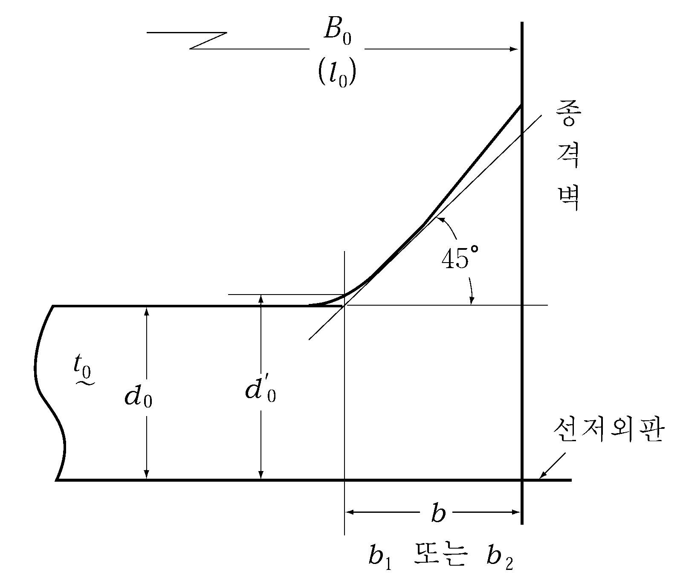
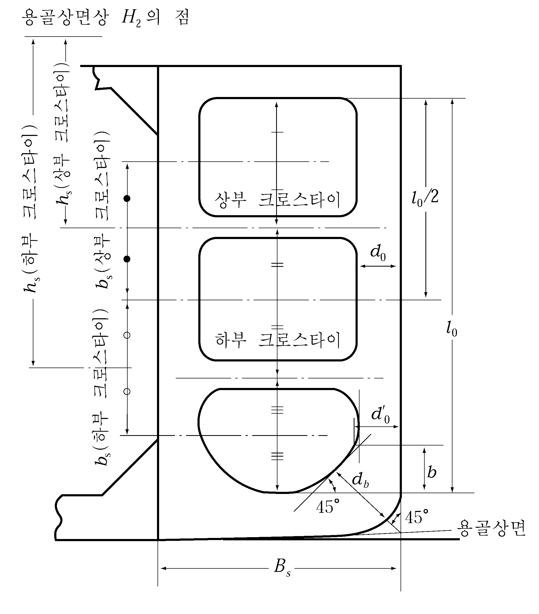
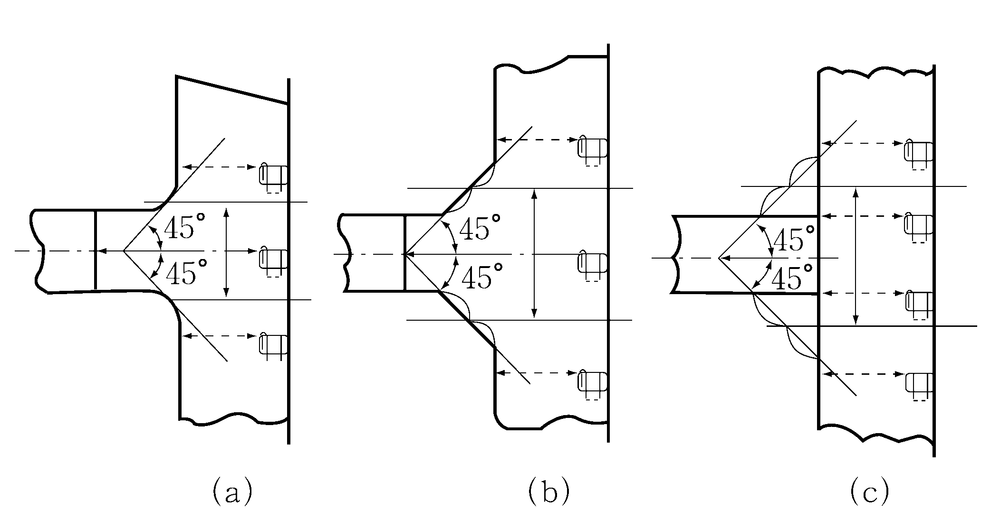

# 제7편 전용선박(1장~4장,7장~10장)

> 선급 및 강선규칙/적용지침 / RA-07A-K / 2025 / KO / Rules

## 제 1 장 유조선

### 제 1 절 일반사항

#### 101. 적용 【지침 참조】

- **1.** 이 장의 규정은 2006년 4월 1일 이후에 건조 계약되는 유조선으로서 **13편**(산적화물선 및 이중선체 유조선 공통구조 규칙) 및 **10장**(이중선체 유조선)의 적용 대상이 아닌 선박에 적용한다. 다만, **제10절**(유조선의 관장치 및 벤트장치) 및 **제11절**(유조선의 전기설비)의 규정은 **13편**(산적화물선 및 이중선체 유조선 공통구조 규칙) 및 **10장**(이중선체 유조선)의 적용 대상인 유조선에도 적용한다.
- **2.** 유조선으로 등록하고자 하는 선박의 구조 및 의장에 대하여는 이 장의 규정에 따른다. 여기에서 유조선이란 원유, 37.8 ℃에서의 증기압(절대압력)이 0.28 $\mathrm{MPa}$ 미만인 석유제품 또는 이와 유사한 액상 화물을 산적(散積)하여 운송하는 선박을 말한다.
- **3.** 특별히 이 장에 규정되어 있지 않은 것에 대하여는 해당 각 편의 규정에 따른다.
- **4.** 이 장의 규정은 선미에 기관을 배치한 1열 이상의 종통격벽을 갖는 1층 갑판선으로서 단저구조이고 종식구조인 선박에 대하여 규정한다.
- **5.** 원유 및 석유정제품 이외에 37.8 ℃에서의 증기압(절대압력)이 0.28 $\mathrm{MPa}$ 미만의 액상화물로서 독성, 부식성 등의 위험성이나 원유 및 석유정제품보다 높은 인화성을 가지지 않는 것을 산적하여 운송하는 선박의 구조, 배치 및 치수에 대하여는 그 화물의 성질에 따라 우리 선급이 적절하다고 인정하는 바에 따른다.
- **6.** 다음의 요건은 각 요건에도 불구하고 해당 선적국의 요건에 따라 적용을 면제할 수 있다.
  - **(1)** **103.**의 **5**항
  - **(2)** **107.**
  - **(3)** **204.**

#### 102. 격벽의 배치 【지침 참조】

화물유를 적재하는 곳에는 세로 또는 가로방향의 유밀격벽 및 제수격벽을 적절히 배치하여야 한다.

#### 103. 코퍼댐 【지침 참조】

- **1.** 화물유를 적재하는 곳의 전후부 양단 및 화물유를 적재하는 곳과 거주구역과의 사이에는 기밀로 하고 출입하기에 충분한 너비의 코퍼댐(cofferdam)을 설치하여야 한다. 다만, 인화점이 60${}^{\circ}\mathrm{C}$를 넘는 기름을 적재하는 선박에 대하여는 적절히 참작하여도 좋다.
- **2.** 전 항의 코퍼댐은 펌프실로 겸용하여도 좋다.
- **3.** 얼리지(ullage)용 개구, 사이팅 포트(sighting ports) 및 탱크 청소용 개구는 둘러싸인 구획내로 설치하여서는 안된다.
- **4.** 연료유 또는 평형수를 적재하는 장소는 우리 선급의 승인을 받은 경우 화물유를 적재하는 장소와의 사이에 설치하여야 할 코퍼댐을 겸용하여도 좋다.
- **5.** 총톤수 500톤 이상으로서 인화점이 60${}^{\circ}\mathrm{C}$ 이하인 기름을 적재하는 유조선의 구획의 배치 및 격리에 대하여는 **8편 2장 401.**의 규정에도 만족하여야 한다.

#### 104. 기밀격벽 【지침 참조】

모든 화물유 펌프 및 관계통을 설치하는 곳과 난로, 보일러, 추진기관, **6편 1장 9절**의 규정에 의한 것 이외의 전기장치 또는 항상 발화의 원인을 수반하는 기계를 설치하는 곳과의 사이에는 기밀격벽을 설치하여 격리시켜야 한다. 다만, 인화점이 60${}^{\circ}\mathrm{C}$를 넘는 기름을 적재하는 선박에 대하여는 적절히 참작하여도 좋다.

#### 105. 통풍장치

- **1.** 화물유 탱크에 인접한 장소에는 유효한 통풍장치를 설치하여야 하며 가스가 모일 우려가 있는 각 구조부에는 공기구멍을 뚫어야 한다.
- **2.** 화물유 탱크 및 펌프실 내의 위험가스를 제거하기 위하여 인공통풍 또는 증기에 의한 유효한 환기장치를 설치하여야 한다.
- **3.** 인화점이 60${}^{\circ}\mathrm{C}$를 넘는 기름을 적재하는 선박에는 **1004.**에서 규정한 환기회수를 적절히 참작하여도 좋다.
- **4.** **1**항에서 규정한 화물유 탱크와 인접한 장소에 설치하는 통풍기의 구조 및 그 배기덕트의 보호스크린에 대하여는 **1004.**의 규정에 따른다.

#### 106. 통풍용 개구

통풍용의 흡기 및 배기구는 발화원이 있는 둘러싸인 구역에 화물증기가 침입할 가능성 또는 발화 위험성이 있는 갑판기기의 근처에 화물증기가 집적될 가능성을 최소로 할 수 있는 위치에 설치하여야 한다. 특히 기관구역의 통풍용 개구는 화물구역으로부터 가능한 한 후방에 설치하여야 한다.

#### 107. 선루 및 갑판실의 개구

선루 및 갑판실의 개구는 화물증기가 집적할 가능성을 최소로 할 수 있는 위치에 설치하여야 한다. 또한 선미 하역용의 화물관을 배치하는 경우의 선루 및 갑판실의 개구는 충분히 고려하여 배치하여야 한다. 선미루 전단격벽 및 이와 유사한 장소에 설치하는 현창은 고정식으로 하여야 한다. 특히 총톤수 500톤 이상으로서 인화점이 60${}^{\circ}\mathrm{C}$ 이하인 기름을 적재하는 유조선의 개구는 **8편 2장 402.**에도 만족하여야 한다.

#### 108. 화물유 탱크의 구조부재의 두께

화물유를 적재하는 곳의 구조부재의 두께는 다음의 각호에 따른다.

#### 109. 직접강도계산 【지침 참조】

우리 선급의 승인을 받은 경우에는 **3편 1장 206.**에서 정하는 직접강도계산에 의하여 각 부재의 치수를 정할 수 있다.

#### 110. 복원성 적하지침기기(Stability Instrument) 【지침 참조】

- **1.** **해양오염방지협약(MARPOL)** Annex I 적용대상의 선박은 손상 및 비손상 복원성 요건을 만족 시키고 있음을 검증 가능케 하는 복원성 적하지침기기(stability instrument)를 설치하여야 하며, 그러한 기기는 기구가 권고한 성능 기준을 고려하여 우리 선급이 승인한 것이어야 한다;
  - **(1)** 2016년 1월 1일 전에 건조된 선박은 2016년 1월 1일 이후의 첫 계획된 정기검사 시까지, 그러나 늦어도 2021년 1월 1일 전에 이 요건을 충족하여야 한다.
  - **(2)** 상기 (1)의 요건에도 불구하고 2016년 1월 1일 전에 건조된 선박에 설치된 복원성 적하지침기기는 손상 및 비손상 복원성 요건에 적합하고 우리 선급이 인정하는 경우, 교체할 필요가 없다.
  - **(3)** 우리 선급이 인정하는 경우, 이 항의 요건을 면제할 수 있으며 이러한 면제는 **IOPP** form B에 명기되어야 한다.
- **2.** 다만, **1**항 적용 대상 선박이 아닌 경우, 해당 선적국의 요건에 적합하여야 한다.

### 제 2 절 창구, 상설보행로 및 방수설비

#### 201. 특히 큰 건현을 갖는 선박 【지침 참조】

특히 큰 건현을 갖는 선박에 대하여는 우리 선급이 적절하다고 인정하는 바에 따라 이 규정을 적절히 참작할 수 있다.

#### 202. 화물유 탱크에 설치하는 창구 (2018) 【지침 참조】

- **1.** 창구 코밍의 두께는 10 $\mathrm{mm}$ 이상으로 하여야 한다. 높이가 760 $\mathrm{mm}$ 를 넘고 길이가 1.25 $\mathrm{m}$ 를 넘는 측 코밍 또는 단부 코밍에는 수직 휨보강재를 붙이고 그 코밍의 상단을 적절히 보강하여야 한다.
- **2.** 창구 덮개판은 강 또는 기타의 승인된 재료를 사용하여 제작하고 강재인 경우의 구조는 다음 각호에 따른다. 강 이외의 재료를 사용하는 경우에는 우리 선급이 적절하다고 인정하는 바에 따른다.
  - **(1)** 덮개판의 두께는 12 $\mathrm{mm}$ 이상이어야 한다.
  - **(2)** 창구의 면적이 1 $\mathrm{m}^2$ 를 넘고 2.5 $\mathrm{m}^2$ 를 넘지 않는 경우에는 610 $\mathrm{mm}$ 이하의 간격으로 배치한 깊이 100 $\mathrm{mm}$ 의 평강으로 덮개판을 보강하여야 한다. 다만, 덮개판의 두께가 15 $\mathrm{mm}$ 이상인 경우에는 보강할 필요가 없다.
  - **(3)** 창구의 면적이 2.5 $\mathrm{m}^2$ 를 넘는 경우에는 610 $\mathrm{mm}$ 이하의 간격으로 배치한 깊이 125 $\mathrm{mm}$ 의 평강으로 덮개판을 보강하여야 한다.
  - **(4)** 창구 코밍에는 원형창구인 경우에는 457 $\mathrm{mm}$ 이하의 간격으로, 사각형 창구인 경우에는 각 귀퉁이로부터 230 $\mathrm{mm}$ 이내의 곳 및 그곳으로부터 380 $\mathrm{mm}$ 이하의 간격으로 배치한 고정장치를 설치하든가 또는 이와 등등한 효력의 장치를 설치하여 덮개판을 유밀로 잠글 수 있는 구조로 하여야 한다.

#### 203. 기타의 창구 (2021)

화물유 탱크, 평형수 탱크, 연료유 탱크 및 기타의 탱크 이외의 장소의 창구로서 건현갑판, 선수루갑판 및 팽창트렁크 정부의 노출부에 설치하는 것에는 **4편 2장 3절**의 규정에 의한 치수의 강제 풍우밀 덮개를 설치하여야 한다.

#### 204. 상설보행로 및 통로 【지침 참조】

- **1.** 선교루 또는 중앙갑판실과 선미루 또는 선미갑판실과의 사이에는 선루갑판의 높이에 **4편 4장 503.**의 규정에 의한 상설보행로를 설치하든가 또는 이와 동등이상 효력의 설비(예 : 갑판하 통로)를 설치하여야 한다. 상기 이외의 장소 및 선교루 또는 중앙갑판실을 갖지 않는 선박에 있어서 선박의 필요한 작업에 사용되는 모든 장소 상호간에 선원의 왕래를 보호하기 위한 설비는 우리 선급이 적절하다고 인정하는 바에 따른다.
- **2.** 분리된 선원 거주구역의 사이 및 선원 거주구역과 기관구역과의 사이에는 상설보행로로부터 안전하고 충분한 통로를 설치하여야 한다.

#### 205. 방수설비

- **1.** 불워크를 갖는 선박은 건현갑판의 노출부 길이의 반 이상에 걸쳐 보호난간을 설치하든가 또는 기타 유효한 방수설비를 갖추어야 한다. 현측후판의 상단은 가능한 한 낮게 하여야 한다. **【지침 참조】**
- **2.** 선루가 트렁크에 의하여 연락되는 경우에는 그 부분의 건현갑판의 노출부의 전 길이에 걸쳐 보호난간을 설치하여야 한다.

### 제 3 절 화물구역의 종늑골 및 종갑판보

#### 301. 일반

전용 평형수탱크 또는 보이드 구역(void space) 및 펌프실을 포함하여 화물유를 적재하는 곳에 설치하는 종늑골 및 종갑판보에 대하여는 이 규정에 따른다.

#### 302. 치수 【지침 참조】

- **1.** 선저종늑골 및 만곡부를 포함하는 선측종늑골의 단면계수 $Z$ 는 **표 7.1.2**의 식에 의한 것 이상이어야 한다.
- **2.** 종갑판보의 단면계수는 **3편 10장 303.**의 규정에 따라 계산한 값의 1.1배 이상으로 하여야 한다.
- **3.** 전 각 항의 규정에 관계없이 종늑골 및 종갑판보의 단면계수는 창구 정부까지의 거리를 $h$ 로 하여 디프탱크 격벽의 휨보강재로 간주하여 정한 것 미만으로 하여서는 안된다.
- **4.** 종갑판보 및 현측후판에 고착되는 선측 종늑골은 선박의 중앙부에서는 가능한 한 세장비가 60을 넘지 않는 치수로 하여야 한다. 다만, 소형선박에서는 적절히 참작하여도 좋다.
- **5.** 종갑판보 및 종늑골에 사용하는 평강은 그 깊이와 두께의 비가 15를 넘지 않는 것이어야 한다.
- **6.** 종갑판보 및 종늑골의 면재의 전 너비 $b$ 는 다음 식에 의한 것 이상이어야 한다.
  $b=2.2 \sqrt {d _{0} l} \mathrm{mm}$
  $d_0$ : 종갑판보 및 종늑골의 웨브의 깊이($\mathrm{mm}$)
  $l$ : 트랜스버스의 간격($\mathrm{m}$)

#### 303. 고착 【지침 참조】

종늑골 및 종갑판보는 연속구조로 하든가 또는 이들의 끝에서는 유효한 단면적을 갖도록 하고 굽힘에 대한 저항이 충분하도록 고착하여야 한다.

### 제 4 절 화물구역의 종거더, 트랜스버스 및 크로스타이

#### 401. 일반 【지침 참조】

- **1.** 이 절의 규정은 횡격벽 사이 또는 횡격벽에서 제수격벽까지의 사이에 2조부터 5조까지의 트랜스버스가 대략 같은 간격으로 배치된 구조에 대하여 규정한 것이다.
- **2.** 동일 평면내에 있는 거더는 그 강도 및 강성의 급격한 변화를 피하고, 거더의 단부에는 적절한 크기의 브래킷을 설치하고 충분한 둥금새를 주어야 한다.
- **3.** 거더의 깊이는 늑골, 보 및 휨보강재의 관통부 슬롯 깊이의 2.5배 이상으로 하여야 한다.
- **4.** 거더를 구성하는 면재의 두께 $t$ 는 웨브의 두께 이상으로 하고 그 너비 $b$ 는 다음 식에 의한 것 이상이어야 한다.
  $b= 2.7 \sqrt {d_0 l} \mathrm{mm}$
  $d_0$ : 거더의 깊이($\mathrm{mm}$). 밸런스 거더의 경우에는 판면으로부터 면재까지의 깊이($\mathrm{mm}$).
  $l$ : 거더의 지지점 사이의 거리($\mathrm{m}$). 다만, 유효한 트리핑 브래킷이 있을 때에는 이것을 지지점으로 간주하여도 좋다.
- **5.** **401.**부터 **406.**부터의 규정은 펌프실 및 중앙부의 전용 평형수탱크 또는 보이드 구역에도 준용한다.

#### 402. 2열 이상의 종격벽을 갖는 선박의 중앙탱크 또는 내측탱크에 설치하는 종거더 및 트랜스버스 【지침 참조】

- **1.** **선저트랜스버스 및 선저종거더**
  - **(1)** 선저트랜스버스의 깊이, 웨브의 두께 및 단면계수와 종격벽 사이의 중앙에 설치하는 선저종거더의 웨브의 두께 및 단면계수는 각각 **표 7.1.3**의 식에 의한 것 이상이어야 한다.
  - **(2)** 종격벽 사이의 중앙에 설치하는 선저종거더와 종격벽과의 사이에 1조부터 2조까지의 단절 측거더를 설치하여 (3)호의 규정에 따라 선저종거더 및 트랜스버스의 치수를 경감한 것으로 할 경우에는 측거더의 웨브의 단면적 $A$ 및 단면2차모멘트 $I$ 는 각각 다음 식에 의한 것 이상으로 하여야 한다.
    $A= \alpha _{1} \frac{L _{0}}{B _{0}} d _{0} t _{0} \mathrm{cm ^{2} }$
    $I = \alpha_2 \left( { \frac{L_0}{B_0} } \right)^3 I_0 \mathrm{cm^4 }$
    $\alpha_1$ 및 $\alpha_2$ : 계수로서 측거더의 수에 따라 각각 **표 7.1.4**에 따른다.
    $I_0$ : 선저트랜스버스의 단면2차모멘트($\mathrm{cm}^4$).
    $L_0$, $B_0$, $d_0$ 및 $t_0$ : **표 7.1.3**에 따른다.

    **표 7.1.4 계수** $\alpha_1$ **및** $\alpha_2$

    | **측거더의 수** | **계수** |   |
    | --- | --- | --- |
    | **측거더의 수** | $\alpha_1$ | $\alpha_2$ |
    | 1조 | 0.0085 | 0.67 |
    | 2조 | 0.0045 | 0.42 |
  - **(3)** (2)호의 규정을 만족하는 단절 측거더를 설치하는 경우 선저종거더 및 트랜스버스의 소요치수는 (1)호에 있어서 각 식의 계수 $C_0$, $C_1$, $C_2$, $C_3$ 및 $C_4$ 를, 2조의 트랜스버스를 배치할 때에는 각각 10 %, 3조의 트랜스버스를 배치할 때에는 각각 5 % 감소하여 계산하여도 좋다.
  - **(4)** 선체 중심선에 종격벽을 설치하지 아니하는 선박에는 입거시 선박이 용골반목 위에 놓여질 때에 충분한 강도를 유지하도록 중심선 거더를 설치하고 적절한 간격으로 브래킷을 붙여야 한다.

    **표 7.1.3 선저트랜스버스 및 선저종거더의 치수**

    |   | **깊이(**$\mathrm{m}$**)** | **웨브두께(**$\mathrm{mm}$**)** | **단면계수(**$\mathrm{cm}^3$**)** |   |   |   |   |   |   |   |   |
    | --- | --- | --- | --- | --- | --- | --- | --- | --- | --- | --- | --- |
    | **선저트랜스버스** | $d = C_0 l_0$ | 종격벽에 고착하는 브래킷의 안쪽 끝부분에 있어서의 두께 $t = \left( { C_1 - 87 \frac{b}{l_0}} \right) \frac{KQ}{d_0 ' - a} + 2.5$ | $Z = C_2 K k^2 Q l_0$ |   |   |   |   |   |   |   |   |
    | **선저종거더** | - | $t = C_3 \frac{\eta KQ}{d_1} + 2.5$ | $Z = C_4 K kQ l_1$ |   |   |   |   |   |   |   |   |
    | $Q$ = $\alpha S h_1 l_0$ $\alpha$ : $L$ 이 230 $\mathrm{m}$ 이하일 때 ----- 1.0 $L$ 이 400 $\mathrm{m}$ 를 넘을 때 ----- 1.2 $L$ 이 중간에 있을 때에는 보간법에 의한다. $h_1$ : 다음 식에 의한 값. $d + 0.026L' \mathrm{m}$ $L'$ : 선박의 길이 ($\mathrm{m}$). 다만, $L$ 이 230 $\mathrm{m}$ 를 넘을 때에는 230 $\mathrm{m}$ 로 한다. $S$ : 트랜스버스의 간격 ($\mathrm{m}$). $l_0$ : 트랜스버스의 전 길이($\mathrm{m}$)로서, $B_0$ 또는 ($B_0 -d_3$) 을 사용한다. $d_3$ 는 중심선 격벽에 설치하는 트랜스버스의 깊이 ($\mathrm{m}$). $b$ : 트랜스버스와 종격벽을 고착하는 브래킷의 수평암의 길이 ($\mathrm{m}$). (**그림 7.1.1** 참조) $d_0 '$ : 위의 브래킷의 안쪽 끝에 있어서 트랜스버스의 깊이($\mathrm{mm}$). (**그림 7.1.1** 참조) $a$ : 슬롯의 깊이 ($\mathrm{mm}$). 다만, 브래킷 안쪽 끝부근의 슬롯에 칼라를 설치할 때에는 0으로 하여도 좋다. $d _{1} '$ : 단부 트랜스버스의 위치에 있어서 브래킷을 포함한 종거더의 깊이 ($\mathrm{mm}$). (**그림 7.1.2** 참조) $l _{1}$ : 종거더의 전 길이($\mathrm{m}$)로서 $(L_0 - d_2 )$ 를 사용한다. $d_2$ 는 횡격벽 수직거더의 깊이 ($\mathrm{m}$). (**그림 7.1.2** 참조) $k$ : 브래킷에 의한 수정계수로서 다음 식에 의한 값. $k = 1 - \frac{0.65 (b_1 + b_2 )}{l}$ $b _{1}$ 및 $b _ 2$ : 종거더 및 트랜스버스의 각각의 양쪽 끝부분에 있어서 브래킷의 암의 길이 ($\mathrm{m}$). $l$ : 종거더 및 트랜스버스의 전 길이($\mathrm{m}$)로서 $l_0$ 또는 $l _{1}$ $\eta$ : 다음 표에 따른다. 트랜스버스의 수 ; 계수 ; $\frac{2}{3} \leq \beta$ $\eta = 1.0$ ; $0 \leq \beta < 0.5$ ; $\eta = 1.6 - 1.2 \beta$ ; $0.5 \leq \beta$ ; $\eta = 1.0$ ; $d_0$ ; $t_0$ ; $\mathrm{mm}$ ; $\mathrm{mm}$ ; 종거더를 설치하지 아니할때 2 조 ; $d_1$ $t_1$ $\mathrm{mm}$ $\mathrm{mm}$ $B_0$ ; 0.090 23.6 1.44 36.8 8.08 ; 0.095 24.3 1.47 34.5 7.65 ; 0.100 25.5 1.54 32.3 7.04 ; 0.105 26.7 1.63 30.5 6.51 ; 0.110 27.8 1.77 28.5 6.25 ; 0.115 29.0 1.94 26.6 5.73 ; 0.120 30.1 2.12 24.8 5.21 ; 0.125 31.8 2.43 22.2 4.09 ; 0.135 34.0 2.87 18.8 4.17 ; 0.160 43.7 5.69 - - 3 조 ; $\mathrm{m}$ $L_0$ $\mathrm{m}$ $C_0, C_1, C_2, C_3$ $C_4$ ; 0.090 24.0 1.47 57.2 10.42 ; 0.095 25.5 1.54 54.0 9.65 ; 0.100 26.7 1.63 50.9 8.97 ; 0.105 27.8 1.79 47.5 8.34 ; 0.110 29.4 1.96 44.6 7.67 ; 0.115 30.5 2.19 42.3 7.06 ; 0.120 31.7 2.43 39.9 6.51 ; 0.125 33.6 2.84 36.0 5.73 ; 0.135 36.3 3.41 31.3 4.69 ; 0.160 43.7 5.69 - - 4 조 ; $K_0$ $K_0 = \frac{d_0 t_0}{d_1 t_1} \times \frac{L_0}{B_0}$ $K_0 \leq 0.2$ $0.2 <\# K_0\# \leq 0.3$ $0.3 <\# K_0\# \leq 0.4$ ; 0.090 24.4 1.47 76.0 10.69 ; 0.095 25.9 1.54 68.1 9.65 ; 0.100 27.1 1.70 64.2 8.86 ; 0.105 28.6 1.87 60.3 8.08 ; 0.110 30.0 2.03 56.4 7.34 ; 0.115 31.3 2.28 52.5 6.80 ; 0.120 32.7 2.52 48.5 5.99 ; 0.125 34.8 3.01 43.5 5.27 ; 0.135 37.5 3.73 36.8 4.17 ; 0.160 43.7 5.69 - - 5 조 ; $0.4 <\# K_0\# \leq 0.5$ $0.5 <\# K_0\# \leq 0.6$ $0.6 <\# K_0\# \leq 0.7$ $0.7 <\# K_0\# \leq 0.8$ $0.8 <\# K_0\# \leq 1.0$ ; 0.095 24.7 1.54 94.0 15.64 ; 0.100 26.3 1.63 83.8 13.56 ; 0.105 27.4 1.79 78.3 12.50 ; 0.110 29.4 2.03 72.8 11.46 ; 0.115 30.9 2.28 67.5 10.16 ; 0.120 32.5 2.52 62.6 9.12 ; 0.125 34.0 2.83 57.2 8.08 ; 0.135 36.7 3.50 49.5 6.78 ; 0.145 40.2 4.46 39.2 4.69 ; 0.160 43.7 5.69 - - 트랜스버스의 수 $\beta = \frac{S - d_2}{S}$ $\eta$ 2조 $0 \leq \beta < \frac{2}{3}$ $\eta = 2-1.5 \beta$ $\frac{2}{3} \leq \beta$ $\eta = 1.0$ 3조부터 5조까지 $0 \leq \beta < 0.5$ $\eta = 1.6 - 1.2 \beta$ $0.5 \leq \beta$ $\eta = 1.0$ $d_0$ 및 $t_0$ : 각각 트랜스버스의 깊이($\mathrm{mm}$) 및 웨브의 두께($\mathrm{mm}$). $d_1$ 및 $t_1$ : 각각 종거더의 깊이($\mathrm{mm}$) 및 웨브의 두께($\mathrm{mm}$). $B_0$ : 종격벽 사이의 거리($\mathrm{m}$). $L_0$ : 횡격벽 사이의 거리($\mathrm{m}$). $C_0, C_1, C_2, C_3$ 및 $C_4$ : 계수로서 $K_0$ 에 따라 각각 다음 표에 따른다 |   |   |   |   |   |   |   |   |   |   |   |
    | 트랜스버스의 수 | 계수 | $\frac{2}{3} \leq \beta$ |   |   |   |   |   |   |   |   |   |
    | 트랜스버스의 수 | 계수 | $\eta = 1.0$ | $0 \leq \beta < 0.5$ | $\eta = 1.6 - 1.2 \beta$ | $0.5 \leq \beta$ | $\eta = 1.0$ | $d_0$ | $t_0$ | $\mathrm{mm}$ | $\mathrm{mm}$ | 종거더를 설치하지 아니할때 |
    | 2 조 | $d_1$ $t_1$ $\mathrm{mm}$ $\mathrm{mm}$ $B_0$ | 0.090 23.6 1.44 36.8 8.08 | 0.095 24.3 1.47 34.5 7.65 | 0.100 25.5 1.54 32.3 7.04 | 0.105 26.7 1.63 30.5 6.51 | 0.110 27.8 1.77 28.5 6.25 | 0.115 29.0 1.94 26.6 5.73 | 0.120 30.1 2.12 24.8 5.21 | 0.125 31.8 2.43 22.2 4.09 | 0.135 34.0 2.87 18.8 4.17 | 0.160 43.7 5.69 - - |
    | 3 조 | $\mathrm{m}$ $L_0$ $\mathrm{m}$ $C_0, C_1, C_2, C_3$ $C_4$ | 0.090 24.0 1.47 57.2 10.42 | 0.095 25.5 1.54 54.0 9.65 | 0.100 26.7 1.63 50.9 8.97 | 0.105 27.8 1.79 47.5 8.34 | 0.110 29.4 1.96 44.6 7.67 | 0.115 30.5 2.19 42.3 7.06 | 0.120 31.7 2.43 39.9 6.51 | 0.125 33.6 2.84 36.0 5.73 | 0.135 36.3 3.41 31.3 4.69 | 0.160 43.7 5.69 - - |
    | 4 조 | $K_0$ $K_0 = \frac{d_0 t_0}{d_1 t_1} \times \frac{L_0}{B_0}$ $K_0 \leq 0.2$ $0.2 <\# K_0\# \leq 0.3$ $0.3 <\# K_0\# \leq 0.4$ | 0.090 24.4 1.47 76.0 10.69 | 0.095 25.9 1.54 68.1 9.65 | 0.100 27.1 1.70 64.2 8.86 | 0.105 28.6 1.87 60.3 8.08 | 0.110 30.0 2.03 56.4 7.34 | 0.115 31.3 2.28 52.5 6.80 | 0.120 32.7 2.52 48.5 5.99 | 0.125 34.8 3.01 43.5 5.27 | 0.135 37.5 3.73 36.8 4.17 | 0.160 43.7 5.69 - - |
    | 5 조 | $0.4 <\# K_0\# \leq 0.5$ $0.5 <\# K_0\# \leq 0.6$ $0.6 <\# K_0\# \leq 0.7$ $0.7 <\# K_0\# \leq 0.8$ $0.8 <\# K_0\# \leq 1.0$ | 0.095 24.7 1.54 94.0 15.64 | 0.100 26.3 1.63 83.8 13.56 | 0.105 27.4 1.79 78.3 12.50 | 0.110 29.4 2.03 72.8 11.46 | 0.115 30.9 2.28 67.5 10.16 | 0.120 32.5 2.52 62.6 9.12 | 0.125 34.0 2.83 57.2 8.08 | 0.135 36.7 3.50 49.5 6.78 | 0.145 40.2 4.46 39.2 4.69 | 0.160 43.7 5.69 - - |

    **표 7.1.3 선저트랜스버스 및 선저종거더의 치수 (계속)**

    | **트랜스버스의 수** ; $K _{0} = {\frac{d _{0 } t _{0}}{d_1 t_1} \times \frac{L_0}{B_0}$ ; $C_0$ ; $C$ 2조 및 3조 ; $K_0 \leq 0.5$ ; 0.07 ; 0.79 $K_0 \geq 1.5$ ; 0.10 ; 1.82 4조 ; $K_0 \leq 0.4$ ; 0.07 ; 0.79 $K_0 \geq 1.4$ ; 0.10 ; 1.82 5조 ; $K_0 \leq 0.3$ ; 0.07 ; 0.79 $K_0 \geq 1.3$ ; 0.10 ; 1.82 (비 고) $K_0$ 의 값이 표의 중간인 경우에는 보간법에 의한다. 트랜스버스의 수 계수 $K_0 = \frac{d_0 t_0}{d_1 t_1} \times \frac{L_0}{B_0}$ $K_0 \leq 0.2$ $0.2 <\# K_0\# \leq 0.3$ $0.3 <\# K_0\# \leq 0.4$ $0.4 <\# K_0\# \leq 0.5$ $0.5 <\# K_0\# \leq 0.6$ $0.6 <\# K_0\# \leq 0.7$ $0.7 <\# K_0\# \leq 0.8$ $0.8 <\# K_0\# \leq 1.0$ $1.0 <\# K_0\# \leq 1.2$ 종거더를 설치하지 아니할때 2 조 $C_0$ $C_1$ $C_2$ $C_3$ $C_4$ 0.090 23.6 1.44 36.8 8.08 0.095 24.3 1.47 34.5 7.65 0.100 25.5 1.54 32.3 7.04 0.105 26.7 1.63 30.5 6.51 0.110 27.8 1.77 28.5 6.25 0.115 29.0 1.94 26.6 5.73 0.120 30.1 2.12 24.8 5.21 0.125 31.8 2.43 22.2 4.09 0.135 34.0 2.87 18.8 4.17 0.160 43.7 5.69 - - 3 조 $C_0$ $C_1$ $C_2$ $C_3$ $C_4$ 0.090 24.0 1.47 57.2 10.42 0.095 25.5 1.54 54.0 9.65 0.100 26.7 1.63 50.9 8.97 0.105 27.8 1.79 47.5 8.34 0.110 29.4 1.96 44.6 7.67 0.115 30.5 2.19 42.3 7.06 0.120 31.7 2.43 39.9 6.51 0.125 33.6 2.84 36.0 5.73 0.135 36.3 3.41 31.3 4.69 0.160 43.7 5.69 - - 4 조 $C_0$ $C_1$ $C_2$ $C_3$ $C_4$ 0.090 24.4 1.47 76.0 10.69 0.095 25.9 1.54 68.1 9.65 0.100 27.1 1.70 64.2 8.86 0.105 28.6 1.87 60.3 8.08 0.110 30.0 2.03 56.4 7.34 0.115 31.3 2.28 52.5 6.80 0.120 32.7 2.52 48.5 5.99 0.125 34.8 3.01 43.5 5.27 0.135 37.5 3.73 36.8 4.17 0.160 43.7 5.69 - - 5 조 $C_0$ $C_1$ $C_2$ $C_3$ $C_4$ 0.095 24.7 1.54 94.0 15.64 0.100 26.3 1.63 83.8 13.56 0.105 27.4 1.79 78.3 12.50 0.110 29.4 2.03 72.8 11.46 0.115 30.9 2.28 67.5 10.16 0.120 32.5 2.52 62.6 9.12 0.125 34.0 2.83 57.2 8.08 0.135 36.7 3.50 49.5 6.78 0.145 40.2 4.46 39.2 4.69 0.160 43.7 5.69 - - |   |   |   |
    | --- | --- | --- | --- |
    | **트랜스버스의 수** | $K _{0} = {\frac{d _{0 } t _{0}}{d_1 t_1} \times \frac{L_0}{B_0}$ | $C_0$ | $C$ |
    | 2조 및 3조 | $K_0 \leq 0.5$ | 0.07 | 0.79 |
    | 2조 및 3조 | $K_0 \geq 1.5$ | 0.10 | 1.82 |
    | 4조 | $K_0 \leq 0.4$ | 0.07 | 0.79 |
    | 4조 | $K_0 \geq 1.4$ | 0.10 | 1.82 |
    | 5조 | $K_0 \leq 0.3$ | 0.07 | 0.79 |
    | 5조 | $K_0 \geq 1.3$ | 0.10 | 1.82 |
    | (비 고) $K_0$ 의 값이 표의 중간인 경우에는 보간법에 의한다. |   |   |   |
    | (비 고) 1. 트랜스버스의 수가 4조 또는 5조로 횡격벽의 한쪽에만 강력한 수직거더가 설치되는 경우에는 계수 $C_4$ 의 값을 적절히 증가시켜야 한다. 2. 중심선 선저종거더의 깊이가 특히 깊은 경우에는 계수 $C_4$ 의 값을 적절히 참작하여도 좋다. |   |   |   |

    
    **그림 7.1.1** #eqnID-306**의 측정방법**
    **그림 7.1.2** #eqnID-307**및** #eqnID-308**의 측정방법**
- **2.** **갑판 종거더 및 트랜스버스**
  - **(1)** 갑판트랜스버스의 깊이 $d$ 및 단면계수 $Z$ 는 각각 다음 식에 의한 것 이상이어야 한다.
    $d = C_0 l_0 \mathrm{m} \#

    Z = C K k^2 \sqrt { L}S l_0^2 \mathrm{cm^3 }$
    $C_0$ 및 $C$ : 계수로서 **표 7.1.5**에 의한 값.
    $d_0$ 및 $t_0$ : 각각 트랜스버스의 깊이($\mathrm{mm}$) 및 웨브의 두께($\mathrm{mm}$).
    $d_1$ 및 $t_1$ : 각각 종거더의 깊이($\mathrm{mm}$) 및 웨브의 두께($\mathrm{mm}$).
    $L_0$, $B_0$, $S$ 및 $k$ : **표 7.1.3**에 따른다.
    $l_0$ : 트랜스버스의 전 길이($\mathrm{m}$) 로서 $B_0$ 또는 ($B_0 -d_3$) 을 사용한다. $d_3$ 는 중심선 격벽에 설치하는 트랜스버스의 깊이($\mathrm{m}$).
  - **(2)** 종격벽 사이의 중앙에 설치하는 갑판거더는 (1)호의 규정과 관련하여 그 치수를 정하여도 무방하나 이 거더가 **505.**에서 규정하는 횡격벽의 강력한 수직거더와 링 구조를 이루는 경우에는 그 깊이 $d$ 는 다음 식에 의한 것 이상이어야 한다.
    $d = \frac{L_0 D}{9B_0} \mathrm{m}$
    $B_0$ 및 $L_0$ : **표 7.1.3**에 따른다.

    | **트랜스버스의 수** | $K _{0} = {\frac{d _{0 } t _{0}}{d_1 t_1} \times \frac{L_0}{B_0}$ | $C_0$ | $C$ |
    | --- | --- | --- | --- |
    | 2조 및 3조 | $K_0 \leq 0.5$ | 0.07 | 0.79 |
    | 2조 및 3조 | $K_0 \geq 1.5$ | 0.10 | 1.82 |
    | 4조 | $K_0 \leq 0.4$ | 0.07 | 0.79 |
    | 4조 | $K_0 \geq 1.4$ | 0.10 | 1.82 |
    | 5조 | $K_0 \leq 0.3$ | 0.07 | 0.79 |
    | 5조 | $K_0 \geq 1.3$ | 0.10 | 1.82 |
    | (비 고) $K_0$ 의 값이 표의 중간인 경우에는 보간법에 의한다. |   |   |   |
- **3.** 중심선 격벽에 설치하는 트랜스버스는 현측탱크내의 종격벽 트랜스버스에 대한 **403**.의 **2**항 (2)호에 따라 정한 치수 이상이어야 한다.

#### 403. 2열 이상의 종격벽을 갖는 선박의 현측탱크에 설치하는 종거더 및 트랜스버스 【지침 참조】

- **1.** **선측트랜스버스**
  - **(1)** 여기에서 사용하는 기호는 각각 다음에 따른다.
    $Q = \alpha S h l_0$
    $\alpha$ : $L$ 이 230 $\mathrm{m}$ 이하일 때 : 1.0
    $L$ 이 400 $\mathrm{m}$ 를 넘을 때 : 1.2
    $L$ 이 중간에 있을 때에는 보간법에 의한다.
    $h$ : $l_0$ 의 중앙으로부터 용골 상면상 $H_2$ 의 점까지의 거리($\mathrm{m}$)
    $h_s$ : $b_s$ 의 중앙으로부터 용골 상면상 $H_2$ 의 점까지의 거리($\mathrm{m}$)
    $H_2 = d+0.038L' \mathrm{m}$
    $L'$ : 선박의 길이($\mathrm{m}$). 다만, $L$ 이 230 $\mathrm{m}$를 넘을 때에는 230 $\mathrm{m}$로 한다.
    $l_0$ : 선측트랜스버스의 전 길이($\mathrm{m}$)로서 선저트랜스버스 및 갑판트랜스버스의 면재의 내면 사이의 거리.(**그림 7.1.3** 참조)
    $S$ : 트랜스버스의 간격($\mathrm{m}$)
    $S '$ : 크로스타이가 결합되는 부분에 있어서 트랜스버스의 웨브의 깊이 방향에 설치되는 휨보강재의 간격($\mathrm{m}$)
    $k$ : **표 7.1.3**에 따른다.
    $b$ : 하단 브래킷의 암의 길이($\mathrm{m}$)(**그림 7.1.3** 참조)
    $b_s$ : 크로스타이가 지지하는 너비($\mathrm{m}$)(**그림 7.1.3** 참조)
    $d_0 '$ : 하단 브래킷의 안쪽 끝부분에 있어서 선측트랜스버스의 깊이($\mathrm{mm}$)(**그림 7.1.3** 참조)
    $a$ : 하단 브래킷의 안쪽 끝부분에 있어서의 슬롯의 깊이($\mathrm{mm}$) 다만, 슬롯에 칼라를 설치할 때에는 0으로 하여도 좋다.
    $A$ : 크로스타이로부터 축력을 지지할 수 있는 유효한 단면적($\mathrm{cm}^2$)으로서 다음의 규정에 따른다.
    
    **그림 7.1.3** #eqnID-386**의 측정방법**
    $C_0$, $C_1$ 및 $C_2$ : 계수로서 크로스타이의 수에 따라 각각 **표 7.1.6**에 의한 값.
    
    **그림 7.1.4 합계 단면적에 산입하는 범위**

    **표 7.1.6 계수** $C _{0}$**,** $C _{1}$**,** $C _{2}$ **및** $C _{2} '$

    | **크로스타이의 수** | $C _{0}$ | $C _{1}$ | $C _{2}$ | $C _{2} '$ |
    | --- | --- | --- | --- | --- |
    | 0 | 0.150 | 55.7 | 5.07 | 7.14 |
    | 1 | 0.110 | 44.8 | 2.70 | 4.42 |
    | 2 | 0.100 | 39.4 | 2.28 | 3.74 |
    | 3 | 0.095 | 36.2 | 2.12 | 3.49 |
    - **(가)** 크로스타이의 면재가 원호(圓弧) 또는 이와 유사한 모양으로 트랜스버스의 면재와 연속되어 있는 구조의 경우에는 그 원호 또는 이와 유사한 모양에 크로스타이의 방향과 45°를 이루는 접선의 접점 사이의 범위에 있는 트랜스버스의 웨브 및 크로스타이 방향의 휨보강재의 합계 단면적에 그 접점의 곳에 있어서 면재의 단면적의 50 %를 더한 것.(**그림 7.1.4** (a) 참조)
    - **(나)** 크로스타이의 면재와 트랜스버스의 면재가 원호와 직선으로 연속되어 있는 구조의 경우에는 해당 면재에 크로스타이의 방향과 45°를 이루는 접선이 크로스타이 및 트랜스버스의 면재의 연장선과 각각 만나는 점의 중심점 사이의 범위에 있는 트랜스버스의 웨브 및 크로스타이 방향의 휨보강재의 합계 단면적에 그 중심점의 곳에 있어서의 면재의 단면적의 50 %를 더한 것. (**그림 7.1.4** (b) 참조)
    - **(다)** 크로스타이의 면재가 직각 또는 이것에 가까운 각도로 트랜스버스의 면재와 만나고 이들의 면재를 브래킷으로서 결합하고 또 크로스타이의 연장상에 트랜스버스의 웨브의 휨보강재가 설치되는 구조인 경우에는 브래킷에 크로스타이의 방향과 45°를 이루는 접선이 크로스타이 및 트랜스버스의 면재와 각각 만나는 점의 중심점 사이의 범위에 있는 트랜스버스의 웨브 및 크로스타이 방향 휨보강재의 합계 단면적.(**그림 7.1.4** (c) 참조)
  - **(2)** 트랜스버스의 깊이는 $l_0$ 의 중앙에 있어서 $C_0 l_0 \mathrm{m}$ 이상이어야 한다. 또한 거더의 깊이를 테이퍼로 할 경우에는 상단에 있어서 감소의 비율은 $l_0$ 의 중앙에 있어서의 깊이의 10 %를 넘어서는 아니되며, 하단에 있어서의 증가의 비율은 상단의 감소의 비율 미만으로 하여서는 안된다.
  - **(3)** 하단 브래킷의 안쪽 끝부분에 있어서의 웨브의 두께 $t$ 는 다음 식에 의한 것 이상이어야 한다. 다만, 중앙탱크 또는 내측탱크내의 선저트랜스버스와 종격벽과를 고착시키는 브래킷을 최하부 크로스타이의 위치까지 도달하는 깊이로 할 경우에는 선측트랜스버스의 웨브의 두께를 적절히 감하여도 좋다.
    $t = \left( { C_1 - 148 \frac{b}{l_0}} \right) \frac{KQ}{d_0 ' - a} + 2.5 \mathrm{mm}$
  - **(4)** 크로스타이가 결합하는 부분에 있어서 웨브의 두께 $t$ 는 다음 식에 의한 것 이상이어야 한다. 또한 크로스타이가 결합하는 부분의 웨브에 슬롯이 설치되는 경우에는 칼라로써 유효하게 막아야 한다.
    $t = 16 \sqrt { \frac{alphaSb_s h_s}{A}} \times S ' \mathrm{mm}$
  - **(5)** 스팬에 있어서 트랜스버스의 단면계수 $Z$ 는 다음 식에 의한 것 이상이어야 한다.
    $Z = C_2 K k^2 Q l_0 \mathrm{cm^3 }$
- **2.** **종격벽트랜스버스**
  - **(1)** 유효한 크로스타이에 의하여 선측트랜스버스와 결합하는 종격벽트랜스버스는 **1**항의 각 호에서 크로스타이를 갖는 경우의 선측트랜스버스의 규정에 따라 정한 치수 이상이어야 한다.
  - **(2)** 크로스타이를 설치하지 않는 경우의 종격벽트랜스버스는 **1**항의 각 호에서 크로스타이를 설치하지 않는 경우의 선측트랜스버스의 규정에 따른다. 다만, $h$ 는 $l_0$ 의 중앙으로부터 내측탱크 또는 중앙탱크의 창구정부까지의 거리($\mathrm{m}$)로 한다.
- **3.** **선저트랜스버스**
  - **(1)** 선저트랜스버스의 강성은 선측트랜스버스의 강성에 따라 균형을 취한 것이어야 한다.
  - **(2)** 선저트랜스버스의 스팬에 있어서 거더의 단면계수 $Z$ 는 다음 식에 의한 것 이상이어야 한다.
    $Z = 9.3 K \alpha k^2 S h_1 l_1^2$
    $\alpha$, $k$ 및 $S$ : 각각 **1**항 (1)호의 규정에 따른다.
    $h_1$ : **표 7.1.3**에 따른다.
    $l_1$ : 선저트랜스버스의 전 길이($\mathrm{m}$)로서, 선측트랜스버스 및 종격벽트랜스버스의 면재의 내면 사이의 거리.
  - **(3)** 만곡부 및 종격벽 하단부에 있어서의 트랜스버스의 단면계수 $Z$ 는 다음 식에 의한 것 이상이어야 한다. 다만, 중앙탱크 또는 안쪽 탱크내의 선저트랜스버스와 종격벽을 고착하는 브래킷을 최하부 크로스타이의 위치까지 도달하는 깊이로 할 경우에는, 트랜스버스의 단면계수를 적절히 감소하여도 좋다. 거더의 단면계수를 계산함에 있어서 단면의 중성축은 거더의 깊이 $d_b$ (**그림 7.1.3** 참조)의 중앙에 있는 것으로 한다.
    $Z = C_2 ' K Q l_0 \mathrm{cm^3 }$
    $Q$ 및 $l_0$ : 각각 **1**항 (1)호의 규정에 따른다.
    $C_2 '$ : 계수로서 크로스타이의 수에 따라 **표 7.1.6**에 따른다.
- **4.** **갑판트랜스버스**
  - **(1)** 갑판트랜스버스의 강성은 선측트랜스버스의 강성에 따라 균형을 취한 것이어야 한다.
  - **(2)** 갑판트랜스버스의 단면계수 $Z$ 는 다음 식에 의한 것 이상이어야 한다.
    $Z = 3Kk ^{2} S \sqrt {L} l _{2} ^{2} \mathrm{cm^3 }$
    $k$ 및 $S$ : 각각 **1**항 (1)호의 규정에 따른다.
    $l_2$ : 갑판트랜스버스의 전 길이($\mathrm{m}$)로서, 선측트랜스버스 및 종격벽트랜스버스의 면재의 내면 사이의 거리.
- **5.** **선측과 종격벽에 종거더를 설치할 경우의 거더 및 트랜스버스**
  이 규정은 선측과 종격벽에 각각 1조부터 3조까지의 종거더 및 3조의 트랜스버스를 설치하고, 중앙부 트랜스버스와 종거더의 교차부에만 선측과 종격벽을 유효한 크로스타이로써 결합하는 구조에 대하여 정한 것이다.
  - **(1)** 선측트랜스버스의 소요치수 및 만곡부에 있어서의 트랜스버스의 단면계수는 각각 **1**항 및 **3**항의 식에 의하여, 계수 $C_0$, $C_1$, $C_2$ 및 $C_2 '$ 로서 **표 7.1.7**에 의하여 다음의 $K$ 값에 따라 구한 것을 사용하여 계산한 것 이상이어야 한다.
    $K = \frac{d_0}{d_1} \left( { \frac{l_1}{l_0}} \right)^2$
    $d_0$ : 선측트랜스버스 평균 깊이($\mathrm{mm}$)
    $l_0$ : **1**항 (1)호의 규정에 따른다.
    $d_1$ : 선측종거더의 평균 깊이($\mathrm{mm}$)
    $l_1$ : 선측종거더의 전 길이($\mathrm{m}$)로서 횡격벽 사이의 거리로부터 횡격벽에 설치하는 수평거더의 깊이를 뺀 것.
  - **(2)** 선측트랜스버스의 단면계수 $Z$ 및 선측종거더의 끝부분과 동 종거더와 끝부분 트랜스버스와의 만나는 곳과의 사이의 선측종거더의 웨브의 두께 $t$ 는 각각 다음 식에 의한 것 이상이어야 한다. 한편 3조의 종거더를 설치하는 경우 최상부의 종거더의 웨브의 두께는 적절히 감하여도 좋다.
    $t=C 3 K \frac{Q}{d 1} +2.5 \mathrm{mm}\#
    \#
    Z=C 4 K kQ l 1 \mathrm{cm 3 }$
    $Q$ 및 $k$ : 각각 **1**항 (1)호의 규정에 따른다.
    $d_1$ 및 $l_1$ : 각각 (1)호의 규정에 따른다.
    $C_3$ 및 $C_4$ : 계수로서 각각 **표 7.1.7**의 $K$ 에 따라 구한다.

    **표 7.1.7 계수** $C_0$**,** $C_1$**,** $C_2$**,** $C_2 '$**,** $C_3$ **및** $C_4$

    | **종거더의 수** | **계수** | $K =\frac{d_0}{d_1} \left( { \frac{l_1}{l_0}} \right)^2$ |   |   |   |   |   |   |   |   |   |   |   |
    | --- | --- | --- | --- | --- | --- | --- | --- | --- | --- | --- | --- | --- | --- |
    | **종거더의 수** | **계수** | $K \leq \# 0.2$ | $0.2 < \# K\# \leq 0.3$ | $0.3 < \# K\# \leq 0.4$ | $0.4 < \# K\# \leq 0.5$ | $0.5 < \# K\# \leq 0.6$ | $0.6<\# K\# \leq 0.7$ | $0.7 < \# K\# \leq 0.8$ | $0.8 < \# K\# \leq 0.9$ | $0.9 < \# K\# \leq 1.0$ | $1.0 < \# K\# \leq 1.2$ | $1.2 < \# K\# \leq 1.4$ | $1.4 < \# K\# \leq 1.6$ |
    | 1조 | $C_0$ $C_1$ $C_2$ $C_2 '$ $C_3$ $C_4$ | 0.070 36.9 1.44 2.89 45.0 4.06 | 0.080 37.8 1.60 3.06 39.6 3.55 | 0.085 39.0 1.77 3.23 36.9 3.26 | 0.090 40.0 1.89 3.40 34.5 3.03 | 0.095 41.1 2.03 3.55 32.4 2.81 | 0.095 41.8 2.11 3.69 30.6 2.61 | 0.100 42.5 2.22 3.81 28.9 2.44 | 0.100 42.9 2.29 3.91 27.4 2.30 | 0.100 43.2 2.37 4.00 26.1 2.16 | 0.105 43.6 2.45 4.08 24.3 2.00 | 0.105 43.9 2.53 4.18 22.0 1.85 | 0.110 44.3 2.63 4.24 19.8 1.70 |
    | 2조 | $C_0$ $C_1$ $C_2$ $C_2 '$ $C_3$ $C_4$ | 0.060 27.2 0.76 1.62 30.6 2.96 | 0.072 29.1 0.93. 1.87 27.9 2.66 | 0.075 30.8 1.10 2.13 26.0 2.48 | 0.080 32.4 1.25 2.34 24.3 2.30 | 0.085 33.4 1.40 2.55 23.0 2.14 | 0.085 34.3 1.51 2.72 21.8 1.98 | 0.090 35.1 1.61 2.89 20.7 1.85 | 0.090 35.7 1.70 30.4 19.7 1.72 | 0.090 36.3 1.81 3.13 18.7 1.62 | 0.095 37.1 1.94 3.31 17.3 1.48 | 0.095 38.0 2.11 3.46 15.3 1.33 | 0.100 38.9 2.19 3.57 13.5 1.18 |
    | 3조 | $C_0$ $C_1$ $C_2$ $C_2 '$ $C_3$ $C_4$ | 1.050 23.2 0.050 1.19 26.1 2.52 | 0.060 25.1 0.68 1.45 24.3 2.22 | 0.065 26.8 0.84 1.70 23.4 2.07 | 0.070 28.1 0.98 1.87 22.5 1.92 | 0.075 29.2 1.11 2.10 21.6 1.78 | 0.080 30.2 1.24 2.30 20.7 1.66 | 0.080 31.1 1.35 2.47 19.8 1.56 | 0.085 32.0 1.44 2.64 18.9 1.47 | 0.085 32.9 1.53 2.78 18.0 1.39 | 0.090 33.9 1.69 2.98 16.7 1.26 | 0.090 34.8 1.86 3.15 15.0 1.11 | 0.095 35.7 2.03 3.32 13.2 0.96 |
    | (비 고) 1. 2조의 종거더를 설치하는 경우 $C_3$ 및 $C_4$ 대신에 하부 종거더에 대하여는 1.2$C_3$ 및 1.2$C_4$ 를, 상부 종거더에 대하여는 0.8$C_3$ 및 0.8$C_4$ 를 각각 사용한다. 2. 3조의 종거더를 설치하는 경우 최하부의 종거더에 대하여는 $C_4$ 대신에 1.3C4 를, 최상부 종거더에 대하여는 $C_4$ 대신에 0.7$C_4$ 를 각각 사용한다. |   |   |   |   |   |   |   |   |   |   |   |   |   |
  - **(3)** 크로스타이가 결합하는 부분에 있어서의 트랜스버스 및 종거더의 웨브의 두께는 **1**항 (4)호의 규정에 따라 정한 것 이상이어야 한다. 다만, 규정의 식에 있어서,
    $S$ : (1)호의 규정에 의한 $l_1$ 의 값의 1/2 ($\mathrm{m}$).
    $S '$ : 선측트랜스버스 및 종격벽 트랜스버스 또는 선측종거더 및 종격벽 종거더의 각 크로스타이가 결합하는 부분에 있어서 각각 웨브의 깊이 방향으로 설치되는 휨보강재의 간격($\mathrm{m}$).
    $A$ : 크로스타이로부터 축력을 지지하는데 유효한 단면적($\mathrm{cm}^2$)으로서, 크로스타이가 트랜스버스 및 종거더의 각 면내의 부재로써 구성되어 있는 경우에는 **1**항 (1)호의 규정에 의한 $A$의 채택방법에 따라 정하는 이들 양자를 합계한 것.
  - **(4)** 종격벽의 트랜스버스 및 종거더는 각각 (1)호 및 (2)호의 규정에 따라 정한 것 이상이어야 한다.
  - **(5)** $n$ 조의 종거더를 설치하는 경우에는 종거더 상호의 간격, 종거더와 갑판 및 종거더와 용골상면과의 간격은 가능한 한 0.85 $D/(n+1 )$ 이상, 1.15 $D/(n+1 )$ 이하로 하여야 한다.
  - **(6)** 2조 이상의 종거더를 설치하는 경우, 상부 종거더의 깊이는 종거더의 배치에 따라 각종 거더의 평균 깊이의 10 % 이내로 감소한 것으로 하여도 좋다.

#### 404. 크로스타이 【지침 참조】

- **1.** 2열 이상의 종격벽을 갖는 선박에서 현측 탱크내의 선측트랜스버스와 종격벽트랜스버스와를 유효하게 결합한 경우 및 **403.**의 **5**항에서 규정하는 구조로 할 경우의 크로스타이에 대하여는 다음 각 항의 규정에 따른다.
- **2.** 크로스타이의 간격에 대하여는 **403.**의 **5**항 (5)호에 따른다.
- **3.** 현측 탱크내의 선측 및 종격벽의 거더를 결합하는 크로스타이의 단면적 $A$ 및 크로스타이를 구성하는 웨브의 두께 $t$ 는 **표 7.1.8**의 식에 의한 것 이상이어야 한다.

  **표 7.1.8 크로스타이의 단면적 및 웨브두께**

  | **단면적 (**$\mathrm{cm}^2$**)** | **웨브두께 (**$\mathrm{mm}$**)** |
  | --- | --- |
  | 다음 2개의 식에 의한 값 중 큰 값 $A = {0.77K \alpha S b_s h_s} over {1- 0.5 {\frac{l}{k \sqrt { K}}$, $A = 1.1 K \alpha S b_s h_s$ | $t = 16 \sqrt { \frac{\alpha S b_s h_s}{A}} d_0$ |
  | $\alpha$ : **403.**의 **1**항 (1)호에 따른다. $S$ : 트랜스버스의 간격 ($\mathrm{m}$). 다만, **403.**의 **5**항에 규정하는 구조로 하는 경우에는 동 (1)호의 규정에 의한 $l_1$ 의 값의 1/2 ($\mathrm{m}$). $b_s$ : 크로스타이가 지지하는 너비 ($\mathrm{m}$). (**그림 7.1.3** 참조) $h_s$ : $b_s$ 의 중앙으로부터 용골상면상 **403.**의 **1**항 (1)호에서 규정한 $H_2$ 의 점까지의 거리 ($\mathrm{m}$). $l$ : 선측트랜스버스(또는 종거더) 및 종격벽 트랜스버스 (또는 종거더)의 내면 사이에서 측정한 크로스타이의 길이 ($\mathrm{m}$). $k = \sqrt{I/A} \mathrm{cm}$ $I$ : 크로스타이의 최소단면 2차모멘트 ($\mathrm{cm}^4$). $A$ : 크로스타이의 단면적 ($\mathrm{cm}^2$). $d_0$ : 웨브의 깊이 ($\mathrm{m}$). 다만, 휨보강재를 크로스타이의 길이 방향에 설치할 때에는 이 휨보강재에 의하여 웨브의 깊이를 분할한 것으로 하여도 좋다. |   |
- **4.** (1) 크로스타이의 끝부분에는 브래킷을 설치하여 트랜스버스 또는 종거더에 고착하여야 한다.
  - **(2)** 크로스타이를 결합하는 위치에 있어서 트랜스버스에는 트리핑 브래킷을 설치하여야 한다.
  - **(3)** 크로스타이를 구성하는 면재의 너비가 웨브의 각측에서 150 $\mathrm{mm}$ 를 넘을 경우에는 적절한 간격으로 휨보강재를 설치하여 면재를 지지하는 구조로 하여야 한다.

#### 405. 웨브의 최소두께 및 휨보강재의 치수

- **1.** (1) 용골상면상 대략 0.25$D$ 이하에 있는 종거더의 웨브의 두께 $t$ 는 **108.**의 (4)호에 의한 것 및 다음 식에 의한 것 중 큰 것 이상이어야 한다.
  $t = 13.2 \frac{C d_0}{\sqrt} { K} +2.5 \mathrm{mm}$
  $d_0$ : 거더의 깊이($\mathrm{m}$). 다만, 거더의 깊이의 중간에 면재에 평행한 휨보강재를 설치할 때에는 해당 휨보강 재와 판 또는 면재간의 거리($\mathrm{m}$) 또는 해당 휨보강재 사이의 거리($\mathrm{m}$).
  $C$ : 계수로서 거더의 깊이 방향에 설치되는 휨보강재의 간격 $S \mathrm{m}$와 $d_0$ 의 비에 따라 **표 7.1.9**에 따른 다.

  **표 7.1.9 계수** $C$

  | $S /d_0$ | $C$ |
  | --- | --- |
  | $\frac{S}{d_0} \geq 1.0$ | 1.0 |
  | $\frac{S}{d_0} < 1.0$ | $\sqrt {\frac{S}{d_0} }$ |
  - **(2)** 선측에 있어서 갑판 하면 대략 0.25$D$ 이상에 있는 종거더의 웨브의 두께 $t$ 는 **108.**의 (4)호에 의한 것 및 다음 식에 의한 것 중 큰 것 이상이어야 한다.
    $t = 11.0 \frac{C d_0}{\sqrt { K}} + 2.5 \mathrm{mm}$
    $d_0$ 및 $C$ : 각각 (1)호의 규정에 따른다.
  - **(3)** 전 각 호에서 규정한 것 이외의 종거더 및 트랜스버스의 웨브의 두께 $t$ 는 **108.**의 (4)호에 의한 것 및 다음 식에 의한 것 중 큰 것 이상이어야 한다. 용골상면상 $D / 3$ 또는 갑판으로부터 2번째의 크로스타이의 하부 면재의 하면 중 낮은 쪽의 곳보다 상부에 있는 거더의 웨브에 대하여는 식의 첫째 항에 0.85를 곱한 것으로 하여도 좋다. 다만, 다음 (나)의 i) 및 ii)의 각 규정에 따른다.
    $t = \frac{Cd_0}{\sqrt { K}} + 2.5 \mathrm{mm}$
    $d_0$ : (1)호의 규정에 따른다.
    $C$ : 계수로서 거더의 깊이 방향으로 설치하는 휨보강재의 간격 $S \mathrm{m}$ 와 $d_0$ 와의 비 및 보강된 패널(panel)의 배치에 따라 **표 7.1.10**에 의한 것. $S/d_0$ 가 표의 중간에 있을 때에는 보간법에 의한다.

    **표 7.1.10 계수** $C_1$*,* $C_2$ **및** $C_3$

    | $S/d_0$ | $C_1$ | $C_2$ | $C_3$ |
    | --- | --- | --- | --- |
    | 0.2이하 | 2.6 | 2.1 | 3.7 |
    | 0.4 | 4.5 | 3.7 | 6.7 |
    | 0.6 | 5.6 | 4.9 | 8.6 |
    | 0.8 | 6.4 | 5.8 | 9.6 |
    | 1.0 | 7.1 | 6.6 | 9.9 |
    | 1.5 | 7.8 | 7.4 | 10.3 |
    | 2.0 | 8.2 | 7.8 | 10.4 |
    | 2.5이상 | 8.4 | 8.0 | 10.4 |

    다만, 슬롯이 있을 때에는 $C_2$ 를 사용하여 i)의 규정을 적용한 것 미만으로 하여서는 안된다.
    면재와 해당 휨보강재와의 사이 또는 해당 휨보강재 사이의 패널 $C_3$
    다만, 면재에 평행한 휨보강재 및 슬롯이 없는 것으로 하여 계수 $C_1$ 을 사용하여 정한 두께를 넘게 할 필요는 없다.
    해당 휨보강재와 판면과의 사이의 패널 $C_2$
    I) 웨브에 보강되지 않은 슬롯이 설치되어 있을 때에는 식의 첫째 항에 다음 식을 곱하여 계산하여야 한다.
    $\sqrt { 4.0 \frac{d_1}{S} - 1.0}$ (다만, $\frac{d_1}{S}$ 이 0.5 이하일 때에는 1.0)
    $d_1$ : 슬롯의 깊이($\mathrm{m}$)
    ii) 웨브에 보강되지 않은 개구가 설치될 때에는 식의 첫째 항에 다음 식을 곱하여 계산하여야 한다.
    $1+ 0.5 \frac{\phi}{a}$
    $a$ : 웨브의 휨보강재로서 둘러싸인 해당 패널의 긴 변의 길이($\mathrm{m}$)
    $\phi$ : 개구의 지름($\mathrm{m}$) 개구가 평행부를 가지는 원일 때에는 평행부에 따른 긴 방향의 지름($\mathrm{m}$)
    - **(가)** 면재에 평행한 휨보강재가 없을 때 $C_1$
    - **(나)** 면재에 평행한 휨보강재를 설치할 때
  - **(4)** 종거더 및 트랜스버스에 설치하는 평강 휨보강재의 깊이는 0.08 $d_0$ 이상이어야 한다. 다만, 휨보강재를 거더의 전 깊이에 걸쳐 설치할 때에는 $d_0$ 는 거더의 깊이를, 휨보강재가 거더를 관통하는 종늑골의 상부로부터 거더의 면재에 걸쳐 설치할 때에는 $d_0$ 는 거더의 깊이에서 종늑골의 높이를 뺀 것을, 또 휨보강재를 면재에 평행하게 설치할 때에는 $d_0$ 는 트리핑브래킷의 간격을 각각 사용한다.
  - **(5)** 트랜스버스를 유효하게 지지하기 위하여 트리핑 브래킷을 거더의 끝부분 브래킷의 안쪽 끝이나 크로스타이가 결합되는 부분 등에 설치하는 것 이외에 적절한 간격으로 설치하여야 한다. 각 거더의 면재의 너비가 웨브의 각 측에서 180 $\mathrm{mm}$ 를 넘을 경우에는 상기의 트리핑 브래킷은 면재도 지지하는 구조로 하여야 한다.
- **2.** 선저 및 갑판의 종거더에 평강의 수평 휨보강재를 설치할 때에는 휨보강재의 깊이는 **1**항 (4)호의 규정에 관계없이 0.06 $l$ 이상으로 하여야 한다. 다만, 선저트랜스버스를 지지하는 강력한 선저종거더에 대하여는 수평 휨보강재의 깊이는 0.08 $l$ 이상으로 하여야 한다. 여기에서 $l$ 은 트랜스버스의 간격으로 하지만 $l$ 의 중간에 충분한 깊이를 가지는 브래킷을 거더의 전 깊이에 걸쳐 설치할 경우에는 1/2로 하여도 좋다.
- **3.** **1**항 (4)호 및 **2**항의 규정에 있어서, 평강 휨보강재의 끝부분을 면재 또는 트리핑 브래킷 등에 고착하는 구조로 할 경우에는 휨보강재의 깊이를 적절히 감소하여도 좋다.

#### 406. 거더의 웨브 및 끝부분 고착 브래킷의 특별보강

중앙 탱크 또는 내측 탱크에 있어서 선저트랜스버스의 종격벽에 고착하는 브래킷과 그 안쪽 끝부분 부근 및 선저종거더의 횡격벽(수밀, 유밀 및 제수)에 고착하는 브래킷과 그 안쪽 끝부분 부근과, 또 현측 탱크에 있어서의 선측트랜스버스 및 종격벽 트랜스버스의 하단 브래킷과 그 안쪽 끝부분 부근 및 선측종거더의 횡격벽에 고착하는 브래킷과 그 안쪽 끝부분 부근의 웨브는 특히 보강하여야 한다. 또 이들 위치에서 웨브판을 부득이 겹쳐 이을 때에는 좌굴방지에 대하여 특별히 고려를 하여야 한다.

### 제 5 절 화물구역의 격벽

#### 501. 중앙탱크에 있어서 횡격벽판의 단면적

중앙탱크에 있어서 횡격벽판의 선박의 깊이 방향의 단면적 $A$ 는 다음 식에 의한 것 이상이어야 한다.

#### 502. 격벽판의 두께

- **1.** 격벽판의 두께는 **3편 15장 202.** 및 **207.**의 디프탱크 격벽판의 두께에 대한 식에서 $h$ 를 격벽판의 하단으로부터 창구 정부까지의 거리($\mathrm{m}$) 및 0.3$\sqrt { L} \mathrm{m}$ 중에서 큰 것으로 하여 정한 것 이상이어야 한다.
- **2.** 종격벽의 최하부 및 최상부의 판은 그 너비를 0.1$D$ 이상으로 하고 그 두께 $t$ 는 각각 다음 식에 의한 것 이상이어야 한다. **【지침 참조】**
  최하부 판 : $t = 1.1S \sqrt { KL} +2.5 \mathrm{mm}$
  최상부 판 : $t = 0.85S \sqrt { KL} + 2.5 \mathrm{mm}$
  $S$ : 격벽 휨보강재의 간격($\mathrm{m}$)
- **3.** 종격벽의 두께는 **3편 3장 302.** 및 **4절**의 규정에도 적합한 것이어야 한다.

#### 503. 격벽 휨보강재

- **1.** 격벽 휨보강재의 단면계수는 **3편 15장 203.** 및 **207.**의 디프탱크 격벽의 격벽 휨보강재의 단면계수에 대한 식에서 $h$ 를 수직격벽 휨보강재일 때에는 $l$ 의 중앙으로부터, 수평격벽 휨보강재일 때에는 상하의 격벽 휨보강재 사이의 중앙으로부터 창구 정부까지의 거리($\mathrm{m}$) 및 $0.3 sqrtL$ 중 큰 것으로 하여 정한 것 이상이어야 한다.
- **2.** 종격벽의 상부 및 하부에 설치하는 수평격벽 휨보강재는 그 치수 를 전 항에 의한 규정의 치수보다 적절히 증가시켜야 한다.
- **3.** 종격벽의 수평격벽 휨보강재의 면재의 전 너비는 **302.**의 **6**항에 의한 것 이상으로 하여야 한다.
  
  **그림 7.1.6 각종 치수 및 하중의 측정방법**

#### 504. 강력한 수직거더 【지침 참조】

종격벽 사이의 중앙에 있어서 횡격벽에 설치되는 수직 거더가 수평거더를 지지하는 강력한 거더일 경우에는 횡격벽이 수직 휨보강재 방식 또는 수평 휨보강재 방식의 어느 쪽인가에 의하며 다음의 각 규정에 따른다.

#### 505. 수평거더에 의하여 지지되는 수직거더

횡격벽에 설치되는 수직거더가 **506.**에 규정하는 수평거더에 의하여 지지되는 경우에는 이 수직거더의 깊이 $d$, 웨브의 두께 $t$ 및 거더의 단면계수 $Z$ 는 각각 다음 식에 의한 것 이상이어야 한다.

#### 506. 수직거더를 지지하는 수평거더 【지침 참조】

횡격벽에 설치되는 수평거더가 수직거더를 지지하는 경우에는 이 수평거더의 깊이, 웨브의 두께 및 거더의 단면계수는 각각 다음 식에 의한 것 이상이어야 한다. 다만, 단면계수에 대하여는 $a_i$ 의 시작점을 각 거더의 끝으로 취하여 식으로부터 얻어지는 값보다 큰 것 이상이어야 한다.(**그림 7.1.7** 참조)

#### 507. 수직휨보강재를 지지하는 수평거더

횡격벽에 설치되는 수평거더가 수직휨보강재를 지지하는 경우 이 수평거더의 깊이 $d$, 웨브의 두께 $t$ 및 거더의 단면계수 $Z$ 는 각각 다음 식에 의한 것 이상이어야 한다.

#### 508. 거더의 웨브, 면재 및 휨보강재

- **1.** 횡격벽에 설치되는 수직거더 또는 수평거더의 웨브의 두께는 다음 각호의 규정에 따라 정한 것 이상이어야 한다.
  - **(1)** **504.**에서 규정하는 강력한 수직거더의 웨브의 두께는 **405.**의 **1**항 (1)호에 따라 정한 것. 다만, 이 수직거더의 하부브래킷의 수직암 끝부분 부근을 제외하고, $l_1$ 의 상부 2/3에서는 식의 첫째 항에 0.85를 곱한 것으로 하여도 좋다.
  - **(2)** **505.**부터 **507.**까지에서 규정하는 거더의 웨브의 두께는 **405.**의 **1**항 (3)호에 따른다.
- **2.** **1**항의 거더를 구성하는 면재의 두께 및 전 너비는 **401.**의 **4**항에 따라 정한 것 이상이어야 한다. 다만, 파형격벽의 거더의 깊이는 파형의 깊이의 중앙으로부터 측정한 것으로 한다.
- **3.** **1**항의 거더의 웨브에는 **405.**의 규정에 따라 평강휨보강재를 설치하여야 한다.

#### 509. 거더의 웨브 및 단부고착 브래킷의 특별보강

#### 504.에서 규정하는 강력한 수직거더에서는 하부브래킷 및 선저종거더의 면재의 상면으로부터 그 바로 위의 수평거더 사이의 웨브(선저종거더의 바로 위의 수평거더가 선저종거더의 면재의 상면상 수직거더의 하부브래킷의 수직암의 길이의 1/3 이내에 있을 때에는 해당 수평거더로부터 그 바로 위의 수평거더 사이의 웨브를 포함)는 특히 간격을 좁혀서 보강하여야 하며, 506. 및 507.에서 규정하는 수평거더에서는 끝부분 브래킷과 그 안쪽 끝부분 부근의 웨브는 특히 간격을 좁혀서 보강하여야 한다. 또 이들 위치에서 웨브판을 부득이 겹쳐 이을 때에는 좌굴방지에 대하여 특별한 고려를 하여야 한다.

#### 510. 큰 화물유 탱크 격벽의 보강

큰 화물유 탱크의 격벽판, 휨보강재, 수직거더 및 수평거더의 치수는 **501.**부터 **507.**까지의 각 식 중의 $h$ 및 $h'$ 를 각각 각 항에서 규정하는 값과 다음 식에 의한 것 중 큰 값을 사용하여 계산한 것 이상이어야 한다.

#### 511. 제수격벽 【지침 참조】

- **1.** 격벽휨보강재 및 거더는 탱크의 크기 및 개구율을 고려하여 충분한 강도의 것으로 하여야 한다.
- **2.** 중앙탱크에 있어서 제수격벽판의 선박의 깊이 방향에 대한 단면적은 **501.**의 규정에 따라 정하는 것 이상으로 하여야 한다.
- **3.** 격벽판의 두께 $t$ 는 **108.**의 (4)호에 의한 것 및 다음 식에 의한 것 중 큰 것 이상이어야 한다. 다만, 횡제수격벽의 최하부 판의 두께는 적절히 증가시켜야 한다.
  $t = 0.3 S \sqrt { (L + 150 ) K} + 2.5 \mathrm{mm}$
  $S$ : 격벽휨보강재의 간격($\mathrm{m}$)
- **4.** 중심선 제수격벽의 최하부 및 최상부의 판의 너비 및 두께는 각각 **502.**의 **2**항에 따라 정하여야 한다.
- **5.** 제수격벽의 격벽판의 두께에 대하여는 전단좌굴에 대하여 충분한 고려를 할 것을 권장한다.

### 제 6 절 현측탱크의 상대변형

#### 601. 현측탱크의 상대변형(Relative deformation) 【지침 참조】

현측탱크에서는 다음 식에 의한 값 $\delta$ 가 0.15를 넘을 경우에는 현측탱크의 구조에 대하여 특별한 고려를 하여야 한다.

### 제 7 절 용접

#### 701. 용접

- **1.** 유조선의 용접에 대하여는 화물유 탱크에 대하여 이 절의 규정에 특별히 정하는 것 이외에는 **3편 1장 표 3.1.11**의 규정을 적용한다.
- **2.** 필릿용접에 대하여는 **표 7.1.13**에 따른다.

  **표 7.1.13 필릿용접의 적용**

  | 난 | **부재명칭** |   | **적용하는 곳** | **종류** |
  | --- | --- | --- | --- | --- |
  | 1 | 거더 및 트랜스버스 | 웨브 | 외판, 갑판 또는 종격벽의 격벽판 | *F*1 |
  | 2 | 거더 및 트랜스버스 | 웨브 | 웨브상호 | *F*1 |
  | 3 | 거더 및 트랜스버스 | 웨브 | 면재 | *F*2 |
  | 4 | 거더 및 트랜스버스 | 웨브의 슬롯 부분 | 종늑골, 종갑판보 및 종격벽의 수평 휨보강재의 웨브 | *F*2 |
  | 5 | 거더 및 트랜스버스 | 웨브에 설치하는 트리핑 브래킷 및 휨보강재 | 웨브 | *F*3 |
  | 6 | 거더 및 트랜스버스 | 웨브에 설치하는 트리핑 브래킷 및 휨보강재 | 종늑골, 종갑판보 및 종격벽의 수평 휨보강재 | *F*1 |
  | 7 | 종늑골, 종갑판보 및 종격벽의 수평 휨보강재 |   | 외판, 갑판 또는 종격벽 격벽판 | *F*3 |
  | 8 | 크로스타이 |   | 크로스타이를 구성하는 부재(웨브와 면재) | *F*3 |
  | 9 | 크로스타이 |   | 트랜스버스 또는 거더의 면재 | *F*1 |
  | (비고) 거더 및 트랜스버스의 단부 브래킷의 내단부에 있어서 그 둥금새가 작을 때에는 면재와 웨브와의 용접을 적절한 범위에 걸쳐서 *F*1로 할 것을 권장한다. |   |   |   |   |

### 제 8 절 중심선에만 종격벽을 갖는 유조선에 대한 보완

#### 801. 적용

이 절의 규정은 중심선에만 종격벽을 갖는 $L$ 이 120 $\mathrm{m}$ 이하인 유조선에 대하여 보완 규정한 것으로서 특히 이 절에서 정하는 것 이외는 전 각 절의 규정을 적용한다. 다만, **406.** 및 **509.**의 적용은 생략할 수 있다.

#### 802. 트렁크

- **1.** 트렁크의 정판 및 측벽의 두께 $t$ 는 다음 식에 의한 것 이상이어야 한다.
  $t = 6.5 \frac{S}{\sqrt { K}} +2.0 \mathrm{mm}$
  $S$ : 종격벽 휨보강재의 간격 ($\mathrm{m}$)
- **2.** 트렁크의 정판 및 측벽에 설치하는 종격벽 휨보강재의 단면계수 $Z$ 는 다음 식에 의한 것 이상이어야 한다.
  $Z = 2K \sqrt { L}S l^2 \mathrm{cm^3 }$
  $l$ : 보강 거더의 간격 ($\mathrm{m}$)
  $S$ : 종휨보강재의 간격 ($\mathrm{m}$)

#### 803. 화물유를 적재하는 곳의 트랜스버스

- **1.** 화물유를 적재하는 곳의 트랜스버스에 대하여는 특히 **803.**에 규정하는 것 이외에는 **401.**부터 **406.**까지의 규정을 적용한다. 다만, 소형선박에서는 트랜스버스의 단부 브래킷은 우리 선급의 승인을 받고 생략할 수 있다.
- **2.** 선저트랜스버스의 깊이 $d$ 및 거더의 단면계수 $Z$ 는 각각 다음 식에 의한 것 이상이어야 한다.
  $d= 0.16 l_0 \mathrm{m} \#\#
  Z = 9.7K k^2 (d+0.026L')S l_0^2 \mathrm{cm^3 }$
  $l_0$ : 거더의 전 길이($\mathrm{m}$)로서 선측트랜스버스의 면재의 내면으로부터 중심선 격벽에 설치하는 거더 면재의 내면까지의 거리 ($\mathrm{m}$)
  $S$ : 트랜스버스의 간격 ($\mathrm{m}$)
  $k$ : **표 7.1.3**에 따른다.
  $L '$ : 선박의 길이. 다만, $L$ 이 230 $\mathrm{m}$ 를 넣을때에는 230 $\mathrm{m}$ 로 한다.
- **3.** 선측트랜스버스의 깊이 $d$ 및 거더의 단면계수 $Z$ 는 각각 다음 식에 의한 것 이상이어야 한다. 또한 거더의 깊이를 테이퍼로 할 경우에는 **403.**의 **1**항 (2)호에 따른다.
  $d= 0.15 l_0 \mathrm{m} \#\#
  Z = 8.7K k^2 S h l_0^2 \mathrm{cm^3 }$
  $l_0$ : 선측트랜스버스의 전 길이 ($\mathrm{m}$)로서, 선저트랜스버스 및 갑판트랜스버스의 면재의 내면 사이의 거리.(**그림 7.1.3** 참조)
  $S$ : 트랜스버스의 간격($\mathrm{m}$)
  $h$ : $l_0$ 의 중앙으로부터 용골 상면상 다음 점까지의 거리 ($\mathrm{m}$)
  $h = d + 0.038L \mathrm{m}$
  $k$ : **표 7.1.3**에 따른다.
- **4.** 만곡부에 있어서 트랜스버스의 단면계수 $Z$ 는 다음 식에 의한 것 이상이어야 한다. 다만, 거더의 단면계수를 계산함에 있어서 단면 중성축은 거더의 깊이 $d_b$ (**그림 7.1.3** 참조)의 중앙에 있는 것으로 한다.
  $Z = 7.8 K S h l_0^2 \mathrm{cm^3 }$
  $S$, $h$ 및 $l_0$ : 각각 **3**항의 규정에 따른다.
- **5.** **갑판트랜스버스**
  - **(1)** 트렁크를 갖지 않는 선박의 갑판트랜스버스의 깊이 및 거더의 단면계수는 각각 **402.**의 **2**항 (1)호에 의한 것 이상이어야 한다.
  - **(2)** 트렁크를 가진 선박에서는 트렁크내를 가로질러서 연속한 갑판트랜스버스를 설치하는 구조를 표준으로 한다. 이 경우 트렁크에 의하여 지지된다고 보이는 갑판트랜스버스는 그 깊이를 0.03$B$ 로 하여도 좋다.
- **6.** 중심선 격벽에 설치하는 트랜스버스는 **3**항의 선측트랜스버스의 규정에 따른다. 다만, 각 식의 계수에 0.8을 곱하여 정한 것 이상이어야 한다.

#### 804. 횡거더

갑판트랜스버스와 동일 평면내의 트렁크에는 횡거더를 설치하여야 하며 그 단면계수 $Z$ 는 다음 식에 의한 것 이상이어야 한다.

### 제 9 절 선수부 현측탱크에 대한 특별규정

#### 901. 적용

$L$ 이 200 $\mathrm{m}$ 이상인 유조선으로서 선수단으로부터 0.15$L$ 의 곳과 선수격벽까지의 사이의 만재시 빈화물창으로 되는 현측탱크내의 부재에 대하여는 이 절의 규정에 따르는 이외에 전 각 절의 규정에 적합하여야 한다.

#### 902. 선측종늑골

- **1.** 선측종늑골의 단면계수 $Z$ 는 다음 식에 의한 것 이상이어야 한다.
  $Z= 9KS h l^2 \mathrm{cm^3 }$
  $l$ : 트랜스버스의 간격 ($\mathrm{m}$)
  $S$ : 종늑골의 간격 ($\mathrm{m}$)
  $h$ : 해당 늑골로부터 용골상면상 다음 식에 의한 점 $h'$ 까지의 거리($\mathrm{m}$)
  $h' = 0.7d + 0.05 L \mathrm{m}$
  다만, 다음 식에 의한 것($\mathrm{m}$) 미만이어서는 안된다.
  $h = 0.2 \sqrt { L} +0.03L \mathrm{m}$
- **2.** 선측종늑골을 브래킷으로서 트랜스버스와 고착하는 경우에는 그 단면계수를 전 항의 식에 다음에 의한 값을 곱한 것으로 하여도 좋다.
  $(1 - C ) ^2$
  $C$ : 다음 식에 의한 값.
  양끝에 브래킷을 설치하는 경우 : $C = \frac{b_1 +b_2 - 0.3}{l}$
  한쪽 끝에 브래킷을 설치하는 경우 : $C = \frac{b-0.15}{l}$
  $b$, $b_1$ 및 $b_2$ : 각각 브래킷의 종늑골 방향의 암의 길이 ($\mathrm{m}$). 다만, $C$ 의 값이 (-)로 될 때에는 $C$ 는 0으로 한다.(**그림 7.1.8** 참조)

#### 903. 선측트랜스버스

- **1.** 트랜스버스의 단면계수는 **403.**의 **1**항 (5)호에 따른다. 다만, 식을 적용함에 있어서 $h$ 는 $l_0$ 의 중앙으로부터 용골상면상 0.1$L$ 의 점까지의 거리 ($\mathrm{m}$).
- **2.** 하단브래킷 내단부에 있어서의 웨브의 두께는 **403.**의 **1**항 (3)호에 따른다. 다만, 식을 적용함에 있어서 $h$는 $l_0$ 의 중앙으로부터 용골상면상 0.1$L$ 의 점까지의 거리 ($\mathrm{m}$).
- **3.** 크로스타이 사이의 웨브의 두께 $t$ 는 다음 식에 의한 것 이상이어야 한다.
  $t = 43.5 C K \frac{S h_i l_i}{d_i - a_i} + 2.5 \mathrm{mm}$
  $S$ : 트랜스버스의 간격 ($\mathrm{m}$)
  $d_i$ : 각각 스팬의 중앙부에 있어서의 웨브의 깊이 ($\mathrm{mm}$)
  $a_i$ : 각각 스팬 사이의 최대 슬롯의 깊이 ($\mathrm{mm}$). 다만, 슬롯에 칼라를 설치할 때에는 0으로 하여도 좋다.
  $l_i$ : 각각 트랜스버스의 스팬 ($\mathrm{m}$). 다만, 크로스타이와 선저트랜스버스 또는 갑판트랜스버스와의 사이에 대하여는 그것들의 면재와 크로스타이 중심과의 사이의 거리. 크로스타이 사이에 대하여는 크로스타이 중심 사이의 거리로 한다.(**그림 7.1.9** 참조)
  $h_i$ : 각각 $l_i$ 의 중앙으로부터 용골상면상 0.1$L$ 의 점까지의 거리 ($\mathrm{m}$). 다만, 그 거리가 0.06$L \mathrm{m}$ 미만의 경우에는 0.06$L \mathrm{m}$ 로 한다.
  $C$ : 다음 식에 의한 값.
  $C = 1.2 - \frac{2 b_i - 0.3}{l_i}$
  $b_i$ : 각각 스팬의 양단의 브래킷 중 작은 쪽의 암의 길이 ($\mathrm{m}$).(**그림 7.1.9** 참조)
  
  **그림 7.1.9** #eqnID-964 **등의 측정방법**
- **4.** 크로스타이가 결합되는 부분에 있어서의 웨브의 두께는 **403.**의 **1**항 (4)호에 따른다. 다만, 식을 적용함에 있어서 $h$ 는 $b_s$ 의 중앙으로부터 용골상면상 0.1$L$ 의 점까지의 거리 ($\mathrm{m}$)로 한다. 다만, 그 거리가 0.06$L \mathrm{m}$ 미만의 경우에는 0.06$L \mathrm{m}$ 로 한다.

#### 904. 거더 단부의 웨브의 특별보강

선측트랜스버스 및 종격벽 트랜스버스의 상하단 브래킷과 그 내단부근 크로스타이가 결합하는 부분 부근의 웨브는 특히 간격을 좁혀서 보강하여야 한다.

#### 905. 크로스타이

크로스타이의 단면적 및 웨브의 두께는 **404.**의 규정에 따른다. 다만, 식을 적용함에 있어서 $h$ 는 $b_s$ 의 중앙으로부터 용골상면상 0.1$L$ 의 점까지의 거리 ($\mathrm{m}$)로 하며 그 거리가 0.06$L \mathrm{m}$ 미만인 경우에는 0.06$L \mathrm{m}$ 로 한다.

#### 906. 종격벽 트랜스버스

종격벽 트랜스버스는 선측트랜스버스의 규정에 따라 정한 치수 미만이어서는 안된다.

### 제 10 절 유조선의 관장치 및 벤트장치

#### 1001. 일반사항 【지침 참조】

- **1.** **적용**
  - **(1)** 이 절의 규정은 유조선으로서 등록하고자 하는 선박의 관장치 및 벤트장치에 적용한다.
  - **(2)** 이 절의 규정은 다음에 정하는 유조선에 적용하며 이와 다른 유조선의 관장치 및 벤트장치에 대하여는 우리 선급이 적절하다고 인정하는 바에 따른다.
    - **(가)** 원유, 인화점이 60°C 이하(밀폐식 시험방법에 의한다.)인 석유제품 또는 이와 유사한 액상화물을 운송하는 선박
    - **(나)** 기관구역 및 화물유탱크(슬롭탱크를 포함한다. 이하 이 절에서는 동일하다.)가 **8편 2장 4절**의 규정에 따라 배치된 선박
    - **(다)** 화물을 적재시에는 육상설비로, 하역시에는 선내펌프를 이용하는 선박
  - **(3)** 이 절의 규정에 추가하여 **8편 2장 4절** 및 **8편 9장 5절**의 규정에도 만족하여야 한다.
- **2.** **승인도면 및 자료**
  제출하여야 할 도면 및 자료는 다음과 같다.
  - **(1)** 승인용 도면 및 자료(관, 밸브 등의 재료, 치수, 설계압력 및 역화방지장치의 배치 등을 기재할 것)
    - **(가)** 화물유 제관계통도 및 계측장치도
    - **(나)** 화물유 펌프실의 빌지 및 통풍장치도
    - **(다)** 화물증기 등의 벤트관 장치도
    - **(라)** 기타 우리 선급이 필요하다고 인정하는 도면 및 자료
  - **(2)** 참고용 도면 및 자료
    - **(가)** 화물유탱크의 PV밸브 및 과압방지장치의 용량검토계산서
    - **(나)** 기타 우리 선급이 필요하다고 인정하는 도면 및 자료
- **3.** **특수장치**
  선박에 새로운 형식의 펌프 및 관장치 등을 장치하는 경우에는 그 장치의 사양 및 상세한 도면을 제출하여 우리 선급의 승인을 받아야 한다. 또한, 우리 선급이 필요하다고 인정하는 경우에는 상세한 검토 및 시험을 요구할 수 있다.
- **4.** **3**항을 적용함에 있어 “주 및 보조 보일러의 연료로 원유 또는 슬롭을 사용하는 유조선”의 경우, **부록 7-1 「원유를 보일러용 연료로 사용하는 유조선의 추가요건」**에 따른다. *(2021)* **【지침 참조】**

#### 1002. 화물유펌프, 화물유관장치, 화물유탱크내 배관 등

- **1.** **화물유펌프**
  - **(1)** 화물유펌프는 다음의 (가) 부터 (마)의 규정에 적합하여야 한다.
    - **(가)** 불꽃이 발생할 위험이 없는 것으로서 펌프 본체의 축관통부에서 가능한 한 기름이 적게 새어나오도록 하여야 한다.
    - **(나)** 축이 격벽 또는 갑판을 관통하는 경우에 펌프와 원동기 사이에는 플렉시블 커플링으로 연결하고 또한, 격벽 또는 갑판 관통부에 유효하게 윤활되는 기밀 실 또는 항구적으로 기밀을 확보할 수 있는 기타의 장치가 부착되어야 한다. 벨로스 피스(bellows piece)가 사용되는 경우에는 설치하기 전에 내압시험을 하여야 한다. 기밀 실 또는 기타의 장치는 불꽃을 발생시킬 위험이 없는 구조이어야 하고, 축과 접촉하는 봉인부의 재료는 불꽃을 발생시키지 않는 재료이어야 한다. **【지침 참조】**
    - **(다)** **8편 2장 4절 410. 1**의 규정에도 만족하여야 한다.
    - **(라)** 펌프의 토출측에는 스톱밸브를 설치하여야 한다. 다만, 펌프의 토출측 화물유관의 적절한 위치에 스톱밸브를 설치하는 경우에는 이 스톱밸브는 생략할 수 있다.
    - **(마)** 펌프의 토출측에 도출밸브를 설치하는 경우에는 도출밸브에서 나온 기름을 펌프의 흡입측에 유도하도록 배관하여야 한다.
    - **(바)** 펌프의 토출측에는 1개의 압력계측장치를 설치하여야 한다. 다만, 펌프가 펌프실 이외의 구획에 있는 원동기에 의하여 구동되는 경우에는 원동기의 조종위치에서도 볼 수 있도록 1개의 압력계측장치를 추가로 설치하여야 한다.
  - **(2)** 화물유펌프를 구동하는 원동기가 화물유펌프실내에 장치되고 또한 원동기가 증기원동기 또는 유압모터가 아닌 경우에는 원동기의 종류, 구조, 구동방법 등에 대하여 우리 선급의 승인을 받아야 한다.
  - **(3)** 디프웰 펌프(deep well pumps) 또는 서브머지드 펌프(submerged pumps) 등을 장비하는 경우에는 구조, 구동방법 등에 대하여 우리 선급의 승인을 받아야 한다.
  - **(4)** 화물유펌프는 원칙적으로 화물유탱크의 화물 및 평형수의 이송, 화물유탱크 세정수의 이송 및 **1003.**의 **1**항 (2)호의 빌지 흡입 및 **2**항 (2)호의 평형수 흡입 이외의 목적에 사용하여서는 안된다.
- **2.** **화물유관 장치의 배관**
  - **(1)** 화물유관은 우리 선급이 필요하다고 인정하는 경우를 제외하고는 제3급관으로 취급한다.
  - **(2)** 선박에는 원칙적으로 2대 이상의 화물유펌프를 설치하여야 하며 각 화물유탱크에는 1대의 화물유펌프가 정지한 경우에도 하역에 지장을 주지 아니하도록 흡입관을 설치하여야 한다.
  - **(3)** 화물유관은 화물유펌프를 경유하지 아니하고 화물유를 적재할 수 있도록 배관하여야 한다. 또한 화물유 적재관을 갑판상에서 직접 탱크에 배관하는 경우에는 정전기의 발생을 방지하기 위하여 화물유 적재관의 개구단을 가능한 한 저면 가까이 유도하여야 한다.
  - **(4)** 선외에서 해수를 흡입하는 평형수관을 화물유관에 연결하는 경우에는 해수흡입밸브와 화물유관의 사이에 스톱밸브를 설치하여야 한다.
  - **(5)** 화물유관에 슬립조인트를 사용하는 경우에는 **5편 6장 104.**의 **5**항에 적합한 것이어야 한다.
  - **(6)** 평형수 전용 탱크의 해수 흡입관 및 배출관은 화물유탱크의 해수 흡입관 및 배출관에 연결하여서는 안된다.
- **3.** **탱크 용도의 변경 【지침 참조】**
  화물유관 장치를 전환시켜 화물유탱크를 평형수탱크로 사용할 수 있도록 한 탱크에 대하여는 우리 선급이 인정하는 전환장치를 설치하여야 하며, 우리 선급이 승인한 전환작업을 위한 상세한 작업 지침을 명기한 도면 또는 서류를 선내에 비치하여야 한다.
- **4.** **화물유펌프 및 관장치의 격리** ***(2024)*** **【지침 참조】**
  - **(1)** 화물유관은 **2**항 (2)호, **1003.**의 **1**항 및 **2**항에 규정된 것을 제외하고는 다른 관과는 별개로 배관하여야 한다.
  - **(2)** 화물유관은 연료유탱크 및 기관실, 거주구역 등 발화될 위험이 있는 구획을 통과하여서는 아니되며, 선수격벽보다 앞쪽 및 기관실 전단격벽보다 뒷쪽의 구획에 유도되어서는 안된다.
  - **(3)** 노출갑판상의 화물유관은 거주구역 등에서 충분한 거리를 두고 배관하여야 한다.
  - **(4)** 화물지역 이외의 장소에 선수미 하역을 하는 선박에는 화물호스 접속부로 유도되는 화물유관의 연결부는 밸브연결부를 제외하고 용접이음이어야 하며 해당 화물유관은 명백히 식별되어야 하고 화물지역 내에 위치한 (가) 또는 (나)에 의하여 격리되어야 한다. 또한 선수미 접속부의 화물유관 개구단에는 맹판을 설치하여야 한다.
    - **(가)** 폐쇄상태에서 고정할 수 있고, 격리의 효과를 확인할 수 있는 장치를 갖는 2개의 스톱밸브
    - **(나)** 분리할 수 있는 스풀피스(spool piece) 또는 스펙터클 플랜지(spectacle flange) 등과 동등한 격리수단을 가진 다른 폐쇄장치와 1개의 스톱밸브
  - **(5)** 화물유관 및 화물유탱크에 연결된 유사한 관은 평형수탱크를 통과할 수 없다. 다만, **규칙 5편 6장 표 5.6.2**에 따라 두꺼운 강관을 적용하고, 해당 관의 길이가 짧고 또한 관의 이음이 용접구조 또는 누설의 우려가 없는 플랜지이음 형식의 배관일 경우에는 평형수탱크를 관통할 수 있으며, 관의 신축대책으로서는 팽창곡관(expansion bends)을 사용하여야 한다. “누설의 우려가 없는 플랜지이음”이란 최소 PN10 또는 설계압력에 따라 요구되는 호칭압력보다 1등급 위의 호칭압력에 대응하는 플랜지 중 더 큰 값을 가지는 플랜지를 의미하며, “팽창곡관(expansion bends)”이란 열팽창 또는 선체 변형으로 인한 관의 직선길이에 발생가능한 과도한 응력이나 변위에 대응하기 위한 관장치의 오메가(Ω)형태의 팽창루프(expansion loop)를 의미한다.
  - **(6)** 화물관과 밸러스트관 사이의 연결은 MARPOL 부록 I의 1.18.에서의 규정에 대한 통합해석에 명시된 비상 배출을 제외하고는 허용되지 않는다.
  - **(7)** (6)호의 규정에도 불구하고 휴대용 스풀 피스를 통해 화물 펌프에 연결하여 분리된 밸러스트를 비상 배출하도록 할 수 있다. 이 경우 밸러스트 탱크로 기름이 통과하는 것을 방지하기 위해 분리된 밸러스트 연결부에 역류 방지 밸브를 설치해야 한다. 휴대용 스풀 조각은 펌프실의 눈에 잘 띄는 위치에 장착해야 하며, 사용을 제한하는 영구 표시가 그 옆에 눈에 띄게 표시되어야 한다.
    또한 스풀 피스가 제거되기 전에 화물 및 밸러스트 라인을 차단하기 위한 차단 밸브가 제공되어야 한다.
- **5.** **화물유관의 격벽밸브 【지침 참조】**
  - **(1)** 화물유관이 화물유탱크와 펌프실 사이의 유밀격벽을 관통하는 곳에는 격벽에 되도록 접근하여 스톱밸브를 설치하여야 한다.
  - **(2)** (1)호에 규정하는 밸브가 펌프실 쪽에 있을 때에는 강재 또는 연신율이 12 $\%$ 이상인 주철재의 것으로서 직접 폐쇄할 수 있어야 하며 그 구획 이외의 쉽게 접근할 수 있는 곳에서도 폐쇄할 수 있는 원격조작의 것이어야 한다. 다만, 화물유관의 각 지관에 갑판상으로부터 조작할 수 있는 밸브를 설치한 경우에는 펌프실 쪽에 있는 밸브는 연신율이 12 $\%$ 미만인 주철재의 것이라도 무방하며 원격조작구조의 것이 아니라도 좋다.
  - **(3)** (1)호에 규정하는 밸브가 탱크의 안쪽에 있는 경우에는 주철제의 것이라도 무방하며 직접 폐쇄될 수 있는 것일 필요는 없으나 원격조작의 것이어야 하며 또한 펌프실내에 별도의 밸브를 설치하여야 한다.
  - **(4)** (2)호 및 (3)호의 규정에 따라 밸브를 원격조작 구조의 것으로 할 경우에는 밸브의 조작위치에서 밸브가 개폐되어 있는 것을 확인할 수 있도록 하여야 한다.
- **6.** **밸브조작봉의 갑판관통부**
  화물유탱크내의 밸브의 조작봉이 가스밀 또는 유밀의 갑판을 관통하는 경우에는 스터핑박스를 설치하여야 한다.
- **7.** **화물유탱크내의 배관** ***(2024)*** **【지침 참조】**
  - **(1)** 화물유탱크내에는 화물유관, 화물유의 가열관, 화물유탱크의 평형수관 및 다음 각호의 규정에 따라 설치가 인정된 관 이외의 관을 설치하거나 관통하여서는 안된다.
  - **(2)** 화물유 관장치의 원격제어용관, 화물유탱크의 증발가스 배출관, 세정용관, 측심장치용관 및 계측장치용관은 화물유탱크내에 설치할 수 있다.
  - **(3)** 우리 선급이 승인하는 경우에는 화물유탱크를 관통하는 배수관, 위생수관 등을 설치할 수 있다.
  - **(4)** 평형수관은 화물유탱크를 통과할 수 없다. 다만, **규칙 5편 6장 표 5.6.2**에 따라 두꺼운 강관을 적용하고, 해당 관의 길이가 짧고 관의 이음이 용접구조 또는 누설의 우려가 없는 플랜지이음 형식의 배관일 경우에는 화물유탱크를 통과할 수 있으며, 관의 신축대책으로서는 팽창곡관(expansion bends)을 사용하여야 한다. “누설의 우려가 없는 플랜지이음”이란 최소 PN10 또는 설계압력에 따라 요구되는 호칭압력보다 1등급 위의 호칭압력에 대응하는 플랜지 중 더 큰 값을 가지는 플랜지를 의미하며, “팽창곡관(expansion bends)”이란 열팽창 또는 선체 변형으로 인한 관의 직선길이에 발생가능한 과도한 응력이나 변위에 대응하기 위한 관장치의 오메가(Ω)형태의 팽창루프(expansion loop)를 의미한다. 화물유탱크를 관통하는 평형수 선외배출관은 **적용지침 7편 1장 10절 1002. 6.** (3)에 적합하여야 한다.
- **8.** **화물유탱크의 측심장치 【 지침 참조 】**
  모든 화물유탱크에는 우리 선급이 승인한 측심장치를 설치하여야 한다. 이 측심장치는 기관실, 거주구역 등 발화원이 있는 구획에 인화성 가스를 유입하지 아니하는 구조 또는 배치이어야 한다.
- **9.** **증기관**
  - **(1)** 화물유탱크 가열용 증기공급관 및 회송관은 탱크정부 이외의 탱크벽을 관통하여서는 안된다. 또한 증기공급 주관은 노출갑판상에 설치하여야 한다.
  - **(2)** 화물유탱크 가열용 증기공급관에는 각 탱크의 증기 입구 및 출구에 스톱밸브 또는 콕을 설치하여야 한다.
  - **(3)** 화물유탱크 가열용 증기회송관은 증기드레인중에 기름이 들어 있는가 검사할 수 있도록 검유탱크 또는 검유장치에 유도하여야 한다. 검유탱크 또는 검유장치는 보일러와 같은 고열부분 및 발화원에서 가능한 한 멀리 떨어져 있는 밝고 통풍이 잘되는 곳에 있어야 한다.
  - **(4)** 화물유 펌프실 내의 증기관 및 화물유탱크 가열용 증기관의 증기온도는 220${}^{\circ}\mathrm{C}$를 넘어서는 안된다.
  - **(5)** 화물유 펌프실 내에 있는 증기공급관 또는 증기배기관의 드레인관, 또는 펌프의 증기실린더 드레인관은 빌지웰 위쪽으로 충분히 떨어져서 개구되어야 한다.
  - **(6)** 화물유탱크 또는 화물유관에 연결되는 탱크의 청소용 지관에는 나사조임 체크밸브 또는 2개의 스톱밸브를 설치하여야 한다.
- **10.** **열매체유관**
  - **(1)** 화물유 탱크 가열용 열매체유 관장치는 다음 규정에 적합하여야 한다.
    - **(가)** 화물유 탱크 내의 모든 이음은 용접 이음 형식이어야 한다. *(2018)*
    - **(나)** 화물유 탱크에 연결되는 입․출구에는 차단밸브 또는 콕이 설치되어야 한다. 열매체유관이 화물유 탱크와 펌프실 사이의 유밀격벽을 관통하는 경우, 차단밸브 또는 콕은 그 격벽에 가능한 한 근접하여 설치할 수 있다.
    - **(다)** 순환 펌프가 정지하고 있을 때, 가열관 내의 압력이 적어도 화물의 정압수두보다 수두 3 m 이상 높게 되도록 배치하여야 한다.
    - **(라)** 인화점 60℃ 이하의 화물을 가열하는 경우에는 **5편 6장 1004.**의 규정에 적합하여야 한다.
  - **(2)** 화물지역에서의 열매체유 온도는 220℃를 넘어서는 안된다.
- **11.** **아스팔트 화물의 가열설비 등**
  - **(1)** 아스팔트 화물용 가열설비를 설치하여야 한다.
  - **(2)** 아스팔트 화물탱크에 설치하는 가열관은 충분히 두꺼운 관을 사용하여 전용접이음으로 하여야 한다.
  - **(3)** 펌프 및 밸브 등은 운송되는 화물의 종류에 적합하여야 한다.
  - **(4)** 화물펌프 및 화물관을 가열하기 위한 설비를 설치하여야 한다.
  - **(5)** 각 화물탱크에는 탱크의 바닥, 바닥과 탱크정부의 중간 및 탱크정부의 온도를 나타낼 수 있도록 온도계측장치를 설치하여야 한다.
- **12.** **화물유 및 평형수 통합 구동장치**
  제어장치 및 안전장치를 포함하여, 화물유 및 평형수펌프 양쪽을 구동하기 위하여 사용되는 통합된 유압 및/또는 전기장치(이하, 「통합구동장치」라 한다)의 비상 정지장치 및 제어장치는 다음에 적합하여야 한다.
  - **(1)** 통합구동장치의 비상 정지장치는 제어장치로부터 독립되어야 한다. 비상 정지장치 또는 제어장치 중 한 장치의 고장으로 통합구동장치가 운전불능이 되어서는 안된다.
  - **(2)** 화물유펌프의 수동 비상 정지장치는 평형수펌프의 유압원이 정지되지 않도록 배치하여야 한다.
  - **(3)** 제어장치에는 백업 전원이 공급되어야 하며, 백업 전원은 주배전반으로부터 2중 회로로 급전할 수 있다. 어느 한 동력공급이 정지된 경우 제어반이 설치된 각 장소에 가시ㆍ가청의 경보를 발하여야 한다.
  - **(4)** 자동 또는 원격제어장치의 고장시에도 통합구동장치의 운전이 가능하도록 제어장치 내에 수동 오버라이딩장치 또는 2중의 제어장치가 설치되어야 한다.

#### 1003. 화물유펌프실 및 화물유탱크에 인접한 코퍼댐 및 탱크의 관장치

- **1.** **화물유펌프실 및 화물유탱크에 인접한 코퍼댐의 빌지관장치 등**
  - **(1)** 화물유펌프실 및 화물유탱크에 인접한 코퍼댐에는 동력구동의 펌프 또는 에덕터로 이루어진 빌지관장치를 설치하여야 하며 이러한 구역의 빌지는 기관실로 유도되어서는 안된다.
  - **(2)** 화물유펌프는 (1)호의 빌지배출 펌프로 사용할 수 있다. 이 경우 빌지흡입구에는 나사조임 체크밸브를, 펌프의 흡입측에는 스톱밸브 또는 콕을 각각 설치하여야 하며 선외배출 밸브와 화물유관의 사이에 1개의 스톱밸브를 설치하여야 한다.
  - **(3)** 화물유탱크에 인접한 코퍼댐의 빌지관과 화물유탱크에 인접하지 아니한 구획의 빌지관은 별도로 배관하여야 한다. 다만, 우리 선급이 특별히 인정하는 경우에는 이들 구획의 빌지펌프(화물유펌프와 겸용의 것은 제외)를 공통으로 하여도 좋으나 화물유탱크에 인접하지 아니한 구획의 빌지흡입관에는 체크밸브를 설치하여야 한다.
  - **(4)** 화물유탱크에 인접하는 코퍼댐에 설치하는 측심관은 안지름을 38 $\mathrm{mm}$ 이상으로 하고, 특히 우리 선급이 인정하는 경우를 제외하고는 노출갑판상으로 유도하여야 한다. **【지침 참조】**
  - **(5)** 화물유펌프실용 빌지배출장치는 화물펌프실 밖에서 조작될 수 있어야 한다.
  - **(6)** 화물유 펌프실의 빌지웰(bilge well)에는 화물제어실 및 선교에 가시가청의 경보를 발하는 본질안전형의 액면경보장치를 설치하여야 한다.
  - **(7)** **8편 2장 4절 410.**의 **3**의 규정에도 만족하여야 한다.
- **2.** **화물유탱크에 인접하는 평형수탱크**
  - **(1)** 이 항의 규정은 **103.**의 **4**항에 따라 화물유탱크 전후단에 설치하는 코퍼댐과 겸용하는 평형수탱크에도 적용한다.
  - **(2)** 화물유탱크에 인접하는 평형수탱크의 평형수관은 다른 관과 별도로 배관하여야 하며 또한 기관실에 유도하여서는 안된다. 따라서 펌프실에 평형수 주배수용 펌프를 설치하는 것을 원칙으로 한다. 다만, 우리 선급이 특별히 인정하는 경우에는 비상용으로서 평형수 흡입만을 목적으로 화물유펌프를 사용하여도 좋다. 화물유탱크에 인접하지 않아 가스안전구역으로 간주되는 평형수탱크에 대해서는 우리 선급이 별도로 정하는 바에 따른다. **【지침 참조】**
  - **(3)** 화물유탱크에 인접하는 평형수탱크의 공기관의 개구부에는 수시로 바꿀 수 있는 플레임스크린을 부착하여야 하며 우리 선급이 인정할 경우 공기관의 치수는 **5편 6장 201.**의 **4**항 (1)호의 규정을 적절히 참작할 수 있다. **【지침 참조】**
  - **(4)** 화물유탱크에 인접하는 평형수탱크에 설치하는 측심관은 우리 선급이 특별히 인정하는 경우를 제외하고는 노출갑판상으로 유도하여야 한다. **【지침 참조】**
- **3.** **선수 평형수탱크**
  화물지역 내의 다른 평형수탱크에 사용하는 관장치에 의해 평형수가 주입되는 선수 평형수탱크는 다음의 조건을 만족하여야 한다.
  - **(1)** 벤트관의 개구단은 발화원으로부터 다음을 고려한 적절한 거리의 개방갑판 상에 위치하여야 한다.
    - **(가)** 선수 평형수탱크 벤트관의 개구단으로부터 1.5 m 이내에 있는 개방갑판 상의 구역 또는 반폐위구역 : 위험구역 1(zone 1)
    - **(나)** 상기 (가) 구역의 외측 1.5 m 이내의 개방갑판 상의 구역 또는 반폐위구역 : 위험구역 2(zone 2)
  - **(2)** 적절한 휴대식 계측장치로 선수 평형수탱크 내의 가연성가스 농도를 측정할 수 있는 수단이 개방갑판 상에 구비되어야 한다.
  - **(3)** 선수 평형수탱크는 개방갑판으로부터 직접 측심할 수 있어야 한다.
  - **(4)** 선수 평형수탱크는 개방갑판으로부터 직접 접근할 수 있어야 한다. 다만, 다음 조건에 만족될 경우 개방갑판으로부터 폐위구역을 통하여 선수 평형수탱크로 간접 접근하는 것을 허용할 수 있다.
    - **(가)** 코퍼댐에 의하여 폐위구역이 화물유탱크로부터 분리된 경우에는, 폐위구역 내에 위치하는 볼트로 체결되는 기밀의 맨홀을 통하고 맨홀에 다음 조치를 취한 후에만 선수 평형수탱크를 개방할 수 있다는 취지를 나타내는 경고판을 부착하여야 한다.
      - **(a)** 가스프리(gas free)가 된 것을 입증; 또는
      - **(b)** 폐위구역 내에 있는 안전이 증명되지 않은 전기 기기의 전원이 차단된 것을 확인.
    - **(나)** 폐위구역이 화물유탱크와 공통경계로 되어서 위험구역일 경우, 그 폐위구역은 충분히 통풍될 수 있어야 한다.
- **4.** **화물유탱크에 인접하는 연료유 탱크**
  화물유탱크에 인접하는 연료유탱크에 설치하는 측심관은 우리 선급이 특별히 인정하는 것을 제외하고는 노출갑판상으로 유도하여야 한다. **【지침 참조】**
- **5.** **선수부의 펌프장치**
  화물유탱크의 전부에는 그 부분의 빌지배출 또는 평형수나 연료유의 이송에 사용되는 펌프는 전용으로 하여야 하며 또한 우리 선급이 승인하는 경우를 제외하고는 선수부에 설치하여야 한다. 다만, 우리 선급의 승인을 받은 경우에는 빌지배출 및 평형수의 이송에 사용하는 펌프는 다른 적절한 펌프와 겸용할 수 있다.

#### 1004. 화물유펌프실의 통풍장치

- **1.** 통풍장치의 용량 및 구조 등에 대하여는 **8편 2장 4절 404.**의 **1**의 규정에 적합하여야 한다.
- **2.** 펌프실에서 빌지가 고이는 장소의 주위에는 배기가 유효하게 행하여질 수 있도록 선저의 늑판 또는 종늑골의 직상 부근에 배기덕트를 설치하여야 한다. 또한 하부 그레이팅 상방 2 $\mathrm{m}$ 부근의 위치에 비상용개구를 배기 덕트에 설치하여 그 개구에는 노출갑판 및 하부 그레이팅에서 개폐할 수 있는 댐퍼를 설치하여야 한다.
- **3.** 그레이팅은 공기의 유동이 자유로운 개방격자형식이어야 한다.

#### 1005. 화물유탱크에 인접하는 코퍼댐의 벤트장치 【지침 참조】

화물유탱크에 인접하는 코퍼댐에는 유효한 벤트장치를 설치하여야 한다. 공기관을 설치하는 경우에는 안지름 50 $\mathrm{mm}$ 이상의 것으로 대기로 개구시켜야 하며 개구부에는 수시로 교환 가능한 플레임스크린을 부착하여야 한다. 통풍장치를 설치한 경우에는 통풍기의 구조 및 그 배기덕트 보호망은 **1004.**의 규정에 적합하여야 한다. 또한 가스가 머물러 있을 염려가 있는 구조 각부에는 배기구를 설치하여야 한다.

#### 1006. 기관구역, 갑판실의 개구 및 전기설비 등의 설치 위치 【지침 참조】

모든 통풍장치의 공기흡입구, 배기구 및 갑판실 등의 개구부의 배치는 **8편 2장 4절 403.**의 규정에 따라야 한다. 특히 기관구역의 통풍구는 가능한 한 후방에 배치하여야 하며 선미하역을 행하는 선박에 있어서는 특별한 고려를 하여야 한다. 또한 전기설비 등의 발화원은 폭발위험을 피할 수 있도록 배치하여야 한다.

#### 1007. 인화점이 60°C를 넘는 기름만을 운반하는 선박

인화점이 60${}^{\circ}\mathrm{C}$를 넘는 기름만을 운반하는 선박에 대해서는 이 절의 규정을 다음과 같이 적용한다.

- **1.** **1001.**의 **2**항 내지 **1002.**의 **9**항, **1003.**의 **1**항 (3)호 내지 (7)호, **1003.**의 **2**항 (1)호, **1003.**의 **3**항 및 **5**항, **1005.** 내지 **1006.**의 규정을 적절히 참작할 수 있다.
- **2.** **1002.**의 **11**항, **12**항 및 **1003.**의 **1**항 (2)호의 규정에 만족하여야 한다.
- **3.** 화물유펌프실 및 화물유탱크에 인접한 코퍼댐의 빌지를 기관실로 유도할 수 있다.(**1003.**의 **1**항 (1)호 참조)
- **4.** 화물유탱크에 인접한 평형수탱크의 평형수관을 기관실로 유도할 수 있으며(**1003.**의 **2**항 (2)호 참조) 그 평형수탱크 공기관의 개구단에는 화염 방지용 철망을 생략하여도 좋다.(**1003.**의 **2**항 (3)호 참조) 이들 탱크의 측심관은 노출갑판 이외의 장소에서 측심하도록 배관할 수 있다.(**1003.**의 **2**항 (4)호 참조)
- **5.** 화물유탱크에 인접한 연료유탱크의 측심관은 노출갑판상으로 유도하지 않아도 좋다.(**1003.**의 **4**항 참조)
- **6.** **1004.**의 규정에 만족하여야 한다. 다만, 팬의 용량 및 구조는 우리 선급이 정하는 지침에 따른다. **【지침 참조】**

#### 1008. 시험 및 검사

관장치 및 벤트관 장치의 시험 및 검사는 **5편 6장 14절**의 규정에 따르는 외에 다음 각호의 규정에 만족하여야 한다.

- **1.** 선내 설치후의 시험
  - **(1)** 화물유관은 설치 완료후 설계압력의 1.5배 이상의 압력으로 누설시험을 하여야 한다.
  - **(2)** 화물유탱크내의 가열관은 설계압력의 1.5배 이상의 압력으로 누설시험을 하여야 한다.
- **2.** 보기 및 관장치는 설치 완료후 다음의 시험을 하여야 한다.
  - **(1)** 화물유펌프의 작동시험
  - **(2)** 통풍장치의 작동시험
  - **(3)** 이 절에서 규정하는 안전조치에 관한 각종 장치의 작동시험

#### 1009. 평형수 펌프의 설치 위치

평형수 펌프는 화물유펌프실 또는 발화원이 없는 화물 구역 내의 유사한 공간에 위치하여야 한다.

### 제 11 절 유조선의 전기설비

#### 1101. 일반

- **1.** **적용**
  원유, 석유제품 또는 이와 유사한 액상화물을 운송하는 선박의 전기설비는 **6편 1장**의 관련규정 이외에 (KS C) IEC 60092-502 및 이 절의 규정에도 적합하여야 한다.
- **2.** **위험구역 【지침 참조】**
  - **(1)** 인화점이 60 °C 이하(밀폐식 시험방법에 의한다.)의 인화성 액체 화물을 운송하는 유조선에 있어서 다음 구획 및 구역은 위험구역으로 한다.
    - **(가)** 구역 “0”(zone 0)
      - **(a)** 화물탱크
      - **(b)** 슬롭탱크
      - **(c)** 화물탱크와 슬롭탱크의 압력도출관 또는 환기관 내부
      - **(d)** 화물관 내부
    - **(나)** 구역 “1”(zone 1)
      - **(a)** 일체형 화물탱크에 인접하는 보이드 구역
      - **(b)** 독립형 화물탱크를 포함하는 화물창 구역
      - **(c)** 화물탱크에 인접하는 코퍼댐과 평형수탱크
      - **(d)** 화물펌프실
      - **(e)** 화물탱크 직상의 폐위구역 또는 반폐위구역(예를 들면 갑판사이) 혹은 화물탱크 격벽상에서 그 일직선상으로 격벽을 갖는 폐위구역 또는 반폐위구역
      - **(f)** 화물탱크에 인접하는 갑판 하에 있는 코퍼댐 이외의 구역(예를 들면 트렁크, 통로 및 화물창)
      - **(g)** 온도 변화에 의해 생기는 화물탱크 내 압력을 조절하기 위해서 소량의 가스 또는 증기를 방출하는 화물탱크 벤트 출구, 가스 또는 증기 배출구(예를 들면 화물탱크 해치, 관찰용 개구, 탱크 세정용 개구, 유면측정용 개구, 측심관, 화물 증기 출구 3 m 이내의 모든 구역), 화물 메니폴드밸브, 화물 밸브, 화물관 플렌지, 화물펌프실 통풍 배출구 및 화물탱크 개구로 부터 3 m 이내에 있는 개방갑판 상의 구역 또는 개방갑판 상의 반폐위구역
      - **(h)** 적하, 양하 또는 평형수 작업중에 다량의 가스 또는 증기를 방출하는 화물탱크 벤트 출구로부터 6 m 이내의 상부가 원통형(높이의 제한 없음)으로 하부가 반구형의 개방갑판 상의 구역 또는 반폐위구역
      - **(i)** 화물펌프실의 입구로부터 1.5 m 이내 및 화물 펌프실의 통풍기 입구, 코퍼댐으로 열린 개구, 또는 기타 (나) 구역(zone 1)의 개구로부터 1.5 m 이내에 있는 개방갑판 상의 구역 또는 반폐위구역
      - **(j)** 화물 메니폴드 밸브 주위에 설치된 기름 유출 보호용 코밍의 안쪽 및 그 주위 3 m 이내이며, 높이 2.4 m 까지의 개방갑판 상의 구역
      - **(k)** 화물탱크 상의 2.4 m 까지의 높이로 화물탱크 격벽의 전후방향에 다시 3 m를 연장(이 구역은 윙 평형수탱크가 있는 경우에서도 선박의 전체 폭까지 연장한다.)하고 자연 통풍이 제한되는 모든 화물탱크 위 개방 갑판 상의 구역(화물탱크 구역 내의 모든 평형수탱크를 포함한다.)
      - **(l)** 화물 호스를 격납하는 구획
      - **(m)** 화물관이 설치되는 폐위 또는 반폐위구역
    - **(다)** 구역 “2”(zone 2)
      - **(a)** (나) 구역(zone 1)의 외측 1.5 m 이내의 개방갑판 상의 구역 또는 반폐위구역. 다만, (나) (g)의 “온도 변화에 의해 생기는 화물탱크 내 압력을 조절하기 위해서 소량의 가스 또는 증기를 방출하는 화물탱크 벤트 출구”에 대하여는 2.0 m 이내로 한다.
      - **(b)** (나)(h) 구역의 외측 4 m 이내의 구역
      - **(c)** (나)구역과 비위험 장소와의 사이의 에어로크를 구성하는 구역
      - **(d)** 거주구역 및 업무구역을 기름 유출로부터 보호하기 위한 코밍의 안쪽 3 m 이내이며, 높이 2.4 m 까지의 개방 갑판상의 구역
      - **(e)** (나) 구역(zone 1)의 개방 또는 반폐위구역 주변 갑판 위 2.4 m 까지의 높이로 화물탱크 격벽의 전후방향에 다시 3 m를 연장하고 자연 통풍이 확보되는 모든 화물 탱크 위 개방 갑판 상의 구역(화물탱크 구역 내의 모든 평형수탱크를 포함한다.)
      - **(f)** (e) 및 (나)(k) 구역의 선박 전방향에 있는 주갑판 하의 장소이며, 주갑판상의 높이 0.5 m 이내에 개구를 가지는 장소. 다만, 다음 중 하나에 해당되는 경우에는 제외한다.
      - **(i)** 해당 개구가 화물 탱크의 맨 앞단으로부터 5 m 이상 떨어지고 화물 탱크 출구, 가스 또는 증기 출구에서 수평 방향으로 10 m 이상 떨어져 있는 경우
        - **(ii)** 해당 장소가 강제 환기되고 있는 경우
      - **(g)** 화물 탱크에 인접하는 평형수 펌프실
  - **(2)** 인화점이 60 °C를 넘는 인화성 액체 화물을 운송하는 유조선에 있어서 다음 구획 및 구역은 위험구역으로 한다.
    - **(가)** 인화점보다 15 ℃ 낮은 온도 이상으로 가열되는 것을 운송하는 유조선의 위험 장소 구획 및 구역은 (1)의 요건과 동일하다.
    - **(나)** 가열되지 않거나 인화점보다 15 ℃ 낮은 온도 미만으로만 가열되는 화물을 운송하는 유조선의 경우, 위험장소는 다음과 같으며 위험구역에 대한 분류는 구역 “2”(zone 2)로 한다.
      - **(a)** 화물탱크
      - **(b)** 슬롭탱크
      - **(c)** 화물탱크와 슬롭탱크의 압력도출관 또는 환기관 내부
      - **(d)** 화물관 내부
- **3.** **배전방식**
  - **(1)** 배전방식은 다음 중 어느 하나이어야 한다.
    직류절연 2선식
    단상 교류절연 2선식
    3상 교류절연 3선식
  - **(2)** 발전기회로, 급전회로 및 배전회로는 다음 경우를 제외하고 접지하거나 선체 귀선방식을 사용하여서는 안된다.
    - **(가)** 선체외판 보호용의 외부전원식 음극방식 장치
    - **(나)** 지락등 또는 이것에 대신하는 장치. 다만, 접지회로를 통해서 흐르는 순환전류는 어떠한 경우에도 30 $\mathrm{mA}$ 를 넘어서는 안된다.
    - **(다)** 내연기관의 시동, 점화용 전기계통 등 국부적 회로
    - **(라)** 위험장소에 선체전류를 발생시킬 위험이 없는 전기계통에 있어서 우리 선급이 인정하는 회로 **【지침 참조】**
- **4.** **단로장치**
  위험장소에 설치한 전기기기의 배전회로에는 회로마다 다극연결식의 단로장치를 안전장소에 설치하여야 한다. 또한 이 단로장치에 접속된 전기기기를 확실히 식별하기 위한 표시 이외에 잘못 조작에 따른 위험을 방지하기 위한 유효한 수단을 강구하여야 한다.
- **5.** **지락탐지**
  본질 안전회로를 제외하고 위험장소내의 전기기기에 접속되거나 혹은 위험장소를 통과하는 급전회로 및 배선회로에는 절연 레벨을 항상 감시하고 이상하게 낮은 때에는 경보를 울리는 장치를 설치하여야 한다.

#### 1102. 위험구역의 배선

- **1.** **일반**

#### 1101.의 2항에 정해진 위험장소에는 케이블을 포설하여서는 안된다. 부득이 포설할 경우에는 다음 규정에 따라야 한다.

- **2.** **케이블의 선정**
  케이블은 다음 중 어느 것이어야 한다. 다만, 케이블의 외장 또는 금속피복이 부식할 염려가 있을 경우에는 외장 또는 금속피복 위에 임퍼비어스 피복을 시공하여야 한다.
  - **(1)** 무기절연 금속피복의 것.
  - **(2)** 납피복 외장의 것.
  - **(3)** 임퍼비어스 피복 외장의 것.
- **3.** **케이블 공사**
  - **(1)** 케이블은 가능한 한 선체중심선 부근에 포설하여야 한다.
  - **(2)** 케이블은 갑판, 격벽, 탱크 및 각종 배관장치로부터 충분히 격리하여 포설하여야 한다.
  - **(3)** 상설보행로 및 갑판상에 포설하는 케이블은 기계적 손상을 받지 아니하도록 적절히 보호하여야 한다. 또 케이블 및 그 지지물은 반복되는 선체 구조물의 신축작용에 견딜 수 있도록 붙여야 한다.
  - **(4)** 위험구역의 갑판 및 격벽을 관통하는 케이블 및 케이블용 도관의 관통부는 필요에 따라서 가스밀 및 수밀구조로 하여야 한다.
  - **(5)** 무기절연 케이블을 사용할 경우는 확실하게 끝단처리를 하도록 특히 주의하여야 한다.
- **4.** **케이블의 접지**
  위험장소를 통과 또는 이 장소에 접속하는 동력 및 조명용 케이블의 모든 금속피복은 적어도 양단을 접지하여야 한다.
- **5.** **본질 안전회로**
  - **(1)** 본질 안전형 전기기기의 본질 안전회로 케이블은 전용인 것으로 하고 일반 회로용 케이블과 분리하여 포설하여야 한다.
  - **(2)** 종류가 다른 본질 안전형 전기기기의 본질 안전회로는 원칙적으로 각각 별개의 케이블로 배선하여야 한다. 부득이 다심케이블을 공용하는 경우는 각 대심마다 차폐를 시공한 케이블을 사용하고 차폐는 유효하게 접지하여야 한다.

#### 1103. 위험구역의 전기설비 【지침 참조】

- **1.** **일반**
  - **(1)** **1101.**의 **2**항에 정해진 위험구역에는 전기설비를 설치하여서는 안된다. 부득이 설치할 경우에는 다음에 따라야 한다.
  - **(2)** 방폭형기기는 **6편 1장 9절**의 규정에 적합한 것이어야 한다.
  - **(3)** 전기식인 계측, 감시, 제어, 통신용의 기기는 본질 안전형이어야 한다.
  - **(4)** 휴대등은 자체에 전지를 갖고 있는 본질 안전형 또는 내압(耐壓) 방폭형인 것 또는 가압외피를 가진 공기 구동식인 것이어야 한다.
- **2.** **1101. 의 2 항의 모든 위험구역**
  본질 안전형인 전기기기를 설치할 수 있다.
- **3.** **음극방식장치 설치 요건**
  - **(1)** 화물유탱크에는 외부전원식 음극방식장치를 설치하여서는 안된다.
  - **(2)** 화물유탱크에는 마그네슘 또는 마그네슘합금 애노드를 설치하여서는 안된다.
  - **(3)** 알루미늄 애노드는 탱커의 화물탱크에서 위치 에너지가 275 $\mathrm{N} ­m$ 이하인 위치에만 설치할 수 있다. 또한, 알루미늄 애노드는 인접 구조에 의하여 보호되지 않는 한 금속물이 애노드에 떨어지는 것을 피하기 위하여 탱크 창구 또는 버터워스 개구의 하방에 설치하여서는 안된다.
  - **(4)** 아연 애노드의 설치 위치에 대한 제한은 없다.
  - **(5)** 애노드는 강재 코어를 가져야 하고, 이 코어는 애노드 지지와의 공진을 피하기 위하여 충분한 강성을 가져야 하며 애노드가 소모되는 경우에도 애노드를 지탱할 수 있도록 설계하여야 한다.
  - **(6)** 강재 개재물은 적절한 단면의 연속 용접으로 구조에 설치하여야 한다. 로크너트를 가진 2개 이상의 볼트를 사용한다면, 분리된 지지에 볼트 체결에 의해 설치하는 것으로 대체할 수 있다. 또한, 승인된 기계적인 클램핑으로 설치할 수 있다.
  - **(7)** 애노드 양끝의 지지를 각각 독립적인 운동이 될 수 있도록 분리하여 설치하여서는 안된다.
  - **(8)** 애노드 개재물 또는 지지를 구조에 용접하는 경우, 용접부는 응력증가가 발생하지 않도록 배치하여야 한다.
- **4.** **화물유 탱크에 인접하는 코퍼댐, 이중저 및 덕트킬**
  - **(1)** 전기측심장치와 같은 항해계기의 송수파기는 설치할 수 있다. 다만, 송수파기는 밀폐형인 것으로 화물유탱크로부터 격리된 기밀외피내에 붙이고 그 케이블은 주갑판까지 아연도금을 시공한 두꺼운 강관내에 포설하여야 한다. 또 그 관의 이음부는 가스밀로 하여야 한다.
  - **(2)** 선체 보호용인 외부전원식 음극방식 장치의 전극 및 케이블을 붙일 경우에는 전 (1)호에 따라야 한다.
  - **(3)** 조작 및 감시가 필요한 기기가 부착되어 있는 이중저 또는 덕트킬의 내부에는 내압(耐壓) 방폭형 전등 및 가압외피를 갖는 공기구동식인 전등을 설치할 수 있다. 전등회로는 독립된 2회로로 하여야 한다.
- **5.** **1101.의 2항 (1)호 (나) (e)의 위험구역**
  - **(1)** 내압(耐壓) 방폭형 전등 및 가압외피를 가진 공기구동식인 전등을 설치할 수 있다. 사람이 항상 출입하는 장소의 전등회로는 독립된 2회로로 하여야 한다.
  - **(2)** 케이블을 통과시켜 포설할 수 있다.
- **6.** **1101.의 2항 (1)호 (나) (f)의 위험구역 및 화물유 탱크에 인접하는 평형수탱크**
  - **(1)** **3**항에 규정한 전기설비를 설치할 수 있다.
  - **(2)** 조작 및 감시가 필요한 기기가 붙어있는 구획에는 내압(耐壓) 방폭형 전등 및 가압외피를 가진 공기구동식인 전등을 설치할 수 있다.
  - **(3)** 케이블을 통과시킬 경우 우리 선급의 승인을 받아야 한다.
- **7.** **1101.의 2항 (1)호 (나) (d)의 위험구역**
  - **(1)** **3**항에 규정한 전기설비를 설치할 수 있다.
  - **(2)** 내압 방폭형 전등 및 가압외피를 가진 공기구동식인 전등을 설치할 수 있다. 전등회로는 독립된 2회로로 하여야 한다.
  - **(3)** 화물유펌프실의 입구를 통과시켜 케이블을 포설할 경우에는 가스밀인 두꺼운 강관 또는 강재 덕트내에 포설하여야 한다.
- **8.** **1101.의 2항 (1)호 (나) (m) 및 (l)의 위험구역**
  - **(1)** 내압 방폭형 전등 및 가압외피를 가진 공기구동식인 전등을 설치할 수 있다.
  - **(2)** 케이블을 통과시킬 경우에는 가스밀인 두꺼운 강관 또는 강재덕트내에 포설하여야 한다.
- **9.** **1101.의 2항 (1)호 (나) (g), (h), (k) 및 (1)호 (다) (b), (e)의 위험구역**
  - **(1)** 내압 방폭형, 압력 방폭형 및 안전증가 방폭형인 전기기기를 설치할 수 있다.
  - **(2)** 케이블을 통과시켜 포설할 수 있다. 다만, **1101.**의 **2**항 (8)호의 위험구역에는 가능한 한 케이블의 신축부를 설치하지 아니하도록 하여야 한다.
- **10.** **1101.의 2항 중 직접개구를 가지는 폐위구역 및 반폐위구역**
  직접개구에 연결된 위험구역과 동등한 위험구역으로 취급하고 **1**항부터 **8**항 까지 중 해당하는 규정에 따라야 한다.
- **11.** **화물유펌프실내 장치용 전동기** ***(2019)***
  화물유펌프실내의 각종 펌프용 전동기는 펌프실로부터 가스밀 격벽 또는 갑판에 의해 분리된 별도의 구획에 설치하여야 한다. 또한 축이 격벽 또는 갑판을 관통하는 부분에는 적절한 스터핑 상자를 설치하여야 한다. 다만, 상기 전동기가 해당 구역에 적합한 방폭형일 경우에는, 그 전동기는 화물유펌프실 내에 설치할 수 있다.
- **12.** **위험장소의 조명**
  - **(1)** 통풍장치가 작동하고 있지 않을 때 화물유 펌프실에 들어가는 것을 막기 위하여 다음의 (가) 또는 (나) 중 한가지 방법을 적용하여야 한다.
    - **(가)** 화물유펌프실의 조명장치는 통풍장치가 작동하고 있을 경우에만 사용가능하도록 하여야 한다. 통풍장치의 고장으로 인해 조명장치가 꺼져서는 안된다. 다만, 비상조명장치는 통풍장치가 작동하고 있지 아니한 경우에도 사용가능하도록 하여야 한다.
    - **(나)** 화물유 펌프실의 문에 설치된 가시가청 경보장치는 통풍장치가 작동하고 있지 않을 때 화물유 펌프실의 문이 열릴 경우 경보를 발하여야 하고 이 경보에 대한 경고문을 펌프실 문 근처에 분명하게 게시하여야 한다. 이 경우 경고문은 펌프실 통풍장치가 작동하고 있지 않으므로 펌프실의 공기가 위험할 수도 있으니 안전이 확인될 때까지 펌프실에 들어가서는 안된다는 것을 나타내는 내용이어야 한다. 가청 경보장치는 선교에서도 들을 수 있어야 하며 선교에서만 경보를 정지할 수 있어야 한다.
- **13.** **위험구역의 통풍기용 전동기** ***(2019)***
  화물유 펌프실용 통풍기 및 기타 위험구역의 배기용 통풍기의 전동기는 통풍 덕트내에 설치하여서는 안 된다.

#### 1104. 정전기 제어를 위한 화물유탱크, 처리설비 및 관장치의 접지 및 본딩 (2023) 【지침 참조】

- **1.** 다음과 같은 선체의 일부를 구성하지 아니하는 화물유탱크, 처리설비 및 관장치에는 본딩스트랩이 요구된다. *(2023)*
  - **(1)** 독립된 화물유탱크
  - **(2)** 선체로부터 전기적으로 분리된 화물유탱크 및 관장치
  - **(3)** 스풀피스(spool piece)의 이동을 위하여 배치된 연결관
  - **(4)** 비전도성 (예: PTFE) 개스킷 또는 실을 가지는 웨이퍼 방식 밸브
- **2.** 본딩스트랩이 요구되는 경우, 본딩스트랩은 다음에 적합하여야 한다. *(2023)*
  - **(1)** 결함을 확실하게 찾을 수 있도록 육안으로 확인 가능하여야 한다.
  - **(2)** 기계적인 손상에 보호될 수 있고, 가능한 한 저항률이 높은 오염(부식성 산물 또는 페인트)에 영향을 받지 않도록 설계되고 위치하도록 하여야 한다.
  - **(3)** 손쉽게 설치 및 교환할 수 있어야 한다. 
