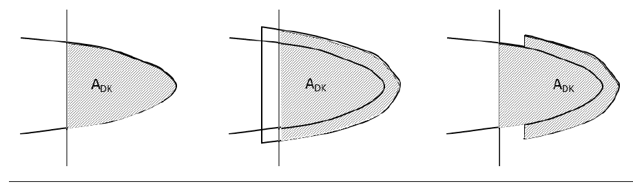
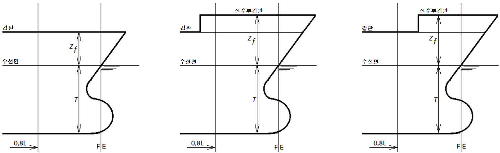
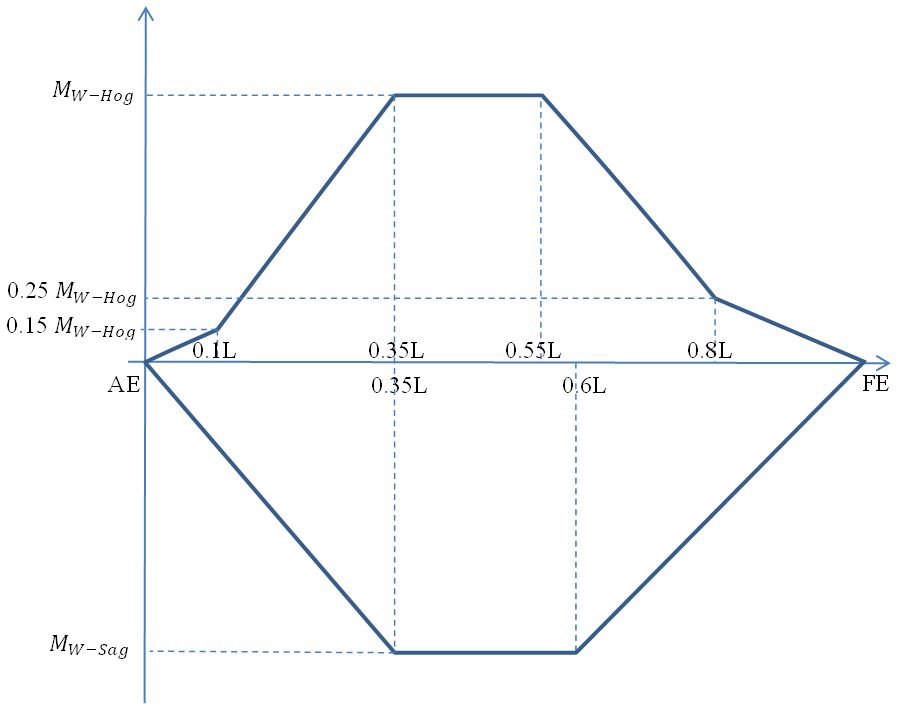
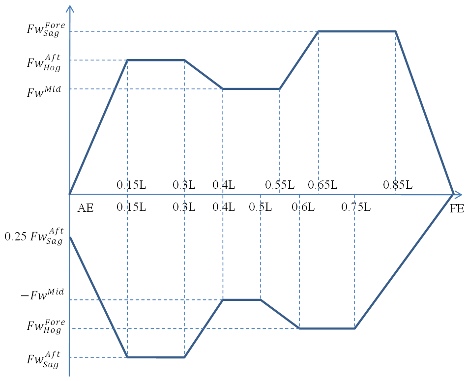
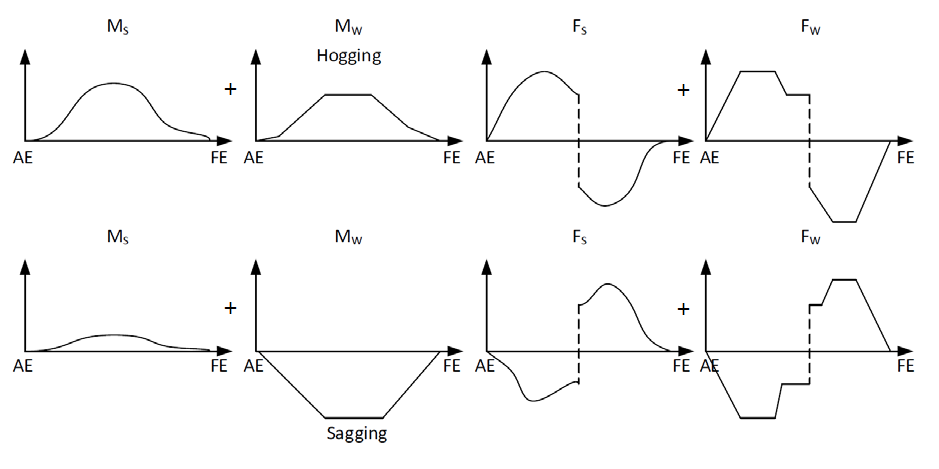
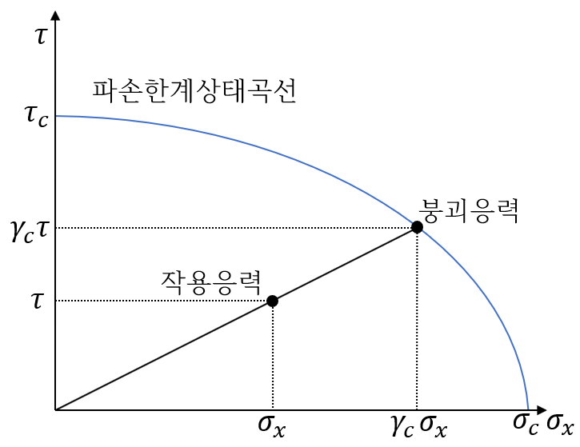
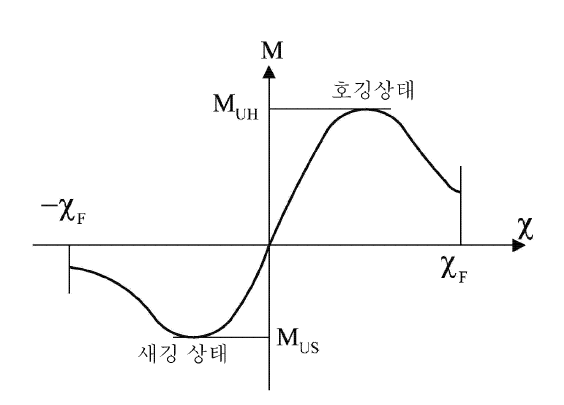

# 제7편 전용선박(1장~4장,7장~10장)

> 선급 및 강선규칙/적용지침 / RA-07A-K / 2025 / KO / Rules

## 제 4 장 컨테이너선

### 제 1 절 일반사항

#### 101. 적용 【지침 참조】

- **1.** 컨테이너선으로 등록을 하고자 하는 선박의 구조 및 의장은 이 장의 규정에 따른다.
- **2.** 특별히 이 장에서 규정하는 것 이외에는 해당 각 편의 규정에 따른다.
- **3.** 이 장의 규정은 1층 갑판선으로서 화물창내에는 이중저를 갖고 갑판 및 선저는 종식구조인 선박에 대하여 규정한다.
- **4.** **3**항에서 규정하는 것과 다른 구조를 갖는 컨테이너선으로서 이 장의 규정에 따르기가 곤란하다고 인정되는 경우에는 우리 선급이 적절하다고 인정하는 바에 따른다.
- **5.** **3편 부록 3-3 선체구조의 피로강도평가 지침**의 직접 피로해석방법인 SeaTrust(FSA3) 선급부호를 가지는 컨테이너선의 경우, YP40강재에 대한 재료계수 K는 0.66을 사용할 수 있다. 다만, 피로강도 평가부위에 대하여는 **3편 부록 3-3 선체구조의 피로강도평가 지침 표 9**에 더하여, 창구옆코밍에서의 맞대기 용접이음부 및 의장품을 고정하기 위한 필렛 용접이음부 등을 추가할 수 있다.
- **6.** 이 장의 규정은 2018년 7월 1일 이후 건조 계약되는 컨테이너선으로서 **14편 컨테이너선 구조규칙**의 적용 대상이 아닌 선박에 적용한다. *(2022)*

#### 102. 직접강도계산

- **1.** 이 규정은 컨테이너선과 주로 컨테이너 화물을 운송하는 선박에 적용한다.
- **2.** 항복 및 좌굴 평가에 대한 절차와 이 장에서 규정하지 않은 사항은 **지침 3편 부록 3-2**에 따른다.
- **3.** **정의**
  - **(1)** 전선해석은 선체거더 구조, 크로스갑판 구조 및 창구코너부의 구조강도 평가를 위하여 전선모델을 사용하는 유한요소해석이다.
  - **(2)** 화물창해석은 선체중앙부 1차 지지부재의 구조강도 평가를 위한 유한요소해석이다. 1차 지지부재는 선체외판 및 화물창 경계의 전체 구조건전성을 확보하기 위한 거더 또는 스트링거 형식의 부재로서 다음과 같다.
    - **(가)** 이중저 구조(선저외판, 내저판, 거더, 늑판)
    - **(나)** 이중선측 구조(선측외판, 내측선체, 스트링거 및 특설늑골)
    - **(다)** 격벽 구조
    - **(라)** 갑판 및 크로스갑판 구조
- **4.** **해석**
  - **(1)** 선박의 길이가 290$\mathrm{m}$ 이상인 컨테이너선은 전선해석을 수행하여야 하며, **지침 3편 부록 3-2 II**에 따른다.
  - **(2)** 선박의 길이가 150$\mathrm{m}$ 이상인 컨테이너선은 화물창해석을 수행하여야 하며, **지침 3편 부록 3-2 III**. **5**에 따른다.
  - **(3)** (1), (2)호 규정 이외의 선박에 대해서도 우리 선급이 필요하다고 인정하는 경우, 전선해석이나 화물창해석이 수행되어야 한다.

#### 103. 고강도 극후판의 적용 (2021)

고강도 극후강판을 사용하는 경우, **부록 7-8 「고강도 극후강판의 적용 및 검사지침」**의 규정을 만족하여야 한다. **【지침 참조】**

### 제 2 절 종강도

#### 201. 일반사항

- **1.** **적용**
  - **(1)** 적용
    이 절의 요건은 항로가 제한되지 않는 길이 90 $\mathrm{m}$ 이상의 다음 유형의 선박에 적용한다.
    - **(가)** 컨테이너선
    - **(나)** 주로 컨테이너 화물을 운송하는 선박
  - **(2)** 하중제한
    파랑하중요건은 항로가 제한되지 않은 단일선체 배수량형 선박에 적용하며, 다음의 기준에 적합한 선박에 적용한다.
    상기 조건을 모두 충족하지 못하는 선박의 경우 파랑하중의 직접계산은 **지침 3편 부록 3-2**에 따른다.
    - **(가)** 길이 90 $\mathrm{m}$ ≤ L ≤ 500 $\mathrm{m}$
    - **(나)** 치수비 5 ≤ L/B ≤ 9 ; 2 ≤ B/T ≤ 6
    - **(다)** 강도계산용 흘수에서의 방형계수 0.55 ≤ $C_B$ ≤ 0.9
  - **(3)** 종강도평가의 종방향 범위
    강성, 항복강도, 좌굴강도 및 선체거더 최종강도평가는 선체횡단면의 현저한 변화(예: 늑골방식이 변경되는 곳 및 two-island 설계의 경우, 전방 거주구 블럭의 전후단)가 있는 위치를 고려하여 0.2 L 에서 0.75 L 범위에 대하여 수행하여야 한다. 이에 추가하여, 최전방 화물창의 전단 및 최후방 화물창의 후단이 이 범위를 벗어난 경우 이 범위까지 종강도를 평가하여야 한다.
- **2.** **기호 및 정의**
  - **(1)** 기호
    $L$ : **3편 1장 102.**에 따른 선박의 길이($\mathrm{m}$).
    $B$ : **3편 1장 104.**에 따른 선박의 너비($\mathrm{m}$).
    $C$ : 파랑 계수로 **202.**의 **3**항 (1)호에 따른다.
    $T$ : 강도계산용 흘수($\mathrm{m}$).
    $C _{B}$ : 강도계산용 흘수에서의 방형계수.
    $C _{W}$ : 강도계산용 흘수에서의 수선면 계수로, 다음에 따른다.
    $C _{W} =A _{W } /(LB)$
    $A _{W}$ : 강도계산용 흘수에서의 수선면적($\mathrm{m}^2$).
    $R_eH$ : 재료의 최소항복응력 ($\mathrm{N}/mm^2$).
    $k$ : 고장력강에 대하여 **3 편 1장 403.**에서 정의하는 재료계수.
    $E _{}$ : 재료의 탄성계수($\mathrm{N}/mm ^{2}$)로서 강재의 경우 $2.06 \times 10 ^{5}$으로 한다.
    $M _{S}$ : 고려하는 선체횡단면에서의 항해 시 정수 중 수직 굽힘모멘트 ($\mathrm{kNm}$).
    $M _{S \max ,} M _{S \min}$: 고려하는 선체횡단면에 대한 항해 시 허용 최대 및 최소 정수 중 수직 굽힘모멘트($\mathrm{kNm}$)로, **202.**의 **2**항 (2)호에 따른다.
    $M _{W}$ : 고려하는 선체횡단면에서의 수직 파랑굽힘모멘트 ($\mathrm{kNm}$).
    $F _{S}$ : 고려하는 선체횡단면에서의 항해 시 정수 중 수직 전단력 ($\mathrm{kN}$).
    $F _{S \max ,} F _{S \min}$ : 고려하는 선체횡단면에서의 항해 시 허용 최대 및 최소 정수 중 수직 전단력 ($\mathrm{kN}$)으로, **202.**의 **2**항 (2)호에 따른다.
    $F _{W}$ : 고려하는 선체횡단면에서의 수직 파랑전단력 ($\mathrm{kN}$).
    $q _{V}$ : **지침 부록 7-9 별첨 1**에 따라 결정되는 고려하는 선체횡단면의 전단흐름. **【지침 참조】**
    $f _{NL-Hog}$ : 호깅에 대한 비선형 수정계수로, **202.**의 **3**항 (2)호에 따른다.
    $f _{NL-Sag}$ : 새깅에서의 비선형 수정계수, **202.**의 **3**항 (2)호에 따른다.
    $f _{R}$ : 선박운항과 관련된 계수, **202.**의 **3**항 (2)호에 따른다.
    $t _{n e t}$ : 순 두께($\mathrm{mm}$)로, **3**항 (1)호에 따른다.
    $t _{r es}$ : 예비두께로서 0.5 $\mathrm{mm}$로 한다.
    $I _{n e t}$ : 고려하는 선체횡단면에서의 순 수직 단면2차모멘트($\mathrm{m}^4$)로서 **3**항에 따른 순 치수를 사용하여 결정한다.
    $\sigma _{HG}$ : **202.**의 **5**항에 따른 굽힘응력($\mathrm{N}/mm ^{2}$).
    $\tau _{HG}$ : **202.**의 **5**항에 따른 전단응력($\mathrm{N}/mm ^{2}$).
    $x$ : 고려하는 위치의 종방향 좌표($\mathrm{m}$)로서 기준점은 (3)호에 따른다.
    $z$ : 고려하는 위치의 수직 좌표($\mathrm{m}$).
    $z _{n}$ : 기선으로부터 수평중립축까지의 거리($\mathrm{m}$).
  - **(2)** 선수단 및 선미단
    길이 $L$의 선수단(FE)은 선수재 전단과 강도계산용 흘수선과의 교점에 세운 수직선이다. (**그림 7.4.1** 참조) 길이 $L$의 선미단(AE)은 선수단(FE)으로부터 선미방향으로 $L$만큼 떨어진 위치에서의 강도계산용 흘수선과의 교점에 세운 수직선이다. (**그림 7.4.1** 참조)
    
    **그림 7.4.1 길이 L의 끝단**
  - **(3)** 기준 좌표계
    선박의 형상, 하중 및 하중효과는 다음의 오른쪽 좌표계에 따른다. (**그림 7.4.2** 참조)
    원점 : 선박의 종방향 대칭면, $L$의 선미단 및 기준선과의 교차점
    X 축 : 선수방향이 양의 값인 종축
    Y 축 : 좌현방향이 양의 값인 횡축
    Z 축 : 상방이 양의 값인 수직축
    
    **그림 7.4.2 기준 좌표계**
- **3.** **부식여유 및 순 두께**
  - **(1)** 순 치수 정의
    모든 구조부재의 치수는 순 두께를 사용하여 강도를 평가하여야 한다. 판, 웨브 및 플랜지의 순 두께($t _{n e t}$)는 다음과 같이, 건조 두께 $t _{as _{-} built}$에서 자발적 추가두께 $t _{vol _{-} add}$ 및 계수를 갖는 부식추가 $t _{c}$를 공제하여 구한다. 자발적 추가두께를 적용한 경우에는, 도면상에 명확히 표기하여야 한다.
    $t _{n e t} = t _{as _{-} built} - t _{vol _{-} add} - \alpha t _{c}$ ($\mathrm{mm}$)
    $\alpha$ : **표 7.4.1**에 따른 부식추가계수

    | 구조 요건 | 특성/해석 유형 | $\alpha$ |
    | --- | --- | --- |
    | 강도평가(**203.**) | 단면특성 | 0.5 |
    | 좌굴강도(**204.**) | 단면특성(응력결정) | 0.5 |
    | 좌굴강도(**204.**) | 좌굴능력 | 1.0 |
    | 최종강도(**206.**) | 단면특성 | 0.5 |
    | 최종강도(**206.**) | 좌굴/붕괴능력 | 0.5 |
  - **(2)** 부식추가의 결정
    구조부재 한쪽 면에 대한 부식 추가 $t _{c 1}$ 또는 $t _{c 2}$는 **표 7.4.2**에 따른다. 구조부재의 양쪽 면에 대한 총 부식 추가 $t _{c}$는 다음 식에 따른다.
    $t _{c} = \left( t _{c 1} + t _{c 2 } \right) + t _{re s}$ (mm)
    고려하는 구획의 내부 부재에 대한 총 부식 추가 $t _{c}$는 다음 식에 따른다.
    $t _{c} = \left( 2 t _{c 1} \right) + t _{re s}$ (mm)
    보강재의 부식추가는 부착판과의 연결 위치에 따라 결정한다.

    | 구획 종류 | 한쪽 면에 대한 부식추가 $t _{c 1}$ 또는 $t _{c 2}$($\mathrm{mm}$) |
    | --- | --- |
    | 해수에 노출 | 1.0 |
    | 대기에 노출 | 1.0 |
    | 평형수 탱크 | 1.0 |
    | 보이드 및 건구역 | 0.5 |
    | 청수, 연료유 및 윤활유 탱크 | 0.5 |
    | 거주 구역 | 0.0 |
    | 컨테이너 화물창 | 1.0 |
    | 상기 이외의 구획 | 0.5 |
  - **(3)** 순 단면특성의 결정
    지지부재의 순 단면계수, 단면2차모멘트와 전단면적 특성은 **그림 7.4.3**에서 정의한 부착판, 웨브 및 플렌지의 순 치수를 사용하여 계산되어야 한다. 순 횡단면적, 부착판에 평행한 축에 대한 단면2차모멘트 및 관련 중립축의 위치는 단면의 표면두께로부터 부식 두께 0.5$\alpha t _{c}$를 빼서 구한다.

    |  |
    | --- |
    |  |
    |  |
    |  |
    | **그림 7.4.3 지지부재의 순 단면 특성** |

#### 202. 하중

- **1.** **선체거더하중에 대한 부호 규약**
  임의의 선체횡단면에서의 수직 굽힘모멘트 및 수직 전단력의 부호 규약은 **그림 7.4.4**에 따른다.
  • 수직 굽힘모멘트 $M _{S}$ 및 $M _{W}$는 강력갑판에 인장응력을 발생시킬 때 양(호깅)이며, 선저에 인장응력을 발생시킬 때 음(새깅)이다.
  • 수직 전단력 $F _{S}$ 및 $F _{W}$는 고려하는 선체 횡단면의 선미부에서는 하방으로, 선수부에서는 상방으로 작용할 경우에 양이다. 이에 반대 반향으로 작용하는 전단력은 음(-)이다.

  | 굽힘모멘트 |  |
  | --- | --- |
  | 전단력 |   |
  |   | **그림 7.4.4 굽힘모멘트 및 전단력에 대한 부호 규약** |
- **2.** **정수중 굽힘모멘트 및 전단력**
  - **(1)** 일반사항
    정수중 굽힘모멘트 $M _{S}$ 및 정수중 전단력 $F _{S}$ 는 (2)호에 규정된 설계하중조건에 대하여 선박 길이를 따라 각 횡단면에서 계산되어야 한다.
  - **(2)** 설계하중조건
    일반적으로 정수중 굽힘모멘트 및 전단력 계산에는, 출항 및 입항시 연료유, 청수 및 저장품의 양을 기초로 한 설계화물 및 평형수 적재상태가 고려되어야 한다. 항해의 중간단계에서 소모품의 양과 배치의 변화가 크다고 판단되는 경우에는, 출항 및 입항상태에 추가하여 중간단계에 대한 계산자료를 제출하여야 한다. 또한 항해도중 평형수를 적재하거나 배출하는 경우, 평형수 적재 및/또는 배출 직전 및 직후의 중간상태에 대한 계산자료를 제출하여야 하고 적하지침서에 포함되어야 한다.
    항해 시 임의의 종방향 위치에서의 정수중 허용 수직굽힘모멘트 $M _{S \max }$, $M _{S \min }$ 및 정수 중 허용 수직 전단력 $F _{S \max }$, $F _{S \min }$은 다음의 값보다 큰 값이어야 한다.
    • 적하지침서상의 적하상태의 정수중 굽힘모멘트 및 전단력의 최대 및 최소값
    • 설계자에 의해 지정된 정수중 최대 및 최소 굽힘모멘트 및 전단력
    적하지침서는 **지침 3편 부록 3-1**에 따른 적하상태를 포함하여야 한다.
- **3.** **파랑하중**
  - **(1)** 파랑계수
    파랑계수는 다음에 따른다.
    $L \leq L _{ref}$ 인 경우 : $C = 1 - 1.50 \left( 1 - \sqrt {\frac{L}{L _{ref}}} \right) ^{2.2}$
    $L >L _{ref}$ 인 경우 : $C = 1 - 0.45 \left( \sqrt {\frac{L}{L _{ref}}} - 1 \right) ^{1.7}$
    $L _{ref}$ : 참조길이($\mathrm{m}$)로서 다음에 따른다.
    ․ (2)호의 수직 파랑굽힘모멘트를 계산하는 경우 : $L _{ref} = 315 C _{W} ^{ -1.3}$
    ․ (3)호의 수직 파랑전단력을 계산하는 경우 : $L _{ref} = 330 C _{W} ^{ -1.3}$
  - **(2)** 수직 파랑굽힘모멘트
    수식 파랑모멘트는 다음 식에 의한 값으로 하며, 선박의 길이 방향에 따른 분포는 **그림 7.4.6**에 따른다.
    $M _{W-Hog} = +1.5 f _{R} L ^{3} C C _{W} \left( \frac{B}{L} \right) ^{0.8} f _{NL-Hog}$
    $M _{W-Sag} = -1.5 f _{R} L ^{3} C C _{W} \left( \frac{B}{L} \right) ^{0.8} f _{NL-Sag}$
    $f _{R}$ : 선박운항과 관련된 계수로서 0.85로 한다.
    $f _{NL-Hog}$ : 호깅에 대한 비선형 수정계수로서 다음에 따른다. 다만, 1.1 이하이어야 한다.
    $f _{NL-Hog} = 0.3 \frac{C _{B}}{C _{W}} \sqrt {T}$
    $f _{NL-Sag}$ : 새깅에 대한 비선형 수정계수로서 다음에 따른다. 다만, 1.0 이상이어야 한다.
    $f _{NL-Sag} = 4.5 \frac{1 + 0.2 f _{Bow}}{C _{W} \sqrt {C _{B}} L ^{0.3}}$
    $f _{Bow}$ : 선수플레어 형상계수로서 다음에 따른다.
    $f _{Bow} = \frac{A _{D K} -A _{WL}}{0.2 L z _{f}}$
    $A _{DK}$ : 최상층 갑판 수평면에 대한 투영면적($\mathrm{m}^2$)으로, 선수루 갑판이 0.8$L$의 전방으로 연장된 경우 이를 포함한다. 다만, 불워크와 같은 기타 구조는 제외(**그림 7.4.5**)
    $A _{WL}$ : 0.8$L$ 전방부의 강도계산용 흘수에서의 수선면 면적($\mathrm{m}^2$)
    $z _{f}$ : 선수단에서 측정한, 강도계산용 흘수에서의 수선면으로부터 최상층 갑판 또는 선수루 갑판까지의 수직거리($\mathrm{m}$), 다만, 판구조의 불워크와 같은 기타 구조는 제외(**그림 7.4.5**)
    
    
    **그림 7.4.5 투영면적** #eqnID-3106 **및 수직거리** #eqnID-3107
    
    **그림 7.4.6 선박 길이에 따른 수직 파랑굽힘모멘트** #eqnID-3108 **의 분포**
  - **(3)** 수직 파랑전단력
    선박 길이에 따른 수직 파랑전단력 $F _{W}$ ($\mathrm{kN}$)의 분포는 **그림 7.4.7**을 따른다.
    $F _{W} _{Hog} ^{ Aft} = +5.2 f _{R} L ^{2} C C _{W} \left( \frac{B}{L} \right) ^{0.8} (0.3 + 0.7 f _{NL-Hog} )$
    $F _{W} _{Hog} ^{ Fore} = -5.7 f _{R} L ^{2} C C _{W} \left( \frac{B}{L} \right) ^{0.8} f _{NL-Hog}$
    $F _{W} _{Sag} ^{ Aft} = -5.2 f _{R} L ^{2} C C _{W} \left( \frac{B}{L} \right) ^{0.8} (0.3 + 0.7 f _{NL-Sag} )$
    $F _{W} _{Sag} ^{ Fore} = +5.7 f _{R} L ^{2} C C _{W} \left( \frac{B}{L} \right) ^{0.8} (0.25 + 0.75 f _{NL-Sag} )$
    $F _{W} _{} ^{ Mid} = +4.0 f _{R} L ^{2} C C _{W} \left( \frac{B}{L} \right) ^{0.8}$
    
    **그림 7.4.7 선박 길이에 따른 수직 파랑전단력** #eqnID-3116 **의 분포**
- **4.** **하중상태**
  종강도평가의 경우, **표 7.4.3**에 따른 최대 호깅 및 새깅 하중상태가 검토되어야 한다. 각 하중상태에 대하여 **2**항에 규정된 각 횡단면에서의 정수중 상태는 **3**항에 규정된 파랑중 상태와 조합되어야 한다(**그림 7.4.8** 참조).

  | 하중상태 | 굽힘모멘트 |   | 전단력 |   |
  | --- | --- | --- | --- | --- |
  | 하중상태 | $M _{S}$ | $M _{W}$ | $F _{S}$ | $F _{W}$ |
  | 호깅 | $M _{S \max }$ | $M _{W H}$ | $F _{S \max }$: $x \leq 0.5 L$인 경우 | $F _{W \max }$: $x \leq 0.5 L$인 경우 |
  | 호깅 | $M _{S \max }$ | $M _{W H}$ | $F _{S \min}$: $x > 0.5 L$인 경우 | $F _{W \min}$: $x > 0.5 L$인 경우 |
  | 새깅 | $M _{S \min}$ | $M _{W S}$ | $F _{S \min}$: $x \leq 0.5 L$인 경우 | $F _{W \min}$: $x \leq 0.5 L$인 경우 |
  | 새깅 | $M _{S \min}$ | $M _{W S}$ | $F _{S \max }$: $x > 0.5 L$인 경우 | $F _{W \max }$: $x > 0.5 L$인 경우 |
  | $M _{W H}$ : 고려하는 횡단면에서 호깅상태의 파랑굽힘모멘트로서, **그림 7.4.6**에 규정된 양의 $M _{W}$ 값으로 한다. $M _{W S}$ : 고려하는 횡단면에서 새깅상태의 파랑굽힘모멘트로서, **그림 7.4.6**에 규정된 음의 $M _{W}$ 값으로 한다. $F _{W \max }$ : 고려하는 횡단면에서 파랑전단력의 최대값으로서, **그림 7.4.7**에 규정된 양의 $F _{W}$ 값으로 한다. $F _{W \min}$ : 고려하는 횡단면에서 파랑전단력의 최소값으로서, **그림 7.4.7**에 규정된 음의 $F _{W}$ 값으로 한다. |   |   |   |   |

  
  **그림 7.4.8 표 7.4.3에 규정된 최대 호깅 및 새깅 하중상태를 결정하기 위한 하중조합**
- **5.** **선체거더응력**
  선체거더응력은 **4**항에 따른 호깅 및 새깅 하중상태에 대하여, 고려하는 하중계산점에서 계산되어야 하며 다음 식에 따른다.
  굽힘응력:
  $\sigma _{HG} = \frac{\gamma _{S} M _{S} + \gamma _{W} M _{W}}{I _{ n et}} \left( z - z _{n} \right) 10 ^{-3}$ ($\mathrm{N}/mm ^{2}$)
  전단응력:
  $\tau _{HG} = \frac{\gamma _{S} F _{S} + \gamma _{W} F _{W}}{t _{ n et} /q _{v}} 10 ^{3}$ ($\mathrm{N}/mm ^{2}$)
  $\gamma _{S} , \gamma _{ W}$ : 부분안전계수로서, 다음에 따른다.
  $\gamma _{S} = 1.0$
  $\gamma _{W} = 1.0$

#### 203. 강도평가

- **1.** **일반사항**
  선박 전 길이에 걸쳐 구조의 연속성이 유지되어야 한다. 구조 배치가 급격하게 변하는 경우, 적절한 천이(transitional)구조를 배치하여야 한다.
- **2.** **강성 기준**

#### 202.의 4항에 따른 호깅 및 새깅의 두 가지 하중상태에 대하여 검토되어야 한다. 순 단면 2차모멘트는 다음을 만족하여야 한다.

$I _{"net"} \geq 1.55 L \left| M _{S } + M _{W} \right| 10 ^{-7}$ ($\mathrm{cm} ^{4}$)

- **3.** **항복강도 평가**
  - **(1)** 일반적인 허용기준

#### 202.의 4항에 정의된 호깅 및 새깅의 각 하중상태에 대한 항복강도가 검토되어야 하며, 등가 선체거더응력 _s1이 허용응력 _s1보다 작아야 한다.

$\sigma _{eq} < \sigma _{p erm}$

#### 204. 좌굴강도 【지침 참조】

- **1.** **적용**
  이 요건은 선체거더굽힘 및 전단응력을 받는 판 패널 및 종방향 보강재에 적용한다. 이 항에서 사용된 기호의 정의는 **지침 부록 7-9 별첨 2**를 참조한다.
- **2.** **좌굴평가 기준**
  좌굴평가를 위한 허용기준은 다음과 같다.
  $\eta _{a ct} \leq 1$
  $\eta _{a ct}$: **3**항에 따른 최대사용계수
- **3.** **좌굴사용계수**
  사용계수 $\eta _{a ct}$는 파손에서의 응력승수인자(stress multiplication factor) $\gamma _{ c}$의 역수로 규정된다. (**그림 7.4.9** 참조)
  파단한계상태는 다음과 같다.
  • 요소판 패널의 경우: **지침 부록 7-9 별첨 2. 2**
  • 전체 보강 패널의 경우: **지침 부록 7-9 별첨 2. 3**
  • 종방향 보강재의 경우: **지침 부록 7-9 별첨 2. 4**
  각 파단한계상태는 관련 식에 의하여 규정되며, $\gamma _{ c}$는 해당 식을 만족하도록 결정된다. **그림 7.4.9**는 종방향 및 전단응력의 조합에서, 구조부재의 파손에서의 응력승수인자가 어떻게 결정되는지를 보여준다.

  |  $\sigma _{x} , \tau$ : **4**항에 규정된 좌굴에 대한 작용응력 조합 $\sigma _{c} , \tau _{c}$ : 좌굴 응력조합 $\sigma _{x} , \tau$ 에 대한, **지침 부록 7-9 별첨 2**에 따른 좌굴임계응력 |
  | --- |
  | **그림 7.4.9 파손시의 파단한계상태 곡선 및 응력승수인자의 예** |
- **4.** **응력결정**
  - **(1)** 좌굴평가를 위한 응력조합

#### 202.의 4항에 규정된 호깅 및 새깅의 각 하중상태에 대하여 다음의 두 응력조합이 하중계산점에서 고려되어야 한다. 응력은 (2)호에 정의된 하중계산점에서의 값이다.

$\sigma _{x} = \sigma _{H G}$

#### 205. 비틀림강도 【지침 참조】

선박의 중앙부에 있어서 창구의 너비가 0.7$B$ 를 넘는 경우에는 비틀림에 의한 부가적인 응력이나 창구의 변형에 대하여 특별히 고려하여야 한다. 다만, 2열 이상의 창구를 가진 경우에는 가장 바깥쪽의 창구측선간의 거리를 창구의 너비로 한다.

#### 206. 선체거더 최종강도

- **1.** **일반사항**
  길이 $L$가 150 $\mathrm{m}$ 이상인 선박은 선체거더 최종강도를 평가하여야 한다. **4**항의 검토 기준은 비손상 선박구조에 적용한다. **202.**의 **4**항에 규정된 호깅 및 새깅의 하중상태에 대하여 선체거더 최종굽힘능력이 검토되어야 한다.
- **2.** **선체거더 최종굽힘모멘트**
  최종강도 검토 시 고려하는 호깅 및 새깅 조건의 수직 선체거더 굽힘모멘트 $M$은 다음에 따른다:
  $M = \gamma _{S} M _{S} + \gamma _{W} M _{W}$
  $M _{S}$ : **202.**의 **4**항에 따른 정수중 허용굽힘모멘트 ($\mathrm{kNm}$).
  $M _{W}$ : **202.**의 **4**항에 따른 수직 파랑굽힘모멘트 ($\mathrm{kNm}$).
  $\gamma _{S}$ : 정수중 굽힘모멘트에 대한 부분 안전계수로서 1.0으로 한다.
  $\gamma_{W}$ : 수직 파랑굽힘모멘트에 대한 부분 안전계수로서 1.2로 한다.
- **3.** **선체거더 최종굽힘능력**
  - **(1)** 일반사항
    선체거더 최종 종굽힘모멘트 능력 $M _{U}$는 그 값을 넘어서면 선체가 붕괴되는 선체거더의 최대 굽힘모멘트 능력을 의미한다.
  - **(2)** 선체거더 최종굽힘능력의 결정
    호깅 및 새깅상태에서의 선체거더 횡단면의 최종 굽힘모멘트 능력은 고려하는 횡단면의 곡률 $\chi$에 대한 굽힘모멘트 $M _{U}$ 곡선의 최대값으로 정의한다. (호깅의 경우 $M_UH$ 새깅의 경우 $M_US$, **그림 7.4.11** 참조) 곡률 $\chi$는 호깅의 경우 양, 새깅의 경우 음으로 한다.
    
    **그림 7.4.11 곡률** #eqnID-3211**에 대한 굽힘모멘트 능력**
    선체거더 최종굽힘능력 $M_{U}$는 **지침 부록 7-9 별첨 3. 2**에 규정된 증분-반복법(incremental-iterative) 또는 **지침 부록 7-9 별첨 3. 3**에 규정된 대체방법으로 계산하여야 한다.
- **4.** **검토 기준**
  모든 선체 횡단면에서 수직 선체거더 최종굽힘능력은 다음 기준을 만족하여야 한다.
  $M _{} \leq \frac{M _{U}}{\gamma _{M} \gamma _{DB}}$
  $M _{}$ : **2** 항에 따른 수직굽힘모멘트($\mathrm{kNm}$).
  $M _{U}$ : **3** 항에 따른 수직 선체거더 최종굽힘능력($\mathrm{kNm}$).
  $\gamma _{M}$ : 재료, 형상 및 강도예측의 불확실성을 고려한 수직 선체거더 최종굽힘능력의 부분 안전계수로서 $1.05$로 한다.
  $\gamma _{ DB}$ : 이중저 굽힘의 영향을 고려한 수직 선체거더 최종굽힘능력의 부분 안전계수로서 다음에 따른다.
  • 호깅상태의 경우: $\gamma _{ DB} = 1.15$
  • 새깅상태의 경우: $\gamma _{ DB} = 1.0$
  내저에서의 이중저 폭이 선체중앙부에서의 폭보다 작거나 이중저 구조가 선체중앙부와 다른 곳(예, 기관실 단면)에서의 횡단면의 경우, 호깅상태에서의 부분 안전계수 $\gamma _{ DB}$ 는 우리 선급이 인정하는 바에 따라 감소 될 수 있다.

#### 207. 대형 컨테이너선에 대한 추가요건

- **1.** **일반사항**
  선박의 너비 $B$가 32.26 $\mathrm{m}$를 넘는 컨테이너선에 대하여는 **2**항 및 **3**항의 규정을 추가로 요구할 수 있다.
- **2.** **항복 및 좌굴평가**
  항복 및 좌굴평가는 국부하중 뿐만 아니라 추가적인 선체거더 하중(파랑 비틀림, 파랑수평굽힘 및 정적비틀림)을 고려하여 수행되어야 한다. 국부하중 및 선체거더 하중으로 인한 모든 면내응력요소(2축 및 전단응력)이 고려되어야 한다.
- **3.** **휘핑**
  수직굽힘모멘트에 기여하는 휘핑을 고려하여 선체거더 최종강도 평가를 수행하여야 한다.

### 제 3 절 이중저구조

#### 301. 일반

- **1.** 컨테이너만을 적재하는 화물창의 이중저구조에 대하여는 이 절의 규정에 따른다. 이 절에 규정되어 있지 않은 사항의 경우, **3편 7장**의 규정을 만족하여야 한다. *(2019)*
- **2.** 컨테이너 코너피팅 하방의 이중저내에는 컨테이너의 하중을 유효하게 지지할 수 있도록 측거더 또는 실체늑판 등을 설치하거나 국부적으로 보강하여야 한다.
- **3.** 컨테이너만을 적재하는 화물창의 창구 바로 아래의 이중저 내저판은 두께를 증가시키거나 내장판을 깔지 않아도 좋다.
- **4.** 운항중 해수를 적재하지 아니하는 보이드 구역, 연료유탱크 등으로 사용되는 이중저구역의 선저외판 및 내저판의 두께는 이절에서 명시한 두께보다 0.5mm를 경감시킬 수 있다.
- **5.** 선저 종늑골의 경우, 피로 강도에 대한 충분한 고려가 있어야 한다.

#### 302. 종늑골 【지침 참조】

선저 및 내저종늑골의 단면계수는 각각 **표 7.4.5**의 식에 의한 것 이상이어야 한다.

#### 303. 스트럿

- **1.** 스트럿은 평강 또는 구평강(球平鋼) 이외의 형강으로 하고 선저 및 내저종늑골의 웨브와 충분히 겹치도록 하여야 한다.
- **2.** 스트럿의 단면적 $A$ 는 다음 식에 의한 것 이상이어야 한다.
  $A = 1.8 C K S b h \mathrm{cm^2 }$
  $S$ : 늑골간격($\mathrm{m}$).
  $b$ : 스트럿으로 지지되는 부분의 너비($\mathrm{m}$).
  $h$ : 다음 식에 의한 값($\mathrm{m}$).
  $h = \frac{d+0.026L'}{2}$
  $L'$ : **표 7.4.5**에 따른다.
  $C$ : 계수로서 다음 식에 의한 값. 다만, 어떠한 경우에도 1.43 미만이어서는 안된다.
  $C = {1} OVER {1- 0.5 \frac{l_s}{k \sqrt { K}}$
  $l_s$ : 스트럿의 길이($\mathrm{m}$).
  $k$ : 스트럿의 최소 회전 반경으로 다음 식에 의한 값($\mathrm{cm}$).
  $k = \sqrt { \frac{I}{A}}$
  $I$ : 스트럿의 최소 관성모멘트($\mathrm{cm} ^{4}$).
  $A$ : 스트럿의 단면적 ($\mathrm{cm}^2$).

#### 304. 내저판의 두께

- **1.** 내저판의 두께는 다음 2개의 식 중 큰 것 이상이어야 한다.
  $t_1 = \frac{C K B^2 d}{d_0} + 1.5 \mathrm{mm}$
  $t_2 = C 'S \sqrt { hK} +1.5 \mathrm{mm}$
  $d_0$ : 중심선 거더의 높이($\mathrm{mm}$)
  $S$ : 종식구조일 때에는 내저종늑골의 간격, 횡식구조일 때에는 화물창내 늑골의 간격($\mathrm{m}$).
  $h$ : 다음 식에 따른다.
  $h = 1.13 (d - 0.001 d_0 )$
  $C$ : 계수로서 **3편 표 3.7.7**에 따른다.
  $C '$ : 계수로서 **3편 표 3.7.8**에 따른다.
- **2.** **1**의 요건에도 불구하고, 내저판의 두께 $t$는 다음의 식에 의한 값보다 커야 한다:
  $t = 3.6 C S \sqrt { hK} +2.0 \mathrm{mm}$
  $S$ : 보강재 간격 ($\mathrm{m}$)
  $h$ : 표 **7.4.5**에 따른다.
  $C$ : 사용되는 내저판의 보강재 시스템에 따른 다음의 식에 대한 계수. 다만, $h_2$와 $h_3$에 대하여 $C$는 1로 취한다.
  $C = \frac{27.7}{\sqrt{767 - \alpha^2 K}}$
  $\alpha$ : **표 7.4.5**에 따른다.
  $C = \frac{3.72}{\sqrt{27.7 - \alpha K}}$ (>1.0)
  $\alpha$ : **표 7.4.5**에 따른다.
- **3.** 컨테이너 코너피팅의 하단이 접촉하는 위치의 내저판은 이중판 또는 기타 적절한 방법으로 보강하여야 한다.

#### 305. 선저외판의 두께

- **1.** 선저외판의 두께, $t$ 는 다음 (1)과 (2)의 식에 따른 값 또는 **3편 7장 5절 505.**의 요건에 의한 값 중 큰 것보다 커야 한다. 다만, **3편 7장 5절 505.**의 요건 적용에 있어, **3편 4장 3절 304.**의 요건은 적용할 필요 없다.
  - **(1)** 횡늑골식 선박의 경우, 두께는 다음 식에 의한 값보다 커야 한다.
    $t = C_1 C_2 S \sqrt{d + 0.0175 L' ( \frac{2}{B} y +1 ) + h_1 }+1.5$ ($\mathrm{mm}$)
    $S$ : 횡늑골 간격 ($\mathrm{m}$)
    $L'$, $y$, $h_1$ : **302.**에 따른다
    $C_1$ : 계수로서 다음에 따른다.
- **1.** 0 $L \leq 230 \mathrm{m}$인 경우
- **1.** 07$L > 400 \mathrm{m}$인 경우
  중간 값의 경우, $C_1$은 선형보간한다.
  $C_2$ : 계수로서 다음에 따른다.
  $C_2 = \frac{91}{\sqrt{576 - (15.0 f_B x )^2 }}$
  $x = \frac{X}{0.3 L}$
  ($X$ : 선체중앙부 전방 선측 외판의 경우는 전단으로부터, 또는 선체중앙부 후방의 선측외판의 경우는 후단으로부터의 거리 ($\mathrm{m}$). 단, $X$가 $0.1 L$보다 작은 경우, $X$는 $0.1L$로, $X$가 $0.3 L$보다 큰 경우, $X$는 $0.3 L$로 취해야 한다.
  - **(2)** 종늑골식 선박의 경우, 두께는 다음 식에 의한 값보다 커야 한다.
    $t = C_1 C_2 S \sqrt{d + 0.0175 L' ( \frac{2}{B} y +1 ) + h_1 }+1.5$ ($\mathrm{mm}$)
    $S$ : 종늑골 간격 ($\mathrm{m}$)
    $C_2$ : 계수로서 다음에 따른다. ($\geq 3.78 sqrtK$)
    $C_2 = 13 \sqrt{ \frac{K}{24 - 15.0 f_B K x}}$
- **2.** **1.**의 요건에도 불구하고, 선저외판의 두께 $t$는 다음 식에 의한 값보다 커야 한다.
  $t = \sqrt{KL'}$ ($\mathrm{mm}$)
  $L'$ : 선박의 길이 ($\mathrm{m}$) ($\leq 330 \mathrm{m}$)
- **3.** 평판용골의 너비는 다음 식에 의한 것 이상이어야 한다.
  $b = 2L + 1000$ ($\mathrm{mm}$)
  평판용골의 두께는 전 길이에 걸쳐 **305.**의 **1**항에 규정하는 선체 중앙부의 선저외판의 두께에 2.0 $\mathrm{mm}$를 더한 것 이상이어야 한다. 다만, 인접하는 선저외판의 두께 미만이어서는 안된다.

### 제 4 절 이중선측구조

#### 401. 일반 【지침 참조】

- **1.** 화물창의 선측구조는 가능한 한 이중선측구조로 하고 내부에는 선측트랜스버스 및 선측스트링거를 설치하는 등 충분히 보강된 구조로 하여야 한다.
- **2.** 컨테이너만을 전용으로 적재하는 화물창의 이중선측구조는 이 절의 규정에 따른다. 이 절에 규정되어 있지 않은 사항의 경우, **3편 14장**의 규정을 만족하여야 한다. *(2019)*
- **3.** 내부가 디프탱크로 사용되는 이중선측구조에 대하여는 이 절에 규정되어 있지 않은 사항의 경우, **3편 15장**의 규정에 만족하여야 한다.
- **4.** **3 편 15장 104.** 요건의 적용에 있어, 디프탱크로 사용되는 이중선측구조의 내부인 내측판의 두께는 **표 3.15.1**에 명시된 값보다 1.0 $\mathrm{mm}$ 감소시킬 수 있다.
- **5.** 운항중 해수를 적재하지 아니하는 보이드 구역, 연료유 탱크 등의 이중선측구역의 선측외판 및 내측판의 두께는 이 절에서 명시한 두께에서 0.5 $\mathrm{mm}$감소시킬 수 있다.
- **6.** 선측스트링거는 화물창의 깊이를 고려하여 적절한 간격으로 설치하여야 하고 선측트랜스버스는 이중저내의 실체늑판이 있는 위치에 설치하여야 한다.
- **7.** 빌지부에 있어서 이중선측구조의 폭이 변하는 경우의 구조치수에 대하여는 우리 선급이 적절하다고 인정하는 바에 따른다.
- **8.** 만재흘수선으로부터 강력갑판까지의 높이가 특히 큰 경우의 구조치수에 대하여는 우리 선급이 적절하다고 인정하는 바에 따른다.
- **9.** 화물창의 중간에 갑판구조 및 선측구조를 유효하게 지지하는 구조가 설치되어 있는 경우에는 이 절의 규정을 적절히 참작할 수 있다.
- **10.** 종격벽과 내저판이 만나는 곳에는 응력집중이 생기지 않도록 구조배치에 대하여 충분히 고려하여야 한다.
- **11.** 이중선측구조의 전후 단부에는 구조 및 강도의 연속성에 대하여 충분히 고려하여야 한다.
- **12.** 선측종늑골의 경우, 피로강도에 대하여 충분히 고려하여야 한다

#### 402. 선측트랜스버스 및 선측스트링거 【지침 참조】

선측트랜스버스 및 선측스트링거의 두께는 다음 식에 의한 것 이상이어야 한다. 또한 우리 선급이 필요하다고 인정하는 경우에는 굽힘 및 전단강도에 대하여 적절히 고려하여야 한다.

#### 403. 종격벽

종격벽구조의 내부가 디프탱크로 사용되는 경우 종격벽판의 두께 및 종방향 보강재의 단면계수는 다음의 **1.** 및 **2.**의 규정에 따른다.

- **1.** 종격벽판의 두께 $t$ 는 다음 식에 의한 것 이상이어야 한다. 다만, 항해중에 해수에 접하지 않는 종격벽판의 두께는 다음에 규정하는 두께에서 0.5 $\mathrm{mm}$ 를 감하여도 좋다.
  $t=3.6 C S \sqrt {K h} +2.0 \mathrm{mm}$
  $S$ : 격벽휨보강재의 간격($\mathrm{m}$).
  $h$ : 다음의 $h_1$, $h_2$, 및 $h_3$. 다만, 이중저구역이 보이드인 경우, $h$는 $h_1$으로 한다.
  $h_1$ : 각 격벽판의 하단으로부터 탱크 정판상과 넘침관 상단 사이의 1/2이 되는 곳까지의 수직거리($\mathrm{m}$).
  $h_2$ : 다음의 식에서 얻어지는 값
  $h _{2} =0.85(h _{1} + \Delta h)$ (m)
  $\Delta h$ : 다음의 식에서 얻어지는 값
  $\Delta h = \frac{16}{L} (l _{t} -10)+0.25(b _{t} -10)$ (m)
  $l _{t}$ : 탱크 길이 (m) (≥10)
  $b _{t}$ : 탱크 폭 (m) (≥10)
  $h_3$ : 각 격벽판의 하단으로부터 넘침관 상단상 2 $\mathrm{m}$까지의 수직거리에 0.7을 곱한 값 ($\mathrm{m}$)
  $C$ : 계수로서 **표 7.4.6**에 따른다. 다만 $h_2$ 및 $h_3$의 경우, $C_1$은 1로 한다.
- **2.** 휨보강재의 단면계수는 다음 식에 따른다.
  $Z=100 C _{1} C _{2} S h l ^{2} \mathrm{cm ^{3} }$
  $C_1$ : 다음 식에 따른다. 단 $h _{2}$, $h _{3}$인 경우, $C _{1}$은 $K/18$로 한다.
  $C _{1} = \frac{K}{24- \alpha K}$ (≥$K/18$)
  $\alpha$ : 계수로서 **표 7.4.6**에 따른다.
  $C_2$ : 계수로서 **표 7.4.7**에 따른다.
  $S$ : 휨보강재의 간격($\mathrm{m}$).
  $h$ : **1.**에 명시된 바에 따른다. 이때 “고려하는 격벽판 하단”은 “고려하는 보강재”로 볼 수 있다.
  $l$ : 거더 간격($\mathrm{m}$).

  **표 7.4.6 계수** $C_1$

  | 구조방식 | $C_1$ |   |   |
  | --- | --- | --- | --- |
  | 횡식구조 | $\frac{27.7}{\sqrt} { 767 - \alpha^2 K^2 }}$ |   |   |
  | 종식구조 | $\frac{3.72}{\sqrt} { {27.7 - \alpha K}}$ 다만, $C$*는 1.0* 미만으로 하여서는 안된다. |   |   |
  | $\alpha$ : $z$ 의 값에 따라 다음에 의한 $\alpha_1$ 또는 $\alpha _2$. 다만, $\alpha _3$ 이상이어야 한다. $\alpha _{1} =15.0 f _{D} \left( \frac{z-z _{B}}{Z '} \right)$ $z GE z_B$ 일 때 $\alpha _{2} =15.0 f _{B} \left( 1 - \frac{z}{z _{B}} \right)$ $z < z_B$ 일 때 $\alpha_3 = \frac{1}{9.81} M_\frac{H}{I_H} y_H \times 10^5$ $z$ : 용골상면으로부터 $z_B$ 보다 상부의 격벽판에 대하여는 해당 격벽판의 상단부까지, $z_B$ 보다 하부의 격벽판에 대하여는 해당 격벽판의 하단부까지 수직거리, 휨보강재에 대하여는 해당 휨보강재까지의 수직거리 ($\mathrm{m}$)로 한다. $z_B$ : 선박의 중앙부에 있어서 용골상면으로부터 선체횡단면의 수평 중성축까지의 수직거리 ($\mathrm{m}$). $f_B$ , $f_D$ : **3편 1장** 참조. $Z'$ : **3편 3장 203.** (5)호의 (가) 또는 (나)에 의한 값 중 큰 것. $M_H$: 다음 식에 따른다. $M_H = 0.45 C_1 L^2 d (C_b + 0.05) C_H$ ($\mathrm{kN} m$) $C_1$ 다음 식에 따른다. $10.75 - \left(\frac{300 - L_1}{100} \right)^1.5$ $L_1 \leq 300 \mathrm{m}$ $10.75$ $300 < L_1 \leq 350 \mathrm{m}$ $10.75 - \left(\frac{L_1 - 300}{150} \right)^1.5$ $350 \mathrm{m} < L_1$ $L_1$ : **3편 1장 102.**에 명시된 길이와 설계최대흘수선 상 길이의 0.97배 중 작은 값. $C_H$ : 다음 표에서 정하는 값, $x$는 $L$의 후단으로부터 고려하는 단면까지의 거리($\mathrm{m}$) 중간 값은 보간법에 따른다. 일단 타단 ; 견고한 브래킷 고착 ; 유연한 브래킷 고착 ; 거더지지 또는 러그 고착 견고한 브래킷 고착 ; 0.70 ; 1.15 ; 0.85 유연한 브래킷 고착 ; 1.15 ; 0.85 ; 1.30 거더 지지 또는 러그 고착 ; 0.85 ; 1.30 ; 1.00 (비고) 1. ‘견고한 브래킷 고착’이란 이중저 또는 해당 휨보강재 이상의 단면을 가지는 인접부재(종늑골 및 보강재 같은)와의 브래킷 연결 또는 이와 동등한 부재와의 브래킷연결을 말한다. (**3편 그림 3.14.2** (a) 참조) 2. ‘유연한 브래킷 고착’이란 보, 늑골 등의 직교재와의 브래킷 고착 등을 말한다. (**3편 그림 3.14.2** (b) 참조) $x/L$ 0.0 0.4 0.7 1.0 $C_H$ 0.0 1.0 1.0 0.0 $I_H$ : 고려하는 횡단면의 수직 중성축에 대한 단면2차모멘트($\mathrm{cm}^4$). $y_H$ : 수직중성축에서부터 평가위치까지의 수평거리 ($\mathrm{m}$). |   |   |   |
  | 일단 타단 | 견고한 브래킷 고착 | 유연한 브래킷 고착 | 거더지지 또는 러그 고착 |
  | 견고한 브래킷 고착 | 0.70 | 1.15 | 0.85 |
  | 유연한 브래킷 고착 | 1.15 | 0.85 | 1.30 |
  | 거더 지지 또는 러그 고착 | 0.85 | 1.30 | 1.00 |
  | (비고) 1. ‘견고한 브래킷 고착’이란 이중저 또는 해당 휨보강재 이상의 단면을 가지는 인접부재(종늑골 및 보강재 같은)와의 브래킷 연결 또는 이와 동등한 부재와의 브래킷연결을 말한다. (**3편 그림 3.14.2** (a) 참조) 2. ‘유연한 브래킷 고착’이란 보, 늑골 등의 직교재와의 브래킷 고착 등을 말한다. (**3편 그림 3.14.2** (b) 참조) |   |   |   |

  | 일단 타단 | 견고한 브래킷 고착 | 유연한 브래킷 고착 | 거더지지 또는 러그 고착 |
  | --- | --- | --- | --- |
  | 견고한 브래킷 고착 | 0.70 | 1.15 | 0.85 |
  | 유연한 브래킷 고착 | 1.15 | 0.85 | 1.30 |
  | 거더 지지 또는 러그 고착 | 0.85 | 1.30 | 1.00 |
  | (비고) 1. ‘견고한 브래킷 고착’이란 이중저 또는 해당 휨보강재 이상의 단면을 가지는 인접부재(종늑골 및 보강재 같은)와의 브래킷 연결 또는 이와 동등한 부재와의 브래킷연결을 말한다. (**3편 그림 3.14.2** (a) 참조) 2. ‘유연한 브래킷 고착’이란 보, 늑골 등의 직교재와의 브래킷 고착 등을 말한다. (**3편 그림 3.14.2** (b) 참조) |   |   |   |

#### 404. 브래킷

이중선측구조 내부의 상하 모서리부에는 보강방식이 횡식인 경우에는 각 늑골의 위치마다, 종식인 경우에는 선측트랜스버스 사이에 적절한 간격으로 브래킷을 설치하여야 한다.

#### 405. 선측외판

- **1.** 강력갑판 하 선측외판은 이 항의 요건에 따라야 한다. 이 항에 규정되어 있지 않은 사항의 경우, **3편 4장**의 요건에 따라야 한다.
- **2.** **3 편 4장 303**.에 명시한 현측후판이 아닌 선측외판의 두께 $t$는 **3편 4장 301.** 및 **302.**의 요건에 추가하여 다음의 (1) 및 (2)에 따라야 한다.
  - **(1)** 횡늑골을 가지는 선박의 경우, 선측외판의 두께는 다음의 식에서 얻어지는 것 보다 커야한다.
    $t = C _{1} C _{2} S \sqrt {d - z' + 0.05 L ' +h _{1}} +1.5$ ($\mathrm{mm}$)
    $S$ : 횡늑골의 간격 ($\mathrm{m}$)
    $L'$, $C_1$ 및 $h_1$ : **305. 1**항에 따른다.
    $z'$ : 용골상면으로부터 해당 선측외판 하단까지의 수직거리 (다만, $z > d$인 경우, $z = d$로 한다)
    $C_2$ : 계수로서 다음에 따른다.
    $C_2 = 91 \sqrt {\frac{K}{576 - \alpha^2 K^2 x^2}}$
    $\alpha$ : 다음 중 큰 값
    $\alpha_1 = 15.0 f_B \left( 1 - \frac{z}{z_B} \right)$
    $\alpha_2 = \frac{1}{9.81} M_\frac{H}{I_H} y_H \times 10^5$
    $z$ : 용골상면으로부터 해당 선측외판 하단까지의 수직거리($\mathrm{m}$)
    $z_B$, $f_B$ : **표 7.4.5**에 따른다.
    $M_H$, $I_H$, $y_H$ : **표 7.4.6**에 따른다.
    $x$ : **305. 1**항 (1)에 따른다
  - **(2)** 종늑골을 가지는 선박의 경우, 선측외판의 두께는 다음의 식에서 얻어지는 것 보다 커야한다.
    $t = C _{1} C _{2} S \sqrt {d - z' + 0.05 L ' +h _{1}} +1.5$ ($\mathrm{mm}$)
    $S$ : 종늑골의 간격 ($\mathrm{m}$)
    $z'$, $L'$, $C_1$ 및 $h_1$ : (1)에 따른다.
    $C_2$ : 계수로서 다음에 따른다.
    $C_2 = 13 \sqrt {\frac{K}{24 - \alpha K x}}$ ($GE 3.78 sqrtK$)
    $\alpha$ 및 $x$ : (1)에 따른다.
- **3.** **2.**의 요건에도 불구하고, 강력갑판 하 선측외판의 두께, $t$ 는 **305.**의 **2**항에서 얻어진 것보다 커야 한다.

#### 406. 선측종늑골

- **1.** 건현갑판 하 선측종늑골의 단면계수, $Z$ 는 다음의 (1) 또는 (2)중 큰 값보다 커야한다.
  - **(1)** $Z = 90 C S h l^2$
    $S$ : 종늑골의 간격 ($\mathrm{m}$)
    $l$ : 거더의 간격 ($\mathrm{m}$)
    $h$ : 고려하는 선측종늑골에서부터 용골상부 $d + 0.038 L' + 0.75 h_1$ 지점까지의 수직거리 ($\mathrm{m}$)
    $h _{1}$**,** $L'$ : **202.**의 **1**항에 따른다.
    $C$ : 계수로서, 다음에 따른다.
    $C = \frac{K}{24 - \alpha K}$ ($\geq \frac{K}{18}$)
    $\alpha$ : 다음의 값 중 큰 값
    $\alpha _{1} =15.0 f _{D} \left( \frac{z-z _{B}}{Z '} \right) z _{B} \(\alpha _{2} =15.0 f _{B} \left( 1 - \frac{z}{z _{B}} \right) z \leq z _{B}$ 일 때
    $\alpha_3 = \frac{1}{9.81} M_\frac{H}{I_H} y_H \times 10^5$
    $z$ : 용골상면으로부터 고려하는 종늑골까지의 수직거리($\mathrm{m}$)
    $z_B$ : **표 7.4.5**에 따른다.
    $f_B$, $f_D$, $Z'$*,* $M_H$, $I_H$ 및 $y_H$ : **표 7.4.6**에 따른다.
  - **(2)** $Z = 2.9 K \sqrt{L'}S l^2$ ($\mathrm{cm}^3$)
    $S$, $l$, $L'$ **: (1)**에 따른다.
- **2.** 이중선측구조의 내부가 디프탱크로 사용되는 경우, 선측종늑골의 단면계수, $Z$ 는 **403.**의 **2**항의 요건에 따른다.

### 제 5 절 횡격벽

#### 501. 구조

- **1.** 횡격벽은 갑판의 위치에 충분히 지지될 수 있는 구조로 하여야 하며, 횡격벽의 너비가 특히 큰 경우는 횡격벽의 상부를 상자형 구조로 하는 등 적절히 보강하여야 한다.
- **2.** 격벽판 및 보강재의 치수는 **3편 14장 3절**의 규정에 따른다.

#### 502. 부분격벽

화물창내에 부분적으로 비수밀격벽을 설치하는 경우 그 구조 및 치수는 화물창의 크기 및 격벽의 깊이 등을 고려하여 충분한 강도 및 강성을 유지할 수 있도록 하여야 한다.

### 제 6 절 갑판구조

#### 601. 갑판구조 【지침 참조】

- **1.** 갑판구조의 치수는 **3편 5장 3절**의 규정을 만족하여야 한다.
- **2.** 갑판구 측선내 갑판에 대하여는 갑판의 면내굽힘을 고려하여 적절히 보강하여야 한다.

#### 602. 크로스타이

- **1.** 창구의 길이가 창구의 너비에 비하여 큰 경우에는 창구부에 적절한 간격으로 크로스타이를 설치하여야 한다.
- **2.** 크로스타이의 위치에 있어서 선창내에 선측 및 갑판으로부터의 하중을 유효하게 지지하는 구조가 설치되어 있지 않는 경우에는 크로스타이의 구조 및 치수에 대하여 특별히 고려하여야 한다.

#### 603. 판두께의 연속성

갑판의 두께는 연속성을 고려하여야 하며, 특히 갑판구 측선의 내측과 외측과는 현저한 두께차이가 없도록 하여야 한다.

### 제 7 절 물결막이(breakwater)

#### 701. 물결막이

- **1.** **배치**
  - **(1)** 0.85 L 전방 갑판 상에 화물을 적재하는 경우, 물결막이 (breakwater) 또는 대등한 보호구조물(예, 고래등갑판 (whaleback deck) 또는 귀갑갑판 (turtle deck))이 설치되어야 한다.
- **2.** **물결막이의 치수**
  - **(1)** 물결막이의 권장 높이는 다음과 같다.
    $h _{w} = 0.8 (b c _{1} - z)$ (m)
    최소한 $h _{w} = 0.6 (b c_1 - z)$ 이상이라야 한다.
    $z$ : 하기만재흘수선과 물결막이의 하단 (bottom line)간의 거리(m).
    $b = 1.0 + 2.75 \left( \frac{\frac{x}{L} - 0.45}{C_B + 0.2} \right)^2$ (0.6 $<=$$C_B$$<=$ 0.8)
    $x$ : L의 후단에서부터 물결막이까지의 거리 ($\mathrm{m}$).
    $c_1$ : 파랑계수(wave coefficient)
    $10.75 - \left( \frac{300 - L}{100} \right) ^{1.5}$ $L \leq 300$ $\mathrm{m}$ 경우
    $10.75$ $300 < L \leq 350$ $\mathrm{m}$ 경우
    $10.75 - \left( \frac{L - 300}{150} \right) ^{1.5}$ $350 < L \leq 500$ $\mathrm{m}$ 경우
    고래등갑판 또는 귀갑갑판의 평균높이는 **그림 7.4.12**에 따라 유사하게 결정할 수 있다.
    
    **그림 7.4.12 고래등갑판(whaleback)**
  - **(2)** 물결막이는 최소한 물결막이 뒤편의 수송하고자 하는 갑판화물의 폭 만큼 넓어야 한다.
- **3.** **컷아웃(cutouts)**
  - **(1)** 물결막이 주요지지부재의 웨브에서 컷아웃은 필요최소한으로 감소시켜야한다. 컷아웃의 자유단은 보강재로 보강하여야 한다. 만약 물결막이에 대한 하중을 감소시키기 위하여 판 내에 컷아웃을 제공하는 경우, 개별 하나의 컷아웃(single cutout) 면적은 0.2$\mathrm{m}^2$를 넘지 않아야 하며, 컷아웃 면적의 전체 합은 물결막이 판의 전체 면적의 3%를 넘지 않아야 한다.
- **4.** **하중** ***(2017)***
  - **(1)** 치수 결정을 위한 하중은 다음에 따른다. *(2017)*
    $p _{A} = n c (b c _{1} - z)$ ($\mathrm{kN}/m^2$)
    $p_A$는 다음의 값 이상이어야 한다.
    $25 + \frac{L}{10}$ ($L \leq 250$ $\mathrm{m}$)
    $50$ ($L>250$ $\mathrm{m}$)
    $n = 10 + L/20$ ($L$ ≤300 $\mathrm{m}$, $L$이 300 $\mathrm{m}$이상인 경우 $L$은 300 $\mathrm{m}$로 한다.)
    $c = sinalpha_w$ ($\alpha_w$는 중심선에서 결정, $20 {}^{\circ} <= \alpha _{w} <= 90 {}^{\circ}$)
- **5.** **판 및 보강재**
  - **(1)** 판의 두께는 다음에 따라 결정된다.
    $t = t' +t_k$ ($\mathrm{mm}$)
    $t' = 0.9 s \sqrt {p _{A} K}$
    $t' <=$ 10 $\mathrm{mm}$인 경우 $t_k = 1.5$
    $t' >$ 10 $\mathrm{mm}$ $t_k = 0.1 t'/\sqrt{K} + 0.5$
    $t _{\min} = (5.0 + \frac{L}{100} ) \sqrt {K}$ ($\mathrm{mm}$)
    ($L$ ≤ 300 $\mathrm{m}$, $L$이 300 $\mathrm{m}$이상인 경우 $L$은 300 $\mathrm{m}$로 한다)
  - **(2)** 보강재의 단면계수는 다음에 따른다. 보강재는 구조부재의 양단에 연결되어야 한다.
    $Z = 0.35 s l^2 p_A K$ ($\mathrm{cm}^3$)
    $l$ : 보강재 스팬 ($\mathrm{m}$).
    $s$ : 보강재 간격 ($\mathrm{m}$).
  - **(3)** 20° 미만의 경사각 $\alpha_w$을 가진 고래등갑판의 경우, 판 및 보강재의 치수는 선급이 적절하다고 인정하는 바에 따른다.
- **6.** **1차 지지부재**
  - **(1)** 구조의 1차지지부재의 경우, 응력해석을 수행하여야 한다. 이때 허용등가응력, $\sigma_v$는 $230/K$ ($\mathrm{kN}/m^2$) 이다.
- **7.** **좌굴강도**
  - **(1)** 구조부재의 좌굴강도는 **14편 8장 5절**에 따라 증명되어야 한다.

### 제 8 절 예인보강구역(tug pushing area)

#### 801. 예인보강구역

- **1.** 항내 조종으로 인한 집중하중에 노출될 수 있는 선측외판 구역의 판 두께는 **2.**에서 요구하는 것 이상이어야 한다. 이 구역은 주로 예인선(tug)에 의하여 밀리는 선박의 중앙부 및 선수미 어깨(shoulder) 부근의 판으로서, 그 정확한 위치가 건조시방서(building specification)에 정의되고, 외판전개도에 명시되어야 한다. 보강되는 구역의 길이는 5 m 이상이어야 하며, 높이는 평형수 흘수(ballast draught) 상방 0.5 m에서부터 구조치수 흘수(scantling draught) 상방 4 m까지이다. (선측외판의 두께가 이 절에 따라 결정되는 경우, 보강된 선측외판 구역에는 적절한 표시를 하여야 한다.)
- **2.** 보강되는 구역의 판 두께는 다음 식에 따라 결정된다.
  $t = 0.65 \sqrt{P_fl K} + 1.5$ ($\mathrm{mm}$)
  $P_fl$ : 국부적 설계 충격 하중 ($\mathrm{kN}$).
  = $D/100$ (200 $\mathrm{kN}$ ≤ $P_fl$ ≦700 $\mathrm{kN}$)
  $D$ : 배수량 ($t$).
- **3.** 보강되는 구역의 보강재 단면계수는 다음보다 커야한다.
  $Z = 0.35 P_fl l K$ ($\mathrm{cm}^3$)
  $l$ : 보강재의 지지되지 않은 스팬 ($\mathrm{m}$).
- **4.** 중간갑판(tween deck), 횡격벽, 스트링거 및 횡방향 벽(transverse walls)은 선박의 횡방향으로 작용하는 하중에 대한 충분한 좌굴강도를 가지는지를 확인하여야 한다.

### 제 9 절 플레어가 큰 위치의 강도(strength at large flare location)

#### 901. 외판 【지침 참조】

- **1.** 플레어가 특히 큰 곳의 외판은 선수파랑충격 등에 대한 보강을 충분히 고려하여야 한다.

#### 902. 늑골 【지침 참조】

- **1.** 큰 파랑충격압력을 견디도록 고려된 선수 플레어에 설치된 늑골은 적절히 보강되어야 하며, 그 연결유효성에 특별히 주의를 기울여야 한다.

#### 903. 거더 【지침 참조】

- **1.** 큰 파랑충격압력을 견디도록 고려된 선수 플레어에 설치된 거더는 적절히 보강되어야 하며, 그 연결유효성에 특별히 주의를 기울여야 한다.

### 제 10 절 컨테이너 고박설비

#### 1001. 셀가이드

- **1.** 셀가이드는 이중저구조, 선측구조 및 횡격벽 등에 하중을 유효하게 전달할 수 있는 구조로 하여야 한다.
- **2.** 셀가이드의 강도는 선저와 선측에서의 하중 및 적재한 컨테이너의 하중에 대하여 충분히 견딜 수 있는 것이어야 한다.

#### 1002. 컨테이너 고박설비 (2025) 【지침 참조】

- **1.** **일반**
  - **(1)** 선박의 안전과 화물 및 인명의 보호를 위하여, 화물을 적절히 고박하는 것이 중요하다. 특히 지지구조 및 고박장치의 강도를 특별히 고려해야 한다, 여기에는 컨테이너 고박시스템의 승인 및/또는 인증을 위해 다음을 포함하는 범위가 정의된다:
    고정식 및 이동식 컨테이너 고박장치
    고정식 컨테이너 고박장치의 배치도면
    컨테이너 지지구조 도면(컨테이너 지지대, 창구덮개, 래싱브릿지 및 셀가이드 (있는 경우))
    화물안전접근도(cargo safety access plan)
    컨테이너 적재 및 고박 도면
    고박강도 계산프로그램
- **2.** **컨테이너 고박설비 【지침 참조】**
  - **(1)** 고정식 및 이동식 컨테이너 고박장치
    - **(가)** 고정식 컨테이너 고박장치는 컨테이너의 고박 및 지지를 위하여 사용되며, 선체구조에 영구적으로 용접된다.
    - **(나)** 이동식 컨테이너 고박장치는 컨테이너 고박을 위하여 사용되지만, 고정식 컨테이너 고박장치로 분류되지 않는다.
    - **(다)** 최소 절단하중은 시험된 대표 샘플에서 첫 번째 균열이 발생하는 최소하중에 해당한다. (**제조법 및 형식승인 등에 관한 지침 3장 25절 표1 참조**)
    - **(라)** 최소 내력하중은 육안으로 보이는 영구 변형을 허용하지 않는 선급규칙에 명시된 시험하중에 해당한다. (**제조법 및 형식승인 등에 관한 지침 3장 25절 표1 참조**)
  - **(2)** 고정식 및 이동식 컨테이너의 치수, 재료, 설계하중 및 제조자의 표시를 나타내는 도면은 우리 선급의 규칙에 따라 승인돼야 한다. 다만, 부분적인 고박에 사용되는 고박설비에 대하여는 본 항의 규정을 적절히 참작할 수 있다.
  - **(3)** (2)의 규정에 따라 설치하는 컨테이너 고박설비는 선박에 설치하기 전에 **부록 7-2 「 컨테이너 고박설비에 관한 지침」**의 규정에 따라 우리 선급의 승인을 받아야 한다. *(2021)* **【지침 참조】**
  - **(4)** 컨테이너 지지구조는 **2편 1장 301.**에 규정된 선체구조용 압연강재를 사용해야 한다. 단, 우리 선급이 인정하는 경우에는 그 외의 재료 사용이 가능하다. *(2020)*
  - **(5)** 시험 및 검사
    (A) 각 고정식 및 이동식 컨테이너 고박장치의 유형은 **제조법 및 형식승인 등에 관한 지침 3장 25절**에 따른 형식시험을 받아야 한다.
    (B) 형식시험은 고박설비에 사용되는 각 항목 중 최소한 2개의 시험품을 선정하여 절단하중시험 및 내력하중시험을 해야 하며, 각 항목별 최소 설계 절단하중 및 내력하중은 **제조법 및 형식승인 등에 관한 지침 3장 25절** 표 3.25.1에 따른다.
    (A) 전자동 트위스트록에 대해서는 원형시험 및 제품검사에 추가하여, **제조법 및 형식승인 등에 관한 지침 3장 25절 2503**.의 작동시험을 해야 한다.
    (A) 고정식 및 이동식 컨테이너 고박장치는 인도 또는 설치 전에 제품검사를 받아야 한다.
    (B) 컨테이너 고박장치의 로트(batch)에서 채취한 다수의 샘플들을 최소 내력하중으로 시험한다.
    (C) 인도된 컨테이너 고박장치에 대한 제품승인 문서(기자재 승인 증서 등)는 선상에 보관되어야 하며, 승인된 화물고박지침서(CSM)에 포함될 수 있다.
    - **(가)** 형식시험(type test)
    - **(나)** 작동시험(function test)
    - **(다)** 제품검사(production test) [지침참조]
  - **(6)** 고정식 컨테이너 고박장치의 배치도면
    - 컨테이너 받침(또는 트위스트록 받침) 및 래싱용 아이 플레이트 같은 고정식 컨테이너 고박장치의 유형
    - 명확하게 기술된 선체 구조의 위치와 설치된 장치의 정확한 위치
    - **(가)** 고정식 고박장치의 배치를 자세히 나타낸 도면을 승인받아야 한다. 배치도면에는 장치가 설치되는 모든 구역에 대하여, 다음의 사항이 포함돼야 한다:
- **3.** **컨테이너 지지구조의 도면(drawing)**
  - **(1)** 컨테이너 적재 및 고박에 필요한 구조의 도면(drawing)은 승인을 받아야 한다.
  - **(2)** 도면은 구조해석을 위한 모델을 생성할 수 있을 정도로 상세해야 한다.
  - **(3)** 컨테이너 지지구조와 그 받침(container foundation, twistlock foundation, socket)의 구조평가를 위하여 모든 관련 설계하중을 보여주는 계획(plan)이 제공돼야 한다.
  - **(4)** 컨테이너 적재 및 고박과 관련한 구조는 다음을 포함한다:
    - 창구덮개
    - 컨테이너 지지대(container stanchion, container stool, container pedestal)
    - 래싱브릿지
    - 셀가이드
- **4.** **화물안전접근도(Cargo Safe Access Plan)**
  - **(1)** 화물안전접근도는 MSC.1/Circ.1353/Rev.2. ‘Guidelines for the Preparation of the Cargo Securing Manual (**부록 7-11 「 개방갑판 상 컨테이너 고박을 위한 안전한 작업조건 제공에 대한 지침⌟** 참조**)**에서 명시한 규정을 만족하는지 검토돼야 하며, 만족하는 경우 추가특기사항 ‘CSAP’를 부여한다. **【지침 참조】**
- **5.** **컨테이너 적재 및 고박 도면(plan)**
  - 해당 도면은 다음의 (1) 및 (2)에 따라 승인돼야 한다.
  - **(1)** 컨테이너 적재도면(plan)
    - 냉동 컨테이너(reefers)를 포함한 컨테이너의 갑판 상 및 갑판 하 적재 위치의 종방향 및 횡방향 단면도(views)
    - 다양한 치수의 컨테이너를 위한 대안적 적재 패턴
    - 최대 스택 질량
    - 승인된 가시선(sight lines)에 대한 최대 스택 높이
    - 최대 공칭 컨테이너 용량
    - **(가)** 컨테이너 적재 도면에는 선박이 운송하는 각 컨테이너의 유형에 대하여 최소한 다음의 정보가 포함돼야 한다:
  - **(2)** 컨테이너 고박설비 도면(plan)
    - IMO No, 길이, 폭과 같은 선박 제원의 요약
    - 흘수 및 GM과 같은 관련 입력 파라메터를 보여주는 적재 조건의 요약
    - 컨테이너의 갑판 하 및 갑판 상 적재 위치의 종방향 단면도(적절한 경우, 공칭 용량을 표시)
    - 최대 스택 질량
    - 허용하중을 포함한 고박장치의 관련 상세
    - 선박이 운송할 수 있는 각 컨테이너 유형에 대하여, 규칙에 따른 샘플 적재 조건에서 갑판 상 및 화물창 내 각 베이에서의 컨테이너 및 래싱 배치에 대한 그래픽 표현
    - 스택 총 질량 및 스택 순서
    - 제시된 샘플 적재 조건에 맞게 컨테이너를 고박하기 위해 요구되는 장치의 최소 수량
    - **(가)** 컨테이너 고박설비 도면에는 규칙에 따라 래싱 계산을 준비하는데 필요한 모든 정보가 포함돼야 한다. 컨테이너 고박설비 도면에는 최소한 다음의 정보를 포함해야 한다:
- **6.** **고박강도계산 프로그램**
  - **(1)** 선급규칙에 따라 선박에 설치되는 고박강도계산 프로그램은 **부록 7-2 ‘컨테이너 고박설비에 관한 지침 9. 컨테이너 고박강도계산 프로그램 및 계산기기’ (IACS UR C6)**에 따라 승인돼야 한다.

### 제 11 절 용접

#### 1101. 적용

- **1.** 필릿용접은 강력갑판 또는 강력갑판 하방 0.25 D 위치에서 상방으로 연장하는 외판과 종격벽에 사용되는 40 mm 초과 80 mm 이하의 웨브두께를 가진 종늑골에 적용하여야 한다.
- **2.** 80 mm 초과의 웨브두께를 가진 종늑골이 쓰이는 곳에 용접의 종류와 치수는 우리 선급이 적절하다고 인정하는 바에 따른다.

#### 1102. 필릿용접

- **1.** 필릿용접은 연속되어야 한다.
- **2.** 필릿의 치수는 8 mm 이상이어야 한다. 
