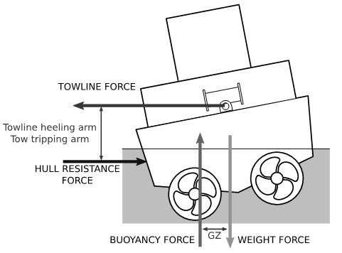
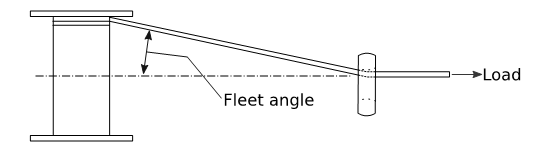

# 제7편 전용선박(1장~4장,7장~10장)

> 선급 및 강선규칙/적용지침 / RA-07A-K / 2025 / KO / Rules

## 제 9 장 예인선

### 제 1 절 일반사항

#### 101. 적용

- **1.** 예인선으로 등록하고자 하는 선박의 구조 및 의장은 이 장의 규정에 따른다. 다만 해상예인겸 보급선은 **8장**의 규정을 만족하여야 한다.
- **2.** 구조부재의 치수 및 배치는 명기하지 않는 사항은 **3편**의 규정에 따른다. 다만, 치수결정을 위하여 적용하는 흘수 $d$ 는 0.85$D$ 이상으로 하여야 한다.

### 제 2 절 종강도

#### 201. 일반사항

예인선의 종강도는 **3편 3장**의 규정에 따른다.

### 제 3 절 단저구조

#### 301. 늑판

단저구조의 늑판은 **3편 6장**의 규정에 따른다.

### 제 4 절 팬팅부 및 선수선저보강부

#### 401. 팬팅부의 보강

$L$ 이 46 $\mathrm{m}$ 이상인 선박은 **3편 9장**의 규정에 따라 중간갑판의 전구간에 걸쳐 보강보(panting beam) 및 팬팅스트링거를 설치하여야 한다. 다만, $L$ 이 46 $\mathrm{m}$ 미만인 경우에는 이를 적용하지 아니한다.

#### 402. 선수선저의 보강

예인선은 **3편 7장 8절**에서 규정하는 선수선저보강부에 대한 규정은 적용하지 아니한다.

### 제 5 절 기관실 위벽

#### 501. 탈출창구

기관실에서 갑판으로 통하는 모든 비상탈출구는 최대횡경사각에서도 사용할 수 있어야 하며 수면으로부터 가능한 한 높게 설치하고 선박의 중심선 가까이에 있어야 한다. 탈출창구 덮개에는 선박의 가로방향으로 힌지를 붙여야 하며 코밍의 높이는 갑판상 적어도 600 $\mathrm{mm}$ 이상이어야 한다.

#### 502. 노출주위벽

노출된 기관실 주위벽은 갑판상 적어도 900 $\mathrm{mm}$ 이상으로 하여야 하며 노출주위벽에 붙이는 휨보강재는 갑판에 고착되어야 한다.

### 제 6 절 예인장치

#### 601. 예인훅

- **1.** 예인훅 또는 이와 동등한 장치는 일반적으로 선박의 중앙으로부터 0.05$L$ 내지 0.1$L$ 후방에 위치하여야 하며 어떠한 적하상태에서도 선박의 세로방향 중심의 전방에 있어서는 안된다. 또한 예인훅은 정상작업상태에서 생기는 경사모멘트를 최소화하기 위하여 가능한 한 낮게 설치하여야 한다.
- **2.** 예인훅은 어떠한 경사각에서도 예인줄을 용이하게 풀 수 있는 이탈장치를 갖추어야 하며 이들 장치는 선교루에서도 작동이 가능하도록 할 것을 권장하며 설치후 검사원의 입회하에 작동시험을 행하여야 한다. 훅 또는 이와 동등한 장치의 절단하중은 일반적으로 예인줄의 절단하중의 1.5배 이상이어야 한다.

### 제 7 절 선측 방현재

#### 701. 선측 방현재

선측면 갑판 높이의 위치에 유효한 방현재를 선박 전후 방향에 걸쳐 설치하여야 한다.

### 제 8 절 예인 윈치의 비상풀림장치 (2021)

#### 801. 일반

- **1.** **적 용**
  - **(1)** 이 절은 좁은 구역, 항구 또는 터미널 내 선박의 예인에 사용되는 예인 윈치의 비상풀림장치에 대한 최소 안전 요건이며, 횡방향의 예인 작업에 종사하지 않는 선박에도 적용한다.
  - **(2)** 이 절은 장거리 해상 예인, 양묘 또는 이와 유사한 해양 활동에만 사용되는 선박에 설치된 예인 윈치를 다루기 위한 목적은 아니다.
- **2.** **목적**
  이 절은 예인선의 예기치 못한 사고(추진/조타 또는 기타 손실을 일으킬 수 있는)로 인하여 횡방향으로 작용하는 보상력(offset) 및 이에 대한 반대 횡력(추력 또는 선체 저항력에 의한 반대작용)에 의해 예인선이 기울거나 전복되는 것을 방지하기 위한 요건이다. 예인 작업 중에 작용하는 힘을 보여주는 **그림 7.9.1**을 참조한다.

  |  |
  | --- |
  | **그림 7.9.1 예인 중 작용하는 힘** |
- **3.** **정의**
  - **(1)** 비상풀림장치(emergency release system)라 함은 정상 및 블랙아웃 상태 모두에서 통제된 방식으로 예인삭의 하중을 푸는 데 사용되는 메커니즘 및 관련 제어 장치를 의미한다.
  - **(2)** 최대설계하중이라 함은 제조업체(제조업체 등급)에 의해 정의된 윈치가 유지할 수 있는 최대 하중을 말한다.
  - **(3)** 플리트앵글(fleet angle)이라 함은 작용하는 하중(예인력)과 윈치 드럼에 감겨져 있는 예인삭 사이의 각을 말한다. **그림 7.9.2**를 참조한다.

    |  |
    | --- |
    | **그림 7.9.2 예인삭의 플리트앵글(fleet angle)** |

#### 802. 일반 요건

- **1.** 예인삭의 선내 끝단은 윈치 드럼에 약한 링크 또는 낮은 하중에서 예인삭이 풀릴 수 있도록 설계된 유사한 장치로 부착되어야 한다.
- **2.** 모든 예인 윈치는 비상풀림장치가 장착되어야 한다.

#### 803. 비상풀림장치 요건

- **1.** **성능 요건**
  - **(1)** 비상풀림장치는 모든 정상 상태와 합리적으로 예측 가능한 비정상 상태에서 예인 하중, 플리트앵글, 선박 경사각의 전 범위에서 작동해야 한다. (이는 선박의 전기적 고장, 다양한 예인 하중(예를 들면 황천 시) 등을 포함하나 이에 국한하지는 않는다.)
  - **(2)** 비상풀림장치는 최대설계하중의 최소 100 %를 예인하중으로 작동할 수 있어야 한다.
  - **(3)** 비상풀림장치는 조작 후 3초 이내에 가능한 한 신속하게 작동하여야 한다.
  - **(4)** 비상풀림장치는 윈치 드럼이 회전하면서 제어된 방법으로 예인삭을 풀어낼 수 있도록 설계하여야 한다. 비상풀림장치가 작동한 경우 드럼으로부터 예인삭의 제어되지 않은 풀림을 피하기 위해 회전에 대한 충분한 저항이 있어야 한다. 예인삭이 걸리거나 윈치의 풀림 기능을 방해할 수 있는 윈치 드럼의 자유롭고 통제되지 않는 회전은 피해야 한다.
  - **(5)** 비상풀림장치가 작동된 경우 윈치 드럼을 회전시키기 위해 필요한 예인 하중은 다음의 (가) 또는 (나) 이하이어야 한다.
    - **(가)** 드럼에 2 레이어의 예인삭이 있을 때 최대 설계하중의 5 % 또는 5톤 중 작은 값
    - **(나)** 회전에 대한 저항이 가장 낮은 보호되지 않은 개구부를 침수시킬 수 있는 힘의 25 %를 초과하지 않는다는 것을 입증하는 최대 설계하중의 15 %
  - **(6)** 블랙아웃 상태에서도 비상풀림장치는 정상 작동되어야 한다. 이를 위해 추가의 동력원이 필요한 경우, (7)호에 적합하여야 한다.
  - **(7)** (6)호에서 요구하는 동력원은 다음 중 가장 큰 용량이 필요한 작업을 수행하기에 충분하여야 한다.
    - **(가)** 예인삭 풀림을 3회 이상 작동(즉, 비상풀림장치 3회 이상 작동) 할 수 있어야 한다. 하나 이상의 윈치에 동력을 공급할 경우 가장 큰 용량의 윈치를 3회 작동시키기에 충분하여야 한다.
    - **(나)** 동력이 지속적으로 필요한 윈치로 드럼을 풀도록 설계된 경우 (예를 들면 스프링 장력으로 브레이크가 작동되고 유압 또는 공압을 사용하여 풀리는 경우) 블랙아웃 상태에서 최소한 5분 이상 비상풀림장치를 작동시키기에 충분한 동력이 제공되어야 한다(예를 들면 브레이크를 풀림을 유지하고 예인삭 풀림을 허용할 수 있도록). 이것은 5분 미만일 경우 (5)호에 명시된 하중으로 예인삭 전체 길이를 윈치 드럼에서 푸는데 필요한 시간으로 줄일 수 있다.
- **2.** **운전 요건**
  - **(1)** 비상풀림 운전은 선교 및 갑판 상의 윈치 제어장소에서 가능하여야 한다. 갑판의 윈치 제어장소는 안전한 곳에 위치하여야 한다. 윈치와 가까운 장소는 예인 중 브레이크가 작동하거나 고장이 발생했을 때에도 보호된다는 것을 문서로 입증할 수 없는 경우 안전한 장소로 간주하지 않는다.
  - **(2)** 비상풀림 제어는 윈치 운전을 위한 비상정지 버튼에 근접하여 위치하여야 하며 둘 다 명확하게 식별 가능하고, 명확하게 보이며, 쉽게 접근할 수 있어야 하며, 안전한 작동이 가능하도록 배치되어야 한다.
  - **(3)** 비상풀림 기능은 어느 비상정지 기능보다 우선 순위를 가져야 한다. 윈치 비상정지 장치를 어느 위치에서나 작동시켜도 비상풀림장치의 작동을 어느 위치에서나 저해하지 않아야 한다.
  - **(4)** 비상풀림장치의 제어 버튼을 취소하기 위해 적극적인 조치가 필요하며, 적극적인 조치는 비상풀림이 작동된 위치와는 다른 제어 위치에서 버튼을 취소하는 것으로 할 수 있다. 작동 위치에 관계없이 그리고 작업 갑판에서 수동 개입 없이도 선교에서 비상풀림을 취소할 수 있어야 한다.
  - **(5)** 비상 용도의 제어는 우발적인 사용으로부터 보호되어야 한다.
  - **(6)** 비상풀림장치의 정상 작동과 관련된 모든 전원 공급 장치 및/또는 압력에 대한 표시가 선교에 제공되어야 한다. 비상풀림장치가 완전히 작동하는 한계를 벗어나면 알람은 자동으로 활성화되어야 한다.
  - **(7)** 가능한 한 비상풀림장치의 제어는 고정 배선 시스템에 의해 제공되어야 하며, 프로그래머블 전자시스템과 완전히 독립적이어야 한다.
  - **(8)** 비상풀림장치의 제어에 영향을 미치거나 영향을 줄 수 있는 컴퓨터 기반 시스템은 **규칙 6편 4절**에서 시스템 분류 Ⅲ 요구 사항을 충족해야 한다.
  - **(9)** 비상풀림장치의 안전한 운전을 위한 중요 구성품은 제조자에 의하여 확인되어야 한다.

#### 804. 시험 요건

- **1.** **일 반**
  - **(1)** 본 항에 정의된 모든 시험은 선급 검사원의 입회하에 실시되어야 한다.
  - **(2)** 각 비상풀림장치 또는 그 형식에 대하여 **803.**의 **1**항의 성능 요구사항은 제조자의 공장시험 또는 선내에 설치 될 때 예인 윈치 선내시험의 일부 중 하나로서 검증되어야 한다. 시험만을 통한 검증이 불가능한 경우(예를 들면 보건 및 안전), 시험은 우리 선급이 동의한 검사, 분석 또는 실증과 결합될 수 있다.
  - **(3)** 비상풀림장치의 성능 및 작업 지침을 작성하여 선박에 비치하여야 한다.
  - **(4)** 비상풀림장치의 검사에 대한 지침을 우리 선급에 제출하여야 하며, 선박에 비치하여야 한다.
  - **(5)** 윈치의 연차 및 정기검사를 수행하기 위하여 필요 시 갑판을 적절히 보강하여야 한다.
- **2.** **설 치 시운전**
  - **(1)** 비상풀림장치를 선내에 설치한 후 시운전의 일환으로 모든 기능을 시험하여야 한다. 시험은 볼라드 풀(bollard pull) 시험 중 수행하거나 적절한 하중이 보강된 갑판의 지점에 예인 하중을 가하여 수행할 수 있다.
  - **(2)** **803.**의 **1**항에 따라 윈치의 성능이 이미 검증된 경우 설치 시운전에서 적용되는 하중은 최대 설계하중의 30 % 또는 볼라드 풀(bollard pull)의 80 % 중 적은 값 이상으로 한다. 
