# 제7편 전용선박(1장~4장,7장~10장)

> 선급 및 강선규칙/적용지침 / RA-07A-K / 2025 / KO / Guidance

## 제 1 장 유조선

### 제 1 절 일반사항

#### 101. 적용 【규칙 참조】

- **1.** 이 지침은 주로 인화점 60 ${}^{\circ}\mathrm{C}$ 이하의 화물유를 적재하는 2열 종격벽을 가진 종식구조의 대형유조선에 대하여 정한 것으로서 특기 이외의 사항 또는 화물선과 공통인 사항에 대하여는 별도로 정하는 바에 따른다.
- **2.** **새로운 구조방식의 채택**
  새로운 구조방식이 채택될 경우에는 규칙에 있는 표준구조의 모델과 비교계산을 행하여 구조부재의 치수를 결정한다. 또한 필요에 따라 모형시험 또는 실선계측의 자료제출을 요구할 수 있다.
- **3.** **원유 및 석유정제품 이외의 액상화물을 적재하는 선박**
  **규칙 101.**의 **5**항을 적용함에 있어서 원유 및 석유정제품 이외에 37.8℃에서의 증기압(절대압력)이 0.28 $\mathrm{MPa}$ 미만의 액상화물을 운송하고자 하는 선박에 대하여는 다음에 따른다.
  - **(1)** 비중($\rho$)이 1.0을 넘는 액상화물을 적재하는 유조선의 화물유 탱크부의 각 부재의 치수는 다음 2가지 방법에 따라 정한 값 중 큰 것으로 한다.
    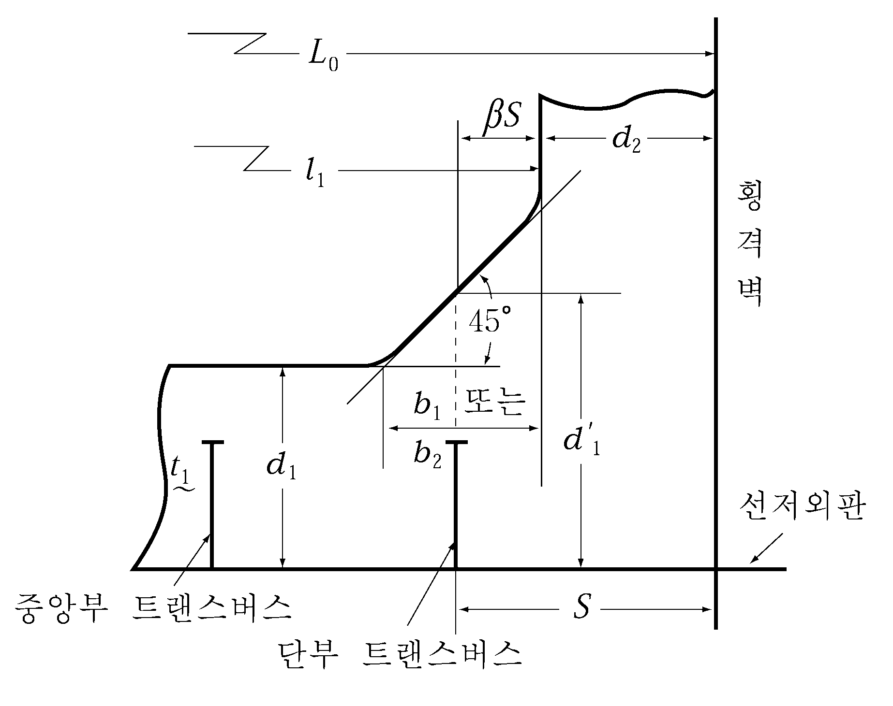
    **그림 7.1.1** #eqnID-6**의 측정방법**

    **표 7.1.1** $\rho$ **의 값**

    | **화물의 종류** | $\rho$ |
    | --- | --- |
    | 당밀 | 1.4 |
    | 아스팔트 | 1.1 |
    | 농유산 | 1.85 |
    - **(가)** 모든 부재에 대하여 규칙에 의거 계산한다.
    - **(나)** 각 부재에 따라 다음과 같이 계산한다.
      - **(a)** 외판에 부착되는 부재, 지지재 및 선측외판에 부착되는 부재와 지지재로서 결합되는 종격벽에 붙은 부재의 치수는 규칙의 식 중 $h$ 대신에 **그림 7.1.1**의 $h_0$ 를 사용하여 계산한다.
      - **(b)** 격벽판, 격벽붙이 부재 및 크로스타이의 치수는 비중 $\rho$ 인 액체를 탱크정판까지 적재한 것으로 하여 계산한다.
      - **(c)** 중앙탱크에 갑판 트랜스버스의 단면계수는 규정의 값을 $\rho$ 배 한다.
      - **(d)** $\rho$ 의 값은 **표 7.1.1**에 따르며 기타는 그때마다 정한다.
  - **(2)** 독성 및 부식성이 있는 액상화물을 적재하는 유조선에 대하여는 해양수산부령 「**위험물 선박운송 및 저장규칙」**을 참조할 필요가 있다.
- **4.** 모든 화물탱크가 독립형탱크인 아스팔트 전용운반선의 경우, 화물지역 내의 선체구조 내면의 적어도 일면은 어떠한 고정구조물 또는 장비품을 제거하지 않고 육안검사가 가능하도록 하여야 한다. 이 목적을 달성하기 위하여 다음의 조건을 만족하여야 한다.
  - **(1)** 평면 또는 곡면 그리고 갑판보, 보강재, 늑골, 거더 등과 같은 구조물을 검사하기 위하여 구조들의 표면 사이를 지나야 하는 경우, 그 구조의 표면 및 자유단 사이의 거리는 최소 380 $\mathrm{mm}$ 이상이어야 한다. 검사하여야 할 면과 갑판, 격벽 또는 외판 등과 같이 상부 구조물의 표면 사이의 거리는 곡진 탱크(즉, C형 탱크)의 경우, 최소 450 $\mathrm{mm}$ 이상이거나, 평평한 탱크(즉, A형 탱크)의 경우, 600 $\mathrm{mm}$ 이상이어야 한다.(**그림 7.1.2** 참조)
  - **(2)** 가시성을 이유로 검사할 면과 선체구조의 임의의 부분 사이를 통행할 필요가 없는 경우, 구조부재의 자유단과 검사하여야 할 면 사이의 거리는 최소 50$\mathrm{mm}$ 또는 구조물 면재의 반폭 중 큰 값 이상이어야 한다.(**그림 7.1.3** 참조)
  - **(3)** 곡면에 대한 검사를 위하여, 그 면과 구조부재가 없는 다른 면(평면 또는 곡면) 사이를 통행할 필요가 있다면, 양 면 사이의 거리는 최소 380 $\mathrm{mm}$ 이상이어야 한다(**그림 7.1.4** 참조). 곡면과 다른 면 사이의 통행이 요구되지 않는 경우, 곡면의 형상을 고려하여 380 $\mathrm{mm}$ 보다 작은 거리도 허용될 수 있다.
  - **(4)** 거의 평면인 면의 검사를 위하여, 구조부재가 없는 거의 평면인 면 사이 또는 거의 평행인 면 사이를 통행할 필요가 있다면, 이 면들 사이의 거리는 최소 600 mm 이어야 한다. 고정식 통행 사다리가 설치된 경우, 간격은 최소 450mm 이상이어야 한다.(**그림 7.1.5** 참조)
  - **(5)** 화물탱크 섬프(sump)와 흡입웰 근처의 이중저구조 사이의 최소거리는 **그림 7.1.6**의 거리보다 작아서는 안 된다. (**그림 7.1.6** 섬프의 평면과 웰 사이의 거리는 최소 150 $\mathrm{mm}$ 이며, 내저판 사이 모서리 간, 웰의 수직 면간 그리고 구형 또는 원형면과 탱크의 섬프(sump) 사이의 너클포인트(knuckle point)의 간격은 최소 380 $\mathrm{mm}$ 이상이어야 한다.) 만약, 흡입웰이 없다면, 화물탱크 섬프와 이중저 사이의 거리는 50mm 보다 작아서는 안 된다.
  - **(6)** 화물탱크 돔과 갑판구조 사이의 거리는 150mm 이상이어야 한다.(**그림 7.1.7** 참조)
  - **(7)** 화물탱크, 화물탱크 지지구조 및 구속구조(예: 종동요 방지설비, 횡동요 방지설비 및 이탈방지 초크 등), 화물탱크 방열재 등의 검사를 위하여, 필요하다면, 고정식 또는 이동식 작업대를 설치하여야 한다. 이러한 작업대는 (1)에서 (4)의 요구하는 간격을 유지하여야 한다.
  - **(8)** 만약, 고정식 또는 이동식 배기덕트가 설치되어야 하는 경우, 이러한 덕트는 (1)에서 (4)의 요구하는 간격을 침범하여서는 안 된다.

    | /450 **그림 7.1.2** |   | **그림 7.1.3** |   |
    | --- | --- | --- | --- |
    | **그림 7.1.4** |   |   |   |
    | 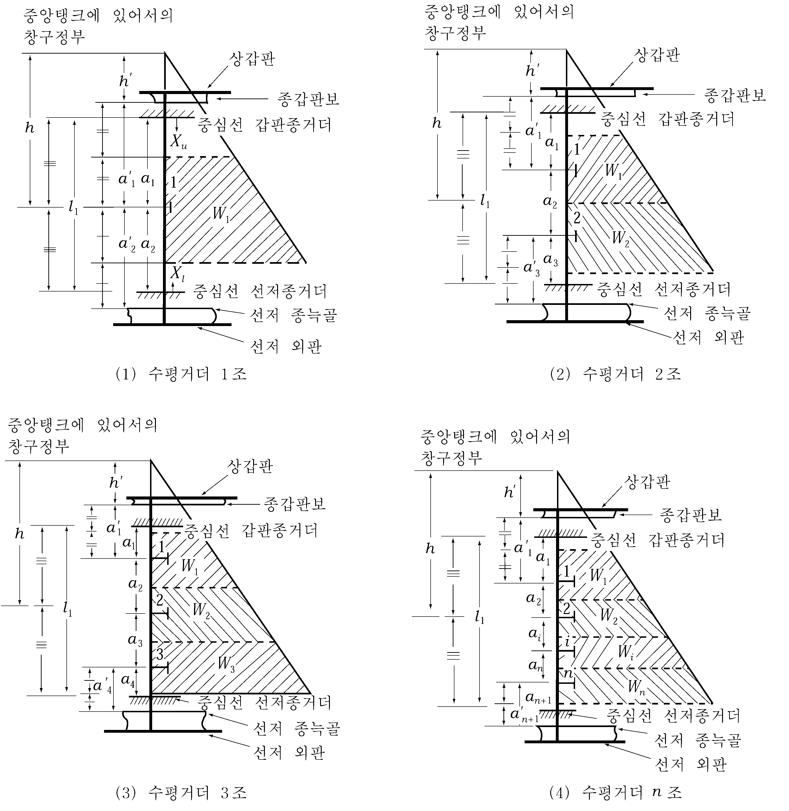 **그림 7.1.5** **그림 7.1.5** | 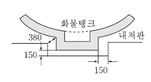 **그림 7.1.6** **그림 7.1.6** |   | 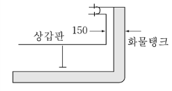 **그림 7.1.7** **그림 7.1.7** |

#### 102. 격벽의 배치 【규칙 참조】

- **1.** 화물유를 적재하는 탱크의 길이는 10 $\mathrm{m}$ 또는 다음 값 중 큰 값을 넘어서는 안된다.
  - **(1)** 종격벽이 설치되어 있지 않은 경우 0.1$L_f$
  - **(2)** 선체중심선상에만 종격벽이 설치되어 있는 경우 0.15$L_f$
  - **(3)** 2열 이상의 종격벽이 설치되어 있는 경우
    $b_i$ : 해당 현측탱크의 만재흘수선의 위치에서의 최소너비 ($\mathrm{m}$).
    - **(가)** 현측탱크 0.2$L_f$
    - **(나)** 중앙탱크
      - **(a)** ${b_\frac{i}{B_f} \geq \frac{1}{5}$ 인 경우 0.2$L_f$
      - **(b)** ${b_\frac{i}{B_f} < \frac{1}{5}$ 으로서,
      - **(i)** 선체중심선상에 종격벽이 없는 경우 $left(0.5 {b_\frac{i}{B_f} + 0.1 right)L_f$
        - **(ii)** 선체중심선상에 종격벽이 있는 경우 $left(0.25 {b_\frac{i}{B_f} + 0.15 right)L_f$
- **2.** 중앙탱크 또는 내측탱크에 있어서는 15 $\mathrm{m}$ 또는 0.1$L$ 중 큰 쪽을 넘지 않는 간격으로 횡 제수격벽을 배치할 필요가 있다.
- **3.** 현측탱크에 있어서 중앙탱크 또는 내측탱크내의 종격벽의 위치에서 링 및/또는 거더를 설치하여 강도상 불연속이 발생하지 않도록 하여야한다.

#### 103. 코퍼댐 【규칙 참조】

- **1.** **코퍼댐 등 화물유 탱크의 격벽**
  - **(1)** 연료유 또는 평형수를 적재하는 장소는 그 개소의 구조가 거널 산형강의 경우를 제외하고 모두 용접으로 할 경우에는 화물유를 적재하는 장소와의 사이에 설치하여야 할 코퍼댐과 겸용할 수 있다. (**규칙 1003.**의 **2**항 및 **3**항 참조) 또한 연료유가 혼입됨으로서 심한 손해를 받는 액상화물(예를 들면 개소린, 당밀) 등을 적재하는 탱크와 연료유 탱크와의 사이에는 코퍼댐을 설치할 것을 권장한다.
  - **(2)** 화물탱크와 선수창(선수탱크)이 인접하는 경우, 특별한 경우를 제외하고는 선수격벽에는 개구를 설치하여서는 안된다. (**규칙 1003.**의 **2**항 및 **3**항 참조)
  - **(3)** 코퍼댐의 적용을 받는 구획과 기타의 구획(다만, 화물유탱크 및 연료유탱크 제외)과의 사이에는 어떠한 개구도 설치하여서는 안된다. 다만, 체인로커 주위벽 등에 설치하는 볼트 조임식 수밀 맨홀은 그러하지 아니한다. (수밀문은 허용되지 않음.)
- **2.** **선루 및 간판실** 펌프실의 승강구를 보호하는 갑판실은 다음에 의한다.
  - **(1)** 전단격벽은 선교루 전단격벽과 동등한 강도
  - **(2)** 측벽 및 후단벽은 선미루 전단격벽과 동등한 강도
  - **(3)** 출입구 코밍의 높이는 건현갑판상 600 $\mathrm{mm}$로 한다.
- **3.** 화물유탱크 종격벽의 후단과 그 후부의 선미루갑판 등 종부재와의 연속성을 유지할 수 있도록 한다. (**그림 7.1.8** 참조)
- **4.** **화물유탱크 직하에 이중저가 있는 경우**
  이중저탱크의 출입구는 화물유탱크의 이중저에 설치하여서는 안된다. 예를 들면, 전후부의 코퍼댐에서 출입할 수 있도록 하든지 상갑판 노출부에서 이중저까지 통하는 유밀트렁크를 설치하는 등의 방법으로 한다.
  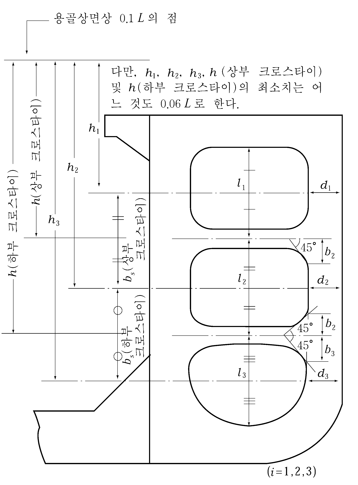
  **그림 7.1.8 종격벽 후단부의 연속성**

#### 104. 기밀격벽 【규칙 참조】

- **1.** 주 및 보조보일러실로 겸용하지 않는 코퍼댐 및 건현갑판하의 코퍼댐 적용구획은 디프탱크로서의 강도를 만족할 필요가 있다. 주펌프실과 기관실과의 사이의 격벽의 치수는 $L$ 이 100 $\mathrm{m}$ 이상인 선박에서는 수밀격벽의 치수, $L$ 이 100 $\mathrm{m}$ 미만인 선박에서는 기밀격벽의 치수 이상으로 하여야 한다.
- **2.** 수압시험을 행할 필요가 없는 기밀격벽의 치수는 다음의 값을 표준으로 한다. 또한 기밀시험은 사수시험으로 대신할 수 있다.
  - **(1)** 두께 : 6 $\mathrm{mm}$ 이상으로 한다. 다만, $L$ 이 100 $\mathrm{m}$ 미만인 선박은 4.5 $\mathrm{mm}$ 로 할 수 있다.
  - **(2)** 휨보강재 및 거더의 단면계수 : 수밀격벽에 대한 값의 50 $\%$로 한다. 다만, 외판 및 갑판과 결합되는 개소는 늑골, 보 등과 동등한 효력의 것으로 하여야 한다.

#### 109. 직접강도 계산 【규칙 참조】

직접강도계산에 따라 유조선의 화물창 구조부재의 치수를 정하는 경우에는 **3편 부록 3-2 직접강도평가에 관한 지침**에 따른다.

#### 110. 복원성 적하지침기기(Stability Instrument) 【규칙 참조】

- **1.** **규칙 110.**을 적용함에 있어서 기구가 권고한 성능기준은 다음을 참조한다.
  - part B, chapter 4, of the International Code on Intact Stability, 2008 (2008 IS Code);
  - the Guidelines for the Approval of Stability Instruments (MSC.1/Circ.1229), annex, section 4;
  - the technical standards defined in part 1 of the Guidelines for verification of damage stability requirements for tankers (MSC.1/Circ.1461)
- **2.** **규 칙 110. 1**항의 (3)의 선급이 인정하는 경우란, 손상 및 비손상 복원성 검증 절차가 승인된 조건에 적합하게 적하되는 것과 동등한 안전 수준을 유지하는 다음의 선박을 말한다.
  - **(1)** 모든 형태의 예상 가능한 적하 조건이 선장에게 제공되는 승인된 복원성 자료에 포함되고 전용작업에 사용되는 선박
  - **(2)** 우리선급이 승인한 방법에 의해 원격으로 복원성 검증이 가능한 선박
  - **(3)** 승인된 적하 조건 범위 안에서 적하되는 선박
  - **(4)** KG/GM을 제한하여 승인함으로써 적용 가능한 모든 손상 및 비손상 복원성 요건을 충족하는 2016년 1월 1일 전에 건조된 선박
- **3.** **2**항의 승인된 조건은 다음을 참조한다.
  - operational guidance provided in part 2 of the Guidelines for verification of damage stability requirements for tankers (MSC.1/Circ.1461).

### 제 2 절 창구, 상설보행로 및 방수설비

#### 201. 특히 큰 건현을 갖는 선박 【규칙 참조】

**규칙 201.**에서 “우리 선급이 적절하다고 인정하는 바”라 함은 **3편 1장 203.**의 **2**항 (2)호 (마)를 말한다.

#### 202. 화물유 탱크에 설치하는 창구 (2018) 【규칙 참조】

- **1.** 화물유 탱크에 설치하는 창구에 FRP제 창구덮개를 설치하는 경우는 다음에 의한다.
  - **(1)** 기재(基材)는 자기소화성(fire resistant nature)의 것으로 한다.
  - **(2)** **1974년 SOLAS협약**('81/'83개정규칙 포함)의 표준화재시험에 따라 Model test를 행하고 그 내면을 화염에 접하게 하며, 이 표준화재시험의 계속시간은 20분간 이상, 최고온도는 790 ${}^{\circ}\mathrm{C}$로 하고 이 시험의 최초의 20분이 끝날 때까지 화염이 통과하지 않는 것이어야 한다.
  - **(3)** Steaming test를 행하여 수밀성을 해치는 유해한 변형이 없어야 한다.
  - **(4)** 치수가 다른 각 모델에 대하여 0.028 $\mathrm{MPa}$ 이상으로 수압시험을 행하여 이에 견디는 것이어야 한다.
  - **(5)** 덮개의 개폐장치에는 완전폐쇄 또는 완전개방 위에서만 고정되도록 설계되어야 하며, 이러한 취급 방법을 나타내는 주의사항을 덮개의 외측 표면에 표시하여야 한다.
- **2.** Tank cleaning 창구덮개의 재료는 다음 각 호의 규정에 따른다.
  - **(1)** 황동, 포금(砲金) 및 강은 사용할 수 있으나, 알루미늄은 사용하여서는 안된다.
  - **(2)** FRP 등 기타의 합성재료는 **1**항의 요건을 모두 만족시키는 경우에 한하여 사용할 수 있다.
- **3.** 화물유 탱크에 설치하는 Tank cleaning 창구덮개의 조임장치는 상갑판상 2.45 $\mathrm{m}$ 의 수두에 대하여 창구덮개가 충분한 수밀성을 유지할 수 있는 것이어야 한다. 또한, 이 장치가 다음 중 어느 하나의 구조이거나 또는 이와 동등한 구조에 대하여는 **규칙 4편 2장 103.**의 **1**항에 규정된 창구코밍의 높이를 감할 수 있다.
  - **(1)** 탱크 정부에 라이너를 부착하여 덮개를 볼트조임으로 하는 경우에는 그 볼트 사이의 피치를 150 $\mathrm{mm}$ 이하로 한다. 다만, 어떠한 경우에는 볼트의 수는 10개 미만으로 하여서는 안된다. 또한 나비형 너트 등 사람이 손으로 쉽게 열 수 있는 구조로 하여서는 아니되며 라이너의 재질은 상갑판의 재질과 동등한 것이어야 한다.
  - **(2)** 암 및 힌지붙이 덮개를 장치하는 형식의 창구에는 코밍을 설치하여야 하며, 사람이 손으로 쉽게 열 수 없는 구조로 하여야 한다. (**그림 7.1.9** 참조)
    
    **그림 7.1.9 Tank Cleaning**

#### 204. 상설보행로 및 통로 【규칙 참조】

**규칙 204.**의 **1**항의 “우리 선급이 적절하다고 인정하는 바”라 함은 **4편 4장 501.**을 말한다.

#### 205. 방수설비

**규칙 205.**의 **1**항에서 건현갑판상 노출부 길이의 1/2 이상에 걸쳐 핸드 레일을 설치하는 대신에 불워크 전체 면적의 33$\%$ 이상의 방수구를 불워크 하방에 설치하여도 좋다. **【규칙 참조】**

### 제 3 절 화물구역의 종늑골 및 종갑판보

#### 302. 치수 【규칙 참조】

- **1.** **세장비**
  중앙부 0.4$L$ 내의 종갑판보 및 현측후판에 붙는 선측종늑골의 세장비는 대형선에는 60이하, 소형선에서는 80이하로 한다. 세장비를 계산하는데 있어서 계산에 포함되는 부착된 강판은 (보 또는 늑골의 실제의 간격)×(실제의 두께)로 한다.
- **2.** **선측종늑골**
  선측종늑골을 디프탱크 격벽 휨보강재로서 계산하는데 있어, 현측탱크의 길이 또는 너비가 10 $\mathrm{m}$ 를 넘는 경우에는, 규정의 식에 있어서 $h$ 는 규칙 **510.**에 따른다.

#### 303. 고착 【규칙 참조】

- **1.** **표 7.1.8** 중 ○ 표시가 있는 종늑골 및 종갑판보는 관통브래킷으로 연결하거나 관통시켜야한다.

  **표 7.1.2 관통브래킷의 필요개소**

  | $L$ **(**$\mathrm{m}$**)** | **90 ≤** $L$ **≤ 120** | **120 ≤** $L$ |
  | --- | --- | --- |
  | 종갑판보 및 현측후판붙이 선측종늑골 | ○ | ○ |
  | 선측종늑골, 종격벽붙이 종휨보강재(다만, 상기 란은 제외) | ─ | ○^1) |
  | 선저종늑골 및 만곡부 외판의 종늑골 | ○ | ○ |
  | ^1) 선측종늑골로서 상하 0.2$D$ 사이, 종격벽붙이 종휨보강재로서 상하 0.1$D$ 사이를 제외하고는 **그림 7.1.10**와 같이 할 수 있다. |   |   |

  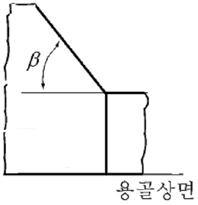
  **그림 7.1.10** 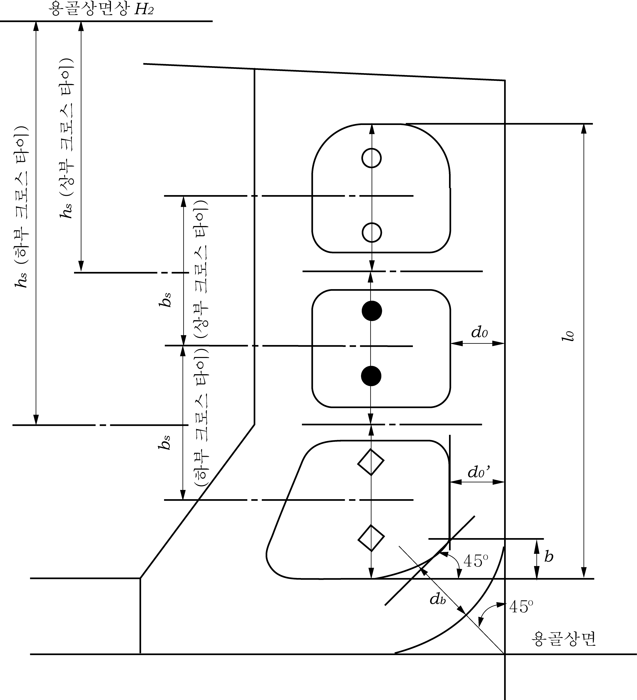
  **그림 7.1.11**
- **2.** 단부브래킷의 단면적 계산은 **그림 7.1.11**와 같이 하고 종갑판보 등의 단면적 이상으로 할 필요가 있다.
- **3.** 단부브래킷과 종늑골 및 종갑판보와의 고착은 다음과 같이 한다.
  - **(1)** $L$ 이 120 $\mathrm{m}$ 이상인 선박은 단부브래킷과 종갑판보 및 종늑골과는 **그림 7.1.12**과 같이 충분히 겹치게 할 필요가 있다.
  - **(2)** 전호 이외의 경우는 **그림 7.1.13**과 같이 할 수 있다. 브래킷은 가능한 한 종통재가 플랜지구조인 경우에는 종통재 웨브면의 $R$ 이 끝나는 선에 브래킷을 설치하는 한편 리브를 브래킷의 선단에서 안쪽 약 10 $\mathrm{mm}$ 에 설치한다.
    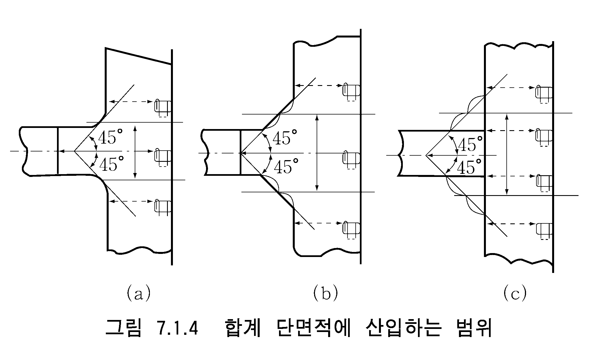
    **그림 7.1.12** 
    **그림 7.1.13**
- **4.** 횡격벽과 단부브래킷과의 고착은 다음과 같이 한다.
  - **(1)** 단부브래킷의 격벽관통부는 **그림 7.1.14**과 같이 면을 라운드 시킨다.
  - **(2)** 단부브래킷과 격벽과의 결합부는, 예를 들면, **그림 7.1.15**와 같이 보강하고 Hot spot을 피한다.
    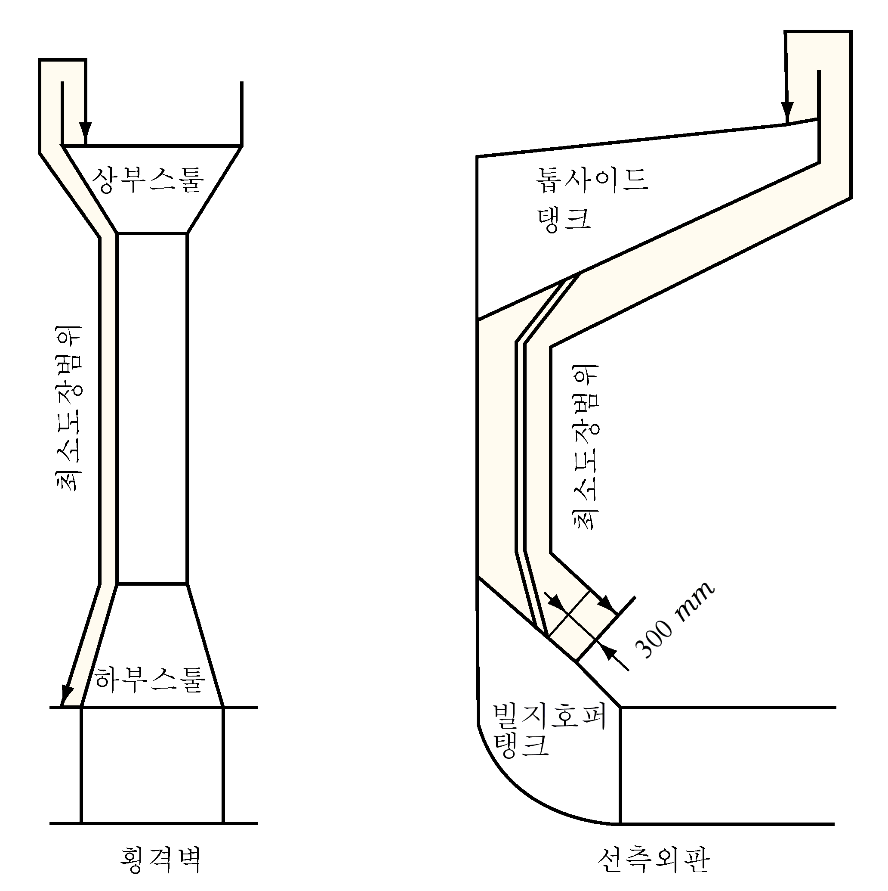
    **그림 7.1.14** 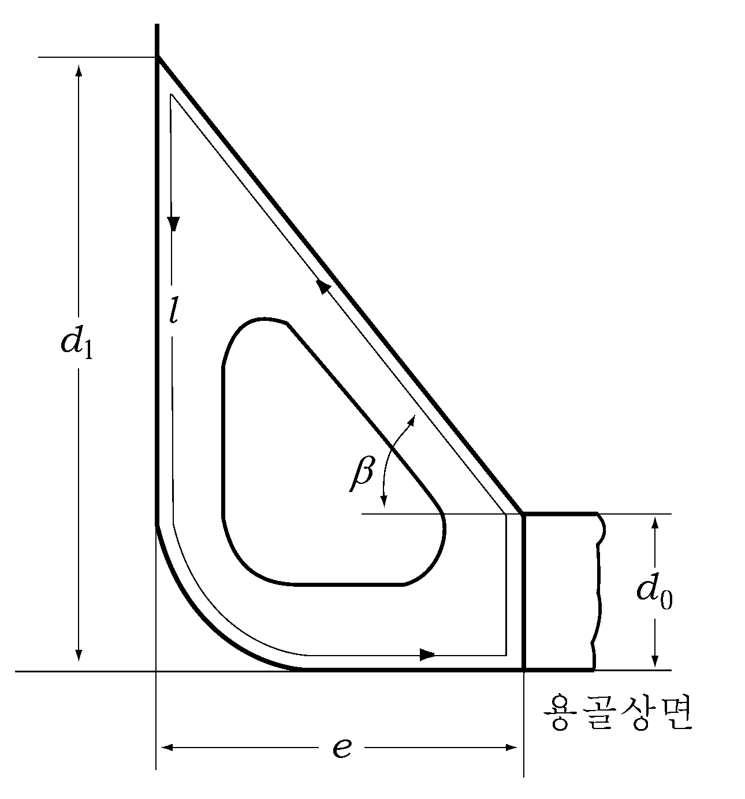
    **그림 7.1.15**

### 제 4 절 화물구역의 종거더, 트랜스버스 및 크로스타이

#### 401. 일반 【규칙 참조】

- **1.** 경감구멍을 시공하는 경우 그 크기 및 위치는 **그림 7.1.16**과 같이 한다.
- **2.** 종통재의 자유변이 맞닿는 개소의 슬롯 및 빌지부와 같이 슬롯의 간격이 좁은 경우는 슬롯에 칼라를 설치한다.
- **3.** 거더의 깊이가 규정의 깊이보다 작은 경우는 거더의 단면계수는 규정의 단면계수에 규칙에서 정하는 거더깊이와 실제 거더깊이와의 비를 곱하여 구한다.
- **4.** 보일러실 또는 보이드 구역의 웨브두께는 화물유탱크내의 웨브로서 계산된 두께에서 1 $\mathrm{mm}$ 를 감한 값으로 할 수 있다.
- **5.** 중앙부의 전용 평형수탱크내의 모든 구조부재 치수는 화물유탱크내의 부재치수로 한다. (**규칙 401.**의 **5**항)
- **6.** 거더판 상호간의 이음은 맞댐이음으로 할 필요가 있다. 겹이음으로 하는 경우는 이음에 교차하는 휨보강재를 설치할 필요가 있다.
- **7.** 트랜스버스 단부의 브래킷 부분, 크로스타이와의 결합부 등 전단응력이 높은 개소 및 압축응력이 높다고 생각되고 부분에는 휨보강재를 증설할 필요가 있으며 또한 해당 부분에는 경감구멍을 시공하여서는 안된다. 필요하다면 그 부분에는 종통재 관통부의 슬롯에 칼라를 설치할 필요가 있다.
- **8.** 트랜스버스 면재의 이음부분 및 거더판의 이음부분에는 거더판에 스캘럽(scallop)을 설치하여서는 안된다. 공작상 필요한 스캘럽은 용접으로 메운다. 또한 인접하는 면재는 그 치수의 급격한 변화를 피한다. (**그림 7.1.17** 참조)
- **9.** 트랜스버스 등에 설치하는 휨보강재를 평강 대신에 산형강을 사용하는 경우는 판붙이의 단면2차모멘트를 규정과 동등한 정도로 한다.
- **10.** 대형선의 선저트랜스버스, 선측트랜스버스, 종격벽트랜스버스와 종늑골과의 결합부에는 각각 **표 7.1.3**의 범위에 대하여 트랜스버스 휨보강재의 반대쪽에 브래킷을 설치하여 트랜스버스와 종늑골을 고착하든지 또는 슬롯에 칼라를 설치하는 등 적절히 보강한다. 다만, $L$ 이 230 $\mathrm{m}$ 이하인 경우에는 그 보강 범위를 적절히 참작할 수 있다. 또한 이 보강은 상기 트랜스버스류와 유사한 상황에 있는 슬롯(예를 들면 횡제수격벽 등의 슬롯)에 대하여도 이를 준용한다.
  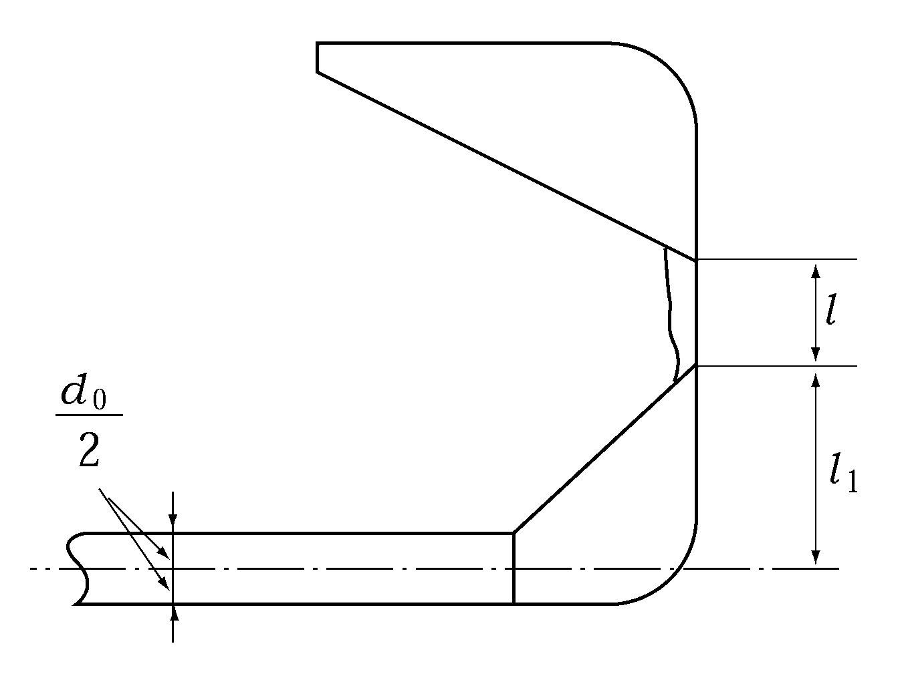
  **그림 7.1.16 경감구멍의 위치와 크기** 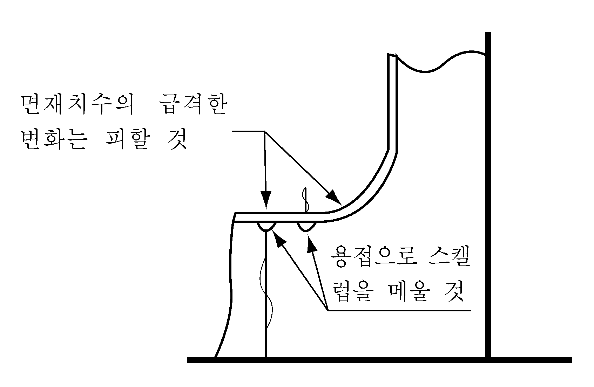
  **그림 7.1.17**

  **표 7.1.3 보강범위**

  | **부재** | **보강범위** |
  | --- | --- |
  | 선저트랜스버스 | 결합부 전부 |
  | 선측트랜스버스 | 상부 크로스타이의 상부 $R$ 이 끝나는 곳 또는 만재흘수선중 높은 곳에서부터 하방의 결합부 전부. 다만 $L$ 이 300 $\mathrm{m}$ 이상인 경우는 상기의 상방까지도 이에 준하여 보강할 것을 권장한다. |
  | 종격벽트랜스버스 | 상부 크로스타이의 상부 $R$ 이 끝나는 곳 이하의 결합부 전부 |

#### 402. 2열 이상의 종격벽을 갖는 선박의 중앙탱크 또는 내측탱크에 설치하는 종거더 및 트랜스버스 【규칙 참조】

- **1.** 탱크내에 규칙에 적합한 횡제수격벽이 있는 경우 $L_0$ 는 횡격벽과 그 횡제수격벽과의 사이의 거리로 할 수 있다.
- **2.** **규칙 표 7.1.3**의 **비고 1.**을 적용함에 있어서 $C_4$ 값의 1.2배한 값을 사용한다.
- **3.** **규칙 표 7.1.3**의 **비고 2.**를 적용함에 있어서 중심선 선저트랜스버스의 깊이 $d_1$ 이 선박의 깊이 $D$ 의 25 $\%$를 넘는 경우에는 **규칙 표 7.1.3**의 $C_4$ 값이 0.25$D/d_1$ 를 곱한 것으로 할 수 있다.
- **4.** 중심선 선저트랜스버스에는 선저트랜스버스 사이의 중앙 및 선저트랜스버스와 격벽과의 중앙에 트리핑 브래킷을 설치할 필요가 있다. 이 브래킷이 대형일 경우에는 자유변을 보강할 필요가 있다.
- **5.** 횡격벽붙이 선체중심선의 수직거더의 깊이 $d_2$ 가 횡거더의 간격 $S$ 보다 큰 경우 선저종거더의 웨브두께는 규정의 식에 있어서 $d_1 '$ 대신에 $d_1$ 을 사용하고 계수 $\eta$ 는 **표 7.1.4**에 따른다. (**그림 7.1.18** 참조)

  **표 7.1.4 계수** $\eta$

  | **트랜스버스의 수** | $\eta$ |
  | --- | --- |
  | 2 | 0.55 |
  | 3 | 0.67 |
  | 4 | 0.75 |
  | 5 | 0.80 |

   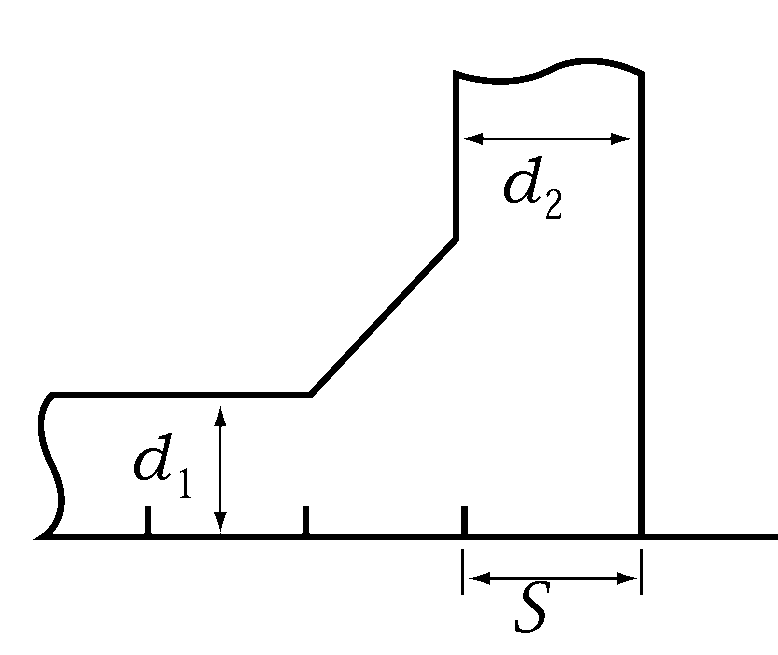
  **그림 7.1.18**

#### 403. 2열 이상의 종격벽을 갖는 선박의 현측탱크에 설치하는 종거더 및 트랜스버스 【규칙 참조】

- **1.** **선측트랜스버스**
  선측트랜스버스의 길이 $l_0$ 의 측정방법은 **그림 7.1.19**과 같이 한다. 하단도 그림과 같이 한다.
- **2.** **종격벽 트랜스버스**
  - **(1)** 종격벽의 반대측에 큰 브래킷이 있는 경우에도 트랜스버스의 길이 $l_0$ 및 $R$ 은 현측탱크측에서 전항의 요령에 의해 측정한다. 다만, 브래킷의 크기 $b$ 는 $(b' + b'')/2$ 로 할 수 있다. 다만, $b''$ 가 $b'$ 보다 작은 경우에는 $b'$ 로 한다. (**그림 7.1.20** 참조)
    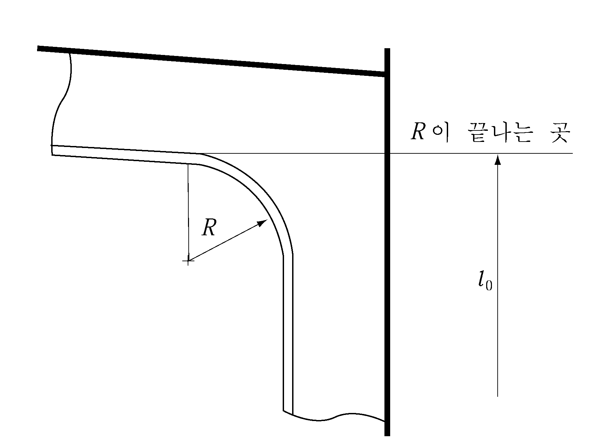
    **그림 7.1.19** #eqnID-90 **의 측정방법** 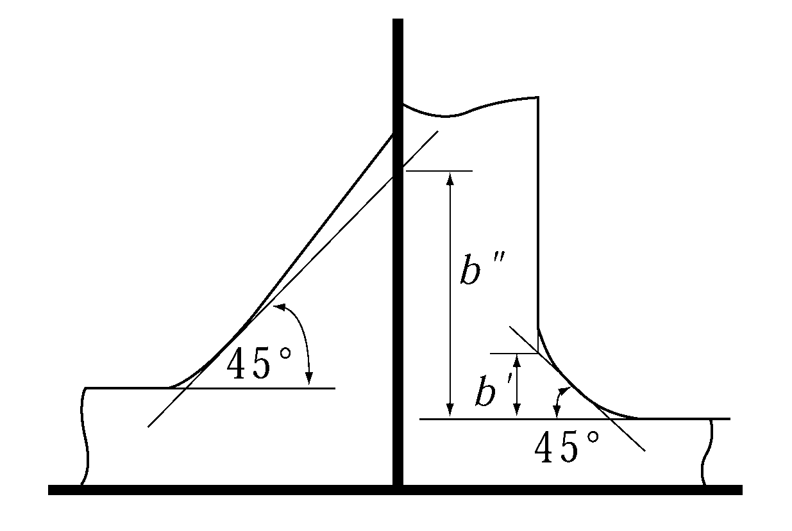
    **그림 7.1.20** #eqnID-91**,** #eqnID-92 **측정방법**
  - **(2)** 전단력에 의한 웨브두께의 식에 있어서는 종격벽의 반대측에 부착하는 브래킷도 고려할 수 있다.
  - **(3)** 중앙탱크 또는 내측탱크의 선저트랜스버스의 종격벽붙이 브래킷의 전단부근의 슬롯은 칼라로 막는다.
  - **(4)** 파형격벽에 설치되는 거더는 Balanced girder로 한다. 다만, Balanced girder로 할 수 없는 경우에는 거더의 중성축을 가능한 한 격벽에 가까이 하도록 하여야 한다.
- **3.** **선저트랜스버스 및 갑판트랜스버스의 단면2차모멘트**
  선저트랜스버스 및 갑판트랜스버스의 단면2차모멘트 $I$ 는 각각 다음 식에 의한 것을 표준으로 한다.
  선저트랜스버스 : $I = 160 C_0 C_2 Q l_0^2 \frac{B_S}{D} \mathrm{cm^4 }$
  갑판트랜스버스 : $I = 58 C_0 C_2 Q l_0^2 \frac{B_S}{D} \mathrm{cm^4 }$
  $C_0$ 및 $C_2$ : **규칙 표 7.1.6**에 따른다.
  $Q$ 및 $l_0$ : **규칙 403.**의 **1**항 규정에 따른다.
  $B_S$ : 선측탱크의 너비
- **4.** **빌지부 종격벽 하단부의 트랜스버스**
  **그림 7.1.21**와 같은 위치에 최하부의 크로스타이가 있는 경우는 빌지부 및 종격벽하단부의 트랜스버스의 단면계수는 식에 의한 값이 90 $\%$로 할 수 있다. 또한 A부의 선측트랜스버스의 웨브두께는 식에 의한 값에 0.5 $\mathrm{mm}$ 를 뺀 값으로 할 수 있다. 다만, **규칙 405.**의 두께 이상이어야 한다.
  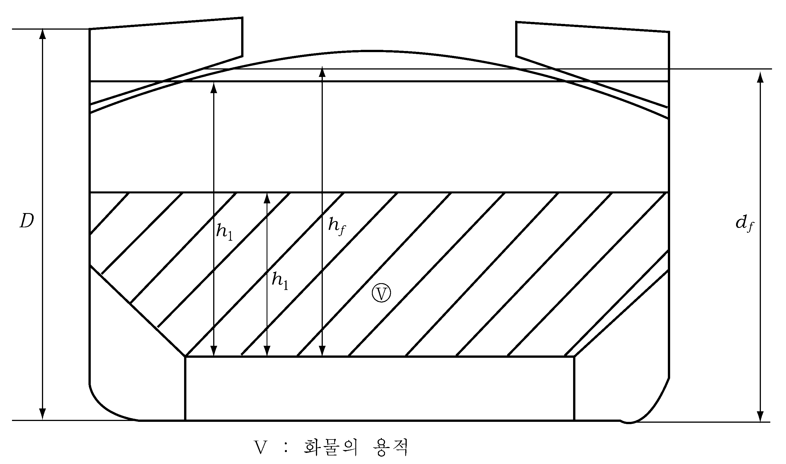
  **그림 7.1.21**
- **5.** **선측종거더를 가진 경우**
  - **(1)** 중앙탱크에 횡제수격벽이 있는 경우 $l_1$ 은 **그림 7.1.22**과 같이 측정한다.
  - **(2)** 종거더 또는 크로스타이는 **규칙 403.**의 **5**항 (5)호의 규정 이외에 다음 조건도 만족할 필요가 있다.
    $l_1 > l_2 > l_3$ (**그림 7.1.23** 참조)
    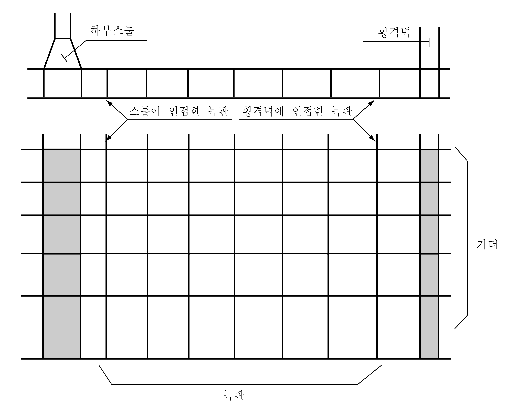
    **그림 7.1.22** #eqnID-105**의 측정방법** 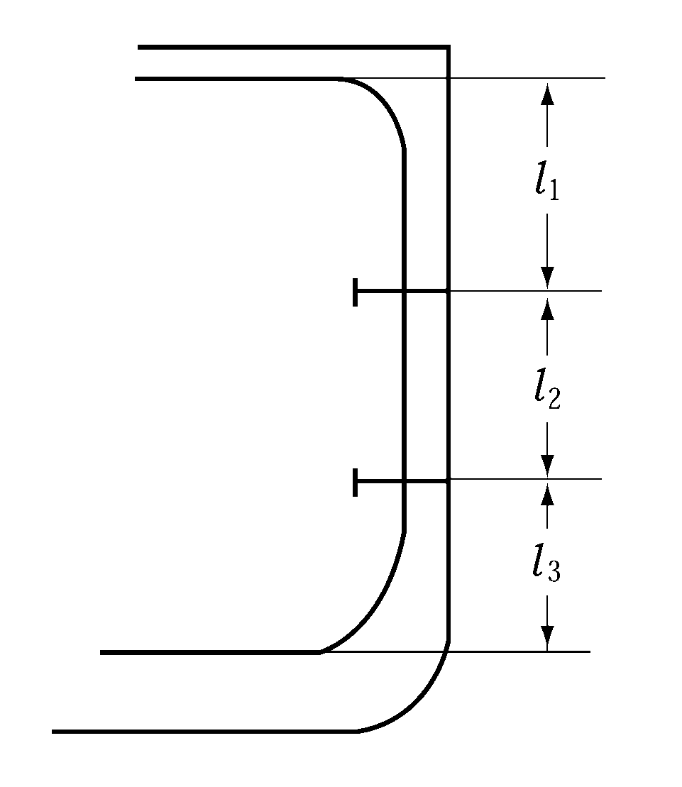
    **그림 7.1.23**
  - **(3)** 4조의 트랜스버스와 1조의 종거더를 1조의 크로스타이로 결합한 경우 종거더의 치수를 계산하는데 있어서 $C_3$ 및 $C_4$ 는 **표 7.1.5**에 의한다. 크로스타이에 대하여는 **404.**의 **2**항을 적용한다.
  - **(4)** 종거더의 배치가 비대칭인 경우 및 크로스타이가 2조인 경우는 동등한 효력이 있는 것으로 간주한다.

    **표 7.1.5 계수** $C_3$ **및** $C_4$

    | **계수** |   | $C_3$ | $C_4$ |
    | --- | --- | --- | --- |
    | $K= d_\frac{0}{d_1} left( l_\frac{1}{l_0} right)^2$ | $K$ ≤ 0.2 0.2 ＜ $K$ ≤ 0.3 0.3 ＜ $K$ ≤ 0.4 | 62 54 50 | 5.32 4.51 4.22 |
    | $K= d_\frac{0}{d_1} left( l_\frac{1}{l_0} right)^2$ | 0.4 ＜ $K$ ≤ 0.5 0.5 ＜ $K$ ≤ 0.6 0.6 ＜ $K$ ≤ 0.7 | 48 45 43 | 3.92 3.62 3.40 |
    | $K= d_\frac{0}{d_1} left( l_\frac{1}{l_0} right)^2$ | 0.7 ＜ $K$ ≤ 0.8 0.8 ＜ $K$ ≤ 0.9 0.9 ＜ $K$ ≤ 1.0 | 41 40 38 | 3.18 3.03 2.88 |
    | $K= d_\frac{0}{d_1} left( l_\frac{1}{l_0} right)^2$ | 1.0 ＜ $K$ ≤ 1.2 1.2 ＜ $K$ ≤ 1.4 1.4 ＜ $K$ ≤ 1.6 | 36 33 32 | 2.66 2.44 2.30 |
- **6.** **선수부 선측트랜스버스 구조(중심선 종격벽만 있는 경우)**
  - **(1)** 크로스타이 없이 강력한 종거더로서 트랜스버스를 지지하는 경우 (**그림 7.1.24** 참조)
    트랜스버스 :
    거더의 평균깊이: $d = C_0 l_0 \mathrm{m}$
    거더의 단면계수:경간부평균 : $Z = C_2 K^2 Q l_0 \mathrm{cm^3 }$
    만곡부 : $Z = C_2 'Q l_0 \mathrm{cm^3 }$
    종거더 :
    웨브의 두께 : $t = C_3 \frac{Q}{d_1} + 2.5 \mathrm{mm}$
    면재의 단면계수 : $Z = C_4 K Q l_1 \mathrm{cm^3 }$
    $C_0$, $C_2$, $C_2 '$, $C_3$ 및 $C_4$ : **표 7.1.6**에 따른다. 또한 이 계산식은 3조 또는 4조의 트랜스버스를 1조부터 2조까지의 강력한 종거더로 지지하는 구조로서 $K$ 가 0.5 이하인 경우에 대하여 정한 것이다. 기호는 **규칙 403.**에 따른다.
  - **(2)** 선측트랜스버스와 중심선격벽의 트랜스버스를 종거더 없이 크로스타이로 결합하는 경우의 트랜스버스의 주요치수는 **규칙 403.**의 **1**항 (1)호 내지 (4)호, **2**항 (1)호 및 **3**항 (3)호에 따른다. 다만, 각 식 중의 계수는 **표 7.1.7**에 의한 값을 사용할 수 있다. 크로스타이에 대하여는 **규칙 404.**에 따른다.

#### 404. 크로스타이 【규칙 참조】

- **1.** **4 03.**의 **5**항 (3)호의 4 트랜스버스 1 스트럿 또는 4 트랜스버스 2 스트럿의 구조로 된 경우 크로스타이의 치수는 규정의 식 중 $S$ 를 다음 식에 의한 값을 사용한다. (**그림 7.1.25** 참조)
- **2.** **그 림 7.1.26**과 같은 구조인 경우에는 ※표시한 브래킷을 반드시 설치할 필요가 있다.

  **표 7.1.6 계수** $C_0$, $C_2$, $C_2 '$, $C_3$ **및** $C_4$

  | **종거더의 수** | **트랜스버스의 수** | **계수** | $K = d_\frac{0}{d_1} left( l_\frac{1}{l_0} right)^2$ |   |
  | --- | --- | --- | --- | --- |
  | **종거더의 수** | **트랜스버스의 수** | **계수** | 0 | 0.5 |
  | 1 | 3 또는 4 | $C_0$ $C_2$ $C_2 '$ | 0.080 1.46 2.89 | 0.125 3.88 5.10 |
  | 1 | 3 | $C_3$ $C_4$ | 54 10.20 | 36 5.60 |
  | 1 | 4 | $C_3$ $C_4$ | 72 10.60 | 45 6.40 |
  | 2 | 3 또는 4 | $C_0$ $C_2$ $C_2 '$ | 0.065 0.68 1.36 | 0.115 3.40 4.76 |
  | 2 | 3 | $C_3$ $C_4$ | 41 7.20 | 23 3.80 |
  | 2 | 4 | $C_3$ $C_4$ | 50 7.7 | 32 4.3 |
  | (비고) 2조의 트랜스버스를 설치한 경우 $C_3$ 및 $C_4$ 대신에 하부 종거더에 대하여는 1.2$C_3$ 및 1.2$C_4$를, 상부 종거더에 대하여는 0.8$C_3$ 및 0.8$C_4$ 를 사용한다. |   |   |   |   |

  **표 7.1.7 계수** $C_0$**,** $C_2$ **및** $C_2 '$

  | **트랜스버스의 수** **계수** | **1** | **2** |
  | --- | --- | --- |
  | $C_0$ | 0.10 | 0.09 |
  | $C_2$ | 2.52 | 1.94 |
  | $C_2 '$ | 3.83 | 2.89 |

   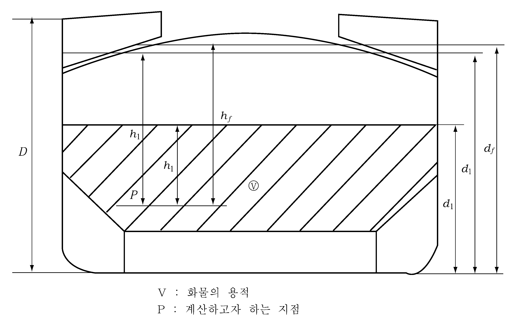
  **그림 7.1.24**
  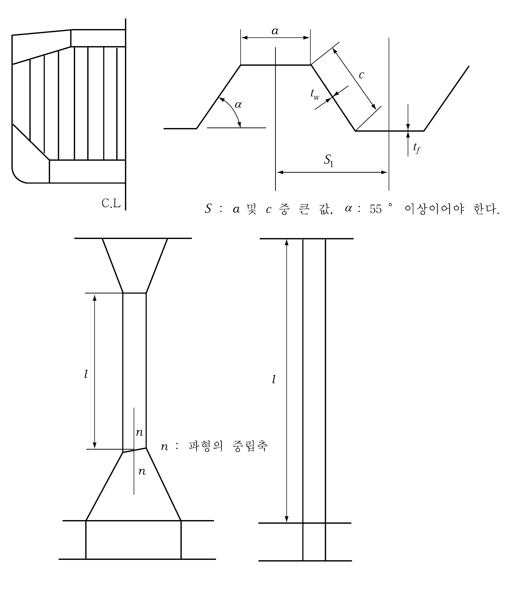
  **그림 7.1.25 S 의 값** 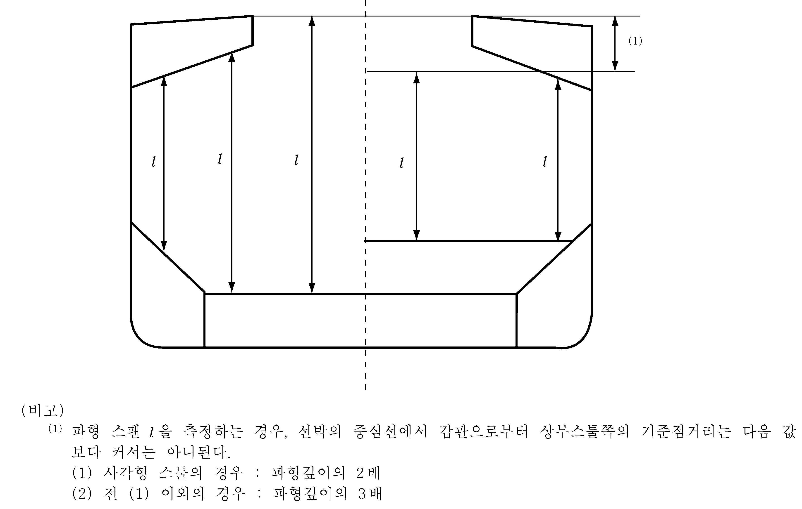
  **그림 7.1.26**

### 제 5 절 화물구역의 격벽

#### 502. 격벽판의 두께

**규칙 502.**의 **2**항에 규정한 종격벽의 최상부 및 최하부의 격벽판의 두께는 **그림 7.1.27**에 따라 테이퍼를 줄 수 있다. 다만, **규칙 502.**의 **1**항 및 **3**항에 규정하는 두께 이상이어야 한다. **【규칙 참조】**

#### 504. 강력한 수직거더 【규칙 참조】

- **1.** **횡격벽의 중심선 수직거더 규칙 504.**의 규정에 있어서 $d_l$, $d_u$ 는 격벽의 반대측에 브래킷이 있는 경우 그 브래킷의 깊이를 더한 것으로 한다.
- **2.** **격 벽붙이 거더의 단부고착**
  격벽의 거더와 같이 단면2차모멘트가 큰 부재와 종늑골과 같이 단면2차모멘트가 적은 부재와의 접합부는 **그림 7.1.28**와 같이 한다.
  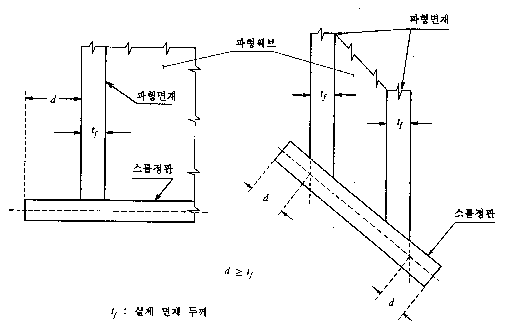
  **그림 7.1.27 종격벽의 최상부 및 최하부 두께의 테이퍼** 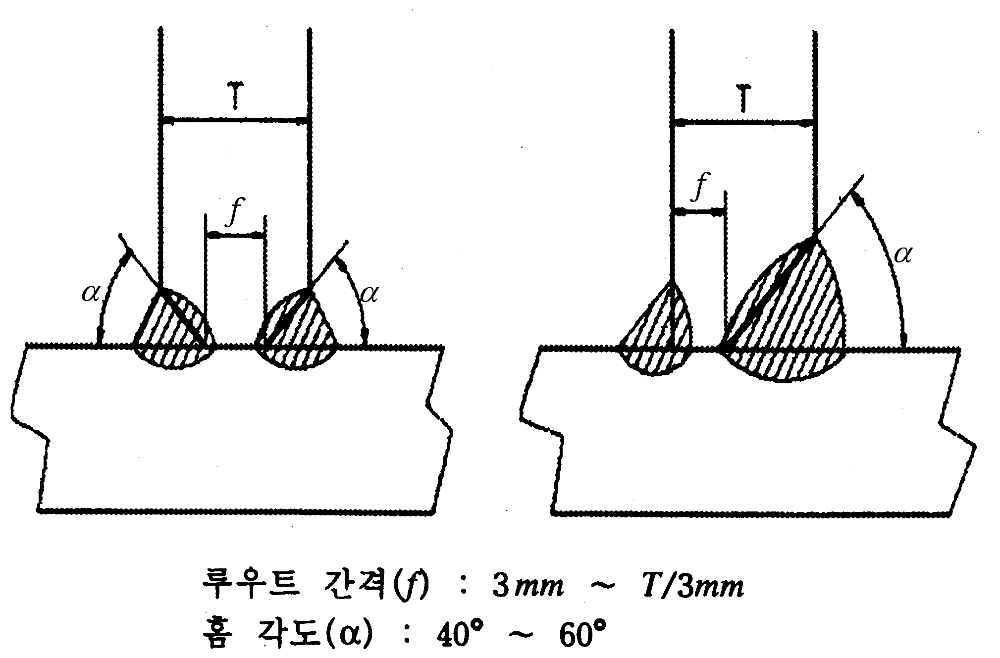
  **그림 7.1.28**

#### 506. 수직거더를 지지하는 수평거더 【규칙 참조】

거더와 종늑골 등의 접합부는 **504.**의 **2**항에 따른다.

#### 511. 제수격벽 【규칙 참조】

- **1.** 중심선 제수격벽의 최상부 및 최하부 판의 너비 및 두께는 유밀 종격벽의 최상부 및 최하부 판에 대한 규정값의 90 %로 할 수 있다.
- **2.** 개구율이란 슬롯 및 스캘럽을 제외하고 기타 개구면적의 합과 그 격벽의 면적과의 비를 말한다.
- **3.** 휨보강재의 단면계수 $Z$ 는 다음 식에 의한 값으로 한다.
  $Z = C S h_s l^2 \mathrm{cm^3 }$
  $S$ : 휨보강재의 간격 ($\mathrm{m}$).
  $l$ : 휨보강재의 지지점 사이의 전길이 ($\mathrm{m}$).
  $C$ : 계수로서 다음에 따른다.
  휨보강재의 양단을 유효한 브래킷 고착으로 하는 경우 7.1
  휨보강재의 일단을 유효한 브래킷 고착으로 하고 타단을 보강거더로서 지지하는 경우 8.4
  휨보강재의 양단을 보강거더로서 지지하는 경우 10.0
  $h_s$ : 다음 식에 따른다. 다만, 2.0 이상이어야 한다.
  $h_s = left( 0.176 - \frac{0.025}{100} L right) (1 - a ) l_t$
  $L$ : 선박의 길이 ($\mathrm{m}$).
  $a$ : 격벽판의 개구율.
  $l_t$ : 탱크의 길이 ($\mathrm{m}$).
- **4.** 종격벽 사이의 중앙에 설치하는 수직거더가 수평거더를 지지하는 강력한 거더인 경우에는 그 거더의 치수는 각각 다음 식에 의한 것으로 한다.
  - **(1)** 거더의 깊이
    $d = 3 left(l_\frac{1}{B_0} right)^2 d_0 \mathrm{m}$
    $l_1$, $B_0$ 및 $d_0$ : **규칙 504.**에서 규정하는 값.
  - **(2)** 하부브래킷의 내단에 있어서 거더의 단면적
    $A = 1.74 \frac{(D- h_1 )}{D} S(h - 0.32d)(l-S)C \mathrm{cm^2 }$
    $S$, $h$, $l$ 및 $C$ : **규칙 501.**에서 규정하는 값.
    $h_1$ : 용골 상면상 수직거더의 하부브래킷의 내단까지의 거리 ($\mathrm{m}$). 다만, 거더의 단면적은 수직거더의 위치에서 개구까지의 거리와 수직거더의 한쪽에서 갑판종늑골 간격의 2배중 작은 쪽 격벽판의 유효폭을 포함하는 것으로 한다.
  - **(3)** 하부브래킷의 내단에 있어서 거더의 웨브두께.
    $t = 12 K b + 2.5 \mathrm{mm}$
    $b$ : 웨브에 설치하는 수직휨보강재의 간격 ($\mathrm{mm}$).
    $K$ : 다음 식에 의한다.
    $K = \sqrt {\frac{A}{A_0}}$
    $A$ : 전호에서 규정하는 단면적 ($\mathrm{cm}^2$).
    $A_0$ : 수직거더의 단면적 ($\mathrm{cm}^2$).
  - **(4)** 거더의 단면계수
    $Z = 4 k^2 B_0 h_s l_1^2 \mathrm{cm^3 }$
    $k$, $B_0$ 및 $l_1$ : 각각 **규칙 504.**의 (1)호에 의한 값.
    $h_s$ : **3**항에 의한 값.
- **5.** 수직거더 또는 수평거더를 지지하는 거더의 치수는 **규칙 506.**의 규정에 있어서 $W_i$ 의 식 중 $h$ 를 **3**항에서 규정하는 $h_s$ 로 바꾸어 정한 것 이상으로 한다.
- **6.** 휨보강재를 지지하는 거더는 **규칙 507.**의 식 중 $h$ 대신에 **3**항에서 규정하는 $h_s$ 로 하고 $X$ 를 0으로 하여 정한 것 이상으로 한다.
- **7.** 제수격벽이 선저트랜스버스, 갑판트랜스버스, 선측트랜스버스, 종격벽수직거더 및 크로스타이로 구성된 경우는 그들의 거더 및 크로스타이의 치수는 **규칙 402. 403.** 및 **405.**의 규정을 준용하여 정한다. 또한 이 경우 크로스타이 단면의 수직축에 대한 단면계수 $Z$ 는 다음 식에 의한 것 이상으로 한다.
  $Z = 7.13 d_0 h_s l^2 \mathrm{cm^3 }$
  $d_0$ : 크로스타이의 깊이 ($\mathrm{m}$).
  $l$ : 지지점 사이의 길이로서 현측탱크에서는 현측탱크의 너비, 중앙탱크에서는 종격벽사이 또는 중심선 수직거더와 종격벽사이의 거리 ($\mathrm{m}$). 다만, 면재의 단부에 트랜스버스의 웨브의 트리핑브래킷이 설치되어 있는 경우에는 트랜스버스의 면재 사이의 거리로 할 수 있다.
  $h_s$ : **3**항에 의한 값.

### 제 6 절 현측탱크의 상대변형

#### 601. 현측탱크의 상대변형 【규칙 참조】

- **1.** **한계치를 넘는 경우의 특별고려**
  동등효력이 있음을 증명할 수 있는 충분한 자료를 제출할 필요가 있다.
- **2.** **식 중의 평균두께**
  **규칙 601.**의 식 중 평균두께 $t$ 는 다음에 따른다.
  $t = \frac{smallsuml_i t_i}{smallsuml_i}$
  $l_i$ 및 $t_i$ : 다음 각호의 규정에 따른다.
  - **(1)** 횡격벽 및 개구를 가진 제수격벽 : **그림 7.1.29**과 같이 탱크너비의 중앙에서 격벽판의 각 판의 두께 및 너비를 정한다.
  - **(2)** 트랜스버스 링 및 트랜스버스 링 형식의 제수격벽 : **그림 7.1.30**와 같이 탱크너비의 중앙에서 판두께 및 깊이방향의 길이를 정하며, 부재가 없는 경우에는 종격벽측에서 각각 정한다.
    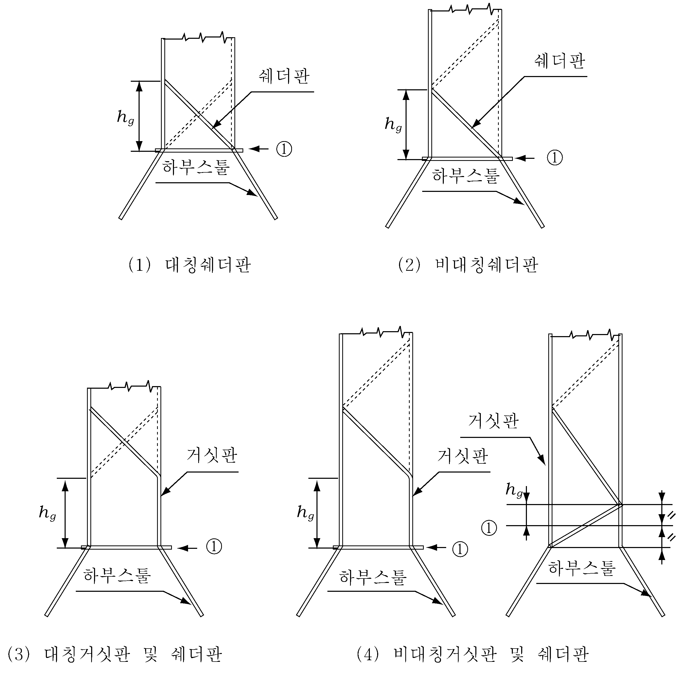
    **그림 7.1.29 그림 7.1.30**

### 제 10 절 유조선의 관장치 및 벤트장치

#### 1001. 일반사항 【규칙 참조】

- **1.** 화물유탱크의 하부에 화물유탱크로 사용하지 않는 이중저를 가지는 유조선에 대하여는 **규칙 10절**의 규정에 따르는 이외에 다음 각호의 규정에 만족하여야 한다.
  - **(1)** 이중저에 설치하는 공기관 및 측심관은 화물유탱크를 관통시킬 수 있다. 다만, 화물유탱크내의 관이음은 모두 용접이음으로 하고 **표 7.1.8**에 표시하는 두께 이상의 강관을 사용한다. 또한, 관의 팽창 수축을 흡수할 수 있도록 적절한 만곡관을 배치하는 등의 고려를 하여야 한다.
  - **(2)** 화물유탱크의 내저판 등 항상 액압이 걸리는 장소에는 밸브조작용의 스핀들을 관통시켜서는 안된다.
  - **(3)** 선수부의 탱크 또는 보이드 구역의 액체이송관 및 빌지흡입관은 다음에 의한다.

    **표 7.1.8 화물유탱크를 통과하는 측심관 또는 공기관**

    | **관의 호칭지름(**$\mathrm{mm}$**)** | **관두께** | **참고(1)** |
    | --- | --- | --- |
    | $A$ ＜ 100 | 8.7 | Sch. 160 |
    | 100 ≤ $A$ ＜ 200 | 11.1 | Sch. 120 |
    | 200 ≤ $A$ ＜ 250 | 12.7 | Sch. 80 |
    | 250 ≤ $A$ | 15.1 | Sch. 80 |
    | (비고) (1) *KSD* 3562 및 *KSD* 3570에 정하는 표준 |   |   |
    - **(가)** 화물유탱크의 전부에 인접하여 설치되는 탱크 또는 보이드 구역의 관장치는 후부의 펌프실에 유도할 수 있다. 또한 연료유 이송관은 기관실에 설치된 펌프에 유도할 수 있다.
    - **(나)** 화물유탱크에 인접하지 아니하는 선수부의 탱크 또는 보이드 구역의 관장치는 후부의 펌프실 또는 기관실에 설치된 펌프에 유도할 수 있다. 이 탱크가 평형수탱크일 경우의 평형수관장치는 화물유탱크에 인접한 평형수탱크의 관장치로 유도할 수 있다.
    - **(다)** 평형수관이 화물유탱크를 관통하지 않고 배관되어 있는 경우에는 화물유탱크에 인접하지 않는 선수부의 평형수탱크의 관장치를 화물유탱크에 인접하는 평형수탱크의 관장치에 유도할 수 있다. (빌지관에 대하여는 **규칙 1003.**의 **1**항 (3)호를 적용한다) 다만, 역으로 기관실에 설치된 화물유탱크에 인접하지 아니하는 평형수탱크용의 펌프에 화물유탱크에 인접하는 평형수탱크의 평형수관을 유도하여서는 안된다.

#### 1002. 화물유펌프, 화물유관장치, 화물유탱크내 배관 등

- **1.** **규칙 1002.**의 **1**항 (1)호 (나)에서 기밀을 기름윤활장치에 의하여 유지하고자 하는 경우에는 **6장 303.**의 **6**항을 적용한다. **【규칙 참조】**
- **2.** **규칙 1002.**의 **3**항 규정 중 󰡒우리 선급이 인정하는 전환장치󰡓라 함은 다음에 정하는 장치를 말한다.
  - **(1)** 화물유탱크겸 평형수탱크 **【규칙 참조】**
    한 개의 탱크를 화물유탱크와 평형수탱크로 겸용하는 경우, 화물유관, 평형수관 및 공기관은 **그림 7.1.31**의 예와 같이 각각의 경우에 사용하기 위하여 전환할 수 있도록 배치하여야 하며 기타의 관장치에 대해서는 화물유탱크의 관장치에 대한 요건에 따른다.
- **3.** **규칙 1002.**의 **4**항을 적용함에 있어 화물유관에 접속하는 관장치의 취급은 다음에 따른다. **【규칙 참조】**
  - **(1)** 화물유관에 접속하는 다른 관계통의 펌프 및 관장치는 화물유관 계통으로서 취급한다. 다만, **규칙 1002.**의 **2**항 (4)호, **9**항 (6)호, **1003.**의 **1**항 (2)호, **2**항 (2)호, **8편 부록 8-5**의 **2**항 (10) (사) 및 다음 (2)호에 규정하는 관장치에 대해서는 그러하지 아니한다. 또한, 화물유관에 접속하는 관장치라는 것은 화물유관에 접속하고 개구를 가지는 것을 말한다. 그러나 화물유 관장치 조작용의 유압관 등은 여기서 말하는 화물유관에 접속하는 관장치로 보지 아니한다.
  - **(2)** 화물유관에 화물유관 이외의 관장치를 접속하는 경우
    a) 통풍기로부터 통풍관에는 자동으로 작동되는 차단밸브 및 나사조임 체크밸브가 연속하여 설치되어야 한다.
    b) 상기 a)항의 밸브는 통풍용관이 안전구역을 지나가는 격벽에 위치하여야 하며 최소한 나사조임 체크밸브는 안전구역 외부에 위치하여야 한다.
    c) 차단밸브는 통풍기가 시동된 후에 열려야 하며, 통풍기가 정지한 후에는 자동으로 닫혀야 한다. 통풍기 및 밸브의 조작에 대한 절차가 조작 장소 근처에 게시되어야 한다.
    d) 통풍기의 흡입은 통풍기가 설치된 구역 외부의 안전한 장소(예, 개방 갑판)로부터 유도되어야 한다.
    e) 통풍기는 스파크가 발생하지 않는 형식이어야 한다.
    - **(가)** 탱크 통풍용관 : 탱크 통풍용관과 화물유관이 접속하는 경우에는 **8편 부록 8-5**의 **2** (10) (사) 및 (아)의 규정에 따른다. 또한 통풍기는 불활성가스 송풍기를 제외하고 위험구역에 설치한다. 통풍기가 폐위된 안전구역에 설치되는 경우에는 다음에 만족하여야 한다.
    - **(나)** 화물유관장치(펌프를 포함)의 압력계측용관 : 화물유관내의 액체압력을 계측하기 위하여 관내의 액체를 직접 압력지시계로 유도하는 경우에는 이 압력지시계는 펌프실 또는 노출갑판상에 설치한다. 다만, 화물유관장치와의 접속부에 스톱밸브를 설치하고 기관실과 펌프실 사이의 격벽을 관통하는 곳에 격벽붙이 스톱밸브를 설치하는 경우에는 이 압력지시계를 기관실에 설치할 수 있다.
    - **(다)** 유분농도 계측용관 : 유분농도 계측용 시료관을 화물유관장치에 접속하는 경우는 호칭지름 25$A$ 이내의 관으로서 화물유관장치와 비위험구역위벽과의 사이에 2개 이상의 스톱밸브를 설치하는 경우 이 관을 비위험구역내에 유도할 수 있다.
- **4.** **규칙 1002.**의 **4**항 (5)호를 적용함에 있어, 선주의 요구가 있는 경우, 화물유관 및 관련 밸브 제어용 관이 이중저 상부에 위치해 있는 선박은 **PCP**(화물유관 보호) 부기부호를 부여 받을 수 있다. 이는 또한 관터널 또는 덕트킬 내에 설치된 화물유관 및 관련 밸브 제어용 관에도 적용한다. *(2024)* **【규칙 참조】**
- **5.** **화물유관의 격벽밸브**
  **규칙 1002.**의 **5**항을 적용함에 있어 화물유관의 격벽밸브에 대하여는 다음 각호의 규정에 따른다. **【규칙 참조】**
  - **(1)** 격벽밸브의 배치 및 종류는 **표 7.1.9**에 따른다.
    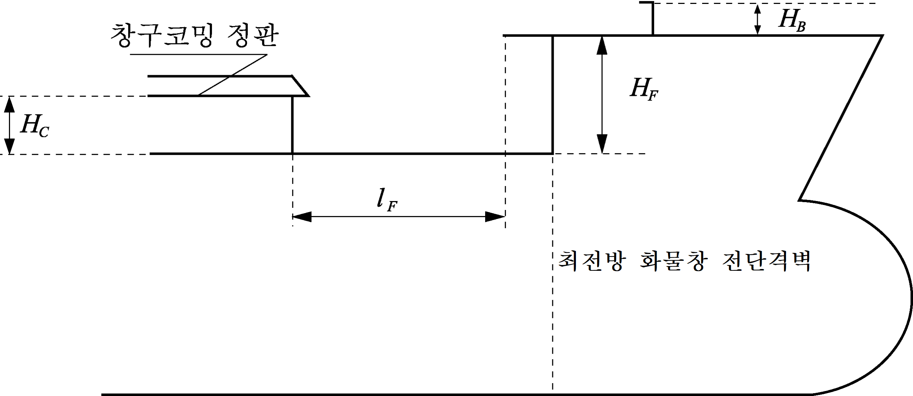
    **그림 7.1.31 화물유겸 밸러스트탱크의 배관 예**
    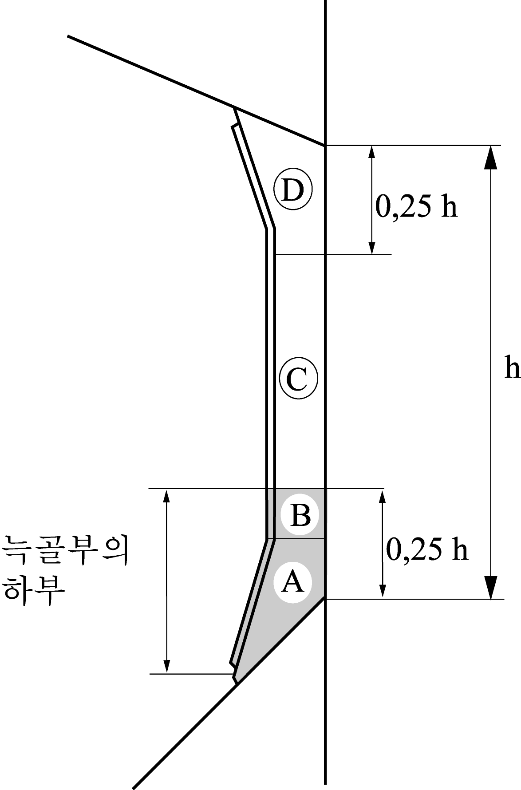
    **표 7.1.9 격벽밸브의 배치 및 종류**
- **6.** **규칙 1002.**의 **7**항을 적용함에 있어서 화물유탱크내의 배관은 다음 각호의 규정에 따른다. **【규칙 참조】**
  - **(1)** 계측장치용관 및 원격제어용관
    화물유탱크내에 설치된 계측장치용관 및 원격제어용관의 최소두께는 강관으로 Sch. 80 이상이어야 한다. 다만, 화물유탱크내에 개구를 가진 경우는 이를 적용하지 아니한다.
  - **(2)** 위생수관, 배수관
    노출갑판의 배수관은 화물유탱크내를 관통할 수 있다. 이 경우 화물유탱크내의 관이음은 모두 용접으로 하고 관두께는 16 $\mathrm{mm}$ 이상으로 한다. 다만, 지름이 작은 관에 대해서는 적절히 참작할 수 있다. 또한, 거주구 등 발화원이 있는 구획의 배수관 또는 위생수관은 화물유탱크내를 관통하여서는 안된다. 한편 호칭지름이 100$A$ 이하인 경우에는 *KSD* 3570에 정하는 Sch. 160을 사용할 수 있다.
  - **(3)** 화물유탱크를 관통하는 선외배출관(빌지 또는 평형수관)
    화물유탱크를 관통하여 선외배출관을 설치할 경우의 취급은 다음에 따른다.
    - **(가)** 비교적 소용량의 화물유탱크(슬롭탱크 등)에 대해서만 이 배관을 인정한다.
    - **(나)** 화물유탱크내의 관은 두께 16 $\mathrm{mm}$ 이상으로 하고 모든 이음은 용접이음으로 한다. 주강제 관을 사용할 경우는 관두께를 15 $\mathrm{mm}$ 이상으로 할 수 있다.
    - **(다)** 관은 적절히 굽혀서 배관하여 팽창수축에 견디도록 한다.
    - **(라)** 관의 내면에는 내식성이 좋은 도료를 도장한다. 다만, 전 (나)의 주강제 관을 사용할 경우는 내면 도장을 생략할 수 있다.
    - **(마)** 관은 선박의 진동에 견디도록 견고하게 지지하고 취항후 보수점검을 충분히 행할 수 있도록 배관한다. 또한 외판 및 격벽판의 관통부의 구조, 공작에 대해서는 특별히 신중을 기한다.
    - **(바)** 화물유탱크내에는 그 관의 밸브를 설치하여서는 안된다.
- **7.** **규칙 1002.**의 **8**항을 적용함에 있어 화물유탱크내의 측심장치에 대하여는 다음 각호의 규정에 따른다. **【규칙 참조】**
  - **(1)** 화물유탱크의 얼리지(ullage) 계측은 탱크의 창구덮개를 열지 않고 행할 수 있는 장치이어야 한다.
  - **(2)** 측심관을 설치하는 경우 그의 개구단은 노출갑판에 설치하고 또한 관두에는 지시장치가 붙은 차단밸브 또는 콕을 설치하여야 한다.
  - **(3)** 액면지시장치는 우리 선급이 별도로 정하는 「**제조법 및 형식승인 등에 관한 지침**」에 따라 승인된 것이어야 한다.
  - **(4)** 고정식 불활성 가스장치를 설치한 유조선의 화물유탱크에 설치하는 액면지시장치는 밀폐식으로 고정식일 것.

#### 1003. 화물유펌프실, 코퍼댐 및 화물유탱크에 인접한 탱크의 관장치

- **1.** **규칙 1003.**의 **1**항 (4)호를 적용함에 있어 측심관의 개구단은 펌프실내에 설치할 수 있다. 다만, 이 개구단의 위치가 격벽갑판보다 낮은 경우에는 **규칙 5편 6장 203.**의 **2**항 (2)호의 규정에 따른다. **【규칙 참조】**
- **2.** **규칙 1003.**의 **2**항 (2)호의 규정을 적용함에 있어 평형수탱크용 평형수관장치의 취급은 다음에 따른다. **【규칙 참조】**
  - **(1)** 화물유탱크에 인접하지 않아 가스안전구역으로 정의된 평형수탱크는 가스안전구역에 설치된 펌프로 주배수 되어야 한다. 다만, 배수전용관에 체크밸브를 설치하여 연결하는 것을 조건으로 위험구역에 설치된 펌프로 배수할 수 있다.
  - **(2)** 화물유탱크에 인접한 평형수탱크의 평형수를 화물유펌프로 흡입하는 경우에는 화물유관과의 접속부에 스풀피스(혹은 맹플랜지) 및 나사조임 체크밸브를 설치한다. 또한, 비상시 이외에는 스풀피스를 떼어내어 두도록 주의명판을 부착하여야 한다.
- **3.** **규칙 1003.**의 **2**항 (3)호의 규정을 적용함에 있어 화물유탱크에 인접하는 평형수탱크의 공기관은 다음 각호의 규정에 따른다. **【규칙 참조】**
  - **(1)** **규칙 1003.**의 **2**항 (3)호의 󰡒플레임스크린󰡓이란 다음에 적합한 것을 말한다.
    - **(가)** 내식성 재료로 제조된 것일 것.
    - **(나)** 30 × 30 메시의 내식성 와이어로 된 스크린 1매 또는 20 × 20 메시의 내식성 와이어로 된 스크린을 25.4 ± 12.7 $\mathrm{mm}$의 간격으로 2매 부착한 것 혹은 이와 동등 이상의 성능을 갖는 것일 것.
  - **(2)** 화물유탱크에 인접하는 평형수탱크에 고위액면 경보장치 또는 **규칙 202.**의 규정에 따른 창구를 설치한 경우의 공기관의 합계 단면적은 **규칙 5편 6장 201.**의 **4**항 (1)호의 규정에 따른 단면적 또는 1,000 $\mathrm{cm} ^{2}$ 중 적은 값 이상으로 한다.
- **4.** **규칙 1003.**의 **2**항 (4)호의 규정을 적용함에 있어 화물유탱크에 인접하는 평형수탱크의 측심관의 개구단에 대해서는 **1003.**의 **1**항에 따른다. **【규칙 참조】**
- **5.** **규칙 1003.**의 **4**항을 적용함에 있어 화물유탱크에 인접하는 연료유탱크의 측심관의 개구단에 대하여도 **1003.**의 **1**항에 따른다. **【규칙 참조】**

#### 1005. 화물유탱크에 인접하는 코퍼댐의 벤트장치 【규칙 참조】

**규칙 1005.**의 규정 중 “플레임스크린”이란 **1003.**의 **4**항 (1)호에 정한 것을 말한다.

#### 1006. 기관구역, 갑판실 등의 개구 및 전기설비 등의 설치 위치 【규칙 참조】

선미에 화물유 관장치를 설치하는 경우에는 그 대기 개구단으로부터 3 $\mathrm{m}$ 이내는 위험구역으로 간주한다.

#### 1007. 인화점이 60 °C를 넘는 기름만을 운송하는 선박

**규칙 1007.**의 **6**항을 적용함에 있어서 통풍장치는 환기횟수를 6회까지 감할 수 있으며,󰡒불꽃을 발생하지 아니하는 구조󰡓가 아니어도 좋다. **【규칙 참조】**

### 제 11 절 유조선의 전기설비

#### 1101. 일반 【규칙 참조】

- **1.** **규칙 1101.**의 **2**항 중 “반폐위구역”이라 함은 갑판 및 격벽으로 가로막아 통풍상태가 노출부와 현저히 다른 장소를 말한다.
- **2.** 소형선에서 선수루 갑판의 일부가 **규칙 1101.**의 **2**항 (1)호 (나) (k) 및 (다) (e)에 의해 위험구역에 해당될 경우 부득이 그 장소에 방폭형 이외의 기기를 설치할 때에는 다음에 따라야 한다.
  - **(1)** 선수루 갑판상에 강제의 가스방벽을 설치할 것.
  - **(2)** 가스방벽의 높이는 상갑판상 2.4 $\mathrm{m}$ 이상으로서 너비는 가스방벽을 설치한 장소에서 선수루 갑판과 거의 같은 너비로 한다.
  - **(3)** 가스방벽에는 개구를 설치하지 말 것.
  - **(4)** 전기기기는 적어도 전폐 방수형으로 할 것.
- **3.** **규칙 1101.**의 **2**항 위험구역의 예는 다음과 같다.
  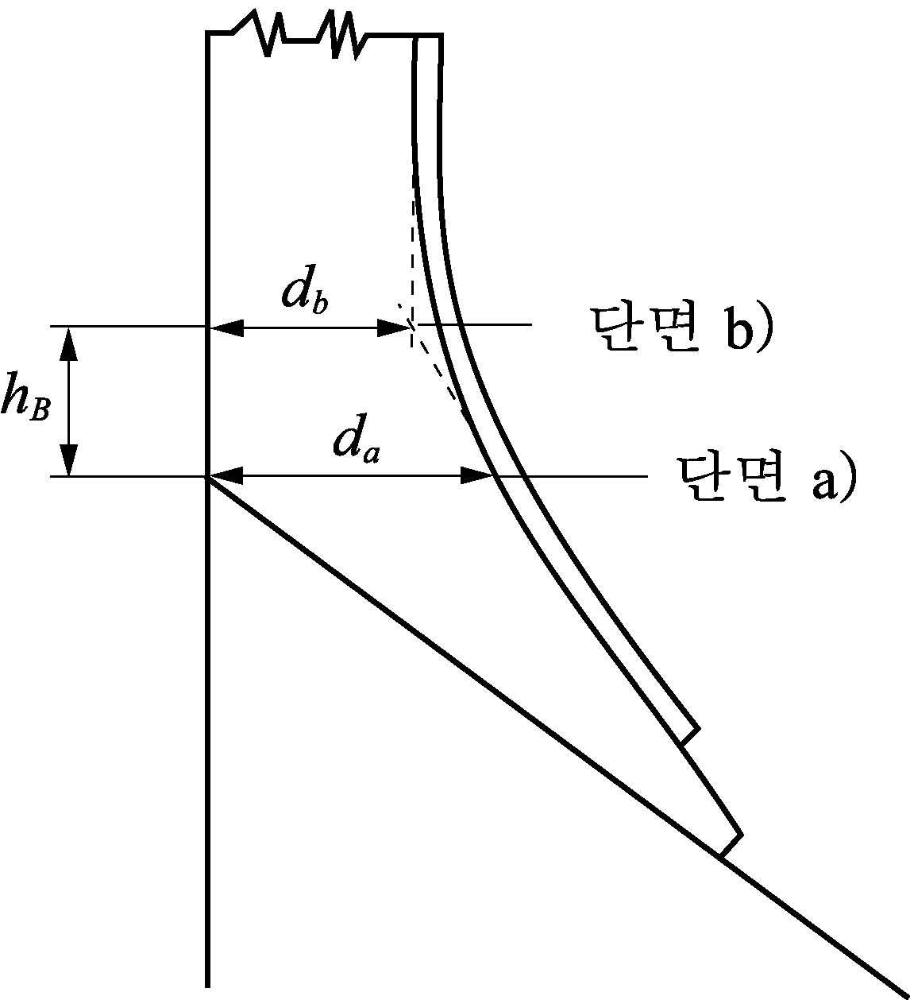
  **그림 7.1.33 위험구역의 분류 기호** 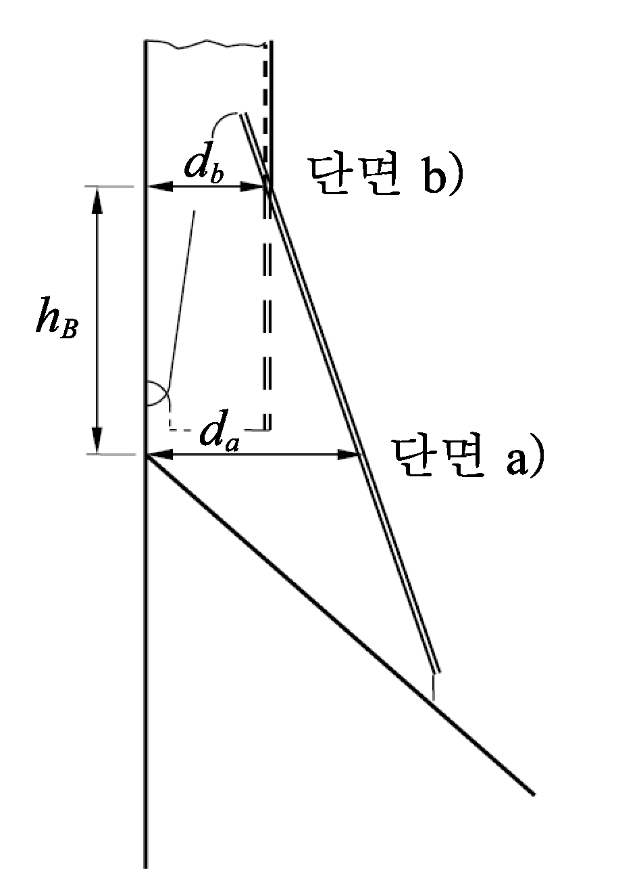
  **그림 7.1.34 (1) (가) 구역 “0”의 예**
  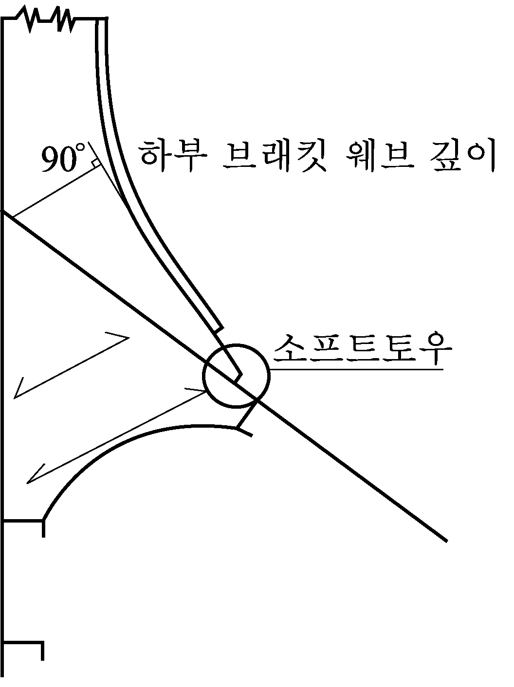
  **그림 7.1.35 (1) (나) 구역 “1” (a)의 예** 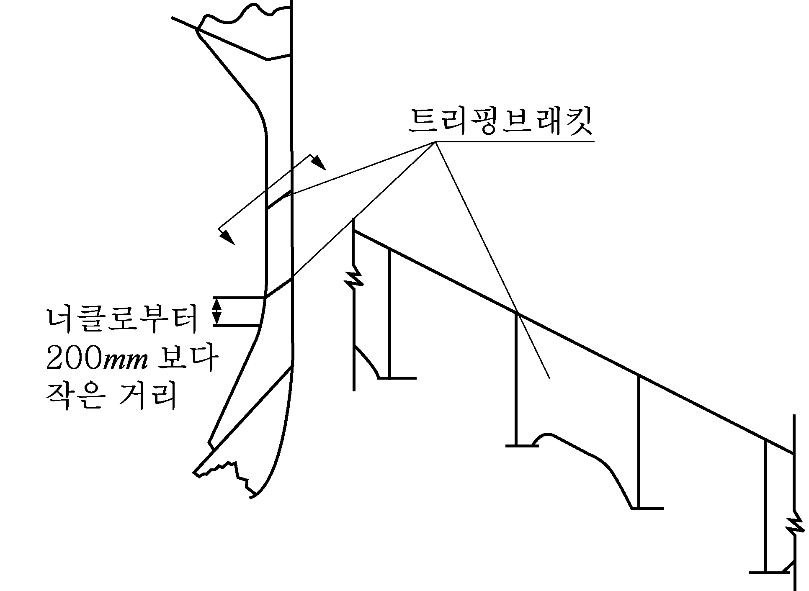
  **그림 7.1.36 (1) (나) 구역 “1” (b)의 예**
  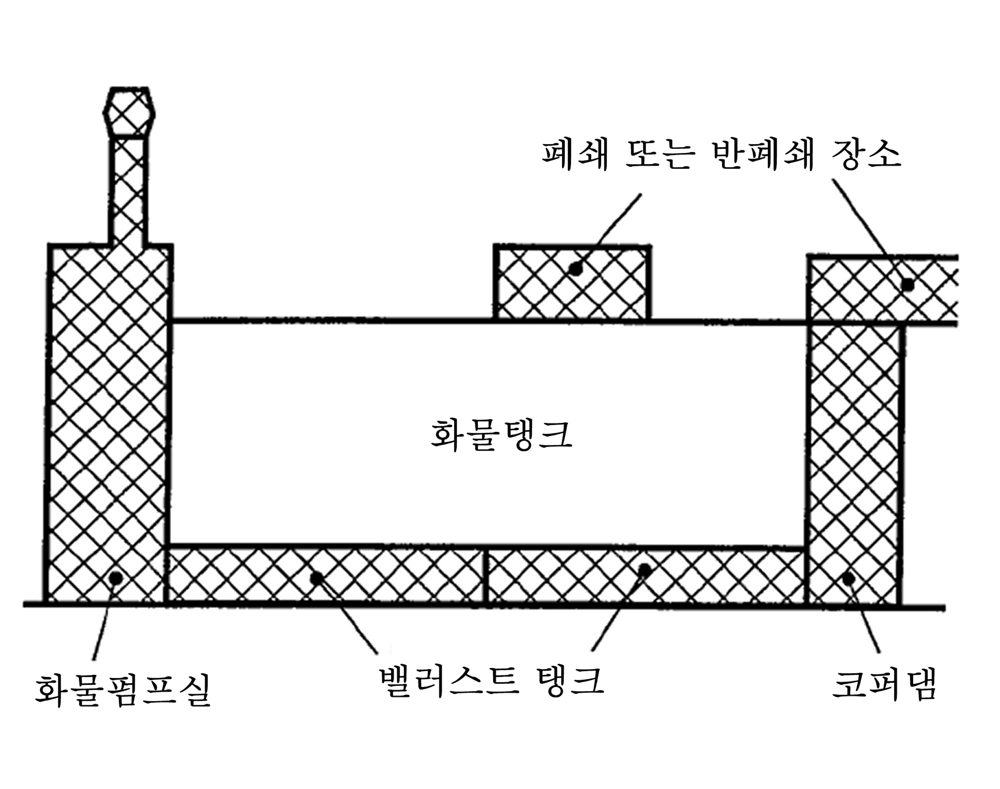
  **그림 7.1.37 (1) (나) 구역 “1” (c) ∼ (f) 의 예** 
  **그림 7.1.38 (1) (나) 구역 “1” (g)의 예**
  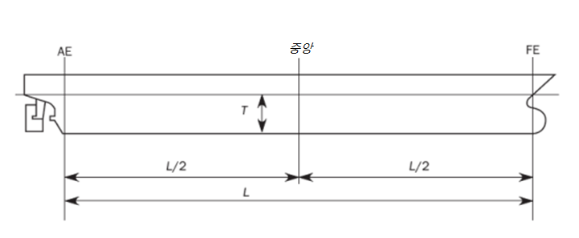
  **그림 7.1.39 (1) (나) 구역 “1” (h) ∼ (j)의 예** 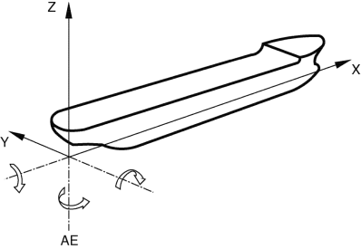
  **그림 7.1.40 (1) (나) 구역 "1" (k) ∼ (m)의 예**
  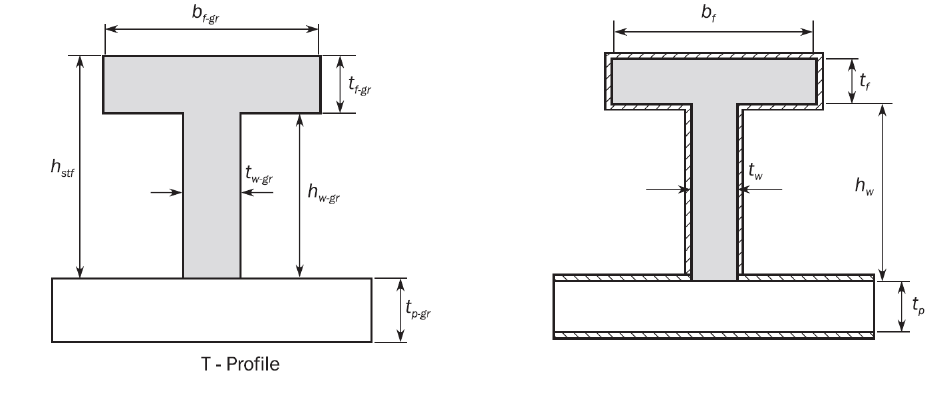
  **그림 7.1.42 (1) (다) 구역 “2” (b),(d),(e)의 예**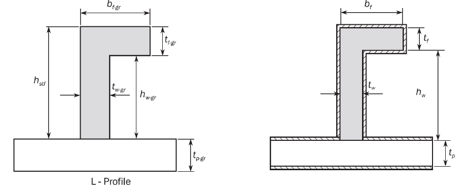
  **그림 7.1.41 (1) (다) 구역 “2” (a)의 예**
  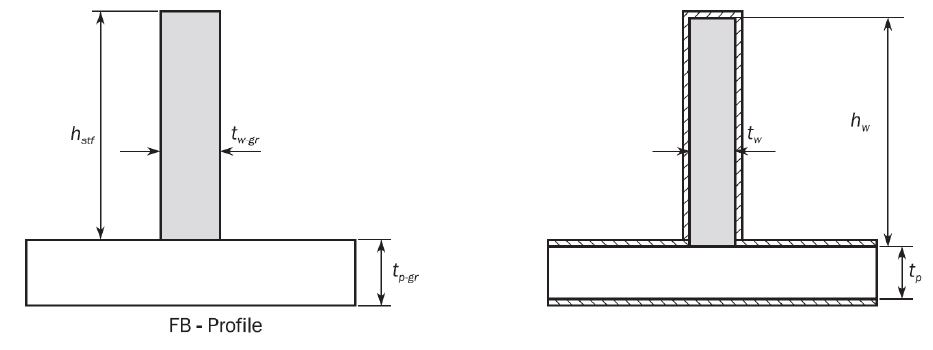
  **그림 7.1.43 (1) (다) 구역 “2” (f)의 예** 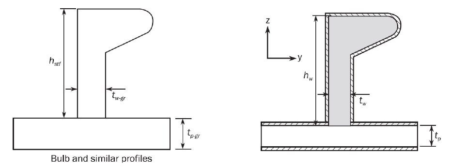
  **그림 7.1.44 (2) (나) 구역 “2” (a) ∼ (d)의 예**
- **4.** **규칙 1101.**의 **3**항 (2)호 (라)의 규정은 다음과 같은 회로에 적용한다. **【규칙 참조】**
  - **(1)** 무선잡음 방지용 콘덴서 회로
  - **(2)** 본질 안전회로를 구성하는 것에 필요한 접지회로
  - **(3)** 주기계실 등 특정한 안정구역에만 포설된 3,000 $V$ 이상의 고압 3상 배전회로의 중심점 회로

#### 1103. 위험장소의 전기설비 【규칙 참조】

- **1.** 위험구역에 설치된 방폭형 기기는 (**KS C**) **IEC** 60079에 규정된 가스증기그룹 IIB, 온도등급 T3으로 분류된 폭발성 혼합기체중에 사용할 수 있는 것 또는 이것과 동등 이상으로 할 수 있다.
- **2.** **규칙 1103.**의 **3**항에 추가하여 다음의 요건을 만족하여야 한다.
  - **(1)** (2) 및 (3)호에 있어서 화물유탱크는 화물유탱크에 인접한 탱크를 포함한다.
  - **(2)** 애노드의 높이는 탱크의 바닥에서 애노드의 중심까지 측정하고 그 무게는 부착된 애노드와 부착장치 및 개재물을 포함시킨 것으로 한다. 그러나 알루미늄 애노드가 폭 1 $\mathrm{m}$ 이상의 격벽 거더 및 스트링거와 같은 수평면상에 위치하며 수평면상 75 $\mathrm{mm}$ 이상 돌출된 직립 플랜지 또는 페이스 플랫으로 부착되는 경우, 애노드의 높이는 그 수평면으로부터 측정한다.

#### 1104. 정전기 제어를 위한 화물유탱크, 처리설비 및 관장치의 연결과 접지 【규칙 참조】

- **1.** **규칙 1104.**의 **1**, **2**항을 적용함에 있어 접지접속도체가 제공되지 않은 경우에는 해당 개소의 접지 저항을 측정해 그 값이 1 MΩ이하인 것을 확인하여야 한다. 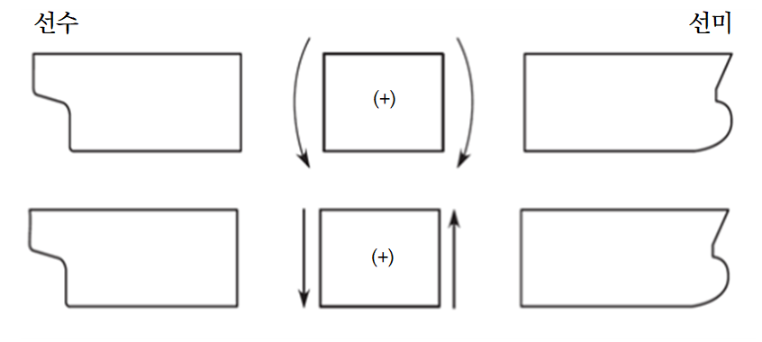
