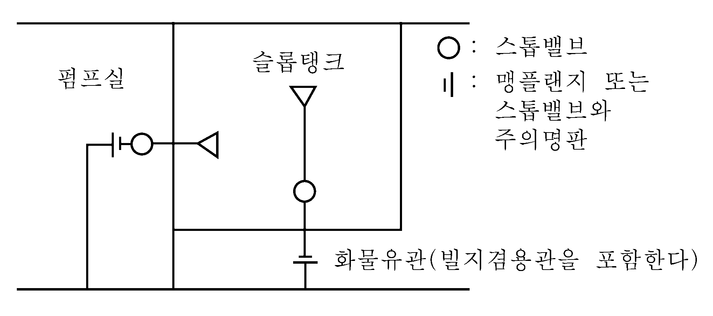

# 제7편 전용선박(1장~4장,7장~10장)

> 선급 및 강선규칙/적용지침 / RA-07A-K / 2025 / KO / Guidance

## 제 2 장 광석운반선

### 제 1 절 일반사항

#### 101. 적용 【규칙 참조】

- **1.** 실적경험이 없는 선박의 경우, 선수미 화물창의 구조 및 치수는 직접강도계산에 의하여 결정한다.
- **2.** **규칙**의 강도 검토시에 사용된 그랩의 최대 무게 [X]톤에 따라 특기사항부호 GRAB [X]를 부여한다.
- **3.** **규칙 101.**의 **4**항에서 “우리 선급이 적절하다고 인정하는 바”라 함은 **규칙 3편 1장 206.**의 직접강도계산에 의한 방법에 따르거나 **규칙 1편 1장 105.**에 따라 인정하는 것을 말한다.

### 제 3 절 현측탱크 또는 보이드 구역

#### 304. 거더 【규칙 참조】

- **1.** 전용 평형수탱크 이외의 탱크 및 구역내에서의 트랜스버스 및 제수격벽 판두께를 1 $\mathrm{mm}$ 감한 것으로 할 수 있다. 다만, **규칙 301.**을 적용하는 경우는 예외로 한다.
- **2.** 현측탱크 또는 보이드 구역 내 트랜스버스 $l$($l _{0}$, $l _{1}$ 및 $l _{2}$)의 측정해당 웨브와 인접하는 웨브가 서로 직교하지 않는 경우, $l$은 **그림 7.2.13**에 따른다.
- **3.** 트랜스버스 및 스트럿의 구조상세는 다음의 (1)호에서 (3)호까지에 따른다.
  - **(1)** 일반사항
    
    **그림 7.2.13** #eqnID-251 **의 측정방법**
    
    **그림 7.2.14 경감구멍의 위치와 크기**

    **표 7.2.9 보강범위**

    | **부재** | **보강범위** |
    | --- | --- |
    | 선저 트랜스버스 | 결합부 전부 |
    | 선측 트랜스버스 | 상부 크로스타이의 상부 $R$ 이 끝나는 곳 또는 만재흘수선중 높은 곳에서부터 하방의 결합부 전부. 다만 $L$ 이 300 $\mathrm{m}$ 이상인 경우는 상기의 상방까지도 이에 준하여 보강할 것을 권장한다. |
    | 종격벽 트랜스버스 | 상부 크로스타이의 상부 $R$ 이 끝나는 곳 이하의 결합부 전부 |
    - **(가)** 경감구멍을 시공하는 경우 그 크기 및 위치는 **그림 7.2.14**와 같이 한다.
    - **(나)** 종통재의 면재가 맞닿는 개소와 빌지부 등과 같이 슬롯의 간격이 좁은 경우는 슬롯에 칼라를 설치한다.
    - **(다)** 거더의 깊이가 규정의 깊이보다 작은 경우에는 거더의 단면계수는 규정의 단면계수에 규칙에서 정하는 거더의 깊이와 실제 거더의 깊이와의 비를 곱하여 구한다.
    - **(라)** 펌프실 또는 보이드 구역의 웨브두께는 디프탱크내의 웨브로서 계산된 두께에서 1 $\mathrm{mm}$ 를 감한 값으로 할 수 있다.
    - **(마)** 거더판 상호간의 이음은 맞댐이음으로 할 필요가 있다. 겹이음으로 하는 경우는 이음에 교차하는 휨보강재를 설치할 필요가 있다.
    - **(바)** 트랜스버스 단부의 브래킷 부분, 크로스타이와의 결합부 등 전단응력이 높은 위치 및 압축응력이 높다고 생각되는 부분에는 휨보강재를 증설할 필요가 있으며 또한 해당부분에는 경감구멍을 시공하여서는 안된다. 필요하다면 그 부분에는 종통재 관통부의 슬롯에 칼라를 설치할 필요가 있다. 스트럿과 종통재 사이의 연결부는 강도의 연속성을 충분히 고려하여야 한다. (예, 트랜스버스 양단에는 브래킷이 제공되어야 한다.) *(2019)*
    - **(사)** 트랜스버스 면재의 이음부분 및 거더판의 이음부분에는 거더판에 스캘럽(Scallop)을 설치하여서는 안된다. 공작상 필요한 스캘럽은 용접으로 메운다. 또한 인접하는 면재는 그 치수의 급격한 변화를 피한다. (**그림 7.2.15** 참조)
    - **(아)** 종늑골 및 트랜스버스의 모서리부의 곡률은 가능한 한 크게 한다.
    - **(자)** 트랜스버스 등에 설치하는 휨보강재를 평강 대신에 산형강을 사용하는 경우는 판붙이의 단면2차모멘트를 규정과 동등한 정도로 한다.
    - **(차)** 대형선의 선저 트랜스버스, 선측 트랜스버스, 종격벽 트랜스버스와 종늑골과의 결합부에는 각각 **표 7.2.9**의 범위에 대하여 트랜스버스 휨보강재의 반대쪽에 브래킷을 설치하여 트랜스버스와 종늑골을 고착하든지 또는 슬롯에 칼라를 설치하는 등 적절히 보강한다. 다만, $L$ 이 230 $\mathrm{m}$ 이하인 경우에는 그 보강 범위를 적절히 참작할 수 있다. 또한 이 보강은 상기 트랜스버스류와 유사한 상황에 있는 슬롯(예를 들면 횡제수격벽 등의 슬롯)에 대하여도 이를 준용한다.
  - **(2)** 늑판 위치에서의 내저판과 종격벽판과의 교차부의 구조 (built-up 구조)는 다음의 (가) 및 (나)에 따른다.

    |  **그림 7.2.15** **그림 7.2.15** |  **그림 7.2.16** **그림 7.2.16** |
    | --- | --- |
    - **(가)** 현측탱크 트랜스버스 교차부의 스캘럽은 메우든지 또는 칼라판으로 막을 것 (**그림 7.2.16** 참조)
    - **(나)** 현측탱크 트랜스버스에는 내저판의 연장선상에 거싯판을 설치할 것 (**그림 7.2.16** 참조)

### 제 5 절 현측탱크의 상대변형

#### 501. 현측탱크의 상대변형 【규칙 참조】

- **1.** 종격벽이 경사진 경우에는 **그림 7.2.17**과 같이 사선부의 면적이 서로 같게 되도록 한다.
  
  **그림 7.2.17**
- **2.** 상대변형의 값이 규칙에 의한 한계치를 초과할 경우의 특별고려 및 평균 판두께의 결정방법은 다음의 (1) 및 (2)에 따른다.
  - **(1)** 한계치를 넘는 경우의 특별고려
    동등효력이 있음을 증명할 수 있는 충분한 자료를 제출할 필요가 있다.
  - **(2)** 식 중의 평균두께
    **규칙 501.**의 식 중 평균두께 $t$ 는 다음에 따른다.
    $t = \frac{smallsuml_i t_i}{smallsuml_i}$
    $l_i$ 및 $t_i$ : 다음 각호의 규정에 따른다.
    
    **그림 7.2.18**
    **그림 7.2.19**
    - **(가)** 횡격벽 및 개구를 가진 제수격벽 : **그림 7.2.18**과 같이 탱크너비의 중앙에서 격벽판의 각 판의 두께 및 너비를 정한다.
    - **(나)** 트랜스버스 링 및 트랜스버스 링 형식의 제수격벽 : **그림 7.2.19**와 같이 탱크너비의 중앙에서 판두께 및 깊이방향의 길이를 정하며, 부재가 없는 경우에는 종격벽측에서 각각 정한다.

### 제 7 절 광석운반선 겸 유조선

#### 701. 일반사항 【규칙 참조】

- **1.** **일반사항**
  광석운반선 겸 유조선의 구조, 배치 및 의장에 대하여는 **규칙 701.**의 **2**항 규정 이외에 다음에 따른다.
  - **(1)** 관장치에 대하여는 다음 **3**항에 따른다.
  - **(2)** 광석창 겸 화물유 탱크의 길이는 **3편 15장 103.**의 **1**항에 따른다.
  - **(3)** 인화점이 60°C 이하의 기름을 운송하는 화물유 탱크(광석겸용 화물유 탱크 포함)와 인화점이 60°C 이하의 기름을 운송하기 위한 구조 및 설비를 가지지 아니하는 구획과의 사이의 격벽 및 갑판에는 하역을 위한 어떠한 개구도 설치하여서는 안된다.
  - **(4)** 광석운반선으로 사용할 때에는 슬롭탱크를 제외한 모든 탱크는 가스를 제거한 상태로 한다.
  - **(5)** 화물유 탱크의 청소 및 가스제거장치, 소요시간 등에 대한 계획서를 참고용으로 우리 선급에 제출할 필요가 있다.
  - **(6)** 광석운반선겸 유조선의 도면승인시는 유조선으로부터 광석운반선 및 광선운반선으로부터 유조선으로 사용목적을 변경할 때의 공사 및 작업에 대한 주의사항을 본선에 제공하고 그 사본을 우리 선급에 제출할 필요가 있다.
- **2.** **펌프실 구조**
  - **(1)** 광석운반선겸 유조선의 펌프실 선저구조는 구조부재의 연속성에 특별히 주의하여야 한다.
    높이 : 화물창내 이중저와 같은 높이
    두께 : 화물창내 중심선 거더와 같은 두께
    수 : $b$≤15 $\mathrm{m}$ 일 때 ----- 한쪽 현 2조
    $b$＞15 $\mathrm{m}$ 일 때 ----- 한쪽 현 3조
    두께 : 중심선 거더와 같은 두께
    높이 : 기관실 이중저의 높이 이상, 가능한 한 높게 할 것을 권장한다.
    거더의 면재의 합계단면적(종격벽상의 수평거더의 전단면적을 포함하여도 좋다)은 화물창내 내저판의 단면적의 35 % 이상으로 한다.
    선저종늑골의 단면계수 $Z$ 는 **규칙 1장 302.**에서 규정된 선저종늑골에 10 $\%$ 증가한 것으로 한다. 다만 다음 식에 의한 것 이상이어야 한다.
    $Z = 290 d S \mathrm{cm^3 }$
    $d$ : 흘수 ($\mathrm{m}$).
    $S$ : 종늑골의 간격 ($\mathrm{m}$).
    펌프실 위치의 선저외판을 규정에 의한 두께(테이퍼를 포함) 보다 2 $\mathrm{mm}$ 증가시킨 경우에는 상기 (다)의 측거더를 1조 생략할 수 있다.
    - **(가)** 화물창내 종격벽을 가능한 한 후방으로 연장한다. 종격벽상에 화물창내 내저판과 같은 위치에 수평거더를 설치한다. 이 거더의 두께는 내저판과 같은 두께로 한다.
    - **(나)** 중심선 거더
    - **(다)** 측거더
    - **(라)** 거더 면재의 단면적
    - **(마)** 선저종늑골
    - **(바)** 측거더의 생략
    - **(사)** 펌프실 위치의 강력갑판에 고장력강을 사용하는 경우에는 그곳의 갑판단면적을 규정에 의한 단면적보다 약간 증가시킬 필요가 있다.
- **3.** **관장치**
  - **(1)** 적용
    이 규정은 기름 및 고체화물을 교대로 적재하여 산적운송하고자 하는 선박의 관장치 및 벤트장치에 대하여 적용한다.
  - **(2)** 용어의 정의
    - **(가)** 겸용선 : **규칙 701.**의 **1**항에서 규정하는 광석운반선겸 유조선 및 **규칙 3장 801.**의 **1**항에서 규정하는 산적화물선겸 유조선을 말한다.
    - **(나)** 슬롭탱크 : 주로 화물유탱크 세정후의 빌지의 저장 및 화물유적재의 목적으로 설치된 탱크로서 광석운반선 또는 산적화물선으로서 운항중에도 인화점 60 ${}^{\circ}\mathrm{C}$ 이하인 기름을 적재하려고 계획된 탱크를 말한다.
    - **(다)** 겸용창 : 광석운반 또는 산적화물선으로 운항중에는 고체화물 적재창, 유조선으로서 운항중에는 화물유탱크로 되는 구획을 말한다.
    - **(라)** 평형수겸용창 : 유조선으로서 운항중에는 화물유탱크에 인접하여 전용평형수 탱크로 되고, 광석운반선 또는 산적화물선으로서 운항중에는 고체화물 적재창으로 되는 구획을 말한다.
    - **(마)** 고체화물 전용창 : 유조선으로서 운항중에는 화물탱크에 인접하는 보이드 구역으로 되고, 광석운반선 또는 산적화물선으로 운항중에는 고체화물 적재창으로 되는 구획을 말한다.
    - **(바)** 겸용탱크 : 유조선으로서 운항중에는 화물유탱크로 되고, 광석운반선 또는 산적화물선으로서 운항중에는 평형수탱크(보이드 스페이스로 사용되는 경우도 포함한다)로 되는 탱크를 말한다.
    - **(사)** 평형수 전용탱크 : 유조선으로 운항중에는 화물유탱크에 인접하는 구획으로 되고, 광석운반선, 산적화물선 또는 유조선 어느 용도로 운항중에도 평형수 전용탱크로 되는 탱크를 말한다.
    - **(아)** 화물창 : 겸용창, 평형수겸용창 및 고체화물전용창을 총괄하여 표시하는 경우를 말한다.
    - **(자)** 화물유탱크 : 겸용창, 겸용탱크 및 슬롭탱크를 총괄하여 표시하는 경우를 말한다.
  - **(3)** 빌지관장치
    전용의 빌지흡입관의 경우 빌지흡입관에 대하여는 전 (다)외에 **규칙 5편 6장 4절**의 규정에 따른다. 광석운반선겸 유조선의 화물창 빌지를 흡입하기 위한 빌지흡입지관의 안지름을 정할 때에는 *B* 대신에 화물창의 평균너비를 사용하여도 좋다. 화물유관과 겸용하거나, 또는 에덕터에 의한 빌지흡입지관에 대하여는 전 (나) 및 (다) 외에 **표 7.2.10**에 따른다.
    - **(가)** 화물창의 빌지관장치는 기관실로 유도하여서는 안된다. 또한 빌지펌프는 화물유펌프와 겸용할 수 있으며 빌지관장치로서 사용하는 펌프실내의 화물유관장치에 대하여는 **규칙 5편 6장 404.** 및 **405.**의 규정에 따른다.
    - **(나)** 화물창의 빌지흡입관
      - **(a)** 화물유관이 2계통(주관과 스트리핑관 등) 이상 또는 겸용탱크와 화물창이 다른 계통으로 배관되는 등 광석운반선 또는 산적화물선으로서 운항중 전부 또는 임의로 선택한 겸용탱크 및 화물창의 액체를 동시에 흡입배출(겸용탱크의 경우는 평형수의 주입도 해당)이 가능하도록 배관되어 있는 경우는 화물유관을 화물창의 빌지흡입관으로서 사용할 수 있다. 또한 빌지흡입관으로 되는 관은 빌지흡입관으로서의 규정지름 이상이어야 한다.
      - **(b)** 빌지흡입관 전용의 경우에는 펌프실에 빌지흡입전용의 펌프를 설치하거나, 또는 펌프실에서 빌지흡입관을 화물유 펌프에 접속할 수 있다. 빌지펌프를 화물유펌프와 겸용하는 경우에는 빌지관과 화물유관의 연결부에는 스톱밸브 및 스톱 체크밸브를 설치하여야 한다.
    - **(다)** 화물창의 빌지흡입구
      - **(a)** 화물창의 후단에는 원칙적으로 각현에 1개의 빌지흡입구를 설치하여야 한다. 또한 화물창이 1개인 선박으로서 그 길이가 66 $\mathrm{m}$ 를 넘는 경우에는 전방의 적절한 위치에도 빌지흡입구를 증설하여야 한다.
      - **(b)** 빌지웰은 그 덮개에 고체화물이 직접 닿지 않는 장소에 설치하고 고체화물의 분말 등으로 빌지흡입구가 쉽게 막히지 않도록 로즈박스를 설치하는 등 적절한 방법을 강구하여야 한다.
      - **(c)** 겸용창 또는 평형수 겸용창의 빌지웰은 화물유 흡입용 웰과 겸용할 경우를 제외하고 유조선으로서 사용할 때에는 이 웰을 가림판(cover plate)으로 폐쇄하든가 또는 빌지흡입관의 개구단을 맹플랜지(blind flange)로 폐쇄한다.
    - **(라)** 빌지흡입지관
  - **(4)** 화물유관장치

    **표 7.2.10 화물창의 빌지흡입장치 (겸용관장치 또는 에덕터)**

    | **광석창의 종류** | **빌지흡입주관** | **빌지흡입주관** | **빌지웰** | **밸브, 맹플랜지의 설비(3)** |
    | --- | --- | --- | --- | --- |
    | 겸용창 | 화물유주관과 겸용 | 전용 | 전용 | 지관에는 스톱 체크밸브. 개구단에는 맹판(1) |
    | 겸용창 | 화물유주관과 겸용 | 일부겸용(2) | 전용(2) | 빌지흡입지관에 스톱 체크밸브 및 맹플랜지 |
    | 겸용창 | 화물유주관과 겸용 | 화물유 흡입지관과 겸용 | 화물유용 웰과 겸용 | 지관에 스톱 체크밸브 |
    | 겸용창 | 에덕터사용 | ─ | 전용 | 흡입측에 스톱 체크밸브. 개구단에 맹판 |
    | 평형수 겸용창 | 화물유주관과 겸용 | 전용 | 전용 | 지관에 스톱 체크밸브. 개구단에 맹판 |
    | 평형수 겸용창 | 에덕터사용 | ─ | ─ | 흡입측에 스톱 체크밸브. 개구단에 맹판 |
    | 고체화물 전용창 | 화물유주관과 겸용 | 전용 | 전용 | 지관에 스톱밸브 및 스톱 체크밸브 |
    | 고체화물 전용창 | 에덕터사용 | ─ | 전용 | 지관에 스톱 체크밸브 |
    | (비고) (1) 웰을 가림판으로 폐쇄하거나, 또는 맹플랜지로 개구단을 패쇄한다. (2) **그림 7.2.20**의 예에 따른다. (3) 밸브는 격벽갑판상에서 항상 조작할 수 있는 것일 것. |   |   |   |   |

    
    **그림 7.2.20 겸용창의 빌지흡입장치의 예** 
    **그림 7.2.21 슬롭탱크의 배관 예**
    - **(가)** (5)호에 정하는 슬롭탱크에 배관되어 있어 화물유관을 제외한 다른 화물유관장치는 광석운반선 또는 산적화물선으로서 사용할 경우에는 완전히 가스프리 상태로 하여야 한다.
    - **(나)** 겸용창의 화물유 흡입구는 빌지흡입구와 겸용하는 경우를 제외하고, 광석운반선 또는 산적화물선으로서 사용할 때에는 화물유 흡입관의 개구단을 맹플랜지로 폐쇄하거나 또는 웰을 가림판으로 폐쇄한다.
    - **(다)** 광석운반선 또는 산적화물선으로 사용중에 내부에 슬롭을 적재하는 슬롭탱크와 화물유 펌프실과를 연결하는 관장치에는 차단장치를 설치하여야 한다. 이 차단장치는 밸브 및 스펙터클플랜지 또는 밸브 및 적당한 맹플랜지를 가진 스플피스로 구성된 것이어야 한다. 또한 이 차단장치는 슬롭탱크에 인접한 위치에 설치하여서는 아니되며 부득이한 경우에는 화물유 펌프실내의 관의 격벽관통부의 직후 위치에 설치하여도 좋다. (**그림 7.2.21** 참조)
    - **(라)** 광석운반선 또는 산적화물선으로 사용중에 슬롭탱크내의 내용물을 노출갑판상으로 직접 배출할 수 있는 독립의 펌프 및 관장치를 설치하여야 한다.
    - **(마)** 갑판하의 화물유관은 현측 화물유 탱크내에 배치하거나 또는 충분히 청소 및 통풍이 될 수 있고 또한 우리 선급이 인정하는 별도의 탱크내에 배치하여야 한다.
  - **(5)** 벤트관장치
    - **(가)** 슬롭탱크를 설치하지 아니하는 겸용선에는 **규칙 1004.**의 일반 유조선의 화물유탱크의 벤트관장치 규정에 따른다.
    - **(나)** 슬롭탱크를 설치하는 경우에 슬롭탱크의 벤트관은 광석운반선 또는 산적화물선으로서 사용되고 있을 경우에도 인화점 60 ${}^{\circ}\mathrm{C}$ 이하의 기름을 적재하더라도 위험하지 않도록 적절한 장소에서 대기로 배출되도록 하여야 한다. 또한 슬롭탱크와 화물유탱크의 벤트관을 공통의 벤트관에 유도할 때는 광석운반선 또는 산적화물선으로 사용중에도 슬롭탱크내의 화물가스를 다른 구획에 유입시키지 않도록 절환장치를 설치하여야 한다. 일반적으로 이 절환장치에는 맹플랜지의 스톱밸브를 사용할 수 있다.
    - **(다)** 모든 화물구역 및 화물구역에 인접하는 폐위된 구역에는 기계식 통풍장치를 설치하여야 하며, 이 통풍장치는 이동식 송풍기로 대신하여도 좋다. 
