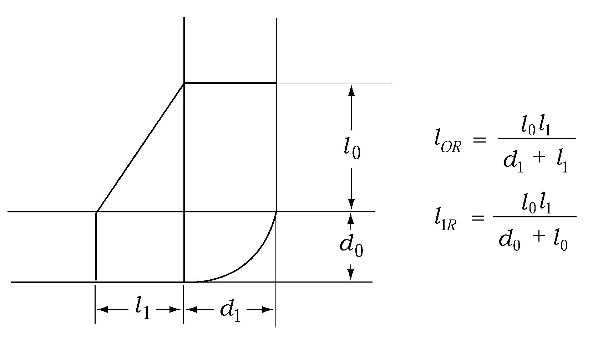
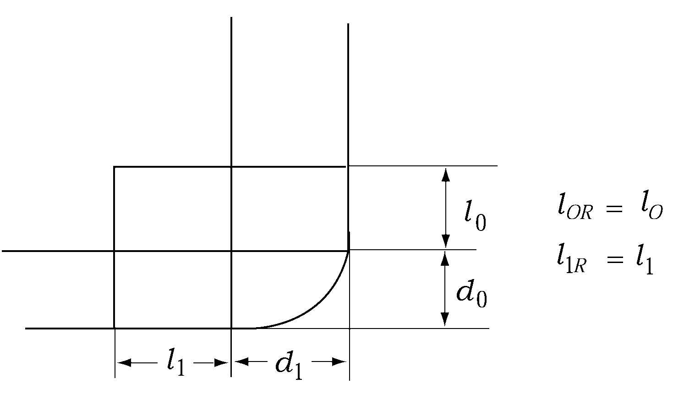

# 제7편 전용선박(1장~4장,7장~10장)

> 선급 및 강선규칙/적용지침 / RA-07A-K / 2025 / KO / Guidance

## 제 4 장 컨테이너선

### 제 1 절 일반사항

#### 101. 적용 【규칙 참조】

- **1.** **규칙 101.**의 **4**항에서 “우리 선급이 적절하다고 인정하는 바”라 함은 **규칙 3편 1장 206.**의 직접강도계산에 의한 방법에 따르거나 **1편 1장 105.**에 따라 인정하는 것을 말한다.
- **2.** **규칙 101.**의 **6**항을 적용함에 있어서, 동형선으로 인정되는 선박 또는 선급이 특별히 인정하는 경우에는, 이 장의 규정을 적용할 수 있다. *(2022)*

### 제 2 절 종강도

#### 205. 비틀림강도 【규칙 참조】

선체의 비틀림강도에 관해서는 선체길이 전체 어느 위치에서도 다음 관계를 만족하여야 한다. 다만, 화물을 비대칭적재함으로써 선체에 비틀림모멘트가 발생하는 경우에는 이 비틀림모멘트에 의한 응력값을 $\sigma_S$ 에 더할 필요가 있다.

### 제 3 절 이중저구조

#### 302. 종늑골 【규칙 참조】

늑판에 설치하는 보강재 및 스트럿의 너비가 특히 넓은 경우에는 **규칙 표 7.4.1**의 계수 $C$ 에 **3편 7장 403.**의 **2**항에 의한 수정을 하여도 좋다.

### 제 4 절 이중선측구조

#### 401. 일반 【규칙 참조】

- **1.** 빌지부에 있어서 이중선측구조의 폭이 변화하는 구조의 경우에는 다음에 의하여 **표 7.4.2**의 $t_1$ 을 정한다.
  - **(1)** $\beta_T$ 및 $\beta _{L}$ 는 다음 식에 의한다.
    $\beta _{T} =1+ \frac{0.42 \left( \frac{B}{D _{S}} \right) ^{2} -0.5}{0.59 \frac{D _{S} - \frac{d _{0}}{2} -l _{OR}}{B-d _{1} -2 l _{1R}} \left( \frac{d _{0}}{d _{1}} \right) ^{2} +1.0}$
    $\beta _{L} =1+ \frac{0.18 \left( \frac{B}{D _{S}} \right) ^{2} -0.5}{0.59 \frac{D _{S} - \frac{d _{0}}{2} -l _{OR}}{B-d _{1} -2 l _{1R}} \left( \frac{d _{0}}{d _{1}} \right) ^{2} +1.0}$
    $l_OR$ 및 $l _{1R}$ : 각각 다음에 의한다.
    
    **그림 7.4.2** 
    **그림 7.4.3**
  - **(2)** $h$ 의 하단을 내저판 상면상 $l_OR$ 의 위치로 한다.
  - **(3)** $(d+ 0.038 L')$ 대신에 $(d - l_OR +0.038 L')$ 를 사용한다.
- **2.** 만재흘수선으로부터 강력갑판까지의 높이가 특히 큰 경우에는 다음에 의하여 **표 7.4.2**의 $t_1$ 을 정한다.
  - **(1)** $\beta_T$ 및 $\beta_L$는 다음 식에 의한다.
    $\beta _{T} =1+ \frac{0.42 \left( \frac{B ^{2}}{D _{S} D '} \right) -0.5}{0.59 \frac{D _{S} - \frac{d _{0}}{2}}{B-d _{1}} \left( \frac{d _{0}}{d _{1}} \right) ^{2} +1.0}$
    $\beta _{L} =1+ \frac{0.18 \left( \frac{B ^{2}}{D _{S} D '} \right) -0.5}{0.59 \frac{D _{S} - \frac{d _{0}}{2}}{B-d _{1}} \left( \frac{d _{0}}{d _{1}} \right) ^{2} +1.0}$
    $D '$ : 선박의 깊이 ($\mathrm{m}$). 다만, **3편 1장 203.**의 **2**항 (1)호에 규정하는 가상 건현갑판이 있을 경우에는 용골의 상면으로부터 가상건현갑판까지의 높이를 사용하여도 좋다.
  - **(2)** $(d + 0.038L')$ 대신에 다음 식에 의한다.
    $(d + 0.038L' ) \sqrt{\frac{D '}{D_S}}$
    $D '$ : 전 (1)에 따른다.
- **3.** 화물창의 중간에 충분히 큰 단면적을 갖는 크로스타이와 비수밀의 부분격벽 등의 구조를 설치할 경우에는 **표 7.4.2** 각 규정의 $l_h$ 를 수밀격벽으로부터 이 구조의 위치까지의 거리로 하여도 좋다.
- **4.** 이중선측구조의 보강재를 지지하는 스트럿 또는 선측스트링거에 부착된 휨보강재의 폭이 특히 넓은 경우에는 **3편 7장 403.**의 **2**항의 규정을 준용하여도 좋다.

#### 402. 선측트랜스버스 및 선측스트링거 【규칙 참조】

선측트랜스버스 및 선측스트링거의 두께에 대하여 전단력 및 전단좌굴강도를 고려하여야 하는 경우 규칙의 규정에 추가하여 **표 7.4.2**의 2개의 식 중 큰 값 이상이어야 한다.

### 제 6 절 갑판구조

#### 601. 갑판구조 【규칙 참조】

갑판의 면내 굽힘에 대하여 횡격벽의 위치에 있어서 갑판구 측 선내 갑판의 치수는 **표 7.4.3**의 식에 의한 것 이상이어야 하며, 단면계수 및 단면2차모멘트를 계산하는 경우에는 갑판구 측 선내 갑판을 웨브로 하고 창구단코밍을 플랜지로 간주하여 계산한다.

### 제 9 절 플레어가 큰 위치의 강도(strength at large flare location) (2019)

#### 901. 외판 【규칙 참조】

- **1.** 외판의 두께는 **3편 4장 401.**의 **1**항에 따른다.

#### 902. 늑골 【규칙 참조】

- **1.** 늑골에 대한 치수는 **3편 8장 108.**의 **1**항에 따른다.

#### 903. 거더 【규칙 참조】

- **1.** 거더에 대한 치수는 **3편 9장 104.**에 따른다.
- **2.** 거더 웨브의 좌굴강도는 **3편 9장 104.**의 **2**항 및 **3**항에 따른다.

### 제 10 절 컨테이너 고박설비

#### 1002. 컨테이너 고박설비 【규칙 참조】

- **1.** **규칙 1002.**의 규정에 따라 컨테이너 고박설비(이하 **고박설비**라 한다)에 대하여 우리 선급의 승인을 받고자 하는 경우에는 **부록 7-2 컨테이너 고박설비에 관한 지침**의 규정을 만족하여야 한다.
- **2.** 고박설비의 제조법 및 형식승인에 대하여는 우리 선급의 「**제조법 및 형식승인 등에 관한 지침**」 **3장 25절**의 규정에 따른다.
- **3.** **컨테이너 고박설비의 제품검사 요령**
  - **(1)** 「**제조법 및 형식승인 등에 관한 지침**」 **3장 25절**의 규정에 따라 형식승인된 컨테이너 고박설비의 제품검사 요령은 다음에 따른다.
  - **(2)** 제품검사시에는 최소한 다음 (가) 또는 (나) 중 어느 하나의 시험을 만족하여야 한다.
    50개 이상인 경우에는 50개마다, 50개 미만인 경우에는 각 로트마다 한개의 시험품을 채취하여 각 항목에서 규정하는 안전사용하중(*SWL*)의 1.5배에 해당하는 하중으로 내력시험을 한다.
    50개 이상인 경우에는 50개마다, 50개 미만인 경우에는 각 로트마다 한개의 시험품을 채취하여 절단하중시험을 한다.
    - **(가)** (a) 래싱로드 및 고박설비
      - **(b)** 체인 또는 와이어로프 래싱
    - **(나)** 모든 종류의 고박설비에 대하여 각 항목에 해당하는 안전사용하중으로 시험을 하고 체인 및 와이어로프 래싱의 각 로트마다 한개의 시험품을 채취하여 해당항목에 대한 절단하중시험을 추가로 한다.
  - **(3)** 「**제조법 및 형식승인 등에 관한 지침**」 **표 3.25.2**의 항목중 **12.**부터 **15.**까지의 규정에 의한 고정식 고박설비에 대한 시험결과, 다음 (가) 및 (나)의 조건을 만족하는 경우 (2)호의 시험 횟수를 경감할 수 있다. 다만, 고박설비 제조자가 우리 선급의 품질보증제도 승인을 받은 경우에는 「**제조법 및 형식승인 등에 관한 지침**」 **5장 305.**에 따른다.
    - **(가)** 각 항목의 형식승인시험에 대한 값이 「**제조법 및 형식승인 등에 관한 지침**」 **표 3.25.1**에서 규정하는 최소 설계 절단하중의 1.5배 이상일 때
    - **(나)** 적절한 비파괴 검사설비가 되어 있는 경우
  - **(4)** (2)호 (가)에 의한 제품검사시 다음 (가) 및 (나)의 하중하에서 영구변형(구조부재의 설치에 따른 초기변형제외)이 있어서는 안된다.
    시험완료후에 실시한 수동작동시험이 만족스럽다고 인정되는 경우 (2)호의 하중과 내력시험하중의 범위에서 발생한 영구변형에 대하여는 우리 선급이 적절하다고 인정하는 바에 따른다.
    - **(가)** 안전사용하중이 25톤 미만인 경우 : 1.5 × *SWL* ($\mathrm{t} on$)
    - **(나)** 안전사용하중이 25톤 이상인 경우 : *SWL* + 12.5 ($\mathrm{t} on$)
  - **(5)** 시험품에 대한 시험시에 초기파괴나 중대한 소성변형이 일어나는 경우 별도의 시험품을 선정할 수 있으며, 이에 대한 시험결과가 만족스럽지 못하다고 인정하는 경우에는 이 시험편을 채취한 로트는 불합격으로 한다.
  - **(6)** (2)호 (나)호에 준하여 시행한 제품검사에 대하여도 영구변형이 있어서는 안된다. 
