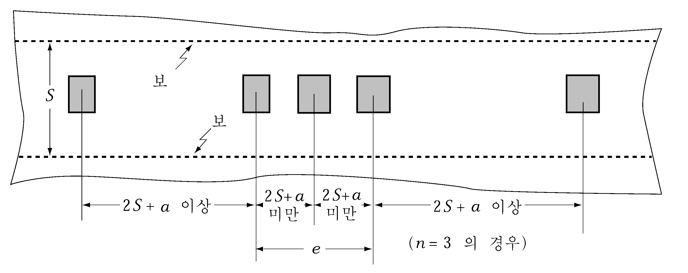
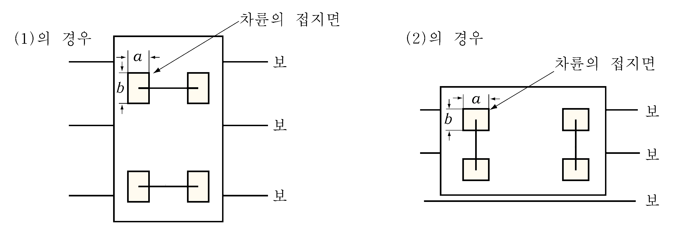
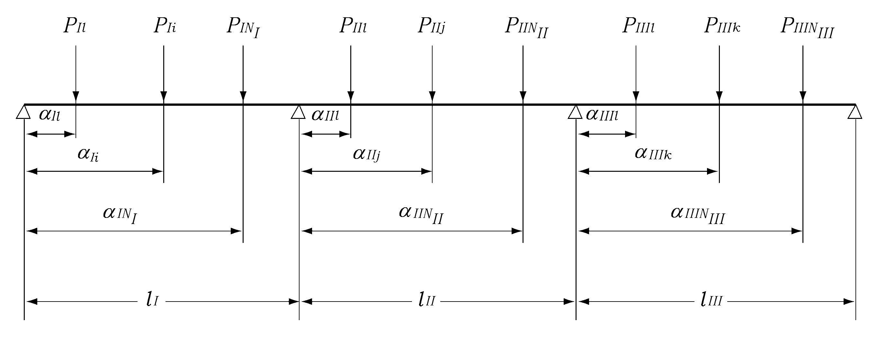
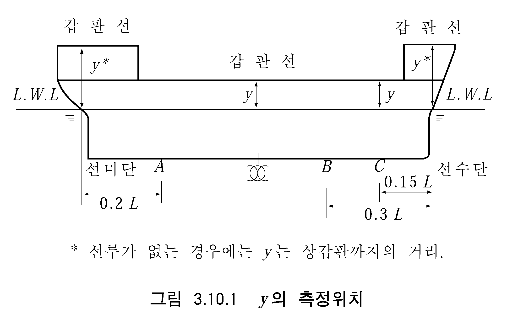

# 제7편 전용선박(1장~4장,7장~10장)

> 선급 및 강선규칙/적용지침 / RA-07A-K / 2025 / KO / Guidance

## 제 7 장 카페리선 및 로로선

### 제 3 절 갑판

#### 301. 적용 【규칙 참조】

- **1.** **차량갑판의 두께** ***(2022)***
  차량갑판의 두께 $t$ 는 다음 (1) 또는 (2)호에 의한 것 이상이어야 한다. 다만, 노출차량갑판에 대하여는 (1) 및 (2)에 의한 것에 1.0 $\mathrm{mm}$를 더한 것 이상이어야 한다.
  - **(1)** 패널내의 각 차륜의 접지면의 중심간 거리가 2$S + a$ 이상인 경우(**그림 7.7.1** 참조) *(2017)*
    $t=C \sqrt {\frac{(2S-b ' )}{(2S+a)} \times \frac{P}{9.81}} +0.5 \mathrm{mm}$, $t _{\min} =5.0 ( \mathrm{mm})$
    $C$ : 계수로서 **표 7.7.1**에 의한다.
    $S$ : 갑판보의 간격 ($\mathrm{m}$).
    $P$ : 계획 최대차륜하중 ($\mathrm{kN}$). 다만, $b > S$ 의 경우에는 계획 최대차륜하중의 $S/b$ 배 한 것으로 한다.
    $b'$ : $b$ 또는 $S$ 중 작은 값 ($\mathrm{m}$).
    $a$ 및 $b$ : 각각 보에 평행 또는 직각방향으로 측정한 차륜의 접지 길이 ($\mathrm{m}$). (**그림 7.7.2** 참조). 다만, 통상공기를 주입하는 타이어를 갖는 차량에 대하여는 **표 7.7.2**에 의한 값을 사용할 수 있다.

    **표 7.7.1 계수** *C*

    | 차량종류 부재종류 |   |   | 하역전용차량 | 좌란 이외 |
    | --- | --- | --- | --- | --- |
    | 종강도 산입부재 | 중앙부 0.4L 구간* | 종식구조 | $4.6 \sqrt {K}$ | $\frac{17.83 \sqrt {K}}{\sqrt {24-K \alpha }}$ 단, 5.2 이상이어야 함. |
    | 종강도 산입부재 | 중앙부 0.4L 구간* | 횡식구조 | $4.9sqrtK$ | $\frac{123.6 \sqrt {K}}{\sqrt {576-K ^{2} \alpha ^{2}}}$ 단, 5.2 이상이어야 함. |
    | 종강도 산입부재 | 선수미 양단 0.1L 이내* |   | $4.6 \sqrt {K}$ | $5.2 \sqrt {K}$ |
    | 상기이외 |   |   | $4.6 \sqrt {K}$ | $5.2 \sqrt {K}$ |
    | $\alpha$ : $y$의 값에 따라 다음에 의한 $\alpha _{1}$ 또는 $\alpha _{2}$. 다만 선박의 중앙부의 강력갑판의 경우 $\beta$ 이상이어야 한다. $\alpha _{1} =15.36 f _{D} \left( \frac{y-y _{B}}{Y'} \right)$ $y _{B} \leq y$ 일 때 $\alpha _{2} =15.36 f _{B} \left( \frac{y _{B} -y}{y _{B}} \right)$ $y _{B} >y$ 일 때 $\beta$ : $L$에 따라 다음에 따라 다음에 정하는 계수로서 $L$이 중간에 있을 때에는 보간법에 의한다. $L$이 230 m 이하일 때 : $\beta=6/a$ $L$이 400 m 이상일 때 : $\beta =10.5/a$ $y$ : 용골상면으로부터 차량갑판 상면까지의 수직거리 (m). $Y'$ : **규칙 3편 3장 203.**의 (5)호 (가) 또는 (나)에 의한 값 중 큰 값. $a$ : 선박중앙부의 선체횡단면에 있어서 선측외판의 80 % 이상 범위에 대하여 고장력강을 사용하는 경우에는 $\sqrt {K}$ 로 하며, 기타의 경우에는 1.0 으로 한다. $y _{B}$ : 선박의 중앙부에서 용골상면으로부터 선체횡단면의 중립축까지의 수직거리(m). $f _{D}$, $f _{B}$ : **규칙 3편 1장 124.**에 따른다. 다만, 선박의 중앙부의 강력갑판의 경우 0.79 이상이어야 한다. * : 중앙부와 선수미 양단 0.1$L$ 위치 사이의 계수 $C$ 는 보간법에 따른다. |   |   |   |   |

    **표 7.7.2 타이어의 접지길이** $a$ **및** $b$

    | 방향 차륜 | 차축방향의 접지길이 그림 7.7.2에 있어서 (1)의 경우의 $a$, (2)의 경우의 $b$* | 차축에 직각방향의 접지길이 그림 7.7.2 에 있어서 (1)의 경우의 $b$, (2)의 경우의 $a$* |
    | --- | --- | --- |
    | 단륜 | $\frac{20 \sqrt {P}}{P _{0}}$ | $\frac{1}{20} sqrtP$ |
    | 복륜 | $\frac{250 \sqrt {P}}{9P _{0}}$ | $\frac{9}{250} \sqrt P$ |
    | $P$ : **301.**의 **1**항 (1)호에 따른다. $P _{0}$ : 타이어의 공기압(kN/m^2), 만일 실제 공기압을 알 수 없는 경우 다음 식의 값을 사용할 수 있다. $P _{0} =C _{P} \sqrt {P}$ (kN/m^2) $C _{P}$ : 차륜하중 $P$ 가 10kN 미만인 경우$C _{P} =120$ 차륜하중 $P$ 가 10kN 이상인 경우 $C _{P} =250P ^{-0.3}$ (*) : 특수차량이 적재되는 경우, 실제 접지길이 a 및 b를 적용한다. |   |   |
  - **(2)** 패널내의 차륜의 접지면의 중심간 거리가 $2S + a$ 미만인 경우 (**그림 7.7.1** 참조) *(2017)*
    $t=C \sqrt {\frac{(2S-b ' )}{(2S+a+e)} \times \frac{nP}{9.81}} +0.5 \mathrm{mm}$, $t _{\min} =5.0 ( \mathrm{mm})$
    $e$ : 패널내의 차륜의 접지면의 중심간 거리가 $2S + a$ 미만인 경우의 차륜 접지면 중심간 거리의 합 ($\mathrm{m}$). (**그림 7.7.1** 참조) 다만 실제 값을 알 수 없는 경우, 다음의 값을 사용할 수 있다.
    1) **그림 7.7.3**의 경우로 차량이 적재되는 경우;
    초장축 카고 트럭 또는 덤프트럭 등과 같이 두 개의 차축이 인접하여 배치된 차량의 경우 $e$는 다음 값을 사용할 수 있다.
    $e=1.0$ (m)
    2) **그림 7.7.4**의 경우로 차량이 적재되는 경우;
    $e$는 다음 값을 사용할 수 있다.
    $e=$ 타이어의 접지 폭 + 차량의 적재 간격 (m)
    $n$ : $e$ 의 범위내에 있는 차륜하중의 수.
    $C$, $S$, $a$, $b'$ 및 $P$ : (1)호에 따른다.
    
    **그림 7.7.1** #eqnID-654**의 측정방법**
    
    **그림 7.7.2** #eqnID-655 **및** #eqnID-656**의 측정방법**
    
    **그림 7.7.3** 
    **그림 7.7.4**
- **2.** **차량갑판보의 단면계수** ***(2022)***
  차량갑판보의 단면계수 *Z*는 다음 식에 의한 것 이상이어야 한다.
  $Z=C _{1} C _{2} M \mathrm{cm ^{3} }$
  $C_1$ : 계수로서 다음 식에 의한다.
  $b/S$ ≤ 0.8 일 때 : $C_1$ = 1.0
  $b/S$ ＞ 0.8 일 때 : $C_1$ = 1.25 - 0.31$b/S$
  $C_2$ : 계수로서 **표 7.7.3**에 의한 값.
  $b$, $P$ 및 $S$ : **1**항 (1)호에 따른다.
  $M$ : 다음 식에 의한 $M_1$ 및 $M_2$ 중 큰 값.
  $M _{1} = \frac{1}{9.81} \left( \sum _{i=1} ^{N _{I}} 4P _{I} _{i} \alpha _{I} _{i} \left\{ 1- \left( \frac{\alpha _{I} _{i}}{l _{I}} \right) ^{2} \right\} + \sum _{j=1} ^{N _{II}} P _{II} _{j} \alpha _{II} _{j} \left( 1- \frac{\alpha _{II} _{j}}{l _{II}} \right) \left( 7-5 \frac{\alpha _{IIj}}{l _{II}} \right) \right.$$-\sum _{ k = 1} ^{N_III }P_III _k (l_III -\alpha_III _k ) left{1-left(\frac{l_III - \alpha_III _k}{l_I}II right)^2right}right)$
  $M _{2} = \frac{1}{9.81} \left( -\sum _{i=1} ^{N _{I}} P _{I} _{i} \alpha _{I} _{i} \left\{ 1- \left( \frac{\alpha _{I} _{i}}{l _{I}} \right) ^{2} \right\} + \sum _{j=1} ^{N _{II}} P _{II} _{j} \alpha _{II} _{j} \left( 1- \frac{\alpha _{II} _{j}}{l _{II}} \right) \left( 2+5 \frac{\alpha _{IIj}}{l _{II}} \right) \right.$$+\sum _{ k = 1} ^{N_III }4P_III _k (l_III -\alpha_III _k ) left{1-left(\frac{l_III - \alpha_III _k}{l_I}II right)^2right}right)$
  $I_I$_, $I_II$ 및 $I_III$ : 보의 지지점 사이의 거리 ($\mathrm{m}$).
  $P_I _i$, $P_II _j$ 및 $P_III _k$ : 각 지지점에 작용하는 계획 최대차륜하중 ($\mathrm{kN}$).
  $\alpha_I _i$, $\alpha_II _j$ 및 $\alpha_III _k$ : 각 지지점으로부터 차륜하중이 작용하는 점까지의 거리 ($\mathrm{m}$). (**그림 7.7.5** 참조)
  $N_I$, $N_II$ 및 $N_III$ : 각 지지점에 작용하는 차륜하중의 수.

  **표 7.7.3 계수** $C_2$

  | 차량 부재 |   | 하역전용차량 | 좌란 이외 |
  | --- | --- | --- | --- |
  | 종강도 산입 갑판보 | 중앙부 0.4$L$ 구간* | $\frac{86.4K}{24-0.544K \alpha}$ 단, 3.6 이상이어야 함 | $\frac{110.4K}{24-K \alpha}$ 단, 4.6 이상이어야 함 |
  | 종강도 산입 갑판보 | 선수미 양단 0.1$L$ 이내* | 3.6$K$ | 4.6$K$ |
  | 상기이외 |   | 3.6$K$ | 4.6$K$ |
  | $\alpha$ : $y$의 값에 따라 다음에 의한 $\alpha _{1}$ 또는 $\alpha _{2}$. 다만 선박의 중앙부의 강력갑판의 경우 $\beta$ 이상이어야 한다. $\alpha _{1} =15.36 f _{D} \left( \frac{y-y _{B}}{Y'} \right)$ $y _{B} \leq y$ 일 때 $\alpha _{2} =15.36 f _{B} \left( \frac{y _{B} -y}{y _{B}} \right)$ $y _{B} >y$ 일 때 $\beta$ : $L$에 따라 다음에 따라 다음에 정하는 계수로서 $L$이 중간에 있을 때에는 보간법에 의한다. $L$이 230 m 이하일 때 : $\beta=6/a$ $L$이 400 m 이상일 때 : $\beta =10.5/a$ $y$ : 용골상면으로부터 차량갑판 상면까지의 수직거리 (m). $Y'$ : **규칙 3편 3장 203.**의 (5)호 (가) 또는 (나)에 의한 값 중 큰 값. $a$ : 선박중앙부의 선체횡단면에 있어서 선측외판의 80 % 이상 범위에 대하여 고장력강을 사용하는 경우에는 $\sqrt {K}$ 로 하며, 기타의 경우에는 1.0 으로 한다. $y _{B}$ : 선박의 중앙부에서 용골상면으로부터 선체횡단면의 중립축까지의 수직거리(m). $f _{D}$, $f _{B}$ : **규칙 3편 1장 124.**에 따른다. 다만, 선박의 중앙부의 강력갑판의 경우 0.79 이상이어야 한다. * : 중앙부와 선수미 양단 0.1$L$ 위치 사이의 계수 $C$ 는 보간법에 따른다. |   |   |   |

  
  **그림 7.7.5** #eqnID-724**,** #eqnID-725**,** #eqnID-726**등의 측정방법**
- **3.** **차량갑판보의 치수** ***(2017)***
  차량갑판보의 치수는 다음에 적합한 직접강도 계산방법에 의하여 정할 수 있다.
  - **(1)** 구조모델 및 해석방법 등에 대하여는 우리 선급이 인정하는 바에 따른다.
  - **(2)** 하중은 다음에 따른다.
    - **(가)** 차량갑판에 차량을 적재하여 항해하는 경우에는 계획 최대차륜하중의 1.5배
    - **(나)** 하역전용차량(포크리프트 또는 정박중 하역에만 사용하는 차량)에 대하여는 계획 최대차륜하중의 1.2배
  - **(3)** 단면계수를 구하는 경우에 있어서 허용응력은 **표7.7.4**에 따른다.
  - **(4)** 부식 등을 고려하여 상기 (1)부터 (3)까지의 조건에 따라 구한 단면계수에 1.2배를 하여야 한다.

    **표 7.7.4 허용응력** ($\mathrm{N}/mm ^{2}$)

    | **부재** | **하역전용차량** | **좌란 이외** |
    | --- | --- | --- |
    | 선박의 중앙부의 강력갑판보 | $\frac{235}{K} - 80f_D$ | $\frac{235}{K} - 150f_D$ |
    | 상기 이외 | $\frac{235}{K}$ | $\frac{235}{K}$ |
- **4.** **이동식 차량갑판**
  - **(1)** 일반사항
    이동식 차량갑판 및 이와 유사한 박판구조의 갑판하 거더는 **3편 11장 103.** 및 이 규정에 적합하여야 한다.
  - **(2)** 강도기준
    이동식 차량갑판 거더의 치수는 다음의 (가)부터 (다)까지에 따라 결정한다.
    **규칙 3편 1장 604.**에 규정된 값
    $b _{eft} = \sum _{n} ^{} ( \frac{C _{et} \cdot a}{2} )$ ($\mathrm{mm}$)
    갑판에 좌굴 보강재가 적절히 부착된 경우, 이 부분도 유효 폭 결정에 고려될 수 있다. 다만, 이 값은 **규칙 3편 1장 604.**에서 규정하는 값을 초과하여서는 안된다.
    $C _{et}$: 계수로서 다음 식에 의한다. 다만, $C _{et}$가 1.0을 초과할 경우에는 1.0으로 한다.
    $C _{et} = ( \frac{3}{\beta} - \frac{1.75}{\beta ^{2}} ) \frac{b}{a} + ( \frac{0.075}{\beta} + \frac{0.75}{\beta ^{2}} ) (1 - \frac{b}{a} )$
    $n$ : 패널주변의 거더부재에 대해서는 1, 그 외의 경우에는 2
    $a$ : 보강재에 직교하는 거더의 간격 (mm).
    $b$ : 보강재의 간격 (mm).
    $\beta$ : 계수로서 다음식에 의한다.
    $\beta = \frac{b}{t} \sqrt {\frac{\sigma _{F}}{E}}$
    $t$ : 차량 갑판의 두께 (mm).
    $\sigma _{F}$ : 차량갑판 재료의 항복응력 또는 내력 (N/mm^2).
    $E$ : 재료의 탄성계수 (강재 : 2.06$\times 10^5$ N/mm^2).
    - 차량갑판에 차량을 적재하고 항해하는 경우
    $P = 1.5 (p + w _{deck} )$
    $p$ : 설계 갑판하중 (kN/mm^2).
    $w _{deck}$ : 단위 면적 당 차량갑판 자체의 중량 (kN/mm^2).
    - 하역전용 차량(포크 리프트(fork-lift) 등 정박중 하역에만 사용되는 차량)인 경우
    $P = 1.2 (p + w _{deck} )$
    **표 7.7.5**에 의한다. $\sigma _{F}$(N/mm^2)는 재료의 항복응력 또는 내력을 나타낸다.

    | **수직 응력** | $0.8 \sigma _{F}$ |
    | --- | --- |
    | **전단 응력** | $0.46 \sigma _{F}$ |
    - **(가)** 각 거더에 대한 압축 판 플랜지의 유효 폭은 패널의 보강방향에 따라 (a)과 (b)에 의해 결정한다.
      - **(a)** 패널의 보강 방향에 평행한 거더에 대한 유효 폭
      - **(b)** 패널의 보강 방향에 직각인 거더에 대한 유효 폭
    - **(나)** 설계하중과 허용응력은 다음의 (a), (b)의 요건에 따른다.
      - **(a)** 설계하중 $P$ (kN/mm^2)
      - **(b)** 허용응력 (N/mm^2)
    - **(다)** 거더의 치수를 직접강도 계산에 의해 결정하는 경우, 격자구조해석 또는 차량갑판의 압축패널에 작용하는 탄성좌굴영향을 고려 할 수 있는 평가방법에 의하여야 한다. 그렇지 않을 경우에는 판요소 모델을 사용하는 탄성 유한요소해석을 수행하고 **3편 부록 3-2 III.2** 좌굴강도 계산의 요건에 따라 압축패널의 좌굴강도를 조사하는 경우에는 인정할 수 있다.
  - **(3)** 구조상세
    $\frac{d}{C} + 1.0$
    $d$ : 거더의 깊이 (mm).
    $C$ : 계수로서 다음에 따른다.
    대칭적 플랜지 거더인 경우 65
    비대칭적 플랜지 거더인 경우 55

    |   | **차량의 왕래가 빈번한 패널(1)** | **그 외의 패널** |
    | --- | --- | --- |
    | 1) 갑판패널의 주변 거더 부재 | F2 (양면) | F2 (양면) |
    | 2) 1) 이외 거더의 스팬 중앙부 $0.3 l$ 사이(2) | F2 (양면) | F2 (양면) |
    | 3) 1) 이외 거더의 단부 $0.1 l$ 사이(2) | F2 (양면) | F2 (양면) |
    | 4) 1) 이외 거더의 교차부 $0.2 l '$ 사이(3) | F2 (양면) | F2 (양면) |
    | 5) 상기 이외의 개소 | F2 (양면) | F2 (최소단면이상) |

    ^(1) 보다 동적인 하중의 영향을 받는 램프웨이(ramp way)부근에 있어서, 어떤 갑판층에서 상, 하부의 갑판층으로 차량이 이동하기 위한 주행경로로 되는 갑판 패널
    ^(2) $l$ : 각 거더부재의 전체 길이
    ^(3) $l '$ : 각 거더부재의 스팬으로서, 거더 교차점의 양측에서 $0.1 l'$씩를 취한다.
    ^(4) $F2$는 **규칙 3편 1장 표 3.1.11**에 따른다.
    - **(가)** 거더 웨브와 갑판과의 고착부는 **표 7.7.6**에 따른 용접방법에 의하여야 한다.
    - **(나)** 거더 웨브의 두께는 다음식에 의한 값 이상으로 하여야 한다. 다만, 좌굴강도에 대한 충분한 검토가 행해진 경우는 제외한다.
- **5.** **이동식 차량갑판의 지지구조**
  - **(1)** 이 규정은 이동식 차량갑판을 지지하는 구조에 대해 적용한다.
  - **(2)** 이동식 차량갑판의 지지구조는 갑판 패널의 형상, 설계하중 등을 고려하여 적절히 배치하여야 한다.
  - **(3)** 지지구조와 선체구조와의 접합부는 응력집중을 피하도록 적절하게 구성되어야 한다. 필요한 경우, 보강재나 브래킷등에 의해 적절히 보강하여야 한다.
  - **(4)** 갑판 패널을 와이어로프에 의해 매다는 경우, 그 로프는 **규칙 4편**의 관련 규정 또는 우리 선급이 적절하다고 인정하는 규격의 규정을 따라야 하며, 부식방지를 위한 적절한 조치를 위해야 한다. 또한, 그 강도는 각 와이어로프에 발생하는 응력에 대하여 다음식에 따른 값 이상의 안전율을 가지도록 하여야 한다. 단, 4를 초과 할 필요는 없다.
    $\frac{10 ^{4}}{8.85W + 1910}$
    $W$ : 제한 하중 ($rm"ton"$).
  - **(5)** 지지구조부재의 치수는 **4** (나) (a)에 규정하는 하중을 이용하여 다음의 허용응력을 초과하지 않도록 결정하여야 한다.
    전단응력 : $\tau = 0.34 \sigma _{F}$
    굽힘응력 : $\sigma = 0.50 \sigma _{F}$
    등가응력 : $\sigma _{e} = \sqrt {\sigma ^{2} +3 \tau ^{2}} = 0.64 \sigma _{F}$
    $\sigma _{F}$: 재료의 항복응력 또는 내력(proof stress) (N/mm^2)

#### 303. 갑판하중 (2020)

- **1.** 노출갑판에 대한 갑판하중 $h$(kN/m^2) 는 다음 식에 의한 것 이상이어야 한다.
  $h=a(bf-y)$(kN/m^2)
  $a$ 및 $b$ : 갑판의 위치에 따라 **표 7.7.7**에 따른다.
  $C_b1$ : 방형계수. 다만, $C_b$ 가 0.6 이하일 경우에는 0.6 으로 하고 0.8 이상일 경우에는 0.8 로 한다.
  $f$ : 계수로서 **표 7.7.8**에 따른다.(**그림 7.7.6** 참조)
  $y$ : 만재흘수선으로부터 노출갑판까지의 선측에서 측정한 수직거리 (m)로서 선수단으로부터 0.15 $L$ 의 위치보다 전방에 위치한 갑판은 선수단의 위치에서, 선수단으로부터 0.3 $L$ 의 위치와 선수단으로부터 0.15 $L$ 과의 사이의 갑판은 선수단으로부터 0.15 $L$ 의 위치에서, 선수단으로부터 0.3 $L$ 의 위치와 선미단으로부터 0.2 $L$ 과의 사이의 갑판은 $L$ 의 중앙에서, 선미단으로부터 0.2 $L$의 위치보다 후방의 갑판은 선미단의 위치에서 각각 측정한다.(**그림 7.7.4** 참조)
- **2.** II 란에서 계산된 $h$ 는 I 란의 것을 넘을 필요는 없다.
- **3.** **1.**및 **2**항의 규정에 관계없이 $h$ 는 **표 7.7.9**에 의한 것 이상이어야 한다.
- **4.** 그러나 3층 이상의 다층갑판이 설치된 경우, 노출갑판에 적용되는 하중은 **1., 2.** 및 **3**항에 의해 얻어진 하중에 **표 7.7.10**의 값을 곱한 것보다 큰 값을 사용하여야 한다.
- **5.** $h$를 산정하는 경우에 가상건현갑판으로부터 노출갑판까지의 선측에서 측정한 수직거리, $H _{D}$에 따라 해당 노출갑판을 다음과 같이 취급한다.
  $h _{s} \leq H _{D} < 2h _{s}$ 일 경우 : 건현갑판 상부의 제1층의 선루갑판
  $2h _{s} \leq H _{D} < 3h_s$ 일 경우 : 건현갑판 상부의 제2층의 선루갑판
  $nh_s \leq H _{D} \leq (n+1) h_s$ 일 경우 : 건현갑판 상부의 제$n$층의 선루갑판

  | 난 | 갑판의 위치 | $a$ |   |   | $b$ |
  | --- | --- | --- | --- | --- | --- |
  | 난 | 갑판의 위치 | 보(1), 갑판 | 필러 | 갑판 거더 | $b$ |
  | I | 선수단으로부터 0.15 $L$ 인 위치보다 전방 | 14.7 | 4.90 | 7.35 | $1 + \frac{0.338}{(C_b1 + 0.2 )^2}$ |
  | II | 선수단으로부터 0.15 $L$ 인 위치와 선수단에서 0.3 $L$ 인 위치와의 사이 | 11.8 | 3.90 | 5.90 | $1 + \frac{0.158}{(C_b1 + 0.2 )^2}$ |
  | III | 선수단으로부터 0.3 $L$ 인 위치와 선미단에서 0.2 $L$ 인 위치와의 사이 | 6.90 | 2.25 | 2.25(2) 3.45(3) | 1.0 |
  | IV | 선미단으로부터 0.2 $L$ 인 위치보다 후방 | 9.80 | 3.25 | 4.90 | $1 + \frac{0.123}{(C_b1 + 0.2 )^2}$ |
  | (비고) (1) 보에 대한 $a$ 의 값은 $L$ 이 150 m 이하인 선박은 다음 식의 값을 곱한 것으로 할 수 있다. $C = 0.0055L + 0.175$ (2) 선박의 중앙부에 있어서 강력갑판의 갑판구 측선 밖에 설치하는 갑판 종거더인 경우. (3) (2)이외의 갑판 거더인 경우. |   |   |   |   |   |

  | 선박의 길이 | $f$ |
  | --- | --- |
  | $L<150$m | ${\frac{L}{10}e}^{-\frac{L}{300}}+ \left( { \frac{L}{150}} \right)^2 - 1.0$ |
  | 150 m $\leq L <$ 300 m | ${\frac{L}{10}e}^{-\frac{L}{300}}$ |
  | 300 m $\leq L$ | 11.03 |

   
  **그림 7.7.6** #eqnID-818 **의 측정위치**

  | 난 | 갑판의 위치 | $h$(1) | $C$ |   |
  | --- | --- | --- | --- | --- |
  | 난 | 갑판의 위치 | $h$(1) | 보(2), 갑판 | 필러, 갑판거더 |
  | I 및 II | 선수단으로부터 0.3$L$ 의 위치보다 전방 | $C \sqrt {L' + 50 }$$\) | 4.20 | 1.37 |
  | III | 선수단으로부터 0.3\(L$ 의 위치와 선미단으로부터 0.2$L$ 의 위치와의 사이 | $C \sqrt {L' + 50 }$$\) | 2.05 | 1.18 |
  | IV | 선미단으로부터 0.2\(L$ 의 위치보다 후방 | $C \sqrt {L'}$ | 2.95 | 1.47 |
  | 건현갑판상 제2층까지의 선루갑판 |   | $C \sqrt {L'}$ | 1.95 | 0.69 |
  | (비고) (1) $L'$ : 선박의 길이 (m). 다만, $L$ 이 230 m 를 넘는 경우에는 230 m 로 한다. (2) 보에 대한 $C$ 의 값은 $L$ 이 150 m 이하인 선박은 다음 식의 값을 곱한 것으로 할 수 있다. $0.0055L + 0.175$ |   |   |   |   |

  **노출갑판의 위치**

  | 건현갑판 | 1.0 |
  | --- | --- |
  | 제3층 갑판 | 0.32 |
  | 제4층 갑판 | 0.25 |
  | 제5층 갑판 | 0.20 |
  | 제6층 갑판 | 0.15 |
  | 제7층 이상의 갑판 | 0.10 |

### 제 5 절 자동차전용운반선 (2023)

#### 501. 일반 【규칙 참조】

이 절은 자동차운반선의 판 및 보강재 평가를 위한 요건이다. 총 치수는 이 장의 **502.** 부터 **507.** 까지의 요건에 의한 치수 이상이어야 한다.

#### 502. 건현갑판 상부 선측외판의 최소두께

외판의 최소두께 $t$ 는 다음 식에 의한 것 이상이어야 한다.

#### 503. 건현갑판 상부 선측외판의 두께

건현갑판과 상부 4.6 (m)까지 사이의 선측외판의 두께는 다음 식에 의한 것 이상이어야 한다.

#### 504. 건현갑판 상부 선측종늑골

건현갑판 상부의 선측 종늑골의 단면계수는 다음 2개의 식 중 큰 것 이상이어야 한다.

#### 505. 디프탱크 격벽 휨보강재

격벽 흼보강재의 단면계수는 **규칙 3편 15장 203.**의 규정에 따른다. 다만 $h _{3}$에 대한 단면계수 $Z$ 값은 다음에 따른다.

#### 506. 차량갑판의 두께

차량갑판의 두께 $t$는 **301.**의 **1**항에 따른다. 단, $C$ 값은 **표 7.7.11**과 같다.

#### 507. 차량갑판보의 단면계수

차량갑판보 단면계수 $Z$ 는 다음 식에 의한 것 이상이어야 한다.
