# 제7편 전용선박(1장~4장,7장~10장)

> 선급 및 강선규칙/적용지침 / RA-07A-K / 2025 / KO / Guidance

## 제 10 장 이중선체 유조선

### 제 1 절 일반

#### 101. 적용 【규칙 참조】

- **1.** **적용**
  - **(1)** 이중선체 유조선과 유사한 구조형상을 갖는 선박에 대하여는 이 장의 규정을 적용한다.
  - **(2)** 이 장의 규정은 이중선체 유조선에 대하여 정한 것으로 특기 이외의 사항 또는 일반유조선 및 유조선 이외의 선박과 공통인 사항에 대하여는 해당 각 편 및 다른 장의 규정에 따른다.
- **2.** **새로운 구조방식의 채택**
  새로운 구조방식이 채택될 경우에는 규칙에 있는 표준구조의 모델과 비교계산을 하여 구조부재의 치수를 결정한다. 또한, 필요에 따라 모형시험 또는 실선계측의 자료를 요구할 수 있다.
- **3.** **석유 이외의 액상화물을 운송하는 선박**
  - **(1)** 비중($\rho$)이 1.0을 넘는 액상화물을 적재하는 유조선의 화물유 탱크부의 각 부재의 치수는 다음 2가지 방법에 따라 정한 값 중 큰 것으로 한다.

    **표 7.10.1** $\rho$ **의 값**

    | **화물의 종류** | $\rho$ |
    | --- | --- |
    | 당밀 | 1.4 |
    | 아스팔트 | 1.1 |
    | 농유산 | 1.85 |
    - **(가)** 모든 부재에 대하여 규칙에 따라 계산한다.
    - **(나)** 각 부재에 따라 다음과 같이 계산한다.
      - **(i)** 격벽판, 격벽휨보강재 및 거더의 부재치수는 **규칙 2절**부터 **4절**까지의 식 중 $h$ 에 비중($\rho$)를 곱한 값으로 한다.
        - **(ii)** 이중저의 거더 및 늑판과 이중선측구조의 스트링거 및 트랜스버스의 부재치수는 **403.** 및 **404.**의 식중 $h'$ 에 비중($\rho$)를 곱한 값으로 한다.
        - **(iii)** 비중($\rho$)의 값은 **표 7.10.1**에 따르며 기타는 그때마다 정한다.
  - **(2)** 위험화학품을 운송하는 유조선은 **규칙 6장**의 규정에도 만족하여야 한다.
- **4.** **아스팔트 화물창과 인접부재 간 최소거리**
  모든 화물탱크가 독립형탱크인 아스팔트 전용운반선의 경우, 적용에 있어서 **1장 1절 101**의 **4**항을 적용한다.

#### 102. 구역의 배치 및 분리 【규칙 참조】

- **1.** *(2022)*
  - **(1)** 분리 평형수탱크와 화물유 탱크의 크기 및 배치는 **1973/78 해양오염방지협약 Annex 1 Reg. 18, 23, 24, 25, 26, 29, 31, 32** 의 관련규정에 적합하여야 한다.
  - **(2)** 이중선측 및 이중저의 배치는 **1973/78 해양오염방지협약 Annex 1 Reg. 19**의 관련규정에 적합하여야 한다.
- **2.** **화물유 탱크 경계의 코퍼댐 및 격벽**
  - **(1)** 화물유탱크가 선수격벽과 인접하는 경우에는 선수격벽에는 어떠한 개구도 설치하여서는 안된다.
  - **(2)** 코퍼댐의 적용을 받는 구획과 기타의 구획(다만, 화물유탱크 및 연료유탱크 제외)과의 사이에는 어떠한 개구도 설치하여서는 안된다. 다만, 체인로커 주위벽에 설치하는 볼트 조임식 수밀 맨홀은 그러하지 아니한다. (수밀문은 아니됨)
- **3.** **기밀격벽**
  - **(1)** 주 및 보조펌프실로 겸용하지 않는 코퍼댐 및 건현갑판하의 코퍼댐 적용구획은 디프탱크로서의 강도를 만족할 필요가 있다. 주펌프실과 기관실과의 사이의 격벽의 치수는 100 $\mathrm{m}$ 이상인 선박에서는 수밀격벽의 치수, $L$ 이 100 $\mathrm{m}$ 미만인 선박에서는 기밀격벽의 치수 이상으로 하여야 한다.
  - **(2)** 수압시험을 할 필요가 없는 기밀격벽의 치수는 다음의 값을 표준으로 한다. 또한 기밀시험은 사수시험으로 대신 할 수 있다.
    - **(가)** 두께 : 6 $\mathrm{mm}$ 이상으로 한다. 다만 $L$ 이 100 $\mathrm{m}$ 미만인 선박은 4.5 $\mathrm{mm}$ 로 할 수 있다.
    - **(나)** 휨보강재 및 거더의 단면계수 : 수밀격벽에 대한 값의 50 $\%$로 한다. 다만, 외판 및 갑판과 결합되는 부위에 대하여는 늑골, 보 등과 동등한 효력의 것으로 하여야 한다.
- **4.** **선루 및 갑판실**
  펌프실의 출입구를 보호하는 갑판실은 다음에 따른다.
  - **(1)** 전단격벽은 선교루 전단격벽과 동등한 강도
  - **(2)** 측벽 및 후단벽은 선미루 전단격벽과 동등한 강도
- **5.** **이중저 내의 파이프덕트**
  **규칙 102.**의 **8**항 (3)호에 규정된󰡒적절한 기계식 통풍장치󰡓는 **규칙 6장 1203.**의 규정에 적합하여야 한다.
- **6.** **규칙 102.**의 **3**항 (4)호의 적용에 있어서 우리 선급이 인정하는 경우 최소개구의 치수는 **6장 304. 4**의 **표 7.6.1**을 적용할 수 있다. 다만, 기국이 별도로 규정하는 경우에는 관련 규정을 적용한다.

#### 103. 최소두께 【규칙 참조】

**규칙 103.**의 **1**항의 적용에 있어서, 화물유탱크 및 디프탱크의 길이 또는 너비가 $0.1 L + 5.0$($\mathrm{m}$)를 넘는 탱크에 적용한다.

### 제 2 절 격벽판

#### 201. 화물유탱크 및 디프탱크의 격벽판 【규칙 참조】

- **1.** **규칙 10장**에서 격벽판이란 화물유탱크 또는 디프탱크의 경계를 이루는 종격벽, 횡격벽, 갑판, 선측외판 및 내저판을 포함하는 것이다.
- **2.** **규칙 표 7.10.2**중 $L$형 및 $U$형 탱크에 대한 $b_t$ 및 $\Delta h$ 는 **그림 7.10.1**에 따른다.
  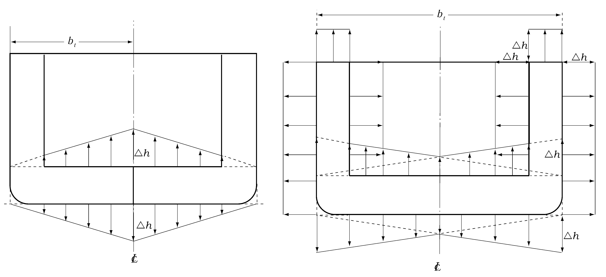
  **그림 7.10.1** #eqnID-971**형 및** #eqnID-972**형 탱크의** #eqnID-973 **및** #eqnID-974
- **3.** **규칙 표 7.10.2** 중 $h_3$를 계산하는 경우, 선측외판에 대하여는 모든 항해상태에 있어서의 최소흘수 $d_\min$ ($\mathrm{m}$)에 상당하는 수두를 공제할 수 있다. 공제수두는 용골 상면에서 $d_\min$, 최소흘수 위치에서 0으로 하며, 중간위치에서는 보간법에 의한다.

#### 202. 제수격벽 【규칙 참조】

- **1.** **제수격벽의 위치**
  화물유탱크의 길이 또는 너비가 15 $\mathrm{m}$ 또는 0.1$L$ ($\mathrm{m}$) 중 큰 것 이상일 경우에는, 화물유탱크에는 다음 조건에 적합한 제수격벽을 설치하여야 한다. 다만, 슬로싱압력에 대하여 특별히 고려한 경우에는 그러하지 아니한다.
  - **(1)** 선체중심선의 제수격벽의 최상부 및 최하부판의 너비와 두께는 해당 위치에 설치된 화물유탱크 격벽판의 90 $\%$ 이상이어야 한다.
  - **(2)** 개구율이란 슬롯 및 스캘럽을 제외한 개구의 총면적과 격벽의 총면적의 비율을 말한다.
  - **(3)** 휨보강재의 단면계수 $Z$ 는 다음 식에 의한 것 이상이어야 한다.
    $Z = C S h_s l^2 \mathrm{cm^3 }$
    $C$ : 휨보강재 양단의 고착도에 따른 계수로서 다음에 따른다.
    양단 브래킷 지지 : $C$ = 7.1
    일단 브래킷 지지, 타단 거더 지지 : $C$ = 8.4
    양단 거더 지지 : $C$ = 10.0
    $h_s$ : 다음 식에 따른다. 다만, 2.0 이상이어야 한다.
    $h_s = (0.176 - 0.00025L)(1 - \alpha)l_T$
    $\alpha$ : 격벽의 개구율.
    $l_T$ : 탱크의 길이 ($\mathrm{m}$).
    $S$ 및 $l$ : 각각 휨보강재의 간격($\mathrm{m}$) 및 길이($\mathrm{m}$).
  - **(4)** 거더의 치수는 **규칙 405.**의 **1**항 및 **3**항의 규정을 준용하여 구한다. 다만, 규칙의 식 중 $h$ 를 (3)호에 의한 $h_s$ 로 대체하여 적용한다.

### 제 3 절 종늑골 및 휨보강재

#### 301. 종늑골

**규칙 301.**의 **4**항에 따라 선체구조의 피로강도를 평가하고자 하는 경우에는 **3편 부록 3-3 선체구조의 피로강도 평가지침**에 따를 것을 권장한다. **【규칙 참조】**

### 제 4 절 거더

#### 401. 일반 【규칙 참조】

- **1.** **규칙 401.**의 **2**항을 적용함에 있어 **규칙 403.**부터 **407.**까지의 󰡒우리 선급의 승인을 받은 경우"란 $L$ 이 200 $\mathrm{m}$ 이하인 선박 중 다음 각 호 중 어느 하나에 해당하는 선박의 거더 치수를 결정하는 경우를 말한다.
  - **(1)** 이중저구조의 선박으로서 선체중심선에만 종격벽을 갖는 선박 (이하 **A형 유조선**이라 한다) (**규칙 3편 3장 그림 3.3.7** 참조)
  - **(2)** 이중저구조의 선박으로서 이중선측 구조용 종격벽만을 갖는 선박 (이하 **C형 유조선**이라 한다) (**규칙 3편 3장 그림 3.3.7** 참조)
  - **(3)** 이중저구조의 선박으로서 이중선측 구조용 종격벽과 선체중심선에 종격벽을 갖는 선박 (이하 **D형 유조선**이라 한다) (**규칙 3편 3장 그림 3.3.7** 참조)
- **2.** **1**항의 A형, C형, D형 유조선에 있어서, 비정상 하중상태 즉 부분적재(partially loading) 또는 격창적재가 없는 경우에는, 이중저 내의 거더 및 늑판과 이중선측구조 내의 스트링거 및 트랜스버스의 간격이 다음
  - **(1)** 및 (2)호에 의한 것보다 작은 경우에는 (1) 및 (2)호에 의한 것까지 이들의 간격을 증가시킬 수 있다.
  - **(1)** 이중저 내의 거더 및 이중선측구조 내의 스트링거 : ------------- 4.1 $\mathrm{m}$
  - **(2)** 이중저 내의 늑판 및 이중선측구조 내의 트랜스버스 :------------ 2.8 $\mathrm{m}$

#### 402. 거더의 직접강도계산 【규칙 참조】

직접강도계산에 따라 이중선체유조선의 거더에 대한 치수를 정하는 경우에는 **3편 부록 3-2 직접강도평가에 관한 지침**에 따른다.

#### 403. 이중저 거더 및 늑판의 치수 【규칙 참조】

- **1.** 이중저 내의 중심선거더 및 선측거더의 두께 $t$ 는 다음 각 호에 의한 $t_1$, $t_2$ 또는 $t_3$ 중 가장 큰 것 이상이어야 한다. 다만, 선체중심선에 종격벽을 갖는 선박의 중심선 거더의 두께는 $t_3$ 로 할 수 있다.
  - **(1)** 화물유 탱크 내의 위치에 따라 다음 식에 의한 두께 $t_1$
    $t_1 = C_1 K \frac{S h_B x}{d_0 - d_1} + 1.5 \mathrm{mm}$
    $S$ : 고려하는 중심선 거더 또는 측거더로부터 인접하는 종거더 또는 외측 브래킷의 내단에 이르는 거리의 중앙사이 거리 ($\mathrm{m}$).
    $h_B$ : 수두로서 다음식에 의한 $h_B1$ 또는 $h_B2$ 중 큰 값 ($\mathrm{m}$).
    $h_B1 = 0.6d + 0.026L \mathrm{m}$
    $h_B2 = h' - (d - 0.026L) \mathrm{m}$
    $h'$ : 내저판으로부터 창구정부까지의 높이 ($\mathrm{m}$).
    $d_0$ : 고려하는 위치에서의 거더의 깊이 ($\mathrm{m}$).
    $d_1$ : 고려하는 위치에서의 개구의 깊이 ($\mathrm{m}$). 다만, 화물유탱크 내에 횡격벽 수직거더가 설치된 경우에는 우리 선급이 필요하다고 인정하는 경우를 제외하고 횡격벽 위치와 수직거더 브래킷 내단사이의 거더에 있는 개구는 고려하지 않아도 된다. (**그림 7.10.2** 참조)
    $x$ : 각 화물유 탱크 $l_T$ 의 중앙으로부터 고려하는 위치까지의 선박길이 방향의 거리 ($\mathrm{m}$). 다만, 0.25$l_T$ 미만일때에는 0.25$l_T$ 로 한다. (**그림 7.10.2** 참조)
    $C_1$ : $b/l_T$ 의 비율에 따른 계수로서 유조선의 종류에 따라 각각 **표 7.10.2** 및 **표 7.10.3**에 따른다. $b/l_T$ 가 표의 중간에 있을 때에는 보간법에 의한다.
    $b$ : A형 유조선인 경우에는 종격벽으로부터 선측외판까지의 거리 ($\mathrm{m}$). C형 유조선인 경우에는 종격벽사이의 거리 ($\mathrm{m}$). 다만, 빌지호퍼탱크가 설치된 경우에는 호퍼탱크 내단간의 거리로 한다. D형 유조선인 경우에는 이중선측구조용 종격벽과 선체중심선 종격벽간의 거리 ($\mathrm{m}$)로 한다. 다만, 빌지호퍼가 설치된 경우에는 이것의 내단으로부터 측정한 거리로 한다. $b$ 의 측정은 $L$ 의 중앙에 있어서 내저판 상면에서 측정한다.
    $l_T$ : 고려하는 화물유 탱크의 길이 ($\mathrm{m}$).
    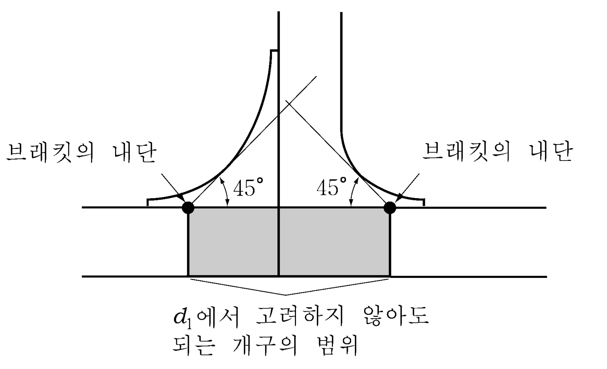
    **그림 7.10.2** #eqnID-1041**및** #eqnID-1042**의 기준점**

    **표 7.10.2 A형 및 D형 유조선의 계수** $C_1$

    | $b/l_T$ |   | 0.5 이하 | 0.6 | 0.7 | 0.8 | 0.9 | 1.0 | 1.1 | 1.2 | 1.3 이상 |
    | --- | --- | --- | --- | --- | --- | --- | --- | --- | --- | --- |
    | $C_1$ | A형 | 0.045 | 0.054 | 0.061 | 0.068 | 0.073 | 0.076 | 0.079 | 0.081 | 0.082 |
    | $C_1$ | D형 | 0.037 | 0.044 | 0.051 | 0.059 | 0.065 | 0.070 | 0.074 | 0.076 | 0.079 |

    **표 7.10.3 C형 유조선의 계수** $C_1$

    | $b/l_T$ | 1.0 이하 | 1.2 | 1.4 | 1.6 이상 |
    | --- | --- | --- | --- | --- |
    | $C_1$ | 0.073 | 0.079 | 0.082 | 0.083 |
  - **(2)** 다음 식에 의한 두께 $t_2$ 또는 $t_3$
    $t _{2} =8.6 root {3} of {\frac{H^2 a^2}{C_3 K} (t_1 - 1.5)}+1.5 \mathrm{mm}$
    $t_3 = \frac{C_4 a}{sqrtK} + 1.5 \mathrm{mm}$
    $a$ : 고려하는 위치에서 거더의 깊이($\mathrm{m}$). 다만, 거더에 수평휨보강재가 설치된 경우에는 그 휨보강재와 선저외판 및 내저판과의 거리($\mathrm{m}$) 또는 휨보강재 사이의 간격으로 할 수 있다.
    $t_1$ : (1)호에 의한 두께($\mathrm{mm}$).
    $C_3$ : $S_1$ 과 $a$ 의 비율에 따른 계수로서 **표 7.10.4**에 의한다. $S_1 /a$ 의 값이 표의 중간에 있을 때에는 보간법에 의한다.
    $S_1$ : 거더 깊이 방향으로 설치된 휨보강재의 간격($\mathrm{m}$).
    $H$ : 다음 식에 의한 값.
    $\phi$ : 개구의 긴 지름($\mathrm{m}$).
    $a$ : $a$ 또는 $S_1$ 중 큰 값($\mathrm{m}$).
    $C_4$ : $S_1 /a$ 의 값에 따른 계수로서 **표 7.10.4**에 의한다. $S_1 /a$ 의 값이 표의 중간에 있을 때에는 보간법에 의한다.

    **표 7.10.4 계수** $C_3$ **및** $C_4$

    | $S_1 /a$ |   | 0.3 이하 | 0.4 | 0.5 | 0.6 | 0.7 | 0.8 | 0.9 | 1.0 | 1.2 | 1.4 | 1.6 이상 |
    | --- | --- | --- | --- | --- | --- | --- | --- | --- | --- | --- | --- | --- |
    | $C_3$ |   | 64 | 38 | 25 | 19 | 15 | 12 | 10 | 9 | 8 | 7 | 7 |
    | $C_4$ | 중심선거더 | 4.4 | 5.4 | 6.3 | 7.1 | 7.7 | 8.2 | 8.6 | 8.9 | 9.3 | 9.6 | 9.7 |
    | $C_4$ | 측거더 | 3.6 | 4.4 | 5.1 | 5.8 | 6.3 | 6.7 | 7.0 | 7.3 | 7.6 | 7.9 | 8.0 |
- **2.** 이중저 내의 늑판의 두께 $t$ 는 다음 각 호에 의한 $t_1$, $t_2$ 또는 $t_3$ 중 가장 큰 것 이상이어야 한다.
  - **(1)** 유조선의 종류에 따라 **표 7.10.5**에 의한 두께 $t_1$
  - **(2)** 다음 식에 의한 두께 $t_2$ 또는 $t_3$
    $t _{2} =8.6 root {3} of {\frac{H ^{2} a ^{2}}{C _{3} K} (t _{1} -1.5)}+1.5 \mathrm{mm}}$
    $t_3 = 8.5S_\frac{2}{\sqrt} K + 1.5 \mathrm{mm}$
    $a$ : 고려하는 위치에서의 늑판의 깊이($\mathrm{m}$). 다만, 늑판에 수평 휨보강재가 설치된 경우에는 그 휨보강재와 선저외판 및 내저판사이의 거리($\mathrm{m}$) 또는 휨보강재사이의 간격으로 할 수 있다.
    $t_1$ : (1)호에 의한 두께 ($\mathrm{mm}$).
    $C_3$ : $S_1$ 과 $a$ 의 비율에 따른 계수로서 **표 7.10.9**에 의한다. $S_1 /a$ 의 값이 표의 중간에 있을 때에는 보간법에 의한다.
    $S_1$ : 늑판의 깊이 방향으로 설치된 휨보강재의 간격 ($\mathrm{m}$).
    $H$ : **1**항 (2)호에 의한다.
    $S_2$ : $S_1$ 또는 $a$ 중 작은 값 ($\mathrm{m}$).

    **표 7.10.5 늑판의 두께** $t_1$

    | **유조선의 종류** | **A형 유조선** | **C형 유조선 및 D형 유조선** |
    | --- | --- | --- |
    | $t_1$ | $t_1 = C_2 K \frac{S bh_B}{d_0 - d_1} left(1 - \frac{4y}{3b}' right) +1.5 \mathrm{mm}$ | $t_1 = C_2 K \frac{S bh_B}{d_0 - d_1} \times \frac{2y}{b}' +1.5 \mathrm{mm}$ |
    | $S$ : 늑판의 간격 ($m$). $h_B$ : 다음 식에 의한 값 중 큰값 ($\mathrm{m}$). 다만, 부분적재 또는 격창적재 등과 같은 균일하지 않은 적재상태가 없는 경우에는 **1**항 (1)호에 따른다. $h_B1 = d + 0.026L \mathrm{m}$ $h_B2 = h' - (0.6d -0.026L) \mathrm{m}$ $d_0$ : 고려하는 위치에서 늑판의 깊이 ($\mathrm{m}$). $d_1$ : 고려하는 위치에서 개구의 깊이 ($\mathrm{m}$). 다만, 화물유 탱크 내의 종격벽, 선측외판 또는 이중선측용 종격벽에 트랜스버스가 설치된 경우에는 우리 선급이 필요하다고 인정하는 경우를 제외하고 종격벽 또는 선측외판과 트랜스버스의 브래킷 내단사이에 있는 개구를 고려하지 않아도 된다. (**그림 7.10.2** 참조) $b'$ : 고려하는 늑판에서 측정한 **1**항 (1)호의 $b$ ($\mathrm{m}$)로 한다. $y$ : 유조선의 종류에 따라 다음에 의한다. (가) A형 유조선 : 선체중심선으로부터 고려하는 위치까지의 선박너비 방향의 거리($\mathrm{m}$)로서 종격벽에 브래킷이 설치된 경우에 있어서 고려하는 위치가 브래킷 내단사이인 경우에는 이들사이의 거리로 한다. $y$ 가 0.3$b'$ 이상일 경우에는 0.3$b'$ 로 한다. (나) C형 유조선 : 선체중심선으로부터 고려하는 위치까지의 선박너비방향의 거리($\mathrm{m}$)로서 종격벽에 브래킷이 설치된 경우에는 브래킷 내단까지의 거리로 한다. $y$ 가 0.25$b'$ 미만일 경우에는 0.25 *b'*로 한다. (다) D형 유조선 : $b'$ 의 중앙으로부터 고려하는 위치까지의 선박너비 방향의 거리(*m*)로서 종격벽에 브래킷이 설치된 경우에는 브래킷 내단까지의 거리로 한다. 0.25$b'$ 미만일 때에는 0.25$b'$ 으로 한다. $C_2$ : $b/l_T$ 의 비율에 따른 계수로서 유조선의 종류에 따라 각각 **표 7.10.6** 내지 **표 7.10.8**에 따른다. $b/l_T$ 가 표의 중간에 있을 때에는 보간법에 의한다. $b$, $l_T$ 및 $h'$ : **1**항 (1)호에 따른다. |   |   |

    **표 7.10.6 A형 유조선의 계수** $C_2$

    | $b/l_T$ | 0.5 이하 | 0.6 | 0.7 | 0.8 | 0.9 | 1.0 | 1.1 | 1.2 | 1.3 이상 |
    | --- | --- | --- | --- | --- | --- | --- | --- | --- | --- |
    | $C_2$ | 0.047 | 0.048 | 0.047 | 0.046 | 0.045 | 0.043 | 0.041 | 0.039 | 0.037 |

    **표 7.10.7 C형 유조선의 계수** $C_2$

    | $b/l_T$ | 1.0 이하 | 1.2 | 1.4 | 1.6 | 1.8 | 2.0 | 2.2 | 2.4 | 2.6 이상 |
    | --- | --- | --- | --- | --- | --- | --- | --- | --- | --- |
    | $C_2$ | 0.036 | 0.033 | 0.031 | 0.028 | 0.026 | 0.024 | 0.022 | 0.021 | 0.019 |

    **표 7.10.8 D형 유조선의 계수** $C_2$

    | $b/l_T$ | 0.6 이하 | 0.7 | 0.8 | 0.9 | 1.0 | 1.1 | 1.2 | 1.3 이상 |
    | --- | --- | --- | --- | --- | --- | --- | --- | --- |
    | $C_2$ | 0.042 | 0.041 | 0.041 | 0.040 | 0.039 | 0.038 | 0.036 | 0.035 |

    **표7.10.9 계수** $C_3$

    | $S_1 /a$ | 0.3 이하 | 0.4 | 0.5 | 0.6 | 0.7 | 0.8 | 0.9 | 1.0 | 1.2 | 1.4 이상 |
    | --- | --- | --- | --- | --- | --- | --- | --- | --- | --- | --- |
    | $C_3$ | 64 | 38 | 25 | 19 | 15 | 12 | 10 | 9 | 8 | 7 |
- **3.** 빌지호퍼의 경사판 직하부의 선측거더 두께를 구하는 경우의 **1**항 (1)호의 식 중 $S$ 는 **그림 7.10.3**와 같이 측정한 것을 표준으로 한다. 또한 해당 측거더의 유효단면적을 정하는 경우에는 **그림 7.10.3**에 표시한 $l$ 의 범위의 경사판에 대하여 다음 식에 의한 단면적 $A_e$ 를 해당 측거더의 유효 단면적에 산입할 수 있다. 다만, $l$ 이 경사판의 너비 $b_H$ 를 넘는 경우에는 $l$ 은 $b_H$ 로 한다.
  $A_e = 10 smallsum h_i t_i left(1 - \frac{\theta}{90} right) (\mathrm{cm}^2 )$
  $h_i$ : $l$ 의 범위 내 경사판의 너비 ($\mathrm{m}$).
  $t_i$ : 경사판의 두께로부터 2.5 $\mathrm{mm}$ 를 뺀 두께 ($\mathrm{mm}$).
  $\theta$ : 측거더와 경사판이 이루는 각 (도).
  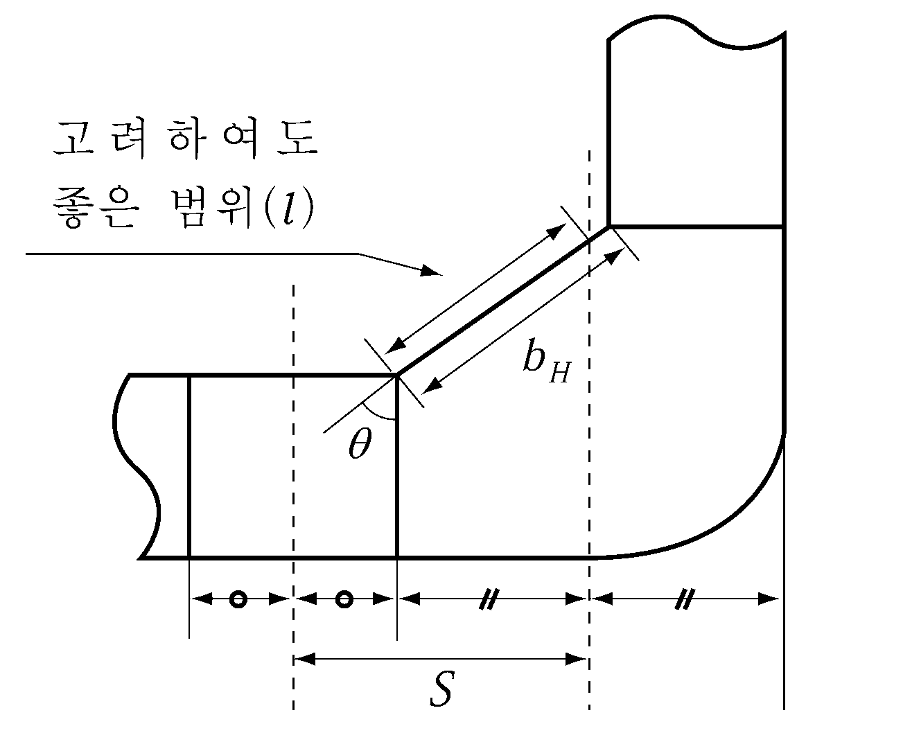
  **그림 7.10.3** #eqnID-1166**의 측정방법**

#### 404. 이중선측구조의 스트링거 및 트랜스버스 치수 【규칙 참조】

- **1.** 이중선측구조 내의 스트링거 두께는 다음 각 호에 의한 $t_1$, $t_2$ 또는 $t_3$ 중 가장 큰 값 이상이어야 한다.
  - **(1)** 유조선의 종류에 따라 다음 식에 의한 두께 $t_1$
    $t_1 = C_5 K \frac{Sh_s x}{d_0 - d_1} +1.5 \mathrm{mm}$
    $S$ : 스트링거가 지지하는 면적의 너비 ($\mathrm{m}$).
    $h_s$ : 다음 식에 의한 $h_s1$ 또는 $h_s2$ 중 큰 값 ($\mathrm{m}$).
    $h_s1 = (0.6d - d_3 ) + 0.038L \mathrm{m}$
    $h_s2 = h' \mathrm{m}$
    $h'$ : 빌지호퍼탱크가 있는 경우에는 빌지호퍼탱크의 상단으로부터, 없는 경우에는 내저판으로부터 창구정부까지의 높이 ($\mathrm{m}$).
    $d_3$ : 선측에서 측정한 이중저 높이 ($\mathrm{m}$). 빌지호퍼 탱크가 있는 경우에는 빌지호퍼 탱크의 상단까지의 높이 ($\mathrm{m}$).
    $d_0$ : 스트링거의 깊이 ($\mathrm{m}$).
    $d_1$ : 고려하는 위치에서의 개구의 깊이 ($\mathrm{m}$). 화물유 탱크내의 횡격벽에 수평거더가 설치된 경우에는 횡격벽과 브래킷 내단사이의 개구는 우리 선급이 필요하다고 인정하는 경우를 제외하고는 고려하지 않아도 된다. (**그림 7.10.2** 참조)
    $x$ : $l_T$ 의 중앙으로부터 고려하는 위치까지의 종방향 거리 ($\mathrm{m}$). 화물유 탱크내 횡격벽에 수평거더가 설치된 경우에 있어서 고려하는 위치가 브래킷내단 사이인 경우에는 $x$ 는 수평거더의 브래킷내단까지 거리로 할 수 있다. 다만, $x$ 가 0.25$l_T$ 이하일 때는 0.25$l_T$ 로 한다. (**그림 7.10.2** 참조)
    $C_5$ : $D '/l_T$ 의 비율에 따른 계수로서 유조선의 종류에 따라 **표 7.10.10**에 의한 값. $D '/l_T$ 의 값이 표의 중간에 있을 때에는 보간법에 의한다.
    $D '$ : 다음 식에 의한 값
    $D ' = D - d_3 \mathrm{m}$
    $l_T$ : 고려하는 화물유 탱크의 길이 ($\mathrm{m}$).
  - **(2)** 화물유 탱크 내의 위치에 따른 두께 $t_2$ 및 $t_3$
    $t _{2} =8.6 root {3} of {\frac{H^2 a^2}{C_6 K} (t_1 - 1.5)} + 1.5 \mathrm{mm}$
    $t_3 = 8.5S_\frac{2}{sqrtK} +1.5 \mathrm{mm}$
    $a$ : 고려하는 위치에서의 스트링거 깊이 ($\mathrm{m}$). 스트링거의 길이방향 휨보강재가 설치된 경우에는 그 휨보강재와 선측외판 및 종격판 사이의 거리 또는 휨보강재 사이의 간격으로 한다.
    $t_1$ : (1)호에 의한 두께 ($\mathrm{mm}$).
    $C_6$ : $S_1$ 과 $a$ 와의 비율에 따른 계수로서 **표 7.10.11**에 의한다. $S_1 /a$ 의 값이 표의 중간일때에는 보간법에 의한다.
    $S_1$ : 스트링거의 깊이 방향으로 설치된 휨보강재의 간격.
    $H$ : **403.**의 **1**항 (2)호에 따른다.
    $S_2$ : $S_1$ 또는 $a$ 중 작은 값 ($\mathrm{m}$).

    **표 7.10.10 계수** $C_5$

    | $D '/l_T$ |   | 0.5 이하 | 0.6 | 0.7 | 0.8 | 0.9 | 1.0 | 1.1 | 1.2 | 1.3 이상 |
    | --- | --- | --- | --- | --- | --- | --- | --- | --- | --- | --- |
    | $C_5$ | C형 | 0.013 | 0.019 | 0.025 | 0.030 | 0.034 | 0.037 | 0.039 | 0.042 | 0.045 |
    | $C_5$ | D형 | 0.020 | 0.024 | 0.028 | 0.032 | 0.035 | 0.038 | 0.040 | 0.042 | 0.045 |

    **표 7.10.11 계수** $C_6$

    | $S_1 /a$ | 0.3 이하 | 0.4 | 0.5 | 0.6 | 0.7 | 0.8 | 0.9 | 1.0 | 1.2 | 1.4 이상 |
    | --- | --- | --- | --- | --- | --- | --- | --- | --- | --- | --- |
    | $C_6$ | 64 | 38 | 25 | 19 | 15 | 12 | 10 | 9 | 8 | 7 |
- **2.** 이중선측구조 내 트랜스버스의 두께는 다음 각 호에 의한 $t_1$, $t_2$ 또는 $t_3$ 중 가장 큰 값 이상이어야 한다.
  - **(1)** 유조선의 종류에 따라 다음 식에 의한 두께 $t_1$
    $t_1 = C_7 K \frac{SD 'h_s}{d_0 - d_1} left(1-1.75 \frac{z}{D '} right) +1.5 \mathrm{mm}$
    $S$ : 트랜스버스가 지지하는 면적의 너비 ($\mathrm{m}$).
    $h_s$ : 다음식에 의한 $h_s1$ 또는 $h_s2$ 중 큰 값 ($\mathrm{m}$). 다만 부분적재 또는 격창적재 등과 같은 균일하지 않은 적재상태가 없는 경우에는 **1**항 (1)호에 따른다.
    $h_s1 = (d - d_3 ) + 0.038L \mathrm{m}$
    $h_s2 = h' \mathrm{m}$
    $d_0$ : 트랜스버스의 깊이 ($\mathrm{m}$).
    $d_1$ : 고려하는 위치에서의 개구의 깊이 ($\mathrm{m}$). 이중선측구조의 트랜스버스 하부에 브래킷이 설치된 경우에는 내저판과 브래킷 내단사이의 개구는 우리 선급이 필요하다고 인정하는 경우를 제외하고 고려하지 않아도 된다. (**그림 7.10.2** 참조)
    $z$ : 내저판으로부터 또는 빌지호퍼 탱크 상단으로부터 고려하는 위치까지의 수직거리 ($\mathrm{m}$). 이중선측구조의 트랜스버스 하부에 브래킷이 설치된 경우에 있어서 고려하는 위치가 브래킷의 내단사이인 경우에는 이들사이의 거리로 하며, 그 이외는 브래킷 내단으로부터 고려하는 지점까지의 수직거리로 한다. 다만, $z$ 가 0.4$D '$ 이상일 경우에는 0.4$D '$ 로 한다. (**그림 7.10.2** 참조)
    $C_7$ : $D '/l_T$ 의 비율에 따른 계수로서 유조선의 종류에 따라 **표 7.10.12**에 의한 값. $D '/l_T$ 의 값이 표의 중간에 있을 때에는 보간법에 의한다.
    $D '$, $h '$, $l_T$ 및 $d_3$ : **1**항 (1)호에 따른다.

    **표 7.10.12 C형 및 D형 유조선의 계수** $C_7$

    | $D '/l_T$ |   | 0.5 이하 | 0.6 | 0.7 | 0.8 | 0.9 | 1.0 | 1.1 | 1.2 | 1.3 이상 |
    | --- | --- | --- | --- | --- | --- | --- | --- | --- | --- | --- |
    | $C_7$ | *C*형 | 0.052 | 0.051 | 0.049 | 0.046 | 0.043 | 0.041 | 0.038 | 0.036 | 0.034 |
    | $C_7$ | *D*형 | 0.034 | 0.034 | 0.034 | 0.034 | 0.033 | 0.033 | 0.032 | 0.031 | 0.030 |
  - **(2)** 다음 식에 의한 두께 $t_2$ 및 $t_3$
    $t _{2} =8.6 root {3} of {\frac{H ^{2} a ^{2}}{C _{6} K} (t _{1} -1.5)} +1.5 \mathrm{mm}$
    $t _{3} = 8.5S_\frac{2}{sqrtK} + 1.5 \mathrm{mm}$
    $a$ : 고려하는 위치에서의 트랜스버스 깊이 ($\mathrm{m}$). 트랜스버스의 길이 방향으로 수직 휨보강재가 설치된 경우에는 그 휨보강재와 선측외판 또는 종격벽판 사이의 거리 또는 휨보강재 사이의 간격으로 한다.
    $t_1$ : (1)호에 의한 두께 ($\mathrm{mm}$).
    $C_6$ 및 $S_2$ : **1**항 (2)호에 의한다.
    $H$ : **403.**의 **1**항 (2)호에 따른다.
- **3.** 이중선측구조내 스트링거 및 트랜스버스의 두께를 구하는 경우의 **1**항 (1)호의 식 중 $S$ 는 **그림 7.10.4**와 같이 측정한 것을 표준으로 한다. 또한 해당 스트링거의 유효 단면적을 구하는 경우는 **그림 7.10.4**에 표시한 $l$ 의 범위의 경사판에 대하여 다음 식에 의한 단면적 $A_e$ 를 해당 스트링거의 유효 단면적에 산입할 수 있다. 다만 $l$ 이 경사판의 너비 $b_H$ 를 넘을 경우에는 $l$ 은 $b_H$ 로 한다.
  $A_e = 10 smallsum h_i t_i left(1 - \frac{\theta}{90} right) \mathrm{cm^2 }$
  $h_i$ : $l$ 의 범위내 경사판의 너비 ($\mathrm{m}$).
  $t_i$ : 경사판의 두께로 부터 2.5 $\mathrm{mm}$ 를 뺀 두께 ($\mathrm{mm}$).
  $\theta$ : 선측스트링거와 경사판이 이루는 각 (도).

#### 405. 화물유 탱크 및 디프 탱크의 거더 및 트랜스버스 【규칙 참조】

- **1.** $l$ **의 측정**
  거더의 $l$ 의 측정은 **그림 7.10.5**와 같이 한다.
  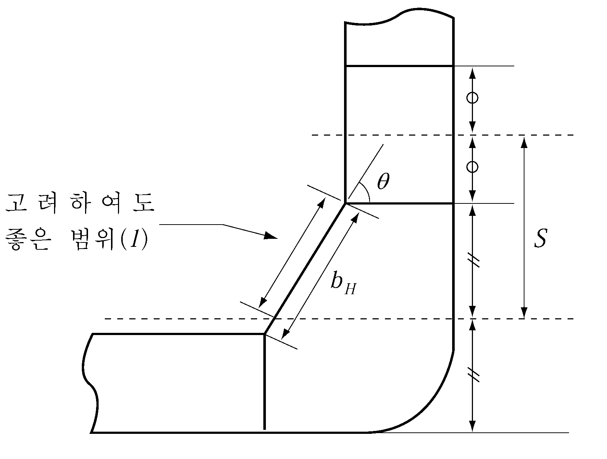
  **그림 7.10.4** #eqnID-1287**의 측정방법** 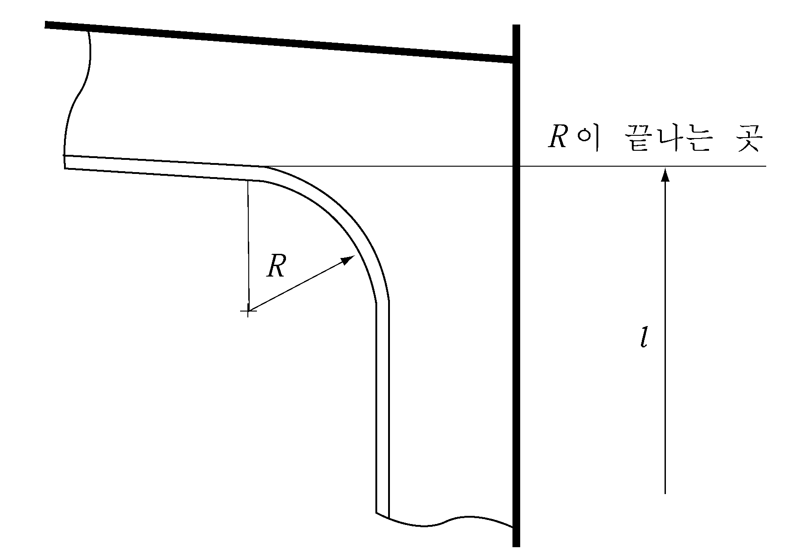
  **그림 7.10.5** #eqnID-1288**의 측정방법**
- **2.** **종격벽 트랜스버스**
  - **(1)** 종격벽의 반대측에 큰 브래킷이 있는 경우에도 트랜스버스의 길이 $l$ 및 $R$ 은 현측탱크에서 **1**항의 요령에 따라 측정한다. 다만, 브래킷의 크기 $b$ 는 0.5$(b' + b'')$ 로 할 수 있다. 다만, $b''$ 가 $b'$ 보다 작은 경우에는 $b'$ 로 한다. (**그림 7.10.6** 참조)
    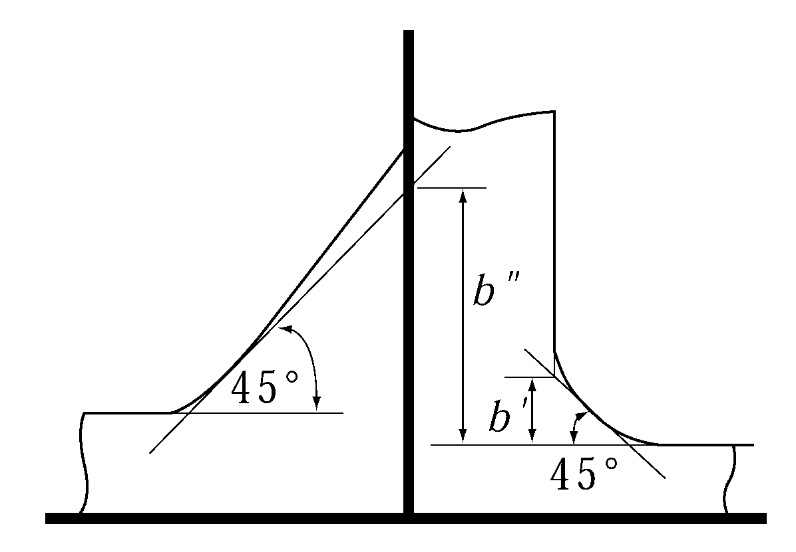
    **그림 7.10.6** #eqnID-1296**측정방법**
  - **(2)** 전단력에 의한 웨브두께의 식에 있어서는 종격벽의 반대측에 부착하는 브래킷도 고려할 수 있다.
  - **(3)** 파형격벽에 설치되는 거더는 ballanced girder로 한다. 다만, ballanced girder로 할 수 없는 경우에는 거더의 중성축을 가능한 한 격벽에 가까이 하도록 하여야 한다.

### 제 5 절 구조상세

#### 501. 일반 【규칙 참조】

**표 7.10.13** 중 O표시가 있는 란은 종갑판보 또는 종늑골을 관통시켜야 한다.

#### 503. 거더 및 크로스타이 【규칙 참조】

- **1.** **일반**
  - **(1)** 경감구멍을 시공하는 경우 그 크기 및 위치는 **그림 7.10.7**과 같이 한다.
    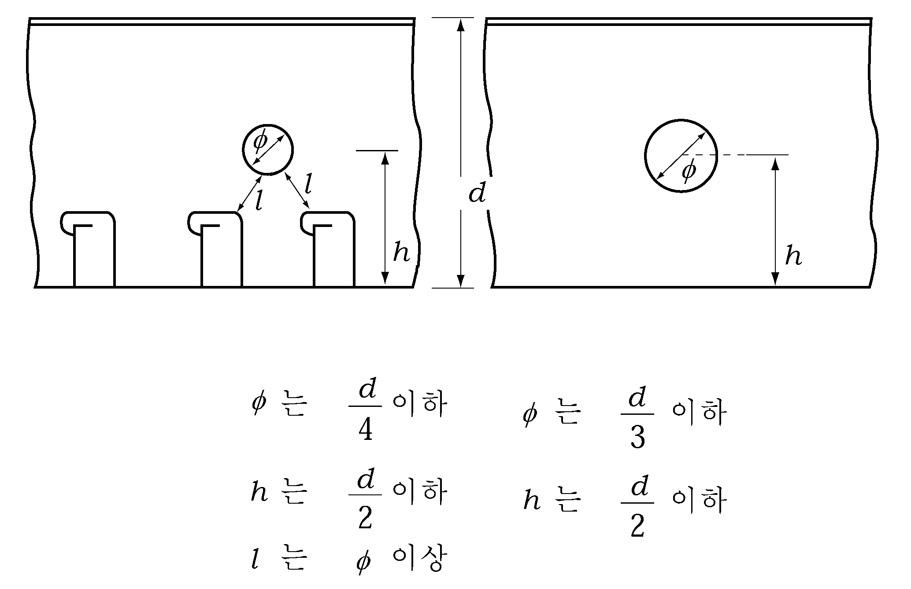
    **그림 7.10.7 경감구멍의 위치와 크기**
  - **(2)** 종통재의 면재가 맞닿는 개소와 빌지부 등과 같이 슬롯의 간격이 좁은 경우는 슬롯에 칼라를 설치한다.
  - **(3)** 거더의 깊이가 규정의 깊이보다 작은 경우에는 거더의 단면계수는 규정의 단면계수에 규칙에서 정하는 거더의 깊이와 실제 거더의 깊이와의 비를 곱하여 구한다.
  - **(4)** 펌프실 또는 보이드 구역의 웨브두께는 화물유 탱크내 웨브로서 계산된 두께에서 1 $\mathrm{mm}$ 를 감한 값으로 할 수 있다.
  - **(5)** 선박중앙부의 분리평형수탱크내의 모든 구조부재 치수는 화물유 탱크내의 부재치수로 한다.
  - **(6)** 트랜스버스 단부의 브래킷 부분, 크로스타이와의 결합부 등 전단응력이 높은 위치 및 압축응력이 높다고 생각되는 부분에는 휨보강재를 증설할 필요가 있으며 또한 해당부분에는 경감구멍을 시공하여서는 안된다. 필요하다면 그 부분에는 종통재 관통부의 슬롯에 칼라를 설치할 필요가 있다.
  - **(7)** 거더의 모서리부의 곡률은 가능한 한 크게 한다.
  - **(8)** 거더 등에 설치하는 휨보강재를 평강대신에 산형강을 사용하는 경우는 규정에 의한 강성 이상이 되도록 하여야 한다.
  - **(9)** 트랜스버스 면재의 이음부분 및 거더판의 이음부분에는 거더판에 스캘럽(Scallop)을 설치하여서는 안된다. 공작상 필요한 스캘럽은 용접으로 메운다. 또한 인접하는 면재는 그 치수의 급격한 변화를 피한다. (**그림 7.10.8** 참조)
  - **(10)** 늑판, 선측트랜스버스, 종격벽트랜스버스와 종늑골이 결합하는 부분에는 각각 **표 7.10.14**의 범위에 대하여 트랜스버스 휨보강재의 반대쪽에 브래킷을 설치하여 트랜스버스와 종늑골을 고착하든지 또는 슬롯에 칼라를 설치하는 등 적절히 보강한다.
    다만, $L$ 이 230 $\mathrm{m}$ 이하인 경우에는 그 보강범위를 적절히 참작할 수 있다. 또한 이 보강은 상기 트랜스버스류와 유사한 상황에 있는 슬롯 (예 : 제수격벽의 슬롯)에 대하여도 이를 준용한다.
  - **(11)** 거더판 상호간의 이음은 맞댐이음을 표준으로 한다. 겹이음으로 하는 경우에는 이음에 교차하는 휨보강재를 설치할 필요가 있다.

    **표 7.10.14 보강범위**

    | 부재 | 보강범위 |
    | --- | --- |
    | 선저트랜스버스 | 결합부 전부 |
    | 선측트랜스버스 | 상부 크로스타이의 상부 $R$이 끝나는 또는 만재흘수선 중 높은 곳에서부터 하방의 결합부 전부. 다만 $L$이 300$\mathrm{m}$이상의 경우는 상기의 상방까지도 이에 준하여 보강할 것을 권장한다. |
    | 종격벽트랜스버스 | 상부 크로스타이의 상부 $R$이 끝나는 곳 이하의 결합부 전부 |
- **2.** 내저판과 빌지호퍼 경사판과의 교차부의 구조는 다음에 따른다.
  - **(1)** 교차부의 구조가 **그림 7.10.9**과 같은 구조인 경우 (built-up 구조)에는 다음 (가) 또는 (나)에 따른다.
    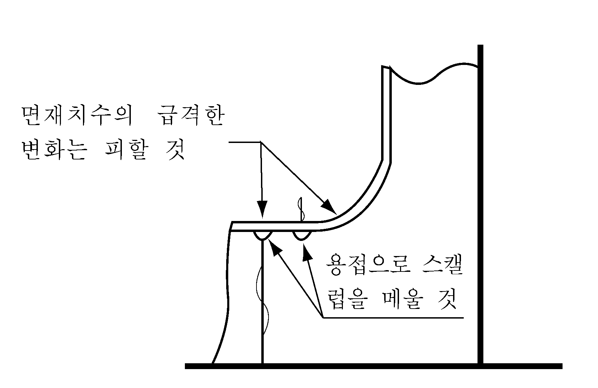
    **그림 7.10.8** 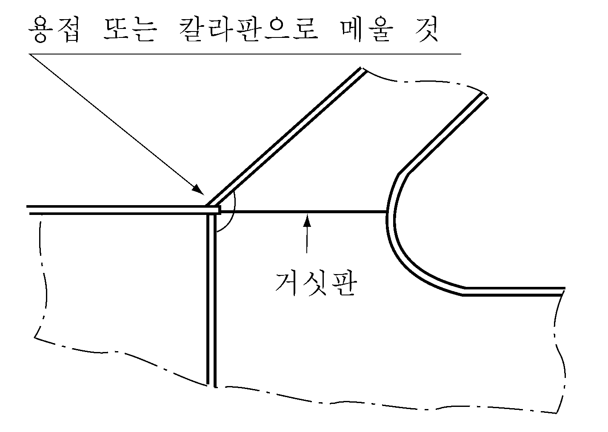
    **그림 7.10.9**
    - **(가)** 빌지호퍼 트랜스버스 교차부의 스캘럽은 메우든지 또는 칼라판으로 막을 것 (**그림 7.10.9** 참조)
    - **(나)** 빌지호퍼 트랜스버스에는 내저판의 연장선상에 거싯판을 설치할 것 (**그림 7.10.9** 참조)
    - **(다)** 다만, 늑판의 간격이 2 $\mathrm{m}$ 이상인 경우는 (가) 또는 (나)에 추가하여 늑판사이의 중앙에 경사판 직하 측거더에 인접하는 내저종늑골 및 경사판 종늑골에 도달하는 보강재를 설치할 필요가 있다. (**그림 7.10.10** 참조)
  - **(2)** 교차부의 구조가 **그림 7.10.11**와 같은 구조(knuckle 구조인 경우)에는 (1)호 (다) 및 다음 (가)에 추가하여 다음 (나) 또는 (다)에 적합하여야 한다.
    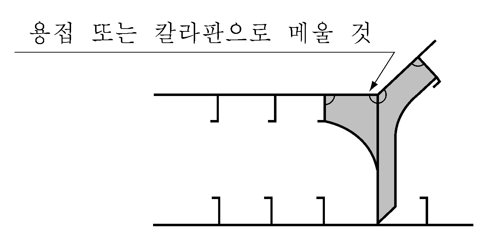
    **그림 7.10.10** 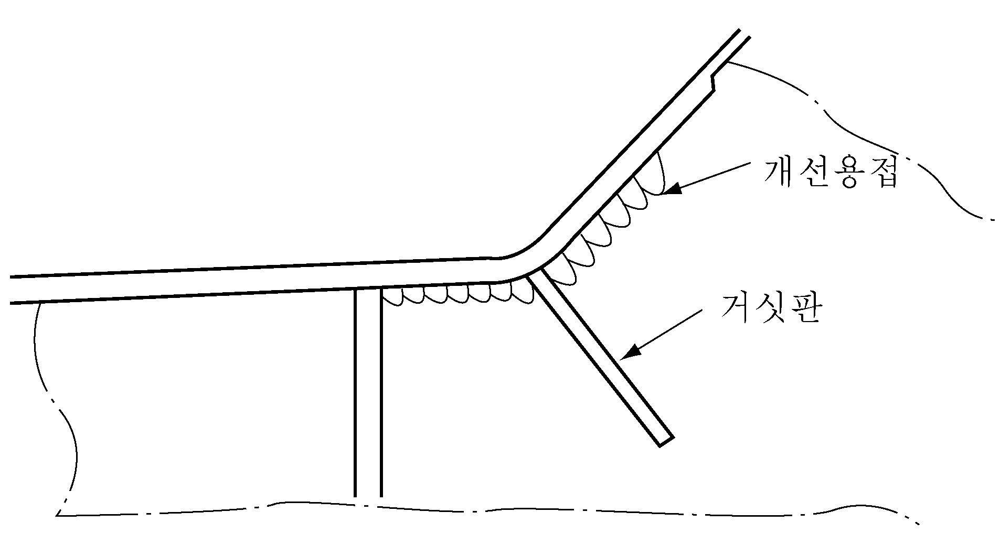
    **그림 7.10.11**
    - **(가)** 너클부는 가능한 한 개선용접을 하여야 한다.
    - **(나)** 늑판이 설치되어 있는 위치에서는, 내저판의 연장상의 빌지호퍼 경사판에는 거싯판을 설치하여야 하고, 너클부의 곡률반경이 큰 경우에는 거싯판을 적절히 증가시켜야 한다.
    - **(다)** 늑판의 전후 300 $\mathrm{mm}$ 이내에 **그림 7.10.10**과 같은 휨보강재를 설치하여야 한다.
- **3.** 빌지호퍼 탱크와 이중선측구조용 종격벽의 교차부의 구조는 **2**항에 따른다.
- **4.** **큰 브래킷의 구조상세**
  거더, 크로스타이 또는 트랜스버스 끝단 브래킷의 구조상세는 **그림 7.10.12**을 표준으로 한다.
  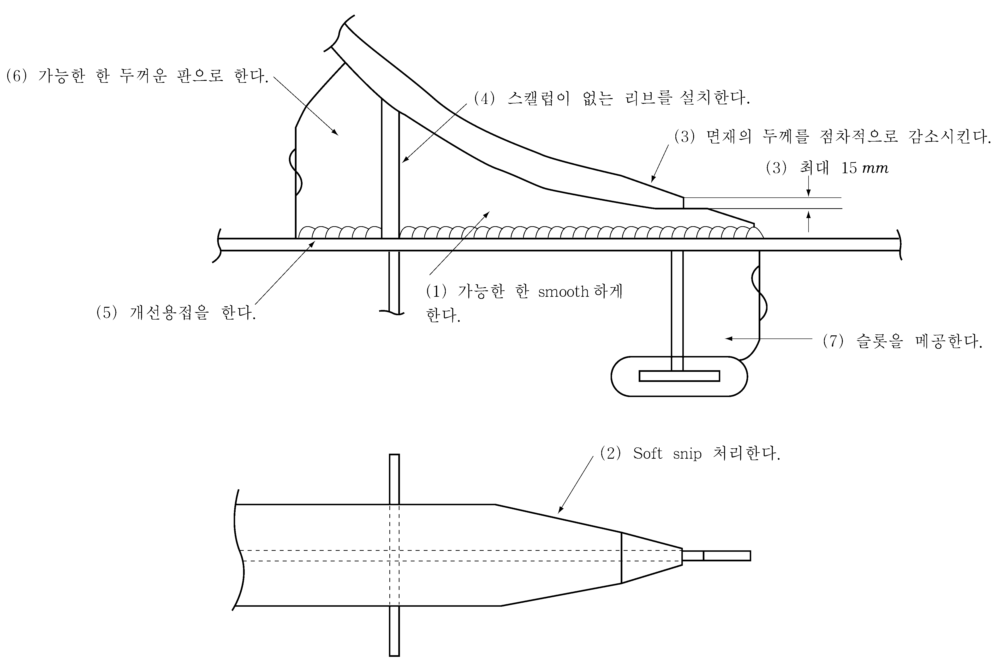
  **그림 7.10.12 브래킷 토우의 구조상세**
- **5.** **크로스타이의 고착**
  **그림 7.10.13**와 같은 구조인 경우 ※ 표시의 브래킷을 반드시 설치하여야 한다.
  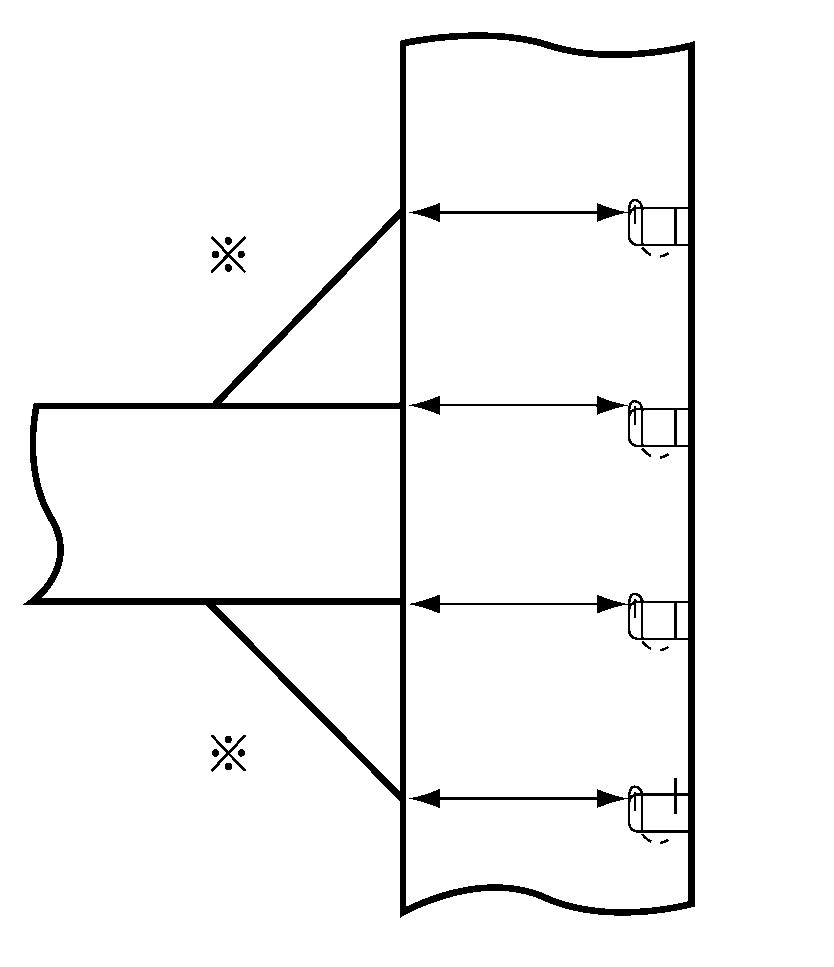
  **그림 7.10.13**

### 제 6 절 부식에 대한 특별요건

#### 607. 화물유탱크를 이루는 내저판의 두께 【규칙 참조】

- **1.** 규칙 **1**항에 규정한 내저판의 두께는 다음의 요건을 따라야 한다. 주로 원유운반에 종사하는 선박의 내저판의 두께 $t$ 는 다음 식에 의한 것 이상이어야 한다. 다만, 내저판이 경사진 경우에는 그러하지 아니한다.
  $t = 0.026L + 9.0 \mathrm{mm}$
- **2.** 규칙 **2**항에 의하여 두께를 증가시키는 범위는 **그림 7.10.14**에 따른다. 이 범위의 두께는 **규칙 607.**의 **2**항에 의한 것과, **1**항에 의한 것에 2.0 $\mathrm{mm}$ 를 더한 것 중 큰 것 이상이어야 한다.
  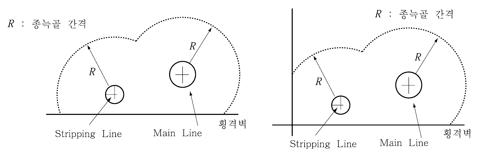
  **그림 7.10.14 내저판의 부식에 대한 보강 범위**

### 제 8 절 중간갑판(mid-deck)을 갖는 선박에 대한 규정

#### 801. 적용 【규칙 참조】

- **1.** 중간갑판 하부의 화물유탱크내의 구조부재치수를 **규칙 201., 302.** 및 **403.**의 규정에 따라 구하는 경우의 $h_1$, $h_2$ 및 $h_3$ 는 **표 7.10.15**에 의한다.

  **표 7.10.15 하중** $h_1$**,** $h_2$ **및** $h_3$

  | **규정** **하중** | **규칙 201.** | **규칙 302.** | **규칙 403.** |
  | --- | --- | --- | --- |
  | $h_1$ | 해당격벽판의 하단으로부터 중간갑판까지의 수직거리 ($\mathrm{m}$) | 수직 휨보강재의 경우는 $l$ 의 중앙으로부터, 수평 휨보강재의 경우는 상하 휨보강재간의 중앙으로부터 중간갑판까지의 수직거리 ($\mathrm{m}$) | 수평거더의 경우는 $S$ 의 중앙으로부터, 수직거더의 경우는 $l$ 의 중앙으로부터 중간갑판까지의 거리 ($\mathrm{m}$) |
  | $h_2$ | 0.85$(h_1 + \Delta h) \mathrm{m}$, $\Delta h$ 는 **규칙 표 7.10.2**에 의한다. | 0.85$(h_1 + \Delta h) \mathrm{m}$, $\Delta h$ 는 **규칙 표 7.10.2**에 의한다. | 0.85$(h_1 + \Delta h) \mathrm{m}$, $\Delta h$ 는 **규칙 표 7.10.2**에 의한다. |
  | $h_3$ | 해당격벽의 하단으로부터 창구정부까지의 수직거리에 0.7 을 곱한 것 ($\mathrm{m}$) | 수직 휨보강재의 경우는 $l$ 의 중앙으로부터, 수평 휨보강재의 경우는 상하 휨보강재간의 중앙으로부터 창구정부까지의 수직거리에 0.7 을 곱한 것($\mathrm{m}$) | 수평거더의 경우는 $S$ 의 중앙으로부터, 수직거더의 경우는 $l$ 의 중앙으로부터 창구정부까지의 수직거리에 0.7 을 곱한 것 ($\mathrm{m}$) |
- **2.** 중간갑판의 두께를 하부 화물유탱크의 정부로 취급하여 구하는 경우, **1**항의 하중을 사용하여 **규칙 201.**에 따라 구한 값에 1.0 $\mathrm{mm}$ 를 더한 것 이상이어야 한다.

### 제 9 절 창구 및 상설보행로에 대한 특별규정

#### 902. 화물유 탱크에 설치하는 창구 (2018) 【규칙 참조】

- **1.** 화물유 탱크에 설치하는 창구에 FRP제 창구덮개를 설치하는 경우에는 **1장 202.**의 **1**항에 따른다.
- **2.** Tank cleaning 창구덮개에 대하여는 **1장 202.**의 **2**항 및 **3**항에 따른다.

#### 904. 상설보행로 【규칙 참조】

**규칙 904.**의 **1**항에서 “우리 선급이 적절하다고 인정하는 바”라 함은 **4편 4장 501.**을 말한다.

### 제 10 절 용접

#### 1002. 필릿용접 【규칙 참조】

굽힘, 전단 및 축력이 큰 부분에서는 필릿용접의 각장을 적절히 증가시켜야 한다. 
