# 제7편 전용선박(1장~4장,7장~10장)

> 선급 및 강선규칙/적용지침 / RA-07A-K / 2025 / KO / Guidance

## 부록 7-2 컨테이너 고박설비에 관한 지침 【규칙 참조】

### 1. 일반

#### (1) 적용

- **(가)** 이 지침은 **ISO 668**의 20 ft 또는 40 ft 컨테이너를 운송하는 경우의 컨테이너 고박설비에 대하여 적용하며, **별첨 1**의 다른 형태의 컨테이너의 경우에도 원칙적으로 이 지침의 요건을 적용하여야 한다.
- **(나)** 이 지침의 규정에 의하지 아니하고 기타 다른 방법에 의하여 고박설비를 설계하고 배치한 경우에는 **규칙 1편 1장 105**.에 따라 인정하는 바에 따른다.
- **(다)** 컨테이너 고박설비의 일부이거나 선체구조 강도에 영향을 줄 수 있는 고정식 고박설비는 본 지침에 따라 승인되어야 한다. 연결상세 및 선체지지구조는 **8**항의 설계하중 또는 고박설비의 안전사용하중(SWL)에 적합함이 검증되어야 한다. 고박설비, 부착, 고정지지대의 재료 및 용접 등 상세정보가 반영된 도면이 제출되어야 한다.
- **(라)** 컨테이너는 화물고박지침서에 따라 스택 내에서 허용되는 중량과 분포를 초과하지 않도록 적재하여야 한다. 허용하중을 포함하는 적재방식은 본선에 비치되는 화물고박지침서 또는 컨테이너 고박설비 배치도에 명시되어야 한다.
- **(마)** 컨테이너 고박설비의 이동식 또는 고정식 부속품이 하역설비 목적으로 사용되는 경우(예를 들어, 창구덮개 하역용으로 사용되는 페데스탈 소켓 및 부속품, 또는 수직 탠덤(tandem)하역에 사용되는 트위스트락(twistlock)), **규칙 및 적용지침 9편 2장**을 적용할 수 있다. 하역설비용으로 승인되지 않는 장치나 부속품은 컨테이너 고박설비로만 사용하여야 한다.
- **(바)** 컨테이너 전용선박의 경우, 선수갑판 파랑충격하중으로부터 컨테이너를 보호하기 위하여 유효한 물결막이(Breakwater)를 설치하여야 한다. 노출갑판 위에 컨테이너를 적재하는 그 외 선박의 경우 화물 보호를 위한 물결막이 설치를 권장한다. 선수로부터 0.25$L _{BP}$ 전방의 구역에서는 선수갑판 파랑충격에 견딜 수 있도록 컨테이너 출입문이 선미쪽으로 향하도록 배치할 것을 권장한다.
- **(사)** 항로 및 선속과 관련된 부적절한 운항 또는 과도 횡요(parametric rolling) 등과 같은 임계현상은 **8**항에서 규정하는 하중을 초과하는 불리한 하중을 발생시킬 수 있다. 화물에 작용하는 하중을 감소시키기 위하여 과도한 선체운동이 발생하지 않도록 운항할 책임은 선장에게 있다.
- **(아)** 수식에 기초한 계산의 예는 **별첨 3**을 참고한다.

#### (2) 특기 사항

- **(가)** 본 지침에 따라 설계 및 제작된 컨테이너 고박설비가 설치되는 경우, 해당선박의 선급부호에는 특기사항 **LS**를 부여한다. 화물고박지침서에는 컨테이너 고박설비배치도가 포함되어야 하며 승인용으로 우리 선급에 제출하여야 한다.
- **(나)** (가)에 추가하여 우리 선급에 의하여 승인된 고박강도 계산프로그램이 본선에 설치 및 유지되는 경우, 특기사항 **LS(CL)**를 부여한다. 고박강도계산기기의 승인절차는 **9**항에 따른다.
- **(다)** 항로별 경감계수를 적용하고자 하는 경우에는 화물고박지침서에 항로별 경감계수 적용과 관련된 사항이 포함되어야 하며, 항로별 경감계수가 반영된 승인된 컨테이너 고박강도계산 프로그램을 본선에 설치하여야 한다. 이 경우, 해당 선박에는 특기사항 **LS(CL, RS)**를 부여한다.
- **(라)** (다)와 관련하여, 임의의 항로에 대한 경감계수를 산출할 수 있는 프로그램을 설치한 경우, 해당선박에는 특기사항 **LS(CL, RS+)**를 부여한다. *(2019)*
- **(마)** **제조법 및 형식승인 등에 관한 지침 제3장 제25절 2504.** 또는 **2505.**에 따라 설계 및 제작된 컨테이너 고박설비를 적용한 선박에는 특기사항 **LS(HHS 또는 HHT)**를 부여한다. *(2023)*
- **(바)** 상기의 특기사항이 없는 선박은 선주의 요청에 따라 이 지침을 적용할 수 있다.

#### (3) 고박방법의 종류

- **(가)** 컨테이너는 다음 중 어느 하나 또는 여러 방법을 조합하여 고박하여야 하며 본 지침에 없는 기타의 방법으로 컨테이너를 고박하고자 하는 경우에는 우리 선급이 적절하다고 인정하는 바에 따른다.
  - **(a)** 컨테이너 잠금장치
  - **(b)** 로드, 와이어 또는 체인 등에 의한 래싱
  - **(c)** 버트레스, 버팀목(shore) 또는 기타 동등 구조물에 의한 고박
  - **(d)** 셀가이드
- **(나)** 화물깔개(Dunnage)는 **4**항 (5)호에 규정한 선하중 적재일 경우를 제외하고 승인된 컨테이너 고박설비와 사용하여서는 안 된다.

#### (4) 제출도면 및 자료

다음의 도면 및 자료를 제출하여 우리 선급의 승인을 받아야 한다.

- **(가)** 컨테이너 적재배치도 (운송할 컨테이너의 설계중량 및 배치가 반영된 것. 단, 최소한 다음의 배치는 포함되어야 한다.) *(2025)*
  - **(a)** 화물창 내 20FT 컨테이너 적재 배치(20FT 컨테이너 단독 배치, 40FT 컨테이너 상부 배치 포함)
  - **(b)** 화물창 내 40FT 컨테이너 적재배치
  - **(c)** 노출갑판 상 20FT 컨테이너 적재배치
  - **(d)** 노출갑판 상 40FT 컨테이너 적재배치
  - **(e)** 노출갑판 상 40FT High Cubic 적재배치
  - **(f)** 운송 컨테이너의 특이 적재배치(갑판상 러시안 적재배치, 45FT, 48FT, 53FT 컨테이너 적재배치 등)
- **(나)** 컨테이너 고박설비에 대한 배치 및 상세도
- **(다)** 다음의 내용이 포함된 컨테이너 고박설비 강도계산서
  - **(a)** 컨테이너 적재에 따른 흘수 $d _{c}$, 선박의 수직방향 중심위치(*VCG*), 부면심의 종방향 위치(*LCF*) 및 횡방향 메타센터의 높이(*GM*) 등
  - **(b)** 설계 풍속
  - **(c)** 컨테이너 래싱 강도 계산은 운용중 예상되는 최대 GM값을 기초로 계산하여야 하며, 0.075B를 표준으로 한다. 다만, 선박의 운용상 필요시 이보다 낮은 GM값을 선정하여 계산할 수 있다. *(2017)*
- **(라)** ISO 컨테이너 이외 다른 형식의 컨테이너를 적재하는 경우, 이들 컨테이너가 적재되는 위치를 화물고박지침서에 명확히 표시하여야 한다. 또한 ISO 컨테이너가 아닌 경우, 강도평가기준값을 화물고박지침서에 명시하여야 한다. 전체가 ISO기준에 적합한 컨테이너로만 구성된 스택의 컨테이너 중량 및 요구되는 고박설비에 대하여도 화물고박지침서에 표시하여야 한다. *(2019)*


### 2. 고정식 컨테이너 고박설비(fixed cargo securing fittings)의 재료 및 시험

#### (1) 일반

- **(가)** 고정식 컨테이너 고박설비는 **제조법 및 형식승인 등에 관한 지침 3장 25절**에 따라 형식승인을 받아야 한다.
- **(나)** **지침 4장 10절**에 따라 제품시험(production test)을 받아야 한다.

#### (2) 재료 및 설계

- **(가)** 고정식 컨테이너 고박설비의 제작에 사용되는 강재는 **규칙 2편 1장**의 규정에 적합한 것이어야 한다. 다만 선급이 인정하는 경우, 국제표준(ISO), 국가표준 또는 이와 동등한 기준에 적합한 재료를 사용할 수 있다. 설치되는 부위의 선체 재료의 등급 및 인장강도를 고려하여야 하며, 화학성분 또한 용접성을 고려하는 것이어야 한다. 또한, 우리 선급이 필요하다고 인정하는 경우에는 용접법 승인시험을 요구할 수 있다.
- **(나)** 셀가이드 및 고박설비가 저온 환경에서 사용되는 경우, 이들 강재의 등급은 특별히 고려하여야 한다.
- **(다)** 강재 이외의 재료를 사용하고자 하는 경우 특별히 고려하여야 한다.
- **(라)** 과도한 부식을 일으킬 수 있는 포켓이나 리쎄스에는 물이 고이는 것을 방지하기 위한 수단의 필요성을 검토하여야 한다.


### 3. 이동식 (loose) 컨테이너 고박설비의 재료 및 시험

#### (1) 일반

- **(가)** 이동식 컨테이너 고박설비는 **제조법 및 형식승인 등에 관한 지침 3장 25절**에 따라 형식승인을 받아야 한다.
- **(나)** **지침 4장 10절**에 따라 제품시험(production test)을 받아야 한다.
- **(다)** 전자동 고박설비 (fully automatic fitting)라 함은 컨테이너 하역시 수동조작이 요구되지 않는 고박설비를 말한다. 일반적으로 전자동 고박설비는 수직거동만 있는 수직(upright)조건에서 수직방향 (창구덮개에 수직)으로 컨테이너를 기계적으로 고박하지 않는다. 이와 다른 조작모드 또는 새로운 설계는 특별히 고려할 수 있다.

#### (2) 재료 및 설계

- **(가)** 이동식 컨테이너 고박설비에 사용되는 강재는 **규칙 2편 1장**의 규정에 적합한 것이어야 한다. 다만 선급이 인정하는 경우, 국제표준(ISO), 국가표준 또는 이와 동등한 기준에 적합한 재료를 사용할 수 있다.
- **(나)** 이동식 컨테이너가 낮은 온도에서 사용되는 경우, 이들 강재의 등급은 특별히 고려하여야 한다.
- **(다)** 강재 이외의 재료를 사용하고자 하는 경우, 특별히 고려하여야 한다.
- **(라)** 선적되기 전, 안벽에서 컨테이너 코너 캐스팅에 우선 체결되는 잠금설비 및 기타설비는 낙하의 위험 및 진동의 영향으로 헐거워지는 위험을 최소화 할 수 있는 것이어야 한다.
- **(마)** 트위스트락/하부 트위스트락/미드락/중간판을 가진 스태커/전자동 고박설비의 경우, 컨테이너의 코너 캐스팅과 고박설비 사이의 인장과 압축에 대한 접촉부는 고박설비의 안전사용하중 하에서의 지압응력(bearing stress)이 300 $\mathrm{N}/mm ^{2}$을 넘지 않아야 한다. 고강도 재료로 제작된 고박설비 사용으로 인한 허용응력의 증가는 고려하지 않는다. 접촉부가 컨테이너 코너 캐스팅에 평행하지 않고 경사를 갖도록 설계된 경우, 유효접촉면적을 특별히 고려할 수 있다.


### 4. 셀가이드 없는 노출갑판상 적재시 컨테이너 고박설비의 배치

#### (1) 일반

- **(가)** 갑판상 또는 창구덮개 상에 적재되는 컨테이너는 종방향으로 적재하여야 하며, 횡방향으로 적재할 경우에는 우리 선급이 적절하다고 인정하는 바에 따른다.
- **(나)** 컨테이너는 선측 밖으로 나오지 않도록 적재하여야 한다. 컨테이너가 창구 코밍이나 다른 갑판 구조 밖으로 튀어나오는 경우, 적절한 지지를 하여야 한다. 적재배치는 본선의 필요작업을 위하여 선원이 안전하게 접근할 수 있어야 하며, 잠금장치의 조작 및 점검을 위하여 충분한 접근수단이 제공되어야 한다.
- **(다)** 창구덮개에 컨테이너가 적재될 경우, 창구덮개에서의 이동을 방지하기 위하여, 승인된 형식의 멈춤장치를 설치하여야 하며, 이의 위치와 구조상세가 포함된 도면을 우리 선급에 제출하여야 한다.
- **(라)** 래싱용 D-ring과 같은 고박설비 및 컨테이너를 지지하는 지지대(stanchion) 및 유사 구조물은 부과되는 하중에 대한 적절한 강도를 가져야 하며, 고박설비의 유효성을 감소시킬 수 있는 모든 변형을 최소화하기에 충분한 강성을 가져야 한다.
- **(마)** 가벼운 컨테이너 위에 무거운 컨테이너를 적재하는 것은 승인된 컨테이너 고박설비 배치도 또는 본선의 래싱 프로그램으로 만족함이 입증되지 않는 한, 허용되지 않는다.
- **(바)** 외부래싱이나 수직래싱에 반자동/전자동 고박 설비를 사용할 경우, 해당 래싱에 적합한 제품을 사용하여야 한다. *(2017)*
  - **(a)** 코너 캐스팅과 고정지지대 사이에 규정된 간격을 요구하는 잠금방법을 적용하는 잠금장치는 한쪽이 창구덮개에서 지지되고 다른 쪽은 컨테이너 지지대(stanchion)에 의하여 지지되는 스택의 최저층에 사용되어서는 안 된다. 또한 여러 개의 창구덮개 또는 운항중 상대변형이 발생할 수 있는 지지구조에 의하여 지지되는 스택에서도 사용되어서는 안 된다.

#### (2) 1단 적재

컨테이너는 다음 (가) 또는 (나) 중 어느 하나의 방법으로 고박하여야 한다.

- **(가)** 컨테이너 하부 코너 캐스팅(corner casting)에서 승인된 잠금장치를 이용하여 고박하여야 한다.
- **(나)** 상부의 각 모서리부에 있는 코너 캐스팅를 이용하여 각 컨테이너의 양단벽에서 래싱설비로 대각선 또는 수직방향으로 고박하여야 한다.

#### (3) 2단 적재

다음 (가) 에서 (다) 중 어느 하나의 방법으로 고박하여야 한다.

- **(가)** 각 층별로 컨테이너 하부 모서리에서 승인된 잠금장치를 이용하여 고박하여야 한다.
- **(나)** 계산결과 스택의 임의의 점에서 수직 분리력이 일어나지 않는 경우, 스택의 모든 내부 모서리에는 이중 스택킹 콘을 사용하고, 스택의 상부 횡방향으로 연결하는 브리지 설비를 사용할 수 있다. 다만 모든 외부 모서리에는 잠금장치를 설치하여야 한다.
- **(다)** 컨테이너는 스택킹 콘(stacking cone)과 래싱설비를 이용하여 고박할 수 있다. 다만 계산결과 수직 분리력이 일어나는 경우, 스택킹 콘 대신에 잠금장치와 래싱설비를 이용하여 고박하여야 한다.

#### (4) 3단 이상의 적재

- **(가)** 컨테이너는 각 층별로 컨테이너 하부 모서리에서 승인된 잠금장치를 이용하여 고박하여야 한다.
- **(나)** 컨테이너는 래싱설비로 고박할 수 있다. 1층 또는 2층은 스택킹 콘과 함께 래싱설비로 고박할 수 있다. 다만, 계산결과 수직 분리력이 일어나는 경우에는 잠금장치에 의하여 고박하여야 한다.
- **(다)** 래싱설비를 사용하는 경우, 하층 컨테이너의 상부 코너 캐스팅이 아니라 상층 컨테이너의 하부 코너 캐스팅에 래싱되어야 한다.
- **(라)** 이중 래싱 (internal para-lash 배치)을 사용하는 방안이 고려될 수 있다. 이중 래싱하는 방법으로, 하나는 상층 컨테이너의 하부 코너 캐스팅에, 다른 하나는 하층 컨테이너 상부 코너 캐스팅에 래싱한다. 래싱설비의 하부 끝단은 적절히 연결되어야 한다. 외부 이중래싱(external para-lash 배치)은 가능한 한 권고하지 않으며, 부득이 사용하는 경우 체결 부위의 래싱 상호 간섭 및 고박 강도(상부 래싱)에 대하여 특별한 주의가 필요하다. *(2017)*
- **(마)** 3단 이상 적재되는 경우, 각 층과 각 코너마다 잠금장치로 고박하여야 한다.
- **(바)** 래싱 브릿지 (lashing bridge)와 연결되는 수평 래싱설비를 사용하고자 하는 경우, 특별히 고려하여야 한다. 고박시스템 (securing system)에서의 힘은 다음의 영향들을 고려하여 직접계산에 의하여 결정되어야 한다.
  ․ 컨테이너 측면벽/단벽 (side/end wall), 래싱설비 및 래싱 브릿지의 강성
  ․ 컨테이너 고박설비와 창구덮개 스토퍼 사이의 틈새간격에 따른 해당 컨테이너의 수평 이동가능 변위
- **(사)** 수직 래싱이 고박설비와 결합되어 사용되는 경우, 고박설비와 컨테이너 코너 캐스팅 사이의 수직간격을 고려하여야 한다.
  - **(a)** 래싱 어셈블리(assembly)는 스택에 수직 래싱이 작용되는 지점 아래에 적용된 고박설비 전체의 연신율과 대등한 연신율(elongation)을 받더라도 탄성을 유지하여야 한다. 턴버클과 설비의 과응력(overstressing)을 피하기 위하여, 스프링 또는 기타 탄성체를 턴버클과 설비의 어셈블리에 포함시키는 것이 유리하다. 래싱 브릿지 높이에서부터 래싱하는 경우, 적용된 고박설비의 수는 적재된 가장 낮은 컨테이너 높이까지 포함하여야 한다. 래싱 설비는 컨테이너의 하부 코너 캐스팅에 설치되어야 한다. **ISO 3874**에 따른 설계간격을 가지는 컨테이너 고박설비의 경우, 래싱 시스템의 전체 연신율을 결정하기 위하여, 고박설비 당 공칭간격은 10 $\mathrm{mm}$로 하여야 한다. 공칭간격이 10 $\mathrm{mm}$를 넘는 고박설비의 경우, 전체 연신율은 높은 연신율을 고려하여 계산하여야 한다.
  - **(b)** 래싱 계산시 수직 래싱의 하중베어링 (load bearing)를 고려하기 위하여, 허용계산 수직 분리력 (permissible calculated lifting force)을 컨테이너 고박설비의 안전사용하중에 150 $\mathrm{kN}$ 만큼 더한 값까지 증가시킬 수 있다. 공칭 수직 분리력 (nominal lifting force)은 수직 래싱 적용위치 보다 아래의 고박설비에서 400 kN을 넘지 않아야 한다.
- **(아)** 수직거동을 받을 때, 수직방향으로 컨테이너를 기계적으로 고박하지 않는 전자동 잠금장치를 포함한 적재배치의 경우, **8**항 (2)호 (다)에 명시한 하중상태 하에서 이탈 (separation)이 발생하지 않도록 하여야 한다. 또한 노출된 스택이 내부의 크로스 래싱 없이 전자동 잠금장치로 고박되는 경우, 컨테이너에 작용하여 고박을 풀 수 있는 수직 분리력에 대비한 수단이 있어야 한다. 이런 경우, 효과적인 측면 스크린이 요구된다. 그렇지 않은 경우, 컨테이너의 첫 번째 층은 수동 또는 반자동 트위스트 락으로 고박되어야 한다.
- **(자)** 한 층 이상의 20 ft 컨테이너 상부에 최소 한 층의 40 ft 컨테이너를 적재하는 경우, 이를 ‘러시안 적재배치(russian stow arrangement)’라고 부르며, 다음의 조건을 만족하여야 한다.
  - **(a)** 20 ft 컨테이너의 사이는 미드락(midlock) 또는 전자동 트위스트락(full auto twistlock)으로 고박되어야 한다. 다만, 전단 및 후단의 상하는 트위스트락(twistlock)과 필요한 경우, 래싱 설비로 보강하여 고박되어야 한다. *(2019)*
  - **(b)** 상부에 적재된 40 ft 컨테이너는 트위스트락(twistlock) 또는 필요한 경우 트위스트락과 래싱 설비를 조합하여 고박하여야 한다. 이 스택은 다음의 두 단계의 절차에 따라 평가되어야 한다.
  - **(i)** 40 ft 끝단에서, 혼합적재된 스택은 40 ft 스택으로 간주하며 하중계산시 40 ft 컨테이너의 중량으로 계산한다. 20 ft 컨테이너 층의 경우, 20 ft 컨테이너 하나의 중량이 각 층 계산의 기본값으로 사용된다.
    - **(ii)** 미드베이에서 20 ft 층에서는, 래싱되지 않은 스택으로 고려하여 평가하여야 하며 해치 커버의 변형량을 고려하여 적재 단수를 결정하여야 한다. 40 ft 상부적재 컨테이너는 고려할 필요 없다. *(2019)*

#### (5) 선하중(line load) 적재

- **(가)** 스택하중이 받침대에 의하여 균일한 선하중으로 분포되도록 지지되는 경우 다음 규정에 적합하여야 한다.
  - **(a)** 일반적으로 컨테이너 스택은 2단 이하로 적재하여야 한다.
  - **(b)** 상층 컨테이너의 하중은 컨테이너 코너 캐스팅 쪽으로만 전달되어야 하며, 스택의 층 사이에는 선하중이 작용하여서는 안 된다
  - **(c)** **8**항에 의하여 계산된 하층 컨테이너의 각 수직 코너 버팀목(shore)에 작용하는 하중은 컨테이너 총중량의 1/2 이하이어야 한다.
  - **(d)** 계산결과 수직 분리력이 일어나는 경우에는 컨테이너 코너부에 잠금장치를 설치하여야 한다.
  - **(e)** 하층 컨테이너의 코너 캐스팅 하부 간격은 전단하중에 의한 스택킹 콘 등의 이탈을 방지할 수 있도록 충분히 작아야 한다.

    | 40‘ 20ton<br>40‘ 25ton<br>40‘ 25ton<br>20‘ 36ton<br>20‘ 25ton<br>20‘ 36ton<br>20‘ 25ton<br>20‘ 36ton<br>20‘ 25ton<br>A<br>B<br>C<br>D<br>스택 무게 A = 36 x 3 + 25 x 2 + 20 = 178 t<br>B = 36 x 3 = 108 t<br>C = 25 x 3 = 75 t<br>D = 25 x 3 + 25 x 2 + 20 = 145 t<br>A+C 또는 D+B 스택 중량은 설계 중량을 초과할 수 없다.<br>**러시안 적재배치의 예** ***(2025)*** |
    | --- |

#### (6) 구조적 구속에 의한 적재

- **(가)** 컨테이너는 이동 가능한 구조물 및 버트레스를 이용한 고정식 구조로 고박하여야 한다. 이러한 시스템을 채택하기 위하여는, 구조물 내에서 발생하는 하중과 상응하는 응력에 대하여 고려하여야 한다.
- **(나)** 구조물 및 기타 고박설비는 컨테이너의 코너 캐스팅과 맞추어야 하며 그 간격은 컨테이너의 이동을 최소화 할 수 있도록 충분히 작아야 한다.


### 6. 셀가이드를 이용한 적재시 컨테이너 고박설비의 배치

#### (1) 일반

- **(가)** 화물창이나 노출갑판에 적재된 컨테이너를 지지하기 위하여 셀가이드 시스템이 설치될 수 있다.
- **(나)** 셀가이드는 선체구조의 일부이어서는 아니 되며, 일반적으로 선체의 거동과 무관하도록 설계되어야 한다.
- **(다)** 셀가이드는 컨테이너 적재 또는 하역시 발생할 수 있는 하중에 견딜 수 있어야 하고, 선체운동에 의한 하중을 선체구조에 전달할 수 있어야 하며 컨테이너의 이동을 억제할 수 있는 구조이어야 한다.

#### (2) 배치 및 구조

- **(가)** 셀가이드는 컨테이너를 효과적으로 지지할 수 있도록 수직방향으로 충분한 높이를 갖고 있는 연속적인 구조이어야 한다. 또한 가이드바는 컨테이너 적재에 의한 셀가이드의 이동 또는 비틀림을 방지할 수 있도록 지지 구조물에 유효하게 부착하여야 한다.
- **(나)** 셀가이드와 크로스 타이의 교차부는 비틀림이 일어나지 않는 구조이어야 한다.(**그림 1** 참조)
- **(다)** 중간 브래킷은 적당한 간격으로 셀가이드에 설치하여야 한다. (**그림 1** 참조)
- **(라)** 셀가이드와 컨테이너의 횡방향 간격의 합은 25 $\mathrm{mm}$, 종방향 간격의 합은 40 $\mathrm{mm}$ 이내이어야 한다. 셀가이드의 설치 공차를 고려하는 경우, 상기의 간격은 종방향 및 횡방향으로 각 6mm 까지 증가할 수 있다. *(2023)*
- **(마)** 횡방향 크로스타이는 셀가이드에 작용하는 하중을 고려하여 수직방향으로 최대 3 $\mathrm{m}$ 이하의 적당한 간격으로 설치하여야 하며, 가능한 한 컨테이너 코너부와 같은 높이에 설치하여야 한다. 또한 컨테이너의 종방향 이동을 억제하기 위하여 화물창의 길이방향으로 최소한 두 점 이상에서 크로스타이를 지지하여야 한다. 다만 크로스타이의 종방향 처짐이 20 $\mathrm{mm}$ 이하일 경우에는 한점에서만 지지할 수 있다.
- **(바)** 계산결과에 의해 필요하다고 인정하는 경우 종방향 크로스타이를 설치하여야 하며 그 배치는 전 (마)에 따른다.
- **(사)** 화물창의 전후 또는 좌우단에서 가이드 레일이 횡격벽 또는 종격벽에 설치된 경우, 격벽은 추가하중을 지지할 수 있게 적절히 보강되어야 한다.
  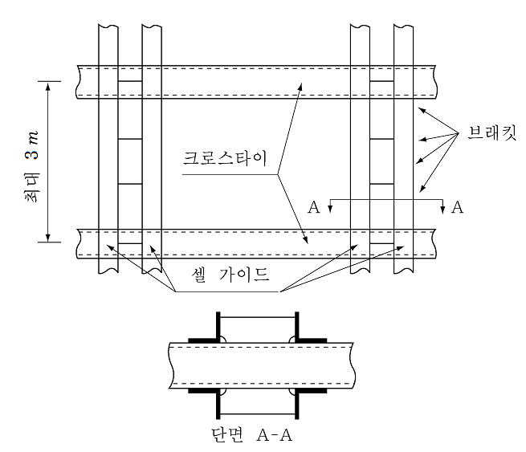
  **그림 1 셀 가이드의 배치**

#### (3) 노출 갑판상의 셀가이드

- **(가)** 셀가이드 구조의 강도해석 시, 셀가이드 구조와 갑판 구조간의 상호작용효과와 선체 거더의 변형을 고려하여야 한다.
- **(나)** 셀가이드의 하단부는 갑판에 유효하게 연결되어야 하며, 횡방향 크로스타이는 셀가이드 사이에 설치하여야 한다. 이때 설치간격은 가이드에 작용하는 하중에 의하여 결정되는 간격으로서, 일반적으로 3 $\mathrm{m}$ 이하의 간격으로 한다. 또한 셀가이드 구조의 과도한 처짐을 방지하기 위하여 종․횡방향으로 적절한 강도의 대각재(cross bracing)를 설치하여야 한다.
- **(다)** 갑판 상부의 가이드바는 컨테이너를 지지할 수 있을 정도의 충분한 높이를 가져야 한다.
- **(라)** 셀가이드 구조가 현측 후판과 같이 높은 응력이 작용하는 선체구조 또는 갑판부재에 설치되는 셀가이드용 강재의 등급, 품질 및 설치방법 등에 특별한 주의를 하여야 한다.

#### (4) 화물창 내 40ft 셀가이드를 이용한 20ft 컨테이너의 적재

- **(가)** 40 ft 컨테이너 셀가이드가 설치되어 있는 경우, 20 ft 컨테이너를 위한 임시 중간 셀가이드의 설치방법이 마련되어야 한다. 영구적 구조부는 어떠한 적하양식에도 적합하게 설계되어야 한다.
- **(나)** (가)를 대신하여, 40 ft 컨테이너용으로 준비된 셀의 길이 중간에 20 ft 컨테이너의 영구지지수단이 고려되어야 한다. 이러한 영구지지수단은 다음을 포함할 수 있다
  - **(a)** 필러(선내)와 컨테이너 스택이 기대어 놓이는 수직 받침봉(종격벽에 붙어 있는). 필라 상부는 갑판구조에 의해 측면으로 지지되어야 하고, 컨테이너 적재로 인한 측면변형을 방지할 수 있을 만큼 충분히 강해야 한다.
  - **(b)** 컨테이너와 컨테이너 사이 틈안의 얇은 구조에 의해 횡으로 지지되는 가이드바(필요한 경우 종방향 타이도 포함) 상세사항은 지지구조의 하중과 그에 따른 변형을 고려하여 개별적으로 검토되어야 한다.
- **(다)** 상부에 40 ft 컨테이너의 적재에 관계없이 미드베이 위치에서 외부의 지지를 받지 않는 20 ft 컨테이너 적재를 ‘혼합적재’라 하며, 다음의 요건들을 만족시키는 배치가 고려되어야 한다.
  - **(a)** 상부에 40 ft 컨테이너의 적재 없이 20 ft 컨테이너가 셀가이드에 적재되는 경우, 20 ft 컨테이너에 작용하는 횡방향 동하중은 65%는 셀가이드로 지지되는 쪽으로 전달되고 35%는 미드베이 쪽으로 전달된다고 가정한다.
  - **(b)** 적어도 하나의 40 ft 컨테이너의 상부적재와 함께 셀가이드에 적재되는 20 ft 컨테이너의 경우, 20 ft 컨테이너에 작용하는 횡방향 동하중의 75%는 셀가이드로 지지되는 쪽으로 전달되고 25%는 미드베이 쪽으로 전달된다고 가정한다. 이 경우에는 **8**항 (4)호에 따라 래킹하중과 압축력이 평가되어야 한다. 상부적재된 40 ft 컨테이너의 영향은 계산에서 제외한다.
  - **(c)** 미드베이 위치에 있는 20ft 컨테이너 스택의 바닥에서 횡방향 미끌림을 방지하는 수단이 제공되어야 한다. 이것은 이중저에 영구적으로 붙어있는 초크(chock) 또는 그와 동등한 형태로 되어야 한다. 설계 간격은 (2)호 (라)에 따라야 하며 셀가이드에 대한 것과 동일하여야 한다.
  - **(d)** 스태킹 콘은 종방향 및 횡방향 미끌림을 방지하기 위하여 20ft 컨테이너 각 층 사이 각각의 코너에 배치되어야 한다. 다만, 플랜지가 없는 스택킹 콘을 사용하는 경우, 20ft 컨테이너 각 단면에 1개 이상의 코너에 스택킹콘이 배치되어야 한다. 추가로 40ft 컨테이너가 20ft 컨테이너 상부에 적재되는 경우, 40ft 컨테이너 끝단에서 20ft 컨테이너와 각 단면에 2개의 스택킹 콘에 의하여 고박되어야 한다. *(2019)*
  - **(e)** 강으로 된 폐쇄벽 (closed steel wall)과 천장(top)을 가진 20 ft 컨테이너만 적재할 수 있다. (폐위되지 않은 컨테이너 제외 (예: 탱크 또는 산적 컨테이너))
  - **(f)** 콘은 컨테이너의 종방향 움직임을 저지하기 위하여 셀가이드 근처 내저판에 설치되어야 한다.
  - **(g)** 컨테이너의 방향은 단벽(closed ends) 또는 단벽(문)이 (door ends) 모두 한 방향으로 향하도록 배치하여야 한다.
  - **(h)** 컨테이너는 화물창에 블록적재(block stowage) 되어야 한다. 일반적으로 인접한 스택이 비어있는 경우는 없어야 한다.
    상기 이외의 적재 수단에 대한 제안은 개별적으로 고려되어야 하고 보조적 계산이 수행되어야 한다.

#### (5) 엔트리가이드(entry guide device)

컨테이너 중심을 맞추거나 셀가이드로 유도하기 위한 장치는 일반적으로 가이드 바의 상단에 설치되어야 한다. 이들 장치는 다음을 포함한다.


### 7. 컨테이너 지지 구조 (2019)

#### (1) 일반

- **(가)** 래싱브릿지, 셀가이드, 컨테이너 지지대 및 기타 컨테이너 지지구조에 대한 도면을 승인용으로 우리 선급에 제출하여야 한다.
- **(나)** 해치커버 및 선체구조의 고정식 컨테이너 고박설비 하부는 적절히 보강되어야 한다.
- **(다)** 강도 평가를 위해 유한요소법 또는 격자해석 방법을 사용할 수 있다. 모델링 및 평가는 총 두께를 사용하며, 요소 크기는 구조의 거동을 충실하게 재현할 수 있도록 하여야 한다.
- **(라)** 해치 커버의 강도 평가는 **규칙 4편 2장** 내용에 따른다.
- **(마)** 미키마우스 형태의 래싱브릿지를 적용하는 경우, 해당 구조의 횡방향 변위를 구속할 수 있도록 특별한 주의가 필요하다.
- **(사)** 선주의 요청이 있거나 우리선급이 필요하다고 인정하는 경우, 래싱브릿지에 대한 진동 평가를 수행할 수 있다. *(2021)*

#### (2) 구조 강도 평가

- **(가)** 구조의 모델링
  - **(a)** 해석범위
  - **(i)** 강도 평가를 위한 모델은 수직방향으로 최소한 컨테이너 지지구조의 하부 스트링거까지 그리고 선수미 방향으로 하나의 프레임까지를 포함하여야 한다. 일반적으로 래싱브릿지는 좌현 및 우현 모두를 모델링하여야 한다.
    - **(ii)** 또는, 래싱브릿지 모델만 사용하여 강도평가를 수행할 수도 있다. 다만, 래싱브릿지 구조해석에서 도출된 하부 반력값을 사용하여 래싱브릿지와 접하는 선체구조에 대한 강도평가를 추가적으로 수행하여야 한다.
    - **(iii)** 선수부, 중앙부, 선미부의 위치에서 강도 평가를 수행하여야 하며, 우리 선급이 필요하다고 인정하는 경우, 강도 평가 위치는 추가될 수 있다.
  - **(b)** 유한요소모델
  - **(i)** 선박구조의 유한요소모델은 **표 1**와 같이 오른손 좌표계를 따른다.

    | **좌표** | **방향** | **비고** |
    | --- | --- | --- |
    | x | 길이방향 | 선미에서 선수(+) |
    | y | 폭방향 | 중심선면에서 좌현(+) |
    | z | 깊이방향 | 상향(+) |

    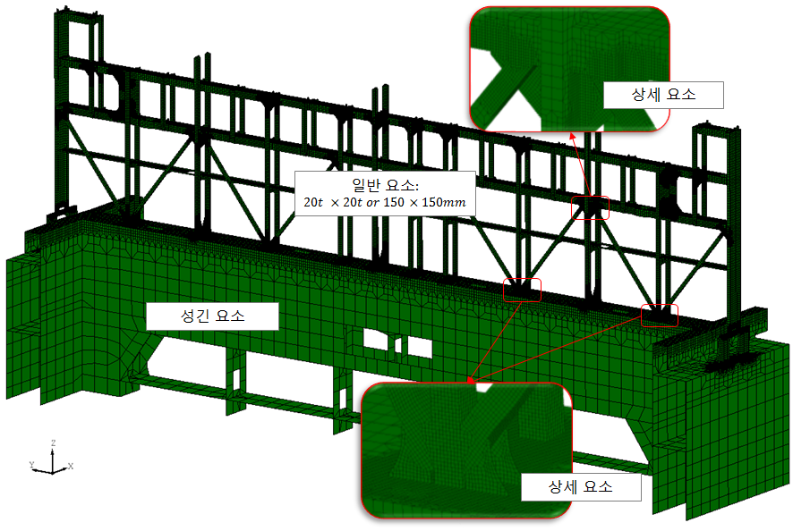
    **그림 2 래싱브릿지 분할요소 예** ***(2019)***
    - **(ii)** 일반적으로 판 요소를 사용하여야 한다. *(2020)*
    - **(iii)** 요소의 크기는 구조물의 형상을 표현할 수 있고, 응력 집중을 표시할 수 있도록 충분히 작아야 한다. 일반적으로 깊이 방향으로 응력 변화가 있는 부재에 대하여는 이를 판별할 수 있도록 최소 3개 이상으로 요소 분할을 하여야 한다. 상세 요소분할 구역의 최소 요소 크기는 해당 판재의 두께보다 작을 필요는 없다. *(2020)*
- **(나)** 경계조건
  실제구조와 같은 거동을 표현할 수 있는 적합한 경계조건을 구조모델에 적용하여야 한다.
- **(다)** 하중
  - **(a)** 설계하중
  - **(i)** 컨테이너 고박설비의 지지구조는 컨테이너 고박설비의 안전사용하중(SWL)을 설계하중으로 사용할 수 있다.
    - **(ii)** 컨테이너 적재 배치도의 적재 배치를 적용하여 **8**항에 따라 계산될 수 있다.
    - **(iii)** 예상 가능한 모든 조작방향의 하중을 고려하여야 한다.
  - **(b)** 설계 하중의 조합
  - **(i)** 래싱브릿지 (lashing bridge)
    다음의 설계하중 조합이 고려되어야 한다.
    - 래싱브릿지 앞/뒤쪽 베이 모두 컨테이너가 적재되는 경우 (횡방향 하중 최대조건)
    - 래싱브릿지 앞쪽 베이에 컨테이너가 적재되는 경우 (선수방향 하중 최대조건)
    - 래싱브릿지 뒤쪽 베이에 컨테이너가 적재되는 경우 (선미방향 하중 최대조건)
    설계하중은 컨테이너 적재 배치도에 따라 계산된 값을 사용하여야 한다. 다만 안전사용하중을 설계하중으로 사용하고자 하는 경우, **그림 3**에 명시된 하중값을 사용할 수 있다.
    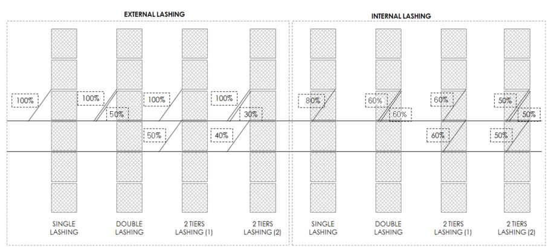
    **그림 3 안전사용하중을 래싱브릿지 구조 설계하중으로 적용하는 예시** ***(2021)***
    다음 **표 2**의 설계하중 조합이 고려되어야 하며 **8’6“** 및 **9‘6”** 의 높이가 다른 컨테이너 적재시의 조건도 고려하여야 한다. 갑판상에 설치되는 셀가이드의 경우, 풍하중을 고려하여야 한다.

    | **하중조건** | **횡방향 하중** | **종방향 하중** | **수직방향 하중** |
    | --- | --- | --- | --- |
    | 하중조합 1 | 적용 | 미적용 | 미적용 |
    | 하중조합 2 | 미적용 | 적용 | 미적용 |

    다음 **표 3**의 설계하중 조합이 고려되어야 한다. 최외곽 스택의 컨테이너 지지대의 경우 풍하중을 고려해야 한다.

    | **하중조건** | **횡방향 하중** | **종방향 하중** | **수직방향 하중** |
    | --- | --- | --- | --- |
    | 하중조합 1 | 적용(안쪽) | 미적용 | 적용(인장력) |
    | 하중조합 2 | 적용(바깥쪽) | 미적용 | 적용(압축력) |

    우리 선급이 적절하다고 인정하는 바에 따른다.
    - **(ii)** 셀가이드 (Cell Guide)
    - **(iii)** 컨테이너 지지대(Container Stanchion)
    - **(iv)** 기타 컨테이너 지지구조
- **(라)** 허용 응력
  - **(a)** 컨테이너 지지 구조의 응력은 다음의 **표 4**에서 주어진 허용 응력 값을 넘지 않아야 한다.

    | **응력성분** | **허용응력 (**$\mathrm{N}/m ^{2}$**)** |
    | --- | --- |
    | 수직응력 (굽힘, 인장, 압축) | 0.8 $\sigma _{0}$ |
    | 전단응력 | 0.46 $\sigma _{0}$ |
    | 조합응력 | 0.9 $\sigma _{0}$<sup>(1)</sup> |
    | $\sigma _{0}$ : 재료의 최소항복응력 ($\mathrm{N}/m ^{2}$)<br><sup>(1)</sup> : 상세 요소분할 구역의 응력집중부에 한하여 허용응력을 1.2 $\sigma _{0}$까지 완화할 수 있다. |   |
- **(마)** 좌굴 강도
  - **(a)** 유한요소해석에서 얻은 응력을 사용하여 **규칙 제14편 8장 5절**에 따라 좌굴강도 평가를 수행하여야 한다.
    $\eta _{act} < \eta _{a }$
    $\eta _{act}$ : **규칙 제14편 8장 5절 2.2.1** 및 **3.1**에서 얻어진 좌굴사용계수
    $\eta _{a }$ : 허용 좌굴사용계수 플랫폼의 판 : 0.9 스트럿 및 필러 : 0.67
- **(바)** 래싱브릿지 강성
  - **(a)** 래싱브릿지 하중 작용점의 최대 횡방향 변위는 다음의 값을 초과할 수 없다.
    - 1단 래싱브릿지: 10 mm
    - 2단 래싱브릿지: 25 mm
    - 3단 이상 래싱브릿지: 35 mm

#### (3) 진동 평가

- **(가)** 유한요소모델
  - **(a)** 2단 이상의 래싱브릿지는 고유 진동수가 엔진과 프로펠러에 의한 가진 주파수와의 공진을 피할 수 있도록 설계되어야 한다.
  - **(b)** 해상 시운전, 평형수 항해 또는 갑판이 비어있는 상태와 같이 래싱브릿지에 고박하중이 작용하지 않는 상태로 운항하는 경우, 래싱브릿지의 진동 평가를 고려하여야 한다.
  - **(c)** 일반적으로 강도평가에 사용되는 유한요소모델을 사용할 수 있다. 선미의 래싱브릿지는 프로펠러 및 주 기관 구역 기진원에 가까이 위치하므로 진동응답을 평가하여야 한다. 선박에 따라 여러 위치에서 래싱브릿지의 진동 응답을 평가할 수 있다.
  - **(d)** 진동 평가를 위한 최소 모델 범위 및 경계 조건은 (2)의 (가) 구조의 모델링 및 (나) 경계 조건을 참고한다. 전선 구조 유한요소모델이 가능하고 전선 구조 고유진동해석이 수행되어야 하는 경우, 래싱 브리지 모델을 전선 구조 모델에 통합하여 수행하는 것이 권장된다.
- **(나)** 고유진동수 평가
  - **(a)** 래싱브릿지의 전체 거동 고유진동수는 다음 요건을 만족하여야 한다.
  - **(i)** 선미부 및 주 기관 구역의 인근에 위치하는 래싱브릿지의 고유진동수는 프로펠러 날개 기진력과의 공진을 회피하기 위하여 다음의 프로펠러 날개 주파수의 범위 밖에 있어야 한다.
    • 하한: 80 % NCR - 10 % MCR
    • 상한: MCR + 10 % MCR
    여기서,
    NCR : 정상 연속 회전속도. 선박이 NCR보다 낮은 속도로 장시간 운전될 것이 예상되는 경우에는 NCR 대신 운전 속도를 회전속도로 사용하여야 한다.
    MCR : 최대 연속 회전속도
    - **(ii)** 저속 디젤 엔진이 있는 선박의 기관실에 인접한 래싱브릿지의 고유진동수는 엔진의 주요 가진 주파수의 범위 밖에 있어야 한다.
  - **(b)** 캠벨 다이어그램은 잠재적인 공진 주파수를 평가하는데 사용될 수 있다. **그림 4**는 캠벨 다이어그램의 예를 보이고 있다. 1차 프로펠러 날개 주파수 선과 모드의 고유 진동수 선 사이의 교차점에서 발생 가능한 공진 조건을 찾을 수 있다.
    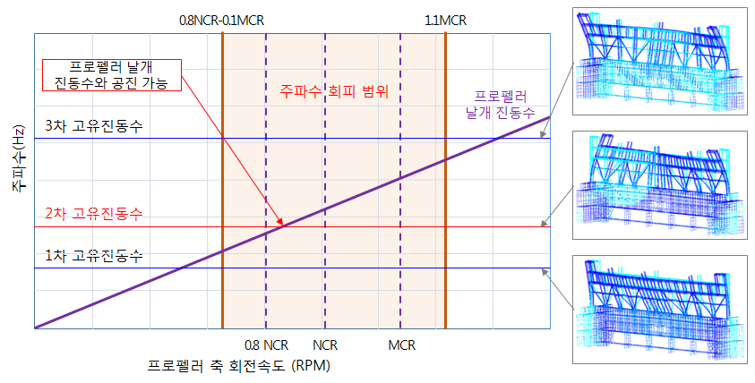
    **그림 4 래싱브릿지의 고유 진동수 평가를 위한 캠벨 다이어그램** ***(2019)***
  - **(c)** 공진 발생에 따른 과도한 진동 응답을 줄이기 위하여 추가 구조용 댐퍼 시스템, 고유 진동수를 조정하기 위한 일시적인 질량 또는 이와 동등한 방법을 적용할 수 있다. 이러한 방법은 우리선급과 협의하여야 한다.


### 8. 하중의 결정 및 적용

#### (1) 기호 및 정의

- **(가)** 용어의 정의 및 기호는 다음에 따른다. *(2021)*
  $a _{0}$ : 가속도 변수로서, 다음 식을 따른다.
  $a _{0} =(1.58-0.47C _{B} ) \left( \frac{2.4}{\sqrt {L_BP}} + \frac{100}{L_BP} - \frac{600}{L _BP ^{2}} \right)$
  $a _{heave}$ : 상하동요 가속도로서 다음 식에 따른다.
  $a _{heave} =0.5 f_h a _{0} g$ ($\mathrm{m}/\sec^2$)
  $a _{sway}$ : 좌우동요 가속도로 다음 식에 따른다.
  $a _{sway} =0.29 a _{0} g$ ($\mathrm{m}/\sec^2$)
  $a _{surge}$ : 전후동요 가속도로 다음 식에 따른다.
  $a _{surge} =0.18a _{0} g$ ($\mathrm{m}/\sec^2$)
  $a _{roll}$ : 횡동요 가속도로 다음 식에 따른다.
  $a _{roll} = \theta \left( \frac{2 \pi}{T _{\theta }} \right) ^{2} \frac{\pi}{180}$ ($\mathrm{rad}/\sec ^{2}$)
  $a _{"pitch"}$ : 종동요 가속도로 다음 식에 따른다.
  $a _{"pitch"} = \left( \frac{3.1}{\sqrt {gL}} +1.4 \right) \phi \left( \frac{2 \pi}{T _{\phi }} \right) ^{2} \frac{\pi}{180}$ ($\mathrm{rad}/\sec ^{2}$)
  $a _{i}$ : $i$번째 컨테이너의 한쪽 코너 캐스팅 중심에서 다른 쪽 컨테이너 끝단까지의 거리 ($\mathrm{m}$). (**그림 5**참조) *(2024)*
  $a _{x}$, $a _{y}$, $a _{z}$ : x, y, z 방향 가속도 ($\mathrm{m}/\sec^2$).
  $b _{i}$, $c _{i}$ : $i$번째 컨테이너의 길이 및 높이 ($\mathrm{m}$). (**그림 5** 참조)
  $d _{i}$ : 컨테이너 사이 수직방향 고박설비의 높이 ($\mathrm{m}$). (**그림 5** 참조)
  $e_i$ : 컨테이너와 래싱브릿지 사이의 길이방향간격($\mathrm{mm}$)$e_i$ = 0 : 래싱브릿지가 없는 경우,$e_i$ = 700~1,300 : 래싱브릿지가 있는 경우
  $f _{h}$, $f _{p}$, $f _{r}$ : 상하동요(heave), 종동요(pitch), 횡동요(roll) 에 대한 항로별 경감계수. (**표 8** 참조)
  $g$ : 중력가속도로 9.81 $\mathrm{m}/s ^{2}$ 로 한다.
  $h _{i}$ : $c _{i} + d _{i}$, (**그림 5** 참조)
  $i$ : $i$번째 컨테이너의 인덱스.
  $k _{r}$ : 횡동요 회전반경($\mathrm{m}$), 일반적으로 0.35 $B$
  $\ell _{i}$ : '$i$' 번째 컨테이너의 래싱설비의 길이 ($\mathrm{mm}$).$l _{i} = \sqrt {{a _i^2} + {c_i^2} + {e_i^2}}$
  $n$ : 한 개의 로우(row)에 적재되는 컨테이너의 수.
  $x$ : 선미수선으로부터 해당 컨테이너 중심까지의 x 방향 거리 ($\mathrm{m}$)로서, 단위컨테이너의 중심은 컨테이너 길이의 1/2로 한다.
  $y$ : 선체중심선으로부터 해당 컨테이너 중심까지의 y 방향 거리 ($\mathrm{m}$)로서, 단위컨테이너의 중심은 컨테이너 폭의 1/2로 한다.
  $z$ : 기선으로부터 해당 컨테이너 중심까지의 z 방향 거리 ($\mathrm{m}$)로서, 단위컨테이너의 중심은 컨테이너 높이의 0.45로 한다.
  $A _{i}$ : '$i$' 번째 컨테이너의 래싱설비의 단면적 ($\mathrm{mm} ^{2}$).
  $C _{XS}$,$C _{YS}$,$C _{ZH}$,$C _{YR}$,$C _{ZR}$,$C _{XP}$,,$C _{ZP}$ : 각각 선박운동에 대한 동적운동조합계수로서 **표 5**에 따른다.
  $C _{c}$ : 컨테이너 무게중심의 높이와 컨테이너 높이의 비율로, 일반적으로 0.45로 한다.
  $C _{YG}$,$C _{XG}$ : 횡동요, 종동요에 대한 동적운동조합계수로서 **표 5**에 따른다.
  $C _{yf}$, $C _{zf}$ : 선박의 종방향 위치에 따른 동적 계수로서 **표 7**에 따른다.
  $E _{i}$ : '$i$' 번째 컨테이너의 래싱 설비의 연신율 ($\mathrm{kN}/mm ^{2}$)로서 **표 10**에 따른다.
  $GM$ : 선박의 횡방향 메타센타 높이($\mathrm{m}$).
  $K _{i}$ : '$i$' 번째 컨테이너에서 래싱설비의 횡방향 강성으로 다음 식에 따른다.
  $K _{i} = \frac{E _{i} A _{i} \cos ^{2} \theta _{i}}{\ell _{i}}$, ($\mathrm{kN}/mm$)
  $K _{c}$ : 컨테이너 스프링 상수 ($\mathrm{kN}/mm ^{2}$)로서, **표 9**에 따른다.
  $L _{BP}$ : 선수 수선과 선미 수선 간의 수평거리를 말한다 ($\mathrm{m}$).
  $R$ : 기선으로부터 선박의 운동중심까지의 높이. $R= \frac{1}{2} (0.35B + 1.4T _{LC} )$
  $CR$ : 해당 컨테이너의 승인된 최대 총중량으로서 컨테이너의 용기중량 (tare weight)에 적재중량 (payload)을 더한 값 ($\mathrm{kN}$).
  $T _{LC}$ : 고려하는 적재상태에서의 선박의 형흘수 ($\mathrm{m}$).
  $T _{i}$ : '$i$' 번째 컨테이너의 래싱설비에 작용하는 인장력 (kN).
  $T _{\theta}$, $T _{\phi$ : 종동요, 횡동요의 주기 (sec).
  $V_w$ : 풍속 ($\mathrm{m}/s$)으로서, 최소 36m/sec 로 한다.
  $W _{i}$ : 내용물을 포함한 컨테이너의 설계중량 (ton)으로 최대중량이 명시되지 않은 경우, $W _{i}$ 는 $R$ (rating weight)로 한다. 빈 컨테이너의 경우, 다음의 최소중량으로 한다.
  20 ft 컨테이너 : 2.5 ton
  40 ft 컨테이너 : 3.5 ton
  45 ft 컨테이너 : 4.0 ton
  $\alpha$ : 풍력 계수로서 **표 5**에 따른다.
  $\theta _{i}$ : '$i$' 번째 컨테이너의 래싱설비의 래싱 각도로서, **그림 9**에 따른다.
  $\theta$, $\phi$ : 횡동요, 종동요의 각도 (degree).

  | <br><정면> <측면><br>**그림 5 컨테이너 주요치수** |
  | --- |

#### (2) 선체운동에 의한 가속도 (2023)

- **(가)** 다음의 선체운동을 고려하여야 한다.
  BSRL : 횡파에 따른 최대 횡요 진폭
  BSHA : 횡파에 따른 최대 상하동요 가속도
  OSPH : 사파에 따른 최대 종요 진폭
  선체운동가속도 계산에 필요한 각 선체운동 상태에 따른 조합계수는 **표 5**에 따른다.
- **(나)** 횡요 및 종요에 대한 선체운동의 각도 및 주기는 **표 6**에 따른다. 고박설비의 하중계산시 고려하여야 하는 가속도는 다음 식에 따른다. 우리 선급이 인정하는 경우, 선체운동특성은 직접계산 방법에 따라 구할 수 있다. 길이방향 위치에 따른 동적계수 $C _{yf}$와 $C _{zf}$는 **표 7**과 같다.
  $a _{x} =-C _{XG} g \sin \phi +C _{XS} a _{surge} +C _{XP} a _{"pitch"} (z-R)$
  $a _{y} =C _{YG} g \sin \theta + C _{yf} C _{YS} a _{sway} - C _{yf} C _{YR} a _{roll} (z-R)$
  $a _{z} = C _{zf} C _{ZH} a _{heave} + C _{zf} C _{ZR} a _{roll} \left| y \right| - C _{zf} C _{ZP} a _{"pitch"} (x-0.45L)$

  **표 5 동적 선체운동 조합계수** ***(2019)***

  |   |   | **가속도** |   |   |   |   | **각도** |   | **풍력계수** |
  | --- | --- | --- | --- | --- | --- | --- | --- | --- | --- |
  |   |   | 전후동요<br>(surge) | 좌우동요<br>(sway) | 상하동요<br>(heave) | 횡동요<br>(roll) | 종동요<br>(pitch) | 횡동요<br>(roll) | 종동요<br>(pitch) | **풍력계수** |
  |   |   | $C_XS$ | $C_YS$ | $C_ZH$ | $C_ZR$,$C _{YR}$ | $C_XP$, $C _{ZP}$ | $C _{YG}$ | $C _{XG}$ | $\alpha$ |
  | BSRL | 1 | 0 | 0.1 | -0.1 | -1.0 | 0 | 1.0 | 0 | 1.0 |
  | BSRL | 2 | 0 | -0.1 | 0.1 | 1.0 | 0 | -1.0 | 0 | -1.0 |
  | BSHA | 1 | -0.1 | -0.6 | -1.0 | 0.15 | -0.1 | -0.1 | 0 | -1.0 |
  | BSHA | 2 | 0.1 | 0.6 | -1.0 | -0.15 | 0.1 | 0.1 | 0 | 1.0 |
  | OSPH | 1 | -0.6 | 0.4 | -0.4 | -0.1 | -1.0 | 0.1 | 1.0 | 0.5 |
  | OSPH | 2 | 0.6 | -0.4 | -0.4 | 0.1 | 1.0 | -0.1 | -1.0 | -0.5 |

  **표 6 선체 운동의 종/횡요의 각도 및 주기** ***(2023)***

  | 운동 | 각도(Angle of radian)(Deg) | 주기(Periods) (sec) |
  | --- | --- | --- |
  | 횡동요<br>(roll) | $\theta = f _{r} \frac{9000(1.25-0.025T _{\theta } )}{(B+75) \pi}$<br>30°(0.524 rad)를 넘을 필요는 없으며,<br>- 폭이 32.26m 미만 인 경우,<br>$f _{r} \times 22 {}^{\circ}$$(fr \times 0.384 rad)$보다 작아서는 안되고,<br>- 폭이 60m 이상인 경우,<br>$f _{r} \times 17 {}^{\circ}$$(fr \times 0.297 rad)$보다 작아서는 안된다.<br>(폭이 사이의 값을 가지는 경우 선형 보간으로 결정한다.) | $T _{\theta } = \frac{2.3 \pi k _{r}}{\sqrt {g GM}}$ |
  | 종동요<br>(pitch) | $\phi = f _{"p"} 1350 L ^{-0.94} \left\{ 1.0+ \left( \frac{15}{\sqrt {gL}} \right) ^{1.6} \right\}$ | $T _{\phi } = \sqrt {\frac{2 \pi L}{g}}$ |

  **표 7 길이방향 위치에 따른 동적계수** ***(2019)***

  | x-방향 위치 ($x/L _{BP}$) | $C _{yf}$ | $C _{zf}$ |
  | --- | --- | --- |
  | 0.0 | 1.63 | 1.11 |
  | 0.1 | 1.46 | 1.11 |
  | 0.2 | 1.32 | 1.05 |
  | 0.3 | 1.24 | 1.04 |
  | 0.4 | 1.20 | 1.02 |
  | 0.5 | 1.20 | 1.06 |
  | 0.6 | 1.23 | 1.18 |
  | 0.7 | 1.30 | 1.29 |
  | 0.8 | 1.39 | 1.40 |
  | 0.9 | 1.52 | 1.40 |
  | 1.0 | 1.68 | 1.40 |
  | 주) 각 구간별 중간위치에 대한 값은 보간값을 사용한다. |   |   |
- **(다)** 항로별 경감계수는 해당 항로상의 환경조건에 대하여 설계수명 20년을 기준으로 하는 컨테이너선의 장기응답해석을 통하여 구하며 대표적인 항로에 대한 경감계수는 **표 8**에 따르며, 항해 패턴이 특이한 경우의 경감계수는 우리 선급과 협의하여 결정할 수 있다. **표 8**의 대표적인 항로의 전형적인 항적의 예는 **별첨 2**를 참조한다.
- **(라)** 바람에 의한 하중은 최대풍속 36 $\mathrm{m}/\sec$을 기준으로 계산하며, 횡하중을 증가시키는 방향으로 적용한다.
- **(마)** 최외곽 스택에 40ft 컨테이너가 적재되고 내부 스택에 40ft / 45ft / 48ft / 53ft 컨테이너가 적재되는 경우, 길이 방향 돌출부에 대한 풍하중은 적용하지 않는다. 최외곽에 20ft 컨테이너가 하나만 적재되고 뒤쪽에 40ft / 45ft / 48ft / 53ft 컨테이너가 적재되는 경우, 40ft / 45ft / 48ft / 53ft 컨테이너에는 50%의 풍하중을 적용한다.
- **(바)** 풍하중을 적용받는 컨테이너 최상부와 내부 스택의 컨테이너 중심 간 높이 차이가 1.9m 미만인 경우, 풍하중을 적용하지 않는다. 풍하중을 적용받는 내부 스택의 최상부 컨테이너의 경우, 80%의 풍하중을 고려한다.(**그림 6** 참조)

  | 항로 (Route) | $f _{r}$ | $f _{p}$ | $f _{h}$ |
  | --- | --- | --- | --- |
  | 아시아-유럽 (Asia-Europe service) | -0.00041$B$+0.8907 | 0.866 | 0.902 |
  | 태평양 (Pacific service) | -0.00146$B$+0.9709 | 0.862 | 0.996 |
  | 태평양-대서양 (Pacific-Atlantic service) | -0.00074$B$+0.9641 | 0.915 | 0.981 |
  | 북해-지중해<br>(North Sea-Mediterranean Short Sea service) | -0.00025$B$+0.9446 | 0.928 | 0.954 |
  | 북대서양 (North Atlantic service) | 1 | 1 | 1 |
  | 아시아-남아메리카(서부해안)<br>(Asia-South America(West Coast)) | -0.00090$B$+0.9452 | 0.873 | 0.970 |
  | 남아메리카(동부해안)-아프리카<br>(South America(East Coast)-Africa) | 0.00094$B$+0.8475 | 0.831 | 0.873 |
  | 아프리카-동아시아 (Africa-East Asia) | 0.00087$B$+0.9034 | 0.875 | 0.885 |
  | 유럽(로테르담)-아프리카 (Europe(Rotterdam)-Africa) | -0.00009$B$+0.9118 | 0.905 | 0.914 |
  | 유럽(로테르담)-남아메리카(브라질)<br>(Europe(Rotterdam)-South America(Brazil)) | -0.00020$B$+0.9265 | 0.916 | 0.932 |
  | 미국(뉴욕)-남아메리카(브라질)<br>(US(NYC)-South America(Brazil)) | -0.00062$B$+0.8084 | 0.760 | 0.826 |
  | 아시아-중동아시아(Asia-Middle East Asia) | -0.0026$B$+0.8418 | 0.628 | 0.851 |
  | 아시아 내부 | -0.0024$B$+0.8508 | 0.649 | 0.865 |
  | $f _{r}$은 어떤 항로에서도 –0.0045B+0.9735 이상이어야 한다. |   |   |   |

  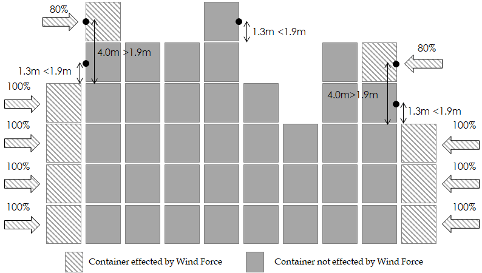
  **그림 6 풍하중 적용 구역** ***(2019)***

#### (3) 래싱하지 않은 스택의 하중

- **(가)** 스택의 각 컨테이너에 대하여 도출된 합성력은 다음과 같이 컨테이너 벽 사이에 균등하게 나누는 것으로 가정한다.
  $H _{i}$ : 하나의 횡방향 끝단에서의 미끌리는 힘으로 다음에 따른다.
  $H _{i} =a _{y (i) } \frac{W _{ i}}{2}$(kN)
  $J _{i}$ : 하나의 종방향 측면에서의 미끌리는 힘으로 다음에 따른다.
  $J _{i} =a _{x(i)} \frac{W _{ i}}{2}$(kN)
  $P _{i}$ : 각 코너 버팀목에서 수직력
  $P _{i} =a _{z(i)} \frac{W _{ i}}{4}$(kN)
  $Q _{i}$ : 하나의 횡방향 끝단에서의 풍력
  $Q _{i} = \frac{\alpha 7.33 c b V _{w}^{2} \cos \left( C _{YG} \theta \right) \times 10 ^{-4}}{2}$*(kN) (2019)*
  첨자 $i$ 는 특정 컨테이너를 의미한다.
- **(나)** 각 컨테이너에 작용하는 횡방향 하중은 다음 식에 의한다.(첨자 $i$ 는 특정 컨테이너를 의미한다, **그림 7** 참조)
  $F _{ i} =C _{c} H _{ i} +(1-C _{c} )H _{ i+1} + \frac{Q _{ i}}{2} + \frac{Q _{ i+1}}{2}$, $i\(F _{ i} =C _{c} H _{ i} + \frac{Q _{ i}}{2}$, $i=n$ 인 경우
  
  **그림 7 래싱 하지 않은 스택에서 횡방향 하중의 계산 예**
- **(다)** 래싱하지 않은 스택에서의 컨테이너에 작용하는 하중은 각각 다음 식에 따른다.
  - **(a)** 래킹하중 (하나의 단부벽에 대하여) (**별첨 3** 참조)
    $Ru _{ i} = \sum _{j=i} ^{n} F _{ j}$
  - **(b)** 전단하중 (코너마다) (kN), 종방향 미끌림 하중이 추가되는 것을 제외하고는 래킹하중 계산과 동일한 방법을 사용한다.
    $Su _{ i } = \sqrt {\left( 0.55 \sum _{j=i} ^{n} \left( H _{ j} +Q _{ j} \right) \right) ^{2} + \left( 0.55 \sum _{j=i} ^{n} J _{ j} \right) ^{2}}$
  - **(c)** 코너 캐스팅의 압축하중 (kN), 음(-)의 부호는 압축력을 나타낸다. 이 값의 절대값은 **그림 12** (c)의 허용값 이하이어야 한다. *(2017)*
    상부 : $Cu _{ i"_top"} = \sum _{j=i+1} ^{n} P _{j} - \frac{1}{a _{i+1}} \sum _{j=i+1} ^{n} \left( F _{j} \sum _{k=i+1} ^{i} h _{k} \right)$
    하부 : $Cu _{ i"_btm"} = \sum _{j=i} ^{n} P _{j} - \frac{1}{a _{i}} \sum _{j=i} ^{n} \left( F _{j} \sum _{k=i} ^{j} h _{k} \right)$
  - **(d)** 하부 코너 캐스팅의 수직 분리력 (kN), 양(+)의 부호는 수직 분리력을 의미하며, 양의 값에 대해서만 **그림 12**에서 확인할 수 있다.
    $Lu _{i} = \sum _{j=i} ^{n} P _{j} + \frac{1}{a _{i}} \sum _{j=i} ^{n} \left( F _{ j} \sum _{k=i} ^{j} h _{k} \right)$
- **(라)** 래싱되지 않은 스택의 경우, 상기 (다)로부터 계산된 합성력은 해당 컨테이너의 허용하중을 초과하여서는 안 된다. ((6)호 참조) 합성력이 허용치를 초과하는 경우, 래싱설비를 배치하여야 한다. 잠금장치와 지지재에서의 합성력은 해당 설비의 승인된 허용하중을 초과하여서는 안 된다. (**2**항 및 **3**항 참조)

#### (4) 래싱된 적재방법

- **(가)** 고박설비에 래싱을 포함시킬 경우, 고박설비의 유연성을 위해 적절한 허용치가 있어야 하며, 이를 위하여 다음의 값들을 도입할 수 있다.
  - **(a)** 컨테이너의 래킹 변형 : 컨테이너의 래킹변형에 대한 컨테이너 벽의 스프링 상수는 **표 9**에 따르며, 특정 베이에 크기가 다른 컨테이너가 혼재될 경우 가장 작은 상수값을 적용할 것을 권장한다.

    **표 9 컨테이너의 스프링상수**

    | 높이($\mathrm{m}$) | 단벽(문) ($\mathrm{kN}/mm$) | 단벽<br>($\mathrm{kN}/mm$) | 측면벽<br>($\mathrm{kN}/mm$) |
    | --- | --- | --- | --- |
    | 2.438 | 3.7 | 16.7 | 6.1 |
    | 2.591 | 3.5 | 15.4 | 5.7 |
    | 2.743 | 3.3 | 14.3 | 5.4 |
    | 2.896 | 3.2 | 13.3 | 5.1 |
  - **(b)** 컨테이너의 수평이동 : 컨테이너 잠금장치의 허용치로 인한 컨테이너의 초기변위는 적재배치와 관련하여 고려하여야 한다. 일반적으로 컨테이너의 초기변형은 전형적인 배치의 계산절차에서는 무시할 수 있다.
  - **(c)** 래싱설비의 연신율: 래싱설비의 연신율은 래싱설비의 유효탄성계수를 참조하여 결정하며 실제 시험값이 없는 경우 **표 10**의 값을 이용한다.

    | 고박설비 형식 | 연신율 |
    | --- | --- |
    | 훅 타입 턴버클의 강재 고박설비 래싱 | 98 $\mathrm{kN}/mm ^{2}$ |
    | 턴버클과 래싱아이(lashing eyes)를 포함한 짧은(1단) 강재 고박설비 래싱 (knob 형) | 140 $\mathrm{kN}/mm ^{2}$ |
    | 턴버클과 래싱아이 (lashing eyes)를 포함한 긴 강재 고박설비 래싱 (knob 형) | 175 $\mathrm{kN}/mm ^{2}$ |
    | 강재 와이어 로프 래싱 | 90 $\mathrm{kN}/mm ^{2}$ |
    | 강재 체인 래싱 (체인의 호칭 지름 기준) | 80 $\mathrm{kN}/mm ^{2}$ |
    | 조정 가능한 인장 / 압축 버트리스 | 120 $\mathrm{kN}/mm ^{2}$ |
- **(나)** 래싱 위치와 컨테이너 스택 바닥 사이의 구조에 유연성을 위한 다른 모든 요소가 필요한 경우, 평가 및 고려되어야 한다. 이들의 예로는 래싱 브릿지 (lashing bridge)의 유연성, 창구덮개의 미끌림 또는 선체의 비틀림 변형 등이 있다.
- **(다)** 이중래싱의 경우, 래싱 로드의 각 단면적은 단일로드 단면적의 100 %로 한다. 1개의 턴버클과 2개의 래싱 로드를 조합하여 사용하는 이중래싱의 경우도(**그림 8**) 동일한 단면적을 사용한다. *(2024)*
  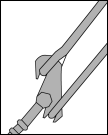
  **그림 8**
- **(라)** 계산은 컨테이너 스택의 각 단벽 (모든 단벽(문) (door ends) 및 단벽 (closed ends))에 대하여 수행된다.
- **(마)** 전형적인 배치에 있어, '$i$'번째 컨테이너의 래싱설비의 스프링 상수 $K _{i}$는 **그림 9**에 따라 계산할 수 있다.
  **그림 9 래싱 설비의 수평 강성**
  $T <sub>i</sub> = \frac{E <sub>i</sub> A <sub>i</sub>}{\ell <sub>i</sub>} \Delta \ell <sub>i</sub> = \frac{E <sub>i</sub> A <sub>i</sub>}{\ell <sub>i</sub>} \left( \delta <sub>i</sub> \cos \theta <sub>i</sub> \right) \#
  T <sub>i</sub> \cos \theta <sub>i</sub> = \frac{E <sub>i</sub> A <sub>i</sub>}{\ell <sub>i</sub>} \left( \delta <sub>i</sub> \cos \theta <sub>i</sub> \right) \cos \theta <sub>i</sub> = \frac{E <sub>i</sub> A <sub>i</sub> \cos <sup>2</sup> \theta <sub>i</sub>}{\ell <sub>i</sub>} \cdot \delta <sub>i</sub>$
  $K _{i} = \frac{E _{i} A _{i} \cos ^{2} \theta _{i}}{\ell _{i}}$
  상기 구성의 경우, 고정 래싱판의 배치는 경사진 래싱설비를 설치하기에 적합하여야 한다. 또한 경사부에서 컨테이너를 적절하게 고박하기 위하여 래싱설비 머리(head of lashing rods)의 설계에 주의하여야 한다.
- **(바)** 버트레스 (buttress) 또는 버팀목 (shore)은 래싱과 유사한 방법으로 모델링할 수 있다. 버트레스 또는 버팀목(shore)을 따라 2개 이상의 스택이 버트레스 또는 버팀목으로 인접하는 컨테이너 사이 연결구(linkage)에 의하여 지지되는 경우 모델링시 이를 고려하여야 한다.
- **(사)** 래싱된 상태의 합성력은 (5)호에 따라 결정한다. 스택에서 힘의 분포는 가해진 힘의 영향 하에서 관련 지지요소의 연신율의 상응요소와 컨테이너의 전체 이동량과 동일하다는 가정에 의해 구해진다. 래싱설비에서 인장으로 인한 횡하중은 **그림 10**과 같다. 이러한 힘들은 여러 층의 높이까지 연장되는 래싱 브릿지의 설치시 고려된다.
- **(아)** 래싱설비 인장력이 결정되면, 컨테이너의 잔류력은 (5)호에서 주어진 방법에 따라 스택을 통하여 전달된다. 이 모델은 컨테이너 층 사이의 잠금장치가 수직 분리력에 저항할 수 있다고 가정한다. 즉 수직 분리력이 발생될 경우, 적절한 잠금장치가 설치되어 하중을 전달하는 것으로 가정한다.
- **(자)** 일반적으로, 내부래싱방법은 컨테이너가 래싱설비에 의해 적재된 경우에 사용하여야 한다. **그림 11**의 외부래싱은 내부래싱이 무거운 스택으로 인해 더 큰 하중을 견딜 수 없을 경우에만, 우리 선급이 적절함을 검증한 후 적용할 수 있다. *(2017)*

#### (5) 래싱된 상태에서의 합성력

- **(가)** 래싱 위치에서 컨테이너의 횡방향 하중은 (3)호와 유사한 방법으로 구할 수 있으며 다음과 같다. '$i$'번째 층이 래싱되지 않은 경우, 인장력은 ‘0’이어야 한다.
  $F t _{i} ^{ } =F _{ i} -T _{i } \cos \theta _{i}$
  $P t _{i} ^{ } =P _{ i} -T _{i } \sin \theta _{i}$
  - **(a)** 하나의 끝단벽의 래킹 하중 (kN)
    $Rt _{ i} ^{} = \sum _{j=i} ^{n} Ft _{j} ^{}$
  - **(b)** 하나의 코너의 전단하중 (kN), 종방향 미끌림 하중이 추가되는 것을 제외하고는 래킹하중 계산과 동일한 방법을 사용한다.
    $St _{i} ^{} = \sqrt {\left( 0.55 \sum _{j=i} ^{n} \left( H _{j} +Q _{ j} -T _{ j } \cos \theta _{ j} \right) \right) ^{2} + \left( 0.55 \sum _{j=i} ^{n} J _{ j} \right) ^{2}}$

    | 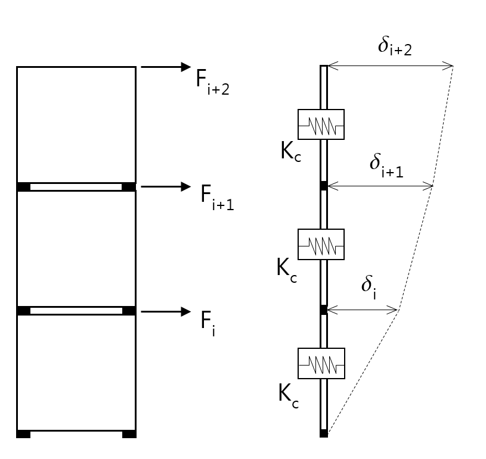래싱하지 않은 스택 | ${cases{eqalign{delta <sub>i</sub> = {Ru <sub>i</sub>} over {K <sub>c</sub>}# }eqalign{delta <sub>i+1</sub> = {Ru <sub>i</sub> +Ru <sub>i+1</sub>} over {K <sub>c</sub>}# # delta <sub>i+2</sub> = {Ru <sub>i</sub> +Ru <sub>i+1</sub> +Ru <sub>i+2</sub>} over {K <sub>c</sub>}}&}}$ |
    | --- | --- |
    | #imgID-991단 래싱 | ${cases{eqalign{delta <sub>i</sub> = {Ru <sub>i</sub> -T <sub>i</sub> cos theta <sub>i</sub>} over {K <sub>c</sub>} = {T <sub>i</sub> cos theta <sub>i</sub>} over {K <sub>i</sub>}# }eqalign{delta <sub>i+1</sub> = {Ru <sub>i</sub> -T <sub>i</sub> cos theta <sub>i</sub> +Ru <sub>i+1</sub>} over {K <sub>c</sub>}# # delta <sub>i+2</sub> = {Ru <sub>i</sub> -T <sub>i</sub> cos theta <sub>i</sub> +Ru <sub>i+1</sub> +Ru <sub>i+2</sub>} over {K <sub>c</sub>}}&}}$<br>$T _{i } \cos \theta _{i} = \frac{K _{i} \sum _{k=1} ^{i} Ru _{k}}{K _{c} + \left( i K _{i} \right)}$ |
    | <br>2단 래싱 | ${cases{eqalign{delta <sub>i</sub> = {Ru <sub>i</sub> -T <sub>i</sub> cos theta <sub>i</sub> -T <sub>i+1</sub> cos theta <sub>i+1</sub>} over {K <sub>c</sub>} = {T <sub>i</sub> cos theta <sub>i</sub>} over {K <sub>i</sub>}# }eqalign{delta <sub>i+1</sub> = {LEFT ( Ru <sub>i</sub> -T <sub>i</sub> cos theta <sub>i</sub> -T <sub>i+1</sub> cos theta <sub>i+1</sub> RIGHT ) + LEFT ( Ru <sub>i+1</sub> -T <sub>i+1</sub> cos theta <sub>i+1</sub> RIGHT )} over {K <sub>c</sub>}# ```````````````= {T <sub>i+1</sub> cos theta <sub>i+1</sub>} over {K <sub>i+1</sub>}# `# delta <sub>i+2</sub> = {LEFT ( Ru <sub>i</sub> -T <sub>i</sub> cos theta <sub>i</sub> -T <sub>i+1</sub> cos theta <sub>i+1</sub> RIGHT ) + LEFT ( Ru <sub>i+1</sub> -T <sub>i+1</sub> cos theta <sub>i+1</sub> RIGHT ) +Ru <sub>i+2</sub>} over {K <sub>c</sub>}# `````````````````}&}}$<br>$T _{i } \cos \theta _{i} = \frac{K _{i} K _{i+1} \left[ \left( \sum _{k=1} ^{i} Ru _{k} \right) -iRu _{i+1} \right] +K _{i} K _{c} \sum _{k=1} ^{i} Ru _{k}}{i K _{i} (K _{i+1} +K _{c} ) + K _{c} \left[ (i+1)K _{i+1} +K _{c} \right]}$<br>$T _{i+1 } \cos \theta _{i+1} = \frac{K _{i+1} \left( K _{c} \sum _{k=1} ^{i+1} Ru _{k} \right) + iK _{i} K _{i+1} Ru _{i+1}}{i K _{i} (K _{i+1} +K _{c} ) + K _{c} \left[ (i+1)K _{i+1} +K _{c} \right]}$ |

    **그림 10 래싱 스택에서 횡하중의 계산방법**
    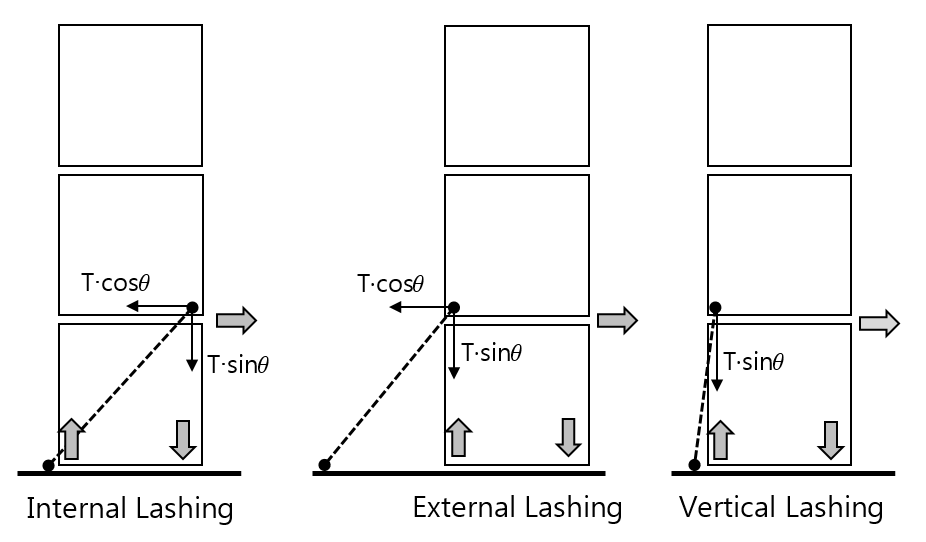
    **그림 11 래싱 방법의 종류**
  - **(c)** 상부 코너 캐스팅의 압축하중 (kN), (이 하중의 절대값은 **그림 12**의 기준과 비교하여야 하며, 부호가 음(-)일 경우, 압축력을 의미한다.) *(2017)*
    내부래싱의 경우 :$Ct _{ "i_top"} = \sum _{j=i+1} ^{n} P t _{j} - \frac{1}{a _{i+1}} \sum _{j=i+1} ^{n} \left( F t _{j} \sum _{k=i+1} ^{j} h _{k} \right) - T_i \sin \theta_i$
    외부래싱의 경우 :$Ct _{" i_top"} = \sum _{j=i+1} ^{n} P _{j} - \frac{1}{a _{i+1}} \sum _{j=i+1} ^{n} \left( Ft _{j} \sum _{k=i+1} ^{j} h _{k} \right)$
  - **(d)** 하부 코너 캐스팅의 압축하중 (kN), (이 하중의 절대값은 **그림 12**의 기준과 비교하여야 하며, 부호가 음(-)일 경우, 압축력을 의미한다.) *(2017)*
    내부래싱의 경우 : $Ct _{ "i_btm"} = \sum _{j=i} ^{n} Pt _{j} - \frac{1}{a _{i}} \sum _{j=i} ^{n} \left( Ft _{j} \sum _{k=i} ^{j} h _{k} \right)$
    외부래싱의 경우 : $Ct _{ "i_btm"} = \sum _{j=i} ^{n} P _{j} - \frac{1}{a _{i}} \sum _{j=i} ^{n} \left( Ft _{j} \sum _{k=i} ^{j} h _{k} \right)$
  - **(e)** 하부 코너 캐스팅의 수직 분리력 (kN), 이 값이 양(+)일 경우 수직 분리력을 의미하며 양(+)일 경우에만 **그림 12**의 기준과 비교하여야 한다. *(2017)*
    내부래싱의 경우 : $Lt _{ i} = \sum _{j=i} ^{n} P _{j} + \frac{1}{a _{i}} \sum _{j=i} ^{n} \left( Ft _{j} \sum _{k=i} ^{j} h _{k} \right)$
    3
    외부래싱의 경우 : $Lt _{ i} = \sum _{j=i} ^{n} Pt _{j} + \frac{1}{a _{i}} \sum _{j=i} ^{n} \left( Ft _{j} \sum _{k=i} ^{j} h _{k} \right)$
- **(나)** 컨테이너 하중은 (6)호의 허용값을 초과하지 않아야 한다. 래싱설비의 인장력은 래싱설비의 허용사용하중을 초과하지 않아야 한다. 문이 없는 단벽 최상층 외부래싱에는 틸팅(tilling)에 의한 추가장력의 영향을 고려하여야 한다. 다만, 스프링 등을 적용하여 추가 장력 발생의 우려가 없는 고박 장비가 사용되는 경우 추가 장력은 고려하지 않을 수 있다. (*2019*)
  $\delta v_act = F_"NL_Trigger" / K_"v_upper_eff"$
  $F_"NL_Trigger" = Lt_"i+1" - T_i \sin \theta_i$
  $K_"v_upper_eff"= C_k \frac{E_i A_i \sin^2 \theta_i}{l_i}$
  $C_k$ : 비선형 계수로서 우리선급이 별도로 정하는 바에 따른다.
  $\delta v_\max$ : 트위스트락 중간판(intermediate plate)과 컨테이너 코너캐스팅 끝단 사이의 수직간격(vertical clearance)으로, 일반적으로 20$\mathrm{mm}$를 적용할 수 있다. **HHS**(High Holding Securing) 또는 **HHT**(High Holding Twist) 추가특기부호를 가지는 선박의 경우, **제조법 및 형식승인 지침 제3장 제25절 2504.** 또는 **2505.**의 15mm 요건을 만족하여야 하며, 계산에 적용할 수 있다. *(2023)*
  Note 1 : 전자동 트위스트락의 경우, 성능 시험 성적서가 반드시 제출되어야 한다. 성능 시험 성적서의 수직 간격이 20$\mathrm{mm}$를 초과할 경우, 해당 값을 적용하여야 한다.
  Note 2 : 더 작은 값을 사용하고자 하는 경우, 성능 시험 성적서를 근거로 우리 선급과 협의하여 해당값을 사용할 수 있다.
  $\delta v_final = \max(0, \min(\delta v_\max , \delta v_act ))$
  $T_"i-final" = T_i + \frac{K_"v_upper_eff" \delta v_final}{\sin \theta_i}$
  상기 수식으로 최상층 외부래싱의 장력을 계산 후, 아래 쪽 외부래싱의 장력을 재계산하여야 한다. 이때, 하중 모델에서 최상층 외부래싱의 수평장력 성분을 공제하고, 최상층 외부래싱의 수평강성은 강성모델에서 제외한다. 모든 래싱로드의 장력 재계산후 컨테이너 하중을 재계산하여야 한다, *(2019)*
- **(다)** 버트레스 또는 버팀목(shore)에 의하여 외부지지되는 경우, 이 지지에 나란한 연결부에 의하여 하중이 전달된다. 지지부에 인접한 컨테이너의 횡방향 끝단부에서의 힘은 다음과 같이 주어진다.
  $F _{b} ( \frac{2N-1}{2N} )$ ($\mathrm{kN}$) 그리고
  컨테이너에 인접한 연결부에서의 힘은, $F _{b} ( \frac{N-1}{N} )$ ($\mathrm{kN}$)
  $F _{b}$ : 버트레스 또는 버팀목(shore)에서의 계산된 힘 ($\mathrm{kN}$)
  $N$ : 버트레스 또는 버팀목(shore)에 의해 지지된 컨테이너 행수

#### (6) 컨테이너에 대한 허용하중

- **(가)** ISO 컨테이너의 경우, 고박배치는 컨테이너에 작용하는 힘이 **표 11**의 값을 초과하지 않도록 설계되어야 한다. ISO 1496-1 (개정 No. 1, 2 및 3의 컨테이너를 포함) 컨테이너의 최대허용하중을 **표 11**에 나타내었다. 제조된 컨테이너에 작용하는 최대하중이 **그림 12**에 설명되어 있다. ISO 1496-1에 따라 제작된 컨테이너에 대한 래싱배치 계산방법은 우리 선급이 적절하다고 인정하는 방법으로 계산되어야 한다.
- **(나)** ISO 1496-1에 따른 45 ft 컨테이너가 40 ft 컨테이너 상단에 적재되는 경우, 45 ft의 상부 캐스팅의 모서리 포스트 하중은 404 $\mathrm{kN}$의 압축력을 초과하여서는 안 된다. 컨테이너 하부 구조의 강도는 전달된 힘을 견딜 수 있어야 한다. 40 ft 컨테이너의 상층에 적재된다면 45 ft 컨테이너 끝단에 래싱은 적용하지 않는다.

  |   | **허용하중** |   |
  | --- | --- | --- |
  |   | 20 ft 컨테이너($\mathrm{kN}$) | 40 ft 컨테이너($\mathrm{kN}$) |
  | 측면에 평행하게 작용하는 컨테이너 코너 캐스팅으로부터의 횡하중<br>(**그림 12** (b)참조) | 150 | 150 |
  | 컨테이너 코너 캐스팅에 작용하는 래싱설비에 의한 횡하중으로 끝단에 평행하게 작용하는 횡하중(비고 1 참조) (**그림 12** (a)참조) | 225 | 225 |
  | 래싱설비에 의한 컨테이너 코너 캐스팅에 작용하는 수직력으로 컨테이너 측면벽 또는 양단벽에 평행하게 작용하는 수직력(비고 1 참조)<br>(**그림 12** (a)참조) | 250 | 250 |
  | 컨테이너 양단벽에 작용하는 래킹력 (**그림 12** (b)참조) | 150 | 150 |
  | 컨테이너 측면면에 작용하는 래킹력 (**그림 12** (b)참조) | 150 | 150 |
  | 각 상부 코너 (top corner)에서의 수직력, 인장 (**그림 12** (c)참조) | 250 | 250 |
  | 각 하부 코너 (bottom corner)에서의 수직력, 인장 (**그림 12** (c)참조) | 250 | 250 |
  | 각 상부 코너 기둥에서의 수직력, 압축 (**그림 12** (c)참조) | 848<br>(비고 4 참조) | 848<br>(비고 4 참조) |
  | 스택에서 가장 낮은 컨테이너의 각 하부 코너 캐스팅에서의 수직력,<br>압축(**그림 12** (c)참조) | 848 + (1.8$R$)/4<br>(비고 3 & 4 참조) | 848 + (1.8$R$)/4<br>(비고 3 & 4 참조) |
  | 상부 및 상부면에 평행하게 작용하는 횡방향 힘, 인장 또는 압축<br>(비고2 참조)(**그림 12** (d)참조) | 340 | 340 |
  | 하부 및 하부면에 평행하게 작용하는 횡방향 힘, 인장 또는 압축<br>(비고2 참조)(**그림 12** (d)참조) | 500 | 500 |
  | (비고)<br>1. 어떤 경우에도 수직력과 횡하중의 합력이 **그림 12** (a)의 제한값을 초과하여서는 아니 된다.<br>수직력과 횡하중은 합력 수직방향 최대성분이며 만약 수직 또는 수평 래싱이 사용되는 경우에는 이를 최대하중으로 사용되어서는 아니 된다.<br>2. 버트레스가 중간 높이에서 스택을 지지하는 경우, 그 높이에서의 컨테이너의 횡방향 합력은 상부 및 하부의 합력을 넘어서는 아니 된다.<br>3. 최하층 컨테이너의 단벽(closed ends) 상의 하부 코너 캐스팅에 작용하는 수직 압축력은 다음의 조건을 만족할 경우, 848 + (1.8$R$/4) kN를 초과할 수 있다.<br>(a) 상층 컨테이너로부터 최하층 컨테이너에 작용하는 수직 압축력은 848 kN을 초과하여서는 아니 된다.<br>(b) 상층 컨테이너로부터 최하층 컨테이너에 작용하는 횡방향 래킹력은 150 kN을 초과하여서는 아니 된다.<br>(c) 하부 코너 캐스팅에 작용하는 수직 압축력은 승인 받은 받침 소켓 및 받침 트위스트락(미드락) 증서 상의 안전사용 하중을 초과하여서는 아니 된다. *(2018)*<br>4. 컨테이너가 ISO 1496-1(개정 2014 포함)에서 요구하는 값 이상의 시험하중으로 승인된 경우, 허용하중은 848 kN 대신에 942 kN이 사용될 수 있다. |   |   |

  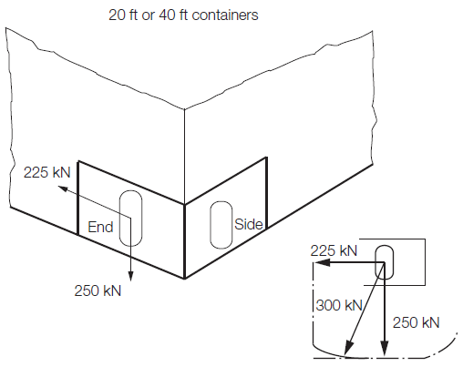

  | (a) 코너 캐스팅 래싱 하중 | (b) 20 ft(40 ft) 컨테이너, 압축 또는 인장 |
  | --- | --- |

  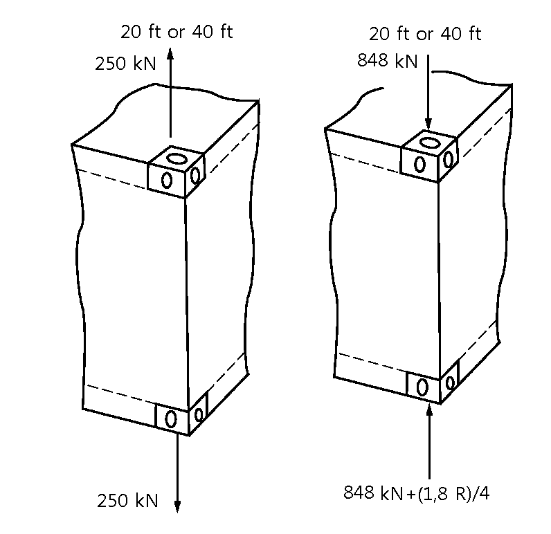 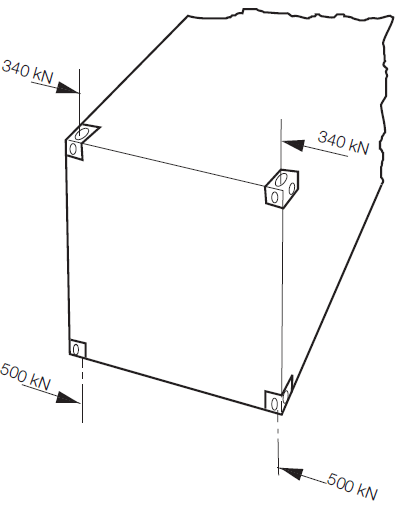

  | (c) 코너 수직 분리력(pull-out) 및 압축력<br>컨테이너가 ISO 1496-1 (개정 2014 포함)따라 승인된 경우, 허용하중은 848 kN 대신 942 kN 을 사용할 수 있다. | (d) 횡방향 압축력 |
  | --- | --- |

  **그림 12 ISO 1496-1:1990 (개정 2014 포함) 에 따라 제작된 20 ft 또는 40 ft 컨테이너의 허용하중**


### 9. 컨테이너 고박강도계산 프로그램 및 계산기기 (2025)

#### (1) 일반사항

- **(가)** 이 항의 요건은 **1**항 (2)호에 따라 각 호선에 컨테이너 고박강도계산시스템을 설치하고자 하는 경우에 적용한다.
- **(나)** 컨테이너 고박강도계산프로그램 시스템은 고박강도계산프로그램(소프트웨어) 및 계산기기(하드웨어)로 구성된다.
- **(다)** 컨테이너 고박강도계산기기(하드웨어)
  - **(a)** 고박강도계산기기의 형식승인을 받고자 하는 경우에는 **제조법 및 형식승인지침 3장 5절**에 따른다.
  - **(b)** 본선에 설치되는 고박강도계산기기는 형식승인된 기기가 설치되는 경우에는 1대, 형식승인된 기기가 아닌 경우에는 2대를 설치해야 한다.
  - **(c)** 고박강도계산프로그램은 적하지침기기에 통합하여 설치할 것을 권장한다.
- **(라)** 컨테이너 고박강도계산프로그램(소프트웨어)
  - **(a)** 적용
    - 고박강도계산프로그램의 설계승인을 받고자 하는 경우에는 **제조법 및 형식승인지침 4장 3절**에 따른다.
    - 설계승인과 관계없이, 2025년 7월 1일 이후 건조계약되고, 항해구역에 제한을 받지 않는 전용 컨테이너선에 설치되는 고박강도계산 프로그램은 최소한 다음의 요건을 만족해야 한다.
  - **(b)** 정의
    - 고박강도계산 프로그램은 컨테이너 스택의 하중을 선상에서 분석하기 위한 전자 데이터 처리 도구로서, 기국요건에 따라 작성된 화물고박 지침서(Cargo Securing Manual)에 설명된 대로 고박시스템의 매개변수들을 반영한다.
    - 승인된 고박강도계산 프로그램이 승인된 화물고박 지침서를 대체할 수는 없지만, 승인된 화물고박 지침서의 보충자료로 간주될 수 있다.
    - 고박강도계산 프로그램은 선박별 전용 도구이며, 계산 결과는 승인받은 선박에만 적용된다.

#### (2) 제출문서

- **(가)** 고박강도계산프로그램은 해당 호선에 대한 다음 문서 3부를 우리 선급으로 제출하여 승인받아야 한다.
  - **(a)** 사용설명서
  - **(b)** 프로그램 설명서(설계승인을 받은 경우, 제출 생략 가능)
  - **(c)** Test report
  - **(d)** 프로그램에 저장된 본선 주요 특성
- **(나)** 모든 제출 문서에는 다음 사항이 포함되어야 한다.
  - **(a)** 선명, 선박 건조자명, 건조번호 및 선박 식별번호
  - **(b)** 프로그램명, 버전 번호 및 버전 날짜
  - **(c)** 프로그램 제조자 및 주소
  - **(d)** 주요 내용에 대한 목록

#### (3) (2) (가)에 의해 제출되는 문서에는 다음 내용이 포함돼야 한다.

- **(가)** 사용설명서
  - **(a)** 고박강도계산 프로그램에 대한 사용설명서가 제공돼야 하며, 선내에 비치되어야 한다.
  - **(b)** 사용설명서의 언어는 승인된 화물고박지침서의 언어와 동일해야 하며, 적절하다고 인정되는 다른 언어로 번역이 필요할 수 있다.
  - **(c)** 사용설명서에는 다음의 목록에 따라 적절한 설명과 지침이 포함돼야 한다:
    - 고박강도계산 프로그램에 대한 일반 설명
    - 설계승인증서 사본(설계승인을 받은 경우)
    - 설치
    - 기능 키
    - 메뉴 표시
    - 입력 및 출력 자료
    - 프로그램 운영을 위한 하드웨어의 최소사양
    - 컨테이너, 고박설비 및 선박에 대한 강도 허용치
    - 시험하중 조건으로 고박강도계산 프로그램을 시험하기 위한 지침
    - 사용자가 접할 수 있는 모든 용어, 정의, 오류 메시지 및 경고의 목록
    - 오류 메시지 및 경고가 발생될 경우, 각 경우에 따라 취해야 할 후속조치에 대한 명확한 사용자 지침
- **(나)** 프로그램 설명서
  - **(a)** 순서도를 포함한 프로그램 기능에 대한 설명
  - **(b)** 계산 방법 및 원리에 대한 설명
  - **(c)** 기능 요건
    - 고박강도계산 프로그램은 각 컨테이너 스택에서, 모든 적재조건에 대하여 컨테이너 및 컨테이너 고박장치에 가해지는 하중을 계산할 수 있어야 한다.
    - 또한 승인된 한도 내에서 선적되었는지 여부에 대한 선장의 판단을 돕기위해, 각각의 허용 값을 표시할 수 있어야 한다. 또한 다음의 매개변수들이 표시돼야 한다;
    IMO No, 선박의 길이, 폭과 같은 선박의 제원에 대한 요약
    흘수 및 GM과 같은 관련 입력 매개변수를 보여주는 하중조건의 요약
    스택 및 컨테이너의 위치
    허용 가능한 스택 중량에 대해 검증된 실제 스택 중량
    허용하중을 포함한 고박장치의 관련 특성
    컨테이너가 노출되는 바람과 같은 외력 및 가속도
    컨테이너 및 컨테이너 고박장치에 대한 모든 계산된 하중의 목록과 계산된 하중이 해당 허용 값에 부합하는지에 대한 평가
    강도 허용치(컨테이너 내력, 고박설비 및 지지구조에 작용하는 하중 고려)
    - 갑판 상 및 화물창 내의 각 베이에 있는 컨테이너 및 고박설비들은 그림형식으로 볼 수 있어야 한다.
    - 자료는 명확하고 모호하지 않은 방식으로 화면과 인쇄물로 표시돼야 한다.
    - 하나라도 허용 하중치를 초과하는 경우, 명확한 경고가 화면과 인쇄물로 출력돼야 한다.
    - 인쇄물의 각 페이지에는 인쇄물 내용 외에도, 선박 식별, 고박강도계산 프로그램의 이름 및 버전, 인쇄 날짜 및 시간, 하중조건의 제목이 포함돼야 한다. 인쇄물은 순차적으로 페이지가 매겨지고, 총 출력 페이지 수가 표시돼야 한다.
    - 측정 단위는 명확하게 식별되어야 하며, 일관되게 사용돼야 한다.
    - 음수의 흘수 값과 같이 사용자의 잘못된 데이터 입력이 방지돼야 한다. 오류 메시지는 명확하고 모호하지 않은 방식으로 화면과 인쇄물에 표시돼야 한다.
    - 프로그램에 저장된 본선 특성자료는 사용자에 의해 변경될 수 없도록 보호돼야 한다.
  - **(d)** 시험 하중 조건
    - 고박강도계산 프로그램은 규칙에 따라, 화물고박지침서에 포함된 다양한 치수의 컨테이너에 적용 가능한 적재 패턴을 포함하는 선택된 스택 및 베이에 대한 시험 하중 조건과 함께 제공돼야 한다.
    - 시험 하중 조건 및 그 결과는 고박강도계산 프로램이 설치된 컴퓨터에 영구적으로 저장돼야 하며, 의도하지 않거나 승인되지 않은 수정 및 접근으로부터 보호돼야 한다.
- **(다)** Test report에는 적어도 다음의 계산이 포함돼야 한다.
  - **(a)** 화물창 내의 대표적인 컨테이너 적재상태
  - **(b)** 혼합적재 상태(적용하는 경우)
  - **(c)** 갑판 상의 대표적인 적재상태
  - **(d)** 갑판 적재상태(트위스트락(twistlocks)으로만 고박한 경우)
  - **(e)** 스택 중량을 초과한 경우
  - **(f)** 고박 하중을 초과한 경우
  - **(g)** 수직 분리력을 초과한 경우
  - **(h)** 최외곽 스택이 허용치를 넘는 경우에 대한 예시
  - **(i)** 계산 결과 중 최대하중(래킹하중, 전단하중, 압축하중, 수직분리력, 래싱장력)에 대한 요약결과
  - **(j)** 선수부, 중앙부, 선미부 bay에 대한 계산 예
  - **(k)** 항로별 경감계수를 적용하는 경우, 이에 대한 계산 예
- **(라)** 프로그램에 저장된 본선 주요 특성
  - **(a)** 선박의 주요 치수
  - **(b)** 선미수선으로부터 각 베이의 위치
  - **(c)** 컨테이너, 고박설비 및 선박에 대한 강도 상 허용치
  - **(d)** 일반적인 적재 제한 조건

#### (4) 고박강도계산 프로그램의 본선 시험 및 승인

- **(가)** 선급의 승인을 받는 고박강도계산 프로그램은 다음 사항을 포함해야 한다.
  - **(a)** 형식승인의 검증(있는 경우)
  - **(b)** 최신의 선박 정보 사용에 대한 검증
  - **(c)** 시험 하중조건 및 그 결과에 대한 검증 및 승인
  - **(d)** (3) (나) (c)의 요건 충족에 대한 검증
  - **(e)** 적절한 설치점검 및 승인된 시험 하중조건에 따른 선상 계기의 검증
  - **(f)** 본선에서 사용설명서의 가용성 확인
- **(나)** 선박 설계 또는 컨테이너 고박설비의 변경을 수반하는 수정의 경우, 프로그램을 수정하고 선급의 재승인을 받아야 한다.
- **(다)** 컨테이너 고박계산과 관련된 프로그램 버전의 모든 변경 사항은 선급에 보고되어야 하며 승인을 받아야 한다.
- **(라)** 설치시, 고박강도계산 프로그램은 검사원의 입회 하에 승인된 시험 하중조건으로 검증돼야 한다. 사용설명서는 선내에 비치되어 있는지 확인돼야 한다.
- **(마)** 선급이 검증을 하더라도, 고박강도계산 프로그램에서 제공된 정보가 승인된 화물고박지침서 및 선박의 현재 상태와 일치하는지 확인해야 하는 선주의 책임이 면제되지 않는다.
- **(바)** 본선 시험은 승인된 Test report의 결과와 본선에 설치된 프로그램의 계산결과가 일치하는지에 대해 확인하는 것으로 하며 불일치하는 경우, 해당 프로그램은 승인돼서는 안 된다.
- **(사)** 본선 시험은 승인된 Test report의 모든 적재조건에 대해 수행되어야 하며, 적재조건 중 적어도 하나는 계산이 적절히 수행되는지 확인하기 위해 계산 절차의 처음부터 진행돼야 한다.
- **(아)** 고박강도계산기기(하드웨어)가 형식 승인 받지 않은 경우, 시험은 두 대의 하드웨어에서 시행돼야 하며 두 대의 하드웨어는 증서 상에 명기돼야 한다.
- **(자)** 본선 시험 결과가 적합한 경우, 고박강도계산 프로그램 시스템에 대한 승인증서를 발급하며, 승인증서에는 다음 내용이 포함돼야 한다.
  - **(a)** 선명, 선박건조 조선소, 선급번호 및 선박 건조일
  - **(b)** 프로그램명 및 버전
  - **(c)** 프로그램 제조자명 및 주소
  - **(d)** 형식승인증서 및 설계승인증서 번호(해당되는 경우)
  - **(e)** 하드웨어명, 시리얼 번호 및 제조자명(형식승인을 받지 않은 경우, 2대 모두 기입)
  - **(f)** 승인된 Test report의 승인번호 및 승인날짜
- **(자)** 고박강도계산 프로그램 시스템 승인증서 및 승인된 Test report는 사용설명서와 함께 본선에 보관돼야 한다.

#### (5) 허용가능 공차

- **(가)** 고박강도계산 프로그램이 설치될 특정 선박을 위한 프로그램에서 도출된 계산결과의 정확도는 선급이 적절하다고 판단하는 참조 계산결과를 사용하여 결정해야 한다.
- **(나)** 고박강도계산 프로그램에서 도출된 계산결과의 허용 오차는 허용 값의 1.0% 미만이어야 한다. 다만, 편차에 대한 만족할 만한 소명이 있고 선박의 안전에 부정적 영향이 없다면, 선급의 검토를 거쳐 편차를 인정할 수 있다.

#### (6) 연차검사 및 정기검사

- **(가)** 연차검사 및 정기검사 시, 사용설명서가 본선에 비치되어 있는지 확인해야 한다.
- **(나)** 선장은 고박강도계산 프로그램의 시험하중 조건을 적용하여 매년 정확성을 점검해야 한다. 검사원이 고박강도계산 프로그램 점검에 참석하지 않을 경우, 이 점검에서 얻은 시험 결과의 사본을 예정된 검사 시 검사원의 검증을 위하여 테스트의 문서로 본선에 보관해야 한다.
- **(다)** 각 정기검사에서 이 점검은 검사원의 입회하에 수행되어야 한다.

#### (7) 기타 요건

- **(가)** 고박강도계산 프로그램 및 해당 데이터는 의도하지 않거나 무단으로 수정되거나 및 접근되지 않도록 보호돼야 한다.
- **(나)** 프로그램에 대한 변경은 설계자에 의해 이루어져야 하며 변경이 발생할 경우, 기 발행된 증서의 효력을 상실하게 되므로 즉시 우리 선급에 통보하여야 하며 변경 사항에 대하여는 우리 선급에 재승인 받아야 한다.
  별첨 1 각 형태별 컨테이너의 주요치수 *(2025)*

  | 크기(size) | 외부치수 (external dimension) |   |   |   |   |   | 최대 총질량<br>(rating)<br>(kg) |
  | --- | --- | --- | --- | --- | --- | --- | --- |
  | 크기(size) | 길이(length) |   | 폭(width) |   | 높이(height) |   | 최대 총질량<br>(rating)<br>(kg) |
  | 크기(size) | (mm) | 오차<br>(tolerance)<br>(mm) | (mm) | 오차<br>(tolerance)<br>(mm) | (mm) | 오차<br>(tolerance)<br>(mm) | 최대 총질량<br>(rating)<br>(kg) |
  | 10ft<br>(ISO) | 2,991 | +0/-5 | 2,438 | +0/-5 | 2,438 | +0/-5 | 10,160 |
  | 20ft<br>(ISO) | 6,058 | +0/-6 | 2,438 | +0/-5 | 2,438 | +0/-5 | 36,000 |
  | 20ft<br>(ISO) | 6,058 | +0/-6 | 2,438 | +0/-5 | 2,591 | +0/-5 | 36,000 |
  | 30ft<br>(ISO) | 9,125 | +0/-10 | 2,438 | +0/-5 | 2,438 | +0/-5 | 36,000 |
  | 30ft<br>(ISO) | 9,125 | +0/-10 | 2,438 | +0/-5 | 2,591 | +0/-5 | 36,000 |
  | 30ft<br>(ISO) | 9,125 | +0/-10 | 2,438 | +0/-5 | 2,896 | +0/-5 | 36,000 |
  | 40ft<br>(ISO) | 12,192 | +0/-10 | 2,438 | +0/-5 | 2,438 | +0/-5 | 36,000 |
  | 40ft<br>(ISO) | 12,192 | +0/-10 | 2,438 | +0/-5 | 2,591 | +0/-5 | 36,000 |
  | 40ft<br>(ISO) | 12,192 | +0/-10 | 2,438 | +0/-5 | 2,896 | +0/-5 | 36,000 |
  | 45ft<br>(ISO) | 13,716 | +0/-10 | 2,438 | +0/-5 | 2,591 | +0/-5 | 36,000 |
  | 45ft<br>(ISO) | 13,716 | +0/-10 | 2,438 | +0/-5 | 2,896 | +0/-5 | 36,000 |
  | 48ft | 14,630 | +0/-10 | 2,591 | +0/-5 | 2,908 | +0/-5 | 36,000 |
  | 53ft | 16,154 | +0/-10 | 2,591 | +0/-5 | 2,908 | +0/-5 | 36,000 |

  별첨 2 주요 항로 예시 *(2018)*
  1. 아시아 - 유럽
  
  2. 태평양
  
  3. 태평양 - 대서양
  
  4. 북해 - 지중해
  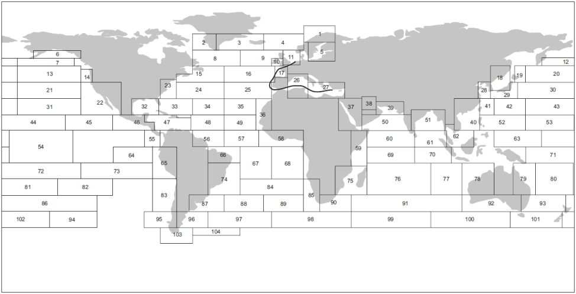
  5. 북대서양
  
  6. 아시아 - 남아메리카 (서부 해안)
  7. 남아메리카 (동부 해안) - 아프리카
  8. 아프리카 - 동아시아
  9. 유럽 (로테르담) - 아프리카
  10. 유럽 (로테르담) - 남아메리카 (브라질)
  11. 미국 (뉴욕) - 남아메리카 (브라질)
  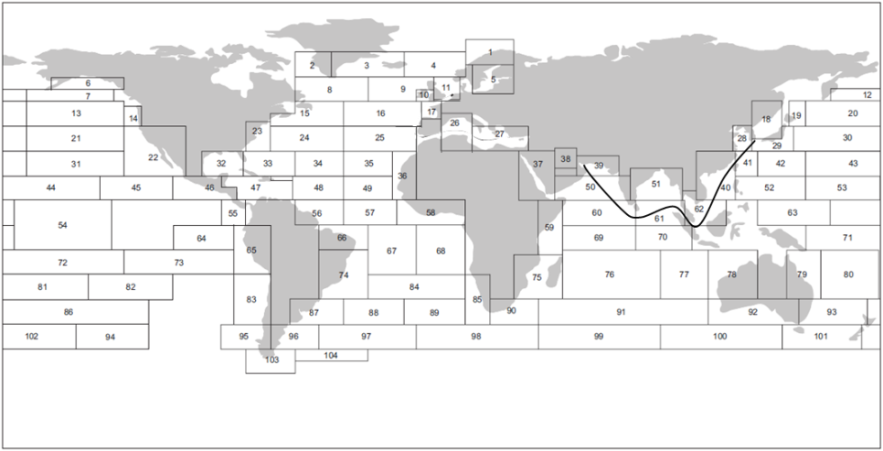
  12. 아시아 – 중동아시아
  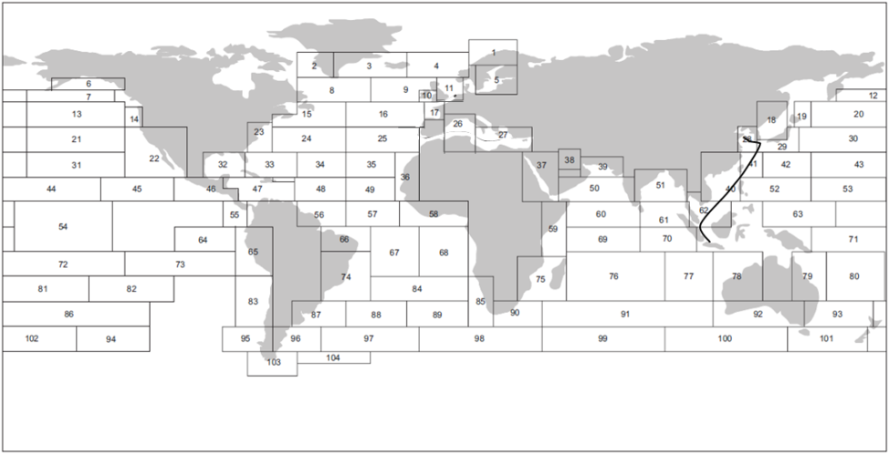
  13. 아시아 내부
