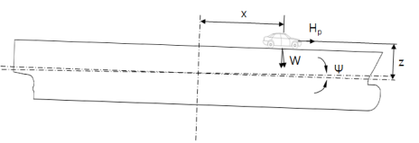
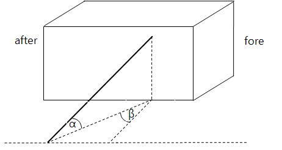

# 제7편 전용선박(1장~4장,7장~10장)

> 선급 및 강선규칙/적용지침 / RA-07A-K / 2025 / KO / Guidance

## 부록 7-3 카페리선에 대한 지침 【규칙 참조】

### 1. 적용

#### (1) 이 부록의 규정은 선박안전법령 및 고시 적용선박으로서 국내항해에 종사하는 카페리선에 적용하며, 강 이외의 재료로 건조되는 카페리선에 대하여는 이 규정을 준용할 수 있다. 다만, 이 부록의 규정에도 불구하고 관련 국제협약에 적합하도록 건조된 선박에 대하여는 이 부록의 규정에 적합한 것으로 간주할 수 있으며, 선박안전법 비적용 선박으로서 해당 정부의 법령에 따라 검사를 받고 연해만을 운항하는 선박에 대해서는 동 규정의 적용을 생략할 수 있다.

#### (2) 이 부록의 규정은 자동차 전용운반선(pure car carrier), 화물 창내에 차량을 적재 운송하는 일반 화물선에는 적용하지 아니한다.

#### (3) 이 부록에 규정되어 있지 아니한 사항에 대하여는 선급 및 강선규칙(이하 규칙이라 한다.)과 선급 및 강선규칙 적용지침(이하 지침이라 한다.)의 관련규정에 따른다.

#### (4) (3)호의 규정에 추가하여, 이 부록에서 규정되어 있지 아니한 사항에 대하여는 선박안전법의 관련 규정에도 적합하여야 한다.

### 2. 정의

#### (1) “카페리선”이란 차량을 육상교통 등에 이용되는 그대로 적재 및 운송할 수 있는 갑판이 설치되어 있는 선박을 말한다.

#### (2) “카페리여객선”이란 카페리선으로서 여객정원이 13인 이상인 여객운송을 겸하는 선박을 말한다.

#### (3) “ 차량구역 ”이란 자주용(自走用) 연료탱크를 가지고 있는 자동차를 운송하기 위한 화물구역을 말한다. (2019)

#### (4) “차량갑판”이란 차량이 통과하는 갑판 또는 차량구역내의 차량적재 갑판을 말한다.

#### (5) “개방된 차량구역(open space)”이란 양끝 또는 한쪽 끝이 개방되었으며, 그 구역 측면의 총면적에 대하여 최소한 10 %이상의 면적을 가지는 선측외판, 갑판정부 또는 상방의 상설개구로부터 전장에 걸쳐 효과적인 자연통풍이 적절히 제공되는 차량구역을 말한다. (2019)

#### (6) “폐위된 차량구역”이란 (5)호의 개방된 차량구역과 노출갑판을 제외한 차량구역을 말한다. (2019)

#### (7) “선수문 등”이란 선수문, 선미문, 내측문, 현측문 및 램프(선내에 설치되어 갑판 간 화물의 이동을 위한 것은 제외한다.)를 말한다.

### 4. 선체배치

#### (1) 선수루

연해구역 이상을 항해하는 카페리선은 선수루를 설치하여야 한다. 다만, 평수구역의 경계로부터 항해시간(이 경우 중간 기항지가 있을 때에는 그 중간 기항지 사이의 항해시간)이 해당선박의 최고속력으로 1시간 미만의 연해구역을 항해하는 경우에는 그렇지 않다.

#### (2) 선수격벽

선박의 선수미 구분없이 어느 방향으로 전진항해가 가능한 카페리선의 경우에는 **규칙 3편 14 장**의 규정에 적합한 선수격벽과 동등한 격벽을 선수미 양쪽에 설치하여야 한다.

### 5. 차량갑판

#### (1) 강도

차량갑판의 강도는 **규칙 7장 3절**에 따른다.

#### (2) 개방된 차량갑판

- **(가)** 개방된 차량갑판에는 **규칙 4편 4장 1절**에 적합한 불워크를 설치하여야 하며, 선수부에서는 그 높이를 적절히 증가시켜야 한다.
- **(나)** 불워크에는 **규칙 4편 4장 2절**의 규정에 적합한 배수구를, 갑판상에는 **규칙 5편 6장 3절**의 규정에 적합한 선외배출관을 각각 설치하여야 한다.

#### (3) 폐위된 차량갑판

폐위된 차량갑판에는 **규칙 5편 6장 3절**의 규정에 적합한 배수장치를 설치하여야 하며 배수관을 직접 기관실로 유도하여서는 안된다.

### 6. 차량구역

#### (1) 구조

- **(가)** 연해구역 이상을 항해하는 카페리선의 차량구역은 풍우밀로 폐위되어야 한다. 다만, 평수구역의 경계로부터 항해시간(이 경우 중간기항지가 있을 때에는 그 중간 기항지 사이의 항해시간)이 해당 선박의 최고속력으로 1시간 미만인 경우 또는 건현갑판 상부의 갑판에 위치한 차량구역이 선박의 선수격벽 후방에 위치하고 만재흘수선으로부터 해당차량구역까지의 수직거리가 **선박만재흘수선 기준**의 규정에 의한 표준선루 높이의 2배 이상인 경우에는 그렇지 않다.
- **(나)** 폐위된 차량구역으로서 길이가 0.25$L_f$ 이상인 선수루에는 선수격벽 위치에 선루갑판까지 도달하는 풍우밀의 격벽을 설치하거나 또는 풍우밀의 내측문을 설치하여야 한다.

#### (2) 폐위된 차량구역 내의 출입문

- **(가)** 차량구역에 통하는 모든 출입문은 자동폐쇄형이어야 하며, 문은 어느 쪽에서도 개방할 수 있어야 한다. 또한, 관련 풍우밀 및 방화 관련 요건에도 적합하여야 한다.
- **(나)** 차량구역에서 건현갑판하로 통하는 출입용 해치(hatch)의 코밍 또는 출입구의 문지방 높이는 230 $\mathrm{mm}$ 이상, 기관실로 통하는 출입용 해치의 코밍 또는 출입구의 문지방 높이는 380 $\mathrm{mm}$ 이상이어야 한다. *(2018)*
- **(다)** (가)부터 (나)까지의 규정은 평수구역을 항해하는 카페리선에 적용하지 아니한다.

#### (3) 개방된 차량구역 내의 출입문 (2018)

차량구역에서 건현갑판하로 통하는 출입용 해치의 코밍 또는 출입구의 문지방 및 기관실로 통하는 출입용 해치의 코밍 또는 출입구의 문지방 높이는 **지침 3편 1장 표 3.1.2**에 적합하여야 한다. 또한, 관련 풍우밀 및 방화 관련 요건에도 적합하여야 한다. *(2018)*

#### (4) 여객실

- **(가)** 차량구역 하방에는 여객실(여객정원에 포함되는 장소)을 설치하여서는 안된다.
- **(나)** 차량갑판과 동일한 평면상에 설치된 여객탑재장소는 강재 또는 선박방화구조기준에 적합한 방열구조 격벽에 의하여 차량구역과 구분되어야 한다.

#### (5) 탈출설비

카페리선의 탈출설비는 **선박설비기준 제2장**의 규정에 적합하여야 한다.

#### (6) 환기장치

- **(가)** 폐위된 차량구역에는 충분한 환기를 하여야 하며, 차량구역의 가스가 기관구역, 업무구역 또는 거주구역 등에 침입하지 않도록 조치된 경우를(**지침 8편 13장 203.**) 제외하고 다음 조건에 적합한 배기식(차량구역 내에 가스를 노출갑판상 대기로 배기)으로 하여야 한다.
  - **(a)** 다른 통풍장치로부터 독립되어 있어야 한다.
  - **(b)** 1시간당 폐위된 차량구역의 용적의 10배(카페리여객선에 대하여는 우리 선급이 화재의 위험이 적다고 인정하는 경우에는 6배) 이상의 용적의 공기를 환기시킬 수 있어야 한다.
  - **(c)** 차량구역의 외부의 장소로부터 제어되는 것이어야 한다.
  - **(d)** (a)부터 (c)까지에 추가하여 **규칙 8편 13장 201. 2 (3), 3** 및 **202.**부터 **204.**까지의 규정에도 만족하여야 한다.
- **(나)** 차량갑판하에 설치된 기관구역 또는 업무구역에는 충분한 환기를 하여야 하며, 흡입식(대기중의 신선한 공기를 흡입하여 구역내로 공급)으로 하여야 한다.

#### (7) 폐위된 차량구역을 가지는 카페리선박은 다음의 어느 하나에 해당하는 장치를 설치하여야 한다.

- **(가)** 선교에서 해당 차량구역 전체를 감시할 수 있는 폐쇄 회로 텔레비전
- **(나)** 선교에서 차량구역 출입문 개폐상태를 확인할 수 있는 지시등 및 가청경보장치

#### (8) 차량구역 내의 표시

- **(가)** 차량구역 내에는 출입구, 계단, 구명설비 또는 소방설비 등의 이용에 지장을 주지 않도록 통로를 설치하여야 하며, 이 통로는 눈에 잘 띠는 색의 경계선으로 쉽게 식별되도록 하여야 한다.
- **(나)** 선수격벽위치에 램프 또는 내측문을 설치하지 않는 카페리선의 경우에는 선수격벽의 전방에 차량적재를 할 수 없다는 취지의 경고문 또는 표식을 설치하여야 한다.
- **(다)** 차량구역은 쉽게 알 수 있도록 표시되어야 하며 다음 사항이 포함된 차량 및 화물적재도를 보기 쉬운 곳에 게시하여야 한다.
  - **(a)** 선박의 최대적재중량
  - **(b)** 차량의 최대적재대수
  - **(c)** 차량적재시 주의사항
- **(라)** (다)의 (c) 차량적재시 주의 사항은 다음과 같으며 차량 및 화물적재도에 포함하여야 한다.
  - **(a)** 차축하중은 00톤을 초과하지 아니할 것(차축하중은 최대 적재량 00톤 화물자동차의 차축하중을 기준으로 검토 함)
  - **(b)** 선박에 적재되는 차량총중량(적재물 포함)은 00톤을 초과하지 아니할 것(차량 총중량은 최대적재량 00톤 화물자동차 00대를 기준으로 검토 함)
  - **(c)** 유사차종의 적재에 따라 적재차량 수가 증가하는 경우에는 충분한 강도를 가진 적절한 종류 및 수량의 이동식 고박설비를 추가로 설치할 것
  - **(d)** 유사차종을 적재하는 경우 선박의 복원성이 확보되도록 해당 차량을 적재 및 배치하여 운항할 것

### 7. 차량적재방법 및 고박설비

#### (1) 차량적재방법

- **(가)** 차량의 적재방법은 원칙적으로 차량의 진행방향을 선수미방향으로 하여야 한다. 다만, 횡방향 미끄러짐에 충분하도록 쐐기 등의 추가 조치를 하는 경우에는 그렇지 않다.
- **(나)** 차량은 선수격벽 위치보다 전방에 배치하여서는 안된다.
- **(다)** 차량적재시에는 차량간의 간격이 600 $\mathrm{mm}$ 이상되도록 차량을 배치하여야 한다.
- **(라)** 차량갑판내의 소방설비, 출입구 및 계단주위 1 $\mathrm{m}$ 이내에는 차량 또는 화물을 적재할 수 없도록 눈에 잘 띠는 색의 경계선 또는 보호망 등을 설치하여야 한다.
- **(마)** 비상시 소집장소 및 승정장소 등 탈출경로에 이르는 통로를 충분히 확보할 수 있도록 차량을 배치하여야 한다.

#### (2) 차량의 고박방법

- **(가)** 차량은 (4)호의 규정에 적합한 고정식 고박설비 (예: D-ring, 클로버소켓(clover socket), 데크아이(deck eye plate) 등)와 이동식 고박설비(예: 웹래싱(web lashing), 턴버클(turn buckle), 체인 등)에 의하여 선박에 견고히 고박되어야 한다.
- **(나)** 차량 및 일반화물을 고정하는 고박설비는(고정식 및 이동식 고박설비) 우리 선급이 승인한 제품이어야 한다. 다만, 우리 선급이 승인한 제조법 승인공장에서 ISO 등 국제기준에 적합하게 제작되는 경우에는 제조자의 증명서로 대신할 수 있다.
- **(다)** 차량 및 화물적재도에 표기된 차량 이외의 적재를 고려하여 충분한 수의 고정식 고박설비가 차량갑판 상에 설치되어야 한다.
- **(라)** 연해구역 이상을 항해구역으로 하는 총톤수 1,000톤 이상의 카페리선박의 이동식 고박설비는 승인된 수량의 1.2배 이상을 비치하여야 한다.
- **(마)** 차량의 고박은 승인된 차량 및 화물적재도에 따라 적재되어야 하며 선박 출항 전, 항해 중 선원에 의하여 점검되어야 한다.
- **(바)** 차량의 고박은 차량의 바퀴 4곳 이상 또는 차량에 설치된 고박장치를 이용하여 차량 앞뒤 2곳과 고정식 고박설비 4개 이상에 의하여 고박하여야 한다.
- **(사)** 평수구역만을 항해하는 선박으로서 항해시간이 30분 미만인 선박과 평수구역 및 연해구역을 항해구역으로 하는 선박으로서 출발항으로부터 도착항까지의 항해시간이 1시간 미만으로 승용차, 12인승 이하의 승합차 및 적재중량 1.5톤 이하의 화물차를 적재한 선박(이 경우 중간에 기항지가 있을 때에는 그 중간 기항지를 각각 출발항 또는 도착항으로 본다)은 해상상태가 평온(파고 1.5 m 이하, 풍속 7 $\mathrm{m}/\sec$ 이하)하고 항해 중 쐐기 등으로 차량의 미끄러짐을 방지할 수 있는 적절한 조치를 한 경우에는 자동차를 묶어 매지 아니할 수 있다.

#### (3) 차량의 화물 적재

- **(가)** 차량에 적재되는 화물의 용량은 다음 각 호의 요건에 적합한 것이어야 한다.
  - **(a)** 적재길이는 차량 길이에 차량 길이의 10분의 1의 길이를 더한 길이 이내
  - **(b)** 적재너비는 차량의 후사경으로 후방을 확인할 수 있는 범위
  - **(c)** 적재높이는 지상으로부터 4.0 m 이내. 다만, 지붕구조의 덮개가 있는 화물적재공간을 가지는 밴 등 화물자동차의 경우에는 덮개의 최상단까지의 높이를 말한다.
- **(나)** 차량에 적재된 화물은 (4)호에 의한 선체운동에 견딜 수 있도록 묶어 매야 한다.

#### (4) 고박설비의 강도

- **(가)** 고박설비의 강도를 평가하는데 사용하는 용어의 정의는 다음에 따른다.
  $W$ : 차량의 총중량으로 적재중량과 자체 중량의 합(ton)
  $x, y, z _{}$ : 각각 종요, 횡요 중심으로부터 고려하는 차량의 중심까지의 선박의 길이 방향, 폭 방향, 수직 방향거리(m) **(그림 1 참조)**
  $\phi , \psi$ : 각각 **표1**에 따른 선박의 횡요각, 종요각(deg) **(그림 1 참조)**
  $T _{r} , T _{p}$ : 각각 **표1**에 따른 선박의 횡요, 종요 주기(sec)
  $V$ : 선박의 횡요, 종요시 갑판에 수직 방향의 힘(ton) **(그림 1 참조)**
  $H _{r}$ : 선박의 횡요시 선박의 폭 방향으로 작용하는 갑판에 평행한 힘(ton) **(그림 1 참조)**
  $H _{p}$ : 선박의 종요시 선박의 길이 방향으로 작용하는 갑판에 평행한 힘(ton) **(그림 1 참조)**
  $M _{r}$ : 선박의 횡요시 전도 모멘트(차량이 뒤집히려는 모멘트)(ton-m) **(그림 2 참조)**
  $SF _{r} , SF _{p}$ : 각각 차량에 작용하는 선박의 폭, 길이 방향의 갑판에 평행한 힘(ton)
  $b _{m}$ : 차량의 전폭 (m), **(그림 2 참조)**
  $b _{t}$ : 차륜간격(m), **(그림 2 참조)**
  $h _{m}$ : 갑판으로부터 차량 무게중심까지의 높이 (m) **(그림 2 참조)**
  $L _{r} , L _{p}$ : 각각 이동식 고박장치가 견딜 수 있는 횡 방향, 종 방향 수평 분력의 합(ton)
  $M _{l}$ : 이동식 고박장치가 차량 전도모멘트에 저항하는 힘의 합(ton)
  $n$ : 한 대의 차량에 사용되는 이동식 고박장치의 개수
  $\alpha , \beta$ : 각각 이동식 고박장치와 갑판과 이루는 횡방향, 종방향의 각도(deg) **(그림 2 참조)**
  $h$ : 갑판으로부터 차량 고박점까지의 높이 (m) **(그림 2 참조)**
  $T$ : 이동식 고박설비의 사용안전하중으로 절단하중을 **표 1**의 안전율로 나눈 값으로 한다(ton)
  $\mu$ : 차량과 갑판과의 마찰계수로서 다음에 따른다.
  타이어(고무) / 미끄럼방지페인트 : 0.7^1)
  타이어(고무) / 강갑판 : 0.3
  강재 / 강갑판 : 0.1(물에 젖지 않은 상태)
  강재 / 강갑판 : 0.0(물에 젖은 상태)
  목재 / 강갑판 : 0.3
  1) 제조법 및 형식승인 기준에 따라 승인된 도료의 마찰계수 또는 우리선급이 인정할 수 있는 시험성적서의 마찰계수를 사용할 수 있다.*(2018)*
- **(나)** 고박설비에 작용하는 하중은 **표 1**의 선체운동을 고려하여 결정하여야 한다.

  **표 1 선체운동**

  | 항목 선박의 분류 | 횡요 |   | 종요 |   | 안전율 |
  | --- | --- | --- | --- | --- | --- |
  | 항목 선박의 분류 | 각도 | 주기 ^3) | 각도 | 주기 | 안전율 |
  | 연해구역 이상을 항해하는 카페리선 | 25° | 해당선박의 주기 | 5° | 5초 | 4이상 |
  | 평수구역 또는 항해시간이 1시간 미만인 카페리선 | 10° | 해당선박의 주기 | 5° | 5초 | 4이상 |
  | (비고) 1. 만재출항시 횡요중심 $KG '$ 는 다음 식에 의한 값으로 한다. $KG ' = 0.5 (KG + KB)$ $KG$ : 선체중심의 수직방향 위치 $KB$ : 선체부력중심의 수직방향위치 2. 종요중심은 선체중심의 종방향 위치로 한다. 3. 해당 선박의 횡요주기는 다음 식에 의한 값으로 할 수 있다 $T _{r} = \frac{0.7B}{\sqrt {GM}}$ |   |   |   |   |   |
- **(다)** 선체운동에 의한 하중의 각 성분은 **그림 1** 및 **표 2**에 따른다.

  |  |  |
  | --- | --- |

  | 종류 |   | 하중의 성분 ($rm"ton"$) |   |   |
  | --- | --- | --- | --- | --- |
  | 종류 |   | 수직력 | 수평력 |   |
  | 종류 |   | 수직력 | 횡방향 | 종방향 |
  | 정하중 | 횡요 | $W \cos \phi$ | $Wsin \phi$ | - |
  | 정하중 | 종요 | $W \cos \psi$ | - | $Wsin \psi$ |
  | 정하중 | 조합 | $W \cos (0.71 \phi ) \cos (0.71 \psi )$ | $Wsin (0.71 \phi)$ | $Wsin (0.71 \psi )$ |
  | 동하중 | 횡요 | $0.07024W \frac{\phi}{T _{r} ^{2}} y$ | $0.070247W \frac{\phi}{T _{r} ^{2}} z _{}$ | - |
  | 동하중 | 종요 | $0.07024W \frac{\psi}{T _{p} ^{2}} x$ | - | $0.07024W \frac{\psi}{T _{p} ^{2}} z _{}$ |

  |  |
  | --- |
  |  |
  | **그림 2 차량고박시 각종 치수** |
- **(라)** 선체운동에 의한 외력은 다음에 따른다.
  - **(a)** 수직력 : 다음 $V _{1} , V _{2} , V _{{} _{3}}$ 중 가장 작은 값으로 한다.
    $V _{1} =W \left[ \cos(0.71 \phi )\cos(0.71 \psi )-0.07024 \frac{\phi}{T _{r} ^{2}} y-0.07024 \frac{\psi}{T _{p} ^{2}} x \right]$
    $V _{2} =W \left[ \cos \phi -0.07024 \frac{\phi}{T _{r} ^{2}} y \right]$
    $V _{3} =W \left[ \cos \psi -0.07024 \frac{\psi}{T _{p} ^{2}} x \right]$
  - **(b)** 횡방향 수평력 :
    $H _{r} =W \left[ \sin \phi + \frac{0.07024 \phi}{T _{r} ^{2}} z \right]$
  - **(c)** 종방향 수평력 :
    $H _{p} =W \left[ \sin \psi + \frac{0.07024 \psi}{T _{p} ^{2}} z \right]$
- **(마)** 차량에 작용하는 하중은 다음에 따라 계산한다.
  - **(a)** 선박 폭 방향 수평력
    $SF _{r} =H _{r} - \mu V$
  - **(b)** 선박 길이 방향 수평력
    $SF _{p} =H _{p} - \mu V$
  - **(c)** 횡요 전도모멘트 :
    $M _{r} =H _{r} \times h _{m} -0.5V \times b _{m}$
- **(바)** 이동식 고박설비 강도의 각 성분은 다음에 따른다.
  - **(a)** 횡방향 수평분력 : $L _{r} = \sum _{i=1} ^{n/2} T _{i} \cdot (\cos \alpha _{i} \cdot \cos \beta _{i} + \mu \sin \alpha _{i} )$
  - **(b)** 종방향 수평분력 : $L _{p} = \sum _{i=1} ^{n/2} T _{i} \cdot (\cos \alpha _{i} \cdot \sin \beta _{i} + \mu \sin \alpha _{i} )$
  - **(c)** 전도모멘트 분력 : $M _{l} = \sum _{i=1} ^{n/2} T _{i} \cdot (0.5(b _{m} +b _{t} )\sin \alpha _{i} +h _{} \cdot \cos \alpha _{i} \cos \beta _{i} )$
- **(사)** 이동식 고박설비는 다음 식을 만족하는 것이어야 한다.
  - **(a)** 횡방향 수평분력 : $SF _{r} \leq L _{r}$
  - **(b)** 종방향 수평분력 : $SF _{p} \leq L _{p}$
  - **(c)** 전도모멘트 분력 : $M _{r} \leq M _{l}$

#### (5) 차량 및 화물적재도의 작성지침

- **(가)** 적재도에는 **자동차관리법 시행규칙 별표 1**에 따른 자동차 중에서 적재하고자 하는 자동차에 대한 차량의 배치, 적재방법 등을 표시하여야 한다.(이 경우 해당 차량의 총중량이 승인받은 차량의 총중량의 범위 이내이고, 고정방법과 고박강도 등이 적합한 경우에는 다른 자동차, **건설기계관리법 시행령 별표 1**에 따른 건설기계, **농업기계화촉진법 시행규칙 별표 1**에 따른 농업기계 등은 이를 준용하여 적재할 수 있다)
- **(나)** (가)에도 불구하고 카페리선박의 소유자가 적재하고자 하는 차량의 종류를 특별히 정한 경우에는 해당 차량에 대한 배치, 적재방법 등을 표시한 차량적재도를 승인 받아야 한다.
- **(다)** (가) 이외의 다른 차량을 적재하고자 하는 경우에는 해당 차량의 배치, 적재방법 등을 표시한 차량적재도를 추가로 승인 받아야 한다.
- **(라)** 차량 및 화물적재도는 다음사항이 포함되어야 한다.
  - **(a)** 고정식 고박설비의 배치 및 상세(형식, 재질, 절단강도 등)
  - **(b)** 이동식 고박설비의 상세(재질, 절단강도, 사용법)
  - **(c)** 적재하고자 하는 차량에 대한 배치 및 고박방법의 상세(차량 및 선박의 고박점 위치, 이동식 고박설비의 종류)
  - **(d)** 적재하고자 하는 차량의 제원(차량의 길이, 폭, 화물중량을 포함한 차량중량)
  - **(e)** 소화설비, 배수설비 및 통로
  - **(f)** **6**항 (8)호 (라)의 주의 사항
  - **(g)** 차량이외의 화물이 적재되는 경우 적재 및 고박방법에 대한 기술

#### (6) 차량 이외 화물의 적재

- **(가)** 차량구역에는 우리 선급의 승인을 받은 경우를 제외하고 차량 이외의 화물을 적재할 수 없다. 차량 이외의 화물을 적재하고자 하는 경우에는 화물의 종류에 따른 차량구역의 폐위정도 및 적부설비 등에 관한 자료를 제출하여 우리 선급의 승인을 받아야 한다.
- **(나)** 화물용 컨테이너의 경우 1단의 하단 네 모서리를 각각 선박에 고정된 고정식 고박설비(소켓(socket), D 링, 스라이딩 베이스(sliding base), 래싱판(lashing plate) 등)에 고정하며, 2단 이상의 컨테이너는 그 하단 네 모서리를 그 하부 컨테이너 상단 모서리에 이동식 고정설비(트위스트 락(twist lock), 스태커 (stacker)등)으로 고정하거나, 래싱로드(lashing rod), 또는 턴버클 등으로 선박에 직접 고정시커야 한다. 이들 고정식, 이동식 고정설비는 **지침 부록 7-2**의 요건에 적합하여야 한다.
- **(다)** 차량 및 화물적재도에서 배치∙적재∙고박방법이 별도로 승인된 화물을 제외한 일반화물(여객의 휴대품 제외)의 경우에는 수납설비 등에 적재하여 고박이 가능하도록 하며 (4)호의 요건에 적합하게 고박되어야 한다.

### 8. 선수문 등

#### (1) 구조일반

- **(가)** 모든 카페리선의 선수미문, 내측문, 현문 및 램프 등은 건현갑판 상부에 설치하여야 한다.
- **(나)** 연해구역 이상을 항해하는 카페리선의 선수미문 및 현문은 풍우밀이어야 한다. 다만, 선수문 내측에 풍우밀의 내측문 또는 램프가 설치되어 있는 경우에는 선수문의 폐위정도를 적절히 참작할 수 있다.
- **(다)** 선수문을 설치하는 선박의 내측문 또는 램프의 배치 및 구조는 **규칙 3편 14장 201.** 및 **205.**의 관련규정에 따른다.
- **(라)** 선수미문, 내측문, 현문 및 램프 등의 강도는 **규칙 4편 3장**의 규정에 적합하여야 하며, 주위 구조의 강도 이상이어야 한다. 또한 현문의 주위는 적절히 보강하여야 한다.

#### (2) 램프의 강도 (2018)

램프는 다음의 규정에 만족하여야 한다. 선미문 또는 내측문이 램프로 사용될 경우에도 이 규정에 만족하여야 한다.

- **(가)** 램프갑판의 두께, $t$는 **7장 3절 301**의 **1.**에 따른다.
- **(나)** 램프갑판의 휨보강재의 단면계수, $Z$는 **7장 3절 301**의 **2.**에 따른다.
- **(다)** 램프 갑판의 종거더 및 횡거더의 치수는 거더를 단순지지보 또는 연속보로 가정하여 계산한다. 이 경우 하중은 계획최대차량중량을 적용하며 허용 처짐은 스팬의 1/800 이하이어야 한다. 또는 직접강도계산 방법에 의하여 치수를 결정할 수 있다. 이 경우 하중은 계획최대차량중량의 1.3배로, 허용굽힘응력을 177/K $\mathrm{N}/mm ^{2}$ 으로 하여 계산한 값 이상이어야 한다.
- **(라)** 램프가 항해중 외판의 일부를 구성하는 경우에는 선측구조 또는 상부구조의 강도 이상이어야 한다.

#### (3) 원격조작 개폐장치

- **(가)** 원격조작 개폐장치를 설치하는 경우에는 다음 조건에 적합하여야 한다.
  - **(a)** 조작반은 조작자가 문의 개폐를 용이하게 관찰할 수 있는 위치에 설치하여야 한다.
    다만, 조작반의 위치에서 문의 개폐를 관찰할 수 있는 설비를 설치하는 경우에는 그러하지 아니한다.
  - **(b)** 문의 개폐상태 표시장치를 선교에 설치하여야 한다.
  - **(c)** 원격개폐 조작레버를 각 조작상태에서 고정시킬 수 있는 잠금장치를 설치하여야 한다.
- **(나)** 원격조작반이 노출갑판상의 선수에 위치하는 경우에는 조작레버를 선미쪽으로 이동시킬 때 문이 닫히도록 설치하여야 하며, 파도 등에 의하여 원격조작반이 파손되는 것을 방지할 수 있는 힌지붙이 강제덮개를 설치하여야 한다.

#### (4) 폐쇄장치 (2018)

- **(가)** 카페리선은 선수문 등을 완전하게 폐쇄할 수 있는 개폐장치와 잠금장치(이하 󰡒폐쇄장치󰡓라 한다)를 설치하여야 하며, 이들 장치는 폐쇄된 선수문 등이 선체운동 또는 진동 등에 의하여 쉽게 개방되지 아니하는 구조의 것이어야 한다.
- **(나)** 전 (가)의 폐쇄장치 중 잠금장치는 이중으로 하여야 하며, 하나의 잠금장치에 손상이 있더라도 다른 잠금장치로 문이 계속 유효하게 폐쇄될 수 있어야 한다.
- **(다)** 선수문 등의 폐쇄장치는 선교 또는 조작장소에서 그 폐쇄상태를 쉽게 확인할 수 있어야 하며, 항해중 여객이 통행하는 곳에 설치하여서는 안된다.
- **(라)** 잠금장치의 설계하중 및 허용응력에 대하여는 **규칙 4편 3장**에 따른다.

#### (5) 취급방법의 표시

승인된 차량문의 작동방법 및 주의사항 등을 차량문 근처 또는 조작반 근처의 잘 보이는 곳에 게시하여야 한다.

### 9. 공기관 및 측심장치

#### (1) 연료유 탱크

- **(가)** 모든 연료유 탱크의 공기관 개구단은 이 개구로부터의 넘침이나 가스방출로 발화할 우려가 없는 노출 갑판상의 안전한 장소에 설치되어야 하며, 폐위된 차량 구역내에 개구되도록 하여서는 안된다.
- **(나)** 모든 연료유 탱크의 측심관 상단은 노출갑판상의 안전한 장소에 설치되어야 한다. 다만, 부득이한 경우에는 전기장치 또는 기타 고온부로부터 떨어진 폐위구역내의 안전한 곳에 설치할 수 있으나, 그 상단에는 자동폐쇄형 슬루수밸브 또는 콕을 설치하여야 한다.
- **(다)** 공기관의 안지름 및 개구단에 설치하는 화염방지용 금속망 등에 대하여는 **규칙 5편 6장 201.**에 적합한 것이어야 한다.

### 10. 전기 설비

#### (1) 폐위된 차량구역 내의 전기설비에 대하여는 규칙 7장 402.의 규정에 따른다.

#### (2) 카페리여객선의 비상전기 설비

카페리여객선의 비상전원 요건 및 적용에 대하여는**󰡒카페리선박의 구조 및 설비 등에 관한 기준"**의 규정에 따른다.

#### (3) 차량 전원공급용 전선의 비치 및 사용

- **(가)** 활어 운반차량을 탑재하는 카페리선박의 폐위된 차량구역에는 활어운반차량에 전원을 공급할 수 있는 다음의 릴리드(reel lead) 전선을 적재되는 차량의 수만큼 비치하여야 한다.
  - **(a)** 과부하시 전원을 자동적으로 차단할 수 있을 것
  - **(b)** 전선은 난연성일 것
- **(나)** 활어 운반차량이 선박 운항 중 전기적 산소공급장치를 사용하는 경우 제동장치를 끄고 선박전원을 사용하여야 한다.

### 13. 카페리여객선의 구획 및 손상 복원성기준

#### (1) 구획의 배치

- **(가)** 모든 카페리여객선은 어느 한 구획이 침수하여도 한계선이 수면 아래로 잠기지 아니하도록 선박구획을 배치하여야 한다.
- **(나)** $L$ 이 45 $\mathrm{m}$ 이상인 카페리여객선은 (가)에 추가하여 선수미단에서 서로 인접하는 2개의 구획이 침수하여도 한계선이 수면 아래로 잠기지 아니하도록 선박구획을 배치하여야 한다.
- **(다)** $L$ 이 79 $\mathrm{m}$ 이상인 카페리여객선은 (가)에 추가하여 임의의 서로 인접하는 2개의 구획이 침수하여도 한계선이 수면 아래로 잠기지 아니하도록 선박구획을 배치하여야 한다.

#### (2) 손상시 복원성기준

- **(가)** 손상시 복원성
  - **(a)** 카페리여객선은 손상을 받아 (2)호의 규정에 의한 구획이 침수된 경우 및 평형조치를 취하였을 경우의 최종상태가 다음 조건에 만족하여야 한다.
  - **(i)** 대칭으로 침수된 경우에는 메타센타 높이는 0.05 m 이상이어야 한다.
    - **(ii)** 비대칭으로 침수되는 경우에는 경사각은 7°를 초과하지 아니하여야 한다. 다만, 인접하는 2개의 구획이 동시에 침수하는 경우에는 경사각을 15° 이하로 할 수 있다.
    - **(iii)** 한계선이 수면 아래로 잠기지 아니하여야 한다.
  - **(b)** 카페리여객선은 (a)의 규정에 적합하게 하기 위하여 모든 사용상태에 있어서 필요한 복원성을 가져야 한다.
  - **(c)** (a)의 침수중간단계에 있어서 한계선이 수면 아래로 잠기는 경우에는 우리 선급이 적절하다고 인정하는 조치를 취하여야 한다.
  - **(d)** (a)의 평형조치를 취하는 경우에는 평형전의 최대경사각은 우리 선급이 적절하다고 인정하는 것 이어야 한다.
- **(나)** 손상시의 복원성 계산
  - **(a)** 손상시의 복원성 계산은 (2)호 및 다음 (다) 및 (라)의 규정에 추가하여 선박의 치수비율, 특성과 그 침수구획실의 배치 및 형상을 고려하여야 한다.
  - **(b)** 수밀갑판, 종격벽 또는 내측외판을 갖는 경우에 이들에 의하여 둘러싸여 있는 부분이 침수로 인한 선박의 경사등의 원인에 의하여 선박의 안전을 해칠 우려가 있을 경우에는 이들 사항에 대하여 고려하여야 한다.
- **(다)** 침수구획의 침수율
  침수율은 화물, 석탄 또는 저장품을 적재하는 장소는 60, 거주실은 95, 기관실은 85로 하며, 액체를 적재하는 장소는 0 또는 95 중 복원성에 악영향을 미치는 값으로 한다. 다만, 손상시 수면의 근방에 있어 실질적으로 거주설비 또는 기관이 포함되지 아니하는 장소 및 보통 상당량의 화물이나 저장품등에 의하여 점유되지 아니하는 장소에 대하여는 정밀한 계산을 하여야 한다.
- **(라)** 손상범위의 가정
  - **(a)** 가정손상범위는 다음에 따른다.
  - **(i)** 종방향 범위 : $l=0.03L+3 \mathrm{m}$ 또는 11 $\mathrm{m}$ 중 작은 값
    - **(ii)** 횡방향 범위 : 최고 구획만재흘수선의 수평면에 있어서 외판으로부터 선체중심선에 직각으로 0.2$B \mathrm{m}$.
    - **(iii)** 수직방향 범위 : 용골상면상 상부
  - **(b)** (a)에 의한 것보다 적은 범위의 손상에 의하여 복원성에 악영향을 미치는 경우에는 이 손상범위도 고려하여야 한다.
- **(마)** 횡격벽간의 거리
  - **(a)** 인접하는 두개의 횡격벽간의 거리가 다음 식에 의한 길이 $l$ 또는 11 $\mathrm{m}$ 중 작은 것보다 작은 경우에는 이들 두개의 격벽 중 어느 한개는 없는 것으로 간주하여 (1)호의 규정을 적용한다.
    $l=0.03L+3 \mathrm{m}$
  - **(b)** 횡격벽에 굴절부가 있는 경우에는 **카페리선박의 구조 및 설비 등에 관한 기준 제16조**의 **5**의 **2**항의 규정에 따른다.
- **(바)** 비대칭 침수
  - **(a)** 비대칭 침수는 될 수 있는 한 적게 되도록 하여야 한다.
  - **(b)** 비대칭 침수에 의한 대각도 횡경사를 수정하는 장치는 가능한 한 자동식이어야 하며, 우리 선급이 적절하다고 인정하는 것이어야 한다.
  - **(c)** (b)의 장치가 크로스 플로딩(cross flooding) 설비인 경우에는 이 장치는 다음 조건에 적합하여야 한다.
  - **(i)** 제어장치가 설치되었을 경우에는 제어장치는 격벽갑판의 상방에서 조작할 수 있는 것이어야 한다.
    - **(ii)** 평형에 요하는 시간은 15분 이하이어야 하며 계산방법은 **Res. MSC 362(92)**에 따른다.
- **(사)** 관의 손상에 대한 설비
  1개의 구획실의 배수에 사용되는 빌지관이 선박의 충돌이나 좌초등으로 인하여 해당 구획실 외부의 장소에서 손상을 받아 해당 구획실에 침수할 염려가 있는 경우에는 이를 방지하기 위하여 적당한 설비를 하여야 한다. 이 경우 빌지관의 어느 부분이 최고구획만재흘수선의 수평면에서 선체중심선에 직각으로 측정하여 선박의 너비의 1/5의 거리보다 선측에 가까운 경우에는 관의 개방단이 있는 구획실내의 관에 역지밸브를 장치하여야 한다. 
