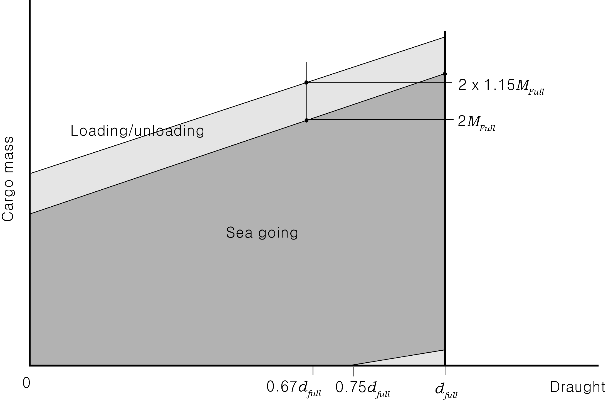

# 제7편 전용선박(1장~4장,7장~10장)

> 선급 및 강선규칙/적용지침 / RA-07A-K / 2025 / KO / Guidance

## 부록 7-4 산적화물선에 대한 흘수의 함수로서 화물창의 최대허용 및 필요최소 적재중량 계산지침 【규칙 참조】

### 1. 지침 3편 부록 3-1 2항 (4)호의 (다)에서 요구되는 적하지침서에 기재해야 할 각 화물창 단독으로의 최대허용적재질량 _s2 및 최소필요적재중량 _s2 은 해당 화물창 길이의 중앙위치에서 흘수에 따라 이하와 같이 구한다.

#### (1) 최대허용적재중량

- **(가)** 규칙 산식에 의하여 이중저 구조의 치수를 결정한 경우
  - **(a)** 선저에서 화물 및 평형수의 질량에 의하여 발생하는 압력 $9.81h _{x} \gamma \mathrm{kN/m ^{2} }$는 다음 식으로 주어지는 값 이하로 하여야 한다.
    $\max \left\{ a _{1} n _{f1} , a _{2} n _{f2} , \cdots , a _{n} n _{fn} \right\} +9.81(d _{x} -0.026L ' \alpha _{R} -h _{BST} )$
    $h _{x}$ : 선체중심선에서 내저판 상면으로부터 화물표면까지의 적재높이($\mathrm{m}$)로, 상갑판까지의 높이 이하로 하여야 한다.
    $\gamma$ : 해당 화물창의 화물설계밀도 = $\frac{M _{D}}{V}$
    $M _{D}$ : 해당 화물창의 최대화물질량($rm"ton"$).
    $V$ : 창구부분을 제외한 해당 화물창의 용적($\mathrm{m}^3$).
    $a _{i}$ : 적재조건의 수를 $n$으로 할 때, $i$번째 적재조건의 선체중심선 상에서 화물 및 평형수의 질량에 의하여 생기는 압력과 흘수에 의한 정수압에 파랑변동압을 가감한 선저수압과의 압력차($\mathrm{kN}/m ^{2}$)로써, 다음 식에 의한다. 다만 강재 코일 등 중량화물을 적재할 목적으로 국부 부재를 보강한 경우에는, 부재의 설계압력을 초과하여서는 안된다.
    $\max \left\{ |p _{i} -9.81(d _{i} +0.026L ' )| , |p _{i} -9.81(d _{i} -0.026L ' )| \right\}$
    $p _{i}$ : $i$번째 적재조건의 선체중심선 상에서 화물 및 평형수의 질량에 의하여 생기는 압력($\mathrm{kN}/m ^{2}$).
    $d _{i}$ : $i$번째 적재조건에서 해당 화물창 $l_H$의 중앙에서의 흘수($\mathrm{m}$).
    $l _{H}$ : 화물창의 길이로, **규칙 3장 301. 4**항에 의한다.
    $L '$ : 선박의 길이 $L$($\mathrm{m}$), 다만 230 $\mathrm{m}$ 이상으로 할 필요는 없다.
    $\alpha _{R}$ : 1.0, 다만 항내 등 파랑의 영향이 적은 수역에서는 0.5로 한다.
    $n _{fi}$ : $i$번째 적재조건에서, 해당 화물창과 인접하는 전후 어느 쪽의 화물창 간에서 동시에 인접하여 적재 화물창 또는 공창으로 되는 경우에는 0.9, 그렇지 않은 경우에는 1.0으로 한다.
    $d _{x}$ : 해당 화물창 $l _{H}$의 중앙 위치에서의 흘수($\mathrm{m}$).
    $h _{BST}$ : 선체중심선 상에서 이중저 내 탱크의 평형수의 높이($\mathrm{m}$), 다만 이중저 높이 이하로 한다.
  - **(b)** 최대허용적재질량 $W _{\max }$($rm"ton"$)는, 다음 식으로 주어지는 값 이하로 한다.
    $\gamma f(h _{x} )$
    $f(h _{x} )$ : 선체중심선 상에서의 화물의 적재높이 $h _{x}$($\mathrm{m}$)와 화물창 내에 적재한 화물의 체적($\mathrm{m} ^{3}$)과의 관계를 나타내는 함수. 다만 이 때 화물은 균일하게 트리밍하여 적재한 것으로 한다.
- **(나)** 직접강도계산에 의하여 이중저 부재 치수를 결정한 경우
  - **(a)** 선저에서 화물 및 평형수의 질량에 의하여 발생하는 압력 $9.81h _{x} \gamma \mathrm{kN/m ^{2} }$는 다음 식으로 주어지는 값 이하로 하여야 한다.
    $\max \left\{ a _{1} , a _{2} , \cdots , a _{n} \right\} +10.0(d _{x} -0.25H _{w} \alpha _{DC} -h _{BST} )$
    $h _{x}$, $\gamma$, $d _{x}$ 및 $h _{BST}$ : 전 (가)에 의한다.
    $a _{i}$ : 적재조건의 수를 $n$으로 할 때, $i$번째 적재조건의 선체중심선 상에서 화물 및 평형수의 질량에 의하여 생기는 압력과 흘수에 의한 정수압에 파랑변동압을 가감한 선저수압과의 압력차($\mathrm{kN}/m ^{2}$)로써, 다음 식에 의한다. 다만 강재 코일 등 중량화물을 적재할 목적으로 국부 부재를 보강한 경우에는, 부재의 설계압력을 초과하여서는 안된다.
    $\max \left\{ |p _{i} -10.0(d _{i} +0.25H _{w} )| , |p _{i} -10.0(d _{i} -0.25H _{w} )| \right\}$
    $p _{i}$ : $i$번째 적재조건의 선체중심선 상에서 화물 및 평형수의 질량에 의하여 생기는 압력($\mathrm{kN}/m ^{2}$), 다만 화물에 의한 압력을 계산할 때에는 직접계산에서 이용된 화물밀도 및 화물의 적재형상을 고려하여 계산하여도 좋다.
    $d _{i}$ : $i$번째 적재조건에서 해당 화물창 $l_H$의 중앙에서의 흘수($\mathrm{m}$)
    $H_w$ : 다음 식에 의한다.
    $L \leq 150 \mathrm{m}$인 경우: $0.61 L ^{1/2}$
    ${rm150 m}\({rm250 m}\({300\mathrm{m}}\(\alpha _{DC}$ : 1.0, 다만 항내 등 파랑의 영향이 적은 수역에서는 1/3로 한다.
  - **(b)** 최대허용적재질량 $W _{\max }$($rm"ton"$)는, 다음 식으로 주어지는 값 이하로 한다.
    $\gamma f(h _{x} )$
    $f(h _{x} )$ : (가)에 의한다.

#### (2) 필요최소적재중량

- **(가)** 규칙 산식에 의하여 이중저 구조의 치수를 결정한 경우
  - **(a)** 선저에서 화물 및 평형수의 질량에 의하여 발생하는 압력 $9.81 h_x \gamma \mathrm{kN/m^2 }$는 다음 식으로 주어지는 값 이하로 하여야 한다.
    $-\max \left\{ a _{1} n _{f1} , a _{2} n _{f2} , \cdots , a _{n} n _{fn} \right\} +9.81(d _{x} +0.026L ' \alpha _{R} -h _{BST} )$
    $h _{x}$, $\gamma$, $a_i$, $n_fi$, $d_x$, $L '$, $\alpha_R$ 및 $h_BST$ : (1)호 (가)에 의한다.
  - **(b)** 필요최소적재중량 $W_\min$($rm"ton"$)은, 다음 식으로 주어지는 값 이상으로 한다.
    $\gamma f(h _{x} )$
    $f(h _{x} )$ : (1) (가)에 의한다.
- **(나)** 직접강도계산에 의하여 이중저 부재 치수를 결정한 경우
  - **(a)** 선저에서 화물 및 평형수의 질량에 의하여 발생하는 압력 $9.81h _{x} \gamma \mathrm{kN/m ^{2} }$는 다음 식으로 주어지는 값 이상으로 하여야 한다.
    $\min \left\{ a _{1} , a _{2} , \cdots , a _{n} \right\} +10.0(d _{x} +0.25H _{w} \alpha _{DC} -h _{BST} )$
    $h _{x}$, $\gamma$, $d _{x}$, $\alpha _{DC}$, $h _{BST}$ 및 $H _{w}$ : (1) (나)에 의한다.
    $a_i$ : 적재조건의 수를 $n$으로 할 때, $i$번째 적재조건의 선체중심선 상에서 화물 및 평형수의 질량에 의하여 생기는 압력과 흘수에 의한 정수압에 파랑변동압을 가감한 선저수압과의 압력차($\mathrm{kN}/m ^{2}$)로써, 하향 하중을 양으로 하여 다음 식에 의하여 구한다. 다만 강재 코일 등 중량화물을 적재할 목적으로 국부 부재를 보강한 경우에는, $a _{i}$의 절대값이 국부 부재의 설계압력을 초과하지 않도록 $a _{i}$의 값을 정하여야 한다.
    $\min \left\{ (p _{i} -10.0(d _{i} +0.25H _{w} )) , ( p _{i} -10.0(d _{i} -0.25H _{w} )) \right\}$
    $p _{i}$ 및 $d _{i}$ : (1)호 (나)에 의한다.
  - **(b)** 최소필요적재질량 $W _{\min }$($rm"ton"$)는, 다음 식으로 주어지는 값 이상으로 한다.
    $\gamma f(h _{x} )$
    $f(h _{x} )$ : (1)호 (나)에 의한다.

### 2. 지침 3편 부록 3-1 2항 (4)호의 (라)에서 요구되는 적하지침서에 기재해야 할 인접하는 2개의 화물창(이하 인접 2 화물창이라 한다.)의 최대허용적재질량 _s2 및 최소필요적재중량 _s2 은 해당 화물창 길이의 중앙위치에서 흘수에 따라 이하와 같이 구한다.

#### (1) 최대허용적재중량

- **(가)** 규칙 산식에 의하여 이중저 구조의 치수를 결정한 경우
  - **(a)** 선저에서 화물 및 평형수의 질량에 의하여 발생하는 압력은, 각 화물창마다 다음 식으로 주어지는 값 이하로 하여야 한다.
    해당 화물창에 발생하는 압력 $9.81h _{x} \gamma \mathrm{kN/m ^{2} }$에 관하여 ; $b+9.81(d _{x} -0.026L ' \alpha _{R} -h _{BST} )$
    인접 화물창에 발생하는 압력 $9.81h ' _{x} \gamma ' \mathrm{kN/m ^{2} }$에 관하여 ; $b ' +9.81(d _{x} -0.026L ' \alpha _{R} -h ' _{BST} )$
    $h _{x}$ 및 $h ' _{x}$ : 각 화물창의 선체중심선에서 내저판 상면으로부터 화물표면까지의 적재높이($\mathrm{m}$)로, 상갑판까지의 높이 이하로 하여야 한다.
    $\gamma$ 및 $\gamma '$ : 각 화물창에서의 화물설계밀도로, 인접 2 화물창이 동시에 적재화물창 또는 공창이 되는 적재조건 중 최대값이 되는 화물설계밀도
    $b$ 및 $b '$ : $a _{j}$ 및 $a ' _{j}$이 이하의 관계를 만족할 때, $b$ 및 $b '$은 각각 $a _{j}$ 및 $a ' _{j}$의 절대값으로 할 것. 다만 강재 코일 등 중량화물을 적재할 목적으로 국부 부재를 보강한 경우에는, 부재의 설계압력을 초과하여서는 안된다.
    $a _{j} a ' _{j} =\max \left\{ a _{1} a ' _{1} , a _{2} a ' _{2} , \cdots , a _{m} a ' _{m} \right\}$
    $a _{j}$ 및 $a ' _{j}$ : 선체중심선 상에서 화물 및 평형수의 질량에 의하여 생기는 압력과 흘수에 의한 정수압에 파랑변동압을 가감한 선저수압과의 압력차이 중, 하향 하중을 양으로 하여, 해당 화물창 및 인접 화물창의 압력 차이가 동시에 같은 부호를 갖는 적재조건의 수를 $m$으로 한 경우에, $j$번째 적재조건에서의 해당화물창 및 인접화물창 각각의 압력 차이($\mathrm{kN}/m ^{2}$). 이 때 $j$번째 적재조건에서, 정수압에 파랑변동압을 가한 경우 및 감한 경우 중, 해당화물창과 인접화물창의 압력차이가 동시에 같은 부호의 압력차이를 갖는 경우만을 고려하면 되는데, 양쪽 모두 같은 부호의 압력차이를 갖는 경우에는 $a _{j}$ 및 $a ' _{j}$의 값을 각각 이하의 관계를 만족하는 $a _{jk}$ 및 $a ' _{jk}$로 할 것.
    $a _{jk} a ' _{jk} =\max \left\{ a _{j1} a ' _{j1} , a _{j2} a ' _{j2} \right\}$
    $a _{jk}$ 및 $a ' _{jk}$ : $j$번째 적재조건에서, 정수압에 파랑변동압을 가한 경우의 해당화물창과 인접화물창의 압력차이를 $a _{j1}$ 및 $a ' _{j1}$, 파랑변동압을 감한 경우의 해당화물창과 인접화물창의 압력차이를 $a _{j2}$ 및 $a ' _{j2}$로 하여, 각각 이하의 산식에 의하여 구할 것.
    $a _{j1} =p _{j} -9.81(d _{j} +0.026L ' )$
    $a ' _{j1} =p ' _{j} -9.81(d ' _{j} +0.026L ' )$
    $a _{j2} =p _{j} -9.81(d _{j} -0.026L ' )$
    $a ' _{j2} =p ' _{j} -9.81(d ' _{j} -0.026L ' )$
    $p _{j}$ 및 $p ' _{j}$ : $j$번째 적재조건의 선체중심선 상에서 화물 및 평형수의 질량에 의하여 생기는 해당화물창 및 인접화물창 각각에서의 압력($\mathrm{kN}/m ^{2}$)
    $d _{j}$ 및 $d ' _{j}$ : $j$번째 적재조건에서, 해당화물창 및 인접화물창의 $l _{H}$의 중앙위치에서의 각 흘수($\mathrm{m}$)
    $l _{H}$, $L '$ 및 $\alpha _{R}$ : **1**항 (1)호 (가)에 의한다.
    $d _{x}$ : $d _{j}$와 $d ' _{j}$의 평균값($\mathrm{m}$)
    $h _{BST}$ 및 $h ' _{BST}$ : 각 화물창의 선체중심선 상에서 이중저 내 탱크의 평형수의 높이($\mathrm{m}$), 다만 이중저 높이 이상으로 할 필요는 없다.
  - **(b)** 최대허용적재질량 $W _{\max }$($rm"ton"$)는, 다음 식으로 주어지는 값 이하로 한다.
    $\gamma f _{1} (h _{x} )+ \gamma ' f _{2} (h ' _{x} )$
    $f _{1} (h _{x} )$ 및 $f_2 (h ' _x )$ : 각 화물창의 선체중심선 상에서의 화물의 적재높이($\mathrm{m}$)와 화물창 내에 적재한 화물의 체적($\mathrm{m}^3$)과의 관계를 나타내는 함수. 다만 이 때 화물은 균일하게 트리밍하여 적재한 것으로 한다.
- **(나)** 직접강도계산에 의하여 이중저 부재 치수를 결정한 경우
  - **(a)** 선저에서 화물 및 평형수의 질량에 의하여 발생하는 압력은, 각 화물창마다 다음 식으로 주어지는 값 이하로 하여야 한다.
    해당 화물창에 발생하는 압력 $9.81h _{x} \gamma \mathrm{kN/m ^{2} }$ 에 관하여 ; $b+10.0(d _{x} -0.25H _{w} \alpha _{DC} -h _{BST} )$
    인접 화물창에 발생하는 압력 $9.81h ' _{x} \gamma ' \mathrm{kN/m ^{2} }$ 에 관하여; $b ' +10.0(d _{x} -0.25H _{w} \alpha _{DC} -h ' _{BST} )$
    $h _{x}$, $h ' _{x}$, $\gamma$, $\gamma '$, $d _{x}$, $h _{BST}$ 및 $h ' _{BST}$ : (가)에 의한다.
    $b$ 및 $b '$ : (가)에 의하는데, $a _{j1}$, $a ' _{j1}$, $a _{j2}$ 및 $a ' _{j2}$를 구할 때에는 각각 이하의 식에 의한다.
    $a _{j1} =p _{j} -10.0(d _{j} +0.25H _{w} )$
    $a ' _{j1} =p ' _{j} -10.0(d ' _{j} +0.25H _{w} )$
    $a _{j2} =p _{j} -10.0(d _{j} -0.25H _{w} )$
    $a ' _{j2} =p ' _{j} -10.0(d ' _{j} -0.25H _{w} )$
    $p _{j}$ 및 $p ' _{j}$ : (가)에 의하는데, 화물에 의한 압력을 계산할 때에는 직접계산에서 이용된 화물밀도 및 화물의 적재형상을 고려하여 계산하여도 좋다.
    $d _{j}$ 및 $d ' _{j}$ : (가)에 의한다.
    $H _{w}$ 및 $\alpha _{DC}$ : **1**항 (1)호 (나)에 의한다.
  - **(b)** 최대허용적재질량 $W _{\max }$($rm"ton"$)는, 다음 식으로 주어지는 값 이하로 한다.
    $\gamma f _{1} (h _{x} )+ \gamma ' f _{2} (h ' _{x} )$
    $f _{1} (h _{x} )$ 및 $f_2 (h ' _x )$ : (가)에 의한다.

#### (2) 필요최소적재중량

- **(가)** 규칙 산식에 의하여 이중저 구조의 치수를 결정한 경우
  - **(a)** 선저에서 화물 및 평형수의 질량에 의하여 발생하는 압력은, 각 화물창마다 다음 식으로 주어지는 값 이상으로 하여야 한다.
    해당 화물창에 발생하는 압력 $9.81 h_x \gamma \mathrm{kN/m^2 }$ 에 관하여 ; $-b+9.81(d _{x} +0.026L ' \alpha _{R} -h _{BST} )$
    인접 화물창에 발생하는 압력 $9.81 h{'_x} \gamma ' \mathrm{kN/m^2 }$ 에 관하여 ; $-b ' +9.81(d _{x} +0.026L ' \alpha _{R} -h ' _{BST} )$
    $h _{x}$, $h ' _{x}$, $\gamma$, $\gamma '$, $b$, $b '$, $d _{x}$, $L '$, $\alpha _{R}$, $h _{BST}$ 및 $h ' _{BST}$ : (1)호 (가)에 의한다.
  - **(b)** 필요최소적재중량 $W _{\min }$($rm"ton"$)은, 다음 식으로 주어지는 값 이상으로 한다.
    $\gamma f _{1} (h _{x} )+ \gamma ' f _{2} (h ' _{x} )$
    $f _{1} (h _{x} )$ 및 $f _{2} (h ' _{x} )$ : (1)호 (가)에 의한다.
- **(나)** 직접강도계산에 의하여 이중저 부재 치수를 결정한 경우
  - **(a)** 선저에서 화물 및 평형수의 질량에 의하여 발생하는 압력은, 각 화물창마다 다음 식으로 주어지는 값 이상으로 하여야 한다.
    해당 화물창에 발생하는 압력 $9.81h _{x} \gamma \mathrm{kN/m ^{2} }$에 관하여 ; $b+10.0(d _{x} +0.25H _{w} \alpha _{DC} -h _{BST} )$
    인접 화물창에 발생하는 압력 $9.81h ' _{x} \gamma ' \mathrm{kN/m ^{2} }$에 관하여 ; $b ' +10.0(d _{x} +0.25H _{w} \alpha _{DC} -h ' _{BST} )$
    $h _{x}$, $h ' _{x}$, $\gamma$, $\gamma '$, $d _{x}$ $H _{w}$, $\alpha _{DC}$, $h _{BST}$ 및 $h ' _{BST}$ : (1)호 (나)에 의한다.
    $b$ 및 $b '$ : $a _{j}$ 및 $a ' _{j}$이 이하의 관계를 만족할 때, $b$ 및 $b '$은 각각 $a _{j}$ 및 $a ' _{j}$으로 할 것. 다만 강재 코일 등 중량화물을 적재할 목적으로 국부 부재를 보강한 경우에는, $b$ 및 $b '$의 절대값이 국부 부재의 설계압력을 초과하지 않도록 $b$ 및 $b '$의 값을 결정할 것.
    $|a _{j} | a ' _{j} =\min \left\{ |a _{1} | a ' _{1} , |a _{2} | a ' _{2} , \cdots , |a _{m} |a ' _{m} \right\}$
    $a _{j}$ 및 $a ' _{j}$ : 선체중심선 상에서 화물 및 평형수의 질량에 의하여 생기는 압력과 흘수에 의한 정수압에 파랑변동압을 가감한 선저수압과의 압력차이 중, 하향 하중을 양으로 하여, 해당 화물창 및 인접 화물창의 압력 차이가 동시에 같은 부호를 갖는 적재조건의 수를 $m$으로 한 경우에, $j$번째 적재조건에서의 해당화물창 및 인접화물창 각각의 압력 차이($\mathrm{kN}/m ^{2}$). 이 때 $j$번째 적재조건에서, 정수압에 파랑변동압을 가한 경우 및 감한 경우 중, 해당화물창과 인접화물창의 압력차이가 동시에 같은 부호의 압력차이를 갖는 경우만을 고려하면 되는데, 양쪽 모두 같은 부호의 압력차이를 갖는 경우에는 $a _{j}$ 및 $a ' _{j}$의 값을 각각 이하의 관계를 만족하는 $a _{jk}$ 및 $a ' _{jk}$로 할 것.
    $|a _{jk} | a ' _{jk} =\min \left\{ |a _{j1} | a ' _{j1} , |a _{j2} |a ' _{j2} \right\}$
    $a _{jk}$ 및 $a ' _{jk}$ : $j$번째 적재조건에서, 정수압에 파랑변동압을 가한 경우의 해당화물창과 인접화물창의 압력차이를 $a _{j1}$ 및 $a ' _{j1}$, 파랑변동압을 감한 경우의 해당화물창과 인접화물창의 압력차이를 $a _{j2}$ 및 $a ' _{j2}$로 하여, 각각 이하의 산식에 의하여 구할 것.
    $a _{j1} =p _{j} -10.0(d _{j} +0.25H _{w} )$
    $a ' _{j1} =p ' _{j} -10.0(d ' _{j} +0.25H _{w} )$
    $a _{j2} =p _{j} -10.0(d _{j} -0.25H _{w} )$
    $a ' _{j2} =p ' _{j} -10.0(d ' _{j} -0.25H _{w} )$
    $p _{j}$ 및 $p ' _{j}$ : (1)호 (나)에 의하는데, 화물에 의한 압력을 계산할 때에는, 직접계산에서 이용된 화물밀도 및 화물 적재형상을 고려하여 계산하여도 좋다.
    $d _{j}$ 및 $d ' _{j}$ : (1)호 (나)에 의한다.
  - **(b)** 최소필요적재질량 $W _{\min }$($rm"ton"$)는, 다음 식으로 주어지는 값 이상으로 한다.
    $\gamma f _{1} (h _{x} )+ \gamma ' f _{2} (h ' _{x} )$
    $f _{1} (h _{x} )$ 및 $f_2 (h ' _x )$ : (1)호 (나)에 의한다.

### 5. 3항 및 4항의 경우, 항내 하역상태의 각 흘수에 대한 허용최대적재질량 및 필요최소적재질량은, 적하상태의 허용최대적재질량 또는 필요최소적재질량에 대하여, 해당 화물창의 계획만재흘수에서의 허용최대적재질량(4항의 경우에 관해서는 인접 두 화물창의 허용최대적재질량)의 15%에 해당하는 질량만큼을 각각 증가 또는 감소시켜도 관계없다. 다만 각 화물창은 만재흘수에서의 해당 화물창 단독의 허용최대적재질량을 초과하여서는 안된다.

**그림 2 두 개의 인접화물창의 최대허용 및 최소필요 화물질량(예)**
$\)**6. 1**항 및 **4**항에도 불구하고, 해당 화물창의 이중저 강도 산정을 전 **1항** 또는 **3항** 이외의 적하상태에 의하여 정한 경우에는, 그 적하상태를 이용하여 허용최대 및 필요최소 적재질량을 구하여도 관계없다. 또 **1**항 및 **2**항에 의하여 구한 허용최대 및 필요최소 적재질량보다, 각각 큰 값 또는 작은 값을 설정하고자 하는 경우에는, 추가의 직접강도계산 등에 의하여 강도검토를 행하는 것을 조건으로 수정하여도 관계없다.
\($**7. 1**항부터 **6**항까지에 관련하여, 적하지침서에는 허용최대 및 필요최소 적재질량을 사용하는 경우의 주의사항으로써 다음을 기재하여야 한다. 강재 코일 적재 등 이중저의 국부강도에 영향을 미치는, 적하지침서에 기재하지 않은 적재를 하는 경우에는, 허용최대 및 필요최소 적재질량은 별도로 고려할 필요가 있다.
\(\)**8. 지 침 3편 부록 3-1 3**항 (1)호 (바)에서 요구하는 적하지침서에 기재하여야 할 표준 적하/양하에 대한 지침에는, 적어도 다음의 적하상태에 대한 화물의 적하/양하 순서를 포함하여 우리 선급의 승인을 받아야 한다. 다만 (2) 이외의 적하상태에 관하여는, 이를 설계조건으로 한 경우에만 기재하여도 관계없다.

#### (1) 지침 3편 부록 3-1 3항 (1)호 (바) (a)에 규정한 불균일 적하상태

#### (2) 지침 3편 부록 3-1 3항 (1)호 (바) (b)에 규정한 균일 적하상태

#### (3) 지침 3편 부록 3-1 3항 (1)호 (바) (d)에 규정하는 단기항해에서의 적하상태

#### (4) 지침 3편 부록 3-1 3항 (1)호 (바) (e)에 다항 적하 및 양하 상태

#### (5) 지침 3편 부록 3-1 3항 (1)호 (바) (f)에 규정하는 갑판화물 적하상태

#### (6) 격창적하는 아닌 인접하는 두 개 이상의 화물창에 부분적재를 하는 적하상태

\(\)**9. 8**항에서 규정하는 요구하는 적하/양하 순서의 각 단계는 다음에 의한다. 단계(step)라고 하는 것은, 화물창 마다 하역작업을 행하고 하역설비가 다음 화물창으로 이동할 때까지를 말한다.

#### (1) 화물적하에 관해서는, 평형수적재상태의 화물적재 개시로부터 해당 적재의 계획만재상태까지의 각 단계

#### (2) 화물양하에 관해서는, 계획만재상태의 화물양하 개시로부터 출항시의 평형수적재상태까지의 각 단계

\(\)**10. 8**항에서 규정하는 매 적하상태의 각 단계는, 종굽힘 모멘트 및 전단력이 적하지침기기에 의하여 허용값 이내에 있다는 것을 확인하여야 한다.
