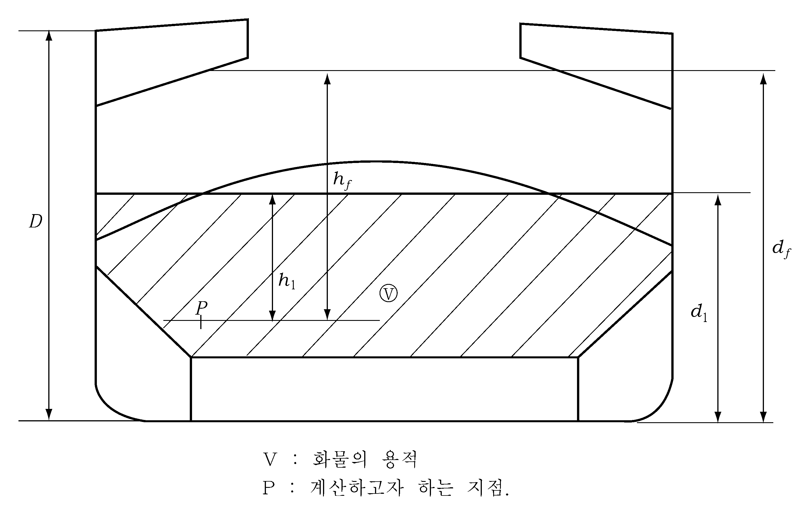
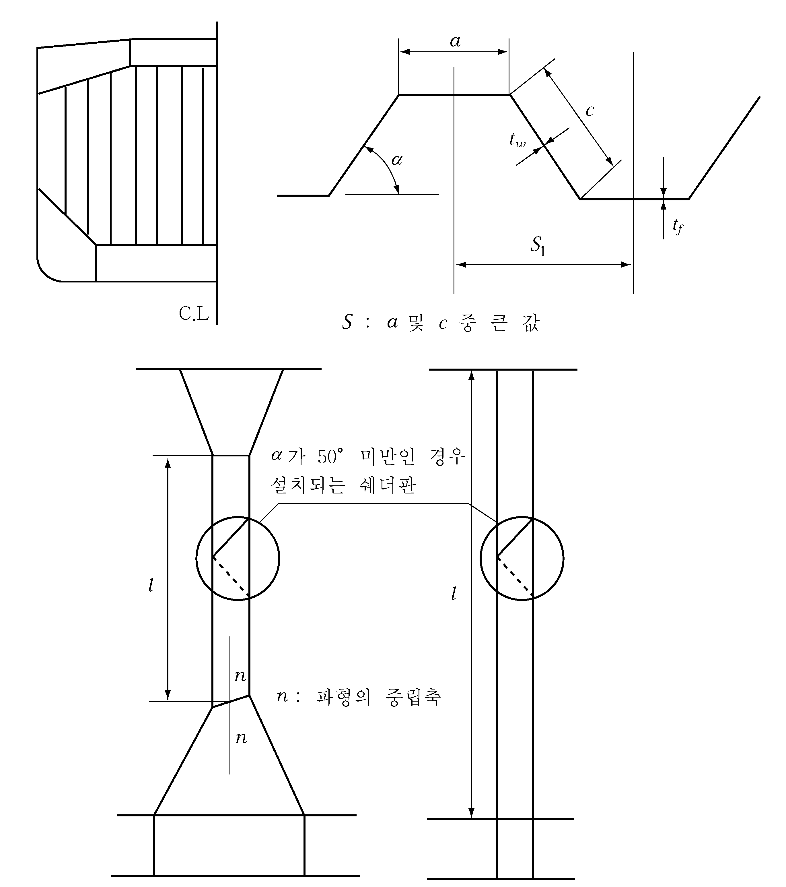
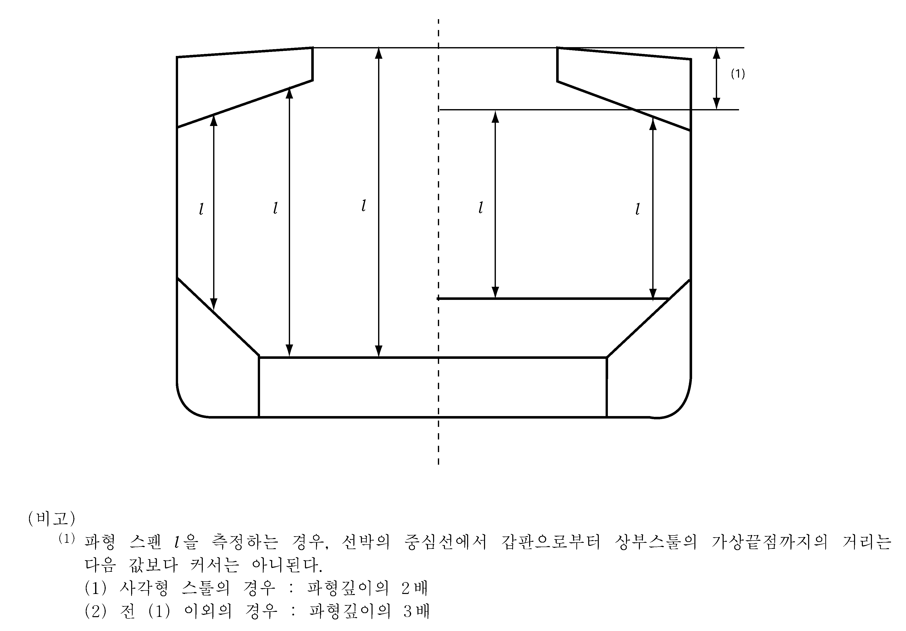
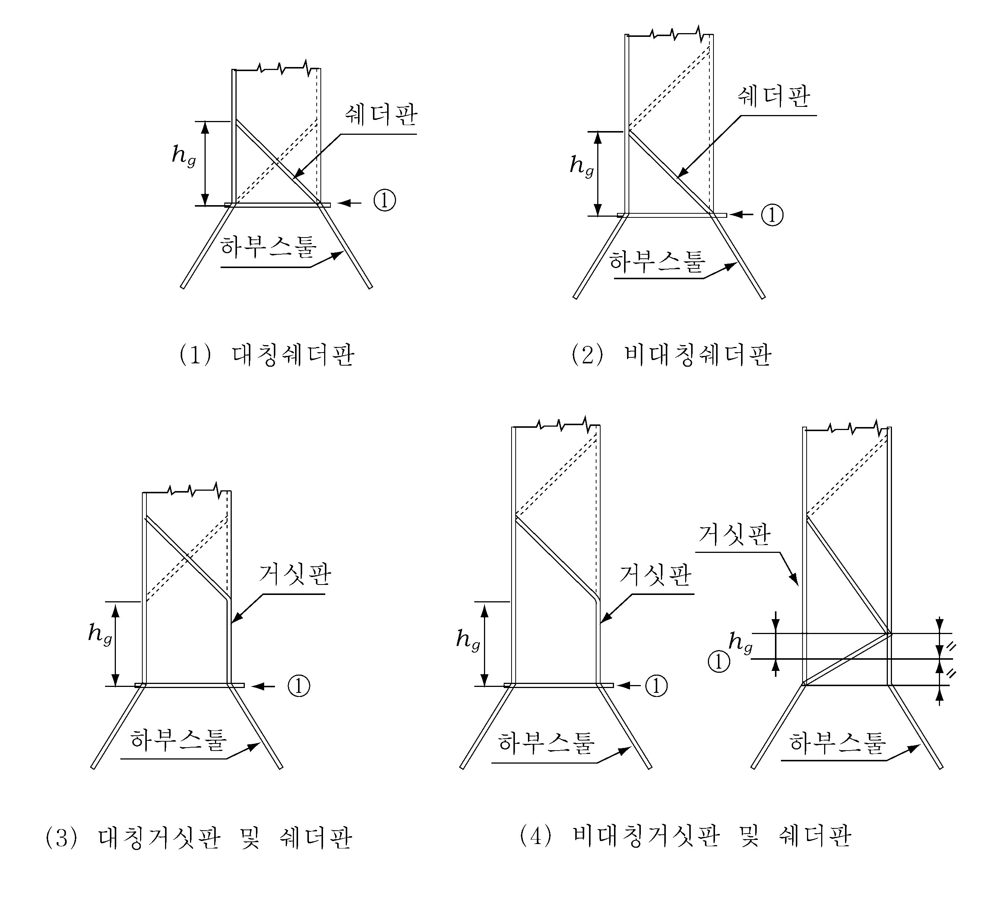
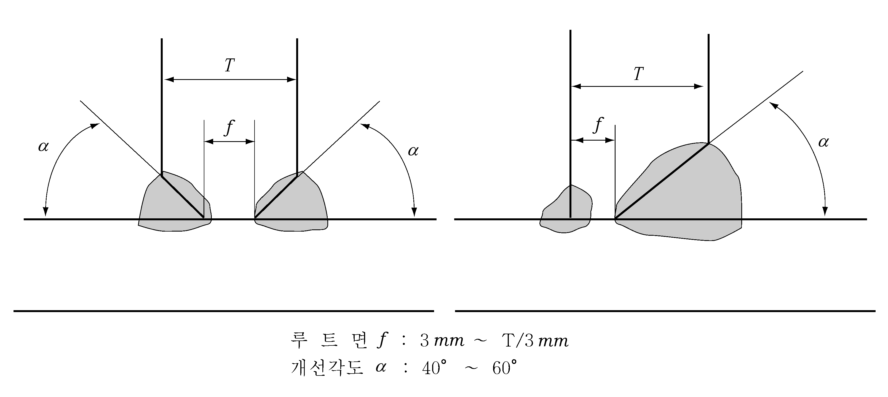
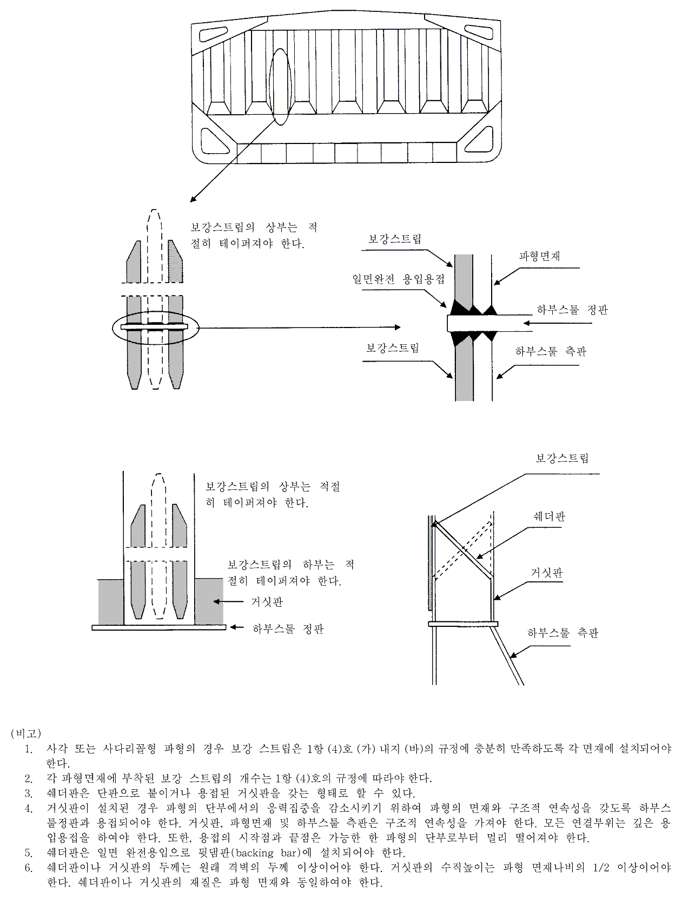
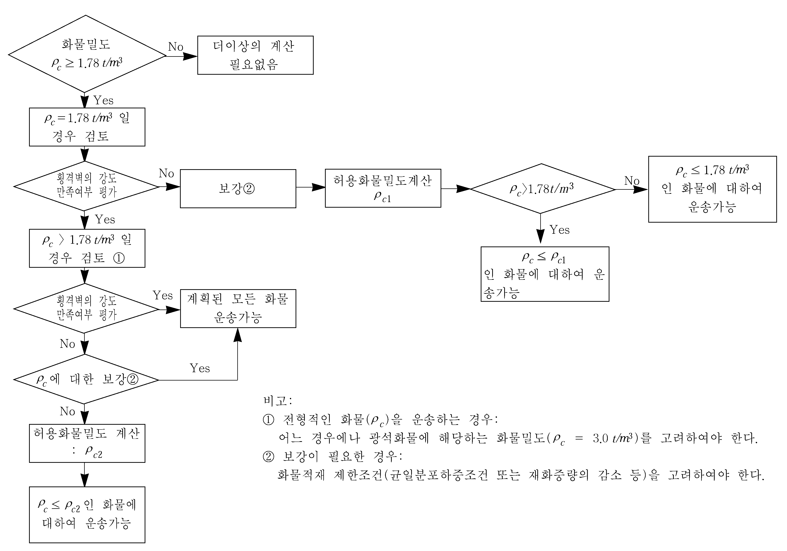
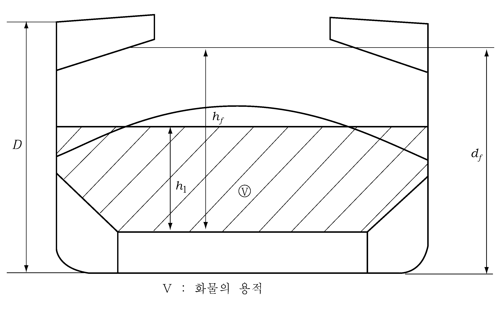
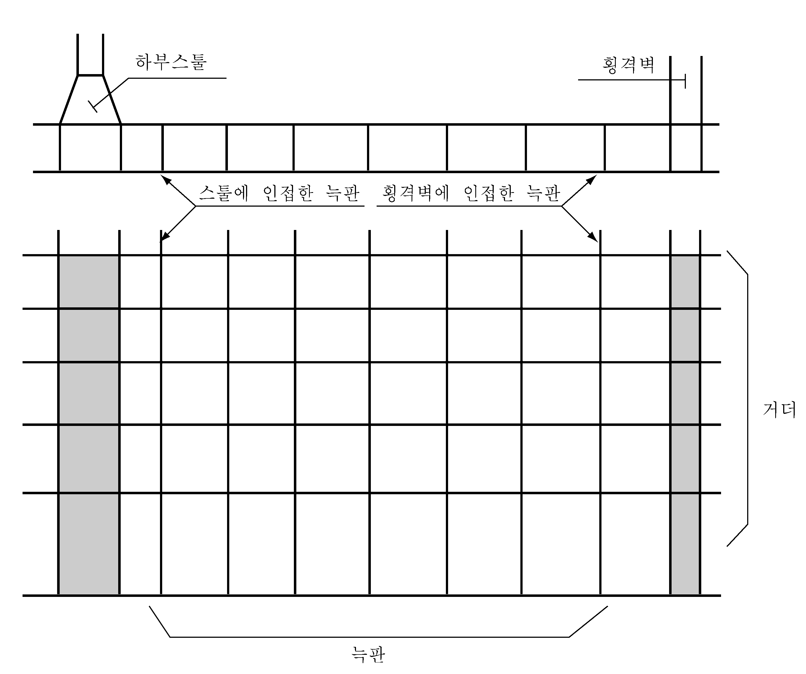
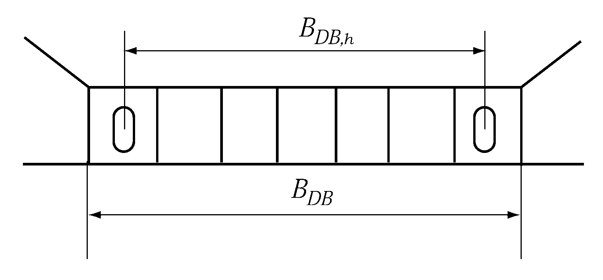

# 제7편 전용선박(1장~4장,7장~10장)

> 선급 및 강선규칙/적용지침 / RA-07A-K / 2025 / KO / Guidance

## 부록 7-5 현존 산적화물선에 대한 추가요건 【규칙 참조】

### 1. 1번 화물창 침수시 1번과 2번 화물창 사이의 파형 횡수밀격벽에 대한 구조치수

#### (1) 적용 및 정의

- **(가)** 이 규정은 선박의 길이($L_f$)가 150 $\mathrm{m}$ 이상이고, 호퍼탱크와 톱사이드 탱크를 갖는 단일갑판선으로서, 밀도가 1.78 $\mathrm{t}/m^3$ 이상인 고체산적화물을 운송하고자 하는 모든 산적화물선에 대하여, 다음 (a) 또는 (b)에 해당하는 최전방 화물창의 수직 파형 횡수밀격벽(1번과 2번 화물창 사이)에 적용한다.
  - **(a)** 1998년 7월 1일 전에 건조 계약된 산적화물선의 경우, 선측 외판으로만 화물의 경계를 갖는 최전방 화물창으로서, **규칙 3장 12절**의 요건에 따라서 건조되지 않은 최전방 화물창
  - **(b)** 1999년 7월 1일 전에 용골이 거치되었거나 또는 이와 동등한 건조단계에 있던 산적화물선의 경우, 선측외판의 접선에 직각방향으로 측정한 폭이 760 $\mathrm{mm}$ 미만인 이중선측구조를 갖는 최전방 화물창으로서, **규칙 3장 12절**의 요건에 따라서 건조되지 않은 최전방 화물창
- **(나)** 1번과 2번 화물창 사이의 횡격벽의 강도요구치수는 (2)호에 주어진 하중, (3)호에 주어진 굽힘모멘트와 전단력 및 (4)호에 주어진 강도평가에 따라 계산하여야 한다.
- **(다)** 강재교환 및 보강에 대하여는 (6)호에 따른다.
- **(라)** 균일적하상태라 함은 비중이 다른 화물을 고려한 최상층 적재높이와 최하층 적재높이의 비가 1.2를 초과하지 않는 적재조건을 말한다.

#### (2) 하중모델

- **(가)** 일반
  - **(a)** 격벽에 작용하는 하중은 1번 화물창의 침수에 의한 하중과 화물하중의 결합에 의한 값을 말한다.
  - **(b)** 적하지침서에 포함된 모든 적하상태에 대하여 화물창의 침수시 화물하중과 수압의 조합하중 중 가장 불리한 하중을 고려하여 격벽의 강도를 평가하여야 한다.
  - **(i)** 균일적하상태
    - **(ii)** 비균일적하상태
  - **(c)** 균일적하상태를 위하여 여러 항구에서의 적재 또는 하역을 하는 비균일 부분적하상태는 이 규정에 따른 고려를 하지 않아도 된다.
- **(나)** 격벽침수 수두
  침수높이 $h_f$ 는 선박이 똑바로 선 상태에서 계산하고자 하는 위치에서 $d_f$ 까지 수직으로 측정한 거리($\mathrm{m}$)를 말한다.(**그림 1** 참조) 이 경우 $d_f$ 는 기선으로부터 다음에 규정된 높이($\mathrm{m}$)까지를 말한다.
  - **(a)** B형 건현을 갖는 재화중량 50,000톤 미만인 선박의 경우 : $d_f = 0.95D$
  - **(b)** 상기 (a) 이외의 선박인 경우 : $d_f = D$
  - **(c)** 다만, 지정만재흘수선을 감소시켜 운항하고자 하는 경우에는 전 (a) 또는 (b)에서 감소된 흘수만큼 감할 수 있다.
- **(다)** 침수된 화물창내 압력
  - **(a)** 산적화물적재창
    $d_1$ 과 $d_f$ 의 값에 따라서 다음의 두 가지 경우를 고려하여야 한다. 다만, $d_1$ 은 화물의 적재높이에 대응하는 수평면까지의 높이로서 다음 식에 따른다. (**그림 1** 참조)
    $d _{1} = \frac{M _{c}}{\rho _{c} l _{c} B} + \frac{V _{LS}}{l _{c} B} +(h _{HT} -h _{DB} ) \frac{b _{HT}}{B} +h _{DB} \mathrm{m}$
    $M_c$ : 해당 화물창의 화물의 질량 (ton).
    $\rho_c$ : 산적화물밀도 ($\mathrm{t}/m^3$).
    $l_c$ : 해당 화물창의 길이 ($\mathrm{m}$).
    $B$ : 선체중앙부에서의 선박의 너비 ($\mathrm{m}$).
    $V_LS$ : 내저판 상부의 하부스툴의 용적 ($\mathrm{m}^3$).
    $h_HT$ : 선체중앙부에서의 기선으로부터 호퍼탱크의 높이 ($\mathrm{m}$).
    $h_DB$ : 이중저의 높이 ($\mathrm{m}$).
    $b_HT$ : 선체중앙부에서의 호퍼탱크의 너비 ($\mathrm{m}$).
    
    **그림 1** #eqnID-2014**,** #eqnID-2015 **및** #eqnID-2016**의 측정방법**
  - **(i)** $d_f \geq d_1$ 인 경우
    ① 고려하는 위치가 $d_1$ 과 $d_f$ 사이인 경우 압력 $P_c,f$ 는 다음 식에 따른다.
    $P_c,f = \rho g h_f \mathrm{kN/m^2 }$
    $\rho$ : 해수의 밀도로 1.025 $\mathrm{t}/m^3$ 으로 한다.
    $g$ : 중력가속도로서 9.81 $\mathrm{m}/s^2$ 으로 한다.
    $h_f$ : 전 (나)에 정의된 침수수두.
    ② 고려하는 위치가 $d_1$ 보다 낮은 경우 압력 $P_c,f$ 는 다음 식에 따른다.
    $P_c,f = \rho g h_f + [\rho_c - \rho(1-perm)]g h_1 \tan^2 \gamma \mathrm{kN/m^2 }$
    $\rho$, $g$ 및 $h_f$ : 전 ①에 따른다.
    $\rho_c$ : 산적화물밀도 ($\mathrm{t}/m^3$).
    $perm$ : 화물의 침수율로서 광석에 대하여는 0.3으로 한다. (일반적으로 철광석의 산적화물밀도를 3.0 $\mathrm{t}/m^3$ 으로 한다.)
    $h_1$ : 계산하고자 하는 위치로부터 $d_1$ 까지의 수직거리($\mathrm{m}$). (**그림 1** 참조)
    $\gamma$ : 45° - ($\phi$/2)
    $\phi$ : 화물적하각(도)으로, 철광석의 경우에는 35°로, 시멘트의 경우에는 25°로 할 수 있
    ③ 파형에 작용하는 힘 $F_c,f$ 는 다음 식에 따른다.
    $F_c,f = S_1 left[\frac{rhog(d_f -d_1 )^2}{2} +\frac{rhog(d_f - d_1 )+(P_c,f )_l _e}{2} (d_1 -h_DB - h_LS ) right] \mathrm{kN}$
    $S_1$ : 파형의 간격 ($\mathrm{m}$). (**그림 2** 참조)
    $\rho$ 및 $g$ : 전 ②에 따른다.
    $d_f$ : 전 (나)에 따른다.
    $(P_c,f )_l _e$ : 파형의 하단에서의 압력 ($\mathrm{kN}/m^2$).
    $d_1$ 및 $h_DB$ : 전 (a)에 따른다.
    $h_LS$ : 내저판으로부터 하부스툴정판까지의 평균 높이 ($\mathrm{m}$).
    
    **그림 2** #eqnID-2056 **및** #eqnID-2057 **의 측정방법**
    ① 고려하는 위치가 $d_1$ 과 $d_f$ 사이인 경우 압력 $P_c,f$ 는 다음 식에 따른다.
    $P_c,f = \rho_c g h_1 \tan^2 \gamma \mathrm{kN/m^2 }$
    $\rho_c$, $g$, $h_1$ 및 $\gamma$ : (i)에 따른다.
    ② 고려하는 위치가 $d_f$ 보다 낮은 경우 압력 $P_c,f$ 는 다음 식에 따른다.
    $P_c,f = \rho g h_f + [\rho_c h_1 - \rho(1-perm)h_f ]g \tan^2 \gamma \mathrm{kN/m^2 }$
    $\rho$, $g$, $h_f$, $\rho_c$, $h_1$, $perm$ 및 $\gamma$ : (i)에 따른다.
    ③ 파형에 작용하는 힘 $F_c,f$ 는 다음 식에 따른다.
    $F _{c,f} =S _{1} \left[ \frac{\rho _{c} g(d _{1} -d _{f} ) ^{2}}{2} \tan ^{2} \gamma + \frac{\rho _{c} g(d _{1} -d _{f} )\tan ^{2}\gamma + (P _{c,f} ) _{l} _{e}}{2} (d _{1} -h _{DB} -h _{LS} ) \right] \mathrm{kN}$
    $S_1$, $\rho_c$, $g$, $\gamma$, $(P_c,f )_l _e$ 및 $h_LS$ : (i)에 따른다.
    $d_1$ 및 $h_DB$ : (a)에 따른다.
    $d_f$ : (나)에 따른다.
    - **(ii)** $d_f < d_1$ 인 경우
  - **(b)** 빈 화물창의 침수에 의한 압력
    고려하는 위치에서의 침수시 압력 $P_f$ 는 다음 식에 따른다.
    $P_f = rhogh_f \mathrm{kN/m^2 }$
    파형에 작용하는 힘 $F_f$ 는 다음 식에 따른다.
    $F _{f} =S _{1} \rho g \frac{(d _{f} -d _{DB} -h _{LS} ) ^{2}}{2} \mathrm{kN}$
    $S_1$, $g$, $\rho$ 및 $h_LS$ : (i)에 따른다.
    $d_1$ 및 $h_DB$ : (a)에 따른다.
    $d_f$ : (나)에 따른다.
- **(라)** 침수되지 않은 산적화물 적재화물창의 압력
  - **(a)** 격벽의 각 위치에 있어서의 압력 $P_c$ 는 다음 식에 따른다.
    $P_c = \rho_c g h_1 \tan^2 \gamma \mathrm{kN/m^2 }$
    $\rho_c$, $g$, $h_1$ 및 $\gamma$ : (다), (a)의 (i)에 따른다.
  - **(b)** 파형에 작용하는 힘 $F_c$ 는 다음 식에 따른다.
    $F_c = S_1 \rho_c g \frac{(d_1 - h_DB - h_LS )^2}{2} \tan^2 \gamma \mathrm{kN}$
    $\rho_c$, $g$, $S_1$, $h_LS$ 및 $\gamma$ : (다), (a)의 (i)에 따른다.
    $d_1$ 및 $h_DB$ : (다)의 (a)에 따른다.
- **(마)** 합성압력 및 합성힘
  - **(a)** 균일적재조건
  - **(i)** 격벽의 각점에 있어서의 격벽의 강도평가를 위한 합성압력 $P$ 는 다음 식에 따른다.
    $P = P_c,f - 0.8P_c \mathrm{kN/m^2 }$
    $F = F_c,f - 0.8F_c \mathrm{kN}$
    - **(ii)** 격벽에 작용하는 합성힘 $F$ 는 다음 식에 따른다.
  - **(b)** 비균일적재조건
  - **(i)** 격벽의 각점에 있어서의 격벽의 강도평가를 위한 합성압력 $P$ 는 다음 식에 따른다.
    $P = P_c,f \mathrm{kN/m^2 }$
    $F = F_c,f \mathrm{kN}$
    $P = P_f \mathrm{kN/m^2 }$
    $F = F_f \mathrm{kN}$
    - **(ii)** 격벽에 작용하는 합성힘 $F$ 는 다음 식에 따른다.
    - **(iii)** 비균일적하상태에서 1번 화물창이 공창인 경우의 합성압력 $P$ 와 파형격벽에 작용하는 합성하중 $F$ 는 다음 식에 따른다.

#### (3) 파형에 작용하는 굽힘모멘트 및 전단력

파형에 대한 굽힘모멘트 $M$ 과 전단력 $Q$ 는 (가)와 (나)에서 주어진 식에 따른다. 또한 굽힘모멘트 $M$ 과 전단력 $Q$ 의 값은 다음 (4)호의 검토에 사용된다.

- **(가)** 굽힘모멘트
  파형에 대한 굽힘모멘트 $M$ 은 다음 식에 따른다.
  $M= \frac{F l}{8} \mathrm{kN ­ m}$
  $F$ : 합성힘 ($\mathrm{kN}$)으로 (2)호의 (마)에 따른다.
  $l$ : 파형의 스팬 ($\mathrm{m}$). (**그림 2** 및 **3** 참조)
  
  **그림 3 파형 스팬** #eqnID-2136**의 측정방법**
- **(나)** 전단력
  파형하단에서의 전단력 $Q$ 은 다음 식에 따른다.
  $Q = 0.8F \mathrm{kN}$
  $F$ 및 $l$ : (가)에 따른다.

#### (4) 강도평가기준

- **(가)** 일반
  다음 사항은 수직파형을 갖는 격벽에 대하여 적용한다. (**그림 2** 참조)
  - **(a)** 강도요구두께 $t_{n e t}$ 의 요구치는 (나), (마), (바) 및 (사)를 만족하는 두께를 말한다.
  - **(b)** **그림 2**와 같이 파형각도 $\alpha$ 가 50°보다 작은 경우에는 침수시 격벽의 형상 유지를 확보하기 위하여 파형중앙부에 쉐더판을 수평방향으로 엇갈리게 설치하여야 한다. 쉐더판은 격벽에 양면연속용접에 의하여 고착되어야 하며, 선측외판에는 부착되어서는 안된다.
  - **(c)** (나) 및 (다)의 계산에 이용되는 파형하단의 두께는 내저판(하부스툴이 없는 경우) 또는 하부스툴로부터 적어도 0.15$l$ 이상 유지되어야 한다.
  - **(d)** (나) 및 (라)의 계산에 이용되는 파형중앙부의 두께는 갑판(상부스툴이 없는 경우) 또는 상부스툴하단으로부터 적어도 0.3$l$ 이내인 곳까지 유지되어야 한다.
- **(나)** 굽힘능력(bending capacity) 및 전단응력
  - **(a)** 파형의 굽힘능력은 다음을 만족하여야 한다.
    $\frac{M}{0.5Z_l _e \sigma_a,l _e + Z_m \sigma_a,m} \times 10^3 \leq 1.0$
    $M$ : (3)호의 (가)에 규정된 굽힘모멘트 ($\mathrm{kN} ․m$).
    $Z_l _e$ : (다)에 규정된 파형하단에서의 반피치 파형의 단면계수 ($\mathrm{cm}^3$).
    $Z_m$ : (라)에 규정된 파형중앙부에서의 반피치 파형의 단면계수 ($\mathrm{cm}^3$).
    $\sigma_a,l _e$ : (마)에 규정된 파형하단에서의 허용응력 ($\mathrm{N}/mm^2$).
    $\sigma_a,m$ : (마)에 규정된 파형중앙부에서의 허용응력 ($\mathrm{N}/mm^2$).
  - **(i)** 굽힘능력 계산시 $Z_m$ 의 값은 1.15$Z_l _e$ 와 1.15$Z '_l _e$ 중 작은값 이하로 하여야 하며, $Z '_l _e$ 는 다음의 경우에 적용하며, 다음 (ii)의 식에 따라 계산한다.
    ① 다음을 만족하는 쉐더판을 부착한 경우
    ㉮ 쉐더판은 너클이 되지 않아야 한다.
    ㉯ 쉐더판은 일면용입용접이나 이와 동등한 방법에 의해 파형과 하부스툴의 상단에 용접되어야 한다.
    ㉰ 쉐더판은 경사각 45° 이상으로 부착되어야 하고, 그 끝단은 스툴측판과 일치시켜야 한다.
    ② 다음을 만족하는 거싯판을 부착한 경우
    ㉮ 거싯판은 스툴측판과 일치되게 부착되어야 한다.
    ㉯ 거싯판은 적어도 파형면재와 재료특성이 동일하여야 한다.
    $Z '_l _e = Z_g + \frac{Q h_g -0.5 h_g^2 S_1 P_g}{\sigma_a} \times 10^3 \mathrm{cm^2 }$
    $Z_g$ : 쉐더 및 거싯판의 상부끝단에서 다음 (라)에 따라 계산된 반피치 파형의 단면계수 ($\mathrm{cm}^3$).
    $Q$ : (3)호 (나)에 규정된 전단력 ($\mathrm{kN}$).
    $h_g$ : 쉐더판 또는 거싯판의 높이 ($\mathrm{m}$). (**그림 4**의 (1), (2), (3) 및 (4) 참조)
    $S_1$ : (2)호 (다)의 (a)에 따른다.
    $P_g$ : 쉐더판 또는 거싯판의 중앙부에서의 (2)호 (마)에 따라 계산되어진 합성압력 ($\mathrm{kN}/m^2$).
    $\sigma_a$ : (마)에 규정된 파형 하단부 면재의 허용응력 ($\mathrm{N}/mm^2$).
    - **(ii)** 단면계수 $Z_l _e$ 는 다음에 주어진 $Z '_l _e$ 이하이어야 한다.
  - **(b)** 전단응력 $\tau$ 는 전단력 $Q$ 를 전단면적으로 나누어 얻어진다. 파형의 경우, 웨브와 면재사이의 각도가 직각을 이루지 않음으로 전단 단면적이 감소한다. 일반적으로 감소된 전단 단면적은 웨브단면적에 sin $\alpha$ 를 곱하여 구할 수 있다. $\alpha$ 는 웨브와 면재사이의 각도이다.(**그림 2** 참조)
  - **(c)** 단면계수와 전단면적의 계산시에는 강도요구 판두께 $t _{}$*_net* 가 사용된다.
  - **(d)** 파형격벽의 단면계수는 (다) 및 (라)에 따라 계산한다.
    
    **그림 4 쉐더판 및 거싯판**
- **(다)** 파형하단에서의 단면계수
  파형하단에서의 단면계수는 압축면재의 폭을 (바)의 (a)에 의한 유효면재폭 $b_ef$ 로 하여 계산하여 파형웨브가 스툴정판의 하부(또는 내저판의 하부)에서 브래킷에 의하여 지지되지 않은 경우에는 파형웨브의 30%만 유효하다고 간주하여 계산한다.
  - **(a)** (나)에 규정된 유효한 쉐더판이 부착된 경우 (**그림 4**의 (1) 및 (2) 참조)
    파형하단(**그림 4**의 (1) 및 (2)의 단면 ①참조)의 단면계수 계산시 면재판의 면적을
    $2.5a \sqrt{t_f t_sh} \sqrt{ \sigma_\frac{Fsh}{\sigma_F}fl}$만큼 증가시킬 수 있다. 다만, 2.5$at_f$ 이하이어야 한다.
    $a$ : 파형격벽 면재의 폭 ($\mathrm{m}$). (**그림 2** 참조)
    $t_sh$ : 쉐더판의 강도요구두께 ($\mathrm{mm}$).
    $t_f$ : 면재의 강도요구두께 ($\mathrm{mm}$).
    $\sigma_Fsh$: 쉐더판의 항복응력 ($\mathrm{N}/mm^2$).
    $\sigma_Ffl$ : 파형면재의 항복응력 ($\mathrm{N}/mm^2$).
  - **(b)** (나)에 정의된 유효한 거싯판이 부착된 경우 (**그림 4**의 (3) 및 (4) 참조)
    파형하단(**그림 4**의 (3) 및 (4)의 단면 ① 참조)의 단면계수 계산시 면재판의 면적을 7$h_g t_gu$ 만큼 증가시킬 수 있다.
    $h_g$ : 거싯판의 높이 ($\mathrm{m}$)로서 (**그림 4**의 (3) 및 (4) 참조) $\frac{10}{7} S_gu$ 이하이어야 한다.
    $S_gu$ : 거싯판의 폭 ($\mathrm{m}$).
    $t_gu$ : 거싯판의 강도요구두께 ($\mathrm{mm}$)로서, $t_f$ 이하이어야 한다.
    $t_f$ : 면재의 강도요구두께 ($\mathrm{mm}$).
  - **(c)** 파형웨브가 경사진 스툴정판에 용접되는 경우, 파형하단의 단면계수 계산시 파형격벽 웨브의 유효도는 스툴 정판의 각도가 수평면에 대하여 45°이상인 경우에는 100 %로, 0°인 경우에는 30 %로 하며, 중간값에 대하여는 보간법에 따른다. 유효한 거싯판이 고착된 경우에는 파형의 단면계수 계산시 면재판의 면적을 전 (b)에 규정된 값만큼 증가시킬 수 있으나 쉐더판만 설치된 경우에는 면재판의 면적을 증가시켜서는 안된다.
- **(라)** 파형하단 이외에서의 단면계수
  파형하단 이외에서의 단면계수는 압축면재의 폭을 (바)의 (a)에 의한 유효면재폭 $b_ef$ 로 하고 파형 웨브는 유효하다고 가정하여 계산한다.
- **(마)** 허용응력
  수직응력 $\sigma$ 및 전단응력 $\tau$ 는 다음 식에 주어진 허용값 $\sigma_a$ 및 $\tau_a$ 를 초과하여서는 안된다.
  $\sigma_a = \sigma_y \mathrm{N/mm^2 }$
  $\tau_a = 0.50 \sigma_y \mathrm{N/mm^2 }$
  $\sigma_y$ : 재료의 항복응력 ($\mathrm{N}/mm^2$).
- **(바)** 압축면재폭 및 전단좌굴
  - **(a)** 압축면재의 유효폭
    파형격벽 압축면재의 유효폭 $b_ef$ 는 다음 식에 따른다.
    $b_ef = C_e a \mathrm{m}$
    $\beta > 1.25$ 인 경우 :
    $\beta \leq 1.25$ 인 경우 : $C_e = 1.0$
    $\beta = \frac{a}{t_f} \sqrt{\sigma_\frac{y}{E}} \times 10^3$
    $t_f$ : 파형면재의 강도요구두께 ($\mathrm{mm}$).
    $a$ : 파형면재의 너비 ($\mathrm{m}$). (**그림 2** 참조)
    $\sigma_y$ : 재료의 항복응력 ($\mathrm{N}/mm^2$).
    $E$ : 재료의 탄성계수로서 강재의 경우에는 2.06×10^5 ($\mathrm{N}/mm^2$) 으로 한다.
  - **(b)** 전단
    파형단부에 있는 웨브판에 대하여 전단좌굴을 검토하여야 하며, 전단응력 $\tau$ 는 다음의 임계좌굴응력 $\tau_c$ 값을 초과하여서는 안된다.
    $\tau_c = \tau_E$ : $\tau_E \leq 0.5\tau_y$ 일 때
    $\tau_c =\tau_y left(1- \tau_\frac{y}{4\tau_E} right)$ : $\tau_E > 0.5\tau_y$ 일 때
    $\tau_y$ : 재료의 전단응력($\mathrm{N}/mm^2$)으로서 $\sigma_y / \sqrt3$ 로 한다.
    $\tau_E$ : 탄성좌굴응력($\mathrm{N}/mm^2$)으로 다음에 따른다.
    $\tau_E = 0.9k_t E left(\frac{t}{1000c} right)^2 \mathrm{N/mm^2 }$
    $k_t$ = 6.34
    $t$ : 파형웨브의 강도요구두께 ($\mathrm{mm}$).
    $c$ : 파형웨브의 너비 ($\mathrm{m}$). (**그림 2** 참조)
    $\sigma_y$, $E$ : (a)에 따른다.
- **(사)** 국부 강도요구두께
  - **(a)** 격벽의 국부 강도요구두께 $t_{n e t}$ 는 다음 식에 따른다.
    $t_{n e t} = 14.9 S_w \sqrt{\frac{P}{\sigma_y}} \mathrm{mm}$
    $S_w$ : 판폭($\mathrm{m}$)으로서, 파형격벽의 면재와 웨브의 폭중 큰값. (**그림 2** 참조)
    $P$ : 해당 판의 각 아래 가장자리에서의 전 (2)호의 (마)에서 정의된 합성압력($\mathrm{kN}/m^2$). 최하단부의 국부강도 요구두께는 하부스툴의 상단판에서, 하부스툴이 없는 경우에는 내저판에서 또는 쉐더판 혹은 쉐더/거싯판이 부착된 경우에는 쉐더판 상단에서의 합성압력을 사용하여 결정한다.
    $\sigma_y$ : 재료의 항복응력 ($\mathrm{N}/mm^2$).
  - **(b)** 파형면재와 웨브의 두께가 다른 조립파형격벽의 경우 :
  - **(i)** 좁은 판의 강도요구두께 $t_n$ 는 다음 식에 의한 것 이상이어야 한다.
    $t_n = 14.9 S_n \sqrt{\frac{P}{\sigma_y}} \mathrm{mm}$
    $S_n$ : 좁은 판의 폭 (*m*).
    $P$ 및 $\sigma_y$ : (a)에 따른다.
    (ⅱ) 넓은 판의 강도요구두께 $t_w$ 는 다음 두 식에 의한 값 중 큰 값 이상이어야 한다.
    $t_w1 = 14.9S_w \sqrt{\frac{P}{\sigma_y}} \mathrm{mm}$
    $t_w2 = \sqrt{\frac{440S_w^2 P}{\sigma_y} - t_np^2 } \mathrm{mm}$
    $t_np$ : 좁은 판의 실제사용두께(부식여유두께를 제외한 두께)와 상기 $t_w1$ 중 작은 값.
    $S_w$ : 넓은 판의 폭 (*m*).
    $P$ 및 $\sigma_y$ : (a)에 따른다.

#### (5) 국부 상세

- **(가)** 격벽의 힘과 모멘트가 주변구조, 특히, 이중저와 크로스 갑판으로 잘 전달될 수 있도록 설계하여야 한다.
- **(나)** (2)호에서 규정한 거싯판 및 쉐더판의 두께와 보강방법, 용접이음부의 치수 및 재료는 우리 선급의 규정에 적합하여야 한다.

#### (6) 부식여유두께 및 강재교환

- **(가)** 계측된 판의 두께가 $t_{n e t} + 0.5 \mathrm{mm}$ 미만인 부위에 대하여는 강재신환을 하여야 한다. $t_{n e t}$ 는 (4)호 (나)의 굽힘능력 및 전단응력 또는 (4)호 (사)의 국부강도 요구두께로 계산되어진 두께이어야 한다. 또한, 웨브판의 전단강도요구조건((4)호 (마) 및 전 (4)호 (바)의 (b) 참조) 또는 웨브 및 면재판의 국부압력 강도 요구조건((4)호 (사) 참조)을 만족하기 위하여 이중판을 사용하여서는 안된다.
- **(나)** 계측된 판의 두께가 $t_{n e t} + 0.5 \mathrm{mm}$ 부터 $t_{n e t} + 1.0 \mathrm{mm}$ 까지 내에 있는 경우에는 강재신환을 하거나 강재신환을 하지 않을 시에는 도료 제조자의 요건에 따른 도장을 한 후 방식도장의 유효성을 연차검사시 확인하여야 한다. 방식도장을 하지 않는 경우에는 매년 두께 계측을 하여야 한다.
- **(다)** 강재신환이나 보강이 요구되는 경우, 강재신환 또는 보강되는 부위의 최소두께는 $t_{n e t} + 2.5 \mathrm{mm}$ 이상 되어야 한다.
- **(라)** $0.8(\sigma_Ffl t_fl ) \geq \sigma_Fs t_st$ 인 경우,
  $\sigma_Ffl$ : 파형면재의 허용응력 ($\mathrm{N}/mm^2$).
  $\sigma_Fs$ : 하부스툴측판 및 늑판(스툴이 없는 경우)의 허용응력 ($\mathrm{N}/mm^2$).
  $t_fl$ : 면재의 두께 ($\mathrm{mm}$)로 (가)의 기준에 따르거나 강재교환이 요구되는 경우 (다)의 기준에 따라 보충되어진 두께. 다만, 이 면재의 두께는 국부압력 요구조건((4)호 (사) 참조)을 만족하기 위한 두께일 필요는 없다.
  $t_st$ : 하부스툴측판 및 늑판(스툴이 없는 경우)의 실제두께 ($\mathrm{mm}$).
  - **(a)** 파형의 하부끝단으로부터 0.1$l$ 까지 쉐더판을 가진 거싯판을 설치하거나 스툴측판에 상기식을 만족하는 두께의 이중판을 부착하여야 한다.
  - **(b)** 거싯판을 설치하는 경우 거싯판은 파형격벽 면재의 재료특성과 동일하여야 한다. 또한 거싯판은 깊은용입용접(**그림 5** 참조)에 의해 하부스툴정판이나 내저판(하부스툴이 없는 경우)에 부착되어야 한다.
- **(마)** 강재교환이 요구되는 경우 격벽과 하부스툴정판 또는 내저판(하부스툴이 없는 경우)은 깊은용입용접에 의해 설치되어야 한다.
- **(바)** 거싯판을 설치하거나 교환하는 경우에는 파형 및 하부스툴정판 또는 내저판(하부스툴이 없는 경우)과는 **그림 5**에서와 같이 깊은용입용접(deep penetration weld)에 의해 설치되어야 한다.
  
  **그림 5 깊은 용입 용접**
- **(사)** 1번과 2번 화물창 사이의 파형 횡수밀격벽에 대한 신환 또는 보강에 대한 지침
  - **(a)** 1번과 2번 화물창 사이의 파형 횡수밀 격벽에 대한 신환이나 보강의 필요성은 가장 최근에 두께 계측한 결과와 검사시 발견된 사항을 기준으로 결정한다.
  - **(b)** 다음의 사항이 고려되어야 한다.
  - **(i)** 각 수직파형에 대한 보강 또는 신환 여부는 **지침 1편 부록 1-5, 표 9**에 따라 수직 파형의 하단부, 중간부위 및 하단부와 하단부로부터 상방으로 70 %인 부분 사이에서 두께가 변하는 부분의 계측결과에 따른다. 또한, (4)호 (나) 및 (가)부터 (바)까지에 따라 쉐더판 또는 거싯판의 유효성을 판단하여야 한다.
    - **(ii)** 판의 허용 쇠모한도는 전 (가) 및 (나)에 따른다.
  - **(c)** 판의 신환이 필요한 경우, 신환의 범위를 도면에 명확히 나타내어야 한다. 신환의 범위는 선체중심선 상에서 측정한 파형 수직거리의 15 % 이상이어야 한다.
  - **(d)** 보강 스트립으로 보강하는 경우, 보강 스트립의 길이는 쇠모된 판의 길이 이상이어야 한다. 일반적으로 보강 스트립의 너비와 두께는 (가)부터 (바)까지의 규정에 따른다. 보강 스트립의 재질은 파형과 동일하여야 하며, 연속필렛용접으로 격벽판에 부착되어야 한다. 보강 스트립은 적절히 테이퍼져야 하며 단부고착은 선급이 적절하다고 인정하는 바에 따른다. (**그림 6** 참조)
  - **(e)** 보강 스트립을 내저판이나 하부스툴에 연결하는 경우에는 일면완전 용입용접으로 한다. 보강 스트립이 파형면재에 부착되고 하부스툴과 연결되는 경우 보강 스트립은 하부 스툴측판에 부착되는 보강 스트립과 구조적인 연속성을 가져야 한다. 하부 스툴측판에 부착되는 보강 스트립은 파형면재에 부착된 보강 스트립과 동일한 두께를 가져야 하며, 길이는 면재의 너비 이상이어야 한다.
  - **(f)** 일반적인 보강 예는 **그림 6**과 같다.

#### (7) 1번과 2번 화물창 사이 파형 횡수밀격벽의 강도와 관련된 현존 산적화물선에 대한 고밀도화물의 운송능력을 평가하기 위한 흐름도는 그림 7을 참조할 수 있다. 다만, 전 (2)호의 (마)에서 정의된 합성압력이 _s2 가 1.78 _s2 일 때 가장 큰 경우에는 이에 따르지 아니할 수 있다.

### 2. 1번 화물창 침수시 1번 화물창의 허용적재하중

#### (1) 적용 및 정의

- **(가)** 이 규정은 선박의 길이($L_f$)가 150 $\mathrm{m}$ 이상이고 호퍼탱크와 톱사이드 탱크를 갖는 단일 갑판선으로서, 밀도가 1.78 $\mathrm{t}/m^3$ 이상인 고체산적화물을 운송하고자 하는 모든 산적화물선에 대하여, 다음 (a) 또는 (b)에 규정하는 최전방 화물창에 적용한다.
  - **(a)** 1998년 7월 1일 전에 건조 계약된 산적화물선의 경우, 선측 외판으로만 화물의 경계를 갖는 최전방 화물창으로서 **규칙 3장 11절**의 요건에 따라서 건조되지 않은 최전방 화물창
  - **(b)** 1999년 7월 1일 전에 용골이 거치되었거나 또는 이와 동등한 건조단계에 있던 산적화물선의 경우, 선측외판의 접선에 직각방향으로 측정한 폭이 760 $\mathrm{mm}$ 미만인 이중선측구조를 갖는 최전방 화물창으로서 **규칙 3장 11절**의 요건에 따라서 건조되지 않은 최전방 화물창
- **(나)** 본 규정의 적용을 연기할 목적으로 1998년 7월 1일 이후에 도래하는 정기검사를 1998년 7월 1일 이전에 완료하는 것은 허용되지 않는다.
- **(다)** 1번 화물창의 적재하중은 (3)호에 의한 이중저의 전단능력을 이용하여 (4)호에서 계산된 허용 적재하중을 초과하여서는 안된다.
- **(라)** 어떠한 경우에도, 침수시의 허용 적재하중은 비손상시의 설계 적재하중 보다 작아야 한다.

#### (2) 하중모델

- **(가)** 일반사항
  - **(a)** 이중저에 작용하는 하중은 다음을 고려하여야 한다.
  - **(i)** 외부수압에 의한 하중
    - **(ii)** 화물창의 침수에 의한 화물 하중의 조합하중
  - **(b)** 적하지침서에 포함된 적하상태에 대하여 화물창의 침수에 의한 하중과 화물하중의 조합하중중 가장 불리한 하중을 고려하여야 한다.
  - **(i)** 균일적하상태
    - **(ii)** 비균일적하상태
    - **(iii)** 포장화물 적하상태 (강재제품과 같은 경우)
  - **(c)** 허용적재하중의 계산시 각 적재상태에서 운송하고자 하는 산적화물밀도의 최대값을 고려하여야 한다.
- **(나)** 이중저 침수수두
  침수수두 $h_f$ 는 선박이 똑바로 선상태에서 내저판으로부터 $d_f$ 까지 수직으로 측정한 거리($\mathrm{m}$)를 말한다. (**그림 8** 참조) 이 경우 $d_f$ 는 기선으로부터 다음에 규정된 높이($\mathrm{m}$)까지를 말한다.
  - **(a)** B형 건현을 갖는 재화중량이 50,000톤 미만인 선박의 경우 : 0.95$D$
  - **(b)** 전 (a) 이외의 선박의 경우 : $D$

#### (3) 1번 화물창 이중저의 전단능력

- **(가)** 1번 화물창 이중저의 전단능력 $C$ 는 다음의 늑판 및 거더의 양단에서의 전단강도의 합으로 정의된다.
  - **(a)** 양쪽 호퍼에 인접한 모든 늑판. 다만, 스툴(스툴이 없는 경우에는 횡격벽)에 인접한 두 늑판의 강도는 1/2 로 한다. (**그림 9** 참조)
  - **(b)** 양쪽스툴(스툴이 없는 경우에는 횡격벽)사이에 인접한 이중저의 모든 거더.
- **(나)** 거더나 늑판이 스툴 및 빌지호퍼측 거더에 직접 설치되지 않은 경우 이들의 강도는 고착된 부분만 고려한다.
- **(다)** 빌지호퍼와 스툴(스툴이 없는 경우에는 횡격벽)로 형성되는 화물창 경계 내의 늑판과 거더를 고려한다. 격벽스툴(스툴이 없는 경우에는 횡격벽)에 직접적으로 결합되는 늑판 및 빌지호퍼측 거더는 포함시키지 않는다.
- **(라)** 이중저의 기하학적 또는 구조적 배치가 전 (가)부터 (다)까지에 해당되지 않는 경우에는 우리 선급에서 인정하는 바에 따라 이중저의 전단능력 *C*를 계산하여야 한다.
- **(마)** 전단강도를 계산할 때에는 늑판과 거더의 강도요구두께를 사용하여야 하며, 이 경우 강도요구두께 $t_{n e t}$ 는 다음 식에 따른다.
  $t_{n e t} = t - t_c \mathrm{mm}$
  $t$ : 늑판 또는 거더의 설계두께 ($\mathrm{mm}$).
  $t_c$ : 부식감소량으로 일반적으로 2.0 $\mathrm{mm}$ 로 한다. 다만, 선급이 인정하는 경우에는 $t_c$ 는 2.0 $\mathrm{mm}$ 보다 작은 값으로 할 수 있다.
- **(바)** 늑판의 전단 강도
  호퍼에 인접한 늑판패널에서의 늑판의 전단강도 $S_f1$ 과 가장 바깥쪽의 베이(bay)에 있는 개구 위치에서의 늑판의 전단강도 $S_f2$ 는 다음 식에 따른다.
  $S_f1 = A_f \tau_\frac{a}{\eta_1} \times 10^-3 \mathrm{kN}$
  $S_f2 = A_f,h \tau_\frac{a}{\eta_2} \times 10^-3 \mathrm{kN}$
  $A_f$ : 빌지호퍼에 인접한 늑판패널의 전단면적 ($\mathrm{mm}^2$).
  $A_f,h$: 가장 바깥쪽의 베이에 있는 개구 위치에서의 늑판패널의 단면적 ($\mathrm{mm}^2$).
  $\tau_a$ : 허용 전단응력으로 ($\mathrm{N}/mm^2$)으로 한다.
  $\sigma_y$ : 재료의 항복응력 ($\mathrm{N}/mm^2$).
  $\eta_1$ : 1.1 로 한다.
  $\eta_2$ : 1.2 로 한다. 다만, 개구가 적절히 보강되었다고 우리 선급이 인정하는 경우에는 1.1 로 할 수 있다.
  
  **그림 6 일반적인 보강 예**
  
  **그림 7 횡경벽 강도와 관련한 현존산적화물선의 고밀도화물 운송능력 평가를 위한 흐름도**
  
  **그림 8** #eqnID-2317**,** #eqnID-2318 **및** #eqnID-2319**의 측정방법**
  
  **그림 9 고려하는 늑판 및 거더**
- **(사)** 거더의 전단강도
  스툴(스툴이 없는 경우에는 횡격벽)에 인접한 거더패널에서의 거더의 전단강도 $S_g1$ 과 스툴(스툴이 없는 경우에는 횡격벽)에 가장 가까운 베이에 있는 개구 위치에서의 거더의 전단강도 $S_g2$ 는 다음 식에 따른다.
  $S_g1 = A_g \tau_\frac{a}{\eta_1} \times 10^-3 \mathrm{kN}$
  $S_g2 = A_g,h \tau_\frac{a}{\eta_2} \times 10^-3 \mathrm{kN}$
  $A_g$ : 스툴(스툴이 없는 경우 횡격벽)에 인접한 거더패널의 최소단면적 ($\mathrm{mm}^2$).
  $A_g,h$: 스툴(스툴이 없는 경우 횡격벽)에 가장 가가운 베이에 있는 개구 위치에서의 거더패널의 단면적 ($\mathrm{mm}^2$).
  $\tau_a$ : (바)에 준한 허용 전단응력 ($\mathrm{N}/mm^2$).
  $\eta_1$ : 1.1 로 한다.
  $\eta_2$ : 1.15 로 한다. 다만, 개구가 적절히 보강되었다고 우리 선급이 인정하는 경우에는 1.1 로 할 수 있다.

#### (4) 화물창의 허용적재하중

화물창의 허용적재하중 $W$ 는 다음 식에 따른다.

- **(가)** 산적화물의 경우에는 다음 두 값 중 작은 값으로 한다.
  $X_1 = {Z + rhog (E - h_f )} over {1+ \frac{\rho}{\rho_c} (perm -1 )$
  $X_2 = Z + rhog (E - h_f perm)$
  $\rho$ : 해수밀도 ($\mathrm{t}/m^3$).
  $g$ : 중력가속도로서 9.81 $\mathrm{m}/s^2$ 으로 한다.
  $E$ : 화물창 침수시의 선박흘수(*m*)로서 $d_f - 0.1D$ 로 한다.
  $d_f$ : (2)호 (나)에 따른다.
  $h_f$ : (2)호 (나)에 정의된 침수수두 (*m*).
  $perm$: 화물의 침수율로서 광석의 경우 0.3 으로 한다.
  $Z$ : 다음의 두 값 중 작은 값으로 한다.
  $Z_1 = C_\frac{h}{A_D}B,h$, $Z_2 = C_\frac{e}{A_D}B,e$
  $C_h$ : (3)호에 정의된 이중저의 전단능력 (*kN*)으로서, 각각의 늑판에 대하여는 전단강도 $S_f1$ 과 $S_f2$ ((3)호 (바) 참조)중 작은 값을 고려하며, 각각의 거더에 대하여는 전단강도 $S_g1$과 $S_g2$ ((3)호 (사) 참조)중 작은 값을 고려하여야 한다.
  $C_e$ : (3)호에 정의된 이중저의 전단능력 (*kN*)으로서, 각각의 늑판에 대하여는 전단강도 $S_f1$ ((3)호 (바) 참조)과 각각의 거더에 대하여는 전단강도 $S_g1$ 과 $S_g2$ ((3)호 (사) 참조)중 작은 값을 고려하여야 한다.
  $A _{DB,h} = \sum _{i=1} ^{i=n} S _{i} B _{DB,i}$, $A _{DB,e} = \sum _{i=1} ^{i=n} S _{i} (B _{DB} -S)$
  $n$ : 스툴(스툴이 없는 경우 횡격벽)사이의 늑판의 개수.
  $S_i$ : $i$ 번째 늑판의 간격 ($\mathrm{m}$).
  $B_DB,i$ : 늑판의 전단강도가 $S_f1$ 으로 주어진 경우 $B_DB -S$ 로((3)호 (바) 참조), $S_f2$ 으로 주어진 경우 $B_DB,h$ 로 한다 ((3)호 (바) 참조).
  $B_DB$ : 빌지호퍼 사이의 이중저의 너비 ($\mathrm{m}$). (**그림 10** 참조)
  $B_DB,h$ : 고려하는 개구사이의 거리 ($\mathrm{m}$). (**그림 10** 참조)
  $S$ : 빌지호퍼에 인접한 내저종늑골의 간격 ($\mathrm{m}$).
- **(나)** 강재제품의 경우에는 (가)의 $X_1$ 에 따른다. 다만, 침수율은 0 으로 한다.
  
  **그림 10** #eqnID-2384 **및** #eqnID-2385**의 측정**

### 3. 손상복원성

#### (1) 1항과 2항을 적용하는 산적화물선은 하기만재흘수선까지 적재되었을 때 모든 적하상태에서 최전방 화물창의 침수시 해상인명안전협약(SOLAS) 12장 규칙 4.3부터 4.7까지의 규정을 만족하여야 한다.

#### (2) 횡수밀 격벽의 수가 충분하지 못하여 1항과 2항 및 (1)호의 적용이 곤란한 선박은 해상인명안전협약(SOLAS) 12장 규칙 9를 만족하여야 한다. #imgID-131_s2
