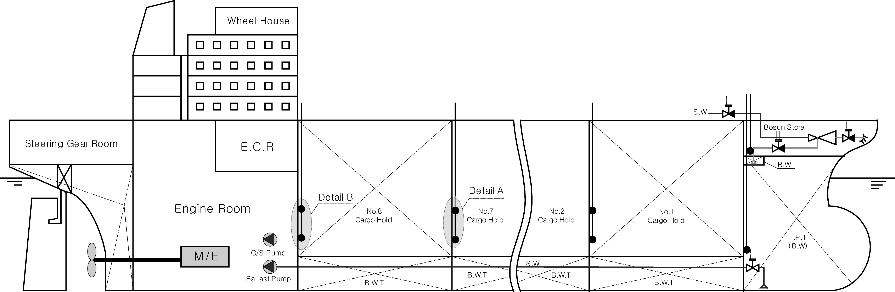
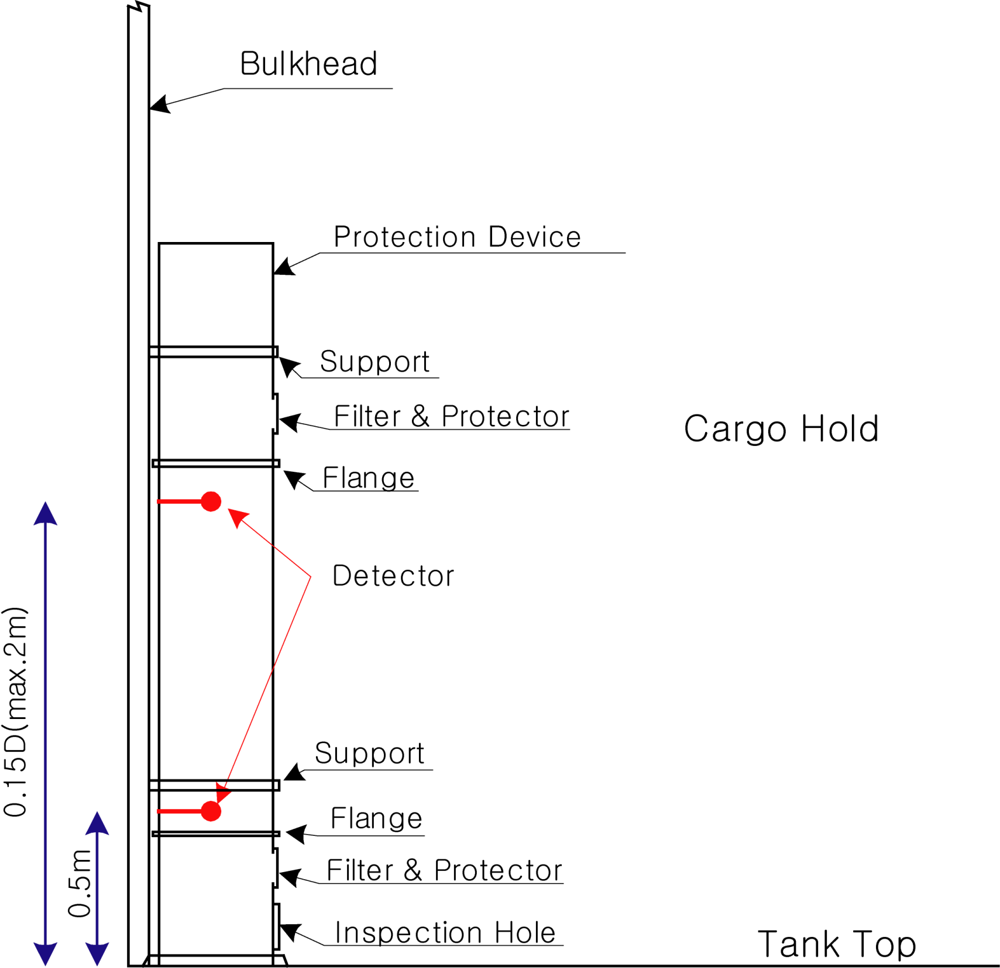

# 제7편 전용선박(1장~4장,7장~10장)

> 선급 및 강선규칙/적용지침 / RA-07A-K / 2025 / KO / Guidance

## 부록 7-6 산적화물선 및 단일화물창 화물선의 수위감지 경보장치 및 배수 펌핑장치 【규칙 참조】

### I. 수위감지 및 경보장치

#### 1. 일반사항

- **(1)** 이 부록에서 정하는 장치들은 상세설치도, 용접상세도 및 전기설비 상세도 등을 포함한 관련 도면을 우리 선급에 제출하여 승인을 받은 후 설치하고 검사를 받아야 한다.
- **(2)** 수위감지 및 경보장치는 별도로 정하는 기준에 따라 우리 선급의 형식승인을 받은 것이어야 한다.
- **(3)** 다음의 화물을 운송하는 선박은 SOLAS Ch.II-1, III, IX, XI-1 및 XII의 산적화물선과 관련된 규정이 적용되지 않는다. 다만, 화물창에 구조적인 손상을 일으키는 수단(10톤을 초과하는 그랩(grabs), 동력삽(power shovels), 기타 수단)에 의해 적/양하가 이루어져서는 아니 된다. *(2019)*
  - **(가)** 우드칩(woodchips)
  - **(나)** 시멘트, 플라이애시(fly ash), 설탕

#### 2. 용어정의

- **(1)** 수위감지기(water level detector)
  **규칙 3장 1403.**의 **1항** 및 **3항**에서 규정한 화물창 또는 기타 구역으로 물이 침입하는 것을 감지하여 경보를 울리는 장치로서 센서 및 지시기로 구성된다.
- **(2)** 센서(sensor)
  **규칙 3장 1403.**의 **1항** 및 **3항**에서 규정한 화물창 및 기타구역에 물의 존재여부를 알려주는 신호를 작동시키기 위하여 설치되는 장치를 말한다.
- **(3)** 예비경보수위(pre-alarm level)
  화물창 내의 센서가 작동하는 낮은 쪽 수위(0.5 $\mathrm{m}$, 단일화물창의 화물선은 0.3 $\mathrm{m}$ 이상)를 말한다.
- **(4)** 주경보수위(main alarm level)
  화물창 내의 센서가 작동하는 높은 쪽 수위(0.15 $D$ 이상, 최대 2 $\mathrm{m}$를 초과하지 않는 수위, 단일화물창의 화물선은 0.15 $D$ 이하) 또는 화물창 이외의 구역에 설치된 센서가 작동하는 수위를 말한다.
- **(5)** 오버라이딩 장치(overriding device)
  어떠한 경보신호가 발생하였을 경우, 그 신호를 무시하고 그 전의 상태를 계속 유지시키기 위한 장치를 말한다.
- **(6)** 가시경보(visual indication)
  위치한 장소의 모든 밝기에서도 육안으로 볼 수 있는 등이나 다른 장치의 작동에 의한 표시를 말한다.
- **(7)** 가청경보(audible indication)
  신호를 받는 장소에서 감지할 수 있는 가청 신호를 말한다.
- **(8)** 선박 깊이(depth)
  화물창 바닥에서 화물창의 창구코밍까지의 거리를 말한다. (**그림 1** 참조)
  
  **그림 1 선박깊이(D)**

#### 3. 설치요건

- **(1)** 산적화물선
  - **(가)** 화물창
    - **(a)** 화물창의 수위가 내저판으로부터 상방 0.5 $\mathrm{m}$ 높이에 도달했을 때 및 화물창 깊이의 15$\%$ 이상(최대 2 $\mathrm{m}$)의 높이에 도달했을 때 가시가청의 경보를 발하는 것이어야 한다. 다만, **‘부록 7-5 현존 산적화물선에 대한 추가요건’**을 만족하지 못하여 **SOLAS Reg.XII/9.2** 의 요건을 적용받는 산적화물선의 경우, 화물창 깊이의 15$\%$ 이상(최대 2 $\mathrm{m}$) 높이에 도달했을 때에만 가시가청의 경보를 발하는 것을 인정할 수 있다.
    - **(b)** 수위감지기는 화물창의 최후단 중앙부에 설치하여야 하며, 화물창이 평형수적재용으로 사용되는 경우에는 경보 오버라이딩 장치를 설치할 수 있다. 가시경보는 각 화물창에서 감지된 2개의 다른 수위를 명확히 구별하는 것이어야 한다. **그림 2**부터 **그림 5**까지는 수위감지기의 설치위치 및 적용 예를 나타낸 것이다.
    - **(c)** 하역작업 시 내부재가 손상을 입는 경우가 있으므로 스툴을 가진 선박의 경우에는 스툴 내에 수위감지기를 설치하는 것을 권장하나, 이 경우 각 수위감지기의 특성을 고려하여 설치하여야 한다.
    - **(d)** 수위감지기 중 직접 접촉식을 선택하는 경우에는 필터를 설치하더라도 챔버 하부에 화물 잔류물이 축적될 가능성을 피할 수 없기 때문에, 잔류물의 제거를 위한 검사 및 고형물 제거용 구멍을 설치하거나 이와 동등한 수단을 갖춰야 한다. 필터의 선정은 화물의 종류에 따라 다르나 메쉬(mesh)를 결정할 경우 운송예정인 화물의 입자직경을 고려하여 선정하고 예비필터를 갖춰야 한다. 필터는 하역작업 후 항상 세척하여야 한다.
  - **(나)** 선수격벽 전방의 평형수탱크
    탱크 용적의 10$\%$를 넘지 않는 수위에 도달했을 때 가시가청의 경보를 발하는 것이어야 한다. 해당 탱크가 평형수탱크인 경우에는 오버라이딩 장치를 설치할 수 있다.
  - **(다)** 최전방 화물창 보다 앞쪽에 위치하는 체인로커를 제외한 건구역(dry spaces) 또는 보이드 구역 내에는 수위가 갑판 상방 0.1 $\mathrm{m}$ 높이에 도달하는 경우에 작동하는 가시가청의 경보장치를 설치해야 한다. 단, 선박의 최대 배수용적의 0.1$\%$이하의 용적을 가지는 폐위된 구역에는 그러한 경보장치를 설치할 필요가 없다.
    
    **그림 2 수위감지기 설치위치**
    
    **그림 3 (Detail A)** 
    **그림 4 (Detail A)**
    
    **그림 5 (Detail B)**
- **(2)** 단일 화물창의 화물선
  - **(가)** 수위가 화물창내 내저판으로부터 상방 0.3미터 이상의 높이와 화물창 평균깊이의 15퍼센트를 넘지 아니하는 높이에 달하였을 때 각각 항해 선교에 가시․가청의 경보를 발할 수 있는 수위감지기를 설치하여야 한다.
  - **(나)** 화물창의 후단부(내저판이 계획흘수선에 평행하지 않은 경우에는 가장 낮은 위치의 상방)에 설치하여야 하며, 특설늑골 또는 부분수밀격벽이 내저판 상방에 설치된 경우에는 추가의 수위감지기를 설치하여야 한다.

#### 4. 수위감지장치의 요건

- **(1)** 일반사항
  - **(가)** 수위감지장치는 미리 정해진 수위에 물이 도달하는 것을 확실하게 지시하여야 하며, 경보장치는 항해선교에 설치하여야 한다. 미리 정해진 예비경보수위(pre-alarm level)와 주경보수위(main alarm level) 모두 감지할 수 있는 1개의 센서를 사용하는 것은 허용된다.
  - **(나)** 화물창, 평형수탱크 및 건구역(dry spaces) 내에 설치되는 전기 구성품에 대한 보호외피는**(KS C) IEC 60529**에 적합한 **IP68**이어야 한다.
  - **(다)** 평형수 및 화물장소의 상방에 설치되는 전기기기에 대한 보호외피는 **(KS C) IEC 60529**에 적합한 **IP56**이어야 한다.
  - **(라)** 수위감지장치에는 다음과 같은 두개의 독립된 전원으로부터 급전되어야 하며, 1차 전원이 차단된 경우 가시가청의 경보를 발하는 것이어야 한다.
    - **(a)** 두 개의 독립된 전원중 1개는 주전원이어야 하며 다른 1개는 비상전원이어야 한다. 다만, 연속적으로 충전되는 전용의 축전지가 비상전원과 동등한 배치, 장소 및 지속성(18h)을 가지도록 설치되면 비상전원을 대체할 수 있다. 축전지 전원공급은 수위감지장치의 내부축전지로 할 수도 있다.
    - **(b)** 어느 한 전원에서 다른 것으로 전원공급을 전환하는 장치는 수위감지장치에 통합될 필요는 없다.
    - **(c)** 2차 전원공급용으로 축전지가 사용될 경우, 양쪽 전원공급에 대해서 고장경보가 제공되어야 한다.
  - **(마)** 냉장/냉동창에 설치되는 장치는 사용온도에 적합한 적절한 산업표준을 만족하여야 한다. *(2024)*
- **(2)** 화물창
  감시되는 화물창의 수위가 예비경보수위(pre-alarm level)에 도달했을 때와 주경보수위(main alarm level)에 도달했을 때에 각각 가시가청의 경보가 작동하여야 한다. 가시경보는 해당 화물창을 식별할 수 있어야 하며 가청경보는 예비 경보수위용과 주 경보수위용이 서로 구별되도록 각각 설치하여야 한다.
- **(3)** 화물창이외의 구역
  감시되는 구역의 수위가 센서에 감지되는 경우 가시가청의 경보가 작동하여야 한다. 이 가시가청 경보는 화물창의 주경보수위용 가시가청 경보장치와 동일한 특성의 것이어야 한다.

#### 5. 수위감지기의 기능요건

- **(1)** 수위감지기의 종류
  수위를 감지하는 방법에는 감지기에 물이 접촉함으로써 물의 존재 여부가 결정되는 직접접촉식과 에어퍼지(air-purge)나 초음파 등을 이용하는 비접촉식이 있다.
- **(2)** 기능요건
  - **(가)** 센서는 화물창의 후단부 또는 내저판이 계획흘수선에 평행하지 않은 경우에는 가장 낮은 위치의 상방에 설치하여야 하며, SOLAS XII/12를 따르는 산적화물선의 경우에는, 각 화물창의 뒤쪽 부분 또는 해당 규정이 적용되는 화물창 이외의 구역의 가장 낮은 부분에 위치하여야 한다. *(2024)*
  - **(나)** 선박이 항해중에 있는 동안 계속적으로 작동할 수 있는 것이어야 한다.
  - **(다)** 모든 선적화물에 대하여 유효하게 방식되는 것이어야 하며, 수위감지기는 **규칙 3장 1403.**의 **1**항 및 **3**항에서 규정한 화물창 및 기타구역에 설치되는 감지기용 센서, 필터 및 보호 장치를 포함한다.
  - **(라)** ±100 $\mathrm{mm}$의 정확도로 작동할 수 있는 것이어야 한다.
  - **(마)** 일반적으로, 화물구역내의 장비는 **IEC 60092-506 3.1** 항에서 정의된 구역 1(Zone 1)에 적합한 것 이어야 한다. 해당 장비는 운송하는 화물에 따라 접할 수 있는 폭발성 가스 및/또는 가연성 분진에 적합하여야 한다. 해당 장비는 **IEC 60079-506** 시리즈 규격 또는 동등한 국제 표준에 따라 제조, 시험, 표시 및 설치되어야 한다. 승인된 안전형 장비가 설치되는 경우, 해당 장비는 방폭성능을 유지하도록 화물로부터 발생가능한 기계적 손상으로부터 적절히 보호되어야 한다. 다만, 선박이 가연성 또는 폭발성 분위기를 생성할 수 없는 화물만 운송하기 위하여 설계된 경우, 승인된 안전형 장비에 대한 요건은 요구되지 않는다. 이 경우, 잠재적인 폭발성 분위기를 생성할 수 있는 화물 운송을 명확하게 배제하는 지침이 매뉴얼에 포함되어야 하며, 선박의 적하기록부 및 승인증서와 일치하여야 한다. 분진 및/또는 가스의 특성을 알 수 없는 경우, 온도등급 T6, 가스그룹 IIC 및/또는 분진그룹(dust group) IIIC 와 IP5X 중 하나가 적절히 사용되어야 한다. 수위감지장치에 승인된 안전형 장비가 포함될 경우, 배치도면을 제출하여 승인 받아야 한다. *(2024)*
  - **(바)** 화물창에 화물이 없는 경우에 직접 또는 간접적인 방법으로 성능시험을 행할 수 있는 것이어야 한다.
- **(3)** 감지기의 설치 요건
  - **(가)** 감지기는 화물창의 뒤쪽 부분과 통하는 보호된 장소에서 실제 화물창내의 대표적인 수위를 감지할 수 있는 것이어야 한다. 이러한 감지기는 가능한 한 화물창의 중심선 가까이에 설치하거나 또는 양현에 설치하여야 한다.
  - **(나)** 감지기는 화물창이나 다른 구역용 측심관 또는 다른 수위를 측정하는 장비의 사용에 방해가 되지 않도록 설치하여야 하며, 검사, 정비 및 수리를 위하여 쉽게 접근할 수 있는 위치에 설치하여야 한다.
  - **(다)** 화물창 내에 설치되는 케이블 및 관련 장치는 튼튼한 구조의 튜브 또는 보호된 장소에 설치하여 화물 또는 화물 작업과 관련한 기계장비에 의한 손상으로부터 보호되어야 한다.
  - **(라)** 센서는 규정에서 요구되는 높이에 위치해야 하며, 이 높이는 내저판(inner bottom) 상면(upper surface)에서 측정되어야 한다. SOLAS II-1/25-1.3의 빌지 레벨 센서의 경우, 빌지웰의 바닥이 내저판의 상부 표면 아래에 있는 경우에는 해당 센서의 높이는 빌지웰의 바닥에서 측정되어야 한다. *(2024)*
  - **(마)** 라이닝 또는 단열재를 시공할 때, 라이닝 또는 단열재가 수밀 기준에 따라 시공되지 않은 경우에는 높이는 내저판 상면에서 측정되어야 한다. 라이닝 또는 단열재가 수밀 시험이 된 경우에는 라이닝/단열재의 상면에서 높이가 측정될 수 있다. *(2024)*

#### 6. 경보장치

- **(1)** 가시가청의 경보장치는 항해선교의 적당한 위치에 설치하여야 한다. 이 경보장치는 IMO의 "Code on Alerts and Indicators, 2009"의 주경보(primary alarm) 요건에도 적합하여야 한다. 주경보(primary alarm)로서 예비경보(pre-alarm)는 비상상황을 방지하도록 신속한 조치가 필요한 상황을 나타내고, 비상경보(emergency alarm)로서 주경보(main alarm)는 인명과 선박에 위험을 방지하기 위한 즉각적인 조치가 취해져야 한다는 것을 나타낸다.
- **(2)** 가시경보는 주위의 모든 밝기에서도 다른 경보와는 구별되는 색깔이나 디지털 디스플레이를 이용하여 선명하게 표시할 수 있어야 하며, 선박의 안전운항에 필수적인 기기의 작동에 중대한 장애를 일으키지 않는 것이어야 한다. 또한, 수위가 감지기의 위치 이하로 저하될 때까지는 계속하여 작동하여야 하고 조작자의 수동조작으로 해제되는 것이어서는 안된다. 플리커(flicker) 기능이 있는 시스템의 경우에는 조작자가 플리커를 정지시킬 수 있어야 한다. 그러나 이때에도 가시경보는 해제되어서는 안된다.
- **(3)** 경보장치는 동일한 감지기에 의해 경보기가 설치된 장소에도 상기의 가시경보와 동시에 가시 및 가청의 경보를 제공할 수 있는 것이어야 한다. 또한 조작자에 의해 이 경보를 정지시킬 수 있는 기능이 있어야 한다.
- **(4)** 선박의 운동에 기인한 슬로싱에 의해 작동되는 경보의 작동을 방지하기위하여 경보장치에 타임딜레이(time delay)를 설치할 수 있다.
- **(5)** 평형수적재용으로 지정된 화물창 및 탱크에만 설치되는 경보장치에는 지시 및 경보에 대한 오버라이딩 기능을 추가할 수 있다. 오버라이딩용 지시장치는 평형수적재용으로 지정된 화물창 및 탱크의 수위 감지기가 활성화되지 않는 동안에는 계속하여 작동되는 것이어야 한다. 다만, 오버라이드 조건의 취소 및 경보의 재활성화는 화물창 또는 탱크의 수위가 예비경보수위 이하로 저하된 경우에는 자동적으로 이루어져야 한다.
- **(6)** 상기 (5)호의 요건에도 불구하고, 평형수적재용으로 설계되지도 않고 사용되지도 않는 구역(예: 건구역, 화물창 등)의 경보장치에 대해서는 오버라이딩 기능을 부여하여서는 안된다.
  - **(가)** 오버라이딩 경보를 설치하고자 할때는 우리 선급 검사원 입회하에 시운전(commissioning test) 하기 전에 각 호선에 최적화되어야 한다. 이 경우 작업착수 전에 관련 도면을 제출하여 승인받아야 한다.
  - **(나)** 어떤 화물창에 선원이 임의로 경보를 오버라이딩하는 것을 금지하는 경고판으로 상기 규정을 대체할 수는 없다.
- **(7)** 경보장치는 연속적으로 본 시스템을 감시하여야 하며, 고장이 발생하는 경우 가시가청의 경보를 발하여야 한다. 이때 가청경보는 수동조작으로 해제시킬 수 있으나 가시경보는 오작동의 원인이 해결될 때까지 계속적으로 작동하는 것이어야 한다. 이 고장 경보는 수위감지용 경보와는 구별 가능한 것이어야 하나, 시스템 고장 경보로 대체할 수 있다. 시스템 고장이란 단선, 단락, 전력공급 상실 그리고 CPU 고장 등을 말한다.
- **(8)** 경보장치는 (KS C) IEC 60092-504의 요건(환경시험)에 적합한 것이어야 한다. 가시 및 가청경보 시험용 스위치를 경보반에 설치하여야 하며, 이 시험용 스위치는 사용 후 항상 오프위치로 되돌아가는 것이어야 한다.

#### 7. 장치에 대한 시험

- **(1)** 경보장치
  - **(가)** 가시장치는 조작자에 의해 해제되지 않는 것이어야 한다.
  - **(나)** 조작자에게 경보를 발하는 수위로 설정하여 시험하여야 하며, 이때 선박의 안전한 운항에 영향을 미치지 않아야 한다.
  - **(다)** 기타의 경보와 구분이 가능한 것이어야 한다.
- **(2)** 수위감시장치
  - **(가)** 선내설치 후 성능시험을 실시하여야 한다. 모든 탐지기가 물의 접촉으로 인하여 그 수위를 나타내어야 하나 물의 직접적인 사용이 불가능한 경우, 시뮬레이션 방법으로 할 수 있다.
  - **(나)** 각각의 감지장치에 대한 경보는 설치된 모든 장소의 예비경보수위(0.5 $\mathrm{m}$, 단일화물창의 화물선은 0.3 $\mathrm{m}$ 이상)와 주경보 수위[0.15 $D$ (max. 2 $\mathrm{m}$), 단일화물창의 화물선은 0.15 $D$ 이하]가 올바르게 작동하고 있는지에 대한 시험을 실시하여야 한다. 실행 가능한 한 고장감지장치에 대한 시험도 실시한다.
  - **(다)** 경보장치에 대한 시험기록부를 선상에 비치하여야 한다.

#### 8. 지침서(manuals)

- **(1)** 수위 감지장치에 대한 조작 및 정비지침서를 포함한 지침서를 선내의 쉽게 접근이 가능한 장소에 비치하여야 하며, 지침서에는 다음의 내용을 포함하여야 하며, 선원들이 이해할 수 있는 언어로 작성되어야 한다.
  - 감지 및 경보장치에 대한 설명
  - 장치의 형식시험에 대한 기록
  - 장치의 위치를 포함하는 감지 및 경보장치관련 도면
  - 설치설명서
  - 감지기가 50$\%$의 해수 혼합물에서도 작동되는 화물목록
  - 장치의 고장 시 처리절차
  - 장치에 정비방법
- **(2)** 수위 감지장치로서 사용되는 빌지 경보 장치의 지침서는 상기 (1)항에 추가하여 다음의 사항을 포함하여야 한다. (부록 7-6-1의 2.(3)항 참조) *(2024)*
  - **(가)** 빌지 경보 장치를 수위 감지장치로 사용할 수 없는 경우를 대비하여, 대체 수단으로 전환하는 절차
  - **(나)** 대체 설비가 사용되어야 하는 화물 목록

### II. 배수 및 펌핑장치

#### 1. 일반사항

이 부록에서 정하는 배수 및 펌핑장치는 관장치 등 관련 도면을 우리 선급에 제출하여 승인을 받은 후 설치하고 검사를 받아야 한다.

#### 2. 설치장소

- **(1)** 선수격벽 전방의 평형수탱크
- **(2)** 맨 앞쪽 화물창 전방의 건구역(dry spaces)중 선박의 최대배수용적의 0.1%를 초과하는 구획(선수 체인로커는 적용제외)

#### 3. 설치요건

- **(1)** 선수격벽 전방의 평형수탱크와 최전방 화물창보다 앞쪽에 위치하는 건구역(dry spaces)의 빌지에 대한 배수 및 펌핑장치는 노출된 건현갑판 또는 강력갑판을 통과하지 않고 항해 선교 또는 주기관의 제어장소로부터 쉽게 접근할 수 있는 폐위된 장소에서 조작할 수 있어야 한다.
- **(2)** 건구역(dry spaces)의 배수 배관장치가 평형수탱크의 배수 배관장치와 연결되어 있는 경우, 평형수를 운반하는 평형수탱크로부터 건구역의 침수를 방지하기 위해 2개의 체크밸브를 설치하여야 한다. 이 2개의 체크밸브는 접근하기 쉬운 위치에 있어야 하고, 이 중 하나의 밸브에는 차단 할 수 있는 장치를 설치하여야 한며, 이 차단장치는 노출된 건현갑판 또는 강력갑판을 통과하지 않고 항해 선교 또는 주기관의 제어장소로부터 쉽게 접근할 수 있는 폐위된 장소에서 조작할 수 있어야 한다. 갑판하부 통로, 관 통로, 또는 다른 유사 접근 방법을 통해 접근할 수 있는 장소는 “쉽게 접근할 수 있는 폐위된 장소”로 인정하지 않는다.
- **(3)** 선수격벽 전방에 위치한 평형수탱크에 사용되는 해수관이나 또는 빌지관이 선수격벽을 관통하는 경우, 선수격벽에 부착된 밸브의 제어장소가 이 규정 3항 (1)호에 만족하는 것을 조건으로 원격조작제어 수단에 의한 구동 밸브를 인정할 수 있다.
- **(4)** 원격조작밸브는 동력원이 상실되었을 경우에도 요구되는 상태(Open or Close)를 계속해서 유지하여야 한다.
- **(5)** 원격조작밸브에는 펌핑장치를 원격으로 조작하는 장소(항해선교, 주기관 제어장소 등)에서 밸브의 개폐상태(Open/Close)를 지시할 수 있어야 한다.
- **(6)** 펌핑장치가 작동 중에도 선박의 소화 및 빌지장치와 같이 선박안전에 필수적인 장치를 즉시 사용할 수 있는 구조여야 하고, 전원공급, 추진 및 조타의 통상적인 조작을 위한 장치들에 영향을 주지 않아야 한다.
- **(7)** 건구역에 설치된 빌지웰의 빌지흡입구에는 막힘 방지용 여과망 또는 그레이팅이 설치되어야 한다.
- **(8)** 건구역의 배수장치용으로 사용되는 모든 전기설비의 구조 및 시험요건은 지침 6편 1장 201.의 1항 (2)호 (가)의 (b) 표 6.1.3 및 IEC 60529:1989/AMD2:2013/COR1:2019의 기준에 따른 “IP X8"의 등급이어야 하고 설치되는 해당구역의 높이와 같은 수두의 압력으로 최소한 24시간 이상 물속에 잠긴 상태로 시험하여 합격해야 한다. *(2022)*
- **(9)** 선수격벽 전방에 위치한 평형수탱크 및 구역의 일부가 조금이라도 최전방 화물창 앞쪽으로 연장되어 있는 건구역의 빌지에 대한 배수는 펌프 또는 에덕터에 의해서 직접 배출되어야 하고, 이러한 펌프 및 에덕터의 용량은 다음 식에 의한 것보다 작아서는 안된다.
  $Q = 320 \times A$
  $Q$ : 배수장치의 용량 ($\mathrm{m} ^{3} /h$)
  $A$ : 노출갑판으로부터 이 장치를 이용하여 배수될 것이 요구되는 폐위된 해당구역까지 연결되어 있는 가장 큰 공기관 또는 통풍관의 단면적 ($\mathrm{m} ^{2}$). 
  
  **그림 6 적용 예**
