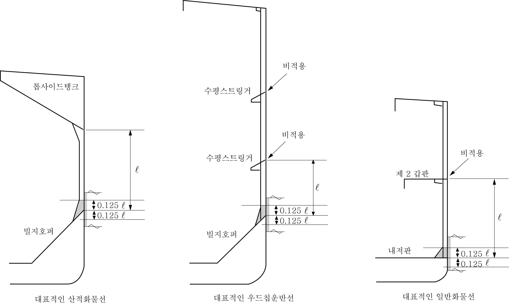

# 제7편 전용선박(1장~4장,7장~10장)

> 선급 및 강선규칙/적용지침 / RA-07A-K / 2025 / KO / Guidance

## 부록 7-7 협약 통일 해석 【규칙 참조】

### 1. UI SC 207 (화물창 침수에 따른 산적화물선의 구조강도) (2020)

#### (1) 선박의 길이 150 _s2 이상, 밀도 1.0 _s2 이상인 고체 산적화물을 운송하는 산적화물선의 모든 화물창의 침수와 관련한 구조강도 규정인 SOLAS XII/5.2 및 IACS UR S17, S18 및 S20과의 적용을 명확히 하고자 함.

#### (2) 통일 해석

건조 계약일 또는 화물창 구조형상과 관련없이 SOLAS XII/5.2를 만족해야 하는 선박으로서 산적화물선 및 유조선 공통규칙(CSR)을 따르지 않는 선박에 대해서는 UR S17, S18 및 S20에 적합하여야 한다.

#### (3) 이 해석은 2015년 7월 1일 이후 건조계약되는 선박에 적용한다.

### 2. UI SC 208 (양하역 장비로부터 화물창 보호) (2020)

#### (1) 선박의 길이 150 _s2 이상, 밀도 1.0 _s2 이상인 고체 산적화물을 운송하는 산적화물선의 양하역 장비로 부터의 화물창 보호와 관련하여 SOLAS XII/6.4.1(SLS.14/Circ.250) 및 산적화물선 및 유조선 공통규칙(CSR) 적용대상 선박과의 적용을 명확히 하고자 함.

#### (2) 통일 해석

CSR 적용대상 선박이 아닌 선박으로서, SOLAS XII/6.4.1의 적용을 받는 선박은 다음 사항을 만족하여야 한다.

- **(가)** **3편**의 Grab 관련 규정
- **(나)** 화물창 개구부에 있어서 창구옆거더(예: 톱 사이드 탱크판의 상부), 화물창내의 창구 단부보 및 창구코밍의 상부에는 와이어 로프에 의한 손상을 방지하기 위하여 반 환봉 같은 적절한 보호를 하여야 한다.

#### (3) 상기 (가), (나)호를 만족할 시, 우리 선급의 “Grab” 부기부호를 부여한다.

#### (4) 이 해석은 2015년 7월 1일 이후 건조계약되는 선박에 적용한다.

### 3. UI SC 209 (화물창 구조부재 및 패널의 파손) (2020)

#### (1) 산적화물선 및 유조선 공통규칙(CSR) 적용대상 선박이 아닌 선박으로서 SOLAS XII/6.4.3의 적용을 받는 선박의 일반보강재의 횡좌굴에 관한 기준을 제공하기 위함.

#### (2) 통일 해석

SOLAS XII/6.4.3을 적용받는 선박은 다음 각 호를 만족하여야 한다.

- **(가)** CSR의 적용을 받는 선박 : **13편 1부 3장 1절**의 “재료” 및 **8장 5절**의 “좌굴능력”
- **(나)** CSR (**13편 1부 3장 1절** 및 **8장 5절)**의 적용을 받지 않는 선박 :
  - **(a)** 단일 선측구조를 가지는 선박의 다음의 부재들은 강재의 등급이 D/DH급 이상이어야 한다.
    - 늑골의 하부 브래킷
    - 빌지호퍼 경사판 또는 내저판과 외판과의 경계를 기점으로 0.125 $l$ 상하방의 외판. 늑골의 스팬 $l$ 은 지지구조간의 거리로 정의한다. 또한, 여러 개의 스팬이 있는 구조에서는 최하부에만 상기의 요건을 적용 한다. (**그림 1** 참조)
  - **(b)** 종방향 및 횡방향 일반보강재의 횡좌굴에 대한 안전율은 다음의 지역에서는 적어도 1.15(허용 사용계수는 적어도 1/1.15 =0.87)이상이어야 한다.
    - 창구 코밍
    - 내저판
    - 톱사이드 탱크 및 호퍼탱크의 경사진 보강 패널
    - 내부 구조(inner side)
    - 횡격벽의 상하부 스툴
    - 보강된 횡격벽
    - 외판(직접적으로 화물창을 형성하고 있을 때)
    일반보강재의 횡좌굴에 대한 요건은 우리 선급의 기준에 따른다.

#### (3) 이 해석은 2020년 7월 1일 이후 건조계약되는 선박에 적용한다. #imgID-140_s2

**그림 1 일반적인 형상**
