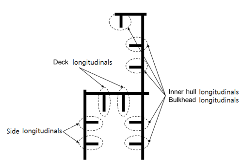
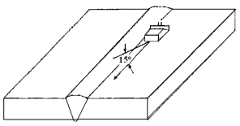
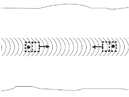
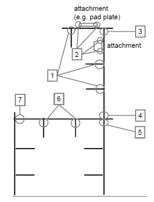
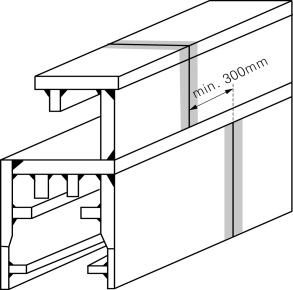
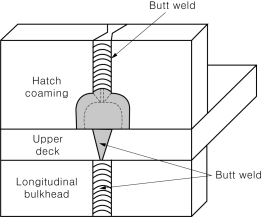
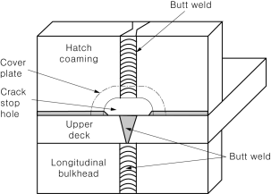
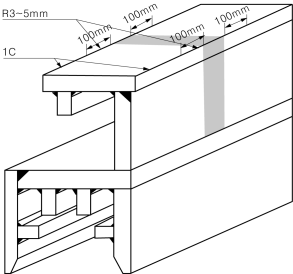

# 제7편 전용선박(1장~4장,7장~10장)

> 선급 및 강선규칙/적용지침 / RA-07A-K / 2025 / KO / Guidance

## 부록 7-8 컨테이너선의 고강도 극후강판의 적용 및 검사지침 (2021) 【규칙 참조】

### 1. 적용

#### (1) 일반사항

- **(가)** 이 지침은 (2)호 및 (3)호 각각에 따른 극후강판이 사용된 컨테이너선에 대하여 적용한다.
- **(나)** 이 지침은 종방향 구조부재에 사용되는 극후강판에 대한 취성파괴 방지를 위한 수단이 언제 요구되는지를 파악한다.
- **(다)** 이 지침은 상갑판영역내의 종방향 구조부재에 대한 극후강판 적용을 위한 기본 개념을 제공한다.
- **(라)** 이 지침의 요건은 균열 발생 및 전파 방지를 위한 컨테이너선의 극후강판에 적용하는 다음 방법을 정의한다.
  - **(a)** **2**항의 비파괴검사
  - **(b)** **3**항의 인성증가용접
  - **(c)** **4**항의 취성균열정지 설계
    **2, 3** 및 **4**에 규정된 안전 조치의 적용은 **5**항에 따라야 한다.
- **(마)** 이 지침의 적용에서, 상갑판 영역은 상갑판, 창구옆코밍, 창구코밍정판 및 그에 부착된 종부재를 의미한다.

#### (2) 강종

- **(가)** 이 지침은 상갑판 영역의 종방향 구조부재에 YP36, YP40 및 YP47 강판이 사용되는 경우에 적용한다.
- **(나)** YP36, YP40 및 YP47은 최소 규정 항복강도가 각각 355, 390 및 460 $\mathrm{N}/mm^2$인 강판을 의미한다.
- **(다)** YP47강판이 상갑판 영역의 종방향 구조부재에 사용되는 경우, YP47강판은 **규칙 2편 1장 3절**에 규정된 EH47-H이어야 한다.

#### (3) 두께

- **(가)** 두께가 50mm를 넘고 100mm 이하인 강판에 대하여는, 취성균열의 발생과 전파를 방지하기 위하여 **2. 3.** 및 **4.**항에 규정된 안전조치가 취해져야 한다.
- **(나)** 두께가 100mm를 넘는 극후강판에 대하여는 우리 선급이 적절하다고 인정하는 바에 따른다. 특히 취성균열의 발생과 전파의 방지와 관련하여 이 지침의 요건이 적절히 고려되어야 한다.

### 2. 건조 중 비파괴검사 (5 항의 안전조치 No. 1)

**5**항에서 건조 중 NDT가 요구되는 경우, NDT는 (1)호 및 (2)호에 따라야 한다. **4**항 (3)호 (마)에 규정된 것과 같은 향상된 NDT는 적절한 표준에 따라 수행되어야 한다.

#### (1) 일반사항

- **(가)** 화물창 구역의 모든 상부(upper flange) 종방향 구조부재의 선체 블록 간의 모든 맞대기 용접이음부에 대하여는 취성균열의 발생을 방지하기 위하여 초음파탐상검사(이하 UT라고 한다)를 하여야 한다.
- **(나)** 종방향 구조부재에는 **그림 1**과 같이 창구옆코밍, 창구코밍 정판, 상갑판, 현측후판, 내측종격벽의 최상부판과 그에 부착되는 종부재를 포함한다.
  
  **그림 1 상부 종방향 구조부재**
- **(다)** UT 검사방법에 대하여는 **적용지침 2편 부록 2-7**에 따르는 이외에 다음의 규정에도 적합하여야 한다.
  - **(a)** 탐상은 **그림 2**의 예와 같이 최소한 일면 양쪽(가급적 루트면 양쪽 탐상 권고)에서 탐상을 실시하여야 한다.
  - **(b)** 탐촉자의 굴절각은 70°를 포함한 2개의 굴절각(45° 또는 60°)을 병용하여 탐상을 실시하여야 한다.
  - **(c)** 표준시험편을 사용하여 감도조정을 하는 경우의 감도 보정량은 KS B 0896 또는 동등 이상의 표준에 따른다.
  - **(d)** 결함의 위치를 평가하여 융합부족(LF) 등의 방향성 결함으로 의심되는 경우, 결함에코의 높이에 관계없이 6dB법으로 길이를 측정하고, 판정(기준 25 $\mathrm{mm}$ 이하)하여야 한다.
  - **(e)** 제조자는 두께 50 $\mathrm{mm}$를 넘는 용접부의 초음파탐상검사에 종사하는 검사자에 대하여 방향성결함의 검출 및 판정과 관련하여 필요한 교육 및 훈련을 시켜야 한다.
  - **(f)** 가로방향결함 검출을 위하여 **그림 3**의 예와 같이 일면 양쪽에서 15°각도로 용접선에 평행하게 또는 용접비드위에서 UT 검사를 추가로 하여야 한다.

    |  |  |
    | --- | --- |

#### (2) UT 판정기준

- **(가)** UT 판정기준에 대하여는 **적용지침 2편 부록 2-7**에 따라야 한다.
- **(나)** UT 판정기준은 관련된 취성균열 방지절차에 대한 고려하에 조정될 수 있으며, 이러한 조정 결과가 **적용지침 2편 부록 2-7**의 요건보다 더 엄격해야 하는 경우, UT 절차는 더 엄격한 감도로 수정되어야 한다.

### 3. 인성증가 용접(5항의 안전조치 No. 2)

#### (1) 취성파괴를 식별하고 방지하기 위한 안전조치로서 5항의 B를 선택한 경우에는 인성증가 용접을 수행하여야 한다.

#### (2) 충격시험편은 (가)에 따라 채취한다.

- **(가)** 충격시험편은 용접부 중심“WM”, 용융선상 “FL”, 용융선으로부터 2mm의 용접열영향부, 용융선으로부터 5mm의 용접열영향부에서 채취한다.

#### (3) 충격시험편은 모재의 충격시험 시험온도 및 흡수에너지 기준을 만족하여야 한다.

### 4. 취성균열 정지설계 (5항의 안전조치 No. 3, 4 및 5)

#### (1) 일반사항

- **(가)** **4**항에 기술된 취성균열 정지강은 **5**항의 안전조치 No. 3, 4 및 5의 조치를 취하고 상갑판 강재 등급이 YP40보다 높지 않은 경우에 적용할 수 있다. 그렇지 않으면 균열 시작 및 전파 방지를 위한 다른 조치는 우리 선급과 합의하여야 한다.
- **(나)** 화물창 영역 내에는 취성균열 전파방지를 위한 안전조치가 취해져야 한다. 취성균열 정지 설계는 이러한 조치를 사용한 설계를 의미한다.
- **(다)** 취성 균열 정지설계는 일반적으로 선체블록간의 맞대기 용접부에 적용된다. 그러나 균열은 이러한 연결부를 벗어나 발생 및 전파될 수 있으므로 (2)호(나)(b)에 따라 적절한 안전조치가 고려되어야 한다.
- **(라)** 취성균열 정지강은 **지침 2편 1장 3절 311.**의 정의에 따른다.

#### (2) 취성균열 정지설계의 기능 요건

취성균열 정지설계의 목적은 적절한 위치에서 균열의 전파를 정지시키고 선체거더의 대형 파괴를 방지하기 위한 것이다.

- **(가)** 취성 균열 시작 및 전파가 가장 쉬운 위치는 창구옆코밍 혹은 상갑판의 블록간 맞대기 용접 결합부이다. 결합부가 정렬되는 블록 제작의 다른 위치는 맞대기 용접 결합부를 따라 균열 시작 및 전파될 가능성이 높을 수 있다.
- **(나)** 취성균열의 전파 경로와 관련하여 다음의 경우가 모두 고려되어야 한다.
  - **(a)** 취성균열이 맞대기 용접이음부를 따라서 직진 전파하는 경우
  - **(b)** 취성균열이 맞대기 용접이음부에서 시작되어 용접부를 벗어나 모재로 전파하는 경우, 또는 취성균열이 맞대기 용접이음부가 아닌 다른 용접부에서 시작되어 모재로 전파하는 경우
  - **(c)** (b)의 ‘다른 용접’은 다음을 포함한다. (**그림 4** 참조)
    󰊱 창구옆코밍(정판 포함)과 종부재의 필릿용접
    󰊲 창구옆코밍(정판, 종부재 포함)과 부착물의 필릿용접 (예, 창구옆코밍 정판과 창구덮개 패드판의 필릿용접부)
    󰊳 창구옆코밍 정판과 창구옆코밍판의 필릿용접
    󰊴 창구옆코밍판과 상갑판의 필릿용접
    󰊵 상갑판과 내측선체/격벽의 필릿용접
    󰊶 상갑판과 종부재의 필릿용접
    󰊷 현측후판과 상갑판의 필릿용접
    
    **그림 4 다른 용접부**

#### (3) 취성균열 정지설계의 개념 예

다음은 취성균열 전파 방지를 위해 취성균열 정지설계에 사용할 수 있는 인정 가능한 예로 간주된다. 상세한 설계배치는 우리 선급에 제출하여 승인을 받아야 한다. 다른 조치도 우리 선급의 검토를 받고 인정될 수 있다.

- **(가)** (2)호 (나) (b)에 대한 취성균열 정지설계
  - **(a)** 취성균열이 코밍으로부터 발생해서 하부의 구조로 전파하는 것을 정지시키기 위하여 상부갑판은 화물창 구역의 적절한 범위까지 취성균열 정지강이 사용되어야 한다.
- **(나)** (2)호 (나) (a)에 대한 취성균열 정지설계
  - **(b)** 창구옆코밍의 블록 간 맞대기 용접이음부와 상부갑판의 블록 간 맞대기 용접이음부가 이격(shift)되어 있는 경우, 이 이격 간격은 300 $\mathrm{mm}$ 이상이어야 하며, 창구옆코밍은 취성균열 정지강으로 시공되어야 한다.
    
    **그림 5 적절한 이격 간격 시공 예**

    |  |  |
    | --- | --- |
    | (a) Arrest welding type | (b) Arrest hole type |
- **(다)** 창구옆코밍 용접부가 갑판 용접부와 만나는 지점에서 블록 간 맞대기 용접이음부 부근에 균열정지 구멍(crack arrest hole)을 시공하는 경우, 맞대기 용접이음부 하단의 피로강도가 평가되어야 한다. 취성균열의 전파가 용접선으로부터 창구옆코밍 또는 상갑판으로 벗어날 가능성을 고려하여 추가적인 안전조치가 필요하다. 이 조치에는 창구옆코밍판을 취성균열 정지강으로 적용하는 것을 포함한다. (**그림 6** (a)참조)
- **(라)** 창구옆코밍 용접부가 갑판 용접부와 만나는 지점에서 블록 간 맞대기 용접이음부에 취성균열 정지강으로 된 균열정지 삽입판(arrest insert plates) 또는 높은 균열정지인성 특성을 가지는 용접금속 삽입(weld metal inserts)으로 시공하는 경우, 취성균열의 전파가 용접선으로부터 창구옆코밍 또는 상갑판으로 벗어날 가능성을 고려하여 추가적인 안전조치가 필요하다. 이 조치에는 창구옆코밍판을 취성균열 정지강으로 적용하는 것을 포함한다.(**그림 6** (b)참조)
- **(마)** 취성파괴를 식별하고 방지하기 위한 안전조치로서 **5**항의 선택 B를 선택한 경우, 건조중 NDT로는 **2**항에 규정된 표준 UT 검사 대신에 회절파 시간측정법(TOFD)과 같은 더욱 엄격한 결함 판정기준을 사용하는 향상된 NDT를 적용하여야 한다.

#### (4) 취성균열 정지강 선정

- **(가)** 컨테이너선 상갑판에 적용하는 취성균열 정지강은 표1에 따른다. BCA1 및 BCA2는 **규칙 2편**에서 정의한다.
- **(나)** 취성균열 정지강은 **표 1**에 따라 두께 50mm를 초과하는 각각의 개발 구조부재에 대해서 선택되어야 한다.
- **(다)** **표 1**에 규정된 취성균열 정지강을 사용하는 경우, 창구옆코밍과 상갑판의 용접 결합부는 우리 선급이 인정하는 부분용입용접이어야 한다.

  | 구조부재(1) | 두께(mm) | 취성균열정지강 |
  | --- | --- | --- |
  | 상갑판 | \(50 BCA1의 YP36 혹은 YP40 |   |
  | 창구옆코밍 | \(50 BCA1의 YP40 혹은 YP47 |   |
  | 창구옆코밍 | \(80 BCA2의 YP40 혹은 YP47 |   |
  | (비고) (1) 부착한 종부재 제외함 |   |   |

  선박 블록 결합부 근처에서, 균열 전파 방지를 위한 추가 수단이 실행되고 우리 선급이 합의한 경우, 갑판 및 창구옆코밍 연결부에 대체 용접 세부 사항을 사용할 수 있다.

### 6. YP47 강판의 적용

이 항은 규칙 **2편 1장 311.**에서 규정하고 있는 YP47 강판에 대하여 적용한다.

#### (1) 선체구조(설계) 요건

- **(가)** 선체거더 강도의 평가를 위한 재료 계수는 0.62로 하여야 한다.
- **(나)** 종방향 구조부재에 대한 피로평가는 **적용지침 3편 부록 3-3**의 요건을 준용한다. 다만, 피로강도 평가부위에 대하여는 적용지침 **제3편 부록 3-3 선체구조의 피로강도 평가지침 표 6**에 추가하여 창구옆코밍에서의 맞대기 용접이음부 및 의장품을 고정하기 위한 필릿 용접이음부 등을 추가하여야 한다.
- **(다)** 창구옆코밍에서의 맞대기용접이음부 및 의장품을 고정하기 위한 필릿 용접이음부는 창구 코너(hatch corner)로부터 적절한 거리를 유지하여 응력집중의 영향을 피하여야 한다.
- **(라)** 창구옆코밍의 창구 코너를 포함하는 자유변(free edge)은 피로강도에 유해한 노치와 같은 결함이 없어야 한다. **그림 7**과 같이 자유변의 가장자리에 그라인딩을 하여 적절한 피로강도를 가질 수 있도록 처리되어야 한다.

  |  |
  | --- |
  | **그림 7 창구 코너부의 적절한 변 조치 예** |
- **(마)** 창구덮개패드(hatch cover pads) 및 컨테이너패드(container pads)와 같은 의장품을 부착하는 경우, 의장품의 가장자리에 테이퍼를 주거나 또는 부착위치에서 판의 두께를 증가시키는 등 의장품과 선체구조 사이에 강성의 차이가 크지 않도록 하여야 한다.
- **(바)** 선체구조와 의장품 사이의 연결부 같은 구조부재에 극후강판이 적용될 때에는 구조상세에 대하여 특별히 주의하여야 한다. 
