# 제7편 전용선박(1장~4장,7장~10장)

> 선급 및 강선규칙/적용지침 / RA-07A-K / 2025 / KO / Guidance

## 부록 7-9 컨테이너선 종강도에 대한 지침 【규칙 참조】

### 별첨 1 - 전단흐름의 계산

#### 1. 일반

- **(1)** 이 별첨은 선체거더 수직 전단력으로 인하여 선체 횡단면을 따라 작용하는 전단흐름의 직접 계산 절차를 기술한다.
- **(2)** 전단흐름 $q_{V}$는 단위 수직 전단력, 1$\mathrm{N}$이 횡단면에 작용하는 경우를 고려하여 그 횡단면의 각 위치에서 계산한다.
- **(3)** $\mathrm{mm}$당 단위 전단흐름 $q_{V}$는 다음과 같다:
  $q_{V}=q_{D}+q_{1}$
  $q_{D}$ : **2**항에 따른 확정 전단흐름.
  $q_{1}$ : **3**항에 따른 닫힌 셀 주위를 순환하는 불확정 전단흐름.
- **(4)** 단위 전단흐름 $q_{V}$의 계산에서는 종방향 보강재가 고려되어야 한다.

#### 2. 확정 전단흐름

- **(1)** 횡단면의 각 위치에서 확정 전단흐름 $q_{D}$은 다음의 선적분으로부터 구할 수 있다.
  $q _{D} (S)=- \frac{1}{10 ^{6} I _{y-"net"}} \int _{0} ^{s} {(z-z _{n}} )t _{"net"} ds$
  $s$ : 횡단면을 따라 움직이는 좌표의 값($\mathrm{m}$).
  $I_{y-"net"}$ : 횡단면의 순 단면2차모멘트($\mathrm{m}^4$).
  $t_{"net"}$ : 판의 순 두께($\mathrm{mm}$).
  $z _{n}$ : 기선으로부터 수평 중립축까지 수직거리($\mathrm{m}$).
- **(2)** 각각의 선분이 동일한 판의 순 두께를 가질때, 횡단면은 그림 A1.1과 같이 선분으로 구성된다고 가정한다. 확정 전단흐름은 다음 식에 의해 계산될 수 있다.
  $q _{Dk} =- \frac{t \ell }{2 \times 10 ^{6} I _{y-"net"}} (z _{k} +z _{i} -2z _{n} )+q _{Di}$
  $q_{Dk}$, $q_{Di}$ : 각각 절점 $k$ 및 $i$ 에서의 확정 전단흐름($\mathrm{N}/mm$).
  $\ell$ : 선분의 길이($\mathrm{m}$).
  $y _{k}$, $y _{i}$ : **그림 A1.1**에 정의된 선분 끝점 $k$ 및 $i$의 Y 좌표($\mathrm{m}$).
  $z_{k}$, $z_{i}$ : **그림 A1.1**에 정의된 선분 끝점 $k$ 및 $i$의 Z 좌표($\mathrm{m}$).
- **(3)** 횡단면이 닫힌 셀을 포함하는 경우, 확정 전단흐름을 구하기 위해서 그림 A1.2와 같이 닫힌 셀은 가상 슬릿(slit)으로 절단되어야 한다. 다만, 가상 슬릿은 다른 닫힌 셀의 일부를 형성하는 벽안에 위치하여서는 안된다.
- **(4)** 분기점에서 확정 전단흐름은 그림 A1.2와 유사하게 또는 유수량 계산에 의해 구할 수 있다.
  
  **그림 A1.1 선분의 정의**

#### 3. 불확정 전단흐름

- **(1)** 횡단면의 닫힌 셀 주위의 불확정 전단흐름은 동일한 닫힌 셀 내에서 상수값으로 고려될 수 있다. 불확정 전단흐름의 결정을 위한 다음 연립방정식을 세울 수 있다. 이 식에서, 모든 닫힌 셀 주위의 여러 변수들에 대하여 폐곡선에 관한 적분이 수행된다.
  $q _{Ic} oint _{c} ^{} {\frac{1}{t _{"net"}}} ds - \sum _{m=1} ^{Nw} (q _{Im } oint _{c & m} ^{} {\frac{1}{t _{"net"}} ds)=- oint _{c} ^{} {\frac{q _{D}}{t _{"net"}} ds}}$
  $Nw$ : 셀 c와 다른 셀들이 공유하는 벽의 개수.
  $c","m$ : 셀 c와 셀 m이 공유하는 벽.
  $q _{Ic}$, $q _{Im}$ : 각각 닫힌 셀 $c$ 및 $m$ 주위의 불확정 전단흐름($\mathrm{N}/mm$).
- **(2)** 그림 A1.1에 주어진 선분 요소의 집합과 각각의 선분이 동일한 판의 두께를 가진다고 가정하여, 위 식은 다음과 같이 표현될 수 있다.
  $q _{Ic} \sum _{j=1} ^{Nc} ( \frac{\ell }{t _{"net"}} ) _{j} - \sum _{m=1} ^{Nw} \left\{ q _{Im} \left[ \sum _{j=1} ^{Nm} \left( \frac{l}{t _{"net"}} \right) _{j} \right] _{m} \right\} =- \sum _{j=1} ^{Nc} \phi$
  $\phi = \left[ - \frac{\ell ^{2}}{6 \times 10 ^{3} l _{y-"net"}} \left( Z _{k} +2Z _{i} -3Z _{n} \right) + \frac{\ell }{t _{"net"}} q _{Di} \right] _{j}$
  $Nc$ : 셀 c의 선분의 개수.
  $Nm$ : 셀 c와 셀 m이 공유하는 벽에 대한 선분의 개수.
  $q_{Di}$ : **별첨 1, 2**에 따라 계산된 확정 전단흐름($\mathrm{N}/mm$).
- **(3)** 별첨 1, 2에 명시한 움직이는 좌표의 방향과 이 단면의 차이가 고려되어야 한다.
  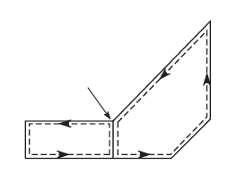
  **그림 A1.3 닫힌 셀과 공통벽**

#### 4. 횡단면의 계산

- **(1)** 횡단면을 선분 요소의 집합으로 가정하는 경우, 횡단면의 특성은 다음 식에 따라 구할 수 있다.
  $\ell = \sqrt {(y _{k} -y _{i} ) ^{2} +(z _{k} -z _{i} ) ^{2}}$

  | $a _{"net"}= 10 ^{-3} \ell t_{"net"}$ | $A _{n50} = \sum {a_"net"}$ |
  | --- | --- |
  | $s _{y-"net"} = \frac{a _{"net"}}{2} (z _{k} +z _{i} )$ | $s _{y-"net"} = \sum _{} ^{} s _{y-"net"}$ |
  | $i_{y0-"net"}=\frac{a_{"net"}}{3} (z_{k}^2 + z_{k}z_{i}+z_{i}^{2})$ | $I _{y0-"net"} = \sum i_{y0-"net"$ |

  $a_{"net"}$, $A_{"net"}$ : 각각 횡단면 및 선분요소의 면적($\mathrm{m}^2$).
  $s_{y-"net"}$, $S_{y-"net"}$ : 각각 기선에 대한 횡단면 및 선분요소의 단면1차모멘트($\mathrm{m}^3$).
  $i_{y0-"net"}$, $I_{y0-"net"}$ : 각각 기선에 대한 횡단면 및 선분요소의 단면2차모멘트($\mathrm{m}^4$).
- **(2)** 수평 중립축의 높이 $z _{m}$ 은 다음과 같이 구한다.
  $z _{m} = \frac{s _{y-"net"}}{A _{"net"}}$ ($\mathrm{m}$)
- **(3)** 수평 중립축에 대한 단면2차모멘트는 다음 식에 따라 구할 수 있다.
  $I _{y-"net"} =I _{y0-"net"} -z _{n} ^{2} A _{"net"}$ ($\mathrm{m}^4$)

### 별첨 2 - 좌굴능력

**기호**
$x _\mathrm{axis}$ : 긴변에 평행한 직사각형 좌굴 패널의 국부 축.
$y _\mathrm{axis}$ : 긴변에 수직한 직사각형 좌굴 패널의 국부 축.
$\sigma _{x}$ : x방향으로 작용하는 막응력($\mathrm{N}/mm ^{2}$).
$\sigma _{y}$ : y방향으로 작용하는 막응력($\mathrm{N}/mm ^{2}$).
$\tau$ : xy평면에 작용하는 막전단응력($\mathrm{N}/mm ^{2}$).
$\sigma _{a}$ : 보강재의 축응력($\mathrm{N}/mm ^{2}$).
$\sigma _{b}$ : 보강재의 굽힘응력($\mathrm{N}/mm ^{2}$).
$\sigma _{w}$ : 보강재의 와핑응력($\mathrm{N}/mm ^{2}$).
$\sigma _{1}$, $\sigma _{2}$, $\tau _{c}$ : **2.1.1**에 정의된 판의 임계응력($\mathrm{N}/mm ^{2}$).
$R _{eH _{-} S}$ : 보강재의 최소 항복응력($\mathrm{N}/mm ^{2}$).
$R _{eH _{-} P}$ : 판의 최소 항복응력($\mathrm{N}/mm ^{2}$).
$a$ : **표 2**에 따른 패널의 장변의 길이($\mathrm{mm}$).
$b$ : **표 2**에 따른 패널의 단변의 길이($\mathrm{mm}$).
$d$ : **표 3**에 따른 곡면 판 패널에 대한 원통의 축에 평행한 변의 길이($\mathrm{mm}$).
$\sigma _{E}$ : 탄성좌굴 참조응력($\mathrm{N}/mm ^{2}$)으로 다음에 따라 구한다:
• **2.1.1**에 따른 판의 한계 상태의 경우 :
$\sigma _{E} = \frac{\pi ^{2} E}{12 (1-v ^{2} )} \left( \frac{t _{p}}{b} \right) ^{2}$
• **2.2**에 따른 곡면 패널의 경우 :
$\sigma _{E} = \frac{\pi ^{2} E}{12 (1-v ^{2} )} \left( \frac{t _{p}}{d} \right) ^{2}$
$\nu$ : 프와송비, 0.3으로 한다.
$t _{p}$ : **그림 A2.3**과 같이 패널의 순 두께($\mathrm{mm}$).
$t _{w}$ : **그림 A2.3**과 같이 보강재 웨브의 순 두께($\mathrm{mm}$).
$t _{f}$ : **그림 A2.3**과 같이 플랜지의 순 두께($\mathrm{mm}$).
$b _{f}$ : **그림 A2.3**과 같이 보강재 플랜지의 폭($\mathrm{mm}$).
$h _{w}$ : **그림 A2.3**과 같이 보강재 웨브의 깊이($\mathrm{mm}$).
$e _{f}$ : **그림 A2.3**과 같이 부착판에서 플랜지의 중심까지의 거리($\mathrm{mm}$)로서 다음에 따른다:
$e _{f} = h _{w}$, 평강의 경우
$e _{f} = h _{w} - 0.5 t _{f}$, 구평강의 경우
$e _{f} = h _{w} + 0.5 t _{f}$, 앵글 및 T 형강의 경우
$\alpha$ : 판 패널의 종횡비로서 $\alpha = a/b$로 한다.
$\beta$ : 계수로서 $\beta = \frac{1- \psi}{\alpha}$로 한다.
$\psi$ : 단부 응력비로서 $\psi = \frac{\sigma _{2}}{\sigma _{1}}$로 한다.
$\sigma _{1}$ : 최대응력($\mathrm{N}/mm ^{2}$).
$\sigma _{2}$ : 최소응력($\mathrm{N}/mm ^{2}$).
$R$ : 곡면 판 패널의 반지름($\mathrm{mm}$).
$\ell$ : 1차 지지부재 사이의 간격과 동일한 보강재의 스팬($\mathrm{mm}$).
$s$ : 보강재의 간격($\mathrm{mm}$), 고려하는 보강 패널의 보강재 사이의 거리.

#### 1. 요소판 패널

- **1.1** 정의
  요소판 패널은 보강재 및/또는 1차 지지부재사이의 보강되지 않은 판이다. 요소판 패널의 모든 단부는 주위 구조/인접 판(일반적으로 갑판, 선저 및 내저판 내의 종방향 보강된 패널, 외판 및 종방향 격벽) 때문에 직선 형태(그러나 면내 방향으로는 자유롭게 이동)를 유지하여야 한다.
- **1.2** 두께가 다른 요소판 패널
  - **1.2.1** 두께가 다른 종방향으로 보강된 요소판 패널
    종늑골 방식에서, 판 두께가 패널의 폭, b에 따라 변하는 경우, 좌굴능력은 얇은 쪽 판 두께($t _{1}$)의 등가 패널의 폭에 대하여 계산되어야 한다. 이 등가 패널의 폭 $b _{eq}$은 다음 식에 의해 정의된다.
    $b _{eq} = \ell _{1} + \ell _{2} \left( \frac{t _{1}}{t _{2}} \right) ^{1.5}$ ($\mathrm{mm}$)
    $\ell _{1}$ : **그림 A2.1**의 얇은 쪽 판 두께 $t _{1}$ 패널 부분의 폭($\mathrm{mm}$)
    $\ell _{2}$ : **그림 A2.1**의 두꺼운 쪽 판 두께 $t _{2}$ 패널 부분의 폭($\mathrm{mm}$)
    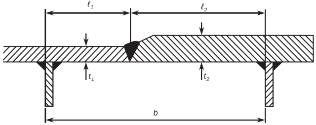
    **그림 A2.1 폭에 걸친 판 두께 변화**
  - **1.2.2** 두께가 다른 횡방향으로 보강된 요소판 패널
    횡늑골 방식에서, 요소판 패널의 두께가 다른 경우, 판과 보강재의 좌굴검토는 요소판 패널에서 동일하다고 가정하여 각 두께에 대하여 이루어져야 한다.

#### 2. 판의 좌굴능력

- **2.1** 판 패널
  - **2.1.1** 판의 한계상태
    판의 한계상태는 다음의 관계식을 기반으로 한다.
    a) 종뱡향으로 보강된 배치
    $\left( \frac{\gamma _{c} \sigma _{x}}{\sigma _{cx} ^{ }} \right) ^{2/ \beta _{p} ^{ 0.25}} + \left( \frac{\gamma _{c} \left| \tau \right|}{\tau _{c} ^{ }} \right) ^{2/ \beta _{p} ^{ 0.25}} =1$
    b) 횡뱡향으로 보강된 배치
    $\left( \frac{\gamma _{c} \sigma _{y}}{\sigma _{cy} ^{ }} \right) ^{2/ \beta _{p} ^{ 0.25}} + \left( \frac{\gamma _{c} \left| \tau \right|}{\tau _{c} ^{ }} \right) ^{2/ \beta _{p} ^{ 0.25}} =1$
    $\sigma _{x ,} \sigma _{y}$ : 고려하는 요소판 패널의 하중계산점에서 **4.4**에 따른 패널의 작용 수직응력($\mathrm{N}/mm ^{2}$).
    $\tau$ : 고려하는 요소판 패널의 하중계산점에서 **4.4**에 따른 패널의 작용 전단응력($\mathrm{N}/mm ^{2}$).
    $\sigma _{cx} ^{ }$ : **2.1.3**에 따른 좌굴패널의 장변과 평행한 방향의 최종 좌굴응력($\mathrm{N}/mm ^{2}$).
    $\sigma _{cy} ^{ }$ : **2.1.3**에 따른 좌굴패널의 단변과 평행한 방향의 최종 좌굴응력($\mathrm{N}/mm ^{2}$).
    $\tau _{c} ^{ }$ : **2.1.3**에 따른 최종전단 좌굴응력($\mathrm{N}/mm ^{2}$).
    $\beta _{p}$ : 판의 세장비에 따른 계수로서 다음 식에 따른다.
    $\beta _{p} = \frac{b}{t _{p}} \sqrt {\frac{R _{eH _{-} P}}{E}}$
  - **2.1.2** 세장비 참조 정도
    세장비 참조 정도는 다음과 같다.
    $\lambda = \sqrt {\frac{R _{eH _{-} P}}{K \sigma _{E}}}$
    $K$ : **표 2**와 **표 3**에 따른 좌굴계수.
  - **2.1.3** 최종 좌굴응력
    판 패널의 최종 좌굴응력($\mathrm{N}/mm ^{2}$)은 다음 식에 따른다;
    $\sigma _{cx} ^{ } = C _{x} R _{eH _{-} P}$
    $\sigma _{cy} ^{ } = C _{y} R _{eH _{-} P}$
    전단을 받는 판 패널의 최종 좌굴응력은 다음 식에 따른다;
    $\tau _{c} ^{ } = C _{\tau } \frac{R _{eH₋P}}{\sqrt {3}}$
    $C _{x} , C _{y} , C _{\tau }$ : **표 2**에 따른 경감계수.
    판에 대한 경계조건은 단순지지로 고려한다(**표 2**의 경우 1, 2 및 15 참조). 경계조건이 단순지지와 크게 다를 경우, 우리 선급의 동의하에 **표 2**와 다른 경우로 더 적절한 경계조건이 적용될 수 있다.
  - **2.1.4** 수정계수 $F _{long}$
    좌굴패널 장변의 보강재 종류에 따른 수정계수 $F _{long}$는 **표 1**에 따른다. $F _{long}$의 평균값은 다른 단부 보강재를 가지는 패널에 대하여 사용할 수 있다. **표 1** 이외의 보강재 종류의 경우, $c$의 값은 우리 선급의 동의가 있어야 한다. 이러한 경우, 우리 선급이 적절하다고 인정하고 비선형 유한요소 해석을 이용하여 패널의 좌굴강도 검토가 확인된다면, **표 1**에서 언급된 것보다 더 높은 $c$의 값을 사용할 수 있다.

    | 구조요소의 종류 |   |   | $F_long$ | $c$ |
    | --- | --- | --- | --- | --- |
    | 보강되지 않은 패널 |   |   | 1.0 | N/A |
    | 보강 패널 | 양단이 고정이 아닌 보강재 |   | 1.0 | N/A |
    | 보강 패널 | 양단이 고정인 보강재 | 평강 (1) | $F_{long}=c+1$ for $\frac{t_{w}}{t_{p}} \succ 1$ $F_{long}=c( \frac{t_{w}}{t_{p}})^{3}+1$ for $\frac{t_{w}}{t_{p}} \leq 1$ | 0.10 |
    | 보강 패널 | 양단이 고정인 보강재 | 구평강 | $F_{long}=c+1$ for $\frac{t_{w}}{t_{p}} \succ 1$ $F_{long}=c( \frac{t_{w}}{t_{p}})^{3}+1$ for $\frac{t_{w}}{t_{p}} \leq 1$ | 0.30 |
    | 보강 패널 | 양단이 고정인 보강재 | 앵글 | $F_{long}=c+1$ for $\frac{t_{w}}{t_{p}} \succ 1$ $F_{long}=c( \frac{t_{w}}{t_{p}})^{3}+1$ for $\frac{t_{w}}{t_{p}} \leq 1$ | 0.40 |
    | 보강 패널 | 양단이 고정인 보강재 | T 형강 | $F_{long}=c+1$ for $\frac{t_{w}}{t_{p}} \succ 1$ $F_{long}=c( \frac{t_{w}}{t_{p}})^{3}+1$ for $\frac{t_{w}}{t_{p}} \leq 1$ | 0.30 |
    | 보강 패널 | 양단이 고정인 보강재 | 큰 강성의 거더 (예, 선저트랜스버스) | 1.4 | N/A |
    | (1) $t _{w}$는 **4.3.5**에 정의된 수정을 하지 않은 순 웨브 두께($\mathrm{mm}$) |   |   |   |   |

    | 경우 | 응력비($\psi$) | 종횡비($\alpha$) |   | 좌굴계수($K$) | 경감계수($C$) |
    | --- | --- | --- | --- | --- | --- |
    | 1 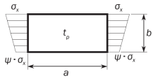 | $1 \geq \psi \geq 0$ | $K _{x} = F _{long} \frac{8.4}{\psi +1.1}$ |   |   | $C _{x} = 1$, $\lambda$ ≤ $\lambda _{c}$경우 $C _{x} = c \left( \frac{1}{\lambda} - \frac{0.22}{\lambda ^{2}} \right)$, $\lambda$ > $\lambda _{c}$ 경우 $c = \left( 1.25-0.12 \psi \right)$ ≤ 1.25 $\lambda _{c} = \frac{c}{2} \left( 1+ \sqrt {1- \frac{0.88}{c}} \right)$ |
    |   | $0> \psi >-1$ | $K _{x} = F _{long} [7.63- \psi \left( 6.26-10 \psi \right) ]$ |   |   | $C _{x} = 1$, $\lambda$ ≤ $\lambda _{c}$경우 $C _{x} = c \left( \frac{1}{\lambda} - \frac{0.22}{\lambda ^{2}} \right)$, $\lambda$ > $\lambda _{c}$ 경우 $c = \left( 1.25-0.12 \psi \right)$ ≤ 1.25 $\lambda _{c} = \frac{c}{2} \left( 1+ \sqrt {1- \frac{0.88}{c}} \right)$ |
    |   | $\psi \leq -1$ | $K _{x} = F _{long} [5.975 \left( 1- \psi \right) ^{2} ]$ |   |   | $C _{x} = 1$, $\lambda$ ≤ $\lambda _{c}$경우 $C _{x} = c \left( \frac{1}{\lambda} - \frac{0.22}{\lambda ^{2}} \right)$, $\lambda$ > $\lambda _{c}$ 경우 $c = \left( 1.25-0.12 \psi \right)$ ≤ 1.25 $\lambda _{c} = \frac{c}{2} \left( 1+ \sqrt {1- \frac{0.88}{c}} \right)$ |
    | 2  (뒷면계속) | $1 \geq \psi \geq 0$ | $K _{y} = \frac{2 \left( 1 + \frac{1}{\alpha ^{2}} \right) ^{2}}{1+ \psi + \frac{(1- \psi )}{100} \left( \frac{2.4}{\alpha ^{2}} + 6.9 f _{1} \right)}$ |   |   | (뒷면 참조) |
    |   | $1 \geq \psi \geq 0$ | $\alpha$ ≤ 6 | $f _{1} = (1- \psi ) ( \alpha - 1)$ |   | (뒷면 참조) |
    |   | $1 \geq \psi \geq 0$ | $\alpha$ > 6 | $f _{1} = 0.6 \left( 1- \frac{6 \psi}{\alpha} \right) \left( \alpha + \frac{14}{\alpha} \right)$, 다만, $14.5 - \frac{0.35}{\alpha ^{2}}$ 이하이어야 한다. |   | (뒷면 참조) |

    | 경우 | 응력비($\psi$) | 종횡비($\alpha$) | 좌굴계수($K$) | 경감계수($C$) |
    | --- | --- | --- | --- | --- |
    | (앞면에서 계속) 2.  (뒷면계속) | $0> \psi \geq 1- \frac{4 \alpha}{3}$ (뒷면 계속) | $K _{y} = \frac{200 (1+ \beta ^{2} ) ^{2}}{(1-f _{3} ) (100+2.4 \beta ^{2} +6.9 f _{1} +23f _{2} )}$ |   | $C _{y} = c \left( \frac{1}{\lambda} - \frac{R+F ^{2} \left( H-R \right)}{\lambda ^{2}} \right)$ $c = \left( 1.25-0.12 \psi \right)$ ≤ 1.25 $R = \lambda (1- \lambda /c)$, $\lambda$ < $\lambda _{c}$ 경우 $R = 0.22$, $\lambda$ ≥ $\lambda _{c}$ 경우 $\lambda _{c} = 0.5c \left( 1+ \sqrt {1-0.88/c} \right)$ $F = \left[ 1- \left( \frac{K}{0.91} -1 \right) / \lambda _{p} ^{2} \right] c _{1}$ ≥ 0 $\lambda _{p} ^{2} = \lambda ^{2} -0.5$ 및 1 ≤ $\lambda _{p} ^{2}$ ≤ 3 경우 $c _{1} = \left( 1 - \frac{1}{\alpha} \right) \geq 0$ $H = \lambda - \frac{2 \lambda}{c \left( T+ \sqrt {T ^{2} -4} \right)}$ ≥ $R$ $T = \lambda + \frac{14}{15 \lambda} + \frac{1}{3}$ |
    |   | $0> \psi \geq 1- \frac{4 \alpha}{3}$ (뒷면 계속) | $\alpha$ > $6(1- \psi )$ | $f _{1} = 0.6 \left( \frac{1}{\beta} + 14 \beta \right)$, 다만, $14.5 - 0.35 \beta ^{2}$ 이하이어야 한다. $f _{2} = f _{3} =0$ | $C _{y} = c \left( \frac{1}{\lambda} - \frac{R+F ^{2} \left( H-R \right)}{\lambda ^{2}} \right)$ $c = \left( 1.25-0.12 \psi \right)$ ≤ 1.25 $R = \lambda (1- \lambda /c)$, $\lambda$ < $\lambda _{c}$ 경우 $R = 0.22$, $\lambda$ ≥ $\lambda _{c}$ 경우 $\lambda _{c} = 0.5c \left( 1+ \sqrt {1-0.88/c} \right)$ $F = \left[ 1- \left( \frac{K}{0.91} -1 \right) / \lambda _{p} ^{2} \right] c _{1}$ ≥ 0 $\lambda _{p} ^{2} = \lambda ^{2} -0.5$ 및 1 ≤ $\lambda _{p} ^{2}$ ≤ 3 경우 $c _{1} = \left( 1 - \frac{1}{\alpha} \right) \geq 0$ $H = \lambda - \frac{2 \lambda}{c \left( T+ \sqrt {T ^{2} -4} \right)}$ ≥ $R$ $T = \lambda + \frac{14}{15 \lambda} + \frac{1}{3}$ |
    |   | $0> \psi \geq 1- \frac{4 \alpha}{3}$ (뒷면 계속) | $3(1- \psi ) \leq \alpha \leq 6(1- \psi )$ | $f _{1} = \frac{1}{\beta} - 1$ $f _{2} = f _{3} =0$ | $C _{y} = c \left( \frac{1}{\lambda} - \frac{R+F ^{2} \left( H-R \right)}{\lambda ^{2}} \right)$ $c = \left( 1.25-0.12 \psi \right)$ ≤ 1.25 $R = \lambda (1- \lambda /c)$, $\lambda$ < $\lambda _{c}$ 경우 $R = 0.22$, $\lambda$ ≥ $\lambda _{c}$ 경우 $\lambda _{c} = 0.5c \left( 1+ \sqrt {1-0.88/c} \right)$ $F = \left[ 1- \left( \frac{K}{0.91} -1 \right) / \lambda _{p} ^{2} \right] c _{1}$ ≥ 0 $\lambda _{p} ^{2} = \lambda ^{2} -0.5$ 및 1 ≤ $\lambda _{p} ^{2}$ ≤ 3 경우 $c _{1} = \left( 1 - \frac{1}{\alpha} \right) \geq 0$ $H = \lambda - \frac{2 \lambda}{c \left( T+ \sqrt {T ^{2} -4} \right)}$ ≥ $R$ $T = \lambda + \frac{14}{15 \lambda} + \frac{1}{3}$ |
    |   | $0> \psi \geq 1- \frac{4 \alpha}{3}$ (뒷면 계속) | $1.5(1- \psi ) \leq \alpha < 3(1- \psi )$ | $f _{1} = \frac{1}{\beta} - \left( 2 - w \beta \right) ^{4} - 9 \left( w \beta -1 \right) \left( \frac{2}{3} - \beta \right)$ $f _{2} = f _{3} =0$ | $C _{y} = c \left( \frac{1}{\lambda} - \frac{R+F ^{2} \left( H-R \right)}{\lambda ^{2}} \right)$ $c = \left( 1.25-0.12 \psi \right)$ ≤ 1.25 $R = \lambda (1- \lambda /c)$, $\lambda$ < $\lambda _{c}$ 경우 $R = 0.22$, $\lambda$ ≥ $\lambda _{c}$ 경우 $\lambda _{c} = 0.5c \left( 1+ \sqrt {1-0.88/c} \right)$ $F = \left[ 1- \left( \frac{K}{0.91} -1 \right) / \lambda _{p} ^{2} \right] c _{1}$ ≥ 0 $\lambda _{p} ^{2} = \lambda ^{2} -0.5$ 및 1 ≤ $\lambda _{p} ^{2}$ ≤ 3 경우 $c _{1} = \left( 1 - \frac{1}{\alpha} \right) \geq 0$ $H = \lambda - \frac{2 \lambda}{c \left( T+ \sqrt {T ^{2} -4} \right)}$ ≥ $R$ $T = \lambda + \frac{14}{15 \lambda} + \frac{1}{3}$ |
    |   | $0> \psi \geq 1- \frac{4 \alpha}{3}$ (뒷면 계속) | $1- \psi \leq \alpha < 1.5(1- \psi )$ | • $\alpha > 1.5$ 경우: $f _{1} = 2 \left( \frac{1}{\beta} - 16 \left( 1 - \frac{\omega}{3} \right) ^{4} \right) \left( \frac{1}{\beta} - 1 \right)$ $f _{2} = 3 \beta - 2$ $f _{3} = 0$ • $\alpha \leq 1.5$ 경우: $f _{1} = 2 \left( \frac{1.5}{1 - \psi} - 1 \right) \left( \frac{1}{\beta} - 1 \right)$ $f _{2} = \frac{\psi (1- 16f _{4} ^{2} )}{1 - \alpha}$ $f _{3} = 0$ $f _{4} = (1.5 -RMMin(1.5; \alpha )) ^{2}$ | $C _{y} = c \left( \frac{1}{\lambda} - \frac{R+F ^{2} \left( H-R \right)}{\lambda ^{2}} \right)$ $c = \left( 1.25-0.12 \psi \right)$ ≤ 1.25 $R = \lambda (1- \lambda /c)$, $\lambda$ < $\lambda _{c}$ 경우 $R = 0.22$, $\lambda$ ≥ $\lambda _{c}$ 경우 $\lambda _{c} = 0.5c \left( 1+ \sqrt {1-0.88/c} \right)$ $F = \left[ 1- \left( \frac{K}{0.91} -1 \right) / \lambda _{p} ^{2} \right] c _{1}$ ≥ 0 $\lambda _{p} ^{2} = \lambda ^{2} -0.5$ 및 1 ≤ $\lambda _{p} ^{2}$ ≤ 3 경우 $c _{1} = \left( 1 - \frac{1}{\alpha} \right) \geq 0$ $H = \lambda - \frac{2 \lambda}{c \left( T+ \sqrt {T ^{2} -4} \right)}$ ≥ $R$ $T = \lambda + \frac{14}{15 \lambda} + \frac{1}{3}$ |

    | 경우 | 응력비($\psi$) | 종횡비($\alpha$) | 좌굴계수($K$) | 경감계수($C$) |
    | --- | --- | --- | --- | --- |
    | (앞면에서 계속) 2.  | $0> \psi \geq 1- \frac{4 \alpha}{3}$ | $0.75(1- \psi ) \leq \alpha <1- \psi$ | $f _{1} =0$ $f _{2} =1+2.31( \beta -1)-48(4/3- \beta )f _{4} ^{2}$ $f _{3} =3f _{4} ( \beta -1) \left( \frac{f _{4}}{1.81} - \frac{\alpha -1}{1.31} \right)$ $f _{4} = (1.5 - RMMin(1.5; \alpha )) ^{2}$ | (앞면 참조) |
    |   | $\psi <1- \frac{4 \alpha}{3}$ | $K _{y} =5.972 \frac{\beta ^{2}}{1-f _{3}}$ $f _{3} =f _{5} \left( \frac{f _{5}}{1.81} + \frac{1+3 \psi}{5.24} \right)$ $f _{5} = \frac{9}{16} (1+\mathrm{Max} (-1 ; \psi )) ^{2}$ |   | (앞면 참조) |
    | 3 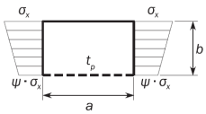 | 1 ≥ $\psi$ ≥ 0 | $K _{x} = \frac{4 \left( 0.425+1/ \alpha ^{2} \right)}{3 \psi +1}$ |   | $C _{x} = 1$, $\lambda$ ≤ 0.7 경우 $C _{x} = \frac{1}{\lambda ^{2} +0.51}$, $\lambda$ > 0.7 경우 |
    |   | 0 > $\psi$ ≥ -1 | $K _{x} = 4 \left( 0.425+1/ \alpha ^{2} \right) \left( 1+ \psi \right) -5 \psi (1-3.42 \psi )$ |   | $C _{x} = 1$, $\lambda$ ≤ 0.7 경우 $C _{x} = \frac{1}{\lambda ^{2} +0.51}$, $\lambda$ > 0.7 경우 |
    | 4  | 1 ≥ $\psi$ ≥-1 | $K _{x} = \left( 0.425+ \frac{1}{\alpha ^{2}} \right) \frac{3- \psi}{2}$ |   | $C _{x} = 1$, $\lambda$ ≤ 0.7 경우 $C _{x} = \frac{1}{\lambda ^{2} +0.51}$, $\lambda$ > 0.7 경우 |
    | 5  | - | $\alpha$ ≥ 1.64 | $K _{x} = 1.28$ | $C _{x} = 1$, $\lambda$ ≤ 0.7 경우 $C _{x} = \frac{1}{\lambda ^{2} +0.51}$, $\lambda$ > 0.7 경우 |
    |   | - | $0< \alpha <1.64$ | $K _{x} = \frac{1}{\alpha ^{2}} + 0.56 + 0.13 \alpha ^{2}$ | $C _{x} = 1$, $\lambda$ ≤ 0.7 경우 $C _{x} = \frac{1}{\lambda ^{2} +0.51}$, $\lambda$ > 0.7 경우 |

    **표 2 평면 패널에 대한 좌굴계수 및 경감계수(계속)**

    | 경우 | 응력비($\psi$) | 종횡비($\alpha$) | 좌굴계수($K$) | 경감계수($C$) |
    | --- | --- | --- | --- | --- |
    | #imgID-1616**.** | $1 \geq \psi \geq 0$ | $K _{y} = \frac{4(0.425+ \alpha ^{2} )}{(3 \psi +1) \alpha ^{2}}$ |   | $C _{y} =1$, $\lambda$ ≤ 0.7 경우 $C _{y} = \frac{1}{\lambda ^{2} +0.51}$, $\lambda$ > 0.7 경우 |
    | #imgID-1616**.** | $0> \psi \geq -1$ | $K _{y} =4(0.425+ \alpha ^{2} )(1+ \psi ) \frac{1}{\alpha ^{2}} -5 \psi (1-3.42 \psi ) \frac{1}{\alpha ^{2}}$ |   | $C _{y} =1$, $\lambda$ ≤ 0.7 경우 $C _{y} = \frac{1}{\lambda ^{2} +0.51}$, $\lambda$ > 0.7 경우 |
    | #imgID-1627. | $1 \geq \psi \geq -1$ | $K _{y} =(0.425+ \alpha ^{2} ) \frac{(3- \psi )}{2 \alpha ^{2}}$ |   | $C _{y} =1$, $\lambda$ ≤ 0.7 경우 $C _{y} = \frac{1}{\lambda ^{2} +0.51}$, $\lambda$ > 0.7 경우 |
    | #imgID-1638. | - | $K _{y} =1+ \frac{0.56}{\alpha ^{2}} + \frac{0.13}{\alpha ^{4}}$ |   | $C _{y} =1$, $\lambda$ ≤ 0.7 경우 $C _{y} = \frac{1}{\lambda ^{2} +0.51}$, $\lambda$ > 0.7 경우 |
    | #imgID-1649 | - | $K _{x} = 6.97$ |   | $C _{x} = 1$, $\lambda$ ≤ 0.83 경우 $C _{x} =1. 13 \left( \frac{1}{\lambda} - \frac{0.22}{\lambda ^{2}} \right)$, $\lambda$ > 0.83 경우 |
    | #imgID-16510. | - | $K _{y} = 4 + \frac{2.07}{\alpha ^{2}} + \frac{0.67}{\alpha ^{4}}$ |   | $C _{x} = 1$, $\lambda$ ≤ 0.83 경우 $C _{x} =1. 13 \left( \frac{1}{\lambda} - \frac{0.22}{\lambda ^{2}} \right)$, $\lambda$ > 0.83 경우 |

    | 경우 | 응력비($\psi$) | 종횡비($\alpha$) | 좌굴계수($K$) | 경감계수($C$) |
    | --- | --- | --- | --- | --- |
    | 11  | - |  | $K _{x} =4$ | $C _{x} = 1$, $\lambda$ ≤ 0.83 경우 $C _{x} =1. 13 \left( \frac{1}{\lambda} - \frac{0.22}{\lambda ^{2}} \right)$, $\lambda$ > 0.83 경우 |
    |   | - | $\alpha < 4$ | $K _{x} = 4 + 2.74 \left[ \frac{4 - \alpha}{3} \right] ^{4}$ | $C _{x} = 1$, $\lambda$ ≤ 0.83 경우 $C _{x} =1. 13 \left( \frac{1}{\lambda} - \frac{0.22}{\lambda ^{2}} \right)$, $\lambda$ > 0.83 경우 |
    | 12. 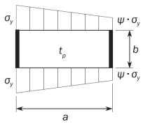 | - | $K _{y} = K _{y}$ 경우 2에 따라 결정 |   | • $\alpha < 2$ 경우: $C _{y} = C _{y2}$ • $\alpha \geq 2$ 경우: $C _{y} = \left( 1.06 + \frac{1}{10 \alpha} \right) C _{y2}$ $C _{y2}$: $C _{y}$ 경우 2에 따른다. |
    | 13.  | - |  | $K _{x} =6.97$ | $C _{x} = 1$, $\lambda$ ≤ 0.83 경우 $C _{x} =1. 13 \left( \frac{1}{\lambda} - \frac{0.22}{\lambda ^{2}} \right)$, $\lambda$ > 0.83 경우 |
    |   | - | $\alpha < 4$ | $K _{x} = 6.97 +3.1 \left[ \frac{4 - \alpha}{3} \right] ^{4}$ | $C _{x} = 1$, $\lambda$ ≤ 0.83 경우 $C _{x} =1. 13 \left( \frac{1}{\lambda} - \frac{0.22}{\lambda ^{2}} \right)$, $\lambda$ > 0.83 경우 |
    | 14. 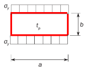 | - | $K _{y} = \frac{6.97}{\alpha ^{2}} + \frac{3.1}{\alpha ^{2}} \left( \frac{4-1/ \alpha}{3} \right) ^{4}$ |   | $C _{y} = 1$, $\lambda$ ≤ 0.83 경우 $C _{y} =1. 13 \left( \frac{1}{\lambda} - \frac{0.22}{\lambda ^{2}} \right)$, $\lambda$ > 0.83 경우 |

    | 경우 | 응력비($\psi$) | 종횡비($\alpha$) | 좌굴계수($K$) | 경감계수($C$) |
    | --- | --- | --- | --- | --- |
    | 15  | - | $K _{\tau } = \sqrt {3} \left[ 5.34 + \frac{4}{\alpha ^{2}} \right]$ |   | $C _{\tau } =1$, $\lambda \leq 0.84$ 경우 $C _{\tau } = \frac{0.84}{\lambda}$, $\lambda >0.84$ 경우 |
    | 16  | - | $K _{\tau } = \sqrt {3} \left\{ 5.34 + Max \left[ \frac{4}{\alpha ^{2}} ; \frac{7.15}{\alpha ^{2.5}} \right] \right\}$ |   | $C _{\tau } =1$, $\lambda \leq 0.84$ 경우 $C _{\tau } = \frac{0.84}{\lambda}$, $\lambda >0.84$ 경우 |
    | 17 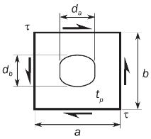 | - | $K _{\tau } = K ^{'} r$ $K ^{'}$: 경우 15에 따른 $K$ $r$: 개구 경감계수로서 다음 식에 의한다: $r = \left( 1 - \frac{d _{a}}{a} \right) \left( 1 - \frac{d _{b}}{b} \right)$ $\frac{d _{a}}{a} \leq 0.7$ 및 $\frac{d _{b}}{b} \leq 0.7$경우 |   | $C _{\tau } =1$, $\lambda \leq 0.84$ 경우 $C _{\tau } = \frac{0.84}{\lambda}$, $\lambda >0.84$ 경우 |
    | 18.  | - | $K _{\tau } =3 ^{0.5} \left( 0.6+4/ \alpha ^{2} \right)$ |   | $C _{\tau } =1$, $\lambda \leq 0.84$ 경우 $C _{\tau } = \frac{0.84}{\lambda}$, $\lambda >0.84$ 경우 |

    | 경우 | 응력비($\psi$) | 종횡비($\alpha$) | 좌굴계수($K$) | 경감계수($C$) |
    | --- | --- | --- | --- | --- |
    | 19. 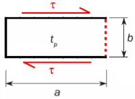 | - | $K _{\tau } =8$ |   | (앞면 참조) |
    | 변의 경계조건 ----- 자유 변 ─── 단순지지 변. ▬▬▬ 고정 변. |   |   |   |   |
    | 비고 1: 표에 나열된 경우는 일반적인 경우들이다. 각 응력성분($\sigma _{x , } \sigma _{y}$)은 국부좌표계에서 이해되어야 한다. |   |   |   |   |
- **2.2** 곡면 패널
  곡면 판의 한계상태에 대한 이 항의 요건은 $R/t _{p} \leq 2500$ 인 경우에 적용하며 그러하지 않은 경우는 **2.1.1**의 한계상태를 적용한다.
  곡면 패널의 한계상태는 다음 관계식에 따른다.
  $\left( \frac{\gamma _{c} \sigma _{ax}}{C _{ax} R _{eH _{-} p}} \right) ^{1.25} + \left( \frac{\gamma _{c} \tau \sqrt {3}}{C _{\tau } R _{eH _{-} p}} \right) ^{2} =1.0$
  $\sigma _{ax}$ : 곡면 패널에 상응하는 원통에 작용하는 축 응력($\mathrm{N}/mm ^{2}$)으로 인장 축 응력인 경우 0으로 한다.
  $C _{ax} , C _{\tau }$ : **표 3**에 따른 곡면 패널의 좌굴 감소 계수.
  곡면패널의 응력증식계수$\gamma_c$ 는 **2.1.1**에 따라 연장된 평면 패널에 대한 응력증식계수 $\gamma_c$보다 작을 필요는 없다.

  | 경우 | 종횡비 | 좌굴계수($K$) | 경감계수($C$) |
  | --- | --- | --- | --- |
  | 1 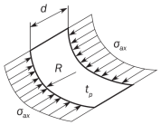 | $\frac{d}{R} \leq 0.5 \sqrt {\frac{R}{t _{p}}}$ | $K=1+ \frac{2}{3} \frac{d ^{2}}{R t _{p}}$ | 일반적인 적용의 경우: $b _{eff}$, ; 일반적인 경우 $w _{1}$, ; 양단 스닙 보강재인 경우 $C _{ax} =1$, $\lambda \leq 0.25$ 경우 $C _{ax} =1.233-0.933 \lambda$ $0.25 \prec \lambda \leq 1$경우 $C _{ax} =0.3/ \lambda ^{3}$, $1\prec \lambda \leq 1.5$ 경우 $C _{ax} =0.2/ \lambda ^{2}$, $\lambda \succ 1.5$ 경우 빌지 외판과 같이 평면 패널에 의해 제한 받는 곡면 단일 필드의 경우: $C _{ax} = \frac{0.65}{\lambda ^{2}} \leq 1.0$ |
  |   | $b _{eff}$, | 일반적인 경우 | 일반적인 적용의 경우: $b _{eff}$, ; 일반적인 경우 $w _{1}$, ; 양단 스닙 보강재인 경우 $C _{ax} =1$, $\lambda \leq 0.25$ 경우 $C _{ax} =1.233-0.933 \lambda$ $0.25 \prec \lambda \leq 1$경우 $C _{ax} =0.3/ \lambda ^{3}$, $1\prec \lambda \leq 1.5$ 경우 $C _{ax} =0.2/ \lambda ^{2}$, $\lambda \succ 1.5$ 경우 빌지 외판과 같이 평면 패널에 의해 제한 받는 곡면 단일 필드의 경우: $C _{ax} = \frac{0.65}{\lambda ^{2}} \leq 1.0$ |
  | $w _{1}$, | 양단 스닙 보강재인 경우 |   |   |
  | $\frac{d}{R} >0.5 \sqrt {\frac{R}{t _{p}}}$ | $K=0.267 \frac{d ^{2}}{R t _{p}} [3- \frac{d}{R} \sqrt {\frac{t _{p}}{R}} ]$ $\geq 0.4 \frac{d ^{2}}{R t _{p}}$ |   |   |
  | 2 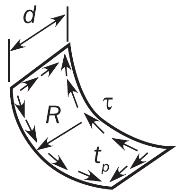 | $\frac{d}{R} \leq 8.7 \sqrt {\frac{R}{t _{p}}}$ | $K= \sqrt {3} \sqrt {28.3 + \frac{0.67 d ^{3}}{R ^{1.5} t _{p} ^{1.5}}}$ | $c _{xa} = \left( 1+ \left( \frac{\ell }{2s} \right) ^{2} \right) ^{2}$ ; 보강재의 파손 $\ell <2s$ ; 부착판의 파손 $C _{\tau } =1$, $\lambda \leq 0.4$ 경우 $C _{\tau } =1.274-0.686 \lambda$, $0.4 \prec \lambda \leq 1.2$ 경우 $C _{\tau} = \frac{0.65}{\lambda ^{2}}$, $\lambda \succ 1.2$ 경우 |
  |   | $c _{xa} = \left( 1+ \left( \frac{\ell }{2s} \right) ^{2} \right) ^{2}$ | 보강재의 파손 | $c _{xa} = \left( 1+ \left( \frac{\ell }{2s} \right) ^{2} \right) ^{2}$ ; 보강재의 파손 $\ell <2s$ ; 부착판의 파손 $C _{\tau } =1$, $\lambda \leq 0.4$ 경우 $C _{\tau } =1.274-0.686 \lambda$, $0.4 \prec \lambda \leq 1.2$ 경우 $C _{\tau} = \frac{0.65}{\lambda ^{2}}$, $\lambda \succ 1.2$ 경우 |
  | $\ell <2s$ | 부착판의 파손 |   |   |
  | $\frac{d}{R} \succ 8.7 \sqrt {\frac{R}{t _{p}}}$ | $K _{} = \sqrt {3} \frac{0.28 d ^{2}}{R \sqrt {R t _{p}}}$ |   |   |
  | 경계조건에 대한 설명: ── 단순지지 변 |   |   |   |

#### 3. 전반적인 보강패널의 좌굴능력

탄성 보강패널의 한계상태는 다음 관계식에 따른다.

#### 4. 종방향 보강재의 좌굴능력

- **4.1** 보강재의 한계상태
  종방향 보강재의 좌굴능력은 다음의 한계상태를 검토하여야 한다.
  • 보강재의 파손 (SI)
  • 부착판의 파손 (PI)
- **4.2** 면외압력
  면외압력은 종방향 보강재의 좌굴강도 평가 시와 동일한 값으로 고려되어야 한다.
- **4.3** 보강재 이상화
  면외압력은 종방향 보강재의 좌굴강도 평가 시와 동일한 값으로 고려되어야 한다.
  - **4.3.1** 보강재의 유효 길이
    보강재의 유효길이 $\ell _{eff}$($\mathrm{mm}$)는 다음과 같다.
    • 양단 고정인 보강재 : $\ell _{eff} = \frac{\ell }{\sqrt {3}}$
    • 일단 고정 및 타단 단순지지인 보강재 : $\ell _{eff} =0.75 \ell$
    • 양단 단순지지인 보강재 : $\ell _{eff} = \ell$
  - **4.3.2** 부착판의 유효폭
    전단 지연이 없는 보강재 부착판의 유효폭 $b _{eff1}$($\mathrm{mm}$)은 다음과 같다.
    $b _{eff1} = \frac{C _{\chi 1} b _{1} +C _{\chi 2} b _{2}}{2}$
    $C _{\chi 1} , C _{\chi 2}$ : **표 2**에 정의된 경감계수, 경우 1에 따라서 고려하는 보강재의 각 측면에서 EPP1과 EPP2가 계산되어야 한다.
    $b _{1} , b _{2}$ : 고려하는 보강재 각 측면에서 판 패널의 폭.
  - **4.3.3** 부착판의 유효폭
    보강재 부착판의 유효폭 $b _{eff}$($\mathrm{mm}$)은 다음과 같다.
    $b _{eff} =\mathrm{Min}(b _{eff1} , \chi _{s} s)$
    $\chi _{s}$ : 유효폭계수는 다음과 같다.
    $\frac{\ell _{eff}}{s} \geq 1$ 경우, $\chi _{s} = \mathrm{Min} \left[ \frac{1.12}{1 + \frac{1.75}{\left( \frac{\ell _{eff}}{s} \right) ^{1.6}}} ; 1.0 \right]$
    $\frac{\ell _{eff}}{s} < 1$ 경우, $\chi _{s} = 0.407 \frac{\ell _{eff}}{s}$
  - **4.3.4** 부착판의 순 두께
    부착판의 순 두께 $t _{p}$($\mathrm{mm}$)는 두 개의 부착판 패널의 평균 두께로 고려되어야 한다.
  - **4.3.5** 평강의 유효 웨브 두께
    국부 면외변형에 의한 강성의 감소를 고려하기 위하여, 평강 보강재의 유효 웨브 두께는 보강재의 순 단면적 $A _{s}$, 순 단면계수 $Z$ 및 단면2차모멘트 I의 계산 시 사용되어야 하며 다음 식에 의한 값을 사용한다.
    $t _{w-red} =t _{w} \left[ 1- \frac{2 \pi ^{2}}{3} \left( \frac{h _{w}}{s} \right) ^{2} \left( 1- \frac{b _{eff1}}{s} \right) \right]$ ($\mathrm{mm}$)
  - **4.3.6** 보강재의 순 단면계수 Z
    판의 유효폭 $b _{eff}$를 포함한 보강재의 순 단면계수 Z는 다음과 같다.
    • 보강재의 파손에 대하여 보강재의 플랜지 끝단에서 계산된 보강재의 단면계수.
    • 부착판의 파손에 대하여 부착판에서 계산된 판의 단면계수.
  - **4.3.7** 보강재의 순 단면2차모멘트 I
    유효폭 $b _{eff}$를 포함한 보강재의 순 단면2차모멘트 I는 다음과 요건을 만족하여야 한다.
    $I \geq \frac{s t _{p} ^{3}}{12 \times 10 ^{4}}$
  - **4.3.8** 구평강의 이상화
    구평강은 등가의 형강의 치수로 고려한다. 등가의 조립 단면의 순 치수는 다음 식에 의해 얻을 수 있다.
    $h _{w} =h ' _{w} - \frac{h ' _{w}}{9.2} +2$ ($\mathrm{mm}$)
    $b _{f} = \alpha \left( t ' _{w} + \frac{h ' _{w}}{6.7} -2 \right)$ ($\mathrm{mm}$)
    $t _{f} = \frac{h ' _{w}}{9.2} -2$ ($\mathrm{mm}$)
    $t _{w} =t' _{w}$ ($\mathrm{mm}$)
    $h' _{w} , t ' _{w}$ : **그림 A2.2**에 따른 구형강의 순 높이와 두께
    $\alpha$ : 계수로서 다음과 같다.
    #eqnID-2863120_s2인 경우, $\alpha =1.1+ \frac{(120-h' _{w} ) ^{2}}{3000}$
    $h ' _{w}$ >120인 경우, $\alpha =1.0$
    
    **그림 A2.2 구형강의 이상화**
- **4.4** 최종좌굴능력
  - **4.4.1** 종방향 보강재의 한계상태
    $\sigma _{a} + \sigma _{b} + \sigma _{w} >0$ 경우, 보강재에 대한 최종좌굴능력은 다음의 식에 따라 검토하여야 한다.
    $\frac{\gamma _{c} \sigma _{a} + \sigma _{b} + \sigma _{w}}{R _{eH}} = 1$
    $\sigma _{a}$ : **4.4.2**에 정의된 보강재의 스팬 중앙에서의 유효 축응력($\mathrm{N}/mm ^{2}$).
    $\sigma_b$ : **4.4.3**에 정의된 보강재의 굽힘응력($\mathrm{N}/mm ^{2}$).
    $\sigma _{w}$ : **4.4.4**에 정의된 비틀림 변형에 의한 응력($\mathrm{N}/mm ^{2}$).
    $R _{eH}$ : 재료의 최소 항복응력($\mathrm{N}/mm ^{2}$).
    • 보강재의 파손인 경우 $R _{eH } =R _{eH-S}$
    • 부착판의 파손인 경우 $R _{eH } =R _{eH-P}$
  - **4.4.2** 유효 축응력 $\sigma _{a}$
    부착판의 보강재의 스팬 중앙에서 작용하는 유효 축응력($\mathrm{N}/mm ^{2}$)은 다음과 같다.
    $\sigma _{a} = \sigma _{x} \frac{s t _{p} +A _{s}}{b _{eff 1} t _{p} +A _{s}}$
    $\sigma _{x}$ : 4.4.1 a)에 따라서 보강재의 계산점에서 계산된 부착판의 보강재에 작용하는 공칭 축응력($\mathrm{N}/mm ^{2}$).
    $A _{S}$ : 고려하는 보강재의 순 단면적($\mathrm{mm}^2$).
  - **4.4.3** 굽힘응력 $\sigma _{b}$
    보강재의 굽힘응력($\mathrm{N}/mm ^{2}$)은 다음 식에 의한다.
    $\sigma _{b} = \frac{M _{0} +M _{1}}{Z \times 10 ^{3}}$
    $M_{1}$ : 면외 하중 $P$에 따른 굽힘 모멘트($\mathrm{N}/mm$).
    연속 보강재인 경우, $M _{1} =C _{i} \frac{P  s \ell ^{2}}{24 \times 10 ^{3}}$
    스닙된 보강재인 경우, $M _{1} =C _{i} \frac{P  s \ell ^{2}}{8 \times 10 ^{3}}$
    $P$ : 면외하중($\mathrm{kN}/m ^{2}$)으로 보강재의 하중 계산점에 작용하는 정압력과 같다.
    $C_{i}$ : 압력 계수:
    $C_{i}$ = $C_{SI}$ 보강재의 파손의 경우
    $C_{i}$ = $C_{P I}$ 부착판의 파손의 경우
    $C_{P I}$ : 판에 의한 파손 압력계수:
    $C_{P I}$ = 1, 면외 압력이 보강재의 반대편 쪽에 작용하는 경우
    $C_{P I}$ = -1, 면외 압력이 보강재와 같은 쪽에 작용하는 경우
    $C_{SI}$ : 보강재의 파손 압력계수:
    $C_{SI}$ = -1, 면외 압력이 보강재의 반대편 쪽에 작용하는 경우
    $C_{SI}$ = 1, 면외 압력이 보강재와 같은 쪽에 작용하는 경우
    $M_0$ : 보강재의 면외변형으로 인한 굽힘 모멘트($\mathrm{N}/mm$)로서 다음 식에 의한 값.
    $M _{0} =F _{E} ( \frac{P _{z} w}{c _{f} -P _{z}} )$, $c _{f} -P _{z} >0$
    $F_E$ : 보강재의 이상화된 탄성좌굴 힘($\mathrm{N}$)으로 다음 식에 의한 값.
    $F _{E} =( \frac{\pi}{\ell } ) ^{2} E I 10 ^{4}$
    $P _{z}$ : 보강재 스팬 중앙위치의 부착판에서 $\sigma _{x}$ 및 $\tau$ 에 의해 보강재에 작용하는 공칭 면외하중($\mathrm{N}/mm ^{2}$)으로 다음 식에 의한 값.
    $P _{z} = \frac{t _{p}}{s} \left( \sigma _{xI} \left( \frac{\pi s}{\ell } \right) ^{2} + \sqrt {2} \tau _{1} \right)$
    $\sigma _{x \ell }$ : 다음 식에 의한 값, 다만 0 이상이어야 한다.
    $\sigma _{x \ell } = \gamma _{c} \sigma _{x} \left( 1+ \frac{A _{s}}{s t _{p}} \right)$
    $\tau _{1}$ : 다음 식에 의한 값, 다만 0 이상이어야 한다.
    $\tau _{1} = \gamma _{c}  \tau -t _{p} \sqrt {R _{eH _{-} p} E \left( \frac{m _{1}}{a ^{2}} + \frac{m _{2}}{s ^{2}} \right)}$
    $m _{1}$, $m _{2}$ : 계수로서 다음에 따른다.
    $m _{1} =1.47$, $m _{2} =0.49$, $\alpha \geq 2$ 경우
    $m _{1} =1.96$, $m _{2} =0.37$, $\alpha <2$ 경우
    $w$ : 보강재의 변형으로 다음 식에 의한 값.
    $w=w _{0} +w _{1}$
    $w _{0}$ : 가정된 초기변형(imperfection)으로서 다음 식에 의한 값.
    $w _{0} =\ell/1000$, 일반적인 경우
    $w _{0} =-w _{na}$, 양단 스닙 보강재의 보강재에 의한 파손을 고려하는 경우
    $w _{0} =w _{na}$, 양단 스닙 보강재의 판에 의한 파손을 고려하는 경우
    $w _{na }$ : 부착판의 중앙점으로부터 부착판의 유효폭$b _{eff}$을 포함하여 계산된 보강재의 중립축까지의 거리.
    $w _{1}$ : 면외 하중 $P$에 의한 보강재 스팬 중앙점에서의 보강재의 변형으로 균일분포하중의 경우, $w _{1}$은 다음과 같다.

    | $w _{1} =C _{i} \frac{P s \ell ^{4}}{384 \times 10 ^{7} E I}$, | 일반적인 경우 |
    | --- | --- |
    | $w _{1} =C _{i} \frac{5PsI ^{4}}{384.10 ^{7} EI}$, | 양단 스닙 보강재인 경우 |

    $c_f$ : 보강재에 의한 탄성지지($\mathrm{N}/mm ^{2}$)로서 다음 식에 의한 값.
    $c _{f} =F _{E} \left( \frac{\pi}{\ell } \right) ^{2} (1+c _{p} )$
    $c _{p}$ : 계수로서 다음 식에 의한 값.
    $c _{p} = \frac{1}{1+ \frac{0.91}{c _{xa}} \left( \frac{12 I 10 ^{4}}{s t _{p} ^{3}} -1 \right)}$
    $c _{xa}$ : 계수로서 다음에 의한 값.
    $c _{xa} = \left( \frac{\ell }{2s} + \frac{2s}{\ell } \right) ^{2}$, $literGEQ 2s$ 경우
    $c _{xa} = \left( 1+ \left( \frac{\ell }{2s} \right) ^{2} \right) ^{2}$, $\ell <2s$ 경우
  - **4.4.4** 비틀림 변형에 의한 응력 $\sigma _{w}$
    비틀림 변형에 의한 응력($\mathrm{N}/mm ^{2}$)은 다음 식에 의한다.

    | $\sigma _{w} =E y _{w} \left( \frac{t _{f}}{2} +h _{w} \right) \Phi _{0} \left( \frac{\pi}{\ell } \right) ^{2} \left( \frac{1}{1- \frac{0.4 R _{eH _{-} S}}{\sigma _{ET}}} -1 \right)$ | 보강재의 파손 |
    | --- | --- |
    | $\sigma _{w} =0$ | 부착판의 파손 |

    $y _{w}$ : 보강재 횡단면의 중심으로부터 보강재 플랜지의 자유단까지의 거리($\mathrm{mm}$)로 다음 식에 의한 값

    | $y _{w} = \frac{t _{w}}{2}$, | 평강인 경우. |
    | --- | --- |
    | $y _{w} =b _{f} - \frac{h _{w} t _{w} ^{2} +t _{f} b _{f} ^{2}}{2A _{s}}$, | 앵글 및 구평강인 경우 |
    | $y _{w} = \frac{b _{f}}{2}$ | T 형강인 경우 |

    $\Phi _{0}$ : 계수로서 다음 식에 의한 값.
    $\Phi _{0} = \frac{\ell}{h _{w}} 10 ^{-3}$
    $\sigma _{ET}$ : 비틀림 좌굴에 대한 참조응력($\mathrm{N}/mm ^{2}$)으로 다음 식에 의한 값.
    $\sigma _{ET} = \frac{E}{I _{p}} \left( \frac{\epsilon \pi ^{2 } I _{w} 10 ^{2}}{\ell ^{2}} +0.385I _{T} \right)$
    $I _{P}$ : **표 4**에 따른, **그림 A2.3**의 지점 C에 대한 보강재의 순 극관성모멘트($\mathrm{cm} ^{4}$).
    $I _{T}$ : **표 4**에 따른, 보강재의 순 상브난(St. Venant) 관성모멘트($\mathrm{cm} ^{4}$).
    $I _{w}$ : **표 4**에 따른, **그림 A2.3**의 지점 C에 대한 보강재의 순 단면1차모멘트($\mathrm{cm} ^{6}$).
    $\epsilon$ : 고정도로서 다음 식에 의한 값.
    $\epsilon =1+ \frac{\left( \frac{\ell }{\pi} \right) ^{2} 10 ^{-3}}{\sqrt {I _{w} \left( \frac{0.75s}{t _{p} ^{3}} + \frac{e _{f} -0.5t _{f}}{t _{w} ^{3}} \right)}}$

    |   | 평강 | 구평강, 앵글 및 T 형강 |
    | --- | --- | --- |
    | $I _{p}$ | $\frac{h _{w} ^{3} t _{w}}{3 \times 10 ^{4}}$ | $\left( \frac{A _{w} (e _{f} -0.5t _{f} ) ^{2}}{3} +A _{f} e _{f} ^{2} \right) 10 ^{-4}$ |
    | $I _{T}$ | $\frac{h _{w} ^{3} t _{w}}{3 \times 10 ^{4}} \left( 1-0.63 \frac{t _{w}}{h _{w}} \right)$ | $\frac{(e _{f} -0.5t _{f} )t _{w} ^{3}}{3 \times 10 ^{4}} \left( 1-0.63 \frac{t _{w}}{e _{f} -0.5 t _{f}} \right) + \frac{b _{f} t _{f} ^{3}}{3 \times 10 ^{4}} \left( 1-0.63 \frac{t _{f}}{b _{f}} \right)$ |
    | $I _{w}$ | $\frac{h _{w} ^{3} t _{w} ^{3}}{36 \times 10 ^{6}}$ | $\frac{A _{f} e _{f} ^{2} b _{f} ^{2}}{12 \times 10 ^{6}} \left( \frac{A _{f} +2.6A _{W}}{A _{f} +A _{W}} \right)$ : 평강 및 앵글의 경우 $\frac{b _{f} ^{3} t _{f} e _{f} ^{2}}{12 \times 10 ^{6}}$, : T 형강의 경우 |
    | $A _{w}$ : 웨브 순 면적($\mathrm{mm} ^{2}$) $A_f$ : 플랜지 순 면적($\mathrm{mm} ^{2}$) |   |   |

    
    **그림 A2.3 보강재 횡단면**

### 별첨 3 - 선체거더 최종굽힘능력

**기호**
$I_{y-"net"}$ : 수평 중립축부근 선체 횡단면의 단면2차모멘트($\mathrm{m}^4$).
$Z_{B-"net"}$, $Z_{D-"net"}$ : 선저와 갑판에서의 단면 계수($\mathrm{m}^3$).
$R _{e _{-} Hs}$ : 고려하는 보강재 재료의 최소 항복 응력($\mathrm{N}/mm ^{2}$).
$R _{e _{-} Hp}$ : 고려하는 판 재료의 최소 항복 응력($\mathrm{N}/mm ^{2}$).
$A _{s-"net"}$ : 부착판을 포함하지 않는 보강재의 순 단면적($\mathrm{cm}^2$).
$A_{p-"net"}$ : 부착판의 순 단면적($\mathrm{cm}^2$).

#### 1. 일반적인 가정

- **1.1** 최종 선체거더 능력 계산 방법은 모든 주요 종방향 구조부재의 심각한 손상 모드를 식별하기 위함이다.
- **1.2** 좌굴한계를 넘어 압축을 받는 구조는 하중부담능력이 감소한다. 늑골 간의 가장 취약한 손상 모드를 식별하기 위하여 판 좌굴, 보강재의 비틀림 좌굴, 보강재 웨브의 좌굴, 보강재의 면외 및 전체 좌굴, 그리고 이들의 상호작용과 같은 개별 구조요소에 대한 모든 관련된 손상 모드가 고려되어야 한다.

#### 2. 증분-반복법

- **2.1** 가정
  증분-반복법을 적용함에 있어서, 일반적으로 다음과 같이 가정한다.
  • 최종강도는 인접한 두개의 횡방향 웨브 사이의 선체 횡단면에서 계산한다.
  • 각 곡률 증분 동안 선체거더 횡단면은 평면을 유지한다.
  • 선체 재료는 탄소성(elasto-plastic) 거동을 한다.
  • 선체거더 횡단면은 **2.2.2**와 같이 독립적으로 거동한다고 고려되는 요소로 분할되어야 한다.
  반복 절차에 따라, 각 곡률 값 $\chi _{i}$에서, 횡단면에 작용하는 굽힘 모멘트 $M _{i}$는 각 요소에 작용하는 응력 $\sigma$의 기여분을 합하여 구한다. 요소의 비선형 응력-변형률 곡선(non-linear load-end shortening curve) $\sigma - \varepsilon$으로부터 각 곡률 증분에 대한 요소 변형률 $\varepsilon$에 해당하는 응력 $\sigma$를 구할 수 있다. 요소의 손상 메커니즘에 대하여, 이러한 응력-변형률 곡선을 **2.3**에 규정한 식들로부터 계산하여야 한다. 응력 $\sigma$은 고려하는 응력-변형률 곡선으로부터 얻은 값 중 가장 낮은 값을 선택한다. 이 절차는, 부과된 곡률 값이 호깅 및 새깅 상태에서 다음 식으로 구한 값 $\chi _{F} (\mathrm{m} ^{-1} )$에 도달할 때까지 반복하여야 한다.
  $\chi _{F} =±0.003 \frac{M _{y}}{EI _{y-"net"}}$
  $M _{y}$ : $M _{Y1}$ 및 $M_{Y2}$ 중 작은 값 ($\mathrm{kNm}$).
  $M_{Y1}=10^{3}R_{eH}Z_{B-"net"}$
  $M_{Y2}=10^{3}R_{eH}Z_{D-"net"}$
  만약 $\chi _{F}$ 값이 모멘트-곡률 곡선($M _{- \chi }$ 곡선)의 정점 값을 평가하기에 충분하지 않을 경우, 이 절차는 부과된 곡률 값이 곡선의 최대 굽힘 모멘트를 허용할 수 있을 때까지 반복하여야 한다.
- **2.2** 절차
  - **2.2.1** 일반
    모멘트-곡률 곡선,$M_-x$은 **그림 A3.1** 흐름도의 증분-반복적 방법으로 구해야 한다.
    이 절차에서, 최종 선체거더 굽힘 모멘트 능력 $M_{U}$는 **그림 A3.1**에 보인 바와 같이 선체 횡단면의 수직 굽힘 모멘트 $M$ 대 곡률 $\chi$ 곡선의 정점 값으로 정의된다. 굽힘 모멘트-곡률 곡선은 증분-반복법에 의하여 구하여야 한다. 증분 절차의 각 단계는 부과된 곡률 $\chi _{i}$의 영향으로 선체횡단면에 작용하는 굽힘모멘트 $M _{i}$의 계산으로 나타내어 진다. 각 증분 단계에서, $\chi _{i}$ 값은 이전 단계의 $\chi _{i-1}$에 곡률 증분 $\Delta \chi$을 합하여 구하여야 한다. 이러한 곡률 증분은 수평 중립축 부근 선체거더 횡단면의 회전각의 증분에 해당한다. 이 회전 증가분은 각 선체 구조요소의 축방향 변형률 $\varepsilon$을 발생시키며, 그 값은 요소의 위치에 따라 결정된다. 호깅 상태에서, 중립축 상부의 구조요소에는 인장이 발생하고, 중립축 하부요소에는 압축이 발생한다. 그리고 새깅 상태에서는 이와는 반대의 변형이 발생한다. 변형률 $\varepsilon$로 인하여 각 구조 요소에 발생한 응력 $\sigma$은 비선형 탄소성 영역의 요소 거동을 고려한 요소의 응력-변형률 곡선으로부터 구하여야 한다. 응력-변형률 관계가 비선형이기 때문에, 각 단계에 대하여 선체 횡단면을 구성하는 모든 구조부재에서 유발되는 응력 분포는 중립축 위치의 변화를 결정한다. 고려하는 단계에 대한 새로운 중립축 위치는 횡단면의 모든 선체요소에 작용하는 응력 간에 평형조건을 부과하는 반복 절차를 통하여 구하여야 한다. 중립축 위치를 결정하고 단면 구조요소의 응력 분포를 구한 후, 고려하는 단계에서 부과된 곡률 $\chi _{i}$에 해당하는 새로운 중립축 위치 주변 단면의 굽힘모멘트 $M_{i}$는 각 요소 응력의 기여분을 합하여 구하여야 한다.
    위에서 규정한 증분-반복법의 주요단계를 요약하면 다음과 같다. (**그림 A3.1** 참조)
    **a) 단계 1** : 선체 횡단면을 보강판 요소로 나눈다.
    **b) 단계 2** : **표 1**의 모든 요소들에 대한 응력-변형률의 관계를 정의한다.
    **c) 단계 3** : 다음과 같이, 증분 곡률 값(강력 갑판에서 항복강도의 1 %에 해당하는 응력을 유발하는 곡률)
    을 가진 최초 증분 단계에 대하여 곡률 $\chi _{1}$와 중립축을 초기화한다.
    $\chi _{1} = \Delta \chi = {0.01 \frac{R _{eH}}{E}}\frac{1}{z _{D} -z_n}$
    $z_{D}$ : 선측에서의 강력갑판의 Z좌표(m)
    $z _{n}$ : **1.2.3**에 정의된 기준 좌표계에 대한 선체횡단면의 수평중립축의 Z좌표($\mathrm{m}$).
    **d) 단계 4** : 각 요소에 상응하는 변형률 $\varepsilon _{i} = \chi (z _{i} -z _{n} )$과 상응하는 응력$\sigma _{i}$을 계산한다.
    **e) 단계 5** : 다음과 같이, 각 증분 단계에서 전 횡단면에 걸친 하중의 평형을 설정하여 중립축 $z_{NA-cur}$을 결정한다.
    $\Sigma A _{i-"net" } \sigma _{i} = \Sigma A _{j-"net"} \sigma _{j}$ (i-번째 요소는 압축, j-번째 요소는 인장)
    **f) 단계 6** : 다음과 같이, 모든 요소의 기여분을 합하여 상응하는 모멘트를 계산한다.
    $M_{u}=\Sigma \sigma_{Ui}A_{i-"net"} |(z_{i}-z_{NA-cur} )|$
    **g) 단계 7** : 이전 증분 단계의 모멘트와 현재 증분 단계의 모멘트를 비교해야한다. 만일 굽힘 모멘트-곡률 곡선의 기울기가 음의 고정된 값보다 작으면, 이 과정을 끝내고 $M_{U}$의 정점 값을 정의하여야 한다. 그렇지 않으면 $\Delta \chi$의 양 만큼 곡률을 증가시킨 후 **단계 4**로 간다.
  - **2.2.2** 선체 거더 횡단면의 모델링
    선체거더 횡단면은 선체거더 최종강도에 기여하는 부재들로 구성 된 것으로 고려되어야 한다. 스닙된 보강재들은 선체거더 강도에 기여하지 않는 것으로 가정하여 모델링되어야 한다. 구조부재들은 보강재요소, 보강된 판요소 또는 강체요소(hard corner element)로 분류된다. 거더의 웨브 또는 선측스트링거를 포함하는 판 패널은 보강된 판요소, 보강재 요소의 부착판 또는 강체요소로 이상화되어야 한다.
    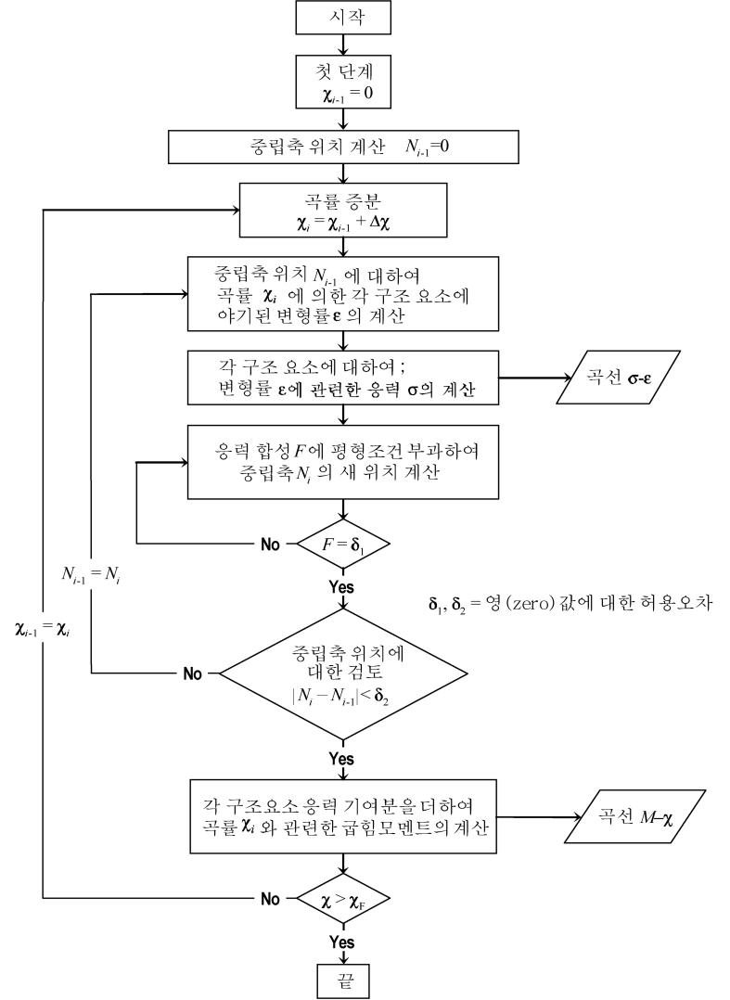
    **그림 A3.1 곡선** #eqnID-3046 **계산 과정 흐름도**판 패널은 다음의 두 종류로 분류된다.
    • 종방향으로 보강된 종방향으로 긴 패널
    • 횡방향으로 보강된 종방향에 수직한 방향으로 긴 패널
    a) 강체요소(hard corner element)
    강체요소란 선체 거더 횡단면을 구성하는 강한 요소로서, 주로 탄소성 손상 모드(재료항복)에 따라 파괴된다. 이러한 요소는 일반적으로 동일 평면에 있지 않은 두개의 판으로 구성된다. 판의 교차점으로부터 강체요소의 범위는 횡방향 보강 패널의 경우 $20t _{"net"}$, 종방향 보강 패널의 경우 $0.5s$로 한다. (**그림 A3.2** 참조)
    $t_{"net"}$ : 판의 순 제공 두께 ($\mathrm{mm}$).
    $s$ : 인접한 종방향 보강재의 거리 ($\mathrm{m}$).
    빌지, 현측후판-갑판 스트링거 요소, 거더-갑판 연결부와 대형 거더의 면재-웨브 연결부가 일반적인 강체요소이다.
    b) 보강재 요소(stiffener element)
    보강재는 부착판을 포함한 일반 보강재 요소로 구성된다. 원칙적으로, 부착판의 폭은 다음과 같다.
    • 보강재의 평균 간격 (보강재 양측의 패널이 종 방향으로 보강되는 경우)
    • 종방향으로 보강된 패널의 폭 (보강재 한쪽 측의 패널이 종 방향으로 보강되고 다른 패널은 횡방향으로 보강되는 경우, **그림 A3.2** 참조)
    c) 보강판 요소(stiffened plate element)
    보강재 요소 사이, 일반 보강재 요소와 강체요소 사이 또는 강체요소들 사이의 판은 보강판 요소로 취급되어야 한다. (**그림 A3.2** 참조)
    **그림 A3.3** 은 선체거더 단면 모델링의 일반적인 예를 보여주며, 앞서 언급한 원칙에도 불구하고, 이 그림은 상갑판, 현측후판 및 창구 코밍 부근의 모델링에 적용되어야 한다.
    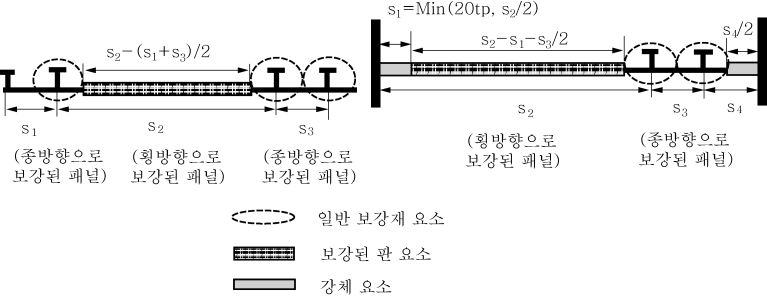
    **그림 A3.2 강체 요소 및 부착판 폭의 범위**
    **그림 A3.3 선체단면 보강판 요소, 일반 보강재 요소 및 강체 요소의 형상 예**
    • **그림 A3.4의** 너클 포인트의 경우, 30도 보다 큰 각을 가지는 판의 너클에 인접한 판 구역은 강체요소로 정의된다. 강체요소의 한쪽의 범위는 너클 포인트로부터 횡늑골식 패널의 경우에는 20 $t _{"net"}$, 종늑골식 패널의 경우에는 0.5s로 한다.
    • 판 요소가 불연속 종보강재에 의해 보강되는 경우, 불연속 보강재는 판을 여러 요소 판 패널로 나누는 것으로만 고려한다.
    • 보강된 판 요소에 개구가 있는 경우, 개구는 우리 선급이 인정하는 바에 따라 고려되어야 한다.
    • 부착판이 서로 다른 두께 및/또는 항복응력의 강재로 만들어진 경우, 다음의 식에서 구한 평균 두께 및/ 또는 항복응력이 계산에 사용되어야 한다.
    $t _{"net"} = \frac{t _{1-"net"} s _{1} +t _{2-"net"} s _{2}}{s}$ $R _{e _{-} Hp} = \frac{R _{e _{-} Hp1} t _{1-"net"} s _{1} +R _{eH _{-} p2} t _{2-"net"} s _{2}}{t _{"net"} S}$
    $R _{eH _{-} P1}$, $R _{eH _{-} P2}$, $t _{1-"net"}$, $t _{2-"net"}$, $s _{1}$, $s _{2}$와 $s$는 **그림 A3.5**에 따른다.
    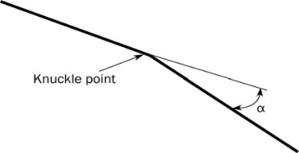
    **그림 A3.4 너클 포인트가 있는 판**
    
    **그림 A3.5 다른 두께 및 항복응력을 가지는 요소**
- **2.3** 응력-변형률 곡선
  - **2.3.1** 보강판 요소 및 일반 보강재 요소
    선체 거더 횡단면을 구성하는 보강판 요소 및 일반 보강재 요소는 **표 1**에 규정한 손상 모드 중 하나에 따라서 붕괴될 수 있다.
    • 판부재가 불연속 종통 보강재로 보강되는 경우, 요소의 응력은 불연속 종통 보강재를 고려하여 **2.3.2** 부터 **2.3.7**까지에 따라 구하여야 한다. 선체거더 최종강도 확인을 위한 전체하중을 계산할 때, 불연속 종통 보강재의 면적은 0으로 가정하여야 한다.
    • 보강판 요소에 개구가 있는 경우, 선체 거더 최종강도 확인을 위한 전체 하중의 계산 시 보강판 요소의 면적은 판에서 개구부 면적을 제외하고 구하여야 한다.
    • 보강판 요소의 경우, 응력-변형률 곡선의 하중단절 부분(load shortening portion)에 대한 판의 유효폭은 판의 전폭 즉, 인접 판 또는 종방향 보강재의 교차부분까지(강체요소 끝단부터 또는 일반보강재의 부착판에서부터는 아님)로 구하여야 한다. 선체거더 최종강도 확인을 위한 전체 하중의 계산 시, 보강판 요소의 면적은 해당되는 경우, 강체요소와 일반보강재 사이 또는 강체요소들 사이에서 구하여야 한다.

    | 요소 | 손상 모드 | $\sigma - \varepsilon$ 곡선이 정의된 조항 |
    | --- | --- | --- |
    | 인장을 받는 보강판 또는 일반 보강재 요소 | 탄소성 파괴 | **2.3.2** |
    | 압축을 받는 일반 보강재 요소 | 보 기둥 좌굴 비틀림 좌굴 플랜지가 있는 형강 웨브의 국부좌굴 평강 웨브의 국부좌굴 | **2.3.3** **2.3.4** **2.3.5** **2.3.6** |
    | 압축을 받는 보강판 요소 | 판 좌굴 | **2.3.7** |
  - **2.3.2** 구조요소의 탄소성 붕괴 (강체요소)
    선체 횡단면을 구성하는 구조 요소들의 탄소성 붕괴에 관한 응력-변형률 곡선$\sigma - \epsilon$을 나타내는 방정식은 다음 식으로부터 얻어진다.
    $\sigma = \Phi R _{eHA}$
    $R _{eHA}$ : 고려하는 요소의 등가 최소 항복응력 ($\mathrm{N}/mm ^{2}$)으로 다음 식으로 구한다.
    $R _{eHA} = \frac{R _{eH _{-} P} A _{p-"net"} +R _{eH _{-} s} A _{s-"net"}}{A _{p-"net"} +A _{s-"net"}}$
    $\Phi$ : 경계함수(edge function)로서 다음과 같다.
    $\Phi$ = -1 $\varepsilon$ < -1인 경우
    $\Phi$ = $\varepsilon$ -1 ≤ $\varepsilon$ ≤ 1인 경우
    $\Phi$ = 1 $\varepsilon$ > 1인 경우
    $\varepsilon$ : 상대 변형률로서 다음과 같다.
    $\varepsilon = \frac{\varepsilon _{E}}{\varepsilon _{Y}}$
    $\varepsilon _{E}$ : 요소 변형률
    $\varepsilon _{Y}$ : 요소의 항복응력에서의 변형률로서 다음과 같다.
    $\varepsilon _{Y} = \frac{R _{eHA}}{E}$
  - **2.3.3** 보 기둥 좌굴
    판과 보강재 조합의 보 기둥 좌굴에 근거한 평균응력-평균변형률 곡선 $\sigma _{CR1} - \varepsilon$의 양의 인장 변형률은 다음 식으로부터 구하여야 한다.
    $\sigma_{CR1}=\Phi \sigma_{C1}\frac{A_{s-"net"}+A_{pE-"net"}}{A_{s-"net"}+A_{p-"net"}}$
    $\Phi$ : **2.3.3**에 따른 경계함수
    $\sigma _{C1}$ : 임계응력($\mathrm{N}/mm ^{2}$)으로 다음에 따른다.
    $\sigma _{C1} = \frac{\sigma _{E1}}{\varepsilon}$, $\sigma _{E1} \leq \frac{R _{eHB}}{2} \varepsilon$ 인 경우
    $\sigma _{C1} = R _{eHB} \left( 1- \frac{R _{eHB} \varepsilon}{4 \sigma _{E1}} \right)$, $\sigma _{E1} > \frac{R _{eHB}}{2} \varepsilon$ 인 경우
    $R _{eHB}$ : 고려하는 요소의 등가 최소 항복응력 ($\mathrm{N}/mm ^{2}$)으로서 다음 식으로부터 구한다.
    $R _{eHB} = \frac{R _{eH _{-} P} A _{pEI-n50} \ell _{pE} +R _{eH _{-} S} A _{s-"net"} \ell _{sE}}{A _{pEI-"net"} \ell _{pE} +A _{s-"net"} \ell _{sE}}$
    $A _{pEI-"net"}$ : 유효면적($\mathrm{cm} ^{2}$)으로서 다음과 같다.
    $A _{pEI-"net"} =10b _{E1} t _{"net"}$
    $\ell _{pE}$ : 폭 $b _{E1}$인 부착판을 갖는 보강재의 중립축으로부터 부착판의 하단까지의 거리($\mathrm{mm}$).
    $\ell _{sE}$ : 폭 $b _{E1}$인 부착판을 갖는 보강재의 중립축으로부터 보강재의 상단까지의 거리($\mathrm{mm}$).
    $\varepsilon$ : **2.3.2**에 따른 상대 변형률.
    $\sigma _{E1}$ : 오일러(Euler) 기둥 좌굴 응력($\mathrm{N}/mm ^{2}$).
    $\sigma _{E1} = \pi ^{2} E \frac{I _{E-"net"}}{A _{E-"net"} \ell ^{2}} 10 ^{-4}$
    $I _{E-"net"}$ : 폭 $b _{E1}$인 부착판을 포함하는 보강재의 단면2차모멘트($\mathrm{cm} ^{4}$).
    $A _{E-"net"}$ : 폭 $b _{E}$인 부착판을 포함하는 보강재의 순 단면적($\mathrm{cm} ^{2}$).
    $b _{E1}$ : 부착판의 상대 변형율에 대한 수정한 유효폭($\mathrm{m}$)으로서 다음과 같다.
    $b _{E1} = \frac{s}{\beta _{E}}$, $\beta _{E} > 1.0$ 인 경우
    $b _{E1} = s$, $\beta _{E} \leq 1.0$ 인 경우
    $\beta _{ E}$ : 다음 식에 의한 값.
    $\beta _{E} = 10 ^{3} \frac{s}{t _{"net"}} \sqrt {\frac{\varepsilon R _{eH _{-} P}}{E}}$
    $A _{pE-"net"}$ : 폭 $b _{E}$인 부착판의 순 단면적($\mathrm{cm} ^{2}$)으로서 다음과 같다.
    $A _{pE-"net"} =10 b _{E} t _{"net"}$
    $b _{E}$ : 부착판의 유효폭($\mathrm{m}$)으로서 다음과 같다.
    $b _{E} = \left( \frac{2.25}{\beta _{E}} - \frac{1.25}{\beta _{E} ^{2}} \right) s$, $\beta _{E} > 1.25$ 인 경우
    $b _{E} = s$, $\beta _{E} \leq 1.25$ 인 경우
  - **2.3.4** 비틀림 좌굴
    선체거더 횡단면을 구성하는 일반 보강재의 굽힘-비틀림 좌굴에(flexural-torsional buckling) 대한 응력-변형률 곡선 $\sigma _{CR2} - \varepsilon$은 다음 식으로부터 구하여야 한다.
    $\sigma_{CR2}=\Phi \frac{A_{s-"net"}\sigma_{C2}+A_{p-"net"}\sigma_{CP}}{A_{s-"net"}+A_{p-"net"}}$
    $\Phi$ : **2.3.2**에 따른 경계함수.
    $\sigma _{C2}$ : 임계응력($\mathrm{N}/mm ^{2}$)으로서 다음과 같다.
    $\sigma _{C2} = \frac{\sigma _{E2}}{\varepsilon}$, $\sigma _{E 2} \leq \frac{R _{eH _{-} s}}{2} \varepsilon$ 인 경우
    $\sigma _{C2} = R _{eH _{-} s} \left( 1- \frac{R _{eH _{-} s} \varepsilon}{4 \sigma _{E2}} \right)$, $\sigma _{E 2} > \frac{R _{eH _{-} s}}{2} \varepsilon$ 인 경우
    $\varepsilon$ : **2.3.2**에 따른 상대 변형률.
    $\sigma _{E2}$ : 오일러(Euler) 기둥 좌굴 응력($\mathrm{N}/mm ^{2}$).(별첨 **2. 4.4.4**의 $\sigma _{ET}$)
    $\sigma _{CP}$ : 부착판의 좌굴응력($\mathrm{N}/mm ^{2}$)으로서 다음과 같다.
    $\sigma _{CP} = \left( \frac{2.25}{\beta _{E}} - \frac{1.25}{\beta _{E} ^{2}} \right) R _{eH _{-} P}$, $\beta _{E} > 1.25$ 인 경우
    $\sigma _{CP} = R _{eH _{-} P}$, $\beta _{E} \leq 1.25$ 인 경우
    $\beta _{E}$ : **2.3.3**에 따른 계수.
  - **2.3.5** 플랜지 형상 보강재의 웨브 국부좌굴
    선체거더 횡단면을 구성하는 플랜지 보강재의 웨브 국부좌굴에 대한 응력-변형률 곡선 $\sigma _{CR3} - \varepsilon$은 다음 식으로부터 구하여야 한다.
    $\sigma _{CR3} = \Phi \frac{10 ^{3} b _{E} t _{"net"} R _{eH _{-} p} +(h _{we} t _{w-"net"} +b _{f} t _{f-"net"} )R _{eH _{-} s}}{10 ^{3} st _{"net"} +h _{w} t _{w-"net"} +b _{f} t _{f-"net"}}$
    $\Phi$ : **2.3.2**에 따른 경계함수.
    $b _{E}$ : **2.3.3**에 따른 부착판의 유효폭($\mathrm{m}$).
    $h _{we}$ : 웨브의 유효 높이($\mathrm{mm}$)로서 다음과 같다.
    $h _{we} = \left( \frac{2.25}{\beta _{w}} - \frac{1.25}{\beta _{w} ^{2}} \right) h _{w}$, $\beta _{w} > 1.25$ 인 경우
    $h _{we} = h _{w}$, $\beta _{w} \leq 1.25$ 인 경우
    $\beta _{ w}$ : 다음 식에 의한 값.
    $\beta _{w} = \frac{h _{w}}{t _{w-"net"}} \sqrt {\frac{\varepsilon R _{eH _{-} s}}{E}}$
    $\varepsilon$ : **2.3.2**에 따른 상대 변형률.
  - **2.3.6** 평강 보강재의 웨브 국부좌굴
    선체거더 횡단면을 구성하는 평강 보강재의 웨브 국부좌굴에 대한 응력-변형률 곡선 $\sigma _{CR4} - \varepsilon$은 다음 식으로부터 구하여야 한다.
    $\sigma _{CR4} = \Phi \frac{A _{P-"net"} \sigma _{CP} +A _{s-"net"} \sigma _{C 4}}{A _{p-"net"} +A _{s-"net"}}$
    $\Phi$ : **2.3.2**에 따른 경계함수.
    $\sigma _{CP}$ : **2.3.4**에 따른 부착판의 좌굴응력($\mathrm{N}/mm ^{2}$).
    $\sigma _{C 4}$ : 임계응력($\mathrm{N}/mm ^{2}$)으로서 다음과 같다.
    $\sigma _{C 4} = \frac{\sigma _{E 4}}{\varepsilon}$, $\sigma _{E 4} \leq \frac{R _{eH _{-} s}}{2} \varepsilon$ 인 경우
    $\sigma _{C 4} = R _{eH _{-} s} \left( 1- \frac{R _{eH _{-} s} \varepsilon}{4 \sigma _{E 4}} \right)$, $\sigma _{E 4} > \frac{R _{eH _{-} s}}{2} \varepsilon$ 인 경우
    $\sigma _{E 4}$ : 국부 오일러(Euler) 좌굴응력($\mathrm{N}/mm ^{2}$)으로서 다음과 같다.
    $\sigma _{E 4} = 160,000 \left( \frac{t _{w-"net"}}{h _{w}} \right) ^{2}$
    $\varepsilon$ : **2.3.2**에 따른 상대 변형률.
  - **2.3.7** 판 좌굴
    선체거더 횡단면을 구성하는 횡식 보강 패널의 좌굴에 대한 응력-변형률 $\sigma _{CR5} - \varepsilon$ 곡선은 다음 식으로부터 구하여야 한다.
    $\sigma _{CR 5} = \mathrm{Min} \left\{R _{eH _{-} p}\Phi \# \Phi R _{eH _{-} p} \left[ \frac{s}{\ell } \left( \frac{2.25}{\beta _{E}} - \frac{1.25}{\beta _{E} ^{2}} \right) ^{R _{eH _{-} p} \Phi } +0.1 \left( 1- \frac{s}{\ell } \right) \left( 1+ \frac{1}{\beta _{E} ^{2}} \right) ^{2} \right] \right\}$
    $\Phi$ : **2.3.2**에 따른 경계함수.
    $\beta _{ E}$ : **2.3.3**에 따른 계수.
    $s$ : 판의 폭($\mathrm{m}$)으로서 보강재 간격으로 한다.
    $\ell$ : 판의 긴 변($\mathrm{m}$).

#### 3. 대안방법

- **3.1** 일반
  - **3.1.1** 대안방법의 적용은 수행 전에 선급의 동의를 얻어야 한다. 해석 방법론과 상세한 비교결과가 문서화 되어서 검토 및 수락을 위하여 제출되어야 한다. 이러한 방법의 사용은 부분적으로 안전계수의 재측정을 요구할 수 있다.
  - **3.1.2** 굽힘 모멘트-곡률 관계($M- \chi$)는 대안방법에 의하여 구할 수 있다. 이런 모델은 다음 사항을 고려한 비선형 응답에 중요한 모든 관련된 효과를 고려하여야 한다.
    a) 비선형 기하학적 거동
    b) 비탄성 재료 거동
    c) 기하학적 결함 및 잔류응력 (판 및 보강재의 기하학적 면외 처짐)
    d) 동시에 작용하는 하중 :
    • 2축 압축
    • 2축 인장
    • 전단 및 면외 압력
    e) 경계조건
    f) 좌굴 모드 간의 상호작용
    g) 평판, 보강재, 거더 등과 같은 구조요소 간의 상호작용
    h) 후 좌굴 능력(post-buckling capacity)
    i) 판과 보강재에서 국부 영구 변형/좌굴 손상(예, 이중저 효과나 그와 유사한 것)을 초래할 수 있는 선체거더 횡단면의 압축 측면에 대한 과응력 요소(overstressed element)
- **3.2** 비선형 유한 요소 해석
  - **3.2.1** 선체 거더 최종 능력의 평가를 위하여 진보된 비선형 유한요소해석 모델을 사용할 수 있다. 이러한 모델은 **3.1.2**에 명시된 항목들을 고려한 비선형 응답에 중요한 관련 효과를 고려하여야 한다.
  - **3.2.2** 기하학적 결함의 형상 및 크기의 모델링에 특히 주의하여야 한다. 기하학적 결함의 형상 및 크기는 가장 심각한 손상 모드를 유발하는지를 확인하여야 한다. 
