# 제7편 전용선박(1장~4장,7장~10장)

> 선급 및 강선규칙/적용지침 / RA-07A-K / 2025 / KO / Guidance

## 부록 7-10 광석운반선의 직접강도평가에 관한 지침 (2020) 【규칙 참조】

### (2) 모델링

중앙부 화물창(또는 화물탱크) 및 선수미 화물창의 모델화는 다음에 따른다.

#### (가) 모델 범위

- **(a)** 중앙부 화물창 구조해석은 2번 화물창에서 $n-1$번 화물창까지의 구조 강도 평가를 반영할 수 있도록 해석이 진행되어야 한다. 또한 선수부 화물창 구조해석은 1번 화물창, 선미부 화물창 구조해석은 $n$번 화물창의 구조 강도 평가를 반영할 수 있도록 해석이 진행되어야 한다.
- **(b)** 중앙부 화물창의 유한요소 모델 종 방향 범위는 **그림 2** 와 같이 3개의 화물창 및 4개의 횡격벽을 포함하여야 한다. 모델 범위의 양단에 있는 횡격벽은 연결되어 있는 스툴과 함께 포함되어야 한다. 모델의 양단은 수직면을 형성하여야 하며, 해당되는 경우 평면상의 모든 트랜스버스 웨브 프레임을 포함하여야 한다. 모델은 좌현과 우현 모두 구현되어야 한다.
- **(c)** 선수부 및 선미부 화물창 모델은 **그림 3** 에서 **그림 5**와 같이 해당 화물창 전 길이와 선수부 화물창은 선수피크까지, 선미부 화물창 모델은 기관구역 후단격벽까지 연장함을 기본으로 한다. 단, 화물, 평형수 적하상태 및 격벽, 격벽에 부착된 거어더의 종방향, 횡방향 대칭성을 고려하여 해석의 범위를 결정한다. 선수부 화물창 모델에서 선수격벽과 선수피크의 중앙에서부터 선수피크까지는 선수선체 형상 및 횡단면을 단순화된 형상으로 모델링 할 수 있다. 선미부 화물창 모델에서도 기관구역의 중앙에서부터 기관실 후단격벽까지는 선체형상 및 횡단면을 단순화된 형상으로 모델링 할 수 있다.
  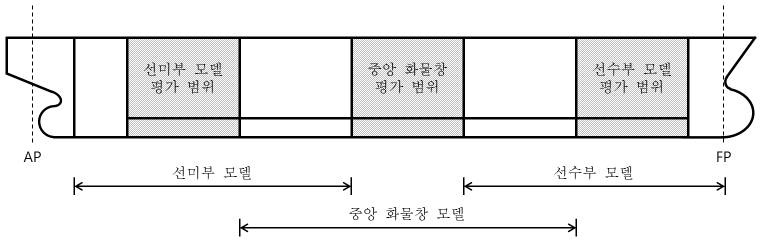
  **그림 2 모델 범위 및 평가 범위**

  | 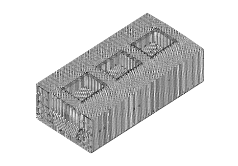 **그림 3 중앙부 화물창 모델그림** **그림 3 중앙부 화물창 모델그림** | 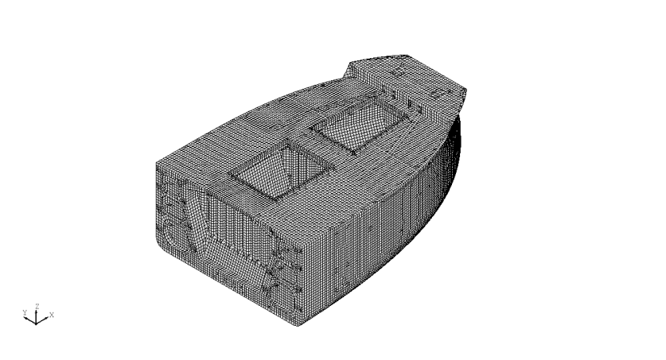 **그림 4 선수부 화물창 모델** **그림 4 선수부 화물창 모델** |
  | --- | --- |
  | 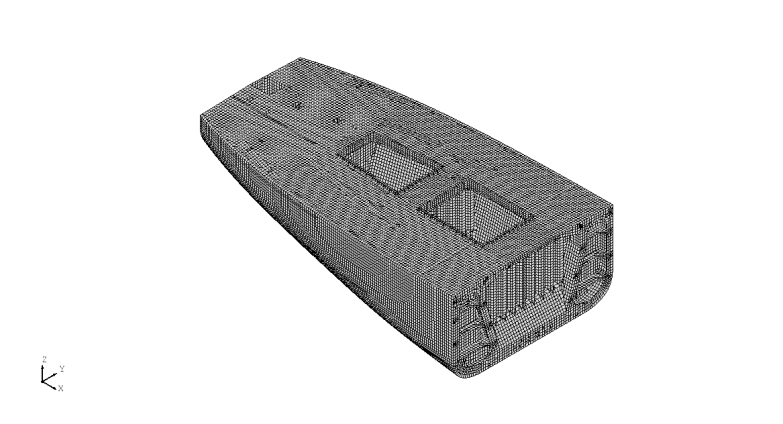 **그림 5 선미부 화물창 모델** **그림 5 선미부 화물창 모델** |   |

#### (나) 구조 모델화

구조 모델의 요소분할에 대해서는 다음의 (a)에서부터 (g)까지를 표준으로 한다.

- **(a)** 요소 분할 시 모델내의 응력 분포상태를 예상하여 적절한 분할 크기를 선정하여야 하며, 종횡비(aspect ratio)는 3을 넘지 않아야 한다.
- **(b)** 거더 부재와 같이 깊이방향으로 응력분포가 있는 부재에 대해서는 응력분포가 판별 가능하도록 요소분할을 하여야 한다.
- **(b)** 각 요소의 짧은 변의 길이는 종강도 부재 간격 정도로 한다.
- **(d)** 모든 보강재는 축, 비틀림, 두 방향 전단 및 굽힘 강성을 갖고 있는 보 요소로 모델링하여야 한다. 또한 보강재의 편심을 고려한 오프셋 빔을 사용해야 한다.
- **(e)** 1차 지지부재 및 브래킷의 면재는 봉 또는 보 요소를 사용하여 모델링하여야 한다.
- **(f)** 모델의 좌표계는 **표 1**과 같이 사용한다.
- **(g)** 1차 지지부재의 웨브 내의 개구를 나타내는 방법은 **표 2**에 따른다. 단, 개구가 모델링되지 않는 경우, 개구 인근의 요소 전단응력은 실제 개구에 따른 전단면적 감소에 따라 수정되어야하며 수정된 전단응력은 항복기준에 대한 검증을 위한 요소의 등가응력을 계산하는데 사용되어야 한다.

  | 좌표 | 방향 | 비고 |
  | --- | --- | --- |
  | $X$ | 길이방향 | 선미에서 선수(+) |
  | $Y$ | 폭방향 | 중심선면에서 좌현(+) |
  | $Z$ | 깊이방향 | 상향(+) |

  | $h _{0} /h<0.5$ and $g _{0} <2.0$ | 개구를 모델링할 필요가 없다. |
  | --- | --- |
  | $h _{0} /h \geq 0.5$ and $g _{0} \geq 2.0$ | 개구 형상을 모델링하여야 한다. |
  | 여기서 : $g _{0} =(1+ \frac{l _{0} ^{2}}{2.6(h-h _{0} ) ^{2}} )$ $l _{0}$ : 1차 지지부재 웨브의 길이 방향과 평행한 개구의 길이 ($\mathrm{m}$, **그림 6** 참조). 개구부 간의 거리, $d _{0}$가 $0.25h$보다 작은 연속된 개구의 경우, 길이, $l _{0}$는 **그림 7**과 같이 개구를 가로지르는 길이로 취하여야 한다. $h _{0}$ : 웨브의 깊이 방향과 평행한 개구의 높이 ($\mathrm{m}$, **그림 6** 및 **그림 7** 참조) $h$ : 개구가 위치한 1차 지지부재 웨브의 높이 ($\mathrm{m}$, **그림 6** 및 **그림 7** 참조) |   |

  | 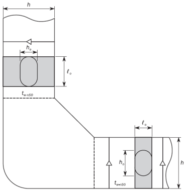 **그림 6 웨브 내의 개구** **그림 6 웨브 내의 개구** | 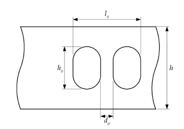 **그림 7 웨브 내의 개구** **그림 7 웨브 내의 개구** |
  | --- | --- |

### (4) 하중 적용

#### (가) 내부하중

- **(a)** 광석 등 입상화물에 의한 하중
- **(i)** 화물의 적재 높이 및 형상은 다음을 기준으로 한다. (**그림 8**, **그림 9** 및 **그림 10** 참조)
  - 화물의 적재형상은 화물창 종횡방향으로 수평하고 선측방향으로는 화물 적하각(repose angle, $\psi$)의 1/2로 하향 경사진다고 가정한다. (호퍼 경사각에 의해 화물창이 종횡방향으로 균일하지 않을 경우, 화물창 중앙의 횡단면 형상이 종방향으로 균일하다고 가정한다.)
  - 화물창 중앙부 수평부분 폭 $b_iB$는 화물창폭의 1/4로 가정한다.
  - 적재높이 $h_c$ 는 적재되는 화물의 질량, 화물 적하각, 밀도에 따라 결정한다. 길이 방향의 적하형상은 폭방향 형상으로 일정하다고 가정한다.
  - 화물의 밀도 및 적하각은 아래와 같이 고려되어야 한다.

  |   | 화물 밀도 $\gamma$ ($rm"ton"/m^3$) | 화물 적하각 $\psi$(${}^{\circ}$) |
  | --- | --- | --- |
  | 저비중 화물 | $M ' /V _{H}$(≥1.0) | 35 |
  | 고비중 화물 | 3.0 | 35 ^1) |
  | ^1) 화물적하각이 35° 이외의 조건이 있는 경우에는 추가 고려되어야 한다. |   |   |

  $M '$ : 해당 화물창의 산적화물 중량으로 아래의 수식을 따른다.
  $M ' =M+ \frac{1}{n} Min(3000, 0.1M)$ ($t$)
  $M$ : 해당 화물창의 최대 허용 산적화물 중량 ($t$)
  $n$ : 전체 화물창 중 하나의 화물창에 적재하는 최소 적재횟수
  $V _{H}$ : 창구코밍에 둘러 쌓인 부피를 제외한 창구코밍과 상갑판 이 교차하는 높이까지의 화물창 용적, $m ^{3}$
  
  **그림 8 화물창의 적재형상 (저비중화물)**
  - **(ii)** 화물창 내벽에 작용하는 화물의 하중, $w$는 다음 식에 의한다.
    $w = 9.81 \gamma h K_C$ ($\mathrm{N}/mm^2$)
    여기서,
    $\gamma$ : 화물의 밀도($\mathrm{kg}/m^3$)
    $h$ : 고려하는 패널로부터 직상부 화물 표면까지의 수직 높이($\mathrm{m}$)
    $K_C$ : $K_C =\cos ^{2} \beta +(1-\sin \psi )\sin ^{2} \beta$
    $\beta$ : 빌지호퍼 탱크의 경사판과 내저판 사이의 각(**그림 8** 참조)
    $\psi$ : 화물 적하각 (repose angle) (**그림 9** 참조)
    - 화물창 내벽에 작용하는 저비중 화물의 하중은 다음 식에 의한다.
    $h _{C} = h _{HPU} + h _{0}$
    여기서,
    $h _{0} = \frac{S _{A}}{B _{H}}$
    $S_A = S_o + V_\frac{HC}{l_H}$
    $h_HPU$ : 톱사이드 탱크와 선측외판 또는 내측판과의 하부교점과 내저판사이의 수직거리($\mathrm{m}$)
    $S_o$ : 톱사이드 탱크와 선측외판 또는 내측판과의 하부교점 상방으로 상갑판 높이까지의 음영면적($\mathrm{m}^2$)
    $V_HC$ : 창구코밍으로 폐위된 용적($\mathrm{m}^3$)
    - 화물창 내벽에 작용하는 고비중 화물의 하중은 다음 식에 의한다.
    ∙ **그림 9**와 같이 $h _{1} \geq 0$인 경우
    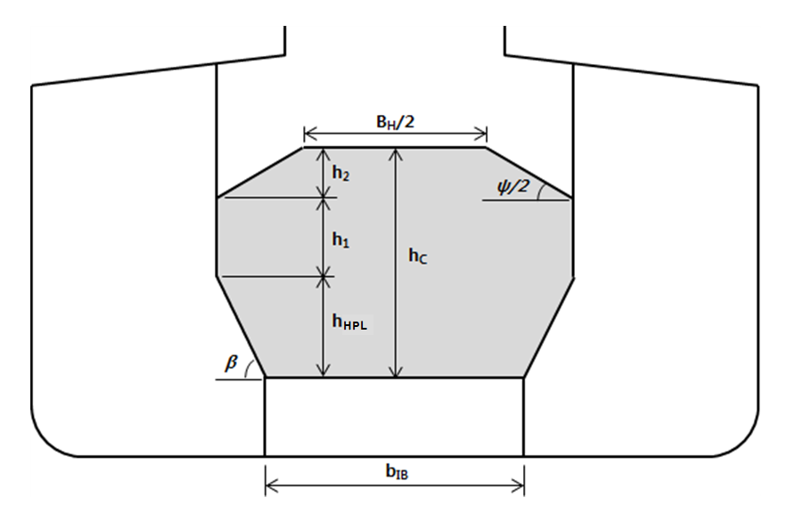
    **그림 9 화물창의 적재형상 (고비중화물,** #eqnID-3264**)**
    $h _{C} = h _{HPL} + h _{1} + h _{2}$
    여기서,
    $h_HPL$ : 호퍼탱크와 내측판과의 상부교점과 내저판사이의 수직거리($\mathrm{m}$)
    $h_1$ : 수직거리($\mathrm{m}$)로서 다음 식에 따른다.
    $h _{1} = \frac{M '}{\rho B _{H} l _{H}} - \frac{B _{H} + b _{IB}}{2 B _{H}} h _{HPL} - \frac{3}{16} B _{H} \tan \frac{\psi}{2} + \frac{V _{TS}}{B _{H} l _{H}}$
    $M '$ : 해당 화물창의 산적화물 중량으로 아래의 수식을 따른다.
    $M ' =M+ \frac{1}{n} Min(3000, 0.1M)$
    $M$ : 해당 화물창의 최대 허용 산적화물 중량 ($t$)
    $n$ : 전체 화물창 중 한 화물창에 적재하는 최소 적재횟수
    $B_H$ : 화물창의 폭($\mathrm{m}$)
    $l_H$ : 화물창의 길이($\mathrm{m}$)
    $b_IB$ : 이중저의 폭($\mathrm{m}$)
    $V_TS$ : 고려하는 화물창 길이, $l_H$ 내에서 횡격벽의 하부에 있는 횡스툴의 전체용적($\mathrm{m}^3$). 이 용적에서 횡격벽을 통과하는 호퍼탱크의 부분의 용적은 제외한다.
    $h_2$ : 폭에 따른 산적화물의 상부표면 높이($\mathrm{m}$)로서 다음 식에 따른다.
    $h_2 = B_\frac{H}{4} \tan \frac{\psi}{2}$, $0 <= \left| y \right| <= B_\frac{H}{4}$ 인 경우
    $h_2 = \left( \frac{B_H}{2} - \left| y \right| \right) \tan \frac{\psi}{2}$, $B_\frac{H}{4} <= \left| y \right| <= B_\frac{H}{2}$ 인 경우
    ∙ **그림 10**과 같이 $h _{1} <0$인 경우
    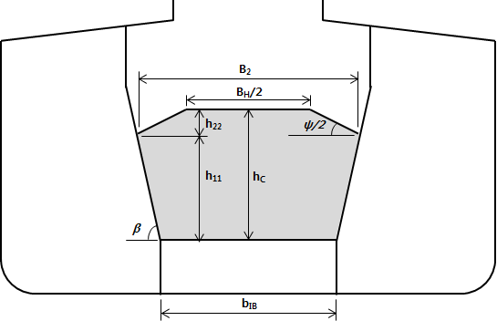
    **그림 10 화물창의 적재형상 (고비중화물,** #eqnID-3292**)**
    $h _{C} = h _{11} + h _{22}$
    여기서,
    $h _{11}$ : 수직거리(m)로서 다음 식에 따른다.
    $h _{11} =h _{HPL} \left( \frac{B _{2} -b _{IB}}{B _{H} -b _{IB}} \right)$
    $h _{22}$ : 수직거리(m)로서 다음 식에 따른다.
    $h _{22} = \left( \frac{B _{2}}{2} - \frac{B _{H}}{4} \right) \tan \frac{\psi}{2}$
    $B _{2} = \sqrt {\frac{\frac{1}{l _{H}} \left( \frac{M '}{\rho _{c}} +V _{TS} \right) + \frac{1}{2} \left( \frac{h _{HPL} \cdot b _{IB}^{2}}{B _{H} -b _{IB}} \right) + \frac{B _{H}^{2}}{16} \tan \frac{\psi}{2}}{\frac{1}{2} \left[ \left( \frac{h _{HPL}}{B _{H} -b _{IB}} \right) + \frac{1}{2} \tan \frac{\psi}{2} \right]}}$
    - 수직방향의 전체 힘을 평가하기 위하여, 산적건화물에 의하여 빌지호퍼탱크 및 하부스툴의 경사판에 작용하는 전단하중을 고려하여야한다. 정수 중 산적건화물에 의하여 경사부재에 작용하는 전단하중은 다음 식에 의한다.
    $w _{sh} =9.81 \gamma \frac{(1-K _{C} )(h _{C} +h _{DB} -z)}{\tan \beta}$
    $z$ : 이중저로부터 고려하는 위치까지의 수직거리
- **(b)** 평형수에 의한 하중
  평형수창에 있어서 각 위치에서의 수두, $h_W$는 다음 식에 따른다.
  $h_W = \mathrm{Max}(0.85(h + \Delta h) , h)$ ($\mathrm{m}$)
  여기서,
  $h$ : 고려하는 위치에서 탱크의 넘침관(overflow pipe)의 1/2지점까지의 높이 ($\mathrm{m}$)
  $\Delta h$ : 다음 식에 의한다.
  $\Delta h = 16/L (l_t - 10) + 0.25(b_t - 10)$
  $l_t$ : 탱크의 길이($\mathrm{m}$)로서 $rm 10 m$ 이하일 때는 $rm 10 m$로 한다.
  $b_t$ : 탱크의 너비($\mathrm{m}$)로서 $rm 10 m$ 이하일 때는 $rm 10 m$로 한다.
- **(c)** 수압시험 상태에서의 하중
  수압시험의 수두는 탱크 정판상 $2.4 \mathrm{m}$의 위치로 한다.

#### (나) 정수압

정수압은 **3편 부록 3-2 III 1항 (8)**호를 따른다.

#### (다) 파랑하중

파랑하중은 **3편 부록 3-2 III 1항 (9)**호를 따른다.

#### (라) 선체자중

중력가속도를 고려한 선체의 자중을 적용한다.

#### (마) 상부 구조물 하중

구조 모델에 포함이 되어 있다면 중력가속도를 고려하여 하중을 계산한다. 구조모델에서 생략하고자 한다면, 해당 구조의 하중을 해당 갑판 절점에 분할하여 분포시킨다.

#### (바) 주엔진 하중

주엔진의 하중을 주엔진 받침 절점에 분할하여 분포시킨다.

#### (사) 선체 거더 전단력의 고려

- **(a)** 선체 거더 전단력은 각 화물창 중심의 횡격벽의 위치에서 계산하여야 하며, 목표값은 다음과 같이 정해진다. 또한 각 횡격벽에서의 부호는 **표 5**, **표 6** 및 **표 7**의 적재조건과 같이 적용한다.
  $Q _{targ} =F _{s} +F _{w}$
  여기서,
  $F _{s}$ : 정수 중 전단력($\mathrm{kN}$)
  $F _{w}$ : 파랑 전단력으로서 **규칙 3편 3장 3절 301**을 따른다.($\mathrm{kN}$)
- **(b)** 중앙부 화물창의 경우 **규칙 13편 1부 7장 2절**을 따르며, 선수미 화물창의 경우 규칙 13편 **1부** 7장 2절을 따른다.
- **(e)** 전단 흐름의 직접 계산은 **규칙 13편 1부 5장 부록 1**을 따른다.

#### (아) 선체 거더 굽힘 모멘트의 고려

- **(a)** 선체 거더 굽힘모멘트의 조정은 전단력을 조정한 후에 적용한다.
- **(b)** 수직 굽힘 모멘트 해석에 있어서 목표 선체 거더 굽힘모멘트는 유한 요소 모델 내의 중앙부 화물창의 중앙부에서 발생할 수 있는 최대 수직 굽힘 모멘트이다. 선체 거더 굽힘모멘트의 목표값은 다음과 같이 구해진다.
  $M _{v-targ} =M _{s} +M _{w}$
  여기서 :
  $M _{s}$ : 정수 중 수직 굽힘 모멘트($\mathrm{kNm}$)
  $M _{w}$ : 파랑 수직 굽힘 모멘트로서 **3편 3장 표 3.3.1**에 따른다.($\mathrm{kNm}$)
- **(c)** 모델에 가해진 국부 하중에 의하여 야기되는 선체 거더 굽힘 모멘트의 분포는 **규칙 13편 1부 7장 2절**에 따라 단순 보 이론을 사용하여 계산된다.
- **(d)** 목표 수직 굽힘 모멘트에 도달해야 하는 경우, 모델의 중앙부 화물창에서 이 목표값을 발생시키기 위하여 추가적인 수직 굽힘 모멘트가 화물창 유한요소모델의 양쪽 단부에 적용되어야 한다. 이러한 단부 수직 굽힘 모멘트는 다음에 따른다.
  $M _{Y-aft} =M _{v-targ} -M _{"V_FEM"} (x _{v-"\max"} )$
  $M _{Y-fwd} =-M _{Y-aft}$
  여기서,
  $x _{v-"\max"}$ : 중앙부 화물창에서 국부 하중에 의해 최대 굽힘 모멘트가 발생하는 길이방향 위치($\mathrm{m}$)
  $M _{Y-fwd}$ : 유한요소모델의 전단에 적용되는 추가적인 수직 굽힘 모멘트($\mathrm{kNm}$)
  $M _{Y-aft}$ : 유한요소모델의 후단에 적용되는 추가적인 수직 굽힘 모멘트($\mathrm{kNm}$)
  $M _{"V_FEM"}$ : 국부 하중에 의해 $x _{v-"\max"}$ 위치에서 발생하는 수직 굽힘 모멘트($\mathrm{kNm}$)
- **(e)** 선수부 및 선미부 화물창 구조해석의 굽힘 모멘트 조정 절차는 **규칙 13편 1부 7장 2절 4.4.9**를 따른다.

#### (자) 적재조건

고려하는 적재 조건은 만재 시(고비중/저비중), 평형수 적재, 다항 적재, 항구 적재를 기준으로 한다. 특수한 적재상태가 예상될 경우 그러한 적하 상태도 계산에 포함되어야 한다. **표 5**, **표 6** 및 **표 7**은 중앙부 화물창 및 선수미 화물창의 적재 조건이다. 적재 조건은 적하지침서, 적하순서 및 구획배치에 따라 변경될 수 있으며, 적하지침서에 다항적재 조건이 없는 경우, **표 5**, **표 6** 및 **표 7**의 다항적재 조건은 생략 가능하며 [no MP] 부기부호를 부여 한다.

### (5) 횡파에 의한 동적전단력 적용

#### (가) 일반

- **(a)** 횡파에서 메타센터 높이가 클 경우 횡동요가 크게 발생되고 이로 인한 동적전단력에 대한 횡부재의 안전성을 위하여 BSR 및 BSP 하중조건이 **표 8** 과 **표 9** 에 보인 바와 같이 적용되어야 한다. BSR 및 BSP 하중조건의 의미는 다음과 같다.
  BSR-1P 와 BSR-2P : 좌현으로부터 오는 파도에 의하여 좌현의 상하방향으로의 횡동요 운동을 최소화 및 최대화하는 횡파에 대한 등가설계파
  BSR-1S 와 BSR-2S : 우현으로부터 오는 파도에 의하여 우현의 상하방향으로의 횡동요 운동을 최대화 및 최소화하는 횡파에 대한 등가설계파
  BSP-1P 와 BSP-2P : 중앙부 흘수선에서 좌현의 동적수압을 최대화 및 최소화 하는 횡파에 대한 등가설계파
  BSP-1S 와 BSP-2S : 중앙부 흘수선에서 우현의 동적수압을 최대화 및 최소화 하는 횡파에 대한 등가설계파
- **(b)** BSR 및 BSP 하중조건은 중앙화물창 모델에 대하여 화물비중 $\gamma =3.0$ ($rm"ton"/m^3$) 에 해당하는 고비중 화물의 만재적재 조건에 대하여 적용한다. 하중 적재 패턴은 표 5의 1번에 해당하는 적재조건이 적용되어야 한다.

#### (나) 하중 적용

- **(a)** BSR 및 BSP 하중조건에 대한 기호의 정의는 다음과 같다.
  $T_\theta$ : 횡동요 주기 (s)로 다음 식에 의한다.
  $T _{\theta } = \frac{2.3 \pi k _{r}}{\sqrt {g GM}}$.
  여기서;
  $k _{r}$ : 횡동요 회전반경(m), 적하지침서에서 명시하지 않는 경우 0.25B가 사용되어야 한다.
  $GM$ : 메타센터 높이($\mathrm{m}$), 적하지침서에서 명시하지 않는 경우 0.20B가 사용되어야 한다.
  $g$ : 9.81$m/s ^{2}$
  $\theta$ : 횡동요 각도(deg)로 다음 식에 의한다.
  $\theta = \frac{9000(1.25-0.025 T _{\theta } )f _{BK}}{(B+75) \pi}$
  여기서,
  $f_BK$ : 다음식에 의한다:
  $f_BK =1.2$, 빌지킬이 없는 선박의 경우.
  $f _{BK} =1.0$, 빌지킬이 있는 선박의 경우
  $T _{\phi}$ : 종동요 주기(s)는 다음 식에 의한다.
  $T _{\phi } = \sqrt {\frac{2.6 \pi L}{g}}$
  $\phi$ : 종동요 각도(deg)는 다음 식에 의한다.
  $\phi =1350 L ^{-0.94 } \left\{ 1 + \frac{3.0}{\sqrt {gL}} \right\}$
  $a _{0}$ : 가속도 변수는 다음 식에 의한다.
  $a _{0} =(1.58-0.47C _{B} ) \left( \frac{2.4}{\sqrt {L}} + \frac{34}{L} - \frac{600}{L ^{2}} \right)$
  $x, y, z$ : 고려하는 위치의 X, Y 및 Z 좌표 (m) 로 원점은 선박의 종방향 대칭면, L의 선미단 및 기준선 사이의 교차점이다.
  $R$ : 선박 회전 중심에 대한 수직좌표(m)는 다음 식에 의한다.
  $R = \min \left( \frac{D}{4} + \frac{T _{LC}}{2} , \frac{D}{2} \right)$
  $T _{SC}$ : 설계흘수
  $f _{\beta }$ : 파도의 진행방향에 대한 수정계수로서 다음 식에 따른다.
  $f _{\beta } =0.8$, 최대파랑하중 설계하중시나리오에 대한 BSR 및 BSP 하중상태

  | **하중성분** | **BSR-1P** | **BSR-2P** | **BSR-1S** | **BSR-2S** | **BSP-1P** | **BSP-2P** | **BSP-1S** | **BSP-2S** |
  | --- | --- | --- | --- | --- | --- | --- | --- | --- |
  | EDW | BSR |   |   |   | BSP |   |   |   |
  | 파랑 | 횡파 |   |   |   | 횡파 |   |   |   |
  | 영향 | 최대 횡동요 |   |   |   | 수선에서의 최대 압력 |   |   |   |
  | VWBM | 새깅 | 호깅 | 새깅 | 호깅 | 새깅 | 호깅 | 새깅 | 호깅 |
  | VWSF | 선미(-) 선수(+) | 선미(+) 선수(-) | 선미(-) 선수(+) | 선미(+) 선수(-) | 선미(-) 선수(+) | 선미(+) 선수(-) | 선미(-) 선수(+) | 선미(+) 선수(-) |
  | HWBM | 우현 인장 | 좌현 인장 | 우현 인장 | 좌현 인장 | 우현 인장 | 좌현 인장 | 우현 인장 | 좌현 인장 |
  | Surge | - | - | - | - | 선수방향 | 선미방향 | 선수방향 | 선미방향 |
  | $a _{surge}$ | - | - | - | - |  |  | 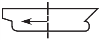 |  |
  | Sway | 우현방향 | 좌현방향 | 우현방향 | 좌현방향 | 우현방향 | 좌현방향 | 우현방향 | 좌현방향 |
  | $a_{sway }$ |  |  | 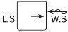 |  |  |  |  |  |
  | 상하동요 | 하향 | 상향 | 하향 | 상향 | 하향 | 상향 | 하향 | 상향 |
  | $a _{heave}$ |  |  |  | 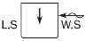 |  |  |  |  |
  | 횡동요 | 우현 하향 | 우현 상향 | 좌현 하향 | 좌현 상향 | 우현 하향 | 우현 상향 | 좌현 하향 | 좌현 상향 |
  | $a _{roll}$ |  |  |  |  |  |  |  |  |
  | 종동요 | 선수 상향 | 선수 하향 | 선수 상향 | 선수 하향 | 선수 상향 | 선수 하향 | 선수 상향 | 선수 하향 |
  | $a _{p i tch}$ |  |  |  |  |  |  |  |  |
  | Note) VWBM & VWSF : 파랑 수직굽힘 모멘트 및 전단력 **Pt. 3, Ch 3**을 따른다 . HWBM : 파랑 수평굽힘 모멘트로 **(B)**에 정의된 식에 의한다. $WS$ : 풍상측, 오는 파도에 노출된 선박의 측면. $LS$ : 풍하측, 오는 파도에 노출되지 않은 선박의 보호된 측면. |   |   |   |   |   |   |   |   |
- **(b)** 선체운동 가속도는 다음에 의한다.
  전후동요에 의한 종가속도($\mathrm{m}/s^2$)는 다음 식에 의한다.
  $a _{surge} =0.25 a _{0} g$
  좌우동요에 의한 횡가속도($\mathrm{m}/s^2$)는 다음 식에 의한다.
  $a _{sway} =0.55 a _{0} g$
  상하동요에 의한 수직가속도($\mathrm{m}/s^2$)는 다음 식에 의한다.
  $a _{heave} = a _{0} g$

  | **하중성분** |   | **LCF** | **BSR-1P** | **BSR-2P** | **BSR-1S** | **BSR-2S** | **BSP-1P** | **BSP-2P** | **BSP-1S** | **BSP-2S** |
  | --- | --- | --- | --- | --- | --- | --- | --- | --- | --- | --- |
  | 선체거더하중 | $M _{wv}$ | $C _{WV}$ | -0.1 | 0.1 | -0.1 | 0.1 | -0.4 | 0.4 | -0.4 | 0.4 |
  | 선체거더하중 | $Q _{wv}$ | $C _{QW}$ | 0.1 | -0.1 | 0.1 | -0.1 | 0.3 | -0.3 | 0.3 | -0.3 |
  | 선체거더하중 | $M _{wh}$ | $C _{WH}$ | 0.4 | -0.4 | -0.4 | 0.4 | 0.4 | -0.4 | -0.4 | 0.4 |
  | 종가속도 | $a _{surge}$ | $C _{XS}$ | 0.0 | 0.0 | 0.0 | 0.0 | -0.15 | 0.15 | -0.15 | 0.15 |
  | 종가속도 | $a _{"pitch-x"}$ | $C _{XP}$ | 0.4 | -0.4 | 0.4 | -0.4 | 0.45 | -0.45 | 0.45 | -0.45 |
  | 종가속도 | $gsin \phi$ | $C _{XG}$ | -0.3 | 0.3 | -0.3 | 0.3 | -0.25 | 0.25 | -0.25 | 0.25 |
  | 횡가속도 | $a _{sway}$ | $C _{YS}$ | 0.5 | -0.5 | -0.5 | 0.5 | 0.4 | -0.4 | -0.4 | 0.4 |
  | 횡가속도 | $a _{roll-y}$ | $C _{YR}$ | 1.0 | -1.0 | -1.0 | 1.0 | 1.0 | -1.0 | -1.0 | 1.0 |
  | 횡가속도 | $gsin \theta$ | $C _{YG}$ | -1.0 | 1.0 | 1.0 | -1.0 | -0.9 | 0.9 | 0.9 | -0.9 |
  | 수직가속도 | $a _{heave}$ | $C _{ZH}$ | -0.25 | 0.25 | -0.25 | 0.25 | 0.5 | -0.5 | 0.5 | -0.5 |
  | 수직가속도 | $a _{roll-z}$ | $C _{ZR}$ | 1.0 | -1.0 | 1.0 | -1.0 | 1.0 | -1.0 | -1.0 | 1.0 |
  | 수직가속도 | $a _{"pitch-z"}$ | $C _{ZP}$ | 0.4 | -0.4 | 0.4 | -0.4 | 0.45 | -0.45 | 0.45 | -0.45 |

  횡동요에 의한 각가속도($\mathrm{rad}/s ^{2}$)는 다음 식에 의한다.
  $a _{roll} = \theta \frac{\pi}{180} \left( \frac{2 \pi}{T _{\theta }} \right) ^{2}$
  종동요에 의한 각가속도($\mathrm{rad}/s ^{2}$)는 다음 식에 의한다.
  $a _{"pitch"} =1.5 \phi \frac{\pi}{180} \left( \frac{2 \pi}{T _{\phi }} \right) ^{2}$
  임의 위치에서 관성하중을 도출하기 위한 가속도는 선박 고정 좌표계에 관하여 정의된다. 따라서 정의되는 가속도 값들은 일시적인 횡동요각으로 인한 중력 가속도 요소를 포함한다.
  각각의 동적하중 상태에 대한 임의 위치에서의 종가속도는 다음 식에 의한다.
  $a _{X} =-C _{XG} g \sin \phi +C _{XS} a _{surge } +C _{XP} a _{"pitch"} (z-R)$
  각각의 동적하중 상태에 대한 임의 위치에서의 횡가속도는 다음 식에 의한다.
  $a _{Y} =C _{YG} g \sin \theta +C _{YS} a _{sway} -C _{YR} a _{roll} (z-R)$
  각각의 동적하중 상태에 대한 임의 위치에서의 수직가속도는 다음 식에 의한다.
  $a _{Z} =C _{ZH} a _{heave} +C _{ZR} a _{roll} y -C _{ZP} a _{"pitch"} (x-0.45L)$
- **(c)** 선체거더 하중
  파랑 수직 굽힘 모멘트 및 전단력은 **(4)**의 (사) 및 (아) 에 따른다. 파랑 수형굽힘 모멘트(kNm)는 다음 식 에 의한다,
  $M _{wh} = f _{nlh} \left( 0.31+ \frac{L}{2800} \right) f _{m} C _{"w"} L ^{2} T _{SC} C _{B}$
  여기서 :
  $f _{nlh}$ : 비선형 효과를 고려하는 계수로서 다음과 같다.
  $f _{nlh} =0.9$
  $f _{m}$ : 분포계수로서 다음에 따른다.
  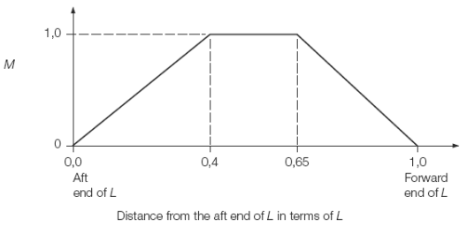
  $C _{w}$ : Wave coefficient, in $\mathrm{m}$, to be taken as:
  $C _{w} =10.75-left( \frac{300-L}{100} right) ^{1.5}$ for $90 \leq L \leq 300$
  $C _{w} =10.75$ for $300\(C _{w} =10.75- \left( \frac{L-350}{150} \right) ^{1.5}$ for \(350
- **(d)** BSR 하중상태에 대한 동적수압
  임의의 하중점에서 BSR-1 및 BSR-2 하중상태에 대한 파랑압력, $P _{W}$ ($\mathrm{kN}/m ^{2}$), **표 10**, **그림 13** 및 **그림 14**에 따른다. 전체 외부 수압은 $P _{S} +P _{W}$ 로 계산되어야 하며, $P _{S}$ 는 임의의 하중점에서 정수중 수압을 말한다.

  |   | 파랑압력, in $\mathrm{kN}/m ^{2}$ |   |   |
  | --- | --- | --- | --- |
  | 하중상태 | $z \leq T _{SC}$ | $T _{SC} \(z >h _{W} +T _{SC}$ |   |
  | BSR-1P | $P _{W} =\max (P _{BSR} , \rho g (z-T _{SC} ))$ | $P _{W} =P _{W,WL} - \rho g(z-T _{SC} )$ | $P _{W} = 0.0$ |
  | BSR-2P | $P _{W} =\max (-P _{BSR} , \rho g (z-T _{SC} ))$ | $P _{W} =P _{W,WL} - \rho g(z-T _{SC} )$ | $P _{W} = 0.0$ |
  | BSR-1S | $P _{W} =\max (P _{BSR} , \rho g (z-T _{SC} ))$ | $P _{W} =P _{W,WL} - \rho g(z-T _{SC} )$ | $P _{W} = 0.0$ |
  | BSR-2S | $P _{W} =\max (-P _{BSR} , \rho g (z-T _{SC} ))$ | $P _{W} =P _{W,WL} - \rho g(z-T _{SC} )$ | $P _{W} = 0.0$ |

  여기서;
  BSR-1P 및 BSR-2P 하중상태:
  $P _{BSR} =f _{\beta } f _{R} f _{nl} k _{a} k _{p} \left[ 9 y \sin \theta + \left( -0.95 f _{yB} - 2f _{zT } -0.2 \right) C _{W} \sqrt {\frac{L+ \lambda -125}{L}} \right]$
  BSR-1S 및 BSR-2S 하중상태:
  $P _{BSR} =f _{\beta } f _{R} f _{nl} k _{a} k _{p} \left[ -9 y \sin \theta + \left( -0.95 f _{yB} - 2f _{zT } -0.2 \right) C _{W} \sqrt {\frac{L+ \lambda -125}{L}} \right]$
  $f _{R}$ : 운항관련 수정계수로 다음에 따른다.
  $f _{R} =0.85$
  $f _{nl}$ : 비선형효과를 고려하는 수정계수로 다음에 따른다
  $f _{nl} =1.0$
  $k _{a } =k _{a-WL} f _{yB} + k _{a-CL} \left( 1-f _{yB} \right)$
  $k _{p } =k _{p-WL} f _{yB} + k _{p-CL} \left( 1-f _{yB} \right)$
  위상계수, $k _{a-WL}$, $k _{a-CL}$, $k _{p-WL}$ and $k _{p-CL}$ 은 다음에 따른다. 중간위치에서는 선형보간법에 의한다
  - BSR-1P 및 BSR-2P의 좌현 또는 BSR-1S 및 BSR-2S의 우현

  | $f _{xL}$ | 0.0 | 0.2 | 0.35 | 0.5 | 0.7 | 1.0 |
  | --- | --- | --- | --- | --- | --- | --- |
  | $k _{a-WL}$ | 0.4 | 0.9 | 1.05 | 1.0 | 0.9 | 0.6 |

  | $f _{xL}$ | 0.0 | 0.15 | 0.3 | 0.6 | 0.85 | 1.0 |
  | --- | --- | --- | --- | --- | --- | --- |
  | $k _{p-WL}$ | 2.0 | 2.0 | 1.6 | 1.0 | 1.0 | -1.0 |

  - BSR-1S 및 BSR-2S의 좌현 또는 BSR-1P 및 BSR-2P의 우현

  | $f _{xL}$ | 0 | 0.3 | 0.5 | 0.65 | 0.8 | 1.0 |
  | --- | --- | --- | --- | --- | --- | --- |
  | $k _{a-WL}$ | 0.2 | 0.75 | 1. | 1.1 | 1.0 | 0.8 |

  | $f _{xL}$ | 0.0 | 0.1 | 0.2 | 0.4 | 0.6 | 0.8 | 1.0 |
  | --- | --- | --- | --- | --- | --- | --- | --- |
  | $k _{p-WL}$ | 0.95 | 0.9 | 0.7 | 1.0 | 1.0 | 0.9 | 1.0 |

  - 중심선

  | $f _{xL}$ | 0.0 | 0.2 | 0.4 | 0.6 | 0.85 | 1.0 |
  | --- | --- | --- | --- | --- | --- | --- |
  | $k _{a-CL}$ | 1.5 | 1.5 | 1.0 | 1.0 | 2.0 | 2.0 |

  | $f _{xL}$ | 0.0 | 0.2 | 0.5 | 0.7 | 1.0 |
  | --- | --- | --- | --- | --- | --- |
  | $k _{p-CL}$ | -0.5 | -0.5 | 1.0 | 1.0 | 1.0 |

  $f _{xL}$ : 임의의 하중점의 X-좌표와 선체길이의 비로 다음 식에 의한다.
  $f _{xL} = \frac{x}{L}$, 단 0.0 보다 작거나 1.0보다 클 필요는 없다.
  $f _{zT}$ : 임의의 하중점의 $Z$ 좌표와 설계흘수의 비로 다음 식에 의한다.
  $f _{zT} = \frac{z}{T _{SC}}$, 단 1.0 보다 클 필요는 없다.
  $f _{yB}$ : 임의의 하중점의 $Y$ 좌표와 선체 폭의 비로 다음 식에 의한다.
  $f _{yB} = \frac{\left| 2y \right|}{B _{x}}$, 단 1.0 보다 클 필요는 없다.
  $f _{yB} =0$, 단, $B _{x} =0$ 일때
  $B _{x}$ : 고려하는 단면에서 흘수선에서 측정한 선박의 형 너비($\mathrm{m}$).
  $\lambda$ : 파장($\mathrm{m}$)으로 다음 식에 의한다.
  $\lambda = \frac{g}{2 \pi} T _{\theta }^{2}$
  $P _{W,WL}$ : 고려하는 동적 하중 상태에 대해 흘수선에서 파랑압력 ($\mathrm{kN}/m ^{2}$) 으로 다음에 따른다.
  $y=B _{x} /2$ 이고 $z=T _{SC}$ 인 경우 $P _{W,WL} =P _{BSR}$
  $h _{W}$ : 흘수선에서의 압력과 동등한 수두 (m)로 다음에 의한다.
  $h _{w} = \frac{P _{W,WL}}{rhog}$
  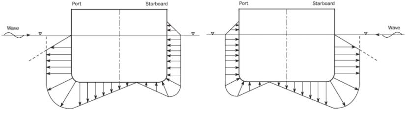
  **그림 13 BSR-1S (좌) 및 BSR-1P (우) 하중 상태에 대한 동적압력의 횡방향 분포**
  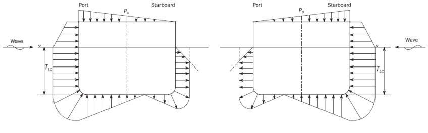
  **그림 14 BSR-2S (좌) 및 BSR-2P (우) 하중 상태에 대한 동적압력의 횡방향 분포**
- **(e)** BSP 하중상태에 대한 동적수압
  임의의 하중점에서 BSP-1 및 BSP-2 하중상태에 대한 파랑압력, $P _{W}$ ($\mathrm{kN}/m ^{2}$), **표 11**, **그림 15** 및 **16**에 따른다. 전체 외부 수압은 $P _{S} +P _{W}$ 로 계산되어야 하며, $P _{S}$ 는 임의의 하중점에서 정수중 수압을 말한다.

  |   | 파랑압력, in $\mathrm{kN}/m ^{2}$ |   |   |
  | --- | --- | --- | --- |
  | 하중상태 | $z \leq T _{SC}$ | $T _{SC} \(z >h _{W} +T _{SC}$ |   |
  | BSP-1P | $P _{W} =\max (P _{BSP} , \rho g (z-T _{SC} ))$ | $P _{W} =P _{W,WL} - \rho g(z-T _{SC} )$ | $P _{W} = 0.0$ |
  | BSP-2P | $P _{W} =\max (-P _{BSP} , \rho g (z-T _{SC} ))$ | $P _{W} =P _{W,WL} - \rho g(z-T _{SC} )$ | $P _{W} = 0.0$ |
  | BSP-1S | $P _{W} =\max (P _{BSP} , \rho g (z-T _{SC} ))$ | $P _{W} =P _{W,WL} - \rho g(z-T _{SC} )$ | $P _{W} = 0.0$ |
  | BSP-2S | $P _{W} =\max (-P _{BSP} , \rho g (z-T _{SC} ))$ | $P _{W} =P _{W,WL} - \rho g(z-T _{SC} )$ | $P _{W} = 0.0$ |

  여기서;
  $P _{BSP} = 1.25 f _{\beta } f _{R} f _{nl} k _{a} k _{p} f _{yz} C _{W} \sqrt {\frac{L+ \lambda -125}{L}}$
  $f _{R}$ : 운항관련 수정계수로 **(d)**에 따른다.
  $f _{nl}$ : 비선형효과를 고려하는 수정계수로 다음에 따른다
  극심한 해수 하중 설계 하중 시나리오, 중간위치에서는 선형보간법에 의한다.
  $f _{nl} =0.6$ at $f _{xL} =0$
  $f _{nl} =0.8$ at $f _{xL} =0.3$
  $f _{nl} =0.8$ at $f _{xL} =0.7$
  $f _{nl} =0.6$ at $f _{xL} =1$

  | 횡방향 위치 | BSP-1P 및 BSP-2P | BSP-1S 및 BSP-2S |
  | --- | --- | --- |
  | $y \geq 0$ | $f _{yz} = 10 \frac{z}{T _{SC}} +8.5f _{yB} +0.1$ | $f _{yz} = -1.3 \frac{z}{T _{SC}} -4f _{yB} +0.1$ |
  | $y < 0$ | $f _{yz} = -1.3 \frac{z}{T _{SC}} -4f _{yB} +0.1$ | $f _{yz} = 10 \frac{z}{T _{SC}} +8.5f _{yB} +0.1$ |

  $\lambda$ : 파장($\mathrm{m}$)으로 다음 식에 의한다.
  $\lambda =0.5L$
  $k _{a } =k _{a-WL} f _{yB} + k _{a-CL} \left( 1-f _{yB} \right)$
  $k _{p } =k _{p-WL} f _{yB} + k _{p-CL} \left( 1-f _{yB} \right)$
  위상계수, $k _{a-WL}$, $k _{a-CL}$, $k _{p-WL}$ 및 $k _{p-CL}$ 은 다음에 따른다. 중간위치에서는 선형보간법에 의한다.
  `
  - BSP-1P 및 BSP-2P의 좌현 또는 BSP-1S 및 BSP-2S의 우현

  | $f _{xL}$ | 0.0 | 0.2 | 0.35 | 0.5 | 0.6 | 0.8 | 0.9 | 1 |
  | --- | --- | --- | --- | --- | --- | --- | --- | --- |
  | $k _{a-WL}$ | 0.3 | 0.9 | 1.1 | 1.0 | 0.9 | 0.9 | 0.7 | 0.5 |

  | $f _{xL}$ | 0.0 | 0.2 | 0.4 | 0.9 | 1.0 |
  | --- | --- | --- | --- | --- | --- |
  | $k _{p-WL}$ | 1.0 | 0.9 | 1.0 | 1.0 | 0.5 |

  - BSP-1S 및 BSP-2S의 좌현 또는 BSP-1P 및 BSP-2P의 우현

  | $f _{xL}$ | 0 | 0.1 | 0.2 | 0.3 | 0.5 | 0.7 | 0.8 | 1.0 |
  | --- | --- | --- | --- | --- | --- | --- | --- | --- |
  | $k _{a-WL}$ | 0.2 | 0.3 | 0.5 | 0.8 | 1.0 | 1.15 | 1.1 | 0.9 |

  | $f _{xL}$ | 0.0 | 0.05 | 0.2 | 0.3 | 0.4 | 0.5 | 0.6 | 0.8 | 0.9 | 1.0 |
  | --- | --- | --- | --- | --- | --- | --- | --- | --- | --- | --- |
  | $k _{p-WL}$ | 0.5 | 1.2 | -0.4 | -0.1 | 0.6 | 1.0 | 0.9 | 0.3 | 0.8 | 1.0 |

  - 중심선

  | $f _{xL}$ | 0.0 | 0.2 | 0.4 | 0.6 | 0.85 | 1.0 |
  | --- | --- | --- | --- | --- | --- | --- |
  | $k _{a-CL}$ | 1.0 | 1.0 | 1.0 | 1.0 | 2.0 | 2.0 |

  | $f _{xL}$ | 0.0 | 0.35 | 0.5 | 0.8 | 1.0 |
  | --- | --- | --- | --- | --- | --- |
  | $k _{p-CL}$ | 1.6 | 1.6 | 1.0 | 1.5 | 1.0 |

  $P _{W,WL}$ : 고려하는 동적 하중 상태에 대해 흘수선에서 파랑압력 ($\mathrm{kN}/m ^{2}$) 으로 다음에 따른다.
  $y=B _{x} /2$ 이고 $z=T _{SC}$ 인 경우 $P _{W,WL} =P _{BSP}$
  그 외 기호는 **(d)** 에 정의한 바에 의한다.
  
  **그림 15 BSP-1P (좌) 및 BSP-1S (우) 하중 상태에 대한 동적하중의 횡방향 분포**
  
  **그림 16 BSP-2P (좌) 및 BSP-2S (우) 하중 상태에 대한 동적하중의 횡방향 분포.**
- **(e)** 내부 화물하중
  화물창 경계의 임의 하중점에 작용하는 산적건화물로 인한 전체압력(kN/m^2)은 다음에 따른다.
  $P _{i n} = w +P _{bd}$
  화물에 의한 정적압력은, $w$ (kN/m^2) **(4), (A), (a) (ii)**에 의한다. 화물에 의한 동적압력은, $P _{bd}$ (kN/m^2) 다음에 의한다.
  $P _{bd} =f _{\beta } \gamma [0.25a _{x} (x _{G} -x ) +0.25 a _{y} (y _{G} -y) +K _{C} a _{z} (z _{C} -z )] (kN/m ^{2} )$, $z\(P _{bd} = 0 (kNm ^{2})$, $z>z _{C}$ 인 경우
  여기서,
  $a _{x} , a _{y} , a _{z}$ : 무게중심 $x _{G} , y _{G} , z _{G}$. 에서 종, 횡 및 수직 가속도 (m/s2)
  $x _{G} , y _{G} , z _{G}$ : 고려하는 탱크의 또는 완전히 채워진 화물창의 무게중심으로 (d)에 정의된 기준 좌표계에 대한 X, Y, Z 좌표(m). 즉. $V _{Full}$, 에 대한 X, Y, Z 좌표. 부분적으로 채워진 화물창의 $x _{G} , y _{G} , z _{G}$ 는 다음과 같다.
  $x _{G} , y _{G}$ : 화물창에 대한 무게중심 체적
  $z _{G} = h _{DB} +h _{C} /2$, $h _{DB}$ 및 $h _{c}$ 는 **(4), (A), (a)**에 따른다.
  $V _{Full}$ : 창구코밍 상단까지 화물창의 부피 ()로서 다음에 의한 값
  $V _{Full} = V _{H} +V _{HC}$, $V _{H}$ 및 $V _{HC}$ 는 **(4), (A), (a)**에 의한다.
  $z _{c}$ : 기선으로부터 하중점의 화물창 상부표면까지의 높이(m)로서 다음에 의한 값
  $z _{c} =h _{DB} +h _{c}$
  $K _{C}$ : 계수로서 **(4), (A),** (a) 에 의한다.
  하중점 높이 $z$가 $z _{c}$ 이하인 경우, 화물 압력에 추가하여 하부 스툴판과 호퍼 탱크 경사판에 전단하중압력 $P _{bs-s} + P _{bs-d}$ 가 고려되어야 한다. 중력에 의한 정적 전단하중압력, $P _{bs-s}$는 **(4), (A), (a)** (ii) 의 $w _{sh}$에 의한다.
  동적 전단하중압력, $P _{bs-d}$ (판의 하방이 양(+), (kN/m^2))는 다음 식에 의한다.
  $P _{bs-d} =f _{\beta } \gamma a _{z} \frac{(1-K _{C} ) (z _{C} -z)}{\tan \beta}$
  내저판을 따라 작용하는 산적건화물 하중으로 인한 횡 방향(좌현 쪽이 양의 방향) 의 동적 전단하중압력 $P _{bs-dx}$ 및 $P _{bs-dy}$ (kN/m^2) 는 다음에 따른다.
  $P _{bs-dx} = -0.75 f _{\beta } \gamma a _{x} h _{C}$, 선체 길이 방향(선수(+))인 경우
  $P _{bs-dy} = -0.75 f _{\beta } \gamma a _{y} h _{C}$, 선체 폭 방향(좌현(+)) 인 경우

### (8) 국부 구조강도해석

#### (가) 적용

- **(a)** 국부 구조강도해석의 구조 상세부 목록은 다음과 같다.
  - 호퍼 너클
  - 개구부
  - 갑판 및 이중저의 종통보강재와 횡격벽과의 연결부
  - 파형격벽과 인접한 구조의 연결부
  - 창구 모서리
- **(b)** 직접강도해석으로 계산된 응력($\sigma _{"act"}$)이 허용응력($\sigma _{"a"llow}$)의 95% 이상인 범위의 기타 고응력 발생부위는 선급의 판단에 따라 상세해석을 추가 수행해야 한다.

#### (나) 구조상세분할

- **(a)** 국부 구조강도해석의 범위는 검토대상 구역으로부터 모든 방향으로 10개 이상의 요소여야 한다.
- **(b)** 국부 구조강도해석 범위 내의 모든 판 및 보강재는 쉘 요소로 표현되어야 한다.
- **(c)** 요소 코너의 각도가 45도 미만이거나 135도를 초과하는 비뚤어진 요소는 피해야 한다.
- **(d)** 요소의 종횡비는 가능한 1에 가깝게 유지되어야 하며, 3 이하여야 한다.
- **(e)** 국부 구조강도해석의 요소분할 크기는 구조를 잘 표현할 수 있어야 하며, 종통재 간격 미만으로 하여야 한다.
- **(f)** 개구부에 대하여 국부 구조강도해석을 진행할 경우, 개구부 주위에서 처음 두 층의 요소는 $rm50mm \times 50mm$ 이하의 크기로 모델링 되어야 한다. 개구 단부에 직접 용접된 단부 보강재는 쉘 요소로 모델링하여야 한다. 개구에 가까운 웨브 보강재는 개구의 단부로부터 최소한 50 $\mathrm{mm}$ 거리에 위치하며 봉 또는 보 요소를 이용하여 모델링 할 수 있다.

#### (다) 상세분할해석의 허용응력

- **(a)** 국부 구조강도해석 허용 응력은 다음의 기준을 만족하여야 한다.
  $\sigma _{"act_l"} < \sigma _{"allow_l"}$
  $\sigma _{"act_l"} = \sqrt {\sigma _{"x_l"} ^{2} + \sigma _{"y_l"} ^{2} - \sigma _{"x_l"} \sigma _{"y_l"} +3 \tau _{l} ^{2} }$
  $\sigma _{"allow_l"} = \eta \eta _{local} \sigma _{"yield_l"}$
  $\sigma _{"yield_l"} =235/K$ ($\mathrm{N}/mm ^{2}$)
  여기서 :
  $\eta$ : 항복강도 보정 계수는 **(6)**에 정의된 바에 따른다.
  $\eta _{local}$ : 국부 구조강도해석 조정 계수
  $\eta _{local}$ = 1.00, 요소의 크기$\leq$종통재 간격 ($\mathrm{mm}$)
  $\eta _{local}$ = 1.15, 요소의 크기$\leq 200 \times 200$ ($\mathrm{mm}$)
  $\eta _{local}$ = 1.25, 요소의 크기$\leq 100 \times 100$ ($\mathrm{mm}$)
  $\eta _{local}$ = 1.50, 요소의 크기$\leq 50 \times 50$ ($\mathrm{mm}$)
  $\sigma _{"act_l"}$ : 실제 계산된 응력 ($\mathrm{N}/mm ^{2}$)
  $\sigma _{"allow_l"}$ : 국부 구조강도해석에서의 허용 응력 ($\mathrm{N}/mm ^{2}$)
  $K$ : 재료 계수 (**3편 부록 3-2 표 5** 참조)
  $\sigma _{"x_l"}$ : 요소 좌표계 $x$방향 응력 ($\mathrm{N}/mm ^{2}$)
  $\sigma _{"y_l"}$ : 요소 좌표계 $y$방향 응력 ($\mathrm{N}/mm ^{2}$)
  $\tau_l$ : 요소 좌표계 $x-y$ 평면내의 응력 ($\mathrm{N}/mm ^{2}$)
- **(b)** 개구부 코너 부분을 평가할 경우, 아래와 같이 평균 응력을 구하여 평가할 수 있다.
  $\sigma _{"a"v} < \sigma _{"allow"}$
  $\sigma _{av} = \frac{\sum _{1} ^{n} A _{i} \sigma _{i}}{\sum _{1} ^{n} A _{i}}$
  여기서 :
  $\sigma _{"allow"}$ : 직접강도계산에서의 허용 응력 ($\mathrm{N}/mm ^{2}$)
  $\sigma _{av}$ : 고려하는 범위 안의 평균 응력 ($\mathrm{N}/mm ^{2}$)
  $\sigma _{i}$ : 고려하는 범위 안의 각 요소 응력 ($\mathrm{N}/mm ^{2}$)
  $A _{i}$ : 고려하는 범위 안의 각 요소 넓이 ($\mathrm{mm} ^{2}$)
  $n$ : 고려하는 범위 안의 요소 개수
  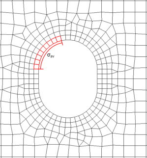
  **그림 21 평균 응력 예시**

### (9) 화물창 질량 곡선

#### (가) 각 화물창의 최대허용 적재중량 및 필요최소 적재중량을 만족하는 최소 및 최대 흘수를 아래 수식을 이용하여 계산하여야 한다. 중앙부 화물창 구조해석 시에는 2번 화물창에서 n-1번 화물창까지의 최대허용 적재중량 및 필요최소 적재중량을 만족해야 한다. 또한 선수부의 흘수는 1번 화물창, 선미부의 흘수는 n번 화물창의 최대허용 적재중량 및 필요최소 적재중량을 만족해야 한다. (그림 22 참조)

최대허용 중량 적용

#### (나) 인접한 두 개 화물창의 최대허용 적재중량 및 필요최소 적재중량을 만족하는 최소 및 최대 흘수를 아래 수식을 통하여 계산하여야 한다. 중앙부 화물창 구조해석 시에는 2번 및 3번 화물창에서 n-2번 및 n-1번 화물창까지의 최대허용 적재중량 및 필요최소 적재 중량을 만족해야 한다. 또한 선수부의 흘수는 1번 및 2번 화물창, 선미부의 흘수는 n번 및 n-1번 화물창의 최대허용 적재중량 및 필요최소 적재 중량을 만족해야 한다. (그림 22 참조)

최대허용 중량 적용
