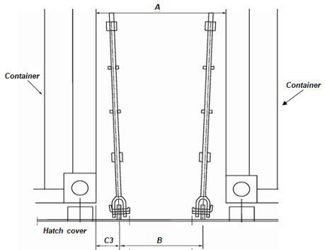
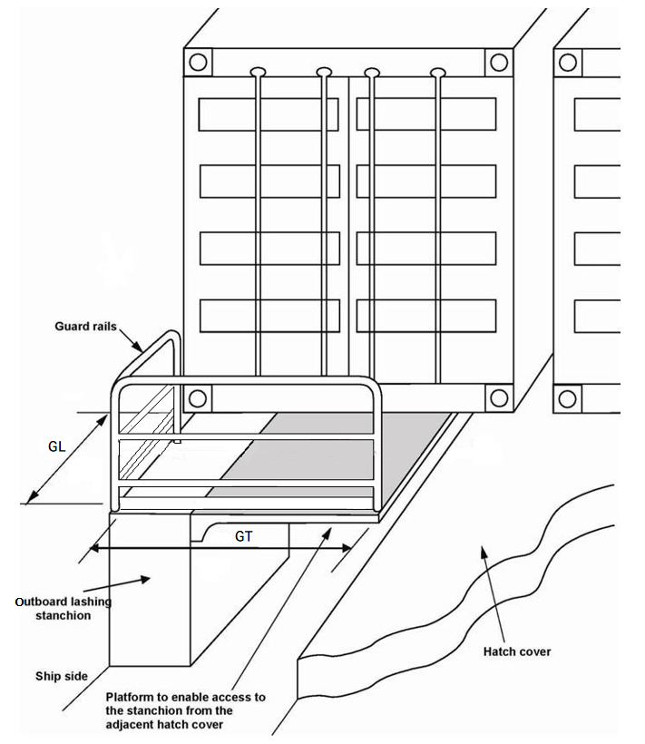
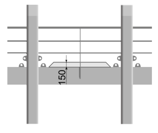

# 제7편 전용선박(1장~4장,7장~10장)

> 선급 및 강선규칙/적용지침 / RA-07A-K / 2025 / KO / Guidance

## 부록 7-11 개방갑판 상 컨테이너 고박을 위한 안전한 작업조건 제공에 대한 지침 (2019) 【규칙 참조】

### 1. 일반

#### (1) 목적

추가특기사항 CSAP는 개방갑판 상 컨테이너 고박 작업에 종사하는 사람들에게 안전한 작업, 특히 안전한 접근과 안전한 작업 공간의 제공을 목적으로 한다.

#### (2) 범위

추가특기사항 CSAP의 범위는 컨테이너 고박 작업에서 보다 안전한 작업 조건을 보장하는 것이다. 이 지침에서는 작업구역, 컨테이너 상부 작업, 펜싱 및 낙하 방지의 설계 및 배치, 장애물 및 개구부의 표시, 통로, 사다리, 계단 및 기타 접근 설비, 냉동 컨테이너의 전원 공급 장치와 작업구역과 이동구역의 조명에 관한 설계와 배치에 대한 요구 사항을 설명한다.

#### (3) 적용

이 지침에서 제시하는 요건을 준수하는 선박에는 추가특기사항 ‘CSAP’를 부여한다. CSAP는 개방갑판 상에 컨테이너를 운반하도록 설계된 선박에 적용 할 수 있으며, 요청에 따라 다른 선박에도 적용할 수 있다.

#### (4) 용어의 정의

- **(가)** 이 지침에서 사용하는 용어의 정의는 다음에 따른다.
  - 작업구역 : 컨테이너 고박장치를 조작하는 위치 또는 구역, 예, 창구 덮개 상부 컨테이너 적재 사이; 래싱브릿지와 플랫폼
  - 이동구역 : 통로, 계단, 갑판 및 선박에서 이동에 이용되는 기타 구역
  - 펜스 : 사람의 추락을 막을 수 있는 가드 레일, 안전 장벽 및 이와 유사한 구조물
  - 스트링거 : 사다리의 수직부 또는 측면부
  - 수직 사다리 발판(rungs) : 사다리의 계단을 형성하는 바(bar)

### 2. 제출문서

#### (1) 화물안전접근도가 승인을 위하여 제출되어야 하며, 다음의 내용을 포함하여야 한다.

- 작업구역 및 이동구역의 배치 및 상세

### 3. 설계 요건

#### (1) 일반

- **(가)** 화물안전접근도(Cargo Safe Access Plan, CSAP)는 의도된 모든 컨테이너 적재 상태에 대해 고박작업이 안전하게 수행될 수 있도록 설계 단계에서 개발되어야 한다.
- **(나)** 일반적으로 화물안전접근도는 다음과 같은 위험성 평가를 기반으로 개발되어야한다.
  - 미끄러짐, 넘어짐
  - 추락
  - 수동으로 고박장치를 취급하는 동안의 부상
  - 추락하는 고박장치 또는 다른 물체에 의한 충격
  - 컨테이너 하역 및 적재 작업으로 인한 손상위험(심각한 손상을 방지하기 위한 적절한 보호장치 또는 기타의 방법을 개발하기 위하여 고 위험지역(high-risk area)이 식별되어야 한다.)
  - 인접한 지역의 전기 위험(온도 제어 장치 케이블 연결 등)
  - 컨테이너 고박작업을 안전하게 수행하기 위해 필요한 모든 영역에 대한 적절한 접근 설비
  - 래싱 장비를 다루기 위한 인간공학(예: 장비의 크기와 무게)
  - 하이큐브(9‘6“) 컨테이너 고박 및 40피트/45피트 컨테이너의 혼합 적재

#### (2) 이동구역

- **(가)** 이동구역의 최소 여유 공간은 높이가 2m 이상이고 너비가 600 mm 이상이어야 한다(**표 1** B, J 및 F1참조).
- **(나)** 이동구역의 표면은 미끄럼 방지가 되어야 한다.
- **(다)** 안전을 위하여 필요한 경우, 갑판 위의 통로는 페인트 칠 된 선이나 그림으로 표시되어야 한다.
- **(라)** 넘어질 위험을 초래할 수 있는 클리트, 리브 및 브래킷과 같은 이동구역 내 접근로에 있는 모든 돌출부는 대조되는 색상으로 강조 표시를 해야 한다.
- **(마)** 실행 가능한 한, 접근 사다리와 통로는 작업자가 배관을 타고 오르거나 영구 장애물이 있는 곳에서 일할 필요가 없도록 설계되어야 한다.

#### (3) 작업구역

- **(가)** 작업구역에서는 3단 높이의 래싱바가 사용되지 않도록 설계되어야하며, 고박장비 보관 구역과 가까워야 한다.
- **(나)** 작업구역은 갑판 배관, 보관상자 및 창구덮개의 재배치를 위한 가이드와 같은 방해물에 의해 방해받지 않도록 설계되어야 한다.
- **(다)** 래싱 포인트로부터 컨테이너까지 수평 거리는 1,100 $\mathrm{mm}$를 초과하지 않아야 하며, 래싱브릿지까지는 220 $\mathrm{mm}$이상, 그 외의 위치까지는 130 $\mathrm{mm}$ 이상이어야 한다(**표 1** C1, C2 및 C3 참조). 40피트 및 45피트 컨테이너 적재를 위해 설계된 컨테이너 베이의 경우, 40피트 컨테이너에 대해 측정했을 때, C1 치수는 기국의 승인에 따라 1,300 $\mathrm{mm}$까지로 완화 할 수 있다.
- **(라)** 작업구역의 폭은 750 $\mathrm{mm}$ 이상이어야 한다. 또한, 영구 래싱브릿지의 폭은 펜스의 상부 레일 사이에서 750 $\mathrm{mm}$ 이상이어야 하며, 적재 선반, 래싱 클리트 및 기타 장애물 사이에서는 최소한 600 $\mathrm{mm}$의 거리가 명확히 제공되어야 한다(**표 1** A, GL, GT, I, F 및 F1 참조).
- **(마)** 창구 끝단 및 선측 래싱 위치(outboard lashing positions)의 끝에는 플랫폼이 제공되어야 한다. 래싱 위치의 끝에 있는 플랫폼은 창구덮개의 상단과 같은 수준의 높이에 있어야 한다. *(2022)*
- **(바)** 탈착이 가능한 부분(section)을 포함하는 작업구역은 임시로 고정 될 수 있어야 한다.
- **(사)** 자동 또는 반자동 트위스트록을 사용하여 컨테이너 상단에서의 작업을 피해야 한다.
- **(자)** 장비가 떨어지거나 작업자가 부상당하는 것을 방지하기 위하여, 높은 작업장의 측면에는 주변으로 150$\mathrm{mm}$ 높이의 발판(toe boards)을 제공해야 한다. 발판이 컨테이너의 적재를 방해하는 경우, 발판의 높이를 100$\mathrm{mm}$로 경감할 수 있다.

#### (4) 펜스 설계

- **(가)** 사람이 떨어질 수 있는 래싱브릿지, 플랫폼 및 기타 작업구역에는 (라)의 요건을 만족하는 펜스를 제공해야 한다. *(2020)*
- **(나)** 필요한 경우, 이동식 펜스가 허용될 수 있다.
- **(다)** 창구덮개를 제거하면 보호되지 않은 통로가 있는 경우, 화물 고박 통로는 (라)에 주어진 요건을 만족하는 펜스로 보호되어야 한다.
- **(라)** 펜스는 최소 3단의 레일로 구성되어야 한다. 최 상단 레일의 높이는 바닥으로부터 최소 1.0$\mathrm{m}$ 이상이어야 한다. 최 하단 레일의 하부는 230$\mathrm{mm}$를, 그 다음의 레일은 380$\mathrm{mm}$를 넘지 않아야 한다. 수평으로 막혀있지 않은 펜스의 간격은 300$\mathrm{mm}$를 초과해서는 안된다.
- **(마)** 컨테이너 고박장치의 위치를 고려하여 필요한 경우, 하위 2개 레일을 선급과 협의하여 배치할 수 있다. *(2022)*

#### (5) 출입구

- **(가)** 추락 우려가 있는 작업구역의 출입구는 (4)(라)에 따른 펜스로 보호되거나 덮개(access cover)로 막을 수 있어야 한다. *(2020)*
- **(나)** 선박의 운용을 위하여 필요하지만 펜스에 의해 보호되지 않는 개구는 화물고박 작업 시에는 닫혀있어야 한다. 작업 플렛폼 상에서 보호되지 않는 개구(예, 2 $\mathrm{m}$ 미만의 추락 가능성을 가진) 및 갑판상의 틈과 구멍은 적절히 강조 표시되어야 한다. *(2022)*
- **(다)** 작업구역과 이동구역의 출입구는 개구부의 테두리 주위에 대비되는 색으로 칠해야 한다.
- **(라)** 서로 다른 층의 래싱브릿지에서의 접근 개구는 하나가 다른 하나의 바로 아래에 위치해서는 안된다.

#### (6) 사다리

- **(가)** 고정식 사다리로 작업구역의 바깥에서 접근하는 경우, 스트링거는 작업구역의 보호난간에 연결되어야 한다. 스트링거는 사람이 그 사이를 통과할 수 있도록 700 $\mathrm{mm}$에서 750 $\mathrm{mm}$의 폭을 제공해야 하며 작업구역 위쪽으로 개방되어야 한다. *(2022)*
- **(나)** 고정식 사다리가 작업구역의 개구부를 통해 작업구역에 접근하는 경우, 개구부를 통해 안전하게 접근 할 수 있도록 작업구역보다 적어도 1.0m 위에 손잡이가 제공되어야 한다
- **(다)** 고정식 사다리는 수직으로부터 25°이상 경사지 않아야 한다. 사다리의 경사가 수직으로부터 15°를 초과하는 경우, 사다리는 수평으로 측정된 스트링거에서 540$\mathrm{mm}$ 이상 떨어진 곳에 적절한 손잡이가 있어야 한다.
- **(라)** 고정식 사다리는 최소한 150$\mathrm{mm}$ 깊이의 발판(foothold)을 제공해야 한다.
- **(마)** 수직 높이가 3.0$\mathrm{m}$를 초과하는 고정식 사다리와 사람이 화물창으로 떨어질 수 있는 고정식 사다리에는 (바)에서 (사)에 주어진 요구 사항을 만족하는 안전 케이지가 설치되어야 한다.
- **(바)** 안전 케이지의 등부분과 수직사다리 발판(rung)사이의 거리는 최소 750$\mathrm{mm}$가 되어야 한다. 안전 케이지의 후프(hoop)는 900$\mathrm{mm}$를 초과하지 않는 간격으로 일정하게 배치되어야 하고, 후프의 안쪽에 균일하게 간격을 둔 수직 바로 연결되어야 한다.
- **(사)** 스트링거는 작업구역으로부터 적어도 1.0m 이상 연장되어야 하며, 스트링거의 단부는 측면부가 지지되어야 한다. 수직사다리 발판 또는 계단은 작업구역과 동일한 높이에 있어야 한다.

#### (7) 컨테이너 고박장치의 배치

- **(가)** 하이큐브 컨테이너를 고박할 때, 턴버클의 길이 및 설계와 연계하여 래싱로드의 길이는 연장의 필요성이 없도록 하여야 한다. 9'6" 컨테이너가 선내에 적재되는 경우, 컨테이너 적재배치도에는 9'6"컨테이너의 통상적인 래싱 패턴이 표시되어야 한다.
- **(나)** 턴버클을 잠그거나 푸는 작업 동안, 예를 들어 턴버클 사이에 충분한 거리를 두어, 손 부상의 위험을 최소화해야한다. 잠그거나 푸는 작업 중 턴버클 사이의 거리는 일반적으로 70$\mathrm{mm}$ 이상이어야 한다. *(2020)*
- **(다)** 컨테이너 고정 장치에는 보관함이 제공되어야 한다.

#### (8) 전원공급장치

- **(가)** 냉동기 전원 콘센트의 전기적 접속은 수밀이 되어야 한다.
- **(나)** 냉동기에는 견고하며, 연동되고, 차단기로 보호되는 전원 콘센트가 설치되어야 한다. 이는 플러그가 완전히 체결되고 액추에이터 로드가 “ON” 위치로 밀려 나기 전까지 콘센트를 켤 수 없도록 하기 위한 것이다. 액추에이터 로드를 “OFF” 위치로 수동으로 당김으로서 회로의 전원을 차단해야 한다.
- **(다)** “ON” 위치에 있는 동안 플러그가 우연히 탈락하게 되면 냉각기 콘센트의 전원은 자동적으로 차단되어야 한다. 또한, 핀과 슬리브 접촉부가 여전히 맞물린 상태에서 회로를 차단하는 인터록 메카니즘이 이루어져야 한다.
- **(라)** 냉동기 전원 콘센트는 전환이 발생할 때 작업자가 소켓 바로 앞에 서 있지 않도록 배치되고 설계되어야 한다.
- **(마)** 냉동기 전원 콘센트의 위치는 위험을 초래하지 않으면서 유연한 케이블 포설을 할 수 있어야 한다.

#### (9) 조명

- **(가)** 작업구역과 이동구역에는 조명이 제공되어야 한다.
- **(나)** 조명은 영구 설치물로 설계되어야 하며, 파손으로부터 적절하게 보호되어야 한다. 영구조명의 설치가 용이하지 못한 장소의 경우, 선급은 임시조명을 인정할 수 있다.
- **(다)** 조명의 밝기 수준은 이동구역에서는 10룩스, 작업구역에서는 50룩스보다 높아야 한다.

  | **기호** **(그림 참조)** | **내용** | **요건 (**$\mathrm{mm}$**)** |
  | --- | --- | --- |
  | A | 컨테이너 스택 간 작업구역의 폭 (**그림 1**) | min. 750 |
  | B | 갑판 또는 창구덮개 상의 래싱 판 간의 거리(**그림 1**) | min. 600 |
  | C1 | 래싱브릿지 펜스에서 컨테이너 스택까지의 거리 (**그림 2**) | max 1,100* |
  | C2 | 래싱판에서 컨테이너 스택(래싱브릿지)까지의 거리(**그림 2**) | min. 220 |
  | C3 | 래싱판에서 컨테이너 스택(기타의 곳)까지의 거리(**그림 1**) | min. 130 |
  | F | 펜스의 상단 레일 사이 래싱브릿지의 폭(**그림 2**) | min. 750 |
  | F1 | 적재 랙, 래싱 클리트 및 기타 다른 장애물 사이 래싱브릿지의 폭 (**그림 2**) | min. 600 |
  | GL | 선외 래싱을 위한 작업 플랫폼의 폭 – 앞/뒤 방향(**그림 3**) | min. 750 |
  | GT | 선외 래싱을 위한 작업 플랫폼의 폭 – 횡방향(**그림 3**) | min. 750 |
  | I | 창구 덮개의 단부 또는 선루에 인접한 작업 플랫폼의 폭 (**그림 4**) | min. 750 |
  | J | 펜스 간 또는 펜스에서 선루까지의 거리 (**그림 4**) | min. 600 |
  | K | 펜스의 상단 레일 사이 래싱브릿지의 폭(**그림 2**) | min. 750 |
  | K1 | 래싱브릿지의 필러 사이 래싱브릿지의 폭(**그림 2**) | min. 600 |
  | (비고) B | 래싱 판의 중심 간 계측 |   |
  | C1 | 펜스 내부에서부터 계측 |   |
  | C2, C3 | 래싱판의 중심에서부터 컨테이너 끝단까지 계측 |   |
  | F, K | 펜스 내부에서부터 계측 |   |
  | GL | 컨테이너의 끝단에서부터 펜스 내부까지 계측 |   |
  | GT, I, J | 펜스 내부까지 계측 |   |
  | * | 기국의 승인에 따라 1,300$\mathrm{mm}$까지 증가 할 수 있다. |   |

  |  **그림 1 Work area between container stacks** **그림 1 Work area between container stacks** |  **그림 2 Lashing bridge** **그림 2 Lashing bridge** |
  | --- | --- |
  | **그림 3 Lashing platforms on outboard stanchions** |  **그림 4 Work area between hatch covers** **그림 4 Work area between hatch covers** |
  |  **그림 5 Toe boards** **그림 5 Toe boards** |   |
