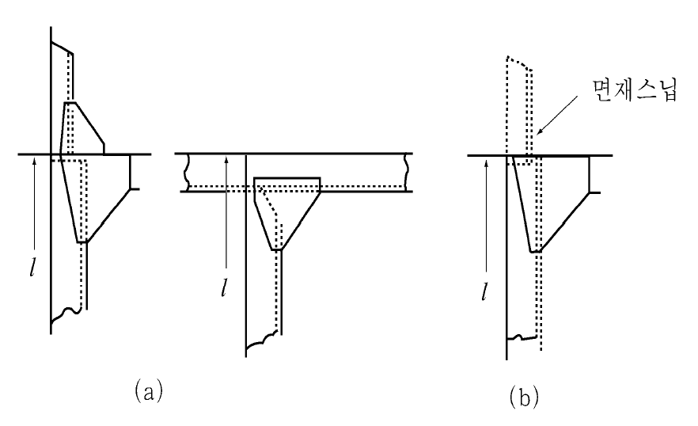
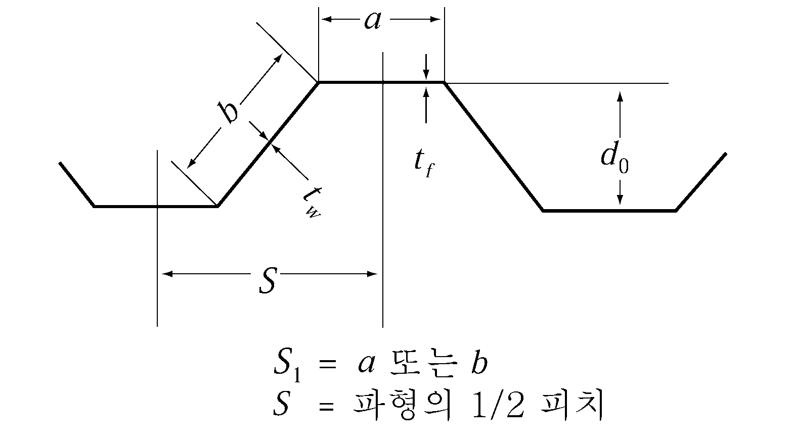
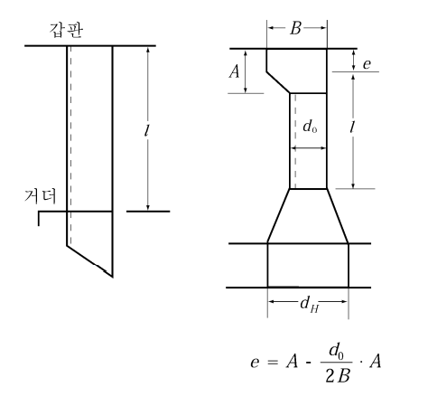

# 제7편 전용선박(1장~4장,7장~10장)

> 선급 및 강선규칙/적용지침 / RA-07A-K / 2025 / KO / Guidance

## 부록 7-12 광석산적화물의 액상화 (2023)

### 1. 일반

#### (1) 적용

이 부록은 광석산적화물의 수분함량 (MC)이 운송허용수분치 (TML)를 초과하는 화물을 운송할 때, 항해 중 액상화 될 수 있는 고체산적화물 (IMSBC code의 A 그룹 화물)을 운송할 수 있도록 특별히 건조된 광석운반선에 적용한다. 이 부록의 요건을 만족하는 선박에는 추가 특기사항 **LIQBC-1** 또는 **LIQBC-2**를 부여한다. IMSBC code에 따라 특별히 건조된 광석운반선에 대한 요구사항 준수 여부는 기국의 결정에 따르며, 기국의 승인있는 경우, 증서(IMSBC)를 발급한다.

#### (2) 화물액상화 유형은 다음의 두가지 유형으로 나뉜다:

- **(가)** 화물 액상화 후에 안정 상태로 재정착되는 화물 : 가는 입자와 큰 입자가 혼합된 화물에서 발생하며, 액상화는 출항 직후에 가장 많이 발생한다. 액상화 상태는 일반적으로 제한된 시간 동안 지속되는 일시적인 상태이다. 화물이 안정 상태로 들어간 후, 다시 액상화 될 확률은 적다. (예, 분철광석)
- **(나)** 화물 액상화 후에 안정 상태로 재정착되지 않는 화물 : 매우 미세한 점토와 같은 화물에서 발생하며, 액상화는 출항 후 며칠 또는 몇 주 후에 발생할 수 있다. 화물이 액상화 된 후, 잘 안정화되지 않는다.(예, 보크사이트분석)

#### (3) 액상화를 위하여 설계되는 선박은 3편 및 7편 2장의 관련요건에 더하여 이 부록의 요건을 따라야 한다.

#### (4) 이 부록에서 사용된 정의는 다음과 같다.

- **(가)** 고체산적화물(solid bulk cargo) : 액체 또는 가스를 제외한 화물로서, 일반적으로 균일한 성분의 입자, 과립 또는 그보다 조금 더 큰 조각들의 조합으로 구성된 물질을 의미하며, 별도의 수납용기 없이 선박의 화물구역에 직접 적재되는 화물.
- **(나)** IMSBC-A 화물 : 수분함량(MC)이 운송허용수분치(TML)를 초과하여 선적될 경우, 액상화될 수 있는 고체화물
- **(다)** 수분함량(moisture content, MC) : 화물 샘플에서 물, 얼음 또는 기타 액체의 몫. 샘플 전체 질량에 대한 총 수분량의 백분율
- **(라)** 운송허용수분치(transportable moisture limit, TML) : 액상화 물질이 선박운송에 따른 동요 등으로 인하여 액상화되지 아니하는 수분의 최대치)

#### (5) 운송허용수분치를 초과하는 화물의 운송을 위하여는 다음의 자료를 선급에 제출하여 승인을 받아야 한다 :

- **(가)** 고려하는 화물의 무게, 비중 등이 표시된 종단면, 횡단면도 및 관련 부재의 도면
- **(나)** 하역설비, 화물 및 탱크 내 액체의 분포 및 복원성 계산서
- **(다)** 기타 선급이 필요하다고 인정하는 자료

### 2. 복원성

#### (1) 복원성 자료

복원성 자료에는, 화물 밀도를 포함한 각 설계 화물에 대한 화물특성이 명시되어야 한다. 또한 복원성 자료에는 다음의 내용이 포함되어야 한다. “설계화물 이외의 화물 적재시 승인된 적하지침기기 등을 통해 적합성을 검증할 것”

#### (2) 적재조건

- **(가)** 액상화 설계 화물의 경우, 설계 시나리오에 따른 적재 조건이 복원성 자료에 포함되어야하며, 해당되는 경우, (3) 및 (4)의 요건을 준수하여야 한다.
  - **(a)** 설계 시나리오 예
    - 액상화(liquefaction) : 화물이 고밀도 점성유체처럼 거동
    - 이동(shifting) : 큰 횡경사 시 화물의 슬라이딩
- **(나)** 적하지침기기(loading computer)
  선박에는 설계 시나리오와, 해당되는 경우, (3) 및 (4)에 주어진 추가 요건을 검증하기 위한 적하지침기기가 설치되어야 한다.

#### (3) 비손상 복원성 (intact stability)

- **(가)** 액상화 시나리오 : 설계 화물은 액체로 간주되어야 하고, 화물의 자유 표면이 고려되어야 한다. 이 복원성 요건은 **IMO IS code Part A Ch. 2.**에 따른다.
- **(나)** 이동 시나리오 : 설계 화물은 경사각 25°에서 이동하는 것으로 고려되어야 한다. 이 시나리오의 복원성은 **IMO resolution MSC.23(59) (**The International Code for the Safe Carriage of Grain in Bulk)의 관련요건을 만족하여야 한다.

#### (4) 손상복원성 (damage stability)

- **(가)** LIQBC-2 부호를 부여 받는 선박의 경우, 모든 적재화물창은 자유표면을 가지는 액체 상태로 가정해야 한다. 해당되는 경우, **SOLAS Reg. II-1/6**에서 **7-3, Reg. II-1/9.8** 및 **Reg. XII/4** 까지의 손상복원성 요건을 기반으로 계산된 GM 한계곡선(limit curve)에 따라야 한다.
- **(나)** 상기 (가)에 추가하여, 감소된 건현을 가진 선박의 경우, GM 한계곡선은 지정된 감소건현에서 가정된 가장 깊은 구획 흘수를 가지고 관련되는 **SOLAS**의 상기 요구 사항을 검토하여야 한다.
- **(다)** 상기 (가) 및 (나)에 추가하여, **ICLL 27** 규칙의 손상복원성 요건에 따르는지를 구현하기 위하여 사용되는 GM은 GM한계곡선 계산의 가장 깊은 구획 흘수에서 적용되는 것과 동일하거나 작아야 한다.

### 3. 선체 강도

#### (1) 화물하중

- **(가)** 선체강도 평가를 위하여, 액상화 설계 화물에 의한 화물하중은 (나)에 따라 계산되어야 한다. 각 화물창의 액상화 상태에서 화물의 설계밀도, $\gamma$ ($\mathrm{t}/m^3$)는 선급증서에 주어져야 한다. 화물의 설계밀도는 아래의 값 이상으로 고려되어야 한다. 액상화 상태에서의 화물의 안식각은 0도로 가정한다.

  |   | 화물 밀도 $\gamma$ ($\mathrm{ton}/m^3$) |
  | --- | --- |
  | LIQBC-1 | $\gamma _{design}$ |
  | LIQBC-2 | $M ' /V _{H}$ |

  $M '$ : 해당 화물창의 산적화물 중량으로 아래의 수식을 따른다.
  $M ' =M+ \frac{1}{n} Min(3000, 0.1M)$ ($t$)
  $M$ : 해당 화물창의 최대 허용 산적화물 중량 ($t$)
  $n$ : 전체 화물창 중 하나의 화물창에 적재하는 최소 적재횟수
  $V _{H}$ : 창구코밍에 둘러 쌓인 부피를 제외한 창구코밍과 상갑판 이 교차하는 높이까지의 화물창 용적 ($\mathrm{m} ^{3}$)
  $\gamma _{design}$ : LIQBC-1에 해당하는 화물비중은 설계자에 의해 제시되어야 하며, 화물의 비중이 일정하지 않을 경우, 화물의 비중 범위를 고려하여 최소 및 최대 설계비중이 결정되어야 한다.
- **(나)** LIQBC-1
  화물창 내벽에 작용하는 화물의 하중은 다음 식에 의한다.
  ∙ 그림 2의 경우
  
  **그림 2 화물창의 적재형상**
  $h _{C} = h _{HPL} + h _{1}$
  여기서,
  $h_HPL$ : 호퍼탱크와 내측판과의 상부교점과 내저판사이의 수직거리($\mathrm{m}$)
  $h_1$ : 수직거리($\mathrm{m}$)로서 다음 식에 따른다.
  $h _{1} = \frac{M '}{\gamma B _{H} l _{H}} - \frac{B _{H} + b _{IB}}{2 B _{H}} h _{HPL} + \frac{V _{TS}}{B _{H} l _{H}}$
  $B_H$ : 화물창의 폭($\mathrm{m}$)
  $l_H$ : 화물창의 길이($\mathrm{m}$)
  $b_IB$ : 이중저의 폭($\mathrm{m}$)
  $V_TS$ : 고려하는 화물창 길이, $l_H$ 내에서 횡격벽의 하부에 있는 횡스툴의 전체용적($\mathrm{m}^3$). 이 용적에서 횡격벽을 통과하는 호퍼탱크의 부분의 용적은 제외한다.
  ∙ 그림 3의 경우
  
  **그림 3 화물창의 적재형상**
  $h _{C} = h _{11}$
  여기서,
  $h _{11}$ : 수직거리(m)로서 다음 식에 따른다.
  $h _{11} =h _{HPL} \left( \frac{B _{2} -b _{IB}}{B _{H} -b _{IB}} \right)$
  $B _{2} = \sqrt {\frac{\frac{1}{l _{H}} \left( \frac{M '}{\rho _{c}} +V _{TS} \right) + \frac{1}{2} \left( \frac{h _{HPL} b _{IB}^{2}}{B _{H} -b _{IB}} \right)}{\frac{1}{2} \left[ \left( \frac{h _{HPL}}{B _{H} -b _{IB}} \right) \right]}}$
- **(다)** LIQBC-2
  - 화물창 내벽에 작용하는 화물의 하중은 다음 식에 의한다.
  
  **그림 4 화물창의 적재형상**
  $h _{C} = h _{HPU} + h _{0}$
  여기서,
  $h _{0} = \frac{S _{A}}{B _{H}}$
  $S_A = S_o + V_\frac{HC}{l_H}$
  $h_HPU$ : 톱사이드 탱크와 선측외판 또는 내측판과의 하부교점과 내저판사이의 수직거리($\mathrm{m}$)
  $S_o$ : 톱사이드 탱크와 선측외판 또는 내측판과의 하부교점 상방으로 상갑판 높이까지의 음영면적($\mathrm{m}^2$)
  $V_HC$ : 창구코밍으로 폐위된 용적($\mathrm{m}^3$)

#### (2) 종격벽판

- **(가)** 종격벽판 및 빌지 호퍼 경사판의 두께 $t$ 는 다음 식에 의한 것 이상이어야 한다.
  $t=C S \sqrt {Kh_c} + 1.5 \mathrm{mm}$
  $S$ : 보강재 등에 의하여 둘러싸인 경사판 패널의 짧은 변 길이($\mathrm{m}$).
  $h_c$ : 화물액상화를 고려했을 때, 선체 중심선에 있어서 해당 패널의 하단으로부터 화물 상단까지의 수직거리($\mathrm{m}$).
  $C$ : 계수로서 다음 식에 의한 값. 다만, 3.2 이상이어야 한다.
  $C=4.25 C_1 \sqrt {\gamma }$
  $C _{1}$ : 계수로서 $l/S$ 의 값에 따라 다음 식에 의한 값.
  $1 \leq \frac{l}{S} < 3.5$ 일 때 : $\left( { 0.11 \frac{l}{S} + 0.615} \right)$
  $3.5 \leq \frac{l}{S}$ 일 때 : 1.0
  $l$ : 보강재 등에 의하여 둘러싸인 경사판 패널의 긴변 길이($\mathrm{m}$).

#### (3) 휨보강재

종격벽에 부착된 휨보강재의 단면계수 $Z$ 는 다음의 (가) 및 (나)에 따른다:

- **(가)** 종방향 휨보강재의 단면계수 $Z$ 는 다음 식에 의한 것 이상이어야 한다.
  $Z=104 \gamma C S h _{c} l ^{2} \mathrm{cm ^{3} }$
  $S$ : 종방향 휨보강재의 간격($\mathrm{m}$).
  $h_c$ : 화물액상화를 고려했을 때, 선체 중심선에 있어서 해당 휨보강재의 중심으로부터 화물 상단까지의 수직거리($\mathrm{m}$).
  $l$ : 휨보강재 지지점 사이의 길이($\mathrm{m}$).
  $C = \frac{K}{24- \alpha K}$
  $\alpha$ : $y$ 의 값에 따라 다음에 의한 $\alpha_1$ 또는 $\alpha_2$.
  $y>y _{B}$ 일 때: $\alpha _{1} =15.0 f _{D} \left( \frac{y-y _{B}}{Y '} \right)$
  $y \leq y _{B}$ 일 때: $\alpha _{2} =15.0 f _{B} \left( \frac{y _{B} -y}{y _{B}} \right)$
  $f _{B}$, $y$ : **규칙 2장 303.**의 **2**항에 따른다.
  $y _{B}$, $Y '$ 및 $f _{D}$ : **규칙 2장 302.**의 **1**항에 따른다.
- **(나)** 횡방향 휨보강재의 단면계수 $Z$ 는 다음 식에 의한 것 이상이어야 한다.
  $Z=7.5 \gamma K S h_c l ^{2} \mathrm{cm ^{3} }$
  $S$ : 횡방향 휨보강재의 간격($\mathrm{m}$).
  $h_c$ : 화물액상화를 고려했을 때, 선체 중심선에 있어서 해당 휨보강재의 중심으로부터 화물 상단까지의 수직거리($\mathrm{m}$).
  $l$ : 휨보강재 지지점 사이의 길이($\mathrm{m}$).

#### (4) 광석창 내 횡격벽 및 스툴

- **(가)** 격벽판의 두께 $t$ 는 다음 식에 의한 것 이상이어야 한다.
  $t=3.6 C S \sqrt {K \gamma h_c} + 2.5 \mathrm{mm}$
  $S$ : 격벽휨보강재의 간격 (m).
  $h_c$ : 화물액상화를 고려했을 때, 선체 중심선에 있어서 해당 패널의 하단으로부터 화물 상단까지의 수직거리($\mathrm{m}$).
  $C$ : 계수로서 $L$ 의 값에 따라 다음에 따른다.
  $L \leq 230$ 일 때 : $C = 1.0$
  $L \geq 400$ 일 때 : $C = 1.07$
  $L$ 이 중간값일 경우, $C$ 값은 보간법에 의한다.
- **(나)** 격벽 휨보강재의 단면계수 $Z$ 는 다음 식에 의한 것 이상이어야 한다.
  $Z=5.6 C _{1} C _{2} C _{3} \gamma K S h _{c} l ^{2} \mathrm{cm ^{3} }$
  $h_c$ : 화물액상화를 고려했을 때, 선체 중심선에 있어서 해당 보강재의 중심으로부터 화물 상단까지의 수직거리($\mathrm{m}$).
  $C_1$ : (가)의 $C$ 에 따른다.
  $C_2$ : 휨보강재 끝단의 고착조건에 따른 계수로서 **표 1** 따른다.
  $C _{3}$ : 수평보강재의 경우 = 1.0
  수직보강재의 경우 = 1.2
  $S$ 및 $l$ : **3편 14장 303.**에 따른다.

  **표 1 계수** $C_2$

  | 일단 타단 | $A$ 형 고착 | $B$ 형 고착 | 거더지지 또는 러그고착 | 스닙 |
  | --- | --- | --- | --- | --- |
  | A형 고착 | 0.70 | 1.15 | 0.85 | 1.30 |
  | B형 고착 | 1.15 | 0.85 | 1.30 | 1.15 |
  | 거더지지 또는 러그고착 | 0.85 | 1.30 | 1.00 | 1.50 |
  | 스닙 | 1.30 | 1.15 | 1.50 | 1.50 |
  | (비고) 1. ‘$A$ 형 고착’이라 함은 이중저 또는 해당 휨보강재와 같은 정도 이상의 인접 면내 휨보강재와의 브래킷 고착 또는 이와 동등한 고착을 말한다. (**그림 5** (a) 참조) 2. ‘$B$ 형 고착’이라 함은 보, 늑골 등의 직교재와의 브래킷 고착 등을 말한다. (**그림 5** (b) 참조) |   |   |   |   |

  
  **그림 5 끝부분의 고착**

#### (5) 파형격벽

- **(가)** 파형격벽의 두께 $t$ 는 다음 식에 의한 것 이상이어야 한다.
  $t = 0.0036CS_1 \sqrt { \gamma h_c K} + 2.5$(mm)
  $S_1$ : 면재부 및 웨브부에 대한 각각의 너비 (mm)로서 **그림 6**의 $a$ 또는 $b$.
  $C$ : 계수로서 다음에 의한 값.
  면재부 : $C= \frac{1.4}{\sqrt {1+ \left( \frac{t _{w}}{t _{f}} \right) ^{2}}}$
  웨브부 : $C = 1.0$
  $t_f$ 및 $t_w$ : 면재부 및 웨브부의 두께 (mm).
  $h_c$ : 화물액상화를 고려했을 때, 선체 중심선에 있어서 해당 패널의 하단으로부터 화물 상단까지의 수직거리($\mathrm{m}$).
  
  **그림 6** #eqnID-3859 **의 측정방법**
- **(나)** 파형격벽의 1/2피치에 대한 단면계수 $Z$ 는 다음 식에 의한 것 이상이어야 한다.
  $Z=7CKS \gamma h_c l^2$(cm^3)
  $S$ : 파형의 1/2피치 (m). (**그림 6** 참조)
  $l$ : 지지점 사이의 길이 (m)로서 **그림 7**에 따른다.
  $h_c$ : 화물액상화를 고려했을 때, 선체 중심선에 있어서 해당 휨보강재의 중심으로부터 화물 상단까지의 수직거리 (m)
  $C$ : 계수로서 단부의 고착조건에 따라, **표 2**에 정하는 값. 다만, 하단의 스툴의 이중저 내저판 위치에서의 선박길이 방향의 너비 $d_H$ 가 격벽의 스툴 깊이 $d_0$ (**그림 7**)의 2.5배 미만일 때에는 $l$ 및 $C$ 값은 우리 선급이 적절하다고 인정하는 바에 따른다.

  | 난 | 상단 하단 | 거더로 지지 | 갑판에 고착 | 스툴에 고착 |
  | --- | --- | --- | --- | --- |
  | (1) | 거더로 지지, 갑판 또는 이중저에 고착 | 1.00 | 1.50 | 1.35 |
  | (2) | 스툴에 고착 | 1.50 | 1.20 | 1.00 |

   
  **그림 7** #eqnID-3871**의 측정방법**
  단, 파형격벽 요구되는 단면계수를 결정하기 위한 대체 평가 방법으로써, **부록 7-10**에서 제시된 화물창 구조 해석을 통해 강도평가가 가능하다. 이때 파형격벽의 강도평가를 위해서는 파형격벽의 웨브와 면재가 만나는 위치에 1$\mathrm{mm} ^{2}$ 의 단면적을 가지는 더미 봉(dummy beam) 요소가 모델링되어야 한다.
- **(다)** 파형격벽의 모선방향의 단부 0.2 $l$ 사이의 두께 $t$ 는 다음 식에 의한 것 이상이어야 한다.
  웨브부 : $t = 41.7 \frac{CKS \gamma h_c l}{d_0} + 2.5$(mm) 다만, 다음 식에 의한 것 미만이어서는 아니된다.
  $t _{\min} =0.174 root {3} of {\frac{C S \gamma h_c l b^2}{d _{0}}} +2.5$(mm)
  면재부 : 다만, 수직파형격벽의 상단은 제외.
  $t_f = \frac{0.012 a}{\sqrt { K}} +2.5$(mm)
  S, $h_c$, $C$ 및 $l$ : (나)에 따른다.
  $d_0$ : 파형의 깊이 (mm).
  $a$ 및 $b$ : 면재부 및 웨브부의 너비(mm)

### 4. 유한요소해석

#### (1) 강도평가

액상화 설계 화물에 대한 추가 하중 조합을 포함하여, **부록7-10** 광석운반선의 직접강도평가에 관한 지침에 따라 유한 요소 해석을 수행하여야 한다. 이 추가 하중 조합은 고체산적화물을 대신하여 액상화 설계화물이 적재되는 모든 화물 적재 조합을 포함한다.

#### (2) 좌굴 강도

판, 보강재 및 전체 보강판의 경우, 주어진 추가 설계 하중을 고려하여 **부록7-10** 광석운반선의 직접강도평가에 관한 지침에 따라 계산한다. 
