# 제7편 전용선박(5장,6장)

> 선급 및 강선규칙/적용지침 / RA-07B-K / 2025 / KO / Rules

## 제 5 장 액화가스 산적운반선

### 제 1 절 일반사항

#### 101. 적용

- **1.** 이 장의 요건은 총톤수 500톤 미만의 선박을 포함하여 선박의 크기에 관계없이 37.8 °C에서의 증기압이 0.28 $\mathrm{MPa}$(절대압력)을 넘는 액화가스 또는 **19절**에서 정하는 기타 제품을 산적으로 운반하는 선박에 적용한다.
- **2.** (1) 별도로 정하는 경우를 제외하고, 이 장의 요건은 2016년 7월 1일 이후에 용골이 거치되거나 다음의 동등한 건조단계에 있는 선박에 적용한다.
  - **(2)** 이 장에서 **선박 건조**라 함은 용골이 거치되거나 동등한 건조단계에 있는 선박을 말한다.
  - **(3)** 1986년 7월 1일 이후 및 2016년 7월 1일 이전에 건조된 선박은 **IMO Res. MSC.5(48)** 및 **IMO Res. MSC.17(58), MSC.30(61), MSC.32(63), MSC.59(67), MSC.103(73), MSC.177(79)** 및 **MSC.220(82)**에 의해 개정된 요건을 적용하여야 한다.
  - **(4)** 1986년 이전에 건조된 선박으로서 적합증서를 요구하지 아니하는 선박에 대한 요건은 **부록 7A-1 「 적합증서를 요구하지 아니하는 선박에 대한 요건」**에 따른다. *(2021)* **【지침 참조】**
- **3.** 선박의 형식에 따라 다음에 따른다.
  - **(1)** 이 장에서 1G형의 선박이 요구되는 제품을 화물탱크에 적재하는 경우, 인화점 60 °C 이하의 인화성 액체 (밀폐용기시험) 또는 **19절**에서 정하는 인화성 제품은 **204. 1**항 (1)호에서 규정한 보호구역 내에 위치한 탱크로 운반하여서는 아니 된다.
  - **(2)** 이 장에서 2G/2PG형의 선박이 요구되는 제품을 화물탱크에 적재하는 경우, (1)호에서 규정한 인화성 액체를 **204. 1**항 (2)호에서 규정한 보호구역 내에 위치한 탱크로 운반하여서는 아니 된다.
  - **(3)** 이 장에서 1G형 또는 2G/2PG형의 선박이 요구되는 제품을 화물탱크에 적재하는 각 경우에, 화물탱크용 화물창 구역의 횡방향 범위 내의 보호구역에 제한한다.
  - **(4)** 이 장에서 1G형 또는 2G/2PG형의 선박이 요구되는 화물탱크에 남아있는 제품이 단지 냉각, 순환 또는 연료공급의 목적으로 사용되는 경우, (1)호에서 규정한 인화성 액체 및 제품은 보호구역 내에서 운반될 수 있다.
- **4.** 이 장 및 **6장**에서 동시에 규정하는 제품을 운반하고자 할 경우, 운반 화물에 따라 양쪽 규정을 만족하여야 한다.
  - **(1)** 다음의 제품을 운반하기 위하여 설계되고 건조된 선박은 이 장의 요건을 우선 적용하여야 한다.
    - **(가)** 이 장의 **19절**에 기재된 제품
    - **(나)** 이 장 및 **6장** 양쪽에 기재되어 있는 1개 이상의 제품. 이 제품들은 **19절** 표의 “a" 항목에서 별표로 표시된다.
  - **(2)** 이 규정에도 불구하고 (1)호 (나)에서 규정한 1개 이상의 제품을 전용으로 운반하는 선박의 경우, **6장**의 요건을 적용하여야 한다.
- **5.** 개개의 규정의 적용에 대하여는 규정된 모든 요건을 적용하여야 한다.
- **6.** 재기화 및 가스방출 모드 또는 가스 수급, 처리, 액화 및 저장 모드에서 고정된 위치에 있는 기간 동안 운영하기 위한 선박의 경우, 우리 선급이 이 장의 요건에 대하여 제안된 배치가 적절하다는 것이 보장되도록 적절한 조치를 취하여야 한다. 또한, 이 장의 요건뿐만 아니라 예상하지 못한 특정 위험에 대하여 인정된 기준에 따라 추가 요건이 제정되어야 한다. 최소한 다음의 위험들은 포함되어야 한다.
  - **(1)** 화재 및 폭발
  - **(2)** 탈출
  - **(3)** 위험구역의 확대
  - **(4)** 육상으로 가압된 가스 방출
  - **(5)** 고압가스 벤트
  - **(6)** 프로세스 이상 상태
  - **(7)** 인화성 냉매의 저장 및 취급
  - **(8)** 화물격납설비 외부에 액체 및 기체화물의 지속적인 존재
  - **(9)** 탱크 과부압
  - **(10)** 선박간의 액체화물 이송
  - **(11)** 정박 중 충돌 위험
- **7.** 위험성평가 또는 이와 유사한 목적의 연구가 이 장에서 이용되는 경우, 결과는 유효성의 증거로 최소한 다음을 포함하여야 한다.
  - **(1)** 방법론의 설명과 적용기준
  - **(2)** 시나리오 해석에서 잠재적인 변화 또는 연구에서 오류의 원인
  - **(3)** 독립적이고 적절한 제3자에 의한 위험성평가 과정의 검증
  - **(4)** 위험성평가가 개발된 배경의 품질시스템
  - **(5)** 평가에서 사용된 자료의 적합성과 타당성
  - **(6)** 평가에 관여한 사람들의 지식기반
  - **(7)** 관련 당사자에 대한 결과의 배부시스템
  - **(8)** 독립적이고 적절한 제3자에 의한 결과의 검증
- **8.** 이 장에서 규정하지 아니하는 선박의 선체, 기관 및 의장은 관련 규칙의 해당 요건에 따른다. *(2021)*
- **9.** 2021년 1월 1일 이후 건조계약되는 150$\mathrm{m}$ 이상의 선박으로서, 멤브레인 타입의 LNG 화물격납설비를 가지는 경우, **선급 및 강선규칙 15편**을 따른다. *(2021)*

#### 102. 도면승인

제조중 등록검사를 받고자 하는 선박에 대하여는 공사를 시작하기 전에 적재 예정화물의 저장상태, 화물 격납설비의 구조방식 등에 따라서 다음의 도면 및 자료를 제출하여 우리 선급의 승인을 받아야 한다.

- **1.** **승인용 도면 및 자료**
  - **(1)** 화물 탱크, 단열 및 2차 방벽의 제작시방서(용접시공요령, 용접부의 시험검사요령, 화물탱크의 시험검사요령, 2차 방벽 및 단열재의 성질과 시공요령, 공작기준을 포함한다.)
  - **(2)** 화물탱크, 화물격납설비의 구조상세도 *(2019)*
  - **(3)** 화물탱크 내부 부착품의 상세를 포함하는 화물탱크 부속품의 배치도
  - **(4)** 화물탱크의 지지구조, 화물탱크의 갑판관통부 및 폐쇄장치의 상세도
  - **(5)** 2차방벽의 상세도
  - **(6)** 설계압력 또는 온도와 관련하여 화물관장치에 사용하는 단열재료를 포함하는 재료의 사양 및 규격
  - **(7)** 화물탱크, 단열, 2차방벽 및 화물탱크 지지구조의 재료규격 또는 사양
  - **(8)** 단열재의 배치 및 부착상세도
  - **(9)** 화물펌프, 화물압축기 및 이들 원동기의 구조도
  - **(10)** 냉각장치 주요부의 구조도
  - **(11)** 화물관 및 계측장치의 계통도
  - **(12)** 냉각장치용 냉매관 장치도
  - **(13)** 화물창 구역 또는 방벽간 구역, 화물펌프실, 화물압축기실 및 화물제어실의 빌지 및 통풍장치
  - **(14)** 가스탐지, 온도지시 및 압력계의 검출단 배치도
  - **(15)** 화물창 구역 또는 방벽간 구역을 불활성화할 때에는 그 불활성장치와 관련된 다음 도면 *(2019)*
    - **(가)** 관계통도
    - **(나)** 다음을 나타내는 배치도
      - **(a)** 불활성가스 발생장치
      - **(b)** 화물가스 역류방지장치
    - **(다)** 압력조정장치의 상세도
  - **(16)** 화물창 구역 또는 방벽간 구역의 압력도출장치의 상세도 및 누설액 배출장치의 상세도
  - **(17)** 각종 압력용기의 조립단면도, 노즐상세도, 부착품장치도 및 부착품 상세도
  - **(18)** 화물관장치용 특수밸브류, 화물호스, 신축조인트, 스트레이너 등의 상세도
  - **(19)** 화물을 연료로 사용하는 경우에는 연료와 관련된 다음 도면 *(2019)*
    - **(가)** 관계통도
    - **(나)** 연소장비의 요목 및 구조도
    - **(다)** 관련 장비 및 연료관의 경로를 나타내는 배치도
  - **(20)** 위험장소의 케이블 포설 요령도와 전기기기 및 장비 일람표
  - **(21)** 화물탱크, 관장치 및 기기류의 접지 요령도 등
  - **(22)** 위험장소를 표시하는 도면
  - **(23)** **11절**에 규정하는 소화장치도
  - **(24)** 화물취급설명서
  - **(25)** 화물탱크의 안전밸브 도출능력 검토계산서(벤트관의 배압계산서를 포함한다.) *(2019)*
  - **(26)** **505.**의 **7**항에서 요구되는 경우, 화물관장치의 압력도출밸브 용량계산서 *(2019)*
  - **(27)** 비상차단장치 *(2019)*
- **2.** **참고용 도면 및 자료 【지침 참조】**
  - **(1)** 화물격납설비의 기본설계 원리 및 기술검토서
  - **(2)** **4절**의 규정에 따라 모형시험 등을 할 때에는 그 방법 및 결과에 관한 자료
  - **(3)** 구조용 재료(화물탱크, 2차방벽, 단열재 등)로써 새로운 재료 및 용접법을 채용할 때에는 그 재료 또는 용접부의 상온에서의 물리적, 기계적 성질, 저온 인성, 내식성에 관한 자료
  - **(4)** **403.**에서 규정하는 설계하중의 자료
  - **(5)** **404.** 내지 **406.**에 규정하는 화물탱크 및 지지구조의 강도계산서
  - **(6)** 화물탱크, 단열, 2차방벽 및 화물탱크 지지구조의 강도와 성능에 관하여 모형시험을 할 때에는 그 방법 및 결과에 관한 자료
  - **(7)** 우리 선급이 필요하다고 인정하는 경우, 각종 적재상태에서의 화물탱크 주요 부분의 온도에 관한 열전도 계산서 등
  - **(8)** 우리 선급이 필요하다고 인정하는 경우, (7)호에 표시하는 자료에 기재되어 있는 온도분포 상태에서의 주요부재의 열응력 계산서
  - **(9)** 우리 선급이 필요하다고 인정하는 경우, 선체의 온도분포에 관한 계산서
  - **(10)** 화물취급장치의 사양서
  - **(11)** 화물의 조성 및 물리적인 성질(필요한 온도범위의 포화증기압 선도를 포함한다.)
  - **(12)** 냉각장치의 냉각능력 검토계산서
  - **(13)** 화물관 배치도 및 설계온도가–110℃ 이하인 경우, 응력해석 결과 *(2019)*
  - **(14)** 화물탱크의 충전한도 검토계산서
  - **(15)** 화물탱크 구역에 있어서 **305.**에서 규정하는 맨홀 배치 및 이들 맨홀 출입 안내
  - **(16)** **2절**에서 규정하는 선박의 생존능력 계산서
  - **(17)** **14절**에서 규정하는 인신보호장구
  - **(18)** 설치되는 경우, 재액화장치 및 가스연소장치의 용량 계산서 *(2019)*

#### 103. 동등효력

이 장의 규정에 적합하지 아니한 구조, 설비라도 우리 선급이 이와 동등한 효력이 있다고 인정할 경우에는 이것을 이 장의 규정에 적합한 것으로 본다.

#### 104. 정부규칙

선박의 구조 및 설비에 대하여 선박이 등록된 국가 또는 해당 선박이 입항하는 국가의 국내법에 따라 규제를 받을 경우가 있으므로 주의하여야 한다.

#### 105. 정의

용어의 정의는 **4절**의 정의 및 별도로 정하는 경우를 제외하고 다음에 의한다.

- **1.** **거 주구역**이라 함은 공용실, 통로, 세면실, 침실, 사무실, 병실, 영화실, 오락실, 조리설비가 없는 배식실 및 이와 유사한 구역을 말한다.
- **2.** **A 급 구획**이라 함은 다음 기준에 적합한 격벽 및 갑판으로 구성된 구획을 말한다.
  - **(1)** 강 또는 이와 동등한 재료를 사용한 구조일 것
  - **(2)** 충분히 보강된 것일 것
  - **(3)** 다음에 주어진 시간 내에 화염에 노출되었을 경우, 화염에 노출되지 아니한 쪽의 평균온도가 시험초기 온도보다 140℃ 초과하여 상승하지 아니하며, 이음매를 포함한 어느 한 점에서의 온도도 시험초기 온도보다 180 ℃ 초과하여 상승하지 아니하도록 승인된 불연성 재료로 방열되어 있을 것.
    “A-60”급 60분
    “A-30”급 30분
    “A-15”급 15분
    “A-0” 급 0분
  - **(4)** 표준화재시험 1시간 동안 연기 및 화염이 통과할 수 없도록 제작된 것일 것.
  - **(5)** 화재시험절차코드에 따라 격벽이나 갑판의 프로토타입 시험을 하여야 하며, 건전성 및 온도 상승에 대하여 상기 요건을 만족할 것.
- **3.** **주관청**이라 함은 선박이 등록된 국가의 정부를 말한다.
- **4.** **비 등점**이라 함은 화물이 대기압과 같은 증기압을 나타내는 온도를 말한다.
- **5.** **너 비(**$B$**)**라 함은 선박의 중앙에 있어서 금속 외판을 갖는 선박에서는 늑골의 외면에서 외면까지, 금속 이외의 재료의 외판을 갖는 선박에서는 선체의 외면에서 외면까지 측정한 최대 수평거리를 말한다.
  너비 $B$는 미터($\mathrm{m}$)로 표시한다.
- **6.** **화 물지역**이라 함은 화물격납설비와 화물펌프실 및 화물압축기실을 포함하는 선박의 부분을 말하며 이들 구역 상부의 선박 전 너비 및 길이에 걸친 갑판지역을 포함한다. 최후부 화물창 구역의 후단 또는 최전부 화물창 구역의 전단에 코퍼댐, 평형수구역 또는 보이드 스페이스가 설치되는 경우, 코퍼댐, 평형수구역 또는 보이드 스페이스는 화물지역에서 제외한다. **【지침 참조】**
- **7.** **화 물격납설비**라 함은 화물을 격납하기 위한 설비를 말하며 1차 및 2차 방벽, 부수되는 단열재 및 이들 사이에 공간을 설치하는 경우에는 그들 모두를 말하며, 또한 이들의 구성요소를 지지하는데 필요한 경우에는 인접하는 구조 역시 포함한다. 2차방벽이 선체구조의 일부일 경우에는 이 2차 방벽은 화물창 구역의 주위벽으로 보아도 좋다.
- **8.** **화 물제어실**이라 함은 하역작업의 제어를 위해 사용되는 구역을 말한다.
- **9.** **화 물기기구역**이라 함은 기관실에 가스연료를 공급하는 장치를 포함하여 화물압축기실 또는 화물펌프실, 화물용 프로세스장치가 있는 구역을 말한다.
- **10.** **화 물펌프**라 함은 액체화물의 이송에 사용되는 주펌프, 승압펌프, 스프레이펌프 등을 포함한다.
- **11.** **화 물**이라 함은 이 장의 적용을 받는 선박에 의하여 운반되는 **19절**에 규정하는 제품을 말한다.
- **12.** **화 물업무구역**이라 함은 면적이 2 $\mathrm{m}^2$를 넘는 공작실, 로커 및 창고로써 사용되는 화물지역 내의 구역을 말한다.
- **13.** **화 물탱크**라 함은 1차격납 용기가 단열재 및 2차방벽의 양쪽 또는 어느 한쪽과 병합되는 경우 및 병합되지 아니하는 어느 경우도 포함되며 화물의 1차격납 용기로서 설계된 액밀의 용기를 말한다.
- **14.** **폐회로형 시료채취(closed loop sampling)**라 함은 채취하는 동안 제품이 화물탱크로 다시 유입되므로써 대기압에서 화물증기의 누출을 최소화하는 화물시료채취시스템을 말한다.
- **15.** **코퍼댐**이라 함은 2개의 인접하는 강재의 격벽 또는 갑판 사이에 격리되어 있는 구역을 말한다. 이 구역은 보이드 스페이스 또는 평형수구역으로 할 수 있다.
- **16.** **제어장소**라 함은 선박의 통신 또는 주요 항해장비나 비상전원이 설치된 구역, 또는 화재기록장치 또는 화재제어장치가 집중 배치되어 있는 구역을 말한다. 다만, 특별한 화재제어장치가 설치되어 있는 구역은 제외한다.
- **17.** **인 화성제품**이라 함은 **19절**의 표 f란에󰡒F󰡓로 표시한 화물을 말한다.
- **18.** **인 화성한계**라 함은 시험장치 내의 연료-산화제 혼합물에 외부로부터 충분히 강한 점화원을 적용하였을 때 인화되기 시작하는 연료-산화제 혼합물의 상태를 말한다.
- **19.** **FSS CODE**라 함은 **IMO** 해사안전위원회에서 **Res. MSC. 98(73)**에서 채택한 최근 개정된 국제화재안전장치코드를 말한다.
- **20.** **가 스운반선**이라 함은 **19절**의 표에 게재되어 있는 액화가스 또는 기타 화물을 산적으로 운반하기 위하여 건조되거나 개조되는 선박을 말한다.
- **21.** **가 스연소장치**라 함은 연소에 의해 과도한 화물증기를 처리하는 장치를 말한다.
- **22.** **가 스소모장치(gas consumer)**라 함은 화물증기를 연료로 사용하는 선박 내에 있는 모든 장치를 말한다.
- **23.** **위 험구역**이라 함은 전기설비의 구조, 설치 및 사용에 대하여 특별한 조치가 요구되는 양의 가스 폭발 분위기가 존재하거나 존재할 것으로 예상되는 구역을 말한다. 가스 분위기가 존재하는 경우, 다음의 독성, 질식, 부식성, 반응성 및 저온의 위험요소는 존재할 수 있다. 이 위험요소들은 고려되어야 하며, 구역의 환기 및 승무원의 보호에 대한 추가적인 조치가 고려될 필요가 있다. 위험구역의 예는 다음을 포함하며, 이에 한정되지 않는다.(전기설비의 선택 및 설계의 목적에 대한 위험구역의 예제 및 분류의 별도의 목록은 **10절**을 참조한다.) **【지침 참조】**
  - **(1)** 화물격납설비 및 화물탱크용 압력도출관장치 또는 벤트장치의 내부, 화물을 포함하는 배관 및 설비의 내부
  - **(2)** 방벽간 구역
  - **(3)** 화물격납설비가 2차 방벽을 요구하는 경우의 화물창 구역
  - **(4)** 화물격납설비가 2차 방벽을 요구하지 않는 경우의 화물창 구역
  - **(5)** 2차 방벽이 요구되는 화물격납설비가 위치한 한겹의 가스밀 강재 주위벽에 의해 화물창 구역으로부터 분리된 구역
  - **(6)** 화물기기구역
  - **(7)** 화물용 밸브, 화물관 플랜지, 화물기기구역의 통풍용 출구 등과 같이 가능성 있는 가스방출원으로부터 3 m 이내에 있는 개방갑판 상의 구역 또는 반폐위 구역
  - **(8)** 화물기기구역의 출입구 및 화물기기구역의 통풍용 흡입구로부터 1.5 m 이내에 있는 개방갑판 상의 구역 또는 반폐위 구역
  - **(9)** 화물지역의 개방갑판 및 개방갑판 상의 화물지역의 전후 3 m 이내의 구역으로서 높이가 노출갑판으로부터 2.4 m 이내의 구역
  - **(10)** 화물격납설비가 노출되어 있는 경우에는 그 화물격납설비의 외부표면으로부터 2.4 m 이내의 구역
  - **(11)** 화물관이 설치된 폐위 또는 반폐위 구역. 다만, 보일오프가스를 연료로 사용하는 연소장치용 화물관이 설치된 구역은 제외한다.
  - **(12)** 모든 위험구역에 직접개구를 갖는 폐위 또는 반폐위 구역
  - **(13)** 화물격납설비 직상하부 또는 인접한 보이드구역, 코퍼댐, 트렁크, 통로 및 폐위 또는 반폐위 구역
  - **(14)** 벤트출구의 중심으로부터 상부가 반경 6 m 이내의 원통형(높이의 제한 없음)이고 하부가 반경 6 m의 반구형인 개방갑판 구역 및 개방갑판상의 반폐위 구역 및 벤트라이저 출구 근처
  - **(15)** 화물 메니폴드 밸브 주위에 설치된 화물 유출 보호용 격납설비의 안쪽 및 그 주위 3 m 이내의 구역으로서 높이가 갑판상으로부터 2.4 m 이내의 개방갑판상의 구역
- **24.** **비 위 험구역**이라 함은 위험구역 이 외의 지역을 말한다.
- **25.** **화 물창 구역**이라 함은 화물격납설비가 있는 구획을 선체구조에 의해 폐위된 구역을 말한다. **【지침 참조】**
- **26.** **독 립**이라 함은 예를 들어 한 개의 관장치 또는 벤트장치가 다른 장치와 절대로 연결되지 않고 그리고 기타 장치와 잠재적인 연결을 위한 이용할 수 있는 장치가 없는 것을 말한다. **【지침 참조】**
- **27.** **단 열 구역**이라 함은 방벽간 구역으로 된 경우 또는 그러하지 아니한 경우의 어느 경우에라도 단열재에 의하여 전부 또는 그 일부가 채워져 있는 구역을 말한다.
- **28.** **방 벽간 구역**이라 함은 단열재 또는 기타의 재료에 의하여 완전히 또는 그 일부가 채워져 있는 경우 또는 채워져 있지 아니하는 경우의 어느 경우라도 1차와 2차 방벽 사이의 구역을 말한다. **【지침 참조】**
- **29.** **길 이(**$L$**)**라 함은 국제만재흘수선협약에서 정의한 길이를 말한다.
- **30.** **A 류 기관구역**이라 함은 다음을 포함하는 장소 및 그 장소에 이르는 트렁크를 말한다.
  - **(1)** 주추진용 내연기관, 또는
  - **(2)** 주추진 이 외 용도로 합계출력이 375 $\mathrm{kW}$ 이상의 내연기관, 또는
  - **(3)** 기름보일러 또는 연료유장치 또는 보일러 이 외의 불활성가스발생장치나 소각기 등의 기름연소장치
- **31.** **기 관구역**이라 함은 A류 기관구역과 추진기관, 보일러, 연료유장치, 증기기관, 내연기관, 발전기, 주요전기설비, 급유장소, 냉동기계, 감요장치, 통풍기계 또는 공기조화장치를 포함한 기타구역 및 이와 유사한 구역과 이들 구역으로 통하는 트렁크를 말한다.
- **32.** **최 대허용설정압력(MARVS)**이라 함은 화물탱크의 도출밸브에 대한 최대허용설정압력을 말한다.
- **33.** **지 정된 검사원**이라 함은 조사, 검사 및 이들 면제의 부여와 관련 **SOLAS** 협약을 적용하는 주관청에 의해 지정/임명되는 검사원을 말한다.
- **34.** **연 료유장치**라 함은 기름보일러에 연료유를 이송하도록 준비된 장치 또는 내연기관에 가열유를 이송하도록 준비된 장치를 말하며 0.18 $\mathrm{MPa}$ 게이지압 이상의 압력으로 기름을 처리하는 유압펌프, 여과기 및 가열기를 포함한다.
- **35.** **기 구**라 함은 국제해사기구(**IMO**)를 말한다.
- **36.** **구 획침수율**이라 함은 어떤 구역에 물이 충만할 것으로 추정되는 용적과 그 구역의 전용적과의 비율을 말한다.
- **37.** **항 만주관청**이라 함은 선박이 하역하는 항구를 관리하는 당국을 말한다.
- **38.** **1 차방벽**이라 함은 화물격납설비가 2개의 주위벽으로 구성되는 경우에는 화물을 격납하기 위하여 설계된 내측의 구성요소를 말한다.
- **39.** **제 품**이라 함은 이 장의 **19절**에 기재된 가스목록을 포함하는 통합용어를 말한다.
- **40.** **공 용실**이라 함은 거주구역 일부로서 홀, 식당, 휴게실 및 이와 유사한 항시 폐위된 구역을 말한다.
- **41.** **인 정기관**이라 함은 **SOLAS Ch XI-1/1**에 적합한 주관청에 의해 위임된 기관을 말한다.
- **42.** **인 정하는 기준**이라 함은 우리 선급이 인정하는 국제 또는 국가 기준 혹은 기구에서 채택한 기준에 적합하고 우리 선급에 의하여 인정된 단체에 의하여 제정되고 유지되는 기준을 말한다.
- **43.** **비 중**이라 화물의 질량과 같은 용적의 청수질량과의 비를 말한다.
- **44.** **2 차방벽**이라 함은 1차방벽으로부터 액체화물의 어떠한 가상 누설을 일시적으로 격납하는 성능을 가지고 있고 또한 선체구조의 온도가 위험한 상태까지 떨어지는 것을 방지하도록 설계된 화물격납설비의 액밀되는 외측 구성요소를 말한다. 2차방벽의 종류는 **4절**에 더욱 상세하게 규정되어 있다.
- **45.** **분 리시스템**이라 함은 화물관장치와 벤트장치가 서로 영구적으로 연결되지 않는 것을 말한다.
- **46.** **업 무구역**이라 함은 조리실, 조리설비를 갖는 배식실, 로커, 우편실 및 금고실, 창고, 기관실의 일부를 형성하지 않는 공작실 및 이와 유사한 구역과 이들 구역에 이르는 트렁크를 말한다.
- **47.** **S OLAS**라 함은 최근 개정된 1974년의 해상에서의 인명안전을 위한 국제협약을 말한다.
- **48.** **탱 크커버**라 함은 화물격납설비가 노출갑판상에 돌출되어 있는 경우, 화물격납설비를 보호하거나 갑판구조의 연속성 및 건전성을 확보하기 위한 보호구조를 말한다.
- **49.** **탱 크돔**이라 함은 화물탱크의 일부인 상부의 연장부를 말한다. 갑판하에 있는 화물격납설비의 경우, 탱크돔은 노출갑판 또는 탱크커버를 관통해서 돌출하게 된다.
- **50.** **연 소수단(thermal oxidation method)**이라 함은 보일오프가스를 선박용 연료로 사용하거나 **16절**의 규정을 적용받는 폐열장치로써 사용하거나 연료로써 가스를 사용하지 않는 이 장에 적합한 장치를 말한다.
- **51.** **독 성화물**이라 함은 **19절**의 표 f란에 󰡒T󰡓로 표시한 화물을 말한다.
- **52.** **터 릿구획(turret compartments)**이라 함은 분리 가능한 터릿계류장치의 회수 및 분리를 위한 설비와 기기, 고압용 유압조작장치, 화재방화설비 및 화물이송용 밸브를 포함하는 구역 및 트렁크를 말한다.
- **53.** **증 기압**이라 함은 특정 온도에서 액체의 절대포화 증기압을 말하며 $\mathrm{Pa}$로 표시한다.
- **54.** **보 이드 스페이스**라 함은 화물지역 내에서 화물격납설비의 외측에 있는 페위된 구역을 말하며 화물창 구역, 평형수구역, 연료유탱크, 화물펌프실, 화물압축기실 또는 통상 작업원이 사용하는 어떠한 구역도 포함하지 아니한다.

### 제 2 절 선박의 생존능력 및 화물탱크의 위치

#### 201. 일반사항

- **1.** 이 장의 적용을 받는 선박은 어떠한 외력에 의하여 선체손상이 야기되는 것을 가정했을 때 이에 따른 침수의 영향에서도 생존능력을 가져야 한다. 선박 및 환경을 보호하기 위하여 화물탱크는 선체외판으로부터 정하여진 최소거리 이상 떨어져 선박의 내측에 설치함으로서, 예를 들면, 안벽 또는 예인선과의 접촉에 의하여 선박이 경미한 손상을 입은 경우에 화물탱크에 영향이 미치지 않도록 보호하고 또한 충돌이나 좌초시의 손상으로부터 보호하는 조치를 강구하여야 한다. 가정되는 손상형태 및 선체외판으로부터 화물탱크까지의 최소거리는 운송하는 화물의 위험도에 따라 정하여야 한다. 추가로, 선체외판으로부터 화물탱크까지의 최소거리는 화물창의 부피에 따라 정하여야 한다.
- **2.** 이 장의 적용을 받는 선박은 다음 중 어느 하나의 형식으로 설계되어야 한다.
  - **(1)** **1G형의 선박**이라 함은 **19절**의 표시 c란에 1 G로 표시된 화물을 운송하고자 하는 가스운반선으로서 화물의 누설을 방지하기 위하여 최고의 예방조치가 요구된다.
  - **(2)** **2G형의 선박**이라 함은 **19절**의 표시 c란에 2 G로 표시된 화물을 운송하고자 하는 가스운반선으로서 화물의 누설을 방지하기 위하여 고도의 예방조치가 요구된다.
  - **(3)** **2PG형 선박**이라 함은 **19절**에 화물의 누설을 방지하기 위하여 고도의 예방조치를 필요로 하는 것으로 표시된 화물을 운송하기 위한 길이 150 $\mathrm{m}$ 이하의 가스운반선으로서 적어도 0.7 $\mathrm{MPa}$ 게이지압의 최대허용설정압력 및 화물격납설비 설계온도가 -55 °C 이상으로 설계된 독립형탱크 형식 C(**423.** 참조)로서 화물을 운송하는 선박을 말한다. 길이 150 $\mathrm{m}$를 초과하는 이와 같은 선박은 2 G형 선박으로 분류됨을 주의하여야 한다.
  - **(4)** **3G형 선박**이라 함은 **19절**의 화물의 누설을 방지하기 위하여 보통의 예방조치를 필요로 하는 것으로 표시된 화물을 운송하고자 하는 가스운반선을 말한다.
    즉, 1 G형 선박은 가장 위험하다고 간주되는 화물을 운송하고자 하는 가스운반선이고 2 G/2 PG와 3 G형 선박은 점차적으로 위험부담이 감소되는 화물을 운송하고자 하는 가스운반선이다. 따라서 1 G형 선박은 가장 엄격한 손상기준에서 생존하여야 하며 그 화물탱크는 외판으로부터 선내측에 최대규정거리에 배치하여야 한다.
- **3.** 개개의 화물에 대하여 요구되는 선박의 형식은 **19절**의 표 c란에 표시되어 있다.
- **4.** **1 9절**에 게재된 화물을 2종 이상 운송하고자 할 때에는 가장 엄격한 선박의 형식에 대한 손상기준에 적합하여야 한다. 다만, 개개의 화물탱크의 위치에 대한 규정은 운송하고자 하는 개개의 화물에 따른 선종의 규정을 따른다.
- **5.** 다양한 화물탱크의 형식에 따른 형선의 위치는 **그림 7.5.1** (a)에서 (e)까지를 참고한다.
  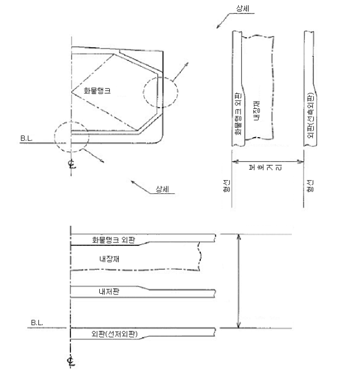
  **그림 7.5.1 (a) - 보호거리 (독립형 주형탱크)**
  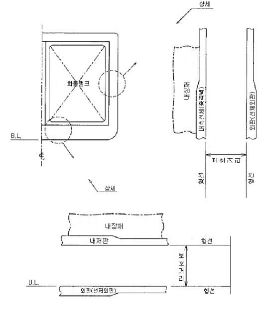
  **그림 7.5.1 (b) - 보호거리 (세미멤브레인탱크)**
  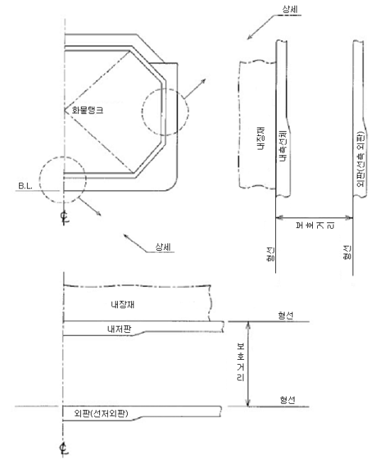
  **그림 7.5.1 (c) - 보호거리 (멤브레인탱크)**
  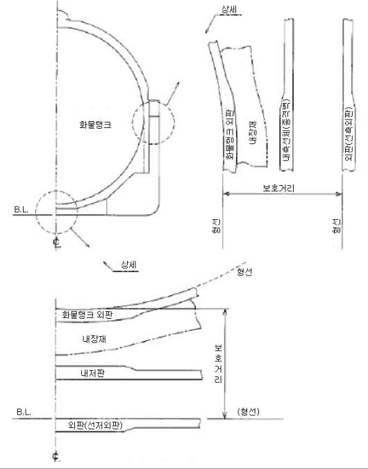
  **그림 7.5.1 (d) - 보호거리 (구형 탱크)**
  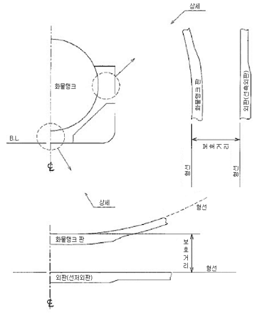
  **그림 7.5.1 (e) - 보호거리 (압력용기 탱크)**

#### 202. 건현 및 복원성

- **1.** 이 장의 적용을 받는 선박은 현행 국제만재흘수선협약에 의하여 정한 최소건현을 지정받을 수 있다. 다만, 지정된 흘수는 이 장에 의해 별도로 정하는 최대흘수를 넘어서는 안 된다.
- **2.** 모든 항해상태 및 화물의 양하 및 적하중의 선박의 복원성은 우리 선급이 인정하는 기준에 따라야 한다. 이 때 인정하는 기준에는 해당되는 부분적하와 해상에서의 적하 및 양하가 포함된다. 또한, 평형수 작업중에도 복원성 요건은 만족하여야 한다.
- **3.** 소비성 액체의 자유표면영향을 계산할 때에는 종류별 액체에 대하여 적어도 횡방향으로 한쌍의 탱크 또는 1개의 중앙탱크가 자유표면을 갖는다고 가정하여야 한다. 그리고 자유표면을 갖는 것으로 가정하는 탱크는 자유표면의 영향이 최대가 되는 탱크이어야 한다. 비손상 구획실 내의 자유표면 영향은 우리 선급이 인정하는 방법에 의하여 계산되어야 한다.
- **4.** 고체밸러스트는 보통 화물지역 내의 이중저구획에 사용하여서는 안 된다. 그러나 복원성을 고려하여 이와 같은 구획에 고체밸러스트의 사용이 불가피할 경우에는 검사를 위해 접근이 가능하며, 선저손상으로 인한 충격하중이 화물탱크구조에 직접 전달되지 않도록 고려하여 그 배치를 결정하여야 한다. **【지침 참조】**
- **5.** 선박의 선장에게는 적하 및 복원성에 관한 정보책자가 제공되어야 한다. 이 정보책자에는 대표적인 운항 상태, 적하, 양하 및 평형수주입 작업의 상세 및 기타 적하조건을 평가하는 방책과 선박의 생존능력의 개요를 포함하여야 한다. 또한, 이 정보책자는 선장이 안정성 및 내항성을 유지하면서 적하하고 조선할 수 있도록 충분한 정보를 포함하여야 한다.
- **6.** 국제 액화가스 산적운반선 코드(**IGC Code**) 적용대상의 모든 선박은 손상 및 비손상 복원성 요건을 만족시키고 있음을 검증 가능케 하는 복원성 적하지침기기를 설치하여야 하며, 그러한 기기는 기구가 권고한 성능기준을 고려하여 우리 선급이 승인한 것이어야 한다. **【지침 참조】**
  - **(1)** 2016년 7월 1일 전에 건조된 선박은, 2016년 7월 1일 이후의 첫 계획된 정기검사 시까지, 그러나 늦어도 2021년 7월 1일 전에 이 요건을 충족하여야 한다.
  - **(2)** 상기 (1)의 요건에도 불구하고, 2016년 7월 1일 전에 건조된 선박에 설치된 복원성 적하지침기기는 손상 및 비손상 복원성 요건 검증에 적합하고 선급이 인정하는 경우, 교체할 필요가 없다.
  - **(3)** 우리 선급이 인정하는 경우, 이 항의 요건을 면제할 수 있으며 이러한 면제는 **IGC 적합증서**에 명기되어야 한다.
- **7.** **6**항의 적용대상 선박이 아닌 경우, 해당 선적국의 요건에 적합하여야 한다.
- **8.** **적하상태**
  손상시 생존능력은 예측되는 적하상태와 흘수 및 트림의 변화에 대해 우리 선급에 제출된 적하지침서를 근거로 검토되어야 한다. 이는 평형수 적하상태 및 화물잔량(cargo heel) 적하상태를 포함한다.

#### 203. 손상가정

- **1.** 가정 최대손상범위는 다음에 따른다.

  **(1) 선측 손상 :**

  | (가) 종방향의 범위: | 1/3 $L ^{2/3}$ 또는 14.5 $\mathrm{m}$ 중 작은 쪽 |   |
  | --- | --- | --- |
  | (나) 횡방향의 범위: | B/5 또는 11.5 m 중 작은 쪽, 하기만재흘수선의 위치에서 외판의 형선으로부터 내측으로 선체중심선에 직각 방향으로 측정한다. |   |
  | (다) 수직방향의 범위: | 한정없이 상방전부, 선저외판의 형선으로부터 측정한다. |   |
  | (2) 선저 손상: |   |   |
  |   | 선박의 전부수선에서 0.3 *L*의 범위 | 기타의 범위 |
  | (가) 종방향의 범위: | 1/3 $L ^{2/3}$ 또는 14.5 $\mathrm{m}$ 중 작은 값 | 1/3 $L ^{2/3}$ 또는 14.5$\mathrm{m}$ 중 작은 값 |
  | (나) 횡방향의 범위: | $B$/6 또는 10 $\mathrm{m}$ 중 작은 값 | $B$/6 또는 5 $\mathrm{m}$ 중 작은 값 |
  | (다) 수직방향의 범위: | $B$/15 또는 2 $\mathrm{m}$ 중 작은 값 선체중심선에서 선저외판의 내면에서 측정한다. (**204.**의 **3**항) | $B$/15 또는 2 $\mathrm{m}$ 중 작은 값 선체중심선에서 선저외판의 내면에서 측정한다. (**204.**의 **3**항) |
- **2.** **기타 손상**
  - **(1)** **1**항에 정하는 최대손상보다 작은 범위의 손상이 보다 심한 상태를 야기할 경우에는 그러한 손상을 가정하여야 한다.
  - **(2)** 화물지역의 모든 장소에서 **204.**의 **1**항 (1)호에 정의된 거리 $d$ (선체외판의 형선에 직각으로 계측)까지의 국부손상을 고려하여야 한다. **206.**의 **1**항이 적용되는 경우, 횡격벽도 손상을 받는 것으로 가정하여야 한다. $d$ 보다 작은 범위의 손상이 더 가혹한 상태가 되는 경우, 이들 손상도 가정하여야 한다. **【지침 참조】**

#### 204. 화물탱크의 위치

- **1.** 화물탱크는 다음 거리의 선내측에 설치하여야 한다.
  - **(1)** 1 G형 선박 : 외판의 형선으로부터 **203.**의 **1**항 (1)호 (나)에 정하는 손상의 횡방향 범위 이상이고, 선체중심선에서 선저외판의 형선으로부터 **203.**의 **1**항 (2)호 (다)에 정하는 손상의 수직방향범위 이상이며, 또한, 모든 위치에서 다음에 따른 $d$ 이상.
    $V _{c}$ : 20°C에서 돔(dome)과 부속물(**그림 7.5.2** 및 **그림 7.5.3** 참조)을 포함하는 각 화물탱크의 총 설계부피. 화물탱크의 보호거리를 위해, 화물탱크의 부피는 하나의 공통격벽을 포함하는 탱크의 모든 부분 부피의 합으로 함.
    $d$ : 임의의 단면에서 외판의 형선으로부터 직각으로 측정한 거리.
    탱크크기의 제한은 이 장의 **17절**에 따라, 1G형 선박의 화물에 적용할 수 있다.
    - **(가)** $V _{c} \leq 1,000 \mathrm{m} ^{3}$ 인 경우, $d=0.8\mathrm{m}$;
    - **(나)** $1,000 \mathrm{m} it ^{3} \prec V _{c} \prec 5,000 \mathrm{m} ^{3}$ 인 경우, $d=0.75 + V _{c} \times 0.2/4,000 \mathrm{m}$
    - **(다)** $5,000 \mathrm{m} it ^{3} \leq V _{c} \prec 30,000 \mathrm{m} ^{3}$ 인 경우, $d=0.8 + V _{c } /25,000 \mathrm{m}$
    - **(라)** $V _{c} \geq 30,000 \mathrm{m} ^{3}$ 인 경우, $d=2 \mathrm{m}$
  - **(2)** 2 G/2 PG형 선박 : 선체중심선에서 선저외판의 형선으로부터 **203.**의 **1**항 (2)호 (다)에 정하는 손상의 수직방향범위 이상이며, 또한 모든 위치에서 **204.**의 **1**항 (1)호 (**그림 7.5.2** 및 **그림 7.5.4** 참조)에 정의된 거리 $d$ 이상.
  - **(3)** 3G형 선박 : 선체중심선에서 선저외판의 형선으로부터 **203.**의 **1**항 (2)호 (다)에 정하는 손상의 수직방향범위 이상이며, 또한 모든 위치에서 선체외판의 형선으로부터 직각거리 $d=0.8\mathrm{m}$ 이상(**그림 7.5.2** 및 **그림 7.5.5** 참조).
- **2.** 탱크위치를 정하기 위하여 멤브레인 또는 세미멤브레인탱크의 경우, 선저손상의 수직방향범위는 내저판까지, 기타 탱크의 경우에는 화물탱크의 저부까지 측정하여야 한다. 멤브레인 또는 세미멤브레인탱크의 경우, 선측손상의 횡방향범위는 종격벽까지, 기타 탱크의 경우에는 화물탱크의 측부까지 측정하여야 한다. 이 조 및 **203.**에 명시된 거리는 **그림 7.5.1** (a)에서 (e)까지와 같이 적용하여야 한다. 이 때 거리는 내장재를 제외한 판에서 판까지, 즉 형선에서 형선까지 측정하여야 한다.
- **3.** 1 G형 선박을 제외한 선박에 대해, 화물탱크 내의 흡입용 웰은 가능한 한 작게 하고 또한 웰의 돌출을 내저판 아래로 이중저 깊이의 25 $\%$ 또는 350 $\mathrm{mm}$ 중 작은 것 이하로 할 경우, **203.**의 **1**항 (2)호 (다)에 정한 선저손상의 수직방향 범위 내에 돌출될 수 있다. 이중저가 없는 경우 선저손상의 범위로 돌출은 350 $\mathrm{mm}$를 넘어서는 안 된다. 이 항에 적합하게 설치되는 흡입용 웰은 손상에 의하여 영향을 받는 구획실을 결정할 때 고려하지 않을 수 있다. **【지침 참조】**
- **4.** 화물탱크는 선수격벽의 전방에 있어서는 안 된다.
  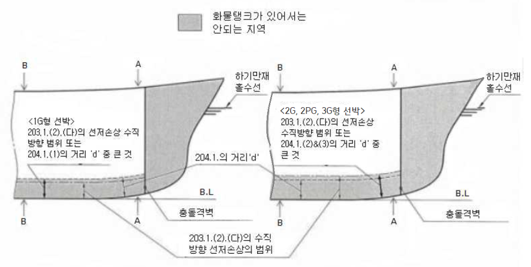
  **그림 7.5.2 탱크위치의 요건 (종단면-1G, 2G, 2PG 및 3G 형 선박)**
  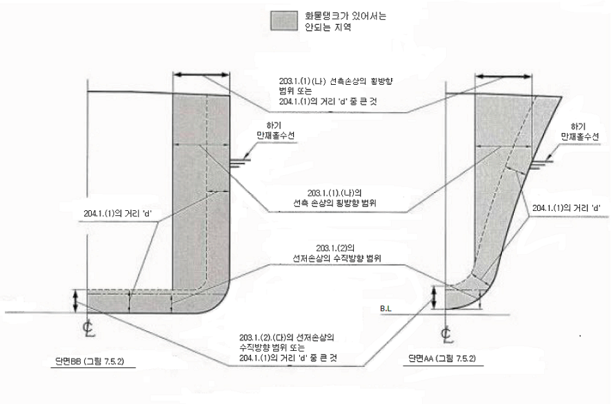
  **그림 7.5.3 탱크위치의 요건 (횡단면-1G형 선박)**
  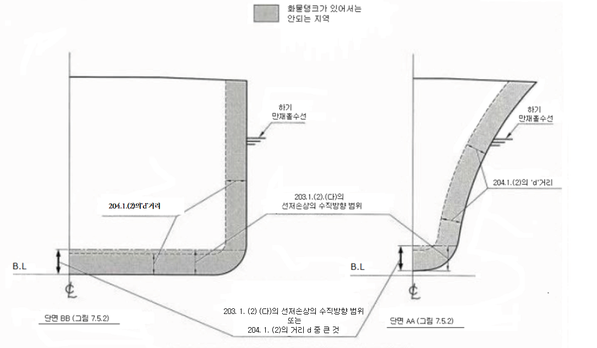
  **그림 7.5.4 탱크위치의 요건 (횡단면-2G 및 2PG형 선박)**
  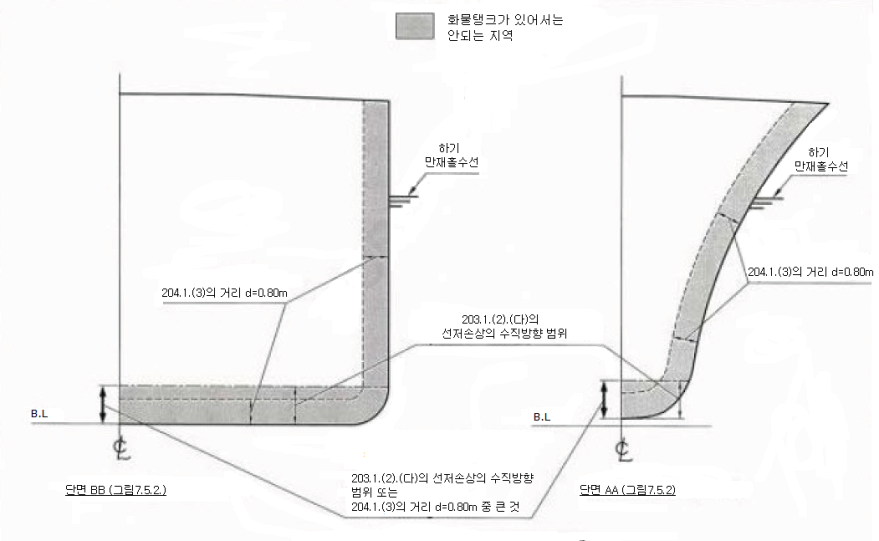
  **그림 7.5.5 탱크위치의 요건 (횡단면-3G형 선박)**

#### 205. 침수의 가상 【지침 참조】

- **1.** **2 07.**의 요건은 선박의 설계특성, 손상구획실의 배치, 형상 및 내용물, 액체의 분포, 비중 및 자유표면의 영향과 모든 적하상태에 대한 흘수 및 트림을 고려한 계산에 의하여 확인하여야 한다.
- **2.** 손상 받은 것으로 가정하는 장소의 침수율은 다음에 따른다.

  | 장소 | 침수율 |
  | --- | --- |
  | 선용품용 장소 거주설비가 있는 장소 기관이 있는 장소 보이드스페이스 화물창 구역 소비성 액체용 장소 기타 액체용 장소 | 0.60 0.95 0.85 0.95 0.95(1) 0～0.95(2) 0～0.95(2) |
  | (비고) (1) 다른 장소의 침수율은 상세 계산에 기초하여 고려할 수 있다. **SOLAS Ch II-1** Part B-1의 규정에 대한 해석(**MSC/Circ.651**)을 참고한다. (2) 부분 적재된 구획의 침수율은 구획에 적재되는 액체의 양과 일치되어야 한다. |   |
- **3.** 손상이 액체가 들어있는 탱크를 관통하는 경우에는 항상 내용액은 해당구획으로부터 완전히 유출하여 최종 평형 액면의 위치까지 해수와 대체되는 것으로 가정하여야 한다.
- **4.** **2 06.**의 **1**항 (4)호에서 (6)호에 정한 것과 같이 횡수밀격벽간의 구조가 손상된 경우, 침수구획실 결정상 횡격벽이 유효하다고 간주하기 위해 횡격벽은 **203.**의 **1**항 (1)호 (가)에 정하는 손상의 종방향범위와 적어도 같은 길이의 간격으로 설치되어야 한다. 이 간격보다 좁은 간격으로 횡격벽이 1개 또는 그 이상 설치되어 있는 경우, 가정손상의 종방향범위 내의 횡수밀격벽은 침수구획실 결정상 존재하지 않는 것으로 간주하여야 한다. 더우기 선측구획 또는 이중저구획의 경계가 되는 횡격벽의 모든 부분은 수밀격벽구획이 **203.**에 의하여 요구되는 수직 또는 수평 손상의 범위 내에 있을 경우에는 손상되는 것으로 가정하여야 하며, 또한 길이 3 $\mathrm{m}$를 초과하는 계단부 또는 굴절부가 가정손상의 관통 범위 내에 있는 경우의 모든 횡격벽도 손상되는 것으로 가정하여야 한다. 선미격벽 및 선미탱크 천정이 형성하는 계단부는 이 항의 적용상 계단부로 간주하여서는 안 된다.
- **5.** 선박은 효과적인 배치에 의하여 비대칭 침수를 최소한으로 유지하도록 설계하여야 한다.
- **6.** 밸브 또는 수평조정용 교차관(cross-levelling pipes)과 같은 기계적 수단이 필요한 평형설비를 설치할 경우, 이들 장치는 **207.**의 **1**항의 요건을 충족시키기 위하여 횡경사각을 감소시키거나 잔존복원력의 최소범위를 달성하는 목적으로 고려하여서는 안 되며, 또한 평형설비가 사용되는 모든 단계에서 충분한 잔존복원력을 유지하여야 한다. 큰 단면의 덕트에 의하여 연결되는 구획은 공통구획으로 간주할 수 있다.
- **7.** 관, 덕트, 트렁크 또는 터널이 **203.**의 손상범위 내에 있는 경우에는 손상이 발생하여 침수하게 될 구획실 이외의 구획실에 침수가 미치지 않도록 하여야 한다.
- **8.** 선측손상부 직상에 있는 선루의 부력은 고려하여서는 안 된다. 그러나 손상범위 외의 선루의 비침수부는 다음과 같은 경우에는 고려할 수 있다.
  - **(1)** 해당 비침수부가 수밀격벽에 의하여 손상개소로부터 분리되고 **207.**의 **1**항 (1)호의 요건에 적합한 경우 및
  - **(2)** 이러한 구획에 있는 개구가 원격조작의 슬라이딩 수밀문에 의하여 폐쇄할 수 있고, 보호되어 있지 아니한 개구가 **207.**의 **2**항 (1)호에 요구되는 잔존복원력의 최소범위 내에서 침수되지 않는 경우. 그러나 풍우밀로 페쇄되는 기타 개구의 침수는 허용될 수 있다.

#### 206. 손상기준 【지침 참조】

- **1.** 선박은 다음의 선박종류에 따른 범위에서 **203.**에 따른 손상을 받고 **205.**의 침수가 발생한 경우에도 생존할 수 있어야 한다.
  - **(1)** 1 G형 선박은 선박 길이방향의 모든 부분이 손상된 것으로 가정하여야 한다.
  - **(2)** 길이 150 $\mathrm{m}$를 초과하는 2 G형 선박은 선박 길이방향의 모든 부분이 손상된 것으로 가정하여야 한다.
  - **(3)** 길이 150 $\mathrm{m}$ 이하의 2 G형 선박은 선미부 기관구역의 어느 1개의 격벽을 포함하는 위치를 제외하고, 그 길이방향의 모든 부분이 손상된 것으로 가정하여야 한다.
  - **(4)** 2PG형 선박은 **203.**의 **1**항 (1)호 (가)에 정하는 손상의 종방향범위를 초과하는 간격으로 배치된 횡격벽을 포함하는 위치를 제외하고, 그 길이 방향의 모든 부분이 손상된 것으로 가정하여야 한다.
  - **(5)** 길이 80 $\mathrm{m}$ 이상의 3 G형 선박은 **203.**의 **1**항 (1)호 (가)에 정하는 종방향 손상범위를 초과하는 간격으로 배치된 횡격벽을 포함하는 위치를 제외하고, 그 길이방향의 모든 부분이 손상된 것으로 가정하여야 한다.
  - **(6)** 길이 80 $\mathrm{m}$ 미만의 3 G형 선박은 **203.**의 **1**항 (1)호 (가)에 정하는 종방향 손상범위를 초과하는 간격으로 배치된 횡격벽을 포함하는 위치 및 후부에 있는 기관구역을 포함한 손상을 제외하고 그 길이방향의 모든 부분이 손상된 것으로 가정하여야 한다.
- **2.** 소형의 2 G/2 PG 선박 및 3 G형 선박이 **1**항 (3)호, (4)호 및 (6)호의 규정에 모든 면에서 적합하지 않을 경우, 우리 선급은 동등한 안전도를 유지하는 대체조치를 취하는 조건으로 특별히 완화를 고려할 수 있다. 대체조치의 내용에 대하여는 승인을 받고 명확히 기재하여 주관청에 제시할 수 있도록 하여야 한다. 이와 같은 모든 완화사항은 **104.**의 **4**항의 액화가스 산적운송에 관한 국제적합증서(이하 **IGC 적합증서**라 한다.)상에 적절한 절차에 따라 기재하여야 한다.

#### 207. 생존요건 【지침 참조】

이 장이 적용되는 선박은 **206.**의 기준에 따라 **203.**의 손상범위에 대하여 안정된 평형상태로 생존할 수 있어야 하며 또한 다음 기준을 만족하여야 한다.

- **1.** **침수의 모든 단계에서 :** ***(2024)***
  - **(1)** 선박의 침하, 횡경사 및 종경사를 고려한 흘수선은 침수가 진행중이거나 새로운 침수가 발생할 우려가 있는 모든 개구의 하단부보다 하방에 있어야 한다. 그러한 개구에는 공기관 및 풍우밀문 또는 창구덮개에 의하여 폐쇄되는 개구가 포함된다. 그러나, 다음의 수단으로 폐쇄되는 개구는 제외할 수 있다.
    - **(가)** 수밀 맨홀덮개 및 수밀 평갑판구(watertight flush scuttle),
    - **(나)** 갑판의 높은 건전성을 유지하기 위한 소형 수밀 화물탱크 창구덮개
    - **(다)** 원격조작 슬라이딩 수밀문,
    - **(라)** 항해 중 통상 폐쇄되며 항해선교 및 원격지에 개폐 표시가 되는 급동식(quick acting) 또는 단동식(single action type)의 힌지 수밀 출입문(hinged watertight access door),
    - **(마)** 항해중 반드시 폐쇄되는 힌지 수밀문(hinged watertight door) 및
    - **(바)** 고정원형창(non-opening type sidescuttles)
  - **(2)** 비대칭 침수에 의한 최대횡경사각은 30°를 초과하여서는 안 된다.
  - **(3)** 침수의 중간단계에서의 잔존복원력은 **2**항 (1)호에서 요구하는 것 이상이어야 한다.
- **2.** **침수 후의 최종평형시 :**
  - **(1)** 복원정곡선은 평형상태로부터 적어도 20°의 복원력 범위를 갖고 또한 20°의 범위 내에서 적어도 0.1 m의 최대 잔존복원정을 가져야 한다. 이 범위내의 곡선하의 면적은 0.0175 mrad 이상이어야 한다. 복원정 곡선은 침수후의 최종 평행상태로부터 25°(노출갑판이 잠기지 않은 경우 30°)의 횡경사까지의 사이에 임의의 횡경사 각으로부터 20°의 잔존복원 범위에서 규정을 만족하는 것으로 할 수 있다. 비보호 개구는 해당구역이 침수한다고 가정하는 경우를 제외하고 이 범위 내에서 침수되어서는 안 된다. 이 범위 내에서 **1**항 (1)호에 규정된 개구 및 풍우밀 폐쇄할 수 있는 기타 개구의 침수는 인정할 수 있다. (**그림 7.5.6 참조**)
  - **(2)** 비상용 동력원은 작동할 수 있어야 한다.
    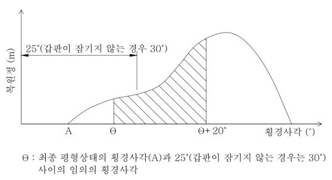
    #underline{**그림 7.5.6**}

### 제 3 절 선체배치

#### 301. 화물지역의 격리 【지침 참조】

- **1.** 화물창 구역은 기관 및 보일러구역, 거주구역, 업무구역, 제어장소, 체인로커, 청수탱크 및 창고와 격리되어야 한다. 화물창 구역은 A류 기관구역의 전방에 위치하여야 한다. **SOLAS II-2/17** 에 기초하여, 화물의 방출 및 경감수단을 포함한 위험성을 고려하여, A류 기관구역을 화물창 구역 전방에 위치하는 배치를 허용할 수 있다.
- **2.** 완전 또는 부분 2차 방벽을 필요로 하지 않는 화물격납설비로 화물을 운송하는 경우 화물창 구역은 **1**항의 구역 또는 화물창 구역 직하 또는 화물창 구역 외측의 구역으로부터 코퍼댐, 연료유탱크 또는 A-60급 전체 용접구조의 단일 가스밀 격벽으로 유효하게 격리시켜야 한다. 인접구역에 발화원 또는 화재위험이 없는 경우, A-0급 단일 가스밀 경계로 할 수 있다.
- **3.** 완전 또는 부분 2차 방벽을 필요로 하는 화물격납설비로 화물을 운송하는 경우, 화물창 구역은 **1**항의 구역, 발화원 또는 화재의 위험이 있는 구역을 포함하는 화물창 구역의 직하 또는 외측의 구역으로부터 코퍼댐 또는 연료유탱크로 유효하게 격리시켜야 한다. 인접구역에 발화원 또는 화재위험이 없는 경우, A-0급 단일 가스밀 경계로 할 수 있다.
- **4.** 터릿형 구획(turret compartments)은 **1**항의 구역 또는 발화원 또는 화재 위험요소를 포함하는 터릿형 구획의 직하 또는 외부의 구역으로부터 코퍼댐 또는 A-60급 경계로 유효하게 격리시켜야 한다. 인접구역에 발화원 또는 화재위험이 없는 경우, A-0급 단일 가스밀로 격리시킬 수 있다.
- **5.** 추가로, 터릿형 구획으로부터 인접구역으로의 화재전파 위험성은 위험성해석에 의해 평가되어야 한다.(**101.**의 **7**항 참조) 그리고, 필요한 경우 터릿형 구역의 주위로 코퍼댐을 배치하는 것과 같은 추가의 예방조치를 하여야 한다.
- **6.** 완전 또는 부분 2차 방벽을 필요로 하는 화물격납설비로 화물을 운송하는 경우에는 다음의 규정에 따른다.
  - **(1)** 화물온도가 -10 °C미만의 경우에는 화물창 구역은 이중저로서 해수로부터 격리하여야 한다.
  - **(2)** 화물온도가 -55 °C미만의 경우에는 화물창 구역은 이중저로서 해수로부터 격리하고 또한 선측탱크를 구성하는 종통격벽도 설치하여야 한다.
- **7.** 화물격납설비의 노출갑판상 개구에는 유효한 폐쇄장치를 설치하여야 한다.

#### 302. 거주구역, 업무구역, 기관구역 및 제어장소 【지침 참조】

- **1.** **화물지역**내에는 거주구역, 업무구역 또는 제어장소를 설치하여서는 안 된다. 화물지역에 면하는 거주구역, 업무구역 또는 제어장소의 위벽은 2차방벽을 필요로 하는 격납설비를 갖는 선박의 갑판 또는 격벽의 단층파괴에 의하여 화물창구역으로부터 해당 구역으로 가스가 침입하는 것을 피할 수 있도록 배치하여야 한다.
- **2.** 거주구역, 기관구역, 업무구역 및 제어장소의 공기흡입구/배출구 및 개구의 위치는 화물관장치, 화물벤트장치 및 가스연소장치로부터의 기관구역의 배기와 관련하여 유해한 화물증기의 위험으로부터 보호되도록 고려하여야 한다.
- **3.** 거주구역이 선미부에 있는 경우, **306.**의 **1**항에서 허용하는 에어로크를 통하여 화물지역 전방에 있는 업무구역으로 통하는 경우를 제외하고, 문의 가스밀 여부에 관계없이 비위험지역으로부터 위험지역으로 통하는 문을 설치하여서는 안 된다.
- **4.** (1) 거주구역, 업무구역, 기관구역 및 제어장소의 출입구, 공기흡입구 및 개구는 화물지역에 면해서는 안 된다. 이들의 개구는 화물지역에 면하고 있지 않은 단부 격벽에 배치하거나 화물지역에 면하는 선루 또는 갑판실 단부로부터 $L$/25 또는 3 $\mathrm{m}$ 중 큰 것 이상의 거리로 선루 또는 갑판실 측부에 배치하여야 한다. 다만, 이 거리는 5 $\mathrm{m}$를 넘을 필요는 없다.
  - **(2)** 화물지역에 면하는 창/현창 및 위에 언급한 범위 내의 선루 또는 갑판실 측부의 창/현창은 고정식(비개폐식)이어야 한다. 조타실이 신속하고 유효하게 가스밀 되도록 설계할 경우 조타실의 창은 비고정식으로 할 수 있으며 조타실문은 (1)호의 제한범위 내에 설치할 수 있다.
  - **(3)** 인화성이나 유독위험이 없는 화물을 운송하는 선박에 대하여 우리 선급은 이 규정을 완화할 수 있다.
  - **(4)** 발화원이 있는 선수루 구역으로의 출입은 문이 **10절**에 따른 위험지역의 밖에 설치되는 경우, 화물지역을 면하는 하나의 문으로만 허용할 수 있다.
- **5.** 조타실의 창들을 제외한, 화물지역에 면하는 창/현창 및 **4**항 (1)의 언급한 범위 내의 선루 또는 갑판실 측면의 창/현창은 "A-60"급이어야 한다. 최상층 전통갑판하의 외판 및 제1층의 선루 또는 갑판실에 설치하는 현창은 고정식(비개폐식)이어야 한다. *(2019)*
- **6.** 거주구역, 업무구역 및 제어장소의 모든 공기흡입구/배출구 및 기타 개구는 폐쇄장치를 설치하여야 한다. 독성화물을 운송하는 경우, 폐쇄장치는 구역 내부에서 작동시킬 수 있어야 한다. 독성화물을 운송하는 경우 구역 내부에서 작동할 수 있는 폐쇄장치를 갖춘 공기흡입구 및 개구의 설치에 관한 요건은 갑판창고, 선수창고, 작업실과 같이 일반적으로 무인구역에 대하여는 적용하지 않는다. 추가로, 이 요건은 화물지역 내에 위치한 화물제어실에도 적용하지 않는다.
- **7.** 터릿형 설비의 제어실 및 기관구역은 화물탱크의 전방 또는 후방의 화물지역에 설치할 수 있다. 발화원을 포함한 이 구역의 출입은 문이 위험지역 바깥쪽에 위치하거나 에어로크를 통과하는 경우, 화물지역에 면하는 문을 통해서 가능하다.

#### 303. 화물기기구역 및 터릿형 구획 【지침 참조】

- **1.** 화물기기구역은 노출갑판 상부 및 화물지역 내에 설치하여야 한다.
  화물기기구역 및 터릿형 구획은 **SOLAS** 제II-2장 제9규칙 2.4항에 따른 방화구조 목적상, **SOLAS** 제II-2장 제4규칙 5.10항에 따른 폭발방지 목적상, 화물펌프실로서 취급되어야 한다.
- **2.** 화물기기구역이 최후부 화물창 구역의 후단에, 또는 최전부 화물창 구역의 전단에 설치되어 있을 경우, **105.**의 **6**항에서 정의된 것과 같은 화물지역은 선박의 전 너비 및 깊이까지의 화물기기구역 및 이들 구역 상부의 갑판구역을 포함하도록 확대되어야 한다.
- **3.** 화물지역의 한계가 **2**항에 의하여 확대될 경우, 거주 및 업무구역, 제어장소 및 A류 기관구역을 화물기기구역과 분리시키는 격벽은 갑판 또는 격벽의 단층파괴를 통하여 가스가 이 구역으로 침입하지 못하도록 설치되어야 한다.
- **4.** 격벽 관통부가 두 구역을 유효하게 가스밀로 분리하는 경우, 화물압축기 및 화물펌프는 격벽 또는 갑판에 의해 분리되는 인접한 비위험구역에 있는 전기모터로 구동할 수 있다. 대안으로, 전기설비가 **10절**의 요건을 만족하는 경우, 화물압축기 및 화물펌프는 같은 구역에 설치된 승인된 안전형 전동기로 구동될 수 있다.
- **5.** 화물기기구역 및 터릿형 구획은 보호복 및 호흡구를 착용한 사람이 지장없이 안전하게 통행할 수 있고 사고시 의식불명의 사람을 운반할 수 있도록 배치하여야 한다. 화물기기구역에는 최소한 2개의 멀리 떨어진 탈출로와 문이 설치되어야 하며, 문까지 최대이동거리가 5 m 이하인 경우, 하나의 탈출로를 허용할 수 있다.
- **6.** 하역에 필요한 모든 밸브는 보호복을 착용한 사람이 용이하게 접근할 수 있도록 배치하여야 한다. 화물펌프실 및 화물압축기실에는 배수할 수 있는 적절한 설비를 갖추어야 한다.
- **7.** 터릿형 구획은 폭발 또는 제어되지 않은 고압가스분출(과압 및/또는 취성파괴)의 경우에도 구조 건전성을 유지하도록 설계되어야 하며 이러한 특성은 압력방출장치의 성능을 고려한 위험성 해석을 기초하여 입증되어야 한다.

#### 304. 화물제어실 【지침 참조】

- **1.** 모든 화물제어실은 노출갑판 상부에 배치하여야 한다. 하지만 화물지역 내에 배치할 수도 있다. 다만, 화물제어실은 다음에 정하는 상태를 만족할 경우, 거주구역, 업무구역 또는 제어장소 구역 내에 배치할 수 있다.
  - **(1)** 화물제어실은 비위험지역이어야 한다. 그리고,
  - **(2)** 출입구가 **302.**의 **4**항 (1)의 규정에 적합한 경우, 제어실은 상기에서 규정한 구역에 출입문을 설치할 수 있다.
  - **(3)** 출입구가 **302.**의 **4**항 (1)의 규정에 적합하지 않을 경우, 화물제어실은 상기에서 규정한 구역에 출입문을 설치할 수 없고 그러한 구역의 경계는 A-60급 이어야 한다.
- **2.** 화물제어실을 비위험지역으로 설계할 경우, 계기장치는 가능한 한 간접읽기 방식으로 하고, 어떠한 경우에도 그 구역에 가스가 누설되지 않도록 설계하여야 한다. **1306.**의 **11**항에 따라 가스탐지장치를 설치할 경우, 화물제어실은 비위험지역으로 간주하여야 한다.
- **3.** 가연성화물을 운송하는 선박의 화물제어실이 위험지역인 경우에는 발화원을 제거하여야 하며, 모든 전기설비는 **10절**에 따라 설치하여야 한다.

#### 305. 화물지역 내에 있는 구역으로의 출입 【지침 참조】

- **1.** 선박 내측구조의 적어도 일면은 어떠한 고정구조물 또는 장비품을 제거하지 않고 육안검사가 가능하도록 하여야 한다. **2**항, **406.**의 **2**항 (4) 또는 **420.**의 **3**항 (7)의 요건여부에 관계없이 육안검사가 선박 내측구조의 외측에서만 가능할 경우, 선박 내측구조는 연료유탱크의 격벽으로 하여서는 안 된다.
- **2.** 화물창 구역의 단열재의 일면은 검사할 수 있도록 하여야 한다. 화물탱크가 사용온도의 상태일 때에 화물창 구역 경계의 외측에서 검사함으로서 단열장치의 건전성을 확인할 수 있는 경우에는 그렇지 않다.
- **3.** 위험지역으로 분류되는 화물창 구역, 보이드 스페이스, 화물탱크 및 기타 구역의 배치는 보호복 및 호흡구를 착용한 사람이 이들 구역 내에 들어가서 검사할 수 있도록 하고 부상이나 의식불명의 사람을 운반할 수 있도록 하여야 한다. 또한 다음의 규정에 적합하도록 하여야 한다.
  - **(1)** 통행에 대하여는 다음의 규정에 따른다.
    - **(가)** 모든 화물탱크는 노출갑판에서 직접 출입할 수 있을 것
    - **(나)** 수평개구, 창구 또는 맨홀의 치수는 호흡구를 장비한 사람이 장애없이 사다리로 오르내릴 수 있고 또한 구역의 저부로부터 부상당한 사람을 용이하게 끌어올리는데 충분한 간격을 갖는 것이어야 한다. 최소 개구치수는 600 $\mathrm{mm}$ × 600 $\mathrm{mm}$ 이상이어야 한다.
    - **(다)** 구역의 길이 또는 너비방향의 통행에 사용하는 수직한 개구 또는 맨홀의 최소개구치수는 바닥판과 또는 기타의 발판이 설치되는 경우를 제외하고 구역의 바닥으로부터 600 $\mathrm{mm}$ 이하의 높이 위치에서 600 $\mathrm{mm}$ × 800 $\mathrm{mm}$ 이상으로 하여야 한다.
    - **(라)** C형 탱크로의 원형 통행개구는 지름이 600 mm 보다 작아서는 안 된다.
  - **(2)** 개구를 통과하는 것 또는 부상한 사람을 이동하는 것이 가능하다고 우리 선급이 인정하는 경우에는 (1)호 (나) 및 (다)의 치수를 경감할 수 있다.
  - **(3)** 2차방벽을 필요로 하는 화물격납설비에 운송되는 경우, (1)호 (나) 및 (다)의 규정은 단일의 가스밀 강재경계로 화물창구역과 분리되는 구역에는 적용되지 않는다. 이와 같은 구획에는 폐위된 비위험지역을 포함하지 않는 노출갑판으로부터 직접 또는 간접통로만을 설치하여야 한다. *(2021)*
  - **(4)** 검사를 위해 요구되는 통행로는 최소한 (1)호 (다)에서 요구되는 횡단면을 가지며, 화물탱크의 위 및 아래로 통하는 지정된 통로이어야 한다.
  - **(5)** **1**항 또는 **2**항의 목적상, 다음을 적용하여야 한다.
    - **(가)** 평면 또는 곡면 그리고 갑판보, 보강재, 늑골 거더 등과 같은 구조물을 검사하기 위하여 구조들의 표면 사이를 지나야 하는 경우, 그 구조의 표면 및 자유단 사이의 거리는 최소 380$\mathrm{mm}$ 이상이어야 한다. 검사하여야 할 면과 갑판, 격벽 또는 외판 등과 같이 상부 구조물의 표면 사이의 거리는 곡진 탱크(즉, C형 탱크)의 경우, 최소 450 $\mathrm{mm}$ 이상이거나, 평평한 탱크(즉, A형 탱크)의 경우, 600$\mathrm{mm}$ 이상이어야 한다.(**그림 7.5.7** 참조)
    - **(나)** 가시성을 이유로 검사할 면과 선체구조의 임의의 부분 사이를 통행할 필요가 없는 경우, 구조부재의 자유단과 검사하여야 할 면 사이의 거리는 최소 50 $\mathrm{mm}$ 또는 구조물 면재의 반폭 중 큰 값 이상이어야 한다.(**그림 7.5.8** 참조)
    - **(다)** 곡면에 대한 검사를 위하여, 그 면과 구조부재가 없는 다른 면(평면 또는 곡면) 사이를 통행할 필요가 있다면, 양 면 사이의 거리는 최소 380 $\mathrm{mm}$ 이상이어야 한다(**그림 7.5.9** 참조). 곡면과 다른 면 사이의 통행이 요구되지 않는 경우, 곡면의 형상을 고려하여 380 $\mathrm{mm}$ 보다 작은 거리도 허용될 수 있다.
    - **(라)** 거의 평면인 면의 검사를 위하여, 구조부재가 없는 거의 평면인 면 사이 또는 거의 평행인 면 사이를 통행할 필요가 있다면, 이 면들 사이의 거리는 최소 600 mm 이어야 한다. 고정식 통행 사다리가 설치된 경우, 간격은 최소 450 mm 이상이어야 한다.(**그림 7.5.10** 참조)
    - **(마)** 화물탱크 섬프(sump)와 흡입웰 근처의 이중저구조 사이의 최소거리는 **그림 7.5.11**의 거리보다 작아서는 안 된다. (**그림 7.5.11** 섬프의 평면과 웰 사이의 거리는 최소 150 $\mathrm{mm}$ 이며, 내저판 사이 모서리 간, 웰의 수직 면간 그리고 구형 또는 원형면과 탱크의 섬프(sump) 사이의 너클포인트(knuckle point)의 간격은 최소 380 $\mathrm{mm}$ 이상이어야 한다.) 만약, 흡입웰이 없다면, 화물탱크 섬프와 이중저 사이의 거리는 50 mm 보다 작아서는 안 된다.
    - **(바)** 화물탱크 돔과 갑판구조 사이의 거리는 150 mm 이상이어야 한다.(**그림 7.5.12** 참조)
    - **(사)** 화물탱크, 화물탱크 지지구조 및 구속구조(예: 종동요 방지설비, 횡동요 방지설비 및 이탈방지 초크 등), 화물탱크 단열재 등의 검사를 위해 필요하다면 고정식 또는 이동식 작업대를 설치하여야 한다. 이러한 작업대는 (가)에서 (라)의 요구하는 간격을 유지하여야 한다.
    - **(아)** 만약, 고정식 또는 이동식 배기덕트가 **1201.**의 **2**항에 따라 설치되어야 하는 경우, 이러한 덕트는 (가)에서 (라)의 요구하는 간격을 침범하여서는 안 된다.
- **4.** 개방 노출갑판으로부터 비위험지역으로의 출입은 **306.**에 적합한 에어로크에 의한 출입이 아닌 경우, **10절**에 정의된 위험지역의 외부에서 출입하도록 하여야 한다.
- **5.** 터릿형 구획에는 2개의 독립된 출입수단이 마련되어야 한다.
- **6.** 노출갑판 하방의 위험지역에서 비위험지역으로의 출입은 허용되지 않는다.

  | 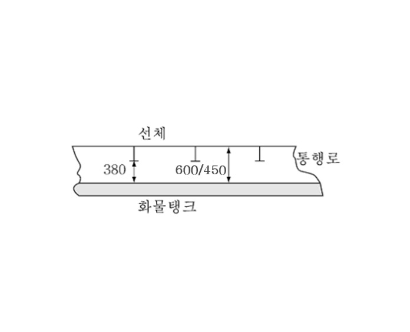 **그림 7.5.7** **그림 7.5.7** | 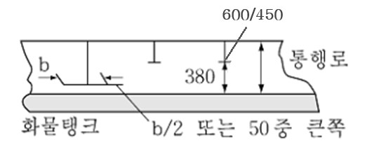 **그림 7.5.8** **그림 7.5.8** |
  | --- | --- |
  | 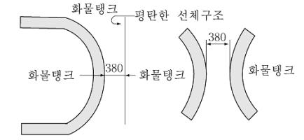 **그림 7.5.9** **그림 7.5.9** | 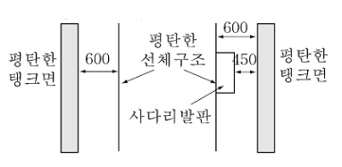 **그림 7.5.10** **그림 7.5.10** |
  | 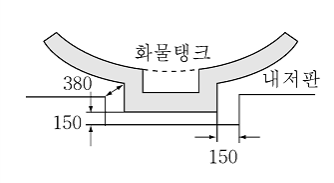 **그림 7.5.11** **그림 7.5.11** | 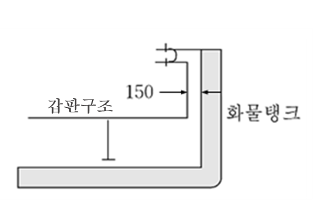 **그림 7.5.12** **그림 7.5.12** |

#### 306. 에어로크 【지침 참조】

- **1.** 개방 노출갑판상의 위험지역과 비위험구역 사이의 출입은 에어로크에 의한 방법만 가능하다. 에어로크는 어떠한 개방고정용 장치도 없어야 하고, 과압을 유지할 수 있으며, 확실하게 가스밀을 유지할 수 있는, 2개의 자동폐쇄식 강재문으로 구성되어야 한다. 이 강재의 문은 1.5 $\mathrm{m}$ 이상 2.5 $\mathrm{m}$ 이하의 간격으로 떨어져 설치되어야 한다. 에어로크 구역은 비위험지역으로부터 기계식 통풍이 되어야 하며, 노출갑판상의 위험지역에 대하여 과압을 유지하여야 한다.
- **2.** 과압에 의해 보호되는 구역의 경우, 배기는 우리 선급이 별도로 정하는 지침에 따른다.
- **3.** 경보를 알리는 가시가청 경보장치를 에어로크로 분리된 양쪽 구획에 설치하여야 한다. 한쪽 문이 열린 경우, 가시경보장치는 경보를 발하여야 한다. 에어로크의 양쪽 문이 폐쇄상태로 되지 않은 경우, 가청경보장치는 경보를 발하여야 한다.
- **4.** 인화성 물질을 운송하는 선박의 경우, 에어로크로 보호되는 구역 내의 전기설비가 승인된 안전형이 아닌 경우에는 그 구역의 과압상태가 상실되었을 때 무통전상태로 되어야 한다.
- **5.** 에어로크로 보호되는 구역에 설치되는, 비상소화펌프, 조선, 양묘 및 계선장치용 전기설비는 승인된 안전형이어야 한다.
- **6.** 에어로크 구역에서는 화물증기를 감시하여야 한다.(**1306.**의 **2**항 참조)
- **7.** 현행 국제만재홀수선 협약의 규정이 적용되는 문의 문턱 높이는 300 $\mathrm{mm}$ 이상이어야 한다.

#### 307. 빌지, 평형수 및 연료유 장치 【지침 참조】

- **1.** 2차방벽을 필요로 하지 아니하는 화물격납설비로서 화물을 운송하는 경우, 화물창 구역에는 적절한 배출설비를 설치하여야 한다. 이 흡입관은 기관구역에 연결하여서는 아니되며, 또한 누설탐지장치를 설치하여야 한다.
- **2.** 2차방벽이 설치된 경우에는 인접하는 선체구조를 통하여 화물창 구역 또는 단열구역으로 유입되는 모든 누설물을 처리할 수 있는 적절한 배출설비를 설치하여야 한다. 이 흡입관은 기관구역의 펌프에 인도하여서는 아니되며 또한 누설탐지장치도 설치하여야 한다.
- **3.** 독립형탱크 형식 A의 선박에서 화물창 또는 방벽간 구역에는 화물탱크의 누설 또는 파손에 의한 액체화물을 취급하기에 적합한 드레인 배출장치를 갖추어야 한다. 이 장치는 누설화물을 화물액관으로 회송시킬 수 있는 것이어야 한다.
- **4.** 상기 **3**항의 장치에는 떼어낼 수 있는 스풀피스를 갖추어야 한다.
- **5.** 평형수구역(평형수관으로 사용되는 습식 덕트킬 포함), 연료유탱크 및 비위험지역은 기관실 내의 펌프로 관을 연결할 수 있다. 평형수관이 통과하는 건식 덕트킬은 기관구역의 펌프에 연결할 수 있으나 이러한 연결은 펌프에 직접 연결하여야 하며, 펌프로부터의 배출은 직접 선외로 유도하여야 한다. 이 경우, 펌프의 흡입측 및 배출측 배관에는 비위험구역에 사용되는 배관과 연결되는 밸브 또는 매니폴드를 설치하지 않아야 한다. 펌프의 밴트는 기관구역 내에 개방하여서는 안 된다. *(2021)*

#### 308. 선수미 하역설비

- **1.** 이 **308.** 및 **제5절**의 요건에 적합한 경우, 화물관장치는 선수 또는 선미에서 하역할 수 있도록 배치할 수 있다.
- **2.** 거주구역, 업무구역 또는 제어장소를 통과하는 선수 또는 선미의 하역용 관장치는 1 G형 선박이 요구되는 화물의 이송에 사용하여서는 안 된다. 선수 또는 선미의 하역용 관장치는, 설계압력이 2.5 $\mathrm{MPa}$ 이상인 경우, **102.**의 **51**항에 명시된 독성화물의 이송에 사용하여서는 안 된다.
- **3.** 휴대식 설비는 인정되지 않는다.
- **4.** (1) 거주구역, 업무구역, 기관구역 및 제어장소의 출입구, 공기흡입구 및 개구는 선수 또는 선미 하역설비의 화물 육상시설 연결장소에 면하는 선루 또는 갑판실 단부로부터 3 $\mathrm{m}$ 이상이거나 적어도 선박길이의 4 $\%$이상 떨어진 선루 또는 갑판실의 외측에 배치하여야 한다. 다만, 이 거리는 5 $\mathrm{m}$를 넘을 필요는 없다.
  - **(2)** 육상시설 연결장소에 면한 상기 거리 내의 선루 또는 갑판실의 선측에 있는 창 및 현창은 고정식(비개방식)의 것이어야 한다. **【지침 참조】**
  - **(3)** 또한, 선수 또는 선미 하역설비의 사용 중에는 선루 또는 갑판실 측면의 상기 거리 내의 모든 문, 현창 및 기타 개구는 폐쇄하여야 한다.
  - **(4)** 소형선으로서 **302.**의 **4**항 (1)에서 (4)까지 및 상기의 (1)에서 (3)까지를 적용함이 불가능할 경우, 우리 선급은 상기 요건을 완화할 수 있다.
- **5.** 화물육상 연결장소로부터 10 $\mathrm{m}$거리의 구역 내에 있는 갑판개구 및 공기흡입구는 선수 또는 선미 하역설비 사용 중에는 폐쇄되어야 한다.
- **6.** 선수 또는 선미 하역구역의 소화설비는 **1103.**의 **1**항 (4) 및 **1104.**의 **6**항의 규정에 따라야 한다.
- **7.** 화물제어장소와 육상시설 연결장소 사이에 통신장치를 설치하여야 하며, 또한 이 장치는 해당되는 경우, 위험지역에서의 사용에 대해 승인된 것이어야 한다.

### 제 4 절 화물격납설비

#### 401. 정의 (IGC Code 4.1)

- **1.** **콜드스폿**(cold spot)은 선체 또는 단열재 표면의 한 부분으로, 선체 또는 인접한 선체구조물의 허용최저온도에 비해, 또는 **7절**의 화물의 압력/온도 제어시스템의 설계치에 비해 국부적으로 온도 저하가 일어난 지점이다.
- **2.** 설계증기압 $P _{0}$라 함은 화물탱크의 설계시 사용되는 탱크 정부에서의 최대 게이지 압력이다.
- **3.** 재료선정을 위한 설계온도라 함은 화물탱크에 화물이 적재되고 이송될 수 있는 최저온도를 말한다.
- **4.** 독립형탱크라 함은 자기지지형 탱크로서 선체구조를 구성하지 아니하고 또한 선체강도상 필요로 하지 않는 것을 말한다. 독립형탱크는 **421.**에서 **423.**에 따른 3종류가 있다.
- **5.** 멤브레인탱크라 함은 인접하는 선체구조에 의하여 단열재를 통하여 지지된 얇은 막으로 구성되는 비자기지지형의 탱크를 말한다. 멤브레인탱크의 상세요건은 **424.**에 따른다.
- **6.** 일체형탱크라 함은 선체구조의 일부를 구성하고, 인접하는 선체구조에 응력을 주는 하중에 의하여 인접하는 구조와 같은 영향을 받는 탱크를 말한다. 일체형탱크의 상세요건은 **425.**에 따른다.
- **7.** 세미멤브레인탱크라 함은 적재상태에 있어서 비자기지지형의 탱크로서 인접하는 선체구조에 의하여 단열재를 통하여 지지되는 부분과 하나의 막으로 구성되는 탱크를 말한다. 세미멤브레인탱크의 상세요건은 **426.**에 따른다.
- **8.** **1 02.**의 정의에 추가하여, 이 절의 정의는 이 장에 적용한다.

#### 402. 적용

#### 421.에서 426.에 기술되지 않은 경우, 427.에 요건을 포함한, 403.에서 420.의 요건은 모든 탱크형식에 적용하여야 한다.

#### 403. 기능적 요건 【지침 참조】

- **1.** 화물격납설비의 설계수명은 선박의 설계수명보다 작아서는 안 된다.
- **2.** 화물격납설비는 북대서양 환경조건 및 항해구역에 제한을 받지 않는, 장기 해상상태 분포도를 기준으로 설계하여야 한다. 예상운항조건이 더 양호한 환경조건인 경우, 제한된 항해구역에서 전용으로 사용되는 화물격납설비에 대해서는 우리 선급의 승인을 받아야 한다. 북대서양의 환경조건보다 더 가혹한 환경에서 운용되는 화물격납설비는 해당 환경조건에 대하여 고려하여야 한다.
- **3.** 화물격납설비는 다음과 같은 이유로 적절한 안전여유를 갖도록 설계되어야 한다. 안전여유에 대해서는 **부록 7A-8 「 화물격납설비 안전여유에 대한 지침 」**에 따른다. *(2021)* **【지침 참조】**
  - **(1)** 비손상 조건에서, 화물격납설비의 설계수명동안 예상되는 환경조건과 이에 따른 적재조건, 균일만재 및 부분적재, 정의된 제한범위 내에서의 부분적재 및 밸러스트 항해조건을 포함한 적절한 적재조건을 견딜 수 있을 정도의 강도.
  - **(2)** 하중, 구조적 모델링, 피로, 부식, 열영향, 재료의 가변성, 열화 및 건조공차 등에 있어서의 불확실성에 대한 적절성.
- **4.** 화물격납설비의 구조강도는 파괴모드에 대해 평가되어야 한다. 파괴모드는 소성변형, 좌굴 및 피로를 포함한다. 각 화물격납설비의 설계시 고려될 상세설계조건은 **421.**에서 **426.**에 따른다. 설계조건에는 다음 3가지의 범주가 있다.
  - **(1)** 최종설계조건 - 화물격납설비의 구조 및 구조 요소는 건조, 시험 및 운항중 예상되는 이용조건에서 발생할 수 있는 하중에 대하여 구조 건전성의 손실없이 견딜 수 있어야 한다. 설계시에는 다음 하중의 적절한 조합을 고려하여야 한다.
    - **(가)** 내 압
    - **(나)** 외 압
    - **(다)** 선박의 운동으로 인한 동하중
    - **(라)** 열로 인한 하중
    - **(마)** 슬로싱 하중
    - **(바)** 선체의 변형에 의한 하중
    - **(사)** 지지구조에 걸리는 탱크 및 화물중량
    - **(아)** 단열재 중량
    - **(자)** 타워 및 근처 부속품에 작용하는 하중
    - **(차)** 시험하중
  - **(2)** 피로설계조건 - 화물격납설비의 구조 및 구조요소는 누적되는 반복 하중하에서 파괴되어서는 안 된다.
  - **(3)** 화물격납설비는 다음의 요건을 만족하여야 한다.
    - **(가)** 충돌 : 화물격납설비는 **204.**의 **1**항에 따라, 충돌로부터 보호될 수 있도록 배치하여야 한다. **415.**의 **1**항에 따른, 충돌하중에 견딜 수 있어야 하며, 탱크구조를 위협할 수 있는 지지구조 또는 지지구조 근처에 탱크구조의 변형이 없어야 한다.
    - **(나)** 화재 : 화물격납설비는 화재시나리오 하에서, **804.**의 **1**항에 명시된 내압의 상승을, 파열(rupture)없이, 견딜 수 있어야 한다.
    - **(다)** 탱크에 부력을 야기하는 구획 침수: 부상방지설비(anti-flotation arrangements)는 **415.**의 **2**항에 명시된 상승력을 견뎌야 하며, 선체에 소성변형위험이 없어야 한다.
- **5.** 요구되는 치수가 구조강도요건을 만족하도록 하며, 설계수명 동안 유지되도록 하는 조치를 취하여야 한다. 이러한 조치에는 재료의 선택, 도장, 부식여유, 음극방식조치 및 불활성화 등을 포함하되 이에 제한하지 않는다. 구조해석의 결과로 요구되는 두께에 부식여유를 추가할 필요는 없다. 다만, 화물탱크주위에서 불활성화와 같은 환경제어가 없는 경우, 또는 화물의 부식성에 의하여 필요한 경우, 우리 선급은 적절한 부식여유두께를 요구할 수 있다.
- **6.** 화물격납설비의 검사계획은 우리 선급과 상의하여 계획하고 승인을 받아야 한다. 검사계획은 화물격납설비의 생애에 걸쳐 검사시기에 검사되어야 할 필요가 있는 구역을, 특히, 모든 항해중 검사시에 필요한 부분과 화물격납설비의 설계인자를 선택할 때 유지보수가 필요할 것으로 추정되는 구역을 식별해야 한다. 화물격납설비는 검사계획에 명시된 바와 같이 검사가 필요한 구획으로 적절한 출입수단을 제공하도록 설계, 건조 및 설비되어야 한다. 모든 관련된 내부설비를 포함한 화물격납설비는 작동, 검사 및 유지보수 시에 안전을 보장하도록 설계 및 건조되어야 한다. (**305.** 참조)

#### 404. 화물격납 안전원칙

- **1.** 화물격납설비는 1차 방벽을 통한 모든 잠재적 누설을 안전하게 막을 수 있는 완전 2차 수밀방벽을 갖추어야 한다. 이 2차 방벽은 선체구조가 불안전한 수준까지 온도가 낮아지는 것을 방지하는 단열설비를 함께 갖추어야 한다.
- **2.** 그러나, **3**항에서 **5**항까지 적용되는 요건에 따라 동급의 안전등급이 적용된 곳이라 입증된 곳에 대해, 2차 방벽의 크기 및 배열 또는 배치는 경감할 수 있다.
- **3.** 구조파괴가 임계상태로 발전될 가능성은 매우 낮지만 1차 방벽을 통한 누설의 가능성을 배제할 수 없는 화물격납설비는 부분 2차 방벽과 누설시 안전한 처리 및 제거를 할 수 있는 소규모 누설 보호설비를 갖추어야 한다. 이 설비는 다음의 요건을 만족하여야 한다.
  - **(1)** 임계상황에 도달하기 전 확실히 감지될 수 있는 파괴진행은 처리작업을 할 충분히 긴 진행시간을 가져야 한다.(예, 가스탐지 또는 검사)
  - **(2)** 임계상황에 도달하기 전 확실히 감지될 수 없는 파괴진행은 탱크의 예상 수명보다 훨씬 긴 예상 진행시간을 가져야 한다.
- **4.** 구조파괴 및 1차 방벽을 통한 누출될 확률이 현저히 낮으며, 이를 무시할 수 있는 경우, 화물격납설비의 2차 방벽은 요구되지 않는다.(예, C형 독립형탱크)
- **5.** 대기압에서 화물온도가 -10 °C 이상인 경우, 2차 방벽은 요구되지 않는다.

#### 405. 탱크형식에 따른 2차 방벽 【지침 참조】

#### 421.에서 426.에 정의된 탱크형식에 따른 2차 방벽은 표 7.5.1에 따른다.

| 대기압에서 화물온도 | -10 °C이상 | -10 °C 미만 -55 °C 이상 | -55 °C 미만 |
| --- | --- | --- | --- |
| 기본 탱크 형식 | 2차 방벽 요구되지 않음 | 선체구조를 2차 방벽으로서 이용 가능 | 요구되는 경우, 별개의 2차 방벽이 필요 |
| 일체형 멤브레인 세미멤브레인 독립형: 형식 A 형식 B 형식 C |   | 일반적으로 이 탱크형식은 인정되지 않는다.(1) 완전 2차 방벽 완전 2차 방벽(2) 완전 2차 방벽 부분 2차 방벽 2차 방벽 요구하지 않음 |   |
| (비고) (1) **425.**의 **1**항의 규정에 따라 대기압에서 온도가 -10 °C 미만의 화물로 인정될 경우, 일반적으로 완전 2차 방벽이 요구된다. (2) 탱크의 지지방법을 제외하고 독립형탱크 형식 B에 필요한 규정을 모두 만족하는 세미 멤브레인탱크에 대하여는 특별히 고려하여 우리 선급은 부분 2차 방벽을 인정할 수 있다. |   |   |   |

#### 406. 2차 방벽의 설계 【지침 참조】

- **1.** 대기압 하에서 화물온도가 -55 °C 이상의 경우, 선체구조가 2차 방벽으로서 역할을 한다고 볼 수 있다. 그러한 경우;
  - **(1)** 선체재료는 **419.**의 **1**항 (4)호에 정하는 대기압 하에서 화물온도에 적합한 재료이어야 한다.
  - **(2)** 선체구조는 이 온도에서 허용되지 않는 높은 응력이 발생하지 않도록 설계하여야 한다.
- **2.** 2차 방벽은 다음의 규정을 만족하도록 설계하여야 한다.
  - **(1)** 특별한 항로에 따라 다른 요건이 적용되는 경우를 제외하고 **418.**의 **2**항 (6)호에 정한 하중빈도 분포를 고려하여 2차 방벽은 누설된 액체화물을 15일간 격납할 수 있어야 한다.
  - **(2)** 화물탱크 내에서 1차 방벽의 파괴를 일으킬 수 있는 물리적, 기계적 또는 운용상의 사건들이 2차 방벽의 기능을 손상시켜서는 안 되며, 그 반대의 경우도 안 된다.
  - **(3)** 선체 지지부재 또는 선체의 부착물의 파괴가 1차 및 2차 방벽의 밀폐성을 손상시켜서는 안 된다.
  - **(4)** 2차 방벽의 유효성은 우리 선급이 인정하는 방법에 의해 주기적으로 점검할 수 있어야 한다. 이는 육안검사 또는 압력/진공시험 또는 우리선급이 승인한 문서화된 절차에 따른 적절한 방법에 의할 수 있다.
  - **(5)** 상기 (4)호에서의 방법은 우리 선급에 의해 승인되어야 하며, 해당되는 경우 다음 사항이 시험절차에 포함되어야 한다.
    - **(가)** 밀폐유효성이 위태롭기 전의 2차 방벽내의 허용 가능한 결함의 크기 및 위치에 대한 상세
    - **(나)** 상기 (가)의 결함식별 방법의 정확도 및 범위
    - **(다)** 실물크기 모형시험이 수행되지 않는 경우, 허용기준 결정시의 축척계수
    - **(라)** 제안된 시험으로 인한 열하중 및 기계적 반복하중이 2차 방벽의 유효성에 미치는 영향 *(2018)*
  - **(6)** 2차 방벽은 30도의 정적 횡경사에서도 기능적 요건을 충족시켜야 한다. *(2018)*

#### 407. 부분 2차 방벽과 1차 방벽의 소규모 누설에 대한 보호장치 【지침 참조】

- **1.** **4 04.**의 **3**항에서 허용된 부분 2차 방벽은 소규모 누설에 대한 보호장치와 함께 사용할 수 있어야 하며, **406.**의 **2**항의 모든 요건을 만족하여야 한다. 소규모 누설에 대한 보호장치는 1차 방벽에 누설을 감지하는 수단, 누설화물을 부분 2차 방벽으로 유도하는 스프레이 실드와 같은 설비 및 자연 기화되게 하는 액체화물의 처리수단 등을 갖추어야 한다.
- **2.** 부분 2차 방벽의 용량은 1차 방벽(탱크)의 누설발견 후 **418.**의 **2**항 (6)호에 정하는 하중빈도 분포에 의한 파괴의 진전에 대응하는 누설화물을 기초로 하여 정하여야 한다. 이 경우에는 액체의 증발, 누설량, 신뢰할 수 있는 펌프능력 및 기타 관련 요인을 정확히 평가해야 한다.
- **3.** 액체누설감지는 액체센서에 의한 방법, 또는 압력의 유효한 사용, 온도 또는 가스 감지장치, 또는 이들의 조합에 의해 감지할 수 있다.

#### 408. 지지구조의 배치

- **1.** 화물탱크는 온도변화 및 선체변화에 의하여 탱크 및 선체의 과대한 응력이 발생하는 일 없이 탱크의 신축을 허용하고 해당되는 경우, **412.**에서 **415.**의 정적 및 동적하중하에서 탱크 본체의 이동을 방지하도록 선체로 지지하여야 한다.
- **2.** 독립형탱크에는 부상 방지장치를 설치하여야 하며, **415.**의 **2**항의 하중에 견딜 수 있어야 하며, 선체구조의 위험한 소성변형을 일으키지 않는 것이어야 한다.
- **3.** 지지구조 및 지지구조 배치는 **413.**의 **9**항 및 **415.**에서 정한 하중을 견딜 수 있어야 하나, 상호 또는 파랑하중과 함께 조합시킬 필요는 없다.

#### 409. 관련 구조 및 장치

화물격납설비는 관련 구조 및 장치에 의해 부과되는 하중을 고려하여 설계되어야 한다. 이는 펌프타워, 화물돔, 화물펌프 및 관장치, 스트리핑 펌프 및 관장치, 질소 관장치, 출입 창구, 사다리, 배관 관통부, 액면지시장치, 독립 액면경보 게이지, 스프레이 노즐 및 기기장치(압력, 온도 및 스트레인 게이지(strain gauges) 등)등을 포함한다.

#### 410. 단열재 【지침 참조】

- **1.** 단열재는 허용온도(**419.**의 **1**항 참조) 이하의 온도로부터 선체를 보호하기 위해 설치하여야 한다. **7절**의 압력과 온도제어장치에 의해 유지될 수 있는 수준까지 탱크로부터의 열유속을 억제할 수 있어야 한다.
- **2.** 단열재의 성능을 결정함에 있어서, 재액화 설비, 주추진기관 또는 기타 온도제어장치와 관련하여 허용 가능한 증발량에 대해 고려하여야 한다.

#### 411. 설계하중 - 일반사항

이 절은 **416.**에서 **418.** 요건을 고려하여 설계하중을 정의한다. 이는 다음 요건을 포함한다.

- **1.** 하중분류(영구, 기능, 환경 및 사고) 및 하중의 상세
- **2.** 하중의 범위는 탱크의 형식에 따라 고려되어야 하며, **412.**에서 **415.**에 상세히 규정한다.
- **3.** 탱크는 탱크의 지지구조 및 기타 부착물을 포함하여 아래에 설명된 하중조합을 고려하여 설계되어야 한다.

#### 412. 영구하중

- **1.** **중력하중**
  탱크와 단열재의 무게, 타워 및 기타 부착물에 의한 하중을 고려하여야 한다.
- **2.** **영구 외부하중**
  외부에서 탱크에 작용하는 구조부 및 장비의 중력하중을 고려하여야 한다.

#### 413. 기능하중

- **1.** **1**. 탱크의 운용으로 발생하는 하중은 기능하중으로 분류한다. 모든 설계조건에서 탱크의 건전성을 보장하는데 필수적인 모든 기능 하중이 고려되어야 한다. 해당되는 경우, 기능하중을 정할 때 최소한 다음의 기준으로부터의 영향들을 고려하여야 한다.
  - **(1)** 내압
  - **(2)** 외압
  - **(3)** 열로 인한 하중
  - **(4)** 진동
  - **(5)** 상호작용에 의한 하중
  - **(6)** 건조 및 설치와 관련된 하중
  - **(7)** 시험하중
  - **(8)** 정적 횡경사 하중
  - **(9)** 화물중량
- **2.** **내압**
  - **(1)** (2)호를 포함하여 어떠한 경우에도 $P _{0}$는 안전밸브의 최대 허용설정압력 이상이어야 한다.
  - **(2)** 온도 제어없이 화물의 압력이 대기온도만으로 결정되는 화물탱크에서는 $P _{0}$는 45 °C에서의 화물의 게이지 증기압 이상이어야 한다. 다만, 다음을 제외한다.
    - **(가)** 제한된 선박 운항구역을 고려하여 우리 선급이 인정하는 경우 45 °C미만의 온도를 사용할 수 있다. 또한, 이 온도를 넘는 온도를 요구할 수 있다.
    - **(나)** 운항기간의 제한이 있는 선박의 경우, $P _{0}$는 탱크의 단열재를 고려하여 운항중 실제 압력상승을 기초로 계산할 수 있다.
  - **(3)** 우리 선급이 특별히 고려하고 각종 탱크의 형식에 대하여 **421.**에서 **426.**까지에 주어진 제한조건에 따라, 동적하중이 경감되는 특정 지역 조건(항내 또는 기타 위치들)에서는, $P _{0}$ 보다 더 높은 증기압 $P _{h}$를 허용할 수 있다. 이 호에 해당하는 압력도출밸브의 설정은 **IGC 적합증서** 상에 기록되어야 한다. *(2019)*
  - **(4)** 내부압력 $P _{e q}$*는 증기압* $P _{0}$ 또는 $P _{h}$에 관련 최대동적 액체압력 $P _{gd}$를 더한 값이다. 그러나 액체 슬로싱 하중의 영향은 포함하지 않는다. 동적 액체 압력 $P _{gd}$는 **428.**의 **1**항에 따른다.
- **3.** **외압**
  설계 외부압력은 탱크의 어떠한 장소에도 동시에 발생하는 것으로 최소 내압과 최대 외압의 차로 하여야 한다.
- **4.** **열로 인한 하중 【지침 참조】**
  - **(1)** -55 °C미만의 화물을 적재할 계획이 있는 탱크의 경우에는 과도기(transient) 냉각 하중을 고려하여야 한다.
  - **(2)** 지지구조 또는 부착물 및 사용온도에 의한 열응력이 발생하는 탱크에 대하여는 정상적인(stationary) 열로 인한 하중을 고려하여야 한다.(**702.** 참조)
- **5.** **진동**
  진동으로 인해 화물격납설비에 잠재적으로 손상을 주는 영향을 고려하여야 한다.
- **6.** **상호작용에 의한 하중**
  관련구조물 및 장비를 포함하여 화물격납설비와 선체구조 사이의 상호작용에 의한 정적하중을 고려하여야 한다.
- **7.** **건조 및 설치에 따른 하중**
  건조 및 설치에 따른 하중 및 상태(예를 들어 인양)을 고려하여야 한다.
- **8.** **시험하중**

#### 421.에서 426.에 따른 화물격납설비의 시험시의 하중을 고려하여야 한다.

- **9.** **정적 횡경사 하중 【지침 참조】**
  0°에서 30° 의 범위 내에서 가장 불리한 정적 횡경사각에 따른 하중을 고려하여야 한다.
- **10.** **기타 하중**
  화물격납설비에 영향을 줄 수 있는 기타 하중을 고려하여야 한다.

#### 414. 환경하중

환경하중은 주위 환경에 의해 화물격납설비에 미치는 하중을 의미한다. 다만, 이를 영구, 기능 또는 사고하중으로 분류하지는 않는다.

- **1.** **선박운동으로 인한 하중**
  - **(1)** 동하중의 산정에는 선박이 그 운항기간 중에 만난다고 예상되는 불규칙 해상에서 선체운동의 장기분포를 고려하여야 한다. 선박의 속력저하 및 조우각의 변화에 의한 동하중의 감소를 고려할 수 있다.
  - **(2)** 선체의 운동에는 전후동요, 좌우동요, 상하동요, 횡동요, 종동요 및 선수동요를 포함하여야 한다. 탱크의 가속도는 탱크의 무게 중심에서 산정하여야 하며, 다음의 성분을 포함하여야 한다.
    - **(가)** 상하방향 가속도 : 상하동요, 종동요 및 가능한 경우 횡동요의 운동 가속도(선저에 수직성분)
    - **(나)** 횡방향 가속도 : 좌우동요, 선수동요 및 횡동요의 운동 가속도 및 횡동요의 중력성분
    - **(다)** 종방향 가속도 : 전후동요 및 종동요의 운동가속도 및 종동요의 중력성분
  - **(3)** 선체운동으로 인한 가속도를 예측하는 방안은 우리 선급에 제출 및 승인을 받아야 한다.
  - **(4)** 가속도 각성분은 **428.**의 **2**항에 따른다.
  - **(5)** 항로에 제한이 있는 선박은 특별한 고려를 할 수 있다.
- **2.** **동적 상호작용에 의한 하중**
  화물격납설비 관련 구조물 및 장비로부터의 하중을 포함하여 선체구조와 화물격납설비의 상호작용에 의한 동적 하중이 고려되어야 한다.
- **3.** **슬로싱 하중 【지침 참조】**
  - **(1)** 화물격납설비와 내부 구성품에 작용하는 슬로싱 하중은 허용적재높이에 기초하여 산정하여야 한다.
  - **(2)** 과대한 슬로싱 하중의 영향이 있을 것으로 예상될 경우, 계획적재높이의 전 범위를 포함하는 특별한 시험 및 계산을 하여야 한다.
- **4.** **눈 및 얼음에 의한 하중**
  관련이 있는 경우 고려하여야 한다.
- **5.** **빙해지역 운항으로 인한 하중**
  빙해지역을 운항할 예정인 선박은 빙해지역 운항으로 인한 하중을 고려하여야 한다.

#### 415. 사고하중

사고하중은 비정상적이거나 계획하지 않은 상태에서 화물격납설비 및 이의 지지구조에 가해지는 하중으로 정의된다.

- **1.** **충돌하중**
  충돌하중은 만재적재상태에서 선수방향으로 0.5$g$의 관성력, 후방으로 0.25$g$의 관성력이 화물격납설비에 작용하는 것으로 가정하여 산정하여야 한다. 이때 $g$는 중력가속도이다.
- **2.** **침수로 인한 하중**
  독립형탱크의 경우, 하기만재흘수선까지 침수된 화물창 구역에서 빈 화물창의 부력에 의한 하중을 선체지지구조와 부상방지설비 등의 설계시에 고려하여야 한다.

#### 416. 구조 건전성 - 일반사항

- **1.** 구조설계는 탱크가 적절한 안전율을 가지고, 모든 관련된 하중을 견딜 수 있는 능력을 가지고 있음을 보장하여야 한다. 또한 소성변형, 좌굴, 피로 및 화물의 누설 및 가스밀의 상실에 대한 가능성을 고려하여야 한다.
- **2.** 화물격납설비의 구조 건전성은 해당되는 화물격납설비의 탱크형식에 따른 **421.**에서 **426.**의 요건에 따라 실증되어야 한다.
- **3.** 새로운 설계방식이거나, **421.**에서 **426.**의 요건으로 다룰 수 없는 형식의 화물격납설비의 구조 건전성은 **427.**의 요건에 따라 이 절에 의한 전반적인 안전의 수준이 유지됨을 보장하도록 실증되어야 한다.

#### 417. 구조해석

- **1.** **해석**
  - **(1)** 설계해석은 정역학, 동역학 및 재료강도에 대한 우리 선급이 인정하는 기준에 기초하여야 한다.
  - **(2)** 해석이 보수적인 경우, 하중영향을 계산하기 위해 간이 방법 또는 간이 해석이 사용될 수 있다. 모형시험을 조합하여 사용하거나 이론적 계산을 대신하여 사용할 수 있다. 이론적 방법이 부적절한 경우, 모형 또는 실물크기 시험이 요구될 수 있다.
  - **(3)** 동하중에 대한 응답을 결정할 때, 구조 건전성에 영향을 주는 구역에 대하여는 동적 영향을 고려하여야 한다.
- **2.** **하중 시나리오**
  - **(1)** 고려하여야 하는 화물격납설비의 각 위치 또는 부분, 해석하여야 하는 가능한 모든 파괴모드에 대하여 동시에 작용할 수 있는 모든 관련 하중의 조합이 고려되어야 한다.
  - **(2)** 건조 중, 화물 취급 중, 시험 중 그리고 운항 중의 모든 관련된 단계에서 가장 불리한 시나리오와 조건들이 고려되어야 한다.
- **3.** 정적응력 및 동적응력이 별도로 계산되고, 또한 다른 적절한 계산방법이 확립되어 있지 않은 경우, 전체응력은 다음에 따른다.
  $\sigma _{x} = \sigma _{x,st} ± \sqrt {\sum _{} ^{} ( \sigma _{x,dyn} ) ^{2}}$
  $\sigma _{y} = \sigma _{y,st} ± \sqrt {\sum _{} ^{} ( \sigma _{y,dyn} ) ^{2}}$
  $\sigma _{z} = \sigma _{z,st} ± \sqrt {\sum _{} ^{} ( \sigma _{z,dyn} ) ^{2}}$
  $\tau _{xy} = \tau _{xy,st} ± \sqrt {\sum _{} ^{} ( \tau _{xy,dyn} ) ^{2}}$
  $\tau _{xz} = \tau _{xz,st} ± \sqrt {\sum _{} ^{} ( \tau _{xz,dyn} ) ^{2}}$
  $\tau _{yz} = \tau _{yz,st} ± \sqrt {\sum _{} ^{} ( \tau _{yz,dyn} ) ^{2}}$
  $\sigma _{x,st}$, $\sigma _{y,st}$, $\sigma _{z,st}$, $\tau _{xy,st}$, $\tau _{xz,st}$, 및 $\tau _{yz,st}$ : 정적응력
  $\sigma _{x,dyn}$, $\sigma _{y,dyn}$, $\sigma _{z,dyn}$, $\tau _{xy,dyn}$, $\tau _{xz,dyn}$, 및 $\tau _{yz,dyn}$ : 동적응력
  상기의 응력성분은 가속도에 의한 응력성분과 처짐 및 비틀림에 기인하는 선체변형에 의한 응력성분으로부터 각각 구하여야 한다.

#### 418. 설계조건

모든 관련 하중 시나리오와 설계조건에 대하여 설계시 모든 관련된 파괴모드가 고려되어야 한다. 하중 시나리오는 **417.**의 **2**항에 따른다.

- **1.** **최종설계조건(ultimate design condition)**
  구조적 능력은 탄성 및 소성 재료특성을 고려하여, 간이화된 선형 탄성 해석 또는 이 절의 요건에 따른 시험 또는 해석에 의해 결정할 수 있다.
  - **(1)** 소성변형 및 좌굴이 고려되어야 한다.
  - **(2)** 해석은 다음의 특정 하중값을 기초로 한다.
    영구하중 : 예상되는 값
    기능하중 : 특정 값
    환경하중 : (파랑하중의 경우) $10 ^{8}$개 파 중 가장 큰 하중
  - **(3)** 최종강도 산정을 위해, 다음 재료변수를 적용한다.
    - **(가)** $R _{e}$ : 상온에서 규격 최소 항복응력($\mathrm{N}/mm ^{2}$), 항복점이 응력-변형선도에 명확하게 나타나지 않는 경우, 0.2 % 변형에서의 내력을 말한다.
    - **(나)** $R _{m}$ : 상온에서 규격 최소 인장강도($\mathrm{N}/mm ^{2}$). 알루미늄합금과 같이, 용접금속의 인장강도가 모재보다 작은 부재를 용접하는 경우, 각각 용접부의 $R _{e}$ 및 $R _{m}$ 는(적용된 경우) 열처리 후의 값을 사용하여야 한다. 이 경우에 횡방향 용접인장강도는 모재의 실제 항복강도보다 작아서는 안 된다. 만약 이를 만족하지 못할 경우, 이 용접구조는 화물격납설비에 적용되어서는 안 된다. *(2021)*
    - **(다)** (가) 및 (나)의 $R _{e}$ 및 $R _{m}$*은* 용접금속을 포함한 제작상태에서의 재료의 기계적 성질의 규격 최소치에 대응하는 것이어야 한다. 우리 선급은 저온에서의 향상된 항복응력 및 인장강도에 대해 특별히 고려할 수 있다. 이 경우, 재료특성에 기준이 되는 온도는 **IGC 적합증서**에 기록되어야 한다.
  - **(4)** 등가응력 $\sigma _{c}$ 은 다음에 따른다.
    $\sigma _{c} = \sqrt {\sigma _{x} ^{2} + \sigma _{y} ^{2} + \sigma _{z} ^{2} - \sigma _{x} \sigma _{y} - \sigma _{x} \sigma _{z} - \sigma _{y} \sigma _{z} +3( \tau _{xy} ^{2} + \tau _{xz} ^{2} + \tau _{yz} ^{2} )}$
    $\sigma _{x}$, $\sigma _{y}$, $\sigma _{z}$: $x$축, $y$축, $z$축 방향의 전체 수직응력
    $\tau _{xy}$, $\tau _{xz}$, $\tau _{yz}$: $x-y$, $x-z$, $y-z$면의 전체 전단응력
  - **(5)** **6절**에 정하는 것 이외의 재료의 허용응력은 우리 선급이 적절하다고 인정하는 바에 따른다.
  - **(6)** 응력은 피로해석, 균열진전해석 및 좌굴기준에 의하여 제한될 수 있다.
- **2.** **피로설계조건 【지침 참조】**
  - **(1)** 피로설계조건은 누적 주기 하중과 관련된 설계조건이다.
  - **(2)** 피로해석이 요구되는 경우, 피로하중의 누적 영향은 다음 식을 만족하여야 한다. 피로손상은 탱크의 설계수명에 기초하여야 하며, 조우 파도의 수는 $10 ^{8}$ 보다 작아서는 안 된다.
    $\sum _{} ^{} \frac{n _{i}}{N _{i}} + \frac{n _{Loading}}{N _{Loading}} \leq C _{W}$
    $n _{i}$ : 탱크의 수명동안 각 응력수준에서 반복회수
    $N _{i}$ : Wöhler (S-N)곡선에 따른 각각의 응력수준에 대한 파괴까지의 반복회수
    $n _{Loading}$ : 탱크의 수명동안 적하 및 양하의 주기수로, 1000 사이클 보다는 작아서는 안 된다. 적하 및 양하 주기에는 완전한 압력 및 열 사이클을 포함한다.(일반적으로 1,000 회는 운전시간 20년에 상당한다.)
    $N _{Loading}$ : 적하 및 양하에 의해 발생하는 피로하중으로 인해 파괴에 이르는 주기 수
    $C _{W}$ : 최대 허용 누적 피로 손상율
  - **(3)** 필요한 경우, 화물격납설비는 예상수명동안의 모든 피로하중과 적절한 하중의 조합을 고려하여 피로해석을 하여야 한다. 다양한 적재조건(filling condition)을 고려하여야 한다.
  - **(4)** (가) 해석시 사용된 설계 S-N 곡선은 재료 및 용접, 건조상세, 제작절차 및 예상되는 응력의 적용상태에 적용할 수 있어야 한다.
    - **(나)** S-N 곡선은 최종파괴시까지 관련 실험자료의 평균-2배의 표준편차(mean minus two standard deviation)에 상응하는 97.6% 생존확률에 기초하여야 한다. 여러 가지 방법으로 도출된 S-N 곡선은 허용 $C _{W}$ 값을 조정하여 이용할 수 있다.
  - **(5)** 해석은 다음의 특정 하중값을 기초로 한다. 간이화된 동적 하중 스펙트럼이 피로수명의 추정에 사용된 경우, 선급은 이를 특별히 고려할 수 있다.
    영구하중 : 예상값
    기능하중 : 특정값 또는 특정 이력
    환경하중 : 예상되는 하중이력, $10 ^{8}$ 사이클보다 작아서는 안 된다.
  - **(6)** (가) **404.**의 **3**항과 같이 2차방벽의 크기가 감소된 경우, 피로 균열 진행의 파괴역학해석은 다음을 결정하기 위해 수행되어야 한다. 일반적으로, 파괴역학에서는 시험자료의 평균+2배의 표준편차를 취한 균열의 성장자료를 기초로 한다.
    - **(나)** 균열전파해석에서, 허용 비파괴 검사 및 육안검사 기준을 고려하여, 검사시 발견할 수 없는 최대크기의 최초 균열을 추정하여야 한다.
    - **(다)** (7)호의 조건하에서 균열전파해석: 15일 기간 동안의 간이화된 하중분포 및 진행과정이 사용될 수 있다. 이러한 분포는 **그림 7.5.13**에서와 같이 얻을 수 있다. (8) 및 (9)의 더 긴 기간 동안의 하중분포 및 진행과정은 우리 선급의 승인을 받아야 한다.
    - **(라)** 해당되는 경우 배치는 (7)호에서 (9)호에 적합하여야 한다.
  - **(7)** 누설감지방법에 의해 확실히 감지되는 파괴의 경우, $C _{W}$ 는 0.5 이하 이어야 한다. 특정 항로에 종사하는 선박에 대해 다른 요건을 적용하는 경우를 제외하고, 누설의 감지시점으로부터 임계상황에 이르기까지의 예상 잔존 파괴진행시간은 15일 보다 작아서는 안 된다.
  - **(8)** 누설에 의해 감지되지 않으나, 운항중 검사시 확실히 식별될 수 있는 파괴의 경우, $C _{W}$ 는 0.5 이하이어야 한다. 운항중 검사방법으로 식별될 수 없는 최대크기의 균열이 임계상황에 이르기까지의 예상 잔존 파괴진행시간은 검사주기의 3배보다 작아서는 안 된다.
  - **(9)** 유효한 결함 또는 균열전파를 감지할 수 없는 탱크의 특정위치에서는 보다 엄격한 파괴허용기준이 최소값으로 적용되어야 한다. $C _{W}$ 는 0.1 이하이어야 한다. 가정된 최초결함으로부터 임계상황에 도달하기까지의 예상되는 파괴진행시간은 탱크수명의 3배보다 작아서는 안 된다.
    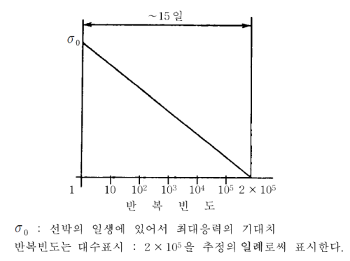
    **그림 7.5.13 간소화된 하중분포**
- **3.** **사고 설계 조건**
  - **(1)** 사고설계조건은 발생가능성이 매우 낮은 사고하중에 대한 설계조건이다.
  - **(2)** 해석은 다음의 특성 값들을 기초로 하여야 한다.
    영구하중 : 예상값
    기능하중 : 특정값
    환경하중 : 특정값
    사고하중 : 특정값 또는 예상값
  - **(3)** **413.**의 **9**항 및 **415.**에 언급된 하중들은 서로 또는 파도로 인한 하중과 조합할 필요는 없다.

#### 419. 재료 【지침 참조】

- **1.** **선체구조를 형성하는 재료**
  - **(1)** 화물온도가 -10°C 미만인 경우, 선체구조에 사용되는 판 및 형강들의 재료등급을 결정하기 위해, 모든 탱크형식에 대해 온도계산이 수행되어야 한다. 계산시 다음의 가정을 적용하여야 한다.
    이 절에 언급된, 설계시 사용되는 주위 온도는 **IGC 적합증서**에 기술되어야 한다.
    - **(가)** 모든 탱크의 1차 방벽은 화물온도로 가정하여야 한다.
    - **(나)** (가)에 추가하여, 완전 또는 부분 2차 방벽이 요구되는 경우, 2차 방벽은 임의의 1개 탱크에 대해 표준대기압에서의 화물온도와 같다고 가정하여야 한다.
    - **(다)** 항해구역이 제한되지 않는 경우, 주위온도가 대기는 5°C 및 해수는 0°C로 하여야 한다. 우리 선급이 인정하는 경우 한정된 항로를 운항하는 선박에 대해서는 더 높은 주위온도를 적용할 수 있다. 반대로, 동계에 더 낮은 온도가 예상되는 지역을 운항하는 선박에 대해서는 우리 선급이 더 낮은 온도를 요구할 수 있다. *(2021)*
    - **(라)** 대기 및 해수가 잔잔한 조건으로 가정하여야 한다. 즉 강제 대류에 대한 조정이 없어야 한다.
    - **(마)** **3**항 (6)호 및 (7)호의 열 및 기계적 노후화, 압착작용(compaction), 선박운동 및 탱크진동과 같은 요소로 인한 선박의 수명동안 단열재 특성의 열화가 가정되어야 한다.
    - **(바)** 해당되는 경우, 액체화물로부터 누설되는 화물의 증발증기로 인한 냉각효과가 고려되어야 한다.
    - **(사)** 가열장치가 (6)호를 만족하는 경우, (5)호에 따른 선체가열이 있는 것으로 한다.
    - **(아)** (5)호에 기술된 경우를 제외하고, 임의의 가열방법은 인정하지 않는다.
    - **(자)** 내부선체와 외부선체을 연결하는 구조부재의 강재 등급은 그 평균온도를 사용하여 정할 수 있다.
  - **(2)** 선박의 외판, 갑판 및 이들에 설치되는 모든 보강재는 **3편**의 관련 각 장의 규정에 적합하여야 한다. 다만, 저온화물의 영향에 따라 설계상태에서 재료의 계산온도가 -5 °C 미만으로 되는 경우, 이 재료는 **표 7.5.8**에 정하는 바에 따른다.
  - **(3)** 화물온도의 영향으로 설계조건에서 계산된 온도가 0°C 보다 낮은 모든 기타 선체구조의 재료 및 2차 방벽을 구성하지 않은 재료는 **표 7.5.8**에 따른다. 이는 화물탱크를 지지하는 선체구조를 포함하며, 이중저 판, 종격벽판, 횡격벽판, 늑판, 웨브, 스트링거 및 모든 부착된 보강재를 포함한다.
  - **(4)** 2차 방벽을 구성하는 선체구조의 재료는 **표 7.5.5a** 및 **7.5.5b**의 규정에 따른다. 2차 방벽을 갑판 또는 선측외판으로 구성하는 경우, **표 7.5.5a** 및 **7.5.5b**에서 요구하는 강재의 등급은 필요에 따라서 적절한 범위의 인접갑판 또는 인접선측 외판에까지 적용하여야 한다. *(2022)*
  - **(5)** 재료의 온도가 **표7.5.8**에 명시된 재료 등급에 따른 허용최저온도 이하로 떨어지지 않도록 하기 위하여 구조재료에 가열장치가 사용될 수 있다. (1)의 계산에서 이러한 가열장치를 다음의 위치에 고려할 수 있다.
    이러한 격벽이 유효하다고 고려되는 경우 및 그렇지 않은 경우 모두에 대해, 선박의 종강도는 **3편 3장**의 요건을 만족하여야 한다.
    - **(가)** 임의의 횡방향 선체구조
    - **(나)** 가열을 고려하지 않은 계산온도로서, 재료가 공기 중 +5°C 및 해수 0°C의 주위온도조건에서 적절하게 유지된다면, (2) 및 (3)에 명시된 종방향 선체구조 *(2019)*
    - **(다)** (나)의 대안으로, -30°C의 최저설계온도 또는 가열을 고려하는 (1)항에 따라 결정된 온도보다 30°C 낮은 온도 중 더 낮은 온도에서도 재료가 적절하게 유지된다면, 가열할 수 있는지 증명되는 화물탱크 사이의 종격벽 *(2019)*
  - **(6)** (5)에 따른 가열장치는 다음 요건을 만족하여야 한다.
    - **(가)** 가열설비는 이 장치의 어떠한 부분이 고장난 상태에서도 예비의 가열장치에 의하여 이론적으로 필요한 열량을 100 % 이상 공급할 수 있는 것이어야 한다.
    - **(나)** 가열장치는 중요 보기로서 고려하여야 한다. (5) (가)에 따라 제공되는 최소 하나 이상 시스템의 모든 전기 부품들에 비상전원이 공급되어야 한다.
    - **(다)** 가열장치의 설계 및 구성은 격납설비에 포함하여 우리선급의 승인을 받아야 한다.
- **2.** **1차 및 2차 방벽의 재료**
  - **(1)** 선체를 구성하지 않는, 1차 및 2차 방벽의 제작에 사용되는 금속재료는 해당되는 설계하중에 적합하여야 하며 **표 7.5.4, 7.5.5a, 7.5.5b** 또는 **7.5.6**에 따른다. *(2022)*
  - **(2)** 1차 및 2차 방벽이 **표 7.5.4, 7.5.5a, 7.5.5b** 및 **7.5.6**에 규정되지 않은 금속재료 또는 비금속재료로 제작된 경우, 재료는 방벽의 특성 및 용도에 따른 설계하중을 고려하여 우리 선급에 의해 승인되어야 한다. *(2022)*
  - **(3)** 1차 또는 2차 방벽에 복합재료를 포함하여, 비금속 재료가 사용되거나 포함되는 경우, 이들의 의도된 기능에 대한 적합성을 확인하기 위하여 해당되는 경우 다음의 특성에 대해 시험하여야 한다.
    - **(가)** 화물과의 적합성
    - **(나)** 노후화
    - **(다)** 기계적 특성
    - **(라)** 열팽창 및 열수축
    - **(마)** 마모
    - **(바)** 결합(cohesion)
    - **(사)** 진동 저항성
    - **(아)** 화재 및 화염 전파에 저항성
    - **(자)** 피로파괴 및 균열 전파에 대한 저항성
  - **(4)** 해당되는 경우 상기 특성들은 운항중 예상최고온도와 최저설계온도보다 5°C 낮은 온도 사이의 범위에서 시험하여야 하고, -196°C보다 낮아서는 안 된다.
  - **(5)** (가) 복합재료를 포함한, 비금속재료가 1차 및 2차 방벽으로 사용되는 경우 결합절차는 (1)에서 (4)호에 따른 것과 같이 시험되어야 한다.
    - **(나)** 1차 및 2차 방벽의 제작에 비금속재료가 사용될 경우, **부록 「 7A-6 비금속 재료 」**에 따른다. *(2021)* **【지침 참조】**
  - **(6)** 1차 및 2차 방벽에 사용되는 재료가 화재와 화염의 확산이 느린 특성을 가지지 않은 경우라도, 적절한 시스템 (예를 들어, 영구적 불활성 가스 환경)으로 보호되거나 또는 방화벽이 제공된다면 적절히 고려할 수 있다.
- **3.** **화물격납설비에 사용되는 단열재 및 기타 재료**
  - **(1)** 화물격납설비에 사용되는 하중을 견디는 단열재 및 기타 재료는 설계하중에 적합하여야 한다.
  - **(2)** 화물격납설비에 사용되는 단열재 및 기타 재료는 다음 특성을 가져야 하며 계획된 운용에 적합함을 보장하기 위하여 시험하여야 한다. (*2019*)
    (파) 불과 화염전파에 대한 저항
    - **(가)** 화물과의 적합성
    - **(나)** 화물에 의한 용해성
    - **(다)** 화물의 흡수성
    - **(라)** 수축성
    - **(마)** 노후화
    - **(바)** 독립기포율
    - **(사)** 밀도
    - **(아)** 기계적 성질, 화물 및 기타 하중영향, 열팽창 및 수축 등.
    - **(자)** 마모성
    - **(차)** 결합성
    - **(카)** 열전도율
    - **(타)** 진동에 대한 저항
    - **(하)** 피로파괴 및 균열 전파에 대한 저항
  - **(3)** 해당되는 경우, 상기 특성들은 운항 중 예상최고온도와 최저설계온도보다 5°C 낮은 온도 사이의 범위에서 시험하여야 하고, -196°C보다 낮아서는 안 된다. (*2019*)
  - **(4)** 단열재는 설치되는 장소 또는 그 환경조건에 따라, 적절한 내화성 및 내화염전파성을 갖는 것이어야 하고, 또한 수증기의 침입 및 기계적 손상에 대하여 적절히 보호되어야 한다. 단열재가 노출갑판상 또는 그 보다 위에 위치하거나 탱크덮개 관통부 근처에 위치하는 경우, 우리 선급의 기준에 따른 적절한 방화특성을 가지거나 또는 화염전파가 느린 특성을 가지며 승인된 유효한 증기밀봉(vapour seal)이 되는 재료로 보호되어야 한다.
  - **(5)** 표면이 화염전파가 느린 특성을 가지며 승인된 유효한 증기밀봉이 되는 재료로 보호된다면, 방화기준에 적합하지 않는 단열재라도 영구적으로 불활성화 되지 않는 화물창 구역 내에 사용될 수 있다. (*2019*)
  - **(6)** 단열재의 열전도율 시험은 적절히 열화된(suitably aged) 표본으로 시행하여야 한다.
  - **(7)** 분말상 또는 입자상의 단열재가 사용될 경우, 운용중 재료가 작아지는 것을 최소화하고, 필요한 열전도율을 유지하는 조치를 취하여야 한다. 또한, 화물격납설비에 가해지는 현저한 압력증가를 방지할 수 있는 방법도 고려하여야 한다.

#### 420. 제작 【지침 참조】

- **1.** **용접 이음부의 설계**
  - **(1)** 독립형탱크의 탱크판의 모든 용접이음은 완전 용입형의 맞대기용접으로 하여야 한다. 탱크판과 돔의 연결부에만은 용접절차 승인시험의 결과에 따라 완전용입형의 필릿이음 용접으로 할 수 있다. 돔에 설치되는 작은 관통부를 제외하고 노즐의 용접도 원칙적으로 완전용입형으로 설계하여야 한다.
  - **(2)** 독립형탱크 형식 C 및 주로 곡면으로 제작되는 독립형탱크 형식 B의 수밀 1차 격벽의 용접이음의 상세는 다음에 따른다.
    뒷댐판을 사용한 경우, 대단히 작은 프로세스용 압력용기에 사용되는 경우를 제외하고 뒷댐판은 제거하여야 한다. 그 밖의 V형 개선은 용접절차 인정시험의 결과에 따라 우리 선급이 인정하는 경우, 사용할 수 있다.
    - **(가)** 압력용기의 모든 길이방향 및 원주방향 이음은 양면 V형 개선 또는 일면 V형 개선의 완전용입형의 맞대기용접으로 하여야 한다. 완전용입형의 맞대기용접은 양면용접 또는 뒷댐판을 사용하여 행하여야 한다.
    - **(나)** 탱크 본체와 돔 및 돔과 관련 부착품과의 이음부의 V형 개선 형상은 **5편 5장**의 규정에 따라 설계하여야 한다. 용기의 노즐, 돔 또는 기타 관통부의 모든 용접 및 용기나 노즐의 플랜지이음의 모든 용접은 완전용입형의 용접으로 하여야 한다.
  - **(3)** **3**항에 명시된 경우를 제외하고, 해당되는 경우 모든 제작과정 및 시험은 **6절**의 관련 규정에 따른다.
- **2.** **접착 및 기타 이음공정에 대한 설계**
  접착에 의한 이음부(또는 기타 용접을 제외한 다른 방법)의 설계는 연결과정의 강도특성을 고려하여야 한다.
- **3.** **시험**
  - **(1)** 모든 화물탱크 및 프로세스용 압력용기는 **421.**에서 **426.**의 해당되는 탱크의 형식에 따라, 수압시험 또는 수압-공기압시험을 하여야 한다.
  - **(2)** 모든 탱크는 (1)호에 따른 압력시험과 결합하여 밀폐시험을 하여야 한다.
  - **(3)** 2차 방벽의 검사에 관한 요건은 방벽의 접근성을 고려하여(**406.**의 **2**항 참고), 각각의 경우에 대하여 우리 선급이 정하는 바에 따른다.
  - **(4)** 우리 선급이 필요하다고 인정하는 경우, 새로운 독립형탱크 형식 B 또는 **427.**에 따라 설계된 탱크가 설치되는 선박에 있어서 적어도 1개의 원형(prototype)탱크 및 그 지지구조는 스트레인 게이지(strain gauges) 또는 기타 적절한 장비로 응력크기를 확인하기 위하여 그 응력을 계측하도록 요구할 수 있다. 탱크의 형상 및 지지구조와 그 부착품의 배치에 따라 독립형탱크 형식 C도 우리 선급이 필요하다고 인정한 경우, 동일한 계측장치를 요구할 수 있다. *(2021)*
  - **(5)** 화물격납설비로서의 모든 성능은 **IGC code 1.4** 및 기타 우리 선급의 요건에 따라 최초의 화물 만재 적재 및 하역중의 설계변수에 적합함을 증명하여야 한다. 설계변수를 증명하는 중요한 구조요소 및 의장품의 성능에 대한 기록은 선내에 보관되어 우리 선급 검사원이 확인 할 수 있어야 한다. *(2021)*
  - **(6)** **419.**의 **1**항 (5)호 및 **419.**의 **1**항 (6)호에 따라 가열설비를 설치할 경우, 이 설비는 필요한 열출력(heat output) 및 열분포(heat distribution)에 대하여 시험하여야 한다.
  - **(7)** 화물격납설비는 최초의 적하 항해시 또는 직후에 콜드스폿(cold spot) 검사를 하여야 한다. 육안으로 확인할 수 없는 단열재 표면에 대한 건전성 검사는 우리 선급이 인정하는 기준에 따라 시행되어야 한다.

#### 421. 독립형탱크 형식 A 【지침 참조】

- **1.** **설계기준**
  - **(1)** 독립형탱크 형식 A라 함은 주로 종래에 사용되는 있는 선체강도 해석법에 따라 인정하는 기준에 의해 설계되는 탱크를 말한다. 이 탱크가 주로 평면구조로 제작되는 경우, 설계증기압 $P _{0}$는 0.07 $\mathrm{MPa}$ 미만이어야 한다.
  - **(2)** 대기압에서 화물온도가 -10°C 미만인 경우, **405.**에 따른 완전 2차 방벽이 설치되어야 한다. 2차방벽은 **406.**에 따라 설계되어야 한다.
- **2.** **구조해석**
  - **(1)** 구조해석은 **413.**의 **2**항에 규정하는 내압을 고려하여 우리 선급이 적절하다고 인정하는 방법으로 하여야 하며, 해당 선체구조와 주요부재의 상호작용에 대해 고려하여야 한다.
  - **(2)** **3편 15장**에서 규정하지 않는 부분(예를 들면, 지지 구조)에 대하여는, 적용 가능한 한 **412.**에서 **415.**에 명시하는 하중과 지지 구조 부근의 선체처짐을 고려하여, 직접 계산에 의하여 응력을 구하여야 한다.
  - **(3)** 지지부를 갖춘 탱크들은 **415.**의 사고하중을 고려하여 설계되어야 한다. 이 하중들은 서로 또는 환경하중과 조합할 필요는 없다.
- **3.** **최종설계조건(ultimate design condition)**
  - **(1)** 주로 평판에 의하여 구성되는 탱크에 대해, 종래 사용되고 있는 방법으로 구하는 1차 및 2차부재(보강재, 특설늑골, 스트링거, 거더)의 공칭 막응력은 니켈강, 탄소망간강, 오스테나이트계 강재 및 알루미늄 합금에 대하여 $R _{m} /2.66$ 또는 $R _{e} /1.33$중 작은 것을 넘어서는 안 된다. 여기서, $R _{m}$ 및 $R _{e}$ 는 **418.**의 **1**항 (3)호에 따른다. 다만, 1차부재에 관한 상세응력 계산을 행할 경우, **418.**의 **1**항 (4)호에서 정한 등가응력 $\sigma _{c}$는 우리 선급이 인정하는 경우, 보다 높은 허용응력으로 할 수 있다. 이 상세계산은 이중저와 탱크저부의 처짐에 의한 선체와 탱크의 상호 반력의 영향을 포함하고 굽힘, 전단, 축방향 및 비틀림 변형의 영향을 고려한 것이어야 한다.
  - **(2)** 탱크판의 두께는 **413.**의 **2**항에 따른 내부압력과 **403.**의 **5**항에서 요구하는 모든 부식허용치를 고려하여 최소한 **3편 15장**의 디프탱크의 규정에 적합하여야 한다. (*2019*)
  - **(3)** 화물탱크구조는 좌굴에 대해 검토되어야 한다.
- **4.** **사고설계조건**
  - **(1)** 탱크 및 탱크 지지부는 **403.**의 **4**항 (3)호 및 **415.**의 사고하중 및 설계조건을 고려하여 설계되어야 한다.
  - **(2)** **415.**의 사고하중을 적용할 경우, 응력은 사고의 낮은 발생확률을 고려하여 적절히 수정된 **3**항의 허용기준에 따라야 한다.
- **5.** **시험**
  모든 독립형탱크 형식A에 대하여 수압 또는 수압-공기압 시험을 하여야 한다. 이 시험은 적어도 탱크상부의 압력을 최대 허용설정압력에 상응하는 압력으로 하고, 또한 가능한 한 탱크에 발생하는 응력이 설계응력에 가깝도록 하여야 한다. 수압-공기압시험을 할 경우, 시험조건은 가능한 한 탱크 및 지지구조에 동적요소를 포함한 설계하중을 구현하여야 한다. 이때 영구변형을 일으키는 정도의 응력이 발생하지 않도록 하여야 한다.

#### 422. 독립형탱크 형식 B 【지침 참조】

- **1.** **설계기준**
  - **(1)** 독립형탱크 형식 B는 응력수준, 피로수명 및 균열진전 특성 등을 결정하기 위해 모형시험, 정밀한 해석수단 및 해석법을 이용하여 설계된 탱크를 말한다. 이 탱크는 주로 평면판에 의하여 구성되는(주형탱크) 경우, 설계증기압 $P _{0}$는 $0.07$ $\mathrm{MPa}$ 미만이어야 한다.
  - **(2)** 만약 대기압에서 화물온도가 -10°C 보다 낮은 경우, 소규모 누설방지장치가 있는 부분 2차 방벽이 **405.**에 따라 설치되어야 한다. 소규모 누설방지장치는 **407.**에 따라 설계되어야 한다.
- **2.** **구조해석**
  - **(1)** 다음의 각 항에 대하여 모든 동적 및 정적하중의 영향을 고려하여 구조의 적합성을 확인하여야 한다. 유한요소해석 또는 이와 동등한 해석방법과 파괴역학해석 또는 이와 동등한 해석을 하여야 한다.
    - **(가)** 소성변형
    - **(나)** 좌굴
    - **(다)** 피로파괴
    - **(라)** 균열진전
  - **(2)** 선체와의 상호작용을 포함한 응력을 평가하기 위하여 3차원해석을 하여야 한다. 이 해석의 구조모델은 화물탱크와 그 지지 및 고정방법과 적절한 범위의 선체구조 부분을 포함하여야 한다.
  - **(3)** 유사선으로부터의 유효한 자료가 제공되지 않는 경우, 불규칙 파로 인한 선체 가속도와 거동, 그리고 그 하중 및 거동에 대한 선박과 화물탱크 응답의 정밀한 해석이 수행되어야 한다.(*2019*)
- **3.** **최종설계조건(ultimate design condition)**
  - **(1)** 소성변형
    $\sigma _{m} \leq f$
    $\sigma _{L} \leq 1.5 f$
    $\sigma _{b} \leq 1.5 F$
    $\sigma _{L} + \sigma _{b} \leq 1.5 F$
    $\sigma _{m} + \sigma _{b} \leq 1.5 F$
    $\sigma _{m} + \sigma _{b} + \sigma _{g} \leq 3.0 F$
    $\sigma _{L} + \sigma _{b} + \sigma _{g} \leq 3.0 F$
    $\sigma _{m}$ : 등가 1차 일반막응력
    $\sigma _{L}$ : 등가 1차 국부막응력
    $\sigma _{b}$ : 등가 1차 굽힘응력
    $\sigma _{g}$ : 등가 2차 응력
    $\sigma _{m}$, $\sigma _{L}$*,* $\sigma _{b}$ 및 $\sigma _{g}$ *:* **428.**의 **3**항에 따른다.
    $f$ : $R _{m} /A$ 또는 $R _{e} /B$ 중 작은 것
    $F$ : $R _{m} /C$ 또는 $R _{e} /D$ 중 작은 것
    $R _{m}$ 및 $R _{e}$ : **418.**의 **1**항 (3)호에 따른다.
    $A$*,*$B$,$C$ 및 $D$의 값은 **표 7.5.2**에 표시하는 최소값 이상으로 하여야 한다.
    $A$*,*$B$,$C$ 및 $D$의 값은 **IGC 적합증서**에 기재하여야 한다.

    |   | 니켈강 및 탄소망간강 | 오스테나이트강 | 알루미늄합금 |
    | --- | --- | --- | --- |
    | A | 3 | 3.5 | 4 |
    | B | 2 | 1.6 | 1.5 |
    | C | 3 | 3 | 3 |
    | D | 1.5 | 1.5 | 1.5 |
    | 상기 값들은 우리 선급이 인정하는 경우 다른 값을 사용할 수 있다. |   |   |   |
    - **(가)** 주로 구형의 독립형탱크 형식 B의 허용응력은 다음의 규정을 만족하여야 한다.
    - **(나)** 주로 평면구조로 제작되는 독립형탱크 형식 B에 대하여, 유한요소해석시 허용 멤브레인 등가응력은 다음을 초과하여서는 안 된다. 다만, 우리 선급이 인정하는 경우, 응력의 위치, 응력해석방법 및 설계조건을 고려하여 수정할 수 있다.
      - **(a)** 니켈강 및 탄소 망간강: $R _{m}$/2 또는 $R _{e}$/1.2 중 작은 값보다 작아야 한다.
      - **(b)** 오스테나이트강: $R _{m}$/2.5 또는 $R _{e}$/1.2 중 작은 값보다 작아야 한다.
      - **(c)** 알루미늄 합금: $R _{m}$/2.5 또는 $R _{e}$/1.2 중 작은 값보다 작아야 한다.
    - **(다)** 탱크외판의 두께 및 보강재의 크기는 독립형탱크 형식 A에 요구하는 것보다 작아서는 안 된다.
  - **(2)** 좌굴
    외압과 압축응력을 일으키는 기타 하중을 받는 화물탱크의 좌굴강도해석은 우리 선급이 적절하다고 인정하는 기준에 따라 수행되어야 한다. 해석방법은 이론적인 것과 판 끝단의 정렬 불량, 직선도 및 편평도 결함, 정원과의 편차의 결과에 따른 실제 좌굴응력과의 차이를 적절히 고려할 수 있어야 한다.
- **4.** **피로설계조건**
  - **(1)** 피로 및 균열진전 평가는 **418.**의 **2**항에 따라 수행되어야 한다. 승인기준은 결함의 탐지가능성에 따라 **418.**의 **2**항 (7)호에서 (9)호에 따라야 한다.
  - **(2)** 피로해석은 건조공차를 고려하여야 한다.
  - **(3)** 우리 선급이 필요하다고 인정하는 경우 모형시험은 구조부재의 응력집중계수 및 피로수명을 결정하기 위해 요구될 수 있다.
- **5.** **사고설계조건**
  - **(1)** 탱크 및 탱크지지부는 **403.**의 **4**항 (3)호 및 **415.**에 따라, 해당되는 사고하중 및 설계조건에 대해 설계하여야 한다.
  - **(2)** **415.**에 따른 사고하중을 적용할 때, 응력은 낮은 발생빈도를 고려하여 적절히 수정된 **3**항의 허용기준에 따라야 한다.
- **6.** **시험**
  독립형탱크 형식 B는 수압 또는 수압-공기압시험을 다음에 따라 시행하여야 한다.
  - **(1)** 시험은 독립형탱크 형식 A에 대한 **421.**의 **5**항의 규정을 따라야 한다.
  - **(2)** 또한, 시험상태에서 1차부재의 최대 막응력 또는 굽힘응력은 시험온도에서 재료의 항복응력(조립상태)의 90 %를 넘어서는 안 된다. 계산상의 응력이 항복응력의 75 %를 넘을 경우, 원형시험(prototype test)시 스트레인 게이지(stain gauge) 또는 다른 적절한 장치를 사용하여 상기의 상태가 만족하는 것을 확인하여야 한다.
- **7.** **표시**
  압력용기의 모든 표시는 허용 불가한 국부응력 상승을 초래하지 않는 방법으로 표시되어야 한다.

#### 423. 독립형탱크 형식 C 【지침 참조】

- **1.** **설계기준**
  - **(1)** 독립형탱크 형식 C에 대한 설계기준은 파괴역학 및 균열진전기준을 포함한 수정된 압력용기기준에 기초한다. (2)호에 정의된 최소설계압력은 동적 응력이 충분히 작아서 최초 표면결함이 탱크의 수명동안 탱크외판 두께의 반 이상 진전되지 않는다는 것을 보장하도록 설계되어야 한다.
  - **(2)** 설계증기압 $P _{0}$는 다음보다 작아서는 안 된다.
    $P _{o} =0.2+AC( \rho _{r} ) ^{1.5} (\mathrm{MPa})$
    $A=0.00185( \frac{\sigma _{m}}{\Delta \sigma _{A}} ) ^{2}$
    $\sigma _{m}$ : 설계 1차막응력
    $\Delta \sigma _{A}$ : 허용 동적막응력(발현확률 $Q=10 ^{{} _{-8}}$ 레벨에서의 양진폭)으로 다음에 따른다. 페라이트-펄라이트강, 마르텐사이트강, 오스테나이트강의 경우: 55 $\mathrm{N}/mm ^{2}$, 알루미늄합금(5083-O)의 경우: 25 $\mathrm{N}/mm ^{2}$, 명시된 탱크의 설계수명이 $10 ^{8}$ 의 파도를 만나는 것보다 길 때, $\Delta \sigma _{A}$는 설계수명에 따라 동등한 균열진전을 고려하기 위해 수정하여야 한다.
    $C$ : 탱크의 크기에 따라 결정되는 아래의 값중 최대값
    $h, 0.75 b$ 또는 $0.45 l$
    $h$ : 탱크 높이($\mathrm{m}$) (선박의 깊이 방향)
    $b$ : 탱크 너비($\mathrm{m}$) (선박의 너비 방향)
    $l$ : 탱크 길이($\mathrm{m}$) (선박의 길이 방향)
    $\rho _{r}$ : 설계온도에 있어서 화물의 비중($\rho _{r}$=1:청수)
  - **(3)** (2)의 최소설계압력의 기준에 적합한 형식C 탱크에, 탱크의 형상, 지지구조 및 부착품을 고려하여 우리 선급이 필요하다고 인정하는 경우에는 형식 A 또는 형식 B의 규정의 적용을 요구할 수 있다.
- **2.** **탱크외판 두께**
  - **(1)** 외판 두께는 다음을 따른다.
    - **(가)** 압력용기의 경우 (4)호에 따라 계산된 두께는 마이너스 공차가 없는 성형 후 최소두께로 고려하여야 한다.
    - **(나)** 성형 후의 부식여유를 포함한 압력용기의 동판 및 경판의 최소두께는 탄소망간강 및 니켈강에 대하여는 5 $\mathrm{mm}$, 오스테나이트강에 대하여는 3 $\mathrm{mm}$ 및 알루미늄합금에 대하여 7 $\mathrm{mm}$ 이상이어야 한다.
    - **(다)** (4)호의 계산에 사용하는 용접이음 효율은 **605.**의 **6**항 (5)호에 정하는 검사 및 비파괴검사를 행할 경우 0.95로 하여야 한다. 이 수치는 사용재료, 이음의 종류, 용접법 및 하중의 종류 등을 고려하여 1.0까지 증가할 수 있다. 프로세스용 압력용기에 대하여 우리 선급은 부분적으로 비파괴검사를 인정할 수 있으나, 그 시행범위는 사용재료, 설계온도, 조립상태에서의 재료의 무연성 천이온도, 용접이음의 종류 및 용접법에 따라 **605.**의 **6**항 (5)호에 따라 정한 것 이상이어야 하고, 또한 이음효율은 0.85이하의 값을 적용하여야 한다. 특별한 재료에 대하여 상기의 이음효율은 용접이음부의 규정된 기계적 성질에 따라서 감소하여야 한다.
  - **(2)** **413.**의 **2**항에 정의된 설계액체압은 내부압력 계산시에 고려되어야 한다.
  - **(3)** 압력용기의 좌굴을 검토하는데 사용하는 설계외압 $P _{e}$는 다음 식에 의한 것 이상이어야 한다.
    $P _{e} =P _{1} +P _{2} +P _{3} +P _{4} (\mathrm{MPa})$
    $P _{1}$ : 진공 도출밸브의 설정압력, 진공 도출밸브가 설치되지 않은 압력용기에 대한 *P*_1은 특별히 고려하여야 하고 일반적으로 0.025 $\mathrm{MPa}$ 이상이어야 한다.
    $P _{2}$ : 압력용기 또는 그 일부를 완전하게 폐위하는 구획의 도출밸브(PRVs, pressure relief valves)의 설정압력, 기타의 경우에는 $P _{2}$ = 0으로 한다.
    $P _{3}$ : 단열재의 무게와 수축, 부식 여유를 포함한 판의 무게 및 압력용기가 받게 되는 기타 외부 압력으로 인한 판 내부 또는 외부에서의 압축 작용. 여기에는 돔의 무게, 타워 및 관장치의 무게, 부분 적재된 화물의 영향, 가속도 및 선체 변형이 포함 되나 이에 국한되지 않는다. 그리고 외압, 내압 또는 그 두 가지 모두의 국부적 영향이 고려되어야 한다. (*2019*)
    $P _{4}$ : 노출갑판상에 있는 압력용기 또는 그 일부의 수두에 의한 외압, 기타의 경우 $P _{4}$ = 0으로 한다.
  - **(4)** 내압에 기초한 부재치수는 다음에 따른다.

#### 413.의 2항에 정의된 내압 하에서 압력용기의 압력유지부의 형상 및 두께는 플렌지를 포함하여 결정되어야 한다. 이러한 계산은 모든 경우에 승인된 압력용기 설계이론에 기초하여야 한다. 압력용기의 압력유지부의 개구는 4편 2장에 따른다.

- **3.** **최종설계조건(ultimate design condition)**
  - **(1)** 소성변형
    독립형탱크 형식 C의 허용응력은 다음의 규정을 만족하여야 한다.
    $\sigma _{m} \leq f$
    $\sigma _{L} \leq 1.5 f$
    $\sigma _{b} \leq 1.5 f$
    $\sigma _{L} + \sigma _{b} \leq 1.5 f$
    $\sigma _{m} + \sigma _{b} \leq 1.5 f$
    $\sigma _{m} + \sigma _{b} + \sigma _{g} \leq 3.0 f$
    $\sigma _{L} + \sigma _{b} + \sigma _{g} \leq 3.0 f$
    $\sigma _{m}$ : 등가 1차 일반막응력
    $\sigma _{L}$ : 등가 1차 국부막응력
    $\sigma _{b}$ : 등가 1차 굽힘응력
    $\sigma _{g}$ : 등가 2차 응력
    $f$ : $R _{m} /A$ 또는 $R _{e} /B$ 중 작은 것
    $\sigma _{m}$, $\sigma _{L}$*,* $\sigma _{b}$ 및 $\sigma _{g}$*에* 대하여는 **428.**의 **3**항에 따른다.
    $R _{m}$ 및 $R _{e}$에 대하여는 **418.**의 **1**항 (3)호에 따른다.
    $A$ 및 $B$의 값은 **표 7.5.3**에 표시하는 최소값 이상으로 하여야 한다.
    $A$ 및 $B$의 값은 **IGC 적합증서**에 기재하여야 한다.

    |   | 니켈강 및 탄소망간강 | 오스테나이트강 | 알루미늄합금 |
    | --- | --- | --- | --- |
    | A | 3 | 3.5 | 4 |
    | B | 1.5 | 1.5 | 1.5 |
  - **(2)** 좌굴기준은 다음에 따른다.
    압축응력을 일으키는 외압 및 기타의 하중을 받는 압력용기의 두께 및 모양은 승인된 압력용기 좌굴이론을 이용한 계산에 기초하여야 하며, 또한, 판 가장자리의 어긋남, 난형도(ovality) 및 규정된 호/현의 길이에 대한 진원의 편차에서 발생되는 좌굴응력의 이론과 실제 값과의 차이를 적절하게 고려하여야 한다.
- **4.** **피로설계조건**
  크기가 큰 독립형탱크 형식 C의 경우, 대기압에서 화물온도가 -55°C 이하인 경우, 우리 선급은 정적 및 동적응력을 고려하여 **1**항 (1)호에 적합함을 확인하기 위해 추가검증을 요구할 수 있다.
- **5.** **사고설계조건**
  - **(1)** 탱크 및 탱크지지구조는 사고하중 및 **403.**의 **4**항 (3)호 및 **415.**에 명시된 설계조건에서 해당되는 조건에 따라 설계되어야 한다.
  - **(2)** **415.**에 명시된 사고하중을 적용할 경우, 응력은 발생가능성이 낮음을 고려하여 적절히 수정한, **3**항 (1)호에 명시된 승인기준에 따라야 한다.
- **6.** **시험**
  - **(1)** 각 압력용기는 탱크정부에서 1.5 $P _{0}$ 이상의 압력으로 수압시험을 하여야 하며, 시험중 어떠한 부위에 있어서도 계산에 의한 1차 막응력이 재료의 항복응력의 90 %를 넘지 않도록 하여야 한다. 간단한 원통형 또는 구형의 압력용기를 제외하고 계산에서 이 응력이 항복응력의 75 %를 넘는다고 예상될 경우, 원형시험을 할 때 압력용기에 스트레인게이지 또는 다른 적절한 장치를 부착하고 상기의 상태가 만족하는 것을 확인하여야 한다. *(2021)*
  - **(2)** 시험에 사용하는 수온은 조립상태의 재료의 무연성 천이온도보다 적어도 30 °C 높은 온도이어야 한다.
  - **(3)** 압력은 판두께 매 25 $\mathrm{mm}$ 당 2시간을 유지하여야 하며 어떠한 경우에도 2시간미만으로 하여서는 안 된다.
  - **(4)** 화물용 압력용기의 수압-공기압시험은 불가피하다고 우리 선급이 인정하는 경우에는 (1)호에서 (3)호에 규정하는 상태로 할 수 있다.
  - **(5)** 우리 선급이 인정하는 경우, 사용온도에 따라서 보다 높은 허용응력을 사용하는 압력용기의 시험을 특별히 고려할 수 있다. 다만, (1)호의 규정에는 완전히 적합하여야 한다. *(2021)*
  - **(6)** 공사 완료 후 각 압력용기 및 그 부착품은 적절한 밀폐시험을 하여야 한다. 이 때는 밀폐시험을 (1)호에 따른 압력시험과 결합하여 실시할 수 있다.
  - **(7)** 화물탱크 이외의 압력용기의 기압시험은, 각각의 경우에 대하여 우리 선급이 적절하다고 인정하는 경우에 한하여 시행하여야 한다. 압력용기가 안전하게 물을 채울 수 없게 설계 또는 지지되어 있거나, 이 용기를 건조시킬 수 없는 경우와 사용 중에 시험용 매체의 잔류를 허용할 수 없는 경우에 한하여 이 시험은 인정될 수 있다.
- **7.** **표시**
  압력용기의 모든 표시는 허용 불가한 국부응력 상승을 초래하지 않는 방법으로 표시되어야 한다.

#### 424. 멤브레인탱크 【지침 참조】

- **1.** **설계기준**
  - **(1)** 멤브레인 화물격납설비는 열 및 기타의 신축이 멤브레인의 밀폐성 상실에 과도한 위험이 없도록 설계하여야 한다.
  - **(2)** 해석 및 시험에 기초한 체계적 접근은 **2**항 (1)호에 명시된 사용중 식별된 사례를 고려하여 탱크의 의도된 기능을 제공함을 입증하도록 사용되어야 한다.
  - **(3)** 대기압에서 화물온도가 -10°C 미만일 경우, **405.**에서 요구하는 완전 2차 방벽을 설치하여야 하며, 이 2차 방벽은 **406.**에 따라 설계되어야 한다.
  - **(4)** 설계증기압 $P _{0}$는 원칙적으로 0.025 $\mathrm{MPa}$를 넘어서는 안 된다. 다만, 선체구조 치수를 필요에 따라 증가하고, 또한 단열구조의 지지강도가 적절하면 $P _{0}$는 보다 큰 값으로 할 수 있으나 0.07 $\mathrm{MPa}$ 미만이어야 한다.
  - **(5)** 멤브레인탱크의 정의에는 비금속성 멤브레인이 사용될 경우, 또는 멤브레인이 단열재에 포함되는 경우, 혹은 멤브레인이 단열재와 조립되는 설계를 포함한다.
  - **(6)** 일반적으로 멤브레인의 두께는 10 $\mathrm{mm}$를 넘어서는 안 된다.
  - **(7)** **902.**의 **1**항에 따라, 1차 단열공간과 2차 단열공간에 불활성 가스의 순환은 유효한 가스탐지방법을 충분히 가능하도록 하는 것이어야 한다.
- **2.** **설계시 고려사항**
  - **(1)** 멤브레인의 수명동안 수밀성을 상실하도록 할 수 있는 잠재적 사고는 평가되어야 한다. 이 사고는 아래의 사항을 포함하나, 이에 제한하여서는 안 된다.
    하나의 내부 사고가 동시에 또는 순차적으로 양쪽 멤브레인의 파괴를 일으키는 설계는 허용하지 않는다. (*2019*)
    - **(가)** 최종설계(ultimate design) 사건:
      - **(a)** 멤브레인의 인장파괴
      - **(b)** 단열재의 압축붕괴
      - **(c)** 열에 의한 노화
      - **(d)** 단열재와 선체구조 간 접착의 상실
      - **(e)** 단열재와 멤브레인의 접착의 상실
      - **(f)** 내부구조 및 이의 지지구조의 구조적 건전성
      - **(g)** 지지선체구조의 파괴
    - **(나)** 피로설계 사건:
      - **(a)** 선체구조에의 부착물 및 선체구조와의 결합부를 포함한 멤브레인의 피로 (*2019*)
      - **(b)** 단열재의 피로균열
      - **(c)** 내부구조 및 이의 지지구조의 피로
      - **(d)** 평형수의 침수로 이어지는 내부선체의 피로균열
    - **(다)** 사고설계 사건 :
      - **(a)** 돌발적인 기계적 손상(예, 운항중 탱크내부에서의 물체의 낙하)
      - **(b)** 단열공간의 돌발적인 과압
      - **(c)** 탱크내의 돌발적인 진공
      - **(d)** 내부선체구조를 통한 물의 침투
  - **(2)** 화물격납설비의 제작에 사용되는 재료의 필요한 물질적 특성(기계적, 열특성, 화학적 등)은 **1**항 (2)호에 따라 설계개발시에 설정되어야 한다.
- **3.** **하중 및 하중조합**
  방벽간 구역의 과압, 화물내의 부압, 슬로싱의 영향, 선체진동의 영향, 또는 이들의 조합으로 가능한 탱크 건전성의 상실에 대하여 특별히 주의하여야 한다.
- **4.** **구조해석**
  - **(1)** **409.**에 정의된 화물격납설비 및 이와 관련된 구조부의 최종강도 및 피로강도의 평가를 위하여 구조해석 및/또는 시험을 하여야 한다. 구조해석은 화물격납설비에 치명적인 것으로 식별된 각 파괴모드를 평가하는데 필요한 자료를 제공하여야 한다.
  - **(2)** 선체구조해석은 **413.**의 **2**항에 규정하는 내압을 고려하여 우리 선급이 적절하다고 인정하는 방법으로 하여야 한다. 다만, 선체의 변형 및 멤브레인과 단열재의 적합성에 대하여는 특별히 주의하여야 한다.
  - **(3)** (1)호 및 (2)호에 따른 해석은 선박 및 화물격납설비의 운동, 가속도 및 반응에 기초하여야 한다.
- **5.** **최종설계조건(ultimate design condition)**
  - **(1)** 모든 주요 구성품, 하위체계 또는 조립품의 구조적 저항성은 운항중인 상태에 대해, **1**항 (2)호에 따라 설정되어야 한다.
  - **(2)** 화물격납설비 및 이것의 선체구조에 붙는 부착물, 탱크내부구조의 파괴모드에 대한 허용강도기준의 선택은 고려하는 파괴모드와 관련된 결과를 반영하여야 한다.
  - **(3)** 내측선체구조는 **413.**의 **2**항에 규정하는 내압과 **414.**의 **3**항에 따른 슬로싱 하중에 대한 요건을 고려하여 디프탱크에 대한 요건에 적합하여야 한다.
- **6.** **피로설계조건**
  - **(1)** 지속적인 감시에 의해서도 결함의 진전이 확실히 탐지되지 않는 탱크 내부의 구조물(펌프타워), 펌프타워와 멤브레인의 결합부에 대하여는 피로해석을 수행하여야 한다. (*2019*)
  - **(2)** 피로계산은 다음에 따른 관련요건과 **418.**의 **2**항에 따라 수행되어야 한다.
    - **(가)** 구조적 건전성에 대한 구조 요소들의 중요도
    - **(나)** 검사의 유용성
  - **(3)** 균열이 양측 멤브레인에 동시 또는 종속적 파괴를 야기하도록 진행되지 않음을 시험 및/또는 해석에 의해 증명될 수 있는 구조요소의 경우, $C _{W}$는 0.5보다 작거나 같아야 한다.
  - **(4)** 주기적으로 검사되고 식별되지 않는 피로균열이 양측 멤브레인에 동시 또는 종속적 파괴를 야기하도록 진행될 수 있는 구조요소는 **418.**의 **2**항 (8)호에 따른 피로 및 파괴공학의 요건을 만족하여야 한다.
  - **(5)** 운용 중일때는 구조부재의 검사를 위한 접근이 불가하며, 경고없이도 피로균열이 양측 멤브레인에 동시 또는 순차적 파괴를 일으킬 수 있도록 발전할 수 있는 경우, **418.**의 **2**항 (9)호에 따른 피로 및 파괴공학의 요건을 만족하여야 한다. (*2019*)
- **7.** **사고설계조건**
  - **(1)** 격납설비 및 지지구조부는 **415.**에 따른 사고하중에 대하여 설계되어야 한다. 이러한 하중들은 서로 또는 환경하중과 결합될 필요는 없다.
  - **(2)** 추가의 관련 사고 시나리오는 위험도 해석에 기초하여 결정되어야 한다. 탱크 내부의 고정장치에 대해서는 특별히 주의하여야 한다.
- **8.** **설계개발을 위한 시험**
  - **(1)** **1**항 (2)호에서 요구되는 설계개발을 위한 시험은 모퉁이 및 연결부를 포함한 1차 및 2차 방벽 모두에 대한 일련의 해석적 모형과 물리적 모형을 포함하여야 한다. 이러한 모형은 정적, 동적 및 열하중으로 인한 예상되는 조합된 변형에 대해 견딤을 입증하기 위하여 시험하여야 한다. 이는 화물격납설비의 원형축척모형(prototype-scaled model)의 제작으로 마무리 될 수 있다. 해석적 및 물리적 모형에서 고려하는 시험조건은 화물격납설비가 그 수명동안의 가장 극한운용조건을 대표하는 것이어야 한다. **406.**의 **2**항에 요구하는 2차방벽의 주기적 시험시 제안 허용조건은 원형크기모형으로 시험한 결과에 기초할 수 있다. *(2021)*
  - **(2)** 멤브레인 재료 및 멤브레인에서의 대표적인 용접부 또는 접합부의 피로성능은 시험에 의하여 결정되어야 한다. 선체구조에 단열재를 고정하는 설비의 최종강도 및 피로성능은 해석적 방법 또는 시험에 의해 결정되어야 한다.
- **9.** **시험**
  - **(1)** 멤브레인 화물격납설비가 설치된 선박에서, 통상 액체를 적재하면서 멤브레인을 지지하는 선체구조에 인접한 모든 탱크 및 기타 구역은 수압시험을 하여야 한다.
  - **(2)** 멤브레인을 지지하는 모든 화물창구조는 화물격납설비의 설치전 밀폐성을 시험하여야 한다.
  - **(3)** 일반적으로 액체를 담지 않는 파이프 터널 및 기타 구획은 수압시험을 할 필요는 없다.

#### 425. 일체형탱크 【지침 참조】

- **1.** **설계기준**
  선체구조의 일부를 구성하고 또한, 인접하는 선체구조에 응력을 주는 하중에 의한 영향을 받는 일체형탱크는 다음에 적합하여야 한다.
- **2.** **구조해석**
  일체형탱크의 구조해석은 **3편 15장**의 관련 요건을 따른다.
- **3.** **최종설계조건(ultimate design condition)**
  - **(1)** 탱크 경계의 구조치수는 **413.**의 **2**항에 규정하는 내압을 고려하여 **3편 15장**의 디프탱크의 규정에 적합하여야 한다.
  - **(2)** 일체형탱크의 허용응력은 일반적으로 우리 선급이 인정하는 선체구조에 대한 허용응력으로 한다.
- **4.** **사고설계조건**
  - **(1)** 탱크 및 탱크 지지부는 **403.**의 **4**항 (3)호 및 **415.**의 관련 하중에 대해 설계되어야 한다.
  - **(2)** **415.**의 하중을 받는 경우, 응력은 이들의 발생빈도가 낮음을 고려하여 적절히 수정되어 **3**항에 명시된 허용기준에 따라야 한다.
- **5.** **시험**
  모든 일체형탱크는 수압 또는 수압-공기압 시험을 하여야 한다. 이때 시험은 응력이 설계응력과 가능한 한 유사하도록 하여야 하며, 탱크정부에서 압력은 적어도 최대허용설정압력(MARVS, maximum allowable relief valve setting of a cargo tank)에 상응하는 압력으로 하여야 한다.

#### 426. 세미멤브레인탱크 【지침 참조】

- **1.** **설계기준**
  - **(1)** 세미멤브레인탱크라 함은 적재상태에 있어서 비자기지지형의 탱크로서 인접하는 선체구조에 의하여 방열재를 통하여 지지되는 탱크관과 이 탱크관에 접속하여 열 및 기타의 신축에 적합하도록 설계된 곡면부에 의하여 구성되는 탱크를 말한다.
  - **(2)** 설계증기압 $P _{0}$는 일반적으로 0.025 $\mathrm{MPa}$를 넘어서는 안 된다. 다만, 선체구조치수를 필요에 따라 증가하고, 또한 단열구조의 지지강도가 적절하면 $P _{0}$는 보다 큰 값으로 할 수 있으나 0.07 $\mathrm{MPa}$ 미만이어야 한다.
  - **(3)** 세미멤브레인탱크의 경우, 독립형탱크 또는 멤브레인탱크에 대한 이 절의 관련 요건들은 적절히 적용하여야 한다.
  - **(4)** 지지방법을 제외한, 독립형탱크 형식 B의 해당 요건이 모든 면을 만족하는 세미멤브레인탱크의 경우, 우리 선급은 부분 2차 방벽을 특별히 고려할 수 있다.

#### 427. 새로운 형태에 대한 한계상태설계

- **1.** **4 21.**에서 **426.**를 이용하여 설계될 수 없는 새로운 형태의 화물격납설비는 이 조 및 **403.**∼**410.** 및 **411.**∼**415.**, 그리고 해당되는 경우 **416.**∼**418.** 및 **419.**∼**420.**을 이용하여 설계하여야 한다. 이 조에 따른 화물격납설비의 설계는 설정된 설계해법과 함께 새로운 설계에 적용할 수 있는 구조설계에 대한 접근법인 한계상태설계의 원칙에 기초하여야 한다. 상기의 보다 포괄적인 접근은 **421.**에서 **426.**를 사용하여 설계된 것으로 알려진 화물격납설비의 안전등급과 유사한 등급을 유지하여야 한다.
- **2.** 한계상태설계는 각 구조요소가 **403.**항 **4**항에 따라 식별된 설계조건과 관련하여 가능한 파괴모드에 관해 평가되는 체계적 접근법이다. 한계상태는 구조물 또는 구조물의 일부가 더 이상 규정을 만족시키지 못하는 상태로 정의할 수 있다.
- **3.** 각 파괴모드에 대해, 하나 또는 그 이상 한계상태가 관련이 있을 수 있다. 모든 관련 한계상태를 고려하여, 구조에 대한 한계하중은 모든 관련 한계상태로 결정되는 최소한계하중이다. 한계상태는 다음 세가지 분류로 나누어진다.
  - **(1)** 최종한계상태(ULS-Ultimate Limit States), 최대하중을 견딜 수 있는 능력 또는, 어떤 경우에는, 비손상 조건에서 최대 적용되는 변형율 또는 변형에 상응하는 상태
  - **(2)** 피로한계상태(FLS-Fatigue Limit States), 시간에 따른 주기적 하중의 영향으로 인한 구조능력저하에 상응하는 상태
  - **(3)** 사고한계상태(ALS-Accident Limit States), 사고상황에서 구조물이 견디는 능력에 상응하는 상태
- **4.** 한계상태설계의 절차 및 관련 설계인자는 ‘새로운 형태의 화물격납설비의 설계에 대한 한계상태방법의 사용기준’에 따라야 한다(LSD 기준) **부록 7A-7 「 신개념 화물격납설비의 설계에 한계상태방법의 사용에 대한 기준 」** *(2021)* **【지침 참조】**

#### 428. 제4절에 대한 지침 【지침 참조】

- **1.** **정적 설계를 위한 내압의 상세계산에 대한 지침**
  - **(1)** 이 조는 정적 설계계산을 위한 관련된 동적 액체압의 계산에 대한 지침을 제공한다. 이 압력은 **413.**의 **2항** (4)호의 내압을 결정하는데 사용될 수 있다.
    $P _{eq1} =P _{o} +(P _{gd} )\max ( \mathrm{MPa})$
    $P _{eq2} =P _{h} +(P _{gd} site)\max ( \mathrm{MPa})$
    $P _{0}$ : 화물의 설계증기압
    $P _{h}$ : 항구에서의 화물의 증기압
    우리 선급은 이와 동등한 기타의 계산방법도 인정할 수 있다.
    - **(가)** $(P _{gd} )\max$는 최대설계가속도를 사용하여 결정되는 관련 액체압이다.
    - **(나)** $(P _{gd} site)\max$는 국부특정가속도를 사용하여 결정되는 관련 액체압이다.
    - **(다)** $P _{eq}$ 는 다음에 따른 $P _{eq1}$과 $P _{eq2}$보다 커야 한다.
  - **(2)** 내부 액체압은 **414.**의 **1**항의 선박의 운동에 의하여 화물의 중심에 작용하는 가속도에 의한 것으로 하여야 한다. 내부 액체압은 중력과 동적가속도를 합성하여 다음 식에 따른다.
    $P _{gd} =a _{\beta } Z _{\beta } \frac{\rho}{1.02 \times 10 ^{5}}$ ($\mathrm{MPa}$)
    $a_ \beta$ : 임의의 방향 $\beta$ (**그림 7.5.14** 참조)에 있어서 중력 및 동하중에 의한 가속도의 무차원화 표시(즉, 중력가속도에 대한 비율)
    $Z_ \beta$ : 압력을 $\beta$방향(**그림 7.5.15** 참조)으로 탱크판에서 측정하여 정한 점에 대응하는 최대 액두($\mathrm{m}$)
    탱크 돔의 총용적($V _{d}$)이 다음의 값을 초과하지 않는 경우를 제외하고 $Z_\beta$를 결정하는데 총 탱크용적의 일부분으로 간주되는 탱크 돔은 고려되어야 한다.
    $V _{d} =V _{t} \left( \frac{100-FL}{FL} \right)$
    $V_t$ : 돔을 제외한 탱크용적
    $FL$ : 15절에 따른 충전한도($\%$)
    $\rho$ : 설계온도에 있어서 화물의 최대 밀도($\mathrm{kg}/m ^{3}$)
    $\beta$의 방향은 최대값 $(P _{gd} )\max$ 또는 $(P _{gd} site)\max$가 되는 방향을 고려하여야 한다. 상기 식은 만재탱크에만 적용한다.
  - **(3)** 우리 선급은 이와 동등한 기타의 계산방법도 인정할 수 있다.
- **2.** **가속도 성분에 대한 식의 지침**
  - **(1)** 다음 식은 북대서양 $10^-8$ 확률수준에 상응하는 선체운동으로 인한 가속도 성분에 대한 지침으로서, 서비스 속도로 또는 그 근처의 속도에서의 길이가 50 $\mathrm{m}$를 초과하는 선박에 적용한다. (*2019*)

#### 414.의 1항의 상하방향 가속도 _s1:

$a _{z} =±a _{0} \sqrt {1+ \left( 5.3- \frac{45}{L _{}} \right) ^{2} \left( \frac{x}{L _{}} +0.05 \right) ^{2} \left( \frac{0.6}{C _{B}} \right) ^{1.5} + \left( \frac{0.6yK ^{1.5}}{B} \right) ^{2}}$

#### 414.의 1항의 횡방향 가속도 _s1 :

$a _{y} =±a _{0} \sqrt {0.6+2.5 \left( \frac{x}{L} +0.05 \right) ^{2} +K \left( 1+0.6K \frac{z}{B} \right) ^{2}}$

#### 414.의 1항의 길이방향 가속도 _s1:

$a _{x} =±a _{0} \sqrt {0.06+A ^{2} -0.25A}$

- **3.** **응력의 분류**
  - **(1)** 응력의 평가를 위하여 이 항과 같이 응력의 분류를 정의한다.
  - **(2)** 수직응력 : 대상으로 고려하는 단면에 수직의 응력성분
  - **(3)** 막응력 : 대상으로 고려하는 단면에서 두께방향의 응력분포에 동일하고 두께방향에 균일하게 분포하고 있는 수직응력성분
  - **(4)** 굽힘응력 : 막응력을 제거한 후, 고려하는 단면의 두께방향으로 변화하는 응력
  - **(5)** 전단응력 : 대상으로 고려하는 단면의 접선방향에 적용하는 응력성분
  - **(6)** 1차응력 : 하중에 의하여 발생되는 응력으로서 외부로부터의 힘 및 모멘트에 균형을 갖기 위하여 필요한 응력이다. 1차응력의 기본적인 특성은 그것이 자기평형작용이 없는 것이다. 항복강도를 크게 초과한 1차응력은 파괴 또는 적어도 큰 변형을 일으킨다.
  - **(7)** 1차일반막응력 : 구조물에 분포하고 항복에 의하여 하중의 재배분을 일으키는 일이 없는 1차막응력
  - **(8)** 1차국부막응력 : 압력 또는 다른 기계적 하중에 따라 발생하고 또한, 1차응력 또는 불연속효과와 조합된 막응력이 구조물의 다른 부분에 하중을 전달할 때 과도한 변형을 일으키는 경우가 있다. 이 응력은 2차응력적인 성질을 일부 가지고 있지만, 1차국부막응력으로 분류한다. 이 응력영역이 다음 식을 만족할 때에는 국부적으로 간주할 수 있다.
    $S 1 \leq 0.5 \sqrt {Rt}\#
    S 2 \geq 2.5 \sqrt {Rt}$
    $S _{1}$ : 등가응력이 1.1 $f$를 넘는 영역의 자오선 방향의 거리
    $S _{2}$ : 1차 일반막응력의 허용치를 넘는 기타의 고응력 영역까지의 자오선 방향의 거리
    $R$ : 용기의 평균 반경
    $t$ : 1차 일반막응력의 허용치를 넘는 위치의 용기의 판두께
    $f$ : 1차 일반막응력의 허용치
  - **(9)** 2차응력 : 인접부재의 구속 또는 구조물의 자기구속에 의하여 발생되는 수직응력 또는 전단응력, 2차응력의 기본적 특성은 2차응력이 자기평행작용을 갖는 것이다.
    국부적인 항복 또는 미세한 변형은 응력을 발생하는 원인이 되는 조건을 만족할 수 있다.

    | 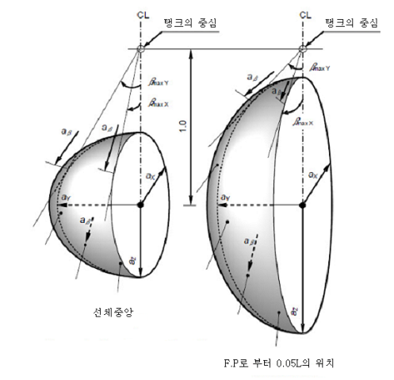 |
    | --- |
    | $a _{\beta }$ : 임의의 방향 $\beta$에 있어서 최종적인 가속도(정+동) $a _{X}$ : 가속도의 종방향 성분 $a _{Y}$ : 가속도의 횡방향 성분 $a _{Z}$ : 가속도의 상하방향 성분 |

    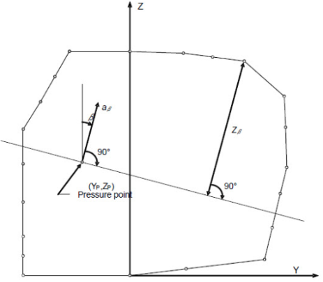
    **그림 7.5.15 내압을 구하는 방법**
    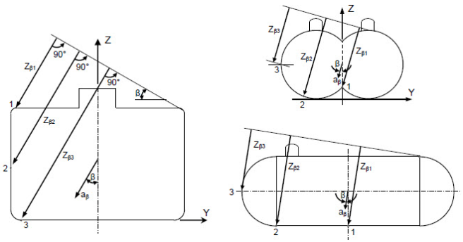
    **그림 7.5.16 위치 1, 2, 3에서 액체높이** #eqnID-343 **구하는 방법**

### 제 5 절 프로세스용 압력용기와 액체, 증기 및 압력관장치

#### 501. 일반사항 【지침 참조】

- **1.** 이 절의 규정은 화물증기관장치, 가스연료관 및 안전밸브의 벤트관장치 또는 유사한 관장치를 포함하여 화물용 및 프로세스용 관장치에 적용한다. 화물을 포함하지 않는 보조 관장치에는 이 절의 규정을 적용하지 않는다.
- **2.** **4 절**의 독립형탱크 형식 C의 규정은 프로세스용 압력용기에도 적용할 수 있다. 이 경우 **4절**에 사용되고 있는 "압력용기”라 함은 독립형탱크 형식 C 및 프로세스용 압력용기의 양쪽을 의미한다.
- **3.** 프로세스용 압력용기는 액체 또는 증기 화물을 저장 또는 취급하는 서지탱크, 열교환기 및 축압기를 포함한다.

#### 502. 시스템 요건

- **1.** 화물취급장치 및 화물제어장치는 다음을 고려하여 설계되어야 한다.
  - **(1)** 액체 또는 증기 화물의 유출이 확산되는 비정상상태의 방지
  - **(2)** 유출된 화물유체의 안전한 수집 및 처리
  - **(3)** 인화성 혼합물의 형성 방지
  - **(4)** 유출된 인화성 액체 또는 가스 및 증기의 점화 방지
  - **(5)** 화재 및 기타 위험요소로부터 인간에 대한 노출 제한
- **2.** **배치: 일반사항 【지침 참조】**
  - **(1)** 액체 또는 증기 화물을 포함할 수 있는 모든 관장치는 다음의 규정에 따른다.
    - **(가)** 퍼징, 가스프리 또는 불활성화와 같이 화물과 관련한 작동에 필요한 연결관을 제외하고 다른 관장치로부터 격리되어야 하며, **904. 4**항에서 규정한 화물의 역류방지가 고려되어야 한다. 이러한 연결관을 설치할 경우에는 화물 또는 화물증기가 연결관을 통하여 다른 관장치에 유입되지 않도록 조치를 취하여야 한다.
    - **(나)** **16절**에 정하는 경우를 제외하고, 어떠한 거주구역, 업무구역, 제어장소 및, 화물기기구역을 제외한 기관구역을 통과해서는 아니 된다.
    - **(다)** 개방갑판으로부터 직접 화물격납설비로 유도하여야 한다. 다만, 수직트렁크 또는 동등한 설비에 설치된 관은 화물격납설비 상부의 보이드 스페이스를 통과할 수 있다. 또한, 배수, 벤트 또는 퍼지용 관은 코퍼댐을 통과할 수 있다.
    - **(라)** **308.**에서 정하는 선수미 하역설비, **503. 1**항에서 정하는 비상 화물투하관장치, **503. 3**항에서 정하는 터릿구획장치 및 **16절**에서 정하는 것을 제외하고 개방갑판상의 화물지역 내에 배치하여야 한다.
    - **(마)** 항해 중 내압을 받지 아니하는 가로 놓인 선측 육상 연결용 관 또는 비상용 화물투하관장치를 제외하고 **204. 1**항의 횡방향 탱크 위치 규정의 범위 내에 배치하여야 한다.
  - **(2)** 하역용 연결부를 분리하기 전, 하역용 크로스오버 헤더 및 매니폴드의 최외측 밸브와 로딩암 또는 화물호스 사이의 모든 관장치로부터 화물탱크 또는 적절한 장소로 압력을 도출시키고 액체화물을 배출하기 위한 적절한 수단을 갖추어야 한다.
  - **(3)** 화물지역 외부로 화물증기가 유출되는 것을 방지 또는 감지하기 위한 적절한 설비를 갖추지 않는 경우, 화물을 직접 가열 또는 냉각하는 유체를 이송하는 관장치는 화물지역의 바깥쪽으로 유도하여서는 아니 된다.(**1306. 2**항 (6)호 참조)
  - **(4)** 화물관장치로부터 액체화물을 배출하기 위한 도출밸브는 배출된 액체화물을 화물탱크로 유도하여야 한다. 이에 대한 대체 방법으로써 벤트장치 내에 유입하는 액체화물을 탐지하고 처리할 수 있는 설비가 되어 있는 경우, 도출밸브를 벤트마스트에 유도할 수 있다. 관장치 후단에 과압을 방지하도록 요구되는 경우, 화물펌프의 도출밸브로부터 액체화물은 펌프 흡입측으로 유도하여야 한다.

#### 503. 화물지역 외부에 위치한 화물관장치의 배치

- **1.** **비상화물투하설비 【지침 참조】**
  비상화물투하설비가 설치된 경우, 비상화물투하관장치는 **502. 2**항에 적합하여야 한다. 이 관장치는 거주구역, 업무구역, 제어장소 또는 기관구역의 외부를 통하여 후부로 유도할 수 있으나 이들 구역을 통과하여서는 아니 된다. 비상화물투하관장치가 영구적으로 설치된 경우, 화물관장치로부터 분리할 수 있는 적절한 조치가 화물지역 내에 설치되어야 한다.
- **2.** **선수미 하역설비**
  - **(1)** **308.**, **503.** 및 **510. 1**항의 요건에 적합한 경우, 화물관장치는 선수 또는 선미에서 하역할 수 있도록 배치할 수 있다.
  - **(2)** 관장치에는 사용 후 퍼지 및 가스프리를 할 수 있는 장치를 하여야 한다. 사용하지 않을 경우, 스풀피스를 제거하고 관 끝단부에 맹플랜지를 부착하여야 한다.
- **3.** **터릿구획 이송장치(turret compartment transfer systems)**
  화물지역의 외부에 위치한 내부터릿설비를 통과하여 액체 또는 증기 화물을 이송하는 경우, 이송용 관장치는 **502. 2**항, **510. 2**항의 규정 및 다음에 적합하여야 한다.
  - **(1)** 터릿연결용을 제외한 관장치는 노출갑판 상에 설치하여야 한다.
  - **(2)** 휴대식 설비는 허용되지 않는다.
  - **(3)** 관장치에는 사용 후 퍼지 및 가스프리를 할 수 있는 장치를 갖추어야 한다. 사용하지 않을 경우, 스풀피스를 제거하고 관 끝단부에 맹플랜지를 부착하여야 한다. 퍼지용 관에 연결된 벤트관은 화물지역 내에 설치하여야 한다.
- **4.** **가스연료 관장치**
  기관구역 내에 배치되어 있는 가스연료 관장치는 **16절**의 규정에 추가하여 이 절의 해당 규정을 따라야 한다.

#### 504. 설계압력

- **1.** 관장치 및 관장치의 구성품의 치수를 결정하기 위하여 사용되는 설계압력 $P_{ o}$는 장치의 사용 중에 발생하는 최대게이지압력 이상이어야 한다. 사용되는 최소설계압력은 1 $\mathrm{MPa}$ 게이지압 이상이어야 한다. 다만, 개구단 관장치 또는 압력도출밸브 배출관장치의 최소설계압력은 0.5 $\mathrm{MPa}$ 게이지압 또는 도출밸브 설정압력의 10배 중 작은 값 이상이어야 한다.
- **2.** 다음 설계조건 중에서 가장 큰 압력을 관, 관장치 및 관장치 구성품에 적절히 사용햐여야 한다. **【지침 참조】**
  - **(1)** 도출밸브로부터 격리될 수 있고 액이 존재할 수 있는 화물증기관장치 또는 구성품의 경우, 설계온도 45 °C에서 포화증기압력. 이 값보다 높은 압력 또는 낮은 압력이 사용될 수 있다.(**413. 2**항 (2)호 참조)
  - **(2)** 도출밸브로부터 격리될 수 있고 항상 화물증기만이 존재할 수 있는 장치 또는 관장치 구성품의 경우, 45 °C에서 과열증기압력. 장치의 사용압력 및 온도에서 장치 내에 포화증기가 초기상태에 있다고 가정한 경우에 과열증기압력보다 높은 압력 또는 낮은 압력이 사용될 수 있다.(**413. 2**항 (2)호 참조)
  - **(3)** 화물탱크 및 화물 프로세스장치의 최대허용설정압력
  - **(4)** 관련 펌프 또는 압축기 출구측 도출밸브의 설정압력
  - **(5)** 관장치에 부착된 도출밸브의 설정압력 및 모든 펌프설비의 배치를 고려한 화물관장치의 양하 또는 적하 시 최대 전양정
- **3.** 서지압력이 발생할 수 있는 액체용 관장치는 그 서지압력을 견딜 수 있도록 설계되어야 한다.
- **4.** 가스연료장치의 외측관 또는 덕트의 설계압력은 가스 내측관의 최대사용압력이상이어야 한다. 다만, 사용압력이 1 $\mathrm{MPa}$을 초과하는 가스연료 공급장치의 경우에 외부덕트의 설계압력은 모든 파열판 및 통풍장치를 고려하여 이중관 내외측 사이에서 발생가능한 순간 최대압력 이상으로 할 수 있다.

#### 505. 화물용 밸브

- **1.** **일반사항**
  - **(1)** 모든 화물탱크 및 화물관장치는 이 절에서 규정한 바와 같이 수동조작의 차단밸브를 설치하여야 한다.
  - **(2)** 이에 추가하여, 액체 또는 증기 화물을 이송작업 중에 비상시 화물의 흐름 및 누설을 정지하기 위한 비상차단(ESD)장치로서 원격조작 밸브를 설치하여야 한다. 비상차단(ESD)장치는 어떠한 시정조치를 할 수 있도록 안전한 정적상태로 화물장치를 복구하는 것이다. 화물이송관장치 내에 서지압력의 발생을 방지하도록 비상차단(ESD)장치의 설계를 고려하여야 한다. 최대허용설정압력이 0.07 $\mathrm{MPa}$을 초과하는 경우, 적재 또는 양하 중 매니폴드 밸브, 내부 또는 외부(예를 들어, 육상 또는 다른 선박/부선)로 화물을 이송하는 모든 펌프 또는 압축기 등 및 화물탱크밸브와 같은 설비들은 비상차단(ESD)장치의 작동 시 차단되어야 한다.
- **2.** **화물탱크 연결관 【지침 참조】**
  - **(1)** 안전밸브 및 액면계측장치를 제외한 모든 액체 및 증기 화물의 연결관에는 가능한 탱크와 근접한 위치에 차단밸브를 설치하여야 한다. 이 차단밸브들은 설치장소에서 수동조작이 가능하여야 하고 완전히 폐쇄할 수 있는 것이어야 한다. 이 차단밸브들은 또한, 원격조작이 가능한 것을 허용할 수 있다. *(2021)*
  - **(2)** 최대허용설정압력이 0.07 $\mathrm{MPa}$ 게이지압을 초과하는 화물탱크의 경우, 상기의 연결관에 원격조작의 비상차단(ESD)밸브를 설치하여야 한다. 또한 가능한 탱크와 근접한 위치에 설치하여야 한다. **1810. 2**항의 요건에 적합하고 그 장치를 완전하게 폐쇄할 수 있는 경우, 별도의 2개 밸브를 대신하여 1개의 밸브로 할 수 있다.
- **3.** **화물 매니폴드 연결관 【지침 참조】**
  - **(1)** 하역작업 시 액체 및 증기 화물의 이송을 정지하기 위해 사용되는 각 화물이송 연결관에 원격조작의 비상차단(ESD)밸브 1개를 설치하여야 한다. 사용하지 않는 이송 연결관은 적절한 맹플랜지를 설치하여야 한다.
  - **(2)** 최대허용설정압력이 0.07$\mathrm{MPa}$ 게이지압을 초과하는 화물탱크의 경우, 사용하는 각 이송 연결관에 추가로 1개의 수동조작밸브를 설치하여야 하고 이러한 수동조작밸브는 선박의 설계에 따라 비상차단(ESD)밸브의 전단 또는 후단에 설치할 수 있다.
- **4.** 비상차단(ESD)밸브에 의해 보호되는 관의 지름이 50 mm 이하인 경우, 과류방지밸브는 비상차단밸브를 대신하여 설치할 수 있다. 과류방지밸브는 제조자가 정한 증기 또는 액체 화물의 정격폐쇄유량에서 자동적으로 폐쇄되어야 한다. 과류방지밸브에 의해 보호되는 부착품, 밸브 및 부속품을 포함하는 관장치는 과류방지밸브의 정격폐쇄유량보다 더 큰 용량의 것이어야 한다. 과류방지밸브는 폐쇄된 후에 압력이 평형이 되도록 하기 위하여 개구 단면내부지름이 1.0 mm 을 넘지 아니하는 바이패스를 설치할 수 있다.
- **5.** 게이지 또는 계측장치용 화물탱크 연결관에는 탱크내용물의 외부 유출이 내부지름 1.5 mm 이하가 되는 구조인 경우에 과류방지밸브 또는 비상차단밸브를 설치할 필요가 없다.
- **6.** 액이 충만된 상태로 격리될 우려가 있는 모든 관장치 또는 구성품은 열팽창 및 증발용 도출밸브를 설치하여야 한다. **【지침 참조】**
- **7.** 화재에 의해서 화물 액체용량 0.05 $\mathrm{m} ^{3}$ 이상이 자동적으로 격리될 수 있는 모든 관장치 또는 구성품은 화재상태에 대한 적합한 크기의 압력도출밸브를 설치하여야 한다.

#### 506. 화물 이송설비 【지침 참조】

- **1.** 화물 이송펌프가 고장났을 때 화물탱크의 사용 중인 펌프의 수리를 위하여 접근할 수 없을 경우에는 적어도 2개의 별개의 설비를 각 화물탱크로부터 화물을 이송하기 위하여 설치하여야 한다. 이 설계에서는 1개의 화물펌프 또는 이송설비의 고장이 다른 펌프나 또는 다른 이송수단으로써 화물을 이송하는데 방해가 되어서는 아니 된다.
- **2.** 가스의 가압에 의하여 화물을 이송하는 방법에서는 이송 중에 도출밸브가 열리지 않도록 하여야 한다. 화물 이송작업 중에 정상상태에서 설계 안전율이 감소되지 않도록 설계된 탱크는 화물의 이송방법으로써 가스가압을 인정할 수 있다. **802. 7**항 및 **8**항에 따라 허용된 바와 같이 화물탱크 도출밸브 또는 설정압력이 변경되는 경우, 새로운 설정압력은 **413. 2**항에서 정의한 $\mathrm{P} _{ h}$ 이하이어야 한다.
- **3.** **화물증기 회수관**
  육상시설에서의 화물증기 회수관장치를 위한 연결부를 설치하여야 한다.
- **4.** **화물탱크 벤트관장치**
  압력도출장치는 화물증기가 갑판 상에 축적되거나 거주구역, 업무구역, 제어장소 및 기관구역 또는 위험조건이 형성될 수 있는 기타 구역에 유입될 가능성을 최소화 하도록 설계된 벤트관장치에 유도하여야 한다.
- **5.** **화물시료채취연결부**
  - **(1)** 화물관장치에 액체화물 시료채취용 연결부는 명확히 표시되어야 하고 증기화물의 유출을 최소화 하도록 설계되어야 한다. 독성화물을 운반하는 선박의 경우, 시료채취장치는 액체 및 증기 화물이 대기로 유출되지 않도록 설계된 폐회로형 시스템이어야 한다.
  - **(2)** 액체시료채취장치는 흡입측에 2개의 밸브가 설치되어야 한다. 이 중 1개 밸브는 의도하지 않은 개방을 방지하기 위하여 다회전식(multi-turn type)이어야 하고, 예를 들어, 얼음 또는 하이드레이트(hydrates)에 의해 막힘이 있는 경우에 관을 격리할 수 있도록 충분히 멀리 떨어져 설치하여야 한다.
  - **(3)** 폐회로형 시스템에서 회수관에 부착되는 밸브는 (2)호에 따라야 한다.
  - **(4)** 시료채취용기의 연결부는 인정하는 기준에 적합하여야 하며, 채취용기의 무게를 지지할 수 있어야 한다. 나사박이 연결부는 채취용기의 정상적인 연결 및 분리를 하는 동안 느슨해지는 것을 방지하도록 가용접(tack-welded)하거나 다른 방법으로 고정하여야 한다. 채취 연결부를 사용하지 않는 경우, 누설을 방지하기 위하여 폐쇄 플러그 또는 플랜지를 채취 연결부에 설치하여야 한다.
  - **(5)** 증기 채취용으로 사용되는 채취 연결부는 **505.**, **508.** 및 **513.**에 따른 1개의 밸브를 설치하여야 한다. 그리고 폐쇄 플러그나 플랜지를 설치하여야 한다.
  - **(6)** **1809.**에 규정된 채취작업을 수행하여야 한다.
- **6.** **화물 여과기**
  액체 및 증기 화물장치에는 이물질에 의한 손상으로부터 보호할 수 있는 여과기를 설치하여야 한다. 이러한 여과기는 영구적 또는 일시적으로 설치할 수 있고 여과 기준은 화물장치에 유입되는 파편 등의 위험에 적절한 것이어야 한다. 여과기의 막힘을 지시하고 여과기를 안전히 분리, 감압 및 청소할 수 있는 수단이 설치되어야 한다.
- **7.** LNG를 연료로 사용하는 선박에 LNG연료를 공급하는 벙커링 설비에 대해서는 **부록 7A-3**을 따른다. **【지침 참조】** *(2021)*

#### 507. 설치규정

- **1.** **신축성에 대한 설계**
  열신축 및 화물탱크와 선체구조의 거동에 의해 관, 관장치 및 구성품, 그리고 탱크에 과대한 응력이 발생하지 않도록 설계하여야 한다. 화물탱크 외부에서 선호되는 방법은 옵셋트관, 만곡, 환상관을 사용하는 것이며 다만, 옵셋트관, 만곡, 환상관을 사용하는 것이 불가능한 경우에 다층(multi-layers)벨로스를 사용할 수 있다.
- **2.** **저온에 대한 조치 【지침 참조】**
  저온용 관은 필요하다고 인정할 경우에는 선체의 온도가 선체재료의 설계온도보다 저온으로 되지 아니하도록 인접하는 선체구조로부터 열적으로 격리하여야 한다. 육상연결구 및 펌프 실(seal)부와 같이 액체용관이 정기적으로 개방되거나 액체 누설의 염려가 있는 장소의 하부에는 선체를 보호하기 위한 설비를 하여야 한다.
- **3.** **수막(Water curtain)**
  화물온도가 -110 °C 미만인 경우, 선체 강재 및 선측 구조의 추가적인 보호를 위하여 저압식 수막을 형성하도록 육상연결부 하방에 물공급장치가 설치되어야 한다. 이 장치는 **1103. 1**항 (4)호에 대한 추가적인 규정이며, 화물이송이 진행하는 동안 작동되어야 한다.
- **4.** **본딩** ***(2023)*** **【지침 참조】**
  탱크 또는 화물관 및 관장치가 열적 격리에 의해 선체구조로부터 분리되는 경우, 관장치 및 탱크는 전기적으로 본딩되어야 한다. 모든 개스킷붙이 관이음 및 호수 연결구는 전기적으로 본딩되어야 한다. 본딩스트랩를 사용하는 경우를 제외하고, 각 이음 또는 연결부의 전기적 저항이 1MΩ 미만이 되는 것을 증명하여야 한다.

#### 508. 관의 조립 및 이음상세

- **1.** **일반사항 【지침 참조】**
  이 규정은 화물탱크 내외부에 위치한 관장치에 대하여 적용한다. 다만, 화물탱크 내의 관 및 개구단관에 대하여는 인정하는 기준에 따라서 이 규정을 완화할 수 있다.
- **2.** **직접이음 【지침 참조】**
  플랜지 없는 다음의 직접이음은 사용할 수 있다.
  - **(1)** 루트부에 완전 용입형의 맞대기용접 이음은 모든 경우에 사용할 수 있다. 설계온도가 -10 °C 미만인 경우, 맞대기용접은 양면용접 혹은 양면용접과 동등한 것이어야 한다. 이 경우 최초의 층에 뒷댐판, 용접재료 삽입(consumable insert) 또는 불활성가스의 사용에 의한 용접은 양면 용접법과 동등한 것으로 인정할 수 있다. 설계압력이 1.0 $\mathrm{MPa}$을 초과하고 설계온도가 -10 °C 미만인 경우에는 뒷댐판이 제거되어야 한다.
  - **(2)** 인정하는 기준에 따른 용접치수를 가진 슬리브 삽입 용접이음 및 관련 용접은 바깥지름이 50 mm 이하이고 설계온도가 -55 °C 이상의 계측용 관 및 개구단 관장치에 대하여만 사용할 수 있다.
  - **(3)** 인정하는 기준에 적합한 나사박이 이음은 바깥지름 25 mm 이하의 부속관 및 계측용 관에 대하여만 사용할 수 있다.
- **3.** **플랜지이음 【지침 참조】**
  - **(1)** 플랜지는 맞대기 용접형, 삽입형 또는 소켓 용접형이어야 한다.
  - **(2)** 플랜지는 형식, 제조 및 시험에 대하여 인정하는 기준을 따라야 한다. 개구단 관을 제외한 모든 관에 대하여는 다음의 규정을 적용한다.
- **4.** **신축이음**
  벨로스 및 신축이음이 **507. 1**항에 따라 설치되는 경우, 다음 규정을 적용한다.
  - **(1)** 필요한 경우, 벨로스는 빙결에 대하여 보호되어야 한다.
  - **(2)** 삽입형 이음은 화물탱크 내부에서만 사용되어야 한다.
- **5.** **기타이음 【지침 참조】**
  관 연결부는 **2**항에서 **4**항까지의 규정에 따라 이음되어야 한다. 다만, 기타 예외적인 경우 우리 선급은 대체 이음을 고려할 수 있다.

#### 509. 용접, 용접후 열처리 및 비파괴검사

- **1.** **일반사항**
  용접은 **605.**의 규정에 따라 수행되어야 한다.
- **2.** **용접후 열처리 【지침 참조】**
  용접후 열처리는 탄소강, 탄소망간강 및 저합금강 관의 모든 맞대기 용접에 대하여 실시하여야 한다. 우리 선급은 관련하는 관장치의 설계온도 및 설계압력을 고려하여 두께가 10 mm 미만의 관에 대하여 열응력 제거를 위한 열처리의 규정을 생략할 수 있다.
- **3.** **비파괴검사** ***(2021)*** **【지침 참조】**
  용접 시공 전 및 시공 중에 통상의 검사 및 용접후의 외관검사에 추가하여 용접이 정확하게 그리고 **508.**의 규정에 따라 행하여진 것인가를 확인하기 위하여 다음의 검사를 하여야 한다.
  - **(1)** -10 °C 미만의 설계온도로써 안지름이 75 mm를 초과하거나 관두께가 10 mm를 초과하는 관장치의 맞대기 용접이음에 대하여는 100 % 방사선투과검사 또는 초음파탐상검사.
  - **(2)** 우리 선급의 승인을 득한 자동용접절차에 따라 제조된 관단면의 맞대기 용접이음부는 방사선투과검사 또는 초음파탐상검사의 범위를 점차 감소할 수 있으나 각 이음부의 10 %이상은 시험을 하여야 한다. 결함이 발견되는 경우, 시험범위는 100 %로 하여야 하며 바로 이전에 승인된 용접부위의 검사를 포함하여야 한다. 우리 선급이 문서화된 품질보증절차와 기록을 검토하여 만족할 만한 용접을 계속적으로 수행할 수 있는 제조자의 능력이 입증될 때 승인을 할 수 있다.
  - **(3)** (1)호 및 (2)호에 의해 다루지 않는 기타 관의 맞대기 용접이음의 경우, 용도, 설치장소 및 재료에 따라 부분 방사선투과검사 또는 초음파탐상검사 또는 기타 비파괴검사를 수행하여야 한다. 통상 관의 맞대기 용접이음의 최소 10 %는 방사선투과검사 또는 초음파탐상검사를 하여야 한다. **【지침 참조】**

#### 510. 화물지역 외부의 화물관장치에 대한 설치요건

- **1.** **선수미 하역설비**
  다음의 규정을 화물지역 외부에 설치한 화물관 및 관련 관장치에 적용하여야 한다.
  - **(1)** 화물지역 외부의 화물관 및 관련 관장치의 이음은 용접이음이어야 한다. 화물지역 외부의 배관은 개방 갑판상을 통하여야 하며, 가로놓인 육상시설 연결관을 제외하고 선측으로부터 적어도 800 mm 내측에 설치하여야 한다. 이러한 배관은 명확하게 식별할 수 있어야 하며 화물지역 내에 화물관장치와의 연결부에는 차단밸브를 설치하여야 한다. 이 배관을 사용하지 않는 경우, 이 위치에서 분리형 스풀피스 및 맹플랜지에 의해 분리되는 것이어야 한다.
  - **(2)** 관의 이음은 완전용입 맞대기 용접의 것으로 관지름 및 설계온도에 관계없이 전용접부에 방사선검사 또는 초음파검사를 하여야 한다. 배관의 플랜지이음은 화물지역 내 및 육상연결구에만 허용된다.
- **2.** **터릿구획 이송장치**
  다음의 규정은 화물지역 외부에 설치한 액체 및 증기 화물관에 적용하여야 한다.
  - **(1)** 화물지역 외부의 화물관 및 관련 관장치의 이음은 용접이음이어야 한다.
  - **(2)** 관의 이음은 완전용입 맞대기 용접의 것으로 관지름 및 설계온도에 관계없이 전용접부에 방사선검사 또는 초음파검사를 하여야 한다. 관의 플랜지이음은 화물지역 내, 화물호스 연결부 그리고 터릿연결부에만 허용된다.
- **3.** **가스연료관**
  가스연료관은 가능한 용접이음이어야 한다. **1604. 3**항에 따라 통풍되는 관 또는 덕트로 밀폐되지 않은 가스연료관장치 및 화물지역 외부의 개방갑판 상의 가스연료관장치는 완전용입 맞대기 용접이음이어야 하고 전용접부에 방사선검사 또는 초음파검사를 하여야 한다.

#### 511. 관장치 구성품

- **1.** **일반사항**
  관의 치수. 관장치는 인정하는 기준에 따라 설계되어야 한다.
- **2.** **관의 두께 【지침 참조】**
  - **(1)** 관의 두께를 결정하기 위해 다음의 기준이 적용되어야 하며 다음 식의 값 이상이어야 한다.
    $t= \frac{t _{0} +b+c}{1- \frac{a}{100}}$
    $t$ : 식에 의한 소요두께($\mathrm{mm}$)
    $t _{0}$ : 설계압력으로부터 계산되는 소요두께($\mathrm{mm}$)로써 다음 식에 따른 값
    $t _{0} = \frac{P \cdot D}{2Ke+P}$
    $P$ : **504.**에 규정하는 설계압력($\mathrm{MPa}$)
    $D$ : 관의 바깥지름($\mathrm{mm}$)
    $K$ : **3**항에 규정하는 허용응력($\mathrm{N}/mm ^{2}$)
    $e$ : 이음효율, 이음매 없는 관 및 이와 동등하다고 인정되는 제조법에 따르고 또한 승인된 제조자에 의하여 제조되는 용접관으로서 인정하는 기준에 따라 용접부의 비파괴검사가 행하여진 종이음매 또는 나선형이음매 용접관에 대하여는 1.0으로 한다.
    $b$ : 굽힘가공에 대한 예비두께($\mathrm{mm}$). $b$는 내압에 의하여 계산된 굽힘부에 있어서 응력이 허용압력을 넘지 아니하는 값이어야 한다. 응력을 계산에 의하여 확인할 수 없는 경우, $b$의 값은 다음 계산에 따라야 한다.
    $b= \frac{D t _{0}}{2.5r}$
    $r$ : 평균굽힘 반지름($\mathrm{mm}$)
    $c$ : 부식예비두께($\mathrm{mm}$). $c$의 값은 부식 또는 침식의 염려가 있는 경우, 다른 설계조건에서 요구되는 관두께에 증가시켜야만 되기 때문에 그 값은 관에 기대하는 수명에 따라야 한다.
    $a$ : 관두께에 대한 마이너스의 제작공차(%)
  - **(2)** 최소 두께는 인정하는 기준에 따라야 한다.
  - **(3)** 부가되는 하중에 따른 관의 손상, 붕괴, 과대한 처짐 또는 좌굴을 방지하기 위하여 기계적 강도가 필요한 경우, (1)호에서 요구되는 값보다 크게 관두께를 증가하여야 한다. 관두께를 증가하는 것이 불가능하거나 과도한 국부응력을 야기하는 경우, 이러한 부가하중은 다른 설계방법에 의해 감소, 보호 또는 제거할 수 있다. 지지구조, 선체변형, 이송작업 중 액체 서지압력, 매달린 밸브의 중량, 로딩 암 연결부의 반동, 또는 기타 방법에 의하여 이러한 부가하중이 발생할 수 있다.
- **3.** **허용응력**
  - **(1)** 관에 대하여 **2**항의 식에 표시되어 있는 허용응력 $K$는 다음 중 작은 값으로 한다.
    $R _{m} /A$ 또는 $R _{e} /B$
    $R _{m}$ : 상온에서 규격 최소 인장강도($\mathrm{N}/mm ^{2}$)
    $R _{e}$ : 상온에서 규격 최소 항복응력($\mathrm{N}/mm ^{2}$)
    응력-변형곡선에서 정의된 항복응력을 보여주지 않는 경우, 0.2 % 내력을 적용한다.
    $A$및 $B$의 값은 **IGC 적합증서**에 기재되어야 하고 적어도 각각 2.7 및 1.8로 하여야 한다.
- **4.** **고압가스연료 외관 또는 덕트 치수**
  임계압력보다 높은 설계압력을 갖는 가스연료관장치에서, **504.**에서 규정한 설계압력을 받는 관 또는 덕트의 횡단면부의 접선 막응력(tangential membrane stress)은 인장강도를 1.5로 나눈 값($R_{ m}/1.5$)을 초과하지 않아야 한다. 모든 관장치 구성품의 압력등급은 직관과 같은 수준의 강도가 반영되어야 한다.
- **5.** **응력해석 【지침 참조】**
  설계온도가 -110 °C 이하인 경우, 관장치의 각 지관에 대한 전응력해석을 수행하여 그 결과를 우리 선급에 제출하여야 한다. 이러한 응력해석은 가속도 하중(무시할 수 없는 경우)을 포함하는 관의 중량, 내압, 열신축 및 선박의 호깅 및 새깅에 의한 하중으로 발생되는 모든 응력을 고려하여 한다. 설계온도가 -110 °C를 넘을 경우에도 설계 또는 관장치의 강도 및 사용재료에 관련하여 우리 선급은 응력해석을 요구할 수 있다. 어떠한 경우에도 계산서를 제출하지 않더라도 열응력에 대하여는 고려하여야 한다. 응력해석은 실제로 적용되는 우리 선급이 인정하는 코우드에 따라 해석을 할 수 있다.
- **6.** **플랜지, 밸브 및 부착품 【지침 참조】**
  - **(1)** 플랜지, 밸브 및 기타 부착품은 재료 및 **504.**에서 정의하는 설계압력을 고려하여 인정하는 기준에 적합하여야 한다. 화물 증기용관에 사용하는 벨로스 신축이음의 경우, 보다 낮은 최소설계압력으로 할 수 있다.
  - **(2)** 인정하는 기준에 적합하지 않은 플랜지의 경우, 플랜지 및 관련 볼트의 치수는 우리 선급에 만족하는 것이어야 한다.
  - **(3)** 모든 비상차단밸브는 “페일-클로즈(fail-closed)”형이어야 한다.(**513. 1**항의 (1)호 및 **1810. 2**항 참조)
  - **(4)** 신축 밸로스의 설계 및 설치는 인정하는 기준에 적합하여야 하며 과도한 신장 또는 압축으로 인한 손상을 방지하는 수단을 설치하여야 한다.
- **7.** **선박의 화물호스**
  - **(1)** 화물 이송에 사용하는 액체 및 증기 호스는 화물에 적합하여야하고 화물온도에 적합한 것이어야 한다.
  - **(2)** 탱크의 압력 또는 펌프나 가스압축기의 토출압력을 받는 호스는 그 파괴압력이 화물의 이송 중에 호스에 걸리는 최대 압력의 5배 이상이 되도록 설계하여야 한다.
  - **(3)** 새로운 형식의 화물호스는 끝단 부품이 부착된 상태에서 우리 선급이 별도로 정하는 규정에 따라 형식승인을 받아야 한다. *(2019)*
  - **(4)** 제품시험
    형식승인시험에 사용한 호스는 화물의 실제 하역에 사용하여서는 아니 된다. 새로 제조되는 모든 화물 호스는 사용하기 전에 계획 최대 사용압력의 1.5배 이상의 압력(다만, 파열압력의 2/5 이하로 한다)으로 대기온도에서 수압시험을 하여야 한다. 호스에는 시험일, 계획 최대 사용압력 및 대기온도 이외의 온도에서 사용하는 경우에는 그 최고 및 최저 사용온도를 스텐실 또는 기타의 방법으로 표시하여야 한다. 계획 최대 사용압력은 1 $\mathrm{MPa}$ 게이지압 이상이어야 한다.

#### 512. 재료 【지침 참조】

- **1.** 관장치에 사용하는 재료의 선정과 시험은 최저 설계온도를 고려하여 **6절**의 규정에 따라야 한다. 다만, 도출밸브의 설정압력에서의 화물온도가 -55 °C 이상이고, 또한 벤트관 내로 액이 배출되는 일이 없는 개구단벤트관 재료의 성질은 완화할 수 있다.
  배출관과 멤브레인 및 세미 멤브레인방식 탱크 내의 모든 관을 제외하고 화물탱크 내의 개구단 관장치에 대해서는 동일한 온도조건에서 완화할 수 있다.
- **2.** 융점이 925 °C 미만의 재료는 내화성 방열재를 시공한 화물탱크에 접속되는 짧은 관을 제외하고 탱크 외측의 관으로 사용하여서는 아니 된다.
- **3.** 시간당 최소 30회 용량의 통풍장치가 설치된 외측관 또는 덕트는 내측의 고압관의 손상으로 인한 압력과 저온의 영향을 고려하여야 한다. *(2021)*
- **4.** **화물관 방열장치**
  - **(1)** 화물이송 작업 중 화물에 열유입을 최소화하고 작업자가 저온면과 직접 접촉되는 것을 보호하기 위해 요구되는 화물관장치에는 방열장치를 설치하여야 한다.
  - **(2)** 방열재는, 설치장소 또는 환경조건으로 인하여 적용되는 경우, 화재 및 화염에 대하여 적절한 내화성을 가져야 하고, 수증기의 침투 및 기계적 손상에 대하여 보호되어야 한다.
- **5.** 화물관장치가 염분을 함유한 대기상태에서 응력부식균열에 취약한 재료의 경우, 재료의 선정, 염수 노출에 대한 보호 및/또는 검사에 대한 준비를 고려하여 응력부식균열이 발생하지 않도록 적절한 조치를 하여야 한다.

#### 513. 시험

- **1.** **관장치 구성품의 시험 【지침 참조】**
  - **(1)** 밸브
    모든 밸브는 제조자의 공장에서 우리 선급 검사원의 입회하에 다음의 시험을 하여야 한다.
    - **(가)** 형식시험
      - **(a)** -55 °C 미만의 온도로 사용하는 밸브는 별도로 정하는 규정에 따라 형식승인을 받아야 한다.
      - **(b)** -55 °C 이상의 온도로 사용하는 밸브에 대해서는 형식승인이 요구되지 않는다.
    - **(나)** 제품시험
      - **(a)** 모든 밸브는 설계압력의 1.5배의 압력으로 밸브몸체의 수압시험을 하여야 한다.
      - **(b)** 안전밸브를 제외한 밸브는 설계압력의 1.1배의 압력으로 밸브시트와 밸브봉의 누설시험을 하여야 하고, 이에 추가하여 -55 °C 미만의 온도로 사용하는 밸브는 치수 및 형식마다 최소 10%에 대하여 설계온도에서 밸브작동과 누설확인을 포함한 저온시험을 하여야 한다.
      - **(c)** 안전밸브는 주위온도에서 설정압력에 대한 작동시험을 하여야 한다.
    - **(다)** 제조자는 다음의 모든 조건을 만족할 경우 상기 (나)의 제품시험을 면제해줄 것을 우리 선급에 요청할 수 있다.
      - **(a)** -55 °C 미만의 온도로 사용하는 밸브에 대한 (가)에서 요구하는 형식승인을 받을 것
      - **(b)** 제조자가 우리 선급에서 평가하여 인정한 승인된 품질시스템을 갖추고 있고 정기적인 심사를 받을 것
      - **(c)** 품질관리계획에 밸브마다 다음의 시험을 하도록 하는 규정이 있고, 제조자가 그 시험의 기록을 유지할 것
      - **(i)** 모든 밸브에 대하여 설계압력의 1.5배의 압력으로 밸브몸체의 수압시험
        - **(ii)** 안전밸브를 제외한 밸브에 대하여 설계압력의 1.1배의 압력으로 밸브시트와 밸브봉의 누설시험
        - **(iii)** 안전밸브에 대하여 주위온도에서 설정압력에 대한 작동시험
      - **(d)** 안전밸브를 제외한 -55 °C 미만의 온도로 사용하는 밸브에 대하여 치수 및 형식마다 최소 10 %에 대하여 설계온도에서 밸브작동과 누설확인을 포함한 저온시험을 우리 선급 검사원의 입회하에 할 것
  - **(2)** 신축이음
    화물탱크의 외측의 화물용 관에 사용하는 신축 밸로스 및 화물탱크 내에 사용하는 신축밸로스로써 우리 선급이 요구하는 것은 별도로 정하는 규정에 따라 형식승인을 받아야 한다.
  - **(3)** 화물 펌프
    형식승인을 받은 모든 펌프는 제조자의 공장에서 우리 선급 검사원의 입회하에 다음의 (a) 및 (b)의 시험을 하여야 한다.
    - **(가)** 펌프는 별도로 정하는 규정에 따라 형식승인을 받아야 한다.
    - **(나)** 제품시험
      - **(a)** 설계압력의 1.5배의 압력으로 펌프몸체의 수압시험을 하여야 한다.
      - **(b)** 다음의 용량시험을 하여야 한다.
      - **(i)** 잠수 펌프는 설계매체 또는 설계온도 이하의 매체로 용량시험을 하여야 한다,
        - **(ii)** 디프웰 펌프는 물로 용량시험을 할 수 있다.
    - **(다)** 제조자는 다음의 모든 조건을 모두 만족할 경우 상기 (나)의 제품시험을 면제 해줄 것을 우리 선급에 요청할 수 있다.
      - **(a)** 펌프가 **5장 513.**의 **1**항 (3)호 (가)에서 요구하는 형식승인을 받을 것.
      - **(b)** 제조자가 우리 선급에서 평가하고 인정한 승인된 품질시스템을 갖추고 있고 정기적인 심사를 받을 것
      - **(c)** 품질관리계획에 펌프마다 설계압력의 1.5배의 압력으로 펌프몸체의 수압시험을 하여야 하고 용량시험을 하도록 하는 규정이 있고, 제조자가 그 시험의 기록을 유지할 것
  - **(4)** 화물가스, 재액화 및 냉각용 압축기 *(2025)*
    형식승인을 받은 각 압축기는 제조자의 공장에서 우리 선급 검사원의 입회하에 아래의 시험을 하여야 합니다.
    - **(가)** 화물가스, 재액화 및 냉각용 압축기는 별도로 정하는 규정에 따라 형식승인을 받아야 한다.
    - **(나)** 제품시험
      - **(a)** 압축기 압력경계부품(compressor pressure boundary components)의 수압시험을 하여야 한다.
      - **(b)** 수압시험은 적어도 30분 동안 설계 압력의 1.5배의 압력(또는 시험매체가 압축성 유체인 경우 설계압력의 1.25배의 압력)으로 하여야 한다.
    - **(다)** 제조자는 다음의 모든 조건을 모두 만족할 경우 상기 (나)의 제품시험을 면제해 줄 것을 우리 선급에 요청할 수 있다.
      - **(a)** 압축기가 **513.**의 **1**항 (3)호 (가)에서 요구하는 형식승인을 받을 것.
      - **(b)** 제조자가 우리 선급에서 평가하고 인정한 승인된 품질시스템을 갖추고 있고 정기적인 심사를 받을 것
      - **(c)** 품질관리계획에 압축기마다 적어도 30분 동안 설계 압력의 1.5배의 압력(또는 시험매체가 압축성 유체인 경우 설계압력의 1.25배의 압력)으로 압축기몸체의 수압시험을 하여야 하고, 기계 작동 시험 및 성능시험을 하도록 하는 규정이 있고, 제조자가 그 시험의 기록을 유지할 것
- **2.** **관장치 시험 【지침 참조】**
  - **(1)** 이 규정은 화물탱크의 내외의 관장치에 적용한다. *(2021)*
  - **(2)** 모든 화물 및 프로세스용 관장치는 조립 후 적절한 유체로 강도시험을 하여야 한다. 액체관의 경우, 설계압력의 1.5배(시험유체가 압축성인 경우 설계압력의 1.25배)로 압력시험을 하여야 한다. 화물증기관의 경우, 최대사용압력의 1.5배(시험유체가 압축성인 경우, 최대사용압력의 1.25배)로 압력시험을 하여야 한다. 관장치 또는 장치의 일부가 완성품이고 모든 부착품이 완비된 경우, 선내에 설치하기 전에 압력시험을 할 수 있다. 선내에서 행한 용접이음은 적어도 설계압력의 1.5배로 압력시험을 하여야 한다.
  - **(3)** 각 화물 및 프로세스용 관장치는 선내 조립 후 적용되는 탐지방법에 따른 압력으로 공기 또는 기타 적절한 매체를 이용하여 누설시험을 하여야 한다.
  - **(4)** 이중 가스연료관장치의 경우, 외측관 또는 덕트는 가스관이 파열시 예상되는 최대압력을 견딜 수 있다는 것을 증명하기 위해 압력시험을 하여야 한다.
  - **(5)** 화물 또는 화물증기를 취급하기 위한 밸브, 부착품 및 관련 장비를 포함하는 모든 관장치는 최초의 하역작업 이전에 통상의 사용상태에서 인정하는 기준을 따라 시험을 하여야 한다.
- **3.** **비상차단밸브**
  액체화물관장치에서 사용되는 비상차단밸브의 성능이 **1810. 2**항의 (1)호 (다)에 적합하다는 것을 증명하기 위해 시험되어야 한다. 이 시험은 선내 설치 후 시행할 수 있다.

### 제 6 절 구조재료 및 품질관리

#### 601. 정의

- **1.** 이 절의 규정에서 언급하는 A, B, D, E, AH, DH, EH 및 FH 선체구조용 강재는 **2편**에 따른 선체구조용 강재이어야 한다.
- **2.** 피스(piece)라 함은 1개의 강편(slab), 1개의 빌릿 또는 1개의 강괴로부터 직접 압연된 그대로의 강판, 형강 또는 봉강 전체의 압연제품을 말한다.
- **3.** 배치(batch)라 함은 샘플링 단위로 수행되는 시험을 기반으로 함께 승인 또는 거절되는 항목 또는 피스의 수를 말한다. 배치의 크기는 **2편**에 따른다.
- **4.** 온도제어압연(CR)이라 함은 최종압연온도를 노멀라이징 열처리 구간 내로 제어하는 압연법을 말하며 이 압연법으로 생산된 강재의 기계적 성질은 일반적으로 노멀라이징 열처리를 실시한 강재와 동등하다.
- **5.** 열가공제어법(TMCP)이라 함은 제어압연의 일종으로 압연온도뿐만 아니라 압연량을 엄격히 제어하는 것을 말한다. 온도제어압연과 달리, 열가공압연에 의해 주어진 성질은 노멀라이징 또는 기타 열처리에 의해 생산될 수 없다. 열가공압연이 완료된 후 가속냉각 또는 템퍼링 처리는 우리 선급의 승인을 얻은 후 적용할 수 있다.
- **6.** 가속냉각(AcC)이라 함은 최종 열가공압연이 완료된 직후에 공기냉각보다 빠른 냉각속도로 제어하여 강재의 기계적 성질을 개선하기 위한 공정을 말한다. 직접담금질법(direct quenching)은 가속냉각에서 제외된다. 열가공압연 및 가속냉각에 의해 주어진 재료의 성질은 노멀라이징 또는 기타 열처리에 의해 생산될 수 없다.

#### 602. 적용범위 및 일반사항

- **1.** 이 절은 화물장치의 구조에 사용하는 금속 및 비금속 재료에 대한 규정이다. 이 절은 제품검사를 포함한 이음 프로세스, 생산 프로세스, 자격인정, 비파괴검사, 검사 및 시험에 대한 규정을 포함하고 있다. 압연재료, 단조품 및 주조품에 대한 요건은 **604.** 및 **표 7.5.4**에서 **표 7.5.8**에 따른다. 용접에 대한 요건은 **605.**를 따른다. 비금속 재료에 대해서는 **부록 「 7A-6 비금속 재료 」**를 따른다. 품질보증/품질관리 프로그램은 **602.**의 규정에 적합하도록 시행되어야 한다. *(2021)*
- **2.** 제조, 시험, 검사 및 성적증명서는 **2편 2장** 및 이 장의 규정에 따른다.
- **3.** 용접 후 열처리가 규정되어 있거나 요구되는 경우, 모재의 성질은 이 절의 해당 표에 따른 적합한 열처리 조건에서 결정되어야 한다. 그리고 용접부의 성질은 **605.**에 따른 적합한 열처리 조건에서 결정되어야 한다. 용접 후 열처리가 적용되는 경우, 시험요건은 우리 선급이 승인한 경우 변경될 수 있다.

#### 603. 일반시험요건 및 사양서 【지침 참조】

- **1.** **인장시험**
  - **(1)** 인장시험은 **2편**에 따라 시행되어야 한다.
  - **(2)** 인장강도, 항복응력 및 연신율은 우리 선급이 인정하는 것이어야 한다. 항복점이 명확한 탄소망간강 및 기타 재료는 항복비(항복강도와 인장강도의 비율)의 제한에 대하여 고려하여야 한다. *(2021)*
- **2.** **인성시험** ***(2021)***
  - **(1)** 별도로 언급하지 않는 한, 금속재료의 승인시험은 샤르피 V노치 인성 시험을 실시하여야 한다. 샤르피 V노치 시험의 평가기준은 3개의 표준크기(10 $\mathrm{mm}$×10 $\mathrm{mm}$) 시험편의 최소 평균흡수에너지 값 및 개별 시험편에 대한 최소 흡수에너지 값이다. 샤르피 V노치 시험편의 치수 및 허용오차는 **2편 1장 2절**의 규정에 따라야 한다. 5 $\mathrm{mm}$ 치수의 시험편보다 작은 시험편의 시험 및 요건은 우리 선급이 적절하다고 인정하는 바에 따른다. 서브 사이즈 시험편의 최소 평균흡수에너지 값은 다음 표에 따라야 한다.

    | 샤르피 V노치 시험편 치수 | 3개 시험편 최소 평균흡수에너지 값 |
    | --- | --- |
    | 10 $\mathrm{mm}$ x 10 $\mathrm{mm}$ 10 $\mathrm{mm}$ x 7.5 $\mathrm{mm}$ 10 $\mathrm{mm}$ x 5.0 $\mathrm{mm}$ | $\mathrm{KV}$ 5/6 $\mathrm{KV}$ 2/3 $\mathrm{KV}$ |
    | (비고) $\mathrm{KV}$는 **표 7.5.4** 부터 **표 7.5.7** 에 따른 에너지 값 ($\mathrm{J}$) |   |

    오직 1개의 개별 흡수에너지 값이 규정의 최소 평균흡수에너지 값 미만이어도 된다. 다만, 이 값은 최소 평균흡수에너지 값의 70 % 이상이어야 한다.
  - **(2)** 모재의 경우, 재료의 두께로 채취 가능한 최대치수의 샤르피 시험편은 표면과 두께중심의 가운데에 가능한 가까운 위치에서 시험편을 채취하고 노치의 방향이 재료표면에 수직이 되도록 기계가공하여야 한다. (**그림 7.5.17** 참조)
    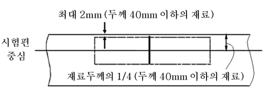
    **그림 7.5.17 모재 시험편의 위치**
  - **(3)** 용접시험편의 경우, 샤르피 시험편은 재료두께를 고려하여 가능한 최대치수로 가공되어야 하며, 가능한 한 표면과 두께중심 간의 가운데에 가깝게 위치하도록 하여야 한다. 어떠한 경우에도 재료의 표면과 시험편의 단부까지의 거리는 약 1 mm 이상이어야 한다. 양면 V형 맞대기용접의 경우, 시험편은 제 2 용접측의 표면과 가깝게 기계가공하여야 한다. 일반적으로 시험편은 **그림 7.5.18**에서 표시하는 노치의 위치가 용접의 중심선, 경계부 및 경계부로부터 1 mm, 3 mm 및 5 mm가 되도록 채취하여야 한다.
  - **(4)** 최초 3개의 샤르피 V노치 시험편의 평균흡수에너지 값이 상기 규정을 만족하지 않는 경우, 또는 1개 이상의 시험편의 개별 흡수에너지 값이 규정의 평균값보다 낮은 경우, 또는 1개 시험편의 흡수에너지 값이 개별 시험편에 허용되는 최소 흡수에너지 값보다 낮은 경우에는, 같은 재료로부터 추가로 3개의 시험편을 채취하여 재시험할 수 있다. 이때 먼저 실시한 시험결과를 포함한 새로운 평균값을 얻을 수 있다. 6 개의 시편으로부터 얻은 새로운 평균값이 규정에 적합하고 또한 요구되는 평균값보다 낮은 것이 2개 이하이고, 또한 1개의 결과가 개개 시험편에 요구되는 값보다 낮을 경우에는, 피스(piece) 또는 배치(batch or lots)를 인정할 수 있다.
    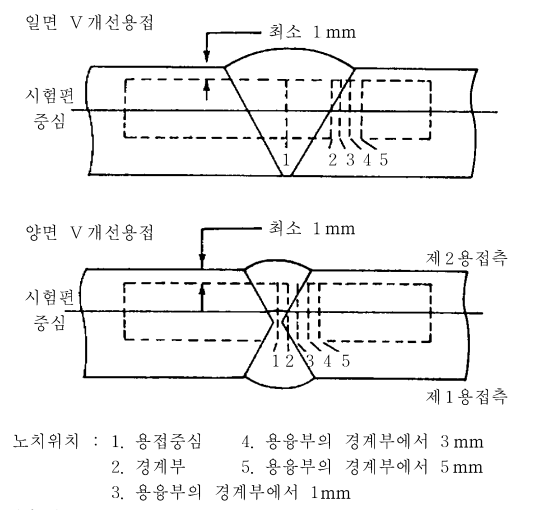
    **그림 7.5.18 용접 시험편의 노치위치**
- **3.** **굽힘시험** ***(2021)***
  - **(1)** 재료승인시험 시에는 굽힘시험을 생략될 수 있지만, 용접시험 시에는 굽힘시험을 하여야 한다. 굽힘시험을 하는 경우, **2편 2장**에 따라 시행되어야 한다.
  - **(2)** 굽힘시험은 가로방향 굽힘시험이어야 하며, 우리 선급이 인정하는 바에 따라 앞면굽힘, 뒷면굽힘 또는 측면굽힘으로 할 수 있다. 다만, 모재와 용접금속의 강도가 다를 경우에는 가로방향 굽힘시험 대신에 세로방향 굽힘시험을 할 수 있다.
- **4.** **단면관측 및 기타시험**
  우리 선급이 필요하다고 인정하는 경우에 매크로단면, 마이크로단면 관측 및 경도시험을 요구할 수 있으며 **2편 2장**에 따라 수행하여야 한다.

#### 604. 금속재

- **1.** **일반사항**
  재료의 적용은 다음 표에 따른다. *(2022)*
  **표 7.5.4** : 설계온도가 0 °C 이상의 화물탱크 및 프로세스용 압력용기의 판, 관(이음매 없는 관 및 용접관), 형재 및 단조품
  **표 7.5.5a** : 설계온도가 0°C 미만 –10°C 이상의 화물탱크, 2차방벽 및 프로세스용 압력용기의 판, 평재 및 단조품
  **표 7.5.5b** : 설계온도가 -10°C 미만 –55°C 이상의 화물탱크, 2차방벽 및 프로세스용 압력용기의 판, 평재 및 단조품
  **표 7.5.6** : 설계온도가 -55 °C 미만 -165 °C 이상의 화물탱크, 2차방벽 및 프로세스용 압력용기의 판, 형재 및 단조품(합금강 및 알루미늄 합금)
  **표 7.5.7** : 설계온도가 0 °C 미만 -165 °C 이상의 화물 및 프로세스용 관장치의 관(이음매 없는 관 및 용접관), 단조품 및 주조품
  **표 7.5.8** : **419.**의 **1**항의 (2)호 및 (3)호에 의하여 요구되는 선체구조용 판 및 형재
  극저온용 고망간강을 사용하는 화물탱크의 경우, **부록 7A-4 「극저온용 고망간강」**의 요건에 따른다. *(2021)* **【지침 참조】**

  **1. 화학성분 및 열처리의 요건**

  | - 탄소망간강, 세립킬드강으로 할 것 - 합금성분을 소량 추가할 경우에는 우리 선급의 승인을 받을 것 - 화학성분은 우리 선급의 승인을 받을 것 - 열처리는 노멀라이징 또는 담금질 후 템퍼링(4)으로 할 것 |   |   |
  | --- | --- | --- |
  | **2. 인장 및 인성(충격)시험의 규정** |   |   |
  | **2.1 채취빈도** |   |   |
  | 판 | 각 피스(piece) 마다 시험 |   |
  | 형재 및 단조품 | 각 배치(batch) 마다 시험 |   |
  | **2.2 기계적 성질** |   |   |
  | 인장특성 | 최소 항복응력은 410 $\mathrm{N}/mm ^{2}$를 넘지 아니할 것(5) |   |
  | **2.3 인성 (샤르피 V노치 충격시험)** |   |   |
  |   | 가로방향 및 세로방향은 시험편의 길이방향이 압연방향과 각각 직각 또는 평행할 때 |   |
  | 판 | 가로방향 시험편: 최소 평균 흡수에너지값($\mathrm{KV}$) 27 $\mathrm{J}$ |   |
  | 형재 및 단조품 | 세로방향 시험편: 최소 평균 흡수에너지값($\mathrm{KV}$) 41 $\mathrm{J}$ |   |
  | 시험온도 | 두께($\mathrm{mm}$) | 시험온도(°C) |
  | 시험온도 | $t$ ≤ 20 | 0 |
  | 시험온도 | 20 ＜ $t$ ≤ 40 | -20 |
  | 시험온도 | $40(6) | -20(7) |
  | 시험온도 | \(40(6) | -30(8) |
  | (비고) (1) 이음매 없는 관 및 부착품은 **2편**의 규정에 따른다. 종방향 및 나선형 용접관의 사용은 우리 선급의 승인을 받아야 한다. (2) 관의 경우, 샤르피 V노치 충격시험을 요구하지 않는다. (3) 이 표는 재료두께 50 mm까지 적용할 수 있다. 재료두께가 50 mm를 초과하는 경우, 우리 선급의 승인을 받아야 한다. (4) 온도제어압연(CR) 또는 열가공제어법(TMCP)을 행한 강재는 노멀라이징 또는 담금질 후 템퍼링을 한 것으로 간주할 수 있다. (5) 규격 최소항복응력이 410 \(\mathrm{N}/mm ^{2}$를 초과하는 경우, 용접부 및 열영향부의 경도에 대하여 자료를 제출하여야 한다. (6) 2편 규칙 1장 301. 선체 구조용 압연강재 또는 308. 용접구조용 초고장력 압연 강재가 아닌 경우 판두께 중심에서 시편을 채취하여 충격테스트를 추가해서 실시하여야 한다. (7) 독립형탱크 형식 C 화물탱크 및 압력용기에 적용한다. 용접후열처리를 실시하여야 한다. 용접후열처리를 대신하여 대체 방법(예: Engineering critical assessment)을 사용하는 경우 선급 승인을 받거나 인정하는 기준을 따라야 한다. (8) 독립형탱크 형식 C 이외의 화물 탱크에 적용한다. |   |   |

  **1. 화학성분 및 열처리의 규정**

  | - 탄소망간강, 킬드강, 알루미늄처리의 세립강으로 할 것 |   |   |   |   |   |   |   |   |   |
  | --- | --- | --- | --- | --- | --- | --- | --- | --- | --- |
  | - 화학성분(레이들분석) |   |   |   |   |   |   |   |   |   |
  | C |   | Mn |   | Si |   | S |   | P |   |
  | 0.16 % 이하${} ^{(3)}$ |   | 0.70 ~ 1.60 % |   | 0.10 ~ 0.50 % |   | 0.025 % 이하 |   | 0.025 % 이하 |   |
  | - 임의의 첨가원소 : 합금 및 세립화용 원소는 일반적으로 다음에 따를 것 |   |   |   |   |   |   |   |   |   |
  | Ni | Cr |   | Mo |   | Cu |   | Nb |   | V |
  | 0.80 % 이하 | 0.25 % 이하 |   | 0.08 % 이하 |   | 0.35 % 이하 |   | 0.05 % 이하 |   | 0.10 % 이하 |
  | - 알루미늄 함유량은 최소 0.02 % 일 것(산 가용성은 최소 0.015 %) |   |   |   |   |   |   |   |   |   |
  | - 열처리는 노멀라이징 또는 담금질 후 템퍼링${} ^{(4)}$으로 할 것 |   |   |   |   |   |   |   |   |   |
  | **2. 인장 및 인성(충격)시험의 규정** |   |   |   |   |   |   |   |   |   |
  | **2.1 채취 빈도** |   |   |   |   |   |   |   |   |   |
  | 판 |   | 각 피스(piece)마다 시험 |   |   |   |   |   |   |   |
  | 형재 및 단조품 |   | 각 배치(batch)마다 시험 |   |   |   |   |   |   |   |
  | **2.2 기계적 성질** |   |   |   |   |   |   |   |   |   |
  | 인장특성 |   | 최소 항복응력은 410 $\mathrm{N}/mm ^{2}$를 넘지 않을 것${} ^{(5)}$ |   |   |   |   |   |   |   |
  | **2.3 인성 (샤르피 V노치 충격시험)** |   |   |   |   |   |   |   |   |   |
  |   |   | 가로방향 및 세로방향은 시험편의 길이방향이 압연방향과 각각 직각 또는 평행할 때 |   |   |   |   |   |   |   |
  | 판 |   | 가로방향 시험편: 최소 평균 흡수에너지값($\mathrm{KV}$) 27 $\mathrm{J}$ |   |   |   |   |   |   |   |
  | 형재 및 단조품 |   | 세로방향 시험편: 최소 평균 흡수에너지값($\mathrm{KV}$) 41 $\mathrm{J}$ |   |   |   |   |   |   |   |
  | 시험온도 |   | 설계온도보다 5 °C 낮은 온도 또는 -20 °C 중 낮은 것 |   |   |   |   |   |   |   |
  | (비고) (1) 단조품에 대한 샤르피 V노치 충격시험 및 화학성분의 규정은 우리 선급의 승인을 받는 것이어야 한다. (2) 두께가 25 $\mathrm{mm}$를 넘는 재료의 경우, 다음과 같이 샤르피 V노치 충격시험을 하여야 한다. **1. 화학성분 및 열처리의 규정** - 탄소망간강, 킬드강, 알루미늄처리의 세립강으로 할 것 - 화학성분(레이들분석) C ; Mn ; Si ; S ; P 0.16 % 이하${} ^{(3)}$ ; 0.70 ~ 1.60 % ; 0.10 ~ 0.50 % ; 0.025 % 이하 ; 0.025 % 이하 - 임의의 첨가원소 : 합금 및 세립화용 원소는 일반적으로 다음에 따를 것 Ni ; Cr ; Mo ; Cu ; Nb ; V 0.80 % 이하 ; 0.25 % 이하 ; 0.08 % 이하 ; 0.35 % 이하 ; 0.05 % 이하 ; 0.10 % 이하 - 알루미늄 함유량은 최소 0.02 % 일 것(산 가용성은 최소 0.015 %) - 열처리는 노멀라이징 또는 담금질 후 템퍼링${} ^{(4)}$으로 할 것 **2. 인장 및 인성(충격)시험의 규정** **2.1 채취 빈도** 판 ; 각 피스(piece)마다 시험 형재 및 단조품 ; 각 배치(batch)마다 시험 **2.2 기계적 성질** 인장특성 ; 최소 항복응력은 410 $\mathrm{N}/mm ^{2}$를 넘지 않을 것${} ^{(5)}$ **2.3 인성 (샤르피 V노치 충격시험)** 가로방향 및 세로방향은 시험편의 길이방향이 압연방향과 각각 직각 또는 평행할 때 판 ; 가로방향 시험편: 최소 평균 흡수에너지값($\mathrm{KV}$) 27 $\mathrm{J}$ 형재 및 단조품 ; 세로방향 시험편: 최소 평균 흡수에너지값($\mathrm{KV}$) 41 $\mathrm{J}$ 시험온도 ; 설계온도보다 5 °C 낮은 온도 또는 -20 °C 중 낮은 것 (비고) (1) 단조품에 대한 샤르피 V노치 충격시험 및 화학성분의 규정은 우리 선급의 승인을 받는 것이어야 한다. (2) 두께가 25 $\mathrm{mm}$를 넘는 재료의 경우, 다음과 같이 샤르피 V노치 충격시험을 하여야 한다. 재료의 두께($\mathrm{mm}$) ; 시험온도(°C) 25 < $t$ ≤ 30 ; 설계온도보다 10 °C 낮은 온도 또는 -20 °C 중 낮은 것 30 < $t$ ≤ 35 ; 설계온도보다 15 °C 낮은 온도 또는 -20 °C 중 낮은 것 35 < $t$ ≤ 40 ; 설계온도보다 20 °C 낮은 온도 $40(6) ; 설계온도보다 5°C 낮은 온도 또는 –20°C중 낮은 것(7) \(40(6) ; 설계온도보다 25°C 낮은 온도(8) \(45(6) ; 설계온도보다 30°C 낮은 온도(8) 재료의 두께(\(\mathrm{mm}$) 시험온도(°C) 25 < $t$ ≤ 30 설계온도보다 10 °C 낮은 온도 또는 -20 °C 중 낮은 것 30 < $t$ ≤ 35 설계온도보다 15 °C 낮은 온도 또는 -20 °C 중 낮은 것 35 < $t$ ≤ 40 설계온도보다 20 °C 낮은 온도 $40(6) 설계온도보다 5°C 낮은 온도 또는 –20°C중 낮은 것(7) \(40(6) 설계온도보다 25°C 낮은 온도(8) \(45(6) 설계온도보다 30°C 낮은 온도(8) 충격에너지 값은 시편형태의 표에 따라 값이 정하여진다. 탱크 또는 탱크의 한 부분으로 사용되는 재료는 용접 후에 완전히 열응력을 제거하여야 하며 설계온도보다 5 °C 낮은 온도 또는 -20 °C 중 낮은 온도에서 시험을 하여야 한다. 강력부재와 다른 의장품에 열응력을 제거시키기 위하여 시험온도는 주위 탱크판 두께에서 요구하는 값과 같게 하여야 한다. (3) 설계온도가 -40 °C 이상의 경우, 탄소함유량은 우리 선급의 승인을 받아 0.18 %까지 증가시킬 수 있다. (4) 온도제어압연방법 또는 열가공제어법(TMCP)은 노멀라이징 또는 담금질 후 템퍼링을 한 것으로 간주할 수 있다. (5) 규격 최소 항복응력이 410 \(\mathrm{N}/mm ^{2}$를 초과하는 경우, 용접부 및 열영향부의 경도에 대하여 자료를 제출하여야 한다. 지침 : 두께 25 $\mathrm{mm}$를 초과하는 재료에 대한 시험온도가 -60 °C 이하인 경우, 그 적용은 특별히 처리된 강이나 **표 7.5.6**에 의한 강이 요구될 수 있다. 재료의 두께($\mathrm{mm}$) ; 시험온도(°C) 25 < $t$ ≤ 30 ; 설계온도보다 10 °C 낮은 온도 또는 -20 °C 중 낮은 것 30 < $t$ ≤ 35 ; 설계온도보다 15 °C 낮은 온도 또는 -20 °C 중 낮은 것 35 < $t$ ≤ 40 ; 설계온도보다 20 °C 낮은 온도 $40(6) ; 설계온도보다 5°C 낮은 온도 또는 –20°C중 낮은 것(7) \(40(6) ; 설계온도보다 25°C 낮은 온도(8) \(45(6) ; 설계온도보다 30°C 낮은 온도(8) 재료의 두께(\(\mathrm{mm}$) 시험온도(°C) 25 < $t$ ≤ 30 설계온도보다 10 °C 낮은 온도 또는 -20 °C 중 낮은 것 30 < $t$ ≤ 35 설계온도보다 15 °C 낮은 온도 또는 -20 °C 중 낮은 것 35 < $t$ ≤ 40 설계온도보다 20 °C 낮은 온도 $40(6) 설계온도보다 5°C 낮은 온도 또는 –20°C중 낮은 것(7) \(40(6) 설계온도보다 25°C 낮은 온도(8) \(45(6) 설계온도보다 30°C 낮은 온도(8) 충격에너지 값은 시편형태의 표에 따라 값이 정하여진다. 탱크 또는 탱크의 한 부분으로 사용되는 재료는 용접 후에 완전히 열응력을 제거하여야 하며 설계온도보다 5 °C 낮은 온도 또는 -20 °C 중 낮은 온도에서 시험을 하여야 한다. 강력부재와 다른 의장품에 열응력을 제거시키기 위하여 시험온도는 주위 탱크판 두께에서 요구하는 값과 같게 하여야 한다. (3) 설계온도가 -40 °C 이상의 경우, 탄소함유량은 우리 선급의 승인을 받아 0.18 %까지 증가시킬 수 있다. (4) 온도제어압연방법 또는 열가공제어법(TMCP)은 노멀라이징 또는 담금질 후 템퍼링을 한 것으로 간주할 수 있다. (5) 규격 최소 항복응력이 410 \(\mathrm{N}/mm ^{2}$를 초과하는 경우, 용접부 및 열영향부의 경도에 대하여 자료를 제출하여야 한다. 지침 : 두께 25 $\mathrm{mm}$를 초과하는 재료에 대한 시험온도가 -60 °C 이하인 경우, 그 적용은 특별히 처리된 강이나 **표 7.5.6**에 의한 강이 요구될 수 있다. |   |   |   |   |   |   |   |   |   |
  | **1. 화학성분 및 열처리의 규정** |   |   |   |   |   |   |   |   |   |
  | - 탄소망간강, 킬드강, 알루미늄처리의 세립강으로 할 것 |   |   |   |   |   |   |   |   |   |
  | - 화학성분(레이들분석) |   |   |   |   |   |   |   |   |   |
  | C |   | Mn |   | Si |   | S |   | P |   |
  | 0.16 % 이하${} ^{(3)}$ |   | 0.70 ~ 1.60 % |   | 0.10 ~ 0.50 % |   | 0.025 % 이하 |   | 0.025 % 이하 |   |
  | - 임의의 첨가원소 : 합금 및 세립화용 원소는 일반적으로 다음에 따를 것 |   |   |   |   |   |   |   |   |   |
  | Ni | Cr |   | Mo |   | Cu |   | Nb |   | V |
  | 0.80 % 이하 | 0.25 % 이하 |   | 0.08 % 이하 |   | 0.35 % 이하 |   | 0.05 % 이하 |   | 0.10 % 이하 |
  | - 알루미늄 함유량은 최소 0.02 % 일 것(산 가용성은 최소 0.015 %) |   |   |   |   |   |   |   |   |   |
  | - 열처리는 노멀라이징 또는 담금질 후 템퍼링${} ^{(4)}$으로 할 것 |   |   |   |   |   |   |   |   |   |
  | **2. 인장 및 인성(충격)시험의 규정** |   |   |   |   |   |   |   |   |   |
  | **2.1 채취 빈도** |   |   |   |   |   |   |   |   |   |
  | 판 |   | 각 피스(piece)마다 시험 |   |   |   |   |   |   |   |
  | 형재 및 단조품 |   | 각 배치(batch)마다 시험 |   |   |   |   |   |   |   |
  | **2.2 기계적 성질** |   |   |   |   |   |   |   |   |   |
  | 인장특성 |   | 최소 항복응력은 410 $\mathrm{N}/mm ^{2}$를 넘지 않을 것${} ^{(5)}$ |   |   |   |   |   |   |   |
  | **2.3 인성 (샤르피 V노치 충격시험)** |   |   |   |   |   |   |   |   |   |
  |   |   | 가로방향 및 세로방향은 시험편의 길이방향이 압연방향과 각각 직각 또는 평행할 때 |   |   |   |   |   |   |   |
  | 판 |   | 가로방향 시험편: 최소 평균 흡수에너지값($\mathrm{KV}$) 27 $\mathrm{J}$ |   |   |   |   |   |   |   |
  | 형재 및 단조품 |   | 세로방향 시험편: 최소 평균 흡수에너지값($\mathrm{KV}$) 41 $\mathrm{J}$ |   |   |   |   |   |   |   |
  | 시험온도 |   | 설계온도보다 5 °C 낮은 온도 또는 -20 °C 중 낮은 것 |   |   |   |   |   |   |   |
  | (비고) (1) 단조품에 대한 샤르피 V노치 충격시험 및 화학성분의 규정은 우리 선급의 승인을 받는 것이어야 한다. (2) 두께가 25 $\mathrm{mm}$를 넘는 재료의 경우, 다음과 같이 샤르피 V노치 충격시험을 하여야 한다. 재료의 두께($\mathrm{mm}$) ; 시험온도(°C) 25 < $t$ ≤ 30 ; 설계온도보다 10 °C 낮은 온도 또는 -20 °C 중 낮은 것 30 < $t$ ≤ 35 ; 설계온도보다 15 °C 낮은 온도 또는 -20 °C 중 낮은 것 35 < $t$ ≤ 40 ; 설계온도보다 20 °C 낮은 온도 $40(6) ; 설계온도보다 5°C 낮은 온도 또는 –20°C중 낮은 것(7) \(40(6) ; 설계온도보다 25°C 낮은 온도(8) \(45(6) ; 설계온도보다 30°C 낮은 온도(8) 재료의 두께(\(\mathrm{mm}$) 시험온도(°C) 25 < $t$ ≤ 30 설계온도보다 10 °C 낮은 온도 또는 -20 °C 중 낮은 것 30 < $t$ ≤ 35 설계온도보다 15 °C 낮은 온도 또는 -20 °C 중 낮은 것 35 < $t$ ≤ 40 설계온도보다 20 °C 낮은 온도 $40(6) 설계온도보다 5°C 낮은 온도 또는 –20°C중 낮은 것(7) \(40(6) 설계온도보다 25°C 낮은 온도(8) \(45(6) 설계온도보다 30°C 낮은 온도(8) 충격에너지 값은 시편형태의 표에 따라 값이 정하여진다. 탱크 또는 탱크의 한 부분으로 사용되는 재료는 용접 후에 완전히 열응력을 제거하여야 하며 설계온도보다 5 °C 낮은 온도 또는 -20 °C 중 낮은 온도에서 시험을 하여야 한다. 강력부재와 다른 의장품에 열응력을 제거시키기 위하여 시험온도는 주위 탱크판 두께에서 요구하는 값과 같게 하여야 한다. (3) 설계온도가 -40 °C 이상의 경우, 탄소함유량은 우리 선급의 승인을 받아 0.18 %까지 증가시킬 수 있다. (4) 온도제어압연방법 또는 열가공제어법(TMCP)은 노멀라이징 또는 담금질 후 템퍼링을 한 것으로 간주할 수 있다. (5) 규격 최소 항복응력이 410 \(\mathrm{N}/mm ^{2}$를 초과하는 경우, 용접부 및 열영향부의 경도에 대하여 자료를 제출하여야 한다. 지침 : 두께 25 $\mathrm{mm}$를 초과하는 재료에 대한 시험온도가 -60 °C 이하인 경우, 그 적용은 특별히 처리된 강이나 **표 7.5.6**에 의한 강이 요구될 수 있다. |   |   |   |   |   |   |   |   |   |
  | 재료의 두께($\mathrm{mm}$) | 시험온도(°C) |   |   |   |   |   |   |   |   |
  | 25 < $t$ ≤ 30 | 설계온도보다 10 °C 낮은 온도 또는 -20 °C 중 낮은 것 |   |   |   |   |   |   |   |   |
  | 30 < $t$ ≤ 35 | 설계온도보다 15 °C 낮은 온도 또는 -20 °C 중 낮은 것 |   |   |   |   |   |   |   |   |
  | 35 < $t$ ≤ 40 | 설계온도보다 20 °C 낮은 온도 |   |   |   |   |   |   |   |   |
  | $40(6) | 설계온도보다 5°C 낮은 온도 또는 –20°C중 낮은 것(7) |   |   |   |   |   |   |   |   |
  | \(40(6) | 설계온도보다 25°C 낮은 온도(8) |   |   |   |   |   |   |   |   |
  | \(45(6) | 설계온도보다 30°C 낮은 온도(8) |   |   |   |   |   |   |   |   |

  | (6) 2편 규칙 1장 301. 선체 구조용 압연강재 또는 308. 용접구조용 초고장력 압연 강재가 아닌 경우 판두께 중심에서 시편을 채취하여 충격테스트를 추가해서 실시하여야 한다. (7) 독립형탱크 형식 C 화물탱크 및 압력용기에 적용한다. 용접후열처리를 실시하여야 한다. 용접후열처리를 대신하여 대체 방법(예: Engineering critical assessment)을 사용하는 경우 선급 승인을 받거나 인정하는 기준을 따라야 한다. (8) 독립형탱크 형식 C 이외의 화물 탱크에 적용한다. (9) 이 표는 재료 두께 50mm까지 적용할 수 있다. 재료 두께가 50mm를 초과하는 경우, 우리 선급의 승인을 받아야 한다. |
  | --- |

  **1. 화학성분 및 열처리의 규정**

  | - 탄소망간강, 킬드강, 알루미늄처리의 세립강으로 할 것 |   |   |   |   |   |   |   |   |   |
  | --- | --- | --- | --- | --- | --- | --- | --- | --- | --- |
  | - 화학성분(레이들분석) |   |   |   |   |   |   |   |   |   |
  | C |   | Mn |   | Si |   | S |   | P |   |
  | 0.16 % 이하\({} ^{(3)}$ |   | 0.70 ~ 1.60 % |   | 0.10 ~ 0.50 % |   | 0.025 % 이하 |   | 0.025 % 이하 |   |
  | - 임의의 첨가원소 : 합금 및 세립화용 원소는 일반적으로 다음에 따를 것 |   |   |   |   |   |   |   |   |   |
  | Ni | Cr |   | Mo |   | Cu |   | Nb |   | V |
  | 0.80 % 이하 | 0.25 % 이하 |   | 0.08 % 이하 |   | 0.35 % 이하 |   | 0.05 % 이하 |   | 0.10 % 이하 |
  | - 알루미늄 함유량은 최소 0.02 % 일 것(산 가용성은 최소 0.015 %) |   |   |   |   |   |   |   |   |   |
  | - 열처리는 노멀라이징 또는 담금질 후 템퍼링${} ^{(4)}$으로 할 것 |   |   |   |   |   |   |   |   |   |
  | **2. 인장 및 인성(충격)시험의 규정** |   |   |   |   |   |   |   |   |   |
  | **2.1 채취 빈도** |   |   |   |   |   |   |   |   |   |
  | 판 |   | 각 피스(piece)마다 시험 |   |   |   |   |   |   |   |
  | 형재 및 단조품 |   | 각 배치(batch)마다 시험 |   |   |   |   |   |   |   |
  | **2.2 기계적 성질** |   |   |   |   |   |   |   |   |   |
  | 인장특성 |   | 최소 항복응력은 410 $\mathrm{N}/mm ^{2}$를 넘지 않을 것${} ^{(5)}$ |   |   |   |   |   |   |   |
  | **2.3 인성 (샤르피 V노치 충격시험)** |   |   |   |   |   |   |   |   |   |
  |   |   | 가로방향 및 세로방향은 시험편의 길이방향이 압연방향과 각각 직각 또는 평행할 때 |   |   |   |   |   |   |   |
  | 판 |   | 가로방향 시험편: 최소 평균 흡수에너지값($\mathrm{KV}$) 27 $\mathrm{J}$ |   |   |   |   |   |   |   |
  | 형재 및 단조품 |   | 세로방향 시험편: 최소 평균 흡수에너지값($\mathrm{KV}$) 41 $\mathrm{J}$ |   |   |   |   |   |   |   |
  | 시험온도 |   | 설계온도보다 5 °C 낮은 온도 또는 -20 °C 중 낮은 것 |   |   |   |   |   |   |   |
  | (비고) (1) 단조품에 대한 샤르피 V노치 충격시험 및 화학성분의 규정은 우리 선급의 승인을 받는 것이어야 한다. (2) 두께가 25 $\mathrm{mm}$를 넘는 재료의 경우, 다음과 같이 샤르피 V노치 충격시험을 하여야 한다. **1. 화학성분 및 열처리의 규정** - 탄소망간강, 킬드강, 알루미늄처리의 세립강으로 할 것 - 화학성분(레이들분석) C ; Mn ; Si ; S ; P 0.16 % 이하${} ^{(3)}$ ; 0.70 ~ 1.60 % ; 0.10 ~ 0.50 % ; 0.025 % 이하 ; 0.025 % 이하 - 임의의 첨가원소 : 합금 및 세립화용 원소는 일반적으로 다음에 따를 것 Ni ; Cr ; Mo ; Cu ; Nb ; V 0.80 % 이하 ; 0.25 % 이하 ; 0.08 % 이하 ; 0.35 % 이하 ; 0.05 % 이하 ; 0.10 % 이하 - 알루미늄 함유량은 최소 0.02 % 일 것(산 가용성은 최소 0.015 %) - 열처리는 노멀라이징 또는 담금질 후 템퍼링${} ^{(4)}$으로 할 것 **2. 인장 및 인성(충격)시험의 규정** **2.1 채취 빈도** 판 ; 각 피스(piece)마다 시험 형재 및 단조품 ; 각 배치(batch)마다 시험 **2.2 기계적 성질** 인장특성 ; 최소 항복응력은 410 $\mathrm{N}/mm ^{2}$를 넘지 않을 것${} ^{(5)}$ **2.3 인성 (샤르피 V노치 충격시험)** 가로방향 및 세로방향은 시험편의 길이방향이 압연방향과 각각 직각 또는 평행할 때 판 ; 가로방향 시험편: 최소 평균 흡수에너지값($\mathrm{KV}$) 27 $\mathrm{J}$ 형재 및 단조품 ; 세로방향 시험편: 최소 평균 흡수에너지값($\mathrm{KV}$) 41 $\mathrm{J}$ 시험온도 ; 설계온도보다 5 °C 낮은 온도 또는 -20 °C 중 낮은 것 (비고) (1) 단조품에 대한 샤르피 V노치 충격시험 및 화학성분의 규정은 우리 선급의 승인을 받는 것이어야 한다. (2) 두께가 25 $\mathrm{mm}$를 넘는 재료의 경우, 다음과 같이 샤르피 V노치 충격시험을 하여야 한다. 재료의 두께($\mathrm{mm}$) ; 시험온도(°C) $25 설계온도보다 10°C 낮은 온도 또는 –20°C중 낮은 것 \(30 설계온도보다 15°C 낮은 온도 또는 –20°C중 낮은 것 \(35 설계온도보다 20°C 낮은 온도 \(40(6) ; 설계온도보다 5°C 낮은 온도 또는 –20°C중 낮은 것(7) \(40(6) ; 설계온도보다 25°C 낮은 온도(8) \(45(6) ; 설계온도보다 30°C 낮은 온도(8) 재료의 두께(\(\mathrm{mm}$) 시험온도(°C) $25설계온도보다 10°C 낮은 온도 또는 –20°C중 낮은 것 \(30설계온도보다 15°C 낮은 온도 또는 –20°C중 낮은 것 \(35설계온도보다 20°C 낮은 온도 \(40(6) 설계온도보다 5°C 낮은 온도 또는 –20°C중 낮은 것(7) \(40(6) 설계온도보다 25°C 낮은 온도(8) \(45(6) 설계온도보다 30°C 낮은 온도(8) 충격에너지 값은 시편형태의 표에 따라 값이 정하여진다. 탱크 또는 탱크의 한 부분으로 사용되는 재료는 용접 후에 완전히 열응력을 제거하여야 하며 설계온도보다 5 °C 낮은 온도 또는 -20 °C 중 낮은 온도에서 시험을 하여야 한다. 강력부재와 다른 의장품에 열응력을 제거시키기 위하여 시험온도는 주위 탱크판 두께에서 요구하는 값과 같게 하여야 한다. (3) 설계온도가 -40 °C 이상의 경우, 탄소함유량은 우리 선급의 승인을 받아 0.18 %까지 증가시킬 수 있다. (4) 온도제어압연방법 또는 열가공제어법(TMCP)은 노멀라이징 또는 담금질 후 템퍼링을 한 것으로 간주할 수 있다. (5) 규격 최소 항복응력이 410 \(\mathrm{N}/mm ^{2}$를 초과하는 경우, 용접부 및 열영향부의 경도에 대하여 자료를 제출하여야 한다. 지침 : 두께 25 $\mathrm{mm}$를 초과하는 재료에 대한 시험온도가 -60 °C 이하인 경우, 특별히 처리된 강이나 **표 7.5.6**의 강 적용이 필요할 수 있다. 재료의 두께($\mathrm{mm}$) ; 시험온도(°C) $25 설계온도보다 10°C 낮은 온도 또는 –20°C중 낮은 것 \(30 설계온도보다 15°C 낮은 온도 또는 –20°C중 낮은 것 \(35 설계온도보다 20°C 낮은 온도 \(40(6) ; 설계온도보다 5°C 낮은 온도 또는 –20°C중 낮은 것(7) \(40(6) ; 설계온도보다 25°C 낮은 온도(8) \(45(6) ; 설계온도보다 30°C 낮은 온도(8) 재료의 두께(\(\mathrm{mm}$) 시험온도(°C) $25설계온도보다 10°C 낮은 온도 또는 –20°C중 낮은 것 \(30설계온도보다 15°C 낮은 온도 또는 –20°C중 낮은 것 \(35설계온도보다 20°C 낮은 온도 \(40(6) 설계온도보다 5°C 낮은 온도 또는 –20°C중 낮은 것(7) \(40(6) 설계온도보다 25°C 낮은 온도(8) \(45(6) 설계온도보다 30°C 낮은 온도(8) 충격에너지 값은 시편형태의 표에 따라 값이 정하여진다. 탱크 또는 탱크의 한 부분으로 사용되는 재료는 용접 후에 완전히 열응력을 제거하여야 하며 설계온도보다 5 °C 낮은 온도 또는 -20 °C 중 낮은 온도에서 시험을 하여야 한다. 강력부재와 다른 의장품에 열응력을 제거시키기 위하여 시험온도는 주위 탱크판 두께에서 요구하는 값과 같게 하여야 한다. (3) 설계온도가 -40 °C 이상의 경우, 탄소함유량은 우리 선급의 승인을 받아 0.18 %까지 증가시킬 수 있다. (4) 온도제어압연방법 또는 열가공제어법(TMCP)은 노멀라이징 또는 담금질 후 템퍼링을 한 것으로 간주할 수 있다. (5) 규격 최소 항복응력이 410 \(\mathrm{N}/mm ^{2}$를 초과하는 경우, 용접부 및 열영향부의 경도에 대하여 자료를 제출하여야 한다. 지침 : 두께 25 $\mathrm{mm}$를 초과하는 재료에 대한 시험온도가 -60 °C 이하인 경우, 특별히 처리된 강이나 **표 7.5.6**의 강 적용이 필요할 수 있다. |   |   |   |   |   |   |   |   |   |
  | **1. 화학성분 및 열처리의 규정** |   |   |   |   |   |   |   |   |   |
  | - 탄소망간강, 킬드강, 알루미늄처리의 세립강으로 할 것 |   |   |   |   |   |   |   |   |   |
  | - 화학성분(레이들분석) |   |   |   |   |   |   |   |   |   |
  | C |   | Mn |   | Si |   | S |   | P |   |
  | 0.16 % 이하${} ^{(3)}$ |   | 0.70 ~ 1.60 % |   | 0.10 ~ 0.50 % |   | 0.025 % 이하 |   | 0.025 % 이하 |   |
  | - 임의의 첨가원소 : 합금 및 세립화용 원소는 일반적으로 다음에 따를 것 |   |   |   |   |   |   |   |   |   |
  | Ni | Cr |   | Mo |   | Cu |   | Nb |   | V |
  | 0.80 % 이하 | 0.25 % 이하 |   | 0.08 % 이하 |   | 0.35 % 이하 |   | 0.05 % 이하 |   | 0.10 % 이하 |
  | - 알루미늄 함유량은 최소 0.02 % 일 것(산 가용성은 최소 0.015 %) |   |   |   |   |   |   |   |   |   |
  | - 열처리는 노멀라이징 또는 담금질 후 템퍼링${} ^{(4)}$으로 할 것 |   |   |   |   |   |   |   |   |   |
  | **2. 인장 및 인성(충격)시험의 규정** |   |   |   |   |   |   |   |   |   |
  | **2.1 채취 빈도** |   |   |   |   |   |   |   |   |   |
  | 판 |   | 각 피스(piece)마다 시험 |   |   |   |   |   |   |   |
  | 형재 및 단조품 |   | 각 배치(batch)마다 시험 |   |   |   |   |   |   |   |
  | **2.2 기계적 성질** |   |   |   |   |   |   |   |   |   |
  | 인장특성 |   | 최소 항복응력은 410 $\mathrm{N}/mm ^{2}$를 넘지 않을 것${} ^{(5)}$ |   |   |   |   |   |   |   |
  | **2.3 인성 (샤르피 V노치 충격시험)** |   |   |   |   |   |   |   |   |   |
  |   |   | 가로방향 및 세로방향은 시험편의 길이방향이 압연방향과 각각 직각 또는 평행할 때 |   |   |   |   |   |   |   |
  | 판 |   | 가로방향 시험편: 최소 평균 흡수에너지값($\mathrm{KV}$) 27 $\mathrm{J}$ |   |   |   |   |   |   |   |
  | 형재 및 단조품 |   | 세로방향 시험편: 최소 평균 흡수에너지값($\mathrm{KV}$) 41 $\mathrm{J}$ |   |   |   |   |   |   |   |
  | 시험온도 |   | 설계온도보다 5 °C 낮은 온도 또는 -20 °C 중 낮은 것 |   |   |   |   |   |   |   |
  | (비고) (1) 단조품에 대한 샤르피 V노치 충격시험 및 화학성분의 규정은 우리 선급의 승인을 받는 것이어야 한다. (2) 두께가 25 $\mathrm{mm}$를 넘는 재료의 경우, 다음과 같이 샤르피 V노치 충격시험을 하여야 한다. 재료의 두께($\mathrm{mm}$) ; 시험온도(°C) $25 설계온도보다 10°C 낮은 온도 또는 –20°C중 낮은 것 \(30 설계온도보다 15°C 낮은 온도 또는 –20°C중 낮은 것 \(35 설계온도보다 20°C 낮은 온도 \(40(6) ; 설계온도보다 5°C 낮은 온도 또는 –20°C중 낮은 것(7) \(40(6) ; 설계온도보다 25°C 낮은 온도(8) \(45(6) ; 설계온도보다 30°C 낮은 온도(8) 재료의 두께(\(\mathrm{mm}$) 시험온도(°C) $25설계온도보다 10°C 낮은 온도 또는 –20°C중 낮은 것 \(30설계온도보다 15°C 낮은 온도 또는 –20°C중 낮은 것 \(35설계온도보다 20°C 낮은 온도 \(40(6) 설계온도보다 5°C 낮은 온도 또는 –20°C중 낮은 것(7) \(40(6) 설계온도보다 25°C 낮은 온도(8) \(45(6) 설계온도보다 30°C 낮은 온도(8) 충격에너지 값은 시편형태의 표에 따라 값이 정하여진다. 탱크 또는 탱크의 한 부분으로 사용되는 재료는 용접 후에 완전히 열응력을 제거하여야 하며 설계온도보다 5 °C 낮은 온도 또는 -20 °C 중 낮은 온도에서 시험을 하여야 한다. 강력부재와 다른 의장품에 열응력을 제거시키기 위하여 시험온도는 주위 탱크판 두께에서 요구하는 값과 같게 하여야 한다. (3) 설계온도가 -40 °C 이상의 경우, 탄소함유량은 우리 선급의 승인을 받아 0.18 %까지 증가시킬 수 있다. (4) 온도제어압연방법 또는 열가공제어법(TMCP)은 노멀라이징 또는 담금질 후 템퍼링을 한 것으로 간주할 수 있다. (5) 규격 최소 항복응력이 410 \(\mathrm{N}/mm ^{2}$를 초과하는 경우, 용접부 및 열영향부의 경도에 대하여 자료를 제출하여야 한다. 지침 : 두께 25 $\mathrm{mm}$를 초과하는 재료에 대한 시험온도가 -60 °C 이하인 경우, 특별히 처리된 강이나 **표 7.5.6**의 강 적용이 필요할 수 있다. |   |   |   |   |   |   |   |   |   |
  | 재료의 두께($\mathrm{mm}$) | 시험온도(°C) |   |   |   |   |   |   |   |   |
  | $25 설계온도보다 10°C 낮은 온도 또는 –20°C중 낮은 것 |   |   |   |   |   |   |   |   |   |
  | \(30 설계온도보다 15°C 낮은 온도 또는 –20°C중 낮은 것 |   |   |   |   |   |   |   |   |   |
  | \(35 설계온도보다 20°C 낮은 온도 |   |   |   |   |   |   |   |   |   |
  | \(40(6) | 설계온도보다 5°C 낮은 온도 또는 –20°C중 낮은 것(7) |   |   |   |   |   |   |   |   |
  | \(40(6) | 설계온도보다 25°C 낮은 온도(8) |   |   |   |   |   |   |   |   |
  | \(45(6) | 설계온도보다 30°C 낮은 온도(8) |   |   |   |   |   |   |   |   |

  | (6) 2편 규칙 1장 301. 선체 구조용 압연강재 또는 308. 용접구조용 초고장력 압연 강재가 아닌 경우 판두께 중심에서 시편을 채취하여 충격테스트를 추가해서 실시하여야 한다. (7) 용접후열처리는 606.의 2항 (2)호를 따라야 한다. 용접후열처리를 대신하여 대체 방법(예: Engineering critical assessment)을 사용하는 경우 선급 승인을 받거나 인정하는 기준을 따라야 한다. (8) 독립형탱크 형식 C 이외의 화물 탱크에 적용한다. (9) 이 표는 재료 두께 50mm까지 적용할 수 있다. 재료 두께가 50mm를 초과하는 경우, 우리 선급의 승인을 받아야 한다. |
  | --- |

  | 최저설계온도 (°C) | 화학성분(5) 및 열처리 |   | 충격시험온도 (°C) |
  | --- | --- | --- | --- |
  | -60 | 1.5 % 니켈강 - 노멀라이징, 노멀라이징 후 템퍼링, 담금질 후 템퍼링 또는 열가공제어법(TMCP)(6) |   | -65 |
  | -65 | 2.25 % 니켈강 - 노멀라이징, 노멀라이징 후 템퍼링, 담금질 후 템퍼링 또는 열가공제어법(TMCP)(6)(7) |   | -70 |
  | -90 | 3.5 % 니켈강 - 노멀라이징, 노멀라이징 후 템퍼링, 담금질 후 템퍼링 또는 열가공제어법(TMCP)(6)(7) |   | -95 |
  | -105 | 5 % 니켈강 - 노멀라이징, 노멀라이징 후 템퍼링, 담금질 후 템퍼링 또는 열가공제어법(TMCP)(6)(7) |   | -110 |
  | -165 | 9 % 니켈강 - 2회 노멀라이징 후 템퍼링 또는 담금질 후 템퍼링(6) |   | -196 |
  | -165 | 오스테나이트강(9)(예 304, 304 \(L$, 316, 316 $L$, 321 및 347) 고용화 처리 |   | -196 |
  | -165 | 알루미늄합금(예 5083형 어닐링) |   | 요구하지 않음 |
  | -165 | 오스테나이트 Fe-Ni 합금강(예 36 % 니켈강) 열처리는 승인을 득하여야 함 |   | 요구하지 않음 |
  | 1. 인장 및 충격시험의 규정 |   |   |   |
  | 1.1 채취빈도 |   |   |   |
  | 판 |   | 각 피스(piece)마다 시험 |   |
  | 형재 및 단조품 |   | 각 배치(batch)마다 시험 |   |
  | 1.2 인성 (샤르피 V노치 충격시험) |   |   |   |
  |   |   | 가로방향 및 세로방향은 시험편의 길이방향이 압연방향과 각각 직각 또는 평행할 때 |   |
  | 판 |   | 가로방향 시험편 : 최소 평균 흡수 에너지값($\mathrm{KV}$) 27 $\mathrm{J}$ |   |
  | 형재 및 단조품 |   | 세로방향 시험편 : 최소 평균 흡수 에너지값($\mathrm{KV}$) 41 $\mathrm{J}$ |   |
  | (비고) (1) 가혹한 조건하에서 사용되는 단조품의 충격시험은 우리 선급의 승인을 받아야 한다. (2) 설계온도가 -165 °C 미만에 대한 규정은 우리 선급의 승인을 받아야 한다. (3) 두께 25 $\mathrm{mm}$를 넘는 1.5 % Ni, 2.25 % Ni, 3.5 % Ni과 5 % Ni에 대한 재료의 충격시험은 다음과 같이 시행되어야 한다. 최저설계온도 (°C) ; 화학성분(5) 및 열처리 ; 충격시험온도 (°C) -60 ; 1.5 % 니켈강 - 노멀라이징, 노멀라이징 후 템퍼링, 담금질 후 템퍼링 또는 열가공제어법(TMCP)(6) ; -65 -65 ; 2.25 % 니켈강 - 노멀라이징, 노멀라이징 후 템퍼링, 담금질 후 템퍼링 또는 열가공제어법(TMCP)(6)(7) ; -70 -90 ; 3.5 % 니켈강 - 노멀라이징, 노멀라이징 후 템퍼링, 담금질 후 템퍼링 또는 열가공제어법(TMCP)(6)(7) ; -95 -105 ; 5 % 니켈강 - 노멀라이징, 노멀라이징 후 템퍼링, 담금질 후 템퍼링 또는 열가공제어법(TMCP)(6)(7) ; -110 -165 ; 9 % 니켈강 - 2회 노멀라이징 후 템퍼링 또는 담금질 후 템퍼링(6) ; -196 -165 ; 오스테나이트강(9)(예 304, 304 $L$, 316, 316 $L$, 321 및 347) 고용화 처리 ; -196 -165 ; 알루미늄합금(예 5083형 어닐링) ; 요구하지 않음 -165 ; 오스테나이트 Fe-Ni 합금강(예 36 % 니켈강) 열처리는 승인을 득하여야 함 ; 요구하지 않음 1. 인장 및 충격시험의 규정 1.1 채취빈도 판 ; 각 피스(piece)마다 시험 형재 및 단조품 ; 각 배치(batch)마다 시험 1.2 인성 (샤르피 V노치 충격시험) 가로방향 및 세로방향은 시험편의 길이방향이 압연방향과 각각 직각 또는 평행할 때 판 ; 가로방향 시험편 : 최소 평균 흡수 에너지값($\mathrm{KV}$) 27 $\mathrm{J}$ 형재 및 단조품 ; 세로방향 시험편 : 최소 평균 흡수 에너지값($\mathrm{KV}$) 41 $\mathrm{J}$ (비고) (1) 가혹한 조건하에서 사용되는 단조품의 충격시험은 우리 선급의 승인을 받아야 한다. (2) 설계온도가 -165 °C 미만에 대한 규정은 우리 선급의 승인을 받아야 한다. (3) 두께 25 $\mathrm{mm}$를 넘는 1.5 % Ni, 2.25 % Ni, 3.5 % Ni과 5 % Ni에 대한 재료의 충격시험은 다음과 같이 시행되어야 한다. 재료의 두께($\mathrm{mm}$) ; 시험온도(°C) $25 설계온도보다 10°C 낮은 온도 \(30 설계온도보다 15°C 낮은 온도 \(35 설계온도보다 20°C 낮은 온도 \(40(10) ; 설계온도보다 25°C 낮은 온도 \(45(10) ; 설계온도보다 30°C 낮은 온도 재료의 두께(\(\mathrm{mm}$) 시험온도(°C) $25설계온도보다 10°C 낮은 온도 \(30설계온도보다 15°C 낮은 온도 \(35설계온도보다 20°C 낮은 온도 \(40(10) 설계온도보다 25°C 낮은 온도 \(45(10) 설계온도보다 30°C 낮은 온도 에너지 값은 적용한 시편형태에 따라 표의 값을 따라야 한다. 두께가 50 \(\mathrm{mm}$ 를 넘는 재료의 경우, 샤르피 V노치 충격에너지 값을 특별히 고려하여야 한다. 재료의 두께($\mathrm{mm}$) ; 시험온도(°C) $25 설계온도보다 10°C 낮은 온도 \(30 설계온도보다 15°C 낮은 온도 \(35 설계온도보다 20°C 낮은 온도 \(40(10) ; 설계온도보다 25°C 낮은 온도 \(45(10) ; 설계온도보다 30°C 낮은 온도 재료의 두께(\(\mathrm{mm}$) 시험온도(°C) $25설계온도보다 10°C 낮은 온도 \(30설계온도보다 15°C 낮은 온도 \(35설계온도보다 20°C 낮은 온도 \(40(10) 설계온도보다 25°C 낮은 온도 \(45(10) 설계온도보다 30°C 낮은 온도 에너지 값은 적용한 시편형태에 따라 표의 값을 따라야 한다. 두께가 50 \(\mathrm{mm}$ 를 넘는 재료의 경우, 샤르피 V노치 충격에너지 값을 특별히 고려하여야 한다. |   |   |   |
  | 최저설계온도 (°C) | 화학성분(5) 및 열처리 |   | 충격시험온도 (°C) |
  | -60 | 1.5 % 니켈강 - 노멀라이징, 노멀라이징 후 템퍼링, 담금질 후 템퍼링 또는 열가공제어법(TMCP)(6) |   | -65 |
  | -65 | 2.25 % 니켈강 - 노멀라이징, 노멀라이징 후 템퍼링, 담금질 후 템퍼링 또는 열가공제어법(TMCP)(6)(7) |   | -70 |
  | -90 | 3.5 % 니켈강 - 노멀라이징, 노멀라이징 후 템퍼링, 담금질 후 템퍼링 또는 열가공제어법(TMCP)(6)(7) |   | -95 |
  | -105 | 5 % 니켈강 - 노멀라이징, 노멀라이징 후 템퍼링, 담금질 후 템퍼링 또는 열가공제어법(TMCP)(6)(7) |   | -110 |
  | -165 | 9 % 니켈강 - 2회 노멀라이징 후 템퍼링 또는 담금질 후 템퍼링(6) |   | -196 |
  | -165 | 오스테나이트강(9)(예 304, 304 $L$, 316, 316 $L$, 321 및 347) 고용화 처리 |   | -196 |
  | -165 | 알루미늄합금(예 5083형 어닐링) |   | 요구하지 않음 |
  | -165 | 오스테나이트 Fe-Ni 합금강(예 36 % 니켈강) 열처리는 승인을 득하여야 함 |   | 요구하지 않음 |
  | 1. 인장 및 충격시험의 규정 |   |   |   |
  | 1.1 채취빈도 |   |   |   |
  | 판 |   | 각 피스(piece)마다 시험 |   |
  | 형재 및 단조품 |   | 각 배치(batch)마다 시험 |   |
  | 1.2 인성 (샤르피 V노치 충격시험) |   |   |   |
  |   |   | 가로방향 및 세로방향은 시험편의 길이방향이 압연방향과 각각 직각 또는 평행할 때 |   |
  | 판 |   | 가로방향 시험편 : 최소 평균 흡수 에너지값($\mathrm{KV}$) 27 $\mathrm{J}$ |   |
  | 형재 및 단조품 |   | 세로방향 시험편 : 최소 평균 흡수 에너지값($\mathrm{KV}$) 41 $\mathrm{J}$ |   |
  | (비고) (1) 가혹한 조건하에서 사용되는 단조품의 충격시험은 우리 선급의 승인을 받아야 한다. (2) 설계온도가 -165 °C 미만에 대한 규정은 우리 선급의 승인을 받아야 한다. (3) 두께 25 $\mathrm{mm}$를 넘는 1.5 % Ni, 2.25 % Ni, 3.5 % Ni과 5 % Ni에 대한 재료의 충격시험은 다음과 같이 시행되어야 한다. 재료의 두께($\mathrm{mm}$) ; 시험온도(°C) $25 설계온도보다 10°C 낮은 온도 \(30 설계온도보다 15°C 낮은 온도 \(35 설계온도보다 20°C 낮은 온도 \(40(10) ; 설계온도보다 25°C 낮은 온도 \(45(10) ; 설계온도보다 30°C 낮은 온도 재료의 두께(\(\mathrm{mm}$) 시험온도(°C) $25설계온도보다 10°C 낮은 온도 \(30설계온도보다 15°C 낮은 온도 \(35설계온도보다 20°C 낮은 온도 \(40(10) 설계온도보다 25°C 낮은 온도 \(45(10) 설계온도보다 30°C 낮은 온도 에너지 값은 적용한 시편형태에 따라 표의 값을 따라야 한다. 두께가 50 \(\mathrm{mm}$ 를 넘는 재료의 경우, 샤르피 V노치 충격에너지 값을 특별히 고려하여야 한다. |   |   |   |
  | 재료의 두께($\mathrm{mm}$) | 시험온도(°C) |   |   |
  | $25 설계온도보다 10°C 낮은 온도 |   |   |   |
  | \(30 설계온도보다 15°C 낮은 온도 |   |   |   |
  | \(35 설계온도보다 20°C 낮은 온도 |   |   |   |
  | \(40(10) | 설계온도보다 25°C 낮은 온도 |   |   |
  | \(45(10) | 설계온도보다 30°C 낮은 온도 |   |   |

  | (4) 9 % Ni강, 오스테나이트 스테인리스강 및 알루미늄 합금의 경우, 두께가 25 \(\mathrm{mm}$ 이상인 재료를 사용할 수 있다. (5) 화학성분은 **2편 1장** 또는 우리 선급이 인정하는 기준에 적합하여야 한다. (6) 열가공제어법(TMCP) 니켈강은 우리 선급의 승인을 받아야 한다. (7) 담금질 후 템퍼링한 강은 우리 선급의 승인을 받아 더욱 낮은 설계온도의 장소에 사용할 수 있다. (8) 특별히 열처리한 5 % 니켈강(예를 들면, 3회 열처리한 5 % 니켈강 등)은 충격시험이 -196 °C에서 행하여 진다면 -165 °C 이하의 장소에 사용할 수 있다. (9) 충격시험은 우리 선급의 승인을 받아 생략할 수 있다. (10) 2편 규칙 1장 301. 선체 구조용 압연강재 또는 308. 용접구조용 초고장력 압연 강재가 아닌 경우 판두께 중심에서 시편을 채취하여 충격테스트를 추가해서 실시하여야 한다. (11) 이 표는 재료 두께 50mm까지 적용할 수 있다. 재료 두께가 50mm를 초과하는 경우, 우리 선급의 승인을 받아야 한다. |
  | --- |

  | 최저설계온도(°C) | 화학성분${} ^{(5)}$ 및 열처리 | 충격시험 |   |
  | --- | --- | --- | --- |
  | 최저설계온도(°C) | 화학성분${} ^{(5)}$ 및 열처리 | 시험온도 (°C) | 최소평균흡수 에너지($\mathrm{KV}$)($\mathrm{J}$) |
  | -55 | 탄소망간강, 세립킬드강, 노멀라이징 또는 특별히 승인된 방법(6) | (4) | 27 |
  | -65 | 2.25 % 니켈강, 노멀라이징, 노멀라이징 후 템퍼링 또는 담금질 후 템퍼링(6) | -70 | 34 |
  | -90 | 3.5 % 니켈강, 노멀라이징, 노멀라이징 후 템퍼링 또는 담금질 후 템퍼링(6) | -95 | 34 |
  | -165 | 9 % 니켈강(7), 2회 노멀라이징 후 템퍼링 또는 담금질 후 템퍼링 | -196 | 41 |
  | -165 | 오스테나이트강(예: 304, 304 $L$, 316, 316 $L$, 321 및 347) 고용화처리(8) | -196 | 41 |
  | -165 | 알루미늄합금(예: 5083형 어닐링) | - | 요구하지 않음 |
  | 1. 인장 및 인성(충격)시험의 규정 |   |   |   |
  | 1.1 채취빈도 |   |   |   |
  | - 각 배치(batch)마다 시험하여야 한다. |   |   |   |
  | 1.2 인성 (샤르피 V노치 충격시험) |   |   |   |
  | 충격시험 : 세로방향 시험편 |   |   |   |
  | (비고) (1) 종방향 및 나선형 용접관의 사용은 우리 선급의 승인을 받아야 한다. (2) 단조품 및 주조품에 대한 규정은 우리 선급에 의해 고려될 수 있다. (3) 설계온도가 -165 °C 미만의 규정은 우리 선급의 승인을 받아야 한다. (4) 시험온도는 설계온도보다 5 °C 낮은 온도 또는 -20 °C 중 낮은 온도이어야 한다. (5) 화학성분은 **2편 1장** 또는 우리 선급이 인정하는 기준에 따른다. (6) 담금질 후 템퍼링한 강은 우리 선급의 승인을 받아 더욱 낮은 설계온도의 장소에 사용할 수 있다. (7) 화학성분은 주조품에는 적용하지 않는다. (8) 충격시험은 우리 선급의 승인을 받아 생략할 수 있다. |   |   |   |

  | 선체구조의 최저설계온도(°C) | 강재등급의 최대두께($\mathrm{mm}$) |   |   |   |   |   |   |   |
  | --- | --- | --- | --- | --- | --- | --- | --- | --- |
  | 선체구조의 최저설계온도(°C) | A | B | D | E | AH | DH | EH | FH |
  | 0이상${} ^{(1)}$ -5이상${} ^{(2)}$ | 우리 선급이 인정하는 기준에 따른다. |   |   |   |   |   |   |   |
  | 0미만 -5까지 | 15 | 25 | 30 | 50 | 25 | 45 | 50 | 50 |
  | -5미만 -10까지 | × | 20 | 25 | 50 | 20 | 40 | 50 | 50 |
  | -10미만 -20까지 | × | × | 20 | 50 | × | 30 | 50 | 50 |
  | -20미만 -30까지 | × | × | × | 40 | × | 20 | 40 | 50 |
  | -30미만 | **표 7.5.5a** 및 **7.5.5b**의 두께제한과 동표 비고 (2)의 제한을 적용하지 않을 경우를 제외하고 **표 7.5.5a** 및 **7.5.5b**에 적합할 것 |   |   |   |   |   |   |   |
  | (비고) 󰡒×"는 사용하지 않는 강재의 등급을 표시 (1) **419. 1**항의 (3)호 적용상 (2) **419. 1**항의 (2)호 적용상 |   |   |   |   |   |   |   |   |

#### 605. 금속재료의 용접 및 비파괴검사 【지침 참조】

- **1.** **일반사항** ***(2021)***
  이 규정은 1차방벽 및 2차방벽(2차방벽을 형성하는 내부선체 포함)에 적용한다. 승인시험은 탄소강, 탄소망간강, 니켈합금강 및 스테인리스강에 적용하지만 이 외의 재료에도 적용할 수 있다. 우리 선급이 인정하는 경우, 스테인리스강 및 알루미늄합금의 용접에 대한 충격시험은 생략할 수 있고, 모든 재료에 대해서 다른 시험이 특별히 요구될 수 있다.
- **2.** **용접재료**
  화물탱크의 용접용 재료는 **2편**의 규정에 적합하여야 한다. 다만, 용착금속시험 및 맞대기용접시험은 모든 용접재료에 대하여 적용하여야 한다. 인장시험 및 샤르피 V노치 충격시험의 결과는 **2편**에 적합하여야 한다. 이 경우 용착금속의 화학성분을 참고용으로 기록하여야 한다.
- **3.** **화물탱크 및 프로세스용 압력용기의 용접절차 인정시험**
  - **(1)** 화물탱크 및 프로세스용 압력용기의 모든 맞대기용접에 대하여 용접절차 인정시험을 하여야 한다.
  - **(2)** 용접절차 인정시험의 시험재는 다음에 따라 채취하여야 한다.
    - **(가)** 모재마다
    - **(나)** 용접재료 및 용접법마다
    - **(다)** 용접자세마다
  - **(3)** 판의 맞대기용접의 경우, 시험재는 압연방향이 용접방향에 평행하게 되도록 하여야 한다. 각 용접절차 시험에 의해 인정된 두께의 범위는 우리 선급이 인정하는 기준에 따라야 한다. 방사선 투과검사 또는 초음파 탐상검사는 제조자의 선택에 따라 시행될 수 있다. *(2021)*
  - **(4)** 각 시험재마다 다음의 용접절차 인정시험을 **603.**에 따라 시행하여야 한다. *(2021)*
    - **(가)** 가로방향 인장시험
    - **(나)** 길이방향 모든 용접시험(우리 선급이 요구하는 경우)
    - **(다)** 가로방향 굽힘시험 : 앞면굽힘, 뒷면굽힘 또는 측면굽힘일 수 있다. 다만, 모재와 용접금속의 강도수준이 다를 경우, 가로방향 굽힘을 대신하여 세로방향 굽힘시험을 요구할 수 있다.
    - **(라)** 충격시험 : 3개 1조로된 샤르피 V노치 충격시험편은 일반적으로 **그림 7.5.18**에 표시하는 노치의 위치가 다음의 각 위치가 되도록 채취하여야 한다.
      - **(a)** 용접의 중심선
      - **(b)** 경계부
      - **(c)** 경계부로부터 1 $\mathrm{mm}$
      - **(d)** 경계부로부터 3 $\mathrm{mm}$
      - **(e)** 경계부로부터 5 $\mathrm{mm}$
    - **(마)** 우리 선급이 필요하다고 인정할 경우, 매크로단면 관측, 마이크로단면 관측 및 경도시험을 요구할 수 있다.
  - **(5)** 각 시험은 다음의 규정을 만족하여야 한다.
    - **(가)** 인장시험 : 가로방향 인장강도는 모재의 규격 최소인장강도 이상이어야 한다. 알루미늄합금과 같이 용접금속이 모재보다 낮은 인장강도를 가지는 언더매치(under-matched)용접부의 경우, 용접금속강도에 대한 규정인 **418.**의 **1**항 (3)호에 적합하여야 한다. 어떠한 경우에도 파단위치는 참고용으로 우리 선급에 제출하도록 하여야 한다. *(2021)*
    - **(나)** 굽힘시험 : 시험편 두께의 4배에 해당하는 직경의 굽힘시험용 플런저로 180도 굽힌 후에도 파단이 없어야 한다.
    - **(다)** 충격시험 : 샤르피 V노치 충격시험은 접합된 모재에 대한 규정온도로 실시하여야 한다. 용접금속의 충격시험결과의 최소 평균흡수에너지값($KV$)은 27 $\mathrm{J}$이상이어야 한다. 서브사이즈 시험편 및 개개의 최소 흡수에너지 값은 **603.**의 **2**항 규정에 따른다. 경계부 및 열영향부의 충격시험의 결과는 적용되는 모재의 가로방향 또는 세로방향 규정에 따라 최소 평균흡수에너지 값($KV$)을 나타내어야 하며, 서브사이즈 시험편의 최소 평균흡수에너지 값은 **603.**의 **2**항에 따라야 한다. 재료의 두께가 표준크기(full-size) 또는 규정의 서브사이즈로 가공이 불가능한 경우, 시험절차 및 판정기준은 우리 선급이 인정하는 기준에 따른다.
  - **(6)** 필릿용접에 대한 용접절차 인정시험은 **2편 2장**의 규정에 따른다. 이 경우, 용접재료는 모재의 충격특성과 동등 이상의 것이어야 한다.
- **4.** **관장치의 용접절차 인정시험**
  관장치의 용접절차 인정시험은 **3**항의 규정에 준하여 하여야 한다.
- **5.** **용접시공시험**
  - **(1)** 일체형탱크 및 멤브레인탱크를 제외한 모든 화물탱크 및 프로세스용 압력용기에 대하여 일반적으로 맞대기용접이음 약 50 $\mathrm{m}$마다 각 용접자세마다 시공시험을 하여야 한다. 우리 선급의 승인을 받아 시험의 수를 경감받은 경우를 제외하고 2차방벽에 대하여는 1차방벽에 요구하는 것과 동등한 시공시험을 하여야 한다. 화물탱크 또는 2차방벽에 대하여는 우리 선급이 필요하다고 인정할 경우, (2)호에서 (5)호에 정한 것 이외의 시험을 요구할 수 있다.
  - **(2)** 독립형탱크 형식 A 및 B와 세미멤브레인탱크의 시공시험으로는 굽힘시험을 하여야 하며, 용접절차 인정시험에서 요구되는 경우에는 용접길이 50 $\mathrm{m}$마다 3개 1조의 샤르피 V노치 충격시험을 추가로 하여야 한다. 샤르피 V노치 충격시험편은 노치의 위치가 교대로 용접 중심선과 열영향부(용접절차 인정시험의 결과에 의해 가장 취약한 위치)가 되도록 채취하여야 한다. 오스테나이트 스테인리스강의 경우, 모든 노치의 위치는 용접 중심선과 일치하여야 한다.
  - **(3)** 독립형탱크 형식 C 및 프로세스용 압력용기의 경우, (2)호에서 규정하는 시험에 추가하여 가로방향 용접이음부 인장시험을 하여야 한다. 인장시험은 **3**항 (5)호의 규정을 따른다.
  - **(4)** 품질보증/품질관리 프로그램은 재료 제조자 품질메뉴얼에서 규정한 용접시공의 지속적인 적합성을 보장하여야 한다.
  - **(5)** 일체형탱크 및 멤브레인탱크의 시험은 **3**항의 관련 규정에 따른다.
- **6.** **비파괴검사**
  - **(1)** 설계자가 설계상의 가정을 충족하기 위하여 더 엄격한 기준을 규정하지 않는 한 모든 시험절차 및 승인기준은 우리 선급이 인정하는 기준에 따라야 한다. 원칙적으로 내부결함을 검출하기 위해 방사선 투과검사를 하여야 한다. 방사선 투과검사를 대신하여 승인된 초음파탐상검사을 할 수 있다. 다만, 초음파 탐상검사 결과를 검증하기 위해 선정된 위치에 대하여 방사선 투과검사에 의한 보충시험을 추가로 수행하여야 한다. 방사선 투과검사 및 초음파 탐상검사의 기록은 보관되어야 한다.
  - **(2)** 설계온도가 -20 °C 미만인 독립형탱크 형식 A 및 세미멤브레인탱크의 경우, 그리고 온도에 관계없이 모든 독립형탱크 형식 B의 경우에는 용접부 전길이에 걸쳐 내부결함을 검출하기 위해 화물탱크 외판의 모든 완전용입 맞대기용접부는 적절한 비파괴검사를 하여야 한다. (1)호에 규정한 바와 같이 동일한 조건하에서 방사선투과검사 대신에 초음파탐상검사를 할 수 있다.
  - **(3)** 설계온도가 -20 °C보다 높은 경우, 탱크구조의 교차부의 모든 완전용입 맞대기용접 및 나머지 완전용입 용접부의 적어도 10 %는 방사선투과검사를 하여야 하며, 만약 (1)호와 동일한 조건인 경우 방사선 투과검사를 대신하여 초음파탐상검사를 할 수 있다.
  - **(4)** 보강재, 기타의 부착품 및 부속장치의 용접을 포함한 탱크의 나머지 구조의 용접은 우리 선급이 필요하다고 인정하는 경우, 자기탐상법 또는 침투탐상법에 따라 시험하여야 한다.
  - **(5)** 독립형탱크 형식 C의 경우, 비파괴검사의 범위는 우리 선급이 인정하는 기준에 따라 전체 또는 부분검사를 하여야 한다. 다만, 다음에 정하는 것 이상으로 하여야 한다.
    - **(가)** **423.**의 **2**항 (1)호 (다)의 규정에 따른 전체 비파괴검사: 방사선투과검사의 일부를 (1)호에서 규정한 초음파탐상검사로 대신할 수 있다. 이에 추가하여, 우리 선급은 개구부 주변의 보강링, 노즐 등의 용접부 전체에 초음파탐상검사를 요구할 수 있다.
      - **(a)** 방사선투과검사: 전 용접길이에 걸쳐 모든 맞대기용접부
      - **(b)** 표면균열검출을 위한 비파괴 검사:
      - **(i)** 용접길이의 10 % 이상의 모든 용접부
        - **(ii)** 개구부 주변의 보강링, 노즐 등의 전 용접부
    - **(나)** **423.**의 **2**항 (1)호 (다)의 규정에 따른 부분 비파괴검사:
      - **(a)** 방사선투과검사: 모든 맞대기용접의 교차부 및 균일하게 선정된 위치에서 용접부 전 길이의 10 %
      - **(b)** 표면균열검출을 위한 비파괴검사: 개구부 주변의 보강링, 노즐 등의 전 용접길이
      - **(c)** 초음파탐상검사:
      - **(i)** 각 경우에 따라 우리 선급에서 요구하는 부분
  - **(6)** 품질보증/품질관리 프로그램은 재료 제조자 품질메뉴얼에서 규정한 용접부에 대해서 비파괴검사를 통해서 용접의 적합성을 확인하도록 하여야 한다.
  - **(7)** 관장치의 검사는 **5절**의 규정에 따라 하여야 한다.
  - **(8)** 필요하다고 인정되는 경우 내부결함을 검출하기 위해 2차방벽은 방사선투과검사을 하여야 한다. 선체외판이 2차방벽의 일부인 경우, 현측후판의 모든 횡연이음 및 선측외판의 모든 횡연과 종연이음의 교차부는 방사선투과검사을 하여야 한다.

#### 606. 구조용 금속재료의 기타요건

- **1.** **일반사항**
  용접부의 검사 및 비파괴검사는 **605.**의 **5**항 및 **6**항의 규정에 따라야 한다. 설계상 더 엄격한 기준 또는 허용오차를 적용하는 경우, 그 기준 또는 허용오차에 적합하여야 한다.
- **2.** **독립형탱크 【지침 참조】**
  - **(1)** 관장치의 검사는 **5절**의 규정에 따라 시행하여야 한다. 주로 회전체에 의해 제조되는 독립형탱크 형식 B 및 형식 C의 경우, 진원도, 바른 형상으로부터의 국부적인 오차, 용접부 정렬 및 서로 다른 두께를 가지는 판들의 테이퍼와 같은 제조와 관련된 허용오차들은 우리 선급이 인정하는 기준에 적합하여야 한다. 허용오차는 **422.**의 **3**항 (2)호 및 **423.**의 **3**항 (2)호의 좌굴해석에도 관련하여 정하여야 한다.
  - **(2)** 탄소강 및 탄소망간강의 독립형탱크 형식 C는 설계온도가 -10 °C 미만인 경우에는 용접후열처리를 하여야 한다. 기타의 모든 탄소강 및 탄소망간강 이외의 재료의 경우 및 기타의 경우 용접후열처리는 우리 선급이 인정하는 기준에 따라야 한다. 용접후열처리의 가열온도 및 유지시간은 우리 선급이 인정하는 기준에 따라야 한다.
  - **(3)** 열처리를 하기 어려운 탄소강 또는 탄소망간강의 독립형탱크 형식 C와 화물용 대형압력용기의 경우, 가압에 의한 기계적 응력제거는 열처리를 대신하여 수행할 수 있으며 다음의 규정을 만족하여야 한다.
    $R _{e}$는 탱크에 사용되는 강의 시험온도에서 규격 최소항복응력 또는 0.2 % 내력
    (파) 탱크 및 돔에 원환체 구형 경판이 사용되는 경우, 국부좌굴에 대하여 특별히 보호되어야 한다.
    - **(가)** 인접한 동판과 함께 섬프(sump) 또는 노즐을 포함한 돔과 같은 복잡한 용접구조 압력용기의 부분은 그 압력용기의 본체에 용접하기 전에 열처리 하여야 한다.
    - **(나)** **423.**의 **6**항 (1)호에 의한 시험압력보다 높은 압력을 적용함으로써 가급적 **423.**의 **6**항에서 요구하는 수압시험을 하는 동안 기계적 응력제거를 시행하여야 한다. 가압매체는 물을 사용하여야 한다.
    - **(다)** 물의 온도는 **423.**의 **6**항 (2)호에 따른다.
    - **(라)** 응력제거는 탱크를 탱크전용 새들이나 지지구조에 의하여 지지된 상태 또는 선내에서 응력제거를 시행할 수 없는 경우, 탱크전용 새들이나 지지구조에 의하여 지지된 것과 같은 응력과 응력분포를 주고 시행되어야 한다.
    - **(마)** 최대 응력제거압력은 판두께 25 mm당 2시간을 유지하여야 하며, 어떠한 경우에도 2시간미만으로 하지 않아야 한다.
    - **(바)** 응력을 제거하는 동안의 계산된 응력 최대치는 다음에 적합하여야 한다.
      - **(a)** 등가 1차일반막응력 : 0.9 $R _{e}$
      - **(b)** 1차 굽힘응력과 막응력의 조합응력 : 1.35 $R _{e}$
    - **(사)** 연속적으로 동종의 탱크를 제작하는 경우, 적어도 첫 번째 탱크에 대하여는 이들 한계값을 증명하기 위하여 스트레인 계측이 요구된다. (3)호에 따라 제출된 기계적 응력제거절차에 스트레인게이지의 위치가 포함된 이 호에 적합한 기계적 응력제거절차가 제출되어야 한다.
    - **(아)** 시험절차는 응력제거압력이 설계압력까지 다시 상승하였을 때 응력제거과정의 최종단계에서 압력과 스트레인은 선형관계임을 입증하여야 한다.
    - **(자)** 노즐 및 기타 개구부와 같이 기하학적 불연속을 갖는 높은 응력부위는 기계적 응력제거 후 액체침투탐상 또는 자분탐상검사로 균열에 대한 검사를 하여야 한다. 이와 관련하여 두께 30 $\mathrm{mm}$를 넘는 판에는 특별히 주의하여야 한다.
    - **(차)** 항복비(항복응력과 최대인장강도의 비)가 0.8보다 큰 강은 일반적으로 기계적 응력제거를 하여서는 안 된다. 다만, 높은 연성을 주는 방법으로 강의 항복응력을 상승시킨 경우에는 경우에 따라 이보다 약간 높은 항복비를 허용할 수 있다.
    - **(카)** 냉간성형의 온도가 열처리 시 요구되는 온도보다 높을 경우, 탱크의 냉간성형부분의 열처리를 기계적 응력제거로 대신하여서는 안 된다.
    - **(타)** 탱크의 동판 및 경판의 두께는 40 $\mathrm{mm}$를 초과하여서는 안 된다. 다만, 열처리에 의하여 응력제거가 된 부분은 이보다 두꺼운 것을 허용할 수 있다.
    - **(하)** 기계적 응력제거의 절차는 우리 선급이 인정하는 기준에 따라야 한다.
- **3.** **2차방벽**
  제작 중, 2차방벽의 시험 및 검사에 대한 규정은 우리 선급에 의해 승인되어야 한다.(**406.**의 **2**항 (5)호 및 (6)호를 참조한다.)
- **4.** **세미멤브레인탱크**
  세미멤브레인탱크의 경우, 독립형탱크 또는 멤브레인탱크에 대한 **606.**의 관련 규정을 적절히 적용하여야 한다.
- **5.** **멤브레인탱크**
  품질보증/품질관리 프로그램은 용접절차 인정시험, 설계상세, 재료, 제작, 각 요소의 검사 및 시공시험의 지속적인 적합성을 보장하여야 한다. 이러한 기준과 절차는 원형시험 프로그램 중에 개발되어야 한다.

#### 607. 비금속재료

- **1.** **일반사항**
  비금속재료의 선정 및 사용에 대하여는 **부록 「 7A-6 비금속 재료 」**를 따른다. *(2021)*

### 제 7 절 화물의 압력 및 온도제어

#### 701. 제어방법 【지침 참조】

- **1.** 설계 주위온도의 상한 조건에서 화물의 최대게이지증기압에 견딜 수 있도록 설계되는 탱크를 제외하고, 화물탱크의 압력 및 온도는 다음 중 하나 이상의 방법에 의해 설계범위 내에서 항상 유지하여야 한다.
  - **(1)** 화물증기의 재액화
  - **(2)** 화물증기의 연소
  - **(3)** 축압
  - **(4)** 액체화물 냉각
- **2.** **1 7**절에서 정하는 특정화물의 경우, 보일오프가스를 처리하기 위한 어떤 장치를 설치한 경우에 화물격납설비는 고온측의 설계 주위온도에서 화물의 증기압에 견디는 것이어야 한다.
- **3.** 비상상황을 제외하고, 화물탱크의 압력 및 온도를 유지하기 위해 화물을 배출하는 것은 허용되지 않는다. 다만, 우리 선급은 항해 중에 화물증기를 대기로 유출하여 화물을 제어하는 특정 화물은 인정할 수 있다. 우리 선급은 항만당국이 승인하는 경우에 이 방법을 항내에서도 승인할 수 있다.

#### 702. 시스템설계

통상 사용상태의 경우, 고온측의 설계 주위온도는 다음의 값으로 하여야 한다.

#### 703. 화물증기의 재액화장치 【지침 참조】

- **1.** **일반사항**
  - **(1)** 재액화장치는 다음에 규정하는 어느 하나의 방식으로 할 수 있다.
    - **(가)** 보일오프가스를 압축, 응축하여 화물탱크에 되돌려 보내는 직접방식
    - **(나)** 화물 또는 보일오프가스를 압축하지 않고 냉매에 의해 냉각 또는 응축하는 간접방식
    - **(다)** 보일오프가스를 압축하여 냉매로 열교환기 내에서 응축시켜 화물탱크에 되돌려 보내는 혼합방식
    - **(라)** 재액화장치가 설계조건 내에서 압력제어 작동 중 메탄을 포함하는 폐기가 생산되는 경우, 가능한 폐기는 대기로 방출하지 않고 처리되어야 한다.
  - **(2)** **17절** 및 **19절**의 규정은 이들 방식 중 1개 이상의 사용을 금지하거나 특정 장치를 요구할 수 있다.
- **2.** **적합성**
  재액화장치에 사용되는 냉매는 접촉할 수 있는 화물과 반응하지 않아야 한다. 추가하여, 여러 냉매가 사용되고 서로 접촉할 수 있는 경우, 이들 냉매는 서로 반응하지 않아야 한다.

#### 704. 화물증기의 연소

- **1.** **일반사항**

#### 105. 50항 및 1602.에서 정의한 바와 같이, 화물증기를 연소하여 화물탱크의 압력 및 온도를 유지하는 것은 일반적으로 LNG 화물에만 허용되어야 한다.

- **2.** **연소시스템**
  연소시스템은 다음 규정에 따른다.
  - **(1)** 각 연소시스템은 분리된 연도를 가져야 한다.
  - **(2)** 각 연소시스템은 전용의 강제 송풍장치를 설치하여야 한다.
  - **(3)** 연소시스템의 연소실 및 연도는 모든 가스의 축적을 방지하기 위해 설계되어야 한다.
- **3.** **버너**
  버너는 모든 설계착화조건에서 안정적인 연소를 유지하기 위해 설계되어야 한다.
- **4.** **안전장치**
  - **(1)** 정상적인 점화가 이루어지지 않거나 연소가 지속되지 않는 경우, 버너로 유입되는 가스연료를 차단할 수 있는 적절한 장치가 설치되어야 한다.
  - **(2)** 각 연소시스템은 안전하게 접근할 수 있는 위치에서 가스연료 공급을 수동으로 차단할 수 있는 수단을 설치하여야 한다.
  - **(3)** 버너를 소화한 후에, 버너에 연결되는 가스공급관을 불활성가스로 자동으로 퍼징하는 수단을 설치하여야 한다.
  - **(4)** 가스연료 또는 연료유의 단독 또는 이들의 조합으로 작동되는 모든 버너의 화염소실이 발생한 경우, 연소시스템의 연소실은 재점화되기 전에 자동으로 퍼징되어야 한다.
  - **(5)** 연소시스템의 연소실을 수동으로 퍼징할 수 있는 설비를 하여야 한다.

#### 705. 축압시스템

화물격납설비의 단열재, 설계압력 또는 이들 모두가 운전시간 및 온도에 대한 적절한 여유를 가져야 한다. 추가적인 압력 및 온도제어장치는 요구되지 않는다. 승인조건은 **IGC 적합증서**에 기록되어야 한다.

#### 706. 액체화물 냉각

액체산적화물은 화물탱크 내부 또는 화물탱크 외부 표면에 설치된 코일을 통하여 순환되는 냉각재에 의해 냉각될 수 있다.

#### 707. 분리 【지침 참조】

화학적으로 위험한 반응을 서로 일으킬 수 있는 2종 이상의 화물을 동시에 운반하는 경우, **708.**의 규정에 따른 **105. 45**항에서 정의한 분리시스템은 각 화물에 제공되어야 한다. 서로 반응하지 않는 2종 이상의 균질한 화물을 운반하는 경우, 그 화물 증기의 특성으로 인해 분리시스템이 필요한 경우에는 차단밸브에 의해 분리될 수 있다.

#### 708. 유효성 【지침 참조】

장치의 유효성 및 그 장치의 보조설비들은 다음을 따라야 한다.

- **1.** 비정적인 기계적 구성품 또는 제어장치의 구성픔의 단일고장이 발생한 경우, 화물탱크의 압력 및 온도는 기타 중요한 용도에 영향을 미치지 않고 설계범위 내에서 유지할 수 있어야 한다.
- **2.** 복수의 관장치는 요구되지 않는다.
- **3.** 압력제어용으로 최대 요구되는 용량의 25 %을 초과하고 외부의 도움 없이 선내에서 수리 가능한 열교환기가 설치되는 경우를 제외하고, 단지 화물탱크의 압력 및 온도를 설계범위 내로 유지하기 위해 필요한 열교환기는 예비 열교환기를 설치하여야 한다. 열교환기에만 의존하지 않는 화물탱크의 압력 및 온도제어를 하는 추가적인 별도의 수단이 설치된 경우, 예비 열교환기는 요구되지 않는다.
- **4.** 화물을 가열 또는 냉각하는 모든 매체의 경우, **1306.**에 따라 독성 또는 인화성 증기가 비위험구역 또는 선외로 누출되는 것을 감지할 수 있는 수단이 제공되어야 한다. 누설탐지장치의 모든 벤트출구는 안전장소에 위치하여야 하고 플레임스크린이 설치되어야 한다. *(2023)*

### 제 8 절 화물격납설비 벤트장치

#### 801. 일반사항 【지침 참조】

모든 화물탱크에는 화물격납설비 및 운반하는 화물의 설계에 적절한 압력도출장치를 설치하여야 한다. 설계상의 능력을 넘는 압력을 받을 염려가 있는 화물창 구역 및 방벽간 구역에는 적절한 압력도출장치를 설치하여야 한다. **7절**에 규정하는 압력제어장치는 압력도출밸브와 별개의 것이어야 한다.

#### 802. 압력도출장치 【지침 참조】

- **1.** 갑판상의 탱크를 포함하여 각 화물탱크에는 적어도 2개의 압력도출밸브를 설치하여야 한다. 이 밸브는 사용목적에 따라 설계되고 제조된 것으로써 제조자의 허용오차 내에서 동일한 용량이어야 한다.
- **2.** 방벽간 구역에는 압력도출장치를 설치하여야 한다. 멤브레인탱크의 경우, 설계자는 방벽간 구역의 압력도출장치가 적절한 용량임을 증명하여야 한다.
- **3.** 압력도출밸브의 설정압력은 화물탱크의 설계증기압력 이하여야 한다. 2개 이상의 압력도출밸브가 설치되는 경우, 불필요한 증기방출을 최소화하는 순차적 방출을 허용하기 위해 총도출용량의 50%를 넘지 않는 밸브들에 대하여 최대허용설정압력보다 5 %까지 높은 압력을 설정할 수 있다.
- **4.** 압력도출밸브는 다음의 온도규정을 따른다.
  - **(1)** 설계온도가 0 °C 미만인 화물탱크의 압력도출밸브는 결빙으로 밸브가 작동불능이 되는 것을 방지하도록 설계 및 배치되어야 한다.
  - **(2)** 압력도출밸브의 구조 및 배치는 주위온도에 의한 결빙의 영향이 고려되어야 한다.
  - **(3)** 압력도출밸브는 925 °C를 넘는 용융점을 갖는 재료로 만들어져야 한다. 압력도출밸브의 폐일세이프(fail-safe)작동이 손상되지 않는 경우, 밸브의 내부 부품 및 실(seal)에 대하여 925 °C 이하의 용융점을 갖는 재료의 사용을 허용할 수 있다.
  - **(4)** 파일럿 작동 도출밸브의 압력감지관 및 도출관은 손상을 방지하기 위한 견고한 구조이어야 한다.
- **5.** **밸브시험**
  - **(1)** 압력도출밸브는 별도로 정하는 규정에 따라 형식승인을 받아야 한다.
  - **(2)** 각 압력도출밸브는 다음을 확인하기 위해 시험하여야 한다.

    | 계획설정압력($\mathrm{MPa}$) |   | 허용범위(%) |
    | --- | --- | --- |
    | 이상 | 미만 | 허용범위(%) |
    | 0 0.15 0.3 | 0.15 0.3 - | ± 10 ± 6 ± 3 |
    - **(가)** 밸브는 계획설정압력에 대하여 아래 표의 허용범위를 넘지 아니하는 압력으로 작동하는가를 확인하기 위하여 시험을 하여야 한다.
    - **(나)** 밸브시트의 기밀을 보장하는지 확인하기 위하여 밀폐시험을 하여야 한다.
    - **(다)** 압력을 받는 부분이 설계압력의 최소 1.5 배의 압력을 견디는지 확인하기 위하여 압력시험을 하여야 한다.
- **6.** 압력도출밸브는 우리 선급의 검사원에 의하여 설정 및 봉인되어야 한다. 선박에는 설정압력의 값을 포함한 검사기록을 보관하여야 한다.
- **7.** 2개 이상의 설정값을 가진 도출밸브를 설치하는 것이 인정되는 화물탱크의 경우에는 다음의 어느 하나에 적합하여야 한다.
  - **(1)** 적절히 압력이 설정되고 봉인된 밸브를 2개 이상 설치하고, 또한 사용하지 아니하는 밸브를 화물탱크로부터 격리시키기 위하여 필요한 장치를 설치할 것.
  - **(2)** 새로운 설정압력을 확인하는 압력시험이 요구되지 않는 미리 승인된 장치를 이용하여 설정압력의 변경이 가능한 도출밸브를 설치할 것. 이 경우 모든 기타 밸브의 조정장치는 봉인하여야 한다.
- **8.** **8 02. 7**항에 의한 설정압력의 변경과 이에 따른 **1304. 2**항의 요건에 의한 경보장치의 재설정은 우리 선급이 승인한 절차서 및 선박의 취급설명서에서 정하는 바에 따라 선장의 감독 하에 실시하여야 한다. 설정압력의 변경은 본선의 항해일지에 기재하여야 하며, 화물제어실이 있는 경우에는 해당 장소에 표식을 게시하고, 또한 각 도출밸브에 설정압력을 표시하여야 한다.
- **9.** 화물탱크에 설치된 압력도출밸브의 손상이 발생된 경우, 다음과 같이 격리할 수 있는 안전수단이 제공되어야 한다.
  - **(1)** 안전수단에 대한 절차가 제공되어야 하고 화물취급설명서에 포함되어야 한다. (**1802.** 참조)
  - **(2)** 절차는 화물탱크에 설치된 압력도출밸브 중 1개만 차단되는 것이 허용되어야 한다.
  - **(3)** 압력도출밸브의 차단은 선장의 감독 하에 시행되어야 한다. 압력도출밸브의 차단은 본선의 항해일지에 기재하여야 하며, 화물제어실이 있을 경우에는 해당 장소에 차단되었다는 것을 나타내는 표지판을 게시하고, 또한 압력도출밸브에도 밸브의 차단이 표시되어야 한다
  - **(4)** 완전한 도출용량이 복구되기 전까지 그 탱크는 적재되지 않아야 한다.
- **10.** 화물탱크에 설치되는 각 압력도출밸브는 벤트장치에 연결되어야 하고, 벤트장치는 다음의 규정에 적합하여야 한다.
  - **(1)** 배기가 방해받지 않고 수직상방의 출구로 유도되는 구조이어야 한다.
  - **(2)** 벤트장치 내에 물 또는 눈이 유입될 가능성을 최소화하는 구조이어야 한다.
  - **(3)** 벤트출구의 높이는 노출갑판상 B/3 또는 6 m 중 큰 것 이상으로 하여야 한다.
  - **(4)** 작업구역 및 통행로보다 6 m 이상 높게 하여야 한다.
- **11.** 화물탱크 압력도출밸브의 벤트출구는 가장 가까운 거주구역, 업무구역 및 제어장소 또는 기타 비위험구역의 공기 흡입구 및 출구 또는 개구로부터 적어도 B 또는 25 m 중 작은 것 이상의 거리에 설치되어야 한다. 선박의 길이가 90 $\mathrm{m}$ 미만의 경우, 우리 선급은 보다 작은 값을 인정할 수 있다. 화물격납설비에 연결된 기타 모든 벤트의 출구는 가장 가까운 공기 흡입구 및 출구 또는 거주구역, 업무구역 및 제어장소 또는 기타 비위험구역의 개구로부터 적어도 10 $\mathrm{m}$ 이상의 거리에 설치하여야 한다.
- **12.** 다른 절에서 규정하지 않는 기타 모든 화물벤트의 출구는 **10**항 및 **11**항의 규정에 따라 배치하여야 한다. 벤트마스트가 연결되는 구역의 정수압으로 인한 벤트마스트 출구에서의 액체넘침을 방지하는 수단이 제공되어야 한다.
- **13.** 서로 위험한 반응을 일으키는 화물을 동시에 운반하는 경우에는 화물마다 별개의 압력도출장치를 설치하여야 한다.
- **14.** 벤트관장치에는 액체가 고일 염려가 있는 장소에 배수설비를 설치하여야 한다. 압력도출밸브 및 관장치는 어떠한 경우에도 압력도출밸브의 내부 또는 그 부근에 액체가 고이지 아니하도록 배치하여야 한다.
- **15.** 벤트의 출구에는 유체흐름에 영향을 주지 않고 이물질의 침입을 방지하기 위하여 13 mm x 13 mm 메시 이하의 적절한 보호망을 설치하여야 한다. 특정 화물을 운뱐하는 경우, 보호망에 대한 다른 규정을 적용한다.(**1709.** 및 **1721.** 참조)
- **16.** 모든 벤트관장치는 장치가 노출되는 온도변화, 유체흐름 또는 선박의 운동에 의한 힘에 의해 손상이 일어나지 않도록 설계하고 배치되어야 한다.
- **17.** 갑판 상방 화물탱크의 최고 높은 지점에 압력도출밸브를 설치하여야 한다. 압력도출밸브는 **15절**에서 규정한 최대허용 충전한도에서 15 °의 횡경사 및 0.015 $L$의 종경사의 상태하의 기상 상태로 유지될 수 있는 화물탱크의 위치에 설치하여야 한다. 여기서, $L$은 **105. 29**항에 정의되어 있다.
- **18.** **1505.**의 **2**항에 따라 적재되는 탱크에 부착되는 벤트장치의 적합성은 **IMO Res. A. 829(19)**를 고려하여 검증되어야 하고, 이에 대한 증서를 선박에 영구히 비치하여야 한다. 여기서 벤트장치라 함은 다음의 것을 말한다.
  - **(1)** 탱크 출구 및 압력도출밸브까지의 배관
  - **(2)** 압력도출밸브
  - **(3)** 압력도출밸브로부터 대기 방출위치까지의 배관과 다른 탱크와 연결되는 연결구 및 배관을 포함한다.

#### 803. 부압방지장치

- **1.** (1)호부터 (4)호까지 중 어느 하나에 해당되는 화물탱크에는 (5)호 및 (6)호에서 규정하는 장치 중 어느 하나를 설치하여야 한다. **【지침 참조】**
  - **(1)** 최대외압차(탱크 내압과 외압의 차) 0.025 $\mathrm{MPa}$에 견디도록 설계되지 않은 화물탱크
  - **(2)** 화물탱크로 증기회수가 되지 않는 상태에서 최대 양하 시 형성되는 최대외압차에 견딜 수 없는 화물탱크
  - **(3)** 화물냉각장치의 작동 시 도달하는 최대외압차에 견딜 수 없는 화물탱크
  - **(4)** 연소시스템에 의해 도달하는 최대외압차에 견딜 수 없는 화물탱크
  - **(5)** 화물탱크의 설계상 최대외압차보다 충분히 낮은 압력에서 순차적으로 경보를 발하고, 또한 계속하여 화물탱크로부터 액체화물이나 증기화물의 모든 흡입을 정지할 수 있고, 또한 냉각장치를 설치할 경우에는 이를 정지하기 위한 2개의 독립된 압력스위치
  - **(6)** 화물탱크의 설계상 최대외압차보다 충분히 낮은 압력에서 열릴 수 있도록 설정되고, 또한 각 화물탱크의 최대 화물배출율 이상의 도출용량을 가진 진공도출밸브
- **2.** **1 7절**의 규정에 따라, 진공도출밸브를 통해 불활성가스, 화물증기 또는 대기가 화물탱크에 유입되어야 하고, 또한 가능한 한 물이나 눈이 들어갈 염려가 없도록 설비하여야 한다. 화물증기가 유입될 경우, 그 화물증기관 이외의 공급원으로부터 유입되어야 한다. **【지침 참조】**
- **3.** 부압방지장치는 정해진 압력에서 작동하는 것을 확인하기 위해 시험할 수 있어야 한다.

#### 804. 압력도출장치의 용량

- **1.** **압력도출밸브의 용량 【지침 참조】**
  압력도출밸브는 각 화물탱크의 압력이 도출밸브의 최대허용설정압력의 120 % 이하에서 다음에 정하는 것 중 큰 가스량을 배출할 수 있는 총용량을 가진 것이어야 한다.
  - **(1)** 화물탱크 불활성가스의 최대사용압력이 화물탱크 도출밸브의 최대허용설정압력을 넘는 경우, 화물탱크 불활성화가스장치의 최대용량
  - **(2)** 다음 식에 의해 계산된 화재에 노출된 상태에서 증발하는 증기량
    $Q=FGA ^{0.82} (\mathrm{m} ^{3} /s)$
    여기서,
    $Q$ = 273 $\mathrm{K}$ 및 0.1013 $\mathrm{MPa}$의 표준상태에서 요구되는 최소 공기배출율
    $F$ = 화물탱크의 형식에 따른 화재노출계수로 다음에 따른다.
    $F$ = 1.0 : 갑판상에 거치되고 방열하지 않은 탱크
    $F$ = 0.5 : 우리 선급이 승인한 방열재를 설치한 갑판상의 탱크(방열재의 승인은 승인된 방화재료의 사용, 방열재의 열전도율 및 화재에 노출될 시의 방열재의 안전성에 기준을 둔다)
    $F$ = 0.5 : 화물창 내에 설치되고 방열하지 않은 독립형탱크
    $F$ = 0.2 : 화물창 내에 설치되고 방열된 독립형탱크(또는 방열된 화물창 내 방열하지 않은 독립형탱크)
    $F$ = 0.1 : 불활성화된 화물창 내의 방열된 독립형탱크(또는 불활성화 되고 방열된 화물창 내 방열하지 않은 독립형탱크)
    $F$ = 0.1 : 멤브레인탱크 및 세미멤브레인탱크
    (부분적으로 노출갑판으로 돌출한 독립형탱크의 경우, 화재노출계수는 갑판의 상하부의 표면적을 기준으로 정하여야 한다.)
    $G$ : 가스계수는 다음 식을 따른다.
    $G= \frac{12.4}{LD} \sqrt {\frac{ZT}{M}}$
    $T$ = 분출상태(즉, 압력도출밸브의 설정압력의 120 %)에서의 온도로서 절대온도 $\mathrm{K} =273+ {}^{\circ}\mathrm{C}$ 로 표시한다.
    $L$ = 분출상태에서 증발하고 있는 물질의 잠열($\mathrm{kJ}/kg$)
    $D$ = 비열비($k$)에 의하여 정하는 계수로 다음 식에 의해 계산된다.
    $D= \sqrt {k \left( \frac{2}{k+1} \right) ^{\frac{k+1}{k-1}}}$
    여기서,
    $k$ = 분출상태에서 비열비로 $k$ 는 1∼2.2 사이의 값으로 정한다. $k$의 값이 불분명한 경우, D = 0.606으로 한다.
    $Z$ = 분출상태에서 가스의 압축계수, 불분명한 경우에는 $Z$ = 1.0으로 한다.
    $M$ = 화물의 분자량
    운반되는 각 화물의 가스계수가 결정되어야 하고, 가장 높은 값이 압력도출밸브의 용량 산정에 사용되어야 한다.
    $A$ = 탱크의 형식에 따른 **105. 13**항에서 정의한 탱크의 외부표면적($\mathrm{m} ^{2}$)(**그림 7.5.19 참조)**
  - **(3)** 분출상태에서 요구되는 공기 질량유량은 다음 식에 의해 주어진다.
    $M_{ air} = Q \rho _{ AIR} \mathrm{kg/s}$
    여기서,
    공기밀도($\rho _{AIR}$) = 1.293 $\mathrm{kg}/m ^{ 3}$ *(*273 $\mathrm{K}$ 및 0.1013 $\mathrm{MPa}$의 대기상태)
- **2.** **벤트관장치의 크기**

#### 804. 1항에서 요구되는 유량을 보장하기 위해 벤트관장치의 크기를 결정할 때, 압력도출밸브의 상하류측의 압력손실이 고려되어야 한다.

- **3.** **상류측 압력손실**
  - **(1)** 화물탱크에서 압력도출밸브 입구까지 벤트관에서의 압력저하는 **804. 1**항에 따라 계산된 유량에서 압력도출밸브 설정압력의 3 % 이하여야 한다.
  - **(2)** 파일럿이 탱크돔으로부터 직접 감지할 때, 입구측 관의 압력저하로 인하여 파일럿 작동 압력도출밸브는 영향을 받지 않아야 한다.
  - **(3)** 유동형 파일럿의 경우, 원격감지 파일럿장치 배관의 압력 손실을 고려해야 한다.
- **4.** **하류측 압력손실**
  - **(1)** 공통 벤트헤더 및 벤트마스터가 설치되는 경우, 부착된 모든 압력도출밸브의 유량이 계산서에 포함되어야 한다.
  - **(2)** 다른 탱크와 연결된 모든 벤트관 연결관을 포함하여 압력도출밸브의 출구에서 개구단까지 벤트관에서 발생하는 배압은 다음의 값을 초과하지 않아야 한다.
    압력도출밸브의 제조자에 의해 제공된 대체값은 인정할 수 있다.
    - **(가)** 불평형한 압력도출밸브: 최대허용설정압력의 10 %
    - **(나)** 평형한 압력도출밸브: 최대허용설정압력의 30 %
    - **(다)** 파일럿 작동 압력도출밸브: 최대허용설정압력의 50 %
- **5.** 압력도출밸브의 안정된 작동을 보장하기 위하여, 배출(blow-down)은 정격용량에서 입구 측 압력손실과 $0.02 \times$최대허용설정압력의 합보다 이상이어야 한다.

  | 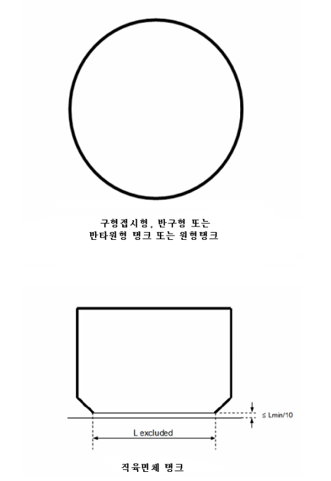 |
  | --- |
  | 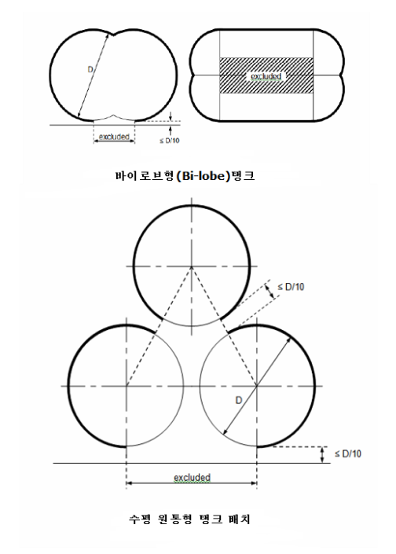 **그림 7.5.19** **그림 7.5.19** |

### 제 9 절 화물격납설비 환경제어

#### 901. 화물격납설비 내의 환경제어 【지침 참조】

- **1.** 각 화물탱크를 안전하게 가스프리하고 또한 가스프리 상태에서 화물증기로 안전하게 치환하기 위한 관장치를 설치하여야 한다. 환경을 변화시킨 후, 가스 또는 에어포켓의 잔류 가능성을 최소로 하도록 관장치를 배열하여야 한다.
- **2.** 인화성 화물의 경우, 중간단계로써 불활성 매체를 사용함으로써 환경변화 작업의 어느 기간에도 화물탱크 내에 인화성 혼합물이 존재하는 가능성을 제거하도록 장치를 설계하여야 한다.
- **3.** 인화성 화물을 수용할 수 있는 관장치는 **1**항 및 **2**항의 규정에 적합하여야 한다.
- **4.** 환경변화의 진행상황을 적절히 감시하기 위하여 각 화물탱크 및 화물관장치에는 충분한 수의 가스채취단을 설치하여야 한다. 가스채취 연결관에는 상갑판상에 적절한 캡 또는 맹플랜지로 폐쇄할 수 있는 1개의 밸브를 설치하여야 한다. (**506**의 **5**항 (5)호 참조)
- **5.** 환경변화 작업에 사용하는 불활성가스는 육상 또는 선내로부터 공급할 수 있다.

#### 902. 화물창구역 내의 환경제어(독립형탱크 형식 C를 제외한 화물격납설비) 【지침 참조】

- **1.** 완전 또는 부분 2차방벽을 요구하는 인화성 가스용 화물격납설비의 방벽간구역 및 화물창구역은 적합한 건성 불활성가스로 불활성화 하여야 하며 선박의 불활성가스발생장치 또는 적어도 30일 동안 충분하게 통상 사용할 수 있는 양을 저장하는 선박의 저장설비에 의하여 공급되는 불활성가스로 불활성화 상태를 유지하여야 한다.
- **2.** **17절**에 정하는 경우를 제외하고, 부분 2차방벽만을 요구하는 **1**항에서 정하는 구역은 건조공기를 채울 수 있다. 이 경우, 이들 구역 중 가장 큰 구역을 불활성화하기 위하여 선박에 충분한 불활성가스의 저장상태를 유지하거나 또는 불활성가스 발생장치가 설치되어야 한다. 그리고 불활성화 설비의 성능, 구역의 배치 및 관련 증기탐지장치는 위험한 상태가 되기 전에 화물탱크의 누설을 즉시 발견하고 불활성화할 수 있는 것이어야 한다. 선박에는 예상되는 요구량을 만족할 수 있는 적절한 품질의 건조공기를 충분히 공급할 수 있는 설비를 설치하여야 한다.
- **3.** 비인화성가스의 경우, **1**항 및 **2**항에서 정하는 구역은 적절한 건조공기 또는 불활성 환경으로 유지할 수 있다.

#### 903. 독립형탱크 형식 C의 주위구역의 환경제어 【지침 참조】

2차방벽을 가지지 아니하는 화물탱크의 주위구역은 적절한 건성 불활성가스 또는 건조공기로 채워야 한다. 그리고 선내의 불활성가스 발생장치에 의해 공급되는 불활성가스, 선내에 저장된 불활성가스에 의해 공급되는 불활성가스 또는 적절한 공기건조장치에 의해 공급되는 건조공기를 이용하여 불활성상태 또는 건조공기상태를 유지하여야 한다. 대기온도에서 화물이 운반되는 경우, 건조공기 또는 불활성가스에 대한 규정은 적용되지 않는다.

#### 904. 불활성화 【지침 참조】

- **1.** 불활성화라 함은 불연성 환경을 만드는 과정을 의미한다. 불활성가스는 구역 및 화물 내에 발생할 수 있는 모든 온도에서 화학적 및 운전상 적합하여야 한다. 가스의 노점이 고려되어야 한다.
- **2.** 소화목적으로 불활성가스를 저장하는 경우, 이 목적의 불활성가스는 별도의 용기에 저장하여야 하며 화물용으로 사용하지 않아야 한다.
- **3.** 0 °C미만의 온도로 액체 또는 증기상태로써 불활성가스가 저장되는 경우, 저장 및 공급장치는 선박구조의 온도가 제한치 이하로 감소되지 않도록 설계되어야 한다.
- **4.** 운반되는 화물에 적합한 불활성가스장치로 화물증기가 역류하는 것을 방지하기 위한 장치를 하여야 한다. 이러한 불활성가스장치가 기관구역 또는 화물지역 외부의 기타구역에 위치하는 경우, 2개의 체크밸브 또는 이와 동등한 장치, 그리고 이에 추가하여 제거 가능한 스풀피스를 화물지역 내 불활성가스 주관에 설치하여야 한다. 불활성가스장치를 사용하지 않는 경우, 화물창구역 또는 방벽간구역의 연결부를 제외하고 화물지역 내의 화물장치로부터 불활성가스장치가 분리되어야 한다.
- **5.** 불활성화된 각 구역이 격리될 수 있도록 배치되어야 하고 필요한 제어장치 및 도출밸브 등이 이 구역의 압력조정을 위하여 설치되어야 한다.
- **6.** 방열구역에 누설탐지장치의 일부로써 불활성가스가 연속적으로 공급되는 경우, 개별 구역에 공급되는 가스양을 감시할 수 있는 수단이 설치되어야 한다.

#### 905. 선내에서의 불활성가스 생산

- **1.** 불활성가스 발생장치는 **17절**의 특별규정을 적용받는 것 외에 산소농도가 5 %(용적률)이하의 불활성가스를 생산할 수 있어야 한다. 불활성가스 발생장치로부터의 불활성가스 공급관에는 계속 판독 가능한 산소농도계를 설치하고, 또한 **17절** 규정의 적용을 받는 것 외에 최대산소농도 5 %(용적률)로 설정된 경보장치를 비치하여야 한다. **【지침 참조】**
- **2.** 불활성가스장치는 화물격납설비에 적합한 압력제어 및 감시설비를 설치하여야 한다.
- **3.** 불활성가스 발생장치가 설치되는 구역은 거주구역, 업무구역 또는 제어장소에 직접 통하는 출입구를 설치하지 않아야 한다. 다만, 이 장치는 기관구역 내에 설치할 수 있다. 불활성가스관은 거주구역, 업무구역 및 제어장소를 통과하지 않아야 한다.
- **4.** 불활성가스를 생산하는 연소장치는 화물지역 내에 설치하여서는 아니 된다. 접촉반응 연소과정을 사용하는 불활성가스 발생장치의 설치위치는 특별히 고려되어야 한다.

### 제 10 절 전기설비

#### 1001. 정의

이 절의 규정은 특별히 명시하지 않는 한 다음의 정의를 적용하여야 한다.

- **1.** **위 험구역**이라 함은 전기설비의 구조, 설치 및 사용에 대하여 특별한 예방조치가 요구되는 양의 가스 폭발 분위기가 존재하거나 존재할 것으로 예상되는 구역을 말한다(IEC 60092-502:1999 등을 참조한다).
  - **(1)** 구역 “0”(zone 0): 가스 폭발 분위기가 연속적으로 또는 장기간 존재하는 구역
  - **(2)** 구역 “1”(zone 1): 가스 폭발 분위기가 정상작동 상태에서 발생할 수 있는 구역
  - **(3)** 구역 “2”(zone 2): 가스 폭발 분위기가 정상작동 상태에서는 거의 발생하지 않고, 발생하는 경우에는 그 빈도가 극히 적고 아주 짧은 시간동안만 지속되는 구역
- **2.** **비 위험구역**이라 함은 전기설비의 구조, 설치 및 사용에 대하여 특별한 예방조치가 요구되는 양의 가스 폭발 분위기가 존재할 것으로 예상되지 않는 구역을 말한다.

#### 1002. 일반사항

- **1.** 전기설비는 인화성 화물의 화재 및 폭발의 위험성을 최소로 하여야 한다.
- **2.** 전기설비는 IEC 60092-502:1999에 적합하여야 한다.
- **3.** 운항목적 또는 안전성 향상을 위해 필수적이 아닌 경우, 전기기기 또는 배선은 위험구역에 설치되어서는 아니 된다.
- **4.** **3**항의 규정에 따라 전기기기가 위험구역에 설치되는 경우, 전기기기는 우리 선급에서 인정하는 동등 이상의 표준에 따라 선택, 설치 및 유지되어야 한다. 위험구역용 전기기기는 우리 선급의 형식승인을 받아야 한다. 인화성가스 탐지시 작동하는 비방폭형 전기설비를 자동으로 차단하는 것은 방폭형 전기설비의 대안으로 인정되지 않는다.
  **【지침 참조】**
- **5.** 적절한 전기설비의 선택 및 설계가 용이하도록, 위험구역은 우리 선급이 인정하는 기준에 따라 구역별로 분류되어야 한다.
- **6.** 발전 및 배전시스템, 그리고 관련 제어장치는 단일고장으로 인해 **708. 1**항에서 요구되는 화물탱크의 압력 유지 능력이 손실되지 않도록 설계되어야 하며, 선체구조온도는 **419. 1**항의 (6)호에서 요구하는 정상작동 제한치 이내이어야 한다. 고장모드 및 영향은 우리 선급이 인정하는 것(예: IEC 60812 등)보다 동등 이상의 표준에 따라 분석 및 문서화되어야 한다.
- **7.** 위험구역 내의 조명장치는 적어도 2개의 분기회로로 나누어져야 한다. 모든 스위치 및 보호장치는 모든 극 또는 상을 차단하여야 하며 비위험구역에 설치되어야 한다.
- **8.** 전기측심장치 또는 선속거리계 및 외부전원식 음극방식 장치의 아노드(anode) 또는 전극(electrodes)은 기밀 구획내에 설치되어야 한다.
- **9.** 수중형 화물펌프 전동기 및 관련 급전 케이블은 화물격납설비 내에 설치되어야 한다. 저액면에 도달했을 때, 전동기는 자동으로 정지되어야 한다. 이러한 자동정지는 펌프토출압력의 저하, 전동기 저전류 또는 저액면을 감지하여 작동될 수 있다. 전동기 자동정지시 화물제어실에 경보를 발하여야 한다. 가스프리 작업 중에는 화물펌프 전동기의 공급전원은 차단되어야 한다.

### 제 11 절 방화 및 소화

#### 1101. 화재의 안전성에 대한 요건

- **1.** **S OLAS** 제II-2장 중 탱커에 대한 요건은 총톤수 500톤 미만의 선박을 포함하여 이 규칙의 적용을 받는 선박에 적용하여야 한다. 다만, 다음의 경우는 제외한다.
  - **(1)** 4규칙 5.1.6항 및 5.10항은 적용하지 않는다.
  - **(2)** 10규칙 4항 및 5항은 총톤수 2,000톤 이상의 탱커에 적용하는 것과 같이 적용한다.
  - **(3)** 10규칙 5.6항은 총톤수 2,000톤 이상의 선박에 적용한다.
  - **(4)** **SOLAS** 제II-2장의 탱커에 관한 다음 규칙은 적용하지 않는다. 그러나 다음과 같이 이 규칙의 장 및 절로 대체한다.

    | **SOLAS** 규칙 | 이 규 칙 |
    | --- | --- |
    | 10.10 4.5.1.1 및 4.5.1.2 4.5.5 10.8 10.9 10.2 | **1106.** **3절** **이 장의 관련 절** **1103.** 및 **1104.** **1105.** **1102. 1항부터 4항까지** |
  - **(5)** 13규칙 3.4항 및 4.3항은 총톤수 500톤 이상의 선박에 적용한다.
- **2.** 모든 발화원은 **10절** 및 **16절**의 규정에 따라 특별히 인정된 경우를 제외하고 인화성 화물증기가 존재할 염려가 있는 구역으로부터 배제하여야 한다. **【지침 참조】**
- **3.** 이 절의 규정은 **3절**의 규정과 관련하여 적용한다.
- **4.** 소화규정의 적용상, 최후부 화물창 구역의 선미단 또는 최전부 화물창 구역의 선수단에 인접한 코퍼댐, 평형수 또는 보이드 구역 상방에 있는 모든 노출갑판을 화물지역에 포함하여야 한다.

#### 1102. 소화주관 및 소화전

- **1.** 이 규칙의 적용을 받는 화물을 운반하는 모든 선박은 그 크기에 관계없이 **SOLAS** 제II-2장 제10규칙 2항의 규정에 적합하여야 한다. 다만, 소화펌프 및 소화주관이 **1103. 3**항의 규정에 따라 인정되는 분무장치의 일부로써 사용되는 경우는 소화주관 및 송수관의 직경과 펌프의 용량은 **SOLAS** 제II-2장 제10규칙 2.2.4.1항 및 2.1.3항의 규정에 의하여 허용되는 각각의 최대치에 따라서 제한을 받아서는 아니 된다. 19 mm 노즐을 갖는 소화호스가 최소 0.5 $\mathrm{MPa}$ 게이지 압력으로 2줄기 사수를 동시에 하는 경우, 이 소화펌프의 용량은 요구되는 지역을 보호할 수 있는 것이어야 한다. **【지침 참조】**
- **2.** 화물지역 내 갑판의 모든 부분, 갑판상 화물격납설비 및 탱크 덮개의 모든 부분에 적어도 2줄기 사수가 도달하도록 소화전을 설비하여야 한다. 필요한 소화전의 수는 **SOLAS** 제II-2장 제10규칙 2.3.1.1항에서 규정하는 길이의 호스로 위에서 언급된 배치를 만족하고 또한 **SOLAS** 제II-2장 제10규칙 2.1.5.1항 및 2.3.3항 규정에 적합하여야 한다. 이에 추가하여, **SOLAS** 제II-2장 제10규칙 2.1.6항에 규정되는 압력은 적어도 0.5 $\mathrm{MPa}$ 게이지압으로 하여야 한다.
- **3.** 가장 인접한 소화전에서 2개 이하의 소화호스를 사용하는 **2**항의 규정에 적합하기 위하여 소화주관에는 모든 크로스오버, 화물지역 진입 전의 보호장소 내, 그리고 소화주관의 손상된 단일 구획의 격리를 보장하는 간격으로 스톱밸브가 설치되어야 한다. 화물지역에 사용되는 소화주관의 물공급은 주소화펌프에 의해 공급되는 원형주관(ring main)이거나, 화물지역의 선수 및 선미에 위치하는 소화펌프에 의해 공급되는 단일주관이어야 한다. 화물지역의 선수 및 선미에 위치하는 소화펌프 중 1개는 독립구동이어야 한다.
- **4.** 노즐은 정지수단을 갖추고 사수 및 분무 겸용으로 승인된 제품이어야 한다. *(2019)* **【지침 참조】**
- **5.** 설치 후에 관, 밸브, 부착품 및 장비품은 밀폐시험 및 성능시험을 하여야 한다.

#### 1103. 물분무장치

- **1.** 인화성 또는 독성의 화물을 운반하는 선박에는 냉각, 방화 및 승무원의 보호를 위하여 다음의 장소에 물분무장치를 설치하여야 한다. **【지침 참조】**
  - **(1)** 노출된 화물탱크 돔, 화물탱크의 모든 노출부 및 가스 프로세스장치로써 사용되는 노출된 승압펌프/열교환기/재기화 또는 재액화설비와 같이 인접한 화물기기의 화재로 인한 열에 노출될 수 있는 화물탱크 덮개의 모든 부분 *(2019)*
  - **(2)** 갑판상의 노출된 인화성 또는 독성 화물의 저장용기
  - **(3)** 갑판상에 위치한 가스 프로세스장치
  - **(4)** 액체 및 증기 화물의 플랜지를 포함한 하역용 연결부 및 이들의 제어용 밸브가 설치되는 지역. 이것들은 설치되는 드립 트레이의 면적 이상을 대상으로 하는 것이어야 한다.
  - **(5)** 가스소모장치로의 공급용 마스터밸브를 포함하여 액체 및 증기 화물관에 설치된 노출되는 모든 비상차단밸브(ESD) *(2019)*
  - **(6)** 통상적으로 사람이 거주하는 선루 및 갑판실, 화물기기구역, 화재위험성이 높은 물건을 저장하는 창고 및 화물제어실의 격벽과 같이 화물지역에 면하는 노출된 경계부분. 분리 가능한 화물관장치 연결부가 노출된 수평경계 부분의 상방 또는 하방에 설치되지 않는 경우, 이들 지역의 노출된 수평 경계부분에는 물분무장치를 요구하지 않는다. 화재위험성이 높은 물건 또는 설비를 비치하지 않는 비거주 선수루 구조의 경계부분에는 물분무장치가 요구되지 않는다. *(2019)*
  - **(7)** 화물지역과의 거리에 상관없이 화물지역과 마주하는 노출된 구명정, 구명뗏목 및 집결장소
  - **(8)** 모든 반폐위 화물기기구역 및 반폐위 화물전동기실

#### 101. 6항에서 규정하는 운항을 위한 선박은 특별히 고려하여야 한다.(1103. 3항의 (2)호 참조)

- **2.** (1) 물분무장치는 최대 수평투영면에 대하여 분당 10 $\mathrm{L} /m ^{2}$, 수직면에 대하여 분당 4 $\mathrm{L}/m ^{2}$로 균일하게 산포되는 물분무율에 의해 **1**항에서 규정한 모든 지역을 보호할 수 있어야 한다. 수평면 또는 수직면이 명확하지 않은 구조물의 경우, 물분무장치의 용량은 수평투영면에 분당 10 $\mathrm{L}/m ^{2}$를 곱한 값 이상이어야 한다.
  - **(2)** 수직면의 하부 지역을 보호하는 노즐의 간격은 수직면의 높은 지역으로부터 흘러내릴 예상 유량을 고려하여 결정할 수 있다. 스톱밸브는 손상된 물분무관을 격리하기 위해 40 m 이하의 간격으로 물분무장치의 주공급관에 설치되어야 한다. 다만, 작동에 필요한 제어장치가 화물지역 외부의 쉽게 접근할 수 있는 위치에 설치되는 경우, 독립적으로 작동할 수 있는 2개 이상의 구간으로 분할되어 있는 물분무장치로 대체할 수 있다. **1**항의 (1)호 및 (2)호에 포함되는 모든 구역을 보호하는 각 구간의 장치는 해당구역을 포함하는 선박의 횡방향 탱크군의 모두를 대상범위로 하여야 한다. **1**항의 (3)호에서 규정하는 모든 가스 프로세스장치는 독립된 구간의 장치에 의해 공급될 수 있다. **【지침 참조】**
- **3.** 물분무펌프의 용량은 다음 중 큰 것으로 보호할 수 있어야 한다.
  - **(1)** 어느 2개의 완전한 횡방향 탱크군(이 지역 내의 가스 프로세스장치를 포함)
  - **(2)** **101. 6**항에서 규정하는 운항을 위한 선박의 경우, 추가된 모든 화재위험요소와 인접한 횡방향 탱크군에 대하여 **1**항에서 특별히 고려되는 필요한 보호
    이에 추가하여, **1**항의 (4)호부터 (8)호까지 규정한 표면을 동시에 보호할 수 있어야 한다. 주소화펌프 총용량을 분무장치에 필요한 양만큼 증가시키는 경우에만 주소화펌프를 분무펌프의 대체로서 사용할 수 있다. 어떤 경우에도 소화주관과 물문무장치의 주공급관 사이에 스톱밸브를 가진 연결관을 사용하여 화물지역 외부에서 연결하여야 한다.
- **4.** 한 구획의 화재로 해당 구역의 모든 소화펌프를 사용할 수 없는 경우, 통상 사람이 거주하는 선루 및 갑판실의 경계부분, 그리고 화물지역에 인접한 구명정, 구명뗏목 및 집결장소에는 화재가 발생한 이 외의 구역에 위치한 소화펌프 또는 비상소화펌프 중 1개에 의해 공급될 수 있어야 한다.
- **5.** 통상 다른 목적에 사용하는 급수펌프를 물분무장치 주공급관에 공급하도록 배치할 수 있다. **【지침 참조】**
- **6.** 물분무장치에 사용되는 모든 관, 밸브, 노즐 및 기타 부착품은 해수에 대한 내식성을 가져야 한다. 화물지역 내의 관, 부착품 및 관련 장비품(개스킷 제외)은 925 ℃ 이상의 용융점을 갖는 재료의 것이어야 한다. 물분무장치는 관 및 노즐의 막힘을 방지하기 위해 인라인(in-line) 여과기를 설치하여야 한다. 이에 추가하여, 청수로 백플러싱할 수 있는 수단을 설치하여야 한다.
- **7.** 물분무장치에 물을 공급하는 펌프의 원격시동장치 및 이 장치에 부착된 통상 폐쇄되어 있는 밸브의 원격조작장치는 그 화물지역 외부의 적절한 위치에 거주구역에 인접하게 배치되어야 하며 보호되는 구역의 화재 발생 시에 쉽게 접근하여 조작할 수 있어야 한다.
- **8.** 설치 후에 관, 밸브, 부착품 및 장비품은 밀폐시험 및 성능시험을 하여야 한다.

#### 1104. 드라이 케미컬 분말소화장치 【지침 참조】

- **1.** 인화성화물을 운반하는 선박이 적용되는 경우에 갑판상의 액체 및 증기 화물의 하역용 연결부, 그리고 선수 또는 선미 화물 취급지역을 포함하여 화물지역의 갑판상에 소화용으로 **MSC.1/Circ.1315/Rev.1**에 따라 우리 선급에 승인을 받은 드라이 케미컬 분말소화장치를 설치하여야 한다. *(2023)*
- **2.** 장치는 적어도 2개의 수동 호스, 또는 모니터와 수동 호스의 조합에 의해 노출된 액체 및 증기 화물용 관장치, 하역용 연결부 및 노출된 가스 프로세스장치의 모든 부분에 분말소화제를 공급할 수 있어야 한다.
- **3.** 드라이 케미컬 분말소화장치는 2개 이상의 독립된 장치로 설계되어야 한다. 2개 이상의 독립된 장치와 관련 제어장치, 가압용 고정배관, 모니터 또는 수동 호스에 의해 **2**항에 의해 보호되는 모든 부분에 도달할 수 있어야 한다. 재화용적이 1,000 $\mathrm{m} ^{3}$ 미만인 선박의 경우, 1개의 장치만 설치할 수 있다. 모든 하역용 연결부 지역을 보호하기 위해 모니터를 설치하여야 한다. 이 모니터는 수동 및 원격조작에 의해 작동되고 소화제를 방출할 수 있어야 한다. 모니터가 단일위치로부터 보호가 요구되는 모든 지역에 필요한 분말을 공급할 수 있는 경우, 원격으로 조준되는 모니터를 요구하지 않는다. 거주구역과 인접한 화물지역 후단의 좌측 및 우측에 1개의 호스를 설치하여야 하며, 거주구역으로부터 쉽게 사용할 수 있어야 한다.
- **4.** 모니터의 용량은 10 $\mathrm{kg}/s$ 이상이어야 한다. 수동호스는 꼬이지 않아야 하고, 시동/정지 조작을 할 수 있는 노즐이 부착되어야 하며, 3.5 $\mathrm{kg}/s$이상으로 소화제를 방출할 수 있어야 한다. 최대 방출율은 한 사람이 조작할 수 있는 것이어야 한다. 수동호스의 길이는 33 m 이하여야 한다. 분말소화제 용기와 수동 호스 또는 모니터와의 사이에 고정배관을 설치하는 경우, 이 관장치의 길이는 장치를 연속 또는 단속하여 사용하는 동안 분말소화제의 유동상태를 유지할 수 있고, 또 장치의 사용이 끝난 경우, 분말소화제를 퍼징하는 것이 가능한 길이 이내로 하여야 한다. 수동호스 및 노즐은 내풍우성의 것이거나, 내풍우성의 상자 또는 덮개 내에 보관하고 쉽게 접근할 수 있어야 한다.
- **5.** 수동호스는 호스의 길이와 동등한 범위의 최대유효거리를 갖는 것으로 간주되어야 한다. 보호되어야 하는 지역이 모니터 또는 수동 호스 릴의 위치보다 상당히 높은 경우에는 특별히 고려하여야 한다.
- **6.** 선수 또는 선미에 하역용 연결부가 설치된 선박은 **1**항에서 **5**항까지의 규정에 적합한 선수 또는 선미 하역설비를 보호하는 호스 및 모니터에 의해, 화물지역의 전방 또는 후방의 액체 및 증기 화물관장치를 보호하는 별도의 드라이 분말장치를 설치하여야 한다.
- **7.** **1 01. 6**항에서 규정하는 운항을 위한 선박은 특별히 고려하여야 한다.
- **8.** 설치 후에 관, 밸브, 부착품 및 장비품은 밀폐시험과 원격 및 수동 방출장소에서 성능시험이 시행되어야 한다. 장치가 적절하게 작동하는지 검증하기 위해 드라이 케미컬 분말의 충분한 양의 방출이 초기시험에 포함되어야 한다. 모든 분배관은 막힘이 없는 것을 확인하기 위해 건조 공기로 불어야 한다.

#### 1105. 화물취급장치를 포함하는 폐위구역

- **1.** **1 05. 9**항에서 규정한 화물기기구역의 기준에 적합한 폐위구역, 그리고 모든 선박의 화물지역 내의 화물전동기실은 FSS코드에 적합한 고정식 소화장치가 설치되어야 하고 가스화재의 소화용으로 요구되는 농도 또는 분무율이 고려되어야 한다. **【지침 참조】**
- **2.** 제한된 종류의 화물을 전용으로 운반하는 선박의 화물지역 내 **303.**에서 정한 화물기기구역의 기준에 적합한 폐위구역은 운반되는 화물에 대한 적절한 소화장치에 의해 보호되어야 한다.
- **3.** 모든 선박의 터릿구획은 가장 큰 수평투영면적에 대하여 분당 10 $\mathrm{L}/m ^{2}$ 이상의 분무율을 가지는 내부 물분무장치에 의해 보호되어야 한다. 터릿의 가스흐름의 압력이 4 $\mathrm{MPa}$을 초과하는 경우, 분무율은 분당 20 $\mathrm{L}/m ^{2}$까지 증가시켜야 한다. 이 물문무장치는 모든 내부 표면을 보호하도록 설계되어야 한다.

#### 1106. 소방원장구

- **1.** 인화성 정제품을 운반하는 모든 선박은 다음에 표시한 것에 따라 **SOLAS** 제II-2장 제10규칙 10항의 요건에 적합한 소방원장구를 비치하여야 한다.

  | 총 화물용적 | 장구의 수 |
  | --- | --- |
  | 5,000 $\mathrm{m} ^{3}$ 이하 5,000 $\mathrm{m} ^{3}$ 초과 | 4 5 |
- **2.** 안전설비에 대한 추가요건은 **14절**에 표시한다.
- **3.** 소방원장구 중 요구되는 호흡구는 적어도 1,200 $rmℓ$의 개방공기를 가지는 자장식 호흡구이어야 한다.

### 제 12 절 화물지역 내의 동력통풍장치

이 절의 요건은 **SOLAS** 제II-2장 제4규칙 5.2.6항 및 5.4.1항 규정을 대체한다.

#### 1201. 통상의 화물취급 작업 중 사람이 출입할 필요가 있는 구역

- **1.** 전동기실, 화물압축기실 및 화물펌프실, 화물취급설비가 설치되어 있는 구역 및 화물증기가 축적될 수 있는 기타 폐위구역에는 이들 구역의 외부에서 제어할 수 있는 고정식 동력통풍장치를 설치하여야 한다. 통풍장치는 독성 또는 인화성 증기가 축적되지 않도록 연속적으로 운전되어야 하고 우리 선급이 승인한 감시장치가 설치되어야 한다. 사람이 진입하기 전에 해당 통풍장치의 사용을 요구하는 경고문이 구획실 외부에 게시되어야 한다.
- **2.** 인화성, 독성 또는 질식성의 증기가 축적되지 않도록 해당 구역으로 충분한 공기유동을 보장하고 안전한 작업환경을 보장하도록 동력통풍장치의 흡입구 및 배출구가 배치되어야 한다.
- **3.** 통풍장치는 해당 구역의 총용적을 기준으로 하여 시간당 30회 이상의 환기 능력을 가지는 것이어야 한다. 다만, 비위험 화물제어실의 환기 횟수는 시간당 8회로 할 수 있다.
- **4.** 해당구역보다 더 높은 위험을 갖는 인접한 구역 또는 지역으로 통하는 개구를 갖는 구역은 과압상태를 유지하여야 한다. 그 구역은 인정하는 기준에 따른 과압보호에 의해 덜 위험한 구역 또는 비위험한 구역으로 될 수 있다.
- **5.** 동력통풍장치용 통풍덕트, 공기 흡입구 및 배출구는 우리 선급이 인정하는 기준(예: IEC 60092-502:1999 등)에 적합한 위치에 설치되어야 한다.
- **6.** **1 6절**에서 허용되는 경우를 제외하고, 위험구역용 통풍덕트는 거주구역, 업무구역 및 기관구역 또는 제어장소를 통과하지 않아야 한다.
- **7.** 통풍팬을 구동하는 전동기는 인화성 증기를 수용할 수 있는 통풍덕트의 외부에 설치되어야 한다. 통풍팬은 통풍구역 내 또는 통풍구역과 연결된 통풍장치 내부에 점화원을 발생시키지 않아야 한다. 위험구역의 경우, 통풍팬 및 통풍덕트, 그리고 팬과 인접한 부분은 다음에서 규정한 바와 같이 스파크가 발생하지 않는 구조의 것이어야 한다.
  **【지침 참조】**
  - **(1)** 정전기 제거를 고려한 비금속 재료로 만들어진 임펠러 또는 하우징
  - **(2)** 비철재료로 만들어진 임펠러 및 하우징
  - **(3)** 오스테나이트계 스테인리스강으로 만들어진 임펠러 및 하우징
  - **(4)** 설계익단간극이 13 mm 이상인 철계의 임펠러 및 하우징
    익단간극에 관계없이, 알루미늄합금 또는 마그네슘합금으로 만들어진 고정부품 또는 회전부품과 철계 고정부품 또는 회전부품과의 조합은 불꽃이 발생할 위험이 있는 것으로 간주되고 이러한 장소에 사용하여서는 아니 된다.
- **8.** 이 절에 따라 팬이 요구되는 경우, 하나의 팬이 고장 나더라도 각각의 구역에 대해 요구되는 전체 환기 용적에는 문제가 없거나, 종류별 베어링을 포함하여 모터, 기동기 및 완성된 회전부품으로 구성된 예비부품이 비치되어야 한다.
- **9.** 통풍덕트의 외부 개구단에는 13 $\mathrm{mm}$ × 13 $\mathrm{mm}$ 메쉬 이하의 보호스크린을 설치하여야 한다.
- **10.** 구역이 가압에 의해 보호되는 경우, 통풍장치는 인정하는 기준(예: IEC 60092-502:1999 등)에 따라 설계되어야 한다.

#### 1202. 통상 사람이 출입하지 않는 구역 【지침 참조】

- **1.** 화물증기가 축적될 수 있는 폐위구역에 사람이 출입할 필요가 있는 경우, 안전한 환경이 확보되도록 통풍할 수 있어야 한다. 이 경우, 그 구역에 들어갈 필요 없이 통풍을 할 수 있어야 한다.
- **2.** 영구적인 장치가 필요한 경우에 시간당 8회, 이동식 장치의 경우에 시간당 16회의 통풍능력을 가진 것이어야 한다.
- **3.** 팬 또는 송풍기는 사람이 통행하는 개구에 설치되지 않아야 하며, **1201. 7**항의 규정에 적합한 것이어야 한다.

### 제 13 절 계기 및 자동화시스템

#### 1301. 일반사항

- **1.** 각 화물탱크에는 화물의 액면, 압력 및 온도를 지시하는 장치가 설치되어야 한다. 압력계 및 온도지시장치는 화물냉각설비의 액체 및 증기 관장치에 설치되어야 한다.
- **2.** 선박의 하역에 원격제어 밸브 및 펌프가 사용되는 경우, 하역 중인 탱크와 관련된 모든 제어 및 지시장치는 하나의 제어장소에 집중 배치되어야 한다. **【지침 참조】**
- **3.** 계측장치는 사용조건하에서 신뢰성을 확인하기 위하여 주기적으로 시험하고 검교정되어야 한다. 이에 대한 시험방법 및 검교정 주기는 제조자의 권고에 따른다. **【지침 참조】**

#### 1302. 화물탱크의 액면지시장치 【지침 참조】

- **1.** 각 화물탱크에는 액면계측장치가 설치되어야 하며, 화물탱크를 조작할 때마다 항상 액면지시값을 얻을 수 있도록 배치되어야 한다. 액면계측장치는 화물탱크의 설계압력범위 및 화물사용온도범위 내에서 작동하도록 설계되어야 한다.
- **2.** 액면계측장치가 1개만 설치되는 경우, 이 액면계측장치는 탱크를 비우거나 가스를 제거할 필요 없이 탱크의 사용 상태에서도 유지보수가 가능하도록 배치되어야 한다.
- **3.** 화물탱크의 액면계측장치는 **19절**의 최저요건 일람표 “g”란에 표시된 특정 화물에 대한 특별규정에 따라 다음의 형식으로 할 수 있다.
  - **(1)** 중량 또는 유량 계측과 같은 방법으로 화물의 양을 측정하는 간접식 장치.
  - **(2)** 방사성 동위원소 또는 초음파를 이용하여 계측하는 장치로써 화물탱크를 관통하지 않는 밀폐식 장치
  - **(3)** 플로트식, 전자탐지식, 자기탐지식 및 기포관식처럼 밀폐장치를 구성하고, 또한 화물이 누설되지 아니하는 구조의 장치로써 화물탱크를 관통하는 밀폐식 장치. 다만, 밀폐식 계측장치가 직접 탱크에 설치되지 않는 경우, 탱크에 가능한 가까운 위치에 차단밸브가 설치되어야 한다.
  - **(4)** 고정 튜브식 및 슬립 튜브식과 같이 액면계측장치가 화물탱크를 관통하고 계측 중에는 소량의 화물액체 또는 가스를 대기 중에 방출하는 구조의 제한식 장치. 이 장치는 계측에 사용되지 않을 때는 완전히 폐쇄할 수 있는 구조의 것이어야 한다. 또한, 장치를 개방할 때 화물의 누설 위험이 없도록 설계하고 설치하여야 한다. 이 계측장치는 과류방지밸브를 설치하지 않는 경우, 최대개구가 지름 1.5 mm 또는 이와 동등한 단면적을 넘지 않도록 설계하여야 한다.

#### 1303. 넘침제어 【지침 참조】

- **1.** **4**항에 규정하는 경우를 제외하고, 각 화물탱크에는 다른 액면지시장치로부터 독립적으로 작동하고 작동 시 가시가청경보를 발하는 고액면경보장치가 설치되어야 한다.
- **2.** 고액면경보와 별도로 작동하는 추가적인 센서는 하역용 관장치가 과도한 액체압력을 받지 않고 탱크가 액체로 가득 채워지는 것을 방지하도록 차단밸브를 자동으로 작동시켜야 한다.
- **3.** **5 05.** 및 **1810.**에서 규정하는 비상차단밸브는 상기 용도로 사용될 수 있다. 다른 밸브가 이 용도로 사용되는 경우, **1810. 2**항 (1)호 (다)에서 언급한 것과 같은 정보가 선내에서 이용될 수 있어야 한다. 적재작업을 하는 동안 적재계통에 잠재적인 과도한 서지압력이 발생할 수 있는 밸브를 사용할 경우에는 적재율을 제한하는 것과 같은 대안이 준비되어야 한다.
- **4.** 다음의 화물탱크에 있어서는 고액면경보장치 및 화물탱크의 주입자동정지장치를 설치할 필요는 없다.
  - **(1)** 용량이 200 $\mathrm{m} ^{3}$ 이하의 압력식 탱크
  - **(2)** 적하작업 중 발생하는 최대압력에 견딜 수 있도록 설계되고, 이 압력이 화물탱크 도출밸브의 설정압력보다 낮은 탱크
- **5.** 탱크 내의 센서위치는 시운전 전에 검증할 수 있어야 한다. 선박 인도 후 및 각 입거 후에 첫 번째 화물만재를 하는 경우, 경보점까지 화물탱크 내의 액체화물수위를 상승시킴으로써 고액면경보시험이 시행되어야 한다.
- **6.** 고액면경보장치 및 넘침경보장치의 전기회로 및 센서를 포함한 액면 경보장치의 모든 구성요소는 성능시험을 할 수 있는 것이어야 한다. **1806. 2**항에 따라 화물작업을 하기 전에 이 장치들은 시험되어야 한다.
- **7.** 넘침제어장치에 대한 오버라이딩 설비를 하는 경우, 오작동을 방지할 수 있는 것이어야 한다. 오버라이딩 장치가 작동하는 경우, 관련 제어장소 및 선교에 연속적으로 가시적인 지시를 나타내어야 한다.

#### 1304. 압력감시장치

- **1.** 각 화물탱크의 증기부에는 직접 판독 게이지가 제공되어야 한다. 추가적으로, **1301. 2**항에서 요구하는 제어장소에 간접식 지시장치가 제공되어야 한다. 최대 및 최소 허용압력은 명확히 표시되어야 한다.
- **2.** **1 301. 2**항에서 요구하는 선교 및 제어장소에 고압경보장치 및 저압경보장치(부압 보호가 요구되는 경우)가 제공되어야 하며, 설정압력에 도달하기 전에 경보를 발하여야 한다. **【지침 참조】**
- **3.** **8 02. 7**항에 따라 2개 이상의 압력으로 설정할 수 있는 압력도출밸브를 부착한 화물탱크의 경우, 각 설정된 압력에 대한 고압경보가 제공되어야 한다. **【지침 참조】**
- **4.** 각 화물펌프의 토출관과 각 액체 및 증기 화물의 매니폴드에는 1개 이상의 압력계가 설치되어야 한다.
- **5.** 선박의 매니폴드 밸브와 육상과의 호스 연결부 사이에는 그 장소에서 압력을 읽을 수 있는 매니폴드용 압력계를 설치하여야 한다.
- **6.** 대기에 개구단을 가지지 아니하는 화물창 구역 및 방벽간 구역에는 압력계를 설치하여야 한다.
- **7.** 모든 압력계는 사용압력범위에 걸쳐 지시할 수 있는 것이어야 한다.

#### 1305. 온도지시장치

- **1.** 각 화물탱크에는 화물온도를 지시하는 최소 2개의 장치를 설치하여야 한다. 이 장치 중 1개는 화물탱크의 하부에 위치하고 다른 1개는 탱크 상부 부근의 최고 허용액면보다 낮은 위치에 설치하여야 한다. **IGC 적합증서**에 표시되는 화물탱크의 최저설계온도는 온도지시장치 또는 장치 부근에 기호를 사용하여 명확히 표시되어야 한다.
- **2.** 온도지시장치는 화물탱크의 예상되는 화물사용온도범위에서 온도를 지시할 수 있는 것이어야 한다.
- **3.** 온도지시장치 보호관(thermowells)이 설치되는 경우, 통상 사용 중에 피로에 의한 고장을 최소화하도록 설계하여야 한다.

#### 1306. 가스탐지장치

- **1.** 이 규정에 따라 화물격납설비, 화물취급장치 및 보조장치의 건전성을 감시하기 위해 가스탐지장치를 설치하여야 한다.
- **2.** 고정식 가스탐지 및 가시가청경보장치는 다음의 장소에 설치하여야 한다.
  - **(1)** 가스관장치, 가스설비 또는 가스소모장치를 포함하는 폐위된 모든 화물구역 및 화물기기구역(터렛구획 포함)
  - **(2)** 탱크 형식 C를 제외한 독립형탱크의 방벽간구역 및 화물창구역을 포함하여 화물증기가 축적될 수 있는 기타 폐위구역 또는 반폐위구역
  - **(3)** 에어록
  - **(4)** **1607. 3**항 (3)호에서 규정한 가스연료 내연기관 내의 공간 *(2024)*
  - **(5)** **16절**에서 규정하는 통풍용 후드 및 가스덕트
  - **(6)** **708. 4**항에서 요구하는 냉각/가열 회로
  - **(7)** 불활성가스 발생장치 공급헤더
  - **(8)** 화물취급기기용 전동기실
- **3.** 가스탐지장치는 우리 선급이 인정하는 기준(예: IEC 60079-29-1 등)에 따라 설계, 설치 및 시험하여야 한다. 그리고 **19절**의 최저요건 일람표 “f”란의 규정에 따라 운반되는 화물에 적합하여야 한다.
- **4.** **1 9절**의 최저요건 일람표 “f”란에 “A”로 표시되는 비인화성 화물을 운반하는 선박의 경우, 화물기기구역 및 형식 C를 제외한 독립형 화물탱크의 화물창구역에 산소농도 감시장치를 설치하여야 한다. 또한 질소발생장치, 불활성가스발생장치 또는 질소냉매 순환장치와 같이 산소결핍환경을 만들 수 있는 장치가 설치된 폐위구역 또는 반폐위구역에도 산소농도 감시장치가 설치되어야 한다.
- **5.** **1 9절**의 최저요건 일람표 “i”란에 **1705. 3**이 기재되어 있는 경우를 제외하고, 독성화물, 또는 독성을 가지는 인화성 화물의 경우, 독성화물을 탐지하기위해 고정식 가스탐지장치 대신에 휴대식 가스탐지장치의 사용을 인정할 수 있다. 이 장치는 **2**항에서 규정한 구역에 사람이 들어가기 전과 사람이 머물러 있는 동안 30분 간격으로 사용되어야 한다. **【지침 참조】**
- **6.** 독성가스의 경우, 화물창구역 및 방벽간구역에는 이 구역으로부터 가스를 채취할 수 있는 고정식 배관장치를 설치하여야 한다. 이들 구역의 가스는 각 검출단으로부터 채취되고 분석되어야 한다.
- **7.** 고정식 가스탐지장치는 즉시 응답할 수 있는 연속적으로 탐지하는 형식이어야 한다. 이 장치를 **9**항 및 **16**절에서 요구하는 안전 차단기능을 작동하기 위해 사용되지 않는 경우, 시료채취식 탐지장치를 인정할 수 있다.
- **8.** 시료채취식 가스탐지장치를 사용하는 경우, 다음의 규정을 만족하여야 한다.
  - **(1)** 가스탐지장치는 30분을 넘지 아니하는 간격으로 각 검출단으로부터 순차적으로 자료를 채취하고 분석할 수 있는 것이어야 한다.
  - **(2)** 검출단에서 탐지장치까지 개별적인 채취관을 설치하여야 한다.
  - **(3)** **9**항에서 허용되는 경우를 제외하고, 검출단으로부터 설치되는 관은 비위험구역을 통과하지 않아야 한다.
- **9.** 시료채취용 관장치, 펌프, 솔레노이드 및 분석장치 등을 포함한 가스탐지장치가 개스킷에 의해 밀봉된 문을 가지는 완전 폐위된 강재함에 위치하는 경우, 가스탐지장치는 비위험구역에 위치할 수 있다. 강재함 내의 환경은 지속적으로 감시되어야 한다. 강재함 내의 인화성 범위 하한치(LFL)의 30 %를 초과하는 가스농도에서 가스탐지장치는 자동적으로 정지되어야 한다.
- **10.** 강재함을 전단격벽 상에 직접 설치할 수 없는 경우, 시료채취관은 강재 또는 강과 동등한 재료로 만들어져야 하고 가장 짧은 길이로 배치하여야 한다. **11**항 및 분석장치에서 요구하는 차단밸브용 연결부를 제외한, 분리 가능한 연결부는 허용하지 않는다.
- **11.** 시료채취설비가 비위험구역에 설치되는 경우, 플레임어레스터 및 수동차단밸브가 각 가스시료채취관에 설치되어야 하며, 차단밸브는 비위험구역에 설치되어야 한다. 시료채취관의 위험구역과 비위험구역 사이 격벽 관통부는 관통구획과 같은 건전성을 유지하여야 한다. 배출가스는 안전장소 내의 대기로 배출하여야 한다.
- **12.** 장치를 설비하는 경우, 구획의 크기 및 배치, 운반할 화물의 성분 및 밀도, 그리고 그 구획을 가스퍼지 또는 통풍에 의한 가스농도의 희석 및 정체된 구역을 고려하여 장치의 수 및 위치를 정하여야 한다.
- **13.** 이 **1306.** 규정에 의해 요구되는 가스탐지장치의 모든 경보상태는 다음의 장소에 가시가청의 경보를 발하여야 한다.
  - **(1)** 선교
  - **(2)** 지속적으로 가스농도를 감시하고 기록하는 관련 제어장소
  - **(3)** 가스탐지 판독장소
- **14.** 인화성 화물의 경우, 불활성화가 요구되는 화물창구역 및 방벽간구역용으로 제공되는 가스탐지장치는 용적률 0 %부터 100 %까지의 가스농도 계측이 가능한 것이어야 한다. **【지침 참조】**
- **15.** 증기의 용적 농도가 대기 중에서 인화성 범위 하한치(LFL)의 30 %에 도달하였을 때 경보를 발하여야 한다.
- **16.** 멤브레인 격납설비의 경우, 1차 및 2차 단열구역은 불활성화될 수 있어야 하고 가스농도는 독립적으로 분석되어야 한다. 2차 단열구역 내의 경보는 **15**항에 따라 설정되어야 한다. 1차 단열구역 내의 경보는 우리 선급에 의해 승인된 값으로 설정되어야 한다.(국제가스탱커 및 터미널 운영자 협회에서 발행한 "Gas concentrations in the insulation spaces of membraned LNGC"을 참조한다.)
- **17.** **2**항에서 규정한 기타 구역의 경우, 증기농도가 인화성 범위 하한치(LFL)의 30 %에 도달하였을 때 경보를 발하여야 한다. 그리고 증기농도가 인화성 범위 하한치(LFL)의 60 %에 도달하기 전에 **16절**에서 요구하는 안전장치가 작동하여야 한다. 가스를 연료로 사용하는 내연기관의 크랭크케이스는 인화성 범위 하한치(LFL)의 100 %가 되기 전에 경보를 발하여야 한다.
- **18.** 가스탐지장치는 쉽게 시험할 수 있도록 설계되어야 하며, 주기적으로 시험 및 검교정이 시행되어야 한다. 이러한 용도에 적합한 설비는 제조자의 권고에 따라 선내에 비치되고 사용되어야 한다. 이러한 시험설비를 위한 고정식 연결부가 설치되어야 한다.
- **19.** 모든 선박에는 **3**항의 규정에 적합하거나 우리 선급이 인정하는 국가표준 또는 국제표준에 적합한 휴대식 가스탐지장치를 2조 이상 비치하여야 한다.
- **20.** 불활성화 분위기 중의 산소농도를 계측하는 적절한 장치를 비치하여야 한다. **【지침 참조】**

#### 1307. 2차방벽을 요구하는 격납설비에 대한 추가요건

- **1.** **방벽의 건전성**
  2차방벽이 요구되는 경우, 1차방벽의 어느 한 부분에서 액밀성이 상실될 때 또는 모든 2차방벽의 어느 한 부분에 액체화물이 접촉하였을 때 탐지할 수 있는 고정식 계측장치를 비치하여야 한다. 이 장치는 **1306.**에 적합한 가스탐지장치이어야 한다. 다만, 이 장치는 액체물질이 1차방벽을 통하여 누설하고 있는 장소 또는 액체물질이 2차방벽과 접촉하고 있는 장소를 표시할 필요는 없다.
- **2.** **온도지시장치 【지침 참조】**
  - **(1)** 온도지시장치의 수 및 위치는 격납설비의 설계 및 화물사용조건에 적합하여야 한다.
  - **(2)** 2차방벽을 가진 화물격납설비에 의하여 화물을 -55 °C 미만의 온도상태로 운반하는 경우, 단열재의 내부 또는 화물격납설비에 인접하는 선체구조에 온도지시장치용 검출단을 설치하여야 한다. 이 장치는 적절한 간격으로 온도를 읽고 필요한 경우에는 선체구조의 허용 최저온도에 이르렀을 때 경보를 발하여야 한다.
  - **(3)** -55 °C미만의 온도상태로 화물을 운반하는 경우, 화물격납설비의 설계상 필요한 경우에는 불만족스러운 온도구배가 발생하지 않는 것을 검증하기 위해 화물탱크 경계에 충분한 수의 온도지시장치를 설치하여야 한다.
  - **(4)** 단일선박 또는 동형선을 연속으로 건조하는 선박의 설계검증 및 최초 냉각절차의 유효성을 결정하는 목적으로, (1)호에서 규정하는 수를 초과하는 온도지시장치를 하나의 탱크에 설치하여야 한다. 동형선을 연속으로 건조하는 경우, 이러한 온도지시장치는 임시 또는 영구적으로 설치할 수 있으며 첫 번째 선박에만 설치할 필요가 있다.

#### 1308. 자동화시스템

- **1.** 이 장에서 요구하는 계측제어, 감시/경보 또는 안전장치에 사용되는 자동화시스템은 이 절의 규정을 적용한다.
- **2.** 자동화시스템은 우리 선급이 인정하는 기준(예: IEC 60092-504 등)에 따라 설계, 설치 및 시험되어야 한다.
- **3.** 하드웨어는 형식승인에 의해 해양환경에서 사용하기에 적합한 것으로 입증되어야 한다.
- **4.** 소프트웨어는 시험, 운영 및 유지보수를 포함하여 사용의 용이성을 위해 설계되고 문서화되어야 한다.
- **5.** 사용자 인터페이스는 제어되는 장비가 항상 안전하고 효과적인 방법으로 작동할 수 있도록 설계되어야 한다.
- **6.** 자동화시스템은 하드웨어의 장애 또는 사용자에 의한 오류가 위험한 상태로 연결되지 않아야 한다. 오작동에 대한 적절한 보호 수단이 제공되어야 한다.
- **7.** 단일고장의 영향을 제한하기 위해 제어, 감시/경보 및 안전장치 사이는 적절히 분리되어야 하며, 이는 연결된 장치 및 전원공급을 포함하여 특정 기능을 제공하기 위해 필요한 자동화시스템의 모든 부분을 포함한다.
- **8.** 소프트웨어의 구성 및 파라미터가 무단변경 또는 의도하지 않은 변경에 대해 보호되도록 자동화시스템을 설비하여야 한다.
- **9.** 변경프로세스는 예상치 못한 수정의 결과에 대해 보호되도록 관리되어야 한다. 구성 변경 및 승인에 대한 기록은 선내에 보관되어야 한다.
- **10.** 통합시스템의 개발 및 유지보수에 대한 프로세스는 우리 선급이 인정하는 기준(예: ISO/IEC 15288 및 ISO 17894 등)에 따라야 한다. 이 프로세스는 적절한 위험성 식별 및 관리를 포함하여야 한다.

#### 1309. 시스템 통합 【지침 참조】

- **1.** 필수 안전기능은 정상 작동 및 고장상태 하에서 인명에 대한 상해나 설비 또는 환경에 대한 위험이 최소화되도록 설계되어야 한다. 이 기능은 페일세이프 원칙에 따라 설계되어야 한다. 시스템 통합에 대한 역할 및 책임은 관련 당사자들에 의해 명확히 정의되고 합의되어야 한다.
- **2.** 통합시스템의 기능 및 안전요건을 만족하고 제어 중인 장비의 한계를 고려할 수 있도록, 각 구성요소 부시스템의 기능상 요건은 명확히 정의되어야 한다.
- **3.** 통합시스템의 주요 위험들은 적절한 위험성평가 기법을 이용하여 식별되어야 한다.
- **4.** 통합시스템은 적절한 복귀제어 수단이 있어야 한다.
- **5.** 결함 부분에 직접적으로 의존하는 기능을 제외하고, 통합시스템의 일부 고장이 다른 부분의 기능에 영향을 미쳐서는 아니 된다.
- **6.** 통합시스템의 사용은 적어도 개별적이고 독립형의 장치 또는 시스템이 되는 것만큼 효과적이어야 한다.
- **7.** 정상 작동 및 고장상태 동안 필수 기기 또는 시스템의 건전성이 입증되어야 한다.

### 제 14 절 인신보호

#### 1401. 보호장구

- **1.** 화물작업에 종사하는 승무원의 보호를 위하여 선박에는 운반되는 화물의 특성을 고려하여 인정되는 국가표준 또는 국제표준에 적합한 눈 보호구를 포함한 보호장구를 비치하여야 한다.
- **2.** 이 절에서 요구하는 인신보호장구 및 안전장구는 쉽게 접근할 수 있는 장소에 명확히 표시된 적절한 로커에 보관하여야 한다.
- **3.** 압축공기장치는 적어도 1개월에 1회 담당사관에 의하여 검사되고, 그 결과는 본선의 항해일지에 기록되어야 한다. 또한, 압축공기장치는 적어도 1년에 1회 전문가에 의하여 검사되고 시험되어야 한다.

#### 1402. 응급기구

- **1.** 갑판 하부의 구역으로부터 부상당한 사람을 끌어 올리는데 적절한 들것을 용이하게 접근하기 쉬운 위치에 보관하여야 한다.
- **2.** 선박에는 **IGC 적합증서**에 기재돤 화물에 대한 의료응급처리지침(MFAG)의 규정을 기반으로 산소소생기를 포함하는 응급의료기구를 비치하여야 한다.

#### 1403. 안전장구

- **1.** **1 106. 1**항에 규정하는 소방원장구에 추가하여 완전히 갖춘 3조 이상의 안전장구를 비치하여야 한다. 각 조는 가스가 가득한 구획에 출입 또는 작업을 허용하기 위한 적절한 인신보호장구를 제공하여야 한다. 이 장구는 **IGC 적합증서**에 기재된 화물의 특성을 고려하여야 한다.
- **2.** 안전장구 1조라 함은 다음에 정하는 것으로 구성되어야 한다.
  - **(1)** 저장산소를 사용하지 아니하고 대기압 상태에서 1,200 $\ell$ 이상의 공기량을 갖는 안면보호마스크와 결합된 1개의 자장식 정압 공기호흡구. 각 조는 **1106. 1**항에서 요구하는 것과 호환이 되어야 한다.
  - **(2)** 인정하는 기준에 따른 보호복, 장화 및 장갑
  - **(3)** 벨트붙이 강심 구명줄
  - **(4)** 방폭램프
- **3.** 압축공기를 충분하게 공급될 수 있도록 하여야 하고 다음에 정하는 것으로 구성되어야 한다.
  - **(1)** **1**항에 규정하는 각 호흡구에 대하여 완전하게 충전된 최소 1개의 예비공기병
  - **(2)** 호흡할 수 있는 고압공기의 공급에 적합하고 연속적인 운전이 가능한 충분한 용량의 공기압축기
  - **(3)** **1**항에서 규정하는 호흡구에 대하여 충분한 수의 예비용 호흡구 실린더를 연결할 수 있는 충전용 매니폴드

#### 1404. 개개의 화물에 대한 인신보호규정

- **1.** 이 규정은 **19절**의 표의 i란에 기재되어 있는 화물을 운반하는 선박에 적용하여야 한다.
- **2.** 비상탈출용에 적합한 호흡보호구 및 보호안경을 승선자 전원용으로 비치하여야 하고 다음에 적합하여야 한다.
  - **(1)** 필터형식의 호흡보호구는 사용할 수 없다.
  - **(2)** 자장식호흡구는 통상 적어도 15분간 사용할 수 있어야 한다.
  - **(3)** 비상탈출용 호흡보호구는 소화 또는 화물취급작업 중에 사용하여서는 아니되며 그 취지가 명기되어야 한다.
- **3.** 적합하게 표시된 오염제거 샤워기 및 눈 세척기는 갑판상 편리한 장소에서 이용할 수 있도록 1개 이상 설치되어야 하며 선박의 크기 및 배치가 고려되어야 한다. 샤워기 및 눈 세척기는 모든 주위환경에서도 사용할 수 있어야 한다.
- **4.** **1 403. 2**항 (2)호에서 규정하는 보호복은 기밀의 것이어야 한다.

### 제 15 절 화물탱크의 충전한도

#### 1501. 정의

- **1.** 충전한도($FL$)라 함은 액체 화물이 기준온도에 도달할 때 화물의 최대액체용적과 화물탱크의 총용적과의 비를 말한다.
- **2.** 적재한도($LL$)라 함은 최대허용액체용적과 탱크에 적재할 수 있는 탱크용적과의 비를 말한다.
- **3.** 이 절에서 말하는 **기준온도**라 함은 다음을 말한다.
  - **(1)** **7절**에 정하는 화물 증기압력․온도 제어장치를 설치하지 않을 경우, 압력도출밸브의 설정압력에서 화물의 증기압에 대응하는 온도
  - **(2)** **7절**에 정하는 화물 증기압력․온도 제어장치를 설치할 경우, 적하 종료시, 운반중 또는 양하시의 화물온도 중 가장 높은 온도.
- **4.** 항로에 제한받지 않는 선박의 설계 주위온도라 함은 32 °C의 해수온도와 45 °C의 대기온도를 말한다. 다만, 제한된 항로 또는 제한된 기간의 항해로 운항하는 선박은 이러한 온도보다 작은 값이 우리 선급에 의해 승인될 수 있다. 이 경우, 탱크의 단열에 대하여도 고려할 수 있다. 반대의 경우, 고온지역에 정기적으로 운항되는 선박은 이러한 온도보다 높은 값을 요구할 수 있다.

#### 1502. 일반사항

- **1.** 다음을 고려하여 기준온도에서 증기구역이 최소용적을 가지도록 화물탱크의 최대충전한도가 결정되어야 한다.
  - **(1)** 액면계 및 온도게이지와 같은 계측장치의 허용오차
  - **(2)** 압력도출밸브의 설정압력과 **804.**에서 규정한 최대허용설정압력 사이에서 화물의 체적팽창
  - **(3)** 적재 완료, 사용자 반응시간 및 밸브의 폐쇄시간 이후에 화물탱크로 되돌아오는 액체화물을 고려하는 운영상의 여유 (**505.** 및 **1810. 2**항 (1)호의 (D)를 참조한다)

#### 1503. 기본충전한도

화물탱크의 충전한도에 대한 기본값은 기준온도에서 98 %이다. 이 외의 값은 **1504.**의 규정에 만족하여야 한다.

#### 1504. 증가된 충전한도의 결정 【지침 참조】

- **1.** **1 503.**에서 규정한 98 %보다 높은 충전한도는 **802. 17**항에서 규정한 횡경사 및 종경사 상태하에서 **다음의 경우에** 허용될 수 있다.
  - **(1)** 격리된 증기 포켓이 화물탱크 내에 생성되지 않는 경우
  - **(2)** 압력도출밸브 흡입구가 여전히 증기구역에 있는 경우
  - **(3)** 다음의 허용치를 제공하는 경우
    - **(가)** 최대허용설정압력부터 **804. 1**항에 따른 최대배출압력까지 압력이 증가함으로써 발생한 액체 화물의 체적팽창
    - **(나)** 탱크용적의 최소 0.1 %의 운영상 여유
    - **(다)** 액면계 및 온도게이지와 같은 계측기기의 허용오차
- **2.** 어떠한 경우에도 기준온도에서 99.5 %를 초과하는 충전한도는 허용되지 않아야 한다.

#### 1505. 최대적재한도 【지침 참조】

- **1.** 화물탱크에 적재할 수 있는 최대 적재한도($LL$)는 다음 식에 따른다.
  $LL=FL \frac{\rho _{R}}{\rho _{L}}$
  여기서,
  $LL$ : **1501. 2**항에서 정의한 적재한도 (%)
  $FL$ : **1503.** 및 **1504.**에서 정의한 충전한도 (%)
  $\rho _{R}$ : 기준온도에서 화물의 비중
  $\rho _{L}$ : 적재온도에서 화물의 비중
- **2.** 우리 선급은 **802. 18**항에 따라 승인된 화물탱크 벤트장치가 설치될 경우, 아래 정의된 비중 $\rho _{R}$을 사용하는 **1**항의 식에 따라 탱크 형식 *C*에 적재를 허용할 수 있다.
  $\rho _{R}$ : **1501. 4**항에 정하는 설계 주위온도 조건하에 적재 종료 시, 운반 중 또는 양하 시에 화물이 도달할 수 있는 가장 높은 온도에서 화물의 비중
  이 요건은 1 G형 선박이 요구하는 화물에는 적용하지 아니한다.

#### 1506. 선장에게 제공하여야 할 정보

- **1.** 적용될 수 있는 각 적재온도 및 최대기준온도에서 각 화물탱크 및 제품에 대한 최대허용적재한도를 규정하는 문서는 선박에 제공되어야 한다. 이 문서의 정보는 우리 선급에 의해 승인되어야 한다.
- **2.** 압력도출밸브의 설정압력은 문서에 명시되어야 한다.
- **3.** 이 문서의 사본은 선장에 의해 선내에 영구적으로 보관되어야 한다.

### 제 16 절 연료로서 화물의 사용

#### 1601. 일반사항

- **1.** **1 609.**에서 규정된 경우를 제외하고, 메탄(LNG)의 증기 또는 보일오프가스는 A류 기관구역에 사용할 수 있는 유일한 화물이며, 이 구역에서 보일러, 불활성가스 발생장치, 내연기관, 가스연소장치 및 가스터빈과 같은 장치만 사용할 수 있다.

#### 1602. 연료로써 화물증기의 사용

- **1.** 이 규정은 보일러, 불활성가스 발생장치, 내연기관, 가스연소장치 및 가스터빈과 같은 장치에 연료로써 화물증기의 사용을 규정하고 있다.
  - **(1)** 기화된 LNG의 경우, 연료공급장치는 **1604. 1**항부터 **3**항까지의 규정을 따라야 한다.
  - **(2)** 기화된 LNG의 경우, 가스소모장치는 눈에 보이는 불꽃이 발생하지 않아야 하고 연도의 배기온도는 535 °C 미만으로 유지하여야 한다.

#### 1603. 가스소모장치가 설치된 구역의 배치

- **1.** 가스소모장치가 설치된 구역은 증기의 밀도 및 잠재적 점화원을 고려하여 가스가 축적될 수 있는 지역이 없도록 기계식 통풍장치가 설치되어야 한다. 이들 통풍장치는 다른 구역의 통풍장치와 분리되어야 한다.
- **2.** 가스소모장치가 설치된 구역에는 가스탐지기를 설치하여야 하고 특히 공기순환이 감소되는 곳에 설치하여야 한다. 가스탐지기는 **13절**의 규정에 따라야 한다.
- **3.** **1 604. 3**항에서 규정한 이중관 또는 덕트 내부에 설치된 전기설비는 **10절**의 규정에 따라야 한다.
- **4.** 가스연료를 포함할 수 있는 또는 가스연료에 의해 오염될 수 있는 모든 벤트 및 블리드관(bleed line)은 기관구역 외부의 안전한 장소에 유도되어야 하며 플레임스크린이 설치되어야 한다.

#### 1604. 가스연료의 공급

- **1.** **일반사항**
  - **(1)** 이 규정은 화물지역의 외부에 위치한 가스연료 공급관에 적용되어야 한다. 가스연료관은 거주구역, 업무구역, 전기설비실 또는 제어장소를 통과하여서는 아니 된다. 관장치의 설치는 창고 또는 기기취급지역과 같은 지역에서 기계적 손상으로 인한 잠재적 위험성이 고려되어야 한다.
  - **(2)** 기관구역 내에 배치되어 있는 가스연료 관장치에는 불활성화 및 가스프리를 위한 설비를 하여야 한다.
- **2.** **누설탐지**
  폐위구역 내에서 관장치의 누설을 지시하고 관련 가스연료 공급을 정지하도록 지속적인 감시 및 경보장치를 설치하여야 한다.
- **3.** **연료공급관의 설치**
  다음 중 어느 하나를 만족할 경우에는 연료관장치는 **1**항에서 규정한 이 외의 폐위구역을 통과 또는 유도할 수 있다.
  - **(1)** 이중관으로 설계되어야 하고 이중관 내외측 사이는 가스연료 압력보다 높은 압력의 불활성가스로 가압되어야 한다. **6**항에서 규정한 마스터 가스연료밸브는 불활성가스의 압력이 손실되었을 때 자동적으로 닫혀야 한다.
  - **(2)** 이중관 내외측 사이는 적어도 시간당 30회의 공기 치환이 되고 대기압 미만의 압력을 유지시킬 수 있는 기계식 배기통풍장치를 관 또는 덕트 내부에 설치하여야 한다. 기계식 통풍장치는 가능한 **12절**의 규정에 따른다. 관장치 내에 연료가 존재하고 있을 때 통풍장치는 항상 작동 중에 있어야 하며, **6**항에서 규정한 마스터 가스연료밸브는 요구되는 공기량이 배기식 통풍장치에 의해 공급이 유지되지 않는다면 자동으로 폐쇄되어야 한다. 통풍장치 입구 또는 덕트는 비위험 기관구역에 위치할 수 있으며, 통풍장치 출구는 안전한 장소에 위치되어야 한다.
- **4.** **사용압력이 1** $\mathrm{MPa}$**을 초과하는 가스연료의 요건**
  - **(1)** 고압 연료펌프/압축기와 가스소모장치 사이의 연료공급관은 압력 및 저온의 영향을 고려하여 고압관의 손상 시 보호할 수 있는 이중관장치를 하여야 한다. 화물지역에는 **6**항에서 규정한 차단밸브까지 단일관을 인정할 수 있다.
  - **(2)** **7**항의 요건에 따르며 압력과 발생 가능한 저온의 영향을 고려하여 외측관 또는 트렁크가 고압관의 손상을 보호할 수 있고 또한, 외측관 또는 트렁크의 흡기구 및 배기구가 모두 화물지역에 있는 경우, **3**항 (2)호의 배치를 허용할 수 있다.
- **5.** **가스소모장치의 차단**
  정상 및 비상 작동 시에 각 가스소모장치의 공급관장치는 가스연료를 안전한 장소에 방출하는 자동 이중블록 및 블리드장치에 의해 차단되어야 한다. 이 자동밸브는 폐일클로즈 형식이어야 한다. 복수의 가스소모장치가 설치된 구역의 경우, 그 중 하나의 가스소모장치의 차단이 다른 장치의 가스 공급에 영향을 미쳐서는 아니 된다.
- **6.** **가스소모장치가 설치된 구역** ***(2019)***
  - **(1)** 가스소모장치가 설치되거나 가스연료공급관이 통과하는 각 개별 구역으로의 가스연료공급은 화물지역에 설치된 개별 마스터밸브로 차단될 수 있어야 한다. 가스소모장치가 두 개 이상의 구역에 설치된 경우, 한 공간의 가스연료공급의 차단은 가스소모장치가 설치된 다른 구역으로의 가스공급에 영향을 주지 않아야 하며, 추진 또는 전력의 손실을 초래하지 않아야 한다.
  - **(2)** 공기 흡입구 또는 다른 개구로 인하여 가스공급계통의 이중벽 구조가 연속되지 않는 경우, 또는 단일손상으로 인해 그 구역에 누설이 발생할 수 있는 부분이 있는 경우, 그 구역의 개별 마스터밸브는 다음 조건에서 작동하여야 한다.
    - **(가)** 다음의 경우에는 자동으로 작동하여야 한다.
      - **(a)** 구역 내의 가스탐지
      - **(b)** 이중관 사이의 구역에서 누설탐지
      - **(c)** 단일관을 포함하는 구역 내의 기타 구획에서 누설탐지
      - **(d)** 이중관 사이의 구역에서 통풍장치의 고장
      - **(e)** 단일관을 포함하는 구역 내의 기타 구획에서 통풍장치의 고장
    - **(나)** 설치구역 내부 및 적어도 한 곳의 멀리 떨어진 장소에서 수동으로 작동할 수 있어야 한다.
  - **(3)** 가스공급장치의 이중벽 구조가 연속되는 경우, 화물지역 내에 위치한 개별적인 마스터밸브를 구역 내부에 있는 각 가스소모장치용으로 설치할 수 있다. 개별적인 마스터밸브는 다음 조건에서 작동하여야 한다.
    - **(가)** 다음의 경우에는 자동으로 작동하여야 한다.
      - **(a)** 개별적인 마스터밸브에 연결된 이중관 사이의 구역에서 누설탐지
      - **(b)** 개별적인 마스터밸브에 연결된 공급장치의 단일 가스관장치가 설치된 기타 구획에서 누설탐지
      - **(c)** 이중관 사이의 구역에서 통풍장치의 고장 또는 압력손실
    - **(나)** 설치구역 내부 및 적어도 한 곳의 멀리 떨어진 장소에서 수동으로 작동할 수 있어야 한다.
- **7.** **관장치 및 덕트 구조**
  기관구역 내의 가스연료관장치는 적용 가능한 **501.** 부터 **509.**의 규정에 적합하여야 한다. 관장치는 가능한 용접이음이어야 한다. **3**항에 따라 통풍관 또는 덕트 내에 폐위되지 않고 화물지역 외부의 노출갑판에 설치되는 가스연료관장치의 이음부는 완전용입 맞대기 용접이음이어야 하고 전방상선시험을 하여야 한다.
- **8.** **가스탐지**
  이 절의 규정에 따라 설치되는 가스탐지장치는 인화성 범위 하한치(LFL)의 30 %에서 경보가 작동되어야 하며, 인화성 범위 하한치(LFL)의 60 % 이하에서 **6**항에서 요구하는 마스터 가스연료밸브가 차단되어야 한다.(**1306. 17**항의 규정을 참조한다.)

#### 1605. 가스연료설비 및 관련 저장탱크

- **1.** **가스연료의 규정**
  연료로 사용하기 위하여 화물 또는 화물 보일오프 증기를 적합하게 조정하기 위한 모든 설비(가열기, 압축기, 증발기, 여과기 등)와 관련된 모든 저장탱크는 화물지역에 설치되어야 한다. 설비가 폐위구역에 있는 경우, 그 구역은 가능한 **1201.**의 규정에 따라 통풍되어야 하고 **1105.**의 규정에 따라 고정식 소화장치 및 **1306.**의 규정에 따라 가스탐지장치를 설치하여야 한다.
- **2.** **원격 정지**
  - **(1)** 연료로 사용하기 위하여 화물을 적합하게 조정하기 위한 모든 회전기기는 기관실에 수동 원격정지설비를 설치하여야 한다. 추가적인 원격정지설비는 항상 쉽게 접근할 수 있는 지역, 통상 화물제어실, 선교 및 화재제어실에 설치하여야 한다.
  - **(2)** 연료공급장치에서 흡입측 압력의 저하 또는 화재탐지가 되는 경우, 이 장치는 자동적으로 정지되어야 한다. 특별히 정하는 경우를 제외하고, 가스소모장치에 공급하기 위해 가스연료 압축기 또는 펌프가 사용되는 경우에 가스연료 압축기 또는 펌프는 **1810.**의 규정을 적용할 필요가 없다.
- **3.** **가열 및 냉각매체**
  가스연료 조절장치용 가열 또는 냉각매체가 화물지역 외부의 구역으로 되돌아오는 경우, 이 매체에 화물/화물증기의 존재를 탐지하고 경보하는 설비를 하여야 한다. 모든 벤트출구는 안전한 장소에 설치하여야 하고 승인된 플레임스크린을 부착하여야 한다.
- **4.** **관장치 및 압력용기**
  가스연료 공급장치에 부착되는 관장치 또는 압력용기는 **5절**의 규정을 따라야 한다.

#### 1606. 주보일러의 특별요건

- **1.** **배치**
  - **(1)** 각 보일러는 분리된 연도(uptake)를 가져야 한다.
  - **(2)** 각 보일러는 전용의 강제 송풍장치를 설치하여야 한다. 모든 관련 안전기능이 유지되는 경우, 비상용으로 보일러 강제 송풍장치 사이에 크로스오버를 설치할 수 있다.
  - **(3)** 보일러의 연소실 및 연도는 모든 기체연료의 축적을 방지하도록 설계되어야 한다.
- **2.** **연소장치**
  - **(1)** 이중연료의 버너장치로써 기름연료 또는 가스연료 단독으로, 또는 기름연료와 가스연료를 동시에 연소할 수 있는 것이어야 한다.
  - **(2)** 버너는 모든 점화상태에서 안정된 연소를 유지하도록 설계되어야 한다.
  - **(3)** 가스연료공급의 손상이 발생한 경우, 보일러 연소를 중단하지 않고 가스연료 운전에서 기름연료 운전으로 자동 전환되는 장치를 설치하여야 한다.
  - **(4)** 보일러 및 연소장치가 가스연료 점화에 대해 설계되어 우리 선급의 승인을 받은 경우를 제외하고는, 가스연료는 기름연료 화염에 의해서만 점화될 수 있도록 가스노즐 및 버너 제어장치가 구성되어야 한다.
- **3.** **안전장치 【지침 참조】**
  - **(1)** 정상적인 점화가 이루어지지 않거나 연소가 지속되지 않는 경우, 버너로 유입되는 가스연료를 차단할 수 있도록 설비하여야 한다.
  - **(2)** 각 가스버너의 관에는 수동조작의 차단밸브를 부착하여야 한다.
  - **(3)** 이 버너를 소화한 후, 불활성가스에 의해 버너의 가스공급관을 자동으로 퍼징하는 설비를 하여야 한다.
  - **(4)** **2**항 (3)호에서 요구하는 자동 연료전환장치는 지속적으로 이용하기 위해 경보장치로 감시되어야 한다.
  - **(5)** 운전되는 모든 버너의 화염소실이 발생한 경우, 보일러의 연소실은 재점화되기 전에 자동으로 퍼징되는 설비를 하여야 한다.
  - **(6)** 보일러는 수동으로 퍼징할 수 있는 설비를 하여야 한다.

#### 1607. 가스연료 내연기관의 특별요건 【지침 참조】

이중연료기관이라 함은 가스연료(파일럿 오일 포함) 및 기름연료를 사용하는 기관을 말한다. 기름연료는 증류유 및 잔사유를 포함할 수 있다. 가스기관은 가스연료만을 사용하여야 한다.

- **1.** **배치**
  - **(1)** 가스가 공통 매니폴드를 통해 공기와 혼합되어 공급되는 경우, 플레임어레스터는 각 실린더헤드 이전에 설치되어야 한다.
  - **(2)** 각 기관은 전용의 분리된 배기연도를 가져야 한다.
  - **(3)** 배기는 불연소된 기체연료의 축적을 방지하도록 구성되어야 한다.
  - **(4)** 누설가스의 점화로 인해 과압되는 최악의 경우에 견디는 강도로 설계되지 않는 경우, 매니폴드 공기 흡입구, 소기구역, 배기장치 및 크랭크케이스에는 적절한 압력도출장치를 설치하여야 한다. 압력도출장치는 사람으로부터 멀리 떨어진 안전한 장소에 유도되어야 한다.
  - **(5)** 각 기관은 크랭크케이스, 섬프(sump) 및 냉각장치에 대해 다른 기관과 독립적인 벤트장치를 설치하여야 한다.
- **2.** **연소장치**
  - **(1)** 가스연료가 공급되기 전에, 각 연소장치의 파일럿오일 분사장치의 올바른 작동이 검증되어야 한다.
  - **(2)** 불꽃 점화기관의 경우, 가스공급밸브가 열린 이후 기관의 지정된 시간 내로 기관감시장치에 의해 점화가 탐지되지 않는 경우에 가스공급밸브는 자동으로 차단되어야 하고 시동절차가 종료되어야 한다. 연소되지 않은 가스혼합물은 배기장치로부터 확실히 퍼징되어야 한다. *(2019)*
  - **(3)** 파일럿오일 분사장치가 부착된 이중연료 기관의 경우, 엔진출력의 변동을 최소로 하면서 가스연료 운전에서 기름연료 운전으로 전환하기 위한 자동전환장치가 설치되어야 한다.
  - **(4)** (3)호의 배치를 가지는 기관이 가스 연소 시 불안정한 운전을 하는 경우, 기관은 기름연료 운전으로 자동으로 전환되어야 한다.
- **3.** **안전장치**
  - **(1)** 기관이 정지되는 동안, 가스연료는 점화원 이전에서 자동으로 차단되어야 한다.
  - **(2)** 점화되기 전에, 배기가스장치에는 미연소된 가스연료가 남아있지 않도록 설비하여야 한다.
  - **(3)** 크랭크케이스, 섬프(sumps), 소기구역 및 냉각장치의 벤트장치에는 가스탐지장치가 설치되어야 한다.(**1306. 17**항 참조)
  - **(4)** 크랭크케이스 내에서 발생 가능한 점화원의 지속적인 감시를 허용하도록 기관은 설계되어야 한다. 크랭크케이스 내부에 부착된 계측기기는 **10절**의 규정에 따라야 한다.
  - **(5)** 운전 중 배기관장치 내에 연소되지 않은 가스가 유도될 수 있는 불완전 연소 또는 착화실패를 감시하고 탐지할 수 있는 수단이 설치되어야 한다. 탐지되는 경우, 가스연료공급은 차단되어야 한다. 배기장치의 내부에 부착된 계측기기는 **10절**의 규정에 따라야 한다.

#### 1608. 가스터빈의 특별요건

- **1.** **배치**
  - **(1)** 각 터빈은 전용의 분리된 배기연도를 가져야 한다.
  - **(2)** 배기는 불연소된 가스연료의 축적을 방지하도록 적절히 구성되어야 한다.
  - **(3)** 누설가스의 점화로 인해 과압되는 최악의 경우에 견디는 강도로 설계되지 않는 경우, 가스누설에 의한 폭발을 고려하여 압력도출장치를 적합하게 설계하여 배기장치에 부착하여야 한다. 배기연도 내의 압력도출장치는 사람과 멀리 떨어진 비위험 장소로 유도되어야 한다.
- **2.** **연소장치**
  엔진출력의 변동을 최소로 하며, 가스연료 운전에서 기름연료 운전으로 쉽고 빠르게 전환할 수 있는 자동장치가 설치되어야 한다.
- **3.** **안전장치**
  - **(1)** 운전 중 배기관장치 내에 연소되지 않은 가스가 유도될 수 있는 불완전 연소를 감시하고 탐지할 수 있는 수단이 설치되어야 한다. 탐지되는 경우, 가스연료공급은 차단되어야 한다.
  - **(2)** 각 터빈은 높은 배기온도에 대한 자동차단장치를 설치하여야 한다.

#### 1609. 대체연료 및 기술

- **1.** 이 장에서 천연가스와 동일한 안전수준이 보장되는 것을 우리 선급이 인정하는 경우, 다른 화물가스를 연료로써 사용할 수 있다. LPG화물을 연료로 사용하는 경우에는 **부록 7A-5**를 따른다. *(2021)* **【지침 참조】**
- **2.** 독성 제품으로 식별된 화물의 사용은 연료로써 허용되지 않아야 한다.
- **3.** LNG 이 외의 화물의 경우, 연료공급장치는 가능한 **1604.**의 **1**항, **2**항, **3**항 및 **1605.**의 규정에 따라야 한다. 그리고 장치 내의 증기의 응축을 방지하기 위한 수단을 설치하여야 한다.
- **4.** 액화가스 연료공급장치는 **1604. 5**항의 규정에 따라야 한다.
- **5.** **1604. 3**항 (2)호의 규정에 추가하여, 통풍장치의 입출구는 기관구역 외부에 설치되어야 한다. 통풍장치의 입구는 비위험 구역에 설치되어야 하고 통풍장치의 출구는 안전장소에 설치되어야 한다.

### 제 17 절 특별규정

#### 1701. 일반사항

이 절의 규정은 **19절**의 최저요건 일람표의 “i”란에 특별히 지시가 있는 경우에 적용한다. 이들 규정은 이 장의 일반적인 규정에 추가하여 적용하여야 한다.

#### 1702. 구조재료

통상 사용상태 중 화물에 노출될 가능성이 있는 재료는 가스의 부식반응에 견딜 수 있어야 한다. 또한 화물탱크 및 액체 또는 증기 화물에 직접 접촉하는 부속관장치, 밸브, 장비품 및 의장품의 구조재료로써 다음의 재료는 **19절**의 최저요건 일람표의 “i”란에 정하는 화물에 사용하여서는 아니 된다.

#### 1703. 독립형탱크

- **1.** 화물은 독립형탱크로만 운반되어야 한다.
- **2.** 화물은 독립형탱크 형식 C로 운반하여야 하며, 또한 **701. 2**항의 규정에 적합하여야 한다. 화물탱크의 설계압력은 모든 봉입압력 및 증기배출식 양하의 압력을 고려하여야 한다.

#### 1704. 냉각장치

- **1.** 냉각장치는 **703. 1**항 (2)호에 정하는 간접식을 사용하여야 한다.
- **2.** 위험한 과산화물을 용이하게 생성하는 화물을 운반하는 선박에서는 재응축한 화물이 중합하는 액의 정체가 생기지 않도록 하여야 한다. 이것은 다음 어느 하나의 방법으로 행할 수 있다.
  - **(1)** 화물탱크 내에 응축기를 비치하는 **703. 1**항 (2)호에 정하는 간접식의 사용.
  - **(2)** **703.**의 **1**항 (1)호 및 (3)호에 정하는 직접 또는 혼합식의 사용 또는 화물탱크의 외부에 응축기를 비치한 **703.**의 **1**항 (2)호에 정하는 간접식의 사용, 또한 어떠한 장소에 있어서도 액이 모이는 것을 피하도록 설계된 응축장치의 사용.
    이것이 불가능할 경우에는 그 장소의 상방으로부터 중합 방지제를 첨가하여야 한다.
- **3.** 평형수적재항해를 사이에 두고 **2**항에서 규정한 화물을 연속하여 운반하는 선박에서는 평형수적재항해 이전에 중합방지처리가 되지 아니한 잔액을 제거하여야 한다. 다른 화물을 연속하여 운반하는 경우, 재액화장치는 다른 화물을 적재하기 전에 완전히 배출하고 치환하여야 한다. 치환작업은 불활성가스 또는 적합성이 있을 경우에는 이와 다른 화물증기를 사용하여야 한다. 실시단계에서는 선박의 장치 중에 중합체 또는 과산화물이 축적되지 않도록 하여야 한다.

#### 1705. 1G형의 선박을 요구하는 화물

- **1.** 지름 75 mm을 초과하는 화물관장치의 모든 맞대기 용접이음은 100 % 방사선검사를 하여야 한다.
- **2.** 가스 채취관은 비위험구역에 설치하거나 통과하여서는 아니 된다. 증기농도가 허용한계값에 도달하였을 때 **1306. 2**항에서 정하는 경보장치가 작동되어야 한다.
- **3.** **1 306. 5**항에 따라 휴대용 가스탐지장치를 사용하는 대체 방법은 허용되지 않는다.
- **4.** 화물제어실은 비위험구역에 설치되어야 하고, 그리고 추가적으로 모든 계측기기는 간접식이어야 한다.
- **5.** 거주구역 내에 우리 선급이 인정하는 바에 따라 설계되고 장비된 하나의 구획을 설치하여 화물의 대량방출의 영향으로부터 승무원을 보호하여야 한다. **【지침 참조】**
- **6.** **3 06.**에 따라 에어록을 설치하지 않는 경우, **302. 4**항 (3)호의 규정에 관계없이 선수루구역의 접근수단은 화물지역에 접하는 문을 통하여서는 아니 된다.
- **7.** **3 02. 7**항의 규정에 관계없이, 터릿장치의 제어실 및 기관구역의 접근수단은 화물지역에 접하는 문을 통하여서는 아니 된다.

#### 1706. 증기 공간으로 부터의 공기의 제거

- **1.** 공기는 적재 전에 화물탱크 및 부속된 관장치로부터 제거하고 또한 적재 중 및 그 후에 다음 중 어느 하나의 방법에 의하여 공기의 침입을 배제하여야 한다.
  - **(1)** 정압을 유지하기 위한 불활성가스의 도입. 불활성가스의 저장 또는 생산되는 용량은 통상 사용상태에서의 필요량 및 도출밸브의 누설량을 고려하여 충분히 만족되는 것이어야 한다. 불활성가스중의 산소함유량은 용적의 0.2 %를 넘어서는 아니 된다.
  - **(2)** 항상 정압을 유지하도록 화물온도의 제어.

#### 1707. 습도제어

불연성으로써 물과 혼합하여 부식 또는 기타의 위험한 반응을 일으킬 염려가 있는 가스의 경우, 습도제어를 위하여 화물탱크는 적재 전에 건조시켜야 하며, 또한 양하 중에는 화물탱크의 부압을 방지하기 위하여 건조공기는 대기압에서의 노점이 -45 °C이하의 공기로 하여야 한다.

#### 1708. 중합방지

항해 중 어떠한 경우에도 자가반응(예: 중합반응 또는 이합체화반응)을 방지하기 위해 충분히 고려되어야 한다. 선박에는 화물의 제조자가 발행하는 다음 사항을 기재한 증서를 비치하여야 한다.

#### 1709. 벤트 출구단의 플레임스크린

이 장에 관련된 화물을 운반하는 경우, 화물탱크의 벤트 출구단에는 용이하게 교환할 수 있고 또한 효과적인 플레임스크린 또는 승인된 안전관두를 비치하여야 한다. 플레임스크린 및 안전관두의 설계상 화물증기의 동결 또는 악천후 조건하에서의 결빙에 의한 이들 장치의 폐쇄의 가능성에 주의하여야 한다. 이 장에서 정하지 않은 화물을 운반하는 경우, **802. 15**항에 따라 플레임스크린은 제거한 후 보호스크린으로 대체되어야 한다.

#### 1710. 각 탱크의 최대허용화물량

이 절에 관련된 화물을 운반하는 경우, 화물량은 어느 하나의 탱크당 3,000 $\mathrm{m} ^{3}$를 넘을 수 없다.

#### 1711. 화물펌프 및 하역설비

- **1.** 잠수형 전동기 구동펌프를 설치한 화물탱크의 증기구역은 인화성 액체를 적재 전, 운반 중, 그리고 양하 중 정압으로 불활성화하여야 한다.
- **2.** 화물은 디프웰 펌프 또는 유압구동의 수중펌프에 의해서만 양하되어야 한다. 이들 펌프는 축 글랜드에 액체압력을 받지 않도록 설계된 형식의 것이어야 한다.
- **3.** 불활성가스에 의한 치환은 화물장치가 예정된 압력으로 설계되어 있을 경우, 독립형탱크 형식 C로부터의 양하에 사용할 수 있다.

#### 1712. 암모니아

- **1.** 무수암모니아는 탄소망간강 또는 니켈강으로 만든 용기 또는 제조설비에 응력부식 균열을 발생시킬 수 있다. 이 균열 발생의 위험성을 최소화하기 위하여 **2**항부터 **8**항까지 규정의 대책을 적절히 따라야 한다.
- **2.** 탄소망간강이 사용되는 화물탱크, 제조용 압력용기 및 화물용 관장치는 규격최소 항복응력이 355 $\mathrm{N}/mm ^{2}$ 이하이며, 실제 항복응력이 440 $\mathrm{N}/mm ^{2}$ 이하의 세립강으로 만들어야 한다. 다음의 구조적 또는 조작상의 대책 중 하나에 따라야 한다.
  - **(1)** 규격최소 인장강도가 410 $\mathrm{N}/mm ^{2}$ 이하인 낮은 강도의 재료를 사용하여야 한다.
  - **(2)** 화물탱크 등은 용접후 응력제거 열처리를 하여야 한다.
  - **(3)** 운반 시의 온도는 -33 °C의 제품 비등점에 가까운 온도를 최대한 유지하여야 하며, 어떠한 경우에도 -20 °C를 초과하여서는 아니 된다.
  - **(4)** 암모니아는 질량 0.1 % 이상의 수분을 함유하여야 하며, 선장은 이를 확인할 수 있는 문서를 비치하여야 한다.
- **3.** **2**항에서 규정한 탄소망간강보다 더 높은 항복응력을 갖는 탄소망간강을 사용하는 경우, 완성된 화물탱크 및 관장치 등은 용접후 응력제거 열처리를 실시하여야 한다.
- **4.** 냉각장치 응축부의 프로세스용 압력용기 및 관장치가 **1**항에 규정한 재료를 사용할 경우, 용접후 응력제거 열처리를 실시하여야 한다.
- **5.** 용접봉의 인장 및 항복 특성은 가장 작은 실제의 수치로써 탱크 또는 관장치 재료의 특성보다 커야 한다.
- **6.** 니켈 함유량이 5 %를 초과하는 니켈강과 **2**항 및 **3**항의 요건에 적합하지 않는 탄소망간강은 암모니아의 응력부식 균열을 발생하기 쉬우므로 이 제품의 운반용 용기 및 관장치로 사용하지 않아야 한다.
- **7.** 운반온도가 **2**항 (3)호의 규정에 적합한 경우, 니켈 함유량이 5 % 이하인 니켈강을 사용할 수 있다.
- **8.** 암모니아의 응력부식 균열의 위험성을 최소화하기 위하여 질량비 2.5 $\mathrm{ppm}$ 미만의 용해산소량을 유지할 것을 권장한다. 이를 위한 최상의 방법은 다음 표에서 운반온도 $T$의 함수로써 주어지는 값보다 작은 암모니아액을 탱크에 넣기 전에 탱크내의 평균 산소량을 감소시키는 것이다.

  | 운반온도$T$ (°C) | $O _{2}$(%, 체적비) |
  | --- | --- |
  | -30 이하 -20 -10 0 10 20 30 | 0.90 0.50 0.28 0.16 0.10 0.05 0.03 |
  | 중간온도의 산소 %는 보간법으로 구한다. |   |

#### 1713. 염소

- **1.** **화물격납설비**
  - **(1)** 각 탱크의 용량은 600 $\mathrm{m} ^{3}$ 이하여야 하며, 화물탱크의 합계용량은 1,200 $\mathrm{m} ^{3}$ 이하이어야 한다.
  - **(2)** 탱크의 설계증기압은 1.35 $\mathrm{MPa}$이상이어야 한다. 또한 **701. 2**항 및 **1703. 2**항의 규정도 참조하여야 한다.
  - **(3)** 상갑판상의 탱크 돌출부는 복사열에 대하여 보호되어야 한다. 이 보호장치는 화재로 파괴되지 아니하는 것이어야 한다.
  - **(4)** 각 탱크에는 2개의 도출밸브를 설치하여야 한다. 탱크와 도출밸브사이에는 적절한 재료를 가진 파열판을 설치하여야 한다. 이 파열판의 파열압력은 최소 1.35 $\mathrm{MPa}$ 게이지압 이상인 탱크의 설계 증기압으로 설정되어 있는 도출밸브가 개방하는 압력보다 0.1 $\mathrm{MPa}$ 낮은 값이어야 한다. 파열판과 압력도출밸브 사이의 구역은 과류방지밸브를 통하여 압력계 및 가스탐지기에 연결되어야 한다. 통상 사용상태에 있어서 이 구역은 대기압 또는 대기압 부근의 압력으로 유지되어야 한다.
  - **(5)** 도출밸브의 배출구는 선내 및 주위환경에 대한 위험이 최소가 되도록 배치하여야 한다. 도출밸브로부터의 누설은 가능한 가스농도를 감소시키는 흡수장치를 통해 유도되어야 한다. 도출밸브의 배기관은 선박의 선수부 전단의 갑판 위치에서 선외로 배출하도록 배치하여야 하며, 또한 한쪽 현의 배기관이 항상 열려 있도록 기계적 연동장치로 좌현 또는 우현측의 어느 것이든지 선택할 수 있는 설비를 하여야 한다.
  - **(6)** 우리 선급 및 항만 주관청은 염소를 규격최대압력에서 냉각상태로 운반할 것을 요구할 수 있다.
- **2.** **화물관장치**
  - **(1)** 화물의 양하는 육상으로부터의 압축염소가스, 건조공기나 기타 인정할 수 있는 가스 또는 완전 잠수형펌프에 의하여 이루어져야 한다. 선내에 설치되는 화물 양하용 압축기는 상기 목적으로 사용되지 않아야 한다. 양하 중의 탱크 내 증기부의 압력은 1.05 $\mathrm{MPa}$ 게이지압 이하이어야 한다.
  - **(2)** 화물관장치의 설계압력은 2.1 $\mathrm{MPa}$ 게이지압 이상이어야 한다. 화물관의 안지름은 100 $\mathrm{mm}$이하이어야 한다. 관장치의 열에 의한 변형의 보상방법으로서는 굽힘관만이 인정된다. 플랜지이음의 사용은 최소한으로 제한하고, 또한 사용할 경우에는 홈이음의 맞대기 용접식 플랜지의 것이어야 한다.
  - **(3)** 화물관장치의 도출밸브는 흡수장치로 유도하여야 하며, 도출밸브장치를 설계할 때 이 장치에 의해 만들어진 유량제한이 고려되어야 한다. (**802. 18**항 참조)
- **3.** **재료**
  - **(1)** 화물탱크 및 화물관장치는 화물 및 온도가 보다 높은 운반조건에서도 -40 °C의 온도에 적합한 강재로 만들어져야 한다.
  - **(2)** 탱크는 열처리에 의한 응력제거를 하여야 하며 기계적인 응력제거는 이와 동등의 것으로 인정하지 아니 한다.
- **4.** **각종장치-안전설비**
  - **(1)** 선박에는 화물관장치와 화물탱크에 연결되는 염소흡수장치를 설치하여야 한다. 흡수장치는 적절한 흡수율로 합계 화물용량의 적어도 2 %를 중화할 수 있어야 한다.
  - **(2)** 화물탱크를 가스프리하는 경우, 대기에 화물증기를 방출하여서는 아니 된다.
  - **(3)** 가스탐지장치는 용적비 1 $\mathrm{ppm}$의 염소 농도를 검출할 수 있는 것이어야 한다. 시료채취단은 다음의 위치에 배치하여야 한다.
    - **(가)** 화물창구역의 저부 부근
    - **(나)** 안전도출밸브로부터 유도되는 관내
    - **(다)** 가스 흡수장치의 배출구
    - **(라)** 거주구역, 업무구역, 제어구역 및 기관구역의 통풍장치의 공기 흡입구
    - **(마)** 화물지역의 전단, 선체 중앙부 및 후단(화물의 하역 및 가스프리 시에만 사용함) 가스탐지장치는 5 $\mathrm{ppm}$의 설정점에서 가시 가청경보를 알리는 것이어야 한다.
  - **(4)** 각 화물탱크에는 1.05 $\mathrm{MPa}$ 게이지 압력에서 가청경보를 알리는 고압경보장치를 설치하여야 한다.
- **5.** **인신보호**

#### 1705. 5항에서 규정하는 폐위구역은 다음의 규정에도 적합하여야 한다.

- **6.** **화물탱크의 충전한도**
  - **(1)** **1501. 3**항 (2)호의 규정은 염소를 운반하는 탱크에는 적용하여서는 아니 된다.
  - **(2)** 적재 후에 화물탱크 내 증기공간의 염소가스 농도는 용적비로 80 %보다 높아야 한다.

#### 1714. 산화에틸렌

- **1.** 산화에틸렌을 운반하는 경우, **1718.**의 규정을 적용하여야 하며 다음 규정은 보충 또는 완화규정으로써 적용한다.
- **2.** 갑판탱크는 산화에틸렌의 운반용으로 사용하여서는 아니 된다.
- **3.** 스테인리스강 416, 442 및 주철은 산화에틸렌 화물격납설비 및 관장치에 사용하여서는 아니 된다.
- **4.** 적재 전에 탱크 및 관련 배관으로부터 이전 화물을 제거하기 위하여 탱크를 철저하고 효과적으로 세정되어야 한다. 다만, 이전 화물이 산화에틸렌, 산화프로필렌 또는 이들 혼합물인 경우는 제외한다. 스테인리스강 이 외의 강으로 만들어진 탱크에 암모니아가 있는 경우에는 특별히 주의를 하여야 한다.
- **5.** 산화에틸렌은 디프웰 펌프 또는 불활성가스 치환법에 의해서만 양하되어야 한다. 펌프의 배치는 **1718. 15**항에 적합하여야 한다.
- **6.** 산화에틸렌은 냉각상태로만 운반하고 30 °C 미만의 온도를 유지하여야 한다.
- **7.** 압력도출밸브는 0.55 $\mathrm{MPa}$ 게이지압 이상의 압력으로 설정하여야 한다. 최대설정압력은 우리 선급에 특별히 승인을 받아야 한다.
- **8.** **1 718. 27**항에 규정된 질소가스의 보호패딩은 화물탱크의 증기구역의 질소농도가 항상 용적의 45 %보다 적어서는 아니 된다.
- **9.** 적재 전, 그리고 화물탱크가 산화에틸렌의 액체 및 기체 상태를 내용물로 할 때는 항상 화물탱크는 질소로 불활성화하여야 한다.
- **10.** **1718. 29**항 및 **1103.**에 의해 요구된 물분무장치는 화물격납설비를 포함하여 화재 시 자동으로 작동되어야 한다.
- **11.** 제어할 수 없는 자가반응이 발생한 경우, 비상배출을 가능하기 위한 투하설비가 설치되어야 한다.

#### 1715. 분리된 관장치

- **1.** **1 05. 45**항에서 정의한 바와 같이 분리된 관장치를 설치하여야 한다.

#### 1716. 메틸 아세틸렌-프로파디엔 혼합물

- **1.** 메틸 아세틸렌-프로파디엔 혼합물은 운반을 위하여 적절하게 안정화되어야 한다. 또한 냉각 중의 온도 및 압력의 상한치는 혼합물에 따라 정하여야 한다.
- **2.** 허용가능한 안정화된 혼합물의 예는 다음과 같다.
  - **(1)** 혼합물 1
    - **(가)** 최대의 메틸 아세틸렌에 대한 프로파디엔의 질량비가 3 : 1
    - **(나)** 메틸 아세틸렌 및 프로파디엔의 양쪽을 혼합한 농도의 최대치가 65 몰 퍼센트
    - **(다)** 프로판, 부탄 및 이소부탄을 혼합한 농도의 최소치가 24 몰 퍼센트이고 또 적어도 몰 기준으로 그 1/3은 부탄류이고 1/3이 프로판일 것
    - **(라)** 프로필렌 및 부타디엔을 혼합한 농도의 최대치가 10 몰 퍼센트.
  - **(2)** 혼합물 2
    - **(가)** 메틸 아세틸렌 및 프로파디엔을 혼합한 농도의 최대치가 30 몰 퍼센트
    - **(나)** 메틸 아세틸렌의 농도의 최대치가 20 몰 퍼센트;
    - **(다)** 프로파디엔의 농도의 최대치가 20 몰 퍼센트;
    - **(라)** 프로필렌의 농도의 최대치가 45 몰 퍼센트;
    - **(마)** 부타디엔 및 브틸렌류를 혼합한 농도의 최대치가 2몰 퍼센트;
    - **(바)** 포화 $C _{4}$ 탄화수소의 농도의 최소치가 4 몰 퍼센트; 및
    - **(사)** 프로판의 농도의 최소치가 25 몰 퍼센트.
- **3.** 기타의 조성은 그 혼합물의 안전성을 우리 선급에 제시하고 승인될 경우, 인정된다.
- **4.** 직접 증기압축식 냉각장치가 선박에 설치된 경우, 조성에 따른 압력 및 온도제한 하에서 다음에 적합하여야 한다. **2**항에서 규정한 혼합물의 예는 다음의 상태로 하여야 한다.
  - **(1)** 운전 중의 증기의 온도 60 °C 이상 및 증기의 압력이 1.75 MPa 게이지압을 넘지 아니하고, 또한 압축기를 연속하여 운전하고 있는 동안에 그 속에 증기가 머물러 있지 않는 증기압축기
  - **(2)** 각 압축단계로부터의 배출관 또는 왕복형 압축기의 같은 단계에서 각 실린더는 다음의 것을 비치하여야 한다.
    - **(가)** 60 °C 이하의 설정온도에서 작동하는 2개의 차단 스위치
    - **(나)** 1.75 $\mathrm{MPa}$ 게이지압 이하의 설정압력에서 작동하는 차단 스위치
    - **(다)** 1.8 $\mathrm{MPa}$ 게이지압 이하의 설정압력에서 작동하는 안전도출밸브
  - **(3)** **4**항 (2)호 (다)에서 요구되는 도출밸브는 **802.**의 **10**항, **11**항 및 **15**항에 적합한 마스트로 통기하여야 하며, 압축기의 흡입관으로 도출하여서는 아니 된다.
  - **(4)** 고압스위치 또는 고온스위치가 작동하였을 경우의 화물제어장소 및 항해선교에서 가청하는 경보기
- **5.** 화물 냉각장치를 포함한 메틸 아세틸렌-프로파디엔 혼합물을 적재하는 탱크의 관장치는 기타 탱크의 관 및 냉각장치로부터 완전히 독립(**105. 26**항에서 정의) 또는 분리(**105. 45**항에서 정의)되어야 한다. 이러한 독립 또는 분리는 액체 및 증기의 벤트관장치와 공통 불활성가스 공급관과 같이 기타 가능한 모든 연결부에 적용하여야 한다.

#### 1717. 질소

구조재료 및 단열재 등과 같은 보조적인 의장품은 화물장치의 각 부가 저온으로 되기 때문에 응축 및 농축에 의한 높은 산소 농도의 영향에 견딜 수 있어야 한다. 산소농도가 높은 대기환경이 형성되지 않도록 하기 위해서 응축이 발생할 수 있는 장소에는 통풍을 충분히 고려하여야 한다.

#### 1718. 산화프로필렌 및 산화에틸렌/산화프로필렌 혼합물(중량비 30 %이하의 산화에틸렌을 혼합한 것)

- **1.** 이 규정에 따라 운반하는 제품은 아세틸렌을 포함하지 않아야 한다.
- **2.** 화물탱크가 적절히 세정되지 않은 경우, 중합반응을 촉매작용하는 것으로 알려진 다음의 어느 제품을 이전의 화물로써 운반하였던 탱크는 산화프로필렌 및 산화에틸렌/산화프로필렌 혼합물을 운반하여서는 아니 된다.
  - **(1)** 무수 암모니아 및 암모니아수용액
  - **(2)** 아민류 및 아민용액
  - **(3)** 산화성 물질 (예를 들면, 염소)
- **3.** 적재 전에 전회의 화물이 산화프로필렌 또는 산화에틸렌과 산화프로필렌의 혼합물인 경우를 제외하고, 탱크 및 관련 배관으로부터 이전 화물을 제거하기 위하여 탱크를 철저하고 효과적으로 세정하여야 한다. 스테인리스강 이 외의 강재 탱크로써 암모니아를 운반하는 경우, 특별히 주의하여야 한다.
- **4.** 어떠한 경우에도, 이 제품들의 존재가 위험한 상황을 발생할 수 있는 산 또는 알칼리성 물질의 흔적이 없다는 것을 확인하기 위하여 적절한 시험 또는 검사에 의해 탱크 및 관련 배관에 대한 세정절차의 유효성을 확인하여야 한다.
- **5.** 오염물질, 녹의 침전물 및 육안으로 볼 수 있는 모든 구조적 결함을 확실히 제거하기 위하여 이들 화물을 최초 적재하기 전에 탱크에 들어가서 검사하여야 한다. 화물탱크가 이들 제품을 연속하여 운반하는 경우, 2년을 넘지 않는 간격으로 검사를 하여야 한다.
- **6.** 이 제품들을 운반하는 탱크는 강 또는 스테인리스강재의 것이어야 한다.
- **7.** 이 제품들을 적재한 탱크는 탱크 및 관련 배관장치를 세정 또는 퍼징에 의하여 철저히 세척한 후 다른 화물의 적재에 사용될 수 있다.
- **8.** 모든 밸브, 플랜지 및 부속장치는 이 제품들의 사용에 적합한 형식의 것으로 인정하는 기준에 따른 강 또는 스테인리스강으로 제조되어야 한다. 밸브의 디스크 또는 디스크 표면, 밸브시트 및 기타의 마모부분은 크롬을 11 %이상 포함하는 스테인리스강재의 것이어야 한다.
- **9.** 개스킷은 이들 화물과 반응하지 아니하거나 용해되지 아니하며, 또는 그 자연발화온도를 저하하지 않는 것으로써 내화성이 있고 적절한 기계적 성질을 가지는 재료로 제작되어야 한다. 화물에 노출되는 표면은 폴리테트라 플루오르 에틸렌(PTPE) 또는 불활성재로써 PTPE와 동등한 안전성을 가진 재료이어야 한다. 우리 선급은 나선형으로 감긴 PTPE 또는 이와 동등한 플루오르화 폴리머를 코팅한 것을 인정할 수 있다.
- **10.** 단열재 및 패킹을 사용할 경우에는 이들 화물과 반응하지 않거나 용해되지 않거나 또는 그 자연발화온도를 저하하지 않는 재료의 것이어야 한다. **【지침 참조】**
- **11.** 다음의 재료는 이들 화물의 격납설비에 사용되는 개스킷, 패킹 및 유사한 용도에 사용하기에는 일반적으로 부적절하므로 우리 선급에 승인을 받기 전에 시험을 할 필요가 있다.
  - **(1)** 이 제품들과 접촉하는 경우, 네오프렌 또는 천연고무
  - **(2)** 석면 또는 석면류의 결합물
  - **(3)** 광물면과 같은 마그네슘 산화물을 함유하는 재료
- **12.** 주입 및 배출관은 탱크의 저부 또는 모든 흡입웰 밑바닥에서 100 $\mathrm{mm}$ 이내의 위치까지 연장하여야 한다.
- **13.** 이들 제품은 화물탱크로부터 증기를 대기 중에 배출하지 않도록 적재 및 양하하여야 한다. 탱크에 적재 하는 동안 육상시설로 증기를 회수하는 경우, 이들 화물의 격납설비에 연결되는 증기회수장치는 다른 모든 격날설비로부터 독립되어야 한다.
- **14.** 양하작업 중, 화물탱크의 압력은 0.007 $\mathrm{MPa}$ 게이지압 이상으로 유지하여야 한다.
- **15.** 화물은 단지 디프웰 펌프, 유압작동 잠수펌프 또는 불활성가스 치환법에 의해 양하되어야 한다. 각 화물펌프는 펌프로부터의 양하관이 폐쇄 또는 다른 방법으로 봉쇄된 경우, 이 제품들이 심하게 발열하지 않도록 배치하여야 한다.
- **16.** 이 제품들을 운반하는 탱크는 다른 화물을 운반하는 탱크와 독립적으로 통풍되어야 한다. 탱크를 대기에 노출시키지 않고 탱크 내의 화물을 채취할 수 있는 설비를 하여야 한다.
- **17.** 이 제품들의 이송에 사용되는 화물호스에는 󰡒FOR ALKYLENE OXIDE TRANSFER ONLY"이라고 표시되어야 한다.
- **18.** 화물창 구역은 이 제품들을 감시할 수 있어야 한다. 독립형탱크 형식 A 및 B로 둘러싸인 화물창 구역은 불활성화하고 산소농도를 감시할 수 있어야 한다. 이 구역의 산소농도는 2 % 이하로 유지되어야 한다. 또한, 농도측정을 위하여 휴대용 검지기를 비치하여야 한다.
- **19.** 육상의 배관과 분리하기 전에 액체 및 증기관 내의 압력은 적재용 헤더에 설치된 적절한 밸브를 통하여 배출하여야 한다. 이들 관내의 증기 및 액체는 대기 중에 방출하여서는 아니 된다.
- **20.** 탱크는 화물의 적재, 운반 또는 양하 중에 발생할 수 있는 예상 최대압력을 고려하여 설계하여야 한다.
- **21.** 설계증기압 0.06 $\mathrm{MPa}$ 미만의 산화프로필렌을 운반하는 탱크 및 설계증기압 0.12 $\mathrm{MPa}$ 미만의 산화에틸렌/산화프로필렌 혼합물을 운반하는 탱크는 화물을 기준온도 이하로 유지하기 위한 냉각설비를 갖추어야 한다. 기준온도는 **1501. 3**항을 참조한다.
- **22.** 압력도출밸브의 설정압력은 0.02 $\mathrm{MPa}$ 게이지압 이상이어야 하며, 독립형탱크 형식 C로써 프로필렌과 산화물을 운반하는 경우에 0.7 $\mathrm{MPa}$ 게이지압 이하, 산화에틸렌/산화프로필렌 혼합물을 운반하는 경우에는 0.53 $\mathrm{MPa}$ 게이지압 이하로 조정하여야 한다.
- **23.** 이 제품들을 적재하는 탱크의 관장치는 빈탱크를 포함하여 다른 모든 탱크의 관장치 및 모든 화물압축기로부터 완전히 분리시켜야 한다. 이 제품들을 적재하는 탱크의 관장치가 **105. 26**항에서 정의한 것과 같이 독립되지 않은 경우, 요구되는 배관의 분리는 스풀피스, 밸브 또는 기타의 관을 제거하고 이 위치에 맹플랜지의 설치에 의하여 실시되어야 한다. 요구되는 분리는 액체 및 증기관, 액체 및 증기통풍관, 그리고 공통 불활성가스 공급관과 같은 기타 연결부에도 적용하여야 한다.
- **24.** 이 제품들은 오직 우리 선급에 의하여 승인된 화물취급계획에 따라 운반되어야 한다. 각 사용예정인 적재설비는 별도의 화물취급계획에 표시하여야 한다. 화물취급계획은 전체의 화물관장치 및 상기의 관 분리요구에 따라 필요하게 되는 맹플랜지의 설치위치를 표시하여야 한다. 승인된 화물취급계획의 사본은 선내에 보관하여야 한다. **IGC 적합증서**에 승인된 화물취급계획의 참조를 포함하여 이서하여야 한다.
- **25.** 이들 화물을 최초로 적재하기 전과 이와 같은 용도로 사용하기 전에 요구되는 배관의 분리가 되었음을 증명하는 증서를 항만주관청이 지정하는 자로부터 발급받아야 하고 이를 선내에 비치하여야 한다. 부주의로 맹플랜지를 제거하지 않도록 맹플랜지와 관장치의 플랜지 사이의 각 접속부에는 책임있는 자에 의해 와이어와 실(seal)이 부착되어야 한다.
- **26.** **1 505.**에 따라 적용할 수 있는 각 적재온도에 대한 각 화물탱크의 최대허용 적재한도를 승인된 증서에 표시하여야 한다.
- **27.** 질소가스로 적절한 보호패딩이 된 상태에서 화물이 운반되어야 한다. 냉각장치의 주위환경 또는 오작동으로 인하여 제품의 온도가 저하되는 경우, 탱크압력이 0.007 $\mathrm{MPa}$ 게이지압 이하로 되는 것을 방지하기 위하여 자동 질소공급장치를 설치하여야 한다. 자동압력제어에 필요한 충분한 양의 질소를 선내에서 사용할 수 있어야 하며, 패딩용 질소가스는 상업용의 순수질소(99.9 % 용적비)를 사용하여야 한다. 감압밸브를 통하여 화물탱크에 연결된 질소병의 축전지는 여기서 말하는 자동화의 목적에 만족한 것으로 본다. **【지침 참조】**
- **28.** 화물탱크의 증기공간은 산소농도가 2 %(용적비)이하인 것을 확인하기 위하여 적재 전후에 시험을 하여야 한다.
- **29.** 적재용 매니폴드, 노출갑판상의 화물 하역용 관장치 및 탱크돔 주위의 지역을 유효하게 보호할 수 있는 충분한 용량의 물분무장치를 설치하여야 한다. 분당 10 $\mathrm{l}/m ^{2}$의 비율로 균일하게 살수할 수 있도록 관 및 노즐을 배치하여야 한다. 이 배치는 누설된 모든 화물을 씻어낼 수 있도록 보장되어야 한다.
- **30.** 화물격납설비에 화재 발생 시, 물분무장치는 수동 및 원격조작을 할 수 있는 것이어야 한다. 물분무장치에 물을 공급하는 펌프의 원격시동장치 및 이 물분무장치에 부착된 통상 폐쇄되어 있는 밸브의 원격조작장치는 그 화물지역의 외부의 적절한 위치에 거주구역에 인접하게 배치되어야 하며, 보호되는 구역의 화재 발생 시 즉시 접근하여 조작할 수 있어야 한다.
- **31.** 상기 물분무장치의 규정에 추가하여, 주위온도상 가능한 경우 하역작업 중에 가압된 물호스를 즉시 사용할 수 있도록 준비하여야 한다.

#### 1719. 염화비닐

억제제를 첨가하므로써 염화비닐의 중합을 방지하는 경우, **1708.**의 규정을 적용한다. 억제제를 첨가하지 않는 경우, 또는 억제제의 농도가 충분하지 않은 경우, **1706.**의 목적으로 사용하는 불활성가스의 산소농도를 0.1 % 이하로 하여야 한다. 적재 전에 탱크 및 관장치로부터 불활성가스의 시료를 채취하여 분석하여야 한다. 염화비닐을 운반하는 경우, 이 화물을 연속 운반할 때의 평형수적재항해를 포함하여 탱크는 항상 정압을 유지하여야 한다.

#### 1720. C4 혼합물

- **1.** 이 장의 규정에 따라 운반할 수 있는 개별 화물들(특히, 부탄, 부틸렌 및 부타디엔)은 이 규정을 적용받는 조건으로 혼합된 형태로 운반될 수 있다. 이 혼합된 화물들은 “원유 C4", "원유 부타디엔”, “원유를 증기 분해한 C4", "사용 후 증기 분해한 C4", "C4 스트림(stream)" 또는 "C4 라피네이트”로써 다양하게 지칭하거나 다른 화물명을 부여할 수도 있다. 어떠한 경우에도, 부타디엔의 독성 및 반응특성 때문에 부타디엔을 포함하는 혼합물은 부타디엔에 관한 세심한 정보를 포함하는 물질안전보건자료(MSDS)가 작성되어야 한다. 부타디엔은 상대적으로 낮은 증기압을 가지고 있는 것으로 인식되지만, 부타디엔을 포함하는 혼합물의 경우, 독성으로 간주되어야 하고 적절한 예방조치를 하여야 한다.
- **2.** 이 규정의 용어에 따라 운반되는 C4 혼합물이 부타디엔 함유량이 50 %(mole)을 초과하는 경우, **1708.**의 규정에 따라 억제 예방조치를 하여야 한다.
- **3.** 혼합물의 액체팽창계수에 대한 구체적인 자료가 주어지지 않는 경우, 혼합물 중 가장 높은 팽창비를 가지는 화물의 100 % 농도로 **15절**의 충전한도 제한치를 계산하여야 한다.

#### 1721. 이산화탄소: 고순도

- **1.** 화물에서 제어되지 않는 압력손실은 “승화”를 발생할 수 있으며, 화물은 액체상태에서 고체상태로 변할 수 있다. 화물을 적재하기 전, 특정 이산화탄소 화물의 정확한 “삼중점” 온도를 제공하여야 한다. 그리고 그 온도는 화물의 순도에 따라 달라질 수 있으며 화물 계측이 조정되는 경우를 고려하여야 한다. 이 규정에서 경보 및 자동작동에 대한 설정압력은 운반할 특정 화물에 대한 삼중점보다 적어도 0.05 $\mathrm{MPa}$ 높게 설정하여야 한다. 순수 이산화탄소의 “삼중점”은 0.5 $\mathrm{MPa}$ 게이지압과 -54.4 °C에서 발생한다.
- **2.** **8 02.**에 따라 부착되는 화물탱크의 도출밸브가 개방위치에서 손상된 경우, 화물은 고체화될 수 있다. 이것을 피하기 위하여, 화물탱크 안전밸브를 격리하기 위한 수단을 설치하여야 한다. 그리고 이산화탄소를 운반하는 경우에는 **802. 9**항 (2)호의 규정을 적용하지 않는다. 막힘을 일으킬 수 있는 장애물이 없도록 안전도출밸브의 배출관을 설계하여야 한다. 도출밸브 배출관의 출구에는 보호스크린을 설치하지 않아야 하며, **802. 15**항의 규정을 적용하지 않는다.
- **3.** **8 02. 10**항에 따라 안전도출밸브의 배출관은 요구되지 않지만, 막힘을 일으킬 수 있는 장애물이 없도록 설계하여야 한다. 도출밸브 배출관의 출구에는 보호스크린을 설치하지 않아야 하며, **802. 15**항의 규정을 적용하지 않는다.
- **4.** 이산화탄소 화물을 운반하는 경우, 화물탱크는 저압에 대해 연속하여 감시되어야 한다. 화물제어실 및 선교에 가시가청의 경보가 설치되어야 한다. 화물탱크의 압력이 특정화물에 대한 삼중점의 0.05 $\mathrm{MPa}$ 이내로 연속해서 저하되는 경우, 감시장치는 모든 화물 매니폴드의 액체 및 증기 밸브를 자동적으로 폐쇄하여야 하고 모든 화물 압축기 및 화물펌프는 자동적으로 정지하여야 한다. **1810.**에서 규정하는 비상차단장치는 이 목적으로 사용될 수 있다.
- **5.** 화물탱크 및 화물관장치에서 사용되는 모든 재료는 **1**항에서 규정한 자동안전장치의 설정압력에서 이산화탄소 화물의 포화온도로 정의된 사용 상태에서 발생할 수 있는 가장 낮은 온도에 적합하여야 한다.
- **6.** 화물창구역, 화물압축기실 및 이산화탄소가 축적할 수 있는 기타 폐위구역에는 이산화탄소 축적에 대한 지속적인 감시장치를 설치하여야 한다. 이 고정식 가스탐지장치는 **1306.**의 규정을 대체하고, 화물격납설비 형식 C를 가지는 선박의 경우에도 화물창구역은 영구적으로 감시되어야 한다.

#### 1722. 이산화탄소: 재생품

- **1.** **1 721.**의 규정을 이 화물에도 적용하여야 한다. 추가로 재생품의 이산화탄소가 산성부식 또는 다른 문제를 발생시킬 수 있는 물, 이산화황 등과 같은 불순물을 포함하는 경우, 화물장치에 사용되는 구조의 재료는 부식의 가능성을 고려하여야 한다.

### 제 18 절 작업규정

#### 1801. 일반사항

- **1.** 액화가스 산적운반 작업에 관여하는 작업자들은 안전작업에 필요한 주의사항과 관련된 특별규정을 인지하고 있어야 한다.
- **2.** 이 규칙이 적용되는 모든 선박에는 이 규칙 또는 **IGC** 코드의 규정이 반영된 국가규칙의 사본을 비치하여야 한다.

#### 1802. 화물 취급설명서

- **1.** 운반이 허용된 화물의 위험성 및 특성을 고려하여 훈련받은 사람이 선박을 안전하게 운항할 수 있도록 우리 선급에 의해 승인된 상세한 화물장치 취급설명서의 사본은 선박에 비치되어야 한다.
- **2.** 메뉴얼은 최소한 다음 사항을 포함하여야 한다.
  - **(1)** 입거부터 다음 입거까지 선박의 전반적인 작업. 화물탱크의 냉각 및 예열, 이송(선박간의 이송을 포함), 화물시료채취, 가스프리, 탱크세정 및 화물변경에 대한 절차가 포함한다.
  - **(2)** 화물의 온도 및 압력제어장치
  - **(3)** 화물장치의 제한사항. 최소온도(화물장치 및 내부선각), 최대압력, 이송률, 충전한도 및 슬로싱 제한사항을 포함한다.
  - **(4)** 질소 및 불활성가스장치
  - **(5)** 소화절차: 소화장치의 작동 및 유지보수와 소화제의 사용
  - **(6)** 특정 화물의 안전한 취급을 위해 필요한 특수장비
  - **(7)** 고정식 및 휴대식 가스탐지장치
  - **(8)** 제어, 경보 및 안전장치
  - **(9)** 비상차단장치
  - **(10)** **802. 8**항 및 **413. 2**항 (3)호에 따른 화물탱크용 압력도출밸브의 설정압력 변경절차
  - **(11)** 비상절차. 화물탱크용 도출밸브의 분리, 단일 탱크의 가스프리 및 진입, 그리고 선박간의 비상이송작업을 포함한다.

#### 1803. 화물정보

- **1.** 선박에는 화물의 안전한 운반에 필요한 자료를 포함하는 화물정보 데이터시트(data sheet)의 양식으로 선내에 비치하고 관계자 모두가 이용할 수 있어야 한다. 운반되는 각 화물에 대한 정보는 다음 사항이 포함되어야 한다.
  - **(1)** 화물의 안전한 운반 및 격납에 필요한 물리적 및 화학적 성질의 상세
  - **(2)** **IGC 적합증서**에 따라 선내에 운반될 수 있는 다른 화물들과의 반응
  - **(3)** 화물의 유출 또는 누설 시에 취하여야 할 조치
  - **(4)** 사람과 화물의 접촉사고에 대한 대책
  - **(5)** 소화절차 및 소화제
  - **(6)** 특정 화물의 안전한 취급을 위해 필요한 특수장비
  - **(7)** 비상절차
- **2.** **1**항에 따라 선장에게 제공되는 물리적 자료는 **15절**의 규정에 따라 화물탱크 충전한도의 계산을 가능하게 하기 위해 다양한 온도에서 상대적인 화물밀도에 관한 정보를 포함하여야 한다.
- **3.** 주위온도에서 운반되는 화물의 유출에 대한 **1**항 (3)호에 따른 비상대책은 유출된 화물이 대기압과 선체강재로 인한 냉각의 잠재적인 효과로 감소하였을 때 국부적인 온도저하를 고려하여야 한다.

#### 1804. 운반에 대한 적합성

- **1.** 선장은 적재할 화물의 양 및 그 특성이 **IGC 적합증서** 및 **202.**의 **5**항에서 정하는 적하 및 복원성에 관한 지침에 지시된 제한 내에 있는 것을 확인하여야 하고, 증서의 **4**항에 의하여 요구되는 바와 같이 화물이 **IGC 적합증서**에 기재되어 있는지의 여부를 확인하여야 한다.
- **2.** 화물이 혼합될 경우, 위험한 화학반응을 피하도록 주의하여야 한다. 다음 사항에 대하여 특히 주의하여야 한다.
  - **(1)** 같은 탱크에 계속하여 화물을 적재할 때에 필요한 탱크세정절차.
  - **(2)** 혼합된 경우에 반응할 수 있는 화물의 동시 운반. 이 경우 화물관장치, 탱크, 벤트장치 및 냉각장치에 국한되지 않지만 이들을 포함한 완전한 화물장치가 **105. 45**항에서 정의한 바와 같이 분리되어 있는 경우에만 허용되어야 한다.
- **3.** 억제작용을 요구하는 화물의 경우, **1708.**에서 정하는 증서가 출항 전에 제공되어야 하며, 제공되지 않는 경우에는 화물을 이송하지 않아야 한다.

#### 1805. 저온에서의 화물운반

- **1.** **저온에서 화물을 운반하는 경우**
  - **(1)** 특정 탱크, 관장치 및 보조설비에 대해 정해진 냉각절차를 엄격히 따라야 한다.
  - **(2)** 모든 화물탱크, 관장치 또는 기타 보조설비에서 설계온도구배를 초과하지 않는 방법으로 적재를 하여야 한다.
  - **(3)** 화물격날설비와 관련된 가열장치를 설치하는 경우, 이 장치는 선체구조의 온도가 재료의 설계온도보다 낮아지지 않도록 작동되어야 한다.

#### 1806. 화물이송작업

- **1.** 이송작업을 시작하기 전에 선박의 관계자와 이송설비의 담당자간에 사전 화물작업회의를 하여야 한다. 교환된 정보는 계획된 화물이송작업 및 비상절차의 상세사항이 포함되어야 한다. 화물이송작업을 위해 인정되는 산업점검표의 작성이 완료되어야 하고 유효한 통신이 작업 전반에 걸쳐 유지되어야 한다.
- **2.** 화물이송작업을 시작하기 전에 중요한 화물취급의 제어 및 경보장치를 점검하고 시험하여야 한다.

#### 1807. 선원의 훈련

- **1.** 선원은 개정된 선원의 훈련, 자격증명 및 당직근무의 기준에 관한 국제협약 1978(**STCW** 1978), 국제안전관리규약(**ISM** Code) 및 의료응급처리지침(**MFAG**)에서 요구하는 액화가스운반선의 운영 및 안전 측면에서 적절한 훈련을 받아야 한다. 최소한 다음의 훈련을 받아야 한다.
  - **(1)** 모든 선원은 선내에 비치된 보호장구의 사용에 대해 충분한 훈련을 받아야 하며, 비상상태에서 각자 역할에 대응하여 필요한 작업에 관한 기본적인 훈련을 받아야 한다.
  - **(2)** 사관은 화물의 누설, 유출 또는 화재 시 비상절차에 대한 훈련을 받아야 하며, 이들 중 충분한 인원은 운반되는 화물의 중요한 응급처치에 대하여 교육 및 훈련을 받아야 한다.

#### 1808. 폐위구역의 출입

- **1.** 산소가 충분하고 독성가스의 존재를 확인하기 위해 해당구역의 가스가 고정식 또는 휴대식 탐지기에 의해 측정되지 않은 경우, 정상작동 시 가스가 축적할 수 있는 화물탱크, 화물창구역, 공소구역 또는 기타 폐위구역에 선원은 출입을 하지 않아야 한다.(**IMO Res. A. 1050(27)**을 참조한다)
- **2.** 일반적인 검사를 하기 위해서 화물탱크 형식 A 주위의 화물창구역을 가스프리와 산소공급(aerate)이 필요한 경우 및 인화성 화물을 운반하는 경우에는, 화물탱크의 냉각 유지를 위한 화물잔량(cargo heel)이 탱크에 남아있는 경우에만 검사를 하여야 한다. 화물창구역의 검사가 완료되면 즉시 불활성화가 되어야 한다.
- **3.** 가스프리 상태인 것이 확인되고 그 상태가 유지되는 이 외의 경우, 인화성 제품을 운반하는 선박의 위험구역으로서 설계된 모든 구역에 출입하는 선원은 구역에 발화 염려가 있는 것을 가지고 출입하여서는 아니 된다.

#### 1809. 화물 시료채취

- **1.** 책임자의 감독하에서 화물이 채취되어야 하며, 책임자는 작업과 관련된 모든 사람이 화물의 위험성에 적합한 보호복을 착용하였는지 확인하여야 한다.
- **2.** 액체 화물을 채취하는 경우, 책임자는 시료채취설비가 화물펌프 토출압력을 포함하여 이와 관련된 온도 및 압력이 적합한지 확인하여야 한다.
- **3.** 책임자는 사용되는 시료채취설비가 화물의 누설을 방지하기 위해 적절히 연결되었는지 확인하여야 한다.
- **4.** 채취된 화물이 독성제품인 경우, 책임자는 대기로 방출되는 화물을 최소화하기 위해 **105. 14**항에서 정의한 폐회로형 시료채취시스템을 적용하여야 한다.
- **5.** 시료채취 작업이 완료된 후, 책임자는 사용된 모든 시료채취용 밸브가 적절히 닫혀있으며, 사용된 연결부가 폐쇄되었는지 확인하여야 한다.

#### 1810. 화물 비상차단(ESD)장치

- **1.** **일반사항**
  - **(1)** 선박 내에서 이송하거나 화물을 육상 또는 선박으로 이송 중에 비상상황 발생 시, 화물의 흐름을 차단할 수 있는 화물 비상차단(ESD)장치를 설치하여야 한다. 화물이송관장치 내에 서지압력의 발생 가능성을 방지하도록 비상차단(ESD)장치를 설계하여야 한다.(**1810. 2**항 (1)호 (라) 참조)
  - **(2)** 독성, 인화성 액체 또는 증기를 사용하여 화물을 조절하는 보조장치는 비상차단(ESD)의 목적상 화물장치로 취급되어야 한다. 질소와 같은 불활성 매체를 사용하는 간접식 냉각장치는 차단장치(ESD)의 기능에 포함할 필요가 없다.
  - **(3)** **표 7.5.12**에 기재된 수동 및 자동 설정에 의해 비상차단(ESD)장치가 작동되어야 한다. 어떠한 추가의 비상차단(ESD) 작동개시장치는 전체장치의 건전성 및 신뢰성을 저하시키지 않는 것을 보여주는 경우, 모든 추가적인 설정은 비상차단(ESD)장치에만 포함되어야 한다.
  - **(4)** 선박의 비상차단장치는 인정하는 기준(예: ISO 28460 등)에 따라 선박과 육상간의 통신시스템을 포함하여야 한다.
  - **(5)** 비상차단장치 및 관련 장치의 기능상 순서도(functional flow chart)는 화물제어실 및 선교에 비치되어야 한다.
- **2.** **비상차단밸브 【지침 참조】**
  - **(1)** 일반사항
    $\frac{3,600U}{LR}$ (초)
    여기서,
    $U$ = 작동신호 액위에서 얼리지 용적($\mathrm{m} ^{3}$)
    $LR$ = 선박과 육상시설간에 합의된 최대 적재속도($\mathrm{m} ^{3} /h$)
    적재속도는 적재호스 또는 암, 관련된 선박과 육상 배관장치를 고려하여 밸브 폐쇄로 인한 서지압력이 허용되는 압력 이하가 되도록 조정되어야 한다.
    - **(가)** **비상차단(ESD)밸브**라 함은 비상차단장치에 의해 작동되는 모든 밸브를 말한다.
    - **(나)** 비상차단(ESD)밸브는 원격으로 작동되어야 하며, 페일-클로즈형(작동원의 손실 시 폐쇄)이어야 한다. 그리고 설치장소에서 수동폐쇄할 수 있는 것이어야 하고 작동밸브의 개폐상태를 표시하여야 한다. 이 수동폐쇄조작을 대신하여 비상차단(ESD)밸브와 직렬로 연결한 수동조작 차단밸브는 허용되어야 한다. 이 수동밸브는 비상차단(ESD)밸브와 인접하게 설치되어야 한다. 비상차단(ESD)밸브가 폐쇄되고 또한 수동밸브가 폐쇄되는 동안 이 사이에 갇힌 액체를 처리할 수 있는 수단을 설비하여야 한다.
    - **(다)** 액체관장치에 부착된 비상차단밸브는 30초 이내의 동작으로 부드럽게 완전히 폐쇄되어야 한다. 밸브의 폐쇄시간 및 작동특성에 대한 정보는 선내에서 이용할 수 있어야 하며 폐쇄시간은 검증되고 반복할 수 있는 것이어야 한다.
    - **(라)** **1303. 1**항에서 **3**항까지 규정된 밸브의 폐쇄시간(즉, 차단신호 시작부터 밸브가 완전히 폐쇄되기까지의 시간)은 다음 식에 의한 값보다 이하이어야 한다.
  - **(2)** 선박과 육상간 및 선박간 매니폴드 연결부
    1개의 비상차단밸브를 각 매니폴드 연결부에 설치하여야 한다. 화물의 이송작업에 사용하지 않는 화물용 매니폴드 연결부는 관장치의 설계압력을 가지는 맹플랜지로 차단되어야 한다.
  - **(3)** 화물용 밸브

#### 505.에서 정의한 화물용 밸브가 1810.에서 의미하는 비상차단밸브인 경우, 1810.의 규정을 적용하여야 한다.

- **3.** **비상차단장치의 제어**
  - **(1)** 최소한의 요건으로, 비상차단(ESD)장치는 선교 및 **1301. 2**항에서 요구되는 제어장소 또는 화물제어장소(설치되는 경우) 중 하나의 장소, 그리고 적어도 화물지역 내에 2개의 장소에서 단일제어에 의하여 수동조작할 수 있는 것이어야 한다.
  - **(2)** 화물지역의 노출갑판상 또는 화물기기구역의 화재탐지에 의해 비상차단장치를 자동으로 작동하여야 한다. 노출갑판에 사용되는 탐지장치는 최소한 화물탱크의 액체 및 증기 돔, 화물용 매니폴드 및 정기적으로 분리되는 액체관이 설치되는 지역을 탐지하여야 한다. 98 °C에서 104 °C 사이의 온도에서 용해할 수 있도록 설계된 가용성 엘리먼트 또는 화재탐지장치에 의해 탐지할 수 있다.
  - **(3)** 운전 중인 화물기기는 **표 7.5.12**에 따른 비상차단장치의 작동에 의해서 정지되어야 한다.
  - **(4)** **1303. 5**항에서 요구하는 고액면경보시험을 안전한 제어방법으로 수행할 수 있도록 비상차단제어장치는 구성되어야 한다. 이 시험의 목적상 화물펌프는 넘침제어장치가 오버라이드되는 동안에도 작동될 수 있다. 액면경보시험 및 고액면경보시험을 완료한 후 비상차단장치의 재설정을 위한 절차는 **1802. 1**항에 요구되는 취급설명서에 포함되어야 한다.
- **4.** **추가적인 차단**
  - **(1)** 외압차로부터 화물탱크를 보호하기 위한 **803. 1**항 (1)호의 규정은 독립적인 저압트립장치를 이용하여 비상차단(ESD)장치를 작동하거나, 또는 최소한 화물펌프 또는 압축기를 정지하는 것으로 만족될 수 있다.
  - **(2)** **1303.**의 규정에서 요구하는 넘침제어장치로부터 비상차단(ESD)장치의 입력신호는 고액면이 탐지될 때 운전 중인 모든 화물펌프 또는 압축기를 정지하기 위해 제공될 수 있다. 이러한 경보는 탱크간에 의도하지 않은 화물 내부이송으로 인하여 발생할 수 있다.
- **5.** **작업 전 시험**
  화물하역작업을 시작하기 전에 화물이송에 관련된 화물용 비상차단 및 경보장치는 확인 및 시험하여야 한다.

#### 1811. 화물격납설비 또는 근처에서의 열작업

- **1.** 화물탱크 및 특히 가연성 또는 탄화수소를 포함하거나, 연소의 산물로써 유독가스를 발산할 수 있는 단열장치의 부근에서 특수화재에 대한 예방조치가 이루어져야 한다.

#### 1812. 추가의 작업규정

추가의 작업규정은 다음에 기재하는 바에 따른다.

#### 202.의 2항, 5항 및 8항, 308.의 4항 및 5항, 503.의 2항 및 3항 (3)호, 507. 3항, 701., 802.의 8항 및 9항, 902., 903., 904. 4항, 1201. 1항, 1301. 3항, 1303. 6항, 1306. 18항, 1403. 3항, 1503., 1506., 1606. 3항, 1704. 2항, 1706., 1707., 1709., 1710., 1711., 1712., 1713., 1714., 1716., 1718., 1719., 1721., 1722.

|   | 펌프 |   | 압축장치 |   |   |   | 밸브 | 링크 (Link) |
| --- | --- | --- | --- | --- | --- | --- | --- | --- |
| 정지동작 작동원인 | 화물펌프/화물승압펌프 | 분무/ 스트리핑 펌프 | 증기회수 압축기 | 연료가스 압축기 | 응축회수 펌프를 포함한 재액화 장치*** (설치시) | 가스 연소 장치 | 비상 차단 밸브 | 선박/육상 링크로 신호발신 **** |
| 비상 누름 버튼 (**1810. 3**항 (1)호 참조) | √ | √ | √ | 비고 2 | √ | √ | √ | √ |
| 갑판상 또는 압축기실의 화재탐지* (**1810. 3**항 (2)호 참조) | √ | √ | √ | √ | √ | √ | √ | √ |
| 화물탱크의 고액면 (**1303. 2**항 및 **3**항 참조) | √ | √ | √ | 비고 1 비고 2 | 비고 1 비고 3 | 비고 1 | 비고 6 | √ |
| 선박/육상 링크로부터의 신호 수신 (**1810. 1**항 (4)호 참조) | √ | √ | √ | 비고 2 | 비고 3 | n/a | √ | n/a |
| 비상차단밸브의 동력원 손실** | √ | √ | √ | 비고 2 | 비고 3 | n/a | √ | √ |
| 주전원 손실 (“블랙아웃”) | 비고 7 | 비고 7 | 비고 7 | 비고 7 | 비고 7 | 비고 7 | √ | √ |
| 액위경보 오버라이드 (**1303. 7**항 참조) | 비고 4 | 비고 4 비고 5 | √ | 비고 1 | 비고 1 | 비고 1 | √ | √ |
| (비고) 1. 장비의 흡입측에 액체 화물의 유입이 방지되는 경우, 이러한 장비는 해당 비상차단(ESD) 항목에서 제외될 수 있다. 2. 연료가스 압축기가 육상으로 화물증기를 이송하는데 사용되는 경우, 이 모드에서 작동할 때에는 비상차단(ESD)계통에 포함되어야 한다. 3. 재액화설비의 압축기가 증기 회수/육상의 배관에 남아있는 가스를 제거하기 위해 사용되는 경우, 이 모드에서 작동할 때에는 비상차단(ESD)계통에 포함되어야 한다. 4. **1303. 7**항에서 허용하는 오버라이드장치는 오경보 또는 오정지를 방지하기 위해 해상에서 사용될 수 있다. 액위경보가 오버라이드된 경우, **1303. 5**항에 따라 고액면경보시험을 시행하는 경우를 제외하고 화물펌프의 작동 및 매니폴드용 비상차단(ESD)밸브의 개방 조작이 금지되어야 한다(**1810. 3**항 (4)호 참조). 5. 강제 기화기에 공급용으로 사용하는 화물용 분무 또는 스트리핑 펌프는 해당 모드에서 작동할 때에는 비상차단(ESD)계통에서 제외될 수 있다. 6. **1810. 2**항 (2)호에서 정한 비상차단밸브를 폐쇄하기 위한 대안으로써, **1303. 2**항에서 정한 센서가 설치된 개별 탱크의 주입밸브를 자동으로 폐쇄하기 위해 사용될 수 있다. 이러한 경우, 적재되는 모든 탱크에서 상기의 고액면센서가 작동될 때에는 모든 비상차단(ESD)장치가 작동되어야 한다. 7. 이러한 장비의 항목들은 주전원의 회복시 안전한 상태를 확인없이 장비가 기동되지 않도록 설계되어야 한다. * 가용성 플러그, 전자식 온도감시 또는 지역 화재탐지가 갑판상에서 비상차단(ESD)의 목적으로 사용될 수 있다. ** 원격 조작 비상차단(ESD)밸브의 구동기용 유압, 전원 또는 공압의 손실 *** 냉각사이클에 질소와 같은 불활성 매체를 사용하는 경우, 재액화설비의 일부를 형성하는 간접식 냉각장치는 비상차단(ESD)의 기능을 포함할 필요가 없다. **** 비상차단(ESD)의 작동원인을 신호로 표시할 필요가 없다. √ 기능요구 N/A 해당없음 |   |   |   |   |   |   |   |   |
