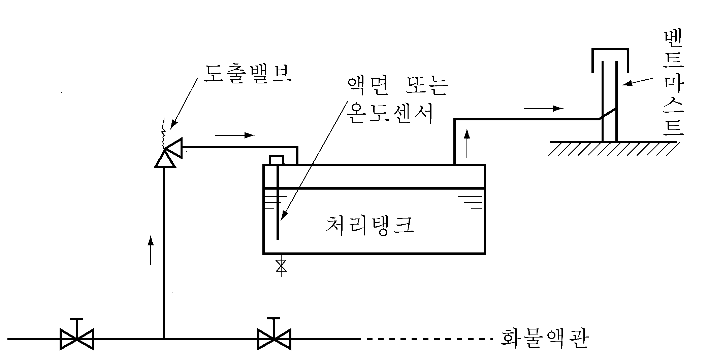
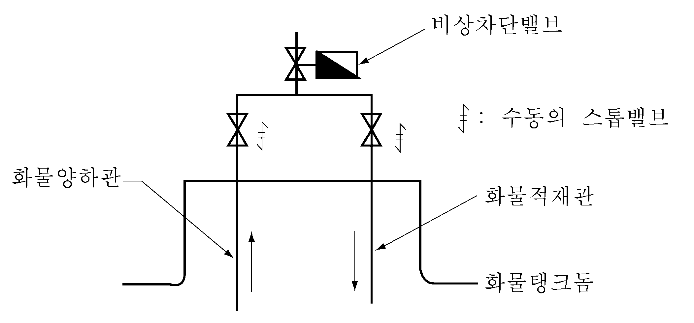
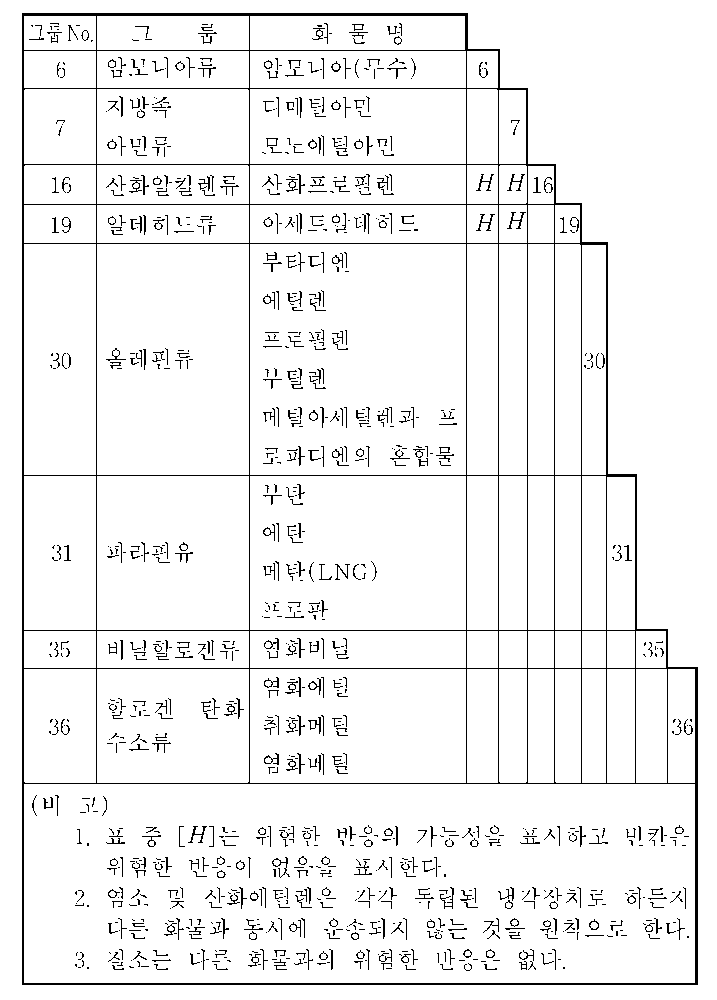
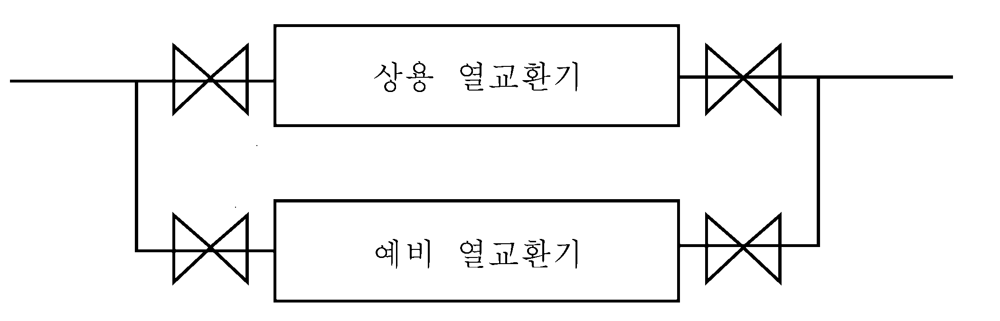
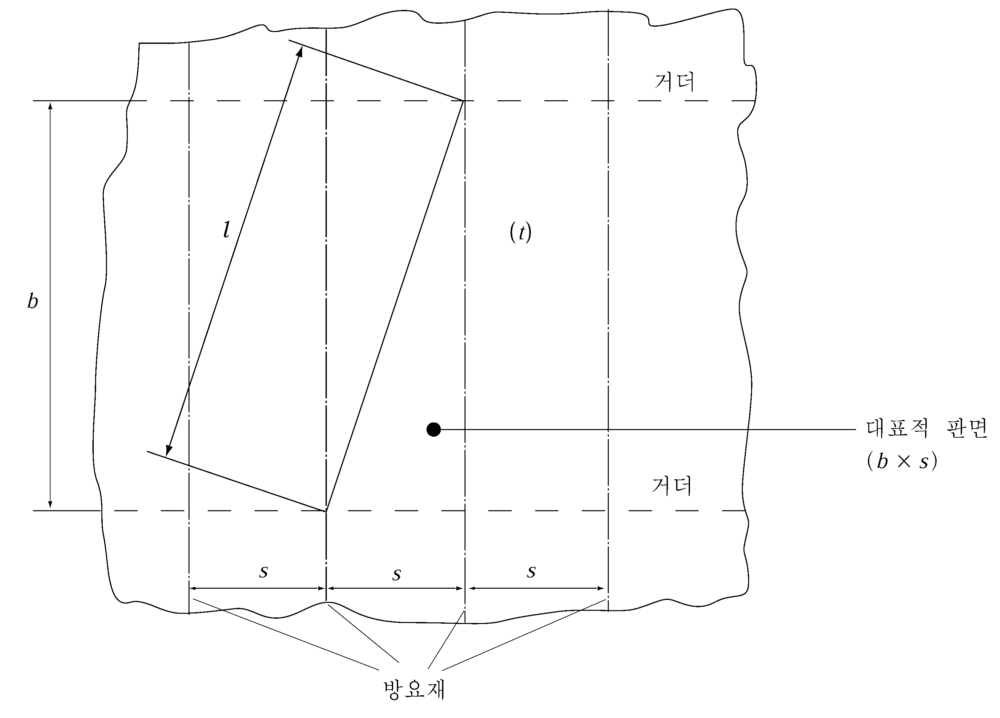
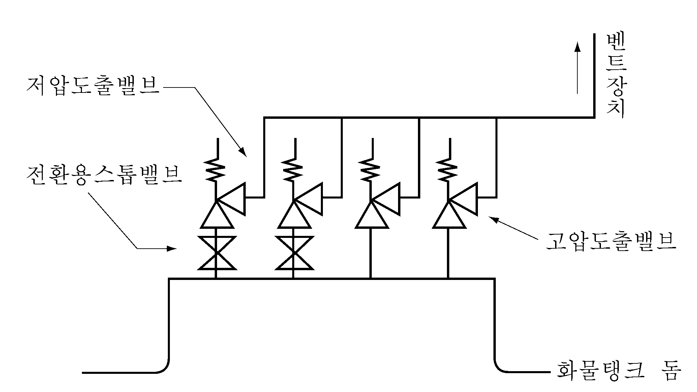
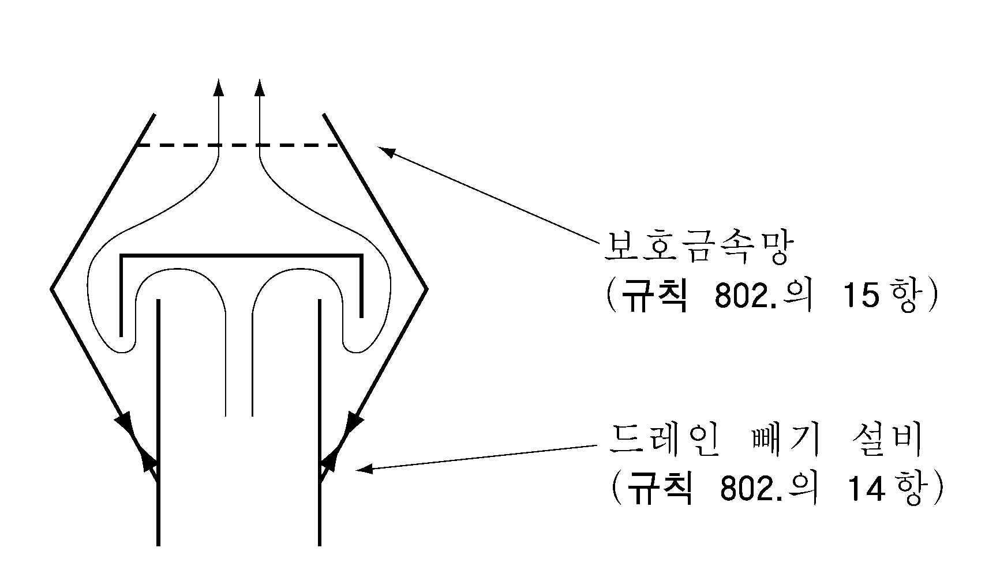
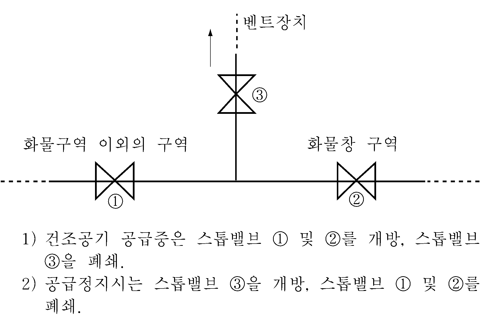
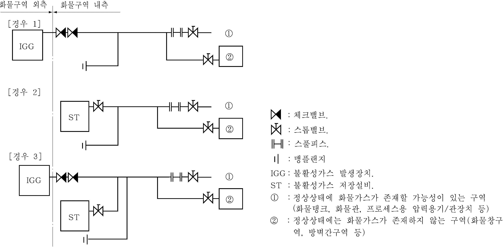
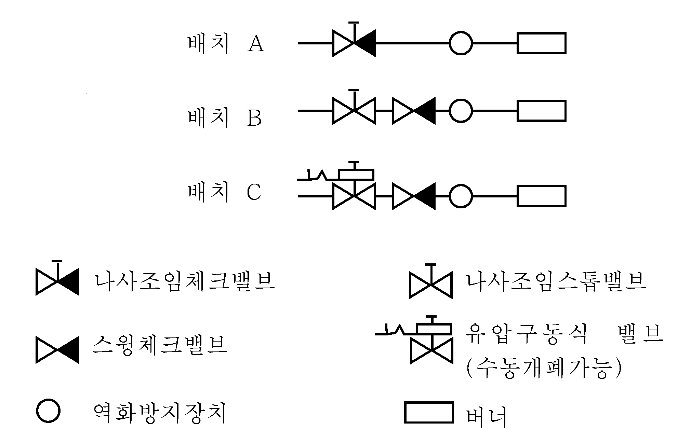

# 제7편 전용선박(5장,6장)

> 선급 및 강선규칙/적용지침 / RA-07B-K / 2025 / KO / Guidance

## 제 5 장 액화가스 산적운반선

### 제 1 절 일반사항

#### 102. 도면승인 【규칙 참조】

**규칙 102.**의 **2**항 (7)호, (8)호 및 (9)호에서 󰡒우리 선급이 필요하다고 인정하는 경우󰡓라 함은 **규칙 5장 413.**의 **4**항 및 **5장 413.**의 **1**항 등에 해당하는 경우를 말한다.

#### 105. 정의

- **1.** **화물지역 【규칙 참조】**
  **규칙 303.**의 **2**항에 의하여 확대된 화물지역은 예를 들면 **그림 7.5.1**에 표시하는 바와 같다.
  
  **그림 7.5.1**
- **2.** **위험구역 【규칙 참조】**
  - **(1)** **규칙 105.**의 **23**항 (7)호에서 규정하는 가스방출원으로부터 󰡒3 $\mathrm{m}$ 이내󰡓라 함은 출구 및 개구 상방에서는 개구단을 중심으로 하는 반지름이 3 $\mathrm{m}$인 구의 내측을 말하며, 하방에서는 반지름이 3 $\mathrm{m}$인 원주(圓柱)의 내측을 말한다.
  - **(2)** **규칙 105.**의 **23**항 (9)호에 규정하는 󰡒노출갑판으로부터 2.4 $\mathrm{m}$ 이내의 구역󰡓은 예를 들면 **그림 7.5.2**의 (a) 부터 (d)에 표시하는 바와 같다.
  - **(3)** **규칙 105.**의 **23**항 (12)호에서 말하는 󰡒직접개구󰡓라 함은 통상 통행에 사용하는 개구로서 문, 덮개판 등으로 덮여지는 해치도 포함한다. 기계반입용 해치등에 볼트조임 덮개판으로 폐쇄된 개구로서 해당구역에 출입하기 위한 다른 개구가 있는 경우에는 여기에서 직접개구로 간주하지 아니한다.
    
    **그림 7.5.2**
- **3.** **화물창구역의 정의 규칙 105.**의 **25**항의 󰡒화물창 구역󰡓정의에 있어서 일체형 탱크의 경우에는 화물탱크의 주위구획을 말한다. (**그림 7.5.3** 참조) **【규칙 참조】**
- **4.** **독립의 정의 규칙 105.**의 **26**항의 󰡒독립󰡓의 정의에서 󰡒기타 장치와의 접속을 가능하게 하는 어떠한 방법󰡓에는 맹판을 설치한 관의 플랜지 단부도 포함한다. **【규칙 참조】**
- **5.** **방벽간 구역의 정의 규칙 105.**의 **28**항의 󰡒방벽간 구역󰡓의 정의에서 일체형 탱크의 경우에는 화물탱크의 주위구획을 말한다. (**그림 7.5.3** 참조) **【규칙 참조】**
  
  **그림 7.5.3**

### 제 2 절 선박의 생존능력 및 화물탱크의 위치

#### 202. 건현 및 복원성

- **1.** **규칙 202.**의 **2**항의 적용시, 열대만재흘수선을 지정하는 선박의 경우 ‘모든 항해 상태’라 함은 열대만재흘수선에 상응하는 적하상태를 포함한다.
- **2.** **고체밸러스트 【규칙 참조】**
  **규칙 202.**의 **4**항의 고체밸러스트는 다음 각호에 따른다.
  - **(1)** 복원성을 확보하기 위하여 고체밸러스트를 배치하는 경우, 고체밸러스트 표면과 화물탱크의 외판과는 어떠한 장소에서도 **규칙 204.**의 **1**항에 따른 거리 $d$ 이상 떨어져 배치하여야 한다.
  - **(2)** 고체밸러스트는 몰타르에 의해 고정된 콘크리트 블록 등 선체구조에 확실하게 고정되어야 한다. 고철 등의 산적은 인정하지 않는다.
- **3.** **규 칙 202.**의 **6**항의 기구가 권고한 성능기준은 다음을 참조한다. **【규칙 참조】**
  - part B, chapter 4, of the International Code on Intact Stability, 2008 (2008 IS Code);
  - the Guidelines for the Approval of Stability Instruments (MSC. 1/Circ.1229), annex, section 4;
  - the technical standards defined in part 1 of the Guidelines for verification of damage stability requirements for tankers (MSC.1/Circ.1461)
- **4.** **규 칙 202.**의 **6**항 (3)호의 “우리 선급이 인정하는 경우”란, 손상 및 비손상 복원성 검증 절차가 승인된 조건에 적합하게 적하되는 것과 동등한 안전 수준을 유지하는 다음의 선박 중 하나를 말한다.
  - **(1)** 모든 형태의 예상 가능한 적하 조건이 **규칙 202**의 **5**항에 따라 선장에게 제공되는 승인된 복원성 자료에 포함되고 전용작업에 사용되는 선박
  - **(2)** 우리 선급이 승인한 방법에 의해 원격으로 복원성 검증이 가능한 선박
  - **(3)** 승인된 적하 조건 범위 안에서 적하되는 선박
  - **(4)** KG/GM을 제한하여 승인함으로써 적용 가능한 모든 손상 및 비손상 복원성 요건을 충족하는 2016년 7월 1일 이전에 건조된 선박
- **5.** **4**항의 승인된 조건은 다음을 참조한다.
  - operational guidance provided in part 2 of the Guidelines for verification of damage stability requirements for tankers (MSC.1/Circ.1461)

#### 203. 손상가정

- **1.** **기타손상 【규칙 참조】**
  **규칙 203.**의 **2**항 (2)호의 경우 **규칙 206.**의 **1**항 (4)호 부터 (6)호 규정 중 손상을 받지 않는다고 가정하는 횡격벽은 국부손상도 받지 않는 것으로 가정할 수 있다.

#### 204. 화물탱크의 위치 【규칙 참조】

- **1.** **규 칙 204.**의 **3**항의 경우 흡입용 웰은 선측외판으로부터 **규칙 204.**의 **1**항에 따른 거리 $d$ 이상 떨어져 설치하여야 한다.

#### 205. 침수의 가상 【규칙 참조】

- **1.** **일반**
  - **(1)** 예측되는 모든 적하상태 중에서 보다 위험한 결과를 가져올 것이 예상되는 상태를 선택하여 **규칙 205.**의 **1**항에 규정하는 계산을 할 경우 다음 각호에 정하는 사항을 고려하여야 한다.
    - **(가)** 가정손상범위내의 화물을 적재하는 화물탱크에 공탱크 및 만재의 사이에서 만재량의 약 25 %씩 증가하여 화물을 적재한 각 상태
    - **(나)** 트림을 고려하여 가장 위험한 결과를 가져올 수 있도록 인접탱크 사이에 화물이 배분 적재된 상태
    - **(다)** 운항 범위내에서 열대건현까지의 흘수. 담수건현은 고려하지 않을 수 있다.
    - **(라)** (다)에 표시하는 여러가지의 흘수상태에서 기관구역 및 화물이 적재되는 화물탱크에 손상을 받을 때의 영향
    - **(마)** 출항 또는 입항상태 중 어느 쪽이든 위험한 결과를 가져올 쪽의 상태
    - **(바)** 운항상태를 망라하는 충분한 수의 트림상태
    - **(사)** 가정손상에 의해 선미트림으로 되는 경우 운항범위 내에서 최대의 선미트림으로 되는 상태
    - **(아)** 가정손상에 의해 선수트림으로 되는 경우 운항 범위내에서 최대의 선수트림으로 되는 상태
  - **(2)** 손상시 복원성 계산에 있어서 비손상 화물탱크의 자유표면영향은 가정손상에 의해 발생하는 실제의 횡경사 및 복원 범위내의 횡경사의 각 각도에 있어서 산출한 것으로 하여야 한다.
  - **(3)** 손상시 복원성 계산에 있어서 비손상 소비성 액체탱크의 자유표면영향은 각각의 종류의 액체에 대하여 적어도 횡방향의 한쪽 편의 탱크 또는 단일의 센터탱크가 자유표면을 가진 것으로 가정하여(이 대상의 탱크 또는 탱크의 조합은 자유표면영향이 최대로 되는 것으로 하고 각 탱크의 중심위치는 탱크 용적의 중심 위치에 있는 것으로 산정한다) 산출한 것으로 할 수 있다. 이 경우 대상탱크 이외의 탱크는 공탱크 또는 만재로 가정하여도 좋으나 각종 액체의 배분상태는 중심 높이가 최대가 되도록 가정하여야 한다.
  - **(4)** (3)호에 정하는 자유표면영향 산출시에는 (2)호에 정하는 바에 따라야 한다.
- **2.** **침수율**
  **규칙 205.**의 **2**항에 정하는 침수율의 적용상 우리 선급은 구획내의 단열재 등의 존재에 따라 보다 작은 침수율을 인정할 수 있다.
- **3.** **횡수밀격벽의 손상**
  **규칙 205.**의 **4**항에 정하는 횡수밀격벽의 손상의 적용상 해당 횡격벽에 계단부 또는 굴절부를 설치한 경우에 손상범위는 예를 들면 **그림 7.5.4**에 표시하는 바에 따른다.
  
  **그림 7.5.4 횡수밀격벽의 손상범위**
- **4.** **평형장치**
  - **(1)** **규칙 205.**의 **6**항에 규정하는 평형장치는 이 장치 사용전과 손상시 선박의 상태에 있어서 용이하게 접근 가능한 장소로부터 작동할 수 있는 것이어야 한다.
  - **(2)** (1)호의 설비를 사용하기 전의 복원성 곡선은 **규칙 205.**의 **3**항의 규정에 따라 결정되어야 하나 수평조정용 교차관(cross-levelling pipes)은 폐쇄되어 있는 상태 또는 이 설비가 유효한 기능이 없다고 가정하여 산출하여야 한다.
  - **(3)** (1)호의 설비에 사용하는 수평조정용 교차관의 단면적은 다음 식에 의하여 산정되는 값을 만족하여야 한다.
    $A \geq 7.5 \frac{V}{\sqrt {H}} (\mathrm{cm} ^{2} )$
    $A$ : 수평조정용 교차관의 단면적($\mathrm{cm} ^{2}$)
    $V$ : 침수구획에 유입되는 것으로 산정하는 양($\mathrm{cm} ^{3}$)
    $H$ : 손상전 흘수선에서 관의 중심선까지의 높이($\mathrm{m}$)
  - **(4)** **규칙 205.**의 **6**항 중 󰡒큰 단면의 덕트󰡓라 함은 다음 식 모두를 만족하는 단면적을 가진 덕트를 말한다.
    $A \geq 150 \frac{V}{\sqrt {H}} (\mathrm{cm} ^{2} )$
    $A \geq 2Sh (\mathrm{cm} ^{2} )$
    $V$ : (3)호에 따른 값.
    $H$ : (3)호에 의한 높이에서 덕트 중심까지의 값.
    $S$ : 늑골간격($\mathrm{cm}$). 다만, 종늑골식의 경우, $S$는 다음 식에 따라도 좋으나 61 $\mathrm{cm}$ 미만이어서는 안 된다.
    $S=45+0.2L _{f} (\mathrm{cm})$
    $h$ : $B$/15 ($\mathrm{cm}$)
- **5.** **침수구획의 확대**
  **규칙 205.**의 **7**항에서 침수가 미치지 않도록 하는 조치는 노출갑판상에서 작동 가능한 스톱밸브를 해당 가정손상 범위 밖의 장소에 설치하는 것으로 할 수 있다.
- **6.** **선루의 부력산입**
  - **(1)** **규칙 205.**의 **8**항의 경우 후부에 배치된 기관실 직상의 선루의 길이 방향의 손상범위는 **규칙 206.**의 **1**항에서 정하는 길이방향의 선측손상 범위와 동일한 것으로 할 수 있다.(**그림 7.5.5** 참조)
    
    **그림 7.5.5 선루의 부력산입**
  - **(2)** **규칙 205.**의 **8**항 (2)호에서 규정하는 슬라이딩 수밀문은 손상시 용이하게 접근 가능한 장소에서 원격조작 할 수 있어야 한다. 또한, 잔존복원력의 최소 범위 내에서의 수몰이 인정되는 풍우밀의 개구는 침수후의 최종 평형상태에 있어서 확실하게 폐쇄 가능한 것이어야 한다.

#### 206. 손상기준 【규칙 참조】

- **1.** **일 반**
  - **(1)** **규칙 206.**의 **1**항에서 정하는 손상기준의 적용상 선수단으로부터 0.3 $L _{f}$ 부근에서 가정하는 손상은 다음에 정하는 바에 따른다.
    - **(가)** 선수로부터 0.3 $L _{f}$의 장소 및 이보다 전방에 적용하는 선저손상범위(**규칙 203.**의 **1**항 (2)호에 따른다)의 경우 손상은 선수단으로부터 0.3 $L _{f}$의 장소보다 후방에 연장하지 않은 것으로 한다.
    - **(나)** 선수단으로부터 0.3 $L _{f}$의 장소보다 후방에 적용하는 선저손상범위(**규칙 203.**의 **1**항 (2)호에 따른다)의 경우 손상범위는 선수로부터 0.3 $L _{f}$ - 1/3$L _{f} ^{ 2/3}$ 또는 0.3 $L _{f}$ - 14.5 $\mathrm{m}$ 중 큰 값의 장소까지 연장하는 것으로 한다. *(2018)*
  - **(2)** **규칙 206.**의 **1**항 (6)호에 규정하는 $L _{f}$가 80 $\mathrm{m}$ 미만의 3 G형 선박의 기관구역의 침수에 대한 생존능력은 다음 각호에 정하는 바에 따른다.
    - **(가)** **규칙 207.**의 **1**항 (1)호 및 (2)호의 규정에 적합하여야 한다.
    - **(나)** $L _{f}$가 70 $\mathrm{m}$ 이상 125 $\mathrm{m}$ 미만의 경우에는 침수후의 최종 평형상태에 있어서 평형상태로부터 적어도 20°의 복원성 범위 내에 복원력 곡선하의 면적은 0.0175 $\mathrm{m}.rad$ 이상이어야 한다.
    - **(다)** $L _{f}$가 70 $\mathrm{m}$ 미만의 경우에는 (나)에서 정하는 복원력 곡선하의 면적은 0.0088 $\mathrm{m}.rad$ 이상이어야 한다.
  - **(3)** (2)호에서 정한 기관구역의 침수에 있어서 기관실 위벽이 수밀구조인 경우에는 선미루의 기관실 주위구획은 예비부력으로 취급할 수 있다. 이 경우 기관실 위벽에 설치하는 문은 선미루 갑판으로부터 원격조작이 가능한 슬라이딩 수밀문으로 하여야 한다.
- **2.** **소형선의 손상기준**
  **규칙 206.**의 **2**항 규정 중 󰡒소형의 선박󰡓이라 함은 $L _{f}$가 70 $\mathrm{m}$ 미만의 선박을 말한다. 특별한 완화조치는 1 G형 선박을 제외하고 다음 각호에 정하는 바에 따를 수 있다.
  - **(1)** 손상범위 및 손상기준에 대하여는 **규칙 203.** 및 **206.**의 **1**항의 해당 각 규정에 따라야 한다.
  - **(2)** **규칙 207.**의 **1**항 (1)호 및 (2)호 규정에 적합하여야 한다.
  - **(3)** 침수후의 최종평형상태에 있어서 평형상태로부터 20°의 복원 범위내의 복원력 곡선하의 면적은 0.0175 $\mathrm{m}.rad$ 이상이어야 한다.
  - **(4)** 잔존복원정의 최대값은 규정하지 않는다.

#### 207. 생존요건 【규칙 참조】

- **1.** **생존요건** ***(2017)***
  - **(1)** **규칙 207.**의 **1**항 (1)호의 경우 다음 각호에 정하는 개구는 수밀 평갑판구로 볼 수 있다.
    - **(가)** 갑판과 동등한 강도의 탱크커버로 보호되어 있는 개구
    - **(나)** 화물격납설비용의 노출갑판의 개구부에 **규칙 8편 3장 201.**의 규정에 따른 불연성 재료 또는 이와 동등 이상의 재료와 충분한 강도를 가진 패킹으로 유효하게 폐쇄된 개구
    - **(다)** 통상의 구조를 갖는 측심관
  - **(2)** **규칙 207.**의 **2**항의 (1)호 적용상 규정의 잔존복원 범위에 있어서 물에 잠김이 인정되는 풍우밀폐쇄개구는 침수후의 최종 평형상태에서 확실히 폐쇄 가능한 것이어야 한다.
  - **(3)** 국제만재흘수선협약(International Convention on Load Lines, ICLL) 19(4)규칙을 만족하는 풍우밀 폐쇄장치가 있다하더라도, 기관실 또는 비상발전기실(복원성계산시 부력으로 고려되었거나 하방으로 통하는 개구를 보호하는 경우에 한함)에 운항상의 이유로 충분한 공기 공급을 위하여 폐쇄장치의 개방이 유지되어야 하는 통풍통은 규칙 **207.**의 **2**항 (1)호의 풍우밀폐쇄할 수 있는 기타 개구에 포함되지 않는다.

### 제 3 절 선체배치

#### 301. 화물지역의 격리 【규칙 참조】

- **1.** **화물창 구역의 격리**
  - **(1)** **규칙 301.**의 **1**항에서󰡒A류 기관구역의 전방󰡓이라 함은 A류 기관구역의 전단벽(계단부 또는 굴절부를 포함한다)보다 전방에 배치하는 것을 말한다.(**그림 7.5.6** 참조)
    
    **그림 7.5.6 화물창 구역의 격리**
  - **(2)** **규칙 301.**의 **1**항에서 A류 기관구역을 화물창 구역의 전방에 배치하는 경우에는 다음 각호에 정하는 바에 따라야 한다. 또한, 해당구역의 배치에 따라서 필요하다고 인정되는 경우 우리 선급은 추가의 요구를 할 수 있다.
    - **(가)** A류 기관구역에 대하여는 **규칙 8편**에 정하는 방화 및 소방에 관한 규정에 따라야 한다.
    - **(나)** **규칙 9편 3장** 및 **8편 2장**부터 **4장**에서 정하는 UMA선박의 기관구역에 관한 규정에 따라야 한다.
  - **(3)** 화물창 구역은 선수격벽의 전방 및 선미격벽의 후방에 배치하여서는 안된다.
- **2.** **완전 또는 부분 2차 방벽을 필요로 하지 않는 경우 화물창 구역의 격리**
  - **(1)** **규칙 301.**의 **2**항에서 󰡒발화원 또는 화재위험이 없는 경우󰡓라 함은 평형수탱크, 청수탱크, 코퍼댐, 연료유탱크, 발화원이 없고 통상시 사람이 없는 화물업무구역, 화물펌프실 및 압축기실 등의 구획을 말한다.
  - **(2)** (1)호에서 말하는 구획중 평형수탱크, 코퍼댐, 연료유탱크와 화물창 구역 사이에 설치되는 맨홀 등의 볼트조임 수밀덮개의 패킹은 불연성 재료가 아닌 경우에도 가능하다.
- **3.** **완전 또는 부분 2차 방벽을 필요로 하는 화물창 구역의 격리**
  **규칙 301.**의 **3**항에서󰡒발화원 또는 화재의 위험이 없는 경우󰡓의 구획이라 함은 **301.**의 **2**항 (1)호에 정하는 구획을 말한다.
- **4.** **화물격납설비의 노출갑판상 개구**
  **규칙 301.**의 **7**항에서 󰡒유효한 폐쇄장치󰡓라 함은 **규칙 4편 2장 102.** 및 **103.**의 규정을 만족하는 설비를 말한다.

#### 302. 거주구역, 업무구역, 기관구역 및 제어장소 【규칙 참조】

- **1.** **2차 방벽을 가진 화물창 구역의 격리**
  **규칙 302.**의 **1**항에서󰡒단층파괴에 의하여 화물창 구역으로부터 해당구역으로 가스가 침입하는 것을 피할 수 있도록 배치󰡓라 함은 해당구역의 주위벽이 화물창 구역과 선접촉 또는 점접촉도 하지 않도록 배치하는 것을 말한다. (**그림 7.5.8** 참조)
  
  **그림 7.5.8 2차 방벽을 가진 화물창 구역의 격리**
- **2.** **공기흡입구 및 개구의 위치**
  - **(1)** **규칙 302.**의 **4**항 (2)호에서 신속하고 유효하게 기밀을 확보할 수 있는 창 및 문이라 함은 패킹붙이 클램핑 장치붙이의 창 및 문을 말하며, **8편 2장 402**의 **2항**에 따라 기밀시험 또는 사수시험을 하여야 한다.
  - **(2)** **규칙 302.**의 **4**항에서 정하는 제한범위내의 조타실에 선회창을 설치하는 경우는 가스밀을 확보하기 위하여 선회창에 추가하여 클램핑 장치붙이의 창을 설치하거나 선회하지 않을 때에 윈도우 글라스를 잠가 가스밀로 할 수 있는 장치로 하여야 한다.
  - **(3)** **규칙 302.**의 **4**항은 **규칙 5장 19절**의 표의 $f$란에 있어서 인화성 가스탐지($F$) 및 독성가스탐지($T$)의 어느 것도 요구되지 않는 화물을 전용으로 운송하는 선박에는 적용하지 않을 수 있다.
  - **(4)** **규칙 302.**의 **4**항의 적용에 있어, 1986년 7월 1일부터 2016년 7월 1일 이전에 건조된 가스운반선의 경우, 발화원이 있는 선수루 구역으로의 출입문은 규칙 **10절**에 따른 위험구역의 밖에 설치되는 조건으로, 화물구역과 면함을 허용할 수 있다. *(2024)*
- **3.** **공기흡입구 및 개구의 폐쇄장치**
  - **(1)** **규칙 302.**의 **6**항의 폐쇄장치는 적절한 가스밀성을 가진 것으로 가스킷/씰이 없는 강재 방화플랩은 인정하지 않는다.
  - **(2)** **규칙 302.**의 **6**항을 적용함에 있어서 **규칙 5장 19절**의 표 $f$란에 독성가스탐지($T$)가 요구되는 화물을 운송하는 경우의 폐쇄장치는 다음 각호에 정하는 바에 따라야 한다.

    |   | **유인구역** | **무인구역** |
    | --- | --- | --- |
    | **독성물질 운반하는 구역** | 내부에 설치 | 내부에 설치하지 않아도 됨 |
    | **독성물질 운반하지 않는 구역** | 내부에 설치하지 않아도 됨 | 내부에 설치하지 않아도 됨 |
    - **(가)** (1)호의 정하는 바에 따라야 한다.
    - **(나)** 개별구역(single spaces) 내에서 작동 가능할 필요 없는 폐쇄장치는 집중배치구역(centralized positions)에 배치할 수 있다. **(표 7.5.1-1** 참조**)** *(2018)*
    - **(다)** **규칙 302.**의 **6**항은 원칙적으로 기관실, 화물기기구역, 전동기실 및 조타기실에 적용하지 않는다. 따라서, 폐쇄장치 요건도 적용할 필요가 없다. *(2017)*
  - **(3)** (2)의 규정에 상관없이, 모든 폐쇄장치는 보호구역 외부에서 작동 가능하여야 한다. (**SOLAS II-2/ 5.2.1.1**) *(2018)*

#### 303. 화물기기구역 및 터릿형 구획 【규칙 참조】

- **1.** **배치**
  - **(1)** **규칙 303.**의 **1**항의 경우 화물기기구역을 화물창 구역의 전후부에 설치하는 경우의 배치는 예를 들면 **그림 7.5.9**에 표시하는 바에 따른다.
    
    **그림 7.5.9 화물기기구역을 화물창 구역의 전후부에 설치하는 경우**
  - **(2)** 화물기기구역을 노출갑판보다 하방에 배치하는 것은 인정하지 않는다.
  - **(3)** **규칙 303.**의 **2**항에 따라 확대되는 화물지역 내의 구획은 다음 각호에 정하는 요건을 만족하는 경우 위험구역으로 보지 않는다(**그림 7.5.10** 참조). 다만, **규칙 303.**의 **3**항에 유의하여야 한다.
    
    **그림 7.5.10 화물지역 내 비위험구역**
    - **(가)** 해당구획에의 통행구 및 공기관은 위험구역에 개구하지 않아야 한다.
    - **(나)** 해당구획이 **규칙 105.**의 **23**항 및 **1001.**의 **1**항에서 정하는 구획에 해당되지 않아야 한다.
  - **(4)** **규칙 303.**의 **3**항은 **규칙 303.**의 **2**항에 따라 화물지역이 확대되지 않는 경우에도 적용한다.
- **2.** **화물펌프 및 화물압축기**
  - **(1)** 정기적으로 수동에 의해 그리스를 주입하는 축봉장치는 **규칙 303.**의 **4**항에서 말하는 󰡒두 구역을 유효하게 가스밀로 분리󰡓가 가능한 설비로 인정하지 않는다.
  - **(2)** **규칙 303.**의 **4**항에서 말하는 화물펌프 및 화물압축기를 구동하는 전동기를 설비한 전동기실의 배치는 예를 들면 **그림 7.5.11** (1)호에 표시하는 바와 같다. 소형선 등에서 부득이한 경우 예를 들면 **그림 7.5.11** (2)호에 표시하는 배치로 하여도 좋으나 체인 로커 등 발화원으로 보는 개구는 해당 전동기실에 배치하여서는 안된다. 다만, 󰡒항시 폐쇄하여야 한다. 다만, 개방하는 경우는 반드시 전동기실을 충분히 환기시킬 것󰡓의 취지를 명시한 주의명판을 붙인 강제수밀 덮개에 의하여 폐쇄되는 경우는 이에 따르지 않는다.
  - **(3)** (2)호에 적합한 전동기실은 비위험구역으로 하여야 한다.
    
    **그림 7.5.11 화물펌프 및 화물압축기를 구동하는 전동기를 설비한 전동기실의 배치**
- **3.** **배출설비**
  **규칙 303.**의 **6**항 중 󰡒배수할 수 있는 적절한 설비󰡓로서 노출갑판상에 배출하는 해당실의 주위벽에 설치한 드레인 플러그는 인정할 수 있다.

#### 304. 화물제어실 【규칙 참조】

- **1.** **배치**
  - **(1)** **규칙 304.**의 **1**항 (3)호에 의하여 󰡒A－60󰡓급 방열이 필요한 장소의 경계는 **그림 7.5.12**에 표시하는 바와 같다. 그림 중 *표시를 붙인 해당화물 제어실의 천정 및 바닥판에도 󰡒A－60󰡓급의 방열을 시공하여야 한다.
    
    **그림 7.5.12 화물제어실의 방열**
  - **(2)** 상기 (1)의 요건은 화물제어실 및 이의 출입구, 공기흡입구 및 개구 이외의 구획(안전설비함, 화물설비함, 기타 구획 등)에도 적용할 수 있다.
- **2.** **발화원의 제거 규칙 304.**의 **3**항의 적용상 화물제어실의 전기설비는 해당실의 설비장소에 따라서 **규칙 1002.**의 규정을 만족하는 것이어야 한다. 해당실에는 **규칙 1201.**의 규정을 만족하는 동력 통풍장치를 설치하여야 한다.

#### 305. 화물지역 내에 있는 구역으로의 출입 【규칙 참조】

- **1.** **단열재 검사를 위한 통행**
  **규칙 305.**의 **2**항에 따라 멤브레인탱크 및 세미 멤브레인탱크 등의 화물창 구역에는 단열재의 1면의 외관검사가 요구되지 않으며 **규칙 305.**의 **3**항의 규정도 적용되지 않는다.
- **2.** **규 칙 305.**의 **3**항 (1)호 (나)에서 최소개구치수는 600$\mathrm{mm}$ x 600$\mathrm{mm}$, 코너 반경 100$\mathrm{mm}$까지 인정할 수 있다. 구조해석의 결과로 개구 주위로 응력을 감소시켜야 하는 경우. 개구의 크기 및 코너 반경을 증가시켜(예를 들어, 최대적정개구 크기가 600$\mathrm{mm}$ x 600$\mathrm{mm}$, 코너 반경 100$\mathrm{mm}$인 개구를 600$\mathrm{mm}$ x 800$\mathrm{mm}$, 코너 반경 300$\mathrm{mm}$로 증가) 응력 경감하는 방법을 인정할 수 있다. *(2017)*
  
  **그림 7.5.13 최소 개구치수**
- **3.** **규 칙 305.**의 **3**항 (1)호 (다)에서의 개구는 다음을 따른다. *(2017)*
  - **(1)** 최소개구치수 600$\mathrm{mm}$ x 800$\mathrm{mm}$의 최대 코너 반경은 300$\mathrm{mm}$이다. 이중저 탱크 내의 거더나 늑판 부위와 같이, 구조 강도상 커다란 개구 설치가 바람직하지 못한 경우, 높이 600$\mathrm{mm}$, 폭 800$\mathrm{mm}$인 개구를 수직구조에서의 접근로로 인정할 수 있다.
  - **(2)** 부상자를 들것으로 쉽게 이송할 수 있음을 증명할 수 있는 경우, 코너 반경 300$\mathrm{mm}$인 600$\mathrm{mm}$ x 800$\mathrm{mm}$ 전통적인 개구 대신에 총 높이가 850$\mathrm{mm}$ 이상인 개구에서 하부가 600$\mathrm{mm}$ 미만일지라도, 개구의 상부의 폭이 600$\mathrm{mm}$ 이상인 850$\mathrm{mm}$ x 620$\mathrm{mm}$인 수직개구를 인정할 수 있다.
    
    **그림 7.5.14 전통적인 개구를 대신할 수 있는 개구치수**
  - **(3)** 바닥으로부터 개구까지의 높이가 600$\mathrm{mm}$를 넘는 경우 발판 및 손잡이가 제공되어야 한다. 이런 배치는 부상자를 쉽게 이송할 수 있음이 증명되어야 한다.
- **4.** **화물창 구역 등의 구역내의 통행**
  - **(1)** **규칙 305.**의 **3**항 (1)호 (나)의 적용상 독립형탱크 형식 C의 통행개구로 노출부에서 직접 출입하는 것에 대하여는 600 $\mathrm{mm}$ 이상의 지름을 가진 원의 개구로 할 수 있다.
  - **(2)** (1)호에 정하는 통행개구로 $L _{f}$가 70 $\mathrm{m}$ 이하의 선박에 있어서 강도상의 이유로 규정의 치수를 가지는 개구를 설치하기가 곤란한 경우는 통행개구의 치수를 500 $\mathrm{mm}$ 이상 지름을 가진 원의 개구 또는 이와 동등의 개구면적을 가진 원의 개구로 할 수 있다. 다만, 부상자를 용이하게 끌어올리고 안전장구를 장비한 상태로 용이하게 출입 가능하여야 한다.
  - **(3)** **규칙 105.**의 **23**항 (4)호에 정하는 화물창구역으로부터 한겹의 가스밀 강재위벽에 의해 격리되어 있는 구역에의 통행은 가스안전장소를 통하지 않고 개방된 노출갑판에서 직접 또는 간접으로 통행하는 것만의 경우, 해당구역내의 통행개구에는 **규칙 305.**의 **3**항 (1)호 (나) 및 (다)의 규정은 적용하지 않을 수 있다.
  - **(4)** (3)호에서 정하는 구획에의 노출갑판으로부터의 통행개구는 가스위험구역에 개구할 수 있다. 이 경우 해당구역에는 **규칙 305.**의 **3**항 (1)호 (나) 및 (다) 규정 이외의 가스위험구역에 대한 규정을 적용하여야 한다.
  - **(5)** **규칙 305.**의 **3**항 (3)호 적용상 노출갑판으로부터 해당구획에의 통행개구는 (4)호에 정하는 바에 따를 수 있다.
- **5.** **가스안전 구획에의 통로**
  **규칙 305.**의 **4**항에서 󰡒개방 노출갑판󰡓이란 화물지역내의 최상층 전통갑판의 노출부를 말한다.

#### 306. 에어로크 【규칙 참조】

- **1.** **기밀문의 배치**
  **규칙 306.**의 **1**항 적용상 에어로크의 문은 필요에 따라 사수시험 또는 우리 선급이 적절하다고 인정하는 다른 방법에 의하여 기밀을 확인한 것이어야 한다.
- **2.** **통풍장치의 설계 및 배치**
  **규칙 306. 2.항**의 “우리선급이 별도로 정하는 지침”이라 함은 **IEC 60092-502:1999** 또는 이와 동등 이상의 표준을 말한다. *(2018)*
- **3.** **보호된 구역에 대한 과압상태의 유지**
  **규칙 306.**의 **4**항 적용상 에어로크로 보호된 구역에 대한 과압상태 감시방법은 해당구역 내에 설치된 차압센서(differential pressure sensing devices)에 의하여야 하나, 다음 각호에 정하는 방법에 따를 수 있다.
  - **(1)** 해당보호구역이 시간당 30회 이상으로 환기되는 경우는 (가) 또는 (나)에 만족하여야 한다.
    - **(가)** 환기용 송풍기를 구동하는 전동기에 급전된 전류값 또는 전력값의 감시
    - **(나)** 환기 덕트내의 풍량의 감시
  - **(2)** 해당보호구역이 시간당 30회 미만으로 환기되는 경우는 (1)호의 (가) 또는 (나)에 부가하여 에어로크 공간을 구성하는 2개의 문이 함께 폐쇄되지 않은 상태에서는 해당보호구역의 전기설비가 무통전상태로 되도록 조치를 취하여야 한다.
- **4.** **통풍장치**
  - **(1)** **규칙 306.**의 **1**항의 에어로크 공간의 송풍기 및 흡입개구는 안전구역에 설치하여야 한다. 이 경우 환기팬의 형식은 **규칙 1201.**의 규정을 만족하지 않은 것으로 할 수 있다. 환기덕트의 외측에는 13 $\mathrm{mm}$ × 13 $\mathrm{mm}$ 메시 이하의 보호망을 설치하여야 한다.
  - **(2)** **규칙 306.**의 **1**항의 에어로크 공간에 대한 가압상태의 확인은 예를 들면 환기팬을 구동하는 전동기의 전류값으로 환기덕트내의 풍량의 감시 또는 압력검지 등에 따른다. 에어로크 공간의 환기회수는 시간당 8회를 표준으로 한다.

#### 307. 빌지, 평형수 및 연료유장치 【규칙 참조】

- **1.** **화물창 구역의 배출설비**
  - **(1)** **규칙 307.**의 **1**항의 화물창 구역의 배출설비는 화물지역 내에 설치된 빌지펌프 및 빌지관장치를 설비하든지 에덕터에 의한 빌지흡입 설비를 하여야 한다.
  - **(2)** **1**항에 의한 에덕터를 설치한 경우 구동수 스톱밸브를 화물지역 후단에 설치하고 구동수관의 지관에는 나사조임 체크밸브를 설치하여야 한다.
  - **(3)** **규칙 307.**의 **1**항의 화물창 구역의 누설탐지장치는 화물창 구역에 불활성화를 하지 않는 경우 **규칙 5편 6장 203.**에 규정된 측심관과 겸용으로 할 수 있다. 이 경우 해당 측심관의 상단에는 자동폐쇄장치를 설치하여야 한다. 화물창 구역을 불활성화 할 경우는 (4)호에서 정하는 바에 따른다.
  - **(4)** **규칙 307.**의 **2**항의 화물창 구역의 배출설비는 (1)호 및 (2)호에 따른다. 화물창 구역의 누설탐지장치는 **규칙 1302.**의 **3**항 (3)호 규정을 만족하는 밀폐식의 누설액면경보장치로 한다.
  - **(5)** 코퍼댐 및 보이드 스페이스에도 이 항의 규정을 적용한다.
- **2.** **방벽간구역의 누설화물 처리설비**
  **규칙 307.**의 **3** 및 **4**항의 누설화물처리설비는 다음 각호에 따른다.
  - **(1)** 부분 2차 방벽이 설치된 경우에는 화물누설 전량이 증발하는 조건에서 설계된 방벽간구역에 있어서도 이 누설화물처리 설비를 설치하여야 한다.
  - **(2)** 완전 2차 방벽이 설치된 경우에는 화물누설량을 산출하지 않는 경우 해당설비의 용량은 **규칙 5편 6장 4절**의 규정을 만족하여야 한다.
  - **(3)** 누설화물처리 설비는 **규칙 307.**의 **2**항에서 규정하는 배수설비의 겸용할 수 있다.
  - **(4)** 누설화물처리 설비의 관장치는 **규칙 5절**의 규정을 만족하여야 한다. 수(水)구동의 에덕터는 이 설비로서 인정되지 않는다.
- **3.** **규 칙 307.**의 **5**항의 “펌프의 벤트는 기관구역 내에 개방하여서는 안된다.”의 요건은 기관구역에 설치된 펌프가 평형수 관장치가 통과하는 건식 덕트킬에 사용되는 경우에만 적용한다.

#### 308. 선수미 하역설비 【규칙 참조】

- **1.** **공기흡입구 및 개구의 배치**
  **규칙 308.**의 **4**항의 적용상 거주구역 등의 공기흡입구 및 개구의 배치는 **그림 7.5.15**의 사선으로 표시된 범위내에 설치하여서는 안된다.
  
  **그림 7.5.15 거주구역 등의 공기흡입구 및 개구의 배치**

### 제 4 절 화물격납설비

#### 402. 적용 【규칙 참조】 (2021)

규칙과 지침의 이 절의 요건은 화물격납설비의 설계, 제작 및 설치와 관련한 모든 사항을 다루는 것은 아니다.

#### 403. 기능적 요건 【규칙 참조】

- **1.** **부식예비두께**
  - **(1)** **규칙 403.**의 **5**항에서 󰡒화물탱크주위에서 불활성화와 같은 환경제어가 없는 경우󰡓의 부식 예비두께는 강의 경우 1 $\mathrm{mm}$로 한다. 알루미늄합금 또는 스테인리스강에 대하여 특히 불순물이 많은 화물, 염소 및 이산화황 등의 부식성 물질을 운송하는 탱크를 제외하고 부식성에 대한 부식 예비두께는 고려하지 않을 수 있다.
- **2.** **환경조건**
  - **(1)** **규칙 403. 2** 의 “북대서양 환경조건 및 관련 장기해상상태 분포도”는 **3편 부록 3-2 II 5**의 파랑자료(**IACS Rec.34 "Standard wave data")**에 따른다. *(2018)*

#### 405. 탱크형식에 따른 2차 방벽 【규칙 참조】

- **1.** **화물탱크 형식과 2차 방벽**
  **규칙 표 7.5.1**의 비고 (2)에서 정하는 세미 멤브레인탱크에 대한 부분 2차 방벽을 인정하는 조건은 다음 각호에 따른다.
  - **(1)** 화물탱크의 상세한 응력해석을 하여야 한다. 설계하중으로서의 파랑하중은 **규칙 414.**의 **1**항에 따라 상세히 추정하여야 한다. 응력해석의 결과는 모델시험 또는 실선의 압력시험 시에 응력계산을 하여 그의 정도를 확인하여야 한다.
  - **(2)** (1)호의 규정에 의한 응력해석의 결과는 **규칙 422.**의 **3**항 (1)호에서 정한 허용응력을 넘지 않아야 한다.
  - **(3)** **422.**의 **1**항 (6)호, (7)호 및 (9)호에서 정하는 바에 따른다.
  - **(4)** 화물탱크는 그 구조방식에 따라서 좌굴해석을 하여 좌굴에 대한 충분한 강도를 가지는 것을 확인하여야 한다.
  - **(5)** 화물탱크의 수리방법을 확립하여야 한다. 또한, 그 수리방법을 적용한 경우의 화물탱크 피로강도 및 균열진전 해석에 관하여 **422.**의 **4**항 (6)호 및 (7)호의 규정을 준용하여 검토하여야 한다.
  - **(6)** 화물탱크에 인접하는 선체구조는 화물탱크와 동등한 강도해석을 하여야 한다. 응력계측 등에 의하여 그 정도가 확인될 수 있는 방법으로 상세응력 해석을 하고 **규칙 418.**을 준용하여 피로강도해석 및 균열진전 해석을 하여 그 강도가 충분함을 확인하여야 한다.

#### 406. 2차 방벽의 설계 【규칙 참조】

- **1.** **2차 방벽의 기준**
  - **(1)** **규칙 406.**의 **2**항의 경우 비금속 재료의 2차 방벽은 다음에 정하는 바에 따른다.
    - **(가)** 화물과의 적합성이 확인되어 있고 대기압에 있어서 화물온도에 따른 필요한 기계적 성질을 가지는 것으로 하여야 한다.
    - **(나)** 우리 선급이 필요하다고 인정한 경우, 이 2차 방벽이 유효한 성능을 가짐을 확인하기 위하여 모델시험을 요구할 수 있다.
    - **(다)** 용접 이음부에 대해서는 시공법시험 및 시공확인시험을 하여야 한다. 이 시험의 방안은 미리 우리 선급의 승인을 받아야 한다.
  - **(2)** **규칙 406.**의 **2**항 (1)호의 경우, 우리 선급이 특별히 필요하다고 인정하는 경우를 제외하고는, 완전 2차 방벽이 누설된 액체화물을 15일간 격납할 수 있음을 확인하기 위한 특별한 해석은 하지 않을 수 있다.
  - **(3)** 원칙적으로, 2차방벽에는 맨홀과 같은 개구가 허용되지 않는다. *(2022)*
- **2.** **2차 방벽의 정기적 검사**
  - **(1)** **규칙 406.**의 **2**항 (4)호의 적용상 적절한 방법에 의해 2차 방벽은 설계에서 요구하는 특정 밀폐수준이 확보됨을 확인하여야 한다.
  - **(2)** 접착식 2차 방벽에 대해서는 선박 건조 시 최초 쿨다운의 실시 전과 후에 밀폐시험이 승인된 설비설계자의 절차 및 허용기준에 따라 수행되어야 한다. 기록된 값은 향후 2차 방벽의 밀폐성을 평가하기 위한 참고 자료로 사용되어야 한다. *(2020)*
    - **(가)** 저차압시험(low differential pressure test)은 허용 가능한 시험으로 인정되지 않는다.
    - **(나)** 만약 설계자의 허용치(threshold values)를 넘을 경우, 조사를 수행하여야 하며, 필요한 경우, 차압시험, 온도기록시험 또는 음향방출시험(acoustic emission test) 과 같은 추가시험이 수행되어야 한다.
  - **(3)** 용접식 금속 2차 방벽의 화물 격납 시스템에서 선박 건조 시 최초 쿨다운 전에 밀폐시험을 하고, 후의 밀폐시험은 요구되지 않는다.
  - **(4)** **규칙 406.**의 **2**항 (4)호의 적용상 2차 방벽의 검사가 육안검사에 의하지 않을 경우의 검사방법은 다음의 규정에 따른다.
    - **(가)** 2차 방벽의 검사방법 및 판정기준과 2차 방벽으로서의 성능관련에 대한 모델시험 등으로 유효성을 확인한다.
    - **(나)** 2차 방벽에 대하여 요구되는 성능은 모델시험을 통하여 검증되어야 한다. 이 모델시험은 이 2차 방벽이 선박의 일생동안 필요한 성능을 유지할 수 있는지를 확인될 수 있어야 한다.
    - **(다)** (가) 및 (나)에 관하여 유효성 및 신뢰성을 나타낸 충분한 자료가 제출되어 이것이 적절하다고 인정될 경우 이 모델시험을 생략할 수 있다.
- **3.** **선체구조의 열응력 해석**
  - **(1)** **규칙 406.**의 **1**항 (2)호의 적용상 **규칙 419.**의 **1**항의 규정에서 정하는 화물누설시의 계산조건에 대하여 열응력 해석을 하여야 한다.
  - **(2)** (1)호의 해석에서 얻은 결과는 **규칙 403.**에서 규정하는 정하중에서 생기는 정적응력과의 합이 최대 1차막응력 또는 최대 굽힘응력은 재료의 항복응력의 90 %를 넘지 않아야 한다.
  - **(3)** 동일의 설계온도 및 하중조건과 유사한 설계의 선체구조에 있어서 열응력이 충분히 적다고 확인될 경우 우리 선급은 (1)호에서 정하는 해석을 생략할 수 있다.

#### 407. 부분 2차 방벽과 1차 방벽의 소규모 누설에 대한 보호장치 【규칙 참조】

- **1.** **부분 2차 방벽**
  - **(1)** 누설화물로부터 내저판의 보호는 다음의 규정에 따른다.
    - **(가)** **규칙 406.**의 **1**항의 규정에 따라 내저판을 2차 방벽으로 한다.
    - **(나)** 드립 트레이(drip tray) 등을 설치하여 2차 방벽으로 하는 경우 예를 들어 **그림 7.5.16**과 같이 누설액화물이 2차 방벽으로부터 새어나오지 않도록 하는 조치가 되어있는 경우는 보호할 필요는 없으나 이와 같은 조치가 되어있지 않은 경우는 내저판을 단열재 등으로 보호하여야 한다.
  - **(2)** **규칙 407.**의 **1**항에 규정한 스프레이 실드는 그 기능이 시험에 의하여 확인되어야 한다.
    
    **그림 7.5.16 내저판을 보호하기 위한 드립 트레이(drip Tray)**

#### 410. 단열재 【규칙 참조】

- **1.** **일반**
  냉각식 화물탱크와 지지대 금속부와의 사이에는, 지지대를 통하여 선체구조 부재가 과도하게 냉각되지 않도록 **규칙 419.**의 **1**항의 요건에 따른 적합한 단열재를 설치하여야 한다.

#### 413. 기능하중

- **1.** **열로 인한 하중 【규칙 참조】**
  - **(1)** **규칙 413.**의 **4**항 (1)호의 경우 탱크구조에 과대한 열응력이 발생하지 않도록 쿨링다운을 위한 장치를 설치해야 한다. (*2019*)
  - **(2)** (1)호에서 규정한 장치는 쿨링다운 실적이 있는 유사한 설계의 화물탱크로서 안전성이 입증되었든지 또는 쿨링다운 작업이 열응력 해석을 통하여 입증된 안전온도강하곡선을 상회하지 않는 속도에서 수행되어야 한다.
  - **(3)** (1)호에 나타낸 장치는 화물적재시 뿐 아니라 평형수적재 항해중의 황천 항해시, 화물탱크의 잔류 화물의 출렁임(splash)에 의하여 과도한 열응력이 생길 가능성이 있을 경우에는 쿨링다운을 수행할 수 있어야 한다.
  - **(4)** **규칙 413.**의 **4**항 (2)호의 경우 일반적으로 설계온도가 －10°C 이상인 화물탱크에는 열응력 해석을 하지 않아도 좋다. 설계온도가 －55°C 보다 낮은 화물탱크에 있어서는 쿨링다운시 및 화물의 부분적재시의 상하방향의 온도분포 및 필요한 경우 화물만재 상태에 있어서 화물탱크판의 판두께 방향의 온도분포를 고려하여 열응력 해석을 하여 강도를 확인하여야 한다.
  - **(5)** (4)호에서 정하는 화물탱크에 대하여서는 우리 선급은 지지구조의 방식이 특수한 경우에는 지지구조에 의한 화물탱크 구속조건을 고려한 화물탱크의 열응력 해석을 또한, 열팽창 계수가 다른 재료를 사용하는 경우에는 그 영향을 고려한 열응력 해석을 요구할 수 있다.
  - **(6)** (4)호 및 (5)호에서 지지구조의 방식이 특수한 경우 우리 선급은 지지구조 자신의 열응력 해석을 요구할 수 있다.
- **2.** **정적 횡경사 하중 【규칙 참조】**
  - **(1)** **규칙 413.**의 **9**항의 경우 선체의 손상 또는 침수에 의한 부가하중을 고려하지 않아도 좋다.

#### 414. 환경하중

- **1.** **슬로싱 하중 【규칙 참조】**
  - **(1)** **규칙 414.**의 **3**항의 경우 슬로싱 하중은 화물탱크의 방식에 따른 모형실험에 의한 검토를 한 것으로 한다. 화물을 반적재 할 계획이 있는 화물탱크에는 선체동요주기와 액체의 고유주기의 동조를 피하기 위해서 이들에 관한 자료를 본선에 비치하여야 한다.
  - **(2)** (1)호에 관계없이 $L _{f}$가 90 $\mathrm{m}$ 미만의 선박으로서 독립형탱크 형식C에 있어서는 특별히 슬로싱 하중에 의한 화물탱크의 구조강도에 대하여 고려하여야 할 필요는 없으나 화물을 반적재 할 계획이 있는 화물탱크에는 탱크내의 화물관장치, 화물펌프 등의 설치에 관해서 슬로싱에 의한 충격압을 충분히 주의하여야 한다.

#### 418. 설계조건

- **1.** **피로설계조건 【규칙 참조】**
  - **(1)** **규칙 418.**의 **2**항의 경우 피로하중에 의한 응력은 원칙적으로 각종의 변동응력 중 지배적인 것에 대하여 **그림 7.5.17**의 누적빈도 곡선으로부터 구하여야 한다.
    
    **그림 7.5.17 누적빈도곡선**
  - **(2)** (1)호에서 나타낸 동적빈도 분포를 사용하여 **규칙 422.**의 **2**항 규정에 정한 피로강도해석을 행할 때 사용하는 대표응력($\sigma _{i}$)의 수는 8점으로 하여 $\sigma _{i}$ 및 그 반복수 $n _{i}$는 일반적으로 다음 산식에 따를 수 있다.
    $\sigma i = \frac{17-2 \cdot i}{16} \sigma \max\#
    n i =0.9 \times 10 i$
    다만, $i$ = 1, 2, 3,......, 8
    $\sigma _{ma x}$ : 하중최대 기대값에 의해서 발생되는 응력(반폭).
  - **(3)** **규칙 418.**의 **2**항 (6)호 (다)의 경우 피로균열 진전속도의 산정에 사용하는 피로하중은 원칙적으로 규정하는 항해구역의 가장 가혹한 기간에 일어날 수 있는 하중의 최대 기대값을 사용하여야 한다. **규칙 그림 7.5.13**의 하중 빈도분포를 사용하여 해석을 할 경우 대표응력($\sigma _{i}$)의 수는 5점으로 하여 $\sigma _{i}$ 및 그의 반복수 $n _{i}$은 다음 식에 따를 수 있다.
    $\sigma i = \frac{5.5-i}{5.3} \sigma m ax\#
    ni =1.8 \times 10i$
    다만, $i$ = 1, 2, 3,......, 5
    $\sigma _{ma x}$ : 하중최대 기대값에서 발생되는 응력.
  - **(4)** **규칙 418.**의 **2**항 (7)호에서 󰡒특정항로에 종사하는 선박󰡓이란 선급부호에 󰡒연해구역󰡓 또는 󰡒평수구역󰡓으로 등록된 선박을 말한다. 이 경우 항해구역에 있어서 우리 선급이 적절하다고 인정하는 해상자료에 따라 행한 선체운동 계산의 결과에 의해서 동적하중을 결정할 수 있다.

#### 419. 재료 【규칙 참조】

- **1.** **선체온도분포의 계산**
  **규칙 419.**의 **1**항 (1)의 경우 선체구조의 온도를 산출하는 경우의 계산조건은 다음에 정하는 바에 따른다.
  - **(1)** 계산의 대상으로 하는 선박의 상태는 계획만재 흘수의 정립상태로 하여야 한다.
  - **(2)** 계산의 대상으로 하는 화물탱크의 손상은 다음에 따른다. 다만, 일체형탱크 및 독립형탱크 형식C에 관한 화물탱크의 손상은 고려하지 않아도 좋다.
    - **(가)** 화물탱크는 선체의 횡방향 수밀격벽간에 있는 모든 화물탱크가 손상한 것으로 한다. 다만, 선체의 횡단면이 선체의 종통격벽에 의해 2개 이상의 구획으로 분할된 경우 각각의 구획내의 모든 화물탱크가 손상한 것으로 가정한다.
    - **(나)** 화물탱크의 손상개소는 예상되는 모든 부분을 포함한다.
    - **(다)** 화물탱크의 손상시는 화물액만 누설유출하는 것으로 보고 화물탱크 지지구조 및 설치물 등이 변형 또는 파괴되지 않은 것을 가정한다.
    - **(라)** 완전 2차 방벽이 요구될 경우, 화물의 누설은 순식간에 일어나고 화물창 구역 내로 누설된 액체의 액위는 손상된 화물탱크내의 잔류 화물과 곧바로 동일한 액위에 이르는 것으로 가정한다.
  - **(3)** 계산모델의 경계조건은 다음에 따른다.
    - **(가)** 화물창구역에 인접하는 구획의 온도는 열전달계산에 의하여 결정한 것으로 한다. 화물창구역에 인접하는 구획에 바로 인접하는 구획의 온도는 0°C의 정지기체로 생각할 수 있으며, 또한 기관실의 경우 5°C의 정지기체로 할 수 있다.
    - **(나)** 햇빛의 복사는 없는 것으로 한다.
    - **(다)** 외기 및 해수는 각각 5°C의 정지대기 및 0°C의 정지해수로 가정한다.
    - **(라)** 단열재, 지지구조 등의 화물창구역내의 구조물은 화물액을 흡입하지 않는 것으로 가정한다.
    - **(마)** 화물창구역 이외의 기체가 존재하는 구획 내에는 자연대류가 되고 있는 것으로 가정한다.
    - **(바)** 동구획내의 기체 및 액체는 동일온도로 가정한다.
    - **(사)** 화물탱크의 손상시에 있어서 화물탱크내 기상부와 화물창구역내 기상부의 압력은 대기압과 동등하다고 가정한다.
    - **(아)** 단열재 내부의 기체이동은 없는 것으로 가정한다.
    - **(자)** 습기의 영향은 없는 것으로 가정한다.
    - **(차)** 화물탱크 손상상태시 2차 방벽의 온도는 대기압에 있어서의 화물온도로 하고 정상상태의 화물탱크는 그 설계온도로 가정한다. 또한, 화물탱크 손상상태에 있어서도 선체는 정립상태를 유지하는 것으로 가정할 수 있다.
    - **(카)** 도장의 영향은 없는 것으로 가정한다.
  - **(4)** 열전달계산의 계산조건은 다음에 따른다.

    | 경계벽 | 열전달율 ($\mathrm{W}/m ^{2} \cdot °C$) |
    | --- | --- |
    | 정지기체 ← → 선체 또는 액체 | 5.8 |
    | 정지해수 ← → 선체 | 116.3 |
    | 화물증기 ← → 공기에 접한 선체 | 11.6 |
    - **(가)** 온도분포 및 전열은 정상상태에서 취급하고 과도상태는 고려하지 않아도 좋다.
    - **(나)** 해수는 밀도 1,025 $\mathrm{kg}/m ^{3}$ 및 응고점 －2.5°C로 하는 이외에는 청수와 같은 성질로 가정한다.
    - **(다)** 화물액은 균일온도로 가정한다.
    - **(라)** 각종 경계벽의 열전달율은 **표 7.5.1**에 나타낸 치수를 사용하여 계산할 수 있으나 보통 공표된 전열공학 자료의 실험식을 기본으로 하여 계산할 수 있으며 이 경우 복사에 의한 열전달도 고려하여야 한다.
    - **(마)** 온도분포 검토대상의 물체는 일반적으로 방향성이 없는 균질의 것으로 가정한다.
    - **(바)** 휨보강재는 핀(fin)으로 취급할 수 있다.
    - **(사)** 검토대상의 화물창구역의 전후 화물창구역이 동일 조건하에 있는 경우 2차원 문제로 취급할 수 있다.
    - **(아)** 화물액의 증발잠열에서 냉각은 고려하지 않아도 좋다.
    - **(자)** 각 단열판재 온도는 판두께 중앙의 온도로서 표시하고 각각의 부재에 대해서는 다음에 따른다.
      - **(a)** 판에 부착된 2차 휨보강재의 온도는 판의 온도와 같지만 2차 휨보강재의 깊이방향의 온도분포가 구분되어 있는 경우는 그 온도분포 면적 평균으로 할 수 있다.
      - **(b)** 판 또는 2차 휨보강재를 지지하는 1차 휨보강재의 온도는 웨브에 대해서는 깊이의 중앙에서의 온도 또한 부재에 대해서는 면재의 온도로 한다.
      - **(c)** 내각과 외각을 접속하는 부재 예를 들면 브래킷과 거더 등의 온도는 내각온도와 외각온도의 평균으로 한다.
      - **(d)** 브래킷에 대해서는 브래킷의 면적중심에 대한 온도로 한다.
- **2.** **선체구조용 재료**
  - **(1)** **규칙 419.**의 **1**항 (3)호에서 좌굴방지를 위하여 설치하는 브래킷, 거더 등의 웨브보강재 및 트리핑 브래킷과 독킹 브래킷은 **규칙 419.**의 **1**항 (3)호의 요건을 적용하지 않는다.
  - **(2)** (1)호에 관계없이 상기의 부재중 종강도 부재 및 디프탱크, 수밀격벽의 휨보강재로 되는 것은 규정의 적용대상으로 한다.
- **3.** **가열수단** ***(2019)***
  - **(1)** **규칙 419. 1**항 (6) (가)에서 언급된 가열설비는 장치의 어느 한 부분에서 기계적 또는 전기적으로 단일의 고장이 발생했을 경우에도 이론적으로 필요한 열량을 100% 이상 공급할 수 있어야 한다.
  - **(2)** 가열기, 글리콜 순환 펌프, 전기 제어반, 보조 보일러 등의 장치 구성품들의 이중화에 의해 (1)호의 요건들이 만족되는 경우, 최소 하나 이상 시스템의 모든 전기 부품들에 비상전원으로부터 전원이 공급되어야 한다.
  - **(3)** 기름보일러와 같이 주열원의 이중화가 불가능한 경우, 비상배전반에서 별도의 개별회로로 배치하여 이론적으로 필요한 열량의 100%를 공급할 수 있는 전기가열기 등을 대안으로 설치할 수 있다. 우리 선급이 인정하는 경우, 적절한 위험 평가를 통하여 **규칙 419. 1**항 (6) (가)의 요건을 충족시키기 위한 다른 대안을 고려할 수 있다. (2)호의 요건은 장치의 다른 모든 전기 구성품에도 적용된다.
- **4.** **단열재료**
  - **(1)** **규칙 419.**의 **3**항 (1)호의 단열재는 단열구조가 실제 생긴 강제변형 및 열신축을 받은 상태에 대해서도 단열성능을 저하시키는 유해한 결함이 발생하지 않도록 한다.
  - **(2)** (1)호에 정한 성능은 필요에 따라 **8**항에 규정한 단열재시공법 시험에서 확인하여야 한다.
- **5.** **단열재의 보호**
  **규칙 419.**의 **3**항 (4)호에서 규정하는 단열재는 다음 각호에 따라서 보호된 것으로 한다.
  - **(1)** 화물창구역내 및 탱크덮개내에 설치하는 방열재에 대하여는 특별히 필요하다고 인정하는 경우를 제외하고 화재에 대한 보호 및 기계적 손상에 대하여 보호하지 않아도 좋다. 다만, 코팅 또는 알루미늄 호일 등에 의하여 표면처리된 것으로 하여야 한다.
  - **(2)** 노출부에 설치된 방열재는 아연철판 등으로 보호되거나 **규칙 8편 3장 201.**의 규정에 정한 불연성의 단열재이어야 한다. 우리 선급이 필요하다고 인정한 경우 기계적 손상에 대하여 보호하고 적절한 강재피복을 시공할 것을 요구할 수 있다.
  - **(3)** 단열재 표면의 코팅 재료는 **규칙 8편 4장 1절**의 규정 혹은 이것과 동등 이상의 것으로 하여야 한다.
- **6.** **단열재료의 특성**
  - **(1)** **규칙 419.**의 **3**항 (2)호에서 규정하는 단열재료의 특성은 일반적으로 **표 7.5.4**에 주어진 시험에 의하여 검증되어야 한다.
  - **(2)** (1)호에 정하는 것 이외의 단열방식에 대해서 우리 선급은 추가의 특성확인시험을 요구할 수 있다.
  - **(3)** (1)호에 정한 방열재 특성의 확인시험에서 별도로 정하는 승인요령에 따라 승인된 단열재에 대하여는 이미 우리 선급에 의해 성능이 확인되어 그 성능이 목적을 위하여 충분히 인식된 경우에는 해당 항목의 시험을 생략할 수 있다.
  - **(4)** (1)호 내지 (3)호에 해당되지 않는 단열재에 대하여는 다음에 따른다.
    - **(가)** 독립형탱크의 지지재에 사용되는 단열재에 대하여는 **표 7.5.3**의 멤브레인, 세미 멤브레인탱크의 란을 적용하여야 한다.
    - **(나)** **규칙 410.**의 규정에 따라 단열재의 설치가 요구되지 않는 화물탱크에 설치하는 단열재에 대하여는 단열방식에 따라서 **규칙 419.**의 **3**항 (2)호에서 규정하는 특성 중 필요한 특성에 대한 자료를 우리 선급에 제출하여야 한다.
  - **(5)** **규칙 419.**의 **3**항 (2)호에서 정하는 특성에 대한 시험방법은 **표 7.5.4** 또는 우리 선급이 적절하다고 인정하는 시험방법을 따른다.
- **7.** 저온구역에 설치되는 의장품에 대한 저온강의 적용은 **표 7.5.2**에 따른다.

  | ~와 용접되는 경우 해당 의장품 |   | 1차 방벽 | 2차방벽 및 방벽간 구역 | 2차 방벽 이면구역 | 그 외 구역 |
  | --- | --- | --- | --- | --- | --- |
  | 패드 |   | 저온강 | 저온강 | NA | NA |
  | 의장품 | 패드가 없는 의장품 | 저온강 | 저온강 | NA | NA |
  | 의장품 | 패드가 있는 의장품 | 저온강 | NA | NA | NA |
  | 창구, 맨홀 (덮개, 코밍 포함, 피팅류 제외) |   | 저온강 | 저온강 | NA | NA |

  | No. | 확인항목 |   | 일체형탱크 | 멤브레인,세미멤브레인탱크${} ^{3)}$ | 독립형 탱크 형식 A/B | 독립형 탱크형식 C | 비고 |
  | --- | --- | --- | --- | --- | --- | --- | --- |
  | 1 | 화물과의 적합성 |   |   | ○${} ^{1)}$ | ○${} ^{1)}$ |   |   |
  | 2 | 화물에 의한 용해성 |   |   | ○${} ^{1)}$ | ○${} ^{1)}$ |   |   |
  | 3 | 화물의 흡수성 |   | □ | ○${} ^{1)}$ | ○${} ^{1)}$ |   |   |
  | 4 | 수축성 |   |   | ○${} ^{1)}$ | ○${} ^{1)}$ |   |   |
  | 5 | 시효성 |   | □ | ○ | ○${} ^{1)}$ | □ |   |
  | 6 | 독립기포율 |   | △ | △ | △ | △ | 독립기포재료만 대상 |
  | 7 | 밀도 |   | ○ | ○ | ○ | ○ |   |
  | 8 | 기계적성질 | 굽힘강도 | ○ | ○ | ○ | ○ |   |
  | 8 | 기계적성질 | 압축강도 |   | ○ |   |   |   |
  | 8 | 기계적성질 | 인장강도 | ○ | ○ | ○ | ○ |   |
  | 8 | 기계적성질 | 전단강도 | ○ | ○ |   |   |   |
  | 9 | 기계적성질 | 열팽창성 | □ | ○ | ○${} ^{2)}$ | ○${} ^{2)}$ |   |
  | 10 | 마모성 |   |   | ○ |   |   |   |
  | 11 | 결합성 |   | □ | △ | △${} ^{1)}$ | □ | 접착 사용된 재료를 대상 |
  | 12 | 열전도율 |   | ○ | ○ | ○ | ○ |   |
  | 13 | 진동에 대한 저항 |   | △ | △ | △${} ^{1)}$ |   | **규칙 419.**의 **3**항 (7)호도 고려할 것 |
  | 14 | 불과 화염에 대한 저항 |   | ○ | ○ | ○ | ○ |   |
  | 15 | 피로파괴 및 균열 전파에 대한 저항 |   |   | △ |   |   |   |
  | (비고) ○ 표는 확인시험을 하여 특성을 확인할 필요가 있는 항목. △ 표는 재료의 종류에 따라서 확인시험을 할 필요가 있는 항목. □ 표는 특성에 관한 자료를 준비하여 두는 것이 바람직한 항목. (주) 1) 단열재가 **규칙 407.**의 **1**항에서 규정하는 스프레이 실드로 된 경우는 필요로 한다. 기타 경우에는 이 특성에 관한 자료를 준비하여 둔다. 2) 화물탱크의 설계온도가 －10°C보다 높은 경우는 일반적으로 필요하지 않다. 3) 피로강도 특성에 대해서도 확인할 필요가 있다. |   |   |   |   |   |   |   |

  | 시험항목 | 시험방법 |
  | --- | --- |
  | 1. 화물과의 적합성 | 화물에 침적후, 인장, 압축, 전단 및 굽힘시험 (DIN 53428) |
  | 2. 화물에 의한 용해성 | 화물에 침적전후, 시험편 치수 및 중량의 변화 (DIN 53428) |
  | 3. 화물의 흡수성 | 화물에 침적전후, 시험편의 중량비교 또는 흡수성 시험 (DIN 53428) |
  | 4. 수축성 | ISO 2796, ASTM D 2126 |
  | 5. 시효성 | - |
  | 6. 독립기포율 | ISO 4590, ASTM D 6226 |
  | 7. 밀도 | ISO 845, ASTM D 1622 |
  | 8. 기계적 성질 | 굽힘강도(ISO 1209, ASTM C 203, D 790), 압축강도(ASTM D 695, D 1621), 인장강도(ISO 1926, ASTM D 638, D 1623), 전단강도(ISO 1922, ASTM C 273) |
  | 9. 열팽창성 | ASTM D 696, E 831 |
  | 10. 마모성 | - |
  | 11. 결합성 | ASTM D 1623 |
  | 12. 열전도율 | ISO 8302, KS L 9016, ASTM C 177, C 518 |
  | 13. 진동에 대한 저항 | ISO 10055 |
  | 14. 화재 및 화염에 대한 저항 | DIN 4102 |
  | 15. 피로파괴 및 균열 전파에 대한 저항 | - |
- **8.** **단열재의 품질관리**
  단열재료의 제조, 저장, 취급, 조립, 품질관리 및 햇빛에 노출됨에 따른 영향에 대한 관리방법은 다음 각호에 정하는 것을 따른다.
  - **(1)** 단열재는 별도로 정한 승인요령에 따라서 승인을 받아야 한다. 이때 제조소에서 제조, 저장, 취급, 품질관리에 대해서 정해진 방법에 따라 시험검사를 한다.
  - **(2)** 단열시공에 관한 검사는 다음에 정하는 시험 및 검사를 하여야 한다.
    실적이 없는 단열방식 및 시공방법에 대해서 본 선급의 승인을 얻은 방안에 따라 시공법 확인을 위한 시험을 한다. 이 시험은 필요에 따라서 단열재 제조소 또는 조선소에서 하여야 한다.
    우리 선급의 승인을 득한 방안에 따라 단열시공중의 작업관리, 작업환경관리 및 품질관리 상황을 확인하기 위한 시험을 하여야 한다.
    단열시공후 치수 모양, 외관 등에 대해서 미리 우리 선급의 승인을 받은 시공요령에 따라 검사를 하고 또한 **규칙 420.**의 **3**항 (5)호에서 정하는 시험에 대하여도 단열성능을 확인하여야 한다.
    - **(가)** 단열시공법 시험
    - **(나)** 단열시공확인 시험
    - **(다)** 완성검사
- **9.** **1차 및 2차 방벽의 재료**
  - **(1)** 고망간강을 화물 탱크에 사용하는 경우에는 **부록 7A-4**에 따른다. *(2023)*

#### 420. 제작 【규칙 참조】

- **1.** **독립형탱크**
  - **(1)** **규칙 420.**의 **1**항 (1)호의 경우 화물탱크판과 돔의 연결부에 대해서 인정된 완전용입형의 필릿이음 용접은 화물탱크 형식에 따라서 다음 각호에 따라야 한다.
    - **(가)** 독립형탱크 형식A의 경우 비파괴검사 방법이 확립되어 있어야 한다.
    - **(나)** 독립형탱크 형식B 및 C의 경우 제안된 구조에 대해서 충분한 실적이 있거나 피로강도해석을 하여 충분한 피로강도를 가진 것이 인정되고 또한 비파괴검사 방법이 확립되어 있어야 한다.
  - **(2)** **규칙 420.**의 **1**항 (1)호에서 󰡒돔에 설치되는 작은 관통부󰡓라 함은 최대허용 설정압력이 0.07 $\mathrm{MPa}$ 이하의 화물탱크의 경우에 있어서 돔에 비하여 매우 작은 통상의 화물관 또는 이와 동등한 크기인 기타 관통부를 말한다.
  - **(3)** **규칙 420.**의 **1**항 (1)호는 주로 평판으로 제작한 독립형 탱크 형식A 혹은 B에 적용한다. 이는 탱크 표면과 정렬한 굽힘판을 면내 용접으로 연결한 탱크 코너를 포함한다.
    - **(가)** 탱크판과 돔의 연결부는 다음과 같다.
      - **(a)** 코너 용접은 주요 탱크판 건조에 사용하면 안된다. 즉 탱크 측면(호퍼 또는 탑사이드와 평행한 경사판 표면)과 탱크 바닥 또는 상단사이의 코너, 탱크 끝 횡격벽과 탱크 바닥, 상단 또는 측면(있는 경우 경사면 표면 포함)과 코너부에 사용하면 안된다. 대안으로, 탱크 표면과 정렬된 굽힘판을 면내 용접으로 연결한 탱크 코너부를 사용하여야 한다.
      - **(b)** T용접은 흡입웰(suction well), 섬프(sump), 돔(dome)과 같은 판의 국부적 구조에 사용할 수 있다. 이 경우에 T용접은 완전용입용접으로 수행하여야 한다.
  - **(4)** (2)호에 정하는 관통부의 용접에 대하여는 완전용입형 용접으로 하지 않아도 좋으나 적절한 V형 홈을 가져야 한다. 이 경우 바깥지름이 100 $\mathrm{mm}$ 이상의 관통부에 대하여서 전 용접선에 대하여 바깥지름이 100 $\mathrm{mm}$ 미만의 관통부에 대하여는 적절히 선정하여 비파괴검사를 하여야 한다.
  - **(5)** **규칙 420.**의 **1**항 (2)호는 중심선 격벽을 가지며 주로 곡면으로 구성된 바이로브(bi-lobe) 탱크를 포함한 독립형 C형 탱크에 적용한다. 그밖의 용접부 개선은 다음에 따른다.
    
    - **(가)** 중심선 격벽이 있는 바이로브(bi-lobe) 탱크의 십자형 완전 용입 용접부에는 승인된 용접절차 시방서에 따른 탱크 중심선 용접부개선이 인정될 수 있다.
  - **(6)** **규칙 420.**의 **1**항 (2)호 (가)에서 󰡒우리 선급이 인정한 경우󰡓라 함은 최대허용 설정압력이 1.0 $\mathrm{MPa}$ 이하이고 또한 설계온도가 －10°C 보다 높은 화물탱크에 있어서 다음 모두를 만족하는 경우를 말한다. 다만, 비파괴검사가 가능한 장소에 한한다.
    - **(가)** 공작상 뒷댐판의 제거가 곤란한 압력용기는 응력부식 균열이 발생하기 쉬운 분위기에서 사용하여서는 안 된다.
    - **(나)** 과대한 응력집중이 발생하여서는 안 된다.
- **2.** **멤브레인탱크의 시공확인시험 등**
  - **(1)** **규칙 606.**의 **5**항에서 품질보증의 방법, 용접시공조건, 설계상세, 재료의 품질관리, 건조방법, 검사 및 구성요소의 시공확인시험 기준은 **규칙 424.**의 **8**항에서 정한 원형크기 모형시험(prototype) 또는 별도 시공기술 확립을 위한 표본시험이 확립되고 그 유효성이 확인되어야 하며 이들은 멤브레인탱크의 단열구조를 포함한 화물탱크 건조요령서에 기재되어야 한다.
  - **(2)** (1)호의 건조요령서는 원형크기 모형시험에 의하여 확인된 후에 우리 선급의 승인을 받아야 한다.
- **3.** **독립형탱크 형식B의 응력계측장치**
  **규칙 420.**의 **3**항 (4)호의 경우 동일 조선소에서 건조되고 동일 설계로 간주되는 화물탱크에 대하여 이전에 건조된 화물탱크에 응력계측을 하여 설계응력과 양호한 대응이 확인된 경우에는 그 이후에 건조된 화물탱크에 대하여는 이 계측장치의 설치를 생략할 수 있다.
- **4.** **최초 적.양하 항차 전 후의 검증** ***(2024)***
  **규칙 420.**의 **3**항 (5)호 및 (7)호, **513.**의 **2**항 (5)호 및 **1303.**의 **5**항과 관련하여, 화물의 최초 적하 및 양하 항차 시에는 검사원이 입회해야 한다. 신조 탱크에 대한 가스 시운전의 검사원 입회는, 아래의 해당 검증 및 검사 요구사항((**)^1 표시된 요구사항을 제외하고)을 준수하는 것으로 간주될 수 있다.
  - **(1)** 화물 격납 시스템에 적용 가능한, 최초 화물만재 적하 시의 검증 및 검사
    참고: 최초 화물만재 적하에 입회 시, 적하 종료단계에서 수행한다.
    - 검사 중 비상 차단장치의 정상작동
    - 가스탐지장치의 정상작동
    - 화물 탱크 압력 모니터링 시스템의 정상 작동
    - 해당되는 경우, 방벽간 구역(inter barrier) 및 단열 구역의 압력 모니터링 시스템의 정상작동
    - 화물탱크 온도 모니터링 시스템의 정상작동
    - 탱크 액면 표시 시스템의 정상작동
    - 해당되는 경우, 방벽간 구역 및 내부선체 온도 모니터링 시스템의 정상작동
    - 불활성 가스발생기(운전 시)
    - 질소 발생장치(운전 시)
    - 해당되는 경우, 단열재, 방벽간 구역 및 환상 공간(annual spaces)을 위한 질소압력 제어 시스템
    - 재액화 장치(설치된 경우)
    - 보일러, 기관, 가스 연소기 유니트 등과 같은 화물 증기의 연소를 위하여 설치된 장비(운전 시)
    - 갑판상의 화물 배관과 이들의 연장 및 지지 설비의 검사
    - 화물이나 증기를 처리하기 위한 밸브, 부속품 및 관련 장비를 포함한 모든 배관 시스템에 대한 검증 및 검사^2
    - 선장에게 양하항으로 가는 항차동안 선체와 외부 단열재에 대한 콜드스팟 검사를 수행하고 선박 항해일지에 기록하도록 요구
    - 적하조건이 허용될 때 항해 중 액체 화물의 고액면 경보기를 시험하고, 선박 일지에 기록하도록 선장에게 요구
    - 화물압축기의 정상작동
  - **(2)** 해당되는 경우, 최초 만재 화물 양하 시의 검증 및 검사
    참고: 최초 만재화물 양하에 입회 시, 양하 시작단계에서 수행한다.
    - 갑판상의 화물 배관과 이들의 연장 및 지지 설비의 검사
    - 양하 시작 전, 비상 차단장치 시험 로그북 항목 검토
    - (**) 화물 탱크 압력, 온도 및 액면 표시 시스템에 대한 화물일지 및 경보 보고서 검토
    - 화물압축기의 정상작동
    - 화물펌프의 정상작동
    - 불활성 가스발생기(운전 시)
    - 질소 발생장치(운전 시)
    - 해당되는 경우, 단열재, 방벽간 구역 및 환상(annual) 구역을 위한 질소압력 제어 시스템
    - (**) (설치된 경우) 재액화 장치의 정상작동 기록 검토
    - 보일러, 기관, 가스 연소 장치 등과 같은 화물 증기의 연소를 위하여 설치된 장비에 대한 기록 검토
    - (**) 멤브레인 탱크가 설치된 선박의 경우, 코퍼댐 및 선체 내부 온도 센서의 기록을 검토하여 판독 값이 선택한 강재 등급의 허용 온도보다 낮지 않은지 확인
    - (**) 코퍼댐 가열 장치(운전 시)
    - (**) 콜드스팟 검사를 위한 일지 항목 검토
    - (**) 액체 화물에 대한 고 수위 경보 시험을 위한 일지 항목 검토. 시험을 할 수 없는 화물조건의 경우, 검사원은 화물조건이 시험을 할 수 있는 첫 번째 경우에 시험을 수행하도록 요구해야 함. 늦어도 첫 번째 연차 검사 이전에 검증되도록 선박일지에 시험을 기록할 것을 선장에게 요구.
  - **(3)** 선장에게 요청할 서류
    만족스러운 검증을 입증하기 위해 선장은 다음을 보여주는 인쇄물이나 스크린샷을 준비하여 검사원에게 제공해야 한다.
    - 화물 탱크 압력 및 온도 추세
    - 해당되는 경우, 방벽간 구역과 방열 공간의 압력 및 온도 분포와 내부 선체의 온도 분포 추세
    - 코퍼댐 가열 장치(설치된 경우) 성능 추세 기록
    - 질소가스 소비 동향 및 이상 징후 관찰 여부
    - 가스 경보가 발생한 경우의 목록
    - 화물탱크 격납 시스템의 콜드 스팟 검사 명세
    - 화물 탱크의 고 액면 경보 및 과충진 방지 테스트 활성화
    1: (**)는 최초의 화물 만재 적하 및 양하 시에만 수행이 가능한 검사 요구사항.
    2: 표 7.5.5 가스 시운전의 시험항목 참조.

    | 항목 | ◎우리 선급 검사원 입회 ◯기록치 제출 | 주요시험 대상기기 | 주요 확인 내용 |
    | --- | --- | --- | --- |
    | 1. 드라잉시험 | ◯ | ·불활성가스 발생장치 | ·노점 ·건조도에 시간에 대한 변화(화물탱크내, 화물창구역내) |
    | 2. 불활성시험 | ◯ | ·불활성가스 발생장치 | ·불활성가스 발생장치의 운전상태 ·화물탱크 내 환경계측 |
    | 3. 화물증기에 의한 불활성 가스퍼지시험 | ◯ | ·화물증발기 ·압축기 | ·화물탱크 내 O_2/화물증기의 온도(시간에 대한 변화) ·화물증기(또는 액) 공급량 ·증발기 성능 ·압축기 성능 |
    | 4. 쿨링다운시험 | ◎/◯ | ·스프레이 펌프 ·압축기 ·화물액, 가스관계통 ·화물탱크의 온도계 ·스프레이 관계통 | ·화물탱크 온도곡선 ·화물창구역 내 검사/탱크 단열 상황(쿨링다운 완료시)${} ^{1)}$ ·스프레이 관계통의 냉각상태 ·화물액, 가스관계통의 냉각상태 ·스프레이 펌프의 성능 ·화물소비량 ·압축기성능(육상으로 보내는 가스의 특성) ·화물탱크 온도/압력 ·화물탱크 수축상태${} ^{2)}$ |
    | 5. 화물액 적재시험 | ◎/◯ | ·압축기 ·적하관련액, 가스관계통 ·액면계/온도계 | ·화물탱크 온도/압력/액면 ·화물창구역 온도/압력 ·매니홀드부의 화물액, 가스의 온도/압력 ·화물액, 가스관계통의 사용상태 |
    | 6. 화물펌프의 작동시험 | ◎/◯ | ·모든 화물펌프 | ·화물펌프 토출압력/전류값 ·화물탱크 액면/압력 ·스트리핑 상태 |
    | 7. 압력/온도 제어장치 작동시험 | ◎/◯ | ·제어장치의 형식에 따라 다름 | ·좌동 |
    | (비고) 1) 우리 선급은 단열재의 품질관리 상황 및 건조실적을 고려하여 생략할 수 있다. 2) 독립형 탱크의 경우만 확인한다. |   |   |   |
- **5.** **콜드스폿 검사**
  - **(1)** **규칙 420.**의 **3**항 (7)호에 규정하는 화물탱크의 인접 선체구조의 콜드스폿 검사는 멤브레인탱크, 세미 멤브레인탱크 및 내부단열방식 탱크와 필요한 경우 독립형탱크에 대하여 **4**항에 정한 화물만재시험시에 하여야 한다.
  - **(2)** (1)호의 화물만재시험시에 시행하는 화물탱크의 인접선체구조의 콜드스폿 검사는 양하시에 확인할 수 있다.
- **6.** **가스 시운전 및 화물만재시험에 관한 추가사항:** ***(2024)***
  - **(1)** 시험
    모든 공사가 완료된 후 적당량의 화물액을 사용하여 화물격납설비, 화물취급기기 및 계측장치의 성능을 확인하는 시험을 하여야 한다. 주요확인내용은 **표 7.5.5**를 참조한다, 다만, 쿨다운 작업 또는 규칙 **제7절 701. 1**에 명시된 압력 및 온도 제어가 요구되지 않는 화물탱크에 대해서는, 화물탱크 건조자가 건조하는 첫 번째 화물탱크를 제외하고, 조선소 또는 제조공장에서 **표 7.5.5**의 요건을 확인하기 위한 대체매체로 작동시험을 하는 경우, 이 가스 시운전은 생략할 수 있다.
    모든 공사가 완료된 후 계획된 화물을 만재한 상태에서 화물격납설비, 화물취급기기 및 계측장치가 계획된 조건을 만족하는가를 확인하는 시험을 한다.
    - **(가)** 가스 시운전
    - **(나)** 화물만재시험
  - **(2)** (1)호에 정하는 가스 시운전 및 화물만재시험에 사용하는 실제 화물액 및 가스 종류는 화물격납, 이송설비, 재액화장치 등의 설계조건상 가장 엄격한 조건을 재현할 수 있는 것으로 다음 각호에 정하는 사항을 고려하여야 한다.
    - **(가)** 설계온도에 관한 확인은 설계온도를 결정하는 기본이 된 화물을 가능한 한 설계사용 온도에 가까운 온도까지 냉각되는 상태로 재현하여야 한다.
    - **(나)** 부식성 또는 고도의 독성 등에 따른 설계조건에 대하여 구조재료를 포함한 구조 및 설비의 적합성을 표시하는 유효한 실험데이터 및 자료를 제출한 경우에는 가스 시운전시 이들 화물에 의한 확인을 생략할 수 있다.
  - **(3)** (1)호에 규정한 가스 시운전 및 화물만재시험에 사용하는 실제화물액 및 가스량은 (1)호에 정한 제반시험을 하는데 충분한 양이어야 한다.

#### 421. 독립형탱크 형식 A 【규칙 참조】

- **1.** **설계기준**
  - **(1)** **규칙 421.**의 **1**항 (1)호에서 인정하는 기준이라 함은 원칙적으로 **규칙 3편 15장**의 요건을 말한다.
- **2.** **구조해석**
  - **(1)** **규칙 421.**의 **2**항 (1)호의 적용상 부식 예비두께는 **규칙 403.**의 **5**항의 규정에 따라 경감 또는 무시할 수 있다. 내압에 의한 막응력 또는 축응력을 무시할 수 없는 구조에 대하여서는 **규칙 3편 15장**에서 정하는 식을 적절히 수정하여 적용하여야 한다.
  - **(2)** (1)호에 따라서 **규칙 403.**의 **5**항에 의한 부식예비두께를 고려하지 않는 경우 보강재의 단면계수는 **규칙 3편 15장 2절**의 규정을 준용하여 산출된 값을 1.2로 나눈 값 이상이어야 한다.
  - **(3)** **규칙 421.**의 **2**항 (2)호의 적용상 하중 및 선체변형에 대하여서는 다음을 고려하여야 한다.
    - **(가)** 파랑에 의한 종방향 굽힘모멘트 및 정수중 종방향 굽힘모멘트에서 발생되는 선체변형
    - **(나)** 지지구조의 방식에 있어서 필요한 경우 파랑에 의한 수평 굽힘모멘트 및 비틀림 모멘트에 의해서 발생되는 선체변형
    - **(다)** **규칙 428.**의 **1**항의 규정에서 정한 내압
- **3.** **허용응력** ***(2023)***
  - **(1)** **규칙 421.**의 **3**항 (1)호에서 󰡒종래 사용되고 있는 방법󰡓이란 보이론을 말하며 대상으로 하는 응력의 종류는 굽힘응력과 축응력을 합한 것으로 한다.
- **4.** **독립형탱크의 수압 또는 수압－공기압시험**
  - **(1)** **규칙 421.**의 **5**항 및 **422.**의 **6**항에서 화물탱크의 수압 또는 수압－공기압시험은 다음에 따라 실제의 하중상태(정하중+동하중)를 모의시험 하여야 한다.
    수두 및 공기압으로 화물의 정압, 선체운동에 의한 가속도 및 증기압을 포함하는 내압에 대한 수압－공기압의 모의시험. (**그림 7.5.18, 7.5.19, 7.5.20** 참조)
    물 무게만으로 화물의 중량 및 선체운동에 의한 가속도로 인하여 생긴 하중에 대한 수압 모의시험. (**그림 7.5.21** 참조)
    * **그림 7.5.18** 부터 **그림 7.5.21**까지의 기호설명
    － : 실제 만난다고 예상되는 최대하중 상태.
    … : 상기 가능한 모의 시험한 압력상태
    ($P _{0} ^{'' } > P _{0}$ 또는 $P _{0} ^{'' } > P _{0} ^{'}$에서 또한,
    가능한 한 $A _{2} +A _{3} > A _{1}$이 되도록 $P _{0} ^{''}$ 및 $h$를 선정한다.)
    $H$ : 탱크깊이, $\gamma$ : 화물비중, $h$ : 시험시 수두,
    $a _{z}$ : 상하방향 최대가속도(무차원)
    $P _{0}$ : 통상 항해시의 설계증기압
    $P _{0} ^{'}$ : 항내 압력하역시 설계증기압
    $P _{0} ^{' '}$ : 시험시 공기압

    |  **그림 7.5.18 방형탱크의 내압 모의시험** **그림 7.5.18 방형탱크의 내압 모의시험** |  **그림 7.5.19 구형탱크의 내압 모의시험** **그림 7.5.19 구형탱크의 내압 모의시험** |
    | --- | --- |
    |  **그림 7.5.20 압력배출상태에서의 내압 모의시험** **그림 7.5.20 압력배출상태에서의 내압 모의시험** |  **그림 7.5.21 지지구조의 하중상태 모의시험** **그림 7.5.21 지지구조의 하중상태 모의시험** |
    - **(가)** 화물탱크의 시험
    - **(나)** 지지구조의 하중시험
  - **(2)** (1)호 (가) 및 (나)에서 정하는 각 시험은 각각 별개로 할 수 있다.
  - **(3)** (1)호 (나)에 정하는 시험은 동일 제조소에서 건조된 동일 형식이라고 간주되는 지지구조물은 우리 선급이 지장이 없다고 인정하면 2번째 이후 건조된 화물탱크 및 지지구조물에 대하여는 시험을 생략할 수 있다.
- **5.** **화물탱크 밀폐시험**
  **규칙 421.**의 **5**항의 규정에 의한 수압 또는 수압－공기시험에 따라 화물탱크의 누설을 검사할 수 없는 경우는 화물탱크의 밀폐시험을 별도로 하여야 한다. 이 시험은 화물탱크의 최대허용 설정압력 이상의 압력에서 밀폐시험을 한다.

#### 422. 독립형탱크 형식 B 【규칙 참조】

- **1.** **구조해석**
  **규칙 422.**의 **2**항의 적용은 다음 각호에 따른다.
  - **(1)** 화물탱크를 구성하는 주요구조는 입체골조 구조해석 또는 유한요소법 등에 의하여 해석을 하여야 한다. 이 경우 해석 대상범위는 선체의 국부구조 및 지지구조를 포함하여 선체의 수직, 수평굽힘 및 비틀림모멘트에 의한 선체변형 및 국부적인 선체변형을 고려하여야 한다.
  - **(2)** 화물탱크를 구성하는 주요 구조부재는 유한요소법에 의해 그 상세부까지 응력계산을 하여야 한다. 다만, 이와 동등한 결과를 얻을 수 있다고 인정되는 경우는 골조구조해석에 따를 수 있다.
  - **(3)** (1)호 및 (2)호에 있어서 **규칙 422.**의 **2**항 (2)호에서 정하는 선체와 화물탱크와의 상호작용력의 계산에 필요한 각종 동적하중은 원칙적으로 **규칙 414.**의 **1**항 및 **규칙 422.**의 **2**항 (3)호에 따라 장기예측을 하여 우리 선급이 적절하다고 인정하는 발현확률의 최대 기대값으로 하여야 한다. 이 하중에 의한 동적응력($\sigma _{dyn}$)은 상호의 위상차를 **규칙 417.**의 **3**항에 따라 동적응력을 포함한 전응력은 이 동적응력과 정적응력($\sigma _{st}$)을 합한 것으로 한다. 다만, 화물탱크내 하중은 **규칙 414.**의 **1**항 및 **규칙 422.**의 **2**항 (3)호에서 직접 계산한 가속도의 장기예측값을 사용하여 **규칙 428.**의 **1**항 (2)호에서 정하는 내압으로 고려할 수 있다.
  - **(4)** 화물탱크판 및 탱크판에 부착된 방요재의 치수는 그 응력분포 및 응력의 형태를 고려하여 우리 선급이 적절하다고 인정하는 바에 따른다.
  - **(5)** 화물탱크내에 격벽을 설치한 경우 격벽판 및 격벽판에 붙은 방요재의 치수는 우리 선급이 적절하다고 인정하는 바에 따른다.
  - **(6)** 화물탱크의 강도부재는 고응력부 또는 응력집중부의 모재 및 용접접속부에 대하여 피로강도해석을 하여야 한다. S－N 곡선은 다음 기재사항을 고려한 실험에 의하여 구하여야 한다.
    또한, 실험시 통계적 방법에 의하여 시험편의 수를 정하고 비파괴확률 $P$ = 50 %에 대한 S－N곡선을 구하여야 한다.
    - **(가)** 시험편의 모양 및 치수
    - **(나)** 응력집중과 노치감도
    - **(다)** 응력형태
    - **(라)** 평균응력
    - **(마)** 용접조건
    - **(바)** 환경온도
  - **(7)** 2차 방벽의 설계기준에 관련하여 **규칙 422.**의 **2**항 (1)호에서 정하는 균열진전해석을 하여 예정된 초기균열이 일정기간에 한계균열 길이에 도달하지 않는 것을 확인하여 이 해석으로부터 얻은 균열길이를 기본으로 화물누설량을 구하여야 한다.
  - **(8)** 화물탱크판의 압축좌굴, 방요거더의 트리핑좌굴, 전단좌굴, 트리핑브래킷의 굽힘좌굴 등에 대하여 충분한 강도를 가지는 것을 확인하여야 한다.
  - **(9)** 화물탱크판 및 방요거더는 기진원과 공진하여 악영향이 발생되지 않은 치수의 것이어야 한다. 화물탱크판 및 방요거더 고유진동수는 화물액에 접해진 상태에 있어서 최저치로 하여야 한다.
  - **(10)** 응력해석의 정도는 **규칙 420.**의 **3**항 (4)호의 규정에 따라 모형탱크시험 또는 실선 압력시험시에 응력계측을 하여 확인하여야 한다.
- **2.** **허용응력**
  - **(1)** **규칙 422.**의 **3**항 (1)호 (나)의 적용상 독립형 주형탱크 형식B의 1차응력의 허용응력은 **규칙 422.**의 **3**항 (1)호 (가)에서 정하는 바에 따른다.
  - **(2)** **규칙 418.**의 **1**항 (3)호 적용상 9 % 니켈강과 같이 용접부의 강도가 모재의 강도보다 낮을 경우 $R _{e}$ 및 $R _{m}$ 값은 용접금속의 기계적 성질의 규격치로 하여야 한다. 알루미늄합금 $R$ 5083－O재 및 $R$ 5083/5183의 용접접속 등에 9 % $N i$강은 용접법 등을 감안하여 사용상태의 저온에 있어서 항복응력 및 인장응력의 증가를 고려하여 $R _{e}$ 및 $R _{m}$ 값을 수정할 수 있다.
  - **(3)** **규칙 422.**의 **3**항 (1)호 (다)의 적용상 화물탱크의 판에 9 % 니켈강이 사용되는 경우, 판의 치수 계산 시, 허용응력은 $R_e / 1.33$을 기준으로 한다. *(2021)*
- **3.** **구조시험 및 누설시험**
  - **(1)** **규칙 422.**의 **6**항의 시험에 대해서는 **421.**의 **4**항 및 **5**항의 규정을 따른다.

#### 423. 독립형탱크 형식 C 【규칙 참조】

- **1.** **규 칙 423.**의 **1**항 (2)호의 적용에 있어서 이 규칙의 적용을 받지 않는 제품(비중이 1.0을 초과하는 경우에만 적용)을 운송하고자 하는 선박에 대하여는 다음을 적용한다. *(2017)*
  - **(1)** 최대 동적 압력차($\Delta P$)에 의하여 발생하는 1차 막응력($\Delta \sigma _{m}$)은 **규칙 423.**의 **1**항 (2)호의 허용 동적막응력($\Delta \sigma _{A}$)을 초과하여서는 안 된다. 즉,
    $\Delta \sigma _{m} \leq \Delta \sigma _{A}$
  - **(2)** 동적 압력차($\Delta P$)는 다음과 같이 계산한다.
    $\Delta P = \rho (a _{\beta 1} Z _{\beta 1} -a _{\beta 2} Z _{\beta 2} )/(1.02 \times 10 ^{5} ) ( \mathrm{MPa})$
    $\rho$ : 설계온도에서 화물의 최대밀도($\mathrm{kg}/m ^{ 3}$)
    $a _{\beta }$, $Z _{\beta }$: **규칙 428.**의 **1**항 (2)호에 따르고 **그림 7.5.22**을 참고한다.
    $a _{\beta 1}$, $Z _{\beta 1}$: 최대 액체압($(P _{gd}) m ax$)에서의 $a _{\beta }$값과 $Z _{\beta }$값이다.
    $a _{\beta 2}$, $Z _{\beta 2}$: 최소 액체압($(P _{gd}) mi n$)에서의 $a _{\beta }$값과 $Z _{\beta }$값이다.
    최대 동적 압력차($\Delta P$)을 평가하기 위하여, 압력차는 **그림 7.5.22**과 같이 가속도타원의 전체 범위에서 평가되어야 한다.
    
    **그림 7.5.22 타원 가속도 및 압력차의 평가**
- **2.** **구조해석**
  - **(1)** **규칙 423.**의 **2**항의 적용상 화물탱크 압력에 의한 치수, 모양 및 개구의 보강에 대하여서는 **규칙 5편 5장**의 제1급 압력용기의 규정을 적용하여야 한다.
  - **(2)** **규칙 423.**의 **2**항 (3)호의 설계외압 $P _{0}$ 중 $P _{4}$는 화물탱크의 배치에 따라서 **규칙 3편 10장 2절, 3편 16장 2절, 3편 17장 2절**의 규정을 준용하여 산출한 것으로 한다.
- **3.** **허용응력**
  지지구조에서의 원주방향 응력은 발생 가능한 하중조건을 충분히 고려하여 우리 선급이 허용 가능한 절차에 따라 계산되어야 한다.
  - **(1)** 보강링에서의 허용응력
    탄소망간강으로 제작된 수평 실린더형 탱크가 새들(saddles)에 의해 지지되는 경우, 유한요소해석법을 사용하여 계산한다면, 보강링에서의 등가응력($\sigma _{e}$)은 다음의 허용응력($\sigma _{all}$) 보다 작아야 한다. *(2021)*
    $\sigma _{e} \leq \sigma _{all}$
    여기서,
    $\sigma _{all}$ : 0.57$R _{m}$ 과 0.85$R _{e}$ 중 작은 값
    $\sigma _{e}=\sqrt {( \sigma _{n} + \sigma _{b} ) ^{2} +3 \tau ^{2}}$
    $\sigma _{e}$ : 공칭응력 ($\mathrm{N}/mm ^{ 2}$)
    $\sigma _{n}$ : 보강링 원주방향의 수직응력(normal stress)($\mathrm{N}/mm ^{ 2}$)
    $\sigma _{b}$ : 보강링 원주방향의 굽힘응력($\mathrm{N}/mm ^{ 2}$)
    $\tau$ : 보강링에서 전단응력($\mathrm{N}/mm ^{ 2}$)
    $R _{m}$ 과 $R _{e}$는 **규칙 418.**의 **1**항 (3)호에 따른다.
    등가응력값 $\sigma _{e}$는 **규칙 413.**의 **9**항**, 414.**의 **2**항 및 **415.**에 정하는 하중조건을 충분히 고려하여 우리 선급이 인정하는 절차에 따라 보강링의 모든 범위에 걸쳐 계산되어야 한다.
  - **(2)** 보강링에 대하여는 다음의 가정이 적용되어야 한다.
    웨브의 각 측면에서 $0.78\sqrt{rt}$이하의 유효폭 ($\mathrm{mm}$).
    이중판의 경우, 그 거리 내에 포함시킬 수 있다.
    여기서,
    $r$ : 원통형 동체의 평균 반지름 ($\mathrm{mm}$)
    $t$ : 동판 두께($\mathrm{mm}$)
    유효폭은 적절한 기준을 만들어 그에 따르고, 웨브의 각 측면에서 20 $t _{b}$ 값을 기준값으로 할 수 있다.
    여기서,
    $t _{b}$ : 격벽 두께 ($\mathrm{mm}$).
    - **(가)** 보강링은 웨브, 면판, 이중판 그리고 조합되는 동판으로 형성되는 원주방향 빔으로 고려하여야 한다. 동판의 유효폭은 다음에 따른다.
      - **(a)** 원통형 동체
      - **(b)** 종격벽(둥근정판 탱크의 경우)
    - **(나)** 보강링은 탱크의 전단력으로부터 이차원전단류이론에 의해 결정되는 전단응력 때문에 링의 각 측면에서 원주방향 힘을 받는 것으로 되어야 한다.
  - **(3)** 지지구조에서의 반력 계산을 위해 다음의 요인들이 고려되어야 한다.
    지지구조에서 반력의 최종분포는 어떠한 인장력도 보여서는 안 된다.
    - **(가)** 지지구조 재료의 탄성률(목재 또는 유사 재료의 중간층)
    - **(나)** 탱크와 지지구조 사이의 접촉면의 변화와 다음에 의한 적절한 반력의 변화
      - **(a)** 탱크의 열수축
      - **(b)** 탱크와 지지구조 재료의 소성변형
  - **(4)** 보강링의 좌굴강도는 검토되어야 한다.
- **4.** **독립형탱크의 수압 또는 수압－공기압시험**
  - **(1)** **규칙 423.**의 **6**항 (1)호에서 󰡒간단한 원통형 또는 구형의 압력용기󰡓라 함은 충분한 실적이 있고 지지구조물을 가진 원통형 또는 구형의 압력용기를 말한다. 과대한 굽힘응력을 일으키는 지지구조물이나 쌍원통형과 같은 특수한 형상의 탱크에 대해서는 표본시험에 의한 변형계측을 하여 응력상태를 확인한다.
  - **(2)** **규칙 423.**의 **6**항 (4)호에서 󰡒불가피한 경우󰡓라 함은 화물탱크 꼭대기까지 물이 찬 경우 선대 또는 선체구조가 이 수압하중에 견디지 못한 경우 및 수압시험을 하여 설계하중을 크게 상회하는 과대한 하중이 화물탱크의 부재 또는 그 인접구조에 걸리는 것으로 가정한 경우를 말한다.
  - **(3)** **규칙 423.**의 **6**항 (6)호의 경우 누설시험은 압력용기의 최대허용 설정압력 이상의 압력으로 하는 기밀시험으로 한다.
- **5.** **구조시험 및 밀폐시험**
  - **(1)** **규칙 423.**의 **6**항의 시험에 대해서는 **421.**의 **4**항 및 **5**항의 규정을 따른다.

#### 424. 멤브레인 탱크 【규칙 참조】

- **1.** **설계기준**
  **규칙 424.**의 **1**항 (4)호에 의해 설계증기압을 0.025 $\mathrm{MPa}$ 보다 높은 압력으로 할 경우 **규칙 424.**의 **8**항 (1)호에서 규정하는 모델시험에 있어서도 이 증기압을 고려한 것이어야 한다. 이 경우 인접된 선체구조의 용접 및 구조상세에 대하여는 응력집중에 대한 특별한 고려를 하여야 한다.
- **2.** **하중 및 하중조합**
  - **(1)** **규칙 424.**의 **3**항에서 정하는 멤브레인의 파괴에 관한 검토는 다음에 따른다.
    - **(가)** 방벽간구역의 과압 및 부압의 경우, 최종강도를 확인을 위하여 멤브레인의 원형모델에 대하여 파열시험이 수행되어야 한다. (*2019*)
    - **(나)** 슬로싱 하중에 대하여서는 우리 선급이 필요하다고 인정하는 경우 멤브레인의 프로토 모델에 대한 충격시험 등을 하여 멤브레인의 내충격 강도를 확인하여야 한다.
    - **(다)** 진동의 경우, 멤브레인의 고유진동수가 결정되어야 하고, 프로펠러와 주기에 의해 야기된 진동과 공진을 일으키지 않는 것을 확인하여야 한다. (*2019*)
- **3.** **구조해석**
  - **(1)** **규칙 424.**의 **4**항 (2)호의 적용상 멤브레인탱크에 인접하는 선체구조는 관련규칙에 따르고 기타 우리 선급이 필요한 경우에는 멤브레인탱크의 구조강도상 선체구조의 응력을 제한함을 고려하여야 한다. 멤브레인, 멤브레인 지지구조 및 단열재의 허용응력은 재료의 기계적 성질, 건조실적, 제품사양 및 품질관리 상황에 따라서 정한다. *(2021)*
- **4.** **멤브레인 또는 세미 멤브레인탱크의 인접 선체구조** ***(2019)***
  - **(1)** **규칙 424.**의 **9**항의 󰡒수압시험󰡓은 **1편 부록1-16**에 의한 수압시험을 말한다. 이 경우 평형수 적재탱크, 코퍼댐 등의 선체구조측으로부터 수압을 가할 수 있다.
  - **(2)** **규칙 424.**의 **9**항에서 󰡒멤브레인을 지지하는 화물창구조󰡓의 누설시험은 **1편 부록1-16**에 명시된 요건에 따른다.

#### 425. 일체형 탱크 【규칙 참조】

- **1.** **설계기준**
  **규칙 425.**의 **1**항에 의해 설계증기압을 0.025 $\mathrm{MPa}$ 보다 높은 압력으로 할 경우 화물탱크의 용접 및 구조상세에 대하여는 응력집중에 대한 특별한 고려를 하여야 한다.
- **2.** **시험**
  **규칙 425.**의 **5**항에서 일체형 탱크의 수압시험은 **1편 부록1-16**의 규정에 따라야 한다. 다만, 최대허용 설정압력이 0.025 $\mathrm{MPa}$를 넘거나 적재화물의 비중이 0.6을 넘는 화물탱크의 경우는 **규칙 421.**의 **5**항에서 정한 시험에 준할 수 있다.

#### 426. 세미멤브레인탱크 【규칙 참조】

- **1.** **구조해석**
  - **(1)** **규칙 426.**의 **1**항의 적용상 화물탱크 주요구조 부재는 **규칙 412.** 내지 **414.**에서 정하는 하중을 고려하여 응력해석을 하여야 한다. 이 경우 허용응력은 **규칙 422.**의 **3**항 (1)호의 규정을 준용한다.
  - **(2)** (1)호에서 규정한 응력해석은 우리 선급이 필요하다고 인정하는 경우 응력해석의 정도를 확인하기 위해서 모델테스트 또는 화물탱크 압력시험시에 응력계측을 요구할 수 있다.

#### 428. 제4절에 대한 지침 【규칙 참조】

- **1.** **내압**
  - **(1)** **규칙 428.**의 **1**항 (1)호에서 󰡒동등한 기타의 계산방법"으로서는 다음에 따를 수 있다.
    $h _{j} =h _{j \cdot st} +h _{j \cdot dyn} (\mathrm{MPa})$
    $h _{j \cdot st} = P _{0} + \frac{\rho \cdot z _{j}}{1.02 \times 10 ^{5}} (\mathrm{MPa})$
    $h _{j \cdot dyn} = \frac{\rho \sqrt {(x _{j} \cdot a _{x} ) ^{2} +(y _{j} \cdot a _{y} ) ^{2} +(z _{j} \cdot a _{z} ) ^{2}}}{1.02 \times 10 ^{5}} (\mathrm{MPa})$
    $P _{0} , \rho$ : **규칙 428.**의 **1**항에 따른다.
    $a _{x} , a _{y}$ 및 $a _{z}$ : **규칙 428.**의 **1**항 및 **그림 7.5.23**에 따른다.
    $x _{j} , y _{j}$ 및 $z _{j } (\mathrm{m})$ : **그림 7.5.23**에 나타낸 바에 따른다.
    
    **그림 7.5.23 방형탱크에서의** #eqnID-202 **및** #eqnID-203
    $P( \phi , \theta ) _{st} =P _{0} + \rho \cdot R \cdot (1-\cos \theta )/ (1.02 \times 10 ^{5} )$ ($\mathrm{MPa}$)
    $P( \phi , \theta ) _{dyn} = \sqrt {P _{1} ^{2} +P _{2} ^{2} +P _{3} ^{2}}$ ($\mathrm{MPa}$)
    $P _{1} = \rho \cdot R( \sqrt {1+a _{x} ^{2}} -a _{x} \cdot \sin \phi \cdot \cos \theta -1)/(1.02 \times 10 ^{5} )$ ($\mathrm{MPa}$)
    $P _{2} = \rho \cdot R( \sqrt {1+a _{y} ^{2}} -a _{y} \cdot \sin \phi \cdot \cos \theta -1)/(1.02 \times 10 ^{5} )$ ($\mathrm{MPa}$)
    $P _{3} = \rho \cdot R \cdot a _{z} (1-\cos \theta )/(1.02 \times 10 ^{5} )$ ($\mathrm{MPa}$)
    $P _{0} , \rho , a _{x} , a _{y}$ 및 $a _{z}$ : (가)에서 정하는 바와 같다.
    $R$ : 구의 안쪽반지름($\mathrm{m}$).
    $\phi , \theta$ : **그림 7.5.24**에 나타낸 바와 같다.
    $P( \phi , \theta ) _{\min} =P _{0} + \rho \cdot R(1+a _{z} ) \cdot (1-\cos \phi )/(1.02 \times 10 ^{5} )$ ($\mathrm{MPa}$)
    $P _{0} , \rho , R$ 및 $a _{z}$ : (가)에서 정하는 바와 같다.
    $P(x _{j, } \phi ) _{st} =P _{0} + \rho \cdot R(1-\cos \phi )/(1.02 \times 10 ^{5} )$ ($\mathrm{MPa}$)
    $P(x _{j} , \phi ) _{dyn} = \sqrt {P _{1} ^{2} +P _{2} ^{2} +P _{3} ^{2}}$ ($\mathrm{MPa}$)
    $P _{1} = \rho \cdot x _{j} \cdot a _{x} /(1.02 \times 10 ^{5} )$ ($\mathrm{MPa}$)
    $P _{2} = \rho \cdot R( \sqrt {1+a _{y} ^{2}} -a _{y} \sin \phi -1)/(1.02 \times 10 ^{5} )$ ($\mathrm{MPa}$)
    $P _{3} = \rho \cdot R \cdot a _{z} (1-\cos \phi )/(1.02 \times 10 ^{5} )$ ($\mathrm{MPa}$)
    $P _{0} , \rho , a _{x} , a _{y} , a _{z}$ : (나)에서 정하는 바에 따른다.
    $R$ : 원통의 안쪽 반지름
    $\phi$ 및 $x _{j}$ : **그림 7.5.25**에서 보인 바와 같다.
    $P(x _{j} , \phi )\min=P _{0} + \rho \cdot R(1+a _{z} )(1-\cos \phi )/(1.02 \times 10 ^{5} ) \cdots (\mathrm{MPa})$
    - **(가)** 방형탱크인 경우, 탱크판상의 임의의 점 $j$의 수두는 다음 식에 따른다. *(2021)*
    - **(나)** 구형탱크인 경우, 탱크판상의 임의의 점에 있어서 압력 $P ( \phi , \theta )$는 (a) 및 (b)에 나타낸 식에 따른다.
      - **(a)** $P( \phi , \theta )=P( \phi , \theta ) _{st} +P( \phi , \theta ) _{dyn}$ ($\mathrm{MPa}$)
      - **(b)** (a)에 의해 정하여진 값에 관계없이 $P$의 값은 다음의 값보다 적어서는 안 된다.
    - **(다)** 선박의 길이방향에 따른 수평에 설치된 원통형 탱크인 경우, 탱크판상의 임의의 점에 있어서 압력 $P (x _{j} , \phi )$는 (a) 및 (b)에 나타낸 식에 따른다. *(2021)*
      - **(a)** $P(x _{j, } \phi )=P \left( x _{j} , \phi \right) _{st} +P(x _{j} , \phi ) _{dyn}$
      - **(b)** (a)에서 정하여진 값에 관계없이 $P$의 값은 다음 값 미만이어서는 안 된다.

### 제 5 절 프로세스용 압력용기와 액체, 증기 및 압력관장치

#### 501. 일반사항 【규칙 참조】

- **1.** **화물 및 프로세스용 관장치**
  - **(1)** **규칙 501.**의 **1**항에서 󰡒화물용 및 프로세스용 관장치󰡓라 함은 화물의 하역작업, 냉각, 가열 및 보일오프가스의 처리에 사용되고 화물에 접촉하는 관장치를 말한다. 화물에 직접 접촉하지 아니하는 냉매용 관장치는 포함하지 아니한다.
  - **(2)** (1)호에서 정하는 화물용 및 프로세스용 관장치에 대하여는 **규칙 5절**의 규정 이외에 **규칙 5편 6장**의 규정을 적용할 수 있다.
  - **(3)** **규칙 5절**을 적용함에 있어서 화물 및 프로세스용 기자재의 승인 및 시험요건은 **저인화점 연료선박 규칙 부록 1**의 요건을 따른다. **규칙**에 시험요건이 규정된 기자재에 대해서는 **저인화점 연료선박 규칙 부록 1**의 관련 요건을 추가로 적용하여야 한다.
- **2.** **프로세스용 압력용기**
  - **(1)** **규칙 501.**의 **2**항에서 󰡒프로세스용 압력용기󰡓라 함은 화물의 하역작업, 냉각 및 보일 오프가스의 처리 등에 사용되고 화물을 내부에 일시적으로 보유할 수 있는 압력용기를 말하며 열교환기를 포함한다. 화물이 들어가지 않는 냉매용 압력용기, 화물펌프, 압축기 및 밸브의 압력부위는 포함하지 아니한다.
  - **(2)** (1)호에서 말하는 프로세스용 압력용기 중 화물을 저장하지 아니하는 것에 대하여는 **규칙 4절**의 규정 중 **403.**의 **5**항, **419.**의 **2**항 (1)호, **420.**의 **1**항, **423.**의 **2**항 (1)호 (다), (3)호, **3**항, **6**항 및 **7**항, **604., 605.**의 **6**항 (5)호 및 **606.**의 **2**항 (2)호의 규정만을 적용한다.

#### 502. 시스템 요건 【규칙 참조】

- **1.** **화물관의 격리** ***(2022)***
  - **(1)** **규칙 502.**의 **2**항 (1)호 (다) 중 수직트렁크는 다음 각호에 정하는 바에 따른다.
    - **(가)** 해당 트렁크내의 통행은 **규칙 305.**의 **3**항의 규정을 만족하여야 한다.
    - **(나)** 해당 트렁크내의 빌지 배출장치는 **규칙 307.**의 **2**항, **3**항 및 **4**항의 규정을 만족하여야 한다.
    - **(다)** **규칙 802.**의 **2**항의 규정을 만족하는 압력도출장치를 설치하여야 한다.
    - **(라)** **규칙 902.**의 규정을 만족하는 불활성화 장치를 설치하여야 한다.
    - **(마)** 해당 트렁크내의 전기설비는 **규칙 10절**의 규정을 만족하여야 한다.
    - **(바)** **규칙 1202.**의 규정을 만족하는 통풍장치를 설치하여야 한다.
    - **(사)** **규칙 1306.**의 **2**항의 규정을 만족하는 가스탐지장치를 설치하여야 한다.
- **2.** **규 칙 502.**의 **2**항 (2)호에서 󰡒액을 배출하기 위한 적절한 설비󰡓라 함은 화물탱크, 화물액관 또는 기타의 드레인탱크에 유도된 잔액배출관을 말한다.
- **3.** **규 칙 502.**의 **2**항 (4)호에서 󰡒벤트 장치 내에 유입하는 액체화물을 탐지하고 또한 처리할 수 있는 설비󰡓라 함은 **그림 7.5.26** 과 같은 설비를 말한다.
  
  **그림 7.5.26**
  - **(1)** 액체화물의 처리설비로서 다음에 정하는 것 이상의 용량을 가진 처리탱크를 설치하여야 한다. 이 처리탱크의 재질은 화물액관과 동등 또는 그 이상의 재질로서 압력식 화물탱크의 경우는 팽창 및 기화에 의한 온도저하를 고려한 것으로 하여야 한다.
    - **(가)** 실제로 일어날 수 있는 액봉상태를 상정하여 대상으로 되는 화물액량을 구한다.
    - **(나)** 화재로 인한 입열에 따라 초기온도(통상 관장치의 최저설계온도)로부터 도출밸브의 설정압력에서의 포화증기 온도까지 상승하는 사이의 (가)의 액량에 대한 액팽창량을 산출하여 처리탱크로의 유입량을 구한다.
    - **(다)** 벤트관장치의 배압을 고려하여 (나)에서 구한 유입량 중 처리탱크내에 있는 액상을 산정한 용량을 구한다.
  - **(2)** 액체화물의 탐지장치로서 저온식 화물탱크의 경우에는 저온 또는 고액면, 압력식 화물탱크의 경우에는 고액면을 감지하여 경보를 발하는 센서를 처리탱크에 설치하여야 한다.

#### 503. 화물지역 외부에 위치한 화물관장치의 배치 【규칙 참조】

- **1.** **비상화물투하설비 규칙 503.**의 **1**항을 적용함에 있어서 비상용 화물투하관장치는 **규칙 308.**의 **6**항 및 **510.**의 **1**항의 규정도 만족하여야 한다. 우리 선급은 이 설비의 상세에 따라서 추가의 설비를 요구할 수 있다.

#### 504. 설계압력 【규칙 참조】

- **1.** **규 칙 504.**의 **2**항의 적용상 45°C 보다 높거나 낮은 온도에서의 설계증기압력을 채용하는 경우에는 **규칙 401.**의 **2**항에 따른다.
- **2.** **규칙 504.**의 **4**항의 적용상 “덕트”의 의미는 장비 또는 내측 배관으로부터 누설된 가스를 격납하는 구조적 배관 덕트 및 **규칙 1604.**의 **3**항 (1)호 및 (2)호에서 요구되는 장비 폐위함(예를 들면, 가스밸브장치 폐위함)을 포함한다. 구조적 배관 덕트란, 허용되는 경우, 선체구조 또는 선루 또는 갑판실의 일부를 형성하는 외측 덕트를 말하며 가스밸브장치실(GVU room)은 포함하지 않는다. 가스밸브장치실은 다음을 모두 만족하여야 한다. *(2023)*
  - **(1)** 다른 폐위된 구역과의 경계는 가스밀이어야 한다.
  - **(2)** 시간당 최소 30회 환기 용량의 기계식 배기통풍장치를 갖추어야 하고 대기압 보다 낮은 압력을 유지하도록 장치되어야 한다.
  - **(3)** 가스 배관이 파손되었을 때 구역 내 발생할 수 있는 최대 압력을 견딜 수 있어야 하고 이는 통풍장치를 고려한 적절한 계산으로 문서화 되어야 한다.
- **3.** **규칙 504.**의 **4**항의 적용상 “외측관 또는 덕트의 설계압력”은 다음 중 하나로 한다. *(2021)*
  - **(1)** 벤트장치를 고려한 적절한 계산에 의해 문서화된, 내측관 파열 후 외측관 또는 장비 폐위함에 작용하는 최대압력
  - **(2)** 사용압력이 1 $\mathrm{MPa}$을 초과하는 가스연료장치의 경우, **저인화점연료선박 규칙 9장 802.**에 따라 계산된 이중관 내외측 사이에서 발생 가능한 순간 최대압력

#### 505. 화물용 밸브

- **1.** **화물탱크에 부착되는 스톱밸브 【규칙 참조】**
  - **(1)** **규칙 505.**의 **2**항을 적용함에 있어서 화물탱크와 화물탱크에 부착되는 스톱밸브 사이에는 신축이음을 설치하여서는 아니 된다. 또한, 이 규정에서󰡒설치장소에서 수동조작이 가능하여야 하고 완전하게 폐쇄할 수 있는 것󰡓이라 함은 해당밸브에 수동핸들에 의한 폐쇄기구를 설치하는 것을 말한다.
  - **(2)** **규칙 505.**의 **2**항 (2)호 적용상 수동의 스톱밸브와 비상차단밸브의 병설은 **그림 7.5.27**과 같이 할 수 있다.
    
    **그림 7.5.27 스톱밸브와 비상차단밸브의 병설**
- **2.** **화물호스 연결부의 요건 【규칙 참조】**
  - **(1)** **규칙 505.**의 **3**항의 규정에서 󰡒사용하지 않는 이송 연결관󰡓이라 함은 하역에 사용되지 아니하는 것으로 가스프리에 사용되는 호스 연결관 등을 말한다. 이 경우 연결관에는 스톱밸브와 맹플랜지를 설치하여야 한다.
  - **(2)** **규칙 505.**의 **3**항의 적용상 화물호스 연결관의 육상 배관과의 접속부는 전기적으로 접속할 수 있는 것이어야 한다.
- **3.** **규 칙 505.**의 **6**항에서 󰡒액이 충만된 상태로 격리될 우려가 있는 모든 관장치 및 구성품󰡓이라 함은 예를 들면 다음 각 호의 관장치를 말한다. **【규칙 참조】**
  - **(1)** 스톱밸브와 스톱밸브 사이의 관
  - **(2)** 스톱밸브와 압축기 또는 액봉의 가능성이 있는 펌프사이의 관. 다만, 기계에 부착된 안전밸브가 유효한 경우에는 이에 따르지 아니한다.
  - **(3)** 상기의 관장치에는 그 설계압력의 대소에 관계없이 도출밸브를 설치하여야 한다. 다만, 격리되는 액체 용량이 0.05 m3 미만의 관장치 또는 구성품에 대해서는, 스톱밸브 사이의 간격이 좁아서 도출밸브를 설치할 수 없는 경우 또는 통상 개방상태를 유지하고 경고문이 부착된 스톱밸브 사이에는 압력도출밸브를 설치하지 아니할 수 있다. *(2022)*

#### 506. 화물이송설비 【규칙 참조】

- **1.** **규 칙 506.**의 **1**항에 정하는 화물펌프는 별도로 정한 승인요령에 따라 승인된 것이어야 한다.
- **2.** **규 칙 506.**의 **1**항을 적용함에 있어서 화물이송 설비를 잠수펌프 또는 디프웰형 펌프로 하는 경우에는 예비의 화물펌프 또는 **규칙 506.**의 **2**항의 규정에 정하는 화물이송설비를 설치하여야 한다.
- **3.** **2**항에서의 예비화물펌프는 다음에 따를 수 있다.
  - **(1)** 1개의 화물탱크에 2대 이상의 화물펌프를 설비한 경우에는 이들 펌프가 상용되는 것이라도 예비화물 펌프를 생략할 수 있다. 화물탱크를 격벽으로 막고 격벽의 최하부에 연락구멍 또는 원격조작의 격벽밸브 등을 설치하지 않은 구조에서는 격벽으로 칸막이한 각 탱크를 1개의 탱크로 간주한다.
  - **(2)** 스트리핑 펌프는 예비펌프로 간주할 수 있다.
  - **(3)** 에덕터는 예비의 펌프로 간주할 수 있다. 다만, 다른 종류의 화물을 혼재한 경우에도 구동유체를 항상 사용할 수 있도록 주의를 기울인 것이어야 한다.
- **4.** **규 칙 506.**의 **2**항에서 가스의 가압에 의한 화물이송방법이라 함은 예를 들어 액체화물의 가열(heat up) 또는 압축기에 의한 가압에 의하여 화물을 이송하는 방법을 말한다.
- **5.** **규칙 506.**의 **5**항의 요건은 시료채취장치가 선내 설치된 경우에 적용한다. 불활성화 또는 가스업(gassing up)하는 동안 화물탱크의 환경제어에 사용되는 시료채취연결부는 이 요건의 적용상 시료채취연결부로 고려되지 않는다. *(2021)*
- **6.** **규칙 506.**의 **6**항을 적용함에 있어서, 배관 상에 고정된 필터장치 및 전용의 필터 덥게배관(housing piping)이 설치된 휴대식(portable)필터장치에는 필터가 막혀있어서 보수가 필요함을 표시하는 수단이 설치되어야 한다. 매니폴드 연결 플랜지(presentation flanges)에 장착되는 휴대식 필터가 전용의 필터 덥게 없이 사용되고 이러한 필터가 각 하역 작업 후에 육안으로 검사될 수 있다면, 막힘을 표시하거나 드레인을 용이하게 하는 추가의 장치는 요구되지 않는다. *(2021)*

#### 507. 설치규정

- **1.** **규 칙 507.**의 **2**항에서 설계온도가 －5°C 보다 낮은 관장치에는 다음에 정하는 바에 따라 선체구조를 보호하여야 한다. **【규칙 참조】**
  - **(1)** 관장치의 지지부에는 단열재의 설치 등에 의해 선체구조와 열적으로 격리하여야 한다. 관장치의 설계온도를 고려하여 전열계산을 하여 얻은 온도에 대하여 선체구조의 재질이 **규칙 표 7.5.8**에 정하는 바에 적합한 경우에는 이에 따르지 아니한다.
  - **(2)** 관장치로부터의 화물액 누설에 대하여 선체구조를 보호하기 위하여 관장치의 설계온도에 따라 **규칙 표 7.5.5, 표 7.5.6** 및 **표 7.5.7**에 정하는 재료로 구성되고 충분한 용량을 가진 드레인받이 또는 이와 동등의 설비를 액누설이 예상되는 각 장소에 배치한다.
- **2.** **1**항 (2)호 및 (3)호의 드레인받이 재질은 해당 관장치의 설계온도에 적합한 것으로 인정하는 기준에 정하여진 재료로 할 수 있다.
- **3.** **규 칙 507.**의 **4**항에서 전기적 접지는 **규칙 6편 1장 201.**의 **3**항의 규정을 준용한 것으로 하여야 한다. 가스킷붙이 플랜지이음의 경우 플랜지 볼트만으로서는 접지로 인정하지 아니하고 접지접속도체로 접속 및 접지하여야 한다. 또한, 화물탱크 및 2차 방벽의 접지가 필요한 경우 이 접지는 접근이 용이한 장소에 설치하여야 한다. **【규칙 참조】**

#### 508. 관의 조립 및 이음상세

- **1.** **적용 규칙 508.**의 **1**항 규정에 따라 화물탱크내의 관 및 개구단관에 대하여는 다음 각호에 따라 **규칙 508.**의 **2**항부터 **5**항까지 및 **규칙 509.**의 요건을 경감할 수 있다. **【규칙 참조】**
  - **(1)** 화물탱크내의 개구단관에 대하여는 펌프배출관을 제외하고 다음에 따른다.
    - **(가)** 뒷댐판을 사용한 맞대기용접이음, 슬리브이음 및 나사박이이음은 모든 경우에 사용할 수 있다.
    - **(나)** 삽입식 및 소켓용접 플랜지는 모든 경우에 사용할 수 있다.
    - **(다)** 맞대기용접 이음부의 비파괴검사는 생략할 수 있다.
  - **(2)** 화물탱크 외부의 관으로 개구단관에 대하여는 생략할 수 있다. (1)호의 (가) 및 (나)에 따르는 외에 맞대기용접 이음부의 비파괴검사는 10 %를 선정하여 시행할 수 있다.
- **2.** **플랜지 없는 이음 규칙 508.**의 **2**항 (3)호 규정에서 󰡒나사박이 관이음󰡓은 KS B 0222 또는 이와 동등 이상의 규격에 적합한 것으로 한다. **【규칙 참조】**
- **3.** **플랜지이음 규칙 508.**의 **3**항 (2)호의 적용상 플랜지용접부의 형식 및 치수는 맞대기이음 용접형, 삽입식용접형 및 소켓형의 각각에 대하여 다음 각호와 같이 **규칙 5편 6장 그림 5.6.1**에 따른 형식으로 한다. 용접부 이외의 형식 및 치수에 대하여는 인정하는 기준에 따라야 한다. **【규칙 참조】**
  - **(1)** 맞대기이음 용접형 : **규칙 5편 6장 그림 5.6.1** 형식(A)
  - **(2)** 삽입식 용접형 : **규칙 5편 6장 그림 5.6.1** 형식(B1).
  - **(3)** 소켓 용접형 : **규칙 5편 6장 그림 5.6.1** 형식(B2), (B3).
- **4.** **규 칙 508.**의 **5**항을 적용함에 있어서 “우리 선급은 대체 이음을 고려할 수 있다”라 함은 **규칙 1편 1장 105.**에 따라 인정하는 것을 말한다. **【규칙 참조】**

#### 509. 용접, 용접후 열처리 및 비파괴검사

- **1.** **규 칙 509.**의 **2**항 적용상 두께가 10 $\mathrm{mm}$ 미만의 관의 용접후 열처리는 **규칙 5편 6장 105.**의 **5**항의 규정에 정한 것을 제외하고는 생략할 수 있다. **【규칙 참조】**
- **2.** **규 칙 509.**의 **3**항 적용상 관장치의 방사선검사는 **규칙 5편 6장 1404.**의 규정에 따른다. **【규칙 참조】**
- **3.** **규 칙 509.**의 **3**항 (3)호 규정에서 "기타의 비파괴시험"이라 함은 초음파검사 및 관의 용도에 따라 자분탐상검사 또는 침투탐상검사를 말한다. 검사방법은 각각 KS D 0250, KS D 0213, KS B 0816에 따른다. **【규칙 참조】**

#### 511. 관장치 구성품

- **1.** **내압에 의한 구조 규칙 511.**의 **2**항을 적용함에 있어서는 다음 각호에 정한 바에 따라야 한다. **【규칙 참조】**
  - **(1)** 전기저항 용접관으로서 전 용접선에 대한 비파괴시험을 하지 않은 경우의 이음효율은 0.85로 한다.
  - **(2)** 부식예비두께는 메탄, 프로판, 부탄, 부타디엔 및 프로필렌 화물에 대하여 탄소․망간강은 0.3 $\mathrm{mm}$, 스테인리스강 및 알루미늄합금에 대하여는 0 $\mathrm{mm}$로 한다. 내면에 유효한 방식조치를 한 탄소․망간강에 대하여는 0.15 $\mathrm{mm}$로 할 수 있다.
  - **(3)** (2)에 추가하여 갑판상의 배치로 외면에 유효한 방식조치를 하지 않은 탄소․망간강에 대하여는 1.2 $\mathrm{mm}$를 더한다.
  - **(4)** 두께에 대한 마이너스 제조공차는 특별히 정하여진 경우를 제외하고 **규칙 2편 1장 401.**의 **7**항, **402.**의 **7**항 및 **404.**의 **7**항의 규정에 따른다.
- **2.** **규 칙 511.**의 **2**항 (2)호에서 󰡒최소 두께는 인정하는 기준에 따라야 한다󰡓라 함은 탄소․망간강에 대하여는 KS규격 SPPS SCH 40의 값 및 스테인리스강에 대하여는 SCH 10 S에 상당하는 값을 말한다. 다만, 유효한 방식조치가 시공된 강관 및 부식환경하에서 배관되지 않는 강관에 대하여는 1 $\mathrm{mm}$를 한도로 우리 선급이 인정하는 범위에서 그 값을 감소할 수 있다. 또한 화물탱크내의 관 및 개구단관에 대하여도 우리 선급이 적절하다고 인정하는 범위에서 그 값을 감할 수 있다.
- **3.** **규 칙 511.**의 **2**항 (3)호 규정에 따른 관의 치수 증가가 요구되는 것은 **규칙 511.**의 **5**항의 규정에 정한 응력해석의 결과 필요로 하는 경우 및 본선의 갑판상 배관의 배치 등 적절한 지지방법 및 신축흡수 방법을 택하지 않은 경우로 한다.
- **4.** **3**항의 요건을 전제로 한 관장치의 지지구조는 관의 자중이 밸브 또는 기타의 부착품에 걸리는 것을 방지하고 또한 과대한 진동을 일으키지 않도록 지지할 수 있는 것이어야 한다.
- **5.** **응력해석 【규칙 참조】**
  - **(1)** **규칙 511.**의 **5**항을 적용함에 있어서 응력해석의 계산조건 및 허용응력은 다음에 따른 것을 표준으로 한다.
    - **(가)** 온도조건은 설계온도까지 균일하게 냉각되는 상태를 고려한다. 기준온도 (열응력 = 0)는 15°C를 표준으로 한다.
    - **(나)** 하중조건은 다음에 따른다.
      - **(a)** 내압은 **규칙 504.**의 **2**항에 정한 설정압력을 고려한다.
      - **(b)** 관장치의 자중은 무시할 수 없는 경우 가속도도 포함하여 고려한다.
      - **(c)** 강제변위로서 선체의 허용 새깅 및 호깅모멘트에 대응하는 강제 변형을 고려한다.
      - **(d)** 열하중은 (가)에 따라 정한 조건에 따르는 것을 고려한다.
    - **(다)** 지지조건은 관장치 지지부의 구조, 배치 및 재질에 따라 우리 선급이 적절하다고 인정하는 바에 따른다.
    - **(라)** 허용응력은 계산방법 및 관장치의 재질에 대하여 우리 선급이 적절하다고 인정하는 바에 따른다.
    - **(마)** 단열재는 관의 강도에 전혀 기여하지 않는 것으로 한다.
  - **(2)** **규칙 511.**의 **5**항의 규정에 따라 설계온도가 -110°C 보다 높은 관장치에 대하여 다음의 경우에는 응력해석을 요구할 수 있다.
    - **(가)** 갑판상 배관의 배치 등에 따라 적절한 지지방법 및 신축흡수 방법을 택하지 않는 경우
    - **(나)** 새로운 지지방법 및 신축흡수 방법을 채용하는 경우
    - **(다)** 기타 우리 선급이 필요하다고 인정하는 경우
- **6.** **규 칙 511.**의 **6**항 (1)호 적용상 관부착품은 다음에 따라야 한다. **【규칙 참조】**
  - **(1)** 밸브, 플랜지 및 기타의 부착품은 그 형식 및 치수에 대하여 인정하는 기준에 따르는 외에 플랜지에 대하여는 **규칙 5편 6장 104.**의 규정에 따른다.
  - **(2)** 가스관장치에 사용되는 벨로즈 신축이음의 설계압력은 개구단관에 설치한 것에 대하여 0.2 $\mathrm{MPa}$ 기타의 관에 설치한 것에 대하여는 0.5 $\mathrm{MPa}$로 할 수 있다.
- **7.** **규 칙 511.**의 **6**항 (2)호를 적용함에 있어서 “우리 선급에 만족하는 것”이라 함은 플랜지의 사용온도, 압력 및 크기가 정해진 것보다 큰 값을 가지는 경우로서 볼트 및 플랜지에 대한 완전한 계산을 수행한 경우를 말한다.

#### 512. 재료 【규칙 참조】

- **1.** **규 칙 512.**의 **1**항을 적용함에 있어서 관장치, 밸브 및 관부착품의 재질은 **규칙 6절**의 관련 규정에 적합하고 **규칙 2편 1장**의 관련 규정에도 적합한 것으로 한다. 다만, 다음의 관장치 등에 사용되는 재료에 대하여는 **규칙 5편 6장 1절**에 적합한 것으로 할 수 있다. *(2019)*
  - **(1)** 설계온도가 0°C 이상의 화물용 및 프로세스용 관장치에 사용되는 관, 밸브 및 관부착품
  - **(2)** 설계온도 0°C 미만이고 바깥지름 25 $\mathrm{mm}$ 이하의 부속관장치 또는 계측용 관장치에 사용되는 관, 밸브 및 관부착품. 또한, **규칙 6절**의 관련 규정에 적합하여야 한다.
- **2.** **1**항의 규정에 관계없이 설계온도가 -55°C 이상인 관장치의 재료는 다음을 따른다.
  - **(1)** 화물탱크 또는 화물용 및 프로세스용 관장치의 압력도출 밸브로부터 유도되고 화물액에 접촉하지 않는 개구단 관장치는 **규칙 표 7.5.7**에 정하는 저온용 강으로 하지 않아도 좋다. 또한 이 재질은 우리 선급이 인정하는 기준에 적합한 것으로 할 수 있다.
  - **(2)** 밸브 및 관부착품에 대해서는 제조법 승인을 받은 제조자의 증서를 인정할 수 있다. 다만, 우리 선급이 필요하다고 인정하는 경우 검사원은 재료시험의 입회를 요구할 수 있다. *(2021)*
- **3.** **규 칙 512.**의 **2**항의 적용상 융점이 925°C 보다 낮은 재료의 화물탱크에 부착된 관에 시공하는 단열은 관플랜지의 보수점검에 필요한 최소의 범위를 제외하고 **419.**의 **5**항 (2)호에 따라 보호하여야 한다. 또한 화물관 등의 관장치에 시공한 단열재료에 대하여는 **419.**의 **6**항 (4)호 (나)에 따라야 한다.
- **4.** **규칙 512. 3**항 (1)호에서 “화물이송 작업 중 화물에 열유입을 최소화하기 위하여 요구되는 단열장치”란 격납설비의 열평형과 압력/온도 제어장치(냉각장치 등)의 용량을 계산할 때 관장치 단열재의 특성을 고려해야 함을 말한다. 또한 “작업자가 저온면과 접촉되는 것을 보호하기 위해 요구되는 화물관장치의 단열장치”는 정상 운전 상태에서 사람이 접촉할 가능성이 있는 화물관장치의 표면이 단열재로 보호되어야 함을 말한다. 다만 다음은 제외한다. *(2020)*
  - **(1)** 직접 접촉하는 것을 방지하기 위해 스크린으로 보호되는 화물관장치의 표면
  - **(2)** 화물온도로부터 작업자를 보호하기 위해 스핀들이 연장된 수동밸브의 표면
  - **(3)** 설계온도(내부 유체온도에 의해 결정됨)가 –10℃ 이상인 화물배관장치의 표면

#### 513. 시험 (2025)

- **1.** **시험의 요건 【규칙 참조】**
  - **(1)** **규칙 513.**의 **1**항 (1)호 (나)를 적용함에 있어서, 바깥지름 25 mm 이하의 계측용 관장치에 사용되는 밸브는 제품시험 시 우리 선급 검사원의 입회를 생략할 수 있다. 다만, 밸브의 시험기록은 검토용으로 제출되어야 한다.
  - **(2)** **규칙 513.**의 **1**항 (2)호를 적용함에 있어서 화물탱크의 내부 및 외부에 설치한 화물액관 및 화물증기관과 개구단의 벤트관 등을 포함한 모든 화물관장치에 설치한 벨로우즈 신축이음은 형식승인을 받아야 한다.
  - **(3)** **규칙 513.**의 1항 (1)호, (2)호 및 (3)호에서 “별도로 정하는 규정”이라 함은 **제조법 및 형식승인 등에 관한 지침 3장 15절**의 규정을 말한다. 다만, **제조법 및 형식승인 등에 관한 지침 3장 15절**에서 규정된 원형시험(prototype test)을 하는 것으로 형식승인을 대체할 수 있다. *(2022)*
  - **(4)** **규칙 513.**의 **1**항을 적용함에 있어서 **저인화점 연료선박 규칙 부록 1**의 관련 요건을 추가로 적용하여야 한다.
  - **(5)** (**5) 규칙 513.**의 **1항 (3)호** 및 **(4)호**를 적용함에 있어, 아래 요건을 고려하여야 한다. *(2025)*
    제조자는 장비가 상기 기준을 만족하도록 설계되었다는 것을 나타내는 문서를 제출하여야 한다.
    - **(가)** 압축기와 펌프는 의도된 목적에 적합하여야 한다. 모든 장비 및 기기는 **제조법 및 형식승인 지침 3장 23절** 및 **5편 1장 103.에서 고려된** 해양환경조건 내 적합성이 확보되도록 적절히 설계되어야 한다. 최소한 다음의 항목을 고려하여야 한다.
      - **(a)** 환경
      - **(b)** 선내 진동 및 가속도
      - **(c)** 종동요, 상하운동 및 횡동요의 영향
      - **(d)** 제품의 물리적 및 화학적 특성
    - **(나)** 펌프의 설계 검토 시 ISO 13709:2009 및 ISO 24490:2016을 사용할 수 있다. 압축기의 설계 검토 시 API 617:2014(w. Errata 1:2016), 618:2016 또는 619:2010 을 사용할 수 있다. 또한 우리 선급은 다른 적용 가능한 기준(recognised standard)을 고려할 수 있다.
    - **(다)** 화물 펌프와 화물 및 액화/냉각 압축기의 부품 중 매체와 직접 접촉하고 설계온도가 –55℃ 미만인 경우, 우리 선급 검사원 입회 하에 재료시험을 받아야 한다. 다만, 이러한 재료 시험이 적용되는 주요 구조 부품 범위와 해당 요건은 **저인화점 연료선박 규칙 부록 1**의 해당 요건에 따른다.
    - **(라)** 제조자가 제품시험을 면제하고자 하는 경우, **513.**의 **1**항의 (3)호 (다) 및 (4)호 (다)의 하위 요건에 추가하여, 상기 (다)의 재료시험 요건도 만족하여야 한다.
- **2.** **적용 규칙 513.**의 **2**항 (1)호의 적용상 화물탱크내의 관 및 개구단관에 대하여는 **규칙 513. 2**항의 (2)호 및 (3)호의 규정에서 정하는 수압시험 및 누설시험을 생략할 수 있다. 다만, 화물탱크내의 관으로서 개구단관이 아닌 것 및 펌프배출관에 대하여는 **규칙 513.**의 **2**항 (2)호에 정하는 수압시험을 하여야 한다.
- **3.** **압력시험 규칙 513.**의 2항 (4)호의 적용상 “가스관이 파열시 예상되는 최대압력”이라 함은 내측관 파열시 외측관 또는 덕트에 작용하는 최대압력을 말하며, 시험에 사용되는 이 압력은 **규칙 504.**의 **4**에서 사용되는 설계압력과 동일하다. **규칙 513.**의 2항 (4)호의 적용상 덕트의 의미는 **504.**의 **2**항을 따른다. *(2023)*
- **4.** **사용시험 규칙 513.**의 **2**항 (5)호의 적용상 관장치의 사용시험은 **420.**의 **4**항에 따라야 한다. **【규칙 참조】**
- **5.** **누설 시험 규칙 513.의 2항 (3)호**를 적용함에 있어, 선박 시스템에 압축기의 조립 후 우리 선급 검사원 입회 하에 동일한 방법으로 누설여부를 확인하여야 한다. *(2025)*

### 제 6 절 구조재료 및 품질관리

#### 603. 일반 시험요건 및 사양서 【규칙 참조】

- **1.** **재료의 기계적 성질**
  **규칙 603.**의 **1**항의 경우 재료의 인장강도, 항복응력 및 연신율의 규격치는 **규칙 2편 1장**의 관련 규정에 따른다.
- **2.** **이 절의 규정과 다른 재료**
  **규칙 표 7.5.4**부터 **7.5.7**에 규정된 재료가 그 표에 규정된 최저설계 온도보다 높은 설계온도에 사용될 수 있다. 이 경우에 충격시험 온도는 해당 설계온도에 대응하는 충격시험 온도로 할 수 있다. 예를 들어, 설계온도가 －45°C에서 사용되는 2.25 % $N i$ 강관의 경우에는 그 충격시험 온도는 －50°C로, 설계온도가 －61°C로 사용되는 3.5 % $N i$ 강판의 경우에는 그 충격시험 온도는 －70°C로 할 수 있다. 오스테나이트 스테인리스강의 충격시험은 우리 선급의 승인을 받아 생략할 수 있다.
- **3.** **용접후 열처리를 하는 경우의 규격치**
  **규칙 606.** 또는 **규칙 504.**의 **6**항 (2)호 규정에 따라 용접후 열처리를 행하든지 행하지 않든지 모재의 성질은 용접후 열처리를 행한 상태 또는 이와 동등한 상태에서 **규칙 표 7.5.4** 내지 **7.5.7**에서 정한 바에 따라야 한다. 또한, **규칙 605.**의 규정에 정한 용접절차 인정시험 및 용접시공 시험에서 용접부의 성질은 용접후 열처리를 행한 상태에서 **규칙 605.**의 **3**항 및 **5**항의 규정에 만족하여야 한다.
- **4.** **인성시험**
  - **(1)** **규칙 603.**의 **2**항 (2)호와 관련하여 재료의 두께가 40 mm 이하인 경우, 샤르피 V노치 충격시험편을 재료의 최종 압연 방향과 가로 혹은 세로 방향으로 길이방향을 가지는 충격시험편의 표면이 재료의 압연된 표면으로부터 2 mm 사이에 위치하도록 절단 가공해야 한다.
  - **(2)** **규칙 603.**의 **2**항 (4)호와 관련하여 샤르피 V노치 시험편의 재시험은 **규칙 2편 1장 109.**에 따른다.

#### 604. 금속재료

- **1.** **규칙 표 7.5.4**의 경우 다음에 따라야 한다. **【규칙 참조】**
  - **(1)** 비고 (1)의 종방향 및 나선형 용접관의 사용은 **규칙 2편 1장 4절**의 관련 규정에 따른다.
  - **(2)** 비고 (1)에 언급한 부착품은 설계압력이 3.0 $\mathrm{MPa}$ 미만, 설계온도가 0°C 이상의 독립형탱크 형식C 및 프로세스용 압력용기의 부착품으로써 호칭지름 100$A$ 미만의 것에 대하여는 KS규격 또는 우리 선급이 적절하다고 인정하는 규격에 적합한 것으로 할 수 있다.
  - **(3)** 비고 (4)의 노멀라이징에 대한 대체로서 제어압연은 온도제어압연 또는 TMCP로 할 수가 있다. 또한 담금질 및 탬퍼링의 대체로서의 제어압연은 TMCP로 할 수 있다.
- **2.** **규칙 표 7.5.5**의 비고 (4)에서 노멀라이징 또는 담금질 및 탬퍼링의 대체로서의 제어압연은 TMCP로 할 수 있다. **【규칙 참조】**
- **3.** **규칙 표 7.5.6**의 경우 다음에 따른다. **【규칙 참조】**
  - **(1)** 비고 (2)에서 －165°C 보다 낮은 설계온도에서의 사용에 대하여는 5083형의 알루미늄합금, 오스테나이트 스테인리스강, 36 % $N i$ 및 9 % $N i$ 강은 －196°C의 설계온도에서 사용할 수 있다.
  - **(2)** 비고 (4)에서의 두께가 25 $\mathrm{mm}$를 넘고 40 $\mathrm{mm}$이하인 9 % $N i$ 강은 25 $\mathrm{mm}$ 이하의 9 % $N i$ 강에 대한 요건에 적합하여야 한다. *(2018)*
  - **(3)** 비고 (5)에서의 화학성분의 규격치는 **규칙 2편 1장**의 관련 규정을 적용한다.
  - **(4)** 비고 (9)에서의 충격시험의 생략은 이 표에 있는 오스테나이트강에 대하여 일반적으로 적용할 수 있다.
- **4.** **규칙 표 7.5.7**의 경우 다음에 따라야 한다. **【규칙 참조】**
  - **(1)** 비고 (1)의 종방향 및 나선형 용접관의 사용은 (1)호 (가)에 따른다.
  - **(2)** 비고 (2)의 단조품 및 주조품의 규격치는 **규칙 2편 1장**의 각 규정에 따른다.
  - **(3)** 비고 (3)의 －165°C 보다 낮은 설계온도에서의 사용은 **3항** (1)호에 따른다.
  - **(4)** 비고 (5)의 화학성분의 규격치는 **3항** (3)호에 따른다.
  - **(5)** 비고 (8)의 충격시험의 생략은 **3항** (4)호에 따른다.
- **5.** **규 칙 604.**의 **1**항과 관련하여 다음에 따라야 한다. *(2017)*
  - **(1)** 설계온도가 0 °C 이상의 화물탱크 및 프로세스용 관장치에 사용하는 주조품 및 단조품은 **규칙 2편 1장**에 따른다.
  - **(2)** 재료의 화학 성분 및 기계적 성질은 우리 선급의 승인을 받아 변경할 수 있다.
  - **(3)** 재료의 용접후열처리가 요구되는 경우, 재료 특성은 **규칙 604.**의 **1항** 표들에 따른 열처리를 고려하여 결정해야 하며 용접 특성은 **규칙 605.**에 따른 열처리를 고려하여 결정해야 한다. 용접후열처리를 하는 경우에는 우리 선급의 승인을 받아 시험 요건을 변경할 수 있다.
  - **(4)** 선체구조용 압연강재의 경우에는 **규칙 2편 1장 301.**에 따른 재료기호별로 적절하게 적용한다.

#### 605. 금속재료의 용접 및 비파괴검사 【규칙 참조】

- **1.** **일반사항**
  - **(1)** **규칙 605.**의 규정은 독립형 탱크, 세미 멤브레인탱크, 프로세스용 압력용기 및 일체형탱크와 관장치에 대한 것이며 멤브레인탱크에 대하여는 그 구조양식에 따라 우리 선급이 적절하다고 인정하는 바에 따른다.
  - **(2)** **규칙 605.**의 **5**항의 경우 다음에 따른다.
    - **(가)** 스테인리스강의 충격시험은 **규칙 표 7.5.6** 및 **7.5.7**의 오스테나이트강에 대하여 일반적으로 생략할 수 있다.
    - **(나)** 알루미늄합금의 충격시험에 대하여는 5083형의 알루미늄합금 및 5183형의 용접용 재료에 대하여 일반적으로 생략할 수 있다.
  - **(3)** 2차 방벽의 용접절차 인정시험은 **규칙 2편 2장 4절**을 따른다. *(2017)*
- **2.** **화물탱크 및 프로세스용 압력용기의 용접절차 인정시험**
  - **(1)** **규칙 605.**의 **3**항 (4)호 (다) 규정중 모재와 용접금속 강도레벨이 다른 경우에 행하는 종방향 시험편에 의한 굽힘시험으로서 예를 들어 9 % $N i$강의 경우에는 **규칙 2편 2장 402.**의 규정에 정한 종방향 굽힘시험을 하여야 한다.
  - **(2)** **규칙 605.**의 **3**항 (4)호 (마)의 적용상 독립형탱크 형식C 및 프로세스용 압력용기에 대하여는 강선규칙에 규정된 매크로검사, 마이크로검사 및 경도시험을 하여야 한다. 기타의 독립형탱크, 일체형탱크 및 세미멤브레인탱크에 대하여는 **규칙 2편 2장 4절**의 규정에 따르고 매크로검사를 하여야 한다.
  - **(3)** **규칙 605.**의 **3**항 (5)호의 경우 용접절차 인정시험은 **규칙 605.**의 **3**항 (5)호의 규정에 따르는 외에 **규칙 2편 2장 4절** 및 **5편 5장 4절**의 해당 규정에 따라야 한다.
  - **(4)** **규칙 605.**의 **3**항 (5)호 (나)의 경우 굽힘시험은 **규칙 605.**의 **3**항 (5)호 (나) 규정에 따르는 외에 **규칙 2편 2장 404.**의 5항의 규정에도 따른다. 모재가 **규칙 2편 1장**에 정한 RLP 9의 경우 굽힘시험은 생략할 수 있다.
  - **(5)** **규칙 605.**의 **3**항 (5)호의 경우 충격시험의 시험온도는 **603.**의 **2**항에 따라도 좋다.
  - **(6)** **규칙 605.**의 **3**항 (3)호와 관련하여 방사선 투과검사 또는 초음파 탐상검사는 우리 선급이 필요하다고 인정하는 경우에도 실시할 수 있다. *(2017)*
  - **(7)** **규칙 605.**의 **3**항 (5)호 (가)와 관련하여 알루미늄합금 외에 용접금속이 모재보다 낮은 인장강도를 가지는 경우, 우리 선급의 승인을 받아 가로방향 인장시험의 인장강도가 용접금속의 규격 최소인장강도보다 높으면 합격으로 할 수 있다. *(2017)*
- **3.** **관장치의 용접절차 인정시험**
  **규칙 605.**의 **4**항의 경우 관의 용접절차 인정시험은 **규칙 605.**의 **4**항의 규정에 따르는 외에 **규칙 2편 1장** 및 **2편 2장 4절**의 해당 규정에 따라야 한다.
- **4.** **용접시공시험**
  - **(1)** **규칙 605.**의 **5**항의 경우 용접시공시험은 **규칙 605.**의 **5**항의 규정에 따르는 외에 **규칙 2편 2장 3절** 및 **5편 5장 405.**의 해당 규정에 따라야 한다.
  - **(2)** 규칙 605.의 5항 (1)호의 경우 2차 방벽의 용접시공시험 시험편의 수는 건조실적 및 품질관리 상황 등을 고려하여 동일조건의 용접시공에 대하여는 우리 선급이 인정하는 바에 따라 감할 수 있다. 이 경우 용접자세마다 맞대기 용접이음 200 m까지 감할 수 있다. 또한 시험 결과는 규칙 605.의 3항 (5)호에 따른다. *(2021)*
  - **(3)** 규칙 605.의 5항 (5)호의 경우 일체형탱크의 용접시공시험용 시험편의 수는 (2)호의 2차 방벽의 취급에 준하여 감할 수 있다. 멤브레인탱크의 용접시공시험에 대하여는 탱크의 구조방식에 따라 우리 선급이 적절하다고 인정하는 바에 따른다.
- **5.** **비파괴시험**
  - **(1)** **규칙 605.**의 **6**항 (2)호의 경우 다음에 따른다.

    **표 7.5.7-1 방사선투과검사**

    | 품질등급 (*ISO 5817:2014* 적용)(1) | 검사기술/등급 (*ISO 17636-1:2022* 적용)(1) | 합격기준 (*ISO 10675-1:2021* 적용)(1) |
    | --- | --- | --- |
    | B | B(등급) | 1 |
    | (비고) (1) 또는 우리 선급이 인정하고 수용할 수 있는 표준 |   |   |

    **표 7.5.7-2 초음파탐상검사**

    | 품질등급 (*ISO 5817:2014* 적용)(1) | 검사기술/등급 (*ISO 17640:2018* 적용)(1) | 합격기준 (*ISO 11666:2018* 적용)(1) |
    | --- | --- | --- |
    | B | 최소 B | 2 |
    | (비고) (1) 또는 우리 선급이 인정하고 수용할 수 있는 표준 |   |   |

    **표 7.5.7-3 자분탐상검사**

    | 품질등급 (*ISO 5817:2014* 적용)(1) | 검사기술/등급 (*ISO 17638:2016* 적용)(1) | 합격기준 (*ISO 23278:2015* 적용)(1) |
    | --- | --- | --- |
    | B | 등급 없음 | 2X |
    | (비고) (1) 또는 우리 선급이 인정하고 수용할 수 있는 표준 |   |   |

    **표 7.5.7-4 액체침투탐상검사**

    | 품질등급 (*ISO 5817:2014* 적용)(1) | 검사기술/등급 (*ISO 3452-1:2013* 적용)(1) | 합격기준 (*ISO 23277:2015* 적용)(1) |
    | --- | --- | --- |
    | B | 등급 없음 | 2X |
    | (비고) (1) 또는 우리 선급이 인정하고 수용할 수 있는 표준 |   |   |
    - **(가)** **규칙 605.**의 **6**항 (4)호에 정한 독립형탱크 형식A 및 형식B와 세미 멤브레인탱크의 탱크판의 맞대기용접 이음부 이외의 비파괴검사는 화물탱크의 중요구조 부재중 우리 선급이 특히 필요하다고 인정하는 고응력부 등의 필릿용접이음에 대하여는 (나)의 자기탐상시험 또는 침투탐상시험을 하여야 한다. 또한, 화물탱크의 중요부재 중 거더면재 등의 맞대기 용접이음에는 우리 선급이 특히 필요하다고 인정하는 고응력부에 대하여 (나)의 방사선 투과시험을 하여야 한다.
    - **(나)** **규칙 605.**의 **6**항 (5)호 비파괴검사 방법은 선급 및 강선규칙 **2편 부록 2-7**에 따라야 한다. *(2024)*
      - **(a)** 방사선 투과투과검사에 요구되는 품질등급 및 합격기준은 **표 7.5.7-1**에 따른다. 표 7.5.7-1의 기준을 만족하지 못한 경우, 부재의 중요도, 결함의 성질 등에 따라 우리 선급이 적절하다고 인정하는 바에 따라 판정할 수 있다.
      - **(b)** 초음파탐상검사에 요구되는 품질등급 및 합격기준은 **표 7.5.7-2**에 따른다.
      - **(c)** 자분탐상검사에 요구되는 품질등급 및 합격기준은 **표 7.5.7-3**에 따른다.
      - **(d)** 액체침투탐상검사에 요구되는 품질등급 및 합격기준은 **표 7.5.7-4**에 따른다.
    - **(다)** **규칙 605.**의 **6**항 (5)호 규정에 따라 방사선투과검사를 대신하여 초음파탐상검사를 하는 경우 우리 선급이 적절하다고 인정하는 바에 따라 적어도 그 총수의 10 %에 상당하는 수의 해당검사 개소에 대하여 방사선투과검사를 하여야 한다.
  - **(2)** 일체형탱크의 용접검사 방법 및 판정기준은 **규칙 605.**의 **6**항 (3)호에 준한다. 멤브레인탱크의 경우는 탱크의 구조방식에 따라 우리 선급이 적절하다고 인정하는 바에 따른다.
  - **(3)** **규칙 605.**의 **6**항 (8)호의 경우 선체구조가 2차 방벽으로 되는 경우의 해당 2차 방벽의 방사선 투과검사는 이중저 정판 및 격벽판에 대하여 **규칙 2편 2장 309.**의 규정에 따르고 일반 선체구조로서의 외판과 동등하게 시행하여야 한다.

#### 606. 구조용 금속재료의 기타요건 【규칙 참조】

- **1.** **용접후 열처리에 의한 응력제거**
  **규칙 606.**의 **2**항 (2)호의 경우 응력제거는 다음 각호에 따른다.
  - **(1)** 용접후 열처리 방법은 **규칙 5편 5장 403.**의 규정에 따른다.
  - **(2)** 9 % 니켈강, 5 % 니켈강 및 알루미늄합금 5083-O에 대해서는 일반적으로 용접후 열처리를 생략할 수 있다.
  - **(3)** 설계온도가 －10°C 이상의 탄소강 및 탄소망간 강제의 화물탱크에서는 염소, 암모니아 및 독성화물을 적재할 예정인 화물탱크를 제외하고 **규칙 5편 5장 403.**에 따라도 좋다.

### 제 7 절 화물의 압력 및 온도제어

#### 701. 제어방법 【규칙 참조】

- **1.** **가스연소장치 규칙 701.**의 **1**항을 적용함에 있어서 화물증기를 연소하여 처리하는 가스연소장치는 다음에 따른다. *(2022)*
  - **(1)** 가스연소장치가 설치된 액화가스 산적운반선은 추가설비부호로서 GCU를 부여할 수 있다.
  - **(2)** 가스연소장치는 다음으로 구성된다.
    - **(가)** 가스공급장치
      - **(a)** 압축기
      - **(b)** 열교환기
      - **(c)** 자동 가스차단밸브
      - **(d)** 관장치
      - **(e)** 가스밸브유닛 및 통풍장치
    - **(나)** 가스버너장치
      - **(a)** 가스버너
      - **(b)** 연소챔버
      - **(c)** 강제급기팬
      - **(d)** 연소가스덕트
  - **(3)** 압축기의 설계는 **506.**의 **5**항을 따른다. 다만, 압축기는 기기 측에서 정지할 수 있어야 하고, 또한 화물제어실 및 선교에서 원격으로 정지할 수 있어야 한다.
  - **(4)** 열교환기는 **규칙 5편 5장 3절**의 요건을 따른다.
  - **(5)** 가스연료공급 관장치는 **규칙 1604.**을 따른다. 다만, 가스연료공급 관장치가 단일관(single wall piping)이고 가스연소기의 가스연료 연결부를 포함한 관련 밸브가 기관실내의 가스밀구획에 설치되는 경우에는 다음에 따라야 한다.
    - **(가)** 가스연료 공급관의 내압은 1.0 $\mathrm{MPa}$을 초과해서는 아니 된다.
    - **(나)** 배관는 용접구조이어야 하고 장비연결부에만 플랜지를 사용하여야 한다.
    - **(다)** 가스연료관련 밸브가 설치된 구획은 개방갑판으로의 출입구를 갖추어야 한다. 그러하지 않을 경우에는 자동폐쇄형 가스밀문을 통하여 그 구획으로 출입하여야 한다.
    - **(라)** 가스연료관련 밸브가 설치된 구획은 (11)호를 만족하는 기계식 배기통풍장치를 설치하여야 한다.
    - **(마)** 가스연료관련 밸브가 설치된 구획은 (12)호를 만족하는 가스탐지장치를 설치하여야 한다.
  - **(6)** 가스버너장치는 다음에 따른다.
    - **(가)** 가스노즐은 가스연료가 오일파일럿버너의 화염 또는 전기적 점화장치로 점화되도록 설치되어야 한다.
    - **(나)** 가스버너는 화염 스케너가 설치되어야 한다. 화염 스케너는 이중 스케너 또는 자기진단형(self-checking type)이어야 한다. 점화는 10초 이내에 이루어져야 하고 10초 이내에 점화가 이루어 지지 아니 하면 가스연료공급은 자동으로 즉시 차단되어야 한다. 화염이 소실되는 경우에는 4초 이내에 가스연료공급이 차단되어야 한다. 화염 스케너가 고장나는 경우, 가스연료공급은 차단되어야 한다.
    - **(다)** 가스버너를 소화한 후 **규칙 1606. 2**항 및 **3**항에 따라 가스연료관 및 연소챔버를 퍼징하는 설비를 하여야 한다.
    - **(라)** 강제통풍팬 및 희석공기팬의 유량이 확보되기 전에는 가스버너가 점화되어서는 아니 된다.
    - **(마)** 가스버너장치는 자동으로 작동될 수 있어야 하고, 기기 측에서 수동으로 제어할 수 있어야 한다.
    - **(바)** 각 버너의 가스연료 공급관에는 수동으로 작동하는 차단밸브를 설치하여야 한다.
  - **(7)** 각 가스버너장치는 오일파일럿버너 또는 전기점화기가 설치되어야 한다. 오일파일럿버너는 화염이 소실되는 경우 6초 이내에 연료공급이 차단되어야 한다. 화염 스케너가 고장나는 경우, 연료공급이 자동으로 차단되어야 한다.
  - **(8)** 각 가스연소장치에는 다음을 만족하는 최소 2개의 강제통풍팬 및 최소 2개의 희석공기팬이 설치되어야 한다. 다만, 강제통풍팬과 희석공기팬을 겸용으로 사용할 수 있다. *(2017)*
    - **(가)** 강제통풍팬 중 어느 1대의 단일고장이 발생한 경우, 나머지 각 강제통풍팬의 전체용량은 가스연소장치의 정격최대용량에서 요구되는 용량의 100 % 이상이어야 한다. 강제통풍팬의 전동기는 가스안전구역에 설치되어야 한다. 전동기를 가스안전구역에 설치하는 것이 불가능한 경우, 전동기는 안전증가 방폭구조 또는 압력 방폭구조 이어야 한다.
    - **(나)** 희석공기팬 중 어느 1대의 단일고장이 발생한 경우, 나머지 각 희석공기팬의 전체용량은 가스연소장치의 정격최대용량에서 요구되는 용량의 100 % 이상이어야 한다.
    - **(다)** 토출측의 강제통풍 공기유량 및 희석 공기유량을 측정하고 감시하는 수단을 갖추어야 한다.
  - **(9)** (8)호에서 규정하는 희석공기팬을 대신하여 희석공기팬과 동등한 수단(예: 청수 및 해수에 의한 직/간접 냉각장치 등)임을 증명할 수 있는 자료를 우리 선급에 제출하는 경우, 이를 인정할 수 있다. *(2017)*
  - **(10)** 연소챔버는 다음을 따라야 한다. *(2017)*
    - **(가)** 연소챔버의 벽은 내화벽돌 및/또는 냉각장치로 보호되어야 한다. 운전중 선원이 접근할 수 있는 고온표면은 안전보호장치를 하거나 단열되어야 한다.
    - **(나)** 연소챔버 및 내화벽돌은 희석용 공기팬 또는 이와 동등한 수단이 고장나는 경우에도 케이싱 외부의 온도가 230℃가 넘지 않도록 설계되어야 한다.
    - **(다)** 연소챔버의 케이싱이 그 재료의 온도제한 때문에 냉각되어야 하는 경우, (8)호 또는 (9)호의 희석용 공기팬 또는 이와 동등한 수단을 사용하여 냉각할 수 있다.
    - **(라)** 연소챔버는 가스가 축적될 수 있는 포켓이 존재하지 않는 형상이어야 한다.
  - **(11)** 운전 중 가스연소장치 출구에서의 배기가스 온도는 535℃를 초과해서는 아니 된다.
  - **(12)** 통풍장치는 **규칙 1604.**을 따라야 한다. 다만, 가스연료관장치가 **1**항 (5)호에서 규정된 단일관인 경우에는 가스연소장치가 설치된 구획의 통풍은 다음을 따라야 한다.
    - **(가)** 가스연소장치가 설치된 구획은 총용적을 기준으로 시간당 30회의 공기치환을 할 수 있는 기계식 통풍장치를 설치하여야 한다. 통풍장치에는 2개 이상의 통풍팬을 설치하여야 하고, 각 통풍팬의 용량은 요구되는 총용량의 100% 이상어야 한다.
    - **(나)** 통풍덕트는 전체구획에서 가스포켓이 형성되지 않고 누설가스를 즉시 배출할 수 있도록 가스연소장치 구획에 배치되어야 한다. 통풍덕트 입구의 위치가 해당 장소의 누설가스를 효과적으로 배출할 수 있다는 것을 검정하기 위하여 가스분산분석 또는 실제 연기시험을 수행하여야 한다.
    - **(다)** 가스연소장치구획의 통풍장치는 다른 구역의 통풍장치와 분리되어야 한다. 통풍입구 및 출구는 각각 안전한 위치에서 흡입 및 안전한 위치로 배출되어야 한다.
    - **(라)** 통풍팬은 **규칙 8편 3장 104.**에 따른 스파크가 발생하지 않는 구조이어야 하고, 팬의 전동기는 덕트의 바깥쪽에 설치하여야 한다.
  - **(13)** 가스탐지장치는 **규칙 1604.**을 따라야 한다. 다만, 가스연료관장치가 **1**항 (5)호에서 규정된 단일관인 경우 가스탐지장치는 다음을 따라야 한다.
    - **(가)** 가스연소장치구획에는 누설가스의 존재를 연속적으로 감시하는 적어도 2개의 독립된 고정식 가스탐지장치를 설치하여야 한다.
    - **(나)** 각 가스탐지장치는 자기감시형(self-monitoring type)이어야 한다.
    - **(다)** 자기감시기능에 의해 가스탐지장치의 고장이 감지되는 경우, 탐지기의 고장이 잘못된 비상차단의 원인이 되지 않도록 탐지장치의 출력은 자동으로 차단되어야 한다.
    - **(라)** 각 가스탐지장치는 어느 하나의 장치가 고장이 나더라도 기능을 유지할 수 있도록 이중화되어야 한다.
    - **(마)** 가스탐지장치는 쉽게 시험할 수 있도록 설계되어야 한다.
  - **(14)** 경보 및 안전장치가 **표 7.5.8**에 따라 제공되어야 한다.
  - **(15)** 자동정지장치는 **규칙 1604.**에 따라야 한다.
  - **(16)** 가스연소장치가 불활성가스 발생장치와 통합된 경우, 점화용 연료의 착화실패로 인해여 점화용 연료가 선외로 배출되지 않도록 다음과 같은 적절한 수단이 고려되어야 한다.

    | 감시 파라미터 [H=고 L=저 HH=고고 O=이상상태] |   | 경보 | 가스연소장치의 자동정지 | 주가스연료밸브의 자동차단 | 기타의 안전장치 |
    | --- | --- | --- | --- | --- | --- |
    | 가스공급 압력 | L | ● | ● |   |   |
    | 가스공급 온도 | H L | ● | ● |   |   |
    | 강제통풍팬, 희석공기팬 또는 겸용팬-고장 | O | ● |   |   | 예비팬 자동시동 |
    | 화염 - 상실 | O | ● | ● |   |   |
    | 화염감시장치 - 고장 | O | ● |   |   |   |
    | 연도가스 온도 | H HH | ● ● | ● |   |   |
    | 가스연소장치의 정지 | O | ● | ● |   |   |
    | 제어 동력원 고장 | O | ● |   |   |   |
    | 이중관장치의 가스탐지 | 30% LEL | ● |   |   |   |
    | 이중관장치의 가스탐지 | 60% LEL | ● | ● | ● |   |
    | 이중관장치의 배기통풍상실 | O | ● | ● | ● |   |
    | 단일관 가스연소장치구획의 가스탐지 | 30% LEL | ● |   |   |   |
    | 단일관 가스연소장치구획의 가스탐지 | 60% LEL | ● | ● | ● | 방폭 비보호 전기설비의 전원분리 |
    | 단일관 가스연소장치구획의 통풍상실 | O | ● | ● | ● |   |

    **표 7.5.8 가스연소장치의 경보 및 안전장치**
    - **(가)** 스크러버의 선외 배출관에 수밀봉을 설치,
    - **(나)** 점화 매체로 점화용 연료를 사용하지 않고 스파크를 사용, 또는
    - **(다)** 점화용 연료가 선외로 배출될 가능성이 없음을 증명하는 자료를 제출
- **2.** **제어장치 규칙 701.**의 **1**항 (3)호 규정에서󰡒축압󰡓이라 함은 축압식 화물탱크를 말한다. 이 축압식 화물탱크는 원칙적으로 항해구역이 한정된 선박에 대하여 인정하고 이 설비의 설계조건으로서의 주위 온도 조건 및 항해일수는 항해구역의 해상상태 데이터 및 필요한 경우 황천회피에 따른 항해일수의 연장을 고려하여 우리 선급이 적절하다고 인정하는 바에 따른다.
- **3.** **특정화물에 대한 장치의 설계요건 규칙 701.**의 **2**항에서󰡒17절에 정하는 특정화물의 경우󰡓라 함은 **규칙 19절** 표의 $i$란에서 **규칙 1703.**의 **2**항의 규정 적용이 요구되는 화물을 말한다.

#### 703. 화물증기의 재액화장치 【규칙 참조】

- **1.** **장치의 설계요건**
  - **(1)** **규칙 703.**을 적용함에 있어서 재액화장치는 다음에 따른다.
    - **(가)** 냉동기기에 대하여는 다음의 정하는 바에 따라야 한다.
      - **(a)** 간접냉각식의 냉동기기의 경우는 **규칙 9편 1장**의 관련 규정을 준용한다.
      - **(b)** 직접냉각식의 냉동기기의 경우에는 (i)부터 (vii)에 따른다.
      - **(i)** 압축기는 화물을 유효하게 압축할 수 있는 것으로서 가스누설이 적고 불꽃을 발생할 염려가 없는 구조이어야 한다.
        - **(ii)** 압축기의 토출측에는 도출밸브 또는 과압방지장치를 설치하여야 한다. 다만, 과압발생의 염려가 없는 경우에는 이에 의하지 않는다. 압축기의 토출측의 도출밸브의 배출관은 **규칙 802.**의 **10**항의 규정에 정한 벤트장치에 유도한다.
        - **(iii)** 압축기의 토출측에는 압력계를 설치한다.
        - **(iv)** 압축기에는 화물액이 침입하지 않도록 조치를 강구한다.
      - **(v)** **규칙 9편 1장 401.** 및 **404.**의 **1**항 규정을 준용한다.
        - **(vi)** 냉각장치의 능력계산에 사용되는 냉각해수 온도는 **규칙 702.**의 규정에 정한 주위해수 온도로 한다.
        - **(vii)** 압축기 및 열교환기는 **저인화점연료선박 규칙 부록 1**에 따라 승인된 것으로 한다.
    - **(나)** 압력용기 및 관장치에 대하여는 **규칙 5절**의 관련 규정을 따른다.
    - **(다)** 압력도출밸브 액면계 및 기타의 부착품에 대하여는 **규칙 5절, 8절** 및 **13절**의 관련 규정을 필요에 따라 준용한다.
  - **(2)** **규칙 702.**에 정한 설계주위 온도의 증감은 **규칙 413.**의 **2**항 (2)호에 따른다.
  - **(3)** 화물지역내의 증기 및 열매체유의 최고온도는 화물의 온도분류를 고려하여 조절되어야 한다.
- **2.** **메탄(LNG)의 재액화장치 규 칙 703.**을 적용함에 있어서 메탄의 재액화장치는 다음에 따른다. 다만, 메탄 이 외의 화물에 대하여 화물 특성 등을 고려하여 다음의 규정을 준용할 수 있다.
  - **(1)** 재액화장치가 설치된 액화가스 산적운반선은 추가설비부호로서 Reliquefaction을 부여할 수 있다.
  - **(2)** 용량은 다음에 따른다.
    - **(가)** 화물압력제어를 위한 주 장치로서 설치된 기계적 냉각장치
      - **(a)** **규칙 703.**는 **규칙 701.**의 **1**항 (1)호에 정의된 수단을 사용함으로서 **규칙 701.**의 **1**항을 만족한다는 것을 가정하는 것, 즉, 기계적 냉각장치가 화물탱크의 압력을 최대 허용 설정압력이하로 유지하는 주요수단으로 설치되는 것에 근거한다.
      - **(b)** **규칙 703.**는 액화가스 산적운반선에 설치된 재액화장치에 적용되어야 한다. 즉, **규칙 708.**에 따라 예비용량이 요구된다. 다만, 예비 LNG/냉매 열교환기는 갖추지 않아도 되며, 설치된 LNG/냉매 열교환기는 통상 요구되는 용량의 25% 과잉 용량이 요구되지 않는다. 냉각수를 사용하는 기타의 열교환기는 예비 또는 25% 이상의 과잉 용량을 가져야 한다.
    - **(나)** 화물압력제어를 위한 2차 장치로서 설치된 기계적 냉각장치
      - **(a)** 냉각장치가 과잉에너지를 처리하기 위한 수단으로 설치되는 경우에는 예비장치가 요구되지 아니 한다.
  - **(3)** 재액화장치는 다음으로 구성된다.
    - **(가)** 화물탱크로부터 나온 보일오프가스가 액화되어 화물탱크로 되돌아가는 보일오프가스회로
    - **(나)** 보일오프가스를 냉각하여 재액화하는 냉각회로
  - **(4)** 화물탱크로 재충전되는 액화가스는 화물탱크의 충전한도를 초과하지 않도록 분배되어야 한다. 액화가스가 중력 또는 압력으로 화물탱크에 이송되는 경우에는 압력강하 계산서를 우리 선급에 제출하여야 한다.
  - **(5)** 보일오프가스회로를 구성하는 장비는 다음에 따른다.
    - **(가)** 가스압축기는 다음을 따른다.
      - **(a)** 보일오프가스를 압축하는 압축기는 화물장치와 관련된 프로세스장치와는 독립되어야 한다.
      - **(b)** 압축기의 설계는 **506.의 5**항을 따른다. 다만, 압축기는 기기 측에서 정지할 수 있어야 하고 화물제어실 및 선교에서 원격으로 정지할 수 있어야 한다.
    - **(나)** 재액화장치용 펌프는 화물펌프와는 별도로 갖추어야 하고, 재료는 **규칙 6절**을 따른다.
    - **(다)** 분리기가 필요한 경우, 보일오프가스에서 질소와 같은 불순물을 제거하는 분리기를 갖추어야 하고 분리기의 상세를 우리 선급에 제출하여야 한다.
  - **(6)** 냉각회로를 구성하는 장비는 다음을 따른다.
    ① 콜드박스는 운전 중에 발생할 수 있는 질소 퍼지압력을 견딜 수 있도록 설계되어야 하고, 과압 및 부압를 방지하기위한 압력 및 진공 도출장치가 설치되어야 한다.
    ② 질소 또는 보일오프가스/LNG의 누설에 의한 콜드박스의 과압을 방지하기 위하여 안전도출밸브를 설치하여야 한다. 콜드박스의 안전도출밸브의 벤트관은 노천갑판으로 유도하여야 한다.
    ③ 콜드박스 내부에 보일오프가스 누설탐지장치가 설치되어야 한다. 탐지장치가 가스누설을 탐지한 경우, 화물제어실 및 선교에 가시가청의 경보를 발하여야 한다.
    ④ 콜드박스가 단열된 경우, 단열공간을 질소 또는 기타 적절한 불활성 가스로 연속해서 퍼징하는 장치를 설치하여야 한다.
    - **(가)** 오존파괴 물질 및 온실효과를 유발하는 냉매를 사용하여서는 아니 된다.
    - **(나)** 선박의 질소발생장치로 공급되는 질소가 냉매로 사용되는 경우, 독립된 2개 이상의 장치를 설치하여 어느 하나가 고장이 나더라도 요구되는 용량의 100%를 확보할 수 있어야 한다.
    - **(다)** 냉매압축기는 **규칙 9편 1장 3절**에 따른다.
    - **(라)** 열교환기는 다음에 따른다.
      - **(a)** 열교환기는 **규칙 5장 5절**의 요건을 따른다. 냉매압축기가 가스안전구역에 설치되어야 하는 경우, 보일오프가스가 냉매장치를 통해 냉매압축기로 유입되는 위험을 줄이기 위하여 냉매회로의 압력은 보일오프가스회로의 압력보다 항시 높게 유지되어야 한다.
      - **(b)** 콜드박스가 설치된 경우, 다음에 따른다.
      - **(i)** 콜드박스의 내부 배관은 용접구조이어야 한다. 플랜지이음이 꼭 필요한 경우, 사안별로 우리 선급의 승인을 받아야 한다.
        - **(ii)** 열교환기가 콜드박스로 폐위된 경우, 다음에 따른다.
  - **(7)** 안전장치는 다음에 따른다.
    **표 7.5.9 재액화장치의 경보 및 안전장치**

    | 감시 파라미터 [H=고 L=저 HH=고고 LL=저저 O=이상상태] |   |   |   | 경보 | 자동정지 |
    | --- | --- | --- | --- | --- | --- |
    | BOG 압축기 | 유량 |   | L LL | ● ● | ● |
    | BOG 압축기 | 구동 전동기 |   | O | ● |   |
    | BOG 압축기 | 윤활유 온도 |   | H | ● |   |
    | BOG 압축기 | 흡입측 | 압력 | H L HH | ● ● | ● |
    | BOG 압축기 | 흡입측 | 온도 | H HH | ● ● | ● |
    | BOG 압축기 | 토출측 | 압력 | L LL | ● ● | ● |
    | BOG 압축기 | 토출측 | 온도 | H L HH | ● ● | ● |
    | BOG 압축기 | 콜드박스 내 가스탐지 |   | 30% LEL 60% LEL | ● ● | ● |
    | BOG 압축기 | 열교환기 입구 온도 |   | H | ● | ● |
    | 냉매 압축기 | 구동 전동기 |   | O | ● |   |
    | 냉매 압축기 | 윤활유 온도 |   | H HH | ● ● | ● |
    | 냉매 압축기 | 훕입측 | 압력 | L LL | ● ● | ● |
    | 냉매 압축기 | 훕입측 | 온도 | H L HH | ● ● | ● |
    | 냉매 압축기 | 토출측 | 압력 | H HH | ● ● | ● |
    | 냉매 압축기 | 토출측 | 온도 | H L | ● |   |
    | 냉매 압축기 | 밀봉가스의 압력 |   | L LL | ● ● | ● |
    - **(가)** 재액화장치의 온도 및 압력은 다음과 같이 제어되어야 한다.
      - **(a)** 제어 및 감시장치가 화물제어실에 제공되어야 한다. 이에 추가하여, 전동기 제어반은 보일오프가스 압축기 및 냉매압축기 전동기의 근처에 설치되어야 한다.
      - **(b)** 제어장치는 프로세스시스템 및 장비의 고장을 식별할 수 있도록 설계되어야 한다.
      - **(c)** 전기적 제어장치는 2개의 전력공급 수단을 갖추어야 하고, 각 수단의 고장에 대하여는 개별적으로 감시되어야 한다.
    - **(나)** 다음을 만족하는 독립된 정지장치를 갖추어야 한다.
      - **(a)** 정지의 원인이 되는 요소를 지시하는 수단이 제공되어야 한다.
      - **(b)** 안전정지장치가 작동하면 통상의 제어위치 및 기기측 제어위치에 경보를 발하여야 한다.
      - **(c)** 안전정지장치는 2개의 전원으로부터 급전되어야 한다.
      - **(d)** 정지 후에 장치내의 잔여 화물을 배출하는 설비를 갖추어야 한다.
    - **(다)** 경보 및 안전장치가 **표 7.5.9**에 따라 제공되어야 한다.
- **3.** **열교환 규칙 703.**의 **2**항의 적용상 냉매용 압축기 및 기타의 냉매를 직접 취급하는 장치는 원칙적으로 화물지역내에 설치하여야 한다. 다만, 열교환기 내에서의 냉매관으로 화물누설의 가능성 정도에 대하여 적절한 냉매중으로의 화물탐지장치 및 누설탐지 후에 누설화물의 화물지역 외의 구역으로의 유입을 차단하는 장치가 확립되어 있는 경우에는 이를 제한하지 않는다.

#### 707. 분리 【규칙 참조】

- **1.** **상호반응 화물의 동시운송에 관한 요건 규칙 707.**에서 화학적으로 위험한 반응을 서로 일으킬 우려가 있는 화물이라 함은 **표 7.5.10**에 기재된 화물의 조합에서의 각 화물을 말한다. 이 표에 기재되지 않은 화물에 대하여는 동 표의 비고에 적은 것을 제외하고 화물의 성질을 조사하여 그때마다 정한다.
  
  **표 7.5.10 위험한 상호 반응을 일으킬 우려가 있는 화물**

#### 708. 유효성 【규칙 참조】

- **1.** **예비장치 및 열교환기 규칙 708.**을 적용함에 있어서 냉각장치의 예비장치 및 예비열교환기에 대하여는 다음 각호에 따른다.
  - **(1)** 규칙의 규정에 정한 냉각장치의 예비장치에는 열교환기를 포함하지 않는다.
  - **(2)** 예비장치의 능력은 전 필요용량을 여러 조의 장치로 분담하는 경우 그 여러 조의 장치중 최대의 용량을 가지는 1조의 장치를 보충한 것으로 하여도 무방하다.
  - **(3)** 냉각장치를 구동하는 원동기가 모두 전동의 경우 2대 이상의 발전기로부터 급전할 수 있는 것으로 한다.
  - **(4)** 예비의 열교환기의 배관은 예를 들어 **그림 7.5.30**에 따라도 좋다. 이 경우 예비를 포함한 열교환기의 합계용량은 최대필요 능력의 125 % 이상으로 한다.
    
    **그림 7.5.30 예비 열교환기의 배치 예**
- **2.** **냉각수**
  - **(1)** **규칙 708.**의 **1**항의 규정에서󰡒기타 중요한 용도󰡓라 함은 **5편 1장 102.**의 **1**항에 나타낸 추진상 필요한 기기로의 물공급, 빌지배출, 평형수적재 주입․배출 및 소방을 목적으로 사용함을 말한다. **규칙 1103.**의 규정에 정한 물분무장치로의 사용도 여기에 포함된다.
  - **(2)** (1)호의 용도에 사용되는 펌프와 냉각예비펌프를 겸용하는 경우에는 해당 펌프의 용량이 최대냉각 필요량 및 해당용도 필요량의 합계량보다 적지 않은 것으로 하여야 한다.

### 제 8 절 화물격납설비 벤트장치

#### 801. 일반사항 【규칙 참조】

- **1.** **규칙 801.**을 적용함에 있어서 화물창구역의 압력도출장치는 다음 각호에 따른다.
  - **(1)** 방벽간 구역으로 간주되지 않은 화물창구역으로서 **규칙 902.** 및 **903.**의 정하는 바에 따라 해당 구역내의 환경제어가 요구되는 경우에는 불활성화 중 건조공기 주입 중 또는 항해 중에 해당 구역내의 압력이 화물격납설비 및 선체구조의 설계압력을 넘지 않게 조정되고 또한 충분한 용량을 가지는 1개 이상의 압력도출장치를 설치하여야 한다. 이 압력도출장치로부터의 배출가스가 유도되는 벤트관장치의 배출구의 위치는 **규칙 5편 6장 201.**의 **5**항에 정하는 바에 따르는 외에 불활성가스가 갑판상에 축적될 염려가 없도록 고려되어야 한다.
  - **(2)** 방벽간구역 또는 그 일부로 간주되는 화물창구역의 압력도출장치는 **802.**의 **1**항에서 정하는 바에 따른다.
  - **(3)** 독립형탱크 형식 C의 벤트장치의 적합성 평가는 **IMO Res. A.829(19)**에 따른다.
- **2.** **규칙 801.**을 적용함에 있어서 방벽간구역의 압력도출장치는 **802.**의 **1**항에 따른다. *(2020)*

#### 802. 압력도출장치 【규칙 참조】

- **1.** **방벽간 구역의 압력도출장치**
  - **(1)** **규칙 802.**의 **2**항에서󰡒압력도출장치󰡓라 함은 압력도출밸브, 파열판 또는 이와 동등한 장치를 말한다. 대상구역마다에 이들 장치 또는 그 조합한 것을 2개 이상 설치하여야 한다.
  - **(2)** (1)호의 압력도출장치로서 압력도출밸브만을 설치할 경우 다음에 따른다.
    - **(가)** 화물탱크가 독립형탱크 형식A, 완전 2차 방벽을 설치하는 세미 멤브레인탱크, 멤브레인탱크 또는 일체형탱크의 경우에는 다음에 따른다.
      - **(a)** 불활성화장치 및 건조장치 공급장치의 공급 최대용량과 화물탱크의 파괴시에 예상되는 화물증발량 중에 큰쪽을 도출하는데에 충분한 용량을 가지는 압력도출밸브로 한다.
      - **(b)** 압력도출밸브는 **규칙 802.**의 **5**항에 정하는 바에 따른다.
    - **(나)** 화물탱크가 독립형탱크 형식B 또는 부분 2차 방벽을 설치하는 세미 멤브레인탱크의 경우에는 다음에 따른다.
      - **(a)** 압력도출밸브의 용량은 (가) (a)에 정하는 바에 따른다.
      - **(b)** 압력도출밸브는 **규칙 802.**의 **5**항 (1)호에서 별도로 정하는 승인요령에 따라 승인된 것이 아니라도 된다. 다만, **지침 8편 9장 501.**의 PV밸브에 관한 규정에 적합하거나 동등 이상의 것이어야 한다.
  - **(3)** (1)호의 압력도출장치로서 압력도출밸브와 파열판을 병행하여 설치할 경우에는 (2)호 (가)에 정한 화물탱크 형식에 대하여 다음의 규정에 따른다. *(2022)*
    - **(가)** 압력도출밸브는 (2)호 (나) (b)에 따른다.
    - **(나)** 파열판의 용량과 압력도출밸브 용량과의 합계용량은 화물탱크 파괴 시에 예상되는 화물증기량을 도출할 수 있는 충분한 것이어야 하고 그 구조는 우리 선급이 적절하다고 인정하는 바에 따른다. *(2021)*
  - **(4)** 방벽간 구역의 압력도출장치 크기는 다음과 같이 결정한다.
    $Q _{sa} =3.4A _{c} \frac{\rho}{\rho _{v}} \sqrt {h} (\mathrm{m} ^{3} /s)$
    여기서,
    $Q _{sa}$ : 273 $\mathrm{K}$ 및 0.1013 $\mathrm{MPa}$의 표준상태에서 공기의 최소규정 배출유량
    $A _{c}$ : 설계 균열개구면적, $\pi \delta l/4$ ($\mathrm{m} ^{2}$)
    $\delta$ : 최대 균열개구 폭, 0.2 $t$ ($\mathrm{m}$)
    $t$ : 탱크 저판두께($\mathrm{m}$)
    $l$ : 탱크 저판의 가장 큰 판면의 대각선과 같은 설계 균열길이($\mathrm{m}$), **그림 7.5.31** 참조
    $h$ : 탱크 저판상의 최고 액위에 10 × 최대허용설정압력($\mathrm{MPa}$)을 더한 값($\mathrm{m}$)
    $\rho$ : 방벽간 구역의 압력도출장치의 설정압력에서 화물 액상의 밀도($\mathrm{kg}/m ^{3}$)
    $\rho _{v}$ : 방벽간 구역의 압력도출장치의 설정압력과 273 $\mathrm{K}$의 온도에서 화물 증기상의 밀도($\mathrm{kg}/m ^{3}$)
    
    **그림 7.5.31 탱크 저판면 크기 예**
    - **(가)** 화물탱크가 단열시공된 경우에 독립형탱크 형식 A를 둘러싸는 방벽간 구역에 대한 압력도출장치의 총 도출용량은 다음 식에 따라 결정할 수 있다.
    - **(나)** 독립형탱크 형식 B를 둘러싸는 방벽간 구역의 압력도출장치의 도출용량은 (가)의 방법으로 결정할 수 있으나 누설량은 **규칙 407.**의 **2**항에 따라 결정되어야 한다.
    - **(다)** 멤브레인탱크 또는 세미멤브레인탱크의 방벽간 구역의 압력도출장치의 도출용량은 멤브레인탱크 또는 세미멤브레인탱크 설계요건에 따라 평가되어야 한다.
    - **(라)** 일체형 탱크에 인접한 방벽간 구역의 압력도출 장치의 도출용량은 독립형탱크 형식 A의 경우와 같이 결정할 수 있다.
- **2.** **압력도출밸브의 배치 등 규칙 802.**의 **4**항을 적용함에 있어서 설계온도가 0°C 보다 낮은 화물탱크의 경우 압력도출밸브는 온도분포계산 등에 따라 결빙되지 않은 것이 확인되는 배치로 하거나 결빙하지 아니하는 구조이어야 한다. 또한, **빙해선박지침**의 규정을 적용하는 선박 및 한랭해역을 정기적으로 운항하는 선박에는 결빙상태에서의 작동이 양호한 것이 확인된 구조의 압력도출밸브이거나 또는 가열장치 등을 설치하여 결빙을 방지할 수 있는 것이어야 한다.
- **3.** **압력도출밸브 설정압력의 변경 규칙 802.**의 **7**항에서󰡒사용하지 아니하는 밸브를 화물탱크로부터 격리시키기 위하여 필요한 장치󰡓라 함은 예를 들어, **그림 7.5.32**와 같은 배치를 말한다.
  
  **그림 7.5.32**
- **4.** **압력도출밸브의 안전한 격리수단**
  **규칙 802.**의 **9**항에서 요구하는 “압력도출밸브의 안전한 격리수단”은, 압력도출밸브가 재설정 또는 수리를 위해 압력도출밸브가 작동상태로 돌아가기 전까지, 임시로 격리할 수 있도록 설치되어야 한다. 그러한 수단은 오작동이 발생하지 않도록 설치되어야 한다.
- **5.** **벤트장치**
  - **(1)** **규칙 802.**의 **10**항에서󰡒가스를 상방으로 방출하고 해당 장치내에 물 또는 눈이 들어갈 염려가 없는 구조󰡓라 함은 예를 들어, **그림 7.5.34**와 같은 것을 말한다.
  - **(2)** **규칙 802.**의 **10**항 (3)호를 적용함에 있어서 벤트출구의 높이는 그 벤트마스트가 설치된 장소의 노출갑판에서 측정한 것으로 한다.
    
    **그림 7.5.34**
- **6.** **벤트출구의 위치 규칙 802.**의 **11**항을 적용함에 있어서 벤트출구까지의 거리는 수평으로 측정한 거리를 말한다.
- **7.** **기타 화물벤트 출구의 위치 규칙 802.**의 **12**항을 적용함에 있어서 방벽간구역의 압력도출밸브 또는 파열판의 벤트 출구는 가스위험구역로 개구하여야 한다.
- **8.** **상호 반응화물을 동시 운송할 경우의 압력도출장치 규 칙 802.**의 **13**항에서 󰡒별개의 압력도출장치󰡓라 함은 독립하여 설치한 압력도출밸브를 포함한 벤트장치를 말한다. 이 경우 벤트출구의 상호간 거리는 특별히 규정하지 아니한다.
- **9.** **벤트관장치의 드레인배출 설비 규칙 802.**의 **14**항을 적용함에 있어서 벤트 포스트하부 및 벤트관 만곡부로서 드레인이 고이기 쉬운 개소에는 드레인 플러그 또는 콕을 설치하여야 한다.
- **10.** **규칙 802.**의 **18**항에서󰡒**IMO Res. A. 829(19)**󰡓라 함은 **부록 7A-2**를 말한다.

#### 803. 부압방지장치

- **1.** **부압방지장치의 설치 【규칙 참조】**
  - **(1)** **규칙 803.**의 **1**항 (5)호를 적용함에 있어서 화물액 또는 화물증기의 모든 흡입을 정지하기 위한 수단은 밸브의 차단 또는 기기를 정지하여도 좋으나 자동적으로 작동하는 것이어야 한다.
  - **(2)** **규칙 803.**의 **1**항 (6)호를 적용함에 있어서 진공도출밸브는 **규칙 802.**의 **5**항에 정하는 바에 따르고 우리 선급에서 승인한 것이어야 한다. 다만, **규칙 803.**의 **1**항 (5)호에 규정하는 장치를 설치하고 작동압력보다 낮은 설정압력으로 조정된 진공도출밸브를 이들 장치의 추가조치로서 설치할 경우 이 추가조치로서 진공도출밸브는 이에 따르지 아니할 수 있다.
- **2.** **부압방지장치의 요건 규칙 803.**의 **2**항을 적용함에 있어서 진공도출밸브는 다음 각호에 따른다. **【규칙 참조】**
  - **(1)** **규칙 803.**의 **1**항 (5)호에 규정하는 장치의 작동압력보다 낮은 설정압력으로 조정된 진공도출밸브를 이들 장치의 추가조치로서 설치할 경우에 한하여 **규칙 17절**의 관련규정에 정하는 경우를 제외하고 인화성화물에 있어서도 대기를 흡입하는 것으로 할 수 있다.
  - **(2)** (1)호의 추가조치로서의 진공도출밸브의 대기흡입구는 **규칙 802.**의 **10**항 및 **11**항의 규정을 적용하지 아니하는 것으로 할 수 있다. 다만, **규칙 5편 6장 201.**의 **5**항의 규정에 적합한 것으로서 흡입구의 구조는 예를 들어 **그림 7.5.34**과 같은 것으로 하여야 한다.

#### 804. 압력도출장치의 용량 【규칙 참조】

- **1.** **밸브의 용량 규칙 804.**의 **1**항 (2)호를 적용함에 있어서 화재노출계수에 대하여는 다음에 따른다.
  - **(1)** $F$ = 0.5로 될 경우의 노출부에 설치하는 단열재는 **419.**의 **5**항 (2)호에 따른다.
  - **(2)** 일체형탱크에는 $F$ = 0.1로 한다.
  - **(3)** 갑판 또는 갑판구조와 동등의 내화 건전성을 가지는 탱크커버에 부분적으로 돌출하는 화물탱크의 화재노출계수는 갑판 또는 탱크커버 상하의 화물탱크 표면적에 따라 비례배분하여 구한 값으로 한다.
  - **(4)** 부분 2차 방벽을 설치하는 세미 멤브레인탱크로서 **규칙 902.**의 **2**항에 따라 화물창구역을 건조공기로써 충만시키는 것이 인정된 경우에는 $F$ = 0.2로 한다.
- **2.** **압력도출밸브의 용량 결정을 위한 탱크의 외부표면적 규칙 804.**의 **1**항 (2)호 **그림 7.5.19**를 적용함에 있어서 주형 탱크의 외부표면적은 다음을 따른다.
  - **(1)** 경사지지 않은 탱크에 대해서는 L_min은 탱크의 평평한 바닥의 수평 치수 중에서 작은 값이어야 한다. 선수탱크에 사용될 수 있는 경사진 탱크에 대해서는 L_min은 길이와 평균 폭 중에서 작은 값이어야 한다.
  - **(2)** 탱크의 평평한 바닥과 화물창구역의 바닥 간 거리가 L_min/10 이하인 주형 탱크에 대해서는 A값은 외부표면적에서 평평한 바닥면적을 뺀 값이어야 한다.
  - **(3)** 탱크의 평평한 바닥과 화물창구역의 바닥 간 거리가 L_min/10을 초과하는 주형 탱크에 대해서는 A값은 외부표면적이어야 한다.

### 제 9 절 화물격납설비 환경제어

#### 901. 화물격납설비 내의 환경제어

- **1.** **화물탱크의 가스프리 및 퍼지장치 규칙 901.**의 **1**항을 적용함에 있어서 화물탱크의 가스프리 및 퍼지관의 설계 및 배관은 다음에 따른다.
  - **(1)** 화물탱크내의 배관 및 부착품 취부에는 과도적으로 일어나는 온도차를 충분히 고려한 지지방법으로 한다.
  - **(2)** 화물탱크내의 분위기 치환의 유효성에 대하여는 **420.**의 **4**항에 따라 가스시운전시 확인하는 것으로 한다.
- **2.** **화물탱크내의 불활성화 규칙 901.**의 **2**항을 적용함에 있어서 석유정제품 등을 운송하는 화물탱크에 있어서는 본 장의 규정에 따르는 외에 **8편 1장 103.**의 **9**항 (2)호에도 따라야 한다.
- **3.** **퍼지 또는 가스프리상태의 감시 규칙 901.**의 **4**항을 적용함에 있어서 화물탱크내의 가스채취단의 배치는 화물의 물성, 화물탱크 구조 및 용량과 가스프리 및 퍼지장치의 능력 등에 따라 정하고 필요한 경우 효력시험으로 가스검출단의 배치가 적절한가를 확인한다. 이 배치는 일반적으로 화물탱크의 상, 중, 하의 3점에 설치하는 것을 표준으로 한다.

#### 902. 화물창구역 내의 환경제어(독립형탱크 형식C를 제외한 화물격납설비) 【규칙 참조】

- **1.** **완전 2차 방벽이 요구되는 경우의 환경제어**
  - **(1)** **규칙 902.**의 **1**항을 적용함에 있어서 **규칙 405.** 규정에서 완전 2차 방벽이 요구되지 않은 경우에도 독립형탱크 형식A, 일체형탱크, 멤브레인탱크 및 세미 멤브레인탱크로서 인화성가스를 운반할 경우에는 **규칙 902.**의 **1**항의 규정을 적용한다.
  - **(2)** **규칙 902.**의 **1**항의 규정 중 󰡒적합한 건성 불활성가스󰡓라 함은 **904.**의 **1**항 (4)호에 정한 바에 따라 노점이 제어된 불활성가스를 말한다. 또한 **규칙 902.**의 **1**항의 규정 중 󰡒적어도 30일간 충분하게 통상 사용할 수 있는 양󰡓은 항해중 대기의 압력 및 온도변화, 가스검지에 의한 소비 등을 고려한 것으로 한다.
- **2.** **부분 2차 방벽이 요구되는 경우의 환경제어**
  - **(1)** **규칙 902.**의 **1**항 및 **2**항을 적용함에 있어서 **규칙 405.**에서 부분 2차 방벽이 요구되지 않는 경우에도 독립형탱크 형식B로서 인화성가스를 운반하는 경우에는 **규칙 902.**의 **1**항 및 **2**항의 규정을 적용한다.
  - **(2)** **규칙 902.**의 **2**항에 따라 건조공기를 방벽간구역 및 화물창구역에 충만시킬 경우는 적어도 다음에 정하는 바에 따른다.
    
    **그림 7.5.35**
    - **(가)** 건조공기는 **904.**의 **1**항 (4)호에 정하는 바에 따라 노점이 제어된 것으로 한다.
    - **(나)** 건조공기 공급관에는 건조공기가 채워지는 구역의 입구에 스톱밸브를 설치하고, 화물구역의 전단부 또는 후단부 근처의 화물구역 내에 2개의 체크밸브를 설치하여야 한다. 다만, 2개의 체크밸브 중 1개는 그림 **그림 7.5.35**와 같이 3개 1조의 밸브로 할 수 있다. *(2024)*
    - **(다)** (a) 부터 (c)에 정한 계측장치를 설치한다.
      - **(a)** 건조공기 공급장치의 출구에는 압력계 및 온도계
      - **(b)** 우리 선급이 적절하다고 인정하는 노점계를 1대 이상 비치한다. 다만, 노점계가 1대의 경우에는 셀유니트를 설치한다.
      - **(c)** 건조공기 공급장치의 출구, 방벽간구역 및 화물창구역에는 노점계측구를 설치한다.
- **3.** **비인화성가스 경우의 환경제어**
  - **(1)** **규칙 902.**의 **3**항에서 󰡒적절한 건조공기 또는 불활성 환경으로 유지할 수 있다󰡓라 함은 **904.**의 **1**항 (4)호에 따라서 노점이 제어된 공기 또는 불활성가스로서 충만된 상태를 말한다. 이 불활성 가스장치는 **규칙 904.** 및 **905.**의 규정에 적합하지 않아도 되지만 30일간의 통상 소비량을 보충하기 위한 저장설비 또는 발생장치를 설치하여야 한다.
  - **(2)** 전 (1)호에 따라서 건조공기를 충만시킬 경우에는 **902.**의 **2**항 (2)호에 따른다.
- **4.** **이중선체구역 등의 환경제어**
  이중선체구역 및 이중저구역의 벤트장치, 불활성가스장치 및 가스탐지는 **규칙 8편 2장 405.**의 **1**항 (3)호, **407. 2**항 및 **408.**에 따른다.

#### 903. 독립형탱크 형식 C의 주위구역의 환경제어 【규칙 참조】

- **1.** **독립형탱크 형식 C의 주위구역의 환경제어 규칙 903.** 적용상 해당 구역의 환경제어는 **902.**의 **3**항 (1)호 및 (2)호에서 정하는 바에 따른다.

#### 904. 불활성화 【규칙 참조】

- **1.** **불활성가스의 성상 및 공급 규칙 904.**의 **1**항을 적용함에 있어서는 다음 각호에서 정하는 바에 따른다.
  - **(1)** 불활성가스 공급관에는 불활성가스가 공급되는 구역에 적합한 온도 및 압력으로 조정되어야 하고 필요한 경우에는 증발기 및 가열기를 설치하여 이 온도계 및 압력계로 이를 감시할 수 있는 것이어야 한다.
  - **(2)** 불활성가스가 불활성가스 용기에 저장된 경우에는 다음에 정하는 바에 따른다.
    - **(가)** 저장용기 및 배관의 취급은 다음에 정하는 바에 따른다.
      - **(a)** 배관의 재료는 우리 선급이 적절하다고 인정하는 규격에 따를 수 있다.
      - **(b)** 저장용기는 **규칙 5편 5장 3절**의 규정에 불구하고 "고압가스안전관리법"에 따라 제조된 것도 사용할 수 있다.
      - **(c)** 관, 밸브 및 관부착품의 수압시험은 생략할 수 있다.
    - **(나)** 저장용기의 설치장소는 다음에 따른다.
      - **(a)** 저장용기는 원칙적으로 화물지역내의 격납실에 설치한다.
      - **(b)** 저장용기의 격납실은 누설가스가 체류하지 않게 통풍이 양호하고 노출갑판에서 출입할 수 있어야 한다.
    - **(다)** 저장용기는 선박의 동요 및 진동에 안전하고 반드시 바로세워 설치한다.
    - **(라)** 관장치는 선내 설치 후 최고사용압력의 1.25배 이상의 압력으로 기밀시험 및 적절한 압력으로 통기시험을 하여야 한다.
  - **(3)** 불활성가스 저장설비가 갑판상에 영구적으로 설치한 저장탱크일 경우에는 탱크 및 배관의 설계와 시험, 검사의 요건은 **규칙 4절** 및 **5절**의 프로세스용 압력용기 및 관장치의 관련 규정에 따른다. 다만, 그 사용조건에 따라 요건을 적절히 참작할 수 있다.
  - **(4)** 건성 불활성가스의 노점은 원칙으로 정상시의 불활성화 대상구역내의 선체구조부재 및 화물창구역에 면하는 화물탱크 단열재 표면의 최저설계온도 이하로 하여야 한다.
- **2.** **불활성가스의 저온저장 규칙 904.**의 **3**항을 적용함에 있어서 불활성가스 저장탱크 및 필요한 경우 공급관과 선체구조와의 열적격리는 **507.**의 **1**항에 따른다.
- **3.** **화물가스의 역류방지 규칙 904.**의 **4**항을 적용함에 있어서 불활성가스 장치에 화물증기가 역류하는 것을 방지하기 위한 설비는 **502.**의 **1**항 (1)호와 같이 한다. (**그림 7.5.36**참조)
- **4.** **불활성화 된 구역의 격리**
  - **(1)** **규칙 904.**의 **5**항을 적용함에 있어서 불활성화 된 구역과 화물탱크, 화물관장치, 프로세스용 압력용기 및 관장치와의 격리는 **3**항에 정하는 바에 따른다.
  - **(2)** 정상시에 화물가스가 존재하지 않은 방벽간구역, 화물창구역 및 **규칙 1604.**의 **3**항 (1)호 규정에 정하는 가스연료 2중관 외측과의 격리는 스톱밸브를 사용할 수 있다.
    
    **그림 7.5.36**

#### 905. 선내에서의 불활성가스 제조

- **1.** **불활성가스 발생장치 【규칙 참조】**
  - **(1)** **규칙 905.**의 **1**항을 적용함에 있어서 연소식 불활성가스 발생장치는 **8편 부록 8-5**의 **5**항 (1)호부터 (5)호를 적용하는 이외에 다음에 정하는 바에 따른다. *(2020)*
    - **(가)** 불활성가스 발생장치는 충분한 양의 적절한 연료유가 공급되도록 한다.
    - **(나)** 2대 이상의 불활성가스 발생장치가 설비되어 있는 경우에는 각 장치의 공급출구에 스톱밸브를 설치한다.
    - **(다)** 불활성가스 발생장치에 용적형 송풍기가 설비된 경우에는 송풍기의 배출측에 과대한 압력이 발생하는 것을 방지하기 위하여 압력도출밸브를 설치한다.
  - **(2)** (1)호 이외의 $N _{2}$ 발생장치는 **8편 부록 8-5** 의 관련 규정에 따른다.
  - **(3)** (1)호 및 (2)호에 정한 불활성가스 발생장치의 각 구성기기는 우리 선급의 승인을 받은 것이어야 한다.

### 제 10 절 전기설비

#### 1002. 일반사항

- **1.** **안전형 전기기기 【규칙 참조】**
  - **(1)** 위험구역에 설치되는 전기기기는 **규칙 6편 1장 9절**의 규정에 적합한 것으로서 가스의 종류에 따라서 **표 7.5.11**에 따른 가스증기그룹 및 온도분류의 성능을 가지는 것 또는 이와 동등 이상의 것이어야 한다.
  - **(2)** **규칙 1002.**의 **4**항에서󰡒우리 선급에서 인정하는 동등 이상의 표준󰡓이라 함은 IEC 60079 시리즈 또는 이와 동등 이상의 표준을 말한다.
  - **(3)** **규칙 1002.**의 **4**항을 적용함에 있어서, IECEx, ATEX, KC 또는 이와 동등하다고 인정되는 방폭증서가 있는 경우 형식승인을 면제할 수 있다.

    | 화물명 | UN분류번호 | 가스증기그룹 | 온도등급 |
    | --- | --- | --- | --- |
    | Acetic aldehyde | 1089 | II A | T4 |
    | Ammonia, anhydrous | 1005 | II A | T1 |
    | Butadiene | 1010 | II B | T2 |
    | Butane | 1011 | II A | T2 |
    | Butane－propane mixtures | 1011/1978 | II A | T2 |
    | Butylenes | 1012 | ※ | ※ |
    | Chlorine | 1017 | － | － |
    | Diethyl ether | 1155 | II B | T4 |
    | Dimethylamine | 1032 | II A | T2 |
    | Ethane | 1961 | II A | T1 |
    | Ethyl chloride | 1037 | II A | T1 |
    | Ethylene | 1038 | II B | T2 |
    | Ethylene oxide | 1040 | II B | T2 |
    | Ethylene oxide－propylene oxide mixtures with ethylene oxide content of not more than 30 % by weight | 2983 | ※ | ※ |
    | Isoprene | 1218 | II B | T3 |
    | Isopropylamine | 1221 | II A | T2 |
    | Methane (LNG) | 1972 | II A | T1 |
    | Methyl acetylene-propadiene mixtrues | 1060 | ※ | ※ |
    | Methyl bromide | 1062 | ※ | ※ |
    | Methyl chloride | 1063 | II A | T1 |
    | Monoethylamine | 1036 | II A | T2 |
    | Nitrogen | 2040 | － | － |
    | Propane | 1978 | II A | T2 |
    | Propylene | 1077 | II A | T2 |
    | Propylene oxide | 1280 | II B | T2 |
    | Refrigerant gases (see notes) | － | － | － |
    | Sulphur dioxide | 1079 | － | － |
    | Vinyl chloride | 1086 | II A | T3 |
    | Vinyl ethyl ether | 1302 | II B | T3 |
    | Vinylidene chloride | 1303 | II A | T2 |
    | (비고) 1) 가스증기그룹 및 온도분류는 국제전기표준규격(IEC 60079)에 따른다. 2) 표 중 "－"는 비인화성을 나타내고, "※" 표의 것은 우리 선급이 적절하다고 인정하는 바에 따른다. |   |   |   |

### 제 11 절 방화 및 소화

#### 1101. 화재의 안전성에 대한 요건 【규칙 참조】

- **1.** **발화원의 배제 규칙 1101.**의 **2**항의 적용상, 인화성물질을 운반하는 선박에 있어서 **규칙 105.**의 **23**항의 규정에서 정하는 가스위험구역 또는 지대에는 **규칙 10절**의 관련 규정에서 인정하는 전기기기 이외의 전기기기, 윈드러스 및 체인로커의 개구 등 발화원이 될 수 있는 것을 설치하여서는 아니 된다.

#### 1102. 소화주관 및 소화전

- **1.** **소화펌프 및 소화주관 규칙 1102.**의 **1**항을 적용함에 있어서 소화주관의 소화전의 최소압력은 소화주관장치가 물분무장치와 겸용하는 것에 관계없이 0.5 $\mathrm{MPa}$(게이지압) 이상이어야 한다. **【규칙 참조】**
- **2.** **소화펌프 및 소화주관 규칙 1102.**의 **3**항을 적용함에 있어서 보호장소에 설치되어야 하는 스톱밸브란 거주구역, 업무구역 또는 제어 장소 내에 설치된 밸브를 말한다. 그러나 화물지역 후방의 개방갑판에 밸브가 위치해야 한다면, 다음의 장소에 설치할 수 있다. *(2022)* **【규칙 참조】**
  - **(1)** 최후방에 있는 화물탱크의 끝단에서 최소한 5 m 후방
  - **(2)** (1)호의 적용이 불가능할 경우에는 영구적인 강재 차단막으로 보호되는 경우, 최후방 화물탱크의 끝단으로부터 5 m 이내의 장소
- **3.** **노즐 규칙 1102.**의 **4**항의 적용상 소화용 노즐은 **규칙 8편 8장**의 관련 규정에 따라야 한다. **【규칙 참조】**

#### 1103. 물분무장치

- **1.** **대상범위** ***(2024)*** **【규칙 참조】**
  - **(1)** **규칙 1103.**의 **1**항 (1)호를 적용함에 있어서 노출된 화물탱크 돔에서의 대상범위는 **규칙 505.**의 **2**항의 규정에서 정하는 화물탱크에 설치되는 밸브 및 비상차단밸브가 설치되는 장소를 포함한다.
  - **(2)** **규칙 1103.의 1항** (4)호를 적용함에 있어서 하역용 연결부의 대상범위는 규칙 505.의 3항에서 규정하는 비상차단 밸브가 있는 장소를 포함한다. 또한 규칙 1103.의 1항 (4)호의 제어용밸브에는 화물 및 증기관 절환용의 스톱 밸브를 포함하여야 한다.
  - **(3)** 규칙 1103의 1항 (4)호 및 (5)호를 적용함에 있어서. 선박에 화물이송암, 벙커링 붐, 이송호스, 레듀서, 스풀피스 및 이송호스 릴을 포함한 화물이송 장비가 설치되는 경우. 부록 7A-3, 701.의 3항을 따른다. *(2024)*
  - **(4)** **규칙 1103.**의 **1**항 (6)호에서 󰡒화재 위험성이 높은 물건󰡓이라 함은 유압기기 및 전동기는 포함하지 아니한다.
  - **(5)** **규칙 1103. 1**항 (7)호를 적용함에 있어서 화물지역과 면하는 원격 생존정(SOLAS III/Reg. 31.1.4 참조)을 포함한 선상의 생존정들은, **규칙 1101.**의 **4**항에 규정된 소화목적에서의 화물지역의 범위를 고려하여, 물문부장치로 보호하여야 한다. **규칙 1103. 1**항 (6)호에서 요구하는 불분무장치에 의해 보호되는 지역에 위치한 원격 구명뗏목은 적절히 보호되는 것으로 고려할 수 있다. *(2019)*
- **2.** **성능 및 배치 규칙 1103.**의 **2**항의 적용상 다음 각호에 따라야 한다. *(2024)* **【규칙 참조】**
  - **(1)** 수직면을 보호하는 노즐의 배치는 거주구역 단벽에는 2층마다 설치하는 것을 표준으로 한다.
- **3.** **화물지역의 탱크군 규 칙 1103. 3**항 (1)호를 적용함에 있어 “2개의 완전한 횡방향 탱크군”이란 한 선측에서 반대쪽 선측으로 가로지르는 방향에 위치한 탱크들을 하나의 군으로 본 상태에서 2개의 군을 말한다. 한 선측에서 반대쪽 선측까지의 고정된 공간을 갖는 화물탱크가 단 1개라면 이 1개의 탱크도 이 요건의 적용 상 “탱크군”으로 간주된다. “어느 2개의 완전한 횡방향 탱크군”은 화물구역에 있는 모든 가스 프로세스장치를 포함한 가장 큰 탱크군 2개의 합과 같다. *(2019)*
- **4.** **물분무장치로 사용되는 소화펌프** 비상소화펌프가 **규칙 1103.**의 **4**항의 요건을 만족하기 위하여 사용되는 경우, 그 용량은, FSS 코드 12.2.2.1.1에서 요구하는 두 줄기 사수에 추가하여, **규칙 1103. 2**항 (1)호에 명시된 살수량을 고려하여 증가되어야 한다. 다만, 보호범위는 사람이 거주하는 선루, 갑판, 구명정 및 집결장소의 경계까지로 한정한다. **규칙 1103. 4**에서 사용되는 용어는 다음을 따른다. *(2021)* **【규칙 참조】**
  - **(1)** “소화펌프 또는 비상소화펌프 중 1개”란 SOLAS II-2/10.2.2에서 요구하는 소화펌프와 관련되며 물분무펌프가 위치한 장소의 외부에 설치된 소화펌프를 말한다.
  - **(2)** “한 구획의 화재”란 A급 경계로 구획되고 **규칙 1103. 3**항에 따른 물분무장에 물을 공급하는 소화펌프 또는 소화펌프의 동력원이 있는 구획을 의미한다.
- **5.** **물분무장치로 사용되는 소화펌프** *(2021)* **【규칙 참조】**
  - **(1)** **1103.**의 **4**항의 적용상, “비상”이라는 단서가 붙지 않은 “소화펌프“는 SOLAS II-2 규칙/10.2.2.2.2에 따라서 요구되는 소화펌프를 말한다.
  - **(2)** 물분무장치(선루 및 갑판실을 보호하는)에 사용되는 (1)호에서 언급된 모든 소화펌프가 어느 한 구획의 화재로 인해 작동불능이 되는 경우, 비상소화펌프는 다음의 용량을 만족하여야 한다.
    - **(가)** 선루 및 갑판실, 화물지역을 면하는 구명정, 구명뗏목 및 집결장소(**규칙 1103.**의 **4**항에 따른) 및
    - **(나)** 2개의 소화전(**규칙 1102**에 따른)
  - **(3)** 선박에 기관실 보호용으로 완전 침수형 고팽창포말장치 또한 설치(SOLAS II-2/10.4.1.1.2 및 10.5.1.1에 따라서)되고 비상소화펌프가 이러한 장치에 해수를 공급할 용도로 사용된다면 비상소화펌프는, 주소화펌프가 불능 시, 기관실 화재에 사용되는 포말장치에 필요한 용량이어야 한다.
  - **(4)** 한 번에 단일 화재를 처리하는 원칙을 기반으로, 비상소화펌프는 상기 (2)호 및 (3)호에서 요구하는 3가지 장치(즉, 물분무, 소화전 및 포말) 모두를 한 번에 보호할 수 있는 용량이어야 할 필요는 없으며 다음과 같이 최대로 요구되는 지역 및 요구되는 장치에 물을 공급할 수 있는 용량이면 된다.
    - **(가)** 포말장치 및 2개의 소화전; 또는
    - **(나)** 물분무장치 및 2개의 소화전; 중에서 큰 것
- **6.** **다른 용도 펌프와의 겸용 규칙 1103.**의 **5**항의 적용상 평형수적재펌프 및 빌지펌프는 물분무용으로 겸용할 수 있다. **【규칙 참조】**
- **7.** **물분무장치의 백플러싱 규칙 1103.**의 **6**항의 적용상 “청수로 백플러싱할 수 있는 수단”이라 함은 관, 노즐 및 여과기의 막힘을 방지하기 위해 물분무장치 전체(즉, 배관, 노즐 및 인라인여과기)를 플러싱 또는 백플러싱 할 수 있는 수단을 말한다. (*2018*)
- **8.** **화물지역의 범위 규칙 1103.**의 **6**항의 적용상, **규칙 301.**의 **2**항 및 **3**항에 따라 최후부 화물창구역의 후단 또는 최전단 화물창 구역의 전단에 코퍼댐 대신에 연료유탱크가 설치된 경우에는, 이러한 탱크 상부의 노출갑판은 화물지역으로 간주되어야 한다. (*2020*)

#### 1104. 드라이 케미컬 분말소화장치 【규칙 참조】

- **1.** **규 칙 1104.**의 **1**항을 적용함에 있어서 드라이케미컬 분말소화장치는 선급의 승인을 대신하여 기국의 승인을 인정할 수 있다. *(2017)*
- **2.** **규 칙 1104.**의 **1**항 및.**3**항을 적용함에 있어서, 선박에 화물이송암, 벙커링 붐, 이송호스, 레듀서, 스풀피스 및 이송호스 릴을 포함한 화물이송 장비가 설치되는 경우. **부록 7A-3, 701.**의 **3**항을 따른다.*(2024)*
- **3.** **모니터 및 수동호스 규칙 1104.**의 **3**항의 적용상 모니터에 의한 매니폴드의 보호는 양현에 매니폴드가 있는 경우에도 하역에 사용하는 측의 매니폴드를 보호할 수 있도록 고정시킬 수 있으면 한 개의 모니터로 할 수 있다.
- **4.** **소화제의 용량 규칙 1104.**의 **5**항의 적용상 대상보호 구역이 모니터 또는 수동호스 릴(reel)의 위치보다 높은 위치에 있는 경우 우리 선급은 그 배치에 따라 모니터 및 소화유니트의 능력 증가를 요구할 수 있다.
- **5.** **장치의 시험 규칙 1104.**의 **8**항의 적용상, 시험장치는 선내의 모든 모니터 및 수동호스로부터 드라이 케미컬 분말을 방출 할 수 있어야 한다. 다만 요구되는 드라이 분말의 양이 완전히 방출될 필요는 없다. 모든 분배관에 건조공기를 불어 넣는 대신에 이 시험을 통해 배관에 막힘이 없어야 한다는 요건의 만족을 확인할 수 있다. 다만 시험을 마친 후에는 모든 모니터와 수동호스라인을 포함한 장치에 건조공기를 불어 넣어서 잔류 드라이 케미컬 분말을 제거하여야 한다. *(2020)*

#### 1105. 화물압축기실 및 화물펌프실 【규칙 참조】

- **1.** **화물압축기 및 화물펌프실의 고정식 소화장치 규칙 1105.**의 **1**항을 적용함에 있어서 화물압축기실 및 화물펌프실의 고정식 가스소화장치는 다음 각호에 따라야 한다. 소화장치가 불활성화에 적절하지 아니한 경우 별도의 불활성가스장치를 설치하여야 한다.
  - **(1)** 고정식 가스소화장치는 **규칙 8편 8장의** 관련 규정을 준용한다.
  - **(2)** 탄산가스로 하는 경우에는 **규칙 6장 1102.**의 **1**항의 규정에 따라야 한다.
  - **(3)** 질소가스 소화장치로 하는 경우에는 “선박소방설비 기준"의 해당 규정에 따르는 외에 질소가스의 양은 해당 구획의 총용적에 다음의 산식에 따라 얻어지는 값을 곱한 것 이상으로 하여야 한다.
    $\frac{21-O _{2}}{21} \times 1.2$
    여기서 $O _{2}$는 질소가스를 봉입하는 경우 각종 화물가스에 대한 한계탄소량(Vol %).
  - **(4)** 질소가스 소화장치의 저장용기 및 배관은 (3)호에서 정하는 양의 85 %에 상당하는 질소가스를 2분이내에 해당구획으로 방출할 수 있어야 한다.
  - **(5)** **규칙 1105.**와 관련하여 화물압축기실 및 화물펌프실의 위벽은 문 등의 개구부를 포함하여 “A－0"급 상당의 건전성을 가진 것으로 하여야 한다. 문 등에 설치하는 패킹은 원칙적으로 **규칙 8편 1장 103.**의 **3**항 규정에 정하여진 불연성재료이어야 한다. 다만, 개구부의 구조상세, 패킹의 재질 및 사용량에 있어서 특별한 고려를 한 경우에는 반드시 불연성재료의 것이 아니어도 좋다.
  - **(6)** (5)호에도 불구하고 해당구획의 노출부와의 경계에 설치하는 창에 강재의 바깥덮개를 설치한 경우 이 창은 “A－0"급이 아니어도 좋다. 또한 전동기실과의 경계에는 “A－0"급 상당이 아니면 창을 설치하여서는 아니 된다.

### 제 12 절 화물지역내의 동력통풍장치

#### 1201. 통상의 화물취급 작업중 사람이 출입할 필요가 있는 구역 (2019)

- **1.** **통풍용 흡입구의 배치 규칙 1201.**의 **2**항의 적용상 흡입구는 적어도 가스안전장소에 설치하여야 한다.
- **2.** **통풍팬의 구조 규칙 1201.**의 **7**항의 적용상 다음 각호에 따라야 한다. **【규칙 참조】**
  - **(1)** 통풍팬은 별도로 정하는 승인요령에 따라 승인된 것이어야 한다.
  - **(2)** 화물압축기 및 펌프를 구동하는 전동기를 설치하는 전동기실의 통풍팬은 **규칙 1201.**의 **7**항의 규정에 따르는 외에 (가) 및 (나)에 따라야 한다.
    - **(가)** 전동기실의 총용적을 매시 30회 이상 환기시킬 수 있는 것이어야 한다.
    - **(나)** 통풍팬을 구동하는 전동기는 전동기가 설치된 장소에 따라 **규칙 5장 10절**의 관련규정에 정하여진 바에 따르는 외에 노출부에 설치하는 경우에는 **규칙 8편 12장 201.**의 **4**항 (2)호에 따른 외장형의 요건에 적합한 것이어야 한다.
- **3.** **규 칙 1201.**의 **7**항을 적용함에 있어서, 통풍팬을 구동하는 전동기가 해당 위험구역용으로 승인된 방폭형일 경우 그 전동기는 통풍 덕트 내부에 설치될 수 있다. *(2017)*

#### 1202. 통상 사람이 출입하지 않는 구역 【규칙 참조】

- **1.** **화물창구역 등의 통풍**
  - **(1)** 통풍을 자연통풍장치만으로 하는 것은 인정하지 않는다.
  - **(2)** **규칙 1202.**을 적용함에 있어서 이동식 통풍장치의 경우에도 우리 선급이 승인한 것이어야 한다.

### 제 13 절 계기 및 자동화시스템

#### 1301. 일반사항

- **1.** **제어장치 및 지시장치의 집중배치 규칙 1301.**의 **2**항을 적용함에 있어서 제어장치 및 지시장치의 집중배치 장소를 화물제어실 또는 다른 적절한 장소로 할 수 없는 경우에는 조타실로 한다. **【규칙 참조】**
- **2.** **계측장치의 검정 및 시험 규칙 1301.**의 **3**항을 적용함에 있어서 계측장치의 시험 및 검사는 다음 각호에 따라야 한다. **【규칙 참조】**
  - **(1)** 계측장치의 제조시 시험 및 검사는 각 장치에 대하여 다음에 따른다.
    - **(가)** 가스탐지장치는 별도로 정하여진 승인요령에 따른다.
    - **(나)** 액면계측장치는 “**제조법 및 형식승인 등에 관한 기준**"에 따른다.
    - **(다)** 압력/온도계측장치는 우리 선급이 적절하다고 인정하는 규격에 따르거나 충분한 사용실적이 있는 제조자가 충분한 품질관리에 따라 제조하고 그 신뢰성이 확인된 것이어야 한다.
  - **(2)** 계측장치는 본선 설치후에 효력시험을 하여 소정의 성능을 가지는가를 확인한다. 이 시험은 반드시 실제의 화물로 할 필요는 없으나 가스탐지장치는 적절한 시험가스를 사용하여야 한다.
  - **(3)** 계측장치에 대한 취항후의 재검정 및 시험방법에 대하여는 적어도 (가) 부터 (바)의 사항이 **규칙 1803.**의 **1**항에서 정하는 작업지침서에 기재되어야 한다.
    - **(가)** 사용전의 체크방법 및 시험방법
    - **(나)** 사용중의 체크방법 및 시험방법
    - **(다)** 제조자가 정한 정기적 체크방법 및 그 간격
    - **(라)** 장치의 유효기간(영구적으로 유효한 장치는 제외)
    - **(마)** **규칙 1편 2장 204.**의 (4)호 규정에 정하는 정기적검사 방법
    - **(바)** 기타의 주의사항

#### 1302. 화물탱크의 액면지시장치 【규칙 참조】

- **1.** **일반사항 규칙 1302.**의 **1**항을 적용함에 있어서 다음 각호에 따라야 한다.
  - **(1)** 액면지시장치의 성능 및 구조는 "제조법 및 형식승인 등에 관한 기준"에 따라 승인된 것이어야 한다.
  - **(2)** 액면지시장치의 유효성 및 설치개수는 다음에 따라야 한다.
    - **(가)** 화물탱크에 화물을 적재한 상태에서 액면계의 필요한 보수를 할 수 있는 경우에는 액면계측 장치는 1개로 할 수 있다.
    - **(나)** 예를 들어 고액위 또는 저액위의 액면계측의 범위가 한정되는 경우로 그의 범위에 화물을 적재할 것을 조건으로 하고 있는 화물탱크에 대하여 그 액면계측장치는 유효한 것으로 본다.
- **2.** **규 칙 1302.**의 **2**항을 적용함에 있어서, 1개의 액면지시장치만이 수용가능한지 여부를 평가하기 위하여, "유지보수 될 수 있다"라는 표현은 수동부품 이외에 액면지시장치의 어떤 부품도 화물탱크가 작동되는 동안 정비될 수 있음을 의미한다. 다만, 수동부품은 정상적인 작동 조건하에서는 고장이 발생하지 않아야 한다. *(2020)*
- **3.** **액면계측장치의 형식 규칙 1302.**의 **3**항을 적용함에 있어서 적재예정화물이 복수인 경우에 **규칙 19절**의 최저요건 일람표 g란에서 요구하는 액면지시장치의 형식이 복수종류로 되는 경우 각 형식의 장치를 2개 이상(1항 (2)호 (가)의 경우 1개로 할 수 있다) 설치하는 경우에는 이를 병렬로 설치할 수 있다. 다만, 요건보다 완화된 형식의 장치에는 대응하는 화물 이외의 화물적재시에 사용하지 아니한다는 취지를 명기한 주의명판을 부착하여야 한다.

#### 1303. 넘침제어 【규칙 참조】

- **1.** **일반사항 규칙 1303.**의 **1**항을 적용함에 있어서 다음 각호에 따라야 한다.
  - **(1)** 고위액면경보장치는 **규칙 8편 9장 503.**의 **1**항에 따라야 한다.
  - **(2)** 고액위에서 적하밸브를 자동폐쇄하기 위하여 설치된 액면경보장치의 센서는 **규칙 1302.**의 **1**항에 정한 액면지시장치에 사용한 센서와 겸용할 수 있다.
- **2.** **주입자동 정지장치의 생략 규칙 1303.**의 **4**항 (2)호에서󰡒적하작업 중 발생하는 최대압력󰡓이라 함은 육상의 이송펌프의 최대토출압력 및 화물증기압을 고려한 것으로 한다.
- **3.** **화물탱크의 고액면경보에 대한 시험 규칙 1303.**의 **2**항 및 **5**항을 적용함에 있어서 다음 각 호에 따라야 한다. *(2018)*
  - **(1)** 󰡒각 입거󰡓라 함은 화물선안전구조증서 및/또는 화물선안전증서의 갱신을 위해 요구되는 선박의 바닥 외부에 대한 검사로 간주된다.

#### 1304. 압력감시장치

- **1.** **화물탱크의 압력계 및 압력경보**
  - **(1)** **규칙 1304.**의 **2**항의 규정에서 항해선교에 설치된 저압경보는 **규칙 803.**의 **1**항에 따라 부압방지장치가 요구된 경우 화물탱크의 최대설계 외압보다 낮은 적절한 설정압력에서 경보를 발하는 것이어야 한다. **【규칙 참조】**
  - **(2)** **규칙 1304.**의 **2**항 및 **3**항의 규정에서 정하는 경보장치는 보고 들을 수 있는 경보를 발하는 것이어야 한다.
    **【규칙 참조】**

#### 1306. 가스탐지장치

- **1.** **규칙 1306.**의 **4**항을 적용함에 있어서, **19절**의 최저요건 일람표 “f”란에 “A”로 표시되는 화물의 운반과 상관없이 모든 가스 운반선에 대해 국제화재안전장치 코드 15.2.2.4.5.4에 따라 불활성가스장치를 포함하는 구역(들)의 적절한 위치에 두 개의 산소 센서를 배치해야 한다. *(2021)*
- **2.** **독성화물의 가스탐지장치 규칙 1306.**의 **5**항의 적용상 이동식 가스탐지장치의 사용은 다음 각호에 따라야 한다. **【규칙 참조】**
  - **(1)** 이동식 독성 가스탐지장치는 적어도 2조 설치하여야 한다.
  - **(2)** **규칙 19절**의 표 중 $f$란에 “$F +T$ "가 표시된 화물의 경우는 **규칙 1306.**의 **14**항에서 정하는 고정식 인화성 가스탐지장치를 별도로 설치하여야 한다.
  - **(3)** 탐지관식과 같이 소모품을 구성요소로 가진 경우는 (1)호에서 정하는 2조 이외에 본선의 작업내용 대상화물의 운송빈도를 고려하여 적절한 추가의 예비탐지관을 비치하여야 한다. 또한, 탐지관식의 경우에는 탐지관을 대상화물마다 상기의 수만큼 비치할 필요가 있으나 흡입펌프는 가스탐지장치의 형식마다 적어도 2대 이상이어야 한다.
- **3.** **독립형탱크 이외의 화물탱크의 가스탐지 규칙 1306.**의 **14**항의 적용상 독립형탱크 이외의 화물탱크의 화물창 구역 및 방벽간 구역의 가스탐지장치는 다음 각 호에 따라야 한다. **【규칙 참조】**
  - **(1)** 일체형탱크의 경우에는 **규칙 1306.**의 **14**항의 규정은 적용하지 아니한다. 다만, 해당 탱크의 화물창 구역 및 방벽간 구역은 **규칙 1306.**의 **2**항 (2)호의 규정을 적용한다.
  - **(2)** 해당구획의 가스농도 계측가능 범위는 통상시에 연소한계를 100 %로 한 스케일로서 필요한 경우에 용적비로 0 %에서 100 %까지로 전환하는 것으로 할 수 있다.
- **4.** **산소농도 계측장치 규칙 1306.**의 **20**항에서󰡒산소농도를 계측하는 적절한 장치󰡓라 함은 불활성화 분위기 중의 산소농도를 계측할 수 있는 것으로서 우리 선급이 인정하는 국제/국가표준 또는 SOLAS Reg.XI-1/7에 적합한 것을 말한다. *(2024)* **【규칙 참조】**

#### 1307. 2차 방벽을 요구하는 격납설비에 대한 추가요건 【규칙 참조】

- **1.** **화물을 -55°C 미만의 온도로 운송하는 경우 선체구조의 온도계측장치 규칙 1307.**의 **2**항 (2)호에서 󰡒필요한 경우󰡓라 함은 **규칙 419.**의 **1**항 (5)호에 정한 선체 횡강도부재를 가열하기 위한 장치가 설치된 경우를 말한다. 이 경우 적어도 이중저 정판상의 4개소에 검출단을 설치하여야 한다.
- **2.** **화물을 -55°C 미만의 온도로 운송하는 경우 화물탱크의 온도계측장치 규칙 1307.**의 **2**항 (3)호의 적용상 -55°C 미만의 온도로 화물을 운송하는 경우의 온도계측장치는 다음 각 호에 따라야 한다.
  - **(1)** **413.**의 **4**항 (1)호에 정하는 쿨링다운 또는 적하상의 순서를 확인하기 위하여 **규칙 1307.**의 **2**항 (3)호에 정한 온도계측장치를 설치하여야 한다.
  - **(2)** **규칙 1307.**의 **2**항 (4)호에 규정한 쿨링다운의 방법이 적절함을 확인하기 위하여 설치하는 온도검출단은 스프레이 라인개구의 배치, 화물탱크의 구조, 지지구조 및 방열구조를 고려하여 배치하여야 한다. 이들의 구조 및 배치가 동일하다고 볼 수 있는 다른 화물유 탱크에는 **규칙 1305.**의 **1**항 및 **규칙 1307.**의 **2**항 (3)호에 정하는 온도계측장치만을 설치할 수 있다.

#### 1309. 시스템 통합 (2020) 【규칙 참조】

- **1.** **규 칙 1309.**의 **3**항을 적용함에 있어서, 󰡒통합시스템󰡓이라는 표현은 화물 액체 및 증기의 운반, 취급 및 검사(conditioning)에 필요한 제어, 감시/경보 및 안전 기능에 사용되는 컴퓨터기반시스템의 조합을 의미하며 컴퓨터기반시스템 간의 통신을 가능하게 하고 감시/경보 및 안전기능 및/또는 명령/제어에 중앙집중식 액세스(access)가 가능하도록 상호 연결된다.

### 제 15 절 화물탱크의 충전한도

#### 1504. 증가된 충전한도의 결정 【규칙 참조】

- **1.** **압력도출밸브의 흡입구가 증기구역으로 유지되는 것에 대한 결정**
  **규칙 1504.**의 **1**항 (2)호를 적용함에 있어서 15° 종경사 및 0.015L 횡경사 시에 압력도출밸브의 흡입구는 증기구역으로 유지되어야 한다.
- **2.** **허용치의 계산**
  **규칙 1504.**의 **1**항 (3)호를 적용함에 있어서 허용치를 결정하기 위하여 다음의 방법이 사용될 수 있다. 다만, 동등수준의 안전성이 보장되는 경우 다른 방법을 사용할 수 있다.
  **규칙 1504.**의 **1**항 (3)호에 규정된 파라메터는 다음과 같은 팽창계수 $\alpha _{1}$ *부터* $\alpha _{4}$ 로 나타낼 수 있다.
  $\alpha _{1}$ : 액면지시장치의 오차에 따른 액체용적의 증가율
  $\alpha _{2}$ : 온도지시장치의 오차에 따라 액체용적의 증가율
  $\alpha _{3}$ : 압력도출밸브가 최대유량으로 분출할 때 압력상승으로 인한 화물용적의 팽창
  $\alpha _{4}$ : 운영상 여유(operational margin) 0.1%
  계수 $\alpha _{1}$ *부터* $\alpha _{4}$ 는 다음과 같이 결정된다.
  $\alpha _{1} = \frac{dV}{dh} \left( \frac{\Delta h}{V} \right) \cdot 100 (\%)$
  여기서,
  $dV/dh$ : 충전액위 $h$에 있어서 액위에 대한 액용적의 변화율($\mathrm{m} ^{3} /m$).
  $h$ : 미리 산정한 충전한도에 대응하는 충전액위(FL > 98%)($\mathrm{m}$).
  $V$ : 허용된 화물탱크의 총용적 ($\mathrm{m} ^{3}$)
  $\Delta h$ : 액면지시장치의 최대 총오차 (m)
  $\alpha _{2} = \beta \times \Delta T (\%)$
  여기서,
  $\beta$ : 기준온도에서의 체적 열팽창 계수 ($rm \%/K$)
  $\Delta T$ : 온도지시장치의 최대오차 ($\mathrm{K}$).
  $\alpha _{3} = \left( \frac{\rho _{PRV}}{\rho _{PRV \cdot 1.2}} -1 \right) \cdot 100 (\%)$
  여기서,
  $\rho _PRV$ : $\rho _ R$ 기준상태(reference conditions)에서의 화물비중 즉, 압력도출밸브의 설정압력에서의 화물의 온도에서의 화물비중
  $\rho _{PRV \cdot 1.2$ : 기준상태(reference conditions)에서의 화물비중 즉, 압력도출밸브의 설정압력의 1.2배 압력에서의 화물의 온도에서의 화물비중
  $\alpha _{4}$ : 운영상 여유(operational margin) 0.1%
  계수 $\alpha _{1}$ *부터* $\alpha _{4}$ 를 근거로 하여 다음의 총 팽창계수가 결정된다.
  $\alpha _{t} = \sqrt {\alpha _{1} ^{2} + \alpha _{2} ^{2}} + \alpha _{3} + \alpha _{4} (\%)$

#### 1505. 최대적재한도 【규칙 참조】

- **1.** 2016년 7월 1일 이전에 건조되고 **IMO Res. MSC.5(48)**을 적용받는 선박의 경우, 독립형탱크 형식 C는 **규칙 1505.**의 **1**항을 대신하여 **규칙 1505.**의 **2**항에 따라 적재할 수 있다.

### 제 16 절 연료로서 화물의 사용

#### 1601. 일반사항

- **1.** **규칙 1601**의 **1항**을 적용함에 있어서, 선박 인도 후 화물의 연료를 사용하는 선박으로 개조할 것을 목적으로 선박의 건조단계에서 화물연료와 관련된 설계를 수행하거나 부분적인 설비를 설치하여 건조단계에서 개조를 미리 준비하는 선박은 **부록 7A-9** 화물 연료 준비선박의 요건에 따른다.

#### 1606. 주보일러의 특별요건 【규칙 참조】

- **1.** **규 칙 1606.**의 **3**항에서 󰡒가스버너의 관에는 수동조작의 차단밸브를 부착하여야 한다.󰡓라 함은 **그림 7.5.39**에 따른다.
  
  **그림 7.5.39**

#### 1607. 가스연료의 내연기관의 특별요건 【규칙 참조】

- **1.** **규칙 1607.**을 적용함에 있어서 메탄가스를 연료로 사용하는 이중연료 디젤기관(duel-fuel diesel engine)(이하 **DFD기관**이라 한다)에 대하여는 다음에 따른다
  - **(1)** DFD기관이 설치된 LNG운반선은 추가설비부호로서 DFDE(LNG) 부호를 부여할 수 있다. *(2021)*
  - **(2)** DFD기관의 제어 및 안전장치는 **5편 부록 5-7**에 따른다.
- **2.** **규칙 1607.**의 **1**항 (4)호를 적용함에 있어서 매니폴드 공기흡입구, 소기구역 및 배기장치에 대해서, 누설가스의 점화로 인한 최악의 과압에 견디는 강도로 설계되어 있지 않은 경우 또는 엔진의 안전개념으로 정당화되지 않은 경우에는 적합한 압력도출장치가 설치되어야 한다. 매니폴드 공기흡입구, 소기구역 및 배기장치 내의 과압의 위험가능성에 대하여 상세한 평가를 수행하여야 하고 엔진의 안전개념에 반영하여야 한다.
  크랭크케이스의 경우, **규칙 5편 2장 203.의 4항**에서 요구하는 폭발도출밸브는 엔진의 가스운전에 적합한 것으로 고려되어야 한다. 상기 요건에 해당되지 않는 엔진에 대해서는 크랭크케이스 내의 연료가스축적의 위험 가능성에 대한 상세한 평가를 수행하여야 한다. *(2021)*
- **3.** **규칙 1607.**의 **3**항 (3)호**를** 적용함에 있어서 크랭크케이스의 가스탐지장치는 벤트장치에 설치할 수 있다.

### 제 17 절 특별규정

#### 1705. 1G형의 선박을 요구하는 화물 【규칙 참조】

- **1.** **규 칙 1705.**의 **5**항을 적용함에 있어서 “우리 선급이 인정하는 바”라 함은 수용인원, 화물차단 등을 고려하여 승무원을 보호할 수 있도록 설계되고 장비된 구획을 말한다.

#### 1718. 산화프로필렌 및 산화에틸렌/산화프로필렌의 혼합물 (중량비 30 % 이하의 산화에틸렌을 혼합한 것)

- **1.** **밸브, 플랜지 및 부착품 규칙 1718.**의 **10**항을 적용함에 있어서 방열재 및 패킹의 재질로서 네오프렌, 천연고무, 아스베스토스, 아스베스토스류의 암유물 및 석면과 같은 마그네슘 산화물을 함유하는 재료는 사용하지 말아야 한다. **【규칙 참조】**
- **2.** **질소가스의 봉입 규칙 1718.**의 **27**항의 적용상 순도 99 %(용적비) 이상을 확보하는 것이 가능한 멤브레인 타입 질소가스 발생기는 사용할 수 있다. **【규칙 참조】**

### 제 18 절 작업규정

#### 1809. 화물시료채취 【규칙 참조】

- **1.** **규칙 1809.**의 요건은 시료채취장치가 선내 설치된 경우에 적용한다. 불활성화 또는 가스업(gassing up)하는 동안 화물탱크의 환경제어에 사용되는 시료채취연결부는 이 요건의 적용상 시료채취연결부로 고려되지 않는다. *(2021)*

#### 1810. 화물 비상차단(ESD)장치

- **1.** **비상차단밸브의 요건 규칙 1810.**의 **2**항 (1)호의 적용상 다음 각호에 정하는 바에 따른다. **【규칙 참조】**
  - **(1)** 비상차단밸브가 유압 또는 공기압장치에 의해 작동하는 경우에는 다음에 따른다. *(2024)*
    - **(가)** 압력의 소실로 인한 페일－클로즈 작동 시에 가시가청의 경보를 발하여야 한다. 경보는 통상 선원이 있는 제어장소(예를 들면, 화물제어실 또는 항해선교 등)에 설치되어야 한다.
    - **(나)** 페일-클로즈를 위해 다음의 조건을 따라야 한다.
      - **(a)** 유압 또는 공기압 장치의 고장으로 인해 페일-클로즈 기능이 손상되지 않아야 한다.(즉, 스프링이나 중량에 의해 작동); 또는,
      - **(b)** 페일-클로즈 작동용 유압 또는 공기압장치는 압력을 공급하는 축압탱크를 갖추고 일반 밸브의 작동과는 분리되어야 한다.
  - **(2)** 규칙의 규정에서 󰡒설치장소에서도 수동폐쇄할 수 있는 것󰡓이라 함은 수동핸들에 의하여 직접 수동폐쇄할 수 있는 것 이외에 페일－클로즈 기구를 이용한 유압 또는 공기압의 수동에 의한 개방에 따라 폐쇄될 수 있는 것 또는 수동펌프에 의해 폐쇄할 수 있는 것을 말한다.
  - **(3)** 규칙의 규정에서 󰡒30초 이내의 동작으로 완전하게 폐쇄󰡓라 함은 비상차단밸브의 폐쇄신호를 발한 후부터 30초 이내에 해당밸브가 완전히 닫히는 상태를 말한다. 이 규정은 (2)호의 수동폐쇄기구에는 적용하지 않아도 좋다.
  - **(4)** 비상차단밸브의 차단용의 유압 또는 공기압 관장치에는 스톱밸브를 설치하여서는 아니 된다.
- **2.** **표 7.5.12 (비고) 4.**의 “화물펌프의 작동 및 매니폴드용 비상차단(ESD)밸브의 개방조작이 금지되어야 한다”를 적용함에 있어서 화물펌프 및 비상차단밸브의 오작동을 방지하기 위해 전기적 또는 기계적 인터록 장치와 같은 하드웨어 장치를 갖추어야 한다. *(2021)*
- **3.** **규 칙 1810.**의 **3**항 (2)호를 적용함에 있어서, 선박에 화물이송암, 벙커링 붐, 이송호스, 레듀서, 스풀피스 및 이송호스 릴을 포함한 화물이송 장비가 설치되는 경우. **부록 7A-3, 701.**의 **3**항을 따른다.*(2024)*
