# 제7편 전용선박(5장,6장)

> 선급 및 강선규칙/적용지침 / RA-07B-K / 2025 / KO / Guidance

## 제 6 장 위험화학품 산적운반선

### 제 1 절 일반사항

#### 101. 적용

- **1.** **적용 【규칙 참조】**
  - **(1)** 화물의 성상을 유지하기 위하여 산적 운송하는 화물에 **규칙 17절**의 표에서 정하는 물질을 첨가하는 경우 그 첨가물에 대하여는 **규칙 6장**의 규정을 적용할 필요는 없다. 다만, 첨가물의 물성 및 양을 고려하여 탱크의 벤트장치, 전기설비, 계측장치, 안전장구 등에 대하여는 추가의 요구를 할 수 있다.
  - **(2)** 중합, 축합 등 서로 반응하지 아니하는 혼합물질을 운송하는 경우에는 서로 분리된 화물의 모든 요건을 적용한다.

#### 106. 정의

- **1.** **용어의 정의**
  - **(1)** **규칙 6장** 및 **지침 6장**의 적용에 있어 "인접"이라 함은 별도로 정하는 경우를 제외하고 면접촉, 선접촉 및 점접촉 모두를 포함한다.
  - **(2)** **규칙 106.**의 **6**항에서 규정하는 "화물지역"이라 함은 **그림 7.6.1**과 같이 배치된 화물탱크 또는 슬롭탱크에 인접하는 연료유 탱크는 포함하지 아니한다. 다만, **규칙 6장 304.**의 통행로의 요건은 적용한다. **【규칙 참조】**
    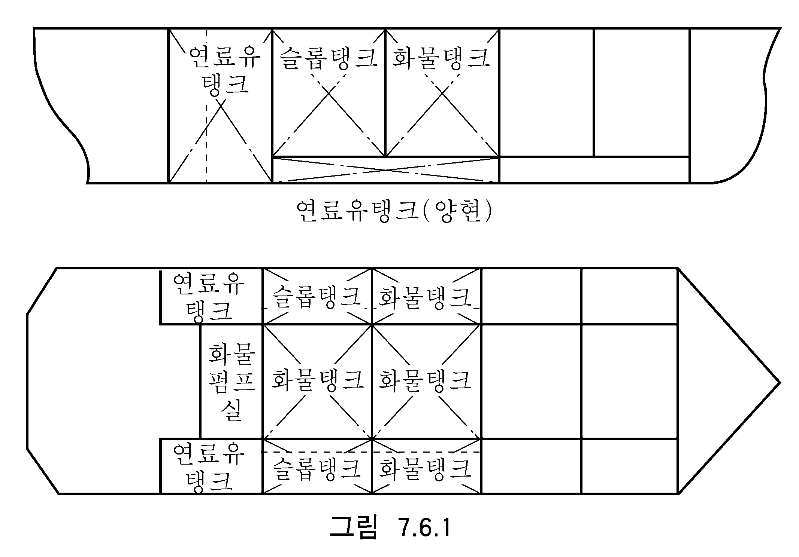
  - **(3)** **규칙 106.**의 **6**항에서 언급된 화물지역에 대하여, (**적용지침 8편 1장 그림 8.1.1** 참조) *(2026)* **【규칙 참조】**
    - 화물탱크로부터 코퍼댐, 보이드 구역 또는 기타의 구획으로 보호되는 선수루 지역 내의 비위험구역은 화물지역의 일부로 정의되지 않는다.
    - 비위험구역을 보호하는 코퍼댐, 보이드 또는 기타의 구획 상방에 있는 구획은 화물지역의 일부로 정의된다.
  - **(4)** **규칙 106.**의 **32**항에서 규정하는 상호 “분리"된 배관계통이란 다음 각호의 것을 말한다. **【규칙 참조】**
    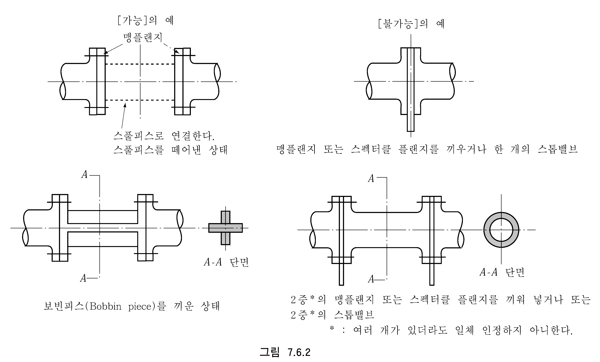
    - **(가)** 상호 완전히 독립된 배관계통
    - **(나)** 다른 화물을 적재한 탱크와 공통으로 사용하는 배관계통이 있거나 위험한 상호반응을 일으키는 화물을 적재하는 경우 **그림 7.6.2**와 같이 [가능]의 예에 따라 분리된 배관계통은 상호 분리된 배관계통으로 간주한다. 이 방법에 따라 분리되는 경우에는 작업지침서)에 그 취급방법에 대한 주의사항을 기재하여야 한다.

### 제 2 절 선박의 생존능력 및 화물탱크의 배치

#### 202. 건현 및 비손상시의 복원성

- **1.** **고체밸러스트 【규칙 참조】**
  초기 복원성의 요건을 만족할 수 없는 경우에는 고체밸러스트의 설치를 인정할 수 있다. 또한 탱크 바로 아래에 고체밸러스트를 설치하는 경우에는 고체밸러스트 정부에서 화물탱크의 바닥까지의 거리는 **그림 7.6.3**과 같이 선저손상시의 수직방향 손상범위($V _{s}$) 이상으로 하여야 한다.
  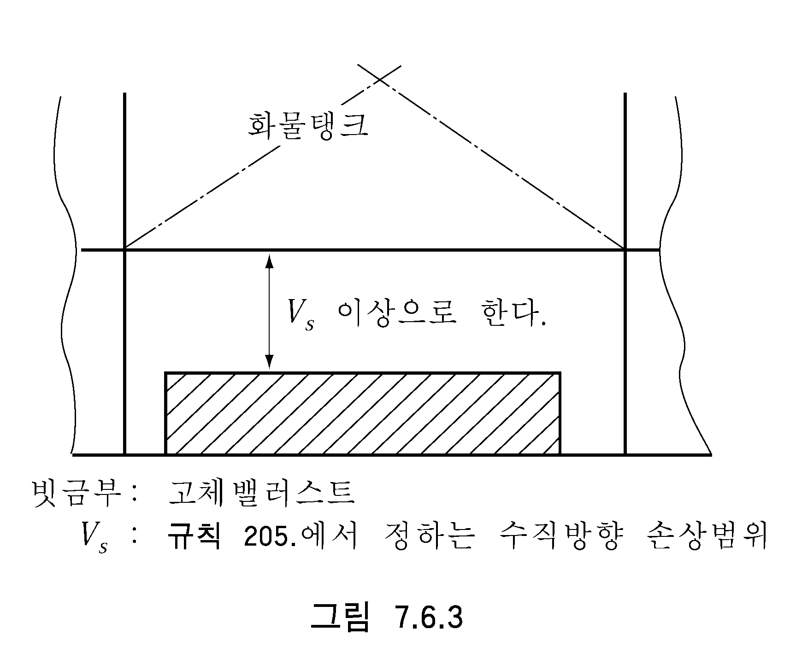
- **2.** **규칙 202.**의 **2**항의 적용시, 열대만재흘수선을 지정하는 선박의 경우 ‘모든 항해 상태’라 함은 열대만재흘수선에 상응하는 적하상태를 포함한다.
- **3.** **규 칙 202.**의 **6**항의 기구가 권고한 성능기준은 다음을 참조한다. **【규칙 참조】**
  - part B, chapter 4, of the International Code on Intact Stability, 2008 (2008 IS Code);
  - the Guidelines for the Approval of Stability Instruments (MSC. 1/Circ.1229), annex, section 4;
  - the technical standards defined in part 1 of the Guidelines for verification of damage stability requirements for tankers (MSC.1/Circ.1461)
- **4.** **규 칙 202.**의 **6**항 (3)호의 “우리 선급이 인정하는 경우”란, 손상 및 비손상 복원성 검증 절차가 승인된 조건에 적합하게 적하되는 것과 동등한 안전 수준을 유지하는 다음의 선박 중 하나를 말한다.
  - **(1)** 모든 형태의 예상 가능한 적하 조건이 **규칙 202**의 **5**항에 따라 선장에게 제공되는 승인된 복원성 자료에 포함되고 전용작업에 사용되는 선박
  - **(2)** 우리 선급이 승인한 방법에 의해 원격으로 복원성 검증이 가능한 선박
  - **(3)** 승인된 적하 조건 범위 안에서 적하되는 선박
  - **(4)** KG/GM을 제한하여 승인함으로써 적용 가능한 모든 손상 및 비손상 복원성 요건을 충족하는 2016년 7월 1일 이전에 건조된 선박
- **5.** **4**항의 승인된 조건은 다음을 참조한다.
  - operational guidance provided in part 2 of the Guidelines for verification of damage stability requirements for tankers (MSC.1/Circ.1461)

#### 203. 건현갑판하의 선외배출관 【규칙 참조】

- **1.** **규 칙 203.**의 **1**항을 적용함에 있어서 다음 각호에 정하는 바에 따라야 한다.
  - **(1)** 선루내의 배수관은 **5편 6장 303.**의 **1**항의 규정에 따른다.
  - **(2)** 배수관의 선내 개구단은 **5편 6장 303.**의 **2**항 (1)호 (가)의 규정에 따른다.
- **2.** **규 칙 203.**의 **1**항의 요건은 건현갑판상 제2층 이상의 선루 및 갑판실에서의 선외배출관에는 적용치 아니한다.
- **3.** 위험구역내의 배수관은 안전구역 또는 기관실을 원칙적으로 통과하여서는 아니 된다.

#### 205. 손상가정 【규칙 참조】

- **1.** **가정 최대손상범위 규칙 205.**의 **1**항 (2)호에서 정하는 손상기준의 적용상 선수단으로부터 0.3 $L _{f}$ 부근에서 가정하는 손상은 (1)호 및 (2)호에 따른다.
  - **(1)** 선수로부터 0.3 $L _{f}$의 장소 및 이보다 전방에 적용하는 선저손상범위(**규칙 205.**의 **1**항 (2)호에 따른다)의 경우 손상은 선수단으로부터 0.3 $L _{f}$의 장소보다 후방으로 연장하지 않는 것으로 한다.
  - **(2)** 선수단으로부터 0.3 $L _{f}$의 장소보다 후방에 적용하는 선저손상범위(**규칙 205.**의 **1**항 (2)호에 따른다)의 경우 손상범위는 선수로부터 0.3 $L _{f}$-5.0 $\mathrm{m}$의 장소까지 연장하는 것으로 한다.

#### 206. 화물탱크의 위치 【규칙 참조】

- **1.** **화물탱크의 배치 규칙 206.**에서 규정하는 화물탱크의 배치요건에 관계없이 화물펌프실의 빌지 또는 탱크세정수는 어떤 화물탱크에 주입할 수 있다.
- **2.** **화물탱크에 설치하는 흡입웰** 흡입웰의 면적은 필요에 따라 화물펌프, 흡입관, 밸브, 가열관 등을 설치하기 위하여 필요한 면적과 충분한 흡인 및 청소와 보수에 필요한 간격을 확보할 수 있는 면적보다도 크지 않게 하는 것이 좋다.

#### 207. 침수의 가상

- **1.** **평형용 설비 규칙 207.**의 **6**항에 규정하는 󰡒연통관󰡓은 다음에 따른다. **【규칙 참조】**
  - **(1)** 이 설비는 최대복원정이 0.1 $\mathrm{m}$ 및 평형상태에서 20° 범위에서의 $GZ$면적이 0.0175 $\mathrm{m}.rad$를 확보할 수 있는 경우에만 사용하는 것을 인정한다. 이 설비를 사용하지 아니한 상태에서 손상후 횡경사각도 및 정복원력 범위의 규정을 만족하여야 한다. (**그림 7.6.4**)
    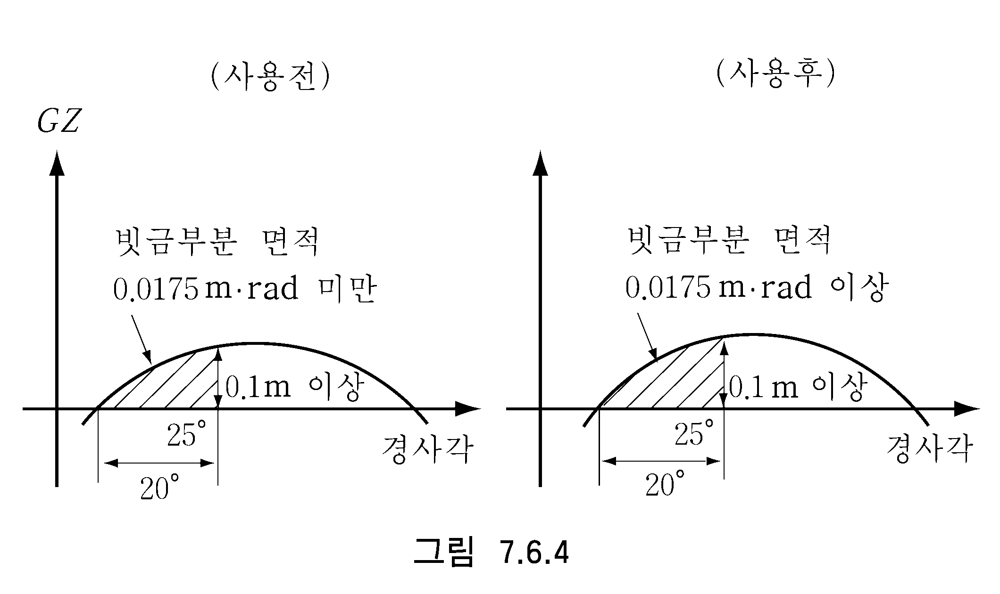
  - **(2)** 이 설비를 사용하기 전의 복원정 곡선을 결정하는 경우에는 다음과 같이 가정한다.
    - **(가)** 손상구획의 화물 또는 소비액체는 전부 유출한 것으로 한다.
    - **(나)** 손상구획은 외측의 수선까지 해수로 만재된 것으로 한다.
    - **(다)** 연통관이 폐쇄된 것으로 한다.
  - **(3)** 평형화에 대한 소요시간은 15분 이내로 한다.
  - **(4)** 평형화에 사용되는 배관의 단면적 $A$는 다음과 같이 한다.
    $A \geq 7.5V/ \sqrt {H} (\mathrm{cm} ^{2} )$
    $V$ : 침수구획에 유입된다고 예상되는 양($\mathrm{m} ^{3}$)
    $H$ : 손상전 흘수선에서 관의 중심선까지의 높이($\mathrm{m}$).
  - **(5)** 침수가 동일 높이에서 진행하도록 하기 위하여 양현의 구획을 큰 덕트로써 연결하는 것은 선회시의 경사모멘트를 증가시키기 때문에 바람직하지 않다.
- **2.** **선루의 부력 【규칙 참조】**
  - **(1)** **규칙 207.**의 **8**항에 있어서 기관구역이 1구획침수로서 취급되는 선측손상의 경우 선미루에 대하여는 기관실 이외의 구역의 손상범위가 적용되므로, 예를 들면 **그림 7.6.5**와 같이 수밀격벽이 선미루내에 배치되지 않는 한 기관실 주위의 선미루내 구획에서 수밀격벽으로 폐위된 구획을 예비부력으로 취급하여서는 아니 된다. 다만, **규칙 208.**의 **2**항의 규정에 따라 소형선에 대한 특별규정을 적용하는 경우 우리 선급이 특별히 완화조치로서 인정하는 경우에는 그러하지 아니하다. 또한, 기관실 격벽 계단부가 돌출된 경우에는 **그림 7.6.6**과 같이 기관실을 수직으로 절단하여 그의 최전단 및 최후단 바로 위의 범위를 선루구획의 손상범위로 한다.
    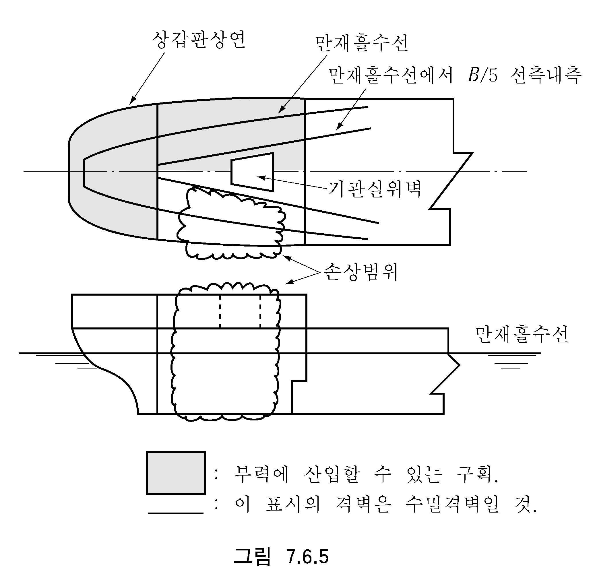 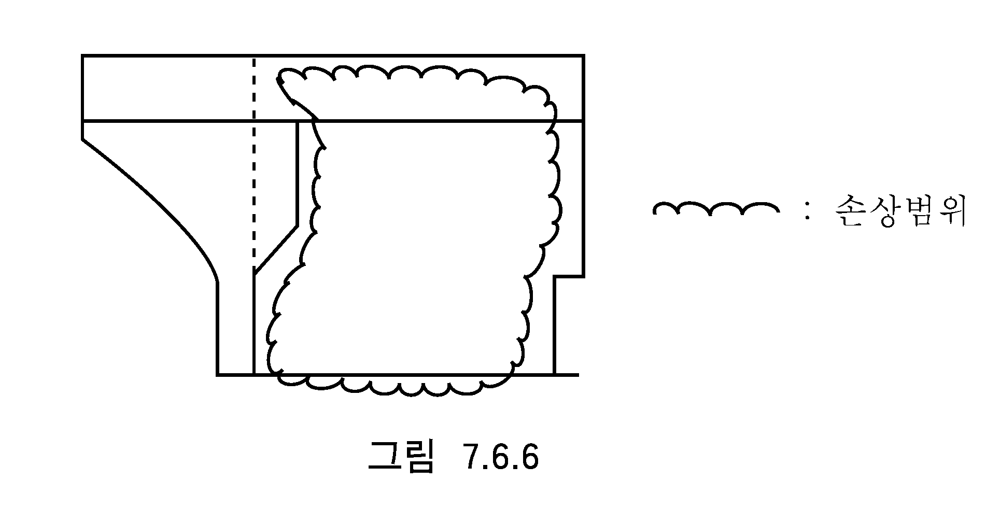
  - **(2)** **규칙 207.**의 **8**항 (2)호에서 규정하는 수밀문의 원격조작은 안전하고 신속하게 접근할 수 있는 장소에서 조작할 수 있어야 한다. 또한, 잔존복원성의 규정최소 범위내에 침수하는 풍우밀의 개구는 평형상태에서 확실하게 폐쇄할 수 있어야 한다.

#### 208. 손상기준 【규칙 참조】

- **1.** **가정손상범위**
  - **(1)** **규칙 208.**의 **1**항 (3)호 및 (5)호에 있어서 기관실 전후단 격벽의 계단부의 취급은 **그림 7.6.7**과 같이 한다.
    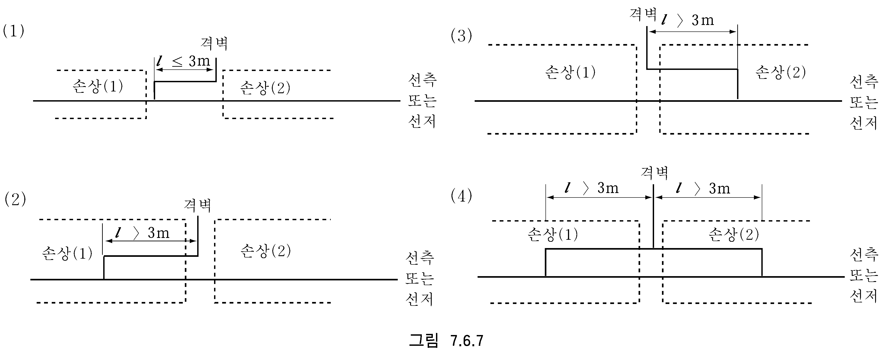
  - **(2)** **규칙 208.**의 **1**항 (6)호에서 규정하는 "우리 선급이 정하는 바에 따른다"라 함은 기관실만 침수한 상태에서 **규칙 209.**의 생존요건을 만족하거나 다음의 요건을 만족하는 것을 말한다. (**그림 7.6.8**)
    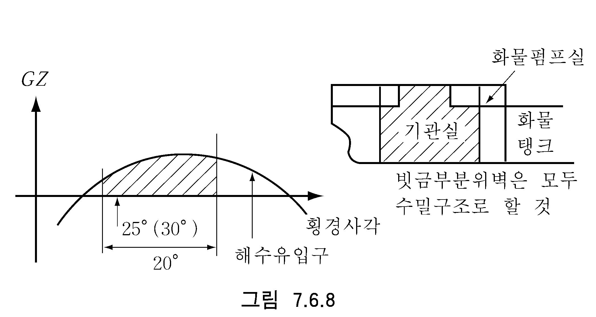
    또한, 기관실 위벽이 수밀구조로 되어 있는 경우에는 선미루의 기관실 주위구획을 예비부력으로 취급할 수 있다. 문을 설치하는 경우 선미루 갑판에서 원격조작할 수 있는 수밀슬라이딩문을 설치하여야 한다.
    - **(가)** 침수후의 최종평형상태 및 25°(갑판 측선이 수몰하지 않는 경우는 30°) 사이의 임의의 점에서 20° 범위내에서의 복원정 곡선의 정의부분 면적은 다음에 의한다.
      - **(a)** $70 \mathrm{m} \leq L _{f} < 125 \mathrm{m}$의 경우 : 0.0175 $\mathrm{m}. rad$ 이상
      - **(b)** $L _{f} < 70 \mathrm{m}$의 경우 : 0.0088 $\mathrm{m} . rad$ 이상
    - **(나)** 해수 유입구의 위치는 **규칙 209.**의 **3**항 (1)호에 따른다.
    - **(다)** 횡경사각도는 **규칙 209.**의 **2**항 (2)호에 따른다.
- **2.** **대체조치 규칙 208.**의 **2**항에서󰡒인정하는 경우에 한하여 면제󰡓라 함은 다음에 따른다.(**그림 7.6.9**)
  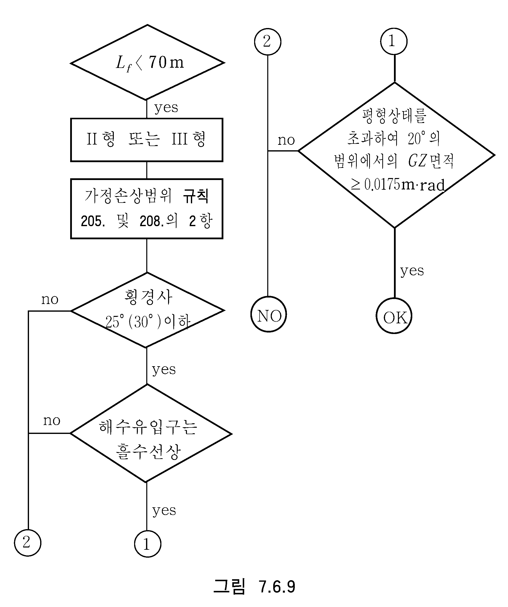
  - **(1)** I형 선박에 대하여는 인정하지 아니한다.
  - **(2)** 소형선이라 함은 $L _{f} < 70 \mathrm{m}$의 것을 말한다.
  - **(3)** III형 선박의 기관실 침수(**규칙 208.**의 **1**항 (6)호)를 제외하고 다음에 따른다.
    - **(가)** 가정손상범위는 **규칙 205., 208.**의 **1**항 (3)호 및 (6)호의 규정에 따른다.
    - **(나)** 해수유입구 및 횡경사 각도는 **규칙 209.**의 **2**항 및 **3**항에 따른다.
    - **(다)** 손상후의 최종평형상태 및 25°(갑판 측면이 수몰하지 않는 경우는 30°) 사이의 임의의 점에서 20°의 범위내에서의 복원정 곡선의 정의 부분의 면적은 0.0175 $\mathrm{m}. rad$ 이상이어야 한다.
    - **(라)** $GZ$의 최대값은 규정하지 아니한다.

#### 209. 생존요건 【규칙 참조】

- **1.** **모든 침수단계에 대한 경우 규칙 209.**의 **2**항 (3)호에서 󰡒우리 선급이 인정하는 바󰡓라 함은 다음의 경우를 말한다. 통상의 경우 최종상태가 엄격하게 고려되지만 경우에 따라서는 손상구획의 해수와 대체되는 중간단계에서 보다 엄격한 상태가 일어날 가능성이 있기 때문에 우리 선급이 특별히 요구하는 경우에는 중간단계에서 복원성 검토를 하여야 한다.
- **2.** **침수후 최종평형시의 경우** ***(2017)***
  - **(1)** **규칙 209.**의 **3**항에 있어서 최소복원성 범위내(20°)에서 침수 가능한 풍우밀 개구는 손상후의 최종평형상태에 있어서 확실하게 폐쇄 가능한 것이어야 하며 갑판의 침수 또는 큰 횡경사로 인하여 안전하게 접근할 수 없는 것이어서는 안 된다.
  - **(2)** 침수후 최종평형상태에서의 생존요건은 **그림 7.6.10**에 따른다.
    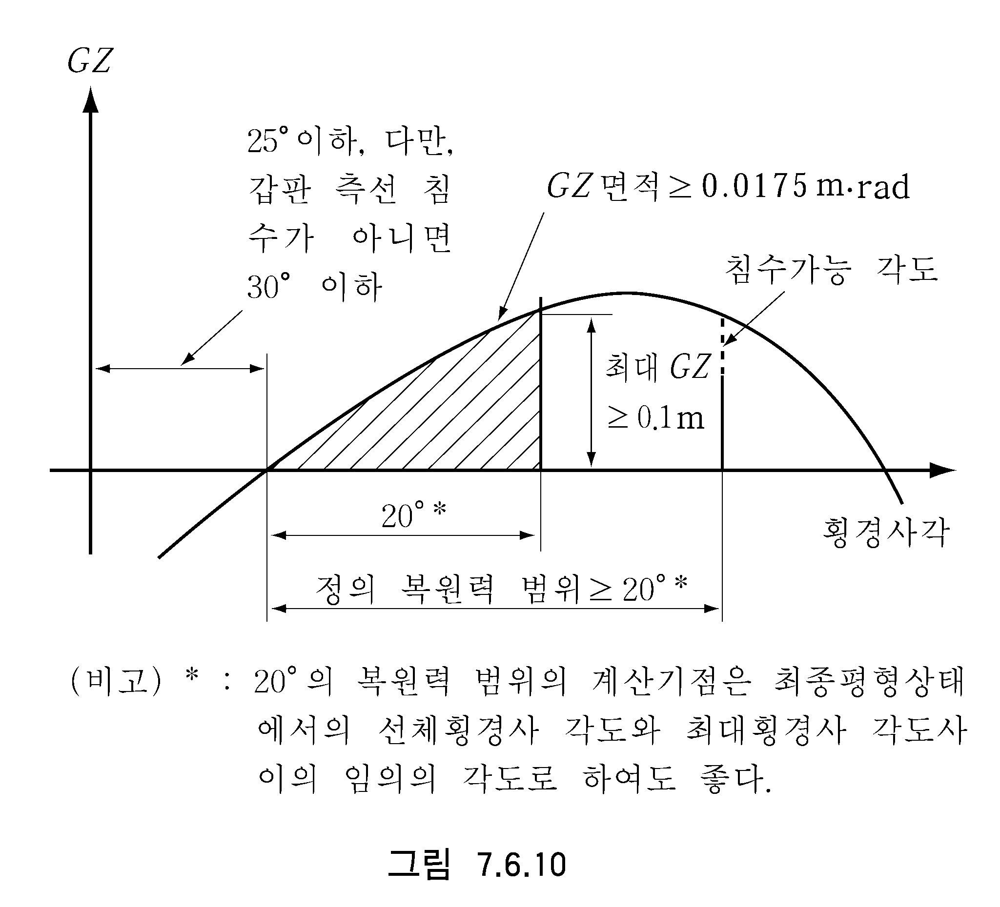
  - **(3)** 국제만재흘수선협약(International Convention on Load Lines, ICLL) 19(4)규칙을 만족하는 풍우밀 폐쇄장치가 있다하더라도, 기관실 또는 비상발전기실(복원성계산시 부력으로 고려되었거나 하방으로 통하는 개구를 보호하는 경우에 한함)에 운항상의 이유로 충분한 공기 공급을 위하여 폐쇄장치의 개방이 유지되어야 하는 통풍통은 규칙 **209.**의 **3**항 (1)호의 풍우밀폐쇄할 수 있는 기타 개구에 포함되지 않는다.

### 제 3 절 선체배치

#### 301. 화물지역의 격리 【규칙 참조】

- **1.** **화물 또는 화물 잔류물을 적재하는 탱크의 격리** 화물탱크 및 슬롭탱크는 거주구역, 업무구역, 기관구역 등과 선접촉, 점접촉 어느 것도 인정하지 아니한다. 또한, 경사판에 의하여 접촉개소를 분리하는 방법도 인정하지 아니한다.
- **2.** **다른 화물과 위험한 반응을 하는 화물의 격리** 위험한 상호반응을 일으키는 화물을 동시 적재하는 경우에는 **그림 7.6.11**과 같은 배치는 인정하지 아니한다. 또한, 상호반응화물의 격리요건에 한하여 **그림 7.6.12**와 같은 선접촉 및 점접촉은 인정한다. 화물관이 공통관인 경우에는 터널을 설치하거나 **그림 7.6.13**과 같이 배치하는 경우를 제외하고 위험한 상호반응을 하는 화물탱크를 관통하여서는 아니된다.
  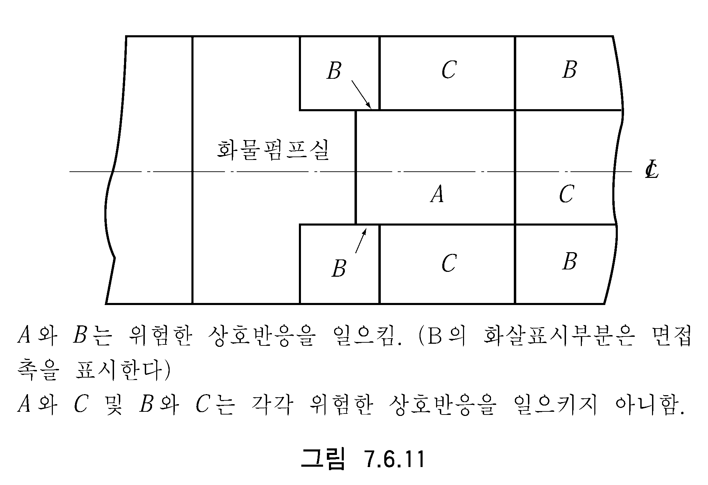 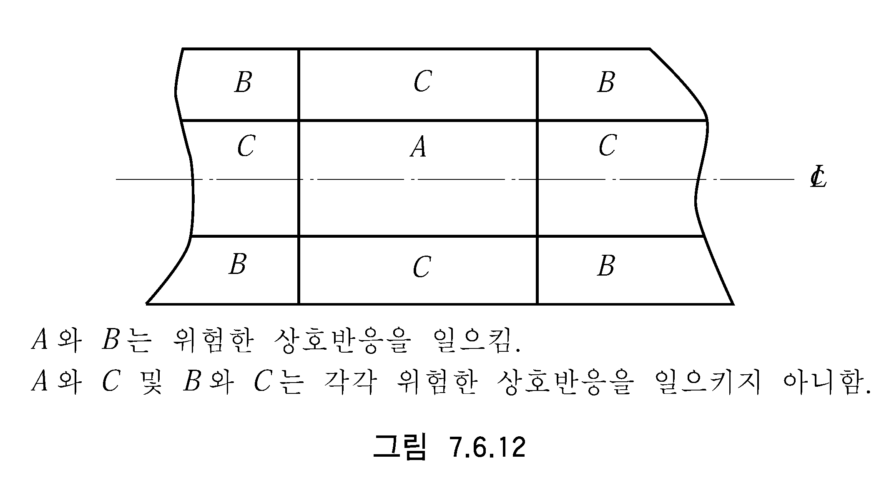
  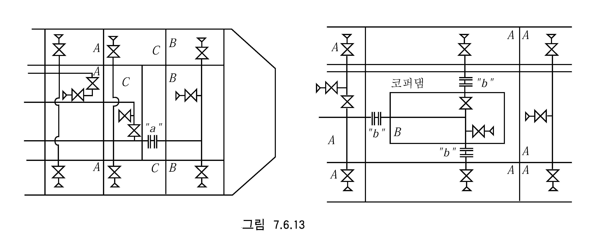

  | (비고) 1. “a" 및 ”b"는 **규칙 301.**의 **5**항에서 정하는 방법에 따라 코퍼댐, 보이드스페이스 내에서 분리시킬 것. 탱크내에서 분리하는 것은 인정하지 아니한다. 2. A와 B는 상호 위험한 반응을 하는 화물 3. A와 C 그리고 B와 C는 각각 상호 반응을 하지 아니하는 화물. 다만, 이 경우에는 화물 A 를 하역한 후 “a", "b"의 스풀피스를 접속하여 화물 B를 하역하는 방법은 인정할 수 없으므로 상기와 같이 분리된 탱크의 하역시에는 독립펌프등이 필요하다. |
  | --- |
- **3.** **화물관의 배치** 화물관은 **규칙 301.**의 **3**항에서 규정하는 구역 이외에 연료유 탱크, 청수탱크, 제어실 등의 구획내를 통과시켜서는 아니된다.

#### 302. 거주구역, 업무구역, 기관구역 및 제어장소 【규칙 참조】

- **1.** **배치** 기밀 갑판으로 격리되고 적절히 통풍이 되는 경우에는 전기적인 위험구역이 아니므로 **그림 7.6.14**와 같이 선미부의 화물탱크에 인접하는 연료유 탱크의 상방에 거주구역, 업무구역 또는 제어장소를 배치하는 것을 인정한다. 페인트 창고는 그 사용 용도에 관계없이 화물지역의 상부에 배치 할 수 없다.
  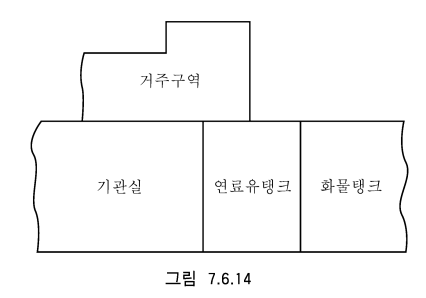
- **2.** **적용지침 8편 1장 그림 8.2.2**와 같이 연료유 탱크를 보호하는 보이드구역 또는 평형수탱크가 화물탱크 또는 슬롭탱크와 십자형 접촉을 하고 있더라도 **규칙 1절 106.**의 **6**항에서 정한 화물지역으로 간주할 필요가 없다. 연료유탱크를 보호하는 보이드 구역을 코퍼댐으로 간주하지 않는다. **적용지침 8편 1장 그림 8.2.2.**의 보이드 구역의 위치가 비록 슬롭탱크와 십자형의 이음으로 접촉하더라도 허용할 수 있다. *(2026)*
- **3.** **공기흡입구 및 개구의 배치** 개구의 위치에 대하여는 **규칙 302.**의 **3**항, **307.**의 **4**항, **803.**의 **2**항, **1201.**의 **5**항 및 **1512.**의 규정에 따른다.
- **4.** **거주구역, 업무구역, 기관구역 및 제어장소로 통하는 개구**
  - **(1)** 거주구역, 업무구역 및 기관구역의 동력식 통풍장치의 공기배기구 및 **규칙 302.**의 **2**항, **307.**의 **4**항, **803.**의 **3**항 및 **1512.**의 **1**항에서 규정하는 공기배기구에 대하여도 각각 이 규정을 적용한다.
  - **(2)** 문을 설치할 수 있는 구획은 화물장치 및 안전장구 격납실, 화물제어실 및 오염제거 샤워실에 한하며 이들의 구획은 **그림 7.6.15**와 같이 거주구역, 업무구역 및 제어장소에 이르는 통로가 없어야 한다.
    또한 거주구역 등과 인접하는 주위벽, 바닥 및 천정에는 “A－60"급 방열을 시공하여야 한다. 그러나 인화점이 60℃ 이상인 화물을 전용으로 운송하는 선박의 경우, 화물지역과의 경계에 대한 요건은 **규칙 8편 7장 103.**을 적용할 수 있다, *(2020)*

    | 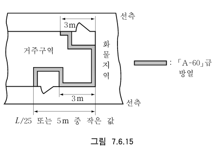 |
    | --- |
    | <비고> 인화점이 60도 미만인 화물을 전용으로 운송하는 선박에 대한 방열 *(2020)* |
  - **(3)** 조타실의 가스밀 창 및 문은 패킹 및 조임장치가 있는 것이어야 하며 이들의 창, 문 및 회전창은 0.2 $\mathrm{MPa}$의 압력으로 사수시험을 한다. 회전창의 가스밀을 유지하기 위하여 회전창에 추가하여 조임장치가 있는 창을 설치하거나 회전하지 않는 경우에 유리를 조여서 가스밀이 될 수 있는 장치로 한다.
  - **(4)** 화물의 종류에 관계없이 위험화학품 산적운반선에는 갑판상에 넘친 화물이 거주구역, 업무구역 및 제어장소로 침입하는 것을 방지하기 위하여 **그림 7.6.16**과 같이 갑판실 전단에 영구적으로 코밍을 설치한다. 코밍의 갑판상 높이는 300 $\mathrm{mm}$, 현측후판 상면상 50 $\mathrm{mm}$ 또는 갑판상에 부착한 종통재의 상면상 50 $\mathrm{mm}$중 큰 것으로 한다.
  - **(5)** **규칙 302.**의 **3**항의 적용에 있어, 발화원이 있는 선수루 구역으로의 출입문은 규칙 **5장 10절**에 따른 위험구역의 밖에 설치되는 조건으로, 화물구역과 면함을 허용할 수 있다. *(2024)*

#### 303. 화물펌프실 【규칙 참조】

- **1.** **화물펌프실의 배치** 화물펌프실에 통상적으로 인원이 배치되는 경우나 화물펌프실이 특히 큰 경우에는 추가의 탈출로가 요구되며 이 경우에 노출갑판으로 통하는 2계통의 탈출로가 필요하다.
- **2.** **구명용 호이스팅 설비** 화물펌프실에서 구명줄로 끌어 올리기 위한 항구적인 설비는 다음에 따른다.
  - **(1)** 노출갑판상에서 한 사람이 조작할 수 있을 것.
  - **(2)** 노출갑판상에 호이스팅 장치를 설치할 것.
    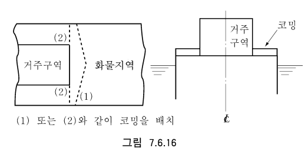
  - **(3)** 호이스팅 능력은 255 $\mathrm{kg}$ 이상일 것.
- **3.** **통행사다리** 화물펌프실내에 설치하는 사다리의 수평면에 대한 각도는 60° 이내로 하여야 한다.
- **4.** **화물 및 빌지 등의 배출설비**
  - **(1)** 부식성물질, 상호반응물질, 금수성 물질 등이 누설하여 구조부재를 부식시키거나 펌프실내에서 다른 빌지와 혼합하여 위험을 초래하는 화물을 취급하는 펌프, 밸브 등에는 위험성에 대응하는 적절한 빌지처리설비를 하여야 한다. 예를 들면 위험한 상호반응을 하는 화물을 취급하는 펌프나 빌지처리설비는 각각 독립으로 하여야 하며 상호반응화물을 동일 화물펌프실에서 취급하는 경우에는 동시 하역을 피하고 완전히 빌지처리가 종료된 후에 하역을 하여야 한다.
  - **(2)** **규칙 303.**의 **5**항에 규정하는 슬롭탱크는 다음에 따른다.
    - **(가)** 화물탱크와 겸용하는 경우에는 화물탱크에 대한 규정을 적용한다.
    - **(나)** 화물이 적재되지 않고 단지 빌지 또는 탱크세정수만을 적재하는 경우에는 이들에 포함되어 있는 화물의 종류에 관계없이 선박의 형식(화물탱크의 배치에 한함) 요건은 적용하지 아니한다. 다만, 선박의 형식 이외의 최저요건에 대하여는 다음에 정하는 바에 따른다.
      - **(a)** 통풍장치, 전기설비 및 계측장치에 대하여는 슬롭내에 포함되어 있는 화물에 요구되는 요건중 가장 엄격한 것에 적합할 것.
      - **(b)** 탱크의 환경제어 및 특별요건에 대하여는 슬롭내에 포함되어 있는 화물에 적용되는 모든 요건에 만족할 것.
      - **(c)** 탱크의 형식에 대하여는 슬롭탱크내에 포함되어 있는 화물에 요구되는 요건에 만족할 것.
    - **(다)** **규칙 1512.**에 적용을 받는 유독물질을 적재한 탱크의 세정수 및 이들 물질의 하역에 사용되는 화물펌프실의 빌지를 저장하는 슬롭탱크 및 이들과 접속하는 관장치에는 **규칙 1512.**를 모두 적용한다.
    - **(라)** 위험한 상호반응을 하는 화물을 2종류 이상 동시에 적재하는 경우에 이들의 화물을 포함하여 탱크세정수 및 빌지는 동일 슬롭탱크에 적재하여서는 아니된다. 따라서 위험한 상호반응을 하는 화물로서 동시에 적재되는 것과 같은 수의 슬롭탱크를 설치하여야 하며 격리에 관한 요건을 만족하여야 한다. 화물탱크를 슬롭탱크로 사용하는 경우에는 해당 화물탱크는 슬롭탱크로서의 펌프, 관장치를 설치하여야 한다.
    - **(마)** **MARPOL 73/78 Annex I**의 적용을 받는 기름을 운송하는 선박의 슬롭탱크의 용량은 **MARPOL 73/78 Annex I** 에 적합하여야 한다.
- **5.** **화물펌프의 토출측 압력계 규칙 303.**의 **6**항에서 규정하는 화물펌프란 화물펌프, 탱크세척용 펌프(폐쇄회로를 구성하는 경우에 한함), 빌지펌프 등과 같이 화물 및 화물을 포함한 액체를 취급하는 펌프를 말한다.
- **6.** **구동축 관통부의 기밀성** 정기적으로 그리스를 주입하는 형식의 축밀봉장치는 인정할 수 없으며 연속적으로 기밀을 유지할 수 있는 것이어야 한다. 이들의 축밀봉장치는 화물펌프실 밖에 설치하여야 한다. (**그림 7.6.17**)
  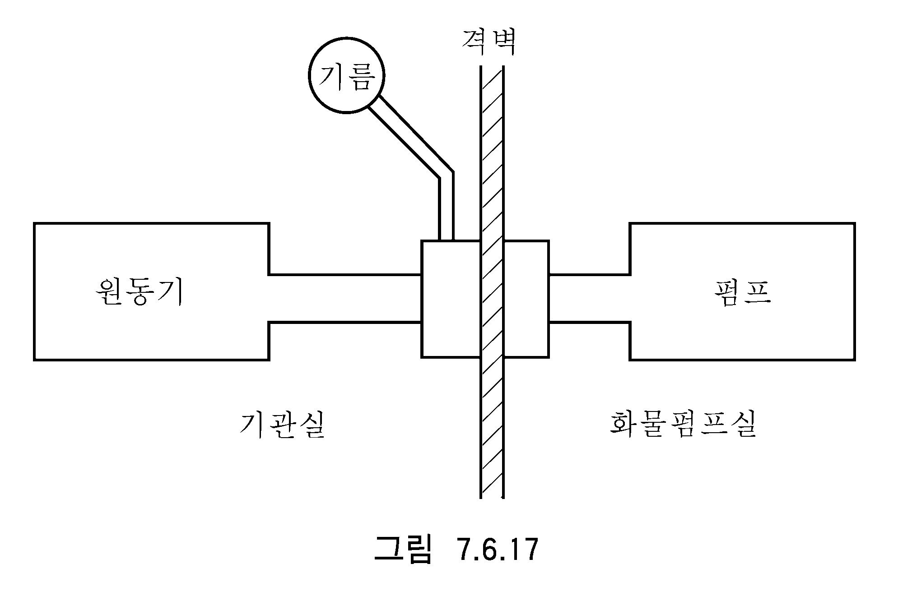

#### 304. 화물지역 내에 있는 구획으로의 통행 【규칙 참조】

- **1.** **일반**
  - **(1)** 독립형탱크를 격납하는 화물창구역에 직접 개구가 있는 구획은 화물지역의 정의에 불구하고 **규칙 304.**의 규정에 따른다. 화물탱크와 면접촉, 선접촉 또는 점접촉하는 연료유탱크 및 화물펌프실 직하의 연료유탱크는 화물지역에는 포함되지 않지만 다음의 요건에 만족하여야 한다.
    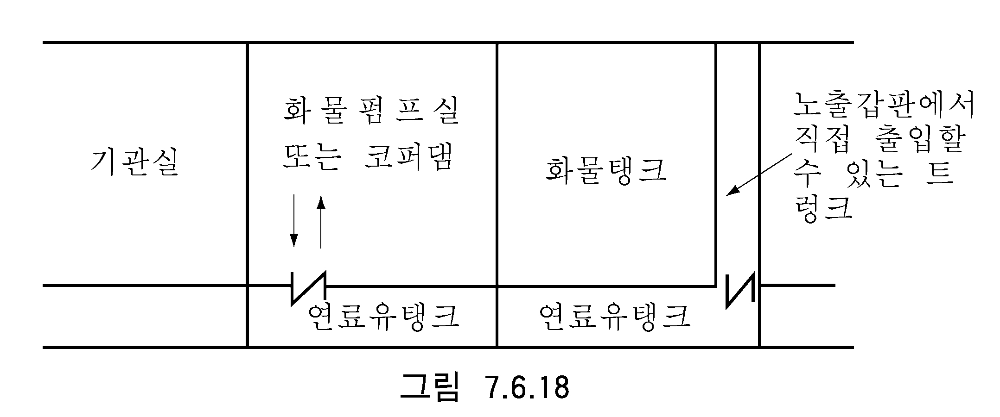
    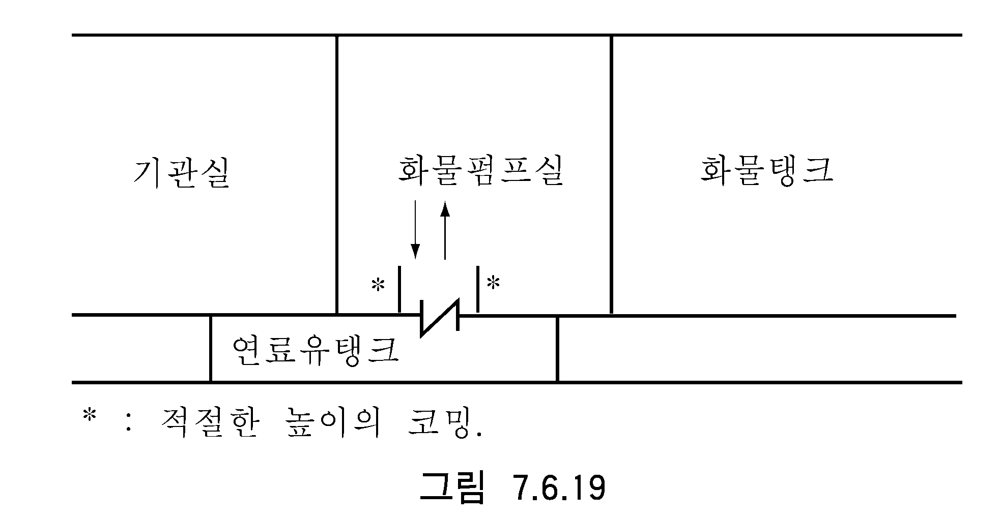
    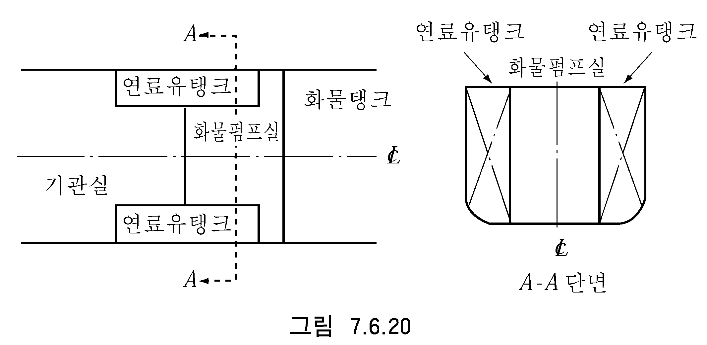
    - **(가)** 화물탱크에 인접 또는 선접촉이나 점접촉하는 연료유탱크(**그림 7.6.18 참조**) 맨홀은 이 항의 규정에 따르며 출입은 화물지역내에서 한다.
    - **(나)** 화물펌프실 직하의 연료유탱크(**그림 7.6.19 참조**). 맨홀은 이 항의 규정에 따르며 출입은 화물의 누설을 고려하여 화물지역내에서 한다.
    - **(다)** **그림 7.6.20**과 같이 연료유탱크에 대하여는 이 항의 규정을 적용받지 않으며 출입은 화물지역내에서 할 수 있다.
  - **(2)** 이중저 등의 출입구에 대하여는 다음에 따른다.
    이중저 또는 유사의 구획에는 **그림 7.6.21**의 (1) 부터 (3)과 같이 원칙으로 2계통의 출입구가 필요하며 그림 중 (4)는 인정하지 아니한다. 쉽게 통행할 수 있고 의식불명자를 구출할 수 있는 것을 조건으로 비교적 적은 구획에 대하여는 1계통만의 출입구를 인정할 수 있다. 덕트 킬에 대하여는 양단에 출입구를 설치하고 60 $\mathrm{m}$를 넘지 않는 간격으로 노출갑판으로 통하는 개구를 설치하여야 한다.
    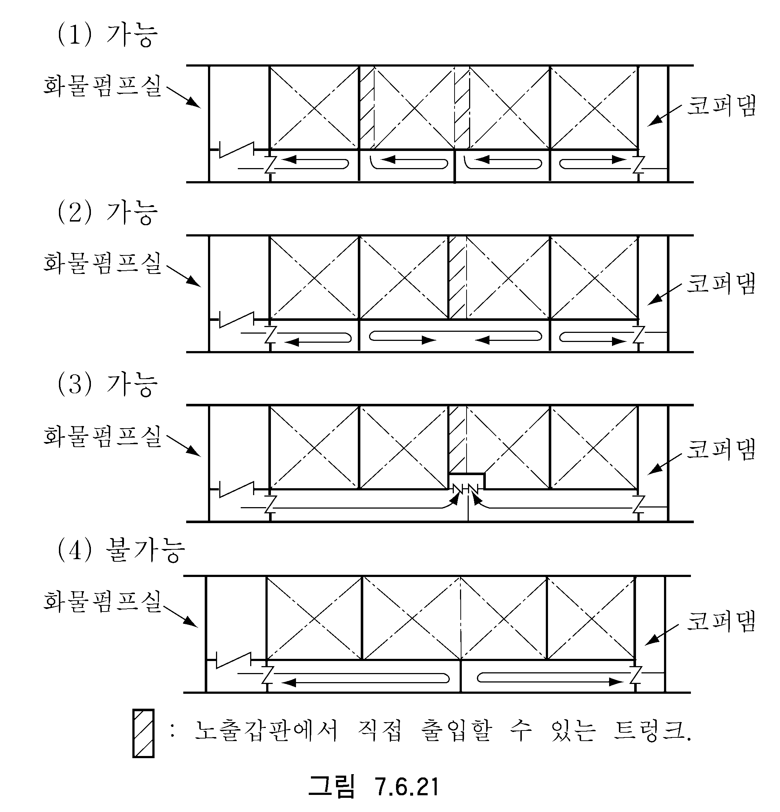
  - **(3)** 독립형 화물탱크의 출입구는 다음에 따른다.
    독립형 화물탱크는 **그림 7.6.22**와 같이 노출갑판보다 상방에 트렁크 또는 돔(dome)을 돌출시켜 그 정부에 화물탱크 해치를 설치하여야 하며 노출갑판보다 하방의 부분의 화물탱크 벽(빗금부분)에는 어떠한 개구도 설치하여서는 아니 된다.
    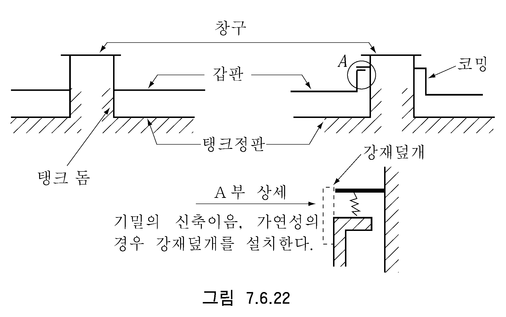
- **2.** **수평개구의 최소치수** 개구의 최소치수는 600 $\mathrm{mm}$× 600 $\mathrm{mm}$로 하여 모서리를 둥글게 한다.
- **3.** **수직개구의 최소치수 및 배치** 통행용 개구에 대하여는 다음에 따른다.
  - **(1)** 600 $\mathrm{mm}$ × 800 $\mathrm{mm}$의 개구는 긴쪽을 수직방향으로 할 것. 다만, 구조상 긴쪽을 수직방향으로 하는 것이 곤란한 경우에는 수평방향으로 할 수 있다.
  - **(2)** 통행용 개구 및 그 주위에는 통행로의 확보를 방해하는 관 또는 기타 의장품을 배치하지 말 것.
- **4.** **개구치수의 경감** 개구치수는 안전장구를 착용한 사람이 출입할 수 있고 또한 해당구획의 바닥에서 부상자를 이동시킬 수 있는 것을 확인하는 조건으로 **표 7.6.1**에 정하는 치수까지 경감할 수 있다.

  | 대상구역 | 최소치수($\mathrm{mm}$) |
  | --- | --- |
  | 화물탱크 | 600×600 |
  | 보이드 스페이스, 평형수적재탱크 | $H$ : 500×500, $V$ : 500×650 |
  | 연료유탱크 | $H$ : 450×450, $V$ : 400×500 |

#### 305. 빌지 및 평형수적재 설비 【규칙 참조】

- **1.** **일반**
  - **(1)** 화물탱크에 인접하는 전용 평형수적재탱크의 배수는 **그림 7.6.23**과 같이 기관구역내의 평형수적재 펌프를 사용하여 화물펌프실내의 에덕터를 통하여 선외로 배출할 수 있다. 이때에 평형수적재펌프와 에덕터 사이에는 체크밸브를 설치하고 또한 화물지역 내의 노출갑판상에 스풀피스를 설치하여야 한다.
    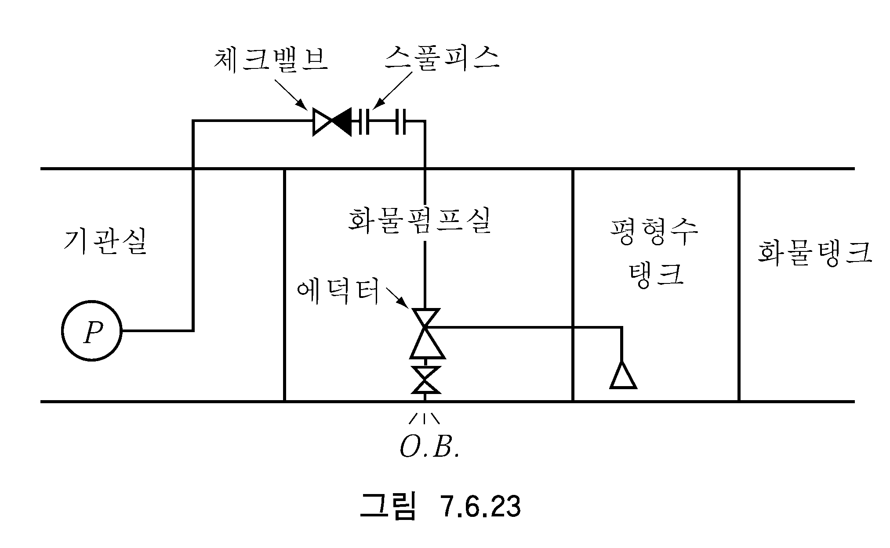
  - **(2)** **규칙 305.**의 **1**항에서 󰡒탱크 갑판 위치에서 주입하고 체크밸브를 설치하는 경우󰡓라 함은 특히 우리 선급이 인정하는 경우를 제외하고 **그림 7.6.24**와 같이 노출갑판에서 주입하는데만 사용하고 배출에는 사용되지 않는 관으로서 노출갑판상에 스톱밸브를 설치하거나 노출갑판상에서 조작할 수 있는 스톱밸브와 체크밸브를 설치하는 경우를 말한다. 또한, 어떠한 경우에도 관계통의 배치에 있어서는 관계통의 손상에 의하여 손상시 복원성의 요건을 만족시켜야 하며 위험한 평형수 또는 화물의 다른 구획으로 누설하는 등의 사고가 발생하지 않도록 충분히 고려하여야 한다.
    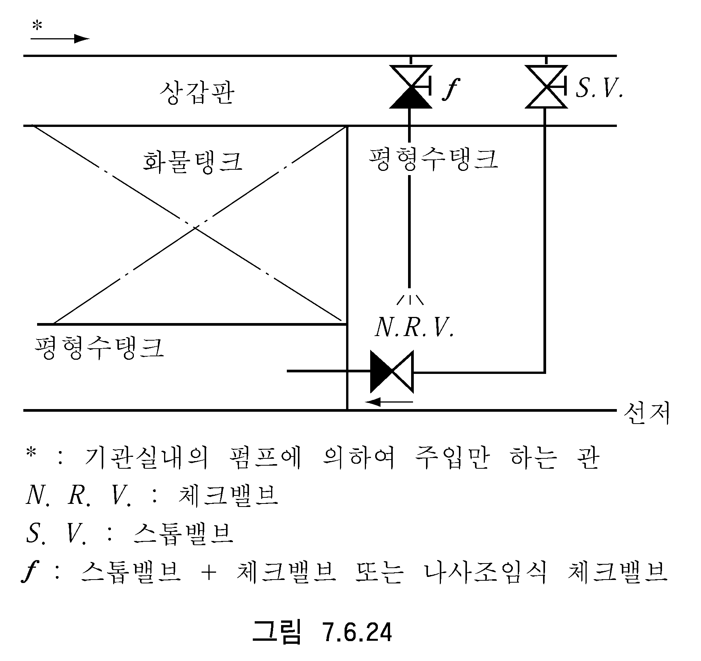
  - **(3)** 화물탱크에 인접한 평형수탱크의 관장치와 인접하지 아니하는 평형수탱크의 관장치는 원칙적으로 독립시켜야 한다.
- **2.** **화물탱크내의 평형수 주입**
  - **(1)** **규칙 305.**의 **2**항에서󰡒주입관이 화물탱크 또는 화물관과 고정된 연결관으로 주입하여서는 아니되며 체크밸브가 설치되어 있는 경우󰡓라 함은 **그림 7.6.25**와 같은 경우를 말한다. 이 경우 노출갑판에서만 주입하여야 하며 스풀피스 또는 호스 및 스톱밸브나 체크밸브가 요구된다.
  - **(2)** (1)호에 따라 갑판 위치에서 주입하는 경우에 있어 화물탱크내의 배관에 대하여는 정전기의 발생을 최소화하기 위하여 탱크 바닥 근처까지 주입관을 연장하여야 한다.
    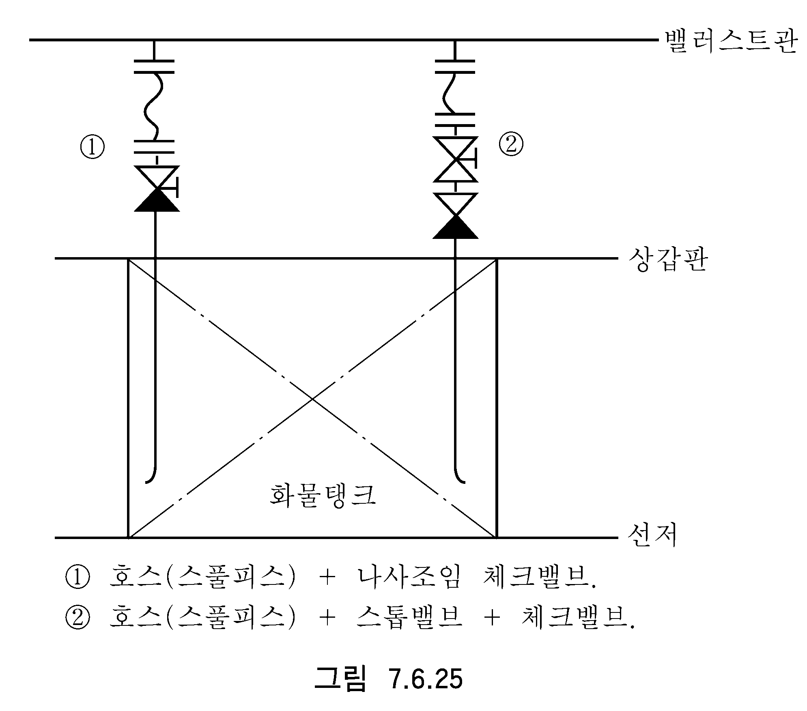
- **3.** **화물지역의 빌지배출설비** 화물 또는 화물 잔류물을 격납하는 탱크로부터 이중격벽으로 격리된 보이드 스페이스, 이중저탱크 및 평형수탱크 등의 구획에도 화물 또는 화물 잔류물을 취급하는 관이 통과하는 경우 해당 구획의 빌지화물구역내로 취급한다.

#### 306. 펌프 및 관의 식별 【규칙 참조】

**규칙 306.**에서 규정하는 󰡒표시󰡓는 벗겨지지 않은 테이프 또는 페인트로 각 관을 명확히 식별할 수 있도록 한다.

#### 307. 선수미 하역설비 【규칙 참조】

- **1.** **일반** 선수미 하역설비의 배치는 **그림 7.6.26**을 표준으로 한다.
  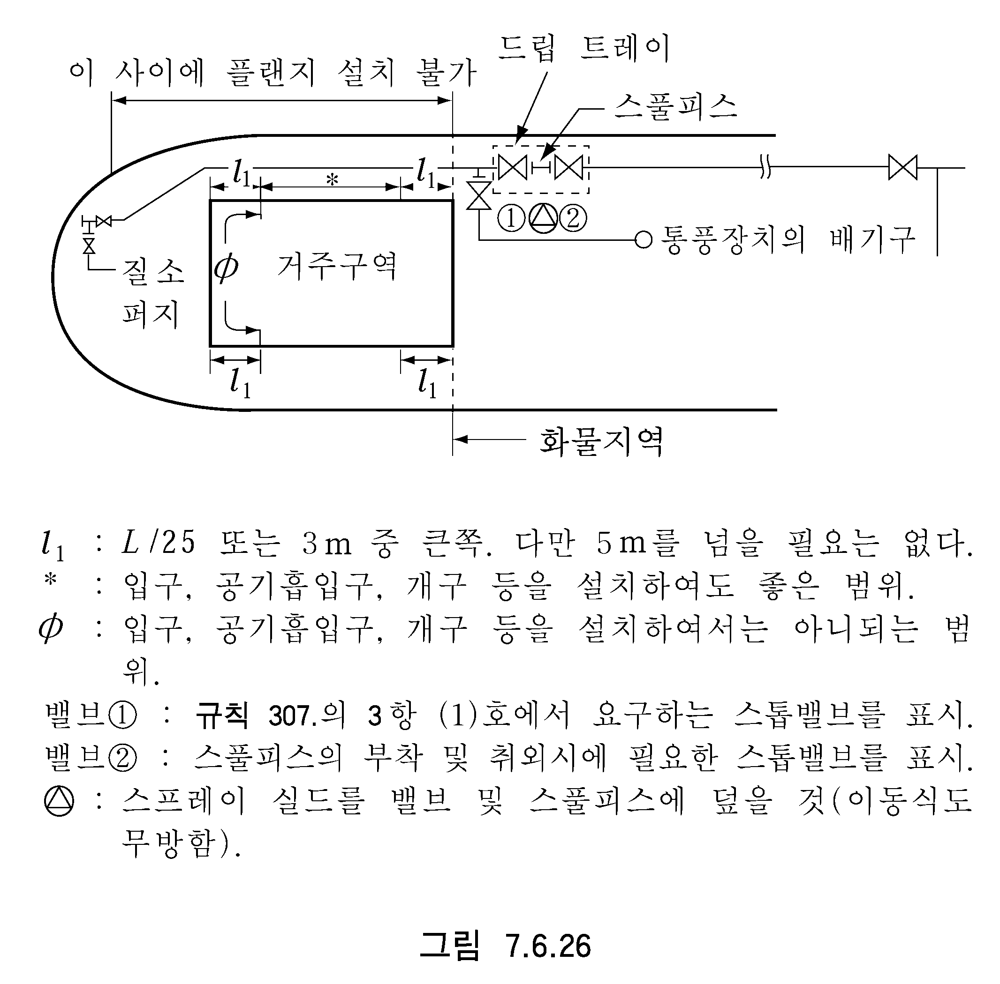
- **2.** **거주구역, 업무구역, 기관구역 및 제어장소로 통하는 출입구** 거주구역, 업무구역, 기관구역 및 제어장소로 통하는 출입구, 공기흡입구 및 로프해치, 기관실 위벽의 개구, 탈출로의 개구 등 모든 개구는 **그림 7.6.27**에 빗금으로 표시한 범위 밖에 배치하여야 한다. 한편, 선루의 표준높이는 **표 7.6.2**와 같이 한다.
  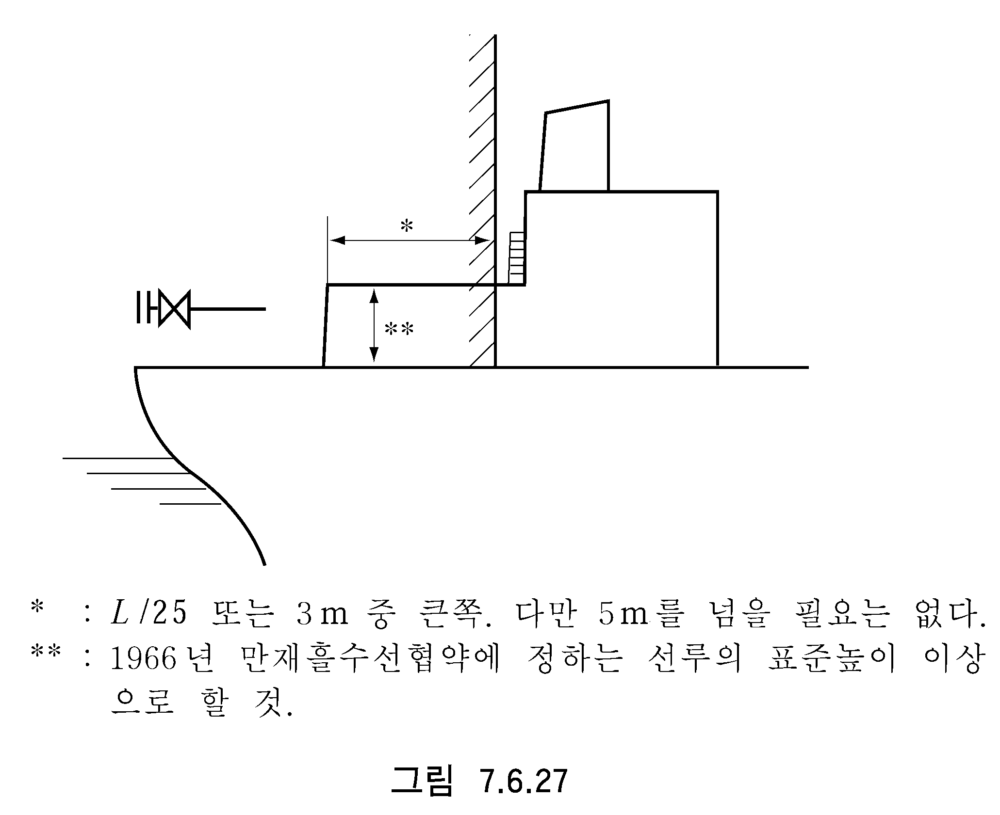

  | $L (\mathrm{m})$ | 저선미루 | 기타의 선루 |
  | --- | --- | --- |
  | 30 이하 75 125 이상 | 0.90 1.20 1.80 | 1.80 1.80 2.30 |
- **3.** **탈출통로 규칙 307.**의 **6**항에서 규정하는 󰡒탈출통로󰡓란 기관구역에서의 탈출통로를 말한다.
- **4.** **연속 코밍 규칙 307.**의 **7**항에서 󰡒적절한 높이의 연속코밍󰡓이라 함은 **그림 7.6.28**과 같이 하역설비가 있는 곳에 설치하고 갑판상 높이는 150 $\mathrm{mm}$ 또는 현측후판의 상연 위 50 $\mathrm{mm}$ 중 큰 쪽의 코밍을 말하며 선박의 너비방향에 연속으로 설치하여야 한다.
  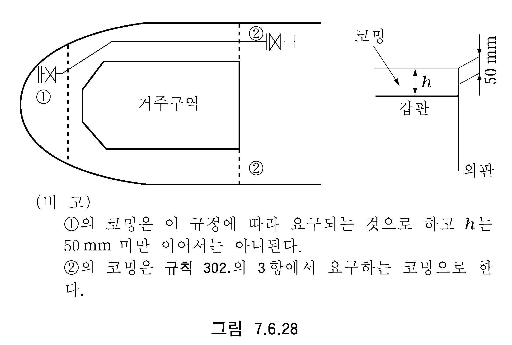
- **5.** **소화설비** 화물지역에 요구되는 포말소화장치의 모니터 및 포말방사기를 각 1대를 설치하여야 한다. 포말방사기에 접속하는 소화전은 소화제를 유효하게 방출할 수 있는 범위내에 배치하고 포말방사기는 신속하게 이용할 수 있는 장소에 설치하여야 한다.

### 제 5 절 화물의 이송

#### 501. 관의 치수

- **1.** **관의 설계기준**
  - **(1)** **규칙 501.**의 **6**항 (1)호에 있어서 스테인리스 강관의 최소두께는 일반적으로 다음에 따른다. **【규칙 참조】**
    평형수탱크를 관통하는 화물관 : 스케쥴 40 $S$
    다만, 최소두께는 **규칙 501**.의 **1**항에 규정하는 내압에 의한 관두께에 대한 요건을 만족하여야 한다.
  - **(2)** **규칙 501.**의 **6**항 (2)호에서 󰡒기계적인 강도가 필요한 경우󰡓의 보호에 대한 취급은 다음에 따른다. **【규칙 참조】**
    - **(가)** 통상 사용하는 강관에 대하여는 보호할 필요가 없다.
    - **(나)** 알루미늄재 관, 항장력에 따라 두께를 감소시킨 스테인리스 강관 등 외적충격에 약하다고 생각되는 것을 사용하는 경우에는 적절히 보호할 필요가 있다.
    - **(다)** 매니폴드는 강으로 하는 것이 좋다.
    - **(라)** 격벽 또는 갑판 관통부의 관, 상갑판상 높은 개소에 배치되어 있는 관, 매니폴드부의 로딩 암의 하중을 받는 관 등은 필요에 따라 두께의 증가를 요구할 수 있다.
  - **(3)** **규칙 501.**의 **6**항 (3)호에서 규정하는 "플랜지, 밸브 및 기타의 부착품"에 있어서 스톱밸브 및 신축이음을 사용할 경우에는 다음에 따른다. **【규칙 참조】**
    - **(가)** **규칙 5편 6장**의 규정에 적합한 것으로 할 것(제1급관, 제2급관도 포함).
    - **(나)** 제품의 품질을 유지하기 위하여 특별한 조치가 요구되는 화물을 적재하는 탱크 내부의 화물관에서는 신축이음의 사용을 인정하지 않으므로 U－벤드 등에 의하여 관의 신축이 흡수되도록 하여야 한다.
    - **(다)** 밸브, 실(seals) 등의 재료는 금지된 것을 사용하여서는 아니된다.
  - **(4)** **규칙 501.**의 **6**항 (4)호에서 규정하는 “우리 선급이 적절하다고 인정하는 바”라 함은 플랜지의 사용온도, 압력 및 크기가 정해진 것보다 큰 값을 가지는 경우로서 볼트 및 플랜지에 대한 완전한 계산을 수행한 경우를 말한다. **【규칙 참조】**

#### 502. 관의 조립 및 이음상세

- **1.** **화물관의 이음** 화물관은 **규칙 502.**의 **2**항에서 인정하는 차단밸브 및 신축이음과 스풀피스 및 동등의 부착품에 대한 플랜지이음이거나 도장, 라이닝, 조립 및 검사 또는 보수를 위하여 필요한 플랜지이음을 제외하고는 용접이음으로 하여야 한다. 또한 **규칙 1511.**에 정한 화물의 갑판상의 화물관 플랜지 이음부에는 비산방지를 위하여 내산성의 떼어낼 수 있는 덮개를 설치하여야 한다. **【규칙 참조】**
- **2.** **플랜지를 사용하지 않는 관의 직접연결 규칙 502.**의 **3**항 (1)호에서 규정하는 󰡒맞대기이음󰡓에 있어서 **규칙 504.**에서 제1급관 또는 제2급관이 필요한 경우에는 **규칙 5편 6장**의 규정에 따라야 한다. 제3급관이 인정되는 화물관(화물액 및 화물증기관을 포함)의 맞대기용접 방법은 제2급관에 적용하는 방법과 같이 한다. 다만, 비파괴검사는 생략할 수 있다. **【규칙 참조】**
- **3.** **신축이음 규칙 502.**의 **4**항 (1)호에서 규정하는 󰡒벨로우즈󰡓는 벨로우즈 저부에 남은 화물 드레인에 대한 고려가 되어 있지 않는 경우에는 부식성 또는 중합성을 가진 화물에는 사용하여서는 아니 된다. **【규칙 참조】**

#### 503. 플랜지이음 【규칙 참조】

- **1.** **플랜지의 기준**
  **규칙 503.**의 **2**항에서 규정하는 󰡒인정하는 기준󰡓이라 함은 **규칙 5편 6장 104.**의 규정을 말한다.

#### 504. 관에 대한 시험요건 【규칙 참조】

- **1.** **적용** 화물관의 분류기준 및 시험기준은 **표 7.6.3** 및 **7.6.4**에 따른다.

  | 선박의 형식 | 적용되는 화물관의 분류 (**표 7.6.4** 참조) | 비고 |
  | --- | --- | --- |
  | I형 | 제1급관 | 설계압력 및 온도에 관계없이 좌란을 원칙적으로 적용하며 화물과 관장치 재료와의 적합성은 별도로 검토할 수 있다. |
  | II형 | 제2급관 | 설계압력 및 온도에 관계없이 좌란을 원칙적으로 적용하며 화물과 관장치 재료와의 적합성은 별도로 검토할 수 있다. |
  | III형 | 제3급관 | 설계압력 및 온도에 관계없이 좌란을 원칙적으로 적용하며 화물과 관장치 재료와의 적합성은 별도로 검토할 수 있다. |
  | (비고) (1) 화물관이란 액체화물 및 증기화물을 이송하는 관을 말한다. (2) 선형요건 III형의 규정에 따라 배치된 슬롭탱크의 화물관은 슬롭에 포함되어 있는 화물에 대한 선박의 형식요건에 관계없이 제3급관으로 분류한다. (3) 선박의 형식이 상위에 있는 화물을 적재하는 탱크를 관통하는 화물관은 그 상위의 화물에 요구되는 관장치의 요건에 적합하여야 한다. (4) 개구단관(드레인, 넘침관, 벤트관 등)은 제3급관으로 분류한다. |   |   |

  |   | 관의 재료 | 밸브, 콕 및 관부착품의 재료 | 관의 가공에 대한 공장에서의 시험 |   |   | 밸브 및 관부착물의 공장에서의 시험 | 관장치의 선내에서의 시험 |
  | --- | --- | --- | --- | --- | --- | --- | --- |
  |   | 관의 재료 | 밸브, 콕 및 관부착품의 재료 | 용접절차 인정시험 | 비파괴시험 | 수압시험 | 밸브 및 관부착물의 공장에서의 시험 | 관장치의 선내에서의 시험 |
  | 제 1 급 | 원칙적으로 **규칙 2편 1장**에 적합한 재료. | 원칙적으로 **규칙 2편 1장**에 적합한 재료. 다만, 우리 선급이 지장이 없다고 인정하는 경우에는 KS 규격재료 또는 동등 이상의 재료를 인정할 수 있다. | 제1급 또는 제2급 관장치에 있어서 다음에 해당한 경우에 행한다. ① 최초의 관상호, 관과 밸브(또는 콕), 관과 관부착품을 용접으로 접합하는 경우. ② 새로운 용접법을 채용한 경우. ③ 모재의 재질, 용접재료의 종류 또는 이음형식을 변경하는 경우. | ① 호칭지름 65 $A$를 넘는 관상호, 관과 밸브(또는 콕), 관과 관부착품의 맞대기 용접이음에 대한 전용접부의 방사선 시험. ② 호칭지름 65 $A$ 이하인 관상호, 관과 밸브(또는 콕), 관과 관부착품의 맞대기용접이음에 대한 샘플링 방사선시험. ③ 방사선 대신에 기타의 적절한 비파괴시험을 인정할 수 있다. ④ 관상호, 관과 밸브(또는 콕), 관과 관부착품의 필릿용접에 대하여 자분탐상 또는 기타 적절한 시험. | ① 제1급, 제2급 또는 제3급에 속하는 모든 관장치는 가공후 부착품을 부착한 상태로 설계압력의 1.5배 압력으로 수압시험을 한다. ② 설계온도가 300°C를 넘는 강관 및 용접접합된 관부착품의 수압시험의 시험압력은 별도로 정한다. ③ 관상호 또는 관과 밸브(또는 콕)와의 이음용접을 선내에서 하는 관계통의 수압시험은 별도로 정한다. | 제1급 또는 제2급에 속하는 관장치의 밸브(또는콕) 및 관부착품은 제조후 설계압력의 1.5배 압력으로 수압시험을 한다. | ① 모든 관장치는 사용상태에서 누설시험을 한다. ② 모든 관장치는 기기와 함께 사용시험을 한다. ③ 모든 화물관장치는 설계압력의 1.5배의 압력으로 수압시험을 한다. |
  | 제 2 급 | 원칙적으로 **규칙 2편 1장**에 적합한 재료. | 원칙적으로 **규칙 2편 1장**에 적합한 재료. 다만, 우리 선급이 지장이 없다고 인정하는 경우에는 KS 규격재료 또는 동등 이상의 재료를 인정할 수 있다. | 제1급 또는 제2급 관장치에 있어서 다음에 해당한 경우에 행한다. ① 최초의 관상호, 관과 밸브(또는 콕), 관과 관부착품을 용접으로 접합하는 경우. ② 새로운 용접법을 채용한 경우. ③ 모재의 재질, 용접재료의 종류 또는 이음형식을 변경하는 경우. | ① 호칭지름 80 A를 넘는 관상호, 관과 밸브(또는 콕), 관과 관부착품의맞대기 용접이음에 대하여 샘플링 방사선시험 또는 기타 적절한 시험. ② 관상호, 관과 밸브(또는 콕), 관과 관부착품의 필릿용접에 대하여 자분탐상 또는 기타 적절한 시험. | ① 제1급, 제2급 또는 제3급에 속하는 모든 관장치는 가공후 부착품을 부착한 상태로 설계압력의 1.5배 압력으로 수압시험을 한다. ② 설계온도가 300°C를 넘는 강관 및 용접접합된 관부착품의 수압시험의 시험압력은 별도로 정한다. ③ 관상호 또는 관과 밸브(또는 콕)와의 이음용접을 선내에서 하는 관계통의 수압시험은 별도로 정한다. | 제1급 또는 제2급에 속하는 관장치의 밸브(또는콕) 및 관부착품은 제조후 설계압력의 1.5배 압력으로 수압시험을 한다. | ① 모든 관장치는 사용상태에서 누설시험을 한다. ② 모든 관장치는 기기와 함께 사용시험을 한다. ③ 모든 화물관장치는 설계압력의 1.5배의 압력으로 수압시험을 한다. |
  | 제 3 급 | KS 규격재료 또는 이와 동등 재료 | KS 규격재료 또는 이와 동등 재료. |   |   | ① 제1급, 제2급 또는 제3급에 속하는 모든 관장치는 가공후 부착품을 부착한 상태로 설계압력의 1.5배 압력으로 수압시험을 한다. ② 설계온도가 300°C를 넘는 강관 및 용접접합된 관부착품의 수압시험의 시험압력은 별도로 정한다. ③ 관상호 또는 관과 밸브(또는 콕)와의 이음용접을 선내에서 하는 관계통의 수압시험은 별도로 정한다. |   | ① 모든 관장치는 사용상태에서 누설시험을 한다. ② 모든 관장치는 기기와 함께 사용시험을 한다. ③ 모든 화물관장치는 설계압력의 1.5배의 압력으로 수압시험을 한다. |

#### 505. 배관 【규칙 참조】

- **1.** **갑판하의 화물배관**
  - **(1)** **규칙 505.**의 **2**항에 규정하는󰡒노출갑판상에서 조작 가능한 스톱밸브󰡓는 각 탱크내의 개구단 가까이에 설치하여야 한다.
  - **(2)** **규칙 505.**의 **2**항에 있어서󰡒예외로써󰡓이하의 규정은 **그림 7.6.29**의 빗금부분과 같이 화물펌프실에 인접하는 1개의 화물탱크 또는 슬롭탱크내에만 배치되는 화물관에 한하여 적용할 수 있다. 이 경우 격벽밸브와 화물펌프와의 사이에 추가의 스톱밸브를 설치하여야 한다.
  - **(3)** **규칙 505.**의 **2**항 (1)호에 규정하는 󰡒누설󰡓이란 패킹으로부터의 누설을 포함한다.
    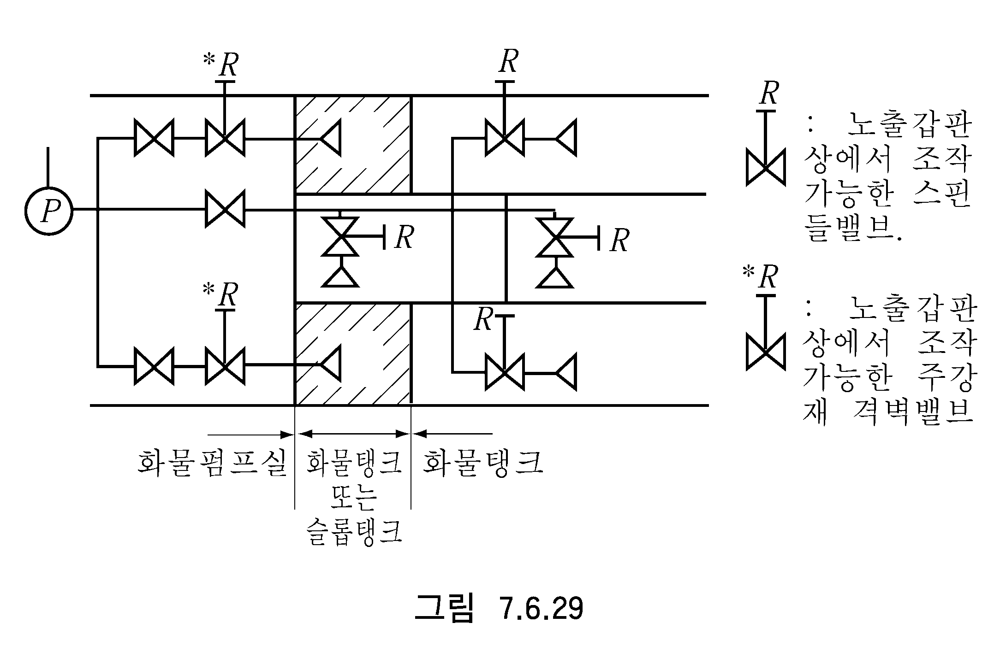

#### 506. 화물이송제어장치

- **1.** **일반 【규칙 참조】**
  - **(1)** **규칙 506.**의 **1**항 (1)호에 규정하는 󰡒탱크관통부 부근에 위치하는 수동으로 조작 가능한 1개의 스톱밸브󰡓는 **그림 7.6.30**과 같이 화물탱크내에 설치되는 화물 관계통에는 **규칙 505.**의 **2**항에 규정하는 스톱밸브(개구단 가까이에 설치되어 있고 노출갑판상에서 조작가능한 스톱밸브) 및 **규칙 505.**의 **3**항에 규정하는 화물펌프실내에 설치되는 격벽밸브가 있는 경우에는 생략할 수 있다.
    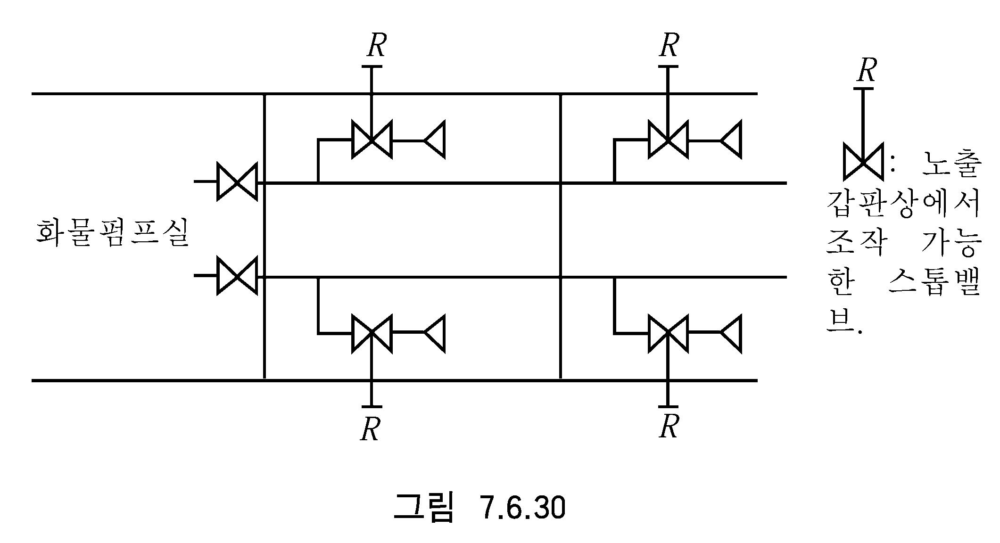
  - **(2)** 각 탱크에 독립으로 설치되는 디프웰 펌프 또는 잠수형 펌프의 토출관의 갑판관통부에는 스톱밸브가 필요없으나 화물직접주입관(화물펌프를 경유하지 않고 화물을 적재할 수 있는 배관)에는 **그림 7.6.31**과 같이 각각의 노출갑판 관통부 부근에 스톱밸브를 설치한다.
    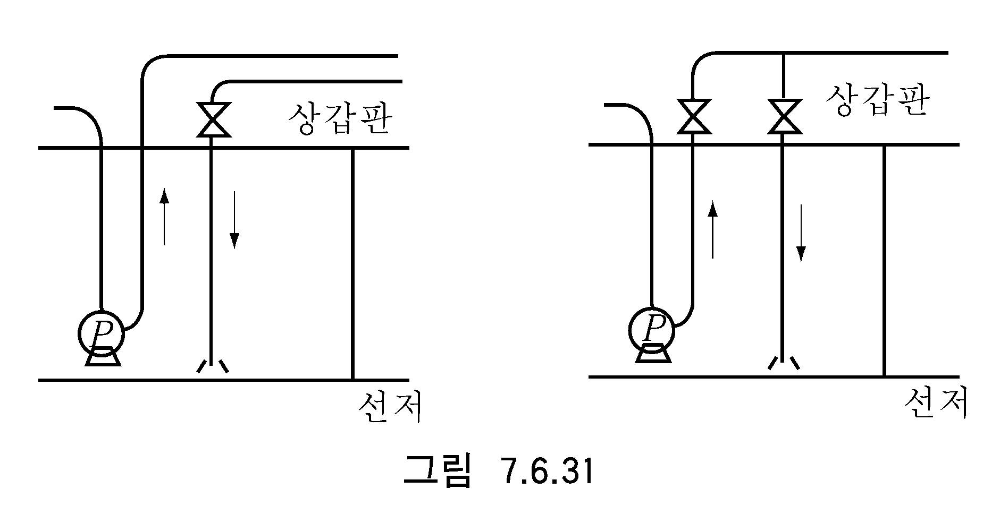
  - **(3)** (2)호에서 정하는 󰡒화물직접주입관󰡓을 설치하는 경우 인화성 및/또는 독성을 가진 위험화학품에 대한 화물직접주입관의 개구는 탱크저부 또는 섬프면으로부터 10 $\mathrm{cm}$ 또는 주입관 반지름 중 큰 값을 넘지 아니하는 높이까지 연장하여야 한다. *(2022)*
  - **(4)** **규칙 506.**의 **1**항 (2)호에서 규정하는 󰡒스톱밸브󰡓는 화물증기이송에 사용되는 호스 접속부에도 스톱밸브를 부착한다.
  - **(5)** (4)호에 추가하여 화물증기의 육상환류용 호스의 접합부에도 스톱밸브가 요구되며 이 스톱밸브를 이동식으로 하여 필요에 따라 부착할 경우에는 해당선박에 대하여 육상환류가 요구되는 화물을 동시에 적재할 예정의 최대탱크수 이상의 스톱밸브를 선박에 비치하여야 한다. 또한, 이 스톱밸브의 수량에 따른 적재 탱크수의 제한에 대하여는 위험화학품 산적운반선의 작업지침서에 반영하여야 한다.
  - **(6)** **규칙 506.**의 **1**항 (3)호에서 규정하는 󰡒원격차단장치󰡓는 하역시에 항상 인원이 배치되는 장소(예를 들면 화물제어실)에서 집중제어할 수 있도록 하는 것이 좋다.

#### 507. 선박용 화물호스

- **1.** **일반 【규칙 참조】**
  - **(1)** **규칙 507.**의 **1**항에서 규정하는 󰡒호스󰡓는 다음에 적합하여야 한다.
    - **(가)** 화물과 접촉할 경우, 화물호스의 기계적 강도가 손상되거나 극단적인 기능의 저하가 발생하지 않을 것.
    - **(나)** 화물호스의 재료가 화물에 대하여 위험한 영향을 미치지 않을 것.
  - **(2)** (1)호에서 호스가 비상용 화물펌프와 일체형이거나 해당펌프에 접속된 화물탱크에 잠기는 경우 (1)호의 규정은 호스 내외면에 대하여 고려하여야 한다.

### 제 7 절 화물의 온도제어

#### 701. 일반사항 【규칙 참조】

- **1.** **일반 규칙 701.**의 **1**항에서 규정하는 󰡒화물의 가열 또는 냉각장치󰡓는 다음 각호의 규정에 적합하여야 한다.
  - **(1)** 이 장의 적용을 받는 화물로서 가열을 필요로 하는 화학품을 운송하는 선박의 가열원이 되는 장치의 구성기기 또는 장치 전체가 고장난 경우 가열 또는 하역이 불가능한 사태가 생기거나, 선체의 안정성에 저해되는 사태가 발생하지 아니하도록 하는 수단을 갖추어야 한다.
  - **(2)** 이 장의 적용을 받는 화물로서 냉각을 필요로 하는 화학품을 운송하는 선박의 냉각장치 및 방열재는 **규칙 5장 4절** 부터 **7절**의 규정 및 **규칙 9편 1장** "냉장장치"의 규정을 준용한다. 또한, 산화프로필렌과 같이 냉각장치의 상세규정이 있는 것이 포함되어 있으므로 주의하여야 한다.
  - **(3)** 가열이 필요한 화물이라 함은 용융점이 15°C 이상인 위험화학품을 표준으로 하지만, 항해구역 및 운항조건 등을 고려하여 우리 선급이 필요하다고 인정하는 경우 화물의 가열설비를 요구할 수 있다. 이 경우 **규칙 701.**의 **5**항에 규정하는 온도계측장치는 고정식으로 하여야 한다.
  - **(4)** 화물지역 내의 증기 및 열매체유의 최고온도는 화물의 온도분류를 고려하여 조절되어야 한다.
- **2.** **화물온도 제어장치의 제어밸브 규칙 701.**의 **3**항에서 󰡒각 탱크마다 장치를 분리하고 매체의 흐름을 수동으로 제어할 수 있는 밸브󰡓라 함은 주증기관과 각 탱크와의 사이에 설치한 유량조절이 가능한 밸브를 말한다. 이것은 냉각장치의 경우에도 동일하다. **규칙 17절**의 일람표에서 **규칙 1516.**의 **1**항의 규정이 적용되는 금수성물질을 운송할 경우에는 이 밸브에 추가하여 스풀피스를 장비하여야 한다.
- **3.** **화물온도 제어장치 계통내의 압력유지 규칙 701.**의 4항에 규정하는 압력유지를 위한 설비로서 기관실내의 공기탱크 및 공기압축기에서 공급되는 갑판상 잡용압축공기관으로부터 가열(냉각)관내에 압축공기를 봉입할 수 있다. 또한 가열(냉각)되는 화물만을 전 탱크에 적재할 경우에는 압축공기는 주관으로부터 봉입하여도 좋으며 일부의 탱크만 가열(냉각)되고 다른 탱크(온도제어라인이 있는 것)는 가열(냉각)하지 않고 적재할 경우에는 **그림 7.6.32**와 같이 공기압축기를 지관의 스톱밸브 탱크측에서 봉입하여야 한다. 가열(또는 냉각)이 필요하지 않은 화물로서 탱크내 및 탱크에 인접하는 코퍼댐을 불활성화 할 필요가 있는 화물을 운송할 경우 공기의 사용은 불가하므로 불활성가스를 봉입하여야 한다. 또한, 봉입되는 매체와 화물과의 사이에는 위험한 상호반응이 일어나지 않도록 고려하여야 하며 규정의 관내압력을 유지하기 위하여 별도의 방법을 채용할 경우에도 동일하다.
  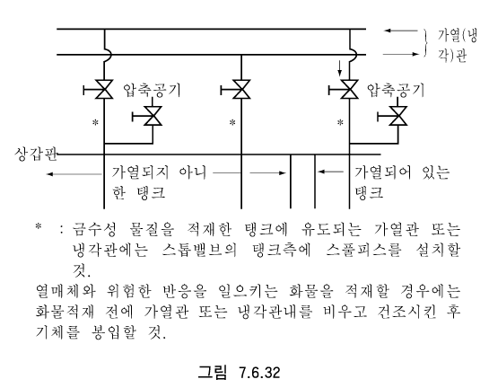
  **그림 7.6.32**
  * 금수성 물질을 적재한 탱크로 유도되는 가열관 또는 냉각관에는 스톱밸브의 탱크 측에 금수성 물질을 적재한 탱크와 격리할 수 있는 수단을 설치할 것. *(2021)*
  * 열매체와 위험한 반응을 일으키는 화물을 적재할 경우에는 화물적재 전에 가열관 또는 냉각관내를 비우고 건조시킨 후 기체를 봉입할 것.
- **4.** **화물온도의 계측장치 규칙 701.**의 **5**항 (4)호에서 화물의󰡒과열 또는 과냉각으로 위험한 상태를 야기시키는 경우󰡓라 함은 인접하는 화물탱크 또는 연료유탱크가 가열 또는 냉각되어 열 영향을 받는 경우를 말한다. 이 경우 온도검지단은 탱크액면 부근과 탱크저부의 적어도 2개소에 설치하여야 한다.
- **5.** **화물온도제어 매체의 순환경로**
  - **(1)** **규칙 701.**의 **6**항의 대상이 되는 화물은 **규칙 17절**의 일람표에서 **1512., 1512.**의 **1**항 또는 **1512.**의 **3**항의 적용을 요구되는 화물뿐 만 아니라 동 일람표의 가스검지란에서 󰡒$T$󰡓를 요구하는 화물에도 적용한다.
  - **(2)** **규칙 701.**의 **6**항 (3)호에서 설치를 요구하는 시료채취 가능한 회로는 **그림 7.6.33**에 표시된 예와 같이 배치할 수 있다. 또한, 일반 유조선에서는 **규칙 1장 1002.**의 **9**항에 따라 기관실내에 검유탱크를 설치하도록 규정되어 있으나 위험화학품 산적운반선에서는 기관실내에 설치하는 것은 인정되지 않으므로 화물지역내의 노출갑판상에 설치하여야 한다. 검지방법은 유효한 독가스 검지관 또는 적절한 시료에 의한다. 또한, 적절한 시료는 미리 제조자로부터 입수해 두어야 한다. *(2021)*
    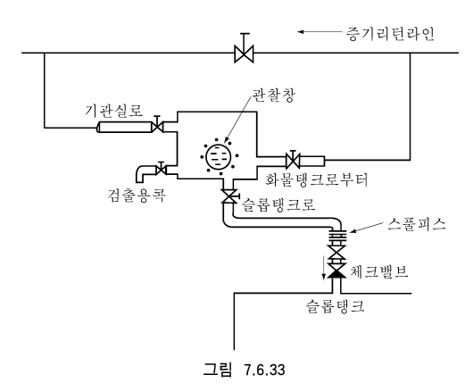

### 제 8 절 화물탱크 벤트 및 가스프리장치

#### 802. 화물탱크 벤트장치

- **1.** **벤트장치 【규칙 참조】**
  - **(1)** **규칙 802.**의 **1**항에서 󰡒화물탱크로 물이 유입되는 것을 방지할 수 있도록 배치하여야 하며 이와 동시에 배기구는 증기의 흐름을 방해하지 않으면서 증기를 상방으로 분출“하는 배기구라 함은 **그림 7.6.34**와 같은 것을 말한다.
    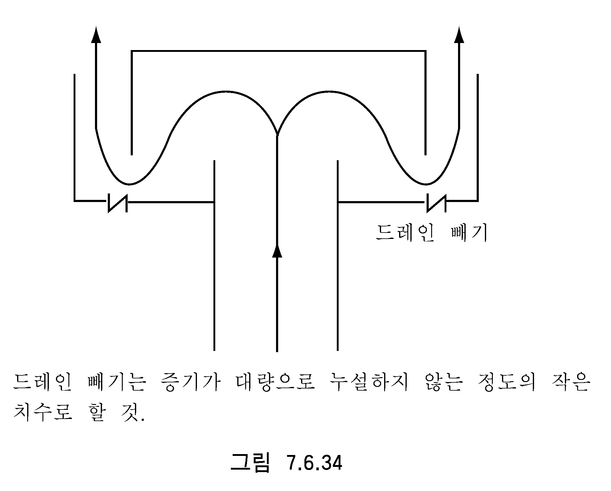
- **2.** **벤트관의 드레인 빼기장치** ***(2019)*** **【규칙 참조】**
  **규칙 802.**의 **2**항에서 규정하는 “화물 벤트관은 정상적인 운항조건에서의 횡경사 및 트림에서도 그 화물탱크로 드레인을 배출하여야 한다”라 함은 벤트관의 드레인이 선체의 횡경사, 및 트림에 의해 화물탱크에 자연적으로 흘러내리도록 배치하는 것을 말한다.
- **3.** **과압방지장치 【규칙 참조】**
  - **(1)** **규칙 802.**의 **3**항에서 규정하는 󰡒모든 탱크의 액체수두가 해당 탱크의 설계수두를 넘지 않도록 보장하는 설비󰡓의 설계시에는 다음 사항을 고려하여야 한다.
    - **(가)** 적하/양하율
    - **(나)** 평형수주입 및 배수율
    - **(다)** 가스의 증발
    - **(라)** 저항계수를 고려한 압력손실
    - **(마)** 통풍관 계통의 압력손실
    - **(바)** 고속배기밸브 또는 도출밸브를 사용할 경우에는 그 작동압력(흡입/토출 설정압력)
    - **(사)** 증기/공기혼합기체의 평형밀도
    - **(아)** 고정식 환기계통에 의한 공기공급률
  - **(2)** **규칙 1519.**에서 요구하는 경우를 제외하고 액면계와 고액면경보장치 또는 넘침제어장치와의 독립성은 요구하지 않는다. 또한, **규칙 1519.**에서 요구되는 고액면경보장치 또는 넘침제어장치를 화물탱크의 과압방지에 사용할 수 있다. 한편, 화물탱크의 설계비중보다 큰 비중의 화물을 부분적재하여 운송할 경우 해당 화물탱크에는 **규칙 1301.**에서 요구하는 계측장치에 추가하여 화물탱크의 보호를 위해 액면을 임의로 설정할 수 있는 고액면경보장치를 설치하여야 한다.
  - **(3)** 화물탱크의 과압을 방지하기 위하여 **그림 7.6.35**와 같이 화물탱크 정부의 해치에 화물호스 접속을 위해 밸브 및 플랜지를 부착하는 장치는 다음 중 어느 하나의 경우에만 인정된다.
    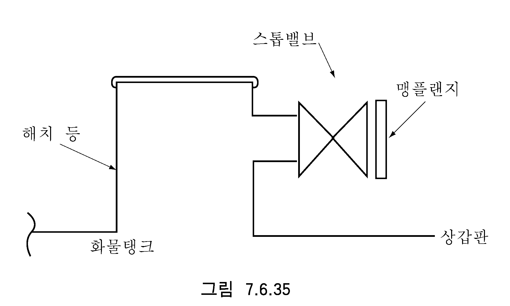
    - **(가)** 환류설비가 완비된 항구에서만 적하할 경우
    - **(나)** 다른 화물탱크로 이송하는 작업방법이 확립되어 있는 경우. 다만, 이 경우에는 상호반응 등의 요건에 따라 적재가 제한되는 수가 있다.
    - **(가)** 및 (나)의 어느 경우라도 작업상의 제약을 준수하는 데에는 곤란한 점이 많으므로 **규칙 1519.**에서 규정하는 고액면경보장치 또는 넘침제어장치를 설치하는 것이 바람직하다. 또한 인화점이 60°C 이하인 화물을 적재하는 탱크는 **규칙 8편 9장 503.의 1항**에 의한 고액면경보장치 또는 넘침제어장치가 요구되며 스필밸브를 사용하여서는 아니 된다(스필밸브는 동등수단으로 간주할 수 없다).
- **4.** **벤트장치의 설계 파라미터 【규칙 참조】**
  - **(1)** **규칙 802.**의 **4**항에서 규정하는 벤트장치의 크기는 최대설계적하율로 하역할 때 생기는 배압이 다음 중 어느 하나에 해당하는 허용압력을 넘지 않도록 고려하여야 한다.
    - **(가)** 화물탱크의 강도에 대하여 특별한 고려가 되어 있지 않은 경우 탱크설계압력 2.45 $\mathrm{m}$(수두)
    - **(나)** 화물탱크가 적절히 보강되고 또한 우리 선급 검사원이 입회하여 탱크시험을 한 경우에는 그 수두.
  - **(2)** 탱크 벤트장치의 크기를 정함에 있어서는 **규칙 802.**의 **4**항에서 규정하고 있는 설계 파라미터를 고려하여야 하며 배압계산식은 우리 선급이 인정하는 식이어야 한다. 비등점이 45°C 이하이고 높은 증기압을 가지는 화물의 경우, **규칙 804.**의 **4**항에서 규정하고 있는 적하 중의 가스발생과 관련하여 1.25를 초과하는 계수를 요구할 수 있다.
  - **(3)** 적하/양하시에는 PV밸브 또는 고속배출장치에 바이패스 라인을 설치하여 통기할 수 있다. 또한, 이 경우에 바이패스 라인에 대한 대기개구의 높이는 벤트장치에 관한 배기구의 높이에 대한 요건(**규칙 803.**의 **3**항 (1)호, **1512.**의 **1**항 (1)호 및 (2)호)에 만족하여야 한다. 다만, 고속배출장치를 열어서 증기를 직접적으로 배출하는 벤트 방법은 인정되지 아니한다.
- **5.** **규 칙 802.**의 **3**항의 고액면경보장치 및 넘침제어장치는 우리 선급에 승인된 형식의 것이어야 한다.

#### 803. 탱크벤트장치의 형식

- **1.** **개방식 벤트장치 규칙 803.**의 **1**항에서 󰡒화물의 격리를 고려󰡓라 함은 **그림 7.6.36**과 같이 황천시에도 화물탱크내의 화물이 벤트관을 따라 다른 화물탱크로 유입되지 아니하는 설계를 말한다. 다만, 다른 위험화학품 또는 이들의 증기접촉에 의한 품질저하를 고려한 경우 개방식이라도 가능한 한 독립으로 하는 것이 바람직하다. **【규칙 참조】**
  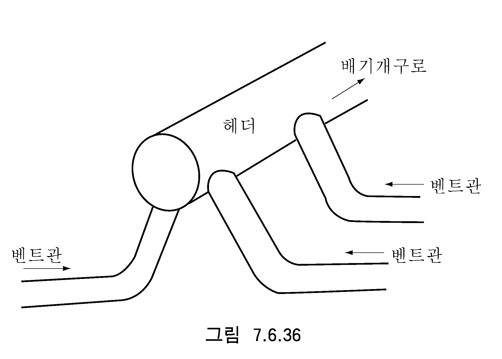
- **2.** **제어식 벤트장치 【규칙 참조】**
  - **(1)** **규칙 803.**의 **2**항에서 󰡒화물의 격리를 고려하여 그러한 독립의 벤트 과압측에 한하여 하나 또는 몇 개의 공통헤더로 통합할 수 있다󰡓라 함은 다음을 말한다.
    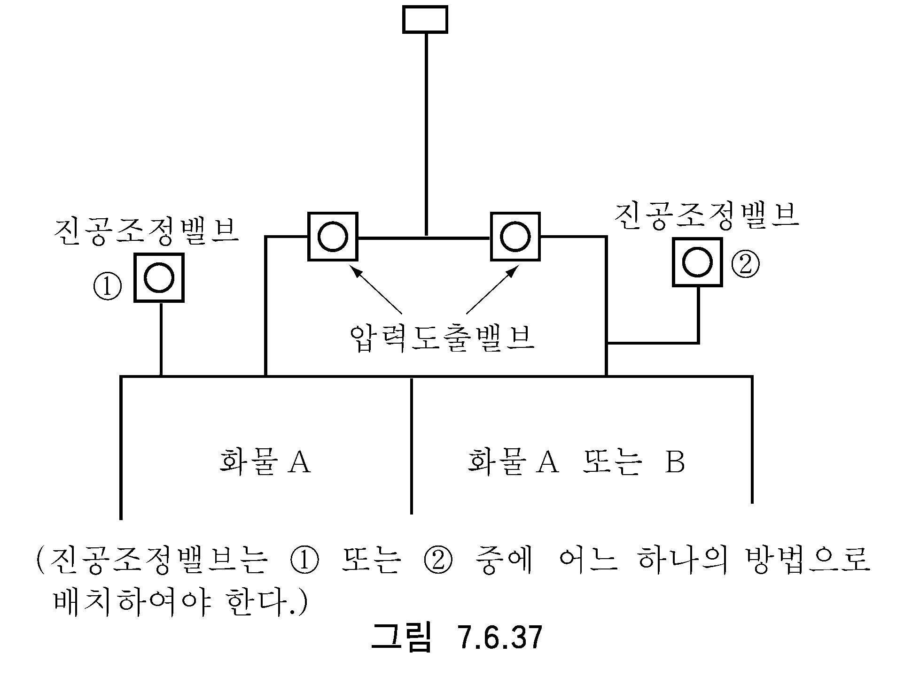
    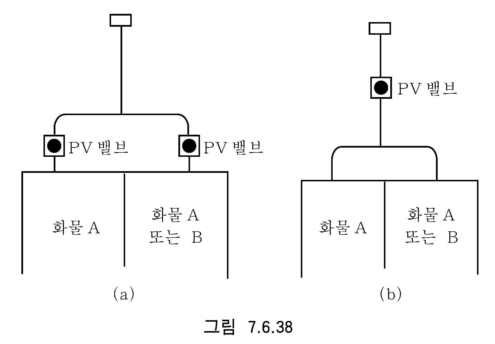
    - **(가)** 탱크마다 서로 다른 화물을 운송하는 화물탱크 또는 탱크마다 동일한 화물을 운송하는 화물탱크의 제어식 벤트장치를 공통헤더로 유도하는 경우, 별도의 압력도출밸브 및 진공도출밸브를 설치하여야 하며 **그림 7.6.37** 이외의 배치는 허용되지 아니한다. 또한, 상호반응을 일으키는 물질을 운송하는 탱크에서는 공통헤더로 유도하는 방식을 허용하지 아니한다.
    - **(나)** 탱크마다 서로 다른 화물을 운송하고자 하는 화물탱크 또는 탱크마다 동일한 화물을 운송하고자 하는 화물탱크의 벤트장치용 공통관에 PV밸브의 압력측 및 부압측이 유도되는 PV밸브를 사용하는 경우, 각 탱크마다 독립의 벤트장치를 설치하는 것 이외의 배치는 허용되지 아니한다. 따라서, **그림 7.6.38**의 (a) 및 (b)의 방법은 모두 인정되지 아니한다.
  - **(2)** **규칙 803.**의 **4**항 (1)호에서 규정하는 󰡒보행로상 6 $\mathrm{m}$이상 상방에󰡓의 측정은 **그림 7.6.39**와 같이 한다. 진공 조절밸브의 개구높이는 **규칙 1516.**의 **2**항의 규정이 요구되지 아니하는 화물은 건현갑판상 760 $\mathrm{mm}$ 이상일 것.) **【규칙 참조】**
    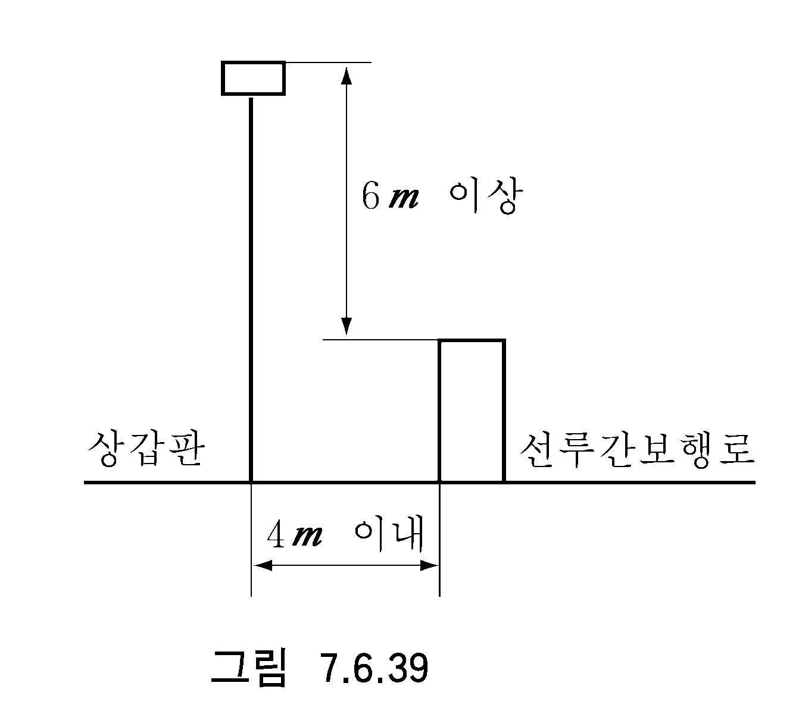
  - **(3)** **규칙 803.**의 **7**항에서 규정하는󰡒화물증기의 결빙 또는 악천후하에서 착빙󰡓의 대책으로 한랭지역을 항해하는 선박은 결빙방지를 위하여 가열 설비 등을 하여야 한다. 가열설비 등을 특별히 갖지 아니한 선박에도 적절한 보수 및 검사작업절차를 확립하여 놓아야 한다. **【규칙 참조】**
  - **(4)** **규칙 803.**의 **2**항에서 PV밸브는 우리 선급의 형식승인을 받아야 하며, 압력설정, 부착, 검사 및 표시 등에 대하여는 **8편 9장 501.**을 따른다.
  - **(5)** **규칙 803.**의 **5**항 및 **6**항의 화염침입방지장치 (고속배출장치 포함)는 우리 선급의 형식승인을 받아야 하며 설계, 배치, 검사 등에 대하여는 **8편 2장 403.의 2**항에 따른다. **【규칙 참조】**

#### 806. 화물탱크 가스프리 【규칙 참조】

- **1.** **화물탱크의 가스프리 방법 및 지침에 대하여는 위험화학품** 산적운반선의 작업지침서에 상세히 기재되어야 한다.
- **2.** 가스프리용 개구는 거주구역 또는 업무구역에 이르는 모든 개구 또는 공기흡입구에서 **규칙 803.** 또는 **1512.**에서 규정한 거리 이상 떨어진 장소에 설치하여야 한다.

### 제 9 절 환경제어

#### 901. 일반사항

- **1.** **화물탱크의 불활성화 또는 차단이 요구되는 경우**
  - **(1)** **규칙 901.**의 **3**항 (1)호에 규정하는 “운송중의 통상 손실분을 보충하기에 충분한 양의 불활성가스를 선내에서 얻을 수 있도록” 하기 위하여 불활성가스 공급장치는 다음에 따라야 한다. **【규칙 참조】**
    - **(가)** 압력용기에 격납한 불활성가스와 함께 항해 중의 보충을 위한 장치로서 대기로부터 질소를 분리하는 질소가스 발생장치를 사용할 수 있다.
    - **(나)** 본선에 싣고 다녀야 하는 불활성가스의 요구량은 본선의 구조, 설비 및 실제 운항중 발생할 수 있는 손실 예정분을 고려하여야 하며, 이와 관련된 계산자료를 제출하여야 한다. 추가로, 상기의 내용을 Cargo operation manual에 반영하여야 한다.
  - **(2)** **규칙 901.**의 **3**항 (4)호에서 󰡒감시하는 수단󰡓라 함은 다음을 말한다. **【규칙 참조】**
    - **(가)** 연속감시 가능한 장치
      - **(a)** 고정식 산소농도계에 의한 연속감시 또는
      - **(b)** 탱크내 분위기의 연속압력계측과 휴대식 산소농도계의 병용
    - **(나)** “밀폐형” 계측장치가 요구되는 화물로서 불활성화법이 적용되는 경우, 휴대식 산소농도계를 사용하여 계측할 때에는 계측 중 및 계측 후에도 갑판 상에 화물이 누설되지 않는 라인에서 계측을 하여야 하며 배출가스를 화물벤트라인으로 유도하는 수단을 갖추어야 한다. “제한형” 계측장치가 요구되는 화물의 경우, 계측용 개구를 자동으로 폐쇄하기 위한 수단을 갖추어야 한다.
- **2.** **이중선체구역 등의 환경제어**
  이중선체구역 및 이중저구역의 벤트장치, 불활성가스장치 및 가스탐지는 **규칙 8편 2장 405.의 1**항 (3)호, **407. 2**항 및 **408.**에 따른다. *(2023)*

### 제 10 절 전기설비

#### 1001. 일반사항

- **1.** **인화성 분위기 중의 전기기기 【규칙 참조】**
  - **(1)** **규칙 1001.**의 **5**항을 적용함에 있어서 “우리 선급의 승인을 받아야 한다”라 함은 다음에 따른다.
    - **(가)** **규칙 6편 1장 9절**의 규정에 적합한 것으로 가스의 종류에 따라 **규칙 17절**의 최저요건일람표의 i란에 의한 장치그룹 및 온도분류를 가질 것.
    - **(나)** **규칙 6편 1장 9절**에 의한 방폭형 전기기기로서 형식시험을 받은 것일 것.
    - **(다)** 구조상 발화원이 될 염려가 없다고 인정되는 것일 것.

#### 1002. 접지 【규칙 참조】

- **1.** **규 칙 1002**을 적용함에 있어서 전기적 접지는 **규칙 6편 1장 201.**의 **3**항의 규정을 준용한 것으로 하여야 한다. 가스킷붙이 플랜지이음의 경우 플랜지 볼트만으로서는 접지로 인정하지 아니하고 접지접속도체로 접속 및 접지하여야 한다.

### 제 11 절 방화 및 소화

#### 1102. 화물펌프실

- **1.** **한정된 종류의 화물을 전용으로 운송하는 선박의 소화장치 규칙 1102.**의 **2**항에서 󰡒우리 선급이 적당하다고 인정하는 소화장치󰡓라 함은 고정식 탄산가스 소화장치를 말하며 한정된 종류의 화물로서 **규칙 17절**의 최저요건일람표의 $l$란에󰡒NO󰡓라고 기재된 화물만을 운송하는 경우의 소화장치에 대하여는 우리 선급이 적절하다고 인정하는 바에 따른다. **【규칙 참조】**

#### 1103. 화물지역

- **1.** **포말원액의 종류 【규칙 참조】**
  - **(1)** **규칙 1103.**의 **2**항에서 󰡒표준형 단백질계 포말󰡓이라 함은 포말 본래의 성질을 유지하기 위한 어떠한 안정제도 또한 포말원액의 유동점을 0°C 미만의 적절한 레벨로 유지하기 위한 동결방지제도 포함하지 않는 것을 말한다.
  - **(2)** **규칙 17절** 최저요건일람표의 $l$란에 포말을 포함한 복수의 소화제가 유효하다고 되어 있는 경우에는 포말소화장치를 설치한다.
- **2.** **포말공급장치 규칙 1103.**의 **3**항을 적용함에 있어서 포말공급장치는 다음에 따른다. **【규칙 참조】**
  - **(1)** 화물탱크 갑판구역은 **그림 7.6.40**을 참조한다.
  - **(2)** 화물탱크내로 포말을 공급할 경우에는 출입용해치를 이용할 수 있다.
    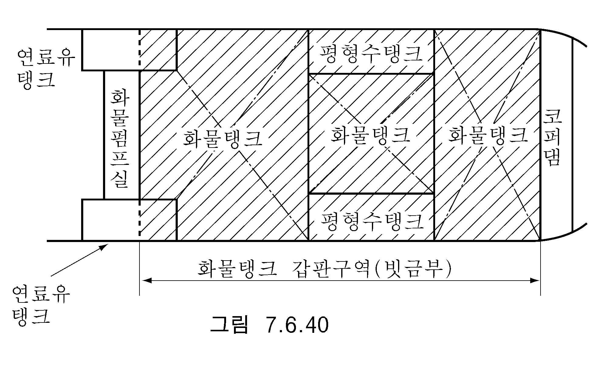
- **3.** **포말용액의 공급률 규칙 1103.**의 **5**항 (3)호를 적용함에 있어서 재화중량 4000톤 미만의 선박에 대한 모니터의 최소용량은 매분당 1000 $l$로 하고 살포율은 10 $l/\mathrm{m} ^{2} /mi n$로 할 수 있다. **【규칙 참조】**
- **4.** **모니터 및 포말방사기의 사양 규칙 1103.**의 **7**항을 적용함에 있어서 재화중량 4000톤 미만의 선박의 모니터 및 포말방사기는 **3**항의 규정을 준용한다. **【규칙 참조】**
- **5.** **소화주관의 요건 규칙 1103.**의 **12**항을 적용함에 있어서 소화주관은 포말소화중 갑판상, 거주구역, 제어실 및 기관실의 구획에 적어도 합계 2조의 방수가 가능하여야 한다. **【규칙 참조】**
- **6.** **한정된 종류의 화물을 전용으로 운송하는 선박에 대한 대체설비 규칙 17절**의 최저요건일람표의 *l*란에 “NO”라고 표시된 화물만을 운송하는 경우의 소화장치는 우리 선급이 적절하다고 인정하는 바에 따른다. **【규칙 참조】**
- **7.** **이동식 소화장치 규칙 1103.**의 **14**항을 적용함에 있어서 이동식 소화장치는 각 매니폴드부에 적재화물에 적합한 소화제를 사용한 용량 9 $l$에서 13.5 $l$까지의 소화기 2개를 비치하여야 하며 하역시 이외는 적절한 장소에 격납하여 두어야 한다. **【규칙 참조】**
- **8.** **발화원의 배제 규칙 1103.**의 **15**항을 적용함에 있어서 윈드러스 및 체인로커는 발화원으로 간주하어야 하며 위험구역내에 배치하여서는 아니 된다. 또한, **규칙 8편 2장의** 관련 규정에도 만족하여야 한다. **【규칙 참조】**

#### 1104. 특별요건

- **1.** **특별요건 【규칙 참조】**
  - **(1)** **규칙 17절**의 최저요건일람표 중 $l$란의 적용에 있어 한 종류의 화물을 전적으로 운반하는 선박은 $l$란에 기재된 소화설비 중 하나를 선택하여 설치할 수 있다. **규칙 17절**의 최저요건일람표의 $i$란이 󰡒NF󰡓이고 $l$란이 󰡒No󰡓인 물질만을 운송하는 선박의 소화설비는 화물지역 갑판의 모든 장소에 서로 다른 소화전에서 방출되는 최소 2개의 소화노즐로 물을 분무할 수 있어야 한다.
  - **(2)** 드라이 케미컬 분말소화장치의 소화제 용량은 다음 용량 중 큰 것 이상으로 한다.
    또한, 기타의 설비요건은 **규칙 5장 1104.**를 준용한다.
    - **(가)** **규칙 5장 1104.**의 **6**항에서 규정하는 용량
    - **(나)** 이 소화장치가 요구되는 화물을 동시에 적재할 예정인 화물탱크의 합계 갑판면적에 대하여 1 $\mathrm{m} ^{2}$당 1.5 $\mathrm{kg}$.
  - **(3)** 암모니아수용액(28 % 이하)"의 소화장치로서 **규칙 17절** 최저요건일람표의 $l$란에서 요구하는 “C(물분무)”는 고정식 갑판포말소화장치로부터의 살수로 대신할 수 있다.

### 제 12 절 화물지역 내의 동력통풍장치

#### 1201. 화물취급 작업중 통상 사람이 들어가는 구역 【규칙 참조】

- **1.** **구획실에 들어가기 전의 통풍 규칙 1201.**의 **2**항을 적용함에 있어서 구획실에 들어가기 전의 통풍시간은 15분을 표준으로 한다.
- **2.** **통풍장치의 형식 규칙 1201.**의 **4**항을 적용함에 있어서 화물펌프실의 통풍용 덕트는 화물펌프실 상부에 설치하여야 하며 **규칙 1장 105.**에 적합하도록 배치하여야 한다. 화물의 증기밀도 및 공기의 흡입효율 등을 고려하여 흡입구의 상호거리는 화물펌프실의 대각선상에 가능한 한 멀리 떨어지도록 배치하여야 한다.
- **3.** **통풍용 흡기구의 배치 규칙 1201.**의 **6**항을 적용함에 있어서 통풍용 흡입구는 위험한 증기가 다시 흡입될 가능성이 최소가 되도록 배치하여야 한다.
- **4.** **통풍용 덕트의 배치 규칙 1201.**의 **7**항을 적용함에 있어서 **그림 7.6.41**에서 통풍덕트의 화물펌프실과 기관실의 경계격벽과의 공유격벽은 운송이 인정되는 화물증기에 대한 보호가 요구되는 경우 보수가 용이하지 않으므로 인정할 수 없다.
  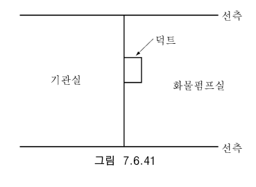
- **5.** **송풍기를 구동하는 전동기의 요건 규칙 1201.**의 **8**항을 적용함에 있어서 “스파크가 발생하지 않는 구조”의 통풍용 송풍기는 **규칙 8편 3장 104.**에 따른다.
- **6.** **송풍기의 예비품 규칙 1201.**의 **9**항을 적용함에 있어서는 통풍기의 형식마다 1개의 임펠러를 예비품으로 비치하여야 한다.
- **7.** **통풍용 덕트의 개구에 설치되는 보호 스크린 규칙 1201.**의 **10**항을 적용함에 있어서 보호 스크린은 플레임스크린 기능이 없는 13 $\mathrm{mm}$ × 13 $\mathrm{mm}$ 메시의 금속망으로 할 수 있다. 다만, 금속망은 이물질의 낙하에 견딜 수 있는 적절한 강도를 가진 것이어야 한다.

#### 1202. 펌프실 및 통상 사람이 들어가는 기타의 폐위구역 【규칙 참조】

- **1.** **규 칙 1202.를** 적용함에 있어서 아래 사항을 만족하여야 한다.
  - **(1)** 펌프실 내에 있는 펌프 및 밸브의 제어장치가 펌프실 외부에 설치되어 있든지 펌프실 내부에 설치되든지에 상관없이 **규칙 1202.**의 규정을 적용한다.
  - **(2)** 펌프실 및 통상 사람이 들어가는 기타의 폐위구역은 시간당 20회의 환기능력을 가지는 이외에 **규칙 1201.**의 규정에도 적합하여야 한다. “통상 사람이 들어가는 기타의 폐위구역”에는 **규칙 1401.**의 **2**항에서 규정하는 특별한 로커 및 보관실과 **규칙 1402.**의 **5**항에서 규정하는 로커를 포함한다. 다만, 최대이동거리가 5 $\mathrm{m}$ 이하인 폐위된 소구획에 대해서 고정식 통풍장치를 설치하기 곤란한 경우에는 이동식 통풍장치를 인정할 수 있다.
  - **(3)** 화물관이 통과하지 않는 평형수펌프실 혹은 일체의 플랜지이음 또는 밸브를 가지지 아니하는 화물관이 통과하는 평형수펌프실은 다음과 같이 취급한다.
    - **(가)** 평형수펌프실용 동력통풍장치의 배기구는 **규칙 1201.**의 **5**항에서 규정하는 위치의 제한을 받지 아니한다.
    - **(나)** 평형수펌프실용 동력통풍장치의 흡기구 및 배기구는 13 $\mathrm{mm}$ × 13 $\mathrm{mm}$ 메시의 보호금속망을 부착한다.
    - **(다)** 평형수펌프실의 동력통풍장치에 대하여는 각 형식마다 화물펌프실의 통풍장치에서 요구하는 예비부품을 비치하여야 한다.
    - **(라)** 평형수펌프실의 소화장치로 고정식 가스소화장치를 설치할 필요는 없다.

#### 1203. 통상 사람이 들어가지 아니하는 구역 【규칙 참조】

- **1.** **통상 사람이 들어가지 아니하는 구역** 통상 사람이 들어가지 아니하는 장소에 설치하는 통풍장치로서 자연통풍장치만을 설치하는 것은 인정되지 아니한다. 고정식 덕트에 송풍기를 설치할 경우에는 시간당 8회, 고정식 덕트가 설치되지 않는 경우에는 시간당 16회의 환기능력이 요구된다.

### 제 13 절 계기

#### 1301. 계측

- **1.** **계측장치의 형식 【규칙 참조】**
  - **(1)** **규칙 1301.**의 **1**항에서 규정하는 계측장치의 형식중에 제한형, 밀폐형에 대한 개구는 다음에 따른다.
    - **(가)** 제한형 : 측심관 및 얼리지 해치용 개구의 안지름은 200 $\mathrm{mm}$ 이하로 하고 자동폐쇄형의 관두 부착품을 부착하여야 한다. 화물탱크의 계측시에는 화물증기의 대량 누설을 방지하기 위한 구조의 계측장치를 부착할 수 있는 가스실 밸브이어야 한다. 필요한 경우에는 유리로 만든 관측용 창을 별도로 설치하여야 한다.
    - **(나)** 밀폐형 : 밀폐구조는 모두 용접구조로 하는 것을 원칙으로 하지만, 정기적 검사를 위한 플랜지 구조로서 평상시에는 개방하지 않는 구조로 된 것은 인정할 수 있다.
  - **(2)** **규칙 1301.**의 **1**항 (1)호 부터 (3)호에서 규정하는 형식으로서 밀폐형은 개방형 및 제한형을 제한형은 개방형을 각각 겸할 수 있다. 즉 안전성의 등급은 밀폐형, 제한형, 개방형 순서로 낮아지게 된다. 또한 밀폐형이 요구되는 화물을 적재하는 탱크에는 밀폐형에 추가하여 제한형의 계측장치를 병설할 수 있다. 밀폐형이 요구되는 화물을 적재할 경우에는 밀폐형의 계측장치만을 사용하여야 하며 이 탱크에 제한형이 요구되는 물질을 적재하는 경우는 밀폐형, 제한형 중 어느 계측장치를 사용할 수 있다. 다만, 밀폐형 또는 제한형이 요구되는 탱크에는 안전상 개방형의 계측장치를 설치하여서는 아니된다.
  - **(3)** 계측장치로서 관측용 창을 설치하는 경우에는 그 구조, 액밀 성능 및 가스밀 성능은 탱크정부와 동등의 것이어야 하며 충분한 강도를 가진 보호덮개를 설치하여야 한다.
  - **(4)** 어떠한 경우에도 계측장치를 탱크 격벽에 플랜지로 부착하는 방법은 인정되지 아니한다. 다만, **그림 7.6.42**와 같이 격벽의 오목한 부분에 계측장치를 설치하는 경우에는 인정할 수 있다.
    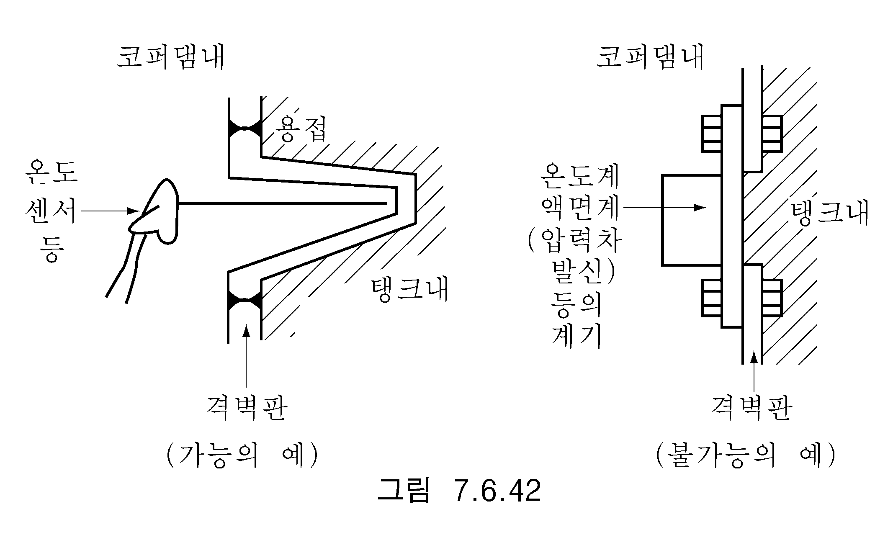
  - **(5)** 액면지시장치의 성능 및 구조는 󰡒**제조법 및 형식승인 등에 관한 기준**󰡓에 따라 승인된 것이어야 한다.
  - **(6)** 기타 계측장치의 시험(압력, 온도 등) 및 검사는 다음에 따른다. 다만, 장치의 효과를 검증할 수 있는 경우에는 실제 화물을 이용하여 성능시험을 할 필요가 없다.
    제조자가 작성한 시험방안에 따라 실제 화물을 사용하여 성능시험을 한다. 다만, 이미 승인한 것과 같은 형식의 장치에 대하여 우리 선급이 인정하는 경우에는 실제 화물을 사용하는 성능시험을 생략할 수 있다. 고정식 장치는 우리 선급이 승인한 본선시험방안에 따라 시험 및 검사를 한다.
    본선에 설치되어 있는 계측장치 및 설비는 다음 사항을 명기한 자료(우리 선급의 승인을 받은 것)을 본선에 비치하여야 한다.
    - **(가)** 제조시의 시험방법
    - **(나)** 선내에서의 재시험 및 재검사
      - **(a)** 사용전의 점검방법(시험방법 포함)
      - **(b)** 사용중의 점검방법(시험방법 포함)
      - **(c)** 제조자가 정하는 정기적인 점검방법 및 그 주기
      - **(d)** 장치의 유효기간
      - **(e)** 정기적 검사시의 시험 및 검사방법
      - **(f)** 기타 주의사항

#### 1302. 증기검지 【규칙 참조】

- **1.** **독성증기검지기가 유효하지 않은 화물에 대한 요건** 특정 화물에 대하여 적절한 증기검지기를 사용할 수 없는 경우에는 우리 선급의 승인을 받아야 한다. 다만, 이용이 가능한 한 고정식 증기검지기를 설치하는 것이 바람직하다. 최소한 이황화탄소 및 클로로슬폰산에 대하여는 고정식 증기탐지기를 설치하여야 한다.

### 제 14 절 인신보호

#### 1401. 보호장구

- **1.** **작업복 및 보호장구의 수량 규칙 1401.**의 **1**항에서 요구하는 작업복 및 보호장구는 어떤 방향으로부터도 화물비산에 대하여 전신을 보호할 수 있는 것으로 하고 갑판상 및 화물펌프실내 작업원분의 수량을 비치하여야 한다. 한 종류의 작업복 또는 보호장구가 본선의 적재 예정인 화물 전체에 적합하지 아니한 경우에는 각 화물에 적합한 종류의 것을 각각 필요한 수만큼 비치하여야 한다. **【규칙 참조】**
- **2.** **작업복 및 보호장구의 보관장소 규칙 6장**의 적용을 받는 화물을 취급하기 위하여 1회 이상 사용한 인신보호구는 화물지역 내에 배치한 전용로커에 보관하는 것을 원칙으로 한다. 그 중 1조는 항상 화물펌프실 가까이에 있는 로커에 보관한다. 화물지역 내에 설치된 보호장구를 보관하기 위한 전용로커의 구조는 **규칙 3편 17장**의 규정에 따른다. 다만, 부득이한 경우에는 **그림 7.6.43**과 같이 거주구역 및 업무구역과의 사이에 개구가 없는 창고 또는 로커로서 화물지역 밖에 있는 곳에 보관할 수 있다. 또한 이 규정은 신품이나 미사용품 또는 충분히 세정된 후 사용하지 아니한 것에는 적용하지 아니한다. **【규칙 참조】**
  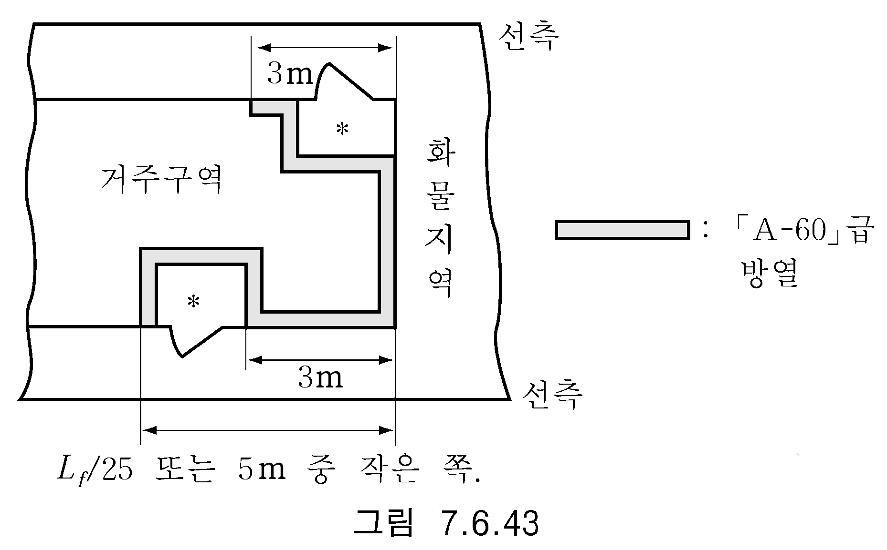

  | * : 거주구역 또는 업무구역 내에 보호장구의 보관장소를 설치하는 경우, 보호장구의 보관장소는 **규칙 302.**의 **3**항에서 규정하는 개구를 가지는 지역에 한하여 인정된다. 이 경우, 보관실 내에 샤워기 등을 설치하는 것이 바람직하다. **규칙 1605.**의 **4**항에서 규정하는 화물시료보관실의 위치에 대하여도 동일하게 취급한다. |
  | --- |

#### 1402. 안전장구

- **1.** 안전장구의 수는 본선의 작업인원의 배치 등을 충분히 고려하여 결정한다. **【규칙 참조】**
- **2.** **규 칙 1402.**의 **2**항에서 규정하는 안전장구는 다음에 따른다. **【규칙 참조】**
  - **(1)** 20분간 사용가능한 공기병의 용량은 상용압력에서 개방공기용적이 800 $\mathrm{l}$ 이상일 것.
  - **(2)** 보호복 등은 적재예정화물에 대하여 내산, 내알카리성 및 방독성이 우수한 것을 사용할 것. 다만, **규칙 1401.**의 **1**항에서 요구하는 것과의 겸용은 인정하지 아니한다.
  - **(3)** 내화구명줄은 폐위구획에 들어가는 사람과 구획밖에 있는 사람이 같이 사용할 수 있도록 30 $\mathrm{m}$ 이상일 것.
  - **(4)** 방폭등은 3시간 이상 점등할 수 있는 것일 것.
  - **(5)** 독성화물용 보호복은 장갑 및 장화와 일체형으로 되어야 한다.
- **3.** **규 칙 1402.**의 **3**항 (2)호에서 규정하는 공기압축기는 설비된 공기병의 최고사용압력까지 충진할 수 있는 것이어야 한다. **【규칙 참조】**
- **4.** **규 칙 1402.**의 **4**항의 적용상 유효한 증기검지기가 없이 화물을 운송하는 선박의 화물펌프실에 대한 추가요건을 다음에 따른다. **【규칙 참조】**
  - **(1)** 유효한 독성증기검지기 없이 독성화물을 운송하는 선박의 화물펌프실내의 작업용 추가공기병은 **규칙 1402.**의 **3**항에 규정하는 공기병에 추가하여 장비할 것.
  - **(2)** 추가 호흡구로서 저압의 공기관계통에 대신하는 동등량의 공기병의 용량은 개방공기용량으로 4800 $\mathrm{l}$ 이상일 것.

#### 1403. 비상장구 【규칙 참조】

**규칙 1403.**의 **2**항을 적용함에 있어서 위험물 사고시 의료응급처리지침를 참고로 하며 사고 처리용으로 적합할 수 있는 설비와 해독은 물론 그 증상에 따른 사고 처리 지침을 제공한다.

### 제 15 절 특별요건

#### 1502. 93 % 이하의 질산암모늄 용액

- **1.** **탱크 가열장치내의 열교환 매체의 온도 규칙 1502.**의 **4**항 적용상 온도경보는 가시가청경보로 한다. 검지온도는 탱크내의 평균온도로 하고 가열장치는 부분가열이 되지 아니하도록 배치한다. **【규칙 참조】**
- **2.** **암모니아가스를 주입하기 위한 고정설비 규칙 1502.**의 **6**항 적용상 암모니아가스를 화물에 조입할 경우에는 화물펌프로 화물을 순환시키면서 주입한다. **【규칙 참조】**
- **3.** **화물펌프의 형식 규칙 1502.**의 **7**항 적용상 원심펌프의 수밀장치는 **그림 7.6.44**과 같이 랜턴링을 설치한 스터핑박스로 하여야 하며 가압청수를 랜턴링부에서 스터핑박스내로 분사되도록 한다.
  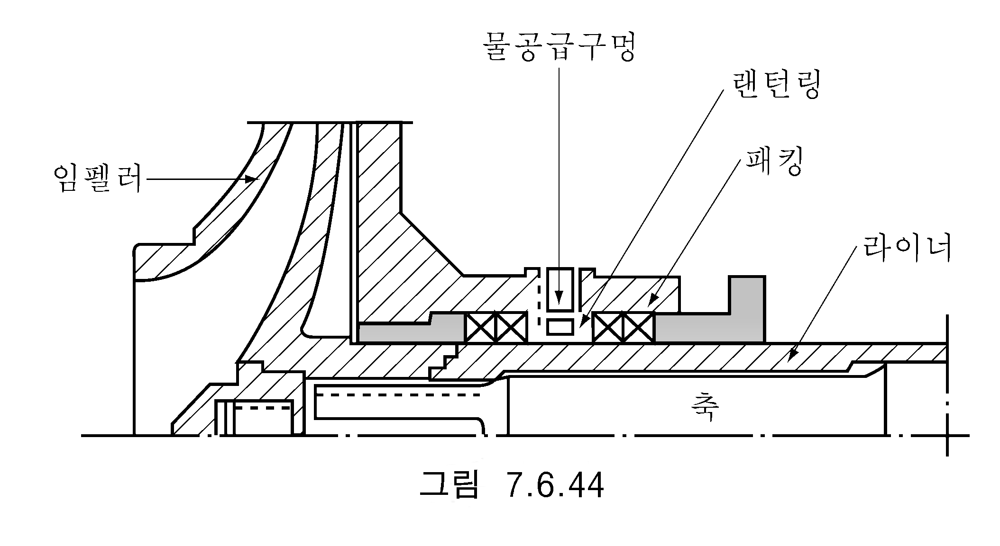

#### 1503. 이황화탄소 【규칙 참조】

- **1.** **비상시 계측용 개구 규칙 1503.**의 **4**항 적용상 비상시 계측용 개구에는 자동폐쇄장치붙이 게이트밸브 또는 콕을 설치하여야 하며 비상시 이외는 사용을 금지하는 주의표시를 하여야 한다.

#### 1505. 과산화수소 용액 【규칙 참조】

- **1.** **고정식 물 분무장치 규칙 1505.**의 **1**항 (10)호 (나)에서 규정하는 󰡒누설속도 및 합계량󰡓을 산정하는 경우에는 배관 및 호스는 전손한 것으로 한다.

#### 1508. 산화프로필렌 및 중량농도 30 % 이하의 산화에틸렌을 함유하는 산화에틸렌/산화프로필렌 혼합물 【규칙 참조】

- **1.** **운송상의 요건 규칙 1508.**의 **35**항을 적용함에 있어서 봉입된 질소가스는 순도 99 % 이상(용적)을 확보할 수 있는 멤브레인형 질소가스발생기에 의한 질소가스를 사용할 수 있다.

#### 1510. 용융유황 【규칙 참조】

- **1.** **화물온도제어장치 규칙 1510.**의 **6**항을 적용함에 있어서 화물온도제어장치는 화물탱크내 온도표시 및 고온․저온 경보장치를 설치하는 경우 온도제어 트립 등은 수동으로 할 수 있다. 이 경우 탱크온도는 어떠한 검지점에서도 155°C를 초과하지 아니하도록 감시제어되어야 한다. 다만, 가열매체가 155°C를 넘지 아니하는 것은 온도표시만 한 것이어도 좋다. **【규칙 참조】**
- **2.** 화물관 또는 벤트관 등이 응고되지 않도록 이중관에 넣어 배관하거나 유효한 장치를 설치하여야 한다.

#### 1511. 산

- **1.** **내식처리 규칙 1511.**의 **2**항을 적용함에 있어서 라이닝 또는 내식재료의 사용은 화물펌프실의 주위벽(바닥 및 바닥에서 1 $\mathrm{m}$ 높이까지의 주위벽)에도 적용된다. 다만, 적재하고자 하는 화물에 대하여 라이닝 또는 내식재료의 내식 유효성이 확인되지 아니할 경우에는 주위벽은 내식성의 재료를 사용하여야 한다. 여기서 라이닝은 탱크 또는 관장치에 스프레이 형식으로 분사되어 적용되는 것이 아닌 고체상태로 적용되는 내산성 재료이다. “라이닝 재료의 탄성은 지지하는 주위벽의 탄성보다 적어서는 아니 된다”라 함은 라이닝과 라이닝이 시공된 면(lined surface) 사이의 결합이 분리되는 것을 막기 위함이다. *(2023)* **【규칙 참조】**
- **2.** **화물의 분출 및 누설방지 규칙 1511.**의 **4**항을 적용함에 있어서 화물의 분출을 예방하기 위한 덮개는 내산성의 것이어야 한다. **【규칙 참조】**
- **3.** **화물과 연료유 탱크와의 격리 규칙 1511.**의 **6**항을 적용함에 있어서 화물 또는 화물 찌꺼기를 적재하는 탱크와 연료유 탱크와의 격리에 대하여는 면접촉, 선접촉 및 점접촉 어느 것도 인정하지 아니한다. **【규칙 참조】**
- **4.** **화물누설검지장치 규칙 1511.**의 **7**항을 적용함에 있어서 누설검지는 pH계 및 수소검지기로 하며 이들 기구는 휴대식으로 할 수 있다. 다만, 대체수단으로 리트머스시험지 등을 사용할 수 있다. **【규칙 참조】**
- **5.** **화물펌프실의 빌지흡입 및 배출설비 규칙 1511.**의 **8**항을 적용함에 있어서 화물펌프 및 플랜지 커플링부에는 드레인받이를 설치하고 드레인 콕에 의해 빌지웰 또는 별도의 탱크까지 유도하여야 한다. 이들의 경로는 내식성 재료로 되어 있거나 유효한 코팅을 하여야 한다. 화물펌프실 바닥 및 바닥에서 1 $\mathrm{m}$ 높이까지의 주위벽을 내식성 재료로 하는 경우에는 예외로 한다. **【규칙 참조】**

#### 1512. 유독물질 【규칙 참조】

- **1.** **규 칙 1512.**의 **2**항의 탱크 통풍장치에는 육상시설로 가는 환류관측에 스톱밸브를 설치하여야 한다.

#### 1513. 첨가제로 보호되는 화물

- **1.** **규칙 1513.**의 **3**항 (2)호의 적용에 있어서 첨가제가 산소의존형인 경우, 반응억제제가 활성화되기 위하여 탱크의 증기부에서 요구되는 최소 산소농도가 기재되어야 한다.(**MSC-MEPC.2/Circ.14**) **【규칙 참조】**
- **2.** **규칙 1513.**의 **3**항 (2)호 및 **5**항의 적용에 있어서 산소 의존형 반응억제제를 함유한 제품이 **SOLAS II-2/4.5.5 규칙**에 의해 불활성화가 요구되는 선박으로 운송되는 경우, 증명서에 기재된 탱크 증기부 내의 산소농도를 유지하도록 규칙에서 요구하는 바에 따라 불활성장치를 작동하여야 한다.(**MSC-MEPC.5/Circ.10) 【규칙 참조】**

#### 1514. 37.8°C에서 절대증기압이 0.1013 _s2 보다 높은 증기압을 가진 화물

- **1.** **규 칙 1514.**의 **4**항의 적용에 있어서 탱크 통풍장치에는 육상시설로 가는 환류관측에 스톱밸브를 설치하여야 한다. **【규칙 참조】**

#### 1516. 화물의 혼합 【규칙 참조】

- **1.** **알카리성 또는 산성물질의 혼입금지 규칙 1516.**의 적용을 받는 화물과 알카리성 또는 산성화물을 운송하는 화물탱크와의 격리에 대하여는 면접촉, 선접촉 또는 점접촉 어느 것도 인정하지 아니한다. 또한 화물관 및 화물탱크 벤트장치도 분리하여야 한다.
- **2.** **물의 혼입금지** ***(2021)***
  - **(1)** **규칙 1516.**의 **2**항 (3)호에서 󰡒전용 평형수탱크 또는 물탱크가 비어있고 건조 상태󰡓라 함은 탱크주위벽, 골재 등에 수적(水滴), 습기가 없는 상태를 말한다. 건조상태가 확보되지 않는 전용 평형수탱크 또는 물탱크와 인접하는 화물탱크에는 **규칙 1516.**의 **2**항의 적용을 받는 화물을 적재하여서는 아니되며 이 경우 선접촉 및 점접촉 어느 것도 인정하지 아니한다. 다만, **그림 7.6.45**과 같은 십자형의 이음으로 분리된 선접촉 및 점접촉은 인정할 수 있다.
    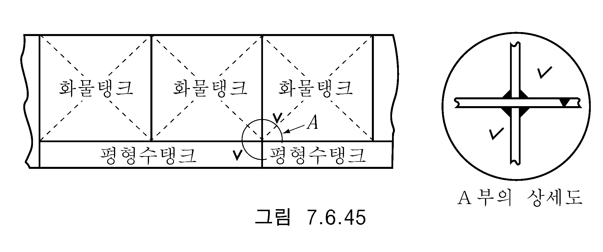
  - **(2)** 평형수탱크에 인접하는 화물탱크에 물과 위험한 반응을 하는 화물을 적재하는 경우에는 해당 평형수탱크의 평형수관에 평형수 배출후에 평형수탱크를 건조공기 등으로 건조시키고, 잘못된 조작으로 인하여 평형수가 주입되지 않도록 조치하여야 한다.
  - **(3)** 물과 위험한 반응을 하는 화물을 가열하는 경우에는 열매체유설비 또는 기타의 간접 가열설비를 갖추어야 한다.

#### 1517. 강제통풍요건 【규칙 참조】

- **1.** **강제통풍요건 규칙 1517.**에서 󰡒작업구역 또는 기타 유사한 구역󰡓이라 함은 업무구역, 화물제어실 및 이와 유사한 장소를 말하며 하역작업을 하는 화물 매니폴드부는 포함하지 않는다.

#### 1518. 특별한 화물펌프실 요건 【규칙 참조】

어떤 경우에도 노출갑판 아래에 화물펌프실을 설치하는 것은 인정하지 아니한다. 즉 **규칙 1518.**의 규정이 적용되는 화물을 운송하는 탱크에는 잠수형 화물펌프를 설치하거나 개방갑판상에 화물펌프실을 설치한다.

#### 1519. 넘침제어

- **1.** **액면경보장치의 시험 규칙 1519.**의 **4**항을 적용함에 있어서 적하에 앞서 실시하는 경보시험은 액면계의 실제작동에 따라 확인할 수 있어야 한다. 실제작동에 따라 확인이 불가능한 경우는 **그림 7.6.46**와 같이 경보회로가 정상임을 확인할 수 있는 적절한 장치를 설치하여야 한다. **【규칙 참조】**
  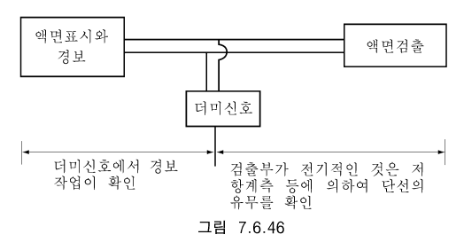
- **2.** **고액면 경보장치의 독립성** 고액면 경보장치와 넘침제어장치가 요구되는 화물은 밀폐형의 계측장치가 요구되는 경우가 많다. 이와 같은 물질을 적재하는 탱크는 다음 3종류의 검출단이 요구된다. **【규칙 참조】**
- **3.** **고액면 경보장치의 설치 규칙 1519.**의 **6**항에서 규정하는 고액면 경보장치는 제어실 또는 선교에 모듈러 유니트가 있는 경우, **2**항의 (가), (나) 및 (다)에 대하여 독립된 액면지시계 및 가시경보를 설치하여야 한다. 또한, 가시가청경보는 작업자가 화물지역에서 인지할 수 있는 장소에 설치하여야 하며. 가시경보는 육상시설에서도 잘 보이는 장소에 설치하여야한다. 제어실이 없는 경우에는 가시가청 경보는 화물제어장소에 설치하여야 한다. 완전하게 세정된 화물탱크의 출입을 제외하고 검출단의 시험장치는 탱크밖에 배치하여야 하며 전기회로 또는 자기감시형 회로의 시뮬레이션테스트는 인정할 수 있다. **【규칙 참조】**

### 제 16 절 작업규정

#### 1601. 탱크당 최대허용화물량 【규칙 참조】

**규칙 1601.**에서 규정하는 최대허용화물량은 45°C에 있어서 화물의 온도팽창을 고려하여 결정하여야 하며 벤트관은 항해시 트림에 의하여 벤트관의 탱크내 개구부가 화물로 막히지 않도록 항상 탱크내 기상부에 있도록 배치하여야 한다. 또한, 탱크의 가열에 의한 영향으로 탱크온도가 45°C를 초과할 가능성이 있는 경우, 최대허용화물량은 그 온도를 기준으로 결정하여야 하며 이 경우에는 인접하는 탱크의 영향도 고려하여야 한다.

#### 1604. 화물탱크의 개폐 및 출입 【규칙 참조】

**규칙 1604.**에서 규정하는 화물탱크의 덮개, 얼리지용 개구, 관측창 및 탱크세정용 출입덮개는 가스프리의 공기공급시, 탱크세정시, 개방형 및 제한형의 측심장치가 요구되는 탱크의 측심시, 가스검지시 및 시료채취시 이외는 개방하여서는 아니된다.

#### 1605. 화물시료의 보관 【규칙 참조】

**규칙 1605.**을 적용함에 있어서 화물지역 내에 시료를 보관하는 경우, 시료를 보관하는 구획은 선박의 노출된 지역에서 바로 출입할 수 있어야 하며 해당구획에는 총용적에 대하여 시간당 20회 이상의 환기능력을 가지는 배기식의 동력통풍장치를 별도로 설치하여야 한다. 다만, 최대이동거리가 5 $\mathrm{m}$ 이하인 시료보관용 소구획에 대해서 고정식 통풍장치를 설치하기 곤란한 경우에는 이동식 통풍장치를 인정할 수 있다.

#### 1606. 과도한 열에 노출시켜서는 안 되는 화물 【규칙 참조】

과도한 열에 노출시켜서는 아니되는 화물을 적재하는 탱크가 가열되는 경우 또는 가열되는 다른 탱크(화물
