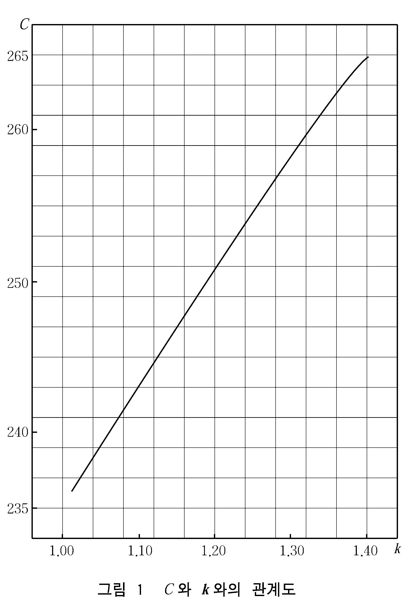

# 제7편 전용선박(5장,6장)

> 선급 및 강선규칙/적용지침 / RA-07B-K / 2025 / KO / Guidance

## 부록 7A-1 적합증서를 요구하지 아니하는 선박에 대한 요건 【규칙 참조】

### 제 1 절 일반사항

#### 101. 적용

- **1.** 적합증서를 요구하지 아니하는 액화가스 탱크선으로서 등록을 하고자 하는 선박의 구조, 설비 및 검사에 대하여는 이 부록의 규정에 따른다. 여기에서 액화가스 탱크선이라 함은 38°C에 있어서 증기압(게이지압)이 0.2$\mathrm{MPa}$ 이상의 액상위험물을 산적으로 운반을 하는 선박을 말한다. 다만, **부록 104.**의 **2**항 (10)호에서 규정하는 시험은 그 선박이 처음으로 하역할 때에 시행하는 것을 조건으로 하여 생략할 수 있다.
- **2.** 특히 이 부록에 규정하고 있지 않은 것에 대하여는 선급 및 강선규칙 해당 각편의 규정에 따른다.
- **3.** 석유가스를 액화한 것 이외의 화물을 적재하는 액화가스 탱크선에 대하여는 그 화물의 성질에 따라 선박의 구조, 배치, 설비 및 검사에 대하여 특별히 고려하여야 한다.
- **4.** 이 부록에서 규정한 것과 다르게 설계된 액화가스 탱크선의 적하설비도 우리 선급이 부록의 규정에 적합하다고 인정하거나 또는 동등한 효력이 있다고 인정하는 경우에는 이 부록에 적합한 것으로 간주한다.
- **5.** 이 **부록 2절**은 가압식 액화석유가스 탱크선에, **3절**은 저온 액화석유가스 탱크선에 각각 적용한다. 다만, 저온 액화석유가스 탱크선으로 -50°C보다 낮은 온도에서 액화석유가스를 운송하는 선박에 대하여는 우리 선급이 적절하다고 인정하는 바에 따른다.

#### 102. 용어 및 정의

이 부록에 있어서 용어의 정의는 다음에 따른다.

- **1.** 가압식 액화석유가스 탱크선이라 함은 38°C에서 0.2 $\mathrm{MPa}$ 이상의 증기압을 갖는 석유가스를 액화한 것을 선체에 항구적으로 설치된 적재탱크에 대기온하에서 가압상태로 적재하여 운송하는 선박을 말한다.
- **2.** 저온 액화석유가스 탱크선이라 함은 38°C에서 0.2 $\mathrm{MPa}$ 이상의 증기압을 갖는 석유가스를 액화한 것을 선체로부터 독립되고 외면에 단열을 시공한 자기지지형의 탱크에 대기압 또는 그 부근의 압력하에서 냉각상태로 적재하여 운송하는 선박을 말한다.
- **3.** 탱크라 함은 가압식 액화석유가스 탱크선에서는 적재탱크 및 중간탱크를 말하며, 적재탱크라 함은 **1**항에서 말하는 적재탱크를, 중간탱크라 함은 하역펌프에 압입수두를 주기 위한 탱크를 말한다. 한편 저온 액화석유가스 탱크선에서는 액화석유가스 화물을 적재하는 **2**항에서 규정한 탱크를 말한다.
- **4.** 탱크창이라 함은 **1**항의 적재탱크 및 **2**항의 탱크를 설치하는 구획을 말한다.
- **5.** 액이라 함은 액화석유가스의 액상을 말한다.
- **6.** 가스라 함은 액화석유가스의 기상을 말한다.
- **7.** 위험구역라 함은 인화 또는 폭발하기 쉬운 물질을 적재하는 장소 및 이들이 모이거나 또는 침입할 우려가 있는 장소를 말한다. 이 부록에서 규정하는 선박에서는 적어도 다음에 정하는 구획 또는 구역은 위험구역로 간주하여야 한다.
  - **(1)** 탱크
  - **(2)** 탱크에 인접하는 구획
  - **(3)** 화물용 펌프실, 압축기실 등 화물을 취급하는 기기실
  - **(4)** 노출갑판상에서 탱크 개구, 가스개구, 액(液) 개구, 화물용 관의 플랜지이음으로부터 3 $m$ 이내의 구역 또는 반폐쇄 장소
    탱크개구 : 맨홀, 탱크부착품 부착부
    가스개구 : 육상연결구 개구, 안전밸브 개구. (3), (7) 및 (8)에서 정하는 구획의 통풍용 개구 및 출입구
    액 개 구 : 육상연결구 개구, 선외비상 배출용관 개구
    화물용관이란 액용 및 가스용관을 말한다. 다만, 선외 비상 배출용관은 제외하며, 미끄럼이음 및 나사이음은 플랜지 이음과 동일한 것으로 취급한다.
    - **(가)** 상기의 각종 개구는 다음의 개구를 말한다.
    - **(나)** 상기의 화물용관의 플랜지이음이란 다음의 것을 말한다.
  - **(5)** 노출갑판상에서 다음의 너비, 높이 및 길이로 둘러싸인 구역
    - **(가)** 선박의 전 너비
    - **(나)** 노출갑판상 2.4 $\mathrm{m}$의 높이
    - **(다)** 선수측에 가장 가까운 적재탱크의 전단으로부터 선미측에 가장 가까운 적재탱크의 후단까지의 길이를 선박의 전후 방향으로 각각 3 $\mathrm{m}$ 연장한 길이
    - **(라)** 소형선으로 선수루 갑판상의 일부가 (다)에서 말하는 가장 가까운 선수측 적재탱크의 전단으로부터 선박의 전방으로 3 $\mathrm{m}$ 연장한 위험구역에만 해당하는 경우로서 부득이 이 장소에 방폭형 이외의 기기를 설치하는 경우는 다음에 따른다.
      - **(a)** 선수루 갑판상에 강제 가스방벽을 설치한다.
      - **(b)** 가스방벽의 높이는 상갑판상 2.4 $\mathrm{m}$로 하고 너비는 가스방벽 부착장소에 있어서 선수루 갑판의 거의 전 너비로 한다.
      - **(c)** 가스방벽에는 개구를 설치하지 않는다.
      - **(d)** 전기기기는 적어도 전폐방수형의 것으로 한다.
  - **(6)** 적재탱크의 바깥표면(탱크에 단열 기타의 외피가 있는 경우는 그것을 외표면이라 한다)으로부터 2.4 $\mathrm{m}$ 이내의 노출구역
  - **(7)** 화물용 관이 부착되는 폐쇄 또는 반폐쇄 장소
  - **(8)** 화물용 호스를 격납하는 구획
  - **(9)** (2) 또는 (3)에 정하는 위험구역 직상의 폐쇄 또는 반폐쇄 장소. 다만, 기밀갑판으로 구획되어 있고 적절한 환기장치가 있는 경우에는 제외한다. 󰡒적절한 환기장치가 있는 경우󰡓란 (2), (3), (7) 및 (8)에 정하는 구획의 통풍기와는 별개의 기계통풍장치로 환기되는 경우를 말하며 환기회수는 별도로 지정하지 않는다.
  - **(10)** (1) 부터 (9)에 정하는 위험구역 중 직접개구를 갖는 폐쇄 또는 반폐쇄 장소
    다음의 경우에는 󰡒직접개구󰡓로 간주하지 않는다.
    - **(가)** 창, 맨홀 등 중에서,
      - **(a)** 가스밀의 고정식 창
      - **(b)** 가스밀 또는 수밀의 볼트 조임개구로서 운항중에 보통은 개방할 필요가 없는 것.
    - **(나)** 문 중에서,
      - **(a)** 상갑판 거주구의 출입구문으로서 비바람막이문 이외에 금속제의 자동폐쇄문을 이중으로 설치한 경우. 다만, 자동폐쇄문의 접촉면에 패킹을 부착한 것이나 적절한 방법으로 충분한 접촉면을 얻을 수 있는 것으로 한다.
      - **(b)** 긴 갑판창고 등의 출입구문으로서 비바람막이문 이외에 금속제의 강제폐쇄문을 이중으로 설치하고 2중문 사이의 구획에 유효한 급기식 기계통풍장치를 설치하는 경우. 비바람막이문 이외에 금속제의 자동폐쇄문을 설치하고 또한 유효한 급기식 기계통풍장치를 설치하고 구획내의 비방폭형 전기기기와 인터록을 하는 경우. 한편, 본 (b)는 (a)의 출입구문에도 적용할 수 있다. 또한, (4), (7), (9) 및 (10)에서 말하는 󰡒반폐쇄장소󰡓란 갑판 및 격벽으로 간막이되고 통풍상태가 노출부와 현저히 다른 장소를 말한다.
- **8.** 탱크창내 보이드 스페이스라 함은 탱크창내의 탱크 주위의 빈 공간을 말한다.
- **9.** 2차 방벽이라 함은 탱크에 누설이 생기는 경우 일정한 기간 이상 누설화물을 보호하여 주 선체구조가 설계시 고려한 온도 이하로 되지 않도록 하기 위한 구조를 말하며, 하나의 탱크내 화물액이 탱크창내에 유출하여 탱크내와 탱크창내 빈공간의 액위가 동일 레벨에 있는 경우에도 그 액을 14일간 이상 유지하는 것으로 한다.
  이 경우 선체의 종 및 횡경사를 고려할 필요는 없다. 또한 탱크내에 액체밀 격벽을 설치하는 경우에는 1구획에서의 누설만을 고려하여 이 액을 14일간 이상 유지하는 것으로 할 수 있다. 다만, 항해구역, 항로를 감안하여 우리 선급이 인정한 경우에는 상기 14일간의 기간을 감할 수 있다.

#### 103. 승인도면 및 자료

선박에 액화석유가스의 적하설비를 설치하고자 하는 경우에는 적어도 다음의 도면 및 자료를 제출하여 승인을 받아야 한다.

- **1.** 제출하여야 할 승인도면 및 자료는 다음과 같다.
  - **(1)** 탱크의 제작사양서(용접재료, 용접요령 상세를 포함)
  - **(2)** 탱크 및 압력용기의 전체조립도 및 상세도(부착품부착자리, 노즐, 내부 부착품 부착상태를 포함)
  - **(3)** 탱크 및 압력용기의 부착품 장치도 및 부착품 상세도(액면계, 급속차단밸브, 익세스플로우 밸브 등을 포함)
  - **(4)** 적재탱크 및 중간탱크의 배치도, 거치도, 갑판 관통부 및 폐쇄장치의 상세도, 작업대 상세도
  - **(5)** 액화석유가스 제관선도 및 계측장치관선도
  - **(6)** 액화석유가스 적하설비를 갖는 구획의 빌지 및 통풍장치도
  - **(7)** 안전장치의 배치도
  - **(8)** 가스탐지기 검출단 배치도
  - **(9)** 액화석유가스용 특수 밸브류, 하역호스, 신축이음, 필터 등의 상세도
  - **(10)** 하역용 펌프, 가스압축기 및 이들의 구동기 구조도
  - **(11)** 위험구역를 명시하는 도면
  - **(12)** 탱크, 관 계통, 기기류의 접지요령도
  - **(13)** 위험구역의 전로포설 요령도 및 전기기기 장비 일람표.
    이 경우 전기기기 장비일람표는 **6편 1장 102.**에 따른다.
  - **(14)** 기타 우리 선급이 필요하다고 인정하는 도면 및 자료
- **2.** 제출하여야 할 참고자료는 다음과 같다.
  - **(1)** 화물구역의 사양서
  - **(2)** 화물의 조성 및 성질(－10°C부터 45°C까지의 포화증기압 선도를 포함)
  - **(3)** 탱크의 강도계산서, 탱크지지부의 강도계산서, 탱크 안전밸브 방출능력 계산서(벤트관의 배압계산을 포함)
  - **(4)** 액화석유가스 제관배치도
  - **(5)** 화물의 충전한도 계산서
  - **(6)** 이 **부록 106.**에 규정하는 취급설명서
    **저온 액화석유가스 탱크선**
- **1.** 제출하여야 할 승인도면 및 자료는 다음과 같다.
  - **(1)** 가압식 액화석유가스 탱크선에서 제출을 요구하는 (5)호, (6)호 및 (9)호 부터 (14)의 도면
  - **(2)** 탱크의 제작사양서(용접 시공요령, 용접부의 시험검사 요령, 탱크의 시험검사 요령 및 단열재의 모든 성질과 그 시공요령을 포함)
  - **(3)** 탱크의 구조도 및 상세도
  - **(4)** 탱크의 부착품 장치도(내부 부착품의 부착상태를 포함) 및 부착품 상세도(액면계 및 특수밸브류를 포함)
  - **(5)** 탱크 받침대, 탱크 고정장치, 탱크의 갑판관통부 및 폐쇄장치의 상세도
  - **(6)** 단열재의 배치 및 부착상세도
  - **(7)** 2차 방벽을 설치하는 경우에는 그 상세도
  - **(8)** 탱크창내 보이드 스페이스의 긴급압력도출장치의 상세도 및 누설액 배출장치의 상세도
  - **(9)** 탱크창내 보이드 스페이스를 불활성화하는 경우에는 그 압력조정장치의 상세도
  - **(10)** 각종 압력용기의 조립단면도, 노즐상세도, 부착품 장치도, 부착품 상세도
  - **(11)** 액화석유가스 관 계통의 계획압력, 계획온도에 대한 사용재료의 구분 및 재료규격
  - **(12)** 재액화장치용 냉매관 계통도
  - **(13)** 가스탐지기, 온도지시기, 압력계 등의 검출단 배치도
  - **(14)** 재액화장치의 주요부의 구조도(냉장장치 규격에 준한다)
- **2.** 제출하여야 할 참고자료는 다음과 같다.
  - **(1)** 가압식 액화석유가스 탱크선에서 제출을 요구하는 (1)호 및 (3)호 부터 (6)호의 자료
  - **(2)** 화물의 조성 및 성질(필요한 온도범위의 포화증기압선도를 포함)
  - **(3)** 재액화장치의 능력계산서

#### 104. 시험 및 검사

각종 시험 및 검사는 다음의 규정에 따르는 이외에 각장의 규정에도 적합하여야 한다.

- **1.** **가압식 액화석유가스 탱크선**
  - **(1)** 수압시험
    탱크, 화물용 압력용기, 관, 밸브 및 이들의 부착품의 하역호스는 제조후 선박에 장비하기 전에 다음의 압력으로 수압시험을 하고 이에 합격하여야 한다.
    - **(가)** 탱크 및 화물용 압력용기 : 설계압력의 1.5배
    - **(나)** 관, 밸브 및 부착품과 하역호스 : 설계압력(또는 최고사용압력)의 2배
    - **(다)** 화물용 압축기 및 펌프 : 화물의 압력을 받는 부분은 각각 최고사용압력의 1.5배의 압력으로 수압시험
    - **(라)** 화물용관 : 관 상호의 용접을 현장에서 행하는 화물용관은 용접공사 완료후에 소정의 압력으로 수압시험
  - **(2)** 기밀시험
    - **(가)** 탱크, 화물용의 압력용기, 관, 밸브 및 이들의 부착품과 하역호스는 선박에 장비하기 전에 설계압력(또는 최고사용압력)으로 기밀시험을 하고 이에 합격하여야 한다.
    - **(나)** 화물용 관 계통은 선박에 장비한 후 관 계통 도출밸브의 조정압력의 90 % 이상으로 기밀시험을 하고 이에 합격하여야 한다.
    - **(다)** 화물용 압축기 및 펌프의 화물의 압력을 받는 부분은 최고사용압력으로 기밀시험을 한다.
    - **(라)** 관 상호의 용접을 현장에서 행하는 화물용관은 용접공사 완료후에 소정의 압력으로 기밀시험을 한다.
  - **(3)** 방사선 검사
    화물용 관 계통의 용접 이음부는 검사원의 지시에 따라 방사선 검사를 하고 이에 합격하여야 하며, 화물용 관 계통의 용접이음의 방사선 검사는 적어도 용접이음 개소의 10 % 이상으로 하고 재료, 이음부의 치수, 용접자세, 용접관리, 실적 등을 감안하여 결정한다.
  - **(4)** 확인시험
    안전밸브, 도출밸브, 압력계, 온도계, 안전장치, 가스탐지기, 원격조작장치 등은 부착 전 또는 부착 후에 그 성능을 확인하여야 한다.
- **2.** **저온 액화석유가스 탱크선**
  - **(1)** 2차 방벽 시험
    2차 방벽을 설치하는 경우에는 건조시에 적절한 방법에 의하여 그 유효성을 확인하여야 한다. 또한 취항 후의 정기적인 검사시에 그 유효성을 확인할 수 있도록 설계할 것을 권장한다. 취항후 2차 방벽의 유효성을 확인할 수 없는 경우에는 건조시에 적절한 방법으로 그 신뢰성을 확인하여야 한다.
  - **(2)** 용접절차 인정시험
    탱크의 용접에 사용하는 용접법은 **규칙 2편 2장 4절**의 규정에 따라 용접절차 인정시험을 하고 이에 합격하여야 한다.
  - **(3)** 용접이음부의 비파괴검사
    - **(가)** 탱크판의 모든 맞댐이음부는 방사선 검사를 하여야 한다. 다만, 액의 온도, 결함의 검출능력 등을 고려하여 우리 선급이 승인한 경우에는 방사선 검사의 일부를 다른 비파괴검사로 대신할 수 있으나 이 경우에 있어서도 맞댐이음부의 전 길이의 20 % 이상 및 용접선의 교차점 부근에 대하여는 방사선 검사를 하여야 한다.
    - **(나)** 화물용 관 계통의 용접이음부의 검사원의 지시에 따라 방사선 검사를 하고 이에 합격하여야 한다.
  - **(4)** 탱크의 수압시험
    - **(가)** 적어도 1개 이상의 탱크에 대하여는 건조후 단열을 시공하기 전에 탱크 정판(다만, 돔(dome)은 제외함. 이하 같다)까지 물을 채우고, 탱크 정판으로부터 2.45 $\mathrm{m}$ 또는 탱크 정판으로부터 창구 정부상 0.6 $\mathrm{m}$까지의 수두 중 큰쪽의 압력에 상당하는 공기압 또는 수두를 가하여 수압시험을 하여 누설 또는 유해한 변형이 없는 것을 확인하여야 한다. 나머지 탱크에 대하여는 탱크 정판까지의 깊이의 60 % 깊이까지 물을 채운 후 위에서 말한 공기압을 가하는 방법으로 시험할 수 있다. 다만, 적어도 1개의 탱크에 대하여는 시험압력 또는 시험수두를 과압안전밸브의 조정압력의 1.2배 이상으로 하여야 한다.
    - **(나)** 수압시험에 있어서 탱크판의 외면을 점검할 수 없는 구조인 경우에는 이에 대신할 수 있는 적절한 방법을 제시하여 우리 선급의 승인을 받아야 한다.
  - **(5)** 각종 압력용기의 시험
    각종 압력용기 및 부착품은 **1**항 (1)호 및 (2)호 (가)에 의하여 수압시험 및 기밀시험을 하고 이에 합격하여야 한다.
  - **(6)** 단열재
    단열재를 탱크에 접착하는 경우에는 접착방법에 대한 모형시험을 하여 사용상태에 있어서의 박리, 파괴 등의 염려가 없는가를 확인하여야 한다.
  - **(7)** 탱크 부착품
    - **(가)** 과압안전밸브, 진공도출밸브 및 관 계통에 접속되지 않는 탱크 부착품은 탱크에 장비하기 전에 각각 0.2$\mathrm{MPa}$의 압력으로 수압시험 및 0.1$\mathrm{MPa}$ 이상의 압력으로 기밀시험을 하고 이에 합격하여야 한다.
    - **(나)** (가) 이외의 부착품은 탱크에 장비하기 전에 (8)호 (가) 및 (나)에 의하여 각각 수압시험 및 기밀시험을 하고 이에 합격하여야 한다.
  - **(8)** 화물용 관, 밸브, 관 계통 부착품 등
    - **(가)** 화물용 관, 밸브, 관 계통 부착품 및 하역호스는 선박에 장비하기 전에 관 계통의 최고사용압력의 2배의 압력(적어도 1.0$\mathrm{MPa}$)으로 수압시험을 하고 이에 합격하여야 한다.
    - **(나)** 화물용 관, 밸브, 관 계통 부착품 및 하역호스는 선박에 장비하기 전에 최고사용압력으로 기밀시험을 하고 이에 합격하여야 한다.
    - **(다)** 화물용 관 계통은 선박에 장비한 후 관 계통 도출밸브의 조정압력의 90 % 이상으로 기밀시험을 하고 이에 합격하여야 한다.
  - **(9)** 확인시험
    **1**항 (4)호의 규정은 저온 액화석유가스 탱크선에도 적용한다.
  - **(10)** 사용시험
    저온 액화석유가스 탱크선은 모든 공사가 완료된 후 계획한 화물을 만재한 상태에서 탱크 및 모든 장치가 각각 계획한 조건을 만족하고 있는가를 확인하여야 한다. 다만, 하역설비에 대하여는 실제의 화물에 의한 작동하에서 검사를 한다.

#### 105. 표시

- **1.** 가압식 액화석유가스 탱크선의 적재탱크에는 설계압력, 최고사용온도, 용적, 수압시험압력, 제조년월, 제조소명 및 제조소의 제작번호를, 저온 액화석유가스 탱크선의 적재탱크에는 돔부근에 탱크 번호, 용적, 과압안전밸브의 조정압력, 화물의 최고밀도, 최저사용온도, 제조년월 및 제조소명을 각각 보기 쉬운 위치에 표시하여야 한다.
- **2.** 하역호스에는 그 최고사용압력을 표시하여야 한다.
- **3.** 탱크로 통하는 관 계통은 액용인가 또는 가스용인가를 용이하게 식별할 수 있도록 표시하여야 한다.

#### 106. 취급설명서

조선소는 화물관 계통의 제반설비의 취급 및 안전대책에 대하여 조작 및 보수의 요령을 해설한 취급설명서를 선주측에 제공하여야 한다.

### 제 2 절 가압식 액화석유가스 탱크선

#### 201. 탱크의 배치, 설치 및 설치구획

- **1.** **탱크의 설치 금지장소** 선수격벽의 전방 및 선미격벽의 후방에는 탱크를 설치하여서는 아니된다.
- **2.** **노출갑판상의 탱크 공간** 탱크가 노출갑판상에 있거나 또는 노출갑판상에 돌출되어 있는 경우에는 탱크 또는 탱크 돌출부는 다음의 요건을 만족하여야 한다.
  - **(1)** 선원의 교통 및 제 작업에 지장이 없을 것.
  - **(2)** 거실, 보트, 승정장소, 소화전 및 가스폭발의 원인이 되는 기계 또는 기계류로부터 충분한 거리를 가질 것.
- **3.** **탱크와 선체구조 사이 및 탱크 상호 사이의 거리**
  - **(1)** 선체구조와 탱크와의 간격은 보수나 점검을 할 수 있도록 특히 우리 선급이 인정하는 경우를 제외하고 선측늑골(다만, 특설늑골을 제외) 내면, 격벽부재(다만, 거더를 제외)의 내면 및 이중저 내저판 상면으로부터 각각 380 $\mathrm{mm}$ 이상으로 하여야 한다. 다만, 선체구조와 탱크와의 간격을 고려하는 경우 브래킷, 치구 등 교통에 지장이 없는 부재는 제거하지 않아도 좋다. 또한 선체구조의 고려를 간격이 380 $\mathrm{mm}$로 하는 경우와 동일하게 접근 가능한 배치로 하는 경우에도 선체구조와 탱크와의 간격은 380 $\mathrm{mm}$ 미만으로 할 수 있다. 탱크를 쉽게 이동시킬 수 있는 구조로 하여 접근 가능한 경우에도 선체구조와 탱크와의 간격을 380 $\mathrm{mm}$ 미만으로 할 수 있다.
  - **(2)** $L$이 60 $\mathrm{m}$ 이상인 선박에서는 탱크와 선측 외판과의 거리는 610 $\mathrm{mm}$ 이상으로 하여야 한다. 또한 선박이 단저구조인 경우에는 탱크와 선저외판과의 거리는 610 $\mathrm{mm}$ 이상으로 하여야 한다.
  - **(3)** 2개 이상의 탱크가 설치되는 때의 탱크간의 거리는 특히 우리 선급이 승인한 경우를 제외하고 380 $\mathrm{mm}$ 이상으로 하여야 한다.
- **4.** **맨홀의 위치** 탱크의 맨홀 및 부착품은 노출갑판보다 위에 설치하여야 한다.
- **5.** **탱크의 지지** 탱크는 탱크의 지지점에 과대한 하중이 집중되지 않도록 하고 강재지지대상에 확실히 지지하여야 한다.
- **6.** **탱크를 설치하는 구획** 탱크를 설치하는 구획은 열원, 전기설비 등 액화석유가스가 발화하는 원인으로 되는 것을 흡수하지 않는 수밀구획으로 하고 발화원을 가진 구획과 공기의 유통이 있어서는 아니된다.
- **7.** **노출갑판의 수밀** 탱크가 노출갑판을 관통하는 경우의 노출갑판의 수밀성은 **규칙 4편 2장**의 규정에 적합하여야 한다.
- **8.** **접지** 탱크는 전기적으로 유효하게 접지(接地)하여야 한다.

#### 202. 탱크 및 압력용기

- **1.** **적용** 탱크 및 화물용 압력용기(이하 **압력용기**라고 한다)는 용접구조로서 이 절에서 특히 규정하는 것을 제외하고는 **규칙 5편 5장**에서 규정하는 제1급 압력용기의 규정에 적합한 것이어야 한다.
- **2.** **재료** 탱크 및 압력용기의 재료는 용접성이 양호하고, 또한 탱크 또는 압력용기가 노출되는 부분에 낮은 온도에 있어서도 충분한 인성을 갖는 것으로서 설계 및 공사에 관하여 미리 우리 선급의 승인을 받은 것이어야 한다.
- **3.** **동판 및 경판의 최소두께** 탱크 및 압력용기의 동판 및 경판의 최소두께는 8 $\mathrm{mm}$ 이상이어야 한다. 다만, 동체의 안지름의 900 $\mathrm{mm}$ 이하의 탱크 및 압력용기로서 항상 액체를 적재하지 않는 것일 때에는 이것을 6 $\mathrm{mm}$까지로 할 수 있다.
- **4.** **맨홀** 탱크에는 그 정부 또는 그 근처에 275 $\mathrm{mm}$ × 375 $\mathrm{mm}$ 또는 지름이 375 $\mathrm{mm}$ 이상인 크기의 맨홀을 설치하여야 한다. 탱크에 출입용 트렁크를 설치할 때에는 그 안지름은 750 $\mathrm{mm}$ 이상으로 하여야 한다.

#### 203. 화물용 관, 밸브, 관부착품, 압력용기 부착품 및 탱크 부속설비

- **1.** **재료 및 공사**
  - **(1)** 밸브, 플랜지, 관부착품, 압력용기 부착품 및 탱크부착품은 운송하는 액화석유가스에 적합한 것으로서 강 또는 우리 선급의 승인을 받은 재질의 것이어야 한다.
  - **(2)** 밸브자리, 패킹 및 가스킷 등은 액체에 침식되지 않는 것이어야 한다. 맨홀 및 플랜지의 가스킷 재료는 530°C까지 가열하여도 사용에 견딜 수 있는 것이어야 한다.
  - **(3)** 액체 또는 가스의 압력을 받는 관은 전기저항 용접 또는 이음매 없는 강관이어야 한다.
  - **(4)** 전 호의 관계통의 공사는 **규칙 5편 6장**에서 규정하는 제1급 관장치의 규정에 적합한 것이어야 한다.
- **2.** **화물용 관 계통의 최고사용압력**
  - **(1)** 관 계통의 최고사용압력은 그 부분의 상용압력의 최고값으로 하여야 하며 펌프, 압축기 등에 의하여 가압되는 경우에는 그들의 압력을 고려한 최고값으로 하여야 한다.
  - **(2)** 관 계통의 최고사용압력이 1.0$\mathrm{MPa}$ 미만인 경우에도 관 및 관 부착품은 적어도 1.0$\mathrm{MPa}$을 기준으로 설계하여야 한다. 다만, **12**항의 배기관계는 예외로 한다.
- **3.** **관이음**
  - **(1)** 관 상호간의 이음은 맞댐용접으로 하거나 또는 플랜지 이음으로 하여야 한다. 또한 관과 플랜지는 용접이음으로 하여야 한다.
  - **(2)** 관 플랜지는 한국산업규격의 호칭압력 2.0$\mathrm{MPa}$ 이상의 것 또는 이와 동등 이상의 것을 사용하여야 한다. 다만, 12항의 배기관계는 예외로 한다.
  - **(3)** KS B 0222(관용 테이퍼 나사)의 나사접합은 PT25 이하의 치수의 것에 한하여 탱크, 액체용 압력용기 및 하역용 주관으로부터 밸브로 차단할 수 있고 또한 용이하게 점검할 수 있는 곳에 사용할 수 있다.
- **4.** **신축이음** 탱크 및 압력용기의 압력, 펌프 또는 압축기의 토출압력을 받는 관 계통의 신축이음을 사용할 때에는 전기저항 용접 또는 이음매 없는 강관으로 형성한 곡관 또는 승인된 파형 신축이음 또는 이와 동등한 것이어야 한다.
- **5.** **관 계통 도출밸브** 액체로 충만되고 또 폐쇄되어 과압을 발생할 염려가 있는 관 계통에는 도출밸브를 설치하고 그 배기는 적재탱크의 안전밸브의 배기관으로 도설되어야 한다.
- **6.** **지지** 관은 그 자중이 밸브 또는 기타의 부착품에 걸리는 것을 방지함과 동시에 과대한 진동을 일으키지 않도록 적절히 지지하여야 한다.
- **7.** **접지** 관 계통은 전기적으로 접속시켜 유효하게 접지하여야 한다.
- **8.** **탱크의 부착품 및 부착밸브**
  - **(1)** 탱크에는 필요한 액체 및 가스의 주입 및 배출용의 스톱밸브, 안전밸브, 액면계, 온도계 웰(well) 및 압력계를 노출갑판보다 위에 설치하고 조작을 편리하게 하기 위하여 쉽게 접근할 수 있도록 하여야 한다. 탱크가 노출갑판하에 설치되어 있는 경우에는 상기의 부착품 및 부착밸브는 노출갑판상에 설치된 트렁크 또는 돔에 부착하여야 한다. 탱크에 부착된 모든 부착품은 기계적 손상에 대하여 보호되도록 하여야 한다.
  - **(2)** 안전밸브 및 액면계 이외의 모든 탱크에의 연결부에는 수동조작의 스톱밸브를 가능한 한 탱크에 가깝게 설치하여야 한다.
  - **(3)** 액체를 탱크의 외측으로 방출시키는 형식인 액면계의 개구의 지름이 1.4 $\mathrm{mm}$를 넘을 때에는 익세스플로우 밸브를 설치하여야 한다.
  - **(4)** 온도계 웰은 액상에 두고 탱크벽과의 연결은 용접 또는 플랜지 접합으로 하고 기밀덮개를 붙여야 한다.
  - **(5)** 압력계는 탱크의 최고위치 또는 그 근처에 설치하여야 한다.
  - **(6)** 압력계용 접속관은 그 안지름이 1.4 $\mathrm{mm}$를 넘을 때에는 익세스플로우 밸브를 설치하여야 한다.
  - **(7)** 익세스플로우 밸브는 제조자가 지정한 액체 또는 가스의 유속에 의하여 자동적으로 폐쇄되는 것이어야 한다. 또한 익세스플로우 밸브로서 보호되는 관 부착품 및 부속품을 포함하는 배관은 밸브의 소정의 유량보다 큰 능력을 가지는 것이어야 한다. 익세스플로우 밸브는 압력을 균일화할 목적으로 지름 1 $\mathrm{mm}$ 이내의 바이패스를 설치할 수 있다.
- **9.** **압력용기의 부착품 및 부착밸브** 압력용기의 부착품 및 부착밸브에 대하여는 가능한 범위에서 **8**항을 적용한다.
- **10.** **탱크의 주입 및 배출관**
  - **(1)** 주입관에는 다음의 각호에서 규정하고 있는 밸브 중의 어느 하나를 설치하여야 한다.
    - **(가)** 체크밸브 및 익세스플로우 밸브
    - **(나)** 2중식 체크밸브
    - **(다)** 2개의 체크밸브
  - **(2)** 주입관, 안전밸브, 액면계 및 압력계가 붙는 관을 제외하고 탱크에 통하는 모든 액체관 및 가스관에는 익세스플로우 밸브 또는 주입 및 배출 이외는 항상 닫혀있는 내장형의 급속차단 밸브를 설치하여야 한다. 이 밸브는 항상 사용하는 개폐장치 이외에 원격조작 방식의 비상용 폐쇄장치를 장비한 것으로서 화재시 104°C 이하에서 용해하는 퓨즈에 의하여 자동적으로 밸브를 폐쇄할 수 있도록 하여야 한다.
  - **(3)** 탱크의 주입 및 배출이 한 개의 관으로 이루어지고 탱크와의 접속부에 나사스톱밸브와 (2)호에 규정하는 급속차단밸브를 함께 설치하는 경우에는 체크밸브 또는 익세스플로우 밸브를 생략할 수 있다.
  - **(4)** 익세스플로우 밸브, 내장형 급속차단 밸브 또는 체크밸브는 탱크의 내벽 또는 외벽에 접하여 설치하여야 한다. 이들 밸브를 탱크의 외벽에 설치할 때에는 밸브와 탱크와의 사이에 과대한 변형이 생겨서 파괴가 염려가 없도록 배려하여야 한다.
- **11.** **안전밸브**
  - **(1)** 탱크에는 2개 이상의 안전밸브를 설치하고 탱크의 설계압력 이내의 압력에서 분기를 시작하도록 조정하여야 하며, 안전밸브는 다음 중 어느 것으로 한다. 이들의 형식 이외의 안전밸브를 사용하는 경우는 그때마다 우리 선급의 승인을 받을 필요가 있다.
    - **(가)** 고양정식(밸브의 리프트가 디스크 시트 구멍지름의 1/15 이상 1/7 미만, 밸브실 입구 및 배기구의 최소통로면적은 소요 디스크 시트 구멍의 면적에 대하여 각각 1배 및 2배 이상인 것)
    - **(나)** 전량식(디스크 시트 구멍이 토출부 지름의 1.15배 이상, 밸브가 열렸을 때 디스크 시트 구멍의 통로면적이 토출부 면적의 1.05배 이상, 배기구의 최소통로면적은 밸브가 열렸을 때의 디스크시트 구멍의 통로의 2배 이상인 것)
  - **(2)** 탱크의 안전밸브의 총용량은 다음 산식에 의한 양을 승인된 사용압력의 1.2배의 압력을 넘는 일이 없이 도출할 수 있는 것이어야 한다. 다만, 단열피복을 시공한 탱크의 안전밸브의 용량은 단열피복의 능력을 고려하여 우리 선급이 인정하는 경우에는 1/2 $W _{r}$ 까지의 범위로 감할 수 있다.
    $W _{r} =1.56 \times \frac{A ^{0.82}}{L _{h}} 10 ^{5}$
    $W _{r}$: 소요방출량($\mathrm{kg}/h$).
    $A$ : 탱크의 모양 및 치수에 따라 다음과 같이 정하여지는 수.
    접시형 또는 타원형 경판을 갖는 원통형 탱크일 때 ---------- $D _{t} \times (U + 0.3 D _{t} )$
    반구형 경판을 갖는 원통형 탱크일 때--------------------- $D _{t } \times U$
    구형 탱크일 때 ---------------------------------- $D _{t} ^{2}$
    $D _{t}$ : 탱크의 바깥지름($\mathrm{m}$).
    $U$ : 탱크의 전 길이로서 외측에서 측정한 길이($\mathrm{m}$).
    $L _{h}$ : 탱크의 승인된 사용압력의 1.2배의 압력상태에 있어서 화물의 증발잠열($\mathrm{kcal}/kg$).
    또한, 안전밸브의 토출량은 다음에 의한다. 또한 종류가 다른 물질 또는 혼합비가 다른 물질을 적재하는 경우에는 이와 같은 화물에 대하여도 충분한 용량인 것으로 한다.
    $W=KCA(10P+1) \sqrt {\frac{M}{ZT}}$
    $W$ : 안전밸브의 토출량($\mathrm{kg}/h$).
    $A$ : $\pi DL (\mathrm{cm} ^{2} )$ 고양정식의 경우
    $\frac{\pi}{4} D _{t} ^{2} (\mathrm{cm} ^{2} )$ 전량식인 경우.
    $D$ : 디스크 시이트 구멍의 지름($\mathrm{cm}$).
    $L$ : 밸브의 리프트($\mathrm{cm}$).
    $D _{t}$ : 토출부의 지름($\mathrm{cm}$).
    $P$ : 탱크 제한압력의 1.2배의 압력($\mathrm{MPa}$).
    $M$ : 유체의 분자량.
    $T$ : 압력 $P$에 있어서 유체의 절대온도($\mathrm{K}$).
    $Z$ : 압력 $P$ 및 온도 $T$에 있어서 유체가스의 압축계수(불명인 경우는 1로 한다).
    $K$ : 0.65(비고 참조).
    $C=387 \sqrt {k \left( \frac{2}{k+1} \right) ^{\frac{k+1}{k-1}}}$
    $k$ : 압력 $P$ 및 온도 $T$에 있어서 유체의 비열비(표준상태에 대한 값으로 할 수 있다).
    (비고)
- **1.** 필요하다고 인정하는 경우에는 토출량시험을 요구할 수 있다.
- **2.** $K$값은 우리 선급이 승인한 방안에 따라 토출량시험을 행한 경우 그 성적에 따라 우리 선급이 인정하는 값까지 증가할 수 있다.
- **3.** 상기 식에 따라 고려하는 $C$와 $k$와의 관계는 **부록 그림 1**에 나타낸다.
  
  - **(3)** 탱크의 안전밸브는 작동시에 가스를 방출할 수 있도록 가스부의 최고위치 또는 그 부근에 설치하여야 하며 탱크와 안전밸브와의 사이에 스톱밸브를 설치하여서는 아니 된다. 다만, 한쪽을 폐쇄하였을 때 다른쪽은 자동적으로 열리는 인터록식 스톱밸브를 탱크와 안전밸브와의 사이에 설치할 수 있다. 이 경우 열린 상태에 있는 2개 이상의 안전밸브의 총용량은 항상 전 호의 규정을 만족시키는 것이어야 한다.
  - **(4)** 액체를 넣는 압력용기에는 1개 이상의 안전밸브를 설치하여야 한다. 이 안전밸브의 용량 및 부착에 대하여는 전 각 항의 규정에 따른다.
- **12.** **안전밸브 및 도출밸브의 배기관**
  - **(1)** 안전밸브 및 도출밸브의 배기관에 유도하여야 한다.
  - **(2)** 배기관에는 스톱밸브를 설치하여서는 아니된다.
  - **(3)** 배기관은 기계적 손상, 눈과 비의 침입 및 배수가 고이지 않도록 설계하여야 한다.
  - **(4)** 적재탱크의 안전밸브의 배기관은 배기관에 접속하는 탱크의 수에 따라 **부록 표 1**에서 정한 양을 안전밸브가 배압에 의하여 분기를 저해시키는 일이 없이 배출할 수 있는 것이어야 한다.

    | 탱크의 수 | 1 및 2 | 3 | 4 | 5 | 6이상 |
    | --- | --- | --- | --- | --- | --- |
    | 안전밸브의 합계 분기량에 대한 비율(%) | 100 | 90 | 80 | 70 | 60 |
  - **(5)** 배기관의 대기개구단은 탱크의 정부로부터 4.5 $\mathrm{m}$ 이상 떨어져서 설치하여야 한다. 다만, 개구로부터 15 $\mathrm{m}$의 수평거리 이내에 갑판실이 있을 때에는 갑판실의 정부로부터 3 $\mathrm{m}$ 이상의 높이에 설치하여야 한다. 또한 개구에는 적절한 역화방지장치를 설치하여야 한다. 이 경우의 적절한 역화방지장치로서는 다음의 것이 인정된다. 다만, 화물에 해를 주지 않는 재료를 사용할 필요가 있다.
- **13.** **액면계**
  - **(1)** 적재탱크의 액면계는 다음 각호의 규정에 따른다.
    - **(가)** 액면계는 －7°C로부터 45°C의 범위에서 적재할 수 있는 액체의 최고액면을 지시할 수 있는 것이어야 한다.
    - **(나)** 액면계는 로타리튜브식, 슬립튜브식, 고정튜브식, 자석식, 자동플로트식 또는 이와 동등의 효력을 갖는 형식의 것으로 할 수 있다.
    - **(다)** 플로트식 또는 자석식의 액면계에는 튜브식의 액면계를 함께 설치하여야 한다.
    - **(라)** 액면계를 탱크의 외측에 붙인 도설관에 접속하는 경우에는 외부 도설관이 파괴되었을 때 자동적으로 폐쇄되는 스톱밸브를 가능한 한 탱크에 가깝게 설치하여야 한다. 다만, 도서관을 충분한 강도를 가지는 구조로 할 때에는 이를 생략할 수 있다.
    - **(마)** 자동플롯트 테이프 읽기식의 액면계에는 평형의 사이트 유리를 설치할 수 있으나 이때에 사용하는 유리는 (4)호에 적합한 것으로서 금속제 덮개로 적절히 보호되어져야 한다.
  - **(2)** 중간탱크의 액면계는 (1)호 (나) 부터 (마)의 규정에 따른다. 다만, 탱크와의 접속부에 수동스톱밸브 이외에 자동스톱밸브 또는 익세스플로우 밸브를 함께 설치할 경우에는 주상의 평형 유리제 액면계를 사용할 수 있다.
  - **(3)** 압력용기에 주상의 평형 유리제 액면계를 붙이는 경우에는 (2)호의 규정에 따른다.
  - **(4)** 액면계에 사용하는 평형의 사이트 유리는 열처리를 행한 내열성으로서 두께 12.7 $\mathrm{mm}$ 이상의 강도가 높은 것이어야 한다.
  - **(5)** 원주상 유리재 액면계를 사용하여서는 아니 된다.

#### 204. 하역장치

- **1.** **적용** 이 조의 규정은 압축기 및 액체펌프 또는 압축기만을 사용하는 형식의 하역장치에 대하여 규정한 것으로 이와 다른 형식의 하역장치를 장비하고자 하는 경우에는 장치의 상세를 제출하여 우리 선급의 승인을 받아야 한다.
- **2.** **하역장치의 포설** 하역장치는 전용의 관이나 압축기를 설치하는 구획 이외에는 노출갑판상에 포설하여서는 아니 된다.
- **3.** **하역호스** 하역호스는 액체에 잘 침식되지 않는 적절한 재질의 것으로서 최고사용압력의 5배 이상의 파괴압력을 가지도록 설계하여야 한다.
- **4.** **육상배관과의 접속**
  - **(1)** 하역에 사용하는 관(액체 및 가스용 공통)의 육상배관과 선박의 하역용 헤더의 접속부 부근에는 각각 육상배관으로부터 차단할 수 있는 스톱밸브를 설치하여야 한다. 또한 접속부에는 접속부의 관중의 압력을 배제할 수 있도록 스톱밸브를 설치하여야 한다.
  - **(2)** 육상배관과의 접속부는 전기적으로 접속할 수 있도록 하여야 한다.
- **5.** **펌프 및 압축기**
  - **(1)** 펌프 및 압축기는 액체석유가스를 유효하게 이송할 수 있는 것으로 가스누설이 적고 불꽃을 발할 염려가 없는 구조의 것이어야 한다.
  - **(2)** 펌프 및 압축기는 액화석유가스의 하역 및 이에 부수되는 작업 이외의 용도에 사용하여서는 아니 된다.
  - **(3)** 펌프 및 압축기가 그것이 있는 구획 이외에 설치되어 있는 원동기로 구동되는 경우에는 구동축이 격벽을 관통하는 부분에 기밀 글랜드를 설치하고 축심의 변위를 조정할 수 있는 것이어야 한다.
  - **(4)** 펌프 및 압축기의 도출측에는 도출밸브 또는 과압방지 장치를 설치하여야 한다. 다만, 과압발생의 염려가 없을 때에는 예외로 한다. 펌프 토출측의 도출밸브로부터 토출한 액체는 펌프의 흡입측에, 압축기의 토출측의 도출밸브로부터 도출한 가스는 적재탱크의 안전밸브의 배기관에 각각 유도하여야 한다.
  - **(5)** 펌프 및 압축기의 도출측에는 각각 압력계를 설치하여야 한다.
  - **(6)** 압축기에는 액체가 침입되지 않도록 하여야 하며 중간 탱크를 설치하는 선박에서는 중간 탱크의 액면이 소정의 위치에 달하였을 때 자동적으로 압축기가 정지하는 장치를 설치하여야 한다.
- **6.** **펌프 및 압축기의 설치장소** 펌프 및 압축기는 노출갑판상에 설치하거나 또는 다른 구획으로부터 기밀격벽으로 격리된 구획에 설치하여야 한다.

#### 205. 통풍장치, 배수장치 등

- **1.** **통풍장치**
  - **(1)** 다른 구획으로부터 기밀격벽으로 격리된 펌프 또는 압축기를 설치하는 구획은 매시간 해당 구획 용적의 20배 이상의 공기를 환기시킬 수 있는 독립의 배기식 기계통풍장치를 설치하여야 한다.
  - **(2)** 전동기 또는 기타의 전기장치를 설치한 구획에서 가스가 침입할 염려가 있는 것은 (1)호에서 규정한 능력을 가진 독립의 급기식 기계통풍장치를 설치하여야 한다.
  - **(3)** 탱크창은 충분히 환기시킬 수 있는 적절한 통풍장치를 설치하여야 한다.
  - **(4)** (1)호 및 (2)호에 해당하는 구획에 설치된 배기관의 대기 개구단은 승강구, 갑판실 또는 선루의 출입구로부터 3 $\mathrm{m}$ 이상의 거리를 유지하여야 한다. 다만, 해당 출입구로 통하는 구획이 가스폭발점에서 안전한 구획일 때에는 예외로 한다.
- **2.** **기관실 및 기타의 발화원을 갖는 구획의 통풍장치**
  - **(1)** 기관실 및 기타의 발화원을 갖는 구획의 통풍장치는 급기통풍으로 하고 이들의 통풍개구는 탱크 정부로부터 가능한 한 높게 설치하여야 하며 또한 탱크, 탱크창, 펌프 및 압축기를 설치하는 구획의 통풍개구 및 안전밸브의 배기관 개구단으로부터 가능한 한 떨어지게 설치하여야 한다.
  - **(2)** 내연기관, 보일러 또는 비방폭형의 전기기기가 있는 구획의 통풍개구는 화물이송장치의 사고시에 발생한 가스가 통풍개구를 통하여 실내에 흡입되지 않도록 설치하여야 한다.
- **3.** **배수장치**
  - **(1)** 탱크창, 액화석유가스용 펌프실 및 압축기실의 배수장치는 다른 구획의 배수장치와는 별개의 것으로 하여야 한다.
  - **(2)** (1)호의 구획내 또는 갑판상에는 탱크창, 펌프실 및 압축기실의 배수용으로서 2대 이상의 동력펌프를 비치하고 각각의 용량 $Q$는 다음 식에 의한 것 이상으로 하여야 한다. 다만, 길이가 50 $\mathrm{m}$ 미만의 선박에 대하여는 1대의 동력펌프를 2대의 수동펌프로 대치할 수 있다.
    $Q = 0.575 d ^{2} (\mathrm{m} ^{3} /h)$
    $d$ : (4)호에서 규정하는 빌지흡입주관의 안지름($\mathrm{cm}$).
  - **(3)** 동력펌프 대신으로 이젝터 또는 에덕터를 사용하고자 할 때에는 우리 선급의 승인을 받아야 한다.
  - **(4)** 빌지흡입주관의 안지름은 **규칙 5편 6장 404.**의 **1**항의 규정에 적합하여야 한다.
  - **(5)** (2)호에서 규정하는 동력펌프 중 1대는 (4)호에서 규정하는 빌지흡입주관의 안지름 이상의 비상용 빌지흡입관을 탱크창에 설치하고 이것을 기관실내의 적절한 독립동력펌프에 접속하는 구조로 바꿀 수 있다. 이 경우의 흡입관은 독립인 직접 빌지흡입관으로 하고, 또한 관이 기관실에 접하는 수밀격벽을 관통하는 위치에는 기관실측에 스톱밸브 및 맹판플랜지를 설치하여 확실히 차단하여 두어야 한다. 이 경우에는 밸브의 근처에 󰡒비상시 이외는 사용금지󰡓라는 주의서를 게시하여야 한다.
- **4.** **냉각설비** 적재탱크에는 주위온도로 인하여 탱크내의 액체온도가 45°C를 넘지 않도록 적절한 냉각장치를 설치하여야 한다.
- **5.** **연소가스 배기관의 불티 방출방지** 보일러, 내연기관 및 조리기구 등의 배기관 개구에는 불티가 나오지 않도록 하여야 한다.
- **6.** **발화원으로 되는 기기의 설치** 이 **부록 102.**의 (7)호에 규정하는 위험구역에는 발화원이 되는 기기를 설치하여서는 아니된다.
- **7.** **가스탐지기** 탱크창내에는 적절한 수의 가스검출단을 배치하여 탱크창내의 가스농도를 자동적으로 검출하는 장치를 설치하여야 한다.

#### 206. 전기설비

- **1.** **적용** 전기설비는 다음의 각 항에 의한 것 이외에 **규칙 6편 1장**의 규정에도 적합하여야 한다.
- **2.** **배전방식** 배전방식은 다음 중의 하나로 하여야 한다.
  - **(1)** 직류절연 2선식
  - **(2)** 단상교류절연 2선식
  - **(3)** 3상교류절연 3선식
    다만, 지락등 또는 이를 대신하는 장치 및 무선잡음방지용 콘덴서는 접지할 수 있다. 이 경우 지락등에 대신하는 장치란 지락표시 또는 경보에 사용하는 지락차단기를 말한다.
- **3.** **배전반 구전반 및 분전반** 배전반, 구전반 및 분전반으로부터 나오는 회로에는 각 극을 동시에 차단할 수 있는 연결식의 차단기 또는 스위치를 설치하여야 한다.
- **4.** **위험구역의 배선** 이 **부록 102.**의 (7)호에서 규정하는 위험구역에는 케이블을 포설하여서는 아니된다. 다만, 포설을 하는 경우에는 다음 각호의 규정에 따른다.
  - **(1)** 케이블은 다음의 규정에 적합한 것이어야 한다. 다만, 케이블의 외장이 부식할 염려가 있는 경우에는 외장에 임퍼비어스 시스를 시공하거나 또는 적절한 보호를 하여야 한다.
    다만, 무기절연동 시스케이블 이외의 무기절연 케이블을 사용하는 경우는 케이블의 구조, 치수, 시험검사요령, 허용전류, 포설요령 및 단말처리요령을 기재한 사양서를 제출하여 우리 선급이 승인을 받는다. 제조공장에 있어서 우리 선급의 시험검사 항목은 그때마다 정한다.
    - **(가)** 납피복 외장의 것.
    - **(나)** 임퍼비어스 시스 외장의 것.
    - **(다)** 무기절연금속 시스의 것.
  - **(2)** 화물의 액체 또는 가스에 항상 노출되는 장소에 포설하는 케이블은 액체 또는 가스에 의하여 침식되거나 또는 온도 및 압력에 의하여 손상을 받을 염려가 없는 것이어야 한다.
  - **(3)** 케이블은 가능한 한 선체중심선 부근에 포설하여야 한다.
  - **(4)** 케이블은 모든 갑판, 격벽, 탱크 및 각종의 관으로부터 충분히 떨어지게 하여 포설하여야 한다.
  - **(5)** 케이블이 위험구역와 안전장소를 구획하는 격벽 또는 갑판을 관통하는 부분은 기밀구조로 하여야 한다.
  - **(6)** 상설보행로 및 갑판상에 포설하는 케이블은 기계적 손상을 받지 않도록 적절하게 보호하여야 한다. 또한 케이블 및 지지물은 선체구조의 신축 또는 기타의 작용에 견딜 수 있도록 붙여야 한다.
  - **(7)** 위험구역의 전기기기와 안전장소에 설치되는 그들 스위치 또는 제어장치와의 사이에 관 배선을 하는 경우에는 스위치 또는 제어장치측에 봉쇄함을 설치하고 기밀구조로 하여야 한다.
  - **(5)** 호 및 (7)호의 규정에 관련하여 방폭형 기기에 끼우는 케이블의 단말은 케이블이 가스통로에 노출되지 않도록 테이프를 감거나 기타의 방법으로 봉쇄한다.
  - **(8)** 본질안전형 전기기기의 본질안전회로의 배선 및 케이블은 전용의 것으로 하고 일반회로용 케이블과는 분리하여 포설하여야 한다.
- **5.** **위험구역의 전기설비**
  - **(1)** 이 **부록 102.**의 (7)호에서 규정하는 위험구역에는 전기설비를 설치하여서는 아니 된다. 부득이 설치하는 경우에는 다음의 규정에 따른다.
    본질안전형의 전기기기를 설치할 수 있다.
    탱크내에 설치하는 서브머지드형의 전동기는 우리 선급이 적절하다고 인정하는 방폭형의 것이어야 한다. 이 경우 우리 선급이 적절하다고 인정하는 방폭형의 전기기기란 원칙으로 제조법 및 형식승인 등에 관한 기준에 적합한 것을 말한다. 다만, 한국공업규격에 적합한 것 및 공인기관의 증명서나 성적서를 가진 것으로서 우리 선급이 적합하다고 인정하는 것을 포함한다.
    - **(가)** 모든 위험구역
    - **(나)** 이 **부록 102.**의 (7)호 (가)에서 규정하는 위험구역
    - **(다)** 이 **부록 102.**의 (7)호 (나), (다) 또는 (아)에서 규정하는 위험구역
      - **(a)** 밀폐된 외피(外皮)를 갖는 전기측심장치를 설치할 수 있다. 다만, 그 케이블은 주갑판까지 아연도금을 시공한 두꺼운 강관내에 포설하여야 하며 관 이음부는 기밀로 하여야 한다.
      - **(b)** 이들의 구획을 통과하여 선체 보호용의 외부 전원식 음극방식장치용 케이블을 포설하는 경우에는 (a)의 규정에 따른다.
      - **(c)** 우리 선급이 적절하다고 인정하는 방폭형의 전등을 설치할 수 있다. 다만, 전등은 적어도 2회로로 나누고 구획외의 안전장소에 전등의 자물쇠장치와 관련하는 2극 스위치를 두어 제어하여야 한다. 또한 전등과 그 회로의 2극 스위치에는 적절한 관련기호를 붙여야 한다.
      - **(d)** (a) 부터 (c) 이외의 전기기기에 급전하는 케이블을 이들의 구획을 통과하여 포설하는 경우에는 필요한 최소의 것으로 하고 아연도 금을 시공한 두꺼운 강관내에 포설하여 기밀로 하여야 한다. 또한 케이블의 신축부를 설치하여서는 아니 된다. 다만, 케이블은 관공사로 하여 Draw-out Box 등의 내부에서 케이블에 여유를 두는 것은 케이블의 신축부를 설치한 것으로 보지 않는다.
    - **(라)** 이 **부록 102.**의 (7)호 (라), (사) 또는 (자)에서 규정하는 위험구역
      - **(a)** 우리 선급이 적절하다고 인정하는 방폭형의 전기기기를 설치할 수 있다.
      - **(b)** 이들의 장소를 관통하여 케이블을 포설할 수 있다. 다만, 원칙적으로는 신축부를 설치하여서는 아니 된다.
    - **(마)** 이 **부록 102.**의 (7)호 (마), (바) 또는 (차)에서 규정하는 위험구역
    - **(라)** 의 규정에 따를 수 있다. 또 케이블의 신축부를 설치할 수 있다.
  - **(2)** 화물용 펌프 또는 화물용 압축기의 구동기가 전동기인 경우에는 전동기는 펌프 또는 압축기를 설치하는 구획으로부터 기밀격벽 또는 갑판으로 구획된 별개의 구획에 설치하여야 한다. 이에 따르기 어려울 때에는 미리 자료를 제출하여 우리 선급의 승인을 받아야 한다.
  - **(3)** (2)호에 규정하는 별개 구획이 다음의 규정에 적합한 경우에는 이 구획에 설치하는 전기기기는 방폭형 이외의 것으로 할 수 있다.
    - **(가)** 축이 관통하는 격벽 또는 갑판 부분의 구조는 이 **부록 204.**의 **5**항 (3)호의 규정에 의한다.
    - **(나)** 이 **부록 102.**의 (7)호에서 규정하는 위험구역에는 직접 개구를 설치하여서는 아니 된다.
    - **(다)** 충분한 안전수단을 강구한 급기식 기계통풍장치를 설치하여야 한다.
  - **(4)** 안전장소에 설치한 전등에 의하여 격벽 또는 갑판을 통하여 위험구역을 조명하는 경우에는 다음의 것 중 어느 하나에 따라야 한다.
    - **(가)** 격벽 또는 갑판에 붙인 기밀의 유리창을 통하여 안전측으로부터 조명하여야 한다. 다만, 유리창은 붙는 부분의 격벽 또는 갑판에 대하여 필요한 강도 및 수밀을 손상시키지 않는 것으로 하여야 한다.
    - **(나)** 우리 선급이 적절하다고 인정하는 방폭형 격벽등(燈)에 따른다. 다만, 격벽 또는 갑판의 고착부분을 기밀로 유지하고 전구는 안전한 쪽에서 바꿀 수 있어야 한다.
  - **(5)** 계측, 제어 또는 통신장치에 사용하는 전기기기는 본질안전형으로 할 것을 권장한다.
- **6.** **휴대등** 위험구역에서 사용하는 휴대등은 자체에 전지를 내장하고 있는 방폭형 또는 기타의 방폭형의 것으로서 우리 선급이 적절하다고 인정하는 것이어야 한다. 이 경우 우리 선급이 적절하다고 인정하는 방폭형이란 **5**항의 (1)호 (나)에 의한 것을 말한다. 본질안전형인 것 및 공기구동의 내압방폭형인 것도 포함한다.

### 제 3 절 저온 액화석유가스 탱크선

#### 301. 구조배치

- **1.** **탱크의 크기** 탱크의 길이(탱크의 내면 사이의 거리)는 0.2 $L$ 이하로 한다. 다만, $L$이 100 $\mathrm{m}$ 미만인 선박의 탱크길이는 다음에 정하는 것 이상이어야 한다. 다만, 용적이 600 $\mathrm{m} ^{3}$ 미만인 탱크에 대하여는 그러하지 아니하다.
  $0.1 L +10 (\mathrm{m})$
- **2.** **이중저** 우리 선급이 특히 인정하는 경우를 제외하고 이중저를 설치하여야 한다.
- **3.** **코퍼댐** 탱크창과 주기실 및 보일러실과의 사이에는 코퍼댐을 설치하여야 한다. 이 코퍼댐은 인화점이 60°C 이상의 기름탱크, 평형수탱크 또는 화물용 펌프실 등과 겸용할 수 있다. 또한 탱크창과 주기실 및 보일러실과의 사이의 격벽에 불연성의 방열을 시공한 경우에는 코퍼댐을 생략할 수 있다.
  또한, 불연성의 방열을 시공하고 탱크창과 주기실 및 보일러실 사이의 코퍼댐을 생략하는 경우에는 다음에 따른다.
  - **(1)** 이 방열은 격벽의 주기실측 및 보일러실측에 시공한다.
  - **(2)** 방열재에 대하여는 다음에 의해 화재시험을 행한다.
    실제와 동일하게 강판에 방열을 시공한 시험편으로써 그 크기는 IMO Res. 754(18)에 따른다.
    다음에 계기하는 시간․온도 관계로서 시험편의 방열재측을 시험로 중에 댄다.
    시험 시작후 5분 경과 576°C
    시험 시작후 10분 경과 679°C
    시험 시작후 15분 경과 738°C
    시험 시작후 30분 경과 841°C
    시험 시작후 60분 경과 945°C
    1시간의 화재시험에 있어서 강판표면의 평균온도가 시험중 어떠한 경우에도 최초의 온도에서 140°C를 넘어 상승하지 않고 또한 강판표면의 어느 점의 온도도 최초의 온도에서 180°C를 넘어 상승하지 않아야 한다.
    - **(가)** 시험편
    - **(나)** 화재시험
    - **(다)** 판정기준
- **4.** **탱크의 배치**
  - **(1)** 선수격벽의 전방 및 선미격벽의 후방에는 탱크를 설치하여서는 아니 된다.
  - **(2)** 선체 구조부재, 탱크 및 단열등은 적어도 선체구조 및 탱크의 일면을 볼 수 있도록 배치하고, 선체구조와 탱크와의 사이는 보수 점검이 가능하도록 특히 우리 선급이 인정한 경우를 제외하고 선측늑골(다만, 특설늑골은 제외) 내면, 격벽부재(다만, 거더를 제외)의 내면 갑판부재(다만, 거더를 제외) 하면으로부터 380 $\mathrm{mm}$ 이상, 내저판 상면으로부터 610 $\mathrm{mm}$ 이상으로 하여야 한다. 또한 탱크와 선측외판과의 거리는 900 $\mathrm{mm}$ 미만으로 하여서는 아니 된다. 또한, 탱크의 배치에 대하여는 이 **부록 201.**에 따른다.
- **5.** **비상용 설비**
  - **(1)** 탱크창내 보이드 스페이스에는 위급압력 도출장치를 설치하여야 한다. 또한 누설된 화물을 처리하기 위하여 적절한 배출장치를 설치하여야 한다.
  - **(2)** 탱크에 대규모의 파괴가 발생한 경우에는 선체의 안전을 도모하기 위하여 파괴된 탱크 중의 화물을 선외로 버릴 수 있는 장치를 설치하여야 한다.
- **6.** **가스탐지, 온도감지 등**
  - **(1)** 탱크창내 보이드 스페이스에는 빈공간의 압력이 미리 정한 압력 이상으로 상승하지 않도록 압력도출밸브를 설치하여야 한다.
  - **(2)** 탱크창내 보이드 스페이스에는 화물의 누설을 탐지하기 위하여 적절한 수의 가스탐지기 검출단을 설치하여 가스농도를 자동적으로 검출할 수 있는 장치를 설치하여야 한다. 이 탐지장치는 항해중 및 하역중의 어느 경우에도 감시하고 있는 장소에 두어 자동적으로 그 위치와 농도를 지시함과 동시에 가스의 농도가 폭발한 계치의 적어도 1/5을 넘었을 때에는 경보를 발하도록 하여야 한다. 이 경우 탱크창내 빈공간에 설치하는 가스검지기 검출단은 각 탱크창내에 적어도 2개씩 설치하여 30분간 이내에 모두 검출될 수 있고 또한 각각의 검출단에서 각각 30분 이내의 간격으로 검출할 수 있도록 한다. 경보는 소리에 의한 것과 경보등의 양쪽을 설치한다.
  - **(3)** 화물의 누설 등에 의하여 냉각될 우려가 있는 선체구조에는 적절한 위치에 온도검출단을 설치하여야 한다. 이 온도검출장치는 항해중 및 하역중의 어떠한 경우에도 감시하고 있는 장소에 있어서 자동적으로 그 위치와 온도를 지시하는 것이어야 하며 또한 검출단 부근이 이상저온으로 될 경우에는 경보를 발하도록 하여야 한다.
- **7.** **노출갑판의 수밀** 탱크의 도움주위의 노출갑판의 수밀성은 **규칙 4편 2장**의 규정에 적합하여야 한다.
- **8.** **접지** 탱크는 전기적으로 유효하게 접지하여야 한다.

#### 302. 선체구조

- **1.** **강재의 사용구분**
  - **(1)** 2차 방벽을 설치하는 경우 : 2차 방벽을 설치하여 화물이 탱크로부터 누설된 경우에 선체구조 부재를 이상 냉각시키는 일이 없도록 한 경우에는 선체 구조부재의 강재의 종류는 **규칙 3편 1장 405.** 및 **406.**의 규정에 따른다.
  - **(2)** 2차 방벽을 설치하지 않는 경우;
    RA 0°C
    RB 또는 RD －10°C
    RE －20°C
    RA －10°C
    RB 또는 RD －30°C
    RE －50°C
    다만, 판두께가 15 $\mathrm{mm}$를 넘는 강판으로서 그 온도가 －35°C보다 낮게 되는 경우에는 **규칙 2편 1장 304.**에서 규정하는 저온용 압연강재를 사용하여야 하며 선체 주요 구조부재의 온도를 계산하는 경우에도 적어도 다음의 조건을 고려한다.
    A 선박의 상태
    A－1 계획만재흘수, 계획항해속력으로 항해중인 것으로 한다.
    A－2 손상발생 후 선체는 만재흘수를 유지하고 종 및 횡경사는 O의 상태를 갖는 것으로 한다.
    B 탱크 손상상태
    B－1 손상탱크는 1탱크로 한다. 다만, 탱크내가 수밀격벽으로 구획되어 있는 경우에는 그 1구획만을 고려하면 좋다.
    B－2 손상개소는 저면으로 한다. 수직면, 정부면 등 기타의 면은 고려하지 않아도 좋다.
    B－3 탱크 손상시에는 단지 화물액이 누설하여 유출한 것으로 보고 탱크, 지지, 장치, 선각 등이 변형 또는 파괴하지 않은 것으로 한다.
    B－4 화물액을 누설하여 유출하는 것은 일순간에 일어나는 것으로 손상탱크내의 잔유액과 주위 빈공간내의 유출액위는 즉시 동일 레벨에 이르는 것으로 한다.
    C 경계조건
    C－1 손상발생은 즉시 검지될 수 있고 주위 빈공간에 인접하는 구획에 주수(注水)할 수 있는 설비를 가진 선박은 즉시 만수되는 것으로 한다.
    C－2 주위 빈공간에 인접하는 전후의 구획내에는 +5°C의 정지기체로 한다.
    C－3 일광의 복사는 무시한다.
    C－4 보냉재, 지지장치 등 주위 빈공간내에 있는 물질은 우리 선급이 인정하는 것을 제외하고 화물액을 흡입하지 않는 것으로 한다.
    C－6 손상탱크가 주위 빈공간내 기상부는 기화가스가 균일 속도로 상승하는 것으로 한다.
    C－7 손상탱크의 주위 빈공간내 이외의 기체충만구획은 자연대류를 일으키는 것으로 한다.
    C－8 동일 구획내의 기체, 액체는 동일 온도로 할 수 있다.
    C－9 탱크내 기상부와 주위 빈공간의 기상부는 동일 압력으로 할 수 있다.
    C－10 보냉재내의 기체이동은 무시할 수 있다.
    C－11 습기의 영향은 무시할 수 있다.
    C－12 도장의 영향은 무시할 수 있다.
    D 계산조건
    D－1 습도분포, 전열은 정상상태로 취급한다. 그러나 손상발생후 순간적으로 정상상태에 있지 않는 것으로 한다.
    D－2 해수는 밀도 1,025 $\mathrm{kg}/m ^{3}$, 응고점 －2.5°C로 하는 이외에는 청수의 물성으로 표시하는 것으로 한다.
    D－3 화물액은 균일온도로 한다.
    D－4 열전달율은 다음의 수치를 사용하여 계산할 수 있다.
    열전달율($\mathrm{kcal}/m ^{2} h {}^{\circ}\mathrm{C}$)
    외기 ↔ 선체 10
    밖의 해수 ↔ 선체 2000
    정지 기체 ↔ 선체 또는 액체 5
    정지 해수 ↔ 선체 100
    화물액 ↔ 해수에 접하는 선체 3000
    화물액 ↔ 공기에 접하는 선체 200
    D－5 온도분포 대상물체는 일반적으로 방향성이 없는 균일하지 않는 것으로 취급할 수 있다.
    D－6 골(骨)은 Fin으로 해석할 수 있다.
    D－7 이차원 문제로 취급할 수 있다.
    D－8 부재의 온도는 판두께의 중앙의 온도로 표시한다. 또한 거더의 웨브 등의 온도는 웨브의 깊이 방향의 평균온도로 표시한다.
    - **(가)** 외기(外氣) 및 해수의 온도 5°C에 있어서 정상상태시 선체 주요 구조부재에 사용하는 강재는 각각의 급에 따라서 다음의 온도 이상이어야 한다.
    - **(나)** 탱크로부터 화물액이 누설된 경우 외기 및 해수의 온도가 5°C에 있어서 선체 주요 구조부재에 사용하는 강재는 각각의 급에 따라서 다음의 온도 이상이어야 한다.
- **2.** **선체 주요구조부재 1**항 (2)호에서 말하는 선체 주요구조부재란 **부록 표 2**에 정하는 부재를 말한다.

  | 상갑판 | 일중구조 | 갑판, 종보, 횡보, 종 및 횡거더 |
  | --- | --- | --- |
  | 상갑판 | 이중구조 (톱사이드탱크) | 내각판, 내각판 휨보강재, 내각판에 설치하는 거더 |
  | 선측 | 일중구조 | 외판, 횡늑골, 선측종통재, 특설늑골 |
  | 선측 | 이중구조 | 종격벽판, 종격벽 휨보강재, 종격벽에 설치하는 거더(링 구조인 것) |
  | 빌지호퍼 |   | 경사판, 휨보강재, 경사판에 설치하는 거더 |
  | 이중저 |   | 내저판, 내저종늑골, 조립늑판의 부늑재 |
  | 횡격벽 |   | 격벽판, 휨보강재, 거더 |
  | 기타 |   | 상기 부재에 부착하는 브래킷(단, 트리핑 브래킷은 제외) |
  | (비고) 상기 거더에는 거더판 및 면재를 포함한다. 다만, 거더판에 설치하는 휨보강재는 포함하지 아니한다. |   |   |
- **3.** **강재의 사용구분** 선체온도의 계산을 생략하는 경우에는 선체구조부재에 사용하는 강재의 급별은 부록 **표 3**에 의해 정한다. 다만, 다음의 각 조건을 고려한다.

  | 부 재 명 |   |   | 강재의 등급 |
  | --- | --- | --- | --- |
  | 상갑판 | 일중구조 | 갑판, 종보, 횡보 종거더, 종통브래킷 | *RB* 또는 *RD* |
  | 상갑판 | 이중구조 (톱사이드탱크) | 내각판 | *RB* 또는 *RD* |
  | 선측 | 일중구조 | 모든 주요구조부재 | *RE* |
  | 선측 | 이중구조 | 종격벽판 상기 이외의 주요구조부재 | *RE*, $t$≥15인 경우 *RT*-35 *RB* 또는 *RD* |
  | 빌지호퍼 |   | 강사판 상기 이외의 주요구조부재 | *RE*, $t$≥15인 경우 *RT*-35 *RB* 또는 *RD* |
  | 이중저 |   | 내저판 상기 이외의 주요구조부재 | *RE*, $t$≥15인 경우 *RT*-35 *RB* 또는 *RD* |
  | 횡격벽(이중격벽의 탱크창에 면하지 않는 격벽은 제외) |   | 격벽판 상기 이외의 주요구조부재 | *RE*, $t$≥15인 경우 *RT*-35 *RB* 또는 *RD* |
  | 탱크지지재 |   | 탱크붙이 지지재 탱크붙이 아닌 지지재 | 탱크와 동등재료 *RB* 또는 *RD* |
  | (비고) 1. 주요구조부재란 **표 2**에 정하는 부재를 말한다. 2. **표 2**에 규정된 주요구조부재를 제외한 강재의 등급은 **규칙 3편 1장 405.**에 따라 정한다. 3. *t*는 두께를 표시한다. |   |   |   |

#### 303. 탱크

- **1.** **재료** 탱크의 주요부재에 사용하는 강재는 **부록 표 4**에 나타낸 것 또는 이와 동등 이상의 것이어야 한다.

  | 사용온도 $T$의 범위 (°C) | 두께 $t$ ($\mathrm{mm}$) |   |   |
  | --- | --- | --- | --- |
  | 사용온도 $T$의 범위 (°C) | $t$≤ 15 | 15＜$t$≤20 | 20 ＜ $t$ |
  | －10 ＜ $T$ ≤ 0 | *RB* | *RD* | *RE* |
  | －25 ≤ $T$ ≤ －10 | *RE, RL* 24 *A* |   |   |
  | －35 ≤ $T$ ＜ －25 | *RL* 24 *A* 또는 $t$≤ 9에서 *RE* |   | *RL* 24 *B*, *RL* 33 또는 *RL* 37 |
  | －50 ≤ $T$ ＜ －35 | *RL* 24 *B, RL* 33, *RL* 37 |   | 우리 선급이 적절하다고 인정하는 재료 |
- **2.** **공작**
  - **(1)** 탱크의 모양은 과대한 응력집중을 유발시키지 않는 것으로 하고 모서리는 완만한 곡면으로 하여야 한다.
  - **(2)** 탱크판 상호간의 접합은 특히 우리 선급의 승인을 받는 경우를 제외하고 양면용접 맞대기이음으로 하여야 한다.
- **3.** **맨홀** 탱크의 맨홀은 노출갑판보다 위에 설치하고 그 크기는 275 $\mathrm{mm}$ × 375 $\mathrm{mm}$, 또한 지름이 375 $\mathrm{mm}$ 이상의 것이어야 한다.
- **4.** **부재의 배치 및 치수**
  - **(1)** 탱크를 구성하는 부재는 화물에 의한 내압, 탱크의 경사에 의한 하중의 증가 및 선박의 운동에 의한 동적인 하중 등을 고려한 충분한 강도의 것이어야 한다. 다만, 다음 각호에 의하여 산정되는 것 이상이어야 한다.
    $3.42S \sqrt {h} \times \sqrt {\frac{41}{\alpha}} +2.2 (\mathrm{mm})$
    $S$ : 휨보강재의 간격($\mathrm{m}$).
    $\alpha ^{}$ : 사용재료의 규격 최소인장강도($\mathrm{kg}/mm ^{2}$).
    $h$ : 탱크판의 하단으로부터 창구 정부까지의 거리($\mathrm{m}$).
    $CShl ^{2} \frac{41}{\alpha} (\mathrm{cm} ^{3} )$
    $C$ 및 $l$ : **규칙 3편 15장 203.**의 규정에 따른다.
    $\alpha ^{}$ 및 $S$ : (가)의 규정에 따른다.
    $h$ : 수직휨보강재 일 때는 $l$의 중앙으로부터 수평휨보강재 일 때에는 상하의 휨보강재 사이의 중앙으로부터 각각 창구 정부까지의 거리($\mathrm{m}$).
    거더의 깊이 : 143 $l$($\mathrm{mm}$) 및 2.5 $a$ 중 큰 것.
    웨브의 두께 : $0.01 d _{0} + 2.0 (\mathrm{mm})$. 다만, 어떠한 경우에도 다음 산식에 의한 것 미만으로 하여서는 아니 된다.
    $0.0417C \frac{Shl}{d _{1}} \times \frac{41}{\alpha} +1.5 (\mathrm{mm})$
    면재의 단면적 :
    $71.3 \frac{Shl}{d _{0}} \times \frac{41}{\alpha} - \frac{d _{0} t}{600} (\mathrm{cm} ^{2} )$
    $C, S, l$ 및 $d _{1}$ : **규칙 3편 15장 204.**의 규정에 따른다.
    $d _{0}$ : 거더의 깊이($\mathrm{mm}$).
    $a$ : 슬롯의 깊이($\mathrm{mm}$).
    $t$ : 거더의 웨브의 두께($\mathrm{mm}$).
    $\alpha$ : (가)의 규정에 따른다.
    $h$ : 수직거더일 때에는 $l$의 중앙으로부터 수평거더일 때에는 $S$의 중앙으로부터 각각 창구 정부까지의 거리($\mathrm{m}$).
    - **(가)** 탱크판의 두께는 다음 계산식에 의한 것 및 7 $\mathrm{mm}$ 중 큰 것 이상이어야 한다.
    - **(나)** 탱크판의 휨보강재의 단면계수는 다음 계산식에 의한 것 이상이어야 한다.
    - **(다)** 탱크판의 휨보강재를 지지하는 거더의 깊이, 웨브의 두께 및 면재의 단면적은 각각 다음 산식에 의한 것 이상이어야 한다.
  - **(2)** 탱크내에 설치하는 제수격벽의 격벽판, 휨보강재 및 거더는 탱크와 개구율을 고려하여 충분한 강도의 것이어야 하며 제수격벽의 부재치수는 다음 산식에 의하여 정한 $h _{s}$를 $h$로 하여 **규칙 3편 15장**에 따라 산정한 것 이상으로 한다. 다만, $h _{s}$는 2.0 이하로 하여서는 아니 된다.
    $h _{s} = \rho \left( 0.176- \frac{0.025}{100} L \right) (1-a)l _{t}$
    $\rho$ : 화물의 비중.
    $L$ : 선박의 길이($\mathrm{m}$).
    $a$ : 격벽판의 개구율.
    $l _{t}$ : 탱크의 길이($\mathrm{m}$).

#### 304. 탱크의 지지 및 고정

- **1.** **지지대** 탱크의 지지대는 적절한 재질의 것으로서 선체구조 및 탱크에 과대한 집중하중이 걸리지 않도록 배치하여야 한다. 또한 탱크의 온도변화에 따라 팽창수축에 대응할 수 있는 것으로서 탱크의 중량 및 선박의 롤링 및 피칭 등의 운동에 의하여 가하여지는 힘을 고려하여 충분한 강도의 것이어야 한다.
- **2.** **이동스토퍼** 탱크에는 이동스토퍼를 설치하여 선박의 동요에 의하여 탱크가 이동하는 일이 없도록 하여야 한다. 이 이동스토퍼는 탱크의 온도변화에 따라 팽창수축에 대응할 수 있는 것으로서 선박의 롤링 및 피칭 등의 운동에 의하여 가하여지는 힘을 고려하여 충분한 강도의 것으로 하여야 한다.
- **3.** **부상방지장치** 탱크에는 빈 탱크일 때 해난 또는 기타의 원인으로 인하여 탱크창 내 보이드 스페이스에 침수한 경우에는 탱크가 부상하여 선체구조에 대규모의 손상을 주는 일이 없도록 부상방지장치를 설치하여야 한다.

#### 305. 단열

- **1.** **탱크의 단열** 선체가 과도하게 냉각되지 않도록 탱크의 주위를 유효하게 단열하여야 한다.
- **2.** **단열재** 단열재는 사용중에 가하여지는 외력에 견디어야 하며 화물에 접촉하였을 때에도 현저하게 변질하지 않는 것이어야 한다. 또한 단열재를 습기로부터 보호하기 위하여 단열재의 표면은 적절히 보호한다. 다만, 실험 결과 등에 따라 필요없다고 인정하는 경우에는 생략할 수 있다.

#### 306. 탱크 부착품

- **1.** **일반**
  - **(1)** 탱크에는 하역 및 안전에 필요한 부착품을 설치하여야 한다.
  - **(2)** 탱크에 설치하는 개구는 특히 우리 선급의 승인을 받은 경우 이외에는 노출갑판 상에 연장된 돔에 설치하여야 한다.
  - **(3)** 탱크와 탱크붙이 밸브와의 사이에는 곡관 이외의 신축이음을 사용하여서는 아니 된다.
- **2.** **재료** 탱크 부착품의 재료는 화물에 의해서 잘 침해되지 않고 또한 화물의 최저온도에 있어서 충분한 기계적 성질을 갖는 것이어야 한다.
- **3.** **스톱밸브**
  - **(1)** 탱크에 접속하는 관에는 과압안전밸브, 진공도출밸브 및 액면계를 제외하고 탱크의 돔의 가능한 한 가까운 위치에 수동의 스톱밸브를 설치하여야 한다.
    만약 이 밸브를 원격조작 밸브로 할 때에는 수동으로 개폐할 수 있는 것이어야 한다.
  - **(2)** 탱크와 과압안전밸브 및 진공도출밸브와의 사이에는 스톱밸브를 설치하여서는 아니된다.
- **4.** **압력계 및 저압력 경보장치** 탱크에는 탱크의 가스압력을 적절히 지시할 수 있는 압력계를 설치하여야 한다. 탱크의 압력은 돔 부근에서 감시할 수 있는 것으로서 통상 항해중 및 하역중에 감시하는 장소에도 원격지시할 수 있는 것이어야 한다. 또한 탱크의 압력이 내려간 경우에는 진공도출밸브의 조정압력보다 높은 압력에서 경보하는 장치를 설치하여야 한다.
- **5.** **온도계** 탱크에는 탱크벽의 온도를 검출할 수 있는 장치를 설치하여야 한다. 검출단은 탱크벽의 온도차를 판단할 수 있도록 배치하여야 한다.
- **6.** **액면계 및 경보장치** 탱크에는 탱크를 열지 않고 액면을 검출할 수 있는 액면계를 설치하여야 한다. 또한 액면계와는 별개로 최고액면 경보장치를 실시하여 하역을 감시 또는 지휘하는 장소에 경보를 발하도록 하여야 한다.
- **7.** **과압안전밸브**
  - **(1)** 탱크에는 가스부의 가장 높은 위치에 2개 이상의 과압안전밸브를 설치하여야 한다. 또한 파일럿식 안전밸브의 경우에는 압력검출단을 각각 별개로 설치하여야 한다.
  - **(2)** 과압안전밸브의 총용량은 다음 중 큰쪽의 양을 조정압력의 1.2배를 넘는 일이 없이 도출할 수 있는 것이어야 한다.
    $Q _{h } = 12,200 A ^{0.82}$
    $Q _{h}$ : 침입열량($\mathrm{kcal}/h$).
    $A$ : 선박의 취항 상태에 있어서 계획 최소흘수 이하의 표면적을 뺀 탱크의 전표면적($\mathrm{m} ^{2}$).
    - **(가)** 주위온도 45°C에 있어서 탱크에 침입하는 열에 의하여 발생하는 가스의 양에 최대적하속도로 적하하는 경우에 배출시키는 가스의 양을 더한 양.
    - **(나)** 화재시에 탱크에 침입하는 열에 의하여 발생하는 가스의 양으로서 다음 산식에 의한 열량에 의하여 발생하는 가스의 양. 다만, 선체구조 및 탱크구조를 고려하여 우리 선급이 적절하다고 인정하는 경우에는 다음 산식에 계수 12,200을 6,100까지의 범위로 감할 수 있다. 또한 탱크의 모양, 구조, 배치 등이 이 **부록 102.**의 (2)호 조건과 다른 경우 또는 다음 산식의 적용이 부적당하다고 인정되는 경우의 산정방법은 별도로 정한다.
- **8.** **탱크의 진공에 대한 보호장치** 탱크가 위험한 진공상태로 되지 않도록 적어도 다음과 같은 보호장치를 설치하여야 한다.
  - **(1)** 화물용 펌프 및 냉각설비와 같이 탱크에 진공상태를 발생시키는 원인으로 되는 기기의 저압력자동정지장치. 자동정지장치의 압력검출은 **4**항의 저압력경보의 검출과는 별개의 것으로 하여야 한다. 다만, 자동정지장치는 설계에 관련하여 우리 선급이 동등한 효력을 갖는다고 인정하는 경우에는 경보장치로 할 수 있다.
  - **(2)** 탱크의 최대 양하율에 적응하는 진공도출밸브
- **9.** **탱크의 예냉** 탱크는 적하시에 위험한 열응력을 발생하지 않도록 예냉할 수 있는 것이어야 한다.

#### 307. 화물용 관장치

- **1.** **적용** 관장치는 다음의 각 규정 이외에 **규칙 5편 6장**에서 정하는 제1급 관장치의 규정에도 적합하여야 한다.
- **2.** **배치** 화물용의 관은 우리 선급의 승인을 받은 경우 이외에는 탱크내, 펌프실 및 가스압축기실을 제외하고 모두 노출갑판사에 포설하여야 한다.
- **3.** **화물용 관계통의 최고사용압력, 재료 및 기타**
  - **(1)** 관계통의 최고사용압력은 그 부분의 사용압력의 최고값으로 하여야 하며 펌프, 압축기 등에 의하여 가압되는 경우에는 그들의 압력을 고려한 최고값으로 하여야 한다.
  - **(2)** 관계통의 최고사용압력이 0.5$\mathrm{MPa}$ 미만인 경우에는 관, 관플랜지 및 부착품 등은 적어도 0.5$\mathrm{MPa}$을 기준으로 설계하여야 한다. 다만, 이 **부록 307.**의 **12**항의 배기관 계통에 대하여는 예외로 한다.
  - **(3)** 관장치의 재료는 화물에 잘 침해되지 않고 또한 화물의 최저온도에 있어서 충분한 기계적 성질을 갖는 것이어야 한다.
- **4.** **관이음**
  - **(1)** 관 상호간의 접합은 탱크내 배관 및 배기관을 제외하고 맞대기 용접으로 하든지 또는 플랜지 이음으로 하여야 한다. 또한 관과 플랜지는 용접접합으로 하여야 한다.
  - **(2)** 관 플랜지는 배기관 계통을 제외하고 높은 면을 표준으로 한다.
  - **(3)** KS B 0222(관용 테이퍼 나사)의 나사접합은 PT 25 이하의 치수의 것에 한하여 탱크, 액용압력용기 및 하역용 주관으로부터 밸브로 차단할 수 있고 또 용이하게 점검할 수 있는 곳에 사용할 수 있다.
- **5.** **신축이음** 관계통에는 신축에 의한 과대한 응력의 발생을 방지하기 위하여 적절한 위치에 신축이음을 설치하여야 한다. 신축이음은 곡관 또는 기타의 승인된 구조의 것이어야 한다.
- **6.** **과오조작의 방지**
  - **(1)** 여러개의 탱크중 전용의 탱크를 갖는 경우 그 탱크의 관장치는 각기 전용의 것으로 하여야 한다. 다만, 관장치의 공용 또는 화물의 혼합에 의하여 지장이 생길 우려가 없는 경우에는 제외한다.
  - **(2)** 전용의 관장치를 서로 접속하는 경우에는 과오조작방지를 위한 수단을 강구하여야 한다.
- **7.** **육상배관과의 접속**
  - **(1)** 하역용에 사용하는 관(액체 및 가스공동용)의 육상배관과 선박의 하역용 헤더의 접합부에는 비상시에 원격조작으로 차단할 수 있는 밸브를 설치하여야 한다. 이 밸브는 항상 조작하는 장소 이외의 접근하기 쉬운 다른 장소로부터도 차단할 수 있는 것이어야 한다.
  - **(2)** 육상배관과의 접속부는 전기적으로 접속할 수 있도록 하여야 한다.
- **8.** **관계통 도출밸브** 최고사용압력을 넘을 가능성이 있는 부분 및 관계통 중에서 액을 남긴 채로 폐쇄될 수 있는 부분에는 압력도출밸브를 설치하여야 한다.
- **9.** **배관의 지지 및 부착** 모든 관은 그 자중이 밸브 또는 기타의 부착품에 걸리는 것을 방지함과 동시에 과대한 진동을 일으키지 않도록 지지되어야 한다. 또한 저온에서 사용하는 관은 인접하는 선체구조가 이상 냉각되지 않도록 부착하여야 한다.
- **10.** **접지** 관계통은 전기적으로 접속시켜 유효하게 접지하여야 한다.
- **11.** **화물용 호스** 선박에 비치하는 화물용 호스는 화물에 잘 침해되지 않고 또한 사용온도에 있어서 적절한 기계적 성질을 갖는 재질로 하여야 하며 최고사용압력의 5배(적어도 2.5$\mathrm{MPa}$) 이상의 파괴압력을 갖도록 설계하여야 한다.
- **12.** **배기관장치**
  - **(1)** 안전밸브 및 도출밸브의 배기는 배기관에 도설하여야 한다. 다만, 관계통 도출밸브의 배기는 그 효력이 저해되지 않을 경우에는 탱크측에 도설할 수 있다.
  - **(2)** 이 **부록 203.**의 **12**항의 (2)호 부터 (4)호는 이 규정에도 적용한다.
  - **(3)** 배기관의 대기개구단은 노출갑판상에 선박의 너비의 1/3 이상의 높이로서 가능한 한 선박의 안전을 손상시킬 우려가 없는 장소에 설치하여야 한다. 또한, 개구에는 적절한 역화(逆火) 방지장치를 설치하고 배기가 수평방향 이하로 불어내는 일이 없도록 하여야 한다.

#### 308. 화물의 냉각설비

- **1.** **냉동기기** 냉동기기는 적어도 2조를 비치하고 각기 서로 교대로 사용할 수 있도록 배치하여야 한다. 다만, 화물의 냉각설비용 냉각수 장치중 냉각수 냉각기는 1조로 할 수 있다.
- **2.** **냉동기기의 용량** 냉동기기의 용량은 1조를 매일 24시간 정지하여도 나머지의 설비로써 화물을 소요의 온도로 유지할 수 있는 것이어야 한다.
- **3.** **재액화장치**
  - **(1)** 냉각설비가 냉매를 사용하는 냉동기기인 경우에는 **규칙 9편 1장 401.**의 **1**항부터 **4**항, 동 **규칙 403.**의 **3**항 및 **4**항, 동 **규칙 404.** 부터 **405.**를 준용한다.
  - **(2)** 냉각설비가 가스를 직접 가압액화하는 방식인 경우에는 이 **부록 204.**의 **5**항 (1)호, (3)호부터 (6)호 및 **6**항과 **규칙 9편 1장 401.**의 **1**항 부터 **4**항, **403.**의 **4**항 (2)호, **404.**의 **4**항 및 **405.**를 준용한다.
  - **(3)** 액체 및 가스의 압력을 받는 압력용기에 대하여는 그 승인된 사용압력을 적어도 0.5 $\mathrm{MPa}$로 하고 이 **부록 202.**의 **1**항 내지 **4**항 및 **규칙 5편 5장**의 규정을 준용한다. 또한 안전밸브, 액면계 및 기타의 부착품에 대하여는 각각 이 **부록 203.**의 **9**항, **11**항 및 **13**항 (3)호부터 (5)호의 규정을 준용한다.
- **4.** **저압력 자동정지장치** 이 **부록 306.**의 **8**항 (1)호에 의한 냉각설비의 자동정지장치는 탱크의 진공도출밸브의 조정압력보다도 높은 압력에서 정지하도록 조정하여야 한다. 또한 이 자동정지장치는 냉각설비를 수동운전 중에도 그 효력을 상실하는 것이어서는 아니 된다.
- **5.** **접지** 액체 및 가스용의 기기는 모두 전기적으로 유효하게 접지하여야 한다.

#### 309. 하역장치

- **1.** **하역장치** 선박에는 상용 하역펌프장치 이외에 예비장치를 설치하여야 하며 예비장치는 다음에 의할 수 있다.
  - **(1)** 1개의 탱크에 2조 이상의 펌프를 비치하는 경우에는 그들이 상용되는 것일지라도 예비장치를 생략할 수 있다. (탱크를 격벽으로 사절하고 격벽의 최저부에 연결구멍 또는 원격조작의 격벽밸브를 설치하지 않는 경우는 사절된 각각의 구획을 1개의 탱크로 간주한다)
  - **(2)** 스트리퍼 펌프는 예비장치로 인정한다.
  - **(3)** 에덕터는 예비장치로 인정한다. 다만, 어떤 종류의 화물을 각 탱크중 1개의 탱크에만 적재할 계획인 선박인 경우에는 그 탱크의 예비장치로서 에젝터를 사용할 수 없는 경우가 있으므로 주의하여야 한다.
- **2.** **재료** 하역장치용의 재료는 화물의 종류 및 사용온도에 대하여 적당한 것을 사용하여야 한다.
- **3.** **하역펌프** 이 **부록 204.**의 **5**항의 (1)호부터 (5)호의 규정은 이 규정에도 적용한다.
- **4.** **하역펌프의 자동정지 및 원격정지장치**
  - **(1)** 펌프에는 펌프 및 구동원동기를 보호하기 위하여 탱크의 액면이 미리 정한 저액면으로 되었을 때 자동적으로 정지하는 장치 또는 이것에 대신하는 자동정지장치를 설치하여야 한다.
  - **(2)** 이 **부록 306.**의 **8**항 (1)호에 의한 펌프의 저압력자동정지장치는 탱크의 진공도출밸브의 조정압력보다도 높은 압력에서 자동적으로 정지하도록 조정하여야 한다.
  - **(3)** 펌프는 하역을 감시 또는 지휘하는 장소로부터 원격 정지할 수 있는 것이어야 한다.
- **5.** **가스압축기 및 부속장치** 가스의 송수용에 압축기를 비치하는 경우에는 이들의 기기에 대하여 이 **부록 308.**의 **3**항 (2)호 및 (3)호와 **4**항의 규정을 준용한다.
- **6.** **접지** 액체 및 가스용의 기기는 모두 전기적으로 유효하게 접지하여야 한다.

#### 310. 통풍장치 등

- **1.** **통풍장치 등**
  - **(1)** 이 **부록 205.**의 **1**항 (1)호, (2)호, (4)호, 2항 및 5항의 규정은 이 규정에도 적용한다.
  - **(2)** 탱크창에는 빌지를 배출하는 설비를 갖추어야 한다. 다만, 이 빌지흡입관은 선내의 비위험구역으로 유도하여서는 아니 된다.
- **2.** **발화의 원인으로 되는 기기의 설치** 이 **부록 102.**의 (7)호에 규정하는 위험구역에는 발화의 원인이 되는 기기를 설치하여서는 아니 된다.

#### 311. 전기설비

- **1.** **적용** 전기설비는 이 규정에 따르는 것 이외에 이 **부록 206.**의 규정에도 적합하여야 한다.
- **2.** **냉각설비에의 급전** 이 **부록 308.**에서 규정하는 냉각설비의 원동기가 모두 전동일 경우에는 2개 이상의 발전기로부터 급전할 수 있도록 설비하고 전동기는 주배전반 또는 이에 준하는 급전반으로부터 적어도 2조 이상의 회로로 나누어 급전하여야 한다. 
