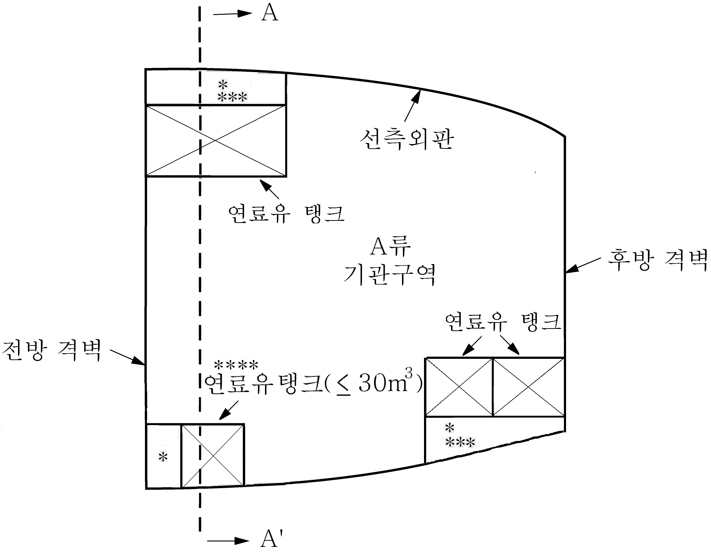
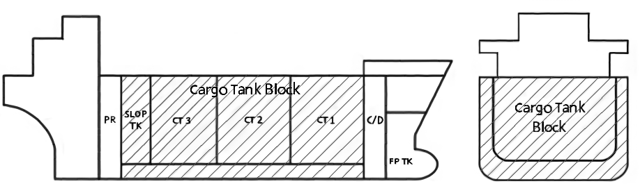
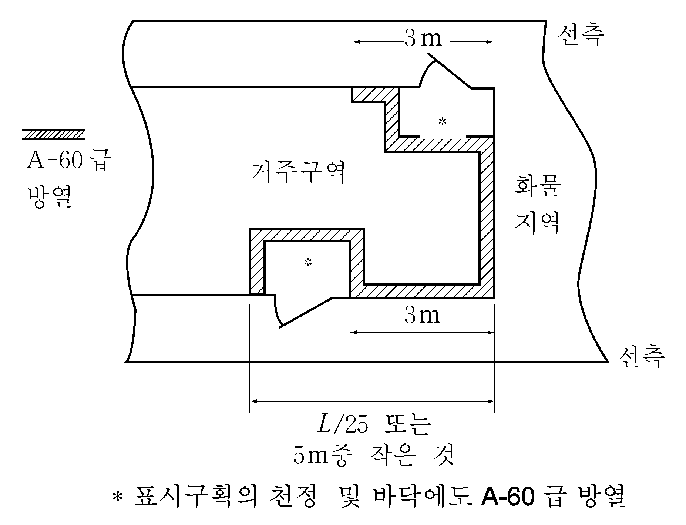

# 제8편 방화 및 소화

> 선급 및 강선규칙/적용지침 / RA-08-K / 2025 / KO / Guidance

## 제 2 장 발화의 가능성

### 제 1 절 연료유, 윤활유 및 기타 가연성유 배치

#### 101. 연로로써의 기름 사용 제한

- **1.** **규칙 101.**의 **4**항에서 탱커의 보일러에 인화점 43℃ 이하의 연료유를 사용하는 경우의 연료유장치 및 배관장치는 다음에 따른다. **【규칙 참조】**
  - **(1)** 연료유펌프 흡입관측에는 연료유의 온도 측정장치를 설치하여야 한다.
  - **(2)** 연료유 여과기의 입구 및 출구측에는 스톱밸브 및/또는 콕을 설치해야 한다.
  - **(3)** 가능한 용접구조의 관이음, 원뿔형 또는 구형 유니언 이음이 적용되어야 한다.
- **2.** 원유 또는 슬롭을 보일러용 연료로 사용하는 탱커에는 **7편 부록 7-1**을 적용한다.

#### 102. 연료유에 대한 조치

- **1.** **규칙 102.**의 **3**항에서 연료유탱크는 **규칙 5편 6장 901. 11**항 (1)호 (가)에서 규정한 요건에 따른다.
- **2.** **규칙 102.**의 **3**항 (1)호에서 총톤수 400톤 이상인 선박이 **MARPOL**의 적용을 받는 경우에는 선수탱크 또는 충돌격벽 전방에 있는 탱크에 기름을 적재하여서는 안 된다.
- **3.** **규 칙 102.**의 **3**항 (2)호에서 A류 기관구역 내 연료유 탱크의 배치는 **지침 그림 8.2.1**을 표준으로 하고 자기지지형 연료유탱크는 그 수 및 용량을 최소화하여야 한다.
- **4.** **규칙 102.**의 **3**항 (4)호 및 **103.**의 **2**항에서 연료유탱크 및 윤활유탱크의 주입관을 탱크 정부 부근이나 넘침관 상부에 설치한 경우에는 손상으로 인해 기름이 누설할 우려가 없는 것으로 볼 수 있다. 또한, 연료유 및 윤활유탱크의 압축공기식 원격폐쇄밸브로서 폐쇄 시에만 압축공기가 필요한 방식의 것에 대하여는 다음에 따른다.
  - **(1)** 전용의 원격폐쇄용 공기탱크(이하 **공기탱크**라 한다.)를 연료유 및 윤활유탱크 구획 외의 접근하기 쉬운 장소에 설치하여야 한다.
  - **(2)** 공기탱크의 용량은 모든 연료유 및 윤활유탱크의 원격폐쇄밸브를 적어도 2회 폐쇄할 수 있어야 한다.
  - **(3)** 공기탱크에는 원격폐쇄장치를 조작하는 장소로부터 쉽게 볼 수 있는 곳에 압력계를 설치하여야 한다.
  - **(4)** 공기탱크로부터 원격폐쇄밸브의 작동장치까지의 공기관에는 원격조작을 위한 밸브 및 관계통의 블로우오프 밸브 이외의 밸브를 설치하여서는 안 된다.
  - **(5)** 공기탱크로부터 원격폐쇄밸브 액추에이터까지의 공기관은 강관 또는 동관으로 하여야 한다.
  - **(6)** 공기탱크 충기관에는 체크밸브를 설치하여야 한다.
  - **(7)** 공기탱크가 비상소화펌프의 해수흡입밸브의 원격개방, 기관구역 통풍팬 댐퍼의 원격차단 등의 용도와 겸용으로 사용되는 경우에는 다음을 따른다.
    - **(가)** 공기탱크의 용량은 연결된 모든 원격제어장치를 동시에 적어도 2회 작동할 수 있어야 한다.
    - **(나)** 연료유 및 윤활유탱크의 밸브 원격폐쇄용 공기관계통은 다른 용도의 관계통과는 별개로 배관하고, 공기탱크의 공기 출구밸브에는 용도를 명확히 하는 명판을 부착하여야 한다.
- **5.** **규칙 102.**의 **3**항 (4)호에서 별도의 장소(location)는 별도의 구역(space)을 의미하지는 않는다.
- **6.** **규칙 102.**의 **3**항 (5)호에서 이중저탱크를 제외한 탱크에 넘침관장치가 설치되어 있다면 추가의 폐쇄식 측심장치 대신 짧은 측심관을 사용할 수 있다. 또한 레벨스위치가 화재에도 파손되지 않도록 강 또는 기타 재료로 폐위되어 있는 경우 탱크 정부 아래에 설치할 수 있다. **규칙 102.**의 **3**항 (5)호 (나)에서 국내항해에만 종사하는 경우에는 **부록 8-3**의 **1**항 (3)호 (마)를 따른다. **【규칙 참조】**
- **7.** **규칙 102.**의 **4**항과 **규칙 103.**의 **1**항에서 연료유탱크 또는 가열 윤활유탱크의 공기관의 끝단은 발화할 우려가 없는 개방갑판의 안전한 장소에 설치되어야 한다. 비가열윤활유(작동유 포함) 탱크의 공기관의 끝단은 기관구역에 설치할 수 있으나 개구단에서 유출된 기름이 전기 장비 또는 기타 고온부와 접촉해서는 안 된다. **【규칙 참조】**
  **8. 규칙 102.**의 **5**항에서 고압은 통상 10 MPa 이상을 말한다. *(2020)* **【규칙 참조】**
- **9.** **규칙 102.**의 **5**항 (1)호에서 신축성배관에 부착된 호스클램프와 유사한 형식은 인정하지 않는다. **【규칙 참조】**
- **10.** **규칙 102.**의 **5**항 (2)호에서 단일실린더인 엔진, 분리된 연료펌프를 가지거나 복수의 연료분사펌프를 가진 복수실린더인 엔진을 포함한다. 다만, 이 규칙은 가스터빈 및 구명정용 엔진에는 적용하지 않는다. 또한, 국내항해에만 종사하는 선박의 경우에는 **부록 8-3**의 **1**항 (3)호 (다)를 따른다. **【규칙 참조】**

  | 평면도 | 단면도 A-A' |
  | --- | --- |
  |  |  |
  | * 코퍼댐 코퍼댐의 요건 1. 기밀(Gas-tight)이어야 함. 2. 측심장치, 공기관 및 배수를 위한 장치(드레인 플러그)가 설치되어야 함. *** **MARPOL Annex I/Reg. 12A**(연료유탱크 보호)의 요건에 적합한 경우(연료유 총용적 600 $RM m ^{3}$ 이상) **** “소형 연료유 탱크”라 함은 개별 최대용적이 30 $RM m ^{3}$를 초과하지 아니하는 연료유 탱크를 말한다. | $f$ : 탱크 저부는 공작의 편의상 너클로 할 수 있다. ** : 연료유 탱크의 정판이 상갑판과 공통이 아닌 경우, 연료유 탱크의 상부에 충분한 높이를 가지는 보이드스페이스가 설치되어야 하고 개구를 가질 수 있다. 다만, 연료유탱크의 상부에 인화성 액체용관 이외의 파이프터널 및/또는 송풍기실, 공조기실, 냉동기실, 유압장치 격납실과 같은 화재의 위험성이 적은 보기실을 설치할 수 있고 보이드스페이스를 설치하지 않아도 된다. |
- **11.** **규 칙 102.**의 **5**항부터 **104.**까지를 적용함에 있어서, 강 이외의 재료의 사용은 다음 중 어느 하나에 해당될 경우 이를 증명할 수 있는 자료를 제출하여 우리 선급이 인정하는 경우 사용할 수 있다. *(2017)* **【규칙 참조】**
  - **(1)** 손상으로 인해 기관의 외부로 가연성 유체가 방출될 수 없는 기관 내부의 관
  - **(2)** 기계 덮개, 로커 박스 커버, 캠 샤프트 엔드 커버, 검사 플레이트 및 섬프 탱크와 같이 기계 작동 중에 기계 내부에서만 액체가 분출되는 부품이어야 한다. 그리고 이들 내부에 포함된 모든 구성 요소 및 부품의 내부 압력이 0.18 N/mm^2 미만이며 상기의 구성 요소 및 부품에 대한 연료유량이 100 리터를 초과하지 않아야 한다.
  - **(3)** 표준 ISO 19921, ISO 19922 또는 우리 선급이 인정하는 기준에 따라 화재 시험 기준을 충족한 기관에 부착되는 부품이어야 하며 이 부품은 사용하고자 하는 용도에 적합한 기계적 성질을 가져야 한다. *(2021)*

#### 104. 기타 가연성유에 대한 조치 【규칙 참조】

노출갑판, 탱크 내부, 코퍼댐 및 보이드스페이스에 있는 유압밸브 및 유압실린더에는 이 조의 요건을 적용하지 않는다.

### 제 2 절 본선 생활용 가스연료 배치

#### 201. 본선 생활용 가스연료 배치 【규칙 참조】

가스용기만을 저장하기 위한 개방갑판의 리세스된 갑판 구조물, 기관구역 케이싱, 거주구역 등은 장애물(개구 코너의 반경, 작은 문턱, 기둥과 같은 작은 부속구조물은 장애물에서 제외)이 없는 개구(창살로 된 벽과 문 설치 가능)를 갖고, 리세스의 깊이가 1 m 이하인 경우에는 허용할 수 있다. 이러한 장소는 **규칙 7장 1절**의 **표 8.7.1 ∼ 8.7.8**에서 개방갑판으로 간주된다.

### 제 3 절 기타 발화원 및 가연성 물질

#### 301. 전기 난방기 【규칙 참조】

**IEC 60092 Electrical installations in ships**에 따른다.

#### 302. 쓰레기통 【규칙 참조】

젖은 쓰레기, 유리병, 금속캔이 명확히 표시된 경우라면 조리실, 식자재실, 바, 쓰레기 처리 또는 저장구역, 소각실에서도 가연성 물질의 용기를 사용할 수 있다.

#### 303. 기름이 스며드는 것을 방지하기 위한 방열재 표면 【규칙 참조】

“기름이 스며들 수 있는 구역”이라 함은 기름(연료유, 윤활유, 조작유, 열매체유)을 취급하는 모든 기기(청정기, 펌프, 탱크) 및 관 부착품(밸브, 플랜지, 여과기, 유량계 등)의 부근으로써 운전상태 및 보수작업 시 누설, 비산한 연료유나 연료유 증기가 방열재에 도달할 가능성이 내제되어 있다. 다만, 기관실내의 배관 방열재 표면에는 적용하지 않는다. 이러한 구역에서의 방열은 구멍이 없는 금속판이나 증기방지용 유리직물로 연결부를 밀봉하여 차폐할 수 있다.

### 제 4 절 탱커 화물지역

#### 401. 화물유탱크의 격리

- **1.** **규칙 401.**의 **1**항에서 “코퍼댐”이란 이 규정 목적상 두 개의 인접한 강재 격벽이나 갑판 사이의 격리구역을 말한다. 두 격벽이나 갑판 사이의 최소거리는 안전한 통행 및 검사용으로 충분하여야 한다. 모퉁이에서 발생된 단순 사고를 조치하기 위해서 모퉁이에서 경사판을 용접할 수 있도록 한다. 또한 평형수 펌프실은 **규칙 7편 1장 1004.**의 규정에 만족하여야 하며 평형수 펌프실의 하부를 화물 펌프실의 규정과 같이 A류 기관구역으로 돌출시킬 수 있다. **지침 그림 8.2.2**와 같이 연료유 탱크를 보호하는 보이드스페이스나 평형수탱크가 화물탱크나 슬롭탱크와 십자형의 이음으로 접촉하더라도 **규칙 1장 103.**의 **6**항에서 정한 화물지역으로 간주할 필요가 없다. 연료유탱크를 보호하는 보이드스페이스를 이 항에서 정한 코퍼댐으로 간주하지 않는다. **지침 그림 8.2.2.**의 보이드스페이스의 위치가 비록 슬롭탱크와 십자형의 이음으로 접촉하더라도 허용할 수 있다. **【규칙 참조】**
  
  **그림 8.2.2 화물유탱크의 격리**
- **2.** **규칙 401.**의 **2**항에서 주화물제어장소, 제어장소, 거주구역, 업무구역의 배치 시 다음 요건에 적합하여야 한다.
  **【규칙 참조】**
  - **(1)** 주화물제어장소, 제어장소, 거주구역, 업무구역은 화물탱크 및 슬롭탱크와 점접촉 또는 선접촉해서는 안 된다. *(2021)*
  - **(2)** 주화물제어장소, 제어장소, 거주구역, 업무구역(체인로커포함)은 **규칙 401.**의 **1**항에서 인정하는 화물펌프실 및 평형수펌프실 하부의 A류 기관구역으로 돌출된 부위나 연료유탱크, 평형수탱크보다 후방에 배치할 필요는 없다.(**지침 그림 8.2.3** 참조)
- **3.** **규칙 401.**의 **3**항에서 등창고, 선용품실, 페인트창고, 저장실 등이 선수에 독립 배치되어 통상 사람이 들어가지 않는 경우에는 화물탱크 및 슬롭탱크를 제외한 화물지역인 평형수탱크, 코퍼댐 등의 상부 또는 이와 접한 선측에 설치할 수 있다.(**지침 그림 8.2.4** 참조) **【규칙 참조】**
- **4.** **규칙 401.**의 **2**항과 **3**항에서, **2**항에서 정한 유조선의 탱크와 구획의 상부 및 케미컬탱커의 화물지역의 상부에 페인트 창고를 그 사용 용도에 관계없이 설치할 수 없다.
- **5.** **규칙 401.**의 **4**항 (1)호에서 겸용선의 구역 배치 및 격리는 **규칙 7편 2장 206.** 및 **207.**의 광석운반선 겸 유조선에 대한 규정과 **규칙 7편 3장 15절**의 산적화물선 겸 유조선에 대한 규정에도 적합하여야 한다. **【규칙 참조】**
  
  **그림 8.2.3 거주구역, 화물유탱크, A류 기관구역의 배치**
  
  **그림 8.2.4 등창고, 선용품실, 페인트창고, 저장실 등의 배치**
- **6.** **규칙 401.**의 **6**항에서 거주구역 및 업무구역의 “영구적인 연속 코밍”이라 함은 화물구역 최후단과 갑판실 전단벽 사이의 적절한 위치를 말한다. 현측 후판의 갑판상 50 $\mathrm{mm}$ 위치보다 낮아서는 안 된다(**지침 그림 8.2.5** 참조). 또한 선미 하역과 관련된 배치는 **규칙 7편 1장 1002.**의 **4**항 (4)호 및 **1006.**에 추가하여 포말소화장치 또는 이와 동등한 소화설비를 배치하고 충분한 크기의 기름받이 또는 누설코밍을 설치하는 것을 말한다. **【규칙 참조】**
  
  **그림 8.2.5 거주구역 및 업무구역의 코밍**
- **7.** 인화점 60 ℃미만의 액체 화물 및/또는 독성 액체 화물을 운송하는 유조선 및 위험화학품 산적운반선의 화물구역 내에 연료유탱크를 배치할 때에는 다음 요건에 적합하여야 한다.(IACS UR M76 Rev.1 참조) *(2019)* **【규칙 참조】**
  - **(1)** 화물탱크 또는 슬롭탱크와 공통의 경계를 갖는 연료유탱크는 화물탱크 블록 내에 위치하거나 연료유탱크의 일부를 화물탱크 블록에 배치해서는 안 된다. 그러나 연료유탱크는 화물탱크 블록의 전후방에 배치할 수 있다. 화물탱크 블록이란 **그림 8.2.6**과 같이 최후방 화물탱크 또는 슬롭탱크의 선미격벽으로부터 최전방 화물탱크 또는 슬롭탱크의 선수격벽까지 확장 및 선박의 깊이 및 폭까지 확장된 선박의 일부분이다. 그러나 화물탱크 또는 슬롭탱크의 갑판 상부구역은 포함하지 않는다.
  - **(2)** 연료유탱크는 유출 및 화재 안전 측면에서 화물구역내의 노출갑판상에 독립형탱크로 위치하는 경우 인정될 수 있다.
    
    **그림 8.2.6 화물탱크 블록**
  - **(3)** 펌프를 포함하여 관련되는 연료유 관장치와 독립형 연료유탱크의 배치는 기관구역에 위치하는 연료유탱크와 관련되는 관장치와 동일하게 볼 수 있다. 그러나 전기 설비에 대해서는 위험구역 분류의 규정이 적용되어야 한다.
  - **(4)** 이 항의 목적상 독성 액체화물은 **지침 7편 6장 부록 7B-1**의 ‘k’란에서 독성 증기가 발생되는 물질을 포함한다.

#### 402. 경계벽 개구의 제한

- **1.** **규칙 402.**의 **1**항을 적용하면서, 해당 규정을 만족하는 것이 설계상 실행 불가능하거나 불합리한 경우에 있어서는, **규칙 7편 1장 1101.**의 **2**항에서 규정하는 위험구역에 발화원이 설치되지 않는 것을 조건으로 화물지역에 면하는 문, 공기흡입구 및 개구를 설치할 수 있다. 이 경우 **IEC 60092-502:1999**에 적합한 방폭형 전기 기기는 발화원으로 간주되지 않는다. **규칙 402.**의 **1**항의 적용에 있어, 발화원이 있는 선수루 구역으로의 출입문은 **IEC 60092-502:1999**에 따른 위험구역의 밖에 설치되는 조건으로, 화물구역과 면함을 허용할 수 있다. *(2024)* **【규칙 참조】**
- **2.** **규칙 402.**의 **2**항에서 A-60급 방열이 필요한 장소의 경계는 **지침 그림 8.2.7**과 같이 방열할 수 있다. 부수적으로 이 구획에는 원격제어가 가능한 포말탱크실을 설치할 수 있다. 이 그림에서 * 표시구획의 천정 및 바닥에도 A-60급 방열을 하여야 한다. 부수적으로 이 구획에는 갑판포말장치의 포말액체탱크를 설치할 수 있다. *(2019)*
  **규칙 402.**의 **2**항의 적용상, 갑판포말장치실(포말탱크 및 제어장치를 설치하는 구획)에 대해서는 **규칙 402.**의 **2**항의 요건에 적합하고 또한 해당 문이 화물 영역에 직접 노출되지 않도록 격벽면보다 선내 측에 설치되는 구조로 하는 경우, **규칙 402.**의 **1**항에 규정하는 범위 내에 출입문을 설치 할 수 있다. *(2019)*
  또한 신속하고 효과적으로 가스 및 증기가 차단되도록 하는 조타실의 문과 창은 패킹 및 잠금장치가 있는 문 및 창으로 하고, 기밀시험을 하여야 한다. 기밀시험 대신에 사수시험을 하는 경우 다음의 사수시험을 하여야 한다.
  **【규칙 참조】**
  - **(1)** 노즐지름은 최소 12 $\mathrm{mm}$ 여야 한다.
  - **(2)** 노즐선단 수압은 최소한 2 bar 여야 한다.
  - **(3)** 노즐선단과 문 또는 창과의 간격은 1.5 $\mathrm{m}$ 이내여야 한다.
    
    **그림 8.2.7 A-60급 방열이 필요한 장소의 경계**
- **3.** **규칙 402.**의 **4**항에서 화물유탱크 하부에 있는 이중저 배관덕트는 다음의 요건을 만족하여야 한다.
  - **(1)** 기관실과 연결되지 않아야 한다.
  - **(2)** 최소한 2개의 출구를 개방갑판으로 서로 최대한 떨어져 설치하여야 한다. 이 출구 중 하나는 수밀구조로 펌프실을 통할 수 있다.
  - **(3)** 이 덕트 내에 적절한 기계식 통풍장치를 갖추어야 한다. **【규칙 참조】**

#### 403. 화물탱크의 벤트

**1. 규칙 403.**의 **2**항 (2)호에서 2개 이상의 화물유탱크의 벤트장치를 공통으로 연결하는 경우 각 탱크를 격리하기 위한 방법 및 배치는 다음에 따른다. (**지침 그림 8.2.8** 참조) **【규칙 참조】**

- **2.** **규칙 403.**의 **3**항에서 별도지침이란 **MSC/Circ.677**(**MSC/Circ.1009** 및 **MSC.1/Circ.1324** & **1325**에 따른 개정사항 포함)과 **MSC/Circ.450 Rev.1**을 말한다. 얼리지 개구부는 수동차단밸브 갖춘 직립관을 설치한 화물탱크 개구부에 포함되지 않는다. 다만, 예를 들어 화물탱크 내 얼리지/온도/경계, 산소, 유체, 수동 측정을 감시하거나 샘플용으로 1인치 내지 2인치 공통관을 사용한다. 그리고 폐위구역 내에는 얼리지마개, 감시홀, 탱크세정구를 배치하지 않아야 한다.
  이 때 화염침입방지장치의 설계, 배치, 시험 등에 대하여는 다음에 따른다. 또한, 이 장치는 우리 선급의 승인된 형식이어야 한다. **【규칙 참조】**
  - **(1)** 다음의 개구에는 화염침입방지장치를 부착하여야 한다.
    - **(가)** 다음의 개구에는 플레임스크린, 플레임어레스터 또는 데토네이션플레임어레스터를 부착하여야 한다.
      - **(a)** **규칙 9장 501.**의 **1**항에서 규정하는 탱크 내의 부압을 방지하기 위한 벤트장치의 공기흡입구
      - **(b)** **규칙 9장 501.**의 **2**항에서 규정하는 탱크 내의 부압을 방지하기 위한 장치의 공기흡입구
    - **(나)** 다음의 개구에는 플레임어레스터, 데토네이션플레임어레스터 또는 고속배출장치를 부착하여야 한다.
      - **(a)** **규칙 9장 502.**에서 규정하는 압력방출구
      - **(b)** **규칙 2장 403.**의 **4**항 (1)호 (다)에서 규정하는 배기구
      - **(c)** **규칙 2장 406.**의 **3**항 (2)호에서 규정하는 배기구
    - **(다)** **규칙 2장 403.**의 **4**항 (1)호 (라)에서 규정하는 배기구에는 고속배출장치를 부착하여야 한다.
  - **(2)** 적하 또는 양하시에 화물탱크 내부가 허용치를 넘는 압력 또는 진공이 되는 것을 방지하기 위한 장치의 치수를 결정하는 경우, 다음 사항을 고려하여 압력손실의 계산을 하여야 한다.
    - **(가)** 적하/양하율
    - **(나)** 가스방출량
    - **(다)** 해당 장치에 대한 저항계수를 고려한 압력손실
    - **(라)** 벤트장치 내의 압력손실
    - **(마)** 고속배출장치 시 벤트구에서의 압력
    - **(바)** 포화증기/공기 혼합기체의 밀도
  - **(3)** 시험 및 검사
    - **(가)** 장치는 제조 후 다음의 검사를 시행하여야 한다.
      - **(a)** 구조완성검사
      - **(b)** 수압시험(고속배출장치에 한함)
      - **(c)** 작동개시압력의 확인
    - **(나)** 고속배출장치는 선내 부착 후 원활히 작동되는지를 적절한 방법으로 확인한다.
  - **(4)** 시험보고서
    시험보고서에는 다음과 같은 사항이 포함되어야 한다.
    - **(가)** 장치의 상세도
    - **(나)** 시행한 시험의 종류(배관 중에 설치되는 장치를 시험한 경우, 최대압력 및 속도를 기록하여야 한다)
    - **(다)** 승인된 부착품에 대한 설명
    - **(라)** 시험설비의 도면
    - **(마)** 고속배출장치의 경우, 배출속도에서 있어서의 장치의 개폐압력
    - **(바)** 시험한 장치의 모든 표시((6) 참조)
  - **(5)** 취급설명서
    선박에는 각 장치에 대하여 취급설명서 1부를 비치하여야 한다.
    - **(가)** 설치방법
    - **(나)** 작동설명
    - **(다)** 정비요건(소제 포함)
    - **(라)** (4)호의 시험보고서 사본
    - **(마)** 유량시험자료(정압 및 부압에서의 유량, 작동감도, 흐름저항 및 속도)
  - **(6)** 표시
    각 장치에는 다음과 같은 사항을 영구적인 방법으로 표시하거나 스테인리스강 또는 기타의 내식성재료로 된 꼬리표를 붙여야 한다.
    - **(가)** 제조자명 또는 상표
    - **(나)** 형식, 모델 또는 기타 장치의 표시
    - **(다)** 장치 출구의 승인된 크기
    - **(라)** 승인된 설치위치(관의 최소 및 최대길이 포함)
    - **(마)** 장치의 유출방향
    - **(바)** 시험된 장치에 부여된 전기설비등급 (예; IIA, IIB, IIC 등)
    - **(사)** 시험기관 및 보고서번호
    - **(아)** 적용기준(**MSC/Circ.677**, **1009** 및 **MSC.1/Circ.1324** & **1325**에 따른 개정사항 포함)
- **3.** **규칙 403.**의 **4**항 **(1)호 (다)** 및 **(라)**에서 **IEC 60092-502:1999**에 적합한 전기 기기는 발화원으로 간주되지 않는다. *(2022)* **【규칙 참조】**
- **4.** **규칙 403.**의 **4**항 **(1)호 (다)** 의 “발화원이 있는 폐위장소의 가장 가까운 공기흡입구 및 개구, 발화위험성이 있는 설비, 앵커윈들러스와 체인로커를 포함한 갑판기기로부터 수평방향으로 10 m 이상 떨어져 있어야 한다.”를 적용함에 있어, 위험 구역의 분류는 **IEC 60092-502:1999**의 원칙 및 **규칙 7편 1장 1101.의 2항**에 따른다. ***(2023)*** **【규칙 참조】**
  - **(1)** 적하, 양하 또는 평형수 작업중에 다량의 가스 또는 증기를 방출하는 출구로부터 반경 6m 이내의 상부가 원통형(높이의 제한없음)으로 하부가 반경 6m 이내의 반구형의 개방갑판상의 구역 또는 반폐위구역은 **IEC 60092-502:1999 4.2.2.8**항에서 **구역 “1” (Zone 1)**로 정의된다.
  - **(2)** 상기 (1)에 명시된 구역의 외측 4m 이내의 구역은 **IEC 60092-502:1999 4.2.3.2**항에 지정된 대로 **구역 “2” (Zone 2)**로 정의된다.
  - **(3)** 전기설비 또는 케이블은 일반적으로 위험구역에 설치되어서는 안되지만 운항 목적상 필수적인 경우에는 **IEC 60092-502:1999**에 따라 설치될 수도 있다.

#### 404. 통풍

**규칙 404.**의 **1**항에서 스파크를 발생하지 않는 통풍장치는 **규칙 3장 104.**의 요건에 따른다. **【규칙 참조】**

#### 405. 불활성가스장치 【규칙 참조】

- **1.** 불활성가스장치는 **부록 8-5**의 요건에 적합하여야 한다.
- **2.** **규 칙 405.**의 **1**항 (3)호에서 불활성가스를 공급하기 위한 적절한 연결구가 설치되어야 하는 이중선체구역은 화물탱크에 인접한 격벽갑판 하부의 선수평형수 탱크와 기타 탱크 및 구역을 포함하여 화물탱크에 인접한 이중선체 및 이중저 구역의 평형수 탱크와 보이드스페이스를 말한다. 화물펌프실과 평형수펌프실은 제외한다. *(2018)*
- **3.** **규 칙 405.**의 **3**항 (2)호에서 영구적으로 설치된 경우란 불활성가스 제어밸브와 수봉(water seal)장치 사이의 불활성가스 공급지관에 설치하거나 이와 동등한 조치를 한 경우를 말한다.
- **4.** **규칙 405.**의 **3**항 (3)호에서 영구적으로 연결되지 않은 경우의 불활성가스 주관과 연결할 수 있는 적절한 수단은 이동식 배관 또는 플렉시블 호스와 맹판을 말한다.

#### 406. 불활성화, 퍼징 및 가스프리

- **1.** **규칙 406.의 2**항에서 별도로 정한 지침이란 **부록 8-6**의 **21**항을 말한다. **【규칙 참조】**
- **2.** **규칙 406.의 3**항 (1), (2), (3)의 출구의 수평방향 거리는 **규칙 403.**의 **4**항 (1)호 (다)에 따라 설치하여야 한다.*(2019)* **【규칙 참조】**

#### 407. 가스 측정 및 탐지

- **1.** **규칙 407.**의 **1**항에서 “산소를 측정하기 위한 최소 한 개의 휴대식 측정기 및 가연성 증기 농도를 측정하기 위한 최소 한 개의 휴대식 측정기와 충분한 수의 예비품” 요건은 다음에 따라 휴대식 측정기를 비치하는 경우 만족하는 것으로 간주할 수 있다.
  - **(1)** 산소 및 가연성 증기 농도 측정을 겸용으로 하는 휴대식 측정기 2개
  - **(2)** 휴대식 산소 측정기 2개 및 휴대식 가연성 증기 농도 측정기 2개
- **2.** **규칙 407.**의 **1**항에서 “휴대식 측정기기를 검교정하여야 한다”는 것은 제조자의 지침에 따라 선상이나 육상에서 이미 검교정된 휴대식 측정기기를 이용하여 검교정을 수행할 수 있다. 이는 SOLAS XI-1/7 규칙에서 요구하는 휴대식 기기의 교정을 말하며 제조자가 권장하는 사전 정확도 시험을 지칭하지 않는다. *(2019)* **【규칙 참조】**
- **3.** **규 칙 407.**의 **1**항에서 불활성가스장치가 설치된 탱커의 경우, 휴대식 가연성 증기 농도 측정기 2개는 불활성화된 환경에서 가연성 증기 농도도 측정할 수 있어야 한다. *(2021)*
- **4.** **규 칙 407.**의 **3**항에서 고정식 탄화수소탐지장치는 우리선급의 형식승인을 받아야 하며, **MSC.1/Circ.1370**에도 적합하여야 한다.
- **5.** **규 칙 407.**의 **3**항에서 고정식 탄화수소탐지장치는 **FSS 코드 16장**에 적합하여야 한다.
- **6.** **규칙 407.**의 **3**항 (1)호에서 다음의 요건을 만족하여야 한다.
  - **(1)** “화물탱크와 인접한 공간”에서 “화물탱크”란 유성폐수(oily water)만을 저장하는 슬롭탱크를 제외한 슬롭탱크도 포함한다.
  - **(2)** “화물탱크에 인접한 격벽 갑판 아래의 공간”에서 “공간”이란 평형수펌프실, 선수스러스터실과 같은 건조 구획과 연료유탱크를 제외한 청수탱크 등의 탱크를 말한다.
  - **(3)** “화물탱크에 인접한”에서 “인접한”이란, 평형수탱크, 보이드스페이스, 화물탱크의 격벽갑판 아래에 위치한 기타 탱크 및 구획과 화물탱크와 십자형의 이음(모서리부)을 형성하는 격벽갑판 아래에 있는 공간이나 탱크를 말한다.
    **【규칙 참조】**

#### 410. 탱커의 화물펌프실 보호 【규칙 참조】

- **1.** **1**. 평형수 이송용으로만 사용하는 펌프실 및 연료유 이송 펌프실은 **규칙 410.**을 적용할 필요가 없다. **규칙 410.**은 위치에 관계없이 화물펌프, 스트리핑펌프, 슬롭탱크용 펌프, 원유세정용 펌프 또는 “유사한 펌프”가 설치된 펌프실에만 적용된다. “유사한 펌프”는 인화점이 60 ℃ 미만인 연료유를 이송하는 펌프를 말한다.
  **2. 규칙 410.**의 **2**항에서 화물펌프실의 조명장치가 비상조명장치와 겸용으로 사용되는 경우, 이 조명장치는 통풍장치와 연동되어야 한다. 다만, 주전원이 상실되더라도 이 연동장치로 인해 비상조명장치가 꺼져서는 안 된다. **【규칙 참조】**
- **3.** **규칙 410.**의 **3**항에서 탄화수소가스의 농도를 연속적으로 감지할 수 있는 장치는 다음에 따른다.
  - **(1)** 화물펌프실 전용일 경우에만 시료채취식 장치를 설치할 수 있으며, 샘플링 간격은 최대한 짧아야 한다.
  - **(2)** 잠재적인 누설 위험을 쉽게 감지할 수 있는 적절한 위치란 공기의 순환이 감소하는 구역(예를 들면, 리세스된 모서리부)을 말한다.
  - **(3)** 비방폭형 측정장치가 부착된 시료채취식 가스분석장치를 화물지역 밖의 전방 격벽(예, 화물제어장소, 선교, 기관구역 포함)에 설치할 때에는 다음 요건에 적합하여야 한다. *(2020)*
    **【규칙 참조】** 
    - **(가)** 시료채취계통은 가스안전구역을 통과할 수 없다. 다만, (마)에서 허용하는 경우를 제외한다. *(2020)*
    - **(나)** 시료채취관에 플레임어레스터를 부착하여야 한다. 시료가스 출구는 안전한 장소의 대기 중으로 유도하여야 한다.
    - **(다)** 시료채취관의 안전구역과 위험구역 사이의 격벽관통부는 승인된 재료여야 하고, 관통 구획과 동일한 화재방열성을 지녀야 한다. 가스안전구역측 격벽에서 각 시료채취관에는 수동격리밸브를 설치하여야 한다.
    - **(라)** 시료채취관, 시료펌프, 솔레노이드, 분석장치 등을 포함한 가스탐지설비를 기밀강재함(즉, 개스킷붙이문을 가진 완전 폐위된 강재함)에 설치하여야 하며 설비 자체의 시료채취점에서 감시되어야 한다. 강재함에서 가연성범위하한치(LFL) 30 %를 초과하면 가스분석장치 전체가 자동정지하여야 한다.
    - **(마)** 강재함을 격벽에 직접 설치할 수 없는 경우, 시료채취관은 강재나 이와 동등한 재료로 하고, 분리할 수 있는 연결부가 없어야 한다. 단, 격벽과 분석장치에서 격리밸브의 연결부는 허용되지만, 최대한 짧게 한다.
