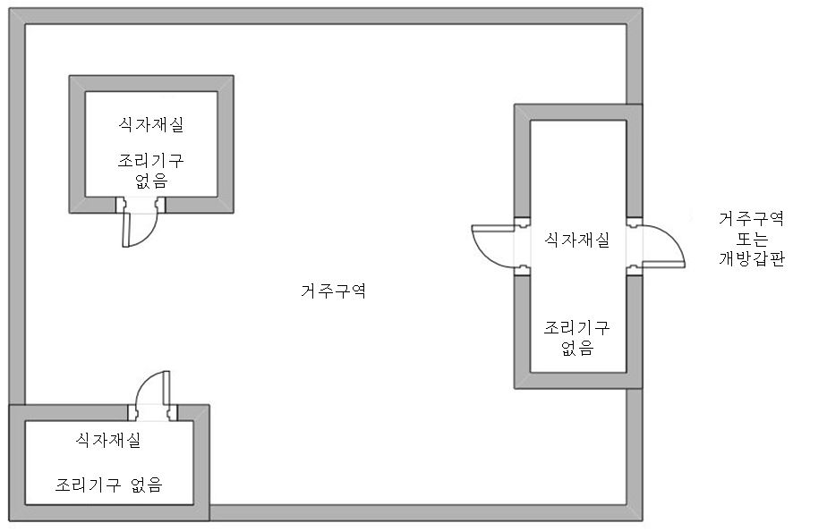
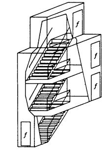
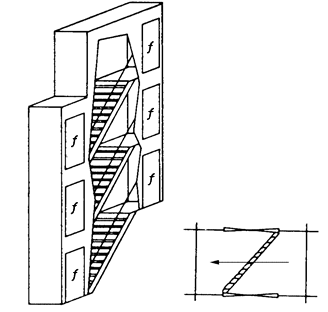
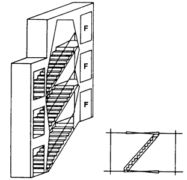
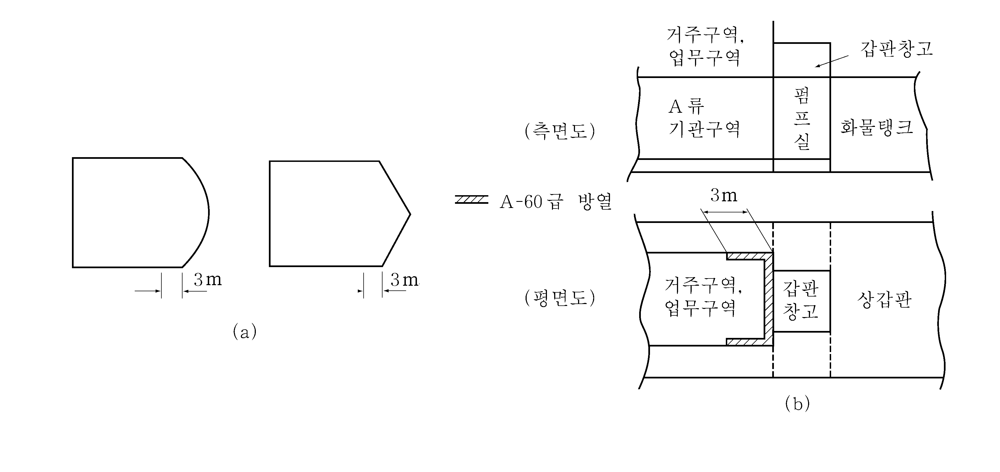
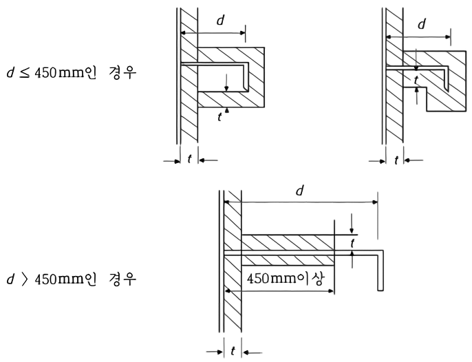
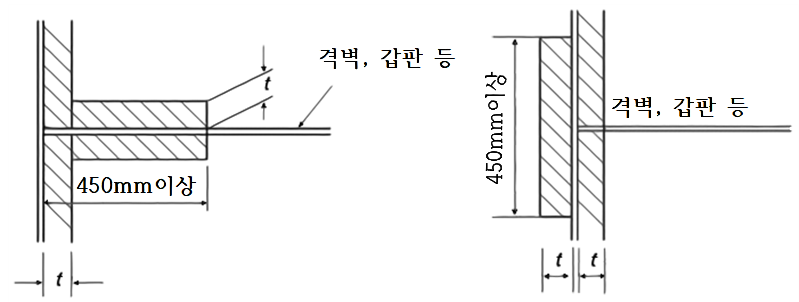
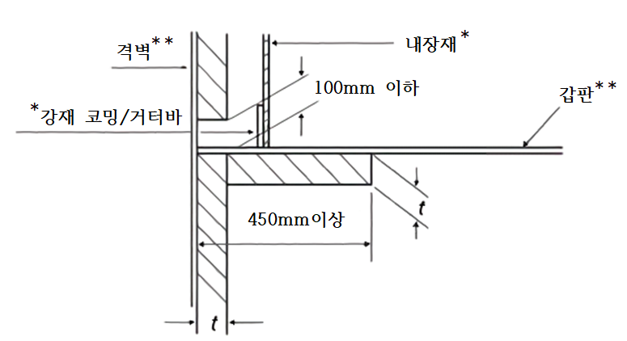
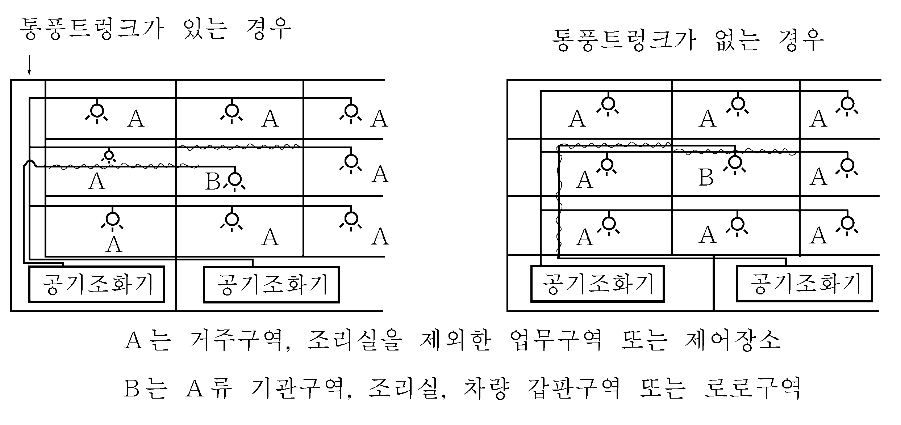
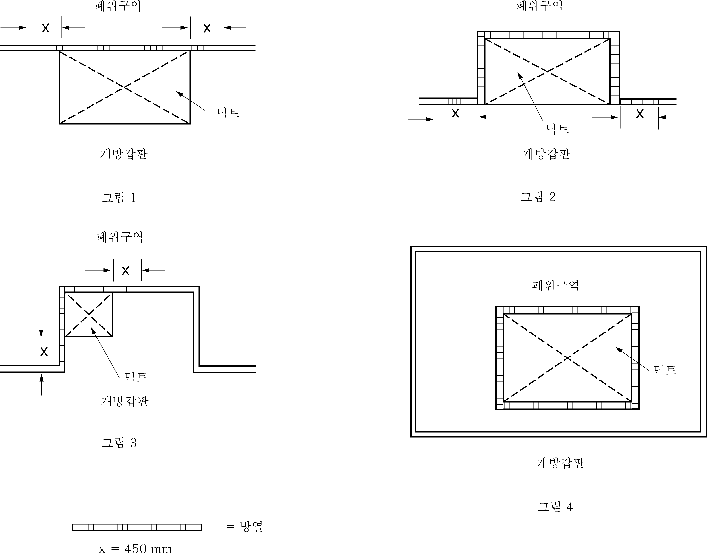

# 제8편 방화 및 소화

> 선급 및 강선규칙/적용지침 / RA-08-K / 2025 / KO / Guidance

## 제 7 장 화재 차단

### 제 1 절 방열상 및 구조상 경계

#### 101. 방열상 및 구조상 경계 【규칙 참조】

- **1.** 화재방열성 적용상 분류 구역은 **지침 표 8.7.1**에 적합하여야 한다.

  | 제어장소 | 항해장비 설치 장소(조타장소, 컴퍼스 및 레이더 장치) 전기실(충전/방전 판넬 또는 충전기가 있는 장소), 축전지실, 항해장비용 및 무선장비용 발전실(또는 인버터실), 고정식소화장치의 제어장치 설치 장소 및 소화제 저장실(5), 선교창고(navigation locker)(6) |
  | --- | --- |
  | 업무구역 (저위험) | 육전반구역, 현측사다리 윈치기계실, 분전반 및 시동기 설치구역, 평형수제어실, 주화물제어실, 전기실(변압기, 배전반(7), 모터발전기 등의 전기 설비로서 50 kVA(kW) 이하의 것만을 설치하는 장소로서 면적이 4 m^2 미만의 것) |
  | 기타 기관구역 | 유압장치 저장실(갑판기계, 하역장치용), 조타기실(1), 갑판포말장치 설치 장소(8), 불활성가스통풍실, 전기실("제어 장소" 또는 "업무 구역(저위험)“으로 분류하는 것 제외), 추진용 전동기실, 추진용 전동기의 제어장치실, 비상소화펌프실(9), A류 기관구역 이외의 연료유장치 배치 장소 |
  | 업무구역 (고위험) | 산소 또는 아세틸렌병 저장실(2), 식량창고(3), 작업복탈의실(4), 가스연료 저장용기 저장실(10) |
  | 기타 | 1. 가스밀 자동폐쇄문 등에 의해 유효하게 화물구역으로부터 분리되는 컨테이너선의 갑판하 통로는 빈 공간으로 본다. 단, 탈출경로가 있는 경우에는 통로로 취급(A류 기관구역의 2차 탈출경로로 사용되는 경우에는 기타기관구역으로 취급할 수 있음)한다. *(2023)* 2. 통상 사람이 일시적으로 머무르는 장소인 창고, 선용품실, 제어장소의 화장실 등이 통로 출입구를 갖지 않고 해당 구획으로부터 출입구가 있는 경우에는 그 구역의 일부로 간주할 수 있다. 1개 구역을 2개 이상 폐위된 소구역(예를 들면, 식당 내에 설치하는 캐비닛 또는 선용품실)으로 나누는 경우, 이 새롭게 폐위된 구역은 규칙에 따라 방열 격벽 및 갑판으로 보호되어야 한다. 3. 화물 적재에 사용되는 노출갑판은 화재위험성이 낮은 화물을 제외하고 화물구역으로 분류한다. 4. 냉동화물구역의 통풍기용 송풍기실 및 로로구역, 차량구역으로 접근할 수 있는 하역장치 저장실은 화물구역, 로로구역, 차량구역으로 각각 분류한다. 5. 덕트구역 및 케이블 트렁크는 **규칙 103.**의 **4**항의 승강기 트렁크에 대한 규정을 준용한다. |
  | 비고 (1) 비상소화펌프가 조타기실 내 또는 조타기실을 통해서만 직접 접근 가능한 구역에 설치된 경우, 그 조타기실과 기관구역 경계의 방열은 **지침 그림 8.8.2**에 따른다. (2) 주위벽 중 한 면 이상이 개방되어 있는 경우 개방갑판상 장소로 볼 수 있다. (3) 냉동식량창고의 방열이 가연성재료인 경우에는 위험성이 높은 업무구역으로 간주하고, 그 방열이 불연성 재료인 경우에는 위험성이 낮은 업무구역으로 간주한다. 면적이 4 $\mathrm{m}^{ 2}$ 미만인 식량창고는 화재위험이 낮은 업무구역으로 간주한다. (4) 작업복 탈의실이 오일스킨로커(Oil Skin Locker)로 사용되는 경우에는 위험성이 높은 업무구역으로 보며 그 이외에는 거주구역으로 간주한다. (5) 소화장치의 종류에 따라 해당 소화장치에 의해 보호되는 구역의 내부에 설치하는 것이 인정되는 경우를 제외한다. (6) 조타실을 통해서만 접근이 가능한 선교창고는 제어장소로 간주되어야 하며, 조타실과 해당 선교창고를 분리하는 격벽은 최소한 B-0급 화재방열성이 요구된다. (7) 소형 배전반은 해당 장소를 수납 장소로서 사용하지 않는 한 거주구역 내 구획(계단실 포함)의 패널/내장판 뒤쪽면에 설치할 수 있다. 또한, 이 장소는 별도의 공간으로 고려될 필요가 없으며 업무구역(저위험)으로 분류할 필요가 없다. (8) **지침 2장 402.**의 **2항** 규정에 유의한다. (9) 주소화펌프가 설치되어 있는 구획과의 경계에 대해서는 **규칙 8장 102.**의 **3**항 (2)호 (가)에 따른다. (10) **규칙 2장 201.**의 규정에 따른다. **지침 2장 201.**의 규정에 따라 개방갑판상의 갑판실 등의 리세스부를 저장장소로 하는 경우, 해당 장소는 개방갑판상의 장소로 간주할 수 있다. |   |
- **2.** **규칙 7장 102.**의 **4**항 (4)호, **103.**의 **3**항 (4)호 및 **104.**의 **2**항 (4)호에서 “우리 선급이 인정하는 문”이라 함은 국제만재흘수선협약에 의해 수밀 또는 풍우밀이 요구되는 문의 경우 그 요건에 적합하여야 하고, 문의 재료가 가연성 재료인 경우 **규칙 3장 202.** 및 **규칙 4장 1절**의 가연성 재료에 적합한 것이어야 한다. *(2017)* **【규칙 참조】**
- **3.** 선택적 촉매환원 장치(SCR), 배기가스 재순환장치(EGR) 또는 배기가스 세정장치(EGCS)용의 요소 또는 수산화나트륨 수용액 탱크가 기관실과 분리된 공간에 설치된 경우, 그 경계의 화재방열성을 결정할 때, 수용액 탱크가 설치된 구역은 **규칙 1장 103.**의 **30**항의 "이와 유사한 구역“에 해당하며, 다음과 같이 분류되어야 한다. *(2020)*
  - **(1)** 36인 초과 여객선: **규칙 7장 102.**의 **3**항 (2)호 (나)의 ⑩ “화재위험성이 전혀 없거나 거의 없는 탱크, 빈 공간 및 보조기관구역“
  - **(2)** 36인 이하 여객선 및 화물선: **규칙 7장 102.**의 **4**항 (2)호 (나), **103.**의 **3**항 (2)호 (나) 또는 **104.**의 **2**항 (2)호 (나)의 ⑦ “기타 기관구역“
    단, 기관실과 수용액 탱크가 설치된 구역간의 경계는 최소한 "A-0"급이 요구된다.

#### 102. 여객선

- **1.** **규 칙 102.**의 **1**항 (2)호에서 2개의 주수직구역에 계단이 있을 경우 한 주수직구역의 최대거리 측정 시 계단폐위구역의 먼 곳으로부터 측정할 필요는 없다. 이 때 계단폐위구역의 모든 경계를 주수직구역의 격벽과 같이 방열 조치하여야 하고, 2개의 외부 구역에서 계단으로 통하는 문을 마련하여야 한다. 주수직구역의 요건에 적합하다면 48 $\mathrm{m}$ 길이의 주수직구역 개수를 제한하지 않는다. **【규칙 참조】**
- **2.** **규칙 102.**의 **2**항 (2)호 (가)에서 “B급 구획구조로 인정되는 재료”는 B-0급의 방열을 요구하는 경우 두께 1.6 mm 의 강재 또는 적절히 지지되는 암면(밀도 100 kg/m^3 이상, 두께 50 mm이상)으로 할 수 있다. *(2018)* **【규칙 참조】**
- **3.** **규칙 102.**의 **2**항 (3)호에서 객실 사이 공간이 연속적인 B-15급 천장에서 개방되어 있다면 그 공간 양쪽 격벽을 B-15급으로 하여야 한다. **【규칙 참조】**
- **4.** **규칙 102.**의 **3**항 (1)호에서 계단폐위구역을 포함한 거주구역 내 패널/내장판 뒤쪽에 분전반을 설치할 수 있으며 다른 규정이 없으면 그 구역을 별도로 분류할 필요는 없다. **【규칙 참조】**
- **5.** **규칙 102.**의 **3**항 (2)호에서 외부구역(예, 퇴선장소 및 외부탈출로, 개방갑판장소)의 가구 및 비품에 대한 화재 위험도평가는 MSC.1/Circ.1274를 참조할 수 있다. *(2020)*
- **6.** **규칙 102**.의 **3**항 (2)호 (나) ⑨에서 “거주구역에서 조리기구가 없는 분리된 식자재실”은 거주구역에 포함된 식자재실이며, 거주구역 및/또는 개방갑판에서만 접근할 수 있다. 이 분류의 목적상 "거주 구역"은 **규칙 1장 103.**의 **1**항에 정의된 장소이다. 이러한 식자재실에는 ⑫ "주 조리실"과 같은 거주구역이 아닌 공간으로 연결되는 통로가 없어야 한다. (**지침 그림 8.7.1 참조**)
  
  **그림 8.7.1 거주구역에서 조리기구가 없는 분리된 식자재실의 예**

#### 103. 탱커를 제외한 화물선

- **1.** **규칙 103.**의 **1**항 (1)호 (다)에서 원칙적으로 공용실 면적을 75 $\mathrm{m} ^{2}$까지 확대 적용한다. **【규칙 참조】**
- **2.** **규칙 103.**의 **4**항 (1)호에서 단일 갑판 이상을 관통하는 계단은 다음 요건에 따라 보호되도록 한다.
  - **(1)** 폐위계단에 계단 및 통로를 설치하고, 폐위계단을 통하여 다른 갑판으로 갈 수 있는 경우 자동폐쇄식 A급 방화문을 각 갑판에 설치하여야 한다.(**지침 그림 8.7.2** (a) 참조)
  - **(2)** 계단폐위구역에 계단만 설치하고 계단폐위구역의 외부에서 다른 갑판으로 통하는 경우 다음에 적합하여야 한다.
    - **(가)** 계단발판이 개방된 경우 각 갑판과 계단 끝에서 자기폐쇄형 A급 방화문으로 보호하여야 한다.(**지침 그림 8.7.2** (b) 참조)
    - **(나)** 계단발판이 폐쇄된 경우 계단의 한쪽 끝에서 최소한 자기폐쇄형 B급 방화문을 설치하여야 한다.(**지침 그림 8.7.2** (c) 참조) **【규칙 참조】**
- **3.** **규 칙 표 8.7.5**와 **8.7.6**에서 로로구역 및 차량구역은 다음 요건을 만족하여야 한다.
  - **(1)** 갑판과 격벽
    로로구역 및 차량구역내의 자체 소화장치로 보호되는 단일구역의 갑판과 격벽 경계는 A-30급으로 방열하여야 한다.
  - **(2)** 창구덮개
    로로구역 및 차량구역에 인접한 개방갑판에 설치된 창구덮개와 로로구역 및 차량구역을 분리하는 갑판에 설치된 창구덮개가 강으로 제작된 경우에는 A급 방열을 적용하지 않는다.
  - **(3)** 출입문
    개방갑판에서 로로구역 및 차량구역으로 출입하는 문이 강으로 제작된 경우에는 A급 방열을 적용하지 않는다.
  - **(4)** 가동식(movable) 램프
    A-30급 방열 경계를 형성하는 (1)호에 언급된 갑판에 설치된 가동식 램프는 강으로 제작되어야 하고 A-30급으로 방열되어야 한다. 다만, 이러한 가동식 램프의 작동부(예, 유압실린더, 관련 배관과 부속품) 및 이러한 설비들을 지지하는 경계의 구조적 강도에 기여하지 않는 부재는 제외한다. 이러한 가동식 램프는 화재 시험의 대상이 아니다. 이러한 규정들은 차량의 적양하용으로 사용되는 비수밀문에 적용한다.
  - **(5)** 통풍덕트 *(2017)*
    로로구역 및 차량구역용 덕트가 다른 로로구역 및 차량구역에서 사용되지 않고 이들 구역을 통과할 경우, 덕트를 통해 화재가 확산되는 것을 방지하기 위해 **규칙 7장 603.**의 **1**항에 따라 슬리브 및 방화댐퍼를 설치하지 않는 한, 각 덕트는 다른 로로구역 및 차량구역에서 전체에 걸쳐 A-30급으로 방열되어야 한다.
  - **(6)** 통풍통 *(2017)*
    로로구역 및 차량구역에 인접한 개방 갑판에 설치된 통풍통이 강으로 제작된 경우에는 A-0급 방열을 적용하지 않는다.

    | 구조개소 | 구조상세 |
    | --- | --- |
    | (a) 계단 트렁크만 통해서 다른 층으로 갈 수 있는 경우 |  |
    | (b) 계단만을 트렁크로 둘러싸고 갑판마다 트렁크 밖으로 나가는 구조로서 계단 발판이 개방된 경우 |  |
    | (c) 계단만을 트렁크로 둘러싸고 갑판마다 트렁크 밖으로 나가는 구조로서 계단 발판이 폐쇄된 경우 |  |
    | $f$ : 자기폐쇄형 A급 방화문 F : 자기폐쇄형 B급 방화문 |   |

#### 104. 탱커

- **1.** **규칙 104.**의 **2**항 (5)호에서 화물지역에 인접하는 선루 및 갑판실의 방열은 다음 요건에 따른다.
  - **(1)** “끝단 경계로부터 3 $\mathrm{m}$까지”이라 함은 **지침 그림 8.7.3** (a)를 참조한다.
  - **(2)** **지침 그림 8.7.3** (b)와 같은 배치인 경우 갑판창고 격벽 후단과 거주구역 및 업무구역을 경계하는 측벽후방으로 3 $\mathrm{m}$까지 A-60급 방열 시공하여야 한다.
  - **(3)** 선루 및 갑판실의 측벽 3 $\mathrm{m}$까지 A-60급 방열 높이는 수직방향으로 선교 갑판하까지 모든 지역에 적용한다.
  - **(4)** 화물지역에서 화재발생시 선교 측벽이 화염에 노출되지 않는 구조로 배치되면 (예를 들면, 돌출된 갑판상에 조타실이 설치되어 있는 구조배치) 그 방열을 갖추지 않을 수 있다. **【규칙 참조】**
    
    **그림 8.7.3 화물지역에 인접하는 선루 및 갑판실의 방열**
- **2.** **규칙 7장 102.**의 **4**항 (4)호, **103.**의 **3**항 (4)호 및 **104.**의 **2**항 (4)호에서 “우리 선급이 인정하는 문”이라 함은 국제만재흘수선협약에 의해 수밀 또는 풍우밀이 요구되는 문의 경우 그 요건에 적합하여야 하고, 문의 재료는 **규칙 3장 202.** 및 **규칙 4장 1절**의 가연성 재료에 적합한 것이어야 한다. **【규칙 참조】**

### 제 2 절 내화구획 관통 및 열전달 방지

#### 201. 내화구획 관통 및 열전달 방지 【규칙 참조】

- **1.** A급 또는 B급 구획을 관통하는 구조는 **부록 8-2**에 따른다. 추가하여 전선 관통부는 **지침 6편 1장 508.**에도 적합하여야 한다.
- **2.** **규 칙 201.**의 **4**항에서 방열 시공한 격벽이나 갑판의 교차점 및 끝단 처리는 **지침 그림 8.7.4**에 따른다.

  | **구조개소** | **구조상세** |
  | --- | --- |
  | (1) 휨보강재, 거더 등의 방열은 깊이 450 $\mathrm{mm}$이하인 때에는 면재를 포함한 전체를 시공하고, 깊이 450 $\mathrm{mm}$를 넘을 때에는 격벽 또는 갑판으로부터 적어도 450 $\mathrm{mm}$사이를 시공하여야 한다. 다만 표준화재시험에 의하여 보존방열성이 확인된 경우에는 제외한다. |  |
  | (2) 방열이 시공되지 않은 격벽, 갑판, 브래킷 등 서로 교차되는 곳의 방열의 연장을 450 $\mathrm{mm}$이상으로 한다. |  |
  | (3) 방열재의 물 흡수방지를 위하여 부득이 방열재의 하부를 절단할 경우 |  * : 내장재 및 강재 코밍/거터바는 거주구역에만 적용 ** : 상기 그림의 목적상, 강재 격벽 및 갑판에만 적용 |
  | $t$ : 방열재의 두께 $d$ : 휨보강재 또는 거더의 깊이 |   |

### 제 3 절 내화구획의 개구 보호

#### 301. 여객선의 격벽 및 갑판의 개구

- **1.** **규칙 301.**의 **1**항 (7)호를 적용함에 있어서, 폐위계단구역으로부터 노출구역으로 통하는 문은 A급 방열성 기준과 (5)호의 요건을 적용하지 않아도 된다. (별도로, 구명설비, 승정 및 외부 소집장소, 탈출로로 이용되는 외부계단 및 개방갑판에 면한 문의 경우에는 강 또는 이와 동등한 재료로 제작하여야 한다.) 다만, 문에 창문이 설치되는 경우에는 A-60급 창문 또는 창문용 스프링클러헤드(sprinkler head)가 설치된 A-0급 창문이어야 한다. *(2018)* **【규칙 참조】**
- **2.** **규칙 301.**의 **2**항 및 **규칙 302.**에서 인정한 개구부를 제외하고 2개의 폐위구역 사이에는 평형 개구부 및 덕트를 허용하지 않는다. **【규칙 참조】**
- **3.** **규칙 301.**의 **3**항 (3)호 (다)는 Res.MSC.265(84)와 Res.MSC.284(86)를 따른다. **【규칙 참조】**

#### 302. 화물선의 내화구획문 【규칙 참조】

- **1.** **규 칙 302.**의 **1**항에서 최소 요구 구획이 더 높은 기준으로 교체되더라도 문은 최소요구치에 적합할 필요가 있다.
- **2.** **규 칙 302.**의 **2**항에서 “고장 대비형의 원격해제장치”라 함은 원격조작으로 멈춤쇠나 기타 동등한 기구를 해제하는 것이며 그 장치가 고장나면 문이 자동으로 폐쇄되는 것을 말한다.
- **3.** **규 칙 302.**의 **3**항에서 복도 격벽에 통풍구를 설치하는 경우 다음 요건에 적합하여야 한다.
  - **(1)** B급 화재방열성을 요구하는 계단폐위구역을 제외하고 화장실, 사무실, 식자재실, 저장실 및 선용품실로 통하는 복도 격벽에 승인된 루버(louvre)형 B급 방화문을 설치할 수 있다. 이 때 루버를 통로측에서 폐쇄할 수 있어야 한다.
  - **(2)** 복도 격벽에 인접한 덕트 트렁크에서 수동폐쇄장치형 통풍구를 설치할 수 있다. 이 때 통풍개구에 불연성재료의 격자를 설치하여야 한다. 또한 통풍구의 단면적이 0.075 $\mathrm{m} ^{2}$를 초과할 때 수동폐쇄장치에 부가하여 자동폐쇄형 방화댐퍼를 설치하여야 한다.

### 제 5 절 화물구역 경계의 보호

#### 501. 화물구역 경계의 보호

기름과 건화물을 교대로 운송하도록 설계된 선박인 경우, 화물유 운송용으로 설계되지 않고 설비를 갖추지 않은 기타 구역으로부터 화물유구역을 분리하는 격벽과 갑판에는 대체승인된 방법으로써 동등한 보전성을 보장하지 않는 한 화물작업용 개구를 허용하지 않는다. **【규칙 참조】**

### 제 6 절 통풍장치 【규칙 참조】

#### 601. 일반

- **1.** 거주구역, 업무구역, 제어장소의 배기통풍은 지침 **302.**의 **3**항에서 인정되는 통풍구를 제외하고 배기통풍덕트로 하여야 한다.
- **2.** **규 칙 601.**의 **1**항에서 불연성재료이며 비내력구조로서 **FTP 코드 부록1**의 **3편**에 따라 B급 구획 표준화재시험을 하여 합격한 경우, 강 이외의 재료로 만들어진 통풍덕트는 강으로 만들어진 통풍덕트와 동등한 것으로 간주할 수 있다.
- **3.** **규 칙 601.**의 **1**항 (1)호에서 열량의 측정은 **ISO 1716**을 따른다.

#### 602. 덕트의 배치

- **1.** **규칙 602.**의 **4**항 (4)호에서 A-60급 방열이라 함은 불연성재료로서 승인된 암면을 시공하거나 A-60급으로 승인된 방열을 시공한 표준구조를 말한다. 덕트 배치는 **지침 그림 8.7.5**에 따른다.
- **2.** **규칙 602.**와 **605.**의 **1**항 및 **2**항에서 폐위구역을 통과하는 트렁크/덕트의 방열 결정을 위한 “통과” 또는 “관통”이란 폐위구역에 인접하는 트렁크/덕트의 부분도 포함한다. (**지침 그림 8.7.6** 참조) *(2024)*
  
  **그림 8.7.5 덕트 배치의 예** 
  **그림 8.7.6 폐위구역에 인접하는 덕트의 예**

#### 603. 방화댐퍼 및 덕트관통부의 상세

- **1.** **규 칙 603.**의 **1**항 (3)호에서 “자동방화댐퍼”라 함은 퓨즈식댐퍼 또는 우리 선급이 이와 동등하다고 인정하는 것을 말한다. “수동으로도 폐쇄”라 함은 구획 양쪽에서 페일세이프(fail-safe)형 전기스위치 또는 공기식해제장치(스프링부하식 등)에 의해 방화댐퍼를 원격작동폐쇄하거나 기계적인 수단으로 폐쇄하는 것을 말한다.
- **2.** 외부 경계에 위치한 통풍 흡입 및 배기구는 **규칙 3장 101.**에서 요구하는 폐쇄장치가 설치되어야 하며 규칙 **603.**의 요건을 만족할 필요는 없다.
- **3.** **규칙 603.**의 **1**항에서 실제단면적이 0.075 m^2 이하인 덕트 또는 파이프는 규칙 **602.**의 **2**항 및 **3**항에 명시된 A급 구획을 통과하는 관통부에 방화 댐퍼를 설치해야 한다. 덕트가 규칙 **602. 4**항의 (5)호 및 (6)호의 요건에 따라 배치된 경우 방화 댐퍼를 생략할 수 있다.
- **4.** **규칙 201. 2항 및 603.**의 **2**항을 따라 구획을 통과하는 덕트는 덕트와 B급 구획 사이에 틈새가 없어야 한다. *(2024)*

#### 605. 조리실 레인지의 배기덕트 (2017)

- **1.** 조리실 레인지의 배기덕트는 다음 요건에 따른다. *(2021)*
  - **(1)** 조리실 레인지의 배기덕트는 원칙적으로 다른 덕트와 독립되어야 한다. 이것이 실행 불가능한 경우에는 조리실 레인지의 배기덕트와 연결된 덕트에 원격조작 가능한 자동폐쇄형댐퍼를 설치하고, 조리실 레인지의 배기덕트 내부 끝단 하부의 방화댐퍼와 동시에 폐쇄할 수 있도록 한다.
  - **(2)** 우리 선급이 특별히 인정하는 경우를 제외하고, 거주구역 내에 조리실 레인지용 배기덕트가 통과하는 모든 장소는 가연성물질이 있는 장소로 간주한다.
  - **(3)** **1**항 (3)호 및 **3**항 (4)호에서 언급한 고정식 소화장치는 프리엔지니어드(pre-engineered) 갤리 덕트용 고정식 소화장치의 성능 표준인 **ISO 15371**을 적용한다. **ISO 15371**을 따르지 않는 탄산가스장치는 **규칙 8장 503.**의 **1**항 (1)호 또는 우리 선급이 인정하는 표준에 따라 설계되어야 한다.
- **2.** **규 칙 605.**의 **1**항에서 그리스나 기름을 축적하기 쉬운 조리실 레인지로부터 배기덕트까지 요건을 조리실 레인지로부터 모든 배기덕트까지 적용한다.
- **3.** 규**칙 605.**의 1항과 3항에서 방화댐퍼는 강재여야 하고 통풍 정지할 수 있어야 하지만, Res. A.754(18) 또는 FTP 코드 부록1의 3편에 의한 화재시험을 요구하지 않는다. 조리실 덕트 바깥쪽에서만 A급을 적용한다. 또한 가연성물질이 있는 구역이란 통상 모든 거주구역에 적용된다. 본 **3**항의 규정은 2016년 1월 1일 이전에 건조된 선박에 적용된다. 
