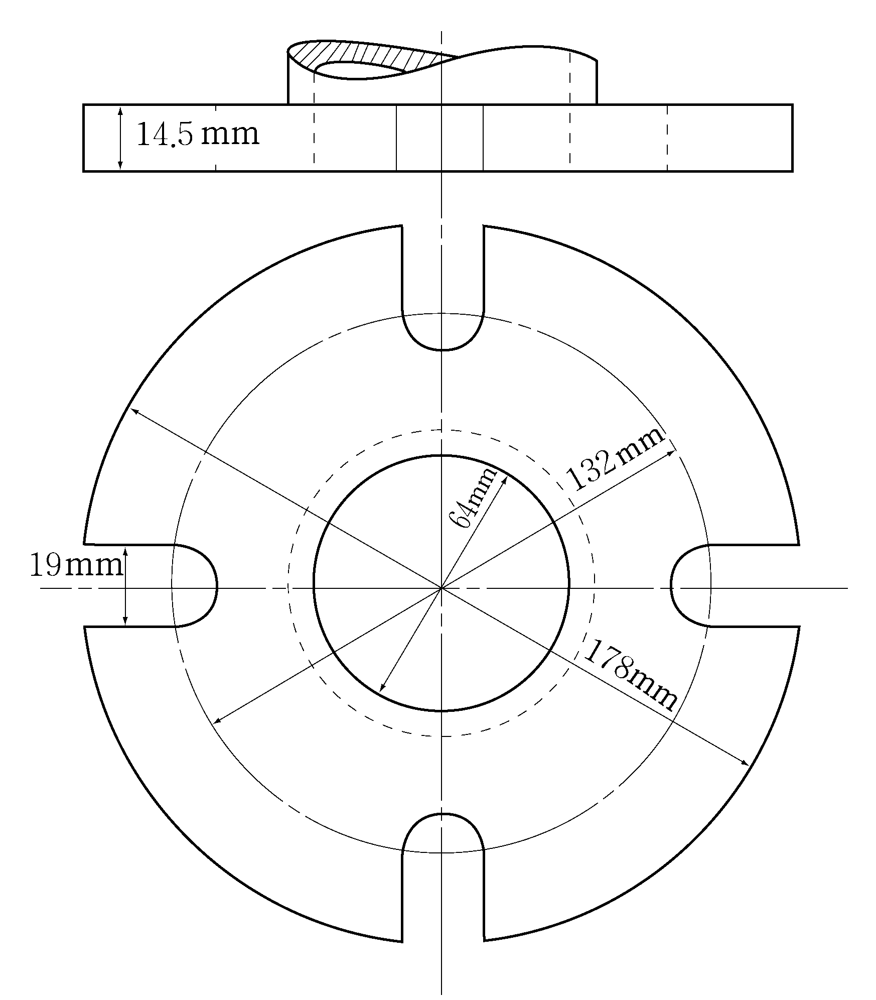
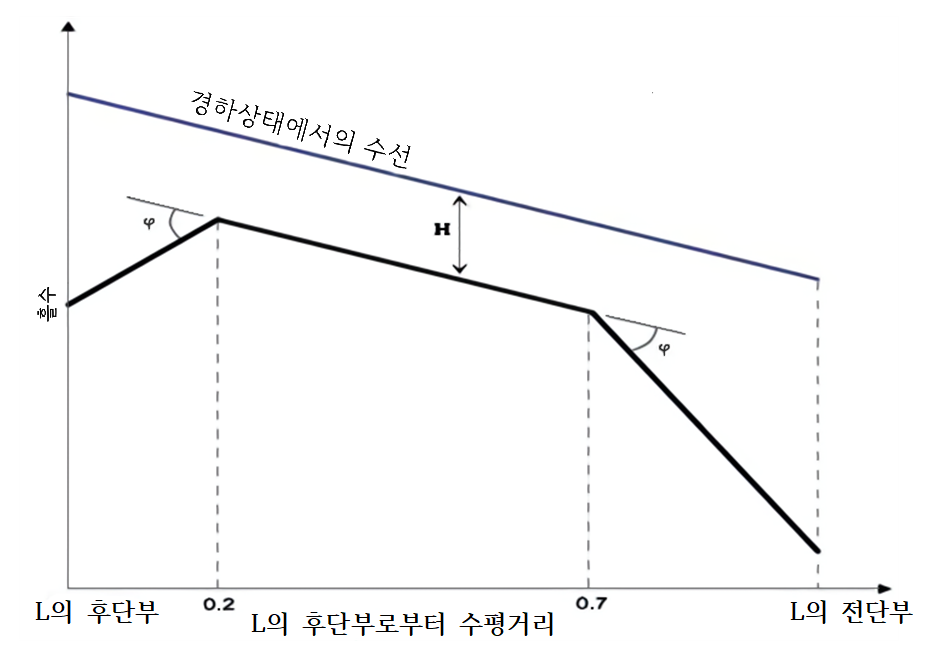
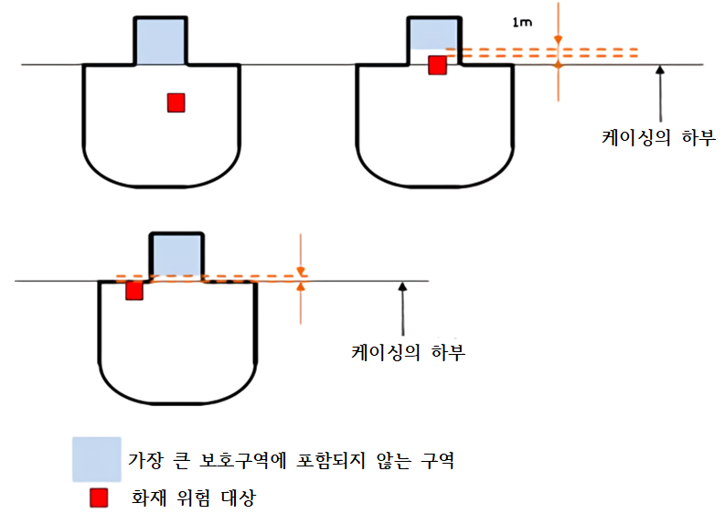
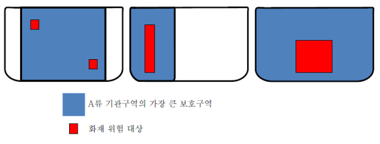
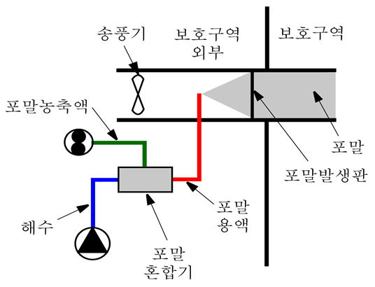
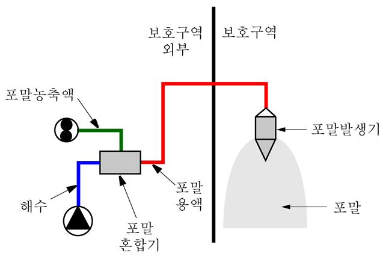
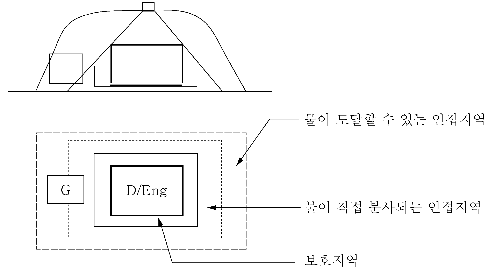

# 제8편 방화 및 소화

> 선급 및 강선규칙/적용지침 / RA-08-K / 2025 / KO / Guidance

## 제 8 장 소화

### 제 1 절 물공급장치

#### 101. 소화주관 및 소화전

- **1.** **규칙 101.**의 **4**항 (1)호에서 다음 사항에 적합하여야 한다. **【규칙 참조】**
  - **(1)** **규칙 101.**의 **4**항 (1)호를 따르는 짧은 흡입관 또는 배출관을 제외하고, 소화주관의 어떠한 부분이라도 A류 기관구역을 통과하는 경우 해당 구역 외부에 분리밸브를 설치하여야 한다. 분리밸브를 폐쇄하는 경우에도 소화펌프나 비상소화펌프가 분리된 구역 외부의 모든 소화전에 소화수를 공급할 수 있도록 소화주관을 배치하여야 한다. A류 기관구역 이외의 구역에 있는 소화펌프의 배관인 경우 분리밸브를 적용하지 않는다.
  - **(2)** 기관구역을 통과하는 해수흡입관 또는 배출관이 두꺼운 강재 케이싱으로 폐위되거나 A-60급으로 방열되는 경우 디스턴스 피스, 해수흡입밸브 및 시체스트를 폐위하거나 방열할 필요는 없다.
  - **(3)** 배관을 A-60급으로 방열하는 방법은 **FTP 코드**에 따라 A-60급으로 승인된 방열재료로 싸서 보호하여야 한다.
  - **(4)** 해수흡입밸브가 기관구역 내에 있는 경우, 밸브는 고장폐쇄형(fail-close)이 되어서는 안 된다. 해수흡입밸브가 기관구역 내에 있고 고장개방형(fail-open)형식이 아닌 경우, 화재 시에 밸브가 개방될 수 있는 수단(예를 들면, A-60급과 동등한 방열등급으로 보호된 제어관장치, 구동장치 및/또는 전기케이블)이 마련되어야 한다.
  - **(5)** 주소화펌프가 기관구역의 외부 구획에 설치되고 비상소화펌프 흡입관 또는 배출관이 그 구획을 관통하는 경우에도 (2)호부터 (4)호의 요건을 적용하여야 한다.
- **2.** **규칙 101.**의 **4**항 (4)호에서 선미루 전방의 보호장소의 소화주관 계통에 설치된 분리밸브란 거주구역, 업무구역 또는 제어 장소 내에 위치한 밸브를 말한다. 그러나 화물지역의 개방갑판 후방에 밸브가 위치해야 한다면, 다음의 장소에 설치할 수 있다.*(2018)* **【규칙 참조】**
  - **(1)** 최후방에 있는 화물탱크의 끝단에서 최소한 5 m 후방
  - **(2)** (1)호의 적용이 불가능할 경우에는 영구적인 강재 차단막으로 보호되는 경우, 최후방 화물탱크의 끝단으로부터 5 m 이내의 장소
- **3.** **규칙 101.**의 **6**항에서 총톤수 1000톤 미만의 여객선 및 화물선의 최소압력은 **규칙 401.**의 **5**항 (1)호에서 정한 모든 곳으로 인접한 모든 소화전을 통하여 12 $\mathrm{m}$ 사수를 하도록 충분한 것이어야 한다. **【규칙 참조】**
- **4.** **규칙 101.**의 **7**항에서 국제육상연결구의 플랜지 표준 치수는 **지침 표 8.8.1**에 따른다.
  또한 국제육상시설연결구는 강이나 동등한 재료여야 하고 설계압력은 1.0 $\mathrm{MPa}$로 한다. 플랜지의 한 쪽은 평면으로, 다른 쪽은 영구적인 커플링을 부착하여 선박의 소화전 및 소화호스에 연결될 수 있어야 한다. 국제육상연결구를 1.0 $\mathrm{MPa}$에 적합한 재료의 개스킷과 함께 선내에 비치하여야 한다. **【규칙 참조】**
  **표 8.8.1 국제육상연결구의 플랜지 표준 치수**

  | 항목 | 치수 |  |
  | --- | --- | --- |
  | 바깥지름 | 178 $\mathrm{mm}$ |   |
  | 안지름 | 64 $\mathrm{mm}$ |   |
  | 볼트원의 지름 | 132 $\mathrm{mm}$ |   |
  | 플랜지의 구멍 | 지름 19 $\mathrm{mm}$*,* 4개 구멍을 볼트원상에 동일 간격으로 하고, 플랜지 바깥으로 구멍자리를 낸다. |   |
  | 플랜지의 두께 | 최소 14.5 $\mathrm{mm}$ |   |
  | 볼트 및 너트 | 지름 16 $\mathrm{mm}$, 길이 50 $\mathrm{mm}$으로 4개 및 와셔 8개 포함한다. |   |

#### 102. 소화펌프

- **1.** **규칙 102.**의 **3**항에서 대빙 항해 선박의 해수흡입 장치는 **빙해운항선박 지침 1장 702.**를, 극지 운항 선박의 해수흡입장치는 **빙해운항선박 지침 2장 308.**을, 극지운항 및 쇄빙기능을 갖는 선박에서의 해수흡입장치는 **빙해운항선박 지침 2장 408.**을 만족하여야 한다. **【규칙 참조】**
- **2.** **규칙 102.**의 **3**항 (1)호 (나)에서 다음 사항에 적합하여야 한다.
  - **(1)** 비상소화펌프용 전선은 주소화펌프와 그 동력원 및 원동기가 있는 기관구역을 통과하지 않아야 한다. 기타 화재 위험성이 높은 지역을 통과하는 경우 우리 선급의 승인을 받은 내연성 제품이어야 한다.
  - **(2)** 해수흡입장치 및 연료공급장치나 각 펌프용 전원공급장치를 갖춘 2개의 주소화펌프를 최소한 A-0급으로 분리된 구획에 독립적으로 설치되지 않고, 어느 한 구획의 화재로 인해 모든 소화펌프의 작동이 불가능해지는 경우 비상소화펌프를 설치하여야 한다.
  - **(3)** 1개의 주소화펌프가 다른 주소화펌프가 있는 구획에 인접한 2 개 이상의 격벽이나 갑판을 갖는 구획에 설치된 경우 비상소화펌프를 설치하여야 한다.
- **3.** **규 칙 102.**의 **3**항 (2)호에서 비상소화펌프는 다음에 적합하여야 한다. 다만, 총톤수 1000톤 이상인 여객선에는 적용하지 않는다.
  - **(1)** 비상소화펌프는 독립된 동력원으로 구동되는 고정식의 펌프여야 한다.
  - **(2)** 비상소화펌프 용량 **【규칙 참조】**

    | 노즐 크기 소화전 압력 | 16 mm | 19 mm |
    | --- | --- | --- |
    | 0.27 $\mathrm{N}/mm ^{2}$ | 16 $\mathrm{m} ^{3} /h$ | 23.5 $\mathrm{m} ^{3} /h$ |
    - **(가)** **규칙 102.**의 **4**항에서 정한 총소화펌프 용량의 40 % 이상이어야 한다. 다만, 어떠한 경우라도 다음 값 이상이어야 한다.
      - **(a)** 총톤수가 1000톤 미만인 여객선과 총톤수가 2000톤 이상인 화물선: 25 $\mathrm{m} ^{3} /h$
      - **(b)** 총톤수가 2000톤 미만인 화물선: 15 $\mathrm{m} ^{3} /h$
    - **(나)** **규칙 301.**의 **1**항 (1)호에 따라 화물선의 기관구역 보호용으로 설치되는 고정식 수계소화장치의 물이 비상소화펌프에 의해서 공급될 경우, 비상소화펌프의 용량은 고정식 소화장치 및 2줄기 사수에 필요한 양을 공급하기에 충분한 것이어야 한다. 그 2줄기 사수의 용량은 어떠한 경우에도 **지침 표 8.8.2**에서 본선에 적용되는 최대 노즐크기(본선에 적용되는 가장 큰 노즐을 선택할 때, 주소화펌프가 있는 구역에 설치된 노즐은 제외될 수 있음)로 계산되어야 한다. 단, 25 $\mathrm{m} ^{3} /h$ 이상이어야 한다.
  - **(3)** 비상소화펌프가 (2)호에서 요구하는 물을 이송할 때 모든 소화전의 압력은 규정에서 정한 압력 이상이어야 한다.
  - **(4)** 비상소화펌프의 전체흡입수두와 유효흡입수두는 운항 중에 생길 수 있는 모든 조건(횡경사, 종경사, 횡동요, 종동요)에서 소화전의 압력과 펌프의 용량 요건을 고려하여 결정하여야 한다. 입거 및 하가하는 선박의 평형수 적재상태를 운항 조건으로 고려할 필요는 없다. 모든 경우에 비상소화펌프의 유효흡입수두는 요구되는 유효흡입수두보다 높아야 한다. 비상소화펌프의 설치 시 성능시험을 통해 **102.**의 **3**항 (2)호에서 요구하는 용량을 만족하는지 검증하여야 하며, 비상소화펌프가 주소화펌프가 설치된 구역을 보호하는 고정식 소화장치에 공급하는 물의 주공급원이라면 그 용량도 추가되어야 한다. 용량시험은 가급적이면 경하상태의 흡입위치에서 실시하여야 한다. 비상소화펌프의 흡입구가 다음과 같이 운항 중에 생길 수 있는 모든 조건(횡경사, 종경사, 횡동요, 종동요)에서 완전히 잠수된다는 것을 다음과 같이 문서화하여야 한다.

    | L (m) | 75 이하 | 100 | 125 | 150 | 175 | 200 | 225 | 250 | 300 | 350 이상 |
    | --- | --- | --- | --- | --- | --- | --- | --- | --- | --- | --- |
    | ᛰ (deg) | 4.5 | 4 | 3.2 | 2.7 | 2.3 | 2.1 | 1.8 | 1.7 | 1.6 | 1.5 |
    | H (m) | 0.73 | 0.8 | 0.87 | 0.93 | 0.98 | 1.03 | 1.07 | 1.11 | 1.19 | 1.25 |

    비고: 선박의 중간 길이 값은 선형보간법으로 구한다.
    L : 국제 만재 흘수선 협약에서 정의된 선박의 길이(m) 또는 평형수 흘수에서 수선 간 길이 중에서 큰 값
    ᛰ : **그림 8.8.1**에서 정의된 종경사각(정수 수선에서 아래 방향으로 측정된 값)
    H : **그림 8.8.1**에서 정의된 상하동요 진폭
    횡동요와 결합된 상하동요각(정수 수선에서 아래 방향으로 측정된 값)은 다음과 같이 주어진다.
    
    **그림 8.8.1 종동요와 결합된 상하동요를 고려한 수선**
    - **(가)** 횡동요, 종동요 및 상하동요에 대한 해상운항 상태가 다음과 같이 적용되어야 한다. 경하운항 상태(승인된 복원성 자료(또는 신조에 대한 임시 복원성 계산)에서 얻어진 해수흡입구 및 비상소화펌프의 위치에서 가장 얕은 흘수가 주어지는 평형수 적재상태)가 고려되어야 하고, 횡동요와 결합된 상하동요 및 종동요와 결합된 상하동요는 별도로 고려되어야 한다.
      - **(a)** 종파에서의 종동요와 결합된 상하동요(**지침 그림 8.8.1**에서와 같이 종동요와 결합된 상하동요가 고려된다)
      - **(b)** 횡파에서의 횡동요와 결합된 상하동요
      - **(i)** 빌지킬이 있는 선박 : 11°
        - **(ii)** 빌지킬이 없는 선박 : 13°
    - **(나)** 비상소화펌프 흡입구는 다음의 2가지 조건에 부합하는 수선에서 잠수되어야 하며, 횡동요, 종동요, 상하동요는 적용하지 않아도 된다.
      - **(a)** 등흘수에서 프로펠러의 2/3가 잠기는 높이의 정적 수선(포드(pod) 또는 스러스트 추진장치(thruster)를 정비한 선박에 대해서는 특별히 고려되어야 한다.)
      - **(b)** 화물을 적재하지 않고 소모품 및 연료를 10 % 적재하고 있는 상황에서 승인된 트림 및 복원성 자료에 따른 입항 평형수 적재상태
    - **(다)** 평수구역만을 항해하는 선박은 (나) (a)에서 규정하는 정수에서의 잠수에 적합하여야 한다.
  - **(5)** 비상소화펌프의 디젤 동력원은 0℃의 저온상태에서 손(수동)으로 크랭크를 돌려서 즉시 시동될 수 있어야 한다. 이러한 시동이 불가능하거나 더 낮은 온도가 예상되는 경우, 디젤 동력원실에 난방이 제공되지 않아 이러한 즉시 시동이 확보되지 못하는 경우에는 우리 선급이 만족하는 디젤기관의 냉각수 또는 윤활유 시스템에 전기가열장치가 설치되어야 한다. 만약 손(수동) 시동이 실행 불가능하다면 우리 선급은 압축공기, 전기 또는 유압이나 시동 카트리지를 포함한 다른 축적된 에너지원이 시동 수단으로 사용하도록 허용할 수 있다. 이러한 수단은 해당 디젤 동력원을 30분 내에 최소한 6회, 처음 10분 이내에 최소 2회의 시동할 수 있어야 한다.
  - **(6)** 모든 서비스연료유탱크는 비상소화펌프를 전부하에서 최소 3시간 작동할 수 있어야 한다. 충분한 예비탱크를 A류 기관구역 밖에 설치하여 전부하상태에서 추가로 15시간 작동할 수 있어야 한다.
  - **(7)** 비상소화펌프 및 그 원동기가 설치된 장소는 보수작업 및 검사를 위해 적절한 공간을 갖추도록 한다.
  - **(8)** 비상소화펌프가 프라이밍이 필요한 경우 자흡식(self-priming)이어야 한다.
  - **(9)** 동력 비상소화펌프를 설치하는 경우 소화펌프가 설치된 구획의 화재가 연료나 동력공급장치에 쉽게 영향을 주지 않도록 배치하여야 한다. *(2024)*
- **4.** **규 칙 102.**의 **3**항 (2)호 (가)에서 비상소화펌프실로의 단일 통로가 A류 기관구역이나 주소화펌프가 있는 구역과 인접한 기타구역을 통과할 경우, 그 기타구역과 A류기관구역 및/또는 주소화펌프가 있는 구역 사이를 A-60급 경계로 한다.
- **5.** **규 칙 102.**의 **3**항 (2)호 (나)에서 주소화펌프가 설치된 기관구역과 비상소화펌프가 설치된 구역 사이에 직접 통로가 있거나 비상소화펌프가 있는 구역으로의 접근을 위한 제2의 수단이 필수적인 경우 **지침 그림 8.8.2**를 표준 배치로 하여야 한다.
- **6.** **규칙 102.**의 **3**항 (3)호에서 소화주관에 연결될 수 있도록 소화펌프의 개수와 용량이 요구량에 적합다면, 요구량 이상의 펌프 용량과 압력을 지닌 다른 펌프를 강제로 요구하지 않는다.

#### 103. 소화호스 및 노즐 【규칙 참조】

알루미늄합금을 소화호스연결부와 노즐 재료로 사용할 수 있다. 단, 유탱커 및 케미컬탱커의 개방갑판에는 사용할 수 없다. 또한 소화호스노즐로 폴리카보나이트와 같은 플라스틱 재료를 사용할 경우 해상용으로 적합하여야 하고, 용량과 적합성을 기록한 자료를 마련해야 한다.

### 제 2 절 휴대식 소화기

#### 201. 형식 및 설계 【규칙 참조】

- **1.** 모든 소화기는 **IMO Res.A.951(23)**에 따라 설계된 형식승인품이어야 한다.
- **2.** 각 분말소화기, 이산화탄소소화기는 최소 5 $\mathrm{kg}$ 이상이어야 하고 각 포말소화기는 최소 9 $\mathrm{L}$ 이상이어야 한다. 모든 휴대식소화기의 중량은 23 $\mathrm{kg}$를 초과할 필요는 없으며, 9 $\mathrm{L}$ 액체(fluid)소화기와 동등한 소화능력을 갖추어야 한다.
- **3.** 해당 소화기의 승인된 충전제로 재충전하여야 한다.
- **4.** **규 칙 401.**의 **2**항 (1)호 및 **402.**의 **2**항 (1)호에서 휴대식포말방사기 유닛은 자체 유도형 또는 분리 인덕터와 조합되는 것으로서 소화호스로 소화주관에 연결할 수 있는 포말노즐/지관, 20 $\mathrm{L}$ 이상의 포말원액을 가진 휴대식 탱크 및 1개 이상의 동등한 용량의 포말원액 예비탱크로 구성되어야 한다. 또한 휴대식 방사기의 성능은 다음과 같다.

#### 202. 소화기의 배치 【규칙 참조】

- **1.** 휴대식소화기의 개수 및 배치는 다음에도 적합하여야 한다.
  - **(1)** 사람이 없을 때 잠겨 있는 구역의 휴대식 소화기는 그 구역의 안쪽 또는 바깥쪽에 둘 수 있다.
  - **(2)** 휴대식 소화기의 선택은 **IMO Res.A 951(23)**에 따라 구역의 화재위험성에 적합하여야 하며, 휴대식 소화기의 분류는 **지침 표 8.8.3-1**를 참고한다.
  - **(3)** **지침 표 8.8.3**에서 A류 기관구역의 휴대식 소화기의 수 및 배치는 **IACS UI　SC30**, **FSS 코드**, **FTP 코드** 및 **IMO MSC/Circ. 1120** 또는 **규칙4절**에 특별히 언급되지 않은 경우에 적용되어야 한다.
- **2.** **규칙 202.**의 **2**항에서 공용실 및 공작실에 있는 여분의 휴대식 소화기도 주출입구 또는 출입구 근처에 배치하는 것을 권고한다.
  **표 8.8.3 구역별 휴대식 소화기의 최소 수량 및 배치**

  **구역 종류 ; 소화기의 최소 수 ; 소화기 분류(6) 거주 구역 ; 공용실 ; 갑판구역 1개/250 ㎡ 또는 단수마다 ; A 복도 ; 각 갑판 및 주수직구역 내에서 통로길이 25 m마다 ; A 계단 ; 0 화장실, 선실, 사무실, 식자재실(조리기구 없음) ; 0 병원 ; 1 ; A 업무 구역 ; 세탁건조실, 식자재실(조리기구 있음) ; 1(2) ; A 또는 B 로커 및 저장품실(갑판면적 4 ㎡ 이상), 편지 및 수화물실, 금고실, 공작실(기관구역, 조리실의 일부 아님) ; 1(2) ; B 조리실 ; 1 (B급) + 1 (F 또는 K급, 튀김기가 있는 경우) ; B, F 또는 K 로커 및 저장품실 (갑판면적 4 ㎡ 미만) ; 0 가연성 액체가 저장된 그 외의 구역 ; **규칙 8장 503.**에 따름. 제어 장소 ; 제어장소 (선교 이외) ; 1 ; A 또는 C 선교 ; 2 (선교의 면적이 50 ㎡ 미만인 경우는 1개(3)) ; A 또는 C A류 기관 구역 ; 추진기관의 중앙제어장소 ; 1 (주 배전반이 있는 경우, 1개 추가) ; A 및/또는 C 주 배전반 근처 ; 2 ; C 공작실 ; 1 ; A 또는 B 연료 연소 불활성가스 발생기, 소각기 및 쓰레기 소각장치가 있는 폐위구역 ; 2 ; B 연료유 청정기가 있는 분리된 폐위구역(7) ; 0 정기적으로 무인화되는 A류 기관구역 ; 통로마다 1(1) ; B 그 외의 구역 ; 기관구역내의 공작실 및 기타 기관구역(보조기관구역, 전기설비구역, 자동전화교환실, 에어컨룸, 다른 유사지역 ; 1 ; B 또는 C 노출갑판 ; 0(4) ; B 로로구역 및 차량구역 ; 각 갑판 위치의 소화기로부터 보행거리 20 m거리마다(4),(5) 화물 구역 ; 0(4) ; B 화물펌프실 ; 2 ; B 헬리콥터 갑판 ; **규칙 11장 4절**에 따름. ; B 구역 종류 소화기의 최소 수 소화기 분류(6) 거주 구역 공용실 갑판구역 1개/250 ㎡ 또는 단수마다 A 복도 각 갑판 및 주수직구역 내에서 통로길이 25 m마다 A 계단 0 화장실, 선실, 사무실, 식자재실(조리기구 없음) 0 병원 1 A 업무 구역 세탁건조실, 식자재실(조리기구 있음) 1(2) A 또는 B 로커 및 저장품실(갑판면적 4 ㎡ 이상), 편지 및 수화물실, 금고실, 공작실(기관구역, 조리실의 일부 아님) 1(2) B 조리실 1 (B급) + 1 (F 또는 K급, 튀김기가 있는 경우) B, F 또는 K 로커 및 저장품실 (갑판면적 4 ㎡ 미만) 0 가연성 액체가 저장된 그 외의 구역 **규칙 8장 503.**에 따름. 제어 장소 제어장소 (선교 이외) 1 A 또는 C 선교 2 (선교의 면적이 50 ㎡ 미만인 경우는 1개(3)) A 또는 C A류 기관 구역 추진기관의 중앙제어장소 1 (주 배전반이 있는 경우, 1개 추가) A 및/또는 C 주 배전반 근처 2 C 공작실 1 A 또는 B 연료 연소 불활성가스 발생기, 소각기 및 쓰레기 소각장치가 있는 폐위구역 2 B 연료유 청정기가 있는 분리된 폐위구역(7) 0 정기적으로 무인화되는 A류 기관구역 통로마다 1(1) B 그 외의 구역 기관구역내의 공작실 및 기타 기관구역(보조기관구역, 전기설비구역, 자동전화교환실, 에어컨룸, 다른 유사지역 1 B 또는 C 노출갑판 0(4) B 로로구역 및 차량구역 각 갑판 위치의 소화기로부터 보행거리 20 m거리마다(4),(5) 화물 구역 0(4) B 화물펌프실 2 B 헬리콥터 갑판 **규칙 11장 4절**에 따름. B (비고) (1) 작은 구역에서 요구되는 휴대식 소화기는 그 구역의 바깥쪽 입구 근처에 배치한다.**

  | 구역 종류 |   | 소화기의 최소 수 | 소화기 분류(6) |
  | --- | --- | --- | --- |
  | 거주 구역 | 공용실 | 갑판구역 1개/250 ㎡ 또는 단수마다 | A |
  | 거주 구역 | 복도 | 각 갑판 및 주수직구역 내에서 통로길이 25 m마다 | A |
  | 거주 구역 | 계단 | 0 |   |
  | 거주 구역 | 화장실, 선실, 사무실, 식자재실(조리기구 없음) | 0 |   |
  | 거주 구역 | 병원 | 1 | A |
  | 업무 구역 | 세탁건조실, 식자재실(조리기구 있음) | 1(2) | A 또는 B |
  | 업무 구역 | 로커 및 저장품실(갑판면적 4 ㎡ 이상), 편지 및 수화물실, 금고실, 공작실(기관구역, 조리실의 일부 아님) | 1(2) | B |
  | 업무 구역 | 조리실 | 1 (B급) + 1 (F 또는 K급, 튀김기가 있는 경우) | B, F 또는 K |
  | 업무 구역 | 로커 및 저장품실 (갑판면적 4 ㎡ 미만) | 0 |   |
  | 업무 구역 | 가연성 액체가 저장된 그 외의 구역 | **규칙 8장 503.**에 따름. |   |
  | 제어 장소 | 제어장소 (선교 이외) | 1 | A 또는 C |
  | 제어 장소 | 선교 | 2 (선교의 면적이 50 ㎡ 미만인 경우는 1개(3)) | A 또는 C |
  | A류 기관 구역 | 추진기관의 중앙제어장소 | 1 (주 배전반이 있는 경우, 1개 추가) | A 및/또는 C |
  | A류 기관 구역 | 주 배전반 근처 | 2 | C |
  | A류 기관 구역 | 공작실 | 1 | A 또는 B |
  | A류 기관 구역 | 연료 연소 불활성가스 발생기, 소각기 및 쓰레기 소각장치가 있는 폐위구역 | 2 | B |
  | A류 기관 구역 | 연료유 청정기가 있는 분리된 폐위구역(7) | 0 |   |
  | A류 기관 구역 | 정기적으로 무인화되는 A류 기관구역 | 통로마다 1(1) | B |
  | 그 외의 구역 | 기관구역내의 공작실 및 기타 기관구역(보조기관구역, 전기설비구역, 자동전화교환실, 에어컨룸, 다른 유사지역 | 1 | B 또는 C |
  | 그 외의 구역 | 노출갑판 | 0(4) | B |
  | 그 외의 구역 | 로로구역 및 차량구역 | 각 갑판 위치의 소화기로부터 보행거리 20 m거리마다(4),(5) |   |
  | 그 외의 구역 | 화물 구역 | 0(4) | B |
  | 그 외의 구역 | 화물펌프실 | 2 | B |
  | 그 외의 구역 | 헬리콥터 갑판 | **규칙 11장 4절**에 따름. | B |

  **표 8.8.3 구역별 휴대식 소화기의 최소 수량 및 배치 (계속)**

  **(2) 업무구역에서, 작은 구역의 바깥쪽 또는 그 구역의 입구에 비치된 소화기는 그 구역 내에 설치한 것으로 간주한다. (3) 선교가 해도실 근처에 있고 해도실로 가는 직접 통로가 있으면 추가의 소화기를 해도실에 비치할 필요는 없다. 여객선의 안전센터가 선교와 같은 경계구역에 있으면 동일하게 적용한다. (4) 노출갑판, 개방된 로로구역 및 차량구역, 화물구역에 위험물을 운송할 경우 6kg 이상의 분말 또는 동등한 성능의 휴대식 소화기 2개를 비치한다. 탱커의 경우, 적정한 용량의 휴대식 소화기 2개를 노출갑판에 비치하여야 한다. (5) 연료유를 적재한 차량을 개방 또는 폐위된 컨테이너로 운송할 경우 컨테이너선박의 화물창에 휴대식소화기를 비치할 필요는 없다. (6) 소화기 분류는 **IMO Res.A 951(23)**에 따르며, **지침 표 8.8.3-1**과 같다. (7) 분리된 폐위구역은 갑판에서 갑판까지 강재로 된 격벽으로 폐위되고, 문은 강재의 자동폐쇄되는 문이어야 한다. 또한 그 구역에 설치된 통풍장치, 화재탐지장치, 고정식 소화장치는 독립되어야 한다. **표 8.8.3-1 소화기 분류** 국제 표준화기구 (**ISO 표준 3941**) ; 미국방화협회(**NFPA 10**) A급 : 일반적으로 유기물 성질이며 재의 형성을 일으키는 고체물질과 연관된 화재 ; A급 : 나무, 의류, 종이, 고무 및 여러 종류의 플라스틱 #underline{등,} 일반적인 연소성 물질로 일어나는 화재 B급 : 액체 또는 액화 가능한 고체와 연관된 화재 ; B급 : 가연성 액체, 기름, 유지, 타르, 유성페인트, 래커와 가연성 가스로 일어나는 화재 C급 : 가스와 연관된 화재 ; C급 : 소화제의 전기 비전도성이 중요한 경우, 전류가 흐르는 전기 장치와 연관된 화재(전기장치의 전류가 흐르지 않을 경우, A급 또는 B급 화재용 소화기로 안전하게 사용될 수 있다.) D급 : 금속과 연관된 화재 ; D급 : 마그네슘, 티타늄, 지르코늄, 나트륨, 리튬 및 칼륨과 같은 가연성 금속과 연관된 화재 F급 : 요리용 기름과 연관된 화재 ; K급 : 요리용 유지, 지방 및 기름과 연관된 화재 국제 표준화기구 (**ISO 표준 3941**) 미국방화협회(**NFPA 10**) A급 : 일반적으로 유기물 성질이며 재의 형성을 일으키는 고체물질과 연관된 화재 A급 : 나무, 의류, 종이, 고무 및 여러 종류의 플라스틱 #underline{등,} 일반적인 연소성 물질로 일어나는 화재 B급 : 액체 또는 액화 가능한 고체와 연관된 화재 B급 : 가연성 액체, 기름, 유지, 타르, 유성페인트, 래커와 가연성 가스로 일어나는 화재 C급 : 가스와 연관된 화재 C급 : 소화제의 전기 비전도성이 중요한 경우, 전류가 흐르는 전기 장치와 연관된 화재(전기장치의 전류가 흐르지 않을 경우, A급 또는 B급 화재용 소화기로 안전하게 사용될 수 있다.) D급 : 금속과 연관된 화재 D급 : 마그네슘, 티타늄, 지르코늄, 나트륨, 리튬 및 칼륨과 같은 가연성 금속과 연관된 화재 F급 : 요리용 기름과 연관된 화재 K급 : 요리용 유지, 지방 및 기름과 연관된 화재**

  | 국제 표준화기구 (**ISO 표준 3941**) | 미국방화협회(**NFPA 10**) |
  | --- | --- |
  | A급 : 일반적으로 유기물 성질이며 재의 형성을 일으키는 고체물질과 연관된 화재 | A급 : 나무, 의류, 종이, 고무 및 여러 종류의 플라스틱 #underline{등,} 일반적인 연소성 물질로 일어나는 화재 |
  | B급 : 액체 또는 액화 가능한 고체와 연관된 화재 | B급 : 가연성 액체, 기름, 유지, 타르, 유성페인트, 래커와 가연성 가스로 일어나는 화재 |
  | C급 : 가스와 연관된 화재 | C급 : 소화제의 전기 비전도성이 중요한 경우, 전류가 흐르는 전기 장치와 연관된 화재(전기장치의 전류가 흐르지 않을 경우, A급 또는 B급 화재용 소화기로 안전하게 사용될 수 있다.) |
  | D급 : 금속과 연관된 화재 | D급 : 마그네슘, 티타늄, 지르코늄, 나트륨, 리튬 및 칼륨과 같은 가연성 금속과 연관된 화재 |
  | F급 : 요리용 기름과 연관된 화재 | K급 : 요리용 유지, 지방 및 기름과 연관된 화재 |

### 제 3 절 고정식 소화장치

#### 301. 고정식소화장치의 형식

- **1.** **규칙 301.**의 **1**항 (1)호에서 고정식 가스소화장치는 다음 사항에도 적합하여야 한다. **【규칙 참조】**
  - **(1)** **FSS 코드 5장 2.1.2.3**에 명시된 소화장치의 예비부품은 아래와 같이 본선에 비치하여야 한다.
    - **(가)** 모든 용기의 파괴봉관(기동용의 것 및 패킹을 포함)
    - **(나)** 모든 용기의 안전봉관의 3분의 1(기동용의 것 및 패킹을 포함)
    - **(다)** 모든 용기의 10분의 1을 재충전하는데 필요한 패킹, 오링류 및 보수점검을 위한 공구류 등
  - **(2)** **FSS 코드 5장 2.1.2.6**에서 이 요건은 적합한 계산법으로 점검할 수 있다.
  - **(3)** 기관구역과 화물펌프실용 고정식 가스소화장치가 해당 소화장치에 의하여 보호하는 구획 내에 소화제를 격납하는 경우에는 다음의 요건에 적합하여야 한다.
    - **(가)** 보호구역에 저장된 소화제 격납 용기는 (다)의 경우를 제외하고 최소한 6개의 분리된 장소에 용기나 그룹용기를 배치하여 구역전체에 분배되도록 한다.
    - **(나)** 2중 방출동력관을 배치하여 모든 용기를 동시에 방출하여야 한다. 임의의 방출동력관이 손상되더라도 6분의 5 소화가스를 배출할 수 있도록 방출관을 배치한다. 용기밸브를 방출관의 일부로 간주하며 단일 고장도 그 용기 밸브의 고장에 포함한다.
    - **(다)** 최소형의 용기를 사용하여도 6개 미만의 격납용기가 필요한 경우, 다음의 조건을 만족하면 6개소에 분산 배치하지 않아도 된다.
      - **(a)** 소화제의 총량이 1개의 방출관이 실패(용기 밸브 고장 포함)하여 단일 고장으로 1개의 용기가 방출하지 못할 경우에도 나머지 용기에서 가스소화 요구량의 5/6를 방출할 수 있다. 최소 2개의 용기로 가능하도록 한다.
      - **(b)** 전체소화가스량을 동시에 배출할 때 기관실의 최고온도에서 계산된 관찰되지 않은 역효과값(NOAEL)을 초과하지 아니하여야 한다. 이에 적합하지 않은 시스템에서 보호구역 내에 1개의 용기를 사용하는 경우는 허용되지 않는다. 이러한 시스템은 보호구역 밖의 지정된 장소에 용기를 저장하여야 하며, **규칙 303.**에 적합하여야 한다.
  - **(4)** **FSS 코드 5장 2.2.1.7**에 명시된 “가스의 양”은 **FSS 코드 5장 2.2.1.1**의 가장 큰 화물구역에 요구되는 양을 의미한다. *(2018)*
  - **(5)** **FSS 코드 5장 2.2.2**의 요건은 **FSS 코드 5장 2.1.3.2**에서 명시된 구역에 적용한다. **FSS 코드 5장 2.1.3.2**에서 전형적인 화물구역이라 함은 로로구역 또는 냉동컨테이너 적재장소를 제외한 화물구역을 말하며, 전형적인 화물구역에서는 소화제 방출을 자동으로 가시가청할 수 있는 경보수단을 갖출 필요가 없다.
  - **(6)** **FSS 코드 5장 2.2.3**에서의 압력시험은 소화장치 설치 후 모든 배관에서 사용압력으로 수행되어야 하며, 제어밸브 이후의 방출관장치는 7bar 이상의 압력으로 실시되어야 한다. *(2018)*
  - **(7)** 저압식 고정식 가스소화장치가 설치된 경우, 노즐에서의 CO_2 압력이 1 N/mm^2 이상되도록 배관을 설계하여야 한다. *(2022)*
- **2.** **규 칙 301.**의 **1**항 (2)호에서 고정식 포말소화장치는 다음 사항에도 적합하여야 한다. *(2018)*
  - **(1)** **FSS 코드 6장 3.2.1.2와 3.3.1.2**에 명시된 “가장 큰 보호구역”은 FSS 코드 요건에 적합한 고팽창포말소화장치에 의해 보호되는 A류 기관구역에 적용한다.
    
    **그림 8.8.3 엔진 케이싱이 있는 기관구역의 가장 큰 보호구역**
    
    **그림 8.8.4 엔진 케이싱이 없는 기관구역의 가장 큰 보호구역**
    - **(가)** (1)호의 기관구역이 케이싱을 포함하는 경우(예를 들어 내연기관 및/또는 보일러를 포함한 A류 기관구역의 엔진 케이싱)에는 그러한 케이싱의 체적 중 기관구역의 가장 높은 곳에 위치한 화재의 위험이 있는 대상을 보호하기 위한 포말이 채워지는 위치를 초과한 높이는 보호구역의 체적에 포함될 필요가 없다.
    - **(나)** (가)에서 “기관구역 내의 가장 높은 곳에 위치한 화재의 위험이 있는 대상을 보호하기 위한 포말이 채워지는 위치”는 다음 값 이상이어야 한다. (**그림 8.8.3** 참조)
      - **(a)** 화재 위험 대상의 가장 높은 지점으로부터 1m 상부의 높이
      - **(b)** 케이싱의 가장 낮은 지점
    - **(다)** (1)호의 기관구역이 케이싱을 포함하지 않는 경우에는 가장 큰 보호구역의 체적은 기관구역 내에 있는 화재 위험 대상의 위치와 관계없이 해당 구역 전체의 체적으로 한다. (**그림 8.8.4** 참조)
    - **(라)** 화재의 위험이 있는 대상은 **규칙 1장 103.**의 **31**항과 **34**항에 열거된 대상을 포함하며 이에 국한되지 않는다. 이러한 규칙에서 언급되지 않더라도 배기가스 보일러나 연료유 탱크와 같은 유사한 화재의 위험을 갖는 대상물들이 포함될 수 있다.
  - **(2)** 외부공기식 고정식 고팽창포말소화장치는 **지침 그림 8.8.5,** 내부공기식 고정식 고팽창포말소화장치는 **지침 그림 8.8.6**를 참조한다.

    |  **그림 8.8.5 외부공기식** **그림 8.8.5 외부공기식** |  **그림 8.8 . 6 내부공기식** **그림 8.8 . 6 내부공기식** |
    | --- | --- |
- **3.** **규 칙 301.**의 **1**항 (3)호에서 고정식 가압수분무소화장치 및 동등한 미분무수소화장치는 다음에 적합하여야 한다.
  - **(1)** 기관구역 및 화물펌프실용 고정식 가압수분무소화장치와 이와 동등한 미분무수소화장치는 **IMO MSC/Circ.1165, MSC.1/Circ.1269**, **MSC.1/Circ.1386** 및 **MSC.1/Circ.1458**에 따라 우리 선급의 승인을 받아야 한다. *(2018)*
  - **(2)** 여객선 선실 발코니용 고정식 가압수분무 및 동등한 미분무수소화장치는 **IMO　MSC.1/Circ. 1268**에 따라 우리 선급의 승인을 받아야 한다.

#### 303. 소화제의 보관실 【규칙 참조】

소화제 보관장소는 탄산가스소화장치용 탄산가스를 보관하는 장소를 말한다. 또한 화물창을 보호하는 소화제의 보관장소는 화물창 전방이면서 충돌격벽 후방에 위치할 수 있다. 다만 소화제 방출을 위한 국부수동 방출장치 및 원격 제어를 설치하고 그 원격제어의 보호구역 내에서 화재 시 작동될 수 있도록 견고한 구조로 하거나 보호되어야 한다. 또한 서로 다른 화물창에 다른 양의 소화제 방출로 보호되는 경우 원격방출장치가 있어야 한다.

### 제 4 절 기관구역의 소화장치

#### 401. 기름보일러 또는 연료유장치가 있는 기관구역 【규칙 참조】

보일러실의 소화장치는 **지침 표 8.8.4**에 따른다. 이 때 불활성가스발생기, 소각기, 폐기처리장치와 같이 보일러 이외의 기름연소기계에서 요구되는 소화장치의 종류와 개수는 보일러실과 같은 것으로 간주한다.

#### 402. 내연기관이 있는 A류 기관구역 【규칙 참조】

내연기관이 있는 A류 기관구역의 소화장치는 **지침 표 8.8.4**에 따른다.

#### 405. 여객선의 추가요건 【규칙 참조】

물분무방사기는 소화호스에 부착될 수 있는 길이 2 m 정도의 긴 지관과 고정식 물분무노즐이 부착되거나 물분무노즐을 부착할 수 있는 길이 250 mm 정도의 짧은 지관인 금속형 L관으로 구성될 수 있다.

#### 406. 고정식국부소화장치 【규칙 참조】

- **1.** 선박에 설치되는 소화장치의 성능은 **MSC.1/Circ.1387**의 요건에 따라 우리 선급의 형식승인을 받아야 한다. 노즐은 **MSC/Circ.1165**(**MSC.1/Circ.1269** 개정사항 포함)의 요건에 따라 해당 선박의 기국 정부의 형식승인을 받아야 한다. 다만, 기국 정부의 특별 규정이 없는 경우 SOLAS 체약국 정부 또는 우리 선급의 승인을 받아야 한다.
- **2.** 시스템 주요 요건
  - **(1)** 시스템 작동
    - **(가)** 이 장치는 수동으로 방출할 수 있어야 한다.
    - **(나)** 시스템의 작동은 전원 손실 또는 조종성능의 감소를 초래할 수 있는 기관의 정지, 연료탱크 출구밸브의 폐쇄, 인원 대피 또는 구역의 밀폐를 요구해서는 안 된다. 이 요건은 청수를 방출할 때 보호지역 내의 전기설비에 대한 요건을 규정하기 위한 것은 아니다.
    - **(다)** 작동 제어장치는 보호구역의 내부 및 외부에서 쉽게 접근할 수 있는 장소에 위치하여야 한다. 그 구역 내의 제어장치는 보호지역 내의 화재에 의하여 기능을 상실하지 아니하여야 한다.
    - **(라)** 이 장치 중 압력공급원의 구성품은 보호 지역 밖에 위치하여야 한다.
    - **(마)** 자동 작동 소화장치가 설치되는 경우에는 다음 요건에 적합하여야 한다.
      - **(a)** 소화제의 종류와 자동 방출의 가능성을 알리는 경고판을 각 출입구의 외측에 게시하여야 한다.
      - **(b)** 탐지장치는 신속한 작동을 보장하여야 하며 또한 사고 방출을 방지하기 위한 고려를 하여야 한다. 탐지장치의 분할 범위는 소화장치의 분할 범위와 일치하여야 한다. 2개의 승인된 화염 탐지기로 구성하거나 1개의 승인된 화염 탐지기와 1개의 승인된 연기탐지기로 구성하는 배치는 인정될 수 있다. 우리 선급이 인정하는 경우 그 외의 배치도 허용될 수 있다. 다만, 이 장치에 열탐지기를 사용하는 것은 원칙적으로 피해야 한다.
      - **(c)** 물의 방출은 탐지장치에 의하여 제어되어야 한다. 탐지장치는 어느 1개의 탐지기 작동 시 경보를 발하고 2개 이상의 탐지기가 작동하면 방출이 되도록 하여야 한다. 우리 선급이 인정하는 경우 그 외의 배치도 허용될 수 있다.
      - **(d)** 기관제어실 및 항해선교 또는 계속적으로 사람이 배치된 집중제어장소에 작동된 구역을 나타내는 가시가청의 경보를 발하여야 한다. 가청 경보는 단일음을 사용할 수 있다.
    - **(바)** 장치 동작지침서를 각 작동 위치에 게시하여야 한다.
    - **(사)** 기관실에 고정식 고팽창포말 또는 에어로졸 소화장치가 설치되는 경우, 국부소화장치가 이들 장치의 성능에 방해되는 것을 방지하기 위하여 적절한 조작상의 조치 또는 인터록을 제공하여야 한다.
  - **(2)** 노즐의 배치 및 물 공급
    - **(가)** 장치는 **MSC.1/Circ.1387**의 부속서에 따라 수행된 시험을 기초로 한 화재진압 능력을 가져야 한다. 선상에서 노즐의 설치는 **MSC.1/Circ.1387**의 부속서에 따라 성공적으로 시험된 배치를 반영하여야 한다. 시험된 배치에서 벗어나는 특별한 선상의 노즐배치가 예상될 경우, **MSC.1/Circ.1387**의 시나리오에 기초한 화재시험에 추가로 통과하여야 한다.
    - **(나)** 노즐의 위치, 형식, 특성은 **MSC.1/Circ.1387**의 부속서에 따라 시험된 제한 범위 내에 있어야 한다. 노즐의 위치는 소화장치의 분사에 방해되는 요소를 고려하여야 한다. **MSC.1/Circ.1387**의 부속서 3.4.2.4에 따라 보호하면 노즐의 일렬배치 또는 단일 노즐의 사용이 허용될 수 있다.
    - **(다)** 배관장치는 장치의 정확한 성능을 위하여 요구되는 유량 및 압력의 유용성을 보장하기 위하여 Hazen-Williams 수압계산법 및 Dracy-Weisbach 수압계산법 등과 같은 수압계산법에 따라 크기가 결정되어야 한다.
    - **(라)** 장치는 보호구역 내에서 분리 구획(separate section)으로 구분할 수 있다. 장치의 용량 및 설계는 최대 물용적을 필요로 하는 구획을 기초로 하여야 한다. 어떤 경우에도 최소용량은 단일 최대의 기관, 디젤 발전기 또는 기기 일부를 보호하는 단일 구획에 충분하여야 한다. 복수의 기관이 설치된 경우 최소한 2개의 구획으로 배치하여야 한다.
    - **(마)** 노즐과 배관은 일상적인 유지보수를 위하여 기관 및 기기에 접근하는 것을 방해하여서는 안 되며 기관구역내의 크레인 또는 기타 이송장비의 작동을 방해하지 않도록 설치하여야 한다.
  - **(3)** 장치 구성품
    - **(가)** 장치는 즉시 사용할 수 있어야 하며 화재의 진압, 소화 및 그 시간 내에 고정식 주소화장치의 방출을 준비하기 위하여 최소 20분간 물소화제를 연속적으로 공급할 수 있어야 한다.
    - **(나)** 장치 및 구성품은 기관구역의 통상적인 주위 온도 변화, 진동, 습기, 충격, 막힘 및 부식에 견딜 수 있도록 설계되어야 한다. 보호구역 내의 구성품은 화재동안 발생할 수 있는 온도 상승에 견딜 수 있도록 설계되어야 한다. 구성품은 **MSC.1/Circ.1269**에 의하여 개정된 **IMO MSC/ Circ.1165**의 부속서 A의 요건에 따라 시험되어야 한다.
    - **(다)** 장치 및 구성품은 우리 선급이 인정하는 국제 표준을 기초로 설계되고 설치되어야 하며 **IMO MSC.1/Circ.1387** 부속서의 적절한 요소에 따라 제조되고 시험되어야 한다.
    - **(라)** 이 장치의 압력공급원의 전기구성품은 보호구역 내에 위치할 경우 최소 IPX4 이상이어야 한다. 외부 전원을 요구하는 장치는 주전원으로만 급전할 수 있다.
    - **(마)** 필요한 시간동안 두 장치를 작동하는데 적합한 유량과 압력을 이용할 수 있다면, 국부소화장치의 물 공급은 물을 이용하는 주소화장치의 급수계통으로부터 급수할 수 있다. **규칙 404**., **IMO MSC.1/Circ.1387** 및 **IMO MSC/Circ.1165(MSC.1/Circ.1237** 및 **MSC.1/Circ.1269, MSC.1/Circ.1386**에 의하여 개정된 사항 포함)의 모든 요건에 만족할 경우, 국부소화장치는 물을 이용하는 주소화장치의 일부로 할 수 있다. 또한 그 장치는 주소화장치의 다른 부분으로부터 격리될 수 있다.
    - **(바)** 요구되는 압력과 유량을 보증하기 위하여 장치의 작동을 시험하기 위한 수단을 갖추어야 한다.
    - **(사)** 장치에 대한 예비품 및 운전 유지보수 지침서를 제조자의 권고에 따라 비치하여야 한다.
    - **(아)** 개방 헤드 장치의 방출관에는 막힘을 확인하기 위하여 시험 중 장치를 통하여 에어블로우를 하기 위한 접속부를 설치하여야 한다.
- **3.** **고정식 국부소화장치로 보호되는 기관구역의 전기전자장비** ***(2024)***
  - **(1)** 보호구역은 다음과 같이 적용한다. (**지침 그림 8.8.7** 참조)
    - **(가)** 보호 구역이라 함은 고정식국부소화장치가 설치된 기관구역을 말한다.
    - **(나)** 보호 지역이라 함은 고정식국부소화장치에 의한 보호가 요구되는 지역(구조물 또는 구조물의 일부도 포함)을 말한다.
    - **(다)** 인접 지역이라 함은 보호 지역 이외로써 직접 물분무에 노출된 지역과 상기 이외의 지역으로 물이 도달하는 지역을 말한다.
  - **(2)** 소화장치의 작동이 전원 손실 또는 선박 조종성능 감소를 초래해서는 안 된다. “보호지역” 및 “물이 직접 분사되는 인접지역” 내에 설치된 전기전자장비의 외피는 IP44 이상의 보호등급을 갖추어야 한다. 다만, 적합성을 입증할 수 있는 자료가 우리 선급에 의해 승인될 경우에는 제외한다. “물이 도달할 수 있는 인접지역”에 설치된 전기전자장비는 설계 및 배치를 고려하여 적합성을 입증할 수 있는 자료가 우리 선급에 의해 승인될 경우, IP 44 미만의 보호등급을 갖출 수 있다. 적합성을 입증할 수 있는 자료는 전기전자장비의 흡입통풍구 위치와 냉각공기흐름을 보장하는 것이어야 한다.
    
    **그림 8.8.7 보호지역**

### 제 5 절 제어장소, 거주구역, 업무구역의 소화장치

#### 501. 여객선의 스프링클러장치 및 물분무장치

**규칙 501.**의 **1**항에서 냉장실과 사우나, 세탁실과 같이 증기가 있는 기타장소에는 열탐지기의 설치가 허용된다. 또한, 냉장실에는 건관식 스프링클러장치의 설치가 허용된다. **【규칙 참조】**

#### 503. 가연성 액체가 있는 장소

**규칙 503.**의 **2**항 및 **3**항에서 탱커의 화물지역에 있는 화물샘플 보관용 화물구역에는 이 요건을 적용하지 않는다. **【규칙 참조】**

#### 504. 튀김기름을 사용하는 조리설비 【규칙 참조】

- **1.** **규 칙 504.**에서 “튀김기름을 사용하는 조리설비”는 일반적으로 많은 양의 기름을 사용하는 고정된 조리설비를 말한다. *(2018)*
- **2.** **규 칙 504.**의 **1**항에서 IMO가 인정하는 국제기준은 ISO 15371 또는 이와 동등한 기준을 말한다. *(2018)*

### 제 6 절 화물구역의 소화장치

#### 601. 일반화물용 고정식가스소화장치(2018) 【규칙 참조】

- **1.** 석탄운반선의 소화장치는 다음 요건을 만족하여야 한다.
  - **(1)** 화물창내, 화물창에 직접개구를 갖춘 구역, 화물창 통풍구로부터 3 $\mathrm{m}$ 이내에 설치되는 전선 및 전기 설비는 **규칙 7편 3장 16절** 전기설비의 요건에 따른다.
  - **(2)** 창구 덮개를 열지 않고 화물 상부의 대기(메탄, 산소 및 일산화탄소의 농도)를 측정하도록 휴대식 측정기를 비치하여야 한다. 또한 제한형의 측정구멍을(위벽을 관통하고 대기 중에서 사용 중에 화물 증기의 소량 누설을 인정하지만 사용하지 않을 때 완전히 폐쇄함) 각 화물창의 창구덮개 양현에 설치하여야 한다.
  - **(3)** **규칙 901.**에서 요구하는 자장식호흡구를 2조 비치하여야 하며, 추가로 비치할 필요는 없다.
  - **(4)** 고온 장소와의 인접한 배치는 다음 요건을 만족하여야 한다.
    - **(가)** 화물창과 인접하는 기관구역 내 증기관, 배기관, 가열기 등 고온부가 화물창과 인접하지 아니하도록 적절한 간격으로 격리하여야 한다.
    - **(나)** 화물창과 인접하여 기관구역 내 연료유탱크를 설치하는 경우, 가열코일은 가능한 화물창과 인접하지 않도록 배치하고 통상 50 °C 초과하지 아니하도록 적절히 조치하여야 한다.
    - **(다)** 화물창과 인접하는 윤활유탱크 내 가열코일도 (나)와 동일하게 조치하여야 한다.
    - **(라)** 통상 저질유를 사용하는 선박의 연료유장치가 화물창과 인접하는 경우, 이들 연료유탱크는 통상의 사용온도가 제한치보다 높으므로 원칙적으로 인접 배치가 인정되지 않지만, 부득이 배치한 경우 화물창 격벽 온도가 규정치 이상으로 상승하지 않도록 적절히 조치하여야 한다.
    - **(마)** 탱크의 가열코일 및 관련설비가 제한온도를 초과하지 않도록 설치되는 경우, 관련 자료를 검토하여 (가)에서 (라)의 요건을 면제할 수 있다.
- **2.** **규 칙 601.**의 **3**항에서 총톤수 2000톤 미만인 인화점 60 °C를 초과하는 석유정제품을 적재하는 선박에는 고정식 소화장치의 설치가 요구되지 않는다. 또한 고정식 가스소화장치가 효과가 없기 때문에 이와 동등한 보호가 가능한 소화시스템을 설치하여야 하는 화물로는 Aluminium nitrate, Ammonium nitrate, Aammonium nitrate fertilizers, Barium nitrate, Calcium nitrate, Lead nitrate, Magnesium nitrate, Potassium nitrate, Sodium nitrate, Chilean natural nitrate, Sodium nitrate and potassium nitrate mixture, and Chilean natural Potassic nitrate가 있다.
- **3.** **규칙 601.**의 **4**항에서 우리 선급에 의해 화재위험성이 적다고 인정되는 화물이란 **IMSBC 코드**의 부록 1에 열거된 석탄 관련사항과 **IMO　MSC.1/Circ.1395** 최신판에서 고정식 가스 소화장치를 면제할 수 있거나 고정식 가스 소화장치가 효과적이지 않은 고체산적 화물 목록에 명시된 화물을 말한다. *(2022)*

#### 602. 위험물에 대한 고정식 가스소화장치 【규칙 참조】

위험물을 운송하는 경우에는 총톤수 500톤 이상의 모든 선박에 해당된다. 또한 **IMO　MSC.1/Circ.1395** 최신판**의 표2**에 있는 화물에 대하여 **규칙 12장 201.**의 **1**항 (2)호에서 정한 물공급으로 보호할 수 있는 것으로 본다. *(2022)*

#### 603. 노출갑판 상부에 컨테이너를 운송하도록 설계된 선박의 소화

- **1.** **규칙 603.**의 **2**항에서 분리된 펌프 및 배관시스템으로 이동식 물 모니터를 설치하는 경우, 주소화펌프의 총용량이 180 $\mathrm{m} ^{3} /h$를 초과할 필요는 없으며, 소화 주관 및 물 공급관의 직경은 140 $\mathrm{m} ^{3} /h$의 배출에 대해서만 충분하면 된다. *(2018)* **【규칙 참조】**
- **2.** **규 칙 603.**의 **2**항에서 이동식 물 모니터가 주소화펌프에 의하여 공급되는 경우 필요한 소화펌프의 총용량과 배관 직경은 요구되는 수의 소화 호수와 이동식 물 모니터로 동시에 공급하기에 충분하여야 한다. 그러나 총용량은 다음 중, 작은 값 이상이어야 한다. *(2018)*
  - **(1)** 빌지 흡입에 사용되는 경우, **SOLAS Reg.Ⅱ-1/42**에서 요구하는 여객선 내의 독립형 빌지펌프 각각에 요구되는 양의 3/4
  - **(2)** 180 $\mathrm{m} ^{3} /h$
- **3.** **규 칙 603.**의 **2**항에서 비상소화펌프의 총용량은 72 $\mathrm{m} ^{3} /h$를 초과할 필요가 없다.
- **4.** 노출갑판에 5단 이상의 컨테이너를 운송하도록 설계, 건조된 선박의 갑판 화물지역의 보호에 사용되는 이동식 물 모니터의 요건은 **IMO MSC.1/Circ.1472**에 따른다.

### 제 7 절 화물탱크 보호

#### 701. 화물탱크 보호 【규칙 참조】

고정식 갑판포말장치는 다음 사항에도 적합하여야 한다.

- **1.** **F SS 코드 14장 2.1.2**에서 포말용액탱크, 펌프와 같은 중요설비를 기관실에 설치할 수 있다.
- **2.** **F SS 코드 14장 2.1.3**에서 갑판포말장치가 소화주관의 공통관에 의하여 공급되는 경우에는 이들 공통배관으로 모니터의 최소압력을 공급할 때 한 사람이 호스노즐을 효과적으로 관리할 수 있어야 한다.
- **3.** **FSS 코드 14장 2.3.2.3**에서 좌현 및 우현에 위치하는 포말방사용 모니터는 화물탱크에 인접한 연료유 탱크 상부의 화물지역에 위치할 수 있다. 다만, 각 좌현 및 우현 모니터는 서로의 하부 및 후부 갑판을 보호하여야 한다. *(2022)*
- **4.** 폐위된 파이프트렁크가 화물탱크 갑판구역에 있을 경우, 파이프트렁크는 다음 요건에 적합하여야 한다.
  - **(1)** **규칙 801.**에 적합한 고정식 소화장치에 의하여 보호되어야 하며, 소화장치는 파이프트렁크 밖에서 신속히 접근할 수 있는 곳에서 작동되어야 한다.
  - **(2)** 화물탱크 갑판구역의 일부로 간주되지 않아야 한다.
  - **(3)** 파이프트렁크 구역은 **규칙 701.**에서 요구된 갑판포말장치의 포말용액의 공급률 계산에 포함시킬 필요는 없다.
  - **(4)** **규칙 2장 410.**의 **2**항과 **3**항에 따라 적절히 환기되고 보호되어야 한다.
  - **(5)** 파이프나 플랜지 이외에 가연성가스를 포함하는 매체를 가져서는 안 된다. 파이프트렁크에 다른 가연성가스를 포함하는 밸브 또는 펌프 등이 설치된다면, 화물펌프실로 간주한다.

### 제 8 절 화물펌프실 보호

#### 801. 화물펌프실 보호 【규칙 참조】

- **1.** 인화성 고압가스를 운송하는 탱커에는 추가로 휴대식 탄산가스소화기 또는 분말소화기를 2개를 비치하여야 하며 1개는 펌프 근처, 1개는 펌프실 입구에 비치하여야 한다. 또한, 인화성 고압가스가 누설될 수 있는 구역에는 가스탐지장치를 설치하여야 한다.
- **2.** **규 칙 801.**의 **1**항에서 가청경보장치는 인화성화물증기와 공기의 혼합물에서 사용상 안전하여야 하며 다음 요건에 적합한 공기식이나 전기식으로 할 수 있다.
  - **(1)** 공기식 경보장치에서 정기적 시험을 요구할 경우 이산화탄소 연무상태에서 정전기가 발생할 가능성이 있으므로 이산화탄소 동작경보를 사용할 수 없다. 깨끗한 건조 공기라면 작동경보를 사용할 수 있다.
  - **(2)** 전기식 경보장치를 사용하는 경우, 전기기기를 펌프실 밖에 설치하여야 한다. 다만, 승인된 본질안전형인 경우 제외한다.

### 제 9 절 소방원장구

#### 901. 소방원장구 【규칙 참조】

- **1.** 소방원장구는 다음의 요건에 적합하여야 한다.
  - **(1)** 방호복의 요건은 **ISO 6942**에 따른다.
  - **(2)** 고무장화 또는 기타 비전도성 장화의 요건은 **IEC 60903**에 따른다.
  - **(3)** 탱커 및 위험지역에서 사용할 전기안전램프의 요건은 **IEC 60079**에 따른다.
  - **(4)** **FSS 코드 3장 2.1.2.2** 적용 시, 사용자에게 경보를 주는 가시 가청의 장치가 요구된다. 잔류 공기량이 200L 이하로 감소되었다는 것을 표시하는 압력표시기는 보충 조명의 필요성에 관계없이 시각 장치로 간주될 수 있다. *(2018)*

#### 904. 소방원의 통신 【규칙 참조】

- **1.** **규 칙 90 4.**에서 요구하는 소방원의 통신을 위한 쌍방향 휴대식 무전기는 IEC 60079에서 정의하는 구역 “1”에서 사용하기에 적합한 승인된 안전형이어야 한다. 승인된 안전형이란 공인된 표준(IEC 60079 시리즈 및 IEC 60092-502)에 따라, 우리 선급이 인정하는 관련 기관에 의해 안전성이 인증된 전기설비를 말한다.
  장치의 그룹 및 온도 등급과 관련된 최소 요건은 소방원이 접근할 수 있는 선상의 위험구역에 대한 최대 제한 조건과 일치하여야 한다. *(2020)* 
