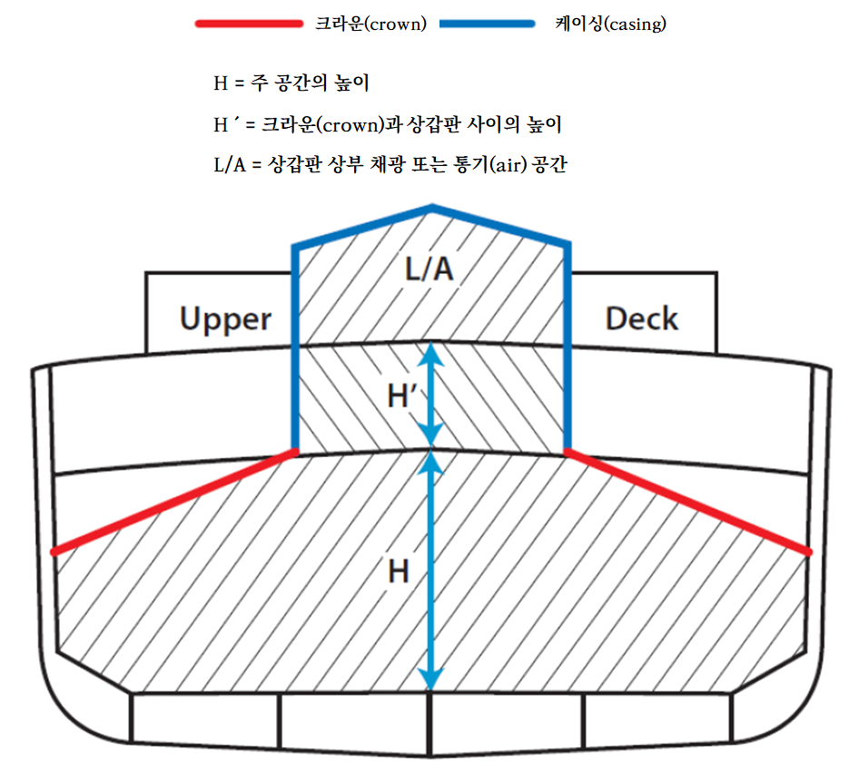
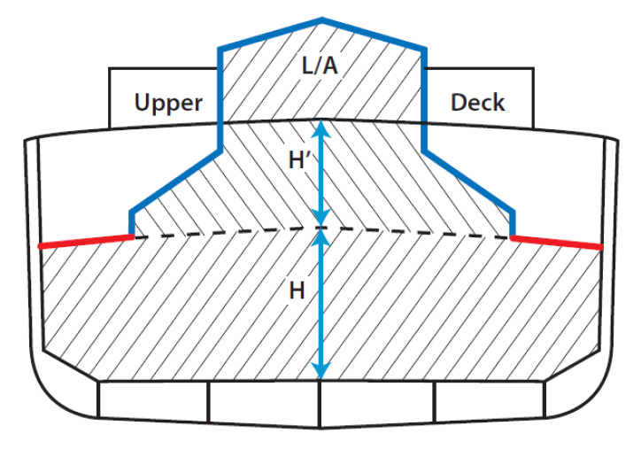
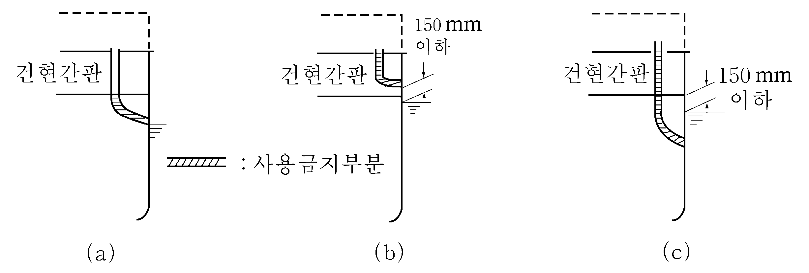

# 제8편 방화 및 소화

> 선급 및 강선규칙/적용지침 / RA-08-K / 2025 / KO / Guidance

## 제 9 장 구조 보전

### 제 1 절 재료

#### 101. 선체, 선루, 격벽, 갑판 및 갑판실의 재료 【규칙 참조】

갑판실, 갑판창고 등이 거주구역으로부터 분리 배치된 경우 각각 독립된 업무구역으로 간주할 수 있다. 이때 이 내부 구역을 C급으로 할 수 있다. 이들 구역으로부터 갑판하부구역(예를 들면, 화물구역)에 있는 창구를 풍우밀로 할 수 있다. 또한 거주구역과 분리 배치된 기타 화재위험이 거의 없다고 인정되는 기관구역에서 갑판하부 구역으로 출입하는 창구도 풍우밀로 할 수 있다. 또한 거주구역, 업무구역, 제어장소의 계단은 강재나 이와 동등한 재료여야 한다.

### 제 2 절 알루미늄합금 구조

#### 201. 알루미늄합금 구조

- **1.** **규칙 201.**의 **1**항에서 하중이 걸리지 않는 경우라 함은 칸막이를 말한다. **【규칙 참조】**
- **2.** 알루미늄 갑판의 아래면에 방열재를 부착하여 시험하는 경우, **FTP 코드 부록1**의 **3편 4.3**에 따라 그 갑판의 윗면에서 측정한 결과를 적용한다.
- **3.** 유조선 및 케미컬 탱커의 경우, 화물탱크, 화물탱크 갑판지역, 펌프실, 코퍼댐 및 화물가스가 축적될 수 있는 기타 장소에 건조도막 중량으로 알루미늄을 10% 이상 포함하는 도료를 사용할 수 없다.
- **4.** 알루미늄도금관은 평형수탱크 및 불활성화물탱크에서 사용할 수 있으며, 사고시 충격으로부터 보호된다면 개방갑판의 위험지역에서 사용할 수 있다.

### 제 3 절 A류 기관구역

#### 301. A류 기관구역 (2025) 【규칙 참조】

- **1.** 대기에 노출된 크라운(crown) 및 케이싱(casing)은 방열할 필요는 없다.
- **2.** A류 기관구역의 크라운(crown)은 갑판 하부와 기관구역 주 공간 최상단 수평 부분(horizontal part)을 의미한다. 상부 격벽이 경사진 경우, 격벽의 경사진 부분도 크라운(crown)에 포함되어야 한다.

  |  |
  | --- |

### 제 4 절 선외 부착품의 재료

#### 401. 선외 부착품의 재료 【규칙 참조】

선외배출관에 열에 약한 재료(PVC, FRP, 알루미늄합금, 납, 동, 동합금)의 사용이 금지되는 부분은 다음과 같다.

- **1.** 건현갑판하의 외판에 선외개구를 갖는 배출관의 건현갑판하부 부분 (**지침 그림 8.9.2** (a) 참조)
- **2.** 건현갑판보다 상방의 외판에 선외개구를 갖는 경우, 만재흘수선상 150 $\mathrm{mm}$ 이하의 위치에 개구의 하단이 있는 경우에는 그 개구가 있는 구획내의 부분 (**지침 그림 8.9.2** (b) 참조)
- **3.** **1**항에서 만재흘수선과 건현갑판과의 거리가 150 $\mathrm{mm}$이하인 경우는 건현갑판 바로 위 구획내의 부분 (**지침 그림 8.9.2** (c) 참조)
  
  **그림 8.9.2 열에 약한 재료의 사용이 금지되는 부분**

### 제 5 절 탱커의 압력/진공으로부터 화물탱크구조 보호

#### 501. 탱커의 압력/진공으로부터 화물탱크구조 보호

**규칙 501.**의 **1**항에서 압력/진공밸브의 압력설정, 부착, 검사 및 표시 등에 대하여는 다음에 따른다. 또한, 압력/진공밸브는 우리 선급의 형식승인을 받아야 한다. **【규칙 참조】**

- **1.** **압력설정**
  원칙적으로 정압측에서는 21 $\mathrm{kPa}$ 부터 14 $\mathrm{kPa}$, 부압측에서는 3 $\mathrm{kPa}$ 부터 7 $\mathrm{kPa}$ 의 범위 내에서 압력을 설정하여야 한다. 다만, 화물유탱크가 특별히 보강된 경우, 정압측의 압력설정은 70 $\mathrm{kPa}$ 까지의 적절한 값으로 할 수 있다.
- **2.** **부착방법**
  - **(1)** 공통벤트방식의 벤트지관에 부착되는 압력/진공밸브에는 배기측의 출구와 흡기측의 입구는 별도로 하여야 하며, 배기측의 출구는 벤트관에 부착하여야 한다. 또한 흡기측의 입구는 화물유탱크로부터 벤트관에 부착하여서는 안 된다.
  - **(2)** 쉽게 접근할 수 있어야 한다.
- **3.** **시험 및 검사**
  - **(1)** 압력/진공밸브는 제조 후 다음의 시험 및 검사를 시행하여야 한다.
    - **(가)** 구조완성검사
    - **(나)** 수압시험
    - **(다)** 밸브 설정압력의 확인
  - **(2)** 선내시험
    압력/진공밸브는 선내부착 후 원활히 작동되는지를 적절한 방법으로 확인한다.
- **4.** **시험보고서**
  시험보고서에는 다음의 사항이 포함되어야 한다.
  - **(1)** 장치 상세도
  - **(2)** 시행된 형식시험 및 그 결과(모든 기록자료 포함)
  - **(3)** 승인된 부착물에 대한 설명
  - **(4)** 시험설비의 도면(부착된 입출구의 배관의 설명 포함)
  - **(5)** 시험한 장치의 모든 표시(**6**항 참조)
  - **(6)** 보고서번호
- **5.** **취급설명서**
  각 장치에 대하여 다음 사항을 포함하는 취급설명서를 선박에 비치하여야 한다.
  - **(1)** 설치 방법
  - **(2)** 작동지침(장치에 플래임스크린 또는 고속배출장치가 함께 설치되는 경우, 적합한 최저화염불꽃틈새(MESG)에 대한 정보를 포함하여야 한다. 또한 장치를 안전하게 사용하기 위한 제한사항 및 장치의 적절한 설치요건도 기술하여야 한다.)
  - **(3)** 정비에 관한 요건(부식방지시스템의 정비에 대한 정보 포함)
    사용자에 의한 개방정비가 허용되는 경우, 압력 및 유량을 최초의 상태로 복구시키기 위해 필요한 절차, 지침 및 다이어그램
    - **(가)** 장치에 대한 소제시기의 결정 및 소제 방법
    - **(나)** 증기응축물의 소제주기에 관한 설명(밸브로부터 응축잔류물을 소제하는 주기는 화물에 따라 다름)
    - **(다)** 명확한 압력 설정 방법(밸브의 분해 및 조립, 순서와 적절한 조립설명도 포함)
    - **(라)** 적하 및 양하 작업에 앞서 사용자가 밸브의 양정을 확인하기 위한 방법
    - **(마)** 완전한 밸브검사 방법 및 권장 검사주기
  - **(4)** **4**항의 시험보고서
  - **(5)** 유량시험자료(정압 및 부압의 유량, 작동감도, 유동저항, 유속 및 입구 측의 최대 길이 포함)
  - **(6)** 제조자증서(장치를 국제규격에 적합하게 제조하고 시험하였음을 증명하는 것)
- **6.** **표시**
  각 장치에는 다음과 같은 사항을 영구적인 방법으로 표시하여야 한다.
  - **(1)** 제조자명 또는 상표
  - **(2)** 형식, 모델 또는 기타 장치의 표시(장치의 독창적인 식별이 가능할 것)
  - **(3)** 입구의 크기(해당되는 경우, 출구의 크기 포함)
  - **(4)** 제조번호
  - **(5)** 장치의 배출방향
  - **(6)** 시험기관 및 보고서번호
  - **(7)** 압력 및 진공의 설정값
- **7.** **압력/진공밸브의 대체장치**
  배기전용의 자동밸브와 흡기전용의 자동밸브를 1조로 부착하는 경우에 압력/진공밸브를 부착하지 않아도 좋다. 이 경우, 배기전용의 자동밸브 및 흡기전용의 자동밸브에는 **1**항 및 **2**항 중 각각의 배기측 및 흡기측의 기준을 적용한다.

#### 502. 온도변화에 의한 소량의 흐름을 위한 개구 (2023) 【규칙 참조】

위험 구역의 분류는 **IEC 60092-502:1999**의 원칙 및 **규칙 7편 1장 1101.의 2항**에 따른다.

#### 503. 화물탱크의 안전조치

- **1.** **규칙 503.**의 **2**항에서 동질의 화물인 경우 또는 증기가 서로 반응하지 않아 격리를 요구하지 않는 복수화물의 경우, 불활성가스 주관에 설치된 과부압 차단기(P/V breaker)를 2차 수단으로 사용할 수 있다. 만약 과부압 차단기의 조정압력이 **규칙 501.**에서 요구하는 벤트장치의 조정압력보다 높을 경우, **규칙 502.** 및 **규칙 2장 403.**의 **4**항의 높이 요건과 **규칙 2장 403.**의 **3**항의 화염침입방지장치에 대한 요건은 과부압 차단기에 적용하지 않는다. 벤트장치가 자유 유동식(free flow type)이고 양하 시 마스트정부에 있는 분리밸브가 잠긴 경우, 불활성가스장치를 우선 부압방지용으로 과부압차단기를 2차 수단으로 사용한다. **【규칙 참조】**
- **2.** 동질의 화물인 경우 또는 증기가 서로 반응하지 않아 격리를 요구하지 않는 복수화물의 경우, **규칙 2장 403.**의 **2**항 (2)호 및 **부록 8-5** 의 **2**항 (10)호 (나)에서 요구하는 격리밸브는 책임사관의 통제 하에 작동되고 밸브의 작동상태를 명확히 볼 수 있는 표시가 요구되며, 밸브가 단순하여 기계적 손상 가능성이 적기 때문에 의도치 않은 폐쇄 또는 기계적 손상에 대비하여 2차 수단을 마련할 필요는 없다.
- **3.** **규 칙 503.**의 **2**항에 따른 2차 수단의 대체로서 압력감시장치를 설치하는 선박의 경우, 과압 경보의 설정값은 압력/진공 밸브의 과압설정값보다 높아야 하고, 부압 경보의 설정값은 압력/진공 밸브의 진공설정값보다 낮아야 한다. 경보 설정값은 화물탱크의 설계압력 범위 내에 있어야 한다. 설정값은 고정되어야 하고 작동 중에 차단되거나 조정되어서는 안 된다. 다만, 서로 다른 타입의 화물을 운송하고 각 화물용으로 다른 설정값을 갖는 압력/진공 밸브를 사용하는 선박에는 각각의 화물에 대한 설정값이 조정될 수 있다.

#### 504. 벤트 출구의 치수 【규칙 참조】

**IBC code** 및 **IGC code**의 관련 조항을 포함하여 양하 및 평형수 작업시 개방갑판 지역이나 개방갑판의 반폐위구역에서 수직실린더의 전체 높이, 출구로부터 6 $\mathrm{m}$ 반경 이내 그리고 출구 하방 6 $\mathrm{m}$ 이내에 다량의 증기, 공기, 불활성가스를 허용하는 경우 구역 1(zone 1)으로 정하고 승인된 안전형 전기설비를 갖추어야 한다. 또한 구역 1(zone 1)을 초과하여 4 $\mathrm{m}$ 이내까지를 구역 2(zone 2)로 정하고 전기설비를 아래와 같이 구성한다.
