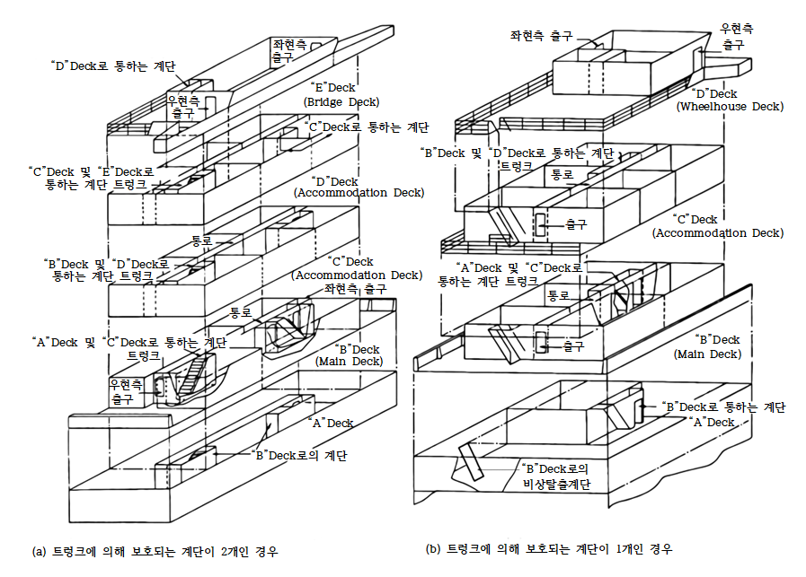
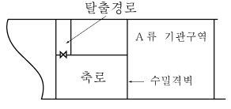
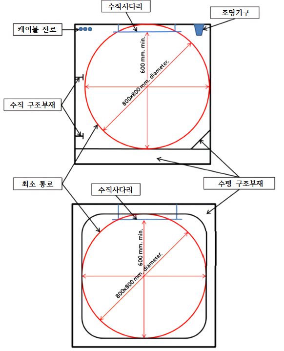
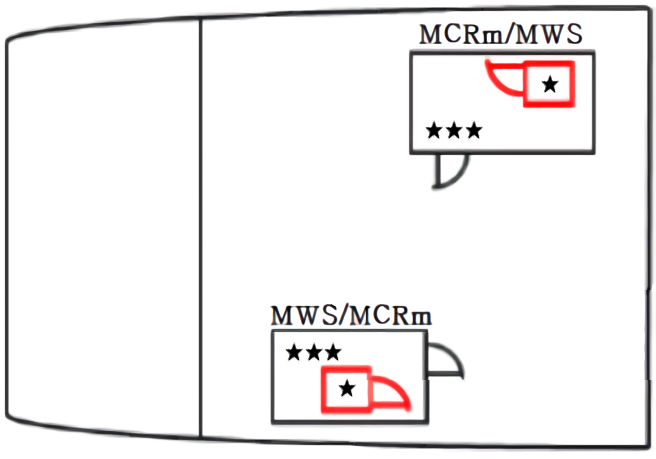
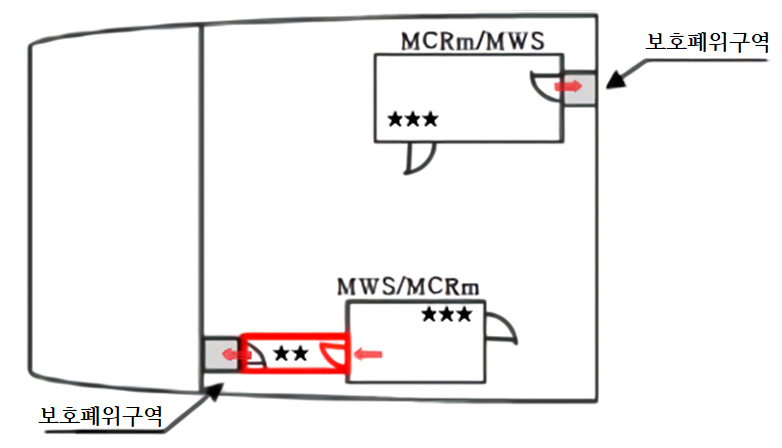
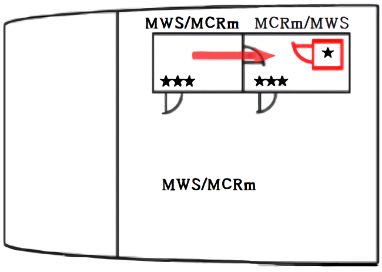
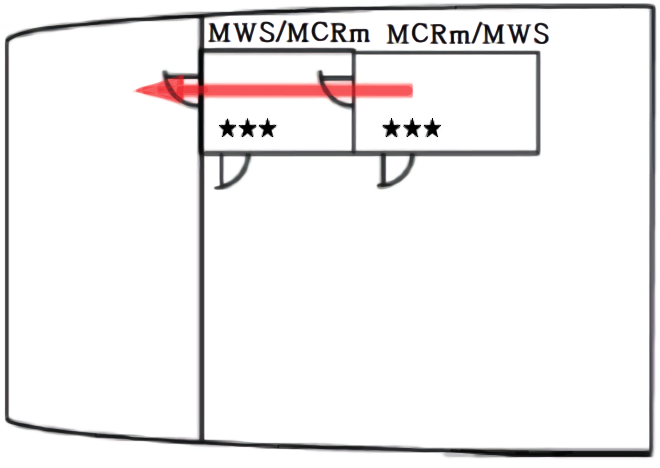
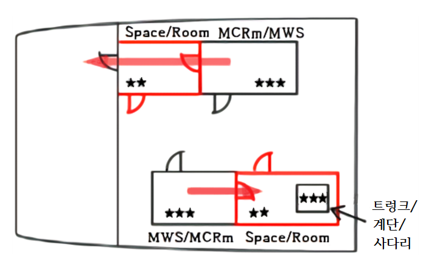
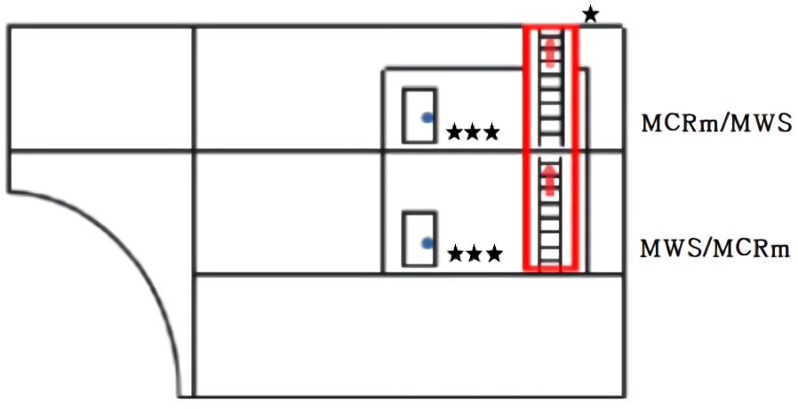
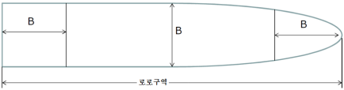

# 제8편 방화 및 소화

> 선급 및 강선규칙/적용지침 / RA-08-K / 2025 / KO / Guidance

## 제 10 장 탈출 설비

### 제 2 절 탈출 설비

#### 201. 일반요건 【규칙 참조】

- **1.** 구명정 및 구명뗏목 승정갑판까지 안전하고 신속하게 탈출할 수 있도록 이 절의 규칙에 규정된 탈출로에 설치된 상부 창구는 다음에 적합하여야 한다.
  - **(1)** 고정장치는 양쪽에서 열 수 있는 형식이어야 한다.
  - **(2)** 창구덮개를 개방하는데 필요한 최대 힘은 150 N을 넘어서는 아니 된다.
  - **(3)** 창구덮개를 개방하는데 필요한 힘을 줄이기 위해 힌지 쪽에 스프링 평형장치, 평형추 또는 기타 적절한 장치를 설치할 수 있다.

#### 202. 제어장소, 거주구역, 업무구역의 탈출설비

- **1.** **규칙 202.**의 **1**항 (3)호에서 “우리 선급에서 기타 동등한 재료로 인정하는 경우”라 함은 **규칙 1장 103.**의 **43**항에 따르는 것을 말한다. **【규칙 참조】**
- **2.** **규칙 202.**의 **1**항 (4)호에서 무선실로부터 2개 탈출설비라 함은 탈출구가 서로 멀리 떨어져서 공통 탈출 통로를 갖지 아니하는 것을 말한다. **【규칙 참조】**
  **3. 규칙 202.**의 **1**항 (5)호를 적용함에 있어, ICLL Annex Ⅰ Reg.12 (2)의 요건과 상충하는 경우 ICLL Annex Ⅰ Reg.12 (2)의 요건을 우선하여 적용한다. *(2017)* **【규칙 참조】**
- **4.** **규칙 202.**의 **2**항 (4)호 (마)에서 여객선에서 탈출장소의 표시는 **MSC/Circ.777**를 따른다. **【규칙 참조】**
- **5.** **규칙 202.**의 **2**항 (5)호 (가)에서 조명이나 형광띠는 **IMO Res.A.752(18)** 및 **ISO 15370**을 따른다. **【규칙 참조】**
- **6.** **규칙 202.**의 **2**항 (5)호 (다)에서 “국제해사기구가 개발한 지침”이라 함은 **IMO MSC/Circ.1167** 및 **MSC/Circ.1168**을 말한다. **【규칙 참조】**
- **7.** **규칙 202.**의 **2**항 (7)호에서 여객선의 탈출분석은 **MSC.1/Circ. 1533**을 따른다. *(2019)* **【규칙 참조】**
- **8.** **규 칙 202.**의 **3**항에서 일반적으로 탈출설비는 다음 요건을 만족하여야 한다. **【규칙 참조】**
  - **(1)** 탈출용개구의 크기는 맨홀(창 포함)은 600 $\mathrm{mm}$ × 400 $\mathrm{mm}$, 소형 창구는 사각형인 경우 600 $\mathrm{mm}$ × 600 $\mathrm{mm}$, 원형인 경우 *f* 600 $\mathrm{mm}$ 이상이어야 한다.
  - **(2)** 탈출로에서 개방갑판을 통하여 승정갑판으로 접근할 수 있도록 한다.
  - **(3)** 구명정이나 구명뗏목으로 직접 통하지 않더라도 통상 복도와 계단을 통하여 나갈 수 있다면 탈출설비로 인정할 수 있다. 이 때, 선실을 통하거나 수직사다리만을 이용하는 배치는 허용되지 않는다.
  - **(4)** 탈출설비로 사용되는 계단과 복도의 너비는 700 $\mathrm{mm}$ 이상이어야 하며 한쪽에 핸드레일을 설치하여야 한다. 너비 1,800 $\mathrm{mm}$ 이상인 계단과 복도에서는 양쪽에 핸드레일을 설치하여야 한다. 이 때 너비란 반대쪽 격벽과 핸드레일 사이 또는 양쪽 핸드레일 사이의 간격을 말한다.
  - **(5)** 계단 경사각은 일반적으로 45도이고, 50도를 초과해서는 안 된다. 기관구역과 소구역에서는 60도를 초과해서는 안 된다. 계단으로 이르는 통로의 최소 너비는 계단과 같아야 한다.
- **9.** **규 칙 202.**의 **3**항 (2)호에서 제2의 탈출설비는 해당 장소로부터 개방갑판으로 직접 탈출할 수 있는 계단으로 하거나 양쪽에서 조작할 수 있는 창구로 하여야 한다.
- **10.** **규 칙 202.**의 **3**항 (3)호에는 다음 사항에 적합하여야 한다.
  - **(1)** 구획에 계단폐위구역을 2개 설치하는 경우, 최소한 2개 갑판으로부터 외부로 나가는 문을 양현에 설치하여 구명정 및 구명뗏목의 승정장소에 쉽게 도달할 수 있도록 한다.(**지침 그림 8.10.1** (a) 참조)
  - **(2)** 구획에 계단폐위구역을 1개만 설치하는 경우 최소한 개방 갑판으로 직접 나갈 수 있도록 각 갑판 마다 문을 1개 설치하여야 한다.(**그림 8.10.1** (b) 참조)
- **11.** **규 칙 20 2.**의 **3**항 (2)호와 (3)호에서 “최하층 개방갑판”은 거주구역부근에서의 기선으로부터 가장 낮은 높이에 위치한 개방갑판으로 **규칙 7장 103.**의 **3**항 (2)호 (나) 및 **104.**의 **2**항 (2)호 (나)에서 정의한 분류 ⑩개방갑판을 적용한다.
- **12.** **규 칙 202.**의 **3**항 (4)호를 적용하면서, 막힌 복도를 불가피하게 설치하는 경우, 비상시 이 복도로 사람이 쉽게 들어오지 못하도록 설계하여야 한다.
- **13.** **규칙 202.**의 **4**항 (1)호를 적용하면서, 비상탈출용호흡구(EEBD)는 다음 요건을 만족하여야 한다. **【규칙 참조】**
  - **(1)** 비상탈출용호흡구는 위험한 대기를 가진 구역으로부터 탈출용으로만 사용되는 공기공급 또는 산소장치이며, 이는 승인된 형식의 것이어야 한다.
  - **(2)** 비상탈출용호흡구는 소화용으로, 또는 산소결핍 보이드스페이스 또는 탱크에 입실용으로 사용되어서는 아니 되며 소방원이 착용하여서는 아니 된다. 이 경우에는 이러한 목적으로 특별히 비치된 자장식호흡구를 사용하여야한다.
  - **(3)** 안면용품은 적절한 방법에 의하여 위치가 고정되어 눈, 코 및 입 주위를 완전히 밀봉시키도록 설계된 얼굴 덮개를 말한다.
  - **(4)** 두건은 머리 및 목을 완전히 덮고 어깨 일부를 덮을 수 있는 머리 덮개를 말한다.
  - **(5)** 위험한 대기는 생명 및 건강에 즉각적으로 위험한 대기를 말한다.
  - **(6)** 비상탈출용호흡구는 10분 이상 동안 지속적으로 사용할 수 있어야 한다.
  - **(7)** 비상탈출용호흡구는 탈출동안에 눈, 코 및 입을 보호하기 위하여 두건 또는 안면용품을 적절히 포함하여야 한다. 두건 및 안면용품은 불연성 재료로 제작되고 눈으로 볼 수 있도록 시야를 방해하지 아니한 창을 포함하여야 한다.
  - **(8)** 사용하지 않는 비상탈출용호흡구는 손을 사용하지 않고 휴대할 수 있어야 한다.
  - **(9)** 비상탈출용호흡구의 저장 시, 환경으로부터 적절히 보호되어야 한다.
  - **(10)** 비상탈출용호흡구 표면에는 이들의 사용을 명확하게 설명하는 간단한 지침서 또는 도해가 명확하게 인쇄되어야 한다. 위험 대기로부터 안전하게 탈출하는 데 시간이 없는 상황에 대비하여 착용절차는 쉽고 빨라야 한다.
  - **(11)** 정비요건, 제조자의 상표 및 제조번호, 제조일자를 동반한 유효기간 및 승인관청의 이름을 각 비상탈출용호흡구 바깥면에 인쇄하여야 한다. 모든 훈련용 비상탈출용호흡구를 명확하게 표시하여야 한다.
    
    **그림 8.10.1 탈출 설비**

#### 203. 기관구역의 탈출수단

- **1.** **규칙 203.**의 **1**항과 **2**항에서 A류 기관구역부터 개방갑판까지 탈출설비는 다음 요건을 만족하여야 한다. **【규칙 참조】**
  - **(1)** 탈출수단중 하나는 규칙에 따라 다음과 같이 배치하여야 한다.
    - **(가)** 해당 구역에 대하여 규정에서 요구하는 바와 같이 폐위 방열하여야 한다. 사다리를 고정할 때 기관구역의 화재 시 방열되지 아니한 고정점을 통하여 열전달이 되지 않아야 한다.
    - **(나)** 자동폐쇄문은 설치된 격벽의 화재방열성을 지녀야 한다. 이 트렁크로 가는 다른 출구가 있다면 같은 자동폐쇄문으로 한다.
  - **(2)** A류 기관구역으로부터 개방갑판까지 탈출로에서 로로구역 또는 차량구역을 이용하는 것이 불가피할 경우 다음 요건을 만족하여야 한다.
    - **(가)** 로로구역, 차량구역을 지나가는 탈출로는 1개로 제한한다. 다른 통로는 로로구역 또는 차량구역 이외의 구역을 지나가거나 폐위 탈출 트렁크를 통하도록 한다. 이 때 규정에 따라 트렁크는 복도의 화재방열성을 적용하여야 한다.
    - **(나)** 로로구역, 차량구역 내의 탈출로는 가능한 짧아야 하며, 화물에 의해 통행이 방해를 받지 않도록 견고하고 영구적인 구조물에 의해 통로를 확보하여야 한다.
  - **(3)** 화재방열성은 복도나 로비와 동등하게 처리하며 **규칙 표 8.7.1∼8.7.8**에 따른다.
  - **(4)** A류 기관구역용 보호폐위구역 이외 탈출설비가 1개만 있는 경우 각 갑판마다 보호폐위구역에 자기폐쇄형문을 설치하여야 한다.
  - **(5)** 이 조에서 사다리라 함은 계단, 사다리를 총칭한다. 플렉시블 와이어로프가 있는 사다리는 이 탈출로로 인정되지 않는다.
    **2. 규 칙 203.**의 **2**항 (3)호에서 화재 위험이 거의 없거나 전무한 기관구역, 통상 업무에 종사하지 않는 기관구역 또는 소구역으로부터의 탈출로는 1개로 할 수 있다. 다만, 그 탈출로는 A류 기관구역을 통과할 수 없다. 또한 축로를 설치할 경우 축로후부에 탈출로를 설치하여야 한다. (**지침 그림 8.10.3** 참조) **【규칙 참조】**
    
    **그림 8.10.3 소구역으로부터의 탈출**
- **3.** **규칙 203.**의 **3**항에서 비상탈출용 호흡구의 최소개수는 다음과 같다. **【규칙 참조】**
  - **(1)** 주 추진용 내연기관을 포함하는 A류 기관구역 내
    - **(가)** 기관제어실이 기관구역 내에 위치한 경우: 1개
    - **(나)** 작업장: 1개, 다만 작업장으로부터 탈출로에의 직접적인 접근이 가능한 경우에는 비치가 요구되지 않는다.
    - **(다)** 탈출로(기관구역의 하부에 위치한 폐위된 탈출용트렁크 또는 수밀문은 제외) 근처의 각 갑판 또는 플랫폼에 1개씩 비치하여야 한다.
  - **(2)** 주 추진용 내연기관 이외의 것을 포함하는 A류 기관구역에는 탈출로(기관구역의 하부에 위치한 폐위된 탈출용트렁크 또는 수밀문은 제외) 근처의 각 갑판 또는 플랫폼에 적어도 1개씩 비치하여야 한다.
  - **(3)** 기국의 요건이 (1)호 및 (2)호와 상이한 경우 기국의 요건을 따라야 한다.
- **4.** **규 칙 203.**의 **3**항 (3)호에서 비상탈출용 호흡구는 **지침 202.**의 **12**항에 적합하여야 한다. *(2017)*
- **5.** **규 칙 203.**의 **1**항과 **2**항에 추가하여 다음의 요건을 만족하여야 한다.
  - **(1)** 탈출로의 일부이거나 탈출로까지의 접근설비이지만 보호폐위구역 내에는 위치하지 않은 기관구역내의 경사사다리 및 계단은 경사도가 60° 이하여야 하며 최소너비(clear width)는 600 mm 이상이어야 한다.
    이 요건은 탈출로의 일부를 구성하지 않는 경사 사다리 및 계단에는 적용하지 않는다. 또한, 기관구역내의 주요 플랫폼이나 갑판상의 한 곳으로부터 단지 의장품이나 기기 또는 유사한 구역에 접근하기 위해 설치된 경사사다리 및 계단에도 적용하지 않는다.
  - **(2)** 내부치수는 **지침 그림 8.10.4**와 같이 최소 너비로 해석하여야 하며, 통로는 폐위구역의 수직방향 전체를 통하여 방열 처리된 선체구조, 의장품이 간섭되지 않는 800 mm의 지름을 가져야 한다. 폐위구역내의 사다리는 폐위구역 내부치수에 포함될 수 있다. 보호폐위구역이 수평방향 부분을 포함하고 있는 경우, 수평방향 부분의 최소 너비는 600 mm 이상이어야 한다. 배치의 예는 **지침 그림 8.10.4**를 참조한다.
    
    **그림 8.10.4 수직 폐위구역의 내부치수**
- **6.** **규 칙 203.**의 **1**항 (1)호, (4)호 및 (6)호에서 다음 요건을 만족하여야 한다.
  - **(1)** “안전한 위치”는 로커와 선용품실(면적에 관계 없음), 화물구역, 가연성액체가 저장된 구역을 제외한 모든 구역이 될 수 있다. 승정갑판까지의 통로가 설치되고 장애물 없이 유지되는 특수분류구역과 로로구역 및 조타장비용 유압유가 보관되어 있는 조타기실은 안전한 위치에 포함된다. *(2025)*
  - **(2)** 기관구역은 작업용 플랫폼 및 통행로를 포함하며 한층 이상의 갑판에서의 중간 갑판을 포함한다. 이러한 경우, 이 구역내의 최하층 갑판, 플랫폼 또는 통로를 이 구역의 하부로 간주한다. 갑판 사이의 작은 작업 플랫폼이나 의장품 및 기기의 접근 시에만 사용하는 작은 작업 플랫폼은 2개의 탈출설비를 설치할 필요는 없다.
  - **(3)** 기관구역에서 개방갑판으로 탈출로를 제공하는 보호폐위구역에는 폐위구역에서 개방갑판으로의 출구의 의미로 창구를 설치할 수 있다. 창구의 최소 내부치수는 800 mm x 800 mm여야 한다.
- **7.** **규 칙 203.**의 **1**항 (4)호, (6)호 및 **2**항 (5)호, (6)호는 다음의 요건을 만족하여야 한다.
  - **(1)** 주작업장
    “주작업장”이란 통상 용접장치, 금속공작기계, 작업대가 있는 공간으로 3면 이상이 격벽이나 그레이팅(gratings)으로 둘러 싸인 구획을 말한다.
  - **(2)** 기관제어실
    “기관제어실”이란 선박의 주추진에 사용되는 기계의 제어 및/또는 감시를 하는 구역이다.
  - **(3)** 연속적인 화재피난처
    "연속적인 화재피난처"란 기관제어실, 주작업장에서 기관구역을 통과하지 않고 기관구역의 바깥까지 안전하게 탈출할 수 있는 통로를 말한다. 이 연속적인 화재피난처는 **규칙 203.**의 **1**항 (1)호 및 **2**항 (1)호에 따른 보호폐위구역일 필요는 없다. 연속적인 화재피난처의 경계는 최소 “A-0”급 구획이어야 하며, 자기폐쇄형 ”A-0"급 문이 설치되어야 한다. 연속적인 화재피난처의 최소 내부치수는 수직트렁크의 경우 800 mm x 800 mm, 수평트렁크의 경우 600 mm의 너비를 가지며 비상조명을 설치해야 한다. 트렁크나 구역/실을 통하여 기관구역 외부의 위치로 연결되는 연속적인 화재피난처의 전형적인 배치는 **지침 그림 8.10.5**와 같다.
- **8.** **규 칙 203.**의 **2**항 (1)호, (3)호, (5)호 및 (6)호에서 다음 요건을 만족하여야 한다.
  - **(1)** “안전한 위치”는 화물구역, 로커와 선용품실(면적에 관계 없음), 화물펌프실, 가연성액체가 저장된 구역을 제외한 모든 구역이 될 수 있다. 개방갑판까지의 통로가 설치되고 장애물 없이 유지되는 차량구역과 로로구역 및 조타장비용 유압유가 보관되어 있는 조타기실은 안전한 위치에 포함된다. *(2025)*
  - **(2)** A류 기관구역은 작업용 플랫폼과 통로를 포함하며, 한층 이상의 갑판에서의 중간갑판을 포함한다. 이 경우, 이 구역내의 최하층 갑판, 플랫폼 또는 통로를 이 구역의 하부로 간주한다.
    갑판 사이의 작은 작업 플랫폼이나 의장품 및 기기의 접근 시에만 사용하는 작은 작업 플랫폼은 2개의 탈출설비를 설치할 필요는 없다.
  - **(3)** A류 기관구역에서 개방갑판으로 탈출로를 제공하는 보호폐위구역에는 폐위구역에서 개방갑판으로의 출구의 의미로 창구를 설치할 수 있다. 창구의 최소 내부치수는 800 mm x 800 mm여야 한다.
  - **(4)** A류 기관구역을 제외한, 상시 출입하는 기관구역내에서의 이동거리는 구역 내의 기관 및 의장품을 고려하여 선원이 통상 접근하는 임의의 지점으로부터 측정하여야 한다.
- **9.** **규 칙 203.**의 **2**항 (2)호와 (3)호에서 화물선의 조타기실로부터의 탈출설비는 다음 요건을 만족하여야 한다.
  - **(1)** 비상조타위치가 없는 조타기실은 1개의 탈출설비만 요구된다.
  - **(2)** 비상조타위치가 있는 조타기실은 개방갑판으로 통하는 직접적인 출입로가 있는 경우 1개의 탈출설비만 제공될 수 있다. 개방갑판으로 통하는 직접적인 출입로가 없는 경우에는 2개의 탈출설비가 제공되어야 한다.

#### 205. 로로(ro-ro)구역의 탈출수단 【규칙 참조】

- **1.** 탈출로는 화물 적양하 중에도 적절히 탈출하도록 배치하여야 한다.
- **2.** 로로구역에서의 탈출설비는 다음 요건을 만족하여야 한다.
  - **(1)** 선원이 일상적인 업무(예를 들면, 로로갑판에서의 적양하 시의 업무, 선박 운항시의 로로갑판 점검업무)를 수행하기 위해 출입하는 장소는 “통상 업무에 종사하는 구역”으로 고려한다.
  - **(2)** 로로갑판 점검업무는 화재 순찰, 화물의 검사, 빌지웰 및 빌지웰 알람 확인, 탱크 측심, 화물 갑판 청소, 기타의 유지보수작업(녹, 페인트, 그리스의 제거 등)을 포함한다.
  - **(3)** 로로구역에는 구명정이나 구명뗏목의 승정 갑판으로 접근할 수 있는 2개 이상의 탈출설비를 설치하여야 하며, 1개는 로로구역의 선수단, 다른 1개는 로로구역의 선미단에 위치하여야 한다. 탈출설비 중 1개는 계단이어야 하고, 다른 1개의 탈출설비는 트렁크 또는 계단으로 할 수 있다.
  - **(4)** 로로구역의 선수단 및 선미단은 로로구역의 최전방 및 최후방 끝점에서 로로구역의 폭(로로구역의 가장 넓은 지점에서 측정)과 동일한 거리 이내의 구역을 의미한다.(**지침 그림 8.10.6** 참조)
  - **(5)** 탈출설비로서의 경로를 나타내기 위한 적절한 표지판 및 표시를 설치하여야 한다. 

    |  |  |
    | --- | --- |
    | 단일 구역^1)에서 트렁크를 통한 탈출 | 단일 구역^1)에서 보호폐위구역을 통한 탈출 |
    |  |  |
    | 다른 구역^1)을 이용하여 트렁크를 통한 탈출 | 다른 구역^1)을 이용하여 직접 탈출 |
    |  |  |
    | 해당 구역^1)에서 기타 구역^2)을 통한 탈출 | 다른 갑판의 구역^1)을 이용하여 트렁크를 통한 탈출 |
    | MCRm: 기관제어실 MWS: 주작업장 1) 구역은 기관제어실/주작업장을 의미한다. 2) 기타 구역은 기관제어실/주작업장을 제외한 구역을 의미한다. | *: 최소 “A-0”급 구획이며 자기폐쇄형 “A-0”급 문이 설치된 사다리 또는 계단을 폐위하는 수직트렁크(최소치수: 800 mm x 800 mm) **: 최소 “A-0”급 구획이며 자기폐쇄형 “A-0”급 문이 설치된 수평트렁크(최소너비: 600 mm) ***: 화재방열성 요구하지 않음 |

    
    **그림 8.10.6 로로구역의 선수단 및 선미단**
