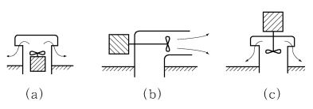
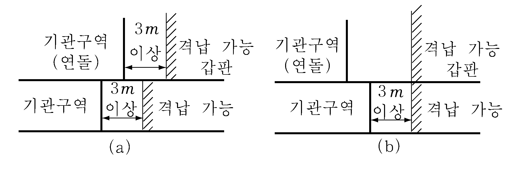

# 제8편 방화 및 소화

> 선급 및 강선규칙/적용지침 / RA-08-K / 2025 / KO / Guidance

## 제 12 장 위험물의 운송

### 제 1 절 일반요건

#### 101. 일반요건

- **1.** **규칙 101.**의 **1**항에서 소량과 극소량은 **IMDG 코드 3.4**와 **3.5**에 따른다. ***(2020)*** **【규칙 참조】**
- **2.** **규칙 101.**의 **2**항 (2)호에서 컨테이너구역은 컨테이너를 안전하게 탑재하기 위해 셀가이드를 갖춘 화물구역을 말한다.
- **3.** **규 칙 101.**의 **2**항 (3)호에서 로로구역이란 특수분류구역 및 차량구역을 말한다. **【규칙 참조】**

### 제 2 절 특별요건

#### 201. 특별요건

- **1.** **급수 【규칙 참조】**
  - **(1)** **규칙 201.**의 **1**항에서 상부개방형 컨테이너선박의 분무장치는 다음 요건으로 대체할 수 있다.
    - **(가)** 컨테이너 화물창은 고정된 가압수분무장치에 의하여 보호되어야 한다. 이 장치는 갑판 위치에서 화물창 하부를 분무할 수 있어야 하고, 특정 화물창 및 컨테이너 형태를 고려하여 설계 배치되어야 한다. 필요한 경우 우리 선급은 실제 시험을 요구할 수 있다.
    - **(나)** 가압수분무장치는 컨테이너 칸에서 발생한 화재를 효과적으로 진압할 수 있어야 하고, 한 컨테이너 칸 주위에 있는 개방 화물창의 갑판 높이에서 링라인을 각각 구성하여 소구획으로 나누어야 한다.
    - **(다)** 가압수분무장치는 개방 화물창 내 각 컨테이너 칸의 바깥쪽 수직경계를 분무하고 인접 구조부를 냉각시킬 수 있어야 한다. 균일한 밀도로 분당 1.1 $\mathrm{L}/m ^{2}$ 이상 분무할 수 있어야 한다. 어느 한 상부개방 컨테이너 화물창 내 모든 컨테이너 칸을 보호할 수 있는 능력을 가진 화물창 가압수분무장치에 대하여 적어도 전용 소화펌프 1개를 갖추어야 한다. 펌프는 상부개방 화물구역 밖에 설치하여야 한다. 가압수분무장치에 대한 급수능력은 상부개방형 컨테이너 화물창에서 적절한 분무 형태로 하며 전용 펌프 1개가 작동되지 않는 경우 총능력의 50 % 이상을 이용할 수 있어야 한다. 이때 전용 가압수분무펌프를 대체 급수원에 연결하여 대체할 수 있다. 이 소화장치는 노출갑판으로부터 호스로 급수 보충되어야 한다.
    - **(라)** 가장 큰 화물창에서 소화용으로 필요한 급수량과 동시에 가압수분무장치 및 호스노즐로부터 4개 사수를 사용할 수 있어야 한다.
  - **(2)** **규칙 201.**의 **1**항 (2)호에서 소화전의 개수 및 위치는 최소한 4줄기 사수(2줄기는 단일호스에 의함)를 빈 화물구역 전체에 공급하여야 한다. 또한 로로화물구역에는 단일호스에 의한 4줄기 사수를 화물구역 전체를 공급하여야 한다. 그리고 가장 큰 화물창에서 소화용으로 사용하는 급수량은 호스 노즐로부터 4줄기 사수에 추가하여 분무장치를 동시에 만족하여야 한다.
  - **(3)** **규칙 201.**의 **1**항 (3)호에서 “부가된 중량 및 물자유표면 영향에 대한 복원성 조치를 우리 선급이 인정하는 정도까지 고려하여야 한다.”라 함은 **지침 1편 부록 1-2 2**항 (3)호에서 규정한 일반 복원성기준 등을 만족하는 것을 말한다.
  - **(4)** **규칙 201.**의 **1**항 (4)호에서 고팽창포말장치를 인정할 수 있다. 다만, 화물이 물과 위험한 반응을 일으키지 아니하여야 한다.
  - **(5)** **규칙 201.**의 **1**항 (3)호에서 요구되는 물 분무장치(분무 노즐의 고정 배치 또는 화물지역 내에 물을 넘치게 하는 방식)와 **규칙 201.**의 **1**항 (5)호의 이동식 물 모니터가 주소화펌프에 의하여 공급되는 경우, 주소화펌프와 배관의 직경은 다음 중 큰 것에만 공급할 수 있다면 충분하다. *(2018)*
    총용량은 **지침 603.**의 **2**항에서 요구하는 값 중, 작은 값 이상이어야 한다.
    - **(가)** 이동식 물 모니터 및 **규칙 201.**의 **1**항 (2)호에서 요구하는 4개의 노즐
    - **(나)** **규칙 201.**의 **1**항 (2)호에서 요구하는 4개의 노즐 및 (3)호에서 요구하는 물 분무장치
- **2.** **발화원** ***(2022)*** **【규칙 참조】**
  전기설비는 다음사항에 적합하여야 한다.
  - **(1)** 위험한 환경으로 간주되는 폐위된 화물구역이나 차량구역에 설치되는 전기기기는 IMDG 코드를 참작하여 우리선급의 승인을 받아야 한다. 다만, 그러한 전기기기가 IP55와 동등하고 위험물 적재에 사용하지 않을 경우 설치할 수 있다.
  - **(2)** 폭발성 혼합기체가 발생할 우려가 있는 위험물을 적재할 경우 화물구역 내 전선은 다음 요건을 적용하여야 한다.
    - **(가)** 전선은 무기절연 동피복전선, 납피복전선 및 외장전선 또는 비금속피복전선 및 외장전선으로 구성하여야 한다.
    - **(나)** 화물구역 내 있는 전기설비로 가는 전선 및 전선관통부는 금속피복 등으로 보호하여야 한다.
  - **(3)** (2)호의 (가) 및 (나) 이외의 전기설비에 대하여는 **IEC 60092-506:2003**에 따른다.
  - **(4)** 다음을 발화원으로 간주하고 화물구역의 통풍개구 부근에 설치하지 않아야 한다.
    - **(가)** 위험한 환경에서 사용하도록 승인된 안전형 이외 전기기기
    - **(나)** 윈들러스 및 체인로커 개구
  - **(5)** 특별위험물을 산적 운송하는 특별 선박은 **IEC 60092-506:2003**에 따른다.
  - **(6)** 위험지역에서 개구가 있는 배관(예를 들면 통풍장치 및 빌지관 등)인 경우 그 배관을 위험지역으로 분류하여야 하고 **IEC 60092-506:2003 표 B1**의 **B**에 따른다.
  - **(7)** 화물구역에 23℃ 이하의 인화점을 갖는 3류, 6.1류, 8류의 가연성 액체 화물을 운송하는 경우, 위험물이 배출될 수 있는 플랜지, 밸브, 펌프 등이 설치된 빌지관이 있는 폐위구역(배관터널, 빌지 펌프실 등)은 시간당 6회 이상의 기계식 통풍이 계속되지 않으면 확장된 위험구역(“구역 2”)으로 간주된다. 해당 구역에 자동 시동이 가능한 이중의 기계식 통풍장치로 보호되는 경우를 제외하고는, 위험구역(“구역 2”)용으로 승인되지 않은 장치는 통풍력이 저하되면 자동으로 분리되어야 한다. 그럼에도 불구하고, 빌지시스템 및 평형수시스템과 같은 필수 시스템은 “구역 2”용으로 승인된 장치를 사용하여야 한다. 이중의 기계식 통풍장치로 보호되는 구역의 경우, 위험지역용으로 승인되지 않은 장비와 필수시스템은 통풍이 작동되지 않으면 오작동을 방지하기 위하여 인터록되어야 한다. 고장이 발생하면 유인구역에 가시가청의 경보가 작동되어야 한다. *(2024)*
- **4.** **통풍장치 【규칙 참조】**
  - **(1)** **규칙 201.**의 **4**항에서 폐위된 화물구역과 기타 폐위 구역으로 통하는 문은 자동폐쇄식이어야 한다. *(2023)*
  - **(2)** **규칙 201.**의 **4**항에서 통풍장치는 다음의 사항에 적합하여야 한다.
    - **(가)** 인접구역이 화물창과 기밀격벽이나 갑판으로 분리되지 아니하는 경우, 그 인접구역은 폐위된 화물구역의 일부로 간주되며 화물구역 자체로써의 통풍요건을 적용하여야 한다.
    - **(나)** IMSBC Code에서 하나의 화물창에 2개의 통풍기를 요구하는 경우, 2개의 통풍기에 연결된 하나의 공통벤트장치를 허용할 수 있다.
    - **(다)** **IMSBC Code**에서 연속통풍을 요구하는 경우, 연속통풍이 **규칙 3장 101.**의 **1**항에서 방화용으로 요구하는 폐쇄수단을 갖춘 통풍장치를 금지한다는 의미는 아니며, 통풍장치 개구까지의 높이는 국제만재흘수선협약(위치Ⅰ에 대하여 갑판상 4.5 m 또는 위치 Ⅱ에 대하여 갑판상 2.3 m)에 적합하여야 한다.
    - **(라)** 상부개방형 컨테이너선박에서 덕트가 요구되는 화물창 하부에는 기계통풍장치를 설치하여야 하며, 통풍능력은 노출갑판 하부의 빈 화물창 용적을 기준으로 최소한 시간당 2회 이상 환기할 수 있도록 한다.
  - **(3)** **규칙 201.**의 **4**항 (2)호에서 전기구동 통풍기를 설치할 경우 다음 요건에 적합하여야 한다.
    - **(가)** 내장형 전기구동 통풍기를 사용하는 경우 위험 환경에서 사용하는 전동기는 우리선급의 승인품이어야 하며 IMDG 코드를 고려하여야 한다. (**그림 8.12.1** (a) 참조)
    - **(나)** 노출갑판에 외장형 전기구동 통풍기를 설치할 경우 전동기는 IP55 이상 보호 구조이어야 한다. (**지침 그림 8.12.1** (b) 참조)
    - **(다)** (나)의 경우라도 전동기가 배기구 부근에 설치되는 경우 (가)에 적합하여야 한다.(**그림 8.12.1** (c) 참조)
    - **(라)** 스파크가 발생하지 않는 통풍장치를 설치하여야 하며 **규칙 3장 104.**의 요건에 따른다.
  - **(4)** **표 8.12.1**의 **비고 1**에 따라 경감된 환기횟수는 컨테이너 화물구역 내에 빌지펌프를 직접 설치하였을 경우에도 **규칙 201.**의 **4**항 (1)호 및 **규칙 201.**의 **5**항 (4)호에 동일하게 적용하여야 한다. 여러 컨테이너 화물구역용으로 한 대의 빌지펌프가 설치될 경우에는 컨테이너 화물구역 중 통풍율(ventilation rate)이 가장 높은 곳에 설치하여야 한다. *(2020)*
- **5.** **빌지펌핑장치 【규칙 참조】**
  - **(1)** **규칙 201.**의 **5**항에서 상부개방형 컨테이너 화물창의 빌지계통인 경우 기관구역 빌지계통과 분리시켜 기관구역 밖에 설치하여야 한다.
  - **(2)** **규칙 201.**의 **5**항 (2)호에서 기관실과 완전히 별개로 단일 빌지계통을 설치한 경우라면 그 구역의 크기나 해당되는 구역의 이중화 요건과 용량을 만족하여야 한다.
  - **(3)** **규칙 201.**의 **5**항 (3)호에서 기관실내로 빌지관을 유도할 때 다음 요건에 적합하여야 한다.
    - **(가)** 위험물을 적재할 때 빌지 배관을 차단해야 한다는 경고판을 고정폐쇄밸브(closed lockable valve) 또는 맹플랜지 부근에 부착하여야 한다.
    - **(나)** 화물구역 내 이덕터를 설치하여 기관실을 경유하지 않고 선외로 빌지를 배출할 수 있도록 한다.
- **6.** **인원의 보호 【규칙 참조】**
  - **(1)** **규칙 201.**의 **6**항 (1)호에서 고체산적화물에 대한 보호복은 IMSBC 코드의 개별 물질에 대해 정한 부속서 1의 설비요건을 만족하여야 한다. 포장된 화물에 대한 보호복은 IMDG 코드 추록의 비상절차(EmS)에서 개별 물질에 대해 정한 설비요건을 만족하여야 한다.
  - **(2)** **규칙 201.**의 **6**항 (2)호에서 소방원장구에서 요구하는 예비용기에 추가하여 이 예비용기를 갖추어야 한다.
- **7.** **휴대식 소화기** ***(2018)*** **【규칙 참조】**
  노출갑판, 개방된 로로구역 및 차량구역과 화물구역에 위험물을 운송할 경우 6 kg 이상의 분말 또는 동등한 성능을 가진 2개의 휴대식 소화기를 비치하여야 한다. 탱커의 경우, 적절한 성능의 휴대식 소화기 2개를 노출갑판에 비치하여야 한다. 소화기의 형식은 **지침 8장 표 8.8.3-1**에서 지정한 B급에 해당하여야 한다.
- **8.** **기관구역 경계의 방열 【규칙 참조】**
  **규칙 201.**의 **8**항에서 기관구역 상부에 폐위되거나 부분 폐위된 세미화물구역이 있고 기관구역 상부갑판이 방열 보호 조치가 되지 않은 경우 그 화물구역 전체에 위험물 적재를 금지하여야 한다. 기관구역 상부의 비방열갑판이 노출갑판이라면 기관구역 직상부 갑판에서만 위험물 적재 금지된다.
  일반적으로 위험물을 적재하는 경우 기관실과 화물구역 사이에 직접 통로를 설치할 수 없다. 다만, 이들 구역사이에서 2개의 자동폐쇄 강재기밀문을 설치하여 에어록될 경우 인정할 수 있다. 그러나 유독가스의 발생 위험이 없는(화재 시 포함) 위험물을 적재하는 경우 이 적용요건을 면제한다. 기관구역의 경계로부터 수평방향으로 3 $\mathrm{m}$ 이상 떨어져 화약류를 적재할 때 지침 **그림 8.12.2**를 참조한다.
- **9.** **규칙 201.**의 **표 8.12.1**에서 로로구역 상부를 완전 개방하거나 양쪽에서 완전 개방 개구부를 갖춘 경우 노출갑판으로 간주할 수 있다. **【규칙 참조】**
  
  **그림 8.12.1 전기구동 통풍기**
  
  **그림 8.12.2 화약류 적재 허용범위**

### 제 3 절 적합 문서

#### 301. 적합 문서 (2022) 【규칙 참조】

- **1.** 이 장의 규정 및 MSC.1/Circ.1266으로 개정된 HSC 코드의 7.17에 따라 위험물을 운반하는 선박에 대한 특별요건에 대한 적합 문서를 참조하여야 한다.
- **2.** 고체산적위험물을 운송하는 선박에 대한 적합 문서는 MHB로만 분류되는 화물을 제외하고 IMSBC 코드의 그룹 B에 나열된 화물에만 적용한다. 기타 고체산적위험물은 관련 주관청의 승인을 받은 경우에 허용된다.
- **3.** 위험물을 운송하는 선박의 특별요건에 대한 적합 문서의 발행 및 갱신에 대하여 MSC/Circ.1148을 참조하여야 한다. 
