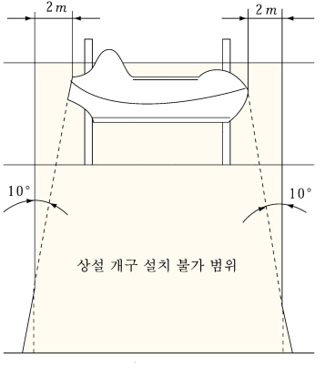
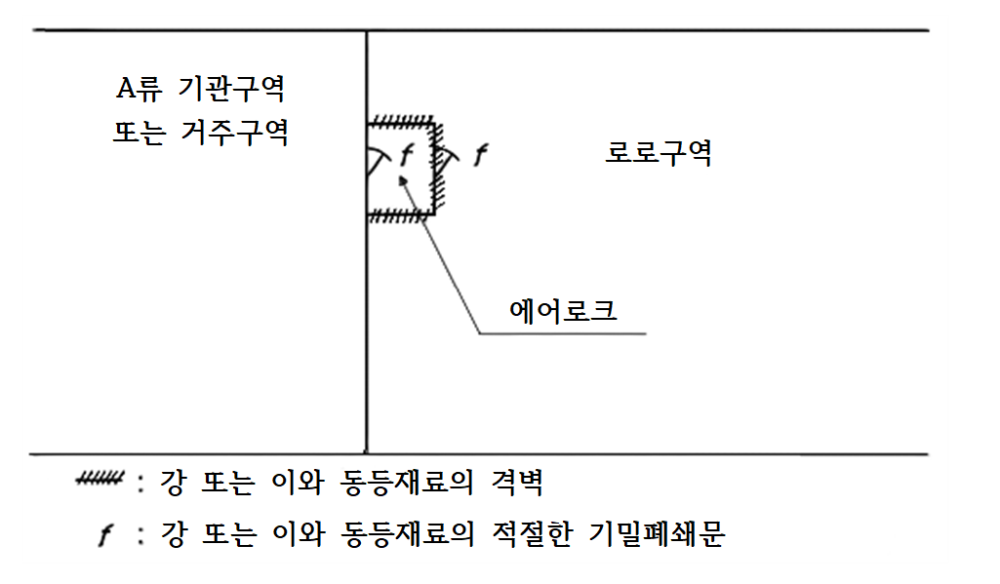

# 제8편 방화 및 소화

> 선급 및 강선규칙/적용지침 / RA-08-K / 2025 / KO / Guidance

## 제 13 장 차량구역, 특수분류구역 및 로로구역의 보호

### 제 1 절 일반요건

#### 102. 여객선의 기본 원칙

**규칙 102.**의 **1**항에서 “차량용 전체높이”란 한 수평영역을 형성하는 갑판과 갑판 늑골프레임 사이의 총합을 말한다.

### 제 2 절 폐위된 차량구역, 폐위된 로로구역, 특수분류구역에서 가연성 증기의 발화 방지

#### 201. 통풍장치

- **1.** **규칙 201.**의 **2**항 (4)호에서 “IMO가 개발한 지침”은 **MSC.1/Circ.1515 부록 1**을 말한다.*(2018)* **【규칙 참조】**
- **2.** **규칙 201.**의 **3**항에서 통풍용량 상실을 표시하는 요건은 통풍기 전동기의 시동계전기 실패 시 선교의 경보가 발생하면 만족하는 것으로 간주한다. **【규칙 참조】**
- **3.** **규칙 201.**의 **4**항 (1)호에서 “신속한 폐쇄장치”란 통풍장치를 단 한 번의 동작으로 차단할 수 있는 댐퍼를 갖추거나 이와 동등한 차단 속도를 갖춘 폐쇄장치를 말한다. 밀폐할 수 있는 로로구역에 고정식 가스소화장치가 설치되는 경우 이 화물구역 밖에서 밀폐할 수 있도록 한다. “해상조건을 고려한 신속한 폐쇄”에서 폐쇄장치로의 접근경로는 다음을 만족하여야 한다. **【규칙 참조】**
  - **(1)** 폭이 최소 600 mm이어야 한다.
  - **(2)** 통로(외부에 노출된 갑판을 통과하는 것을 포함)에는 10 m 이하의 간격으로 설치된 스텐션(stanchion)에 의해 지지되는 지름이 10 mm 이상의 단일의 손잡이 또는 와이어로프로 된 구명줄이 설치되어야 한다.
  - **(3)** 높은 위치에 있는 통풍폐쇄장치로 접근할 수 있도록 사다리 또는 발판과 같은 적절한 수단이 설치되어야 한다.
  - **(4)** 대체수단으로서, 선교 또는 화재제어실에서 이러한 통풍폐쇄장치의 원격 폐쇄 및 위치지시장치를 허용할 수 있다.
    **4. 규칙 201.**의 **5**항에서 “상설개구부”란 10도 종경사 및 20도 횡경사일 때 외판수직방향에서 생존정 끝단으로부터 2 $\mathrm{m}$ 범위를 벗어나는 것을 말한다. (**지침 그림 8.13.1** 참조) **【규칙 참조】**
    
    **그림 8.13.1 상설 개구 설치 불가 범위**

#### 202. 전기설비 및 배선 (2022) 【규칙 참조】

- **1.** **규칙 202.**의 **1**항 및 **203.**에서 전기설비의 “폭발성가솔린 및 혼합기체에 적합한 형식”, “폭발성 기름 및 혼합기체에서 사용하도록 형식승인 된 것”이라 함은 승인된 안전형으로서 **IEC 60079-10-1:2015**의 **구역 “1” (Zone 1)**에 적합한 형식승인품(가스그룹 IIA 및 온도등급 T3)이어야 한다. (구역 “1”에 적합한 보호 형식에 대해서는 **IEC 60079-14:2013** 참조) 스파크를 발생하지 않는 통풍장치를 설치하여야 하며 **규칙 3장 104.**의 요건에 따른다. 이 때 윈들러스 및 체인로커의 개구를 발화원으로 간주한다.
- **2.** **규칙 202.**의 **2**항에서 “불꽃 방출을 방지하도록 폐위된 보호 형식”이라 함은 최소한 IP55로 폐위하거나, **IEC 60079-10-1:2015**의 **구역 “2”(Zone 2)**에 적합하게 승인된 안전설비를 말한다. (구역 “2”에 적합한 보호 형식에 대해서는 **IEC 60079-14:2013** 참조)

#### 203. 배기통풍 덕트 내의 전기설비 및 배선 【규칙 참조】

로로구역의 통풍은 배기식으로 한다. 다만, 아래의 경우 급기식으로 할 수 있다.

- **1.** 노출구역 이외에 개구가 없는 경우
- **2.** A류 기관구역이나 거주구역과 인접하여 배치되어 있으나 그 구역의 개구가 에어로크된 경우(**지침 그림 8.13.2** 참조)
- **3.** **2**항 이외 구역과 인접하고 이들 사이 통로에 가스밀 자동폐쇄문을 설치한 경우. 다만, 창구를 불가피하게 설치하는 경우, 이러한 창구는 가스밀의 것이어야 하며, “창구가 항상 폐쇄되어야 함”과 같은 경고문을 부착하여야 한다. *(2017)*
  
  **그림 8.13.2 에어로크** ***(2017)***

### 제 3 절 탐지 및 경보

#### 301. 고정식 화재장치 및 경보장치 【규칙 참조】

노출갑판에 자체연료유탱크를 갖춘 차량을 운반하는 선박에는 이 요건을 적용할 필요가 없다.

### 제 5 절 소화

#### 501. 고정식 소화장치

- **1.** **규칙 501.**의 **1**항 (3)호 및 **2**항에서 FSS 코드에 적합한 고정식 물소화장치라 함은 **IMO MSC.1/Circ.1430**에 따라 형식승인되고 설계 및 설치요건을 만족하는 고정식 소화장치를 말한다. 또한, **MSC.1/Circ.1272**에 따라 기 수행된 화재 및 구성품 시험은 유효한 것으로 인정한다. **【규칙 참조】**
- **2.** **규칙 501.**의 **4**항 (1)호에서 (가), (나), (다)는 격벽갑판 상부에, (라)는 격벽갑판 하부에 적용된다. **【규칙 참조】**
- **3.** 노출갑판에 자체연료유탱크를 갖춘 차량을 운반하는 선박에는 이 요건을 적용할 필요가 없다.

#### 502. 휴대식 소화기

**규칙 502.**의 **2**항에서 자주용 연료유 탱크를 가진 차량을 적재하고 있는 개방 또는 폐위된 컨테이너를 싣는 화물창은 휴대식 소화기, 물분무방사기 및 포말방사기를 비치할 필요가 없다. **【규칙 참조】** 
