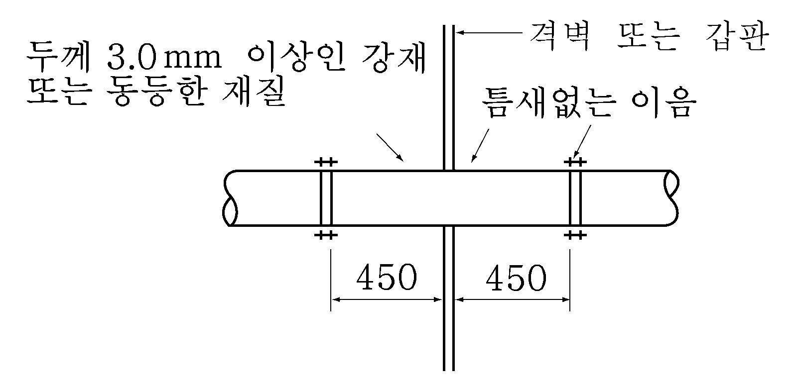
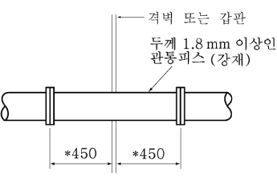
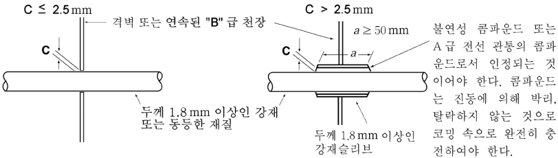
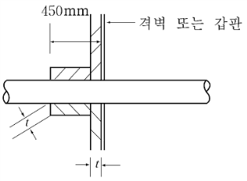
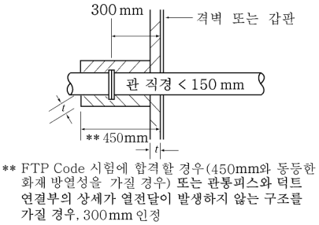
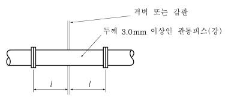
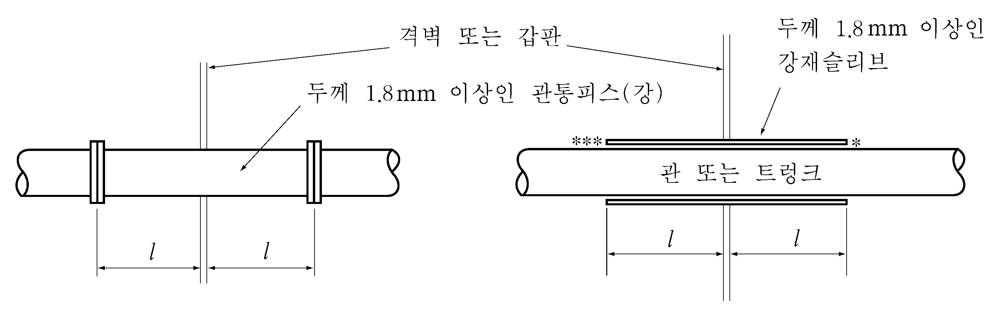

# 제8편 방화 및 소화

> 선급 및 강선규칙/적용지침 / RA-08-K / 2025 / KO / Guidance

## 부록 8-2 구획 관통부

### 1. 관 및 트렁크의 관통부

#### 1.1 A급 및 B급 구획의 관통부 (강재 또는 동등한 재질) (2020)

| 구분 | 관 또는 트렁크의 관통부 |   |
| --- | --- | --- |
| A급 |  |   |
| B급 |  |   |
| B급 |  |   |
| B급 | B급 구획 격벽 또는 갑판: B급 패널 또는 강재 |   |
| 열전달방지 *(2019)* |  | 관 직경이 150 mm 미만인 B급 구획의 관통부에만 적용 |
| 열전달방지 *(2019)* |   |  |

#### 1.2 열에 의해서 급격히 그 기능이 상실될 수 있는 재료(PVC, FRP, 알루미늄합금, 납․동합금 등) (2021)

| 구분 | 관 또는 트렁크의 관통부 |
| --- | --- |
| A급 |  관통피스의 두께는 호칭지름에 따라 KS 규격의 SPP관으로 하여도 좋다. |
| B급 |  호칭지름이 30 mm 이하인 관 또는 트렁크는 이 요건에 따를 필요는 없다. |
| (비고) 1. $l$은 구획으로부터 이음 또는 슬리브 끝까지의 거리로서 450 mm 이상이어야 한다. 다만, B급 구획에 있어서, 호칭지름 150 mm 미만의 관에 대하여는 300 mm 이상으로 한다. 단, 요구되는 길이의 것을 부착한 관통부를 가진 구획에 대한 표준화재시험을 실시하여 동등한 보존방열성을 가지면 짧은 길이도 인정할 수 있다. 2. 개구단이 구획으로부터 $l$ 이내에 있는 경우의 개구단측의 관 또는 트렁크의 강재 관통피스 혹은 강재 슬리브는 개구단까지로 할 수 있다. 3. 방열은 구획의 보존방열성에 따라 관통피스 또는 슬리브의 편측으로 150 mm 이상의 범위로 시공하여야 한다. 또한, 개구단이 구획으로부터 50 mm 이내에 있는 경우의 개구단측의 관 또는 트렁크의 강재 관통피스 혹은 강재 슬리브는 개구단까지 하여도 좋다. 4. 슬리브와 관을 플랜지 또는 커플링으로 연결 또는 슬리브와 관사이 간극(***부분)을 2.5 mm 이하로 하거나 그 간극을 불연성 재료 또는 다른 적절한 재료로 막는다. 5. A급 및 B급 구획을 관통하는 방열 시공되지 않은 금속관은 A-0급에 대하여는 950 ℃, B-0급에 대하여는 850 ℃를 초과하는 용융점을 갖는 적절한 재료이어야 한다. 6. A급 및 B급 구획의 관통부는 화재시험을 하여 관통구획 및 관 형식의 내화성에 적합한 경우, 각각 상기 이외의 다른 방법도 인정할 수 있다.(IMO Res. A.753(18) 및 FTP 코드를 참조한다.) |   |
