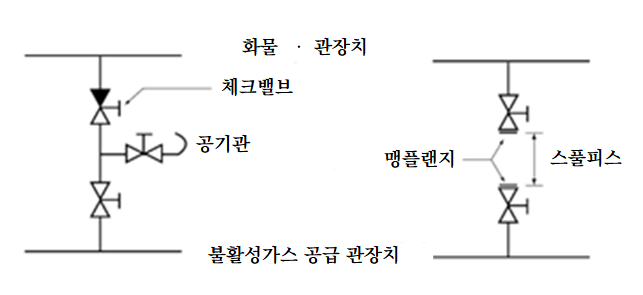

# 제8편 방화 및 소화

> 선급 및 강선규칙/적용지침 / RA-08-K / 2025 / KO / Guidance

## 부록 8-5 불활성가스장치

### 1. 용어의 정의

#### (1) “화물탱크”란 인화점이 60 ℃ 이하인 화물 또는 화물잔류물을 운송하는 “슬롭탱크”를 포함한 화물탱크를 말한다.

#### (2) “불활성가스 장치”는 불활성가스 발생기, 질소 발생기 및 폐기가스를 사용하는 불활성가스장치를 포함하며, 기관구역에 화물가스의 역류를 방지하기 위한 수단, 고정식/휴대식 계측기기 및 제어장치를 갖춘 불활성가스 설비 및 불활성가스 분배장치를 말한다.

#### (3) “가스안전구역”은 가스의 유입으로 인하여 가연성 또는 유독성 위험이 발생할 수 있는 장소를 말한다.

#### (4) “가스프리”는 탄화수소 또는 다른 가연성증기의 함량이 연소 하한치(LFL)의 1 %보다 적고, 산소 함량이 21 % 이상이며, 유독성 가스는 존재하지 않는 탱크 상태를 말한다.

### 2. 일반 요건

#### (1) 빈 화물탱크를 불활성화하여 화물탱크의 모든 부분에서 대기 중 산소 농도가 8%를 초과하지 않도록 유지하여야 하며, 해당 화물탱크를 가스프리할 필요가 있는 경우를 제외하고 항내 및 해상에서 양압을 유지하여야 한다.

#### (2) 가스프리가 필요한 경우를 제외하고 정상 작동 중에는 공기가 탱크에 유입되지 않아야 한다.

#### (3) 빈 화물탱크에 탄화수소가스를 제거하여 연속된 가스프리 작업 중 어떠한 경우에도 탱크 내부에 가연성 분위기를 형성하지 않아야 한다.

#### (4) 화물탱크에 선박의 최대양하용적의 125 % 이상의 불활성가스를 공급할 수 있어야 한다. 우리 선급은 케미컬 탱커 및 케미컬/석유화학제품 탱커에 대하여 불활성가스 장치로 보호되는 화물탱크로부터의 최대양하율이 불활성가스 용량의 80 %를 넘지 않도록 제한되는 경우, 공급용량이 최대양하용적의 125 %보다 적은 저용량 불활성가스 장치를 허용할 수 있다.

#### (5) 요구되는 모든 유량에서 산소농도 5 % 이하의 불활성가스를 화물탱크로 공급할 수 있어야 한다.

#### (6) 불활성가스 장치에 사용되는 재료는 사용 목적에 적합하여야 한다. 특히, 가스 및/또는 액체에 의하여 부식될 염려가 있는 구성부품은 내식성 재료로 제조되거나 고무, 유리섬유 에폭시 수지 또는 기타 동등한 피복 재료로 보호되어야 한다.

#### (7) 불활성가스의 공급

- **(가)** 주 또는 보조보일러의 정제된 폐기가스
- **(나)** 기름 또는 가스 연소식 가스발생기의 가스
- **(다)** 질소발생기의 가스
  저장탄산가스를 사용하는 방식의 불활성가스 장치는 정전기 발생에 의한 발화의 위험이 없다고 우리 선급이 인정한 경우를 제외하고는 사용할 수 없다.

#### (8) 안전장치

- **(가)** 불활성가스 장치는 모든 화물탱크에 발생할 수 있는 최대압력이 모든 화물탱크의 시험압력을 초과하지 않도록 설계되어야 한다.
- **(나)** 불활성가스 장치 및 그 구성 부품은 (11)호, **3**항의 (7)호 및 **4**항 (9)호의 규정을 고려하여 미리 설정된 한계치에 도달 시 자동 차단되도록 배치하여야 한다. 불활성가스장치와 그 구성부품의 자동 차단은 다음을 포함해야 한다. *(2019)*
  - **(a)** 다음의 경우 팬의 차단 및 가스조절밸브 폐쇄
  - **(i)** 가스세정장치의 고수위(질소발생장치에는 미적용)
    - **(ii)** 가스세정장치로의 저압/저유동(질소발생장치에는 미적용)
    - **(iii)** 불활성가스 공급의 고-고온(high-high temperature)
  - **(b)** 다음의 경우 조절밸브 폐쇄
  - **(i)** 체적으로 5%를 초과하는 산소농도
    - **(ii)** 송풍기/팬 또는 질소 압축기의 고장
  - **(c)** 이중차단 및 배출장치의 활성화(이중차단 및 배출장치가 수봉장치를 대신하는 선박에 한함)
  - **(i)** 불활성가스 공급의 손실
    - **(ii)** 불활성가스장치 전원의 상실
- **(다)** 적절한 차단장치를 각 발생기 설비의 배출구에 제공되어야 한다.
- **(라)** 불활성가스 장치는 산소농도가 5%를 초과하면 불활성가스를 대기 중으로 자동 배출하도록 설계하여야 한다.
- **(마)** 화물 하역 전에 불활성가스 설비의 기능을 안정화될 수 있도록 하는 장치가 제공되어야 한다. 송풍기로 가스프리를 할 경우 그 공기흡입구를 차폐하도록 배치하여야 한다.
- **(바)** 이중 차단 및 배출밸브가 설치된 경우, 전원을 상실하면 차단밸브는 자동으로 폐쇄되고 배출밸브는 자동으로 개방되는 시스템이어야 한다.

#### (9) 역류방지장치

- **(가)** 불활성가스 설비 또는 가스안전구역으로 증기 및 액체가 역류하는 것을 방지하기 위하여 2개 이상의 역류방지장치를 부착하여야 한다.
- **(나)** 첫 번째 역류방지장치는 습식, 반습식 또는 건식의 데크씰(deck seal) 또는 이중차단 및 배출장치(double-block and bleed arrangement)이어야 한다. 중간에 배출밸브를 갖는 연속된 2개의 차단밸브는 다음이 제공되는 경우에 인정될 수 있다.
  - **(a)** 밸브는 자동으로 작동되어야 한다. 불활성가스의 유량 또는 압력차 등의 공정에서 신호를 직접 받아 밸브가 개방/폐쇄되어야 한다.
  - **(b)** 밸브의 오작동 경보가 제공되어야 한다. 송풍기가 정지된 상태에서 공급밸브는 개방되는 것과 같은 작동 상태가 오작동의 예이다.
- **(다)** 두 번째 역류방지장치는 증기 및 액체의 역류를 방지할 수 있는 체크밸브 또는 이와 동등한 것이어야 하며, 갑판 수밀봉(또는 동등 장치)과 불활성가스 주관에서 화물탱크로의 첫 번째 연결구 사이에 부착되어야 한다. 이 장치에는 유효한 폐쇄장치가 부착되어야 한다. 유효한 폐쇄장치에 대한 대체수단으로, 유효한 폐쇄장치를 갖는 추가의 밸브를 체크밸브와 화물탱크로의 불활성가스 주관으로부터 갑판 수밀봉 또는 동등한 장치를 격리하기 위한 화물탱크로의 첫 번째 연결구 사이에 부착할 수 있다.
- **(라)** 수밀봉이 설치된 경우, 2개의 독립된 펌프에 의하여 공급될 수 있는 것이어야 하며 각 펌프는 항상 충분한 급수를 할 수 있어야 한다. 수밀봉의 저수위에 관한 가시가청 경보장치는 항상 작동하여야 한다.
- **(마)** 수밀봉장치 또는 동등장치 및 관련 부착품은 증기 및 액체의 역류를 방지하고 작동상태에서 적절한 기밀을 유지할 수 있어야 한다.
- **(바)** 수밀봉은 동결에 대하여 보호를 보장할 수 있는 설비를 갖춰야 하며, 과열로 손상되지 않도록 한다.
- **(사)** 각각의 관련된 급수관, 배수관 및 가스안전구역으로 유도되는 통풍관 또는 압력검지관에는 워터 루프 또는 기타 승인된 장치를 설치하여야 한다. 이들 루프는 진공으로 인해 빈 공간이 되지 않도록 조치를 강구하여야 한다.
- **(아)** 모든 수밀봉 또는 동등장치 및 워터 루프 장치는 화물탱크의 시험압력과 동등한 압력에서 불활성가스 설비로 증기 및 액체의 역류를 방지할 수 있어야 한다.
- **(자)** 역류방지장치는 갑판상 화물지역 내에 위치되어야 한다.

#### (10) 불활성가스 관

- **(가)** 불활성가스 주관은 (9)호에서 요구되는 역류방지장치의 전방에서 2개 이상의 지관으로 나누어질 수 있다.
- **(나)** 불활성가스 공급주관에는 각 화물탱크에 이르는 지관을 설치하여야 한다. 불활성가스 지관에는 스톱밸브 또는 각 탱크를 격리하기 위한 동등한 제어장치를 설치하여야 한다. 스톱밸브를 설치하는 경우에는 책임사관에 의하여 관리되는 잠금장치를 스톱밸브에 설치하여야 한다. 작동된 제어장치는 최소한 이 밸브들의 작동상태를 (11)호에 규정된 제어반에 명확히 표시하여야 한다. 불활성가스 주관에서 화물탱크까지의 이어지는 불활성가스 지관의 스톱 밸브의 작동 상태에 대한 정확한 정보는 (11)호에서 요구된 제어반에서 제공하는 개방/중간/폐쇄 상태에 대한 지시기의 위치를 의미한다. 리밋(limit) 스위치는 개방 및 폐쇄 위치를 정확하게 나타내기 위하여 사용되어야 한다. 중간 위치 상태는 밸브가 개방 또는 폐쇄 위치에 있지 않을 때를 나타낸다. *(2019)*
- **(다)** 불활성화되지 않은 각 화물탱크는 다음과 같은 방법으로 불활성가스 주관으로부터 분리될 수 있어야 한다. *(2021)*
  - **(a)** 스풀피스, 밸브 또는 기타 배관부를 제거하고 배관의 끝단 폐쇄
  - **(b)** 연속한 2개의 스펙터클 플랜지 사이에 누설 탐지 설비를 배치
  - **(c)** 우리 선급이 동등 수준의 기능이 있다고 인정하는 장치
- **(라)** 화물탱크가 불활성가스 주관과 격리될 때 온도변화로 생기는 과압이나 부압 영향으로부터 화물탱크를 보호하기 위한 수단을 강구하여야 한다.
- **(마)** 관장치는 모든 조건에서 배관 내 화물이나 물이 축적되는 것을 방지하도록 설계되어야 한다.
- **(바)** 불활성가스 주관에서 외부와 공급 연결되도록 배치하여야 한다. 이 배치 시 배관 공칭크기 250 $\mathrm{mm}$ 볼트 플랜지로 구성하여야 하고, 한 개 밸브로 불활성 주관과 격리되도록 한다. 체크밸브의 전방에 위치하여야 한다. 이 플랜지의 설계는 선박의 화물 배관에서 다른 외부 연결부의 설계용으로 채택된 기준의 적절한 등급에 적합하여야 한다.
- **(사)** 불활성가스 공급주관과 화물 배관 사이에 연결구가 설치되는 경우 이들 사이에 존재할 큰 압력차를 고려하여 효과적으로 격리하도록 배치한다. 이것은 2개의 차단밸브 사이의 공간을 안전하게 벤트시키는 배치이거나 2개의 차단밸브에 맹플랜지를 부착한 스풀피스로 구성하여야 한다. (**그림 부록 8-5** 참조)
- **(아)** 화물주관으로부터 불활성가스 주관을 격리하며 화물주관측에 있는 밸브는 실제적인 폐쇄수단이 있는 체크밸브여야 한다. 격리수단은 **그림 부록 8-5.2**의 두 가지 배치로 할 수 있다. *(2022)*
  
  **그림 부록 8-5.2**
- **(자)** 불활성가스 관장치는 거주구역, 업무구역 및 제어장소를 통과하여서는 안 된다.
- **(차)** 겸용선에서 기름 이외 화물을 운송할 경우 기름 또는 기름 잔류물을 수용하고 있는 슬롭탱크를 다른 탱크와 격리하기 위해서 항상 그 위치에 맹판 플랜지를 구성하여야 한다, 단 불활성가스장치 지침(**MSC/Circ.353** 및 **MSC/Circ.387**)의 관련 조항에 별도로 정해져 있는 경우에는 예외로 한다.
- **(카)** 불활성가스 관의 전 길이에 걸쳐서 전기적 연속성을 갖추어야 하며, 정전기를 제거하도록 설계되어야 한다. *(2019)*

#### (11) 지시 및 경보장치

- **(가)** 불활성가스장치의 작동 상태는 제어반에 표시되어야 한다. 불활성가스장치의 작동 상태는 불활성가스가 가스조절밸브의 하류와 역류방지장치의 불활성가스 주관 하류의 압력 또는 흐름에 의해 공급된 표시에 기초하여야 한다. 그러나 불활성가스장치의 작동 상태는 적절한 경우 **2**항 (11)호 및 **3**항 (7)호 또는 **4**항 (9)호에 명시된 것 이외의 추가 지시나 경보는 필요하지 않은 것으로 간주한다. *(2019)*
- **(나)** 불활성가스가 공급될 때 다음을 계속적으로 표시하고 영구적으로 기록하기 위한 계기를 부착하여야 한다.
  - **(a)** 역류방지장치 전방의 불활성가스 공급 주관 내의 압력
  - **(b)** 불활성가스의 산소 농도
- **(다)** 지시 및 기록장치는 화물제어실이 설치되어 있는 경우에는 그 곳에 위치하여야 한다. 다만, 화물제어실이 설치되어 있지 아니한 경우에는, 그 장치들은 화물작업을 담당하는 사관이 용이하게 접근할 수 있는 장소에 위치하여야 한다.
- **(라)** 추가로 다음 계기를 설치하여야 한다.
  - **(a)** 불활성가스 공급주관으로부터 격리할 때마다 항해선교에 (11)호 (나) (a)에서 정한 압력과 겸용선의 슬롭탱크 압력을 나타내도록 한다.
  - **(b)** 기관제어실 또는 기관구역에 (11) (나) (b)에서 정한 산소농도를 나타내도록 한다.
- **(마)** 가시 및 가청 경보장치
  - **(a)** 설계된 시스템에 근거하여, 다음 사항을 표시하는 가시 및 가청의 경보장치를 설치하여야 한다.
  - **(i)** 체적으로 5%를 초과하는 산소농도
    - **(ii)** (11)호 (나)에 명시된 지시장치로의 동력 공급 실패
    - **(iii)** 100 mm 수두 미만의 가스압력. 경보장치는 겸용선의 슬롭탱크내의 압력을 항상 감시할 수 있어야 한다.
    - **(iv)** 설정치보다 높은 가스 압력
  - **(v)** 자동제어장치로의 동력 공급 실패
  - **(b)** 상기 (a)의 (a) (i), (iii) 및 (v)에서 요구되는 경보장치는 기관구역 및 화물제어실이 있는 경우에는 그곳에 설치되어야 한다. 다만, 어떠한 경우에도 선원중의 책임 있는 자가 즉시 경보를 수신할 수 있는 장소이어야 한다.
  - **(c)** 상기 (a)의 (a) (iii)에서 요구되는 장치로부터 독립된 가청경보장치 또는 화물펌프의 자동정지 장치가 불활성가스 공급주관에 설정된 저압 한계값에 도달하였을 때 작동하여야 한다. 독립된 경보장치란 저압, 고압 및 압력지시/기록 장치로 경보를 제공하는 감지기와 추가로 제2의 압력감지기가 제공되어야 함을 의미한다. 그러나 제어장치의 경보에 대해 공통의 PLC(programmable logic controller)는 설치할 수 있다. 화물펌프의 차단이 가능한 시스템이라면 독립된 감지기는 요구되지 않는다.
    화물펌프의 차단을 위한 시스템이 배치되면, 모든 화물펌프를 자동으로 차단하는 기능도 제공되어야 한다. 화물펌프의 차단 시에는 제어장소에서도 알 수 있도록 경보되어야 한다. 화물펌프의 차단이 평형수 펌프의 작동이나 화물펌프실의 빌지 배출용 펌프의 작동을 방해해서는 안 된다. *(2019)*
  - **(d)** 2개의 산소감지기는 불활성가스 장치가 있는 구역의 적절한 위치에 설치되어야 한다. 산소농도가 19 % 아래로 떨어지는 경우, 산소감지기는 경보를 발하여야 한다. 경보장치는 내부 및 외부구역에서 가시가청할 수 있어야 하고 책임 있는 선원이 즉시 경보를 수신할 수 있는 장소에 위치하여야 한다.

#### (12) 작동지침서

불활성가스장치와 화물탱크장치에 적용에 관한 운전, 안전 및 보수유지의 요건, 신체위험의 상세한 지침서를 본선에 비치하여야 한다. 이 지침서는 불활성가스장치의 손상 또는 고장 시 조치하여야 할 절차 지침을 포함하여야 한다. (**MSC/Circ.353** 및 **MSC/Circ.387**)

### 3. 폐기가스 및 불활성가스 발생장치에 대한 요건

#### (1) 불활성가스 발생기

- **(가)** 불활성가스 발생기에는 2개의 연료유 펌프가 부착되어야 한다. 충분한 양의 적합한 연료가 불활성가스 발생기에 제공되어야 한다.
- **(나)** 불활성가스 발생기는 화물탱크지역의 외부에 위치하어야 한다. 불활성가스 발생기는 기관구역에 위치할 수 있으며, 불활성가스 발생기가 있는 구역에서 거주구역 또는 제어장소로의 직접적인 통로를 설치할 수는 없다. 기관구역에 위치하지 않는 경우, 불활성가스 발생기가 설치된 구획은 거주구역, 업무구역 및 제어장소구역과 가스밀의 강으로 된 격벽 및/또는 갑판에 의하여 분리되어야 한다. 그러한 구획에는 적절한 양압 방식의 기계식 통풍장치가 설치되어야 한다.

#### (2) 가스조절밸브

- **(가)** 가스조절밸브 1개를 불활성가스 공급주관에 부착하여야 한다. 가스조절밸브는 **2**항 (8)호 (나)에서 요구하는 것처럼 자동 제어로 폐쇄되어야 한다. 불활성가스 유량의 자동제어 장치가 없으면, 가스조절밸브가 화물탱크로의 불활성가스의 유입을 자동 제어할 수 있어야 한다.
- **(나)** 가스조절밸브는 불활성가스 공급주관이 통과하는 최전방 가스안전구역의 전방 격벽에 위치하여야 한다.

#### (3) 냉각 및 세정장치

- **(가)** **2**항 (1)호부터 (5)호에서 정한 체적의 가스를 효과적으로 냉각하고 잔류 고형물 및 유황연소물을 제거하기 위한 폐기가스 세정기를 설치하여야 한다. 냉각수장치는 선내 필수적인 공급을 방해하지 않고 항상 적절히 공급할 수 있도록 한다. 냉각수의 대체 공급 설비를 갖추어야 한다.
- **(나)** 여과기 또는 이와 동등한 장치를 설치하여 불활성가스 송풍기로 물의 유입량을 최소화하여야 한다.

#### (4) 송풍기

- **(가)** 송풍기를 2개 이상 설치하여야 한다. 이들 송풍기는 적어도 **2**항 (1)호부터 (5)호에서 정한 체적의 불활성가스를 화물탱크에 공급할 수 있어야 한다. 가스발생장치에 의한 불활성가스장치로 **2**항 (1)호부터 (5)호에서 정한 가스 총량을 보호 화물탱크로 공급할 수 있을 경우 송풍기를 1개만 인정할 수 있다. 다만, 이때 송풍기 및 그 원동기의 예비품이 충분하고 본선에서 선원이 송풍기 및 그 원동기의 고장을 수리할 수 있어야 한다. 송풍기 및 그 원동기의 예비품이란 통상 중요부품을 말하며, 각 종류별 베어링, 모터, 기동기 및 완성된 회전 부품이 이에 포함될 수 있다. 상기의 중요부품 이외에 송풍기의 형식 및 제조자의 권고에 따라 추가의 부품이 요구될 수 있다. *(2017)*
- **(나)** 불활성가스 발생기가 용적식 송풍기에 의하여 운전되는 경우, 송풍기의 토출 측에 발생하는 과도한 압력을 방지하기 위하여 압력완화장치가 제공되어야 한다.
- **(다)** 2개의 송풍기가 설치될 때, 불활성가스 장치의 요구되는 총용량은 2개의 송풍기에 균등하게 분배되어야 하며, 어떠한 경우에도 1대의 송풍기 용량이 필요 총용량의 1/3 보다 적어서는 안 된다.

#### (5) 폐기가스를 사용하는 장치에는 보일러 폐기가스 연도와 폐기가스 세정기 사이에서 폐기가스 차단밸브를 불활성가스 공급주관에 설치하여야 한다. 이들 밸브 개폐를 표시하는 지시기를 설치하여야 하며, 이 차단밸브는 가스밀이어야 하고 밸브시트로부터 그을음을 제거하기 위한 조치를 해야 한다. 해당 폐기가스밸브가 개방되어 있을 때 보일러의 그을음 블로워를 작동할 수 없어야 한다.

#### (6) 연소가스 누설 방지

- **(가)** 가스세정기, 송풍기, 이와 관련된 배관 및 부속품의 설계 시 폐위된 구역으로 폐기가스가 누설되지 아니하도록 특별히 고려하여야 한다.
- **(나)** 안전하게 유지하기 위해서 폐기가스 격리밸브와 세정기 사이 또는 세정기의 가스 입구에서 수밀봉 또는 유효한 가스누설방지장치를 추가로 연결시켜야 한다.

#### (7) 지시 및 경보장치

- **(가)** **2**항 (11)호 (나)의 규정에 추가하여, 불활성가스 장치가 작동 중일 때 불활성가스의 온도를 연속적으로 표시하기 위한 수단을 장치의 배출 측에 설치하여야 한다.
- **(나)** **2**항 (11)호 (마)의 규정에 추가하여, 다음의 경우 가시가청의 경보가 제공되어야 한다.
  - **(a)** 기름점화 불활성가스 발생기로의 연료 공급 부족
  - **(b)** 발생기로의 동력 공급 실패
  - **(c)** 냉각 및 가스세정장치로 가는 저수압 또는 저수공급율
  - **(d)** 냉각 및 가스세정장치에서의 고수위
  - **(e)** 고온 가스
  - **(f)** 불활성가스 송풍기의 고장
  - **(g)** 수밀봉의 저수위

### 4. 질소발생장치의 요건

#### (1) 질소발생장치는 2항 (1)호부터 (5)호에서 요구되는 가스의 총량을 제공할 수 있는 충분한 양압을 발생하기 위하여 하나 이상의 압축기가 설치되어야 한다.

#### (2) 압축공기 중의 자유수분, 미립자 및 기름기를 제거하고 규정 온도를 유지하기 위하여 급기처리장치를 설치하여야 한다.

#### (3) 이 요건은 속이 빈 섬유 다발, 반투성 멤브레인 및 흡착제에 압축공기를 통과시켜 공기로부터 성분가스를 분리하여 불활성가스를 생산하는 방식의 가스 발생장치에 국한하여 적용한다.

#### (4) 질소발생기는 급기처리장치 및 2항 (4)호의 요구용량을 만족하는 수량의 멤브레인 또는 흡착모듈로 구성된다.

#### (5) 공기압축기 및 질소발생기는 기관실 또는 분리된 구획에 설치될 수 있다. 분리된 구획 및 설비가 설치되는 곳은 방화와 관련하여 “기타기관구역”으로 간주되어야 한다. 분리된 구획에 질소발생기를 설치하는 경우에, 그 구획은 시간당 6회 환기를 제공하는 독립된 기계식 배기용통풍장치가 설치되어야 한다. 그 구획은 거주구역, 업무구역 및 제어장소로의 직접적인 통로를 설치해서는 안 된다.

#### (6) 질소발생기는 산소농도가 용적으로 5 _s2 이하인 고순도의 질소를 공급할 수 있는 것이어야 한다. 장치에는 시동 및 비정상적인 작동 시에 규정치를 만족하지 않는 가스를 대기로 방출하기 위한 자동장치를 설치하여야 한다.

#### (7) 2대의 공기압축기를 설치하는 경우, 장치에 요구되는 총용량은 가급적 2대의 압축기에 균등하게 배분되어야 하며, 어떠한 경우에도 압축기 1대의 용량이 요구되는 총용량의 1/3 이하이어서는 안 된다. 공기압축기 및 원동기에 손상이 발생하였을 때 선원이 보수할 수 있도록 충분한 예비품이 선내에 비치되어 있는 경우, 공기압축기를 1대로 할 수 있다.

#### (8) 질소 리시버/버퍼탱크는 전용구획 또는 공기압축기 및 발생기가 있는 분리구획에 설치하거나 기관실 또는 화물지역에 위치할 수 있다. 질소 리시버/버퍼탱크가 폐위구역에 설치된 경우, 개방갑판에서만 출입할 수 있도록 배치하여야 하며 출입문은 바깥쪽으로 열리는 것이어야 한다. 이 구획에는 적절한 배기용 형식의 독립된 기계식 통풍장치가 설치되어야 한다.

#### (9) 지시 및 경보장치

- **(가)** **2**항 (11)호 (나)의 규정에 추가하여, 공기의 온도 및 압력을 연속적으로 표시하기 위한 계측기를 질소발생기의 흡입 측에 제공하여야 한다.
- **(나)** **2**항 (11)호 (마)의 규정에 추가하여, 다음 사항을 표시하는 가시 및 가청의 경보장치를 설치하여야 한다.
  - **(a)** 설치된 경우, 전기식 가열기의 고장
  - **(b)** 압축기로부터의 급기 압력 또는 급기량의 저하
  - **(c)** 높은 공기 온도
  - **(d)** 수분리기의 자동 드레인에서 응축 수위의 높음

#### (10) 질소발생기에서 발생하는 산소농도가 높은 공기와 질소 리시버의 보호장치로부터 방출되는 질소생성물의 농도가 높은 가스는 다음 요건에 만족하는 개방갑판의 안전한 위치로 방출 되어야 한다.

- **(가)** 질소발생기에서 발생하는 산소농도가 높은 공기
  - **(a)** 위험지역 외부
  - **(b)** 사람이 이동하는 통로로 부터 3m 이상 떨어진 곳
  - **(c)** 기관 및 보일러의 공기 흡입구 및 모든 통풍 흡입구로부터 6m 이상 떨어진 곳
- **(나)** 질소리시버의 보호장치로부터 방출되는 질소 생성물의 농도가 높은 가스
  - **(a)** 사람이 이동하는 통로로 부터 3m 이상 떨어진 곳
  - **(b)** 기관 및 보일러의 공기 흡입구 및 모든 통풍용 흡입/배기구로부터 6m 이상 떨어진 곳

#### (11) 정비를 위하여 질소발생기와 리시버 사이에는 격리수단을 설치하여야 한다.

### 5. 규칙 2장 405. 이외의 목적으로 질소발생장치/불활성가스시스템을 장착하는 경우의 요건

#### (1) 이 항은 규칙 2장 405.가 적용되지 않는 유탱커, 가스캐리어 또는 케미컬탱커에 적용할 수 있다.

#### (2) 2항 (8)호의 (나), (라), (11)호의 (나), (다) 및 (마) (a) (i), (ii)와 (마)의 (d), 4항 (1)호, (2)호, (5)호, (8)호 및 (9)호의 (가)와 (나)는 적용 가능한 한 적용하여야 한다.

#### (3) 4항의 질소발생장치를 사용할 때에는 4항의 (3)호, (4)호 및 (7)호는 적용하지 않는다.

#### (4) 불활성가스 시스템에 사용되는 재료는 선급의 규칙에 따른 목적에 적합한 것을 사용하여야 한다.

#### (5) 모든 설비는 검사원이 만족하는 작업 조건하에 선상에 설치되고 검사되어야 한다.

#### (6) 2항 (9)호 (가)에서 요구되는 두 개의 역류방지장치를 불활성 가스 주관에 설치하여야 한다. 역류방지 장치는 2항 (9)호 (나) 및 (다)에 적합하여야 한다. 그러나 화물탱크, 홀드 스페이스 또는 화물 배관의 연결부가 영구적이지 못할 경우 2항 (9)호 (가)에 의한 역류방지장치는 두 개의 역지 밸브로 대신할 수 있다.

### 6. 가스세정기 및 송풍기 케이싱으로부터의 배수관에 강화플라스틱관을 사용하는 경우에는 다음에 따른다.

#### (1) 재료, 설계요건, 배관, 관의 접합, 표시, 시험, 검사 등에 대하여는 지침 5편 부록 5-6에 따른다.

#### (2) 관이 기관구역 내에 있는 경우에는 다음에 따른다.

- **(가)** 강제의 관장치에 의해 구성된 공기압 또는 액압에 의해 기관구역의 내부 및 외부로부터 작동할 수 있는 외판붙이 디스턴스 피스에 부착되는 밸브를 부착한다. 이 밸브는 작동장치가 고장 난 경우에는 자동적으로 폐쇄될 수 있는 것이어야 한다.
- **(나)** (가)의 밸브에는 밸브의 개폐상태를 식별할 수 있도록 지시기를 설치하여야 한다.
- **(다)** (가)의 밸브는 불활성 가스장치가 정지되어 있는 경우 및 기관구역에 화재가 난 경우에는 언제라도 폐쇄될 수 있는 것이어야 한다.
- **(라)** (가)의 밸브에 강제의 짧은 관 또는 스풀피스를 부착하고 그곳에 스윙 체크밸브를 부착하여야 한다. 이 짧은 관 또는 스풀피스에는 안지름 약 12.5 $\mathrm{mm}$ 인 드레인관 및 드레인 밸브를 부착하여야 한다.
- **(마)** (라)의 체크밸브의 선내측에는 강제의 짧은 관 또는 스풀피스를 부착하고 그곳에 안지름 약 12.5 $\mathrm{mm}$ 인 드레인 관 및 드레인 밸브를 부착하여야 한다.
- **(바)** (가)의 디스턴스 피스 및 밸브와 (라) 및 (마)의 강제의 짧은 관, 스풀피스 및 스윙 체크밸브는 내식성 재료를 사용하거나 또는 고무, 유리섬유, 에폭시 수지나 이와 동등한 피복재로 보호하여야 한다.
- **(사)** 가스세척기용 펌프를 정지하기 위한 장치가 기관구역 외부에 설치되어야 한다.

### 7. 불활성가스장치의 설치 검사는 다음에 적합하여야 한다.

#### (1) 불활성가스장치는 선박에 설치한 후 기기류의 작동시험 및 기밀시험과 제어장치, 안전장치 및 경보장치에 대하여 표 부록 8-5 에 따라 효력시험을 하여야 한다.

#### (2) 불활성가스 공급관 계통의 관 및 이음부는 선박에 설치한 후 0.024 _s2 의 압력으로 기밀시험을 하여야 한다. 다만, PV밸브의 설정압력이 0.024 _s2 이상인 경우에는 PV밸브의 설정압력을 기밀시험압력으로 한다.

#### (3) 불활성가스 송풍기의 용량이 화물유 펌프의 최대용량의 1.25배 이상인가를 확인하기 위하여 불활성가스 또는 신선한 공기를 이용하여 송풍기의 용량을 시험하여야 한다. 한편 신선한 공기를 사용하여 시험하는 경우에는 이를 배기가스 차단밸브 부근에 설치한다. 다만 동형선박으로서 동일한 장치의 불활성가스장치를 설치한 선박은 이 시험을 생략할 수 있다.

**표 부록 8-5 효력시험 항목**

| 항목 | 가시가청 경보 | 안전장치 | 비고 |
| --- | --- | --- | --- |
| (1) 가스세정기의 공급수 압력 및 유량저하 | ○ | · 불활성가스 제어밸브 폐쇄 · 불활성가스 송풍기 정지 | - |
| (2) 가스세정기내의 수위 상승 | ○ | · 불활성가스 제어밸브 폐쇄 · 불활성가스 송풍기 정지 · 가스세정기용 냉각수 공급 펌프의 정지 | - |
| (3) 불활성가스 송풍기 출구의 불활성가스 고온 | ○ | · 불활성가스 제어밸브 폐쇄 · 불활성가스 송풍기 정지 | - |
| (4) 불활성가스 송풍기의 고장 | ○ | · 불활성가스 제어밸브 폐쇄 | - |
| (5) 불활성가스 송풍기 출구의 산소농도가 용적으로 8%를 넘을 때 | ○ | - | · 가스질의 개선 또는 워터 시일 장치 이외의 역류방지장치의 밸브를 수동으로 폐쇄 · 기관실과 화물제어실에 경보 |
| (6) 불활성가스 제어밸브의 자동제어용 동력공급의 정지 | ○ | - | · 기관실과 화물제어실에 경보 |
| (7) 역류방지장치의 하류측의 불활성가스 압력지시장치에의 동력공급 정지 | ○ | - | · 기관실과 화물제어실에 경보 |
| (8) 불활성가스 송풍기 출구의 산소농도 지시장치에의 동력공급 정지 | ○ | - | · 기관실과 화물제어실에 경보 |
| (9) 워터실 장치내의 수위 저하 | ○ | - | - |
| (10) 역류방지장치의 전방에서의 불활성가스공급 주관내 압력이 수두 100 $\mathrm{mm}$ 미만으로 저하 | ○ | - | · 기관실과 화물제어실에 경보 |
| (11) 역류방지장치의 전방에서의 불활성가스 공급 주관내 압력 상승 | ○ | - | - |
| (12) 불활성가스의 공급정지 | ○ | - | · 워터실 장치내의 수위저하 경보장치가 작동될 것 · 워터실 장치내의 수밀이 형성될 것 |
| (13) 불활성가스 공급 주관내의 압력이 설정된 압력까지 저하 | ○ | - | · 화물유 펌프의 자동정지도 가능 |
| (14) 불활성가스 제어밸브의 자동제어 기구 | - | - | · 불활성가스 송풍기의 자동속도 제어장치가 없는 경우에 한한다. |
| (15) 지시장치, 기록장치, 계측장치 | - | - | · 작동 및 효력시험을 한다. |
