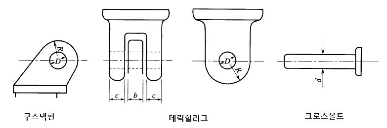
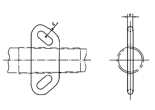
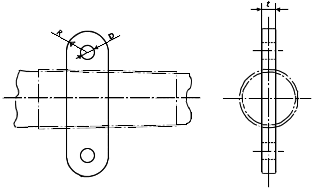

# 제9편 추가설비

> 선급 및 강선규칙/적용지침 / RA-09-K / 2025 / KO / Rules

## 제 2 장 하역설비

### 제 1 절 일반사항

#### 101. 일반

- **1.** **적용** ***(2025)***
  - **(1)** 이 규칙은 SOLAS II-1/3-13 규칙의 적용을 받는 하역설비로서 우리 선급에 등록하고자 하는 선박 또는 등록된 선박의 하역설비에 적용한다. **【지침 참조】**
  - **(2)** (1)항의 적용 대상이 아닌 하역설비 중 우리 선급에 등록하고자 하는 선박 또는 등록된 선박에 설치하는 하역설비에 적용한다. 단, 인력 구동식 하역장치는 제외한다. **【지침 참조】**
  - **(3)** 하역설비의 재료, 기기, 장치 및 제작에 대하여 이 규칙에서 별도로 규정하고 있는 사항 외에는 **선급 및 강선규칙**의 관련 규정을 따른다.
  - **(4)** 인원용 승강장치는 이 규칙에 추가하여 **부록 9-2**의 요건을 따른다.
  - **(5)** 해양 크레인은 이 규칙에 추가하여 **부록 9-3**의 요건을 따른다.
- **2.** **동등효력**
  이 규칙에 만족하지 않거나 적용할 수 없는 대체설계 및 신기술의 동등효력에 대해서는 **선급 및 강선규칙 1편 1장 105.**를 따른다. *(2020)* **【지침 참조】**
- **3.** **적용상의 주의** ***(2025)***
  - **(1)** 우리 선급은 다른 기관의 위임을 받아 특정 규칙에 따라 하역설비에 대하여 검사를 하고 필요한 증서를 발급할 수 있다.
  - **(2)** 2026년 1월 1일 이전에 설치되고 우리 선급에 등록되지 않은 하역장치는 2026년 1월 1일 이후 도래하는 선박의 첫 정기검사일까지 이 규칙에 따라 설비 등록을 하여야 한다.
- **4.** **설비 부호** ***(2025)***
  - **(1)** 이 장에서 규정하는 요건을 만족하고 **203.**의 등록검사에 합격한 하역설비에 **LG(F)** 부호를 부여한다. 다만, **203. 2**항 (2)호의 등록검사만을 합격한 하역설비는 **LG(P)** 부호를 부여한다.
  - **(2)** (1)호에 해당하는 하역설비로서 해양 크레인(Offshore Crane)에 **LG(OC)** 부호를 부여한다.
  - **(3)** (1)호에 해당하는 하역설비로서 인원용 승강장치(Personnel lifting Appliances)에 **LG(PA)** 부호를 부여한다.
  - **(4)** (3)호의 인원용 승강장치가 IP Code를 적용받는 선박에 설치되고 이 장의 관련 요건을 만족하는 경우 **LG(IP)** 부호를 부여한다.

#### 102. 용어의 정의 (2025) 【지침 참조】

이 규칙의 목적상 용어는 별도로 정의하지 않는 한 다음의 정의에 따른다.

- **1.** **하 역설비(cargo handing appliance)**라 함은 하역장치 및 하역장구를 말한다.
- **2.** **하 역장치(lifting appliance)**라 함은 선체 구조 등에 영구적으로 설치되어 화물이나 사람, 그 밖의 물품 등을 들어 올리거나 내리는데 사용되는 기계장치로서 다음과 같은 설비를 말한다. 이들의 구동장치 및 하역부속장구를 포함한다.
  - **(1)** 화물의 적재, 운송 또는 양하를 위해 사용되는 설비
  - **(2)** 화물창의 해치 커버 또는 이동식 격벽의 승강에 사용되는 설비
  - **(3)** 기관실 크레인
  - **(4)** 프로비전 크레인
  - **(5)** 호스 취급 크레인
  - **(6)** 텐더 보트 및 유사 용도의 배를 진수 및 회수하기 위해 사용되는 설비
  - **(7)** 인원용 승강장치
- **3.** **인 원용 승강장치(personnel lifting appliance)**라 함은 산업 인력을 포함한 인원의 승하선 또는 이동에 사용되는 크레인을 말한다.
  - **(1)** 산업 인력(industrial personnel, IP)이라 함은 다른 선박 및/또는 해양시설에서 수행되는 해양 산업 활동을 목적으로 선내에 거주하거나 운송되는 모든 사람을 의미한다.
  - **(2)** IP Code라 함은 결의안 MSC.527(106)에서 채택되고 개정될 수 있는 ‘산업인력 운송을 위한 국제 안전 코드’를 말한다.
  - **(3)** 해양 산업 활동(offshore industrial activities)은 신재생에너지 또는 탄화수소 에너지 분야, 양식업, 해양 채굴 또는 이와 유사한 활동에 의한 자원탐사 및 개발과 관련되나 이에 국한되지 않는 해양시설의 건설, 유지 관리, 해체, 운영 또는 일상적인 정비를 의미한다.
    **4. 구 조부(structural member)**라 함은 하역장치에 영구적으로 설치된 하역부속장구 및 하역블록을 포함하여 안전사용하중을 전달하는 하역설비의 구조부분을 말한다.
- **5.** **하 역 부 속 장 구(cargo fitting)**라 함은 하역의 목적을 위하여 구조부 또는 선체구조에 영구적으로 설치된 구즈넥브래킷, 토핑브래킷, 데릭붐헤드의 부속장구, 데릭힐러그, 가이클리트, 아이부속장구 등을 말한다.
- **6.** **하 역장구(loose gear)**라 함은 블록, 로프, 체인, 링, 훅, 새클, 스위블, 클램프, 그랩, 리프팅마그넷, 스프레더 등과 같이 하역장치에 화물의 하중을 전달하기 위하여 사용된 떼어낼 수 있는 부분을 말한다.
- **7.** **안 전사용하중(safe working load)**이라 함은 하역장치 또는 하역장구가 지정된 운영조건으로 들어올리기 위해 특정 반지름에서의 최대정적하중을 말하며, 약자로 “SWL”을 쓰고 ton($\mathrm{t}$) 단위로 나타낸다.
- **8.** **허 용최소각도(allowable minimum angle)**라 함은 데릭장치가 안전사용하중으로 사용하도록 허용된 데릭붐의 수평면에 대한 최소각도를 말하며 degree(°) 단위로 나타낸다.
- **9.** **최 대선회반지름(maximum slewing radius)**이라 함은 집크레인이 안전사용하중으로 사용하도록 허용된 최대반지름을 말하며 meter($\mathrm{m}$) 단위로 나타낸다.
- **10.** **안전사용하중 등(safe working load, etc)**이라 함은 데릭장치의 경우 안전사용하중, 허용최소각도 및 기타 제한사항을, 집크레인에 있어서는 안전사용하중, 최대선회반지름 및 기타 제한사항을, 화물을 들어 올리거나 내리는데 사용되는 기타의 기계장치에 있어서는 안전사용하중 및 우리 선급이 필요하다고 인정하는 기타 제한사항을, 하역램프에 있어서는 안전사용하중 및 우리 선급이 필요하다고 인정하는 기타 제한사항을 말한다. **【지침 참조】**
- **11.** **데릭장치(derrick system)**라 함은 데릭포스트 또는 마스트에 설치된 데릭붐의 상단으로부터 화물을 매달아 하역하는 장치를 말하며, (1)호, (2)호 및 (3)호에 규정된 것을 포함한다. **【지침 참조】**
  - **(1)** 토핑리프트의 끝단을 고정하고 데릭붐의 상단에 설치된 두 개의 가이로프(guy rope)를 각각 독립된 윈치로 감아 데릭붐을 수평으로 선회(slewing)하여 하역하는 데릭장치(이하 “선회식 데릭장치”라 한다)
  - **(2)** 한 쌍의 데릭붐을 각각 좌현 및 우현의 특정 위치에 고정하고, 두 데릭의 하역폴을 연결하여 하역하는 데릭장치(이하 “유니언퍼처스 데릭장치”라 한다)
  - **(3)** 화물을 매단 상태에서 하역폴을 풀거나 감아올리고 데릭붐의 러핑(luffing)과 선회를 개별로 혹은 동시에 수행하는 데릭장치(이하 “데릭크레인장치”라 한다)
- **12.** **크레인(crane)**이라 함은 집크레인, 갠트리크레인, 오버헤드크레인 및 호이스트, 하역데빗 등을 포함하여 화물을 들어 올리거나 내리는 작업, 선회 및/또는 수평이동을 동시에 또는 개별적으로 수행할 수 있는 장치를 말한다.
- **13.** **하역리프트(cargo lift)**라 함은 그 구조 내에 화물을 적재하여 들어 올리거나 내리도록 설계된 장치를 말한다.
- **14.** **하역램프(cargo ramp)**라 함은 개폐 또는 회전구조를 가지고 화물로서의 차량 또는 화물을 적재한 차량이 통과할 수 있도록 선내갑판 또는 선체외판에 설치된 장치를 말한다.
- **15.** **권상하중(lifting load)**이라 함은 매달리는 화물의 최대질량으로 정의되는 안전사용하중과 훅, 하역블록, 그랩, 버킷, 리프팅빔, 스프레더 등과 같은 하역장구 질량의 합을 말한다. 별도로 우리 선급이 필요하다고 인정하지 않는 한 50 $\mathrm{m}$ 이상 들어 올리도록 설계된 하역설비인 경우를 제외하고 하역폴로 사용되는 와이어로프의 질량은 고려할 필요가 없다.
- **16.** **중력가속도(acceleration of gravity)**는 9.81 $\mathrm{m}/\sec ^{2}$으로 한다.
- **17.** **해양 크레인(offshore crane)**이라 함은 일반적으로 0.6m의 유의파고를 초과하는 외해 환경에서 운용하도록 설계, 제작 및 승인된 크레인을 말한다.
- **18.** **책임자(responsible person)**이란 SOLAS IX-1 규칙에 따라 선장이나 선사가 임명하고, 이 규칙에서 명시한 업무의 수행에 필요한 지식과 경험을 갖춘 사람을 말한다.

#### 103. 배치, 구조, 재료 및 용접

- **1.** **배치** ***(2025)***
  - **(1)** 하역장치의 배치 및 치수는 조선신호등, 항해등 및 기타 선박의 기능을 방해하지 않도록 충분히 고려하여 결정되어야 한다.
  - **(2)** 하역장치의 일부가 통풍통과 같은 다른 기능, 또는 중요한 장치나 다른 용도로 설계된 의장과 공통으로 사용되거나, 또는 나아가 어떤 장치 또는 다른 용도의 의장이 하역장치에 설치된 경우, 그들의 기능 및 강도와 관련하여 서로 방해되지 않도록 충분이 고려하여야 한다.
  - **(3)** 하역장치의 일부가 사용상태에서 선측 밖으로 나오는 경우, 이러한 부분은 사용하지 않을 때는 선내로 저장되도록 설계된 격납식, 접이식 또는 이동식일 것을 권장한다.
  - **(4)** 하역장치는 사용하지 않을 경우, 고정되지 않은 부분을 고정할 수 있는 장치가 제공되어야 한다.
  - **(5)** IP Code를 적용받는 선박의 인원용 승강장치는 산업 인력의 선내 이송 및 거주하는 구역으로부터 안전하고 방해받지 않는 통행을 보장하는 수단이 제공되어야 한다.
  - **(6)** IP Code를 적용받는 선박의 인원용 승강장치는 화물지역 외부에 위치하여야 한다. 인원용 승강장치의 접근로는 가능한 한 화물지역 외부에 위치하여야 한다.
- **2.** **일반구조** ***(2025)*** **【지침 참조】**
  - **(1)** 평온한 날씨 및 해상상태에서 보통의 트림 및 횡경사에서 사용되는 것 이외의 하역장치는 이 규칙의 요건에 추가하여 실제 사용상태에 대하여 우리 선급이 적절하다고 인정하는 추가요건에 적합하여야 한다.
  - **(2)** **3절, 4절** 및 **8절**의 요건은 **2편 1장 301.**에 규정된 선체구조용 압연강재를 사용하는 것으로 가정한다. 구조부에 고장력강이 사용되는 경우, 우리 선급이 별도로 정하는 지침에 적합하여야 한다. 이들 강재 이외의 재료를 사용하는 구조부의 구조 및 치수는 우리 선급에 의하여 특별히 고려되어야 한다.
  - **(3)** 구조부는 실행가능한 한 구조적 불연속성 및 급격한 단면의 변화를 피하도록 설계되어야 한다. 용접이음은 응력집중이 예상되는 부분을 피하도록 배치되어야 한다.
  - **(4)** 구조부의 개구부 모서리는 적절하게 둥금새를 주어야 한다.
  - **(5)** 구조부의 개구부 치수에 이방성이 있는 경우, 개구부의 긴 쪽이 주응력 방향과 정렬되어야 한다.
  - **(6)** 강성이 현저히 다른 두 부재가 서로 직접 연결되는 경우, 강성의 연속성을 유지하기 위하여 브래킷 등의 수단으로 적절히 보강되어야 하며, 선체구조와의 연결부에 특별히 주의하여야 한다.
  - **(7)** 구조부의 하역블록은 **602.**의 규정에 적합하여야 한다.
- **3.** **직접강도계산**
  구조부의 치수는 해당 각 절에 규정된 설계하중 및 허용응력을 사용하여 우리 선급이 승인한 직접강도계산법에 의하여 결정되어야 한다. 다만, **3절**에 계산식이 주어진 부재는 제외한다.
- **4.** **재료 【지침 참조】**
  - **(1)** 구조부에 사용되는 선체구조용 압연강재는 우리 선급이 적절하다고 인정하는 경우를 제외하고 그 두께별로 **표 9.2.1**에 따른다.
  - **(2)** 하역장치가 항상 특별히 추운지역 또는 냉장화물창에 사용되는 경우와 우리 선급이 필요하다고 인정하는 기타의 경우, (1)호에도 불구하고 우리 선급은 높은 노치인성의 재료를 사용할 것을 요구할 수 있다. *(2025)*
  - **(3)** 구조부에 사용되는 주강품 및 단강품은 원칙적으로 각각 **2편 1장 5절** 및 **6절**의 요건에 적합하거나 또는 이와 동등한 재질이어야 한다.
  - **(4)** 구조부의 구성요소간의 연결에 사용되는 볼트 및 너트의 재료는 우리 선급이 적절하다고 인정하는 것이어야 한다.
  - **(5)** 구조부의 구성요소로 사용되는 와이어로프는 **4편 8장 5절**에 규정된 정적인 로프 또는 이와 동등한 재질의 것이어야 한다. *(2025)*
  - **(6)** 구동장치의 주요부에 사용되는 재료는 **2편 1장**의 규정 또는 우리 선급이 이와 동등하다고 인정하는 기준에 적합하여야 한다.

    **표 9.2.1 강재의 두께 및 종류**

    | 두께 t ($\mathrm{mm}$) | t ≤ 20 | 20 < t ≤ 25 | 25 < t ≤ 40 | 40 < t |
    | --- | --- | --- | --- | --- |
    | 종류 | *A/AH* | *B/AH* | *D/DH* | *E/EH* |
    | (비고) 이 표에서 *AH, DH* 및 *EH*는 다음의 재료기호를 표시한다. *AH : AH32, AH36* 및 *AH40* *DH : DH32, DH36* 및 *DH40* *EH : EH32, EH36* 및 *EH40* |   |   |   |   |
- **5.** **용접 【지침 참조】**
  - **(1)** 구조부의 용접은 **2편 2장**의 요건에 적합하여야 하며 구조의 형식에 따라 우리 선급이 필요하다고 인정하는 추가요건에 적합하여야 한다.
  - **(2)** 구조부 용접이음의 배치는 용접작업에 큰 지장을 주지 아니하도록 특별히 고려되어야 한다.
- **6.** **부식방지**
  - **(1)** 구조부는 양질의 도장 또는 기타 적당한 수단으로 부식에 대하여 보호되어야 한다.
  - **(2)** 빗물이나 이슬이 고이기 쉬운 모든 부분에는 배수를 위한 적당한 수단이 제공되어야 한다. *(2025)*

### 제 2 절 검사

#### 201. 일반

- **1.** **적용** ***(2025)*** **【지침 참조】**
  - **(1)** 이 절의 규정은 하역설비의 시험 및 검사에 적용한다.
  - **(2)** 하역설비의 구조부가 선체구조에 영구적으로 설치되었거나 선체구조의 일부를 형성하는 경우, 이 부분에 대한 시험 및 검사는 이 절의 요건에 추가하여 다른 편의 관련 요건에도 적합하여야 한다.
  - **(3)** 정기적인 검사 시 검사원이 필요하다고 인정하는 경우, 이 절의 **202.**부터 **204.**에 규정된 것 이외의 검사를 요구할 수 있다.
  - **(4)** 연차검사 시 하역설비의 용도, 구조, 사용연수, 이력, 전회검사결과 및 현재 상태를 고려하여 검사원이 적절하다고 인정하는 경우, 이 절의 **202.**부터 **204.**에 규정된 시험 및 검사의 범위 및 항목을 경감할 수 있다.
- **2.** **검사의 준비**
  - **(1)** 검사신청자는 이 규칙의 요건에 따라 검사원이 필요하다고 요구할 수 있는 것뿐만이 아니라 검사에 필요한 모든 준비를 하여야 한다. 검사의 준비는 검사시행을 위한 쉽고 안전한 접근수단, 필요한 장비 및 기록의 준비를 포함한다. 검사원이 선급에 영향을 끼치는 결정을 하는데 의존하는 검사, 측정 및 시험장비는 개별적으로 식별되어야 하고 우리 선급이 적절하다고 인정하는 기준에 의하여 검증되어야 한다. 다만, 검사원은 간단한 측정장비(예를 들면, 자, 줄자, 각장게이지, 마이크로미터)가 표준규격으로 제작되고 적정하게 관리되며 동종의 장비나 시험편에 의하여 주기적으로 상호비교의 방식으로 정도가 확인되고 있다면, 그 장비에 대한 검교정 상태가 만족한 것으로 인정할 수 있다. 또한 검사원은 본선에 설치되어 본선용으로 사용되는 계측장비(예들 들면, 압력계, 온도계 또는 rpm 계측기)에 대하여 검교정 기록을 확인하거나 다른 계측장비에 의한 계측결과 값을 비교하여 만족하는 경우, 그 장비에 대한 검교정 상태가 만족한 것으로 인정할 수 있다.
  - **(2)** 검사신청자는 검사 중 검사원이 요구하는 사항에 협조할 수 있도록 검사의 준비에 관련된 검사항목에 정통한 책임자를 배치하여야 한다. *(2025)*
  - **(3)** 검사원은 필요한 검사의 준비가 되어있지 아니하거나, (2)호에 규정한 적절한 입회자가 없을 때 또는 검사시행을 위한 안전이 확보되지 아니하였다고 판단하는 경우, 검사를 중지할 수 있다. **【지침 참조】**
  - **(4)** 검사의 결과 수리가 필요한 경우, 검사원은 그 지적사항을 검사신청자에게 통보하고, 검사신청자는 검사원이 만족하는 수리를 하여야 한다.
- **3.** **증서의 제시**
  하역설비에 대하여 우리 선급이 발행한 모든 증서는 본선에 보관되어 시험 및 검사 시 검사원이 요구하는 경우 제시되어야 한다.
- **4.** **검사의 기록**
  검사원은 검사를 완료한 후 하역설비기록부에 필요한 사항을 기재하고 이서하여야 한다.
- **5.** **검사결과의 통보**
  - **(1)** 우리 선급은 검사결과를 검사보고서의 형태로 검사신청자에게 통보한다.
  - **(2)** 검사보고서에 수리가 지적된 경우, 우리 선급이 만족하는 수리를 하여야 한다.
  - **(3)** (1)호에 규정된 검사보고서는 본선에 보관하고, 다음 검사 시 검사원이 요구하는 경우 제시하여야 한다.
- **6.** **재검사**
  검사신청자는 이 규칙에 따라 시행된 검사에 관하여 불복이 있는 경우, 우리 선급에 문서로 재검사를 신청할 수 있다.

#### 202. 하역설비의 검사

- **1.** **검사의 종류**
  하역설비에 대한 검사의 종류는 다음과 같다.
  - **(1)** 등록검사
    - **(가)** 제조중등록검사
    - **(나)** 제조후등록검사 *(2025)*
  - **(2)** 정기적 검사 *(2025)*
    - **(가)** 연차검사
    - **(나)** 하중시험
  - **(3)** 임시검사
- **2.** **검사시기**
  하역설비에 대한 검사의 시기는 다음에 따른다.
  - **(1)** 등록검사는 안전사용하중 등을 처음으로 지정할 때 시행한다.
  - **(2)** 안전사용하중 등의 등록을 받은 하역장치는 전회의 검사일로부터 12개월마다 연차검사를 받아야 한다. *(2025)*
  - **(3)** 하중시험은 등록검사시기 및 등록검사나 전회 하중시험 완료일로부터 5년을 초과하지 아니하는 기간으로 시행한다.
  - **(4)** 임시검사는 하역장치가 정기적 검사를 받을 시기 이외에 다음에 해당되는 경우에 시행한다.
    - **(가)** 구조부에 심각한 손상을 받은 때 및 수리 또는 변경을 하고자 할 때
    - **(나)** 하역절차, 리깅배치, 작동 및 제어방법에 중대한 변경을 하고자 할 때
    - **(다)** 안전사용하중의 지정 및 표시 등을 변경하고자 할 때
    - **(라)** 기타 우리 선급이 필요하다고 인정하는 경우 **【지침 참조】**
  - **(5)** (2)호에서 (4)호에도 불구하고 불가항력으로 인한 검사 연기는 1편 1장 901.의 6항을 따른다.
- **3.** **앞당겨 시행된 정기적 검사**
  정기적 검사는 선주의 신청에 따라 각 검사의 지정일 전에 앞당겨 시행할 수 있다.

#### 203. 등록검사

- **1.** **제조중등록검사** ***(2025)***
  - **(1)** 도면 및 기타자료의 제출 **【지침 참조】**
    - **(가)** 등록검사시기에 우리 선급에 제출된 도면 및 자료에 기초하여 하역설비의 강도 및 구조가 이 규칙에 적합함이 확인되어야 한다. 이 때 신청자는 (나), (다) 및 (라)에 나열된 관련 도면 및 자료를 제출하여야 한다.
    - **(나)** 새로이 제작되는 하역설비에 대하여 (a)부터 (k)에 나열된 관련 도면 및 자료를 승인용으로 제출하여야 한다.
      - **(a)** 하역장치 및 하역램프 일반배치도
      - **(b)** 하역장치 및 하역램프의 구조도(구조부의 치수, 재료사양 및 이음의 상세 포함)
      - **(c)** 하역부속장구도(치수, 재료사양 및 구조부나 선체와 이들 부속장구의 고정방법 포함)
      - **(d)** 하역장구배치도(리깅배치도 포함)
      - **(e)** 하역장구목록(구조, 치수, 재료 및 장소를 나타낼 것. 일반적으로 잘 알려진 코드 또는 기준에 따르는 경우, 치수나 재료 대신에 형식기호를 사용할 수 있다.)
      - **(f)** 구동장치구조도
      - **(g)** 동력계통도
      - **(h)** 작동 및 제어장치도
      - **(i)** 안전장치도
      - **(j)** 보호장치도
      - **(k)** 기타 우리 선급이 필요하다고 인정하는 도면 및 자료
    - **(다)** 새로이 제작되는 하역설비에 대하여 (a)부터 (f)에 나열된 관련 도면 및 자료를 참고용으로 제출하여야 한다. *(2019)*
      - **(a)** 하역장치의 사양서
      - **(b)** (나)에 규정된 승인용도면 및 자료에 관련된 계산서 또는 점검표
      - **(c)** 하역장치의 작동지침서
      - **(d)** 비파괴시험방안서
      - **(e)** 하중시험방안서
      - **(f)** 기타 우리 선급이 필요하다고 인정하는 도면 및 자료
    - **(라)** 하역설비의 제조중 이외의 등록검사 시에 제출하여야 하는 도면 및 자료는 (나) 및 (다)에 규정된 바와 같다. 다만, 우리 선급이 인정하는 경우, 이러한 도면 및 자료 중 일부에 대하여 관련된 과거의 검사기록이나 증서를 제출받고 생략할 수 있다. *(2022)*
  - **(2)** 제작에 대한 시험 **【지침 참조】**
    - **(가)** (a)부터 (e)에 해당되는 경우, 하역설비의 제작에 대하여 검사를 하고 양호한 상태임을 확인하여야 한다.
      - **(a)** 구조부의 제작 및 조립 중 우리 선급이 요구하는 경우
      - **(b)** 구조부가 본선에 탑재되는 경우
      - **(c)** 구동장치에 대하여는 주요부의 마무리작업이 완료되는 경우 및 제작 중 검사원이 필요하다고 인정하는 경우
      - **(d)** 하청된 재료, 부품 또는 장치를 하역설비에 설치하는 경우
      - **(e)** 기타 우리 선급이 필요하다고 인정하는 경우
    - **(나)** 하역설비는 다음의 시험 및 검사를 하고 양호한 상태임을 확인하여야 한다.
      - **(a)** 재료가 **2편 1장**의 요건에 적합할 것이 요구되는 경우 **2편 1장**에 규정된 시험
      - **(b)** 용접공사가 **2편 2장**의 요건에 적합할 것이 요구되는 경우 **2편 2장**에 규정된 시험
      - **(c)** 검사원이 요구하는 경우 비파괴시험
      - **(d)** 구동장치의 육상시운전
      - **(e)** 하역설비의 작동시험
      - **(f)** 안전장치 및 보호장치의 작동시험(안전사용하중과 동일한 시험용 중량물을 사용한 제동시험 및 전원차단시험을 포함)
      - **(g)** 기타 우리 선급이 필요하다고 인정하는 시험
  - **(3)** 본선 설치검사 *(2020)*
    - **(가)** 구조부와 선체구조 연결부 검사
      - **(a)** 구조부와 선체구조 연결부의 용접검사
      - **(b)** 비파괴검사(검사원이 필요하다고 인정하는 경우)
    - **(나)** 본선 작동시험 및 하중시험
    - **(다)** 기타 우리 선급이 필요하다고 인정하는 시험
- **2.** **제조후등록검사** ***(2025)***
  - **(1)** 선급부호 LG(F)를 부여하는 하역설비
    - **(가)** 하역설비에 대한 검사증서 또는 기자재 증서 확인
    - **(나)** 본선 작동시험 및 하중시험. 다만, IACS 선급에서 발급한 증서와 검사기록을 유지하고 있는 경우 하중시험은 차기 도래하는 하중시험에서 수행할 수 있다.
    - **(다)** 기타 우리 선급이 필요하다고 인정하는 시험
  - **(2)** 선급부호 LG(P)를 부여하는 하역설비
    - **(가)** (1)호에 부합하지 않는 하역설비로서 **204.** 정기적 검사에 해당하는 검사

#### 204. 정기적 검사 (2025)

- **1.** **연차검사 【지침 참조】**
  - **(1)** 데릭장치
    연차검사 시 데릭장치에 대하여 (가)의 항목에 대하여 육안검사를 시행하고 양호한 상태임을 확인하여야 한다. 검사원이 필요하다고 인정하는 경우, (나)의 항목에 대해서도 검사하여야 한다.
    등록검사 또는 전회개방검사 완료일로부터 5번째 연차검사 시, 그러나 5년을 초과하지 아니하는 기간으로 토핑브래킷, 구즈넥브래킷 및 데릭힐러그의 개방검사를 시행하여야 한다.
    - **(가)** 검사항목
      - **(a)** 구조부
      - **(b)** 구조부와 선체구조의 연결부
      - **(c)** 구동장치
      - **(d)** 안전장치 및 보호장치
      - **(e)** 안전사용하중 등의 표시 및 관련증서의 유효성
      - **(f)** 작동지침서의 선내보관
    - **(나)** 검사원이 필요하다고 인정하는 경우의 검사항목
      - **(a)** 구조부 판두께의 확인, 비파괴 시험 및 토핑브래킷, 구즈넥브래킷과 데릭힐러그의 개방검사
      - **(b)** 구동장치의 개방검사
      - **(c)** 안전장치 및 보호장치의 작동검사
  - **(2)** 크레인장치
    연차검사 시 크레인장치에 대하여 (가)의 항목에 대하여 육안검사를 시행하고 양호한 상태임을 확인하여야 한다. 검사원이 필요하다고 인정하는 경우, (나)의 항목에 대해서도 검사하여야 한다.
    - **(가)** 검사항목
      - **(a)** 구조부
      - **(b)** 고정식크레인의 경우, 구조부와 선체구조와의 연결부
      - **(c)** 주행크레인의 경우, 레일, 완충기 및 이들과 선체구조와의 연결부
      - **(d)** 구동장치
      - **(e)** 안전장치 및 보호장치
      - **(f)** 안전사용하중 등의 표시 및 관련증서의 유효성
      - **(g)** 작동지침서의 선내보관
    - **(나)** 검사원이 필요하다고 인정하는 경우의 검사항목
      - **(a)** 구조부 판두께의 확인, 비파괴 시험 및 베어링의 개방검사
      - **(b)** 크레인의 포스트내부, 다리 및 보강재
      - **(c)** 구동장치의 개방검사
      - **(d)** 안전장치 및 보호장치의 작동검사
  - **(3)** 하역램프
    연차검사 시 하역램프에 대하여 (가)의 항목에 대하여 상세히 육안검사를 시행하고 양호한 상태임을 확인하여야 한다. 검사원이 필요하다고 인정하는 경우, (나)의 항목에 대해서도 검사하여야 한다.
    - **(가)** 검사항목
      - **(a)** 구조부
      - **(b)** 구조부와 선체구조와의 연결부
      - **(c)** 스토퍼와 선체구조와의 연결부
      - **(d)** 폐쇄 시 수밀 또는 풍우밀문으로 사용되는 하역램프의 수밀 또는 풍우밀장치
      - **(e)** 구동장치
      - **(f)** 안전장치 및 보호장치
      - **(g)** 안전사용하중의 표시 및 관련증서의 유효성
      - **(h)** 작동지침서의 선내보관
    - **(나)** 검사원이 필요하다고 인정하는 경우의 검사항목
      - **(a)** 판두께 계측, 리프팅핀의 개방검사, 비파괴 시험 등
      - **(b)** 폐쇄 시 수밀 또는 풍우밀문으로 사용되는 하역램프의 사수시험 또는 기밀시험
      - **(c)** 구동장치의 개방검사
      - **(d)** 안전장치 및 보호장치의 작동검사
  - **(4)** 하역리프트
    연차검사 시 리프트에 대하여 (가)의 항목에 대하여 상세히 육안검사를 시행하고 양호한 상태임을 확인하여야 한다. 검사원이 필요하다고 인정하는 경우, (나)의 항목에 대해서도 검사하여야 한다.
    - **(가)** 검사항목
      - **(a)** 구조부
      - **(b)** 하역리프트의 적재부와 선체구조와의 연결부
      - **(c)** 하역리프트의 승강/하강장치와 선체구조와의 연결부
      - **(d)** 구동장치
      - **(e)** 안전장치 및 보호장치
      - **(f)** 안전사용하중의 표시 및 관련증서의 유효성
      - **(g)** 작동지침서의 선내보관
    - **(나)** 검사원이 필요하다고 인정하는 경우의 검사항목
      - **(a)** 판두께 계측, 리프팅핀의 개방검사, 비파괴 시험 등
      - **(b)** 구동장치의 개방검사
      - **(c)** 안전장치 및 보호장치의 작동검사
  - **(5)** 그 밖의 하역장치
    연차검사 시 (1)호부터 (4)호에 해당하지 않는 그 밖의 하역장치에 대하여 육안검사를 시행하고 양호한 상태임을 확인하여야 한다. 검사원이 필요하다고 인정하는 경우, 보다 상세한 검사를 시행할 수 있다.
  - **(6)** 하역장구
    - **(가)** 연차검사 시 하역장구에 대한 (a)부터 (c)에 대하여 육안검사를 시행하고 양호한 상태임을 확인하여야 한다. 다만, 검사원이 필요하다고 인정하는 경우, (b)의 항목에 대하여는 개방검사를 하여야 한다.
      - **(a)** 와이어로프 전장
      - **(b)** 하역블록, 체인, 링, 훅, 새클, 스위블, 리프팅빔, 클램프, 리깅스크류, 그랩, 리프팅마그넷, 스프레더 등
      - **(c)** 안전사용하중과 식별기호의 표시 및 관련증서의 유효성
    - **(나)** 정기적 검사 시 이외의 시기에 하역장구의 일부를 수리하거나 신환하고자 할 경우, 우리 선급은 책임자에 의하여 시행된 자체검사를 인정할 수 있다. 이 경우 자체검사를 시행한 자는 신환된 하역장구에 대한 (a)부터 (f)에 대하여 하역설비기록부에 기재하여야 하며, 이 검사기록부와 관련 하역장구의 증서를 차기 정기적 검사 또는 임시검사 시에 검사원에게 제시하고 확인받아야 한다.
      - **(a)** 품명 및 식별기호
      - **(b)** 사용장소
      - **(c)** 안전사용하중
      - **(d)** 시험하중
      - **(e)** 신환 또는 수리일자 및 사용개시일자
      - **(f)** 신환 또는 수리의 이유
- **2.** **하중시험** #underline{**【지침 참조】**}
  - **(1)** 하중시험 시 하역설비는 적어도 (2)호에 규정된 시험하중과 동일한 시험용 중량물 또는 하중으로 하역설비의 종류에 따라 (3)호 또는 (4)호에 규정된 방식으로 검사원의 입회하에 시험되고 양호한 상태임을 확인받아야 한다. 다만, 하역장구의 하중시험은 시험기록과 증서를 확인하고 생략할 수 있다.
  - **(2)** 하중시험에 사용되는 시험하중은 대상에 따라 (가)부터 (다)의 요건에 적합하여야 한다.
    $T \geq W \cdot f$
    여기서,
    $T$ : 로프용 시험하중($\mathrm{t}$)
    $W$ : 로프의 안전사용하중($\mathrm{t}$)
    $f$ : **603.**의 **1**항 (마) 또는 **603.**의 **2**항 (다)에 규정된 안전계수

    **표 9.2.2 하역장치의 시험하중**

    | 안전사용하중 $SWL$ ($\mathrm{t}$) | 시험하중 ($\mathrm{t}$) |
    | --- | --- |
    | $SWL \prec 20$ | $1.25 \times SWL$ |
    | $20 \leq SWL \prec 50$ | $SWL+5$ |
    | $50 \leq SWL$ | $1.1 \times SWL$ |

    **표 9.2.3 하역장구의 시험하중** ***(2025)***

    | 종류 |   | 안전사용하중 $SWL$ ($\mathrm{t}$) | 시험하중 ($\mathrm{t}$) |
    | --- | --- | --- | --- |
    | 블록 | 단일시브블록 | - | $4 \times SWL$ |
    | 블록 | 다중시브블록 및 훅블록 | $SWL \leq 25$ | $2 \times SWL$ |
    | 블록 | 다중시브블록 및 훅블록 | $25 \((0.933 \times SWL)+27$ |   |
    | 블록 | 다중시브블록 및 훅블록 | $160 \(1.1 \times SWL$ |   |
    | 체인, 훅, 새클, 링, 링크, 스위블, 클램프 및 이와 유사한 장구 |   | $SWL \leq 25$ | $2 \times SWL$ |
    | 체인, 훅, 새클, 링, 링크, 스위블, 클램프 및 이와 유사한 장구 |   | $25 \((1.22 \times SWL)+20$ |   |
    | 리프팅빔, 리프팅마그넷, 스프레더, 프레임, 그랩 및 이와 유사한 장구 |   | $SWL \leq 10$ | $2 \times SWL$ |
    | 리프팅빔, 리프팅마그넷, 스프레더, 프레임, 그랩 및 이와 유사한 장구 |   | $10 \((1.04 \times SWL)+9.6$ |   |
    | 리프팅빔, 리프팅마그넷, 스프레더, 프레임, 그랩 및 이와 유사한 장구 |   | $160 \(1.1 \times SWL$ |   |
    | (비고) 1. 베킷이 있는 단일시브블록을 포함하여, 단일시브블록에 대한 안전사용하중은 정부의 하역부속장구에 가해지는 합성 하중의 절반을 말한다. 2. 다중시브블록의 안전사용하중은 정부의 하역부속장구에 가해지는 합성 하중을 말한다. 3. 훅에 영구적으로 부착되거나 일체형인 시브블록을 훅블록이라고 한다. 훅블록은 다중시브블록의 시험하중으로 시험해야 한다. 훅블록의 훅은 훅에 대한 시험하중으로 시험해야 한다. |   |   |   |
    - **(가)** 하역장치의 시험하중은 **표 9.2.2**에 따른다.
    - **(나)** 로프를 제외한 하역장구용 시험하중은 **표 9.2.3**에 따른다.
    - **(다)** 로프용 시험하중은 다음 식을 만족하여야 한다.
  - **(3)** 처음으로 안전사용하중 등을 지정받는 하역설비인 경우, 하중시험의 방법은 (가)부터 (마)의 요건에 적합하여야 한다.
    하역리프트의 경우, 한쪽 면에만 적재하는 것을 고려한 가장 가혹한 작업상태로 시험중량물을 적재하여 각 정지위치 사이를 이동하고 리프트운동의 전체 행정에 걸쳐 들어 올리고 내린다.
    하역램프의 경우, 설계하중상태 중 가장 가혹한 적재위치에 시험중량물을 위치시키고 변형을 측정한다. 실행가능한 한 안전사용하중에 해당하는 질량의 차량을 하역램프 상에서 주행한다.
    - **(가)** 데릭장치
      - **(a)** 선회식 데릭장치인 경우, 시험중량물을 매달고 허용최소각도에서 전체 작업범위에 걸쳐 선회하고 작업범위 임의의 위치에서 들어 올리고 내린다.
      - **(b)** 데릭크레인의 경우, (a)에 추가하여 시험중량물을 매달고 데릭붐을 아웃리치 및 선체중심선의 위치에서 러핑되어야 한다.
      - **(c)** 유니언퍼처스 데릭장치의 경우, 시험중량물을 매달고 **902.**의 **3**항에 규정된 두 하역폴 사이의 최대각도 또는 허용권상높이 내의 전체 작업범위에 걸쳐 이동되어야 한다.
    - **(나)** 크레인
      - **(a)** 집크레인의 경우, 시험중량물을 매달고 최대선회반지름에서 전체 작업범위에 걸쳐 선회하고 작업범위 임의의 위치에서 들어 올리고 내린다.
      - **(b)** 주행크레인의 경우, 시험중량물을 매달고 전체 작업범위에 걸쳐 이동하고 임의의 위치에서 들어 올리고 내린다. 또한 집은 작업범위 임의의 위치에서 러핑되어야 한다.
      - **(c)** 주행호이스트장치의 경우, 호이스트장치는 시험중량물을 매달고 한쪽 끝에서 다른 쪽 끝까지 이동하고 임의의 위치에서 들어 올리고 내린다.
    - **(다)** 하역리프트
    - **(라)** 하역램프
    - **(마)** 하역장구의 경우, 우리 선급이 적절하다고 인정하는 방법으로 시험하중을 부하한다.
  - **(4)** (3)호에 규정된 것 이외의 하역장치의 경우, 하중시험의 방법은 (가) 또는 (나)의 요건에 적합하여야 한다.
    - **(가)** (2)호 (가)에 규정된 시험하중으로 하중시험을 시행하여야 한다.
    - **(나)** 우리 선급이 적절하다고 인정하는 방법에 따라 안전하게 고정된 스프링 또는 유압식 부하발생장치를 이용하여 하중시험을 시행할 수 있다.

### 제 3 절 데릭장치

#### 301. 일반

- **1.** **적용**
  이 절의 규정은 데릭장치의 구조부에 적용한다.

#### 302. 설계하중

- **1.** **고려하는 하중** ***(2022)*** **【지침 참조】**
  구조부의 치수계산에 고려하는 하중은 (가)부터 (사)에 따른다.
- **2.** **하역블록의 마찰력**
  로프의 끝에 걸리는 하중을 계산함에 있어서, 베어링의 형식에 따라 다음의 마찰계수를 고려하여야 한다. *(2025)*
  부시베어링 또는 플레인베어링 : 0.05
  롤러베어링 또는 볼베어링 : 0.02
- **3.** **선체경사에 따른 하중 【지침 참조】**
  선체경사에 따른 하중의 계산에 사용되는 경사각도는 하역작업 시 일어나는 것으로 예상되는 각도로 하지만 횡경사 5° 및 트림 2° 보다 작아서는 안 된다. 다만, 해당 선박의 경사각도에 대한 자료를 제출 하여 우리 선급이 적절하다고 인정하는 경우, 이 각도를 계산에 사용할 수 있다.
- **4.** **바람 하중** ***(2022)***
  바람하중은 **402.**의 **5**항에 따라 계산되어야 한다.
- **5.** **하중조합**
  - **(1)** 구조부의 강도해석에 사용되는 하중은 **1**항에 규정된 하중을 고려하여 이들 부재가 가장 가혹한 하중 상태에 놓일 수 있는 조합된 하중이어야 한다.
  - **(2)** 유니언퍼처스 데릭장치는 선회식 데릭장치 및 유니언퍼처스 데릭장치로서 각기 (1)호의 요건에 따른 조합된 하중을 이용하여 해석되어야 한다.

#### 303. 데릭포스트, 마스트 및 스테이의 강도 및 구조

- **1.** **강도해석** ***(2025)***
  - **(1)** 데릭포스트, 마스트(이하 포스트라 한다) 및 스테이의 강도는 **302.**의 **5**항에 규정된 하중상태에 대해 해석을 수행하고, **2**항부터 **5**항까지 요건에 따라 각 부재의 치수를 결정하여야 한다.
  - **(2)** 스테이가 있는 포스트의 강도해석에 사용되는 와이어로프의 탄성계수는 포스트의 경우는 30.4 $\mathrm{kN}/mm ^{2}$로, 스테이의 경우는 45.1 $\mathrm{kN}/mm ^{2}$로 한다.
- **2.** **조합된 하중에 대한 허용응력**
  - **(1)** 굽힘모멘트에 따른 압축응력, 축방향 압축에 따른 압축응력 및 부재의 비틀림에 따른 전단응력에 기초한 다음 식으로 계산된 조합응력은 **표 9.2.4**에 주어진 허용응력 $\sigma _{a}$를 넘어서는 안 된다.
    $\sqrt {( \sigma _{b} + \sigma _{c} ) ^{2} +3 \tau ^{2}}$ ($\mathrm{N}/mm ^{2}$)
    여기서,
    $\sigma _{b}$ : 굽힘모멘트에 따른 압축응력($\mathrm{N}/mm ^{2}$)
    $\sigma _{c}$ : 축방향 압축에 따른 압축응력($\mathrm{N}/mm ^{2}$)
    $\tau$ : 부재의 비틀림에 따른 전단응력($\mathrm{N}/mm ^{2}$)

    **표 9.2.4 허용응력** $\sigma _{a}$

    | 안전사용하중 $W$ ($\mathrm{t}$) | 허용응력 $\sigma _{a}$ ($\mathrm{N}/mm ^{2}$) |
    | --- | --- |
    | $W \prec 10$ $10 \leq W \prec 15$ $15 \leq W \prec 50$ $50 \leq W \prec 60$ $60 \leq W$ | $0.50 \sigma _{y}$ $(0.016W+0.34) \sigma _{y}$ $0.58 \sigma _{y}$ $(0.005W+0.33) \sigma _{y}$ $0.63 \sigma _{y}$ |
    | (비고) $\sigma _{y}$ : 재료의 규정된 항복응력 또는 내력($\mathrm{N}/mm ^{2}$) |   |
  - **(2)** 스테이에 사용되는 와이어로프의 장력은 **4편 표 4.8.11**에 규정된 절단시험하중을 **603.**의 **1**항 (마)에 규정된 안전계수로 나누어서 얻은 값을 넘어서는 안 된다.
- **3.** **좌굴강도** ***(2022)***
  압축을 받는 부재인 경우, 다음 식으로부터 구한 값은 **표 9.2.4**에 주어진 허용응력 $\sigma _{a}$를 넘어서는 아니 된다.
  $1.15 \omega \sigma _{c}$ ($\mathrm{N}/mm ^{2}$)
  여기서,
  $\sigma _{c}$ : 축방향 압축응력($\mathrm{N}/mm ^{2}$)
  $\omega$ : 부재의 세장비 및 종류에 따라 **표 9.2.6** 및 **표 9.2.7**의 식으로 계산된 계수
- **4.** **조합된 압축응력** ***(2022)***
  축방향 압축에 따른 압축응력과 굽힘모멘트에 따른 압축응력의 조합은 다음 식에 따라야 한다.
  $\frac{\sigma _{c}}{\sigma _{ca}} + \frac{\sigma _{b}}{\sigma _{a}} \leq 1.0$
  여기서,
  $\sigma _{a}$ : **표 9.2.4**에 주어진 허용인장응력($\mathrm{N}/mm ^{2}$)
  $\sigma _{ca}$ : 허용압축응력으로서 $\sigma _{a}$를 1.15로 나눈 값($\mathrm{N}/mm ^{2}$)
  $\sigma _{b}$ : 굽힘모멘트에 따른 압축응력($\mathrm{N}/mm ^{2}$)
  $\sigma _{c}$ : 축방향 압축에 따른 압축응력($\mathrm{N}/mm ^{2}$)
- **5.** **포스트의 최소 판두께**
  포스트의 판두께는 6 $\mathrm{mm}$보다 작아서는 안 된다.
- **6.** **포스트의 구조** ***(2025)***
  - **(1)** 포스트의 하부는 (가), (나) 또는 (다) 중 어느 하나, 또는 우리 선급이 적절하다고 인정하는 다른 방법에 의하여 선체구조에 유효하게 연결되어야 한다. **【지침 참조】**
    - **(가)** 2개 이상의 중첩된 갑판에 의한 지지
    - **(나)** 충분한 강도의 갑판실에 의한 지지
    - **(다)** 갑판하방 충분한 깊이의 격벽에 의한 지지
  - **(2)** 포스트의 치수는 그 기부에서 구즈넥브래킷 상방의 적절한 높이까지 가능한 한 동등한 것이어야 한다.
  - **(3)** 포스트는 포틀과의 연결부, 구즈넥브래킷의 장착부, 토핑 브래킷의 장착부 및 그 외 응력집중이 예상되는 부분에 후판, 이중판, 추가 보강재 등을 사용하여 국부적으로 보강되어야 한다.
  - **(4)** 상부포틀은 끝단에서 깊이 및 두께를 적절히 늘려야 한다. 또한, 끝단에 부득이 개구를 설치하는 경우, 개구의 주위는 적절히 보강되어야 한다.
  - **(5)** 압축력을 받는 포스트 또는 다른 부재의 세장비는 150보다 크기 않아야 한다.
  - **(6)** 데릭의 작동에 지장을 줄 수 있는 변형이 발생하지 않도록 포스트의 주요 구조부재는 충분한 강도를 가져야 한다.

#### 304. 데릭붐의 강도 및 구조

- **1.** **일반**
  데릭붐의 강도는 **302.**의 **4**항에 규정된 하중상태에 대하여 해석되어야 하고 그 치수는 **2**항부터 **5**항의 요건에 따라 결정되어야 한다.
- **2.** **조합된 하중에 대한 강도**
  부재의 비틀림에 따른 압축응력에 기초한 다음 식으로 계산된 조합된 응력은 **표 9.2.5**에 주어진 허용응력 $\sigma _{a}$를 넘어서는 안 된다.
  $\sqrt {( \sigma _{b} + \sigma _{c} ) ^{2} +3 \tau ^{2}}$ ($\mathrm{N}/mm ^{2}$)
  여기서,
  $\sigma _{b}$ : 굽힘모멘트에 따른 압축응력($\mathrm{N}/mm ^{2}$)
  $\sigma _{c}$ : 축방향 압축에 따른 압축응력($\mathrm{N}/mm ^{2}$)
  $\tau$ : 부재의 비틀림에 따른 전단응력($\mathrm{N}/mm ^{2}$)

  **표 9.2.5 허용응력** $\sigma _{a}$

  | 안전사용하중 $W$ ($\mathrm{t}$) | 허용응력 $\sigma _{a}$ ($\mathrm{N}/mm ^{2}$) |
  | --- | --- |
  | $W \prec 10$ $10 \leq W \prec 15$ $15 \leq W$ | $0.34 \sigma _{y}$ $(0.018W+0.16) \sigma _{y}$ $0.43 \sigma _{y}$ |
  | (비고) $\sigma _{y}$ : 재료의 규정된 항복응력 또는 내력($\mathrm{N}/mm ^{2}$) |   |
- **3.** **좌굴강도**
  압축을 받는 부재인 경우, 다음 식으로부터 구한 값은 **표 9.2.5**에 주어진 허용응력 $\sigma _{a}$를 넘어서는 아니 된다.
  $1.15 \omega \sigma _{c}$ ($\mathrm{N}/mm ^{2}$)
  여기서,
  $\sigma _{c}$ : 축방향 압축응력($\mathrm{N}/mm ^{2}$)
  $\omega$ : 부재의 세장비 및 종류에 따라 **표 9.2.6** 및 **표 9.2.7**의 식으로 계산된 계수
- **4.** **조합된 압축응력**
  축방향 압축에 따른 압축응력의 조합과 굽힘모멘트에 따른 압축응력은 다음 식에 따라야 한다.
  $\frac{\sigma _{c}}{\sigma _{ca}} + \frac{\sigma _{b}}{\sigma _{a}} \leq 1.0$
  여기서,
  $\sigma _{a}$ : **표 9.2.5**에 주어진 허용굽힘응력($\mathrm{N}/mm ^{2}$)
  $\sigma _{ca}$ : 허용압축응력으로서 $\sigma _{a}$를 1.15로 나눈 값($\mathrm{N}/mm ^{2}$)
  $\sigma _{b}$ : 굽힘모멘트에 따른 압축응력($\mathrm{N}/mm ^{2}$)
  $\sigma _{c}$ : 축방향 압축에 따른 압축응력($\mathrm{N}/mm ^{2}$)
- **5.** **데릭붐의 최소 판두께**
  데릭붐의 본체에 사용하는 판두께는 붐의 유효길이 중앙에서의 바깥지름의 2 % 또는 6 $\mathrm{mm}$ 중 큰 것보다 작아서는 아니된다.
- **6.** **데릭붐의 구조** ***(2022)***
  - **(1)** 하역부속장구가 부착되는 데릭붐의 정부는 후판의 사용 또는 이중판의 설치 등과 같은 적당한 방법으로 보강하여야 한다. *(2025)*
  - **(2)** 휩호이스팅용 하역부속장구가 붐에 부착되는 경우, 이중판 또는 다른 적당한 방법으로 적절히 보강되어야 한다.
  - **(3)** 압축력을 받는 데릭붐의 세장비는 150보다 크지 않아야 한다.
  - **(4)** 데릭의 작동에 지장을 줄 수 있는 변형이 발생하지 않도록 데릭붐은 충분한 강도를 가져야 한다.
- **7.** **이탈방지용 데릭붐스토퍼**
  데릭붐에는 구즈넥브래킷을 설치하여 데릭붐의 소켓 또는 지지부로부터 이탈되는 것을 방지하여야 한다.

  **표 9.2.6** $\omega$**의 계산 식** ***(2025)***

  | $\lambda$와 $\lambda _{0}$의 관계 | 부재의 종류 | $\omega$의 계산식 |
  | --- | --- | --- |
  | $\lambda \geq \lambda _{0}$ | 모든 부재 | $2.9 \left( \frac{\lambda}{\lambda _{0}} \right) ^{2}$ |
  | $\lambda \prec \lambda _{0}$ | 판재 | $\frac{1+0.45( \lambda / \lambda _{0} )}{1-0.5( \lambda / \lambda _{0} ) ^{2}}$ |
  | $\lambda \prec \lambda _{0}$ | 원통형부재 | $\frac{0.87+0.46( \lambda / \lambda _{0} )+0.12( \lambda / \lambda _{0} ) ^{2}}{1-0.5( \lambda / \lambda _{0} ) ^{2}}$ |
  | (비고) 1. $\lambda$는 압축을 받는 부재의 세장비로서 다음 식으로부터 구한다. $l _{e} \sqrt {\frac{A}{I}}$ 여기서, $A$ : 부재의 단면적($\mathrm{m} ^{2}$) $I$ : 부재의 단면2차모멘트($\mathrm{m} ^{4}$) $l _{e}$ : 부재의 유효길이로서 부재 끝단의 지지조건에 따라 **표 9.2.7**로부터 구한 계수 $K$와 부재의 실제길이를 곱한 값($\mathrm{m}$) 2. $\lambda _{0}$는 다음 식으로부터 구한다. $\sqrt {\frac{2 \pi ^{2} E}{\sigma _{y}}}$ 여기서, $\pi$ : 원주율 $E$ : 영계수($\mathrm{N}/mm ^{2}$) $\sigma _{y}$ : 재료의 규정된 항복응력 또는 내력($\mathrm{N}/mm ^{2}$) |   |   |

  **표 9.2.7** $K$**의 값**

  | 다른 쪽 끝단 | 한쪽 끝단 |   |   |   |
  | --- | --- | --- | --- | --- |
  | 다른 쪽 끝단 | R : 구속 D : 구속 | R : 구속 D : 자유 | R : 자유 D : 구속 | R : 자유 D : 자유 |
  | R : 구속 D : 구속 | 0.5 | 1.0 | 0.7 | 2.0 |
  | R : 구속 D : 자유 | 1.0 | - | 2.0 | - |
  | R : 자유 D : 구속 | 0.7 | 2.0 | 1.0 | - |
  | R : 자유 D : 자유 | 2.0 | - | - | - |
  | (비고) R : 회전 D : 변위 |   |   |   |   |

#### 305. 선회식 데릭장치의 포스트 및 스테이에 대한 단순계산법

- **1.** **적용**

#### 303.의 1항부터 3항의 규정에도 불구하고, 선회식 데릭장치의 포스트 및 스테이의 치수는 305.의 요건에 따라 결정될 수 있다.

- **2.** **기부에서의 포스트지름**
  기부에서의 포스트 바깥지름은 다음 식으로부터 구한 값보다 작아서는 아니된다. 타원형 단면인 경우 짧은 쪽의 지름을 바깥지름으로 간주하여야 하여 직사각형 단면인 경우도 짧은 쪽을 바깥지름으로 간주하여야 한다.
  $5 h$ ($\mathrm{cm}$)
  여기서,
  $h$ : 포스트의 기부로부터 토핑브래킷까지의 수직거리($\mathrm{m}$)
- **3.** **기부에서의 포스트 단면계수**
  - **(1)** 스테이가 없는 포스트의 기부에서의 단면계수는 데릭붐의 배치에 따르는 (가)부터 (다)에 따라 구한 값보다 작아서는 아니된다.
    $C _{1} C _{2} \rho W$ ($\mathrm{cm} ^{3}$)
    여기서,
    $W$ : 안전사용하중($\mathrm{t}$)
    $\rho$ : 허용최소각도에서 선회반지름($\mathrm{m}$)
    $C _{1}$ 및 $C _{2}$ : **표 9.2.8**로부터 구한 계수. $W$의 중간 값에 대하여 계수$C _{1}$ 및 $C _{2}$는 보간법에 의하여 구한다.

    **표 9.2.8** $C _{1}$ **및** $C _{2}$**의 값**

    | $W$ ($\mathrm{t}$) | 2 이하 | 3 | 4 | 5 | 6 | 7 | 8 | 9 | 10 |
    | --- | --- | --- | --- | --- | --- | --- | --- | --- | --- |
    | $C _{1}$ | 1.35 | 1.25 | 1.20 | 1.17 | 1.15 | 1.14 | 1.13 | 1.12 | 1.10 |
    | $C _{2}$ | 125 | 120 | 117 | 115 | 114 | 113 | 112 | 111 | 110 |

    $\sum _{} ^{} C _{2} Wu$ ($\mathrm{cm} ^{3}$)
    여기서,
    $\sum _{} ^{} C _{2} W$ : 포스트의 선수측 및 선미측에 각각 설치되는 데릭붐에 대한 $C _{2} W$의 합. 여기서, $C _{2}$ 및 $W$는 (가)로부터 구한다.
    $u$ : 포스트의 중심으로부터 선측까지의 거리에 아웃리치를 더한 길이($\mathrm{m}$)
    $\frac{h}{h-h '}$
    여기서,
    $h '$ : 포스트의 기부로부터 구즈넥브래킷 수평핀의 중심까지의 수직거리($\mathrm{m}$)
    $h$ : **2**항에 따른다.
    - **(가)** 데릭붐이 포스트의 선수측 또는 선미측에 설치되는 경우, 단면계수는 다음 식으로부터 구한 값이어야 한다.
    - **(나)** 데릭붐이 포스트의 선수측 및 선미측 양측에 설치되는 경우, 선체종방향과 평행인 축에 대한 단면계수는 (가)로부터 구한 값 또는 다음 식으로부터 구한 값 중 큰 것으로 한다.
    - **(다)** 데릭붐이 포스트 이외의 독립된 구조에 의하여 지지되는 경우, 단면계수는 (가) 및 (나)의 식으로부터 구한 값에 다음 식으로부터 구한 값을 곱한 것보다 작아서는 안 된다. 이 경우, (가)에 규정된 식에서 계수 $C _{1}$은 1.0으로 하여야 한다.
  - **(2)** 스테이가 있는 포스트의 기부에서의 단면계수는 (1)호에 규정된 값에 다음 식으로부터 구한 값을 뺀 값으로 할 수 있다.
    $10 \frac{h ^{3}}{d _{m}} \sum _{} ^{} R$ ($\mathrm{cm} ^{3}$)
    여기서,
    $h$ : **2**항에 따른다.
    $d _{m}$ : (1)호 (가)의 식인 경우 선회반지름 내에서 $R$이 최소가 되는 방향, 또는 (1)호 (나)의 식인 경우 선박의 폭방향과 평행인 축의 방향에 대하여 기부에서의 포스트 바깥지름
    $\sum _{} ^{} R$ : 각 유효 스테이에 대하여 다음 식으로부터 구한 값의 합
    $\frac{d _{s} ^{2} a ^{2}}{l _{0} l _{s} ^{2}}$
    여기서,
    $d _{s}$ : 스테이용 와이어로프의 지름($\mathrm{mm}$)
    $l _{s}$ : 스테이의 상단 및 하단 사이의 길이($\mathrm{m}$)
    $l _{0}$ : $l _{s}$에서 다음 식으로부터 구한 값을 뺀 길이($\mathrm{m}$)
    $0.045d _{s} + 0.26$ ($\mathrm{m}$)
    $a$ : $d _{m}$의 측정과 동일한 방향에 대하여 측정한 스테이의 수평투영길이($\mathrm{m}$)
  - **(3)** 균일단면의 포틀을 가지는 킹포스트에 의하여 지지되는 데릭붐인 경우, 기부에서의 포스트 단면계수는 (가), (나) 및 (다)로부터 구한 값보다 작아서는 아니된다.
    $r \geq 0.6$ 인 경우 : 0.7
    $r \prec 0.6$ 인 경우 : $1-0.5r$
    여기서,
    $r$ : 포틀 단면의 폭과 포스트 기부의 선박 종방향 지름과의 비율
    $r ' \geq 0.3$ 인 경우 : 0.35
    $r ' \prec 0.3$ 인 경우 : $0.5-1.67r ' ^{2}$
    여기서,
    $r '$ : 포틀 단면의 깊이와 포스트 기부의 선박 폭방향 지름과의 비율
    - **(가)** 선박의 폭방향과 평행한 축에 대한 단면계수는 (1)호 (가)의 식으로부터 구한 값에 다음 계수 $C _{P}$를 곱한 값이어야 한다.
    - **(나)** 선박의 종방향과 평행한 축에 대한 단면계수는 (1)호 (가) 또는 (나) 중 큰 것에 다음 계수를 곱한 값이어야 한다.
    - **(다)** 좌우 포스트 간격이 포스트높이의 2/3을 넘는 경우, (가) 및 (나)에 규정된 계수는 적당히 증가시켜야 한다.
  - **(4)** 스테이를 가지는 킹포스트의 기부에서의 단면계수는 (가) 및 (나)로부터 구한 값보다 작아서는 아니 된다.
    $C _{P} \left( C _{1} C _{2} \rho W-10 \frac{h ^{3}}{d _{m}} \sum _{} ^{} R \right)$ ($\mathrm{cm} ^{3}$)
    여기서,
    $C _{P}$ : (3)호 (가)에 따른다.
    $C _{1}$, $C _{2}$ 및 $\rho$ : (1)호 (가)에 따른다.
    $10 \frac{h ^{3}}{d _{m}} \sum _{} ^{} R$ : 한쪽 현의 스테이만을 고려하는 조건으로 (2)호에 따라 구한 값
    - **(가)** 선박의 폭방향과 평행한 축에 대한 단면계수는 다음 식으로부터 구한 값이어야 한다.
    - **(나)** 선박의 종방향과 평행한 축에 대한 단면계수는 (3)호 (나)에 주어진 값이어야 한다.
  - **(5)** 데릭붐을 지지하는 짧은 사이드포스트의 단면계수는 (가) 또는 (나)에 따라 구한 값보다 작아서는 안 된다.
    $85 \frac{h '}{h-h '} \rho W$ ($\mathrm{cm} ^{3}$)
    여기서,
    $W$ 및 $\rho$ : (1)호 (가)에 따른다.
    $h '$ : (1)호 (다)에 따른다.
    $h$ : **2**항에 따른다.
    - **(가)** 데릭붐이 사이드포스트의 선수측 또는 선미측에 설치되는 경우, 단면계수는 다음 식으로부터 구한 값이어야 한다.
    - **(나)** 데릭붐이 사이드포스트의 선수측 및 선미측 양측에 설치되는 경우, 선체종방향과 평행인 축에 대한 사이드포스트의 단면계수는 (가)로부터 구한 값 또는 (가)의 식에 있어서 $\rho W$ 대신에 선수측 및 선미측 붐에 대한 $W$의 합과 (1)호 (나)에 주어진 $u$값의 곱을 사용하여 구한 값 중 큰 것이어야 한다. 여기서 $u$는 사이드포스트의 중심으로부터 측정한다.
- **4.** **기부 이외에서의 포스트 치수**
  - **(1)** 기부의 적절한 하방으로부터 구즈넥브래킷 상방 적절한 높이까지 포스트의 치수는 실행가능한 한 기부에서의 치수와 동등한 것이어야 한다.
  - **(2)** (1)호에 규정된 위치보다 상부에 있는 포스트의 지름 및 두께는 (가) 및 (나)에 따라 점차 감소될 수 있다.
    $0.1d _{m} +2.5$ ($\mathrm{mm}$)
    여기서,
    $d _{m}$ : 각 위치에서 포스트의 최소바깥지름($\mathrm{cm}$)
    - **(가)** 아웃리거 또는 토핑브래킷이 설치된 경우, 바깥지름은 기부에서의 지름의 85 %로 할 수 있다.
    - **(나)** 포스트 임의의 위치에서의 판두께는 다음 식으로부터 구한 값보다 작아서는 안 된다.
- **5.** **아웃리거**
  아웃리거는 적절한 구조로 하고 충분한 강도를 갖는 것이어야 한다.
- **6.** **포틀**
  - **(1)** 킹포스트에 설치되는 균일단면 포틀의 단면계수는 (가)부터 (다)로부터 구한 값보다 작아서는 아니 된다.
    $0.1+0.235 \frac{r}{c}$
    여기서,
    $r$ : **3**항 (3)호 (가)에 따른다.
    $c$ : 선박의 폭방향과 평행한 축에 대한 기부에서의 포스트의 실제 단면계수($\mathrm{cm} ^{3}$)와 **3**항 (1)호 (가)의 식으로부터 구한 값과의 비율
    $0.25 \frac{r '}{c '}$
    여기서,
    $r '$ : **3**항 (3)호 (나)에 따른다.
    $c '$ : 선박의 종방향과 평행한 축에 대한 기부에서의 포스트의 실제 단면계수($\mathrm{cm} ^{3}$)와 **3**항 (1)호 (나)의 식으로부터 구한 값과의 비율
    - **(가)** 수직축에 대한 단면계수는 **3**항 (1)호 (가)에 주어진 식으로부터 구한 값에 다음 식으로부터 구한 계수를 곱한 값이어야 한다. 이 계수가 0.2를 초과하는 경우에는 0.2로 한다.
    - **(나)** (가)에도 불구하고, 데릭붐이 포스트의 선수측에만 설치되는 경우, 수직축에 대한 포틀의 단면계수는 (가)의 값의 반으로 경감할 수 있다.
    - **(다)** 수평축에 대한 단면계수는 **3**항 (1)호 (나)의 식으로부터 구한 값에 다음 식으로부터 구한 계수의 곱한 값이어야 한다. 이 계수가 0.2를 초과하는 경우에는 0.2로 한다.
  - **(2)** 포틀은 굽힘에 의한 변형을 방지하기 위하여 적절히 보강되어야 한다.
- **7.** **스테이**
  스테이용 와이어로프의 장력은 다음 식으로부터 구한 값보다 작아야 된다.
  $18 \frac{d _{s} ^{2} a}{l _{0} l _{s}} \delta$ ($\mathrm{kN}$)
  여기서,
  $a$, $d _{s}$, $l _{0}$ 및 $l _{s}$ : **3**항 (2)호에 따른다. 이 경우 $a$는 $\delta$값을 계산하는 경우와 동일한 방향으로 측정되어야 한다.
  $\delta$ : 다음 식으로부터 구한 값
  $C _{s} \frac{h}{h-h '} \cdot \frac{\rho W}{\frac{I}{h ^{2}} +7.32h \sum _{} ^{} R}$
  여기서,
  $I$ : 선박의 폭방향과 평행한 축에 대한 기부에서의 포스트단면의 관성모멘트($\mathrm{cm} ^{4}$). 다만, 킹포스트인 경우, $I$ 대신에 $I$ 를 **3**항 (3)호 (가)에 주어진 계수 $C _{P}$로 나눈 값을 사용하여야 한다.
  $h$ : **2**항에 따른다.
  $h '$, $W$ 및 $\rho$ : **3**항 (1)호 (가) 및 (다)에 따른다.
  $\sum _{} ^{} R$ : **3**항 (2)호에 따른다. 이 경우, $a$는 $\sum _{} ^{} R$의 계산에 있어서 데릭붐의 선회범위에서 모든 방향에 대하여 측정되어야 한다.
  $C _{s}$ : **표 9.2.9**에 주어진 값. $W$의 중간 값에 대하여 계수 $C _{s}$는 보간법에 의하여 구한다.

  **표 9.2.9** $C _{s}$**의 값**

  | $W$ ($\mathrm{t}$) | 2 이하 | 3 | 4 | 5 | 6 | 7 | 8 | 9 | 10 | 15 이상 |
  | --- | --- | --- | --- | --- | --- | --- | --- | --- | --- | --- |
  | $C _{s}$ | 2.64 | 2.52 | 2.46 | 2.41 | 2.38 | 2.35 | 2.33 | 2.31 | 2.29 | 2.22 |

#### 306. 데릭붐에 대한 단순계산법

- **1.** **일반**

#### 304.의 1항부터 5항의 요건에도 불구하고, 데릭붐의 치수는 306.의 요건에 따라 결정될 수 있다.

- **2.** **휩호이스팅을 하는 데릭붐**
  - **(1)** 휩호이스팅을 하지 아니하는 데릭장치의 데릭붐의 치수는 (가), (나) 및 (다)에 따라 구한 것보다 작아서는 아니된다.
    $C _{B} P l ^{2}$ ($\mathrm{cm} ^{4}$)
    여기서,
    $C _{B}$ : **표 9.2.10**으로부터 구한 값
    $I$ : 데릭붐의 유효길이($\mathrm{m}$) (**그림 9.2.1** 참조)
    $P$ : 데릭장치의 종류에 따라서 (a) 또는 (b)에 따라 결정되어야 하는 데릭붐의 축방향 압축. 데릭의 자중 및 그 부속장구가 정확하게 추정되는 경우, 포스다이어그램으로부터 구한 값은 $P$로 사용될 수 있다.
    $P= \left( \alpha _{1} \frac{l}{h-h '} +f \right) Wg$ ($\mathrm{kN}$)
    여기서,
    $W$ 및 $h '$ : **305.**의 **3**항 (1)호 (가) 및 (다)에 따른다.
    $h$ : **305.**의 **2**항에 따른다.
    $\alpha _{1}$ : **표 9.2.11**로부터 구한 값. $W$의 중간 값에 대하여 계수 $\alpha _{1}$은 보간법에 의하여 구한다.
    $f$ : 하역폴용 하역블록의 총 시브 개수에 따라 **표 9.2.12**로부터 구한 계수. 하역폴이 붐의 상단에 고정된 시브를 통하여 포스트의 상단에 이르는 경우, $f$는 0으로 할 수 있다. *(2025)*

    **표 9.2.10** $C _{B}$**의 값 【지침 참조】**

    | 안전사용하중 $W$ ($\mathrm{t}$) | $C _{B}$ |
    | --- | --- |
    | $W \leq 10$ $10 \prec W \prec 15$ $15 \leq W \leq 50$ $50 \prec W$ | $0.28$ $0.40-0.012W$ $0.22$ 우리 선급이 적절하다고 인정하는 값 |

    **표 9.2.11** $\alpha _{1}$**의 값 【지침 참조】**

    | $W$ ($\mathrm{t}$) | 2 이하 | 3 | 4 | 5 | 6 | 7 | 8 | 9 | 10 | 10 초과 |
    | --- | --- | --- | --- | --- | --- | --- | --- | --- | --- | --- |
    | $\alpha _{1}$ | 1.28 | 1.23 | 1.20 | 1.18 | 1.16 | 1.15 | 1.14 | 1.13 | 1.13 | 우리 선급이 적절하다고 인정하는 값 |

    **표 9.2.12** $f$**의 값** ***(2025)***

    | $N$ | 1 | 2 | 3 | 4 | 5 | 6 | 7 | 8 |
    | --- | --- | --- | --- | --- | --- | --- | --- | --- |
    | $f$ | 1.102 | 0.570 | 0.392 | 0.304 | 0.251 | 0.216 | 0.192 | 0.172 |
    | (비고) $N$ : 하역폴용 하역블록의 총 시브 개수 |   |   |   |   |   |   |   |   |

    $P= \left( \alpha _{1} \frac{l}{h-h '} +f \right) Wg+ \frac{Kn _{1} \alpha _{1} \alpha _{2}}{n _{2} \sqrt {b ^{2} +l ^{2}}} lWg$ ($\mathrm{kN}$)
    여기서,
    $\alpha _{1}$, $l$, $h$, $h '$, $f$ 및 $W$ : (a)에 따른다.
    $\alpha _{2}$ : **502.**의 **2**항에 따른다.
    $b$ : 구즈넥브래킷으로부터 가이포스트까지의 수평거리($\mathrm{m}$)
    $n _{1}$ : 가이로프의 수
    $n _{2}$ : 토핑로프의 수
    $K$ : 리깅의 방식에 따른 **표 9.2.13**에 주어진 값

    **표 9.2.13** $K$ **의 값**

    | 리깅의 방식 | $K$ |
    | --- | --- |
    | A방식 | 0 |
    | B방식 | 1.2 |
    | C방식 | 2.0 |
    | (비고) 1. A방식은 포스트 상단의 좌우측에 두개의 가이태클을 가지고 이들 가이태클을 토핑리프트처럼 사용할 수 있는 리깅시스템을 말한다. 2. B방식은 토핑리프트의 끝단과 좌우측 가이로프의 끝단을 삼각판으로 연결하고 토핑리프트의 장력이 가이로프의 느슨해짐을 완화할 수 있는 리깅시스템을 말한다. 3. C방식은 양측(혹은 한쪽)의 가이로프 끝단과 데릭포스트를 따라 인도된 토핑리프트를 연결한 연결블록을 가지고 토핑리프트가 가이로프의 느슨해짐을 완화할 수 있는 리깅시스템을 말한다. |   |

    $P \prec 75.5$($kN$)인 경우 : $6$ ($\mathrm{mm}$)
    $P \geq 75.5$($kN$)인 경우 : $5+0.0133 P$ ($\mathrm{mm}$)
    - **(가)** 데릭붐의 중앙부에 대한 관성모멘트는 다음 식으로부터 구한 값보다 작아서는 아니된다.
      - **(a)** 선회식 데릭장치
      - **(b)** 선회식 데릭장치 이외의 데릭장치
    - **(나)** 테이퍼된 끝단을 가지는 데릭붐인 경우, 중앙평행부의 길이는 유효길이의 1/3을 표준으로 하고, 끝단의 지름은 중앙평행부 지름의 60 %보다 작아서는 안 된다.
    - **(다)** 데릭붐의 본체에 사용하는 강판의 두께는 다음 식으로부터 구한 값 또는 중앙부 바깥지름의 2 % 중 큰 것보다 작아서는 안 된다.
  - **(2)** 선회식 데릭장치의 데릭붐의 형상 및 치수는 우리 선급이 동등하다고 인정하는 다른 기준에 따를 수 있다.
    **【지침 참조】**
- **3.** **휩호이스팅을 하는 데릭붐**
  휩호이스팅을 하는 데릭장치의 데릭붐의 치수는 (가) 및 (나)에 따라 구한 것보다 작아서는 안 된다.
  $I(x)=C _{B} P l ^{2} \left\{ 1-3.136 \left( \frac{x}{l} -0.5 \right) ^{2} \right\} + \frac{D(x)l _{1} x}{2 \left( \sigma _{0} - \frac{P}{A(x)} \times 10 \right) l} \cdot \frac{Wg}{N} \cos \theta \times 10 ^{3}$
  여기서,
  $I(x)$ : 데릭힐로부터 거리 $x$($\mathrm{m}$)에 위치한 단면의 요구되는 관성모멘트($\mathrm{cm} ^{4}$)
  $C _{B}$ : **2**항에 따른다.
  $P$ : **2**항 (1)호 (가)에 규정된 붐의 축방향 압축($\mathrm{kN}$)
  $l$ : 붐의 유효길이($\mathrm{m}$)
  $W$ : **305.**의 **3**항 (1)호 (가)에 규정된 안전사용하중($\mathrm{t}$)
  $N$ : 하역폴용 하역블록의 총 시브 개수(하중 해제용 하역블록은 제외) *(2025)*
  $\theta$ : 붐의 허용최소각도(*degree*)
  $l _{1}$ : 하역폴용 아이와 휩호이스팅용 아이 사이의 거리($\mathrm{m}$)(**그림 9.2.1** 참조)
  $D(x)$ : 붐힐로부터 거리 $x$($\mathrm{m}$)에 있는 데릭붐의 바깥지름에서 판두께를 뺀 값($\mathrm{cm}$)
  $A(x)$ : 붐힐로부터 거리 $x$($\mathrm{m}$)에 있는 데릭붐의 단면적($\mathrm{cm} ^{2}$)
  $\sigma _{0}$ : **표 9.2.14**에 주어진 값($\mathrm{N}/mm ^{2}$)
  
  **그림 9.2.1 휩호이스팅을 하는 데릭붐**

  **표 9.2.14** $\sigma _{0}$**의 값 【지침 참조】**

  | 안전사용하중 $W$ ($\mathrm{t}$) | $\sigma _{0}$ |
  | --- | --- |
  | $W \leq 10$ | $80.4$ |
  | $10 \prec W \prec 15$ | $4.04W+40.0$ |
  | $15 \leq W \leq 50$ | $100.6$ |
  | $50 \prec W$ | 우리 선급이 적절하다고 인정하는 값 |

### 제 4 절 크레인

#### 401. 일반

- **1.** **적용**
  이 절의 규정은 크레인의 구조부에 적용한다.

#### 402. 설계하중 【지침 참조】

- **1.** **고려하는 하중**
  구조부의 치수계산에 고려하는 하중은 (가)부터 (카)에 나열한 항목 중 해당 크레인에 관련된 하중으로 한다.
- **2.** **충격하중**
  - **(1)** 충격하중은 권상하중과 크레인의 종류에 따라 **표 9.2.15**에 주어진 충격하중계수 또는 우리 선급이 적절하다고 인정하는 충격하중계수의 곱이어야 한다. 화물의 권상에 따른 응력 및 자중에 따른 응력이 한 부재에서 다른 부호를 갖는 경우, 화물을 내릴 때의 충격을 고려하여 충격하중의 50 %를 자중에 추가하여야 한다.
  - **(2)** (1)호에 규정된 요건에도 불구하고, **표 9.2.15**에 주어진 충격하중계수를 대신하여 권상속도, 거더의 변형, 로프의 길이 등을 고려한 실제 측정값을 사용할 수 있다.

    **표 9.2.15 충격하중계수**

    | 크레인의 종류 | 충격하중계수 |
    | --- | --- |
    | 프로비전 크레인, 기관용 크레인, 보수용 크레인 및 호스핸들링 크레인 | 1.10 |
    | 하역용 집크레인 및 갠트리크레인 | 1.25 |
    | 유압버킷 또는 로프버킷을 가끔 사용하는 하역용 집크레인 및 갠트리크레인 | 1.40 |
    | 그랩, 리프팅마그넷 등을 항상 사용하는 하역용 집크레인과 갠트리크레인 및 해양구조물용 집크레인 | 1.60 |
- **3.** **하역블록의 마찰력**
  하역블록의 마찰력은 **302.**의 **2**항에 따른다.
- **4.** **수평방향의 힘** ***(2025)***
  - **(1)** 주행크레인의 경우, 관성력 및 원심력에 추가하여 주행에 따른 휠의 축방향으로 작용하는 횡방향 힘을 고려하여야 한다.
  - **(2)** 관성력은 움직이는 부품의 자중과 권상하중(선회운동의 경우, 하중은 지브의 상단에 있는 것으로 가정한다)의 합과 운동상태에 따른 다음 계수를 곱한 값으로 한다. 다만, 구동 휠로 이동하는 경우, 이 관성력은 휠 구동력의 15 %를 넘을 필요는 없다.
    러핑운동 : $0.01 \sqrt {V}$
    주행 또는 횡방향운동 : $0.008 \sqrt {V}$
    선회운동 : $0.006 \sqrt {V}$
    여기서,
    $V$ : 설계자에 의하여 결정되어야 하는 해당운동의 속도($\mathrm{m}/\min$)
  - **(3)** (2)호의 요건에도 불구하고, 해당운동 상태에 대한 실제의 가감속특성, 실제 제동시간 등의 값을 아는 경우, 이를 관성력으로 사용할 수 있다.
  - **(4)** 안전사용하중을 달고 선회운동을 하는 구조부를 가지는 장치인 경우, 다음 식으로 부터 결정되는 원심력이 고려되어야 한다.
    $\frac{Wv ^{2}}{R}$ ($\mathrm{kN}$)
    여기서,
    $W$ : 안전사용하중($\mathrm{t}$)
    $R$ : 선회반지름($\mathrm{m}$)
    $v$ : 원주속도($\mathrm{m}/\sec$)
  - **(5)** 주행운동에 따른 횡방향 힘은 다음 식으로부터 계산되어야 한다.
    $\lambda D$ ($\mathrm{kN}$)
    여기서,
    $D$ : 휠 구동력($\mathrm{kN}$)
    $\lambda$ : $l/a$의 값에 따라 다음 식으로부터 결정되어야 하는 횡방향 힘의 계수. 다만, $\lambda$는 0.15보다 클 필요는 없다.
    $\frac{l}{a} \leq 2$ 인 경우 : $0.05$
    $\frac{l}{a} \succ 2$ 인 경우 : $\frac{1}{60} \left( \frac{l}{a} +1 \right)$
    여기서,
    $l$ : 주행 레일의 중심간 거리(span)($\mathrm{m}$)
    $a$ : **그림 9.2.2**에 따라 결정되어야 하는 유효 휠 축간거리(wheelbase)($\mathrm{m}$)
    
    **그림 9.2.2 유효 휠 축간거리에 대한 측정**
- **5.** **바람하중** ***(2025)***
  - **(1)** 바람하중은 다음 식에 의하여 계산되어야 한다.
    $F=PA \times 10 ^{-3}$ ($\mathrm{kN}$)
    여기서,
    $F$ : 바람하중($\mathrm{kN}$)
    $A$ : 하역장치의 각 상태에 대하여 바람의 방향에 따라 풍압을 받는 구조부 및 화물의 투영 면적의 합($\mathrm{m} ^{2}$). 거더가 다른 거더에 의하여 전체적 또는 부분적으로 바람으로부터 보호되는 경우, 이 겹친 부분의 면적은 **그림 9.2.3**으로부터 구하는 경감계수($\eta$)을 곱한 것으로 할 수 있다. 거더 사이의 거리 $b$는 **그림 9.2.4**에 따른다.
    $P$ : 다음 식에 의하여 계산된 바람압력($\mathrm{Pa}$)
    $\frac{1}{16} C _{h} C _{s} gV ^{2}$ ($\mathrm{Pa}$)
    여기서,
    $V$ : (가) 및 (나)에 따른 바람속도($\mathrm{m}/\sec$)
    $C _{h}$ : 경하흘수선으로부터의 높이를 기준으로 **표 9.2.16**에 따라 결정되는 고도계수
    $C _{s}$ : 바람압력을 받는 구조부 및 화물의 다양한 부분별 형상을 기준으로 **표 9.2.17**에 따라 결정되는 형상계수
    - **(가)** 사용상태에서 구조부 및 화물에 영향을 주는 바람속도은 신청자에 의하여 규정된 설계바람속도으로 16 $\mathrm{m}/\sec$보다 작아서는 안 된다.
    - **(나)** 격납상태에서 구조부에 영향을 주는 바람속도은 신청자에 의하여 규정된 설계바람속도이어야 한다. 어떠한 경우에도 설계바람속도은 55 $\mathrm{m}/\sec$보다 작아서는 안 된다. 다만, 제한된 지역을 항해하는 선박인 경우, 설계바람속도은 27 $\mathrm{m}/\sec$ 까지의 범위 내에서 우리 선급이 승인하는 정도까지 경감할 수 있다.
  - **(2)** (1)호의 요건에도 불구하고, 구조부 및 화물의 풍동실험에 의하여 구한 바람하중에 대한 자료를 계산에 사용할 수 있다.
    
    **그림 9.2.3 충실율** $\phi$ **및 경감계수** $\eta$
    
    **그림 9.2.4 인접한 두 거더사이의 거리** $b$

    **표 9.2.16 고도계수** $C _{h}$ **【지침 참조】**

    | 수직높이 $h$ ($\mathrm{m}$) | $C _{h}$ |
    | --- | --- |
    | $h \prec 15.3$ $15.3 \leq h \prec 30.5$ $30.5 \leq h \prec 46.0$ $46.0 \leq h \prec 61.0$ $61.0 \leq h \prec 76.0$ $76.0 \leq h$ | 1.00 1.10 1.20 1.30 1.37 우리 선급이 적절하다고 인정하는 값 |

    **표 9.2.17 형상계수** $C _{s}$ ***(2022)***

    | 풍압을 받는 면적의 종류 |   |   | $C _{s}$ |
    | --- | --- | --- | --- |
    | 앵글트러스 |  | $\phi \prec 0.1$ $0.1 \leq \phi \prec 0.3$ $0.3 \leq \phi \prec 0.9$ $0.9 \leq \phi$ | 2.0 1.8 1.6 2.0 |
    | 판거더 또는 박스거더 |  | $\frac{l}{h} \prec 5$ $5 \leq \frac{l}{h} \prec 10$ $10 \leq \frac{l}{h} \prec 15$ $15 \leq \frac{l}{h} \prec 25$ $25 \leq \frac{l}{h} \prec 50$ $50 \leq \frac{l}{h} \prec 100$ $100 \leq \frac{l}{h}$ | 1.2 1.3 1.4 1.6 1.7 1.8 1.9 |
    | 원형부재 또는 원형트러스 |  | $d \sqrt {q} \prec 1.0$ $1.0 \leq d \sqrt {q}$ | 1.2 0.7 |
    | (비고) $\phi$ : 풍압을 받는 투영면적과 풍압을 받는 면적의 외곽선에 둘러싸인 투영면적의 비율과 같은 충실율 $l$ : 판거더 또는 박스거더의 길이($\mathrm{m}$) $h$ : 바람의 방향으로부터 본 판거더 또는 박스거더의 높이($\mathrm{m}$) $d$ : 원형부재의 바깥지름($\mathrm{m}$) $q$ : 다음 식에 의하여 계산된 값 $\frac{1}{16} C _{h} \cdot gV ^{2} \times 10 ^{-3}$ ($\mathrm{kPa}$) |   |   |   |
- **6.** **완충력**
  - **(1)** 완충력은 크레인이 화물을 매달지 않고 정격속도의 70 %로 완충기에 충돌한 경우, 크레인에 가해지는 하중으로 가정한다. 충돌시 매달린 화물의 흔들림을 제한하는 강체가이드 등을 가지는 크레인의 경우, 화물 중량의 영향도 고려하여야 한다. *(2025)*
  - **(2)** (1)호의 요건에도 불구하고, 완충기에 충돌하기 전에 자동적으로 감속하도록 설계된 크레인장치인 경우, (1)호의 요건에서 감속 후의 속도를 정격속도로 고려할 수 있다.
- **7.** **선체경사에 따른 하중** ***(2025)*** **【지침 참조】**
  - **(1)** 선체경사에 따른 하중의 계산에 사용하는 경사각도는 다음에 규정된 값보다 작아서는 안 된다. 선체경사에 대한 자료를 제출하여 우리 선급이 적절하다고 인정하는 경우, 이러한 자료의 값을 계산에 사용할 수 있다.
    - **(가)** 사용상태인 경우 : 횡경사각 5° 및 트림 2°가 동시에 발생
    - **(나)** 격납상태인 경우 : 횡경사각 30°
- **8.** **선체운동에 따른 하중** ***(2025)***
  - **(1)** 선체운동에 따른 하중의 계산에 사용하는 가속도는 격납상태에 대하여 (가) 또는 (나)의 조합 중 가혹한 값 및 사용상태에 대하여 우리 선급이 적절하다고 인정하는 값으로 한다. 선체운동에 대한 자료를 제출하여 우리 선급이 적절하다고 인정하는 경우, 이러한 자료의 값을 계산에 사용할 수 있다.
    - **(가)** 갑판에 수직방향으로 $±1.0 g$ 및 갑판에 평행인 종방향으로 $±0.5 g$
    - **(나)** 갑판에 수직방향으로 $±1.0 g$ 및 갑판에 평행인 횡방향으로 $±0.5 g$
- **9.** **하중조합 【지침 참조】**
  - **(1)** 구조부의 강도해석에 사용되어야 하는 하중은 (2)호부터 (5)호에 규정된 하중을 고려하여 구조부가 가장 가혹한 하중상태가 되도록 조합된 하중이어야 한다.
  - **(2)** 사용상태에 바람하중이 고려되지 아니하는 경우, 해당 크레인의 종류에 따라 **표 9.2.18**에 주어진 작업계수를 곱한 (가)부터 (아)의 하중의 합을 고려하여야 한다. *(2025)*
    - **(가)** 충격하중
    - **(나)** 크레인장치 및 크레인장치에 부착된 하역부속장구의 자중
    - **(다)** 하역장구의 자중
    - **(라)** 하역블록의 마찰력
    - **(마)** 수평방향의 힘
    - **(바)** 선체경사에 따른 하중
    - **(사)** 선체운동에 따른 하중(항내에서만 하역하는 경우는 제외)
    - **(아)** 우리 선급이 필요하다고 인정하는 기타의 하중
  - **(3)** 사용상태에 바람하중이 고려되는 경우, (2)호에 규정된 설계하중에 바람하중이 추가되어야 한다.
  - **(4)** 주행크레인의 경우, (2)호에 규정된 설계하중에 추가하여 **6**항에 규정된 완충력이 고려되어야 한다. *(2025)*
  - **(5)** 격납상태인 경우, (가)부터 (마)의 하중이 고려되어야 한다. *(2025)*

    **표 9.2.18 크레인장치의 작업계수**

    | 크레인의 종류 | 작업계수 |
    | --- | --- |
    | 프로비전 크레인, 기관용 크레인, 보수용 크레인 및 호스핸들링 크레인 | 1.00 |
    | 하역용 집크레인 및 갠트리크레인 | 1.05 |
    | 유압버킷 또는 로프버킷을 가끔 사용하는 하역용 집크레인 및 갠트리크레인 | 1.10 |
    | 그랩, 리프팅마그넷 등을 항상 사용하는 하역용 집크레인과 갠트리크레인 및 해양구조물용 집크레인 | 1.20 |
    - **(가)** 크레인장치 및 크레인장치에 부착된 하역부속장구의 자중
    - **(나)** 바람하중
    - **(다)** 선체경사에 따른 하중
    - **(라)** 선체운동에 따른 하중
    - **(마)** 우리 선급이 필요하다고 인정하는 기타의 하중

#### 403. 강도 및 구조

- **1.** **일반 【지침 참조】**
  - **(1)** 구조부의 강도는 **2**항부터 **9**항까지의 요건에 따라 그 치수를 결정하기 위하여 **402.**의 **9**항에 규정된 하중상태에 대하여 해석되어야 한다.
  - **(2)** 볼트와 너트로 연결되는 구조인 경우, 유효단면적의 감소에 대하여 적절히 고려하여야 한다.
  - **(3)** 우리 선급이 필요하다고 인정하는 경우, 해당 실물 또는 모형시험으로 강도해석의 적합성을 확인할 것을 요구할 수 있다.
  - **(4)** 좌굴 및 상당한 변형으로부터 보호하기 위해 크레인의 주요 구조부재는 충분한 강도를 가져야 한다. *(2022)*
- **2.** **조합된 하중에 대한 허용응력**
  조합된 하중을 적용받는 부재에 대하여 **표 9.2.19**에 주어진 허용응력이 사용되어야 한다. *(2025)*
- **3.** **좌굴강도**
  압축을 받는 부재인 경우, 다음 식으로부터 구한 값은 **표 9.2.19**에 주어진 허용압축응력을 넘어서는 안 된다.
  $\omega \sigma _{c}$ ($\mathrm{N}/mm ^{2}$)
  여기서,
  $\omega$ 및 $\sigma _{c}$ : **304.**의 **3**항에 따른다.
- **4.** **조합된 압축응력**
  부재의 압축응력이 축방향 압축에 따른 압축응력과 굽힘모멘트에 따른 압축응력의 조합으로 결정되는 경우, 이러한 압축응력은 다음 식에 적합하여야 한다.
  $\frac{\sigma _{c}}{\sigma _{ca}} + \frac{\sigma _{b}}{\sigma _{a}} \leq 1.0$
  여기서,
  $\sigma _{b}$ : 굽힘모멘트에 따른 압축응력($\mathrm{N}/mm ^{2}$)
  $\sigma _{c}$ : 축방향 압축에 따른 압축응력($\mathrm{N}/mm ^{2}$)
  $\sigma _{a}$ : **표 9.2.19**에 주어진 허용굽힘응력($\mathrm{N}/mm ^{2}$). 다만, 기부가 고정된 포스트인 경우, **표 9.2.4**의 허용응력 $\sigma _{a}$를 사용할 수 있다.
  $\sigma _{ca}$ : **표 9.2.19**에 주어진 허용압축응력($\mathrm{N}/mm ^{2}$). 다만, 기부가 고정된 포스트인 경우, **표 9.2.4**의 허용응력을 1.15로 나눈 것으로 할 수 있다.

  **표 9.2.19 허용응력** $\sigma _{a}$ ***(2022)***

  | 하중상태 | 응력의 종류 |   |   |   |   |
  | --- | --- | --- | --- | --- | --- |
  | 하중상태 | 인장 | 전단 | 압축 | 지압 (bearing) | 조합된 응력 |
  | **402.**의 **9**항 (2)호에 규정된 상태 | $0.67 \sigma _{Y}$ | $0.39 \sigma _{Y}$ | $0.58 \sigma _{Y}$ | $0.94 \sigma _{Y}$ | $0.77 \sigma _{Y}$ |
  | **402.**의 **9**항 (3)호에 규정된 상태 | $0.77 \sigma _{Y}$ | $0.45 \sigma _{Y}$ | $0.67 \sigma _{Y}$ | $1.09 \sigma _{Y}$ | $0.89 \sigma _{Y}$ |
  | **402.**의 **9**항 (4)호 및 (5)호에 규정된 상태 | $0.87 \sigma _{Y}$ | $0.50 \sigma _{Y}$ | $0.76 \sigma _{Y}$ | $1.23 \sigma _{Y}$ | $1.00 \sigma _{Y}$ |
  | (비고) 1. $\sigma _{Y}$ : 재료의 규정된 항복응력 또는 내력($\mathrm{N}/mm ^{2}$) 단, $\sigma _{Y} \geq 0.83 \cdot \sigma _{T}$인 재료의 경우 $\sigma _{Y}$를 대신하여 $0.83 \cdot \sigma _{T}$ 값을 적용한다. 여기서 $\sigma _{T}$ : 재료의 규정된 인장강도($\mathrm{N}/mm ^{2}$) 2. 조합된 응력은 다음 식으로부터 구한 값이어야 한다. $\sqrt {\sigma _{x} ^{2} + \sigma _{y} ^{2} - \sigma _{x} \sigma _{y} +3 \tau _{xy} ^{2}}$ ($\mathrm{N}/mm ^{2}$) 여기서, $\sigma _{x}$ : 판두께의 중앙에서 $x$ 방향응력($\mathrm{N}/mm ^{2}$) $\sigma _{y}$ : 판두께의 중앙에서 $y$ 방향응력($\mathrm{N}/mm ^{2}$) $\tau _{xy}$ : $x-y$ 평면의 전단응력($\mathrm{N}/mm ^{2}$) |   |   |   |   |   |
- **5.** **피로강도**
  반복되는 응력의 영향을 무시할 수 없는 경우, 그 부재는 반복응력의 크기 및 주파수, 해당 부재의 형상 등을 고려하여 충분한 피로강도를 가져야 한다.
- **6.** **최소두께**
  구조부의 두께는 6 $\mathrm{mm}$보다 작아서는 안 된다.
- **7.** **볼트, 너트 및 핀의 강도**
  볼트, 너트 및 핀은 작용하는 하중의 크기 및 방향에 대하여 충분한 강도를 가져야 한다.
- **8.** **고정포스트 【지침 참조】**
  - **(1)** 고정포스트는 **303.**의 **6**항 (1)호의 요건에 따라 선체구조에 유효하게 연결되어야 한다.
  - **(2)** 플랜지가 부착되는 고정포스트의 상부는 판두께를 증가시키거나 브래킷을 설치하여 충분히 보강되어야 한다.
- **9.** **선회링 고정볼트** ***(2025)***
  - **(1)** 볼트의 강도특성에 대하여 특별히 고려하는 경우를 제외하고, 인장강도 1.18 $\mathrm{kN}/mm ^{2}$ 및 항복응력 1.06 $\mathrm{kN}/mm ^{2}$을 초과하는 재료가 선회링 고정볼트에 사용되어서는 안 된다.
  - **(2)** 고정볼트의 체결력은 특별히 고려를 하여야 한다.
  - **(3)** 고정볼트에 발생하는 응력은 **402.**의 **9**항에 규정된 하중상태에 따른 **표 9.2.20**에 주어진 허용응력을 넘어서는 아니된다. 이 경우, 볼트의 응력은 다음 식에 의해 계산되는 축 압축력을 고정볼트의 최소단면적으로 나눈 값으로 하여야 한다.
    $\frac{4M}{D \cdot N} - \frac{P}{N}$ ($\mathrm{N}$)
    여기서,
    $M$ : 전도모멘트($\mathrm{N}$․$\mathrm{mm}$)
    $D$ : 고정볼트 피치의 지름($\mathrm{mm}$)
    $N$ : 고정볼트의 수
    $P$ : 선회링 상의 축 압축력($\mathrm{N}$)

    **표 9.2.20 고정볼트의 허용응력** $\sigma _{a}$

    | 하중상태 | $\sigma _{a}$ |
    | --- | --- |
    | **402.**의 **9**항 (2)호 및 (3)호에 규정된 상태 | $0.4 \sigma _{y}$ |
    | **402.**의 **9**항 (5)호에 규정된 상태 | $0.54 \sigma _{y}$ |
    | (비고) $\sigma _{y}$ : 재료의 규정된 항복응력 또는 내력($\mathrm{N}/mm ^{2}$) |   |

#### 404. 주행크레인에 대한 특별요건

- **1.** **안정성 【지침 참조】**
  주행크레인은 **402.**의 **9**항에 규정된 하중상태에서 충분한 안정성을 가져야 한다.
- **2.** **전도방지**
  주행크레인은 휠 축 또는 휠이 손상된 경우에도 전도되는 것을 방지하는 안정성에 대하여 충분히 고려하여 설계되어야 한다.
- **3.** **변형기준**
  안전사용하중을 매달았을 때 주행크레인의 주행거더의 변형은 지지점 사이의 스팬의 1/800을 넘어서는 아니된다.
- **4.** **주행장치**
  주행장치는 주행크레인의 본체에 볼트, 용접 또는 핀으로 견고히 고정되어야 한다.
- **5.** **완충기**
  주행크레인은 자동충돌방지장치가 제공되는 경우를 제외하고, (가) 및 (나)에 따라 완충기가 제공되어야 한다.

### 제 5 절 하역부속장구

#### 501. 일반

- **1.** **적용**
  이 절의 규정은 하역부속장구에 적용한다.

#### 502. 하역부속장구 【지침 참조】

- **1.** **구즈넥브래킷 및 데릭힐러그**
  - **(1)** **그림 9.2.5**에 나타낸 구즈넥핀, 크로스볼트 및 데릭힐러그의 크기는 다음 값보다 작아서는 아니된다.
    $b=e _{1} \sqrt {\frac{P}{g}}$ ($\mathrm{mm}$)
    $c=0.55e _{1} \sqrt {\frac{P}{g}}$ ($\mathrm{mm}$)
    $d=e _{1} \sqrt {\frac{P}{g}}$ ($\mathrm{mm}$)
    여기서,
    $P$ : 데릭붐에 작용하는 축방향 설계압축력($\mathrm{kN}$)
    $e _{1}$ : 15.6. 다만, 선회식 데릭장치인 경우, 안전사용하중에 따라 **표 9.2.21**에 주어진 값을 사용할 수 있다.
  - **(2)** 크로스볼트 지름(d)과 크로스볼트가 통과하는 데릭힐러그 및 구즈넥브래킷의 구멍 지름(D)의 크기 차이는 2 $\mathrm{mm}$ 미만일 것이 권고된다. 구즈넥브래킷 및 데릭힐러그의 바깥 반지름(R)은 구멍 지름(D)과 동일한 크기로 하는 것을 표준으로 한다. *(2025)*
  - **(3)** (1)호의 요건에도 불구하고, 구즈넥브래킷 및 데릭힐러그의 크기는 우리 선급이 인정하는 다른 기준에 따를 수 있다. 다만, 선회식 데릭장치 이외에 사용되는 하역부속장구인 경우, 가이로프에 의하여 증가되는 하중의 영향을 고려하여야 한다.
    
    **그림 9.2.5 구즈넥핀, 데릭힐러그 및 크로스볼트**

    **표 9.2.21** $e _{1}$**의 값 【지침 참조】**

    | 안전사용하중 $W$ ($\mathrm{t}$) | $e _{1}$ |
    | --- | --- |
    | $W \leq 10$ $10 \prec W \prec 15$ $15 \leq W \leq 50$ $50 \prec W$ | $15.6$ $18.8-0.32W$ $14.0$ 우리 선급이 적절하다고 인정하는 값 |
- **2.** **데릭붐 정부에 부착되는 하역부속장구**
  - **(1)** 데릭붐 정부에 부착되는 하역부속장구의 크기는 각 하역부속장구의 용도 및 형상에 따라 (가)부터 (다)에 주어진 값보다 작아서는 안 된다.
    $d=e _{2} \sqrt {\frac{T}{g}}$ ($\mathrm{mm}$)
    $t=e _{2} \sqrt {\frac{T}{g}}$ ($\mathrm{mm}$)
    여기서,
    $e _{2}$ : **표 9.2.22**에 주어진 값
    $T$ : 데릭붐 정부에서 하역부속장구에 작용하는 최대장력($\mathrm{kN}$). 다만, 선회식 데릭장치인 경우, 다음 값을 사용할 수 있다.
    토핑리프트용 : $\alpha _{1} \alpha _{2} Wg$
    하역폴용 : $\lambda Wg$
    여기서,
    $W$ : 안전사용하중($\mathrm{t}$)
    $\alpha _{1}$ : **306.**의 **2**항에 따른다.
    $\alpha _{2}$ : $l/ \left( h-h ' \right)$의 값에 따른 **표 9.2.23**에 따른다. $\alpha _{2}$의 중간 값에 대하여는 보간법에 의하여 구한다.
    $\lambda$ : 하역폴용 블록시브의 수에 따라 **표 9.2.24**에 주어진 값. 다만, 하역폴이 데릭붐 정부에 설치된 시브를 통하여 데릭포스트의 상단에 이르는 경우, $\lambda$의 값은 1.0으로 할 수 있다.
    
    **그림 9.2.6 데릭붐 정부에 부착된 하역부속장구**

    **표 9.2.22** $e _{2}$**의 값 【지침 참조】**

    | 안전사용하중 $W$ ($\mathrm{t}$) | $e _{2}$ |
    | --- | --- |
    | $W \leq 10$ $10 \prec W \prec 15$ $15 \leq W \leq 50$ $50 \prec W$ | $12.5$ $15.1-0.26W$ $11.2$ 우리 선급이 적절하다고 인정하는 값 |

    **표 9.2.23** $\alpha _{2}$**의 값**

    | $l/ \left( h-h ' \right)$ |   | 2.0 | 1.9 | 1.8 | 1.7 | 1.6 | 1.5 | 1.4 | 1.3 | 1.2 |
    | --- | --- | --- | --- | --- | --- | --- | --- | --- | --- | --- |
    | $\alpha _{2}$ | $W \prec 10$ | 1.99 | 1.90 | 1.81 | 1.73 | 1.65 | 1.57 | 1.49 | 1.42 | 1.35 |
    | $\alpha _{2}$ | $15 \leq W \prec 50$ | 1.82 | 1.73 | 1.65 | 1.57 | 1.49 | 1.41 | 1.33 | 1.26 | 1.19 |
    | (비고) $l$, $h$ 및 $h '$ : **306.**의 **2**항에 따른다. |   |   |   |   |   |   |   |   |   |   |

    **표 9.2.24** $\lambda$**의 값**

    | 하역폴용 블록시브의 수의 합 | 1 | 2 | 3 | 4 | 5 | 6 | 7 | 8 |
    | --- | --- | --- | --- | --- | --- | --- | --- | --- |
    | $\lambda$ | 2.10 | 1.58 | 1.40 | 1.31 | 1.26 | 1.23 | 1.20 | 1.18 |

    $R \geq D$
    $t=e _{1} \sqrt {\frac{T}{g}}$ ($\mathrm{mm}$)
    다만, $R$의 값이 $1.15D$보다 큰 경우, 다음 식으로부터 구한 값으로 할 수 있다.
    $t= \frac{e _{3}}{\left( R- \frac{D}{2} \right)} \cdot \frac{T}{g}$ ($\mathrm{mm}$)
    여기서,
    $e _{1}$ : **1**항 (1)호에 따른다.
    $T$ : (가)에 따른다.
    $e _{3}$ : **표 9.2.25**에 따른다.
    - **(가)** 데릭붐 정부에 부착되는 하역부속장구의 형상이 **그림 9.2.6**에 따르는 경우, 이들의 크기는 다음 값보다 작아서는 안 된다.
    - **(나)** 데릭붐 정부에 부착된 하역부속장구의 형상이 **그림 9.2.7**에 따르는 경우, 이들의 크기는 다음 값보다 작아서는 안 된다.
    - **(다)** 데릭붐 정부에 부착된 가이로프용 부속장구의 크기는 설계하중을 견디기에 충분한 것이어야 한다.
  - **(2)** (1)호의 요건에도 불구하고, 데릭붐 정부에 부착된 하역부속장구의 크기는 우리 선급이 동등하다고 인정하는 다른 기준에 따를 수 있다. 다만, 선회식 데릭장치 이외에 사용되는 하역부속장구인 경우, 가이로프에 의하여 증가되는 하중의 영향을 고려하여야 한다.
    
    **그림 9.2.7 데릭붐 정부에 부착되는 하역부속장구**

    **표 9.2.25** $e _{3}$**의 값 【지침 참조】**

    | 안전사용하중 $W$ ($\mathrm{t}$) | $e _{3}$ |
    | --- | --- |
    | $W \leq 10$ $10 \prec W \prec 15$ $15 \leq W \leq 50$ $50 \prec W$ | $122$ $170-4.8W$ $98$ 우리 선급이 적절하다고 인정하는 값 |
- **3.** **기타의 하역부속장구**
  토핑브래킷, 가이클리트, 아이 등과 같은 기타의 하역부속장구의 크기는 우리 선급이 인정하는 다른 기준에 따를 수 있다. 다만, 선회식 데릭장치 이외에 사용되는 토핑브래킷인 경우, 가이로프에 의하여 증가되는 하중의 영향을 고려하여야 한다.

### 제 6 절 하역장구

#### 601. 일반

- **1.** **적용**
  이 절의 규정은 하역장구에 적용한다.
- **2.** **일반요건**
  하역장치에 안전사용하중이 작용할 때, 이들 하역장구의 중요 부분에 발생하는 하중은 각 하역장구에 지정된 안전사용하중을 넘어서는 안 된다. *(2025)*

#### 602. 하역블록

- **1.** **와이어로프용 하역블록** #underline{**【지침 참조】**}
  와이어로프용 하역블록은 (가)부터 (라)의 요건에 적합하여야 한다. 다만, 이퀄라이저 시브 및 과부하방지장치용 시브의 경우는 우리 선급이 적절하다고 인정하는 바에 따른다. (**그림 9.2.8** 참조) *(2025)*
  
  **그림 9.2.8 시브그루브**
- **2.** **섬유로프용 하역블록** #underline{**【지침 참조】**}
  섬유로프용 하역블록은 (가)부터 (다)의 요건에 적합하여야 한다.

#### 603. 로프

- **1.** **와이어로프 【지침 참조】**
  와이어로프는 (가)부터 (마)의 요건에 적합하여야 한다.
  $W \leq 160$인 경우 : $\frac{10 ^{4}}{8.85W+1910}$
  $W \succ 160$인 경우 : $3$
  여기서,
  $W$ : 안전사용하중($\mathrm{t}$)
- **2.** **섬유로프**
  섬유로프는 (가)부터 (다)의 요건에 적합하여야 한다.

  **표 9.2.26 섬유로프의 안전계수**

  | 로프의 지름 $D$ ($\mathrm{mm}$) | 안전계수 |
  | --- | --- |
  | $12 \leq D \prec 14$ $14 \leq D \prec 18$ $18 \leq D \prec 24$ $24 \leq D \prec 40$ $40 \leq D$ | 12 10 8 7 6 |

#### 604. 기타의 하역장구

- **1.** **일반**
  체인, 링, 훅, 새클, 스위블, 클램프, 그랩, 리프팅빔, 리프팅마그넷, 스프레더 등과 같은 하역장구의 설계 하중은 각 하역장구의 파단강도를 안전계수 5로 나눈 값보다 커서는 아니된다.

### 제 7 절 기계장치, 전기설비 및 제어장치

#### 701. 일반

- **1.** **적용 【지침 참조】**
  이 절의 규정은 하역설비에 사용되는 기계장치, 전기설비 및 제어장치에 적용한다. 다만, 하역램프용 윈치에 대하여는 이 절의 요건을 적절히 수정하여 적용할 수 있다.

#### 702. 기계장치

- **1.** **일반**
  하역설비의 구동장치는 안전사용하중 상태에서 정격속도로 안정적으로 작동하여야 한다.
- **2.** **권상장치 【지침 참조】**
  - **(1)** 권상장치의 구조는 (가)부터 (바)의 요건에 적합하여야 한다.
    - **(가)** 드럼양단의 플랜지의 지름은 사용상태에서 가장 바깥층 로프의 가장자리부터 측정하여 로프 지름의 2.5배 이상의 여유를 가져야 한다. 다만, 로프이탈방지장치가 제공되거나 드럼에 한 층의 로프만 감기는 경우, 이 요건은 면제될 수 있다.
    - **(나)** 윈치드럼의 피치원 지름은 로프 지름의 18배보다 작아서는 아니된다.
    - **(다)** 윈치는 하역설비에 안전사용하중이 작용할 때 발생하는 드럼하중(정상권상속도로 한 층의 로프만 감길 때 드럼에 걸리는 최대로프인장력)에 충분한 내력을 가지는 거치볼트로 윈치거치대상에 설치되어야 한다.
    - **(라)** (a)부터 (c)의 요건에 적합한 제동장치가 제공되어야 한다.
      - **(a)** 제동장치는 하역설비에 안전사용하중이 작용할 때 요구되는 토크의 1.5배 이상을 발휘할 수 있어야 한다.
      - **(b)** 동력작동 제동장치는 그 조종이 중립위치로 돌아간 경우, 자동적으로 작동하여야 한다.
      - **(c)** 동력작동 제동장치는 동력공급에 어떠한 이상이 있는 경우, 자동으로 작동하여야 한다. 권상장치에는 이 경우에도 화물을 내릴 수 있도록 조치가 되어 있어야 한다. *(2025)*
    - **(마)** 클러치가 설치된 드럼에는 안전사용하중이 작용할 때에도 드럼의 회전을 제한할 수 있는 유효한 잠금장치가 제공되어야 한다. 잠금장치는 하역설비에 안전사용하중이 작용할 때 요구되는 토크의 1.5배 이상에 견딜 수 있어야 하는 것을 표준으로 한다. *(2025)*
    - **(바)** 로프가드 또는 적당한 기타보호수단이 제공되어야 한다.
  - **(2)** 윈치드럼에 과감김 방지장치가 있는 경우를 제외하고는 와이어로프를 윈치드럼에 감는 것은 다음 (가) 및 (나)에 적합하여야 한다. *(2022)*
    - **(가)** 권상 윈치 등과 같이 그루브가 있는 드럼의 경우, 와이어로프가 드럼의 홈에 걸리는 방향과 와이어로프가 홈에 걸렸을 때의 와이어로프의 방향 사이의 각도(즉, 라인 제한각(limiting fleet angle))는 4${}^{\circ}$ 이하이어야 한다.
    - **(나)** 그루브가 없는 드럼의 경우, 라인 제한각은 2${}^{\circ}$ 이하이어야 한다.
  - **(3)** 로프의 끝단은 로프의 어느 부분도 손상되지 아니하는 방법으로 드럼에 고정되어야 하고, 로프의 작동길이가 모두 풀려나간 경우에도 그루브가 없는 드럼은 3바퀴, 그루브 드럼은 2바퀴 이상의 길이가 드럼에 남아있어야 한다.

#### 703. 동력공급

- **1.** **일반 【지침 참조】**
  - **(1)** 전기, 유압, 공압 또는 증기압 공급장치 및 그 장치를 구성하는 의장, 배관 및 전선은 원칙적으로 선급 및 강선규칙의 관련 요건에 적합하여야 한다.
  - **(2)** 원동기로 사용되는 내연기관의 구조, 강도 등은 **5편**의 요건에 적합하여야 한다. *(2017)*

#### 704. 제어장치

- **1.** **일반**
  - **(1)** 제어, 경보 및 안전장치에 사용되는 전기, 유압 또는 공압장치는 원칙적으로 선급 및 강선규칙의 관련 요건에 적합하여야 한다.
  - **(2)** 제어, 경보 및 안전장치는 페일세이프의 원칙에 기초하여 설계되어야 한다.
- **2.** **제어장치**
  - **(1)** 제어장치는 운전자 또는 운전신호를 보내는 기타 자격요원을 방해하지 아니하도록 배치되어야 한다.
  - **(2)** 제어장치는 원칙적으로 운전자의 조작이 중단된 경우, 자동적으로 중립위치로 돌아가도록 설계되어야 한다.
  - **(3)** 전동윈치인 경우, 조작장소 근처에 지역조작 동력차단스위치가 제공되어야 한다.
  - **(4)** 크레인 및 하역리프트에는 운전자가 쉽게 접근할 수 있는 위치에 모든 동작을 정지시킬 수 있는 비상스위치가 제공되어야 한다.
  - **(5)** 하역리프트에는 실행가능한 한 작동개시 및 정지시의 가속도를 감소시키는 적당한 자동속도 제어장치가 제공되어야 한다.
  - **(6)** 하역리프트에는 특정 갑판위치에 리프트를 정지시킬 수 있는 적당한 제어장치가 제공되어야 한다.
  - **(7)** 하역리프트가 잠금걸쇠로 고정되는 경우, 걸쇠가 풀릴 때 충격하중이 리프트에 가해지는 것을 방지하는 적당한 수단이 제공되어야 한다.
  - **(8)** 주행크레인(트롤리 포함)의 제어장치에는 이동을 제어하기 위한 제동장치가 제공되어야 한다. 단, 인력으로 주행하는 주행크레인은 제외한다. *(2025)*
- **3.** **안전장치 【지침 참조】**
  - **(1)** 하역설비에는 원칙적으로 과부하보호장치가 제공되어야 한다.
  - **(2)** 하역설비에는 설비의 종류 및 동작에 따라 (가)부터 (바)에 주어진 이상상태를 방지할 수 있는 적당한 안전장치가 제공되어야 한다.
    - **(가)** 과도한 권상
    - **(나)** 과도한 선회
    - **(다)** 과도한 러핑
    - **(라)** 과도한 주행속도
    - **(마)** 주행범위 이탈
    - **(바)** 우리 선급이 인지한 기타의 이상상태
  - **(3)** 크레인의 안전사용하중이 작업반지름에 따라 변하는 경우, 작업반지름과 안전사용하중의 관계를 보이는 비교표가 조종실에 제공되어야 하고, 이에 추가하여 원칙적으로 (가) 및 (나), 또는 (다)를 만족하는 설비가 제공되어야 한다.
    - **(가)** 작업반지름 지시기
    - **(나)** 권상하중 지시기
    - **(다)** 작업반지름에 따른 안전사용하중에 대한 과부하방지장치
- **4.** **보호장치**
  - **(1)** 구동장치의 회전부분, 전기설비 및 증기관에는 운전자를 보호하기위한 수단이 제공되어야 한다.
  - **(2)** 증기윈치는 증기가 운전자의 시야를 방해하지 않도록 배치되어야 한다.
  - **(3)** 하역리프트에는 (가)부터 (라)에 주어진 보호장치가 제공되어야 한다.
    - **(가)** 리프트플랫폼용 갑판개구 주위에 갑판 상방으로 1 $\mathrm{m}$ 이상 높이의 보호울타리
    - **(나)** 보호울타리가 완전히 닫히기 전에 하역리프트가 움직이는 것을 방지하는 인터록장치
    - **(다)** 보호울타리의 개방위치에 하역리프트가 있지 아니할 때 보호울타리가 개방되는 것을 방지하는 인터록장치
    - **(라)** 하역리프트의 승강장소에 경고등 또는 적당한 기타의 경고표시

### 제 8 절 하역리프트 및 하역램프

#### 801. 일반

- **1.** **적용**
  이 절의 규정은 하역리프트 및 하역램프의 구조부에 적용한다.

#### 802. 설계하중 【지침 참조】

- **1.** **고려하는 하중**
  구조부의 치수계산에 고려하는 하중은 (가)부터 (사)에 나열한 항목 중 해당 하역리프트 및 하역램프에 관련된 하중으로 한다. *(2025)*
- **2.** **바람하중**
  바람하중은 **402.**의 **5**항에 따라 계산되어야 한다.
- **3.** **파랑하중** ***(2025)***
  선체외판의 일부를 구성하여 파랑하중에 영향을 받는 구조부인 경우, 수두는 다음 식으로부터 구한 것보다 작아서는 아니된다.
  $\left\{ d-0.125D+0.05L ' + \Delta H _{w} (x) \right\} \frac{gD}{D+2h _{s}}$ ($\mathrm{kPa}$)
  여기서,
  $x$ : **3편 1장 110.**에 정의된 만재흘수선상에 있어서 선수재 전단으로부터의 거리($\mathrm{m}$)
  $d$ : **3편 1장 111.**에 정의된 만재흘수($\mathrm{m}$)
  $D$ : **3편 1장 106.**에 정의된 선박의 깊이($\mathrm{m}$)
  $L'$ : **3편 1장 102.**에 정의된 선박의 길이($\mathrm{m}$). 단, 규칙길이가 230 $\mathrm{m}$ 를 초과하는 선박의 경우, $L'$은 230 $\mathrm{m}$ 로 한다.
  $\Delta H _{w} (x)$ : $x$값에 따라 다음 식으로부터 구한 값
  $x \leq 0.3L$인 경우 : $\left( 38-45C _{b} ' \right) \left( 1- \frac{x}{0.3L} \right) ^{2}$
  $x \succ 0.3L$인 경우 : $0$
  여기서,
  $C _{b} '$ : **3편 1장 113.**에 정의된 계수. 단, 방형계수가 0.85를 초과하는 선박의 경우, $C _{b} '$는 0.85로 한다.
  $L$ : **3편 1장 102.**에 정의된 선박의 규칙길이($\mathrm{m}$)
  $h _{s}$ : 선박의 규칙길이($L$)에 따라 **표 9.2.27**에 나타낸 값

  **표 9.2.27** $h _{s}$**의 값**

  | 선박의 길이 $L$ ($\mathrm{m}$) | $h _{s}$ |
  | --- | --- |
  | $L \leq 90$ | $1.95$ |
  | $90 \prec L \prec 125$ | $0.01L+1.05$ |
  | $125 \leq L$ | $2.30$ |
- **4.** **선체경사에 따른 하중 【지침 참조】**
  선체경사에 따른 하중은 우리 선급이 적절하다고 인정하는 바에 따른다.
- **5.** **선체운동에 따른 하중**
  선체운동에 따른 하중은 **402.**의 **8**항에 따른다.
- **6.** **하중조합** ***(2025)***
  - **(1)** 구조부의 강도해석에 사용되어야 하는 하중조합은 (2)호부터 (5)호에 규정된 하중을 고려하여 구조부가 가장 가혹한 하중상태가 되도록 조합된 하중이어야 한다.
  - **(2)** 사용상태의 하역리프트 및 하역램프에 대하여 (가)부터 (마)의 하중이 고려되어야 한다.
    - **(가)** 안전사용하중
    - **(나)** 하역리프트 및 하역램프의 선회부분 또는 움직이는 부분의 자중
    - **(다)** 하역리프트 및 하역램프의 고정된 부분의 자중
    - **(라)** 선체경사에 따른 하중
    - **(마)** 우리 선급이 필요하다고 인정하는 기타의 하중
  - **(3)** 화물을 적재한 상태로 선회 또는 움직이도록 설계된 설비인 경우에는 (2)호 (가) 및 (나)의 하중에 1.2를 곱하고, 화물을 적재한 상태로 선회 또는 움직이도록 설계되지 아니한 하역램프인 경우에는 1.1을 곱하여야 한다.
  - **(4)** 격납상태의 하역리프트에 대하여 (가)부터 (바)의 하중이 고려되어야 한다.
    - **(가)** 격납상태의 하중
    - **(나)** 하역리프트의 자중
    - **(다)** 바람하중
    - **(라)** 항해 중 선체경사에 따른 하중
    - **(마)** 항해 중 선체운동에 따른 하중
    - **(바)** 우리 선급이 필요하다고 인정하는 기타의 하중
  - **(5)** 격납상태의 하역램프에 대하여 (가)부터 (마)의 하중이 고려되어야 한다.
    - **(가)** 하역램프의 자중
    - **(나)** 바람하중
    - **(다)** 항해 중 선체경사에 따른 하중
    - **(라)** 항해 중 선체운동에 따른 하중
    - **(마)** 우리 선급이 필요하다고 인정하는 기타의 하중

#### 803. 강도 및 구조

- **1.** **일반** ***(2025)***
  - **(1)** 구조부의 강도는 **2**항부터 **7**항의 요건에 따라 **802.**의 **6**항에 규정된 하중상태에 대하여 해석되어야 한다.
  - **(2)** 차량을 적재하는 설비 또는 차량이 통과하는 설비의 경우, 차량의 상태에 따른 휠의 집중하중을 고려하여야 한다.
  - **(3)** <현행과 동일>
  - **(4)** 구조부는 적절한 보강재를 설치하여야 하고 이에 추가하여 격납상태의 설비에 대하여 수직 및 수평운동을 방지하기 위한 적당한 고정장치를 가져야 한다.
- **2.** **조합된 하중에 대한 허용응력** ***(2025)***
  조합된 하중을 적용받는 부재에 대하여 **표 9.2.28**에 주어진 허용응력이 사용되어야 한다.

  **표 9.2.28 허용응력** $\sigma _{a}$ ***(2022)***

  | 하중상태 | 응력의 종류 |   |   |   |   |
  | --- | --- | --- | --- | --- | --- |
  | 하중상태 | 인장 | 전단 | 압축 | 지압 (bearing) | 조합된 응력 |
  | **802.**의 **6**항 (2)호에 규정된 상태 | $0.67 \sigma _{Y}$ | $0.39 \sigma _{Y}$ | $0.58 \sigma _{Y}$ | $0.94 \sigma _{Y}$ | $0.77 \sigma _{Y}$ |
  | **802.**의 **6**항 (4)호 및 (5)호에 규정된 상태 | $0.77 \sigma _{Y}$ | $0.45 \sigma _{Y}$ | $0.67 \sigma _{Y}$ | $1.09 \sigma _{Y}$ | $0.89 \sigma _{Y}$ |
  | (비고) 1. $\sigma _{Y}$ : 재료의 규정된 항복응력 또는 내력($\mathrm{N}/mm ^{2}$) 단, $\sigma _{Y} \geq 0.83 \cdot \sigma _{T}$인 재료의 경우 $\sigma _{Y}$를 대신하여 $0.83 \cdot \sigma _{T}$ 값을 적용한다. 여기서 $\sigma _{T}$ : 재료의 규정된 인장강도($\mathrm{N}/mm ^{2}$) 2. 조합된 응력은 다음 식으로부터 구한 값이어야 한다. $\sqrt {\sigma _{x} ^{2} + \sigma _{y} ^{2} - \sigma _{x} \sigma _{y} +3 \tau _{xy} ^{2}}$ ($\mathrm{N}/mm ^{2}$) 여기서, $\sigma _{x}$ : 판두께의 중앙에서 $x$방향응력($\mathrm{N}/mm ^{2}$) $\sigma _{y}$ : 판두께의 중앙에서 $y$방향응력($\mathrm{N}/mm ^{2}$) $\tau _{xy}$ : $x-y$평면의 전단응력($\mathrm{N}/mm ^{2}$) |   |   |   |   |   |
- **3.** **리프트갑판 및 램프판의 두께** ***(2025)***
  - **(1)** 선체외판의 일부를 구성하는 판의 두께는 실제 보강재간격을 프레임간격으로 하여 결정된 해당 위치의 외판두께보다 작아서는 안 된다.
  - **(2)** 격벽의 일부를 구성하는 판의 두께는 실제 보강재간격을 격벽보강재간격으로 하여 결정된 해당위치의 격벽판두께보다 작아서는 안 된다.
  - **(3)** 차량을 적재하는 설비 또는 차량이 통과하는 설비의 경우, 리프트갑판 또는 램프판의 두께는 차량갑판에 요구되는 것보다 작아서는 안 된다.
- **4.** **최소두께**
  구조부의 두께는 노출부에서는 6 $\mathrm{mm}$, 폐위부는 5 $\mathrm{mm}$보다 작아서는 안 된다.
- **5.** **변형 허용치 【지침 참조】**
  안전사용하중에 따른 구조부의 변형은 원칙적으로 하역리프트인 경우 지지점 사이 스팬의 1/400, 하역램프인 경우 지지점 사이 스팬의 1/250으로 제한되어야 한다.
- **6.** **볼트, 너트 및 핀의 강도**
  볼트, 너트 및 핀은 작용하는 하중의 크기 및 방향에 대하여 충분한 강도를 가져야 한다.
- **7.** **하역램프의 잠금장치**
  - **(1)** **802.**의 **6**항 (5)호에 규정된 하중을 고려하여 결정된 하중에 견딜 수 있는 고정장치가 제공되어야 한다.
  - **(2)** 유압식 잠금장치는 유압이 상실된 경우에도 램프가 기계적으로 잠긴 상태를 유지할 수 있도록 설계되어야 한다.
  - **(3)** 개구의 폐쇄수단을 겸하는 하역램프에 대하여, 개구 면적이 격납상태에서 해당 하역램프 투영면적의 절반을 초과하는 경우에는 폐쇄장치를 잠금장치로 사용할 수 있다. 폐쇄장치의 설계하중은 **4편 3장**에 규정된 하중에 추가하여 **802.**의 **6**항 (5)호에 규정된 하중도 고려하여야 한다. *(2025)*

### 제 9 절 증서, 표시 및 문서

#### 901. 일반

- **1.** **적용**
  이 절의 규정은 하역설비의 증서, 표시 및 문서에 적용한다.

#### 902. 안전사용하중 등의 지정

- **1.** **일반**
  **2절**에 규정된 검사 및 하중시험에 합격한 하역설비에 대하여 우리 선급은 안전사용하중 등을 지정한다.
- **2.** **안전사용하중 등의 이중지정**
  우리 선급은 선박소유자의 요청이 있는 경우, **1**항의 요건에 따른 안전사용하중 등에 추가하여 (가) 또는 (나)에 대하여 지정할 수 있다.
- **3.** **유니언퍼처스 데릭장치에 대한 지정**
  - **(1)** 유니언퍼처스 데릭장치에 대한 안전사용하중 등의 지정은 안전사용하중과 두 하역폴사이의 최대각도 또는 안전사용하중과 허용권상높이(창구의 개구가 있는 상갑판 상부구조의 가장 놓은 지점으로부터 삼각판 또는 하역폴에 부착된 링까지의 수직거리)로 한다.
  - **(2)** (1)호에 규정된 두 하역폴사이의 최대각도는 120°를 넘어서 지정되어서는 안 된다.

#### 903. 안전사용하중 등의 표시

- **1.** **하역장치 및 하역램프에 대한 표시**
  - **(1)** **902.**에 규정된 요건에 의하여 지정된 하역장치에는 안전사용하중, 허용최소각도, 최대선회반지름 및 기타 제한사항이 (가)부터 (다)의 요건에 따라 스탬프를 이용하여 표시되어야 한다. *(2025)*
    데릭붐기부의 눈에 띄는 곳에 우리 선급의 스탬프표시, 안전사용하중, 붐의 허용최소각도 및 기타 제한사항이 표시되어야 한다.
    집의 기부 또는 유사한 위치의 눈에 띄는 곳에 우리 선급의 스탬프표시, 안전사용하중, 최대선회반지름 및 기타 제한사항이 표시되어야 한다.
    쉽게 더렵혀지지 않고 눈에 띄는 곳에 우리 선급의 스탬프표시, 안전사용하중 및 기타 제한사항이 표시되어야 한다.
    - **(가)** 데릭장치
    - **(나)** 집크레인
    - **(다)** 기타 하역장치 및 하역램프
  - **(2)** **902.**의 **2**항이 요건에 따라 데릭장치 및 집크레인에 안전사용하중이 이중으로 지정된 경우, (1)호의 요건에 따라 각 조합에 대하여 필요한 표시를 하여야 한다.
  - **(3)** 그랩, 리프팅빔, 리프팅마그넷, 스프레더 및 기타 유사한 하역장구를 사용하는 하역장치가 이러한 하역장구의 자중을 제외한 최대화물하중이 사용안전하중으로 지정된 경우, 이에 관련된 사항이 (1)호에 따른 기타 제한사항으로서 표시되어야 한다.
  - **(4)** 스탬프표시는 방식도료로 도장을 하고 쉽게 알아볼 수 있도록 도장으로 테두리를 칠하여야 한다.
  - **(5)** (1)호, (2)호 및 (3)호에 규정된 표시에 추가하여, 우리 선급의 스탬프표시를 제외하고 동일한 사항이 눈에 띄는 곳에 도장 등으로 표시되어야 한다. 이 경우 문자의 크기는 그 높이가 77 $\mathrm{mm}$보다 작아서는 안 된다.
  - **(6)** 검사원은 하역장치가 안전하지 않거나 이 장의 요건을 준수하지 않는다고 판단하는 경우, 모든 결함이 만족스럽게 시정될 때까지 해당 장치를 사용할 수 없도록 통보하여야 한다. 이러한 장치에는 “not to be used”라는 라벨이 명확하게 표시되어야 하며 이 상태는 하역설비기록부에 기록되어야 한다. *(2025)*
- **2.** **하역장구에 대한 표시**
  - **(1)** 와이어로프 및 섬유로프를 제외한 하역장구에는 시험하중, 안전사용하중 및 식별기호가 하역장구의 강도 및 사용상 지장을 주지 않고 눈에 띄는 곳에 스탬프를 이용하여 표시되어야 한다. 이에 추가하여 그랩, 리프팅빔, 리프팅마그넷, 스프레더 및 기타 하역장구에는 그 자중이 스탬프로 표시되어야 한다.
  - **(2)** 스탬프표시는 방식도료로 도장을 하고 쉽게 알아볼 수 있도록 도장으로 테두리를 칠하여야 한다.
  - **(3)** (1)호에 규정된 표시에 추가하여, 그랩, 리프팅빔, 리프팅마그넷, 스프레더 및 유사한 기타 하역장구에는 안전사용하중 및 그 자중이 도장 등으로 표시되어야 한다. 이 경우 문자의 크기는 그 높이가 77 $\mathrm{mm}$보다 작아서는 안 된다.
  - **(4)** (1)호 및 (3)호의 요건에도 불구하고, 스탬프표시 또는 도장으로 표시하는 것이 곤란한 경우에는 우리 선급의 승인을 받고 다른 방법에 따를 수 있다.
  - **(5)** 검사원은 하역장구가 안전하지 않거나 이 장의 요건을 준수하지 않는다고 판단하는 경우, 모든 결함이 만족스럽게 시정될 때까지 해당 하역장구를 사용할 수 없도록 통보하여야 한다. 이러한 하역장구에는 “not to be used”라는 라벨이 명확하게 표시되어야 하며 이 상태는 하역설비기록부에 기록되어야 한다. *(2025)*

#### 904. 증서

- **1.** **증서의 종류**
  하역장치 및 하역장구에 대하여 우리 선급이 발행하는 증서 등의 종류는 다음에 따른다. *(2025)*
- **2.** **증서발행의 시기**
  **1**항에 규정된 증서의 발행 시기는 시험 및 검사에 따른 **표 9.2.29**에 따른다.
- **3.** **증서의 효력정지**
  - **(1)** (가)부터 (자)의 경우, **1**항에 규정된 증서의 전부 또는 일부는 효력이 정지된다.
    - **(가)** 선박소유자가 안전사용하중 등의 지정에 대하여 취소 또는 변경을 신청하는 경우
    - **(나)** 하역설비의 구조, 배치 또는 리깅이 변경되는 경우
    - **(다)** 하역설비가 이동되는 경우
    - **(라)** **2절**에 규정된 검사를 받지 아니하는 경우
    - **(마)** 하역설비를 사용할 수 없다고 검사원이 인정하는 경우
    - **(바)** 고의로 증서상의 내용을 변경한 경우
    - **(사)** 증서상의 내용이 더럽혀지거나 손상되어 읽을 수 없는 경우
    - **(아)** 규정된 검사수수료를 지불하지 아니하는 경우
    - **(자)** 우리 선급이 증서 등의 유효성에 의심이 가는 경우
  - **(2)** (1)호의 규정에 따라 효력이 정지된 증서는 즉시 우리 선급에 반환하여야 한다.
- **4.** **증서의 재발행 및 수정**
  **3**항 (1)호의 규정 또는 분실에 따라 증서 등이 효력이 정지된 경우, 우리 선급은 관련 상황에 따라 증서를 재발급하든지 필요한 수정을 한다.

#### 905. 증서의 보관

- **1.** **일반**

#### 904.의 요건에 따라 우리 선급이 발행한 증서 및 하역설비의 작동지침서는 본선에 보관되어야 한다. 다만, 선원이 승선하지 아니하고 예선되는 선박인 경우에는 선박소유자의 책임자가 보관하여야 한다.

- **2.** **작동지침서**
  **1**항에 언급된 작동지침서에는 (가)부터 (아)에 주어진 항목 중에서 하역설비의 작동 및 보수유지에 필요한 필수항목이 기재되어야 한다.

  **표 9.2.29 발행 시기**

  | 증서의 종류 |   | 발행 시기 |
  | --- | --- | --- |
  | A | **904.**의 **1**항 (가) | 지정신청으로 최초 등록검사에 합격한 경우 |
  | B | **904.**의 **1**항 (나) | (1) 지정신청으로 최초 등록검사에 합격한 경우 (2) 추가로 설치된 하역설비가 등록검사에 합격한 경우 (3) 안전사용하중 등이 변경된 경우 (4) **204.**의 **2**항 (1)호에 규정된 하중시험에 합격한 경우 *(2025)* |
  | B | **904.**의 **1**항 (다) | (1) 지정신청으로 최초 등록검사에 합격한 경우 (2) 추가로 설치된 하역설비가 등록검사에 합격한 경우 (3) 안전사용하중 등이 변경된 경우 (4) **204.**의 **2**항 (1)호에 규정된 하중시험에 합격한 경우 *(2025)* |
  | C | **904.**의 **1**항 (라) | (1) 지정신청으로 최초 등록검사에 합격한 경우 (2) 추가로 설치된 하역설비가 등록검사에 합격한 경우 (3) 정기적 검사 시 및 임시검사 시 하역장구가 교체 또는 수리된 경우 및 자주검사의 내용이 적절하다고 우리 선급이 인정하는 경우 |
  | C | **904.**의 **1**항 (마) 및 (바) | (1) 지정신청으로 최초 등록검사에 합격한 경우 (2) 추가로 설치된 하역설비가 등록검사에 합격한 경우 (3) 정기적 검사 시 및 임시검사 시 하역장구가 교체 또는 수리된 경우 및 자주검사의 내용이 적절하다고 우리 선급이 인정하는 경우 |

  
