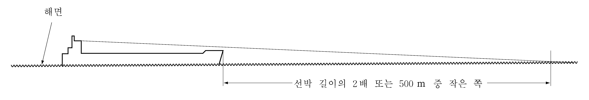
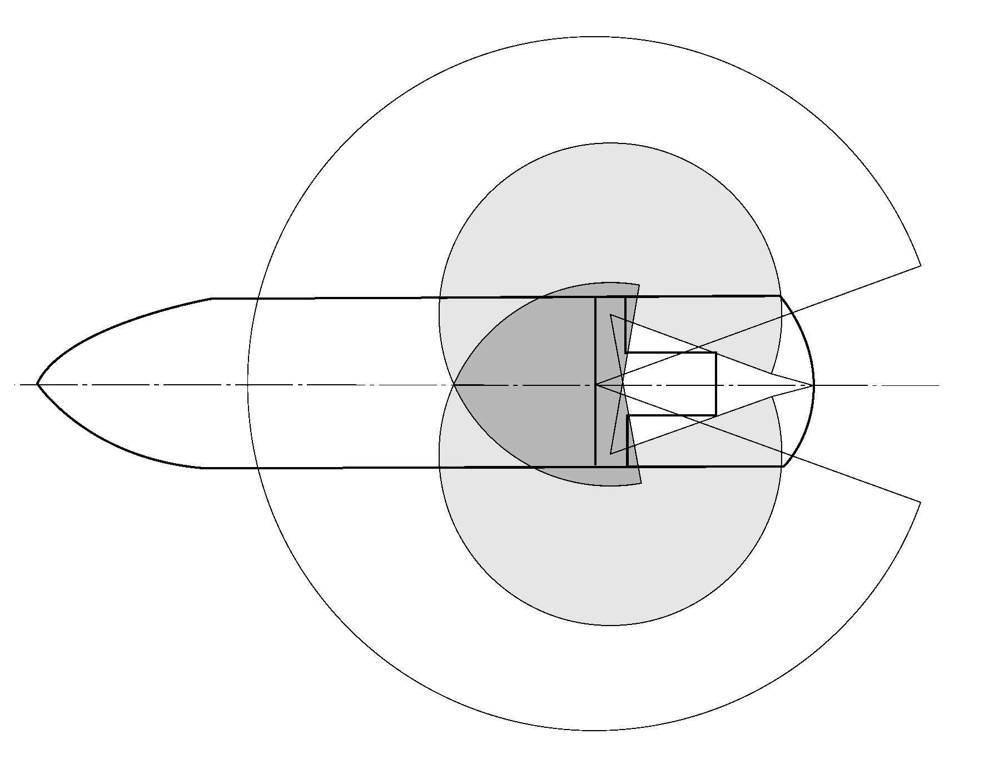
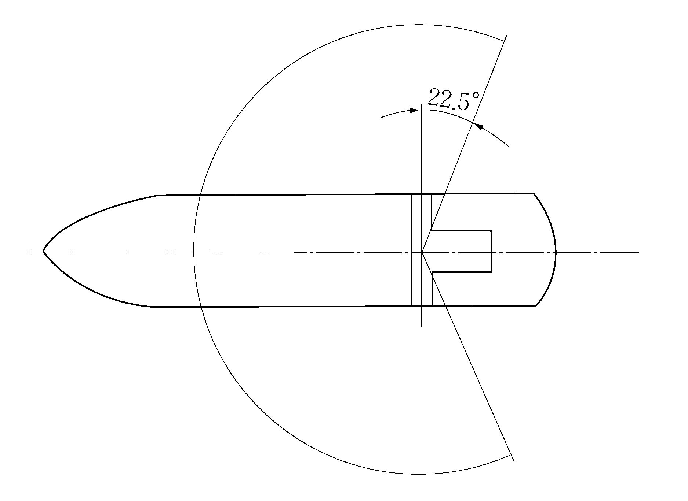
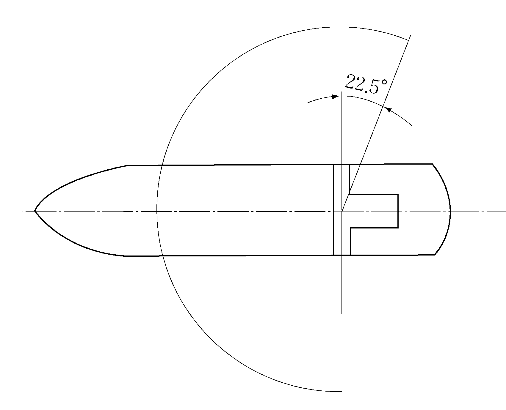
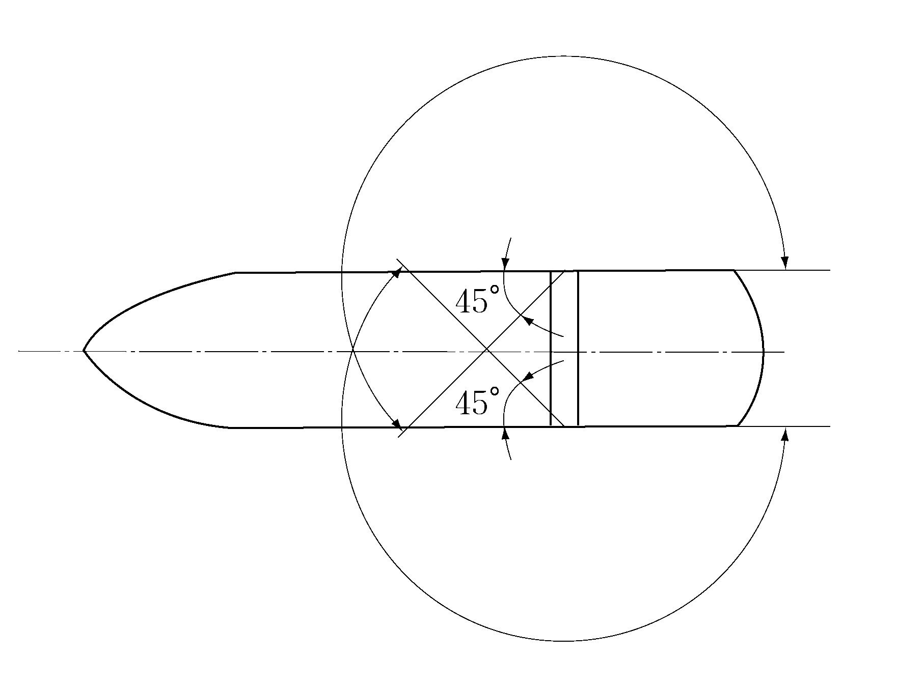
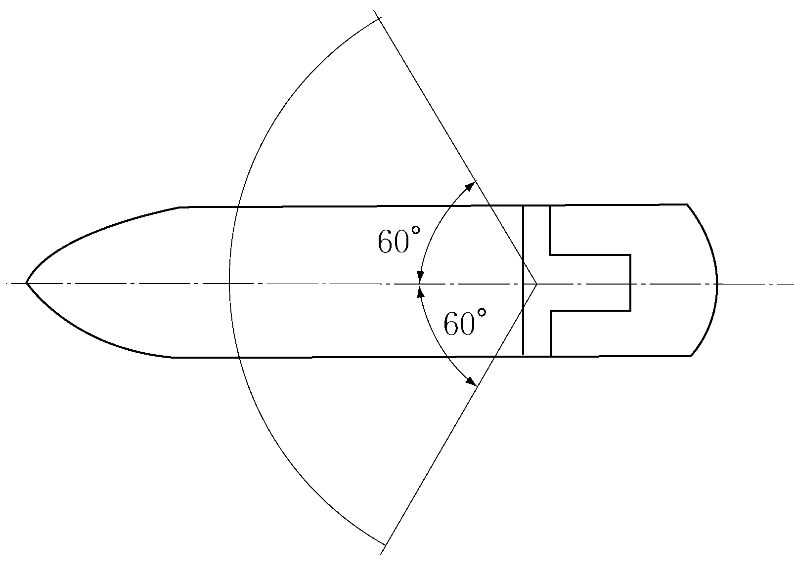
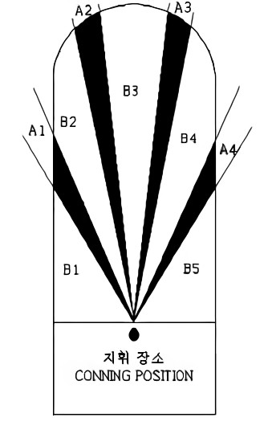

# 제9편 추가설비

> 선급 및 강선규칙/적용지침 / RA-09-K / 2025 / KO / Rules

## 제 5 장 항해선교설비

### 제 1 절 일반사항

#### 101. 일반사항

- **1.** **적용**
  이 장은 우리 선급에 부기부호로서 등록하고자 하는 선박의 선교배치 및 작업환경, 항해기기 및 사고예방시스템(이하, 이들 설비를 **항해선교설비** 라 한다.)에 적용한다.
- **2.** **동등효력**
  이 장의 일부에 적합하지 않은 항해선교설비라 하더라도, 우리 선급이 적합한 것으로 동등한 효력이 있다고 인정하는 경우에는 적합한 것으로 간주한다.
- **3.** **새로운 개념에 의한 설비**
  이 장과는 다른 개념에 의해서 설계된 항해선교설비에 있어서는, 우리 선급은 적용 가능한 범위로 이 장의 규정을 적용함과 동시에, 필요에 따라 이 장의 규정 이외에 관련된 규정의 적용을 요구할 수 있다.
- **4.** **규정의 증감**
  우리 선급은 선박의 선적, 종류, 항해구역에 따라 이 장의 규정 일부를 증감할 수 있다.
- **5.** **설비부호**
  - **(1)** NBS : **3절** 및 **4절**에 규정하는 선교의 배치 및 작업환경 및 항해기기에 관하여 등록을 한 선박
  - **(2)** NBS1 : **3절**부터 **5절**에 규정하는 선교의 배치 및 작업환경, 항해기기 및 사고예방시스템에 관하여 등록을 한 선박
  - **(3)** NBS2 : **3절**부터 **6절**에 규정하는 선교의 배치 및 작업환경, 항해기기, 사고예방시스템 및 선교작업 지원시스템에 관하여 등록을 한 선박
- **6.** **정의**
  이 장에서 사용하는 용어의 정의는 다음과 같다.

### 제 2 절 항해선교설비의 검사

#### 201. 일반사항

- **1.** **검사의 종류**
  우리 선급에 등록을 한 또는 등록을 받고자 하는 항해선교설비는 다음의 검사를 받아야 한다.
- **2.** **검사의 시기**
  - **(1)** 등록검사는 선주 또는 선박검사 신청자로부터 등록신청이 있을 경우 실시한다.
  - **(2)** 등록유지검사는 선급의 정기적 검사와 동일하게 실시한다.

#### 202. 등록검사

- **1.** **제출도면 및 자료**
  - **(1)** 등록검사를 받고자 하는 NBS선의 항해선교설비에 대하여는, 다음의 도면 및 자료를 각 3부씩 제출하여 우리 선급의 승인을 받아야 한다.
    - **(가)** 선교의 일반배치도(주지휘장소, 그 밖의 지휘 장소, 작업장소, 제어반 및 패널(panel)의 배치 및 통로가 표시되어 있을 것)
    - **(나)** **4절 402.**의 **2**항에 규정된 항해기기의 요목표
    - **(다)** **4절 402.**에 규정된 항해기기에 관한 전기회로계통도
    - **(라)** 시험방법 및 시험설비를 기재한 선내시험방안 및 해상시험방안
    - **(마)** 기타 우리 선급이 필요하다고 인정하는 도면 및 자료 **【지침 참조】**
  - **(2)** 등록검사를 받고자 하는 NBS1선의 항해선교설비에 대하여는, 다음의 도면 및 자료를 각 3부씩 제출하여 우리 선급의 승인을 받아야 한다.
    - **(가)** (1)호에 규정된 도면 및 자료
    - **(나)** **5절 502.**에 규정된 사고예방시스템 요목표
    - **(다)** **5절 502.**에 규정된 사고예방시스템에 관한 전기회로계통도
  - **(3)** 등록검사를 받고자 하는 NBS2선의 항해선교설비에 대하여는, 다음의 도면 및 자료를 각 3부씩 제출하여 우리 선급의 승인을 받아야 한다.
    - **(가)** (2)호에 규정된 도면 및 자료
    - **(나)** **6절 602**에 규정된 선교작업지원시스템 요목표
    - **(다)** **6절 602.**에 규정된 선교작업지원시스템에 관한 전기회로계통도
    - **(라)** **6절 601.**의 **3**항에 규정된 선교집중작업장소의 상세도(제어반 등의 치수 및 패널 배치도가 표시되어 있는 것)
- **2.** **제조공장 등에 있어서의 시험**
- **3.** **조선소 등에 있어서의 시험**
  - **(1)** 선교의 배치 및 작업환경, 항해기기 및 사고예방시스템에 대하여는 선내설치 후 가능한 한 실제에 가까운 상태로, 각각 효율적으로 제작되어 있다는 것 또는 작동한다는 것을 미리 제출된 시험방안에 따라 검사 및 시험하여야 한다. 단, 이들에 대한 검사 및 시험의 일부를 해상시운전 시 행할 수 있다.
  - **(2)** 시험은 다음에 열거하는 사항에 대하여 확인을 하여야 한다.
    항해선교설비의 배치 및 선교의 작업환경이 항해자가 선교 상의 작업장소에서 적절한 견시를 하는 것과 항해업무 및 선교에 할당된 다른 기능을 행하는 것에 대하여 적절함을 확인한다.
    각 리피터 컴파스가 본선의 선체중심선에 평행하게 설치되어 있는 것을 확인한다.
    장치를 작동하여 오차가 허용범위 내에 있는 것을 확인한다.
    조타장치펌프의 변환이 원활히 행하여지는 것을 확인한다.
    선교 항해당직 경보장치는 설정된 확인간격이 경과한 경우에, 선교 및 기타의 장소에서 경보를 발하는 것을 확인한다.
    경보 및 경고전송시스템은 항해자의 대응이 30초 이내에 선교에서 확인되지 않은 경우에는 자동적으로 선장, 지정된 항해자 및 공용실에 전송되는 것을 확인한다. 선교 항해당직 경보장치의 경보가 전송되는 것도 함께 확인한다.
    항해 및 조선작업에 필요한 정보의 표시기능 및 경보기능을 확인한다.
    해도표시기능, 자선위치표시기능, 항로계획기능, 레이더 및 ARPA 정보의 추가기능을 확인한다.
    선교정보시스템, 전자해도시스템 및 자동추적장치가 이상을 일으킨 경우, 가시가청경보가 발하는 것을 확인한다.
    - **(가)** 선교의 배치 및 작업환경
    - **(나)** 항해기기
      - **(a)** 자이로컴파스 리피터
      - **(b)** 음향측심장치
      - **(c)** 조타장치펌프의 변환 및 조작스위치
      - **(d)** 전원공급
      - **(i)** 항해기기용 분전반으로의 주전원공급을 정지한 경우, 가시가청경보를 발하여 자동적으로 비상전원으로 변환되는 것을 확인한다.
        - **(ii)** 항해기기용 분전반으로의 전원공급이 정지된 후 45초 이내에 복구된 경우, 항해기기의 모든 기본적인 기능이 통상 상태로 복구하는 것을 확인한다.
    - **(다)** 사고예방시스템(NBS1선 및 NBS2선)
      - **(a)** 선교 항해당직 경보장치
      - **(b)** 경보 및 경고전송시스템
      - **(c)** 시스템의 감시
      - **(i)** 선장실에서의 선교 항해당직 경보장치 및 경보 및 경고전송시스템이 정상으로 작동하고 있다는 표시등을 확인한다.
        - **(ii)** 선교 항해당직 경보장치 및 경보 및 경고전송시스템에 이상이 생긴 경우, 가시가청경보가 선교 및 선장실에 발하여지는 것을 확인한다.
      - **(d)** 전원공급
      - **(i)** 사고예방시스템용 분전반으로의 주전원공급이 정지한 경우, 가시가청경보를 발하여 자동적으로 비상전원으로 변환되는 것을 확인한다.
        - **(ii)** 사고예방시스템용 분전반으로의 전원공급이 정지한 후 45초 이내에 복구된 경우, 사고예방시스템의 모든 기본적인 기능이 통상 상태에 복구하는 것을 확인한다.
    - **(라)** 선교작업지원시스템(NBS2선)
      - **(a)** 선교정보시스템
      - **(b)** 전자해도시스템
      - **(c)** 시스템의 감시
      - **(d)** 전원공급
      - **(i)** 선교작업지원시스템용 분전반으로의 주전원공급이 정지한 경우, 가시가청경보가 발하여 자동적으로 비상전원으로 변환되는 것을 확인한다.
        - **(ii)** 선교작업지원시스템용 분전반으로의 전원공급이 정지한 후 45초 이내에 복구한 경우, 선교작업지원시스템의 모든 기본적인 기능이 통상 상태에 복구하는 것을 확인한다.
- **4.** **해상시험**
  - **(1)** 선교의 배치 및 작업환경, 항해기기 및 사고예방시스템은 해상시험 시에 미리 제출된 시험방안에 따라 검사 및 시험을 하고 양호한 결과이어야 한다.
  - **(2)** 시험은 다음에 열거하는 사항에 대하여 확인을 한다.
    항해기기의 시험에는 **5절 501.**의 **4**항 (1)호에서 요구하는 경보확인(NBS1선 및 NBS2선에 한한다.) 및 다음 사항을 포함한다.
    선박이 항해 중에 해저 깊이를 기록하는 기능을 확인한다.
    안개신호가 적절하게 발하는가를 확인한다.
    **3**항 (2)호 (다) (a) 및 (b)에 따른다.
    - **(가)** 선교의 배치 및 작업환경
      - **(a)** 야간항해를 포함하는 모든 항해상태에 있어서 항해선교설비의 배치 및 선교의 작업환경이 항해자가 선교 상의 작업장소에서 적절한 견시를 하는 것과 항해업무 및 선교에 할당된 다른 기능을 행하는 것에 대하여 적절함을 확인한다.
      - **(b)** 진동 및 소음을 측정하고 진동 및 소음이 **3절 302.**의 **2**항 및 **3**항을 만족하는가를 확인한다.
    - **(나)** 항해기기
      - **(a)** 자동충돌예방보조장치
      - **(i)** 목표를 포착하여 포착한 목표의 침로 및 속도정보를 진표시 및 상대표시하는 기능을 확인한다.
        - **(ii)** 포착한 목표까지의 방향 및 거리표시 기능을 확인한다.
        - **(iii)** CPA 및 TCPA의 표시기능을 확인한다.
        - **(iv)** 포착한 목표가 위험 구역 내에 침입하였을 때의 경보기능을 확인한다.
      - **(b)** 레이더
      - **(i)** 전방에 있는 2개 이상의 고정지표(1개는 육상지표로 한다)에 대한 방향 및 거리 표시기능을 확인한다.
        - **(ii)** 측정오차가 레이더의 원래 오차보다 크지 않는 것을 확인한다.
      - **(c)** 자동조타장치
      - **(i)** 미리 설정된 침로에 선수방위를 자동적으로 유지하는 기능을 확인한다.
        - **(ii)** 타각이 미리 제한된 각도에 도달한 것을 표시하는 기능을 확인한다.
        - **(iii)** 선수방위가 미리 설정된 각도를 넘어 변화하는 경우에 가시가청 경보를 발하는 기능을 확인한다. *(2018)*
      - **(d)** 속력 및 거리표시장치
      - **(i)** 선박의 속력시험 중에 항해속력 및 항해거리를 표시하는 기능을 확인하여 표시된 항해속력과 속력시험에서의 결과를 비교한다.
        - **(ii)** 선박의 정지시험 등의 저속항해 중에 항해속력 및 항해거리를 표시하는 기능을 확인한다.
      - **(e)** 음향측심장치
      - **(f)** 기적제어장치
      - **(g)** 선내통신장치
      - **(i)** 주전원을 상실하였을 때의 선내통신 기능을 확인한다.
        - **(ii)** 선교에서의 우선기능을 확인한다.
    - **(다)** 사고예방시스템(NBS1선 및 NBS2선)
    - **(라)** 선교작업지원시스템(NBS2선)
      - **(a)** **3**항 (2)호 (라) (a) 및 (b)에 따른다.
      - **(b)** 자동추적장치
      - **(i)** 전자해도 상의 계획항로에 따라 항로를 유지하는 기능을 확인한다.
        - **(ii)** 자동 변침동작은 항해자의 확인 후 이루어지는 것을 확인한다.
        - **(iii)** 변침점에서 항해자의 확인이 없는 경우에는 현침로를 유지하여 가시가청경보가 발하는 것을 확인한다.
        - **(iv)** 수동조타로의 변환기능을 확인한다.

#### 203. 등록유지검사

- **1.** **정기검사**
  - **(1)** NBS선의 항해선교설비에 대한 정기검사 시에는, (가)호부터 (다)호의 시험 및 검사를 실시하여야 한다.
    - **(가)** 항해선교설비의 현상검사
    - **(나)** **4절 402.**의 **2**항 (1)호부터 (5)호, (7)호부터 (11)호 및 (13)호부터 (16)호에 규정된 항해기기의 성능시험
    - **(다)** 전원공급을 45초간 차단한 항해기기가 통상의 작동상태로 복구하는 것의 확인시험
  - **(2)** NBS1선의 항해선교설비에 대한 정기검사 시에는, (가)호부터 (다)호의 시험 및 검사를 실시하여야 한다.
    - **(가)** (1)호에서 규정한 시험 및 검사
    - **(나)** **5절 502.**에 규정된 사고예방시스템의 성능시험
    - **(다)** 전원공급을 45초간 차단한 후에 사고예방시스템이 통상의 작동상태로 복구하는 것의 확인시험
  - **(3)** NBS2선의 항해선교설비에 대한 정기검사 시에는, (가)호부터 (다)호의 시험 및 검사를 실시하여야 한다.
    - **(가)** (2)호에서 규정한 시험 및 검사
    - **(나)** **6절 602.**에 규정된 선교작업지원시스템의 기능시험
    - **(다)** 전원공급을 45초간 차단한 후에 선교작업지원시스템이 통상의 작동상태로 복구하는 것의 확인시험
- **2.** **연차검사**
  - **(1)** NBS선의 항해선교설비에 대한 연차검사 시에는, (가)호 및 (나)호의 시험 및 검사를 실시하여야 한다.
    - **(가)** 항해선교설비의 현상검사
    - **(나)** 다음 기기의 성능시험
      - **(a)** 자동충돌예방보조장치(ARPA)
      - **(b)** 전자식 선위측정장치
      - **(c)** 레이더
      - **(d)** VHF 무선전화장치
      - **(e)** 선내통신장치
      - **(f)** 기타 우리 선급이 필요하다고 인정하는 기기 **【지침 참조】**
  - **(2)** NBS1선의 항해선교설비에 대한 연차검사 시에는, (가)호 및 (나)호의 시험 및 검사를 실시하여야 한다.
    - **(가)** (1)호에서 규정한 시험 및 검사
    - **(나)** 다음 기기의 성능시험
      - **(a)** 선교 항해당직 경보장치
      - **(b)** 경보 및 경고전송시스템
  - **(3)** NBS2선의 항해선교설비에 대한 연차검사 시에는, (가)호 및 (나)호의 시험 및 검사를 실시하여야 한다.
    - **(가)** (2)호에서 규정한 시험 및 검사
    - **(나)** 다음 기기의 성능시험
      - **(a)** 선교정보시스템
      - **(b)** 전자해도시스템(ECDIS)
      - **(c)** 자동추적장치

### 제 3 절 선교배치 및 작업환경

#### 301. 일반사항

- **1.** **적용**
  이 절의 규정은 NBS선, NBS1선 및 NBS2선의 선교배치 및 작업환경에 적용한다.
- **2.** **일반사항**
  - **(1)** 선교구조, 제어반의 배치, 기기의 위치 및 선교의 작업환경은 항해자가 선교 상의 작업장소에서 적절한 견시를 할 수 있음과 동시에 항해업무 및 선교에 부여된 다른 기능을 할 수 있어야 한다.
  - **(2)** 항해 및 조선작업장소는 통상의 조작상태로 유효한 조작을 할 수 있도록 배치하여야 한다. 모든 관련된 계기 및 조작부는 작업장소에서 용이하게 볼 수 있고 청취 및 접근이 가능한 것이어야 한다.
  - **(3)** 항해 및 조선에 관계되는 업무를 하기 위하여, 항해, 조선작업장소 및 지휘 장소에서의 시야는 본선의 안전에 영향을 주는 모든 물체 및 타 선박을 감시할 수 있는 것이어야 한다.
  - **(4)** 항해자는 조타실에서 선교구조물 바로 앞 구역을 감시하기 위하여 가능한 한, 선교 전면창의 적어도 1개에 밀접하게 접근할 수 있어야 한다.
  - **(5)** 선교는 가능한 한 연돌을 제외한 건현갑판 상부의 모든 구조물보다 상부에 배치하여야 한다.
  - **(6)** 선교에서의 시계는 다음에 따른다.
    
    **그림 9.5.1 전방시야**
    
    **그림 9.5.2 360° 시계**
    
    **그림 9.5.3 항해 및 조선작업장소와 지휘장소** 
    **그림 9.5.4 감시 작업장소**
    
    **그림 9.5.5 선교윙 작업장소** 
    **그림 9.5.6 조타수 작업장소**

    |  | *정횡 전방 ∠(A1+A2+A3+A4+B1+B2+B3+B4+B5) = 180° * 각 맹목구역 ∠(A2,A3) ≤5° (정선수에서 각 현 10° 이내에 포함될 경우) ∠(A1,A4) ≤10° * 총맹목구역 ∠(A1+A2+A3+A4) ≤20° * 두개의 맹목구역 사이의 가시구역 ∠B2,B3,B4 ≥5° |
    | --- | --- |
    - **(가)** 지휘 장소에서의 해면의 전방시야는 선박의 흘수, 트림 및 갑판 화물(컨테이너 등)과는 상관없이 선수의 전방으로부터 양현 10$\mathrm{{}^{\circ}}$ 이내에서 선박 길이의 2배 또는 500 $\mathrm{m}$ 중 작은 쪽의 거리까지 가려져서는 아니 된다. (**그림 9.5.1** 참조)
    - **(나)** 전면 창 하부 틀의 높이는 작업장소에 앉아 있는 사람이 선수 끝을 볼 수 있도록 하여야 한다. 또한, 해당갑판 상부에 있는 전면창의 하부 높이는 가능한 한 낮게 유지하여야 하며, 1,000 $\mathrm{mm}$를 초과하여서는 아니 된다.
    - **(다)** 조타실 안에서 어느 방향으로든 선박과 등대와 같은 항해에 참고해야 할 모든 물체를 관찰할 수 있어야 한다.
      - **(a)** 조타실의 범위 내에서 움직이는 관찰자가 선박 주변의 360$\mathrm{{}^{\circ}}$시계를 확보하여야 한다. (**그림 9.5.2** 참조)
      - **(b)** 카메라와 같은 동등한 대체 수단을 이용하여 시야가 가려진 부분이나 사각지대를 확인하는 것을 허용할 수 있다. *(2024)*
    - **(라)** 항해 및 조선작업장소와 지휘 장소에서 항해사의 시야는 국제해상충돌예방규칙(COLREG 72)을 준수할 수 있도록 충분하여야 한다.
      - **(a)** 항해 및 조선작업장소와 지휘 장소로부터의 수평 시야는 한쪽 현의 정횡후방 22.5$\mathrm{{}^{\circ}}$에서 전방을 거쳐 다른 쪽 현의 정횡후방 22.5$\mathrm{{}^{\circ}}$까지 되어야 한다. (**그림 9.5.3** 참조)
      - **(b)** 감시 작업장소에서의 시야는, 적어도 선수로부터 우현 115$\mathrm{{}^{\circ}}$, 좌현 90$\mathrm{{}^{\circ}}$를 이루는 원호의 범위를 포함하여야 한다. (**그림 9.5.4** 참조)
      - **(c)** 선교 윙 위에 있는 작업장소로부터의 시야는 반대쪽 현 45${}^{\circ}$와 선측 180${}^{\circ}$ 원호의 범위를 포함하여야 한다. (**그림 9.5.5** 참조)
    - **(마)** 조타수의 시야는 안전하게 기능을 수행할 수 있도록 충분하여야 한다.
      - **(a)** 수동조타를 위해 작업장소로부터의 조타수의 시야는 정 선수 방향으로부터 각 측면에서 최소 60${}^{\circ}$까지 확보하여야 한다. (**그림 9.5.6** 참조)
      - **(b)** 작업장소는 요구되는 시야를 확보하기 위해 전면 창문 바로 뒷편에 위치해서는 아니 된다.
    - **(바)** 화물 또는 하역장치 및 다른 장애물 등에 의해 가려진 맹목구역은 최소화하여야 하며 항해 및 조선작업장소와 지휘 장소로부터 안전한 견시에 영향을 미치지 않아야 한다. (**그림 9.5.7** 참조)
      - **(a)** 항해 및 조선작업장소와 지휘 장소에서 바라볼 때 해면의 시야를 방해하는 선교의 정횡보다 전방에 있는 외부의 화물, 하역장치 또는 다른 장애물로 인한 맹목구역의 총합계 각도는 20${}^{\circ}$를 초과해서는 아니 되며, 각 개별 맹목구역도 10${}^{\circ}$를 초과하여서는 아니 된다.
      - **(b)** 정선수에서 각 현 10${}^{\circ}$이내의 맹목구역은 5${}^{\circ}$를 넘어서는 아니 되며, 두개의 맹목구역 사이의 가시구역은 5${}^{\circ}$이상이어야 한다.
    - **(사)** 선교 윙으로부터는 선측이 보여야 하며 특히 예선 또는 파일럿선이 접현하는 것과 본선이 안벽에 접안하는 것을 볼 수 있어야 한다. 또한, 선교 윙은 선박 최대 빔까지 연장되어야하며 선박 측면 관측은 장애가 없어야 한다.

#### 302. 선교의 작업환경

- **1.** **일반사항**
  - **(1)** 선박의 모든 설계단계에서, 선교의 인원이 쾌적한 작업환경을 확보할 수 있도록 고려하여야 한다.
  - **(2)** 조타실 내의 천장 및 벽은 각 계기 표시반을 읽는데 방해가 되지 않도록 고려하여야 한다.
  - **(3)** 선교 또는 그것에 인접하는 장소에 화장실을 설치하여야 한다.
- **2.** **진동**
  선교의 진동은 선교의 인원이 불쾌함을 느낄 정도여서는 아니 된다.
- **3.** **소음**
  선교의 소음은 항해자의 명령 및 가청경보의 청취를 방해할 정도여서는 아니 되며 또한, 선교의 인원에게 불쾌감을 줄 정도여서는 아니 된다.
- **4.** **외부음향신호**
  선교 윙에서 청취 가능한 안개신호 등의 외부음향신호는 조타실 내에서도 청취할 수 있어야 한다.
- **5.** **조명**
  - **(1)** 선교에 요구되는 조명은 항해자의 야간 시계를 방해하지 않도록 설계되어야 한다.
  - **(2)** 항해 중에 조명이 필요한 장소 및 기기에 사용되는 조명은 항해자의 야간 시계를 방해하지 않도록 적색으로 하여야 한다. 이 조명은 타 선박이 항해등과 오인하지 않도록 배치되어야 한다. 적색등은 빛깔을 식별할 때의 혼동을 피하기 위하여 해도책상의 조명에 사용하여서는 아니 된다.
- **6.** **공기조화설비** ***(2017)***
  조타실에는 공기조화설비를 갖추어야 하며, 항해자가 조타실내의 온도를 용이하게 설정할 수 있는 것이어야 한다.
- **7.** **선교인원의 안전**
  - **(1)** 선교에 설치되는 기기 및 계기에는, 선교 인원의 부상 원인이 될 가능성이 있는 예리한 각 및 돌기가 있어서는 아니 된다.
  - **(2)** 황천 시 항해자의 안전을 위해 조타실 내부 또는 조타실 내 기기의 주위에 충분한 난간 또는 동등물을 갖추어야 한다.
  - **(3)** 선교바닥에는 마른상태 또는 습기 찬 상태에서도 유효한 미끄럼방지 수단을 설치하여야 한다.
  - **(4)** 선교 윙의 문은 용이하게 개폐할 수 있어야 한다. 이 문을 임의의 위치에서 고정할 수 있는 수단을 갖추어야 한다.
  - **(5)** 조타실에 항해자를 위한 의자를 장비하는 경우, 황천 시의 상태를 고려한 고정수단을 갖추어야 한다.

### 제 4 절 항해기기

#### 401. 일반사항

- **1.** **적용**
  이 절의 규정은 NBS선, NBS1선 및 NBS2선의 항해기기에 적용한다.
- **2.** **일반사항**
  - **(1)** 항해기기는 설치된 선박이 받을 가능성이 있는 여러 종류의 해상상태, 진동, 습도, 온도 및 전자파방해 등의 상태 하에서도 연속적으로 사용할 수 있는 것이어야 한다.
  - **(2)** 전산화된 기기가 컴퓨터 네트워크를 통하여 연결된 경우에는, 네트워크의 고장이 각각의 기기의 기능에 지장을 주는 것이어서는 아니 된다.
- **3.** **전원공급**
  - **(1)** 전기적으로 작동되는 모든 항해기기용 분전반은 선교 또는 선교에 인접한 장소에 설치하여야 한다. 이들 분전반은 주전원 및 비상전원의 독립된 2회로에서 급전되어야 하고, 각 회로의 케이블은 전장에 걸쳐 될 수 있는 한 분리하여 포설하여야 한다. 각각의 항해기기는 독립적으로 분전반에 접속되어야 한다. 이들의 분전반은 **5장**에 규정하는 사고예방시스템과 겸용할 수 있다. *(2018)*
  - **(2)** 분전반으로의 전원공급은 두 전원이 자동적으로 변환되는 것이어야 한다.
  - **(3)** 분전반으로의 주전원공급이 상실된 경우에는, 선교에 가시가청경보를 발하여야 한다. *(2018)*
  - **(4)** 공급된 전원이 정전 후 45초 이내에 복귀한 후, 항해기기의 모든 기본적인 기능이 복구되어야 한다. *(2018)*

#### 402. 항해기기

- **1.** **일반사항**
  - **(1)** 항해 및 조선작업장소의 계기 및 조작부는, 항해자가 다음 사항을 쉽게 할 수 있도록 배치하여야 한다.
    - **(가)** 선위, 침로, 항적 및 선속의 결정 및 기록
    - **(나)** 통항 상황의 판단
    - **(다)** 충돌방지 조선의 결정
    - **(라)** 변 침
    - **(마)** 변 속
    - **(바)** 항해 및 조선에 관계된 선내통신 및 VHF 무선전화장치를 사용한 선외통신
    - **(사)** 음향신호 작동
    - **(아)** 음향신호 청취
    - **(자)** 침로, 선속, 항적, 프로펠러회전수(각도), 타각, 수심 등의 항해정보 감시
    - **(차)** 항해정보의 기록
  - **(2)** 항해기기는 부주의에 의한 오동작이 없도록 배치하여야 한다.
  - **(3)** 항해기기는 밤낮을 막론하고 용이하고 정확하게 판독할 수 있도록 설계되어야 한다.
  - **(4)** 각 항해기기는 표시면이 항해자의 시선을 향하도록 설치하거나 시선이 있는 각도에서 변화하는 경우는 그 평균치에 향하도록 설치하여야 한다.
  - **(5)** 항해기기는 반사 또는 강한 빛에 의한 영향을 최소로 하도록 설계 및 설치하여야 한다.
- **2.** **항해기기**
  선교에는 (1)호부터 (17)호의 항해기기를 설치하여야 한다.
  - **(1)** (3)호에 규정하는 레이더에 독립 또는 조합된 것으로서 다음에 적합한 자동충돌예방보조장치(ARPA)
    - **(가)** 위험까지의 시간을 고려하여 6분에서 30분의 범위로 설정할 수 있는 경고가 항해자에게 발생하는 것
    - **(나)** 진운동지시방식 및 상대운동지시방식의 2개 방식을 구비하는 것
    - **(다)** 일광에서 시각으로 확인할 수 있는 표시부를 구비하는 것
    - **(라)** 자동적으로 20개 이상의 목표를 포착하고 추적할 수 있는 것
    - **(마)** guard zone, 화질조정장치, 경고 및 최근 거리(CPA) 및 최접근시간(TCPA)의 설정기능을 구비하는 것
    - **(바)** 포착한 목표의 변침 또는 변속에 의한 영향을 시뮬레이션할 수 있는 기능을 구비하는 것
    - **(사)** 자기진단기능을 구비하는 것
  - **(2)** 항해구역에 알맞은 전자식 선위 측정장치
  - **(3)** 2개의 독립한 레이더. 그 중의 1개는 X-band로 작동하는 것
  - **(4)** 자이로컴퍼스의 리피터 및 수정장치
  - **(5)** 다음에 적합한 자동조타장치
    - **(가)** 자동조타장치와는 독립된 장치로부터 항해자에게 침로이탈경보를 알려줄 것
    - **(나)** 오버라이드장치가 항해 및 조선작업장소에 구비되어 있는 것
  - **(6)** 속력 및 거리 표시장치
  - **(7)** 음향측심장치
  - **(8)** 조타실의 공기조화설비의 제어장치
  - **(9)** NAVTEX 수신기 및 항해구역에 따라서는 EGC 수신기
  - **(10)** 항해등 등의 등화신호 스위치 및 표시기
  - **(11)** 조타장치펌프의 변환 및 조작스위치
  - **(12)** 기적제어장치
  - **(13)** 윈도우와이퍼 및 윈도우워시 제어장치
  - **(14)** 주작업장소의 콘솔조명제어장치
  - **(15)** 다음에 적합한 선내통신장치
    - **(가)** 주전원이 상실된 경우를 포함한 어떠한 경우라도, 항해자가 다른 사관과 용이하게 대화를 할 수 있는 것
    - **(나)** 선교에 우선권이 있는 것
  - **(16)** 지휘 장소에서 즉시 사용할 수 있는 VHF 무선전화장치
  - **(17)** 자동화설비규칙에 적합한 주추진기관의 원격제어장치
- **3.** **기기의 조명장치 및 개별조명**
  - **(1)** 모든 기기의 표시등 및 조명장치는 불필요한 반사 또는 강한 빛에 의한 기기에의 영향을 방지하도록 설계 및 설치하여야 한다.
  - **(2)** 선교의 전방에는 불필요한 광원을 없애기 위하여 안전한 항해 및 조선에 필요한 기기만을 배치하여야 한다.
  - **(3)** 경고 및 경보표시등은 통상 상태 또는 안전상태에서는 점등되지 않도록 설계하여야 한다. 이들의 표시 등을 시험하는 수단이 구비되어야 한다.
  - **(4)** 기기의 모든 조명장치 및 조명은 소등할 때까지 조정할 수 있는 것이어야 한다. 단, 상시 시각으로 확인할 수 있어야 하는 경고/경보표시등 및 조명조정장치의 조명은 예외로 한다.
  - **(5)** 각 기기는 개별 조명 조정장치를 구비하여야 한다. 단, 통상적으로 동시에 사용되는 기기에 있어서는 공통의 조명 조정장치를 구비할 수 있다.

### 제 5 절 사고예방시스템

#### 501. 일반사항

- **1.** **적용**
  이 절의 규정은, 원양항해 시 통상의 운항조건 하에서 1인 당직자에 의하여 항해하도록 계획된 선박을 위한 설비로서 항해자의 부주의로 인해 생기는 사고를 예방하는 시스템(이하 「사고예방시스템」이라 한다.)에 적용한다.
- **2.** **일반사항**
  - **(1)** 사고예방시스템은 설치된 선박이 받을 가능성이 있는 여러 종류의 해상상태, 진동, 습도, 온도 및 전자파방해의 상태 하에서도 연속으로 사용할 수 있는 것이어야 한다.
  - **(2)** 전산화된 기기가 컴퓨터 네트워크를 통하여 연결된 경우에는, 네트워크의 고장이 각각의 기기의 기능에 지장을 주는 것이어서는 아니 된다.
- **3.** **외부음향신호**
  선교 윙의 문이 닫혀 진 상태라도, 선교 윙에서 청취 가능한 안개신호 등의 외부음향신호를 조타실 내의 항해자가 청취할 수 있도록 그러한 신호를 조타실 내에서 재발생시키는 장치를 설치하여야 한다.
- **4.** **항해기기**
  - **(1)** **4절 402.**의 **2**항의 항해기기는 다음의 경우에 경보를 발하는 것이어야 한다.
    - **(가)** 변침점에 접근한 경우(변침점 접근경보)
    - **(나)** 선위가 정해진 항로로부터 일정한 거리를 벗어난 경우(항로이탈경보)
    - **(다)** 수심이 미리 설정한 값보다 얕아진 경우
  - **(2)** **4절 402.**의 **2**항의 (1)호, (5)호 및 (11)호부터 (17)호에 열거하는 장치 또는 제어장치는 항해자가 용이하게 접근할 수 있어야 하며, 동시에 그 장치들을 사용함에 있어서 시야가 방해되지 않도록 적절히 배치하여야 한다.
- **5.** **전원공급**
  - **(1)** 전기적으로 작동되는 모든 사고예방시스템용 분전반은 선교 또는 선교에 인접한 장소에 설치하여야 한다. 이들 분전반은 주전원 및 비상전원의 독립된 두 개의 회로에서 급전하여야 하고 각 회로의 케이블은 전장에 걸쳐 될 수 있는 한 분리하여 부설하여야 한다. 각각의 사고예방시스템은 독립적으로 분전반에 접속하여야 한다. 이들 분전반을 **4절**에 규정하는 항해기기와 겸용할 수 있다. *(2018)*
  - **(2)** 분전반으로의 전원공급은 두 전원이 자동적으로 변환되는 것이어야 한다.
  - **(3)** 분전반으로의 주전원공급이 상실된 경우는, 선교에 가시가청경보를 발하여야 한다. *(2018)*
  - **(4)** 공급된 전원이 정전 후 45초 이내에 복귀한 후, 사고예방시스템의 모든 기본적인 기능이 복구되어야 한다. *(2018)*

#### 502. 사고예방 시스템

- **1.** **일반사항**
  - **(1)** **5절 502.**의 **2**항에 규정하는 선교 항해당직 경보장치 및 **5절 502.**의 **3**항에 규정하는 경보 및 경고전송시스템이 정상으로 작동하고 있는 것을 나타내는 표시등을 선장실에 구비하여야 한다.
  - **(2)** **5절 502.**의 **2**항에 규정하는 선교 항해당직 경보장치 및 **5절 502.**의 **3**항에 규정하는 경보 및 경고전송시스템에 이상이 발생한 경우, 선교 및 선장실에 가시가청경보를 발하여야 한다.
- **2.** **선교 항해당직 경보장치**
  다음에 적합한 선교 항해당직 경보장치를 구비하여야 한다.
  - **(1)** 선교에 경계태세를 취하고 있는 항해자가 있는지를 설정한 시간마다 확인할 수 있는 시스템일 것
  - **(2)** 선교의 기능을 현저히 방해하지 않은 것
  - **(3)** 통상의 사용방법 이외로서는 조작되지 않도록 설계 및 설비되는 것
  - **(4)** 12분까지의 확인간격을 조정할 수 있는 것으로, 또한, 선장만이 적당한 간격을 설정할 수 있도록 제작, 설치 및 배치되는 것
  - **(5)** 설정된 확인간격이 경과한 경우에, 선교 및 기타의 장소에서 확인할 수 있는 경보를 발하는 것 **【지침 참조】**
  - **(6)** 항해 및 조선작업장소와 적절한 견시를 할 수 있는 선교 내의 적당한 장소에서 항해자에 의한 확인이 이루어지는 것
  - **(7)** **5절 502.**의 **3**항에 규정하는 경보 및 경고전송시스템에 접속되는 것
- **3.** **경보 및 경고전송시스템 【지침 참조】**
  다음에 적합한 경보 및 경고전송시스템을 갖추어야 한다.
  - **(1)** 항해자의 대응이 필요한 경보 및 경고의 확인은 선교에서만 가능한 것이어야 한다.
  - **(2)** 항해자의 대응이 필요한 경보 및 경고가 30초 이내에 선교에서 확인되지 않은 경우에는, 자동적으로 선장, 지정된 항해자 및 공용실에 전송되어야 한다. **【지침 참조】**
  - **(3)** 경보 및 경고전송시스템은 고정설치된 것이어야 한다.
  - **(4)** 항해자가 조작하고 (2)호에 규정하는 장소에 확실한 가청경보를 발하는 장치가 선교에 구비되어야 한다. 이 목적을 위하여 (3)호에 규정하는 설비를 사용할 수 있다.

### 제 6 절 선교작업지원시스템

#### 601. 일반사항

- **1.** **적용**
  이 절의 규정은, 통상의 운항조건하에서 1인 당직자에 의하여 항해하도록 계획된 선박을 위한 설비로서, 항해자의 작업을 지원하기 위한 시스템(이하, **선교작업지원시스템** 이라 한다.)에 적용한다.
- **2.** **일반사항**
  - **(1)** 선교작업지원시스템은 설치된 선박이 받을 가능성이 있는 여러 종류의 해상상태, 진동, 습도, 온도 및 전자파방해 등의 상태 하에서도 연속적으로 사용할 수 있는 것이어야 한다.
  - **(2)** 전산화된 기기가 컴퓨터 네트워크를 통하여 연결된 경우는, 네트워크의 고장이 각각의 기기의 기능에 지장을 주는 것이어서는 아니 된다.
- **3.** **선교집중작업소**
  - **(1)** 선교집중작업장소는 **4절 402.**의 **1**항 (1)호에 나타내는 항해 및 조선작업을 한사람이 효율적으로 행하고, 또한, 2인 이상의 항해자가 협력하여 항해 및 조선작업을 할 수 있도록 기기를 배치하여야 한다.
  - **(2)** 적어도 **4절 402.**의 **2**항 (1)호, (5)호 및 (11)호부터 (17)호 및 **6절 602.**의 **2**항 및 **3**항에 열거하는 장치 또는 제어기능은 선교집중작업장소에서 항해자가 쉽게 조작할 수 있도록 집중 배치하여야 한다.
- **4.** **전원공급**
  - **(1)** 전기적으로 작동되는 모든 선교작업지원시스템용 분전반은 선교 또는 선교에 인접한 장소에 설치하여야 한다. 이들 분전반은 주전원 및 비상전원의 독립된 두 개의 회로에서 급전하여야 하고, 각 회로의 케이블은 전장에 걸쳐 될 수 있는 한 분리하여 부설하여야 한다. 각각의 선교작업지원시스템은 독립적으로 분전반에 접속하여야 한다. 이들 분전반을 **4절** 및 **5절**에 규정하는 항해기기 및 사고예방시스템과 겸용할 수 있다. *(2018)*
  - **(2)** 분전반으로의 전원공급은 두 전원이 자동적으로 변환되는 것이어야 한다.
  - **(3)** 분전반으로의 주전원공급이 상실된 경우는, 선교에 가시가청경보를 발하여야 한다. *(2018)*
  - **(4)** 공급된 전원이 정전 후 45초 이내에 복귀한 후, 선교작업지원시스템의 모든 기본적인 기능이 복구되어야 한다. *(2018)*

#### 602. 선교작업지원시스템

- **1.** **일반사항**
  - **(1)** **6절 602.**의 **2**항에 규정하는 선교정보 시스템, **6절 602.**의 **3**항에 규정하는 전자해도시스템 및 **6절 602.**의 **4**항에 규정하는 자동추적장치는 자기감시기능을 갖추어야 하며, 이상이 있을 시에는 선교집중작업장소 및 선장실에 가시가청경보를 발하여야 한다.
  - **(2)** 전자해도시스템에 사용되는 전자해도는 우리 선급이 적당하다고 인정하는 것이어야 한다. **【지침 참조】**
- **2.** **선교정보 시스템**
  다음에 적합한 선교정보시스템을 갖추어야 한다.
- **3.** **전자해도시스템(ECDIS)**
  다음에 적합한 관련 백업설비가 있는 전자해도시스템을 설치하여야 한다.
- **4.** **자동추적장치(auto tracking system)**
  다음에 적합한 자동추적장치를 설치하여야 한다.
